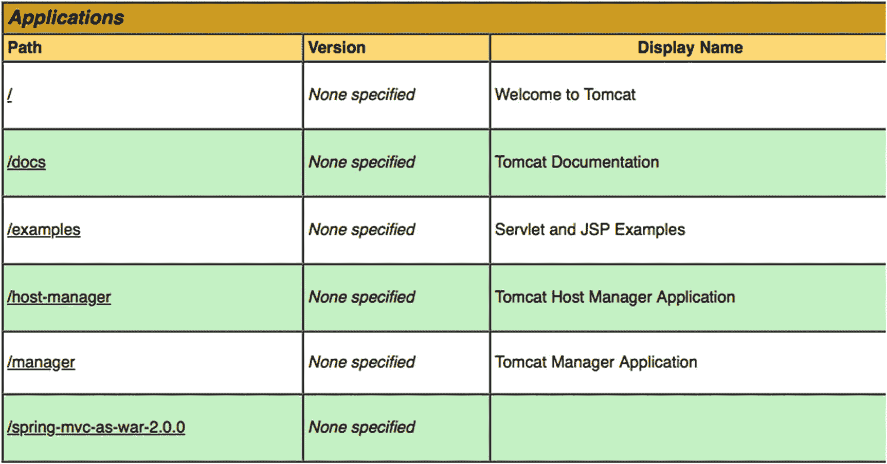
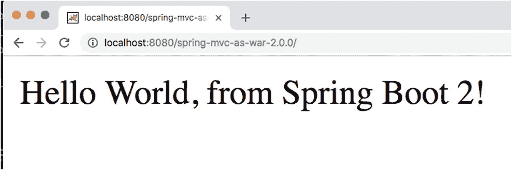
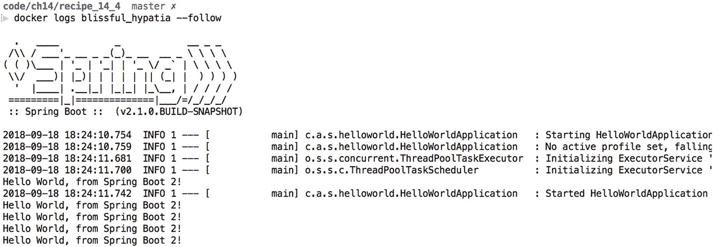
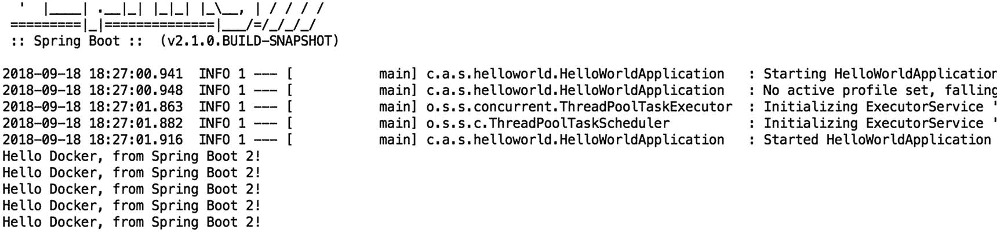

# 11. 打包

在本章中，你将了解用于打包基于 Spring Boot 的应用程序的不同解决方案。

## 11.1 创建可执行归档文件

默认情况下，Spring Boot 会创建一个 `JAR` 或 `WAR` 文件，并可通过 `java -jar your-application.jar` 运行。但是，你可能希望将应用程序作为服务器启动的一部分来运行（目前已在基于 Debian 和 Ubuntu 的系统上测试并支持）。为此，你可以使用 Maven 或 Gradle 插件来创建一个可执行的 jar 文件。

### 问题

你需要一个可执行的 `JAR` 文件，以便将其作为服务安装到你的环境中。

### 解决方案

Spring Boot Maven 和 Gradle 插件都提供了使创建的构件可执行的选项。^(⁴⁰) 这样做之后，归档文件也会变成（或表现得像）一个用于启动/停止服务的 Unix shell 脚本。

### 工作原理

要使构件可执行，你需要像这样配置 Maven 或 Gradle 插件。

### 使归档文件可执行

```
org.springframework.boot
spring-boot-maven-plugin

true

```

在 Maven 插件中，你可以将 `executable` 属性设置为 `true`，这样归档文件就变成可执行的了。

```
bootJar {
launchScript()
}
```

现在，构建你的构件之后，该构件本身即可执行，并可用于启动应用程序。现在，你只需输入 `./your-application.jar` 即可启动，而无需使用 `java -jar your-application.jar`。

### 注意

可能需要使归档文件可执行；为此请使用 `chmod +x your-application.jar`。

当使归档文件可执行时，归档文件前面会加上一个 bash 脚本。你可能会认为这样做会破坏 Java 归档文件。然而，由于 Java 读取归档文件的方式（从底部到顶部）和 shell 读取归档文件的方式（从顶部到底部），这实际上是可行的。

你可以使用 `head -n 290 your-application.jar` 查看该 bash 脚本。

```
#!/bin/bash
#
#    .   ____          _            __ _ _
#   /\\ / ___'_ __ _ _(_)_ __  __ _ \ \ \ \
#  ( ( )\___ | '_ | '_| | '_ \/ _` | \ \ \ \
#   \\/  ___)| |_)| | | | | || (_| |  ) ) ) )
#    '  |____| .__|_| |_|_| |_\__, | / / / /
#   =========|_|==============|___/=/_/_/_/
#   :: Spring Boot 启动脚本 ::
#
### BEGIN INIT INFO
# Provides:          recipe_14_1
# Required-Start:    $remote_fs $syslog $network
# Required-Stop:     $remote_fs $syslog $network
# Default-Start:     2 3 4 5
# Default-Stop:      0 1 6
# Short-Description: recipe_14_1
# Description:       Spring Boot 演示项目
# chkconfig:         2345 99 01
### END INIT INFO
```

这是 Java 归档文件前面会加上的脚本的头部。描述部分将填充 Maven 中给出的项目描述。你可以通过在 `executable` 属性旁边指定 `initInfoDescription` 来覆盖此描述。

#### 指定配置

通常，当你启动基于 Spring Boot 的应用程序时，有几种提供额外配置的选项（参见配方 2.2）。但是，当将归档文件用作脚本（或服务）时，其中一些选项不再适用。你可以改为在可执行归档文件旁边使用一个 `.conf` 文件（必须命名为 `your-application.conf`）来包含应用程序的额外配置选项（参见表 11-1）。

表 11-1

可用属性

| 属性 | 描述 |
| --- | --- |
| `MODE` | 操作“模式”。默认为 `auto`，将自动检测模式；当从符号链接启动时，行为类似于 `service`。如果希望在前台运行进程，请更改为 `run`。 |
| `USE_START_STOP_DAEMON` | 是否使用 start-stop-daemon 命令。默认将检测该命令是否可用。 |
| `PID_FOLDER` | 用于写入 PID 的文件夹名称，默认为 /var/run |
| `LOG_FOLDER` | 用于写入日志的文件夹名称，默认为 /var/log |
| `CONF_FOLDER` | 用于读取 .conf 文件的文件夹名称，默认为与 jar 文件相同的目录 |
| `LOG_FILENAME` | 要写入的日志文件名，默认为 <appname>.log。 |
| `APP_NAME` | 应用程序的名称。如果 jar 是从符号链接运行的，脚本会猜测应用程序名称。 |
| `RUN_ARGS` | 传递给 Spring Boot 应用程序的参数 |
| `JAVA_HOME` | 默认将从 $PATH 中发现，但如有需要可以显式定义 |
| `JAVA_OPTS` | 传递给 JVM 的选项（如内存设置、GC 设置等） |
| `JARFILE` | JAR 文件的显式位置，用于脚本启动一个并非实际嵌入的 JAR 文件的情况 |
| `DEBUG` | 如果不为空，则设置 shell 进程的 -x 标志，便于查看脚本中的逻辑 |
| `STOP_WAIT_TIME` | 强制关闭前的等待时间（默认是 60 秒） |

当使用嵌入式脚本（默认情况）时，`JARFILE` 和 `APP_NAME` 属性无法通过 `.conf` 文件进行配置。

```
JAVA_OPTS=-Xmx1024m
DEBUG=true
```

通过此配置，你将分配最多 1GB 的内存给应用程序，并且 shell 脚本将进行一些额外的日志记录。

## 11.2 创建用于部署的 WAR 文件

### 问题

你想要一个用于部署到 Servlet 容器或 JEE 容器的 WAR 文件，而不是创建 JAR 文件。

### 解决方案

将应用程序的打包方式从 JAR 更改为 WAR，并让你的 Spring Boot 应用程序继承 `SpringBootServletInitializer`，以便它能够像常规应用程序一样自举。


### 工作原理

要将配方 3.1 制作成可部署的 WAR 文件，需要完成三件事：

1.  将打包方式从 JAR 改为 WAR。
2.  继承 `SpringBootServletInitializer` 以在部署时启动应用程序。
3.  将嵌入式服务器的作用域改为 `provided`。

在 `pom.xml` 中将打包方式从 JAR 改为 WAR。

```
war
```

为了防止嵌入式容器将其类添加到 Web 应用程序中，需要将嵌入式容器的作用域从默认的 `compile` 改为 `provided`。

当使用嵌入式 Tomcat（默认）时，在 `pom.xml` 中添加以下内容。

```
org.springframework.boot
spring-boot-starter-tomcat
provided

```

当使用其他嵌入式容器时，请参考配方 3.7，然后通过添加 `<scope>provided</scope>` 将该容器的作用域改为 `provided`。这样做之后，Spring Boot 插件将不会把这些库添加到默认的 `WEB-INF/lib` 目录中。但是，它们仍然会存在于创建的 WAR 文件中，不过是在特殊的 `WEB-INF/lib-provided` 目录下。Spring Boot 知道这个位置，因此你也可以使用该 WAR 文件来启动嵌入式容器。启动嵌入式容器对于开发来说非常方便；然而，由于它是一个 WAR 文件，它也可以部署到像 Tomcat 或 WebSphere 这样的容器中。

为了确保应用程序能够启动，你需要让你的应用程序继承 `SpringBootServletInitializer`。这是在 Servlet 或 JEE 容器中引导 Spring Boot 所需的特殊类。

```
package com.apress.springbootrecipes.helloworld;
import org.springframework.boot.SpringApplication;
import org.springframework.boot.autoconfigure.SpringBootApplication;
import org.springframework.boot.builder.SpringApplicationBuilder;
import org.springframework.boot.web.servlet.support.SpringBootServletInitializer;
@SpringBootApplication
public class HelloWorldApplication extends SpringBootServletInitializer {
public static void main(String[] args) {
SpringApplication.run(HelloWorldApplication.class, args);
}
@Override
protected SpringApplicationBuilder configure(SpringApplicationBuilder builder) {
return builder.sources(HelloWorldApplication.class);
}
}
```

当继承 `SpringBootServletInitializer` 时，你需要重写 `configure` 方法。`configure` 方法接收一个 `SpringApplicationBuilder`，你可以用它来配置应用程序。需要添加的内容之一就是主配置类，就像使用 `SpringApplication.run` 一样。这就是 `builder.sources(HelloWorldApplication.class)` 这行代码的作用。它将用于引导应用程序。

为了完整性，这里给出配方 3.7 中使用的 HelloWorldController。

```
package com.apress.springbootrecipes.helloworld;
import org.springframework.web.bind.annotation.GetMapping;
import org.springframework.web.bind.annotation.RestController;
@RestController
public class HelloWorldController {
@GetMapping
public String hello() {
return "Hello World, from Spring Boot 2!";
}
}
```

### 警告

当将某些内容部署到 Servlet 或 JEE 容器时，Spring Boot 不再控制服务器；由于这个原因，来自 `server` 和 `management.servlet` 命名空间的配置选项将不再适用。因此，如果定义了 `server.port`，在部署到外部服务器时它将被忽略！。

当应用程序被部署后，它将不再像使用嵌入式服务器时那样可以通过根 URL `/` 访问。它将改为通过 `/<war 文件名>/` 的 URL 访问：通常，类似于 `http://<服务器名称>:8080/<war 文件名>` 来访问应用程序。当部署到标准的 Tomcat 安装中并查看管理 GUI 时，它看起来像图 11-1。



图 11-1

Tomcat 管理 GUI

点击 `/spring-mvc-as-war-2.0.0` 链接将打开该应用程序（图 11-2）。



图 11-2

已部署应用程序的结果

## 11.3 通过 Thin Launcher 减小归档文件大小

### 问题

默认情况下，Spring Boot 会生成所谓的 fat JAR，即一个包含所有依赖项的 JAR。这有一些明显的好处，因为 JAR 是完全自包含的。然而，JAR 的大小可能会显著增长，并且当使用多个应用程序时，你可能希望重用已下载的依赖项以减少总体占用空间。

### 解决方案

在打包应用程序时，你可以指定一个自定义布局。其中一种自定义布局是 [`Thin Launcher`]。^(⁴¹) 这个启动器会在启动应用程序之前下载依赖项，而不是将依赖项打包在应用程序内部。

### 工作原理

当按原样使用 Spring Boot 插件时，所有需要的库都包含在归档文件的 `BOOT-INF/lib` 文件夹中。然而，你可能希望减小 JAR 的大小并实现依赖项的重用，以创建更小的总体占用空间。例如，使用配方 14.1 生成的归档文件大约为 7.1M。其中大部分来自包含的依赖项。

可以向 Spring Boot 插件添加自定义布局和启动器。布局定义了从何处加载源文件，而启动器则使用此信息来加载这些依赖项。Thin Launcher 会从 Maven Central 下载工件并将它们放置在一个共享仓库中。因此，当多个应用程序共享依赖项时，它们只会被下载一次。

要使用 Thin Launcher，请向 Spring Boot 插件添加一个依赖项。

```
org.springframework.boot
spring-boot-maven-plugin

org.springframework.boot.experimental
spring-boot-thin-layout
1.0.15.RELEASE

```

这足以创建一个相当小的归档文件。当运行 `./mvn package` 时，生成的 JAR 大约为 12K。然而，缺点是它需要在应用程序启动时下载依赖项，因此根据依赖项的数量，启动应用程序可能需要更长时间。

实际发生的情况是，添加了一个名为 `ThinJarWrapper` 的类，它将作为应用程序的入口点。现在，你的应用程序包含一个 `pom.xml` 和/或 `META-INF/thin.properties` 来确定依赖项。`thinJarWrapper` 会定位另一个 JAR 文件（即“启动器”）。该包装器会下载启动器（如果需要的话），否则会使用本地 Maven 仓库中的缓存版本。

然后，启动器接管并读取 `pom.xml`（如果存在）和 `META-INF/thin.properties`，根据需要下载依赖项（以及所有传递性依赖项）。现在，它将创建一个自定义类加载器，并将所有下载的依赖项放在类路径上。然后，它使用该加载器运行应用程序自身的 main 方法。

### 注意

下载时，来自 Maven 的依赖项会遵循 Maven `settings.xml` 中的设置，因为它使用常规的 Maven 工具。如果为 Maven 仓库使用了像 Nexus 这样的镜像，请在 `META-INF/thin.properties` 中包含一个 `thin.repo` 来指向该镜像，否则下载启动器将会失败。

## 11.4 使用 Docker

如今，使用 Docker^(⁴²) 来构建和交付容器是一种常见做法。使用 Spring Boot 时，将其封装到 Docker 容器中相当容易。

### 问题

你想在 Docker 容器中运行基于 Spring Boot 的应用程序。

### 解决方案

创建一个 `Dockerfile`，并使用一个可用的 Maven Docker 插件来构建 Docker 容器。

### 注意

在本配方中，我们选择使用 Spotify 的 `dockerfile-maven-plugin`，但其他同样好用的插件也是可用的。


### 工作原理

首先，你需要一个包含构建容器所需信息的 `Dockerfile`。当容器构建完成后，你可以使用 `docker run` 命令来启动它。

#### 更新构建脚本以生成 Docker 容器

要创建一个 Docker 容器，首先需要创建一个 `Dockerfile`。`Dockerfile` 是包含如何构建容器信息的文件。请将此文件放置在项目的根目录下。

```
FROM openjdk:11-jre-slim
VOLUME /tmp
ARG JAR_FILE
COPY ${JAR_FILE} app.jar
ENTRYPOINT ["java","-Djava.security.egd=file:/dev/./urandom","-jar","/app.jar"]
```

通过上述 `Dockerfile`，我们使用 `openjdk` 提供的容器来构建我们自己的容器。我们将使用 `ADD` 命令将我们的应用程序添加到其中，最后需要告诉容器在启动时启动什么；为此，你可以使用 `ENTRYPOINT` 命令。

### 注意

使用公开可用的容器作为起点似乎是个好主意，但你必须意识到这可能带来的安全隐患。由于你无法控制那个特定的容器，因此无法保证容器内部构建了什么（或没构建什么）。在实际场景中，你可能希望构建自己的基础容器。

带有 `JAR_FILE` 参数的 `ARG` 告诉构建过程，有一个名为 `JAR_FILE` 的变量可以在构建脚本中使用。我们将通过插件配置提供该变量的值。

`ENTRYPOINT` 简单地指定它将运行 `java -jar /app.jar`。你也可以将其与配方 14.1 结合，将可执行 JAR 安装为脚本，从而使入口点更简洁。

现在有了 `Dockerfile`，你需要将 `dockerfile-maven-plugin` 添加到 `pom.xml` 的构建部分。

```
com.spotify
dockerfile-maven-plugin
1.4.4

spring-boot-recipes/${project.name}
${project.version}

target/${project.build.finalName}.jar

javax.activation
javax.activation-api
1.2.0

org.codehaus.plexus
plexus-archiver
3.6.0

```

我们通过插件中的 `repository` 属性指定镜像的名称；这样我们以后就知道在哪里找到容器了。通常，你还希望为容器打上标签，我们选择使用 `${project.version}` 作为 `tag`。

`buildArgs` 用于向 `docker build` 命令传递参数，以便在处理 `Dockerfile` 时可以使用这些参数。由于我们指定了 `JAR_FILE`，我们也在配置中声明了它，并将其指向生成工件的所在位置。

### 注意

对 `javax.activation-api` 的依赖是因为它不属于 Java 9 默认可用类集的一部分；如果你使用的是 Java 8，则不需要此依赖。对 `plexus-archiver` 的依赖是因为 Maven 的默认版本在 Java 9+ 上无法正常工作。

#### 构建并启动容器

现在一切就绪，你可以使用 `mvn clean build dockerfile:build` 来生成一个 Docker 容器。

要启动容器，你可以使用如下命令运行它：

```
docker run -d spring-boot-recipes/dockerize:2.0.0-SNAPSHOT
```

这将在后台启动容器，并开始向控制台打印消息。要查看日志，请执行 `docker logs <容器名称> --follow`，你将看到每两秒打印一条消息（图 11-3）。



图 11-3

Docker 容器日志记录

#### 向 Spring Boot 应用程序传递属性

在 Docker 容器中运行 Spring Boot 应用程序时，你可能希望根据应用程序部署的环境来更改属性。你可以为此使用 Spring Profiles（另请参见第 2 章的配方），但你仍然需要提供一个变量来指定使用哪个 profile。通常，你会像 `java -jar your-applicarion.jar --spring.profiles.active=profile1,profile` 这样启动应用程序。然而，由于你使用的是 Docker 容器，这是不可能的。

幸运的是，使用 Docker 你可以使用 `-e` 开关来传递环境变量，并且由于 Spring Boot 也会考虑本地环境中的变量^(⁴³)，因此这将有效。

对于我们这里的简单应用程序，我们可以传递 `audience` 属性（默认情况下它会显示 `World`，消息变为 `Hello World, from Spring Boot 2!`）。让我们将其更改为 `Docker`。为此，你需要在运行命令中添加 `-e AUDIENCE="Docker"`。

```
docker run -d -e AUDIENCE="Docker" spring-boot-recipes/dockerize:2.0.0-SNAPSHOT
```

查看新启动容器的日志时，消息已更改为 `Hello Docker, from Spring Boot 2!`（图 11-4）。



图 11-4

Docker 容器输出

### 注意

在向基于 Unix 的系统设置变量时，通常希望名称中全部使用大写字符，并将任何 `.` 替换为 `_`。因此，在传递 `spring.profiles.active` 时，它将变为 `SPRING_PROFILES_ACTIVE`。

脚注 1   2   3   4

### 索引

### A

访问控制决策 ADMIN 角色 注解和表达式 @EnableGlobalMethodSecurity @PostAuthorize @PreAuthorize 内置表达式 SpEL Spring Beans @ 语法 AccessChecker @accessChecker.hasLocalAccess 访问数据 DataSource ( *参见* DataSource) Flyway，数据库 数据库迁移 数据库模式 Flyway 属性 flyway_schema_history Spring Boot，数据库 ApplicationRunner DataSource 初始化 属性 data.sql Derby 初始化 schema.sql 使用 JdbcTemplate ( *参见* JdbcTemplate) 使用 JPA ( *参见* JPA) 使用纯 Hibernate ( *参见* 纯 Hibernate) Actuator 配置 ( *参见* 配置，actuator) 导出指标 CPU 使用率 Graphite micrometer.io 属性 健康检查 @EnableScheduling HealthIndicator MeterBinder 接口 MetricBinder poolSize TaskScheduler TaskSchedulerMetrics ThreadPoolTaskExecutor anonymous() 方法 应用程序，Spring Boot 注解，测试 已认证结果 authentication BookControllerTest HTTP 标头 集成测试 LibraryApplication 密码生成 RequestPostProcessor ResponseEntity setBasicAuth 方法 spring-boot-starter-security TestRestTemplate 未认证结果 user @WebMvcTest WebTestClient @With* 注解 withBasicAuth @WithMockUser @WithUserDetails Web 应用程序 ( *参见* Web 应用程序，日志记录) WebFlux 应用程序 ( *参见* WebFlux 应用程序，安全性) 异步请求 异步控制器 测试 asyncDispatch 异步处理 Callable<String> CompletableFuture<String> 控制器 DispatcherServlet HTTP 请求 返回类型 Spring MockMvc supplyAsync 方法 吞吐量 WebMvcConfigurer @WebMvcTest

### B

@Bean 方法 ApplicationRunner 接口 @Autowired 计算器，应用程序 计算器工厂方法 计算器操作 工厂方法 operation.apply 方法 operation.handles 方法 @SpringBootApplication

### C

配置，actuator DataSource HTTP 指标 JMX 指标 管理服务器 CPU 指标 端点 属性 健康检查 HealthIndicators 单个端点 micrometer.io 端口 属性 公共互联网 安全管理端点 tomcat 指标 X-Application-Context 标头 指标 spring-boot-starter-actuator @Controller 注解类 @CookieValue


### D

数据源配置 DatabaseMetaData Derby 嵌入式数据库 HikariCP 连接池设置 JDBC 驱动程序 JDBC 支持 JNDI 泄漏检测 PostgreSQL Spring Boot TableLister Docker 容器 ADD 命令 buildArgs 创建 Dockerfile ENTRYPOINT 命令 JAR_FILE 启动日志 Maven Docker 插件 传递属性 -e 开关 输出 Spring Profiles DriverManagerDataSource DynamicDestinationResolver

### E, F

EchoHandlerIntegrationTest 电子邮件，发送 @Autowired 字段 JavaMailSender JavaMailSenderImpl 邮件属性 MailSenderApplication MIME 消息 spring.mail.host 属性 Thymeleaf TemplateEngine HTML 模板 SpringTemplateEnginge th:text @EnableWebFluxSecurity 错误处理 添加属性 工作 自定义错误页面 堆栈跟踪，自定义错误页面 whitelabel 错误页面

### G

Gradle 构建 创建 DemoApplication 类 Graphite GreenMail

### H

HikariCP httpie HTTP 请求

### I

inMemoryAuthentication() 方法 集成测试，WebSockets 断言，接收消息 回调 @ClientEndpoint closeAndWait @Configuration 类 connectToServer 方法 ContainerProvider EchoHandlerIntegrationTest @LocalServerPort Netty 接收消息 断言 @RunWith sendTextAndWait SimpleTestClientEndpoint @SpringBootTest WebSocket 客户端 国际化（I18N） 流程 属性 工作

### J, K

Java 企业服务 Spring 异步处理 @Async AsyncConfigurer @EnableAsync System.in.read TaskExecutor TaskExecutorBuilder TaskExecutor 属性 Spring Boot，JMX MBean（*参见* JMX MBean） Spring Boot，发送电子邮件（*参见* 电子邮件，发送） Spring 任务调度 @Component @EnableScheduling @Scheduled 注解 SchedulingApplication SchedulingConfigurer TaskScheduler Java keytool Java 管理扩展（JMX） Java WebSocket API JdbcTemplate 客户对象 客户类 创建 CustomerLister 客户对象 CustomerRepository 单一候选 DataSouce findAll 方法 query 方法 仓库接口 RowCallbackHandler RowMapper 测试 JDBC 代码 嵌入式数据库 findAll 方法 Flyway H2 includeFilters JdbcCustomerRepository @JdbcTest JUnit 运行器 schema.sql Jetty 容器 JMS ActiveMQ beans cachingJmsConnectionFactory 配置属性 Artemis artemis-server beans cachingJmsConnectionFactory 配置属性 嵌入式 配置属性 JNDI spring-jms ConnectionFactory 手动配置 接收消息（*参见* 接收消息，JMS） 发送消息（*参见* JmsTemplate） spring.jms.template JmsListenerContainerFactory JmsTemplate 配置 DestinationResolver Jackson JSON MappingJackson2MessageConverter MessageConverter ObjectMessage Order 属性 receiveAndConvert 方法 测试方法 测试订单 typeIdPropertyName @EnableScheduling 集成测试 JUnit 测试 sendAndConvert 方法 time-queue JMX MBean JConsole JmxApplication JMX 属性 @ManagedOperation @ManagedResource printMessage 操作 shutdown 操作 JPA EntityManagerFactory @EntityScan Order 实体 仓库 读取客户 @Entity EntityManager @id JPA 属性 @PersistenceContext 读取客户 spring.jpa.properties Spring Data CrudRepository findAll 方法 findById 方法 spring.data.jpa.repositories 测试仓库 CustomerRepository @DataJpaTest DataSource findAll 方法 Flyway H2 TestEntityManager @TestPropertySource 事务管理器

### L

LibrarySecurityConfig

### M

Maven DemoApplication 类 pom.xml @SpringBootApplication 注解 MBeans @MessageMapping 注解方法 消息/消息传递 接收 使用 JMS 使用 RabbitMQ 发送 使用 JMS 使用 RabbitMQ 基于 MockMvc 的测试 MongoRepository 多用途互联网邮件扩展（MIME 消息）

### N, O

NamedParameterJdbcTemplate Netty NoOpServerSecurityContextRepository

### P, Q

打包 归档大小缩减 Docker（*参见* Docker） 瘦启动器（*参见* 瘦启动器） 可执行归档 APP_NAME .conf 文件 配置属性 Gradle 插件 initInfoDescription JAR JARFILE Java Maven 插件 Spring Boot Maven WAR 文件，部署 引导 配方 3.1 结果 Servlet/JEE 容器 SpringApplicationBuilder SpringBootServletInitializer Tomcat Tomcat 管理 GUI WEB-INF/lib 纯 Hibernate API DataSource EntityManager getCurrentSession 方法 HibernateCustomerRepository JpaTransactionManager LocalSessionFactoryBean SessionFactory 项目反应器

### R

Rabbit 监听器 @Bean 注解方法 Jackson2JsonMessageConverter JSON MarshallingMessageConverter MessageConverter 属性 @RabbitListener 注解方法 接收消息 发送回复 Order 实例 OrderConfirmation @SendTo 注解 XML @RabbitListener 注解方法 RabbitMQ AMQP 消息传递 ConnectionFactory 属性 接收消息（*参见* Rabbit 监听器） 发送消息（*参见* RabbitTemplate） RabbitTemplate 配置属性 ConnectionFactory convertAndSend 方法 HelloWorldSender 方法 集成测试 @MockBean 重试配置 发送对象 convertAndSend 方法 Jackson2JsonMessageConverter Java 序列化 MessageConverter @MockBean 调度方法 SimpleMessageConverter 发送消息 String.getBytes @Test 方法 ReactiveAuthenticationManager 响应式 Rest 服务 @AutoConfigureWebTestClient @DirtiesContext 集成测试 JSON 流式处理 Order 类 OrderController OrderGenerator OrderService 订单 结果 @RestController 服务器发送事件 @SpringBootTest WebTestClient 接收消息，JMS @JmsListener 监听器容器 MappingJackson2MessageConverter MessageConverter 方法参数类型 OrderConfirmation POJO @SendTo String rememberMe() 方法 @RequestAttribute 请求处理方法 @RequestHeader @RequestParam @ResponseBody 注解 响应写入器 事件，多个结果 event() 工厂方法 HttpMessageConverter 服务器发送事件 SseEmitter text/event-stream ResponseBodyEmitter 响应，多个结果 complete() 方法 httpie HttpMessageConverter @MockBean MockMvc Order OrderController OrderService OrderService.findAll 方法 ResponseBodyEmitter @RunWith 类 @WebMvcTest 类 @RestController 注解 RowCallbackHandler RSA 算法


### S

SecurityMockMvcRequestPostProcessors @SendTo 注解 ServerHttpRequest/ServerHttpResponse ServerSecurityContextRepository 服务器推送事件（Server-Sent Events） SimpleDriverDataSource 简单/流式文本定向消息协议（STOMP） 定义的处理器 单元测试 集成测试 CompletableFuture EchoHandlerIntegrationTest 类 传输结果 @RunWith STOMP 客户端 StompSession 测试用例 WebSocketStompClient MessageMapping 通道与路由 EchoHandler @EnableWebSocketMessageBroker 方法参数与注解 STOMP 消息 webstomp-client WebSocket 协议 Spring Boot Bean 类 @Component @ComponentScan HelloWorldApplication @PostConstruct 注解方法 @Bean 方法（*参见* @Bean 方法） 配置 @Configuration 类 @Import @ImportResource Java @SpringBootApplication XML 日志配置 DEBUG 日志 Java 临时目录 Logback 日志提供者 logfile logging.file logging.file.max-history logging.file.max-size logging.path 日志提供者 SLF4J 打包（*参见* 打包） 属性 application.properties CalculatorApplication 命令行参数 命令行参数 IllegalArgumentException 覆盖 配置文件 profile-specific @PropertySource 资源 @Value 测试 引导 计算器 JUnit 规则 @MockBean Mockito 框架 Mockito.mock ReflectionTestUtils 类 @Rule @SpringBootApplication @SpringBootTest @Test 单元测试 Spring Boot 执行器，*参见* 执行器 Spring-boot-starter-security Spring-boot-starter-test Spring-boot-starter-websocket Spring Data MongoDB 嵌入式 MongoDB 外部连接 端口 27017 localhost MongoClient MongoDbFactory MongoDB 属性 MongoTemplate ApplicationListeners ApplicationRunner 创建客户 CustomerRepository DataInitializer 嵌入式 MongoDB 实现 响应式仓库 客户监听器 DataInitializer 元素 延迟 响应式驱动 响应式库 ReactiveMongoRepository System.in.read() 测试 CustomerRepository @DataMongoTest deleteAll 方法 嵌入式 MongoDB findAll 方法 JUnit Spring 表达式语言（SpEL） Spring Initializr ApplicationContext 构建 JAR 导入项目 spring-boot-maven-plugin 带值 spring.jpa.properties Spring 消息抽象 Spring MockMvc 测试框架 Spring MVC 配置 SSL 密钥库 命名空间支持 HTTPS 嵌入式服务器 属性 运行时容器 过滤器 REST 资源 测试 @RestController 工作服务器属性 测试工作 HelloWorldApplication HelloWorldController 区域解析器 spring-boot-starter-web Spring 安全 用户认证（*参见* 用户认证） 控制决策 访问（*参见* 访问控制决策） Spring Boot Spring Boot 应用（*参见* 应用，Spring Boot） SseEventBuilder StompSessionHandlerAdapter

### T

TaskSchedulerHealthIndicator TestStompFrameHandler 精简启动器 依赖复用 缺点 布局 库 Maven Central META-INF/thin.properties pom.xml thinJarWrapper ThreadPoolTaskExecutor Thymeleaf 控制器 Flux Flux<Order> index.html list.html OrderApplication OrderController 订单列表 OrderService 属性 ReactiveDataDriverContextVariable SpringWebFluxTemplateEngine ThymeleafReactiveViewResolver WebFlux 应用 工作 添加控制器 添加详情页面 添加索引页面 Thymeleaf Spring 方言 Tomcat 服务器

### U, V

用户认证 AuthenticationProviders BCrypt 数据库 authoritiesByUsernameQuery() authorities 表 jdbcAuthentication() 配置 MEMBER_ROLE 表 MEMBER 表 spring.datasource 属性 SQL 语句 usersByUsernameQuery() users 表 加密密码 哈希函数 内存密码加密 SCrypt User.withDefaultPasswordEncoder() 方法

### W, X, Y, Z

Web 应用 日志 匿名登录 匿名用户 异常处理 基于表单的登录 addViewControllers 方法 authentication-failure-url 配置 CSRF 保护 错误消息 错误请求 formLogin 方法 login.html 文件 安全 URL SPRING_SECURITY_LAST_EXCEPTION 视图解析器 HTTP 自动配置 HTTP 基本认证 httpBasic() 方法 HttpServletRequest 注销服务 缓存 logout() 配置 logoutSuccessUrl 配置 POST 请求 记住我登录 记住我支持 安全配置 WebSecurityConfigurerAdapter WebFlux 应用 设置 @Controller/@RestController 控制器 单元测试 MockMvc StepVerifier @WebFluxTest WebTestClient 创建控制器 @GetMapping 处理器方法 HelloWorldApplication HTTP GET 处理器方法 HttpHandler Mono<Void> 集成测试 @SpringBootTest WebTestClient Map 和 Model 对象 ReactorHttpHandlerAdapter @RequestMapping ServletHttpHandlerAdapter ViewResolver 接口 WebFlux 应用 安全 访问控制决策 access() 表达式 内置表达式 ROLE_ADMIN @EnableWebFluxSecurity HTTP 头 JAR 文件 日志 登录表单 登录页面 ReactiveAuthenticationManager spring-boot-starter-security URL 访问 csrf() SecurityWebFilterChain ServerHttpSecurity 用户认证 UserDetailsRepository WebMvcConfigurer @WebMvcTest WebSocket JavaScript 对象 WebSocketConfigurer WebSocketHandlerRegistry WebSocketMessageBrokerConfigurer WebSocket 双向通信 配置 EchoHandler @EnableWebSocket 全双工通信 HTML & JavaScript app.js 回调 echo 函数 index.html WebSocket 连接 WebSocket 服务 HTTP 集成测试（*参见* 集成测试，WebSocket） javax.websocket-api 响应式应用 SimpleUrlHandlerMapping STOMP（*参见* 简单/流式文本定向消息协议（STOMP）） WebSocketHandler（*参见* WebSocketHandler） WebSocketHandlerAdapter WebSocketService WebSocketHandler app.js 客户端输出 @Configuration 类 echo 函数 EchoHandler echo WebSocket 服务 index.html 方法 Mockito onclose 回调 onmessage 回调 onopen 回调 registerWebSocketHandlers 方法 单元测试 WebSocketStompClient
