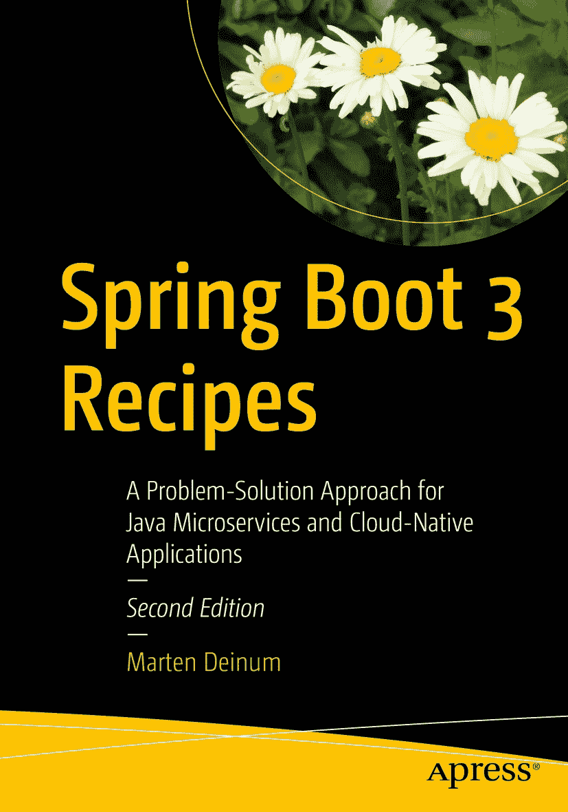

ISBN 979-8-8688-0112-9 e-ISBN 979-8-8688-0113-6 [`doi.org/10.1007/979-8-8688-0113-6`](https://doi.org/10.1007/979-8-8688-0113-6) © Marten Deinum 2018, 2024 本作品受版权保护。所有权利均由出版商独家许可，涉及材料的全部或部分内容，具体包括翻译、重印、插图复用、朗诵、广播、微缩胶片或其他任何物理形式的复制、传输或信息存储与检索、电子改编、计算机软件，以及目前已知或未来开发的类似或不同方法。在本出版物中使用通用描述性名称、注册商标名称、商标、服务标志等，即使未作明确声明，也不意味着这些名称不受相关保护性法律和法规的约束，因此可自由使用。出版商、作者和编辑假定本书中的建议和信息在出版之日是真实准确的。出版商、作者或编辑均不对本书所含材料或可能存在的任何错误或遗漏提供明示或暗示的担保。出版商对已出版地图和机构归属中的管辖权主张保持中立。

本 Apress 印记由注册公司 APress Media, LLC（Springer Nature 的一部分）出版。

注册公司地址为：1 New York Plaza, New York, NY 10004, U.S.A.

*献给我的妻子和女儿，我爱你们。*

引言

欢迎阅读《Spring Boot 3 实战》！

## 本书适合的读者

本书适合希望更轻松地使用 Spring 应用程序的开发者。如果你的项目使用了 Spring，引入 Spring Boot 将简化应用程序的配置、部署和管理。

本书假设你熟悉 Java 和 Spring，并且拥有某种集成开发环境（IDE）。本书不会解释 Spring 或相关项目的所有内部机制和深入工作原理；如需了解这些内容，建议阅读《Spring 6 实战》。

## 本书的结构

本书共包含 10 章。

第 1 章“Spring Boot 简介”快速概述了 Spring Boot 及其入门方法。

第 2 章“Spring Boot 基础”介绍了如何使用 Spring Boot 定义和配置 Bean 以及进行依赖注入的基础知识。

第 3 章“Spring MVC”介绍了使用 Spring MVC 进行基于 Web 的应用程序开发。

第 4 章“Spring Webflux”介绍了使用 Spring Webflux 进行响应式 Web 应用程序开发。

第 5 章“Spring Security”概述了如何使用 Spring Security 保护 Spring Boot 应用程序。

第 6 章“数据访问”解释了如何访问数据库或 NoSQL 存储等数据存储。

第 7 章“Java 企业服务”介绍了如何使用 Spring Boot 中的 JMX、邮件和 JFR 等企业服务。

第 8 章“消息传递”介绍了如何使用多种不同的消息传递技术进行消息传递。

第 9 章“Spring Boot Actuator”解释了如何使用 Spring Boot Actuator 中的健康检查和指标等生产就绪功能。

第 10 章“打包”展示了如何通过使 Spring Boot 应用程序可执行来打包和部署它们，以及如何使用 Docker 和 GraalVM。

## 约定

本书使用以下代码约定：

*   有时，当我们希望您特别注意代码示例的某一部分时，我们会将代码加粗。请注意，加粗并不一定反映与先前版本的代码更改。

*   当一行代码过长无法在页面宽度内显示时，我们会使用代码续行符进行换行。请注意，在尝试输入代码时，您需要将行连接起来，中间不留空格。

## 前提条件

由于 Java 编程语言是平台无关的，您可以自由选择任何支持的操作系统。但是，本书中的一些示例使用了特定于平台的路径。在输入示例之前，请根据操作系统的格式进行相应转换。

为了充分利用本书，请安装 JDK 21 版本。您应该安装一个 Java IDE 以简化开发。在本书中，大部分示例代码基于 Maven，大多数 IDE 都内置了对 Maven 管理类路径的支持。

示例有时需要安装额外的库，例如 PostgreSQL、ActiveMQ 等。为此，本书使用了 Docker。当然，您也可以在自己的机器上安装这些库，而不是使用 Docker，但为了使用方便（并且不污染您的系统），推荐使用 Docker。

## 联系作者

我们始终欢迎您就本书内容提出问题和反馈。您可以通过电子邮件 marten@deinum.biz 或通过 X 平台 @mdeinum 联系 Marten Deinum。

关于作者

