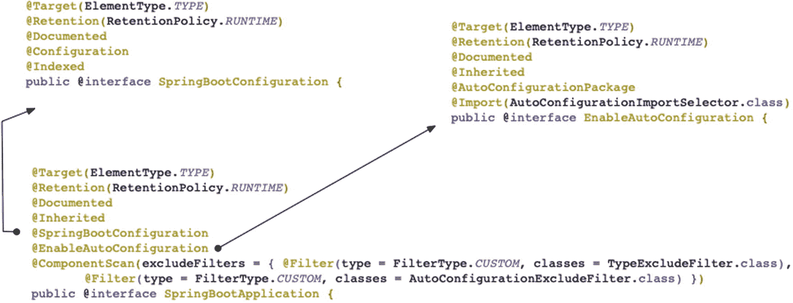
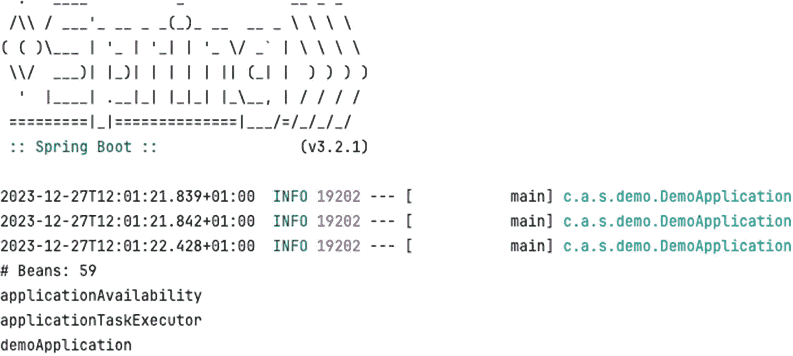
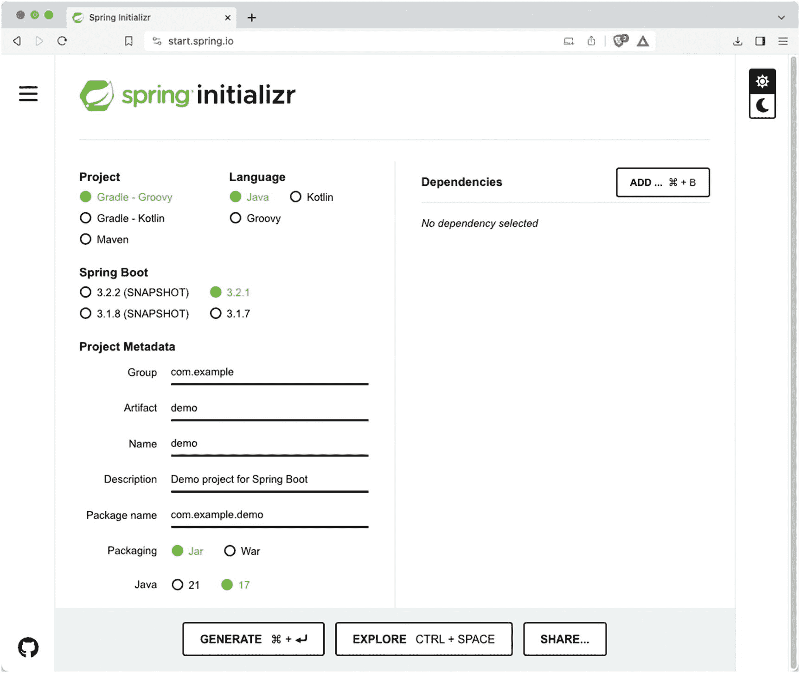
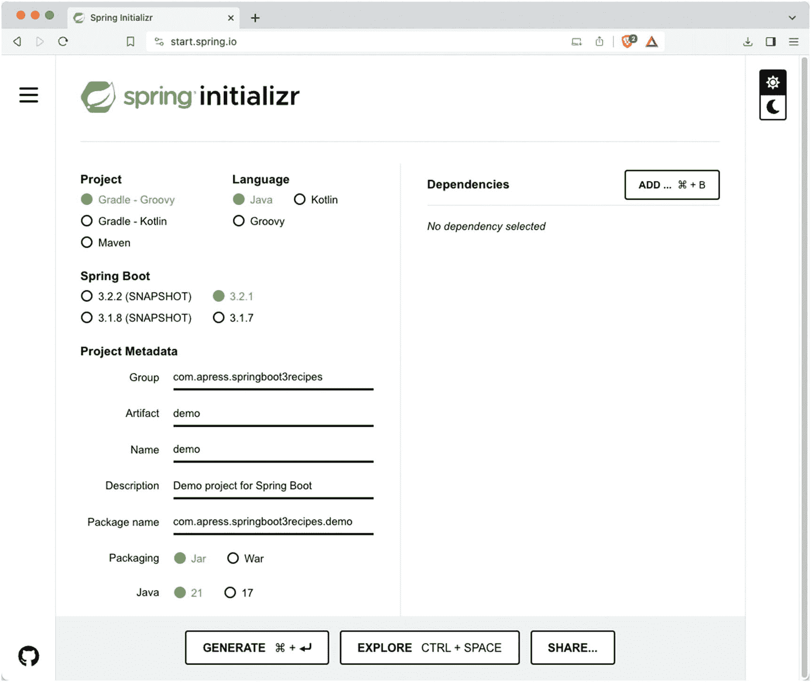
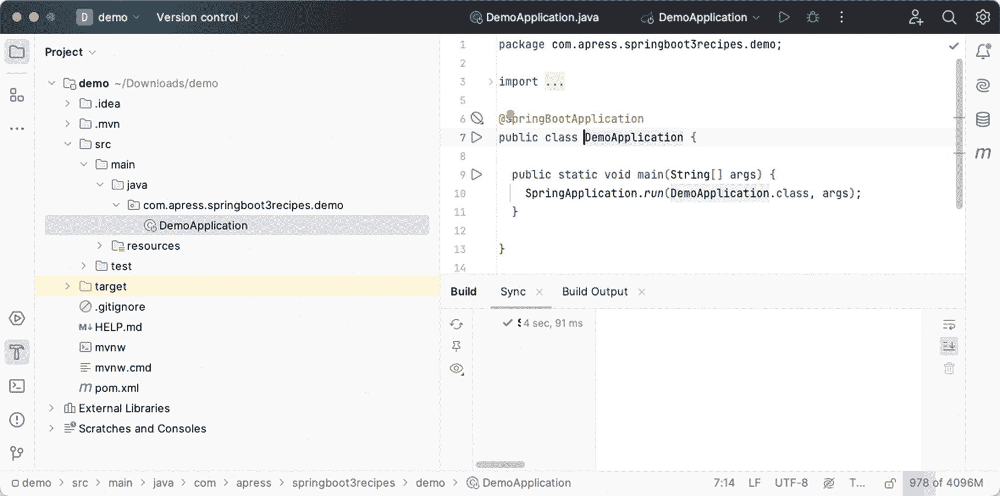
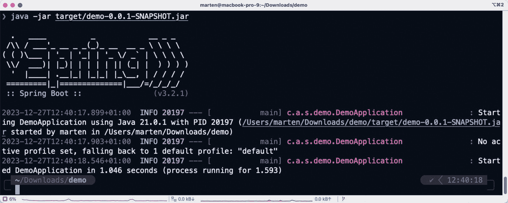

# 1. Spring Boot 简介

在本章中，您将了解 Spring Boot 的基础知识。Spring Boot 的核心是 Spring 框架，Spring Boot 扩展了该框架，以实现自动配置等功能。

> Spring Boot 让创建可以“直接运行”的独立、生产级的基于 Spring 的应用程序变得简单。我们对 Spring 平台和第三方库持有自己的观点，以便您可以以最少的麻烦开始。大多数 Spring Boot 应用程序只需要很少的 Spring 配置。
>
> ——Spring Boot 参考指南

Spring Boot 为 JMS、JDBC、JPA、RabbitMQ 等基础设施提供了自动配置，并且为 Spring Integration、Spring Batch、Spring Security 等不同框架提供了自动配置。当检测到这些框架或功能时，Spring Boot 会使用有观点但合理的默认值自动配置它们。

源代码使用 Maven 进行构建。Maven 将负责获取必要的依赖项、编译代码以及创建构件（通常是 JAR 文件）。此外，如果某个方案说明了多种方法，源代码会使用罗马数字（例如，`recipe_2_1_i`、`recipe_2_1_ii`、`recipe_2_1_iii`等）对各种示例进行分类。

灯泡插图。 要构建每个应用程序，请进入方案目录（例如，`ch2/recipe_2_1_i/`）并执行`mvnw`命令来编译源代码。源代码编译完成后，会创建一个包含应用程序可执行文件的`target`子目录。然后，您可以从命令行运行应用程序 JAR（例如，`java -jar target/Recipe_2_1_i.jar`）。

## 1-1. 使用 Maven 创建 Spring Boot 应用程序

### 问题

您希望开始使用 Spring Boot 和 Maven 开发应用程序。

### 解决方案

创建一个 Maven 构建文件`pom.xml`，并添加所需的依赖项。要启动应用程序，请创建一个包含`main`方法的 Java 类来引导应用程序。

### 工作原理

假设您要创建一个简单的应用程序，该应用程序引导`SpringApplication`，从`ApplicationContext`获取所有 Bean，并将它们输出到控制台。


#### 创建 pom.xml 文件

在开始编码之前，你需要创建 Maven 用来确定构建任务的 `pom.xml` 文件。使用 Spring Boot 最简单的方式是将 `spring-boot-starter-parent` 作为你应用的父项目（参见清单 1-1）。

```
org.springframework.boot
spring-boot-starter-parent
3.2.1

清单 1-1
Spring Boot 父项目
```

接下来，你需要添加一些 Spring 依赖来开始使用 Spring。为此，将 `spring-boot-starter` 作为依赖添加到你的 `pom.xml` 文件中（参见清单 1-2）。

```
org.springframework.boot
spring-boot-starter

清单 1-2
Spring Boot 依赖
```

请注意，这里不需要版本号或其他信息；所有这些都由系统为你管理，因为 `spring-boot-starter-parent` 被用作应用的父项目。这将引入启动一个非常基础的 Spring Boot 应用所需的所有核心依赖；这些依赖包括 Spring 框架、用于日志记录的 Logback 以及 Spring Boot 本身。

最后，为了能够创建一个可执行的 JAR 文件，你需要添加 `spring-boot-maven-plugin`（清单 1-3）。这个插件负责创建可执行的 JAR 文件。如果你曾经使用过 Maven Shade 插件，应该对此很熟悉。它会获取原始的 JAR 文件，并将所有依赖重新打包到其中（即所谓的包含依赖的 JAR）。这样，你只需将 JAR 文件交给运维团队，他们只需使用命令 `java -jar <你的应用>.jar` 即可启动应用，无需将其部署到 Servlet 容器或 JEE 容器中。

```
org.springframework.boot
spring-boot-maven-plugin

清单 1-3
Spring Boot Maven 插件
```

完整的 `pom.xml` 现在应该如清单 1-4 所示。

```

4.0.0
com.apress.springboot3recipes
recipe_1_1_i
6.0.0-SNAPSHOT

org.springframework.boot
spring-boot-starter-parent
3.2.1

org.springframework.boot
spring-boot-starter

org.springframework.boot
spring-boot-maven-plugin

清单 1-4
完整的 pom.xml
```

#### 创建应用类

让我们创建一个包含 `main` 方法的 `DemoApplication` 类。`main` 方法调用 `SpringApplication.run`，并传入 `DemoApplication.class` 和来自 main 方法的参数。`run` 方法返回一个 `ApplicationContext`，可以从中获取 Bean 的名称。使用 `getBeanDefinitionNames` 方法获取名称，遍历这些名称并从 `ApplicationContext` 中获取实际的 Bean，然后打印关于该 Bean 的一些信息。

最终的类将如清单 1-5 所示。

```
package com.apress.springboot3recipes.demo;
import java.util.Arrays;
import org.springframework.boot.SpringApplication;
import org.springframework.boot.autoconfigure.SpringBootApplication;
@SpringBootApplication
public class DemoApplication {
public static void main(String[] args) {
try (var ctx = SpringApplication.run(DemoApplication.class, args)) {
System.out.println("# Beans: " + ctx.getBeanDefinitionCount());
var names = ctx.getBeanDefinitionNames();
Arrays.sort(names);
Arrays.asList(names).forEach(System.out::println);
}
}
}
清单 1-5
DemoApplication 类
```

这个类是一个包含 `main` 方法的普通 Java 类，因此你可以直接从 IDE 运行它。当应用运行时，它将显示类似于图 1-1 的输出。


演示应用类程序的输出。

图 1-1

运行应用的输出

这段代码和注解发生了什么？`@SpringBootApplication` 注解使这个类成为 Spring Boot 应用的入口点。`@SpringBootApplication` 类是一个所谓的组合注解，它本身被其他注解所注解（参见图 1-2）。除了某些通用的基于 Java 的注解外，你还可以看到 `@SpringBootConfiguration`、`@EnableAutoConfiguration` 和 `@ComponentScan` 注解。



一张包含 @SpringBootApplication 类的截图。

图 1-2

@SpringBootApplication 定义

让我们快速了解一下这些不同的注解及其作用：

*   `@ComponentScan`：此注解指示 Spring 扫描此包及其所有子包中的所有内容。它将检测所有带有 `@Component` 注解的类。定义的过滤器用于排除某些类，可以通过使用 `@EnableAutoConfiguration` 的 `exclude` 属性，或者通过在应用上下文中提供一个 `TypeFilter` Bean 来实现。

*   `@EnableAutoConfiguration`：这会注册 `AutoConfigurationImportSelector`，它将从类路径中的一个文件（`/META-INF/spring/org.springframework.boot.autoconfigure.AutoConfiguration.imports`）加载自动配置类，并检查该配置是否应被包含。它还有一个额外的 `@AutoConfigurationPackage` 注解，该注解也会将此包注册到组件扫描中，因此此包（及其子包）中的组件也会被自动检测到。

*   `@SpringBootConfiguration`：此类是 Spring Boot 对 `@Configuration` 的特化，主要用于检测应用的主入口点。这在测试中尤其有用。你的应用应该只有一个带有 `@SpringBootConfiguration` 注解的类，通常就是那个带有 `@SpringBootApplication` 注解的类。

## 1-2\. 使用 Gradle 创建 Spring Boot 应用

### 问题

你想使用 Spring Boot 和 Gradle 开始开发一个应用。

### 解决方案

创建一个 Gradle 构建文件 `build.gradle`，并添加所需的依赖。要启动应用，创建一个包含 `main` 方法的 Java 类来引导应用。

### 工作原理

假设你将创建一个简单的应用，该应用引导 `SpringApplication`，从 `ApplicationContext` 获取所有 Bean，并将它们输出到控制台。

#### 创建 build.gradle 文件

首先，你需要创建一个 `build.gradle` 文件，并使用 Gradle 正确管理 Spring Boot 依赖所需的两个插件。Spring Boot 需要一个特殊的 Gradle 插件，以及一个用于扩展 Gradle 默认依赖管理能力的插件。由于这也是一个 Java 项目，你还需要 `java` 插件。

```
plugins {
id 'java'
id 'org.springframework.boot' version '3.2.1'
id 'io.spring.dependency-management' version '1-1-4'
}
清单 1-6
Spring Boot Gradle 插件
```

最后，你需要添加所需的依赖。与配方 1-1 一样，添加 `spring-boot-starter` 依赖。

```
dependencies {
implementation 'org.springframework.boot:spring-boot-starter'
}
清单 1-7
Spring Boot Gradle 依赖
```

请注意依赖项上没有指定具体的版本号。如果你熟悉 Gradle，这可能会让你感到惊讶。你无需指定版本，因为它由 `io.spring.dependency-management` 插件自动管理。与 Maven 一样，这可以简化依赖管理。

完整的 `build.gradle` 文件现在应该类似于清单 1-8。

```
plugins {
id 'java'
id 'org.springframework.boot' version '3.2.1'
id 'io.spring.dependency-management' version '1-1-4'
}
sourceCompatibility = 21
repositories {
mavenCentral()
}
dependencies {
implementation 'org.springframework.boot:spring-boot-starter'
}
tasks.named('test') {
useJUnitPlatform()
}
清单 1-8
完整的 Gradle 构建文件
```


#### 创建应用程序类

让我们创建一个包含 `main` 方法的 `DemoApplication` 类。`main` 方法调用 `SpringApplication.run`，并传入 `DemoApplication.class` 以及来自 main 方法的参数。`run` 方法返回一个 `ApplicationContext`，可用于检索 bean 的名称。使用 `getBeanDefinitionNames` 方法检索这些名称，遍历它们并从 `ApplicationContext` 中获取实际的 bean，然后打印关于该 bean 的一些信息。

最终的类将如清单 1-9 所示。

```
package com.apress.springboot3recipes.demo;
import java.util.Arrays;
import org.springframework.boot.SpringApplication;
import org.springframework.boot.autoconfigure.SpringBootApplication;
@SpringBootApplication
public class DemoApplication {
public static void main(String[] args) {
try (var ctx = SpringApplication.run(DemoApplication.class, args)) {
System.out.println("# Beans: " + ctx.getBeanDefinitionCount());
var names = ctx.getBeanDefinitionNames();
Arrays.sort(names);
Arrays.asList(names).forEach(System.out::println);
}
}
}
清单 1-9
DemoApplication 类
```

这是一个包含 `main` 方法的普通 Java 类，因此你可以直接从 IDE 运行此类。当应用程序运行时，它将显示类似于图 1-3 的输出。



一张包含演示应用程序类程序输出的截图。

图 1-3

运行应用程序的输出

这段代码和注解发生了什么？`@SpringBootApplication` 注解使该类成为 Spring Boot 应用程序的入口点。`@SpringBootApplication` 类是一个所谓的组合注解，它本身被其他注解所注解（见图 1-4）。除了某些通用的基于 Java 的注解外，你还会看到 `@SpringBootConfiguration`、`@EnableAutoConfiguration` 和 `@ComponentScan` 注解。


一张包含 Spring Boot 应用程序类的截图。

图 1-4

@SpringBootApplication 定义

让我们快速浏览一下这些不同的注解及其作用：

*   `@ComponentScan`：此注解指示 Spring 扫描此包及其所有子包中的所有内容。它将检测所有带有 `@Component` 注解的类。定义的过滤器用于进行排除，可以通过使用 `@EnableAutoConfiguration` 的 `exclude` 属性，或者通过在应用程序上下文中提供一个 `TypeFilter` 作为 bean 来实现。

*   `@EnableAutoConfiguration`：这会注册 `AutoConfigurationImportSelector`，它将从类路径中的一个文件（`/META-INF/spring/org.springframework.boot.autoconfigure.AutoConfiguration.imports`）加载自动配置类，并检查该配置是否应被包含。它还有一个额外的 `@AutoConfigurationPackage` 注解，该注解也会将此包注册到组件扫描中，因此此包（及其子包）中的组件也会被自动检测到。

*   `@SpringBootConfiguration`：此类是 Spring Boot 对 `@Configuration` 的特化，主要用于检测应用程序的主入口点；这在测试中尤其有用。你的应用程序应该只有一个带有 `@SpringBootConfiguration` 注解的类，通常就是那个带有 `@SpringBootApplication` 注解的类。

## 1-3\. 使用 Spring Initializr 创建 Spring Boot 应用程序

### 问题

你想使用 Spring Initializr 启动一个 Spring Boot 应用程序。

### 解决方案

访问 [`https://start.spring.io`](https://start.spring.io)，选择 Spring Boot 版本和你认为需要的不同依赖项，然后下载项目。

### 工作原理

首先访问 [`https://start.spring.io`](https://start.spring.io)，这将打开 Spring Initializr（见图 1-5）。



一张 Spring Initializr 窗口的截图。

图 1-5

Spring Initializr

现在选择你想要生成的项目类型（Maven 或 Gradle），并选择你想要使用的 Spring Boot 版本（可能是最新的版本）。对于 Group，输入 `com.apress.springboot3recipes`，对于 Artifact，保留默认值 `demo`（见图 1-6）。



一张 Spring Initializr 窗口的截图。它包含以下字段：项目、语言、Spring Boot、项目元数据。

图 1-6

填写了值的 Spring Initializr

最后，点击 Generate 按钮，这将触发下载一个 `demo.zip` 文件。解压这个 zip 文件并将项目导入到你的 IDE 中。导入后，你应该会得到如图 1-7 所示的结构。



一张演示窗口的截图。它高亮显示了以下选项：DemoApplication、Target。

图 1-7

导入的项目

打开 `pom.xml` 文件，并将其与配方 1-1 中的文件进行比较。它们非常相似；但是，有一些值得注意的差异。多了一个额外的依赖项 `spring-boot-starter-test`。这会引入所需的测试依赖项，如 Spring Test、Mockito、JUnit 和 AssertJ。有了这一个依赖项，你就可以开始测试了。

#### 构建 JAR 文件

使用 Spring Initializr 时，所有项目都附带 Maven Wrapper（如果使用 Gradle 则附带 Gradle Wrapper），以便更容易地构建应用程序。你不需要预先安装 Maven 来构建应用程序。要使用这些脚本，请打开命令行，导航到项目所在的目录，然后执行 `./mvnw verify` 或 `./mvnw package`。这将在 target 目录中创建可执行的构件。

一个信息符号。 Maven 团队建议在本地开发时运行 `verify` 目标；它将对测试结果和其他可能运行的插件的结果执行更多检查。

现在 JAR 文件已经构建完成，让我们执行它并看看会发生什么。输入 `java -jar target/demo-0.0.1-SNAPSHOT.jar`，观察应用程序启动然后关闭，因为应用程序本身没有做太多事情，如图 1-8 所示。根据你选择使用的依赖项，输出可能会有所不同（例如启动 Tomcat 服务器、初始化 H2 数据库等）。



一张包含 JAR 文件的输出窗口截图。

图 1-8

运行 JAR 文件的控制台输出

## 总结

在本章中，你了解了如何使用 Spring Boot 启动你的开发。我们研究了如何使用 Maven 和 Gradle 入门，最后我们研究了如何使用 Spring Initializr 入门。

在下一章中，我们将研究 Spring Boot 应用程序的基本配置，如何定义 bean，如何使用属性文件，以及如何覆盖属性。

