# 2. Spring Boot 基础

在本章中，我们将研究 Spring Boot 的基础特性。

一个信息图标，圆圈内有一个字母 i。使用 Spring Initializr 创建一个项目；不需要额外的依赖项。

## 2-1\. 配置 Bean

### 问题

你想让 Spring Boot 将你的类用作 bean。

### 解决方案

根据你的需求，你可以利用 `@ComponentScan` 自动检测你的类并创建一个实例，结合使用 `@Autowired` 和 `@Value` 来注入依赖项或属性；或者，你也可以在 `@Configuration` 类中使用带有 `@Bean` 注解的方法，以便对正在创建的 bean 保持更多控制。


### 工作原理

配方 1-1 中已说明，`@SpringBootApplication` 同时包含了 `@ComponentScan` 和 `@Configuration`。这意味着任何带有 `@Component` 注解的类都会被 Spring Boot 自动检测并实例化；同时，它也允许定义带有 `@Bean` 注解的方法来声明 Bean。

#### 使用 @Component 配置 Bean

首先创建一个类来启动应用程序。创建一个带有 `@SpringBootApplication` 注解的 `HelloWorldApplication` 实例。参见清单 2-1。

```
package com.apress.springboot3recipes.helloworld;
import org.springframework.boot.SpringApplication;
import org.springframework.boot.autoconfigure.SpringBootApplication;
@SpringBootApplication
public class HelloWorldApplication {
public static void main(String[] args) {
SpringApplication.run(HelloWorldApplication.class, args);
}
}
清单 2-1
HelloWorldApplication 源码
```

一个灯泡图标。请将带有 `@SpringBootApplication` 注解的类放在顶层包中。这样，它就能自动检测所有带注解的组件、配置类等。^(¹)

这将启动应用程序，检测所有带有 `@Component` 注解的类，并检测类路径上有哪些库（另请参见第 1 章）。运行这个 `HelloWorldApplication` 时，你会发现它不会做太多事情，因为没有什么需要检测或运行的内容。让我们创建一个 Spring Boot 能自动检测的简单类。

```
package com.apress.springboot3recipes.helloworld;
import jakarta.annotation.PostConstruct;
import org.springframework.stereotype.Component;
@Component
public class HelloWorld {
@PostConstruct
public void sayHello() {
System.out.println("Hello World, from Spring Boot 3!");
}
}
```

由于 `@Component` 注解，这个类会被 Spring Boot 自动检测到。`@PostConstruct` 注解告诉 Spring 在构造 Bean 并注入所有依赖后调用此方法。简单来说，在启动时 `sayHello` 方法会被执行，控制台将打印出 `Hello World, from Spring Boot 3!` 这一行。

一个灯泡图标。当你需要扫描默认组件扫描未覆盖的包时，可以在 `@SpringBootApplication` 注解上使用 `scanBasePackages` 或 `scanBasePackagesClasses` 来定义需要额外扫描的包。


#### 使用 @Bean 方法配置 Bean

除了自动检测组件，你还可以使用工厂方法来创建 Bean。当你希望或需要对 Bean 的构造过程进行更多控制时，这种方法非常有用。工厂方法是一个使用 `@Bean`^(²) 注解的方法，它将被用于在应用上下文中注册一个 Bean。默认情况下，Bean 的名称与方法名称相同。该方法也可以带有参数，这些参数会被自动解析为应用上下文中的其他 Bean。

让我们创建一个能够对整数进行基本计算的应用。首先，编写 `Calculator` 类。它会在构造函数中接收一个 `Operation` Bean 的集合。`Operation` 是一个接口，不同的实现将执行实际的计算。参见清单 2-2。

```
package com.apress.springboot3recipes.calculator;
import org.springframework.stereotype.Component;
import java.util.Collection;
@Component
public class Calculator {
private final Collection operations;
public Calculator(Collection operations) {
this.operations = operations;
}
public void calculate(int lhs, int rhs, char op) {
operations.stream()
.filter((operation) -> operation.handles(op))
.map((operation) -> operation.apply(lhs, rhs))
.peek( (result) -> System.out.printf("%d %s %d = %s%n", lhs, op, rhs, result))
.findFirst()
.orElseThrow(() ->
new IllegalArgumentException("Unknown operation " + op));
}
}
清单 2-2
Calculator 类源码
```

在 `calculate` 方法中，通过 `Operation.handles` 方法检测到正确的 `Operation`；当找到正确的操作时，会调用 `Operation.apply` 方法来执行实际的计算。如果我们传入一个计算器无法处理的操作，则会抛出一个异常。

`Operation` 接口是一个简单的接口，包含前面提到的两个方法。参见清单 2-3。

```
package com.apress.springboot3recipes.calculator;
public interface Operation {
int apply(int lhs, int rhs);
boolean handles(char op);
}
清单 2-3
Operation 接口源码
```

现在，让我们添加两个操作：一个用于加法，一个用于乘法。参见清单 2-4 和清单 2-5。

```
package com.apress.springboot3recipes.calculator.operation;
import com.apress.springboot3recipes.calculator.Operation;
import org.springframework.stereotype.Component;
@Component
class Multiplication implements Operation {
@Override
public int apply(int lhs, int rhs) {
return lhs * rhs;
}
@Override
public boolean handles(char op) {
return '*' == op;
}
}
清单 2-5
乘法操作类源码
```

```
package com.apress.springboot3recipes.calculator.operation;
import com.apress.springboot3recipes.calculator.Operation;
import org.springframework.stereotype.Component;
@Component
class Addition implements Operation {
@Override
public int apply(int lhs, int rhs) {
return lhs + rhs;
}
@Override
public boolean handles(char op) {
return '+' == op;
}
}
清单 2-4
加法操作类源码
```

这些就是我们制作一个能够进行加法和乘法运算，并且仍然具有可扩展机制的计算器所需的所有组件。

最后，让我们创建一个配置并使用 `Calculator` 的应用。为了创建 `Calculator` 的实例，需要一个 `@Bean` 方法；这个方法可以添加到使用 `@SpringBootApplication` 注解的类中，或者一个普通的 `@Configuration` 类中。参见清单 2-6。

```
package com.apress.springboot3recipes.calculator;
import org.springframework.boot.SpringApplication;
import org.springframework.boot.autoconfigure.SpringBootApplication;
import org.springframework.context.annotation.Bean;
import java.util.Collection;
@SpringBootApplication
public class CalculatorApplication {
public static void main(String[] args) {
var ctx = SpringApplication.run(CalculatorApplication.class, args);
var calculator = ctx.getBean(Calculator.class);
calculator.calculate(137, 21, '+');
calculator.calculate(137, 21, '*');
calculator.calculate(137, 21, '-');
}
@Bean
public Calculator calculator(Collection operations) {
return new Calculator(operations);
}
}
清单 2-6
CalculatorApplication 源码
```

`calculator` 工厂方法接收一个 `Collection<Operation>`，我们用它来构造 `Calculator`。当在 `@Bean` 注解的方法中使用参数时，这些参数会被自动解析。当注入一个泛型集合时，Spring 会自动检测所需 Bean 的所有实例，并使用它们来调用 `calculator` 工厂方法。

在 `main` 方法中，我们获取 `Calculator` 并使用不同的数字和操作调用其 `calculate` 方法。前两个操作会正常在控制台打印一些输出。最后一个操作会抛出异常，因为没有合适的操作来执行减法（图 2-1）。

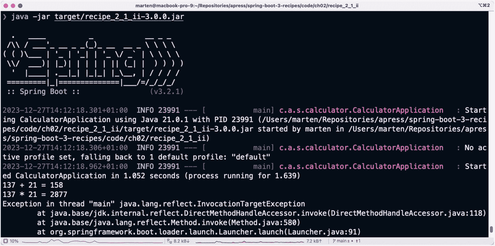

一个 Marten 窗口的截图。它显示了一段 Spring Boot 程序代码，该代码获取计算器并使用不同的数字和操作调用其 calculate 方法，最后一个操作抛出了异常。

图 2-1
计算器应用输出

尽管你为 `Calculator` 创建了一个工厂方法，但这实际上并非必需，因为它已经使用了 `@Component` 注解，Spring 会自动使用该类中的唯一构造函数并尝试检测所有依赖项。这段代码的另一个不太好的地方是手动获取 Bean，这可以被认为是一种不良实践。通常，你应该使用依赖注入。Spring Boot 有一个 `ApplicationRunner` 接口，可用于在应用启动后运行一些代码。当 Spring Boot 检测到类型为 `ApplicationRunner` 的 Bean 时，它会在应用完全启动后立即调用其方法。让我们使用这个接口来清理代码。参见清单 2-7。

```
package com.apress.springboot3recipes.calculator;
import org.springframework.boot.ApplicationRunner;
import org.springframework.boot.SpringApplication;
import org.springframework.boot.autoconfigure.SpringBootApplication;
import org.springframework.context.annotation.Bean;
@SpringBootApplication
public class CalculatorApplication {
public static void main(String[] args) {
SpringApplication.run(CalculatorApplication.class, args);
}
@Bean
public ApplicationRunner calculationRunner(Calculator calculator) {
return args -> {
calculator.calculate(137, 21, '+');
calculator.calculate(137, 21, '*');
calculator.calculate(137, 21, '-');
};
}
}
清单 2-7
CalculatorApplication 源码（更新版）
```

创建 `Calculator` 的方法已被替换为 `ApplicationRunner`。这个 `ApplicationRunner` 接收自动配置好的 `Calculator`，并对其执行一些操作。运行这个类时，输出应该与之前相同（图 2-1）。主要的区别和优势在于，不再需要手动从 `ApplicationContext` 获取 Bean，因为 Spring 会负责获取正确的 Bean。

## 2-2\. 外部化属性

### 问题

你希望使用属性来为不同的环境或执行场景配置你的应用。


### 解决方案

Spring Boot 支持从多个位置获取属性。默认情况下，它会加载名为 `application.properties` 的文件，同时也会使用操作系统环境变量以及 Java `System` 属性。当从命令行运行时，它还会考虑命令行参数。根据应用程序的类型以及可用性或功能（例如 JNDI），还会考虑更多位置。^(³) 对于我们的应用程序，将按给定顺序考虑以下资源：

*   打包应用程序外部的 `application.properties`/`application.yaml`

*   打包在应用程序内部的 `application.properties`/`application.yaml`

*   操作系统环境变量

*   Java 系统属性

*   命令行参数

一个灯泡图标。除了 `.properties` 文件，您也可以使用 YAML 文件来表达配置属性。与 `.properties` 文件相同的规则仍然适用。

此外，对于前两个选项，您还可以根据激活的配置文件加载特定于配置文件的属性。要激活的配置文件可以通过 `spring.profiles.active` 属性传递。特定于配置文件的 `application-{profile}.properties` 文件优先级高于非特定于配置文件的文件。每个文件都会被加载，因此您可以覆盖属性。因此，这个列表会稍长一些：

*   打包应用程序外部的 `application-{profile}.properties`

*   打包应用程序外部的 `application.properties`

*   打包在应用程序内部的 `application-{profile}.properties`

*   打包在应用程序内部的 `application.properties`

*   操作系统环境变量

*   Java 系统属性

*   命令行参数

### 工作原理

为配方 2-1 创建的 `Calculator` 非常灵活；然而，`CalculatorApplication` 在其执行的计算方面使用了硬编码的值。现在，当我们想要计算不同的内容时，就需要修改代码、重新编译并运行新编译的代码。我们可能希望为此使用属性，以便在需要时能够更改它们。

首先修改应用程序，使其使用属性中的值而不是硬编码的值。为此，更改 `ApplicationRunner` 的 `@Bean` 方法，使其接受三个额外的参数，这些参数将使用 `@Value` 进行注解。参见清单 2-8。

```
package com.apress.springboot3recipes.calculator;
import org.springframework.beans.factory.annotation.Value;
import org.springframework.boot.ApplicationRunner;
import org.springframework.boot.SpringApplication;
import org.springframework.boot.autoconfigure.SpringBootApplication;
import org.springframework.context.annotation.Bean;
@SpringBootApplication
public class CalculatorApplication {
public static void main(String[] args) {
SpringApplication.run(CalculatorApplication.class, args);
}
@Bean
public ApplicationRunner calculationRunner(Calculator calculator,
@Value("${lhs}") int lhs,
@Value("${rhs}") int rhs,
@Value("${op}") char op) {
return args -> calculator.calculate(lhs, rhs, op);
}
}
清单 2-8
使用属性的 CalculatorApplication 源码
```

`@Value` 将指示 Spring 查找该属性并使用该属性的值。例如，如果我们使用 `@Value("${lhs}")`，Spring 将尝试检测名为 `lhs` 的属性并使用其值。您也可以通过添加冒号和默认值来指定默认值，例如 `@Value("${lhs:12}")`。现在，如果找不到值，它将使用 `12`。如果没有指定默认值，则会抛出异常。如果我们现在启动应用程序，将会抛出一个异常，说明找不到名为 `lhs` 的属性。

在 `src/main/resources` 中添加 `application.properties`，并在其中为 `lhs`、`rhs` 和 `op` 设置值。参见清单 2-9。

```
lhs=12
rhs=15
op=*
清单 2-9
默认属性
```

Spring Boot 将在启动时加载 `application.properties`，因此这些属性可用。现在运行应用程序时，它应该再次生成输出，并遵循 `application.properties` 中给出的值（图 2-2）。

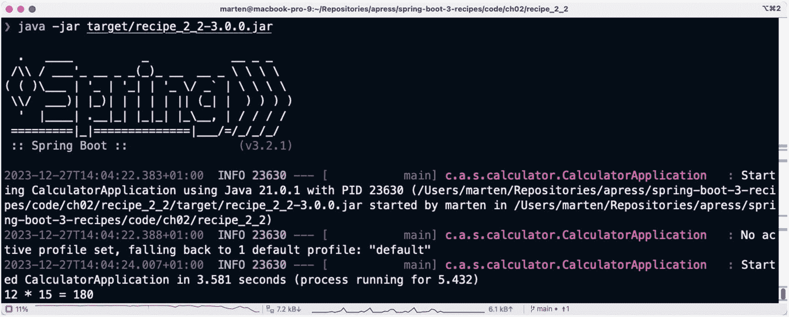

一个 Marten 窗口的截图。它显示了一组 Spring Boot 中的程序代码，这些代码运行应用程序并生成遵循 application.properties 中给定值的输出。

图 2-2

计算器应用程序输出

尽管您现在已将属性外部化到 `application.properties` 中，但这些属性仍然打包在应用程序内部。这意味着您仍然需要更改它们才能进行不同的计算。想象一下，对于一个真正的生产系统，仅仅因为配置需要更改就创建新的构建产物。Spring Boot 可以通过多种方式帮助您解决这个问题。

#### 使用外部 application.properties 文件覆盖属性

首先构建构建产物，并使用 `java -jar recipe_2_2-3.0.0.jar` 启动应用程序。它仍将运行并使用提供的、打包在内的 `application.properties`。现在，在与构建产物相同的位置，添加 `application.properties` 并为不同的属性设置值。参见清单 2-10。

```
lhs=26
rhs=952
op=*
清单 2-10
示例覆盖属性
```

再次启动应用程序时，它将使用此 `application.properties` 中的值。参见图 2-3。

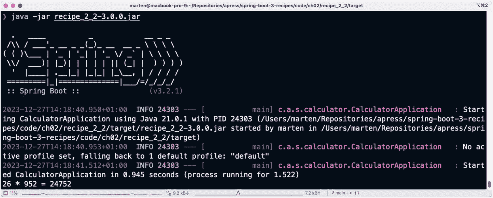

一个 Marten 窗口的截图。它显示了一组 Spring Boot 中的程序代码，这些代码启动应用程序并使用 application.properties 中的值。

图 2-3

计算器应用程序输出 - 使用覆盖属性

#### 使用配置文件覆盖属性

Spring Boot 可以使用激活的配置文件来加载额外的配置文件，这些文件可以完全替换或覆盖通用配置的一部分。让我们在 `src/main/resources` 中添加 `application-add.properties`，其中包含 `op` 的不同值。参见清单 2-11。

```
op=+
清单 2-11
特定于配置文件的属性

现在构建构建产物（一个 JAR 文件），并从命令行使用 `java -jar recipe_2_2-3.0.0.jar --spring.profiles.active=add` 启动它。它将启动并使用 `application.properties` 和 `application-add.properties` 中的属性来配置应用程序。注意，执行的是加法运算而不是乘法运算（图 2-4），这表明 `application-add.properties` 中的属性优先级高于通用的 `application.properties` 属性。

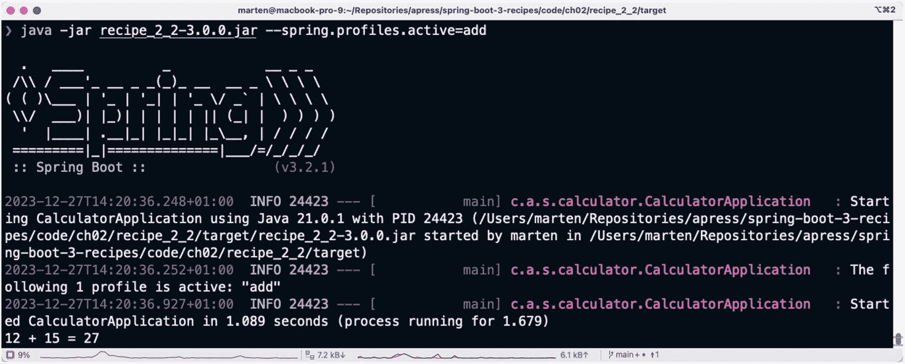

一个 Marten 窗口的截图。它显示了一组 Spring Boot 中的程序代码，这些代码启动了一个加法运算，该运算优先级高于通用的 application.properties。

图 2-4

计算器应用程序输出 - 使用配置文件覆盖属性

一个灯泡图标。当使用外部的 `application.properties` 和 `application-{profile}.properties` 文件时，这也同样适用。


#### 使用命令行参数覆盖属性

最后一种方法是使用命令行参数来覆盖属性。在上一节中，你已经使用了命令行参数 `--spring.profile.active=add` 来指定激活的配置文件。你也可以用同样的方式指定 `lhs` 和其他参数。使用 `java -jar recipe_2_2-3.0.0.jar --lhs=22 --rhs=25 --op=+` 来运行应用程序；你会看到它根据通过命令行传入的参数进行计算（图 2-5）。来自命令行的参数始终会覆盖所有其他配置。

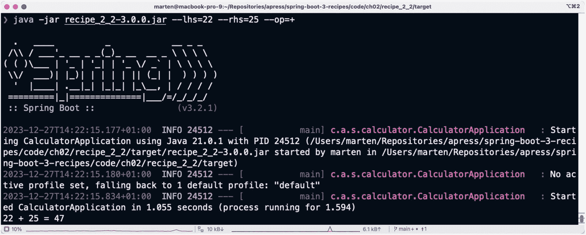

一个 Marten 窗口的截图。它显示了一段 Spring Boot 程序代码，该代码使用 Java jar 配方运行应用程序，并根据通过命令行传入的参数执行计算。

图 2-5

计算器应用程序输出——使用参数覆盖属性

#### 从不同的配置文件加载属性

如果你使用的文件不是 `application.properties`，或者你有一些组件带有你想要加载的内嵌文件，你可以在带有 `@SpringBootApplication` 注解的类上使用额外的 `@PropertySource` 注解来加载该额外文件。参见代码清单 2-12。

```
@PropertySource("classpath:your-external.properties")
@SpringBootApplication
public class MyApplication { ... }
代码清单 2-12
带有 @PropertySource 的应用程序类
```

`@PropertySource` 注解允许你添加额外的属性文件，以便在启动时加载。你还可以通过指定 `ignoreResourceNotFound` 属性并将其设置为 `true`（默认值为 `false`）来定义文件未找到时的行为。

虽然添加额外的 `@PropertySource` 注解是可行的，但它并不依赖 Spring Boot 来加载，因此不会得到相同的处理方式。你将无法为另一个配置文件加载不同的配置。不过，除了使用 `@PropertySource` 注解，你还可以通过命令行参数指示 Spring Boot 加载额外的属性文件（参见表 2-1）。

表 2-1

配置参数

| 参数 | 描述 |
| --- | --- |
| `spring.config.name` | 要加载的文件名的逗号分隔字符串；默认值为 `application`。 |
| `spring.config.location` | 要考虑从中加载属性文件的资源位置（或文件）的逗号分隔字符串；默认值为 `classpath:/,classpath:/config/,file:./,file:./config/`。 |
| `spring.config.additional-location` | 要考虑从中加载属性文件的额外资源位置（或文件）的逗号分隔字符串；默认值为空。 |

一个信息图标，圆圈内有一个字母 i。当使用 `spring.config.location` 或 `spring.config.additional-location` 并指定文件位置时，该文件将按原样使用，而不会加载特定于配置文件的文件。当使用目录时，则会加载特定于配置文件的文件。

使用 `--spring.config.name=your-external` 就足以加载 `your-external.properties` 文件；然而，这会破坏 `application.properties` 的加载，因此最好使用 `--spring.config.name=application,your-external`。这样，所有位置都会搜索 `application.properties` 和 `your-external.properties`，并且特定于配置文件的版本也会被考虑在内。

## 2-3\. 配置测试

### 问题

你想为 Spring Boot 应用程序的某个组件或部分编写测试。

### 解决方案

Spring Boot 扩展了 Spring 测试框架的功能范围。它增加了对 Bean 的模拟和监视（通过 Mockito）的支持，并为 Web 测试提供了自动配置。它还引入了简单的方法来测试应用程序的切片（例如，通过使用 `@WebMvCTest` 或 `@JdbcTest`），或者使用 `@SpringBootTest` 编写完整的集成测试。

### 工作原理

Spring Boot 也将自动配置扩展到了测试框架的部分。它与 Mockito 集成，以便于对 Bean 进行模拟（或监视）。它还提供了基于 Web 的测试的自动配置，可以使用 Spring MockMvc 测试框架或基于 WebDriver 的测试。

#### 编写单元测试

首先，让我们为计算器的一个组件 `MultiplicationTest` 编写一个简单的单元测试，该测试将测试 `Multiplication` 类。参见代码清单 2-13。

```
package com.apress.springboot3recipes.calculator.operation;
import org.junit.jupiter.api.Test;
import static org.junit.jupiter.api.Assertions.assertEquals;
import static org.junit.jupiter.api.Assertions.assertFalse;
import static org.junit.jupiter.api.Assertions.assertTrue;
public class MultiplicationTest {
private final Multiplication operation = new Multiplication();
@Test
public void shouldMatchSign() {
assertTrue(operation.handles('*'));
assertFalse(operation.handles('/'));
}
@Test
public void shouldCorrectlyApplyFormula() {
assertEquals(4, operation.apply(2, 2));
assertEquals(120, operation.apply(12, 10));
}
}
代码清单 2-13
基本单元测试
```

这是一个基本的单元测试。一旦实例化 `Multiplication`，我们就调用它的方法，最后验证结果。第一个测试将测试它是否真的对 `*` 运算符有反应，而不是其他运算符。第二个测试将测试实际的乘法逻辑。要使一个方法成为测试方法，你需要用 `@Test` 注解它。


#### 在单元测试中模拟依赖项

有时一个类需要依赖项；然而，在编写单元测试时，你希望只测试单个组件。Spring Boot 会自动引入 Mockito 框架。Mockito 是一个优秀的库，用于模拟类并记录其行为。为 `Calculator` 应用编写测试需要额外的组件，因为它将实际计算委托给了可用的 `Operation` 类。为了测试 `Calculator` 的正确行为，我们需要创建一个 `Operation` 的模拟对象，并将其注入到 `Calculator` 中。参见清单 2-14。

```
package com.apress.springboot3recipes.calculator;
import static org.junit.jupiter.api.Assertions.assertThrows;
import static org.mockito.Mockito.anyChar;
import static org.mockito.Mockito.times;
import static org.mockito.Mockito.verify;
import static org.mockito.Mockito.when;
import java.util.Collections;
import org.junit.jupiter.api.BeforeEach;
import org.junit.jupiter.api.Test;
import org.mockito.Mockito;
public class CalculatorTest {
private Calculator calculator;
private Operation mockOperation;
@BeforeEach
public void setup() {
mockOperation = Mockito.mock(Operation.class);
calculator = new Calculator(Collections.singletonList(mockOperation));
}
@Test
public void throwExceptionWhenNoSuitableOperationFound() {
when(mockOperation.handles(anyChar())).thenReturn(false);
assertThrows(IllegalArgumentException.class,
() -> calculator.calculate(2, 2, '*'));
}
@Test
public void shouldCallApplyMethodWhenSuitableOperationFound() {
when(mockOperation.handles(anyChar())).thenReturn(true);
when(mockOperation.apply(2, 2)).thenReturn(4);
calculator.calculate(2, 2, '*');
verify(mockOperation, times(1)).apply(2, 2);
}
}
清单 2-14
使用模拟对象的单元测试
```

在 `@BeforeEach` 方法中，我们通过调用 `Mockito.mock` 来模拟 `Operation`，并使用模拟的操作来构造 `Calculator`。该模拟对象在测试方法中被用于设定特定行为。在第一个测试方法中，我们测试找不到合适操作的情况，因此我们指示模拟对象在调用 `handles` 方法时返回 `false`。该测试预期会抛出异常；如果异常发生，测试将成功。第二个测试用于验证正确的流程是否被遵循；我们想要测试正确的行为。模拟对象被指示为 `handles` 方法返回 `true`，并为 `apply` 方法返回一个值。

#### 使用 Spring Boot 执行集成测试

Spring Boot 提供了多个注解来辅助测试。第一个是 `@SpringBootTest`，它会使测试成为一个 Spring Boot 驱动的测试，这意味着测试上下文框架会搜索带有 `@SpringBootApplication` 注解的类（如果没有传递特定配置），并使用它来实际启动应用。参见清单 2-15。

```
package com.apress.springboot3recipes.calculator;
import static org.junit.jupiter.api.Assertions.assertThrows;
import static org.junit.jupiter.api.Assertions.assertTrue;
import org.junit.jupiter.api.Test;
import org.junit.jupiter.api.extension.ExtendWith;
import org.springframework.beans.factory.annotation.Autowired;
import org.springframework.boot.test.context.SpringBootTest;
@SpringBootTest(classes = CalculatorApplication.class)
public class CalculatorApplicationTests {
@Autowired
private Calculator calculator;
@Test
public void doingDivisionShouldFail() {
assertThrows(IllegalArgumentException.class,
() -> calculator.calculate(12,13, '/'));
}
}
清单 2-15
Spring Boot 集成测试
```

上述测试将启动 `CalculatorApplication` 并注入完全配置好的 `Calculator`。然后我们可以编写一个测试，这里测试的是计算器无法处理的情况，并为其编写预期结果。

进行计算时，输出会打印到控制台。使用 `OutputCaptureExtension` JUnit 扩展，我们还可以编写一个成功测试并测试输出的内容。参见清单 2-16。

```
package com.apress.springboot3recipes.calculator;
import static org.junit.jupiter.api.Assertions.assertThrows;
import static org.junit.jupiter.api.Assertions.assertTrue;
import org.junit.jupiter.api.Test;
import org.junit.jupiter.api.extension.ExtendWith;
import org.springframework.beans.factory.annotation.Autowired;
import org.springframework.boot.test.context.SpringBootTest;
import org.springframework.boot.test.system.CapturedOutput;
import org.springframework.boot.test.system.OutputCaptureExtension;
@ExtendWith(OutputCaptureExtension.class)
@SpringBootTest(classes = CalculatorApplication.class)
public class CalculatorApplicationTests {
@Autowired
private Calculator calculator;
@Test
public void doingMultiplicationShouldSucceed(CapturedOutput capture) {
calculator.calculate(12,13, '*');
assertTrue(capture.getOut().contains("12 * 13 = 156"));
}
@Test
public void doingDivisionShouldFail() {
assertThrows(IllegalArgumentException.class,
() -> calculator.calculate(12,13, '/'));
}
}
清单 2-16
Spring Boot 集成测试（扩展版）
```

`@ExtendWith` 会配置给定的 JUnit 扩展，这里使用的是 `OutputCaptureExtension` 扩展，它随 Spring Boot 提供，并会拦截 `System.out` 和 `System.err`，以便可以对这些流上生成的输出编写断言。要检查输出，请使用 `CapturedOutput` 类。该类可以由扩展自动注入到方法中。在这个例子中，我们执行乘法运算，输出应反映这一点。


#### 使用 Spring Boot 和 Mock 进行集成测试

Spring Boot 可以轻松地在应用上下文中用 mock 替换 bean。为此，Spring Boot 提供了 `@MockBean` 注解。参见清单 2-17。

```
@MockBean
private Calculator calculator
清单 2-17
MockBean 注解示例
```

这会将整个 calculator 替换为一个 mock 实例。要使用它，你需要使用常规的 Mockito 方式来定义行为。当存在多个特定类型的 bean 时，你需要指定要替换的 bean 的 `name` 属性。参见清单 2-18。

```
@MockBean(name ="addition")
private Operation mockOperation;
清单 2-18
带名称的 MockBean 注解示例
```

这会将常规的 `Addition` bean 替换为一个 mock 实例，然后我们可以用它来注册 mock 行为。如果找不到具有该名称的 bean，则会将 mock bean 注册为该 bean 的新实例。参见清单 2-19。

```
@MockBean(name ="division")
private Operation mockOperation;
清单 2-19
带名称的 MockBean 注解示例（不存在的 Bean）
```

这不会替换现有的 bean，而是向应用上下文添加一个 bean，因此，`Calculator` 的 `operations` 列表中将增加一个可处理的操作。你可以使用 Spring 测试框架中的 `ReflectionTestUtils` 辅助类来测试这一点。参见清单 2-20。

```
@Test
public void calculatorShouldHave3Operations() {
var operations = ReflectionTestUtils.getField(calculator,
"operations");
assertEquals(3, ((Collection) operations).size());
}
清单 2-20
验证操作数量
```

这将通过反射获取 `operations` 字段，并断言集合大小为 3。当移除 `@MockBean` 注解（或将其名称改为 `addition`）时，此测试将失败，因为现在只注册了两个操作。

使用 mock 很简单。参见清单 2-21。

```
@Test
public void mockDivision(CapturedOutput capture) {
when(mockOperation.handles('/')).thenReturn(true);
when(mockOperation.apply(14, 7)).thenReturn(2);
calculator.calculate(14, 7, '/');
assertTrue(capture.getOut().contains("14 / 7 = 2"));
}
清单 2-21
使用 Mocked Bean
```

这里我们指示 Mockito 在测试除法（`/`）时返回 `true`，并在调用 `apply` 方法时返回一个值。接着调用该方法，并断言输出与测试预期相符。

#### 使用 Spring Boot 切片进行集成测试

除了使用 `@SpringBootTest`，你还可以测试应用程序的一部分。为此，Spring Boot 提供了所谓的切片。通过专用的 `@*Test` 注解（参见表 2-2），它将仅加载所需配置部分的 `ApplicationContext`。例如，使用 `@JdbcTest` 时，它将创建一个仅包含 JDBC 相关 bean（如 `DataSource`、`JdbcTemplate` 等）的 `ApplicationContext`。它不会创建所有不相关的 bean，例如你的 Web 服务器或 Web 相关的 bean。

表 2-2

测试切片注解

| 注解 | 描述 |
| --- | --- |
| `@JsonTest` | 自动配置可用的 JSON 映射器并应用找到的 JSON 配置。 |
| `@WebMvcTest` | 自动配置应用程序的 Web 相关部分（过滤器、控制器、安全等）并设置 `MockMvc`。通常用于使用 `@MockBean` 测试单个控制器及其依赖项。 |
| `@WebfluxTest` | 自动配置应用程序的 WebFlux 相关部分并据此设置 `WebTestClient`。通常用于使用 `@MockBean` 测试单个控制器及其依赖项。 |
| `@GraphQlTest` | 自动配置 Spring GraphQL。 |
| `@DataCassandraTest` | 自动配置 Spring Data Cassandra。 |
| `@DataCouchbaseTest` | 自动配置 Spring Data Couchbase。 |
| `@DataElasticsearchTest` | 自动配置 Spring Data ElasticSearch。 |
| `@DataJdbcTest` | 自动配置 Spring Data JDBC，默认情况下如果存在内存数据库则会进行配置。 |
| `@DataJpaTest` | 自动配置 Spring Data JPA，默认情况下如果存在内存数据库则会进行配置。 |
| `@DataLdapTest` | 自动配置 Spring Data LDAP；默认情况下会设置一个内存 LDAP 服务器用于测试。 |
| `@DataMongoTest` | 自动配置 Spring Data MongoDB。 |
| `@DataNeo4jTest` | 自动配置 Spring Data Neo4J。 |
| `@DataR2dbcTest` | 自动配置 Spring Data R2DBC。 |
| `@DataRedisTest` | 自动配置 Spring Data Redis。 |
| `@JdcbTest` | 自动配置 JDBC，默认情况下如果存在内存数据库则会进行配置。 |
| `@JooqTest` | 自动配置 JOOQ，默认情况下如果存在内存数据库则会进行配置。 |
| `@RestClientTest` | 自动配置 REST 客户端并设置 `MockRestServiceServer`。 |
| `@WebServiceClientTest` | 自动配置 `WebServiceTemplate` 并设置 `MockWebServiceServer`。 |
| `@WebServiceServerTest` | 自动配置 Spring Web 服务并设置 `MockWebServiceClient`。 |

作为示例，我们来看看 `@WebMvcTest`，并使用它来测试一个控制器，而无需启动整个应用程序。清单 2-22 包含一个示例控制器，它允许我们通过 Web 执行计算。它将接收参数并调用 calculator。有关控制器和 Web 相关配方的更多信息，请参见第 3 章和第 4 章。参见清单 2-22。

```
package com.apress.springboot3recipes.calculator.web;
import com.apress.springboot3recipes.calculator.Calculator;
import org.springframework.web.bind.annotation.GetMapping;
import org.springframework.web.bind.annotation.RestController;
@RestController
public class CalculatorController {
private final Calculator calculator;
public CalculatorController(Calculator calculator) {
this.calculator = calculator;
}
@GetMapping("/calculate")
public int calculate(Calculation calc) {
return calculator.calculate(calc.lhs(), calc.rhs(), calc.op());
}
}
record Calculation(int lhs, int rhs, char op) {}
清单 2-22
计算器控制器
```

为了测试这个，我们可以在测试中使用 `@WebMvcTest` 注解，并使用 `Calculator` 的 mock 实例，因为它不会是上下文的一部分。参见清单 2-23。


```
package com.apress.springboot3recipes.calculator.web;
import com.apress.springboot3recipes.calculator.Calculator;
import org.junit.jupiter.api.Test;
import org.springframework.beans.factory.annotation.Autowired;
import org.springframework.boot.test.autoconfigure.web.servlet.WebMvcTest;
import org.springframework.boot.test.mock.mockito.MockBean;
import org.springframework.test.web.servlet.MockMvc;
import org.springframework.test.web.servlet.request.MockMvcRequestBuilders;
import org.springframework.test.web.servlet.result.MockMvcResultMatchers;
import static org.mockito.Mockito.*;
@WebMvcTest(CalculatorController.class)
class CalculatorControllerTest {
@Autowired
private MockMvc mockMvc;
@MockBean
private Calculator calculator;
@Test
void successfulCalculation() throws Exception {
when(calculator.calculate(10,5,'*')).thenReturn(50);
var request = MockMvcRequestBuilders.get("/calculate")
.param("lhs", "10")
.param("rhs", "5")
.param("op", "*");
mockMvc.perform(request)
.andExpect(MockMvcResultMatchers.status().isOk())
.andExpect(MockMvcResultMatchers.content().string("50"));
verify(calculator, times(1)).calculate(10, 5, '*');
}
}
清单 2-23
针对 `CalculatorController` 的 `@WebMvcTest`
```

通过 `@WebMvcTest(CalculatorController.class)`，我们指示测试框架创建一个最小的 Spring Boot 应用程序，其中包含 `CalculatorController` 所需的基于 Web 的类。它还会设置 `MockMvc`，以便更轻松地调用端点并进行验证。现在运行时，它将启动一个仅包含 Web 相关部分和给定模拟对象的 Spring Boot 应用程序。在这个小示例中，执行 `@SpringBootTest` 或 `@WebMvcTest` 并没有太大区别，但在较大的应用程序中，性能差异将非常显著。当然，这个示例也适用于其他基于切片的测试。


#### 在 Spring Boot 测试中使用 Testcontainers

你可能听说过 Testcontainers 库，并希望在你的 Spring Boot 应用程序中将其用于测试。借助 Testcontainers 库，你可以轻松编写测试，并使用你在生产环境中实际使用的数据库、消息解决方案或邮件提供商（以及更多其他组件）。因此，无需退而求其次使用内存或嵌入式解决方案，你就能获得与生产环境完全相同的完整解决方案。Testcontainers 通过 Docker 实现这一点，并且默认将容器的生命周期与你的测试绑定。

要使用它，你需要在依赖管理（Maven 或 Gradle）中添加 `spring-boot-testcontainers` 依赖，并且需要引入你想要使用的 Testcontainers 模块。我们使用的示例将利用一个 PostgreSQL 容器在其上执行一些 JDBC 查询；它还将利用前面提到的切片支持来设置一个基于 JDBC 的测试。参见清单 2-24。

```
org.springframework.boot
spring-boot-testcontainers
test

org.testcontainers
junit-jupiter
test

org.testcontainers
postgresql
test

org.postgresql
postgresql
runtime

清单 2-24
Testcontainers 和 PostgreSQL 的 Maven 依赖
```

我们添加了 `spring-boot-testcontainers` 依赖，以及 PostgreSQL JDBC 驱动和 PostgreSQL 与 JUnit 的 Testcontainers 模块。有了这些，我们可以使用 `@TestContainers` 注解为我们的测试启动一个 PostgreSQL 数据库。参见清单 2-25。

```
package com.apress.springboot3recipes.calculator;
import org.junit.jupiter.api.Test;
import org.springframework.beans.factory.annotation.Autowired;
import org.springframework.boot.test.autoconfigure.jdbc.AutoConfigureTestDatabase;
import org.springframework.boot.test.autoconfigure.jdbc.JdbcTest;
import org.springframework.jdbc.core.JdbcTemplate;
import org.springframework.test.context.DynamicPropertyRegistry;
import org.springframework.test.context.DynamicPropertySource;
import org.springframework.test.jdbc.JdbcTestUtils;
import org.testcontainers.containers.PostgreSQLContainer;
import org.testcontainers.junit.jupiter.Container;
import org.testcontainers.junit.jupiter.Testcontainers;
import static org.junit.jupiter.api.Assertions.assertEquals;
@JdbcTest
@AutoConfigureTestDatabase(replace = AutoConfigureTestDatabase.Replace.NONE)
@Testcontainers
public class JdbcTestWithTestcontainers {
@Container
static PostgreSQLContainer postgres = new PostgreSQLContainer("postgres:15.2");
@Autowired
private JdbcTemplate jdbc;
@DynamicPropertySource
public static void properties(DynamicPropertyRegistry props) {
props.add("spring.datasource.url", postgres::getJdbcUrl);
props.add("spring.datasource.username", postgres::getUsername);
props.add("spring.datasource.password", postgres::getPassword);
}
@Test
void retrieveTables() {
var tables = JdbcTestUtils.countRowsInTable(jdbc, "pg_catalog.pg_tables");
assertEquals(68, tables);
}
}
清单 2-25
使用常规 Testcontainers 的 @JdbcTest
```

在测试中，我们添加了 `@Testcontainers`，这是 Testcontainers 的一个特殊 JUnit 扩展。它现在会检测带有 `@Container` 注解的字段，并自动启动它们。由于我们使用了容器，我们需要指示 Spring Boot 使用它。对于 JDBC，我们需要配置 `spring.datasource.url` 属性（以及用户名和密码）。为此，我们可以利用 `@DynamicPropertySource`，它可以放在测试中的一个 `static` 方法上，然后从容器中获取设置并将其注册为属性。

最后，请注意 `@AutoConfigureTestDatabase`，这对于数据库驱动的测试是必需的，因为默认情况下 Spring Boot 会尝试启动一个嵌入式容器并将其用作 `Datasource`。如果我们不添加这个注解，测试用例将会失败。现在，当运行测试时，Testcontainers 将介入，下载并启动容器，然后测试将执行。之后，容器将被停止并销毁。

尽管这种方法有效，并且是与 Testcontainers 协作的一种有效方式，但它还可以更好。Spring Boot 引入了一种所谓的服务连接。这是对各种你可以连接的服务（如数据库或消息代理）的抽象。为了利用这一点，有 `@ServiceConnection` 注解，可以放在你想要使用的容器上。使用此注解时，你无需再添加一个方法来为上下文动态注册属性。参见清单 2-26。

```
package com.apress.springboot3recipes.calculator;
import org.junit.jupiter.api.Test;
import org.springframework.beans.factory.annotation.Autowired;
import org.springframework.boot.test.autoconfigure.jdbc.AutoConfigureTestDatabase;
import org.springframework.boot.test.autoconfigure.jdbc.JdbcTest;
import org.springframework.boot.testcontainers.service.connection.ServiceConnection;
import org.springframework.jdbc.core.JdbcTemplate;
import org.springframework.test.jdbc.JdbcTestUtils;
import org.testcontainers.containers.PostgreSQLContainer;
import org.testcontainers.junit.jupiter.Container;
import org.testcontainers.junit.jupiter.Testcontainers;
import static org.junit.jupiter.api.Assertions.assertEquals;
@JdbcTest
@AutoConfigureTestDatabase(replace = AutoConfigureTestDatabase.Replace.NONE)
@Testcontainers
public class JdbcTestWithTestcontainersServiceConnection {
@Container
@ServiceConnection
static PostgreSQLContainer postgres = new PostgreSQLContainer("postgres:15.2");
@Autowired
private JdbcTemplate jdbc;
@Test
void retrieveTables() {
var tables = JdbcTestUtils.countRowsInTable(jdbc, "pg_catalog.pg_tables");
assertEquals(68, tables);
}
}
清单 2-26
使用 Spring Boot @ServiceConnection 的 @JdbcTest
```

测试的行为仍然相同：下载容器（如果需要），启动容器，运行测试，然后停止并销毁容器。但是，不再需要显式配置属性。这减少了我们需要编写和维护的代码量。

`@ServiceConnection` 注解并非适用于所有容器，仅适用于一系列知名容器。在撰写本文时，支持以下容器：

*   `CassandraContainer` 类型的容器
*   `CouchbaseContainer` 类型的容器
*   `ElasticSearchContainer` 类型的容器
*   `JdbcDatabaseContainer` 类型的容器
*   `KafkaContainer`/`RedpandaContainer` 类型的容器
*   `MongoDBContainer` 类型的容器
*   `Neo4jContainer` 类型的容器
*   `RabbitMQContainer` 类型的容器
*   名为 `redis` 的容器
*   名为 `openzipkin/zipkin` 的容器

一个灯泡图标。默认情况下，服务连接基础设施会使用 `Container.getDockerImageName` 来确定要暴露的连接详情。这在自定义镜像（尤其是那些基于名称而非类型的镜像）的情况下可能会出现问题。对于这些情况，你可以指定 `@ServiceConnection` 的 `name` 属性以匹配正确的名称。

当有多个测试使用相同的容器时，你也可以在接口或抽象基类中指定容器，并让测试类导入/继承它。这样可以更轻松地重用容器，并避免在每个需要它们的测试中定义容器。另一个好处是，你还可以在运行 Spring 时使用这些容器，并且通过重用，你可以确保你的测试和应用程序使用相同的容器（参见配方 2-6）。参见清单 2-27。

```
package com.apress.springboot3recipes.calculator;
import org.springframework.boot.testcontainers.service.connection.ServiceConnection;
import org.testcontainers.containers.PostgreSQLContainer;
import org.testcontainers.junit.jupiter.Container;
public interface TestcontainersConfig {
@ServiceConnection
@Container
PostgreSQLContainer postgres = new PostgreSQLContainer("postgres:15.2");
}
清单 2-27
包含容器定义的接口
```

接下来，你只需让你的测试类实现这个接口即可重用容器定义。参见清单 2-28。

```
package com.apress.springboot3recipes.calculator;
import org.junit.jupiter.api.Test;
import org.springframework.beans.factory.annotation.Autowired;
import org.springframework.boot.test.autoconfigure.jdbc.AutoConfigureTestDatabase;
import org.springframework.boot.test.autoconfigure.jdbc.JdbcTest;
import org.springframework.jdbc.core.JdbcTemplate;
import org.springframework.test.jdbc.JdbcTestUtils;
import org.testcontainers.junit.jupiter.Testcontainers;
import static org.junit.jupiter.api.Assertions.assertEquals;
@JdbcTest
@AutoConfigureTestDatabase(replace = AutoConfigureTestDatabase.Replace.NONE)
@Testcontainers
public class JdbcTestWithTestcontainersReuse implements TestcontainersConfig {
@Autowired
private JdbcTemplate jdbc;
@Test
void retrieveTables() {
var tables = JdbcTestUtils.countRowsInTable(jdbc, "pg_catalog.pg_tables");
assertEquals(66, tables);
}
}
清单 2-28
重用定义的测试类
```


## 2-4\. 配置日志记录

### 问题

您希望为特定的日志记录器配置日志级别。

### 解决方案

使用 Spring Boot，您可以配置日志框架及其配置。

### 工作原理

Spring Boot 为支持的日志提供程序（Logback、Log4J2 和 Java Util Logging）提供了默认配置。除了默认配置外，它还支持通过常规的 `application.properties` 文件配置日志级别，以及指定日志输出模式和可选的日志文件写入位置。

Spring Boot 使用 SLF4J 作为日志记录 API，在编写组件时，您应使用这些接口来记录日志。这样，您就可以自由选择使用哪种日志框架。

#### 配置日志级别

使用日志框架时，常见的操作之一是启用或禁用框架特定部分的日志记录。使用 Spring Boot，您可以通过在 `application.properties` 文件中添加几行配置来实现。这些配置行需要以 `logging.level.` 开头，后跟日志记录器的名称，最后是您想要设置的日志级别。

```
logging.level.org.springframework.web=DEBUG
```

上述配置将为 `org.springframework.web` 日志记录器（通常包括该包及其子包中的所有类）启用 DEBUG 级别的日志记录。要设置根日志记录器的级别，请使用 `logging.level.ROOT=<level>`。这将设置日志记录的默认级别。

#### 将日志输出到文件

默认情况下，Spring Boot 仅将日志输出到控制台。如果您还想将日志写入文件，则需要指定 `logging.file` 或 `logging.path`。前者指定文件名，后者指定路径。默认文件名为 `spring.log`，默认目录为 Java 临时目录。

```
logging.file=application.log
logging.path=/var/log
```

通过此配置，一个名为 `application.log` 的日志文件将被写入 `/var/log` 目录。

将日志写入文件时，您可能希望防止日志文件淹没系统。您可以使用 `logging.file.max-history` 指定保留的文件数量（默认为 0，表示无限制），并使用 `logging.file.max-size` 指定文件大小（默认为 10 MB）。

#### 使用您偏好的日志提供程序

Spring Boot 默认使用 Logback 作为日志提供程序。它也支持 Java Util Logging 和 Log4j 2。要使用其他日志框架，您需要先排除默认框架，然后引入您自己的框架。Spring Boot 提供了 `spring-boot-starter-log4j2` 来包含 Log4j 2 的所有必要依赖。要排除默认的 Logback 日志记录，您需要在 `spring-boot-starter` 依赖中添加一个排除规则。这是引入日志记录的主要依赖。

*   ① 引入 `spring-boot-starter` 依赖，并排除 `spring-boot-starter-logging`。

*   ② 引入 `spring-boot-starter-log4j` 以引入 Log4j 2 的必要依赖。

```
①
org.springframework.boot
spring-boot-starter

org.springframework.boot
spring-boot-starter-logging

②
org.springframework.boot
spring-boot-starter-log4j2

```

一个信息图标，圆圈内包含字母 i。  Spring Boot 3 不支持较旧的 Log4j 框架。它支持其继任者 Log4j 2。

## 2-5\. 重用现有配置

### 问题

您有一个现有的应用程序或模块，并且希望使用 Spring Boot 重用其配置。

### 解决方案

要导入现有配置，请在带有 `@Configuration` 或 `@SpringBootApplication` 注解的类上添加 `@Import` 或 `@ImportResource` 注解。

### 工作原理

在您的主应用程序类（带有 `@SpringBootApplication` 注解的类）上，放置 `@Import` 或 `@ImportResource` 注解，让 Spring 加载额外的文件。

#### 重用现有的 XML 配置

找到带有 `@SpringBootApplication` 注解的类，并为其添加 `@ImportResource` 注解。

```
@SpringBootApplication
@ImportResource("classpath:application-context.xml")
public class Application { ... }
```

由于使用了 `classpath:` 前缀，此配置将从类路径加载 `application-context.xml` 文件。如果文件位于文件系统的某个位置，您可以使用 `file:` 前缀，例如 `file:/var/conf/application-context.xml`。

在引导应用程序时，Spring Boot 将从指定的 XML 文件中加载额外的配置。

#### 重用现有的 Java 配置

找到带有 `@SpringBootApplication` 注解的类，并为其添加 `@Import` 注解。

```
@SpringBootApplication
@Import(ExistingConfiguration.class)
public class Application { ... }
```

`@Import` 注解将负责将指定的类添加到配置中。如果您想包含组件扫描未覆盖的内容，或者您已禁用 `@Configuration` 类的自动检测，则可能需要这样做。

## 2-6\. 在开发期间将 Docker 与 Spring Boot 结合使用

Docker 已成为一种流行的技术，通过在开发和生成环境中使用容器化环境来推动开发。

### 问题

您有一些容器化的基础设施（例如数据库、消息传递提供程序、电子邮件等），您希望在开发和本地测试期间也能使用它们。

### 解决方案

Spring Boot 以两种方式支持容器化环境。首先，它可选地支持 Docker Compose；其次，它可以利用 Testcontainers 来引导容器，就像在测试中一样（参见配方 2-3）。

可以通过包含 `spring-boot-docker-compose` 依赖来启用 Docker Compose 支持。当它在应用程序文件夹的根目录中检测到 `docker-compose.yml` 或 `compose.yml` 文件时，它将在启动应用程序之前使用该文件启动容器。它将使用 `ConnectionProvider` 抽象和 `@ServiceConnection` 支持（参见配方 2-3 关于 Testcontainers 和 Docker 支持的内容）来确定哪些容器已启动，并将元数据（如 URL、用户名、密码等）自动提供给 Spring Boot。

一个信息图标，圆圈内包含字母 i。默认情况下，Docker Compose 支持在测试中被禁用，以支持使用 Testcontainers。

另一种选择是使用 Testcontainers 定义一些容器，并使用 `@ImportTestcontainers` 注解来启动容器化环境。这样做的一个额外好处是，您可以重用编写测试时使用的相同容器定义。

### 工作原理


#### Spring Boot Docker Compose 支持

首先，你需要一个 `docker-compose.yaml` 文件来确定需要运行哪些服务。让我们创建一个文件，它使用一个数据库以及给定的用户名/密码组合来启动 PostgreSQL（参见清单 2-29）。

```
services:
postgres:
image: 'postgres:15.2'
environment:
- 'POSTGRES_DB=springboot3recipes'
- 'POSTGRES_USER=springboot3'
- 'POSTGRES_PASSWORD=recipes'
ports:
- '5432'
清单 2-29
Docker Compose 文件
```

要启用此支持，需要将 `spring-boot-docker-compose` 依赖项添加为依赖。参见清单 2-30 和清单 2-31。

```
org.springframework.boot
spring-boot-docker-compose

清单 2-30
Spring Boot 附加依赖项
```

最后，需要一个使用数据库执行某些操作的应用程序。让我们编写一个简单的 JDBC 程序，列出 PostgreSQL 中可用的表。

```
package com.apress.springboot3recipes.docker;
import org.springframework.boot.ApplicationRunner;
import org.springframework.boot.SpringApplication;
import org.springframework.boot.autoconfigure.SpringBootApplication;
import org.springframework.context.annotation.Bean;
import org.springframework.jdbc.core.JdbcTemplate;
@SpringBootApplication
public class DockerApplication {
public static void main(String[] args) {
SpringApplication.run(DockerApplication.class, args);
}
@Bean
public ApplicationRunner lister(JdbcTemplate jdbc) {
return (args) -> {
jdbc.query("select * from pg_catalog.pg_tables", rs -> {
System.out.printf("Table: %s.%s%n", rs.getString(1), rs.getString(2));
});
};
}
}
清单 2-31
使用 Docker 容器的 Spring Boot 应用程序
```

`DockerApplication` 类包含一个简单的 `ApplicationRunner`，它在启动时会查询 PostgreSQL 的 `pg_tables` 系统表，以检索可用表的名称并将其打印到控制台。之后，它会停止。请注意，这里没有任何 Docker 特定的内容，也没有为数据库指定任何配置。

现在，当运行应用程序时，会有一些输出表明已找到 Docker Compose 文件，并且它将启动容器。当容器启动后，应用程序将继续运行并列出表。参见图 2-6。

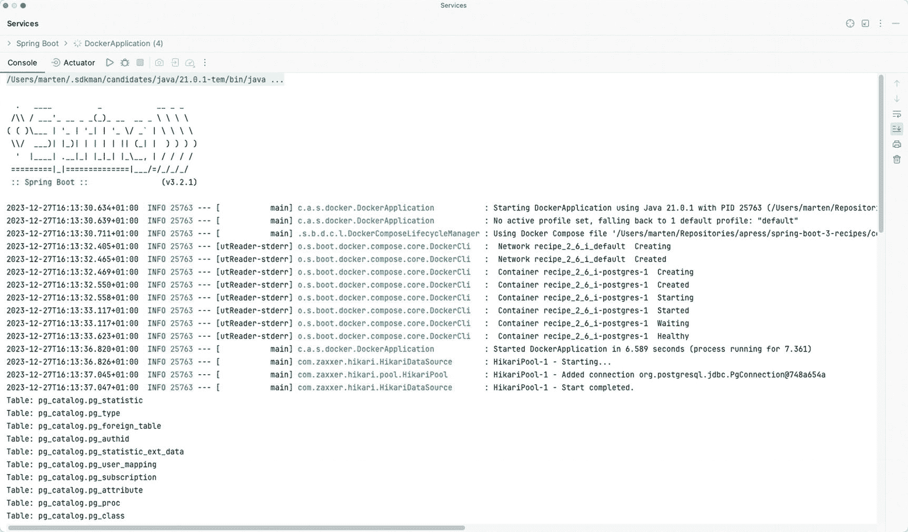

服务窗口的截图。它显示了一组 Spring Boot 程序日志，这些日志使用 docker 文件输出运行应用程序，启动容器，并列出表。

图 2-6

Docker 应用程序输出

不再需要手动使用 `docker compose up` 启动容器，或通过修改构建（或 `main` 方法）来启动容器。

默认情况下，Spring Boot Docker Compose 支持会查找 `docker-compose.yaml`/`compose.yml` 文件。这可以通过 `spring.docker.compose.file` 属性进行更改。你可以将其指向文件系统上的特定文件。还有更多属性（参见表 2-3）可用于修改行为。

表 2-3

Docker Compose 配置参数

| 参数 | 描述 |
| --- | --- |
| `spring.docker.compose.enabled` | 设置是否启用 Docker Compose 支持；默认值为 `true`。 |
| `spring.docker.compose.file` | 特定 Docker Compose 文件的路径。 |
| `spring.docker.compose.lifecycle-management` | Docker Compose 生命周期；默认值为 `START_AND_STOP`。 |
| `spring.docker.compose.host` | Docker 容器启动和运行所在机器的主机名/IP 地址。 |
| `spring.docker.compose.start.command` | 启动时使用的 Docker Compose 命令；默认值为 `UP`。 |
| `spring.docker.compose.start.loglevel` | Docker Compose 输出的日志级别。 |
| `spring.docker.compose.stop.command` | 停止时使用的 Docker Compose 命令；默认值为 `STOP`。 |
| `spring.docker.compose.stop.duration` | 停止 Docker Compose 的超时时间；默认值为 10 秒。设置为 0 表示强制停止。 |
| `spring.docker.compose.profiles.active` | 应激活的 Docker Compose 配置文件。 |
| `spring.docker.compose.skip.in-tests` | 设置是否在测试中启用 Docker Compose 支持；默认值为 `false`。 |
| `spring.docker.compose.readiness.wait` | 要使用的等待策略；默认值为 `ALWAYS`。 |
| `spring.docker.compose.readiness.timeout` | 就绪检查的超时时间；默认值为 2 分钟。 |
| `spring.docker.compose.readiness.tcp.connect-timeout` | 连接超时时间。 |
| `spring.docker.compose.readiness.tcp.read-timeout` | 读取超时时间。 |

一个三角形抽象图形内含一个感叹号符号，类似于警告图标。`spring.docker.compose.profiles.active` 用于设置/启用要与 Docker Compose 一起使用的配置文件。这些配置文件与 Spring 配置文件无关。

Spring Boot 中的 Docker Compose 支持使用 Docker 镜像的名称来确定要配置的内容。有关名称和支持的技术，请参见表 2-4。

表 2-4

Docker Compose 支持的容器

| 技术 | 匹配的容器镜像名称 |
| --- | --- |
| Cassandra | `cassandra` |
| ElasticSearch | `elasticsearch` |
| JDBC 和 R2DBC | •  `gvenzl/oracle-xe`•  `mariadb`•  `mssql/server`•  `mysql`•  `postgres` |
| MongoDB | `mongo` |
| RabbitMQ | `rabbitmq` |
| Redis | `redis` |
| Zipkin | `openzipkin/zipkin` |

#### Spring Boot Docker Compose 支持：自定义容器镜像

如表 2-4 所示，容器的名称很重要。但是，如果你想使用自定义容器，例如使用预配置并填充了数据的 PostgreSQL 数据库，或预配置且安全的消息代理，该怎么办？借助 Spring Docker Compose 支持，通过在 Docker Compose 文件中进行一些额外配置，这仍然是可能的。使用 Docker Compose，可以指定标签。Spring Boot Docker Compose 支持会读取 `org.springframework.boot.service-connection` 标签；其值将用作容器的名称。参见清单 2-32。

```
services:
postgres:
image: 'postgres:15.2'
environment:
- 'POSTGRES_DB=springboot3recipes'
- 'POSTGRES_USER=springboot3'
- 'POSTGRES_PASSWORD=recipes'
ports:
- '5432'
labels:
org.springframework.boot.service-connection: redis
清单 2-32
带有标签的 Docker Compose 文件
```

还有更多标签可用于配置/影响 Docker Compose 支持（参见表 2-5）。

表 2-5

Docker Compose 标签

| 参数 | 描述 |
| --- | --- |
| `org.springframework.boot.service-connection` | 要使用的容器镜像名称（参见表 2-4）。 |
| `org.springframework.boot.ignore` | 忽略此容器，不进行 Docker Compose 支持。 |
| `org.springframework.boot.readiness-check.tcp.disable` | 禁用 TCP 就绪检查。 |
| `org.springframework.boot.readiness-check.tcp.connect-timeout` | 连接超时时间。 |
| `org.springframework.boot.readiness-check.tcp.read-timeout` | 读取超时时间。 |


#### Spring Boot Testcontainers 支持

要在开发阶段使用 Testcontainers 支持，需要依赖 `spring-boot-testcontainers` 模块以及各种 Testcontainers 模块（本例中为 PostgreSQL）。另请参阅配方 2-3 了解测试支持。

在本示例中，我们将使用 PostgreSQL 容器和 JUnit Jupiter 集成。由于我们使用的是 PostgreSQL，因此还需要其 JDBC 驱动程序。请参见清单 2-33。

```
org.springframework.boot
spring-boot-testcontainers
test

org.testcontainers
junit-jupiter
test

org.testcontainers
postgresql
test

org.postgresql
postgresql
runtime

清单 2-33
Testcontainers 支持依赖项
```

由于我们要使用 Testcontainers，因此需要添加一个包含容器定义的 Java 配置类。在本例中，由于只需要 PostgreSQL，所以只有一个容器，但可以根据需要定义任意多个。这些容器需要成为 Spring 管理的 Bean，通过为方法添加 `@Bean` 注解以及 `@ServiceConnection` 注解来实现。后者使其对 Spring Testcontainers 支持可见，并会提取容器所需的信息，使其可供应用程序使用。提取的信息取决于容器的类型。对于我们的 PostgreSQL 容器，它将提取配置 JDBC 数据源所需的信息，例如 `spring.datasource.url`、`spring.datasource.username` 和 `spring.datasource.password`。请参见清单 2-34。

```
package com.apress.springboot3recipes.calculator;
import org.springframework.boot.test.context.TestConfiguration;
import org.springframework.boot.testcontainers.service.connection.ServiceConnection;
import org.springframework.context.annotation.Bean;
import org.testcontainers.containers.PostgreSQLContainer;
@TestConfiguration(proxyBeanMethods = false)
public class TestContainersConfig {
@Bean
@ServiceConnection
public PostgreSQLContainer postgres() {
return new PostgreSQLContainer("postgres:15.2");
}
}
清单 2-34
Testcontainers Java 配置
```

接下来，我们可以重用上一节中的 Spring Boot 应用程序类（参见清单 2-31）。要使用 Testcontainers 支持，我们需要在测试目录中添加另一个带有 `main` 方法的类。请参见清单 2-35。

一个灯泡图标。当与 Spring Boot Devtools（参见配方 2-7）一起使用时，你可能需要添加 `@RestartScope` 注解。这将重用并保持容器运行，而不是停止并重启它。这也会在更新之间保留容器中的数据。

```
package com.apress.springboot3recipes.calculator;
import org.springframework.boot.SpringApplication;
public class TestDockerApplication {
public static void main(String[] args) {
SpringApplication.from(DockerApplication::main)
.with(TestContainersConfig.class).run(args);
}
}
清单 2-35
Spring Boot Testcontainers 主类
```

请注意，此类没有任何注解，只有一个简单的 `main` 方法。在此方法中，我们使用 `from` 引用了实际带有 `@SpringBootApplication` 注解的类的 `main` 方法。接下来，我们使用 `with` 方法，通过 `TestContainersConfig.class` 来增强配置。最后，我们调用 `run` 来启动实际应用程序。

定义 Testcontainers 的一种常见方式是将它们声明为类或接口中的 `static` 字段。当你使用接口来定义容器时，可以在测试和专门的应用程序运行器之间重用它们。要重用基于接口的定义，可以在配置类上使用 `@ImportTestContainers` 注解。请参见清单 2-36。

```
package com.apress.springboot3recipes.calculator;
import org.springframework.boot.testcontainers.service.connection.ServiceConnection;
import org.testcontainers.containers.PostgreSQLContainer;
import org.testcontainers.junit.jupiter.Container;
public interface OurContainersConfig {
@ServiceConnection
@Container
PostgreSQLContainer postgres = new PostgreSQLContainer("postgres:15.2");
}
清单 2-36
接口上的 Testcontainers 定义
```

现在使用 `@ImportTestContainers` 注解来重用此接口。请参见清单 2-37。

```
package com.apress.springboot3recipes.calculator;
import org.springframework.boot.test.context.TestConfiguration;
import org.springframework.boot.testcontainers.context.ImportTestcontainers;
@TestConfiguration(proxyBeanMethods = false)
@ImportTestcontainers(OurContainersConfig.class)
public class TestContainers2Config { }
清单 2-37
接口上的 Testcontainers 定义
```

## 2-7\. 使用 Spring Boot Devtools 加速开发

### 问题

你希望在开发过程中获得快速反馈，而不必重新构建和重启应用程序。

### 解决方案

你可以使用 Spring Boot Devtools。Devtools 允许检测类路径更改，当检测到更改时，它将重启应用程序。这种重启比冷启动快得多。它还会将某些属性设置为在开发期间有意义的默认值（例如，禁用 Thymeleaf 模板的缓存，在错误响应中包含完整的错误详细信息）。表 2-6 列出了 Spring Boot Devtools 设置的属性及其默认值。如果你想禁用这些默认值，请在 `application.properties` 中添加 `spring.devtools.add-properties` 并将其值设置为 `false`。

表 2-6

Spring Boot Devtools 默认属性

| 属性 | 值 | 描述 |
| --- | --- | --- |
| `server.error.include-binding-errors` | `always` | 显示绑定错误的完整信息。 |
| `server.error.include-message` | `always` | 在错误响应中包含自定义错误消息。 |
| `server.error.include-stacktrace` | `always` | 在错误响应中显示完整的堆栈跟踪。 |
| `server.servlet.jsp.init-parameters.development` | `true` | JSP 开发参数，允许重新加载。 |
| `server.servlet.session.persistent` | `true` | 在重启期间持久化会话信息。 |
| `spring.docker.compose.readiness.wait` | `only-if-started` | 等待 Docker 容器准备就绪。 |
| `spring.freemarker.cache` | `false` | 禁用 Freemarker 模板缓存。 |
| `spring.graphql.graphiql.enabled` | `true` | 启用 GraphiQL UI。 |
| `spring.groovy.template.cache` | `false` | 禁用 Groovy 模板缓存。 |
| `spring.h2-console.enabled` | `true` | 启用 H2 控制台（如果可用）。 |
| `spring.mustache.servlet.cache` | `false` | 禁用 Mustache 模板缓存。 |
| `spring.mvc.log-resolved-exception` | `true` | 记录异常。 |
| `spring.reactor.netty.shutdown-quiet-period` | `0s` | 立即关闭 Netty，而不是等待。 |
| `spring.template.provider.cache` | `false` | 禁用模板缓存。 |
| `spring.thymeleaf.cache` | `false` | 禁用 Thymeleaf 模板缓存。 |
| `spring.web.resource.cache.period` | `0s` | 禁用静态资源缓存。 |
| `spring.web.resource.chain.cache` | `0s` | 禁用静态资源缓存。 |


### 工作原理

要启用并重新加载 Spring Boot Devtools，首先需要添加对 `spring-boot-devtools` 模块的依赖。请参见清单 2-38。

```
org.springframework.boot
spring-boot-devtools
true

清单 2-38
Devtools 依赖
```

请注意该依赖被标记为可选（optional）。这意味着它不会被包含在 Spring Boot 创建的可运行构件中。

现在，让我们编写一个简单的控制器，用于列出 PostgreSQL 数据库中的表。它将通过 `JdbcTemplate` 直接访问数据库，并执行查询以从 PostgreSQL 的 `pg_tables` 表中获取 `tablename`。最后，它会将其转换为响应。

首先，我们需要一些依赖来实现这一功能。除了控制器和 JDBC 类的依赖外，我们还使用 Docker Compose 支持来启动一个 PostgreSQL 容器（参见配方 2-6）。

```
org.springframework.boot
spring-boot-starter-web

org.springframework.boot
spring-boot-starter-jdbc

org.springframework.boot
spring-boot-docker-compose

```

接下来是控制器，如下所示：

```
package com.apress.springboot3recipes;
import org.springframework.jdbc.core.JdbcTemplate;
import org.springframework.web.bind.annotation.GetMapping;
import org.springframework.web.bind.annotation.RestController;
import java.util.List;
@RestController
public class ShowTablesController {
private final JdbcTemplate jdbc;
public ShowTablesController(JdbcTemplate jdbc) {
this.jdbc = jdbc;
}
@GetMapping("/show-tables")
public List showTables() {
var sql = "select tablename from pg_catalog.pg_tables";
return jdbc.queryForList(sql, String.class);
}
}
```

这将使用 `JdbcTemplate` 从 PostgreSQL 的 `pg_tables` 表中检索 `tablename`，并将其作为响应返回。要启动，我们需要一个基本的 Spring Boot 应用程序。

```
package com.apress.springboot3recipes;
import org.springframework.boot.SpringApplication;
import org.springframework.boot.autoconfigure.SpringBootApplication;
@SpringBootApplication
public class DevtoolsApplication {
public static void main(String[] args) {
SpringApplication.run(DevtoolsApplication.class, args);
}
}
```

一切就绪后，我们可以在 IDE 中，或通过命令行使用 Maven 或 Gradle 启动应用程序。这里我们将使用 IDE。在图 2-7 中，您可以看到启动这个简单应用程序大约花费了 4 秒。这其中包括启动 PostgreSQL 容器的时间。

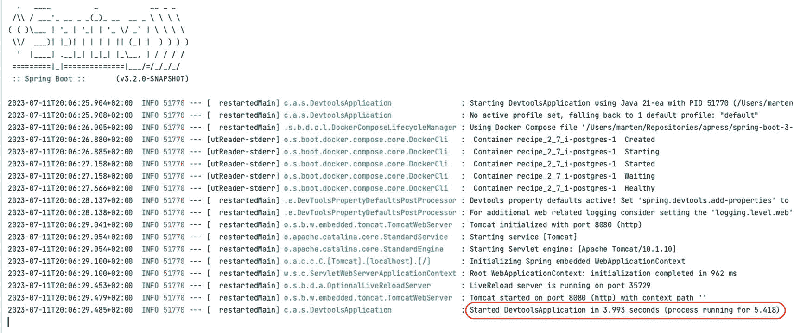

一个 Marten 窗口的截图。它显示了一组 Spring Boot 程序代码，在 3.99 秒内启动了一个简单应用程序，其中包括 PostgreSQL 容器。最后一行被高亮显示，指示了启动 Devtools 应用程序的时间。

图 2-7
首次启动的输出

请注意日志输出中的 `[restartedMain]`。Spring Boot Devtools 使用一个单独的线程和额外的类加载器来实现修改后类的重新加载。虽然这通常工作良好，但在大型多模块项目中，以及在使用类加载的其他技术（例如 Hibernate）来修改类时，有时可能会出现问题。

现在，让我们修改控制器，不再只返回 `tablename`，而是包含 `schemaname`。为此，我们需要修改查询和结果的映射，因为我们需要拼接两个字符串。

```
package com.apress.springboot3recipes;
import org.springframework.jdbc.core.JdbcTemplate;
import org.springframework.web.bind.annotation.GetMapping;
import org.springframework.web.bind.annotation.RestController;
import java.util.List;
@RestController
public class ShowTablesController {
private final JdbcTemplate jdbc;
public ShowTablesController(JdbcTemplate jdbc) {
this.jdbc = jdbc;
}
@GetMapping("/show-tables")
public List showTables() {
var sql = "select schemaname, tablename from pg_catalog.pg_tables";
return jdbc.query(sql,
(rs, row) -> rs.getString("schemaname") + "." + rs.getString("tablename"));
}
}
```

现在，当更改被构建并传播到类路径时，Spring Boot Devtools 会检测到这些更改，并重新启动应用程序。这次重启所需的时间只是启动整个应用程序所需时间的一小部分（图 2-8）。在这种情况下，现在只需要 0.681 秒，不到一秒钟。这对于编写代码并在 IDE 中获得直接反馈来说是一个巨大的提升。

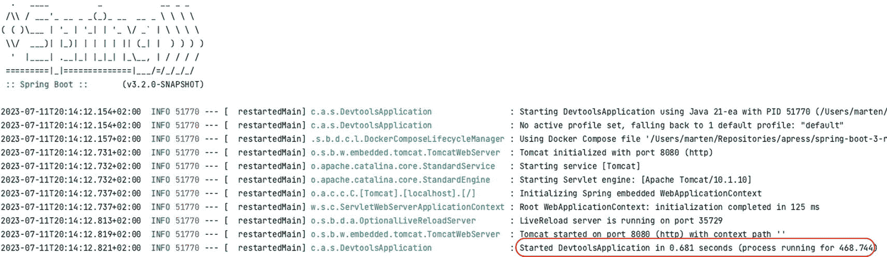

一个 Marten 窗口的截图。它显示了一组 Spring Boot 程序代码，在 0.681 秒内运行并重新启动了 Devtools 应用程序。最后一行被高亮显示，指示了 Devtools 应用程序的重启或运行时间。

图 2-8
重启后的输出

## 本章小结

在本章中，我们探讨了如何在 Spring Boot 中配置 Bean，以及如何通过属性文件和命令行参数为 Spring Boot 提供配置属性。接着，我们快速了解了如何编写带或不带 Spring Boot 的单元测试，并使用 Mockito 作为模拟库。最后，我们在应用程序中引入了日志记录，展示了如何通过前面提到的属性进行配置，以及如何切换到不同的日志提供程序（使用 Log4j 2 替代 Logback）。

下一章将带你了解 Spring Boot 和 Spring MVC。

脚注 1   2   3

# 3. Spring MVC

当 Spring Boot 在类路径上发现相关类时，它会自动配置一个 Web 应用程序。它还会启动一个内嵌服务器（默认情况下，它会启动一个内嵌的 Tomcat 实例）。

## 3-1. Spring MVC 入门

### 问题

你想使用 Spring Boot 来驱动一个 Spring MVC 应用程序。

### 解决方案

Spring Boot 会自动配置 Spring MVC 所需的组件。Spring Boot 需要在其类路径上检测到 Spring MVC 类。为此，你需要添加 `spring-boot-starter-web` 作为依赖。


### 工作原理

在你的项目中，添加 `spring-boot-starter-web` 依赖。参见清单 3-1。

```
org.springframework.boot
spring-boot-starter-web

清单 3-1
Spring MVC 的 Spring Boot Starter
```

这会为 Spring MVC 添加所需的依赖项：`spring-web` 和 `spring-webmvc`。现在，Spring Boot 能够检测到这些类，并会进行额外的配置来设置 `DispatcherServlet`。它还会添加启动嵌入式 Tomcat 服务器所需的所有 JAR 文件。参见清单 3-2。

```
package com.apress.springboot3recipes.library;
import org.springframework.boot.SpringApplication;
import org.springframework.boot.autoconfigure.SpringBootApplication;
@SpringBootApplication
public class HelloWorldApplication {
public static void main(String[] args) {
SpringApplication.run(HelloWorldApplication.class, args);
}
}
清单 3-2
用于启动 Spring MVC 的 Spring Boot 应用程序
```

这几行代码足以启动嵌入式 Tomcat 服务器并设置预配置的 Spring MVC。当你启动应用程序时，会看到类似于图 3-1 的输出。

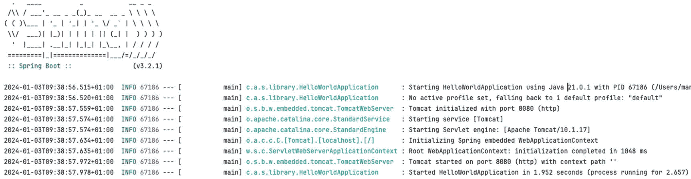

一张页面截图，显示 Spring Boot 中的代码。它启动了嵌入式 Tomcat 服务器并设置了预配置的 Spring MVC。

图 3-1

启动输出

当你启动 `HelloWorldApplication` 时，Spring Boot 会执行以下操作：

表 3-1

自动注册的 Servlet 过滤器

| 过滤器 | 描述 |
| --- | --- |
| `DefaultCharacterEncodingFilter` | 默认强制编码为 `UTF-8`。可通过设置 `spring.http.encoding.charset` 属性进行配置。可通过将 `server.servlet.encoding.enabled` 设置为 `false` 来禁用。 |
| `FormContentFilter` | 对 `PUT`、`PATCH` 和 `DELETE` 请求，使用 `FormContentRequestWrapper` 包装请求，以便对这些请求进行一致的处理，并能够与它们进行绑定。可通过将 `spring.mvc.formcontent.enabled` 属性设置为 `false` 来禁用。 |
| `RequestContextFilter` | 将当前请求暴露给当前线程，以便即使在非 Spring MVC 应用程序（如 Jersey）中，也能使用 `RequestContextHolder` 和 `LocaleContextHolder`。 |

1.  在端口 8080 上启动嵌入式 Tomcat 服务器（默认情况下）。

2.  注册并启用一些默认的 Servlet 过滤器（参见表 3-1）。

3.  设置对 `*.css`、`*.js` 和 `favicon.ico` 等静态资源的处理。

4.  启用与 Web JAR 的集成。

5.  设置基本的错误处理功能。

6.  使用所需的组件（即 `ViewResolvers`、I18N 等）配置 `DispatcherServlet`。

在当前状态下，`HelloWorldApplication` 除了启动服务器外不做任何事情。让我们添加一个控制器来返回一些信息。参见清单 3-3。

```
package com.apress.springboot3recipes.library;
import org.springframework.boot.SpringBootVersion;
import org.springframework.web.bind.annotation.GetMapping;
import org.springframework.web.bind.annotation.RestController;
@RestController
public class HelloWorldController {
@GetMapping("/")
public String hello() {
var version = SpringBootVersion.getVersion();
return String.format("Hello World, from Spring Boot %s!", version);
}
}
清单 3-3
HelloWorld 控制器
```

这个 `HelloWorldController` 控制器将注册到 `/` URL，当被调用时，会返回包含 Spring Boot 版本的短语 `Hello World, from Spring Boot`。`@RestController` 表明这是一个 `@Controller`，因此会被 Spring Boot 检测到。此外，它还会为所有请求处理方法添加 `@ResponseBody` 注解。`@GetMapping` 将 `hello` 方法映射到到达 `/` 的每个 GET 请求。我们也可以写成 `@RequestMapping(path="/", method=RequestMethod.GET)`。

当重新启动 `HelloWorldApplication` 时，`HelloWorldController` 控制器将被检测并处理。现在，当使用 `curl` 或 `HTTPie` 等工具访问 `http://localhost:8080/` 时，结果应如图 3-2 所示。

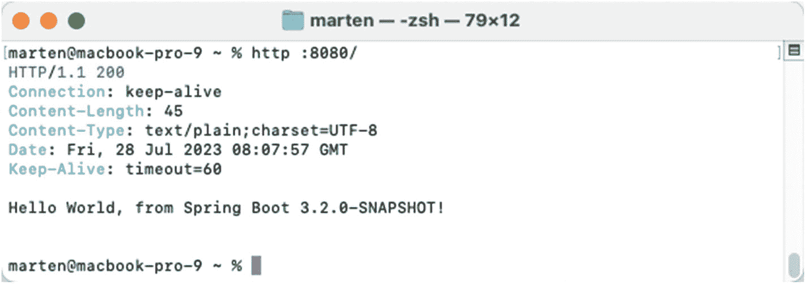

一张 Marten 页面的截图。它检测并处理了 Hello World 控制器，并在访问本地主机时在 Spring Boot 中显示控制器的输出。

图 3-2

控制器的输出

#### 测试控制器

现在应用程序正在运行并返回结果，是时候为控制器添加测试了。Spring 已经拥有一些令人印象深刻的测试功能，而 Spring Boot 则增加了更多功能。使用 Spring Boot 测试控制器变得相当容易。参见清单 3-4。

```
package com.apress.springboot3recipes.library;
import org.hamcrest.Matchers;
import org.junit.jupiter.api.Test;
import org.springframework.beans.factory.annotation.Autowired;
import org.springframework.boot.test.autoconfigure.web.servlet.WebMvcTest;
import org.springframework.http.MediaType;
import org.springframework.test.web.servlet.MockMvc;
import org.springframework.test.web.servlet.request.MockMvcRequestBuilders;
import static org.springframework.test.web.servlet.result.MockMvcResultMatchers.content;
import static org.springframework.test.web.servlet.result.MockMvcResultMatchers.status;
@WebMvcTest(HelloWorldController.class)
class HelloWorldControllerTest {
@Autowired
private MockMvc mockMvc;
@Test
void testHelloWorldController() throws Exception {
var expected = "Hello World, from Spring Boot ";
mockMvc.perform(MockMvcRequestBuilders.get("/"))
.andExpect(status().isOk())
.andExpect(content().string(Matchers.containsString(expected)))
.andExpect(content().contentTypeCompatibleWith(MediaType.TEXT_PLAIN));
}
}
清单 3-4
针对 HelloWorldController 的 WebMvcTest 切片测试
```

`@WebMvcTest` 注解指示 Spring 测试框架为测试这个特定控制器设置一个应用程序上下文。它将启动一个最小的 Spring Boot 应用程序，仅包含与 Web 相关的 Bean，如 `@Controller`、`@ControllerAdvice` 等。此外，它还会预配置 Spring Test Mock MVC 支持，然后可以自动注入该支持。

Spring Test Mock MVC 可用于模拟向控制器发起 HTTP 请求，并对结果执行一些操作。这里我们使用 `GET` 调用 `/`，并期望得到一个 HTTP 200（即 OK）响应，其中包含文本消息 `Hello World, from Spring Boot`。

## 3-2\. 使用 Spring MVC 暴露 REST 资源

### 问题

你想使用 Spring MVC 来暴露基于 REST 的资源。

### 解决方案

你需要一个 JSON 库来进行 JSON 编组（尽管你也可以使用 XML 和其他格式，因为内容协商是 REST 的一部分，正如最初描述的那样）。在本方案中，我们将使用 Jackson 库来处理 JSON 转换。


### 工作原理

假设你正在一家公共图书馆工作，需要开发一个 REST API 来实现图书的检索和搜索功能。

首先，你需要在构建配置中添加 Jackson 库的依赖。Spring Boot 提供了 `spring-boot-starter-json` 来添加所有必需的依赖项。参见代码清单 3-5。

```
org.springframework.boot
spring-boot-starter-json

代码清单 3-5
Spring Boot JSON 启动器依赖
```

一个信息图标，圆圈内包含字母 i。 `spring-boot-starter-web` 依赖项已经包含了 `spring-boot-starter-json` 的依赖，并会自动将其引入。但显式声明它以表明你正在使用/启用 JSON 功能，可能会更方便。

你也可以使用 Google 的 GSON 库；只需使用相应的 GSON 依赖项，并从 `spring-boot-starter-web` 依赖中排除 `spring-boot-starter-json` 即可。

由于你正在为图书馆开发应用程序，它很可能包含图书，因此我们创建一个 `Book` 记录。参见代码清单 3-6。

```
package com.apress.springboot3recipes.library;
import java.util.List;
import java.util.Objects;
public record Book(
String isbn,
String title,
List<String> authors) {
@Override
public boolean equals(Object o) {
if (this == o) return true;
if (o == null || getClass() != o.getClass()) return false;
Book book = (Book) o;
return Objects.equals(isbn, book.isbn);
}
@Override
public int hashCode() {
return Objects.hash(isbn);
}
}
代码清单 3-6
Book 记录
```

一本书由其 ISBN 号定义；它有一个标题和一位或多位作者。通常，记录会创建 `equals`、`hashCode` 和 `toString` 方法，这些方法会包含记录中的所有数据（因为它是不可变的）。然而，在这里我们希望 `equals` 和 `hashCode` 仅基于 `isbn` 字段，因此我们自己提供了实现。

你还需要一个服务来处理图书馆中的图书。让我们为 `BookService` 定义一个接口和实现。参见代码清单 3-7。

```
package com.apress.springboot3recipes.library;
import java.util.Optional;
public interface BookService {
Iterable<Book> findAll();
Book create(Book book);
Optional<Book> find(String isbn);
}
代码清单 3-7
BookService 接口
```

目前，该实现是一个简单的内存实现。参见代码清单 3-8。

```
package com.apress.springboot3recipes.library;
import org.springframework.stereotype.Service;
import java.util.Map;
import java.util.Optional;
import java.util.concurrent.ConcurrentHashMap;
@Service
class InMemoryBookService implements BookService {
private final Map<String, Book> books = new ConcurrentHashMap<>();
@Override
public Iterable<Book> findAll() {
return books.values();
}
@Override
public Book create(Book book) {
books.put(book.isbn(), book);
return book;
}
@Override
public Optional<Book> find(String isbn) {
return Optional.ofNullable(books.get(isbn));
}
}
代码清单 3-8
BookService 内存实现
```

该服务已使用 `@Service` 注解，以便 Spring Boot 能够检测到它并创建其实例。参见代码清单 3-9。

```
package com.apress.springboot3recipes.library;
import java.util.List;
import org.springframework.boot.ApplicationRunner;
import org.springframework.boot.SpringApplication;
import org.springframework.boot.autoconfigure.SpringBootApplication;
import org.springframework.context.annotation.Bean;
@SpringBootApplication
public class LibraryApplication {
public static void main(String[] args) {
SpringApplication.run(LibraryApplication.class, args);
}
@Bean
public ApplicationRunner booksInitializer(BookService bookService) {
return args -> {
bookService.create(
new Book("9780061120084", "杀死一只知更鸟",
List.of("哈珀·李")));
bookService.create(
new Book("9780451524935", "1984",
List.of("乔治·奥威尔")));
bookService.create(
new Book("9780618260300", "霍比特人",
List.of("J.R.R. 托尔金")));
};
}
}
代码清单 3-9
包含初始化数据的应用程序类
```

`LibraryApplication` 将检测所有类并启动服务器。启动时，它会预先注册三本书，以便我们的图书馆中有一些数据。

为了将 `Book` 暴露为 REST 资源，创建一个名为 `BookController` 的类，并使用 `@RestController` 注解。Spring Boot 将检测到这个类并创建其实例。使用 `@RequestMapping`（以及 `@GetMapping` 和 `@PostMapping`），你可以编写方法来处理传入的请求。

一个信息图标，圆圈内包含字母 i。 你可以使用 `@Controller` 并在每个请求处理方法上添加 `@ResponseBody`，来代替 `@RestController`。使用 `@RestController` 会隐式地将 `@ResponseBody` 添加到请求处理方法上。

```
package com.apress.springboot3recipes.library.rest;
import com.apress.springboot3recipes.library.Book;
import com.apress.springboot3recipes.library.BookService;
import org.springframework.http.ResponseEntity;
import org.springframework.web.bind.annotation.*;
import org.springframework.web.util.UriComponentsBuilder;
@RestController
@RequestMapping("/books")
public class BookController {
private final BookService bookService;
public BookController(BookService bookService) {
this.bookService = bookService;
}
@GetMapping
public Iterable<Book> all() {
return bookService.findAll();
}
@GetMapping("/{isbn}")
public ResponseEntity<Book> get(@PathVariable("isbn") String isbn) {
return ResponseEntity.of(bookService.find(isbn));
}
@PostMapping
public ResponseEntity<Book> create(@RequestBody Book book,
UriComponentsBuilder uriBuilder) {
var created = bookService.create(book);
var newBookUri = uriBuilder.path("/books/{isbn}").build(created.isbn());
return ResponseEntity.created(newBookUri).body(created);
}
}
```

由于类上使用了 `@RequestMapping("/books")` 注解，控制器将被映射到 `/books` 路径。`list` 方法将在对 `/books` 的 GET 请求时被调用。当使用 GET 请求调用 `/books/979-8-8688-0112-9` 时，`get` 方法将被调用，并返回单本书的结果，如果找不到书，则返回 404 响应状态。最后，你可以使用 POST 请求向 `/books` 添加图书。此时 `create` 方法将被调用，传入请求的正文将被转换为图书对象。

Spring Boot 还可以在启动时显示可用的映射。为此，你需要为 `web` 组启用 TRACE 日志记录（这是 Spring Boot 中用于为一组包启用日志记录的占位符）。通过在 `application.properties` 中添加 `logging.level.web=TRACE`，它将在控制台列出所有映射。它还会对传入的请求及其处理过程启用大量日志记录，因此你可能不希望一直保持此设置，但它可以成为调试映射问题的绝佳工具。示例输出见图 3-3。

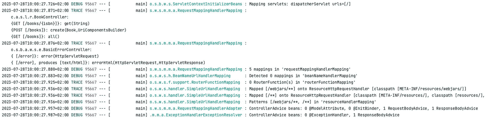


一个页面截图显示了一组代码作为输出，内容包含映射的 Servlet、检测到的映射、路由函数、资源请求处理器以及控制器通知 Bean。

图 3-3

包含请求映射的启动日志

现在应用程序已启动，你可以使用`HTTPie`或`curl`来检索书籍。使用`http :8080/books`时，应看到类似图 3-4 的输出。

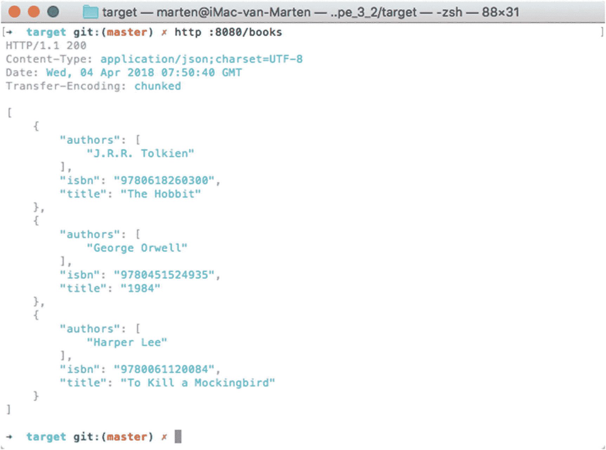

目标 Marten 页面的截图，显示了一组以 JSON 格式输出结果的程序代码，包含用于检索书籍的 HTTP 链接，以及作者、ISBN 和书名信息。

图 3-4

书籍列表的 JSON 输出

向`http://localhost:8080/books/9780451524935`发送请求将返回单本书的结果，此处为乔治·奥威尔所著的*1984*。使用未知的 ISBN 将返回 404 错误。

当发起 POST 请求时，我们可以向列表中添加新书。参见代码清单 3-10。

```
http POST :8080/books \
title="The Lord of the Rings" \
isbn="9780618640157" \
authors:='["J.R.R. Tolkien"]'
代码清单 3-10
HTTPie 命令
```

正确执行此调用后，将返回新添加的书籍。此时获取书籍列表，应包含四本书，而非初始的三本。

其原理是`HTTPie`将参数转换为 JSON 请求体，随后由 Jackson 库读取并转换为`Book`对象。参见代码清单 3-11。

```
{
"title": "The Lord of the Rings",
"isbn": "9780618640157",
"authors": ["J.R.R. Tolkien"]
}
代码清单 3-11
Book 的 JSON 表示形式
```

Jackson 会检测我们创建的`Book`记录（参见代码清单 3-6），并将属性映射到正确的构造函数参数。

#### 测试@RestController

为确保控制器按预期工作，需要编写测试来验证其正确行为。参见代码清单 3-12。

```
package com.apress.springboot3recipes.library.rest;
import com.apress.springboot3recipes.library.Book;
import com.apress.springboot3recipes.library.BookService;
import org.hamcrest.Matchers;
import org.junit.jupiter.api.Test;
import org.springframework.beans.factory.annotation.Autowired;
import org.springframework.boot.test.autoconfigure.web.servlet.WebMvcTest;
import org.springframework.boot.test.mock.mockito.MockBean;
import org.springframework.http.MediaType;
import org.springframework.test.web.servlet.MockMvc;
import org.springframework.test.web.servlet.result.MockMvcResultMatchers;
import java.util.Arrays;
import java.util.List;
import java.util.Optional;
import static org.mockito.ArgumentMatchers.any;
import static org.mockito.ArgumentMatchers.anyString;
import static org.mockito.Mockito.when;
import static org.springframework.test.web.servlet.request.MockMvcRequestBuilders.get;
import static org.springframework.test.web.servlet.request.MockMvcRequestBuilders.post;
import static org.springframework.test.web.servlet.result.MockMvcResultMatchers.header;
import static org.springframework.test.web.servlet.result.MockMvcResultMatchers.status;
@WebMvcTest(BookController.class)
public class BookControllerTest {
@Autowired
private MockMvc mockMvc;
@MockBean
private BookService bookService;
@Test
public void shouldReturnListOfBooks() throws Exception {
when(bookService.findAll()).thenReturn(Arrays.asList(
new Book("123", "Spring 5 Recipes", List.of("Marten Deinum", "Josh Long")),
new Book("321", "Pro Spring MVC", List.of("Marten Deinum", "Colin Yates"))));
mockMvc.perform(get("/books"))
.andExpect(status().isOk())
.andExpect(MockMvcResultMatchers.jsonPath("$", Matchers.hasSize(2)))
.andExpect(MockMvcResultMatchers.jsonPath("$[*].isbn", Matchers.containsInAnyOrder("123", "321")))
.andExpect(MockMvcResultMatchers.jsonPath("$[*].title", Matchers.containsInAnyOrder("Spring 5 Recipes", "Pro Spring MVC")));
}
@Test
public void shouldReturn404WhenBookNotFound() throws Exception {
when(bookService.find(anyString())).thenReturn(Optional.empty());
mockMvc.perform(get("/books/123"))
.andExpect(status().isNotFound());
}
@Test
public void shouldReturnBookWhenFound() throws Exception {
when(bookService.find(anyString())).thenReturn(
Optional.of(new Book("123", "Spring 6 Recipes", List.of("Marten Deinum", "Josh Long"))));
mockMvc.perform(get("/books/123"))
.andExpect(status().isOk())
.andExpect(MockMvcResultMatchers.jsonPath("$.isbn", Matchers.equalTo("123")))
.andExpect(MockMvcResultMatchers.jsonPath("$.title", Matchers.equalTo("Spring 6 Recipes")));
}
@Test
public void shouldAddBook() throws Exception {
when(bookService.create(any(Book.class))).thenReturn(new Book("123456789", "Test Book Stored", List.of("T. Author")));
mockMvc.perform(post("/books")
.contentType(MediaType.APPLICATION_JSON)
.content("{ \"isbn\" : \"123456789\", \"title\" : \"Test Book\", \"authors\" : [\"T. Author\"]}"))
.andExpect(status().isCreated())
.andExpect(header().string("Location", "http://localhost/books/123456789"));
}
}
代码清单 3-12
使用 WebMvcTest 对 BookController 进行集成测试
```

该测试使用`@WebMvcTest`创建基于`MockMvc`的集成测试。它会创建一个最小化的 Spring Boot 应用程序来运行控制器。控制器需要`BookService`的实例，因此我们通过`@MockBean`注解让框架为其创建模拟对象。在不同的测试方法中，我们模拟了预期行为（例如返回书籍列表、返回空的`Optional`等）。

一个信息图标，圆圈内包含字母 i。 Spring Boot 使用 Mockito 通过`@MockBean`创建模拟对象。

此外，测试还使用了 JsonPath 库，以便通过表达式测试 JSON 结果。JsonPath 之于 JSON，就如同 XPath 之于 XML。

## 3-3\. 在 Spring Boot 中使用 Thymeleaf

### 问题

你希望使用 Thymeleaf 来渲染应用程序的页面。

### 解决方案

添加 Thymeleaf 的依赖，并创建一个`@Controller`来确定视图并填充模型。


### 工作原理

首先，你需要在项目中添加 `spring-boot-starter-thymeleaf` 依赖，以获取所需的 Thymeleaf 依赖项。

```
org.springframework.boot
spring-boot-starter-thymeleaf

```

添加此依赖后，你将获得 Thymeleaf 库以及 Thymeleaf Spring 方言，从而使两者能够良好集成。由于这两个库的存在，Spring Boot 将自动配置 `ThymeleafViewResolver`。

`ThymeleafViewResolver` 需要一个 Thymeleaf `ITemplateEngine` 来解析和渲染视图。一个特殊的 `SpringTemplateEngine` 将预先配置好 `SpringDialect`，以便你可以在 Thymeleaf 页面中使用 SpEL。

一个灯泡图标。 要添加其他 Thymeleaf 方言，你只需为其创建一个 `@Bean` 方法，Spring Boot 会自动检测并将其与 Thymeleaf 连接。其中一些方言甚至会自动配置，例如与 Spring Security 集成时（参见第 5 章）。

为了配置 Thymeleaf，Spring Boot 在 `spring.thymeleaf` 命名空间中暴露了多个属性（参见表 3-2）。

**表 3-2 Thymeleaf 属性**

| 属性 | 描述 |
| --- | --- |
| `spring.thymeleaf.cache` | 设置是否缓存已解析的模板；默认值为 `true`。 |
| `spring.thymeleaf.check-template` | 在渲染前检查模板是否存在；默认值为 `true`。 |
| `spring.thymeleaf.check-template-location` | 检查模板位置是否存在；默认值为 `true`。 |
| `spring.thymeleaf.enabled` | 设置是否启用 Thymeleaf；默认值为 `true`。 |
| `spring.thymeleaf.enable-spring-el-compiler` | 启用 SpEL 表达式的编译；默认值为 `false`。 |
| `spring.thymeleaf.encoding` | 设置模板的编码；默认值为 `UTF-8`。 |
| `spring.thymeleaf.exclude-view-names` | 列出被排除解析的视图名称（以逗号分隔）。 |
| `spring.thymeleaf.mode` | 设置要使用的 Thymeleaf `TemplateMode`；默认值为 `HTML`。 |
| `spring.thymeleaf.prefix` | 设置 `ViewResolver` 使用的 `prefix`；默认值为 `classpath:/templates/`。 |
| `spring.thymeleaf.suffix` | 设置 `ViewResolver` 使用的 `suffix`；默认值为 `.html`。 |
| `spring.thymeleaf.render-hidden-markers-before-checkbox` | 设置复选框的隐藏输入是否应在复选框元素本身之前渲染（默认值为 `false`）。 |
| `spring.thymeleaf.template-resolver-order` | 设置 `ViewResolver` 的顺序；默认值为 1。 |
| `spring.thymeleaf.view-names` | 设置可以使用此 `ViewResolver` 解析的视图名称（以逗号分隔）。 |
| `spring.thymeleaf.servlet.content-type` | 设置用于写入 HTTP 响应的 Content-Type；默认值为 `text/html`。 |
| `spring.thymeleaf.servlet.produce-partial-output-while-processing` | 设置是否应尽快开始写入（部分内容），还是缓冲直到模板处理完成；默认值为 `true`。 |
| `spring.thymeleaf.reactive.max-chunk-size` | 设置用于写入响应的数据缓冲区的最大大小。如果未设置，则默认使用分块模式。 |
| `spring.thymeleaf.reactive.media-types` | 设置此视图技术支持的媒体类型。 |
| `spring.thymeleaf.reactive.full-mode-view-names` | 包含一个逗号分隔的视图名称列表（允许使用模式），这些视图应在 `FULL` 模式下执行。 |
| `spring.thymeleaf.reactive.chunked-mode-view-names` | 包含一个逗号分隔的视图名称列表（允许使用模式），这些视图应在 `CHUNKED` 模式下执行。 |

#### 添加索引页面

首先，为我们的应用程序添加一个索引页面。在 `src/main/resources/templates` 目录（默认位置）下创建一个 `index.html` 文件。参见清单 3-13。

```

Spring Boot Recipes - 图书馆

图书馆
书籍列表

清单 3-13 索引页面
```

这只是一个基本的 HTML5 页面，为 Thymeleaf 做了一些小补充。首先，添加 `xmlns:th="`[`http://www.thymeleaf.org`](http://www.thymeleaf.org)`"` 以启用 Thymeleaf 的命名空间。该命名空间通过 `th:href` 在链接中使用。`@{/books.html}` 部分将由 Thymeleaf 扩展为正确的链接，并放置在链接的实际 `href` 属性中。

现在，运行应用程序时，你应该会看到一个包含书籍概览链接的页面（参见图 3-5）。

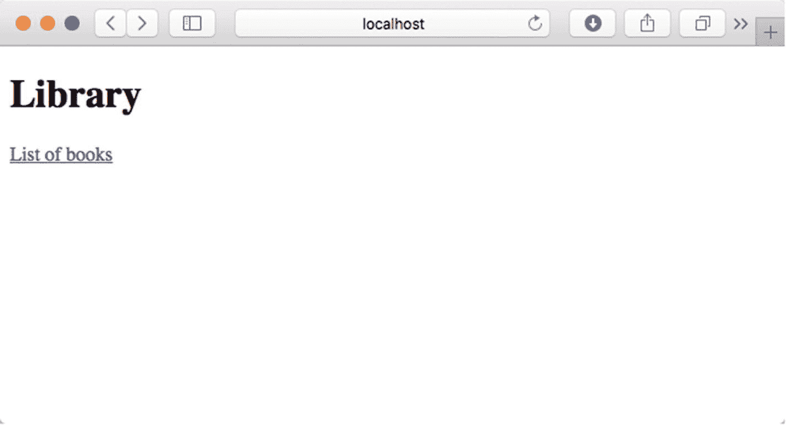

本地主机页面的截图。它显示了指向名为“图书馆”的书籍列表的链接。

**图 3-5 渲染后的索引页面**


#### 添加控制器和视图

当点击索引页面中提供的链接时，我们希望看到一个显示图书馆中可用书籍列表的页面（见图 3-6）。为此，需要添加两个部分：首先是一个能够处理请求并准备模型的控制器，其次是一个用于渲染书籍列表的视图。

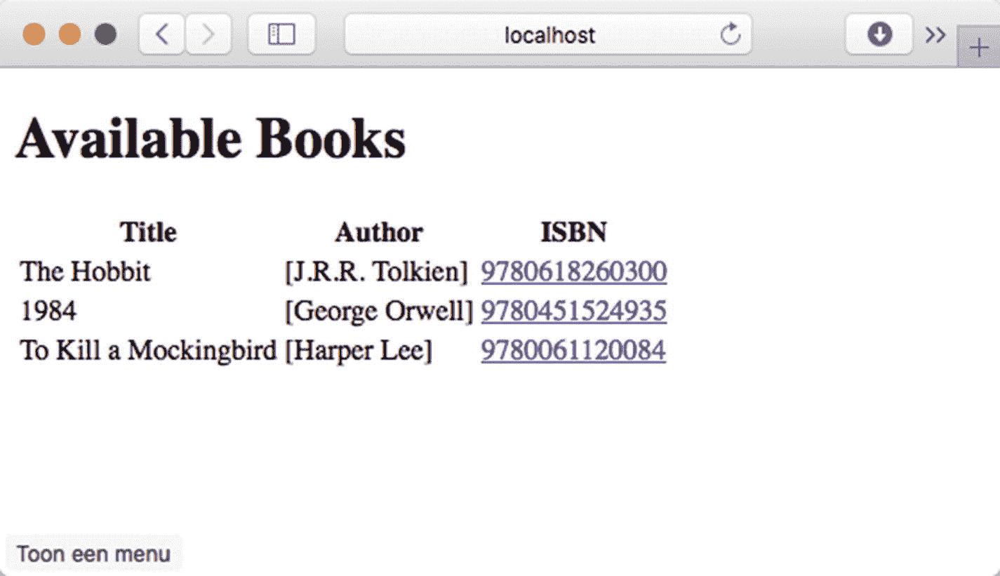

本地主机页面的截图。它显示了可用书籍的标题、作者和 ISBN 链接列表。

图 3-6

书籍列表页面

让我们添加一个控制器，它将用书籍列表填充模型，并选择要渲染的视图名称。控制器是一个带有 `@Controller` 注解的类，其中包含请求处理方法（带有 `@RequestMapping` 注解的方法，或者如本示例中使用的 `@GetMapping`，它是 `@RequestMapping` 的一种特化注解）。参见代码清单 3-14。

```
package com.apress.springboot3recipes.library.web;
import com.apress.springboot3recipes.library.Book;
import com.apress.springboot3recipes.library.BookService;
import org.springframework.stereotype.Controller;
import org.springframework.ui.Model;
import org.springframework.web.bind.annotation.GetMapping;
@Controller
public class BookController {
private final BookService bookService;
public BookController(BookService bookService) {
this.bookService = bookService;
}
@GetMapping("/books.html")
public String all(Model model) {
model.addAttribute("books", bookService.findAll());
return "books/list";
}
}
代码清单 3-14
BookController
```

`BookController` 需要 `BookService`，以便获取要显示的书籍列表。`all` 方法将 `org.springframework.ui.Model` 作为方法参数，这样我们就可以将书籍列表放入模型中。请求处理方法可以有不同的参数^(⁴)，其中之一就是 `Model` 类。在方法中，我们使用 `BookService` 从数据存储中检索所有书籍，并通过 `model.addAttribute` 将其添加到模型中。现在，书籍列表在模型中可以通过键 `books` 获取。

最后，我们返回要渲染的视图名称 `books/list`。

现在，控制器及其请求处理方法已添加完毕，我们需要创建视图。在 `src/main/templates/books` 目录下创建一个 `list.html` 文件。参见代码清单 3-15。

```

Library - Available Books

Available Books

Title
Author
ISBN

Title
Authors
ISBN

代码清单 3-15
书籍列表页面
```

这又是一个使用 Thymeleaf 语法的 HTML5 页面。该页面将使用 `th:each` 表达式渲染书籍列表。它会从模型中的 `books` 属性获取所有书籍，并为每本书创建一行。行中的每一列都使用 `th:text` 表达式包含一些文本；它将打印书籍的标题、作者和 ISBN。表格的最后一列包含一个指向书籍详情的链接。它使用 `th:href` 表达式构建 URL。注意 `()` 之间的表达式；这将添加 `isbn` 请求参数。

启动应用程序并点击索引页面上的链接后，您应该会看到一个显示图书馆内容的页面，如图 3-6 所示。

#### 添加详情页面

最后，当点击表格中的 ISBN 号码时，您希望看到一个显示详情的页面。该链接包含一个名为 `isbn` 的请求参数，我们可以在控制器中检索并使用它来查找书籍。请求参数可以通过带有 `@RequestParam` 注解的方法参数来获取。

以下方法将处理 GET 请求，将请求参数映射到方法参数，并包含模型，以便我们可以将书籍添加到模型中。

```
@GetMapping(value = "/books.html", params = "isbn")
public String get(@RequestParam("isbn") String isbn, Model model) {
bookService.find(isbn)
.ifPresent(book -> model.addAttribute("book", book));
return "books/details";
}
```

控制器将渲染 `books/details` 页面。将 `details.html` 文件添加到 `src/main/resources/templates/books` 目录。参见代码清单 3-16。

```

Library - Available Books

Title
authors
ISBN

Not Found

代码清单 3-16
书籍详情页面
```

这个 HTML5 Thymeleaf 模板将渲染页面上两个可用块之一。要么找到了书籍，然后显示详情；要么显示“未找到”消息。这是通过使用 `th:if` 表达式实现的。“未找到”消息中的 `isbn` 通过使用 `param` 作为前缀从请求参数中检索；`${param.isbn}` 将获取 `isbn` 请求参数。


#### 测试 @Controller

为了确保控制器按预期工作，需要编写测试来验证其正确行为。请参见清单 3-17。

```
package com.apress.springboot3recipes.library.web;
import com.apress.springboot3recipes.library.Book;
import com.apress.springboot3recipes.library.BookService;
import org.hamcrest.Matchers;
import org.junit.jupiter.api.Test;
import org.springframework.beans.factory.annotation.Autowired;
import org.springframework.boot.test.autoconfigure.web.servlet.WebMvcTest;
import org.springframework.boot.test.mock.mockito.MockBean;
import org.springframework.test.web.servlet.MockMvc;
import java.util.Arrays;
import java.util.List;
import java.util.Optional;
import static org.mockito.ArgumentMatchers.anyString;
import static org.mockito.Mockito.when;
import static org.springframework.test.web.servlet.request.MockMvcRequestBuilders.get;
import static org.springframework.test.web.servlet.result.MockMvcResultMatchers.*;
@WebMvcTest(BookController.class)
public class BookControllerTest {
@Autowired
private MockMvc mockMvc;
@MockBean
private BookService bookService;
@Test
public void shouldReturnListOfBooks() throws Exception {
when(bookService.findAll()).thenReturn(Arrays.asList(
new Book("123", "Spring 6 Recipes", List.of("Marten Deinum", "Josh Long")),
new Book("321", "Pro Spring MVC", List.of("Marten Deinum", "Colin Yates"))));
mockMvc.perform(get("/books.html"))
.andExpect(status().isOk())
.andExpect(view().name("books/list"))
.andExpect(model().attribute("books", Matchers.hasSize(2)));
}
@Test
public void shouldReturnNoBookWhenNotFound() throws Exception {
when(bookService.find(anyString())).thenReturn(Optional.empty());
mockMvc.perform(get("/books.html").param("isbn", "123"))
.andExpect(status().isOk())
.andExpect(view().name("books/details"))
.andExpect(model().attributeDoesNotExist("book"));
}
@Test
public void shouldReturnBookWhenFound() throws Exception {
Book book = new Book("123", "Spring 6 Recipes",
List.of("Marten Deinum", "Josh Long"));
when(bookService.find(anyString())).thenReturn(Optional.of(book));
mockMvc.perform(get("/books.html").param("isbn", "123"))
.andExpect(status().isOk())
.andExpect(view().name("books/details"))
.andExpect(model().attribute("book", Matchers.is(book)));
}
}
清单 3-17
使用 WebMvcTest 对 BookController 进行集成测试
```

该测试使用 `@WebMvcTest` 创建了一个基于 `MockMvc` 的集成测试。它会创建一个最小化的 Spring Boot 应用程序来运行控制器。控制器需要一个 `BookService` 实例，因此我们让框架使用 `@MockBean` 注解为其创建一个模拟对象。在不同的测试方法中，我们模拟了预期的行为（例如返回书籍列表、返回空的 `Optional` 等）。

一个信息图标，圆圈内包含字母 i。 Spring Boot 使用 Mockito 通过 `@MockBean` 创建模拟对象。

借助 Spring Test 框架的 `MockMvc` 支持，我们可以检查控制器是否返回了预期结果。我们可以检查 HTTP 状态、视图名称以及 `Model` 是否包含正确的条目。

## 3-4\. 使用 Spring MVC 处理异常

### 问题

您希望为 Spring MVC 配置异常处理，并根据自身需求进行定制。

### 解决方案

Spring MVC 提供了多种处理异常的方式，而借助 Spring Boot，修改默认行为变得非常简单。

对于与视图相关的实现，可以轻松添加页面，这些页面会被自动识别。添加一个 `error.html` 文件作为自定义错误页面，或者为特定的 HTTP 错误代码添加特定的错误页面，例如 `404.html` 和 `500.html`。

Spring Boot 也为基于 REST 的控制器提供了异常处理支持。它会返回一个包含错误信息的响应，类似于常规 MVC 异常处理中可用的错误信息。另一种选择是启用问题详情支持（RFC-7807），这是一个用于定义错误响应的小型标准。要启用它，请将 `spring.mvc.problemdetails.enabled` 属性设置为 `true`。

### 工作原理

Spring Boot 默认启用了错误处理，并会显示一个默认的错误页面。可以通过将 `server.error.whitelabel.enabled` 属性设置为 `false` 来完全禁用它。禁用后，异常处理将由 Servlet 容器接管，而不是由 Spring 和 Spring Boot 提供的通用异常处理机制处理。


#### 处理视图技术的异常

还有一些其他属性可用于配置白标错误页面，主要用于确定模型中包含哪些内容，以便可选地用于显示附加信息。相关属性请参见表 3-3。

表 3-3

错误处理属性

| 属性 | 描述 |
| --- | --- |
| `server.error.whitelabel.enabled` | 设置是否启用`whitelabel`错误页面；默认值为`true`。 |
| `server.error.path` | 设置错误页面的路径；默认值为`/error`。 |
| `Server.error.include-exception` | 设置是否在模型中包含异常名称；默认值为`false`。 |
| `server.error.include-stacktrace` | 设置是否在模型中包含堆栈跟踪；默认值为`NEVER`。 |
| `server.error.include-message` | 设置是否在模型中包含消息；默认值为`NEVER`。 |
| `server.error.include-binding-errors` | 设置是否在模型中包含消息；默认值为`NEVER`。 |

首先，让我们在`BookController`中添加一个强制引发异常的方法。

```
@GetMapping("/books/500")
public void error() {
var cause = new NullPointerException("Dummy Exception");
throw new ServerErrorException(cause.getMessage(), cause);
}
```

这将抛出一个异常，结果会显示`whitelabel`错误页面（见图 3-7）。

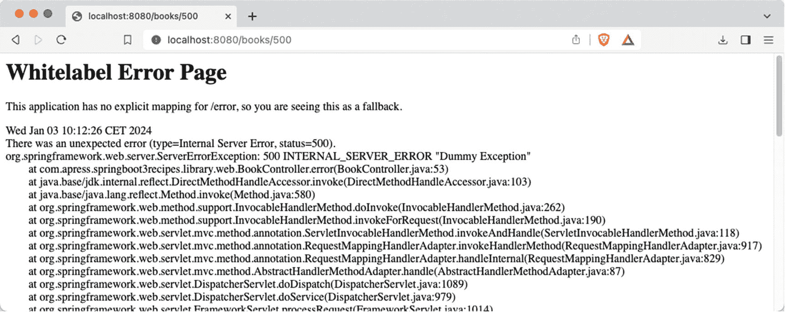

本地主机页面的屏幕截图。它显示白标错误页面下的链接列表。

图 3-7

默认的白标错误页面

当找不到错误页面时，会显示此页面。要覆盖此行为，请在`src/main/resources/templates`目录中添加一个`error.html`文件。参见清单 3-18。

```

Spring Boot Recipes - Library

Oops something went wrong, we don't know what but we are going to work on it!

Status

Error

Message

Exception

Stacktrace

清单 3-18
自定义错误页面
```

现在，当应用程序启动并发生异常时，将显示此自定义错误页面（见图 3-8）。该页面将由您选择的视图技术渲染（在本例中，使用的是 Thymeleaf）。

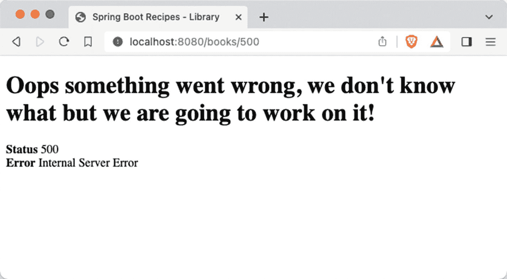

Spring Boot 下本地主机页面的屏幕截图。它显示自定义的错误消息，内容为：哎呀，出了点问题，我们不知道是什么，但我们会努力解决。

图 3-8

自定义错误页面

如果您现在将`server.error.include-exception`设置为`true`，并将`server.error.include-stacktrace`和`server.error.include-message`设置为`always`，自定义错误页面将显示异常的类名、消息和堆栈跟踪（见图 3-9）。

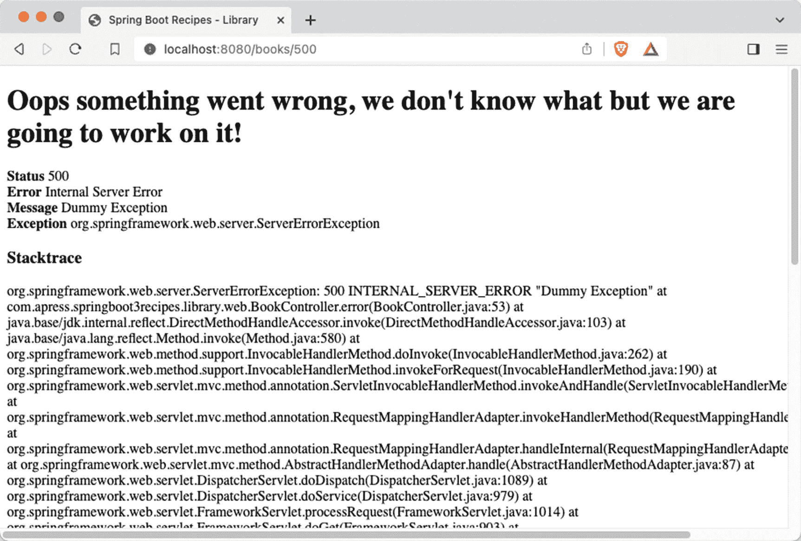

Spring Boot 下本地主机页面的屏幕截图。它显示自定义的错误消息，内容为：哎呀，出了点问题，我们不知道是什么，但我们会努力解决，并在堆栈跟踪下显示扩展消息。

图 3-9

扩展的自定义错误页面

除了提供通用的自定义错误页面外，您还可以为特定的 HTTP 状态码添加错误页面。这可以通过在`src/main/resources/templates/error`目录中添加`<http-status>.html`文件来实现。让我们添加一个`404.html`文件，用于显示未知 URL 的情况。参见清单 3-19。

```

Spring Boot Recipes - Library - Resource Not Found

Oops the page couldn't be located.

清单 3-19
自定义 404 页面
```

当导航到未知 URL 时，将渲染此页面；而当触发异常时，仍会显示自定义错误页面，如图 3-8 所示。

一个灯泡图标。 您还可以添加`4xx.html`或`5xx.html`文件，为所有 400 或 500 范围内的 HTTP 状态码提供自定义错误页面。

##### 向模型添加属性

默认情况下，Spring Boot 会在错误页面的模型中包含表 3-4 中列出的属性。

表 3-4

默认错误模型属性

| 属性 | 描述 |
| --- | --- |
| `timestamp` | 提取错误的时间 |
| `status` | 状态码 |
| `error` | 错误原因 |
| `exception` | 根异常的类名（如果已配置） |
| `message` | 异常消息 |
| `errors` | 来自`BindingResult`的任何错误（使用绑定和/或验证时） |
| `trace` | 异常堆栈跟踪（如果已配置） |
| `path` | 引发异常时的 URL 路径 |

这一切都是通过使用`ErrorAttributes`组件完成的。默认使用和配置的是`DefaultErrorAttributes`组件。您可以创建自己的`ErrorAttributes`处理器来创建自定义模型，或者扩展`DefaultErrorAttributes`来添加额外的属性。参见清单 3-20。

```
package com.apress.springboot3recipes.library;
import org.springframework.boot.web.error.ErrorAttributeOptions;
import org.springframework.boot.web.servlet.error.DefaultErrorAttributes;
import org.springframework.web.context.request.WebRequest;
import java.util.Map;
public class CustomizedErrorAttributes extends DefaultErrorAttributes {
@Override
public Map getErrorAttributes(WebRequest webRequest,
ErrorAttributeOptions options) {
var errorAttributes = super.getErrorAttributes(webRequest, options);
errorAttributes.put("parameters", webRequest.getParameterMap());
return errorAttributes;
}
}
清单 3-20
自定义 ErrorAttributes 实现
```

`CustomizedErrorAttributes`将在默认属性的基础上，将原始请求参数添加到模型中。下一步是将其配置为一个 bean，以便 Spring Boot 能够检测到它并使用它，而不是配置默认的。将清单 3-21 中所示的 bean 定义添加到`LibraryApplication`中即可实现。

```
@Bean
public CustomizedErrorAttributes errorAttributes() {
return new CustomizedErrorAttributes();
}
清单 3-21
自定义 ErrorAttributes Bean 定义
```

最后，您希望在`error.html`文件中使用这些额外的属性。参见清单 3-22。

```
Parameters

清单 3-22
对错误页面的修改
```

当清单 3-22 被包含在您的`error.html`文件中时，它将打印模型中可用参数映射的内容。


#### 处理 REST 控制器的异常

编写一个自定义的 `ErrorAttributes` 来替换默认的（图 3-10），并填充作为响应写入的模型。

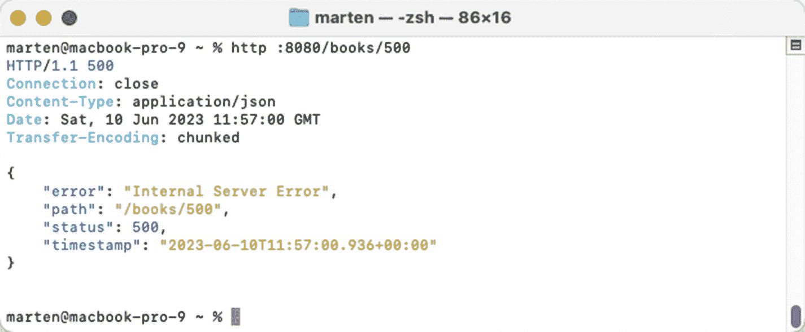

一个 Marten 窗口的截图。它显示了一段程序代码，该代码定义了自定义的错误属性，用于替换默认属性并填充作为响应写入的模型。

图 3-10
默认错误响应

默认情况下，Spring Boot 会在错误响应的模型中包含表 3-5 中列出的属性。

表 3-5
默认错误模型属性

| 属性 | 描述 |
| --- | --- |
| `timestamp` | 提取错误的时间 |
| `status` | 状态码 |
| `error` | 错误原因 |
| `exception` | 根异常的类名（如果已配置） |
| `message` | 异常消息 |
| `errors` | 来自 `BindingResult` 的任何错误（使用绑定和/或验证时） |
| `trace` | 异常堆栈跟踪（如果已配置） |
| `path` | 引发异常时的 URL 路径 |

这一切都是通过使用 `ErrorAttributes` 组件完成的。默认使用和配置的是 `DefaultErrorAttributes`。你可以创建自己的 `ErrorAttributes` 处理器来创建自定义模型，或者扩展 `DefaultErrorAttributes` 来添加额外的属性。参见清单 3-23。

```
package com.apress.springboot3recipes.library;
import org.springframework.boot.web.error.ErrorAttributeOptions;
import org.springframework.boot.web.servlet.error.DefaultErrorAttributes;
import org.springframework.web.context.request.WebRequest;
import java.util.Map;
public class CustomizedErrorAttributes extends DefaultErrorAttributes {
@Override
public Map getErrorAttributes(WebRequest webRequest,
ErrorAttributeOptions options) {
var errorAttributes = super.getErrorAttributes(webRequest, options);
errorAttributes.put("parameters", webRequest.getParameterMap());
return errorAttributes;
}
}
清单 3-23
自定义 ErrorAttributes 实现
```

`CustomizedErrorAttributes` Bean 会将原始请求参数添加到默认属性旁边的模型中。下一步是将其配置为一个 Bean，以便 Spring Boot 能够检测到它并使用它，而不是配置默认的。将清单 3-24 中的 Bean 定义添加到 `LibraryApplication` 中即可实现。

```
@Bean
public CustomizedErrorAttributes errorAttributes() {
return new CustomizedErrorAttributes();
}
清单 3-24
自定义 ErrorAttributes Bean 定义
```

这将生成图 3-11 中所示的错误；请注意额外的 `parameters` 属性。

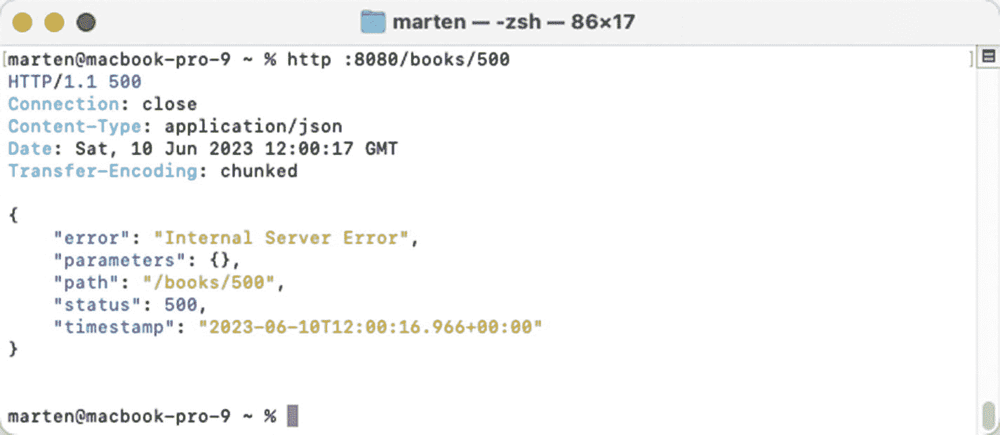

一个 Marten 窗口的截图。它包含一段程序代码，该代码生成了带有额外参数属性的内部服务器错误。

图 3-11
自定义错误响应

#### 启用并使用问题详情

Spring 6 增加了对 HTTP API 问题详情（RFC-7807）的支持，并且在 Spring Boot 中启用它非常容易。通过添加 `spring.mvc.problemdetails.enabled=true`（或对于基于 WebFlux 的应用程序添加 `spring.webflux.problemdetails.enabled=true`），即可启用此支持。

启用后，Spring Boot 会以更高的优先级注册 `ProblemDetailsExceptionHandler` 作为额外的 `ExceptionHandler`。`ProblemDetailsExceptionHandler` 将处理一些众所周知的异常（所有与 Spring 相关的 Web 异常），并返回包含更多信息的结果，包括类型 `application/problem+json`（见图 3-12）。

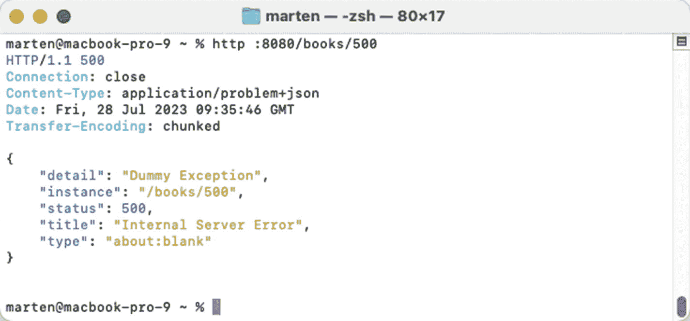

一个 Marten 窗口的截图。它包含一段程序代码，该代码生成了在启用问题详情支持后调用本地主机的结果，并返回包含更多信息的结果，包括应用程序类型和带有 JSON 的问题。

图 3-12
问题详情错误响应

图 3-12 显示了在启用问题详情支持后调用 `http://localhost:8080/books/500` 的结果。

这将适用于所有不同的 Spring MVC 异常。当发生验证或绑定错误时，它还会显示一个字段列表，其中包含失败的错误信息。它甚至会将（如果可能）这些错误消息翻译成客户端使用的语言（有关 I18N 支持，另请参阅配方 3-6）。

## 3-5. 实现国际化（I18N）

### 问题

在开发国际化 Web 应用程序时，你必须以用户偏好的区域设置显示网页。你不想为不同的区域设置创建同一页面的不同版本。

### 解决方案

为了避免为不同区域设置创建页面的不同版本，你应该通过外部化区域设置敏感的文本消息来使你的网页独立于区域设置。Spring 能够通过使用消息源为你解析文本消息，该消息源必须实现 `MessageSource` 接口。在你的页面模板中，你可以使用特殊标签或查找消息。


### 工作原理

当 Spring Boot 在 `src/main/resources`（默认位置）找到 `messages.properties` 文件时，它会自动配置一个 `MessageSource`。此 `messages.properties` 文件包含应用程序中要使用的默认消息。Spring Boot 将使用请求中的 `Accept-Language` 头来确定当前请求应使用哪个区域设置（有关如何更改此设置，请参阅配方 3-6）。

有一些属性可以改变 `MessageSource` 对缺失翻译、缓存等的响应方式。有关这些属性的概述，请参见表 3-6。

表 3-6

国际化属性

| 属性 | 描述 |
| --- | --- |
| `spring.messages.basename` | 以逗号分隔的基础名称列表；默认为 `messages`。 |
| `spring.messages.encoding` | 消息包编码；默认为 `UTF-8`。 |
| `spring.messages.always-use-message-format` | 设置是否应将 `MessageFormat` 应用于所有消息；默认为 `false`。 |
| `spring.messages.fallback-to-system-locale` | 当找不到检测到的区域设置的资源包时，回退到系统区域设置。禁用时，将从默认文件加载默认值。默认为 `true`。 |
| `spring.messages.use-code-as-default-message` | 当找不到消息时，使用消息代码作为默认消息，而不是抛出 `NoSuchMessageException`。默认为 `false`。 |
| `spring.messages.cache-duration` | 缓存持续时间；默认为 `forever`。 |

一个灯泡图标。 将应用程序部署到云或其他外部托管方时，将 `spring.messages.fallback-to-system-locale` 设置为 `false` 可能会很有用。这样，您就可以控制应用程序的默认语言，而不是由您无法控制的部署环境来决定。

将 `messages.properties` 文件添加到 `src/main/resources` 目录。请参见清单 3-25。

```
main.title=Spring Boot Recipes - Library
index.title=Library
index.books.link=List of books
books.list.title=Available Books
books.list.table.title=Title
books.list.table.author=Author
books.list.table.isbn=ISBN
清单 3-25
默认消息
```

现在更改模板以使用翻译。请参见清单 3-26。

```

Spring Boot Recipes - Library

Library
List of books

清单 3-26
支持国际化的索引页面
```

对于 Thymeleaf，您可以在 `th:text` 属性中使用 `#{...}` 表达式；这将（由于自动的 Spring 集成）从 `MessageSource` 解析消息。重新启动应用程序时，输出看起来似乎没有任何变化。但是，所有文本现在都来自 `messages.properties`。

现在让我们为网站的荷兰语翻译添加一个 `messages_nl.properties` 文件。请参见清单 3-27。

```
main.title=Spring Boot Recipes - Bibliotheek
index.title=Bibliotheek
index.books.link=Lijst van boeken
books.list.title=Beschikbare Boeken
books.list.table.title=Titel
books.list.table.author=Auteur
books.list.table.isbn=ISBN
清单 3-27
荷兰语消息
```

现在，当将接受头更改为荷兰语时，网站将神奇地翻译成荷兰语（参见图 3-13）。

一个灯泡图标。 更改浏览器的语言可能并不那么容易；对于 Chrome 和 Firefox，有一些插件可以让您轻松切换 `Accept-Language` 头。

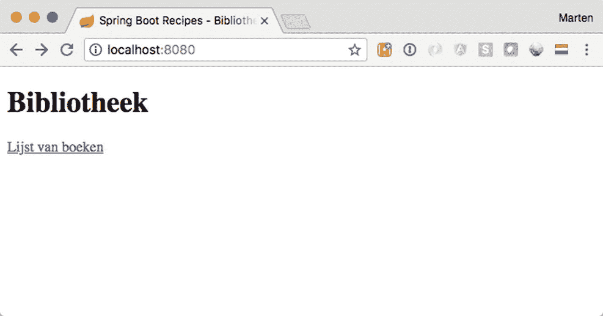

Spring Boot 中本地主机窗口的屏幕截图。它显示了标题“Bibliotheek”下的翻译链接。

图 3-13

荷兰语翻译的索引页面

## 3-6\. 更改用户区域设置

### 问题

为了使您的 Web 应用程序支持国际化，您必须识别每个用户偏好的区域设置，并根据此区域设置显示内容。

### 解决方案

在 Spring MVC 应用程序中，用户的区域设置由组件识别，该组件必须实现 `LocaleResolver` 接口。Spring MVC 提供了几个 `LocaleResolver` 实现，供您根据不同的标准解析区域设置。或者，您也可以通过实现此接口来创建自己的自定义区域设置解析器。

您可以通过在 Web 应用程序上下文中注册一个类型为 `LocaleResolver` 的 bean 来定义区域设置解析器。您必须将区域设置解析器的 bean 名称设置为 `localeResolver`，以便它可以被自动检测到。

### 工作原理

Spring MVC 提供了 `LocaleResolver` 接口的几个默认实现，其中一些允许更改 `Locale`。要更改 `Locale`，可以使用特定的 `HandlerInterceptor` 来允许用户覆盖他们想要使用的区域设置，即 `LocaleChangeInterceptor`。

#### 使用 HTTP 请求头解析区域设置

Spring Boot 注册的默认区域设置解析器是 `AcceptHeaderLocaleResolver`。它通过检查 HTTP 请求的 `Accept-Language` 头来解析区域设置。此头由用户的 Web 浏览器根据底层操作系统的区域设置进行设置。请参见清单 3-28。

一个信息图标，圆圈内有一个字母 i。 `AcceptHeaderLocaleResolver` 无法更改用户的区域设置，因为它无法修改用户操作系统的区域设置。

```
@Bean
public LocaleResolver localeResolver () {
return new AcceptHeaderLocaleResolver();
}
清单 3-28
AcceptHeaderLocaleResolver Bean 定义
```

#### 使用会话属性解析区域设置

另一种解析区域设置的方法是使用 `SessionLocaleResolver`。它通过检查用户会话中的预定义属性来解析区域设置。如果会话属性不存在，此区域设置解析器将从 `Accept-Language` HTTP 头确定默认区域设置。请参见清单 3-29。

```
@Bean
public LocaleResolver localeResolver () {
var localeResolver = new SessionLocaleResolver();
localeResolver.setDefaultLocale(Locale.forLanguageTag("en"));
return localeResolver;
}
清单 3-29
SessionLocaleResolver Bean 定义
```

如果会话属性不存在，您可以为该解析器设置 `defaultLocale` 属性。请注意，此区域设置解析器能够通过更改存储区域设置的会话属性来更改用户的区域设置。


#### 通过 Cookie 解析区域设置

你也可以使用 `CookieLocaleResolver`，通过检查用户浏览器中的 Cookie 来解析区域设置。如果 Cookie 不存在，此区域设置解析器会从 `Accept-Language` HTTP 标头确定默认区域设置。请参见清单 3-30。

```
@Bean
public LocaleResolver localeResolver() {
return new CookieLocaleResolver();
}
清单 3-30
CookieLocaleResolver Bean 定义
```

此区域设置解析器使用的 Cookie 可以通过配置表 3-7 中 `CookieLocaleResolver` 的属性进行自定义。请参见清单 3-31。

表 3-7

CookieLocaleResolver 属性

| 属性 | 描述 |
| --- | --- |
| `cookieDomain` | 设置 Cookie 的 `Domain` 属性值。 |
| `cookieHttpOnly` | 为 Cookie 添加 `HttpOnly` 属性。 |
| `cookieMaxAge` | 设置 Cookie 的 `Max-Age` 属性，-1 表示持续到浏览器关闭（默认值）。 |
| `cookieName` | 设置 Cookie 的名称（已弃用；改用构造函数）。 |
| `cookiePath` | 设置 Cookie 的 `Path` 属性；默认值为 `/`。 |
| `cookieSameSite` | 设置 Cookie 的 `Same-Site` 属性；默认值为 `Lax`。 |
| `cookieSecure` | 设置 Cookie 的 `Secure` 属性；默认值为 `false`。 |
| `langagueTagCompliant` | 设置解析器是否应遵循 BCP47 语言标签规范（而非 Java 旧版区域设置）；默认值为 `true`。 |
| `rejectInvalidCookies` | 设置是否拒绝无效/损坏的 Cookie；默认值为 `true`。 |

```
@Bean
public LocaleResolver localeResolver() {
var cookieLocaleResolver = new CookieLocaleResolver("language");
cookieLocaleResolver.setCookieMaxAge(Duration.ofMinutes(30));
cookieLocaleResolver.setDefaultLocale(Locale.forLanguageTag("en"));
return cookieLocaleResolver;
}
清单 3-31
设置属性的示例
```

如果用户浏览器中不存在 Cookie，你还可以为此解析器设置 `defaultLocale` 属性。此区域设置解析器能够通过修改存储区域设置的 Cookie 来更改用户的区域设置。

#### 更改用户的区域设置

除了通过显式调用 `LocaleResolver.setLocale()` 来更改用户的区域设置外，你还可以将 `LocaleChangeInterceptor` 应用于处理程序映射。此拦截器会检测当前 HTTP 请求中是否存在特殊参数。该参数名称可以通过此拦截器的 `paramName` 属性进行自定义（默认值为 `locale`）。如果当前请求中存在此类参数，此拦截器会根据参数值更改用户的区域设置。

要能够更改区域设置，必须使用允许更改的 `LocaleResolver`。

```
@Bean
public LocaleResolver localeResolver() {
return new CookieLocaleResolver();
}
```

要更改区域设置，请将 `LocaleChangeInterceptor` 添加为 Bean 并将其注册为拦截器；对于后者，请使用 `WebMvcConfigurer` 中的 `addInterceptors` 方法。请参见清单 3-32。

一个信息图标，圆圈内包含字母 i。 除了将其添加到 `@SpringBootApplication` 之外，你还可以创建一个专门的 `@Configuration` 注解类来注册拦截器。请注意*不要*向该类添加 `@EnableWebMvc`，因为这会禁用 Spring Boot 的自动配置！

```
@SpringBootApplication
public class LibraryApplication implements WebMvcConfigurer {
public static void main(String[] args) {
SpringApplication.run(LibraryApplication.class, args);
}
@Override
public void addInterceptors(InterceptorRegistry registry) {
registry.addInterceptor(new LocaleChangeInterceptor());
}
@Bean
public LocaleResolver localeResolver() {
return new CookieLocaleResolver();
}
}
清单 3-32
LocaleChangeInterceptor Bean 和配置
```

现在，将代码片段添加到 `index.html` 文件中，如清单 3-33 所示。

```
语言

NL |
EN

清单 3-33
索引页面的语言更改修改
```

现在，当选择其中一种语言时，页面将重新渲染并以所选语言显示。当你继续浏览时，其余页面也将以所选语言显示（如图 3-13 所示）。

## 3-7\. 选择并配置嵌入式服务器

### 问题

你想使用 Jetty 作为嵌入式容器，而不是默认的 Tomcat 容器。

### 解决方案

排除 Tomcat 运行时并包含 Jetty 运行时。Spring Boot 会自动检测类路径上是否存在 Tomcat、Jetty 或 Undertow，并相应地配置容器。

### 工作原理

Spring Boot 原生支持 Tomcat、Jetty 和 Undertow 作为嵌入式 Servlet 容器。默认情况下，Spring Boot 使用 Tomcat 作为容器（通过 `spring-boot-starter-web` 工件中的 `spring-boot-starter-tomcat` 依赖项体现）。可以使用属性配置容器，其中一些属性适用于所有容器，另一些则适用于特定容器。全局属性以 `server.` 或 `server.servlet` 为前缀，而容器属性以 `server.<container>` 开头（其中 `container` 是 `tomcat`、`jetty` 或 `undertow`）。


#### 设置通用配置属性

有几个通用的服务器属性可用，如表 3-8 所示。

表 3-8

通用服务器属性

| 属性 | 描述 |
| --- | --- |
| `server.port` | 指定 HTTP 服务器端口；默认值为 `8080`。 |
| `server.address` | 指定要绑定的 IP 地址；默认值为 `0.0.0.0`，即所有适配器。 |
| `server.server-header` | 指定用于发送服务器名称的标头名称；默认值为空。 |
| `server.max-http-header-size` | 指定 HTTP 标头的最大大小；默认值为 `0`（无限制）。 |
| `server.connection-timout` | 指定 HTTP 连接器在关闭前等待下一个请求的超时时间。默认值为空，交由容器决定；值为 `-1` 表示无限期，永不超时。 |
| `server.http2.enabled` | 如果当前容器支持，则启用 `Http2` 支持。默认值为 `false`。 |
| `server.forward-headers-strategy` | 用于 `X-Forward-*` 标头支持的策略；可选值为 `native`、`framework`、`none`。 |
| `server.compression.enabled` | 指定是否应启用 HTTP 压缩；默认值为 `false`。 |
| `server.compression.mime-types` | 包含一个逗号分隔的 MIME 类型列表，压缩将应用于这些类型。 |
| `server.compression.excluded-user-agents` | 包含一个逗号分隔的用户代理列表，对于这些用户代理应禁用压缩。 |
| `server.compression.min-response-size` | 设置应用压缩的请求最小大小；默认值为 `2048`。 |
| `server.servlet.context-path` | 设置应用程序的主上下文路径；默认情况下作为根应用程序启动。 |
| `server.servlet.application-display-name` | 设置在容器中用作显示名称的名称；默认值为 `application`。 |
| `server.servlet.context-parameters` | 设置 Servlet 容器上下文/初始化参数。 |
| `server.shutdown` | 服务器关闭模式；可选值为 `immediate` 或 `graceful`。默认值为 `immediate`。 |

由于嵌入式容器都遵循 Servlet 规范，因此也支持 JSP 页面，并且默认启用该支持。Spring Boot 可以轻松更改 JSP 提供程序，甚至完全禁用该支持。请参见表 3-9 了解公开的属性。

表 3-9

与 JSP 相关的服务器属性

| 属性 | 描述 |
| --- | --- |
| `server.servlet.jsp.registered` | 指定是否应注册 JSP Servlet；默认值为 `true`。 |
| `server.servlet.jsp.class-name` | 设置 JSP Servlet 类名；默认值为 `org.apache.jasper.servlet.JspServlet`，因为 Tomcat 和 Jetty 都使用 Jasper 作为 JSP 实现。 |
| `server.servlet.jsp.init-parameters` | 设置 JSP Servlet 的上下文参数。 |

一个圆圈内带有字母 i 的信息图标。 不鼓励在 Spring Boot 应用程序中使用 JSP，且其使用范围有限。^(⁵)

使用 Spring MVC 时，您可能希望使用 HTTP 会话来存储属性（通常与 Spring Security 一起使用来存储 CSRF 令牌等）。通用 Servlet 配置还允许您配置 HTTP 会话及其存储方式（cookie、URL 等）。请参见表 3-10 了解相关属性。

表 3-10

Servlet 容器 HTTP 会话属性

| `server.servlet.session.timeout` | 设置会话超时时间；默认值为 30 分钟。 |
| --- | --- |
| `server.servlet.session.tracking-modes` | 会话跟踪模式；可选一个或多个 `cookie`、`url` 和 `ssl`。默认值为空，交由容器决定。 |
| `server.servlet.session.persistent` | 设置是否应在重启之间持久保存会话数据；默认值为 `false`。 |
| `server.reactive.session.cookie.name` | 指定用于存储会话标识符的 cookie 名称。默认值为空，交由容器默认值决定。 |
| `server.reactive.session.cookie.domain` | 指定用于会话 cookie 的域值。默认值为空，交由容器默认值决定。 |
| `server.reactive.session.cookie.path` | 指定用于会话 cookie 的路径值。默认值为空，交由容器默认值决定。 |
| `server.reactive.session.cookie.http-only` | 指定会话 cookie 是否应仅可通过 HTTP 访问。默认值为空，交由容器默认值决定。 |
| `server.reactive.session.cookie.secure` | 指定是否应仅通过 SSL 发送 cookie。默认值为空，交由容器默认值决定。 |
| `server.reactive.session.cookie.max-age` | 设置会话 cookie 的生存期。默认值为空，交由容器默认值决定。 |
| `server.reactive.session.cookie.same-site` | 设置要使用的 Same-Site 策略（`NONE`/`LAX`/`STRICT`）；默认值为 `NONE`。 |
| `server.servlet.session.session-store-directory.directory` | 设置用于持久化 cookie 的目录名称。该目录必须已存在。 |

一个圆圈内带有字母 i 的信息图标。 使用 Spring 会话时，仅 `server.servlet.session.timeout` 属性适用！

最后，Spring Boot 通过公开一些属性使得配置 SSL 变得简单。请参见表 3-11 和配方 3-8 了解如何配置 SSL。

表 3-11

Servlet 容器 SSL 属性

| 属性 | 描述 |
| --- | --- |
| `server.ssl.enabled` | 指定是否应启用 SSL；默认值为 `true`。 |
| `server.ssl.bundle` | 设置要使用的 SSL 捆绑包名称。 |
| `server.ssl.ciphers` | 指定支持的 SSL 加密套件；默认值为空。 |
| `server.ssl.client-auth` | 设置 SSL 客户端身份验证，可选值为 `none`、`want` 或 `need`。默认值为空。 |
| `server.ssl.protocol` | 设置要使用的 SSL 协议；默认值为 `TLS`。 |
| `server.ssl.enabled-protocols` | 设置启用的 SSL 协议；默认值为空。 |
| `server.ssl.key-alias` | 设置用于标识密钥库中密钥的别名；默认值为空。 |
| `server.ssl.key-password` | 设置访问密钥库中密钥的密码；默认值为空。 |
| `server.ssl.key-store` | 设置密钥库的位置，通常是一个 JKS 文件；默认值为空。 |
| `server.ssl.key-store-password` | 设置访问密钥库的密码；默认值为空。 |
| `server.ssl.key-store-type` | 设置密钥库的类型；默认值为空。 |
| `server.ssl.key-store-provider` | 设置密钥库的提供程序；默认值为空。 |
| `server.ssl.trust-store` | 设置信任库的位置。 |
| `server.ssl.trust-store-password` | 设置访问信任库的密码；默认值为空。 |
| `server.ssl.trust-store-type` | 设置信任库的类型；默认值为空。 |
| `server.ssl.trust-store-provider` | 设置信任库的提供程序；默认值为空。 |

一个圆圈内带有字母 i 的信息图标。 前面表格中提到的所有属性*仅*在使用嵌入式容器运行应用程序时适用。当部署到外部容器（即部署 WAR 文件）时，这些设置不适用！


#### 更改运行时容器

当引入 `spring-boot-starter-web` 依赖时，它会自动引入对 Tomcat 容器的依赖，因为它依赖于 `spring-boot-starter-tomcat` 工件。要启用不同的 Servlet 容器，需要排除 `spring-boot-starter-tomcat`，并引入 `spring-boot-starter-jetty` 或 `spring-boot-starter-undertow` 之一。参见清单 3-34。

```
org.springframework.boot
spring-boot-starter-web

org.springframework.boot
spring-boot-starter-tomcat

org.springframework.boot
spring-boot-starter-jetty

清单 3-34
排除 Tomcat 并使用 Jetty
```

在 Maven 中，你可以在 `<dependency>` 元素内使用 `<exclusion>` 元素来排除一个依赖。

现在，当应用程序启动时，它将使用 Jetty 而不是 Tomcat 启动（参见图 3-14）。

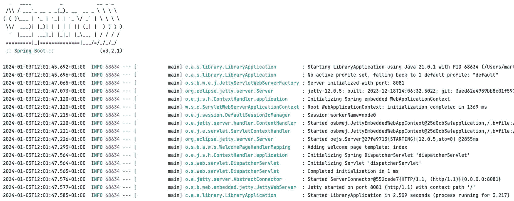

一张页面截图显示了一组 Spring Boot 中的程序代码。它列出了启动库、初始化服务器、添加欢迎页面模板、连接服务器以及在端口上启动 Jetty 的链接。

图 3-14

使用 Jetty 容器的启动日志

## 3-8\. 为 Servlet 容器配置 SSL

### 问题

你希望你的应用程序能够通过 HTTPS（或者替代 HTTP）进行访问。

### 解决方案

获取一个证书，将其放入密钥库，并使用 `server.ssl` 属性来配置该密钥库。然后 Spring Boot 将自动配置服务器，使其仅能通过 HTTPS 访问。

### 工作原理

使用 `server.ssl.keystore`（及相关属性），你可以配置嵌入式容器仅接受 HTTPS 连接。在配置 SSL 之前，你需要有一个证书来保护你的应用程序。通常，你会希望从像 Verisign 或 Let’s Encrypt 这样的证书颁发机构获取证书。然而，出于开发目的，你可以使用自签名证书（参见“创建自签名证书”一节）。

#### 创建自签名证书

Java 自带了一个名为 `keytool` 的工具，它可以用于生成证书等。参见清单 3-35。

```
keytool -genkey -keyalg RSA -alias sb3-recipes -keystore sb3-recipes.pfx -storepass password -validity 3600 -keysize 4096 -storetype pkcs12
清单 3-35
keytool 命令
```

此命令将指示 `keytool` 使用 RSA 算法生成一个密钥，并将其放入名为 `sb3-recipes.pfx` 的密钥库中，别名为 `sb3-recipes`，有效期为 3600 天。运行该命令时，它会询问一些问题。请相应回答（或留空）。之后，会生成一个名为 `sb3-recipes.pfx` 的文件，其中包含证书，并用密码保护。

将此文件放入 `src/main/resources` 文件夹中，这样它就会作为应用程序的一部分被打包，Spring Boot 也能轻松访问它。

一个三角形抽象图形内有一个感叹号符号。它类似于一个警告图标。 使用自签名证书会在浏览器中产生一个警告，提示该网站不安全且未受保护。

#### 配置 Spring Boot 使用密钥库

Spring Boot 需要知道密钥库的信息，才能配置嵌入式容器。为此，请使用 `server.ssl.keystore` 属性。你还需要指定密钥库的类型（`pkcs12`）和密码。参见清单 3-36 和图 3-15。

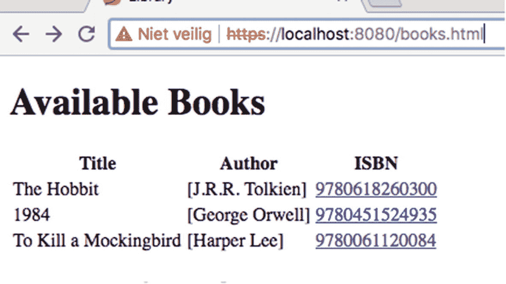

一张 Spring Boot 下本地主机页面的截图。它在“可用书籍”下显示了标题、作者和 ISBN 的列表。该页面通过 http 链接访问。

图 3-15

通过 HTTPS 访问的图书馆

```
server.ssl.key-store=classpath:sb3-recipes.pfx
server.ssl.key-store-type=pkcs12
server.ssl.key-store-password=password
server.ssl.key-password=password
server.ssl.key-alias=sb2-recipes
清单 3-36
SSL 属性
```

#### 同时支持 HTTP 和 HTTPS

Spring Boot 默认只启动一个连接器，要么是 HTTP，要么是 HTTPS，但不会同时启动两者。如果你想同时支持 HTTP 和 HTTPS，你需要手动添加一个额外的连接器。最简单的方法是自行创建 HTTP 连接器，并让 Spring Boot 设置 SSL 部分。

首先，让我们配置 Spring Boot 在端口 8443 上启动服务器。参见清单 3-37。

```
server.port=8443
清单 3-37
服务器端口属性
```

要向嵌入式 Tomcat 添加额外的连接器，你需要将 `TomcatServletWebServerFactory` 作为一个 bean 添加到我们的上下文中。通常 Spring Boot 会检测容器并选择要使用的 `WebServerFactory`；然而，由于需要进行自定义，我们需要手动添加它。参见清单 3-38。

```
@Bean
public TomcatServletWebServerFactory tomcatServletWebServerFactory() {
var factory = new TomcatServletWebServerFactory();
factory.addAdditionalTomcatConnectors(httpConnector());
return factory;
}
private Connector httpConnector() {
var connector = new Connector(TomcatServletWebServerFactory.DEFAULT_PROTOCOL);
connector.setScheme("http");
connector.setPort(8080);
connector.setSecure(false);
return connector;
}
清单 3-38
额外的 Tomcat 连接器
```

这将在端口 8080 上添加一个额外的连接器，现在应用程序可以通过端口 8080 和 8443 使用了。使用 Spring Security，你现在可以强制通过 HTTPS 而不是 HTTP 访问应用程序的某些部分。参见清单 3-39。

一个灯泡图标。 如果你不想显式配置 `TomcatServletWebServerFactory`，你可以使用 `BeanPostProcessor` 向 `TomcatServletWebServerFactory` 注册额外的 `Connector`。这样，你就可以为不同的嵌入式容器实现此功能，而不是局限于单个容器。

```
@Bean
public BeanPostProcessor addHttpConnectorProcessor() {
return new BeanPostProcessor() {
@Override
public Object postProcessBeforeInitialization(Object bean, String beanName)
throws BeansException {
if (bean instanceof TomcatServletWebServerFactory factory) {
factory.addAdditionalTomcatConnectors(httpConnector());
}
return bean;
}
};
}
清单 3-39
额外的 Tomcat 连接器：使用 BeanPostProcessor
```


#### 将 HTTP 重定向到 HTTPS

除了同时支持 HTTP 和 HTTPS，另一种方案是仅支持 HTTPS，并将 HTTP 流量重定向到 HTTPS。其配置与同时支持 HTTP 和 HTTPS 时类似。不过，现在你需要配置连接器，将所有来自 8080 端口的流量重定向到 8443 端口。参见清单 3-40。

```
@Bean
public TomcatServletWebServerFactory tomcatServletWebServerFactory() {
var factory = new TomcatServletWebServerFactory();
factory.addAdditionalTomcatConnectors(httpConnector());
factory.addContextCustomizers(securityCustomizer());
return factory;
}
private Connector httpConnector() {
var connector = new Connector(TomcatServletWebServerFactory.DEFAULT_PROTOCOL);
connector.setScheme("http");
connector.setPort(8080);
connector.setSecure(false);
connector.setRedirectPort(8443);
return connector;
}
private TomcatContextCustomizer securityCustomizer() {
return context -> {
var collection = new SecurityCollection();
collection.addPattern("/*");
var securityConstraint = new SecurityConstraint();
securityConstraint.setUserConstraint("CONFIDENTIAL");
securityConstraint.addCollection(collection);
context.addConstraint(securityConstraint);
};
}
清单 3-40
附加 Tomcat 连接器：带重定向功能
```

现在，`httpConnector` 设置了 `redirectPort`，以便它知道要使用哪个端口。最后，你需要使用 `SecurityConstraint` 来保护所有 URL。使用 Spring Boot，你可以使用专门的 `TomcatContextCustomizer` 在 Tomcat 启动前对 `Context` 进行后置处理。该约束使得所有内容（由于使用了 `/*` 作为模式）都变为机密（允许使用 `NONE`、`INTEGRAL` 或 `CONFIDENTIAL` 之一），结果就是所有内容都将被重定向。

## 3-9. 使用控制器和 TaskExecutor 实现异步请求处理

### 问题

为了提高 Servlet 容器的吞吐量，你希望异步处理请求，以便更有效地分配资源。

### 解决方案

当请求进入时，它会被同步处理，这会阻塞 HTTP 请求处理线程。响应保持打开状态，并且可以写入。例如，当某个调用需要一些时间才能完成时，这很有用，你可以让它在后台处理，并在完成后向用户返回一个值，而不是阻塞线程。

### 工作原理

Spring MVC 支持多种方法返回类型；表 3-12 中的返回类型以异步方式处理。

表 3-12

异步返回类型

| 类型 | 描述 |
| --- | --- |
| `DeferredResult<?>` | 稍后由另一个线程生成的异步结果。 |
| `ListenableFuture<?>` | 稍后由另一个线程生成的异步结果，是 `DeferredResult` 的等效替代方案。从 Spring 6.0 开始，此类型已弃用，推荐使用 `CompletableFuture<?>`。 |
| `CompletionStage<?>`/`CompletableFuture<?>` | 稍后由另一个线程生成的异步结果，是 `DeferredResult` 的等效替代方案。 |
| `Callable<?>` | 一个异步计算，结果在计算完成后产生。 |
| `ResponseBodyEmitter` | 可用于异步地向响应写入多个对象。 |
| `SseEmitter` | 可用于异步地写入服务器发送事件。 |
| `StreamingResponseBody` | 可用于异步地写入 `OutputStream`。 |

这些泛型返回类型又可以返回控制器的任何返回类型，因此可以是添加到模型的对象、视图的名称，甚至是 `ModelAndView`。

#### 配置异步处理

Servlet 规范在版本 3 中添加了对异步请求处理的支持。要启用它，你必须告知所有过滤器和 Servlet 以异步方式运行。在 Spring Boot 应用程序中，对于 `DispatcherServlet` 和检测到的 `Filter` Bean，默认会执行此操作。

Spring Boot 默认会配置一个 `AsyncTaskExecutor` 供 Spring MVC 使用。但是，你可以根据需求配置一个 `AsyncTaskExecutor`，并将其注入到 MVC 配置中。参见清单 3-41。

```
@SpringBootApplication
public class HelloWorldApplication implements WebMvcConfigurer {
public static void main(String[] args) {
SpringApplication.run(HelloWorldApplication.class, args);
}
@Override
public void configureAsyncSupport(AsyncSupportConfigurer configurer) {
configurer.setDefaultTimeout(5000);
configurer.setTaskExecutor(mvcTaskExecutor());
}
@Bean
public ThreadPoolTaskExecutor mvcTaskExecutor() {
ThreadPoolTaskExecutor taskExecutor = new ThreadPoolTaskExecutor();
taskExecutor.setThreadNamePrefix("mvc-executor-");
return taskExecutor;
}
}
清单 3-41
显式 TaskExecutor 配置
```

一个灯泡图标。 当 Spring Boot 检测到你可以使用虚拟线程（Java 21）并且属性 `spring.threads.virtual.enabled` 设置为 `true` 时，它将自动为虚拟线程使用进行设置。

要配置异步处理，你需要重写 `WebMvcConfigurer` 的 `configureAsyncSupport` 方法。重写此方法可以让你访问 `AsyncSupportConfigurer`。这允许你设置 `defaultTimeout` 和要使用的 `AsyncTaskExecutor`。超时时间设置为 5 秒，作为执行器，你将使用 `ThreadPoolTaskExecutor`。

一个灯泡图标。 `defaultTimeout` 也可以通过设置 `application.properties` 中的 `spring.mvc.async.request-timeout` 来设置。添加 `spring.mvc.async.request-timeout=5s` 与在 `@Bean` 方法中设置的效果相同。

#### 编写异步控制器

编写一个控制器并让它异步处理请求，只需更改控制器处理方法的返回类型即可（参见表 3-12）。假设对 `HelloWorldController.hello` 的调用需要一些时间，但我们不希望因此阻塞服务器。


#### 使用 Callable

清单 3-42 展示了如何使用 Callable。

```
package com.apress.springboot3recipes;
import org.springframework.boot.SpringBootVersion;
import org.springframework.web.bind.annotation.GetMapping;
import org.springframework.web.bind.annotation.RestController;
import java.util.concurrent.Callable;
import java.util.concurrent.ThreadLocalRandom;
@RestController
public class HelloWorldController {
@GetMapping
public Callable hello() {
return () -> {
Thread.sleep(ThreadLocalRandom.current().nextInt(5000));
var version = SpringBootVersion.getVersion();
return String.format("Hello World, from Spring Boot %s!", version);
};
}
}
清单 3-42
使用 Callable 的异步控制器
```

`hello` 方法现在返回一个 `Callable<String>`，而不是直接返回 `String`。在新构建的 `Callable<String>` 内部，有一个随机等待，用于模拟向客户端返回消息之前的延迟。

现在，当进行预订时，你会在日志中看到类似的内容（见图 3-16）。

一个信息图标，圆圈内包含字母 i。 要启用此日志记录，你需要为 Web 相关组启用 `DEBUG` 级别的日志记录。你可以通过在 `application.properties` 中添加 `logging.level.web=DEBUG` 来实现。

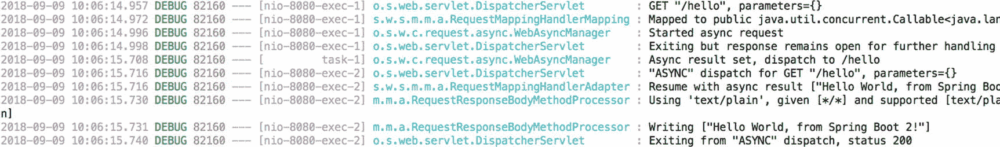

Spring Boot 下本地主机页面的截图。它显示了进行预订时的一系列日志。它启动异步请求并写入来自 Spring Boot 的消息“Hello World”。

图 3-16

启用异步后的日志输出

你会注意到，请求处理是在某个线程（此处为 `nio-8080-exec-2`）上启动的。另一个线程正在执行处理并返回结果（此处为 `task-1`）。最后，请求被分派到 `DispatcherServlet`，以便在另一个线程上处理结果。

#### 使用 CompletableFuture

将方法的签名改为返回 `CompletableFuture``<String>`，并使用 `AsyncTaskExecutor` 异步执行代码。参见清单 3-43。

```
package com.apress.springboot3recipes;
import org.springframework.boot.SpringBootVersion;
import org.springframework.core.task.AsyncTaskExecutor;
import org.springframework.web.bind.annotation.GetMapping;
import org.springframework.web.bind.annotation.RestController;
import java.util.concurrent.CompletableFuture;
import java.util.concurrent.ThreadLocalRandom;
@RestController
public class HelloWorldController {
private final AsyncTaskExecutor taskExecutor;
public HelloWorldController(AsyncTaskExecutor taskExecutor) {
this.taskExecutor = taskExecutor;
}
@GetMapping
public CompletableFuture hello() {
return taskExecutor.submitCompletable(() -> {
randomDelay();
var version = SpringBootVersion.getVersion();
return String.format("Hello World, from Spring Boot %s!", version);
});
}
private void randomDelay() {
try {
Thread.sleep(ThreadLocalRandom.current().nextInt(5000));
} catch (InterruptedException e) {
Thread.currentThread().interrupt();
}
}
}
清单 3-43
使用 CompletableFuture 的异步控制器
```

该任务在 `AsyncTaskExecutor` 的一个线程上执行。我们使用 `submitCompletable` 提交任务，该方法返回一个 `CompletableFuture`。当返回 `CompletableFuture` 时，你可以利用它的所有特性，例如组合和链式调用多个 `CompletableFuture` 实例。

#### 测试异步控制器

与常规控制器一样，Spring MVC 测试框架可用于测试异步控制器。

创建一个测试类，并使用 `@WebMvcTest(HelloWorldController.class)` 对其进行注解。`@WebMvcTest` 将启动一个最小的 Spring Boot 应用程序，其中包含测试控制器所需的内容。它会自动配置 Spring `MockMvc`，并将其自动注入到测试中。参见清单 3-44。

```
package com.apress.springboot3recipes;
import org.junit.jupiter.api.Test;
import org.springframework.beans.factory.annotation.Autowired;
import org.springframework.boot.test.autoconfigure.web.servlet.WebMvcTest;
import org.springframework.http.MediaType;
import org.springframework.test.web.servlet.MockMvc;
import org.springframework.test.web.servlet.MvcResult;
import org.springframework.test.web.servlet.request.MockMvcRequestBuilders;
import org.springframework.test.web.servlet.result.MockMvcResultHandlers;
import static org.hamcrest.Matchers.startsWith;
import static org.springframework.test.web.servlet.request.MockMvcRequestBuilders.asyncDispatch;
import static org.springframework.test.web.servlet.result.MockMvcResultMatchers.content;
import static org.springframework.test.web.servlet.result.MockMvcResultMatchers.request;
import static org.springframework.test.web.servlet.result.MockMvcResultMatchers.status;
@WebMvcTest(HelloWorldController.class)
public class HelloWorldControllerTest {
@Autowired
private MockMvc mockMvc;
@Test
public void testHelloWorldController() throws Exception {
MvcResult mvcResult = mockMvc.perform(MockMvcRequestBuilders.get("/"))
.andExpect(request().asyncStarted())
.andDo(MockMvcResultHandlers.print())
.andReturn();
mockMvc.perform(asyncDispatch(mvcResult))
.andExpect(status().isOk())
.andExpect(content().contentTypeCompatibleWith(MediaType.TEXT_PLAIN))
.andExpect(content().string(startsWith("Hello World, from Spring Boot ")));
}
}
清单 3-44
HelloWorldController 的测试
```

异步 Web 测试与常规 Web 测试的主要区别在于，需要启动异步分派。首先执行初始请求，并验证异步是否已启动。出于调试目的，你可以记录结果。接下来应用 `asyncDispatch`。最后，我们可以断言预期的响应。

一个信息图标，圆圈内包含字母 i。 除了使用 `asyncDispatch`，你也可以使用 `mvcResult.getAsyncResult`（带或不带超时）来直接获取结果。但是，通常你希望对响应编写额外的断言。

## 3-10\. 创建响应写入器

### 问题

你有一个服务或多次调用，并希望将响应分块发送给客户端。

### 解决方案

使用 `ResponseBodyEmitter`（或其同类 `SseEmitter`）来分块发送响应。

### 工作原理

其工作原理如下。


#### 在响应中发送多个结果

Spring MVC 有一个名为 `ResponseBodyEmitter` 的类，当你希望向客户端返回多个对象而不是单个结果时，它特别有用。发送对象时，会使用 `HttpMessageConverter` 将其转换为结果。要使用 `ResponseBodyEmitter`，你需要构造它并从请求处理方法中返回它。

创建一个 `OrderController`，其中包含一个返回 `ResponseBodyEmitter` 的 `orders` 方法，并将结果逐个发送给客户端。参见清单 3-45。

```
package com.apress.springboot3recipes.order.rest;
import com.apress.springboot3recipes.order.Order;
import com.apress.springboot3recipes.order.OrderService;
import org.springframework.core.task.TaskExecutor;
import org.springframework.http.MediaType;
import org.springframework.web.bind.annotation.GetMapping;
import org.springframework.web.bind.annotation.RestController;
import org.springframework.web.servlet.mvc.method.annotation.ResponseBodyEmitter;
import java.io.IOException;
import java.util.concurrent.ThreadLocalRandom;
@RestController
public class OrderController {
private final OrderService orderService;
private final TaskExecutor executor;
public OrderController(OrderService orderService, TaskExecutor executor) {
this.orderService = orderService;
this.executor = executor;
}
@GetMapping("/orders")
public ResponseBodyEmitter orders() {
var emitter = new ResponseBodyEmitter();
executor.execute(() -> {
var orders = orderService.findAll();
try {
for (var order : orders) {
sendAndDelay(emitter, order);
}
emitter.complete();
} catch (IOException ex) {
emitter.completeWithError(ex);
}
});
return emitter;
}
private void sendAndDelay(ResponseBodyEmitter emitter, Order order) throws IOException{
emitter.send(order, MediaType.APPLICATION_JSON);
randomDelay();
}
private void randomDelay() {
try {
Thread.sleep(ThreadLocalRandom.current().nextInt(150));
} catch (InterruptedException e) {
Thread.currentThread().interrupt();
}
}
}
清单 3-45
使用 ResponseBodyEmitter 的 OrderController
```

首先创建一个 `ResponseBodyEmitter`，并在方法末尾返回它。接着执行一个任务，该任务将使用 `OrderService.findAll` 方法查询订单。该调用的所有结果都通过 `ResponseBodyEmitter` 的 `send` 方法逐个返回。当所有对象都发送完毕后，需要调用 `complete()` 方法，以便负责发送响应的线程可以完成请求并释放资源以处理下一个响应。当发生异常并且你想通知用户时，可以调用 `completeWithError`。该异常将通过 Spring MVC 的正常异常处理流程，之后响应完成。

当使用 `HTTPie` 或 `curl` 等工具调用 URL `http://localhost:8080/orders` 时，将得到如图 3-17 所示的结果。结果将以分块形式返回，状态码为 200（OK）。

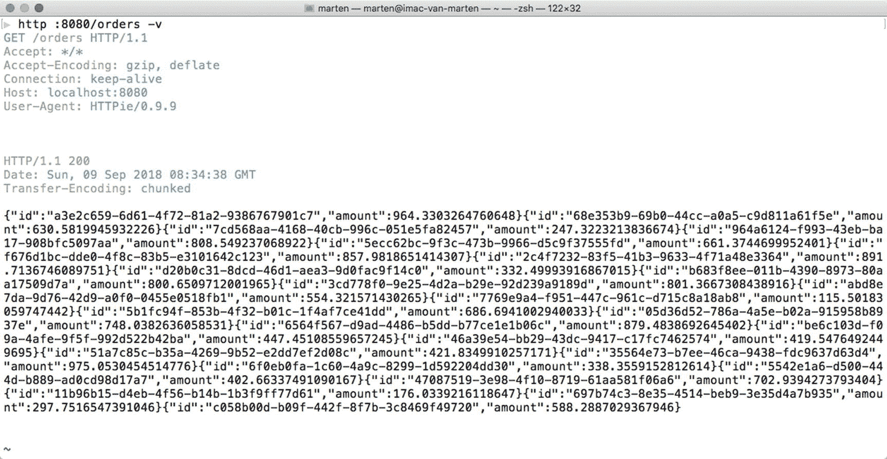

一个 Marten 窗口的截图。它显示了一组使用工具的程序命令，通过 http 链接调用本地主机订单，并返回状态为 200 的分块结果。

图 3-17

分块结果

最后，让我们为这个控制器编写一个测试。使用 `@WebMvcTest(OrderController.class)` 注解一个类，以获得一个 Web 切片测试。`OrderController` 需要一个 `OrderService`，通过在 `OrderService` 字段上使用 `@MockBean` 来模拟它。参见清单 3-46。

```
package com.apress.springboot3recipes.order.rest;
import com.apress.springboot3recipes.order.Order;
import com.apress.springboot3recipes.order.OrderService;
import org.junit.jupiter.api.Test;
import org.springframework.beans.factory.annotation.Autowired;
import org.springframework.boot.test.autoconfigure.web.servlet.WebMvcTest;
import org.springframework.boot.test.mock.mockito.MockBean;
import org.springframework.test.web.servlet.MockMvc;
import org.springframework.test.web.servlet.MvcResult;
import org.springframework.test.web.servlet.result.MockMvcResultHandlers;
import java.math.BigDecimal;
import java.util.List;
import static org.mockito.Mockito.when;
import static org.springframework.test.web.servlet.request.MockMvcRequestBuilders.asyncDispatch;
import static org.springframework.test.web.servlet.request.MockMvcRequestBuilders.get;
import static org.springframework.test.web.servlet.result.MockMvcResultMatchers.content;
import static org.springframework.test.web.servlet.result.MockMvcResultMatchers.request;
import static org.springframework.test.web.servlet.result.MockMvcResultMatchers.status;
@WebMvcTest(OrderController.class)
public class OrderControllerTest {
@Autowired
private MockMvc mockMvc;
@MockBean
private OrderService orderService;
@Test
public void shouldReturnOrdres() throws Exception {
when(orderService.findAll())
.thenReturn(List.of(new Order("1234", BigDecimal.TEN)));
MvcResult mvcResult = mockMvc.perform(get("/orders"))
.andExpect(request().asyncStarted())
.andDo(MockMvcResultHandlers.log())
.andReturn();
mockMvc.perform(asyncDispatch(mvcResult))
.andDo(MockMvcResultHandlers.log())
.andExpect(status().isOk())
.andExpect(content().json("{\"id\":\"1234\",\"amount\":10}"));
}
}
清单 3-46
OrderController 的测试
```

测试方法首先在模拟的 `OrderService` 上注册行为，使其返回一个 `Order` 的单个实例。接着，我们使用 `MockMvc` 对 `/orders` 端点执行 `get` 请求。由于这是一个异步控制器，请求应启动异步处理，此处对此进行了断言。然后，我们模拟异步分发，并对实际响应编写断言。结果应为一个包含 `id` 和 `amount` 的单个 JSON 元素。


#### 将多个结果作为事件发送

`ResponseBodyEmitter` 是 `SseEmitter` 的同类组件，它可以将事件从服务器发送到客户端。这里使用的是服务器发送事件（Server-Sent-Events）。服务器发送事件是从服务器发送到客户端的消息。它们的 `Content-Type` 标头值为 `text/event-stream`。它们非常轻量，仅包含四个字段（见表 3-13）。

表 3-13

服务器发送事件允许的字段

| 字段 | 描述 |
| --- | --- |
| `Id` | 事件的 ID |
| `Event` | 事件的类型 |
| `Data` | 事件数据 |
| `Retry` | 事件流的重新连接时间 |

要从请求处理方法发送事件，你需要创建一个 `SseEmitter` 实例，并将其从请求处理方法中返回。然后使用 `send` 方法将各个元素发送到客户端。参见清单 3-47。

```
@GetMapping("/orders")
public SseEmitter orders() {
var emitter = new SseEmitter();
executor.execute(() -> {
var orders = orderService.findAll();
try {
for (var order : orders) {
sendAndDelay(emitter, order);
}
emitter.complete();
} catch (IOException ex) {
emitter.completeWithError(ex);
}
});
return emitter;
}
private void sendAndDelay(ResponseBodyEmitter emitter, Order order)
throws IOException{
emitter.send(order, MediaType.APPLICATION_JSON);
randomDelay();
}
清单 3-47
使用 SseEmitter 的 OrderController
```

一个信息图标，圆圈内包含字母 i。 向客户端发送每个项目时会有延迟，这样你就能看到不同的事件依次传入。在实际代码中你不会这样做。

现在，当调用 URL `http://localhost:8080/orders` 时，你会看到事件一个接一个地出现（图 3-18）。

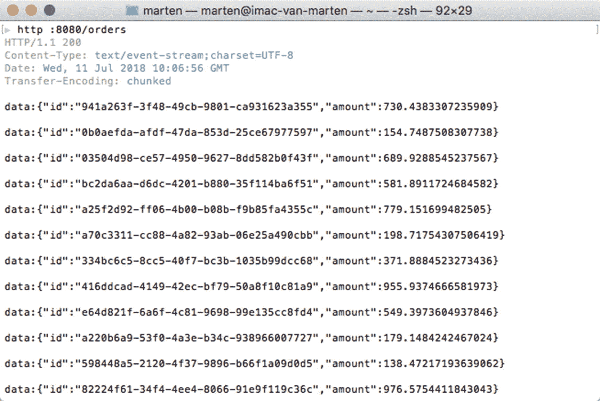

一个 marten 窗口的截图。它显示了一组程序命令，这些命令使用工具通过 http 链接调用本地主机订单，并逐个生成事件。

图 3-18

服务器发送事件结果

注意 `Content-Type` 标头。它的值为 `text/event-stream`，表示我们获取的是一个事件流。该流可以保持打开状态以接收事件通知。每个写入的对象都会被转换为 JSON。这是通过 `HttpMessageConverter` 完成的，与普通的 `ResponseBodyEmitter` 一样。每个对象都会作为事件数据写入 `data` 标签中。

如果你想向事件添加更多信息（填写表 3-13 中提到的其他字段），请使用 `SseEventBuilder`。`SseEmitter` 的 `event()` 工厂方法会创建一个实例。使用它来填写 `id` 和 `event` 字段。参见清单 3-48。

```
private void sendAndDelay(ResponseBodyEmitter emitter, Order order) throws IOException{
var eventBuilder = SseEmitter.event();
emitter.send(
eventBuilder
.data(order, MediaType.APPLICATION_JSON)
.name("order-created")
.id(String.valueOf(order.hashCode())).build());
randomDelay();
}
清单 3-48
使用 SseEmitter 的 OrderController：扩展事件
```

现在，当调用 URL `http://localhost:8080/orders` 时，事件将包含 `id`、`event` 和 `data` 字段。参见图 3-19。

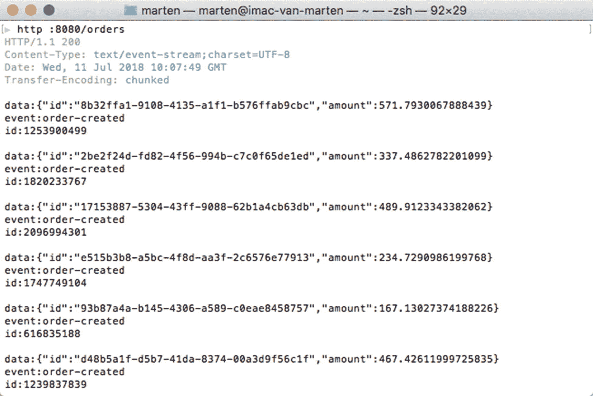

一个 marten 窗口的截图。它显示了一组程序命令，这些命令使用工具通过 http 链接调用本地主机订单，并生成包含 ID、事件和数据字段的事件。

图 3-19

服务器发送事件扩展结果

#### 测试服务器发送事件

测试服务器发送事件的输出与常规的异步测试非常相似。主要区别在于返回的内容类型（`text/event-stream`）以及所做的断言（针对 `id`、`event` 和 `data` 字段）。参见清单 3-49。

```
package com.apress.springboot3recipes.order.rest;
import com.apress.springboot3recipes.order.Order;
import com.apress.springboot3recipes.order.OrderService;
import org.junit.jupiter.api.Test;
import org.springframework.beans.factory.annotation.Autowired;
import org.springframework.boot.test.autoconfigure.web.servlet.WebMvcTest;
import org.springframework.boot.test.mock.mockito.MockBean;
import org.springframework.test.web.servlet.MockMvc;
import org.springframework.test.web.servlet.result.MockMvcResultHandlers;
import java.util.List;
import static java.math.BigDecimal.TEN;
import static org.hamcrest.Matchers.allOf;
import static org.hamcrest.Matchers.containsString;
import static org.mockito.Mockito.when;
import static org.springframework.http.MediaType.TEXT_EVENT_STREAM_VALUE;
import static org.springframework.test.web.servlet.request.MockMvcRequestBuilders.asyncDispatch;
import static org.springframework.test.web.servlet.request.MockMvcRequestBuilders.get;
import static org.springframework.test.web.servlet.result.MockMvcResultMatchers.content;
import static org.springframework.test.web.servlet.result.MockMvcResultMatchers.request;
import static org.springframework.test.web.servlet.result.MockMvcResultMatchers.status;
@WebMvcTest(OrderController.class)
public class OrderControllerTest {
@Autowired
private MockMvc mockMvc;
@MockBean
private OrderService orderService;
@Test
public void ordersEventStream() throws Exception {
var orders = List.of(new Order("1234", TEN));
when(orderService.findAll()).thenReturn(orders);
var mvcResult = mockMvc.perform(get("/orders"))
.andExpect(request().asyncStarted())
.andDo(MockMvcResultHandlers.log())
.andReturn();
mockMvc.perform(asyncDispatch(mvcResult))
.andDo(MockMvcResultHandlers.log())
.andExpect(status().isOk())
.andExpect(content().contentTypeCompatibleWith(TEXT_EVENT_STREAM_VALUE))
.andExpect(content().string(
allOf(
containsString("data:{\"id\":\"1234\",\"amount\":10}"),
containsString("event:order-created"),
containsString("id:"))));
}
}
清单 3-49
用于服务器发送事件测试的 OrderControllerTest
```

## 3-11\. 使用 Spring MVC 消费 REST 资源

### 问题

你需要为应用程序连接到一个 REST 资源，并希望使用 `RestTemplate` 或 `RestClient` 来实现。

### 解决方案

Spring Boot 提供了配置和构建器来帮助构造所需的类。本方案将构建一个可用于消费 API 的应用程序，如方案 3-2 所示。

你可以使用 `RestTemplateBuilder` 创建 `RestTemplate` 并在应用程序中使用它，或者使用暴露的 `RestClient.Builder` 创建 `RestClient`。最后一种选择是使用基于 `@HttpExchange` 的声明式客户端。

一个信息图标，圆圈内包含字母 i。 `RestClient` 在构建、执行和处理 REST 调用方面比 `RestTemplate` 更加流畅。它是作为 Webflux 的 `WebClient` 的阻塞变体构建的（参见第 4 章）。


### 工作原理

尽管每种方法所使用的类有所不同，但我们仍然需要依赖 Spring MVC 的 Web 类。为此，我们可以添加 `spring-boot-starter-web` 依赖项。参见清单 3-50。

```
org.springframework.boot
spring-boot-starter-web

清单 3-50
Spring Boot Starter Web 依赖项
```

一个信息图标，圆圈内包含字母 i。 如果你正在编写一个不需要 Servlet 容器的独立客户端，你可能需要为 `spring-boot-starter-tomcat` 添加排除项。

我们将使用配方 3-2 作为我们的服务器 API，并编写一个应用程序，该应用程序在该 API 上查找一本书，调用另一个 API（位于 [`https://openlibrary.org`](https://openlibrary.org)）以检索该书的附加信息，并返回一个增强后的响应。

`EnrichedBook` 如清单 3-51 所示。

```
package com.apress.springboot3recipes.library;
import java.util.List;
import java.util.Objects;
public record EnrichedBook(
String isbn,
String title,
String published,
List authors) {
@Override
public boolean equals(Object o) {
if (o instanceof EnrichedBook book) {
return Objects.equals(isbn, book.isbn);
}
return false;
}
@Override
public int hashCode() {
return Objects.hash(isbn);
}
}
清单 3-51
EnrichedBook 记录
```

这是配方 3-2 中创建的 `Book` 类（参见清单 3-6）的一个略微扩展版本。对于 Open Library API，我们将使用一个 `HashMap` 来存放响应并检索我们需要的元素。

#### 使用 RestTemplate

要创建 `RestTemplate`，我们可以使用 `RestTemplateBuilder`，理想情况下将其作为 `@Bean` 方法中的参数。通过这种方式，我们可以创建一个新的 `RestTemplate` 作为 Bean。`RestTemplateBuilder` 负责配置我们所需的 `RestTemplate`。参见清单 3-52。

```
@Bean
public RestTemplate restTemplate(RestTemplateBuilder builder) {
return builder.build();
}
清单 3-52
RestTemplate 配置
```

这将构造一个新的 `RestTemplate` 供我们的应用程序使用。

还可以通过辅助方法为 `RestTemplateBuilder` 指定额外的配置。每个方法都会构造一个新的 `RestTemplateBuilder`，因为 `RestTemplateBuilder` 本身是不可变的。因此，所做的更改不会反映在使用 `RestTemplateBuilder` 的其他地方。参见表 3-14。

表 3-14

RestTemplateBuilder 配置方法

| 方法 | 描述 |
| --- | --- |
| `additionalCustomizers` | 添加应应用于所创建 `RestTemplate` 的额外 `RestTemplateCustomizer`。按添加到配置中的顺序应用。 |
| `additionalInterceptors` | 添加应添加/配置到所创建 `RestTemplate` 的额外 `ClientHttpRequestInterceptors`。 |
| `additionalMessageConverters` | 添加应与所创建 `RestTemplate` 一起使用的额外 `HttpMessageConverter`。 |
| `additionalRequestCustomizers` | 添加额外的 `RestTemplateRequestCustomizer` 实例，用于修改所创建 `RestTemplate` 的 `ClientHttpRequest`。 |
| `basicAuthentication` | 使用 `username` 和 `password` 设置基本认证头。 |
| `customizers` | 替换所创建 `RestTemplate` 使用的 `RestTemplateCustomizer`。 |
| `defaultHeader` | 添加一个具有默认值的头。 |
| `detectRequestFactory` | 设置是否应检测请求工厂；默认为 `true`。当显式配置 `requestFactory` 时设置为 `false`。 |
| `errorHandler` | 设置应与所创建 `RestTemplate` 一起使用的 `ResponseErrorHandler`。 |
| `interceptors` | 替换所创建 `RestTemplate` 使用的拦截器。 |
| `messageConverters` | 替换应与所创建 `RestTemplate` 一起使用的 `HttpMessageConverter`。 |
| `requestCustomizers` | 替换用于修改所创建 `RestTemplate` 的 `ClientHttpRequest` 的 `RestTemplateRequestCustomizer` 实例。 |
| `requestFactory` | 设置要与所创建 `RestTemplate` 一起使用的 `ClientHttpRequestFactory`，默认情况下自动检测。 |
| `rootUri` | 设置请求使用的根 URL；默认为 `null`。 |
| `setConnectTimeout` | 设置在 `RestTemplate` 上使用的连接超时时间。 |
| `setReadTimeout` | 设置在 `RestTemplate` 上使用的读取超时时间。 |
| `setSslBundle` | 如果使用 SSL，则使用此设置 SSL 配置。 |
| `uriTemplateHandler` | 设置要使用的 `UriTemplateHandler`。 |

让我们编写一个控制器，它将从我们自己的服务器（参见配方 3-2）获取一个 `Book`，同时调用 Open Library API 来获取该书的出版日期。参见清单 3-53。

```
package com.apress.springboot3recipes.library.rest;
import com.apress.springboot3recipes.library.Book;
import com.apress.springboot3recipes.library.EnrichedBook;
import org.springframework.http.ResponseEntity;
import org.springframework.web.bind.annotation.GetMapping;
import org.springframework.web.bind.annotation.PathVariable;
import org.springframework.web.bind.annotation.RequestMapping;
import org.springframework.web.bind.annotation.RestController;
import org.springframework.web.client.RestClientException;
import org.springframework.web.client.RestClientResponseException;
import org.springframework.web.client.RestTemplate;
import java.util.Map;
@RestController
@RequestMapping("/books")
public class EnrichedBookController {
private static final String BOOKS_URL = "http://localhost:8080/books/{isbn}";
private static final String OL_API = "https://openlibrary.org/isbn/{isbn}.json";
private final RestTemplate rest;
public EnrichedBookController(RestTemplate rest) {
this.rest = rest;
}
@GetMapping("/{isbn}")
public ResponseEntity get(@PathVariable("isbn") String isbn) {
try {
var book = rest.getForObject(BOOKS_URL, Book.class, isbn);
var library = rest.getForObject(OL_API, Map.class, isbn);
var published = extractPublishData(library);
var enriched = enrich(book, published);
return ResponseEntity.ok(enriched);
} catch (RestClientException ex) {
if (ex instanceof RestClientResponseException rex) {
return ResponseEntity.status(rex.getStatusCode()).build();
}
return ResponseEntity.internalServerError().build();
}
}
private EnrichedBook enrich(Book book, String publishDate) {
return new EnrichedBook(book.isbn(), book.title(), publishDate, book.authors());
}
private String extractPublishData(Map json) {
return (String) json.getOrDefault("publish_date", "");
}
}
清单 3-53
使用 RestTemplate 的控制器
```

控制器首先使用 `RestTemplate` 上的 `getForObject` 方法（还有其他各种方法）检索一个 `Book`。接下来，我们使用相同的方法从 Open Library API 检索附加信息，并根据这两个响应写出结果。

当你使用 `curl` 或 `HTTPie` 从命令行调用 `http://localhost:8090/books/9780618260300` 时，你将得到类似于图 3-20 的输出。

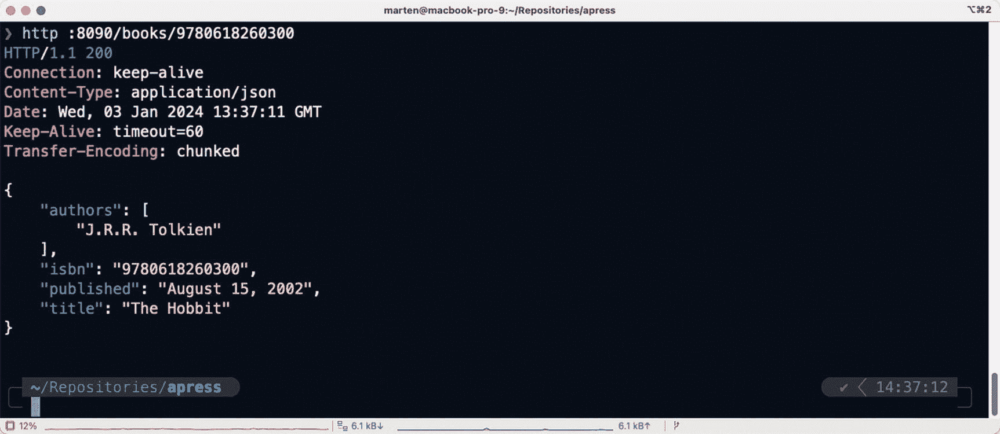

一个 marten 窗口的截图。它显示了一组程序命令，这些命令使用 curl 工具通过命令行中的 http 链接调用本地主机。它显示了连接、内容类型、日期、超时状态和传输编码。

图 3-20

增强后的图书结果


#### 使用 RestClient

除了使用 `RestTemplate`，也可以使用更流畅的 `RestClient`。Spring Boot 会自动暴露 `RestClient.Builder`。请参见清单 3-54。

```
@Bean
public RestClient restClient(RestClient.Builder builder) {
return builder.build();
}
清单 3-54
使用 Builder 定义 RestClient Bean
```

`RestClient.Builder` 提供了一些方法来增强配置。每个方法都会生成一个新的 `RestClient.Builder` 实例。请参见表 3-15 和清单 3-55。

表 3-15

RestTemplateBuilder 配置方法

| 方法 | 描述 |
| --- | --- |
| `baseUrl` | 请求使用的根 URL；默认为 `null`。 |
| `defaultHeader` / `defaultHeaders` | 添加一个具有默认值的标头。 |
| `defaultRequest` | 用于自定义每个正在构建的请求的消费者。 |
| `defaultStatusHandler` | 注册一个默认的状态处理器，应用于每个响应。 |
| `defaultUriVariables` | URI 变量的默认值。 |
| `messageConverters` | 替换应与创建的 `RestTemplate` 一起使用的 `HttpMessageConverter`。 |
| `observationConvention` | 配置用于收集请求观察/指标元数据的 `ObservationConvention`。默认值将设置为 `DefaultClientRequestObservationConvention`。 |
| `observationRegistry` | 配置用于记录 HTTP 客户端观察的 `ObservationRegistry`。通常，这由 Spring Boot 自动设置。 |
| `requestFactory` | 设置要与创建的 `RestClient` 一起使用的 `ClientHttpRequestFactory`，默认情况下自动检测。 |
| `requestInitializer` / `requestInitializers` | 将给定的 `ClientHttpRequestInitializer` 实例添加到初始化器链的末尾。 |
| `requestInterceptor` / `requestInterceptors` | 将给定的 `ClientHttpRequestInterceptor` 实例添加到拦截器链的末尾。 |
| `uriBuilderFactory` | 设置要使用的 `UriBuilderFactory`。 |

```
package com.apress.springboot3recipes.library.rest;
import com.apress.springboot3recipes.library.Book;
import com.apress.springboot3recipes.library.EnrichedBook;
import org.springframework.http.ResponseEntity;
import org.springframework.web.bind.annotation.GetMapping;
import org.springframework.web.bind.annotation.PathVariable;
import org.springframework.web.bind.annotation.RequestMapping;
import org.springframework.web.bind.annotation.RestController;
import org.springframework.web.client.RestClient;
import org.springframework.web.client.RestClientException;
import org.springframework.web.client.RestClientResponseException;
import java.util.Map;
@RestController
@RequestMapping("/books")
public class EnrichedBookController {
private static final String BOOKS_URL = "http://localhost:8080/books/{isbn}";
private static final String OL_API = "https://openlibrary.org/isbn/{isbn}.json";
private final RestClient rest;
public EnrichedBookController(RestClient rest) {
this.rest = rest;
}
@GetMapping("/{isbn}")
public ResponseEntity get(@PathVariable("isbn") String isbn) {
try {
var book = rest.get().uri(BOOKS_URL, isbn).retrieve().body(Book.class);
var library = rest.get().uri(OL_API, isbn).retrieve().body(Map.class);
var published = extractPublishData(library);
var enriched = enrich(book, published);
return ResponseEntity.ok(enriched);
} catch (RestClientException ex) {
if (ex instanceof RestClientResponseException rex) {
return ResponseEntity.status(rex.getStatusCode()).build();
}
return ResponseEntity.internalServerError().build();
}
}
private EnrichedBook enrich(Book book, String publishDate) {
return new EnrichedBook(book.isbn(), book.title(), publishDate, book.authors());
}
private String extractPublishData(Map json) {
return (String) json.getOrDefault("publish_date", "");
}
}
清单 3-55
使用 RestClient 的控制器
```

该控制器使用 `RestClient` 来调用 URL。首先，我们确定要发起的请求类型，在本例中是 `get()`。接着，我们使用 `uri()` 方法指定要调用的 URL 及其参数。这样就完成了请求的定义，然后我们可以通过 `receive()` 方法执行它。最后，我们使用 `body()` 方法映射响应体。

由于 `RestClient` 复用了与 `RestTemplate` 相同的部分基础设施，因此我们可以复用相同的异常处理逻辑。当你使用 `curl` 或 `HTTPie` 从命令行调用 `http://localhost:8090/books/9780618260300` 时，将得到与图 3-20 类似的输出。


#### 使用声明式客户端

Spring Framework 6 引入了声明式 HTTP 客户端。借助它，你可以编写一个带有若干注解的接口。在运行时，系统会创建一个代理，负责处理请求/响应，包括映射和异常处理。

其起点是一个在类或方法上带有 `@HttpExchange` 注解（或其派生注解，如 `@GetExchange` 或 `@PostExchange`）的接口。它的工作方式与服务器端 API 中的 `@RequestMapping` 非常相似。

使用 `@HttpExchange`，可以设置一些属性（参见表 3-16）。

**表 3-16 HttpExchange 属性**

| 属性 | 描述 |
| --- | --- |
| `value` 或 `url` | 设置请求的 URL；可以是完整 URL、相对于类型级别 `@HttpExchange` 的路径，或预设的基础 URI。 |
| `method` | 要使用的 HTTP 方法；`DELETE`、`GET`、`PATCH`、`POST`、`PUT`。默认为空。 |
| `contentType` | 为 `Content-Type` 标头发送的媒体类型；默认为空。 |
| `accept` | `Accept` 标头的媒体类型。 |

除了 `@HttpExchange` 注解外，还有 `@DeleteExchange`、`@GetExchange`、`@PatchExchange`、`@PostExchange` 和 `@PutExchange`。这些注解可以替代带有特定 `method` 值的 `@HttpExchange` 使用。使用这些注解可以使意图更加明确。

就像使用 `@RequestMapping` 的请求处理方法一样，声明式客户端支持多种参数、注解和返回类型。它为此复用了 Web 基础设施的公共部分。参见表 3-17。

**表 3-17 HttpExchange 支持的方法参数**

| 类型 | 描述 |
| --- | --- |
| `java.net.URI` | 动态设置请求的 URL；覆盖 `@HttpExchange` 中的 `url` 属性。 |
| `UriBuilderFactory` | 提供一个 `UriBuilderFactory` 来展开 URI 模板和 URI 变量。用于替代底层客户端的 `UriBuilderFactory`。 |
| `HttpMethod` | 动态设置请求使用的 HTTP 方法；覆盖 `@HttpExchange` 中的 `method` 属性。 |
| `MultipartFile` | 从 `MultipartFile` 添加一个请求部分；通常与 Spring MVC 一起使用，表示上传的文件。 |
| `@CookieValue` | 向传出请求添加 Cookie。参数可以是包含多个 Cookie 的 `Map<String, ?>` 或 `MultiValueMap<String, ?>`，也可以是单个值。对非 `String` 值使用类型转换。 |
| `@RequestHeader` | 向传出请求添加请求头。参数可以是包含多个标头的 `Map<String, ?>` 或 `MultiValueMap<String, ?>`，也可以是单个值。对非 `String` 值使用类型转换。 |
| `@PathVariable` | 添加一个变量来展开请求 URL 中的占位符。参数可以是包含多个值的 `Map<String, ?>`，也可以是单个值。对非 `String` 值使用类型转换。 |
| `@RequestBody` | 提供请求体，可以是待序列化的 `Object`，也可以是响应式流 Publisher（例如 `Mono`、`Flux`），或通过配置的 `ReactiveAdapterRegistry` 支持的任何其他异步类型。 |
| `@RequestParam` | 添加请求参数。可以是包含多个值的 `Map<String, ?>` / `MultiValueMap<String, ?>`。也可以是单个类型。对非 `String` 值使用类型转换。当 `contentType` 为 `application/x-www-form-urlencoded` 时，参数会添加到请求体中。 |
| `@RequestPart` | 添加一个请求部分，可以是 `String`（成为表单字段）、`Resource`、待编码为 JSON（或配置的其他格式）的 `Object`、包含标头的 `HttpEntity`、Spring `Part`，或受支持的响应式流 Publisher。 |

除了方法参数外，还支持多种方法返回类型。参见表 3-18。

**表 3-18 HttpExchange 支持的方法返回类型**

| 类型 | 描述 |
| --- | --- |
| `void` | 执行请求；无响应。 |
| `HttpHeaders` | 执行请求并仅返回标头。 |
| `<T>` | 执行请求并返回解码为类型 `T` 的响应体。 |
| `ResponseEntity<Void>` | 执行请求并返回包含 `status` 和 `headers` 的 `ResponseEntity`。 |
| `ResponseEntity<T>` | 执行请求并返回包含 `status`、`headers` 以及解码为类型 `T` 的响应体的 `ResponseEntity`。 |

基于这些信息，我们可以提供两个接口来访问需要调用的 API。先从图书的 API 开始。参见代码清单 3-56。

```
package com.apress.springboot3recipes.library.rest;
import com.apress.springboot3recipes.library.Book;
import org.springframework.web.bind.annotation.PathVariable;
import org.springframework.web.service.annotation.GetExchange;
public interface BookServiceClient {
@GetExchange("http://localhost:8080/books/{isbn}")
Book getBook(@PathVariable String isbn);
}
代码清单 3-56
BookServiceClient 源码
```

`BookServiceClient` 有一个方法，该方法带有 `@GetExchange` 注解。它提供了一个值为 `http://localhost:8080/books/{isbn}` 的 URI 模板。该方法接受一个带有 `@PathVariable` 注解的单一参数 `isbn`。调用此方法时，传入的值会在执行请求前被放入 URI 的 `{isbn}` 部分。请求发送后，收到的响应会被转换为 `Book` 对象，就像我们使用 `RestTemplate` 或 `RestClient` 时一样。

接下来，我们还需要一个用于 Open Library API 的接口。参见代码清单 3-57。

```
package com.apress.springboot3recipes.library.rest;
import org.springframework.web.bind.annotation.PathVariable;
import org.springframework.web.service.annotation.GetExchange;
import org.springframework.web.service.annotation.HttpExchange;
import java.util.Map;
@HttpExchange(url = "https://openlibrary.org/isbn")
public interface OpenLibraryClient {
@GetExchange("/{isbn}.json")
Map getInformation(@PathVariable String isbn);
}
代码清单 3-57
OpenLibraryClient 源码
```

`OpenLibraryClient` 有一个设置了 `url` 属性的 `@HttpExchange` 方法。这将为此接口中的所有其他方法设置一个基础 URI。这样，我们就可以为所有其他方法仅指定相对 URL。现在只有一个带有 `@GetExchange` 的方法。该方法也接受一个单一参数 `isbn`，该参数在执行前同样被放入 URI 模板中。响应再次被转换为 `Map`，和之前一样。

现在接口已经就绪，我们需要在配置中暴露它们，但我们无法从接口创建实例。这时就需要 `HttpServiceProxyFactory` 登场了；它会在运行时为这些接口创建代理。为此，我们需要在应用程序中添加一些配置。参见代码清单 3-58。

```
@Bean
public HttpServiceProxyFactory httpServiceProxyFactory(RestClient.Builder builder) {
var adapter = RestClientAdapter.create(builder.build());
return HttpServiceProxyFactory.builderFor(adapter).build();
}
@Bean
public BookServiceClient bookServiceClient(HttpServiceProxyFactory factory) {
return factory.createClient(BookServiceClient.class);
}
@Bean
public OpenLibraryClient openLibraryClient(HttpServiceProxyFactory factory) {
return factory.createClient(OpenLibraryClient.class);
}
代码清单 3-58
HttpServiceProxyFactory 配置
```

`RestClient.Builder` 用于构建一个 `RestClient`，以便与 `HttpServiceProxyFactory` 一起使用。由于 `RestClient` 不能直接使用，我们需要将其包装在 `RestClientAdapter` 中，该适配器将 `RestClient` 适配到 `HttpExchangeAdapter` 接口。


`HttpExchangeAdapter` 有三种实现：`RestClientAdapter`、`RestTemplateAdapter` 和 `WebClientAdapter`。后者将在第 4 章中使用，并且是非阻塞的。不过，也可以使用 `RestTemplate` 代替 `RestClient` 来执行请求。

`HttpServiceProxyFactory` 则用于为 `BookServiceClient` 和 `OpenLibraryClient` 创建代理。只需在 `HttpServiceProxyFactory` 上调用带有指定接口的 `createClient` 方法即可完成。参见代码清单 3-59。

```
package com.apress.springboot3recipes.library.rest;
import com.apress.springboot3recipes.library.Book;
import com.apress.springboot3recipes.library.EnrichedBook;
import org.springframework.http.ResponseEntity;
import org.springframework.web.bind.annotation.GetMapping;
import org.springframework.web.bind.annotation.PathVariable;
import org.springframework.web.bind.annotation.RequestMapping;
import org.springframework.web.bind.annotation.RestController;
import org.springframework.web.client.RestClientException;
import org.springframework.web.client.RestClientResponseException;
import java.util.Map;
@RestController
@RequestMapping("/books")
public class EnrichedBookController {
private final BookServiceClient bookServiceClient;
private final OpenLibraryClient openLibraryClient;
public EnrichedBookController(BookServiceClient bookServiceClient,
OpenLibraryClient openLibraryClient) {
this.bookServiceClient = bookServiceClient;
this.openLibraryClient = openLibraryClient;
}
@GetMapping("/{isbn}")
public ResponseEntity get(@PathVariable("isbn") String isbn) {
try {
var book = bookServiceClient.getBook(isbn);
var library = openLibraryClient.getInformation(isbn);
var published = extractPublishData(library);
var enriched = enrich(book, published);
return ResponseEntity.ok(enriched);
} catch (RestClientException ex) {
if (ex instanceof RestClientResponseException rex) {
return ResponseEntity.status(rex.getStatusCode()).build();
}
return ResponseEntity.internalServerError().build();
}
}
private EnrichedBook enrich(Book book, String publishDate) {
return new EnrichedBook(book.isbn(), book.title(), publishDate, book.authors());
}
private String extractPublishData(Map json) {
return (String) json.getOrDefault("publish_date", "");
}
}
代码清单 3-59
使用声明式客户端的 EnrichedBookController
```

请注意，我们现在可以直接调用接口上的方法，而无需担心如何构建正确的请求。这一切都隐藏在接口外观和代理内部。这使得编写可在应用程序中复用的 API 客户端变得更加容易。

最后，请注意异常处理没有改变，因为声明式客户端仍然使用相同的基础设施，因此 `RestClient` 的异常处理也无需更改。

重新运行应用程序并请求书籍信息时，输出结果应与图 3-20 所示保持一致。

#### 测试基于 RestTemplate 或 RestClient 的代码

为了使用 `RestTemplate` 或 `RestClient` 测试客户端代码，Spring Test 框架提供了 `MockRestServiceServer`。`MockRestServiceServer` 可用于针对特定请求（基于 URL、标头、内容等）返回响应。

Spring Boot 则通过提供 `@RestClientTest` 注解，进一步简化了此操作。该注解会设置 `MockRestServiceServer`，使其能够被自动注入，同时也会配置被测类。参见代码清单 3-60。

```
package com.apress.springboot3recipes.library.rest;
import org.junit.jupiter.api.Assertions;
import org.junit.jupiter.api.Test;
import org.springframework.beans.factory.annotation.Autowired;
import org.springframework.boot.test.autoconfigure.web.client.RestClientTest;
import org.springframework.http.HttpStatusCode;
import org.springframework.http.MediaType;
import org.springframework.test.web.client.MockRestServiceServer;
import static org.springframework.test.web.client.match.MockRestRequestMatchers.requestTo;
import static org.springframework.test.web.client.response.MockRestResponseCreators.withSuccess;
@RestClientTest(EnrichedBookController.class)
class EnrichedBookControllerTest {
private static final String BOOK_JSON = """
{
"authors": [
"T. Author"
],
"isbn": "123456789",
"title": "The Client Test"
}
""";
private static final String OL_JSON = """
"{ "publish_date": "2024"}"
""";
@Autowired
private MockRestServiceServer mockServer;
@Autowired
private EnrichedBookController controller;
@Test
void enrichBook() {
mockServer
.expect(requestTo("http://localhost:8080/books/123456789"))
.andRespond(withSuccess(BOOK_JSON, MediaType.APPLICATION_JSON));
mockServer
.expect(requestTo("https://openlibrary.org/isbn/123456789.json"))
.andRespond(withSuccess(OL_JSON, MediaType.APPLICATION_JSON));
var response = controller.get("123456789");
var enrichedBook = response.getBody();
Assertions.assertNotNull(enrichedBook);
Assertions.assertEquals(HttpStatusCode.valueOf(200), response.getStatusCode());
Assertions.assertEquals(enrichedBook.published(), "2024");
mockServer.verify();
}
}
代码清单 3-60
Rest 客户端设置测试
```

该测试使用 `@RestClientTest` 来设置服务器并准备 `EnrichedBookController` 进行测试。`MockRestServiceServer` 和 `EnrichedBookController` 都被注入，以便在测试中使用。

在实际的测试方法中，我们首先设置 `MockRestServiceServer` 的预期行为。这里我们只匹配 URL，并设置它们返回特定的 JSON 响应以及 HTTP 200 OK 状态（更多可能性参见表 3-19）。测试运行后，我们在 `MockRestServiceServer` 上调用 `verify()` 方法，以验证我们记录的请求是否确实被发出，从而表明我们的客户端按预期工作。

表 3-19

MockRestRequestMatchers 设置方法

| `anything()` | 匹配任何请求。 |
| --- | --- |
| `content()` | 设置内容匹配，例如 `Content-Type` 或请求的实际主体。 |
| `header()` | 匹配具有给定标头的请求，标头值可以是具体值或 Hamcrest 匹配器。 |
| `headerDoesNotExist` | 匹配不存在给定标头的请求。 |
| `headerList()` | 匹配具有给定标头的请求，标头值可以是具体值或 Hamcrest 匹配器。 |
| `jsonPath` | 使用 `JsonPath` 设置请求主体的匹配。 |
| `method` | 匹配请求的 `HttpMethod`。 |
| `queryParam` | 匹配请求参数，参数值可以是具体值或 Hamcrest 匹配器。 |
| `queryParamList` | 匹配具有给定值或 Hamcrest 匹配器的请求参数。 |
| `requestTo` | 使用预期的 URI 匹配请求（可以是 `String` 或 `URI`）。 |
| `requestToUriTemplate` | 使用 URI 模板匹配请求。 |
| `xpath` | 使用 XPath 设置请求主体的匹配。 |


该响应通过使用 `MockRestResponseCreators` 创建，目前我们仅使用了 `withSuccess`，但也可以设置错误场景（表 3-20）。

表 3-20

MockRestResponseCreators 设置方法

| `withAccepted()` | 返回 HTTP 状态码 202 (`ACCEPTED`) 的响应。 |
| --- | --- |
| `withBadGateway()` | 返回 HTTP 状态码 502 (`BAD_GATEWAY`) 的响应。 |
| `withBadRequest()` | 返回 HTTP 状态码 400 (`BAD_REQUEST`) 的响应。 |
| `withCreatedEntity(URI)` | 返回 HTTP 状态码 201 (`CREATED`) 并包含 `Location` 头的响应。 |
| `withException(IOException)` | 返回内部应用程序 `IOException` 的响应。这对于模拟读取或连接超时非常有用。 |
| `withForbiddenRequest()` | 返回 HTTP 状态码 403 (`FORBIDDEN`) 的响应。 |
| `withGatewayTimeout()` | 返回 HTTP 状态码 504 (`GATEWAY_TIMEOUT`) 的响应。 |
| `withNoContent` | 返回 HTTP 状态码 204 (`NO_CONTENT`) 的响应。 |
| `withRawStatus(int)` | 返回给定状态码的响应。 |
| `withRequestConflict()` | 返回 HTTP 状态码 409 (`CONFLICT`) 的响应。 |
| `withResourceNotFound()` | 返回 HTTP 状态码 404 (`NOT_FOUND`) 的响应。 |
| `withServerError()` | 返回 HTTP 状态码 500 (`SERVER_ERROR`) 的响应。 |
| `withServiceUnavailable()` | 返回 HTTP 状态码 503 (`SERVICE_UNAVAILABLE`) 的响应。 |
| `withSuccess()``withSuccess(byte[], MediaType)``withSuccess(Resource, MediaType)``withSuccess(String, MediaType)` | 返回 HTTP 状态码 200 (OK) 的响应，并可选择包含响应体和 `Content-Type` 头。 |
| `withTooManyRequests()``withTooManyRequests(int)` | 返回 HTTP 状态码 429 (`TOO_MANY_REQUESTS`) 的响应，并可选择包含 `Retry-After` 头。 |
| `withUnauthorizedRequest()` | 返回 HTTP 状态码 401 (`UNAUTHORIZED`) 的响应。 |

调用设置方法后，会返回一个 `DefaultResponseCreator`，可用于通过添加头、Cookie 甚至响应体来进一步定义响应。

一个信息图标，圆圈内包含字母 i。 除了使用 `@RestClientTest`，我们也可以使用 `@WebMvcTest`，因为 `EnrichedBookController` 是一个控制器。自动设置 `MockRestServiceServer` 需要额外的注解 `@AutoConfigureMockRestServiceServer`；否则，它将不会被配置。

脚注 1   2

# 4. WebFlux

Spring WebFlux 是 Spring 包含的一个响应式 Web 框架。它支持完全非阻塞，并支持响应式流背压。它可以在 Netty、Undertow 或 Servlet 容器等服务器上运行。当检测到此类服务器时，Spring Boot 会自动为您配置该服务器。

## 4-1. 使用 Spring WebFlux 开发响应式应用程序

### 问题

您希望使用 Spring WebFlux 开发一个简单的响应式 Web 应用程序，以学习该框架的基本概念和配置。

### 解决方案

Spring WebFlux 的最低层组件是 `org.springframework.http.server.reactive.HttpHandler`。`HttpHandler` 接口有一个单一的 `handle` 方法。参见清单 4-1。

```
public interface HttpHandler {
Mono handle(ServerHttpRequest request, ServerHttpResponse response);
}
清单 4-1
HttpHandler 接口
```

`handle` 方法返回 `Mono<Void>`，这是返回 `void` 的响应式表达方式。它接受 `ServerHttpRequest` 接口和 `ServerHttpResponse` 接口，两者均来自 `org.springframework.http.server.reactive` 包。根据所使用的容器，会创建相应的实现。为此，存在多个用于容器的适配器或桥接器。当在 Servlet 5.0 容器（支持非阻塞 I/O）上运行时，会使用 `ServletHttpHandlerAdapter`（或其子类之一）来从纯 Servlet 世界适配到响应式世界。当在 Netty 等原生响应式引擎上运行时，则使用 `ReactorHttpHandlerAdapter`。

当 Web 请求发送到 Spring WebFlux 应用程序时，`HandlerAdapter` 首先接收该请求。然后，它会组织在 Spring 应用程序上下文中配置的、处理该请求所需的各种组件。

要在 Spring WebFlux 中定义控制器类，必须使用 `@Controller` 或 `@RestController` 注解标记该类（与 Spring MVC 相同；参见第 3 章）。

当带有 `@Controller` 注解的类（即控制器类）接收到请求时，它会查找适当的处理程序方法来处理该请求。这要求控制器类通过一个或多个处理程序映射将每个请求映射到处理程序方法。为此，控制器类的方法会使用 `@RequestMapping` 注解进行修饰，使其成为处理程序方法。

这些处理程序方法的签名——正如您对任何标准类所期望的那样——是开放式的。您可以为处理程序方法指定任意名称，并定义各种方法参数。同样，处理程序方法可以返回一系列值中的任何一个（例如 `String` 或 `void`），具体取决于其实现的应用程序逻辑。以下仅是有效参数类型的部分列表，旨在让您有所了解：

*   `ServerHttpRequest` 或 `ServerHttpResponse`
*   来自 URL 的任意类型的请求参数，使用 `@RequestParam` 注解
*   任意类型的模型属性，使用 `@ModelAttribute` 注解
*   传入请求中包含的 Cookie 值，使用 `@CookieValue` 注解
*   任意类型的请求头值，使用 `@RequestHeader` 注解
*   任意类型的请求属性，使用 `@RequestAttribute` 注解
*   `Map` 或 `ModelMap`，用于处理程序方法向模型添加属性
*   `Errors` 或 `BindingResult`，用于处理程序方法访问命令对象的绑定和验证结果
*   `WebSession`，用于会话

一旦控制器类选择了适当的处理程序方法，它就会使用请求调用该处理程序方法的逻辑。通常，控制器的逻辑会调用后端服务来处理请求。此外，处理程序方法的逻辑可能会从众多输入参数（例如 `ServerHttpRequest`、`Map` 或 `Errors`）中添加或删除信息，这些参数将构成后续流程的一部分。

处理程序方法完成请求处理后，它会将控制权委托给一个视图，该视图表示为处理程序方法的返回值。为了提供灵活的方法，处理程序方法的返回值并不代表视图的实现（例如 `user.html` 或 `report.pdf`），而是代表一个逻辑视图（例如 `user` 或 `report`）——注意缺少文件扩展名。

处理程序方法的返回值可以是表示逻辑视图名称的 `String`，也可以是 `void`，在后一种情况下，将根据处理程序方法或控制器的名称确定默认的逻辑视图名称。


要将信息从控制器传递到视图，处理程序方法返回的是逻辑视图名称（`String`）还是 `void` 并不重要，因为处理程序方法的输入参数将对视图可用。

例如，如果处理程序方法将 `Map` 和 `Model` 对象作为输入参数——并在处理程序方法的逻辑中修改它们的内容——那么这些相同的对象将对处理程序方法返回的视图可访问。

当控制器类接收到一个视图时，它会通过视图解析器将逻辑视图名称解析为特定的视图实现（例如，`user.html` 或 `report.fmt`）。视图解析器是在 Web 应用程序上下文中配置的一个 bean，它实现了 `ViewResolver` 接口。其职责是为逻辑视图名称返回一个特定的视图实现。

一旦控制器类将视图名称解析为视图实现，根据视图实现的设计，它会渲染由控制器处理程序方法传递的对象（例如，`ServerHttpRequest`、`Map`、`Errors` 或 `WebSession`）。视图的职责是将处理程序方法逻辑中添加的对象展示给用户。

### 工作原理

让我们编写一个来自配方 3-1 的 `HelloWorldApplication` 的响应式版本。参见清单 4-2。

```
package com.apress.springboot3recipes.helloworld;
import org.springframework.boot.SpringBootVersion;
import org.springframework.web.bind.annotation.GetMapping;
import org.springframework.web.bind.annotation.RestController;
import reactor.core.publisher.Mono;
@RestController
public class HelloWorldController {
@GetMapping
public Mono hello() {
var version= SpringBootVersion.getVersion();
var msg = String.format("Hello World, from Reactive Spring Boot %s!", version);
return Mono.just(msg);
}
}
清单 4-2
响应式 HelloWorldController
```

注意，`Mono<String>` 是 `hello` 方法的返回类型，而不是普通的 `String`。`Mono` 正是使其具有响应式特性的关键。

#### 设置 Spring WebFlux 应用程序

为了能够以响应式方式处理请求，你需要启用 WebFlux。这可以通过添加对 `spring-boot-starter-webflux` 的依赖来完成。

```
org.springframework.boot
spring-boot-starter-webflux

```

这会引入所需的依赖项，例如 `spring-webflux` 和 Project Reactor 的依赖项。它还包括一个响应式运行时，默认情况下是 Netty。

现在一切已配置完毕，最后要做的是创建一个应用程序类。参见清单 4-3。

```
package com.apress.springboot3recipes.helloworld;
import org.springframework.boot.SpringApplication;
import org.springframework.boot.autoconfigure.SpringBootApplication;
@SpringBootApplication
public class HelloWorldApplication {
public static void main(String[] args) {
SpringApplication.run(HelloWorldApplication.class, args);
}
}
清单 4-3
HelloWorldApplication
```

Spring Boot 将检测响应式运行时，并使用 `server.*` 属性对其进行配置（参见配方 3-1）。

#### 创建 Spring WebFlux 控制器

基于注解的控制器类可以是任意类，它不需要实现特定接口或继承特定基类。你可以使用 `@Controller` 或 `@RestController` 注解对其进行标注。控制器中可以定义一个或多个处理程序方法来处理单个或多个操作。处理程序方法的签名足够灵活，可以接受一系列参数。（有关请求映射的更多信息，另请参见配方 4-2。）

```
package com.apress.springboot3recipes.helloworld;
import org.springframework.boot.SpringBootVersion;
import org.springframework.web.bind.annotation.GetMapping;
import org.springframework.web.bind.annotation.RestController;
import reactor.core.publisher.Mono;
@RestController
public class HelloWorldController {
@GetMapping
public Mono hello() {
var version= SpringBootVersion.getVersion();
var msg = String.format("Hello World, from Reactive Spring Boot %s!", version);
return Mono.just(msg);
}
}
```

注解 `@GetMapping` 用于将 `hello` 方法修饰为控制器的 HTTP GET 处理程序方法。值得一提的是，如果没有声明默认的 HTTP GET 处理程序方法，则会抛出 `ServletException`。因此，控制器至少拥有一个 URL 路由和至少一个处理程序方法非常重要。由于 `@GetMapping` 中的表达式，该方法绑定到 `/hello`。

当向 `http://localhost:8080/hello` 发出请求时，它将响应式地返回 `Hello World, from Reactive Spring Boot 3!`。但是，客户端不会注意到这一点。对于客户端来说，它仍然是一个普通的 HTTP 请求。

#### 对响应式控制器进行单元测试

对控制器进行集成测试有两种方法。第一种方法是简单地编写一个测试，创建 `HelloWorldController` 的实例，调用该方法，并对结果进行断言。第二种方法是使用 `@WebFluxTest` 注解来创建测试。后者将启动一个包含 Web 基础设施的最小应用程序上下文，你可以使用 `MockMvc` 来测试控制器。最后这种方法介于纯单元测试和全面集成测试之间。参见清单 4-4。

```
package com.apress.springboot3recipes.helloworld;
import org.junit.jupiter.api.Test;
import reactor.test.StepVerifier;
class HelloWorldControllerUnitTest {
private final HelloWorldController controller = new HelloWorldController();
@Test
void shouldSayHello() {
var result = controller.hello();
StepVerifier.create(result)
.expectNext("Hello World, from Reactive Spring Boot 3.2.1!")
.verifyComplete();
}
}
清单 4-4
HelloWorldController 单元测试
```

这是一个基本的单元测试。它实例化控制器并直接调用要测试的方法。它使用来自 `reactive-test` 模块的 `StepVerifier` 来简化测试。调用 `hello` 方法，然后使用 `StepVerifier` 验证结果。

添加 `reactive-test` 依赖项是通过添加以下依赖项完成的：

```
io.projectreactor
reactor-test
test

```

第二种选择是对特定控制器使用 `@WebFluxTest`。

```
package com.apress.springboot3recipes.helloworld;
import org.hamcrest.Matchers;
import org.junit.jupiter.api.Test;
import org.springframework.beans.factory.annotation.Autowired;
import org.springframework.boot.test.autoconfigure.web.reactive.WebFluxTest;
import org.springframework.http.MediaType;
import org.springframework.test.web.reactive.server.WebTestClient;
@WebFluxTest(HelloWorldController.class)
class HelloWorldControllerSliceTest {
@Autowired
private WebTestClient webClient;
@Test
void shouldSayHello() {
webClient
.get().uri("/").accept(MediaType.TEXT_PLAIN).exchange()
.expectStatus().isOk()
.expectBody(String.class)
.value(Matchers.startsWith("Hello World, from Reactive Spring Boot"));
}
}
```

此测试将启动一个最小的 Spring Boot 上下文，并自动检测项目中所有与 WebFlux 相关的 bean，例如 `@ControllerAdvice`。现在，无需直接调用 `HelloWorldController`，你可以使用特殊的 `WebTestClient` 来声明一个请求 `.get().uri("/")`，并使用 `exchange()` 以非阻塞方式发送该请求。最后，验证断言/期望。预期请求具有 OK 状态并包含指定的响应体。


#### 对响应式控制器进行集成测试

集成测试与上一节中的 `@WebFluxTest` 非常相似。主要区别在于使用 `@SpringBootTest` 而不是 `@WebFluxText`。使用 `@SpringBootTest` 会启动整个应用程序，包括所有其他 Bean（服务、仓库等）。通过 `webEnvironment`，你可以指定要使用的环境。其值包括 `RANDOM_PORT`、`MOCK`（默认）、`DEFINED_PORT` 和 `NONE`。这里我们使用随机端口，并再次使用 `WebTestClient` 来发起请求：

```
package com.apress.springboot3recipes.helloworld;
import org.hamcrest.Matchers;
import org.junit.jupiter.api.Test;
import org.springframework.beans.factory.annotation.Autowired;
import org.springframework.boot.test.autoconfigure.web.reactive.AutoConfigureWebTestClient;
import org.springframework.boot.test.context.SpringBootTest;
import org.springframework.http.MediaType;
import org.springframework.test.web.reactive.server.WebTestClient;
@SpringBootTest
@AutoConfigureWebTestClient
class HelloWorldControllerIntegrationTest {
@Autowired
private WebTestClient webClient;
@Test
void shouldSayHello() {
webClient
.get().uri("/").accept(MediaType.TEXT_PLAIN).exchange()
.expectStatus().isOk()
.expectBody(String.class)
.value(Matchers.containsString("Hello World, from Reactive Spring Boot"));
}
}
```

请求被发送到嵌入式服务器，之后验证结果是否具有正确的状态和正文内容。

一个信息图标，圆圈内包含字母 i。 当使用 `MOCK`（也是默认值）作为 `webEnvironment` 时，必须添加 `@AutoConfigureWebTestClient` 注解才能获取用于测试的 `WebTestClient`。

## 4-2\. 使用响应式 REST 服务进行发布和消费

### 问题

你想要编写一个能够生成 JSON 的响应式 REST 端点。

### 解决方案

与常规的 `@RestController` 一样，你可以返回一个普通对象或对象列表，它们将被发送给客户端。为了使它们具有响应式特性，你需要将这些返回值包装在对应的响应式类型中，即 `Mono` 或 `Flux`。

### 工作原理

让我们从编写一个响应式 `BookService` 开始。每个方法将返回 `Mono<Book>` 或 `Flux<Book>`。参见清单 4-5。

```
package com.apress.springboot3recipes.library;
import reactor.core.publisher.Flux;
import reactor.core.publisher.Mono;
public interface BookService {
Flux findAll();
Mono create(Book book);
Mono find(String isbn);
}
清单 4-5
响应式 BookService 接口
```

对于 `BookService` 接口，我们可以编写一个内存实现。参见清单 4-6。

```
package com.apress.springboot3recipes.library;
import org.springframework.stereotype.Service;
import reactor.core.publisher.Flux;
import reactor.core.publisher.Mono;
import java.util.Map;
import java.util.concurrent.ConcurrentHashMap;
@Service
class InMemoryBookService implements BookService {
private final Map books = new ConcurrentHashMap();
@Override
public Flux findAll() {
return Flux.fromIterable(books.values());
}
@Override
public Mono create(Book book) {
books.put(book.isbn(), book);
return Mono.just(book);
}
@Override
public Mono find(String isbn) {
return Mono.justOrEmpty(books.get(isbn));
}
}
清单 4-6
响应式 BookService 实现（内存）
```

`InMemoryBookService` 有一些简单的方法来获取或保存书籍。当检索所有书籍时，它会延迟 128 毫秒。`Book` 类与第 3 章中使用的相同。参见清单 4-7。

```
package com.apress.springboot3recipes.library;
import java.util.List;
import java.util.Objects;
public record Book(String isbn, String title, List authors) {
@Override
public boolean equals(Object o) {
if (o instanceof Book other) {
return this.isbn != null && Objects.equals(this.isbn, other.isbn);
}
return false;
}
@Override
public int hashCode() {
return Objects.hash(this.isbn);
}
}
清单 4-7
Book 记录
```

需要一个 `BookController` 控制器来将 `Book` 暴露为 REST 资源。

```
package com.apress.springboot3recipes.library.rest;
import com.apress.springboot3recipes.library.Book;
import com.apress.springboot3recipes.library.BookService;
import org.springframework.http.ResponseEntity;
import org.springframework.web.bind.annotation.GetMapping;
import org.springframework.web.bind.annotation.PathVariable;
import org.springframework.web.bind.annotation.PostMapping;
import org.springframework.web.bind.annotation.RequestBody;
import org.springframework.web.bind.annotation.RequestMapping;
import org.springframework.web.bind.annotation.RestController;
import org.springframework.web.util.UriComponentsBuilder;
import reactor.core.publisher.Flux;
import reactor.core.publisher.Mono;
import java.time.Duration;
@RestController
@RequestMapping("/books")
public class BookController {
private final BookService bookService;
public BookController(BookService bookService) {
this.bookService = bookService;
}
@GetMapping
public Flux all() {
return bookService.findAll().delayElements(Duration.ofMillis(64));
}
@GetMapping("/{isbn}")
public Mono get(@PathVariable("isbn") String isbn) {
return bookService.find(isbn);
}
@PostMapping
public Mono> create(@RequestBody Mono book,
UriComponentsBuilder uriBuilder) {
var created = book.flatMap(bookService::create);
return created.map((it) -> createResponse(it, uriBuilder));
}
private ResponseEntity createResponse(Book book,
UriComponentsBuilder ucb) {
var newBookUri = ucb.path("/books/{isbn}").build(book.isbn());
return ResponseEntity.created(newBookUri).body(book);
}
}
```

为了启动所有组件，需要一个简单的 `LibraryApplication`。

```
package com.apress.springboot3recipes.library;
import org.springframework.boot.ApplicationRunner;
import org.springframework.boot.SpringApplication;
import org.springframework.boot.autoconfigure.SpringBootApplication;
import org.springframework.context.annotation.Bean;
import reactor.core.publisher.Flux;
@SpringBootApplication
public class LibraryApplication {
public static void main(String[] args) {
SpringApplication.run(LibraryApplication.class, args);
}
@Bean
public ApplicationRunner initData(BookService books) {
return (args) -> Flux.fromIterable(BookGenerator.all())
.map(books::create).subscribe();
}
}
```

`BookController` 映射到 `/books`，支持列出所有书籍或单本书籍，以及添加和修改书籍。使用 `HTTPie` 或 `curl` 之类的工具，你可以查询该端点。

命令 `http http://localhost:8080/books` 应列出系统中的所有订单（参见图 4-1），而 `http http://localhost:8080/books/{isbn}` 应列出单本书籍。

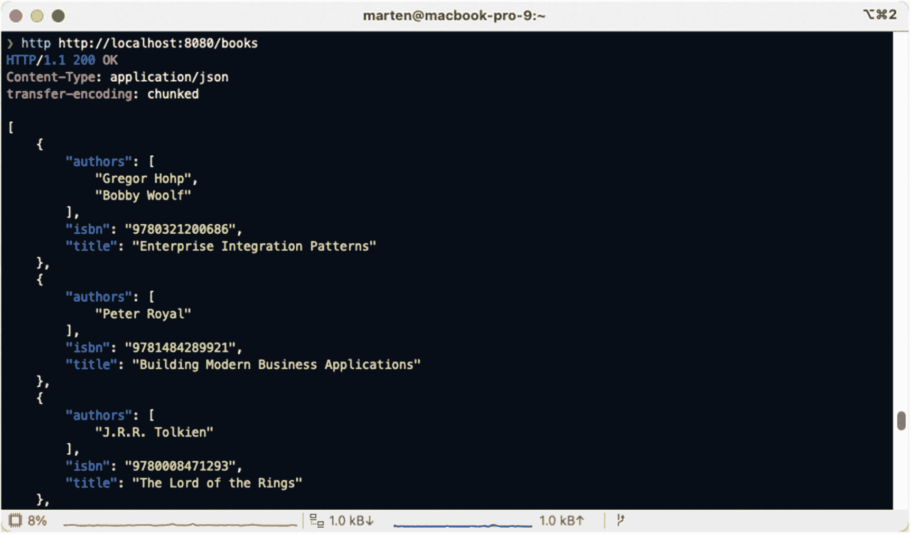

一个 Marten 窗口的截图。HTTP 响应包含 JSON 数据，列出了带有作者、ISBN 和标题的书籍。数组中的每个对象代表一本书。

图 4-1

获取所有书籍的结果


#### 流式传输 JSON

对 `/books` 的调用结果并非流式传输，而是阻塞式的。它会先收集所有结果，然后再发送出去。另请参见图 4-1 中的内容类型标头，其设置为 `application/json`。要实现流式传输结果，应将其设置为 `application/x-ndjson`（或支持流式传输的其他内容类型）。在编写客户端来消费此端点时，这一点需要考虑。对于 `HTTPie`，我们可以指定 `Accept` 标头来使其支持流式传输。将 `'Accept:application/x-ndjson'` 添加到之前的 `HTTPie` 命令中，结果现在将变为流式传输。结果将缓缓流入，直到没有更多内容可供消费（参见图 4-2）。

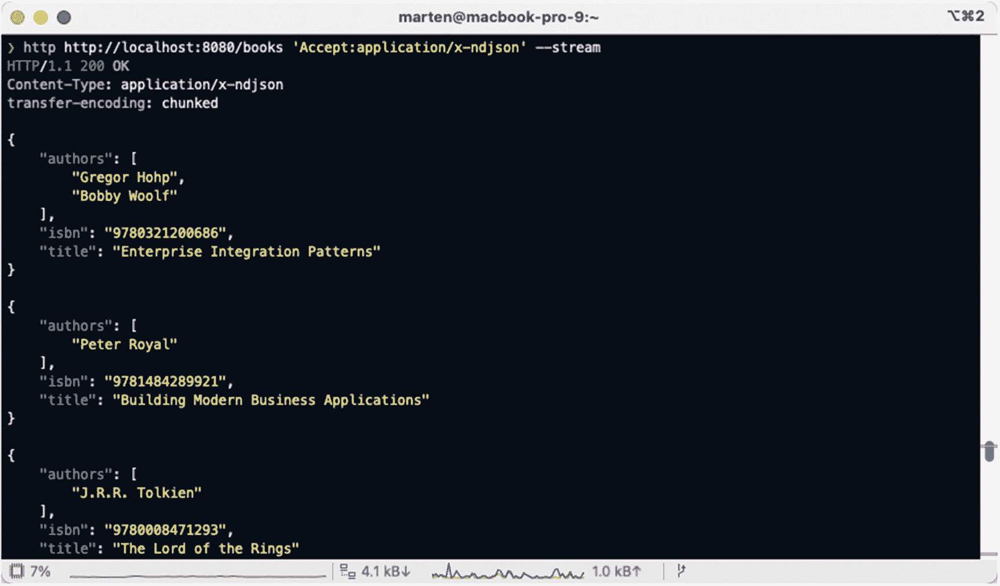

一个 Marten 窗口的截图。HTTP 响应使用 application/x-ndjson 格式，流式传输换行符分隔的 JSON 数据。每个对象代表一本书，包含作者、ISBN 和标题字段。但是，存在格式问题，例如缺少逗号和对象不完整。

图 4-2

流式传输所有书籍的结果

结果也略有变化。它不再返回一个数组或订单（参见图 4-1），而是返回单个订单（参见图 4-2）。

#### 编写集成测试

使用 `WebTestClient` 和 `MOCK` Web 环境可以很容易地为 `BookController` 编写集成测试（你也可以使用 `RANDOM_PORT` 代替 `MOCK`）。

```
package com.apress.springboot3recipes.library.rest;
import com.apress.springboot3recipes.library.Book;
import org.junit.jupiter.api.Test;
import org.springframework.beans.factory.annotation.Autowired;
import org.springframework.boot.test.autoconfigure.web.reactive.AutoConfigureWebTestClient;
import org.springframework.boot.test.context.SpringBootTest;
import org.springframework.test.annotation.DirtiesContext;
import org.springframework.test.web.reactive.server.WebTestClient;
import java.util.List;
@SpringBootTest(webEnvironment = SpringBootTest.WebEnvironment.MOCK)
@AutoConfigureWebTestClient
@DirtiesContext(methodMode = DirtiesContext.MethodMode.AFTER_METHOD)
class BookControllerIntegrationTest {
@Autowired
private WebTestClient webTestClient;
@Test
void listBooks() {
webTestClient.get().uri("/books")
.exchange()
.expectStatus().isOk()
.expectBodyList(Book.class).hasSize(24);
}
@Test
void addAndGetBook() {
var book = new Book("B0CBC71PHR", "Testing Spring Boot Applications Demystified", List.of("Philip Riecks"));
webTestClient.post().uri("/books").bodyValue(book)
.exchange()
.expectStatus().isCreated()
.expectBody(Book.class).isEqualTo(book);
webTestClient.get().uri("/books/{isbn}", book.isbn())
.exchange()
.expectStatus().isOk()
.expectBody(Book.class).isEqualTo(book);
}
}
```

这里需要 `@DirtiesContext` 注解，因为 `BookService` 是一个有状态的 Bean。因此，在向库中添加 `Book` 后，需要为下一个测试重置它。由于使用了带有模拟环境的 `@SpringBootTest` 注解，测试将启动完整的应用程序。对于模拟环境，需要 `@AutoConfigureWebTestClient` 注解来获取 `WebTestClient`。`WebTestClient` 使得构建请求并将其发送到服务器变得容易。发送响应后，它可以对结果进行断言。

一个信息图标，圆圈内有一个字母 i。 `webEnvironment = SpringBootTest.WebEnvironment.MOCK` 也是默认值，因此显式添加它并非严格必要。

## 4-3\. 使用 Thymeleaf 作为模板引擎

### 问题

你希望在基于 WebFlux 的应用程序中使用 Thymeleaf 渲染视图。

### 解决方案

添加 Thymeleaf 的依赖项，并创建一个处理器来确定视图并填充模型。

### 工作原理

添加对 `spring-boot-starter-webflux` 和 `spring-boot-starter-thymeleaf` 的依赖。这足以让 Spring Boot 自动配置 Thymeleaf 以在 WebFlux 应用程序中使用。参见清单 4-8。

```
org.springframework.boot
spring-boot-starter-webflux

org.springframework.boot
spring-boot-starter-thymeleaf

清单 4-8
WebFlux 和 Thymeleaf 依赖项
```

添加此依赖项后，你将获得 Thymeleaf 库以及 Thymeleaf Spring 方言，以便它们能够很好地集成。由于这两个库的存在，Spring Boot 将自动配置 `ThymeleafReactiveViewResolver`。`ThymeleafReactiveViewResolver` 需要一个 Thymeleaf `ISpringWebFluxTemplateEngine` 才能解析和渲染视图。一个特殊的 `SpringWebFluxTemplateEngine` 将预先配置好 `SpringDialect`，以便你可以在 Thymeleaf 页面中使用 SpEL。

配置 Thymeleaf Spring Boot 在 `spring.thymeleaf` 和 `spring.thymeleaf.reactive` 命名空间中公开了几个属性（参见表 4-1）。

表 4-1

Thymeleaf 属性

| **属性** | **描述** |
| --- | --- |
| `spring.thymeleaf.prefix` | 设置用于 `ViewResolver` 的 `prefix`；默认值为 `classpath:/templates`。 |
| `spring.thymeleaf.suffix` | 设置用于 `ViewResolver` 的 `suffix`；默认值为 `.html`。 |
| `spring.thymeleaf.encoding` | 设置模板的编码；默认值为 `UTF-8`。 |
| `spring.thymeleaf.check-template` | 在渲染前检查模板是否存在；默认值为 `true`。 |
| `spring.thymeleaf.check-template-location` | 检查模板位置是否存在。 |
| `spring.thymeleaf.mode` | 设置要使用的 Thymeleaf `TemplateMode`；默认值为 `HTML`。 |
| `spring.thymeleaf.cache` | 设置是否应缓存已解析的模板；默认值为 `true`。 |
| `spring.thymeleaf.template-resolver-order` | 设置 `ViewResolver` 的顺序；默认值为 1。 |
| `spring.thymeleaf.view-names` | 设置可以使用此 `ViewResolver` 解析的视图名称（以逗号分隔）。 |
| `spring.thymeleaf.exclude-view-names` | 设置被排除解析的视图名称（以逗号分隔）。 |
| `spring.thymeleaf.enabled` | 设置是否启用 Thymeleaf；默认值为 `true`。 |
| `spring.thymeleaf.enable-spring-el-compiler` | 启用 SpEL 表达式的编译；默认值为 `false`。 |
| `spring.thymeleaf.reactive.max-chunk-size` | 设置用于写入响应的数据缓冲区的最大大小（以字节为单位）。 |
| `spring.thymeleaf.reactive.media-types` | 设置此视图技术支持的媒体类型。 |
| `spring.thymeleaf.reactive.full-mode-view-names` | 应以 `FULL` 模式运行的视图名称的逗号分隔列表。默认值为 `none`。`FULL` 模式基本上意味着阻塞模式。 |
| `spring.thymeleaf.reactive.chunked-mode-view-names` | 应以分块模式运行的视图名称的逗号分隔列表。 |


#### 使用 Thymeleaf 视图

首先，在 `src/main/resources/templates` 目录下创建一个 `index.html` 文件。参见清单 4-9。

```

Spring Boot Recipes - 图书馆

图书馆
图书列表

清单 4-9
索引模板
```

该页面将渲染一个包含单个链接的简单页面，链接指向 `/books`。此 URL 使用 `th:href` 标签渲染，该标签会将 `/books` 扩展为正确的 URL。接下来，编写一个控制器来选择要渲染的页面。参见清单 4-10。

```
package com.apress.springboot3recipes.library.web;
import org.springframework.stereotype.Controller;
import org.springframework.web.bind.annotation.GetMapping;
@Controller
public class IndexController {
@GetMapping
public String index() {
return "index";
}
}
清单 4-10
IndexController
```

编写一个 `BookController`，它将返回 `orders/list` 作为视图名称，并将 `Flux<Book>` 添加到模型中。参见清单 4-11。

```
package com.apress.springboot3recipes.library.web;
import com.apress.springboot3recipes.library.Book;
import com.apress.springboot3recipes.library.BookService;
import org.springframework.stereotype.Controller;
import org.springframework.ui.Model;
import org.springframework.web.bind.annotation.GetMapping;
import org.springframework.web.bind.annotation.ModelAttribute;
import org.springframework.web.bind.annotation.PostMapping;
import org.springframework.web.bind.annotation.RequestParam;
import reactor.core.publisher.Mono;
@Controller
public class BookController {
private final BookService bookService;
public BookController(BookService bookService) {
this.bookService = bookService;
}
@GetMapping("/books.html")
public String all(Model model) {
model.addAttribute("books", bookService.findAll());
return "books/list";
}
}
清单 4-11
用于列出图书的 BookController
```

现在控制器和其他必要组件已准备就绪，需要一个视图。在 `src/main/resources/templates/books` 目录下创建一个 `list.html` 文件。该页面将渲染一个表格，显示图书的 ISBN、标题和作者。参见清单 4-12。

```

图书馆 - 可借阅图书

可借阅图书

标题
作者
ISBN

标题
作者
ISBN

清单 4-12
图书列表的 HTML 页面
```

最后，清单 4-13 展示了用于启动应用程序的 `LibraryApplication`。

```
package com.apress.springboot3recipes.library;
import org.springframework.boot.ApplicationRunner;
import org.springframework.boot.SpringApplication;
import org.springframework.boot.autoconfigure.SpringBootApplication;
import org.springframework.context.annotation.Bean;
import reactor.core.publisher.Flux;
@SpringBootApplication
public class LibraryApplication {
public static void main(String[] args) {
SpringApplication.run(LibraryApplication.class, args);
}
@Bean
public ApplicationRunner initData(BookService books) {
return (args) -> Flux.fromIterable(BookGenerator.all())
.map(books::create).subscribe();
}
}
清单 4-13
Library Spring Boot 应用程序
```

现在，启动应用程序并点击链接，您将看到一个显示图书的页面（图 4-3）。

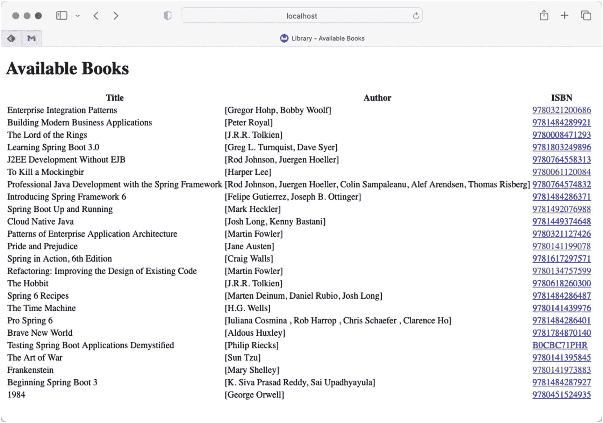

本地主机页面的屏幕截图。在“可借阅图书”下方，列出了标题、作者和 ISBN 链接。

图 4-3
图书列表

#### 使其更具响应性

当运行应用程序并打开页面时，您需要等待一段时间页面才开始渲染。当渲染页面且模型包含 `Flux` 时，默认情况下会等待整个 `Flux` 被消费完毕。之后，它才会开始渲染页面。其行为基本上就像您检索的是 `Collection` 而不是 `Flux`。为了更快地开始渲染页面并实现页面流式传输，请将 `Flux` 包装在 `ReactiveDataDriverContextVariable` 中。参见清单 4-14。

```
@GetMapping("/books.html")
public String all(Model model) {
var books = new ReactiveDataDriverContextVariable(bookService.findAll(), 5);
model.addAttribute("books", books);
return "books/list";
}
清单 4-14
使用 ReactiveDataDriverContextVariable 的方法
```

`all` 方法看起来相同，但请注意 `Flux` 被包装在了 `ReactiveDataDriverContextVariable` 中。这将在接收到五个元素后立即开始渲染，并持续渲染页面直到接收到所有元素。现在，当打开图书页面时，您将看到表格逐渐增长，直到所有订单都被读取完毕。

## 4-4\. 使用 Spring WebFlux 处理异常

### 问题

您希望为 Spring WebFlux 配置异常处理，并根据您的需求进行配置。

### 解决方案

Spring WebFlux 提供了几种处理异常的方式，并且使用 Spring Boot 可以很容易地修改默认行为。

对于与视图相关的实现，可以轻松添加能被自动识别的页面。添加 `error.html` 作为自定义错误页面，或者为特定的 HTTP 错误代码添加特定的错误页面，例如 `404.html` 和 `500.html`。

Spring Boot 也支持基于 REST 的控制器的异常处理。它将返回一个包含错误信息的响应，这与常规 WebFlux 异常处理中可用的错误信息非常相似。另一种选择是启用问题详情支持（RFC-7807），这是一个用于定义错误响应的小型标准。要启用它，请将 `spring.webflux.problemdetails.enabled` 属性设置为 `true`。

### 工作原理

现在我们来解释其工作原理。


#### 处理 REST 控制器的异常

编写一个自定义的`ErrorAttributes`属性来替换默认属性（图 4-4），并填充作为响应写入的模型。

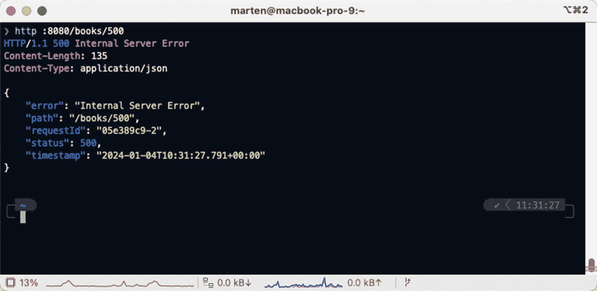

Marten 窗口截图。当尝试访问端点`books/500`时，HTTP 响应显示 500 内部服务器错误。响应中包含包含错误详情的 JSON 数据，包括错误消息、路径、请求 ID、状态码和时间戳。

图 4-4
默认错误响应

默认情况下，Spring Boot 会在错误响应的模型中包含表 4-2 中所示的属性。

表 4-2
默认错误模型属性

| **属性** | **描述** |
| --- | --- |
| `timestamp` | 提取错误的时间 |
| `status` | 状态码 |
| `error` | 错误原因 |
| `exception` | 根异常的类名（如果已配置） |
| `message` | 异常消息 |
| `errors` | 来自`BindingResult`的任何错误（使用绑定和/或验证时） |
| `trace` | 异常堆栈跟踪（如果已配置） |
| `path` | 引发异常时的 URL 路径 |

这一切都是通过使用`ErrorAttributes`组件完成的。默认实现是`DefaultErrorAttributes`。你可以创建自己的`ErrorAttributes`处理器来创建自定义模型，或扩展`DefaultErrorAttributes`以添加额外属性。参见清单 4-20。

```
package com.apress.springboot3recipes.library;
import org.springframework.boot.web.error.ErrorAttributeOptions;
import org.springframework.boot.web.reactive.error.DefaultErrorAttributes;
import org.springframework.web.reactive.function.server.ServerRequest;
import java.util.Map;
public class CustomizedErrorAttributes extends DefaultErrorAttributes {
@Override
public Map getErrorAttributes(ServerRequest req,
ErrorAttributeOptions options) {
var errorAttributes = super.getErrorAttributes(req, options);
errorAttributes.put("parameters", req.exchange().getRequest().getQueryParams());
return errorAttributes;
}
}
清单 4-20
自定义 ErrorAttributes 实现
```

`CustomizedErrorAttributes`会将原始请求参数添加到默认属性旁边的模型中。下一步是将其配置为一个 Bean，以便 Spring Boot 能够检测到它并使用它，而不是配置默认实现。将清单 4-21 中的 Bean 定义添加到`LibraryApplication`中即可实现。

```
@Bean
public CustomizedErrorAttributes errorAttributes() {
return new CustomizedErrorAttributes();
}
清单 4-21
自定义 ErrorAttributes Bean 定义
```

这将生成图 4-5 中的错误；注意额外的`parameters`属性。

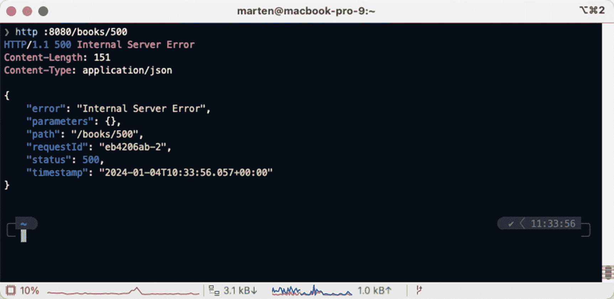

Marten 窗口截图。当尝试访问端点`books/500`时，HTTP 响应显示 500 内部服务器错误。响应中包含包含错误详情的 JSON 数据，例如错误消息、参数、路径、请求 ID、状态码和错误发生的时间戳。

图 4-5
自定义错误响应

#### 启用并使用问题详情

Spring 6 增加了对 HTTP API 问题详情（RFC-7807）的支持，并且在 Spring Boot 中启用它非常容易。通过添加`spring.webflux.problemdetails.enabled=true`（对于基于 MVC 的应用程序则为`spring.mvc.problemdetails.enabled=true`），即可启用此支持。

启用后，Spring Boot 会以更高优先级注册`ProblemDetailsExceptionHandler`作为额外的`ExceptionHandler`。`ProblemDetailsExceptionHandler`会处理一些已知的异常（所有与 Spring 相关的 Web 异常），并返回包含更多信息且类型为`application/problem+json`的结果。参见图 4-6。

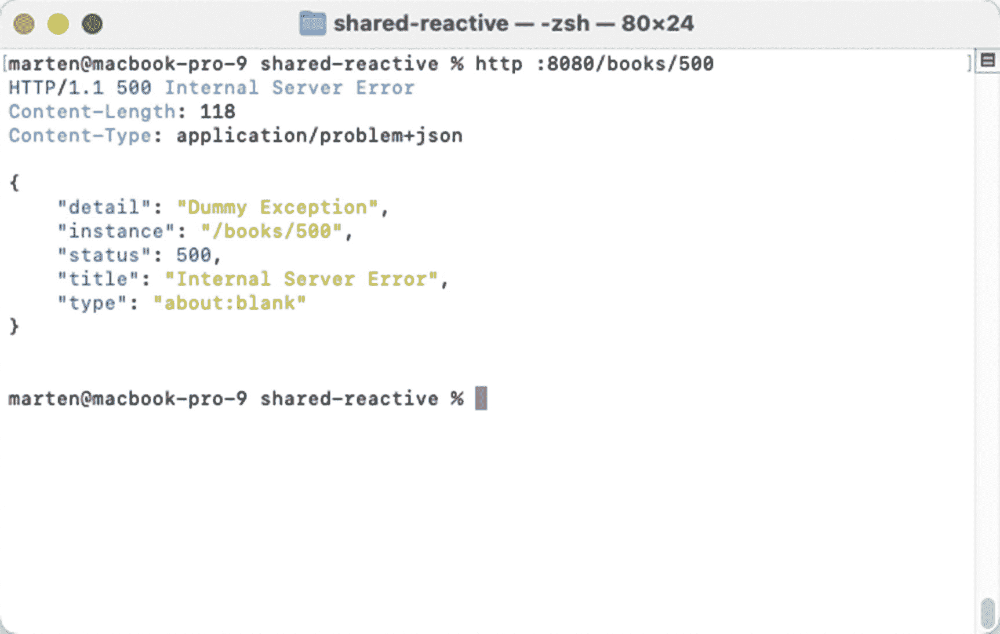

共享响应式窗口截图。它显示了一段 Spring Boot 程序代码，该代码注册了问题详情异常处理器，并返回一个包含类型`application/json`的内部服务器错误结果。

图 4-6
问题详情错误响应

图 4-6 显示了在启用问题详情支持后调用`http://localhost:8080/books/500`的结果。

这适用于所有不同的 Spring MVC 异常。当发生验证或绑定错误时，它还会显示一个包含失败字段及其错误的列表。它甚至（如果可能）会将这些错误消息翻译成客户端使用的语言（有关 I18N 支持，另请参见技巧 4-5 和 4-6）。

## 4-5. 实现国际化（I18N）

### 问题

在开发国际化 Web 应用程序时，你需要以用户偏好的区域设置显示网页。你不想为不同的区域设置创建同一页面的不同版本。

### 解决方案

为了避免为不同区域设置创建页面的不同版本，你应该通过外部化区域设置敏感的文本消息来使网页独立于区域设置。Spring 能够通过使用消息源（必须实现`MessageSource`接口）为你解析文本消息。在你的页面模板中，你可以使用特殊标签或查找消息。


### 工作原理

当 Spring Boot 在 `src/main/resources`（默认位置）中找到 `messages.properties` 文件时，它会自动配置一个 `MessageSource`。该 `messages.properties` 文件包含了应用程序中要使用的默认消息。Spring Boot 会使用请求中的 `Accept-Language` 头部信息来确定当前请求应使用哪个区域设置（关于如何更改此行为，请参见配方 4-6）。

一些属性会改变 `MessageSource` 对缺失翻译、缓存等情况的行为。有关这些属性的概述，请参见表 4-3。

表 4-3

国际化属性

| **属性** | **描述** |
| --- | --- |
| `spring.messages.basename` | 以逗号分隔的基础名称列表；默认值为 `messages`。 |
| `spring.messages.encoding` | 消息包的编码；默认值为 `UTF-8`。 |
| `spring.messages.always-use-message-format` | 设置是否应将 `MessageFormat` 应用于所有消息；默认值为 `false`。 |
| `spring.messages.fallback-to-system-locale` | 当找不到检测到的区域设置的资源包时，回退到系统区域设置。禁用时，将从默认文件加载默认值。默认值为 `true`。 |
| `spring.messages.use-code-as-default-message` | 当找不到消息时，使用消息代码作为默认消息，而不是抛出 `NoSuchMessageException`。默认值为 `false`。 |
| `spring.messages.cache-duration` | 缓存持续时间；默认值为永久。 |

一个灯泡图标。 将应用程序部署到云或其他外部托管平台时，将 `spring.messages.fallback-to-system-locale` 设置为 `false` 可能会很有用。这样，你就可以控制应用程序的默认语言，而不是由你无法控制的部署环境来决定。

将 `messages.properties` 文件添加到 `src/main/resources` 目录中。请参见清单 4-22。

```
main.title=Spring Boot Recipes - Library
index.title=Library
index.books.link=List of books
books.list.title=Available Books
books.list.table.title=Title
books.list.table.author=Author
books.list.table.isbn=ISBN
清单 4-22
默认消息
```

现在修改模板以使用消息插值（通过 `MessageSource` 查找文本）。请参见清单 4-23。

```

Spring Boot Recipes - Library

Library
List of books

清单 4-23
支持国际化的索引页面
```

对于 Thymeleaf，你可以在 `th:text` 属性中使用 `#{…​`​`}` 表达式；由于自动集成了 Spring，这将从 `MessageSource` 解析消息。重新启动应用程序后，输出看起来似乎没有任何变化。但是，所有文本现在都来自 `messages.properties`。

现在，让我们为网站的荷兰语翻译添加一个 `messages_nl.properties` 文件。请参见清单 4-24。

```
main.title=Spring Boot Recipes - Bibliotheek
index.title=Bibliotheek
index.books.link=Lijst van boeken
books.list.title=Beschikbare Boeken
books.list.table.title=Titel
books.list.table.author=Auteur
books.list.table.isbn=ISBN
清单 4-24
荷兰语消息
```

现在，当将接受头部信息更改为荷兰语时，网站将神奇地翻译成荷兰语（参见图 4-7）。

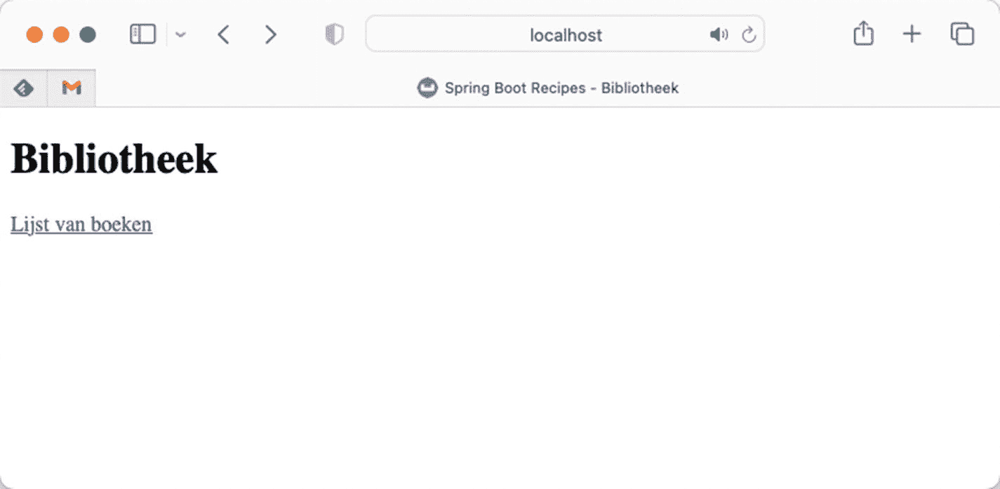

本地主机窗口的屏幕截图。它显示了标题“Bibliotheek”下的荷兰语翻译链接。

图 4-7

翻译后的索引页面

一个灯泡图标。 更改浏览器的语言可能并不那么容易。对于 Chrome 和 Firefox，有一些插件可以让你轻松切换 `Accept-Language` 头部信息。

## 4-6\. 更改用户区域设置

### 问题

为了使你的 Web 应用程序支持国际化，你必须识别每个用户偏好的区域设置，并根据该区域设置显示内容。

### 解决方案

在 Spring WebFlux 应用程序中，用户的区域设置由一个必须实现 `LocaleContextResolver` 接口的组件来识别。Spring WebFlux 提供了两个 `LocaleContextResolver` 实现，供你根据不同的标准解析区域设置。或者，你也可以通过实现此接口来创建自己的自定义区域设置解析器。

你可以通过在 Web 应用程序上下文中注册一个类型为 `LocaleContextResolver` 的 Bean 来定义区域设置解析器。你必须将区域设置解析器的 Bean 名称设置为 `localeContextResolver`，以便它可以被自动检测到。

### 工作原理

Spring WebFlux 提供了 `LocaleContextResolver` 接口的几个默认实现，其中一些允许更改 `Locale`。要更改 `Locale`，可以使用 `WebFilter` 允许用户覆盖他们想要使用的区域设置。Spring WebFlux 并未提供这些功能（至少在撰写本文时如此）；因此，你需要自己实现它们。

#### 使用 HTTP 请求头部解析区域设置

Spring Boot 注册的默认区域设置解析器是 `AcceptHeaderLocaleContextResolver`。它通过检查 HTTP 请求的 `accept-language` 头部信息来解析区域设置。此头部信息由用户的 Web 浏览器根据底层操作系统的区域设置进行设置。请参见清单 4-25。

一个信息图标，圆圈内有一个字母 i。 `AcceptHeaderLocaleContextResolver` 无法更改用户的区域设置，因为它无法修改用户操作系统的区域设置。

```
@Bean
public AcceptHeaderLocaleContextResolver localeContextResolver () {
return new AcceptHeaderLocaleContextResolver();
}
清单 4-25
AcceptHeaderLocaleContextResolver Bean 定义
```

#### 为你的应用程序使用固定区域设置

另一个提供的 `LocaleContextResolver` 是 `FixedLocaleContextResolver`。它实际上并不解析 `Locale`，而是返回一个预先配置好的区域设置，这就是为什么这个解析器是固定的。它不允许更改 `Locale`，因为它固定为单一区域设置。请参见清单 4-26。

```
@Bean
public FixedLocaleContextResolver localeContextResolver () {
return new FixedLocaleContextResolver(Locale.GERMANY);
}
清单 4-26
FixedLocaleContextResolver Bean 定义
```


#### 更改用户区域设置

要更改用户的区域设置，我们需要实现一个允许更改的 `LocaleContextResolver`；然而，我们希望在客户端发起的多次请求之间保留这些值。存储该值的一个位置是 HTTP cookie。另一个选项是利用 `WebSession`。对于此代码示例，我们将把值存储到 cookie 中，因为这能使我们的服务器保持无状态。参见清单 4-27。

```
package com.apress.springboot3recipes.library.i18n;
import org.springframework.context.i18n.LocaleContext;
import org.springframework.context.i18n.SimpleLocaleContext;
import org.springframework.http.ResponseCookie;
import org.springframework.web.server.ServerWebExchange;
import org.springframework.web.server.i18n.AcceptHeaderLocaleContextResolver;
import java.util.Locale;
public class CookieLocaleContextResolver extends AcceptHeaderLocaleContextResolver {
public static final String DEFAULT_NAME =
CookieLocaleContextResolver.class.getName() + ".LOCALE";
@Override
public LocaleContext resolveLocaleContext(ServerWebExchange exchange) {
parseCookieIfNecessary(exchange);
return exchange.getAttribute(DEFAULT_NAME);
}
private void parseCookieIfNecessary(ServerWebExchange exchange) {
if (exchange.getAttribute(DEFAULT_NAME) == null) {
var cookies = exchange.getRequest().getCookies();
var cookie = cookies.getFirst(DEFAULT_NAME);
var attributes = exchange.getAttributes();
if (cookie != null) {
var locale = Locale.forLanguageTag(cookie.getValue());
var context = new SimpleLocaleContext(locale);
attributes.put(DEFAULT_NAME, context);
} else
attributes.put(DEFAULT_NAME,super.resolveLocaleContext(exchange));
}
}
@Override
public void setLocaleContext(ServerWebExchange exchange, LocaleContext lc) {
var cookies = exchange.getResponse().getCookies();
if (lc != null && lc.getLocale() != null) {
exchange.getAttributes().put(DEFAULT_NAME, lc);
var langTag = lc.getLocale().toLanguageTag();
var cookie = ResponseCookie.from(DEFAULT_NAME, langTag).build();
cookies.set(DEFAULT_NAME, cookie);
} else {
exchange.getAttributes().remove(DEFAULT_NAME, lc);
cookies.remove(DEFAULT_NAME);
}
}
}
清单 4-27 基于 Cookie 的 LocaleContextResolver 实现
```

`CookieLocaleContextResolver` 会在需要时将用户选择的 `Locale` 存储到 HTTP cookie 中（参见 `setLocaleContext` 方法）。稍后将展示如何调用此方法。为了解析 `Locale`，我们会在需要时从请求中解析 cookie，并将生成的 `LocaleContext` 存储在交换的属性中。这样做是为了避免反复解析 cookie。该值也会通过在响应中显式设置 `LocaleContext` 来直接激活所选 `Locale`。最后，如果未设置任何内容，则会回退使用浏览器的 `accept-header`，这就是它扩展了 `AcceptHeaderLocaleContextResolver` 的原因。

`CookieLocaleContextResolver` 需要注册为一个名为 `localeContextResolver` 的 bean，以便 Spring 在解析 `Locale` 时能够识别它。参见清单 4-28。

```
@Bean
public CookieLocaleContextResolver localeContextResolver() {
return new CookieLocaleContextResolver();
}
清单 4-28 CookieLocaleContextResolver Bean 定义
```

要更改区域设置，我们需要拦截传入的请求并调用 `LocaleContextResolver` 接口的 `setLocaleContext` 方法。为此，我们可以使用一个 `WebFilter`，在其中检查是否存在查询参数，如果存在，则确定 `LocaleContext`。参见清单 4-29。

```
package com.apress.springboot3recipes.library.i18n;
import org.springframework.context.i18n.SimpleLocaleContext;
import org.springframework.util.StringUtils;
import org.springframework.web.server.ServerWebExchange;
import org.springframework.web.server.WebFilter;
import org.springframework.web.server.WebFilterChain;
import org.springframework.web.server.i18n.LocaleContextResolver;
import reactor.core.publisher.Mono;
import java.util.Locale;
public class LocaleChangeWebFilter implements WebFilter {
public static final String DEFAULT_PARAM_NAME = "locale";
private final LocaleContextResolver resolver;
public LocaleChangeWebFilter(LocaleContextResolver resolver) {
this.resolver = resolver;
}
@Override
public Mono filter(ServerWebExchange exchange, WebFilterChain chain) {
var params = exchange.getRequest().getQueryParams();
if (params.containsKey(DEFAULT_PARAM_NAME)) {
var locale = params.getFirst(DEFAULT_PARAM_NAME);
var context = StringUtils.hasText(locale) ?
new SimpleLocaleContext(Locale.forLanguageTag(locale)) : null;
resolver.setLocaleContext(exchange, context);
}
return chain.filter(exchange);
}
}
清单 4-29 用于更改区域设置的 WebFilter 实现
```

`LocaleChangeWebFilter` 会检查是否存在名为 `locale` 的请求参数（更准确地说是查询参数），如果存在，则使用该参数设置用户选择的 `Locale`。

接下来，需要将此 `LocaleChangeWebFilter` 注册到 Spring WebFlux 中。Spring WebFlux 会自动检测类型为 `WebFilter` 的 bean，并将其注册到请求处理链中。只需将其声明为一个 bean 即可。参见清单 4-30。

```
@Bean
public LocaleChangeWebFilter localeChangeWebFilter(LocaleContextResolver lcr) {
return new LocaleChangeWebFilter(lcr);
}
清单 4-30 LocaleChangeWebFilter Bean 定义
```

要更改区域设置，请将 `LocaleChangeInterceptor` 添加为 bean，并将其注册为拦截器；对于后者，请使用 `WebMvcConfigurer` 的 `addInterceptors` 方法。

一个信息图标，圆圈内包含字母 i。 除了将其添加到 `@SpringBootApplication` 之外，您还可以创建一个专门的 `@Configuration` 注解类来注册过滤器和解析器。请注意，*不要* 在该类上添加 `@EnableWebFlux`，因为这会禁用 Spring Boot 的自动配置！

现在，将以下代码片段添加到 `index.html` 文件中：

```
语言

NL |
EN

```

现在，当选择其中一种语言时，页面将重新渲染并以所选语言显示。当您继续浏览时，其余页面也将以所选语言显示。

## 4-7\. 选择并配置嵌入式服务器

### 问题

您希望使用 Undertow 作为嵌入式容器，而不是默认的 Reactor Netty 容器。

### 解决方案

排除 Reactor Netty 运行时，并包含 Undertow 运行时。Spring Boot 会自动检测类路径上是否存在 Tomcat、Jetty、Reactor Netty 或 Undertow，并相应地配置容器。

### 工作原理

Spring Boot 原生支持 Tomcat、Jetty、Reactor Netty 和 Undertow 作为嵌入式响应式容器。默认情况下，Spring Boot 使用 Reactor Netty 作为容器（通过 `spring-boot-starter-webflux` 工件中的 `spring-boot-starter-reactor-netty` 依赖项体现）。可以使用属性配置容器，其中一些属性适用于所有容器，另一些则适用于特定容器。全局属性以 `server` 或 `server.reactive` 为前缀，而容器特定的属性以 `server.<container>` 开头（其中 `container` 是 `tomcat`、`jetty`、`netty` 或 `undertow`）。


#### 设置通用配置属性

有几个通用的服务器属性可用，如表 4-4 和表 4-5 所示。

表 4-5

响应式容器 HTTP 会话属性

| `server.reactive.session.timeout` | 会话超时时间；默认值为 30 分钟。 |
| `server.reactive.session.cookie.name` | 用于存储会话标识符的 Cookie 名称。默认值为空，由容器默认值决定。 |
| `server.reactive.session.cookie.domain` | 会话 Cookie 使用的域值。默认值为空，由容器默认值决定。 |
| `server.reactive.session.cookie.path` | 会话 Cookie 使用的路径值。默认值为空，由容器默认值决定。 |
| `server.reactive.session.cookie.http-only` | 设置会话 Cookie 是否仅可通过 HTTP 访问。默认值为空，由容器默认值决定。 |
| `server.reactive.session.cookie.secure` | 设置 Cookie 是否仅通过 SSL 发送。默认值为空，由容器默认值决定。 |
| `server.reactive.session.cookie.max-age` | 设置会话 Cookie 的生命周期。默认值为空，由容器默认值决定。 |
| `server.reactive.session.cookie.same-site` | 设置要使用的 Same-Site 策略（`NONE`/`LAX`/`STRICT`）；默认值为 `NONE`。 |

表 4-4

通用服务器属性

| **属性** | **描述** |
| --- | --- |
| `server.port` | HTTP 服务器端口；默认值为 `8080`。 |
| `server.address` | 要绑定的 IP 地址；默认值为 `0.0.0.0`，即所有适配器。 |
| `server.server-header` | 用于发送服务器名称的标头名称；默认值为空。 |
| `server.max-http-header-size` | HTTP 标头的最大大小；默认值为 `0`（无限制）。 |
| `server.connection-timout` | HTTP 连接器在关闭前等待下一个请求的超时时间。默认值为空，由容器决定；值为 `-1` 表示无限期，永不超时。 |
| `server.http2.enabled` | 如果当前容器支持，则启用 `Http2` 支持。默认值为 `false`。 |
| `server.forward-headers-strategy` | 支持 `X-Forward-*` 标头的策略；可选值为 `native`、`framework`、`none`。 |
| `server.compression.enabled` | 设置是否启用 HTTP 压缩；默认值为 `false`。 |
| `server.compression.mime-types` | 压缩适用的 MIME 类型逗号分隔列表。 |
| `server.compression.excluded-user-agents` | 应禁用压缩的用户代理逗号分隔列表。 |
| `server.compression.min-response-size` | 应用压缩的最小请求大小；默认值为 `2048`。 |
| `server.shutdown` | 服务器关闭模式；可选值为 `immediate` 或 `graceful`。默认值为 `immediate`。 |

一个信息图标，圆圈内包含字母 i。 使用 Spring Session 时，仅 `server.servlet.session.timeout` 属性生效！

最后，Spring Boot 通过暴露少量属性简化了 SSL 的配置；有关如何配置 SSL，请参见表 4-6 和技巧 4-8。

表 4-6

Servlet 容器 SSL 属性

| **属性** | **描述** |
| --- | --- |
| `server.ssl.enabled` | 启用 SSL；默认值为 `true`。 |
| `server.ssl.bundle` | 设置要使用的 SSL 包名称。 |
| `server.ssl.ciphers` | 设置支持的 SSL 加密套件；默认值为空。 |
| `server.ssl.client-auth` | 启用 SSL 客户端认证；可选值为 `none`、`want` 或 `need`。默认值为空。 |
| `server.ssl.protocol` | 设置要使用的 SSL 协议；默认值为 `TLS`。 |
| `server.ssl.enabled-protocols` | 设置启用的 SSL 协议；默认值为空。 |
| `server.ssl.key-alias` | 设置用于标识密钥库中密钥的别名；默认值为空。 |
| `server.ssl.key-password` | 设置访问密钥库中密钥的密码；默认值为空。 |
| `server.ssl.key-store` | 设置密钥库的位置，通常为 JKS 文件；默认值为空。 |
| `server.ssl.key-store-password` | 设置访问密钥库的密码；默认值为空。 |
| `server.ssl.key-store-type` | 设置密钥库的类型；默认值为空。 |
| `server.ssl.key-store-provider` | 设置密钥库的提供者；默认值为空。 |
| `server.ssl.trust-store` | 设置信任库的位置。 |
| `server.ssl.trust-store-password` | 设置访问信任库的密码；默认值为空。 |
| `server.ssl.trust-store-type` | 设置信任库的类型；默认值为空。 |
| `server.ssl.trust-store-provider` | 设置信任库的提供者；默认值为空。 |

一个信息图标，圆圈内包含字母 i。 前面表格中提到的所有属性*仅*在使用嵌入式容器运行应用程序时适用。当部署到外部容器（即部署 WAR 文件）时，这些设置不适用！

#### 更改运行时容器

当包含 `spring-boot-starter-webflux` 依赖时，它会自动包含对 Reactor Netty 容器的依赖，因为它依赖于 `spring-boot-starter-reactor-netty` 工件。要启用不同的 Servlet 容器，需要排除 `spring-boot-starter-reactor-netty`，并包含 `spring-boot-starter-jetty` 或 `spring-boot-starter-undertow` 之一。参见清单 4-31。

```
org.springframework.boot
spring-boot-starter-webflux

org.springframework.boot
spring-boot-starter-reactor-netty

org.springframework.boot
spring-boot-starter-undertow

清单 4-31
排除 Reactor Netty 并使用 Undertow
```

在 Maven 中，你可以在 `<dependency>` 内部使用 `<exclusion>` 元素来排除依赖。

现在，当应用程序启动时，它将使用 Undertow 而不是 Reactor Netty（参见图 4-8）。

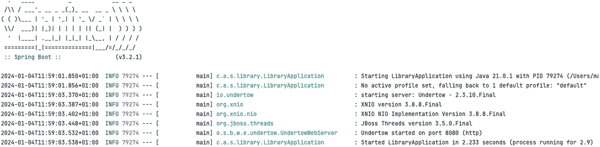

Spring Boot 页面的截图。它显示了一组程序日志，这些日志使用 Undertow 而不是 Reactor Netty 启动应用程序。

图 4-8

使用 Undertow 容器的引导日志

## 4-8\. 为响应式容器配置 SSL

### 问题

你希望应用程序能够通过 HTTPS（替代或补充 HTTP）进行访问。

### 解决方案

获取证书，将其放入密钥库，并使用 `server.ssl` 属性配置密钥库。然后 Spring Boot 将自动将服务器配置为仅可通过 HTTPS 访问。

### 工作原理

使用 `server.ssl.keystore`（及相关属性），你可以将嵌入式容器配置为仅接受 HTTPS 连接。在配置 SSL 之前，你需要拥有一个证书来保护你的应用程序。通常，你会希望从证书颁发机构（如 Verisign 或 Let’s Encrypt）获取证书。但是，出于开发目的，你可以使用自签名证书（请参阅“创建自签名证书”一节）。


#### 创建自签名证书

Java 自带一个名为 `keytool` 的工具，可用于生成证书等操作。参见清单 4-32。

```
keytool -genkey -keyalg RSA -alias sb3-recipes -keystore sb3-recipes.pfx -storepass password -validity 3600 -keysize 4096 -storetype pkcs12
清单 4-32
keytool 命令
```

该命令将指示 `keytool` 使用 RSA 算法生成一个密钥，并将其放入别名为 `sb3-recipes`、名为 `sb3-recipes.pfx` 的密钥库中，证书有效期为 3600 天。运行该命令时，会询问一些问题，请相应作答（或留空）。之后，会生成一个名为 `sb3-recipes.pfx` 的文件，其中包含受密码保护的证书。

将此文件放入 `src/main/resources` 文件夹，以便它作为应用程序的一部分被打包，并且 Spring Boot 可以轻松访问它。

一个三角形抽象图形内含一个感叹号符号，类似于警告图标。 使用自签名证书会在浏览器中产生警告，提示该网站不安全或未受保护。

#### 配置 Spring Boot 使用密钥库

Spring Boot 需要知道密钥库的位置，才能配置嵌入式容器。为此，首先创建一个所谓的 SSL 捆绑包，并使用 `server.ssl.bundle` 属性将其链接到服务器。

为此，请使用 `server.ssl.keystore` 属性。你还需要指定密钥库的类型（`pkcs12`）和密码。参见清单 4-33。

```
server.ssl.bundle=server
