# SSL 捆绑包
spring.ssl.bundle.jks.server.key.alias=sb3-recipes
spring.ssl.bundle.jks.server.key.password=password
spring.ssl.bundle.jks.server.keystore.location=classpath:sb3-recipes.pfx
spring.ssl.bundle.jks.server.keystore.password=password
spring.ssl.bundle.jks.server.keystore.type=pkcs12
清单 4-33
SSL 属性
```

这些 SSL 属性将创建一个名为 `server` 的 SSL 捆绑包。它是 JKS 类型。要传递别名（用于创建证书时使用的别名），请使用 `key.alias` 属性；对于密码，请使用 `key.password` 属性。此外，我们需要链接到实际的证书，该证书位于 `sb3-recipes.pfx` 文件中。为此，请使用 `keystore.location`，因为此文件受密码保护。我们需要指定 `keystore.password` 属性，最后还需要指定证书的类型。

现在，当通过 HTTPS 访问服务器时，由于自签名证书，你会收到一个警告。当使用官方证书时，显然不会收到此警告。参见图 4-9。

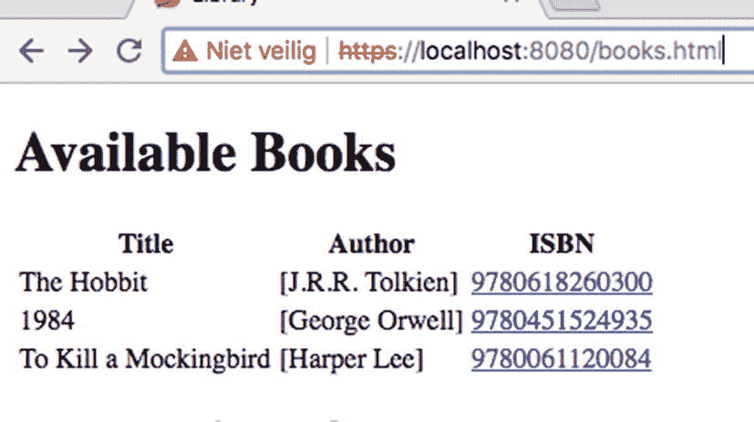

本地主机页面的截图。它列出了可用的书籍，包括标题、作者和 ISBN。由于自签名证书，通过 HTTP 服务器访问本地主机时会显示警告。

图 4-9

通过 HTTPS 访问的图书馆

## 4-9\. 使用控制器和 TaskExecutor 执行同步请求处理

### 问题

你有一段阻塞代码，希望在一个完全响应式的堆栈中执行它，并且不希望阻塞所有处理过程。

### 解决方案

当请求到来时，它通过事件循环以响应式方式处理。当调用会阻塞的代码时，它会阻塞事件循环并阻止进一步的处理。Spring WebFlux 可以为那些否则会阻塞事件循环的进程使用专用的 `TaskExecutor`。


### 工作原理

要配置 Spring WebFlux 的部分功能，你可以使用 `WebFluxConfigurer` 接口。要配置专用的 `AsyncTaskExecutor`（通常是一个由 Spring 管理的 `AsyncTaskExecutor`），请重写并实现 `configureBlockingExecution` 方法。参见清单 4-34。

```
package com.apress.springboot3recipes;
import org.springframework.boot.SpringApplication;
import org.springframework.boot.autoconfigure.SpringBootApplication;
import org.springframework.boot.task.SimpleAsyncTaskExecutorBuilder;
import org.springframework.context.annotation.Configuration;
import org.springframework.web.reactive.config.BlockingExecutionConfigurer;
import org.springframework.web.reactive.config.WebFluxConfigurer;
@SpringBootApplication
public class HelloWorldApplication {
public static void main(String[] args) {
SpringApplication.run(HelloWorldApplication.class, args);
}
@Configuration
public static class WebFluxConfiguration implements WebFluxConfigurer {
private final SimpleAsyncTaskExecutorBuilder builder;
public WebFluxConfiguration(SimpleAsyncTaskExecutorBuilder builder) {
this.builder = builder;
}
@Override
public void configureBlockingExecution(BlockingExecutionConfigurer configurer) {
configurer.setExecutor(builder.threadNamePrefix("blocking-").build());
}
}
}
清单 4-34
使用 WebFluxConfigurer 的 Spring Boot 应用
```

内部类 `WebFluxConfiguration` 实现了 `WebFluxConfigurer` 接口，我们在此重写了 `configureBlockingExecution` 方法。我们使用 `SimpleAsyncTaskExecutorBuilder` 来创建一个 `AsyncTaskExecutor` 实例。通过 `SimpleAsyncTaskExecutorBuilder`，我们可以利用属性通过应用配置进行一些默认配置（更多信息请参见技巧 7-1）。我们也可以创建一个新的 `AsyncTaskExecutor`，例如 `SimpleAsyncTaskExecutor` 或 `VirtualThreadTaskExecutor`。

使用 `SimpleAsyncTaskExecutorBuilder`，我们设置了线程前缀，构建了执行器，并将其传递给 `BlockingExecutionConfigurer`。这样，Spring WebFlux 会自动检测到它。现在，任何非响应式返回类型（除了来自 Project Reactor、RxJava、Java Flow 或 SmallRye Mutiny 的类型之外的任何类型）都将使用此执行器执行。参见清单 4-35。

```
package com.apress.springboot3recipes;
import org.springframework.boot.SpringBootVersion;
import org.springframework.web.bind.annotation.GetMapping;
import org.springframework.web.bind.annotation.RestController;
import reactor.core.publisher.Mono;
@RestController
public class HelloWorldController {
@GetMapping("/blocking")
public String hello() {
return sayHello();
}
@GetMapping("/reactive")
public Mono helloReactive() {
return Mono.just(sayHello());
}
private static String sayHello() {
var version = SpringBootVersion.getVersion();
var thread = Thread.currentThread().getName();
return String.format("Hello World, from Spring Boot %s on Thread '%s'!"
, version, thread);
}
}
清单 4-35
包含阻塞和响应式处理的 HelloWorldController
```

`HelloWorldController` 有两个方法。绑定到 `/blocking` 的方法返回一个常规的 `String`，而绑定到 `/reactive` 的方法返回一个 `Mono<String>`，这是一种响应式类型。

现在，当启动应用并使用 `HTTPie`、`curl` 或浏览器调用端点时，你应该能够看到发生了什么，因为它会返回执行该操作的线程名称（参见图 4-10）。

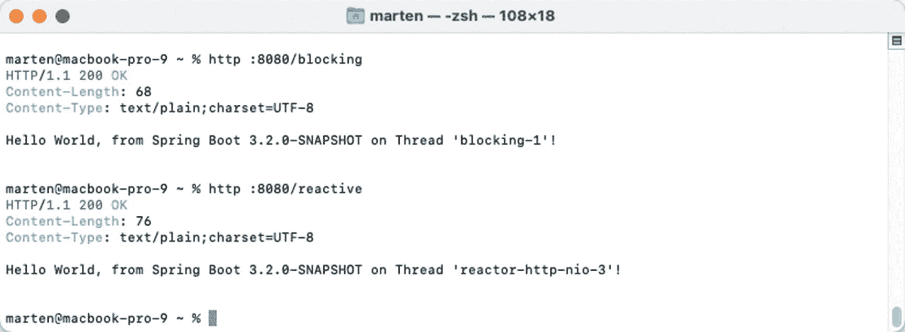

一个 Marten 窗口的截图。它显示了一组程序代码，这些代码启动了应用，使用 HTTP 调用了端点，并返回了执行该操作的线程名称。

图 4-10

阻塞和响应式输出

调用 `/blocking` 将在前缀为 `blocking` 的线程上执行，表明它确实是由配置的 `AsyncTaskExecutor` 执行的。`/reactive` 则在所使用的响应式框架（此处为 Project Reactor）的某个线程上执行。

由于我们使用的是 Spring Boot，它会自动为你配置阻塞式 WebFlux 执行。默认情况下，Spring Boot 会创建一个 `AsyncTaskExecutor`，用于应用中的多个位置，包括 WebFlux 阻塞执行。此执行器可通过多种属性进行配置（参见技巧 7-1），甚至可以通过将 `spring.threads.virtual.enabled` 设置为 `true` 来切换到虚拟线程。参见清单 4-36。

```
package com.apress.springboot3recipes;
import org.springframework.boot.SpringApplication;
import org.springframework.boot.autoconfigure.SpringBootApplication;
@SpringBootApplication
public class HelloWorldApplication {
public static void main(String[] args) {
SpringApplication.run(HelloWorldApplication.class, args);
}
}
清单 4-36
没有显式 WebFluxConfigurer 的 Spring Boot 应用
```

无需任何额外配置，阻塞执行仍然会发生。

## 4-10. 创建响应写入器

### 问题

你有一个服务或多次调用，并希望将响应分块发送给客户端。

### 解决方案

Spring WebFlux 与 Spring MVC 一样，会进行内容协商。当它接收到可以流式传输的内容类型（例如 `application/x-ndjson` 和 `text/event-stream`）时，它会切换到一个对流式结果进行编解码的编解码器。对于 `text/event-stream`，我们可以使用 `SseEventBuilder` 来添加额外信息。

### 工作原理

让我们来谈谈它是如何工作的。


#### 在响应中发送多个结果

当检测到需要流式传输的内容类型时，Spring WebFlux 会自动对结果进行流式处理。创建一个 `OrderController`，其中包含一个返回 `Flux<Order>` 的 `orders` 方法，并将结果逐个发送给客户端。

```
package com.apress.springboot3recipes.order.rest;
import com.apress.springboot3recipes.order.Order;
import com.apress.springboot3recipes.order.OrderService;
import org.springframework.web.bind.annotation.GetMapping;
import org.springframework.web.bind.annotation.RestController;
import reactor.core.publisher.Flux;
import java.time.Duration;
@RestController
public class OrderController {
private final OrderService orderService;
public OrderController(OrderService orderService) {
this.orderService = orderService;
}
@GetMapping("/orders")
public Flux orders() {
return orderService.findAll().delayElements(Duration.ofMillis(32));
}
}
```

这个控制器非常简单，因为返回正确响应的所有复杂性都由框架处理。

一个信息图标，圆圈内有一个字母 i。 向客户端发送每个项目时会有延迟，这样你就能看到不同的事件陆续到达。在实际代码中你不会这样做。

当使用 `HTTPie` 或 `curl` 等工具时，如果不指定流式 `Content-Type`，直接调用 URL `http://localhost:8080/orders` 将返回一个订单数组（见图 4-11）。

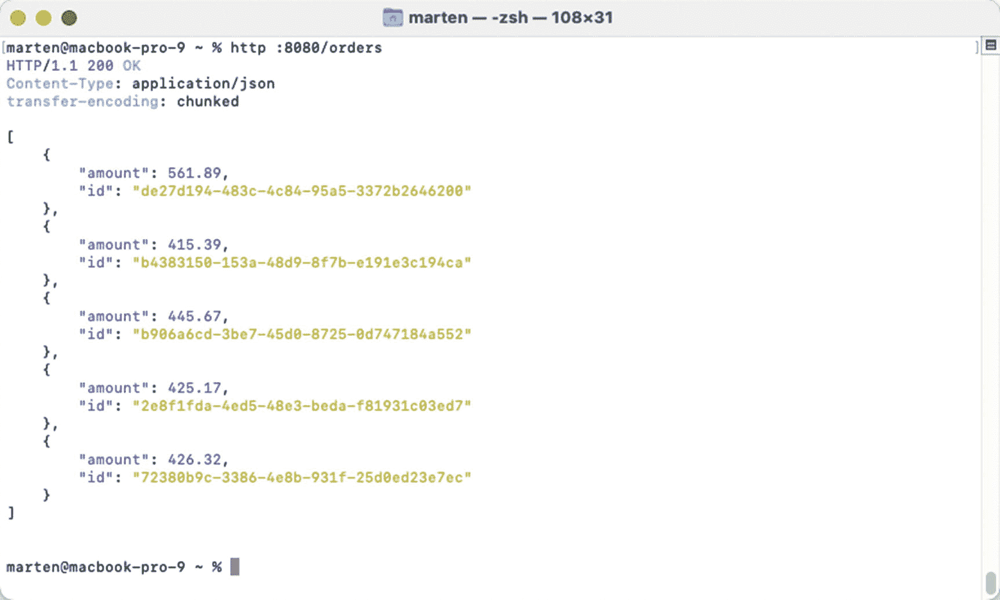

一个 marten 窗口的截图。其中包含一组程序代码，通过 HTTP 链接使用工具调用本地主机，并在未指定流式内容类型的情况下返回一个订单数组。

图 4-11

未使用流式 Content-Type 的响应

当指定 `Accept` 头为 `application/x-ndjson` 时，结果将逐个流式传输，而不是收集后作为数组发送。使用 `http :8080/orders 'Accept:application/x-ndjson' --stream` 将得到图 4-12 所示的结果。

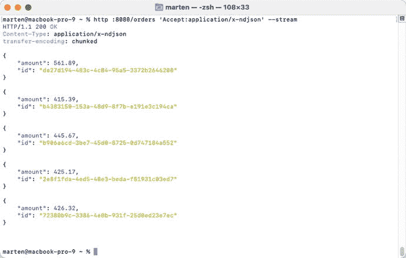

一个 marten 窗口的截图。它读取了 Spring Boot 中的一组程序代码，这些代码指定了应用程序的 Accept 头，将结果逐个流式传输，并以数组形式发送。它流式传输代表订单的单个 JSON 对象，每个对象包含 amount 和 id 字段。

图 4-12

使用流式 JSON 的响应

最后，我们可以通过指定 `text/event-stream` 内容类型来使用事件流。使用 `http :8080/orders 'Accept:text/event-stream' --stream` 将得到图 4-13 所示的结果。

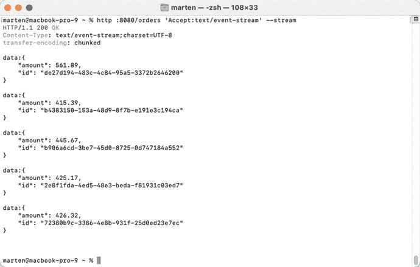

一个 marten 窗口的截图。它读取了 Spring Boot 中的一组程序代码，这些代码通过指定文本、事件和流内容类型来使用事件流，并显示结果。每一行代表一个事件，以 data 开头，后跟包含 amount 和 id 字段的 JSON 负载。

图 4-13

使用事件流的响应

最后，让我们为这个控制器编写一个测试。用 `@WebFluxTest(OrderController.class)` 注解一个类，以获得一个 WebFlux 切片测试。`OrderController` 需要一个 `OrderService`，通过在 `OrderService` 字段上使用 `@MockBean` 来模拟。参见清单 4-37。

```
package com.apress.springboot3recipes.order.rest;
import com.apress.springboot3recipes.order.Order;
import com.apress.springboot3recipes.order.OrderService;
import org.junit.jupiter.api.Test;
import org.springframework.beans.factory.annotation.Autowired;
import org.springframework.boot.test.autoconfigure.web.reactive.WebFluxTest;
import org.springframework.boot.test.mock.mockito.MockBean;
import org.springframework.http.MediaType;
import org.springframework.test.web.reactive.server.WebTestClient;
import reactor.core.publisher.Flux;
import java.math.BigDecimal;
import static org.mockito.Mockito.when;
@WebFluxTest(OrderController.class)
public class OrderControllerTest {
@Autowired
private WebTestClient webTestClient;
@MockBean
private OrderService orderService;
@Test
public void shouldReturnOrdres() throws Exception {
when(orderService.findAll()).thenReturn(Flux.just((new Order("1234", BigDecimal.TEN))));
webTestClient.get()
.uri("/orders")
.accept(MediaType.APPLICATION_NDJSON)
.exchange()
.expectStatus().isOk()
.expectBody().json("{\"id\":\"1234\",\"amount\":10}");
}
}
清单 4-37
OrderController 的 WebFluxTest
```

测试方法首先在模拟的 `OrderService` 上注册行为，以返回一个 `Order` 的单个实例。接下来，我们使用 `WebTestClient` 对 `/orders` 端点执行 `get` 操作，并指定流式响应类型。结果应该是一个包含 `id` 和 `amount` 的单个 JSON 元素，因为 `OrderService` 只返回一个元素。


#### 指定通过服务器发送事件发送的内容

服务器发送事件（Server-Sent-Events）是从服务器发送到客户端的消息。它们的 `Content-Type` 标头为 `text/event-stream`。它们非常轻量，仅包含四个字段（见表 4-7）。

表 4-7

服务器发送事件允许的字段

| **字段** | **描述** |
| --- | --- |
| `id` | 事件的 ID |
| `event` | 事件的类型 |
| `data` | 事件数据 |
| `retry` | 事件流的重新连接时间 |

默认情况下，响应中仅包含 `data` 元素。

要从请求处理方法发送事件，你需要使用 `ServerSentEvent`，它提供了一个 `builder` 方法来实际创建 `ServerSentEvent` 实例。要将 `ServerSentEvent` 发送到客户端，你需要将你的对象转换为该类型。我们可以扩展最初创建的 `OrderController`，为其添加一个专门处理 `ServerSentEvent` 实例的方法（见代码清单 4-38）。

```
package com.apress.springboot3recipes.order.rest;
import com.apress.springboot3recipes.order.Order;
import com.apress.springboot3recipes.order.OrderService;
import org.springframework.http.MediaType;
import org.springframework.http.codec.ServerSentEvent;
import org.springframework.web.bind.annotation.GetMapping;
import org.springframework.web.bind.annotation.RestController;
import reactor.core.publisher.Flux;
import java.time.Duration;
@RestController
public class OrderController {
private final OrderService orderService;
public OrderController(OrderService orderService) {
this.orderService = orderService;
}
@GetMapping("/orders")
public Flux orders() {
return orderService.findAll().delayElements(Duration.ofMillis(32));
}
@GetMapping(value = "/orders", produces = MediaType.TEXT_EVENT_STREAM_VALUE)
public Flux> orderEvents() {
return orderService.findAll()
.map(this::toEvent)
.delayElements(Duration.ofMillis(32));
}
private ServerSentEvent toEvent(Order order) {
return ServerSentEvent.builder(order)
.event("order-event")
.id(order.id()).build();
}
}
代码清单 4-38
包含专用 ServerSentEvent 请求处理方法的 OrderController
```

我们为接收到的每个 `Order` 创建一个专用的 `ServerSentEvent`。我们指定了 `id` 和 `event`。`order` 被用作主体（即 `data` 字段）。最后，在调用 `build` 方法后，我们就可以使用创建好的 `ServerSentEvent`。

现在，当调用 URL `http://localhost:8080/orders` 并指定 `Content-Type` 为 `text/event-stream` 时，你会看到事件一个接一个地传入（图 4-14）。

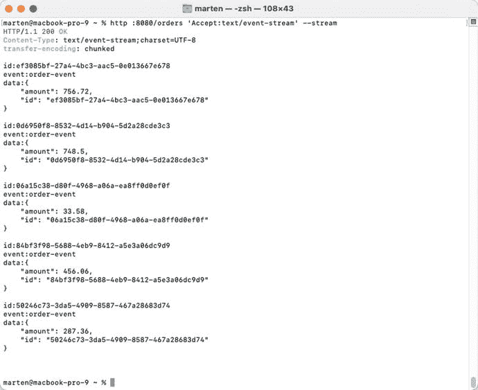

一个 Marten 窗口的截图。它显示了一组 Spring Boot 程序代码，这些代码通过一个内容类型为 text/event-stream 的 HTTP 链接调用本地主机页面，并逐个显示带有数量和 ID 的事件。

图 4-14

服务器发送事件结果

请注意 `Content-Type` 标头；其值为 `text/event-stream`，表示我们获取的是一个事件流。该流可以保持打开状态并接收事件通知。每个写入的对象都会被转换为 JSON；这是通过 `Encoder` 完成的。该对象被写入 `data` 标签中，作为事件数据。

## 4-11. 使用 Spring WebFlux 消费 REST 资源

### 问题

你需要为你的应用程序连接到一个 REST 资源，并希望使用 `WebClient` 来实现。

### 解决方案

Spring Boot 提供了配置和构建器来帮助构建所需的类。本方案将展示如何构建一个应用程序，用于消费方案 4-2 中构建的 API。

你可以使用 `WebClient.Builder` 来创建一个 `WebClient`。另一种选择是使用基于 `@HttpExchange` 的声明式客户端。

### 工作原理

尽管每种方法使用的类不同，但我们仍然需要依赖 Spring MVC 的 Web 类。为此，我们可以添加 `spring-boot-starter-webflux` 依赖。见代码清单 4-39。

```
org.springframework.boot
spring-boot-starter-webflux

代码清单 4-39
Spring Boot Starter WebFlux 依赖
```

一个信息图标，圆圈内有一个字母 i。 如果你正在编写一个不需要 Servlet 容器的独立客户端，你可能需要添加对 `spring-boot-starter-netty` 的排除。

我们将使用方案 4-2 作为我们的服务器 API，并编写一个应用程序，该应用程序在该 API 上查找一本书，调用另一个 API（位于 [`https://openlibrary.org`](https://openlibrary.org)）来检索该书的附加信息，并返回一个增强后的响应。

`EnrichedBook` 如代码清单 4-40 所示。

```
package com.apress.springboot3recipes.library;
import java.util.List;
import java.util.Objects;
public record EnrichedBook(
String isbn,
String title,
String published,
List authors) {
@Override
public boolean equals(Object o) {
if (o instanceof EnrichedBook book) {
return Objects.equals(isbn, book.isbn);
}
return false;
}
@Override
public int hashCode() {
return Objects.hash(isbn);
}
}
代码清单 4-40
EnrichedBook 记录
```

这是方案 3-2 中创建的 `Book` 类（见代码清单 3-6）的一个略微扩展版本。我们可以重用 `Book` 类来绑定来自我们自己服务器的结果。对于 Open Library API，我们将使用一个 `HashMap` 来存放响应并检索我们需要的元素。

#### 使用 WebClient

`WebClient` 通过 `WebClient.Builder` 构建，该构建器由 Spring Boot 自动暴露。见代码清单 4-41。

```
@Bean
public WebClient restClient(WebClient.Builder builder) {
var httpClient = HttpClient.create().followRedirect(true);
var connector = new ReactorClientHttpConnector(httpClient);
return builder.clientConnector(connector).build();
}
代码清单 4-41
使用 Builder 的 WebClient Bean 定义
```

`RestClient.Builder` 提供了一些方法来增强配置。每个方法都会产生一个新的 `RestClient.Builder` 实例。这里我们将 Project Reactor 的 `HttpClient` 配置为自动跟随重定向（HTTP 状态码 301/302），因为默认情况下这是禁用的。我们使用的 API（来自 Open Library）使用重定向来指向正确的结果。见表 4-8 和代码清单 4-42。

表 4-8

WebClient.Builder 配置方法

| **方法** | **描述** |
| --- | --- |
| `baseUrl` | 设置请求使用的根 URL；默认为 `null`。 |
| `clientConnector` | 配置要使用的 `ClientHttpConnector`。在需要预配置连接器（例如用于 SSL）时很有用。 |
| `defaultCookie` / `defaultCookies` | 添加一个或多个具有默认值的 Cookie。 |
| `defaultHeader` / `defaultHeaders` | 添加一个或多个具有默认值的标头。 |
| `defaultRequest` | 用于自定义每个正在构建的请求的消费者。 |
| `defaultStatusHandler` | 注册一个默认的状态处理器，应用于每个响应。 |
| `defaultUriVariables` | URI 变量的默认值。 |
| `messageConverters` | 替换应与创建的 `RestTemplate` 一起使用的 `HttpMessageConverter`。 |
| `exchangeFunction` | 使用预配置的 `ClientHttpConnector` 和 `ExchangeStrategies` 注册一个默认的 `ExchangeFunction`。 |
| `exchangeStrategies` | 配置要使用的 `ExchangeStrategies`。 |
| `filter` | 将给定的过滤器添加到过滤器链的末尾。 |
| `observationConvention` | 配置用于收集请求观察/指标元数据的 `ObservationConvention`。默认将设置为 `DefaultClientRequestObservationConvention`。 |
| `observationRegistry` | 配置用于记录 HTTP 客户端观察的 `ObservationRegistry`。通常由 Spring Boot 自动设置。 |
| `uriBuilderFactory` | 设置要使用的 `UriBuilderFactory`。 |


```
package com.apress.springboot3recipes.library.rest;
import com.apress.springboot3recipes.library.Book;
import com.apress.springboot3recipes.library.EnrichedBook;
import org.springframework.http.ResponseEntity;
import org.springframework.web.bind.annotation.GetMapping;
import org.springframework.web.bind.annotation.PathVariable;
import org.springframework.web.bind.annotation.RequestMapping;
import org.springframework.web.bind.annotation.RestController;
import org.springframework.web.client.RestClientResponseException;
import org.springframework.web.reactive.function.client.WebClient;
import reactor.core.publisher.Mono;
import java.util.Map;
@RestController
@RequestMapping("/books")
public class EnrichedBookController {
private static final String BOOKS_URL = "http://localhost:8080/books/{isbn}";
private static final String OL_API = "https://openlibrary.org/isbn/{isbn}.json";
private final WebClient rest;
public EnrichedBookController(WebClient rest) {
this.rest = rest;
}
@GetMapping("/{isbn}")
public Mono> get(@PathVariable("isbn") String isbn) {
var book = rest.get().uri(BOOKS_URL, isbn).retrieve().bodyToMono(Book.class);
var library = rest.get().uri(OL_API, isbn).retrieve().bodyToMono(Map.class);
var enriched = enrich(book, library);
return enriched.map(ResponseEntity::ok).onErrorResume(this::handleError);
}
private Mono> handleError(Throwable ex) {
if (ex instanceof RestClientResponseException rex) {
return Mono.just(ResponseEntity.status(rex.getStatusCode()).build());
}
return Mono.just(ResponseEntity.internalServerError().build());
}
private Mono enrich(Mono book, Mono ol) {
return Mono.zip(book, ol)
.map((res) -> enrich(res.getT1(), res.getT2()));
}
private EnrichedBook enrich(Book book, Map ol) {
var publishDate = extractPublishData(ol);
return new EnrichedBook(book.isbn(), book.title(), publishDate, book.authors());
}
private String extractPublishData(Map json) {
return (String) json.getOrDefault("publish_date", "");
}
}
清单 4-42 使用 WebClient 的控制器
```

该控制器使用 `WebClient` 来调用 URL。首先，我们确定要发起的请求类型；在本例中是一个 `get()` 请求。接着，我们使用 `uri()` 方法并传入所需的参数来指定 URL。至此，请求的定义完成，现在我们可以通过 `receive()` 方法来执行它。最后，我们使用 `bodyToMono()` 方法映射响应体。

由于这是一个响应式实现，这段代码目前还不会执行任何操作。我们需要将 `Mono` 结果合并成一个新的结果。为此，我们可以使用 `zip`，提取两个结果（这将使它们并行执行），并生成 `EnrichedBook`。

由于 `WebClient` 复用了 WebFlux 其余部分相同基础设施的组件，我们可以复用之前使用的相同异常处理逻辑。当使用 `curl` 或 `HTTPie` 从命令行调用 `http://localhost:8090/books/9780618260300` 时，你将得到类似于图 4-15 所示的输出。

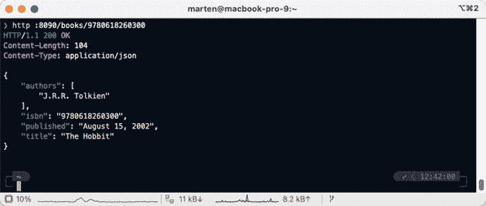

一个 Marten 窗口的截图。其中显示了一组 Spring Boot 程序代码，这些代码通过命令行使用 curl 经由 HTTP 链接调用本地主机页面，并显示结果，包括作者、ISBN 链接、出版日期和标题。

图 4-15 增强后的图书结果

#### 使用声明式客户端

Spring Framework 6 引入了声明式 HTTP 客户端。借助它，可以编写一个带有一些注解的接口。在运行时，将创建一个代理来处理请求/响应，包括映射和异常处理。

起点是一个带有 `@HttpExchange` 注解（或其派生注解，如 `@GetExchange` 和 `@PostExchange`）的接口，该注解可以放在类或方法上。其工作方式与服务器端 API 中的 `@RequestMapping` 注解非常相似。

使用 `@HttpExchange` 注解，可以设置一些属性（参见表 4-9）。

表 4-9 HttpExchange 属性

| **属性** | **描述** |
| --- | --- |
| `value` 或 `url` | 请求的 URL；可以是完整 URL、相对于类型级别 `@HttpExchange` 的路径，或预设的基础 URI。 |
| `Method` | 要使用的 HTTP 方法；`DELETE`、`GET`、`PATCH`、`POST` 或 `PUT`。默认为空。 |
| `contentType` | 为 `Content-Type` 标头发送的媒体类型；默认为空。 |
| `Accept` | `Accept` 标头的媒体类型。 |

除了 `@HttpExchange` 注解之外，还有 `@DeleteExchange`、`@GetExchange`、`@PatchExchange`、`@PostExchange` 和 `@PutExchange` 注解。这些注解可以替代带有特定 `method` 值的 `@HttpExchange` 使用。使用这些注解可以使意图更加明确。

就像使用 `@RequestMapping` 的请求处理方法一样，声明式客户端支持多种参数、注解和返回类型。它为此复用了 Web 基础设施的公共部分。参见表 4-10。

表 4-10 HttpExchange 支持的方法参数

| 类型 | 描述 |
| --- | --- |
| `java.net.URI` | 动态设置请求的 URL；覆盖 `@HttpExchange` 中的 `url` 属性。 |
| `UriBuilderFactory` | 提供一个 `UriBuilderFactory` 来展开 URI 模板和 URI 变量。用于替代底层客户端的 `UriBuilderFactory`。 |
| `HttpMethod` | 动态设置请求使用的 HTTP 方法；覆盖 `@HttpExchange` 中的 `method` 属性。 |
| `MultipartFile` | 从 `MultipartFile` 添加一个请求部分，通常与 Spring MVC 一起使用以指示上传的文件。 |
| `@CookieValue` | 向传出请求添加 Cookie。参数可以是包含多个 Cookie 的 `Map<String, ?>` 或 `MultiValueMap<String, ?>`，也可以是单个值。对非 `String` 值使用类型转换。 |
| `@RequestHeader` | 向传出请求添加请求头。参数可以是包含多个标头的 `Map<String, ?>` 或 `MultiValueMap<String, ?>`，也可以是单个值。对非 `String` 值使用类型转换。 |
| `@PathVariable` | 添加一个变量来展开请求 URL 中的占位符。参数可以是用于多个值的 `Map<String, ?>`，也可以是单个值。对非 `String` 值使用类型转换。 |
| `@RequestBody` | 提供请求体，可以是待序列化的 `Object`，也可以是响应式流 Publisher（例如 `Mono`、`Flux`），或通过配置的 `ReactiveAdapterRegistry` 支持的任何其他异步类型。 |
| `@RequestParam` | 添加请求参数。可以是用于多个值的 `Map<String, ?>` / `MultiValueMap<String, ?>`。也可以是单个类型。对非 `String` 值使用类型转换。当 `contentType` 为 `application/x-www-form-urlencoded` 时，参数会添加到请求体中。 |
| `@RequestPart` | 添加一个请求部分，可以是 `String`（成为表单字段）、`Resource`、待编码为 JSON（或配置的其他格式）的 `Object`、包含标头的 `HttpEntity`、Spring `Part`，或受支持的响应式流 Publisher。 |

除了方法参数之外，还支持多种方法返回类型。参见表 4-11。

表 4-11 HttpExchange 支持的方法返回类型


| **类型** | **描述** |
| --- | --- |
| `void` | 执行请求；无响应。 |
| `HttpHeaders` | 执行请求并仅返回头部信息。 |
| `<T>` | 执行请求并返回解码为类型 `T` 的响应体。 |
| `ResponseEntity<Void>` | 执行请求并返回包含 `status` 和 `headers` 的 `ResponseEntity`。 |
| `ResponseEntity<T>` | 执行请求并返回包含 `status`、`headers` 以及解码为类型 `T` 的响应体的 `ResponseEntity`。 |
| `Mono<Void>` | 执行请求并丢弃响应体（如果有）。 |
| `Mono<HttpHeaders>` | 执行请求，丢弃响应体，并返回头部信息。 |
| `Mono<T>` | 执行请求并将响应体解码为类型 `T`。 |
| `Flux<T>` | 执行请求并将响应体解码为类型 `T` 的流。 |
| `Mono<ResponseEntity<Void>>` | 执行请求，丢弃响应体，并返回包含头部和状态的 `ResponseEntity`。 |
| `Mono<ResponseEntity<T>>` | 执行请求，将响应体解码为类型 `T`，并返回包含响应体、头部和状态的 `ResponseEntity`。 |
| `Mono<ResponseEntity<FluxT>>>` | 执行请求，将响应体解码为类型 `T` 的流，并返回包含类型 `T` 的流、头部和状态的 `ResponseEntity`。 |

基于此信息，我们可以提供两个接口来访问需要调用的 API。我们先从图书的 API 开始。参见清单 4-43。

```
package com.apress.springboot3recipes.library.rest;
import com.apress.springboot3recipes.library.Book;
import org.springframework.web.bind.annotation.PathVariable;
import org.springframework.web.service.annotation.GetExchange;
import reactor.core.publisher.Mono;
public interface BookServiceClient {
@GetExchange("http://localhost:8080/books/{isbn}")
Mono getBook(@PathVariable String isbn);
}
清单 4-43
BookServiceClient 源码
```

`BookServiceClient` 有一个方法，该方法使用 `@GetExchange` 注解。注解提供了一个值 `http://localhost:8080/books/{isbn}`，这是一个 URI 模板。该方法接受一个参数 `isbn`，该参数已使用 `@PathVariable` 注解。调用此方法时，传入的值将在执行请求前被放入 URI 的 `{isbn}` 部分。请求发送后，返回的响应会被转换为 `Mono<Book>`，就像我们使用 `WebClient` 时一样。

接下来，我们还需要一个用于 Open Library API 的接口。参见清单 4-44。

```
package com.apress.springboot3recipes.library.rest;
import org.springframework.web.bind.annotation.PathVariable;
import org.springframework.web.service.annotation.GetExchange;
import org.springframework.web.service.annotation.HttpExchange;
import reactor.core.publisher.Mono;
import java.util.Map;
@HttpExchange(url = "https://openlibrary.org/isbn")
public interface OpenLibraryClient {
@GetExchange("/{isbn}.json")
Mono getInformation(@PathVariable String isbn);
}
清单 4-44
OpenLibraryClient 源码
```

`OpenLibraryClient` 有一个设置了 `url` 属性的 `@HttpExchange` 方法。这将为此接口中的所有其他方法设置一个基础 URI。这样我们就可以只为所有其他方法指定相对 URL。现在只有一个带有 `@GetExchange` 的方法。该方法也接受一个参数 `isbn`，该参数在执行请求前被放入 URI 模板。响应同样被转换为 `Mono<Map>`，和之前一样。

现在接口已经就绪，我们需要在配置中暴露它们，但我们无法从接口创建实例。这时 `HttpServiceProxyFactory` 就派上了用场；它在运行时为这些接口创建代理。为此，我们需要在应用程序中添加一些配置。参见清单 4-45。

```
@Bean
public WebClient webClient(WebClient.Builder builder) {
var httpClient = HttpClient.create().followRedirect(true);
var connector = new ReactorClientHttpConnector(httpClient);
return builder.clientConnector(connector).build();
}
@Bean
public HttpServiceProxyFactory httpServiceProxyFactory(WebClient client) {
var adapter = WebClientAdapter.create(client);
return HttpServiceProxyFactory.builderFor(adapter).build();
}
@Bean
public BookServiceClient bookServiceClient(HttpServiceProxyFactory factory) {
return factory.createClient(BookServiceClient.class);
}
@Bean
public OpenLibraryClient openLibraryClient(HttpServiceProxyFactory factory) {
return factory.createClient(OpenLibraryClient.class);
}
清单 4-45
HttpServiceProxyFactory 配置
```

由于 `WebClient` 不能直接使用，我们需要将其包装在 `WebClientAdapter` 中，该适配器将 `WebClient` 适配到 `HttpExchangeAdapter` 接口。

`HttpExchangeAdapter` 有三种实现：`RestClientAdapter`、`RestTemplateAdapter` 和 `WebClientAdapter`。前两种在第 3 章中使用，并且是阻塞式的。

`HttpServiceProxyFactory` 则用于为 `BookServiceClient` 和 `OpenLibraryClient` 创建代理。这只需在 `HttpServiceProxyFactory` 上调用 `createClient` 并传入给定接口即可完成。参见清单 4-46。

```
package com.apress.springboot3recipes.library.rest;
import com.apress.springboot3recipes.library.Book;
import com.apress.springboot3recipes.library.EnrichedBook;
import org.springframework.http.ResponseEntity;
import org.springframework.web.bind.annotation.GetMapping;
import org.springframework.web.bind.annotation.PathVariable;
import org.springframework.web.bind.annotation.RequestMapping;
import org.springframework.web.bind.annotation.RestController;
import org.springframework.web.client.RestClientResponseException;
import reactor.core.publisher.Mono;
import java.util.Map;
@RestController
@RequestMapping("/books")
public class EnrichedBookController {
private final BookServiceClient bookServiceClient;
private final OpenLibraryClient openLibraryClient;
public EnrichedBookController(BookServiceClient bookServiceClient,
OpenLibraryClient openLibraryClient) {
this.bookServiceClient = bookServiceClient;
this.openLibraryClient = openLibraryClient;
}
@GetMapping("/{isbn}")
public Mono> get(@PathVariable("isbn") String isbn) {
var book = bookServiceClient.getBook(isbn);
var library = openLibraryClient.getInformation(isbn);
var enriched = enrich(book, library);
return enriched.map(ResponseEntity::ok).onErrorResume(this::handleError);
}
private Mono> handleError(Throwable ex) {
if (ex instanceof RestClientResponseException rex) {
return Mono.just(ResponseEntity.status(rex.getStatusCode()).build());
}
return Mono.just(ResponseEntity.internalServerError().build());
}
private Mono enrich(Mono book, Mono ol) {
return Mono.zip(book, ol)
.map( (res) -> enrich(res.getT1(), res.getT2()));
}
private EnrichedBook enrich(Book book, Map json) {
var publishDate = extractPublishData(json);
return new EnrichedBook(book.isbn(), book.title(), publishDate, book.authors());
}
private String extractPublishData(Map json) {
return (String) json.getOrDefault("publish_date", "");
}
}
清单 4-46
使用声明式客户端的 EnrichedBookController
```

请注意，我们现在可以直接调用接口上的方法，而无需担心如何构建正确的请求。这一切都隐藏在接口外观和代理内部。这使得编写可在应用程序中重用的 API 客户端变得更加容易。

最后，请注意异常处理没有改变。由于声明式客户端仍然使用与 `WebClient` 相同的基础设施，因此异常处理无需更改。

重新运行应用程序并请求图书信息时，输出应与图 4-15 中的输出相同。


# 5. Spring Security

在本章中，我们将探讨 Spring Boot 对 Spring Security 的集成。Spring Security 可用于对应用程序的用户进行身份验证和授权。Spring Security 在身份验证和授权过程中均采用可插拔机制，并默认支持多种不同的机制。在身份验证方面，Spring Security 内置了对 JDBC、LDAP 和属性文件的支持。

## 5-1. 在 Spring Boot 应用程序中启用安全性

### 问题

你有一个基于 Spring Boot 的应用程序，并希望在其中启用安全性。

### 解决方案

添加 `spring-boot-starter-security` 作为依赖项，即可为你的应用程序自动设置和配置安全性。

### 工作原理

首先，你需要将 Spring Security 的库导入到你的应用程序中。为此，可以将 `spring-boot-starter-security` 添加到你的依赖项列表中。参见代码清单 5-1。

```
org.springframework.boot
spring-boot-starter-security

代码清单 5-1
Spring Security 起步依赖
```

这将把 `spring-security-core`、`spring-security-config` 和 `spring-security-web` 依赖项添加到你的项目中。Spring Boot 会检测到 Spring Security 的存在，并自动启用安全性。

Spring Boot 将使用以下内容配置 Spring Security：

*   使用基本身份验证和表单登录进行身份验证
*   用于安全性的 HTTP 标头
*   Servlet API 集成
*   匿名登录
*   禁用资源缓存

    一个三角形抽象图形，内部包含一个感叹号符号。它类似于一个警告图标。Spring Boot 会添加一个默认用户，名为 `user`，并附带一个生成的密码，该密码在启动日志中可见。这仅用于测试、原型设计或演示。**切勿**在生产系统中使用生成的用户。

当将依赖项 `spring-boot-starter-security` 添加到配方 3-2 时，它将自动保护所有暴露的端点。在启动时，生成的密码将被记录（参见图 5-1）。

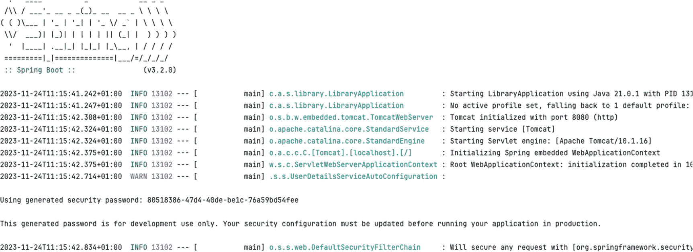

Spring Boot 应用程序页面的屏幕截图。它显示了通过启动库、初始化端口、启动 Servlet 服务和引擎以及初始化 Spring 嵌入式 Web 应用程序来生成密码的过程。

图 5-1
生成的密码输出

Spring Boot 暴露了一些属性来配置默认用户。你可以在 `spring.security` 命名空间中找到它们（参见表 5-1）。

表 5-1
默认用户的属性

| 属性 | 描述 |
| --- | --- |
| `spring.security.user.name` | 默认用户名；默认值为 `user`。 |
| `spring.security.user.password` | 默认用户的密码；默认值为 `UUID`。 |
| `spring.security.user.roles` | 默认用户的角色。默认值为 `none`。 |

添加依赖项并启动 `LibraryApplication` 后，端点将被保护。当尝试从 `http://localhost:8080/books` 获取书籍列表时，结果将是一个 HTTP 状态码为 401（未授权）的响应（参见图 5-2）。

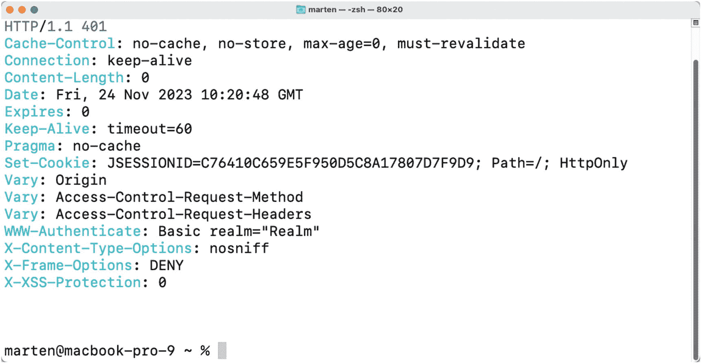

Marten 页面的屏幕截图。它显示了一组程序命令，这些命令从本地主机获取书籍列表，并返回 HTTP 状态码 401（未授权）。

图 5-2
未认证的访问结果

当添加正确的身份验证标头（用户名为 `user`，密码来自日志或 `spring.security.user.password` 属性中指定的值）时，结果将是正常的书籍列表（参见图 5-3）。

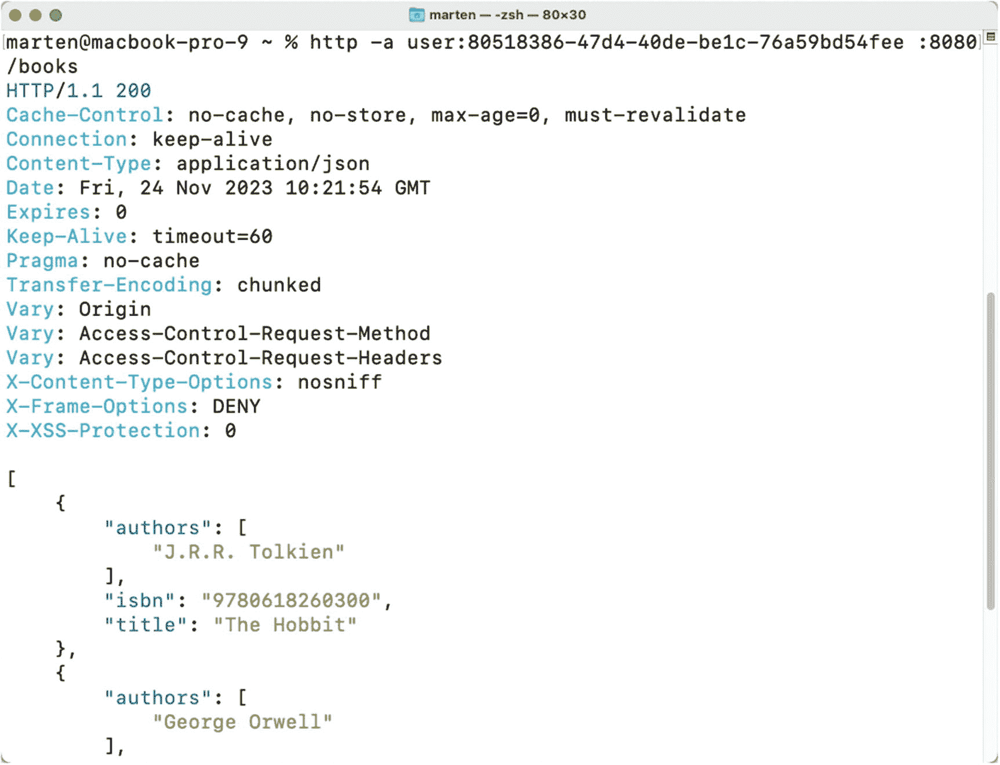

Marten 页面的屏幕截图。它包含一组程序命令，这些命令添加了正确的身份验证标头并读取了正常的书籍列表。

图 5-3
已认证的访问结果

#### 测试安全性

当使用 Spring Security 并通过 `@WebMvcTest` 注解保护你的端点时，安全基础设施将自动应用。Spring Security 提供了一些有用的注解来帮助编写测试（参见表 5-2）。

表 5-2
用于测试的 Spring Security 注解

| 注解 | 描述 |
| --- | --- |
| `@WithMockUser` | 以具有给定 `username`、`password` 和 `roles`/`authorities` 的用户身份运行 |
| `@WithAnonymousUser` | 以匿名用户身份运行 |
| `@WithUserDetails` | 以配置了名称的用户身份运行；在 `UserDetailsService` 中执行查找 |

一个信息图标，圆圈内有一个字母 i。  如果你想在没有安全性的情况下测试控制器，可以通过排除 `SecurityAutoConfiguration` 的运行来禁用它。为此，请在 `@WebMvcTest` 注解上指定 `excludeAutoConfiguration`。

要使用这些注解，请添加对 `spring-security-test` 的依赖。

```
org.springframework.security
spring-security-test
test

```

有了这个依赖项，就可以扩展并修复配方 3-2 中的 `BookControllerTest`。如果你不介意在测试中禁用安全性，可以将 `@WebMvcTest(value = BookController.class, excludeAutoConfiguration = SecurityAutoConfiguration.class)` 添加到测试类中。这样，安全过滤器就不会被添加，从而禁用了安全性。测试将运行并通过。参见代码清单 5-2。

```
@WebMvcTest(value = BookController.class, excludeAutoConfiguration = SecurityAutoConfiguration.class)
class BookControllerUnsecuredTest {
}
代码清单 5-2
禁用安全性的测试
```

但是，如果你想在启用安全性的情况下进行测试，则需要对测试类进行一些小的修改。首先，添加 `@WithMockUser` 以使用已认证的用户运行。其次，由于 Spring Security 默认启用 CSRF 保护，因此需要在请求中添加一个标头或参数。使用 Mock MVC 时，Spring Security 为此提供了一个 `RequestPostProcessor`，即 `CsrfRequestPostProcessor`。`SecurityMockMvcRequestPostProcessors` 包含工厂方法，可以轻松使用它们。参见代码清单 5-3。

```
package com.apress.springboot3recipes.library.rest;
import org.junit.jupiter.api.Test;
import org.springframework.beans.factory.annotation.Autowired;
import org.springframework.boot.test.autoconfigure.web.servlet.WebMvcTest;
import org.springframework.boot.test.mock.mockito.MockBean;
import org.springframework.security.test.context.support.WithMockUser;
import static org.mockito.ArgumentMatchers.any;
import static org.mockito.Mockito.when;
import static org.springframework.security.test.web.servlet.request.SecurityMockMvcRequestPostProcessors.csrf;
import static org.springframework.test.web.servlet.request.MockMvcRequestBuilders.post;
import static org.springframework.test.web.servlet.result.MockMvcResultMatchers.header;
import static org.springframework.test.web.servlet.result.MockMvcResultMatchers.status;
@WebMvcTest(BookController.class)
@WithMockUser
public class BookControllerSecuredTest {
@Autowired
private MockMvc mockMvc;
@MockBean
private BookService bookService;
@Test
void shouldAddBook() throws Exception {
when(bookService.create(any(Book.class)))
.thenReturn(new Book("123456789", "Test Book Stored", List.of("T. Author")));
mockMvc.perform(post("/books")
.with(csrf())
.contentType(MediaType.APPLICATION_JSON)
.content("{ \"isbn\" : \"123456789\"}, \"title\" : \"Test Book\", \"authors\" : [\"T. Author\"]"))
.andExpect(status().isCreated())
.andExpect(header().string("Location", "http://localhost/books/123456789"));
}
}
代码清单 5-3
启用安全性的测试
```


现在测试使用 `@WithMockUser` 中指定的用户；这里使用默认用户，用户名为 `user`，密码为 `password`。`with(csrf())` 这一行负责将 CSRF 令牌添加到请求中。

使用哪个选项取决于你的需求。例如，如果你的控制器中需要当前用户，那么应该启用安全性，并使用 `@WithMockUser` 或 `@WithUserDetails` 注解。如果不是这种情况，并且你可以在不启用安全性的情况下测试控制器（并且没有像配方 5-2 中那样的额外安全规则），那么你可以在禁用安全性的情况下运行。

#### 对安全性进行集成测试

当使用 `@SpringBootTest` 编写集成测试时，能否使用 `@With*` 注解取决于所使用的 `webEnvironment`。在默认的模拟环境下，它仍然可以工作。请参见清单 5-4。

```
@SpringBootTest
@WithMockUser
@AutoConfigureMockMvc
class BookControllerIntegrationMockTest {
}
清单 5-4
启用安全性的模拟集成测试
```

此测试将创建一个几乎完整的应用程序，但仍然使用 Mock MVC 来访问端点。它仍然在与测试相同的进程中运行，这就是为什么 `@WithMockUser` 注解和 `with(csrf())` 仍然有效的原因。当在外部端口上运行测试时，它将不再有效。

要在端口上测试应用程序，你需要通过测试客户端 `TestRestTemplate` 和/或 `WebTestClient` 运行测试，并传递认证头，或者通过在集成测试中首先执行基于表单的登录来实现流程。要编写一个成功的集成测试，请注入 `TestRestTemplate`，并在执行实际请求之前，使用 `withBasicAuth` 辅助方法来设置基本认证头。请参见清单 5-5。

一个灯泡图标。在编写此测试并使用默认用户时，你可能希望使用 `spring.security.user.password` 设置一个默认密码。本配方使用 `@TestPropertySource` 来实现，但你也可以将其添加到 `application.properties` 文件中。

```
@SpringBootTest(webEnvironment = SpringBootTest.WebEnvironment.RANDOM_PORT)
@TestPropertySource(properties = "spring.security.user.password=s3cr3t")
class BookControllerIntegrationTest {
@Autowired
private TestRestTemplate testRestTemplate;
@MockBean
private BookService bookService;
@Test
void shouldReturnListOfBooks() {
when(bookService.findAll()).thenReturn(Arrays.asList(
new Book("123", "Spring 5 Recipes", List.of("Marten Deinum", "Josh Long")),
new Book("321", "Pro Spring MVC", List.of("Marten Deinum", "Colin Yates"))));
ResponseEntity books = testRestTemplate
.withBasicAuth("user", "s3cr3t")
.getForEntity("/books", Book[].class);
assertThat(books.getStatusCode()).isEqualTo(HttpStatus.OK);
assertThat(books.getBody()).hasSize(2);
}
}
清单 5-5
启用安全性的 TestRestTemplate 集成测试
```

该测试使用默认配置的 `TestRestTemplate` 来发起请求。`withBasicAuth` 使用默认的 `user` 并将 `s3cr3t` 预设为要发送到服务器的用户名和密码。`getForEntity` 可用于获取结果，包括关于响应的一些附加信息。使用 `ResponseEntity`，还可以验证状态码等。

当测试基于 WebFlux 的应用程序时，需要使用 `WebTestClient` 而不是 `TestRestTemplate`（有关 Spring WebFlux 的更多信息，另请参见第 4 章）。你可以使用 `headers()` 函数向请求添加额外的头。它暴露了 `HttpHeaders` 实例，该实例又具有方便的 `setBasicAuth` 方法来应用基本认证。请参见清单 5-6。

```
@SpringBootTest(webEnvironment = SpringBootTest.WebEnvironment.RANDOM_PORT)
@TestPropertySource(properties = "spring.security.user.password=s3cr3t")
@AutoConfigureWebTestClient
class BookControllerIntegrationWebClientTest {
@Autowired
private WebTestClient webTestClient;
@MockBean
private BookService bookService;
@Test
void shouldReturnListOfBooks() {
when(bookService.findAll()).thenReturn(Arrays.asList(
new Book("123", "Spring 5 Recipes", List.of("Marten Deinum", "Josh Long")),
new Book("321", "Pro Spring MVC", List.of("Marten Deinum", "Colin Yates"))));
webTestClient
.get()
.uri("/books")
.headers( httpHeaders -> httpHeaders.setBasicAuth("user", "s3cr3t"))
.exchange()
.expectStatus().isOk()
.expectBodyList(Book.class).hasSize(2);
}
清单 5-6
启用安全性的 WebTestClient 集成测试
```

请求被构建并通过 `exchange()` “触发”。然后期望结果是 HTTP 200（OK），并且结果包含两本书。

## 5-2\. 登录 Web 应用程序

### 问题

一个安全的应用程序要求其用户在访问某些安全功能之前先登录。这对于在开放互联网上运行的应用程序尤其重要，因为黑客可以轻易地访问它们。大多数应用程序必须提供一种方式，让用户输入其凭据来登录。

### 解决方案

Spring Security 支持多种方式让用户登录 Web 应用程序。它通过提供一个包含登录表单的默认网页来支持基于表单的登录。你也可以提供一个自定义网页作为登录页面。此外，Spring Security 通过处理 HTTP 请求头中提供的 Basic 认证凭据来支持 HTTP Basic 认证。HTTP Basic 认证也可用于对通过远程协议和 Web 服务发出的请求进行认证。

你应用程序的某些部分可能允许匿名访问（例如，访问欢迎页面）。Spring Security 提供了一个匿名登录服务，它可以为匿名用户分配一个主体并授予权限，这样你在定义安全策略时就可以像对待普通用户一样处理匿名用户。

Spring Security 还支持“记住我”登录，它能够在多个浏览器会话中记住用户的身份，这样用户在首次登录后就不需要再次登录了。


### 工作原理

当找不到显式的安全配置时，Spring Boot 会启用默认安全设置。如果找到一个或多个配置，则会使用它们来配置安全性。安全配置是指带有 `@EnableWebSecurity` 和/或 `@EnableMethodSecurity` 注解的类。包含 `@EnableWebSecurity` 注解会自动引入 `HttpSecurityConfiguration` 类，该类包含默认安全设置并允许自定义。

为了帮助您更好地理解各种独立的登录机制，我们首先讨论默认的安全配置。请注意，如果您包含了 `@EnableWebSecurity`，所介绍的登录服务会自动注册。

在启用身份验证功能之前，您需要先启用基本的 Spring Security 要求。您至少需要配置异常处理和安全上下文集成。请参见清单 5-7。

```
@Configuration
@EnableWebSecurity
public class LibrarySecurityConfig {
@Bean
public SecurityFilterChain security(HttpSecurity http) throws Exception {
http.securityContext(Customizer.withDefaults());
http.exceptionHandling(Customizer.withDefaults());
return http.build();
}
}
清单 5-7
安全上下文集成与异常处理
```

没有这些基础，Spring Security 在用户登录后将无法存储用户信息，也无法对安全相关的异常进行正确的异常转换（异常会直接向上抛出，这可能会向外界暴露一些内部信息）。您可能还需要启用 Servlet API 集成，以便在视图中使用 `HttpServletRequest` 的方法进行检查。请参见清单 5-8。

```
@Configuration
@EnableWebSecurity
public class LibrarySecurityConfig {
@Bean
public SecurityFilterChain security(HttpSecurity http) throws Exception {
http.servletApi(Customizer.withDefaults());
return http.build();
}
}
清单 5-8
Servlet API 默认设置
```

#### HTTP 基本认证

HTTP 基本认证支持可以通过 `httpBasic()` 方法进行配置。当需要 HTTP 基本认证时，浏览器通常会显示一个登录对话框或特定于浏览器的登录页面供用户登录。请参见清单 5-9。

```
@Configuration
@EnableWebSecurity
public class LibrarySecurityConfig {
@Bean
public SecurityFilterChain security(HttpSecurity http) throws Exception {
http.httpBasic(Customizer.withDefaults());
return http.build();
}
}
清单 5-9
使用默认设置启用基本认证
```

#### 基于表单的登录

基于表单的登录服务会渲染一个包含登录表单的网页，供用户输入登录信息并处理登录表单的提交。它通过 `formLogin` 方法进行配置。请参见清单 5-10。

```
@Configuration
@EnableWebSecurity
public class LibrarySecurityConfig {
@Bean
public SecurityFilterChain security(HttpSecurity http) throws Exception {
http.formLogin(Customizer.withDefaults());
return http.build();
}
}
清单 5-10
启用基于表单的登录
```

默认情况下，Spring Security 会自动创建一个登录页面，并将其映射到 URL `/login`。因此，您可以在应用程序中添加一个链接（例如，在配方 3-3 的 `index.html` 中），指向此 URL 进行登录：

```
登录
```

如果您不喜欢默认的登录页面，可以提供自己的自定义登录页面。例如，您可以在 `src/main/resources/templates` 中创建 `login.html` 文件（使用 Thymeleaf 时）。请参见清单 5-11。

```

登录

body {
background-color: #DADADA;
}
body > .grid {
height: 100%;
}
.column {
max-width: 450px;
}

登录您的账户

登录

清单 5-11
自定义登录页面
```

为了让 Spring Security 在请求登录时显示您的自定义登录页面，您必须在 `loginPage` 配置方法中指定其 URL（参见清单 5-12）。

```
@Configuration
@EnableWebSecurity
public class LibrarySecurityConfig {
@Bean
public SecurityFilterChain security(HttpSecurity http) throws Exception {
http.formLogin( (login) ->
login.loginPage("/login.html")
return http.build();
}
}
清单 5-12
自定义登录页面配置
```

最后，添加一个视图解析器，将 `/login` 映射到 `login.html` 页面。为此，您可以让 `LibrarySecurityConfig` 实现 `WebMvcConfigurer` 并实现 `addViewControllers` 方法。

```
@Configuration
public class LibrarySecurityConfig extends WebSecurityConfigurerAdapter
implements WebMvcConfigurer {
...
public void addViewControllers(ViewControllerRegistry registry) {
registry.addViewController("/login").setViewName("login");
}
}
```

如果当用户请求一个安全 URL 时，Spring Security 显示了登录页面，那么一旦登录成功，用户将被重定向到目标 URL。但是，如果用户直接通过其 URL 请求登录页面，默认情况下，登录成功后用户将被重定向到上下文路径的根目录（即 `http://localhost:8080/`）。如果您没有在 Web 部署描述符中定义欢迎页面，您可能希望在登录成功时将用户重定向到一个默认的目标 URL。请参见清单 5-13。

```
@Configuration
@EnableWebSecurity
public class LibrarySecurityConfig {
@Bean
public SecurityFilterChain security(HttpSecurity http) throws Exception {
http.formLogin( (login) ->
login.loginPage("/login.html")
.defaultSuccessUrl("/books")
return http.build();
}
}
清单 5-13
带有成功 URL 的自定义登录页面配置
```

如果您使用 Spring Security 创建的默认登录页面，那么当登录失败时，Spring Security 会再次渲染登录页面并显示错误消息。但是，如果您指定了自定义登录页面，则必须配置 `authentication-failure-url` 来指定登录错误时要重定向到的 URL。例如，您可以再次重定向到自定义登录页面，并附带错误请求参数。请参见清单 5-14。

```
@Configuration
@EnableWebSecurity
public class LibrarySecurityConfig {
@Bean
public SecurityFilterChain security(HttpSecurity http) throws Exception {
http.formLogin( (login) ->
login.loginPage("/login.html")
.defaultSuccessUrl("/books")
.failureUrl("/login.html?error=true").permitAll());
return http.build();
}
}
清单 5-14
带有失败配置的自定义登录页面配置
```

然后，您的登录页面应测试是否存在错误请求参数。如果发生错误，您需要通过访问会话范围属性 `SPRING_SECURITY_LAST_EXCEPTION` 来显示错误消息，该属性存储了当前用户的最后一个异常。请参见清单 5-15。

```

身份验证失败
原因：此处显示异常

清单 5-15
登录页面显示错误
```


#### 注销服务

注销服务提供了一个用于处理注销请求的处理器。它可以通过 `logout()` 配置方法进行配置。参见清单 5-16。

```
@Configuration
@EnableWebSecurity
public class LibrarySecurityConfig {
@Bean
public SecurityFilterChain security(HttpSecurity http) throws Exception {
http.logout(Customizer.withDefaults());
return http.build();
}
}
清单 5-16
默认注销配置
```

默认情况下，它映射到 URL `/logout`，并且仅响应 POST 请求。你可以在页面中添加一个小的 HTML 表单来执行注销操作。

```
Logout
```

一个信息图标，圆圈内包含字母 i。当使用 CSRF 保护时，不要忘记将 CSRF 令牌添加到表单中；否则，注销将失败。

默认情况下，注销成功后，用户会被重定向到上下文路径的根目录，但有时你可能希望将用户引导至另一个 URL，这可以通过使用 `logoutSuccessUrl` 配置方法来实现。参见清单 5-17。

```
@Configuration
@EnableWebSecurity
public class LibrarySecurityConfig implements WebMvcConfigurer {
@Bean
public SecurityFilterChain security(HttpSecurity http) throws Exception {
http.logout( (logout) -> logout.logoutSuccessUrl("/"));
return http.build();
}
}
清单 5-17
带有成功 URL 的注销配置
```

注销后，你可能会注意到，即使注销成功，使用浏览器后退按钮时，你仍然能够看到之前的页面。这是因为浏览器缓存了这些页面。通过使用 `headers()` 配置方法启用安全标头，可以指示浏览器不要缓存页面。参见清单 5-18。

```
@Configuration
@EnableWebSecurity
public class LibrarySecurityConfig {
@Bean
public SecurityFilterChain security(HttpSecurity http) throws Exception {
http.headers(Customizer.withDefaults());
return http.build();
}
}
清单 5-18
安全标头配置
```

除了无缓存标头之外，这还会禁用内容嗅探并启用 X-Frame 保护。启用此功能后，使用浏览器后退按钮时，你将被重定向回登录页面。

#### 匿名登录

匿名登录服务可以通过 Java 配置中的 `anonymous()` 方法进行配置，你可以在其中自定义匿名用户的 `username` 和 `authorities`，其默认值分别为 `anonymousUser` 和 `ROLE_ANONYMOUS`。参见清单 5-19。

```
@Configuration
@EnableWebSecurity
public class LibrarySecurityConfig {
@Bean
public SecurityFilterChain security(HttpSecurity http) throws Exception {
http.anonymous( (anon) ->
anon.principal("guest").authorities("ROLE_GUEST"));
return http.build();
}
}
清单 5-19
匿名登录配置
```

#### 记住我支持

记住我支持可以通过 Java 配置中的 `rememberMe()` 方法进行配置。默认情况下，它会将用户名、密码、记住我过期时间以及一个私钥编码为一个令牌，并将其作为 cookie 存储在用户的浏览器中。下次用户访问同一个 Web 应用程序时，该令牌将被检测到，从而使用户能够自动登录。参见清单 5-20。

```
@Configuration
@EnableWebSecurity
public class LibrarySecurityConfig {
@Bean
public SecurityFilterChain security(HttpSecurity http) throws Exception {
http.rememberMe(Customizer.withDefaults());
return http.build();
}
}
清单 5-20
记住我配置
```

然而，静态的记住我令牌可能会引发安全问题，因为它们可能被黑客捕获。Spring Security 支持滚动令牌以满足更高级的安全需求，但这需要一个数据库来持久化令牌。关于滚动记住我令牌部署的详细信息，请参考 Spring Security 参考文档。

## 5-3\. 用户认证

### 问题

当用户尝试登录你的应用程序以访问其安全资源时，你必须对用户的主体进行认证，并向该用户授予权限。

### 解决方案

在 Spring Security 中，认证由一个或多个 `AuthenticationProvider` 执行，它们以链的形式连接。如果这些提供者中的任何一个成功认证了用户，该用户将能够登录到应用程序。如果任何提供者报告用户被禁用、锁定或凭据不正确，或者没有提供者能够认证该用户，那么该用户将无法登录此应用程序。

Spring Security 支持多种用户认证方式，并包含了针对这些方式的内置提供者实现。你可以使用内置的 XML 元素轻松配置这些提供者。最常见的认证提供者会针对存储用户详细信息的用户仓库（例如，在应用程序的内存、关系数据库或 LDAP 仓库中）来认证用户。

在仓库中存储用户详细信息时，应避免以明文形式存储用户密码，因为这会使它们容易受到黑客攻击。相反，你应该始终在仓库中存储加密后的密码。一种典型的密码加密方式是使用单向哈希函数对密码进行编码。当用户输入密码登录时，你对该密码应用相同的哈希函数，并将结果与仓库中存储的密码进行比较。Spring Security 支持多种用于编码密码的算法（包括 BCrypt 和 SCrypt），并为这些算法提供了内置的密码编码器。

### 工作原理

让我们来谈谈它是如何工作的。

#### 使用内存定义进行用户认证

如果你的应用程序中只有少量用户，并且很少修改他们的详细信息，你可以考虑在 Spring Security 的配置文件中定义用户详细信息，这样它们将被加载到应用程序的内存中。参见清单 5-21。

```
@Bean
public UserDetailsService userDetailsService() {
var adminUser = User.withDefaultPasswordEncoder()
.username("admin@books.io").password("secret")
.authorities("ADMIN","USER").build();
var normalUser = User.withDefaultPasswordEncoder()
.username("marten@books.io").password("user")
.authorities("USER").build();
var disabledUser = User.withDefaultPasswordEncoder()
.username("jdoe@books.io").password("unknown")
.disabled(true)
.authorities("USER").build();
return new InMemoryUserDetailsManager(adminUser, normalUser, disabledUser);
}
}
清单 5-21
内存 UserDetailsService 配置
```

使用通过 `User.withDefaultPasswordEncoder()` 获取的 `UserBuild`，你可以构建带有加密密码的用户。它将使用 Spring Security 默认的密码编码方式（默认情况下使用 BCrypt 编码）。对于每个用户，你可以指定用户名、密码、禁用状态以及一组已授予的权限。被禁用的用户无法登录应用程序。创建用户后，你可以使用它们来创建一个 `InMemoryUserDetailsManager`。


#### 针对数据库进行用户身份验证

更常见的情况是，用户详细信息应存储在数据库中以便于维护。Spring Security 内置了从数据库查询用户详细信息的功能。默认情况下，它会使用清单 5-22 中的 SQL 语句来查询用户详细信息（包括权限）。

```
SELECT username, password, enabled
FROM   users
WHERE  username = ?
SELECT username, authority
FROM   authorities
WHERE  username = ?
清单 5-22
Spring Security 默认 SQL 查询语句
```

为了让 Spring Security 使用这些 SQL 语句查询用户详细信息，你需要在数据库中创建相应的表。例如，你可以使用清单 5-23 中的 SQL 语句在数据库中创建它们。

```
CREATE TABLE USERS
(
USERNAME VARCHAR(50) NOT NULL,
PASSWORD VARCHAR(50) NOT NULL,
ENABLED  SMALLINT    NOT NULL,
PRIMARY KEY (USERNAME)
);
CREATE TABLE AUTHORITIES
(
USERNAME  VARCHAR(50) NOT NULL,
AUTHORITY VARCHAR(50) NOT NULL,
FOREIGN KEY (USERNAME) REFERENCES USERS
);
清单 5-23
Spring Security 默认表结构的 DDL
```

一个圆圈内带有字母 i 的信息图标。Spring Security 在 `spring-security-core` JAR 包的 `org.springframework.security.userdetails.jdbc` 包下提供了一个 `users.ddl` 文件。你可以使用它；但它在名称（最大长度 50）和关系方面存在一些限制。因此，最好使用你自己的脚本。

接下来，你可以向这些表中输入一些用户详细信息用于测试。这两个表的数据如表 5-3 和 5-4 所示。

表 5-4

AUTHORITIES 表的测试用户数据

| USERNAME | AUTHORITY |
| --- | --- |
| `admin@books.io` | `ADMIN` |
| `admin@books.io` | `USER` |
| `marten@books.io` | `USER` |
| `jdoe@books.net` | `USER` |

表 5-3

USERS 表的测试用户数据

| USERNAME | PASSWORD | ENABLED |
| --- | --- | --- |
| `admin@books.io` | `{noop}secret` | `1` |
| `marten@books.io` | `{noop}user` | `1` |
| `jdoe@books.net` | `{noop}unknown` | `0` |

一个圆圈内带有字母 i 的信息图标。密码字段中的 `{noop}` 表示存储的密码未应用任何加密。Spring Security 默认使用委托来确定使用哪种编码方法；其值可以是 `{bcrypt}`、`{scrypt}`、`{pbkdf2}` 和 `{sha256}`。`{sha256}` 主要用于兼容性考虑，应被视为不安全。

为了让 Spring Security 访问这些表，你必须声明一个数据源，以便能够创建到该数据库的连接。Spring Security 提供了一个开箱即用的 `UserDetailsService` 实现（`JdbcDaoImpl`）可供使用。当检测到 `UserDetailsService` 作为一个 bean 时，Spring Security 会自动拾取并使用它。请参见清单 5-24。

```
@Bean
public UserDetailsService jdbcUserDetailsService(DataSource datasource) {
var usd = new JdbcDaoImpl();
usd.setDataSource(datasource);
return usd;
}
清单 5-24
基于 JDBC 的 UserDetailsService 配置
```

然而，在某些情况下，你可能已经在遗留数据库中定义了自己的用户存储库。例如，假设表是使用清单 5-25 中的 SQL 语句创建的，并且 `MEMBER` 表中的所有用户都处于启用状态。

```
CREATE TABLE MEMBER
(
ID       BIGINT      NOT NULL,
USERNAME VARCHAR(50) NOT NULL,
PASSWORD VARCHAR(32) NOT NULL,
PRIMARY KEY (ID)
);
CREATE TABLE MEMBER_ROLE
(
MEMBER_ID BIGINT      NOT NULL,
ROLE      VARCHAR(10) NOT NULL,
FOREIGN KEY (MEMBER_ID) REFERENCES MEMBER
);
清单 5-25
自定义 Spring Security 表结构的 DDL（示例）
```

假设这些表中存储了如表 5-5 和 5-6 所示的遗留用户数据。

表 5-6

MEMBER_ROLE 表中的遗留用户数据

| MEMBER_ID | ROLE |
| --- | --- |
| `1` | `ROLE_ADMIN` |
| `1` | `ROLE_USER` |
| `2` | `ROLE_USER` |

表 5-5

MEMBER 表中的遗留用户数据

| ID | USERNAME | PASSWORD |
| --- | --- | --- |
| `1` | `admin@ya2do.io` | `{noop}secret` |
| `2` | `marten@ya2do.io` | `{noop}user` |

幸运的是，Spring Security 也支持使用自定义 SQL 语句从遗留数据库查询用户详细信息。你可以通过设置已配置的 `JdbcDaoImpl` 上的 `usersByUsernameQuery` 和 `authoritiesByUsernameQuery` 属性来指定用于查询用户信息和权限的语句。请参见清单 5-26。

```
@Configuration
public class LibrarySecurityConfig implements WebMvcConfigurer {
private static final String USERS_BY_USERNAME_QUERY =
"""
SELECT username, password, ‘true’ as enabled
FROM member WHERE username = ?
""";
private static final String AUTHORITIES_BY_USERNAME_QUERY =
"""
SELECT member.username, member_role.role as authorities
FROM member, member_role
WHERE  member.username = ? AND member.id = member_role.member_id
""";
@Bean
public UserDetailsService jdbcUserDetailsService(DataSource datasource) {
var usd = new JdbcDaoImpl();
usd.setDataSource(datasource);
usd.setUsersByUsernameQuery(USERS_BY_USERNAME_QUERY);
usd.setAuthoritiesByUsernameQuery(AUTHORITIES_BY_USERNAME_QUERY);
return usd;
}
}
清单 5-26
自定义查询的配置
```


#### 使用 OAuth2 进行身份验证

除了手动存储密码和用户信息外，通常还会使用外部资源，主要通过 OAuth2 或 OpenID Connect 实现。许多提供商都支持这种方式，例如 Google、Microsoft 和 GitHub，以及像 Keycloak 和 Okta 这样专注于安全的公司。在本部分中，我们将使用 GitHub。

首先，在 GitHub 上注册一个新的 OAuth 应用程序（见图 5-4）。确保主页 URL 和授权回调 URL 与此图像中的一致。

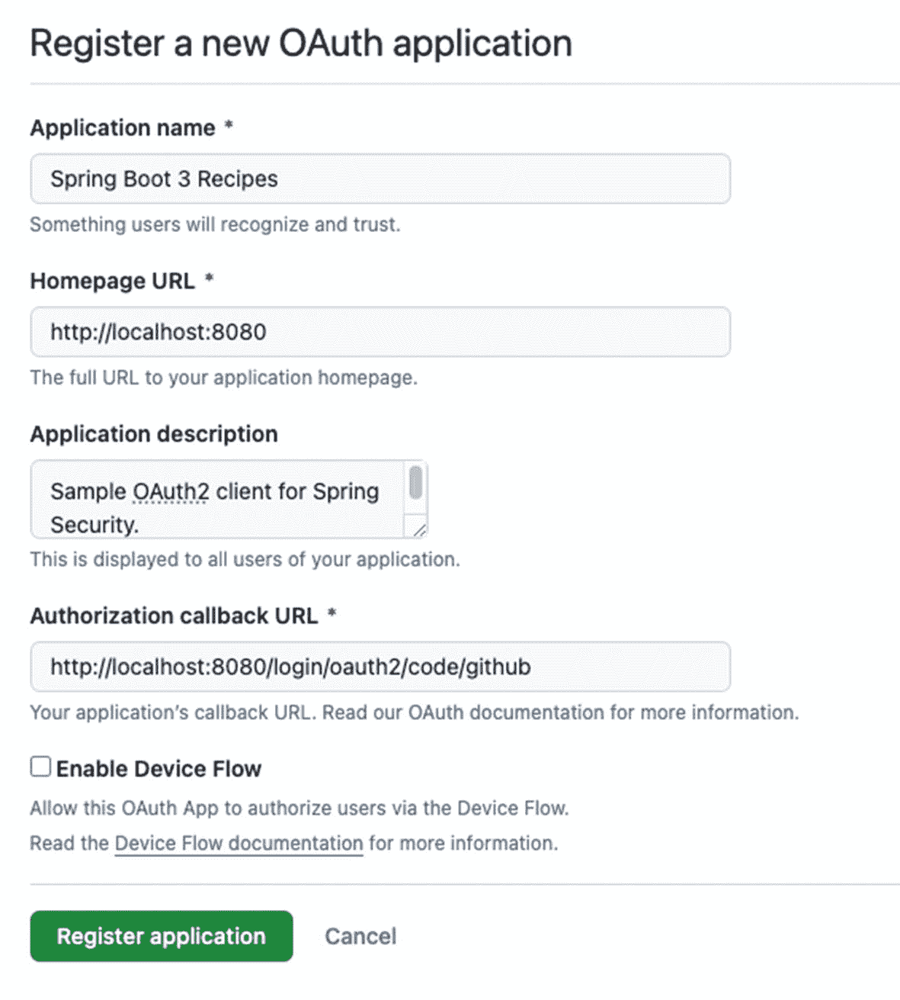

注册新 OAuth 应用程序页面的截图。它显示了应用程序名称、主页 URL、应用程序描述、授权回调 URL，以及一个用于启用设备流的复选框。底部是注册应用程序和取消按钮。

图 5-4

GitHub OAuth 应用程序注册

在下一页完成注册后，复制 `clientId` 并生成一个*密钥*，同时复制该密钥，因为配置中需要这些信息。见图 5-5。

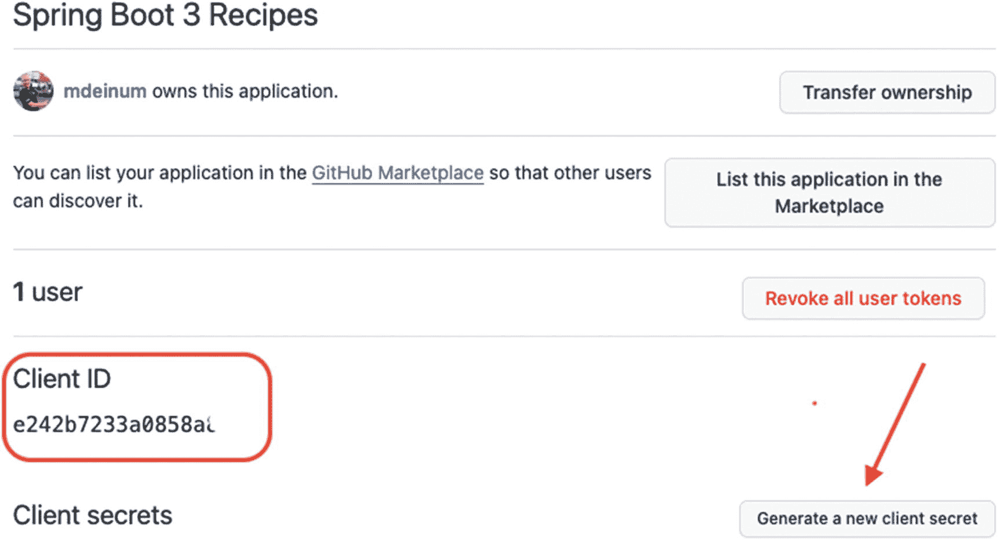

Spring Boot 3 食谱页面的截图。客户端 ID 和生成新客户端密钥的选项被突出显示。

图 5-5

GitHub OAuth 应用程序注册，第 2 页

要在 Spring Security 中启用 OAuth 支持，你需要添加 `spring-boot-starter-oauth2-client` 依赖项；这将引入必要的 Spring Security 和 OAuth 依赖项。见清单 5-27。

```
org.springframework.boot
spring-boot-starter-oauth2-client

清单 5-27
Spring Security OAuth2 客户端启动器依赖项
```

现在，Spring Boot 中的这个依赖项会自动检测相关类，并在提供正确配置时设置 OAuth2 身份验证。要进行配置，我们需要向 Spring Security 提供来自 GitHub OAuth 应用程序的 `clientId` 和 `secret`。见清单 5-28。

```
spring:
security:
oauth2:
client:
registration:
github:
client-id: 
client-secret:  
清单 5-28
Spring Security OAuth2 客户端配置
```

这里一个重要的部分是配置中的 `github` 名称。Spring Security 会自动为某些提供商配置正确的身份验证 URL，GitHub 就是其中之一。开箱即用的支持提供商包括 GitHub、Google、Facebook 和 Okta。对于这些提供商，`authorizationUri` 会被自动设置。这是你将被重定向以进行身份验证的 URL。

当然，如果需要，也可以完全自定义 URL 或从 OAuth 提供商检索的信息。对于本场景，默认设置就足够了。

现在，启动应用程序并尝试访问 `http://localhost:8080/books`，你将被重定向到 GitHub，并被要求登录（如果你尚未登录）并批准之前注册的应用程序的访问权限。如果你批准，你将被重定向回应用程序，并看到书籍列表。

#### 加密密码

到目前为止，你一直以明文密码的形式存储用户详细信息。但这种方法容易受到黑客攻击，因此你应该在存储密码之前对其进行加密。Spring Security 支持多种加密密码的算法。例如，你可以选择 BCrypt（一种单向哈希算法）来加密你的密码。

一个信息图标，圆圈内有一个字母 i。你可能需要一个辅助工具来计算密码的 BCrypt 哈希值。你可以通过在线方式完成，例如 [`https://www.dailycred.com/article/bcrypt-calculator`](https://www.dailycred.com/article/bcrypt-calculator)，或者你可以简单地创建一个包含 `main` 方法的类，使用 Spring Security 的 `BCryptPasswordEncoder`。另一种不常用的方法是安装 Spring Boot CLI 并使用它来生成哈希值。

当然，你必须在数据库表中存储加密后的密码，而不是明文密码，如表 5-7 所示。为了在密码字段中存储 BCrypt 哈希值，该字段的长度必须至少为 68 个字符（这是 BCrypt 哈希值的长度加上加密类型 `{bcrypt}` 的长度）。

表 5-7

USERS 表中使用加密密码的用户数据

| USERNAME | PASSWORD | ENABLED |
| --- | --- | --- |
| `admin@ya2do.io` | `{bcrypt}$2a$10$E3mPTZb50e7sSW15fDx8Ne7hDZpfDjrmMPTTUp8wVjLTu.G5oPYCO` | `1` |
| `marten@ya2do.io` | `{bcrypt}$2a$10$5VWqjwoMYnFRTTmbWCRZT.iY3WW8ny27kQuUL9yPK1/WJcPcBLFWO` | `1` |
| `jdoe@does.net` | `{bcrypt}$2a$10$cFKh0.XCUOA9L.in5smIiO2QIOT8.6ufQSwIIC.AVz26WctxhSWC6` | `0` |

## 5-4\. 做出访问控制决策

### 问题

在身份验证过程中，应用程序会为成功通过身份验证的用户授予一组权限。当该用户尝试访问应用程序中的资源时，应用程序必须根据授予的权限或其他特征来决定该资源是否可访问。

### 解决方案

关于是否允许用户访问应用程序中资源的决策称为*访问控制决策*。它基于用户的身份验证状态以及资源的性质和访问属性。


### 工作原理

借助 Spring Security，可以使用 Spring 表达式语言（SpEL）来创建强大的访问控制规则。Spring Security 内置支持若干表达式（完整列表见表 5-8）。通过使用 `and`、`or` 和 `not` 等结构，你可以创建非常强大且灵活的表达式。

**表 5-8 Spring Security 内置表达式**

| 表达式 | 描述 |
| --- | --- |
| `hasRole('role')` 或 `hasAuthority('authority')` | 如果当前用户拥有指定角色，则返回 `true` |
| `hasAnyRole('role1','role2')` 或 `hasAnyAuthority('auth1','auth2')` | 如果当前用户至少拥有其中一个指定角色，则返回 `true` |
| `hasIpAddress('ip-address')` | 如果当前用户拥有指定的 IP 地址，则返回 `true` |
| `principal` | 当前用户 |
| `authentication` | 访问 Spring Security 认证对象 |
| `permitAll()` | 始终返回 `true` |
| `denyAll()` | 始终返回 `false` |
| `isAnonymous()` | 如果当前用户是匿名用户，则返回 `true` |
| `isRememberMe()` | 如果当前用户通过“记住我”功能登录，则返回 `true` |
| `isAuthenticated()` | 如果当前用户不是匿名用户，则返回 `true` |
| `isFullyAuthenticated()` | 如果当前用户既不是匿名用户也不是“记住我”用户，则返回 `true` |
| `access()` | 使用函数判断是否授予访问权限 |

一个关于火的抽象说明。尽管角色（role）和权限（authority）几乎相同，但它们在处理方式上存在细微但重要的区别。使用 `hasRole` 时，会检查传入的角色值是否以 `ROLE_`（默认角色前缀）开头。如果不是，则在检查权限之前会自动添加此前缀。因此，`hasRole('ADMIN')` 实际上会检查当前用户是否拥有 `ROLE_ADMIN` 权限。而使用 `hasAuthority` 时，则会按原样检查该值。

之前的表达式表示：如果某人拥有 `ADMIN` 角色，或者是在本地机器上登录，则允许其删除图书。在定义匹配器时，可以通过 `access` 方法（而非某个 `has*` 方法）来编写此类表达式。参见代码清单 5-29。

```
public class LibrarySecurityConfig implements WebMvcConfigurer {
@Override
public SecurityFilterChain securityFilterChain(HttpSecurity http) throws Exception {
http
.authorizeRequests()
.requestMatchers(HttpMethod.GET, "/books*")
.hasAnyRole("USER", "GUEST")
.requestMatchers(HttpMethod.POST, "/books*")
.hasRole("USER")
.requestMatchers(HttpMethod.DELETE, "/books*")
.access("hasRole('ADMIN') or hasIpAddress('127.0.0.1') " +
"or hasIpAddress('0:0:0:0:0:0:0:1')");
return http.build();
}
代码清单 5-29
包含访问规则的 Spring Security 配置
```

#### 使用表达式通过 Spring Bean 做出访问控制决策

在表达式中使用 `@` 语法，可以调用应用上下文中的任何 Bean。因此，你可以编写类似 `@accessChecker.hasLocalAccess(authentication)` 的表达式，并提供一个名为 `accessChecker` 的 Bean，该 Bean 包含一个接受 `Authentication` 对象的 `hasLocalAccess` 方法。参见代码清单 5-30。

```
package com.apress.springboot3recipes.library.security;
import org.springframework.security.core.Authentication;
import org.springframework.security.web.authentication.WebAuthenticationDetails;
import org.springframework.stereotype.Component;
@Component
public final class AccessChecker {
public boolean hasLocalAccess(Authentication auth) {
boolean access = false;
if (auth.getDetails() instanceof WebAuthenticationDetails details) {
String address = details.getRemoteAddress();
access = address.equals("127.0.0.1") || address.equals("0:0:0:0:0:0:0:1");
}
return access;
}
}
代码清单 5-30
AccessChecker 源码
```

接下来，你可以在 `access` 方法中使用 SpEL 来调用这个 `AccessChecker`。参见代码清单 5-31。

```
@Bean
public SecurityFilterChain securityFilterChain(HttpSecurity http) throws Exception {
http
.authorizeRequests()
.requestMatchers(HttpMethod.GET, "/books*").hasAnyRole("USER", "GUEST")
.requestMatchers(HttpMethod.POST, "/books*").hasRole("USER")
.requestMatchers(HttpMethod.DELETE, "/books*")
.access("hasRole('ADMIN') or @accessChecker.hasLocalAccess(authentication)");
return http.build();
}
代码清单 5-31
使用 AccessChecker 的 Spring Security 访问规则
```

#### 使用注解和表达式保护方法

你可以使用 `@PreAuthorize` 和 `@PostAuthorize` 注解来保护方法调用，而不仅仅是保护 URL。使用这些注解，你可以像基于 URL 的安全机制一样编写基于安全性的表达式。要启用注解处理，请在安全配置中添加 `@EnableMethodSecurity` 注解。参见代码清单 5-32。

```
@Configuration
@EnableMethodSecurity
public class LibrarySecurityConfig implements WebMvcConfigurer {
}
代码清单 5-32
启用方法安全性的安全配置
```

现在，你可以使用 `@PreAuthorize` 注解来保护你的应用程序。参见代码清单 5-33。

```
package com.apress.springboot3recipes.library;
import org.springframework.security.access.prepost.PreAuthorize;
import org.springframework.stereotype.Service;
import java.util.Map;
import java.util.Optional;
import java.util.concurrent.ConcurrentHashMap;
@Service
class InMemoryBookService implements BookService {
private final Map books = new ConcurrentHashMap();
@PreAuthorize("isAuthenticated()")
public Iterable findAll() {
return books.values();
}
@PreAuthorize("hasAuthority('USER')")
public Book create(Book book) {
books.put(book.isbn(), book);
return book;
}
@PreAuthorize("hasAuthority('ADMIN') " +
"or @accessChecker.hasLocalAccess(authentication)")
public void remove(Book book) {
books.remove(book.isbn());
}
public Optional find(String isbn) {
return Optional.ofNullable(books.get(isbn));
}
}
代码清单 5-33
包含授权规则的 InMemoryBookService
```

`@PreAuthorize` 注解会触发 Spring Security 验证表达式。如果验证成功，则授予访问权限；否则，将抛出一个异常，告知用户访问未被授权。

## 5-5. 为 WebFlux 应用程序添加安全性

### 问题

你有一个使用 Spring WebFlux 构建的应用程序（参见第 4 章），并且希望使用 Spring Security 来保护它。

### 解决方案

当将 Spring Security 作为依赖项添加到基于 WebFlux 的应用程序时，Spring Boot 会自动启用安全性。它会在应用程序中添加一个 `@EnableWebFluxSecurity` 配置类。然后，`@EnableWebFluxSecurity` 注解会导入名为 `WebFluxSecurityConfiguration` 的默认 Spring Security 配置。


### 工作原理

Spring WebFlux 应用在本质上与常规的 Spring MVC 应用有很大不同。尽管如此，Spring Boot 和 Spring Security 仍致力于让构建安全的 WebFlux 应用变得更加容易。

要启用安全性，请将 `spring-boot-starter-security` 添加到你的 WebFlux 应用中（来自配方 4-3）。参见清单 5-34。

```
org.springframework.boot
spring-boot-starter-security

清单 5-34
Spring Security 启动器依赖
```

这会将 `spring-security-core`、`spring-security-config` 和 `spring-security-web` 依赖项添加到你的项目中。Spring Boot 会检测这些 JAR 文件中某些类的可用性，并据此自动启用安全性。

Spring Boot 将使用以下内容配置 Spring Security：

*   使用基本认证和表单登录进行身份验证
*   用于安全性的 HTTP 头
*   访问任何资源都需要登录

    一个三角形抽象图形内包含一个感叹号符号。它类似于一个警告图标。Spring Boot 会添加一个默认用户，名为 `user`，并附带一个生成的密码，该密码在启动日志中可见。这仅用于测试目的。原型设计和演示不会在真实系统中使用生成的用户。

当将依赖项 `spring-boot-starter-security` 添加到配方 3-3 时，它会自动保护所有暴露的端点。在启动时，生成的密码会被记录下来（参见图 5-6）。

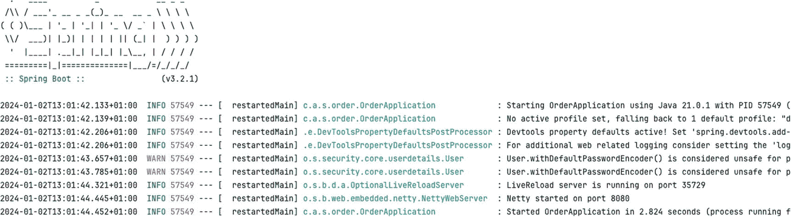

Spring Boot 页面的截图。它包含一组程序日志，这些日志会自动保护所有暴露的端点，并且在启动时，生成的密码会被记录下来。

图 5-6

安全的 WebFlux 输出

现在，当尝试访问 `http://localhost:8080/` 时，将显示一个登录页面（参见图 5-7）。

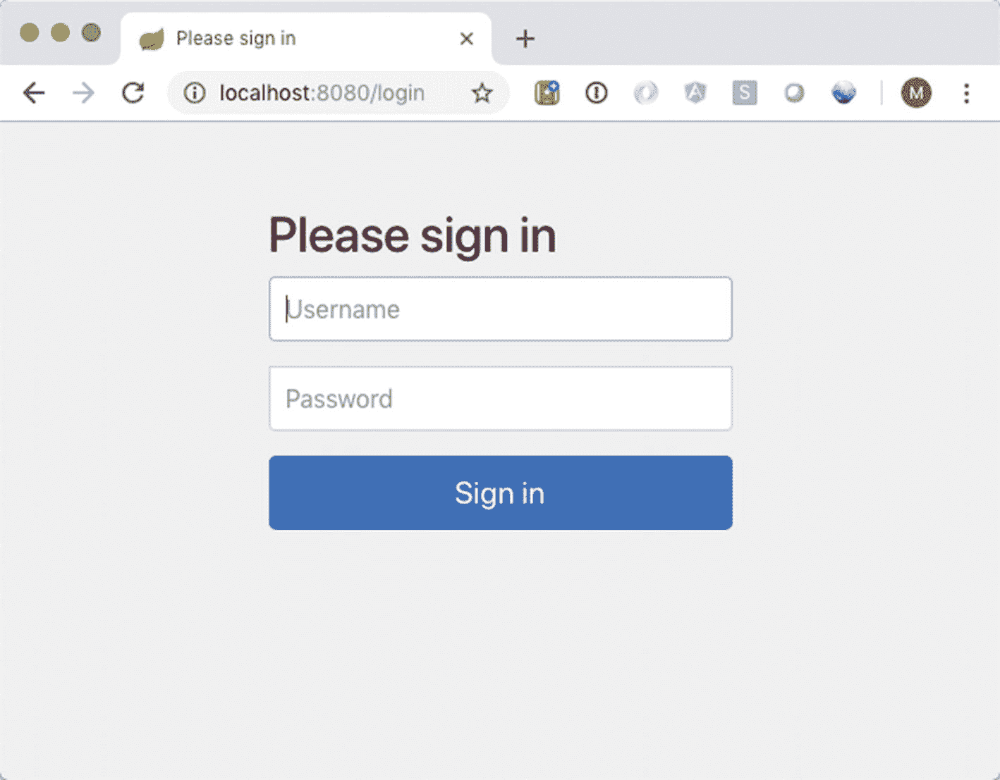

本地主机页面的截图显示了登录页面。它显示“请登录”，并包含用户名和密码字段以及登录按钮。

图 5-7

默认登录页面

#### 安全 URL 访问

可以通过添加自定义的 `SecurityWebFilterChain` 来配置访问规则。首先，让我们创建一个 `OrdersSecurityConfiguration`。参见清单 5-35。

```
@Configuration
@EnableWebFluxSecurity
public class OrdersSecurityConfiguration {
@Bean
public SecurityWebFilterChain springWebFilterChain(ServerHttpSecurity http) {
http
.formLogin(Customizer.withDefaults())
.headers(Customizer.withDefaults())
.logout(Customizer.withDefaults())
.csrf(Customizer.withDefaults());
return http.build();
}
}
清单 5-35
WebFlux 的 Spring Security 配置
```

来自 Spring Security 的 `WebFluxSecurityConfiguration` 类会检测 `SecurityWebFilterChain` 的实例（包含安全配置），该实例被包装为 `WebFilter`，而 `WebFilter` 又被 WebFlux 用来为传入请求添加行为（就像普通的 Servlet 过滤器一样）。`WebFluxSecurityConfiguration` 通过 `@EnableWebFluxSecurity` 注解被包含进来（该注解也由 Spring Boot 提供/启用）。

目前，该配置仅启用了安全性；让我们添加一些安全规则。参见清单 5-36。

```
@Configuration
@EnableWebFluxSecurity
public class OrdersSecurityConfiguration {
@Bean
public SecurityWebFilterChain springWebFilterChain(ServerHttpSecurity http) {
http
.formLogin(Customizer.withDefaults())
.headers(Customizer.withDefaults())
.logout(Customizer.withDefaults())
.csrf(Customizer.withDefaults());
http
.authorizeExchange((auth) -> auth
.pathMatchers("/").permitAll()
.pathMatchers("/orders*").hasRole("USER")
.anyExchange().authenticated());
return http.build();
}
}
清单 5-36
带有访问规则的 WebFlux 的 Spring Security 配置
```

`ServerHttpSecurity` 应该看起来很熟悉（参见本章中的其他配方），它用于添加安全规则并进行进一步配置（例如添加/删除头以及配置登录方法）。使用 `authorizeExchange`，可以编写规则；这里我们保护 URL。`/` 路径允许所有人访问，而 `/orders` URL 仅对具有 `USER` 角色的用户可用。对于其他请求，你至少需要进行身份验证。最后，你需要调用 `build()` 来实际构建并返回 `SecurityWebFilterChain`。

除了 `authorizeExchange`，还可以使用 `headers()` 配置方法向请求添加安全头，使用 `csrf()` 添加 CSRF 保护等。

#### 登录 WebFlux 应用

你可以通过显式配置来覆盖默认配置的某些部分，并且可以覆盖所使用的身份验证管理器以及用于存储安全上下文的存储库。身份验证管理器是自动检测的；你只需要注册一个类型为 `ReactiveAuthenticationManager` 或 `UserDetailsRepository` 的 Bean。

你还可以通过配置 `ServerSecurityContextRepositor` 来设置 `SecurityContext` 的存储位置。默认使用的实现是 `WebSessionServerSecurityContextRepository`，它将上下文存储在 `WebSession` 中。另一个默认实现是 `NoOpServerSecurityContextRepository`，用于无状态应用。参见清单 5-37。

```
@Bean
SecurityWebFilterChain springWebFilterChain(ServerHttpSecurity http) throws Exception {
return http
.formLogin()
.authenticationManager(new CustomReactiveAuthenticationManager())
.securityContextRepository(new NoOpServerSecurityContextRepository())
.build();
}
清单 5-37
Spring Security 配置
```

这将使用 `CustomReactiveAuthenticationManager` 和无状态的 `NoOpServerSecurityContextRepository` 覆盖默认值。不过，对于我们的应用，我们将继续使用默认配置。


#### 认证用户

在基于 Spring WebFlux 的应用程序中，用户认证是通过 `ReactiveAuthenticationManager` 接口完成的。这是一个包含单一 `authenticate` 方法的接口。你可以提供自己的实现，也可以使用框架提供的实现之一。第一个是 `UserDetailsRepositoryReactiveAuthenticationManager`，它包装了一个 `ReactiveUserDetailsService` 实例。

一个信息图标，圆圈内包含字母 i。`ReactiveUserDetailsService` 只有一个实现，即 `MapReactiveUserDetailsService`，这是一个内存实现。你可以基于响应式数据存储（如 MongoDB 或 Couchbase）提供自己的实现。

作为另一种实现，`ReactiveAuthenticationManagerAdapter` 实际上是常规 `AuthenticationManager` 的包装器。它将包装一个常规实例，因此你可以以响应式方式使用阻塞式实现。这并不会使它们变成响应式；它们仍然会阻塞，但这种方式可以重用它们。你也可以为你的响应式应用程序使用 JDBC、LDAP 等。

在 Spring WebFlux 应用程序中配置 Spring Security 时，你可以将 `ReactiveAuthenticationManager` 的实例添加到 Java 配置类中，或者添加一个 `ReactiveUserDetailsService`。当检测到后者时，它将自动被包装在 `UserDetailsRepositoryReactiveAuthenticationManager` 中。参见清单 5-38。

```
@Bean
public MapReactiveUserDetailsService userDetailsService() {
var marten = User.withDefaultPasswordEncoder()
.username("marten").password("secret").roles("USER").build();
var admin = User.withDefaultPasswordEncoder()
.username("admin").password("admin").roles("USER", "ADMIN").build();
return new MapReactiveUserDetailsService(marten, admin);
}
清单 5-38
响应式内存 UserDetailsService
```

现在运行应用程序时，你可以自由访问 `/` 页面，但当访问以 `/orders` 开头的 URL 时，你会看到一个登录表单（参见图 5-7）。输入预定义用户的凭据后，你应该被允许访问请求的 URL。

#### 做出访问控制决策

表 5-9 展示了用于访问控制决策的内置表达式。参见清单 5-39。

表 5-9

Spring Security WebFlux 内置表达式

| 表达式 | 描述 |
| --- | --- |
| `hasRole('role')` 或 `hasAuthority('authority')` | 如果当前用户拥有给定角色，则返回 `true` |
| `permitAll()` | 始终评估为 `true` |
| `denyAll()` | 始终评估为 `false` |
| `authenticated()` | 如果用户已认证，则返回 `true` |
| `access()` | 使用函数来确定是否授予访问权限 |

一个火焰的抽象图。  尽管角色和权限几乎相同，但它们的处理方式存在细微但重要的差异。使用 `hasRole` 时，会检查传入的角色值是否以 `ROLE_`（默认角色前缀）开头。如果不是，则在检查权限之前添加此前缀。因此，`hasRole('ADMIN')` 实际上会检查当前用户是否拥有 `ROLE_ADMIN` 权限。使用 `hasAuthority` 时，它会按原样检查该值。

```
@Bean
public SecurityWebFilterChain springWebFilterChain(ServerHttpSecurity http) {
http
.authorizeExchange((auth) -> auth
.pathMatchers("/").permitAll()
.pathMatchers("/orders*").access(this::ordersAllowed)
.anyExchange().authenticated());
return http.build();
}
private Mono ordersAllowed(
Mono authentication, AuthorizationContext context) {
return authentication
.map(a -> a.getAuthorities().contains(new SimpleGrantedAuthority("ROLE_ADMIN")))
.map(AuthorizationDecision::new);
}
清单 5-39
Spring Security 自定义安全规则
```

`access()` 表达式可用于编写非常强大的表达式。前面的代码片段允许当前用户拥有 `ROLE_ADMIN` 权限时访问。`Authentication` 包含 `GrantedAuthorities` 集合，你可以检查其中是否包含 `ROLE_ADMIN`。当然，你可以根据需要编写任意复杂的表达式；你可以检查 IP 地址、请求头等。

## 总结

在本章中，你学习了如何使用 Spring Security 保护 Spring Boot 应用程序。它可以用于保护任何 Java 应用程序，但主要用于基于 Web 的应用程序。认证、授权和访问控制的概念在安全领域至关重要，因此你应该对它们有清晰的理解。

你通常需要保护关键 URL，防止未经授权的访问。Spring Security 可以帮助你以声明式方式实现这一点。它通过应用 Servlet 过滤器来处理安全性，这些过滤器可以通过简单的基于 Java 的配置进行配置。Spring Security 会自动为你配置基本的安全服务，并默认尽可能保持安全。

Spring Security 支持多种用户登录 Web 应用程序的方式，例如基于表单的登录和 HTTP Basic 认证。它还提供匿名登录服务，允许你将匿名用户视为普通用户。Remember-me 支持允许应用程序在多个浏览器会话中记住用户的身份。

Spring Security 支持多种用户认证方式，并为此提供了内置的提供者实现。例如，它支持针对内存定义、关系数据库和 LDAP 仓库进行用户认证。你应该始终在用户仓库中存储加密密码，因为明文密码容易受到黑客攻击。Spring Security 还支持在本地缓存用户详细信息，以节省执行远程查询的开销。

关于是否允许用户访问给定资源的决策由访问决策管理器做出。Spring Security 提供了三个基于投票方法的访问决策管理器。它们都需要配置一组投票者来对访问控制决策进行投票。

Spring Security 使你能够以声明式方式保护方法调用，可以通过在 Bean 定义中嵌入安全拦截器，也可以通过使用 AspectJ 切入点表达式或注解匹配多个方法。Spring Security 还允许你在 JSP 视图中显示用户的认证信息，并根据用户的权限有条件地渲染视图内容。

Spring Security 提供了一个 ACL 模块，允许每个领域对象拥有一个用于控制访问的 ACL。你可以使用 Spring Security 的高性能 API（通过 JDBC 实现）来读取和维护每个领域对象的 ACL。Spring Security 还提供了诸如访问决策投票者和 JSP 标签之类的工具，使你能够一致地使用 ACL 和其他安全设施。

Spring Security 还支持保护基于 Spring WebFlux 的应用程序，并且你探索了如何为此类应用程序添加安全性。


# 6. 数据访问

大多数应用程序使用关系型数据库，例如 Oracle、MySQL 或 PostgreSQL；然而，数据存储不仅仅局限于 SQL 数据库。还有以下这些类型：

*   文档存储（MongoDB、Couchbase）
*   键值存储（Redis、Voldemort）
*   列存储（Cassandra）
*   图存储（Neo4j、Apache Giraph）

这些技术中的每一种（即使是它们的不同实现）都有其特定的用途。它们可能难以使用或配置，但 Spring Boot 使得配置和使用它们变得更加容易。Spring Boot 使用自动配置，它会检测正在使用的数据存储（检测驱动程序）并为其应用配置。为了简化这些技术的使用，Spring Boot 利用了 Spring Data 项目。

一个灯泡图标。 尽管每个部分使用不同的持久化存储，但 `bin` 目录包含为每个持久化存储设置 Docker 容器的脚本。

Spring Data 项目可以帮助简化工作；它可以帮助使用样板代码配置不同的技术。每个集成模块都将支持将异常转换为 Spring 一致的 `DataAccessException` 层次结构，并且能够使用 Spring 的模板方法。Spring Data 还为某些技术提供了跨存储解决方案，这意味着你的模型的一部分可以存储在带有 JPA 的关系型数据库中，而另一部分可以存储在图或文档存储中。

## 6-1. 配置数据源

在使用关系型数据库时，你首先需要的是与数据库的连接。在 Java 中，连接是通过 `javax.sql.DataSource` 获得的。Spring 提供了几个开箱即用的 `DataSource` 实现，例如 `DriverManagerDataSource` 和 `SimpleDriverDataSource`。然而，这些实现不是连接池，应主要考虑用于测试，而非生产环境。对于生产系统，你应该使用合适的连接池，例如 HikariCP。

### 问题

你需要从应用程序访问数据库。

### 解决方案

使用 `spring.datasource.url`、`spring.datasource.username` 和 `spring.datasource.password` 属性，让 Spring Boot 配置一个 `DataSource` 实例。

### 工作原理

要配置一个 `DataSource` 实例，Spring Boot 需要存在一个连接池（例如 HikariCP）、一个 JDBC 驱动程序或一个嵌入式数据库（例如 H2、HSQLDB 或 Derby）。Spring Boot 会自动检测 HikariCP、Tomcat JDBC 和 Commons DBCP2 连接池。要使用连接池，请配置 `spring.datasource.url`、`spring.datasource.username` 和 `spring.datasource.password` 属性（这是你需要设置的最少属性）。通过添加 `spring-boot-starter-jdbc` 依赖项来启用 JDBC 支持（参见清单 6-1）。这将引入使用 JDBC 所需的所有依赖项。

```
<dependency>
    <groupId>org.springframework.boot</groupId>
    <artifactId>spring-boot-starter-jdbc</artifactId>
</dependency>
清单 6-1
Spring Boot JDBC Starter 依赖项
```

包含的依赖项有 `spring-jdbc`、`spring-tx` 以及作为默认连接池的 HikariCP。

#### 使用嵌入式数据源

当 Spring Boot 检测到 H2、HSQLDB 或 Derby 时，它将默认使用检测到的嵌入式实现启动一个嵌入式数据库。这在编写测试或准备演示时非常有用。让 Spring Boot 创建它只需包含所需的依赖项即可（参见清单 6-2）。

```
<dependency>
    <groupId>org.apache.derby</groupId>
    <artifactId>derby</artifactId>
    <scope>runtime</scope>
</dependency>
<dependency>
    <groupId>org.apache.derby</groupId>
    <artifactId>derbytools</artifactId>
    <scope>runtime</scope>
</dependency>
清单 6-2
用于嵌入式服务器的 Apache Derby 依赖项
```

Spring Boot 现在将检测 Derby 并引导一个嵌入式的 `DataSource` 实例。让我们编写一个列出数据库中所有表的应用程序（参见清单 6-3）。

```
package com.apress.springboot3recipes.jdbc;

import javax.sql.DataSource;
import org.slf4j.Logger;
import org.slf4j.LoggerFactory;
import org.springframework.boot.ApplicationArguments;
import org.springframework.boot.ApplicationRunner;
import org.springframework.boot.SpringApplication;
import org.springframework.boot.autoconfigure.SpringBootApplication;
import org.springframework.stereotype.Component;

@SpringBootApplication
public class JdbcApplication {

    public static void main(String[] args) {
        SpringApplication.run(JdbcApplication.class, args);
    }
}

@Component
class TableLister implements ApplicationRunner {

    private final Logger logger = LoggerFactory.getLogger(getClass());
    private final DataSource dataSource;

    TableLister(DataSource dataSource) {
        this.dataSource = dataSource;
    }

    @Override
    public void run(ApplicationArguments args) throws Exception {
        try (var con = dataSource.getConnection();
             var rs = con.getMetaData().getTables(null, null, "%", null)) {
            while (rs.next()) {
                logger.info("{}", rs.getString(3));
            }
        }
    }
}
清单 6-3
带有 TableLister 的 Spring Boot 应用程序
```

当应用程序运行时，它将创建一个 `TableLister` 实例，并且该实例将接收配置好的 `DataSource` 实例。Spring Boot 随后会检测到它是一个 `ApplicationRunner`，并调用 `run` 方法。`run` 方法从 `DataSource` 获取一个 `Connection`，并使用 `DatabaseMetaData`（来自 JDBC）获取数据库中的表。现在运行应用程序时，它应该会显示类似于图 6-1 的输出。

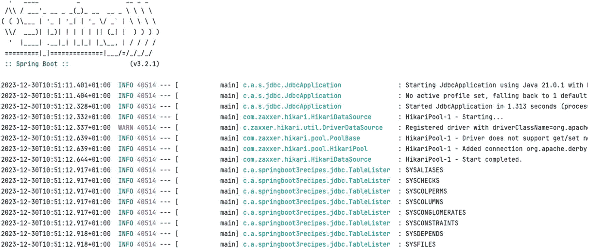

一张页面截图，显示 Spring Boot 中的一组程序日志。它使用 Java 启动 Jdbc 应用程序，注册带有 Java 类名的驱动程序，并显示使用数据库元数据的输出。

图 6-1
Derby 的 TableLister 输出

#### 使用外部数据库

要连接到数据库，你需要一个 JDBC 驱动程序。本方案使用 PostgreSQL，因此你需要包含该数据库的驱动程序（清单 6-4）。

```
<dependency>
    <groupId>org.postgresql</groupId>
    <artifactId>postgresql</artifactId>
</dependency>
清单 6-4
PostgreSQL 依赖项
```

配置单个数据源只需在 `application.properties` 文件中包含相关属性即可（清单 6-5）。

```
spring.datasource.url=jdbc:postgresql://localhost:5432/customers
spring.datasource.username=customers
spring.datasource.password=customers
清单 6-5
连接到 PostgreSQL 数据库的数据源属性
```

`spring.datasource.url` 实例告诉连接池连接到哪里，`spring.datasource.username` 和 `spring.datasource.password` 配置连接时使用的用户名和密码。你也可以使用 `spring.datasource.driver-class-name` 来指定要使用的 JDBC 驱动程序类。通常，Spring Boot 会根据传入的 URL 检测要使用的驱动程序。如果你想使用非默认的驱动程序（出于性能或日志记录目的），你也可以指定它。

当运行 `JdbcApplication` 时，输出应该类似于图 6-2；现在有一堆不同的表（与 Derby 相比）。

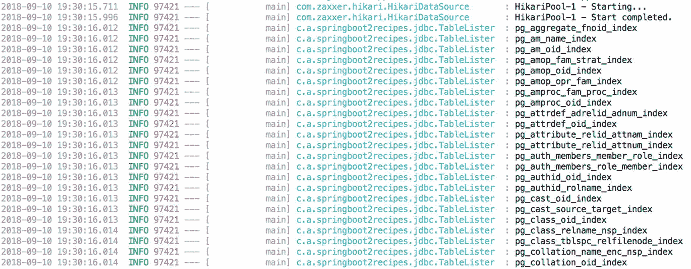

一张页面截图，显示 Spring Boot 中的一组程序日志。它启动 Jdbc 应用程序，使用 Java 运行它，并显示读取一堆不同表的输出。

图 6-2
PostgreSQL 的 TableLister 输出


#### 从 JNDI 获取数据源

如果你将 Spring Boot 应用部署到应用服务器（或拥有远程 JNDI 服务器），并希望使用预配置的 `DataSource` 实例，可以使用 `spring.datasource.jndi-name` 属性让 Spring Boot 从 JNDI 获取 `DataSource`（参见清单 6-6）。

```
spring.datasource.jndi-name=java:jdbc/customers
清单 6-6
数据源 JNDI 查找属性
```

#### 配置连接池

Spring Boot 默认使用的连接池是 HikariCP。当引入 `spring-boot-starter-jdbc` 依赖（或其他与数据库相关的依赖）时，它会自动生效。Spring Boot 会使用一些默认设置来配置连接池；不过，你可能希望覆盖这些设置（增加或减少最大连接数、设置超时时间等）。HikariCP 的配置选项位于 `spring.datasource.hikari` 命名空间下（参见表 6-1）。

表 6-1

HikariCP 常用连接池设置

| 属性 | 描述 |
| --- | --- |
| `spring.datasource.hikari.connection-timeout` | 设置客户端等待从连接池获取连接的最大毫秒数。默认值为 30 秒。 |
| `spring.datasource.hikari.leak-detection-threshold` | 设置连接离开连接池后，在记录可能连接泄漏消息之前的毫秒数。默认值为禁用。 |
| `spring.datasource.hikari.idle-timeout` | 设置连接在连接池中允许空闲的最大毫秒数。默认值为 10 秒。 |
| `spring.datasource.hikari.validation-timeout` | 设置连接池等待连接被验证为存活的最大毫秒数。默认值为 5 秒。 |
| `spring.datasource.hikari.connection-test-query` | 设置用于测试连接有效性的 SQL 查询。通常，JDBC 4.0（或更高版本）驱动程序不需要此设置！ |
| `spring.datasource.hikari.maximum-pool-size` | 设置连接池中保持的最大连接数。默认值为 10 个连接。 |
| `spring.datasource.hikari.minimum-idle` | 设置连接池中维护的最小空闲连接数。默认值为 10 个连接。 |
| `spring.datasource.hikari.data-source-properties` | 设置驱动程序特定的属性。 |

你还可以使用更多属性（参见清单 6-7），但列表相当长，而表 6-1 中提到的属性是最常用的。

一个圆形抽象图形内包含小写字母 i。 Tomcat JDBC 的属性位于 `spring.datasource.tomcat` 命名空间下，Commons DBCP2 的属性位于 `spring.datasource.dbcp2` 命名空间下。

```
spring.datasource.hikari.maximum-pool-size=5
spring.datasource.hikari.minimum-idle=2
spring.datasource.hikari.leak-detection-threshold=20s
清单 6-7
其他 Hikari 属性
```

此配置将最大连接数设置为 5，最小连接数设置为 2。它还会启用泄漏检测，阈值为 20 秒。

## 6-2\. 使用 Spring Boot 管理数据库模式

### 问题

你需要初始化或扩展所用数据库模式中的对象，并且希望这些操作由你的 Spring Boot 应用触发/管理。

一个圆形抽象图形内包含小写字母 i。 `bin` 目录中有一个 `postgres.sh` 脚本，它将启动一个 PostgreSQL 服务器，供本方案使用。

### 解决方案

Spring Boot 对简单的数据库管理以及 Flyway 和 Liquibase 提供了开箱即用的支持。包含（如果需要）相关依赖，Spring Boot 将自动使用你选择的数据库管理工具，并提供合理的默认值以及应用某些配置属性的能力。

### 工作原理

当使用现有数据库时，你可能已经拥有现有的表、视图和存储过程。但是，当你创建新数据库时，它是空的，你需要自己创建表。使用 Spring Boot，这得到了开箱即用的支持。你可以添加 `schema.sql` 文件来初始化模式（表、视图等），并添加 `data.sql` 文件来向表中插入数据。Spring Boot 还允许你提供 `schema-<platform>.sql` 和 `data-<platform>.sql` 文件来进行特定数据库的初始化。例如，使用 Derby 时，你可以添加 `schema-derby.sql` 文件等。模式和数据文件的名称可以通过 `spring.sql.init.schema-locations` 和 `spring.sql.init.data-locations` 属性进行更改。有关可用属性的描述，请参见表 6-2。

表 6-2

数据源初始化属性

| 属性 | 描述 |
| --- | --- |
| `spring.sql.init.continue-on-error` | 设置初始化数据库时发生错误是否停止；默认值为 `false`。 |
| `spring.sql.init.data-locations` | 设置数据（DML）脚本资源引用；默认值为 `classpath:data.sql`。 |
| `spring.sql.init.password` | 设置执行 DML 脚本的数据库密码；默认使用普通密码。 |
| `spring.sql.init.username` | 设置执行 DML 脚本的数据库用户名；默认使用普通用户名。 |
| `spring.sql.init.mode` | 使用可用的 DDL 和 DML 脚本初始化数据源。默认值为 `EMBEDDED`，可更改为 `NEVER` 或 `ALWAYS`。 |
| `spring.sql.init.platform` | 设置在 DDL 或 DML 脚本中使用的平台（例如 `schema-${platform}.sql` 或 `data-${platform}.sql`）。默认值为 `all`。 |
| `spring.sql.init.schema-locations` | 设置模式（DDL）脚本资源引用；默认值为 `classpath:schema.sql`。 |
| `spring.sql.init.separator` | 设置 SQL 初始化脚本中的语句分隔符。默认值为 `;`。 |
| `spring.sql.init.encoding` | 设置 SQL 脚本的编码。默认使用平台编码。 |

让我们创建一个名为 `customer` 的表并向其中插入一些数据。要创建该表，请将 `schema.sql` 文件添加到 `src/main/resources` 目录（清单 6-8）。

```
DROP TABLE IF EXISTS customer;
CREATE TABLE customer (
id SERIAL PRIMARY KEY,
name VARCHAR(100) NOT NULL,
email VARCHAR(255) NOT NULL,
UNIQUE(name)
);
清单 6-8
客户 DDL
```

要插入数据，请将 `data.sql` 文件添加到 `src/main/resources` 目录（清单 6-9）。

```
INSERT INTO customer (name, email)
VALUES ('Marten Deinum', 'marten@deinum.biz'),
('Josh Long', 'jlong@pivotal.com'),
('John Doe', 'john.doe@island.io'),
('Jane Doe', 'jane.doe@island.io');
清单 6-9
客户数据初始化 SQL
```

为了验证其是否正常工作，让我们添加另一个 `ApplicationRunner` 实例，该实例使用 `DataSource` 实例打印 `customer` 表的内容（清单 6-10）。

```
@Component
class CustomerLister implements ApplicationRunner {
private final Logger logger = LoggerFactory.getLogger(getClass());
private final DataSource dataSource;
CustomerLister(DataSource dataSource) {
this.dataSource = dataSource;
}
@Override
public void run(ApplicationArguments args) throws Exception {
var sql = "SELECT id, name, email FROM customer";
try (var con = dataSource.getConnection();
var stmt = con.createStatement();
var rs = stmt.executeQuery(sql)) {
while (rs.next()) {
logger.info("Customer [id={}, name={}, email={}]", rs.getLong(1), rs.getString(2), rs.getString(3));
}
}
}
}
清单 6-10
CustomerLister
```


对于嵌入式数据库，数据库初始化始终是启用的，因此在使用 Derby、H2 或 HSQLDB 时，默认情况下会启用此功能。当使用外部数据库时，默认情况下不会进行初始化。要更改此行为，你可以将 `spring.sql.init.mode` 属性切换为 `always`，这样它就会始终运行（如清单 6-11 所示）。

```
spring.sql.init.mode=always
清单 6-11
为非嵌入式数据源启用数据库初始化
```

当应用程序启动时，你现在会看到来自数据库的客户列表被打印在日志中（就在表被记录之前或之后，如图 6-3 所示）。

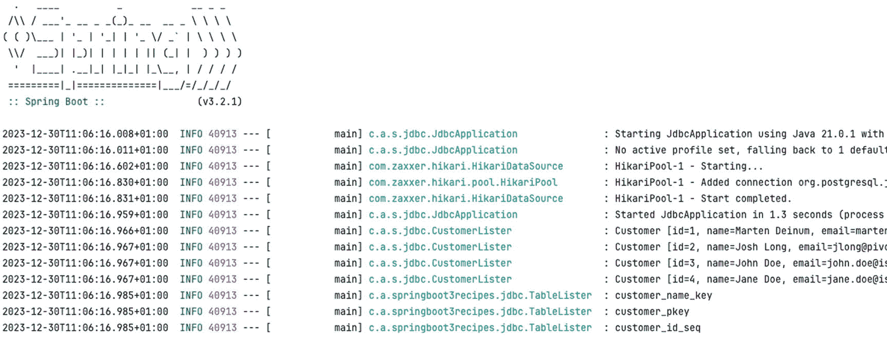

页面截图显示了一组 Spring Boot 中的程序日志。它启动了 Jdbc 应用程序，使用 Java 运行它，并显示了来自数据库的客户列表被打印在日志中。

图 6-3

CustomerLister 输出

#### 使用 Flyway 初始化数据库

在开发应用程序时，你可能希望对数据库迁移有更多的控制。虽然使用 `schema.sql` 和 `data.sql` 文件非常快速简便，但最终维护起来会变得很繁琐。Spring Boot 也支持 Flyway，简单来说，它是数据库模式的版本控制工具。它允许你增量地更改/更新数据库模式。要使用 Flyway，首先要做的是添加对 Flyway 本身的依赖（如清单 6-12 所示）。

```
org.flywaydb
flyway-core

清单 6-12
Flyway 依赖
```

Spring Boot 会检测到 Flyway 的存在，并假定你想使用它来进行数据库迁移。迁移脚本应放在 `src/main/resources` 目录下的 `db/migration` 文件夹中。这是默认位置，可以通过在 `application.properties` 文件中指定 `spring.flyway.locations` 来更改。请参阅清单 6-13，了解用于替代 `schema.sql` 和 `data.sql` 的迁移脚本。

```
CREATE TABLE customer (
id SERIAL PRIMARY KEY,
name VARCHAR(100) NOT NULL,
email VARCHAR(255) NOT NULL,
UNIQUE(name)
);
INSERT INTO customer (name, email) VALUES
('Marten Deinum', 'marten@deinum.biz'),
('Josh Long', 'jlong@pivotal.com'),
('John Doe', 'john.doe@island.io'),
('Jane Doe', 'jane.doe@island.io');
清单 6-13
Flyway 迁移脚本
```

当这个 SQL 被放入 `db/migration` 文件夹中的 `V1__first.sql` 文件时，它将在启动时执行（假设数据库为空）。默认的命名约定是 `V<序号>__<名称>.sql`，用于确定要执行哪些脚本。一旦脚本被执行，你就不能（也不应该）修改该脚本，因为这将导致 Flyway 阻止你的应用程序启动。它会检测已执行脚本中的更改。

运行应用程序时，客户列表仍应显示，并且你会注意到表列表中多了一个表：`flyway_schema_history`。该表包含 Flyway 用于检测（和保护）数据库更改的元数据。

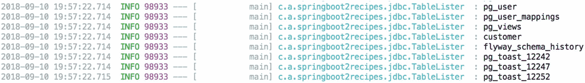

页面截图显示了一组 Spring Boot 中的程序日志。它运行了应用程序并列出了客户，同时还有一个额外的表列出了 flyway_schema_history。它包含了用于检测数据库更改的 Flyway 元数据。

图 6-4

CustomerLister 输出：Flyway

你还可以使用一些属性来配置 Spring Boot 中的 Flyway；请参阅表 6-3 了解最常用的属性。

表 6-3

常用的 Flyway 属性

| 属性 | 描述 |
| --- | --- |
| `spring.flyway.enabled` | 设置是否启用 Flyway；默认值为 `true`。 |
| `spring.flyway.encoding` | 设置 SQL 迁移文件的编码；默认为 UTF-8。 |
| `spring.flyway.fail-on-missing-locations` | 设置如果位置缺失，Flyway 是否应失败/中止；默认值为 `false`。 |
| `spring.flyway.locations` | 设置迁移脚本的位置；默认值为 `classpath:db/migration`。 |
| `spring.flyway.url` | 设置要迁移的数据库的 JDBC URL；如果未设置，则使用默认配置的 `DataSource`。 |
| `spring.flyway.user` | 设置如果 Flyway 使用自己的 `DataSource` 时要使用的数据库用户名。 |
| `spring.flyway.password` | 设置如果 Flyway 使用自己的 `DataSource` 时要使用的数据库密码。 |
| `spring.flyway.sql-migration-prefix` | 设置用于检测 SQL 迁移文件的前缀；默认值为 `V`。 |
| `spring.flyway.sql-migration-suffixes` | 设置用于检测 SQL 迁移文件的后缀；默认值为 `.sql`。 |
| `spring.flyway.license-key` | 设置 Flyway Teams（Flyway 付费版本）的许可证密钥。 |

## 6-3\. 使用 JdbcTemplate 或 JdbcClient

### 问题

你想使用 `JdbcTemplate`、`NamedParameterJdbcTemplate` 或 `JdbcClient` 来获得更好的 JDBC 体验。

### 解决方案

使用自动配置的 `JdbcTemplate`、`NamedParameterJdbcTemplate` 或 `JdbcClient` 来执行查询并处理结果。

### 工作原理

Spring Boot 默认会配置一个 `JdbcTemplate`、`NamedParameterJdbcTemplate` 和 `JdbcClient`，并且当它能检测到单个候选 `DataSource` 时就会这样做。单个候选 `DataSource` 意味着要么只有一个 `DataSource`，要么有一个使用 `@Primary` 标记为主资源的 `DataSource`。由于 `JdbcTemplate` 已经可用，你可以使用它来编写 JDBC 代码。将 `CustomerLister` 重写为使用 `JdbcTemplate` 而不是普通的 `DataSource` 将使代码更易于阅读，从而更易于处理（参见清单 6-14）。

```
class CustomerLister implements ApplicationRunner {
private final Logger logger = LoggerFactory.getLogger(getClass());
private final JdbcTemplate jdbc;
CustomerLister(JdbcTemplate jdbc) {
this.jdbc = jdbc;
}
@Override
public void run(ApplicationArguments args) {
jdbc.query("SELECT id, name, email FROM customer", rs -> {
logger.info("Customer [id={}, name={}, email={}]",
rs.getLong(1), rs.getString(2), rs.getString(3));
});
}
}
清单 6-14
使用 JdbcTemplate 的 CustomerLister
```

`JdbcTemplate` 通过 `query` 方法执行查询；该方法接受一个 `String` 和一个 `RowCallbackHandler`。`JdbcTemplate` 将执行查询，并为每一行调用 `RowCallbackHandler`，后者负责记录该行。运行应用程序时，输出仍然相同，但代码变得更简单了。

`JdbcTemplate` 还具有可能更熟悉的 `RowMapper` 接口，可用于将 `ResultSet` 中的一行映射到 Java 对象。让我们创建一个 `Customer` 类，并使用 `RowMapper` 从数据库创建 `Customer` 实例（清单 6-15）。

```
package com.apress.springboot3recipes.jdbc;
public record Customer(Long id, String name, String email) {
public Customer(String name, String email) {
this(null, name, email);
}
}
清单 6-15
Customer 记录
```

接下来，我们创建一个仓库接口来定义契约，并创建一个基于 JDBC 的实现（清单 6-16）。

```
package com.apress.springboot3recipes.jdbc;
import java.util.List;
import java.util.Optional;
public interface CustomerRepository {
List findAll();
Optional findById(long id);
Customer save(Customer customer);
}
清单 6-16
CustomerRepository 接口
```

接下来，该实现使用 `JdbcTemplate` 和一个 `RowMapper` 实例将结果映射到 `Customer` 对象（清单 6-17）。


```
package com.apress.springboot3recipes.jdbc;
import org.springframework.dao.EmptyResultDataAccessException;
import org.springframework.jdbc.core.JdbcTemplate;
import org.springframework.jdbc.support.GeneratedKeyHolder;
import org.springframework.stereotype.Repository;
import java.sql.ResultSet;
import java.sql.SQLException;
import java.util.List;
import java.util.Optional;
@Repository
class JdbcCustomerRepository implements CustomerRepository {
private static final String ALL_QUERY = "SELECT id, name, email FROM customer";
private static final String BY_ID_QUERY =
"SELECT id, name, email FROM customer WHERE id=?";
private static final String INSERT_QUERY =
"INSERT INTO customer (name, email) VALUES (?,?) RETURNING id";
private final JdbcTemplate jdbc;
JdbcCustomerRepository(JdbcTemplate jdbc) {
this.jdbc = jdbc;
}
@Override
public List findAll() {
return jdbc.query(ALL_QUERY, (rs, rowNum) -> toCustomer(rs));
}
@Override
public Optional findById(long id) {
try {
var customer = jdbc
.queryForObject(BY_ID_QUERY, (rs, rowNum) -> toCustomer(rs), id);
return Optional.of(customer);
} catch (EmptyResultDataAccessException ex) {
return Optional.empty();
}
}
@Override
public Customer save(Customer customer) {
var keyHolder = new GeneratedKeyHolder();
jdbc.update( (con) -> {
var ps = con.prepareStatement(INSERT_QUERY);
ps.setString(1, customer.name());
ps.setString(2, customer.email());
return ps;
}, keyHolder);
var id = keyHolder.getKey().longValue();
return new Customer(id, customer.name(), customer.email());
}
private Customer toCustomer(ResultSet rs) throws SQLException {
var id = rs.getLong(1);
var name = rs.getString(2);
var email = rs.getString(3);
return new Customer(id, name, email);
}
}
清单 6-17 使用 JdbcTemplate 的 CustomerRepository 实现
```

`JdbcCustomerRepository` 使用 `JdbcTemplate` 和 `RowMapper`（通过 lambda 表达式）将 `ResultSet` 对象中的每一行转换为 `Customer` 对象。现在，`CustomerLister` 可以使用 `CustomerRepository` 从数据库中获取所有 `Customer` 记录，并将其打印到控制台（清单 6-18）。

```
@Component
class CustomerLister implements ApplicationRunner {
private final Logger logger = LoggerFactory.getLogger(getClass());
private final CustomerRepository customers;
CustomerLister(CustomerRepository customers) {
this.customers = customers;
}
@Override
public void run(ApplicationArguments args) {
customers.findAll()
.forEach( (customer) -> logger.info("{}", customer));
}
}
清单 6-18 使用 CustomerRepository 的 CustomerLister
```

由于所有 JDBC 代码都已移至 `JdbcCustomerRepository`，该类变得非常简单。它注入了一个 `CustomerRepository` 实例，并使用 `findAll` 方法获取数据库内容，然后为每个客户打印一行信息。

#### 通过 JdbcClient 访问 JDBC

Spring JDBC 的新增功能是 `JdbcClient`，它在内部仍然使用 `JdbcTemplate` 或 `NamedParameterJdbcTemplate`，但提供了一种更流畅的方式来执行 SQL 和映射响应。

基于 `JdbcClient` 的 `CustomerLister` 可能如清单 6-19 所示。

```
@Component
class CustomerLister implements ApplicationRunner {
private final Logger logger = LoggerFactory.getLogger(getClass());
private final JdbcClient jdbc;
CustomerLister(JdbcClient jdbc) {
this.jdbc = jdbc;
}
@Override
public void run(ApplicationArguments args) {
jdbc.sql("SELECT id, name, email FROM customer")
.query((rs) -> {
logger.info("Customer [id={}, name={}, email={}]",
rs.getLong(1), rs.getString(2), rs.getString(3));
});
}
}
清单 6-19 使用 JdbcClient 的 CustomerLister
```

`sql` 方法用于设置要执行的 SQL 语句。使用 `param` 方法，我们可以在语句中设置位置参数或命名参数。`query` 方法用于执行查询并将结果映射。这里我们使用了接受 `RowCallbackHandler` 的 `query` 方法，这与我们在 `JdbcTemplate` 中的做法非常相似。

## 6-4. 使用 Spring Data JDBC

### 问题

您希望将一些结果映射到对象，而无需编写太多集成代码。Spring Data JDBC 基于熟悉的 `JdbcTemplate` 为 JDBC 提供了抽象，并会自动提供映射。

### 解决方案

将 Spring Data JDBC 作为依赖项添加到您的项目中，并使用基类创建仓库。

### 工作原理

要使用 Spring Data JDBC，首先需要将依赖项添加到该项目中。Spring Boot 为此提供了 `spring-boot-starter-data-jdbc` 依赖项，它将引入所有必需的依赖项（参见清单 6-20）。

```
org.springframework.boot
spring-boot-starter-data-jdbc

清单 6-20 Spring Data JDBC 依赖项
```

由于我们将要存储和检索 `Customer` 对象，因此也需要一个 `Customer` 类。我们可以复用配方 6-14 中的类；清单 6-21 为了完整性再次展示它。

```
package com.apress.springboot3recipes.jdbc;
import org.springframework.data.annotation.Id;
public record Customer(@Id long id, String name, String email) { }
清单 6-21 Customer 记录
```

此处的客户与配方 6-15 中的客户有一个小差异。区别在于 `id` 属性上的 `@Id` 注解。我们需要告诉 Spring Data 哪些字段用作主键。这是必需的，以便 `findById` 等方法能够正常工作；否则，Spring Data 将不知道哪些字段构成标识符，也无法生成查询。为此，我们需要使用 `@Id` 标记这些字段。当只有一个字段构成此对象的主键并且该字段也名为 `id` 时，可以省略 `@Id` 注解。然而，明确标注它永远不会错，并且有助于增强代码的表达力。

最后，我们需要一个仓库。在之前的配方中，我们定义了一个接口（配方 6-15）并提供了我们想要的实现（配方 6-16）。使用 Spring Data JDBC，我们只需要指定一个接口（清单 6-22），该接口必须扩展 Spring Data 的接口之一。然后 Spring Data 将在运行时动态创建适当的仓库。

```
package com.apress.springboot3recipes.jdbc;
import org.springframework.data.repository.CrudRepository;
public interface CustomerRepository extends CrudRepository { }
清单 6-22 用于 Spring Data JDBC 的 CustomerRepository
```

`CustomerRepository` 扩展了 `CrudRepository` 并且不包含任何方法。所有需要的方法都由 Spring Data 开箱即用地提供。最后，我们需要创建一些使用该仓库的东西。让我们编写一个 `CustomerLister`，它从数据库中检索所有 `Customer` 实例并打印输出（清单 6-23）。

```
@Component
class CustomerLister implements ApplicationRunner {
private final Logger logger = LoggerFactory.getLogger(getClass());
private final CustomerRepository customers;
CustomerLister(CustomerRepository customers) {
this.customers = customers;
}
@Override
public void run(ApplicationArguments args) {
customers.findAll()
.forEach( (customer) -> logger.info("{}", customer));
}
}
清单 6-23 使用 CustomerRepository 的 CustomerLister
```

## 6-5. 测试 JDBC 代码

在编写 JDBC 代码时，最终您需要测试代码的行为是否符合预期。为此，Spring Test 模块可以为您提供帮助。它允许轻松进行测试设置，而 Spring Boot 进一步扩展了它，使测试数据访问代码更加容易。本配方探讨了为 JDBC 代码编写测试所需的内容。

### 问题

您希望针对实际数据库测试您的 JDBC 层。

### 解决方案

使用 Spring Test Context 框架和 Spring Boot 测试支持，通过嵌入式容器（如 Apache Derby）编写单元测试，或使用 Testcontainers 编写专用的集成测试。


### 工作原理

在测试 JDBC 代码时，需要一个数据库，通常使用像 H2、Apache Derby 或 HSQLDB 这样的嵌入式数据库进行测试。Spring Boot 让编写 JDBC 代码的测试变得简单。基于 JDBC 的测试可以使用 `@JdbcTest` 注解，Spring Boot 将创建一个仅包含 JDBC 相关 Bean（如 `DataSource` 和事务管理器）的最小化应用程序。

#### 使用嵌入式数据库测试 JDBC 代码

让我们为 `JdbcCustomerRepository` 编写一个测试，并使用 H2 作为嵌入式数据库。首先，将 H2 添加为测试依赖项（清单 6-24）。

```
com.h2database
h2
test

清单 6-24
H2 数据库作为测试依赖项
```

接下来创建 `JdbcCustomerRepositoryTest`（清单 6-25）。

```
@JdbcTest
@TestPropertySource(properties = "spring.flyway.enabled=false")
@Import(JdbcCustomerRepository.class)
class JdbcCustomerRepositoryTest {
@Autowired
private JdbcCustomerRepository repository;
}
清单 6-25
JdbcCustomerRepositoryTest 测试设置
```

`@JdbcTest` 注解通过一个特殊的 JUnit 扩展（`SpringExtension`）来执行测试，以引导 Spring 测试上下文框架。`@JdbcTest` 注解会将预配置的 `DataSource` 替换为嵌入式数据源（此处为 H2）。由于我们要测试仓库，因此添加了 `@Import(JdbcCustomerRepository.class)` 注解。

最后，还有 `@TestPropertySource(properties = "spring.flyway.enabled=false")`，表示我们希望禁用 Flyway。该应用程序使用 Flyway 管理数据库模式；然而，这些脚本是为 PostgreSQL 编写的，而非 H2。为了测试，我们希望禁用 Flyway，并提供一个基于 H2 的 `schema.sql` 来创建模式。

一个圆形抽象图形，内部包含小写字母 i。 这是使用与生产系统（PostgreSQL）不同的数据库（H2）进行测试的缺点之一。你需要维护两套模式脚本，或者使用与生产系统相同的数据库进行测试。

在 `src/test/resources` 中创建一个 `schema.sql` 文件，并添加清单 6-26 中的 DDL 语句。

```
CREATE TABLE customer (
id BIGINT AUTO_INCREMENT PRIMARY KEY,
name VARCHAR(100) NOT NULL,
email VARCHAR(255) NOT NULL,
UNIQUE(name)
);
清单 6-26
H2 的客户 DDL
```

现在编写一个测试，验证记录是否正确插入（清单 6-27）。

```
@Test
void insertNewCustomer() {
assertThat(repository.findAll()).isEmpty();
var newCustomer = new Customer("T. Testing", "t.testing@test123.tst");
var customer = repository.save(newCustomer);
assertThat(customer.id()).isNotNull();
assertThat(customer.name()).isEqualTo("T. Testing");
assertThat(customer.email()).isEqualTo("t.testing@test123.tst");
assertThat(repository.findById(customer.id())).hasValue(customer);
}
清单 6-27
插入客户测试
```

此测试首先断言数据库为空。这并非必需，但有助于检测其他测试是否污染了数据库。接下来，通过调用 `JdbcCustomerRepository` 上的 `save` 方法向数据库添加一个 `Customer`。验证生成的 `Customer` 具有 ID、`name` 和 `email` 属性。最后，再次检索该 `Customer` 并比较是否相同。

你可以添加的另一个测试是 `findAll` 方法。当插入两条记录时，调用 `findAll` 应检索到两条记录（清单 6-28）。

```
@Test
void findAllCustomers() {
assertThat(repository.findAll()).isEmpty();
repository.save(new Customer("T. Testing1", "t.testing@test123.tst"));
repository.save(new Customer("T. Testing2", "t.testing@test123.tst"));
assertThat(repository.findAll()).hasSize(2);
}
清单 6-28
查找所有客户测试

可能还有更多断言，但保存数据的操作已在另一个测试方法中得到验证。

#### 使用 Testcontainers 测试 JDBC 代码

如今更好的选择是使用 Testcontainers。Testcontainers 使用 Docker 为你的特定技术启动一个 Docker 容器。在这种情况下，我们可以使用 PostgreSQL Docker 镜像启动一个真实的数据库，并在测试中使用它。这样，你就可以使用实际的数据库进行测试，无需使用内存数据库，这意味着你可以执行所有想要的查询并对其进行测试。这也让你有机会测试数据库迁移脚本（如果使用的话）。

要使用 Testcontainers（此处针对 PostgreSQL），我们需要添加相应的依赖项（参见清单 6-29）。

```
org.springframework.boot
spring-boot-testcontainers

org.testcontainers
postgresql
test

org.testcontainers
junit-jupiter
test

清单 6-29
PostgreSQL 和 JUnit Jupiter 的 Testcontainers 依赖项
```

现在编写一个测试，验证记录是否正确插入到实际的 PostgreSQL 数据库中（参见清单 6-30）。

```
@JdbcTest
@AutoConfigureTestDatabase(replace = AutoConfigureTestDatabase.Replace.NONE)
@Import(JdbcCustomerRepository.class)
@Testcontainers
class JdbcCustomerRepositoryTest {
@Container
@ServiceConnection
static PostgreSQLContainer postgres =
new PostgreSQLContainer("postgres:15-alpine");
}
清单 6-30
JdbcCustomerRepositoryTest 的 Testcontainers 测试设置
```

`@JdbcTest` 通过一个特殊的 JUnit 扩展（`SpringExtension`）来执行测试，以引导 Spring 测试上下文框架。默认情况下，`@JdbcTest` 注解会将预配置的 `DataSource` 替换为嵌入式数据源。`@AutoConfigureTestDatabase(replace = AutoConfigureTestDatabase.Replace.NONE)` 注解阻止了这种替换，因为我们希望提供一个实际的 `DataSource`。由于我们要创建仓库的实例，因此添加了 `@Import(JdbcCustomerRepository.class)` 注解。

现在，为了注册 Testcontainers 的特殊 JUnit 扩展，添加了 `@Testcontainers` 注解。此扩展会查找带有 `@Container` 注解的字段，并启动相应的容器。对于此测试，它是一个 `PostgreSQLContainer`，我们指示它使用 PostgreSQL 15 Docker 容器。Testcontainers 将负责下载此容器，启动一个实例，并在测试后停止它。

当测试运行时，提供的 Flyway 脚本将自动执行，创建模式并用一些数据填充它（正如我们的 Flyway 脚本中所做的那样；参见上一配方中的清单 6-8）。

由于每个测试的容器将以不同的 URL 启动，我们需要将此信息告知 Spring Boot 应用程序。通过使用 `@ServiceConnection` 注解，创建的 URL 会自动注册到应用程序中。有关此内容的更多信息，请参见配方 2-3。

有了这些，我们现在可以编写一些测试来验证我们的行为（清单 6-31）。

```
@Test
void insertNewCustomer() {
var newCustomer = new Customer("T. Testing", "t.testing@test123.tst");
var customer = repository.save(newCustomer);
assertThat(customer.id()).isGreaterThan(0);
assertThat(customer.name()).isEqualTo("T. Testing");
assertThat(customer.email()).isEqualTo("t.testing@test123.tst");
assertThat(repository.findById(customer.id())).hasValue(customer);
}
@Test
void findAllCustomers() {
int count = repository.findAll().size();
repository.save(new Customer("T. Testing1", "t.testing@test123.tst"));
repository.save(new Customer("T. Testing2", "t.testing@test123.tst"));
assertThat(repository.findAll()).hasSize(count + 2);
}
清单 6-31
使用 Testcontainers 的 JdbcCustomerRepositoryTest 测试
```


这些测试与嵌入式数据库使用的测试大同小异；不过，这里我们的数据库中已经有一些额外的数据，因此在测试中必须考虑到这一点。这取决于你的数据库迁移脚本是什么样的。如果它生成的是空模式，那么你无需修改测试。

#### 测试 Spring Data JDBC 仓库

使用 Spring Data JDBC 时，测试设置略有不同。现在不再使用 `@JdbcTest` 注解，而是使用 `@DataJdbcTest` 注解，它表明要使用 Spring Data JDBC 及其测试设置。接下来，为了设置所需的 JDBC 组件（如 `DataSource`），它还会启用对基于 Spring Data JDBC 的仓库的扫描。

与 `@JdbcTest` 一样，此设置也会自动尝试用嵌入式数据库替换现有的 `DataSource`。由于我们使用 Testcontainers 来启动数据库，因此需要通过添加 `@AutoConfigureTestDatabase(replace = AutoConfigureTestDatabase.Replace.NONE)` 来禁用此功能。

测试类看起来仍然很像常规的基于 JDBC 的测试，但区别在于注解（清单 6-32）。

```
@DataJdbcTest
@AutoConfigureTestDatabase(replace = AutoConfigureTestDatabase.Replace.NONE)
@Testcontainers
class JdbcCustomerRepositoryTest {
@Container
@ServiceConnection
static PostgreSQLContainer postgres =
new PostgreSQLContainer("postgres:15-alpine");
@Autowired
private CustomerRepository repository;
}
清单 6-32
用于 Spring Data JDBC 的 CustomerRepositoryTest
```

它与最初使用 Testcontainers 的 `@JdbcTest` 基本相同，区别在于我们现在使用 `@DataJdbcTest` 注解，表明我们要使用 Spring Data JDBC，并且我们自动注入的是 `CustomerRepository`，而不是之前的 `JdbcCustomerRepository`。现在我们只需要接口来进行测试。

## 6-6\. 使用 JPA 访问数据

### 问题

你想在 Spring Boot 应用程序中使用 JPA。

### 解决方案

Spring Boot 会自动检测 Hibernate 的存在，所需的 JPA 类将利用该信息来配置 `EntityManagerFactory` 实例。

### 工作原理

Spring Boot 通过 Hibernate 提供了对 JPA 的开箱即用支持。当检测到 Hibernate 时，将使用先前配置的 `DataSource` 自动配置一个 `EntityManagerFactory` 实例。

你需要将 `hibernate-core` 和 `spring-orm` 作为依赖项添加到项目中。不过，更简单的方法是将 `spring-boot-starter-data-jpa` 依赖项添加到项目中（清单 6-33），尽管这也会引入 `spring-data-jpa` 作为依赖项。

```
org.springframework.boot
spring-boot-starter-data-jpa

清单 6-33
Spring Boot 的 JPA 依赖项
```

这会将所有必要的依赖项添加到类路径中。

#### 使用纯 JPA 仓库

为了使 JPA 正常工作，你必须对系统中代表实体的类进行注解。在你的系统中，我们将从数据库中存储和检索 `Customer`。我们需要使用 `@Entity` 注解将其标记为实体。此外，我们需要标识实体的 ID（主键）（这里我们在 `id` 字段上使用 `@Id`）。JPA 实体类需要有一个默认的无参构造函数（尽管它可以是 `package private` 的）。

```
package com.apress.springboot3recipes.jpa;
import java.util.Objects;
import jakarta.persistence.Column;
import jakarta.persistence.Entity;
import jakarta.persistence.GeneratedValue;
import jakarta.persistence.GenerationType;
import jakarta.persistence.Id;
@Entity
public class Customer {
@Id
@GeneratedValue(strategy = GenerationType.IDENTITY)
private Long id;
@Column(nullable = false)
private final String name;
@Column(nullable = false)
private final String email;
public Customer() {
this(null,null);
}
public Customer(String name, String email) {
this.name = name;
this.email = email;
}
public Long getId() {
return id;
}
public String getName() {
return name;
}
public String getEmail() {
return email;
}
@Override
public boolean equals(Object o) {
if (this == o) return true;
if (o instanceof Customer other) {
return Objects.equals(this.id, other.id);
}
return false;
}
@Override
public int hashCode() {
return getClass().hashCode();
}
@Override
public String toString() {
return String.format("Customer[id=%d, name=%s, email='%s']",
this.id, this.name, this.email);
}
}
```

接下来，创建一个 `CustomerRepository` 的 JPA 实现（参见配方 6-2）。要使用 JPA，你必须获取 `EntityManager`。这可以通过声明一个字段并使用 `@PersistenceContext` 进行注解来实现（参见清单 6-34）。

```
package com.apress.springboot3recipes.jpa;
import org.springframework.stereotype.Repository;
import java.util.List;
import java.util.Optional;
import jakarta.persistence.EntityManager;
import jakarta.persistence.PersistenceContext;
@Repository
class JpaCustomerRepository implements CustomerRepository {
@PersistenceContext
private EntityManager em;
@Override
public List findAll() {
return em.createQuery("SELECT c FROM Customer c", Customer.class).getResultList();
}
@Override
public Optional findById(long id) {
var customer = em.find(Customer.class, id);
return Optional.ofNullable(customer);
}
@Override
public Customer save(Customer customer) {
em.persist(customer);
return customer;
}
}
清单 6-34
基于纯 JPA 的 CustomerRepository 实现
```

以下 `CustomerLister` 类（类似于配方 6-2 中的类）将从数据库中读取所有 `Customer` 记录并将其打印到日志中（清单 6-35）。

```
@Component
class CustomerLister implements ApplicationRunner {
private final Logger logger = LoggerFactory.getLogger(getClass());
private final CustomerRepository customers;
CustomerLister(CustomerRepository customers) {
this.customers = customers;
}
@Override
public void run(ApplicationArguments args) {
customers.findAll()
.forEach( (customer) -> logger.info("{}", customer));
}
}
清单 6-35
基于 JPA 的 CustomerLister
```

你可以使用一些配置选项来配置应用程序中的 `EntityManagerFactory`。这些属性可以在 `spring.jpa` 命名空间中找到（表 6-4）。

表 6-4

JPA 属性


| 属性 | 描述 |
| --- | --- |
| `spring.jpa.database` | 设置要操作的目标数据库；默认情况下会自动检测。 |
| `spring.jpa.database-platform` | 设置要操作的目标数据库名称；默认情况下会自动检测。可用于指定要使用的特定 Hibernate `Dialect`。 |
| `spring.jpa.generate-ddl` | 在启动时初始化模式；默认值为 `false`。 |
| `spring.jpa.show-sql` | 启用 SQL 语句的日志记录；默认值为 `false`。 |
| `spring.jpa.open-in-view` | 注册 `OpenEntityManagerInViewInterceptor`。将 `EntityManager` 绑定到请求处理线程。默认值为 `true`。如果未显式启用或禁用，日志中将会出现警告。 |
| `spring.jpa.hibernate.ddl-auto` | `hibernate.hbm2ddl.auto` 属性的简写形式。默认值为 `none`，对于嵌入式数据库则为 `create-drop`。 |
| `spring.jpa.hibernate.use-new-id-generator-mappings` | `hibernate.id.new_generator_mappings` 属性的简写形式。未显式设置时，默认值为 `true`。 |
| `spring.jpa.hibernate.naming.implicit-strategy` | 设置隐式命名策略的完全限定名；默认值为 `org.springframework.boot.orm.jpa.hibernate.SpringPhysicalNamingStrategy`。 |
| `spring.jpa.hibernate.naming.physical-strategy` | 设置物理命名策略的完全限定名；默认值为 `org.springframework.boot.orm.jpa.hibernate.SpringImplicitNamingStrategy`。 |
| `spring.jpa.mapping-resources` | 指定额外的 XML 文件，这些文件包含用 XML 而非 Java 定义的实体映射。 |
| `spring.jpa.properties.*` | 指定要在 JPA 提供程序上设置的额外属性。 |

`spring.jpa.properties` 文件在你想要配置 Hibernate 的高级特性时非常有用，例如在进行批处理时配置获取大小（`hibernate.jdbc.fetch_size`）或批处理大小（`hibernate.jdbc.batch_size`）（清单 6-36）。

```
spring.jpa.properties.hibernate.jdbc.fetch_size=250
spring.jpa.properties.hibernate.jdbc.batch_size=50
清单 6-36
Hibernate 的 JPA 属性示例
```

这将在 JPA 提供程序上设置这些属性。

#### 使用 Spring Data JPA 仓库

与其编写你自己的仓库（这可能是一项繁琐且重复的任务），你也可以让 Spring Data JPA 为你处理繁重的工作。你可以扩展 Spring Data 中的 `CrudRepository` 接口，而不是编写你自己的实现，这样在运行时就会有一个可用的仓库。这可以省去你编写数据访问代码的工作。当 Spring Boot 在类路径上检测到 Spring Data JPA 时，它也会自动配置它（清单 6-37）。

```
package com.apress.springboot3recipes.jpa;
import org.springframework.data.repository.CrudRepository;
public interface CustomerRepository extends CrudRepository { }
清单 6-37
基于 Spring Data JPA 的 CustomerRepository
```

这就是你所需要的全部内容。`findAll`、`findById` 和 `save` 等方法均由 Spring Data JPA 开箱即用地提供。你可以移除 `JpaCustomerRepository` 实现。由于使用了 `CrudRepository<Customer, Long>`，Spring Data 知道它可以查询 `Customer` 实例，并且其 ID 字段类型为 `Long`。

#### 包含来自不同包的实体

默认情况下，Spring Boot 会从 `@SpringBootApplication` 注解类所在的包开始检测组件、仓库和实体。但是，如果你有位于不同包中但仍需包含的实体，该怎么办？为此，你可以使用 `@EntityScan` 注解；它的工作方式类似于 `@ComponentScan`，但它是针对 `@Entity` 注解的 bean。

首先，让我们在不同包中添加一个实体，例如 `Order` 实体（清单 6-38）。

```
package com.apress.springboot3recipes.order;
import jakarta.persistence.Entity;
import jakarta.persistence.Id;
import java.util.Objects;
@Entity
public class Order {
@Id
private Long id;
private String number;
public Long getId() {
return id;
}
public String getNumber() {
return number;
}
public void setNumber(String number) {
this.number = number;
}
@Override
public boolean equals(Object o) {
if (o instanceof Order other) {
return Objects.equals(this.id, other.id);
}
return false;
}
@Override
public int hashCode() {
return getClass().hashCode();
}
@Override
public String toString() {
return String.format("Order[id=%d, number='%s']",
this.id, this.number);
}
}
清单 6-38
Order 实体
```

这个 `Order` 类位于 `com.apress.springboot3recipes.order` 包中，而 `@SpringBootApplication` 注解的类位于 `com.apress.springboot3.recipes.jpa` 包中，因此它不在默认的扫描范围内。为了让这个实体被检测到，你可以在 `@SpringBootApplication` 注解的类（或一个普通的 `@Configuration` 类）上添加 `@EntityScan` 注解，并指定需要扫描的额外包（清单 6-39）。

```
@SpringBootApplication
@EntityScan({ "com.apress.springboot3recipes.order",
"com.apress.springboot3recipes.jpa"})
清单 6-39
带有 @EntityScan 的应用程序类头部
```

通过这一添加，`Order` 实体现在将被检测到，并且可以被 JPA 访问。

## 6-7\. 使用 JPA 进行测试

### 问题

你想要使用单元测试或小型集成测试来测试基于 JPA 的仓库。

### 解决方案

使用 Spring Test Context 框架和 Spring Boot 测试支持，通过嵌入式容器（如 Apache Derby）编写单元测试，或使用 Testcontainers 编写专门的集成测试。

### 工作原理

在测试 JPA 代码时，需要数据库，通常使用嵌入式数据库（如 H2、Derby 或 HSQLDB）进行测试。Spring Boot 使得为 JPA 编写测试变得容易。基于 JPA 的测试可以使用 `@DataJpaTest` 注解，Spring Boot 将创建一个仅包含 JPA 相关 bean 的最小化应用程序。相关的 bean 包括 `DataSource`、事务管理器，以及（如果需要）Spring Data JPA 仓库。


#### 使用嵌入式数据库测试 JPA 代码

让我们为 `CustomerRepository` 编写一个测试，并使用 H2 作为嵌入式数据库。首先，将 H2 添加为测试依赖项（清单 6-40）。

```
com.h2database
h2
test

清单 6-40
用于测试的 H2 依赖项
```

接下来创建 `CustomerRepositoryTest` 类（清单 6-41）。

```
@DataJpaTest
@TestPropertySource(properties = "spring.flyway.enabled=false")
class CustomerRepositoryTest {
@Autowired
private CustomerRepository repository;
@Autowired
private TestEntityManager testEntityManager;
}
清单 6-41
CustomerRepositoryTest 类
```

`@DataJpaTest` 注解会使用一个特殊的 JUnit 扩展（`SpringExtension`）来执行测试，以引导 Spring 测试上下文框架。最后，还有 `@TestPropertySource(properties = "spring.flyway.enabled=false")`，它表示我们希望禁用 Flyway。该应用程序使用 Flyway 来管理模式；然而，这些脚本是为 PostgreSQL 编写的，而非 H2。为了进行测试，我们希望禁用 Flyway，并提供一个基于 H2 的 `schema.sql` 来创建模式。

一个圆形抽象图形内部包含一个小写字母 i。 这是使用与生产系统（PostgreSQL）不同的数据库（H2）进行测试的缺点之一。你需要维护两套模式脚本，或者使用与生产系统相同的数据库进行测试。

Spring Boot 提供了一个 `TestEntityManager`，它包含一些便捷方法，可以轻松地存储和查找测试数据。现在编写一个测试，验证记录是否正确插入（清单 6-42）。

```
@Test
void insertNewCustomer() {
Assertions.assertThat(repository.findAll()).isEmpty();
var newCustomer = new Customer("T. Testing", "t.testing@test123.tst");
var customer = repository.save(newCustomer);
assertThat(customer.getId()).isGreaterThan(-1L);
assertThat(customer.getName()).isEqualTo("T. Testing");
assertThat(customer.getEmail()).isEqualTo("t.testing@test123.tst");
Assertions.assertThat(repository.findById(customer.getId())).hasValue(customer);
}
清单 6-42
CustomerRepository 插入新客户测试
```

该测试首先断言数据库为空。这并非必需，但有助于检测其他测试是否污染了数据库。接下来，通过调用 `CustomerRepository` 上的 `save` 方法，将一个 `Customer` 实例添加到数据库中。对生成的 `Customer` 实例进行验证，确保其具有 ID 以及 `name` 和 `email` 属性。最后，再次检索该 `Customer` 并进行比较，确认其相同。

你可以添加的另一个测试是 `findAll` 方法。当插入两条记录时，调用 `findAll` 应检索到两条记录（清单 6-43）。

```
@Test
void findAllCustomers() {
Assertions.assertThat(repository.findAll()).isEmpty();
testEntityManager.persist(new Customer("T. Testing1", "t.testing@test123.tst"));
testEntityManager.persist(new Customer("T. Testing2", "t.testing@test123.tst"));
testEntityManager.flush();
Assertions.assertThat(repository.findAll()).hasSize(2);
}
清单 6-43
CustomerRepository 查找所有测试
```

可能还有更多断言，但保存数据的操作已在另一个测试方法中得到验证。

#### 使用 Testcontainers 测试 JPA 代码

如今更好的选择是使用 Testcontainers。Testcontainers 使用 Docker 为你的特定技术启动一个 Docker 容器。在这种情况下，我们可以使用 PostgreSQL Docker 镜像来启动一个真实的数据库，并在测试中使用它。这样，你就可以使用实际的数据库进行测试，而无需使用内存版本，这意味着你可以执行所有想要的查询并对其进行测试。它还为你提供了测试数据库迁移脚本（如果使用）的机会。

要使用 Testcontainers（此处针对 PostgreSQL），我们需要添加相应的依赖项（参见清单 6-44）。

```
org.springframework.boot
spring-boot-testcontainers

org.testcontainers
postgresql
test

org.testcontainers
junit-jupiter
test

清单 6-44
用于 PostgreSQL 和 JUnit Jupiter 的 Testcontainers 依赖项
```

现在编写一个测试，验证记录是否正确插入到实际的 PostgreSQL 数据库中（参见清单 6-45）。

```
@DataJpaTest
@AutoConfigureTestDatabase(replace = AutoConfigureTestDatabase.Replace.NONE)
@Testcontainers
class CustomerRepositoryTest {
@Container
@ServiceConnection
static PostgreSQLContainer postgres =
new PostgreSQLContainer("postgres:15-alpine");
@Autowired
private CustomerRepository repository;
@Autowired
private TestEntityManager testEntityManager;
清单 6-45
用于 Testcontainers 的 CustomerRepositoryTest 测试设置
```

`@DataJpaTest` 注解会使用一个特殊的 JUnit 扩展（`SpringExtension`）来执行测试，以引导 Spring 测试上下文框架。默认情况下，`@DataJpaTest` 会将预配置的 `DataSource` 替换为嵌入式数据源。`@AutoConfigureTestDatabase(replace = AutoConfigureTestDatabase.Replace.NONE)` 阻止了这种替换，因为我们希望提供一个实际的 `DataSource`。

现在，为了注册 Testcontainers 的特殊 JUnit 扩展，添加了 `@Testcontainers` 注解。该扩展会查找带有 `@Container` 注解的字段，并启动相应的容器。对于此测试，它是一个 `PostgreSQLContainer`，我们指示它使用 PostgreSQL 15 Docker 容器。Testcontainers 将负责下载此容器，然后启动一个实例，并在测试结束后停止它。

当测试运行时，提供的 Flyway 脚本将自动执行，创建模式并用一些数据填充它（因为我们的 Flyway 脚本中包含了这些；参见清单 6-8）。

由于每个测试的容器将以不同的 URL 启动，我们需要将此信息告知 Spring Boot 应用程序。为此，我们可以使用 `@ServiceConnection` 注解。这将自动将所需属性传递给容器。有关此内容的更多信息，请参见配方 2-3。

有了这些，我们现在可以编写一些测试来验证我们的行为（清单 6-46）。

```
@Test
void insertNewCustomer() {
var newCustomer = new Customer("T. Testing", "t.testing@test123.tst");
var customer = repository.save(newCustomer);
assertThat(customer.getId()).isGreaterThan(-1L);
assertThat(customer.getName()).isEqualTo("T. Testing");
assertThat(customer.getEmail()).isEqualTo("t.testing@test123.tst");
testEntityManager.flush();
testEntityManager.clear();
Assertions.assertThat(repository.findById(customer.getId())).hasValue(customer);
}
@Test
void findAllCustomers() {
var count = repository.count();
testEntityManager.persist(new Customer("T. Testing1", "t.testing@test123.tst"));
testEntityManager.persist(new Customer("T. Testing2", "t.testing@test123.tst"));
testEntityManager.flush();
Assertions.assertThat(repository.findAll()).hasSize( (int) count + 2);
}
清单 6-46
使用 Testcontainers 的 CustomerRepositoryTest 测试
```

这些测试与嵌入式数据库使用的测试大致相似；但是，这里我们的数据库中已经有一些额外的数据，我们必须在测试中考虑到这一点。这取决于你的数据库迁移脚本的外观。如果它生成一个空模式，则无需更改测试。

## 6-8. 使用 MongoDB 访问 Spring Data

### 问题

你想在 Spring Boot 应用程序中使用 MongoDB。

### 解决方案

将 Mongo 驱动程序添加为依赖项，并使用 `spring.data.mongodb` 属性让 Spring Boot 为正确的 MongoDB 设置一个 `MongoTemplate`。


### 工作原理

Spring Boot 会自动检测 MongoDB 驱动以及 Spring Data MongoDB 类的存在。如果检测到这些组件，MongoDB 以及 `MongoTemplate`（以及其他组件）将会自动为您配置好。

要在 Spring Boot 中使用 MongoDB，首先需要添加正确的依赖。使用 `spring-boot-starter-data-mongodb` 将会引入所有必需的依赖。它会引入 `spring-data-mongodb` 以及 `mongodb-driver-sync` 依赖，这是连接 MongoDB 所需的全部内容（列表 6-47）。

```
org.springframework.boot
spring-boot-starter-data-mongodb

列表 6-47
MongoDB 依赖
```

接下来，我们需要指定 MongoDB 的配置。MongoDB 的位置以及要使用的用户名/密码是我们所需的最基本属性（参见列表 6-48）。

```
spring.data.mongodb.host=localhost
spring.data.mongodb.port=27017
spring.data.mongodb.database=customer
列表 6-48
MongoDB 属性
```

列表 6-45 中的 `application.properties` 文件指定了主机、用户名/密码以及要使用的数据库名称。这是通过在 `spring.data.mongodb` 命名空间中设置相应属性来完成的。有了依赖和属性设置后，在启动时 Spring Boot 会检测到两者，并为应用程序配置 MongoDB。它会创建到 MongoDB 的连接，并配置一个 `MongoTemplate` 供应用程序使用，并且在检测到时还会配置基于 Spring Data 的 Mongo 仓库。

#### 使用 MongoTemplate

现在连接已经建立，您可以使用它了，理想情况下通过 `MongoTemplate` 来简化文档的存储和检索。首先，您需要一个要存储的文档。让我们创建一个想要持久化的 `Customer`（列表 6-49）。

```
package com.apress.springboot3recipes.mongo;
public record Customer(String id, String name, String email) {
public Customer(String name, String email) {
this(null, name, email);
}
}
列表 6-49
Customer 记录
```

`id` 字段会自动映射到 MongoDB 的 `_id` 文档标识符。如果您想使用其他字段，可以使用 Spring Data 的 `@Id` 注解来指定应使用哪个字段。

让我们创建一个 `CustomerRepository` 实例，以便可以保存和检索实例（列表 6-50）。

```
package com.apress.springboot3recipes.mongo;
import java.util.List;
import java.util.Optional;
public interface CustomerRepository {
List findAll();
Optional findById(long id);
Customer save(Customer customer);
}
列表 6-50
CustomerRepository 接口
```

MongoDB 的实现使用基于 `MongoTemplate` 的实现（列表 6-51）。

```
package com.apress.springboot3recipes.mongo;
import org.springframework.data.mongodb.core.MongoTemplate;
import org.springframework.stereotype.Repository;
import java.util.List;
import java.util.Optional;
@Repository
class MongoCustomerRepository implements CustomerRepository {
private final MongoTemplate mongoTemplate;
MongoCustomerRepository(MongoTemplate mongoTemplate) {
this.mongoTemplate = mongoTemplate;
}
@Override
public List findAll() {
return mongoTemplate.findAll(Customer.class);
}
@Override
public Optional findById(long id) {
return Optional.ofNullable(mongoTemplate.findById(id, Customer.class));
}
@Override
public Customer save(Customer customer) {
mongoTemplate.save(customer);
return customer;
}
}
列表 6-51
基于 MongoTemplate 的 CustomerRepository 实现
```

`MongoCustomerRepository` 使用预配置的 `MongoTemplate` 在 MongoDB 中存储和检索客户。

要使用所有组件，首先需要在 MongoDB 中有一些数据。可以使用 `ApplicationRunner` 来插入一些数据（列表 6-52）。

```
@Component
@Order(1)
class DataInitializer implements ApplicationRunner {
private final CustomerRepository customers;
DataInitializer(CustomerRepository customers) {
this.customers = customers;
}
@Override
public void run(ApplicationArguments args) throws Exception {
List.of(
new Customer("Marten Deinum", "marten@deinum.biz"),
new Customer("Josh Long", "jlong@pivotal.io"),
new Customer("John Doe", "john.doe@island.io"),
new Customer("Jane Doe", "jane.doe@island.io"))
.forEach(customers::save);
}
}
列表 6-52
MongoDB 的数据初始化器
```

`DataInitializer` 将使用 `CustomerRepository` 实例将一些 `Customer` 实例保存到 MongoDB 中。注意 `@Order` 注解。我们希望它先执行，这可以通过显式地对 bean 进行排序来强制执行。

接下来创建一个 `ApplicationRunner` 实例，用于从 MongoDB 中检索所有客户（列表 6-53）。

```
@Component
class CustomerLister implements ApplicationRunner {
private final Logger logger = LoggerFactory.getLogger(getClass());
private final CustomerRepository customers;
CustomerLister(CustomerRepository customers) {
this.customers = customers;
}
@Override
public void run(ApplicationArguments args) {
customers.findAll()
.forEach( (customer) -> logger.info("{}", customer));
}
}
列表 6-53
使用 CustomerRepository 的 CustomerLister
```

这个 `CustomerLister` 实例将使用 `CustomerRepository` 从数据库加载所有客户，并在日志中打印一行信息。

用于启动所有这些组件（包括前面提到的两个 `ApplicationRunner` 类）的应用程序类如列表 6-54 所示。

```
package com.apress.springboot3recipes.mongo;
import org.slf4j.Logger;
import org.slf4j.LoggerFactory;
import org.springframework.boot.ApplicationArguments;
import org.springframework.boot.ApplicationRunner;
import org.springframework.boot.SpringApplication;
import org.springframework.boot.autoconfigure.SpringBootApplication;
import org.springframework.core.annotation.Order;
import org.springframework.stereotype.Component;
import java.util.List;
@SpringBootApplication
public class MongoApplication {
public static void main(String[] args) {
SpringApplication.run(MongoApplication.class, args);
}
}
@Component
@Order(1)
class DataInitializer implements ApplicationRunner {
private final CustomerRepository customers;
DataInitializer(CustomerRepository customers) {
this.customers = customers;
}
@Override
public void run(ApplicationArguments args) throws Exception {
List.of(
new Customer("Marten Deinum", "marten@deinum.biz"),
new Customer("Josh Long", "jlong@pivotal.io"),
new Customer("John Doe", "john.doe@island.io"),
new Customer("Jane Doe", "jane.doe@island.io"))
.forEach(customers::save);
}
}
@Component
class CustomerLister implements ApplicationRunner {
private final Logger logger = LoggerFactory.getLogger(getClass());
private final CustomerRepository customers;
CustomerLister(CustomerRepository customers) {
this.customers = customers;
}
@Override
public void run(ApplicationArguments args) {
customers.findAll()
.forEach( (customer) -> logger.info("{}", customer));
}
}
列表 6-54
完整的应用程序类
```

当您运行应用程序时，它会自动连接到 MongoDB 实例，向其中插入数据，最后检索数据并将其打印到日志中。

您需要一个 MongoDB 实例来存储和检索文档。


#### 连接到外部 MongoDB

一个圆形抽象图形内包含小写字母 i。 `bin` 目录中包含一个 `mongo.sh` 脚本，该脚本将使用 Docker 启动一个 MongoDB 实例。

启动 `MongoApplication` 时，默认会尝试通过端口 27017 连接到 localhost 上的 MongoDB 服务器。如果这不是您想要连接的地址，请使用 `spring.data.mongodb` 属性（参见表 6-5）来配置正确的位置。

表 6-5

MongoDB 属性

| 属性 | 描述 |
| --- | --- |
| `spring.data.mongodb.uri` | 设置 Mongo 数据库 URI，包括凭据、设置等。默认值为 `mongodb://localhost/test`。 |
| `spring.data.mongodb.username` | 设置 Mongo 服务器的登录用户。默认值为无。 |
| `spring.data.mongodb.password` | 设置 Mongo 服务器的登录密码。默认值为无。 |
| `spring.data.mongodb.host` | 设置 MongoDB 服务器的主机名（或 IP 地址）。默认回退为 `localhost`。 |
| `spring.data.mongodb.port` | 设置 MongoDB 服务器的端口。默认回退为 27017。 |
| `spring.data.mongodb.database` | 设置要使用的 MongoDB 数据库/集合的名称。 |
| `spring.data.mongodb.field-naming-strategy` | 设置用于将对象字段映射到文档字段的 `FieldNamingStrategy` 实例的完全限定名（FQN）。默认值为 `PropertyNameFieldNamingStrategy`。 |
| `spring.data.mongodb.authentication-database` | 设置用于身份验证的 MongoDB 名称。默认值为 `spring.data.mongodb.database` 的值。 |
| `spring.data.mongodb.gridfs-database` | 设置要连接的 MongoDB 名称。默认值为 `spring.data.mongodb.database` 的值。 |
| `spring.data.mongodb.replica-set-name` | 设置集群的副本集名称；使用集群 MongoDB 时需要。 |

虽然您可以使用 Spring Boot 来配置 `MongoClient`，但如果需要更多控制，您始终可以自行将 `MongoDbFactory` 或 `MongoClient` 指定为 Bean，此时 Spring Boot 将不会自动配置 `MongoClient`。它仍会检测 Spring Data MongoDB 类并启用仓库支持。

#### 使用 Spring Data MongoDB 仓库

您无需自行编写仓库的实现，也可以使用 Spring Data MongoDB 为您创建仓库（就像使用 Spring Data JPA 一样）。为此，您需要扩展 Spring Data 提供的 `Repository` 接口之一。最简单的方法是扩展 `CrudRepository` 或 `MongoRepository`（清单 6-55）。

```
package com.apress.springboot3recipes.mongo;
import org.springframework.data.mongodb.repository.MongoRepository;
public interface CustomerRepository extends MongoRepository { }
清单 6-55
基于 Spring Data MongoDB 的 CustomerRepository
```

这就是我们获得一个功能完整的仓库所需的全部内容；您可以移除 `MongoCustomerRepository` 的实现。这将为您提供 `save`、`findAll`、`findById` 以及更多方法。

应用程序仍将运行，插入一些客户，并在日志中列出它们（参见图 6-4）。

#### 使用响应式 MongoDB 仓库

MongoDB 不仅可以用于常规的阻塞操作，还可以以响应式方式使用。为此，请使用 `spring-boot-starter-data-mongodb-reactive` 替代 `spring-boot-starter-data-mongodb`。此依赖项将包含所需的响应式库和 MongoDB 响应式驱动程序（清单 6-56）。

```
org.springframework.boot
spring-boot-starter-data-mongodb-reactive

清单 6-56
用于响应式使用的 Spring Data MongoDB 依赖项
```

依赖项就绪后，您可以使 `CustomerRepository` 变为响应式。只需根据您的需求扩展 `ReactiveCrudRepository`、`ReactiveSortingRepository` 或 `ReactiveMongoRepository` 即可（清单 6-57）。

```
package com.apress.springboot3recipes.mongo;
import org.springframework.data.mongodb.repository.ReactiveMongoRepository;
public interface CustomerRepository
extends ReactiveMongoRepository { }
清单 6-57
响应式 CustomerRepository
```

现在 `CustomerRepository` 扩展了 `ReactiveMongoRepository`，所有方法都返回 `Flux`（零个或多个元素）或 `Mono`（零个或一个元素）。

一个圆形抽象图形内包含小写字母 i。 默认实现使用 Project Reactor 作为响应式框架；不过，您也可以使用 RxJava。此时，您将使用 `Observable` 或 `Single` 替代 `Flux` 和 `Mono`。为此，您需要扩展 `RxJava3CrudRepository` 或 `RxJava3SortingRepository`。

`DataInitializer` 也需要变为响应式（清单 6-58）。

```
@Component
@Order(1)
class DataInitializer implements ApplicationRunner {
private final CustomerRepository customers;
DataInitializer(CustomerRepository customers) {
this.customers = customers;
}
@Override
public void run(ApplicationArguments args) {
var newCustomers = Flux.just(
new Customer("Marten Deinum", "marten.deinum@conspect.nl"),
new Customer("Josh Long", "jlong@pivotal.io"),
new Customer("John Doe", "john.doe@island.io"),
new Customer("Jane Doe", "jane.doe@island.io"));
customers.deleteAll()
.thenMany(customers.saveAll(newCustomers))
.blockLast();
}
}
清单 6-58
响应式 DataInitializer
```

首先它会删除所有内容；然后我们创建新的 `Customer` 实例并将其添加到仓库中。为了确保在继续之前所有数据都已存储，我们使用 `blockLast`，它会等待最后一个元素写入后再继续执行。

最后，`CustomerLister` 也需要变为响应式（清单 6-59）。

```
@Component
class CustomerLister implements ApplicationRunner {
private final Logger logger = LoggerFactory.getLogger(getClass());
private final CustomerRepository customers;
CustomerLister(CustomerRepository customers) {
this.customers = customers;
}
@Override
public void run(ApplicationArguments args) {
customers.findAll()
.subscribe( (customer) -> logger.info("{}", customer));
}
}
清单 6-59
响应式 CustomerLister
```

它会从仓库中查找所有客户，并为每个客户在日志文件中打印一行。

启动应用程序时，您可能不会在日志文件中看到任何内容。由于应用程序的响应式特性，它会很快完成，而 `CustomerLister` 没有时间注册自身并开始监听。为了防止应用程序关闭，请添加一个 `System.in.read()` 方法。这将使应用程序保持运行，直到您按下回车键（清单 6-60）。通常，在运行应用程序时，这并非必需，因为应用程序会作为服务/Web 应用程序暴露，从而自动保持运行。

```
public static void main(String[] args) throws IOException {
SpringApplication.run(ReactiveMongoApplication.class, args);
System.in.read();
}
清单 6-60
使用 System.in.read 保持应用程序运行
```


#### 测试 Mongo 仓库

在测试 MongoDB 代码时，需要一个正在运行的 Mongo 实例。通常使用嵌入式 MongoDB 进行测试。Spring Boot 通过 `@DataMongoTest` 可以轻松编写 MongoDB 测试。Spring Boot 将创建一个仅包含 MongoDB 相关 Bean 的最小化应用程序，并启动一个嵌入式 MongoDB（如果检测到）。

让我们为 `CustomerRepository` 编写一个测试，并使用嵌入式 MongoDB。首先，将嵌入式 MongoDB 添加为测试依赖项（清单 6-61）。

```
de.flapdoodle.embed
de.flapdoodle.embed.mongo.spring3x
4.12.0
test

清单 6-61
Flapdoodle 嵌入式 Mongo Spring Boot Starter 依赖项
```

要使用它，我们还需要指定 `de.flapdoodle.mongodb.embedded.version`，其中包含我们正在使用的 MongoDB 版本（清单 6-62）。在我们的例子中，版本是 6.0.5（与 Docker 容器版本相同）。这与 Starter（清单 6-61）一起将自动下载一个嵌入式 MongoDB 版本并启动它，准备好用于测试。

```
de.flapdoodle.mongodb.embedded.version=6.0.5
清单 6-62
Flapdoodle application.properties
```

接下来创建 `CustomerRepositoryTest`（清单 6-63）。

```
@DataMongoTest
class CustomerRepositoryTest {
@Autowired
private CustomerRepository repository;
@BeforeEach
public void cleanUp() {
repository.deleteAll();
}
}
清单 6-63
基于 MongoDB 的 CustomerRepository 测试
```

`@DataMongoTest` 注解通过一个特殊的 JUnit 扩展（`SpringExtension`）执行测试，以引导 Spring 测试上下文框架。`@DataMongoTest` 注解会将预配置的 MongoDB 替换为嵌入式 MongoDB（如果在类路径上）。它还会引导 MongoDB 组件，并在检测到时引导 Spring Data Mongo 仓库。

每次测试后，我们希望确保嵌入式 MongoDB 不包含任何数据。这可以通过添加一个带有 `@BeforeEach` 注解的方法并在仓库上调用 `deleteAll` 来实现。该方法将在每个执行的测试方法之前被调用。

现在编写一个测试，测试记录是否正确插入（清单 6-64）。

```
@Test
void insertNewCustomer() {
assertThat(repository.findAll()).isEmpty();
var newCustomer = new Customer("T. Testing", "t.testing@test123.tst");
var customer = repository.save(newCustomer);
assertThat(customer.id()).isNotNull();
assertThat(customer.name()).isEqualTo("T. Testing");
assertThat(customer.email()).isEqualTo("t.testing@test123.tst");
assertThat(repository.findById(customer.id()))
.contains( customer);
}
清单 6-64
插入新客户测试：MongoDB
```

此测试首先断言数据库为空，这并非必需，但有助于检测其他测试是否污染了数据库。接下来，通过在 `CustomerRepository` 上调用 `save` 方法，将一个 `Customer` 添加到数据库。验证生成的 `Customer` 实例具有 ID 以及 `name` 和 `email` 属性。最后，再次检索 `Customer` 实例并进行比较，以确保它们是同一个。

你可以添加的另一个测试是 `findAll` 方法。当插入两条记录时，调用 `findAll` 应检索到两条记录（清单 6-65）。

```
@Test
void findAllCustomers() {
assertThat(repository.findAll()).isEmpty();
repository.save(new Customer("T. Testing1", "t.testing@test123.tst"));
repository.save(new Customer("T. Testing2", "t.testing@test123.tst"));
assertThat(repository.findAll()).hasSize(2);
}
清单 6-65
查找所有客户测试：MongoDB
```

当然，还可以有更多断言，但保存数据的操作已在另一个测试方法中得到验证。

运行测试时，它们应该全部通过（图 6-5），并且输出应显示嵌入式 MongoDB 的下载和启动。

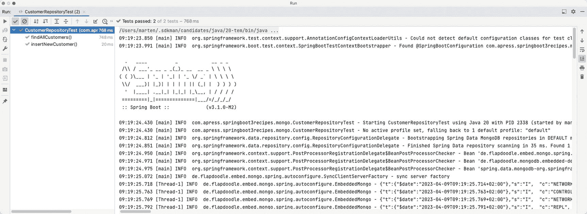

运行窗口的截图，包含两个窗格。左窗格列出了客户仓库测试下的文件。右窗格显示了一组 Spring Boot 中的程序日志，这些日志使用 Java 启动测试，引导数据，并列出嵌入式 MongoDB 的下载和启动。

图 6-5

使用 Flapdoodle 的测试输出

#### 使用 Testcontainers 测试 MongoDB 代码

另一种选择是使用 Testcontainers。Testcontainers 使用 Docker 为你的特定技术引导一个 Docker 容器。在这种情况下，我们可以使用 MongoDB Docker 镜像来启动一个真实的 MongoDB 实例，并在测试中使用它。这也为你提供了测试数据库迁移脚本（如果使用）的机会。当你结合使用 SQL 和 MongoDB 等不同技术时，这也很有用，因为你可以使用 Testcontainers 同时引导两者。

要使用 Testcontainers（此处用于 MongoDB），我们需要添加适当的依赖项（参见清单 6-66）。

```
org.springframework.boot
spring-boot-testcontainers

org.testcontainers
mongodb
test

org.testcontainers
junit-jupiter
test

清单 6-66
Testcontainers MongoDB 依赖项
```

接下来创建 `CustomerRepositoryTest`（清单 6-67）。

```
@Testcontainers
class CustomerRepositoryTest {
@Container
@ServiceConnection
static MongoDBContainer mongodb = new MongoDBContainer("mongo:6.0");
@Autowired
private CustomerRepository repository;
@BeforeEach
public void cleanUp() {
repository.deleteAll();
}
}
清单 6-67
使用 Testcontainers 的基于 MongoDB 的 CustomerRepository 测试
```

`@DataMongoTest` 通过一个特殊的 JUnit 扩展（`SpringExtension`）执行测试，以引导 Spring 测试上下文框架。现在，为了注册 Testcontainers 的特殊 JUnit 扩展，添加了 `@Testcontainers` 注解。此扩展会查找带有 `@Container` 注解的字段，并引导给定的容器。对于此测试，它是一个 `MongoDBContainer`，我们指示它使用 MongoDB 6.0 容器。Testcontainers 将负责下载此容器并启动一个实例，并在测试后将其停止。

由于每次测试的容器都会以不同的 URL 启动，我们需要将此信息告知我们的 Spring Boot 应用程序。为此，我们可以使用 `@ServiceConnection` 注解。这将自动将所需和必要的属性传递给容器。有关此内容的更多信息，请参见配方 2-3。

## 6-9\. 使用 R2DBC 访问数据

大多数 Java 开发人员都知道，或者至少听说过 JDBC API（参见本章开头）。然而，JDBC 本质上是阻塞的，在响应式编程环境中表现不佳。对于响应式编程和 SQL 数据库，有 R2DBC。这是由社区开发的一个底层响应式 API（或者更确切地说是 SPI）。多个数据库已经拥有基于此 SPI 的驱动程序实现，例如（但不限于）PostgreSQL、Oracle、MySQL 和 H2。

### 问题

你有一个响应式应用程序，但仍在使用关系型数据库。使用 JDBC 不是一个选项，因为它本质上是阻塞的。使用 R2DBC 以响应式方式访问你的数据库。

### 解决方案

Spring Boot 会（与 JDBC 一样）检测 R2DBC 和/或 Spring Data R2DBC 的存在，并且 `spring.r2dbc` 命名空间中的属性将用于连接到数据库。


### 工作原理

要使用 R2DBC，首先需要添加必需的依赖项：`r2dbc`、`spring-r2dbc` 和 `spring-data-r2dbc`。不过，为了简化操作，Spring Boot 提供了 `spring-boot-starter-r2dbc`，可以一次性引入所有这些依赖项（列表 6-68）。

```
org.postgresql
r2dbc-postgresql

列表 6-68
Spring Data R2DBC 启动器依赖项
```

它将使用 `spring.r2dbc` 命名空间中的属性来配置数据库连接（参见表 6-6 和表 6-7）。就像 JDBC 一样，这里使用的是 `spring.datasource` 命名空间。

表 6-7

R2DBC 连接池属性

| 属性 | 描述 |
| --- | --- |
| `spring.r2dbc.pool.enabled` | 设置是否启用 R2DBC 连接池；默认值为 `true`。 |
| `spring.r2dbc.pool.initial-size` | 设置要创建的初始连接数；默认值为 `10`。 |
| `spring.r2dbc.pool.max-acquire-time` | 设置从池中获取连接的最大等待时间；默认值为无限期。 |
| `spring.r2dbc.pool.max-create-connection-time` | 设置创建新连接的最大等待时间；默认值为无限期。 |
| `spring.r2dbc.pool.max-idle-time` | 设置连接在池中空闲的最大时间；默认值为 30 分钟。 |
| `spring.r2dbc.pool.max-life-time` | 设置连接的最大存活时间；默认值为无限期。 |
| `spring.r2dbc.pool.max-size` | 设置允许创建的最大连接数；默认值为 `10`。 |
| `spring.r2dbc.pool.validation-depth` | 设置验证深度，`LOCAL` 或 `REMOTE`；默认值为 `LOCAL`。 |
| `spring.r2dbc.pool.validation-query` | 设置用于验证连接健康状态的查询；默认值为 `null`。 |

表 6-6

R2DBC 连接属性

| 属性 | 描述 |
| --- | --- |
| `spring.r2dbc.url` | 设置数据库的 R2DBC URL。 |
| `spring.r2dbc.username` | 设置用于连接数据库的用户名。 |
| `spring.r2dbc.password` | 设置用于连接数据库的密码。 |
| `spring.r2dbc.name` | 设置如果 URL 中未指定时使用的数据库名称；默认值为 `testdb`。 |
| `spring.r2dbc.generate-unique-name` | 设置是否生成随机数据库名称。启用时忽略任何已配置的名称；默认值为 `false`。这在编写使用内存数据库的测试时非常有用。 |
| `spring.r2dbc.properties` | 设置额外的 R2DBC 驱动程序属性。 |

要连接数据库，我们至少需要设置 `spring.r2dbc.url`；它可以包含所有必要信息，例如数据库名称、用户名和密码。但通常 `spring.r2dbc.username` 和 `spring.r2dbc.password` 会单独传递。要连接到之前创建的数据库（参见技巧 6-2），我们需要列表 6-69 中所示的属性。

```
spring.r2dbc.url=r2dbc:postgresql://localhost:5432/customers
spring.r2dbc.username=customers
spring.r2dbc.password=customers
spring.sql.init.mode=always
列表 6-69
R2DBC 应用程序属性
```

这里你看到了用于连接数据库的 `spring.r2dbc` 属性，以及一个值为 `ALWAYS` 的 `spring.sql.init.mode` 属性。这是为了初始化数据库并插入一些数据（有关数据库初始化的更多信息，请参见技巧 6-2）。

为了操作数据库，我们使用一个仓库并为其创建不同的实现。列表 6-70 展示了 `CustomerRepository` 接口。

```
package com.apress.springboot3recipes.r2dbc;
import reactor.core.publisher.Flux;
import reactor.core.publisher.Mono;
public interface CustomerRepository {
Flux findAll();
Mono findById(long id);
Mono save(Customer customer);
}
列表 6-70
响应式 CustomerRepository 接口
```

这些方法分别返回 `Flux` 或 `Mono`，分别表示零个或多个或零个或一个，它们是 Project Reactor 中的响应式类型。Project Reactor 是 Spring 内部使用的响应式实现，但也可以使用 RxJava 或 SmallRye Mutiny。

接下来，我们需要一个使用此接口来检索客户并打印结果的类（列表 6-71）。

```
@Component
class CustomerLister implements ApplicationRunner {
private final Logger logger = LoggerFactory.getLogger(getClass());
private final CustomerRepository customers;
CustomerLister(CustomerRepository customers) {
this.customers = customers;
}
@Override
public void run(ApplicationArguments args) {
customers.findAll()
.subscribe( (customer) -> logger.info("{}", customer));
}
}
列表 6-71
响应式客户列表输出器
```

这个 `CustomerLister` 实例将使用 `CustomerRepository` 接口调用 `findAll` 方法，并将结果打印到控制台（参见图 6-4）。

最后，我们需要一个引导类来运行代码（列表 6-72）。

```
package com.apress.springboot3recipes.r2dbc;
import org.slf4j.Logger;
import org.slf4j.LoggerFactory;
import org.springframework.boot.ApplicationArguments;
import org.springframework.boot.ApplicationRunner;
import org.springframework.boot.SpringApplication;
import org.springframework.boot.autoconfigure.SpringBootApplication;
import org.springframework.core.annotation.Order;
import org.springframework.r2dbc.core.DatabaseClient;
import org.springframework.stereotype.Component;
@SpringBootApplication
public class R2dbcApplication {
public static void main(String[] args) throws Exception {
SpringApplication.run(R2dbcApplication.class, args);
System.in.read();
}
}
列表 6-72
Spring Boot 应用程序
```

这个 Spring Boot 应用程序将检测 `CustomerRepository` 的实现（参见后续章节），将其注入到 `CustomerLister` 中，并作为 `ApplicationRunner` 实例执行。由于我们有一个响应式应用程序，并且没有东西让它保持运行，因此我们需要一些措施来防止关闭。为此，我们可以使用 `System.in.read()` 方法。这将暂停关闭过程，直到你按下回车键。


#### 使用 DatabaseClient

当 Spring Boot 检测到 `spring-r2dbc` 时，它会自动将 `DatabaseClient` 作为 bean 添加到应用程序中。访问数据库最基本的方式就是使用这个预配置好的 `DatabaseClient`，它来自 `spring-r2dbc`，而 `spring-r2dbc` 是 Spring 框架的一部分。借助这个 `DatabaseClient`，你可以创建 `CustomerRepository` 的实现（清单 6-73）。

```
package com.apress.springboot3recipes.r2dbc;
import io.r2dbc.spi.Readable;
import org.springframework.r2dbc.core.DatabaseClient;
import org.springframework.stereotype.Repository;
import reactor.core.publisher.Flux;
import reactor.core.publisher.Mono;
@Repository
class R2dbcCustomerRepository implements CustomerRepository {
private static final String ALL_QUERY = "SELECT id, name, email FROM customer";
private static final String BY_ID_QUERY =
"SELECT id, name, email FROM customer WHERE id=:id";
private static final String INSERT_QUERY =
"INSERT INTO customer (name, email) VALUES (:name, :email)";
private final DatabaseClient client;
R2dbcCustomerRepository(DatabaseClient client) {
this.client = client;
}
@Override
public Flux findAll() {
return client.sql(ALL_QUERY)
.map(this::toCustomer)
.all();
}
@Override
public Mono findById(long id) {
return client.sql(BY_ID_QUERY)
.bind("id", id)
.map(this::toCustomer)
.one();
}
@Override
public Mono save(Customer customer) {
var result = client.sql(INSERT_QUERY)
.filter( (s) -> s.returnGeneratedValues("id"))
.bind("name", customer.name())
.bind("email", customer.email())
.map( (row) -> row.get("id", Long.class))
.first();
return result
.map((id) -> new Customer(id, customer.name(), customer.email()));
}
private Customer toCustomer(Readable row) {
var id = row.get(0, Long.class);
var name = row.get(1, String.class);
var email = row.get(2, String.class);
return new Customer(id, name, email);
}
}
清单 6-73 使用 DatabaseClient 的响应式 CustomerRepository 实现
```

`R2dbcCustomerRepository` 使用 `DatabaseClient` 来执行查询、映射结果并返回。通过 `sql` 方法，我们可以指定要执行的 SQL 查询。使用 `map`，我们可以将结果转换为可用的对象，例如 `Customer`。在 `findAll` 方法中，我们执行查询以从数据库中检索所有数据，并将结果 `map` 为 `Customer`。这里使用的 `map` 方法接受一个 `Function`，它将 `io.r2dbc.spi.Readable`（`Row` 正是此类型）映射为另一个元素。`all()` 方法指示 `DatabaseClient` 我们可能返回 0 个或多个结果，因此它将创建一个 `Flux`。`findById` 执行一个查询，但首先使用 `bind` 来填充查询中的 `:id` 属性；然后我们映射结果。`one()` 方法指示 `DatabaseClient` 返回 0 个或 1 个结果；如果得到多个结果，则会抛出错误。

`save` 方法稍微复杂一些，因为我们需要获取 `id`；我们可以使用 `filter` 方法来修改 `io.r2dbc.spi.Statement` 并指示它返回生成的键。接下来，我们需要绑定 `:name` 和 `:email` 属性。使用 `first()` 我们可以获取返回的第一个结果。在这种情况下，我们也可以使用 `one()`。由于我们得到一个 `Mono<Long>`，其中包含 `Customer` 的生成 ID，我们可以使用 `map` 方法来指示它使用该 ID 和给定的 `Customer` 创建一个新的 `Customer` 进行保存。

#### 使用 R2dbcEntityTemplate

当在类路径上检测到 Spring Data R2DBC 时，Spring Boot 除了 `DatabaseClient` 之外，还会自动准备一个 `R2dbcEntityTemplate` 实例。`R2dbcEntityTemplate` 是 `DatabaseClient` 的一个包装器，旨在简化数据库实体的操作（清单 6-74）。

```
package com.apress.springboot3recipes.r2dbc;
import static org.springframework.data.relational.core.query.Criteria.where;
import org.springframework.data.r2dbc.core.R2dbcEntityTemplate;
import org.springframework.data.relational.core.query.Query;
import org.springframework.stereotype.Repository;
import reactor.core.publisher.Flux;
import reactor.core.publisher.Mono;
@Repository
class R2dbcCustomerRepository implements CustomerRepository {
private final R2dbcEntityTemplate template;
R2dbcCustomerRepository(R2dbcEntityTemplate template) {
this.template = template;
}
@Override
public Flux findAll() {
return template.select(Customer.class).all();
}
@Override
public Mono findById(long id) {
return template
.selectOne(Query.query(where("id").is(id)), Customer.class);
}
@Override
public Mono save(Customer customer) {
return template.insert(customer);
}
}
清单 6-74 使用 R2dbcEntityTemplate 的响应式 CustomerRepository 实现
```

使用 `R2dbcEntityTemplate` 的 `R2dbcCustomerRepository` 比使用 `DatabaseClient` 实例的版本要简单一些。从数据库到 `Customer` 的映射以及插入操作的绑定都是自动完成的。`findById` 方法仍然有些复杂，因为我们需要为查询指定 `where` 子句。为了简化查询编写，Spring Data R2DBC 包含一个查询构建器。这里我们指定了对 `id` 列的限制。

从/到数据库列的映射是基于 `Customer` 类上的元数据完成的。这是可选的。默认情况下，它会使用类名 `Customer`（首字母小写）作为表名 `customer`。如果要使用不同的表，可以通过 `@Table` 注解来指定。对于列名到字段名的映射，情况类似：它会直接使用字段名作为列名；如果需要其他名称，可以通过 `@Column` 注解来指定。数据库记录通常也需要一个主键。如果类有一个名为 `id` 的字段，它将自动被用作主键。如果要使用其他字段，或者想明确指定，可以用 `@Id` 注解该字段（或多个字段）（参见清单 6-75）。

```
package com.apress.springboot3recipes.r2dbc;
import org.springframework.data.annotation.Id;
import org.springframework.data.relational.core.mapping.Column;
import org.springframework.data.relational.core.mapping.Table;
@Table("customer")
public record Customer(@Column("id") @Id Long id,
@Column("name") String name,
@Column("email") String email) {
}
清单 6-75 用于 R2DBC 的 Customer 类
```

#### 使用 R2dbcRepository

除了使用 Spring Data R2DBC 编写实现之外，你还可以使用动态实现（就像使用 Spring Data JPA 一样）。对于 R2DBC 的情况，你只需根据需求扩展 `ReactiveCrudRepository`、`ReactiveSortingRepository` 或 `R2dbcRepository` 即可（清单 6-76）。

```
package com.apress.springboot3recipes.r2dbc;
import org.springframework.data.r2dbc.repository.R2dbcRepository;
import reactor.core.publisher.Flux;
import reactor.core.publisher.Mono;
public interface CustomerRepository
extends R2dbcRepository {
}
清单 6-76 使用 Spring Data 仓库的响应式 CustomerRepository
```

由于 Spring Boot 会自动检测 Spring Data R2DBC 的存在，它会自动识别此接口并为其创建一个动态 bean，供我们的应用程序使用。输出结果将类似于图 6-4 所示。

## 6-10. 使用 Spring Data R2DBC 进行测试

### 问题

你想使用单元测试或小型集成测试来测试基于 R2DBC 的仓库。

### 解决方案

使用 Spring 测试上下文框架和 Spring Boot 测试支持，通过嵌入式容器（如 Apache Derby）编写单元测试，或者使用 Testcontainers 编写专门的集成测试。


### 工作原理

在测试 R2DBC 代码时，需要用到数据库。通常使用 H2、Derby 或 HSQLDB 等嵌入式数据库进行测试。Spring Boot 让编写 R2DBC 测试变得简单。基于 R2DBC 的测试可以使用 `@DataR2JpaTest` 注解，Spring Boot 将创建一个仅包含 R2DBC 相关 Bean 的最小化应用程序。这些 R2DBC 相关的 Bean 包括 `ConnectionFactory`、事务管理器，以及（如果需要的话）Spring Data R2DBC 仓库。

#### 使用嵌入式数据库测试 R2DBC 代码

我们来为 `CustomerRepository` 编写一个测试，并使用 H2 作为嵌入式数据库。首先，将 H2 添加为测试依赖项（清单 6-77）。

```
io.r2dbc
r2dbc-h2
test

清单 6-77
用于测试的响应式 H2 依赖项
```

如你所见，这不仅仅是 H2 依赖项，而是 `r2dbc-h2` 依赖项（它会拉取 H2 数据库）。此依赖项是 H2 常规 JDBC 驱动对应的响应式版本。

接下来创建 `CustomerRepositoryTest`（清单 6-78）。

```
@DataR2dbcTest
@TestPropertySource(properties =
{ "spring.r2dbc.url=r2dbc:h2:mem://testdb",
"spring.r2dbc.generate-unique-name=true" })
@Import(R2dbcCustomerRepository.class)
class CustomerRepositoryTest {
@Autowired
private CustomerRepository repository;
@Autowired
private DatabaseClient db;
@BeforeEach
public void setup() {
db.sql("DELETE FROM customer").fetch().first().subscribe();
}
}
清单 6-78
CustomerRepositoryTest 类
```

`@DataR2dbcTest` 注解通过一个特殊的 JUnit 扩展（`SpringExtension`）来执行测试，以引导 Spring 测试上下文框架。`@DataR2dbcTest` 注解会设置 Spring Data R2DBC（如果需要），并启用所有其他 R2DBC 功能。使用 `@TestPropertySource`，我们提供了 `spring.r2dbc.url`，指向一个 H2 内存数据库，并将 `spring.r2dbc.generate-unique-name` 设置为 `true`。由于我们要测试仓库，因此添加了 `@Import(R2dbcCustomerRepository.class)`。在 `@BeforeEach` 中，我们清理数据库，以防止一个测试干扰另一个测试。

提示

当使用基于 Spring Data R2DBC 的仓库时，你不需要 `@Import`，因为仓库会被自动检测到。

现在编写一个测试，验证记录是否正确插入（清单 6-79）。

```
@Test
void insertNewCustomer() {
var newCustomer = new Customer("T. Testing", "t.testing@test123.tst");
repository.save(newCustomer)
.as(StepVerifier::create)
.assertNext( (c) -> assertThat(c.id()).isNotNull())
.verifyComplete();
}
清单 6-79
CustomerRepository 插入新客户测试
```

通过调用 `CustomerRepository` 上的 `save` 方法，将一个 `Customer` 实例添加到数据库中。验证生成的 `Customer` 实例是否具有 ID，并确认响应式管道是否已完成。

你可以添加的另一个测试是 `findAll` 方法。当插入两条记录时，调用 `findAll` 应检索到两条记录（清单 6-80）。

```
@Test
void findAllCustomers() {
var customers = Flux.just(
new Customer("T. Testing1", "t.testing@test123.tst"),
new Customer("T. Testing2", "t.testing@test123.tst"));
customers.doOnNext(repository::save)
.as(StepVerifier::create)
.expectNextCount(2)
.verifyComplete();
}
清单 6-80
CustomerRepository 查找所有测试
```

当然，还可以有更多断言，但保存数据的操作已在另一个测试方法中得到验证。

#### 使用 Testcontainers 测试 Spring Data R2DBC 代码

如今更好的选择是使用 Testcontainers。Testcontainers 使用 Docker 为你的特定技术启动一个 Docker 容器。在这种情况下，我们可以使用 PostgreSQL Docker 镜像来启动一个真实的数据库，并在测试中使用它。这样，你现在就可以使用实际的数据库进行测试，而无需使用内存版本，这意味着你可以执行所有想要的查询并对其进行测试。它还为你提供了测试数据库迁移脚本（如果使用的话）的机会。

要使用 Testcontainers（此处针对 PostgreSQL），我们需要添加相应的依赖项（参见清单 6-81）。我们需要 Testcontainers 的 PostgreSQL 依赖项、JUnit Jupiter 依赖项以及一个专门用于 R2DBC 的依赖项。

```
org.springframework.boot
spring-boot-testcontainers
test

org.testcontainers
postgresql
test

org.testcontainers
r2dbc
test

清单 6-81
用于 PostgreSQL 和 JUnit Jupiter 的 Testcontainers 依赖项
```

现在编写一个测试，验证记录是否正确插入到我们的实际 PostgreSQL 数据库中（参见清单 6-82）。

```
@Import(R2dbcCustomerRepository.class)
@Testcontainers
class CustomerRepositoryTest {
@Container
@ServiceConnection
static PostgreSQLContainer postgres = new PostgreSQLContainer("postgres:15-alpine");
@Autowired
private CustomerRepository repository;
清单 6-82
用于 Testcontainers 的 CustomerRepositoryTest 测试设置
```

`@DataR2dbcTest` 注解通过一个特殊的 JUnit 扩展（`SpringExtension`）来执行测试，以引导 Spring 测试上下文框架。现在，为了注册 Testcontainers 的特殊 JUnit 扩展，添加了 `@Testcontainers` 注解。此扩展会查找带有 `@Container` 注解的字段，并启动相应的容器。对于此测试，它是一个 `PostgreSQLContainer`，我们指示它使用 PostgreSQL 15 Docker 容器。Testcontainers 将负责下载此容器，启动一个实例，并在测试后停止它。

由于每个测试的容器都会以不同的 URL 启动，我们需要将此信息告知我们的 Spring Boot 应用程序。为此，我们可以使用 `@ServiceConnection` 注解。这是一个 Spring Boot 测试支持注解，它根据应用程序中的此容器实例注册所需的属性。诸如 `spring.r2dbc.url` 等属性会自动为测试添加。也可以使用静态方法上的 `@DynamicPropertySource` 注解手动完成此操作（另请参见配方 2-3）。

有了这些，我们现在可以编写一些测试来验证我们的行为（清单 6-83）。

```
@Test
void insertNewCustomer() {
var newCustomer = new Customer("T. Testing", "t.testing@test123.tst");
repository.save(newCustomer)
.as(StepVerifier::create)
.assertNext( (c) -> assertThat(c.id()).isNotNull())
.verifyComplete();
}
@Test
void findAllCustomers() {
var customers = Flux.just(
new Customer("T. Testing1", "t.testing@test123.tst")
,new Customer("T. Testing2", "t.testing@test123.tst"));
customers.flatMap(repository::save)
.as(StepVerifier::create)
.expectNextCount(2)
.verifyComplete();
repository.findAll()
.count()
.as(StepVerifier::create)
.expectNext(6L)
.verifyComplete();
}
清单 6-83
使用 Testcontainers 的 CustomerRepositoryTest 测试
```

这些测试与嵌入式数据库使用的测试或多或少相似；但是，这里我们的数据库中已经有一些额外的数据，我们必须在测试中考虑到这一点。这取决于你的数据库迁移脚本是什么样的。如果它生成一个空模式，则无需更改测试。


