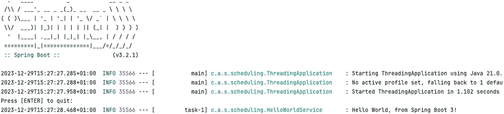
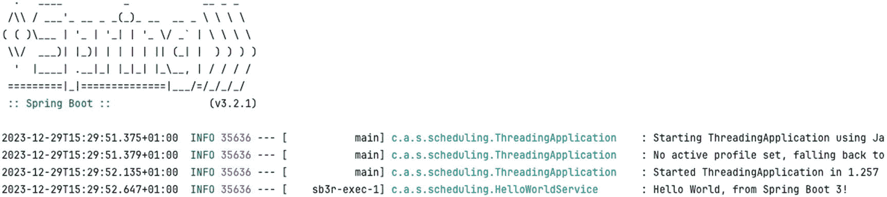
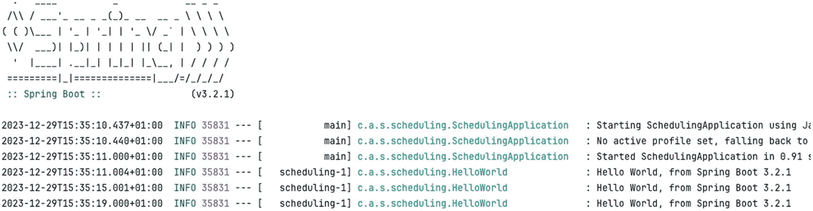
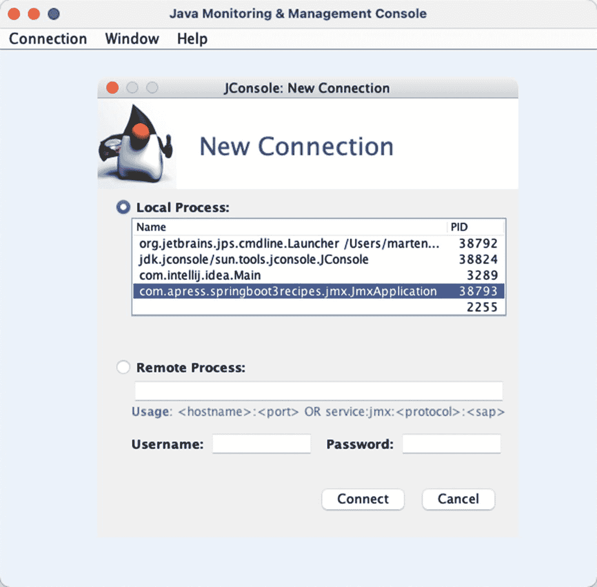
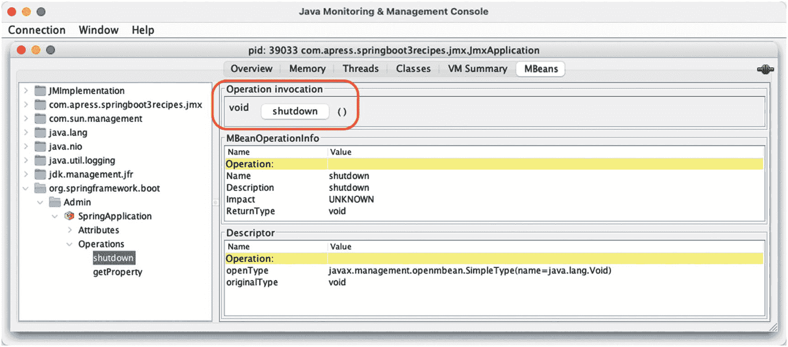
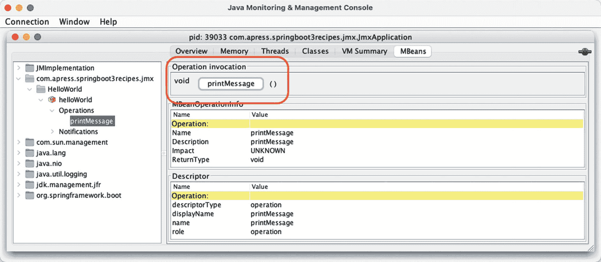
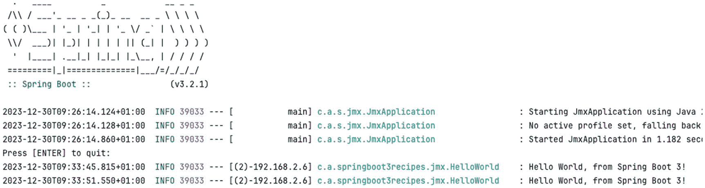
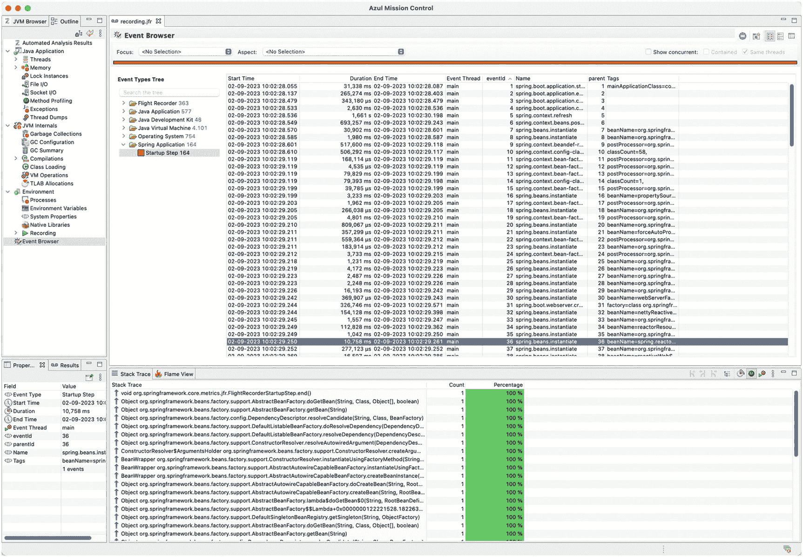
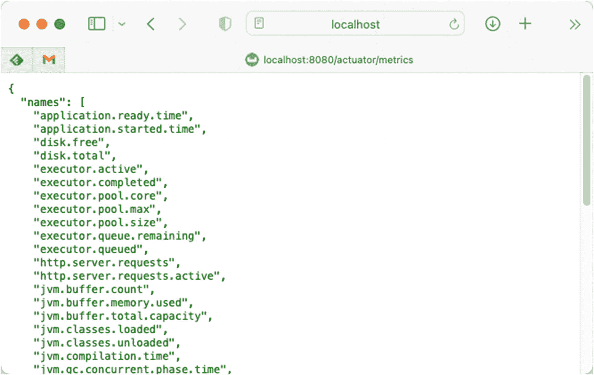
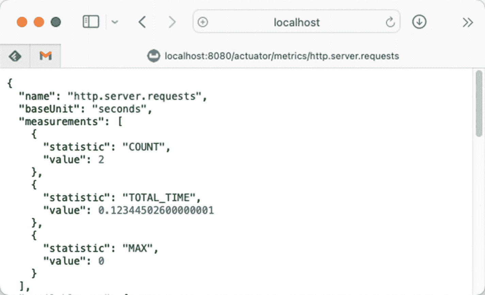

# 7. Java 企业级服务

在本章中，你将学习 Spring Boot 对最常见 Java 企业级服务的支持：使用 Java 管理扩展（JMX）、通过 Jakarta Mail 发送电子邮件以及任务调度。

JMX 是 Java SE 的一部分，是一种用于管理和监控系统资源（如设备、应用程序、对象和服务驱动型网络）的技术。这些资源以托管 Bean（MBean）的形式表示。Spring 通过将任意 Bean 导出为模型 MBean 来支持 JMX，而无需针对 JMX API 进行编程。

Jakarta Mail 是 Java 中用于发送电子邮件的标准 API 和实现。Spring 进一步提供了一个抽象层，以独立于实现的方式发送电子邮件，并且 Spring Boot 在检测到时会自动添加配置。

在 Java 平台上进行任务调度主要有两种选择：JDK Timer 和 Quartz Scheduler。JDK Timer 提供了与 JDK 捆绑的简单任务调度功能。与 JDK Timer 相比，Quartz 提供了更强大的作业调度功能。对于这两种选择，Spring 都提供了工具类，用于在 Bean 配置文件中配置调度任务，而无需直接使用任一 API。

我们还将介绍如何使用 Java Flight Recorder 以及 Micrometer API 来深入了解应用程序的行为和使用情况。

## 7-1. 配置 Spring 异步处理

### 问题

你想要异步调用一个包含长时间运行方法的方法。

### 解决方案

Spring 支持配置 `TaskExecutor`，并能够异步执行带有 `@Async` 注解的方法。这可以以一种透明的方式完成，无需进行异步执行的常规设置。然而，Spring Boot 不会自动检测异步方法执行的需求。必须使用 `@EnableAsync` 配置注解来启用此支持。

### 工作原理

让我们编写一个组件，以异步方式向控制台打印一些内容。参见清单 7-1。

```
package com.apress.springboot3recipes.scheduling;
import org.slf4j.Logger;
import org.slf4j.LoggerFactory;
import org.springframework.scheduling.annotation.Async;
import org.springframework.stereotype.Component;
@Component
public class HelloWorldService {
private final Logger logger = LoggerFactory.getLogger(getClass());
@Async
public void printMessage() {
try {
Thread.sleep(500);
} catch (InterruptedException ex) {
Thread.currentThread().interrupt();
}
logger.info("Hello World, from Spring Boot 3!");
}
}
清单 7-1
简单的 HelloWorldService
```

该类将等待 500 毫秒，然后向日志记录器打印内容。方法上的 `@Async` 注解表明该方法将以异步方式执行。但是，必须为 Spring Boot 应用程序显式启用此支持。

要启用异步处理，需要使用 `@EnableAsync` 配置注解。最简单的解决方案是将此注解添加到你的应用程序类中。参见清单 7-2。

```
package com.apress.springboot3recipes.scheduling;
import org.springframework.boot.ApplicationRunner;
import org.springframework.boot.SpringApplication;
import org.springframework.boot.autoconfigure.SpringBootApplication;
import org.springframework.context.annotation.Bean;
import org.springframework.scheduling.annotation.EnableAsync;
import java.io.IOException;
@SpringBootApplication
@EnableAsync
public class ThreadingApplication {
public static void main(String[] args) throws IOException {
SpringApplication.run(ThreadingApplication.class, args);
System.out.println("Press [ENTER] to quit:");
System.in.read();
}
@Bean
public ApplicationRunner startupRunner(HelloWorldService hello) {
return (args) -> hello.printMessage();
}
}
清单 7-2
启用异步处理的 Spring Boot 应用程序
```

`@EnableAsync` 注解会注册异步执行方法所需的组件，以及检测带有 `@Async` 注解的方法。如果未显式配置，Spring Boot 将添加一个 `TaskExecutor`。

抽象符号表示信息。 `System.in.read` 在此处用于防止应用程序关闭，以便后台任务能够完成处理。当你按下 Enter 键时，程序将退出。通常在开发 Web 应用程序时，你不需要这样的东西。

运行应用程序时，输出将类似于图 7-1。



一组代码。它展示了一个没有设置活动配置文件的线程应用程序，并且使用 Enter 键退出程序。

图 7-1

异步执行输出


#### 配置 TaskExecutor

默认情况下，Spring Boot 会使用 `ThreadPoolTaskExecutor` 来运行异步任务。这可以通过 `spring.task.execution` 命名空间下的属性进行配置（见表 7-1），除非 `spring.threads.virtual.enabled` 被设置为 `true`，在这种情况下，它将使用一个配置为创建虚拟线程（在 Java 21 中可用）的 `SimpleAsyncTaskExecutor`。

表 7-1

任务属性

| 属性 | 描述 |
| --- | --- |
| `spring.task.execution.thread-name-prefix` | 设置线程的前缀；默认值为 `task-`。 |
| `spring.task.execution.pool.core-size` | 设置要创建的默认线程数；默认值为 8。 |
| `spring.task.execution.pool.max-size` | 设置要创建的最大线程数；默认值为 `Integer.MAX_VALUE`。 |
| `spring.task.execution.pool.allow-core-thread-timeout` | 允许核心线程超时；启用线程池的扩容和缩容。默认值为 `true`。 |
| `spring.task.execution.pool.keep-alive` | 设置线程在被终止前的空闲时间限制。默认值为 60 秒。 |
| `spring.task.execution.pool.queue-capacity` | 设置任务队列容量。默认值为 `Integer.MAX_VALUE`。仅当队列达到其容量时，才会创建新线程。使用无界队列将有效地忽略 `max-size` 属性。 |
| `spring.task.execution.shutdown.await-termination` | 设置任务执行器是否应在关闭时等待任务完成；默认值为 `false`。 |
| `spring.task.execution.shutdown.await-termination-period` | 设置等待任务完成的时间。 |
| `spring.threads.virtual.enabled` | 设置我们是使用虚拟线程还是平台线程。默认值为 `false`。 |

这些属性可用于配置由 Spring Boot 管理的 `TaskExecutor`。如图 7-1 所示，默认线程名称以 `task-` 为前缀，因为这是默认值。让我们在 `application.properties` 文件中添加 `spring.task.execution.thread-name-prefix` 属性，其值为 `sb3r-exec-`。当同时配置 `spring.task.execution.shutdown.await-termination` 时，我们可以移除 `System.in.read()`，因为现在 Spring Boot 会等待任务完成。参见清单 7-3。

```
spring.task.execution.thread-name-prefix=sb3r-exec-
spring.task.execution.shutdown.await-termination=true
spring.task.execution.shutdown.await-termination-period=45S
清单 7-3
Spring 任务应用属性
```

设置好属性后，您可以看到线程名称已更改为 `sb3r-exec-1`，如图 7-2 所示。



一组代码。它展示了线程应用程序，并且线程名称已更改为 s b 3 r hyphen exec hyphen 1。

图 7-2

异步执行输出

如果由于某种原因，您的应用程序中存在多个 `TaskExecutor` 实例，您需要将其中一个标记为 `@Primary` 以用作默认的 `TaskExecutor`，或者使用 `AsyncConfigurer` 接口并实现 `taskExecutor` 方法来返回要使用的 `TaskExecutor`。参见清单 7-4。

```
package com.apress.springboot3recipes.scheduling;
import org.springframework.boot.ApplicationRunner;
import org.springframework.boot.SpringApplication;
import org.springframework.boot.autoconfigure.SpringBootApplication;
import org.springframework.context.annotation.Bean;
import org.springframework.core.task.VirtualThreadTaskExecutor;
import org.springframework.scheduling.annotation.AsyncConfigurer;
import org.springframework.scheduling.annotation.EnableAsync;
import java.io.IOException;
import java.util.concurrent.Executor;
@SpringBootApplication
@EnableAsync
public class ThreadingApplication implements AsyncConfigurer {
public static void main(String[] args) throws IOException {
SpringApplication.run(ThreadingApplication.class, args);
System.out.println("Press [ENTER] to quit:");
System.in.read();
}
@Bean
public VirtualThreadTaskExecutor taskExecutor() {
return new VirtualThreadTaskExecutor();
}
@Override
public Executor getAsyncExecutor() {
return taskExecutor();
}
@Bean
public ApplicationRunner startupRunner(HelloWorld hello) {
return (args) -> hello.printMessage();
}
}
清单 7-4
使用 AsyncConfigurer 显式配置的执行器
```

## 7-2\. 配置 Spring 任务调度

### 问题

您希望以一致的方式调度方法调用，可以使用 cron 表达式、固定间隔或固定速率。

### 解决方案

Spring 支持配置 `TaskExecutor` 和 `TaskScheduler`。此功能与使用 `@Scheduled` 注解调度方法执行的能力相结合，使得 Spring 的调度支持以最少的麻烦工作：您所需要的只是一个方法和一个注解，并且需要开启注解扫描器。Spring Boot 不会自动检测调度的需求，因此您需要使用 `@EnableScheduling` 注解自行启用它。


### 工作原理

让我们编写一个组件，每隔四秒向日志打印一条消息。创建一个 Java 类，并在方法上使用 `@Scheduled` 注解来指示该方法需要被调用。当使用 `fixedRate=4000` 作为参数时，它将每四秒运行一次。如果你想使用 cron 表达式，可以在 `@Scheduled` 注解上设置 `cron` 属性。

```
package com.apress.springboot3recipes.scheduling;
import org.slf4j.Logger;
import org.slf4j.LoggerFactory;
import org.springframework.boot.SpringBootVersion;
import org.springframework.scheduling.annotation.Scheduled;
import org.springframework.stereotype.Component;
@Component
public class HelloWorld {
private static final Logger logger = LoggerFactory.getLogger(HelloWorld.class);
@Scheduled(fixedRate = 4000L)
public void printMessage() {
logger.info("Hello World, from Spring Boot {}", SpringBootVersion.getVersion());
}
}
```

`@Component` 注解将确保它被 Spring Boot 检测到。

接下来要做的是为你的应用程序启用调度功能。最简单的解决方案是在应用程序类上添加 `@EnableScheduling` 注解。当然，你也可以将其放在其他带有 `@Configuration` 注解的类上。

```
package com.apress.springboot3recipes.scheduling;
import org.springframework.boot.SpringApplication;
import org.springframework.boot.autoconfigure.SpringBootApplication;
import org.springframework.scheduling.annotation.EnableScheduling;
@SpringBootApplication
@EnableScheduling
public class SchedulingApplication {
public static void main(String[] args) {
SpringApplication.run(SchedulingApplication.class, args);
}
}
```

`@EnableScheduling` 注解将启用对 `@Scheduled` 注解方法的检测，并注册一个 `TaskScheduler` 用于调度任务。当在应用程序上下文中检测到单个 `TaskScheduler` 时，它将使用该调度器，而不是创建一个新的。

运行 `SchedulingApplication` 将在大约每四秒在日志中输出一次结果（图 7-3）。



一组代码。其中展示了带有 `@Scheduled` 注解的方法以及使用调度应用程序的任务调度器。

图 7-3

调度执行输出

除了使用 `@Scheduled` 注解，你也可以使用 Java 来调度一个方法。如果你无法在你想要定期执行的方法上放置 `@Scheduled` 注解，或者只是想减少注解的数量，你可能会这样做。为此，你可以使用 `SchedulingConfigurer`，它有一个用于配置额外任务的单一回调方法。

```
package com.apress.springboot3recipes.scheduling;
import org.springframework.beans.factory.annotation.Autowired;
import org.springframework.boot.SpringApplication;
import org.springframework.boot.autoconfigure.SpringBootApplication;
import org.springframework.scheduling.annotation.EnableScheduling;
import org.springframework.scheduling.annotation.SchedulingConfigurer;
import org.springframework.scheduling.config.ScheduledTaskRegistrar;
import java.time.Duration;
@SpringBootApplication
@EnableScheduling
public class SchedulingApplication implements SchedulingConfigurer {
@Autowired
private HelloWorld helloWorld;
public static void main(String[] args) {
SpringApplication.run(SchedulingApplication.class, args);
}
@Override
public void configureTasks(ScheduledTaskRegistrar taskRegistrar) {
taskRegistrar.addFixedRateTask(
() -> helloWorld.printMessage(), Duration.ofSeconds(4));
}
}
```

此应用程序的输出与图 7-3 中所示相同。

## 7-3\. 发送电子邮件

当在类路径上检测到邮件属性和 Java 邮件库时，Spring Boot 将自动配置发送邮件的能力。在本节中，我们将了解如何设置属性以及如何使用 Spring Boot 发送电子邮件。

### 问题

你想使用标准的 Jakarta Mail API 从 Spring Boot 应用程序发送电子邮件。

### 解决方案

Spring 的邮件支持通过提供一个抽象且与实现无关的 API 来发送电子邮件，从而简化了邮件发送过程。Spring 邮件支持的核心接口是 `MailSender`。`JavaMailSender` 接口是 `MailSender` 的子接口，它包含了专门的 JavaMail 特性，例如多用途互联网邮件扩展（MIME）支持。要发送包含 HTML 内容、内嵌图片或附件的电子邮件，你必须将其作为 MIME 消息发送。当在类路径上找到 `jakarta.mail` 类并且设置了相应的 `spring.mail` 属性时，Spring Boot 将自动配置 `JavaMailSender`。

### 工作原理

首先要做的是将 `spring-boot-starter-mail` 依赖项添加到你的依赖项列表中。这会将必要的 `jakarta.mail` 以及 `spring-context` 依赖项添加到类路径中。

```
org.springframework.boot
spring-boot-starter-mail

```

#### 配置 JavaMailSender

为了能够发送邮件，你需要配置相应的 `spring.mail` 属性；请参见表 7-2。`spring.mail.host` 属性是必需的；其他属性是可选的。

表 7-2

邮件属性

| 属性 | 描述 |
| --- | --- |
| `spring.mail.host` | SMTP 服务器主机 |
| `spring.mail.port` | SMTP 服务器端口（默认 25） |
| `spring.mail.username` | 用于连接 SMTP 服务器的用户名 |
| `spring.mail.password` | 用于连接 SMTP 服务器的密码 |
| `spring.mail.protocol` | SMTP 服务器使用的协议（默认 `smtp`） |
| `spring.mail.test-connection` | 在启动时测试 SMTP 服务器是否可用（默认 `false`） |
| `spring.mail.default-encoding` | MIME 消息使用的编码（默认 `UTF-8`） |
| `spring.mail.properties` | 要在 JavaMail Session 上设置的附加属性 |
| `spring.mail.jndi-name` | JavaMail Session 的 JNDI 名称；当部署到具有预配置 JavaMail Session 的 JEE 服务器时可以使用 |

接下来，你至少需要定义 `spring.mail.host` 属性才能发送邮件。

```
spring.mail.host=localhost
spring.mail.port=3025
```

一个抽象图形展示了信息符号。 本节的代码使用 GreenMail 作为 SMTP 服务器。可以使用 `bin` 目录中的 `smtp.sh` 脚本来运行配置好的实例。默认情况下，它会在端口 3025 上暴露一个 SMTP 服务器。


#### 发送纯文本邮件

添加了相关依赖和 `spring.mail` 属性后，Spring Boot 会将一个预配置的 `JavaMailSenderImpl` 作为 Bean 添加到 `ApplicationContext` 中。该 Bean 可以通过 `@Autowired` 字段、构造函数，或者像此处所示，在 `@Bean` 注解的方法中通过依赖注入的方式，自动装配到组件中。参见清单 7-5。

```
package com.apress.springboot3recipes.mailsender;
import org.springframework.boot.ApplicationRunner;
import org.springframework.boot.SpringApplication;
import org.springframework.boot.autoconfigure.SpringBootApplication;
import org.springframework.context.annotation.Bean;
import org.springframework.mail.javamail.JavaMailSender;
import org.springframework.mail.javamail.MimeMessageHelper;
@SpringBootApplication
public class MailSenderApplication {
public static void main(String[] args) {
SpringApplication.run(MailSenderApplication.class, args);
}
@Bean
public ApplicationRunner startupMailSender(JavaMailSender mailSender) {
return (args) -> mailSender.send((msg) -> {
var helper = new MimeMessageHelper(msg);
helper.setTo("recipient@some.where");
helper.setFrom("spring-boot-3-recipes@apress.com");
helper.setSubject("Status message");
helper.setText("All is well.");
});
}
}
清单 7-5
发送邮件的 SpringBootApplication
```

`MailSenderApplication` 会在应用程序启动完成后发送一封邮件。`startupMailSender` 是一个 `ApplicationRunner`（参见第 2 章），它使用预配置的 `JavaMailSender` 来发送邮件消息。

#### 测试邮件发送

为了测试这一点，我们可以使用 GreenMail 的 JUnit5 支持来启动一个 SMTP 服务器。为此，你需要在依赖列表中添加 `greenmail-junit5` 依赖。参见清单 7-6。

```
com.icegreen
greenmail-junit5
2.0.1
test

清单 7-6
GreenMail JUnit5 依赖
```

接下来，我们可以使用 `@SpringBootTest` 注解来启动我们的应用程序。编写的应用程序会在启动后发送一条消息，因此在测试中我们可以验证这一点是否发生。参见清单 7-7。

```
package com.apress.springboot3recipes.mailsender;
import com.icegreen.greenmail.junit5.GreenMailExtension;
import com.icegreen.greenmail.util.ServerSetupTest;
import jakarta.mail.Message;
import jakarta.mail.internet.InternetAddress;
import jakarta.mail.internet.MimeMessage;
import org.junit.jupiter.api.Test;
import org.junit.jupiter.api.extension.RegisterExtension;
import org.springframework.boot.test.context.SpringBootTest;
import static org.assertj.core.api.Assertions.assertThat;
@SpringBootTest
class MailSenderApplicationTest {
@RegisterExtension
static GreenMailExtension greenMail = new GreenMailExtension(ServerSetupTest.ALL)
.withPerMethodLifecycle(false);
@Test
void shouldHaveSendMail() throws Exception {
MimeMessage[] receivedMessages = greenMail.getReceivedMessages();
assertThat(receivedMessages).hasSize(1);
assertThat(receivedMessages[0].getSubject())
.isEqualTo("Status message");
assertThat(receivedMessages[0]
.getRecipients(Message.RecipientType.TO))
.contains(new InternetAddress("recipient@some.where"));
}
}
清单 7-7
邮件发送应用程序的测试
```

测试首先启动 GreenMail 测试邮件服务器；这是通过使用 `@RegisterExtension` 注解作为 JUnit5 扩展来完成的。`ServerSetupTest.ALL` 会启动所有可用的邮件协议，例如 IMAP、POP3、SMTP 等，并暴露相应的端口。

一个抽象符号表示信息。 此处需要 `withPerMethodLifecycle(false)`，因为我们在启动时发送邮件。如果不指定此项，邮件服务器将按测试方法启动和停止，这意味着应用程序会因为找不到邮件服务器而启动失败。

在测试方法中，我们可以验证是否收到了消息，并使用 AssertJ 验证它是否是我们期望接收的消息。当然，这也适用于其他或更大的用例。

#### 使用 Thymeleaf 作为邮件模板

Spring Boot 对使用 Thymeleaf 作为模板解决方案提供了很好的支持；然而，默认设置主要用于将 Thymeleaf 用于网页。不过，也可以将 Thymeleaf 用于其他模板解决方案，例如这里的邮件。

首先，添加 `spring-boot-starter-thymeleaf` 作为依赖。这将引入所有必需的 Thymeleaf 依赖，并自动配置生成 HTML 内容所需的 Thymeleaf `TemplateEngine`。参见清单 7-8。

```
org.springframework.boot
spring-boot-starter-thymeleaf

清单 7-8
Spring Boot Thymeleaf 依赖
```

默认情况下，Spring 配置的 Thymeleaf `TemplateEngine` 会从 `src/main/resources` 下的 `templates` 目录解析 HTML 模板。在此目录中添加一个名为 `email.html` 的文件，并从中制作一封漂亮的邮件消息。参见清单 7-9。

```

此处将包含一些邮件内容。

此致，
您的应用程序

清单 7-9
邮件 HTML 模板
```

`th:text` 是一个 Thymeleaf 标签，它会用该属性的值替换内容。当然，我们需要从邮件发送/生成代码中为该属性传递一个值。参见清单 7-10。

```
package com.apress.springboot3recipes.mailsender;
import org.springframework.boot.ApplicationRunner;
import org.springframework.boot.SpringApplication;
import org.springframework.boot.autoconfigure.SpringBootApplication;
import org.springframework.context.annotation.Bean;
import org.springframework.context.i18n.LocaleContextHolder;
import org.springframework.mail.javamail.JavaMailSender;
import org.springframework.mail.javamail.MimeMessageHelper;
import org.thymeleaf.context.Context;
import org.thymeleaf.spring6.ISpringTemplateEngine;
import java.util.Collections;
@SpringBootApplication
public class MailSenderApplication {
public static void main(String[] args) {
SpringApplication.run(MailSenderApplication.class, args);
}
@Bean
public ApplicationRunner startupMailSender(
JavaMailSender mailSender, ISpringTemplateEngine templateEngine) {
return (args) -> mailSender.send((msg) -> {
var helper = new MimeMessageHelper(msg);
helper.setTo("recipient@some.where");
helper.setFrom("spring-boot-3-recipes@apress.com");
helper.setSubject("Status message");
var context =  new Context(
LocaleContextHolder.getLocale(),
Collections.singletonMap("msg", "All is well!"));
var body = templateEngine.process("email.html", context);
helper.setText(body, true);
});
}
}
清单 7-10
带模板的 MailSender
```

这段代码与之前的代码类似，区别在于我们现在还可以使用 `ISpringTemplateEnginge` 来为我们的邮件生成 HTML 内容。我们使用 `process` 方法选择要渲染的模板 `email.html`，并传入一个 `Context` 对象。Thymeleaf 使用 `Context` 对象来解析属性，在我们的例子中是 `msg` 属性。

## 7-4\. 注册 JMX MBean

### 问题

您希望在 Spring Boot 应用程序中将一个对象注册为 JMX MBean，以便能够查看正在运行的服务并在运行时操作其状态。这将允许您执行诸如重新运行批处理作业、调用方法以及更改配置元数据等任务。

### 解决方案

Spring Boot 通过 Spring JMX 支持来注册 Bean；它会检测带有 `@ManagedResource` 注解的 Bean，并将其注册到 JMX 服务器。但是，默认情况下 JMX 是禁用的，必须通过在 `application.properties` 中添加 `spring.jmx.enabled=true` 来启用。


### 工作原理

首先，我们来检查 Spring Boot 提供的 JMX 支持。创建一个简单的 Spring Boot 应用程序，它将持续运行，并使用 JConsole 来检查正在运行的应用程序。参见清单 7-11。

```
package com.apress.springboot3recipes.jmx;
import org.springframework.boot.SpringApplication;
import org.springframework.boot.autoconfigure.SpringBootApplication;
import java.io.IOException;
@SpringBootApplication
public class JmxApplication {
public static void main(String[] args) throws IOException {
SpringApplication.run(JmxApplication.class, args);
System.out.println("Press [ENTER] to quit:");
System.in.read();
}
}
清单 7-11
基本的 Spring Boot 启动应用程序
```

一个抽象符号表示信息。 别忘了在 `application.properties` 中设置 `spring.jmx.enabled=true`；否则，它将无法注册。

当应用程序运行时，你可以启动 `jconsole`，系统会提示你一个窗口，你可以在其中选择要连接的本地进程。选择正在运行 `JmxApplication` 的那个进程（图 7-4）。



J Console 新连接窗口的截图。它显示了已启用的本地进程（高亮显示为 spring boot 3 recipes）以及带有用户名、密码、连接和取消选项的远程进程。

图 7-4

JConsole 进程选择

选择进程后，转到 MBeans 选项卡，在屏幕左侧打开 `org.springframework.boot` 菜单及其下的所有内容。在 `SpringApplication` 上有一个 `shutdown` 操作可以调用。调用后，它将关闭应用程序。参见图 7-5。



一张 Java 监控与管理控制台的截图。它列出了 M Beans 下的选项，包括带有 M Bean 操作信息的操作调用以及高亮显示操作的描述符。

图 7-5

调用 shutdown 方法

为了配置 JMX，Spring Boot 提供了几个属性（参见表 7-3）。

表 7-3

Spring Boot JMX 属性

| 属性 | 描述 |
| --- | --- |
| `spring.jmx.enabled` | 设置是否启用 JMX；默认值为 `false`。 |
| `spring.jmx.server` | 设置要使用的 JMX MBeanServer 的 bean 名称（默认为 `mbeanServer`）。通常仅在 `MBeanServer` 已在应用程序上下文中手动注册时才需要。 |
| `spring.jmx.default-domain` | 设置用于注册 bean 的 JMX 域名；默认值为包名。 |
| `spring.jmx.unique-names` | 设置是否强制使用唯一的 JMX 对象名称；默认值为 `false`。 |
| `spring.jmx.registration-policy` | 设置检测到重复 bean 时的处理策略。允许的选项有 `FAIL_ON_EXISTING`、`IGNORE_EXISTING` 和 `REPLACE_EXISTING`。默认值为 `FAIL_ON_EXISTING`。 |

Spring Boot 默认情况下（参见表 7-3）禁用了 JMX。首先需要通过将 `spring.jmx.enabled` 设置为 `true` 来启用它。之后，暴露一个 bean 就非常简单了。要暴露一个 bean，它需要带有 `@ManagedResource` 注解，并且要暴露的操作需要带有 `@ManagedOperation` 注解。参见清单 7-12。

```
package com.apress.springboot3recipes.jmx;
import org.slf4j.Logger;
import org.slf4j.LoggerFactory;
import org.springframework.jmx.export.annotation.ManagedOperation;
import org.springframework.jmx.export.annotation.ManagedResource;
import org.springframework.stereotype.Component;
@Component
@ManagedResource
public class HelloWorld {
private static final Logger logger = LoggerFactory.getLogger(HelloWorld.class);
@ManagedOperation
public void printMessage() {
logger.info("Hello World, from Spring Boot 3.2!");
}
}
清单 7-12
带有 JMX 元数据的 HelloWorld
```

当应用程序重启并且 JConsole 重新连接到运行 `JmxApplication` 的进程后，你会注意到左侧菜单中出现了一个 `com.apress.springboot3recipes.jmx` 节点。展开所有节点，在操作节点中，你将找到 `printMessage` 操作（图 7-6）。



一张 Java 监控与管理控制台的截图。它列出了 printMessage 下的选项，包括带有高亮显示 printMessage 按钮的操作调用、M Bean 操作信息和描述符。

图 7-6

调用 printMessage 方法

当调用 `printMessage` 方法时，控制台将打印该消息（图 7-7）。



一组代码。它显示了作业应用程序，包括未设置活动配置文件，以及带有打印 Hello World 的控制台输出。

图 7-7

控制台输出

## 7-5\. 使用 Java Flight Recorder 调查应用程序启动

### 问题

你想调查 Spring Boot 应用程序的启动过程，并确定可以使用 Java Flight Recorder (JFR) 改进哪些方面。JFR 是一种用于记录 JVM 上正在运行的应用程序的诊断和性能分析信息的工具。它几乎不会带来性能开销，这使得它在几乎所有环境中都很有用。JFR 将收集关于其运行的 JVM 以及其运行的应用程序的数据。

### 解决方案

核心 Spring 容器提供了一个 API 来监控应用程序上下文的设置和启动。这个 API，即 `ApplicationStartup` 接口，有一个实现 `FlightRecorderApplicationStartup`，可用于发布 JFR 事件。但是，默认情况下 `ApplicationStartup` 是一个空操作，不执行任何操作，因此你需要激活它。

启用 `FlightRecorderApplicationStartup` 后，你还需要指示 JDK 记录 JFR 事件。最后，要调查这些事件，你需要一个像 Java Mission Control 这样的工具。

### 工作原理

首先，我们需要设置要使用的正确的 `ApplicationStartup` 实现。接下来，我们使用正确的命令行属性启动，最后，我们可以检查这些事件。


#### 启用 JFR 事件处理

要启用 JFR 事件发布，我们需要使用 `FlightRecorderApplicationStartup` 类来配置 Spring Boot，而不是使用默认的空操作类。你可以通过调用 `setApplicationStartup` 方法来实现这一点，该方法在大多数（但并非所有）应用程序上下文实现所使用的基类中定义。注册之后，调用 `refresh` 来开始加载应用程序上下文。请参见清单 7-13。

```
package com.apress.springboot3recipes.order;
import org.springframework.boot.ApplicationRunner;
import org.springframework.boot.SpringApplication;
import org.springframework.boot.autoconfigure.SpringBootApplication;
import org.springframework.context.annotation.Bean;
import org.springframework.core.metrics.jfr.FlightRecorderApplicationStartup;
@SpringBootApplication
public class OrderApplication {
public static void main(String[] args) {
var app = new SpringApplication(OrderApplication.class);
app.setApplicationStartup(new FlightRecorderApplicationStartup());
app.run(args);
}
@Bean
ApplicationRunner orderInitializer(OrderService orders) {
return args -> {
OrderGenerator.generate(5)
.subscribe(orders::save);
};
}
}
清单 7-13
包含 ApplicationStartup 配置的主类
```

现在，我们不再使用便捷的 `SpringApplication.run`，而是构造一个 `SpringApplication` 实例，这允许我们在应用程序实际启动之前进行更多配置。这里我们将 `applicationStartup` 属性设置为前面提到的 `FlightRecorderApplicationStartup`。

然而，仅凭这些设置，事件并不会被记录。为此，你需要将 `StartFlightRecording` 属性添加到 JVM 中。为 JVM 添加属性是通过在 `java` 命令后传递 `-XX` 参数来完成的。请参见清单 7-14。

```
java -XX:StartFlightRecording:filename=recording.jfr,duration=30s -jar target/recipe_7_5_i-3.0.0.jar
清单 7-14
Java 启动命令
```

这将启动启用了 JFR 的应用程序。它会将事件写入名为 `recording.jfr` 的文件中，并记录 30 秒的数据。

另一种选择是在运行时（即应用程序运行过程中）启用 JFR。你可以使用 `jcmd` 命令来实现。在基于 Unix 的系统上，使用进程资源管理器（Windows）或 `ps` 命令，你需要确定要启用 JFR 的 Java 进程的进程 ID。假设进程 ID 是 4321，那么清单 7-15 将启用 JFR。

```
jcmd 4321 JFR.start duration=30s filename=recording.jfr
清单 7-15
JCMD 启动命令
```

启用 JFR 时，你会在控制台上看到一些指示输出，如清单 7-16 所示。

```
[0,524s][info][jfr,startup] Started recording 1\. The result will be written to:
[0,524s][info][jfr,startup]
[0,524s][info][jfr,startup] /Users/marten/Repositories/apress/spring-boot-3-recipes/code/ch07/recipe_7_5_i/recording.jfr
清单 7-16
记录已启用输出
```

停止应用程序后，你可以在 Java Mission Control 中打开 `recording.jfr` 文件来观察事件。请参见图 7-8。



Azul Mission Control 窗口的截图。它在事件浏览器下列出了选项，并带有一个包含六列的表格，标题分别为开始时间、持续时间、结束时间、事件线程、事件 ID、名称、父级和标签。

图 7-8

Java Mission Control

如你所见，有几个 `spring.*` 事件，它们都对应于应用程序上下文或其 Bean 生命周期的一部分。这使得 JFR 成为一个强大的工具，有助于识别应用程序启动的哪些部分拖慢了速度。

## 7-6\. 使用 Micrometer 观察你的应用程序

在配方 7-5 中，你了解了 Java Flight Recorder。虽然这是一个强大的工具，但对于 Spring Boot 应用程序来说，它主要用于监控应用程序的启动。它不能替代 Java 分析器或像 Micrometer 这样的指标库。当有需要时，Spring 和 Spring Boot 会与 Micrometer 进行开箱即用的集成，Spring 安全、Spring Data 等许多 Spring 项目组合也是如此。

近年来，Micrometer API 已成为记录指标和对应用程序进行追踪的事实标准。Micrometer 可以与许多不同的监控系统集成，例如 Prometheus、Influx 和 New Relic。越来越多的监控系统正在被添加进来，如果某个系统不支持开箱即用，你也可以很容易地自己将其与 Micrometer 集成。

为了提供更好的集成，Spring 和 Spring Boot 在其内部嵌入了对 Micrometer API 的支持，默认使用一个空操作注册表，但可以配置为将数据发送到受支持的监控系统之一。Spring Boot 会自动配置指标，并将其暴露给所选的监控系统。包含 `spring-boot-starter-actuator` 会添加对暴露指标的支持。由于我们在此示例中使用的是 Web 应用程序，因此指标会自动作为 Spring Boot Actuator 端点暴露出来。

### 问题

你想要为你的应用程序收集指标，并且希望你的基于 Spring 的应用程序通过 JMX 发布这些指标。

### 解决方案

Micrometer 定义了 `Observation`（观察）的概念，它允许在你的应用程序中同时支持指标和追踪。指标包括计时器、计量器和计数器，并提供了一种收集应用程序运行时行为统计数据的方法，例如正在处理的 HTTP 请求数量及其各自的结果。指标有助于分析性能、应用程序使用模式和错误率。追踪则允许更全面地了解你的应用程序环境，并使你能够跟踪整个系统中的请求（HTTP、消息等）。

#### Micrometer 概念

以下是 Micrometer `Observation` 概念的快速概述：

*   `Observation` 是对应用程序中发生的事件的实际记录。`Observation` 实例由 `ObservationHandler` 处理，以提供指标和/或追踪。

*   每个观察都有一个 `ObservationContext` 实现，它保存了该 `Observation` 的所有相关元数据。例如，在 HTTP 请求的情况下，它将保存 HTTP 方法、响应状态等。

*   每个 `Observation` 由一个或多个 `KeyValues` 组成。在 HTTP 请求的情况下，这将是 HTTP 方法、响应状态、处理时间等。`KeyValues` 被提供给一个 `ObservationConvention` 实现（有很多这样的实现），该实现与特定的 `ObservationContext` 实现相关联。

*   当 `KeyValue` 的可能值数量较少且有限时（例如，HTTP 方法只有少数几种），`KeyValues` 被称为*低基数*。低基数值仅贡献给指标。

*   当可能性数量无限时（例如 URL），`KeyValues` 被称为*高基数*。高基数值仅贡献给追踪。

*   最后，还有一个 `ObservationDocumentation`，它记录了一个领域内所有可能的观察，描述了预期的键名及其含义。

为了记录指标，Micrometer 需要一个 `MeterRegistry`，这样 `Observation` 实例就可以使用它来创建计数器、计时器等。不同的技术有不同的 `MeterRegistry` 实现（这是与所使用的特定监控工具集成的部分）。这里我们将使用默认的 Spring Boot Actuator 端点来显示指标。


### 工作原理

要发布指标，我们需要添加对 Spring Boot Actuator 启动器的依赖。这将添加 Micrometer 指标的自动配置，并将其作为端点暴露。如果你包含了受支持的 Micrometer 集成（如 Prometheus），它也会被自动配置。参见清单 7-17。

```
org.springframework.boot
spring-boot-starter-actuator

清单 7-17
Maven 依赖
```

有了这个依赖，指标收集将被自动配置。要通过 Actuator 端点暴露它们，我们需要添加 `metrics` 端点。默认情况下，只有 `health` 端点通过 HTTP 暴露。为此，我们可以配置 `management.endpoints.web.exposure.include`。参见清单 7-18。

```
management.endpoints.web.exposure.include=health,metrics
清单 7-18
用于启用暴露指标的应用属性
```

此属性可以接受一个列表，指定要暴露的内容（根据所使用的依赖和技术，此列表可以增长）；这里我们暴露了 `health` 和 `metrics`。也可以使用 `*`，这将暴露所有可用的端点（例如 `info`、如果启用了 `shutdown`、`threaddump` 等）。

一个抽象图形展示了三角形结构，内部有一个感叹号。 暴露所有端点可能存在安全风险，因为这可能会泄露信息（因为它暴露了 Bean 和配置），并且如果配置不当，可能允许外部人员关闭你的应用程序。

现在，通过 `http://localhost:8080/actuator/metrics` 访问 `metrics` 端点时，它将显示所有可用指标的列表（图 7-9）。



窗口截图。显示了本地主机页面，其中包含多个名称。其中一些是：应用就绪时间、应用启动时间、磁盘空闲、磁盘总量、执行器、服务器请求、缓冲区、类、编译和并发阶段。

图 7-9

可用指标

Spring Boot 会根据所使用的技术检测要暴露的指标。当检测到 Kafka 时，它会为其添加指标，Hibernate 等也是如此。

当查看特定指标（`name-of-metrics`）时，它会显示可用的信息。当查看 `http.server.requests`（图 7-10）时，它会显示有多少请求、最大执行时间以及总时间。它还会显示可用的标签；这些标签也会传播到诸如 Prometheus 之类的监控工具，并可用于对指标进行分组。



窗口截图。显示了本地主机页面，其中包含名称、基本单位、测量值以及带有计数、总时间和最大值的统计信息。

图 7-10

特定指标

实际上，由于你可能拥有多个实例，你会使用监控工具来监控你的应用程序。但在开发过程中或查看生产环境中的单个实例时，Actuator 端点可以是一个很好的辅助工具。

## 总结

在本章中，我们探讨了如何在 Spring Boot 中使用一些企业级技术，例如执行异步任务、发送电子邮件、与 JMX 集成以及暴露指标。我们简要了解了 Spring Boot Actuator 和对 JFR 事件的支持。JFR 事件对于识别应用程序启动过程中的问题非常有帮助。

下一章将探讨 Spring Boot 开箱即支持的各种消息传递解决方案以及如何应用配置。

