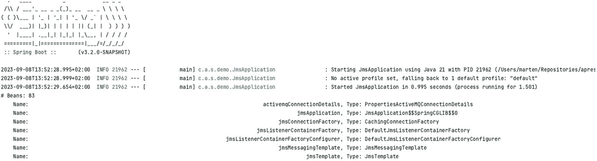
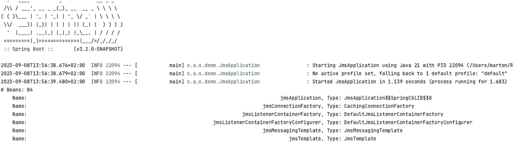
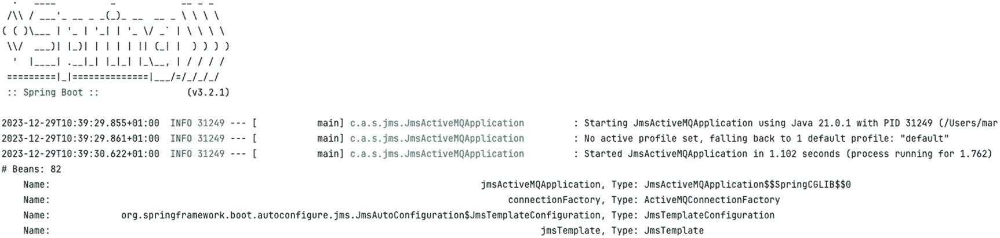
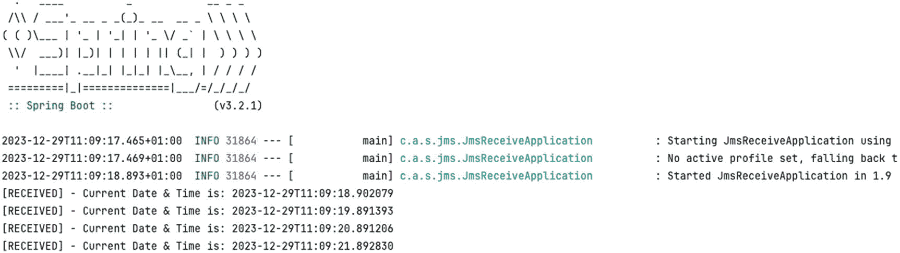
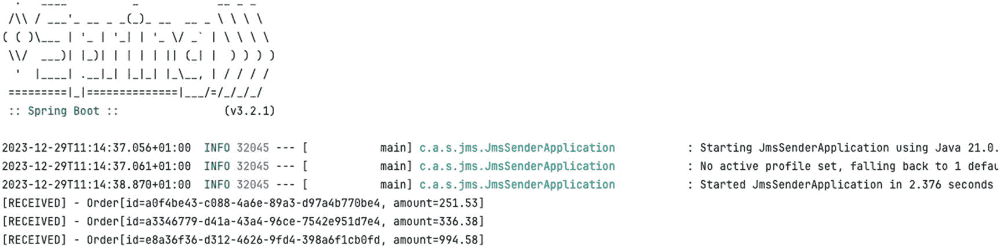
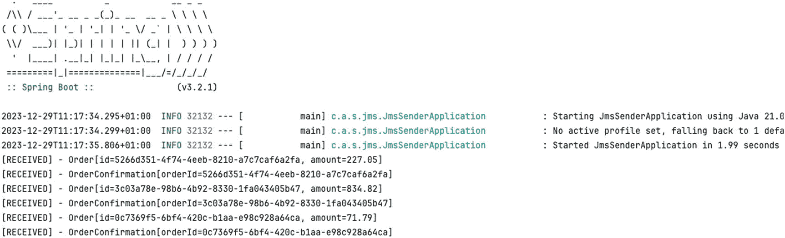
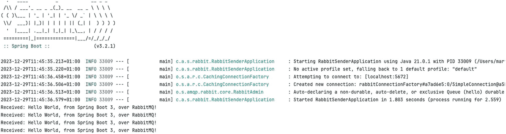
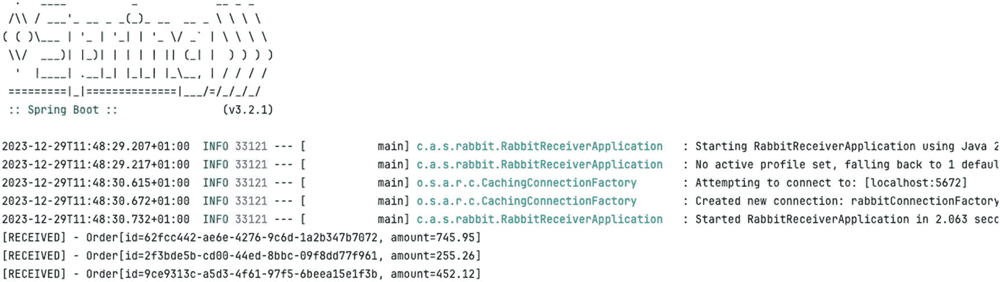
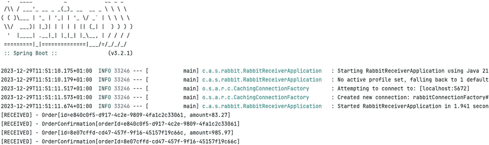
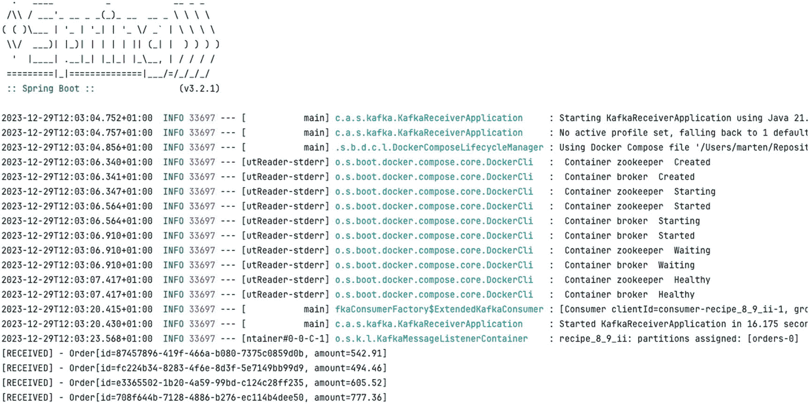

# 8. Spring 消息传递

Spring 产品组合为与各种消息传递系统集成提供了广泛支持。从相当简单的 JMS API 到 RabbitMQ 和 Kafka。当检测到这些框架和技术时，Spring Boot 会提供自动配置。

## 8-1\. 配置 JMS

### 问题

你想在 Spring Boot 应用程序中使用 JMS，并且需要连接到 JMS 代理。

### 解决方案

Spring Boot 支持 ActiveMQ 和 Artemis 的自动配置。通过添加其中一个库并设置一些属性，`spring.activemq` 或 `spring.artemis` 命名空间就是你所需要的全部。

### 工作原理

通过声明对你选择的 JMS 提供程序的依赖，Spring Boot 将自动配置 `ConnectionFactory`，并为你的环境启用一种查找目标（`DestinationResolver`）的策略。这也可以通过使用 JNDI 来完成。另一种解决方案是自己完成所有配置；如果你需要对 `ConnectionFactory` 实例进行更多控制，或者想要使用非自动配置的 JMS 提供程序，则可能需要这样做。

为受支持的 JMS 提供程序添加依赖非常容易，因为 Spring Boot 为它们提供了启动器项目。对于 JNDI，你需要自己包含 JMS 依赖。


#### 使用 ActiveMQ

使用 ActiveMQ 时，首先要引入 `spring-boot-starter-activemq`。这将拉取所有必要的 JMS 和 ActiveMQ 依赖项，以便开始使用。它会包含 `spring-jms` 依赖项以及 ActiveMQ 的客户端库。请参见代码清单 8-1。

```
org.springframework.boot
spring-boot-starter-activemq

代码清单 8-1
Spring Boot ActiveMQ 启动器依赖
```

默认情况下，如果没有显式配置代理，Spring Boot 会启动一个嵌入式代理。可以通过使用 `spring.activemq` 命名空间中的属性来更改配置（参见表 8-1）。

表 8-1

ActiveMQ 配置属性

| 属性 | 描述 |
| --- | --- |
| `spring.activemq.broker-url` | 设置要连接的代理的 URL。对于内存代理，默认值为 `vm://localhost?broker.persistent=false`；否则，默认值为 `tcp://localhost:61616`。 |
| `spring.activemq.user` | 设置用于连接代理的用户名；默认为空。 |
| `spring.activemq.password` | 设置用于连接代理的密码；默认为空。 |
| `spring.activemq.in-memory` | 设置是否应使用嵌入式代理；默认为 `true`。当显式设置了 `spring.activemq.broker-url` 时，此设置将被忽略。 |
| `spring.activemq.non-blocking-redelivery` | 设置在重新传递回滚消息之前停止消息传递。启用后，消息顺序将无法保持；默认为 `false`。 |
| `spring.activemq.close-timeout` | 设置等待关闭生效的时间；默认为 15 秒。 |
| `spring.activemq.send-timeout` | 设置等待代理响应的时间；默认为 0（无限期等待）。 |
| `spring.activemq.packages.trust-all` | 当使用 Java 序列化发送 JMS 消息时，设置是否应信任来自所有包的类；默认为 none（需要显式设置受信任的包）。 |
| `spring.activemq.packages.trusted` | 一个逗号分隔的列表，列出要信任的特定包。 |

以下是一个简单的应用程序，用于列出所有名称中包含 `jms` 的 Bean。这应该包含一个名为 `jmsConnectionFactory` 的 Bean。

```
package com.apress.springboot3recipes.jms;
import org.springframework.boot.SpringApplication;
import org.springframework.boot.autoconfigure.SpringBootApplication;
import java.util.Comparator;
import java.util.stream.Stream;
@SpringBootApplication
public class JmsApplication {
private static final String MSG = "\tName: %100s, Type: %s\n";
public static void main(String[] args) {
var ctx = SpringApplication.run(JmsApplication.class, args);
System.out.println("# Beans: " + ctx.getBeanDefinitionCount());
var names = ctx.getBeanDefinitionNames();
Stream.of(names)
.filter(name -> name.toLowerCase().contains("jms") || ctx.getType(name).getName().contains("jms"))
.sorted(Comparator.naturalOrder())
.forEach(name -> {
var bean = ctx.getBean(name);
System.out.printf(MSG, name, bean.getClass().getSimpleName());
});
}
}
```

运行时，程序会将所有名称中包含 `jms` 的 Bean 的名称和类型打印到控制台。输出应类似于图 8-1。



一个简单应用程序的输出，用于列出所有名称中包含 j m s 的 Bean。它显示了所有名称中包含 j m s 的 Bean 的名称和类型。

图 8-1

ActiveMQ Bean 输出

使用 ActiveMQ 时，也可以使用 JMS 连接池（类似于基于 JDBC 的连接池）。默认情况下，此功能是禁用的。要启用并配置它，可以使用 `spring.activemq.pool` 命名空间中的属性（参见表 8-2）。

表 8-2

ActiveMQ 连接池配置属性

| 属性 | 描述 |
| --- | --- |
| `spring.activemq.pool.enabled` | 设置是否应使用连接池；默认为 `false`。 |
| `spring.activemq.pool.max-connections` | 设置最大连接数；默认为 1。 |
| `spring.activemq.pool.maximum-active-session-per-connection` | 设置每个连接允许的最大活动 JMS 会话数；默认为 500。 |
| `spring.activemq.pool.idle-timeout` | 设置连接可以空闲多长时间；默认为 30 秒。 |
| `spring.activemq.pool.expiry-timeout` | 设置连接过期前的时间；默认为 0（永不过期）。 |
| `spring.activemq.pool.reconnect-on-exception` | 当发生 `JMSException` 时重置连接；默认为 `true`。 |
| `spring.activemq.pool.block-if-full` | 当请求连接时阻塞，或者抛出 `JMSException`；默认为 `true`。 |
| `spring.activemq.pool.block-if-full-timeout` | 设置在抛出 `JMSException` 之前阻塞的时间；默认为 -1（阻塞直到有可用连接）。 |
| `spring.activemq.pool.create-connection-on-startup` | 设置是否应在应用程序启动时立即创建连接；默认为 `true`。 |

使用连接池功能需要将 `pooled-jms` 依赖项添加到构建文件中。请参见代码清单 8-2。

```
org.messaginghub
pooled-jms

代码清单 8-2
JMS 连接池依赖
```

再次运行应用程序时，您会注意到 `ConnectionFactory` 的类型已更改为 `PooledConnectionFactory`。


#### 使用 Artemis

使用 Artemis 时，首先要做的是引入 `spring-boot-starter-artemis`。这将拉取所有必要的 JMS 和 Artemis 依赖项以便开始使用。它会包含 `spring-jms` 依赖项和 Artemis 的库（参见表 8-3）。请参阅代码清单 8-3。

表 8-3

Artemis 配置属性

| 属性 | 描述 |
| --- | --- |
| `spring.artemis.broker-url` | 设置 Artemis 代理的 URL。 |
| `spring.artemis.user` | 设置连接 Artemis 代理的用户名；默认为空。 |
| `spring.artemis.password` | 设置连接 Artemis 代理的密码；默认为空。 |
| `spring.artemis.mode` | 设置操作模式，可以是 `native` 或 `embedded`；默认为 none，将自动检测模式。当找到嵌入式类时，将以嵌入式模式运行。 |

```
org.springframework.boot
spring-boot-starter-artemis

代码清单 8-3
Spring Boot Artemis Starter 依赖项
```

以下是一个简单的应用程序，用于列出所有名称中包含 `jms` 的 Bean。这应该包含一个名为 `jmsConnectionFactory` 的 Bean。

```
package com.apress.springboot3recipes.jms;
import org.springframework.boot.SpringApplication;
import org.springframework.boot.autoconfigure.SpringBootApplication;
import java.util.Comparator;
import java.util.stream.Stream;
@SpringBootApplication
public class JmsApplication {
private static final String MSG = "\t 名称: %100s, 类型: %s\n";
public static void main(String[] args) {
var ctx = SpringApplication.run(JmsApplication.class, args);
System.out.println("# Bean 数量: " + ctx.getBeanDefinitionCount());
var names = ctx.getBeanDefinitionNames();
Stream.of(names)
.filter(name -> name.toLowerCase().contains("jms") || ctx.getType(name).getName().contains("jms"))
.sorted(Comparator.naturalOrder())
.forEach(name -> {
var bean = ctx.getBean(name);
System.out.printf(MSG, name, bean.getClass().getSimpleName());
});
}
}
```

运行时，输出将如图 8-2 所示。



一个简单应用程序的输出，用于列出所有名称中包含 j m s 的 Bean。输出中包含 job application、j m s connection factory、j m s listener container factory、j m s listener container factory configurer、j m s messaging template 和 j m s template。

图 8-2

Artemis Bean 输出

一个信息图标。您可能会疑惑，使用 Artemis 时，您的配置中是否仍然存在 `ActiveMQConnectionFactory`。Artemis 基于 ActiveMQ，因此与其共享类。

Artemis 可以以嵌入式模式使用（就像 ActiveMQ 一样）；然后它将启动一个嵌入式代理。要配置它，可以在 `spring.artemis.embedded` 命名空间中找到多个属性。嵌入式模式需要将 `artemis-jakarta-server` 作为额外的依赖项（参见表 8-4）。

表 8-4

Artemis 嵌入式配置属性

| 属性 | 描述 |
| --- | --- |
| `spring.artemis.embedded.enabled` | 设置是否启用嵌入式模式；默认为 `true`。 |
| `spring.artemis.embedded.persistent` | 设置消息是否持久化；默认为 `false`。 |
| `spring.artemis.embedded.data-directory` | 设置用于存储日志的目录；仅在 `persistent` 为 `true` 时有用。 |
| `spring.artemis.embedded.queues` | 逗号分隔的列表，用于在启动时创建的队列。 |
| `spring.artemis.embedded.topics` | 逗号分隔的列表，用于在启动时创建的主题。 |
| `spring.artemis.embedded.cluster-password` | 集群密码；默认为自动生成。 |
| `spring.artemis.embedded.server-id` | 服务器的 ID；默认为自动生成的计数器。 |

```
org.apache.activemq
artemis-jakarta-server

```

#### 使用连接池的 Artemis

使用 Artemis 时，也可以使用 JMS 连接池（非常类似于基于 JDBC 的连接池）。默认情况下这是禁用的。要启用并配置它，可以使用 `spring.artemis.pool` 命名空间中的属性（参见表 8-5）。

表 8-5

ActiveMQ 池化配置属性

| 属性 | 描述 |
| --- | --- |
| `spring.artemis.pool.enabled` | 设置是否应使用连接池；默认为 `false`。 |
| `spring.artemis.pool.max-connections` | 设置最大连接数；默认为 1。 |
| `spring.artemis.pool.maximum-active-session-per-connection` | 设置每个连接允许的最大活动 JMS 会话数；默认为 500。 |
| `spring.artemis.pool.idle-timeout` | 设置连接可以空闲多长时间；默认为 30 秒。 |
| `spring.artemis.pool.expiry-timeout` | 设置连接过期前的时间；默认为 0（永不过期）。 |
| `spring.artemis.pool.reconnect-on-exception` | 当发生 `JMSException` 时重置连接；默认为 `true`。 |
| `spring.artemis.pool.block-if-full` | 当请求连接时阻塞，或者抛出 `JMSException`；默认为 `true`。 |
| `spring.artemis.pool.block-if-full-timeout` | 设置在抛出 `JMSException` 之前阻塞多长时间；默认为 -1（即阻塞直到有可用连接）。 |
| `spring.artemis.pool.create-connection-on-startup` | 设置是否应在应用程序启动时立即创建连接；默认为 `true`。 |

使用池化功能需要将 `pooled-jms` 依赖项添加到您的构建文件中。请参阅代码清单 8-4。

```
org.messaginghub
pooled-jms

代码清单 8-4
JMS 连接池依赖项
```

再次运行应用程序时，您会注意到 `ConnectionFactory` 的类型已更改为 `PooledConnectionFactory`。

#### 使用 JNDI

将 Spring Boot 应用程序部署到 JEE 容器时，您很可能希望也使用该容器中预先注册的 `ConnectionFactory`。要启用此功能，您需要依赖 `spring-jms` 库和 `jakarta.jms-api`（后者可能可以标记为 provided，因为它将由您的 JEE 容器提供）。您可以使用其中一个 starter 并排除显式的 ActiveMQ 或 Artemis 依赖项；但是，仅声明所需的依赖项更简单、更清晰。请参阅代码清单 8-5。

```
org.springframework
spring-jms

jakarta.jms
jakarta.jms-api

代码清单 8-5
纯 JMS 依赖项
```

当 JNDI 可用时，Spring Boot 将首先尝试在 JNDI 注册表中以众所周知的名称（例如 `java:/JmsXA` 和 `java:/XAConnectionFactory`）或通过 `spring.jms.jndi-name` 属性指定的名称来检测 `ConnectionFactory`。此外，它还会自动创建一个 `JndiDestinationResolver`，以便队列和主题也将在 JNDI 中被检测到；默认情况下，允许回退到动态创建目标。

```
spring.jms.jndi-name=java:/jms/connectionFactory
```

完成上述配置并构建好您的工件后，您现在可以将应用程序部署到 JEE 容器，并重用现有的 `ConnectionFactory`。


#### 手动配置

配置 JMS 的最后一种方式是手动完成。为此，你至少需要 `spring-jms` 和 `jakarta.jms-api` 依赖，以及你所使用的 JMS 代理的一些客户端库。在以下情况下可能需要手动配置：

*   Spring Boot 无法自动配置你的 `ConnectionFactory`

*   需要对 `ConnectionFactory` 实例进行大量设置

*   需要多个 `ConnectionFactory` 实例

要配置一个 `ConnectionFactory` 实例，你需要添加一个带有 `@Bean` 注解的方法，该方法用于构造一个 `ConnectionFactory` 实例。参见清单 8-6。

```
@Bean
public ConnectionFactory connectionFactory() {
var connectionFactory =
new ActiveMQConnectionFactory("vm://localhost?broker.persistent=false");
connectionFactory.setClientID("someId");
return connectionFactory;
}
清单 8-6
ConnectionFactory Bean 配置
```

这将为 Artemis 创建一个 `ConnectionFactory` 实例；它将使用一个嵌入式的非持久化代理，并设置 `clientId` 实例。当 Spring Boot 检测到一个预配置的 `ConnectionFactory` 时，它不会尝试自己创建一个。运行时，输出应如图 8-3 所示。



一个 Connection Factory Bean 配置的输出。使用 Java 21.0.1 启动 j m s active M Q 应用程序，PID 为 31249，未设置活动配置文件，输出中包含 j m s active M Q 应用程序、连接工厂和 j m s 模板。

图 8-3

Artemis beans 输出

## 8-2. 使用 JMS 发送消息

### 问题

你想通过 JMS 向其他系统发送消息。

### 解决方案

使用 Spring Boot 提供的 `JmsTemplate` 来发送和（可选地）转换消息。

### 工作原理

使用 Spring Boot 时，如果它检测到 JMS 和一个单一的 `ConnectionFactory`，它还会自动配置一个 `JmsTemplate`，可用于发送和转换消息。Spring Boot 在 `spring.jms.template` 命名空间中暴露了一些属性，可用于配置 `JmsTemplate` 实例。

#### 使用 JmsTemplate 发送消息

要通过 JMS 发送消息，你可以使用 `JmsTemplate` 上的 `send` 或 `sendAndConvert` 方法。让我们编写一个组件，它每秒向一个队列发送一条包含当前日期和时间的消息。参见清单 8-7。

```
@Component
class MessageSender {
private final JmsTemplate jms;
MessageSender(JmsTemplate jms) {
this.jms = jms;
}
@Scheduled(fixedRate = 1000)
public void sendTime() {
var msg = "Current Date & Time is: " + LocalDateTime.now();
jms.convertAndSend("time-queue", msg);
}
}
清单 8-7
JMS 消息发送组件
```

`JmsTemplate` 实例通过构造函数自动注入，并且由于使用了调度，我们将在一个名为 `time-queue` 的队列上获得一条包含当前日期和时间的消息。要运行此代码，你需要一个带有 `@EnableScheduling` 注解的 `@SpringBootApplication` 类，以便 `@Scheduled` 能够被处理。参见清单 8-8。

```
@SpringBootApplication
@EnableScheduling
public class JmsSenderApplication {
public static void main(String[] args) {
SpringApplication.run(JmsSenderApplication.class, args);
}
}
清单 8-8
JMS 发送器的 Spring Boot 应用程序
```

现在运行这个类时，看起来似乎没有发生什么，但消息正在填充队列。我们可以编写一个集成测试来检查这段代码是否正常工作。参见清单 8-9。

```
package com.apress.springboot3recipes.jms;
import jakarta.jms.JMSException;
import jakarta.jms.TextMessage;
import org.junit.jupiter.api.Test;
import org.springframework.beans.factory.annotation.Autowired;
import org.springframework.boot.test.context.SpringBootTest;
import org.springframework.jms.core.JmsTemplate;
import static org.assertj.core.api.Assertions.assertThat;
@SpringBootTest
class JmsSenderApplicationTest {
@Autowired
private JmsTemplate jms;
@Test
void shouldSendMessage() throws JMSException {
var message = jms.receive("time-queue");
assertThat(message)
.isInstanceOf(TextMessage.class);
assertThat(((TextMessage) message).getText())
.startsWith("Current Date & Time is: ");
}
}
清单 8-9
Spring Boot JMS 集成测试
```

这个 JUnit 测试将启动应用程序并开始发送消息。在测试中，我们使用一个 `JmsTemplate` 实例来 `receive` 一条消息，并对其进行一些断言，以检查消息是否真的被发送并且包含我们期望的内容。由于我们没有配置任何东西，测试将使用嵌入式的 JMS 代理。运行测试时，它应该通过，因为消息会被发送和接收。要查看它是否失败，你可以从 `MessageSender` 中移除 `@Scheduled` 注解。然后测试将失败，表明没有收到消息。

一个灯泡图标。在编写消息传递测试时，你可能想要设置 `JmsTemplate` 的 `receive-timeout` 属性，因为默认情况下它会无限期地等待消息到来。然而，在 500 毫秒后，你可能希望测试失败。


#### 配置 JmsTemplate

Spring Boot 在 `spring.jms.template` 命名空间中提供了用于配置 `JmsTemplate` 的属性（参见表 8-6）。

表 8-6

`JmsTemplate` 属性

| 属性 | 描述 |
| --- | --- |
| `spring.jms.template.default-destination` | 设置未指定特定目标时用于发送和接收操作的默认目标。 |
| `spring.jms.template.delivery-delay` | 设置发送消息的投递延迟。 |
| `spring.jms.template.delivery-mode` | 设置投递模式，`persistent`（持久化）或 `non-persistent`（非持久化）。显式设置时，会将 `qos-enabled` 设为 `true`。 |
| `spring.jms.template.priority` | 设置发送消息时的优先级。默认值为无；显式设置时，会将 `qos-enabled` 设为 `true`。 |
| `spring.jms.template.qos-enabled` | 设置是否启用服务质量（QOS）。启用后，将设置消息的优先级、投递模式和存活时间。默认值为 `false`。 |
| `spring.jms.template.receive-timeout` | 设置接收调用的超时时间。默认值为无限期。 |
| `spring.jms.template.time-to-live` | 设置 JMS 消息的存活时间；设置时，会将 `qos-enabled` 设为 `true`。 |
| `spring.jms.pub-sub-domain` | 将默认目标设置为主题或队列。默认值为 `false`，表示队列。 |

除了这些属性之外，如果能够找到唯一的 Bean 实例，`JmsTemplate` 还会自动配置一个 `DestinationResolver` 和 `MessageConverter`。如果找不到唯一的实例，将使用默认值，即 `DynamicDestinationResolver` 和 `SimpleMessageConverter`（参见表 8-7）。

表 8-7

SimpleMessageConverter 类到 JMS 消息的转换器

| 类型 | JMS 消息类型 |
| --- | --- |
| `java.lang.String` | `javax.jms.TextMessage` |
| `java.util.Map` | `javax.jms.MapMessage` |
| `java.io.Serializable` | `javax.jms.ObjectMessage` |
| `byte[]` | `javax.jms.BytesMessage` |

让我们将一个 `Order` 发送到 `orders` 队列，并使用 Jackson 发送 JSON，而不是使用 Java 序列化机制。参见清单 8-10。

```
package com.apress.springboot3recipes.order;
import java.math.BigDecimal;
public record Order (String id, BigDecimal amount) { }
清单 8-10
Order 类
```

这就是我们要发送的 `Order` 类。为了能够生成订单，让我们创建一个 `OrderGenerator` 类，它将创建一个包含 ID 和随机金额的订单。参见清单 8-11。

```
package com.apress.springboot3recipes.order;
import java.math.BigDecimal;
import java.math.RoundingMode;
import java.util.UUID;
import java.util.concurrent.ThreadLocalRandom;
public class OrderGenerator {
public static Order generate() {
var rnd = ThreadLocalRandom.current().nextDouble(1000.00);
var amount = BigDecimal.valueOf(rnd).setScale(2, RoundingMode.HALF_EVEN);
var id = UUID.randomUUID().toString();
return new Order(id, amount);
}
}
清单 8-11
OrderGenerator 类
```

现在我们需要一个发送者，它生成一个 `Order` 并使用 `JmsTemplate` 将其放入队列。参见清单 8-12。

```
@Component
class OrderSender {
private final JmsTemplate jms;
OrderSender(JmsTemplate jms) {
this.jms = jms;
}
@Scheduled(fixedRate = 500)
public void sendOrder() {
var order = OrderGenerator.generate();
jms.convertAndSend("orders", order);
}
}
清单 8-12
基于 JMS 的 OrderSender
```

这与之前编写的 `MessageSender` 没有太大区别，但现在它会生成一个包含一些随机生成数据的 `Order`（参见 `OrderGenerator`），并将其发送到 `orders` 队列。运行时，这实际上会失败。因为 `Order` 没有实现 `Serializable`，所以它不会被转换为 `ObjectMessage`。然而，我们想要使用 JSON。为了实现这一点，需要一个不同的 `MessageConverter`：确切地说是 `MappingJackson2MessageConverter`。它使用 Jackson 将对象编组和解组为 JSON。它应该作为 Bean 添加到配置中。

首先，你需要添加依赖项以将 Jackson（或者更确切地说是 JSON 支持）添加到你的应用程序中。添加 `spring-boot-starter-json` 以获取所需的依赖项。参见清单 8-13。

```
org.springframework.boot
spring-boot-starter-json

清单 8-13
Spring Boot JSON Starter 依赖项
```

一个信息图标。如果你的依赖项列表中已经有 `spring-boot-starter-web` 或 `spring-boot-starter-webflux`，那么 `spring-boot-starter-json` 已经包含在内。

接下来，你可以配置 `MappingJackson2MessageConverter`。参见清单 8-14。

*   ① `typeIdPropertyName` 是一个必需属性，指示存储消息实际类型的属性名称。如果没有进一步配置，将使用类的完全限定名（FQN）。

*   ② 这是用于给定类应使用哪个类型标识符（`typeId`）的映射。它不会发送类的 FQN，而是使用映射中的类型来标识类型。发送 `Order` 时，`content-type` 头将包含值 `order`。

```
@Bean
public MappingJackson2MessageConverter messageConverter() {
var converter = new MappingJackson2MessageConverter();
converter.setTypeIdPropertyName("content_type"); ①
converter.setTypeIdMappings(Map.of("order", Order.class)); ②
return converter;
}
清单 8-14
MessageConverter 配置
```

一个灯泡图标。通常，显式定义类型映射是一个好主意。这样，你就不会在 Java 层面上将两个或多个应用程序显式绑定在一起。它们可以使用自己的映射，将 `order` 映射到它们自己的 `Order` 类。

完成所有这些设置后，我们可以编写一个测试来查看订单是否确实被发送。

```
package com.apress.springboot3recipes.jms;
import com.apress.springboot3recipes.order.Order;
import com.fasterxml.jackson.databind.ObjectMapper;
import jakarta.jms.BytesMessage;
import org.junit.jupiter.api.Test;
import org.springframework.beans.factory.annotation.Autowired;
import org.springframework.boot.test.context.SpringBootTest;
import org.springframework.jms.core.JmsTemplate;
import static org.assertj.core.api.Assertions.assertThat;
@SpringBootTest
class JmsSenderApplicationTest {
@Autowired
private JmsTemplate jms;
@Test
void shouldReceiveOrderPlain() throws Exception {
var message = jms.receive("orders");
assertThat(message)
.isInstanceOf(BytesMessage.class);
var msg = (BytesMessage) message;
var mapper = new ObjectMapper();
var content = new byte[(int) msg.getBodyLength()];
msg.readBytes(content);
var order = mapper.readValue( content, Order.class);
assertThat(order).hasNoNullFieldsOrProperties();
}
@Test
void shouldReceiveOrderWithConversion() throws Exception {
var order = (Order) jms.receiveAndConvert("orders");
assertThat(order).hasNoNullFieldsOrProperties();
}
}
```

这里有两个测试方法。第一个是手动将消息转换为 `Order`，而第二个使用 `receiveAndConvert` 方法为你完成转换。这是为了展示 `MessageConverter` 的作用，以及它如何使你的代码更具可读性。如你所见，`MappingJackson2MessageConverter` 将 `Order` 转换为 `BytesMessages`。如果你想改用 `TextMessage`，可以将 `targetType` 属性设置为 `TEXT`；然后你将收到一个 `TextMessage`，其有效负载是一个 JSON 字符串。

## 8-3\. 使用 JMS 接收消息

### 问题

你想从 JMS 目标读取消息，以便在应用程序中处理它们。

### 解决方案

创建一个类，并使用 `@JmsListener` 注解方法，将其绑定到一个目标并处理传入的消息。


### 工作原理

您可以创建一个 POJO，并使用 `@JmsListener` 注解其方法。Spring 会检测到该注解并为其创建一个 JMS 监听器。Spring Boot 暴露了 `spring.jms.listener` 命名空间下的属性，用于配置这些监听器。

#### 接收消息

让我们创建一个服务，用于监听配方 8-2 中发送方发送的消息。参见清单 8-15。

```
@Component
class CurrentDateTimeService {
@JmsListener(destination = "time-queue")
public void handle(TextMessage msg) throws JMSException {
System.out.println("[RECEIVED] - " + msg.getText());
}
}
清单 8-15
基于 JMS 的 Spring JMS 监听器
```

这是一个常规类，其方法使用了 `@JmsListener` 注解，该注解至少需要一个 `destination` 属性，以便知道从何处检索消息。它接受一个 `jakarta.jms.TextMessage` 参数，并将内容打印到控制台。`@JmsListener` 注解方法的签名具有一定的灵活性，因为它允许使用多个参数，这些参数可以是注解类型的，也可以是特定类型的（参见表 8-8）。

表 8-8

允许的方法参数类型

| 类型 | 描述 |
| --- | --- |
| `java.lang.String` | 仅针对 `TextMessage` 获取字符串形式的消息负载 |
| `java.util.Map` | 仅针对 `MapMessage` 获取 Map 形式的消息负载 |
| `byte[]` | 仅针对 `BytesMessage` 获取字节数组形式的消息负载 |
| Serializable 对象 | 从 `ObjectMessage` 反序列化 `Object` |
| `jakarta.jms.Message` | 获取实际的 JMS 消息 |
| `jakarta.jms.Session` | 访问 `Session`，例如用于发送自定义回复 |
| `@Header` 注解的元素 | 从 JMS 消息中提取一个标头 |
| `@Headers` 注解的元素 | 仅可用于 `java.util.Map`，用于获取所有 JMS 消息标头 |
| `org.springframework.messaging.Message` | 表示传入的 JMS 消息 |

通过使用 `String` 作为方法参数，而不是自行处理 `jakarta.jms.Message` 配置，可以简化监听器。参见清单 8-16。

```
@Component
class CurrentDateTimeService {
@JmsListener(destination = "time-queue")
public void handle(String msg) {
System.out.println("[RECEIVED] - " + msg);
}
}
清单 8-16
基于字符串的 Spring JMS 监听器
```

两个应用的输出应类似于图 8-4。



一个基于字符串的 Spring JMS 监听器的输出。输出中包含：启动的 JMS 接收应用、未设置配置文件、已启动的 JMS 接收应用、Spring Boot，以及接收到的当前日期和时间。

图 8-4

JMS 接收输出

#### 配置监听器容器

Spring 使用 `JmsListenerContainerFactory` 来创建支持 `@JmsListener` 注解所需的基础设施。Spring Boot 配置了一个默认工厂，可以通过 `spring.jms.listener` 命名空间下的属性进行配置。如果这还不够，您可以随时配置自己的实例并手动完成所有配置选项。当 Spring Boot 在上下文中检测到已存在 `JmsListenerContainerFactory` 时，它将不会创建新的工厂（参见表 8-9）。

表 8-9

JMS 监听器属性

| 属性 | 描述 |
| --- | --- |
| `spring.jms.listener.acknowledge-mode` | 设置容器的确认模式；默认为自动确认。 |
| `spring.jms.listener.auto-startup` | 设置是否在启动时自动启动容器。默认为 `true`。 |
| `spring.jms.listener.concurrency` | 设置最小并发消费者数。默认为 none，表示一个并发消费者（Spring 默认值）。 |
| `spring.jms.listener.max-concurrency` | 设置最大并发消费者数。默认为 none，表示一个并发消费者（Spring 默认值）。 |
| `spring.jms.receive-timeout` | 设置接收消息的超时时间；默认为一秒。 |
| `spring.jms.pub-sub-domain` | 设置默认目标类型是主题还是队列。默认为 `false`，表示队列。 |

默认配置的 `JmsListenerContainerFactory` 还会检测是否存在唯一的 `DestinationResolver` 和 `MessageConverter`，如果找到则使用它们；否则，将使用 Spring 默认的 `DynamicDestinationResolver` 和 `SimpleMessageConverter`（更多信息请参见配方 8-2）。

#### 使用自定义 MessageConverter

如果您想通过 JMS 将对象作为 JSON 发送到下一个系统，该怎么办？您可以依赖 Java 序列化，但这通常不被推荐，因为它会导致系统紧密耦合。使用 JSON 或 XML 来传输对象/消息是更好的方式。使用 Spring JMS，只需配置一个不同的 `MessageConverter` 即可（发送部分也请参见配方 8-2）。参见清单 8-17。

```
@Bean
public MappingJackson2MessageConverter messageConverter() {
var messageConverter = new MappingJackson2MessageConverter();
messageConverter.setTypeIdPropertyName("content_type");
messageConverter.setTypeIdMappings(singletonMap("order", Order.class));
return messageConverter;
}
清单 8-17
MessageConverter 配置
```

默认情况下，`MappingJackson2MessageConverter` 需要一个属性名来存放内容类型的标识符。该标识符将从 JMS 消息的标头中读取（此处我们将其设置为 `content_type`）。接下来，我们可以选择性地定义类型与类之间的映射。由于我们希望能够将对象映射到 `Order` 类，因此我们将其指定为内容类型 `order` 的映射。参见清单 8-18。

```
@Component
class OrderService {
@JmsListener(destination = "orders")
public void handle(Order order) {
System.out.println("[RECEIVED] - " + order);
}
}
清单 8-18
接收 Order 的 JMS 消息监听器
```

监听器接收 `Order` 对象，因为 Spring JMS 会负责接收和转换消息。如果您将此监听器与配方 8-2 中的订单发送器结合使用，您将看到源源不断的订单流入（图 8-5）。



一个接收订单的 JMS 消息监听器的输出。输出中包含：启动的 JMS 发送器应用（使用 Java 21.0）、未设置活动配置文件、在 2.376 秒内启动的 JMS 发送器应用、Spring Boot，以及接收到的订单和金额。

图 8-5

JMS 接收输出，订单


#### 发送回复

有时在接收消息时，您希望返回一个答案或触发流程的另一部分。使用 Spring 消息传递，这非常简单；您只需从处理器方法中返回想要发送的内容即可。要确定响应的发送位置，可以添加一个额外的 `@SendTo` 注解来指定目标。让我们修改示例，将 `OrderConfirmation` 发送到 `order-confirmation` 队列。请参见清单 8-19。

```
@Component
class OrderService {
@JmsListener(destination = "orders")
@SendTo("order-confirmations")
public OrderConfirmation handle(Order order) {
System.out.println("[RECEIVED] - " + order);
return new OrderConfirmation(order.id());
}
}
清单 8-19
发送 OrderConfirmation 的 OrderService
```

`OrderService` 的配置略有变化；现在它在处理订单后会返回一个 `OrderConfirmation`。通过 `@SendTo` 注解，我们指定了将结果放入哪个目标。

让我们为 `OrderConfirmation` 对象创建另一个监听器，以便能够看到它们的到来。请参见清单 8-20。

```
@Component
class OrderConfirmationService {
@JmsListener(destination = "order-confirmations")
public void handle(OrderConfirmation confirmation) {
System.out.println("[RECEIVED] - " + confirmation);
}
}
清单 8-20
JMS OrderConfirmationService
```

`OrderConfirmation` 类，以便我们知道要编组的内容。请参见清单 8-21。

```
package com.apress.springboot3recipes.order;
public record OrderConfirmation(String orderId) { }
清单 8-21
简单的 OrderConfirmation
```

运行应用程序时，您将看到首先接收到订单，然后接收到 `OrderConfirmation`（图 8-6）。



一个简单订单确认的输出。启动的 JMS 发送方应用程序使用 Java 21.0，未设置活动配置文件，启动的 JMS 发送方应用程序耗时 1.99 秒，Spring Boot，以及接收到的订单和金额都包含在输出中。

图 8-6

JMS 接收输出，订单和确认

## 8-4\. 配置 RabbitMQ

### 问题

您希望在 Spring Boot 应用程序中使用 AMQP 消息传递，并且需要连接到 RabbitMQ 代理。

### 解决方案

配置适当的 `spring.amqp` 属性（最少需要 `spring.amqp.host`）来连接到交换机，并能够发送和接收消息。

### 工作原理

当 Spring Boot 在类路径上检测到 RabbitMQ 库时，它会自动创建一个 `ConnectionFactory` 实例。要开始使用，您需要添加 `spring-boot-starter-amqp` 依赖项。这将引入所有必需的依赖项。请参见清单 8-22。

```
org.springframework.boot
spring-boot-starter-amqp

清单 8-22
Spring Boot Starter AMQP 依赖项
```

现在您可以使用 `spring.amqp` 属性来连接到代理。请参见清单 8-23。

```
spring.amqp.host=localhost
spring.amqp.port=5672
spring.amqp.username=guest
spring.amqp.password=guest
清单 8-23
Spring AMQP 基本配置
```

此配置是使用 Spring Boot 默认值连接到 RabbitMQ 默认实例所需的全部内容（请参见表 8-10）。

表 8-10

RabbitMQ 属性

| 属性 | 描述 |
| --- | --- |
| `spring.amqp.addresses` | 客户端应连接的地址列表，以逗号分隔。 |
| `spring.amqp.connection-timeout` | 设置连接超时。默认值为无；`0` 表示永不超时。 |
| `spring.amqp.host` | 设置 RabbitMQ 主机。 |
| `spring.amqp.port` | 设置 RabbitMQ 端口。 |
| `spring.amqp.username` | 设置用于连接的用户名；默认值为 `guest`。 |
| `spring.amqp.password` | 设置用于连接的密码；默认值为 `guest`。 |
| `spring.amqp.publisher-confirms` | 设置是否启用发布者确认。默认值为 `false`。 |
| `spring.amqp.publisher-returns` | 设置是否启用发布者返回。默认值为 `false`。 |
| `spring.amqp.requested-heartbeat` | 设置请求的心跳超时。默认值为无；`0` 表示无心跳。 |
| `spring.amqp.virtual-host` | 设置连接到代理时要使用的虚拟主机。 |

## 8-5\. 使用 RabbitMQ 发送消息

### 问题

您希望向 RabbitMQ 代理发送一条消息，以便该消息能够被传递给接收方。

### 解决方案

使用 `RabbitTemplate`，您可以向交换机发送消息并提供路由键。

### 工作原理

当 Spring Boot 找到一个唯一的 `ConnectionFactory` 时，它会自动配置一个 `RabbitTemplate`；此模板可用于向队列发送消息。

#### 配置 RabbitTemplate

如果 Spring Boot 能够找到一个唯一的 `ConnectionFactory`，并且配置中不存在 `RabbitTemplate`，它将自动配置一个 `RabbitTemplate`。Spring Boot 允许您通过 `spring.rabbitmq.template` 命名空间中的属性来修改已配置的 `RabbitTemplate`（请参见表 8-11）。

表 8-11

RabbitTemplate 配置属性

| 属性 | 描述 |
| --- | --- |
| `spring.rabbitmq.template.exchange` | 设置用于发送操作的默认交换机名称；默认值为无。 |
| `spring.rabbitmq.template.routing-key` | 设置用于发送操作的默认路由键值；默认值为无。 |
| `spring.rabbitmq.template.receive-timeout` | 设置发送和接收操作的超时时间。 |
| `spring.rabbitmq.template.reply-timeout` | 设置接收操作的超时时间。 |

Spring Boot 还使得使用 `RabbitTemplate` 配置重试逻辑变得容易，但默认情况下它是禁用的。在 `application.properties` 中设置 `spring.rabbitmq.template.retry.enabled=true` 将启用它。现在，当发送失败时，它将额外尝试两次发送消息。要更改重试次数或间隔，您可以使用 `spring.rabbitmq.template.retry` 命名空间中的属性（请参见表 8-12）。

表 8-12

RabbitTemplate 重试配置

| 属性 | 描述 |
| --- | --- |
| `spring.rabbitmq.template.retry.enabled` | 启用发布重试；默认值为 false。 |
| `spring.rabbitmq.template.retry.max-attempts` | 设置传递消息的尝试次数；默认值为 3。 |
| `spring.rabbitmq.template.retry.initial-interval` | 设置第一次和第二次发布尝试之间的持续时间；默认值为 1 秒。 |
| `spring.rabbitmq.template.retry.max-interval` | 设置传递消息的尝试次数；默认值为 10 秒。 |
| `spring.rabbitmq.template.retry.multiplier` | 设置应用于前一个间隔的乘数；默认值为 1.0。 |


#### 发送一条简单消息

使用 `RabbitTemplate` 发送消息可以通过 `convertAndSend` 方法完成。该方法至少需要提供路由键和要发送的对象。

```
@Component
class HelloWorldSender {
private final RabbitTemplate rabbit;
HelloWorldSender(RabbitTemplate rabbit) {
this.rabbit = rabbit;
}
@Scheduled(fixedRate = 500)
public void sayHello() {
var msg =  "Hello World, from Spring Boot 3, over RabbitMQ!";
rabbit.convertAndSend("hello", msg);
}
}
```

`HelloWorldSender` 将通过构造函数注入 `RabbitTemplate`。每 500 毫秒，一条消息将被发送到默认交换机，路由键为 `hello`。由于消息发送到默认交换机，一个名为 `hello` 的队列将被自动创建。你可以在 RabbitMQ 管理控制台中查看队列中的消息数量。

编写一个测试来验证应用程序的正确行为。由于 RabbitMQ 没有内嵌代理，你需要使用 `@MockBean` 来模拟 `RabbitTemplate`。在 `@Test` 方法中，验证方法调用是否使用了正确的参数。参见清单 8-24。

```
package com.apress.springboot3recipes.rabbit;
import org.junit.jupiter.api.Test;
import org.mockito.Mockito;
import org.springframework.amqp.rabbit.core.RabbitTemplate;
import org.springframework.boot.test.context.SpringBootTest;
import org.springframework.boot.test.mock.mockito.MockBean;
import static org.mockito.Mockito.verify;
@SpringBootTest
class RabbitSenderApplicationTest {
@MockBean
private RabbitTemplate rabbitTemplate;
@Test
void shouldSendAtLeastASingleMessage() {
verify(rabbitTemplate, Mockito.atLeastOnce())
.convertAndSend("hello", "Hello World, from Spring Boot 3, over RabbitMQ!");
}
}
清单 8-24
使用 Mock 的 RabbitMQ Spring Boot 测试
```

另一种选择是使用 Spring Boot Testcontainer 支持，在 Docker 中启动一个 RabbitMQ 代理，并使用它进行通信。参见清单 8-25。

```
package com.apress.springboot3recipes.rabbit;
import org.junit.jupiter.api.Test;
import org.springframework.amqp.core.Binding;
import org.springframework.amqp.core.BindingBuilder;
import org.springframework.amqp.core.DirectExchange;
import org.springframework.amqp.core.Queue;
import org.springframework.amqp.core.QueueBuilder;
import org.springframework.amqp.rabbit.core.RabbitTemplate;
import org.springframework.beans.factory.annotation.Autowired;
import org.springframework.boot.test.context.SpringBootTest;
import org.springframework.boot.test.context.TestConfiguration;
import org.springframework.boot.testcontainers.service.connection.ServiceConnection;
import org.springframework.context.annotation.Bean;
import org.testcontainers.containers.RabbitMQContainer;
import org.testcontainers.junit.jupiter.Container;
import org.testcontainers.junit.jupiter.Testcontainers;
import static org.assertj.core.api.Assertions.assertThat;
@SpringBootTest
@Testcontainers
class RabbitSenderApplicationIntegrationTest {
@ServiceConnection
@Container
static RabbitMQContainer rabbitmq =
new RabbitMQContainer("rabbitmq:3.12.11-management-alpine");
@Autowired
private RabbitTemplate rabbitTemplate;
@Test
void shouldSendAtLeastASingleMessage() {
String msg = (String) rabbitTemplate.receiveAndConvert("hello", 1500);
assertThat(msg).isEqualTo("Hello World, from Spring Boot 3, over RabbitMQ!");
}
@TestConfiguration
static class RabbitMqQueueConfiguration {
@Bean
public Queue helloQueue() {
return QueueBuilder.nonDurable("hello").build();
}
@Bean
public Binding helloQueueBinding(Queue queue) {
return BindingBuilder
.bind(queue)
.to(DirectExchange.DEFAULT)
.withQueueName();
}
}
}
清单 8-25
使用 Testcontainers 的 RabbitMQ Spring Boot 测试
```


#### 发送对象

要向 RabbitMQ 发送消息，消息负载必须转换为 `byte[]`。对于 `String` 类型，通过调用 `String.getBytes` 即可轻松实现。然而，发送对象时，这一过程会变得更为繁琐。默认实现会检查对象是否为 `Serializable`，如果是，则使用 Java 序列化将对象转换为 `byte[]`。使用 Java 序列化并非最佳方案，尤其是在需要向非 Java 客户端发送消息时。

`RabbitTemplate` 使用 `MessageConverter` 来委托消息的创建。默认情况下，它使用 `SimpleMessageConverter`，该转换器实现了前述策略。然而，还有多种实现方式，它们使用 XML（`MarshallingMessageConverter`）或 JSON（`Jackson2JsonMessageConverter`）来处理实际负载（而非 Java 序列化）。

Spring Boot 会自动检测配置的 `MessageConverter`，并将其同时用于 `RabbitTemplate` 和监听器（参见配方 8-6）。请参见清单 8-26。

```
@Bean
public Jackson2JsonMessageConverter jsonMessageConverter() {
return new Jackson2JsonMessageConverter();
}
清单 8-26
MessageConverter 配置
```

这足以将 `SimpleMessageConverter` 更改为 `Jackson2JsonMessageConverter`。接下来，创建一个 `Order`，并使用 `RabbitTemplate` 通过 `new-order` 路由键将其发送到 `orders` 交换机。请参见清单 8-27。

```
package com.apress.springboot3recipes.order;
import java.math.BigDecimal;
public record Order (String id, BigDecimal amount) { }
清单 8-27
Order 类
```

现在我们有了一个订单，接下来创建一个定时方法，该方法会定期发送包含随机订单的消息。请参见清单 8-28。

```
package com.apress.springboot3recipes.rabbit;
import com.apress.springboot3recipes.order.OrderGenerator;
import org.springframework.amqp.rabbit.core.RabbitTemplate;
import org.springframework.scheduling.annotation.Scheduled;
import org.springframework.stereotype.Component;
@Component
class OrderSender {
private final RabbitTemplate rabbit;
OrderSender(RabbitTemplate rabbit) {
this.rabbit = rabbit;
}
@Scheduled(fixedRate = 250)
public void sendTime() {
var order = OrderGenerator.generate();
rabbit.convertAndSend("orders", "new-order", order);
}
}
清单 8-28
用于 RabbitMQ 的 OrderSender
```

它会创建一个金额最大为 1000.00 的随机 `Order`。然后，使用 `convertAndSend` 方法，通过 `new-order` 路由键将其发送到 `orders` 交换机。

测试将再次使用 `@MockBean` 创建一个 `RabbitTemplate` 的模拟对象，并测试方法的调用。请参见清单 8-29。

```
package com.apress.springboot3recipes.rabbit;
import com.apress.springboot3recipes.order.Order;
import org.junit.jupiter.api.Test;
import org.springframework.amqp.rabbit.core.RabbitTemplate;
import org.springframework.boot.test.context.SpringBootTest;
import org.springframework.boot.test.mock.mockito.MockBean;
import static org.mockito.ArgumentMatchers.any;
import static org.mockito.ArgumentMatchers.eq;
import static org.mockito.Mockito.atLeastOnce;
import static org.mockito.Mockito.verify;
@SpringBootTest
class RabbitSenderApplicationTest {
@MockBean
private RabbitTemplate rabbitTemplate;
@Test
void shouldSendAtLeastASingleMessage() {
verify(rabbitTemplate, atLeastOnce())
.convertAndSend(
eq("orders"),
eq("new-order"),
any(Order.class));
}
}
清单 8-29
使用模拟对象的 OrderSender 测试
```

要编写集成测试，我们可以利用 Testcontainers 支持，其方式与之前的示例大致相同，但我们需要为队列和交换机进行一些额外配置。请参见清单 8-30。

```
package com.apress.springboot3recipes.rabbit;
import org.junit.jupiter.api.Test;
import org.springframework.amqp.core.Binding;
import org.springframework.amqp.core.BindingBuilder;
import org.springframework.amqp.core.Exchange;
import org.springframework.amqp.core.ExchangeBuilder;
import org.springframework.amqp.core.Queue;
import org.springframework.amqp.core.QueueBuilder;
import org.springframework.amqp.rabbit.core.RabbitTemplate;
import org.springframework.beans.factory.annotation.Autowired;
import org.springframework.boot.test.context.SpringBootTest;
import org.springframework.boot.test.context.TestConfiguration;
import org.springframework.boot.testcontainers.service.connection.ServiceConnection;
import org.springframework.context.annotation.Bean;
import org.testcontainers.containers.RabbitMQContainer;
import org.testcontainers.junit.jupiter.Container;
import org.testcontainers.junit.jupiter.Testcontainers;
import static org.assertj.core.api.Assertions.assertThat;
@SpringBootTest
@Testcontainers
class RabbitSenderApplicationIntegrationTest {
@ServiceConnection
@Container
static RabbitMQContainer rabbitmq =
new RabbitMQContainer("rabbitmq:3.12.4-management-alpine");
@Autowired
private RabbitTemplate rabbitTemplate;
@Test
void shouldSendAtLeastASingleMessage() {
var msg = rabbitTemplate.receive("new-order", 1500);
assertThat(msg).isNotNull();
assertThat(msg.getBody()).isNotEmpty();
assertThat(msg.getMessageProperties().getReceivedExchange())
.isEqualTo("orders");
assertThat(msg.getMessageProperties().getReceivedRoutingKey())
.isEqualTo("new-order");
assertThat(msg.getMessageProperties().getContentType())
.isEqualTo("application/json");
}
@TestConfiguration
static class RabbitMqQueueConfiguration {
@Bean
public Queue newOrderQueue() {
return QueueBuilder.durable("new-order").build();
}
@Bean
public Exchange ordersExchange() {
return ExchangeBuilder.topicExchange("orders").durable(true).build();
}
@Bean
public Binding newOrderQueueBinding(Queue queue, Exchange exchange) {
return BindingBuilder.bind(queue).to(exchange).with("new-order").noargs();
}
}
}
清单 8-30
使用 Testcontainers 的 OrderSender 测试
```

包含的 `@TestConfiguration` 添加了队列、交换机以及所需的绑定。需要队列和绑定才能接收消息；否则，消息将仅驻留在交换机上（或根据配置被丢弃）。

集成测试将加载应用程序和额外的配置。它将使用 `RabbitTemplate` 来接收消息。

## 8-6. 使用 RabbitMQ 接收消息

### 问题

您希望从 RabbitMQ 接收消息。

### 解决方案

使用 `@RabbitListener` 注解一个方法，会将其绑定到一个队列，并使其能够接收消息。


### 工作原理

带有 `@RabbitListener` 和/或 `@RabbitHandler` 注解方法的 Bean 将被用作传入消息的消息监听器。系统会构建一个消息监听器容器，注解方法将接收传入的消息。消息监听器容器可以通过 `spring.rabbitmq.listener` 命名空间中的属性进行配置（参见表 8-13）。

表 8-13

Rabbit 监听器属性

| 属性 | 描述 |
| --- | --- |
| `spring.rabbitmq.listener.type` | 设置监听器容器类型 `direct` 或 `simple`；默认为 `simple`。 |
| `spring.rabbitmq.listener.simple.acknowledge-mode` | 设置容器确认模式；默认为 none。 |
| `spring.rabbitmq.listener.simple.prefetch` | 设置单次请求中处理的消息数量；默认为 none。 |
| `spring.rabbitmq.listener.simple.default-requeue-rejected` | 设置被拒绝的消息是否应重新入队。 |
| `spring.rabbitmq.listener.simple.concurrency` | 设置监听器调用线程的最小数量。 |
| `spring.rabbitmq.listener.simple.max-concurrency` | 设置监听器调用线程的最大数量。 |
| `spring.rabbitmq.listener.simple.transaction-size` | 设置单个事务中处理的消息数量。为获得最佳效果，该值应小于或等于预取大小。 |
| `spring.rabbitmq.listener.direct.acknowledge-mode` | 设置容器确认模式；默认为 none。 |
| `spring.rabbitmq.listener.direct.prefetch` | 设置单次请求中处理的消息数量；默认为 none。 |
| `spring.rabbitmq.listener.direct.default-requeue-rejected` | 设置被拒绝的消息是否应重新入队。 |
| `spring.rabbitmq.listener.direct.consumers-per-queue` | 设置被拒绝的消息是否应重新入队。 |

#### 接收简单消息

一个带有 `@RabbitListener` 注解的组件即可开始从 RabbitMQ 接收消息。参见清单 8-31。

```
@Component
class HelloWorldReceiver {
@RabbitListener( queues = "hello")
public void receive(String msg) {
System.out.println("Received: " + msg);
}
}
清单 8-31
用于字符串消息的 RabbitMQ 监听器
```

该组件将从 `hello` 队列接收所有消息并将其打印到控制台（图 8-7）。这对于简单负载或接收对象可以从消息负载中反序列化的情况效果良好。然而，当发送对象或复杂消息时，您可能更倾向于使用 JSON 或 XML。



一个用于字符串消息的 RabbitMQ 监听器的输出。它从 hello 队列接收所有消息并将其打印到控制台。输出中包含使用 Java 21.0.1 启动的 Rabbit 发送方应用程序（PID 33009，未设置活动配置文件），以及启动的 Rabbit 发送方应用程序（耗时 1.803 秒）。

图 8-7

RabbitMQ 监听器输出

#### 接收对象

要接收更复杂的对象而不依赖 Java 序列化，您需要配置一个 `MessageConverter`（另请参阅配方 8-4）。配置好的 `MessageConverter` 将被消息监听器容器用于将传入负载转换为 `@RabbitListener` 注解方法所需的对象。参见清单 8-32。

```
@Bean
public Jackson2JsonMessageConverter jsonMessageConverter() {
return new Jackson2JsonMessageConverter();
}
清单 8-32
JSON MessageConverter 配置
```

要配置 `MessageConverter`，请创建一个带有 `@Bean` 注解的方法并构造您要使用的转换器；此处转换器是基于 Jackson 2 的，但还有一个用于解组 XML 的转换器：`MarshallingMessageConverter`。参见清单 8-33。

```
@Component
class OrderService {
@RabbitListener(bindings =
@QueueBinding(
exchange =@Exchange(name="orders", type = ExchangeTypes.TOPIC),
value = @Queue(name = "incoming-orders"),
key = "new-order"
))
public void handle(Order order) {
System.out.println("[RECEIVED] - " + order);
}
}
清单 8-33
用于订单的 Rabbit 监听器
```

上述监听器将使用 `orders` 交换机（这是一个主题交换机），并使用 `new-order` 路由键为 `incoming-orders` 队列创建绑定。启动时，如果交换机和队列不存在，它们将自动创建。传入的消息会使用 `Jackson2JsonMessageConverter` 转换为 `Order` 对象。输出应类似于图 8-8。



一个用于订单的 Rabbit 监听器的输出。输出中包含使用 Java 21.0.1 启动的 Rabbit 发送方应用程序（PID 33009，未设置活动配置文件），启动的 Rabbit 接收方应用程序（耗时 2.063 秒），以及接收到的订单 ID 和金额。

图 8-8

RabbitMQ 监听器输出：订单


#### 接收消息并发送回复

当接收到消息时，可能需要向客户端发送响应或通过不同的消息进行通信；可以在非 void 方法上使用 `@RabbitListener`。它会创建一个结果消息，并将其放置到带有路由键的交换机上；这需要在 `@SendTo` 注解中指定。请参见清单 8-34。

```
@Component
class OrderService {
@RabbitListener(bindings = @QueueBinding(
exchange = @Exchange(name="orders", type = ExchangeTypes.TOPIC),
value = @Queue(name = "incoming-orders"),
key = "new-order"
))
@SendTo("orders/order-confirmation")
public OrderConfirmation handle(Order order) {
System.out.println("[RECEIVED] - " + order);
return new OrderConfirmation(order.id());
}
}
清单 8-34
带回复的订单 Rabbit 监听器
```

当接收到 `Order` 并处理它时，会发送一个 `OrderConfirmation`；`@SendTo` 注解（来自通用 Spring Messaging 组件）包含交换机和路由键。`/` 之前的部分是交换机，之后的部分是路由键；因此，`<exchange>/<routing-key>` 是所使用的模式。交换机或路由键的值可以为空（或两者都为空）；在这种情况下，将使用默认配置的交换机和路由键。此处将使用 `orders` 交换机，并将 `order-confirmation` 作为路由键。

可以使用另一个监听器来处理 `OrderConfirmation` 消息。请参见清单 8-35。

```
@Component
class OrderConfirmationService {
@RabbitListener(bindings = @QueueBinding(
exchange = @Exchange(name="orders", type = ExchangeTypes.TOPIC),
value = @Queue(name = "order-confirmations"),
key = "order-confirmation"
))
public void handle(OrderConfirmation confirmation) {
System.out.println("[RECEIVED] - " + confirmation);
}
}
清单 8-35
RabbitMQ 的 OrderConfirmationService
```

它将使用 `order-confirmation` 路由键创建一个队列 `order-confirmations`，并将其绑定到 `orders` 交换机上（就像之前创建的 `OrderService` 一样）。运行代码时，结合来自配方 8-4 的发送方，您应该会接收到 `Order` 实例，并看到它们也会被确认（图 8-9）。



Rabbit M Q 订单确认服务的输出。启动的 Rabbit 接收器应用程序使用 Java 21.0.1，P I D 33009，未设置活动配置文件，已创建新连接，启动的 Rabbit 接收器应用程序耗时 1.941 秒，输出中包含接收到的订单 i d 和金额。

图 8-9

订单和确认的 RabbitMQ 监听器输出

## 8-7\. 为 Apache Kafka 配置 Spring

### 问题

您希望在 Spring Boot 应用程序中使用 Spring for Apache Kafka，并且需要连接到 Kafka 集群。

### 解决方案

配置适当的 `spring.kafka` 属性（至少需要 `spring.kafka.bootstrap-servers`）以连接到集群，并能够发送（或接收）消息。


### 工作原理

当 Spring Boot 在类路径上检测到 Spring Kafka 和 Kafka 库时，它会自动创建一个 `ConnectionFactory` 实例。要开始使用，你需要添加 `spring-kafka` 依赖。这将引入所有必需的依赖项。请参见清单 8-36。

```
org.springframework.kafka
spring-kafka

清单 8-36
Spring Kafka 依赖
```

信息图标。本示例使用 Spring Boot Docker Compose 支持来启动 Kafka，因此还需要依赖 `spring-boot-docker-compose`。

现在，你可以使用 `spring.kafka` 属性连接到代理。请参见清单 8-37。

```
spring.kafka.bootstrap-servers=localhost:9092
清单 8-37
连接和接收消息所需的最小 Spring Kafka 属性
```

此配置是连接到 Kafka 容器并通过 Kafka 发送和接收消息所需的全部内容。表 8-14 描述了可以设置的全局 Kafka 属性。在 `spring.kafka.consumer` 和 `spring.kafka.producer` 命名空间中，你可以分别设置 Kafka 消费者（表 8-15）或生产者（表 8-16）的相应属性。

表 8-14

通用 Kafka 属性

| 属性 | 描述 |
| --- | --- |
| `spring.kafka.bootstrap-servers` | 客户端应连接的地址列表，以逗号分隔 |
| `spring.kafka.client-id` | 发起请求时传递给服务器的 ID，主要用于服务器端日志记录 |
| `spring.kafka.properties` | 生产者和消费者通用的附加属性，用于配置客户端 |

要配置 Kafka 支持的接收端，你可以将 `spring.kafka.consumer` 属性添加到配置中（表 8-15）。

表 8-15

Kafka 消费者属性

| 属性 | 描述 |
| --- | --- |
| `spring.kafka.consumer.auto-commit-interval` | 如果 `enable-auto-commit` 为 `true`，则设置消费者偏移量提交到 Kafka 的频率。 |
| `spring.kafka.consumer.auto-offset-reset` | 设置当 Kafka 中没有初始偏移量或当前偏移量不再可用时的处理方式。 |
| `spring.kafka.consumer.bootstrap-servers` | 客户端应连接的地址列表，以逗号分隔。这会覆盖全局设置。 |
| `spring.kafka.consumer.client-id` | 设置发起请求时传递给服务器的 ID；用于服务器日志记录。 |
| `spring.kafka.consumer.enable-auto-commit` | 设置是否应自动提交偏移量。 |
| `spring.kafka.consumer.fetch-max-wait` | 设置响应获取请求之前的阻塞时间。 |
| `spring.kafka.consumer.fetch-min-size` | 设置服务器对获取请求应返回的最小数据量。 |
| `spring.kafka.consumer.group-id` | 设置用于标识消费者组的唯一字符串；这是必需的！ |
| `spring.kafka.consumer.heartbeat-interval` | 设置向消费者协调器发送信号之间的心跳时间。 |
| `spring.kafka.consumer.isolation-level` | 设置读取事务性写入消息的隔离级别。默认值为 `READ_UNCOMMITTED`。 |
| `spring.kafka.consumer.key-deserializer` | 设置键的反序列化器；默认值为 `StringDeserializer`。 |
| `spring.kafka.consumer.value-deserializer` | 设置值的反序列化器；默认值为 `StringDeserializer`。 |
| `spring.kafka.consumer.max-poll-records` | 设置单次调用 `poll()` 返回的最大记录数。 |
| `spring.kafka.consumer.properties` | 设置用于配置客户端的其他消费者特定属性。 |
| `spring.kafka.consumer.security.protocol` | 设置与 Kafka 代理通信时使用的安全协议。 |
| `Spring.kafka.consumer.ssl.*` | 设置用于连接 Kafka 代理的 SSL 配置，用于设置密钥库、信任库等。 |

要配置 Kafka 支持的生产端，你可以将 `spring.kafka.producer` 属性添加到配置中（表 8-16）。

表 8-16

Kafka 生产者属性

| 属性 | 描述 |
| --- | --- |
| `spring.kafka.producer.acks` | 设置生产者需要从代理收到的确认数，以认为请求完成。 |
| `spring.kafka.producer.batch-size` | 设置默认批次大小。 |
| `spring.kafka.producer.bootstrap-servers` | 设置客户端应连接的地址列表，以逗号分隔。这会覆盖全局设置。 |
| `spring.kafka.producer.buffer-memory` | 设置生产者允许用于缓冲等待发送到服务器的记录的总内存大小。 |
| `spring.kafka.producer.client-id` | 设置发起请求时传递给服务器的 ID；用于服务器日志记录。 |
| `spring.kafka.producer.compression-type` | 设置生产者生成的所有数据的压缩类型。 |
| `spring.kafka.producer.key-deserializer` | 设置键的反序列化器；默认值为 `StringDeserializer`。 |
| `spring.kafka.producer.value-deserializer` | 设置值的反序列化器；默认值为 `StringDeserializer`。 |
| `spring.kafka.producer.retries` | 设置允许的重试次数；默认值为 `0`。 |
| `spring.kafka.producer.transaction-id-prefix` | 当非空时，为生产者启用事务支持。 |
| `spring.kafka.producer.properties` | 设置用于配置客户端的其他生产者特定属性。 |
| `spring.kafka.producer.security.protocol` | 设置与 Kafka 代理通信时使用的安全协议。 |
| `Spring.kafka.producer.ssl.*` | 设置用于连接 Kafka 代理的 SSL 配置；用于设置密钥库、信任库等。 |

当添加最小配置（清单 8-35）和所需的依赖项时，Kafka 自动配置将启动。它将自动连接到 Kafka 服务器，并配置 `KafkaTemplate` 以及启用 `@KafkaListener` 所需的 Bean。默认（也是最基本）的配置是允许发送和接收基于 `String` 的消息。

## 8-8\. 使用 Spring Kafka 发送消息

### 问题

你想向 Kafka 服务器发送消息，以便消息能够传递给接收者。

### 解决方案

使用 `KafkaTemplate`，你可以向主题发送消息并提供键。

### 工作原理

当 Kafka 可用并已配置时，Spring Boot 会自动配置一个 `KafkaTemplate` 实例。

#### 配置 KafkaTemplate

如果配置中不存在 `KafkaTemplate`，Spring Boot 将自动配置一个 `KafkaTemplate` 实例。Spring Boot 允许你通过 `spring.kafka.template` 命名空间中的属性来修改已配置的 `KafkaTemplate` 实例（参见表 8-17）。

表 8-17

KafkaTemplate 配置属性

| 属性 | 描述 |
| --- | --- |
| `spring.kafka.template.default-topic` | 设置用于发送操作的默认主题名称；默认值为无。 |
| `spring.kafka.template.transaction-id-prefix` | 设置事务 ID 前缀；覆盖生产者配置中指定的事务 ID。 |


#### 发送简单消息

使用 `KafkaTemplate` 发送消息可以通过 `send` 方法完成。该方法至少需要指定主题（如果未配置默认主题）和要发送的消息对象。

```
@Component
class HelloWorldSender {
private final KafkaTemplate kafka;
HelloWorldSender(KafkaTemplate kafka) {
this.kafka = kafka;
}
@Scheduled(fixedRate = 50)
public void sayHello() {
String msg = "Hello World, from Spring Boot 3, over Apache Kafka!";
kafka.send("hello", msg);
}
}
```

`HelloWorldSender` 将通过构造函数注入 `KafkaTemplate`。每 50 毫秒，就会向 `hello` 主题发送一条消息。

编写测试以验证应用程序的正确行为。我们可以为 `KafkaTemplate` 创建一个模拟对象，并验证它是否调用了正确的方法。参见清单 8-38。

```
package com.apress.springboot3recipes.kafka;
import org.junit.jupiter.api.Test;
import org.mockito.Mockito;
import org.springframework.boot.test.context.SpringBootTest;
import org.springframework.boot.test.mock.mockito.MockBean;
import org.springframework.kafka.core.KafkaTemplate;
import static org.mockito.Mockito.verify;
@SpringBootTest
class KafkaSenderApplicationTest {
@MockBean
private KafkaTemplate kafka;
@Test
void shouldSendAtLeastASingleMessage() {
var msg = "Hello World, from Spring Boot 3, over Apache Kafka!";
verify(kafka, Mockito.atLeastOnce()).send("hello", msg);
}
}
清单 8-38
使用 Mock 的 Spring Boot Kafka 测试
```

另一种选择是使用 Spring Boot Testcontainer 支持在 Docker 中启动代理，并使用该代理进行通信。参见清单 8-39。

```
package com.apress.springboot3recipes.kafka;
import org.junit.jupiter.api.Test;
import org.springframework.beans.factory.annotation.Autowired;
import org.springframework.boot.test.context.SpringBootTest;
import org.springframework.boot.testcontainers.service.connection.ServiceConnection;
import org.springframework.kafka.core.ConsumerFactory;
import org.testcontainers.containers.KafkaContainer;
import org.testcontainers.junit.jupiter.Container;
import org.testcontainers.junit.jupiter.Testcontainers;
import org.testcontainers.utility.DockerImageName;
import java.time.Duration;
import java.util.List;
import static org.assertj.core.api.Assertions.assertThat;
@SpringBootTest(properties = "spring.kafka.consumer.group-id=test-group")
@Testcontainers
class KafkaSenderApplicationIntegrationTest {
@ServiceConnection
@Container
static KafkaContainer kafkaContainer =
new KafkaContainer(DockerImageName.parse("confluentinc/cp-kafka:latest"));
@Autowired
private ConsumerFactory consumerFactory;
@Test
void shouldSendAtLeastASingleMessage() {
try (var consumer = consumerFactory.createConsumer()) {
consumer.subscribe(List.of("hello"));
var records = consumer.poll(Duration.ofSeconds(2));
assertThat(records).isNotNull();
assertThat(records).isNotEmpty();
}
}
}
清单 8-39
使用 Testcontainers 的 Spring Boot Kafka 测试
```

要确定消息是否已发送，我们需要一个 Kafka `Consumer`。为此，我们可以使用 Spring Kafka 的 `ConsumerFactory` 轻松创建一个。我们订阅主题并检查是否收到任何消息。

一个灯泡图标。默认的 `KafkaTemplate` 没有预配置 `ConsumerFactory`。如果设置了此项（或者你使用了自定义配置的 `KafkaTemplate`），也可以使用它。

#### 发送对象

要向 Kafka 发送消息，消息负载必须转换为 `byte[]`。对于 `String`，通过调用 `String.getBytes` 很容易实现。但是，发送对象时，这变得更加繁琐。默认的 Spring Kafka 自动配置会设置基于 `String` 的消息发送。

要能够发送其他类型的值，你需要为生产者配置一个 `Serializer`。这可以通过 `spring.kafka.producer.value-serializer` 属性完成。其他配置可以通过 `spring.kafka.producer.properties` 命名空间传递。这里我们将设置 `JsonSerializer`，它会从传入的 `Order` 对象创建 JSON。参见清单 8-40。

```
spring.kafka.bootstrap-servers=localhost:9092 spring.kafka.producer.value-serializer=org.springframework.kafka.support.serializer.JsonSerializer spring.kafka.properties.spring.json.trusted.packages=com.apress.springboot3recipes.order
清单 8-40
序列化器配置
```

`spring.kafka.producer.value-serializer` 设置为 `JsonSerializer`；默认情况下，只允许发送少数几种类型。因此，设置 `spring.json.trusted.packages` 将允许发送该包中的类。

让我们创建一个 `Order` 并使用 `KafkaTemplate` 将其发送到 `orders` 主题。参见清单 8-41。

```
package com.apress.springboot3recipes.order;
import java.math.BigDecimal;
public record Order (String id, BigDecimal amount) { }
清单 8-41
Order 类
```

现在我们有了订单，让我们创建一个定时方法，定期发送包含随机订单的消息。参见清单 8-42。

```
@Component
class OrderSender {
private final KafkaTemplate kafka;
OrderSender(KafkaTemplate kafka) {
this.kafka = kafka;
}
@Scheduled(fixedRate = 50)
public void sendOrder() {
var order = OrderGenerator.generate();
kafka.send("orders", order);
}
}
清单 8-42
用于 Kafka 的 OrderSender
```

它将创建一个金额随机且最大为 1000.00 的 `Order`。然后使用 `send` 方法将其发送到 `orders` 主题。使用 `JsonDeserializer`，它会从对象创建 JSON，并最终将其转换为 `byte[]` 发送到 Kafka。

## 8-9. 使用 Kafka 接收消息

### 问题

您希望从 Kafka 主题接收消息。

### 解决方案

使用 `@KafkaListener` 注解方法会将其绑定到主题，并使其能够接收消息。


### 工作原理

一个包含 `@KafkaListener` 和/或 `@KafkaHandler` 注解方法的 Bean 将被用作传入消息的消息监听器。系统会构建一个消息监听器容器，注解方法将接收传入的消息。消息监听器容器可以通过 `spring.rabbitmq.listener` 命名空间中的属性进行配置（参见表 8-18）。

表 8-18

Kafka 监听器属性

| 属性 | 描述 |
| --- | --- |
| `spring.kafka.listener.type` | 设置监听器容器类型 `SINGLE` 或 `BATCH`；默认为 `SINGLE`。 |
| `spring.kafka.listener.ack-mode` | 设置容器确认模式；默认为 none。 |
| `spring.kafka.listener.async-acks` | 设置是否异步确认；默认为 none。仅在 ack-mode 设置为 `MANUAL` 或 `MANUAL-IMMEDIATE` 时有用。 |
| `spring.kafka.listener.client-id` | 设置 `client-id` 属性的前缀。 |
| `spring.kafka.listener.concurrency` | 设置监听器调用线程的最小数量。 |
| `spring.kafka.listener.poll-timeout` | 设置轮询消费者时的超时时间。 |
| `spring.kafka.listener.no-poll-threshold` | 设置应用于 `poll-timeout` 的乘数，以确定消费者是否无响应。 |
| `spring.kafka.listener.ack-count` | 设置 `ack-mode COUNT` 或 `COUNT_TIME` 的偏移量提交之间的记录数。 |
| `spring.kafka.listener.ack-time` | 设置 `ack-mode TIME` 或 `COUNT_TIME` 的偏移量提交之间的时间间隔。 |
| `spring.kafka.listener.idle-between-polls` | 设置消费者轮询之间的间隔。 |
| `spring.kafka.listener.idle-event-interval` | 设置发布空闲消费者事件之间的时间间隔。 |
| `spring.kafka.listener.idle-partition-event-interval` | 设置发布空闲分区消费者事件之间的时间间隔。 |
| `spring.kafka.listener.monitor-interval` | 设置检查无响应消费者之间的时间间隔。 |
| `spring.kafka.listener.log-container-config` | 设置是否在启动时记录容器配置；默认为 none。 |
| `spring.kafka.listener.missing-topics-fatal` | 设置如果主题缺失，容器是否失败；默认为 `false`。 |
| `spring.kafka.listener.immediate-stop` | 设置容器是在处理完当前记录后停止，还是在处理完之前轮询的所有记录后停止。默认为 `false`。 |
| `spring.kafka.listener.auto-startup` | 设置是否自动启动容器。默认为 `true`。 |
| `spring.kafka.listener.change-consumer-thread-name` | 设置是否应在启动时更改消费者线程名称。默认为 none。 |

#### 接收简单消息

一个带有 `@KafkaListener` 注解的组件就是开始从 Kafka 接收消息所需的全部。参见清单 8-43。

```
@Component
class HelloWorldReceiver {
@KafkaListener(
topics = "hello",
groupId = "recipe_8_9_i" )
public void handle(String msg) {
System.out.println("[RECEIVED] - " + msg);
}
}
清单 8-43
用于字符串消息的 Kafka 监听器
```

该组件将接收来自 `hello` 主题的所有消息并将其打印到控制台。这对于基于 `String` 的负载来说效果很好。然而，当发送对象或复杂消息时，人们可能更倾向于使用 JSON、XML，甚至可能是 AVRO。

#### 接收对象

要接收更复杂的对象而不依赖 Java 序列化，你需要配置一个 `Serializer`（另请参阅配方 8-8）。配置好的 `Serializer` 将由消息监听器容器使用，以将传入的负载转换为 `@KafkaListener` 注解方法所需的对象。参见清单 8-44。

```
spring.kafka.bootstrap-servers=localhost:9092
spring.kafka.consumer.value-deserializer=\
org.springframework.kafka.support.serializer.JsonDeserializer
spring.kafka.properties.spring.json.trusted.packages=\
com.apress.springboot3recipes.order
清单 8-44
JSON 序列化器配置
```

要配置 Kafka 客户端使用的 `Serializer`，我们可以向 `application.properties` 添加一些配置属性。在这种情况下，我们可以添加 `spring.kafka.consumer.value-deserializer` 属性。这将注册序列化器，以将实际发送的值从 Java 对象转换为 JSON。我们还需要指定 `spring.json.trusted.packages`，因为我们需要允许它序列化我们的类。这可以通过使用 `spring.kafka.properties` 来指定，该属性可用于设置其他属性。参见清单 8-45。

```
@Component
class OrderService {
@KafkaListener(topics = "orders")
public void handle(Order order) {
System.out.println("[RECEIVED] - " + order);
}
}
清单 8-45
用于订单的 Kafka 监听器
```

该监听器将使用 `orders` 主题来接收消息。启动时，如果主题不存在，将自动创建。传入的消息使用配置的 `JsonDeserializer` 转换为 `Order`。输出应类似于图 8-10 所示。



用于订单的 Kafka 监听器的输出。启动的 Kafka 接收器应用程序使用 Java 21.0.1，进程 ID 为 33009，未设置活动配置文件，已创建容器 zookeeper，Kafka 接收器应用程序在 16.175 秒内启动，输出中包含接收到的订单 ID 和金额。

图 8-10

订单的 Kafka 监听器输出

信息图标。示例配方使用 Spring Boot Docker 支持来启动一个 Kafka 容器以发送和接收消息。

#### 接收消息并发送回复

在接收消息时，可能需要向客户端发送响应或与不同的消息进行通信。可以在非 void 方法上使用 `@KafkaListener`。这将创建一个结果消息并将其放置到主题上，该主题需要在 `@SendTo` 注解中指定。参见清单 8-46。

```
@Component
class OrderService {
@KafkaListener(topics = "orders")
@SendTo("order-confirmations")
public OrderConfirmation handle(Order order) {
System.out.println("[RECEIVED] - " + order);
return new OrderConfirmation(order.id());
}
}
清单 8-46
带回复的订单 Kafka 监听器
```

当接收到一个 `Order` 并在处理之后，将发送一个 `OrderConfirmation`。`@SendTo` 注解（来自通用的 Spring Messaging 组件）包含主题名称。另一个监听器可用于处理 `OrderConfirmation` 消息。参见清单 8-47。

```
@Component
class OrderConfirmationService {
@KafkaListener(topics = "order-confirmations")
public void handle(OrderConfirmation confirmation) {
System.out.println("[RECEIVED] - " + confirmation);
}
}
清单 8-47
用于 Kafka 的 OrderConfirmationService
```

运行代码时，结合配方 8-8 中的发送方，你应该会收到 `Order` 实例，并看到它们也会被确认。

## 总结

在本章中，我们研究了 Spring 的消息传递支持以及如何将其与 Spring Boot 一起使用。我们涵盖了 JMS、RabbitMQ 和 Kafka。然而，对消息传递的支持并不仅限于此。还有对 Apache Pulsar 等的支持；它们在接收和发送消息方面都遵循相同的模式。


