# 9. Spring Boot Actuator

在开发应用程序时，您希望能够监控应用启动后的行为。Spring Boot 通过引入 Spring Boot Actuator 简化了这一过程。Spring Boot Actuator 向相关方暴露应用的健康状态和指标。这可以通过 JMX 或 HTTP 实现，也可以将数据导出到外部系统。

健康端点会告知应用及其运行系统的健康状况。它们会检测数据库是否正常运行、报告可用磁盘空间等。指标端点则暴露使用情况和性能统计数据，例如请求数量、最长请求时间、最快请求时间、连接池利用率等。

启用后，所有这些指标都可以通过 JMX 或 HTTP 查看，并且可以自动导出到外部系统，例如 Graphite、InfluxDB 等。

## 9-1. 启用和配置 Spring Boot Actuator

### 问题

您希望在应用中启用健康检查和指标功能，以便监控应用的状态。

### 解决方案

在项目中添加 `spring-boot-starter-actuator` 依赖，以启用并暴露应用的健康状态和指标。可以通过 `management` 命名空间下的属性进行额外配置。

### 工作原理

添加 `spring-boot-starter-actuator` 后，Spring Boot 会根据应用上下文中的 Bean 自动设置健康检查和指标。暴露哪些健康检查和指标取决于已启用的 Bean 和功能。当检测到数据源时，将收集并暴露该数据源的指标，同时 Spring Boot 会监控数据源的健康状况。Spring Boot 对许多组件（如 Hibernate、RabbitMQ、Kafka、缓存等）都执行此操作。

要启用 Spring Boot Actuator，请将依赖添加到您的应用中（此处假设使用配方 3-3 的源码），如清单 9-1 所示。

```
org.springframework.boot
spring-boot-starter-actuator

清单 9-1
Spring Boot Starter Actuator 依赖
```

现在启动应用时，Spring Boot 将配置好 Spring Boot Actuator。它可以通过 Web 访问（默认路径为 `/actuator`），如图 9-1 所示。也可以通过 JMX 暴露 Spring Boot Actuator（图 9-2）；这需要显式地将 `spring.jmx.enabled` 属性设置为 `true` 来启用。

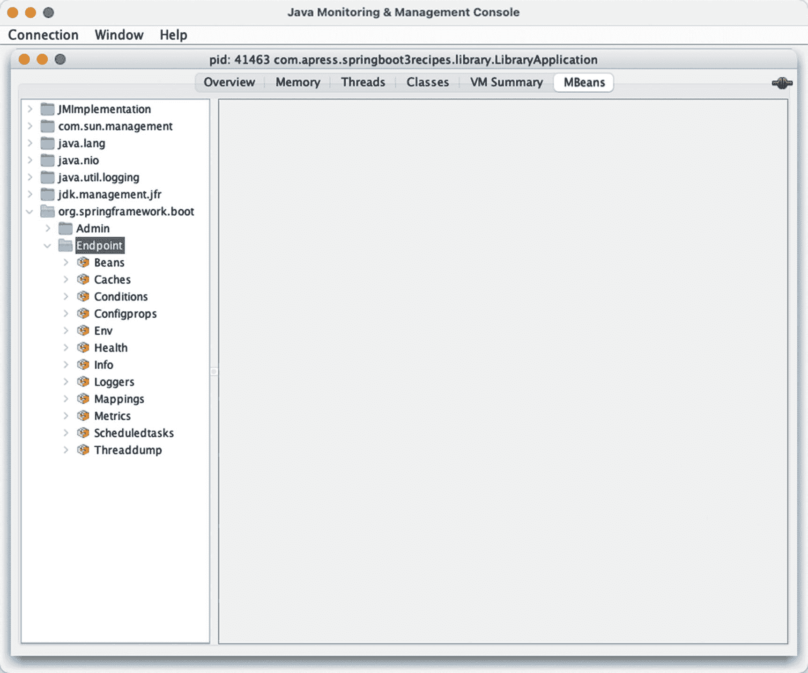

一个标题为“Java 监控与管理控制台”的窗口。已选中“M Bean”选项卡。在左侧窗格中，选中并展开了“endpoint”文件夹。下方列出了子文件夹。

图 9-2

通过 HTTP 暴露的指标

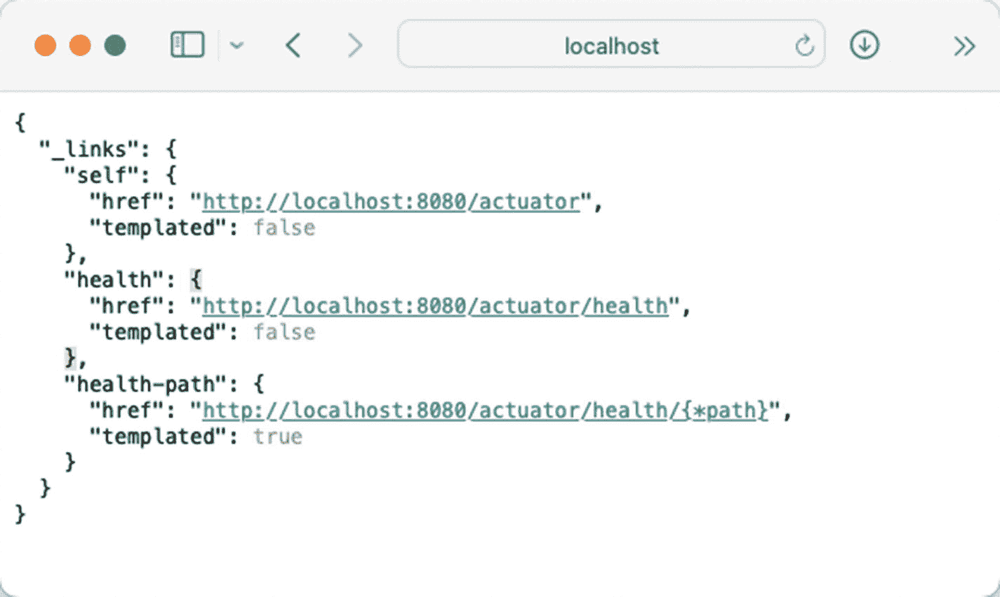

一个 JSON 片段，包含指向本地主机上运行的 Actuator 服务提供的不同端点的链接。它包括 self、health 的链接，以及一个包含用于监控系统健康状态的模板化 URL 的 health 路径。

图 9-1

通过 Web 访问 Spring Boot Actuator

您会注意到 JMX 暴露的端点比 HTTP 多。默认情况下，HTTP 仅暴露 `/actuator/health` 和 `/actuator/info`。这是出于安全考虑。`/actuator` 是公开暴露的，因此您不希望所有人都能看到这些信息。您可以通过 `management.endpoints.web.exposure.include` 和 `management.endpoints.web.exposure.exclude` 属性来配置要暴露的内容。在 include 中使用 `*` 将向 Web 暴露所有端点。请参见清单 9-2。

```
management.endpoints.web.exposure.include=*
清单 9-2
通过 Web 暴露属性
```

将此配置添加到 `application.properties` 后，Web 将暴露与 JMX 相同的功能（见图 9-3）。

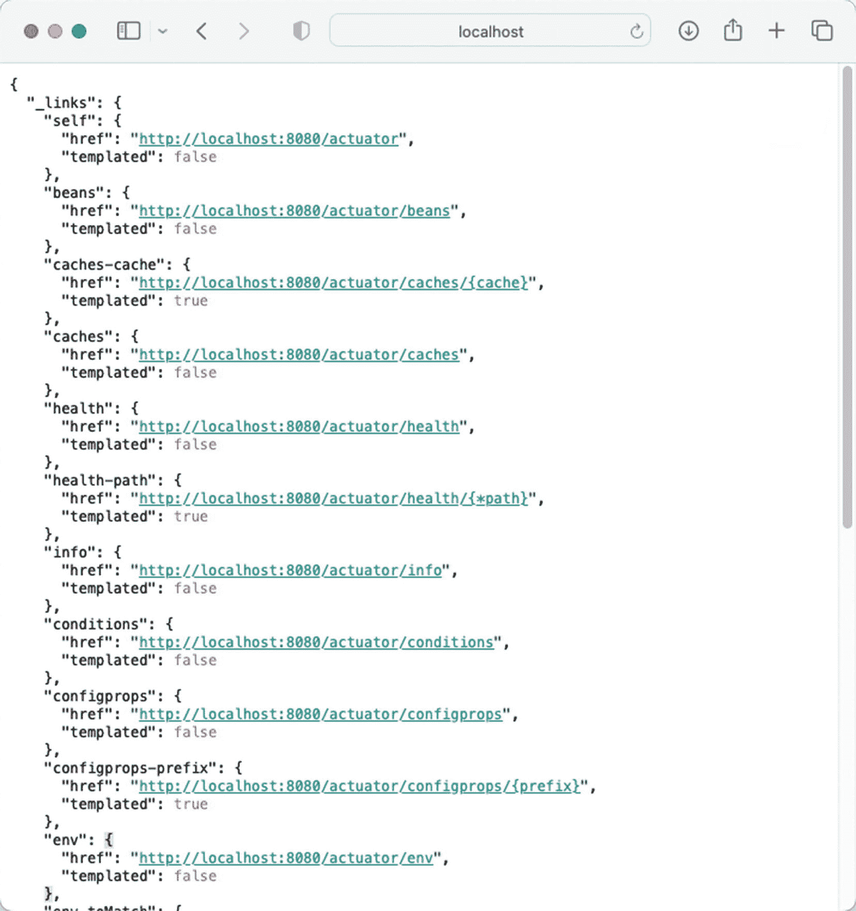

一个 JSON 片段，在 `_links` 对象下提供了指向 Actuator 服务各个端点的链接。它包括 self 引用、健康检查、beans、caches、info、conditions、config props 和 environment details 的链接。每个链接都包含其各自的 URL 和用于动态路径生成的 templated 状态。

图 9-3

HTTP 暴露所有指标

#### 配置管理服务器

默认情况下，Spring Boot Actuator 与常规应用使用相同的端口和地址（`http://localhost:8080`）。然而，通常的做法是在不同的端口上运行管理端点。您可以通过 `management.server` 命名空间下的属性进行配置。大多数属性与常规 `server` 命名空间中的属性类似（见表 9-1）。

表 9-1

管理服务器属性

| 属性 | 描述 |
| --- | --- |
| `management.server.add-application-context-header` | 向响应中添加一个 `X-Application-Context` 头，包含应用上下文名称 |
| `management.server.port` | 设置管理服务器运行的端口；默认与 `server.port` 相同 |
| `management.server.address` | 设置要绑定的网络地址；默认与 `server.address` 相同（即 `0.0.0.0` 或所有地址） |
| `management.server.base-path` | 设置管理端点的基础路径；默认是 `/`，这需要设置一个端口 |
| `management.server.ssl.*` | 设置 SSL 属性，为管理服务器配置 SSL |

将清单 9-3 添加到 `application.properties` 文件中，这将在单独的端口上运行管理端点，并添加 `X-Application-Context` 头。

```
management.server.add-application-context-header=true
management.server.port=8090
清单 9-3
管理服务器属性
```

重新启动应用后，管理端点现在可通过 `http://localhost:8090/actuator` 访问。在不同的端口上运行 Spring Boot Actuator 的好处是，可以通过在防火墙上阻止该端口并仅允许本地访问，从而将其对公共互联网隐藏。

信息图标。 `management.server` 属性仅在使用嵌入式服务器时有效。当部署到外部服务器时，这些属性不再适用！


#### 配置单个管理端点

可以通过 `management.endpoint.<端点名称>` 命名空间中的属性来配置单个端点。大多数端点至少包含一个 `enabled` 属性和一个 `cache.time-to-live` 属性。前者用于启用或禁用端点，后者则指定端点结果的缓存时长（参见表 9-2）。

表 9-2

端点配置属性

| 属性 | 描述 |
| --- | --- |
| `management.endpoint.<端点名称>.enabled` | 设置特定端点是否启用；通常默认为 `true`，有时取决于某项功能的可用性。例如，如果 Flyway 不存在，那么启用 `flyway` 端点将不会产生任何效果。 |
| `management.endpoint.<端点名称>.cache.time-to-live` | 设置响应的缓存时间；默认值为 0ms，表示不缓存。 |
| `management.endpoint.health.show-details` | 设置是否显示健康端点的详细信息；默认值为 `never`，可更改为 `always` 或 `when_authorized`。 |
| `management.endpoint.configprops.show-values``management.endpoint.env.show-values``management.endpoint.quartz.show-values` | 设置何时显示端点的未脱敏值；默认值为 `never`。可更改为 `always` 或 `when_authorized`。 |
| `management.endpoint.configprops.roles``management.endpoint.env.roles``management.endpoint.health.roles``management.endpoint.quartz.roles` | 设置允许查看详细信息的角色（与 `show-details`/`show-values` 的 `when_authorized` 值配合使用）。 |

在 `application.properties` 中添加 `management.endpoint.health.show-details=always` 将显示关于应用程序健康状况的更多信息，如图 9-4 所示。

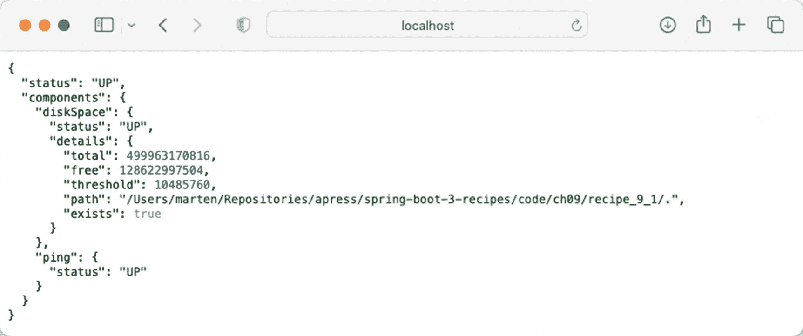

一个 JSON 片段展示了系统状态报告。它表明磁盘空间和 ping 组件均处于正常运行状态。它还提供了磁盘空间的详细信息，包括总容量、可用容量和阈值，以及文件路径。Ping 状态也显示为正常。

图 9-4

扩展的健康端点输出

#### 保护管理端点

当 Spring Boot 同时检测到 Spring Boot Actuator 和 Spring Security 时，它会自动启用对管理端点的安全访问。访问端点时，将显示一个基本登录提示，要求输入用户名和密码。Spring Boot 会生成一个默认用户名为 `user` 的用户，并附带一个生成的密码（参见配方 5-1）用于登录。

在 `spring-boot-starter-actuator` 之外添加 `spring-boot-starter-security` 就足以保护您的管理端点。参见清单 9-4。

```
org.springframework.boot
spring-boot-starter-security

清单 9-4
Spring Boot Security Starter 依赖
```

这将在您的应用程序和管理端点中启用安全性。现在，当访问端点 `http://localhost:8090/actuator` 时，将显示一个基本登录提示。输入正确的凭据后，您应该仍然能够看到结果。

#### 配置健康检查

Spring Boot Actuator 的功能之一是进行健康检查。这些检查通过 `http://localhost:8090/actuator/health` 暴露。如果应用程序状态为 `UP` 或 `DOWN`，则会生成相应结果。健康端点会调用系统中所有可用的 `HealthIndicator`，并在端点中报告它们。您可以通过设置 `management.health.<健康指示器>.enabled` 属性来控制哪些 `HealthIndicator` 存在。对于不可用的功能（例如，在数据源不可用时尝试获取其信息），将属性设置为 `true` 不会生效。参见清单 9-5。

```
management.health.diskspace.enabled=false
清单 9-5
禁用健康指示器
```

这将禁用磁盘空间的健康检查，并且它不再属于健康检查的一部分。

#### 配置指标

Spring Boot Actuator 的功能之一是暴露指标。这些指标通过 `http://localhost:8090/actuator/metrics` 暴露。这将生成应用程序可用指标的列表（参见图 9-5）。

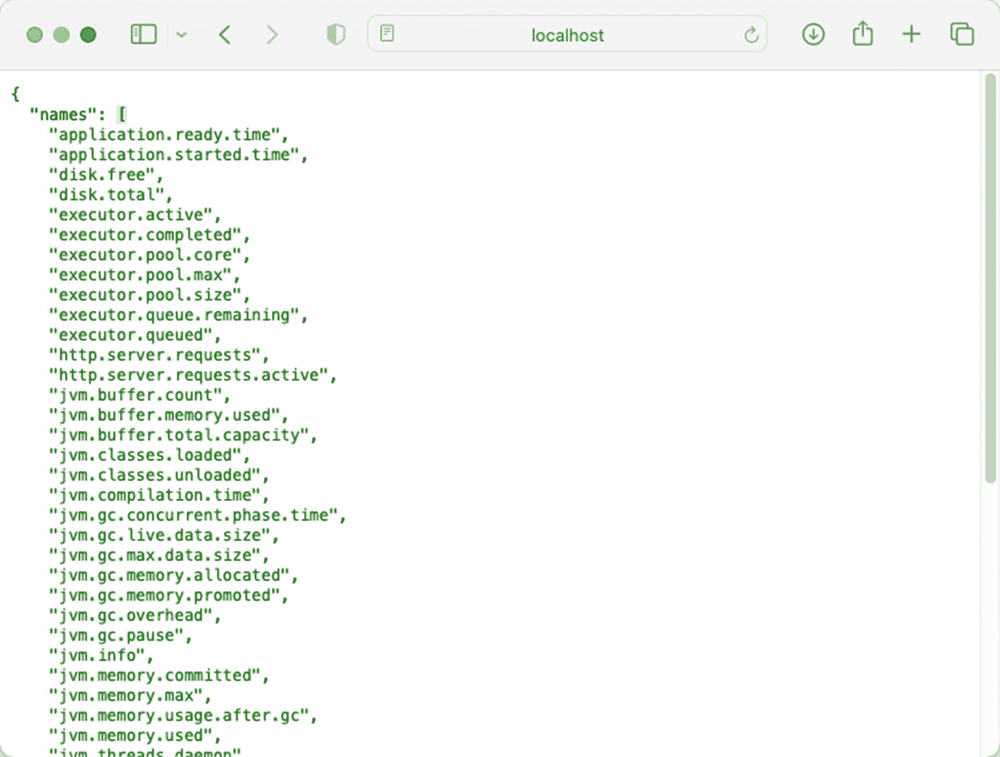

一个 JSON 数组包含与系统性能和健康相关的各种指标列表，例如磁盘使用情况、执行器活动、JVM 指标、HTTP 服务器请求和线程计数。

图 9-5

当前可用指标列表

您可以通过访问 `http://localhost:8090/actuator/metrics/{指标名称}` 来获取有关某个指标的更多信息。例如，`http://localhost:8090/actuator/metrics/system.cpu.usage` 将显示当前的 CPU 使用率（图 9-6）。

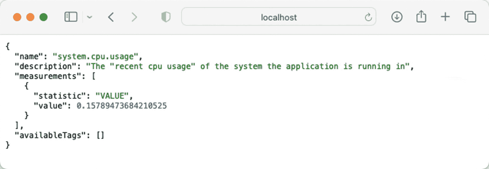

一个 JSON 对象展示了系统 CPU 使用率指标，描述了应用程序系统的近期 CPU 使用情况。值为 0.15789473684210525。

图 9-6

详细的 CPU 指标

Spring 和 Spring Boot 使用 Micrometer 来收集（和暴露）指标。对于 Spring Boot 检测到的功能，指标默认是启用的。因此，如果检测到数据源，指标将被启用。要禁用指标，请将它们添加到 `management.metrics.enable` 属性中。此属性是一个映射，包含要启用哪些指标的键和值。参见清单 9-6。

```
management.metrics.enable.system=false
management.metrics.enable.tomcat=false
清单 9-6
禁用某个类别的指标
```

此配置将禁用 `system` 和 `tomcat` 指标。当在 `http://localhost:8090/actuator/metrics` 查看指标时，您会发现它们已不在列表中。

## 9-2\. 创建自定义健康检查和指标

### 问题

您的应用程序需要暴露某些默认情况下不可用的指标，并执行某些健康检查。

### 解决方案

健康检查和指标是可插拔的，类型为 `HealthIndicator` 和 `MetricBinder` 的 Bean 会被自动注册，以提供额外的健康检查和指标。您只需创建一个实现所需接口的类，并在上下文中将该类的一个实例注册为 Bean，即可使其为健康和指标功能做出贡献。


### 工作原理

假设已经存在对 Spring Boot Actuator 的依赖，你就可以立即开始编写实现。假设你有一个使用 `TaskScheduler` 的应用程序，并且希望对其进行一些指标和健康检查。（添加 `@EnableScheduling` 就足以让 Spring Boot 创建一个默认的 `TaskScheduler`。）

首先，我们来编写 `HealthIndicator` 接口。你可以直接实现 `HealthIndicator` 接口（并实现 `health()` 方法），或者使用便捷的 `AbstractHealthIndicator` 方法作为基类（它开箱即用地添加了一些逻辑和异常处理）。我们可以将配方 3-3 作为本配方的起点。参见清单 9-7。

```
package com.apress.springboot3recipes.library;
import org.springframework.boot.actuate.health.AbstractHealthIndicator;
import org.springframework.boot.actuate.health.Health;
import org.springframework.scheduling.concurrent.ThreadPoolTaskScheduler;
import org.springframework.stereotype.Component;
@Component
class TaskSchedulerHealthIndicator extends AbstractHealthIndicator {
private final ThreadPoolTaskScheduler taskScheduler;
TaskSchedulerHealthIndicator(ThreadPoolTaskScheduler taskScheduler) {
this.taskScheduler = taskScheduler;
}
@Override
protected void doHealthCheck(Health.Builder builder) throws Exception {
int poolSize = taskScheduler.getPoolSize();
int active = taskScheduler.getActiveCount();
int free = poolSize - active;
builder
.withDetail("active", active)
.withDetail("poolsize", poolSize);
if (poolSize > 0 && free <= 1) {
builder.down();
} else {
builder.up();
}
}
}
清单 9-7
HealthIndicator 实现
```

`TaskSchedulerHealthIndicator` 接口对给定的 `ThreadPoolTaskExecutor` 进行操作。如果可用于调度任务的线程数为 1 或更少，则将其状态报告为 down。`poolSize > 0` 的条件之所以存在，是因为底层 `Executor` 的创建会延迟到需要时才进行；在此之前，`poolSize` 将报告为 `0`。返回值包括 `poolsize` 和 `active` 线程数。

`TaskSchedulerMetrics` 实现扩展了 Micrometer.io 中的 `MeterBinder` 接口。它将 `active` 和 `pool-size` 值暴露给指标注册表。参见清单 9-8。

```
package com.apress.springboot3recipes.library;
import io.micrometer.core.instrument.FunctionCounter;
import io.micrometer.core.instrument.MeterRegistry;
import io.micrometer.core.instrument.binder.MeterBinder;
import org.springframework.scheduling.concurrent.ThreadPoolTaskScheduler;
import org.springframework.stereotype.Component;
@Component
class TaskSchedulerMetrics implements MeterBinder {
private final ThreadPoolTaskScheduler taskScheduler;
public TaskSchedulerMetrics(ThreadPoolTaskScheduler taskScheduler) {
this.taskScheduler = taskScheduler;
}
@Override
public void bindTo(MeterRegistry registry) {
FunctionCounter
.builder("task.scheduler.active", taskScheduler,
ThreadPoolTaskScheduler::getActiveCount)
.register(registry);
FunctionCounter
.builder("task.scheduler.pool-size", taskScheduler,
ThreadPoolTaskScheduler::getPoolSize)
.register(registry);
}
}
清单 9-8
用于暴露指标的 MeterBinder 实现
```

现在，当在 `LibraryApplication` 上放置 `@EnableScheduling` 注解并重新启动应用程序时，将报告 `TaskScheduler` 的指标和健康状态（参见图 9-7）。

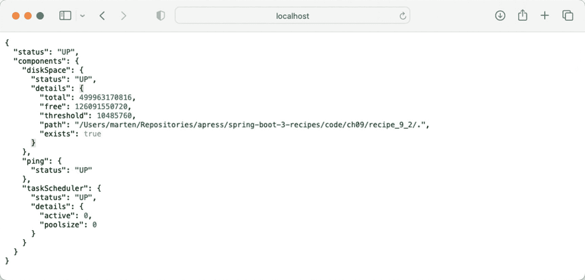

一个 JSON 状态报告表明磁盘空间和任务调度器组件处于 up 状态。它提供了磁盘详细信息，例如总空间和可用空间，以及 ping 状态。任务调度器报告为 active，池大小为 0。

图 9-7

TaskScheduler 健康检查

## 9-3\. 导出指标

### 问题

你想将指标导出到外部系统，以创建仪表板来监控应用程序。

### 解决方案

使用 Graphite 等受支持的系统之一，并定期将指标推送到该系统。在你的应用程序中包含一个 Micrometer.io 注册表依赖项（除了 `spring-boot-starter-actuator` 依赖项之外），指标将自动导出。默认情况下，数据将每分钟推送到服务器。

### 工作原理

导出指标的能力是 Micrometer.io 库的一部分，它支持多种服务，例如 Graphite、DataDog、Prometheus 或常规 StatsD。本配方使用 Graphite，因此需要添加对 `micrometer-registry-graphite` 的依赖。参见清单 9-9。

```
io.micrometer
micrometer-registry-graphite

清单 9-9
Micrometer Graphite 注册表依赖项
```

理论上，如果 Graphite 运行在 `localhost` 上并使用默认端口，这足以将指标发布到 Graphite。然而，Spring Boot 通过暴露一些属性使配置变得容易。通常，这位于 `management.metrics.export.<registry-name>` 命名空间下（参见表 9-3）。

表 9-3

常用指标导出属性

| 属性 | 描述 |
| --- | --- |
| `management.<registry-name>.metrics.export.enabled` | 设置是否启用指标导出。当在类路径上检测到该库时，默认值为 `true`。 |
| `management.<registry-name>.metrics.export.host` | 设置发送指标的主机，通常是 `localhost` 或服务的已知 URL（如 SignalFX、DataDog 等）。 |
| `management.<registry-name>.metrics.export.port` | 设置发送指标的端口；默认为所需服务的已知端口。 |
| `management.<registry-name>.metrics.export.step` | 设置发送指标的频率；默认为 1 分钟。 |
| `management.<registry-name>.metrics.export.rate-units` | 设置用于报告速率的基本时间单位；默认为 `seconds`。 |
| `management.<registry-name>.metrics.export.duration-units` | 设置用于报告持续时间的基本时间单位；默认为 `milliseconds`。 |

要每 10 秒而不是每分钟报告一次指标，请将清单 9-10 添加到 `application.properties` 文件中。

```
management.graphite.metrics.export.step=10s
清单 9-10
Graphite 配置
```

一个信息图标。 `bin` 目录包含一个 `graphite.sh` 文件，该文件使用 Docker 启动一个 Graphite 实例。

现在，指标将每 10 秒发布到 Graphite。如果你启动应用程序并在 `http://localhost/` 上打开 Graphite（假设你正在运行上述 Docker 容器），你可以，例如，创建一个 CPU 使用率和负载的图表（参见图 9-8）。

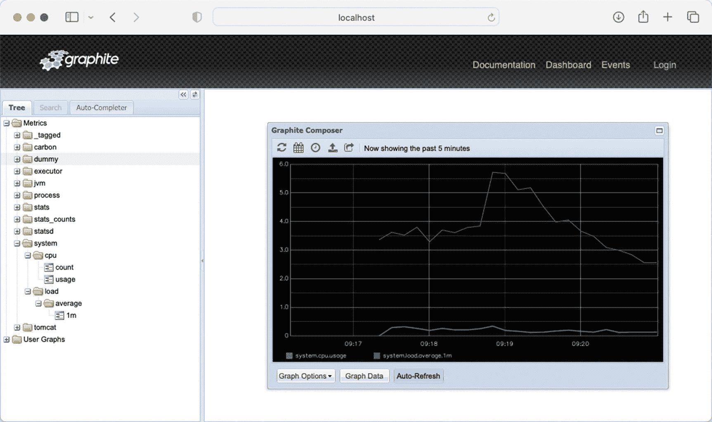

一个标题为 graphite 的窗口截图。从左侧窗格中，选择了标记为 tree 的选项卡。Metrics 目录已展开。标记为 system 的子文件夹进一步展开。右侧窗格有一个 graphite composer 窗口，显示一个折线图。标题显示为“now showing the past 5 minutes”。

图 9-8

Graphite CPU 图表

## 9-4\. 使用 Zipkin 进行追踪

### 问题

你想将日志文件中的日志行与传入请求、消息和调用流关联起来，并将追踪记录到像 Zipkin 这样的追踪解决方案中。


### 解决方案

使用 Spring Boot 时，它内置了对 Micrometer 指标和追踪 API 的开箱即用支持，并可以自动为 OpenTelemetry 或 OpenZipkin Brave 配置追踪器。对于自动配置，需要 `spring-boot-starter-actuator` 以及相应的 Micrometer 追踪桥接器（`io.micrometer:micrometer-tracing-bridge-otel` 或 `io.micrometer:micrometer-tracing-bridge-brave`）。最后一个组件是 Brave 或 OpenTelemetry 的导出器。在代码清单 9-11 中，我们将使用 OpenZipkin Brave（其他集成的设置选项非常相似）。

```
org.springframework.boot
spring-boot-starter-actuator

io.micrometer
micrometer-tracing-bridge-brave

io.zipkin.reporter2
zipkin-reporter-brave

代码清单 9-11
使用 Zipkin 的 Brave 追踪依赖
```

这些依赖足以触发自动配置并设置追踪、日志记录和导出。启用调试日志后，您现在可以在日志中看到追踪 ID 和跨度 ID。

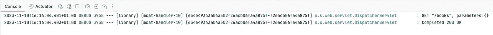

一条日志指示了一条处理对 `/books` 的 GET 请求的调试消息。该请求已成功处理，状态码为 200，响应大小为 0 KB。

图 9-9
包含追踪 ID 和跨度 ID 的日志输出

此信息也会发送到 Zipkin 并可查看。

一个信息图标。 本技巧的源码包含一个 Docker Compose 文件，它会在应用程序启动时自动启动 Zipkin（如果尚未启动）。可以通过访问 `http://localhost:9411/zipkin` 来查看此 Zipkin 实例（参见图 9-10）。

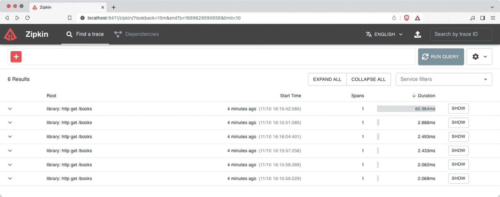

一个浏览器窗口显示了 Zipkin 网页。选中了标签页“查找追踪”。它显示了 6 个结果，分为 4 列，分别标记为：主机、开始时间、跨度数和持续时间。每个结果右侧都有一个标记为“显示”的按钮。

图 9-10
Zipkin 用户界面

然而，这只是一个包含单个组件的追踪。当有更多组件时，它们也会出现，如图 9-11 所示。

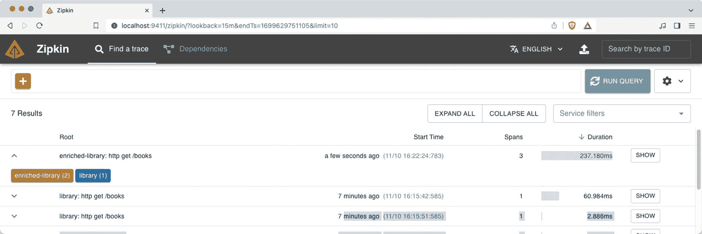

一个浏览器窗口显示了 Zipkin 网页。选中了标签页“查找追踪”。它显示了 6 个结果，分为 4 列，分别标记为：主机、开始时间、跨度数和持续时间。第一个结果有 3 个跨度。每个结果右侧都有一个标记为“显示”的按钮。

图 9-11
Zipkin 用户界面，多个跨度

在图 9-12 中，您可以看到每次调用的详细信息，并且它们属于同一个追踪。

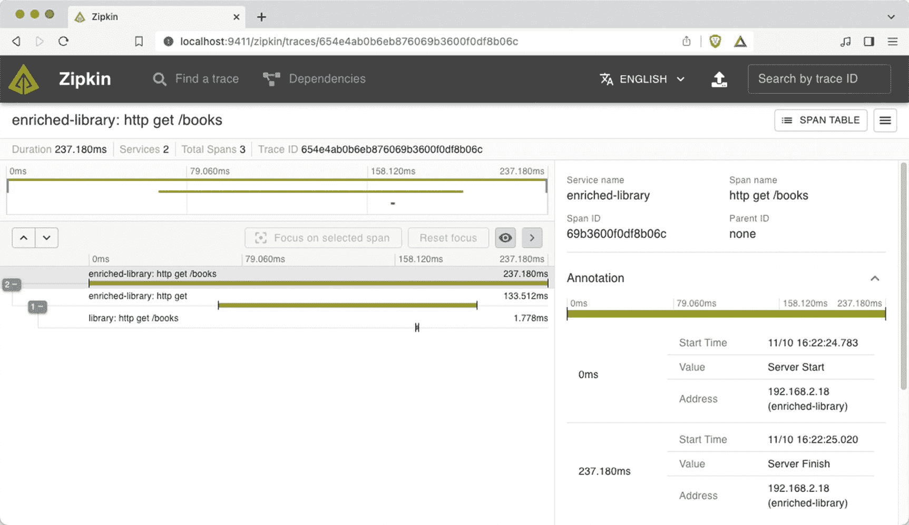

一个浏览器窗口显示了 Zipkin 网页。标题显示为“enriched-library: http get /books”。列出了持续时间、服务、总跨度数和追踪 ID。每个跨度在下方都有详细说明。

图 9-12
Zipkin 用户界面，多个跨度详情

### 工作原理

Spring Boot 使用 Micrometer 观测来观测通过您应用程序的调用。当 `spring-boot-starter-actuator` 作为依赖包含进来时，Spring Boot 会自动引入 Micrometer 观测。

借此，Spring Boot 会自动设置一个 `ObservationHandler` 供您的应用程序使用。这个 `ObservationHandler` 会被注入到一个 `ObservationRegistry` 中。`ObservationRegistry` 是一个被注入到框架和库的各个位置的组件。在撰写本文时，`ObservationRegistry` 会自动应用于以下组件：

*   Spring JMS
*   Spring Web 和 Spring WebFlux
*   Spring Security
*   Spring Kafka
*   Spring Data for MongoDB
*   Spring Data R2DBC
*   Spring Task Executor 和 Task Scheduler
*   Spring AMQP (RabbitMQ)

Spring Boot 在 `management.observations` 命名空间中暴露了一些属性，用于配置某些特性（参见表 9-4）。某些观测可以被禁用，但也可以指定要包含在观测中的默认值。这对于将应用程序名称或版本等部分作为默认键/值包含在内非常有用。

表 9-4
观测配置属性

| 属性 | 描述 |
| --- | --- |
| `management.observations.enable.<key>` | 设置是否应启用 `<key>` 的给定观测；默认值为 `true`。`all` 是一个特殊关键字，用于启用或禁用所有观测。 |
| [`management.observations.http.client.requests.name`](http://management.observations.http.client.requests.name) | 设置客户端请求的观测名称；默认值为 `http.client.requests`。 |
| [`management.observations.http.server.requests.name`](http://management.observations.http.server.requests.name) | 设置服务器请求的观测名称；默认值为 `http.server.requests`。 |
| `management.observations.key-values.<key>` | 设置应用于所有观测的公共键/值。默认值为空。 |
| `management.observations.r2dbc.include-parameter-values` | 设置是否包含 R2DBC 观测的查询参数；默认值为 `false`。 |

一个警告图标。 当 Spring Boot 检测到预先配置的 `ObservationHandler` 时，它不会为您配置一个，并且表 9-4 中的属性将不会被应用，因为预期您会进行完整配置！

接下来，您需要包含一个追踪桥接器（用于将 Micrometer 连接到所选的追踪解决方案）。这将引入必要的 Micrometer 追踪依赖（参见代码清单 9-12 中一个使用 Zipkin 的 Brave 实现示例）。

```
org.springframework.boot
spring-boot-starter-actuator

io.micrometer
micrometer-tracing-bridge-brave

io.zipkin.reporter2
zipkin-reporter-brave

代码清单 9-12
使用 Zipkin 的 Brave 追踪依赖
```

有了所有这些依赖，Spring Boot 的自动配置将配置一个 `ObservationHandler`。默认情况下，它会设置一个 `io.micrometer.tracing.handler.DefaultTracingObservationHandler`。当检测到预先配置的 `ObservationHandler` 时，Spring Boot 不会创建默认的，而是会重用预先配置的那个。

除了配置 `ObservationHandler`，Spring Boot 还会稍微修改正在使用的日志模式，以自动包含已检测或生成的 `span-id` 和 `trace-id`。这样，日志也将包含必要的信息，这在排查特定调用时非常有用。也可以通过在你的应用程序属性中指定 `logging.pattern.correlation` 属性来手动配置日志模式。`span-id` 和 `trace-id` 在映射诊断上下文（MDC）中可用，名称为 `traceId` 和 `spanId`。代码清单 9-13 显示了 Spring Boot 将应用于日志关联的默认模式。当然，如果需要，可以修改此模式。

```
logging.pattern.correlation=[${spring.application.name:},%X{traceId:-},%X{spanId:-}]
代码清单 9-13
关联日志属性
```


#### 配置追踪

Spring Boot 提供了一些属性，以便更轻松地配置追踪。您可以配置应使用的传播类型以及应采样的调用比例（默认为 10%）。默认情况下，如果检测到追踪功能，它将被启用，但您也可以禁用它。

表 9-5

追踪配置属性

| 属性 | 描述 |
| --- | --- |
| `management.tracing.enabled` | 设置是否应启用追踪的自动配置；默认值为 `true`。 |
| `management.tracing.sampling.probability` | 设置采样范围的概率，从 0 到 1.0；默认值为 0.1。 |
| `management.tracing.propagation.type` | 列出支持的追踪上下文传播方式（可包含 `W3C`、`B3` 或 `B3_MULTI`）；默认值为 `null`。设置后，它将优先于更细粒度的 `consumes` 和 `produces` 属性。 |
| `management.tracing.propagation.consume` | 列出接收时支持的追踪上下文传播方式（可包含 `W3C`、`B3` 或 `B3_MULTI`）；默认值为所有值。 |
| `management.tracing.propagation.produce` | 列出发送时支持的追踪上下文传播方式（可包含 `W3C`、`B3` 或 `B3_MULTI`）；默认值为 `W3C`。 |
| `management.tracing.sampling.probability` | 追踪被采样的概率，范围从 `0.0` 到 `1.0`。 |

接下来，可以配置 Zipkin。主要可以设置端点的 URL 和一些连接超时（参见表 9-6）。这同样适用于其他解决方案，如 Wavefront、Open Telemetry 和 Prometheus。

表 9-6

Zipkin 配置属性

| `management.zipkin.tracing.endpoint` | 设置 Zipkin API 的 URL；默认值为 `http://localhost:9411/api/v2/spans`。 |
| `management.zipkin.tracing.connect-timeout` | 设置对 Zipkin 请求的连接超时；默认值为 1 秒。 |
| `management.zipkin.tracing.read-timeout` | 设置对 Zipkin 请求的读取超时；默认值为 10 秒。 |

#### 使用 ObservationRegistry 设置追踪

Spring Boot 会自动构建一个 `ObservationRegistry`。如果需要，这个 `ObservationRegistry` 也可以注入到常规 Bean 中供手动使用。参见清单 9-14。

```
package com.apress.springboot3recipes.library;
import io.micrometer.observation.Observation;
import io.micrometer.observation.ObservationRegistry;
import io.micrometer.observation.annotation.Observed;
import org.springframework.stereotype.Service;
import java.util.Map;
import java.util.Optional;
import java.util.concurrent.ConcurrentHashMap;
@Service
class InMemoryBookService implements BookService {
private final Map books = new ConcurrentHashMap();
private final ObservationRegistry observations;
InMemoryBookService(ObservationRegistry observations) {
this.observations = observations;
}
public Optional find(String isbn) {
var observation = Observation
.createNotStarted("BookService.find", this.observations);
observation.lowCardinalityKeyValue("isbn", isbn);
return observation.observe(() -> Optional.ofNullable(books.get(isbn)));
}
}
清单 9-14
使用 ObservationRegistry
```

这里为 `find` 方法添加了一个观测。为此，使用一个名称和注入的 `ObservationRegistry` 创建了一个 `Observation`。接下来，我们通过使用 `observe()` 方法来调用我们希望被观测的实际代码。`Observation.observe()` 方法根据是否需要返回结果，接受一个 `Runnable` 或一个 `Supplier`。通过这个小小的调整，我们现在就能看到查找一本书所需的时间，并且它将作为 Zipkin 中追踪的一部分额外显示出来。

#### 使用 AspectJ 设置追踪

当检测到 AspectJ 时，它还会注册一个 `io.micrometer.observation.aop.ObservedAspect`。`ObservedAspect` 会检测带有 `@Observed` 注解的方法，并为其创建一个新的观测。参见清单 9-15。

```
package com.apress.springboot3recipes.library;
import io.micrometer.observation.Observation;
import io.micrometer.observation.ObservationRegistry;
import io.micrometer.observation.annotation.Observed;
import org.springframework.stereotype.Service;
import java.util.Map;
import java.util.Optional;
import java.util.concurrent.ConcurrentHashMap;
@Service
class InMemoryBookService implements BookService {
private final Map books = new ConcurrentHashMap();
private final ObservationRegistry observations;
InMemoryBookService(ObservationRegistry observations) {
this.observations = observations;
}
@Override
@Observed(name = "BookService.create")
public Book create(Book book) {
books.put(book.isbn(), book);
return book;
}
}
清单 9-15
使用 @Observed 注解
```

`@Observed` 注解会触发创建一个具有给定 `name` 的新 `Observation`。如果省略 `name`，它将使用 `method.observed` 作为默认值。此外，类名和方法名会作为低基数键添加到观测中。也可以在 `@Observed` 注解中提供静态值作为低基数键；但（在撰写本文时）尚无法指定表达式来检索，例如，从 `Book` 参数中获取 `isbn` 值。

