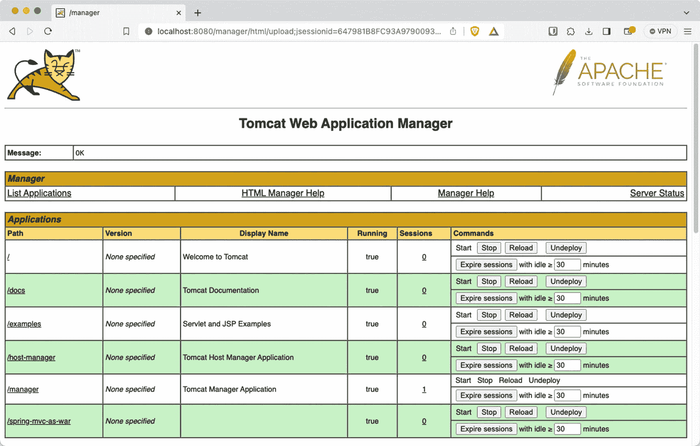
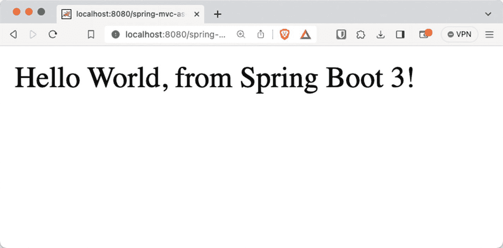
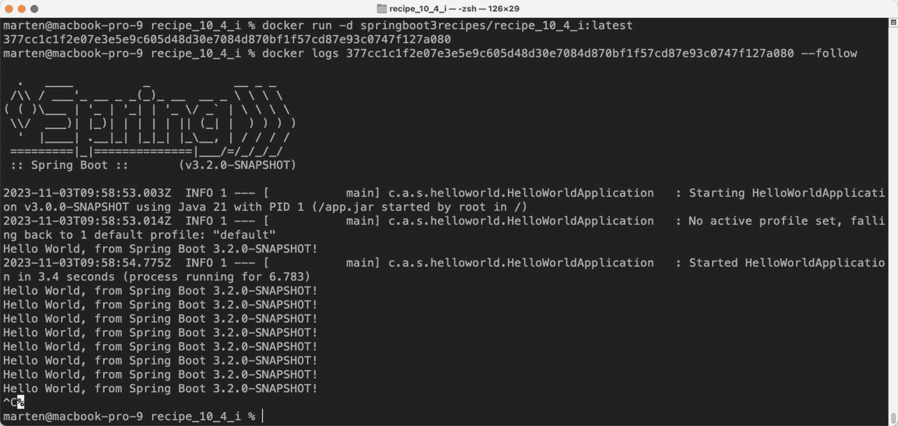
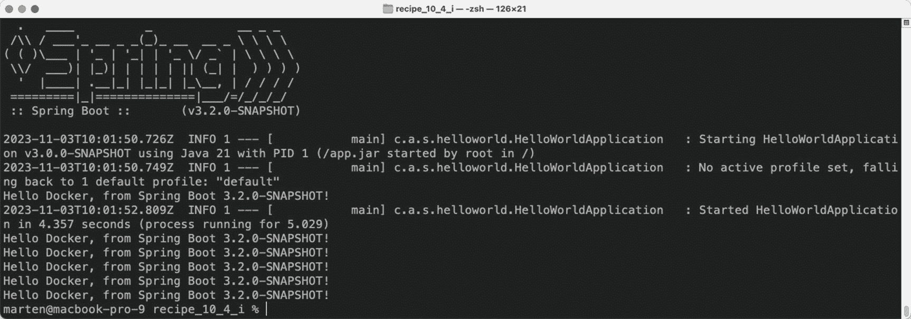
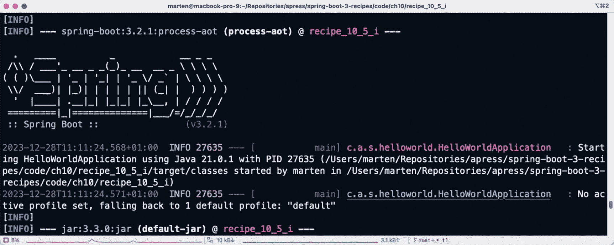
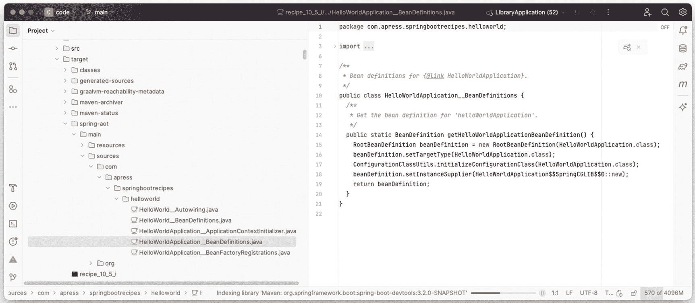
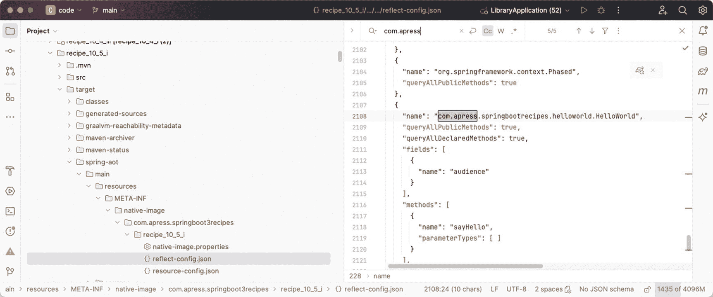
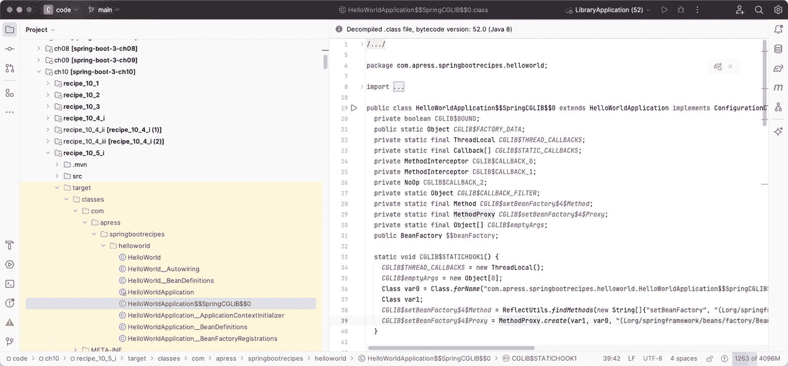

# 10. 打包

在本章中，您将了解打包 Spring Boot 应用程序的不同解决方案，从创建可执行 JAR 到使用 GraalVM 从代码创建原生镜像。

## 10-1. 创建可执行归档文件

默认情况下，Spring Boot 会创建一个可以使用 `java -jar your-application.jar` 运行的 JAR 或 WAR。但是，您可能希望将应用程序作为服务器启动的一部分来运行（目前已在基于 Debian 和 Ubuntu 的系统上测试并支持）。为此，您可以使用 Maven 或 Gradle 插件来创建一个可执行 JAR。

### 问题

您需要一个可执行文件，以便将其作为服务安装在您的环境中。

### 解决方案

Spring Boot Maven 和 Gradle 插件都提供了使创建的构件可执行的选项。^(⁶) 这样做之后，归档文件也会变成/表现得像一个用于启动/停止服务的 Unix shell 脚本。

### 工作原理

要使构件可执行，您需要按如下方式配置 Maven 或 Gradle 插件。

#### 使归档文件可执行

在 Maven 插件中，您可以将 `executable` 属性设置为 `true`，归档文件将变为可执行。参见清单 10-1。

```
org.springframework.boot
spring-boot-maven-plugin

true

清单 10-1
用于创建可执行文件的 Spring Boot Maven 插件
```

对于 Gradle，您需要指定 `launchScript()` 来实现这一点。参见清单 10-2。

```
tasks.named('bootJar') {
launchScript()
}
清单 10-2
用于创建可执行文件的 Spring Boot Gradle 插件
```

现在，在构建您的构件之后，该构件本身是可执行的，并且可以用来启动应用程序。您现在可以简单地输入 `./your-application.jar` 来启动它，而无需使用 `java -jar your-application.jar`。

一个信息图标。 可能需要使归档文件可执行；您可以使用 `chmod +x your-application.jar` 来实现。

当使归档文件可执行时，实际上是在归档文件前面加上了一个 bash 脚本。您可能会认为这样做会破坏 Java 归档文件。然而，由于 Java 读取归档文件的方式（从底部到顶部）和 shell 读取归档文件的方式（从顶部到底部），这实际上是可行的。

一个信息图标。 您可以使用 `head -n 309 your-application.jar` 来查看这个 bash 脚本。


#### 指定配置

通常，在启动基于 Spring Boot 的应用程序时，有多种方式可以提供额外配置（参见第 2 章）。^(⁷) 然而，当将归档文件作为脚本（或服务）使用时，其中一些方式不再适用。此时，你可以在可执行归档文件旁边使用一个 `.conf` 文件（必须命名为 `your-application.conf`），来为应用程序包含额外的配置选项。请参见表 10-1。

表 10-1

可用属性

| 属性 | 描述 |
| --- | --- |
| `MODE` | 设置操作的“模式”。默认值为 `auto`，将自动检测模式。当从符号链接启动时，其行为类似于 `service`。如果希望在前台运行进程，请改为 `run`。 |
| `RUN_AS_USER` | 设置用于运行应用程序的用户；默认值为 JAR 文件的所有者。 |
| `USE_START_STOP_DAEMON` | 设置是否使用 `start-stop-daemon` 命令。默认情况下，将检测该命令是否可用。 |
| `PID_FOLDER` | 设置写入 PID 的文件夹名称；默认值为 `/var/run`。 |
| `LOG_FOLDER` | 设置写入日志的文件夹名称；默认值为 `/var/log`。 |
| `CONF_FOLDER` | 设置读取 `.conf` 文件的文件夹名称；默认值为与 JAR 文件相同的目录。 |
| `LOG_FILENAME` | 设置要写入的日志文件名；默认值为 `<appname>.log`。 |
| `APP_NAME` | 设置应用程序的名称。如果 JAR 文件是从符号链接运行的，脚本会猜测应用程序名称。 |
| `RUN_ARGS` | 设置传递给 Spring Boot 应用程序的参数。 |
| `JAVA_HOME` | 默认情况下，将从 `$PATH` 中发现此路径，但如有需要，可以显式定义。 |
| `JAVA_OPTS` | 设置传递给 JVM 的选项（如内存设置、GC 设置等）。 |
| `JARFILE` | 设置 JAR 文件的显式位置，以防脚本用于启动未实际嵌入的 JAR。 |
| `DEBUG` | 如果不为空，则在 shell 进程上设置 `-x` 标志，便于查看脚本中的逻辑。 |
| `STOP_WAIT_TIME` | 设置强制关闭前的等待时间（默认值为 60 秒）。 |

当使用嵌入式脚本（默认情况）时，`JARFILE` 和 `APP_NAME` 属性无法通过 `.conf` 文件配置。请参见清单 10-3。

```
JAVA_OPTS=-Xmx1024m
DEBUG=true
清单 10-3
可执行文件的属性
```

通过此配置，你将为应用程序分配最多 1 GB 的内存，并且 shell 脚本将进行一些额外的日志记录。当然，你也可以将表 10-1 中的任何属性添加到此文件中。

## 10-2\. 创建用于部署的 WAR 文件

### 问题

你希望创建一个 WAR 文件以部署到 Servlet 容器或 Jakarta EE 容器，而不是创建 JAR 文件。如果你所在的组织仍在使用 Oracle WebLogic、IBM WebSphere 或 Tomcat 等服务器，则可能需要这种所谓的传统部署方式。

### 解决方案

将应用程序的打包方式从 JAR 改为 WAR，并让你的 Spring Boot 应用程序继承 `SpringBootServletInitializer`，以便它能够像常规应用程序一样自行引导。最后，确保将你用于开发的服务器作为 `provided` 依赖项包含在内，以便在生成可部署工件时将其过滤掉。


### 工作原理

要将配方 3-1 制作成可部署的 WAR 文件，需要完成三件事。

1.  将打包方式从 JAR 改为 WAR。
2.  继承 `SpringBootServletInitializer` 以在部署时引导应用程序。
3.  将嵌入式服务器的作用域改为 `provided`。

在 `pom.xml` 文件中，将打包方式从 JAR 改为 WAR。参见清单 10-4。

```
war
清单 10-4
使用 Maven 创建 WAR 文件
```

为了防止嵌入式容器将其类添加到 Web 应用程序中，需要将嵌入式容器的作用域从默认的 `compile` 改为 `provided`。

当使用嵌入式 Tomcat（默认）时，将清单 10-5 添加到 `pom.xml` 中。

```
org.springframework.boot
spring-boot-starter-tomcat
provided

清单 10-5
作用域依赖
```

当使用其他嵌入式容器时，请参见配方 3-7；然后通过添加 `<scope>provided</scope>` 将该容器的作用域改为 `provided`。这样做之后，Spring Boot 插件将不会把这些库添加到默认的 `WEB-INF/lib` 目录中。不过，它们仍然会作为创建的 WAR 文件的一部分，但会位于特殊的 `WEB-INF/lib-provided` 目录中。Spring Boot 知道这个位置，因此你也可以使用该 WAR 文件来启动嵌入式容器。启动嵌入式容器对于开发来说非常方便；然而，由于它是一个 WAR 文件，它也可以部署到像 Tomcat 或 WebSphere 这样的容器中。

为了确保应用程序能够启动，你需要让你的应用程序继承 `SpringBootServletInitializer`。这是一个特殊的类，用于在 Servlet 或 JEE 容器中引导 Spring Boot。参见清单 10-6。

```
package com.apress.springboot3recipes.helloworld;
import org.springframework.boot.SpringApplication;
import org.springframework.boot.autoconfigure.SpringBootApplication;
import org.springframework.boot.builder.SpringApplicationBuilder;
import org.springframework.boot.web.servlet.support.SpringBootServletInitializer;
@SpringBootApplication
public class HelloWorldApplication extends SpringBootServletInitializer {
public static void main(String[] args) {
SpringApplication.run(HelloWorldApplication.class, args);
}
@Override
protected SpringApplicationBuilder configure(SpringApplicationBuilder builder) {
return builder.sources(HelloWorldApplication.class);
}
}
清单 10-6
带有 SpringBootServletInitializer 的 SpringBootApplication
```

当继承 `SpringBootServletInitializer` 时，你需要重写 `configure` 方法。`configure` 方法接收一个 `SpringApplicationBuilder`，你可以用它来配置应用程序。需要添加的内容之一就是主配置类，就像使用 `SpringApplication.run` 一样。这正是 `builder.sources(HelloWorldApplication.class)` 这一行代码的作用。它将用于引导应用程序。

为了完整性，清单 10-7 展示了控制器。

```
package com.apress.springboot3recipes.helloworld;
import org.springframework.web.bind.annotation.GetMapping;
import org.springframework.web.bind.annotation.RestController;
@RestController
public class HelloWorldController {
@GetMapping
public String hello() {
return "Hello World, from Spring Boot 3!";
}
}
清单 10-7
HelloWorldController
```

一个警告图标。 当将某些内容部署到 Servlet 或 JakartaEE 容器时，Spring Boot 不再控制服务器。因此，来自 `server` 和 `management.servlet` 命名空间的配置选项不再适用。所以，如果定义了 `server.port`，在部署到外部服务器时它将被忽略。

当应用程序被部署后，它将不再像使用嵌入式服务器时那样可以通过根 URL `/` 访问。而是可以通过 `<war 文件名>` 这个 URL 来访问。通常，访问应用程序的地址类似于 `http://<服务器名称>:8080/<war 文件名>`。

当部署到标准的 Tomcat 安装中并查看管理 GUI 时，你会看到如图 10-1 所示的界面。



Tomcat 管理 GUI 界面的截图。Tomcat Web 应用程序管理器具有列出应用程序、HTML 管理器帮助、管理器帮助和服务器状态等选项。屏幕上显示了应用程序的路径、版本、显示名称、运行状态、会话和命令。

图 10-1

Tomcat 管理 GUI

点击 `/spring-mvc-as-war` 链接以打开应用程序（参见图 10-2）。



已部署应用程序输出窗口的截图。屏幕上的文字显示：Hello World, from Spring Boot 3!

图 10-2

已部署应用程序的结果

## 10-3\. 通过精简启动器减小归档文件大小

### 问题

Spring Boot 默认生成一个*胖 JAR*，即一个包含所有依赖项的 JAR 文件。这有一些明显的好处，因为 JAR 文件是完全自包含的。然而，JAR 文件的大小可能会显著增长，并且当使用多个应用程序时，你可能希望重用已下载的依赖项以减少总体占用空间。

### 解决方案

在打包应用程序时，你可以指定要使用的自定义布局。这种行为可以通过使用自定义布局来改变。其中一种自定义布局是精简启动器。该启动器将导致依赖项在启动应用程序之前被下载，而不是将依赖项打包在应用程序内部。


### 工作原理

当直接使用 Spring Boot 插件时，所有必需的库都会被包含在归档文件的 `BOOT-INF/lib` 文件夹中。然而，有时你可能希望减小 JAR 文件的大小，并通过复用依赖来进一步降低整体资源占用。例如，使用配方 10-1 生成的归档文件大小约为 7.1 MB，其中大部分空间被包含的依赖所占据。

可以为 Spring Boot 插件添加自定义布局（layout）和启动器（launcher）。布局定义了从何处加载源文件，而启动器则利用这些信息来加载依赖。Thin Launcher 会从 Maven Central 下载工件并将其存放在一个共享仓库中。这样一来，当多个应用程序共享这些依赖时，它们只需被下载一次。

要使用 Thin Launcher，需要为 Spring Boot 插件添加一个依赖。参见清单 10-8。

```
org.springframework.boot
spring-boot-maven-plugin

org.springframework.boot.experimental
spring-boot-thin-layout
1.0.31.RELEASE

清单 10-8
Thin 布局配置
```

仅此一步就足以创建一个体积显著更小的归档文件（归档文件内不再包含 `BOOT-INF/lib` 目录）。当运行 `mvn verify` 时，生成的 JAR 文件大小约为 12 KB。然而，其缺点在于，应用程序启动时需要下载依赖，因此根据依赖数量的不同，启动时间可能会更长。

其原理是，一个名为 `ThinJarWrapper` 的类被添加进来，并成为应用程序的入口点。现在，你的应用程序包含一个 `pom.xml` 和/或 `META-INF/thin.properties` 文件，用于确定依赖关系。`thinJarWrapper` 会定位另一个 JAR 文件（即“启动器”）。该包装器会下载启动器（如果需要的话），否则会使用本地 Maven 仓库中的缓存版本。

随后，启动器接管控制权，读取 `pom.xml`（如果存在）和 `META-INF/thin.properties`，并根据需要下载依赖（包括所有传递性依赖）。接着，它会创建一个自定义类加载器，将所有已下载的依赖添加到类路径中。最后，它使用该自定义类加载器来运行应用程序自身的 main 方法。

信息图标。 从 Maven 下载依赖时，由于它使用常规的 Maven 工具，因此会遵循 Maven `settings.xml` 文件中的设置。如果为 Maven 仓库使用了镜像（如 Nexus），请在 `META-INF/thin.properties` 文件中添加 `thin.repo` 配置项以指向该镜像。否则，下载启动器将会失败。

## 10-4\. 容器化 Spring Boot 应用程序

使用 Docker 构建和交付容器是当今的常见做法。使用 Spring Boot 时，将其打包到 Docker 容器中相当容易。

### 问题

你希望在 Docker 容器中运行基于 Spring Boot 的应用程序。

### 解决方案

创建一个 `Dockerfile`，并使用 Maven 可用的 Docker 插件之一来构建 Docker 容器。

信息图标。 在本配方中，我们选择使用 Fabric8 的 `docker-maven-plugin`，但其他插件同样可以很好地完成此任务。

### 工作原理

首先，你需要一个包含构建容器所需信息的 `Dockerfile`。容器构建完成后，你可以使用 `docker run` 命令启动它。

#### 更新构建脚本以生成 Docker 容器

要创建 Docker 容器，首先创建一个 `Dockerfile`。`Dockerfile` 是包含如何构建容器信息的文件。将此文件放置在项目的根目录下。参见清单 10-9。

```
FROM eclipse-temurin:21-jre-alpine
ARG JAR_FILE
COPY ${JAR_FILE} app.jar
ENTRYPOINT ["java","-Djava.security.egd=file:/dev/./urandom","-jar","/app.jar"]
清单 10-9
Dockerfile
```

通过这个 `Dockerfile`，我们使用 Eclipse Temurin 提供的容器作为基础来构建我们自己的容器。我们将使用 `ADD` 命令将应用程序添加到其中，最后需要告诉容器在启动时运行什么。为此，你可以使用 `ENTRYPOINT` 命令。

火焰图标。 使用公开可用的容器作为起点似乎是个好主意，但你必须意识到这可能带来的安全隐患。由于你无法控制那个特定的容器，因此无法保证容器中构建了（或未构建）什么内容。在实际场景中，你可能希望构建自己的基础容器。

`JAR_FILE` 参数中的 `ARG` 告诉构建过程，存在一个名为 `JAR_FILE` 的变量，可以在构建脚本中使用。我们将通过插件配置提供该变量的值。

`ENTRYPOINT` 简单地指定了它将运行 `java -jar /app.jar`；你也可以将其与配方 14-1 结合使用，将可执行 JAR 安装为脚本，从而使入口点更简洁。

现在有了 `Dockerfile`，你需要将 `docker-maven-plugin` 添加到 `pom.xml` 文件的构建部分。参见清单 10-10。

```
io.fabric8
docker-maven-plugin
0.43.4

target/${project.build.finalName}.jar

清单 10-10
Docker Maven 插件
```

`buildArgs` 元素用于向 `docker build` 命令传递参数，以便在处理 `Dockerfile` 时可以使用这些参数。由于我们指定了 `JAR_FILE`，我们也在配置中声明了它，并将其指向生成的工件的位置。

#### 构建并启动容器

现在一切就绪，你可以使用 `mvn package docker:build` 来生成一个 Docker 容器。

要启动容器，你可以使用类似清单 10-11 的命令来运行它。

```
docker run -d springboot3recipes/recipe_10_4_i:latest
清单 10-11
Docker 命令
```

这将在后台启动一个容器，并开始向控制台打印消息。要查看日志，请执行 `docker logs <容器名称> --follow`，你将看到每两秒打印一条消息（参见图 10-3）。



命令提示符屏幕，显示 Docker 容器的日志输出。内容包括：使用 Java 21 在 PID 1 上启动 Hello World 应用程序（版本 3.0.0-SNAPSHOT），未设置活动配置文件，回退到 1 个默认配置文件，并在 3.4 秒内启动了 Hello World 应用程序。

图 10-3
Docker 容器的日志输出


#### 向 Spring Boot 应用传递属性

在 Docker 容器中运行 Spring Boot 应用时，您可能希望能够根据应用部署的环境来更改属性。为此，您可以使用 Spring 配置文件（另请参阅第 2 章），但仍然需要提供一个变量来指定使用哪个配置文件。通常，您会像这样启动应用：`java -jar your-applicarion.jar --spring.profiles.active=profile1,profile2`；但是，由于您使用的是 Docker 容器，这种方式并不可行。

幸运的是，借助 Docker，您可以使用 `-e` 开关来传入环境变量，而 Spring Boot 也会考虑本地环境中的变量。^(⁸)

对于我们这里的简单应用，我们可以传递 `audience` 属性（默认情况下，它会显示 `World`，消息变为 `Hello World, from Spring Boot 3!`）。让我们将其更改为 `Docker`。为此，您需要在运行命令中添加 `-e AUDIENCE="Docker"`。请参见代码清单 10-12。

```
docker run -d -e AUDIENCE='Docker' springboot3recipes/recipe_10_4_i:latest
代码清单 10-12
Docker 命令
```

查看新启动容器的日志时，消息已更改为 `Hello Docker, from Spring Boot 3!`（见图 10-4）。



命令提示符屏幕，显示 Docker 容器的日志输出。其中包括 Spring Boot，在 v 3.0.0-SNAPSHOT 上使用 Java 21 启动 Hello World 应用程序，PID 为 1，未设置活动配置文件，回退到 1 个默认配置文件，并在 4.357 秒内启动了 Hello World 应用程序。

图 10-4

Docker 容器的日志输出

信息图标。 在向基于 Unix 的系统设置变量时，通常应使用全大写字符作为名称，并将任何 `.` 替换为 `_`。因此，传入 `spring.profiles.active` 时，它将变为 `SPRING_PROFILES_ACTIVE`。

#### 构建更好的 Docker 容器

虽然我们拥有的简单 Dockerfile 可以工作，但从 Docker 的角度来看，它远非高效。最好包含一些可以重复使用的额外层。在构建 Spring Boot 可运行 JAR 时，它已经会在 JAR 的结构和文件放置中包含一些层。我们可以利用这一点来创建更高效的容器。

Spring Boot 支持提取这些层；我们可以通过使用一些参数启动应用来实现这一点。使用 `java -Djarmode=layertools -jar app.jar extract`，它会将应用的内容提取到单独的目录中，然后可以使用这些目录在容器中创建额外的层。

这样，就可以创建一个多阶段 Dockerfile，它首先提取所需的信息，最后构建我们需要的容器镜像。这可以使我们容器中的层可重用。可重用的层将减少构建时间和镜像使用的总大小。请参见代码清单 10-13。

```
FROM eclipse-temurin:21-jre-alpine as builder
WORKDIR application
ARG JAR_FILE
COPY ${JAR_FILE} app.jar
RUN java -Djarmode=layertools -jar app.jar extract
FROM eclipse-temurin:21-jre-alpine
WORKDIR application
COPY --from=builder application/dependencies/ ./
COPY --from=builder application/spring-boot-loader/ ./
COPY --from=builder application/snapshot-dependencies/ ./
COPY --from=builder application/application/ ./
ENTRYPOINT ["java", "org.springframework.boot.loader.launch.JarLauncher"]
代码清单 10-13
带层的多阶段 Dockerfile
```

此 Docker 文件的第一部分（或阶段）复制我们的 JAR 文件并提取不同的层。下一部分（或阶段）将不同的层复制到生成的镜像中。当层没有更改时，它们不需要重新创建，因此将被重用。这在修改应用代码但未升级依赖项时通常是这种情况。

可以通过运行 `mvn package docker:build` 以与之前相同的方式构建容器。

#### 使用 Buildpacks 构建容器

虽然您可以使用 Dockerfile 构建容器，但还有其他选择。其中之一是使用云原生 buildpacks。云原生 buildpacks 是 Heroku 和 Cloud Foundry 等云平台的一部分，它们允许推送的 JAR 文件在云上运行。但是，您也可以使用这些 buildpacks 来生成与 Docker 兼容的容器。

Maven 和 Gradle 的 Spring Boot 插件都支持此功能。调用 `mvn spring-boot:build-image` 就足以创建容器镜像。执行时，它将首先下载一个容器来运行构建，以及一个用于创建最终镜像的容器。这将花费一些时间；但是，这是一次性下载（直到有新版本的容器）。后续构建将运行得更快。请参见代码清单 10-14。


```
mvn spring-boot:build-image
[INFO] --- spring-boot:3.2.0-SNAPSHOT:build-image (default-cli) @ recipe_10_4_iii ---
[INFO] Building image 'docker.io/library/recipe_10_4_iii:3.0.0-SNAPSHOT'
[INFO]
[INFO]  > Pulling builder image 'docker.io/paketobuildpacks/builder-jammy-base:latest' 100%
[INFO]  > Pulled builder image 'paketobuildpacks/builder-jammy-base@sha256:ca071f8c4a22d61e6a381422570f3885e070bca988caccff4ae3a099253116ef'
[INFO]  > Pulling run image 'docker.io/paketobuildpacks/run-jammy-base:latest' 100%
[INFO]  > Pulled run image 'paketobuildpacks/run-jammy-base@sha256:7225e689826c84a7e04e65178324ba5ead17205f558bbf55ca1def685b515362'
[INFO]  > Executing lifecycle version v0.17.2
[INFO]  > Using build cache volume 'pack-cache-7433cad4bf70.build'
...
[INFO]     [creator]     ===> EXPORTING
[INFO]     [creator]     Warning: no analyzed metadata found at path '/layers/analyzed.toml'
[INFO]     [creator]     Timer: Exporter started at 2023-10-25T14:18:30Z
[INFO]     [creator]     Reusing layer 'paketo-buildpacks/ca-certificates:helper'
[INFO]     [creator]     Reusing layer 'paketo-buildpacks/bellsoft-liberica:helper'
[INFO]     [creator]     Reusing layer 'paketo-buildpacks/bellsoft-liberica:java-security-properties'
[INFO]     [creator]     Reusing layer 'paketo-buildpacks/bellsoft-liberica:jre'
[INFO]     [creator]     Reusing layer 'paketo-buildpacks/executable-jar:classpath'
[INFO]     [creator]     Reusing layer 'paketo-buildpacks/spring-boot:helper'
[INFO]     [creator]     Reusing layer 'paketo-buildpacks/spring-boot:spring-cloud-bindings'
[INFO]     [creator]     Reusing layer 'paketo-buildpacks/spring-boot:web-application-type'
[INFO]     [creator]     Reusing layer 'buildpacksio/lifecycle:launch.sbom'
[INFO]     [creator]     Reusing 5/5 app layer(s)
[INFO]     [creator]     Reusing layer 'buildpacksio/lifecycle:launcher'
[INFO]     [creator]     Reusing layer 'buildpacksio/lifecycle:config'
[INFO]     [creator]     Reusing layer 'buildpacksio/lifecycle:process-types'
[INFO]     [creator]     Adding label 'io.buildpacks.lifecycle.metadata'
[INFO]     [creator]     Adding label 'io.buildpacks.build.metadata'
[INFO]     [creator]     Adding label 'io.buildpacks.project.metadata'
[INFO]     [creator]     Adding label 'org.opencontainers.image.title'
[INFO]     [creator]     Adding label 'org.opencontainers.image.version'
[INFO]     [creator]     Adding label 'org.springframework.boot.version'
[INFO]     [creator]     Setting default process type 'web'
[INFO]     [creator]     Timer: Saving docker.io/library/recipe_10_4_iii:3.0.0-SNAPSHOT... started at 2023-10-25T14:18:30Z
[INFO]     [creator]     *** Images (973964c80779):
[INFO]     [creator]           docker.io/library/recipe_10_4_iii:3.0.0-SNAPSHOT
[INFO]     [creator]     Timer: Saving docker.io/library/recipe_10_4_iii:3.0.0-SNAPSHOT... ran for 3.201896923s and ended at 2023-10-25T14:18:33Z
[INFO]     [creator]     Timer: Exporter ran for 3.320421063s and ended at 2023-10-25T14:18:33Z
[INFO]     [creator]     Timer: Cache started at 2023-10-25T14:18:33Z
[INFO]     [creator]     Reusing cache layer 'paketo-buildpacks/syft:syft'
[INFO]     [creator]     Reusing cache layer 'buildpacksio/lifecycle:cache.sbom'
[INFO]     [creator]     Timer: Cache ran for 247.300377ms and ended at 2023-10-25T14:18:34Z
[INFO]
[INFO] Successfully built image 'docker.io/library/recipe_10_4_iii:3.0.0'
清单 10-14
使用 Buildpacks 的构建输出
```

现在构建完成后，我们可以使用 `docker run recipe_10_4_iii:3.0.0` 来运行容器，并再次每隔两秒看到 `hello world` 消息。

## 10-5\. 使用 Spring Boot GraalVM 原生镜像

GraalVM 原生镜像是无需 Java 和其他依赖即可运行的单文件可执行程序。它们是通过提前编译 Java 应用程序生成的，而不是像 JVM 那样即时编译。这些原生镜像通常体积更小、内存占用更低，并且启动速度更快。原生镜像是特定于平台的可执行文件；在这些环境中无需包含 JVM。

原生镜像非常适合在容器化环境中运行，尤其是在使用 AWS Lambda 等函数即服务（FaaS）时。

然而，使用原生镜像也存在一些缺点。

*   类路径是固定的，需要在构建时完全定义。

*   应用程序中定义的 Bean 在运行时无法更改。

*   原生镜像不支持 `@Profile`；需要在构建时指定要运行的 profile。

*   依赖于 `Environment` 的 `@Conditional` Bean 仅在构建时可用。

*   定义为 Lambda 表达式或方法引用的 Bean 定义无法使用。

所有这些限制都源于 GraalVM 在封闭世界中运行的事实，这意味着运行时所需的所有类和字节码都必须在构建时存在。通过使用 Spring 提前（AOT）处理，我们可以帮助 GraalVM 全面清晰地了解需要哪些类和字节码。Spring 本身已经尽力提供了尽可能多的信息，但我们也可以通过提供额外的元数据和信息来为 AOT 处理提供一些帮助。

### 问题

您希望为 Spring Boot 应用程序创建一个原生可执行文件。

### 解决方案

Spring Boot 可以利用 Maven 和 Gradle 的 GraalVM 插件来创建原生镜像。对于 Maven，有一个特殊的 profile 可以添加额外的配置来生成正确的镜像。运行 `mvn -Pnative native:compile` 将执行常规编译、AOT 处理，最后执行 GraalVM 编译器。

#### 使用原生构建工具构建原生镜像

要使用 Maven（或 Gradle）插件在本地机器上构建镜像，您需要安装 GraalVM 并在构建中包含该插件。请参见清单 10-15。

```
org.graalvm.buildtools
native-maven-plugin

清单 10-15
Maven GraalVM 插件
```

完成此设置后，您可以运行 `mvn -Pnative native:compile`，应用程序将被构建、启动并分析，最终生成一个针对您编译平台的可执行文件。即使是这个简单的 Hello World 应用程序，生成二进制文件也需要一些时间。

信息图标。 在撰写本文时，尚无法进行交叉编译，因此无法在 macOS 上创建 Windows 可执行文件；您需要使用包含 Windows 和 GraalVM 的构建容器。

生成的二进制文件可以在 `target` 目录中找到，名称为 `recipe_10_5_i`（即工件名称）。启动它将显示与 Java 方式运行相同的输出。唯一不同的是，它的启动速度会非常快。

其中一些权衡是：更长的编译时间换来了更快的启动速度和更低的内存占用。

#### 使用 Buildpacks 构建原生镜像

构建原生镜像的另一种方法是使用 buildpack（另请参见配方 10-4）。使用 buildpack 时，您无需在本地系统上安装 GraalVM，因为它会作为镜像的一部分被下载。您需要在构建中包含 GraalVM Maven 插件。请参见清单 10-16。

```
org.graalvm.buildtools
native-maven-plugin

清单 10-16
Maven GraalVM 插件
```

要使用 buildpack，只需使用所需的 Maven profile 运行常规构建即可。只需运行 `mvn -Pnative spring-boot:build-image`。该过程完成后，您将获得一个包含原生可执行文件的容器镜像，可以使用 Docker、K8S 或其他容器技术来运行它。


### 工作原理

构建时，GraalVM 会根据 JVM 中当前可用的代码创建一个原生镜像。基于此，GraalVM 将编译出一个原生可执行文件。GraalVM 假设在检查应用程序时，运行该应用所需的所有代码都已存在于 JVM 中。如果代码不存在，它就不会被包含在最终的原生可执行文件中。这种将字节码编译为原生代码的过程被称为*提前（AOT）编译*，这与 JVM 采用的即时编译（JIT）不同。

Spring 支持提前向 GraalVM 提供信息，而 Spring Boot 在其插件中利用了这种支持。当运行 `mvn -Pnative native:compile` 时，你会在输出中看到类似 `[INFO] --- spring-boot:3.2.1:process-aot (process-aot) @ recipe_10_5_i ---` 的一行信息。参见图 10-5。



一个显示 Maven 插件输出的命令提示符屏幕。其中包含 spring boot，使用 Java 21.0.1 在 v 3.0.0-SNAPSHOT 上启动 Hello World 应用程序，PID 为 27635，未设置活动配置文件，回退到 1 个默认配置文件，以及 INFO 信息。

图 10-5

Maven 插件输出

在执行 `process-aot` 时，Spring Boot 会做几件事。

*   为 Bean 定义生成源代码
*   生成包含 GraalVM 提示的文件
*   为代理类生成字节码

所有这些步骤都是 GraalVM 对运行应用程序所需的代码进行正确的静态分析所必需的。

#### 为 Bean 定义生成源代码

由于我们无法在 GraalVM 原生镜像中包含动态代码，因此需要静态配置。通常，`@Configuration` 类会在应用程序启动时被解析，Spring 会根据带有 `@Bean` 注解的方法创建特殊的 `BeanDefinition` 源文件。实际的 `@Bean` 方法是通过反射调用的，这在原生镜像中是无法做到的。

现在，在创建原生镜像时，不是在运行时解析 `@Configuration` 类和解析 Bean，而是在 AOT 处理期间生成 Bean 定义。它实际上会为 `@Configuration` 类生成一个源文件。这些类可以在 `target/spring-aot/main/sources` 目录中找到。参见图 10-6。



一个显示为 Bean 定义生成的源代码的屏幕。项目文件夹在左侧。Hello World Application 下划线 Bean definitions 点 java 被选中。代码在右侧。代码包含一个公共类、一个公共静态、一个根 Bean 定义和初始化配置类。

图 10-6

生成的源代码

如你所见，还有一个 `org` 目录，因为它会为其生成的所有 `@Configuration` 类生成源代码。这也适用于 Spring Boot 自动配置类和其他被加载的 `@Configuration` 类。

#### 生成 GraalVM 提示

除了生成源代码，Spring AOT 还会生成一个供 GraalVM 使用的提示文件。该提示文件包含 JSON 格式的数据，描述了 GraalVM 应如何处理其无法直接理解的情况，例如反射、多个构造函数或动态类加载。

提示文件会自动生成在 `target/spring-aot/main/resources` 目录中。参见图 10-7。



一个显示生成的提示文件的屏幕。项目文件夹在左侧。reflect-config 点 j s o n 被选中。代码在右侧。代码包含名称、查询所有公共方法、查询所有声明方法、字段和参数类型。代码中高亮显示了 com 点 apress。

图 10-7

生成的提示文件

虽然 Spring Boot 会尽力根据代码推断要生成的提示，但有时它可能无法确定要生成什么，这时可能需要一些帮助。Spring AOT 可以提供帮助，它提供了 `RuntimeHintsRegistrar` 接口，允许你为相关代码注册额外的提示。在定义了特定提示后，你可以使用 `@ImportRuntimeHints` 注解让 Spring AOT 知道这个类。参见清单 10-17。

```
package com.apress.springboot3recipes.helloworld;
import org.springframework.aot.hint.RuntimeHints;
import org.springframework.aot.hint.RuntimeHintsRegistrar;
import org.springframework.boot.SpringApplication;
import org.springframework.boot.autoconfigure.SpringBootApplication;
import org.springframework.context.annotation.ImportRuntimeHints;
import org.springframework.scheduling.annotation.EnableScheduling;
@SpringBootApplication
@EnableScheduling
@ImportRuntimeHints(HelloWorldApplication.HelloWorldRuntimeHints.class)
public class HelloWorldApplication {
public static void main(String[] args) {
SpringApplication.run(HelloWorldApplication.class, args);
}
static class HelloWorldRuntimeHints implements RuntimeHintsRegistrar {
@Override
public void registerHints(RuntimeHints hints, ClassLoader cl) {
hints.resources().registerPattern("classpath:/*.properties");
}
}
}
清单 10-17
注册运行时提示
```

这里我们创建了资源提示，用于包含类路径根目录下的所有 `.properties` 文件。如果文件是动态加载的，而 Spring 或 GraalVM 无法检测到这一点，则可能需要这样做。注册运行时提示时，我们可以为 `jni`、`proxies`、`reflection`、`resources` 和/或 `serialization` 注册提示。所有这些都会向可用的提示文件之一添加条目。

#### 为代理类生成字节码

最后，Spring AOT 会生成实际的类文件，其中包含运行时创建的代理的字节码。代理是动态创建的类，这在 GraalVM 中是无法实现的；因此，它们会在构建时被导出。代码生成在常规的 `target/classes` 目录中，可以通过 `$SpringCGLIB$$<number>` 后缀来识别。参见图 10-8。



一个显示生成的类文件的屏幕。项目文件夹在左侧。Hello World Application $ $ Spring C G LIB $ $ 0 被选中。代码在右侧。代码中包含包、导入、公共类、私有布尔值、公共静态、私有静态 final 和私有方法拦截器。

图 10-8

生成的类文件

这个代理之所以被创建，是因为 `@SpringBootApplication` 也是一个 `@Configuration` 类，其 `proxyBeanMethods` 属性被设置为 `true`。对于所有使用 AOP（如 `@Transactional` 和安全注解）的类，都会生成类文件，因此在常规应用程序中，可能会生成一些类。


脚注 1   2   3  A 索引 执行器 CPU 指标 依赖项 导出指标 Graphite 配置 micrometer-registry-graphite 属性 暴露属性 健康检查/指标 依赖项 HealthIndicator/MetricBinder HealthIndicator 实现 MeterBinder 实现 TaskScheduler HTTP 暴露的指标 单个端点 管理服务器属性 指标配置 安全访问 Web 访问 Zipkin 参见 Zipkin（追踪解决方案） B, C Bean 配置 @Bean 方法 CalculatorApplication 源码 计算器类 源码 @Component 注解类 依赖项 HelloWorldApplication 源码 乘法运算类 运算接口 工作流程 D 数据访问 数据库管理 CustomerLister data.sql 文件 依赖项 Flyway 依赖项 初始化 初始化属性 迁移脚本 schema.sql 文件 工作流程 数据源 连接池 依赖项 嵌入式服务器 外部数据库 HikariCP 选项 JNDI 查找 属性 TableLister JDBC 参见 Java 数据库连接（JDBC） JPA JPA 类 MongoDB R2DBC 参见响应式关系型数据库连接（R2DBC） 关系型数据库类型 Devtools 开发控制器 默认属性 依赖项 JdbcTemplate PostgreSQL 容器 重建/重启 Docker E 异常处理 参见处理异常 现有应用/模块 外部化属性 CalculatorApplication 源码 命令行参数 配置参数 默认属性 环境/执行 加载属性 覆盖属性 配置文件 资源 F 基于表单的登录服务 G GraalVM 原生镜像 提前（AOT）编译 AOT 处理 BeanDefinition 源文件 构建包 缺点 提示文件 Maven 插件 输出 原生构建镜像 原生可执行文件 代理类 工作流程 H 处理异常 自定义错误页面 MVC 应用 属性 自定义错误页面 ErrorAttributes 实现 错误处理属性 错误页面 问题详情 REST 控制器 视图技术 白标错误页面 WebFlux 配置 ErrorAttributes 实现 错误页面 错误响应 问题详情 REST 控制器 I 国际化（I18N） 荷兰语消息 索引页面 MessageSource 接口 messages.properties 文件 属性 Web 应用 Web 页面 J Java 归档（JAR） 参见 Web 应用归档（WAR） Java 数据库连接（JDBC） CustomerLister 客户记录 CustomerRepository 依赖项 集成代码 JdbcTemplate/JdbcClient 配置 CustomerLister CustomerRepository 数据访问 仓库接口 测试 上下文 框架 数据访问代码 嵌入式数据库 插入客户 测试 仓库 schema.sql 文件 Testcontainers Java 企业服务 Java 飞行记录器（JFR） ApplicationStartup 事件发布 调查应用 Java 启动命令 JCMD 启动命令 任务控制 Java 管理扩展（JMX） 异步处理 AsyncConfigurer 接口 启用选项 执行流程 HelloWorldService 长时间运行的方法 TaskExecutor 配置 电子邮件 依赖项 HTML 模板 JavaMailSender MailSender MIME 消息 纯文本邮件 测试 Thymeleaf 依赖项 Java 飞行记录器 JDK 定时器/Quartz 调度器 MBean 控制台输出 HelloWorld JConsole 进程选择 printMessage 方法 属性 注册 Bean 运行应用 关闭方法 Micrometer 概念 定义 Maven 依赖项 指标收集 Prometheus 工作流程 任务调度 回调方法 Component 注解 执行输出 Scheduled 注解 Java 消息服务（JMS） ActiveMQ Artemis 配置属性 配置 依赖项 JNDI Kafka 手动配置 池化 配置属性 RabbitMQ 参见 RabbitMQ 接收消息 jakarta.jms.Message 配置 Listener 代码 Listener 属性 MessageConverter 配置 方法参数类型 OrderConfirmationService 读取消息 接收输出 发送 OrderConfirmation 发送消息 依赖项 集成测试 JmsTemplate MessageConverter 配置 消息发送器组件 order 类 OrderGenerator 类 属性 SimpleMessageConverter 类 源码 时间队列 Java 持久化 API（JPA） 访问数据 CustomerLister 类 依赖项 实体 属性 仓库 测试 嵌入式数据库 Testcontainers 即时编译（JIT） K Kafka 消费者属性 依赖项 生产者属性 属性 接收消息 组件 JSON 序列化器 配置 监听器属性 对象类 OrderConfirmationService 回复 发送 发送消息 配置属性 KafkaTemplate 对象类 序列化器 配置 简单消息 Testcontainer spring.kafka 属性 L 日志配置 DEBUG 日志 依赖项 文件配置 框架 M, N, O 模型-视图-控制器（MVC） 异步请求处理 异步处理 Callable CompletableFuture 控制器/TaskExector 显式 TaskExecutor 配置 日志输出 返回类型 测试流程 自动配置 依赖项 嵌入式服务器 异常处理 HelloWorldApplication HelloWorld 控制器 I18N 注册的 Servlet 过滤器 响应写入器 OrderController 发送多个结果 服务器发送事件 测试 REST 参见表述性状态转移（REST） 结果处理 Servlet 容器 BeanPostProcessor HTTP/HTTPS 密钥库 keytool 命令 自签名证书 server.ssl 属性 SSL 配置 启动输出 用户区域设置 AcceptHeaderLocaleResolver Bean 定义 更改流程 CookieLocaleResolver 属性 HTTP 请求头 LocaleChangeInterceptor LocaleResolver 接口 会话属性 WebMvcTest 切片测试 MongoDB CustomerLister CustomerRepository 接口 DataInitializer 依赖项 Flapdoodle MongoTemplate 属性 仓库 Testcontainers 多用途互联网邮件扩展（MIME） P, Q 打包设计 Docker 容器 构建包 Dockerfile 日志输出 Maven 插件 多阶段层 传递属性 可执行文件 Gradle 插件 JAR/WAR Maven 插件 属性 GraalVM 原生镜像 瘦启动器 WAR/JAR 文件 R RabbitMQ AMQP 依赖项 配置属性 接收消息 组件 对象配置 OrderConfirmationService 属性 响应 发送 发送消息 MessageConverter 配置 模拟对象 Order 类 RabbitTemplate 简单消息 Testcontainer spring.amqp 属性 响应式关系型数据库连接（R2DBC） 应用属性 引导类 连接池属性 CustomerRepository 接口 DatabaseClient 依赖项 属性 R2dbcEntityTemplate R2dbcRepository 测试 嵌入式数据库 集成测试 Testcontainers 表述性状态转移（REST） 应用类 Book 记录 BookService 接口 依赖项 HTTPie 命令 内存实现 集成测试 JSON 编组 MVC 资源 输出窗口 表示 请求映射 资源 BookServiceClient 源码 控制器 声明式 HTTP 客户端 EnrichedBookController EnrichedBook 记录 HttpExchange 属性 HttpServiceProxyFactory 配置 MockRestRequestMatchers 设置方法 OpenLibraryClient 源码 RestClient Bean 定义 RestTemplate/RestClient RestTemplate 配置 Web 依赖项 @RestController WebFlux BookController Book 记录 BookServiceClient 源码 BookService 接口 控制器 声明式 HTTP 客户端 依赖项 EnrichedBookController EnrichedBook 记录 HttpExchange 属性 HttpServiceProxyFactory 配置 内存实现 集成测试 LibraryApplication OpenLibraryClient 源码 输出结果 响应式端点 资源 流式 JSON WebClient S 安全集成 访问控制决策 访问规则 内置表达式 定义 表达式 InMemoryBookService 安全方法调用 认证访问 结果 配置 依赖项 生成密码 输出 集成测试 属性 测试 未认证访问 结果 用户认证 AUTHORITIES 表 数据库 加密密码 内存定义 MEMBER_ROLE 表 MEMBER 表 OAuth2/OpenID Connect 查询 安全资源 SQL 查询 表结构 UserDetailsService 配置 用户仓库 USERS 表 Web 应用 匿名访问 匿名登录 服务配置 上下文 集成/异常处理 失败配置 基于表单的登录服务 HTTP 基本认证 日志流程 loginPage 配置 注销服务 记住我支持 Servlet API 默认值 WebFlux 访问规则 认证用户 内置表达式 配置 依赖项 日志配置 登录页面 安全输出 UserDetailsService WebTestClient Servlet 容器，嵌入式 引导日志 通用服务器属性 HTTP 会话 JSP 服务器属性 运行时容器 选择/配置 SSL 属性 WebFlux 应用 通用服务器属性 HTTP 会话属性 运行时容器 选择/配置 SSL 属性 undertow 容器 Spring Boot 应用 执行器 Apache Kafka 自动配置 容器化 定义 基础特性 Gradle build.gradle 文件 DemoApplication 类 依赖项 @SpringBootApplication Maven 应用类 DemoApplication 类 依赖项 JAR 文件 Java 类 pom.xml 文件 @SpringBootApplication spring-boot-starter-parent MVC 应用 打包 安全集成 Spring Initializr 依赖项 导入项目 JAR 文件 值 工作流程 WebFlux Spring 表达式语言（SpEL） T, U, V 测试配置 计算器控制器 组件 集成 MockBean 注解 模拟/监视 Mockito 框架 切片注解 Testcontainers 库 容器定义 接口 @JdbcTest Maven 依赖项 @ServiceConnection 单元测试 @WebMvcTest 注解 Thymeleaf 应用 控制器/视图 依赖项 详情页面 索引页面 集成测试 列表页面 属性 W, X, Y Web 应用归档（WAR） 部署 HelloWorldController Maven 输出窗口 作用域依赖项 SpringBootServletInitializer Tomcat 管理 GUI 工作流程 WebFlux 应用 嵌入式服务器 异常处理 I18N 响应式 Web 应用 概念/配置 控制器类 依赖项 处理方法 HelloWorldApplication HelloWorldController HttpHandler 接口 集成测试 单元测试 有效参数类型 响应写入器 Content-Type 创建 事件流 OrderController 发送多个结果 服务器发送事件 流式 JSON REST 资源 REST 服务 安全集成 SSL 配置 HTTPS/HTTP 密钥库 keytool 命令 库 自签名证书 server.ssl.keystore 同步请求处理 阻塞/响应式输出 控制器/TaskExecutor HelloWorldController WebFluxConfigurer Thymeleaf BookController 依赖项 HTML 页面 IndexController 索引模板 LibraryApplication 属性 ReactiveDataDriverContextVariable 模板引擎 用户区域设置 AcceptHeaderLocaleContextResolver CookieLocaleContextResolver FixedLocaleContextResolver HTTP 请求 index.html 文件 LocaleChangeWebFilter LocaleContextResolver LocaleContextResolver 实现 WebFilter 实现 Z Zipkin（追踪解决方案） AspectJ 组件 配置属性 关联日志 属性 依赖项 日志文件 日志输出 观察 ObservationRegistry 属性 追踪 依赖项 UI，多个跨度
