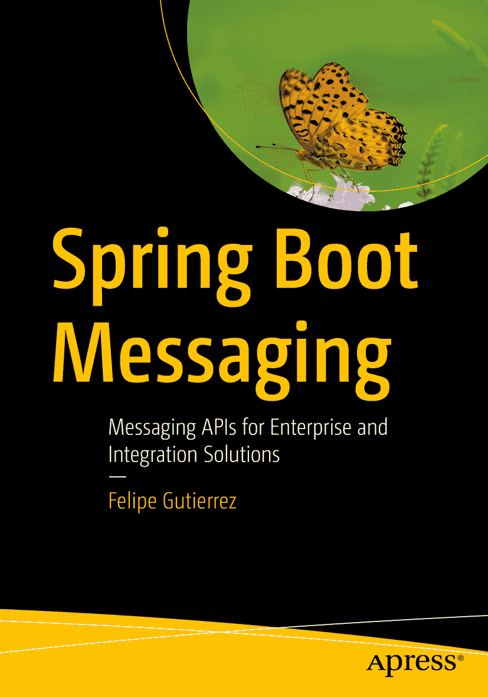

费利佩·古铁雷斯 Spring Boot 消息传递面向企业与集成解决方案的消息传递 API

作者在本书中引用的任何源代码或其他补充材料，读者均可通过本书在 GitHub 上的产品页面获取，该页面位于 [`www.apress.com/9781484212257`](http://www.apress.com/9781484212257)。如需更详细信息，请访问 [`http://www.apress.com/source-code`](http://www.apress.com/source-code)。ISBN 978-1-4842-1225-7 电子书 ISBN 978-1-4842-1224-0 DOI 10.1007/978-1-4842-1224-0 美国国会图书馆控制号：2017941320 © 费利佩·古铁雷斯 2017 本作品受版权保护。出版商保留所有权利，涉及材料的全部或部分内容，具体包括翻译、重印、插图复用、朗诵、广播、微缩胶片或其他任何物理形式的复制，以及电子改编、计算机软件、或目前已知或未来开发的类似或不同方法的信息存储与检索传输。本书中可能出现商标名称、标识和图像。我们不以每次出现商标名称、标识或图像时都使用商标符号，而是仅以编辑方式使用这些名称、标识和图像，以维护商标所有者的利益，且无意侵犯商标权。本出版物中对商品名称、商标、服务标志及类似术语的使用，即使未明确标识，也不应被视为对其是否受专有权利保护的立场表达。尽管本书中的建议和信息在出版时被认为是真实准确的，但作者、编辑和出版商均不对可能存在的任何错误或遗漏承担法律责任。出版商对本书所含内容不作任何明示或暗示的担保。本书采用无酸纸印刷。本书通过 Springer Science+Business Media New York 在全球图书贸易中发行，地址：233 Spring Street, 6th Floor, New York, NY 10013。电话：1-800-SPRINGER，传真：(201) 348-4505，电子邮件：orders-ny@springer-sbm.com，或访问 www.springeronline.com。Apress Media, LLC 是一家加利福尼亚有限责任公司，其唯一成员（所有者）是 Springer Science + Business Media Finance Inc (SSBM Finance Inc)。SSBM Finance Inc 是一家特拉华州公司。谨以此书献给我的女儿劳拉·古铁雷斯 致谢

我要向 Apress 团队表达我全部的感激之情——感谢史蒂夫·安格林接受我的提案，感谢马克·鲍尔斯让我保持正轨并耐心待我，以及感谢参与此项目的 Apress 团队其他成员。感谢大家让这一切成为可能。

感谢我的技术审阅人曼努埃尔·乔丹，感谢他在审阅中的细致与付出，以及整个 Spring 团队创造了这项令人惊叹的技术。

感谢我的妻子诺玛·卡斯塔涅达给予我的爱与支持。感谢我的女儿们——劳拉、纳耶利、希梅娜——以及我的宝贝罗德里戈！感谢我的父母罗西奥·克鲁兹和费利佩·古铁雷斯，我的兄弟埃德加·赫拉尔多·古铁雷斯，以及我的嫂子奥里斯泰拉·桑切斯给予我的爱与支持。

——费利佩·古铁雷斯

目录 第 1 章：消息传递 1 消息传递 1 消息传递用例 1 消息传递模型与消息传递模式 3 使用 Spring 框架进行消息传递 5 总结 5 第 2 章：Spring Boot 7 什么是 Spring Boot？ 7 Spring Boot 的特性 7 使用 Spring Boot 构建 RESTful API 8 rest-api-demo 项目 8 运行 Spring Boot 货币 Web 应用 15 部署 Spring Boot 货币 Web 应用 15 更多关于 Spring Boot 的内容 15 总结 16 第 3 章：应用程序事件 17 观察者模式 17 Spring ApplicationEvent 18 Spring ApplicationListener 19 REST API 货币项目 20 自定义事件 23 使用注解的事件监听器 27 @EventListener 27 @TransactionalEventListener 29 总结 30 第 4 章：Spring Boot 中的 JMS 31 JMS 31 Java 中的 JMS 32 Spring Boot 中的 JMS 36 生产者 36 消费者 38 使用注解的消费者 42 货币项目 43 回复地址 51 主题 54 货币项目 57 总结 57 第 5 章：Spring Boot 中的 AMQP 59 AMQP 模型 59 交换机、绑定和队列 60 RabbitMQ 62 Spring Boot 中的 RabbitMQ 62 生产者 63 消费者 67 RPC 70 回复管理 75 流量控制 76 更多特性 78 货币项目 80 总结 80 第 6 章：使用 Redis 进行消息传递 81 Redis 作为消息代理 81 使用 Redis 的发布/订阅消息传递 83 订阅者 83 发布者 86 JSON 序列化 88 货币项目 92 总结 92 第 7 章：Web 消息传递 93 WebSocket 93 在 Spring 中使用 WebSocket 94 底层 WebSocket 94 使用 SockJS 和 STOMP 101 使用 RabbitMQ 作为 STOMP 代理中继 108 货币项目 109 总结 110 第 8 章：使用 Spring Integration 进行消息传递 111 Spring Integration 入门 112 Spring Integration 编程 113 一个简单的 Spring Integration 示例 114 文件集成示例 121 文件和 JDBC 集成示例 124 AMQP 集成示例 128 货币兑换项目 131 总结 131 第 9 章：使用 Spring Cloud Stream 进行消息传递 133 Spring Cloud 133 Spring Cloud Stream 134 Spring Cloud Stream 概念 135 Spring Cloud Stream 编程 136 cloud-stream-demo 139 微服务 154 Spring Cloud Stream 应用启动器 160 source:http 160 sink:log 160 货币项目 162 下一步是什么？ 162 总结 162 第 10 章：响应式消息传递 163 响应式编程 163 RxJava 164 rxjava-demo 项目 164 Reactor 170 reactor-demo 项目 170 Spring 5：WebFlux 框架 173 编程模型 173 总结 178 第 11 章：微服务 179 什么是微服务 179 十二要素应用 180 Spring Cloud 服务 182 Spring Cloud 配置服务器 182 服务注册 184 断路器 190 关于响应式编程 192 总结 192 索引 193 内容速览 关于作者 xiii   关于技术审校者 xv   致谢 xvii   第 1 章：消息传递 1   第 2 章：Spring Boot 7   第 3 章：应用程序事件 17   第 4 章：Spring Boot 中的 JMS 31   第 5 章：Spring Boot 中的 AMQP 59   第 6 章：使用 Redis 进行消息传递 81   第 7 章：Web 消息传递 93   第 8 章：使用 Spring Integration 进行消息传递 111   第 9 章：使用 Spring Cloud Stream 进行消息传递 133   第 10 章：响应式消息传递 163   第 11 章：微服务 179   索引 193   关于作者与关于技术审校者 关于作者 关于技术审校者

