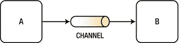
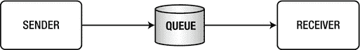
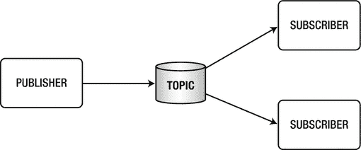

# 1. 消息传递

通信是一个自古以来就存在的概念。万物都需要通过交换某种信息来进行沟通，没错，你读得没错，我说的是万物。仔细想想，就连你在公交车侧面或杂货店里看到的广告，不也是在试图向你传达信息或推销商品吗？

在计算机世界中，设备（鼠标、显示器、键盘等）通过交换信息位来相互通信。如果考虑应用程序，那么我们所谈论的是需要相互通信或通过通信暴露某些功能的组件、函数、类等。我们通常称之为消息传递。

## 消息传递

本节将介绍一些主要概念，这些概念将在后续章节中详细阐述，首先从消息传递及其在日常开发周期中的定位开始。请参见图 1-1。

图 1-1.

消息传递

图 1-1 展示了一个简单的消息传递过程，即通过任何可能的媒介从点 A 传递到点 B。在此例中，图 1-1 使用了一个通道，它可以是简单的函数调用、套接字连接或 HTTP 请求。其核心思想是生成/发送消息给消费者/接收者。

### 消息传递用例

本节涵盖了一些最常见的消息传递用例。这些用例对于理解消息传递为何如此重要至关重要：

*   **保证送达**
    *   开发者需要确保他们发送的消息能够到达目的地。如果你正在使用代理（一个处理连接、消息以及同步或异步消息传递的系统），那么生产者需要通过某种确认机制来知晓代理是否收到了消息。消费者也必须这样做，通过向代理确认消息已收到。因此，这个特定用例通常用于传递关键消息时，例如支付、股票或任何其他重要信息。
*   **解耦**
    *   在处理软件架构时，开发者会寻求解耦的组件，以便于集成、扩展以及简单的运维。但如何实现解耦呢？消息传递是解决方案的一部分，因为它允许你专注于自己的业务领域，这是一个有界上下文。你生成/发送的信息是你的主要关注点，而无需关心消费者/接收者将如何实现其自身的业务逻辑。
*   **可扩展与高可用**
    *   每当系统面临高请求需求时，它需要具备可扩展性，并且不能存在单点故障。对于这些特定场景，消息传递是解决方案，因为多个消费者/接收者可以跟上负载，并且你可以跨多个系统实例或代理复制消息。这样，即使你的某个实例/代理宕机，你仍然可以掌控局面。
*   **异步**
    *   应用程序必须非常快速，并能够尽快响应请求。在这种情况下，时间是关键因素。当你知道处理请求需要花费大量时间，并且有多个客户端时，你如何实现这种速度？你可以通过使用前一个用例的解决方案（可扩展性和/或高可用性）来解决这个问题，但这会达到一个阻塞请求的临界点。解决方案是异步消息传递——一种即发即弃的方式——你的生产者/发送者发送消息后继续执行自己的业务逻辑，让消费者/接收者自行安排时间处理消息。
*   **互操作性**
    *   创建消息传递系统时的一个重要因素是，能够生成/发送消息，并在消费/接收时能够理解该消息（可能是纯文本 JSON、XML 格式或序列化对象）。在过去的几十年里，人们进行了许多尝试来创建可互操作的系统。如今，借助新的代理（例如实现 AMQP 协议的代理），甚至通过简单的 RESTful API 或 WebSocket，无论具体实现如何，都能使生产者和消费者无缝互操作。

这些用例已经演变为广为人知的消息传递模型和设计模式，下一节将对此进行讨论。

### 消息传递模型与消息传递模式

当消息传递成为所有系统的一部分时，一些消息传递模型便应运而生。在我看来，这些模型后来演变成了消息传递设计模式的创建。

#### 点对点

点对点模型是一种将消息发送到队列（先进先出）的方式，其中只有一个接收者能获取该消息。参见图 1-2。

图 1-2.

点对点模型

点对点模型也用作消息通道模式，此时你拥有的是一个通道（一种传输消息的方式）而非队列。它仍然保证只有一个接收者能按照消息发送的顺序获取消息。

你将在本书后续部分看到关于这些模型和模式的一些示例。

#### 发布-订阅

发布-订阅模型描述了一个发布者向该主题的多个订阅者发送消息（一个主题）。每个订阅者将只收到消息的一个副本。参见图 1-3。

图 1-3.

发布-订阅模型

发布-订阅模型也用作消息通道模式，此时你拥有的是一个通道而非主题，该通道将消息的一个副本传递给其订阅者。

这些模型与 JMS（Java 消息服务）关系更为密切，理解它们很重要，因为它们构成了所有企业系统的基础。

#### 消息传递模式

设计模式是软件设计中常见问题的解决方案。同理，消息传递模式则试图解决消息传递设计中的问题。

在本书的学习过程中，你将了解以下模式的实现，因此我在此列出它们并附上简单定义作为介绍：

*   **消息类型模式**：描述消息传递的不同形式，例如字符串（可能是纯文本、JSON 和/或 XML）、字节数组、对象等。
*   **消息通道模式**：确定将使用何种传输方式（通道）来发送消息，以及它将具有哪些属性。其核心思想是生产者和消费者知道如何连接到传输通道，并能够发送和接收消息。该传输方式的可能属性包括请求-回复功能和单向通道，你很快就会了解到。点对点通道是该模式的一个例子。
*   **路由模式**：描述通过在集成解决方案中提供路由机制（依赖于一组条件的过滤）在生产者和消费者之间发送消息的方式。这可以通过编程实现，或者在某些情况下，消息传递系统（代理）可以具备这些能力（如 RabbitMQ）。
*   **服务消费者模式**：描述消息到达时消费者的行为，例如在处理消息时添加事务性方法。有一些框架允许你启动此类行为（例如 Spring 框架，你可以通过添加基于事务抽象的 `@Transactional` 来实现）。
*   **契约模式**：生产者和消费者之间为进行简单通信而达成的契约，例如当你进行一些 REST 调用时，调用一个包含某些字段的 JSON 或 XML 消息。
*   **消息构造模式**：描述消息如何创建以便在消息传递系统中传输。例如，你可以创建一个“信封”，它包含一个主体（实际消息）和一些头部（带有关联 ID、序列号或可能的回复地址）。通过一个简单的 Web 请求，你可以添加参数或头部，实际消息成为请求的主体，从而使整个请求成为构造模式的一部分。HTTP 协议支持这种通信（消息传递）。
*   **转换模式**：描述如何在消息传递系统中更改消息的内容。想象一条消息需要一些处理，并且需要在传输过程中进行增强，例如内容丰富器。

如你所见，这些模式不仅描述了消息传递过程，其中一些还描述了如何处理你之前看到的一些常见用例。当然，还有更多的消息传递模式，这些只是我们将在本书中探讨的一部分。

如果你需要更多信息，我建议你访问企业集成模式网站：[`http://www.enterpriseintegrationpatterns.com/`](http://www.enterpriseintegrationpatterns.com/)。同时，也请查阅这本必读书籍——《企业集成模式：设计、构建和部署消息传递解决方案》，作者是 Gregor Hohpe 和 Bobby Woolf，由 Addison-Wesley 出版。

在本书中，我将使用 Spring Integration 模块和各种消息传递系统（代理）来介绍其中的一些模式。

## 使用 Spring 框架进行消息传递

Spring 框架是 Java 社区最常用的框架之一。Spring 框架通过实现一个可用于任何消息传递系统的模板设计模式，提供了一种简单易行的消息传递方式。它通过 `JmsTemplate` 支持 JMS API，通过 `RabbitTemplate` 支持 AMQP，支持 STOMP，以及通过事件和监听器支持内部消息传递。别担心，我们将在本书后面部分介绍所有这些内容。

值得一提的是，Spring Integration 项目已被社区广泛接受，并且自 4.0 版本以来，Spring Integration 的核心（消息传递、通道和其他接口）已成为 Spring Core 的一部分。

市面上有许多优秀的消息传递框架。有些使用纯 Java，有些则依赖于 Spring 框架。Spring 团队一直非常努力地让开发者更容易使用所有功能，包括并发、事务、重试等。要使用其他库，你必须使用相同的逻辑手动实现它们。

注意

你可以从 Apress 网站下载本书的源代码，或者从以下 GitHub 仓库克隆：[`https://github.com/felipeg48/spring-messaging`](https://github.com/felipeg48/spring-messaging)。

## 总结

本章介绍了消息传递和消息传递系统。你了解了消息传递的基本概念，即开发者需要将信息从一个点发送到另一个点。

本章回顾了消息传递的一些用例、模型和模式。本书将更详细地介绍它们，并通过一些最佳实现（包括 Spring 框架及其部分模块，如 Spring Integration、Spring AMQP 和 Spring Cloud Stream）来使用它们。

下一章将带你了解 Spring Boot，它是创建企业级 Spring 应用的下一代技术。Spring Boot 是你在本书中使用的所有模块的基础。

