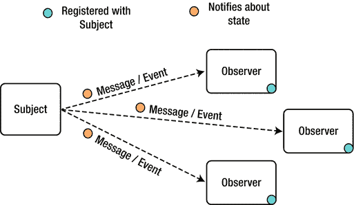
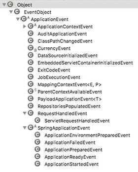
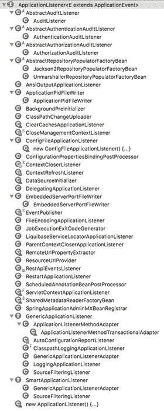
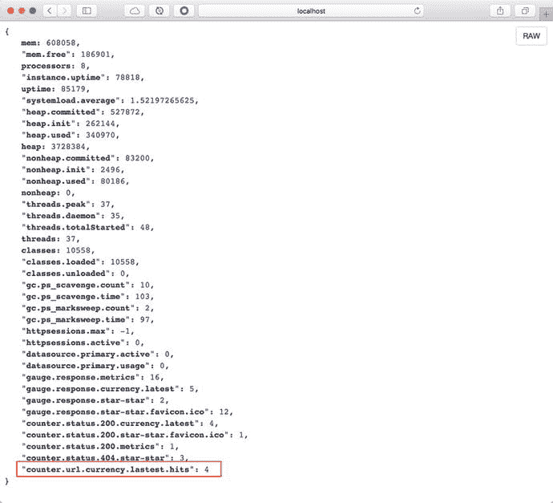
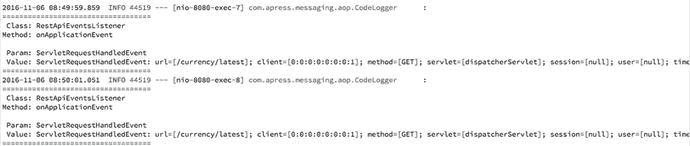
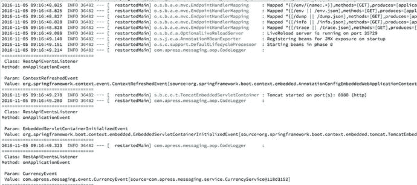
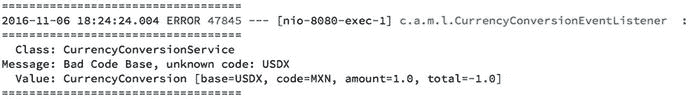
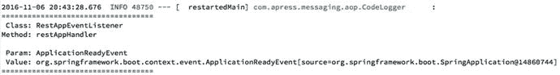
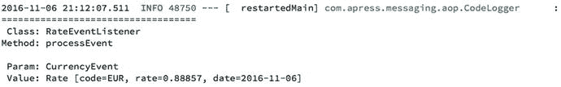

# 3. 应用事件

本章涵盖如何使用观察者模式（行为型模式）作为向需要者或监听者发送消息的方式。同时展示了 Spring 框架如何通过其应用事件实现该模式，这些事件可以声明为简单的接口实现，或使用专门的注解。

## 观察者模式

该特定模式定义了对象之间的一对多依赖关系，因此当一个对象（主体）改变其状态时，需要将这一变化通知给其他对象（观察者）。随后观察者可以对该变化做出响应，如图 3-1 所示。



图 3-1.

观察者模式

实现这种设计模式有多种方式。Java SDK 包含了 `java.util.Observable` 类，用于设置变更并通知观察者，以及 `java.util.Observer` 接口，该接口通过其 `update` 方法接收通知。

Spring 框架提供了一种精妙的方式来使用观察者模式，并且较新版本（4.x）的 Spring 还包含了更多改进。它们不仅实现了该模式，还提供了多种事件，允许你更深入地了解 Spring 容器的内部机制，并创建自定义事件。

请记住，尽管我们讨论的是观察者模式和事件，但这本质上是一种通过事件进行消息传递的组件间通信方式。

## Spring 应用事件

你会发现 Spring 框架暴露了抽象的 `org.springframework.context.ApplicationEvent` 类，它继承自 `java.util.EventObject`。`EventObject` 包含事件最初发生的对象。参见图 3-2。



图 3-2.

Spring 应用事件层次结构

图 3-2 展示了 `ApplicationEvent` 的层次结构，如你所见，该类被多个事件扩展。至少有两个重要事件值得提及：

*   `ApplicationContextEvent` `（属于 Spring 框架）`：这是一个抽象类，你可以完全访问主要的中央接口，该接口为你的应用提供完整配置。此类还被 `ContextClosed`、`ContextStartedEvent`、`ContextRefreshedEvent` 和 `ContextStoppedEvent` 事件扩展，以提供 Spring 容器生命周期的更多细节。
*   `SpringApplicationEvent` `（属于 Spring Boot）`：这也是一个抽象类，通过 `SpringApplication` 类包含 Spring Boot 应用的所有信息。`SpringApplication` 类用于从 Java main 方法引导和启动 Spring Boot 应用。

我选择这些事件是因为你正在进行的项目——货币兑换的 Rest API——会用到它们。本章稍后会详细介绍。

## Spring 应用监听器

现在，对于每个事件，你应该有一种接收消息的方式。Spring 框架有一个主要的事件监听器。`org.springframework.context.ApplicationListener<E extends ApplicationEvent>` 接口继承自 `java.util.EventListener`（后者仅是一个标记接口）。`ApplicationListener` 是所有 Spring `ApplicationContext` 事件的主要事件监听器，这些事件你在上一节已经了解过。参见图 3-3。



图 3-3.

ApplicationListener 接口及其层次结构

图 3-3 展示了 `ApplicationListener` 的层次结构以及你可以使用的所有事件监听器。Spring 框架会在启动时、运行期间，甚至在 Spring 应用正常关闭时发送相应的事件。当监听器被调用时，这些事件会被过滤以匹配事件对象。

有许多用例可以让你使用 `ApplicationEvent` 或其某些实现来监听（通过 `ApplicationListener`）传入的消息并对其做出响应。例如，在下一节再次讨论的 Rest API 货币项目中，你可以确定用户何时访问某些 Rest 端点，从而通过统计方式查看流量并识别哪个端点被更频繁地使用。


## Rest API 货币项目

让我们回到项目，并将这种设计模式应用其中。通过仅实现 `ApplicationEvent` 类型的 `ApplicationListener`，应用程序将开始监听 Spring 容器初始化期间以及 Bean 生命周期部分发生的每一个事件。

请看清单 3-1，其中展示了 `RestApiEventsListener` 类是一个 Spring 组件。

```
@Component
public class RestApiEventsListener implements ApplicationListener{
public void onApplicationEvent(ApplicationEvent event) {
}
}
清单 3-1.
com.apress.messaging.listener.RestApiEventsListener.java
```

清单 3-1 仅展示了部分代码，其中 `RestApiEventsListener` 类实现了 `ApplicationEvent` 事件的 `ApplicationListener`。你必须实现接收 `ApplicationEvent` 作为参数的 `onApplicationEvent` 方法。

同样，一个用例是确定某个 Rest 端点被访问的次数。请看图 3-2，其中展示了 ApplicationEvent 的层次结构——你会注意到有一个 `RequestHandledEvent` 以及一个继承自它的 `ServletRequestHandledEvent`。通过 `ServletRequestHandledEvent` 类，你可以获取正在被访问的 URL（端点），并为其创建一个计数器。参见清单 3-2。

```
@Component
public class RestApiEventsListener implements ApplicationListener{
private static final String LATEST = "/currency/latest";
@Autowired
private CounterService counterService;
@Log(printParamsValues=true)
public void onApplicationEvent(ApplicationEvent event) {
if(event instanceof ServletRequestHandledEvent){
if(((ServletRequestHandledEvent)event)
.getRequestUrl().equals(LATEST)){
counterService
.increment("url.currency.latest.hits");
}
}
}
}
清单 3-2.
com.apress.messaging.listener.RestApiEventsListener.java
```

清单 3-2 展示了更多代码。让我们来看一下：

*   `ServletRequestHandledEvent`：当有请求到达某个端点时，此事件会被发布。这是 Web 框架的一部分。该事件包含所有 Web 上下文信息，因此你可以获取正在被访问的 URL 信息。
*   `CounterService`：此接口属于 `spring-boot-actuator` 模块，它允许你通过递增或递减一个 `tag/` 属性来获得一个度量指标。在本例中，标签是 `url.currency.latest.hits`。
*   `@Log(printParamsValues=true)`：这是一个自定义注解，将作为前置通知的一部分使用，用于记录被调用方法的所有信息。你可以在 `com.apress.messaging.aop.CodeLogger.java` 类中查看相关代码。

如果你运行该应用程序，你会从 `@Log` 注解得到一些输出（见图 3-4），但如果你多次访问 `/currency/latest` 端点（见图 3-5），应用程序将开始使用 `CounterService` 实例来统计该端点的访问次数。然后，你可以从 `/metrics` 端点访问这个度量指标，并看到 `url.currency.latest.hits` 显示了该端点的命中次数（见图 3-6）。



图 3-6.

http://localhost:8080/metrics



图 3-5.

访问 /currency/latest 端点后的控制台日志



图 3-4.

运行 rest-api-events 项目后的控制台日志

图 3-4 展示了运行应用程序时你将看到的部分日志输出。这些日志是 Spring 框架作为 `ApplicationEvent` 事件发送的消息。请记住，此输出是由 `@Log` 注解（一个前置 AOP 通知）生成的。

图 3-5 展示了多次访问 `/currency/latest` 端点后的一些日志。你可以看到 `ApplicationEvent` 是 `ServletRequestedEvent` 的一个实例，其中包含了被请求的 URL。

图 3-6 展示了 `/metrics` 端点（由 `spring-boot-actuator` 依赖提供）。在图底部，你可以看到 `"counter.url.currency.latest.hits":4` 这个度量指标，它由 `CounterService` 实例更新（参见清单 3-2）。


### 自定义事件

到目前为止，你已经了解了如何为任何 `ApplicationEvent` 创建监听器，但如果是使用包含领域对象信息的自定义事件呢？本节将展示如何创建自定义事件。

要创建自定义事件，你必须继承 `ApplicationEvent`，这样后续才能方便地发布它。

以当前项目为例，假设在调用任何货币转换期间发生错误（非受检异常）时，你将发送一个事件。这个事件可能只是记录原因并显示导致异常的对象。让我们先回顾一下 `CurrencyConversionEvent` 类，如清单 3-3 所示。

```
package com.apress.messaging.event;
import org.springframework.context.ApplicationEvent;
import com.apress.messaging.domain.CurrencyConversion;
public class CurrencyConversionEvent extends ApplicationEvent {
private static final long serialVersionUID = -4481493963350551884L;
private CurrencyConversion conversion;
private String message;
public CurrencyConversionEvent(Object source, CurrencyConversion conversion) {
super(source);
this.conversion = conversion;
}
public CurrencyConversionEvent(Object source, String message, CurrencyConversion conversion) {
super(source);
this.message = message;
this.conversion = conversion;
}
public CurrencyConversion getConversion(){
return conversion;
}
public String getMessage(){
return message;
}
}
清单 3-3.
com.apress.messaging.event.CurrencyConversionEvent.java
```

清单 3-3 展示了一个继承自 `ApplicationEvent` 并包含两个构造方法的基础类。每个构造方法都会调用其父类（`ApplicationEvent`）来设置来源，设置当前的 `CurrencyConversion` 实例，并确定消息内容。换句话说，你拥有了确定任何货币转换调用中错误来源所需的信息。

接下来，让我们回顾一下将接收 `CurrencyConversionEvent` 的事件监听器。请参见清单 3-4。

```
package com.apress.messaging.listener;
import org.slf4j.Logger;
import org.slf4j.LoggerFactory;
import org.springframework.context.ApplicationListener;
import org.springframework.stereotype.Component;
import com.apress.messaging.event.CurrencyConversionEvent;
@Component
public class CurrencyConversionEventListener implements ApplicationListener {
private static final String DASH_LINE = "===================================";
private static final String NEXT_LINE = "\n";
private static final Logger log = LoggerFactory.getLogger(CurrencyConversionEventListener.class);
@Override
public void onApplicationEvent(CurrencyConversionEvent event) {
Object obj = event.getSource();
StringBuilder str = new StringBuilder(NEXT_LINE);
str.append(DASH_LINE);
str.append(NEXT_LINE);
str.append("  Class: " + obj.getClass().getSimpleName());
str.append(NEXT_LINE);
str.append("Message: " + event.getMessage());
str.append(NEXT_LINE);
str.append("  Value: " + event.getConversion());
str.append(NEXT_LINE);
str.append(DASH_LINE);
log.error(str.toString());
}
}
清单 3-4.
com.apress.messaging.listener.CurrencyConversionEventListener.java
```

清单 3-4 展示了将接收所有 `CurrencyConversionEvent` 事件的监听器。该类实现了类型为 `CurrencyConversionEvent` 的 `ApplicationListener`，并且需要实现 `onApplicationEvent` 方法。如你所见，它只是记录了类名、消息以及 `CurrencyConversion` 领域对象。

接下来，让我们看看当错误发生时，哪个类将发布事件。我们来回顾一下 `CurrencyConversionService` 和 `convertFromTo` 方法，该方法包含获取货币代码的逻辑。请参见清单 3-5。

```
public CurrencyConversion convertFromTo(@ToUpper String base, @ToUpper String code,Float amount) {
Rate baseRate = new Rate(CurrencyExchange.BASE_CODE,1.0F,new Date());
Rate codeRate = new Rate(CurrencyExchange.BASE_CODE,1.0F,new Date());
if(!CurrencyExchange.BASE_CODE.equals(base))
baseRate = repository.findByDateAndCode(new Date(), base);
if(!CurrencyExchange.BASE_CODE.equals(code))
codeRate = repository.findByDateAndCode(new Date(), code);
if(null == codeRate || null == baseRate)
throw new BadCodeRuntimeException("Bad Code Base, unknown code: " + base, new CurrencyConversion(base,code,amount,-1F));
return new CurrencyConversion(base,code,amount,(codeRate.getRate()/baseRate.getRate()) * amount);
}
清单 3-5.
com.apress.messaging.service.CurrencyConversionService.java
```

清单 3-5 展示了 `convertFromTo` 方法，它通过基于 `base` 和 `code` 变量查找汇率来进行转换。`if` 语句会抛出一个 `BadCodeRuntimeException`，该异常的构造方法接受一个字符串和一个 `CurrencyConversion` 对象。`BadCodeRuntimeException` 是一个继承自 `RuntimeException` 的非受检异常（你可以在源代码中查看）。

当抛出异常时，我们必须发布 `CurrencyConversionEvent` 和错误消息，但添加此逻辑会使代码变得混乱，很快我们就会得到纠缠不清、混乱的代码。相反，我们可以创建一个 AOP，在抛出异常时使用该异常。清单 3-6 使用 AOP 在抛出异常后发布 `CurrencyConversionEvent` 事件。

```
@Aspect
@Component
public class CurrencyConversionAudit {
private ApplicationEventPublisher publisher;
@Autowired
public CurrencyConversionAudit(
ApplicationEventPublisher publisher){
this.publisher = publisher;
}
@Pointcut("execution(* com.apress.messaging.service.*Service.*(..))")
public void exceptionPointcut() {}
@AfterThrowing(pointcut="exceptionPointcut()",
throwing="ex")
public void badCodeException(JoinPoint jp,
BadCodeRuntimeException ex){
if(ex.getConversion()!=null){
publisher.publishEvent(
new CurrencyConversionEvent(
jp.getTarget(),
ex.getMessage(),
ex.getConversion()));
}
}
}
清单 3-6.
com.apress.messaging.aop.CurrencyConversionAudit.java
```

清单 3-6 展示了 `@` `AfterThrowing`，它会在 `BadCodeRuntimeException` 被抛出时感知到，然后执行方法内部的代码。如你所见，它使用了 `ApplicationEventPublisher` 实例（由 Spring 框架在类构造方法中注入）和 `publishEvent` 方法，该方法发送关于异常发生所在类的信息、消息以及 `CurrencyConversion` 对象。

如果你运行项目并像这样访问 `/{amount}/{base}/to/{code}`，例如 `/1.0/usdx/to/mx`，你将得到类似于图 3-7 的结果。



图 3-7.

CurrencyConversionService 中的错误日志

如你所见，创建自定义事件非常简单。请记住使用自定义事件的这些简单规则：

*   创建一个继承自 `ApplicationEvent` 的事件类。
*   创建一个实现自定义事件类型的 `ApplicationListener` 并实现 `onApplication` 方法的事件监听器类。
*   使用 `ApplicationEventPublisher` 类来发布你的自定义事件。

## 使用注解的事件监听器

到目前为止，我们已经了解了如何使用和实现类型为 `ApplicationEvent` 的 `ApplicationListener`。本节将展示如何使用一些 Spring 提供的注解，作为监听事件的简便方法。


### @EventListener

`@EventListener` 注解是一个非常有用的注解，你可以直接在将要处理事件的方法上使用它。这意味着不再需要实现 `ApplicationListener` 接口。

清单 3-7 展示了如何使用它。

```
@Component
public class RestAppEventListener {
@EventListener
@Log(printParamsValues=true)
public void restAppHandler(
SpringApplicationEvent springApp){
}
}
Listing 3-7.
com.apress.messaging.listener.RestAppListener.java
```

清单 3-7 向你展示了应用于 `restAppHandler` 方法的 `@EventListener` 注解。Spring 框架会自动装配所有内容，使得这个监听器能够接收所有 `SpringApplicationEvent` 事件。`SpringApplicationEvent` 是另一个继承自 `ApplicationEvent` 抽象类的事件，但它包含有关 Spring Boot 应用程序的信息，例如命令行中使用的参数、横幅、资源加载器等。

如果你运行该项目，你将看到类似于图 3-8 的内容。



Figure 3-8.

RestAppEventListener 的日志

如你所见，`@EventListener` 注解使用起来很简单。这个注解甚至还有更多特性：

*   它支持条件，因此只有在给定表达式为真时才会执行。例如：

    ```
    @EventListener(condition = "#springApp.args.length > 1")
    ```

    这段代码告诉监听器，仅当参数长度大于 1 时才使用该事件。如果你替换清单 3-7 中的上一个监听器，你将看不到 `RestAppEventListener` 的日志。
*   你可以通过传递一个事件类数组作为默认值来监听多个事件。例如：

    ```
    @EventListener({CurrencyEvent.class,
    CurrencyConversionEvent.class})
    @Log(printParamsValues=true)
    public void restAppHandler(ApplicationEvent appEvent){ }
    ```

    这段代码在同一个方法中监听 `CurrencyEvent` 和 `CurrencyConversion` 事件，该方法现在接收一个 `ApplicationEvent` 实例。此外，你也可以没有参数，但仍然监听多个事件。
*   当你有多个事件需要监听时，你可能希望为它们设置优先级。你可以通过向方法添加 `@Order` 注解来实现。例如：

    ```
    @EventListener
    @Order(Ordered.HIGHEST_PRECEDENCE)
    @Log(printParamsValues=true)
    public void restAppHandler(SpringApplicationEvent springApp){
    }
    ```

    这段代码将按照最高优先级进行处理。
*   你也可以通过添加 `@Async` 注解来异步处理事件监听器。例如：

    ```
    @EventListener
    @Async
    @Log(printParamsValues=true)
    public void restAppHandler(SpringApplicationEvent springApp){
    }
    ```

### @TransactionalEventListener

Spring Framework 4.2.x 及更高版本引入了一个额外的注解，允许你监听事务阶段，例如数据库事务或任何其他事务，包括消息传递事件。

让我们开始在货币项目中使用这个注解。查看清单 3-8 中所示的 `RateEventListener` 类。

```
@Component
public class RateEventListener {
@TransactionalEventListener
@Log(printParamsValues=true,
callMethodWithNoParamsToString="getRate")
public void processEvent(CurrencyEvent event){ }
}
Listing 3-8.
com.apress.messaging.listener.RateEventListener.java
```

清单 3-8 向你展示了 `RateEventListener` 类，它使用了 `@TransactionalEventListener` 并处理自定义的 `CurrencyEvent` 事件（你可以在 `com.apress.messaging.event` 包中查看代码）。当通过编程方式或使用 `@Transactional` 注解建立事务通道时，`@TransactionalEventListener` 将接收事件。

如果你查看 `com.apress.messaging.service.CurrencyService.java` 类，你将看到以下代码：

```
@Transactional
public void saveRate(Rate rate){
repository.save(new
Rate(rate.getCode(),
rate.getRate(),
rate.getDate()));
publisher.publishEvent(new CurrencyEvent(this,rate));
}
```

这段代码展示了 `saveRate` 方法，它被标记了 `@Transactional` 注解。它将在保存完成后发布一个 `CurrencyEvent` 事件。

如果你运行该项目，你将多次看到关于 `RateEventListener` 的日志。查看主应用程序（`RestApiEventsApplication.java`）；你将看到使用 `CurrencyService` 实例保存的汇率，以及由 `RateEventListener` 监听器记录的每个事务（在它们提交之后）的日志。见图 3-9。



Figure 3-9.

RateEventListener 日志

`@TransactionalEventListener` 可以监听特定的事务阶段。如果你需要在某个阶段监听事件，可以像这样使用它：

```
@TransactionalEventListener(
phase = TransactionPhase.BEFORE_COMMIT)
```

你可以使用：`BEFORE_COMMIT`、`AFTER_COMMIT`（默认）、`AFTER_ROLLBACK` 和 `AFTER_COMPLETION`。

注意

请记住，你可以从 Apress 网站或直接从 GitHub 仓库获取所有代码：[`http://www.apress.com/9781484212257`](http://www.apress.com/9781484212257)

## 总结

本章解释了观察者模式的工作原理。它还涵盖了 Spring 框架使用此模式来暴露应用程序事件的方式。

它向你展示了一些用例，通过这些用例，你可以监听应用程序事件，并使用它们通过 `ServletRequestHandledEvent` 来统计端点被访问的次数。它还向你展示了如何通过扩展 `ApplicationEvent` 抽象类来创建自己的自定义事件。

你学习了一种通过使用诸如 `@EventListener` 之类的注解来监听事件的简便方法。你还了解了如何使用 `@TransactionalEventListener`，该注解在事务发生时、提交期间、提交之前或提交之后以及回滚之后被触发。

下一章将介绍 Java 消息服务 API 以及如何使用它进行消息传递。

