# 4. 使用 Spring Boot 的 JMS

Java 消息服务（JMS）于 2001 年 6 月随版本 1.0.2b 发布。它是在两个或多个客户端之间发送消息的另一种解决方案。当时，它被认为是面向消息中间件（MOM）技术组的一部分。其理念是为一个反复出现的问题提供一个 API，即一个生产者-消费者用例，该用例允许在分布式环境中实现松耦合、可靠且异步的组件。

本章从一个简单的项目开始，它将帮助你理解 JMS 客户端的工作原理以及如何使用 Spring Boot 进行配置。然后，我们将利用这些知识构建之前的项目，即货币 REST API，现在它将作为一个接收器来保存新的汇率。那么，让我们开始吧。


## JMS

JMS API 提供了两种消息传递模型——点对点模型和发布-订阅模型。点对点模型是指消息被传递给一个接收者，并且保证只会传递给连接到某个队列的一个消费者（见图 4-1）。


图 4-1.

点对点消息传递模型

发布-订阅模型是指消息被传递给零个或多个消费者（通常称为订阅者）。发布者为所有想要订阅该主题的客户端创建一个消息主题（见图 4-2）。

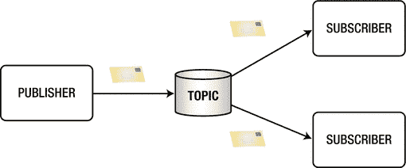

图 4-2.

发布-订阅消息传递模型

JMS 是一个需要被实现的必需 API。为了使用或创建 JMS 应用程序，你需要选择一个提供者（通常称为 JMS 服务器或代理），它将连接并解耦你的发送者/发布者与接收者/订阅者；一个用于生产/发送或接收/订阅消息的客户端；一个包含实际消息（有效载荷）的 JMS 消息；以及一个用于点对点消息传递的 JMS 队列，或用于发布-订阅场景的主题。我们首先来详细讨论客户端。

### 使用 Java 的 JMS

让我们先看看如何在 Java 中创建一个点对点发送者客户端；见代码清单 4-1。

```
//Step 1\. 创建连接
InitialContext ctx = new InitialContext();
QueueConnectionFactory factory = (QueueConnectionFactory)ctx.lookup("connectionFactory");
QueueConnection connection = factory.createQueueConnection();
connection.start();
//Step 2\. 创建队列会话
QueueSession session = connection.createQueueSession(false, Session.AUTO_ACKNOWLEDGE);
//Step 3\. 获取队列对象
Queue queue =( Queue)ctx.lookup("myQueue");
//Step 4\. 创建发送者
QueueSender sender = session.createSender(queue);
//Step 5\. 创建消息
TextMessage msg = session.createTextMessage();
msg.setText("Hello World");
//Step 6\. 发送消息
sender.send(msg);
代码清单 4-1.
点对点发送者客户端代码片段
```

如代码清单 4-1 所示，这个过程非常直接。发送一条文本消息只需要六个步骤。在步骤 1 中，你需要知道使用哪个连接过程。通常，你需要在代码中包含一个 `jndi.properties` 文件，其中包含关于你的 JMS 提供者的一些信息；例如，如果你使用 Apache ActiveMQ，你需要指定其属性，如代码清单 4-2 (`jndi.properties`) 所示。

```
# Apache ActiveMQ 的初始上下文
java.naming.factory.initial=org.apache.activemq.jndi.ActiveMQInitialContextFactory
# 此属性必须与 ctx.lookup 语句中声明的属性相同。
# 默认值为：connectionFactory 或 ConnectionFactory
# connectionFactoryNames = connectionFactory, queueConnectionFactory, queueConnectionFactory
#   Memory Broker = vm://localhost
# External Broker = tcp://hostname:61616
java.naming.provider.url=vm://localhost
# 队列命名规则：
# queue.[jndiName] = [physicalName]
queue.myQueue = apress.MyQueue
# 主题命名规则：
# topic.[jndiName] = [physicalName]
topic.myTopic = apress.MyTopic
代码清单 4-2.
用于 Apache ActiveMQ 的 jndi.properties
```

代码清单 4-2 展示了你需要包含在每个 JMS 应用程序中的 `jndi.properties` 文件。在这个例子中，它使用了 Apache ActiveMQ 的设置以及队列和主题的命名约定。

现在，让我们看看接收者，如代码清单 4-3 所示。

```
// Step 1\. 创建连接
InitialContext ctx = new InitialContext();
QueueConnectionFactory factory = (QueueConnectionFactory)ctx.lookup("connectionFactory");
QueueConnection connection = factory.createQueueConnection();
connection.start();
// Step 2\. 创建会话
QueueSession session = connection.createQueueSession(false, Session.AUTO_ACKNOWLEDGE);
// Step 3\. 获取队列
Queue queue=(Queue)ctx.lookup("myQueue");
// Step 4\. 创建接收者
QueueReceiver receiver = session.createReceiver(queue);
// Step 5\. 创建监听器
MessageListener listener = new MessageListener() {
@Override
public void onMessage(Message message) {
//在此处处理消息
}
};
// Step 6\. 注册监听器
receiver.setMessageListener(listener);
代码清单 4-3.
点对点接收者客户端代码片段
```

代码清单 4-3 展示了创建点对点消息消费者所需的六个步骤。当然，如果你将此代码放在一个单独的项目中，你还需要包含 `jndi.properties`（见代码清单 4-2）。

如果你想使用发布者-订阅者消息传递模型，你可以按照代码清单 4-4 所示创建你的发布者。


```
//步骤 1. 创建连接
InitialContext ctx = new InitialContext();
TopicConnectionFactory factory =(TopicConnectionFactory)ctx.lookup("connectionFactory");
TopicConnection connection=f.createTopicConnection();
connection.start();
//步骤 2. 创建主题会话
TopicSession session = connection.createTopicSession(false, Session.AUTO_ACKNOWLEDGE);
//步骤 3. 获取主题对象
Topic topic = (Topic)ctx.lookup("myTopic");
//步骤 4. 创建发送者
TopicPublisher publisher = session.createPublisher(topic);
//步骤 5. 创建消息
TextMessage msg = session.createTextMessage();
msg.setText("Hello World");
//步骤 6. 发送消息
publisher.publish(msg);
清单 4-4.
发布者-订阅者模式中的发布者客户端
```

清单 4-4 展示了发布者代码——一种发布者-订阅者消息模型——该代码将向名为 `myTopic` 的主题发布一条简单的文本消息。这与点对点模型差别不大。那么订阅者呢？请参见清单 4-5。

```
// 步骤 1. 创建连接
InitialContext ctx = new InitialContext();
TopicConnectionFactory factory = (TopicConnectionFactory)ctx.lookup("connectionFactory");
TopicConnection connection = factory.createTopicConnection();
connection.start();
// 步骤 2. 创建会话
TopicSession session = connection.createTopicSession(false, Session.AUTO_ACKNOWLEDGE);
// 步骤 3. 获取主题
Topic topic = (Topic)ctx.lookup("myTopic");
// 步骤 4. 创建接收者
TopicSubscriber subscriber = session.createSubscriber(topic);
// 步骤 5. 创建监听器
MessageListener listener = new MessageListener() {
@Override
public void onMessage(Message message) {
//在此处处理消息
}
};
// 步骤 6. 注册监听器
subscriber.setMessageListener(listener);
清单 4-5.
发布者-订阅者模式中的订阅者客户端
```

清单 4-5 展示了发布者-订阅者消息客户端；该客户端订阅了名为 `myTopic` 的主题。你可以使用此代码运行多个客户端，每个客户端都会收到来自发布者的消息；同样，这与点对点模型差别不大。当然，这些客户端仍然需要 `jndi.properties` 文件。

如你所见，两种消息模型的实现都非常直接。如果你仔细查看任何一段代码，你会发现每次发送的消息都只是文本消息，但如果你需要发送其他内容呢？JMS 支持不同的消息类型：

*   `StreamMessage` 是一个序列化的流对象。
*   `MapMessage` 由名称/值对组成，类似于哈希表。
*   `TextMessage` 是一个字符串。
*   `ObjectMessage` 是一个可序列化的对象。
*   `ByteMessage` 是一个原始的字节流。

作为练习，尝试使用这些代码片段创建一些客户端（点对点或发布者-订阅者模型）。目的是让你熟悉如何使用这类消息传递。

我刚刚向你简要介绍了在不使用外部框架的情况下，通常如何使用 JMS。我认为即使只是做一些简单的事情，也需要很多步骤。

## 使用 Spring Boot 的 JMS

第 2 章向你展示了 Spring Boot 如何了解你正在尝试运行的应用程序，因为它是一种有主见的技术。只需添加一个 `spring-boot-starter` pom，你就可以告诉 Spring Boot 如何配置一切，对吧？

我们将在本例中使用 Apache ActiveMQ（欢迎你使用任何其他代理；代码将是相同的），这意味着我们可以包含 `spring-boot-starter-activemq` 依赖项。通过添加此依赖项，Spring Boot 将引入应用程序所需的所有 JMS 和 ActiveMQ（JAR 文件），并将自动配置 JMS 客户端所需的所有必要属性和额外配置。

还记得你在 Java 中需要执行的所有步骤吗？使用 Spring Boot 则无需这些步骤。

注意

我们将使用更多依赖项，例如 AOP，来处理一些日志记录问题。请查看本章项目中的 `pom.xml` 文件。

我们将使用 `jms-sender` 项目，你可以在本书的源代码中找到它。该项目包含许多类，其中一些代码被注释掉了，只需取消注释，它就应该能工作。不过别担心，我将在接下来的章节中通过解释每一段代码来指导你。

注意

请记住，你可以从 Apress 网站或直接从 GitHub 仓库 [`http://www.apress.com/9781484212257`](http://www.apress.com/9781484212257) 获取所有代码。


### 生产者

让我们先回顾一下使用 Spring Boot 的生产者。打开 `com.apress.messaging.jms.SimpleSender.java` 类。参见代码清单 4-6。

```
@Component
public class SimpleSender {
private JmsTemplate jmsTemplate;
@Autowired
public SimpleSender(JmsTemplate jmsTemplate){
this.jmsTemplate = jmsTemplate;
}
public void sendMessage(String destination,
String message){
this.jmsTemplate.convertAndSend(destination, message);
}
}
代码清单 4-6.
com.apress.messaging.jms.SimpleSender.java
```

代码清单 4-6 展示了创建生产者的最简单直接的方式。我们来分析一下代码的每个部分：

*   `@Component`：你可能已经知道，这个注解将类标记为 Spring Bean，使其在运行时可用。
*   `JmsTemplate`：这是客户端最重要的部分，因为该类负责向 JMS 提供者/代理发送消息（以及其他操作）。
*   @Autowired：该注解用于类构造函数，以注入 `JmsTemplate` Bean（如前所述）。你甚至可以省略此注解，Spring 会自动推断出你需要此依赖。
*   `convertAndSend`：`JmsTemplate` 实例拥有此方法，用于转换消息。由于这是一个字符串，它会被自动转换为 `javax.jms.TextMessage` 并发送到目标（通常是一个队列）。

在运行这部分代码之前，我们先检查一下主应用程序。打开 `com.apress.messaging.JmsSenderApplication.java` 类，如代码清单 4-7 所示。

```
@SpringBootApplication
public class JmsSenderApplication {
public static void main(String[] args) {
SpringApplication.run(JmsSenderApplication.class, args);
}
@Bean
CommandLineRunner simple(JMSProperties props,
SimpleSender sender){
return args -> {
sender.sendMessage(props.getQueue(), "Hello World");
};
}
}
代码清单 4-7.
com.apress.messaging.JmsSenderApplication.java
```

代码清单 4-7 展示了主应用程序。我们来逐一分析每个部分：

*   `@SpringBootApplication`：你已经熟悉这个注解了。它是 Spring Boot 识别你试图运行何种应用程序的方式。
*   `simple(JMSProperties,SimpleSender)`：当 Spring 容器准备就绪时，此方法会被执行，并注入 `JMSProperties` 和 `SimpleSender` Bean 供其使用。
*   `JMSProperties`：此类用作属性持有者，读取 `application.properties` 文件并查找 `apress.jms.queue` 属性（本例中设置为 `jms-sender`）。如果你想了解更多，可以阅读 Spring Boot 参考文档中“外部化配置”部分的内容。

现在你可以运行它了。（你可以使用 Maven 命令行运行：`$ mvn spring-boot:run`，或者如果你已将其导入 STS，则可以在 Boot Dashboard 中运行。）运行后，你将看到类似图 4-3 的内容。

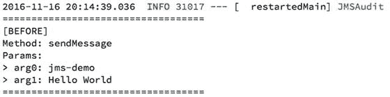

图 4-3.

JmsSenderApplication 日志

图 4-3 展示了应用程序运行时的日志。代码实际上正在将消息 `"Hello World"` 发送到 `jms-demo` 队列。这意味着你将看到 `JMSAudit` 文本以及一些额外信息。我究竟在哪里打印了这些信息？请查看 `com.apress.messaging.aop.JMSAudit.java` 类。这个类是一个环绕通知，通常用于日志记录。我知道对于这个示例来说可能有些过度，但这给了我更多探索 AOP 的方式。

你可以看到这个客户端正在发送消息，但消息发到哪里去了？你知道我们使用了 `spring-boot-starter-activemq` 依赖，但似乎并没有任何代理在运行。这是怎么回事？

请记住，Spring Boot 会根据你的类路径依赖做出判断，因此当它知道你拥有 `spring-boot-starter-activemq` 依赖时，会检查你是否已经声明了 `connectionFactory`、`session`、`sender` 等类型的 Bean，以便使用它们。如果 Spring Boot 没有找到任何东西，它会默认创建所有这些 Bean，并使用内存中的提供者（URL 为 `vm://localhost`）。这就是为什么运行时没有错误，并且你可以看到消息已被发送的原因。


### 消费者

接下来，我们来看看消费者。首先，我将向你展示一个使用 `javax.jms.MessageListener` 接口的消费者（这与之前“Java 中的 JMS”部分中的示例相同），以便了解配置它需要做些什么。请参见清单 4-8。

```
@Component
public class QueueListener implements MessageListener {
public void onMessage(Message message) {
}
}
清单 4-8.
com.apress.messaging.jms.QueueListener.java
```

清单 4-8 展示了将监听队列（`jms-demo`）中任何消息的接收器。我们来回顾一下这段代码：

*   `@Component`：如果此项被注释掉了，请移除 `//` 并添加正确的导入。我建议你使用 STS，在 Mac 上按 Cmd+Shift+O，在 Windows 上按 Ctrl+Shift+O。此注解会将类标记为 Spring Bean，以便在配置中使用。
*   `MessageListener`：接收 JMS 消息需要此接口，并且需要实现 `onMessage` 方法。
*   `onMessage(Message)`：需要实现此方法，它包含了从队列中消费的实际消息。

如你所见，这非常简单，但如果你尝试运行它，你会看到与之前相同的结果。你只会看到关于发送消息的日志。这是为什么呢？嗯，你必须告诉 Spring Boot 如何使用这个监听器，所以请看一下清单 4-9。

```
@Configuration
@EnableConfigurationProperties(JMSProperties.class)
public class JMSConfig {
@Bean
public DefaultMessageListenerContainer
customMessageListenerContainer(
ConnectionFactory connectionFactory,
MessageListener queueListener,
@Value("${apress.jms.queue}") final
String destinationName){
DefaultMessageListenerContainer listener = new
DefaultMessageListenerContainer();
listener.setConnectionFactory(connectionFactory);
listener.setDestinationName(destinationName);
listener.setMessageListener(queueListener);
return listener;
}
}
清单 4-9.
com.apress.messaging.config.JMSConfig.java
```

清单 4-9 展示了启用 `QueueListener` 类所需的配置。我们来回顾一下这个类：

*   `@Configuration`：这是一个标记，表示该类将被视为 Spring 容器的 Java 配置，因此这里的所有内容都将用于设置 Spring。
*   `@EnableConfigurationProperties`：还记得我们使用 `application.properties` 文件来设置队列名称吗？这个特定的注解将使用提供的类（`JMSProperties.class`）作为属性持有者，这样你就可以在 `application.properties` 文件中设置一些属性。之后，你可以通过使用 `@Value` 或使用 `JMSProperties` 实例 Bean 及其 getter 方法来获取其值。
*   `@Bean`：这是一个标记，用于在 Spring 容器中创建一个类型为 `DefaultMessageListenerContainer` 的 Bean。
*   `DefaultMessageListenerContainer`：在这种情况下，这是一个返回类型，将被视为一个 Spring Bean。它包含了确定 `QueueListener` 类以及从哪个队列（`destinationName`）消费所需的所有信息。
*   `ConnectionFactory`：Spring 将注入此实例，并使用默认值自动配置它（除非你提供了自定义的 `ConnectionFactory`）。在这种情况下，它将使用内存中的提供者/代理。
*   `MessageListener`：Spring 将注入 `QueueListener` 类（来自清单 4-8 的接收器），以便用于设置 `DefaultMessageListenerContainer` 实例。
*   `@Value("${apress.jms.queue}")`：此注解会将 `application.properties` 文件中 `apress.jms.queue` 属性的值 `"jms-demo"` 注入到 `destinationName` 参数中。

然后，实际的方法将创建 `DefaultMessageListenerContainer` 并设置其所有属性（`connectionFactory`、`queueListener` 和 `destinationName`）。

现在，如果你运行该应用程序，你应该会得到类似于图 4-4 的输出。

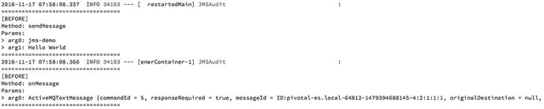

图 4-4.

日志

图 4-4 展示了通过从队列中消费消息来调用 `onMessage` 方法（请记住，这些日志是由 AOP 切面生成的）。如果你更仔细地查看实际消息，你应该会看到类似这样的内容：

```
ActiveMQTextMessage {
commandId = 5,
responseRequired = true,
messageId = ID:pivotal-es.local-64812,
originalDestination = null,
originalTransactionId = null,
producerId = ID:pivotal-es.local-64812,
destination = queue://jms-demo,
transactionId = null,
expiration = 0,
timestamp = 1479394688357,
arrival = 0,
brokerInTime = 1479394688357,
brokerOutTime = 1479394688362,
correlationId = null,
replyTo = null,
persistent = true,
type = null,
priority = 4,
groupID = null,
groupSequence = 0,
targetConsumerId = null,
compressed = false,
userID = null,
content = null,
marshalledProperties = null,
dataStructure = null,
redeliveryCounter = 0,
size = 1046,
properties = null,
readOnlyProperties = true,
readOnlyBody = true,
droppable = false, j
msXGroupFirstForConsumer = false,
text = Hello World
}
```

如你所见，我们正在接收一个 `ActiveMQTextMessage`，它是围绕 `javax.jms.TextMessage` 接口的一个实现。了解指向 `jms-demo` 队列的目标属性、有效负载以及值为 `Hello World` 的文本属性非常重要。

你可能想知道是否有更简单的方法来配置监听器。如何确定要配置什么？嗯，Spring Boot 让这变得更加容易。你将在下一节中了解这个过程。

### 使用注解的消费者

Spring 框架提供了用于消费消息的有用注解，这与 `ApplicationEvents` 和 `Streams` 非常相似。Spring Boot 有助于自动配置这些注解，从而使开发人员的工作更轻松。

让我们首先回顾一下 `com.apress.messagin.jms.AnnotatedReceiver.java` 类。请参见清单 4-10。

```
@Component
public class AnnotatedReceiver {
@JmsListener(destination = "${apress.jms.queue}")
public void processMessage(String content) {
}
}
清单 4-10.
com.apress.messagin.jms.AnnotatedReceiver.java
```

清单 4-10 展示了包含 `@JmsListener` 注解的 `AnnotatedReceiver` 类：

*   `@Component`：记住，这是一个标记，用于让 Spring 在 Spring 容器中启用此 Bean。
*   `@JmsListener`：此注解被配置为使用 SpEL（Spring 表达式语言）表达式指定的目标来创建一个消息监听器。在这种情况下，它是值为 `jms-demo` 的 `apress.jms.queue` 属性。

就是这样！Spring Boot 将为你配置一切，因此不再需要声明消息监听器容器的 Bean。

注意

在运行此接收器之前，首先注释掉 `JMSConfig` 类中的 Bean 定义（`DefaultMessageListenerContainer`）和 `QueueListener` 类中的 `@Component`。

现在是时候运行这个接收器了（只需记住注释掉 Bean 和监听器，因为你不再需要它们了）。一旦你运行该应用程序，你应该会得到类似于图 4-5 的结果。

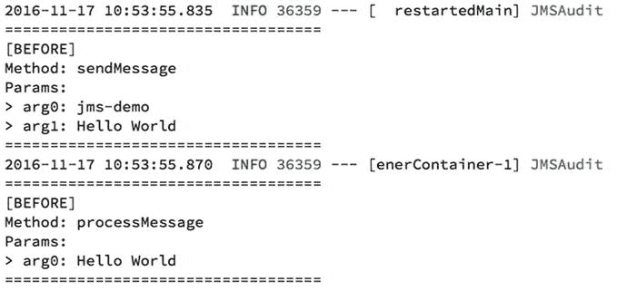

图 4-5.

@JmsListener 日志

图 4-5 向你展示了运行应用程序后的日志。你可以看到被调用的方法是 `processMessage`；这正是被 `@JmsListener` 注解注解的同一个消息。


### 货币项目

让我们再次讨论货币项目。假设你有一个客户想要发送更精确的汇率，但只能使用 JMS 发送汇率消息。这意味着你的货币项目需要充当接收方，但客户需要某种确认，表明你已收到汇率消息。

让我们从使用同一个 `jms-sender` 项目创建发送方客户端开始。查看清单 4-11 中所示的 `com.apress.messaging.jms.RateSender.java` 类。

```
@Component
public class RateSender {
private JmsTemplate jmsTemplate;
@Autowired
public RateSender(JmsTemplate jmsTemplate){
this.jmsTemplate = jmsTemplate;
}
public void sendCurrency(String destination, Rate rate){
this.jmsTemplate.convertAndSend(destination,rate);
}
}
清单 4-11.
com.apress.messaging.jms.RateSender.java
```

清单 4-11 展示了你将用于发送新 `Rate` 对象的类。如你所见，它与清单 4-6 中的 `SimpleSender` 类非常相似。唯一的区别是，现在发送的是一个 `Rate` 对象，而不是文本（String）消息。查看清单 4-12 中的 `com.apress.messaging.domain.Rate.java` 类。

```
public class Rate {
private String code;
private Float rate;
private Date date;
public Rate() { }
public Rate(String base, Float rate, Date date) {
super();
this.code = base;
this.rate = rate;
this.date = date;
}
//Setters and Getter omitted.
}
清单 4-12.
com.apress.messaging.domain.Rate.java
```

清单 4-12 展示了你在货币项目中已经见过的 `Rate` 领域类，但请记住，在上一章中，我们使用 `@Entity` 和 `@Id` 对其进行了注解，作为 JPA 持久化的一部分。这次它将变得简单，因为无需持久化汇率。

如果你此时尝试运行应用程序，将会收到类似如下的错误：

```
Cannot convert object of type [com.apress.messaging.domain.Rate] to JMS message. Supported message payloads are: String, byte array, Map, Serializable object.
```

我们可以在 `Rate` 类中实现 `Serializable`，但货币项目并没有这样做。现在，如果你还记得，我们的想法是创建一个接受 JSON 格式的 REST API，那么让我们看看如何在这里使用 JSON。

打开 `com.apress.messaging.config.JMSConfig.java` 类。参见清单 4-13。

```
@Configuration
@EnableConfigurationProperties(JMSProperties.class)
public class JMSConfig {
@Bean
public MessageConverter jacksonJmsMessageConverter() {
MappingJackson2MessageConverter converter = new
MappingJackson2MessageConverter();
converter.setTargetType(MessageType.TEXT);
converter.setTypeIdPropertyName("_class_");
return converter;
}
}
清单 4-13.
com.apress.messaging.config.JMSConfig.java
```

清单 4-13 展示了以 JSON 格式公开消息所需的配置。让我们回顾一下：

*   `MessageConverter`：这是一个接口，指定了 Java 对象和 JMS 消息之间的转换器。它公开了 `toMessage` 和 `fromMessage` 方法。Spring Boot 的自动配置将连接所有内容以使用这个特定的消息转换器。
*   `MappingJackson2MessageConverter`：该类实现了 `MessageConverter` 接口，并添加了更多方法来帮助进行 JSON/对象之间的转换。
*   `setTargetType`：此方法对于帮助转换器识别需要转换的类型是必要的。在本例中，我们以字符串格式发送 JSON，这意味着它将在后台创建一个 `TextMessage` 对象。
*   `setTypeIdPropertyName`：这是一个重要的设置，因为它将决定后台映射的方式。这可以是任何你想要的值。它只是一个简单的标识符，用于保存正在映射的限定类名。

这足以再次运行应用程序，但首先让我们看看主应用程序的样子。参见清单 4-14。

```
@SpringBootApplication
public class JmsSenderApplication {
public static void main(String[] args) {
SpringApplication.run(JmsSenderApplication.class, args);
}
@Bean
CommandLineRunner process(JMSProperties props,
RateSender sender){
return args -> {
sender.sendCurrency(props.getRateQueue(),
new Rate("EUR",0.88857F,new Date()));
sender.sendCurrency(props.getRateQueue(),
new Rate("JPY",102.17F,new Date()));
sender.sendCurrency(props.getRateQueue(),
new Rate("MXN",19.232F,new Date()));
sender.sendCurrency(props.getRateQueue(),
new Rate("GBP",0.75705F,new Date()));
};
}
}
清单 4-14.
com.apress.messaging.JmsSenderApplication.java
```

清单 4-14 展示了主应用程序（只需记住注释掉之前的代码）。如你所见，它非常简单。我们只是在发送新的 `Rate` 对象。如果你运行应用程序，应该会得到如图 4-6 所示的输出。

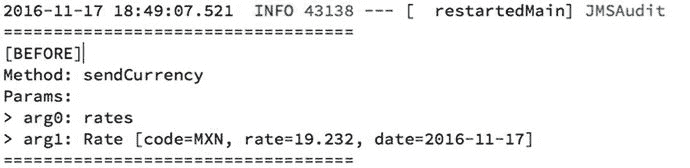

图 4-6.

JMS 发送汇率对象时的日志

图 4-6 展示了没有任何错误的日志。它表明一切顺利，并且一些汇率已成功发送。但这还不够，因为我们如何保证它实际上是 JSON 格式呢？


#### 使用远程 Apache ActiveMQ 代理

让我们使用 ActiveMQ 作为远程代理。这将帮助我们确定消息是否实际发送到了代理，而不是使用内存中的提供者。

请确保您已启动并运行 ActiveMQ（您需要从 [`http://activemq.apache.org/`](http://activemq.apache.org/) 下载它，并按照您系统的安装说明进行操作）。我使用的是 ActiveMQ 5.14.0 版本，但您可以使用任何版本。在再次运行应用程序之前，您需要确保它将使用正在运行的 ActiveMQ 代理。打开 `src/main/resources /application.properties` 文件，并取消注释所有 `spring.activemq.*` 和 `apress.jms.*` 属性。结果应如清单 4-15 所示。

```
spring.activemq.broker-url=tcp://localhost:61616
spring.activemq.user=admin
spring.activemq.password=admin
#Apress 配置
apress.jms.queue=jms-demo
apress.jms.rate-queue=rates
清单 4-15.
src/main/resources/application.properties
```

清单 4-15 显示了声明了远程 ActiveMQ 的 `application.properties` 文件（在本例中为本地系统），默认端口为 `61616`，用户名和密码设置为 `admin`。有了这些属性，Spring Boot 将配置连接到远程代理的 `connectionFactory`。

因此，如果您已运行 ActiveMQ 代理，您应该能够在浏览器中访问 `http://localhost:8161/admin` URL，并看到图 4-7 所示的网页。

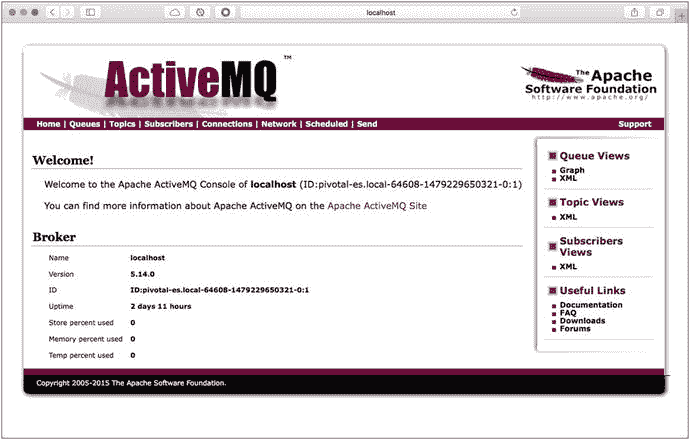

图 4-7.

ActiveMQ 网页控制台：http://localhost:8161/admin

然后您可以执行 `jms-demo` 应用程序，并从网页控制台中选择队列，以查看名为 `rates` 的队列已被创建（此名称基于 `apress.jms.rate-queue` 属性值）。见图 4-8。

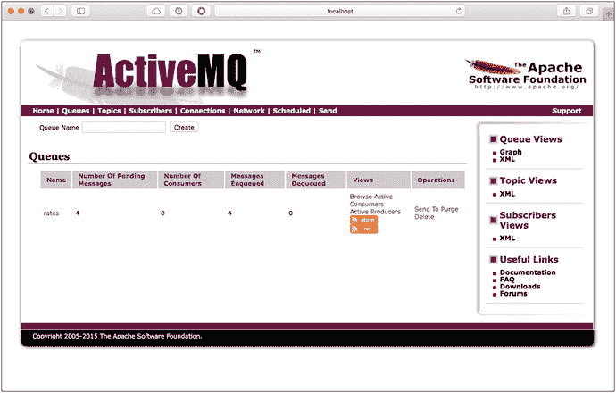

图 4-8.

ActiveMQ 队列选项卡

如果您点击名为 `rates` 的队列，您应该会看到发送到代理的四条消息。见图 4-9。

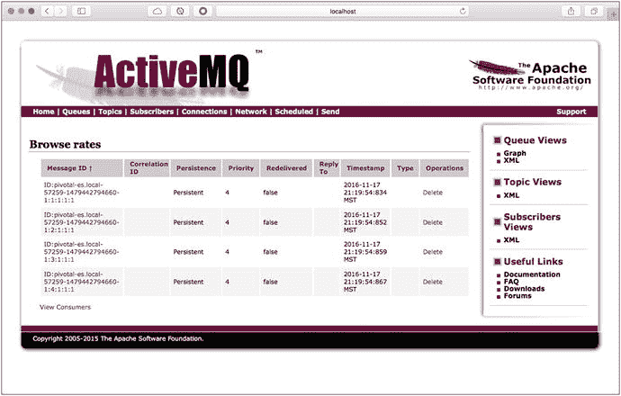

图 4-9.

ActiveMQ 队列汇率消息

点击任意消息以查看其内容。见图 4-10。

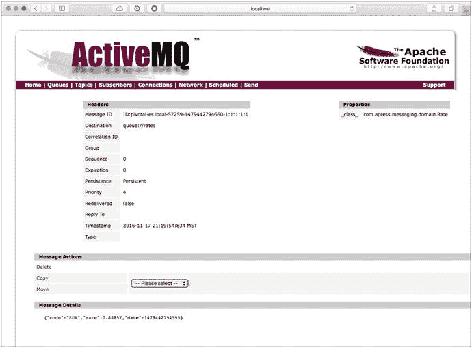

图 4-10.

ActiveMQ 队列 --> 汇率 --> 消息

图 4-10 向您展示了代理接收到的实际消息。查看消息详情；您将看到类似以下内容：

```
{"code":"EUR","rate":0.88857,"date":1479442794599}
```

该汇率由 `jms-sender` 应用发送。在右侧，您可以看到一个属性图例，其中 `_class_` 属性 ID 的值为 `com.apress.messaging.domain.Rate` 类（请记住，这对接收方也很重要，以便它可以从 JSON 转换回对象）。

现在您知道了如何发送可转换为 JSON 的对象。接下来，您需要接收此消息，对吗？发送方也需要从接收方接收一些确认（这也是需求的一部分）。

### 回复至

Spring JMS 提供了一种回复到另一个队列的方法，有点类似于拥有一个请求-响应/RPC 模型。您可以将其与监听器 `@SendTo` 注解一起使用。

为了看到实际效果，我们将使用同一个 `jms-sender` 项目。请记住禁用某些组件。您可以通过注释掉我们一直在处理的所有监听器中的 `@Component` 注解来实现。

打开 `com.apress.message.jms.RateReplyReceiver.java` 类。见清单 4-16。

```
@Component
public class RateReplyReceiver {
@JmsListener(destination = "${apress.jms.rate-queue}")
@SendTo("${apress.jms.rate-reply-queue}")
public Message processRate(Rate rate){
//处理汇率并返回任何有意义的值
return MessageBuilder
.withPayload("PROCCESSED")
.setHeader("CODE", rate.getCode())
.setHeader("RATE", rate.getRate())
.setHeader("ID", UUID.randomUUID().toString())
.setHeader("DATE",
new SimpleDateFormat("yyyy-MM-dd")
.format(new Date()))
.build();
}
}
清单 4-16.
com.apress.message.jms.RateReplyReceiver.java
```

清单 4-16 向您展示了 `RateReplyReceiver.java` 类和 `@SendTo` 注解，该注解需要一个值，该值对应于结果消息将被发送到的 `reply-queue`。让我们回顾一下：

*   `@SendTo`：此注解将是回复的关键。请确保您仍然有 `@JmsListener` 注解，这意味着此方法将同时充当接收方和发送方。该方法必须有一个返回类型。在这种情况下，它将使用 `apress.jms.rate-reply-queue` 值来设置回复队列。如果主消息设置了 `JMSReplyTo` 标头，则可以省略注解值。
*   `Message<T>`：这是一个基于 `Generics` 类型构建的接口，并提供了有用的 getter 方法，例如 `getPayload` 和 `getHeaders`。这是发送消息的首选方式。
*   `MessageBuilder`：这是一个辅助类，允许您通过添加更多标头来增强消息。

接下来，让我们再次查看 `RateSender` 类。它不仅会发送汇率，还会监听 `reply-queue`。请记住，需求是从接收方接收某种确认。见清单 4-17。

```
@Component
public class RateSender {
private JmsTemplate jmsTemplate;
@Autowired
public RateSender(JmsTemplate jmsTemplate){
this.jmsTemplate = jmsTemplate;
}
public void sendCurrency(String destination, Rate rate){
this.jmsTemplate.convertAndSend(destination,rate);
}
@JmsListener(destination="${apress.jms.rate-reply-queue}")
public void process(String body,@Header("CODE") String code){
}
}
清单 4-17.
com.apress.message.jms.RateSender.java
```

清单 4-17 向您展示了新的 `RateSender` 类。如您所见，我们重用了 `@JmsListener` 和新的 `@Header` 注解。让我们回顾一下：

*   `@JmsListener`：您已经知道这个注解。唯一的区别是包含正确的 `reply-queue` 名称。在本例中，它是 `apress.jms.rate-reply-queue` 属性值。
*   `@Header`：此注解将允许您直接访问 `Message<T>` 的标头，在本例中，它将是被处理的汇率代码。Spring JMS 有更多选项：`@Headers` 带来一个 `java.util.Map` 对象，`@Payload` 带来实际的有效载荷，`@Valid` 为您的有效载荷开启验证。

在运行此操作之前，请确保您已启动并运行 ActiveMQ 代理。

如果您运行该应用程序，您不仅应该看到发送方，还应该看到接收方和回复日志。见图 4-11。

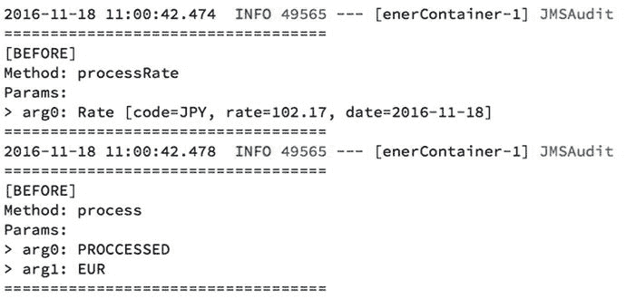

图 4-11.

带有回复队列的日志

您可以查看 ActiveMQ 网页控制台，并看到 `reply-rate` 队列已被创建。见图 4-12。

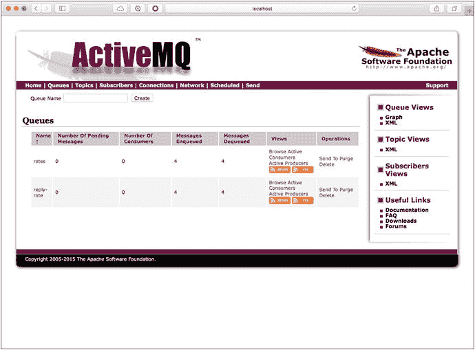

图 4-12.

显示 reply-rate 队列的队列

现在您知道了如何创建一个 `reply-to` 并为您的应用程序提供一种 RPC 机制。


### 主题

本节将讨论另一种 JMS 消息传递模型：发布者-订阅者模型，即主题。在该模型中，发布者将消息发送到主题，而主题可以有零个到多个订阅者，每个订阅者都会收到消息的副本。你可以将其想象成报纸或杂志的订阅。你订阅（某个特定兴趣——主题）以从发布者处接收报纸或杂志。

本节将继续使用 `jms-sender` 项目，该项目将扮演发布者的角色。同时，本章还将开启一个新项目 `jms-topic-subscriber`。它的结构类似于 `jms-sender`。

在 `jms-sender` 中，我们将使用相同的 `RateSender.java` 以及发送汇率的主入口点，但有一处小改动。打开 `src/main/resources/application.properties` 文件。其内容应如代码清单 4-18 所示。

```
# Spring Web
spring.main.web-environment=false
#Default ActiveMQ properties
spring.activemq.broker-url=tcp://localhost:61616
spring.activemq.user=admin
spring.activemq.password=admin
#Apress Configuration
apress.jms.queue=jms-demo
apress.jms.rate-queue=rates
apress.jms.rate-reply-queue=reply-rate
#Enable Topic Messaging
spring.jms.pub-sub-domain=true
#Apress Topic Configuration
apress.jms.topic=rate-topic
代码清单 4-18.
src/main/resources/application.properties
```

代码清单 4-18 展示了 `application.properties` 文件，其中包含一个特殊属性 `spring.jms.pub-sub-domain`。该属性默认值为 `false`，因此生产者会将消息发送到队列。当设置为 `true` 时，生产者（发布者）会将消息发送到主题。这也同样适用于监听器。如果你将此属性设置为 `true`，监听器将成为该主题的订阅者。

也请查看最后一个属性。我们只是定义了所有订阅者将监听的主题名称。

现在，你可以打开并查看 `jms-topic-subscriber` 项目中的 `com.apress.messaging.jms.RateTopicReceiver.java` 类，你会发现代码是相同的（除了目标名称）。在此项目中，你需要拥有相同的 `application.properties` 文件，并将 `spring.jms.pub-sub-domain` 设置为 `true`（请确保包含此属性）。

现在是时候运行 `jms-topic-subscriber` 项目了。在运行 `jms-demo` 项目之前，请查看 ActiveMQ Web 控制台的“主题”部分，如图 4-13 所示。

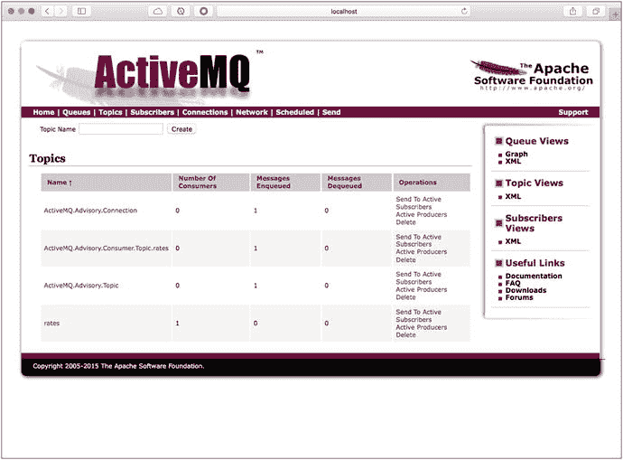

图 4-13.

ActiveMQ Web 控制台的“主题”部分

图 4-13 显示已创建一个名为 `rates` 的主题，并且有一个消费者。接下来，运行 `jms-sender` 项目，查看汇率是否被发送到该主题。查看 `jms-topic-subscriber` 项目的日志；你应该会看到正在从 `rates` 主题消费消息。

作为实验，你可以运行 `jms-topic-subscriber` 项目的多个实例（如果你使用 STS 和 Boot Dashboard，这很容易实现），并验证每个实例是否都收到了汇率的副本。参见图 4-14。

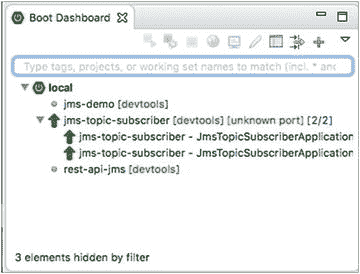

图 4-14.

STS Boot Dashboard 运行 `jms-topic-subscriber` 项目的两个实例

## 货币项目

为了使用货币项目并开始监听来自其他客户端的新汇率，我们需要做什么？解决方案已经在 `rest-api-jms` 项目中。你需要执行以下操作：

*   确保已启用 `application.properties`、`spring.activemq.*` 和 `rate.jms.*` 属性。
*   查看 `RateJmsReceiver` 类，并注释/取消注释你想要使用的监听器（我们提供了简单监听器和带有 `reply-to` 的监听器）。
*   查看包含 JSON 转换器的 `RateJmsConfiguration` 类。

作为作业，请尝试使其运行起来。请记住，你需要启动并运行 ActiveMQ 代理。另外，作为额外步骤，请尝试使该项目支持主题。

## 总结

本章向你展示了如何使用 Spring Boot 通过 JMS 技术发送和接收消息。

你了解了不同的 JMS 消息传递模型，以及开发人员发送或接收消息需要做什么。

通过 Spring Boot，你看到了设置 JMS 客户端是多么容易，以及如何通过简单的注解就能拥有一个使用 JMS 作为消息传递系统的功能型应用程序。尽管你只看到了如何使用 Apache ActiveMQ 作为代理，但同样的编程方法也可以应用于 HornetQ、IBM MQ 等，只需在 `application.properties` 文件中提供正确的属性（连接工厂和消息监听器）即可。

下一章将讨论一种不同的消息传递方式，即使用高级消息队列协议——AMQP。

