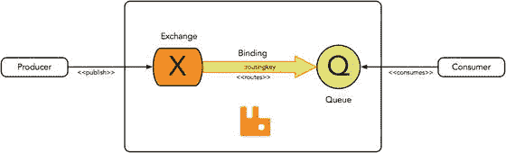
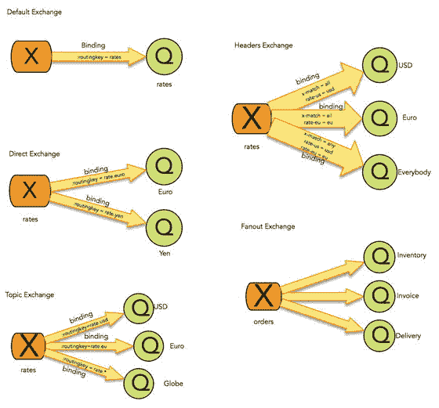
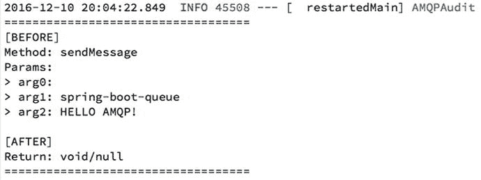
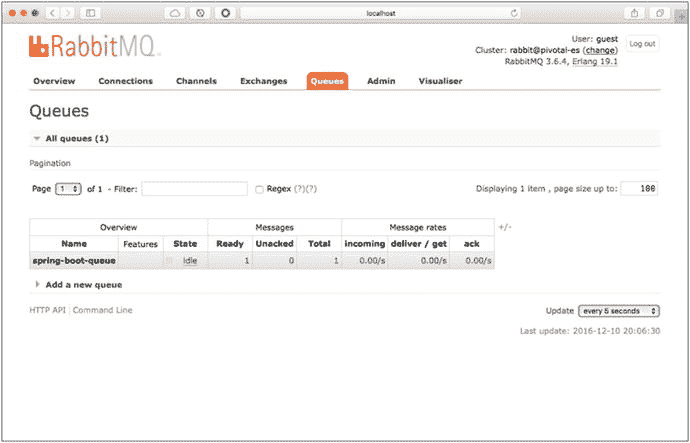
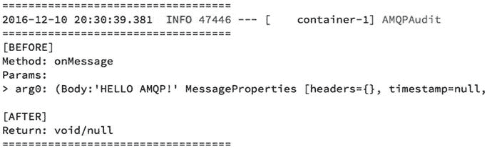
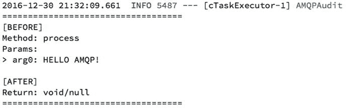
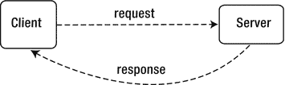
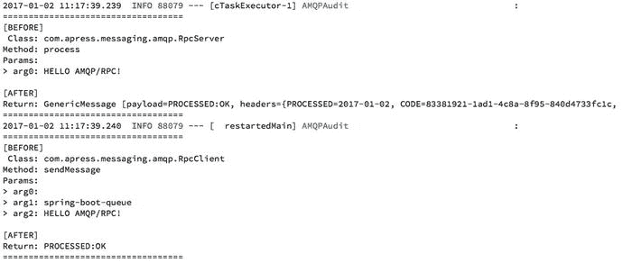

# 5. 使用 Spring Boot 集成 AMQP

本章将讨论高级消息队列协议（AMQP），这是一种与平台无关的消息协议。你将学习如何使用 Spring AMQP 模块，该模块将与 RabbitMQ 代理进行通信。RabbitMQ 是全球最常用的代理之一，因为它易于安装和使用。最棒的是，它是开源的。

AMQP 起源于金融领域，由摩根大通于 2003 年创建。随后，更多公司围绕它进行改进，以增强这种新的消息传递方式。Rabbit Technologies 使用 Erlang 编程语言实现了 AMQP，RabbitMQ 由此诞生。多年后，VMware/Pivotal 收购了它。

我们将继续介绍一些重要的定义，这些定义将帮助你更好地理解 AMQP 和 RabbitMQ。本章将使用 `amqp-demo` 和 `rest-api-amqp` 项目。本章包含与 `amqp-demo` 相关的所有代码，我将让你自行深入研究 `rest-api-amqp` 项目，以完成主要需求：从 RabbitMQ 接收新汇率并将其发送给感兴趣的消费者。

注意

对于本章，启动并运行 RabbitMQ 服务器非常重要。你可以从 [`http://www.rabbitmq.com/download.html`](http://www.rabbitmq.com/download.html) 下载它。请确保至少安装了 `rabbitmq_management` 插件，因为它为 RabbitMQ 提供了 Web UI 管理功能。设置完成后，你可以打开浏览器，使用用户名和密码 `guest` 访问 `http://localhost:15672`。有关此 Web UI 插件的更多信息，请访问 [`http://www.rabbitmq.com/management.html`](http://www.rabbitmq.com/management.html) 。

## AMQP 模型

本节将介绍 AMQP 0.9.1 模型。目前，这个特定版本是最常见的。

AMQP 模型由发布到交换器的消息组成。这些交换器根据绑定（规则）将消息分发到队列。然后，消费者从这些队列中获取/拉取消息。参见图 5-1。



图 5-1.

AMQP 模型

你会看到，通常作为生产者或消费者，你需要创建到代理的连接，然后使用通道（主要传输方式）将消息发布到交换器或从队列消费消息。换句话说，AMQP 协议通过通道指定了多路复用连接。

AMQP 模型具有不同的特性，允许开发人员在创建消息传递应用程序时拥有极大的灵活性。这些特性包括消息属性（内容类型、编码、路由键、投递模式等）、消息确认、消息拒绝、消息重新入队、多路复用连接（通道）、虚拟主机（用于托管隔离环境）、多客户端以及路由能力等。


### 交换机、绑定与队列

这些关键词也被称为 AMQP 实体。让我们来定义这些实体（请记住，所有这些仍然是 AMQP 模型的一部分）：

*   **交换机**：生产者发送消息的实体。交换机将使用绑定将消息路由到正确的队列。交换机具有以下属性：名称、持久性（可以是持久或瞬态）、自动删除（当所有队列使用完毕后，交换机被删除）以及参数（哈希映射，依赖于代理）。
*   **绑定**：连接交换机与另一个交换机或队列的规则。这是一个字符串值。
*   **队列**：存储消息（在内存或磁盘中），直到它们被应用程序消费。队列具有以下属性：名称、持久性（在代理重启后依然存在）、独占性（仅由一个连接使用，这意味着当连接关闭时队列将被删除）、自动删除（当最后一个消费者取消订阅时队列被删除）以及参数（哈希映射，依赖于代理）。

AMQP 模型提供了四种类型的交换机：

*   **直连交换机**：通过其绑定与队列建立一对一的关系。有一个默认交换机，它是一种直连交换机类型，使用队列名称作为其绑定的路由键。
*   **扇形交换机**：此交换机会为每个绑定到它的队列复制一条消息。你可以将其视为广播；它与发布/订阅模式（主题）非常相似。
*   **主题交换机**：此交换机类似于直连交换机，唯一的区别在于它接受路由键的通配符（正则表达式），通过使用 `*`（可替代恰好一个单词）和 `#`（可替代零个或多个单词）选项。
*   **头交换机**：此交换机通过比较多个头信息来进行路由。你需要通过向同一消息头添加 `x-match:all`（头：键）来指示是否要求头信息完全匹配，或通过添加 `x-match:any`（头：键）来指示匹配任意一个头信息。

图 5-2 展示了这些交换机类型。



图 5-2.

交换机类型

这个简短的介绍足以让你开始使用 RabbitMQ 并学习如何使用它。

## RabbitMQ

RabbitMQ 是一个实现了 AMQP 模型（从 AMQP 模型的 0.8.x 版本到 1.0 版本）的开源代理。RabbitMQ 使用 Erlang 编程语言编写，使其灵活且健壮。

以下是它的一些特性：

*   分布式节点
*   支持集群
*   基于插件；最重要的插件包括：
    *   联邦
    *   铲子
    *   一致性哈希
    *   社区插件
*   具有完整 ACID（原子性、一致性、隔离性、持久性）特性的数据/状态复制
*   开箱即用的可靠性和可扩展性：联邦和铲子
*   通过镜像队列实现高可用性
*   多协议：
    *   AMQP
    *   MQTT
    *   STOMP
    *   SMTP
    *   XMPP
*   Web 控制台和 Rest API（用于监控和管理）
*   安全性：SSL 和 LDAP
*   多种客户端库：Java、.NET、Ruby、Erlang、Python、Clojure、PHP、JavaScript 等。

我们可以写一整本书来定义每一个可用的特性，但我想做的是让你了解 RabbitMQ 能做什么。（如果你需要更多信息，可以访问 [`http://www.rabbitmq.com/features.html`](http://www.rabbitmq.com/features.html) 。）那么，让我们通过创建客户端来开始使用它。

## 使用 Spring Boot 的 RabbitMQ

Spring Boot 依赖 Spring 的 `spring-amqp` 项目来完成连接、发布、消费和管理 RabbitMQ 代理的所有繁重工作。`spring-amqp` 项目一直是消息传递应用程序中最常用的模块之一。

那么，为什么我们需要 Spring Boot？请记住，Spring Boot 是一个有主见的运行时，它将通过提供一些我们可以添加到 `application.properties` 文件中的属性，或者通过使用 `@Configuration` 类来覆盖其中一些默认配置，从而帮助我们配置 `spring-amqp` 模块所需的内容。

`spring-amqp` 项目使用了众所周知的模板模式，它暴露了一个 `RabbitTemplate` 类，允许我们发布和消费消息，以及执行其他任务。它还提供了易于使用的消息监听器，用于连接到队列并消费消息。如果你担心线程、事务、重连（在故障情况下）、管理等问题，`spring-amqp` 都能为你解决。


### 生产者

让我们从一个简单的生产者开始。`ampq-demo` 项目包含了入门所需的一切。打开项目，从清单 5-1 所示的简单生产者开始。

```
@Component
public class Producer {
private RabbitTemplate template;
@Autowired
public Producer(RabbitTemplate template){
this.template = template;
}
public void sendMessage(String exchange,
String routingKey, String message){
this.template.convertAndSend(exchange,
routingKey, message);
}
}
清单 5-1.
com.apress.messaging.amqp.Producer
```

清单 5-1 展示了一个简单的 `amqp` 生产者。我们来分析一下代码中的重要部分：

*   `@Component`：这是 Spring 框架的一个标记，它会将该类识别为 Spring Bean，以便在应用程序中使用。接下来你会在主应用程序中看到它的实际应用。
*   `RabbitTemplate`：这是 Spring AMQP 模块的主要类之一，它提供了与 RabbitMQ 交互的许多功能，例如发送、接收以及执行 RabbitMQ 中的管理任务。在本例中，它用于将消息转换并发送到代理。请记住，要与 RabbitMQ 交互，你必须打开一个连接并创建一个通道（从该连接中），然后将消息发送到交换机。这个设置过程将由 `RabbitTemplate` 实例处理。
*   `convertAndSend`：此方法会将消息转换为正确的类型（转换为字节数组），并将其发送到 `RabbitMQ` 代理。这个特定的方法有三个参数。第一个参数是交换机的名称（消息将通过通道发送到该交换机），第二个参数是路由键（将消息路由到正确队列的绑定规则），第三个参数是消息本身，在本例中只是一个字符串。

如你所见，这是一个非常简单的生产者。值得一提的是，`RabbitTemplate` 类提供了多种重载方法，可以帮助你发送、监听、使用自定义转换器以及执行专门的任务（稍后你将了解更多相关内容）。

接下来，让我们看看如何使用这个生产者。打开清单 5-2 中所示的 `AmqpDemoApplication.java` 类。

```
@SpringBootApplication
public class AmqpDemoApplication {
public static void main(String[] args) {
SpringApplication.run(AmqpDemoApplication.class, args);
}
@Bean
CommandLineRunner simple(
@Value("${apress.amqp.exchange:}")String exchange,
@Value("${apress.amqp.queue}")String routingKey,
Producer producer){
return args -> {
producer.sendMessage(
exchange,
routingKey, "HELLO AMQP!");
};
}
}
清单 5-2.
com.apress.messaging.AmqpDemoApplication.java
```

清单 5-2 展示了主 Spring Boot 应用程序。我们来回顾一下代码：

*   `@Bean CommandLineRunner`：你已经熟悉这个注解和接口。它会在 Spring 容器初始化所有 Bean 并准备就绪后执行。
*   `@Value("${apress.amqp.exchange:}")`：此注解会评估包含 `apress.amqp.exchange` 键的属性（通过 `application.properties`、命令行参数或环境变量）。如果未找到，它将使用一个空字符串，即 `exchange` 后面的 `:`。
*   `@Value("${apress.amqp.queue}")`：此注解会评估包含 `apress.amqp.queue` 键的属性（通过 `application.properties`、命令行参数或环境变量）。此键是必需的，因此你会在 `src/resources/application.properties` 文件中找到它，其值为 `spring-boot-queue`。
*   `Producer`：这是简单的生产者类（如清单 5-1 所示）。如你所见，我们使用 `sendMessage` 方法来发送交换机名称、路由键以及 `"HELLO AMQP!"` 消息。

在测试之前，你需要确保 RabbitMQ 代理已启动并正在运行。你还需要设置交换机、绑定和队列，不过这里你不需要这样做，因为 `amqp-demo` 项目已经为你配置好了。请查看清单 5-3 中所示的 `AMQPConfig.java` 类。

```
@Configuration
@EnableConfigurationProperties(AMQPProperties.class)
public class AMQPConfig {
@Bean
public Queue queue(
@Value("${apress.amqp.queue}")String queueName){
return new Queue(queueName,false);
}
}
清单 5-3.
com.apress.messaging.config.AMQPConfig.java
```

清单 5-3 展示了 `AMQPConfig`，它定义了以下内容：

*   `@EnableConfigurationProperties`：这将声明一个自定义属性，其前缀为 `apress.amqp.*`。这就是我们可以使用 `apress.amqp.queue` 或 `apress.amqp.exchange` 键的原因。
*   `@Bean Queue`：这是重要的部分，我们通过编程方式声明队列，在本例中，通过返回 `Queue` 类的新实例来创建队列。
*   `@Value("${apress.amqp.queue}")`：此注解会评估在 `src/main/resources/application.properties` 中定义的键 `apress.amqp.queue`，其值为 `spring-boot-queue`。

我认为这个配置非常直接，但仔细想想，我们似乎缺少了 `Exchange` 声明以及将消息路由到队列的绑定。实际上，每次在 RabbitMQ 中创建队列时，它都会绑定到一个默认交换机（通常声明为空字符串），而路由键恰好就是队列的名称。如你所见，我们将队列的名称作为路由键传递给了生产者实例。

现在你可以运行应用程序，并在 RabbitMQ 管理控制台中看到 `spring-boot-queue` 已被创建，并且有一条消息。输出如图 5-3 所示。



图 5-3.

生产者日志

图 5-3 展示了日志。在 `amqp-demo` 项目中，你会找到 `com.apress.messaging.aop.AMQPAudit.java` 类。这是一个环绕通知，它会记录 `Producer` 方法的调用。见图 5-4。



图 5-4.

RabbitMQ 管理控制台 (http://localhost:15672/#/queues): spring-boot-queue

图 5-4 展示了 RabbitMQ 管理控制台，你可以看到队列已创建，并且消息已发送。

你知道我们是如何连接到 RabbitMQ 代理的吗？如果我有一个远程服务器，需要指定连接位置，传递 IP 地址或用户名和密码，该怎么办？

Spring Boot 会自动处理这个问题，因为 Spring Boot 是一个有主见的运行时，它会在类路径中找到 `spring-boot-starter-amqp` 依赖项，并询问你是否已经有一个包含代理所有必要信息的 `ConnectionFactory`（用于连接 RabbitMQ）。如果没有，它将尝试使用默认设置并查找本地代理。

如果你想指定一个远程代理，可以通过在 `src/main/resources/application.properties` 文件中提供 `spring.rabbitmq.*` 属性来实现。这足以连接到远程 RabbitMQ。


### 消费者

现在，我们来讨论如何消费使用生产者发送的消息。打开清单 5-4 中所示的 `Consumer.java` 类。

```
@Component
public class Consumer implements MessageListener{
public void onMessage(Message message) {
}
}
清单 5-4.
com.apress.messaging.amqp.Consumer.java
```

清单 5-4 展示了最简单的消费者代码。这是一个异步消费者，它实现了 `org.springframework.amqp.core.MessageListener` 接口和 `onMessage` 方法。该方法将接收一个 `org.springframework.amqp.core.Message` 实例作为消息。要使用此消费者，你需要为 Spring Boot 提供一些有用的配置设置。打开 `AMQPConfig` Java 类。参见清单 5-5。

```
@Configuration
@EnableConfigurationProperties(AMQPProperties.class)
public class AMQPConfig {
@Bean
public Queue queue(
@Value("${apress.amqp.queue}")String queueName){
return new Queue(queueName,false);
}
@Bean
public SimpleMessageListenerContainer
container(ConnectionFactory connectionFactory,
MessageListener consumer,
@Value("${apress.amqp.queue}")String queueName) {
SimpleMessageListenerContainer container = new
SimpleMessageListenerContainer();
container.setConnectionFactory(connectionFactory);
container.setQueueNames(queueName);
container.setMessageListener(consumer);
return container;
}
}
清单 5-5.
com.apress.messaging.config.AMQPConfig.java
```

清单 5-5 展示了增强后的 `AMQPConfig` 类（来自清单 5-3），其中包含以下内容：

*   `SimpleMessageListenerContainer`：此类创建一个消息监听容器，用于监听队列中的任何消息。需要为此类设置连接工厂、消息监听处理器以及队列名称。如你所见，这是一个我们需要返回的 Bean，用于初始化消息监听容器。
*   `ConnectionFactory`：对于 `SimpleMessageListenerContainer` 类来说，此接口是必需的，因为它负责了解 RabbitMQ 代理（主机、用户名、密码、虚拟主机等）的信息。需要注意的是，这个连接工厂是由 Spring Boot 自动装配的，要么使用默认设置（完全不配置），要么通过在 `application.properties` 文件中使用 `spring.rabbitmq.*` 属性来指定其属性。你也可以将你自己的 `ConnectionFactory` 声明为一个 Bean（通过在方法中声明 `@Bean`）。
*   `MessageListener`：如你所见，这是方法容器（`consumer`）的参数之一，Spring 会将 `com.apress.messaging.amqp.Consumer` 类注册为处理器。然后在调用 `container.setMessageListener` 方法时使用它。

请注意，我们使用了 `queueName`，它是由 Spring Boot 通过 `apress.amqp.queue` 属性自动装配的。

基本上就是这样。现在你有了一个完整的生产者和消费者。你可以运行程序，并查看图 5-5 中所示的日志。



图 5-5.

消费者日志

图 5-5 展示了消费者的日志。请注意，被调用的方法是 `onMessage`，它由 `org.springframework.amqp.core.Message` 实例表示。

#### 使用注解的消费者

等等！我告诉过你 Spring Boot 会让这变得更简单，对吧？在当前示例中，我们需要注册容器并实现 `MessageListener` 接口。好消息是，Spring AMQP 提供了一种使用注解的方式，并且在 Spring Boot 的帮助下，一切都能正确配置。

转到你的 `AMQPConfig` 类，移除容器方法。它应该看起来像清单 5-3。打开 `com.apress.messaging.amqp.AnnotatedConsumer` 类；它应该看起来像清单 5-6。

```
@Component
public class AnnotatedConsumer {
@RabbitListener(queues="${apress.amqp.queue}")
public void process(String message){
}
}
清单 5-6.
com.apress.messaging.amqp.AnnotatedConsumer.java
```

清单 5-6 展示了如何在不创建容器的情况下创建一个消费者，只需添加 `@RabbitListener` 注解即可。Spring AMQP 会为你创建容器，并在 Spring Boot 的帮助下将所有内容自动装配起来。如你所见，它使用 `queues` 作为参数，并且使用了 `apress.amqp.queue` 属性。还要注意，该方法接收一个 `String`（而不是 `Message` 对象）。你可以使用自己的对象，但这需要额外的步骤。别担心，我们将在后续章节中介绍这一点。

现在你可以运行项目，应该会得到类似于图 5-6 的结果。



图 5-6.

使用 @RabbitListener 注解的消费者

如你所见，只需几行代码就能非常简单地创建一个生产者和消费者。接下来，让我们回顾一下如何创建和使用 RPC 模型。


### RPC

远程过程调用（RPC）模型是上世纪 60 年代众多应用场景之一，当时分布式计算是一项挑战（现在依然如此）。RPC 模型被视为一种请求-响应协议，其中客户端通过向远程服务器发送请求消息来启动一个进程，以执行一个或多个任务。随后远程服务器向客户端发送响应，以便客户端继续执行进程。参见图 5-7。



图 5-7.

简单的 RPC 模型

在 Spring Boot 中创建 RPC 消息模型非常简单。请记住，Spring Boot 依赖于 Spring AMQP 模块，因此您无需配置 RabbitMQ 代理。Spring AMQP 会处理这一切。让我们查看代码，以便您更好地了解其工作原理。

打开 `com.apress.messaging.amqp.RpcClient` 类。它应该如清单 5-7 所示。

```
@Component
public class RpcClient {
private RabbitTemplate template;
@Autowired
public RpcClient(RabbitTemplate template) {
this.template = template;
}
public Object sendMessage(String exchange,
String routingKey, String message) {
Object response =
this.template
.convertSendAndReceive(exchange, routingKey, message);
return response;
}
}
清单 5-7.
com.apress.messaging.amqp.RpcClient.java
```

清单 5-7 展示了 `RpcClient` 类，如果您将其与清单 5-1（`Producer` 类）进行比较，您会发现只有一个区别——调用的模板方法不同。在此示例中，我们使用了 `convertSendAndReceive` 方法，该方法接受三个参数——交换机名称、路由键和消息。它返回一个对象（返回值通常会被包装为 `org.springframework.amqp.core.Message` 实例）。当然，您可以从这个签名中找到更多重载方法，但就目前而言，我们将尽可能简化。

接下来，让我们看看服务器端。打开 `com.apress.messaging.amqp.RpcServer` 类。参见清单 5-8。

```
@Component
public class RpcServer {
@RabbitListener(queues="${apress.amqp.queue}")
public Message process(String message){
//更多处理逻辑在此...
return MessageBuilder
.withPayload("PROCESSED:OK")
.setHeader("PROCESSED", new
SimpleDateFormat("yyyy-MM-dd")
.format(new Date()))
.setHeader("CODE", UUID.randomUUID().toString())
.build();
}
}
清单 5-8.
com.apress.messaging.amqp.RpcServer.java
```

清单 5-8 展示了 `RpcServer` 类。让我们看看与其他版本相比有哪些新变化和不同之处：

*   `@RabbitListener`：您已经熟悉这个注解。它会创建一个消息监听器容器，并监听来自 `apress.amqp.queue` 队列的任何传入消息（请记住，这是在 `application.properties` 文件中指定的属性）。
*   `Message<String>`：如果您想增强消息功能，这就是您需要返回的类型，因为它提供了一种使用消息头的方式。在此示例中，我们使用了字符串类型的消息。
*   `MessageBuilder`：这是一个辅助类，允许您构建新消息、添加/复制消息头等。如您所见，我们只是创建了一个有效负载设置为 `PROCESSED:OK` 的新消息，并添加了几个消息头。

如果您仔细查看清单 5-8，您会注意到 `process` 方法处理器返回一个 `String` 类型的 `Message`，正因如此，Spring AMQP 使用了 RabbitMQ 的 `direct reply-to` 功能。该功能允许我们将服务器连接到客户端以进行响应，而无需创建 `reply-queue`（这是自 RabbitMQ 代理 3.4.x 版本以来就有的功能）。

您无需担心任何关联数据，因为 Spring AMQP 会为您创建。您也可以自定义或创建自己的关联数据。

现在，让我们看看主应用程序。打开您的 `com.apress.messaging.AmqpDemoApplication` 类；它应该如清单 5-9 所示。

```
@SpringBootApplication
public class AmqpDemoApplication {
public static void main(String[] args) {
SpringApplication.run(AmqpDemoApplication.class, args);
}
@Bean
CommandLineRunner
simple(@Value("${apress.amqp.exchange:}")String exchange,
@Value("${apress.amqp.queue}")String routingKey,
RpcClient client){
return args -> {
Object result = client
.sendMessage(exchange,
routingKey,
"HELLO AMQP/RPC!");
assert result!=null;
};
}
}
清单 5-9.
com.apress.messaging.AmqpDemoApplication.java
```

清单 5-9 展示了主应用程序，其中我们只使用了 `RpcClient`。

在运行 RPC 示例之前，请确保没有其他监听器使用同一个队列。

运行应用程序后，您应该会得到类似于图 5-8 的结果。



图 5-8.

RPC 模型日志

有时您需要对 RPC 有更多控制。例如，您可能希望有一个固定的队列用于回复。为此，您需要向应用程序添加一些配置。参见清单 5-10。

```
@Configuration
@EnableConfigurationProperties(AMQPProperties.class)
public class AMQPConfig {
@Configuration
@EnableConfigurationProperties(AMQPProperties.class)
public class AMQPConfig {
@Autowired
ConnectionFactory connectionFactory;
@Value("${apress.amqp.reply-queue}")
String replyQueueName;
@Bean
public RabbitTemplate fixedReplyQueueRabbitTemplate() {
RabbitTemplate template = new
RabbitTemplate(connectionFactory);
template.setReplyAddress(replyQueueName);
template.setReplyTimeout(60000L);
return template;
}
@Bean
public SimpleMessageListenerContainer
replyListenerContainer() {
SimpleMessageListenerContainer container = new
SimpleMessageListenerContainer();
container.setConnectionFactory(connectionFactory);
container.setQueues(replyQueue());
container.setMessageListener(
fixedReplyQueueRabbitTemplate());
return container;
}
@Bean
public Queue replyQueue(){
return new Queue(replyQueueName,false);
}
@Bean
public Queue queue(
@Value("${apress.amqp.queue}")String queueName){
return new Queue(queueName,false);
}
}
清单 5-10.
com.apress.messaging.config.AMQPConfig.java
```

清单 5-10 展示了如何设置一个固定队列，该队列将由服务器用于回复客户端请求，并且客户端将监听该队列。这里的关键部分是 `RabbitTemplate`，它将通过使用 `setReplyAddress` 方法来配置 `reply-to` 队列。同时，还需要使用与监听器相同的模板来监听来自服务器的响应（这是通过将监听器容器设置为 `setMessageListener` 来实现的）。

注意

RabbitMQ Java 客户端（ [`https://www.rabbitmq.com/java-client.html`](https://www.rabbitmq.com/java-client.html) ）提供了开箱即用的 RPC 客户端/服务器类，但您仍然需要处理重连、事务等问题，而 Spring AMQP 会为您处理这些。


### 回复管理

使用 Spring AMQP 的一个很酷的地方在于它拥有一些非常棒的特性。例如，你可以使用交换器和路由键创建一个实际的回复（reply-to）场景。换句话说，你发送一条消息而不等待响应（有点像即发即弃），然后回复到一个特定的交换器/队列，该队列将会有另一个流程。

Spring AMQP 包含了 `@SendTo` 注解，通过它你可以将回复发送到一个交换器或一个队列。打开清单 5-11 中所示的 `com.apress.messaging.amqp.ReplyToService` 类。

```
@Component
public class ReplyToService {
@RabbitListener(queues="${apress.amqp.queue}")
@SendTo("${apress.amqp.reply-exchange-queue}")
public Message replyToProcess(String message){
//更多处理逻辑在此...
return MessageBuilder
.withPayload("PROCESSED:OK")
.setHeader("PROCESSED", new
SimpleDateFormat("yyyy-MM-dd")
.format(new Date()))
.setHeader("CODE", UUID.randomUUID().toString())
.build();
}
}
清单 5-11.
com.apress.messaging.amqp.ReplyToService.java
```

清单 5-11 展示了 `@SendTo` 注解。如你所见，`replyToProcess` 方法也使用了 `@RabbitListener` 注解。这意味着它将监听一个队列（由 `apress.amqp.queue` 属性值提供）。这里的关键部分是，它将返回一条消息，该消息会通过 `@SendTo` 注解作为回复机制，被发送到由 `apress.amqp.reply-exchange-queue` 属性值提供的交换器/路由键。

你可以使用 `Producer` 类来发送消息（参见清单 5-2），但在运行此示例之前，你需要使用 RabbitMQ Web 控制台执行以下操作：

*   创建一个名为 `my-exchange` 的直连交换器
*   创建一个队列（使用你想要的任何名称）
*   使用 `my-reply-rk` 路由键将 `my-exchange` 绑定到你刚刚创建的队列

当然，你也可以通过编程方式创建这些（也许作为家庭作业？）。

现在你可以开始试验了。运行该示例，你应该会在你创建的队列中看到一条消息。如你所见，你有另一种方式来实现回复并创建另一个流程。

### 流量控制

流量控制是 RabbitMQ 的最佳特性之一。它会降低那些发送消息但消费速度不够快的发布者的连接速度。

RabbitMQ 通常会降低速度，有时甚至会阻塞连接，以防止它们造成洪泛。了解这个特性是件好事，因为你可以用它来确定你的瓶颈在哪里。要么增加队列的并发消费者数量，要么审查消费者的代码以确定处理消息耗时过长的原因。

那么，找到这些瓶颈有多容易呢？一种方法是监控你的 RabbitMQ 控制台，查看是否触发了流量控制机制。你可以通过检查“连接”或“通道”选项卡的状态来确定这一点，它们通常会显示为黄色并提示“流量控制”。然而，还有一种更简单的方法。RabbitMQ 会发送事件，允许你对流量控制做出反应并完成关闭。

#### 阻塞/解除阻塞事件

Spring AMQP 提供了一种机制来附加 `Block`、`Unblock` 和 `Shutdown` 事件。你可以在 `com.apress.messaging.config.AMQConfig` 类中找到相关代码。

如果你想监听 `Block` 或 `Unblock` 事件，只需将以下代码（`BlockedListener` 事件）添加到你的配置中：

```
@Bean
public RabbitTemplate rabbitTemplate(ConnectionFactory
connectionFactory){
RabbitTemplate template = new
RabbitTemplate(connectionFactory);
template.execute(new ChannelCallback() {
public Object
doInRabbit(Channel channel) throws Exception {
channel.getConnection().addBlockedListener(
new BlockedListener() {
public void handleUnblocked()
throws IOException{
// 恢复业务逻辑
}
public void handleBlocked(String reason)
throws IOException {
// FlowControl -> 处理阻塞的逻辑
}
});
return null;
}
});
return template;
}
```

如果你只想监听故障或 RabbitMQ 关闭事件，可以使用以下代码（`ShutdownListener` 事件）：

```
@Bean
public RabbitTemplate rabbitTemplate(
ConnectionFactory connectionFactory){
RabbitTemplate template = new
RabbitTemplate(connectionFactory);
template.execute(new ChannelCallback() {
public Object doInRabbit(Channel channel)
throws Exception {
channel.getConnection()
.addShutdownListener(new ShutdownListener() {
public void shutdownCompleted(
ShutdownSignalException cause) {
// 处理关闭事件
}
});
return null;
}
});
return template ;
}
```

你可以只使用一个 `RabbitTemplate`，并将 `BlockedListener` 和 `ShutdownListener` 添加到同一段代码中。

## 更多特性

Spring AMQP 模块提供了许多特性，要逐一解释每个特性可能需要一整本书。本节我将指出其中一些：

*   **事务**：Spring AMQP 允许你在代码中使用 `@Transactional` 注解，因此添加此注解后，Spring AMQP 模块会将通道设置为事务模式。然后它可以根据情况执行提交或回滚。你还可以通过定义一个 Bean 来指定要使用的事务管理器：

    ```
    @Transactional
    public void processInvoice() {
    String incoming = rabbitTemplate.receiveAndConvert();
    // 执行更多数据库处理...
    String reply = reviewInvoice(incoming);
    rabbitTemplate.convertAndSend(reply);
    }
    ```

*   **多监听器**：Spring AMQP 1.5.0 及以上版本增加了一种新方式，允许一个类根据消息类型（如果需要）处理多个监听器。查看 `MultiListenerService` 代码。如果需要，你可以为方法添加 `@Payload`、`@Header` 和 `@Headers` 注解。

    ```
    @Component
    @RabbitListener(id="multi", queues = "${apress.amqp.queue}")
    public class MultiListenerService {
    @RabbitHandler
    @SendTo("${apress.amqp.reply-exchange-queue}")
    public Order processInvoice(Invoice invoice) {
    Order order = new Order();
    //在此处理发票...
    order.setInvoice(invoice);
    return order;
    }
    @RabbitHandler
    public Order processInvoiceWithTax(
    InvoiceWithTax invoiceWithTax) {
    Order order = new Order();
    //在此处理含税发票...
    return order;
    }
    @RabbitHandler
    public String itemProcess(
    @Header("amqp_receivedRoutingKey") String routingKey,
    @Payload Item item) {
    //在此进行一些处理...
    return "{\"message\": \"OK\"}" ;
    }
    }
    ```

*   **重试**：有时你会遇到错误，无论是处理消息时还是代理端出错，你都需要在消费者级别进行重试。针对这种场景，你需要使用此特性：

    ```
    // 消费者的重试，
    // 通常这需要在容器中设置：
    // container.setAdviceChain(new Advice[] { interceptor() });
    //
    @Bean
    public StatefulRetryOperationsInterceptor interceptor() {
    return RetryInterceptorBuilder.stateful()
    .maxAttempts(3)
    .backOffOptions(1000, 2.0, 10000)
    .build();
    }
    ```

*   或者这样：

    ```
    @Bean
    RetryOperationsInterceptor interceptor(
    RabbitTemplate template,
    @Value("${apress.amqp.error-exchange:}")String errorExchange,
    @Value("${apress.amqp.error-routing-key}")String
    errorExchangeRoutingKey) {
    return RetryInterceptorBuilder.stateless()
    .maxAttempts(3)
    .recoverer(
    new RepublishMessageRecoverer(template, errorExchange,
    errorExchangeRoutingKey))
    .build();
    }
    ```

还有更多特性。请查阅 Spring AMQP 项目参考文档，以了解更多关于这些出色特性的信息。


## 货币项目

你可以继续推进货币项目，并添加必要的逻辑，以便提供一种消费不同市场货币汇率消息的方式。你可以审查所有代码；代码已准备就绪，可直接使用。

使用演示程序发送汇率消息（演示程序在 [`http://projects.spring.io/spring-amqp/`](http://projects.spring.io/spring-amqp/) 处包含所有必要代码）。

## 总结

本章讨论了 AMQP 模型，并解释了交换机、绑定和队列之间的区别。我们回顾了一些简单的示例，这些示例展示了创建生产者和消费者的方法。

你了解了 Spring AMQP 模块的一些出色特性，以及 Spring Boot 如何帮助你进行配置。

使用 Spring 消息传递的好处之一是，所有 Spring 技术都使用相同的概念。我们发送消息的方式（生产者）；模板模式的使用（`JmsTemplate`、`RabbitTemplate` 等）；我们通过实现 `MessageListener` 接口或使用注解（如 `@JmsListener`、`@RabbitListener`、`@SendTo`，很快你还会看到 `@StreamListener`）来创建监听器（消费者）的方式；以及通过注解（如 `@Payload`、`@Header` 等）直接访问消息结构的方式——它们在构造上都是相似的。

请记住，这只是你使用 Spring AMQP 所能实现功能的一小部分，我需要写一整本关于 Spring AMQP 的书才能向你展示每一个特性。现在，你已经具备了创建出色 AMQP 应用所需的最低限度知识。

下一章将介绍发布者/订阅者消息传递，但这次将使用 Redis 作为主要消息传递引擎。

