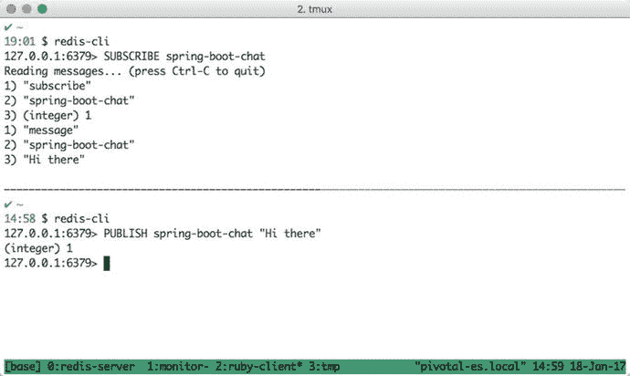
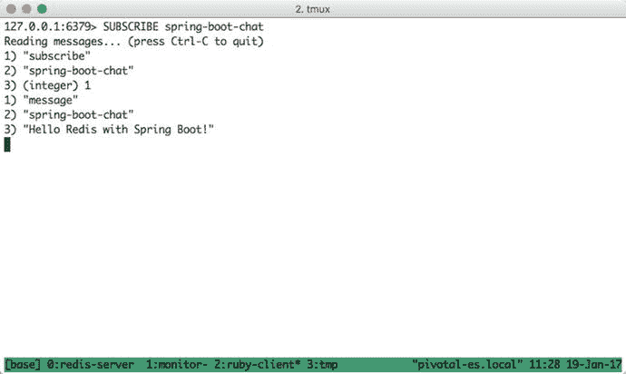
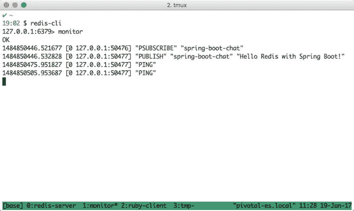
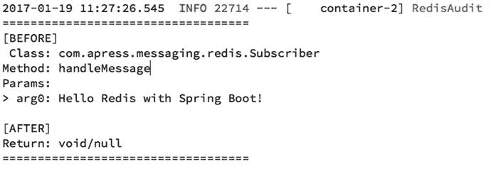
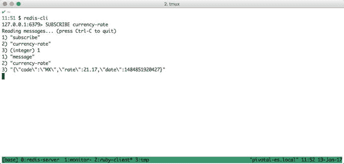
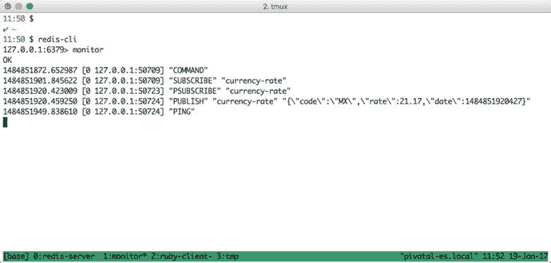
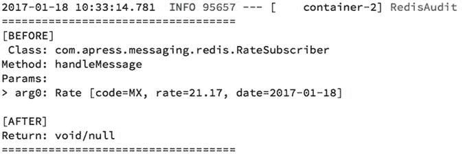

# 6. 使用 Redis 进行消息传递

本章将向你展示如何将 Redis（远程字典服务器）与 Spring Boot 结合使用，作为消息代理。Redis 是一个内存数据结构存储系统，可用作数据库、缓存和消息代理。它不仅存储键值对，还可用于存储复杂的数据类型，例如哈希、列表、集合、有序集合、位图、HyperLogLog 和地理空间索引。

Spring Boot 使用 Spring Data 模块，特别是 Redis 模块。换句话说，为了在你的项目中使用 Redis，你必须在 `pom.xml` 文件或 Gradle 中添加 `spring-boot-starter-redis` 依赖。然后，你将拥有连接到 Redis 服务器所需的所有必要依赖。

## Redis 作为消息代理

Redis 不仅提供了一种存储数据结构的方式，还实现了发布/订阅消息传递范式。前面的章节已经用 JMS 解释过这种范式。

这里的重要部分将向你展示如何与 Redis 交互并启用消息代理。Redis 拥有通道的概念，消息将由发布者发送到通道。消息将被对一个或多个通道感兴趣的订阅者消费。如你所见，Redis 中使用了 `channel` 关键字。Redis 中的通道相当于 JMS 世界中的主题。

Redis 有几个命令允许你与发布/订阅功能进行交互：

*   `SUBSCRIBE`：告诉 Redis 订阅一个或多个特定通道。例如：

    ```
    127.0.0.1:6379> SUBSCRIBE spring-boot-chat
    ```

    你可以通过列出多个通道并用空格分隔来同时订阅它们。
*   `UNSUBSCRIBE`：取消订阅某个通道。此命令不需要参数。
*   `PUBLISH`：通过指定通道（作为第一个参数）和实际消息来发布消息。例如：

    ```
    127.0.0.1:6379> PUBLISH spring-boot-chat "Hi there"
    ```

*   `PSUBSCRIBE`：此命令与 `SUBSCRIBE` 相同，但接受用于匹配多个通道的模式。例如：

    ```
    127.0.0.1:6379> PSUBSCRIBE currency .*
    ```

    此示例将订阅任何以 `currency` 开头的通道，例如 `currency.us`、`currency.asia.jp`、`currency.eu.gb` 等。
*   `PUNSUBSCRIBE`：使用模式匹配取消订阅。例如：

    ```
    127.0.0.1:6379> PUNSUBSCRIBE currency.asia.*
    ```

*   `PING`：如果未提供参数，则返回 `PONG`。通常使用此命令来测试连接是否仍然存活。

为了尝试一下，请确保你已安装 Redis 并且它正在运行。（你可以从 [`https://redis.io/download`](https://redis.io/download) 下载它。）打开一个新的终端窗口，并使用 `redis-cli` 命令与 Redis 交互。参见图 6-1。



图 6-1.

使用发布/订阅命令与 Redis 交互

图 6-1 向你展示了一种与 Redis 交互的简单方法，并说明了订阅和发布消息是多么容易。

本章不讨论 Redis 集群、哨兵、分片等。它专注于消息传递。许多客户广泛使用 Redis 作为消息代理和用于实时数据分析的 Web 会话管理工具。本章首先介绍如何使用 Spring Boot 和 Redis 进行消息传递。

## 使用 Redis 进行发布/订阅消息传递

如前所述，Spring Boot 将利用 Spring Data Redis 的强大功能，这与你已经熟悉的 Spring JMS 非常相似。Spring Boot 将配置必要的组件，例如连接、要使用的数据库（默认是 0 号索引数据库）、集群节点（如果有）、连接池、哨兵、超时等。请记住，只需添加 `spring-boot-starter-redis` 即可启用 Redis 的自动配置。

Spring Data Redis 模块有两个主要的消息传递领域——消息的生产或发布，以及消息的消费或订阅。对于消息发布，它使用 `RedisTemplate<K,V>` 类（它使用了模板设计模式）；对于订阅，它有一个专用的异步消息监听器容器（一个 MDP——消息驱动的 POJO）。对于同步消息，它使用 `RedisConnection` 接口契约。以下各节仅涵盖异步订阅。

在本章中，我们将使用两个项目：`redis-demo` 和 `rest-api-redis`。`redis-demo` 项目包含完成和补充货币项目所需的所有代码。


### 订阅者

作为 Redis 订阅者，你可以通过固定名称或模式匹配来订阅一个或多个频道（或主题）。Spring Data Redis 模块提供了通过 `RedisConnection` 进行底层订阅的方式，其中包括 `subscribe` 和 `pSubscribe` 方法。

对于简单的监听器，底层订阅需要一种处理连接和线程管理的方式。现在想象一下有多个监听器的情况。你可能会认为实现这个功能很麻烦，但 Spring Data Redis 包含了 `RedisMessageListenerContainer` 类，它承担了所有繁重的工作，并支持消息驱动的 POJO（MDP）。换句话说，你可以创建自己的类和方法来接收并处理消息。这意味着你需要使用 `MessageListenerAdapter` 类来使用此功能。不过别担心，接下来我将向你展示如何操作。

打开 `redis-demo` 项目，查看 `com.apress.messaging.config.RedisConfig` 类，如代码清单 6-1 所示。

```
@Configuration
@EnableConfigurationProperties(SimpleRedisProperties.class)
public class RedisConfig {
@Bean
public RedisMessageListenerContainer
container(RedisConnectionFactory connectionFactory,
MessageListenerAdapter listenerAdapter,
@Value("${apress.redis.topic}") String topic) {
RedisMessageListenerContainer container = new
RedisMessageListenerContainer();
container.setConnectionFactory(connectionFactory);
container.addMessageListener(listenerAdapter,
new PatternTopic(topic));
return container;
}
@Bean
MessageListenerAdapter listenerAdapter(
Subscriber subscriber) {
return new MessageListenerAdapter(subscriber);
}
}
代码清单 6-1.
com.apress.messaging.config.RedisConfig.java
```

代码清单 6-1 展示了我们将用于订阅频道的配置。让我们更详细地看看代码：

*   `RedisMessageListenerContainer`：这是一个承担所有繁重工作的类，充当消息监听器容器，将从 Redis 频道（主题）接收消息。你需要设置连接工厂和将处理接收到的消息的消息监听器。请记住，此监听器容器负责所有线程处理和消息分发。
*   `RedisConnectionFactory`：此接口对于 `RedisMessageListenerContainer` 是必需的，它保存了所有关于 Redis 连接的信息。由于它是方法的一部分，Spring 会自动装配它，因此你无需手动创建。在幕后，Spring Boot 会为你处理此配置。
*   `MessageListenerAdapter`：此类是一个适配器，它将传入的消息委托给一个符合 `MessageListener` 签名的声明类。你可以看到，这是通过调用 `container.addMessageListener` 方法，并将订阅者（`listenerAdapter` - `MessageListenerAdapter`）和主题（`PatternTopic`）作为参数传递来设置的。
*   `PatternTopic`：这是一个类，是消息监听器所需的参数之一。它通常保存主题的名称或用于订阅正确频道的名称模式。

接下来，让我们看看 `Subscriber` 类。打开 `com.apress.messaging.redis.Subscriber` 类，如代码清单 6-2 所示。

```
@Component
public class Subscriber {
public void handleMessage(String message){
// 在此处处理消息 ...
}
}
代码清单 6-2.
com.apress.messaging.redis.Subscriber.java
```

代码清单 6-2 展示了 `Subscriber` 类，它只有一个必需的方法（`handleMessage`）。`Subscriber` 类是消息委托的适配器。换句话说，`MessageListenerAdapter` 兼容以下签名：

```
void handleMessage(String message);
void handleMessage(Map message);
void handleMessage(byte[] message);
void handleMessage(Serializable message);
//你可以获取使用的频道或模式
void handleMessage(Serializable message, String channel);
void handleMessage(byte[] bytes, String pattern);
//你可以使用自己的对象
void handleMessage(MyOwnDomainObject obj);
```

有时，你的适配器类可能会有更多的方法来执行额外的处理或被外部调用。在这些情况下，你可以通过在 `MessageListenerAdapter` 的构造函数中添加一个额外参数，来告知它你想要使用哪个方法。例如：

```
@Component
public class Subscriber {
public void shipping(Order order){
// 在此处处理订单 ...
}
//此方法用作 Redis 主题的监听器
public void processTicket(String message){
// 在此处处理消息 ...
}
// ... 更多方法
}
// RedisConfig.java
@Bean
MessageListenerAdapter listenerAdapter(Subscriber subscriber) {
return new MessageListenerAdapter(subscriber,"processTicket");
}
```

将用于处理来自 Redis 主题的传入消息的方法名称添加到构造函数中；在此示例中，即 `processTicket` 方法。

如你所见，使用 `MessageListenerAdapter` 的好处是你的 `POJO` 类没有依赖关系，从而使你的应用程序更具可扩展性。


### 发布者

本节介绍如何向频道（主题）发布消息。在 Redis 中发布消息有两种选择：你可以使用低层次的 `RedisConnection` 类，也可以使用高层次的 `RedisTemplate` 类（请记住，它与 `JmsTemplate` 和 `RabbitTemplate` 非常相似）。这两个接口都提供了发布方法 `connection.publish(msg,channel)`。同时，你也需要确定频道（主题）。

使用 `RedisTemplate` 的好处在于，你可以定义序列化/反序列化策略。该方法隐藏了调用原始方法的复杂性，并且是线程安全的。

让我们直接进入代码。打开清单 6-3 中所示的 `com.apress.messaging.RedisDemoApplication` 类。

```
@SpringBootApplication
public class RedisDemoApplication {
public static void main(String[] args) {
SpringApplication.run(RedisDemoApplication.class, args);
}
@Bean
CommandLineRunner sendMessage(StringRedisTemplate template,
@Value("${apress.redis.topic}")String topic){
return args -> {
template.convertAndSend(topic,
"Hello Redis with Spring Boot!");
};
}
}
清单 6-3.
com.apress.messaging.RedisDemoApplication.java
```

清单 6-3 展示了主应用程序类。如你所知，一旦 Spring Boot 完成自动配置，它将执行 `sendMessage` 方法。该方法会自动注入 `StringRedisTemplate`，并通过 `application.properties` 文件中 `apress.redis.topic=spring-boot-chat` 键提供的值来获取主题。然后，它将使用模板，通过 `template.convertAndSend` 方法发送一条消息，该方法接受主题和消息作为参数。

通常你需要使用 `RedisTemplate`，但在这个例子中，我们使用的是 `StringRedisTemplate`。我们这样做是因为 `RedisTemplate` 被定义为 `RedisTemplate<K,V>`，其中 `K` 是 Redis 键类型（通常是一个字符串），`V` 是 Redis 值类型（即消息）。而 `StringRedisTemplate` 是一个使用字符串的子类。换句话说，它类似于创建一个 `RedisTemplate<String,String>` 对象。

有趣的是，`StringRedisTemplate` 为不同的操作定义了多种字符串序列化器，这些操作适用于不同的数据结构，例如 `Set` 和 `Hash` 的键/值。

现在，如果你运行该项目（请确保 `redis-server` 已启动并正在运行），你将看到如图 6-2、6-3 和 6-4 所示的订阅者日志。



图 6-4.

redis-cli 订阅



图 6-3.

redis-cli 监控命令



图 6-2.

项目日志

图 6-2 向你展示了日志。这些日志由包含一个环绕 AOP 通知的 `RedisAudit` 类生成。如你所见，它使用了 `Subscriber` 类（监听器适配器）和接收字符串消息的 `handleMessage` 方法。

图 6-3 显示了带有 Redis 客户端的终端。监控器在执行代码之前显示，仅用于判断 Redis 是否接受消息。如你所见，Redis 显示了在 `redis-server` 中执行的命令——在本例中，是 `PSUBSCRIBE` 和 `PUBLISH`，当然还有一个用于检查客户端与服务器之间连接的 `PING` 命令。

图 6-4 显示了另一个终端窗口，我们在此订阅了 `spring-boot-chat` 频道/主题。运行项目后，它将打印出消息。这是确保你的 `redis-server` 正在运行的另一种方式，并且你可以为一个频道/主题设置多个订阅者。

### JSON 序列化

现在，回到序列化/反序列化，回想一下我们正在使用 JSON 格式。你需要做什么才能使发布者/订阅者使用 JSON，并将其序列化/反序列化为自定义对象呢？

如果你遵循之前模块（JMS 和 RabbitMQ）的相同思路，回答这个问题会更容易，因为你可以在这里应用相同的概念。

让我们从修改 `RedisConfig` 类开始，如清单 6-4 所示。

```
@Configuration
@EnableConfigurationProperties(SimpleRedisProperties.class)
public class RedisConfig {
@Bean
public RedisMessageListenerContainer container(
RedisConnectionFactory connectionFactory,
MessageListenerAdapter rateListenerAdapter,
@Value("${apress.redis.rate}") String topic) {
RedisMessageListenerContainer container =
new RedisMessageListenerContainer();
container.setConnectionFactory(connectionFactory); container.addMessageListener(rateListenerAdapter,
new PatternTopic(topic));
return container;
}
@Bean
MessageListenerAdapter rateListenerAdapter(
RateSubscriber subscriber) {
MessageListenerAdapter messageListenerAdapter =
new MessageListenerAdapter(subscriber);
messageListenerAdapter.setSerializer(
new Jackson2JsonRedisSerializer(Rate.class));
return messageListenerAdapter;
}
@Bean
RedisTemplate
redisTemplate(RedisConnectionFactory connectionFactory){
RedisTemplate redisTemplate =
new RedisTemplate();
redisTemplate.setConnectionFactory(connectionFactory);
redisTemplate.setDefaultSerializer(
new Jackson2JsonRedisSerializer(Rate.class));
redisTemplate.afterPropertiesSet();
return redisTemplate;
}
}
清单 6-4.
com.apress.messaging.config.RedisConfig.java
```

清单 6-4 向你展示了修改后的 `RedisConfig` 类。与之前的版本相比，有什么区别？`RedisMessageListenerContainer` bean 是相同的，只是现在我们还使用了 `rateListenerAdapter` bean。让我们回顾一下这个清单：

*   `MessageListenerAdapter`：这与之前相同，但这里我们设置了一个新的类适配器，在本例中是 `RateSubscriber`。需要注意的是，我们通过调用 `setSerializer` 方法设置了一个序列化器，并使用 `Rate` 类作为对象映射器实例化了一个 `Jackson2JsonRedisSerializer` 对象。
*   `RedisTemplate` `<String,Rate>`：如你所见，我们定义了这个 bean 以返回一个 `RedisTemplate`，其中键是字符串，值是 `Rate` 类。还要注意，我们通过调用 `setDefaultSerializer` 方法设置了一个序列化器，并且使用了与之前相同的类 `Jackson2JsonRedisSerializer`。

看一下清单 6-5 中所示的 `RateSubscriber` 类。

```
@Component
public class RateSubscriber {
public void handleMessage(Rate rate){
// 在此处处理消息...
}
}
清单 6-5.
com.apress.messaging.redis.RateSubscriber.java
```

清单 6-5 向你展示了 `RateSubscriber` 类。与之前的示例相比，没有任何变化。`handleMessage` 方法将接收一条 `Rate` 消息。现在，让我们看一下清单 6-6 中所示的发布者。

```
@SpringBootApplication
public class RedisDemoApplication {
public static void main(String[] args) {
SpringApplication.run(RedisDemoApplication.class, args);
}
@Bean
CommandLineRunner sendRateMessage(
RedisTemplate template,
@Value("${apress.redis.rate}")String topic){
return args -> {
template.convertAndSend(topic,
new Rate("MX",21.17F,new Date()));
};
}
}
清单 6-6.
com.apress.messaging.RedisDemoApplication.java
```

清单 6-6 向你展示了主应用程序。将这个类与之前的版本进行比较，发生了什么变化？我们使用了 `RedisTemplate` 类，并将 `Rate` 作为值。我们还通过创建一个新的 `Rate` 对象，将 `Rate` 类用作消息。


现在您可以运行项目并查看日志。请参见图 6-5、6-6 和 6-7。



图 6-7.

redis-cli 订阅者



图 6-6.

redis-cli 监视器



图 6-5.

RateSubscriber 日志

图 6-5 展示了`RateSubscriber`处理消息时的日志。请记住，在后台，为了获取对象，会进行序列化/反序列化操作。

图 6-6 展示了一个运行着 Redis 客户端监视器的终端。其目的是展示发布的方法是一个 JSON 格式的字符串，这意味着`Jackson2JsonRedisSerializer`对`Rate`类执行了序列化。

图 6-7 展示了一个订阅了`currency-rate`频道/主题的终端。请注意，该订阅者接收到的`Rate`消息是 JSON 字符串格式。

如果您将这些结果与之前的 Spring 模块（JMS 和 AMQP）进行比较，您会发现我们正在做同样的事情。尽管这个 Spring Data Redis 模块没有用于简化发布/订阅模式的注解，但也能轻松快速地启动并运行起来。

## 货币项目

现在您已拥有完成货币项目所需的所有必要信息。请先查看`RateRedisSubscriber`、`RateRedisConfig`和`RateRedisProperties`这几个类。您可以复用`demo`项目来向频道/主题发布消息。

注意

请记住，在运行货币项目之前，确保`redis-server`已启动并正在运行，这一点很重要。

## 总结

本章讨论了发布/订阅消息传递模式，并展示了 Redis 开箱即用地提供了此功能。它非常易于使用。本章向您展示了 Spring Boot 如何通过简单地添加`spring-boot-starter-redis`来轻松配置您的发布者和订阅者。

您了解了如何发布和监听传入的消息，并且您看到 Spring Data Redis 模块使用`RedisTemplate`（与 Spring JMS 和 Spring AMQP 模块行为相同）的方式与发布者和订阅者非常相似。

尽管本章篇幅较短，但它为您提供了使用 Redis 作为内存消息代理的起点。

下一章将介绍 WebSocket，这是使用 Spring Boot 进行消息传递的另一种方式。

