# 7. Web 消息传递

本章介绍 Spring Boot 中的 WebSocket，并描述这项技术如何帮助您在应用程序之间，甚至在同一应用程序的多个实例之间实现消息传递。

在讨论 Web 应用程序时，我们可以说 REST 是另一种消息传递方式，事实也确实如此。在本章中，我们将重点讨论一种有状态的通信方式，这正是 WebSocket 所带来的。

## WebSocket

WebSocket 是一种支持双向通信的协议，通常用于 Web 浏览器。该协议首先通过握手（通常是 HTTP 请求）开始，然后通过 TCP 发送基本消息帧（协议切换）。WebSocket 的理念是避免像 AJAX（`XMLHttpRequest`）、iframe 或长轮询那样的多次 HTTP 连接。请参见图 7-1。

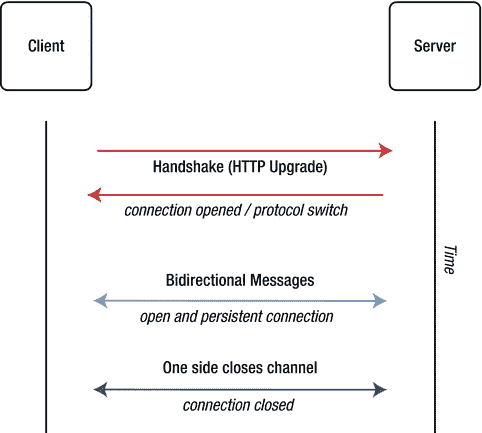

图 7-1.

TCP/WebSocket

## 在 Spring 中使用 WebSocket

在我们深入了解如何在 Spring Boot 中使用 WebSocket 之前，重要的是要知道并非所有浏览器都支持这项技术。请访问[`http://caniuse.com/websockets`](http://caniuse.com/websockets)了解哪些浏览器已准备好支持 WebSocket。

Spring Framework 4 版本包含一个新的`spring-websocket`模块，该模块支持 WebSocket；它也与 Java 规范 JSR-356 兼容。该模块还提供了回退选项，可以在必要时模拟 WebSocket API（请记住，并非所有浏览器都支持 WebSocket）。它为此任务使用了 SockJS 协议。您可以在[`https://github.com/sockjs/sockjs-protocol`](https://github.com/sockjs/sockjs-protocol)获取更多相关信息。

同样值得一提的是，在初始握手（我们使用 SockJS 的 HTTP 阶段）之后，通信会切换到 TCP 连接（这意味着您只发送字节流——文本或二进制）。因此，您可以使用任何类型的消息传递架构，例如异步或事件驱动的消息传递。在此层面上，您可以使用像 STOMP（简单/流式文本定向消息协议）这样的子协议，它允许您拥有客户端和服务器都能理解的更好的消息格式。请参见图 7-2。

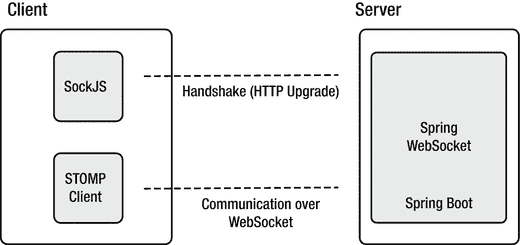

图 7-2.

使用 Spring 的 WebSocket

图 7-2 展示了如何使用 Spring 实现 WebSocket，以及客户端所需的组件。


### 底层 WebSocket

在深入探讨回退方案（SockJS）和子协议（STOMP）之前，我们先来看看如何将 Spring Boot 与底层 WebSocket 结合使用。

在本书的源代码中，请进入第 7 章，并打开两个项目（你可以将它们导入到你喜欢的 IDE 中，或使用任何文本编辑器）。在接下来的部分中，我们将使用 `websocket-demo` 项目。

我们先从分析配置开始。为了使用底层 WebSocket 通信，我们需要实现 `org.springframework.web.socket.config.annotation.WebSocketConfigurer` 接口。打开 `com.apress.messaging.config.LlWebSocketConfig` 类，如代码清单 7-1 所示。

```
@Configuration
@EnableWebSocket
public class LlWebSocketConfig implements WebSocketConfigurer{
LlWebSocketHandler handler;
public LlWebSocketConfig(LlWebSocketHandler handler){
this.handler = handler;
}
@Override
public void registerWebSocketHandlers(
WebSocketHandlerRegistry registry) {
registry.addHandler(this.handler, "/llws");
}
}
代码清单 7-1.
com.apress.messaging.config.LlWebSocketConfig.java
```

代码清单 7-1 展示了在 Spring 中启用 WebSocket 所需的配置。请记住，我们这样配置该类是为了实现底层 WebSocket 通信。让我们回顾一下所使用的组件：

*   `@EnableWebSocket`：这是启用和配置 WebSocket 请求所必需的。
*   `WebSocketConfigurer`：这是一个接口，定义了用于配置 WebSocket 请求处理的回调方法。通常你需要实现 `registerWebSocketHandlers` 方法。
*   `registerWebSocketHandlers`：需要通过添加用于处理 WebSocket 请求的处理器来实现此方法。在此方法中，我们注册了一个处理器（`LlWebSocketHandler`）实例，并传入了用于握手和通信的端点。
*   `WebSocketHandlerRegistry`：这是一个用于注册 `WebSocketHandler` 实现的接口。我们将使用一个 `TextWebSocketHandler` 实现，并在下一节中查看其代码。

如你所见，使用 Spring 配置底层 WebSocket 非常简单。接下来，让我们打开 `com.apress.messaging.web.socket.LlWebSocketHandler` 类。参见代码清单 7-2。

```
@Component
public class LlWebSocketHandler extends TextWebSocketHandler{
@Override
public void afterConnectionEstablished(
WebSocketSession session) throws Exception {
super.afterConnectionEstablished(session);
}
@Override
protected void handleTextMessage(
WebSocketSession session, TextMessage message)
throws Exception {
System.out.println(">>>> " + message);
}
}
代码清单 7-2.
com.apress.messaging.web.socket.LlWebSocketHandler.java
```

代码清单 7-2 展示了我们将用于接收来自客户端消息的 WebSocket 处理器。让我们来检查这个类：

*   `TextWebSocketHandler`：这是一个具体类，通过 `AbstractWebSocketHandler` 类实现了 `WebSocketHandler` 接口。此实现仅用于处理文本消息。我们将重写两个方法：`afterConnectionEstablished` 和 `handleTextMessage`。
*   `afterConnectionEstablished`：当客户端使用 WebSocket 协议成功连接时，会调用此方法。在此方法中，你可以使用 `WebSocketSession` 实例来发送或接收消息。目前，我们将使用其默认行为，但我们会在日志中（通过 AOP `WebSocketsAudit` 类）看到更多信息。
*   `handleTextMessage`：此方法接收一个 `WebSocketSession`（我们稍后会用到）和一个 `TextMessage` 实例。`TextMessage` 实例管理字节流并将其转换为字符串。

到目前为止，我们已经实现了服务器端，但客户端呢？通常，你会有一个网页来执行客户端的工作。

打开 `src/main/resources/static/llws.html` 文件，如代码清单 7-3 所示。

```
$(function(){
var connection = new
WebSocket('ws://localhost:8080/llws');
connection.onopen = function () {
console.log('Connected...');
};
connection.onmessage = function(event){
console.log('>>>>> ' + event.data);
var json = JSON.parse(event.data);
$("#output").append(""
+ json.user
+ ": "
+ json.message
+ "");
};
connection.onclose = function(event){
$("#output").append("CONNECTION: CLOSED");
};
$("#send").click(function(){
var message = {}
message["user"] = $("#user").val();
message["message"] = $("#message").val();
connection.send(JSON.stringify(message));
});
});

代码清单 7-3.
llws.html 片段
```

代码清单 7-3 仅展示了重要代码的 JavaScript 片段，我将在下面进行解释：

*   `WebSocket`：这是 JavaScript 引擎的一部分，它将连接到指定的 URI。请注意，模式是 `ws`，并且我们使用的是在配置类中指定的 `/llws` 端点（参见代码清单 7-1）。
*   `onopen`：这是一个回调函数，在与服务器建立连接时执行。请注意，我们只是将一条字符串记录到控制台。
*   `onmessage`：这是一个回调函数，在从服务器接收到消息时执行。在这种情况下，我们将 `event.data` 解析为一个 JSON 对象。
*   `onclose`：这是一个回调函数，在与服务器的连接关闭或丢失时执行。
*   `$.click`/`send`：这是一个附加到“发送”按钮的回调函数，在点击按钮时被调用。这里我们使用了 `send` 方法，它将发送消息对象的 JSON 字符串。

接下来，让我们运行 `websocket-demo` 项目；启动后，打开浏览器并访问 `http://localhost:8080/llws.html`。你应该会看到类似于图 7-3 的内容。

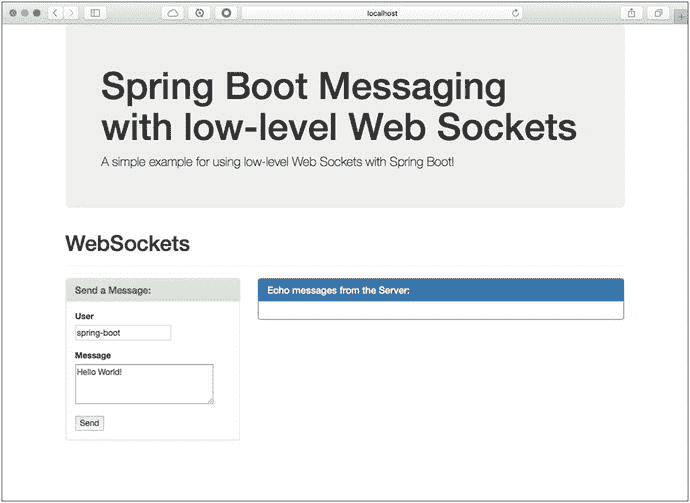

图 7-3.

http://localhost:8080/llws.html

在浏览器中访问 `llws.html` 后，查看应用程序日志。你应该会看到类似于图 7-4 的内容。

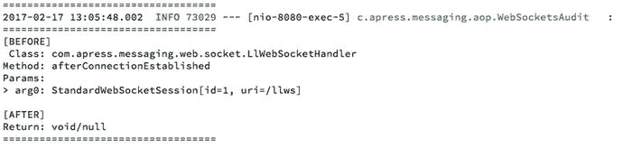

图 7-4.

websocket-demo 项目日志

图 7-4 展示了日志，其中 `afterConnectionEstablished` 正在从 `LlWebSocketHandler` 类中被调用。这意味着客户端已成功连接到服务器。你也可以查看浏览器的开发者控制台，看看显示字符串 `Connected...` 的日志。参见图 7-5。

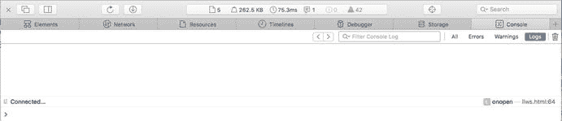

图 7-5.

浏览器控制台

接下来，你可以通过修改 `llws.html` 页面中的用户和消息输入框，并点击“发送”按钮来发送消息。点击“发送”按钮后，你应该会看到类似于图 7-6 的内容。

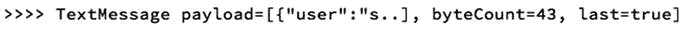

图 7-6.

点击发送后的 websocket-demo 项目日志

图 7-6 展示了发送消息后的日志以及 `handleTextMessage` 方法的打印输出。

这个示例向你展示了如何将消息从客户端发送到服务器。现在，让我们从服务器做一个响应，即回声。你需要在 `handleTextMessage` 中添加一些内容来处理回复。

将 `handleTextMessage` 修改为如下所示：

```
@Override
public void handleTextMessage(
WebSocketSession session,
TextMessage message) throws Exception {
System.out.println(">>>> " + message);
session.sendMessage(message);
}
```


如您所见，我们使用 `session` 实例来调用 `sendMessage`，这意味着我们将使用已连接客户端的同一会话进行回复。

重启 `websocket-demo` 项目并刷新 `llws.html` 页面。然后通过填写用户和消息输入框来发送一条消息。您应该会在“来自服务器的回显消息”面板中看到响应，如图 7-7 所示。请注意，如果您使用的是 STS，只需等待项目自行重启即可；这要归功于 `spring-boot-devtools`。

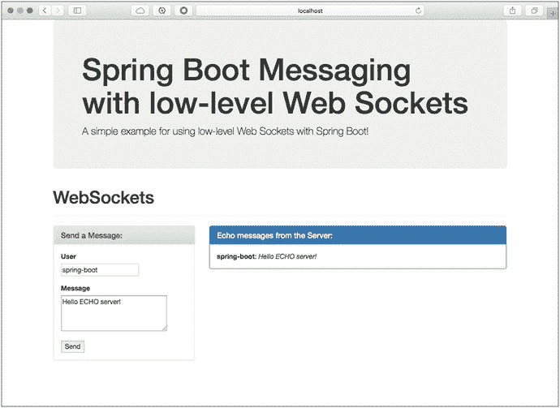

图 7-7.
回显服务器响应

如果您停止应用程序，您将在“来自服务器的回显消息”面板中看到类似图 7-8 的内容。

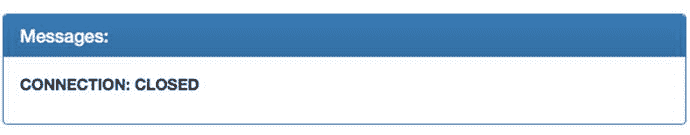

图 7-8.
连接已关闭

如您所见，创建低层级的 WebSockets 应用程序非常简单。如果您需要从 Spring 应用程序发送消息，会发生什么？换句话说，您的应用程序需要充当客户端。您可以将以下代码添加到您的应用程序中（参见清单 7-4）。

```
StandardWebSocketClient client = new StandardWebSocketClient();
ListenableFuture future =
client.doHandshake(handler,
new WebSocketHttpHeaders(),
new URI("ws://localhost:8080/ws-server"));
WebSocketSession session = future.get();
WebSocketMessage message =
new TextMessage("Hello there...");
session.sendMessage(message) ;
清单 7-4.
WebSockets 客户端——WebSocketDemoApplication 类的代码片段
```

清单 7-4 展示了如果您想创建一个 WebSockets 客户端（而不是 HTML 网页）所需添加的代码片段。这里我们使用了 `StandardWebSocketClient`（一个低层级的 WebSockets 协议），并手动执行握手。它将处理器、一些标头以及您将要连接的 URI 传递给它。（请注意，您可以使用之前的处理器或创建自己的处理器，然后实现 `afterConnectionEstablished` 方法来检查是否成功连接。）然后您会获得一个 `WebSocketSession` 实例，并可以发送消息。

您可以看到，使用 Spring 类来操作 WebSockets 客户端是一种直接的实现方式。接下来，让我们开始使用 SockJS 和 STOMP 子协议的回退选项。

### 使用 SockJS 和 STOMP

为什么我们需要使用 SockJS 和 STOMP？请记住，并非所有浏览器都支持 WebSockets，并且通常客户端和服务器必须就如何处理消息达成一致。当然，这不是正确的消息传递方式，因为我们希望实现一种解耦的场景，即客户端不依赖于服务器。

SockJS 有助于模拟 WebSockets 并执行初始握手。然后，通过使用 STOMP，我们可以以一种可互操作的线路格式进行回复，这使我们能够使用支持此协议的多个代理。

#### 聊天室应用程序

我们将继续使用 `websocket-demo` 项目，但我们将使用不同的文件和类。此示例创建了一个聊天室，这是 WebSockets 技术非常常见的用途。

首先，让我们看看如何配置项目以使用 SockJS 和 STOMP。打开 `com.apress.messaging.config.WebSocketConfig` 类。参见清单 7-5。

```
@Configuration
@EnableWebSocketMessageBroker
@EnableConfigurationProperties(SimpleWebSocketsProperties.class)
public class WebSocketsConfig extends
AbstractWebSocketMessageBrokerConfigurer {
SimpleWebSocketsProperties props;
public WebSocketsConfig(SimpleWebSocketsProperties props){
this.props = props;
}
@Override
public void registerStompEndpoints(
StompEndpointRegistry registry) {
registry.addEndpoint(props.getEndpoint()).withSockJS();
}
@Override
public void configureMessageBroker(
MessageBrokerRegistry config) {
config.enableSimpleBroker(props.getTopic());
config.setApplicationDestinationPrefixes(
props.getAppDestinationPrefix()) ;
}
}
清单 7-5.
com.apress.messaging.config.WebSocketConfig.java
```

清单 7-5 展示了使用 SockJS 和 STOMP 配置 WebSockets 所需的配置。让我们回顾一下：

*   @`EnableWebSocketMessageBroker`：此注解是必需的，用于启用通过 WebSockets 使用更高级别的消息子协议（SockJS/STOMP）进行代理后端消息传递。
*   `AbstractWebSocketMessageBrokerConfigurer`：此类实现了 `WebSocketMessageBrokerConfigurer`，用于配置使用来自 WebSockets 客户端的简单消息协议（如 STOMP）进行消息处理。
*   `registerStompEndpoints`：调用此方法来注册 STOMP 端点，将每个端点映射到特定的 URL，并配置 SockJS 回退选项。
*   `StompEndpointRegistry`：这是一个用于注册基于 WebSockets 的 STOMP 端点的契约。它提供了一个流畅的 API 来构建注册表。
*   `withSockJS`：此方法将启用握手所需的 SockJS 回退选项。
*   `configureMessageBroker`：调用此方法来配置消息代理选项。在这种情况下，我们使用的是 `MessageBrokerRegistry`。
*   `MessageBrokerRegistry`：此实例将帮助配置所有代理选项。我们使用 `enableSimpleBroker`，它接受一个或多个前缀来过滤目标代理。这将与带有 `@SendTo` 注解的方法一起使用。我们还使用 `setApplicationDestinationPrefixes` 来配置一个或多个前缀，以过滤目标应用程序注解方法。换句话说，它将查找带有 `@MessageMapping` 注解的方法。

您可以看到，我们需要添加一个端点、一个代理以及前缀路径，以使用 SockJS 和 STOMP 配置 WebSockets。请查看图 7-9。

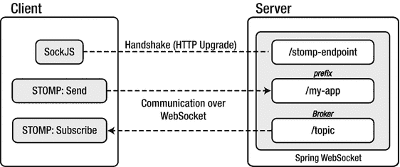

图 7-9.
使用 SockJS 和 STOMP 的客户端/服务器 WebSockets

图 7-9 向您展示了客户端和服务器之间通信的总体情况。接下来，打开 `com.apress.messaging.controller.SimpleController` 类。参见清单 7-6。

```
@Controller
public class SimpleController {
@MessageMapping("${apress.ws.mapping}")
@SendTo("/topic/chat-room")
public ChatMessage chatRoom(ChatMessage message) {
return message;
}
}
清单 7-6.
com.apress.messaging.controller.SimpleController.java
```

清单 7-6 通过使用新的注解向您展示了接收器和发送器。请记住，该项目现在将运行一个聊天室，因此不同的客户端可以连接并接收来自其他用户的消息。


*   `@MessageMapping`：此注解与应用前缀有关，意味着客户端需要向 `prefix + mapping` 发送消息。在本例中，即 `/my-app/chat-room`。该注解由 `@Controller` 类中的方法支持，其值可视为 ant 风格、以斜杠分隔的路径模式。与此注解配合，你还可以使用其他注解作为方法参数，包括 `@Payload`、`@Header`、`@Headers`、`@DestinationVariable` 和 `java.security.Principal`。
*   `@SendTo`：你已经了解此注解；它与我们在 JMS 和 RabbitMQ 章节中使用的注解相同。在此场景下，该注解用于将消息发送到任何其他目的地。

尽管我们没有使用 `@SubscribeMapping`，但你可以在 `@Controller` 注解的类中，将其用于你想要处理传入消息的方法上。当你需要通过 `@SendTo` 获取响应副本时，这通常会很有用。

另一个我们未使用的工具类是 `SimpleMessagingTemplate`。它可用于发送消息。例如：

```
@Controller
public class AnotherController {
private SimpMessagingTemplate template;
@Autowired
public AnotherController(SimpMessagingTemplate template) {
this.template = template;
}
@RequestMapping(path="/rate/new", method=POST)
public void newRates(Rate rate) {
this.template.convertAndSend("/topic/new-rate", rate);
}
}
```

如你所见，使用 WebSockets 技术实现订阅者/发布者模型非常简单。`AnotherController` 通过发送消息（`ChatMessage`）也充当了客户端角色。

接下来，让我们看看另一个客户端。打开 `src/main/resources/static/sockjs-stomp.html` 页面。参见代码清单 7-7。

```
$(function(){
var socket =
new SockJS('http://localhost:8080/stomp-endpoint');
var stompClient = Stomp.over(socket);
stompClient.connect({}, function (frame) {
console.log('Connected: ' + frame);
stompClient.subscribe('/topic/chat-room',
function (data) {
console.log('>>>>> ' + data);
var json = JSON.parse(data.body);
$("#output")
.append(""
+ json.user
+ ": "
+ json.message
+ "");
});
});
$("#send").click(function(){
var chatMessage = {}
chatMessage["user"] = $("#user").val();
chatMessage["message"] = $("#message").val();
stompClient.send(
"/my-app/chat-room",
{},
JSON.stringify(chatMessage));
});
});
代码清单 7-7.
sockjs-stomp.html 代码片段
```

代码清单 7-7 展示了 JavaScript 客户端。我们来分析一下：

*   `SockJS`：这是一个模拟 WebSockets 协议的 JavaScript 库。此对象连接到服务器端指定的 `/stomp` 端点。有关此库的更多信息，请访问 [`http://sockjs.org/`](http://sockjs.org/)。
*   `STOMP`：这是一个使用 WebSockets 协议的 JavaScript 库，通常需要 SockJS 对象。更多信息请访问 [`http://jmesnil.net/stomp-websocket/doc/`](http://jmesnil.net/stomp-websocket/doc/)。
*   `connect`：这是一个回调函数，在与服务器建立连接时被调用。
*   `subscribe`：这是一个回调函数，当订阅的目的地有消息时被调用。
*   `send`：此方法将消息发送到指定的目的地。

这是在 JavaScript 客户端中使用 SockJS 和 STOMP 的一种非常简单的方式。现在你可以运行 `websockets-demo` 项目了。

注意

在运行本节中的 `websocket-demo` 项目之前，请确保 `LlWebSocketConfig` 类已被禁用（通过注释掉 `@Configuration` 和 `@EnableWebSocket` 注解）。

运行项目并打开浏览器。访问 `http://localhost:8080/sockjs-stomp.html` 网页。你将看到与之前示例类似的内容。如果你好奇，可以打开浏览器的开发者控制台查看控制台日志。参见图 7-10。

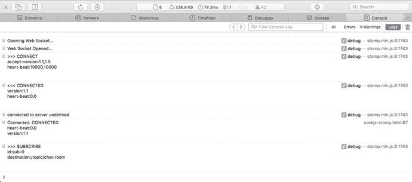

图 7-10.

浏览器控制台日志

图 7-10 展示了连接日志。现在打开第二个浏览器窗口并访问相同的 URL。目的是模拟两个客户端进行通信。接下来，发送一些消息并查看结果。参见图 7-11 和图 7-12。

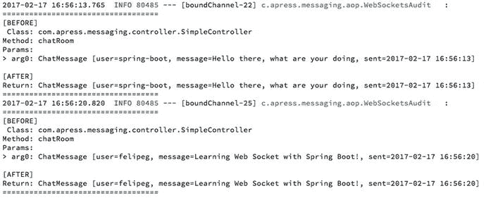

图 7-12.

应用日志

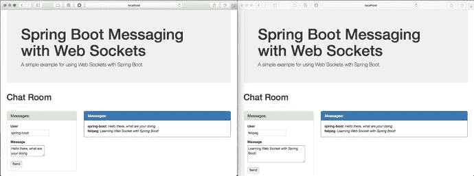

图 7-11.

两个浏览器客户端

图 7-11 展示了两个客户端通过 SockJS 和 STOMP 使用 WebSockets 发送消息。

图 7-12 展示了 `SimpleController` 日志，并且 `ChatMessage` 正在由 `chatRoom` 方法处理（这是由于 `@MessageMapping` 和 `@SendTo` 注解的作用）。

这就是如何使用 Spring Boot 和 `spring-websocket` 模块非常轻松地创建一个聊天室。

问题：如何使用 Spring 创建一个 SockJS 客户端？想象一下，你需要使用 STOMP 向远程 WebSockets 连接发送消息。查看 `WebSocketsDemoApplication` 类中被注释掉的代码。你将看到如何在那里使用 `SockJSClient` 和 `WebSocketsStompClient` 类。

## 使用 RabbitMQ 作为 STOMP 代理中继

你是否想过，如果你的应用需要更多支持，需要更具可扩展性，会发生什么？嗯，一种解决方案是添加多个启用了 WebSockets 代理的 Spring Boot 应用，然后在它们前面添加一个负载均衡器。问题在于实现高可用性，因为你需要为这些应用添加逻辑和行为，以便当其中一个宕机时，其他应用能继续响应客户端。

好消息是，`spring-websocket` 模块提供了一种使用外部中继的方式：RabbitMQ。RabbitMQ 将 STOMP 协议作为一个插件包含在内。它还提供了真正的完全高可用性以及一种简单的集群设置方法。

按照以下步骤将 RabbitMQ 作为 STOMP 中继添加到你的应用中：

1.  确保启用 RabbitMQ STOMP 插件：

    ```
    $ rabbitmq-plugins enable rabbitmq_stomp
    $ rabbitmq-plugins enable rabbitmq_web_stomp
    ```

2.  将以下依赖项添加到你的 `pom.xml` 文件中。

    ```
    io.projectreactor
    reactor-core

    io.projectreactor
    reactor-net

    io.netty
    netty-all
    4.1.8.Final

    ```

3.  配置 `WebSocketsConfig` 类，类似于以下代码：

    ```
    @Override
    public void configureMessageBroker(
    MessageBrokerRegistry config) {
    config.setApplicationDestinationPrefixes(
    props.getAppDestinationPrefix());
    config.enableStompBrokerRelay(
    "/topic", "/queue").setRelayPort(61613);
    }
    ```

与之前版本的不同之处在于，现在在 `configureMessageBroker` 方法中，你配置了 `enableStompBrokerRelay`（使用 `/topic` 和 `/queue`），并通过 `setRelayPort` 方法添加了 STOMP 端口（值为 `61613`，即 RabbitMQ 的 STOMP 端口）。

就是这样。现在你可以将 RabbitMQ 用作代理中继了。在运行项目之前，请确保 RabbitMQ 代理已启动并正在运行。然后你可以运行项目并使用相同的 `sockjs-stomp.html` 网页。这里重要的是要关注 RabbitMQ 控制台，以查看连接和队列。


## 货币项目

请查看 `rest-api-websockets` 项目。你会找到 `RateWebSocketsConfig` 类，它与另一个项目非常相似。其设计思路是，货币项目拥有一个简单的 WebSockets 代理，该代理会接受任何通过 WebSockets 协议的客户端连接。

每当有新的汇率发布时，它都会向订阅了 `/rate/new` 端点的客户端发送一条消息。请查看以下内容：

*   `RateWebSocketsConfig`：此类包含 WebSockets 消息传递所需的配置。
*   `CurrencyController`：此类中的 `addNewRates` 方法包含以下语句：

    ```
    webSocket.convertAndSend("/rate/new", currencyExchange);
    ```

*   `src/main/resources/public/index-ws.html`：此网页包含定义连接到服务器的客户端的代码。请查看一下，它非常直观。

要进行测试，你只需在命令行中添加一个简单的 POST 请求：

```
$ curl -i -X POST -H "Content-Type: application/json" -H "Accept: application/json" -d '{"base":"USD","date":"2017-02-15","rates":[{"code":"EUR","rate":0.82857,"date":"2017-02-15"},{"code":"JPY","rate":105.17,"date":"2017-02-15"},{"code":"MXN","rate":22.232,"date":"2017-02-15"},{"code":"GBP","rate":0.75705,"date":"2017-02-16"}]}' localhost:8080/currency/new
```

你也可以使用任何其他 REST 客户端，例如 `POSTMAN:` [`https://www.getpostman.com/`](https://www.getpostman.com/) 。发布新汇率后，你将在面板中看到这些汇率，如图 7-13 所示。

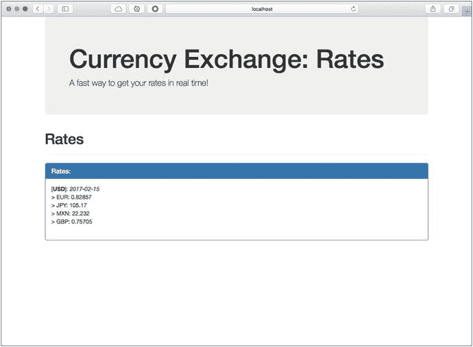

图 7-13.

通过 WebSockets 进行货币兑换

## 总结

本章讨论了使用 `spring-websocket` 模块和 Spring Boot 进行 WebSockets 消息传递。

你学习了 WebSockets 如何使用 HTTP 握手，然后切换到 TCP 连接。你看到了如何创建低级服务器/客户端的示例。

你了解了如何使用 SockJS 和 STOMP 来促进通信，以实现异步或事件驱动的消息传递。你还学习了如何配置 RabbitMQ 并将其用作 STOMP 中继。你在货币兑换项目中看到了一些代码，这些代码向连接到该服务的任何客户端发送新汇率。

下一章将向你展示如何使用 Spring Integration 模块将你的代码与多种技术集成。

