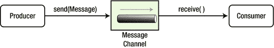
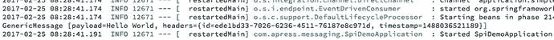
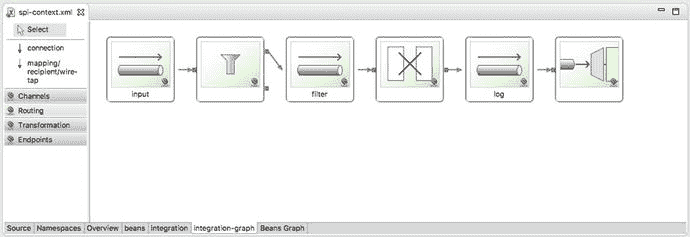
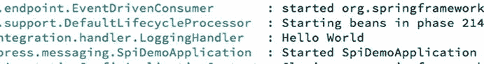
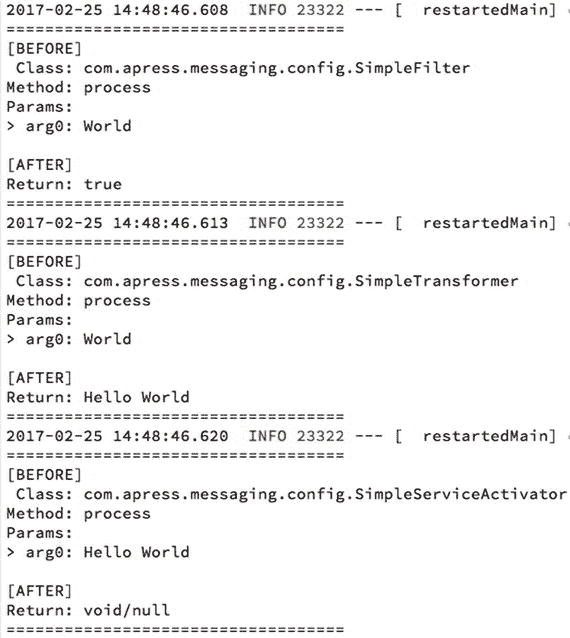
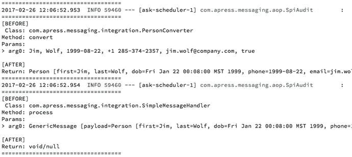
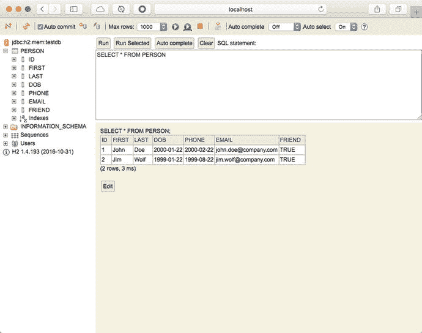
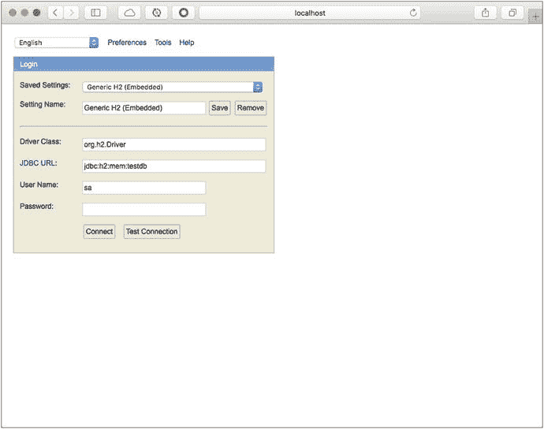

# 8. 使用 Spring Integration 进行消息传递

本章介绍 Java 社区中最好的集成框架之一——Spring Integration 模块。它当然基于 Spring 框架。

如果我们作为开发人员或架构师来看待软件开发和业务需求，我们总是在寻找如何将内部和外部的组件及系统集成到我们的架构中。我们需要功能完备、高可用且易于维护和增强的组件。

开发人员和架构师面临的主要用例包括：

*   创建一个能够可靠传输和分析文件的系统。大多数应用程序需要从文件中读取信息并进行处理。开发人员需要创建健壮的文件系统，用于保存和读取数据，同时也能共享数据并处理大文件。
*   在共享环境中使用数据。多个客户端（系统或用户）需要访问同一个数据库或同一张表，对其执行操作，并处理数据不一致、重复等问题。
*   远程访问不同的系统始终充满挑战，从执行远程过程到发送信息。我们总是希望以实时和同步的方式获得这种访问。我们必须尽可能快地得到响应，同时不能忘记远程系统必须始终可达。换句话说，系统必须具有容错性和高可用性。
*   消息传递是我们始终希望在任何系统中拥有的一个重要用例，从基本的内部调用到每秒发送数十亿条消息到远程代理。我们通常以异步方式处理消息传递，因此需要处理并发、多线程、速度（网络延迟）、高可用性、容错等问题。

开发人员如何实现所有这些用例？大约 14 年前，两位名叫 Gregor Hohpe 和 Bobby Woolf 的软件工程师撰写了开创性的著作《企业集成模式：设计、构建和部署消息传递解决方案》，由 Addison-Wesley 出版。这本书揭示了解决这些用例所需的所有消息传递模式。该书还提供了对系统如何互联和工作的更好理解，以及如何通过应用程序架构、面向对象设计和面向消息的设计来创建一个健壮的集成系统。我强烈推荐你阅读它。

以下各节将使用 Spring 框架中的 Spring Integration 模块向你展示其中一些模式。


## Spring Integration 入门指南

Spring Integration 为实现企业集成解决方案提供了一个简洁的模型，因为它能在 Spring Boot 应用中促进异步和消息驱动的设计。它实现了企业集成模式，用于创建健壮、可移植的企业级集成解决方案。

你可以使用 Spring Integration 模块来创建松耦合的组件，从而提高模块化和可测试性。它有助于在业务逻辑与集成逻辑之间实施关注点分离。

Spring Integration 暴露了以下主要组件：

*   **消息**：这是任何 Java 对象的通用包装器。它由消息头和消息体组成。消息头通常包含重要信息，如 ID、时间戳、关联 ID 和返回地址。你可以添加自己的信息用于业务逻辑。消息体可以是任何类型的数据，从字节数组、字符串到自定义对象——任何类型都可以。你可以在 `spring-messaging` 模块中找到它的定义，该模块位于 `org.springframework.messaging` 包中。

```
    public interface Message {
    T getPayload();
    MessageHeaders getHeaders();
    }
    ```

如你所见，`Message` 的定义并不复杂。
*   **消息通道**：你可以将消息通道视为一种管道和过滤器架构，这与你在 UNIX 系统中使用的命令非常相似。要使用消息通道，你需要有生产者和消费者。生产者将消息发送到消息通道，消费者从通道中接收消息。参见图 8-1。



图 8-1.

消息通道 此消息通道可以遵循前几章讨论的消息传递模式——点对点和发布/订阅模型。Spring Integration 提供了多种消息通道，包括可轮询通道（允许你在队列中缓冲消息）或可供消费者订阅的通道。
*   **消息端点**：消息端点就像一个过滤器，它将应用程序代码连接到消息传递框架。这些端点大多是企业集成模式实现的一部分：
    *   **过滤器**：消息过滤器决定何时应将消息传递到输出通道。
    *   **转换器**：消息转换器修改消息的内容或结构，并将其传递到输出通道。
    *   **路由器**：消息路由器根据规则决定如何处理消息以及将消息发送到哪里。这些规则可以位于消息头中，甚至可以在消息体本身中。此消息路由器有许多可应用的模式，我将至少向你展示其中一种。
    *   **拆分器**：消息拆分器接收一条消息（输入通道），将其拆分并返回多条新消息（输出通道）。
    *   **服务激活器**：这是一个端点，通过接收消息（输入通道）并处理它来充当服务。它可以结束集成流程、返回相同的消息或发送一条新消息（输出通道）。
    *   **聚合器**：此消息端点接收多条消息（输入通道）。它将根据释放策略将这些消息合并成一条新消息，然后将新消息发送出去（输出通道）。
    *   **通道适配器**：这是一种特殊的端点，用于将消息通道连接到其他系统或传输协议。Spring Integration 为你提供了入站和出站适配器。当你需要响应时，它还提供了网关适配器。你会看到这些是最常用的。如果你的解决方案需要连接到 RabbitMQ、JMS、FTP、文件系统、HTTP 或任何其他技术，Spring Integration 已经提供了相应的适配器，无需你编写客户端代码。

要完整描述 Spring Integration 以及每条消息（消息模式）、消息通道、适配器等，需要一整本新书。如果你对此技术感兴趣，我推荐我编写的 Apress 出版社的《Pro Spring Integration》一书 [`http://www.apress.com/us/book/9781430233459`](http://www.apress.com/us/book/9781430233459)。

下一节将描述其中一些组件和模式，这应该足以让你入门。

## 编程实现 Spring Integration

使用 Spring Integration，你有多种方式配置所有组件（消息、消息通道和消息端点）。你可以使用 XML、Java 配置类、注解以及新的集成 DSL 来完成。到目前为止，还没有一本书涵盖 DSL（领域特定语言），这就是我稍微多关注一下它的原因。

我们从一个简单的示例开始，只是为了展示开始使用 Spring Integration 需要具备和完成的工作。在本书的源代码中，打开第 8 章文件夹中的 `si-demo` 项目。该项目包含了本章中的所有示例。

### 一个简单的 Spring Integration 示例


#### 使用 DSL

我们将从配置类开始。打开 `com.apress.messsaging.config.SpiSimpleConfiguration` 类。参见代码清单 8-1。

```
@Configuration
public class SpiSimpleConfiguration {
@Bean
public IntegrationFlow simpleFlow(){
return IntegrationFlows
.from(MessageChannels.direct("input"))
.filter("World"::equals)
.transform("Hello "::concat)
.handle(System.out::println)
.get();
}
}
代码清单 8-1.
com.apress.messsaging.config.SpiSimpleConfiguration.java
```

代码清单 8-1 展示了一个基础示例。该示例从 `input` 通道接收消息，仅当消息内容等于字符串 `"World"` 时才进行过滤，然后通过拼接字符串 `"Hello"` 和消息 `"World"` 来转换消息，最后将其打印到控制台。所有这些统称为**集成流**。让我们深入了解一下：

*   `IntegrationFlow`：这是我们以 Bean 形式暴露 DSL 的方式（必须带有 `@Bean` 注解）。该类是 `IntegrationFlowBuilder` 的工厂，用于定义集成流。它会注册所有组件，如消息通道、端点等。
*   `IntegrationFlows`：该类暴露了一个流畅的 API，有助于构建集成流。它可以轻松地整合任何端点，如 transform、filter、handle、split、aggregate、route 和 bridge。使用这些端点时，你可以将任何 Java 8（及以上版本）的 Lambda 表达式作为参数。
*   `from`：这是一个重载方法，通常用于传入 `MessageSource`。在此例中，我们传入了一个名为 `input` 的直接通道。
*   `filter`：这是一个重载方法，用于填充 `MessageFilter`。`MessageFilter` 委托给 `MessageSelector`，仅当选择器接受该 `Message` 时，才会将消息发送到过滤器的输出通道。
*   `transform`：该方法可以接收一个 Lambda 表达式，但实际上接收的是 `GenericTransformer<S,T>`，其中 `S` 是源类型，`T` 是转换后的目标类型。这里我们可以使用开箱即用的转换器，包括 `ObjectToJsonTransformer`、`FileToStringTransformer` 等。在此示例中，我们仅使用了 `String` 类的连接方法。
*   `handle`：这是一个重载方法，用于填充 `ServiceActivatingHandler`。通常我们可以使用 POJO（Plain Old Java Object，普通 Java 对象），它允许我们接收消息并返回新消息或触发另一个调用。这是一个非常有用的端点，我们将在本章和下一章中将其作为服务激活器端点进行介绍。

如果这与您过去在集成解决方案中所做的看起来不同，请不要过于担心；随着您看到更多示例，您会越来越熟悉，一切也会变得更容易。

接下来，让我们看看主应用程序，以便运行此示例。打开 `com.apress.messaging.SpiDemoApplication` 类。参见代码清单 8-2。

```
@EnableIntegration
@SpringBootApplication
public class SpiDemoApplication {
public static void main(String[] args) {
new SpringApplicationBuilder(SpiDemoApplication.class)
.web(false)
.run(args);
}
@Bean
CommandLineRunner process(MessageChannel input){
return args -> {
input.send(MessageBuilder.withPayload("World").build());
};
}
}
代码清单 8-2.
com.apress.messaging.SpiDemoApplication.java
```

代码清单 8-2 展示了主应用程序。这里我们使用了一个新注解 `@EnableIntegration`，它将设置我们流程所需的所有 Spring Integration Bean。该注解会注册不同的 Bean，例如 `errorChannel`、`LoggingHandler`、`taskScheduler` 等。这些 Bean 在集成解决方案中补充了我们的流程。在 Spring Boot 应用程序中使用 Java 配置、注解和 DSL 时，此注解是必需的。

请注意，我添加了一种使用 `SpringApplicationBuilder` 类运行 Spring Boot 应用程序的不同方式。如果你查看 `pom.xml` 文件，会发现其中包含了 `spring-boot-starter-web` 依赖项，这意味着这是一个 Web 应用程序。在此示例中，我们不需要整个嵌入式服务器，这就是使用 `.web(false)` 语句的原因。

在 `process` 方法中，我们请求注入一个 `MessageChannel`。然后我们使用 `MessageBuilder`（一个流畅的 API 类），它有助于创建一个负载为 `World` 的消息。

还记得在代码清单 8-1 中我们使用了 `.from(MessageChannels.direct("input"))` 语句吗？该语句将创建消息通道 `"input"`。这就是我们用来发送消息的通道。如果你运行该应用程序，应该会得到类似于图 8-2 的结果。



图 8-2.

SpiDemoApplication 日志

图 8-2 显示了日志。你应该会看到打印输出。请记住，消息仅包含标头和负载，这就是我们得到 `GenericMessage` 类的原因。最终消息是 `"Hello World"`，并且包含一些标头，其中包括 ID 和时间戳。

#### 使用 XML

接下来，让我们尝试使用 XML 实现相同的示例，并学习如何配置集成流。打开 `src/main/resources/META-INF/spring/integration/spi-context.xml` 文件。参见代码清单 8-3。

```

代码清单 8-3.
src/main/resources/META-INF/spring/integration/spi-context.xml
```

代码清单 8-3 展示了如何为 XML 配置集成流。我认为这非常直观。如果你使用的是 STS（Spring Tool Suite，Spring 工具套件）IDE，则可以使用其功能之一，例如用于 Spring 集成流的拖放面板（Integration-Graph）。参见图 8-3。



图 8-3.

Spring Integration-Graph 面板

图 8-3 显示了 Integration-Graph 面板，您可以通过从左侧部分拖放组件来以图形方式创建流程。如您所见，有通道、路由、转换、端点等。图 8-3 实际上是 XML 的图形化翻译。换句话说，您可以先开始编写 XML，如果切换到 Integration-Graph，它会显示您到目前为止所做的工作。您也可以使用此功能切换到源代码，然后您将看到 XML。这是一种非常酷的创建流程的方式，您不觉得吗？

要运行此示例，您必须注释掉代码清单 8-1 中的 `@Configuration` 注解（或任何其他 `@Component` 注解文件）。然后，主应用程序（`SpiDemoApplication.java`）必须看起来像代码清单 8-4 所示。

```
@ImportResource({"META-INF/spring/integration/spi-context.xml"})
@EnableIntegration
@SpringBootApplication
public class SpiDemoApplication {
public static void main(String[] args) {
new SpringApplicationBuilder(SpiDemoApplication.class)
.web(false)
.run(args);
}
@Bean
CommandLineRunner process(MessageChannel input){
return args -> {
input.send(MessageBuilder.withPayload("World").build());
};
}
}
代码清单 8-4.
com.apress.messaging.SpiDemoApplication.java
```

代码清单 8-4 展示了新版本。发生了什么变化？我们只是添加了 `@ImportResource` 注解。这将告诉 Spring Boot 有一个需要处理的配置文件。如果你运行它（记得从 `SpiSimpleConfiguration` 类中注释掉 `@Configuration`），它将在日志中打印 `"Hello World"`（由 `LoggingHandler` 类完成）。参见图 8-4。



图 8-4.

显示 Hello World 的应用程序日志


#### 使用注解

Spring Integration 包含一些集成注解，可帮助你使用 POJO 类，从而为你的流程添加更多业务逻辑并获得更多控制权。

打开 `com.apress.messaging.config.SimpleAnnotationConfiguration` 类。参见代码清单 8-5。

```
@Configuration
public class SimpleAnnotationConfiguration {
@Bean
public MessageChannel input(){
return new DirectChannel();
}
@Bean
public MessageChannel toTransform(){
return new DirectChannel();
}
@Bean
public MessageChannel toLog(){
return new DirectChannel();
}
}
@MessageEndpoint
class SimpleFilter {
@Filter(inputChannel="input",outputChannel="toTransform")
public boolean process(String message){
return "World".equals(message);
}
}
@MessageEndpoint
class SimpleTransformer{
@Transformer(inputChannel="toTransform",outputChannel="toLog")
public String process(String message){
return "Hello ".concat(message);
}
}
@MessageEndpoint
class SimpleServiceActivator{
@ServiceActivator(inputChannel="toLog")
public void process(String message){
}
}
代码清单 8-5.
com.apress.messaging.config.SimpleAnnotationConfiguration.java
```

代码清单 8-5 向你展示了相同的流程，但现在使用了集成注解。让我们详细看一下：

*   `MessageChannel`：这是一个定义了发送消息方法的接口。
*   `DirectChannel`：这是一个消息通道，它为每条发送的消息调用单个订阅者。当你不需要消息队列时，通常会使用它。
*   `@MessageEndpoint`：这是一个有用的注解，用于将类标记为端点。
*   `@Filter`：此注解将方法标记为执行消息过滤器的功能。通常你需要返回一个布尔值。
*   `@Transformer`：此注解将方法标记为执行转换消息、其标头或有效负载的功能。
*   `@ServiceActivator`：此注解将方法标记为能够处理消息。在此示例中，我们只是结束了流程。由于此示例中包含的 AOP 日志，你将看到此方法的一些输出。

要运行此示例，只需注释掉主类中的 `@ImportResource` 注解即可。你应该会看到类似于图 8-5 所示的日志。



图 8-5.

此示例的应用程序日志

图 8-5 向你展示了配置暴露过滤器、转换器和服务激活器端点的每个步骤的日志。我在这里使用了单独的类，但你当然可以只使用一个类，并通过它们自己的注解暴露所有方法。

#### 使用 Java 配置

使用 Java 配置与你刚才所做的非常相似，因此你可以简单地更改流程的最后一部分。注释掉 `SimpleServiceActivator` 消息端点，并将以下代码添加到 `SimpleAnnotationConfiguration` 类的末尾：

```
@Bean
@ServiceActivator(inputChannel = "toLog")
public LoggingHandler logging() {
LoggingHandler adapter = new
LoggingHandler(LoggingHandler.Level.INFO);
adapter.setLoggerName("SIMPLE_LOGGER");
adapter.setLogExpressionString
("headers.id + ': ' + payload");
return adapter;
}
```

这段代码将创建一个 `LoggingHandler`（这与 XML 从 `logging-channel-adapter` 标签生成的对象相同）。它将记录带有标头 ID 和有效负载的 `SIMPLE_LOGGER` 消息，在本例中为 `"Hello World"` 消息。现在尝试发送不同的单词，看看过滤器是否工作，或者尝试更改转换器。

我知道这是一个简单的示例，但它应该能让你了解 Spring Integration 的工作原理以及如何配置它。客户经常询问是否可以混合配置。当然可以！你很快就会看到这样的示例。

### 文件集成示例

接下来，让我们看看如何集成文件读取，这是集成系统的一项非常常见的任务。请记住，这是最常见的用例之一。首先打开 `com.apress.messaging.config.SpiFileConfiguration` 类。它应该看起来像代码清单 8-6。

```
@Configuration
@EnableConfigurationProperties(SpiProperties.class)
public class SpiFileConfigutation {
private SpiProperties props;
private PersonConverter personConverter;
public SpiFileConfigutation(SpiProperties props,
PersonConverter personConverter){
this.props = props;
this.personConverter = personConverter;
}
@Bean
public IntegrationFlow fileFlow(){
return IntegrationFlows
.from(Files.inboundAdapter(new File
(this.props.getDirectory())
.preventDuplicates(true)
.patternFilter(
this.props.getFilePattern()),
e -> e.poller(Pollers.fixedDelay(5000L)))
.split(Files.splitter().markers())
.filter(p -> !(p instanceof FileSplitter.FileMarker))
.transform(Transformers.converter(personConverter))
.handle("simpleMessageHandler","process")
.get();
}
}
代码清单 8-6.
com.apress.messaging.config.SpiFileConfiguration.java
```

代码清单 8-6 向我们展示了在此示例中将使用的集成流程。此流程读取文件内容（来自文件系统），将内容转换为对象（在本例中转换为 `Person` 对象），并处理消息以执行任何额外的逻辑。让我们详细分析这个过程：

*   `from`：这是一个重载方法，通常在其中传递 `MessageSource`。在本例中，我们传递了两个值——`Files.inboundAdapter` 和一个接收 `SourcePollingChannelAdapterSpec` 的 `Consumer`。在这里，我们使用 Lambda 表达式，通过 `Pollers` 类每五秒轮询一次文件系统以查找新文件。
*   `Files`：这是一个开箱即用的协议适配器。你只需要配置它。此适配器用于从文件系统获取文件。`Files` 类属于 Spring Integration Java DSL，并提供了几个有用的方法：
    *   `inboundAdapter`：此适配器包含一个流畅的 API，返回一个 `FileInboundChannelAdapterSpec`，它具有如下方法：
        *   `preventDuplicates`：通过将此设置为 `true`，可以避免多次读取同一个文件。
        *   `patternFilter`：这将有助于查找具有特定名称模式的文件。在此示例中，我们仅从目录（来自 `apress.spi.directory` 属性值）读取，并根据模式（来自 `apress.spi.file-pattern` 属性值）读取名称，两者均来自 `SpiProperties` 类。
*   `split`：此方法调用指示参数（可以是 bean、服务、处理器等）可以拆分为单个消息或消息有效负载，并生成多个消息或有效负载。在本例中，我们使用一个 `FileMarker`，它在顺序文件处理过程中界定文件数据。
*   `filter`：因为我们使用标记来查看每条消息的开始和结束，所以我们将接收文件内容作为 `FileMarker` 开始，然后是实际内容，最后是 `FileMarker` 结束。这就是为什么我们说，只传递有效负载或内容给我，而不是标记。
*   `transform`：这里我们使用一个 `Transformers` 类来转换消息。这里我们使用一个自定义转换器，你可以在 `com.apress.messaging.integration.PersonConverter.java` 类中查看其代码。
*   `handle`：这里我们使用一个类来处理消息，通过将 bean 的名称（`simpleMessageHandler`）和将负责处理的方法（`process`；你可以在 `com.apress.messaging.integration.SimpleMessageHandler.java` 类中查看代码）作为第一个参数传递。`SimpleMessageHandler` 类只是一个标记了 `@Component` 注解的 POJO。

注意


Spring Integration Java DSL 目前支持以下协议适配器类：`Amqp`、`Jms`、`Files`、`Sftp`、`Ftp`、`Http`、`Kafka`、`Mail`、`Scripts` 和 `Feed`。这些类位于 `org.springframework.integration.dsl.*` 包中。

要运行代码，只需将以下代码添加到你的主类中。我们将注释掉之前的一些语句。代码应如下所示：

```
@EnableIntegration
@SpringBootApplication
public class SpiDemoApplication {
public static void main(String[] args) {
new SpringApplicationBuilder(SpiDemoApplication.class)
.web(false)
.run(args);
}
}
```

在运行此示例之前，请确保你拥有 `contacts.txt` 文件，该文件包含姓名、出生日期、电话、电子邮件和好友（一个布尔类型，用于标识此人是否为朋友）数据。运行后，你将看到类似于图 8-6 所示的输出。



图 8-6.

应用程序日志

如你所见，这是一种非常简单的与文件集成的方式，通过读取文件内容并对数据执行业务逻辑。

还记得我之前告诉过你，你可以混合使用多种配置 Spring Integration 的方式吗？如果你想使用注解来处理消息，该怎么做？你可以使用 `@ServiceActivator` 注解作为配置的一部分（在 `SpiFileConfiguration` 类中）：

```
@ServiceActivator(inputChannel="input")
public void process(Person message){
}
```

要使用这个服务激活器方法，你需要修改流程。只需将这一行：

```
handle("simpleMessageHandler","process")
```

替换为：

```
.channel("input")
```

如果你重新运行示例，将得到相同的结果。请注意，这里并没有定义 `input` 通道。最棒的是，Spring Integration 会自动识别出你需要这个通道，并在后台为你创建一个。

### 文件与 JDBC 集成示例

延续上一个示例，本示例展示了如何将内容直接保存到数据库中，这也是一个常见的集成用例。打开清单 8-7 中所示的 `com.apress.messaging.config.SpiFileToJdbcConfiguration` 类。

```
@Configuration
@EnableConfigurationProperties(SpiProperties.class)
public class SpiFileToJdbcConfiguration {
private SpiProperties props;
private PersonConverter personConverter;
public SpiFileToJdbcConfigutation(
SpiProperties props,
PersonConverter personConverter){
this.props = props;
this.personConverter = personConverter;
}
@Bean
public IntegrationFlow fileToJdbcFlow(){
return IntegrationFlows
.from(Files.inboundAdapter(
new File(this.props.getDirectory()))
.preventDuplicates(true)
.patternFilter(
this.props.getFilePattern()),
e -> e.poller(Pollers.fixedDelay(5000L)))
.split(Files.splitter().markers())
.filter(p -> !(p instanceof FileSplitter.FileMarker))
.transform(Transformers.converter(personConverter))
.filter("payload.isFriend()")
.channel("input")
.get();
}
}
清单 8-7.
com.apress.messaging.config.SpiFileToJdbcConfiguration.java
```

清单 8-7 向你展示了新的集成流程，它将读取相同的 `contacts.txt` 文件。在将其转换为 `Person` 对象后，我们添加了一个额外的过滤器，只有是朋友的 `Person` 才会持久化到数据库中。如果你在应用过滤器后查看，我们会将其发送到另一个名为 `input` 的通道。

请记住，你可以混合使用多种方式来编写集成流程。在编写本书时，我们使用的是 Spring Integration Java DSL 的 v1.2.1.RELEASE 版本，到目前为止，Spring Integration 团队尚未实现 JDBC 协议适配器。但别担心，我们将使用 XML 将这些信息保存到数据库中。打开 `src/main/resources/META-INF/spring/integration/spi-file-to-jdbc.xml` 文件。参见清单 8-8。

```
清单 8-8.
spi-file-to-jdbc.xml 文件
```

清单 8-8 展示了 XML 配置。我们来分析一下：

*   `<int-jdbc:outbound-channel-adapter/>`：这是一个 JDBC 协议适配器，该标签用于所有出站 JDBC 操作。它具有不同的属性：
    *   `data-source`：此属性引用一个 `DataSource`。`DataSource` 包含你要连接的数据库的所有必要信息，包括 URL、用户名、密码和驱动程序。在此例中，我们引用了一个名为 `dataSource` 的 bean，但这个 bean 在哪里定义的呢？这就是 Spring Boot 的美妙之处，你无需声明它。如果你查看 `pom.xml` 文件，会发现其中一个依赖项是 H2 数据库引擎。这意味着 Spring Boot（因为它是一个有主见的运行时）会将 H2（内存数据库）配置为默认数据库。
    *   `channel`：此属性是消息来源的输入通道。在此例中，它是一个 `Person` 对象。
    *   `query`：此属性是当 `Person` 对象到达时将执行的 SQL 语句，如果你仔细看，我们是将 `Person` 对象作为有效负载引用的。

接下来，让我们看看如何将此配置添加到集成流程中。你已经知道怎么做了。打开 `com.apress.messaging.SpiDemoApplication` 类。参见清单 8-9。

```
@ImportResource("META-INF/spring/integration/spi-file-to-jdbc.xml")
@EnableIntegration
@SpringBootApplication
public class SpiDemoApplication {
public static void main(String[] args) {
new SpringApplicationBuilder(SpiDemoApplication.class)
.web(true)
.run(args);
}
}
清单 8-9.
com.apress.messaging.SpiDemoApplication.java
```

清单 8-9 展示了主应用程序的版本，正如你已经知道的，我们需要使用 `@ImportResource` 注解来包含 XML 配置。这次我们将启用 Web，因为 H2 引擎提供了 `/h2-console` 映射，这样我们就可以查看数据库和表。

如果你运行应用程序，将看到通常的日志。在浏览器中查看 `http://localhost:8080/h2-console`。参见图 8-7 和图 8-8。



图 8-8.

/h2-console、表和查询视图



图 8-7.

/h2-console 端点

图 8-7 展示了 `/h2-console` 端点。Spring Boot 默认在内存中创建 `testdb`，这就是为什么你的 URL 是 `jdbc:h2:mem:testdb`。

图 8-8 展示了 `Person` 表。如果你执行 `SELECT * FROM PERSON` SQL 语句，将得到该结果。现在你只有来自 `contacts.txt` 中标记为朋友的人（请记住我们在流程中添加的额外过滤器）。

还有一个问题：Spring Boot 是如何告诉 H2 引擎创建名为 `Person` 的表的？嗯，在某些时候，我们需要给 Spring Boot 一点帮助。如果 Spring Boot 在类路径中找到名为 `data.sql` 或 `schema.sql` 的文件，它将尝试处理这些文件。在项目中，你会找到定义该表的 `schema.sql` 文件。


### AMQP 集成示例

还记得在之前的章节中，我们使用 RabbitMQ 创建了一个生产者和消费者。在本节中，我将向您展示如何使用 Spring Integration 中的 AMQP 协议适配器。这些适配器本身已经充当了生产者和消费者的角色。如果您需要创建一个涉及 AMQP 的消息系统，可以使用这些适配器，它们将为您提供构建生产级集成解决方案所需的所有灵活性。接下来的示例使用 `Rate` 领域对象将汇率发送到队列。

打开 `com.apress.messaging.config.RateConfig` 类。参见清单 8-10。

```
@Configuration
@EnableConfigurationProperties(SpiProperties.class)
public class RateConfig {
@Bean
public RabbitTemplate rabbitTemplate(
ConnectionFactory connectionFactory){
RabbitTemplate template = new
RabbitTemplate(connectionFactory);
template.setMessageConverter(
new Jackson2JsonMessageConverter());
return template;
}
@Bean
public Queue rateQueue(@Value("${apress.spi.queue}")
String queue){
return new Queue(queue,true);
}
@Bean
public MessageChannel amqpChannel() {
return MessageChannels.direct().get();
}
@Bean
public IntegrationFlow rateFlow(
RabbitTemplate rabbitTemplate, @Value("${apress.spi.exchange:}") String exchange,
@Value("${apress.spi.queue}") String queue){
return IntegrationFlows
.from("amqpChannel")
.handle(Amqp
.outboundAdapter(rabbitTemplate)
.exchangeName(exchange)
.routingKey(queue))
.get();
}
}
清单 8-10.
com.apress.messaging.config.RateConfig.java
```

清单 8-10 向您展示了 `RateConfig` 类，我们在其中定义了集成流。首先，注意一些熟悉的对象（RabbitMQ 的 Java 配置），例如设置了 `Jackson2JsonMessageConverter` 的 `RabbitTemplate` 以及队列的创建。

`amqpChannel` bean 的创建方式是新的。我使用了 `MessageChannels`（注意类名末尾的 `s`），它提供了一个用于创建通道的流畅 API。在本例中，它创建了一个 `direct` 通道。

在集成流中，我使用了 `Amqp`（类）协议适配器。在这种情况下，由于我们要发送消息，因此使用了 `outboundAdapter`。此适配器将接收 `rabbitTemplate`、交换机名称和路由键。生产者就是 `Amqp.outboundAdapter` 协议适配器。

#### AMQP 生产者

在运行此示例之前，请记住 RabbitMQ 需要启动并运行。在您的主应用程序中，添加以下代码：

```
@Bean
CommandLineRunner processRate(MessageChannel amqpChannel){
return args -> {
amqpChannel.send(
MessageBuilder.withPayload(new Rate("EUR",0.88857F,new Date())).build());
amqpChannel.send(
MessageBuilder.withPayload(new Rate("JPY",102.17F,new Date())).build());
amqpChannel.send(
MessageBuilder.withPayload(new Rate("MXN",19.232F,new Date())).build());
amqpChannel.send(
MessageBuilder.withPayload(new Rate("GBP",0.75705F,new Date())).build());
};
}
```

从这段代码片段中可以看到，我们正在使用 `amqpChannel` 并将 `Rate` 作为消息发送。如果您运行它，请查看您的 RabbitMQ Web 控制台，您会看到 `spi.rate` 队列中有四条 JSON 格式的消息。

#### AMQP 消费者

如果您需要一个消费者，您将使用 `inboundAdapter`。您可以在 `RateConfig` 类中使用以下代码：

```
@Bean IntegrationFlow incomingRateFlow(
ConnectionFactory connectionFactory,
@Value("${apress.spi.queue}") String queue){
return IntegrationFlows
.from(Amqp.inboundAdapter(connectionFactory,queue)
.messageConverter(new Jackson2JsonMessageConverter()))
.handle("simpleMessageHandler","process")
.get();
}
```

这段代码向您展示了消费者，其中使用了 `Amqp.inboundAdapter`，通过传递 `connectionFactory`、`queue`、转换器，并由 `simpleMessageHandler` bean 处理。

注意

如果您对 `ConnectionFactory` 引用有疑问，请记住 Spring Boot 会自动配置它。如果您想连接到远程服务器，只需在 `application.properties` 文件中添加 `spring.rabbitmq.*` 属性。

## 货币兑换项目

基于您在之前章节中学到的知识，假设货币兑换项目将开始通过文件接收新汇率，然后同时将它们发送到 RabbitMQ 队列和一个已处理的文件。您如何实现此功能？您需要一种将消息发送给两个接收者的方法。

尝试在不查看代码的情况下解决此问题。`rest-api-si` 项目包含解决方案。您可以在 `RateSpiConfig` 和 `RateServiceActivator` 类中看到代码。提示：我使用了收件人列表模式。对于写入文件，如果我使用了 `Files.inboundAdapter`，那么我应该用什么来写入文件？

## 总结

本章涵盖了企业集成模式，并讨论了 Spring Integration 模块如何为您提供所有必要的组件，以使用 Spring Boot 创建企业级和集成解决方案。

它向您展示了使用 Spring Boot 进行 Spring Integration 编程的不同方式。还向您展示了如何结合 XML、Java 配置和注解来创建集成应用程序。

为什么 Spring Integration 很重要？下一章将展示 Spring Cloud Stream 技术基于 Spring Integration，并且是使用所有这些组件的更简单方法。

