# 9. 使用 Spring Cloud Stream 进行消息传递

到目前为止，您已经了解了所有可用的消息传递技术。使用 Spring 框架和 Spring Boot 使开发人员和架构师能够轻松创建健壮的消息传递解决方案。本章向前迈出了新的一步，进入了新的云原生应用程序开发领域。

本章涵盖 Spring Cloud Stream，以及这项新技术如何帮助您编写消息驱动的微服务应用程序。

## Spring Cloud

在我开始讨论 Spring Cloud Stream 的内部机制和用法之前，让我们先了解一下它的父项目：Spring Cloud。

Spring Cloud 是一套工具，允许开发人员创建使用分布式系统中常见模式的应用程序，从配置管理、服务发现、断路器、智能路由、微代理、控制总线、全局锁、分布式会话、服务间调用、分布式消息传递等等。这些分布式模式也将在微服务章节中介绍。

基于 Spring Cloud，我们有多个项目，包括 Spring Cloud Config、Spring Cloud Netflix、Spring Cloud Bus、Spring Cloud for Cloud Foundry、Spring Cloud Cluster、Spring Cloud Stream、Spring Cloud Stream App Starters 等等。

如果您想立即开始使用这些技术中的任何一种，您需要在 `pom.xml` 文件中添加三样东西：

*   添加带有 `spring-boot-starter-parent` 的 `<parent/>` 标签。例如：

    ```
    org.springframework.boot
    spring-boot-starter-parent
    1.4.4.RELEASE

    ```

*   添加带有 `GA` 版本的 `<dependencyManagement/>` 标签。例如：

    ```

    org.springframework.cloud
    spring-cloud-dependencies
    Camden.SR5
    pom
    import

    ```

*   在 `<dependencies/>` 标签中添加您想要使用的技术。例如：

    ```

    org.springframework.cloud
    spring-cloud-starter-stream-rabbit

    ```

如果您深入研究 Spring Cloud 注解的 `pom.xml` 文件，您会看到命名约定现在是 `spring-cloud-starter-<要使用的技术>`。还要注意，我们添加了一个依赖管理标签，它允许我们处理所有传递依赖和库版本管理。


## Spring Cloud Stream

是时候来谈谈 Spring Cloud Stream 了。这是本章的重点，因为本书讨论的是消息传递，也因为 Spring Cloud Stream 是一个轻量级的消息驱动微服务框架。它基于 Spring Integration 和 Spring Boot（提供了一套便于配置的、固执己见的运行时），这意味着你可以轻松创建企业级的消息传递和集成解决方案应用。它提供了一个简单的声明式模型，用于使用 RabbitMQ 或 Apache Kafka 发送和接收消息。

我认为 Spring Cloud Stream 最重要的特性之一，是通过创建开箱即用的绑定，实现了生产者和消费者之间的消息解耦。换句话说，你无需在应用程序中添加特定于代理的代码来生产或消费消息。你只需将所需的绑定（稍后我会解释）依赖项添加到应用程序中，Spring Cloud Stream 就会处理消息的连接和通信。

下一节将介绍 Spring Cloud Stream 的主要组件。

### Spring Cloud Stream 概念

让我们来看看 Spring Cloud Stream 的主要组件：

*   **应用模型**：应用模型只是一个与中间件无关的核心，这意味着应用程序将通过绑定器实现，使用输入和输出通道与外部代理（作为消息传输方式）进行通信。
*   **绑定器抽象**：Spring Cloud Stream 目前提供了 Kafka 和 RabbitMQ 的绑定器实现。这种抽象使得 Spring Cloud Stream 应用能够连接到中间件。但是，这种抽象如何知道目标呢？它可以在运行时根据通道动态选择目标。通常，我们需要通过 `application.properties` 文件中的 `spring.cloud.stream.bindings.[input|ouput].destination` 属性来提供这些信息。我将在查看示例时讨论这一点。
*   **持久化发布/订阅**：应用程序通信将通过众所周知的发布/订阅模型进行。如果使用 Kafka，它将遵循其自身的主题/订阅者模型；如果使用 RabbitMQ，它将创建一个主题交换器并为每个队列创建必要的绑定。该模型降低了生产者和消费者的复杂性。
*   **消费者组**：你会发现你的消费者在某些时候需要能够进行扩展。可扩展性可以通过使用消费者组的概念来实现（这类似于 Kafka 消费者组的功能），你可以在一个组中拥有多个消费者以实现负载均衡场景。这使得扩展需求非常容易设置。
*   **分区支持**：Spring Cloud Stream 支持数据分区，允许多个生产者向多个消费者发送数据，并确保公共数据由相同的消费者实例处理。这有利于提高数据的一致性和性能。
*   **绑定器 API**：Spring Cloud Stream 提供了一个 API 接口。它实际上是一个绑定器 SPI（服务提供者接口），你可以通过修改原始代码来扩展核心功能，因此很容易实现特定的绑定器，例如 JMS、WebSockets 等。

本节涵盖了编程模型和绑定器。如果你想了解更多关于其他概念的信息，可以查看 Spring Cloud Stream 参考文档。这里的目的只是向你展示如何开始使用 Spring Cloud Stream 创建事件驱动的微服务。为了向你展示我们将要涵盖的内容，请查看图 9-1。

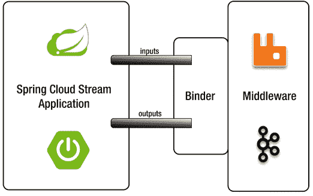

图 9-1.

Spring Cloud Stream 应用

## Spring Cloud Stream 编程

参照图 9-1，考虑一下创建一个 Spring Cloud Stream 应用需要什么：

*   `<dependencyManagement/>`：你需要添加此标签以及最新的 Spring Cloud 库依赖项。
*   **绑定器**：你需要选择需要哪种类型的绑定器：
    *   **Kafka**：如果你选择 Kafka 作为绑定器，则需要添加以下依赖项：

```
        org.springframework.cloud
        spring-cloud-starter-stream-kafka

```

*   **RabbitMQ**：如果你选择 RabbitMQ 作为绑定器，则需要添加以下依赖项：

```
        org.springframework.cloud
        spring-cloud-starter-stream-rabbit

```

你还必须确保 Kafka 或 RabbitMQ 已启动并正在运行。你甚至可以同时使用两者。你可以在 `application.properties` 或 `application.yml` 文件中配置它们。
*   `@EnableBinding`：这是一个 Spring Boot 应用，因此只需添加 `@EnableBinding` 即可将应用转换为 Spring Cloud Stream。

以下部分将向你展示如何使用 RabbitMQ 作为传输层，从一个应用程序向另一个应用程序发送和接收消息，而无需了解代理 API 的任何细节，也无需配置生产者或消费者消息。

Spring Cloud Stream 使用通道（输入/输出）作为发送和接收消息的机制。一个 Spring Cloud Stream 应用可以有任意数量的通道，并定义了两个注解：`@Input` 和 `@Output`。这些注解有助于区分消费者和生产者。通常，`SubscribableChannel` 类会使用 `@Input` 注解标记，而 `MessageChannel` 类会使用 `@Output` 注解标记。它们分别用于监听传入消息和发送传出消息。

`SubscribableChannel` 和 `MessageChannel` 接口应该从 Spring Integration 章节中就很熟悉了。还记得我告诉过你 Spring Cloud Stream 是基于 Spring Integration 的吗？

如果你不想直接处理这些通道和注解，Spring Cloud Stream 通过添加三个涵盖了最常见消息传递用例的接口来简化操作：Source、Processor 和 Sink。在幕后，这些接口拥有你的应用所需的正确通道（输入/输出）：

*   **Source**：Source 用于从外部系统（通过监听队列、REST 调用、文件系统、数据库查询等）摄取数据，并通过输出通道发送数据的应用程序。这是 Spring Cloud Stream 的实际接口：

```
    public interface Source {
    String OUTPUT = "output";
    @Output(Source.OUTPUT)
    MessageChannel output();
    }
    ```

*   **Processor**：当你想要开始监听输入通道以获取新的传入消息，处理接收到的消息（增强、转换等），然后将新消息发送到输出通道时，可以在应用程序中使用 Processor。这是 Spring Cloud Stream 的实际接口：

```
    public interface Processor extends Source, Sink {
    }
    ```

*   **Sink**：当你想要开始监听输入通道以获取新的传入消息，进行一些处理，然后结束流程（保存数据、触发任务、记录到控制台等）时，可以使用 Sink 应用程序。这是 Spring Cloud Stream 的实际接口：

```
    public interface Sink {
    String INPUT = "input";
    @Input(Sink.INPUT)
    SubscribableChannel input();
    }
    ```

图 9-2 和 9-3 展示了我们将要开始使用的模型。

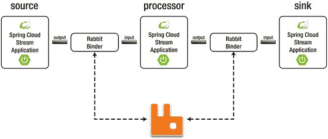

图 9-3.

Source 到 Processor 到 Sink 模型

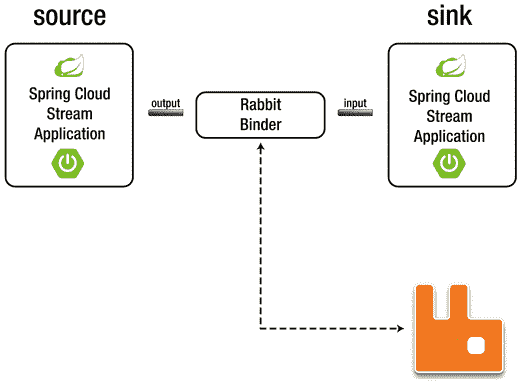

图 9-2.

Source 到 Sink 模型

你可以从本书的源代码中获取所有示例。本章包含多个示例。让我们开始并看一些代码。


### cloud-stream-demo

本项目的目的是展示如何创建一个源（Source），并通过其输出通道发送消息；如何创建一个处理器（Processor），并分别从输入通道接收消息和向输出通道发送消息；以及如何创建一个汇（Sink），并学习如何从输入通道接收消息。实际上，我演示的是图 9-3 所展示的内容，但每次只考虑一个 Stream 应用。

目前，这些应用之间的通信是手动的，这意味着我们需要在中间执行一些步骤，这是因为我希望你能了解每个应用的工作原理。在下一节中，你将看到整个流程是如何运作的。

#### 源（Source）

我们将从定义一个源开始。请记住，该组件有一个输出通道。打开 `com.apress.messaging.cloud.stream.SimpleSource` 类。它应该如代码清单 9-1 所示。

```
@EnableBinding(Source.class)
public class SimpleSource {
private SimpleDateFormat simpleDate =
new SimpleDateFormat("HH:mm:ss");
@Bean
@InboundChannelAdapter(channel=Source.OUTPUT)
public MessageSource simpleText(){
return () -> MessageBuilder
.withPayload("Hello at " +
simpleDate.format(new Date()))
.build();
}
}
代码清单 9-1.
com.apress.messaging.cloud.stream.SimpleSource.java
```

代码清单 9-1 向你展示了你能拥有的最简单的 `Source` 流应用。让我们来看一下：

*   `@EnableBinding`：此注解会将此类启用为 Spring Cloud Stream 应用，并启用通过提供的绑定器发送或接收消息的必要配置。
*   `Source`：此接口将 Spring Cloud Stream 应用标记为源流。它将创建必要的通道；在本例中，即用于向提供的绑定器发送消息的输出通道。
*   `@InboundChannelAdapter`：此注解是 Spring Integration 框架的一部分。它每秒轮询一次 `simpleText` 方法。这意味着每秒将发送一条新消息。你可以通过添加一个轮询器并修改默认设置来更改频率和消息数量。例如：

```
    @InboundChannelAdapter(value = Source.OUTPUT, poller = @Poller(fixedDelay = "5000", maxMessagesPerPoll = "3"))
    ```

此声明中重要的部分是通道，在本例中它指向 `Source.OUTPUT`。这意味着它将使用输出通道（`MessageChannel output()`）。
*   `MessageSource`：这是一个发送 `Message<T>` 的接口，`Message<T>` 是一个包含有效载荷和头部的包装器。
*   MessageBuilder：你已经熟悉这个类了，它发送一个 `MessageSource` 类型。在本例中，我们发送 `"Hello at – Date"` 作为字符串消息。

在运行示例之前，请确保 RabbitMQ 已启动并运行。接下来，运行示例。你可能看不到太多东西，但后台正在发生一些事情。请按照以下步骤操作：

1.  在浏览器中打开 RabbitMQ Web 管理界面。访问 `http://localhost:15672`。用户名和密码都是 `guest`。转到“Exchanges”选项卡，如图 9-4 所示。

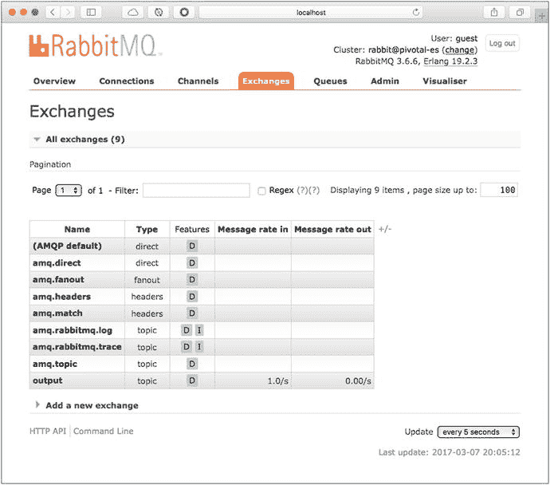

图 9-4.

RabbitMQ 中的“Exchanges”选项卡 请注意，已创建一个输出（一个主题交换机），消息速率为 1.0/s。  
2.  接下来，你将创建一个队列，以便将此交换机绑定到该队列。转到“Queues”选项卡，创建一个名为 `my-queue` 的新队列。见图 9-5。

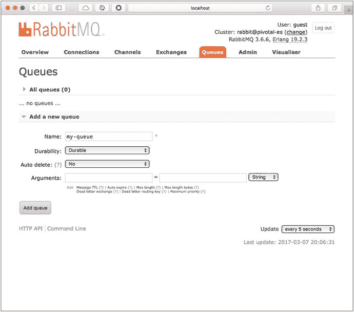

图 9-5.

RabbitMQ 的“Queues”选项卡  
3.  队列创建完成后，它会出现在列表中。接下来，点击 `my-queue` 队列，转到“Bindings”部分，并添加绑定。正确的值见图 9-6。

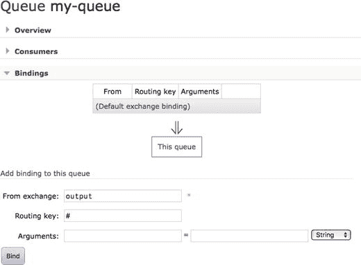

图 9-6.

RabbitMQ 的“Bindings”选项卡 在“From Exchange”字段中填入值 `output`（这是交换机的名称），在“Routing Key”字段中填入值 `#`。这将允许任何消息进入 `my-queue` 队列。  
4.  将输出交换机绑定到 `my-queue` 队列几秒钟后，你将开始看到多条消息。打开如图 9-7 所示的“Overview”面板。

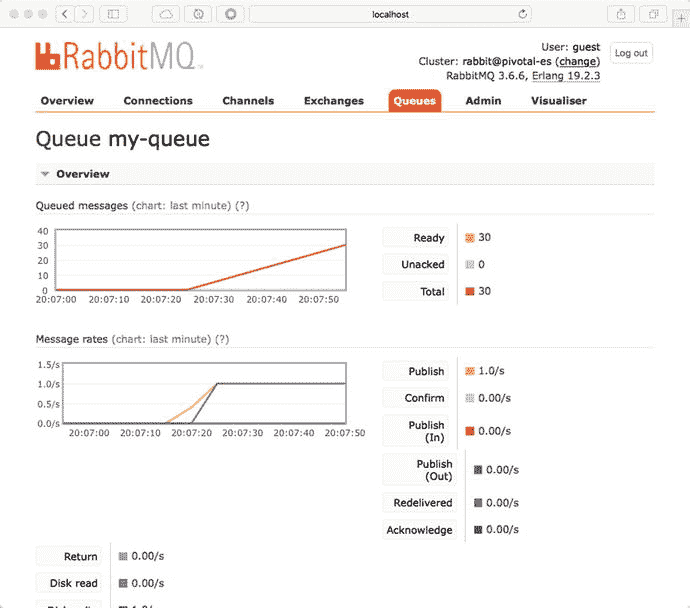

图 9-7.

RabbitMQ 的“Overview”选项卡  
5.  让我们通过打开“Get Messages”面板来查看一条消息。你可以获取任意数量的消息并查看其内容。见图 9-8。

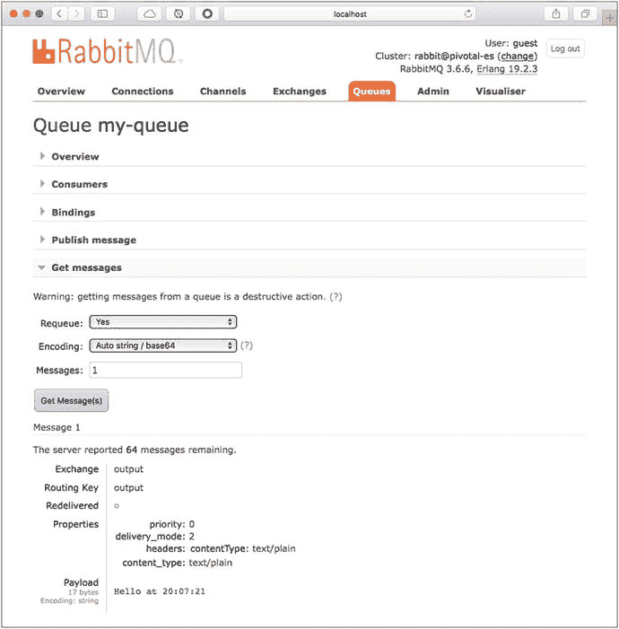

图 9-8.

从 RabbitMQ 获取消息 选择几条消息后，查看其有效载荷。你将每秒收到一条消息。还要注意，消息具有属性，例如包含 `contentType` `: text/plain` 和 `delivery_mode: 2` 的头部（这意味着消息正在被持久化）。这就是 Spring Cloud Stream 及其绑定器如何连接到 RabbitMQ 以发布消息的方式。


#### 处理器

本示例使用一个监听器来处理通道输入（所有传入消息的到达位置）。该监听器将获取字符串消息，将其转换为大写，然后将字符串发送到输出通道。

打开 `com.apress.messaging.cloud.stream.SimpleProcessor` 类。它应该如代码清单 9-2 所示。

```
@EnableBinding(Processor.class)
public class SimpleProcessor {
@StreamListener(Processor.INPUT)
@SendTo(Processor.OUTPUT)
public String transformToUpperCase(String message) {
return message.toUpperCase();
}
}
代码清单 9-2.
com.apress.messaging.cloud.stream.SimpleProcessor.java
```

代码清单 9-2 展示了一个简单的处理器流。我们来回顾一下：

*   `@EnableBinding`：此注解会将此类启用为 Spring Cloud Stream 应用程序，并启用通过提供的绑定器发送或接收消息的必要配置。
*   `Processor`：此接口将 Spring Cloud Stream 应用标记为处理器流。它将创建必要的通道。在本例中，它创建了输入通道（用于监听新的传入消息）和输出通道（用于向提供的绑定器发送消息）。
*   `@StreamListener`：此注解是 Spring Cloud Stream 框架的一部分，与 `@RabbitListener` 和 `@JmsListener` 非常相似。它将监听 `Processor.INPUT` 通道（`SubscribableChannel input()`）中的新传入消息。
*   `@SendTo`：你已经了解此注解；它与我们在前几章中使用的注解相同。其任务相同，你可以将其视为回复或生产者。它将向 `Processor.OUTPUT` 通道（`MessageChannel output()`）发送一条消息。

这是一个简单但很好的示例，展示了你可以使用处理器流做什么。在运行之前，请确保注释掉 `SimpleSource` 类中的 `@EnableBinding` 注解，并删除 `output` 交换器和 `my-queue` 队列。

运行示例。同样，应用程序并没有做太多事情，但让我们转到 RabbitMQ Web 管理界面。

1.  打开浏览器，访问 `http://localhost:15672` 站点（用户名和密码均为 `guest`）。点击“Exchanges”选项卡，你将看到相同的输出交换器和一个新的输入交换器被创建。请记住，处理器流将使用输入和输出通道。见图 9-9。

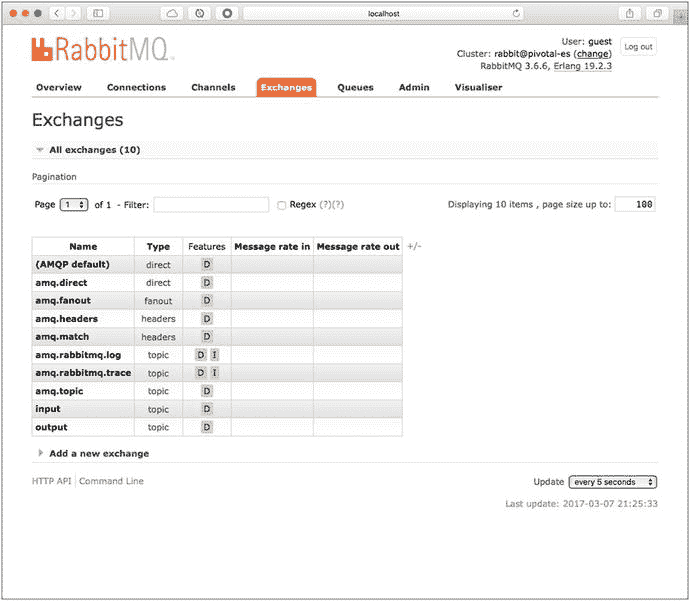

图 9-9.

RabbitMQ 的 Exchanges 选项卡 请注意，任何新交换器中都不再显示消息速率。  
2.  接下来，转到“Queues”选项卡。注意，创建了一个名为 `input.anonymous` 的新队列，其中包含随机文本。见图 9-10。

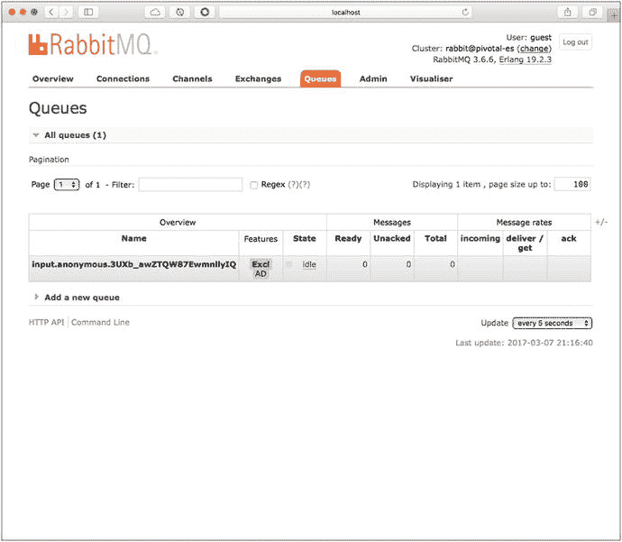

图 9-10.

RabbitMQ 的 Queues 选项卡

基本上就是这样；`SimpleProcessor` 流创建了输出交换器和 `input.anonymous.*` 队列，这意味着该流已连接到绑定器，在本例中为 RabbitMQ。所以你可能会想如何发送消息。有几种不同的方法，其中一种是使用 RabbitMQ 模拟消息。你也可以通过编程方式发送。以下各节将展示这两种方法。

我们将创建一个名为 `my-queue` 的队列，并将其绑定到输出，这与你在源流示例中所做的非常相似。

1.  转到“Queues”选项卡，创建一个名为 `my-queue` 的队列。使用路由键 `#` 将其绑定到 `output` 交换器。这类似于源流示例中的步骤 2 和 3。请注意，`input.anonymous.*` 队列与 `input` 交换器有一个绑定。  
2.  现在，我们将使用 `input` 交换器发送一条消息。转到“Exchanges”选项卡，点击 `input` 交换器。选择“Publish Message”面板。在“Payload”字段中添加以下文本：`this is just a test`。见图 9-11。

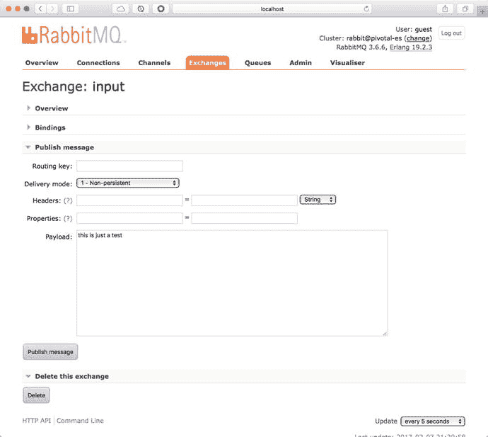

图 9-11.

从 RabbitMQ 发布消息 然后点击“Publish Message”按钮。应该会出现一条显示 `Message Published` 的消息。  
3.  接下来，查看日志。你应该会看到类似于图 9-12 所示的内容。

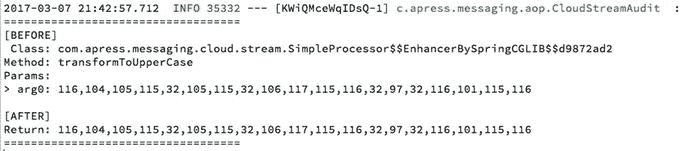

图 9-12.

应用程序日志 如果你查看 `my-queue` 队列并获取消息，应该会得到几乎相同的结果。见图 9-13。

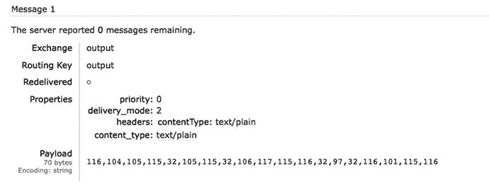

图 9-13.

从 RabbitMQ 获取消息 等等！我们似乎得到了一些数组，这些数组没有被转换为大写。如果你分析代码，这些是 ASCII 码，但什么也没发生。这是因为输入通道接收到的文本被 RabbitMQ 转换成了字节数组。我们可以修复这个问题。  
4.  在修复之前，通过点击队列页面末尾的“Purge”按钮清除队列中的消息。现在你从一个空队列开始。  
5.  回到“Input”交换器。现在我们将传递一个包含 `content_type: text/plain` 的标头，这样 RabbitMQ 就不会将其更改为字节数组。见图 9-14。

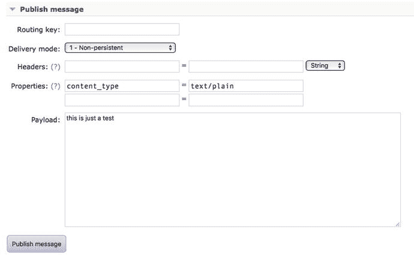

图 9-14.

在 RabbitMQ 中更改为 text/plain 发布消息并查看日志。处理器现在返回 `THIS IS JUST A TEST`。  
6.  最后，查看 `my-queue` 队列并获取消息。你应该会看到文本已转换为大写，如图 9-15 所示。

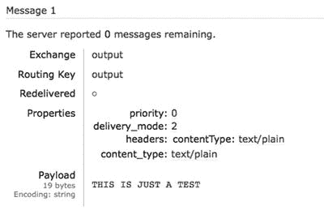

图 9-15.

文本现在是大写的

如果你想设置其他内容类型，比如 Java 对象、JSON 对象或 XML 对象，会发生什么？在 RabbitMQ 级别修改这会很麻烦。应该有其他方法，确实有！这只是一个尝试发送消息并观察处理器流行为的示例；在实际应用中，你绝不会像这样使用 RabbitMQ。你只会用它来监控消息速率，仅此而已。

因此，为了使用内容类型，你必须向 `application.properties`（或 `application.yml`）文件中添加一个属性，该属性允许将任何消息转换为指定的类型。在本例中，你使用以下属性：

```
spring.cloud.stream.bindings.input.content-type=text/plain
```

这里的关键是 `input` 属性。注意，我们传递了 `content-type`。如果你进行更改并重新启动应用程序，现在可以在不添加任何标头或属性的情况下发送消息（小写），并且你应该会在日志和 `my-queue` 队列中看到大写的文本。

我提到过你可以通过编程方式发送消息。你可以通过将以下功能添加到主类来实现。见代码清单 9-3。

```
@SpringBootApplication
public class CloudStreamDemoApplication {
public static void main(String[] args) {
SpringApplication.run(
CloudStreamDemoApplication.class, args);
}
@Bean
CommandLineRunner sourceSender(MessageChannel input){
return args ->{
input
.send(MessageBuilder
.withPayload("hello world")
.build());
};
}
}
代码清单 9-3.
com.apress.messaging.CloudStreamDemoApplication.java
```

如果你运行应用程序，大写的 `HELLO WORLD` 会出现在日志和 `my-queue` 队列中。如你所见，我们使用了一个你已经从 Spring Integration 中了解的方法，即 `MessageChannel` 接口。这里有趣的是，Spring 知道要注入哪个通道。请记住，`@Processor` 注解暴露了 `input` 通道。


#### Sink（接收端）

Sink 流会创建一个输入通道来监听新的传入消息。打开 `com.apress.messaging.cloud.stream.SimpleSink` 类。参见代码清单 9-4。

```
@EnableBinding(Sink.class)
public class SimpleSink {
@StreamListener(Sink.INPUT)
public void process(String message){
}
}
代码清单 9-4.
com.apress.messaging.cloud.stream.SimpleSink.java
```

代码清单 9-4 展示了一个 Sink 流，您已经了解这些注解的作用。`@EnableBinding` 会将此类转换为一个 `Source` 流，并通过 `@StreamListener` 和 `Sink.INPUT` 通道监听新的传入消息。`Sink.INPUT` 会创建一个输入通道（`SubscribableChannel input()`）。

如果您使用与代码清单 9-3 相同的配置并运行应用程序，请查看 RabbitMQ 管理界面。您会看到 `input` 交换机和 `input.anonymous.*` 相互绑定。在日志级别中，您应该会看到类似图 9-16 的内容。

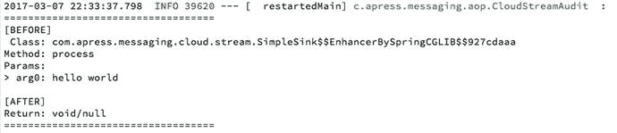

图 9-16.

应用程序日志

请记住，Sink 流会对接收到的消息执行一些额外操作，但它会终止整个流程。

到目前为止，我所解释的内容并没有做太多事情，因为我希望您先了解其内部工作原理。现在，让我们考虑一个真实场景，在这个场景中，我们实际创建一个完整的流程，并观察各个流如何在不进入 RabbitMQ 管理界面的情况下相互通信。

### 微服务

尽管有一章专门讨论微服务，但本节将触及这种利用新概念创建可扩展、高可用性应用程序的新方式。最重要的部分是能够通过消息传递在流之间进行通信。您应该将每个流（每个 Source、Processor 和 Sink）视为一个微服务。

#### 示例功能

此列表包含了本示例所需的一些功能（需求）。这是一个完整的流程，允许我们打印电影票。以下是需求：

*   所有人员信息均以 CSV 格式接收，并存储在 `contacts.txt` 文件中。
*   每个人包含名字、姓氏、出生日期、电话、电子邮件和是否为朋友字段。朋友字段是一个布尔值，用于指示此人是否为朋友。
*   读取 `contacts.txt` 文件后，示例必须处理每个人，然后根据以下规则创建电影票：
    *   如果此人是朋友，则他/她可以获得免费爆米花。
    *   如果此人是朋友，则电影免费；否则，费用为 15.75 美元。
    *   为电影票设置过期日期。它们在一周内有效。
*   电影票必须以 JSON 格式发送到队列，以便其他客户端易于读取。
*   可选。为朋友和非朋友创建单独的队列。

对于此流程，我创建了三个独立的项目：`cloud-stream-source-demo`、`cloud-stream-processor-demo` 和 `cloud-stream-sink-demo`。每个项目都需要独立运行，并且必须按以下顺序启动：sink、processor，最后是 source。

接下来的部分将解释这三个项目的主要代码。

#### cloud-stream-source-demo

打开 `com.apress.messaging.cloud.stream.PersonFileSource` 类。参见代码清单 9-5。

```
@EnableBinding(Source.class)
public class PersonFileSource {
private PersonFileProperties props;
private PersonConverter personConverter;
public PersonFileSource(
PersonFileProperties props,
PersonConverter personConverter){
this.props = props;
this.personConverter = personConverter;
}
@Bean
public IntegrationFlow fileFlow(){
return IntegrationFlows
.from(Files.inboundAdapter(
new File(this.props.getDirectory()))
.preventDuplicates(true)
.patternFilter(this.props.getNamePattern()),
e -> e.poller(Pollers.fixedDelay(5000L)))
.split(Files.splitter().markers())
.filter(p -> !(p instanceof FileSplitter.FileMarker))
.transform(Transformers.converter(personConverter))
.channel(Source.OUTPUT)
.get();
}
}
代码清单 9-5.
com.apress.messaging.cloud.stream.PersonFileSource.java
```

代码清单 9-5 展示了 Source 流。请注意，它使用 `IntegrationFlow` 类来创建文件读取，并进行少量转换以生成 `Person` 对象。然后将其发送到 `Source.OUTPUT` 通道。

接下来，打开 `application.properties`。参见代码清单 9-6。

```
server.port=${port:8081}
spring.cloud.stream.bindings.output.destination=person
apress.stream.file.directory=.
apress.stream.file.name-pattern=*.txt
代码清单 9-6.
src/main/resources/application.properties
```

代码清单 9-6 展示了 `application.properties` 文件。如您所见，如果在运行时未指定端口参数，它将在端口 `8081` 启动。这里重要的是 `output.destination` 允许我们创建一个名为 `person` 的通道。为什么需要这样做？请记住，流（source、processor 和 sink）使用相同的通道名称。如果我们不更改目标，则不会处理任何文件。如果我们从 source 启动，source 需要发送到输出，但 processor 也有一个输出，那么将使用哪个通道？这里存在冲突。这就是为什么我们需要添加目标。一旦您运行此示例，就会变得清晰。

#### cloud-stream-processor-demo

打开 `com.apress.messaging.cloud.stream.PersonTicketProcessor` 类。参见代码清单 9-7。

```
@EnableBinding(Processor.class)
public class PersonTicketProcessor {
private List movieTitles =
Arrays.asList("死侍 2"
,"超人总动员 2"
,"阿凡达 2","人猿泰山 2"
,"赛车总动员 3");
private Random rand = new Random();
@StreamListener(Processor.INPUT)
@SendTo(Processor.OUTPUT)
public Ticket process(Person person) {
Ticket ticket = new Ticket();
ticket.setPerson(person);
ticket.setMovieTitle(
movieTitles.get(
rand.nextInt(movieTitles.size())));
ticket.setFreePopcorn(person.isFriend());
ticket.setCost(person.isFriend() ? 0.0f: 15.75f);
ticket.setValidUntil(
new DateTime(new Date()).plusWeeks(1).toDate());
return ticket;
}
}
代码清单 9-7.
com.apress.messaging.cloud.stream.PersonTicket.java
```

代码清单 9-7 展示了 Processor 流。如您所见，没有新内容。我们接收一个 person 对象，但返回一个 ticket 对象，当然，我们根据需求执行了逻辑。

接下来，打开 `application.properties` 文件。参见代码清单 9-8。

```
server.port=${port:8082}
spring.cloud.stream.bindings.input.destination=person
spring.cloud.stream.bindings.output.destination=tickets
spring.cloud.stream.bindings.output.content-type=application/json
spring.jackson.date-format=yyyy-MM-dd
代码清单 9-8.
src/main/resources/application.properties
```

代码清单 9-8 展示了 `application.properties` 文件。请记住，Processor 流具有输入和输出通道，因此我们需要通过为每个通道添加目标来重命名它们。输入通道将命名为 `person`，输出通道将命名为 `tickets`。

回想一下，其中一个需求是让票证采用 JSON 格式，这就是我们将 `content-type` 设置为 `application/json` 的原因。这将使用 Jackson 库将票证转换为 JSON 格式。最后，我们添加了更好的日期格式。


#### cloud-stream-sink-demo

打开 `com.apress.messaging.cloud.stream.TicketSink` 类。参见代码清单 9-9。

```
@EnableBinding(Sink.class)
public class TicketSink {
@Bean
public IntegrationFlow toAmqp(
RabbitTemplate rabbitTemplate,
@Value("${ticket.exchange:}") String exchange,
@Value("${ticket.queue}") String queue){
return IntegrationFlows
.from(Sink.INPUT)
.handle(
Amqp
.outboundAdapter(rabbitTemplate)
.exchangeName(exchange)
.routingKey(queue))
.get();
}
@Bean
public Queue rateQueue(
@Value("${ticket.queue}") String queue){
return new Queue(queue,true);
}
}
代码清单 9-9.
com.apress.messaging.cloud.stream.TicketSink.java
```

代码清单 9-9 展示了 Sink 的源代码。您已经熟悉所有代码，因为它使用了 `@EnableBinding(Sink.class)` 来创建一个 Spring Cloud Stream 应用，该应用将创建一个输入通道来接收消息。它还使用了 `IntegrationFlow` 类，该类会将传入的消息发送到指定的队列。

接下来，打开 `application.properties` 文件。参见代码清单 9-10。

```
server.port=${port:8083}
spring.cloud.stream.bindings.input.destination=tickets
ticket.queue=processed.tickets
代码清单 9-10.
src/main/resources/application.properties
```

代码清单 9-10 展示了 `application.properties` 文件。同样，`input` 通道将被重命名为 `tickets`，队列被命名为 `processed.tickets`，Sink 流将把 JSON 消息发送到该队列。在运行每个项目之前，请查看图 9-17。

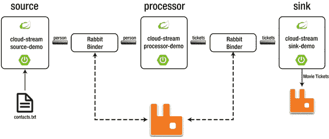

图 9-17.

示例流程

图 9-17 展示了整个配置。请注意我们为何需要更改通道名称。我在源流中提供了一个小的 `contacts.txt` 文件，因此您可以开始运行。如果您使用的是 STS IDE，请尝试按以下顺序运行：sink、processor、source。这是为了确保 processor 和 sink 正在监听。一旦它们运行起来，您应该会看到交换器和队列被创建，以及消息的出现。参见图 9-18（交换器）、9-19（队列）和 9-20（ticket）。

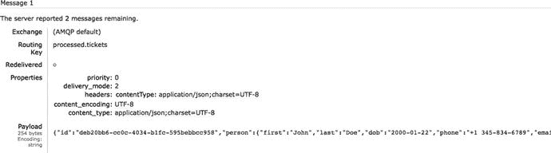

图 9-20.

processed.tickets 消息

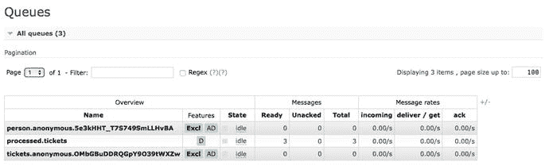

图 9-19.

队列（person、tickets 和 processed.tickets）

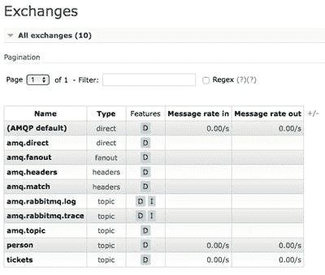

图 9-18.

交换器（person、tickets）

恭喜！您已经使用 Spring Cloud Stream 创建了一个数据驱动的微服务解决方案。想象一下您可以用这项技术做些什么。

在继续之前，您是否意识到我们缺少一个可选功能——动态路由？别担心，您将在 currency 项目中创建它！

## Spring Cloud Stream 应用启动器

如果我告诉您，我们可以避免创建前面的示例，而直接使用 Spring Cloud Stream 应用启动器，您觉得怎么样？

Spring Cloud Stream 提供了开箱即用的应用启动器。Spring 团队已经实现了大约 52 个应用，您只需下载、配置并执行即可。这些应用启动器按 source、processor 和 sink 模型划分：

*   Source：file、ftp、gemfire、gemfire-cq、http、jdbc、jms、load-generator、loggregator、mail、mongodb、rabbit、s3、sftp、syslog、tcp、tcp-client、time、trigger、triggertask 和 twitterstream
*   Processor：bridge、filter、groovy-filter、groovy-transform、httpclient、pmml、scriptable-transform、splitter、tcp-client 和 transform
*   Sink：aggregate-counter、cassandra、counter、field-value-counter、file、ftp、gemfire、gpfdist、hdfs、hdfs-dataset、jdbc、log、rabbit、redis-pubsub、router、s3、sftp、task-launcher-local、task-launcher-yarn、tcp、throughput 和 websocket

那么，让我们使用 `source:http` 和 `sink:log` 创建一个示例。我在本章的 `ch09/app-starters` 文件夹中添加了必要的 JAR 包。您会为每个 JAR 包找到一个子文件夹和一个 `start.sh` 脚本。

### source:http

打开一个终端，从 `http` 子文件夹执行 `start.sh` 脚本。或者，您可以执行以下命令：

```
java -jar http-source-rabbit-1.1.2.RELEASE.jar --spring.cloud.stream.bindings.output.destination=simple-demo
```

请注意，我们传递了一些关于目标地址的参数。当然，您可以创建一个 `application.properties` 文件并将其放在同一目录下，其中包含此属性。`source:http` JAR 包将在 `8080` 端口上运行。

### sink:log

打开一个新的终端，从 `log` 子文件夹执行 `start.sh` 脚本。或者，您可以执行以下命令：

```
java -jar log-sink-rabbit-1.1.1.RELEASE.jar --spring.cloud.stream.bindings.input.destination=simple-demo --server.port=8081
```

请注意，我们传递了与 `source:http` 相同的参数，但这次是针对 `input` 通道，并且它在 `8081` 端口上运行。

现在您可以进行测试了。使用 `cURL` 命令发送一条消息（Windows 用户可以使用 `POSTMAN`（[`https://www.getpostman.com/`](https://www.getpostman.com/)））。例如：

```
$ curl -X POST -d "Hello Spring Cloud Starter Apps" localhost:8080
```

`sink:log` 日志打印出了一个字节数组，对吧？试试这个新命令：

```
$ curl -X POST -d "Hello Spring Cloud Starter Apps" localhost:8080 -H "Content-Type: text/plain"
```

您应该会收到消息 `Hello Spring Cloud Starter Apps`。参见图 9-21。

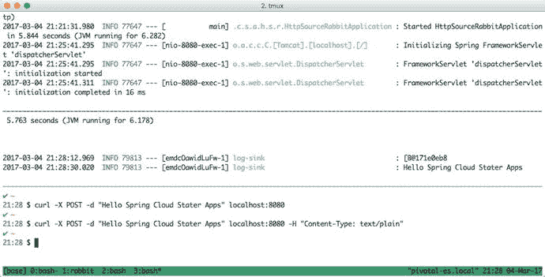

图 9-21.

source:http | sink:log 说明

您可以在 [`http://repo.spring.io/libs-release/org/springframework/cloud/stream/app/`](http://repo.spring.io/libs-release/org/springframework/cloud/stream/app/) 获取应用启动器的最新版本。

如果您想使用其他 Spring Cloud Stream 应用启动器并查看它们的配置，可以参考 [`http://docs.spring.io/spring-cloud-stream-app-starters/docs/Avogadro.SR1/reference/html/`](http://docs.spring.io/spring-cloud-stream-app-starters/docs/Avogadro.SR1/reference/html/) 的文档。

## Currency 项目

对于 currency 项目，假设您将从某个源获取多个汇率，并且需要根据汇率代码将该汇率发送给正确的消费者。换句话说，如果您发送一个来自 JPY 的汇率，它将选择目标 JPY 来发送它。这类似于您希望为微服务示例实现的动态路由。

请查看 `rest-api-cloud-stream` 项目中的 `com.apress.messaging.cloud.stream.RateProcessor` 类，了解动态路由。同时查看 `com.apress.messaging.RestApiCloudStreamApplication` 类（主类），因为它提供了一种使用 Source 流发送消息的新方法。


## 接下来是什么？

基于我向你展示的内容，思考一下如果其中一个微服务宕机了会发生什么。你的整个流程会中断吗？你如何解决故障点并增加高可用性？你如何编排所有这些微服务？你如何避免零停机？

好消息是，Spring Cloud Stream 是 Spring Cloud Data Flow 技术的基础。Spring Cloud Data Flow 是一种用于编排云环境中可组合微服务应用的编排服务，它对于实时数据分析和大数据解决方案非常有用。

使用 Spring Cloud Data Flow 的好处在于，这项技术得到了 Cloud Foundry、Apache Mesos、Kubernetes 和 Apache Yarn 的支持。Spring Cloud Data Flow 依赖这些技术来编排云基础设施上的注册、创建、部署和任务，此外，它还与 Spring Cloud Services 兼容（我将在微服务章节中讨论这一点）。

这里的建议是研究一下这项出色的技术。你会很轻松地学习它，因为它完全是基于 Spring Cloud Stream 的。

## 本章小结

本章向你展示了使用 Spring Cloud Stream 和 Spring Boot 创建简单的 Stream 应用是多么容易。只需使用 `@EnableBinding` 注解和绑定器，你就可以创建消息驱动的解决方案。

我还向你展示了 Spring Cloud Stream 拥有应用启动器，只需添加适当的配置即可使用。

下一章将讨论一项新兴技术：响应式框架。在这种情况下，我们将介绍 Spring Reactor 项目，用于在 JVM 上基于 Reactive Stream 规范创建非阻塞应用。

