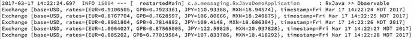
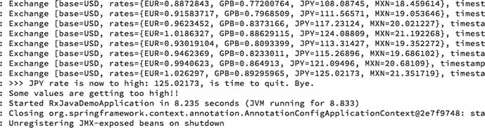
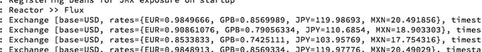
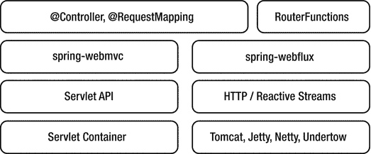

# 10. 响应式消息传递

如今，实践响应式是所有 IT 公司的首要目标。还有一些我们经常听到的相关术语，例如响应式编程、函数式响应式编程和响应式流。尽管它们有所不同，但我们在这里看到的是我们处理数据消费、并发、异步事件、高性能和分布式计算方式的一种转变。

本章讨论响应式编程和消息传递。这并不是一个新话题。几年前，微软发布了 C# 响应式扩展（以正式的方式），而 JavaScript 在事件响应方面也势头正劲。不仅如此，这个概念自 60 年代就已经存在，当时程序员想要互连硬件。

让我们首先深入了解响应式编程及其适用场景。然后，你将了解哪些框架将帮助你实现这种新的微事件响应式架构。

## 响应式编程

响应式编程是一种异步处理随时间变化的事件数据流（以非阻塞形式）的方式。它是一种对其变化行为做出反应的方式。

响应式编程适用于以下用例：

*   **电子表格/单元格**：当你打开电子表格应用时，你是否想过它的内部工作原理？每个单元格可能依赖于其他单元格，因此一个单元格的任何新变化都需要反映到其他单元格中——这就是对变化做出响应。再想象一下你在进行微积分或代数计算时的矩阵。你如何对特定矩阵单元格中的值做出反应？通常，你会开始处理事件驱动架构。
*   **高并发消息传递**：在我看来，消息传递是每个系统中最关键的部分。每秒发送几千甚至数百万条消息的想法一直是目标。能够处理所有这些消息并并发（同步和异步）消费它们也一直是一个挑战。
*   **外部服务调用**：如今，设备（手机、平板电脑、传感器等）只需一次滑动、手势或点击就需要大量信息。它们的后端服务需要从不同的服务（本地或远程）收集数据，并将信息聚合到单个响应中。它们变得非常“健谈”，有时非常缓慢。响应式编程非常适合这里。
*   **异步处理**：这对许多开发者来说一直是一个危险的领域，因为每当我们开始考虑异步进程时，就需要考虑线程、回调、并发、编排等等。有了响应式编程，我们几乎就解决了这些问题。

针对这些用例的大多数解决方案都涉及创建具有非阻塞 I/O 的库，例如 event-machine（来自 Ruby 编程语言），它运行良好且性能出色。

Java 及其新的 `java.util.concurrent` 包暴露了 Future/CompletableFuture 接口。Map-Reduce 和 Fork-Join 有助于大数据场景下的并行处理。Actor 模型以一种自然的方式暴露了并发性，其中一个重要的实现是在 Akka 框架中。

响应式编程是创建响应式、弹性、可伸缩，当然还有异步消息驱动系统的下一步，它允许流量控制并在必要时应用背压。所有这些特性都通过非阻塞通信提供。与仅基于拉取的 Java 8 流或 Iterable/Iterator 相比，响应式编程是基于推送的。换句话说，响应式编程处理同步/拉取和异步/推送的概念。

现在是时候关注实现了。以下部分使用了两个主要模块或库：RxJava 和 Reactor。然后我们将介绍即将发布的 Spring Framework 5 及其 WebFlux 模块。

注意

本章包含五个项目，我们将在以下部分中使用它们：`rxjava-demo`、`reactor-demo`、`web-emitter`、`spring-web-flux` 和 `spring-web-flux-reactive`。

## RxJava

RxJava 来自 Netflix（称为 ReactiveX；请参阅 [`http://reactivex.io`](http://reactivex.io)），是一个通过使用可观察序列来组合异步和基于事件的程序的库。它扩展了观察者模式并支持数据序列。它通过提供一个简单的 API，消除了线程、同步、线程安全、并发数据结构和非阻塞 I/O 的复杂性。

RxJava 提供了一组操作符，可以过滤、选择、转换、组合和编排可观察对象，从而实现更好、更高效的执行和组合。它暴露了几个类，比如 `Observable`，我们将在示例代码中看到。


### rxjava-demo 项目

打开 `com.apress.messaging.RxJavaDemoApplication` 类。参见代码清单 10-1。

```
@SpringBootApplication
public class RxJavaDemoApplication {
private static final Logger log =
LoggerFactory.getLogger(RxJavaDemoApplication.class);
public static void main(String[] args){
log.info("Demo Steam Application");
new SpringApplicationBuilder(RxJavaDemoApplication.class)
.web(false)
.run(args);
}
@Bean
CommandLineRunner rxJava(ExchangeService service){
return args -> {
log.info("RxJava >> Observable");
Observable exchange =
service.getExchangeRates();
exchange.subscribe(System.out::println);
};
}
Listing 10-1.
com.apress.messaging.RxJavaDemoApplication.java
```

代码清单 10-1 展示了主应用程序，其中定义了一个基本的 `Observable` 实例：

*   `Observable<Exchange>`：这里我们使用了 `Observable` 类，它不仅支持发射单个标量值（如 Java 8 的 Future），还支持值序列甚至无限流。在本例中，它支持一个包含汇率的 `Exchange` 类。
*   `subscribe`：`Observable` 类与其 Java 同类 `Iterable`（通常通过调用其 `next()` 方法进行拉取）有一些相似之处。在本例中，我们将通过调用 `subscribe` 进行推送。这个订阅者将接收所有消息（汇率）并打印出来。

`Observable` 类型增加了观察者模式所缺失的功能：生产者能够通过使用 `onCompleted` 方法向观察者（订阅者）发送信号，告知其没有更多数据可用；以及生产者能够通过使用 `onError` 方法向观察者（订阅者）发送信号，告知其发生了错误。

接下来，让我们看一个将数据推送给订阅者的 `Observable`。打开 `com.apress.messaging.service.ExchangeService` 类。参见代码清单 10-2。

```
@Service
public class ExchangeService {
private static final Logger log =
LoggerFactory.getLogger(ExchangeService.class);
private Exchange exchange;
ExchangeService() {
SortedMap rates =
new TreeMap() {
{
put("EUR", 0.942013F);
put("JPY", 114.75440909F);
put("MXN", 19.598225F);
put("GPB", 0.819626F);
}
};
exchange = new Exchange(rates, new Date());
}
public Observable getExchangeRates() {
return Observable.unsafeCreate(subscriber -> {
while(!subscriber.isUnsubscribed()) {
try {
Float factor =
(new Random().nextFloat() * 2 - 1) / 10F;
subscriber.onNext(
new Exchange(exchange
.getRates()
.entrySet()
.stream()
.collect(
Collectors.toMap(
entry ->
entry.getKey(),
entry -> entry.getValue()
* factor + entry.getValue(),
(v1, v2) -> {
throw new RuntimeException(String.format("Duplicate key for values %s
and %s", v1, v2));
}, TreeMap::new)), new Date()));
if (new Random().nextInt(100) > 90 )
throw new Exception(
"Some values are getting too high!!");
sleep(1000);
} catch (Exception ex){
log.error(ex.getMessage());
}
}
});
}
private void sleep(int ms) {
try {
Thread.sleep(ms);
} catch (Exception ex) {}
}
}
Listing 10-2.
com.apress.messaging.service.ExchangeService.java
```

代码清单 10-2 展示了该服务。这个 observable 将每秒推送一次汇率。花点时间分析一下代码，然后我们一起分析：

*   `Observable.` `unsafeCreate`：这将返回一个 observable，它会为每个 `Subscriber` 执行给定的 `OnSubscribe` 操作（参见代码清单 10-1）。使用这个 observable，你可以在发生错误时执行 `onError(Throwable)`，或者在没有更多数据时执行 `onCompleted()`。这里重要的部分之一是 `while` 语句中的 `subscriber.isUnsubscribee()`。这里我们正在判断是否还有更多的订阅者。我们将在接下来的示例中看到这一点。
*   `subscriber.onNext`：这为观察者（订阅者）提供了一个新项目（汇率）。此方法调用将值推送给订阅者。参见代码清单 10-1。

这个特定的服务将每秒发送一次汇率（参见 `sleep` 语句）。汇率会变化，因为对其应用了一个因子，以模拟货币兑换世界中的真实场景。

如果你运行该应用程序，应该会得到类似于图 10-1 的结果。



图 10-1.

应用程序日志

图 10-1 展示了你的第一个响应式应用程序的日志。接下来，让我们修改主类并添加一个订阅者实现。参见代码清单 10-3。

```
@SpringBootApplication
public class RxJavaDemoApplication {
private static final Logger log =
LoggerFactory.getLogger(RxJavaDemoApplication.class );
public static void main(String[] args){
log.info("Demo Steam Application");
new SpringApplicationBuilder(RxJavaDemoApplication.class)
.web(false)
.run(args);
}
@Bean
CommandLineRunner rxJava(ExchangeService service){
return args -> {
Observable observableExchange =
service.getExchangeRates();
observableExchange.subscribe(new Subscriber(){
@Override
public void onCompleted() {
log.info("EXCHANGE COMPLETED!!");
}
@Override
public void onError(Throwable t) {
log.error("EXCHANGE IS SKYROCKETING... >> " +
t.getMessage());
unsubscribe();
}
@Override
public void onNext(Exchange ex) {
log.info(ex.toString());
if(ex.getRates().get("JPY").floatValue() >
125.0F){
log.warn(">>> JPY rate is now to high: " +
ex.getRates().get("JPY")
.floatValue() + ", is time to quit. Bye.");
unsubscribe();
}
}
});
};
}
}
Listing 10-3.
com.apress.messaging.RxJavaDemoApplication.java
```

代码清单 10-3 展示了一个更完整的示例。在本例中，我们不仅仅是使用方法引用（`System.out::println`），而是创建了一个新的 `Subscriber<Exchange>` 并重写了一些方法：

*   `Subscriber<Exchange>`：这是一个抽象类，它提供了一种从 `Observables` 接收基于推送的通知的方式，并允许手动取消对这些 `Observables` 的订阅。
*   `onError`：此方法通知观察者 `Observable` 出现了错误情况。
*   `onCompleted`：此方法通知观察者 `Observable` 已完成发送基于推送的通知。
*   `onNext`：此方法向观察者提供一个新项目（在本例中是一个新的汇率）以供观察。请注意，在此方法中有一个 `unsubscribe()` 调用，它将设置标志，使得 `subscriber.isUnsubscribed()` 中的 `Observable` 评估为 `true`，从而结束 `while` 语句。

如果你运行该应用程序，应该会看到类似于图 10-2 的结果。



图 10-2.

日志

图 10-2 展示了运行应用程序后的日志。请注意，`JPY` 汇率触发了 `unsubscribe()` 调用，这意味着 `Observable` 将停止发送基于推送的汇率。


请注意，我在本书的源代码中包含了更多代码，但此处未作介绍，希望你能自行实验。花点时间分析一下发生了什么。我添加了一个示例，演示如何与固定数量的基于推送的汇率进行交互。

到目前为止，这些示例都在同一个主线程中运行，但有一种方法可以使用多线程。看看这段代码，你可以通过 `ExecutorService` 类使用自己的线程池。例如：

```
ExecutorService executorService =
Executors.newFixedThreadPool(100);
Observable observableExchange =
service.getExchangeRates();
observableExchange
.take(10)
.subscribeOn(
Schedulers
.from(executorService))
.forEach(ex -> { log.info(ex.toString()); });
```

RxJava 目前已经发展到 2.x 版本，并且更改了一些签名。你可以在 [`https://github.com/ReactiveX/RxJava/wiki/What’s-different-in-2.0`](https://github.com/ReactiveX/RxJava/wiki/What%27s-different-in-2.0) 查看这些变更。

## Reactor

Reactor（来自 Spring 框架团队）是一个完全成熟且非阻塞的 JVM 响应式编程基础库。它与所有 Java 8 函数式 API（`CompletableFuture`、`Stream` 和 `Duration`）协同工作，提供了两个可组合的异步序列 API（`Flux`——N 个元素和 `Mono`——0 或 1 个元素），并实现了响应式扩展规范。

你可以在 [`http://projectreactor.io/`](http://projectreactor.io/) 获取关于 Reactor 的更多信息。让我们从代码开始。

### reactor-demo 项目

这个项目与我们之前看到的 RxJava 项目非常相似，但这次我们不再使用 `Observable`，而是使用 `Flux`。打开 `com.apress.messaging.ReactorDemoApplication` 类。参见清单 10-4。

```
@SpringBootApplication
public class ReactorDemoApplication {
private static final Logger log =
LoggerFactory
.getLogger(ReactorDemoApplication.class);
public static void main(String[] args) throws IOException {
SpringApplication.run
(ReactorDemoApplication.class, args);
System.in.read();
}
@Bean
CommandLineRunner reactorFlux(ExchangeService service){
return args -> {
log.info("Reactor >> Flux");
Flux fluxExchange =
service.getExchangeRates();
fluxExchange.subscribe( ex -> log.info(ex.toString()));
}
}
}
清单 10-4.
com.apress.messaging.ReactorDemoApplication.java
```

清单 10-4 向你展示了 Reactor 的方式，使用 `Flux` 和 `subscribe` 方法调用来处理基于推送的数据流。`Flux` 表示一个包含 0 到 N 个项目的响应式序列（在本例中为汇率）。

在底层，`Flux` 被描述为 `Flux<T>`，并实现了 `Publisher<T>` 接口。该接口是无限数量有序元素的提供者，并根据其订阅者的需求发布这些元素。一个发布者可以在不同时间点以动态方式服务于多个订阅者（`Subscriber<T>` 接口）。

让我们看看服务类。打开 `com.apress.messaging.service.ExchangeService` 类。参见清单 10-5。

```
@Service
public class ExchangeService {
private static final Logger log =
LoggerFactory.getLogger(ExchangeService.class);
private Exchange exchange;
ExchangeService() {
log.info(">>> Exchange Service created.");
@SuppressWarnings({ "serial" })
SortedMap rates =
new TreeMap() {
{
put("EUR", 0.942013F);
put("JPY", 114.75440909F);
put("MXN", 19.598225F);
put("GPB", 0.819626F);
}
};
exchange = new Exchange(rates, new Date());
}
public Flux getExchangeRates(){
return Flux.create( sink -> {
while(true){
Float factor =
(new Random().nextFloat() * 2 - 1) / 10F;
sink.next(
new Exchange(
exchange
.getRates()
.entrySet()
.stream()
.collect(
Collectors.toMap(
entry -> entry.getKey(),
entry -> entry.getValue() * factor + entry.getValue(),
(v1, v2) -> {
throw new RuntimeException(
String.format("Duplicate key for values %s and %s", v1, v2));
}, TreeMap::new)), new Date()));
sleep(1000);
if(factor > 0.095F)
sink.complete();
}
});
}
private void sleep(int ms) {
try {
Thread.sleep(ms);
} catch (Exception ex) { }
}
}
清单 10-5.
com.apress.messaging.service.ExchangeService.java
```

清单 10-5 向你展示了 `Subscriber` 通过调用 `create` 方法使用 `Flux<Exchange>`。该方法接收一个 `Consumer<? Super FluxSink<T>>`。这个消费者只是一个需要执行的简单调用。参数需要是 `FluxSink<T>` 类型的接口。该接口是下游订阅者的包装 API，并发送任意数量的信号，后跟零个或至少一个 `onError` 或 `onComplete`。

如果你运行该应用程序，你应该会看到类似于图 10-3 的内容。



图 10-3.

日志

使用 RxJava 和 Reactor 有什么区别？Reactor 支持函数式编程、调度器、低延迟和 Lambda 管道方法。Reactor 最大的优势之一是它支持 Spring 的所有 HTTP MVC 类型，这是一种开箱即用的流式功能（服务器发送事件——SSE）。

我在项目中添加了更多示例。你只需启用它们，然后运行、实验并与之互动。

## Spring 5：WebFlux 框架

Spring 5 有许多新特性，包括对 JDK 9 的支持。其主要特性之一是基于 Reactor 的函数式 Web 框架（Functional Web Framework）或 WebFlux。

Servlet 3.1 规范能够支持非阻塞 I/O，但效果可能不如你想象的那么好。Servlet API 的其余部分仍然是命令式风格，无法在响应式、非阻塞的栈中使用。

Spring 团队包含了 `spring-webflux` 模块，为 Web 应用程序添加了新的函数式编程模型。与 `spring-mvc` 一起，你可以拥有一个响应式栈的 Web 框架。`spring-webflux` 模块还有一个响应式的 `WebClient`，它是 `RestTemplate` 类的非阻塞替代方案，允许你处理异步和流式场景。参见图 10-4。



图 10-4.

Spring WebFlux

### 编程模型

Spring WebFlux 有两种编程模型：基于注解的和基于函数的。


#### 基于注解的编程模型

你可以使用与 `spring-webmvc` 模块中相同的知名注解；主要区别在于核心现在是非阻塞的，并且基于响应式的 `ServerHttpRequest` 和 `ServerHttpResponse` 响应（而不是 `HttpServletRequest` 和 `HttpServletResponse` 响应）。

打开 `spring-web-flux-reactive` 项目，然后打开 `com.apress.messaging.controller.ReactiveController` 类。参见清单 10-6。

```
@RestController
public class ReactiveController {
    SubscribableChannel personChannel;
    PersonRepository repo;
    public ReactiveController(SubscribableChannel personChannel, PersonRepository repo){
        this.personChannel = personChannel;
        this.repo = repo;
    }
    @GetMapping("/person")
    Flux list() {
        return Flux.fromStream(this.repo.getAll());
    }
    @GetMapping("/person/{id}")
    Mono findById(@PathVariable String id) {
        return Mono.just(this.repo.findOne(id));
    }
    @GetMapping(value="/person-watcher", produces=MediaType.TEXT_EVENT_STREAM_VALUE)
    public Flux log4Person(){
        return Flux.create( sink -> {
            MessageHandler handler = message -> sink.next((Person) message.getPayload());
            personChannel.subscribe(handler);
            sink.setCancellation(() -> personChannel.unsubscribe(handler));
        });
    }
    @PostMapping(value="/person", consumes = {MediaType.APPLICATION_JSON_VALUE})
    public void createPerson(@RequestBody Person person){
        if(person != null && person.getName() != null){
            repo.save(person);
            personChannel.send(MessageBuilder.withPayload(person).build());
        }
    }
}
清单 10-6.
com.apress.messaging.controller.ReactiveController.java
```

清单 10-6 展示了你在 Spring MVC 中见过的注解，但现在它们基于响应式流。分析代码，注意我们正在使用 Reactor 编程模型——`Flux` 和 `Mono` 响应式类。

尽管我不打算详细讨论服务器推送事件（SSE）技术，但 `spring-webflux` 只需生成 `TEXT_EVENT_STREAM_VALUE` 内容类型即可引入该技术。SSE 是一种通过推送通知将消息从服务器发送到网页的方式。

注意

`web-emitter` 项目包含一个 SSE 示例。SSE 已包含在 Spring 4.2 中，因此这不是一项新技术。它已经存在了几年。浏览器需要实现接收通知的方式。

#### 基于函数的编程模型

你可以使用函数式编程来配置服务器的所有请求和响应。你需要定义 `RouterFunctions`、`HandlerFunctions` 和一个服务器。

##### RouterFunctions、HandlerFunctions 和 Server

Spring WebFlux 包含多个响应式类和概念，使得对 Web 请求和响应进行建模更加容易：

*   `HandlerFunctions`：所有请求都由一个 `HandlerFunction<T>` 处理，它接收 `ServerRequest` 并返回一个 `Mono<ServerResponse>`。
*   `RouterFunctions`：所有传入的请求都通过一个 `RouterFunction<T>` 路由到处理函数，该函数接收 `ServerRequest` 并返回一个 `Mono<HandlerFunction>` 类型。
*   `Server`：需要配置一个新的服务器来使用新的 `RouterFunctions` 和 `Handlers`。

`spring-web-flux` 项目包含你在本节中需要的所有代码。

首先打开包含所有 `RouterFunctions` 的配置。打开 `com.apress.messaging.config.ServerConfig` 类。参见清单 10-7。

```
@Configuration
public class ServerConfig {
    PersonHandler handler;
    ServerConfig(PersonHandler handler){
        this.handler = handler;
    }
    @Bean
    RouterFunction router(){
        return RouterFunctions
                .route(GET("/persons/{id}").and(accept(APPLICATION_JSON)), handler::findById)
                .andRoute(GET("/persons").and(accept(APPLICATION_JSON)), handler::findAll)
                .andRoute(GET("/personwatcher").and(accept(APPLICATION_JSON)), handler::newPersonLog)
                .andRoute(POST("/persons").and(accept(APPLICATION_JSON)), handler::createPerson);
    }
    @Bean
    HttpServer httpServer(RouterFunction router){
        HttpHandler httpHandler = RouterFunctions.toHttpHandler(router);
        ReactorHttpHandlerAdapter adapter = new ReactorHttpHandlerAdapter(httpHandler);
        HttpServer server = HttpServer.create("localhost", 8080);
        server.newHandler(adapter).block();
        return server;
    }
}
清单 10-7.
com.apress.messaging.config.ServerConfig.java
```

清单 10-7 展示了配置新的响应式 Web 栈所需的函数式编程，通过创建 `RouterFunctions`。你可以将其视为创建 Web 控制器的一种新方式。注意我们正在定义路由和处理程序。

清单 10-7 向你展示了如何配置服务器。在此示例中，配置的是 `Netty` 服务器。注意 `HttpHandler` 和 `ReactorHttpHandler` 是如何被使用的。

接下来，打开 `com.apress.messaging.handler.PersonHandler` 类。参见清单 10-8。

```
@Component
public class PersonHandler {
    PersonRepository repo;
    EmitterProcessor stream = EmitterProcessor.create().connect();
    PersonHandler(PersonRepository repo) {
        this.repo = repo;
    }
    public Mono findAll(ServerRequest request) {
        Flux people = Flux.fromStream(this.repo.getAll());
        return ServerResponse.ok().contentType(APPLICATION_JSON).body(people, Person.class);
    }
    public Mono findById(ServerRequest request) {
        String personId = request.pathVariable("id");
        Mono notFound = ServerResponse.notFound().build();
        Mono personMono = Mono.just(this.repo.findOne(personId));
        return personMono.then(person -> ServerResponse.ok().contentType(APPLICATION_JSON).body(fromObject(person)))
                .otherwiseIfEmpty(notFound);
    }
    public Mono createPerson(ServerRequest request) {
        Mono person = request.bodyToMono(Person.class);
        return ServerResponse.ok().build(person.doOnNext(p -> {
            this.repo.save(p);
            this.stream.onNext(p);
        }).then());
    }
    public Mono newPersonLog(ServerRequest request){
        Mono personMono = stream.doOnNext( person -> {
            System.out.println(">>>> [Person created] " + person);
        }).next().subscribe();
        personMono.block();
        return personMono.then(person -> ServerResponse.ok().contentType(APPLICATION_JSON).body(fromObject(person)));
    }
}
清单 10-8.
com.apress.messaging.handler.PersonHandler.java
```

清单 10-8 展示了将用于每个路由函数的处理程序。注意每个方法都接收 `ServerRequest` 作为参数，并返回一个 `Mono<ServerResponse>`。

注意

要运行 `spring-web-flux-reactive` 和 `spring-web-flux` 项目，你需要启动并运行 Mongo 服务器。

## 总结

本章介绍了响应式编程，包括讨论它的优点以及我们可以用它做什么。目前有很多关于响应式编程的内容需要解释，本章只是一个开始。

你看到了两个模块/库——RxJava（来自 Netflix）和 Reactor（来自 Spring 框架团队）。你还预览了即将在几周后发布的 Spring 5 和函数式 Web：WebFlux 中的内容。

在下一章中，我们将讨论微服务，你将学习如何将本书中学到的所有知识应用到基于微服务的项目中。

