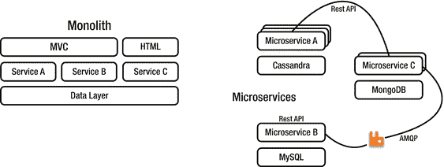
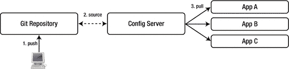
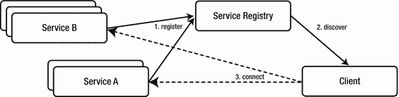
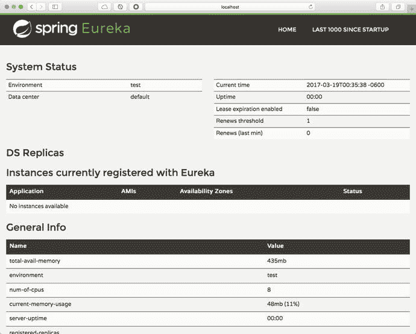
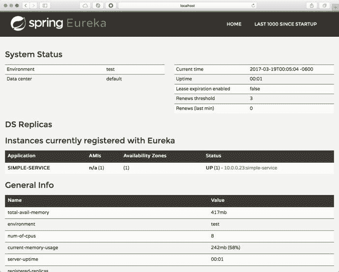
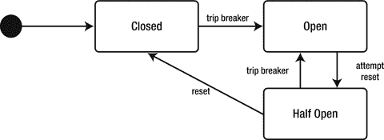

# 11. 微服务

本章讨论微服务架构，并介绍为了使用微服务进入云原生应用设计而需要做出的更改。它还涵盖了消息传递如何成为成功的关键因素。


## 什么是微服务

微服务并非新鲜事物，自 UNIX 诞生以来就已存在。UNIX 拥有许多执行各种任务的小程序（称为命令），它们可以相互通信以创建更出色的解决方案。它们是如何做到的呢？

如果你是一位经验丰富的 UNIX 程序员，你已经知道答案了。这些命令通过管道 `|` 进行通信，管道允许 UNIX 将信息传递给下一个可用的程序或命令。例如：

```
ls -al | grep Aug | grep -v '200[456]' | more
```

如果你现在开始思考自己的系统和应用程序，如何实现同样的效果？你能创建基于特定领域的小型应用程序，并让它们与其他应用程序通信吗？

微服务在架构师、开发人员和运维团队中引起了极大的热情，但我们为什么需要它们呢？我认为时间是其中的关键因素，因为应用程序需要快速、有弹性、高可用且可扩展，同时还要保持高性能。

*   **速度**：你需要比竞争对手更快地交付。你可以使用微服务来帮助你在上市时间上更快地交付。
*   **安全性**：你需要通过监控、隔离、容错和自动恢复实践，在整个开发周期中保持稳定性、可用性和持久性。开始考虑持续交付和持续集成。
*   **可扩展性**：垂直扩展（即购买更多硬件）的扩展性不佳。使用通用硬件，重用现有资源并进行水平扩展，创建同一应用程序的多个实例。使用容器来帮助你扩展。
*   **移动性**：准备支持多种设备，随时随地访问。移动设备连接到互联网，不仅用于社交媒体、电子邮件和聊天，还用于监控房屋、引擎等。

一切似乎都说得通，对吧？但我还没有解释一个微服务如何与多个其他微服务通信。消息传递是关键！许多公司通过创建装饰器、转换器或外观模式，使用 RESTful API 与其他系统或程序（甚至是遗留系统）通信，但你还有更多通信选项，包括 HTTP、TCP（Web Socket、AMQP）、响应式流等。

以简单方式创建微服务的基本指南被称为十二要素应用原则。

## 十二要素应用

为了概述创建云原生架构所需的内容，Heroku（参见 [`https://www.heroku.com/`](https://www.heroku.com/) ）的工程师们识别出了一些模式，这些模式后来成为了十二要素应用指南（参见 [`https://12factor.net/`](https://12factor.net/) ）。该指南展示了如何架构一个应用程序（单个单元）。它侧重于声明式配置、无状态和部署无关性。换句话说，你的应用程序需要快速、安全且可扩展。

以下是十二要素应用指南的摘要：

*   **代码库**：一份在版本控制系统（VCS）中跟踪的代码库，多次部署。一个应用只有一个代码库，并由 Git、Subversion、Mercurial 等版本控制系统跟踪。你可以（从同一代码库）进行多次部署到开发、测试、预发布和生产环境。
*   **依赖**：显式声明并隔离依赖。有时你的环境没有互联网连接（如果是私有系统），因此你需要考虑打包你的依赖（jar、gem、共享库等）。如果你有一个内部库仓库，你可以声明类似 pom、gemfile、bundle 的清单。永远不要假设你的最终环境中会拥有一切。
*   **配置**：将配置存储在环境中。你不应对任何可变的内容进行硬编码。使用环境变量或配置服务器。
*   **后端服务**：将后端服务视为附加资源。通过 URL 或配置连接到服务。
*   **构建、发布、运行**：严格分离构建和运行阶段。与 CI/CD（持续集成、持续交付）相关。
*   **进程**：以一个或多个无状态进程的方式执行应用。进程不应存储内部状态。不共享任何内容。任何必要的状态都应被视为后端服务。
*   **端口绑定**：通过端口绑定导出服务。你的应用程序是自包含的，这些应用通过端口绑定暴露。一个应用程序可以成为另一个应用的服务。
*   **并发**：通过进程模型进行水平扩展。通过添加更多应用实例来扩展。单个进程可以自由地进行多线程处理。
*   **可处置性**：通过快速启动和优雅关闭最大化鲁棒性。进程应该是可处置的（记住它们是无状态的）并且具有容错能力。
*   **环境等价**：尽可能保持开发、预发布和生产环境相似。换句话说，检查你安装的操作系统，以及你使用的框架、运行时或库版本。它们在每个环境中必须相同。这是高质量的结果，并确保持续交付。
*   **日志**：将日志视为事件流。你的应用应写入 `stdout`。日志是聚合的、按时间排序的事件流。
*   **管理进程**：将管理和维护任务作为一次性进程运行。在平台上运行管理进程：数据库迁移、一次性脚本等。

一些程序员认为你需要拥有云基础设施才能使用微服务，但在我看来，你并不需要。如果你遵循这些原则，你将准备好与更大的公司竞争。当你准备迁移或切换到更好的基础设施时，你已经准备好了。

如果你想开始创建微服务并遵循这十二要素原则，仅靠单个或小型团队从零开始创建一切是不够的。你将面临几个变化：

*   **文化层面**：我们需要摆脱人员孤岛，开始创建跨职能团队。他们工作更高效，并致力于解决单一领域的业务场景。开始思考持续交付，分散决策权，并寻求团队自主性。
*   **组织层面**：创建跨职能的业务能力团队。这些团队拥有自主决策权。创建平台团队运营，该团队也应是跨职能的。
*   **技术层面**：摆脱构建单体应用，转向微服务架构。思考限界上下文。遵循领域驱动设计的一些原则和实践。开始使用容器化，以获得应用的隔离性、可扩展性和高性能，然后寻找能让你控制分布的服务集成。参见图 11-1 。



图 11-1.

单体架构与使用微服务的对比

## Spring Cloud 服务

Spring Cloud 服务是一组工具/框架，可以轻松、快速且安全地开发微服务架构。本节涵盖最常见的 Spring Cloud 服务：Spring Cloud Config、服务注册中心和断路器。

### Spring Cloud Config 服务器

Config 服务器是一个外部化的应用配置服务，它为你提供了一个集中管理应用跨环境外部属性的地方。参见图 11-2 。



图 11-2.

Config 服务器

你可以在开发阶段或与你的流水线（持续交付）一起使用 Config 服务器。你可以集中管理每个环境以访问通用的外部配置，而无需重新打包或重新部署。


#### 云配置服务器

要使用配置服务器，你需要执行以下操作：

1.  在你的 `pom.xml` 文件中，需要使用以下 `<dependency/>` 和 `<dependencyManagement/>` 标签：

    ```
    ...

    org.springframework.cloud
    spring-cloud-config-server

    ...

    org.springframework.cloud
    spring-cloud-dependencies
    Camden.SR6
    pom
    import

    ```

    在本书撰写时，版本为 Camdem.SR6。如需保持更新，请查看位于 [`http://projects.spring.io/spring-cloud/`](http://projects.spring.io/spring-cloud/) 的主项目网站。  
2.  添加 `@EnableConfigServer`：

    ```
    @SpringBootApplication
    @EnableConfigServer
    public class ConfigServerDemoApplication {
    public static void main(String[] args) {
    SpringApplication.run(
    ConfigServerDemoApplication.class, args);
    }
    }
    ```

    `@EnableConfigServer` 将创建配置服务器，它会从 GitHub 获取最新值并处理来自客户端的请求。  
3.  添加 `application.properties`（或 `application.yml`）文件，通过提供 URI 来指定 Git 仓库的位置。

    ```
    # 默认端口
    server.port=8888
    # Spring 配置服务器
    spring.cloud.config.server.git.uri=https://github.com//your-repo-app-config.git
    ```

仅此而已，你不需要其他任何东西。现在你可以运行配置服务器了。你可以查看 `config-server-demo` 项目。

#### 云配置客户端

要连接到云配置服务器，你需要执行以下操作：

1.  将 `<dependency/>` 和 `<dependencyManagement/>` 标签添加到你的 `pom.xml` 文件中：  

```
...

org.springframework.cloud
spring-cloud-starter-config

...

org.springframework.cloud
spring-cloud-dependencies
Camden.SR6
pom
import

```

仅此而已。现在你可以像往常一样使用任何属性，无论是通过常规的 `@Value("${hello-world-message}")` 还是通过 `@ConfigurationProperties`。你可以在 `config-client-demo` 项目中找到完整的示例。

我认为这是一个非常直接的解决方案。如果你需要更深入的参考资料，请访问 [`http://projects.spring.io/spring-cloud/`](http://projects.spring.io/spring-cloud/) 网站。

### 服务注册中心

服务注册中心提供了服务发现模式的实现。该模式是微服务架构最重要的特性之一。见图 11-3。



图 11-3.

服务注册中心

当客户端向服务注册中心注册时，它会提供关于自身的元数据，例如其主机和端口号。它还会持续向服务注册中心发送心跳。服务注册中心将所有信息保存在内存中。

#### 服务注册中心：Eureka 服务器

要使用服务注册中心（Eureka 服务器），你需要执行以下操作：

1.  将 `<dependency/>` 和 `<dependencyManagement/>` 标签添加到你的 `pom.xml` 文件中：

    ```
    org.springframework.cloud
    spring-cloud-starter-eureka-server

    ...

    org.springframework.cloud
    spring-cloud-dependencies
    Camden.SR6
    pom
    import

    ```

2.  将 `@EnableEurekaServer` 添加到你的应用程序中：

    ```
    @SpringBootApplication
    @EnableEurekaServer
    public class ServiceRegistryDemoApplication {
    public static void main(String[] args) {
    SpringApplication.run(
    ServiceRegistryDemoApplication.class, args);
    }
    }
    ```

    `@` `EnableEurekaServer` 会启动一个网页。你可以在浏览器中查看 `http://localhost:8761/`，如图 11-4 所示。

    

    图 11-4.

    位于 http://localhost:8761 的 Eureka 服务器  
3.  将以下属性添加到 `application.properties`（或 `application.yml`）中：

    ```
    # 默认服务器端口
    server.port=8761
    # Eureka 配置
    eureka.instance.hostname=localhost
    eureka.client.register-with-eureka=false
    eureka.client.fetch-registry=false
    eureka.client.service-url.defaultZone=http://${eureka.instance.hostname}:${server.port}/eureka/
    ```

仅此而已，你不需要其他任何东西。你可以查看 `service-registry-server-demo` 项目并运行它。它将在 `8761` 端口运行。

#### 向 Eureka 服务器注册服务应用程序

要注册一个应用程序，请遵循以下步骤：

1.  将 `<dependency/>` 和 `<dependencyManagement/>` 标签添加到你的 `pom.xml` 文件中：

    ```
    org.springframework.cloud
    spring-cloud-starter-eureka

    ...

    org.springframework.cloud
    spring-cloud-dependencies
    Camden.SR6
    pom
    import

    ```

2.  将 `@EnableDiscoveryClient` 添加到你的应用程序中：

    ```
    @RestController
    @SpringBootApplication
    @EnableDiscoveryClient
    public class ServiceRegistryServiceDemoApplication {
    public static void main(String[] args) {
    SpringApplication.run(
    ServiceRegistryServiceDemoApplication.class, args);
    }
    @GetMapping("/message")
    public String getMessage(){
    return "Hello World from a Service Discovery";
    }
    }
    ```

    此注解会自动与 Eureka 服务器通信（默认端口为 `8761`）。  
3.  将以下属性添加到 `application.properties`（或 `application.yml`）中：

    ```
    # 服务器端口
    server.port=8181
    # 应用程序名称
    spring.application.name=simple-service
    ```

    包含应用程序名称非常重要，因为这是它被发现的方式。  

你可以查看 `service-registry-service-demo` 项目。如果你运行该应用程序，你应该会在 Eureka 服务器中看到名为 `SIMPLE-` `SERVICE` 的条目。见图 11-5。



图 11-5.

Eureka 发现


#### 通过客户端应用程序访问服务

要访问应用程序，请遵循以下步骤：

1.  将 `<dependency/>` 和 `<dependencyManagement/>` 标签添加到你的 `pom.xml` 文件中：

    ```
    org.springframework.cloud
    spring-cloud-starter-eureka

    ...

    org.springframework.cloud
    spring-cloud-dependencies
    Camden.SR6
    pom
    import

    ```

2.  使用 `EurekaClient` 类和 `RestTemplate`（在此示例中）来获取服务。

    ```
    @RestController
    @SpringBootApplication
    public class ServiceRegistryClientDemoApplication {
    private static Logger log =
    LoggerFactory.getLogger(
    ServiceRegistryClientDemoApplication.class);
    public static void main(String[] args) {
    SpringApplication.run(
    ServiceRegistryClientDemoApplication.class, args);
    }
    private EurekaClient discoveryClient;
    private RestTemplate restTemplate = new RestTemplate();
    ServiceRegistryClientDemoApplication(
    EurekaClient discoveryClient){
    this.discoveryClient = discoveryClient;
    }
    @GetMapping("/")
    public String getMessageFromRemoteServer(){
    return
    restTemplate.getForObject(
    fetchServiceUrl() + "/message", String.class);
    }
    private String fetchServiceUrl() {
    InstanceInfo instance = discoveryClient
    .getNextServerFromEureka("SIMPLE-SERVICE", false);
    String serviceUrl = instance.getHomePageUrl();
    log.info(">>> Accessing: " + serviceUrl);
    return serviceUrl;
    }
    }
    ```

你可以查看 `service-registry-client-demo` 项目。在这里，`EurekaClient` 使用 `getNextServerFromEureka` 方法，并传入服务名称，在本例中为 `SIMPLE-SERVICE`。（这就是为什么在服务中拥有应用程序名称很重要的原因。）通过这种方式，它可以获取一个 `InstanceInfo` 实例，从中你可以获取服务的实际 URL、端口等信息。

使用 Eureka 服务器和 Eureka 发现客户端相当简单。当然，这只是一个简单的示例，但你可以创建多个实例，并将 ribbon（一个客户端负载均衡器）与 Eureka 服务器结合使用。如果你需要更多相关信息，请访问 [`http://projects.spring.io/spring-cloud/`](http://projects.spring.io/spring-cloud/) 。

### 断路器

这是断路器模式的一种实现，它可以防止级联故障，并在故障服务恢复正常之前提供回退行为。请参见图 11-6 。



图 11-6.

断路器模式

当你对某个服务应用断路器时，它会监视失败的调用。如果这些失败达到某个阈值（可以通过编程方式设置），断路器就会打开，并将调用重定向到指定的回退操作。这为故障服务提供了恢复时间。此模式实现基于 Netflix 的 Hystrix，Spring Cloud 团队通过注解启用此功能。请参见以下代码：

```
@RestController
@SpringBootApplication
@EnableCircuitBreaker
public class CircuitBreakerServiceDemoApplication {
public static void main(String[] args) {
SpringApplication.run(
CircuitBreakerServiceDemoApplication.class, args);
}
@Autowired
private RestTemplate restTemplate;
@LoadBalanced
@Bean
RestTemplate restTemplate() {
return new RestTemplate();
}
@GetMapping("/")
public String getMessageFromRemoteServer(){
return this.getMessage();
}
@HystrixCommand(fallbackMethod = "defaultMessage")
public String getMessage(){
return restTemplate
.getForObject("http://simple-service" + "/message", String.class);
}
public String defaultMessage(){
return "Nothing here";
}
}
```

从这段代码可以看出，使用断路器模式非常简单。你只需添加 `@EnableCircuitBreaker` 和 `@HystrixCommand`，并将回退方法作为参数传入。如果你尝试使用的服务不可用，它将使用 `defaultMessage` 方法，直到该服务恢复并重新运行。

Hystrix 仪表盘可以帮助你监控服务并获取其指标。你需要添加 `spring-boot-actuator` 和 `spring-cloud-starter-hystrix-dashboard` 依赖项才能使用该仪表盘。如果你需要有关获取此仪表盘的更多信息，请访问 [`http://projects.spring.io/spring-cloud/`](http://projects.spring.io/spring-cloud/) 。

我知道 Spring Cloud 项目提供的服务不止这些，但这些内容将留待另一本书来介绍。现在，你已经拥有了创建微服务解决方案所需的工具。

## 关于响应式编程

到目前为止，我已经向你展示了一些 Spring 服务，这些服务可用于满足十二要素应用指南的部分要求，并朝着微服务架构迈进。本节将解释响应式编程如何融入这一切。

请记住，微服务最重要的特性之一是能够与其他微服务（包括遗留系统）进行通信。想象一下，你的微服务应用需要同时访问多个系统，并且你已经有一个客户端进行多次调用来聚合所有数据。在某个时刻，这个应用会变得非常“健谈”（由于网络延迟、并发、阻塞等原因），而且你并非只有一个客户端发出此类请求。你现在有数百万个请求。你该如何处理？

这就是响应式编程的用武之地。它使用一种称为 API 网关的特定模式来解决这个问题。

```
Observable details = Observable.zip(
localService.getExchangeRates("usd"),
yahooFinancialService.getGlobalRates("mxn","jpy"),
googleFinancialService.getEuropeExchangeRates(),
(local, yahoo, google) -> {
MarketExchangeRates exchangeRates = new
MarketExchangeRates();
exchangeRates.setLocalMarket(local.getRates());
exchangeRates.setEurope(google.getRates({"eur","gpb"}));
exchangeRates.setGlobal(yahoo.getRate());
return exchangeRates;
}
);
```

从之前的代码中可以看出，你可以并行执行多个任务，并避免诸如网络跳转和延迟、并发以及阻塞等资源问题。请记住，每个服务（如 `yahooFinacialService`）都可以拥有一个服务配置，可以将其自身注册到服务注册中心，并且可以在发生故障时暴露默认方法（断路器）。

## 总结

本章涵盖了微服务架构以及设计原生云应用所需面对的挑战。

你学习了 Spring Cloud 服务如何借助 Spring Boot 的强大功能，通过消息传递帮助你快速轻松地创建原生云应用。现在，你更深入地理解了为什么消息传递对于每种架构和集成解决方案都至关重要。


索引 A 角色模型 管理进程 高级消息队列协议 (AMQP) 绑定 阻塞/非阻塞事件 消费者 交换机 集成示例 多监听器 生产者 队列 RabbitMQ 参见 RabbitMQ 重试 事务 交换机类型 聚合器 基于注解的编程模型 Apache ActiveMQ application.properties jms-demo 应用队列 远程代理 回复至 RateSender 主题 Apache Kafka API 绑定器 API 网关 应用模型 面向切面编程 (AOP) 异步消息 异步处理 B 物料清单 (BOM) 阻塞/非阻塞事件 代理 C 通道适配器 断路器模式 契约模式 创建、读取、更新和删除 (CRUD) CurrencyController.java 类 D 数据源 直连交换机 领域特定语言 (DSL) E 企业集成模式：设计、构建和部署消息传递解决方案（书籍） Eureka 服务器 注册服务应用步骤 @EventListener 注解 F, G 扇出交换机 文件集成 基于函数的编程模型 HandlerFunctions RouterFunctions 服务器 H HandlerFunctions 标头交换机 Hystrix 仪表盘 I 集成流 J, K, L Java 配置 Java 消息服务 (JMS) 注解 Apache ActiveMQ 代理 参见 Apache ActiveMQ 消费者 货币项目 jndi.properties 点对点消息传递 参见点对点消息传递模型 点对点接收器 生产者 发布-订阅消息传递 参见发布-订阅消息传递模型 rest-api-jms Java 持久化 API (JPA) JDBC 集成 JSON 序列化 M, N 消息通道模式 消息驱动 POJO (MDP) 消息/消息传递 异步 通道 构建模式 解耦 投递方法 端点 聚合器 通道适配器 过滤器 路由器 服务激活器 分割器 转换器 高可用性 互操作性 模型 概述 模式 发布 可扩展性 Spring 框架 Spring 集成 同步 类型模式 微服务 cloud-stream-processor-demo cloud-stream-sink-demo cloud-stream-source-demo 示例 移动性 单体架构 对比 安全性 可扩展性 速度 多客户端 O 观察者模式 Spring 框架 固执己见的技术 P, Q PING 命令 普通 Java 对象 (POJO) 点对点消息传递模型 pom.xml 文件 端口绑定 PSUBSCRIBE 货币命令 生产者命令 发布-订阅消息传递模型 R RabbitMQ 注解 消费者 特性 流量控制 生产者 回复管理 RPC 参见远程过程调用 (RPC) RabbitMQ Web 管理 处理器应用日志 更改为 text/plain 交换机标签页 发布消息 队列标签页 大写 源绑定标签页 交换机标签页 消息概览标签页 队列标签页 Rate.java 类 RateRepository.java 类 响应式编程 异步处理 外部服务调用 高并发消息 reactor ReactiveX reactor-demo 项目 远程字典服务器 (Redis) -cli 监控/订阅者命令 消息代理 发布者命令 订阅者命令 远程过程调用 (RPC) 应用配置 请求-响应协议 RpcClient RpcServer Rest API 货币项目 控制台日志 自定义事件 URL RestApiDemoApplication.java 类 rest-api-demo 项目 Restful API 端点 Spring Boot RouterFunctions 路由模式 RxJava -demo 项目 对比 reactor S 扩展 服务器推送事件 (SSE) 技术 服务激活器 服务调用，外部 服务消费者模式 服务提供者接口 (SPI) 服务注册中心 访问应用 Eureka 服务器 简单消息处理过程 简单/流式文本定向消息协议 (STOMP) AnotherController 应用 浏览器开发者控制台 配置 RabbitMQ 接收器模型 SockJS 电子表格/单元格 Spring 5 WebFlux 框架 基于注解的编程模型 基于函数的编程模型 Spring ApplicationEvent 事件层次结构 Spring ApplicationListener Spring Boot 特性 Restful API Spring Boot Currency Web 应用 部署 运行 Spring Cloud 服务 配置服务器 客户端 云服务注册中心 Spring Cloud Stream 应用模型 应用启动器 绑定器抽象 绑定器 API 消费者组 特性 分区支持 pom.xml 文件 处理器 项目 发布/订阅模型 RabbitMQ Web 管理 接收器模型 源 Spring Data Redis 模块 发布者 订阅者 Spring 框架 Spring 集成模块 注解 文件集成 集成注解 Java 配置 入门 消息 消息通道 消息端点 使用 DSL 参见领域特定语言 (DSL)) XML Spring Tool Suite (STS) StringRedisTemplate 类 订阅模型 订阅者命令 代码 MDPs Redis 交互 同步消息 T TCP 主题交换机 @TransactionalEventListener 转换模式 十二要素应用 管理进程 后端服务 构建、发布、运行 代码库 并发性 配置 文化 依赖关系 可处置性 环境 对等性 日志 组织 端口绑定 进程 技术 U, V UNIX W Web 归档 (WAR) WebFlux 框架 基于注解的编程模型 基于函数的编程模型 WebSocket CurrencyController 货币兑换 底层应用 浏览器开发者控制台 组件 配置 处理器片段 RateWebSocketsConfig STOMP TCP X, Y, Z XML 通道 数据源 查询
