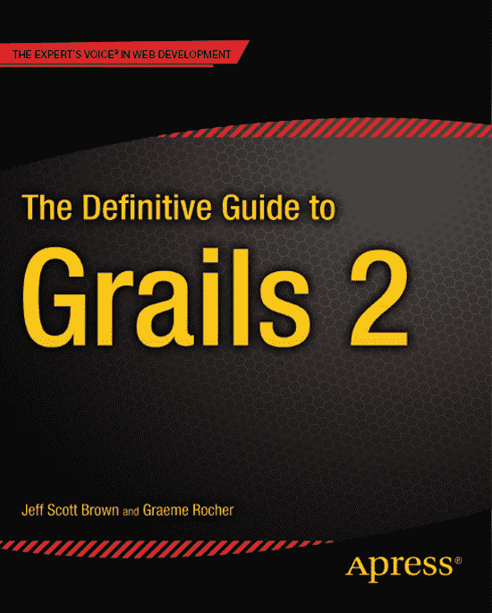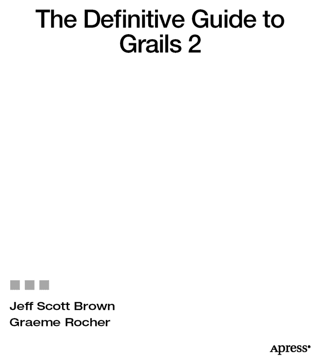

**Grails 2 权威指南**

版权所有 © 2013，Jeff Scott Brown 与 Graeme Rocher

本作品受版权保护。出版商保留所有权利，无论是涉及材料的全部或部分，特别是翻译、重印、重用插图、朗诵、广播、以缩微胶片或任何其他物理方式复制，以及信息存储与检索的传输或电子改编、计算机软件，或目前已知或今后开发的任何类似或不同方法的权利。与本法律保留条款的例外情况包括：与评论或学术分析相关的简短摘录，或专门为输入计算机系统并执行而提供的材料，仅供作品购买者独家使用。仅允许根据出版商所在地现行版权法的规定复制本出版物或其部分内容，且使用许可必须始终从 Springer 获取。使用许可可通过 Copyright Clearance Center 的 RightsLink 获得。违反者将根据相应的版权法被起诉。

ISBN-13（平装）：978-1-4302-4377-9
ISBN-13（电子版）：978-1-4302-4378-6

本书中可能出现商标名称、标识和图像。我们并非在每次出现商标名称、标识或图像时都使用商标符号，而是仅以编辑方式使用这些名称、标识和图像，以维护商标所有者的利益，且无意侵犯商标权。

本出版物中使用的商品名称、商标、服务标志及类似术语，即使未明确标识，也不应被视为对其是否受专有权利保护的表达意见。

尽管本书中的建议和信息在出版时被认为是真实准确的，但作者、编辑和出版商均不对可能存在的任何错误或遗漏承担法律责任。出版商对本书所含内容不作任何明示或暗示的保证。

总裁与出版人：Paul Manning

首席编辑：Douglas Pundick

技术审校：Graeme Rocher

编辑委员会：Steve Anglin, Ewan Buckingham, Gary Cornell, Louise Corrigan, Morgan Ertel, Jonathan Gennick, Jonathan Hassell, Robert Hutchinson, Michelle Lowman, James Markham, Matthew Moodie, Jeff Olson, Jeffrey Pepper, Douglas Pundick, Ben Renow-Clarke, Dominic Shakeshaft, Gwenan Spearing, Matt Wade, Tom Welsh

协调编辑：Katie Sullivan

文字编辑：Thomas McCarthy

排版：Bytheway Publishing Services

索引编制：SPi Global

美术设计：SPi Global

封面设计：Anna Ishchenko

全球图书贸易发行：Springer Science+Business Media New York, 233 Spring Street, 6th Floor, New York, NY 10013。电话：1-800-SPRINGER，传真：(201) 348-4505，电子邮件：`orders-ny@springer-sbm.com`，或访问 [`www.springeronline.com`](http://www.springeronline.com)。

如需翻译相关信息，请发送电子邮件至 `rights@apress.com`，或访问 [`www.apress.com`](http://www.apress.com)。

Apress 及 friends of ED 的书籍可批量购买用于学术、企业或促销用途。大多数图书也提供电子版及许可证。更多信息，请参考我们的特殊批量销售–电子书许可网页：[`www.apress.com/bulk-sales`](http://www.apress.com/bulk-sales)。

作者在本文中引用的任何源代码或其他补充材料，读者可在 [`www.apress.com`](http://www.apress.com) 获取。有关如何查找本书源代码的详细信息，请访问 [`www.apress.com/source-code`](http://www.apress.com/source-code)。

*献给妈妈。*
*感谢您为我付出的一切。*

——Jeff Scott Brown

*献给 Birjinia。*
*感谢你做你自己。Maite zaitut。*

——Graeme Rocher

## 内容概览

 关于作者

 关于技术审校

 致谢

 第 1 章：Grails 的精髓

 第 2 章：Grails 入门

 第 3 章：理解领域类

 第 4 章：理解控制器

 第 5 章：理解视图

 第 6 章：映射 URL

 第 7 章：国际化

 第 8 章：Ajax

 第 9 章：GORM

 第 10 章：服务

 第 11 章：集成与依赖管理

 第 12 章：插件

 索引

## 目录

 关于作者

 关于技术审校

 致谢

 第 1 章：Grails 的本质

简洁与强大

Grails 平台

置身 Java 生态系统

安装与配置 Grails

创建你的第一个应用

步骤 1：创建应用

步骤 2：创建控制器

步骤 3：打印消息

步骤 4：测试代码

步骤 5：运行测试

步骤 6：运行应用

Grails 交互模式

本章小结

 第 2 章：Grails 入门

什么是脚手架？

创建领域类

动态脚手架介绍

创建操作

读取操作

更新操作

删除操作

静态脚手架

生成控制器

生成视图

环境友好配置

配置数据源

DataSource.groovy 文件

配置 MySQL 数据库

配置 JNDI 数据源

支持的数据库

部署应用

使用 run-war 部署

使用 WAR 文件部署

本章小结

 第 3 章：理解领域类

将字段持久化到数据库

验证领域类

使用自定义验证器

理解瞬态属性

自定义数据库映射

构建关联关系

通过继承扩展类

嵌入对象

测试领域类

本章小结

 第 4 章：理解控制器

定义控制器

设置默认动作

日志记录

记录异常

访问请求属性

使用控制器作用域

理解 Flash 作用域

访问请求参数

请求参数类型转换

渲染文本

重定向请求

创建模型

渲染视图

查找默认视图

选择自定义视图

渲染模板

执行数据绑定

验证传入数据

Errors API 与控制器

绑定数据到多个领域对象

使用 bindData 方法进行数据绑定

数据绑定与关联关系

Bindable 约束

使用命令对象

定义命令对象

使用命令对象

施加 HTTP 方法限制

实现命令式解决方案

利用声明式语法

控制器输入输出

处理文件上传

读取请求输入流

写入二进制响应

使用简单拦截器

前置通知

后置通知

测试控制器

控制器实战

创建 gTunes 首页

添加用户领域类

添加登录表单

实现注册功能

测试注册代码

允许用户登录

测试登录流程

本章小结

 第 5 章：理解视图

基础知识

理解模型

页面指令

Groovy 脚本片段

作为 GString 的 GSP

内置 Grails 标签

使用标签设置变量

逻辑标签

迭代标签

过滤与迭代

Grails 动态标签

链接标签

createLink 与 resource 标签

创建表单与字段

验证与错误处理

分页视图

渲染 GSP 模板

创建自定义标签

创建标签库

自定义标签基础

测试自定义标签

本章小结

 第 6 章：映射 URL

理解默认 URL 映射

在 URL 映射中包含静态文本

从 URL 中移除控制器和操作名称

在映射中嵌入参数

指定额外参数

映射到视图

对 URL 映射应用约束

在映射中包含通配符

映射到 HTTP 请求方法

映射 HTTP 响应码

利用反向 URL 映射

命名 URL 映射

定义多个 URL 映射类

测试 URL 映射

本章小结

 第 7 章：国际化

本地化消息

定义用户消息

检索消息值

使用 URL 映射实现国际化

使用参数化消息

使用 java.text.MessageFormat

使用 message 标签处理参数化消息

使用参数化消息进行验证

使用 messageSource

本章小结

 第 8 章：Ajax

编写 Ajax 代码

Ajax 实战

更换 Ajax 提供者

异步表单提交

使用 Ajax 远程链接的乐趣

添加效果与动画

支持 Ajax 的表单字段

关于 Ajax 与性能的说明

小结

 第 9 章：GORM

持久化基础

读取对象

列表、排序与计数

保存、更新与删除

关联

关系管理方法

传递性持久化

查询

动态查找器

条件查询

分离条件查询

Where 查询

按示例查询

HQL 与 SQL

分页

配置 GORM

SQL 日志记录

指定自定义方言

其他 Hibernate 属性

GORM 的语义

Hibernate 会话

会话管理与刷新

获取会话

自动会话刷新

GORM 中的事务

分离对象

持久化生命周期

重新附加分离对象

合并更改

GORM 性能调优

即时加载与延迟加载关联

批量获取

缓存

继承策略

锁定策略

事件自动时间戳

小结

 第 10 章：服务

理解服务基础

服务与依赖注入

服务实战

定义服务

配置服务 Bean 属性

缓存服务方法

使用服务

管理事务

服务作用域

测试服务

暴露服务

小结

 第 11 章：集成与依赖管理

Grails 与配置

配置基础

环境特定配置

配置日志记录

堆栈跟踪过滤

外部化配置

声明依赖

继承依赖

声明仓库

理解 Grails 构建系统

创建 Gant 脚本

命令行变量

解析命令行参数

为脚本编写文档

更多复用 Grails 的方式

从命令行引导 Grails

Gant 实战

与 Hudson 的持续集成

为您喜爱的 IDE 添加支持

使用 Groovy/Grails 工具套件（GGTS）

使用 Spring 工具套件（STS）与 Eclipse

IntelliJ IDEA

NetBeans

文本编辑器

与邮件服务器集成

部署

使用 Grails 部署

部署到容器

应用版本控制与元数据

自定义 WAR 文件

小结

 第 12 章：插件

插件基础

插件发现

提供应用构件

插件钩子

提供 Spring Bean

使用约定创建动态 Spring Bean

插件事件与应用重载

修改生成的 WAR 描述符

打包与分发 Grails 插件

本地插件仓库

插件实战

通过插件添加行为

在文件系统上指定插件位置

用于应用模块化的插件

使用资源插件

使用数据库迁移插件

小结

 索引

## 关于作者

 **杰夫·斯科特·布朗**是 SpringSource 的工程师，担任 Groovy 和 Grails 开发团队的成员。杰夫拥有近 20 年的技术经验，自框架早期阶段起就是 Grails 团队的成员。此前，他曾是 G2One（一家 Groovy/Grails 公司，后并入 SpringSource）的一员。

## 关于技术审校者

 **格雷姆·罗彻**是一名软件工程师、顾问以及动态语言专家，担任 SpringSource 的 Grails 开发主管（[www.springsource.com](http://www.springsource.com)）。格雷姆是开源 Grails Web 应用框架（[`grails.org`](http://grails.org)）的项目负责人，也是《Grails 权威指南》（Apress 出版）的合著者。他与杰夫·斯科特·布朗共同撰写了本书。

## 第 1 章

## Grails 的精髓

> *简约是极致的优雅。*

——列奥纳多·达·芬奇

要理解 Grails，首先需要明白它的目标：大幅简化企业级 Java Web 开发，将 Web 开发提升到新的抽象层次，挖掘其他平台开发者多年来已能使用的功能，同时保留深入底层技术并利用其丰富性与成熟度的灵活性。简而言之，我们 Java 开发者希望“鱼与熊掌兼得”。

你是否曾因处理大量令人崩溃的 XML 配置文件而痛苦？是否曾因构建系统缓慢——测试一个改动需要数分钟而非数秒——而备受煎熬？Grails 让 Java 平台的开发重拾乐趣，消除障碍，向开发者开放 API，使其能纯粹专注于手头的业务问题。无需配置，零开销，即时反馈。

你或许会好奇如何实现这一非凡成就。Grails 拥抱“约定优于配置”（CoC）、“不要重复自己”（DRY）等理念，并通过简洁的 Groovy 语言和一系列领域特定语言（DSL）提供合理的默认值，让你的工作更轻松。

作为初学 Grails 的开发者，你可能会觉得自己在“作弊”，理应经历更多痛苦。毕竟，你无法将两小时的健身训练压缩到二十分钟，对吧？总得在某个方面付出代价，比如多长几斤肉？

作为开发者，你可以确信自己站在巨人的肩膀上——Grails 底层依赖的技术包括 Spring、Hibernate，当然还有 Java 平台。Grails 汲取了 Ruby on Rails、Django、TurboGears 等动态语言框架的精华，并将其带到你身边的 Java 虚拟机（JVM）上。

本章将从最高层面介绍该框架，并提供一些入门要点。此处介绍的所有概念将在本书后续章节中详细阐述。

### 简洁与强大

Grails 明显区别于竞争对手的一个因素，体现在其开发过程中的设计选择。通过不重复造轮子，并利用 Spring 和 Hibernate 等久经考验的框架，Grails 能在不牺牲稳健性的前提下提供让你工作更轻松的功能。

Grails 由各自领域中最流行的开源技术驱动：

> *   *Hibernate*：Java 世界中对象关系映射（ORM）的事实标准。
> *   *Spring*：广受欢迎的开源 Java 控制反转（IoC）容器与封装框架。
> *   *SiteMesh*：稳健且稳定的布局渲染框架。
> *   *Tomcat*：久经考验、可嵌入的 Servlet 容器。
> *   *H2*：纯 Java 关系数据库管理系统（RDBMS）实现。

ORM 和 IoC 的概念对某些读者来说可能有些陌生。ORM 简单来说是一种将面向对象世界中的对象映射到关系数据库表的方法。它在 SQL 之上提供了额外的抽象层，让开发者能够专注于领域模型，而非陷入大量 SQL 语句中。

IoC 提供了一种“连接”对象的方式，使它们的依赖关系在运行时可用。例如，一个执行持久化的对象可能需要访问数据源。IoC 让开发者无需负责获取数据源的引用。但暂时不必过度纠结于这些概念，因为它们的用法将在本书后续章节中变得清晰。

你之所以受益于 Grails，是因为它通过 Groovy 语言引入了另一层抽象来封装这些框架。作为开发者，你甚至不会意识到自己在构建一个 Spring 和 Hibernate 应用。当然，你无需触碰任何一行 Hibernate 或 Spring 的 XML 配置，但如果你需要，它们随时可用。图 1-1 展示了 Grails 与这些框架及企业级 Java 技术栈的关系。

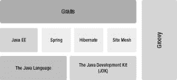

***图 1-1.** Grails 技术栈*

### Grails，一个平台

初次接触 Grails 时，你可能会深吸一口气，然后惊呼“又一个 Web 框架！？”这可以理解，毕竟 Java 领域已有数十种 Web 框架。但 Grails 与众不同，而且是以一种好的方式。Grails 是一个全栈环境，而不仅仅是 Web 框架。它是一个*平台*，雄心勃勃地要处理从视图层到持久化层的所有问题。

此外，通过其插件系统（详见第 12 章），Grails 旨在为那些开箱即用可能无法覆盖的扩展问题提供解决方案。借助 Grails，你可以实现搜索、任务调度、企业消息传递与远程调用等功能。

Grails 覆盖范围的广度可能会让人联想到未知的恐怖和噩梦般的配置、配置、再配置。然而，即使在插件中，Grails 也坚持“约定优于配置”和合理的默认值，以最大限度地减少启动和运行所需的工作量。

我们鼓励你将 Grails 视为不仅仅是又一个 Web 框架，而是构建下一个 Web 2.0 现象的*平台*。

### 生活在 Java 生态系统中

除了利用您熟悉和喜爱的 Java 框架之外，Grails 还为您提供了一个平台，让您能够借助 Groovy 充分利用 Java 和 JVM 的优势。在 JVM 上，没有其他动态语言能像 Groovy 那样与 Java 完美集成。Groovy 旨在与 Java 在每一个层面都无缝协作。从语法开始，相似之处体现在以下几个方面：

> *   Groovy 语法源自 Java 5 语法，这使得大多数有效的 Java 代码同时也是有效的 Groovy 代码。
> *   Groovy 与 Java 共享相同的底层 API，因此您信赖的 javadoc 仍然有效！
> *   Groovy 对象就是 Java 对象。这具有强大的意义，可能不会立即显现。例如，Groovy 对象可以实现 `Java.io.Serializable`，并通过远程方法调用（RMI）发送，或使用会话复制工具进行集群。
> *   通过 Groovy 的联合编译器，您可以在 Groovy 和 Java 之间建立循环引用，而不会遇到编译问题。
> *   使用 Groovy，您可以轻松地使用相同的性能分析工具、相同的监控工具以及所有现有和未来的 Java 技术。

Groovy 与 Java 无缝集成的能力，加上其类似 Java 的语法，是其诞生之初就引起如此轰动的首要原因。这是一种能力与 Ruby 和 Smalltalk 等语言相似，并且直接在 JVM 上运行的语言。其潜力显而易见，而将 Java 代码与动态 Groovy 代码混合使用的能力更是巨大。此外，Groovy 允许混合使用静态类型和动态类型，将静态类型的安全性以及在必要时使用动态类型的强大功能和灵活性结合起来。

这种与 Java 的集成水平是推动 Groovy 持续流行的原因，尤其是在 Web 应用领域。在不同的编程平台上，不同的惯用语法本质上表达的是相同的概念。在 Java 世界中，有 Servlet、过滤器、标签库和 JavaServer Pages (JSP)。迁移到一个新平台需要重新学习所有这些概念及其等效的 API 或惯用语法——这对一些人来说很容易，但对另一些人来说则是一个挑战。这并不是说学习新事物不好，但在现实世界中，获取知识是有成本的，这种成本可能会成为采用任何偏离 Java 平台和企业级标准或约定的新技术的重大障碍。

此外，Java 在部署、管理、安全、命名等方面都有标准。Grails 的目标是创建一个具有 Rails、Django 或 CakePHP 等框架精髓的平台，但同时又拥抱 Java 企业版 (Java EE) 及其相关 API 的成熟环境。

然而，Grails 是一项不言自明的技术：一旦您体验过它，您脑海中就会灵光一现。所以，事不宜迟，让我们开始学习本书中贯穿始终的示例应用程序。

gTunes 示例将引导您开发一个类似于 Apple、Amazon 和 Napster 提供的音乐商店。这种性质的应用程序开辟了各种有趣的可能性，从电子商务到 RESTful API 以及 RSS 或 Atom 订阅源。我们希望它能帮助您广泛了解 Grails 及其功能集。

### 安装和配置 Grails

安装 Grails 几乎和使用它一样简单，但至少有一个先决条件需要考虑。Grails 需要有效安装 Java SDK 1.6 或更高版本，当然，您可以从 Oracle 获取：[`www.oracle.com/technetwork/java/javase/`](http://www.oracle.com/technetwork/java/javase/)。

安装 Java SDK 后，将 `JAVA_HOME` 环境变量设置为安装位置，并将 `JAVA_HOME/bin` 目录添加到 PATH 变量中。

 **注意**  如果您使用的是 Mac OS X，则已经安装了 Java！但是，您仍然需要在 ~/.profile 文件中设置 `JAVA_HOME`。

要测试您的安装，请打开命令提示符并输入 java –version：

`$java -version`

您应该会看到类似于清单 1-1 的输出。

***清单 1-1.** 运行 Java 可执行文件*

`java version "1.6.0_29"`
`Java(TM) SE Runtime Environment (build 1.6.0_29-b11-402-11D50b)`
`Java HotSpot(TM) 64-Bit Server VM (build 20.4-b02-402, mixed mode)`

与许多其他 Java 框架（包括 Apache Tomcat 和 Apache Ant）一样，安装过程涉及几个简单的步骤。从 [`http://grails.org`](http://grails.org) 下载并解压 Grails，创建一个指向 Grails 安装位置的 `GRAILS_HOME` 变量，并将 `GRAILS_HOME/bin` 目录添加到您的 `PATH` 变量中。

要验证您的安装，请打开一个命令窗口并输入命令 `grails -version`：

`$ grails -version`

如果您已成功安装 Grails，该命令将输出如清单 1-2 所示的使用帮助。

***清单 1-2.** 运行 Grails 可执行文件*

`Grails version: 2.1.0`

输入 `grails help` 将显示更多使用信息，包括可用命令列表。如果需要了解某个特定命令的更多信息，可以将命令名称附加到 help 命令后面。例如，如果您想了解更多关于 `create-app` 命令的信息，只需输入 `grails help create-app`：

`$ grails help create-app`

清单 1-3 提供了一个典型输出的示例。

***清单 1-3.** 获取命令帮助*

`    grails create-app -- 为给定名称创建一个 Grails 应用程序`

`用法（可选参数在方括号中）：`

`    create-app [--inplace] [NAME]`

`其中`
`    --inplace  = 在当前目录中创建项目，而不是`
`                 创建一个新目录。`
`    NAME       = 项目的名称。如果未提供，此命令将`
`                 询问您名称。`

Grails 命令行界面构建在另一个基于 Groovy 的项目 Gant ([`http://gant.codehaus.org/`](http://gant.codehaus.org/)) 之上，该项目封装了广受欢迎的 Apache Ant ([`http://ant.apache.org/`](http://ant.apache.org/)) 构建系统。Gant 允许无缝混合使用 Ant 目标和 Groovy 代码。

我们将在第 12 章中进一步讨论 Grails 命令行。

### 创建您的第一个应用程序

在本节中，您将创建您的第一个 Grails 应用程序，其中将包含一个简单的控制器。以下是实现此目标的步骤：

> 1.  运行命令 `grails create-app gTunes` 来创建应用程序（其中“gTunes”是应用程序的名称）。
> 2.  通过执行命令 `cd gtunes` 进入 `gTunes` 目录。
> 3.  使用命令 `grails create-controller store` 创建一个店面控制器。
> 4.  编写一些代码来向用户显示欢迎消息。
> 5.  测试您的代码并使用 `grails test-app` 运行测试。
> 6.  使用 `grails run-app` 运行应用程序。

#### 步骤 1：创建应用程序

听起来很简单？确实如此，你的第一步是使用 `create-app` 命令；你在上一节中已经成功获取了该命令的一些帮助信息。要运行该命令，只需在命令窗口中输入 `grails create-app` 并按下回车键：

`$ grails create-app`

Grails 会自动提示你输入项目名称，如清单 1-4 所示。此时，输入 `gTunes` 并按下回车键。或者，你也可以使用命令 `grails create-app gTunes`，在这种情况下，Grails 会自动执行相应操作。

***清单 1-4.** 使用 create-app 命令创建应用程序*

`Environment set to development . . .`
`Application name not specified. Please enter: gTunes`

完成后，该命令将创建 gTunes Grails 应用程序及必要的目录结构。下一步是使用 shell 命令在命令窗口中导航到新创建的应用程序：

`cd gTunes`

此时，你拥有一个全新的起点——一个采用默认设置的新建 Grails 应用程序。Grails 应用程序结构的截图如图 1-2 所示。

随着本书的深入，我们将进一步探讨 Grails 应用程序的结构以及各个文件和目录的作用。不过，请注意 Grails 如何包含用于控制器、领域对象（模型）和视图的目录。

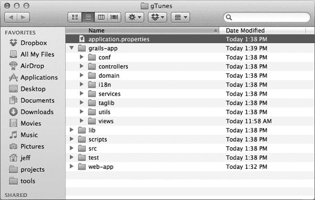

***图 1-2.** gTunes 应用程序结构*

#### 步骤 2：创建控制器

Grails 是一个 MVC^(1) 框架，这意味着它拥有模型、视图和控制器来清晰分离关注点。控制器是 Grails 应用程序的核心，可以轻松地编排请求、传递响应并委托给视图。由于 gTunes 应用程序以音乐商店的概念为中心，我们将演示如何创建一个“商店”控制器。

为了提供帮助，Grails 提供了一系列辅助命令，用于创建能够“适配”到 Grails 应用程序各个槽位的类。例如，对于控制器，有 `create-controller` 命令，它非常适用。但使用这些命令并非强制要求。随着你对 Grails 中不同概念的熟悉，你也可以使用自己喜欢的文本编辑器或集成开发环境（IDE）轻松创建控制器类。

1  Model-View-Controller（模型-视图-控制器）模式是许多 Web 框架中常见的模式，旨在分离用户界面和业务逻辑。参见维基百科，“Model-view-controller”，[`en.wikipedia.org/wiki/Model-view-controller`](http://en.wikipedia.org/wiki/Model-view-controller)，2003 年。

尽管如此，我们还是开始使用 `create-controller` 命令吧。与 `create-app` 类似，该命令接受一个参数，你可以在其中指定要创建的控制器名称。只需输入 `grails create-controller store`：

`$ grails create-controller store`

现在，只需静待 Grails 完成其余工作（参见清单 1-5）。

***清单 1-5.** 使用 create-controller 命令创建控制器*

`| Created file grails-app/controllers/gtunes/StoreController.groovy`
`| Created file grails-app/views/store`
`| Created file test/unit/gtunes/StoreControllerTests.groovy`

一旦 `create-controller` 命令执行完毕，Grails 将为你创建两个类：一个是在 `grails-app/controllers` 目录下名为 `StoreController` 的新控制器，另一个是在 `test/unit` 目录下的关联测试用例。由于命令行中未指定包名，Grails 默认会使用与应用程序名称匹配的包名来创建工件。图 1-3 展示了新创建的控制器整齐地嵌套在相应目录中。

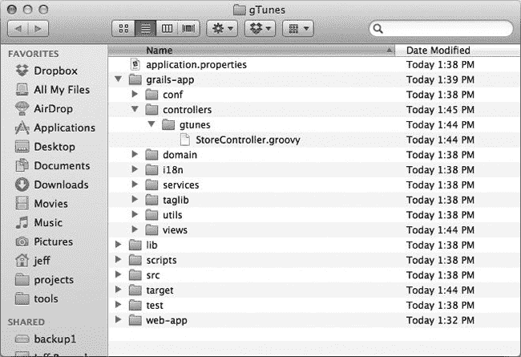

***图 1-3.** 新创建的 StoreController*

由于 Groovy 的动态特性，你应该在任何 Grails 项目中追求高水平的测试覆盖率^(2)（Grails 假设如果你编写控制器，就需要进行测试）。像 Groovy、Ruby 和 Python 这样的动态语言，在编译时提供的帮助远不如 Java 这样的静态类型语言。一些你可能期望在编译时捕获的错误，实际上会留到运行时处理，包括方法解析。遗憾的是，编译器的舒适性常常促使 Java 开发者完全忘记测试。毋庸置疑，编译器不能替代一套良好的单元测试，而你在编译时辅助方面失去的，将在表达力方面得到弥补。

2  代码覆盖率是软件测试中使用的一种度量标准。它描述了程序源代码被测试的程度。

在本书中，我们将演示如何充分利用 Grails 测试支持的自动化测试技术。

#### 步骤 3：打印消息

让我们回到 `StoreController`。默认情况下，Grails 会创建控制器并为其提供一个名为 `index` 的单一操作。按照惯例，`index` 操作是控制器中的默认操作。清单 1-6 展示了包含默认 `index` 操作的 `StoreController`。

***清单 1-6.** 默认的 index 操作*

`package gtunes`
`class StoreController {`
`    def index() {}`
`}`

`index` 操作似乎没做什么，但按照惯例，它的声明指示 Grails 自动尝试渲染一个名为 `grails-app/views/store/index.gsp` 的视图。视图是第 5 章的主题，因此为了简单起见，我们将尝试一些不那么复杂的事情。

Grails 控制器带有许多隐式方法，我们将在第 4 章中介绍。其中之一是 `render`，这是一个多用途方法，除其他功能外，它可以渲染简单的文本响应。清单 1-7 展示了如何打印一个简单的响应：“Welcome to the gTunes store!”

***清单 1-7.** 使用 render 方法打印消息*

`package gtunes`
**`class StoreController {`**
**`    def index() {`**
**`        render 'Welcome to the gTunes store!'`**
**`    }`**
**`}`**

#### 第 4 步：测试代码

前面的代码虽然简单，但即便是最简单的代码也不应未经测试。打开之前生成在 `test/unit` 目录下的 `StoreControllerTests` 测试套件。清单 1-8 展示了 `StoreControllerTests` 套件的内容。

***清单 1-8.** 生成的 StoreControllerTests 测试套件*

`package gtunes`

`import grails.test.mixin.*`
`import org.junit.*`

`/**`
` * 有关使用说明，请参阅 {@link grails.test.mixin.web.ControllerUnitTestMixin} 的 API`
` */`
`@TestFor(StoreController)`
`class StoreControllerTests {`

`    void testSomething() {`
`       fail "请实现我"`
`    }`
`}`

Grails 将测试分为“单元”测试和“集成”测试。集成测试会启动整个环境，包括数据库；因此，它们通常运行得更慢。此外，集成测试通常设计用于测试多个类的交互，因此需要应用程序更完整后才能运行。

另一方面，单元测试是运行快速的测试，但它们需要大量使用模拟对象和桩。桩是测试中使用的类，通过返回任意的硬编码值来模拟方法的真实行为。模拟对象本质上做同样的事情，但通过拥有“期望”而表现出更多的智能。例如，一个模拟对象可以指定它“期望”某个方法至少被调用一次——如果需要，甚至十次。随着本书的深入，单元测试和集成测试之间的区别将变得更加清晰。

要测试当前状态下的 `StoreController`，需要断言发送给用户的响应的值。清单 1-9 展示了一种简单的方法。

***清单 1-9.** 测试 StoreController 的 Index 操作*

`package gtunes`

`import grails.test.mixin.*`
`import org.junit.*`

`/**`
` * 有关使用说明，请参阅 {@link grails.test.mixin.web.ControllerUnitTestMixin} 的 API`
` */`
`@TestFor(StoreController)`
`class StoreControllerTests {`

`    void testSomething() {`
`        controller.index()`
`        assert '欢迎来到 gTunes 商店！' == response.text`
`    }`
`}`

我们在这里所做的是利用 Grails 内置的测试能力来评估 `response` 对象的内容。在测试运行期间，Grails 神奇地将常规的 servlet HttpServletResponse 对象转换为 Grails `MockHttpServletResponse`，它拥有辅助属性（例如 `text`），使您能够评估调用 `render` 方法的结果。

不过，暂时不要过于纠结这段代码的来龙去脉。整本书中会穿插大量示例；它们会逐步引导您熟练使用 Grails 进行测试。

#### 第 5 步：运行测试

要运行测试并验证一切按预期工作，您可以使用 `grails test-app` 命令。`test-app` 命令将执行应用程序中的所有测试，并将结果输出到 `test/reports` 目录。此外，您可以通过执行命令 `grails test-app StoreController` 仅运行 `StoreControllerTests`。清单 1-10 展示了运行 `grails test-app` 命令时的一些典型输出。

***清单 1-10.** 使用 grails test-app 运行测试*

`| 已完成 1 个单元测试，0 个失败，耗时 1107 毫秒`
`| 测试通过 - 在 target/test-reports 中查看报告`

如果您想查看报告，可以在 `test/reports` 目录中找到 XML、HTML 和纯文本格式的报告。图 1-4 展示了生成的 HTML 报告在浏览器中的样子——它们绝对比 XML 版本更赏心悦目！

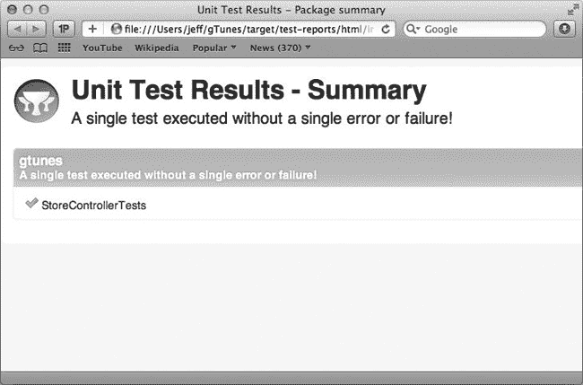

***图 1-4.** 生成的 HTML 测试报告*

#### 第 6 步：运行应用程序

现在您已经测试了代码，最后一步是看看它的实际效果。使用 `grails run-app` 命令即可，该命令将默认在 8080 端口上启动一个本地运行的 Grails 服务器。

通过在命令提示符中输入 `grails run-app` 来启动 Grails：

`$ grails run-app`

您会注意到 Grails 将启动，并告知您一个可用于访问 Grails 实例的 URL（参见清单 1-11）。

***清单 1-11.** 使用 run-app 运行应用程序*

`...`
`| 服务器正在运行。请浏览至 http://localhost:8080/gTunes`

如果您遇到如下绑定错误，很可能是端口冲突导致的：“服务器启动失败：java.net.BindException：地址已在使用中”。

如果您已经有另一个容器（例如 Apache Tomcat ([`http://tomcat.apache.org`](http://tomcat.apache.org))）在 8080 端口上运行，通常会出现此错误。您可以通过传递 `server.port` 参数并指定一个替代值，让 Grails 在不同的端口上运行来解决此问题：

`grails -Dserver.port=8087 run-app`

在上述情况下，Grails 将按预期在 8087 端口上启动。只要没有端口冲突，此时 Grails 应该已经启动并运行，准备好处理请求了。打开您喜欢的浏览器，导航到 清单 1-11 中 Grails `run-app` 命令提示的 URL。您将看到 Grails 的欢迎页面，看起来像图 1-5。

欢迎页面（默认情况下）由位于 `web-app/index.gsp` 的 Groovy 服务器页面 (GSP) 文件渲染，但您可以通过 URL 映射（在第 6 章中讨论）完全自定义此文件的位置。

如图 1-5 所示，您之前创建的 `StoreController` 被列为可用的控制器之一。单击 `StoreController` 链接将打印您之前实现的“欢迎来到 gTunes 商店！”消息（参见图 1-6）。

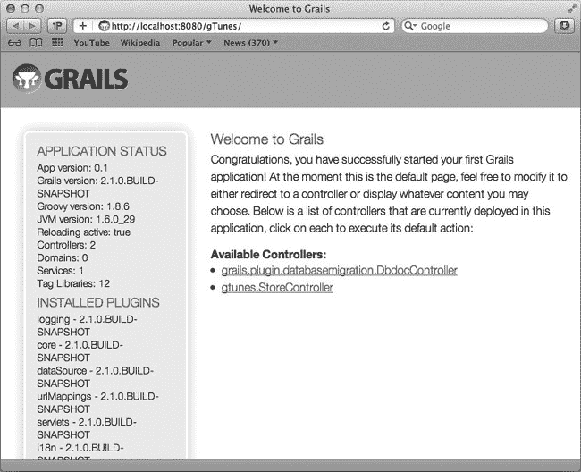

***图 1-5.** 标准的 Grails 欢迎页面*

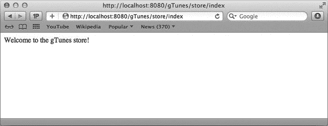

***图 1-6.** StoreController 打印一条消息。*

### Grails 交互模式

到目前为止，我们所见到的所有 Grails 命令都是通过运行 `grails` 并传递一个命令名称作为参数来执行的，例如 `grails create-domain-class`。当像这样执行一个命令时，需要完成几件事情。`grails` 命令首先会启动 JVM，接着需要初始化 Groovy 运行时环境，并且还需要初始化一定量的 Grails 运行时环境。所有这些准备工作都必须在命令实际执行之前完成，而这一整套“预热”过程需要时间。所需时间当然会因硬件而异。Grails 的“交互模式”在这方面能提供很大帮助。要启动交互模式，只需输入不带任何参数的 `grails` 命令。参见清单 1-12。

***清单 1-12.** 启动交互模式*

`$ grails`
`grails>`

只要处于交互模式中，任何原本可以在命令行上执行的 Grails 命令都可以执行。其语法与在命令行上完全相同，只是无需在每个命令前加上“grails”前缀。例如，在命令行上你可能会输入类似“grails create-domain-class com.gtunes.Store”的内容，但在交互模式下，你只需输入更短的“create-domain-class com.gtunes.Store”，如清单 1-13 所示。

***清单 1-13.** 在交互模式下创建领域类*

`$ grails`
`grails> create-domain-class com.gtunes.Store`
`| Created file grails-app/domain/com/gtunes/Store.groovy`
`| Created file test/unit/com/gtunes/StoreTests.groovy`
`grails>`

请注意，在交互模式下运行此命令比从命令行运行同一命令要快得多。

由于按向上箭头键可以循环浏览最近执行过的命令，因此连续执行相似的命令变得非常快速和简单。例如，在执行“create-domain-class com.gtunes.Store”之后，按向上箭头键调出该命令，然后按退格键删除“Store”并将其替换为“Song”，即可快速执行“create-domain-class com.gtunes.Song”。

交互模式提供的另一个巨大生产力提升是直观的 Tab 键自动补全功能。在交互模式下，输入“cre”后按 Tab 键，交互模式将显示所有以“cre”开头的可用命令，如清单 1-14 所示。

***清单 1-14.** 交互模式下的 Tab 键自动补全*

`grails> create-`

`create-controller            create-domain-class          create-filters               create-`
`hibernate-cfg-xml     create-integration-test      create-plugin                create-`
`scaffold-controller   create-script                create-service`
`create-tag-lib               create-unit-test             create-web-xml-config`
`grails> create-`

现在，交互模式已经尽可能补全了“cre”命令——即补全到“create-”——你可以输入“d”并再次按 Tab 键，此时交互模式会将命令补全为“create-domain-class”，因为这是唯一以“create-d”开头的可用命令。这种自动补全方式适用于所有可用命令。此外，某些接受参数的命令也支持自动补全。例如，如果你在“generate-all”之后按 Tab 键，由于 `generate-all` 命令接受一个领域类名称作为参数，控制台将显示应用程序中所有可用的领域类。这使得无需输入完整的类名就能轻松填充参数。你只需输入足够区分领域类名称的部分，交互模式就能补全其余部分。

交互模式可以帮助快速打开某些类型的报告。在生成一个领域类或任何其他工件之后，在交互模式下运行“test-app unit:”即可运行所有单元测试。测试结果将生成在项目根目录下的 `target/test-reports/html/index.html` 中。要在交互模式下于默认网页浏览器中打开该报告，请使用 `open` 命令，如清单 1-15 所示：

***清单 1-15.** 在交互模式下打开单元测试报告*

`grails> open target/test-reports/html/index.html`
`grails>`

请注意，可以使用 Tab 键自动补全来帮助完成 HTML 文件的路径。

事实证明，`open` 命令知道在哪里可以找到测试报告；因此，一种更简单的打开报告的方式如清单 1-16 所示。

***清单 1-16.** 在交互模式下按名称打开单元测试报告*

`grails> open test-report`
`grails>`

退出交互模式的方法是在交互模式提示符下输入“exit”。但有一个例外情况：如果应用程序当前正在运行（例如在控制台执行“run-app”之后），此时 `exit` 命令将退出应用程序，但会让你留在交互模式中。这时，你可以再次执行“exit”来完全退出交互模式。

如果你只打算执行单个命令，那么交互模式用处不大。交互模式真正有益于更典型的工作流程场景，即在一段时间内执行大量 Grails 命令。你可能希望运行测试、查看报告、修改一些代码，然后继续迭代这个循环。你可能希望一次性生成多个领域类，填写它们的一些细节，然后生成相应的控制器和视图。只要你在一次工作会话中要执行超过一两个 Grails 命令，交互模式很可能就会带来很大帮助。在进行实际开发时，通过交互模式执行这些命令将为你节省大量时间。

交互模式极大地提升了开发者的生产力。习惯使用它将使许多开发任务更易于管理且执行更快。

### 总结

成功！你已经启动并运行了你的第一个 Grails 应用程序。在本章中，你通过设置和配置 Grails 安装，迈出了学习 Grails 的第一步。此外，你还创建了第一个 Grails 应用程序以及一个基本的控制器。

现在是时候看看 Grails 还能做些什么来启动你的项目开发了。在接下来的章节中，我们将研究一些创建、读取、更新、删除（CRUD）的生成工具，借助这些工具，Grails 能让你在极短时间内构建出原型应用程序。

## 第 2 章

## Grails 入门

在第 1 章中，你首次接触了 Grails 框架，并在创建 gTunes 应用程序基础的同时，体验了基本的命令行界面。本章将在此基础上，向你展示如何使用 Grails 的脚手架功能快速构建一个原型应用程序，该程序能够生成简单的 CRUD（创建、读取、更新、删除）界面。

接着，将解释 Grails 生态系统中的一些基本概念，包括环境、数据源和部署。准备好了——这将是一章信息量巨大、内容丰富的章节！

### 什么是脚手架？

脚手架是 Grails 的一项功能，允许你为现有领域类快速生成 CRUD 接口。它提供了若干好处，其中最重要的是，它作为一个极佳的学习工具，能让你理解 Grails 控制器和视图层如何与你创建的领域模型进行交互。

然而，你应该注意，Grails 不仅仅是一个 CRUD 框架。脚手架虽然是你技能库中的一个有用功能，但并非 Grails 的主要优势。如果你正在寻找一个纯粹提供 CRUD 导向功能的框架，那么有更好的选择可供你使用。

与 Grails 的许多功能一样，脚手架最好通过可视化方式演示，所以让我们直接深入，看看能实现什么。

### 创建领域类

Grails 的领域类是应用程序和业务模型概念的核心。例如，如果你正在构建一个书店应用程序，你会考虑书籍、作者和出版商。而在 gTunes 中，你会考虑专辑、艺术家、歌曲以及其他内容。

领域类与 Grails 应用程序中其他工件最显著的区别在于，它们是持久化的，并且 Grails 会自动将每个领域类映射到已配置数据库中的一张物理表上。（本章稍后将详细介绍如何更改数据库设置。）

将类映射到关系数据库层的操作也称为对象关系映射（ORM）。Grails 的 ORM 层称为 GORM，它构建在广受欢迎的 Hibernate 库（[`http://www.hibernate.org`](http://www.hibernate.org)）之上。

领域类整齐地存放在 `grails-app/domain` 目录中。你可以通过在交互模式下使用 `create-domain-class` 命令，或使用你喜欢的 IDE 或文本编辑器来创建领域类。在 gTunes 项目的根目录下，将 清单 2-1 中显示的辅助命令输入到命令窗口中。

***清单 2-1.** 创建 Song 领域类*

`grails> create-domain-class com.gtunes.Song`
`| Created file grails-app/domain/com/gtunes/Song.groovy`
`| Created file test/unit/com/gtunes/SongTests.groovy`
`grails>`

清单 2-1 显示你将使用一个包来存放你的领域类。Groovy 遵循与 Java 完全相同的打包规则，并且与 Java 一样，使用包是一种良好的实践。一开始你可能看不到包的好处，但随着应用程序的增长，并且你开始利用 Grails 插件并集成更多 Java 代码时，你会欣赏它们所提供的组织结构（有关插件的更多信息，请参见第 13 章）。

一旦 清单 2-1 中的命令执行完毕，结果将是一个新的 `Song` 领域类，位于 `grails-app/domain/com/gtunes` 目录中，正如指定的包前缀所规定的那样。图 2-1 显示了新创建的结构以及包含领域类定义的 `Song.groovy` 文件。

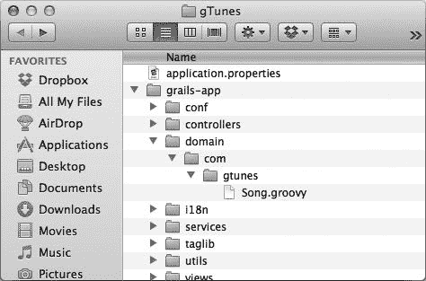

***图 2-1.** Song 领域类和 Song.groovy 文件*

目前，`Song` 领域类并没有做太多事情；它只是一个空白的类定义，如 清单 2-2 所示。

***清单 2-2.** Song 领域类*

`package com.gtunes`
`class Song {`
`    static constraints = {`
`    }`
`}`

此时，你应该思考一下“歌曲”由哪些方面构成。一首歌曲通常有标题和艺术家等属性。如果你真的想做得过火，你可以根据 MP3 文件 ID3 标签中所有可填充的字段来建模你的 `Song` 领域类。但在这里，我们保持简单：只添加前面提到的两个属性，如 清单 2-3 所示。

***清单 2-3.** 向 Song 领域类添加属性*

`package com.gtunes`
`class Song {`
`    String title`
`    String artist`

`    static constraints = {`
`        title blank: false`
`        artist blank: false`
`    }`
`}`

这已经足够简单了，这个类看起来与你典型的 Groovy Bean 没有太大区别（关于 Groovy Bean 的信息，请参见附录）。GORM 基本上将类名映射到表名，并将每个属性映射到数据库中的一个单独列，其类型与 SQL 类型相关。现在不要太纠结于此；我们将在第 3 章和第 10 章更深入地探讨领域类和 GORM。此外，约束块中的代码将在第 9 章中更详细地讨论。现在，让我们继续看看应用程序的实际运行情况。

### 介绍动态脚手架

脚手架有两种形式：动态（或运行时）和静态（或模板驱动）。首先，我们将介绍动态脚手架，其中 CRUD 应用程序的控制器逻辑和视图在运行时生成。动态脚手架不涉及样板代码或模板；它使用诸如反射和 Groovy 元编程能力等高级技术来实现其目标。然而，在你能够动态地为你的 `Song` 类搭建脚手架之前，你需要一个控制器。

你在第 1 章中已经简要了解了如何创建控制器，而启用脚手架所需的控制器代码非常少。为 `Song` 类创建脚手架控制器，可以手动创建，也可以通过命令行创建，如 清单 2-4 所示。

***清单 2-4.** 创建 SongController*

`grails> create-scaffold-controller com.gtunes.Song`
`| Created file grails-app/controllers/com/gtunes/SongController.groovy`
`| Created file grails-app/views/song`
`| Created file test/unit/com/gtunes/SongControllerTests.groovy`
`grails>`

同样，你应该在 `create-controller` 命令中使用包前缀，这将在 `grails-app/controllers/com/gtunes` 目录中创建 `SongController`（参见图 2-2）。

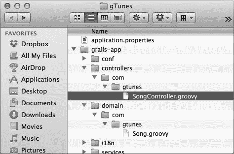

***图 2-2.** 在目录中定位 SongController*

要启用动态脚手架，`SongController` 需要定义一个值为 `true` 的 `scaffold` 属性，如 清单 2-5 所示。

***清单 2-5.** 启用动态脚手架*

`package com.gtunes`
`class SongController {`
`   static scaffold = true`
`}`

 **注意**  Groovy 会自动将类名（例如 清单 2-5 中的 `Song`）解析为 `java.lang.Class` 实例，而无需 `.class` 后缀。换句话说，`Song` 等同于 `Song.class`。

完成这些后，只需使用 `grails run-app` 命令启动 Grails，打开浏览器，并通过常用链接导航到 gTunes 应用程序：[`http://localhost:8080/gTunes`](http://localhost:8080/gTunes)。

Grails 欢迎页面（首次在第 1 章中演示）将在可用控制器列表中显示 `SongController` 实例，以及通常令人安心的欢迎消息。点击 `SongController` 链接，会打开一个列出所有 `Song` 对象（当然，可能一个都没有）的页面，如图 2-3 所示。

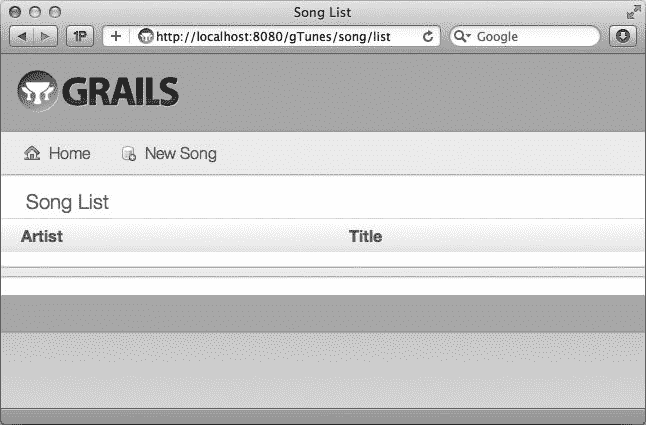

***图 2-3.** Song 列表页面*

不费吹灰之力，仅用三行代码（不包括包声明），你就成功创建了一个有用的 CRUD 接口，该接口允许你在 gTunes 应用程序中创建并完全管理 `Song` 实例。CRUD（创建、读取、更新和删除）的每个组件将在本节剩余部分进行描述。

#### 创建操作

神奇之处不止于此。点击屏幕顶部的“New Song”链接，即可创建新歌曲。在生成视图时，Grails 会尽力猜测编辑属性值所需的字段类型。例如，如果 Grails 发现一个 `String`，它会创建一个文本字段；如果发现 `java.util.Date`，则会渲染下拉框，让你选择日期和时间。图 2-4 展示了生成的歌曲创建界面的示例。

Grails 内置的验证机制（称为约束）也会影响界面的渲染方式，包括字段的显示顺序和渲染的字段类型。尝试点击“Create”按钮；你会得到一个验证错误，提示必须指定时长，如图 2-5 所示。验证消息与 Grails 的国际化支持（常缩写为 i18n）挂钩。但目前，你只需要知道 Grails 是从 `grails-app/i18n` 目录下的属性文件中提取这些消息的。（约束将在第 3 章中讨论，国际化将在第 8 章中讨论。）

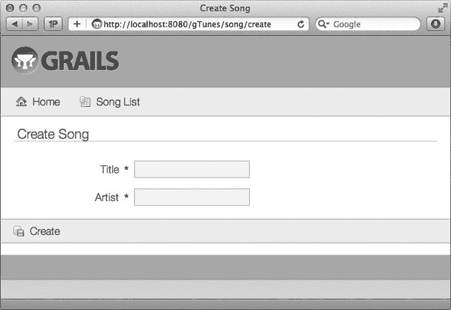

***图 2-4.** 创建歌曲页面*

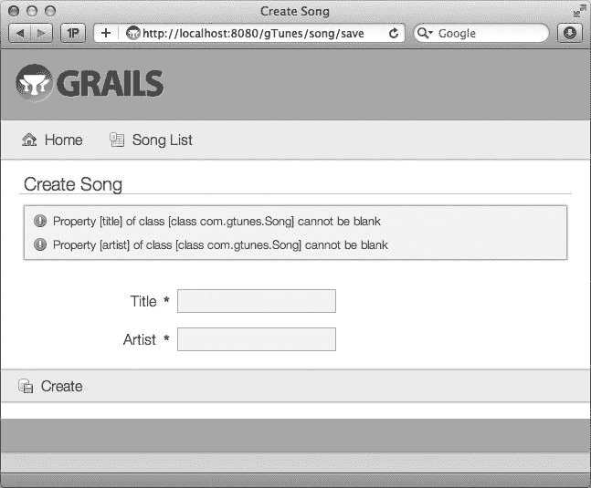

***图 2-5.** Grails 如何处理验证*

此时你可以自定义消息，但暂时使用默认值即可。现在，让我们尝试用一些有效数据创建一首歌曲。具体来说，尝试在提供的字段中输入以下值：

Artist: Soundgarden

Title: Mailman

现在点击“Create”按钮，然后进入本章的下一节。

#### 读取操作

Grails 已遵照指令，在数据库中创建了一个包含必要数据的新的 `Song` 实例。然后它会重定向到“Show Song”屏幕，你可以在那里查看并欣赏刚刚创建的 `Song` 实例的渲染视图。

此外，如图 2-6 所示，“Show Song”屏幕提供了两个按钮，让你可以编辑或删除数据库中的 `Song` 实例。

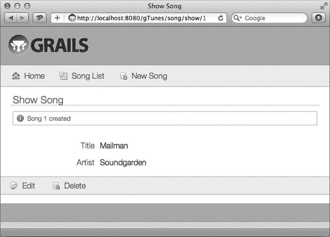

***图 2-6.** 显示歌曲屏幕*

目前，你处理的是一个简单的领域模型，只涉及一个 `Song` 领域类。然而，领域类的另一个属性是它们通常具有多种关系：一对多、一对一等等。如果你思考一下 Song，它通常是专辑中歌曲集合的一部分。让我们使用 `grails create-domain-class` 命令创建一个 `Album` 领域类来对此建模，如代码清单 2-6 所示。

***代码清单 2-6.** 创建专辑领域类*

`grails> create-domain-class com.gtunes.Album`
`| Created file grails-app/domain/com/gtunes/Album.groovy`
`| Created file test/unit/com/gtunes/AlbumTests.groovy`
`grails>`

一个 `Album` 有自己的属性，包括标题，但它也包含许多歌曲。代码清单 2-7 展示了如何使用领域类的 `hasMany` 静态属性在 `Album` 和 `Song` 之间建立一对多关系。`hasMany` 属性被赋予一个 Groovy 映射，其中键是关系名称，值是与该关联相关的类，在本例中是 `Song`。

***代码清单 2-7.** 定义一对多关系*

`package com.gtunes`
`class Album {`
`    String title`
`    static hasMany = [songs:Song]`
`}`

上述关联是单向的。换句话说，只有 `Album` 类知道该关联，而 `Song` 类对此毫不知情。要使关联变为双向，修改 `Song` 类以包含一个 `Album` 本地属性，如代码清单 2-8 所示。现在 `Album` 和 `Song` 具有双向的一对多关联。

***代码清单 2-8.** 使关系变为双向*

`package com.gtunes`
`class Song {`
`    String title`
`    String artist`
`    Album album`
`}`

在第 3 章中，我们将深入探讨其他类型的关系以及它们如何映射到底层数据库。现在，让我们创建另一个能够处理 Album 实例创建的脚手架控制器。使用 `grails create-controller` 命令，并将 `static scaffold = true` 属性添加到类定义中（参见代码清单 2-9）。

***代码清单 2-9.** 为 Album 类搭建脚手架*

`package com.gtunes`
`class AlbumController {`
`    static scaffold = true`
`}`

现在，如果你返回浏览器并刷新歌曲列表，你会注意到之前输入的歌曲神秘地消失了。原因很简单：默认情况下，Grails 运行在内存数据库中，更新领域类会创建它的一个新实例。你可能会发现这对测试很有用，但如果你需要更稳定的存储机制，可以配置不同的数据库（我们将在本章后面讨论）。

然而，更重要的是，在欢迎页面上我们多了一个 `AlbumController`。点击 `AlbumController` 链接，然后点击“New Album”按钮。为专辑输入一个标题——这里输入“Soundgarden”——然后点击“Create”按钮，即可看到你新创建的专辑显示出来（参见图 2-7）。

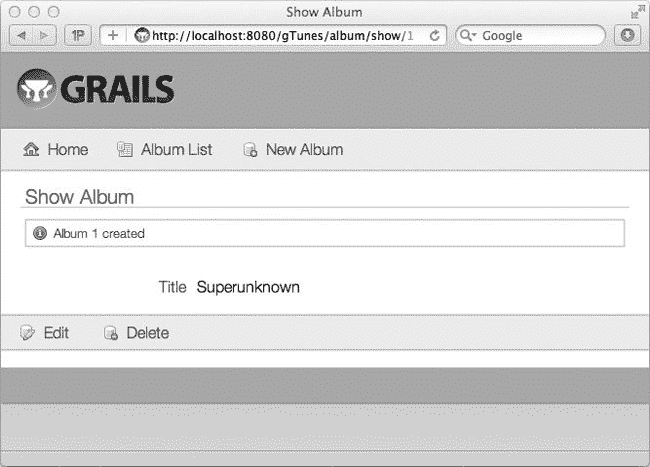

***图 2-7.** 显示专辑屏幕*

你还会注意到该专辑有一个空白的 Songs 字段。接下来我们来修复这个问题。

#### 更新操作

你可以通过点击“Edit”按钮执行更新。在这种情况下，你想添加一首 `Song`，因此点击“Add Song”链接以查看“Create Song”界面。这次，你会得到一个有用的下拉框，让你选择 `Song` 应该属于哪个 `Album`（如图 2-8 所示）。你会注意到脚手架默认行为只是对下拉列表中的每个元素调用 `toString()`。Grails 提供的默认 `toString()` 使用类名和实例 ID，这对用户来说并不是最友好的呈现方式。你可以通过在 `Album` 类中实现自己的 `toString()` 方法来覆盖此行为。

接下来，按照“创建操作”一节中的描述填充字段，然后点击“Create”按钮。你会注意到“Show Song”屏幕提供了一个返回 `Album` 的链接；点击该链接会显示该 `Album`，其中新创建的 `Song` 实例出现在歌曲列表中（参见图 2-9）。Grails 的脚手架虽然算不上天才，但足够聪明，能够识别出一对多关系并相应地管理它。

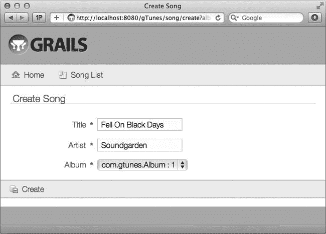

***图 2-8.** 创建歌曲屏幕*

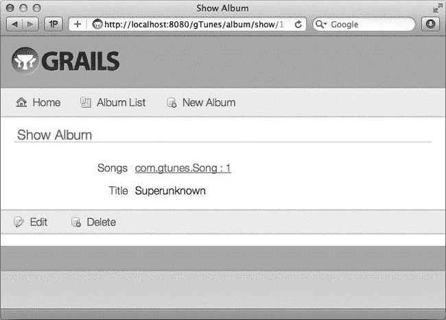

***图 2-9.** 显示带有歌曲列表的专辑屏幕*

#### 删除操作

最后，为了完成 CRUD 这个缩写，你可以通过点击“Delete”按钮删除特定的 `Song` 或 `Album`。Grails 很友好地询问你是否完全确定要执行这种破坏性操作。

至此，Grails 动态脚手架功能的介绍就结束了；在下一节中，你将看到如何访问底层控制器并查看这些 CRUD 界面背后的代码。

### 静态脚手架

动态脚手架可用于多种用途，从创建管理界面到为实际应用提供基础。然而，通常需要将定制化提升到新的水平，尤其是在视图方面。幸运的是，Grails 提供了从命令行通过以下目标为领域类生成控制器及相关视图的能力：

> *   `grails generate-controller`：为指定的领域类生成控制器。
> *   `grails generate-views`：为指定的领域类生成视图。
> *   `grails generate-all`：同时生成控制器及相关视图。

这种方法被称为“静态”或“模板驱动”脚手架，其优势不仅限于简单的代码生成。值得注意的是，它还是一个极佳的学习工具，能帮助你熟悉 Grails 框架以及各个组件如何协同工作。

你已经创建了一个与你试图解决的问题直接相关的领域模型。现在，你可以生成与你的领域相关的代码。让我们先看看如何生成一个控制器。

#### 生成控制器

要生成一个实现动态脚手架章节中提到的 CRUD 功能的控制器，可以利用 `grails generate-controller` 命令。与其他 `generate` 命令一样，`generate-controller` 将领域类名称作为其第一个参数。例如，清单 2-10 展示了如何使用 `generate-controller` 命令从 `Album` 类输出一个新的控制器。

***清单 2-10.** 输出新控制器*

`grails> generate-controller com.gtunes.Album`
`| 正在为领域类 com.gtunes.Album 生成控制器`
`> 文件 /grails-app/controllers/com/gtunes/AlbumController.groovy 已存在。`
`是否覆盖？[y,n,a] y`
`> 文件 /test/unit/com/gtunes/AlbumControllerTests.groovy 已存在。是否覆盖？[y,n,a] y`
`| 已完成领域类 com.gtunes.Album 的生成`
`grails>`

请注意，由于 `AlbumController` 类已存在，`generate-controller` 命令会询问你是否要覆盖现有控制器。输入“y”（表示“是”）并按下回车键即可完成该过程。

此时，你或许应该检查一下这个神秘控制器的内容，看看生成了多少行代码。如果你有传统的 Java Web 开发背景，可能会期望实现几个不同的类。例如，你可能需要一个调用业务接口的控制器，而该接口又会调用实际执行 CRUD 操作的数据访问对象（DAO）。

当然，DAO 中会包含大量的 ORM 框架代码，可能还会混入几行 Java 数据库连接（JDBC）代码。但令人惊讶的是（或者并不惊讶，取决于你的视角），代码极其简洁，远少于 100 行。虽然这里无法完整列出，但我们将逐步解析生成的控制器中的每个操作，以理解其功能。

`index` 操作是默认操作；如果在控制器统一资源标识符（URI）中未指定操作，则会执行该操作。它只是简单地重定向到 `list` 操作，并传递所有参数（见清单 2-11）。

***清单 2-11.** index 操作*

`    def index() {`
`        redirect(action: "list", params: params)`
`    }`

`list` 操作提供所有专辑的列表，如清单 2-12 所示。它委托 `Album` 类的静态 `list` 方法来获取 `Album` 实例的 `java.util.List`。然后，它将 `Album` 实例列表放入一个 Groovy 映射字面量（底层为 `java.util.LinkedHashMap`）中，该映射作为“模型”从控制器返回给视图。（你将在第 4 章和第 5 章中开始更深入地理解模型及其与视图的关系。）

***清单 2-12.** list 操作*

`    def list() {`
`        params.max = Math.min(params.max ? params.int('max') : 10, 100)`
`        [albumInstanceList: Album.list(params), albumInstanceTotal: Album.count()]`
`    }`

但请稍等。在我们深入之前，你是否注意到你实际上并没有在 `Album` 类中编写一个静态的 `list` 方法？此时，你将开始看到 GORM 的强大之处。GORM 通过 Groovy 的元编程能力，自动为你编写的每个领域类提供一整套方法，其中就包括 `list` 方法。通过查看这些脚手架代码，你将预览到 GORM 所提供的功能。

例如，代码清单 2-13 中展示的`show`动作，会从`params`对象中获取`id`参数，并将其传递给`Album`类的`get`方法。`get`方法由 GORM 自动提供，允许通过数据库标识符查找领域实例。`get`方法的结果被放入一个准备显示的模型中，如代码清单 2-13 所示。

***代码清单 2-13.** show 动作*

`    def show() {`
`        def albumInstance = Album.get(params.id)`
`        if (!albumInstance) {`
`            flash.message = message(code: 'default.not.found.message', args: [message(code: 'album.label', default: 'Album'), params.id])`
`            redirect(action: "list")`
`            return`
`        }`

`        [albumInstance: albumInstance]`
`    }`

请注意，在代码清单 2-13 中，如果`Album`实例不存在，代码会将一条消息放入`flash`对象中，该消息将在视图中渲染。`flash`对象是存储消息（或消息代码，如果你使用 i18n）的绝佳临时存储空间。这将在第 4 章中更详细地讨论。

处理专辑删除的动作被恰当地命名为`delete`动作。它根据指定的`id`参数检索一个`Album`，如果存在，则将其删除并重定向到`list`动作（代码清单 2-14）。

***代码清单 2-14.** delete 动作*

`    def delete() {`
`        def albumInstance = Album.get(params.id)`
`        if (!albumInstance) {`
`            flash.message = message(code: 'default.not.found.message', args: [message(code:`
`'album.label', default: 'Album'), params.id])`
`            redirect(action: "list")`
`            return`
`        }`

`        try {`
`            albumInstance.delete(flush: true)`
`                    flash.message = message(code: 'default.deleted.message', args: [message(code:`
`'album.label', default: 'Album'), params.id])`
`            redirect(action: "list")`
`        }`
`        catch (DataIntegrityViolationException e) {`
`                    flash.message = message(code: 'default.not.deleted.message', args:`
`[message(code: 'album.label', default: 'Album'), params.id])`
`            redirect(action: "show", id: params.id)`
`        }`
`    }`

与仅显示`Album`属性值的`show`动作类似，`edit`动作委托给一个编辑视图，该视图将渲染用于编辑`Album`属性的字段（参见代码清单 2-15）。

***代码清单 2-15.** edit 动作*

`    def edit() {`
`        def albumInstance = Album.get(params.id)`
`        if (!albumInstance) {`
`            flash.message = message(code: 'default.not.found.message', args: [message(code:`
`'album.label', default: 'Album'), params.id])`
`            redirect(action: "list")`
`            return`
`        }`

`        [albumInstance: albumInstance]`
`    }`

此时你可能会疑惑，既然`edit`和`show`动作的代码几乎相同，Grails 是如何决定显示哪个视图的。答案在于约定优于配置的力量。Grails 从控制器和动作名称中推导出适当的视图名称。在这种情况下，由于存在一个名为`AlbumController`的控制器和一个名为`edit`的动作，Grails 会在路径`grails-app/views/album/edit.gsp`下查找视图，其中`album`目录由控制器名称推断而来，`edit.gsp`文件则取自动作名称。其实很简单。

对于更新操作，有`update`动作，它再次使用静态的`get`方法来获取对`Album`实例的引用。神奇的表达式`album.properties` = `params`会自动将请求的参数绑定到`Album`实例的属性上。通过调用`save()`方法来保存`Album`实例。如果保存成功，则会向用户发出 HTTP 重定向；否则，会再次渲染编辑视图。完整代码如代码清单 2-16 所示。

***代码清单 2-16.** update 动作*

`    def update() {`
`        def albumInstance = Album.get(params.id)`
`        if (!albumInstance) {`
`            flash.message = message(code: 'default.not.found.message', args: [message(code:`
`'album.label', default: 'Album'), params.id])`
`            redirect(action: "list")`
`            return`
`        }`

`        if (params.version) {`
`            def version = params.version.toLong()`
`            if (albumInstance.version > version) {`
`                albumInstance.errors.rejectValue("version",`
`                          "default.optimistic.locking.failure",`
`                          [message(code: 'album.label', default: 'Album')] as Object[],`
`                          "Another user has updated this Album while you were editing")`
`                render(view: "edit", model: [albumInstance: albumInstance])`
`                return`
`            }`
`        }`

`        albumInstance.properties = params`

`        if (!albumInstance.save(flush: true)) {`
`            render(view: "edit", model: [albumInstance: albumInstance])`
`            return`
`        }`

`        flash.message = message(code: 'default.updated.message', args: [message(code: 'album.`
`label', default: 'Album'), albumInstance.id])`
`        redirect(action: "show", id: albumInstance.id)`
`    }`

为了便于创建新的专辑，`create`动作委托给创建视图。创建视图与编辑视图类似，会显示适当的编辑字段。请注意`create`动作如何将一个新的`Album`实例插入到模型中，以确保字段值从请求参数中填充（代码清单 2-17）。

***代码清单 2-17.** create 动作*

`    def create() {`
`        [albumInstance: new Album(params)]`
`    }`

最后，`save`动作将尝试创建一个新的`Album`实例并将其保存到数据库（参见代码清单 2-18）。

***代码清单 2-18.** save 动作*

`    def save() {`
`        def albumInstance = new Album(params)`
`        if (!albumInstance.save(flush: true)) {`
`            render(view: "create", model: [albumInstance: albumInstance])`
`            return`
`        }`

`        flash.message = message(code: 'default.created.message', args: [message(code: 'album.`
`label', default: 'Album'), albumInstance.id])`
`        redirect(action: "show", id: albumInstance.id)`
`    }`

在`save`和`update`动作中，你交替使用`redirect`和`render`方法。这些将在第 4 章中深入介绍，但简而言之，`redirect`方法会发出一个 HTTP 重定向，创建一个指向不同动作的全新请求，而`render`方法则将选定的视图渲染到当前请求的响应中。

显然，这只是对各种 CRUD 操作及其功能的简要概述，并未详细阐述其中发生的许多魔法。然而，这种看似混乱的做法自有其道理。关于控制器及其工作原理的细节将在第 4 章中呈现。不过现在，让我们通过再次运行 gTunes 应用程序（使用 grails `run-app`目标）来试试新生成的控制器。

服务器加载完成后，在浏览器中导航到地址[`http://localhost:8080/gTunes/album`](http://localhost:8080/gTunes/album)上的`AlbumController`。会发生什么？实际上，没什么大动静。结果是一个页面未找到（404）错误，因为生成的控制器没有使用动态脚手架。动态脚手架在运行时渲染视图，但这里只是一个普通的旧控制器——它没什么特别之处，也没有视图。

 **注意**  将 scaffold 属性设置为 Album 类，视图将在每个动作被覆盖时生成。

#### 生成视图

为你的操作提供一些视图来委派任务会非常方便。幸运的是，你可以使用 `grails generate-views` 命令来生成它们，该命令的执行过程与“生成控制器”一节（参见清单 2-19）中描述的过程相同。

***清单 2-19.** 生成视图*

`grails> generate-views com.gtunes.Album`
`| Finished generation for domain class com.gtunes.Album`
`grails>` 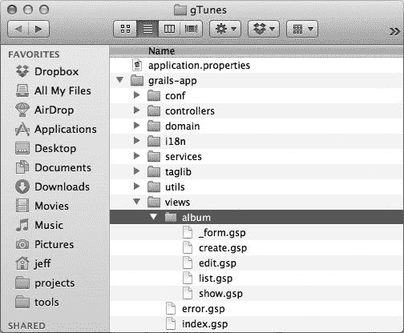

***图 2-10.** 生成的脚手架视图*

命令窗口的输出结果将类似于图 2-10。

总而言之，你可以生成四个视图：

> *   `list.gsp`：由 `list` 操作使用，用于显示 `Album` 实例的列表。
> *   `show.gsp`：由 `show` 操作使用，用于显示单个 `Album` 实例。
> *   `edit.gsp`：由 `edit` 操作使用，用于编辑 `Album` 实例的属性。
> *   `create.gsp`：由 `create` 操作使用，用于创建新的 `Album` 实例。
> *   `_form.gsp`：由 `create` 和 `edit` 视图使用。

 **注意**  所有视图都使用位于 `grails-app/views/layouts/main.gsp` 的主布局。这包括标题、徽标以及任何包含的样式表的位置。布局将在第 5 章中详细讨论。

现在你有了一个控制器和视图来执行 CRUD 操作。那么，与你在动态脚手架中看到的相比，你取得了哪些进展呢？嗯，目前还没有。命令行脚手架的优势在于它为你构建应用程序提供了一个起点。从零开始，你现在有了一个控制器，可以在其中放置你自己的自定义业务逻辑。你有了视图，可以随心所欲地对其进行自定义。而你在完成所有这些工作的同时，只编写了最少的代码。大多数开发者始终致力于编写更少的代码，而脚手架被证明是实现这一目标的有用工具。

有了 `AlbumController` 及其关联的视图后，删除现有的 `SongController`，并重复清单 2-10 和 2-19 中的步骤，为 `Song` 领域类生成一个控制器和视图。在后续章节中构建基本 CRUD 功能时，你将需要这些生成的代码。

与此同时，让我们继续了解启动 Grails 开发所需的其他必要知识，从环境开始。

### 环境友好

在任何 Web 应用程序生产团队中，通常都会有一个针对应用程序的开发配置，该配置可以配置为与本地安装的数据库一起工作。这种配置有时甚至因开发者而异，具体取决于特定的桌面配置。

此外，负责测试开发者工作成果的 QA 人员拥有与生产环境配置相似的独立机器。因此，到目前为止有两个环境：开发配置和测试配置。第三个是生产配置，当系统上线时需要用到它。

这种情况在几乎每个开发项目中都普遍存在，每个开发团队都通过 Ant 或其他自定义构建系统来定制自动构建解决方案，而不是从框架本身获取解决方案。

Grails 默认支持*开发、测试和生产*环境的概念，并在执行时相应地配置自身。其中一些操作对开发者来说是完全透明的。例如，当 Grails 配置为开发模式时，自动重新加载是启用的，但在生产模式下是禁用的（以提高性能并最大限度地降低任何安全风险，无论风险多小）。

在不同环境下执行 Grails 非常简单。例如，以下命令将使用生产设置运行 Grails 应用程序：

`$ grails prod run-app`

如果你还记得 `grails help` 命令的输出，你会记得 `grails` 命令的基本用法如下：

`Usage (optionals marked with *):`
`grails  [environment]* [target]   [arguments]*`

换句话说，`grails` 可执行文件之后的第一个可选标记是环境，Grails 内置了三个选项：

> *   *prod*：生产环境设置。Grails 以最高效的方式运行，并应用所有配置的生产设置。
> *   *test*：测试环境设置。Grails 以最高效的方式运行，并应用所有配置的测试设置。
> *   *dev*：开发环境设置。Grails 以开发模式运行，启用工具和行为（例如热重载）以优化开发者的生产力。

当然，Grails 并不局限于这三个环境。你可以通过向 `grails` 命令传递一个名为 `grails.env` 的系统属性来指定自定义环境。例如：

`grails -Dgrails.env=myenvironment test-app`

这里你使用一个名为 `myenvironment` 的环境来执行 Grails 测试用例。所有这些环境切换可能很方便，但它在实际中意味着什么呢？一方面，它允许你为不同的环境配置不同的数据库，正如你将在下一节中看到的那样。

### 配置数据源

凭借你新获得的环境知识以及如何在它们之间切换，当你开始配置数据源时，你将看到其影响。启动并运行 Grails 应用程序需要哪些初始配置步骤？不需要。没错，你不需要配置任何东西。

即使是配置数据源也是可选的。如果你不配置它，Grails 将使用内存中的 H2 数据库启动。这在开始时非常有利，尤其是在测试方面，因为你可以在每次加载时使用一组全新的数据启动应用程序。

然而，由于这是一个相当常见的需求，让我们深入探讨数据源，因为你肯定需要配置它们；此外，它们还将帮助你加深对环境知识的理解。

#### DataSource.groovy 文件

创建 Grails 应用时，Grails 会自动提供一个 `grails-app/conf/DataSource.groovy` 文件，其中包含每个环境的配置（参见图 2-11）。你可能会觉得这很方便，因为这意味着大部分工作已经为你完成，但你可能更倾向于使用其他数据库（例如 MySQL），而不是默认提供的 H2 数据库。

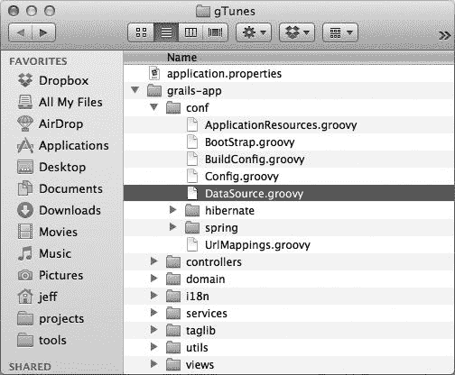

***图 2-11.** DataSource.groovy 文件*

定义数据源是体现 Java 平台优势的领域之一。Java 的数据库连接技术 JDBC 已经非常成熟，市面上几乎每种数据库都有对应的驱动程序。事实上，如果某个数据库提供商不能提供高质量、稳定的 JDBC 驱动，其产品在市场上就很难被认真对待。

数据源定义会被转换为一个 `javax.sql.DataSource` 实例，该实例提供 JDBC `Connection` 对象。如果你之前使用过 JDBC，那么对这个过程应该很熟悉：第一步是确保驱动类（通常打包在 JAR 文件中）在类路径上可用。

`DataSource.groovy` 文件在数据源定义的顶部包含一些通用配置设置，清单 2-20 展示了一个示例。

***清单 2-20.** 通用数据源配置*

`dataSource {`
`    pooled = true`
`    driverClassName = "org.h2.Driver"`
`    username = "sa"`
`    password = ""`
`}`

这段代码片段表明，默认情况下，你希望使用一个基于 H2 驱动的连接池数据源，用户名为“sa”，密码为空。你也可以为其他几个设置应用默认值。以下是 `DataSource.groovy` 文件提供的设置列表：

> *   `driverClassName`：JDBC 驱动的类名。
> *   `username`：用于建立 JDBC 连接的用户名。
> *   `password`：用于建立 JDBC 连接的密码。
> *   `url`：数据库的 JDBC URL。
> *   `dbCreate`：指定是否根据领域模型自动生成数据库。
> *   `pooled`：指定是否使用连接池（默认为 true）。
> *   `conf igClass`：用于配置 Hibernate 的类。
> *   `logSql`：此设置启用 SQL 日志记录。
> *   `dialect`：一个字符串或类，表示用于与数据库通信的 Hibernate 方言。

除了此处描述的标准属性外，还可以通过在 `dataSource` 配置中定义一个 `properties` 块来配置其他特定于驱动的属性，如清单 2-21 所示。

***清单 2-21.** 配置其他数据源属性*

`environments {`
`    production {`
`        dataSource {`
`            dbCreate = "update"`
`            url = "jdbc:h2:prodDb;MVCC=TRUE;LOCK_TIMEOUT=10000"`
`            pooled = true`
`            properties {`
`               maxActive = -1`
`               minEvictableIdleTimeMillis=1800000`
`               timeBetweenEvictionRunsMillis=1800000`
`               numTestsPerEvictionRun=3`
`               testOnBorrow=true`
`               testWhileIdle=true`
`               testOnReturn=true`
`               validationQuery="SELECT 1"`
`            }`
`        }`
`    }`
`}`

接下来是重点。在全局的 `dataSource` 块之后，你会看到每个已知环境（开发、测试和生产）的环境特定设置。清单 2-22 展示了一个环境特定配置的简化示例。

***清单 2-22.** 环境特定的数据源配置*

`environments {`
`    development {`
`        dataSource {`
`            dbCreate = "create-drop" // 可选值：'create', 'create-drop', 'update', 'validate', ''`
`            url = "jdbc:h2:mem:devDb;MVCC=TRUE"`
`        }`
`    }`

请注意，默认情况下，开发环境配置为使用内存中的 H2 数据库，其数据库 URL 为 `jdbc:h2:mem:devDb;MVCC=TRUE;LOCK_TIMEOUT=10000"`。同时注意 `dbCreate` 设置，它允许你配置数据库的自动创建方式。

 **注意**  Hibernate 用户应该对这些可能的值很熟悉，因为 `dbCreate` 直接对应于 `hibernate.hbm2ddl.auto` 属性。

开发环境的 `dbCreate` 设置被配置为 `create-drop`，这意味着每次 Grails 服务器重启时，都会删除数据库模式并重新创建。这个设置对于测试非常有用，因为每次你都会从一组干净的数据开始。`dbCreate` 属性的可用设置如下：

> *   `create-drop`：每次应用加载时删除并重新创建数据库模式。
> *   `create`：在应用加载时创建数据库。
> *   `update`：在应用加载时创建和/或尝试更新现有表。
> *   `[空白]`：不执行任何操作。

生产环境和测试环境都将 `dbCreate` 设置为 `update`，这样现有表不会被删除，而是自动创建或更新。在某些生产环境中，你可能需要手动创建数据库模式。或者，创建数据库模式可能是你的 DBA 的职责。如果是这两种情况之一，只需完全移除 `dbCreate` 属性，Grails 就不会执行任何操作，将这个任务留给你或你的同事。

#### 配置 MySQL 数据库

基于你在上一节中关于配置替代数据库所获得的知识，现在你将学习如何用 Grails 设置 MySQL。你将在生产环境中配置 Grails 使用 MySQL；为此，你需要告诉 Grails 如何与 MySQL 通信。你使用的是 JDBC，因此需要一个合适的驱动程序。你可以从 MySQL 网站 [`http://www.mysql.com`](http://www.mysql.com) 下载驱动程序。

在本书的示例中，我们将使用 MySQL Connector/J 的 5.1.6 版本。要配置驱动程序，请编辑 图 2-12 中所示的 `grails-app/conf/BuildConfig.groovy` 文件。

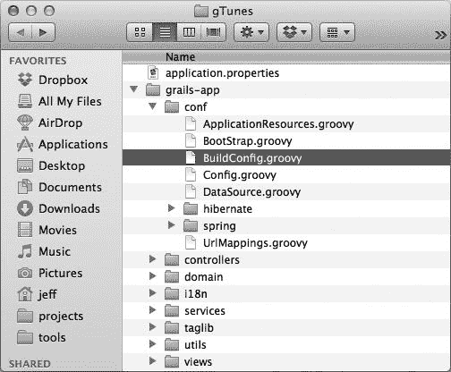

***图 2-12.** BuildConfig.groovy*

编辑 `BuildConfig.groovy` 文件，将 Connector/J 作为声明的依赖项包含进来。依赖管理将在后面更详细地介绍。现在，请在 `BuildConfig.groovy` 中包含类似以下内容：

***清单 2-23.** Connector/J 依赖项*

`grails.project.dependency.resolution = {`
`    …`
`dependencies {`
`        // 在此处指定依赖项，范围可以是 'build'、`
`        // 'compile'、'runtime'、'test' 或 'provided'，例如：`

`        runtime 'mysql:mysql-connector-java:5.1.19'`
`    }`
`}`

驱动程序就位后，下一步是配置 Grails 的 `dataSource`，使其使用驱动程序文档定义的设置。这是 JDBC（以及其他平台上的等效技术）的常见做法，基本上需要以下信息：

> *   驱动程序类名
> *   数据库的 URL
> *   用于登录的用户名
> *   该用户名的密码

目前，生产环境的 `dataSource` 配置为使用持久化到文件的 H2 数据库。清单 2-24 显示了生产环境的 `dataSource` 配置。

***清单 2-24.** 生产环境数据源配置*

`    production {`
`        dataSource {`
`            dbCreate = "update"`
`            url = "jdbc:h2:prodDb;MVCC=TRUE"`
`            pooled = true`
`            properties {`
`               maxActive = -1`
`               minEvictableIdleTimeMillis=1800000`
`               timeBetweenEvictionRunsMillis=1800000`
`               numTestsPerEvictionRun=3`
`               testOnBorrow=true`
`               testWhileIdle=true`
`               testOnReturn=true`
`               validationQuery="SELECT 1"`
`            }`
`        }`
`    }`

请注意，其余设置（用户名、密码、driverClassName 等）继承自全局配置，如清单 2-20 所示。要正确配置 MySQL，你需要覆盖其中一些默认值，并更改数据库 URL。清单 2-25 给出了一个典型 MySQL 设置的示例。

***清单 2-25.** MySQL 数据源配置*

`    production {`
`        dataSource {`
`            dbCreate = "update"`
`            url = "jdbc:mysql://localhost/gTunes"`
`            driverClassName = "com.mysql.jdbc.Driver"`
`            username = "root"`
`            password = ""`
`            pooled = true`
`            properties {`
`               maxActive = -1`
`               minEvictableIdleTimeMillis=1800000`
`               timeBetweenEvictionRunsMillis=1800000`
`               numTestsPerEvictionRun=3`
`               testOnBorrow=true`
`               testWhileIdle=true`
`               testOnReturn=true`
`               validationQuery="SELECT 1"`
`            }`
`        }`
`    }`

此设置假设 MySQL 服务器运行在本地机器上，并且已设置了一个空白的 `root` 用户密码。当然，真实的生产环境可能会将数据库放在不同的机器上，并且几乎肯定会使用更安全的权限设置。另外，请注意，你必须使用 `driverClassName` 设置来指定 MySQL 驱动程序的名称。

#### 配置 JNDI 数据源

在 Grails 中设置生产数据源的另一种常见方法是使用容器提供的 Java 命名和目录接口（JNDI）数据源。这种设置在数据源配置不由你负责，而是由部署团队或网络管理员负责的企业环境中很典型。

在 Grails 中配置 JNDI 数据源再简单不过了；唯一的要求是指定 JNDI 名称。清单 2-26 显示了一个典型的 JNDI 设置。

***清单 2-26.** JNDI 数据源配置*

`production {`
`       dataSource {`
`           jndiName = "java:comp/env/jdbc/gTunesDB"`
`       }        `
`}`

当然，这假设已经完成了配置部署环境以正确提供 JNDI 数据源的工作。配置 JNDI 资源通常是特定于容器的，我们建议你查阅容器（例如 Apache Tomcat）附带的文档以获取说明。

#### 支持的数据库

由于 Grails 利用了 Hibernate，因此它支持 Hibernate 支持的所有数据库。并且由于 Hibernate 已成为事实上的标准，它已经在许多不同的数据库和版本上进行了尝试和测试。

目前，Hibernate 核心团队定期对以下数据库产品进行集成测试：

> *   DB2 9.7
> *   Microsoft SQL Server 2008
> *   MySQL 5.1, 5.5
> *   Oracle 11g, 11g RAC
> *   PostgreSQL 8.4, 9.1
> *   Sybase ASE 15.5 (jConnect 6.0)

此外，尽管未包含在 Hibernate QA 团队的测试流程中，以下数据库产品得到了社区主导的支持：

> *   Apache Derby
> *   HP NonStop SQL/MX 2.0
> *   Firebird 1.5 with JayBird 1.01
> *   FrontBase
> *   Informix
> *   Ingres
> *   InterBase 6.0.1
> *   Mckoi SQL
> *   PointBase Embedded 4.3
> *   Progress 9
> *   Microsoft Access 95, 97, 2000, XP, 2002, and 2003
> *   Corel Paradox 3.0, 3.5, 4.x, 5.x, and 7.x to 11.x
> *   多种通用文件格式，包括纯文本、CSV、TSV 以及定长和变长二进制文件
> *   XBase（任何 dBASE；Visual dBASE；SIx Driver；SoftC；CodeBase；Clipper；FoxBase；FoxPro；Visual Fox Pro 3.0, 5.0, 7.0, 8.0, 9.0, and 10.0；xHarbour；Halcyon；Apollo；GoldMine；或 Borland Database Engine 兼容 [BDE-compatible] 数据库）
> *   Microsoft Excel 5.0, 95, 97, 98, 2000, 2001, 2002, 2003, and 2004

少数数据库产品（主要是较老的）不支持 JDBC 元数据（它允许数据库暴露自身信息），你需要使用数据源定义的 `dialect` 属性显式指定 Hibernate 方言。你可以在 `org.hibernate.dialect` 包中找到可用的方言。在未来的章节中，包括第 12 章，你将学到更多关于数据源定义的知识。现在，既然我们已经为生产环境准备好了应用程序，让我们进入下一步：部署。

### 部署应用程序

当你使用 `run-app` 命令执行 Grails 应用程序时，Grails 会将应用程序配置为在运行时根据更改重新加载，从而实现快速的迭代开发。然而，这种配置会影响应用程序的性能。因此，`run-app` 命令最适合仅用于开发。要部署到生产系统，请使用打包的 Web 应用程序归档（WAR）文件。这样做遵循了 Java 成熟的部署策略以及开发人员和管理员之间的角色分离。

作为一个重要的额外好处，Grails 对 WAR 格式的兼容性意味着 IT 生产团队无需学习任何新技能。当今 Java 应用程序使用的相同应用服务器、硬件、性能分析和监控工具也同样适用于 Grails。

#### 使用 run-war 部署

如果你对将内置的 Tomcat 容器作为部署环境感到满意，可以通过在生产环境中设置 Grails，然后从本地版本控制系统检出 Grails 应用程序来快速部署。完成这些操作后，只需输入

`Grails> run-war`

此命令会将 Grails 打包成一个 WAR 文件，然后使用打包好的 WAR 在 8080 端口上运行 Tomcat。如果你想更改端口，可以按照第 1 章中“步骤 6：运行应用程序”一节的说明进行操作。

#### 使用 WAR 文件部署

`run-war` 命令很方便，但你可能希望对部署环境有更多控制，或者希望部署到其他容器（例如 Apache Tomcat 或 BEA WebLogic）上，而不是 Tomcat。

在这些情况下，你需要的是一个 WAR 文件。WAR 文件是 Java 世界中标准化的部署机制。每个符合 Java EE 规范的 Web 容器都支持这种格式。但一些较旧的容器可能存在特殊问题，因此请查看维基上的 [`http://grails.org/Deployment`](http://grails.org/Deployment) 页面，以获取有关特定容器问题的有用信息。

要创建 WAR 归档文件，请使用 Grails 的 `war` 命令：

`grails> war | Done creating WAR target/gtunes-0.1.war`
`grails>`

默认情况下，如果未指定环境，Grails 会假定为 WAR 文件使用生产环境。但是，与其他命令一样，你可以根据需要更改环境。例如：

`$ grails> test war`

运行该命令后，一个全新的 WAR 文件会出现在项目目录的根目录中（参见图 2-13）。

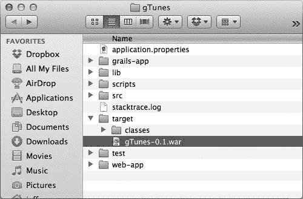

***图 2-13.** gTunes WAR 文件*

如果根目录不是存放 WAR 文件的方便位置，你始终可以通过将目标 WAR 位置指定为 `war` 命令的最后一个参数来更改它：

`$ grails test war /path/to/deploy/gTunes.war`

创建好 WAR 文件后，你只需遵循容器的部署说明（可能简单到将文件放入特定目录），就大功告成了。注意到 WAR 文件包含版本号了吗？Grails 具有对应用程序版本控制的内置支持。你将在第 11 章中了解更多关于版本控制和部署的内容。

### 总结

哇，我们涵盖了很多内容。你生成了一个简单的 CRUD 接口，配置了不同的数据源，并生成了一个准备部署的 WAR 文件。你学习了 Grails 中控制器工作方式的一些基础知识，并预览了 GORM（Grails 的对象关系映射层）的未来功能。

你还尝试了 Grails 对运行不同环境的支持，并为生产环境配置了 MySQL 数据库。所有这些都应该为你掌握 Grails 的基础知识提供了坚实的基础。然而，到目前为止，我们只是触及了领域类、控制器和视图等概念，没有深入细节。这种情况即将改变，因为我们将一头扎进 Grails 运行机制的详尽细节中。

从第 3 章开始，我们将开始深入探讨 Grails 中的概念。在此过程中，我们将开始构建 gTunes 应用程序，并将其从现在的原型转变为一个功能完备的应用程序。

## 第 3 章

## 理解领域类

面向对象（OO）应用程序几乎总是涉及一个领域模型，该模型代表应用程序处理的业务实体。gTunes 应用程序将包含许多领域类，包括 `Artist`、`Album` 和 `Song`。这些领域类中的每一个都有与之关联的属性。你必须将这些属性映射到数据库，以便持久化这些类的实例。

面向对象应用程序的开发人员在将对象映射到关系数据库时面临一些难题。这并不是因为关系数据库特别难用；问题在于你在面向对象的领域模型和关系数据库以表为中心的数据视图之间遇到了“阻抗不匹配”^(1)。

 **注意**  由于绝大多数 Grails 应用程序都构建在关系数据库之上，本书将重点介绍这种方法。请注意，Grails 支持越来越多的数据存储，包括许多非关系型数据存储，例如 MongoDB、Redis 和 Cassandra。

幸运的是，Grails 为你完成了大部分艰苦的工作。为 Grails 应用程序编写领域模型比许多其他框架要简单得多。本章将介绍 Grails 领域模型的基础知识。第 10 章将涵盖 GORM 技术的更高级特性。

### 将字段持久化到数据库

默认情况下，领域类中的所有字段都会持久化到数据库。对于诸如 `Strings` 和 `Integers` 之类的简单字段类型，类中的每个字段都将映射到数据库中的一列。复杂的属性可能需要多个表来持久化所有数据。第 2 章中的 `Song` 类包含两个 `String` 属性。数据库中的表将为这些属性中的每一个包含一个单独的列。

在 MySQL 中，该数据库表将类似于清单 3-1。

1  Scott W. Ambler, “The Object-Relational Impedance Mismatch,” [`http://www.agiledata.org/essays/impedanceMismatch.html`](http://www.agiledata.org/essays/impedanceMismatch.html), 2006.

***清单 3-1.** Song 表*

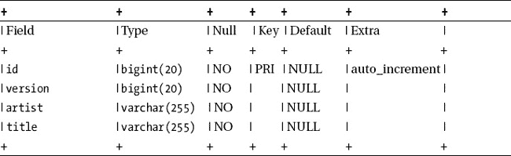

请注意，该表包含领域类中每个属性对应的列、一个 `id` 列和一个 `version` 列。`id` 是行的唯一标识符，Grails 使用 `version` 列来实现乐观锁定^(2)。

清单 3-1 显示了 MySQL 数据库的默认映射。Grails 提供了一个强大的 DSL，用于表达领域模型如何映射到数据库。有关映射 DSL 的详细信息将在后面的“自定义数据库映射”部分中介绍。

### 验证领域类

你可能会遇到一些业务规则，这些规则限制了领域类中特定属性的有效值。例如，`Person` 的年龄绝不能小于零。信用卡号必须符合预期的模式。像这样的规则应该清晰且唯一地表达出来。幸运的是，Grails 提供了一个强大的机制来表达这些规则。

Grails 领域类可以通过定义一个名为 `constraints` 的公共静态属性（其值为一个闭包）来表达领域约束。清单 3-2 展示了一个定义了若干约束的 `Song` 类版本。

***清单 3-2.** Song 领域类*

`class Song {`
`    String title`
`    String artist`
`    Integer duration`

`    static constraints = {`
`        title(blank: false)`
`        artist(blank: false)`
`        duration(min: 1)`
`    }`
`}`

清单 3-2 中的 `Song` 类为其每个持久化属性定义了约束。`title` 和 `artist` 属性不能为空。`duration` 属性的最小值必须为 1。当定义了约束时，并非每个属性都必须被约束。`constraints` 闭包可以包含对类中部分属性的约束。

¹  Wikipedia，“乐观并发控制”，[`http://en.wikipedia.org/wiki/Optimistic_concurrency_control`](http://en.wikipedia.org/wiki/Optimistic_concurrency_control)。

清单 3-2 中使用的验证器是 `blank` 和 `min`。Grails 内置了许多覆盖常见场景的标准验证器（参见表 3-1）。

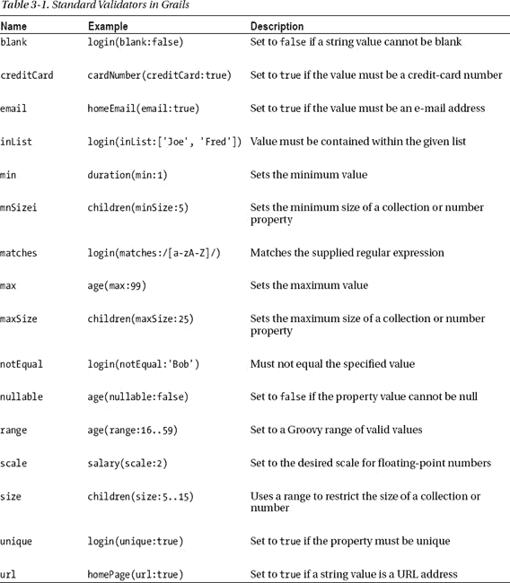

领域类中的 `constraints` 块将有助于防止无效数据被保存到数据库。在数据写入数据库之前，领域对象上的 `save()` 方法会自动根据约束进行验证。如果验证失败，数据将不会写入数据库。如果验证失败，`save()` 方法返回 `null`。如果验证通过，则对象被保存到数据库，并且 `save()` 方法返回一个指向已保存对象的引用。清单 3-3 演示了代码如何响应 `save()` 方法的返回值。

***清单 3-3.** 验证 Song 对象*

`// -68 是一个无效的 duration`
`def song = new Song(title:'The Rover',`
`                    artist:'Led Zeppelin',`
`                    duration:-68)`
`if(song.save()) {`
`    println "Song was created!"`
`} else {`
`    song.errors.allErrors.each { println it.defaultMessage }`
`}`

另一种方法是调用 `save` 方法并将 `failOnError` 参数设置为 `true`，这会导致如果验证失败，`save()` 方法会抛出一个 `grails.validation.ValidationException` 异常。调用方式如下：`song.save(failOnError: true)`。

清单 3-3 的一个有趣之处在于使用了领域类的 `errors` 属性。该属性是 Spring 框架的 `org.springframework.validation.Errors` 接口的一个实例，它允许对验证错误进行高级查询。在清单 3-3 中，当验证失败时，代码会生成一个包含所有发生错误的列表，并将其打印到 `stdout`。

Spring Errors 接口中一些更有用的方法如清单 3-4 所示。

***清单 3-4.** Spring Errors 接口中的方法*

`package org.springframework.validation`

`interface Errors {`
`    List getAllErrors();`
`    int getErrorCount();`
`    FieldError getFieldError(String fieldName);`
`    int getFieldErrorCount();`
`    List getFieldErrors(String fieldName);`
`    Object getObjectName();`
`    boolean hasErrors();`
`    boolean hasFieldErrors(String fieldName);`
`    // ... 其余方法`
`}`

有时你会发现，在提交 `save()` 方法之前对领域模型进行更改是很有用的。对于这种情况，Grails 提供了一个 `validate()` 方法，该方法返回一个布尔值来指示验证是否成功。其语义与 `save()` 方法的示例完全相同，不同之处在于 `validate()` 方法不会尝试将实例保存到数据库。

如果验证失败，应用程序可能希望更改领域对象的状态并再次尝试验证。所有领域对象都有一个名为 `clearErrors()` 的方法，该方法会清除上一次验证尝试留下的任何错误。清单 3-5 演示了代码如何响应 `validate()` 方法的返回值。

***清单 3-5.** 重新验证 Song 对象*

`def song = new Song(title:'The Rover',`
`                    duration:339)`
`if(!song.validate()) {`
`    song.clearErrors()`
`    song.artist = 'Led Zeppelin'`
`    song.validate()`
`}`

### 使用自定义验证器

Grails 提供了大量内置验证器来处理常见场景。然而，不可能预见到每一个可行的领域模型以及应用程序可能需要的每一种特定验证类型。幸运的是，Grails 提供了一种机制，允许应用程序表达任意的验证规则（参见清单 3-6）。

***清单 3-6.** 在 User 领域类中约束 password 属性*

`class User {`
`    static constraints = {`
`        password(unique:true, length:5..15, validator:{val, obj ->`
`            if(val?.equalsIgnoreCase(obj.firstName)) {`
`                return false`
`            }`
`        })`
`    }`
`}`

如果密码等于 `User` 类的 `firstName` 属性，则清单 3-6 中的验证器将失败。如果验证失败，验证器闭包应返回 `false`；否则应返回 `true`。传递给闭包的第一个参数是要验证的属性的值。传递给闭包的第二个参数是被验证的对象。如果验证需要检查对象的其他属性（如清单 3-6 所示），则第二个参数通常很有用。

此外，当自定义验证器返回 `false` 时，会产生一个类似 `user.password.validator.error` 的错误代码。但是，你可以通过返回一个字符串来指定自定义错误代码。

`if(val?.equalsIgnoreCase(obj.firstName)) {`
`    return "password.cannot.be.firstname"`
`}`

在这个例子中，你只需返回一个值为 `password.cannot.be.firstname` 的字符串即可触发验证错误。你将在后续章节中了解更多关于错误代码及其与应用程序其他部分的关系。现在，让我们继续讨论瞬态属性的主题。

### 理解瞬态属性

默认情况下，领域类中的每个属性都会被持久化到数据库中。对于大多数属性来说，这是正确的做法。然而，有时领域类会定义一些不需要持久化的属性。Grails 提供了一种简单的机制来指定领域类中哪些属性不应被持久化。这种机制是定义一个公共静态属性 `transients`，并为其赋予一个字符串列表的值。这些字符串代表类中应被视为瞬态且不保存到数据库的属性的名称（参见清单 3-7）。

***清单 3-7.** Company 领域类中的瞬态属性*

`class Company {`
`    String name`
`    Integer numberOfEmployees`
`    BigDecimal salaryPaidYTD`

`    static transients = ['salaryPaidYTD']`
`}`

在清单 3-7 中，`salaryPaidYTD` 属性已被标记为瞬态，不会保存到数据库。请注意，此领域类默认生成的模式（即 company 表）不包含 `salaryPaidYTD` 属性的列（参见清单 3-8）。

***清单 3-8.** Company 表*

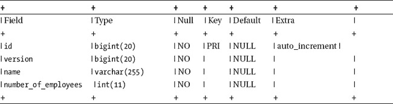

并非所有持久化属性都必然对应领域类中的一个字段。例如，如果一个领域类有一个名为 `getName()` 的方法和一个名为 `setName()` 的方法，那么该领域类就有一个名为 `name` 的持久化属性。该类是否有一个名为“name”的字段并不重要。Grails 会通过在数据库中创建适当的列来存储 `name` 属性的值来处理这种情况。但如果该属性确实不应被持久化，你可以使用 `transients` 属性告诉 Grails 不要这样做，如清单 3-9 所示。

***清单 3-9.** Company 领域类中的瞬态属性*

`class Company {`
`    BigDecimal cash`
`    BigDecimal receivables`
`    BigDecimal capital`

`    BigDecimal getNetWorth() {`
`        cash + receivables + capital`
`    }`

`    static transients = ['netWorth']`
`}`

管理 `netWorth` 属性的另一种方法是将其定义为派生属性。派生属性是只读的持久化属性，其值在检索时由数据库派生得出。由于值是派生出来的，数据库中就没有相应的列来存储该值。相反，必须提供一个 SQL 表达式形式的公式，该公式表示数据库应如何派生该值。对于 `netWorth` 属性，可以通过将表中 `CASH`、`RECEIVABLES` 和 `CAPITAL` 列的值相加来在数据库中派生其值。清单 3-10 展示了其实现方式。

***清单 3-10.** Company 领域类中的派生属性*

`class Company {`
`    BigDecimal cash`
`    BigDecimal receivables`
`    BigDecimal capital`
`    BigDecimal netWorth`

`    static mapping = {`
`        netWorth formula: 'CASH + RECEIVABLES + CAPITAL'`
`    }`
`}`

请注意，此处表达的公式是数据库必须能够理解的 SQL。它不是将在应用程序中解析和执行的代码。它将在数据库中执行，并且 SQL 在关系数据库之间不一定可移植。定义像这样的派生属性意味着可能放弃一定的数据库可移植性。对于许多应用程序来说，这不会成为问题，但在决定使用派生属性时需要意识到这一点。

### 自定义数据库映射

如你所见，Grails 在将领域模型映射到关系数据库方面做得很好，无需任何映射文件。Grails 提供的许多开发人员生产力提升都源于其“约定优于配置”（CoC）特性。每当 Grails 偏好的约定与你的需求不一致时，Grails 都提供了一种简单的方法来处理这些情况。Grails 中的自定义数据库映射 DSL 就属于这一类。

Grails 提供了一个 ORM DSL 来表达你的领域映射，以帮助你处理 Grails 默认设置无法满足你的情况。利用 ORM DSL 的一个常见用例是，Grails 应用程序构建在现有模式之上，而该模式与 Grails 的默认领域类映射不完全兼容。

考虑一个简单的 `Person` 类（参见清单 3-11）。

***清单 3-11.** Person 领域类*

`class Person {`
`    String firstName`
`    String lastName`
`    Integer age`
`}`

在 MySQL 中，该类的默认映射将对应一个如清单 3-12 所示的模式。

***清单 3-12.** 默认的 Person 表*

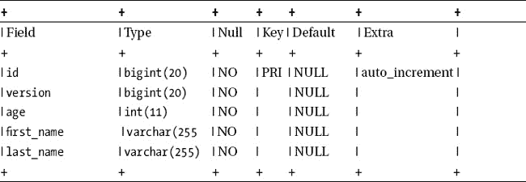

如果你有一个不需要映射到现有模式的绿地应用程序，这完全没问题。如果应用程序确实需要映射到现有模式，那么该模式很可能与 Grails 的默认设置不完全匹配。假设存在一个模式，它看起来像清单 3-13 所示。

***清单 3-13.** 包含 Person 数据的遗留表*

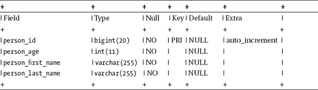

请注意，该表不包含版本列，并且所有列名都以 `person_` 为前缀。你会发现使用 Grails ORM DSL 映射到这样的模式非常简单。但要利用 ORM DSL，你的领域类必须声明一个名为 `mapping` 的公共属性，并为其分配一个闭包（参见清单 3-14）。

***清单 3-14.** Person 领域类的自定义映射*

`class Person {`
`    String firstName`
`    String lastName`
`    Integer age`

`    static mapping = {`
`        id column:'person_id'`
`        firstName column:'person_first_name'`
`        lastName column:'person_last_name'`
`        age column:'person_age'`
`        version false`
`    }`
`}`

清单 3-13 中的示例为每个属性定义了列名，并关闭了 Grails 用于乐观锁定的 `version` 属性。（乐观锁定将在第 9 章中更详细地讨论。）这些只是 ORM DSL 支持的部分功能。

用于持久化 Grails 领域类实例的默认表名是领域类的名称。`Person` 对象存储在 `person` 表中，`Company` 对象存储在 `company` 表中。如果 `Person` 对象需要存储在 `people` 表中，ORM DSL 也支持这样做。清单 3-15 包含了将 `Person` 实例存储到 `people` 表所需的映射代码。

***清单 3-15.** Person 领域类的自定义表映射*

`class Person {`
`    String firstName`
`    String lastName`
`    Integer age`

`    static mapping = {`
`          table 'people'`
`    }`
`}`

我们将在第 9 章中更详细地介绍自定义数据库映射。

### 建立关系

通常，一个应用程序并非由一堆互不关联的领域类组成。更常见的情况是，领域类之间彼此存在关系。当然，并非每个领域类都与其他所有领域类有直接关系，但一个领域类完全孤立于其他领域类存在的情况也并不常见。

Grails 支持领域类之间的多种关系类型。在一对一关系（最简单的类型）中，关系的每一方都持有对另一方的引用。清单 3-16 中展示的关系是一种双向关系。

***清单 3-16.** Car 与 Engine 之间的一对一关系*

`class Car {`
`    Engine engine`
`}`

`class Engine {`
`    Car car`
`}`

在这个模型中，显然一辆 Car 有一个 Engine，而一个 Engine 也有一辆 Car。这些实体在关系中是平等的；没有真正的“所有者”。根据应用程序的需求，这可能并不完全是你想要的。通常，像这样的关系确实有一个拥有方。也许一个 Engine 属于一辆 Car，但一辆 Car 并不属于一个 Engine。Grails 提供了一种机制来表达这种关系，清单 3-17 演示了如何指定其拥有方。

***清单 3-17.** Engine 属于 Car*

`class Car {`
`    Engine engine`
`}`

`class Engine {`
`    static belongsTo = [car:Car]`
`}`

`Engine` 类中 `belongsTo` 属性的值是一个 `Map`。这个 Map 中的键是“`car`”，与该键关联的值是 `Car` 类。这个属性告诉 Grails，`Car` 是此关系的拥有方，并且 `Engine` “属于”其拥有者 `Car`。Map 中的键可以任意命名——名称不必与拥有类的名称相同。然而，以这种方式命名键几乎总是有意义的。该键代表一个将被添加到 `Engine` 类的属性名称，同时也代表了对拥有者的反向引用。清单 3-16 中的 `Engine` 类有一个类型为 `Car` 的属性 `car`。当 `Car` 和 `Engine` 类映射到关系数据库时，`CAR` 表中会有一个外键引用 `ENGINE` 表中的主键。在某些情况下，可能希望外键指向另一个方向。也就是说，你可能希望 `ENGINE` 表中有一个外键引用 `CAR` 表中的主键。实现这一点的方法是在 `Car` 类中定义一个 `hasOne` 属性，如清单 3-18 所示。

***清单 3-18.** Car 拥有一个 Engine (hasOne)*

`class Car {`
`    static hasOne = [engine: Engine]`
`}`

你可能会遇到这样的情况：关系需要一个拥有方，但被拥有方不需要持有对其拥有者的引用。Grails 使用相同的 `belongsTo` 属性支持这种类型的关系，不同之处在于其值是一个 `Class` 引用，而不是一个 `Map`。使用清单 3-19 中的方法，`Engine` 仍然属于其拥有者 `Car`，但 `Engine` 没有对其 `Car` 的反向引用。

***清单 3-19.** Engine 属于 Car，但没有对其拥有者的引用*

`class Engine {`
`    static belongsTo = Car`
`}`

设置 `belongsTo` 属性的一个影响是 Grails 会实施级联删除。Grails 知道 `Engine` “属于”其拥有者 `Car`，因此每当从数据库中删除一个 `Car` 时，其关联的 `Engine` 也会被删除。

一对多关系在 Grails 领域类中同样易于表示。我们的 gTunes 应用程序将需要几个一对多关系，包括 `Artist` 与其 `Albums` 之间的关系，以及 `Album` 与其 `Songs` 之间的关系。你可以说一个艺术家拥有多张专辑，一张专辑拥有多首歌曲。这种“拥有多个”的关系通过 `hasMany` 属性在领域类中表达（见清单 3-20）。

***清单 3-20.** hasMany 属性*

`class Artist {`
`    String name`

`    static hasMany = [albums:Album]`
`}`
`class Album {`
`    String title`

`    static hasMany = [songs:Song]`
`    static belongsTo = [artist:Artist]`
`}`

`class Song {`
`    String title`
`    Integer duration`

`    static belongsTo = Album`
`}`

在清单 3-20 中，一个 `Artist` 拥有多个 `Albums`，并且一个 `Album` 属于其拥有者 `Artist`。`Album` 也持有对其拥有者 `Artist` 的反向引用。一个 `Album` 拥有多个 `Songs`，并且一个 `Song` 属于其拥有者 `Album`。然而，`Song` 并不持有对其拥有者 `Album` 的反向引用。

`hasMany` 属性的值必须是一个 `Map`。Map 中的键代表将被添加到领域类中的集合属性的名称，而与键关联的值代表将存储在该集合属性中的对象类型。`Artist` 类有一个领域属性 `albums`，它将是一个 `Album` 对象的集合。Grails 使用的默认集合类型是 `java.util.Set`，它是一个无序集合。如果这正是你期望的行为，则无需显式声明该属性。Grails 会为你注入该属性。如果你需要该集合是一个 `List` 或 `SortedSet`，则必须使用适当的类型显式声明该属性，如清单 3-21 所示。

***清单 3-21.** Album 类拥有一个 Song 对象的 SortedSet*

`class Album {`
`    String title`

`    static hasMany = [songs:Song]`
`    static belongsTo = [artist:Artist]`

`    SortedSet songs`
`}`

 **注意**  要使此功能生效，`Song` 类必须实现 `Comparable` 接口。这个要求并非 Grails 特有；这是标准 `SortedSet` 集合在 Java 中的工作方式。

`Set` 是一个唯一对象的集合，不允许重复。`List` 是有序的。Hibernate 必须管理所有的排序和唯一性，这在性能方面可能代价高昂。例如，如果一个 `Album` 更新了一首新的 `Song`，并且这些 `Song` 实例存储在一个 `Set` 中，Hibernate 必须去查看与此 `Album` 关联的所有 `Song` 实例，以便判断新添加的 `Song` 是否违反了唯一性约束。在这个特定案例中，问题可能并不严重，因为一个 `Album` 关联的 `Songs` 数量不会特别大。对于集合可能包含大量元素的关系，问题就会变得更加显著。为了帮助管理这类情况，关系可以使用 Hibernate 的 `Bag`。`Bag` 不需要强制唯一性，也不需要维护顺序，因此操作 `Bag` 的内容可能涉及与数据库的交互显著减少。利用 `Bag` 优势的方法是像上面清单 3-19 那样显式声明集合类型，但使用 `java.util.Collection` 作为集合的声明类型。

一个领域类可能代表多个一对多关系的拥有方。与 `hasMany` 属性关联的 `Map` 中可以包含任意数量的条目，每个条目代表另一个一对多关系。例如，如果一个 `Artist` 拥有多个 `Albums` 和多个 `Instruments`，你可以通过在 `Artist` 类的 `hasMany` 属性中添加另一个条目来表示这一点，如清单 3-22 所示。

***清单 3-22.** hasMany 映射中的多个条目*

`class Artist {`
`    String name`

`    static hasMany = [albums:Album, instruments:Instrument]`
`}`

如前所述，子类中的 `belongsTo` 属性表示子类属于所有者；如果所有者被删除，子类也应被删除。默认情况下，Grails 会为此关系配置 `all` 的级联策略。级联策略选项包括 `all`、`merge`、`save-update`、`delete`、`lock`、`refresh`、`evict`、`replicate` 和 `all-delete-orphan`（仅用于一对多关系）。清单 3-23 演示了如何为属于 `Album` 的 `Songs` 设置级联策略。

***清单 3-23.** 自定义级联行为*

`class Album {`
`    String title`

`    static hasMany = [songs:Song]`
`    static belongsTo = [artist:Artist]`

`    static mapping = {`
`        songs cascade: 'delete'`
`    }`
`}`

有关 Hibernate 级联策略的信息和文档，请参阅 [`http://docs.jboss.org/hibernate/core/3.6/reference/en-US/html/objectstate.html#objectstate-transitive`](http://docs.jboss.org/hibernate/core/3.6/reference/en-US/html/objectstate.html#objectstate-transitive)。

### 通过继承扩展类

Grails 领域类可以扩展其他 Grails 领域类。这个继承树可以任意深，但一个好的领域模型很少会涉及超过一两个层次的继承。

声明一个 Grails 领域类扩展自另一个领域类的语法是标准的 Groovy 继承语法，如清单 3-24 所示。

***清单 3-24.** 扩展 Person 类*

`class Person {`
`    String firstName`
`    String lastName`
`    Integer age`
`}`

`class Employee extends Person {`
`    String employeeNumber`
`    String companyName`
`}`

`class Player extends Person {`
`    String teamName`
`}`

这些类应该如何映射到数据库？是否应该为每个领域类分别创建单独的表？是否应该为所有类型的 `Person` 对象创建一个表？Grails 对这两种解决方案都提供了支持。如果所有 `Person` 对象（包括 `Players` 和 `Employees`）都存储在同一张表中，这种方法称为每个层次结构一张表映射。也就是说，会为每个继承层次结构创建一个表（参见清单 3-25）。Grails 将每个层次结构一张表映射作为继承关系的默认方式。

***清单 3-25.** 表示每个层次结构一张表映射的 Person 表*

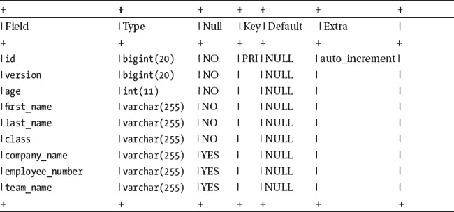

请注意，清单 3-25 包含了 `Person` 类中所有属性的列，以及所有子类中所有属性的列。此外，该表还包含一个名为 `class` 的鉴别器列。由于此表将存放所有类型的 `Person` 对象，因此需要鉴别器列来表示任意给定行中 `Person` 的具体类型。应用程序永远不需要直接查询此列，但该列对于 Grails 的正常工作至关重要。鉴别器列的默认值是类的名称。可以在映射块中自定义鉴别器值，如清单 3-26 所示。

***清单 3-26.** 为鉴别器列指定值*

`class Employee extends Person {`
`    String employeeNumber`
`    String companyName`

`    static mapping = {`
`        // Employee 实例的鉴别器列值应为 'working people'`
`        discriminator 'working people'`
`    }`
`}`

上面的示例调用了鉴别器方法，并传递了一个字符串作为参数。该字符串表示所有代表 `Person` 对象的行的鉴别器值。还可以配置其他几个鉴别器属性（参见表 3-2）。

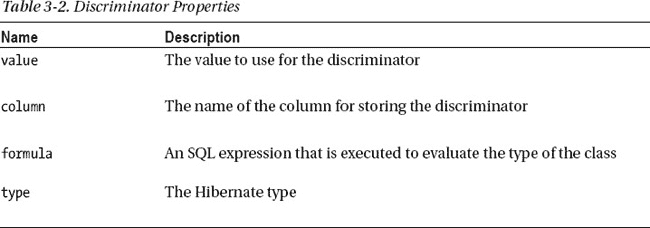

为鉴别器配置多个属性的方法是在映射块中向鉴别器方法传递命名参数，如清单 3-27 所示。

***清单 3-27.** 为鉴别器列指定多个值*

`class Employee extends Person {`
`    String employeeNumber`
`    String companyName`

`    static mapping = {`
`        discriminator value: '42', type: 'integer'`
`    }`
`}`

有关 Hibernate 鉴别器的文档和信息，请参阅 [`http://docs.jboss.org/hibernate/orm/3.6/reference/en-US/html/mapping.html#d0e6906`](http://docs.jboss.org/hibernate/orm/3.6/reference/en-US/html/mapping.html#d0e6906)。

另一种继承映射类型称为每个子类一张表（参见清单 3-28）。

***清单 3-28.** 每个子类一张表映射*

`class Person {`
`    String firstName`
`    String lastName`
`    Integer age`

`    static mapping = {`
`        tablePerHierarchy false`
`    }`
`}`

每个子类一张表映射会为继承层次结构中的每个子类生成一个单独的表（参见清单 3-29）。要利用每个子类一张表映射，父类必须使用 ORM DSL 关闭默认的每个层次结构一张表映射。

***清单 3-29.** 使用每个子类一张表映射的 Person、Employee 和 Player 表*

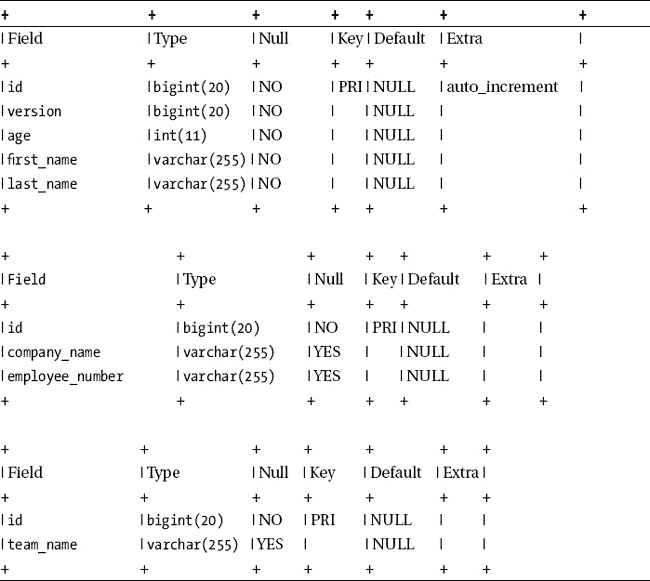

你应该使用哪种映射？答案取决于多个因素。每个层次结构一张表方法的一个后果是，任何子类都不能有非空属性。然而，由于不需要执行连接操作，查询性能会更好，因为所有子类共享一个包含所有子类所有属性列的表。当 `Player` 保存到 `person` 表时，`company_name` 列将保持为空，因为玩家没有公司名称。同样，当 `Employee` 保存到 `player` 表时，`team_name` 列将保持为空。使用每个子类一张表方法的一个后果是，在检索子类实例时必须付出性能代价，因为需要执行数据库连接来汇总构建实例所需的所有数据。

Grails 允许你选择最适合应用程序的方法。请考虑你的应用程序需求和典型的查询用例。这些因素应帮助你决定哪种映射策略适合特定的继承关系。请注意，你不需要在整个应用程序中应用相同的映射策略。出于性能原因，使用每个子类一张表映射实现一个继承关系（因为必须支持非空属性），同时使用每个层次结构一张表映射实现其他不相关的继承关系，这完全没有问题。

Grails 确实支持持久类继承层次结构中的抽象类。处理抽象持久类的支持非常直观。例如，如果 `Car` 和 `Truck` 是分别扩展 `Vehicle` 类的类，并且 `Vehicle` 类是抽象的，你可以查询所有 `Vehicles`；结果将包含 `Car` 和 `Truck` 实例。

### 嵌入对象

Grails 支持组合的概念——可以将其视为一种更强的关联关系。在这种关系下，将“子对象”内联存储在“父对象”所在的位置通常是合理的。考虑一个 `Car` 和 `Engine` 之间的简单关系。如果该关系通过组合实现，那么在持久化层面，`Engine` 实际上会被包含在 `Car` 中。也就是说，会有一个表包含 `Car` 类中所有持久化属性的列，以及属于该 `Car` 的 `Engine` 的所有持久化属性。检索一个 `Car` 及其 `Engine` 不需要跨多个表进行连接，因为所有信息都存储在同一个表中。这样做的一个后果是，如果删除了一个 `Car`，其 `Engine` 也会随之被删除（参见清单 3-30）。

***清单 3-30.** Car 和 Engine 领域类之间的组合关系*

`class Car {`
`    String make`
`    String model`
`    Engine engine`
`}`

`class Engine {`
`    String manufacturer`
`    Integer numberOfCylinders`
`}`

通常，`Car` 对象和 `Engine` 对象会存储在不同的表中；你需要使用外键来关联这些表（参见清单 3-31 和 3-32）。

***清单 3-31.** Car 表*

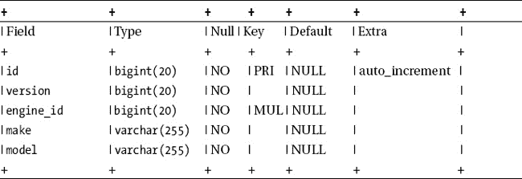

***清单 3-32.** Engine 表*

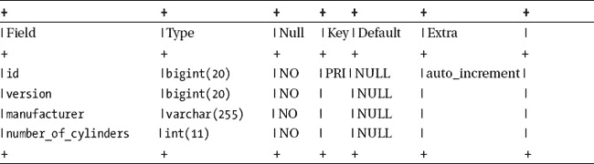

为了将这些类之间的关系视为组合，`Car` 类必须指示 Grails 将 `Engine` “嵌入”到 `Car` 中。你可以通过在 `Car` 类中定义一个公共静态属性 `embedded`，并将该属性赋值为一个包含所有嵌入属性名称的字符串列表来实现这一点（参见清单 3-33）。

***清单 3-33.** 在 Car 中嵌入 Engine*

`class Car {`
`    String make`
`    String model`
`    Engine engine`
`    static embedded = ['engine']`
`}`

有了这个嵌入属性，Grails 就知道 `Car` 对象的 `Engine` 属性应该与 `Car` 对象嵌入到同一个表中。`car` 表现在看起来像清单 3-34 所示。

 **注意**  嵌入属性在 GORM 的 MongoDB 实现中特别有用，因为在 MongoDB 中，在文档内嵌套文档是非常常见的做法。

***清单 3-34.** 嵌入了 Engine 属性的 Car 表*

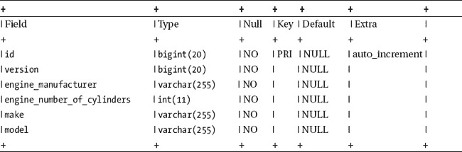

### 测试领域类

自动化测试是构建复杂应用并确认系统按预期运行的重要组成部分。特别是，对于使用 Groovy 这类动态语言构建复杂系统，测试尤为重要。使用动态语言时，开发者无法像使用 Java 或其他静态类型语言那样从编译器获得同样的反馈。

例如，在 Java 中，如果你在方法调用中打错了字，编译器会提示你犯了错误。而当你使用 Groovy 时，由于该语言的动态特性及其运行时，编译器无法标记同样的错误。使用 Groovy，很多事情直到运行时才能确定。你必须执行代码才能知道它是否正确。通过自动化测试执行代码是确保代码按预期工作的绝佳方式。

Grails 为测试应用的许多方面提供了一流的支持。本节将介绍如何测试领域类。

Grails 直接支持两种测试：单元测试和集成测试。单元测试位于项目顶层的 `test/unit/` 目录下，集成测试位于 `test/integration/` 目录下。你必须理解单元测试和集成测试之间的区别。Grails 应用启动时会发生许多动态行为。Grails 在启动时做的事情之一就是为领域类增加许多动态方法，包括 `validate()` 和 `save()`。当你运行集成测试时，所有这些动态行为都是可用的，因此测试可以调用领域对象上的 `validate()` 或 `save()` 方法，即使这些方法并未出现在领域类的源代码中。

然而，当你运行单元测试时，完整的动态环境并未启动，因此诸如 `validate()` 和 `save()` 之类的方法是不可用的。启动整个动态环境是有代价的。因此，你应该只将依赖完整 Grails 运行时环境的测试作为集成测试来运行。

话虽如此，Grails 提供了高级功能，允许你对领域类和其他工件中的许多动态行为进行单元测试。如果你使用 `create-domain-class` 命令创建领域类，Grails 会自动创建一个单元测试。如果你执行 `grails create-domain-class com.gtunes.Song`，Grails 会创建 `grails-app/domain/com/gtunes/Song.groovy` 和 `test/unit/com/gtunes/SongTests.groovy`。Grails 鼓励你做正确的事情——为你的领域类编写测试。如果你没有使用 `create-domain-class` 命令创建领域类，你可以自行创建测试（参见清单 3-35）。请确保将测试放在适当的目录中。

***清单 3-35.** 自动生成的 Song 类单元测试*

`package com.gtunes`

`import grails.test.mixin.*`
`import org.junit.*`

`/**`
` * See the API for {@link grails.test.mixin.domain.DomainClassUnitTestMixin} for usage`
`instructions`
` */`
`@TestFor(Song)`
`class SongTests {`

`    void testSomething() {`
`       fail "Implement me"`
`    }`
`}`

从清单 3-35 可以看出，默认的单元测试模板将`@TestFor`注解应用于测试类，并将`Song`类作为该注解的值。这告诉测试框架，此测试是针对`Song`类的测试。这是一个重要步骤；为了让测试框架能够装配与`Song`领域类相关的许多动态行为，这是必要的。Grails 单元测试运行在一个由`ConcurrentHashMap`支持、而非真实数据库的健壮内存 GORM 实现之上。这种内存实现支持 GORM API 的大部分功能，但基于字符串的查询除外。基于字符串的查询无法在单元测试中完成，必须通过集成测试或功能测试来覆盖。除了基于字符串的查询，你大部分的 GORM 交互都可以在单元测试中进行测试。单元测试环境的启动成本较低，因为它仅使用`ConcurrentHashMap`作为存储。集成测试则依赖于真实数据库，并会产生额外的运行时开销。

要运行测试，请在命令行中调用`test-app Grails`命令。`test-app`命令将运行项目中所有的单元测试和集成测试。如果只想运行单元测试，可以运行类似“`test-app unit:`”的命令。同样，“`test-app integration:`”将只运行集成测试。

`test-app`目标不仅会运行测试，还会生成一份报告，其中包含所有已运行测试的状态。这份报告是标准的 JUnit 测试报告，Java 开发者对此非常熟悉。报告的 HTML 版本将生成在项目根目录下的 [`http://test/reports/html/index.html`](http://test/reports/html/index.html)。

gTunes 应用程序中的 Song 类具有`title`和`duration`属性（见清单 3-36）。

***清单 3-36.** Song 领域类*

`package com.gtunes`

`class Song {`
`    String title`
`    String artist`
`    Integer duration`
`}`

应用程序应将非正数的 duration 视为无效值。该属性的类型是`java.lang.Integer`，其有效值包括 32 位有符号`int`的完整取值范围，包括零和许多负数。应用程序应包含一个如清单 3-37 所示的单元测试，该测试断言系统不会接受非正数的 duration。

***清单 3-37.** Song 单元测试*

`package com.gtunes`

`import grails.test.mixin.*`
`import org.junit.*`

`/**`
` * 有关用法说明，请参阅 {@link grails.test.mixin.domain.DomainClassUnitTestMixin} 的 API`
` */`
`@TestFor(Song)`
`class SongTests {`

`    void testMinimumDuration() {`

`        // 为约束测试设置 Song 类...`
`        mockForConstraintsTests Song`

`        // 创建一个新的 Song`
`        def song = new Song(title: 'Some Title',`
`                            artist: 'Some Artist',`
`                            duration: 0)`
`        // 确保验证失败...`
`        assert !song.validate()`

`        // 确保 'min' 约束失败...`
`        assert 'min' == song.errors['duration']`

`    }`
`}`

请注意清单 3-36 中对`mockForConstraintsTests(Class)`方法的调用，它为`Song`领域类上的`validate()`方法提供了一个模拟实现。执行`grails test-app Song`将运行该测试。该测试（见清单 3-38）最初应该会失败，因为它不包含任何指定`0`是 duration 属性无效值的代码。

***清单 3-38.** SongTests 的测试输出*

`$ grails test-app unit:`
`| 运行 1 个单元测试... 1/1`
`| 失败： testMinimumDuration(com.gtunes.SongTests)`
`|  断言失败：`

`assert 'min' == song.errors['duration']`
`             |  |    |     |`
`             |  |    |     null`
`             |  |    org.codehaus.groovy.grails.plugins.testing.GrailsMockErrors: 0 errors`
`             |  com.gtunes.Song : null`
`             false`

`    at com.gtunes.SongTests.testMinimumDuration(SongTests.groovy:23)`
`| 完成 1 个单元测试，1 个失败，耗时 826ms`
`| 测试失败 - 在 /projects/gtunes/target/test-reports 查看报告`

从一个像这样失败的测试开始，遵循了测试驱动开发（TDD）的理念。该测试代表了所需的行为，它将“驱动”实现以满足需求。

向`Song`类添加一个简单的领域约束，如清单 3-39 所示，应该就能满足测试要求。

***清单 3-39.** 带约束的 Song 领域类*

`package com.gtunes`

`class Song {`

`    String title`
`    String artist`
`    Integer duration`

`    static constraints = {`
`        duration min: 1`
`    }`
`}`

有了这个约束，单元测试应该就能通过。领域类的编写是为了满足测试中表达的需求。具体来说，该领域类认为任何非正数的`duration`值都是无效的。

关于如何对领域类进行单元测试的更多细节将在第 4 章中提供，届时可以在测试控制器操作的上下文中测试领域类的行为。

### 总结

本章介绍了 Grails 领域类的基础知识，涵盖了不少内容。Grails 为常见问题（如验证领域类和映射到关系数据库）提供了简洁的解决方案。GORM 技术是这些能力的主要来源。GORM 将在第 9 章中进行更详细的探讨。

## 第 4 章

## 理解控制器

Grails 控制器是一个负责处理进入应用程序的请求的类。控制器接收请求，可能对请求进行一些处理，最后决定下一步应该做什么。下一步可能包括以下内容：

> *   执行另一个控制器操作（可能但不一定在同一个控制器中）
> *   渲染视图
> *   直接将信息渲染到响应中

控制器默认是原型模式的，这意味着每个请求都会创建一个新实例，因此开发者无需过于谨慎地维护单例控制器中的线程安全代码。控制器的作用域可以通过在控制器中使用一个名为`scope`的静态属性来定义，并将该属性赋值为“singleton”或“session”。要更改应用程序中所有控制器的默认作用域，请在`grails-app/conf/Config.groovy`中定义一个名为`grails.controller.defaultScope`的属性，并将其赋值为“singleton”或“session”。

可以将控制器视为 Grails 应用程序的编排者。它们通过协调传入的请求、将请求委托给服务或领域类以处理业务逻辑，并渲染视图，为任何 Grails 应用程序提供主要的入口点。

在进入数据绑定和命令对象等更实质性的主题之前，让我们先了解一下如何创建控制器的基本知识。

### 定义控制器

控制器是在 `grails-app/controllers` 目录下定义的类。按照惯例，类名必须以“Controller”结尾。控制器不需要继承任何特殊的基类或实现任何特殊的接口。

清单 4-1 展示了一个典型的控制器，它位于 `grails-app/controllers/SampleController.groovy` 路径下；该控制器定义了一个名为 `index` 的操作。`index` 操作会渲染一个简单的文本响应。

***清单 4-1.** SampleController 类*

`class SampleController {`

`  def index() {`
`    render 'You accessed the Sample controller...'`
`  }`
`}`

有了这个控制器，对 `/sample/index` 的请求将导致字符串“You accessed the Sample controller”被渲染回浏览器。你可以看到，像 `index` 这样的操作被定义为控制器中的方法。一个控制器可以定义任意数量的操作，如清单 4-2 所示。

***清单 4-2.** 定义多个操作*

`class SampleController {`
`  def first() {  ...   }`
`  def second() {  ...   }`
`  def third() {  ...   }`
`  def fourth() {  ...   }`
`}`

在第 6 章中，你将了解 Grails 提供的强大 URL 映射支持。默认情况下，URL 通过约定映射到控制器操作。URL 的第一部分表示要访问哪个控制器，第二部分表示要执行哪个操作。例如，`/sample/first` 将执行 `SampleController` 中的 `first` 操作。同样，`/sample/second` 将执行 `SampleController` 中的 `second` 操作。

#### 设置默认操作

你并不一定需要在 URL 中指定要执行的操作。如果未指定操作，Grails 将执行指定控制器中的默认操作。你可以使用以下规则来标识默认操作（参见清单 4-3）：

> *   如果控制器只定义了一个操作，则该操作成为默认操作。
> *   如果控制器定义了一个名为 `index` 的操作，则该操作成为默认操作。
> *   如果控制器定义了一个名为 `defaultAction` 的属性，则该属性的值就是默认操作的名称。

***清单 4-3.** 默认操作*

`// 这里 'list' 操作是默认操作，因为只定义了一个操作`
`class SampleController {`
`    def list() {}`
`}`
`// 在这个例子中，按照惯例 'index' 是默认操作`
`class SampleController {`
`    def list() {}`
`    def index() {}`
`}`

`// 这里 'list' 被显式设置为默认操作`
`class SampleController {`
`    static defaultAction = 'list'`
`    def list() {}`
`    def index() {}`
`}`

#### 日志记录

日志记录是任何应用程序的一个重要方面，它允许应用程序报告关于其内部运行情况的文本信息。Java 平台上有多种日志记录解决方案，包括第三方日志记录解决方案以及 Java 1.4 中引入的标准日志记录 API。在为应用程序配置日志记录时，你会面临一定的复杂性。

通常，应用程序开发者会完全避免日志记录以避开这种复杂性。他们转而选择简单地使用 `System.out.println` 和 `System.err.println` 来打印消息。出于多种原因，这确实不是一个好主意。

幸运的是，Grails 处理了设置日志记录所涉及的大部分复杂性。一个 `log` 属性被注入到每个控制器中，它是 `org.apache.commons.logging.Log` 的一个实例。你不需要编写任何代码来初始化 `log` 属性，因为框架会处理这些。清单 4-4 记录了 `org.apache.commons.logging.Log` API。

***清单 4-4.** org.apache.commons.logging.Log 接口*

`public interface Log {`
`public void debug(Object msg);`
`public void debug(Object msg, Throwable t);`
`public void error(Object msg);`
`public void error(Object msg, Throwable t);`
`public void fatal(Object msg);`
`public void fatal(Object msg, Throwable t);`
`public void info(Object msg);`
`public void info(Object msg, Throwable t);`
`public void trace(Object msg);`
`public void trace(Object msg, Throwable t);`
`public void warn(Object msg);`
`public void warn(Object msg, Throwable t);`
`public boolean isDebugEnabled();`
`public boolean isErrorEnabled();`
`public boolean isFatalEnabled();`
`public boolean isInfoEnabled();`
`public boolean isTraceEnabled();`
`public boolean isWarnEnabled();`
`}`

注入到控制器中的 `log` 属性可以在任何控制器操作或控制器内的任何方法中使用（参见清单 4-5）。

***清单 4-5.** 使用 log 属性*

`class SampleController {`
`  def index() {`
`    log.info('In the index action...')`
`    // ...`
`  }`
`}`

#### 记录异常

Groovy 将所有异常转换为运行时异常，因此 Groovy 代码永远不会被迫捕获异常。这与 Java 开发者习惯的方式不同。无论如何，即使应用程序永远不会被迫捕获异常，在许多场景下捕获异常也是有意义的。在 Groovy 中，捕获异常的细节与 Java 完全相同。处理异常没有特殊的 Groovy 语法。

当在控制器中捕获到异常时，你几乎总是希望使用 `log` 属性记录异常的详细信息（参见清单 4-6）。

***清单 4-6.** 记录异常*

`class SampleController {`
`  def index() {`
`    try {`
`      // 执行某些可能抛出异常的操作`
`    } catch (Exception e) {`
`      log.error ('some message goes here', e)`
`    }`
`  }`
`}`

#### 访问请求属性

Java Servlet 开发者会识别出诸如 `HttpServletRequest`、`HttpServletResponse`、`HttpSession`、`ServletContext` 等组件。这些都是 Servlet 领域的标准角色。当然，Grails 框架与标准的基于 Servlet 的 Web 框架有很大不同。然而，Grails 是构建在这些相同的 Servlet API 之上的。表 4-1 包含了一个自动注入到 Grails 控制器中的标准属性列表。

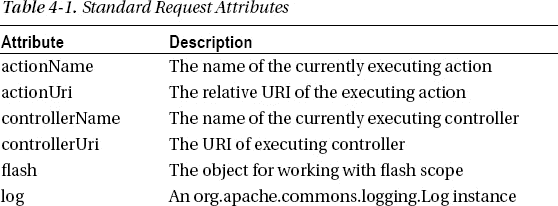

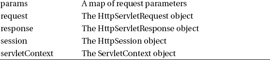

前面列出的许多属性都是标准的 Servlet API 对象，你可以在 Oracle 的 Java 技术网站 [`http://www.oracle.com/technetwork/java/`](http://www.oracle.com/technetwork/java/) 上找到它们的文档。然而，观察使用 Grails 控制器与使用这些对象有何不同是很有趣的。

例如，与请求交互的一种常见方式是检索或设置请求属性。会话和 Servlet 上下文也具有你可以设置或检索的属性。Grails 通过重写点运算符和下标运算符来统一这些操作。表 4-2 展示了在常规 Java Servlet 中访问请求、会话和 Servlet 上下文属性与在 Grails 控制器中访问它们之间的区别。

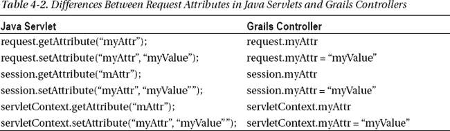

当然，如果你习惯于编写像表格左列那样的代码，你可以继续这样做。Grails 只是让它变得稍微容易一些。

#### 使用控制器作用域

在开发控制器时，你可以从多种作用域中进行选择。以下列表按生命周期从短到长定义了所有可用的作用域：

> *   `request`：放入`request`中的对象在当前正在执行的请求期间保持有效。
> *   `flash`：放入`flash`中的对象仅在当前请求和下一个请求期间保持有效。
> *   `session`：放入`session`中的对象在用户会话失效前保持有效，失效方式可以是手动或过期。
> *   `servletContext`：放入`servletContext`中的对象在整个应用程序中共享，并在应用程序的整个生命周期内保持有效。

如你所见，每个作用域都是独一无二的，并提供了截然不同的语义。在理想情况下，坚持使用`request`作用域可以让你维护一个完全无状态的应用程序。在可扩展性方面，这具有显著优势，因为你无需考虑会话状态复制和会话亲和性等问题。

然而，你当然也可以使用容器提供的复制服务或分布式数据网格来扩展使用`flash`和`session`作用域的有状态应用程序。`session`作用域的优势在于，它允许你将服务器上的数据与单个客户端关联起来。这通常通过使用 cookie 将单个用户与其会话关联来实现。

> *   最后，`servletContext`是一个很少使用的作用域，它允许你在整个应用程序中共享状态。虽然这可能会很有用，但在使用`servletContext`时应谨慎，因为放入其中的对象不会被垃圾回收，除非应用程序显式地移除它们。此外，对`servletContext`对象的访问不是同步的，因此如果你计划从`servletContext`对象中读取和写入对象，则需要手动进行同步，如清单 4-7 所示。

***清单 4-7.** 对 servletContext 的同步访问*

`def index() {`
`     synchronized(servletContext) {`
`             def myValue = servletContext.myAttr`
`             servletContext.myAttr = "changed"`
`             render myValue`
`     }`
`}`

当然，编写这样的代码会导致应用程序出现严重的性能瓶颈，这引出了`servletContext`对象的最佳实践用法：通常，如果你确实需要使用`servletContext`，你应该在启动时预先填充所有需要的值，然后在运行时仅读取这些值。这样你就可以以非同步的方式访问`servletContext`。

#### 理解 Flash 作用域

`flash`对象是一个映射（map），其访问方式与`params`对象相同，根本区别在于存储在`flash`对象中的键/值对存储在`flash`作用域中。什么是`flash`作用域？最好通过它解决的问题来解释。

Web 应用程序中一种常见的模式是执行一些处理，然后将请求重定向到另一个控制器、Servlet 或其他组件。这本身不是问题，但问题在于请求被重定向时会发生什么？重定向请求本质上会创建一个全新的请求，清除所有可能存在于请求属性中的先前数据。重定向的目标通常需要这些数据，但不幸的是，目标操作无法获取到。有些人通过将这些信息存储在会话中来绕过这个问题。

这固然很好，但会话的问题在于开发者经常忘记清除这些临时存储的数据，这给开发者带来了显式管理此状态的负担。图 4-1 说明了这个问题在实际中的表现。

第一个传入的请求在请求上设置了一个名为`message`的属性。然后它通过向客户端发送重定向响应来重定向请求。这会创建一个全新的请求实例，并发送给控制器。遗憾的是，`message`属性丢失了，其值为`null`。

***图 4-1.** 请求属性与重定向*

为了解决这个小小的麻烦，`flash`对象将其值存储起来，仅供下一个请求使用——并且仅限下一个请求——之后它们会自动消失。此功能为你管理了此类用例的负担。这是另一个虽小但重要的特性，它让你能够专注于手头的问题，而不是周边的问题。

`flash`作用域最常见的用例之一是存储一条消息，当某种表单验证失败时显示该消息。清单 4-8 演示了如何将一条假设的消息存储在`flash`对象中，以便下一个请求可以使用它。

***清单 4-8.** 在 Flash 作用域中存储消息*

`flash.message = '我将在你下次请求我时可用！'`

请记住，`flash`对象实现了`java.util.Map`，因此该类的所有常规方法也都可用。图 4-2 展示了`flash`作用域如何解决前述问题。在这里，在第一个请求中，你将一个消息变量存储到`flash`对象中，然后重定向请求。当新请求到来时，你可以访问此消息；没有问题。然后，该消息变量将自动为下一个传入的请求移除。

 **注意**  flash 对象内部仍然使用`HttpSession`实例来存储自身，因此如果你需要任何形式的会话亲和性或集群，请记住这也适用于 flash 对象。

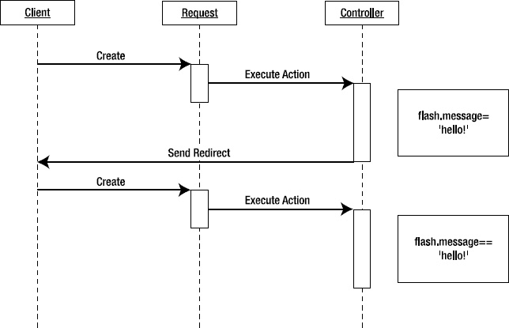

***图 4-2.** 使用 flash 作用域*

#### 访问请求参数

控制器动作通常会接收影响其行为的输入。例如，如果用户提交了一个已填写的表单，那么表单的所有字段名称和值都将以请求参数的形式提供给控制器。标准的 Servlet API 提供了用于访问请求参数的 API。清单 4-9 展示了控制器如何检索`userName`请求参数。

***清单 4-9.** 通过标准 Servlet API 获取请求参数*

`def userName = request.getParameter('userName')`
`log.info("用户名: ${userName}")`

注入到 Grails 控制器中的动态属性之一是名为`params`的属性。这个`params`属性是一个请求参数的映射。清单 4-10 展示了控制器如何使用`params`属性检索`userName`请求参数。

***清单 4-10.** 通过 params 属性获取请求参数*

`def userName = params.userName`
`log.info("用户名: ${userName}")`

#### 请求参数类型转换

传入的请求参数通常是字符串。如果控制器动作想要接收名为 `counter` 的请求参数，并用它来控制某个操作可执行的次数，代码可能类似于清单 4-11。

***清单 4-11.** 请求参数类型转换*

`def index() {`
`    // 由于 params.counter 是字符串，如果应用程序打算将该值用作数字，`
`    // 则必须将其转换为 int 类型`
`    def counter = params.counter.toInteger()`
`    // …`
`}`

Grails 提供了便捷方法用于对请求参数进行此类类型转换。这些方法可在 `params` 对象上使用，其名称对应于 Java 定义的全部八种基本类型（Boolean、byte、char、short、int、long、float 和 double）。每个方法接受一个或两个参数。第一个参数是要转换的请求参数名称，可选的第二个参数是默认值，当找不到对应的请求参数或在转换过程中发生错误时，将返回该默认值。清单 4-12 演示了如何使用 `int` 便捷方法。

***清单 4-12.** 使用 int 类型转换方法*

`def index() {`
`    def counter = params.int('counter')`
`    // …`
`}`

另一种转换方法名为 `list`。当处理多个同名的请求参数时，`list` 方法非常有用。`list` 方法会返回一个列表，其中包含与指定请求参数名称关联的所有值，如清单 4-13 所示。

***清单 4-13.** 使用 list 类型转换方法*

`def index() {`
`    for (name in params.list('name') {`
`        // 对 name 执行某些操作`
`    }`
`}`

如果控制器动作接受简单类型的参数，包括八种基本类型、它们对应的包装类型以及 `java.lang.String`，那么 Grails 将自动尝试进行相应的类型转换，并将结果值作为方法参数传入控制器动作。清单 4-14 中定义的两个控制器动作实现了相同的功能。

***清单 4-14.** 将请求参数绑定到方法参数*

`def firstAction() {`
`    def counter = params.int('counter')`
`    def name = params.name`
`    // …`
`}`
`def secondAction(int counter, String name) {`
`    // 无需与 params 对象交互，因为`
`    // 请求参数已绑定到 counter`
`    // 和 name 方法参数`
`}`

默认情况下，方法参数名称将与请求参数名称对应。如果由于某种原因，请求参数和方法参数需要有不同的名称，则可以使用 `grails.web.RequestParameter` 注解来明确指定哪个请求参数应绑定到特定的方法参数，如清单 4-15 所示。

***清单 4-15.** RequestParameter 注解*

`import grails.web.RequestParameter`

`class AdminController {`

`   // mainNumber 将使用`
`   // params.accountNumber 的值进行初始化`
`   // accountType 将使用 params.int('accountType') 进行初始化`
`   def action(@RequestParameter('accountNumber') String mainNumber,`
`              int accountType) {`
`       // …`
`   }`
`}`

无论你是使用 `RequestParameter` 注解，还是按照约定将方法参数与请求参数关联，如果对应的请求参数不存在，或者方法动作参数发生转换错误，则会传入相应类型的默认值作为参数值。对于 Boolean 类型，默认值为 `false`；对于其他七种基本类型，默认值为零 (0)；对于所有引用类型，默认值为 `null`。控制器有一个 `errors` 属性，其中可能包含与请求参数类型转换相关的错误。清单 4-16 展示了控制器如何与 `errors` 属性交互。

***清单 4-16.** 控制器的 errors 属性*

`class AdminController {`

`  def action(String accountNumber, int accountType) {`
`   if(accountNumber == null && errors.hasErrors()) {`
`     def accountNumberError = errors.getFieldError(caccountNumber')`
`       if(accountNumberError != null) {`
`         // accountNumberError 是`
`         // org.springframework.validation.FieldError 的一个实例`
`         // ...`
`      }`
`    }`
`  }`
`}`

#### 渲染文本

在最基本的形式中，你可以使用控制器中的 `render` 方法将文本输出到响应中。清单 4-17 演示了如何向响应渲染一个简单的字符串。

***清单 4-17.** 渲染一个简单字符串*

`render '此文本将作为响应的一部分被渲染返回'`

你也可以指定 `contentType`：

`render text:'<album>Revolver</album>', contentType:'text/xml'`

`render` 方法最常见的用途是渲染 GSP 视图或 GSP 模板。我们将在第 5 章中详细介绍 GSP。

#### 重定向请求

控制器动作通常需要将控制权重定向到另一个控制器动作。这是控制器动作的常见操作，因此 Grails 提供了一种简单的技术来管理重定向到另一个控制器动作。

Grails 为所有控制器提供了一个 `redirect` 方法，该方法接受一个映射作为参数。该映射应包含 Grails 执行重定向所需的所有信息，包括要重定向到的动作名称。此外，该映射还可以包含要重定向到的控制器名称。

仅当请求被重定向到当前控制器以外的控制器中定义的动作时，才需要指定控制器。清单 4-18 展示了示例控制器中从第一个动作到第二个动作的标准重定向。

***清单 4-18.** 一个简单的重定向*

`class SampleController {`
`  def first() {`
`    // 重定向到 "second" 动作...`
`    redirect action: "second"`
`  }`
`  def second() {`
`    // ...`
`  }`
`}`

如果重定向的目标是另一个控制器中的动作，则必须指定该控制器的名称。清单 4-19 演示了如何重定向到另一个控制器中的动作。

***清单 4-19.** 重定向到另一个控制器中的动作*

`class SampleController {`
`  def first() {`
`    // 重定向到 'store' 控制器中的 'list' 动作...`
`    redirect action: "list", controller: "store"`
`  }`
`}`

尽管前面的示例相当简单，但 `redirect` 方法非常灵活。表 4-3 展示了 `redirect` 方法接受的不同参数。

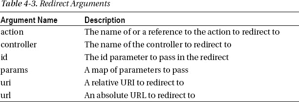

如你所见，`redirect` 方法允许你有效地将控制权从一个动作传递到下一个动作。然而，通常你只是想要整理一些数据以供视图渲染。在接下来的几节中，我们将探讨如何实现这一点。

### 创建模型

控制器中最基础的操作之一就是收集将在视图中渲染的数据。控制器可以直接收集数据，也可以委托给 Grails 服务或其他组件来完成。无论控制器如何收集数据，这些数据通常都会以控制器动作返回的映射（map）形式提供给视图。当控制器动作返回一个映射时，该映射代表视图可以引用的数据。代码清单 4-20 展示了 `SongController` 中的 `show` 动作。

***代码清单 4-20.** 返回将由视图渲染的数据映射*

`class SongController {`
`    def show() {`
`        [ song: Song.get(params.id) ]`
`    }`
`}`

请记住，在 Groovy 中 `return` 语句是可选的。由于 `show` 动作中最后一个被求值的表达式是一个映射，因此该映射就是此动作的返回值。这个映射包含的数据将被传递给视图进行渲染。在代码清单 4-14 中，映射中唯一的键是 `song`，与该键关联的值是基于 `id` 请求参数从数据库中检索到的 `Song` 对象。

现在，视图可以引用这个 song 对象了。尽管这个映射只包含一个条目，但从控制器动作返回的映射可以包含任意数量的条目，只要合适即可。每个条目都代表视图可以引用的一个对象。

### 渲染视图

Grails 中的视图主题非常重要，以至于专门用了一整章（第 5 章）来讨论。但现在，你需要了解 Grails 是如何从控制器的角度进行视图选择的。首先，我们来看一下默认的视图选择策略。

#### 查找默认视图

正如你在代码清单 4-15 中所见，`SongController` 只有一个名为 `show` 的动作。`show` 动作返回一个模型，其中包含一个名为 `song` 的键，该键引用了一个 `Song` 领域类的实例。然而，在代码中任何地方都看不到对将用于处理此动作渲染部分的视图的引用。

这完全可以理解，因为我们没有明确告诉 Grails 要渲染哪个视图。为了解决这个问题，Grails 会根据应用程序中的约定为你做出决定。对于 `show` 动作，Grails 会在 `grails-app/views/song/show.gsp` 位置查找视图。视图的名称取自动作的名称，而父目录的名称则取自控制器名称。真的很简单。

但是，如果你想显示一个完全不同的视图呢？始终灵活的 `render` 方法再次派上了用场。

#### 选择自定义视图

要告诉 Grails 渲染一个自定义视图，你可以使用 `render` 方法的 `view` 参数，如代码清单 4-21 所示。

***代码清单 4-21.** 渲染自定义视图*

`class SongController {`
`    def show() {`
`        render view: "display", model: [ song: Song.get(params.id) ]`
`    }`
`}`

请注意，你可以使用 `model` 参数来传递模型，而不是使用动作的返回值。在代码清单 4-21 的示例中，我们要求 Grails 渲染一个名为 display 的视图。在这种情况下，Grails 会假定你指的是位于 `grails-app/views/song/display.gsp` 的视图。请注意，视图会自动限定在 `grails-app/views/song` 目录下。

如果你要渲染的视图位于另一个（可能是共享的）目录中，你可以指定视图的绝对路径：

`render view:"/common/song", model:[song: Song.get(params.id) ]`

通过以 `/` 字符开头，你可以引用 `grails-app/views` 目录中的任何视图。在上一个示例中，Grails 将尝试渲染位于 `grails-app/views/common/song.gsp` 的视图。

#### 渲染模板

除了视图之外，Grails 还支持模板的概念——即其他视图可以包含的小段视图代码。我们将在第 5 章中更详细地介绍模板，但现在你只需要知道，你可以使用 `render` 方法从控制器渲染一个模板：

`render template: "/common/song", model: [song: Song.get(params.id) ]`

在这种情况下，Grails 将尝试渲染位于 `grails-app/views/common/_song.gsp` 的模板。请注意，与视图不同，按照约定，模板的名称以下划线开头。

### 执行数据绑定

控制器动作通常需要创建新的领域对象，并用请求参数中接收到的值填充实例的属性。以 `Album` 领域类为例，它拥有 `genre` 和 `title` 等属性。如果向 `AlbumController` 中的 `save` 动作发起请求，该控制器动作可以创建一个新的 `Album` 对象，并使用如代码清单 4-22 所示的技术将其保存。

***代码清单 4-22.** 使用请求参数填充 Album 对象*

`class AlbumController {`
`    def save() {`
`        def album = new Album()`
`        album.genre = params.genre`
`        album.title = params.title`
`        album.save()`
`    }`
`}`

代码清单 4-22 中的方法根据相应的请求参数为领域属性赋值。对于属性数量较少的简单模型，这种方法可能有效，但随着领域模型复杂度的增加，这段代码会变得越来越冗长繁琐。幸运的是，Grails 框架提供了一些巧妙的选择，用于将请求参数绑定到领域对象。

请记住，控制器中的 `params` 对象是一个名称/值对的映射。你可以将映射传递给领域类的构造函数，以使用相应的请求参数初始化领域类的所有属性。代码清单 4-23 展示了一种创建并填充 `Album` 对象的更好方法。

***代码清单 4-23.** 通过将 params 传递给构造函数来填充 Album 对象*

`class AlbumController {`
`    def save() {`
`        def album = new Album(params)`
`        album.save()`
`    }`
`}`

 **警告**  默认的数据绑定机制会绑定所有非静态、非瞬态且非动态类型的属性。由于请求参数会自动设置属性，到目前为止详述的这些特性可能会使你的 Web 应用程序面临 URL 攻击的风险。这是执行此类转换的框架（包括 Ruby on Rails、Spring MVC、WebWork 等）中常见的问题。如果你正在开发一个注重高度安全性的 Web 应用程序，则应通过 `bindable` 约束和/或 `bindData` 方法（两者稍后都会介绍）以及更严格的验证，对数据绑定进行细粒度控制。

如你所见，这是一种更简洁的方法，并且随着领域类中属性数量的增加，其扩展性也更好。

有时，对已构建好的领域对象设置属性会很有用。例如，你从数据库中检索出一个领域对象，然后需要使用作为请求参数传递给控制器的值来更新它。在这种情况下，将参数映射传递给领域类构造函数是行不通的，因为对象已经存在。Grails 在这里提供了另一个巧妙的解决方案。你可以将领域类的 `properties` 属性与请求参数结合使用来更新现有对象，如代码清单 4-24 所示。

***代码清单 4-24.** 使用请求参数更新现有对象*

`class AlbumController {`
`    def update() {`
`        def album = Album.get(params.id)`
`        album.properties = params`
`        album.save()`
`    }`
`}`

每当你的应用程序接受用户输入时，该输入都有可能不符合应用程序的要求。你已经在第 3 章中了解了如何在领域类上定义自定义验证约束；现在你将开始理解如何将数据绑定与这些约束结合使用来验证传入的数据。

#### 验证传入数据

Grails 中数据绑定和数据验证过程的机制分为两个阶段。首先，让我们重新审视下面这行代码：

`album.properties = params`

此时，Grails 将尝试将所有传入的请求参数绑定到实例的属性上。Groovy 是一种强类型语言，所有参数都以字符串形式到达，因此可能需要进行一些类型转换。

在底层，Grails 使用 Spring 的数据绑定功能在必要时将请求参数转换为目标类型。在此过程中，可能会发生类型转换错误，例如，如果无法将数字的 `String` 表示形式转换为 `java.lang.Integer`。如果发生错误，Grails 会自动将持久化实例设置为只读，因此除非你显式地使其持久化，否则它无法持久化（有关自动脏检查的更多信息，请参阅第 10 章）。

如果一切顺利，则开始验证的第二阶段。此时，你根据已定义的约束来验证持久化实例，可以使用 `validate()` 方法或 `save()` 方法，如第 3 章所述：

`album.validate()`

Grails 将验证 `Album` 实例的每个属性，并用可能发生的任何验证错误填充 `Errors` 对象。这自然而然地引出了对 Errors API 的讨论。

#### Errors API 与控制器

Grails 验证机制的机制完全构建在 Spring 的 `org.springframework.validation` 包之上。如第 3 章所述，每当你验证一个领域实例时，都会创建一个 Spring 的 `org.springframework.validation.Errors` 对象，并将其与该实例关联。

从控制器的角度来看，当你有一个处于无效状态的领域对象时——通常是由于无效的用户输入通过数据绑定更改了实例——你需要使用分支逻辑来处理验证错误。

代码清单 4-25 展示了一个如何使用数据绑定更新 `Album` 实例并验证其状态的示例。

***代码清单 4-25.** 处理验证错误*

`def save() {`
`    def album = Album.get(params.id)`
`    album.properties = params`
`    if(album.save()) {`
`        redirect action: "show", id: album.id`
`    } else {`
`        render view: "edit", model: [album:album]`
`    }`
`}`

请注意，在代码清单 4-20 中，你可以调用 `save()` 方法（该方法会触发验证），并在发生验证错误时将用户发送回编辑视图。当用户输入无效数据时，Album 上的 `errors` 属性将是一个包含一个或多个验证错误的 `Errors` 对象。

你可以通过迭代这些错误来以编程方式解读它们：

`album.errors.allErrors.each { println it.code }`

如果你只想检查一个实例是否有任何错误，可以在该实例上调用 `hasErrors()` 方法：

`if(album.hasErrors()) println "Something went wrong!"`

在视图中，你可以使用 `<g:renderErrors>` 标签来渲染这些错误：

`<g:renderErrors bean="${album}" />`

在本书的后续内容中，你将学习更多关于在视图中处理错误的知识，但正如你所见，协调发生的错误并确保用户输入有效数据通常是控制器的工作。

#### 数据绑定到多个领域对象

在迄今为止所见的数据绑定示例中，都假设您希望将参数绑定到单个领域实例。然而，您可能会遇到需要创建多个领域实例的场景。

例如，考虑在 gTunes 应用程序中创建 `Artist` 实例的情况。应用程序可能要求一个 `Artist` 只有在至少发布了一张 `Album` 时才能存在。在这种情况下，同时创建 `Artist` 和第一张 `Album` 是合理的。

要理解处理多个领域实例时的数据绑定，首先需要了解参数是如何从表单提交的。例如，考虑更新一个 `Album` 的情况以及这行代码：

`album.properties = params`

在这种情况下，期望参数不以任何方式进行命名空间化。换句话说，要更新 `Album` 实例的 `title` 属性，您可以提供一个如下的 HTML 输入：

`<input type="text" name="title" />`

请注意 `<input>` 的 name 属性如何与属性名匹配。这在多个领域类的情况下显然行不通，因为您可能有两个不同的领域类都拥有名为 title 的属性。您可以通过使用点号对传递的任何参数进行命名空间化来解决这个问题：

`<input type="text" name="album.title" />`
`<input type="text" name="artist.name" />`
`...`

现在，通过在 `params` 对象中按其各自的命名空间引用它们，来创建并绑定 `Album` 和 `Artist` 实例：

`def album = new Album( params["album"] )`
`def artist = new Artist( params["artist"] )`

#### 使用 bindData 方法进行数据绑定

您目前所见的数据绑定技术是自动的，并由 Grails 隐式处理。然而，在某些情况下，您可能需要对数据绑定过程进行更精细的控制，或者将数据绑定到领域类以外的对象。为了帮助解决这个问题，Grails 提供了一个 `bindData` 方法，该方法接受要绑定数据的对象和一个 `java.util.Map`。

该映射应包含与传入对象中目标属性名称匹配的键。例如，如果您只想确保 `title` 属性被绑定到 `Album` 实例，您可以使用清单 4-26 中所示的代码。

***清单 4-26.** 使用 bindData 方法*

`class AlbumController {`
`    def save() {`
`        def album = Album.get(params.id)`
`        bindData(album, params, [include:"title"])`
`        // ...`
`    }`
`}`

请注意在清单 4-26 中，您可以将 `Album` 实例作为第一个参数传递，将要绑定到该实例的参数作为第二个参数传递。最后一个参数是一个映射，指定您希望仅在数据绑定过程中包含 `title` 属性。如果您希望绑定除 title 属性之外的*所有*属性，您可以将映射中的键改为 exclude。

最后，正如您在上一节中所见，您可以使用 Grails 中的默认数据绑定机制绑定到多个领域实例。您也可以使用 `bindData` 方法做到这一点，使用最后一个参数来指定要过滤的前缀。

`bindData(album, params, [include:"title"], "album")`

在这个例子中，前缀 `album` 作为最后一个参数传递，使得 `bindData` 方法绑定所有以 `album` 前缀开头的参数。

#### 数据绑定与关联

进行数据绑定时要考虑的最后一个主题是它如何与关联相关联。最容易理解的情况是多对一和一对一关联。例如，考虑 `Album` 类的 `artist` 属性，它是一个多对一关联，如清单 4-27 所示。

***清单 4-27.** Album 类的 artist 关联*

`class Album {`
`    Artist artist`
`    // ...`
`}`

在处理像这样的多对一关联时，您需要考虑两种情况。第一种情况涉及创建新实例。假设您使用以下代码创建一个新的 `Album` 实例：

`def album   = new Album(params)`

在这种情况下，如果有任何参数引用了 `artist` 关联，例如 `artist.name`，则会自动实例化一个新的 `Artist` 实例并将其分配给 `Album` 实例。要设置的属性名称取自请求参数名称中点号右侧的值。对于 `artist.name`，要设置的属性是 `name`。为了进一步说明，以下 `<input>` 标签展示了一个表单字段的示例，该字段将填充 `Album` 类的 `artist` 关联：

`<input type="text" name="artist.name" />`

第二种情况发生在您分配一个关联的现有实例（例如，一个现有的 `Artist`）或修改一个关联时。为此，您需要使用带有 `.id` 后缀的请求参数传递关联的标识符。例如，您可以使用以下 `<input>` 来指定应与现有或新的 `Album` 关联的 `Artist`：

`<input type="text" name="artist.id" value="1" />`

处理完单端关联后，让我们考虑包含多个对象的关联。例如，一个 `Album` 在其 `songs` 关联中拥有多个 `Song` 实例。如果您想提供一个表单来创建 `Album` 及其关联的歌曲，该怎么办？为了实现这一点，您可以使用下标风格的引用来填充或更新多个 `Song` 实例：

`<input type="text" name="songs[0].title" value="The Bucket" />`
`<input type="text" name="songs[1].title" value="Milk" />`

请注意，Grails 中关联的默认集合类型是 `java.util.Set`，因此除非您将默认值更改为 `java.util.List`，否则条目的顺序将不会保留，因为 `Set` 类型没有顺序的概念。如果您想创建一个新的 `Album` 实例并使用现有的歌曲集合填充 `songs` 关联，那么您只需使用 `.id` 后缀指定它们的标识符即可：

`<input type="text" name="songs[0].id" value="23" />`
`<input type="text" name="songs[1].id" value="47" />`

#### 可绑定约束

如前所述，默认的数据绑定机制会绑定所有非静态、非瞬态且非动态类型的属性。`bindData` 方法允许提供白名单和黑名单，以便在数据绑定期间更精细地控制哪些属性被赋值。框架支持的另一种技术是以声明方式明确指定哪些属性是可绑定的。完成此操作后，每当执行数据绑定而未提供白名单或黑名单时，只有配置为可绑定的属性才会在数据绑定期间被赋值。清单 4-28 演示了如何表达各个属性的可绑定性的语法。

***清单 4-28.** 可绑定约束*

`class User {`
`    /* userName 和 salary 默认是可绑定的 */`
`    String userName`
`    BigDecimal salary`

`    /* group 和 numberOfActiveGroups 默认是不可绑定的 */`
`    def group`
`    transient int numberOfActiveGroups`

`    static constraints = {`
`        salary bindable: false`
`        group bindable: true`
`    }`
`}`

如果创建了清单 4-28 中定义的 `User` 类的实例，并通过类似 `user.properties = params` 的方式执行数据绑定，则只有 `userName` 和 `group` 属性会参与数据绑定。通常 `salary` 属性会参与数据绑定，但在 `constraints` 块中为该属性指定 `bindable: false` 会告知框架不这样做。`salary` 属性不会参与数据绑定，因为在 `constraints` 块中为该属性指定了 `bindable: false`。`numberOfActiveGroups` 属性不会参与数据绑定，因为它是瞬态的。

### 使用命令对象

有时，某个特定操作不需要涉及领域类，但仍需要验证用户输入。在这种情况下，您可能需要考虑使用命令对象。命令对象是一个类，它拥有领域类的所有数据绑定和数据验证能力，但并非持久化。换句话说，您可以像定义领域类一样定义命令对象的约束，并对其进行验证。

#### 定义命令对象

与任何其他对象一样，命令对象需要定义类。您可以在 `grails-app/controllers` 目录中定义命令类，甚至可以在与控制器相同的文件中定义。与 Java 不同，Groovy 支持每个文件定义多个类的概念，如果您计划将某个特定命令对象仅用于您正在处理的控制器，这将非常方便。

例如，您可以定义一个 `AlbumCreateCommand`，它封装了在保存新的 `Album` 实例之前对其进行的验证和创建。清单 4-29 展示了这样一个示例。

***清单 4-29.** 命令对象定义示例*

`class AlbumCreateCommand {`
`    String artist`
`    String title`
`    List songs = []`
`    List durations = []`

`    static constraints = {`
`        artist blank:false`
`        title blank:false`
`        songs minSize:1, validator:{ val, obj ->`
`            if(val.size() != obj.durations.size())`
`                return "songs.durations.not.equal.size"`
`        }        `
`    }`

`    Album createAlbum() {`
`        def artist = Artist.findByName(artist) ?: new Artist(name:artist)`
`        def album = new Album(title:title)`
`        songs.eachWithIndex { songTitle, i ->`
`            album.addToSongs(title:songTitle, duration:durations[i])`
`        }`
`        return album`
`     }`
`}`

在清单 4-29 中，您可以看到一个命令对象定义，它旨在捕获随后创建有效 `Album` 实例所需的一切。请注意，您可以像在领域类中一样在命令对象上定义约束。`createAlbum()` 方法是可选的，但它很有趣，因为它展示了如何将命令对象用作工厂，获取一组有效数据并构建您的领域实例。在下一节中，您将看到如何利用清单 4-29 中的命令对象。

#### 使用命令对象

为了使用命令对象，您需要将命令指定为控制器操作的第一个参数。例如，要使用 `AlbumCreateCommand`，您需要有一个 `save` 操作，如清单 4-30 所示。

***清单 4-30.** 使用命令对象*

`class AlbumController {`
`    def save(AlbumCreateCommand cmd) {`
`        // ...`
`    }`
`}`

您需要使用其类型定义将命令对象显式定义为操作的第一个参数。接下来会发生什么：当请求到来时，Grails 会自动创建一个新实例，将传入的请求参数绑定到该实例的属性，并将其作为第一个参数传递给您。

像这样向命令提供请求参数非常简单。清单 4-31 显示了一个示例表单。

***清单 4-31.** 提供用于填充数据的表单*

`<g:form url="[controller: 'album', action: 'save'] ">`
`       Title: <input type="text" name="title" />  `
`       Artist: <input type="text" name="artist" />  `
`                Song 1: <input type="text" name="songs[0]" />  `
`                Song 2: <input type="text" name="songs[1]" />  `
`       ...`
`</g:form>`

您可能希望使用一些 JavaScript 使歌曲的输入动态化；尽管如此，您可以在清单 4-31 中看到其概念。一旦您让用户能够输入数据，并使用命令对象捕获这些数据，您需要做的就是验证它。并非所有命令对象都是可验证的。要使命令对象可验证，命令对象类的源代码必须定义在使用该命令对象的控制器的同一源文件中，或者命令对象类必须使用 `grails.validation.Validateable` 注解进行标记。请注意，`grails.validation.Validateable` 注解不仅适用于命令对象类，还可以应用于任何应具有关联验证行为的 Groovy 类。清单 4-32 展示了使用命令对象时 `save` 操作的逻辑可能的样子。

***清单 4-32.** 使用命令对象进行验证*

`def save(AlbumCreateCommand cmd) {`
`      if(cmd.validate()) {`
`            def album = cmd.createAlbum()`
`            album.save()`
`            redirect(action:"show", id:album.id)`
`       }`
`       else {`
`            render(view:"create", model:[cmd:cmd])`
`        }`
`}`

如您所见，现在是命令对象在确保请求的有效性，并且我们将其用作工厂来构建一个完全有效的 `Album` 实例。与领域类一样，命令对象拥有一个 `Errors` 对象，因此您可以使用 `<g:renderErrors>` 标签向用户显示验证错误。

`<g:renderErrors bean="{cmd}" />`

### 施加 HTTP 方法限制

通常，Web 应用程序需要为特定控制器操作施加允许哪些 HTTP 请求方法的限制。例如，通常认为控制器操作响应 HTTP `GET` 请求执行任何破坏性操作是一个坏主意。此类操作应仅限于 HTTP `POST` 和 `DELETE`。

#### 实现命令式解决方案

处理此问题的一种方法是让控制器动作检查请求方法，并阻止针对不恰当的 HTTP 请求方法执行某些操作。代码清单 4-33 展示了一个简单的命令式解决方案。

***代码清单 4-33.** 在控制器动作中检查 HTTP 请求方法*

`class SongController {`
`  def delete() {`
`    if(request.method == "GET") {`
`      // 不要响应 GET 请求执行删除操作`
`      // 重定向到列表动作`
`      redirect action: "list"`
`    } else {`
`      // 在此处执行删除操作...`
`    }`
`  }`
`}`

虽然这种方法相当直接且能完成任务，但它是一个繁琐的解决方案。在实际应用中，同样的逻辑会出现在许多控制器动作中。

#### 利用声明式语法

将动作限制为特定 HTTP 请求方法的更好解决方案是利用一种简单的声明式语法，该语法表达了哪些 HTTP 请求方法对特定控制器动作是有效的。Grails 通过控制器中可选的 `allowedMethods` 属性支持这种方法。

`allowedMethods` 属性表达了哪些 HTTP 请求方法对任何特定控制器动作是有效的。默认情况下，所有 HTTP 请求方法都被视为对任何特定控制器动作有效。如果你希望某个动作只能通过特定的请求方法访问，那么你应该将该动作包含在 `allowedMethods` 属性中。

你应该为 `allowedMethods` 属性赋予一个映射值。映射中的键应该是你想要限制的动作名称。与键关联的值应该是一个表示特定请求方法的字符串，或者是一个表示该特定动作所有允许方法的字符串列表。代码清单 4-34 展示了一个示例。

***代码清单 4-34.** 使用 allowedMethods 属性限制对控制器动作的访问*

`class SomeController {`
`    // action1 只能通过 POST 调用`
`    // action2 没有限制`
`    // action3 可以通过 POST 或 DELETE 调用`
`    static allowedMethods = [action1: 'POST', action3: ['POST', 'DELETE']]`
`    def action1() { ... }`
`    def action2() { ... }`
`    def action3() { ... }`
`}`

如果违反了 `allowedMethods` 属性中表达的规则，框架将拒绝该请求并返回 405 错误代码，HTTP 规范将其定义为“方法不允许”。

### 控制器输入输出

到目前为止，你已经了解到控制器可以通过重定向和渲染视图来控制请求流。除此之外，控制器可能还需要从客户端读取二进制输入或向客户端写入二进制输出。在本节中，我们将探讨如何读取数据（包括文件上传）以及如何向客户端写入二进制响应。

#### 处理文件上传

开发 Web 应用程序时，更常见的用例之一是允许用户使用多部分请求将本地文件上传到服务器。这正是 Grails 基于 Spring MVC 的坚实基础开始大放异彩的地方。

Spring 通过 servlet API 的 `HttpServletRequest` 接口的一个扩展——`org.springframework.web.multipart.MultipartHttpServletRequest`，对处理文件上传提供了出色的支持，其定义见代码清单 4-35。

***代码清单 4-35.** org.springframework.web.multipart.MultipartHttpServletRequest 接口*

`interface MultipartHttpServletRequest extends HttpServletRequest {`
`         public MultipartFile getFile(String name);`
`         public Map getFileMap();`
`         public Iterator getFileNames();`
`}`

如你所见，`MultipartHttpServletRequest` 接口只是扩展了默认的 `HttpServletRequest` 接口，以提供处理请求中文件的有用方法。

###### 处理多部分请求

本质上，每当检测到多部分请求时，控制器实例中就会存在一个实现了 `MultipartHttpServletRequest` 接口的请求对象。这提供了对代码清单 4-35 中所示方法的访问，以访问多部分请求中上传的文件。代码清单 4-36 还展示了如何使用 `<g:uploadForm>` 标签定义多部分表单。

***代码清单 4-36.** 一个上传表单示例*

`<g:uploadForm action="upload">`
`      <input type="file" name="myFile" />`
`      <input type="submit" value="上传！" />`
`</g:uploadForm>`

重要的部分已用粗体标出，但上传表单基本上需要两样东西：

> *   一个 `<form>` 标签，其 `enctype` 属性设置为 `multipart/form-data`。代码清单 4-36 中的 `<g:uploadForm>` 会自动为你完成此操作。
> *   一个 `<input>` 标签，其 `type` 属性设置为 `file`。

在前面的例子中，文件输入的名称为 `myFile`；这一点至关重要，因为它是你在使用 `MultipartHttpServletRequest` 接口的 `getFile` 方法时使用的命名引用。例如，`upload` 动作中的代码将从请求中检索上传的文件（参见代码清单 4-37）。

***代码清单 4-37.** 检索上传的文件*

`def upload() {`
`    def file = request.getFile('myFile')`
`    // 对文件进行一些操作`
`}`

请注意，`getFile` 方法返回的不是 `java.io.File`。相反，它返回的是 `org.springframework.web.multipart.MultipartFile` 的一个实例，该接口的详细信息见代码清单 4-38。如果在请求中未找到该文件，`getFile` 方法将返回 `null`。

***代码清单 4-38.** org.springframework.web.multipart.MultipartFile 接口*

`interface MultipartFile {`
`    public byte[] getBytes();`
`    public String getContentType();`
`    public java.io.InputStream getInputStream();`
`    public String getName();`
`    public String getOriginalFilename();`
`    public long getSize();`
`    public boolean isEmpty();`
`    public void transferTo(java.io.File dest);`
`}`

`MultipartFile` 接口中定义了许多有用的方法。潜在用例包括以下内容：

> *   使用 `getSize()` 方法仅允许上传特定大小的文件。
> *   使用 `isEmpty()` 方法拒绝空文件。
> *   使用 `getInputStream()` 方法将文件作为 `Java.io.InputStream` 读取。
> *   使用 `getContentType()` 方法仅允许上传特定类型的文件。
> *   使用 `transferTo(dest)` 方法将文件传输到服务器。

例如，代码清单 4-39 中的代码将在文件不为空且大小小于 1024 字节时将其上传到服务器。

***代码清单 4-39.** 文件上传实战*

`def upload() {`
`    def file = request.getFile('myFile')`
`    if(file && !file.empty && file.size < 1024)  {`
`        file.transferTo( new File( "/local/server/path/${file.name}" ) )`
`    }`
`}`

直接使用 `MultipartHttpServletRequest` 实例是管理文件上传的一种方式，但通常你需要读取文件的内容。在下一节中，我们将探讨 Grails 如何通过数据绑定使这变得更容易。

好的，作为高级文档工程师和翻译员，我将严格遵循您提供的注意事项和示例，将给定的英文文本翻译成中文。

###### 上传与数据绑定

在“执行数据绑定”一节中，您已经了解了 Grails 如何处理从字符串到其他常见 Java 类型的自动类型转换。我们当时没有讨论的是，这种能力如何扩展到文件上传。Grails 通过 Spring MVC，会根据以下规则自动将上传的文件绑定到领域类实例的属性上：

> *   如果目标属性是 `byte []`，则会绑定文件的字节。
> *   如果目标属性是 `String`，则会绑定文件内容（作为字符串）。

假设您希望允许 gTunes 应用程序的用户为每张专辑上传专辑封面。通过在 `Album` 领域类中添加一个名为 `art` 且类型为 `byte[]` 的新属性，您就自动拥有了将图像数据保存到数据库的能力，如清单 4-40 所示。

***清单 4-40.** 添加 art 属性*

`class Album{`
`    byte[] art`
`    // ...`
`}`

要绑定上传的文件，您只需在 `<g:uploadForm>` 标签中添加一个与 `art` 属性名称匹配的 `art` 上传字段即可。

`<input type="file" name="art" />`

下面这行代码会自动处理文件到 `Album` 的绑定：

`def user = new Album( params )`

Grails 会自动识别请求为 multipart 类型，检索文件，并将构成该文件的字节绑定到 `Album` 类的 `art` 字节数组属性。此能力也扩展到与之前讨论的 `properties` 属性和 `bindData` 方法结合使用。

#### 读取请求输入流

如果您想获取请求正文中包含的文本，可以使用 `request` 对象的 `inputStream` 属性，如清单 4-41 所示。

***清单 4-41.** 读取请求正文*

`def readText() {`
`    def text = request.inputStream.text`
`    render "You sent $text"`
`}`

#### 写入二进制响应

您可以使用标准的 Servlet API 调用向客户端发送二进制响应，例如清单 4-42 中的示例，它使用 `HttpServletResponse` 对象以 ZIP 文件的形式将二进制数据输出到响应中。

***清单 4-42.** 向响应写入二进制数据*

`def createZip() {`
`    byte[] zip = ... // 从某个源创建 zip`
`    render file: zip`
`}`

该代码结合使用了 `response` 对象的 `outputStream` 属性和 Groovy 重载的左移 `<<` 运算符，该运算符存在于许多用于输出或追加内容的对象中，例如 `java.io.Writer` 和 `java.lang.StringBuffer` 等。

### 使用简单拦截器

通常，通过拦截对特定方法的调用来捕获方法执行的流程是非常有用的。这个概念是面向切面编程（AOP）的基础，它允许定义要拦截的“切入点”（执行点）。然后，您可以通过使用 *前置*、*后置* 和 *环绕* “通知”来修改被拦截的执行过程。

顾名思义，AOP 中的 *前置* 通知是在被拦截的方法调用之前执行的代码；*后置* 通知是在被拦截的方法调用之后执行的代码。*环绕* 通知是可以完全替换方法调用的代码。AOP 的强大之处在于它为实现横切关注点提供了支持。

这个概念常用的例子是方法调用的日志记录。尽管 Grails 中的拦截机制在可拦截的切入点方面远未提供同等的强大功能和灵活性，但它确实满足了拦截控制器上操作调用的基本需求。

此外，如果拦截器仅适用于单个控制器，那么它们会非常有用。如果您的需求跨越多个控制器，那么最好使用过滤器（第 14 章将讨论此主题）。使用拦截器，您可以拦截所有操作，也可以通过指定应拦截哪些操作来提供更细粒度的控制。让我们看几个例子，从 *前置* 拦截器开始。

#### 前置通知

幸运的是，与 Grails 的其他部分一样，由于约定优于配置，不需要繁琐的 XML 配置或注解技巧。定义一个 *前置* 拦截器只需在目标控制器内创建一个名为 `beforeInterceptor` 的闭包属性，如清单 4-43 所示。

***清单 4-43.** 一个 beforeInterceptor*

`def beforeInterceptor = {`
`    log.trace("Executing action $actionName with params $params")`
`}`

清单 4-43 使用 `log` 对象在定义该拦截器的控制器内的任何操作执行之前输出跟踪信息。此示例适用于控制器中定义的每个操作。但是，您可以使用拦截条件应用更细粒度的控制。

例如，假设您想要跟踪用户每次查看 `Album` 以及每个用户的居住国家/地区。您可以定义一个 `beforeInterceptor`，如清单 4-44 所示。

***清单 4-44.** 使用拦截条件*

`class AlbumController {`
`    private trackCountry = {`
`        def country = request.locale.country`
`        def album = Album.get(params.id)`
`        new AlbumVisit(country:country, album:album).save()`
`    }`
`    def beforeInterceptor = [action: trackCountry, only: 'show']`
`}`

从清单 4-44 可以看出，您可以使用映射字面量来定义 `beforeInterceptor`。`action` 键定义了应执行的代码。在这个例子中，我们使用了 `only` 条件，这意味着拦截器仅适用于 `show` 操作。您可以将其更改为 `except` 条件，在这种情况下，拦截器将应用于 *除* `show` 操作之外的 *所有* 操作。

最后，`beforeInterceptor` 还可以通过返回 false 来停止操作的执行。例如，如果您只允许美国访客访问您的站点，则可以在用户来自美国境外时发送 403 禁止访问的 HTTP 代码（参见清单 4-45）。

***清单 4-45.** 使用 beforeInterceptor 停止执行*

`class AlbumController {`
`    def beforeInterceptor = {`
`        if(request.locale != Locale.US) {`
`            response.sendError 403`
`            return false`
`        }`
`    }`
`}`

#### 后置通知

*后置* 通知是使用名称不言自明的 `afterInterceptor` 属性定义的，该属性同样接受一个闭包。传递给该闭包的第一个参数是操作产生的模型，如清单 4-46 所示。

***清单 4-46.** 一个 afterInterceptor 示例*

`def afterInterceptor = { model ->`
`    log.trace("Executed $actionName which resulted in model: $model")`
`}`

同样，在这个相当简单的例子中，日志机制跟踪任何执行的操作。

### 测试控制器

Grails 使用混入（mixin）为单元测试控制器提供特殊行为。例如，当前的 `AlbumController` 类没有测试覆盖。如果使用 `create-controller` 命令创建控制器，则会同时创建一个单元测试。如果没有，要为该控制器创建测试，你需要创建一个新的测试类。`create-controller` 命令生成的默认单元测试如清单 4-47 所示。

***清单 4-47.** 控制器单元测试模板*

`package com.gtunes`

`import grails.test.mixin.*`
`import org.junit.*`

`@TestFor(AlbumController)`
`class AlbumControllerTests {`

`    void testSomething() {`
`       fail "Implement me"`
`    }`
`}`

让我们考虑一个我们想要测试的简单控制器操作。清单 4-48 展示了 `AlbumController` 中的一个 `list` 操作，它返回一个模型，该模型包含数据库中所有专辑的列表。

***清单 4-48.** 一个简单的控制器操作*

`package com.gtunes`

`class AlbumController {`

`    def list() {`
`        [albumList: Album.list()]`
`    }`
`}`

一个尝试执行该操作并验证模型包含预期信息的单元测试可能类似于清单 4-49 中的代码。

***清单 4-49.** 一个简单的控制器单元测试*

`package com.gtunes`

`import grails.test.mixin.*`

`@TestFor(AlbumController)`
`class AlbumControllerTests {`

`    void testListAction() {`
`        def model = controller.list()`
`        // 对模型进行断言`
`    }`
`}`

尝试运行该测试将导致错误，如清单 4-50 所示。

***清单 4-50.** 控制器单元测试失败*

`grails> test-app unit:`
`| Running 1 unit test... 1 of 1`
`| Failure:  testListAction(com.gtunes.AlbumControllerTests)`
`|  groovy.lang.MissingMethodException: No signature of method: com.gtunes.Album.list() is`
`applicable for argument types: () values: []`
`| Completed 1 unit test, 1 failed in 200ms`
`| Tests FAILED  - view reports in target/test-reports`
`grails>`

这里测试的问题在于 `AlbumController` 中的 `list` 操作调用了 `Album.list()` 方法，而该方法在我们的单元测试环境中不可用。幸运的是，框架使得模拟整个 GORM API 变得非常容易，因此可以执行这样的单元测试。一种方法是使用带有领域类参数的 `@Mock` 注解。这会指示框架将 GORM API 添加到此领域类，并提供 GORM 的完整内存实现，从而允许完整的 GORM API 在无需创建真实数据库的情况下运行。所有这些都在清单 4-51 中更完整的单元测试中得到了体现。

***清单 4-51.** 更新后的 AlbumControllerUnitTests*

`package com.gtunes`

`import grails.test.mixin.*`
`import grails.test.mixin.domain.*`

`@TestFor(AlbumController)`
`@Mock(Album)`
`class AlbumControllerTests {`

`    void testListAction() {`
`        new Album(title: 'Trilogy').save()`
`        new Album(title: 'Tarkus').save()`

`        def model = controller.list()`
`        assert model.albumList?.size() == 2`
`    }`
`}`

在清单 4-51 中，我们测试了返回的模型，但某些控制器操作会直接写入响应或发出重定向，而不是返回值。要测试写入响应的操作，你可以使用控制器的 `response` 对象，它是 `org.codehaus.groovy.grails.plugins.testing.GrailsMockHttpServletResponse` 类的一个实例，该类间接扩展了 `org.springframework.mock.web.MockHttpServletResponse` 类，并提供了额外的实用方法。

`MockHttpServletResponse` 类中的几个有用方法允许你检查当前响应的状态。特别是，`getText()` 方法提供了对当前写入响应内容的字符串访问。例如，如果你有一个向响应渲染某些文本的操作，你可以像清单 4-52 所示那样测试它。

***清单 4-52.** 测试响应的内容*

`void testIndex() {`
`    controller.index()`
`    assert 'Welcome to the gTunes store!' == response.text`
`}`

### 控制器实战

在本节中，你将学习如何使用 Grails 控制器构建一个简单的登录和注册系统。在第 12 章中，我们将重构此系统以使用更通用的 Grails 安全插件之一，但目前它将作为一个有用的起点。

开发任何网站时首先要考虑的事情之一是网站的入口点。目前，你刚刚创建了一堆脚手架页面，但现在该是第一次考虑真正应用程序的时候了，从主页开始。

#### 创建 gTunes 主页

gTunes 应用程序是一个音乐商店，用户可以登录、浏览可用的音乐并购买他们可以播放的音乐。首先，你需要建立一个主页。你已经有了一个 `StoreController`，因此你可以将其用作处理主页的控制器。为了确保访问者被路由到此控制器，你可以修改 `grails-app/conf/UrlMappings.groovy` 文件，将访问应用程序根目录的访问者映射到此控制器（参见清单 4-53）。

***清单 4-53.** 将用户路由到应用程序根目录的 StoreController*

`class UrlMappings {`
`    static mappings = {`
`        "/"(controller:"store")`
`    }`
`}`

请注意，你可以使用正斜杠告诉 Grails 将对应用程序根目录的任何请求映射到 `StoreController`。从映射中可以看出，它没有映射到 `StoreController` 中的任何特定操作，这将触发默认操作。默认操作是 `index` 操作，它当前会写出一个简单的文本响应。你需要更改 `index` 操作，以便视图委托生效。

`def index() {}`

现在，`index` 操作不再返回文本响应，而是委托给 `grails-app/views/store/index.gsp` 视图，你可以使用该视图来渲染主页。我们将从一些简单的、仅显示欢迎消息的内容开始；我们稍后可以对此进行扩展。清单 4-54 显示了相关的标记代码。

***清单 4-54.** gTunes 主页*

`<html>`
`    <head>`
`        <meta http-equiv="Content-type" content="text/html; charset=utf-8">`
`        <meta name="layout" content="main">`
`        <title>gTunes Store</title>`
`                </head>`
`    <body id="body">`
`        <h1>Your online music store and storage service!</h1>`
`        
Manage your own library, browse music and purchase new tracks as they`
`           become available
`
`                </body>`
`</html>`

下一步是考虑如何让用户注册、登录和注销。在此之前，你需要在 gTunes 应用程序中定义用户的概念。让我们在下一节中完成这项工作。

#### 添加用户领域类

为了对用户进行建模，你需要创建一个包含个人信息（如名字和姓氏）以及每个用户的登录名和密码的 `User` 领域类。为此，你可以使用 `create-domain-class` 命令：

`grails create-domain-class com.gtunes.User`

这将在 `grails-app/domain/com/gtunes/User.groovy` 位置创建一个新的领域类。完成此操作后，你需要向 `User` 领域类中添加一些属性，如清单 4-55 所示。

***清单 4-55.** 用户领域类*

`package com.gtunes`
`class User {`
`    String login`
`    String password`
`    String firstName`
`    String lastName`
`    static hasMany = [purchasedSongs:Song]`
`}`

如你所见，清单 4-56 中的代码仅捕获了用户的基本信息，但你可以轻松扩展这些信息，以包含地址、联系电话等。需要注意的一个属性是 `purchasedSongs` 关联，一旦你实现了音乐购买功能，它将持有用户购买的所有歌曲的引用。

然而，在我们过于超前之前，先添加一些约束条件，以确保领域实例保持有效状态（参见清单 4-56）。

***清单 4-56.** 对用户类应用约束*

`class User {`
`    ...`
`    static constraints = {`
`        login blank:false, size:5..15,matches:/[\S]+/, unique:true`
`        password blank:false, size:5..15,matches:/[\S]+/`
`        firstName blank:false`
`        lastName blank:false`
`    }`
`}`

有了这些约束，你可以确保用户不能输入空白值或不符合必要大小限制的值。此外，请注意 `unique` 约束的使用，它确保了 `login` 属性对每个用户是唯一的。我们稍后会更详细地讨论这一点；现在，让我们专注于登录和注册。

#### 添加登录表单

因为你已经有了一个主页，将登录表单添加在那里可能是有意义的。但随着时间的推移，你会希望允许用户匿名浏览 gTunes 音乐目录，因此用户应该能够从任何地方登录。考虑到这一点，你需要将登录表单添加到 `grails-app/views/layouts/main.gsp` 布局中，以便它在每个页面上都可用。

清单 4-57 展示了实现此功能的 GSP 代码。请注意如何检查 `session` 对象中是否已存在用户，并相应地显示欢迎框或登录表单。

***清单 4-57.** 在所有地方添加登录表单*

`
`
`  <g:if test="${session?.user}">`
`    
`
`      
`
`        <a href="#">个人资料</a> | <g:link controller="user"`
`                                    action="logout">退出登录</g:link> `
`      
`
`      欢迎回来`
`      `
`        ${session?.user?.firstName}!`
`        `

`      您已购买 (${session.user.purchasedSongs?.size() ?: 0}) 首歌曲。 `
`    
`
`  </g:if>`
`  <g:else>`
`    <g:form`
`      name="loginForm"`
`      url="[controller:'user',action:'login']">`
`      
用户名：
`
`      <g:textField name="login"`
`                   value="${fieldValue(bean:loginCmd, field:'login')}">`
`      </g:textField>`
`      
密码：
`
`      <g:passwordField name="password"></g:passwordField>    `
`       `
`      <input  type="image"`
`          src="${createLinkTo(dir:'images', file:'login-button.gif')}"`
`          name="loginButton" id="loginButton" border="0"></input>`
`    </g:form>`
`    <g:renderErrors bean="${loginCmd}"></g:renderErrors>`
`  </g:else>`
`
`

除了提供登录框，你还需要提供一个允许用户注册的链接。一旦登录，用户将能够点击进入商店浏览，并点击“我的音乐”链接查看已购买的音乐。当用户未登录时，这些链接不会显示，因此你可以利用屏幕空间放置一个指向注册页面的醒目链接。清单 4-58 显示了添加到 `main.gsp` 布局中的注册链接。

***清单 4-58.** 添加指向注册页面的链接*

`    
`
`      <g:if test="${session.user}">`
`        <ul>`
`          <li><g:link controller="user"`
`                      action="music">我的音乐</g:link></li>`
`          <li><g:link controller="store"`
`                      action="shop">商店</g:link></li>        `
`        </ul>    `
`      </g:if>`
`      <g:else>`
`        
`
`          需要账户？`
`            <g:link controller="user"`
`                    action="register">立即注册</g:link>`
`          开始创建您个人的音乐收藏吧！`
`        
            `
`      </g:else>`
`    
`

在让网页设计师参与进来并对层叠样式表（CSS）进行一些调整后，主页从零开始变得稍微像样了一些（参见图 4-3）。

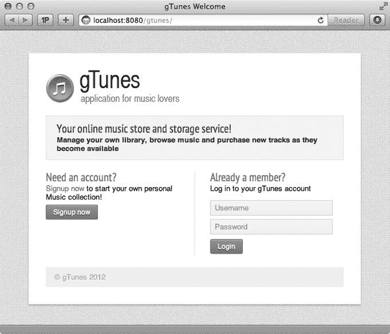

***图 4-3.** gTunes 主页*

#### 实现注册功能

在用户实际登录之前，他们需要先在网站上注册。你需要运行 `create-controller` 命令来创建一个控制器，该控制器将处理网站的登录和注册逻辑。

`grails> create-controller com.gtunes.User`
`| Created file grails-app/controllers/com/gtunes/UserController.groovy`
`| Created file grails-app/views/user`
`| Created file test/unit/com/gtunes/UserControllerTests.groovy`
`grails>`

命令完成后，将在路径 `grails-app/controllers/com/gtunes/UserController.groovy` 处创建一个控制器。打开此控制器并添加一个 `register` 操作，如清单 4-59 所示。

***清单 4-59.** 添加 register 操作*

`class UserController {`
`    def register() {}`
`}`

从示例中可以看出，`register` 操作目前除了委托给视图之外，什么也不做。尽管如此，它为你提供了制作注册表单的机会。清单 4-60 展示了来自 `grails-app/views/user/register.gsp` 视图的简化代码，该视图将渲染表单。

***清单 4-60.** register 视图*

`  <body id="body">`
`    <h1>注册</h1>`
`    
填写下方表单以创建账户！
`
`    <g:hasErrors bean="${user}">`
`      
`
`        <g:renderErrors bean="${user}"></g:renderErrors>`
`      
      `
`    </g:hasErrors>`

`    <g:form action="register" name="registerForm">`
`      
`
`        <label for="login">登录名：</label>`
`        <g:textField name="login" value="${user?.login}"></g:textField>`
`      
`
`      
    `
`        <label for="password">密码：</label>`
`        <g:passwordField name="password" value="${user?.password}"></g:passwordField>`
`      
`
`      
`
`        <label for="confirm">确认密码：</label>`
`        <g:passwordField name="confirm" value="${params?.confirm}"></g:passwordField>`
`      
`
`      
`
`        <label for="firstName">名字：</label>`
`        <g:textField name="firstName" value="${user?.firstName}"></g:textField>`
`      
`
`      
`
`        <label for="lastName">姓氏：</label>`
`        <g:textField name="lastName" value="${user?.lastName}"></g:textField>`
`      
`
`      <g:submitButton class="formButton" name="register" value="注册"></g:submitButton>`
`    </g:form>`
`  </body>`

渲染后的注册表单将类似于图 4-4 中的截图。

从图 4-4 中可以看出，你还可以提供一个确认密码字段，以防止用户输错密码。完成这些后，让我们考虑控制器逻辑。为了实现注册，你可以利用 Grails 的数据绑定功能，将传入的请求参数绑定到一个新的用户实例上。此时，验证开始接管，剩下的工作就是一些分支逻辑。清单 4-61 展示了完整的 `register` 操作。

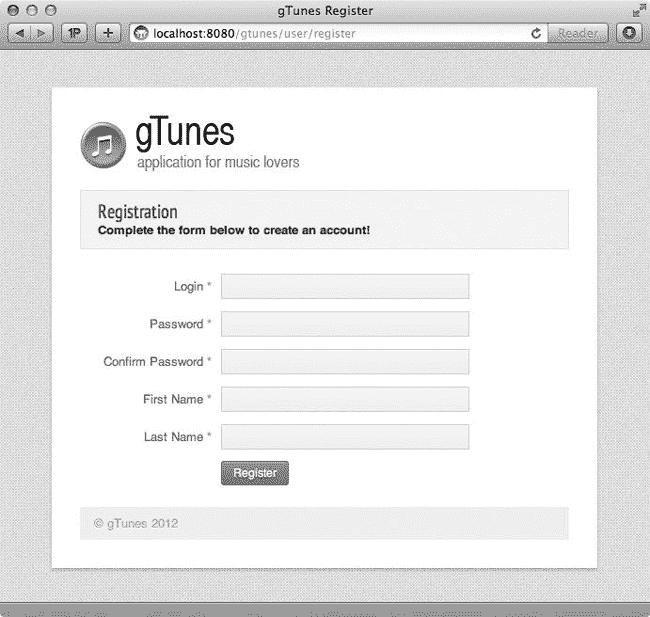

***图 4-4.** 注册界面*

***清单 4-61.** 实现 register 操作*

`def register() {`
`  if(request.method == 'POST') {`
`    def u = new User()`
`    u.properties['login', 'password', 'firstName', 'lastName'] = params`
`    if(u.password != params.confirm) {`
`      u.errors.rejectValue("password", "user.password.dontmatch")`
`      return [user:u]`
`    } else if(u.save()) {`
`      session.user = u`
`      redirect controller:"store"`
`    } else {`
`      return [user:u]`
`    }`
`  }`
`}`

你在本章中学到的许多关键概念都已应用于清单 4-61 中，其中还包括一些新概念。让我们逐步分析代码，看看发生了什么。首先，代码检查传入的请求是否为 `POST` 请求，因为除非提交了表单，否则执行所有这些处理是没有意义的。

`                if(request.method == 'POST') {`

然后数据绑定开始工作，它将传入的请求参数绑定到 `User` 实例。

`                def u = new User(params)`

接着，代码确认用户是否两次输入了正确的密码。如果不是，则完全拒绝该密码。

`    if(u.password != params.confirm) {`
`         u.errors.rejectValue("password", "user.password.dontmatch")`
`       return [user:u]`
`    }`

请注意，这是通过调用 `org.springframework.validation.Errors` 接口的 `rejectValue` 方法来实现的。`rejectValue` 方法接受两个参数：要拒绝的字段名称和要使用的错误代码。清单 4-61 中的代码使用字符串 `user.password.dontmatch` 作为错误代码，当 `<g:renderErrors>` 标签触发以显示错误时，该代码将出现。如果你想提供更好的错误消息，可以打开 `grails-app/i18n/messages.properties` 文件并添加如下消息：

`user.password.dontmatch=指定的密码不匹配`

最后需要注意一点：在调用 `rejectValue` 之后，立即从 `controller` 操作返回一个模型，这会触发渲染 `register.gsp`，以便它可以显示错误。

你会注意到，代码尝试通过调用 `save()` 方法来持久化用户。如果尝试成功，用户将被重定向回 `StoreController`。

`    else if(u.save()) {`
`        session.user = u`
`        redirect controller:"store"`
`    }`

最后，如果由于调用 `save()` 而确实发生了验证错误，则从 `register` 操作返回一个简单的模型，以便 `register` 视图可以渲染错误：

`                return [user:u]`

#### 测试注册码

现在，我们来思考如何运用之前学到的单元测试技术来测试该操作。当你运行 `create-controller` 命令时，系统会在 `test/unit` 目录下为你创建一个针对 `UserController` 的新单元测试。

现在，为密码不匹配的情况编写一个测试。清单 4-62 展示了 `testPasswordsDontMatch` 测试用例，该用例用于检查密码不匹配是否会触发验证错误。

***清单 4-62.** testPasswordsDoNotMatch 测试用例*

`void testPasswordsDoNotMatch() {`
`  request.method = 'POST'`

`  params.login = 'henry'`
`  params.password = 'password'`
`  params.confirm = 'wrongPassword'`
`  params.firstName = 'Henry'`
`  params.lastName = 'Rollins'`

`  def model = controller.register()`
`  def user = model.user`

`  assert user.hasErrors()`
`  assert 'user.password.dontmatch' ==`
`         user.errors['password'].code`
`}`

请注意 `testPasswordsMatch` 测试用例是如何用两个不同的密码填充 `mockParams` 对象的。然后，你调用了 `register` 操作，该操作应拒绝新的 `User` 实例，并返回 `user.password.dontmatch` 错误码。测试的最后一行通过检查 `User` 实例上的 `errors` 对象来断言这种情况：

`assert 'user.password.dontmatch' ==`
`       user.errors['password'].code`

接下来要考虑的场景是用户向注册表单中输入无效数据。你可能需要多个测试来检查不同类型的数据输入。请记住，测试写得再多也不为过！作为一个潜在场景的示例，清单 4-63 展示了一个测试，用于检查用户是否输入了空白数据或未输入数据。

***清单 4-63.** testRegistrationFailed 测试*

`void testRegistrationFailed() {`
`  request.method = 'POST'`

`  params.login = ''`

`  def model = controller.register()`
`  def user = model.user`

`  assert user.hasErrors()`
`  assert session.user == null`
`  assert 'blank' == user.errors['login'].code`
`  assert 'nullable' == user.errors['firstName'].code`
`  assert 'nullable' == user.errors['lastName'].code`
`}`

再次，你可以看到使用 `errors` 对象来检查是否违反了相应的约束。最后，你需要确保两件事来测试注册成功：

> *   `User` 实例已被放入 `session` 对象中。
> *   请求已被正确重定向。

清单 4-64 展示了一个测试成功用户注册的测试用例示例。

***清单 4-64.** 测试成功注册*

`void testRegistrationSuccess() {`
`  request.method = 'POST'`

`  params.login = 'henry'`
`  params.password = 'password'`
`  params.confirm = 'password'`
`  params.firstName = 'Henry'`
`  params.lastName = 'Rollins'`

`  controller.register()`

`  assert '/store' == response.redirectedUrl`
`  assert session.user != null`
`}`

测试编写完成后，现在我们来思考如何允许用户登录 gTunes 应用程序。

#### 允许用户登录

由于你已经添加了登录表单，接下来需要做的就是实现控制器逻辑。登录过程非常适合使用命令对象，因为它涉及捕获信息（登录名和密码），而无需实际持久化数据。

在这个例子中，你将创建一个 `LoginCommand` 来封装登录逻辑，让控制器操作只处理简单的事情。清单 4-65 展示了 `LoginCommand` 类的代码，该类与 `UserController` 类定义在同一个文件中。

***清单 4-65.** LoginCommand*

`class LoginCommand {`
`  String login`
`  String password`
`  private u`
`  User getUser() {`
`                if(!u && login) {`
`                  u = User.findByLogin(login, [fetch:[purchasedSongs:'join']])`
`                }`
`                return u`
`  }`
`  static constraints = {`
`                login blank:false, validator:{ val, obj ->`
`                    if(!obj.user)`
`                      return "user.not.found"`
`                }`
`             password blank:false, validator:{ val, obj ->                                          `
`                    if(obj.user && obj.user.password != val)`
`                      return "user.password.invalid"`
`                }`
`  }`
`}`

`LoginCommand` 定义了两个属性，用于捕获名为 `login` 和 `password` 的请求参数。然而，代码的主要逻辑在于约束定义。首先，`blank` 约束确保登录名和/或密码不能留空。其次，`login` 参数上的自定义验证器检查用户是否存在：

`login blank:false, validator:{ val, cmd ->`
`    if(!cmd.user)`
`        return "user.not.found"`
`}`

自定义的 `validator` 约束接受一个闭包，该闭包接收两个参数：值和 `LoginCommand` 实例。闭包内的代码调用 `LoginCommand` 的 `getUser()` 方法来检查用户是否存在。如果用户不存在，代码返回一个错误码——“user.not.found”——表示发生了错误。

在 `password` 参数上，另一个自定义的 `validator` 约束检查用户是否指定了正确的密码：

`password blank:false, validator:{ val, cmd ->`
`    if(cmd.user && cmd.user.password != val) return "user.password.invalid" }`

这里，验证器再次使用 `LoginCommand` 的 `getUser()` 方法，将实际 `User` 实例的密码与 `LoginCommand` 持有的 `password` 属性值进行比较。如果密码不正确，则返回一个 `error` 码，触发一个错误。你可以通过将相应的消息添加到 `grails-app/i18n/messages.properties` 文件中，为 `LoginCommand` 返回的每个自定义错误添加合适的消息：

`user.not.found=User not found`
`user.password.invalid=Incorrect password`

完成这些后，是时候通过在 `UserController` 中实现 `login` 操作来使用 `LoginCommand` 了。清单 4-66 展示了 `login` 操作的代码。

***清单 4-66.** login 操作*

`def login(LoginCommand cmd) {`
`  if(request.method == 'POST') {`
`    if(!cmd.hasErrors()) {`
`      session.user = cmd.getUser()`
`      redirect controller:'store'`
`    } else {`
`      render view:'/store/index', model:[loginCmd:cmd]`
`    }`
`  } else {`
`    render view:'/store/index'`
`  }`
`}`

有了命令对象，控制器只需要做它最擅长的事情：发出重定向和渲染视图。同样，与 `register` 操作类似，登录处理仅在收到 `POST` 请求时启动。然后，如果命令对象没有错误，用户将被放入会话中，请求被重定向到 `StoreController`。

#### 测试登录流程

由于涉及命令对象，测试 `login` 操作与测试 `register` 操作略有不同。我们来看几个需要测试的场景。首先，你需要测试找不到用户的情况（参见清单 4-67）。

***清单 4-67.** testLoginUserNotFound 测试用例*

`void testLoginUserNotFound() {`
`    request.method = 'POST'`

`    params.login = 'frank'`
`    params.password = 'hotrats'`

`    controller.login()`
`    def cmd = model.loginCmd`

`    assert cmd.hasErrors()`
`    assert 'user.not.found' == cmd.errors['login'].code`
`    assert session.user == null`
`    assert '/store/index' == view`
`}`

你可以检查命令对象中的错误，如清单 4-59 中的以下两行所示：

`    assert cmd.hasErrors()`
`    assert 'user.not.found' == cmd.errors['login'].code`

下一个要测试的场景是用户输入错误密码。清单 4-68 展示了 `testLoginPasswordInvalid` 测试用例，演示了如何执行此操作。

***清单 4-68.** testLoginPasswordInvalid 测试用例*

`void testLoginFailurePasswordInvalid() {`
`    request.method = 'POST'`

`    def u = new User(login: 'maynard',`
`                     firstName: 'Maynard',`
`                     lastName: 'Keenan',`
`                     password: 'undertow').save()`
`    assert u != null`

`    params.login = 'maynard'`
`    params.password = 'lateralus'`

`    controller.login()`
`    def cmd = model.loginCmd`

`    assert cmd.hasErrors()`
`    assert 'user.password.invalid' ==`
`           cmd.errors['password'].code`
`    assert session.user == null`
`    assert '/store/index' == view`
`}`

最后一个要编写的测试是测试成功登录。清单 4-69 展示了如何执行此操作。

***清单 4-69.** testLoginSuccess 测试用例*

`void testLoginSuccess() {`
`    request.method = 'POST'`

`    def u = new User(login: 'maynard',`
`                     firstName: 'Maynard',`
`                     lastName: 'Keenan',`
`                     password: 'undertow').save()`
`    assert u != null`

`    params.login = 'maynard'`
`    params.password = 'undertow'`

`    controller.login()`

`    assert session.user != null`
`    assert '/store' == response.redirectedUrl`
`}`

### 小结

至此，你已经为 gTunes 应用实现了登录和注册流程。本书后续章节将提供更多使用控制器的示例，但本章你已经扎实掌握了适用于控制器的核心概念。从数据绑定、验证到命令对象，Grails 控制器机制为你提供了大量工具。要全面理解各部分如何协同工作，你需要深入掌握 Grails 的视图技术——Groovy Server Pages (GSP)。在下一章中，我们将更详细地探讨 GSP 及其提供的动态标签库和模板机制。

## 第 5 章

## 理解视图

在开源世界中，Web 应用的视图技术似乎相当受欢迎，至少从 Java 领域数量繁多的视图技术来看是如此。如果你对传统的 JSP 感到厌倦，似乎总有更新、更好的技术值得学习。然而，JSP 仍然是 Sun 公司为与微软的 Active Server Pages (ASP) 竞争而推出的最流行的视图技术，它已成为行业标准，并且开发者对 JSP 有着丰富的知识积累。

JSP 允许开发者将 HTML 等传统标记语言与 Java 代码片段（称为 *scriptlets*）混合使用，以生成动态输出。缺点是，这种机制极易被滥用；因此，出现了自定义标签库，它们能够通过标签将逻辑从 JSP 页面中抽象出来。JSP 通过增加两个缺失的组件——JSP 标准标签库 (JSTL) 和表达式语言 (EL)——来提升其性能，以追赶一些开源竞争对手。

鉴于 JSP 的成熟性、健壮性以及在行业内的熟悉度，为什么还有人需要为 Grails 使用另一种视图技术——Groovy Server Pages (GSP) 呢？答案在于 Groovy 运行时环境。

> *   要充分利用 Grails，视图技术需要了解 Groovy 的运行时环境及其相关的动态方法分发机制。
> *   Groovy 提供了更强大的表达式语言，包括 GPath 表达式、Groovy Bean 表示法和可重载的运算符。
> *   Groovy 的其他特性——例如正则表达式支持、`GString` 以及用于映射和列表的简洁语法——使其成为视图技术的理想选择。

当然，对于任何新的视图技术，重要的是不要重蹈 JSP 早期迭代的覆辙。混合使用 scriptlets 和标记代码被认为是不好的做法，为此，GSP 提供了一种创建自定义标签的机制，就像 JSP 一样，但不会牺牲任何敏捷性。

### 基础知识

由于在本书的多个章节中已经接触过 GSP，你可能已经接近专家水平了。尽管如此，讨论 GSP 的基础知识对于帮助你全面掌握其中的所有概念仍然非常宝贵。

需要注意的是，GSP 实际上与 JSP 非常相似，根据经验你会知道，在 JSP 中，许多对象默认是*可用*的。这些对象包括 `request`、`response` 和 `session` 对象——与你在第 4 章中看到的相同。如果你还记得，那部分讨论提到，包括 `flash` 在内的几个额外对象对控制器是可用的。你会很高兴地知道，这些对象也可以从 GSP 视图中访问，此外还有一个额外的 `out` 属性，它是一个代表响应输出的 `java.io.Writer` 实例。表 5-1 描述了可用的 GSP 属性。

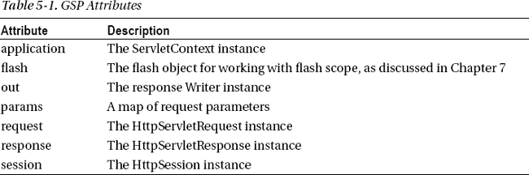

你已经知道如何从控制器中访问这些对象，但在视图中呢？不出所料，GSP 支持 JSP 中可用的相同结构，以及一些额外的结构。接下来的几个示例可能看起来有点像 JSP 101 教程，但不要混淆——你肯定是在处理 Groovy，而不是 Java。

#### 理解模型

在任何 MVC 模式（例如 Grails 采用的模式）中，基本活动之一是将信息（模型）传递给视图进行渲染。在第 4 章中你已经看到了实际应用，但为了回顾一下，清单 5-1 展示了如何在 Grails 中实现这一点。

***清单 5-1.** 创建模型*

`package package com.gtunes`
`class StoreController {`

`    def shop() {`
`        def genreList =`
`            new DetachedCriteria(Album).distinct('genre').list()`
`        [genres:genreList.sort()]`
`    }`
`}`

在清单 5-1 中（`StoreController` 的 `shop` 操作），结果是一个包含一个元素的映射，其键是一个值为 `genres` 的字符串。这个键（及其值）随后被放入 GSP 模型（或者对于更熟悉 Groovy 术语的人来说，称为 *binding*），使其可以像表 5-1 中的页面属性一样作为变量访问。

在接下来的章节中，你将看到引用 `genres` 变量的示例。请记住，这个变量并非凭空出现。如清单所示，它是通过控制器中的代码传递给视图的。

#### 页面指令

GSP 支持 JSP 中可用页面指令的一个有限子集。*页面指令* 是出现在 GSP 顶部的一条指令，用于执行页面所依赖的操作。例如，它可以设置内容类型、执行导入或设置页面属性，甚至可以是特定于容器的属性。

其中最有用的指令之一是 `contentType` 指令，它允许你设置响应的内容类型。这很有用，因为它允许你使用 GSP 输出 HTML 标记以外的格式，包括 XML 或纯文本。在使用上，该指令与 JSP 相同，指令出现在页面顶部并以 `<%@` 开头。

清单 5-2 将内容类型设置为 `text/xml`，这允许你输出 XML。这在处理 Ajax 和类似技术时非常有用。

***清单 5-2.** contentType 页面指令*

`<%@ page contentType="text/xml; charset=UTF-8" %>`

另一个可用的页面指令是 `import` 指令，它类似于 Java 或 Groovy 类中的 `import` 语句。然而，由于 Groovy 默认导入了许多类，并且 Grails 鼓励采用 MVC 架构（其中大部分逻辑应放在控制器中而非视图中），因此 `import` 的使用并不常见。尽管如此，清单 5-3 展示了一个从 `java.sql.*` 包中导入 `Time` 类的示例。

***清单 5-3.** import 页面指令*

` <%@ page import="java.sql.Time" %>`

 **注意**  Groovy 默认导入 `java.lang`、`java.util`、`java.io`、`java.net`、`groovy.lang` 和 `groovy.util` 包。

#### Groovy 脚本小程序

GSP 力求尽可能与 JSP 保持一致，因此它支持使用 `<%...%>` 语法的传统 JSP 脚本小程序块。本质上，一旦你输入了开始的 `<%` 声明，你就进入了 Groovy 的世界，并且可以输入你选择的任何 Groovy 代码，直到结束的 `%>` 声明。

这意味着你可以通过组合脚本小程序声明来使用脚本小程序执行循环和逻辑 `if` 语句，如清单 5-4 所示。

***清单 5-4.** 脚本小程序实战*

`<html>`
`    <body>`
`      <% 3.times { %>`
`        
我被打印了三次！
`
`      <% } %>`
`    </body>`
`</html>`

请注意，脚本小程序的存在更多是为了与 JSP 语法保持一致。在实践中，不鼓励使用它们，而推荐使用 GSP 标签，你将在“内置 Grails 标签”部分看到这些标签。

虽然前面的语法允许在开始和结束声明之间插入任意代码，但它实际上并不会在脚本小程序块内部显式输出任何内容。换句话说，与前面的示例一样，你必须使用结束的 `%>` 括号来关闭脚本小程序表达式，以便定义你想要重复三次的内容。但是，你可以使用前面提到的 `out` 属性来输出到此响应：

`<% out << "打印我！" %>`

前面的代码将使用 `out` 属性将文本“打印我！”输出到响应。可以想象，到处使用这些 `out <<` 语句可能会有点繁琐，因此 GSP 通过 `<%=...%>` 语句（注意开始声明后面的等号）支持从 JSP 继承的另一种语法。本质上，以下示例等同于你在前面代码中看到的内容：

`<%= "打印我！" %>`

这里的 `=` 号确保开始脚本小程序括号后面的任何表达式的结果都会被输出到响应。响应通常是标记和代码的混合体，最终将一些文本发送到浏览器或客户端。现在你已经了解了 GSP 与 JSP 的相似之处，让我们来看一个你在 JSP 中找不到的特性：嵌入的 `GString`。

#### 作为 GString 的 GSP

自从引入 JSTL 以来，上一节中展示的脚本小程序和声明的使用就有点不受待见了。取而代之的是，JSP 中有一种表达式语言，可以与 `<c:out>` 标准标签结合使用来输出值，如清单 5-5 所示。

***清单 5-5.** JSP c:out 标签*

`<%-- 输出专辑标题 --%>`
`
<c:out value="${album.title}" />
`

 **提示**  前面的 JSP 示例使用 `<%--...--%>` 语法来表示不应出现在渲染响应中的注释。GSP 也支持使用相同语法的这些注释。

除了前面相当冗长的标签之外，你还需要导入包含 `<c:out>` 标签的标签库，方法是在 JSP 顶部使用页面指令。所有这些只是为了使用一个能将值渲染到响应的标签，需要付出大量努力。幸运的是，使用 GSP 会稍微简单一些，因为它支持嵌入的 `GString` 值：

`
${album.title}
`

如果你仔细想想，一个 GSP 本质上就是一个大的 `GString`，因此允许在 JSP 中也能找到的相同 `${...}` 表达式嵌套在其中。值得庆幸的是，`GString` 中允许的表达式并不仅限于简单地引用属性。Groovy 在导航对象图方面提供的全部能力都触手可及，这在迭代时通常非常有用，下一节将展示这一点。

### 内置 Grails 标签

GSP 有许多用于执行基本操作的内置标签；它们包括循环、切换和使用逻辑 if 语句。通常，由于标签促进了更清晰的问题分离，并允许你创建格式良好的标记，因此它们比嵌入脚本小程序更可取。每个 GSP 标签都需要在标签名称前加上前缀 `g:`，以便被识别为 GSP 标签。与需要指令来导入标签库的 JSP 不同，这里不需要额外的页面指令。

 **注意**  GSP 也支持 JSP 自定义标签库，可以使用标准的 JSP taglib 指令导入。

在接下来的几节中，你将看到 Grails 内置的标签。这些标签默认存在，不需要开发者做额外的工作。

#### 使用标签设置变量

有时，在 GSP 的作用域（通常称为*页面上下文*）内设置变量的值或定义一个新变量是很有用的。这两种用例都可以通过 `<g:set>` 标签实现，无论变量是否已存在，它都会在页面上下文中设置或定义一个变量。`<g:set>` 标签接受两个属性：`var` 属性，定义要设置的变量名称；以及 `value` 属性，通常是一个表达式：

`<g:set var="albumTitle" value="${album.title}" />`

默认情况下，使用 `<g:set>` 设置的变量被认为是在页面作用域内。此外，你可以通过简单地使用 `scope` 属性在 `session` 作用域中设置一个变量：

`<g:set scope="session" var="user" value="${user}"  />`

除了 `session` 作用域之外，还有许多其他作用域可用。

> *   `application`：为整个应用程序的作用域存储变量
> *   `session`：为用户会话的作用域存储变量
> *   `flash`：仅为当前请求和下一个请求存储变量
> *   `request`：为当前请求的作用域存储变量
> *   `page`：为渲染页面的作用域存储变量

除了设置变量之外，另一个相当基本的需求是有条件地显示信息。在下一节中，你将看到如何实现这一点。

#### 逻辑标签

如前所述，根据条件显示信息通常非常有用。在最基本的层面上，在视图中使用诸如 `if` 和 `else` 之类的基本编程结构来实现这一点是很有用的。GSP 提供了命名恰当的 `<g:if>`、`<g:elseif>` 和 `<g:else>` 标签，与任何常规编程结构一样，它们相互配合使用，以有条件地显示输出。

`<g:if>` 和 `<g:elseif>` 标签接受一个名为 `test` 的属性，其值可以使用表达式语言（即用 `${..}` 括起来的语句），如清单 5-6 所示。

***清单 5-6.** 逻辑块的使用*

`<g:if test="${album?.year < 1980 && album?.genre == 'Rock'}">`
`       经典摇滚`
`</g:if>`
`<g:elseif test="${album?.year >= 1980 && album?.genre == 'Rock'}">`
`       现代摇滚`
`</g:elseif>`
`<g:else>`
`       其他`
`</g:else>`

上述代码的一个有趣之处在于使用了 Groovy 的安全解引用运算符 `?.`。该运算符在视图中使用时尤其能发挥其作用，因为在导航对象图时，通常需要仅在所导航的所有元素都不为 `null` 时才显示信息。如果你查看脚手架生成的视图，会发现大量此类用法。该方法的另一个有用特性是它允许可选地执行方法。例如，出于某种原因，你可能希望专辑标题以大写形式显示，此时可以使用如下表达式：

`${album.title.toUpperCase()}`

不幸的是，如果上述代码中的 `album` 或 `album` 的 `title` 为 `null`，则会抛出一个可怕的 `NullPointerException`。为了避免这种情况，安全解引用运算符就派上了用场：

`${album?.title?.toUpperCase()}`

在这里，`toUpperCase` 方法*仅*在可以访问到时才会执行；否则，整个表达式的结果为 `null`。这很有用，因为在 GSP 中，`null` 会导致向响应输出一个空字符串。

关于逻辑标签就先介绍到这里，不过你会在本书中不断看到它们的身影。

#### 迭代标签

在使用任何视图技术时，遍历对象集合是最常见的任务之一，GSP 也不例外。同样，*可以*使用脚本片段来实现迭代，但何必呢？你有 GSP 标签，它们能实现代码与标记之间更清晰的转换。

我们将介绍的第一个标签是 `<g:each>` 标签，它本质上相当于 Groovy 的 `each` 方法，实际上内部只是委托给了该方法，如清单 5-7 所示。

***清单 5-7.** 使用 <g:each> 进行迭代*

`<g:each in="${album.songs?}">`
`  ${it.title}`
`</g:each>`

 **提示** 你也可以在表达式末尾使用安全解引用运算符（参见上一节）。如果 `songs` 属性为 `null`，则不会进行迭代。

与其近亲 JSTL 类似，`<g:each>` 标签允许指定当前迭代中对象的名称。与闭包一样，该对象的名称默认为一个名为 `it` 的参数，如清单 5-7 所示。然而，在使用嵌套标签时，最好为正在迭代的变量命名，这可以通过 `var` 属性实现，如清单 5-8 所示。

***清单 5-8.** 使用 <g:each> 和命名变量进行迭代*

`<g:each var="song" in="${album.songs?}">`
`  ${song.title}`
`</g:each>`

从根本上说，GSP 标签就是闭包，而在 Groovy 中，变量 `it` 指的是*最内层*闭包的默认参数。如果你使用 `<g:each>` 标签时没有声明 `var` 属性，并试图在嵌套的 GSP 标签中引用默认的 `it` 变量，那么它将被解析为*当前*最内层的标签，而不是外层的 `<g:each>` 标签。通过使用 `var` 属性为 `<g:each>` 使用的变量命名，你可以避免这种冲突以及任何类似的冲突。如果你记住 GSP 标签就是闭包，那么适应这种思维方式将毫无困难。GSP 提供的下一个迭代标签是 `<g:while>` 标签，它的行为类似于传统的 `while` 循环，等待 `test` 属性中指定的表达式计算结果为 `false`。与任何 `while` 循环一样，条件最终应该在某一点计算结果为 `false`；否则，你将陷入无限循环。清单 5-9 展示了一个示例，该示例在变量 `i` 大于零时循环。

***清单 5-9.** <g:while> 标签*

`<g:set var="i" expr="${album.songs?.size()}" />`
`<g:while test="${i > 0}">`
`      <g:set var="i" expr="${i-1}" />`
`</g:while>`

在这里，你从 `album` 中获取 `songs` 的总数，并将其存储在变量 `i` 中。然后启动一个 `<g:while>` 循环，该循环将在每次迭代中递减变量 `i`。循环将持续到 `i` 变为零。该循环等价于以下 Groovy 代码：

`while(i > 0) i=i-1`

使用 `<g:each>` 和 `<g:while>` 并不是遍历集合的唯一方法。在下一节中，你将看到提供过滤和迭代强大组合的结构。

#### 过滤与迭代

Groovy 中一些接受闭包的新方法提供了过滤和搜索集合的强大能力（例如 `collect`、`findAll` 和 `grep`）。如果这种能力不能扩展到 GSP 标签中，那将是一种遗憾。别担心——这三个方法都有对应的标签，它们提供了一些相当强大的过滤能力。

##### collect 标签

`<g:collect>` 标签允许你遍历并收集集合中对象的属性。例如，假设你想要所有专辑的标题；你可以简单地使用 `<g:collect>` 来实现，如清单 5-10 所示。

***清单 5-10.** 使用 <g:collect> 收集值*

`<ol>`
`<g:collect in="${albums}" expr="${it.title}">`
`   <li>${it}</li>`
`</g:collect>`
`</ol>`

在上面的示例中，通过使用 `${...}` 语法将专辑集合传递给 `in` 属性，创建了一个包含专辑标题的 HTML 列表。第二个属性 `expr` 属性包含一个表达式，用于指定要收集的内容（在本例中是 `title` 属性）。同样，在表达式中使用默认的 `it` 参数，就像在闭包中一样。实际上，上述代码等价于清单 5-11 中的脚本片段代码。

***清单 5-11.** 使用闭包的等效脚本片段*

`<ol>`
`  <% albums.collect{ it.title }.each { %>`
`     <li>${it}</li>`
`   <%}%>`
`</ol>`

如你所见，该表达式等同于 `collect` 闭包的花括号内的内容。你放在那里的任何内容也可以放在 `expr` 属性中。

当然，你也可以使用 GPath 表达式来实现这一点。回想一下你学过的关于 GPath 的知识：如果你引用 `title` 属性，并对一个*列表*的专辑使用解引用运算符，则会生成一个标题列表，如清单 5-12 所示。

***清单 5-12.** 使用 GPath 遍历专辑标题*

`<ol>`
`   <g:each in="${albums.title}" >`
`      <li>${it}</li>`
`   </g:each>`
`</ol>`

不过，`<g:collect>` 标签确实为你提供了另一种选择，并允许你控制 `expr` 属性中的逻辑。

##### findAll 标签

通过对象图从集合中收集属性非常方便，但有时你只想遍历那些满足特定条件的值。通常的做法是遍历所有元素并嵌套 `if` 语句。然而，如代码清单 5-13 所示，使用 `<g:findAll>` 要优雅得多。

***代码清单 5-13.** 使用 <g:findAll> 定位特定元素*

`<g:findAll in="${albums}" expr="${it.songs?.title.contains('Love')}">`
`  <li>${it.title}</li>`
`</g:findAll>`

这个例子再次有趣地展示了 GPath（Groovy 的表达式语言）的强大功能。加粗的表达式引用了默认参数 `it`，即当前正在遍历的 `Album` 实例，然后使用 GPath 获取所有歌曲名称的集合。

`songs` 属性本身也是一个集合（具体来说是 `java.util.Set`），并且没有 `title` 属性，但 GPath 识别出对 `title` 属性的引用是试图从 `songs` 属性包含的元素中检索名称属性的集合。

由于结果是一个集合，你可以调用常规的 JDK `contains` 方法来查找所有标题中包含单词 *Love* 的专辑。结果比一堆嵌套的 `if` 语句可读性强得多，这是另一个例子，展示了像 GSP 这样的 Groovy 视图技术为何如此合理。

你已经看到了不少用于执行不同类型逻辑语句和迭代的选项。然而，控制视图的逻辑流程并不是编写视图时的唯一任务。一项常见的活动是链接控制器和操作，接下来你将学习这部分内容。但在此之前，有一点很重要需要注意：这是内置标签的结尾。到目前为止你看到的标签都是由 GSP 内部处理和优化的。下一节将重点介绍 Grails 动态标签，以及它们与内置标签的区别。

### Grails 动态标签

Grails 中的动态标签是通过称为*标签库*的类提供的，这些类可以在任何 Grails 项目的 `grails-app/taglib` 目录中找到。Grails 提供了一些开箱即用的标签库，你将在接下来的几节中看到。然后，我们将探讨如何创建自己的标签库。

首先，你需要了解动态标签与其他标签的不同之处——除了它们由这些库提供之外。从根本上说，它们的使用方式与其他任何标签一样。例如，你可以像之前看到的内置标签一样使用 `<g:link>` 标签，而无需任何 `import` 指令。

更有趣的是，动态标签还可以作为方法从脚本片段和 `GString` 表达式中调用。这为什么有用？为了保持语法简洁和 XML 有效，最好避免在标签属性中嵌套标签。在 JSP 中，你经常看到像代码清单 5-14 那样的代码，这些代码难以阅读且不是格式良好的标记。

***代码清单 5-14.** 不美观的 JSP 示例*

`<a href="<c:out value="${application.contextPath}" />/show.jsp">A dynamic link</a>`

显然，由于 GSP 与 JSP 颇为相似的性质，如果没有 Groovy 的动态特性，这个问题可能会被继承下来。那么，如何将 GSP 标签作为方法调用来使用呢？请观察代码清单 5-15 中的示例。

***代码清单 5-15.** 将 GSP 标签作为方法调用的示例*

`<!-- 使用常规标签 -->`
`<a href="<g:createLink action="list" />">A dynamic link</a>`
`<!-- 作为方法调用 -->`
`<a href="${createLink(action:'list')}">A dynamic link</a>`

前面两个示例产生相同的结果。它们都调用了一个名为 `createLink` 的标签，该标签创建一个指向 `list` 操作的链接。第二个示例明显更简洁，并生成了格式良好的标记。此外，标签的主体可以作为最后一个参数提供给方法调用。

你可以在脚手架生成的 `create` 和 `edit` 视图中看到这样一个实际示例。作为表单验证的一部分，这些视图通过用红色框包围有问题的字段来突出显示它。这是通过 `hasErrors` 标签实现的，该标签会评估特定 bean 字段是否有任何验证错误，如果字段包含错误，则会在外层 `div` 元素上设置一个 CSS 类，其名称是最后一个参数（参见代码清单 5-16）。

***代码清单 5-16.** 字段验证示例*

`
`
`
`

这些只是几个例子。你很快就会看到，你可以创建自己的标签，并以同样的方式调用它们。不过，首先让我们浏览一下已经可用的标签，从链接标签开始。

#### 链接标签

随着创建了大量的控制器和操作，记住链接到它们的 URL 模式可能会变得有些困难。此外，根据你部署的环境，应用程序的上下文路径可能会发生变化。那么，如何确保始终以一致的方式链接到正确的位置呢？幸运的是，Grails 提供了许多标签来优雅地处理链接，第一个就是恰如其名的 `<g:link>`。

##### 链接标签

`<g:link>` 标签将根据提供的属性（包括以下内容）创建一个简单的 HTML 锚点标签：

> *   `controller`：要链接到的控制器名称
> *   `action`：要链接到的操作名称
> *   `id`：要附加到 URI 末尾的标识符
> *   `mapping`：要使用的 URL 映射名称
> *   `params`：作为映射传递的任何参数

`controller` 或 `action` 属性中必须指定一个。如果指定了 `controller` 属性但未指定 `action` 属性，则该标签将链接到该控制器的默认操作。另一方面，如果指定了 `action` 属性但未指定 `controller` 属性，则将链接到*当前正在执行*的控制器。

除了上述属性之外，`<g:link>` 标签还支持常规 HTML 锚点标签支持的所有属性，可以根据需要添加这些属性。

是时候看一些示例了。使用 `<g:link>` 非常简单直观，当然，如果需要动态链接，属性的值也可以是 `${...}` 类型的表达式（参见清单 5-17）。

***清单 5-17.** 使用 <g:link> 进行基本链接*

`<g:link controller="album" action="list">列出专辑</g:link>`
`<g:link action="show"  id="l">显示 ID 为 l 的专辑</g:link>`

可能值得关注的是 `params` 属性，它接受一个请求参数的映射，并通过链接传递。实际上，通过将此属性与 `params` 对象结合使用，甚至可以将当前请求参数从一个操作传递到另一个操作，您还记得 `params` 对象是 `java.util.Map` 的一个实例，如清单 5-18 所示。

***清单 5-18.** 在 <g:link> 中使用参数*

`<g:link controller="album"`
`        action="list"`
`        params="[max:10,order:'title']">显示按标题排序的前十项</g:link>`
`<g:link action="create"`
`        params="${params}">将参数从此操作传递到下一个操作</g:link>`

第一个示例将 `params` 属性与参数映射结合使用，并让您首次接触到 GSP 标签的另一个特性：属性可以使用 `[key:value]` 语法指定为映射。这允许复合属性值，并最大限度地减少了对混乱嵌套标签的需求。

最后，第二个示例演示了前面提到的内容。您没有显式指定映射，而是通过 `${...}` 表达式语法提供了对 `params` 对象的引用，从而允许将参数从当前页面传递到链接到的页面。接下来，您将看到如何创建指向其他资源的链接。

 **注意**  Grails 中的链接标签会根据您定义的 URL 映射自动重写链接。URL 映射将在第 6 章中更详细地介绍。

#### createLink 和 resource 标签

`<g:createLink>` 标签已经在实际应用中出现过，因此可能不需要太多介绍。简而言之，如果从示例中还不清楚，`<g:createLink>` 接受与 `<g:link>` 标签相同的参数，区别在于它只生成文本链接，而不是 HTML 锚点标签。实际上，`<g:link>` 标签在创建其 `href` 属性时，会委托给 `<g:createLink>`。

那么这有什么用处呢？您可以在常规锚点标签中使用它，或者作为 JavaScript 变量的值，如清单 5-19 所示。

***清单 5-19.** createLink 示例*

`<a href="${createLink(action:'list')}">列出专辑</a>`
``

另一个在名称和用法上都与 `<g:createLink>` 相似的标签是 `<g:resource>` 标签，它允许方便地链接到 Web 应用程序上下文路径内的资源。

此标签最常用于链接到图像和样式表，并且同样可以在由脚手架生成的视图中看到其实际应用：

`<link rel="stylesheet"`
`      href="${resource(dir:'css',file:'main.css')}"></link>`

从前面的示例和清单 5-19 中可以明显看出，这两个标签往往通过方法调用而非标记来使用，因为它们生成的值通常嵌套在其他标签的属性中。

既然已经介绍了链接，让我们看看另一个常见活动：创建表单，以便用户可以输入数据供服务器端代码捕获。在下一节中，您将看到 Grails 如何简化这一过程。

 **注意**  `resource` 标签有效地取代了 `createLinkTo` 标签。`createLinkTo` 标签仍然包含在 Grails 2 中，但已弃用，推荐使用 resource 标签。resource 标签提供了更大的灵活性，其中一些将在第 12 章中讨论。

#### 创建表单和字段

表单通常是由用户填充数据的字段集合，尽管偶尔也会发现完全由隐藏字段组成且无需任何用户交互的表单。尽管如此，如何实现这一点取决于字段的类型；换句话说，用户的交互取决于它是文本字段、下拉选择框还是单选按钮。

显然，某些字段可以很好地映射到现有的 Java（以及 Groovy）类型。复选框非常适合布尔值，文本字段适合字符串，而当字符串只能包含在某个特定值列表（例如 Java 5 中的枚举）中时，选择框则很合适。

为此，大多数 Java Web 框架都提供了一些机制，使表单元素（或字段）能够与 Java 类型顺畅地互操作，Grails 也不例外。在深入探讨不同类型的字段之前，让我们先通过了解 Grails 如何帮助定义表单来处理基础知识。

##### form 标签

让我们从 `<g:form>` 标签开始，基于您在链接中看到的内容进行构建。该标签等同于标准的 HTML `<form>` 标签，不同之处在于它允许与 `<g:link>` 标签所示相同的参数，以便轻松提交到特定的控制器或操作或两者，如清单 5-20 所示。

***清单 5-20.** 来自 grails-app/views/user/register.gsp 的表单标签示例*

`<g:form action="register" name="registerForm">`
`   ...`
`</g:form>`

默认情况下，`<g:form>` 标签使用 `POST` 方法提交表单；也就是说，前面的示例大致等同于以下 HTML 定义（不包括结束标签）：

`<form action="/gTunes/user/register" method="POST" name="registerForm">`
`   ...`
`</form>`

作为清单 5-20 的替代方案，您可以使用单个 `url` 属性来定义 `<g:form>` 标签，该属性使用 `key:value` 映射语法来定义控制器和操作的组合（参见清单 5-21）。

***清单 5-21.** 带有 url 属性的 <g:form> 标签*

`<g:form url="[controller:'user', action:'register']">`
`   ...`
`</g:form>`

当然，没有字段的表单几乎没有用处，首先要讨论的是*文本字段*。在 HTML 中，大多数字段由 `<input>` 标签处理，该标签有一个 `type` 属性来改变其行为和外观。这种方法的缺点是，仅从标签本身看，其用途并不明确。

Grails 提供了许多包装标签，将不同类型的 HTML 输入封装成更有意义的标签。

##### textField 标签

首先登场的是 `<g:textField>` 标签。不出所料，它负责处理文本值的输入。`<g:textField>` 标签接受一个 `name` 属性，该属性表示作为表单提交一部分而发送的参数名称，同时还有一个关联的 `value` 属性，如清单 5-22 所示。

***清单 5-22.** `<g:textField>` 使用示例*

`<g:form action="register" name="registerForm">`
`...`
`  <g:textField name="login" value="${user?.login}"></g:textField>`
`  ...`
`</g:form>`

上述 `<g:textField>` 定义将生成如下所示的 HTML 输入元素：

`<input type="text" name="login" value="A Login Name" />`

##### 复选框与单选按钮

复选框通常用于表示领域模型中的布尔值。不幸的是，许多框架将大量负担压在开发者身上，既要正确渲染复选框的状态，又要处理服务器端关于复选框是否被选中的逻辑。

而 Grails 则提供了一个 `<g:checkBox>` 标签，它接受一个布尔类型的 `value` 属性，并能以正确的状态渲染该标签。此外，Grails 通过其自动类型转换和数据绑定机制（详见第 7 章）透明地处理复选框的提交逻辑，如清单 5-23 所示。

***清单 5-23.** `<g:checkBox>` 标签示例*

`<g:checkBox name="aBooleanValue" value="${true}" />`

与复选框密切相关的是单选按钮，它们通常成组使用，用于表示“多选一”的交互。例如，两个单选按钮必须赋予相同的 `name` 才能归入同一组，且同一时间只能选中一个按钮。

Grails 提供了 `<g:radio>` 标签，它提供了一种便捷的方式来定义单选按钮，并能自动计算哪个按钮已被选中。

在清单 5-24 中，两个单选按钮被定义在同一个组中。哪个按钮被选中是通过假设的 `someValue` 变量来计算的。

***清单 5-24.** `<g:radio>` 标签示例*

`
`
`<g:radio name="myGroup" value="1" checked="${someValue == 1}" /> 单选按钮 1 
`
`
`
`<g:radio name="myGroup" value="2" checked="${someValue == 2}" /> 单选按钮 2 
`

##### 处理值列表

当处理枚举值（即只能取特定集合中的值）时，通过提供一个 HTML 选择框（select box）而非自由文本输入字段来限制用户输入，通常非常有用。

为了更简单地创建选择框，Grails 提供了 `<g:select>` 标签，它通过 `from` 属性接受一个值列表或范围。当前选中的值可以通过 `value` 属性设置。

清单 5-25 中的示例创建了一个用于选择流派的选择框。

***清单 5-25.** `<g:select>` 使用示例*

`<g:select name="genre"`
`       from="${['Rock', 'Blues', 'Jazz']}"`
`       value="${album.genre}" />`

假设某专辑的流派为 `Rock`，则生成的 HTML 选择框如下：

`<select name="genre">`
`  <option value="Rock" selected="selected">Rock</option>`
`  <option value="Blues">Blues</option>`
`  <option value="Jazz">Jazz</option>`
`</select>`

显然，仅从这两个例子来看，使用 `<g:select>` 标签就能节省几行代码的编写。它的实用性远不止于此，这得益于另外两个属性，它们使得 `<g:select>` 能够与对象图和关系结合使用。

第一个是 `optionKey` 属性，它允许自定义 HTML 选择框中每个选项标签内的 `value` 属性。`optionKey` 属性自定义一个名为 `value` 的属性，这看起来可能有点奇怪，但如果你将每个 `<option>` 元素视为一个键/值对，这就说得通了。另一方面，`optionValue` 属性允许自定义显示在每个选项标签主体内的值。

例如，结合使用这两个属性，你可以从领域对象实例列表中创建一个选择框，如清单 5-26 所示。

***清单 5-26.** 在领域对象列表上使用 `<g:select>`*

`<g:select name="album.id" from="${Album.list()}"`
`          optionKey="id" optionValue="title"/>`

上述示例获取一个专辑列表，并创建一个 HTML 选择框，其中选项标签内的 `value` 属性是 `Album` 的 `id`，而每个选项主体内的值是每个 `Album` 的 `title` 属性。结果将类似于：

`<select name="album.id">`
`   <option value="1">Undertow</option>`
`   ...`
`</select>`

除了通用的 `<g:select>` 标签外，Grails 还提供了一些其他可能派上用场的标签。`<g:currencySelect>`、`<g:localeSelect>` 和 `<g:timeZoneSelect>` 标签分别是用于处理 `java.util.Currency`、`java.util.Locale` 和 `java.util.TimeZone` 实例的便捷标签。

与 `<g:select>` 标签不同，这些标签每个只接受两个属性：一个用于选择框名称的 `name` 属性，以及一个 `value` 属性，该属性接受上述类的一个实例，如清单 5-27 所示。

***清单 5-27.** 货币、区域设置和时区选择框*

`<%-- 将货币设置为请求中区域设置的货币 --%>`
`<g:currencySelect`
`       name="myCurrency"`
`        value="${ Currency.getInstance(request.locale) }" />`
`<%-- 将区域设置设置为请求的区域设置 --%>`
`<g:localeSelect name="myLocale" value="${ request.locale }" />`
`<%-- 将值设置为默认时区 --%>`
`<g:timeZoneSelect name="myTimeZone" value="${ TimeZone.getDefault() }" />`

##### 处理日期

日期可以通过多种方式表示，从下拉选择框到高级的 JavaScript 日历。其中一种比较常见的方式（因为它不依赖 JavaScript）是使用 HTML 选择框的组合来指定日期和时间，每个选择框代表一个时间单位：年、月、日、分钟、小时和秒。

Grails 通过 `<g:datePicker>` 标签支持创建此类字段（并自动执行到日期实例的类型转换），如清单 5-28 所示。

***清单 5-28.** 基本日期选择器*

`<g:datePicker name="myDate" value="${new Date()}" />`

在最基本的层面上，`<g:datePicker>` 标签接受一个 `name` 属性和一个作为 `java.util.Date` 实例的 `value` 属性。在上面的例子中，它为当前时间创建了一个 `<g:datePicker>`，其中包含用于年、月、日、分钟、小时*和*秒的选择框。

显然，并非总是需要如此高的精度，因此 `<g:datePicker>` 标签提供了名副其实的 `precision` 属性，用于更改渲染的选择框数量。例如，要仅渲染年、月、日选择框，以下代码即可满足需求：

`<g:datePicker name="myDate" value="${new Date()}" precision="day" />`

总而言之，Grails 在你的工具箱中提供了相当多的工具，用于简化表单的创建。鉴于表单允许用户输入数据（通常以自由形式进行），实现表单处理往往是 Web 应用程序开发中最具挑战性和最容易出错的活动之一。

为了确保数据完整性，表单验证是必要的。这可以在客户端使用 JavaScript 实现。然而，客户端验证应仅被视为一种可用性增强，而不能替代服务器端验证。幸运的是，Grails 通过专门的验证和错误处理标签，为执行验证提供了坚实的支持。

##### 使用 Fields 插件简化表单

创建和维护包含大量输入字段的复杂表单可能非常繁琐，并且通常涉及大量复制粘贴的代码。用于输入创建 `Person` 对象所需所有字段的表单，与用于输入创建 `Account` 对象所需所有字段的表单可能几乎完全相同，唯一的区别在于输入字段的名称不同。考虑一个具有 `firstName`、`lastName` 和 `age` 属性的 `Person` 领域类。用于创建人员的表单可能包含如代码清单 5-29 所示的代码。

***代码清单 5-29.** 用于创建人员的表单*

`
`
`    <label for="age">`
`          <g:message code="person.age.label"`
`                   default="Age" />`
`          *`
`    </label>`
`    <g:field type="number"`
`              name="age"`
`              required=""`
`              value="${personInstance.age}"/>`
`
`

`
`
`    <label for="firstName">`
`          <g:message code="person.firstName.label"`
`                   default="First Name" />`

`    </label>`
`    <g:textField name="firstName"`
`                 value="${personInstance?.firstName}"/>`
`
`

`
`
`    <label for="lastName">`
`          <g:message code="person.lastName.label"`
`                   default="Last Name" />`

`    </label>`
`    <g:textField name="lastName"`
`                 value="${personInstance?.lastName}"/>`
`
`

如果你想创建一个用于创建具有 `bankName`、`accountType` 和 `balance` 属性的 `Account` 对象的表单，你可能会复制粘贴那段代码，然后通篇替换属性名称。当然，管理所有这些样板代码并不理想。

fields 插件提供了有助于消除所有这些样板代码的工具。例如，fields 插件提供了一个名为 `all` 的 GSP 标签，它会为 bean 的每个属性渲染输入字段。代码清单 5-29 中的代码可以被替换为以下内容：

`<f:all bean="personInstance"/>`

你更愿意编写和维护哪一个呢？

fields 插件提供的功能远不止 `all` 标签。有关该插件的更多信息，请参见 [`http://grails.org/plugin/fields`](http://grails.org/plugin/fields)。

#### 验证与错误处理

既然你已经学习了如何在第 3 章中为领域模型应用约束，那么很明显，在视图中显示验证错误在某些时候会变得非常有用。当然，你可以使用 scriptlet 来遍历领域对象的错误并显式地输出它们，但这是 Grails 可以为你完成的工作。为了回顾验证的工作原理，请看图 5-1 所示的状态图。

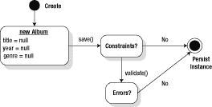

***图 5-1.** 验证状态图*

##### hasErrors 标签

由于错误确实会发生，因此有条件地显示信息通常很有用。为此，Grails 提供了一个 `<g:hasErrors>` 标签，它支持以下属性：

> *   `bean`：要检查错误的 bean 实例
> *   `field`：要检查错误的字段名称
> *   `model`：指定 bean 的替代方案；可以检查整个模型（映射）

你可能还记得，你已经见过 `<g:hasErrors>` 标签作为方法使用，但它同样也可以作为标签使用。有趣的是，如果未指定任何属性，该标签将扫描整个请求范围以查找 bean，并检查找到的每个对象是否存在错误。由于 `<g:hasErrors>` 标签通常与 `<g:eachError>` 一起使用，我们接下来将介绍后者，然后给出一个示例。

##### eachError 标签

如果 bean 实例确实存在错误，那么遍历这些错误并逐一显示它们会很有用。这可以通过 `<g:eachError>` 标签轻松完成，该标签接受的属性与 `<g:hasErrors>` 标签所期望的属性相同。

代码清单 5-30 演示了如何使用 `hasErrors` 和 `eachError` 标签为 `Album` 实例生成错误消息列表。

***代码清单 5-30.** 显示错误*

`<g:hasErrors bean="${album}">`
`          <ul class="errors">`
`        <g:eachError bean="${album}">`
`              <li>${it.defaultMessage}</li>`
`          </g:eachError>`
`     </ul>`
`</g:hasErrors>`

在此示例中，`<g:hasErrors>` 首先检查是否存在任何错误，如果存在，则创建一个 HTML 列表。然后通过 `<g:eachError>` 标签遍历这些错误，该标签使用*默认消息*创建列表项。验证错误的默认消息可以在 `grails-app/il8n/message.properties` 消息包中找到。

如果只需要一个列表，Grails 通过 `<g:renderErrors>` 标签使显示错误变得更加容易，该标签封装了你刚才看到的所有内容。本质上，它接受与 `<g:eachError>` 标签相同的参数，以及一个可选的 `as` 属性，该属性允许你指定将错误渲染为什么形式。代码清单 5-29 展示了如何将错误渲染为简单的 HTML 列表：

`<g:renderErrors bean="${album}" as="list"  />`

如前所述，到目前为止展示的示例都使用了默认消息。显然，默认消息并不总是我们想要的，并且为领域类中的每个属性提供特定的消息通常很有用。这就是 `<g:message>` 标签发挥作用的地方，它得到了 Grails 对国际化（`i18n`）的支持。国际化将在第 7 章中详细介绍。

#### 分页视图

在 Web 应用程序中渲染数据列表是一项常见任务。Grails 提供了易于使用的机制来从数据库（GORM）检索数据，以及简单的机制来渲染数据（GSP 和 GSP 标签）。

Web 应用程序通常作为数据库的前端，而数据库中可能包含大量数据。应用程序可能需要提供机制，让用户能够管理并浏览所有数据。例如，gTunes 应用程序可能包含数千位艺术家、专辑和歌曲。一个列出所有专辑的页面可能会让用户感到不知所措且难以操作（参见图 5-2）。

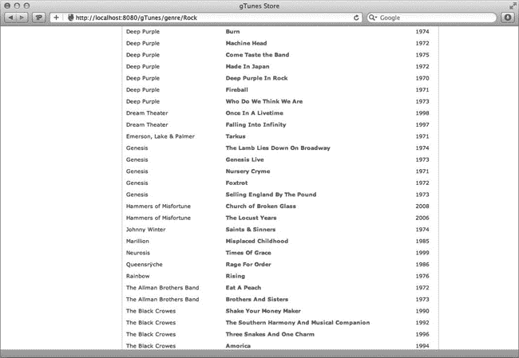

***图 5-2.** 一个很长的专辑列表*

图 5-2 展示了一个用户请求系统中所有属于 `Rock` 流派的专辑列表时可能看到的内容。这个非常长的页面包含了数百张专辑。可以说，单个页面上显示的数据太多了。如果有数千张专辑呢？数十万张专辑呢？显然，将所有专辑都展示在一个页面上是不合理的。

gTunes 应用程序需要智能地向用户展示可管理的数据列表。与其在一个列表中显示数百或数千张专辑，不如只显示五张或十张。如果应用程序在页面上只显示五张或十张专辑，那么它还需要提供一种机制，让用户能够在更大的虚拟列表中导航，以便每次查看其余的五张或十张专辑。图 5-3 展示了一个更易于管理的界面。

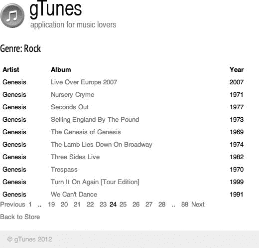

***图 5-3.** 一个分页的专辑列表*

图 5-3 中的列表只包含十张专辑。该视图提供了在更大的虚拟列表（包含该流派的所有专辑）中导航的机制。这种方法带来了更好的用户体验，尤其是在用户可能被大量数据淹没的情况下。

由于生成此类分页控件涉及一些复杂性，应用程序需要做几件事：(1) 为每个视图从数据库中检索较少量的数据；(2) 提供请求当前批次之前或之后紧邻的记录批次的支持；(3) 提供一种直接跳转到列表某个区域的机制，而不是一次一页地浏览整个大列表；(4) 知道大列表中的记录总数。所有这些通常需要编写大量代码。

好消息是，Grails 提供了一种非常简单的机制来管理所有这些。这种机制是一个名为 `paginate` 的 GSP 标签。`paginate` 标签管理了大量繁琐的工作，否则就需要手动提供用于在大型数据列表中导航的 UI 元素。

负责渲染此列表的 GSP 位于 `grails-app/views/store/genre.gsp`。该页面包含清单 5-31 中所示的标记。

***清单 5-31.** genre.gsp <h1>在线商店</h1>*

`<h1>在线商店</h1>`

`<h2>流派: ${genre.encodeAsHTML()}</h2>`
`<table border="0" class="albumsTable">`
`  <tr>`
`    <th>艺术家</th>`
`    <th>专辑</th>`
`    <th>年份</th>`
`  </tr>`
`  <g:each var="album" in="${albums}">`
`    <tr>`
`          <td>${album.artist.name}</td>`
`      <td><g:link action="show"`
`                  controller="album"`
`                  id="${album.id}">${album.title}</g:link>`
`      </td>`
`          <td>${album.year}</td>`
`    </tr>`
`  </g:each>`

`</table>`
`
`
`  <g:paginate controller="store"`
`                 action="genre"`
`                 params="[name:genre]"`
`              total="${totalAlbums}" />`
`
`

这里展示的标记渲染了一个 HTML 表格，其中包含一个标题行和 `albums` 集合中每个元素对应的一行。请注意清单 5-30 底部 `paginate` 标签的使用。这就是在 GSP 中渲染分页控件所需的全部代码。`paginate` 标签负责处理生成“上一页”和“下一页”链接、所有支持跳转到特定页面的链接以及与每个链接关联的所有适当请求参数的所有繁琐工作。所有这些都由对 GSP 标签的这一次调用处理。整个过程再简单不过了！

`paginate` 标签生成了许多链接。`controller` 和 `action` 参数告诉 `paginate` 标签每个链接应该提交到哪里。在这个特定案例中，所有链接都提交到 `StoreController` 中的 `genre` 操作。如果所有链接都引用同一个控制器操作，您可能会想，应用程序如何知道用户点击的是哪个链接？答案在于 `paginate` 标签在每个链接的末尾附加了许多请求参数；这些请求参数由控制器操作使用。例如，“7”链接指向 URL `/store/genre?offset=60&max=10&name=Rock`。“8”链接指向 URL `/store/genre?offset=70&max=10&name=Rock`。请注意，这些链接都包含相同的 `max` 和 `name` 参数值，但包含不同的 `offset` 参数值。`offset` 参数是请求的重要组成部分，因为通过它，控制器将知道当用户点击这些链接之一时应返回哪一页的数据。让我们看看相关的控制器操作。

清单 5-32 包含了 `StoreController` 中 `genre` 操作的代码。

***清单 5-32.** genre 操作*

`def genre() {`
`    def max = Math.min(params.int('max') ?: 10, 100)`
`    def offset = params.int('offset') ?: 0`

`    def total = Album.countByGenre(params.name)`
`    def albumList = Album.withCriteria {`
`          eq 'genre', params.name`
`      projections {`
`        artist {`
`          order 'name'`
`        }`
`      }`
`      maxResults max`
`      firstResult offset`
`    }`
`          return [albums:albumList,`
`                        totalAlbums:total,`
`                        genre:params.name]`
`  }`

 **注意**  清单 5-32 中的查询代码使用了 Hibernate Criteria API，其一般行为将在下文描述。Criteria API 在第 10 章的“Criteria 查询”部分有详细讨论。

`name` 请求参数在前两个查询中都被使用。第一个查询用于统计数据库中属于某个流派的专辑数量。第二个查询实际检索一个专辑列表。该第二个查询不会检索属于某个流派的*所有*专辑，而只检索这些专辑中最多十个的子集。

例如，假设有一个包含 1,000 张专辑的列表，每张专辑都有一个从 0 到 999 的关联索引。当向 URL `/store/genre?offset=60&max=10&name=Rock` 发送请求时，对 `Album.withCriteria(...)` 方法的调用将返回其中十张专辑，从索引为 60 的 `Album` 开始。`max` 参数表示应返回的最大专辑数量。

请注意，在 `genre` 操作的第一行中，如果没有找到 `max` 请求参数，则会给 `max` 分配一个默认值 10。`params` 对象上的 `int` 方法接受一个字符串参数，该参数代表请求参数的名称。如果请求参数存在，其值将被转换为 `int` 并返回。如果请求参数不存在或无法转换为 `int`，则该方法返回 `null`。如果找到了 `max` 请求参数且其值大于 100，系统将回退到最大值为 10。每页显示超过 100 个专辑会破坏分页支持的目的。

`offset` 参数表示在更大的列表中，这十个项目列表应该从哪个位置开始。如果没有提供 `offset` 请求参数，系统默认其值为 0，即列表的开头。

`genre` 操作返回的数据映射不仅包含专辑列表，还包含 `totalAlbums` 和 `genre` 的值，每个值都在 `genre.gsp` 中作为 `paginate` 标签的参数使用。所有这些都需要作为控制器操作与 GSP 之间交互的一部分保持同步。

`paginate` 标签支持许多参数。表 5-2 列出了这些参数。

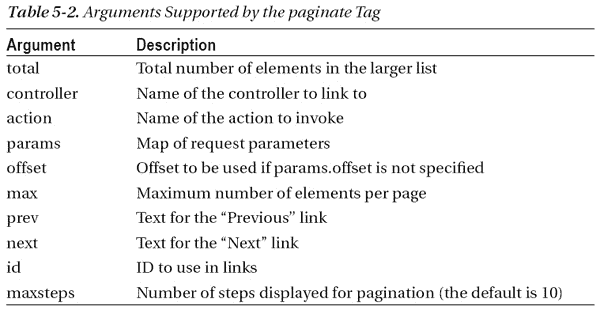

`paginate` 标签支持的所有参数都是可选的，除了 `total` 参数。

Grails 应用程序中默认的脚手架列表视图包含对列表分页和定义简单领域类的支持，例如代码清单 5-33 中所示的 `Car` 类。

***代码清单 5-33.** Car 领域类*

`package com.demo`

`class Car {`
`    String make`
`    String model`
`}`

为 `Car` 类生成脚手架，你会看到 `CarController` 中的默认 `list` 操作和默认的 `grails-app/view/car/list.gsp` 包含了对汽车列表进行分页的支持。代码清单 5-34 展示了 GSP 的相关部分。

***代码清单 5-34.** grails-app/view/car/list.gsp*

`
`
`    <h1><g:message code="default.list.label" args="[entityName]" /></h1>`
`    <g:if test="${flash.message}">`
`    
${flash.message}
`
`    </g:if>`
`    <table>`
`          <thead>`
`                 <tr>`
`                        <g:sortableColumn property="make" title="${message(code: 'car.make.`
`label', default: 'Make')}" />`
`                        <g:sortableColumn property="model" title="${message(code: 'car.model.`
`label', default: 'Model')}" />`
`                 </tr>`
`          </thead>`
`          <tbody>`
`          <g:each in="${carInstanceList}" status="i" var="carInstance">`
`                 <tr class="${(i % 2) == 0 ? 'even' : 'odd'}">`

`                        <td><g:link action="show" id="${carInstance.id}">${fieldValue(bean:`
`carInstance, field: "make")}</g:link></td>`

`                        <td>${fieldValue(bean: carInstance, field: "model")}</td>`

`                 </tr>`
`          </g:each>`
`          </tbody>`
`    </table>`
`    
`
`          <g:paginate total="${carInstanceTotal}" />`
`    
`
`
`

在此次对 `paginate` 标签的调用中，唯一指定的属性是必需的 `total` 属性。请注意，在这种情况下，`total` 属性的值就是数据库中汽车的总数。这与前面展示的例子略有不同，在之前的例子中，`total` 属性的值不一定是数据库中专辑的总数，而是数据库中属于特定流派的专辑数量。

代码清单 5-35 展示了 `CarController` 中的 `list` 操作。

***代码清单 5-35.** CarController 中的分页支持*

**`class CarController {`**

**`    def list(Integer max) {`**
**`        params.max = Math.min(max ?: 10, 100)`**
**`        [carInstanceList: Car.list(params), carInstanceTotal: Car.count()]`**
**`    }`**

**`  ...`**
**`}`**

`CarController` 中的默认 `list` 操作会在未提供值时，给 `max` 请求参数分配一个值 10。

应用程序可以使用 GORM 支持的任意多种技术来控制汽车的排序顺序。针对这个特定情况，最简单的解决方案是在动态方法中包含 `order` 子句，如代码清单 5-36 所示。

***代码清单 5-36.** 按 Model 类对汽车排序 CarController {*

`class CarController {`

`    def list(Integer max) {`
`        params.max = Math.min(max ?: 10, 100)`
`        [carInstanceList: Car.listOrderByModel(params),`
`         carInstanceTotal: Car.count()]`
`    }`

`  ...`
`}`

完成所有这些设置后，如果数据库中的汽车超过十辆，视图中的分页支持就会生效，如图 5-4 所示。

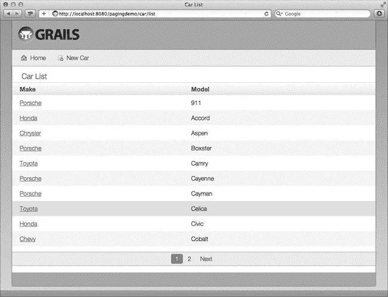

***图 5-4.** 对汽车列表进行分页*

#### 渲染 GSP 模板

GSP 模板是一种特殊的 GSP 文件，它仅包含页面的一部分片段。GSP 模板可以包含从应用程序不同位置渲染的标记。在这种情况下，模板有助于实现复用。可以将模板从页面中提取出来，通过将页面分解成更小、更易于管理的部分来简化包含它的页面。无论将页面的一部分隔离到可复用模板中的原因是什么，Grails 都提供了一种非常简单的机制来渲染模板。

模板可以包含普通 GSP 中可能出现的几乎所有内容。模板的一个特殊之处在于其文件名。GSP 模板必须定义在文件名以下划线开头的文件中。例如，表示专辑列表的模板可以定义在 `grails-app/views/album/_albumList.gsp` 中。

可以在 GSP 中使用 `render` 标签来渲染 GSP 模板。此标签接受一个属性 `template`，该属性表示要渲染的模板名称。例如，要渲染 `grails-app/views/album/_albumList.gsp` 文件中的模板，你需要在调用 `render` 标签时将 `/album/albumList` 指定为 `template` 属性的值，如清单 5-37 所示。

***清单 5-37.** 渲染 albumList 模板*

`
`
`<g:render template="/artist/artistList"/>`
`
`

请注意，模板文件名包含下划线，但模板名称不包含。

在 GSP 中渲染模板，非常类似于将 GSP 模板的内容内联到包含它的 GSP 中，以替代调用 `render` 标签。

图 5-5 展示了 gTunes 应用程序的更新版本。

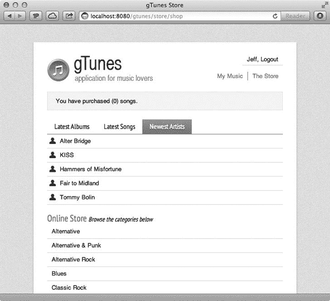

***图 5-5.** 更新后的 gTunes*

请注意屏幕顶部的三个选项卡，分别代表最新专辑、最新歌曲和最新艺人。生成每个选项卡内容所需的标记会使 GSP 变得杂乱。与其将这些选项卡的标记嵌入到 `views/store/shop.gsp` 文件中，不如将它们全部提取到一系列模板中，并从 `shop.gsp` 中渲染它们。使用模板来处理这个问题，将使应用程序比使用庞大且非模块化的 GSP 更易于维护。

清单 5-38 展示了这些模板可能的样子。

***清单 5-38.** 用于前五名列表的 GSP 模板*

`<!-- grails-app/views/artist/_artistList.gsp -->`
`<ul class="list">`
`    <g:each in="${artists?}" var="artist">`
`        <li class="icon">`
`            <g:link controller="store" action="shop">`
`                <g:img dir="images/icons" file="artist.png" />`
`                ${artist?.name}`
`            </g:link>`
`        </li>`
`    </g:each>`
`</ul>`

`<!-- grails-app/views/album/_albumList.gsp -->`
`<ul class="list">`
`    <g:each in="${albums?}" var="album">`
`          <li class="icon">`
`            <g:link controller="album" action="show" id="${album?.id}">`
`                <g:img dir="images/icons" file="album.png" />`
`                ${album.title}`
`            </g:link>`
`        </li>`
`    </g:each>`
`</ul>`

`<!-- grails-app/views/song/_songList.gsp -->`
`<ul class="list">`
`    <g:each in="${songs?}" var="song">`
`          <li class="icon">`
`            <g:link controller="store" action="shop">`
`                <g:img dir="images/icons" file="song.png" />`
`                ${song.title}`
`            </g:link>`
`        </li>`
`    </g:each>`
`</ul>`

 **注意** 这些是非常简单的模板，用于渲染字符串的无序列表。在第 8 章中，你将开发这些模板，使其包含一些非常酷的、由 Ajax 驱动的行为。到那时，了解如何将标记隔离到模板中的价值将更加巨大。

请注意，每个模板都在遍历不同的集合（艺人、专辑、歌曲）。这些集合是在渲染模板时必须传递给模板的数据。将数据传递给 GSP 模板的方法是在调用 `render` 标签时指定一个属性 `model`。`model` 属性的值应该是一个包含所有传递给模板的数据的映射。清单 5-39 展示了从 `grails-app/views/store/shop.gsp` 渲染模板以及将适当的数据传递给每个模板的过程。

***清单 5-39.** 从 shop.gsp 渲染模板*

`
`
`  <ul id="tabs" class="tabs clearfix">`
`    <li class="selected"><a href="#albums">最新专辑</a></li>`
`    <li><a href="#songs">最新歌曲</a></li>`
`    <li><a href="#artists">最新艺人</a></li>`
`  </ul>`

`  
`
`    <g:render template="/album/albumList"`
`              model="[albums: top5Albums]"></g:render>`
`  
`

`  
`
`    <g:render template="/song/songList"`
`              model="[songs: top5Songs]"></g:render>`
`  
`

`  
`
`    <g:render template="/artist/artistList"`
`              model="[artists: top5Artists]"></g:render>`
`  
`
`
`

这里渲染的模板是 `/album/albumList`、`/song/songList` 和 `/artist/artistList`。每个都是对模板的完全限定引用。当模板名称完全限定时，根目录指的是 `grails-app/views/` 目录；因此 `/artist/artistList` 指的是定义在 `grails-app/views/artist/_artistList.gsp` 文件中的模板。模板引用也可以使用相对路径来定义。相对模板路径是指不以正斜杠开头的路径。

例如，如果 `shop.gsp` 引用的是相对路径的 `artistList` 模板，而不是 `/artist/artistList`，那么 Grails 将在 `shop.gsp` 所在的同一目录中查找该模板。相对引用也可以包含目录结构。如果 `artistList` 模板定义在 `grails-app/views/store/myTemplates/_artistList.gsp` 中，那么 `grails-app/views/store/shop.gsp` 页面可以将该模板引用为 `myTemplates/artistList`，因为 `myTemplates` 目录与 `shop.gsp` 在同一目录下。

前面每次调用 `render` 标签时，都包含一个作为 `model` 属性传递的数据映射。为了让 `shop.gsp` 拥有这些数据，渲染 `shop.gsp` 的控制器动作需要提供这些值。在这种情况下，控制器动作是 `StoreController` 中的 `shop` 动作，如清单 5-40 所示。

***清单 5-40.** StoreController 中的 shop 动作*

`package com.gtunes`

`class StoreController {`

`  def shop() {`
`    def genreList =`
`      new DetachedCriteria(Album).distinct('genre').list()`
`    [top5Albums:  Album.list(max:5, sort:"dateCreated", order:"desc"),`
`     top5Songs:   Song.list(max:5, sort:"dateCreated", order:"desc"),`
`     top5Artists: Artist.list(max:5, sort:"dateCreated", order:"desc"),`
`     genres:  genreList.sort()]`
`  }`

`  // ...`
`}`

请注意，控制器动作返回了专辑、歌曲和艺人的值。这些值是包含最近创建的五个专辑、歌曲和艺人的列表。

这些模板被定义为在 `shop.gsp` 中渲染这些“前五名”列表，但它们也是可复用的模板，可以在应用程序需要渲染专辑、艺人或歌曲列表的任何地方使用。Web 应用程序在多个页面上渲染相同的信息片段是很常见的。当你在多个地方看到相同的元素时，请考虑将这些标记从你的 GSP 中提取出来，放到一个可复用的模板中。

#### 创建自定义标签

JSP 中的自定义标签是一项非常强大的功能。它们能够清晰地将视图与控制器逻辑的关注点分离开来。用 MVC 的术语来说，它们可以被视为视图助手。遗憾的是，尽管它们拥有诸多优点，但开发起来却极其复杂。其原因可以理解，因为 JSP 标签试图涵盖所有可能的标签创建场景，包括以下几种：

> *   仅包含属性但没有主体的简单标签
> *   同时包含属性和主体的主体标签
> *   具有父子关系的标签
> *   嵌套标签以及用于查找标签祖先的完整 API

然而，这意味着创建 JSP 自定义标签的 API 至少可以说是非常健壮的。更复杂的是，还需要在应用程序启动时加载的标签库描述符（TLD）文件中提供关于该标签的额外信息。这使得标签在无需重启服务器的情况下难以重新加载，因为应用服务器会利用此文件来配置标签库。正如你所想，这一切并不敏捷；相反，它与“约定优于配置”的方法完全背道而驰。

从用户的角度来看，开发者很少会费心自己去创建标签，通常使用的往往是那些由框架和规范提供的标签，例如 JSTL。这相当可惜，因为其概念本身是合理的，只是实现方式不尽如人意。

那么，Grails，更具体地说是 GSP，能提供什么来简化标签的创建呢？显然，支持所有类型的标签会导致一个复杂的 API，就像 JSP 那样。实际上，最常用的标签可以归结为以下三类：

> *   **简单标签**：有属性但没有主体的标签
> *   **逻辑标签**：有条件地执行主体的标签
> *   **迭代标签**：循环并多次执行标签主体的标签

你会发现，你遇到的大多数标签都属于这些类别之一。由于 Grails 的宗旨是让常见情况变得简单，为这些标签类型创建一个简化的 API 似乎是合乎逻辑的。问题是，为什么非要创建一个新的 API 呢？这正是 Groovy 和闭包强大之处开始展现的地方。

#### 创建标签库

在之前的讨论中，我们已经看到了不少 Grails 标签，你可能已经浏览过源码，并对 Grails 标签的实质有所了解。无论如何，理解如何从头创建一个标签库是很重要的。

通常，好的做法是将标签放在一个封装了其通用功能的库中，就像 Java 中的包一样。

一个**标签库**非常简单，就是一个类名以约定 `TagLib` 结尾，并且位于 `grails-app/taglib` 目录下的类。与你见过的其他 Grails 构件一样，也存在一个用于创建标签库的便捷目标。要为 gTunes 应用创建一个新的标签库，你可以运行 `grails create-tag-lib` 目标（见清单 5-41）。

***清单 5-41.** 创建 Gtunes 标签库 $ grails `$ grails create-taglib`*

`$ grails create-tag-lib com.gtunes.Gtunes`
`| Created file grails-app/taglib/com/gtunes/GtunesTagLib.groovy`
`| Created file test/unit/com/gtunes/GtunesTagLibTests.groovy`

为了了解如何制作一个标签库，在下一节中，你将看到一个基础标签。在第 8 章中，你将看到如何编写一个自定义标签库，该库将为 gTunes 应用添加一些炫酷的功能，用于渲染专辑封面图。

#### 自定义标签基础

首先，让我们看看基础知识。一个标签本质上是一个闭包属性，它接受两个参数：作为 `java.util.Map` 的标签属性和作为闭包的标签主体（见清单 5-42）。

***清单 5-42.** 一个示例标签*

`package com.gtunes`

`class GtunesTagLib {`

`    def repeat = { attrs, body ->`
`        // 获取 'times' 属性并将其转换为整数`
`        int n = attrs.int('times')`

`        // 将主体渲染 'n' 次，每次向主体传递一个`
`        // 从 1 开始的计数器`
`        n?.times { counter ->`
`            out << body(counter + 1)`
`        }`
`    }`
`}`

这个例子定义了一个名为 `repeat` 的标签，它查找一个名为 `times` 的属性，并尝试将其转换为整数；然后使用 Groovy 内置的 `times` 方法多次执行主体。

如前所述，主体是一个闭包，因此可以像方法一样被调用。此外，你将当前迭代的次数作为变量 `counter`，作为闭包调用的第一个参数传递给主体。这为什么有用呢？这意味着该数字在标签主体中可以作为默认的 it 参数使用。举个例子，让我们在 GSP 视图中尝试这个新标签，如清单 5-43 所示。请注意，标记中标签的名称与清单 5-42 所示标签库中定义的属性名称相匹配。

***清单 5-43.** 使用 repeat 标签*

`<g:repeat times="3">`
`  Hello number ${it}`
`</g:repeat>`

如你所见，该标签使用默认的 it 参数来引用标签调用主体闭包时传递的值。最终输出结果如下：

* * *

`Hello number 1`
`Hello number 2`
`Hello number 3`

* * *

所有随 Grails 一起提供的标签都定义在 `g` 命名空间中。默认情况下，你所有的自定义标签也会被放入 `g` 命名空间。为了避免与内置标签以及作为插件一部分安装到项目中的标签发生命名冲突，你应该为自己的标签库定义一个命名空间。为标签库定义命名空间非常简单，只需在 `taglib` 类中声明一个名为 `namespace` 的静态属性，并为其赋予一个 `String` 值即可，如清单 5-44 所示。

***清单 5-44.** 为标签库定义自定义命名空间 class GtunesTagLib {*

`package com.gtunes`

`class GtunesTagLib {`

`    static namespace = 'gt'`

`    def repeat = { attrs, body ->`
`        // 获取 'times' 属性并将其转换为整数`
`        int n = attrs.int('times')`

`        // 将主体渲染 n 次，每次向主体传递一个`
`        // 从 1 开始的计数器`
`        n.times { counter ->`
`            out << body(counter + 1)`
`        }`
`    }`
`}`

有了这个 `namespace` 属性，`GTunesTagLib` 中定义的所有标签现在都位于 `gt` 命名空间中。GSP 现在应该引用 `<gt:repeat/>`，而不是 `<g:repeat/>`。

与 JSP 中的同类标签相比，Grails 标签不仅极其简洁，而且重要的是，所有对标签的修改都可以在运行时重新加载，就像控制器一样。无需配置标签库描述符或重启服务器，Grails 标签因此成为一个更有趣、更敏捷的选择。

#### 测试自定义标签

与 Grails 应用中的大部分代码一样，自定义标签库中的代码也应进行测试。测试标签库可能有些棘手。测试需要一种方式来调用标签、提供参数、提供标签体，并检查调用标签的效果。幸运的是，Grails 提供了一种非常巧妙的机制来管理这一切。自定义标签库的单元测试应使用 `@TestFor` 注解来指定正在测试哪个标签库。清单 5-45 包含了对之前定义的 `GtunesTagLib` 类的单元测试。

***清单 5-45.** 测试 GtunesTagLib*

`// test/unit/com/gtunes/GtunesTagLibTests.groovy`
`package com.gtunes`

`import grails.test.mixin.*`
`import org.junit.*`

`@TestFor(GtunesTagLib)`
`class GtunesTagLibTests {`

`    void testRepeatTag() {`
`        // 定义一段待评估的标记代码`
`        def template = '<gt:repeat times="3">Number ${it} </gt:repeat>'`

`        // 评估该代码片段`
`        def result = applyTemplate(template)`

`        // 确保结果符合预期`
`        def expected = 'Number 1 Number 2 Number 3 '`
`        assert expected == result`
`    }`
`}`

这里的 `testRepeatTag()` 方法渲染了一段调用 `repeat` 标签的标记代码。实现方式是，将一个代表待评估标记的 `字符串` 作为参数传递给 `applyTemplate` 方法。`applyTemplate` 方法返回一个 `字符串`，该字符串代表对传入参数进行评估后的结果。测试方法底部的断言检查了预期结果是否被正确渲染。

如果被评估的字符串是由模型动态驱动的，则可以将该模型作为第二个参数传递给 `applyTemplate` 方法。清单 5-46 展示了一个向 `applyTemplate` 方法提供模型的示例。

***清单 5-46.** 使用模型测试 GtunesTagLib*

`// test/unit/com/gtunes/GtunesTagLibTests.groovy`
`package com.gtunes`

`import grails.test.mixin.*`
`import org.junit.*`

`@TestFor(GtunesTagLib)`
`class GtunesTagLibTests {`

`    void testRepeatTagWithAModel() {`
`        // 定义一段待评估的标记代码`
`        def template =`
`          '<gt:repeat times="${someNumber}">Number ${it} </gt:repeat>'`

`        // 评估该代码片段`
`        def result = applyTemplate(template, [someNumber: 2])`

`        // 确保结果符合预期`
`        def expected = 'Number 1 Number 2 '`
`        assert expected == result`

`        // 使用不同的模型评估该代码片段`
`        result = applyTemplate(template, [someNumber: 4])`

`        // 确保结果符合预期`
`        expected = 'Number 1 Number 2 Number 3 Number 4 '`
`        assert expected == result`
`    }`
`}`

### 本章小结

在本章中，你学习了 Grails 中的高级视图技术、GSP，以及与之捆绑的一系列强大标签。你还学习了如何构建和测试你自己的 GSP 标签，并在此过程中进一步扩展了关于 Groovy 模拟的知识。简而言之，本章涵盖了大量内容，你现在应该对 GSP 的强大功能有了清晰的认识。凭借 GPath、表达式语言和动态标签库，GSP 在提高你的生产力和开发乐趣方面提供了很多价值。

## 第 6 章

## 映射 URL

Grails 提供了开箱即用的 URL 映射。默认的 URL 映射配置是 Grails 框架利用“约定优于配置”这一强大理念来减轻应用程序开发者负担的又一个例证。不过，有时你可能需要偏离约定，定义自己的自定义映射。例如，你可能希望创建更具描述性且更易于人类阅读的 URL。Grails 让你能够轻松定义这些自定义 URL 映射。

在构建 Web 应用程序时，定义特定于应用程序的 URL 映射是经常遇到的需求。Grails 中配置 URL 映射的技术非常强大，同时又极其简单易用。与 Grails 应用中的许多配置选项类似，配置自定义 URL 映射只需编写少量 Groovy 代码即可，仅此而已。特别是，不涉及任何 XML 配置文件。本章将介绍 Grails 提供的灵活 URL 映射系统，并演示如何管理正向和反向 URL 查找、如何将请求映射到控制器操作或视图、如何将异常映射到控制器操作和视图，以及如何测试所有这些操作。

### 理解默认 URL 映射

Grails 应用中的默认 URL 映射配置很简单。URL 的第一部分对应控制器的名称，URL 的第二部分（可选）对应该控制器中定义的操作名称。例如，`/store/index` URL 将映射到 `StoreController` 中的 `index` 操作。指定操作名称是可选的，因此如果 URL 中省略了操作名称，则将执行指定控制器的默认操作。默认控制器操作在第 4 章的“设置默认操作”部分有详细描述。最后，URL 的最后一部分是另一个可选元素，它代表名为 `id` 的请求参数的值。例如，`/album/show/42` URL 将映射到 `AlbumController` 中的 `show` 操作，并带有一个值为 `42` 的名为 `id` 的请求参数。

默认映射的定义位于 `grails-app/conf/UrlMappings.groovy` 中。清单 6-1 展示了默认情况下 `UrlMappings.groovy` 的内容。

***清单 6-1.** 默认的 grails-app/conf/UrlMappings.groovy*

`class UrlMappings {`
`    static mappings = {`
`        "/$controller/$action?/$id?"{`
`            constraints {`
`                // 在此处应用约束`
`            }`
`        }`
`        "500"(view:'/error')`
`    }`
`}`

此映射的关键是字符串 `"/$controller/$action?/$id?"`。请注意，`$action` 和 `$id` 元素后面都跟有一个问号。问号表示 URL 中的可选部分。`$controller` 元素没有问号，因此它是 URL 的必需部分。一个映射可以定义任意数量的可选元素。如果映射包含可选元素，则它们必须全部出现在模式的末尾。

 **注意**  默认映射中的 `constraints` 块是空的。`constraints` 块是可选的，将在本章后面的“对 URL 映射应用约束”部分讨论。以“500”开头的映射将在后面的“映射 HTTP 响应码”部分讨论。

### 在 URL 映射中包含静态文本

在默认映射中，URL 的每个元素都是变量。变量元素以 `$` 符号为前缀。URL 映射也可以包含静态元素。URL 映射中的静态元素只是文本，它必须是 URL 的一部分，以便特定的映射能够匹配。请参见清单 6-2 了解包含静态文本的映射示例。

***清单 6-2.** 在映射中包含静态文本*

`class UrlMappings { static mappings = {`
`    "/showAlbum/$controller/$action?/$id?" {`
`        constraints {`
`            // 在此处应用约束`
`        }`
`    }`
`}`

此映射将匹配诸如 `/showAlbum/album/show/42` 和 `/showAlbum/album/list` 之类的 URL，但不会匹配像 `/album/show/42` 这样的 URL，因为后者不以 `/showAlbum` 开头。

好的，作为一名高级文档工程师和翻译员，我将严格遵循您提供的注意事项和示例，将给定的英文文本翻译成中文。

### 从 URL 中移除控制器和操作名称

控制器和操作名称不必是 URL 的一部分。这些特殊元素可以从 URL 模式中移除，并作为映射的属性进行指定。如前所示，默认映射支持诸如 `/album/show/42` 这样的 URL，它会映射到 `AlbumController` 中的 `show` 操作。应用程序可以选择支持诸如 `/showAlbum/42` 这样的 URL 来访问同一个控制器操作。代码清单 6-3 中的代码包含了一个支持此功能的映射。

***代码清单 6-3.** 将控制器和操作指定为映射的属性*

`class UrlMappings {`
`    static mappings = {`
`        "/showAlbum/$id" {`
`            controller = 'album'`
`            action = 'show'`
`        }`
`        // ...`
`    }`
`}`

Grails 中的映射引擎支持另一种语法来表达相同的映射。选择哪种技术取决于个人偏好。代码清单 6-4 展示了另一种语法。

***代码清单 6-4.** 将控制器和操作指定为映射的参数*

`class UrlMappings {`
`    static mappings = {`
`        "/showAlbum/$id"(controller:'album', action:'show')`
`        // ...`
`    }`
`}`

### 在映射中嵌入参数

当然，Grails 支持使用标准的 HTTP 请求参数表示法来传递请求参数。如果存在如代码清单 6-5 所示的映射，那么像 `/showArtist?artistName=Rush` 这样的 URL 就能正常工作。

***代码清单 6-5.** 针对 /showArtist URL 的映射*

`class UrlMappings {`
`    static mappings = {`
`        "/showArtist"(controller:'artist', action:'show')`
`        // ...`
`    }`
`}`

访问 `/showArtist?artistName=Rush` 会映射到 `ArtistController` 中的 `show` 操作，并且一个名为 `artistName` 的请求参数会被赋值为 `Rush`。请注意，`artistName` 参数并未在映射中的任何位置体现。这是因为该映射适用于 `/showArtist` 这个 URL，因此任何任意参数都可以传递给该 URL 而不会影响映射。

尽管这种方法可行，但它也有缺点。一个缺点是 URL 看起来不美观，而且随着引入更多的请求参数，它会变得越来越难看。

Grails 的 URL 映射引擎提供了一种更优雅的解决方案，用于支持将请求参数嵌入到 URL 中的自定义 URL。让我们支持诸如 `/showArtist/Rush` 这样的 URL，而不是 `/showArtist?artistName=Rush`。代码清单 6-6 中的映射完美地实现了这一点。

***代码清单 6-6.** 在 URL 中嵌入请求参数*

`class UrlMappings {`
`    static mappings = {`
`        "/showArtist/$artistName"(controller:'artist', action:'show')`
`        // ...`
`    }`
`}`

使用此映射，诸如 `/showArtist/Tool` 和 `/showArtist/Cream` 这样的 URL 将被映射到 `ArtistController` 中的 `show` 操作，并带有一个名为 `artistName` 的请求参数，该参数的值将是 URL 最后一部分的内容；在前面的例子中，这些值是 `Tool` 和 `Cream`。`AlbumController` 中的操作可以访问该请求参数，并以任何适当的方式使用它。请参见代码清单 6-7。

***代码清单 6-7.** 在控制器操作中访问请求参数*

`class ArtistController {`
`    def show() {`
`        def artist = Artist.findByName(params.artistName)`
`        // 对 artist 对象进行任何适当的操作...`
`    }`
` }`

这里必须处理一个小问题：艺术家名称可能包含在 URL 中无效的字符。解决这个问题的一种技术是对参数进行 URL 编码。这种技术将支持通过诸如 `/showArtist/Led%20Zeppelin` 这样的 URL 来访问名为 Led Zeppelin 的乐队。请注意，名称中的空格已被替换为 `%20`。真糟糕！让我们在此做一个应用决策，即通过将空格替换为下划线来编码艺术家名称。这将产生一个看起来更友好的 URL：`/showArtist/Led_Zeppelin`。URL 映射并不关心参数的值，因此无需更改映射来支持它。但是，控制器操作需要更新，因为查询参数中的下划线必须替换为空格。代码清单 6-8 展示了代码清单 6-7 中代码的更新版本，以处理下划线。

***代码清单 6-8.** 解码请求参数，将下划线替换为空格*

`class ArtistController {`
`    def show() {`
`        def nameToSearchFor = params.artistName.replaceAll('_', ' ')`
`        def artist = Artist.findByName(nameToSearchFor)`
`        // 对 artist 对象进行任何适当的操作...`
`    }`
`}`

 **注意**  即使请求参数没有嵌入到 URL 中，这个编码/解码问题也同样存在。例如，需要使用类似 `/showArtist?artistName=Led%20Zeppelin` 或 `/showArtist?artistName=Led_Zeppelin` 这样的形式来处理参数值中的空格。

### 指定附加参数

除了在 URL 中嵌入参数之外，还可以将任意请求参数指定为特定映射的属性，这些参数永远不会出现在 URL 中。代码清单 6-9 包含了一个示例。

***代码清单 6-9.** 指定附加的请求参数*

`class UrlMappings {`
`  static mappings = {`
`    "/showArtist/$artistName"(controller:'artist', action:'show') {`
`      format = 'simple'`
`    }`

`    "/showArtistDetail/$artistName"(controller:'artist', action:'show') {`
`      format = 'detailed'`
`    }`
`    // ...`
`  }`
`}`

有了这个映射，对 URL `/showArtist/Pink_Floyd` 的请求将映射到 `ArtistController` 中的 `show` 操作，并且该请求将包含名为 `artistName` 和 `format` 的参数，其值分别为 `Pink_Floyd` 和 `simple`。对 URL `/showArtistDetail/Pink_Floyd` 的请求将映射到相同的操作和控制器，但 `format` 请求参数的值将为 `detailed`。

### 映射到视图

有时您可能希望某个 URL 模式直接映射到一个视图。当视图不需要传入任何数据，也不需要执行控制器操作时，这非常有用。在这种情况下，您可以定义一个与视图关联的 URL 映射，而不是与控制器操作关联。语法与映射到操作相同，只是必须为 `view` 属性指定一个值，而不是 `action` 属性。代码清单 6-10 演示了如何执行此操作。

***代码清单 6-10.** 映射到视图*

`class UrlMappings { static mappings = {`
`"/"(view:'/welcome')`
`// ... } }`

此映射将通过渲染位于 `grails-app/views/welcome.gsp` 的 GSP 来处理所有对应用程序根路径 (/) 的请求。映射引擎还允许映射指定属于特定控制器的视图。例如，代码清单 6-11 演示了如何将 `/find` URL 映射到 `grails-app/views/search/query.gsp`。

***代码清单 6-11.** 映射到特定控制器的视图*

`class UrlMappings { static mappings = {`
`"/find"(view:'query', controller:'search')`
`// ... } }`

请记住，此映射不会执行任何控制器操作。指定控制器仅仅是为了让框架能够定位到相应的 GSP。

### 对 URL 映射应用约束

URL 映射引擎提供了一种非常强大的机制，用于对嵌入在 URL 映射中的变量应用约束。这些约束与应用于领域对象的约束类似。有关领域约束的信息，请参阅第 3 章中的“验证领域类”一节。对 URL 映射中的变量应用约束，可以大大简化剔除某些无效数据的工作，否则这些数据将不得不在控制器或服务中以命令式方式处理。

考虑一个用 Grails 编写的博客应用程序。博客系统中 URL 的典型格式可能是 `/grailsblogs/2009/01/15/new_grails_release`。为了支持这样的 URL，你可以像代码清单 6-12 那样定义一个映射。

***代码清单 6-12.** 典型的博客类型 URL 映射*

`class UrlMappings {`
`    static mappings = {`
`        "/grailsblogs/$year/$month/$day/$entry_name?" {`
`            controller = 'blog'`
`            action = 'display'`
`            constraints {`
`                // 在此处应用约束`
`            }`
`        }`
`        // ...`
`    }`
`}`

有了这样的映射，URL `/grailsblogs/2009/01/15/new_grails_release` 将映射到 `BlogController` 中的 `display` 操作，请求参数分别为 `year`、`month`、`day` 和 `entry_name`，其值分别为 `2009`、`01`、`15` 和 `new_grails_release`。

此映射的一个问题是，它不仅会匹配像 `/grailsblogs/2009/01/15/new_grails_release` 这样的 URL，还会匹配像 `/grailsblogs/grails/rocks/big/time` 这样的 URL。在这种情况下，控制器操作将收到 `grails` 作为年份的值，`rocks` 作为月份的值，依此类推。处理这种情况会使控制器中的逻辑变得复杂。更好的管理方式是对映射应用约束，让框架知道，例如，`grails` 不是映射中 `year` 参数的有效匹配项。代码清单 6-13 中指定的约束使用正则表达式来限制 `year`、`month` 和 `day` 参数，使其仅匹配那些包含正确位数且仅为数字的值。

***代码清单 6-13.** 对映射参数应用约束*

`class UrlMappings {`
`    static mappings = {`
`        "/grailsblogs/$year/$month/$day/$entry_name?" {`
`            controller = 'blog'`
`            action = 'display'`
`            constraints {`
`                year matches: /[0-9]{4}/`
`                month matches: /[0-9]{2}/`
`                day matches: /[0-9]{2}/`
`            }`
`        }`

`        // ...`
`    }`
`}`

与领域类约束的情况一样，映射参数可以根据需要应用任意数量的约束。所有约束都必须通过，映射才能生效。

 **注意**  在 URL 映射中指定约束的方式与在领域类中指定约束的方式存在一个小的语法差异。在领域类中，定义了一个 `constraints` 属性，并为其分配一个闭包作为值。而在 URL 映射中，你是在调用一个名为 `constraints` 的方法，并将一个闭包作为参数传递给它。这就是为什么在 URL 映射中，`constraints` 和闭包之间不需要等号，而在领域类中，`constraints` 和闭包之间需要等号。

#### 在映射中包含通配符

你已经了解了映射如何包含静态文本以及任意数量的变量参数（可选和必需），也了解了如何对变量参数应用约束。在映射定义中，你可以使用的另一个提高灵活性的工具是通配符。通配符表示映射模式中的占位符，它可以匹配任何内容，但不代表会作为请求参数传递的信息。映射定义中的通配符用星号（*）表示。代码清单 6-14 包含一个带有通配符的映射。

***代码清单 6-14.** 映射中的通配符*

`class UrlMappings {`
`    static mappings = {`
`        "/images/*.jpg"(controller:'image')`

`        // ...`
`    }`
`}`

此映射将处理对 `/images/` 目录下以 `.jpg` 扩展名结尾的任何文件的请求。例如，此映射将处理 `/images/header.jpg` 和 `/images/footer.jpg`，但不会匹配 `/images/` 目录下某个子目录中可能存在的 `.jpg` 文件的请求。例如，对 `/images/photos/president.jpg` 这样的请求将不会匹配。可以使用双通配符来匹配任意数量的子目录。代码清单 6-15 展示了一个双通配符映射。

***代码清单 6-15.** 映射中的双通配符*

`class UrlMappings {`
`    static mappings = {`
`        "/images/**.jpg"(controller:'image')`
`        // ...`
`    }`
`}`

此映射将匹配对诸如 `/images/header.jpg` 和 `/images/footer.jpg` 以及 `/images/photos/president.jpg` 等内容的请求。

在某些情况下，可能希望将匹配通配符的值作为请求参数传递给控制器。这可以通过在映射中的通配符前添加一个变量来实现。请参见代码清单 6-16。

***代码清单 6-16.** 映射中带有变量的双通配符*

`class UrlMappings {`
`    static mappings = {`
`        "/images/$pathToFile**.jpg"(controller:'image')`
`        // ...`
`    }`
`}`

在这种情况下，`pathToFile` 请求参数将表示 URL 中匹配通配符的部分。例如，对 `/images/photos/president.jpg` 的请求将导致 `pathToFile` 请求参数的值为 `photos/president`。

### 映射到 HTTP 请求方法

可以配置 URL 映射，使其根据 HTTP 请求方法映射到不同的操作。^(1) 这在构建支持 RESTful API 的系统时非常有用。例如，如果对 URL `/artist/The_Beatles` 发起一个 GET 请求，那么控制器可能会通过生成一个显示披头士乐队详细信息的页面来响应。如果对同一个 URL 发起一个 `DELETE` 请求，控制器可能会通过尝试删除披头士乐队及其所有相关数据（如专辑等）来响应。应用程序可以通过检查请求并根据 HTTP 请求方法做出不同反应，在同一个控制器操作中处理所有这些请求。代码清单 6-17 展示了在 `ArtistController` 中可能的样子。

***代码清单 6-17.** 在控制器操作中检查 HTTP 请求方法*

`class ArtistController {`
`  def actionName() {`
`    if(request.method == "GET") {`
`      // 处理 GET 请求`
`    } else if(request.method == "PUT") {`
`      // 处理 PUT 请求`
`    } else if(request.method == "POST") {`
`      // 处理 POST 请求`
`    } else if(request.method == "DELETE") {`
`      // 处理 DELETE 请求`
`    }`
`    // ...`
`  }`
`}`

1  所有 HTTP 请求方法的定义，请参见 [`http://www.w3.org/Protocols/rfc2616/rfc2616-sec9.html`](http://www.w3.org/Protocols/rfc2616/rfc2616-sec9.html)。

这段代码很繁琐，并且可能会在应用程序的许多地方重复出现。更好的做法是配置一个 URL 映射，使其匹配此 URL，并根据 HTTP 请求方法将请求映射到不同的控制器操作。请参见代码清单 6-18 中的示例。

***代码清单 6-18.** 映射到 HTTP 请求方法*

`class UrlMappings {`
`    static mappings = {`
`        "/artist/$artistName" {`
`            controller = 'artist'`
`            action = [GET: 'show',`
`                      PUT: 'update',`
`                      POST: 'save',`
`                      DELETE: 'delete']`
`        }`

`        // ...`
`    }`
`}`

请注意，赋给 `action` 属性的值不是一个操作名称，而是一个映射（map）。映射中的键对应 HTTP 请求方法的名称，与键关联的值代表应为该特定请求方法调用的操作名称。如果该映射要将这四个标准的 HTTP 请求方法映射到这些特定的操作名称，那么可以使用另一种更简洁的语法来表达相同的映射，如代码清单 6-19 所示。

***代码清单 6-19.** 映射到 HTTP 请求方法*

`class UrlMappings {`
`    static mappings = {`
`        "/artist/$artistName"(resource: "artist")`
`        // ...`
`    }`
`}`

### 映射 HTTP 响应码

可以为特定的 HTTP 响应码定义 URL 映射。默认映射包含一个针对 `500` 响应码（内部错误）的映射。^(2) 此映射会为任何内部错误渲染 `/error` 视图。该视图位于 `grails-app/views/error.gsp`。这个 GSP 会渲染在开发和调试期间可能有用的堆栈信息。代码清单 6-20 展示了默认的 `error.gsp` 页面。

2  所有 HTTP 响应码的定义，请参见 [`http://www.w3.org/Protocols/rfc2616/rfc2616-sec10.html`](http://www.w3.org/Protocols/rfc2616/rfc2616-sec10.html)。

***代码清单 6-20.** 默认的 grails-app/views/error.gsp 页面*

`<body>`
`  <h1>Grails 运行时异常</h1>`
`  <h2>错误详情</h2>`
`  
`
`    <strong>消息:</strong> ${exception.message?.encodeAsHTML()}  `
`    <strong>原因:</strong> ${exception.cause?.message?.encodeAsHTML()}  `
`    <strong>类:</strong> ${exception.className}  `
`    <strong>所在行:</strong> [${exception.lineNumber}]  `
`    <strong>代码片段:</strong> `
`    
`
`      <g:each var="cs" in="${exception.codeSnippet}">`
`        ${cs?.encodeAsHTML()} `
`      </g:each>`
`    
`
`  
`
`  <h2>堆栈跟踪</h2>`
`  
`
`    <pre>`
`      <g:each in="${exception.stackTraceLines}">`
`        ${it.encodeAsHTML()} `
`      </g:each>`
`    </pre>`
`  
`
`</body>`

你可以为特定的响应码添加自己的映射。例如，如果你希望将对任何未找到内容的请求映射到 `StoreController` 中的默认操作，你可以这样做。你还可以将特定的异常类型映射到操作或视图。代码清单 6-21 展示了此类自定义映射。

***代码清单 6-21.** 所有 404 响应码的自定义映射*

`class UrlMappings {`
`    static mappings = {`
`        // 404 错误应由 store 控制器中的`
`        // 默认操作处理`
`        "404"(controller:'store')`

`        // IllegalArgumentException 应由 errors 控制器中的`
`        // illegalArgument 操作处理`
`        "500"(controller: "errors", action: "illegalArgument",`
`              exception: IllegalArgumentException)`

`        // NullPointerException 应由 errors 控制器中的`
`        // nullPointer 操作处理`
`        "500"(controller: "errors", action: "nullPointer",`
`              exception: NullPointerException)`

`        // MyException 应由 errors 控制器中的`
`        // customException 操作处理`
`        "500"(controller: "errors", action: "customException",`
`              exception: MyException)`

`        // 所有其他异常应由`
`        // /errors/serverError 视图处理`
`        "500"(view: "/errors/serverError")`

`        // ...`
`    }`
`}`

### 利用反向 URL 映射

你已经了解了如何支持像 `/showArtist/Pink_Floyd` 这样的 URL，而不是像 `/artist/show/42` 这样的 URL。到目前为止所看到的支持与处理对某个 URL 的请求有关。该交互的另一端同样重要。也就是说，你需要一个巧妙的机制来生成链接，一个能够利用自定义 URL 映射的机制。幸运的是，这个机制内置于 Grails 中，并且使用起来与我们已经看到的映射机制一样简单。

Grails 自带的 `<g:link>` GSP 标签对于生成指向特定控制器和操作的链接非常有用。请参见代码清单 6-22 中链接标签的常见用法。

***代码清单 6-22.** 链接标签*

`<td>`
`  <g:link action='show'`
`          controller='artist'`
`          id="${artist.id}">${artist.name}`
`  </g:link>`
`</td>`

此标签会生成一个类似 `<a href="/artist/show/42">Pink Floyd</a>` 的链接。指向 `/artist/show/42` 的链接很难看。你肯定更希望是 `/showArtist/Pink_Floyd`。好消息是，让链接标签生成后一种链接很容易。你只需告诉链接标签你想要链接到的控制器和操作，并提供自定义映射所需的所有必要参数。例如，请参见代码清单 6-23 中的自定义映射。

***代码清单 6-23.** 针对 /showArtist/ URL 的映射*

`class UrlMappings {`
`    static mappings = {`
`        "/showArtist/$artistName"(controller:'artist', action:'show')`
`        // ...`
`    }`
`}`

每当请求一个指向 `ArtistController` 中 `show` 操作的链接，并且提供了 `artistName` 参数时，链接标签就会生成一个利用此映射的链接。在 GSP 中，这看起来类似于代码清单 6-24 中的代码。

***代码清单 6-24.** 使用链接标签进行反向 URL 映射*

`<td>`
`  <g:link action='show'`
`          controller='artist'`
`          params="[artistName:${artist.name.replaceAll(' ', '_')}">`
`    ${artist.name}`
`  </g:link>`
`</td>`

### 命名 URL 映射

在某些场景下，多个 URL 映射可能匹配同一个反向映射请求，而框架不一定知道该应用哪个映射。命名 URL 映射通过允许映射关联一个名称，并在请求反向 URL 映射查找时引用该名称，从而解决了这个问题。框架随后可以使用该名称，将反向映射请求明确地关联到特定的 URL 映射。清单 6-25 定义了一个名为 `artistDetails` 的 URL 映射。

***清单 6-25.** 一个命名 URL 映射*

`class UrlMappings {`
`  static mappings = {`
`    name artistDetails: "/showArtist/$artistName" {`
`      controller = "artist"`
`      action = "show"`
`    }`
`}`

link 标签支持一个名为 mapping 的可选属性，可用于指定本次查找应使用的映射名称。清单 6-26 演示了此技术。

***清单 6-26.** 使用 Link 标签指定命名 URL 映射*

`<g:link mapping="artistDetails"`
`        params="artistName:${artist.name.replaceAll(' ', '_')}">`
`     ${artist.name}`
`</g:link>`

请注意，无需指定控制器或操作名称。框架会定位名为 `"artistDetails"` 的映射，并找到相应的控制器和操作名称作为命名 URL 映射定义的一部分。

作为在 link 标签上将 URL 映射名称指定为 mapping 属性值的替代方案，Grails 支持调用 link 命名空间中名称与映射名称匹配的标签。使用此方法时，参数可以作为标签的属性来指定。[清单 6-27 展示了一个示例，它生成的链接与清单 6-26 中的代码相同。

***清单 6-27.** 使用 Link 命名空间*

`<link:artistDetails artistName="${artist.name.replaceAll(' ', '_')}">`
`     ${artist.name}`
`</link:artistDetails>`

清单 6-27 中的代码比清单 6-26 中的相应代码要简洁得多。

### 定义多个 URL 映射类

当应用程序定义了大量自定义 URL 映射时，`UrlMappings` 类可能会变得很长，因此有必要将映射拆分成多个映射类。几个小型、专注的映射类比一个单一的庞大类更容易编写和维护。要引入新的映射类，只需在 `grails-app/conf/` 下定义名称以 `UrlMappings` 结尾的类即可。这些类的结构应与默认的 `UrlMappings` 类完全相同。清单 6-28 展示了一个包含与 `Artist` 相关映射的自定义映射类。

***清单 6-28.** 用于 Artist 映射的 URL 映射类*

`class ArtistUrlMappings {`
`    static mappings = {`
`        "/showArtist/$artistName" (controller:'artist', action:'display')`
`    }`
`}`

### 测试 URL 映射

与应用程序的大多数其他方面一样，您需要为自定义 URL 映射编写自动化测试，以断言应用程序确实按照您的预期响应请求。Grails 提供了一种非常简洁的机制来编写这些测试。测试 URL 映射最简单的方法是为 URL 映射类创建一个单元测试，该类可用于测试自定义映射。

清单 6-29 展示了一个简单的映射，用于支持像 `/showArtist/Jeff_Beck` 这样的 URL。对此类 URL 的请求应映射到 `ArtistController` 中的 `display` 操作。

***清单 6-29.** 一个自定义 URL 映射*

`class UrlMappings {`
`    static mappings = {`
`        "/showArtist/$artistName" (controller:'artist', action:'display')`
`        // ...`
`    }`
`}`

`assertForwardUrlMapping` 方法可用于断言对像 `/showArtist/Jeff_Beck` 这样的 URL 的请求被发送到了正确的控制器操作。清单 6-30 中的代码演示了此测试可能的样子。

***清单 6-30.** 单元测试 URL 映射*

`@TestFor(ArtistUrlMappings)`
`@Mock(com.gtunes.ArtistController)`
`class ArtistUrlMappingsTests {`

`    void testShowArtistUrlMapping() {`
`        // 断言 /showArtist/Jeff_Beck 由 artist 控制器中的`
`        // display 操作处理`
`        assertForwardUrlMapping('/showArtist/Jeff_Beck',`
`                                controller: 'artist', action: 'display')`
`    }`
`}`

请注意，模拟与所测试的 URL 映射相关的任何控制器非常重要。这可以通过将 `Mock` 注解应用于测试类并将相应的 URL 映射类作为参数传递来实现。在清单 6-30 中，这个类是 `ArtistController`。清单 6-29 中定义的映射包含一个嵌入式变量 `artistName`。有一种简单的机制可以断言这些映射变量被赋予了正确的值：只需将一个闭包作为最后一个参数传递给 `assertForwardUrlMapping` 方法，并在闭包中为与嵌入式变量名称一致的属性赋值。请参见清单 6-31 中的示例。此测试不仅会断言请求映射到了 `ArtistController` 中的 `display` 操作，还会断言 `artistName` 请求参数被填充了正确的值。

***清单 6-31.** 测试 URL 映射变量*

`@TestFor(ArtistUrlMappings)`
`@Mock(com.gtunes.ArtistController)`
`class ArtistUrlMappingsTests {`

`    void testShowArtistUrlMapping() {`
`        // 断言 /showArtist/Jeff_Beck 由 artist 控制器中的`
`        // display 操作处理，并且存在一个名为 artistName`
`        // 且值为 Jeff_Beck 的请求参数`
`        assertForwardUrlMapping('/showArtist/Jeff_Beck',`
`                                controller: 'artist', action: 'display') {`
`            artistName = 'Jeff_Beck'`
`        }`
`    }`
`}`

清单 6-32 演示了测试反向 URL 映射是否按预期工作的类似方法。请注意，这次断言方法被称为 `assertReverseUrlMapping`。

***清单 6-32.** 测试反向 URL 映射*

`@TestFor(ArtistUrlMappings)`
`@Mock(com.gtunes.ArtistController)`
`class ArtistUrlMappingsTests {`
`    void testShowArtistReverseUrlMapping() {`
`        // 断言当对 artist 控制器中的 display 操作`
`        // 进行反向 URL 查找，且请求参数 artistName`
`        // 的值为 Jeff_Beck 时，生成的 URL 是 /showArtist/Jeff_Beck`
`        assertReverseUrlMapping('/showArtist/Jeff_Beck',`
`                                controller: 'artist', action: 'display') {`
`            artistName = 'Jeff_Beck'`
`        }`
`    }`
`}`

通常，您希望同时测试正向和反向 URL 映射。一种方法是同时使用 `assertForwardUrlMapping` 方法和 `assertReverseUrlMapping` 方法。虽然这种组合可以完成任务，但它涉及的工作量比您需要的要多。使用 `assertUrlMapping` 方法将断言正向和反向 URL 映射都正常工作，如果其中任何一个失败，测试将失败。请参见清单 6-33 中的示例。

***清单 6-33.** 测试正向和反向 URL 映射*

`@TestFor(ArtistUrlMappings)`
`@Mock(com.gtunes.ArtistController)`
`class ArtistUrlMappingsTests {`
`    void testForwardAndReverseUrlMapping() {`
`       assertUrlMapping('/showArtist/Jeff_Beck',`
`                                controller: 'artist', action: 'display') {`
`            artistName = 'Jeff_Beck'`
`        }`
`    }`
`}`

### 摘要

Grails 提供的 URL 映射引擎非常灵活。几乎任何你想要映射到特定控制器操作的 URL 模式，都可以通过在 `UrlMappings.groovy` 中编写少量 Groovy 代码轻松配置。该框架提供了许多机制，让你能够花更少的时间配置框架，而将更多时间用于解决应用程序中的业务问题。URL 映射引擎就是其中一个例子。自定义 URL 映射编写简单，测试也简单。

## 第 7 章

## 国际化

Web 应用程序的一大优点在于它们非常易于分发给大量用户。当将 Web 应用程序部署给广泛的受众时，应用程序通常需要在特定情况下进行适配并以不同方式运行。例如，当来自西班牙的请求发送到一个 Web 应用程序时，该应用程序可能希望用西班牙语向用户显示消息；但如果请求来自纽约，同一个应用程序则需要用英语呈现消息。应用程序所做的适配可能比简单地显示不同版本的文本更复杂。应用程序可能需要根据特定请求的来源施加不同的业务规则。

Grails 提供了多种机制来处理 Web 应用程序的国际化与本地化。在本章中，我们将探讨这些机制，你将看到国际化一个 Web 应用程序并不一定非常困难。

### 本地化消息

当将 Grails 应用程序部署给广泛的受众时，你可能希望应用程序以用户偏好的语言显示消息。提供此功能的一种方法是为每种目标语言维护一个单独的应用程序版本。这种方法存在很多问题。维护所有这些不同的版本并试图让它们保持同步将是一项非常繁重的工作。更好的方法是拥有一个足够灵活的单一版本应用程序，能够使用本地化消息以多种语言显示消息。

为了在你的 Grails 应用程序中支持本地化消息，你应该将所有用户消息定义在一个属性文件中。换句话说，用户消息不应硬编码在 GSP 页面、GSP 模板或任何其他地方。将消息放在属性文件中，可以让你在一个地方维护所有消息。它还让你能够利用 Grails 提供的本地化功能。

#### 定义用户消息

创建 Grails 应用时，项目中会包含 `grails-app/i18n/` 目录下的多个本地化属性文件。图 7-1 展示了 `grails-app/i18n/` 目录的内容。

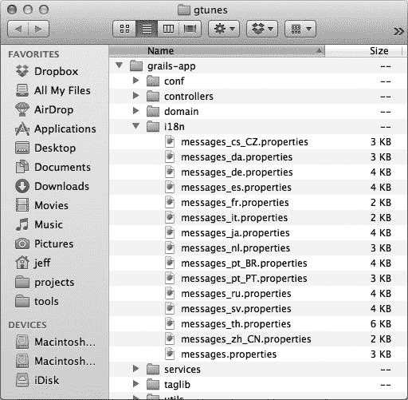

***图 7-1.** grails-app/i18n/ 目录*

`grails-app/i18n/` 目录中的 `messages.properties` 文件包含英文的默认验证消息。当领域类或命令对象的验证失败时，会使用这些消息。你可以将自己的应用程序消息添加到此文件中。除了默认的 `messages.properties` 文件外，此目录还有其他几个属性文件，它们包含其他语言的相同消息。例如，“es”是西班牙语的语言代码，因此 `messages_es.properties` 包含西班牙语的验证消息。

 **注意**  消息文件的命名约定遵循 `java.util.ResourceBundle` 类使用的标准约定。更多信息，请参阅 `java.util.ResourceBundle` 和 `java.util.Locale` 的文档：[`java.sun.com/j2se/1.5.0/docs/api/`](http://java.sun.com/j2se/1.5.0/docs/api/)。

属性文件是纯文本文件，包含名称-值对。清单 7-1 展示了一个简单的属性文件。

***清单 7-1.** 一个简单的属性文件*

`# messages.properties`
`app.name=gTunes`
`book.title=The Definitive Guide To Grails`
`favorite.language=Groovy`
`favorite.framework=Grails`

#### 检索消息值

在标准的 Java 或 Groovy 程序中，你会使用 `java.util.ResourceBundle` 类从属性文件中检索值。清单 7-2 演示了如何检索并打印 `app.name` 属性的值。

***清单 7-2.** 使用 java.util.ResourceBundle*

`// JavaMessages.java`
`import java.util.ResourceBundle;`

`public class JavaMessages {`

`    public static void main(String[] args) {`
`        ResourceBundle bundle = ResourceBundle.getBundle("messages");`
`        String appName = bundle.getString("app.name");`
`        System.out.println("application name is " + appName);`
`    }`
`}`

`// GroovyMessages.groovy`
`def messages = ResourceBundle.getBundle('messages')`
`def appName = messages.getString('app.name')`
`println "application name is ${appName}"`

`java.util.ResourceBundle` 类负责加载属性文件，并提供 API 来检索文件中定义的属性值。Grails 提供了一个名为 `message` 的 GSP 标签，它可以从 `grails-app/i18n/` 目录下的消息文件中检索属性值。在最简单的情况下，调用 `message` 标签时只需指定 `code` 属性。`code` 属性告诉 `message` 标签应该检索哪个属性值。例如，如果在 `grails-app/i18n/messages.properties` 中定义了一个名为 `gtunes.welcome` 的属性，则可以使用如清单 7-3 所示的代码在 GSP 中渲染该属性的值。

***清单 7-3.** 使用 message 标签*

`<body>`
`...`
`<g:message code="gtunes.welcome"/>`
`... </body>`

默认情况下，Grails 会根据当前 Web 请求的区域设置来决定使用哪个版本的属性文件。因此，你通常不需要在应用程序代码中针对本地化做任何特殊处理。如果你在 `grails-app/i18n/` 下的多个特定语言版本的属性文件中定义了消息属性，那么 Grails 将根据客户端的区域设置使用相应的文件。

图 7-2 展示了英文版的 gTunes 主页。

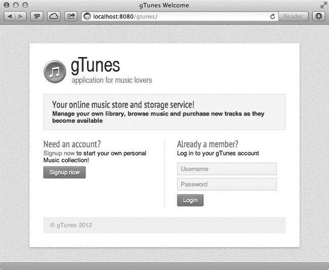

***图 7-2.** 英文版 gTunes*

图 7-2 中展示了几条用户消息。例如，屏幕左侧是一个导航区域，其中包含“My Music”和“The Store”链接。当从不同的区域设置访问应用程序时，这些链接的标签将包含不同的文本。处理此问题的最佳方法是将这些消息定义为属性，并使用 `message` 标签在 GSP 中渲染这些消息。清单 7-4 展示了如何在 `grails-app/i18n/messages.properties` 中定义这些属性。

***清单 7-4.** grails-app/i18n/messages.properties 中的用户消息*

`gtunes.my.music=My Music`
`gtunes.the.store=The Store ...`

定义了这些属性后，GSP 可以使用 `message` 标签渲染这些值，如清单 7-5 所示。

***清单 7-5.** 从 GSP 渲染属性值*

`
`
`  <ul>`
`    <li><a href="#"><g:message code="gtunes.my.music"/></a></li>`
`    <li><g:link controller="store" action="shop">`
`          <g:message code="gtunes.the.store"/>`
`        </g:link>`
`    </li>`
`  </ul>`
`
`

有了这段代码，你可以根据需要向任意多个其他消息文件添加相应的属性。为了支持网站的西班牙语版本，请向 `grails-app/i18n/messages_es.properties` 添加相应的属性，如清单 7-6 所示。

***清单 7-6.** grails-app/i18n/messages_es.properties 中的用户消息*

`gtunes.my.music=Mi Musica`
`gtunes.the.store=La Tienda`

测试 Grails 应用本地化的一种简单方法是在请求中包含一个名为 `lang` 的参数，并为其分配一个有效的语言代码，例如西班牙语使用“es”（[`http://localhost:8080/gTunes/?lang=es`](http://localhost:8080/gTunes/?lang=es)）。图 7-3 展示了该应用的西班牙语版本。

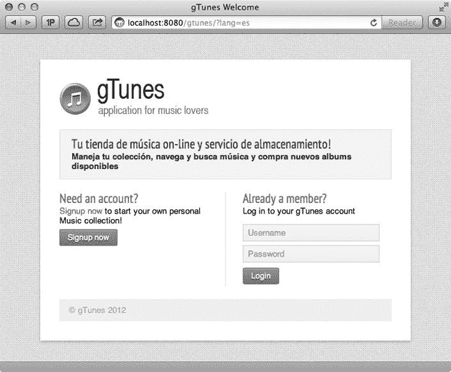

***图 7-3.** 西班牙语版的 gTunes*

#### 使用 URL 映射实现国际化

如前所述，名为 `lang` 的请求参数会告知框架在处理该请求时使用特定的语言代码。指定该请求参数的一种方式是将其包含在请求 URL 中，例如 [`http://localhost:8080/gTunes/?lang=es`](http://localhost:8080/gTunes/?lang=es)。另一种指定请求参数的方式是定义自定义 URL 映射，如清单 7-7 所示。

***清单 7-7.** 用于本地化的 URL 映射*

`class UrlMappings {`
`  static mappings = {`
`    "/store/$lang"(controller:'store')`

`    // ...`
`  }`
`}`

清单 7-7 中的映射会将所有请求映射到诸如 [`http://localhost:8080/gTunes/en/`](http://localhost:8080/gTunes/en/) 或 [`http://localhost:8080/gTunes/es/`](http://localhost:8080/gTunes/es/) 这样的 URL，其中“en”和“es”可以是任何有效的语言代码。

### 使用参数化消息

用户消息通常不仅仅由简单的静态文本组成。消息可能需要包含一些直到运行时才能确定的数据。例如，gTunes 会显示一条消息，让用户知道他们购买了多少首歌曲。消息内容大致如下：“您已购买 (97) 首歌曲。” 消息中的“97”部分就是一条直到运行时才能确定的信息。

#### 使用 java.text.MessageFormat

Java 包含一个名为 `java.text.MessageFormat` 的类。`java.text.MessageFormat` 的一个有用功能是以语言中立的方式支持参数化消息，例如前面描述的那种。参数化消息可以包含任意数量的参数，这些参数在消息值中用花括号括起来的数字表示。清单 7-8 展示了“您已购买 (97) 首歌曲。”这条消息在 `grails-app/i18n/messages.properties` 中可能如何表示。

***清单 7-8.** 定义参数化消息*

`# messages.properties`
`gtunes.purchased.songs=You have purchased ({0}) songs.`
`...`

`gtunes.purchased.songs` 消息的值中包含一个参数。与 Java 和 Groovy 中的惯例几乎一致，`java.text.MessageFormat` 类使用从零开始的索引；消息中的 `{0}` 是第一个参数值的占位符。如果消息有多个参数，它们将在消息值中用 `{0}`、`{1}`、`{2}` 等占位符表示。

清单 7-9 中的代码展示了如何在 Java 程序中使用 `java.text.MessageFormat`。

***清单 7-9.** 使用 MessageFormat 用 Java 填充参数化消息*

`// JavaMessages.java`
`import java.util.ResourceBundle;`
`import java.text.MessageFormat;`

`public class JavaMessages {`

`    public static void main(String[] args) {`
`        ResourceBundle bundle = ResourceBundle.getBundle("messages");`
`        String songsPurchased = bundle.getString("gtunes.purchased.songs");`
`        String message = MessageFormat.format(songsPurchased, 97);`
`        System.out.println("message: " + message);`
`    }`
`}`

清单 7-10 展示了一个执行相同操作的 Groovy 脚本。

***清单 7-10.** 使用 MessageFormat 用 Groovy 填充参数化消息*

`import java.text.MessageFormat`

`def bundle = ResourceBundle.getBundle('messages')`
`def songsPurchased = bundle.getString('gtunes.purchased.songs')`
`def message = MessageFormat.format(songsPurchased, 97)`

`println "message: ${message}"`

#### 使用 message 标签处理参数化消息

Grails 允许使用参数化消息，而无需应用开发者直接处理 `java.text.MessageFormat` 类。`message` 标签支持一个名为 `args` 的可选参数，如果为该参数赋值，其值将被视为需要应用到消息上的参数列表。清单 7-11 展示了如何向 `message` 标签传递参数。

***清单 7-11.** 使用 message 标签填充参数化消息*

`
`
`<g:message code="gtunes.purchased.songs" args="[97]"/>`
`
`

当然，对于这条或类似的消息，您可能不希望像那样在 GSP 中硬编码参数值。更可能的情况是，您希望该值是动态的。清单 7-12 中的代码正在向消息传递一个参数，该参数将被应用到 `gtunes.purchased.songs` 消息上。如果当前登录的用户已购买过歌曲，那么该参数的值将是其购买的歌曲数量；否则，该参数的值将为 0。

***清单 7-12.** 使用 message 标签动态填充参数化消息*

`
 <g:message code="gtunes.purchased.songs"`
`args="[session.user.purchasedSongs?.size() ?: 0]"/> 
`

 **注意**  请注意前面代码中使用了所谓的 Elvis 运算符（?:）。Elvis 运算符是 Java 三元运算符的一种简写形式，其中条件为真时的返回值与正在计算的表达式相同。例如，以下表达式实现的功能相同：

`size = session.user.purchasedSongs?.size() ? session.user.purchasedSongs?.size() : 0 size =`
`session.user.purchasedSongs?.size() ?: 0`

### 使用参数化消息进行验证

请注意，默认的 `grails-app/i18n/messages.properties` 文件中包含许多默认消息。这些消息用于支持 Grails 内置的验证域类和命令对象的机制。清单 7-13 展示了一个包含某些约束的域类。

***清单 7-13.** 包含约束的域类*

`class Person {`
`    String firstName`
`    String lastName`
`    Integer age`

`    static constraints = {`
`        firstName size: 2..30, blank: false`
`        lastName size: 2..30, blank: false`
`        age min: 0`
`    }`
`}`

这些约束用于确保 `firstName` 和 `lastName` 属性至少包含 2 个字符，最多不超过 30 个字符，并且不能为空。你可能会认为指定最小长度为 2 就能处理空白的情况，但事实并非如此。一个仅包含三个空格的 `firstName` 可以满足长度约束，但无法满足非空约束。`age` 属性也受到约束：它永远不能为负值。如果创建的 `Person` 类实例不满足所有这些约束，那么对该实例调用 `validate()` 方法将返回 false。同样，对该实例调用 `save()` 也会失败。

域类的默认脚手架视图包含用于显示任何验证错误的代码。清单 7-14 展示了默认的 `grails-app/views/person/create.gsp` 的一部分。

***清单 7-14.** 包含渲染验证错误代码的 create.gsp*

`<h1><g:message code="default.create.label" args="[entityName]" /></h1>`
`<g:if test="${flash.message}">`
`
${flash.message}
`
`</g:if>`
`<g:hasErrors bean="${personInstance}">`
`<ul class="errors" role="alert">`
`       <g:eachError bean="${personInstance}" var="error">`
`       <li <g:if test="${error in org.springframework.validation.FieldError}">data-field-`
`id="${error.field}"</g:if>><g:message error="${error}"/></li>`
`       </g:eachError>`
`</ul>`
`</g:hasErrors>`

`hasErrors` 标签仅在 `personInstance` 存在错误时才会渲染其主体。如果 `personInstance` 确实存在错误，那么 `renderErrors` 标签将渲染所有这些错误的列表，并且该渲染过程会使用在 `grails-app/i18n/messages.properties` 中定义的验证消息。

图 7-4 展示了当用户在用户界面中尝试创建一个 `Person`，且未提供 `firstName`、`lastName` 并输入了负的 `age` 时，用户可能看到的内容。

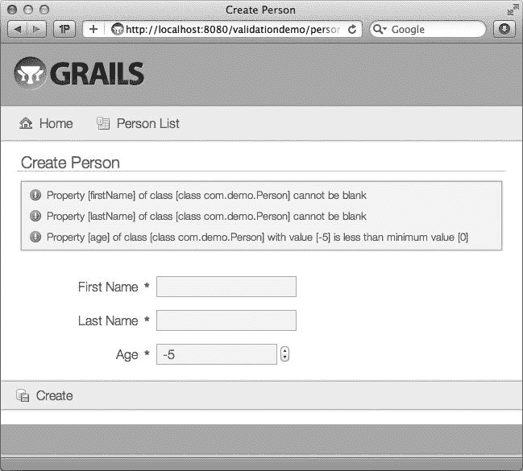

***图 7-4.** 用户界面中的验证消息*

你在那里看到的错误消息都定义在 `grails-app/i18n/messages.properties` 中，作为参数化消息，如清单 7-15 所示。

***清单 7-15.** 默认验证消息*

`default.invalid.min.message=\`
`  Property [{0}] of class [{1}] with value [{2}] is less than minimum value [{3}]`
`default.blank.message=Property [{0}] of class [{1}] cannot be blank`
`...`

你可以修改这些消息的值以适应你的应用程序。例如，如果 `default.blank.message` 属性的值被设置为 `{0} is a required field`，那么用户将看到如图 7-5 所示的错误消息。

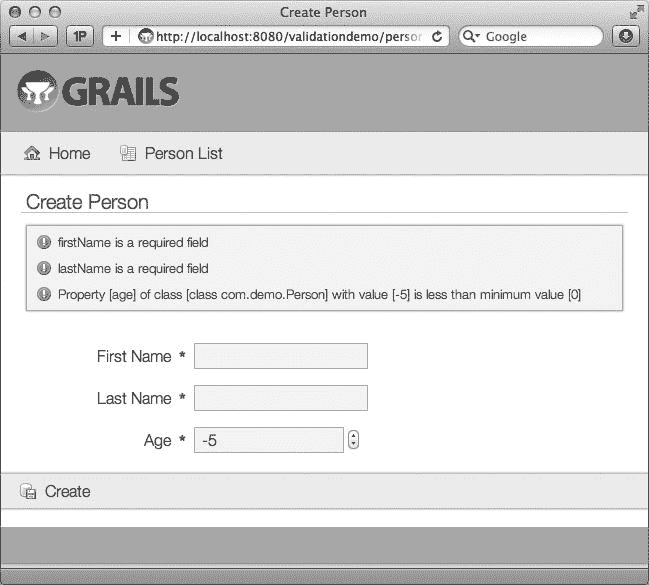

***图 7-5.** 用户界面中的自定义验证消息*

当验证消息适用于特定验证器的所有用法时，以这种方式更改默认验证消息非常有用。通常，有必要为与特定类中特定属性相关的验证器提供自定义消息。例如，`min` 约束可能应用于 `Person` 类中的 `age` 属性，而相同的约束可能应用于 `Account` 类中的 `balance` 属性。为这两种情况描述约束违规需要两条不同的消息。如果一个人的年龄是负数，显示“账户不允许透支”或类似的消息当然没有意义。同样，当账户余额为负时显示的消息，与当一个人年龄为负时显示的消息也会不同。为了帮助处理此类情况，该框架不仅支持将验证消息与特定约束关联，还支持与特定类中的特定属性关联。清单 7-16 展示了包含特定属性的消息示例。

***清单 7-16.** 属性特定的验证消息*

`person.age.min.notmet=A person may not have a negative age`
`account.balance.min.notmet=Account is not allowed to be overdrawn`

框架提供的每个支持错误消息的验证器都有一个或多个特定的错误代码模式；它们用于为该验证器定义错误消息，这些消息与特定类中的特定属性相关。这些错误代码列在表 7-1 中。

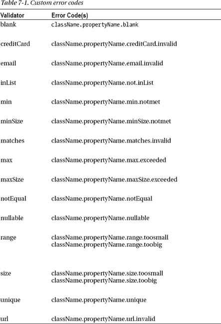

### 使用 messageSource

当需要从 `messages.properties` 中获取用户消息并在 GSP 中渲染时，`message` 标签使用起来既简单又直观。然而，有时应用程序可能需要获取用户消息的值并对其进行其他处理，而不仅仅是在 GSP 中渲染该值。例如，该消息可能用于电子邮件中。事实上，消息可以用于多种用途，并非所有用途都涉及在 GSP 中渲染文本。

Grails 提供了一个名为 `messageSource` 的 bean，它可以被注入到任何 Grails 构件中，包括控制器、标签库、其他 bean 等。`messageSource` bean 是 Spring 框架提供的 `org.springframework.context.MessageSource` 接口的一个实例。该接口定义了三个重载版本的 `getMessage` 方法，用于从源中检索消息。清单 7-17 展示了这些方法的签名。^(1)

 **注意**  在 Grails 的源代码和文档中，术语“artefact”用于指代实现特定概念（如控制器、标签库或领域类）的 Groovy 文件。由于它使用的是英式英语拼写“artefact”（而非“artifact”），为了与 API 保持一致，本书将统一使用该拼写。

***清单 7-17.** MessageSource 接口*

`String getMessage(String code, Object[] args, Locale locale)`
`String getMessage(String code, Object[] args, String defaultMessage, Locale locale)`
`String getMessage(MessageSourceResolvable resolvable, Locale locale)`

由于 `messageSource` bean 参与了 Grails 的依赖自动装配过程，要获取该 bean 的引用，您只需在 Grails 构件中声明一个名为 `messageSource` 的属性即可。清单 7-18 中的代码展示了如何在服务中使用 `messageSource` bean。

***清单 7-18.** 在服务中使用 messageSource*

`package com.gtunes`

`class StoreService {`

`    def messageSource`

`    def someServiceMethod() {`
`        def msg = messageSource.getMessage('gtunes.my.music', null, null)`
`        // ...`
`    }`
`    ...`
`}`

请注意，第二个和第三个参数为 null。第二个参数是一个 `Object[]`，用于向参数化消息传递参数。第三个参数是一个 `java.util.Locale`，可以指定它来检索除该请求的默认 Locale 之外的任何 Locale 的消息。例如，清单 7-19 演示了如何检索意大利语的消息。

***清单 7-19.** 使用 messageSource 并指定 Locale*

`package com.gtunes`

`class StoreService {`

`    def messageSource`

`    def someServiceMethod() {`
`        def msg = messageSource.getMessage('gtunes.my.music',`
`                                           null,`
`                                           Locale.ITALIAN)`
`        // ...`
`    }`
`    ...`
`}`

1  有关 MessageSource 接口和相关类的完整文档，请参见 [`http://static.springsource.org/spring/docs/3.1.x/javadoc-api/`](http://static.springsource.org/spring/docs/3.1.x/javadoc-api/)。

在 Controller 或 TagLib 构件中，一种更简单的检索消息的方法是调用这些构件中可用的特殊 `g` 命名空间变量上的 `message GSP 标签作为方法`，如清单 7-20 所示。

***清单 7-20.** 从 Controller 中调用 g.message()*

`package com.gtunes`

`class StoreController {`

`    def index() {`
`        def msg = g.message(code:'gtunes.my.music')`
`        // …`
`    }`
`}`

 **注意**  清单 7-20 中的代码实际上是在调用定义在 g 命名空间中的 message 标签。然而，访问 message 标签并没有什么特别之处。所有标签库都可以使用完全相同的技术进行访问。

### 总结

国际化是构建广泛分布应用程序的一个重要方面。Grails 提供了许多机制，使得这一过程比原本要容易得多。Grails 应用程序中的所有消息属性文件都位于同一位置。因此，应用程序开发者无需告诉 Grails 在哪里查找这些文件。更重要的是，当 Grails 开发者从一个 Grails 项目转到另一个项目时，他或她确切地知道在哪里查找属性文件，因为它们总是在同一个位置。这就是约定优于编码的实际工作能力。此外，在 Grails 应用程序中从属性文件检索消息非常容易。`message` 标签在 GSP 页面和 GSP 模板中非常易于访问和使用。`messageSource` bean 可以从应用程序需要的任何地方轻松访问。所有这些增强功能都建立在经过验证且广为人知的 Java 平台工具之上，包括 `java.text.MessageFormat` 和 `org.springframework.context.MessageSource`。

## 第 8 章

## Ajax

**Ajax 是现代 Web 应用程序故事中非常重要的一部分。** 该技术最初由微软开发，用于驱动其 Outlook 电子邮件软件的基于 Web 的版本。微软将 Ajax 实现为一个 ActiveX 控件，该控件可供其浏览器 Internet Explorer 使用，并可从 JavaScript 调用以执行异步浏览器请求。

这种方法的好处在于，浏览器无需刷新整个页面即可与服务器交互，从而允许开发与桌面应用程序更为相似的应用程序。自那时起，除 Internet Explorer 之外的浏览器已经标准化了一个名为 `XMLHttpRequest` 的原生 JavaScript 对象，其 API 与微软的 ActiveX 控件大致相同。

### 编写 Ajax 代码

编写 JavaScript 代码可能会变得相当重复和乏味。幸运的是，有一些 Ajax 框架封装了大部分此类逻辑，范围从简单到全面。目前正在努力标准化一个 JavaScript 库，但正如任何协作努力一样，这个过程可能漫长而痛苦，并且很可能无法让所有人满意。

默认情况下，Grails 附带 jQuery。通过 Grails 插件系统，您可以添加对替代库的支持，这些库为 Grails 中的 Ajax 标签提供底层实现。

在深入 Ajax 世界之前，您应该重新审视 gTunes 应用程序，因为您将通过添加一系列 Ajax 驱动的功能来增强 gTunes 应用程序，从而改善用户体验：

> *   异步登录功能
> *   一项新功能，允许您使用 Ajax 驱动的搜索字段在您的库和商店中搜索和过滤歌曲
> *   最后，一种更流畅的显示专辑和歌曲的方式，包括专辑封面

因此，在过于激动之前，让我们通过以 Ajax 风格改进 gTunes 应用程序界面，进入本章的核心内容。

### Ajax 实战

让我们从一个简单的例子开始。Grails 提供了一组标签，用于简化创建支持 Ajax 的组件，如链接、表单和文本字段。例如，要创建一个点击时执行 Ajax 调用的 HTML 锚点标签，你可以使用 `<g:remoteLink>` 标签。这些标签从 Grails 早期版本就包含在内，至今仍被保留，但在大多数情况下，所提供的标签并非最优方案。这些标签是在 jQuery 及类似库发展到真正适合编写 JavaScript 的阶段之前开发的。这里展示的例子将演示如何使用 jQuery 来完成与 Ajax 标签相同的任务。让我们尝试一个使用 jQuery 的“Hello World”风格示例。首先，通过添加清单 8-1 中所示的操作来更新 `StoreController`。

***清单 8-1.** 一个渲染日期和时间的操作*

`def showTime() {`
`    render "The time is ${new Date()}"`
`}`

清单 8-1 中的 `showTime` 操作使用了第 4 章中介绍的 `render` 方法，向客户端渲染一个包含当前日期和时间的纯文本响应，该日期和时间通过 Java 的 `java.util.Date` 类轻松获取。这非常简单；现在打开位于 `grails-app/views/store` 目录下的 `index.gsp` 文件。为了在页面中编写你自己的 Ajax 代码，你需要告诉 Grails 使用哪个 Ajax 库。你可以通过 `<g:javascript>` 标签来实现，该标签需要放在 `index.gsp` 文件的 `<head>` 部分，如清单 8-2 所示。

***清单 8-2.** 使用 jQuery 库*

`<g:javascript library="jquery" />`

在这种情况下，你告诉 Grails 使用 jQuery 库来处理 Ajax。作为副作用，Grails 会将所有必要的 jQuery 依赖项导入到页面中，这样你就可以直接使用了。现在，在 `index.gsp` 页面的 `<body>` 部分，添加清单 8-3 中所示的代码，该代码使用了 jQuery 的 API。

***清单 8-3.** 使用 jQuery Ajax 函数*

`<g:link action="showTime" elementId="timeLink">Show the time!</g:link>`
`
`
`
`
`<r:script>`
`   $('#timeLink').click(function() {`
`      $('#time').load(this.href); return false;`
`   });`
`</r:script>`

这段代码的作用是向页面添加一个 HTML 锚点标签（文本为“`Show the time!`”），点击该标签将向 `StoreController` 的 `showTime` 操作发起一个异步请求。当链接被点击时，jQuery 代码将被执行。该代码将向 `showTime` 操作发起一个 Ajax 请求，并使用响应来更新浏览器中的 DOM。在这个例子中，你在锚点标签下方提供了一个 `id` 为 `time` 的 HTML `
` 元素。该 div 将使用此 Ajax 调用的响应进行更新。重要的是，JavaScript 函数必须返回 `false`，以防止浏览器实际跟随该链接。跟随链接是不必要的，因为 Ajax 调用将在此处实现所需的行为。

请注意，JavaScript 代码全部包裹在资源插件提供的 `<r:script>` 标签中。通过使用 script 标签，JavaScript 将始终在页面最后加载，从而优化页面加载时间。

至此，你已经完成了一个为应用程序启用 Ajax 的简单示例。尝试点击链接看看会发生什么。请注意，每次点击链接时，当前的日期和时间都会被放入 `
` 中！图 8-1 展示了这种行为的一个示例。

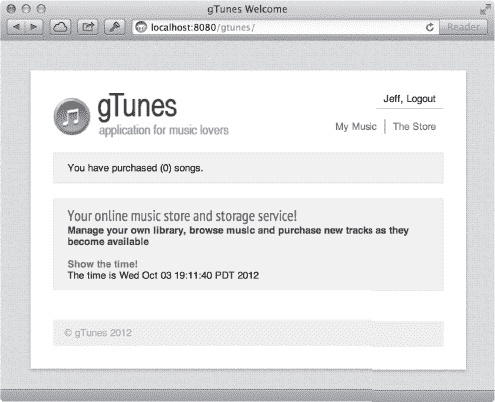

***图 8-1.** 一个简单的 Ajax 调用示例*

### 更换 Ajax 提供者

目前，你正在使用 jQuery 作为 Ajax 代码的底层库。确实，jQuery 是 Grails 应用程序的默认 JavaScript 库，因为它是一个非常强大的库——但如果你想使用不同的库呢？使用 Grails，通过其插件系统可以非常轻松地切换到不同的实现。例如，假设你想使用 Prototype 插件而不是 jQuery。只需修改 `BuildConfig.groovy` 以包含对该插件的依赖：

`// grails-app/conf/BuildConfig.groovy`
`grails.project.dependency.resolution = {`

`   ...`

`    plugins {`
`        runtime ":prototype:1.0"`
`        ...`
`    }`
`}`

现在修改 `<g:javascript>` 标签，将 `library` 属性的值改为 `prototype`：

`<g:javascript library="prototype" />`

为了使它正常工作，jQuery JavaScript 代码需要重写以使用 Prototype API。除了 Prototype，还有用于 Dojo、Ext-JS 和 Yahoo UI 的插件。Grails 插件页面（[`http://grails.org/Plugins`](http://grails.org/Plugins)）提供了关于可用插件的最新信息。虽然 Grails 让你可以轻松指定想要使用的 JavaScript 库，但来回切换不同的实现可能是一项繁琐的工作，因为应用程序中的大部分 JavaScript 代码都依赖于特定的 JavaScript 实现。

### 异步表单提交

现在你已经有机会探索一个简单的示例，让我们尝试一些更具挑战性的内容。在构建 Ajax 应用时，将表单及其数据异步提交到服务器通常非常有用。目前，gTunes 应用的登录过程使用的是常规表单提交，但如果用户无需刷新页面就能登录，岂不是更好？

当前包含在 `grails-app/views/layouts/main.gsp` 布局中的登录表单是通过常规表单提交的。换句话说，表单提交是同步的；它不像 Ajax 请求那样在后台进程中发生。jQuery 库使得创建提交 Ajax 请求的表单变得相当容易。

然而，在编写实现新的支持 Ajax 的表单所需的 jQuery 代码之前，让我们先将渲染登录表单的代码移到它自己的 GSP 模板中。（这样做的意义稍后会变得清晰。）现在创建一个新文件 `grails-app/views/user/_loginForm.gsp`，它将作为模板的基础，然后从布局中剪切并粘贴代码，使模板看起来像清单 8-4。

***清单 8-4.** 登录模板*

`
登录您的 gTunes 账户
`
`<g:form name="loginForm" url="[controller:'user',action:'login']" class="form">`
`    
`
`        <g:textField required="true"`
`                     placeholder="用户名"`
`                     name="login"`
`                     value="${fieldValue(bean:loginCmd, field:'login')}" />`
`        <g:hasErrors  bean="${loginCmd}" field="login">`
`        
<g:fieldError bean="${loginCmd}" field="login" />
`
`        </g:hasErrors>`
`    
`
`    
`
`        <g:passwordField required="true"`
`                         placeholder="密码"`
`                         name="password" />`
`        <g:hasErrors  bean="${loginCmd}" field="password">`
`        
`
`            <g:fieldError bean="${loginCmd}" field="password" />`
`        
`
`        </g:hasErrors>`
`    
`
`    
`
`        <input type="submit" value="登录" class="btn" />`
`    
`
`</g:form>`

现在创建另一个模板来渲染 `loginForm` 模板，并渲染一些与创建新账户相关的标记。将这些标记组合在一起是有意义的，因为这两个部分（“创建新账户”和“登录”）将始终相邻渲染。创建一个名为 `grails-app/views/user/_loginBox.gsp` 的文件，内容如清单 8-5 所示。

***清单 8-5.** loginBox 模板*

`
`
`    <h1>需要账户？</h1>`
`    
<g:link controller="user" action="register">立即注册</g:link>，开始`
`创建您个人的音乐收藏！
`
`    <g:link controller="user" action="register" class="btn">立即注册</g:link>`
`
`
`
`
`    <h1>已是会员？</h1>`
`    <g:render template="/user/loginForm"/>`
`
`

现在，在 `grails-app/views/store/index.gsp` 布局中，使用 `<g:render>` 标签来渲染模板，如清单 8-6 所示。

***清单 8-6.** 使用标签显示登录表单*

`<g:render template="/user/loginBox"/>`

完成这些后，是时候编写一些 jQuery 代码来发起 Ajax 调用并处理响应了。这些代码应定义在 `grails-app/views/store/index.gsp` 中。参见清单 8-7。

***清单 8-7.** Ajax 登录代码*

`<r:script>`
`$(function() {`
`    $('#loginForm').ajaxForm(function(result) {`
`        $('#loginBox').html(result);`
`    });`
`});`
`</r:script>`

这段代码依赖于来自 [`https://github.com/malsup/form`](https://github.com/malsup/form) 的 jQuery Form 插件。请注意，这不是一个 Grails 插件。从该仓库下载 `jquery.form.js` 文件，并将其放入 `web-app/js/` 目录。文件就位后，编辑 `grails-app/conf/ApplicationResources.groovy`，使其看起来像清单 8-8。

***清单 8-8.** 将 jQuery Form 代码添加到 ApplicationResources.groovy*

`// grails-app/conf/ApplicationResources.groovy`
`modules = {`
`    application {`
`        resource url:'js/application.js'`
`        resource url:'js/jquery.form.js'`
`    }`
`}`

`ApplicationResources.groovy` 文件是一个配置文件，由资源插件读取。资源插件有助于优化静态资源（如应用程序使用的 JavaScript 文件）的管理。清单 8-8 中的代码定义了一组静态资源，称为一个模块，其中包含提到的两个 JavaScript 文件。清单 8-7 中的 `r:script` 标签也由资源插件提供。将那段 JavaScript 代码包裹在 `r:script` 标签中的好处之一是，资源插件会确保 JavaScript 在渲染页面的底部加载，这有利于优化页面加载时间。资源插件将在第 12 章中更详细地讨论。现在，只需按描述配置文件，一切应该就能正常工作。

清单 8-7 中的 `ajaxForm` 函数将向登录控制器动作提交一个 Ajax 请求，并使用响应来更新 DOM 中的 `loginBox` 元素。任何输入字段或提交按钮都无需更改。现在，如果你刷新页面并尝试登录，将会发生一件令人惊讶的事情。令人惊讶的是，你会看到整个页面的内容被放置在了 `loginBox` `
` 中！这是因为你更新了客户端代码，但没有关注服务器端逻辑，而服务器端仍然在显示整个视图。要解决这个问题，你需要重新审视服务器端代码，使其只渲染 HTML 片段，而不是整个页面。

以防你不记得相关的代码，清单 8-9 展示了 `UserController` 中 `login` 动作的当前代码。

***清单 8-9.** 当前的 login 动作代码*

`def login(LoginCommand cmd) {`
`    if(request.method == 'POST') {`
`        if(!cmd.hasErrors()) {`
`            session.user = cmd.getUser()`
`            redirect(controller:'store')`
`        }`
`        else {`
`            render(view:'/store/index', model:[loginCmd:cmd])`
`        }`
`    }`
`    else {`
`        render(view:'/store/index')`
`    }`
`}`

目前，清单 8-9 中的代码渲染了整个 `grails-app/views/store/ index.gsp` 视图，但实际上你只希望在登录失败时再次显示登录表单，或者在用户成功登录时显示一条欢迎消息。让我们重构代码以实现这一目标；清单 8-10 显示了结果。

***清单 8-10.** 处理 Ajax 登录请求*

`def login(LoginCommand cmd) {`
`    if(request.method == 'POST') {`
`        if(!cmd.hasErrors()) {`
`            session.user = cmd.getUser()`
`            render template: '/user/welcomeMessage'`
`        }`
`        else {`
`            render template: 'loginBox', model: [loginCmd: cmd]`
`        }`
`    }`
`    else {`
`        render template: 'loginBox'`
`    }`
`}`

当然，你可以进一步扩展，同时处理 Ajax 请求和普通请求，但目前这并非必需。从代码清单 8-10 的代码中可以看出，我们使用的是 `render` 方法的 `template` 参数，而非 `view` 参数，这样就能复用 `_loginForm.gsp` 模板。此外，你还需要创建一个 `grails-app/views/user/_welcomeMessage.gsp` 模板来处理成功登录的情况，其内容见代码清单 8-11。

***代码清单 8-11.** _welcomeMessage.gsp 模板*

`<header id="header">`
`    <h1 id="logo"><a href="${createLink(uri: '/')}">gTune</a></h1>`
`    <g:if test="${session?.user}">`
`        
<a href="#">${session?.user?.firstName}</a>, <g:link`
`controller="user" action="logout">注销</g:link>
`
`        <nav id="navigation" class="clearfix">`
`            <ul>`
`                <li class="separator"><g:link controller="user" action="music">我的`
`音乐</g:link></li>`
`                <li><g:link controller="store" action="shop">商店</g:link></li>`
`            </ul>`
`        </nav>`
`    </g:if>`
`</header>`
`
`
`    
`
`        欢迎回来`
`        ${session?.user?.firstName}!`
`          `

`        您已购买`
`       (${session.user.purchasedSongs?.size() ?: 0}) 首歌曲。`
`        `
`    
`
`
`

最后一项工作是修改主 Sitemesh 布局，以利用新创建的 `welcomeMessage` 模板，如代码清单 8-12 所示。

***代码清单 8-12.** 更新后的主 Sitemesh 布局*

`<body class="application">`

`    
`
`         
`
`            `
`        
`
`        
`
`            <g:if test="${session?.user}">`
`                <g:render template="/user/welcomeMessage"/>`
`            </g:if>`
`            <g:layoutBody />`
`            <g:javascript library="application"/>`
`        
`

`        <footer id="footer">`
`            © gTunes 2012`
`        </footer>`
`    
`
`    <r:layoutResources />`
`</body>`

### 玩转 Ajax 远程链接

在之前的示例中，我们实现了一个点击锚点标签显示当前时间的小功能（我们知道这算不上什么突破性成果）。现在，让我们通过一个更高级的示例来改进它。

在第 5 章中，你为 gTunes 商店的右侧创建了几个面板；它们分别展示了 gTunes 库中最新添加的歌曲、专辑和艺术家。作为回顾，代码清单 8-13 展示了 `grails-app/views/store/shop.gsp` 文件中的相关代码。

***代码清单 8-13.** 最新内容面板*

`
`
`    <h2>最新专辑</h2>`
`    
`
`        <g:render template="/album/albumList"`
`                  model="[albums: top5Albums]" />`
`    
`
`    <h2>最新歌曲</h2>`
`    
`
`        <g:render template="/song/songList" model="[songs: top5Songs]" />`
`    
`
`    <h2>最新艺术家</h2>`
`    
`
`    <g:render template="/artist/artistList"`
`              model="[artists: top5Artists]" />`
`    
`
`
`

每个面板都使用特定的模板为每个类别渲染一个简单的 HTML 无序列表。如果列表项不再是纯文本，而是包含使用 Ajax 显示相关 `Album`、`Song` 或 `Artist` 详细信息的 HTML 链接，那就更好了。

我们从 `Album` 开始。如果你还记得领域模型，一个 `Album` 包含 `title`、发行 `year`、`genre`、`artist` 以及属于该专辑的 `Song` 列表。首先，创建一个能够渲染这些信息的模板。代码清单 8-14 展示了 `grails-app/views/album/_album.gsp` 模板。

***代码清单 8-14.** 实现 _album.gsp 模板*

`
`
`    
`
`                
${artist.name}
`
`                
${album.title}
`
`                
`
`            类型: ${album.genre ?: '其他'} `
`                年份: ${album.year}`
`                
`
`        
`
`            <ol>`
`                <g:each in="${album.songs?}" var="song">`
`                    <li>${song.title}</li>`
`                </g:each>`
`            </ol>`
`                
`
`        
`
`    
`
`
`

现在你有了一个模板，就可以修改 `grails-app/views/album/_albumList.gsp` 模板，使其使用 jQuery 为列表中的每一项调用 `AlbumController` 上的控制器动作 `display`。代码清单 8-15 以粗体显示了 `_albumList.gsp` 模板的修改内容。

***代码清单 8-15.** 更新 _albumList.gsp 以使用 jQuery 链接*

`<ul>`
`    <g:each in="${albums?}" var="album">`
**`<li><g:link update="musicPanel"`**
**`controller="album"`**
**`action="display"`**
**`id="${album.id}"`**
**`elementId=="albumLink${album.id}">${album.title}</g:link></li>`**
**`<r:script>`**
`            $('#albumLink${album.id}').click(function() {`
`                $('#musicPanel').load(this.href);`
`                return false;`
`            });`
`        </r:script>`
`    </g:each>`
`</ul>`

再次看到，JavaScript 代码被包裹在 `r:script` 标签中，这样做是为了性能考虑，将所有 JavaScript 代码加载到页面末尾。如果某个页面多次使用了 `r:script` 标签，所有这些代码会被合并到页面底部的一个 `script` 标签中。

请注意，你可以使用 `update` 属性来指定将响应内容放入一个 DOM ID 为 `musicPanel` 的 HTML `
` 中。如果此时刷新页面并尝试点击链接，你会发现图片中的 Ajax 部分已经可以工作了！但美中不足的是，由于 `AlbumController` 中目前还没有显示（display）动作，你会从服务器收到一个 404“页面未找到”错误。

让我们通过打开 `AlbumController` 并实现 `display` 动作来纠正这个问题。清单 8-16 展示了相关代码，它简单地使用 `params` 对象中的 `id` 参数获取 `Album` 实例，然后利用该实例渲染在清单 8-14 中开发的 `_album.gsp` 模板。

***清单 8-16.** AlbumController 的 display 动作*

`def display() {`
`    def album = Album.get(params.id)`
`    if(album) {`
`        def artist = album.artist`
`        render(template:"album", model:[artist:artist, album:album])`
`    } else {`
`        render "Album not found."`
`    }`
`}`

通过添加一些 CSS 魔法来增强 `_album.gsp` 模板的外观，突然间，你就可以通过 Ajax 获取专辑详情并将其渲染到视图中了。图 8-2 展示了你的辛勤工作成果。

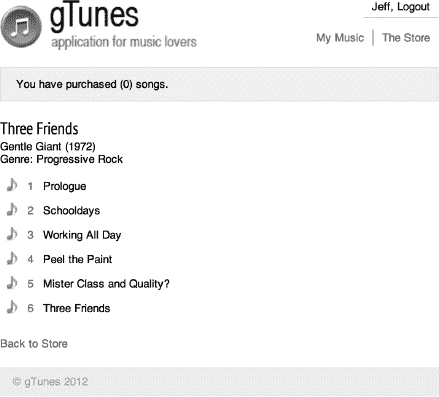

***图 8-2.** 使用 Ajax 显示专辑*

遗憾的是，即使有了 CSS 增强，`Album` 的详细信息看起来还是因为全是文字而显得有些单调。如果能显示每张专辑的封面图，岂不是很好？有志者，事竟成——幸运的是，苹果公司提供了一个基于 REST 的网络服务来救场，该服务允许开发者从其庞大的资源库中查找专辑封面图。该服务的地址是 [`http://itunes.apple.com/search`](http://itunes.apple.com/search)。在浏览器中打开该 URL，你应该会看到类似这样的响应：

`{`
` "resultCount":0,`
` "results": []`
`}`

这看起来没什么意思。显然，它看起来不像能帮助你在 gTunes 中显示专辑封面的东西。这里显示的是对我们请求的 JSON 响应。问题在于我们并没有真正请求任何有用的东西，所以也没有*得到*任何有用的东西。让我们通过包含一些请求参数来让它变得更有趣一些。试试 [`http://itunes.apple.com/search?media=music&entity=album&attribute=albumTerm&term=Church+Of+Broken+Glass`](http://itunes.apple.com/search?media=music&entity=album&attribute=albumTerm&term=Church+Of+Broken+Glass)。该 URL 包含几个请求参数。

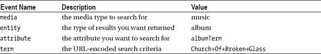

总结一下，上面的请求 URL 是在搜索名为 *Church of Broken Glass* 的专辑音乐。该请求应该会产生类似如下的响应：

`{`
` "resultCount":1,`
` "results": [`
`{"wrapperType":"collection", "collectionType":"Album", "artistId":80907270,`
`"collectionId":293455812, "amgArtistId":512604, "artistName":"Hammers of Misfortune",`
`"collectionName":"Church of Broken Glass", "collectionCensoredName":"Church of Broken Glass",`
`"artistViewUrl":"https://itunes.apple.com/us/artist/hammers-of-misfortune/id80907270?uo=4",`
`"collectionViewUrl":"https://itunes.apple.com/us/album/church-of-broken-glass/id293455812?uo=4",`
`"artworkUrl60":"http://a397.phobos.apple.com/us/r30/Music/98/da/c2/mzi.wvlbbglb.60x60-50.jpg",`
`"artworkUrl100":"http://a862.phobos.apple.com/us/r30/Music/98/da/c2/mzi.wvlbbglb.100x100-75.jpg",`
`"collectionPrice":9.99, "collectionExplicitness":"notExplicit", "trackCount":5,`
`"copyright":" 2008 Hammers of Misfortune", "country":"USA", "currency":"USD",`
`"releaseDate":"2008-09-30T07:00:00Z", "primaryGenreName":"Rock"}]`
`}`

该响应包含大量信息——比我们需要的多——但我们可以忽略大部分内容，只提取我们需要的：`artworkUrl100` 属性的值——在本例中是 [`http://a862.phobos.apple.com/us/r30/Music/98/da/c2/mzi.wvlbbglb.100x100-75.jpg`](http://a862.phobos.apple.com/us/r30/Music/98/da/c2/mzi.wvlbbglb.100x100-75.jpg)。该值代表对应专辑封面的 URL。

该 API 支持许多其他搜索选项，但上面列出的这些已经足够满足我们的需求。关于搜索服务的更完整文档，请访问 [`www.apple.com/itunes/affiliates/resources/documentation/itunes-store-web-service-search-api.html`](http://www.apple.com/itunes/affiliates/resources/documentation/itunes-store-web-service-search-api.html)。

完成这些后，是时候创建你的第一个标签库了。你将创建一个 `AlbumArtTagLib`，用于处理从亚马逊获取专辑封面图。为此，首先运行 `create-tag-lib` 命令：

`grails> create-tag-lib com.gtunes.AlbumArt`
`| Created file grails-app/taglib/com/gtunes/AlbumArtTagLib.groovy`
`| Created file test/unit/com/gtunes/AlbumArtTagLibTests.groovy`
`grails>`

`create-tag-lib` 命令将创建一个新的空 `AlbumArtTagLib`，如清单 8-17 所示。

***清单 8-17.** AlbumArtTagLib 模板*

`package com.gtunes`
`class AlbumArtTagLib {`
`}`

该标签库将提供一个自定义的 GSP 标签，该标签会调用 REST 网络服务来检索专辑封面 URL，然后输出一个指向该 URL 的 `img` 标签。有一个名为 `rest-client-builder` 的 Grails 插件；它提供了一个 `RestBuilder` 类，使得调用 REST 服务并处理响应变得非常容易。要使用该插件，我们需要在 `BuildConfig.groovy` 中添加代码来表达对该插件的依赖。

`// grails-app/conf/BuildConfig.groovy`

`grails.project.dependency.resolution = {`

`    ...`

`    plugins {`
`        compile ":rest-client-builder:1.0.2"`
`        ...`
`    }`
`}`

使用 `rest-client-builder` 插件提供的 `RestBuilder` 类非常简单。（该插件的完整文档位于 [`http://grails.org/plugin/rest-client-builder`](http://grails.org/plugin/rest-client-builder)；我们将在此介绍基础知识。）`RestBuilder` 类有一个名为 `get` 的实例方法，它接受一个 `String` 参数；该参数应指向你想要调用的服务的 URL。该方法返回一个响应，该响应将有一个 `json` 属性，这是一个 Grails `JSONObject`，表示从 JSON 响应中解析出的无序名称/值对集合。清单 8-18 展示了一个简单的用法。

***清单 8-18.** 使用 RestClient*

`def restBuilder = new RestBuilder()`
`def url = "http://someserver.com/someService"`
`def response = restBuilder.get(url)`
`def json = response.json`
`def someAttributeValue = json.someAttribute`

我们的标签需要使用 `RestBuilder` 来调用服务以检索专辑封面 URL，并从响应中提取 `artworkUrl100` 的值。清单 8-19 展示了该标签的完整工作版本。

***清单 8-19.** AlbumArtTagLib*

`package com.gtunes`

`import grails.plugins.rest.client.RestBuilder`

`class AlbumArtTagLib {`

`  static final DEFAULT_ALBUM_ART_IMAGE =  "/images/no-album-art.gif"`

`  static namespace = "music"`

`  def albumArt =  { attrs, body ->`
`    def artistName = attrs.remove('artist')?.toString()`
`    def albumTitle = attrs.remove('album')?.toString()`
`    def width = attrs.int('width', 100)`
`    attrs.remove('width')`
`    def albumArt = DEFAULT_ALBUM_ART_IMAGE`
`    if(artistName && albumTitle) {`
`      try {`
`        def restBuilder = new RestBuilder()`
`        def url = "http://itunes.apple.com/search?term=${albumTitle.encodeAsURL()}&media=music&e`
`ntity=album&attribute=albumTerm"`
`        def response = restBuilder.get(url)`
`        def json = response.json`
`        // 获取搜索结果列表`
`        def records = json.results`

`        // 查找与艺术家名称和专辑标题完全匹配的记录，`
`        // 注意服务返回的记录可能并非精确匹配`
`        def matchingRecord = records.find { r ->`
`          r.artistName == artistName && r.collectionName == albumTitle`
`        }`
`        albumArt = matchingRecord?.artworkUrl100 ?: DEFAULT_ALBUM_ART_IMAGE`
`      } catch (Exception e) {`
`        log.error "获取专辑封面时出现问题: ${e.message}", e`
`      }`
`    }`
`    if(albumArt.startsWith("/")) albumArt = "${request.contextPath}${albumArt}"         `
`    out << "`
`      " ${attributeName}=\"${attributeValue.encodeAsHTML()}\""`
`    }.join(' ')`
`    out << "></img>"`
`  }`
`}`

请注意，将所有逻辑都放在 GSP 标签中并不理想。这将在后面的第 10 章中进行重构，但目前这段代码已经够用了。

清单 8-20 展示了 `AlbumArtTagLib` 的单元测试。

***清单 8-20.** AlbumArtTagLibTests*

`package com.gtunes`

`import grails.plugins.rest.client.RestBuilder`

`import grails.test.mixin.*`
`import org.junit.*`

`@TestFor(AlbumArtTagLib)`
`class AlbumArtTagLibTests {`

`  void testNoAlbumSpecified() {`
`    assert applyTemplate('<music:albumArt artist="Tool" />') == """</img>"""`
`  }`

`  void testNoArtistSpecified() {`
`    assert applyTemplate('<music:albumArt album="Lateralus" />') == """</img>"""`
`    }`

`  void testGoodResult() {`
`    def artworkClient = new groovy.mock.interceptor.MockFor(RestBuilder)`
`    artworkClient.demand.get { String s ->`
`      def results = []`
`      results << [artistName: 'Thin Lizzy',`
`                  collectionName: 'Jailbreak',        `
`                  artworkUrl100: 'http://somesite/jailbreak.jpg']`
`      results << [artistName: 'Tool',`
`                  collectionName: 'Lateralus',`
`                  artworkUrl100: 'http://somesite/lateralus.jpg']`
`      [json: [results: results]]`
`     }`
`    artworkClient.use {`
`      assert applyTemplate('<music:albumArt artist="Tool" album="Lateralus" />') == '</img>'`
`  }`
`}`

`  void testSpecifyingImageWidth() {`
`    def artworkClient = new groovy.mock.interceptor.MockFor(RestBuilder)`
`    artworkClient.demand.get { String s ->`
`      def results = []`
`      results << [artistName: 'Thin Lizzy',`
`                  collectionName: 'Jailbreak',`
`                  artworkUrl100: 'http://somesite/jailbreak.jpg']`
`      results << [artistName: 'Tool',`
`                  collectionName: 'Lateralus',`
`                  artworkUrl100: 'http://somesite/lateralus.jpg']`
`      [json: [results: results]]`
`    }`
`    artworkClient.use {`
`      assert applyTemplate('<music:albumArt artist="Tool" album="Lateralus" width="50"/>') ==`
`'</img>'`
`    }`
`  }`
`}`

最后，为了将所有部分整合起来，你需要修改 `grails-app/views/ album/_album.gsp` 模板，使其能够利用新创建的 `<music:albumArt>` 标签。清单 8-21 以粗体显示了 `_album.gsp` 的修改内容。

***清单 8-21.** 向 _album.gsp 模板添加专辑封面*

`
 
`
`    <music:albumArt artist="${artist}" album="${album}" />`
`
 ... 
`

经过进一步的 CSS 技巧处理后，图 8-3 展示了新的专辑封面集成效果。看起来好多了！

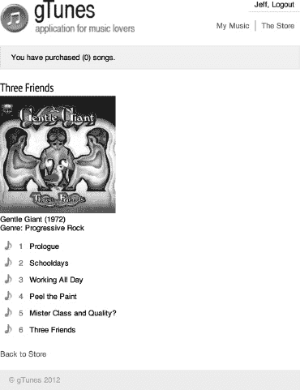

***图 8-3.** 集成了专辑封面的 album.gsp 模板*

### 添加效果与动画

到目前为止所实现的功能已经相当不错了，但如果能加入一些效果来增添趣味性，那就更好了。假设你希望点击“最新专辑”链接时，专辑能够淡入显示；首先要做的是确保专辑在初始状态下是隐藏的。为此，请打开 `grails-app/views/ album/_album.gsp` 模板，并确保主 HTML `
` 的 `style` 属性设置为 `display:none`，如清单 8-22 所示。

***清单 8-22.** 隐藏专辑*

`
`
`... 
`

现在，你可以使用 jQuery 的 fadeIn 功能来实现这个效果。尝试将以下代码添加到 `album.gsp` 的底部：

`<g:javascript>`
`    $('#album${album.id}').fadeIn('slow');`
`</g:javascript>`

这将执行 jQuery 库的淡入效果。现在，每当点击“最新专辑”链接时，专辑就会优雅地淡入显示。大多数知名的 Ajax 库（其中许多都提供了 Grails 插件）都具备类似的功能。请务必探索你所选的 Ajax 库中可用的功能！

### 支持 Ajax 的表单字段

上一节的内容相当精彩，不是吗？不过 Ajax 的学习还没结束。在本节中，你将学习如何在文本输入框等表单字段上启用 Ajax。

这在实现自动补全或类似 Mac OS X 中 Spotlight 的即时搜索功能时非常有用。事实上，搜索正是本节要实现的目标。当然，能够点击音乐库的最新添加内容固然不错，但 gTunes 用户能够搜索歌曲和专辑的完整目录也同样至关重要。

幸运的是，jQuery 可以用来帮助实现搜索功能。首先，打开 `grails-app/views/store/shop.gsp` 视图。在这个文件中，你需要定义一个文本字段来接收搜索输入，并编写一些 jQuery 代码，通过调用 `search` 操作来响应输入，如清单 8-23 所示。

***清单 8-23.** 使用 <g:remoteField> 标签*

`
`
`    <h1>即时搜索</h1>`
`    <g:textField id="searchField" name="searchField"/>`
`    

`
`
`
`<r:script>`
`$("#searchField").keyup(function() {`
`    $("#searchResults").load("${createLink(action: 'search')}?q="+this.value);`
`});`
`</r:script>`

这里，你设置了一个文本字段，并为其关联了一个 `keyup` 事件监听器；它会向 `StoreController` 的 `search` 操作发送一个请求。

***图 8-4.** gTunes 实例搜索框*

如果你刷新页面并开始输入，你会看到该字段已经在发送远程请求，尽管页面上显示的是 404 错误，而不是任何有用的内容。此时，值得考虑如何实现搜索。当然，你可以使用 Hibernate 查询，但 Hibernate 并非为用作搜索引擎而设计，而且设计自己的搜索查询语言会很麻烦。

Grails 插件系统再次挺身而出！目前 Grails 最流行的插件之一是 Searchable 插件，它构建在 Compass ([`http://www.compass-project.org/`](http://www.compass-project.org/)) 和 Lucene ([`http://lucene.apache.org/`](http://lucene.apache.org/)) 之上。

 **注意** 本示例将演示 Searchable 插件最基本的功能。完整文档可在 [`http://grails.org/plugin/searchable`](http://grails.org/plugin/searchable) 获取。

像往常一样，安装 Searchable 是件简单的事。将依赖添加到 `BuildConfig.groovy` 中：

`// grails-app/conf/BuildConfig.groovy`
`grails.project.dependency.resolution = {`

`   ...`

`    plugins {`
`        runtime ":searchable:0.6.4"`
`        ...`
`    }`
`}`

Searchable 插件通过提供将 Grails 领域类暴露为可搜索实体的能力来与 Grails 集成。在简单层面上，可以通过在要搜索的领域类中添加以下行来添加搜索功能：

`static searchable = true`

然而，通常你只想搜索领域类属性的一个子集。当然，使用 Searchable 完全可以做到这一点，事实上，它定义了一整套 DSL 用于在你的类和搜索索引之间进行映射（这个话题超出了本书的范围）。

在本例中，你将搜索专辑或歌曲的 `genre` 和 `title`，以及艺术家的名字。清单 8-24 展示了如何使用 Searchable 启用这些搜索。

***清单 8-24.** 在 gTunes 领域上启用搜索*

`class Song {`
**`static searchable = [only: ['genre', 'title']]`**
`    ...`
`}`
`class Album {`
**`    static searchable = [only: ['genre', 'title']]`**
`    ...`
`}`
`class Artist {`
**`    static searchable = [only: ['name']]`**
`    ...`
`}`

非常简单。接下来，让我们实现 `StoreController` 的 `search` 操作。与 GORM 类似，Searchable 在支持搜索的领域类上提供了一系列新方法，包括以下内容：

> *   `search`：返回一个搜索结果对象，其中包含与查询匹配的对象子集
> *   `searchTop`：返回与查询匹配的第一个结果对象
> *   `searchEvery`：返回与查询匹配的所有结果对象
> *   `countHits`：返回查询的命中次数
> *   `termFreqs`：返回索引中词条的词频（高级）

关于每个方法的功能和行为方式的完整数据，请参考上面提到的 Searchable 文档。根据你的需求，你将使用 `search` 方法来构建搜索结果。清单 8-25 展示了使用 Searchable API 实现 `StoreController` 的 `search` 操作。

***清单 8-25.** 使用 Searchable 启用搜索*

`    def search(String q) {`
`        def searchResults = [:]`
`        if(q) {`
`            searchResults.artistResults = trySearch { Artist.search("*${q}*", [max: 10]) }`
`            searchResults.albumResults = trySearch { Album.search("*${q}*", [max: 10]) }`
`            searchResults.songResults = trySearch { Song.search("*${q}*", [max: 10]) }`
`        }`
`        render template: 'searchResults', model: searchResults`
`    }`

`    private trySearch(Closure callable) {`
`        try {`
`            return callable()`
`        } catch (Exception e) {`
`            log.debug "搜索错误: ${e.message}", e`
`            return []`
`        }`
`    }`

这段代码非常简单。它获取代表查询的 `q` 参数，如果该参数不为空，则构建一个包含专辑、艺术家和歌曲搜索结果的模型。这段代码的一个有趣之处在于 `trySearch` 方法，它展示了 Groovy 闭包在处理异常方面的一个引人注目的用途。由于异常很可能是搜索语法错误的结果，因此记录该错误并返回空结果比将错误抛回给用户更可取。

一旦在 `searchResults` 变量中构建好搜索结果，代码就会渲染一个 `_searchResults.gsp` 模板，并将 `searchResults` 作为模型传递。如清单 8-26 所示，`grails-app/views/store/_searchResults.gsp` 模板很简单；它只是重用诸如 `_albumList.gsp` 和 `_artistList.gsp` 之类的现有模板来显示结果。

***清单 8-26.** _searchResults.gsp 模板*

`
`
`  <g:if test="${albumResults?.results}">`
`    
`
`      <h2>专辑搜索结果</h2>`
`      <g:render template="/album/albumList"`
`                model="[albums:albumResults.results]">`
`      </g:render>`
`    
`
`  </g:if>`
`  <g:if test="${artistResults?.results}">`
`    
`
`      <h2>艺术家搜索结果</h2>`
`      <g:render template="/artist/artistList"`
`                model="[artists:artistResults.results]">`
`      </g:render>`
`    
`
`  </g:if>`
`  <g:if test="${songResults?.results}">`
`    
`
`      <h2>歌曲搜索结果</h2>`
`      <g:render template="/song/songList"`
`                model="[songs:songResults.results]">`
`      </g:render>`
`    
`
`  </g:if>`
`
`

再次借助你的 CSS 技能，现在搜索结果的呈现已经相当规整。更棒的是，由于它们使用了与屏幕右侧“最新专辑”列表相同的 `<g:remoteLink>` 标签，因此开箱即用，支持 Ajax。只需点击一个搜索结果，就能通过 Ajax 拉取一张 `Album` 的详细信息！图 8-5 展示了搜索框的使用，并演示了如何通过 Searchable 插件支持使用星号 (*) 字符的通配符功能。

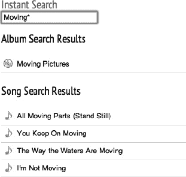

***图 8-5.** 使用 <g:remoteField> 和 Searchable 实现即时搜索结果*

### 关于 Ajax 与性能的说明

注意 Ajax 对应用程序性能的影响至关重要。考虑到需要渲染大量的小代码片段，设计不佳的 Ajax 应用程序需要处理数量显著更多的请求也就不足为奇了。本章到目前为止所展示的是一种较为初级的 Ajax 开发方法。你只是对应用程序挥舞了 Ajax 的魔法棒，却很少考虑其性能影响。

不过，现在开始考虑这些问题也为时不晚。在投入更多硬件资源之前，你可以使用多种技术来减少 Ajax 应用程序执行的请求数量。

请记住，Ajax 调用是一次远程网络调用，因此代价高昂。诸如数据传输对象（DTO）之类的概念在 Ajax 领域同样适用。从根本上说，DTO 模式作为一种机制，可以将多个操作批量打包到一次调用中，并向服务器传递足够的状态，以便一次性执行多个操作。这种模式在 Ajax 中同样有效，因为一次传输大量信息的调用，比十几次小调用要好。

另一种流行的技术是将更多复杂性转移到客户端。鉴于 Ajax 客户端通常只占据一个物理页面，因此可以通过缓存将相当多的状态保留在客户端。缓存可能是 Ajax 开发中最重要的技术，在可能的情况下，应充分利用它来优化与服务器的通信。

无论你使用哪种技术，从长远来看都会带来回报，服务器基础设施的工程师们会因此感激你。你的应用程序用户也会欣赏其更快的响应速度和交互性。

### 本章小结

在本章中，你了解了 Grails 提供的广泛的自适应 Ajax 标签，以及如何应用它们来为你的 gTunes 应用程序提供一个更易用的交互式界面。在这段特别的旅程中，你还探索了 Grails 的高级开发，更深入地学习了控制器、模板和 `render` 方法如何协同工作。

在过去的几章中，你通过控制器、GSP、标签库和 Ajax 等形式，深入参与了 Grails 的 Web 层开发。然而，到目前为止你所看到的一切都使用了完全无状态的通信方式。在下一章中，你将了解 Grails 如何支持用于跨多个页面的丰富会话的 Web Flow。

## 第 9 章

## GORM

正如你可能从本书的目录中了解到的那样，Grails 的持久化层是整个架构中的关键部分。在第 3 章中，你已经对领域类是什么以及它们如何映射到底层数据库有了一个表面的理解。在本章中，你将一头扎进 GORM 的内部工作机制。

作为起点，你将学习涉及从数据库读取和写入对象的基本持久化操作。在了解了基础知识之后，你将进一步学习 GORM 的语义，包括我们尽可能在一章中涵盖的许多边界情况和令人惊讶的特性。

### 持久化基础

幸运的是，我们不会在基础上花费太多时间，因为你已经接触过 GORM 的基础知识了。不过，作为回顾，让我们看看 GORM 提供的基本读取操作。

#### 读取对象

每个领域类都会自动增强一些方法，允许你查询领域实例。其中最简单的是 `get` 方法，它接受一个领域类的标识符，并返回一个实例，如果在数据库中没有找到该实例，则返回 `null`。代码清单 9-1 展示了一个简单的示例，来自你已经开发过的 `AlbumController`，相关代码以粗体显示。

***代码清单 9-1.** 使用 get 方法*

`class AlbumController {`
`    def show() {`
`        def album = Album.get(params.id)`
`        if(album) {`
`        }`
`    }`
`}`

除了简单的 `get` 方法之外，还有一个 `getAll` 方法，它可以接受多个标识符并返回一个实例的 `List`。你可以将标识符指定为一个 `List` 或使用可变参数；例如：

`def albums = Album.getAll(1,2,3)`

当使用 `get` 方法时，对象会以可修改的状态从数据库加载。换句话说，你可以对对象进行更改，这些更改随后会被持久化到数据库。如果你想以只读状态加载对象，可以使用 `read` 方法代替：

`def album = Album.read(params.id)`

在这种情况下，返回的 `Album` 实例不能被修改。你对对象所做的任何更改都不会被持久化。这样做还有一个性能优势，因为 Hibernate 不必跟踪哪些属性发生了变化（脏检查）。

#### 列表、排序和计数

从数据库中检索项目的一种常见方法是简单地列出它们。显然，列出所有实例并不总是可取的，并且返回结果的顺序通常很重要。GORM 提供了一个 `list()` 方法，它接受许多命名参数，包括 `max`、`offset`、`sort` 和 `order`，以自定义结果，其定义如下：

> *   `max`：要返回的最大实例数
> *   `offset`：相对于 0 的第一个返回结果的偏移量
> *   `sort`：用于排序的属性名
> *   `order`：结果的排序顺序，`asc` 表示升序，`desc` 表示降序

除了 `list()` 方法（通常与其结合使用）之外，还有 `count()` 方法，它用于计算数据库中实例的总数。为了演示这些方法，让我们看一些它们的使用示例（见代码清单 9-2）。

***代码清单 9-2.** 使用 list() 方法*

`// 获取所有专辑；注意，可能有很多！`
`def allAlbums = Album.list()`
`// 获取最近创建的十张专辑`
`def topTen = Album.list(max:10, sort:'dateCreated', order:'desc')`
`// 获取专辑总数`
`def totalAlbums = Album.count()`

可以想象，通过自定义 `offset` 参数，使用 `list()` 方法来执行结果的分页是非常简单的。此外，还有一组 `listOrderBy*` 方法，它们是 `list()` 方法的变体。

`listOrderBy*` 方法提供了一个示例，其中每个方法在方法签名中都使用了类本身的属性。它们对于每个领域类都是唯一的，但理解其约定即可使用。代码清单 9-3 是一个示例，它通过简单地调用 `listOrderByDateCreated()` 方法，列出了所有按 `dateCreated` 属性排序的 `Album` 实例。

***代码清单 9-3.** 使用 listOrderBy*

`// 所有按创建日期排序的专辑`
`def allByDate = Album.listOrderByDateCreated()`

使用标准的 Bean 约定，属性名（首字母大写）被附加到方法签名的末尾。在本章后面介绍动态查找器（包括 `count` 方法的一个变体）时，你还会看到更多这样的例子。

#### 保存、更新与删除

正如您已经看到的，可以通过调用 `save()` 方法来持久化对象。例如，代码清单 9-4 中的代码演示了如何在验证成功后持久化 `Album` 类的一个实例。

***代码清单 9-4.** 保存实例*

`def album = new Album(params)`
`album.save()`

关于 GORM 如何将对象持久化到数据库，我们将在本章后面的“GORM 的语义”中详细说明。目前，您只需要知道，在某个时刻，底层的 Hibernate 引擎会执行一条 SQL `INSERT` 语句，将 `Album` 实例持久化到数据库中。更新对象的过程非常相似；只需对现有的持久化实例调用相同的 `save()` 方法，如代码清单 9-5 所示。

***代码清单 9-5.** 更新实例*

`def album = Album.get(1)`
`album.title = "The Changed Title"`
`album.save()`

当调用 `save()` 方法时，Hibernate 会自动判断应该执行 SQL `INSERT` 还是 SQL `UPDATE`。在某些较旧的数据库上，Hibernate 偶尔可能会判断错误，在应该执行 `INSERT` 时却执行了 `UPDATE`。您可以通过向 `save()` 方法传递一个显式的 `insert` 参数来解决这个问题：

`album.save(insert:true)`

至于删除对象，则通过 `delete()` 方法完成：

`album.delete()`

这些都是基础内容。接下来，您将更详细地了解 GORM 中的关联及其工作原理。

### 关联

第 3 章 已经提供了一些关于 GORM 关联不同形式的细节，但 GORM 支持的关联远不止于此。在典型的一对多关联中，例如 `Album` 类的 `songs` 属性，其类型是 `java.util.Set`。如果您还记得，根据 javadoc 的定义，`Set` 的语义不允许重复且没有顺序。然而，您可能希望关联具有特定的顺序。

一种选择是使用 `SortedSet`，这要求您为放入 `SortedSet` 的任何项实现 `Comparable` 接口。例如，代码清单 9-6 展示了如何按 `trackNumber` 属性对曲目进行排序。

***代码清单 9-6.** 使用 SortedSet 对关联进行排序*

`class Album {`
`    ...`
`    SortedSet songs`
`}`
`class Song implements Comparable {`
`    ...`
`    int compareTo(o) {`
`        if(this.trackNumber > o.trackNumber) {`
`            return 1`
`        } else if(this.trackNumber < o.trackNumber) {`
`            return -1`
`        }`
`        return 0`
`    }`
`}`

或者，您可以使用第 3 章 中介绍的 `mapping` 属性来声明式地指定排序顺序。例如，如果您希望所有查询都按曲目编号对 `Song` 实例进行排序，可以使用 `sort` 方法：

`class Song {`
`    ...`
`    static mapping = {`
`        sort "trackNumber"`
`    }`
`}`

您可能不希望每个查询或关联都按 `trackNumber` 属性排序，在这种情况下，您可以仅对 `Album` 类的 `songs` 关联应用排序：

`static mapping = {`
`    songs sort: "trackNumber"`
`}`

另一种改变排序方式的方法是使用不同的集合类型，例如 `java.util.List`。与 `Set` 不同，`List` 允许重复并保留对象放入 `List` 的顺序。为了支持 `List` 关联，Hibernate 使用一个特殊的索引列，该列包含 `List` 中每个项的索引。代码清单 9-7 展示了在 `songs` 关联中使用 `List` 的示例。

***代码清单 9-7.** 使用 List 关联*

`class Album {`
`    ...`
`    List songs`
`}`

`Set` 关联没有顺序的概念，但使用 `List` 您可以索引到特定的条目；例如：

`println album.songs[0]`

GORM 也支持将关联存储在 Hibernate Bag 中。Bag 不一定有序，也不保证唯一性；因此，它在许多情况下可能性能更好。要使用 Bag，请像代码清单 9-7 中声明 `List` 那样声明属性，但使用 `java.util.Collection` 类型代替 `java.util.List`。

最后，GORM 还支持键为 `String` 的 `Map` 关联。只需将代码清单 9-7 示例中的类型从 `List` 改为 `Map`，并使用 `String` 代替 `Integer` 来访问条目即可。对于 `List` 和 `Map` 这两种集合类型，Grails 都会创建一个索引列。对于 `List`，索引列保存一个数值，表示其在 `List` 中的位置；而对于 `Map`，索引列保存 `Map` 的键。

#### 关系管理方法

除了让您能够将关联映射到数据库之外，GORM 还自动为您提供了管理这些关联的方法。`addTo*` 和 `removeFrom*` 动态方法允许您向关联中添加和移除条目。此外，这两个方法都会返回它们被调用的实例，从而允许您链式调用方法。代码清单 9-8 展示了使用 `Album` 类的 `addToSongs` 方法的示例。

***代码清单 9-8.** 使用关系管理方法*

`new Album(title:"Odelay",`
`          artist:beck,`
`          year:1996)`
`            .addToSongs(title:"Devil's Haircut",`
`                        artist:beck, duration:342343)`
`            .addToSongs(title:"Hotwax", artist:beck, duration:490583)`
`            ...`
`            .save()`

从示例中可以看出，您可以将 `Song` 的值作为命名参数传递给 `addToSongs` 方法；GORM 会自动实例化一个新实例并将其添加到 `songs` 关联中。或者，如果您已经有一个 `Song` 实例，可以直接将其传递给 `addToSongs` 方法。

#### 传递性持久化

每当您在 GORM 中保存、更新或删除一个实例时，该操作可以级联到任何关联的对象。GORM 中的默认级联行为由 `belongsTo` 属性决定，该属性首次在第 3 章 中讨论。例如，如果 `Song` 类 `belongsTo` `Album` 类，那么每当一个 `Album` 实例被删除时，所有关联的 `Song` 实例也会被删除。如果关联中没有 `belongsTo` 定义，则保存和更新会级联，但删除不会。

如果您需要对级联行为进行更多控制，可以使用 `mapping` 块的 `cascade` 方法进行自定义，如代码清单 9-9 所示。

***代码清单 9-9.** 自定义级联行为*

`class Album {`
`    ...`
`    static mapping = {`
**`        songs cascade:'save-udpate'`**
`    }`
`}`

存在一种特殊的级联样式 `delete-orphan`，用于当子对象从关联中移除但未显式删除时，您希望将其删除。

 **提示** 有关可用级联选项的信息，请参阅 Hibernate 文档中的相关章节：[`http://docs.jboss.org/hibernate/core/3.6/reference/en-US/html/objectstate.html#objectstate-transitive`](http://docs.jboss.org/hibernate/core/3.6/reference/en-US/html/objectstate.html#objectstate-transitive)。

### 查询

几乎所有非平凡的应用都需要查询持久化数据。由于底层存储介质通常选择数据库，历史上实现这一目标的典型方式一直是使用 SQL。关系型数据库系统及其表和列，与 Java 对象存在显著差异，以至于抽象数据访问长期以来一直是许多 ORM 供应商的难题。

Hibernate 为查询存储在数据库中的对象提供了足够优雅的 Java API，但 GORM 通过完全抽象大部分数据访问逻辑，将这一能力提升到了新的水平。不要指望在你的代码库中看到大量对 `org.hibernate` 包的依赖，因为 GORM 巧妙地抽象了与 Hibernate 交互的细节。在接下来的几节中，我们将介绍使用 GORM 进行查询的不同方式，从动态查找器到 GORM 条件查询。

请注意，虽然关系型数据库系统是 Grails 应用中最常见的数据库类型，但许多所谓的 NoSQL 数据库也越来越受欢迎，而 GORM 对处理其中许多数据库提供了出色的支持。MongoDB 是其中较为流行的一种。有关将 GORM 与 MongoDB 结合使用的更多信息，请参阅 [`http://grails.org/plugin/mongodb`](http://grails.org/plugin/mongodb)。

#### 动态查找器

动态查找器是 GORM 最强大的概念之一；与前面提到的 `listOrderBy*` 方法一样，它们使用类的属性名来执行查询。然而，它们比这更灵活，因为它们允许使用诸如 `And`、`Or` 和 `Not` 之类的逻辑查询来形成所谓的方法表达式。对于任何给定的类，可能有数百种组合，但同样，如果你知道约定，它们就相当容易记住。让我们先看一个 `findBy*` 方法的示例（参见 图 9-1），该方法为指定的方法表达式定位一个唯一的实例。

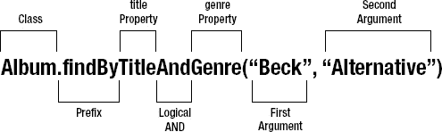

***图 9-1.** 基本动态查找器语法*

该图使用 `title` 和 `genre` 属性来查找一个 `Album` 实例。中间有一个逻辑 `And` 表达式，以确保查询中两个值都需要相等。这可以替换为逻辑 `Or`，以查找一个 `title` 为 `Beck` 或 `genre` 为 `Alternative` 的 `Album`。

然而，我们只是浅尝了动态查找器和方法表达式的可能性。动态查找器支持多种表达式，允许进行 `GreaterThan`、`LessThan`、`Like` 和 `Between` 查询，仅举几例，只需在属性名末尾附加一个额外的表达式即可。清单 9-10 展示了其中一些表达式的实际应用。

***清单 9-10.** 动态查找器实战*

`// 检索标题包含 'Shake' 的专辑`
`def album = Album.findByTitleLike('%Shake%')`

`// 获取过去 10 天内创建的专辑`
`def today = new Date()`
`def last10Days = Album.findByDateCreatedBetween(today-10,today)`

`// 第一个不是 'Rock' 的专辑`
`def somethingElse = Album.findByGenreNotEqual('Rock')`

表 9-1 说明了所有可以附加的可能表达式、它们期望的参数数量以及每个表达式的实战示例。

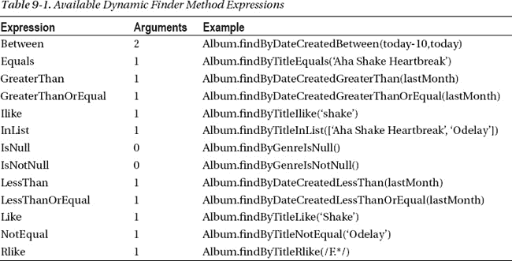

`findBy*` 方法有两个同类方法，它们接受你已经见过的相同方法表达式。第一个是 `findAllBy*`，它检索所有匹配该方法表达式的实例，并以 `java.util.List` 形式返回。最后是 `countBy*` 方法，它返回由该方法表达式找到的实例总数，以整数形式返回。值得打开 Grails 控制台（在命令窗口中输入 `grails console`），尝试这些方法，体验不同的组合，并发现它们使用起来有多么简单。

你会发现 GORM 的动态查找器几乎消除了对数据访问对象（DAO）层的需求，而这一层在 Java 应用中通常是必需的。还记得那些吗？不记得了？好吧，过程大致如下：

> 1.  为数据访问逻辑定义一个接口。其签名将与你目前看到的动态查找器方法惊人地相似。
> 2.  使用 Java 类实现该接口。
> 3.  使用 Spring（或你选择的 IoC 容器）来注入依赖项，例如数据源或 Hibernate `Session`。

仔细想想，数据访问逻辑是极其重复的，并且严重违反了 Grails 所基于的 DRY 原则。幸运的是，有了 GORM 及其动态查找器，你可以忘记 DAO。

在下一节中，你将探索 Grails 如何通过简洁的构建器语法使条件查询更易于使用。

#### 条件查询

条件查询可能是最强大的查询机制之一。它利用 Groovy 的构建器支持，采用构建器语法来创建查询。Groovy 中的构建器本质上是一个方法调用和闭包的层级结构；它非常适合“构建”树状结构，例如 XML 文档或图形用户界面（GUI）。构建器也是构建查询（尤其是动态查询）的理想选择，而动态查询通常使用极易出错的 `StringBuffer` 来构建。

Hibernate 条件 API 旨在通过提供一种编程方式来构建“条件”查询，从而降低出错风险。然而，Groovy 富有表现力的语法和强大的元编程支持将其提升到了一个新的简洁水平。让我们先看看条件查询的基本使用模式，然后再介绍一些更高级的示例。

在执行条件查询之前，你需要为要查询的类获取一个条件实例。为了方便这一点，GORM 在每个领域类上提供了一个 `createCriteria` 静态方法。一旦你获得了条件实例，就可以调用四种方法之一，每种方法都需要一个闭包参数：

> *   `get`：为查询定位一个唯一实例
> *   `list`：为查询返回一个实例列表
> *   `scroll`：为查询返回一个 `ScrollableResults` 实例
> *   `count`：为查询返回整数形式的总结果数

最常见的用例涉及在条件实例上调用 `list()` 方法来执行查询，如清单 9-11 所示。

***清单 9-11.** 一个简单的条件查询*

`def c = Album.createCriteria()`
`def results = c.list {`
`    eq('genre', 'Alternative')`
`    between('dateCreated', new Date()-30, new Date())`
`}`

前面的示例列出了所有 `genre` 为 `Alternative` 且在过去 30 天内创建的 `Album` 实例。闭包块内的嵌套方法调用会转换为对 Hibernate 的 `org.hibernate.criterion.Restrictions` 类的方法调用，其 API 过于冗长，无法在此列出。尽管如此，这里展示的 `eq` 和 `between` 方法只是众多方法中的两个，用于执行 SQL 和 HQL 等查询语言中的所有典型查询。

值得查看 Hibernate 网站上的 API（[`http://docs.jboss.org/hibernate/core/3.6/javadocs/org/hibernate/criterion/Restrictions.html`](http://docs.jboss.org/hibernate/core/3.6/javadocs/org/hibernate/criterion/Restrictions.html)），以了解可用的功能，并更好地理解你触手可及的能力。当然，你可以使用动态查找器方法构建类似于清单 9-11 中的查询。但你尚未真正探索的是闭包的力量以及动态构建查询的能力。

现在考虑一下，闭包只是一段代码块；它可以被赋值给一个变量。同时，考虑一下闭包可以引用其封闭作用域内的变量。将这两者结合起来，你就拥有了一种非常强大的机制来重用动态构建的查询。

例如，假设你有一个映射，其键定义了要查询的属性名称，值定义了要查询的值，例如 Grails 控制器提供的 `params` 对象。可以轻松地根据此映射构建一个查询并赋值给一个变量。清单 9-12 提供了此概念的实际示例。

***清单 9-12.** 使用条件进行动态查询*

` 1 def today = new Date()`
` 2 def queryMap =   [ genre: 'Alternative', dateCreated: [today-10,today]  ]`
` 3 def query = {`
` 4     // 遍历查询映射`
` 5     queryMap.each { key, value ->`
` 6         // 如果是一个列表，则假定为 between 查询`
` 7         if(value instanceof List) {`
` 8             // 使用展开运算符调用`
` 9             between(key, *value)`
`10        }`
`11        else {`
`12            like(key,value)`
`13        }`
`14    }`
`15 }`
`16`
`17 // 创建一个条件实例`
`18 def criteria = Album.createCriteria()`
`19`
`20 // 统计结果`
`21 println( criteria.count(query) )`
`22`
`23 // 再次使用以获取唯一结果`
`24 println( criteria.get(query) )`
`25`
`26 // 再次使用以列出所有结果`
`27 criteria.list(query).each { println it }`
`28`
`29 // 使用可滚动结果`
`30 def scrollable = criteria.scroll(query)`
`31 def next = scrollable.next()`
`32 while(next) {`
`33     println(scrollable.getString('title'))`
`34     next = scrollable.next()`
`35 }`

这个相当长的示例包含了一些相当高级的概念。为了简化理解，我们添加了行号，并将逐一进行讲解。下面代码中的前两行使用当前时间定义了一个日期实例，并使用 Groovy 的映射语法定义了一个映射，该映射将决定你要查询哪些属性。映射的键是要查询的属性名称，值定义了要查询的值。

`1 def today = new Date()`
`2 def queryMap =   [ genre: 'Alternative', dateCreated: [today-10,today]  ]`

 **提示** 在清单 9-12 中，为了计算过去十天的日期范围，我们取了一个 `java.util.Date` 实例并从中减去了十。这是 Groovy 的运算符重载功能的一个示例，用于简化日期操作。

在第 3 行，一个闭包被赋值给 `query` 变量，该变量将与条件一起使用。该闭包的右括号在第 15 行，但闭包主体中发生了一些重要的事情：

`3   def query = {`
`       ...`
`15 }`

首先，使用一个名为 `each` 的内置 GDK 方法来遍历 `Map` 中的每个条目。本质上，该方法会遍历映射中的每个元素，并将键和值作为参数传递给传入的闭包。

`5     queryMap.each { key, value ->`
`                ...`
`14   }`

接下来，使用熟悉的 `instanceof` 运算符来检查传递的值是否为 `List`。如果传递的值*是*一个 `List`，则可以调用 `between` 方法来传递键和值。该值使用 Groovy 的 `*` 展开运算符拆分为两个参数：

`7      if(value instanceof List) {`
`8          // 使用展开运算符调用`
`9          between(key, *value)`
`10     }`
`11     else {`
`12         like(key,value)`
`13     }`

`*` 展开运算符的作用是将一个 `List` 或数组拆分开，并将分离后的值传递给目标。在这种情况下，`between` 方法（实际上接受三个参数，而不是两个）被正确调用，列表的第一个元素作为第二个参数，第二个元素作为第三个参数。

现在，让我们开始看看以闭包形式存在的查询如何与条件实例一起作为可重用的代码块工作。当然，像往常一样，你必须创建条件实例，这在第 18 行完成：

`18 def criteria = Album.createCriteria()`

然后，使用相同的闭包来调用条件实例的各种方法：

`21 println( criteria.count(query) )`
`24 println( criteria.get(query) )`
`27 criteria.list(query).each { println it }`

第一个（第 21 行）统计查询的所有结果；下一个打印出一个唯一结果（如果存在的话），最后一个列出查询的所有结果，然后遍历它们，使用之前遇到的 `each` 方法将每个结果打印到标准输出。

还有一个用法，在第 30 行，使用了条件上的 `scroll` 方法。这将返回一个名为 `org.hibernate.ScrollableResults` 的 Hibernate 类的实例，该实例具有与 JDBC `java.sql.ResultSet` 类似的接口，并共享许多相同的方法。然而，一个主要区别是，结果列的索引从 0 开始，而不是像 JDBC 那样从 1 开始。

##### 使用条件查询关联

通常，根据关联对象的状态来执行查询非常有用。到目前为止，你只对单个类执行过查询，而没有涉及其关联。那么，如何查询关联呢？

Grails 条件构建器允许通过使用一个嵌套的条件方法调用来查询关联，该方法的名称与属性名匹配。传递给该方法的闭包参数包含与关联相关的嵌套条件调用，而不是与条件类相关。假设你想查找所有包含 *Shake* 一词的专辑。清单 9-13 中所示的条件即可实现此目的。

***清单 9-13.** 使用条件查询关联*

`def criteria = Album.withCriteria {`
`    songs {`
`        ilike('title', '%Shake%')`
`    }`
`}`

这是一个相当简单的例子，但到目前为止你见过的所有条件都可以嵌套在代码清单中的 `songs` 方法调用内。将此与如何从逻辑代码块构建条件相结合，就产生了一个用于查询关联的相当强大的机制。

 **提示** 你也可以将关联条件（如清单 9-13 所示）与类本身上的常规条件结合起来。

##### 使用投影查询

投影允许以某种方式自定义条件查询的结果。例如，你可能只想统计结果的数量，而不是检索每一个结果。换句话说，它们等同于 SQL 函数，例如 `count`、`distinct` 和 `sum`。

使用条件查询，你可以指定一个 `projections` 方法调用，该方法接受一个闭包，并为这些类型的查询提供支持。然而，其中的方法调用映射到另一个 Hibernate 类，名为 `org.hibernate.criterion.Projections`，而不是条件。

让我们调整清单 9-14 中的示例，添加一个投影，用于统计 `Alternative` 流派中不同的 `Album` 标题数量。

***清单 9-14.** 使用投影查询*

`def criteria = Album.createCriteria()`
`def count = criteria.get {`
`    projections {`
`        countDistinct('name')`
**`    }`**
`    songs {`
`        eq('genre', 'Alternative')`
`    }`
`}`

#### 分离条件查询

如前所述，条件查询与当前的 Hibernate 会话相关联（有关会话的更多信息，请参阅“GORM 的语义”一节）。实际上，这意味着你只能在当前会话中使用条件查询，并且它们不能跨会话重用。尝试使用不同会话（该会话可能已不存在）创建的条件查询将会导致异常。

为了便于创建可在应用程序中重用的共享（甚至可能是全局的）条件查询，Grails 2.0 及以上版本引入了分离条件查询的概念。由 `grails.gorm.DetachedCriteria` 类表示的分离条件查询是可组合、不可变的查询对象，它们不持有与数据库的底层连接。它们可以作为全局变量或类属性创建，并根据需要在应用程序中重用。

##### 创建分离条件查询

要创建 `DetachedCriteria` 类的实例，只需导入必要的包并将目标类传递给构造函数，如清单 9-15 所示。

***清单 9-15.** 创建 DetachedCriteria 实例*

`import grails.gorm.*`

`def query = new DetachedCriteria(Album)`

一旦你获得了 `DetachedCriteria` 实例的引用，就可以使用 `build` 方法来应用常规的条件式查询逻辑（参见清单 9-16）。

***清单 9-16.** 构建 DetachedCriteria 查询*

`def newQuery = query.build {`
`   like('title', '%Shake%')`
`}`

清单 9-16 展示了 `build` 方法的一个重要方面：原始查询不会被修改；相反，会返回一个副本，并将条件应用于该副本。对 `DetachedCriteria` 实例的大多数操作都不会修改实际实例。相反，它们会返回一个副本；因此，需要将 `build` 方法的返回值赋给一个新变量。

##### 执行分离条件查询

一旦构建了想要执行的查询，有多种方式可以执行它。事实上，`DetachedCriteria` API 与领域类上的 GORM API 非常相似，并支持所有典型操作，包括 `list`、`get` 和 `count` 方法。你甚至可以在 `DetachedCriteria` 实例本身上执行动态查找器！清单 9-17 展示了一些可以在 `DetachedCriteria` 实例上执行的查询类型的示例。

***清单 9-17.** 执行 DetachedCriteria 查询*

`def list = query.list() // 所有结果`
`def only10 = query.list(max:10) // 分页`
`def album = query.get() // 单个结果`
`int total = query.count() // 结果数量`
`boolean alreadyExists = query.exists() // 检查是否存在`
`def rockAlbums = query.findAllByGenre('Rock') // 动态查找器`
`def punkAlbums = query.list { // 与其他条件结合`
`   like('genre', 'Punk')`
`}`

正如你从清单 9-17 中看到的，`DetachedCriteria` API 功能极其丰富，提供了多种执行和组合查询的方式。

##### 分离条件的惰性求值

为了提高 Grails 应用程序的性能，首先要优化的地方之一往往是应用程序正在执行的查询。

最小化因在远程数据库系统上执行 SQL 查询而产生的网络流量，可以显著提高应用程序的响应时间。在构建应用程序时，视图层中常驻有逻辑，用于有条件地显示从数据库检索到的数据。

如果执行一个查询来获取数据库中的某些数据，但随后被视图中的逻辑省略而不进行渲染，那将是非常浪费的。分离条件的一个有趣用途是惰性求值，这基本上意味着查询仅在需要使用分离条件时才执行。

`DetachedCriteria` 类实现了 `java.lang.Iterable` 接口；因此，它可以被用作集合类型的对象。例如，以下来自清单 9-18 的控制器操作。

***清单 9-18.** 惰性 DetachedCriteria 查询*

`def showAlbums() {`
`   def rockAlbums = new DetachedCriteria(Album).build {`
`       eq('genre', 'Rock')`
`   }`

`   [rockAlbums: rockAlbums]`
`}`

该操作构建了一个名为 `rockAlbums` 的 `DetachedCriteria` 实例，并将其作为实际模型返回给视图。然后，视图本身可以像遍历结果集合一样遍历 `DetachedCriteria` 实例，如清单 9-19 所示。

***清单 9-19.** 在视图中遍历 DetachedCriteria*

`<g:each in="${rockAlbums}" var="album">`
`    
${album.title}
`
`</g:each>`

实际的查询执行只会在遍历 `DetachedCriteria` 实例时发生；换句话说，查询是惰性求值的。你的视图可以包含条件逻辑来禁用查询结果的渲染，而无需承担查询本身的成本。

##### 使用分离条件进行批量更新与删除

在现代应用程序中，批量更新和删除数据相当常见，但不可轻率为之。Grails 框架倾向于避免提供执行潜在破坏性操作的简易方法。

然而，如果你确实需要执行批量更新或删除，分离条件（detached criteria）是实现这一目标的绝佳方式。本质上，`DetachedCriteria` API 提供了两个方法，分别名为 `deleteAll` 和 `updateAll`，它们允许分别删除和更新所有与查询匹配的对象。

例如，如果你对雷鬼音乐特别反感，可以通过清单 9-20 中的批量删除操作轻松解决这个问题。

***清单 9-20.** 使用 DetachedCriteria 进行批量删除*

`def query = new DetachedCriteria(Album).build {`
`    eq "genre", "Reggae"`
`}`
`int deleteCount = query.deleteAll()`

如清单 9-20 中的示例所示，`deleteAll` 方法返回了被该操作删除的实体数量。

`updateAll` 方法略有不同，它接受一个表示你想要更新的属性和值的映射。清单 9-21 给出了一个示例。

***清单 9-21.** 使用 DetachedCriteria 进行批量更新*

`def query = new DetachedCriteria(Album).build {`
`    eq "genre", "Reggae"`
`}`
`int updateCount = query.updateAll(genre: "Rock")`

#### Where 查询

基于上一节讨论的 `DetachedCriteria` API，where 查询（因其 `where` 方法而得名，该方法是此 API 的主要入口点）提供了一种使用所有 Groovy 开发者都熟悉的语法来构建编译时检查的、简洁查询的方式。

Groovy 的集合 API 提供了许多“查找器”方法，这些方法对集合进行操作并接受闭包来过滤结果。在清单 9-22 中可以看到一个使用 Groovy 的 `findAll` 方法的示例。

***清单 9-22.** Groovy 集合 API 的 findAll 方法*

`def list = albums.findAll { it.genre == "Rock" }`

Grails 的 where 查询是模仿此 API 设计的，因此你可以使用原生的 Groovy 运算符，例如 `==`、`>`、`<` 等，来构建查询。

##### Where 查询基础

`where` 方法接受一个闭包，在闭包体内，你可以使用原生的 Groovy 运算符来构建一个 `DetachedCriteria` 实例。清单 9-23 展示了一个基本示例。

***清单 9-23.** 一个简单的 where 查询*

`def query = Album.where { genre == "Rock" }`
`def results = query.list()`

与常规的条件查询不同，如果你拼错了属性名（本例中为 `genre`），你将收到一个编译时错误。返回的对象是一个 `DetachedCriteria` 实例；由此，`DetachedCriteria` API 的所有特性（惰性求值、动态查找器、查询组合等）都适用。

与 Groovy 的查找器方法相反，传递给 `where` 方法的闭包*并非*用于从集合中过滤结果。相反，该闭包在底层会被转换为适当的 SQL 查询（或者对于像 MongoDB 这样的替代数据存储，则转换为所需的任何原生查询 API）。

如果你希望立即执行查询并获取结果，可以使用两个方法：`find` 和 `findAll`。清单 9-24 展示了这两个方法的使用。

***清单 9-24.** 使用 findAll 和 find 查询进行即时查询*

`def rockAlbums = Album.findAll { genre == "Rock" }`
`def undertow = Album.find { title == "Undertow" }`

##### 理解 Where 查询运算符

通常，在执行查询时，原生的 Groovy 运算符能很好地映射到它们对应的 SQL 运算符。表 9-2 提供了各种受支持的 Groovy 运算符的示例、它们在 SQL 世界中的映射关系以及使用示例。

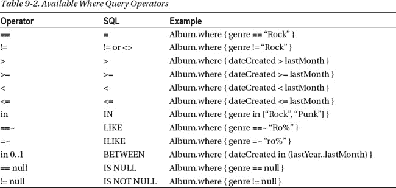

上述示例中有几个需要进一步解释。值得注意的是，Groovy 的匹配运算符 `==~` 映射到 `LIKE`，而 Groovy 的查找运算符 `=~` 映射到 Postgres 中相当于 `ILIKE` 运算符（不区分大小写的 `like`）的功能。其他没有 `ILIKE` 运算符的数据库，则倾向于在比较时使用函数将文本转换为大写或小写。

另外，请注意 Groovy 的范围（ranges）用于构建 SQL 的 `BETWEEN` 查询，以获取介于两个给定值之间的结果。

Groovy 常规的逻辑运算符可用于构建合取（conjunctions）、析取（disjunctions）甚至否定（negations）。清单 9-25 展示了一个组合了多个逻辑运算符的示例。

***清单 9-25.** Where 查询与合取/析取*

`def lastWeek = new Date() - 7`
`def rockAlbums = Album.where {`
`   genre == "Rock" && dateCreated > lastWeek && !artist.name == "Pink"`
`}`

前面的示例还引入了 where 查询的另一个能力，即通过点运算符查询关联。在清单 9-25 中的查询查询了 `artist` 关联的 `name` 属性！

##### 使用 Where 查询查询关联

如上一节所述，使用点运算符，你可以查询单端关联和集合类型的关联。然而，如果你需要查询某个给定关联的多个属性，反复使用点运算符可能会变得非常重复。例如，考虑清单 9-26 中的代码。

***清单 9-26.** 使用点运算符查询关联*

`def query = Song.where {`
`    album.title ==~ "A%" && album.dateCreated > new Date() - 7`
`}`

清单 9-24 中的代码查询了 `album` 关联的两个属性：`title` 和 `dateCreated`。请注意，使用点运算符的重复性：关联名称被使用了两次，每个属性一次。在清单 9-27 中可以看到一种更简洁的编写此查询的方式。

***清单 9-27.** 分组关联条件*

`def query = Song.where {`
`    genre == "Rock" &&`
`      album { title ==~ "A%" && dateCreated > new Date() – 7 }`
`}`

如清单 9-25 所示，你可以在关联名称后使用一个闭包来分组相关条件，从而避免重复关联名称。另外，请注意，你可以将关联条件与针对被查询类的顶级条件组合使用。

对于用于建模一对多和多对多关联的集合类型，where 查询提供了一些额外的功能，旨在允许查询集合的大小。

通常，如果你对集合使用 `size()` 函数，并将其与常规的 Groovy 比较运算符（如 `==` 或 `>`）结合使用，就可以约束查询返回的集合大小。清单 9-28 展示了一个限制专辑可以包含歌曲数量的简单示例。

***清单 9-28.** 查询集合大小*

`def shortAlbums = Album.where {`
`    songs.size() < 10`
`}`

请注意，如前所述，此形式的闭包代码实际上从未被执行，而是在运行时被转换为 SQL 查询。因此，虽然看起来我们像是在对实际的集合调用 `size()` 方法，但实际上我们只是告诉 Grails 查询结果应该受限于集合的 `size()`。在底层，Grails 会做出正确的处理，并生成适当的 SQL 查询来执行。

##### 子查询与函数

`where` 查询的一个高级用法是使用子查询。在撰写本文时，子查询只能用于任何布尔表达式的右侧。请参考代码清单 9-29。

***代码清单 9-29.** 使用子查询*

`def longSongs = Song.where {`
`    duration > avg(duration)`
`}`

代码清单 9-29 中的查询返回所有时长大于平均值的歌曲。这是通过在表达式右侧使用 `avg` 子查询实现的。更复杂的示例见代码清单 9-30。

***代码清单 9-30.** 使用更复杂的子查询*

`def longRockSongs = Song.where {`
`    genre == "Rock" && duration > avg(duration).of { genre == "Rock" }`
`}`

在这个例子中，`avg` 子查询用于查找所有时长大于摇滚歌曲平均时长的摇滚歌曲。为了实现这个查询，在 `avg` 函数的结果上调用了 `of` 函数。`of` 函数接受一个闭包，该闭包可以包含进一步的布尔表达式。表 9-3 提供了可用子查询的完整列表。

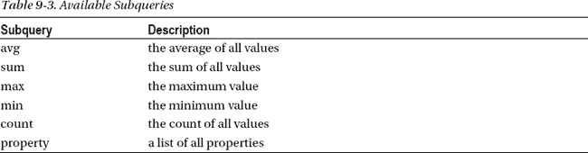

`property` 子查询值得特别一提；它与 `avg` 子查询不同，`avg` 子查询返回单个值，而 `property` 子查询返回一个值列表。代码清单 9-31 展示了使用 `property` 子查询的示例。

***代码清单 9-31.** 使用 property 子查询*

`def query = Song.where {`
`    duration < property(duration)`
` }`

代码清单 9-31 中的查询与之前在代码清单 9-27 中看到的查询有显著不同，因为它将时长与*所有*其他属性的时长进行比较。由于这不太可能高效，`property` 子查询通常与 `of` 函数结合使用，以限制比较的属性数量。示例如代码清单 9-32 所示。

***代码清单 9-32.** 将 property 子查询与 of 函数结合使用*

`def query = Song.where {`
`    duration < property(duration).of { genre == "Rock" }`
` }`

你可能已经从各个示例中注意到，被查询的属性名应始终位于布尔表达式的左侧。然而，还有一些额外的函数可以应用于被查询的属性。表 9-4 列出了这些函数。

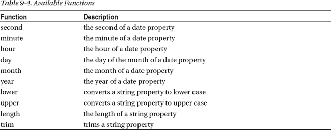

截至撰写本文时，表 9-4 中的函数只能用于表达式的左侧。换句话说，它们应该包围属性名。代码清单 9-33 给出了一个获取 2012 年所有专辑的示例。

***代码清单 9-33.** 在属性上使用函数*

`def query = Album.where {`
`    year(dateCreated) == 2012`
`}`

#### 按示例查询

条件查询的另一种替代方案是将你要查找的类的实例传递给 `find` 或 `findAll` 方法。当与 Groovy 为 JavaBeans 提供的额外隐式构造函数结合使用时，这是一个有趣的选择，如代码清单 9-34 所示。

***代码清单 9-34.** 按示例查询*

`def album = Album.find( new Album(title:'Odelay') )`

从代码清单 9-15 可以看出，`find` 方法使用传入的 `Album` 实例上设置的属性来构建查询。按示例查询有些局限，因为在传入示例时，你无法使用一些更高级的表达式，例如 `Like`、`Between` 和 `GreaterThan`。不过，它仍然是你的工具箱中另一个有用的补充。

#### HQL 和 SQL

另一种执行查询的方式是通过 Hibernate 查询语言（HQL），这是一种灵活的、面向对象的 SQL 替代方案。对 HQL 的全面讨论超出了本书的范围；不过，Hibernate 文档对此有出色的介绍（[`http://docs.jboss.org/hibernate/core/3.6/reference/en-US/html/queryhql.html`](http://docs.jboss.org/hibernate/core/3.6/reference/en-US/html/queryhql.html)）。我们将通过一些内置方法，了解 GORM 如何支持 HQL 的基本示例。

熟悉 SQL 的人应该不难适应 HQL，因为它们的语法差异很小。GORM 提供了三种处理 HQL 查询的方法：`find`、`findAll` 和 `executeQuery`。每个方法在接收到字符串参数时，都会将其视为 HQL 查询。代码清单 9-35 中的示例展示了与 `findAll` 结合的最基本用法。

***代码清单 9-35.** 通过 findAll 方法使用 HQL*

`// 查询所有专辑`
`def allAlbums = Album.findAll('from com.g2one.gtunes.Album')`

此外，通过将列表作为第二个参数传递，还支持 JDBC 风格的 `IN` 参数（带有问号 [?] 占位符的查询）。得益于 Groovy 用于表达列表的简洁语法，结果非常易读，如代码清单 9-36 所示。

***代码清单 9-36.** 带位置参数的 HQL*

`// 按标题查询专辑`
`def album = Album.find(`
`'from Album as a where a.title = ?', ['Odelay'])`

如果位置参数不是你的首选，你也可以使用命名参数，语法如代码清单 9-37 所示。

***代码清单 9-37.** 带命名参数的 HQL*

`// 按标题查询专辑`
`def album = Album.find('from Album as a where a.title = :theTitle',`
`                        [theTitle:'Odelay'])`

注意，在命名参数 `:theTitle` 之前直接使用了冒号字符。然后，不是将列表作为 `find` 方法的最后一个参数传递，而是传递一个映射，其中映射的键与查询中的命名参数匹配。

`find` 和 `findAll` 方法假定查询是针对 `Album` 类的特定查询，并将验证这一点。然而，也可以通过 `executeQuery` 方法执行其他 HQL 查询，如代码清单 9-38 所示。

***代码清单 9-38.** 通过 executeQuery 使用 HQL*

`// 获取所有歌曲`
`def songs = Album.executeQuery('select elements(b.songs) from Album as a')`

显然，关于 HQL 有很多需要学习的地方，因为可以使用连接、聚合函数和子查询来执行更高级的查询。幸运的是，Hibernate 网站上的文档是对其功能范围的极好概述，可以帮助你入门。

#### 分页

无论采用何种查询方式，一个典型且实用的功能是能够对结果集进行分页。您已经了解到，`list()` 方法支持诸如 `max` 和 `offset` 之类的参数，这些参数允许您执行分页操作。例如，要获取前十条结果，您可以使用以下代码：

`def results = Album.list(max:10)`

要获取接下来的十条结果，您可以使用 `offset` 参数：

`def results = Album.list(max:10, offset:10)`

既然我们谈到了查询这个话题，您会很高兴地知道，同样的参数也可以用于对查询进行分页。例如，在使用动态查找器时，您可以将一个映射作为最后一个参数传递，该映射指定了 `max` 和 `offset` 参数：

`def results = Album.findAllByGenre("Alternative", [max:10, offset:20])`

事实上，您可以使用前面“列出、排序和计数”部分中提到的任何参数，例如 `sort` 和 `order`：

`def results = Album.findAllByGenre("Alternative", [sort:'dateCreated',`
`order:'desc'])`

在视图中，您可以利用 `<g:paginate>` 标签，该标签会渲染“上一页”和“下一页”链接，以及用于跳转到特定结果集的数字链接，类似于谷歌的样式。在其最简单的形式中，`<g:paginate>` 标签只需要记录的总数：

`<g:paginate total="${Album.count()}" />`

此示例假设您希望对当前控制器动作进行分页。如果不是这样，您可以使用 `<g:link>` 标签接受的相同属性（例如 `controller` 和 `action`）来自定义实际执行分页的控制器：

`<g:paginate controller="album" action="list" total="${Album.count()}" />`

您可以使用 `prev` 和 `next` 属性分别更改默认的“上一页”和“下一页”链接：

`<g:paginate prev="Back" next="Forward" total="${Album.count()}" />`

如果国际化（i18n）是一个需求，您可以使用 `<g:message>` 标签（作为*方法*调用）从消息资源包中提取要显示的文本：

`<g:paginate prev="${message(code:'back.button.text')}"`
`            next="${message(code:'next.button.text')}"`
`            total="${Album.count()}" />`

 **提示** 如果您对 Grails 中国际化支持的机制感兴趣，请查看第 7 章，其中详细介绍了消息资源包和切换区域设置。

### 配置 GORM

GORM 有许多您可能想要配置的属性。Hibernate 中几乎所有可用的选项在 GORM 中也是可用的。您最可能想要实现的基本功能之一是启用某种形式的 SQL 日志记录，以便调试性能问题并优化查询。

#### SQL 日志记录

如果您纯粹对监控到达数据库的 SQL 流量感兴趣，那么一个不错的选择是使用 `grails-app/conf/DataSource.groovy` 文件中的 `logSql` 设置：

`dataSource {`
`    ...`
`    logSql = true`
`}`

启用此设置后，Hibernate 发出的每条 SQL 语句都将打印到控制台。`logSql` 设置的缺点是您只能看到打印到控制台的预编译语句，而看不到正在插入的实际值。如果您需要查看这些值，请在 `grails-app/conf/Config.groovy` 中设置一个特殊的 `log4j` 日志记录器，如下所示：

`log4j = {`
`    ...`
`    logger {`
`        trace "org.hibernate.SQL", "org.hibernate.type"`
`    }`
`}`

#### 指定自定义方言

多年来，Hibernate 已针对其支持的每个数据库进行了大量优化。为了支持不同的数据库类型，Hibernate 建模了*方言*的概念。对于其支持的每个数据库，都有一个知道如何与该数据库通信的 `dialect` 类。

甚至针对不同的数据库版本也有不同的方言。例如，对于 Oracle，有三个 `dialect` 类：`Oracle8iDialect`、`Oracle9iDialect` 和 `Oracle10gDialect`。通常，要使用的方言会从数据库的 JDBC 元数据中自动检测。但是，某些较旧的数据库驱动程序不支持 JDBC 元数据，在这种情况下，您可能必须显式指定方言。为此，您可以使用 `grails-app/conf/DataSource.groovy` 文件的 `dialect` 设置。例如，如果您为 MySQL 使用 InnoDB 存储引擎，您将需要使用 `MySQL5InnoDBDialect` 类，如代码清单 9-39 所示。

***代码清单 9-39.** 自定义 Hibernate 方言*

`dataSource {`
`    ...`
**`dialect = org.hibernate.dialect.MySQL5InnoDBDialect`**
`}`

#### 其他 Hibernate 属性

前面两节中演示的 `DataSource.groovy` 文件的 `logSql` 和 `dialect` 设置实际上只是 Hibernate `SessionFactory` 的 `hibernate.show_sql` 和 `hibernate.dialect` 属性的快捷方式。如果您更习惯使用 Hibernate 的配置模型，那么您可以在 `DataSource.groovy` 的 `hibernate` 块中这样做。事实上，您会注意到 Hibernate 二级缓存（在后面的“缓存”部分讨论）已经以这种方式预先配置好了，如代码清单 9-40 所示。

***代码清单 9-40.** 常规 Hibernate 配置*

`hibernate {`
`    cache.use_second_level_cache=true`
`    cache.use_query_cache=false`
`    cache.provider_class=`
`        'net.sf.ehcache.hibernate.EhCacheRegionFactory '`
`}`

如果您对 Grails 设置的默认值不满意，您可以配置所有类型的属性。例如，要更改数据库的默认事务隔离级别，您可以使用 `hibernate.connection.isolation` 属性：

`hibernate {`
`    hibernate.connection.isolation=4`
`}`

在此示例中，我们将隔离级别更改为 `Connection.TRANSACTION_REPEATABLE_READ`。有关其他隔离级别，请参阅 `java.sql.Connection` 类。

 **提示** 有关其他可用的配置选项，请参阅 Hibernate 参考材料：[`http://docs.jboss.org/hibernate/core/3.6/reference/en-US/html/session-configuration.html`](http://docs.jboss.org/hibernate/core/3.6/reference/en-US/html/session-configuration.html)。

在一个应用程序中，可能有许多领域类具有共同的配置设置。例如，您可能希望在整个应用程序的所有领域类中关闭版本控制。您可以通过在每个领域类的 `mapping` 块中指定“version false”来实现这一点，但在每个领域类中都指定这一点很繁琐且容易出错。幸运的是，像这样的 `mapping` 设置可以在 `Config.groovy` 中全局配置。请参见代码清单 9-41 中的示例。

***代码清单 9-41.** 全局 GORM 映射设置*

`grails.gorm.default.mapping = {`
`    //  这些将成为所有领域类的默认映射设置。`
`    // 这些设置可以在任何领域类的 mapping 块中被覆盖。`
`    version false`
`    autoTimestamp false`
`}`

类似地，全局约束也可以在 `Config.groovy` 中定义（参见代码清单 9-42）。

***代码清单 9-42.** 全局 GORM 约束*

`grails.gorm.default.constraints = {`
`   nullable true`
`   blank false`
`   size 1..20`
`}`

### GORM 的语义

正如你所发现的，使用 GORM 非常简单。事实上，它简单到可能会让你产生一种虚假的安全感，认为你再也不需要关注数据库了。然而，在使用任何 ORM 工具时，理解其运作方式及具体行为是至关重要的。

 **提示** 由于 GORM 构建在 Hibernate 之上，因此投资一本专门介绍 Hibernate 的书籍是值得的。不过，我们仍会尽力在此涵盖关键方面。

如果你在不了解 ORM 工具语义的情况下就开始使用它，几乎肯定会在应用程序的性能和行为方面遇到问题。ORM 工具常被视作抽象泄漏（参见 [`http://www.joelonsoftware.com/articles/LeakyAbstractions.html`](http://www.joelonsoftware.com/articles/LeakyAbstractions.html)）的一个例子，因为它们试图将你与底层数据库的复杂性隔离开来。不幸的是，沿用这个比喻，如果你不了解诸如懒加载与急加载、锁定策略和缓存等特性，这种抽象泄漏会相当频繁地发生。

本节将对这些特性进行一些澄清，以确保你不会期望使用 GORM 来解决世界饥饿问题。可以理解的是，GORM 经常被拿来与 Rails 中的 ActiveRecord 进行比较。不幸的是，有 Rails 经验并采用 Grails 的用户可能会遇到一些意外，因为这两个工具实际上差别很大。其中一个主要区别是 GORM 具有持久化上下文（或*会话*）的概念。

#### Hibernate 会话

Hibernate 与 Java 持久化 API 一样，使用 `org.hibernate.Session` 类来建模持久化会话的概念。`Session` 类本质上是一个容器，它持有所有已知持久化类（即 Grails 中的领域类）实例的引用。在 Hibernate 的世界观中，你以对象的角度思考，并将责任委托给 Hibernate，以确保对象的状态与数据库*同步*。

同步过程是通过调用 `Session` 对象上的 `flush()` 方法来触发的。此时，你可能会想，既然在第 4 章中没有提到 `Session` 对象，那么这一切与 Grails 有何关系？本质上，GORM 会透明地为你操作 `Session` 对象。

完全可以在不直接与 Hibernate `Session` 对象交互的情况下构建整个 Grails 应用程序。然而，对于不习惯会话模型的开发者来说，可能会遇到一些意外。例如，考虑代码清单 9-43 中的代码。

***代码清单 9-43.** 多次读取返回同一对象*

`def album1 = Album.get(1)`
`def album2 = Album.get(1)`
`assertFalse album1.is(album2)`

代码清单 9-1 中的代码展示了一个不习惯会话模型的开发者可能会遇到的小陷阱。第一次调用 `get` 方法时，会在底层执行一条 SQL `SELECT` 语句来检索 `Album` 类的一个实例——这并不意外。然而，第二次调用 `get` 方法时根本不会执行任何 SQL，事实上，最后一行断言会失败。

 **注意** 在代码清单 9-43 的示例中，最后的 `assertFalse` 语句使用了 Groovy 的 `is` 方法，因为在 Groovy 中 `==` 等同于 Java 中调用 `equals(Object)` 方法。

换句话说，`Session` 对象的行为类似于一个缓存；事实上，它就是一个缓存。`Session` 对象是 Hibernate 的一级缓存。另一个体现这一点的地方是保存对象时。考虑代码清单 9-44 中的代码。

***代码清单 9-44.** 在 Grails 中保存领域类*

`def album = new Album(...)`
`album.save()`

现在，假设 `Album` 实例验证通过，你可能会根据代码清单 9-2 中的代码认为，当调用 `save()` 方法时，GORM 会执行一条 SQL `INSERT` 语句。然而，情况并非总是如此，实际上这在很大程度上取决于底层数据库。GORM 默认使用 Hibernate 的原生标识生成策略，该策略会尝试选择最合适的方式来生成对象的 `id`。例如，在 Oracle 中，Hibernate 会选择使用 `sequence` 生成器来提供标识符，而在 MySQL 中则会使用 `identity` 策略。`identity` 生成策略依赖于数据库来提供标识。

由于在 `save()` 方法完成时必须分配标识符，因此如果使用 `sequence`，则不需要执行 `INSERT`，因为 Hibernate 可以简单地在内存中递增序列。实际的 `INSERT` 可以在稍后 `Session` 刷新时发生。然而，对于 `identity` 策略，*必须*执行 `INSERT`，因为数据库需要生成标识符。尽管如此，这个例子足以说明，负责将对象状态同步到数据库的是 `Session`，而不是对象本身。

本质上，Hibernate 实现了一种称为*事务性写后*的策略。对持久化对象所做的任何更改，并不一定在你进行更改时或甚至调用 `save()` 方法时就被持久化。这种方法的好处是，Hibernate 可以大力优化并批量处理要执行的 SQL，从而最大限度地减少网络流量。此外，这种模型还大大缩短了数据库锁（在“锁定策略”部分有更详细的讨论）的持有时间。

#### 会话管理与刷新

此时您可能会担心，让 Hibernate 代为负责持久化对象会失去某种控制。幸运的是，GORM 允许您通过向 `save()` 或 `delete()` 方法传递 `flush` 参数来隐式控制会话刷新，如清单 9-45 所示。

***清单 9-45.** 手动刷新会话*

`def album = new Album(...)`
`album.save(flush:true)`

与清单 9-23 中的示例不同，清单 9-24 中的代码会持久化该对象，同时还会调用底层 `Session` 对象的 `flush()` 方法。但需要注意的是，由于 `Session` 处理所有持久化实例，因此除了被保存的对象之外，其他更改也可能被一并刷新。清单 9-46 演示了这种行为的一个示例。

***清单 9-46.** 刷新的影响*

`def album1 = Album.get(1)`
`album1.title = "The Changed Title"`
`album1.save()`
`def album2 = new Album(..)`
`album2.save(flush:true)`

清单 9-25 中的示例展示了向第二个 `save()` 方法传递 `flush` 参数所带来的影响。您可能会预期，当对 `album1` 调用 `save()` 时会执行一条 SQL `UPDATE` 语句，然后对 `album2` 调用 `save()` 时会执行一条 `INSERT` 语句。然而，实际行为是，`UPDATE` 和 `INSERT` 都在对 `album2` 调用 `save()` 时发生，因为传递的 `flush:true` 参数强制底层 `Session` 对象将更改与数据库同步。

此时您可能会疑惑，到目前为止看到的清单中的代码是如何使用同一个 `Session` 实例的，以及这个 `Session` 最初是从哪里来的。基本上，当一个请求进入 Grails 应用程序时，就在控制器动作执行之前，Grails 会透明地将一个新的 Hibernate `Session` 绑定到当前线程。然后，GORM 的动态方法（例如清单 9-8 中的 `get`）会查找该 `Session`。当控制器动作执行完毕时，如果没有抛出异常，`Session` 会被刷新，通过执行必要的 SQL 语句将 `Session` 的状态与数据库同步。这些更改随后会被提交到数据库。

然而，故事并未就此结束。`Session` 不会被关闭，而是在视图渲染之前被置于只读模式，并保持打开状态直到视图渲染完成。这样做的原因是，如果会话被关闭，其中包含的任何持久化实例都会变成游离状态。结果就是，如果存在任何未初始化的关联，就会发生臭名昭著的 `org.hibernate.LazyInitializationException` 异常。哎呀！当然，我们稍后会在本章中进一步讨论 `LazyInitializationException` 以及避免该异常的方法，包括深入介绍游离对象。

详细来说，在视图渲染期间将 `Session` 置于只读模式的原因是为了避免在视图渲染过程中对 `Session` 进行任何不必要的刷新。毕竟，您的视图不应该修改数据库状态！这就是 Grails 中标准 `Session` 生命周期的工作方式。

#### 获取会话

如前所述，`Session` 本质上是一个持久化实例的缓存。与任何缓存一样，其中包含的对象越多，消耗的内存就越多。使用 GORM 时一个常见的错误是查询大量对象却不定期清除 `Session`。如果这样做，您的 `Session` 会变得越来越大，最终可能导致应用程序性能下降，甚至更糟，内存耗尽。

在这种情况下，明智的做法是手动管理 `Session` 的状态。但在这样做之前，您需要获取 `Session` 对象本身的引用。您可以通过两种方式实现这一点。第一种方式是使用依赖注入来获取 Hibernate `SessionFactory` 对象的引用。

`SessionFactory` 有一个名为 `currentSession()` 的方法，您可以使用它来获取绑定到当前线程的 `Session`。要使用依赖注入，只需在控制器、标签库或服务中声明一个名为 `sessionFactory` 的局部字段即可，如清单 9-47 所示。

***清单 9-47.** 使用依赖注入获取 Hibernate 会话*

`def sessionFactory`
`...`
`def index() {`
`    def session = sessionFactory.currentSession()`
`}`

另一种方法是使用任何领域类上都可用的 `withSession` 方法。`withSession` 方法接受一个闭包。闭包的第一个参数是 `Session` 对象；因此，您可以像清单 9-48 那样编写代码。

***清单 9-48.** 使用 withSession 方法*

`def index() {`
`    Album.withSession { session ->`
`        ...`
`    }`
`}`

让我们回到当前的问题。为了避免在使用 GORM 处理大量数据时出现内存问题（请注意，这也适用于原生 Hibernate），您需要定期调用 `Session` 对象的 `clear()` 方法，以便清除 `Session` 的内容。这样做的结果是，`Session` 中的实例成为垃圾回收的候选对象，从而释放内存。清单 9-49 展示了一个演示此模式的示例。

***清单 9-49.** 管理 Hibernate 会话*

`1      def index() {`
`2          Album.withSession { session ->`
`3              def allAlbums = Album.list()`
`4              for(album in allAlbums) {`
`5                  def songs = Song.findAllByAlbum(album)`
`6                  // 对歌曲进行一些操作`
`7                  ...`
`8                  session.clear()`
`9              }`
`10         }`
`11       }`

清单 9-49 中的示例相当刻意，但它很好地演示了在处理大量对象时有效的 `Session` 管理。在第 2 行，使用 `withSession` 方法获取了 `Session` 的引用：

`2  Album.withSession { session ->`
`        ...`
`10 }`

然后，在第 3 行，使用一个查询获取系统中所有专辑的列表（该列表本身可能很大），然后遍历每个专辑：

`3 def allAlbums = Album.list()`
`4 for(album in allAlbums) {`
`      ...`
`9 }`

关键的是，在第 5 行，一个动态查找器查询了当前 `Album` 的所有 `Song` 实例：

`5      def songs = Song.findAllByAlbum(album)`

现在，每次执行 `findAllByAlbum` 方法时，越来越多的持久化实例会在 `Session` 中累积。根据当时系统中数据量的多少，内存消耗可能会在某个时候成为问题。为了防止这种情况，在第 8 行清除了 `session`：

`8      session.clear()`

使用 `clear()` 方法清除 `Session` 并不是将对象从 Hibernate 控制中移除的唯一方法。如果您有一个单独的对象，也可以调用 `discard()` 方法。您甚至可以使用 `*.` 运算符通过此技术丢弃整个对象集合：

`songs*.discard()`

这种方法的好处是，虽然 `clear()` 方法会从 `Session` 中移除所有持久化实例，但使用 `discard()` 只会移除您不再需要的实例。这在某些情况下会有所帮助，因为从 `Session` 中移除对象会导致它们变成游离状态（我们将在“游离对象”一节中更详细地讨论这个主题），从而可能引发 `LazyInitializationException`。

#### 自动会话刷新

另一个常见的陷阱是，默认情况下，GORM 被配置为在发生以下情况之一时自动刷新会话：

> *   每当执行查询时；
> *   控制器操作完成后，如果没有抛出异常，则立即执行；
> *   在事务提交之前立即执行。

这会产生许多你需要考虑的影响。以代码清单 9-50 中的代码为例。

***代码清单 9-50.** 自动会话刷新的影响*

`1 def album = Album.get(1)`
`2 album.title = "Change It"`
`3 def otherAlbums = Album.findAllWhereTitleLike("%Change%")`
`4`
`5 assert otherAlbums.contains(album)`

你可能会认为，因为你从未在 `album` 上调用过 `save()`，所以它不可能被持久化到数据库中，对吧？错。一旦你加载了 `album` 实例，对于 Hibernate 来说，它立即成为一个“受管理”的对象。由于 Hibernate 默认配置为在查询运行时刷新会话，因此当第 3 行调用 `findAllWhereTitleLike` 方法时，`Session` 会被刷新，并且 `Album` 实例会被持久化。Hibernate 的 `Session` 会缓存更改，并仅在最后一刻才将它们推送到数据库。在自动刷新的情况下，这发生在事务结束时，或者在可能受缓存更改影响的查询运行之前。

你可能会认为自动刷新的行为有点奇怪，但仔细想想，这在很大程度上取决于你的预期。如果对象没有被刷新到数据库，那么第 2 行对其所做的更改就不会反映在结果中。这可能也不是你所期望的！让我们考虑另一个例子，其中自动刷新可能会带来一些意外。请看代码清单 9-51 中的代码。

***代码清单 9-51.** 自动会话刷新的另一个影响*

`def album = Album.get(1)`
`album.title = "Change It"`

在代码清单 9-16 中，查找了一个 `Album` 类的实例并更改了 `title`，但从未调用 `save()` 方法。你可能会认为，由于从未调用 `save()`，`Album` 实例将不会被持久化到数据库。然而，你又错了。Hibernate 会自动进行脏检查，并将对 `Session` 中包含的持久化实例所做的任何更改刷新。

我们建议你在持久化对象时*始终*调用 `save()` 方法。`save()` 方法会调用 Grails 的验证机制，并在发生验证错误时将对象标记为只读，包括该对象的任何关联。如果你一开始就不打算保存该对象，那么你可能需要考虑使用 `read` 方法而不是 `get` 方法，后者会以只读状态返回对象：

`def album = Album.read(1)`

如果这一切都太可怕而无法考虑，并且你更希望完全控制 `Session` 的刷新方式和时间，那么你可能需要考虑通过在 `DataSource.groovy` 中指定 `hibernate.flush.mode` 设置来更改默认的 `FlushMode`：

`hibernate.flush.mode="manual"`

`hibernate.flush.mode` 设置的可能值总结如下：

> *   `manual`：只有在你明确指示时才刷新！换句话说，仅当将 `flush:true` 参数传递给 `save()` 或 `delete()` 方法时，才刷新会话。手动刷新模式的缺点是，你可能会从查询中获取过时数据，并且必须始终将 `flush:true` 参数传递给 `save()` 或 `delete()` 方法。
> *   `commit`：仅在事务提交时刷新（请参阅下一节）。
> *   `auto`：在事务提交时以及查询运行之前刷新。

尽管如此，假设你坚持使用默认的 `auto` 设置，那么对于代码清单 9-15 中的代码，`save()` 方法可能也无法（请原谅这个双关语）拯救你。请记住，在这种情况下，`Session` 会在查询运行之前自动刷新。这个问题很自然地将我们引向了 GORM 中的事务主题。

### GORM 中的事务

首先——重要的是要强调，Hibernate 和数据库之间的*所有*通信都在数据库事务的上下文中运行，无论你是否显式地定义了事务边界。`Session` 本身是惰性的，它只在最后一刻才启动数据库事务。

再次考虑代码清单 9-15 中的代码。当代码运行时，一个 `Session` 已经被打开并绑定到当前线程。然而，事务仅在第一次与数据库通信时启动，这发生在第 1 行调用 `get` 方法时。

此时，`Session` 与一个 JDBC `Connection` 对象关联。`Connection` 对象的 `autoCommit` 属性被设置为 `false`，从而启动了一个事务。然后，`Connection` 只有在 `Session` 关闭时才会被释放。因此，正如你所见，Grails 从未在没有活动事务的情况下运行，因为同一个 `Session` 在整个请求中共享。

既然无论如何都有一个事务，你可能会认为如果出现问题，任何问题都会被回滚。然而，如果没有特定的事务边界，并且 `Session` 被刷新，那么任何更改都会被永久提交到数据库。

如果刷新超出了你的控制范围（例如，查询的结果），这将是一个特别的问题。那么这些更改将被永久持久化到数据库中。结果可能是相当痛苦的，导致你的数据库处于不一致的状态。为了帮助你理解，让我们看另一个说明性示例，如代码清单 9-52 所示。

***代码清单 9-52.** 更新出错*

`def save() {`
`    def album = Album.get(params.id)`
`    album.title = "Changed Title"`
`    album.save(flush:true)`
`    // 出现问题`
`    throw new Exception("Ruh Roh!")`
`}`

代码清单 9-52 中的示例展示了一个常见问题。在 save 操作的前三行中，使用 `get` 方法获取了一个 `Album` 类的实例，更新了标题，然后调用了 `save()` 方法并传递了 `flush` 参数以确保更新与数据库同步。然后，在代码的后面部分，出现了问题，抛出了一个异常。不幸的是，如果你期望之前对 `Album` 实例的更新被回滚，那你就没那么幸运了。当 `Session` 被刷新时，更改已经被持久化了！你可以通过两种方式纠正这个问题；第一种是将逻辑移入一个事务性服务。服务是第 10 章的主题，因此我们将展示后一种选项，即使用编程式事务。代码清单 9-53 显示了更新后的代码，使用 `withTransaction` 方法来界定事务边界。

***代码清单 9-53.** 使用 withTransaction 方法*

`def save() {`
`    Album.withTransaction {`
`        def album = Album.get(params.id)`
`        album.title = "Changed Title"`
`        album.save(flush:true)`
`        ...`
`        // 出现问题`
`        throw new Exception("Ruh Roh!")`
`    }`
`}`

Grails 在底层使用了 Spring 的 `PlatformTransactionManager` 抽象层。在这种情况下，如果抛出异常，事务范围内所做的所有更改都将按预期回滚。`withTransaction` 方法的第一个参数是一个 Spring `TransactionStatus` 对象，它还允许你通过调用 `setRollbackOnly()` 方法以编程方式回滚事务，如代码清单 9-54 所示。

***代码清单 9-54.** 以编程方式回滚事务*

`def save() {`
`    Album.withTransaction { status ->`
`        def album = Album.get(params.id)     `
`        album.title = "Changed Title"`
`        album.save(flush:true)`
`        ...`
`        // 某些地方出错`
`        if(hasSomethingGoneWrong()) {`
`            status.setRollbackOnly()`
`        }`
`    }`
`}`

请注意，你只需要一个`withTransaction`声明。如果你在彼此内部嵌套`withTransaction`声明，那么同一个事务只会从一个`withTransaction`块传播到下一个。事务性服务也是如此。此外，如果你有一个符合 JDBC 3.0 标准的数据库，那么你可以利用保存点，这允许你回滚到特定点，而不是回滚整个事务。清单 9-55 展示了一个回滚`Album`实例保存后所做任何更改的示例。

***清单 9-55.** 在 Grails 中使用保存点*

`def save() {`
`    Album.withTransaction { status ->`
`        def album = Album.get(params.id)`
`        album.title = "Changed Title"`
`        album.save(flush:true)`
`        def savepoint = status.createSavepoint()`
`        ...`
`        // 某些地方出错`
`        if(hasSomethingGoneWrong()) {`
`            status.rollbackToSavepoint(savepoint)`
`            // 执行其他操作`
`            ...`
`        }`
`    }`
`}`

讲完事务，让我们重新审视一个在本章各处都有所提及的话题：游离对象。

### 游离对象

理解 Hibernate `Session`对于理解游离对象的本质至关重要。请记住，`Session`会跟踪所有持久化实例，并像一个缓存一样工作，返回`Session`中已存在的实例，而不是再次访问数据库。可以想象，每个对象都会经历一个隐式的生命周期，我们将首先探讨这个主题。

#### 持久化生命周期

在对象被保存之前，它被称为瞬态对象。瞬态对象就像普通的 Java 对象，没有持久化的概念。一旦你调用`save()`方法，该对象就处于持久化状态。持久化对象具有分配的标识符，并且可能具有增强的功能，例如延迟加载关联的能力。如果通过调用`discard()`方法丢弃了该对象，或者`Session`已被清除，则称该对象处于*游离*状态。换句话说，每个持久化对象都与一个单一的`Session`相关联，如果该对象不再由`Session`管理，则它已从`Session`中分离。

图 9-2 展示了一个描述持久化生命周期以及对象可能经历的各种状态的状态图。如图所示，对象变为游离状态的另一种方式是`Session`本身被关闭。如果你还记得，我们提到过每个 Grails 请求都会绑定一个新的`Session`。当请求完成时，`Session`被关闭。任何仍然存在的对象，例如保存在`HttpSession`中的对象，现在都处于游离状态。

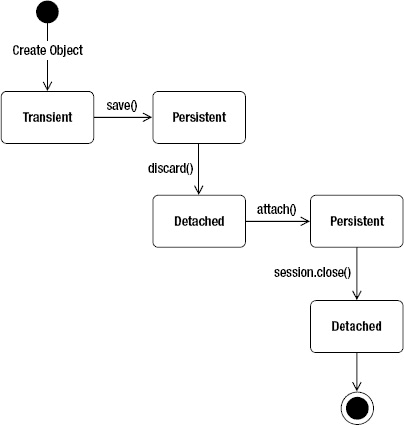

***图 9-2.** 持久化生命周期*

处于游离状态意味着什么？首先，如果存储在`HttpSession`中的游离对象有任何未初始化的关联，那么你将得到一个`LazyInitializationException`。

#### 重新关联游离对象

鉴于遇到`LazyInitializationException`可能是不希望的，你可以通过调用`attach()`方法将游离对象重新关联到绑定当前线程的`Session`来消除此问题，例如：

`album.attach()`

请注意，如果`Session`中已存在具有相同标识符的对象，那么你将得到一个`org.hibernate.NonUniqueObjectException`。为了解决这个问题，你可能希望使用`isAttached()`方法检查该对象是否已关联：

`if(!album.isAttached()) {`
`album.attach() }`

既然我们谈到了相等性和游离对象，那么在这里提出对象相等性的概念就很重要了。如果你决定广泛使用游离对象，那么几乎可以肯定你需要考虑为所有游离的领域类实现`equals`和`hashCode`方法。为什么？好吧，如果你考虑清单 9-56 中的代码，你很快就会明白原因。

***清单 9-56.** 对象相等性与 Hibernate*

`def album1 = Album.get(1)`
`album.discard()`
`def album2 = Album.get(1)`
`assert album1 == album2 // 此断言将失败`

Java 中`equals`和`hashCode`的默认实现使用对象相等性来比较实例。问题在于，当一个实例变为游离状态时，Hibernate 会丢失关于它的所有信息。正如清单 9-35 中的代码所示，当一个实例变为游离状态后，加载两个具有相同标识符的实例会导致你拥有两个不同的实例。当将这些对象放入集合时，这可能会引起问题。请记住，`Set`使用`hashCode`来判断一个对象是否是重复的，但这两个`Album`实例将返回两个不同的哈希码，即使它们共享相同的数据库标识符！

为了解决这个问题，你可以使用数据库标识符，但不推荐这样做，因为一个瞬态对象在变为持久化对象后，其哈希码会随时间变化。这违反了`hashCode`方法定义的契约，该契约规定`hashCode`实现必须在对象的整个生命周期内返回相同的整数。推荐的方法是使用 Groovy 的`equals`和`hashcode` AST 转换来生成适当的`equals`和`hashcode`方法。使用`@EqualsAndHashCode`注解标记一个类将触发此转换。有关该注解的更多信息，请参见[`http://groovy.codehaus.org/api/groovy/transform/EqualsAndHashCode.html`](http://groovy.codehaus.org/api/groovy/transform/EqualsAndHashCode.html)。清单 9-57 展示了一个示例实现。

***清单 9-57.** 实现 equals 和 hashCode*

`@groovy.transform.EqualsAndHashCode`
`class Album {`
`    ...`
`}`

需要记住的重要一点是，你仅在以下情况下才需要实现`equals`和`hashCode`：

> *   广泛使用游离实例；
> *   将游离实例放入使用哈希算法来确定相等性的数据结构中，例如`Set`和`Map`集合类型。

相等性这个话题很自然地引出了另一个潜在的障碍。假设你在`HttpSession`等地方持有一个游离的`Album`实例，并且你还有另一个在逻辑上等于（它们共享相同的标识符）`HttpSession`中实例的`Album`实例。你该怎么办？嗯，你可以直接丢弃`HttpSession`中的实例：

`def index() {`
`    def album = session.album`
`    if(album.isAttached()) {`
`        album = Album.get(album.id)`
`        session.album = album`
`    }`
`}`

但是，如果`HttpSession`中的游离`album`有更改怎么办？如果它代表的是最新的副本，而不是 Hibernate 已经加载的那个呢？在这种情况下，你需要考虑合并。

#### 合并变更

要将一个可能处于游离状态的对象的状态合并到另一个对象中，你需要使用静态的 `merge` 方法。`merge` 方法接受一个实例，如果 `Session` 中尚不存在同一逻辑对象的持久化实例，则会加载该实例，然后将传入实例的状态合并到已加载的持久化实例中。完成后，`merge` 方法会返回一个包含合并后状态的新实例。代码清单 9-58 展示了使用 `merge` 方法的示例。

***代码清单 9-58.** 使用 merge 方法*

`def index() {`
`    def album = session.album`
`    album = Album.merge(album)`
`    render album.title`
`}`

### GORM 性能调优

上一节关于 GORM 语义的内容展示了底层 Hibernate 引擎如何通过缓存（`Session`）来优化数据库访问。然而，有多种方法可以优化查询性能。在接下来的几节中，我们将介绍调优 GORM 的不同方法，帮助你充分利用这项技术。你可能希望通过在 `DataSource.groovy` 中将 `logSql` 设置为 `true` 来启用 SQL 日志记录，正如上一节关于配置 GORM 中所解释的那样。

#### 即时关联与延迟关联

GORM 中的关联默认是延迟加载的。这意味着什么？假设你使用静态的 `list()` 方法查找了一堆 `Album` 实例：

`def albums = Album.list()`

为了获取所有 `Album` 实例，Hibernate 在底层会执行一条 SQL `SELECT` 语句来获取相应的数据行。如你所知，每个 `Album` 都有一个 `Artist`，可以通过 `artist` 关联访问。现在假设你需要遍历每首歌曲并打印 `Artist` 名称，如代码清单 9-59 所示。

***代码清单 9-59.** 遍历延迟关联*

`def albums = Album.list()`
`for(album in albums) {`
`    println album.artist.name`
`}`

代码清单 9-59 中的示例演示了通常所说的 *N+1* 问题。由于 `artist` 关联是延迟加载的，Hibernate 会为每个关联的 `artist` 再执行一条 SQL `SELECT` 语句（N 条语句），加上最初检索专辑列表的那一条语句。显然，如果 `Album` 关联返回的结果集很大，你就会遇到大问题。每条 SQL 语句的执行都会导致进程间通信，这会拖慢应用程序的性能。代码清单 9-60 展示了使用延迟关联时，Hibernate SQL 日志记录的典型输出，为简洁起见已做删减。

***代码清单 9-60.** 使用延迟关联的 Hibernate SQL 日志输出*

`Hibernate:`
`    select`
`        this_.id as id0_0_,`
`        this_.version as version0_0_,`
`        this_.artist_id as artist3_0_0_,`
`              ...`
`       from`
`        album this_`
`Hibernate:`
`    select`
`              artist0_.id as id8_0_,`
`              ...`
`       from`
`              artist artist0_`
`       where`
`              artist0_.id=?`
`Hibernate:`
`    select`
`              artist0_.id as id8_0_,`
`         ...`
`       from`
`              artist artist0_`
`       where`
`              artist0_.id=?`
`...`

对此问题的一个本能反应是将所有关联都设置为即时加载。即时关联使用 SQL `JOIN`，这样每当查询 `Album` 实例时，所有 `Artist` 关联都会被填充。代码清单 9-61 展示了如何使用 `mapping` 属性将关联默认配置为即时加载。

***代码清单 9-61.** 配置即时关联*

`class Album {`
`    ...`
`    static mapping = {`
`        artist fetch:'join'`
`    }`
`}`

然而，这可能也不是最优方案，因为你很可能会遇到将整个数据库都拉入内存的情况！延迟关联在这里绝对是最合理的默认设置。如果你只是需要每个关联艺术家的标识符，那么无需执行额外的 `SELECT` 就可以获取该标识符。你只需要引用关联名称并加上后缀 `Id` 即可：

`def albums = Album.list()`
`for(album in albums) {`
`    println album.artistId // 获取艺术家 id`
`}`

然而，正如代码清单 9-38 中的示例所示，在某些情况下使用连接查询是可取的。你可以像代码清单 9-62 那样修改代码，使用 `fetch` 参数。

***代码清单 9-62.** 使用 fetch 参数即时获取结果*

`def albums = Album.list(fetch:[artist:'join'])`
`for(album in albums) {`
`    println album.artist.name`
`}`

如果你运行代码清单 9-41 中的代码，你将不会得到 N+1 条 `SELECT` 语句，而只会得到一条使用 SQL `INNER JOIN` 来同时获取所有艺术家数据的 `SELECT` 语句。代码清单 9-63 展示了此查询的 Hibernate SQL 日志输出。

***代码清单 9-63.** 使用即时关联的 Hibernate SQL 日志输出*

`select`
`    this_.id as id0_1_,`
`    this_.version as version0_1_,`
`       this_.artist_id as artist3_0_1_,`
`       this_.date_created as date4_0_1_,`
`       this_.genre as genre0_1_,`
`       this_.last_updated as last6_0_1_,`
`       this_.price as price0_1_,`
`       this_.title as title0_1_,`
`    this_.year as year0_1_,`
`    artist2_.id as id8_0_,`
`       artist2_.version as version8_0_,`
`       artist2_.date_created as date3_8_0_,`
`       artist2_.last_updated as last4_8_0_,`
`       artist2_.name as name8_0_`
`from`
`    album this_`
`inner join`
`    artist artist2_`
`        on this_.artist_id=artist2_.id`

当然，静态的 `list()` 方法并非唯一需要连接查询来优化性能的情况。幸运的是，动态查找器、条件查询和 HQL 都可以用来执行连接。使用动态查找器时，你可以通过传递一个映射作为最后一个参数来使用 `fetch` 参数：

`def albums = Album.findAllByGenre("Alternative", [fetch:[artist:'join']])`

使用条件查询时，你可以使用 `join` 方法：

`def albums = Album.withCriteria {`
`    ...`
`    join 'artist'`
`}`

最后，使用 HQL 时，你可以通过在查询中指定 `inner join` 来使用与 SQL 类似的语法：

`def albums = Album.findAll("from Album as a inner join a.artist as artist")`

#### 批量抓取

正如你在上一节中所发现的，使用连接查询可以通过将多个 SQL `SELECT` 语句缩减为一条使用 SQL `JOIN` 的 `SELECT` 语句来解决 N+1 问题。然而，连接查询也可能代价高昂，具体取决于连接的数量以及从数据库中拉取的数据量。

作为替代方案，你可以使用批量抓取，它是对延迟抓取策略的一种优化。通过批量抓取，Hibernate 不会只拉取单个结果，而是使用一条 `SELECT` 语句来拉取配置数量的结果。要利用批量抓取，你需要在类级别或关联级别设置 `batchSize`。

例如，假设你有一张包含 23 首歌曲的长 `Album`（专辑）。Hibernate 会执行一条 `SELECT` 来获取 `Album`，然后为每首 `Song`（歌曲）额外执行 23 条 `SELECT` 语句。但是，如果你为 `Song` 类配置了 `batchSize` 为 10，那么 Hibernate 将只执行 3 次查询，批次大小分别为 10、10 和 3。代码清单 9-64 展示了如何使用 `Song` 类的 `mapping` 块来配置 `batchSize`。

***代码清单 9-64.** 在类级别配置 batchSize*

`class Song {`
`    ...`
`    static mapping = {`
`        batchSize 10`
`    }`
`}`

或者，你也可以在关联上配置 `batchSize`。例如，假设你加载了 15 个 `Album` 实例。每次访问每个 `Album` 的 `songs` 关联时，Hibernate 都会执行一条 `SELECT`，导致 15 条 `SELECT` 语句。如果你在 `songs` 关联上配置了 `batchSize` 为 5，那么你将只得到 3 次查询。代码清单 9-65 展示了如何配置 `songs` 关联的 `batchSize`。

***代码清单 9-65.** 配置关联的 batchSize*

`class Album {`
`    ...`
`    static mapping = {`
`        songs batchSize:10`
`    }`
`}`

从关于即时抓取与延迟抓取的讨论中可以看出，优化应用程序性能的很大一部分在于减少对数据库的调用次数。即时抓取是实现这一目标的一种方法，但即使只有一次调用，你仍然需要访问数据库。

一个更好的解决方案是通过缓存结果来消除大部分对数据库的调用。在下一节中，我们将介绍你可以在 GORM 中利用的不同缓存技术。

#### 缓存

在之前的“GORM 的语义”部分中，你了解到底层的 Hibernate 引擎对 `Session`（会话）的概念进行了建模。`Session` 也被称为*一级*缓存，因为它存储了已加载的持久化实体，并防止对同一对象重复访问数据库。然而，Hibernate 还有许多其他缓存，包括二级缓存和查询缓存。在下一节中，我们将解释什么是二级缓存，并展示如何使用它来减少应用程序与数据库之间的通信频率。

##### 二级缓存

如前所述，一旦 GORM 获取到 Hibernate `Session`，你就已经拥有了一个活动缓存：一级缓存。虽然一级缓存在 `Session` 的作用域内存储实际的持久化实例，但二级缓存在 `SessionFactory` 存在的整个期间都存在。请记住，`SessionFactory` 是构造每个 `Session` 的对象。

换句话说，虽然 `Session` 通常作用于每个请求，但二级缓存是应用程序作用域的。此外，二级缓存只存储属性值和/或外键，而不是持久化实例本身。例如，代码清单 9-66 展示了 `Album` 类在二级缓存中的概念表示。

***代码清单 9-66.** 二级缓存如何存储数据*

`9 -> ["Odelay",1994, "Alternative", 9.99, [34,35,36], 4]`
`5 -> ["Aha Shake Heartbreak",2004, "Rock", 7.99, [22,23,24], 8]`

如你所见，二级缓存使用包含表示数据的多维数组的映射来存储数据。这样做的原因是 Hibernate 不需要要求你的类实现 `Serializable` 或某些持久化接口。通过仅存储关联的标识符，它消除了关联变得过时的可能性。前面的解释有点过于简化；然而，你不需要过多关注细节。你的主要任务是指定一个缓存提供程序。

默认情况下，Grails 预配置了 Ehcache 作为缓存提供程序。你可以通过修改 代码清单 9-67 中显示的设置，在 `DataSource.groovy` 中更改缓存配置。

***代码清单 9-67.** 指定缓存提供程序*

`hibernate {`
`    cache.use_second_level_cache=true`
`    cache.use_query_cache=true`
`    cache.provider_class=`
`        'net.sf.ehcache.hibernate.EhCacheRegionFactory '`
`}`

你甚至可以配置分布式缓存，例如 Oracle Coherence 或 Terracotta，但如果你的应用程序依赖于数据不陈旧，请务必小心。请记住，缓存的结果不一定反映数据库中数据的当前状态。

一旦配置了缓存提供程序，你就可以开始使用了。但是，默认情况下，所有持久化类都没有启用缓存。你必须非常明确地指定要缓存哪些数据以及这些数据的缓存策略是什么。

根据你的需求，基本上有四种可用的缓存策略：

> *   `read-only`（只读）：如果你的应用程序在数据创建后永远不需要修改它，则使用此策略。这也是为你的对象强制执行只读语义的有效方法，因为如果你尝试修改只读缓存中的实例，Hibernate 将抛出异常。此外，即使在分布式缓存中使用此策略也是安全的，因为没有数据过时的风险。
> *   `nonstrict-read-write`（非严格读写）：如果你的应用程序很少修改数据，并且事务性更新不是问题，那么 `nonstrict-read-write` 缓存可能是合适的。此策略不保证两个事务不会同时修改一个持久化实例。它主要推荐用于频繁读取且仅偶尔更新的场景。
> *   `read-write`（读写）：如果你的应用程序需要用户频繁修改数据，那么你可能希望使用 `read-write` 缓存。每当对象被更新时，Hibernate 会自动从二级缓存中驱逐缓存的数据。但是，使用此策略仍然存在幻读（数据陈旧）的可能性，并且如果要求事务行为，则不应使用 `transactional` 缓存。
> *   `transactional`（事务性）：`transactional` 缓存提供完全的事务性行为，没有脏读的可能性。但是，你需要确保提供一个支持此功能的缓存提供程序，例如 JBoss TreeCache。

那么，如何在 Grails 应用程序中使用这些不同的缓存级别呢？本质上，你需要使用 `mapping` 块的 `cache` 方法来标记每个要缓存的类和/或关联。例如，代码清单 9-68 展示了如何为 `Album` 类配置默认的 `read-write` 缓存，并为 `songs` 关联配置 `read-only` 缓存。

***代码清单 9-68.** 指定缓存策略*

`class Album {`
`    ...`
`    static mapping {`
**`cache true`**
**`songs cache:'read-only'`**
`    }`
`}`

现在，每当你查询结果时，在从数据库加载之前，Hibernate 会检查该记录是否已存在于二级缓存中，如果存在，则从那里加载。现在让我们看看 Hibernate 的另一个缓存：查询缓存。

##### 查询缓存

Hibernate（以及 GORM）支持缓存查询结果的功能。在某些情况下这很有用，但在很多情况下也可能带来问题。启用查询缓存是一个有争议的话题，框架默认倾向于禁用缓存。查询缓存可以通过 `DataSource.groovy` 中的 `hibernate.cache.use_query_cache` 设置来启用或禁用，如清单 9-46 所示。关于启用查询缓存可能带来的一些问题，更多信息请参阅 [`http://tech.puredanger.com/2009/07/10/hibernate-query-cache/`](http://tech.puredanger.com/2009/07/10/hibernate-query-cache/)。

 **注意** 查询缓存与二级缓存协同工作，因此除非你像上一节那样指定了缓存策略，否则缓存查询的结果不会被缓存。

默认情况下，即使启用了查询缓存，也并非所有查询都会被缓存。与实例缓存类似，你需要显式指定某个查询需要缓存。为此，在 `list()` 方法中，你可以使用 `cache` 参数：

`def albums = Album.list(cache:true)`

同样的技术也可以用于动态查找器，只需将映射作为最后一个参数传入：

`def albums = Album.findAllByGenre("Alternative", [cache:true])`

你也可以使用 `cache` 方法来缓存条件查询：

`def albums = Album.withCriteria {`
`    ...`
`    cache true`
`}`

关于缓存的内容就到这里；在下一节中，我们将介绍继承在 ORM 映射中的影响。

#### 继承策略

如第 3 章所示，你可以使用两种不同的策略来实现继承，分别称为*单表继承*或*每个子类一张表*。使用单表继承映射时，父类和所有子类共享一个表；而每个子类一张表则为每个后续子类使用不同的表。

如果你要找出 ORM 技术中真正体现对象与关系不匹配的一个领域，那便是继承映射。如果你选择单表继承，那么你被迫要在所有子类的列上设置非空约束，因为它们共享同一个表。另一种方案，每个子类一张表，可能被视为更好的选择，因为每个子类位于自己的表中，从而避免了指定可为空列的需要。

每个子类一张表的主要缺点是，在深度继承层次结构中，为了从给定子类的所有父类获取结果，你可能最终会执行过多的 `JOIN` 查询。可以想象，如果不谨慎使用，这可能会导致性能问题；这就是我们在此讨论该主题的原因。

我们的建议是保持简单，并在使用每个子类一张表时，尽量避免建模超过三层继承的领域。或者，如果你乐意坚持使用单表继承，那么你的情况会更好，因为根本不需要任何 `JOIN` 查询。至此，我们结束了对 GORM 性能调优的讨论。在下一节中，我们将介绍锁定策略和并发性。

### 锁定策略

鉴于 Grails 在多线程 Servlet 容器上下文中执行，并发性是你在持久化领域实例时需要考虑的一个问题。默认情况下，GORM 使用带版本控制的乐观锁。这意味着 Hibernate 引擎不会通过执行 `SELECT FOR...UPDATE` 来持有数据库行上的任何锁。相反，Hibernate 会对每个领域实例进行版本控制。

你可能已经注意到，GORM 生成的每个表都包含一个版本列。每当保存一个领域实例时，版本列中包含的版本号就会递增。就在对持久化实例进行任何更新之前，Hibernate 会发出一个 SQL `SELECT` 来检查当前版本。如果表中的版本号与正在保存的实例的版本号不匹配，则会抛出 `org.hibernate.StaleObjectStateException`；该异常会被包装在 Spring 的 `org.springframework.dao.OptimisticLockingFailureException` 中并重新抛出。

这意味着，如果你的应用程序以高并发级别处理更新，你可能需要处理遇到版本冲突的情况。好处是，由于表行从未被锁定，性能要好得多。那么，如何优雅地处理 `OptimisticLockingFailureException` 呢？嗯，这是一个特定于领域的问题。例如，你可以使用 merge 方法将更改合并回数据库。或者，你可以将错误返回给用户，并让他手动合并更改。这确实取决于应用程序。尽管如此，清单 9-69 展示了如何使用 merge 技术处理 `OptimisticLockingFailureException`。

***清单 9-69.** 处理乐观锁异常*

`def update() {`
`    def album = Album.get(params.id)`
`    album.properties = params`
`    try {`
`        if(album.save(flush:true)) {`
`            // 成功`
`            ...`
`        } else {`
`            // 验证错误`
`            ...`
`        }`
`    }`
`    catch(OptimisticLockingFailureException e) {`
`        album = Album.merge(album)`
`    }`
`}`

如果你不想使用乐观锁，无论是由于映射到遗留数据库，还是仅仅因为不喜欢它，那么你可以在领域类的 `mapping` 闭包中使用 `version` 方法来禁用乐观锁：

`static mapping = {`
**`version false`**
`}`

如果你预计网站负载不高，那么另一种选择是使用悲观锁。与乐观锁不同，悲观锁会对底层表行执行 `SELECT FOR...UPDATE`，这将阻塞任何其他线程对该行的访问，直到更新提交。可以想象，这会对应用程序的性能产生影响。要使用悲观锁，你需要调用静态的 `lock()` 方法，传入要获取锁的实例标识符。清单 9-70 展示了使用 `lock` 方法进行悲观锁定的示例。

***清单 9-70.** 使用 lock 方法获取悲观锁*

`def update() {`
`    def album = Album.lock(params.id)`
`    ...`
`}`

如果你有一个对现有持久化实例的引用，那么你可以调用 `lock()` 实例方法，该方法会升级为悲观锁。清单 9-71 展示了如何使用 `lock` 实例方法。

***清单 9-71.** 使用 lock 实例方法升级为悲观锁*

`def update() {`
`    def album = Album.get(params.Id)`
`    album.lock() // 锁定实例`
`}`

请注意，在使用 `lock` 实例方法时需要小心，因为在获取实例和对其调用 `lock()` 之间的时间内，如果另一个线程更新了该行，你仍然会收到 `OptimisticLockingFailureException`！锁的问题讨论完毕，接下来我们来看看 GORM 对事件的支持。

### 事件自动时间戳

GORM 提供了许多内置钩子，你可以利用它们来介入持久化事件。每个事件都在领域类本身中定义为一个闭包属性。可用的事件如下：

> *   `onLoad/beforeLoad`：当从数据库加载对象时触发
> *   `beforeInsert`：在对象首次持久化到数据库之前触发
> *   `beforeValidate`：在对象被验证之前触发
> *   `beforeUpdate`：在对象更新到数据库之前触发
> *   `beforeDelete`：在对象从数据库删除之前触发
> *   `afterInsert`：在对象持久化到数据库之后触发
> *   `afterUpdate`：在对象更新到数据库之后触发
> *   `afterDelete`：在对象从数据库删除之后触发

这些事件对于执行审计日志记录和跟踪等任务非常有用。例如，你可以创建另一个领域类来建模 `AuditLogEvent`，每当实例被访问或保存时，该事件就会被持久化。清单 9-72 展示了这一概念的实际应用。

***清单 9-72.** 使用 GORM 事件*

`class Album {`
`    ...`
`    def onLoad() {`
`        new AuditLogEvent(type:"read", data:title).save()`
`    }`
`    def beforeSave() {`
`        new AuditLogEvent(type:"save", data:title).save()`
`    }`

`    def beforeValidate() {`
`        // 在验证发生之前执行`
`    }`

`    def beforeValidate(List propertiesBeingValidated) {`
`        // 在验证发生之前执行，并且 propertiesBeingValidated`
`        // 是一个包含所有即将被验证的属性名称的列表。`
`    }`
`}`

GORM 还支持自动时间戳。本质上，如果你提供了一个名为 `dateCreated` 或 `lastUpdated` 的属性，GORM 会在每次保存或更新实例时自动填充其值。事实上，你已经在使用这个功能了，因为 `Album` 类包含了 `lastUpdated` 和 `dateCreated` 属性。但是，如果你更倾向于手动管理这些属性，可以通过 `mapping` 块的 `autoTimestamp` 方法来禁用自动时间戳，如清单 9-73 所示。

***清单 9-73.** 禁用自动时间戳*

`class Album {`
`    ...`
`    static mapping = {`
`        autoTimestamp false`
`    }`
`}`

### 总结

至此，你已经完成了对 GORM 的探索之旅。正如你所发现的，很大程度上得益于 Hibernate，GORM 是一个功能齐全的动态 ORM 工具，它模糊了对象与数据库之间的界限。从动态查找器到条件查询，有大量的选项可以满足你的查询需求。然而，它并非只有巧妙的技巧；GORM 还为诸如即时加载和乐观锁等更棘手的问题提供了解决方案。

本章最重要的方面可能是你获得的关于 GORM 语义的知识。通过理解你正在使用的 ORM 工具，你会发现过程中遇到的意外会更少，并且你会成为一名更高效的开发者。尽管 GORM 在很大程度上消除了对数据访问层的需求（例如在纯 Java 应用程序中常见的那种），但它并没有消除以结构化方式对逻辑单元进行分组的必要性。在下一章中，我们将探讨 Grails 服务，它正好提供了这一点。敬请期待！

## 第 10 章

## 服务

在企业软件开发中，一种常见的模式是所谓的服务层，它封装了一组业务操作。在 Java Web 开发中，通常认为提供抽象层并减少 MVC 应用程序中各层之间的耦合是一种良好实践。

服务层提供了一种将应用程序行为集中到一个 API 中的方法，该 API 可以被控制器或其他服务使用。将逻辑封装到服务层有很多充分的理由，但以下是主要的驱动因素：

> *   你需要将业务逻辑集中到一个服务 API 中。
> *   应用程序中的用例操作多个领域对象，并建模复杂的业务操作，这些操作最好不与控制器逻辑混合在一起。
> *   某些用例和业务流程最好封装在领域对象之外，并放在一个 API 中。

如果你的需求属于这些类别之一，那么创建服务很可能就是你想做的事情。服务本身通常具有多个依赖项；例如，服务的一个常见活动是与持久化层交互，无论是直接的 JDBC 还是像 Hibernate 这样的 ORM 系统。

显然，无论你使用哪种系统，你都可能依赖于数据源、会话工厂，或者仅仅是另一个服务。以松散耦合的方式配置这些依赖关系一直是早期采用 Java EE 技术的人面临的主要挑战之一。

像许多其他软件开发挑战一样，这个问题是通过一种软件设计模式解决的——在这种情况下，称为控制反转（IoC）或依赖注入。像 Spring 这样的项目通过提供一个 IoC 容器来实现这种模式。

Grails 在内部使用 Spring 进行配置，而 Grails 正是基于这个基础，通过约定来提供服务。让我们直接来看看 Grails 服务是什么，以及如何创建一个基本服务。

### 理解服务基础

服务与其他 Grails 构件一样，遵循约定，并且不继承任何基类。例如，假设你决定将与获取专辑封面相关的逻辑从 `AlbumArtTagLib` 移到一个服务中；为此，你需要创建一个名为 `AlbumArtService` 的类，位于 `grails-app/services/` 目录下。

毫不奇怪，有一个 Grails 目标可以让你方便地创建服务。基于刚才提到的内容，要创建 `AlbumArtService`，你可以执行 `create-service` 目标，它会提示你输入服务的名称，如清单 10-1 所示。

***清单 10-1.** 运行 create-service 目标*

`grails> create-service com.gtunes.AlbumArt`
`| 已创建文件 grails-app/services/com/gtunes/AlbumArtService.groovy`
`| 已创建文件 test/unit/com/gtunes/AlbumArtServiceTests.groovy`

这将自动创建 `AlbumArtService` 类并将其放在正确的位置。结果将类似于清单 10-2。

***清单 10-2.** grails-app/services/com/gtunes/AlbumArtService.groovy*

`package com.gtunes`
`class AlbumArtService {`
`    def serviceMethod() {`
`    }`
`}`

该服务包含一个方法，它只是一个真实方法的占位符。

### 服务与依赖注入

需要注意的是，服务默认是单例的，这意味着每个服务只有一个实例。那么，例如在控制器中如何获取对服务的引用呢？作为依赖注入支持的一部分，Spring 有一个名为*自动装配*的概念，它允许依赖项按名称或类型自动注入。

Grails 服务可以按名称注入到控制器中。例如，只需在 `AlbumArtTagLib` 中创建一个名为 `albumArtService` 的属性，`AlbumArtService` 实例就会自动对该标签库可用。清单 10-3 演示了如何实现这一点。

***清单 10-3.** 将服务实例注入控制器*

`class AlbumArtTagLib {`
`    AlbumArtService albumArtService`
`    ...`
`}`

 **注意** 清单 10-3 中的 `albumArtService` 属性是静态类型的。该属性可以是动态类型的，注入方式将同样有效。

属性名称的约定基本上是类名的属性名表示形式。换句话说，它是将类名的首字母小写，遵循 JavaBean 的属性命名约定。然后，您可以在单例的 `AlbumArtService` 实例上调用方法，即使您没有显式查找或初始化它。底层的 Spring IoC 容器会自动处理这一切。

您可以使用相同的约定将服务注入到其他服务中，从而使您的服务能够相互交互。

务必让 Grails 为您注入服务实例。您永远不应直接实例化服务类的实例。在本章后面讨论事务时，您将看到当允许 Grails 为您注入服务实例时，会发生一些特殊的魔法。如果您自己创建服务实例，将无法获得这些好处。

现在您已经了解了服务的基础知识，让我们看一个实现服务的示例。

### 服务实战

gTunes 应用程序中的 `AlbumArtTagLib` 已经包含了相当多的逻辑和复杂性。将这些逻辑从标签库中提取到服务中是一个好主意。

通常，您应该努力保持 Grails 控制器和标签库的紧凑和简洁。您不应让过多的业务复杂性在控制器或标签库中演变。当控制器或标签库中开始出现大量复杂性时，这应该是一个警示信号。您应该考虑重构以提取出大量复杂性。其中大部分内容将非常适合放入一个或多个服务中。

让我们看一下适合进行一些重构的标签库代码。清单 10-4 显示了 `AlbumArtTagLib` 的当前状态。

***清单 10-4.** AlbumArtTagLib 类*

`package com.gtunes`

`import grails.plugins.rest.client.RestBuilder`

`class AlbumArtTagLib {`

`  static final DEFAULT_ALBUM_ART_IMAGE =  "/images/no-album-art.gif"`

`  static namespace = "music"`

`  def albumArt =  { attrs, body ->`
`    def artistName = attrs.remove('artist')?.toString()`
`    def albumTitle = attrs.remove('album')?.toString()`
`    def width = attrs.int('width', 100)`
`    attrs.remove('width')`
`    def albumArt = DEFAULT_ALBUM_ART_IMAGE`
`    if(artistName && albumTitle) {`
`      try {`
`        def restBuilder = new RestBuilder()`
`        def url = "http://itunes.apple.com/search?term=${albumTitle.encodeAsURL()}&media=music&e`
`ntity=album&attribute=albumTerm"`
`        def response = restBuilder.get(url)`
`        def json = response.json`
`        def records = json.results`
`        def matchingRecord = records.find { r ->`
`          r.artistName == artistName && r.collectionName == albumTitle`
`        }`
`        albumArt = matchingRecord?.artworkUrl100 ?: DEFAULT_ALBUM_ART_IMAGE`
`      } catch (Exception e) {`
`        log.error "Problem retrieving artwork: ${e.message}", e`
`      }`
`    }`
`    if(albumArt.startsWith("/")) albumArt = "${request.contextPath}${albumArt}"         `
`    out << "`
`      " ${attributeName}=\"${attributeValue.encodeAsHTML()}\""`
`    }.join(' ')`
`    out << "></img>"`
`  }`
`}`

您应该将大部分代码从标签库中提取出来，放入一个服务中。

#### 定义服务

从 `StoreController` 中重构出来的代码应放入一个名为 `AlbumArtService` 的服务中。`AlbumArtService` 类应定义在 `grails-app/services/com/gtunes/` 目录中。该重构将产生一个如清单 10-5 所示的 `AlbumArtService`。

***清单 10-5.** AlbumArtService 中的 getAlbumArt 方法*

`package com.gtunes`

`import grails.plugins.rest.client.RestBuilder`

`class AlbumArtService {`

`  static transactional = false`

`  static final DEFAULT_ALBUM_ART_IMAGE =  "/images/no-album-art.gif"`

`  String artworkRequestUrl =`
`  'http://itunes.apple.com/search?media=music&entity=album&attribute=albumTerm'`

`  def getAlbumArt(String artist, String album) {`
`    def imageUrl = DEFAULT_ALBUM_ART_IMAGE`
`    if(artist && album) {`
`      try {`
`        def restBuilder = new RestBuilder()`
`        def urlWithAlbumParam =`
`          "${artworkRequestUrl}&term=${album.encodeAsURL()}"`
`        def response = restBuilder.get(urlWithAlbumParam)`
`        def json = response.json`
`        def records = json.results`
`        def matchingRecord = records.find { r ->`
`          r.artistName == artist && r.collectionName == album`
`        }`
`        imageUrl = matchingRecord?.artworkUrl100 ?: DEFAULT_ALBUM_ART_IMAGE`
`      } catch (Exception e) {`
`        log.error "Problem retrieving artwork: ${e.message}", e`
`    }`
`  }`
`  imageUrl`
`  }`
`}`

#### 配置服务 Bean 属性

`AlbumArtService` 包含一个名为 `artworkRequestUrl` 的属性，它是一个指向用于检索专辑封面的 RESTful Web 服务的字符串。该值可以硬编码到 `AlbumArtService` 中，但更好的做法可能是将该属性值的定义外部化到配置文件中。您可以使用一种称为*属性覆盖配置*的技术，在 `grails-app/conf/Config.groovy` 中指定此属性的值。Grails 中的每个服务都会转换为一个 Spring bean。bean 的名称是根据 bean 约定从类名推导出来的。因此，`AlbumArtService` 的 bean 名称将是 `albumArtService`。您可以通过使用 `beans` 块，从 `Config.groovy` 中设置 `albumArtService` bean 的属性，如清单 10-6 所示。

***清单 10-6.** 使用 Config.groovy 配置 Bean*

`beans {`
`  albumArtService {`
`    artworkRequestUrl =`
`  'http://itunes.apple.com/search?media=music&entity=album&attribute=albumTerm'`
`  }`
`}`

这种方法的一个优点是，得益于 `Config.groovy` 提供的功能，您可以轻松地指定每个环境的值，而不是将值硬编码到 `AlbumArtService` 类中。有了该配置代码，就可以从 `AlbumArtService` 类中移除硬编码的值。该属性仍然需要在类中声明为一个字段，但不应赋值。框架将负责使用 `Config.groovy` 中指定的值来初始化该属性。

#### 缓存服务方法

`AlbumArtService` 类中的 `getAlbumArt` 方法目前虽然可用，但仍有改进空间。当前实现的一个问题是效率低下。每次调用该方法时，都会向远程服务发送请求以获取某张专辑封面的 URL。一个可行的优化方案是实现某种缓存机制：当请求特定专辑的封面时，先向远程服务获取相关封面 URL，然后将该 URL 缓存起来。这样，如果后续再次收到同一专辑封面的请求，就可以直接从本地缓存中获取 URL，而无需再次调用远程服务——这将大幅提升效率。编写高效可靠的缓存机制可能很复杂。幸运的是，Grails 插件可以为你完成所有繁重的工作。

你可以通过在 `grails-app/conf/BuildConfig.groovy` 中添加适当的依赖声明来安装缓存插件，如清单 10-7 所示。

***清单 10-7.** 声明对缓存插件的依赖*

`// grails-app/conf/BuildConfig.groovy`
`grails.project.dependency.resolution = {`
`    // ...`
`    plugins {`
`        compile ':cache:1.0.0'`
`        // ...`
`    }`
`}`

安装插件后，你需要告知插件：对 `AlbumArtService` 类中 `getAlbumArt` 方法的所有调用都应被缓存。实现方式是用 `grails.plugin.cache.Cacheable` 注解来标注该方法，如清单 10-8 所示。

***清单 10-8.** 为 getAlbumArt 方法添加缓存支持*

`package com.gtunes`

`// ...`
`import grails.plugin.cache.Cacheable`

`class AlbumArtService {`

`    // ...`
`    @Cacheable('albumArt')`
`    def getAlbumArt(String artist, String album) {`
`        // ...`
`    }`
`}`

请注意，`Cacheable` 注解将 `albumArt` 作为参数传递。这表示与该方法关联的缓存名称。某些缓存可能被多个方法共享，而另一些则可能仅被一个方法使用。默认情况下，缓存的键将是传递给该方法的所有参数的联合，在本例中这正好符合需求。如果使用相同参数多次调用 `getAlbumArt` 方法，则每张专辑只会向远程服务发起一次请求。

缓存插件默认使用相对简单的内存映射进行存储。对于我们的演示应用来说，这已经足够，但更严苛的缓存需求则需要更复杂的缓存方案。主缓存插件有多个扩展，用于支持各种缓存实现。例如，有 Redis 实现、Ehcache 实现和 Gemfire 实现。当你使用这些更复杂的实现时，应用程序中的基本用法保持不变，但配置细节会有所不同。

我们目前仅以最基本的方式使用缓存插件，只利用了其一小部分功能。有关配置和使用缓存插件的更多信息，请参阅 [`http://grails.org/plugin/cache`](http://grails.org/plugin/cache)。

#### 使用服务

现在，`AlbumArtTagLib` 可以利用 `AlbumArtService` 中的 `getAlbumArt` 方法了。为此，`AlbumArtTagLib` 需要定义 `albumArtService` 属性，然后在该属性上调用 `getAlbumArt` 方法，如清单 10-9 所示。

***清单 10-9.** 从 AlbumArtTagLib 调用 getAlbumArt 方法*

`package com.gtunes`

`class AlbumArtTagLib {`

`    static namespace = "music"`

`    def albumArtService`

`    def albumArt = { attrs, body ->`
`        def artist = attrs.remove('artist')?.toString()`
`        def album = attrs.remove('album')?.toString()`
`        def width = attrs.remove('width') ?: 200`
`        if(artist && album) {`
`            def albumArt = albumArtService.getAlbumArt(artist, album)`
`            if(albumArt.startsWith("/")) {`
`                albumArt = "${request.contextPath}${albumArt}"         `
`            }`
`            out << " out << "$k=\"${v?.encodeAsHTML()}\" "}`
`            out << "></img>"`
`        }`
`    }`
`}`

### 管理事务

如前所述，服务通常封装了处理多个领域对象的业务操作。如果在执行更改时发生异常，你可能不希望将之前的任何更改提交到数据库。

本质上，你需要一种"全有或全无"的方法，也称为*事务*。事务通过其 ACID 属性对于维护数据库完整性至关重要，这些属性可能在使用关系型数据库的每本书中都有涉及。不过，我们还是在这里快速了解一下。ACID 代表原子性、一致性、隔离性和持久性。

> *   *原子性*：指事务中对数据的操作必须是原子的。换句话说，事务中的所有任务要么全部完成，要么全部不完成，从而允许回滚更改。
> *   *一致性*：要求数据库在任何操作发生前后都处于一致状态。如果数据库一开始就不处于合法状态，那么尝试完成事务是没有意义的；而如果某个操作损害了数据库的完整性，那将是相当愚蠢的。
> *   *隔离性*：指事务如何与所有其他操作隔离。本质上，这意味着其他查询或操作绝不应暴露处于中间状态的数据。
> *   *持久性*：一旦事务完成，持久性保证该事务不可能被撤销。因此，即使发生系统故障，已提交的事务此时也无法中止。

Grails 服务可以声明一个名为 `transactional` 的静态属性。当 `transactional` 属性设置为 `true` 时，服务的方法将由 Spring 配置为进行事务划分。这会创建一个 Spring 代理，该代理包装每个方法调用并提供事务管理。

Grails 为你处理整个自动运行时配置，让你可以专注于编写方法内的逻辑。如果服务不需要任何事务管理，请将 `transactional` 属性设置为 `false` 以禁用事务。

另一种选择是，服务需要自己对事务管理施加细粒度的控制。实现此目的的方法是将 `transactional` 属性赋值为 `false`，并自行负责管理事务。可以在任何领域类上调用静态的 `withTransaction` 方法；它期望将一个闭包作为参数传递。该闭包代表了事务边界。清单 10-10 给出了一个示例。

***清单 10-10.** 在服务中使用 withTransaction*

`package com.gtunes`
`class StoreService {`
`    // 关闭自动事务管理`
`    static transactional = false`
`    void someServiceMethod() {`
`        Album.withTransaction {`
`            // 此闭包内的所有操作都在一个事务中发生`
`           // 当事务完成时，该事务将被提交`
`        }`
`    }`
`}`

如果传递给 `withTransaction` 方法的闭包抛出异常，则事务将回滚。否则，事务将被提交。

显式控制事务回滚也很简单。事实证明，`org.springframework.transaction.TransactionStatus` 接口的一个实例作为参数传递给了闭包。`TransactionStatus` 接口定义的方法之一是 `setRollbackOnly()`。^(1) 调用 `setRollbackOnly()` 方法将确保事务被回滚。清单 10-11 演示了如何利用这一点。

***清单 10-11.** 使用 TransactionStatus 参数*

`package com.gtunes`
`class StoreService {`
`    // 关闭自动事务管理`
`    static transactional = false`
`    void someServiceMethod() {`
`        Album.withTransaction { tx ->`
`            // 对数据库执行一些操作`
`            // 如果出于任何原因需要回滚事务，`
`            // 请在 TransactionStatus 参数上调用 setRollbackOnly()...`
`            tx.setRollbackOnly()`
`        }`
`    }`
`}`

¹ 你可以在 [`http://static.springsource.org/spring/docs/3.1.x/javadoc-api/`](http://static.springsource.org/spring/docs/3.1.x/javadoc-api/) 找到 TransactionStatus 接口的完整文档。

当然，控制器和其他 Grails 工件需要获取对单例 `StoreService` 的引用。如本章前面所述，获取服务引用的最佳方法是利用 Grails 提供的自动依赖注入。

### 服务作用域

你必须小心在服务中存储状态。默认情况下，所有服务的作用域都是单例，并且可以被多个请求并发使用。此外，对服务方法的访问不是同步的。对于无状态服务，这些都不是问题。如果服务必须维护状态，则其作用域应设置为 `singleton` 以外的其他值。

Grails 支持服务的几种作用域。使用哪种作用域取决于你的应用程序如何使用该服务以及服务中维护了何种状态。支持的作用域如下：

> *   `prototype`：每次将服务注入到另一个类时，都会创建一个新的服务。
> *   `request`：每个请求都会创建一个新的服务。
> *   `flash`：仅为当前和下一个请求创建一个新的服务。
> *   `flow`：在 Web Flow 中，服务将在该流程的作用域内存在。
> *   `conversation`：在 Web Flow 中，服务将在该会话的作用域内存在；换句话说，即根流程及其子流程。
> *   `session`：为用户会话的作用域创建一个服务。
> *   `singleton`（默认）：永远只存在一个服务实例。

如果服务要使用除 `singleton` 之外的任何作用域，则服务必须声明一个静态属性 `scope`，并将其赋值为前面列出的支持作用域之一。请参见清单 10-12。

***清单 10-12.** 一个请求作用域的服务*

`class SomeUsefulService {`
`    boolean transactional = true`
`    // 这是一个请求作用域的服务`
`    static scope = 'request'`
`}`

请谨慎选择服务作用域，并确保你的作用域与应用程序对服务的期望一致。优先选择无状态服务；对于这些服务，默认作用域 `singleton` 几乎总是最优的。当服务必须维护状态时，请选择满足应用程序需求的作用域。

### 测试服务

由于大部分业务逻辑和复杂性都封装在服务中，因此对这些组件进行测试非常重要。就测试而言，服务只是另一个类，可以像测试其他类一样进行测试。为服务提供的单元测试支持与其他工件类型提供的支持类似。

清单 10-13 展示了由 `create-service` 命令创建的默认测试。

***清单 10-13.** 默认服务单元测试模板*

`package com.gtunes`

`import grails.test.mixin.*`
`import org.junit.*`

`/**`
` * 有关使用说明，请参阅 {@link grails.test.mixin.services.ServiceUnitTestMixin} 的 API`
` */`
`@TestFor(AlbumArtService)`
`class AlbumArtServiceTests {`

`    void testSomething() {`
`        fail "Implement me"`
`    }`
`}`

要测试 `AlbumArtService`，请使用标准的 Groovy 单元测试技术来填充它。请参阅清单 10-14。

***清单 10-14.** 单元测试 AlbumArtService*

`package com.gtunes`

`import grails.plugins.rest.client.RestBuilder`
`import groovy.mock.interceptor.MockFor`
`import grails.test.mixin.*`
`//import org.junit.*`

`/**`
` * 有关使用说明，请参阅 {@link grails.test.mixin.services.ServiceUnitTestMixin} 的 API`
` */`
`@TestFor(AlbumArtService)`
`class AlbumArtServiceTests {`

`    void testNullAlbumAndArtist() {`
`        def result = service.getAlbumArt(null, null)                  `
`                                     assert AlbumArtService.DEFAULT_ALBUM_ART_IMAGE == result`
`    }`

`    void testGoodResult() {`
`        mockCodec org.codehaus.groovy.grails.plugins.codecs.URLCodec`
`        def artworkClient = new groovy.mock.interceptor.MockFor(RestBuilder)`
`        artworkClient.demand.get { String s ->`
`            def results = []`
`            results << [artistName: 'Thin Lizzy',`
`                        collectionName: 'Jailbreak',`
`                        artworkUrl100: 'http://somesite/jailbreak.jpg']`
`            results << [artistName: 'Tool',`
`                        collectionName: 'Lateralus',`
`                        artworkUrl100: 'http://somesite/lateralus.jpg']`
`            [json: [results: results]]`
`        }`
`        def result`
`        artworkClient.use {`
`            result = service.getAlbumArt('Tool', 'Lateralus')`
`        }`
`        assert 'http://somesite/lateralus.jpg' == result`
`    }`
`}`

请注意，测试引用了一个名为 `service` 的属性，该属性由测试框架提供，并自动初始化为被测类的实例，在本例中为 `AlbumArtService class`。

### 暴露服务

作为 Grails 应用程序的一部分编写的服务包含了应用程序中大部分的业务逻辑。使用 Grails 内置的自动依赖注入，可以轻松地从应用程序的任何位置访问这些服务。这些业务逻辑中的很大一部分可能对其他 Grails 应用程序也有用。事实上，它可能对非 Grails 应用程序也有用。自动依赖注入仅在应用程序内部有效。实际上没有任何方法可以将这些服务注入到其他应用程序中。但是，可以从其他应用程序访问这些服务，而 Grails 使这变得非常容易。

使服务可用于另一个进程称为*暴露*服务。许多可用的 Grails 插件支持使用各种远程处理技术来暴露服务。例如，一个插件极大地简化了使用 Java 管理扩展 (JMX) 技术暴露服务的过程。^(2) JMX 自 J2SE 5.0 版本以来一直是 Java 平台的一部分，它提供了一种非常简单的机制来监控和管理应用程序内的资源。

您可以通过将适当的依赖声明添加到 `grails-app/conf/BuildConfig.groovy` 来安装 JMX 插件，如清单 10-15 所示。

***清单 10-15.** 声明对 JMX 插件的依赖*

`// grails-app/conf/BuildConfig.groovy`
`grails.project.dependency.resolution = {`
`    // ...`
`    plugins {`
`        runtime ':jmx:0.7'`
`        // ...`
`    }`
`}`

与 Grails 可用的其他远程处理插件一样，JMX 插件会在所有服务类中查找名为 `expose` 的属性。`expose` 属性应该是一个 `String` 列表，如果该列表包含字符串 `jmx`，则该插件将使用 JMX 暴露该服务。

² 您可以在 [`http://java.sun.com/javase/technologies/core/mntrmgmt/javamanagement/`](http://java.sun.com/javase/technologies/core/mntrmgmt/javamanagement/) 找到有关 JMX 的更多信息。

清单 10-16 展示了 gTunes 应用程序中一个已通过 JMX 暴露的服务。

***清单 10-16.** 使用 JMX 暴露 StoreService*

`package com.gtunes`

`class StoreService {`

`    static transactional = true`

`    static expose = ['jmx']`
`    int getNumberOfAlbums() {`
`        Album.count()`
`    }`
`    int getNumberOfAlbumsForGenre(String genre) {`
`        Album.countByGenre(genre)`
`    }`
` }`

`StoreService` 包含一个方法 `getNumberOfAlbums`，该方法返回数据库中当前 `Album` 对象的数量。该服务可以包含任意数量的方法。服务中的所有方法都将作为 JMX 操作暴露。

就代码而言，要使用 JMX 暴露您的服务，您只需在 `expose` 属性的值中包含 `jmx` 即可。这再简单不过了！还有另一个不涉及代码的步骤。启用对已通过 JMX 暴露的服务的远程访问的方法是在 Grails 应用程序启动时设置 `com.sun.management.jmxremote` 系统属性。一个简单的方法是给 `JAVA_OPTS` 环境变量赋值。该值应包含 `-Dcom.sun.management.jmxremote`。请注意，该属性不需要赋值；只需设置即可。例如，在 Bash shell 中，您可以使用清单 10-17 所示的代码以交互方式设置环境变量。

***清单 10-17.** 在 Bash Shell 中设置 JAVA_OPTS*

`export JAVA_OPTS=-Dcom.sun.management.jmxremote`

在 Windows shell 中，您可以使用清单 10-18 所示的代码。

***清单 10-18.** 在 Windows Shell 中设置 JAVA_OPTS*

`set JAVA_OPTS=-Dcom.sun.management.jmxremote`

在 Grails 应用程序启动时，必须设置 `com.sun.management.jmxremote` 系统属性。如果该属性在 Grails 应用程序启动后才设置，则应用程序不会受到影响。

J2SE 5.0 及更高版本包含 Java 监控和管理控制台，即 JConsole。JConsole 应用程序是一个 GUI 工具，用于与通过 JMX 暴露的 bean 进行交互。

在 Grails 应用程序启动并运行后，在命令提示符下运行 `jconsole` 命令来启动 JConsole。应用程序应打开一个对话框，如图 10-1 所示。

此对话框允许选择要连接的代理。通常，列表中只会看到一个代理。在列表中找到你的 Grails 应用程序，选中它，然后单击“连接”按钮。

连接到代理后，应出现 JConsole 主窗口，如图 10-2 所示。

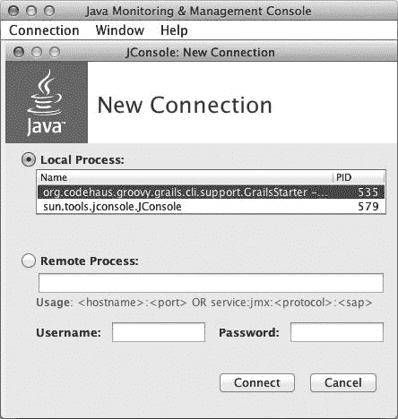

***图 10-1.** JConsole 中的“连接到代理”对话框*

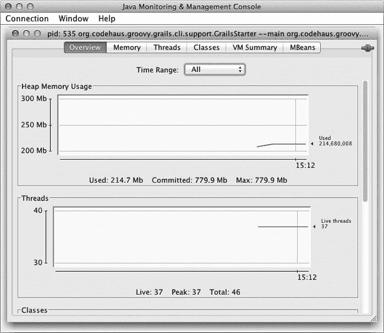

***图 10-2.** JConsole 主窗口*

主屏幕显示了许多关于 Grails 进程的信息。单击屏幕顶部的“MBeans”选项卡，查看所有可访问的 bean。在该屏幕上，你应该会在左侧的 `gtunes/service` 文件夹下看到所有通过 JMX 暴露的服务的列表，如图 10-3 所示。

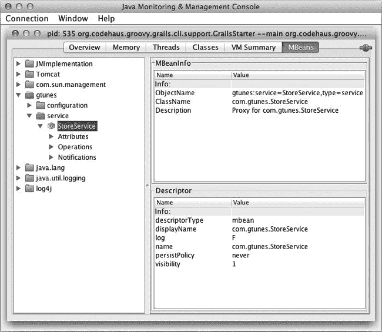

***图 10-3.** 使用 JMX 暴露的 Grails 服务*

展开 StoreService 下的 Operations 文件夹。这将列出此 bean 暴露的所有操作，包括在服务中定义的所有方法，如图 10-4 所示。

请注意，对于需要参数的操作，JConsole 提供了一个文本框，用于定义参数的值。填写该值后，单击包含操作名称的按钮。该操作将被远程调用，并显示返回值。

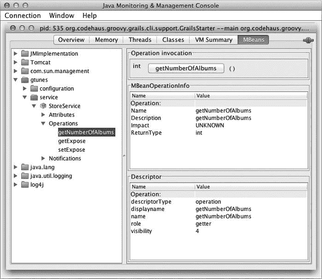

***图 10-4.** JMX 操作*

JMX 插件是几个支持使用各种远程技术暴露服务的 Grails 插件之一。有一个 XML-RPC 插件，还有一个 Remoting 插件，允许通过 RMI、Hessian、Burlap 和 Spring 的 `HttpInvoker` 暴露服务。Cxf 和 Axis2 插件都支持通过 SOAP 暴露服务。

所有远程插件都使用服务类中的同一个 `expose` 属性作为触发器，以使用任何特定技术暴露服务。清单 10-19 展示了如何使用 JMX 和 Axis2 暴露 `StoreService`。

***清单 10-19.** 使用 JMX 和 Axis2 暴露服务*

`package com.gtunes`
`class StoreService {`
`    static transactional = true`
`    static expose = ['jmx', 'axis2']`
`    int getNumberOfAlbums() {`
`        Album.count()`
`    }`
`    int getNumberOfAlbumsForGenre(String genre) {`
`        Album.countByGenre(genre)`
`    }`
`}`

请记住，要使该代码生效，你需要安装 JMX 和 Axis2 插件。

暴露 Grails 服务是允许应用程序访问 Grails 应用程序内部业务逻辑的好方法。事实上，你可以构建一个仅作为服务层的 Grails 应用程序。该应用程序可能只包含提供数据访问的领域类和服务，类似于前面展示的 `StoreService`。该应用程序不一定需要任何控制器、视图或其他任何东西。

### 总结

服务是几乎所有重要的 Grails 应用程序中的重要组件，应用程序的大部分业务逻辑和复杂性都归属于它们。

在本章中，你了解了 Grails 如何通过鼓励将复杂性隔离到服务中来帮助简化应用程序。你学习了如何轻松利用 Spring 依赖注入的强大功能，而无需编写配置文件来配置 Spring。

你还了解了事务管理如何与 Grails 服务协同工作。对于大多数场景，默认的方法级事务划分是完美的选择。对于应用程序需要对事务进行更细粒度控制的场景，Grails 提供了一种非常简单的机制来处理它们。

有了如此多的暴露 Grails 服务的选项，可以使用任意数量的远程技术，你应该养成利用 Grails 服务提供的强大功能和灵活性的习惯。如果你这样做，你的应用程序将更易于编写、更易于理解、更易于维护和更易于测试。

## 第 11 章

## 集成与依赖管理

到目前为止，我们已经探讨了支撑 Grails 的许多核心概念。从控制器到 GORM 和服务，你现在应该对 Grails 的运行机制有了相当不错的理解。在本章中，你将学习如何将 Grails 集成到你现有的生态系统中。我们希望你能从本章中很好地理解如何将 Grails 纳入你的构建系统、开发工具、报告设置和服务器环境。

内容很多，让我们先仔细看看 Grails 中的配置。

### Grails 与配置

通过使用“约定优于配置”（CoC），Grails 显著减少了你需要进行的配置量。然而，至关重要的是，它是约定*优于*配置，而不是用约定*代替*配置。仍然有多种不同的方式来配置 Grails。

大多数配置都可以使用 Grails 内部的中央配置机制来完成。文件 `grails-app/conf/Config.groovy` 包含应用程序的许多配置细节。你在本书的不同地方已经看到过这个文件的使用。在接下来的章节中，我们将更深入地了解如何使用 `Config.groovy` 来配置 Grails，以及有哪些配置选项可供你使用。

#### 配置基础

`Config.groovy` 文件是一个 Groovy 脚本，类似于常规的 Java 属性文件。你可以使用点解引用运算符来设置其属性：

`grails.mime.file.extensions = true`

由于它是一个 Groovy 脚本，所有类型信息都会被保留。因此，在前面的示例中，一个名为 `grails.mime.file.extensions` 的布尔属性被设置为 `true`。要访问此设置，请使用控制器和视图中可用的 `grailsApplication` 对象的 `config` 属性：

`assert grailsApplication.config.grails.mime.file.extensions == true`

除了像 `grails.mime.file.extensions` 设置这样在单行上指定的设置外，Groovy 还支持使用块进行分组设置（参见清单 11-1）。

***清单 11-1.** 在 Config.groovy 中分组设置*

`grails.mime {`
`   file.extensions = true`
`   types = [html: 'text/html']`
`}`

清单 11-1 中的示例将在 `config` 中生成两个条目：`grails.mime.file.extensions` 和 `grails.mime.types`。你还可以按环境进行配置设置。这将在接下来介绍。

#### 环境特定配置

正如你在第 2 章中所发现的，`grails-app/conf/DataSource.groovy` 文件可以按环境特定方式进行配置，因为 Grails 使用与 `Config.groovy` 为应用程序其余部分配置 `DataSource` 相同的机制。

与 `DataSource.groovy` 一样，通过使用 `Config.groovy`，你可以使用 `environments` 代码块指定环境特定的设置，如清单 11-2 所示。

***清单 11-2.** 环境特定配置*

`// 设置每个环境的 serverURL 主干，用于创建绝对链接`
`environments {`
`   development {`
`         grails.serverURL = "http://localhost:8080"`
`    } production {`
`         grails.serverURL = "http://www.gtunes.com"`
`    }`
`}`

如清单 11-2 所示，`environments` 代码块可用于为生产环境和开发环境指定不同的 `grails.serverURL` 设置。`grails.serverURL` 设置是本书中你将了解到的众多内置设置之一。

#### 配置日志记录

Grails 使用流行的 Log4j ([`http://logging.apache.org/log4j/`](http://logging.apache.org/log4j/)) 库来配置日志记录。传统上，Log4j 使用属性文件格式或 XML 进行配置。然而，Grails 提供了一个特定的 DSL 用于配置日志记录。在 `Config.groovy` 脚本中，你可以使用 Groovy 闭包设置一个名为 `log4j` 的属性。

在此闭包内，你可以使用 Log4j DSL 来配置日志记录。清单 11-3 显示了 Grails 中默认的 Log4j 配置，该配置为 Grails 内部的一系列包设置了日志记录。

***清单 11-3.** 默认的 Log4j 配置*

`// log4j 配置`
`log4j = {`
`error 'codehaus.groovy.grails.web.servlet'`*`,`*`   // 控制器`
`      'codehaus.groovy.grails.web.pages'`*`,`*`   // GSP`
`      'codehaus.groovy.grails.web.sitemesh'`*`,`*`   // 布局`
`      'codehaus.groovy.grails.web.mapping.filter',  // URL 映射`
`      'codehaus.groovy.grails.web.mapping',  // URL 映射`
`      'codehaus.groovy.grails.commons',// 核心 / 类加载`
`      'codehaus.groovy.grails.plugins',// 插件`
`      'codehaus.groovy.grails.orm.hibernate'   // Hibernate 集成`
`}`

正如你从清单 11-3 中看到的，在 `log4j` 闭包体内，调用了 `error` 方法。该方法接收多个包作为参数。`error` 方法将指定的包设置为 `error` 调试级别。以下是可用的调试级别，按详细程度从低到高排列。

> *   `off`：不记录任何日志
> *   `fatal`：仅记录致命错误，通常是会导致应用程序中止的错误
> *   `error`：记录发生的所有错误，但仍允许应用程序继续运行
> *   `warn`：记录可能有害的场景
> *   `info`：记录描述应用程序进度的信息性消息
> *   `debug`：记录用于调试应用程序的信息
> *   `trace`：比 `debug` 级别更细粒度事件的级别
> *   `all`：记录发生的所有消息

你还可以配置自己应用程序中的源以进行日志记录。在第 4 章中，你了解了每个控制器、标签库或服务中可用的 `log` 属性。默认情况下，此日志属性的输出将使用根日志记录级别 `error`。但是，你可以使用以 `grails.app` 开头的类名来配置不同的日志记录行为。例如，如果你想在 `UserController` 和 `AlbumArtService` 类中以 `debug` 级别查看所有日志语句的输出，则可以使用清单 11-4 中的配置。

***清单 11-4.** 设置调试级别*

`log4j {`
`     debug  'grails.app.controller.UserController',`
`            'grails.app.service.AlbumArtService'`
`}`

使用合理的默认值，Grails 将自动配置一个控制台附加器，将日志记录到标准输出，同时根日志记录器设置为 `error` 级别。你还可以创建自己的自定义 Log4j 附加器。例如，清单 11-5 中的代码设置了一个额外的文件附加器，将日志写入文件。

***清单 11-5.** 配置文件附加器*

`log4j {`
`   appenders {`
`      rollingFile name:"my_log",`
`      file:"/var/log/gtunes.log"`*`,`* `maxFileSize:"1MB",`
`      layout:  pattern(conversionPattern:   '%c{2} %m%n')`
`   }`
`}`

清单 11-5 中的示例使用了 `rollingFile` 附加器，它在内部是一个 `org.apache.log4j.RollingFileAppender` 实例。每个命名参数都是 `org.apache.log4j.RollingFileAppender` 类的一个属性，因此要了解配置选项，你只需查看 Log4j API。以下是可用的 Log4j 附加器列表。

> *   `jdbc`：`org.apache.log4j.jdbc.JDBCAppender` 将日志记录到数据库连接。
> *   `null`：`org.apache.log4j.varia.NullAppender` 不执行任何操作！
> *   `console`：`org.apache.log4j.ConsoleAppender` 将日志记录到标准输出。
> *   `file`：这是一个 `org.apache.log4j.FileAppender`，将日志记录到单个文件。
> *   `rollingFile`：这是一个 `org.apache.log4j.RollingFileAppender`，将日志记录到一个文件，当达到最大大小时，该文件会自动备份并重新创建。

你也可以自己使用 Log4j API 以编程方式创建一个附加器，然后简单地调用 `appender` 方法，传入你的附加器，以添加你自己的附加器。另请注意，清单 11-5 使用了 `pattern` 方法来定义附加器的 `layout` 属性。这转化为一个 `org.apache.log4j.PatternLayout` 实例。你可以使用许多其他布局样式，包括以下内容：

> *   `xml`：一个 `org.apache.log4j.xml.XMLLayout` 实例，以 XML 格式输出日志文件。
> *   `html`：一个 `org.apache.log4j.HTMLLayout` 实例，以 HTML 格式输出日志。
> *   `simple`：一个 `org.apache.log4j.SimpleLayout` 实例，以预配置的文本格式输出。
> *   `pattern`：一个 `org.apache.log4j.PatternLayout` 实例，允许你配置 Log4j 的输出。有关详细信息，请参阅 javadoc API。

一旦你有了一个附加器，你必须告诉 Log4j 哪些包需要记录到该附加器。清单 11-6 展示了一个示例，将 Hibernate 输出以 `trace` 级别记录到之前定义的 `rollingFile` 附加器。

***清单 11-6.** 使用附加器*

`log4j {`
`    ...`
`    trace myLog:"org.hibernate"`
`    debug myLog:["org.codehaus.groovy.grails.web.mapping.filter",   `
`                 "org.codehaus.groovy.grails.web.mapping"]`
`}`

请注意，你通过使用 `name` 参数赋予附加器的名称来引用它。最后，有一个用于堆栈跟踪的特殊日志记录器，我们将在下一节中讨论。

#### 堆栈跟踪过滤

每当 Grails 中抛出异常时，异常堆栈跟踪中所有 Groovy 和 Grails 内部信息都会被过滤掉，然后才会记录日志。这非常有用，因为它能让你将问题缩小到与代码相关的范围。否则，如果 Grails 的所有内部层都暴露出来，你可能需要筛选一个相当大的堆栈跟踪。

通常，在开发过程中抛出异常时，你可以通过过滤后的跟踪信息找出问题所在。在极少数情况下，你可能希望检查完整的未过滤堆栈跟踪。默认情况下，Grails 会设置一个特殊的日志记录器，用于记录完整的堆栈跟踪。该日志记录器会写入项目根目录下名为 `stacktrace.log` 的文件。

然而，你可以很容易地覆盖此默认行为，为未过滤的堆栈跟踪提供自定义日志记录器。清单 11-7 展示了一个示例配置，该配置将所有未过滤的堆栈跟踪记录到一个滚动文件追加器中。

***清单 11-7.** 记录未过滤的跟踪信息*

`log4j {`
`appenders {`
`  rollingFile name:"stacktraceLog",`
`              file:"/var/log/unfiltered-stacktraces.log",`
`              maxFileSize:"1MB",`
`              layout: pattern(conversionPattern: '%c{2} %m%n')`
`}`
`error stacktraceLog:"StackTrace"`

你也可以通过在容器的命令行中传递 `grails.full.stacktrace` 参数，或将其作为 `run-app` 命令的参数，来完全禁用此功能：

`grails -Dgrails.full.stacktrace=true run-app`

#### 外部化配置

在部署期间，`Config.groovy` 文件会被编译成一个类并打包到 WAR 文件中。尽管这有其优势，但你可能希望将所有配置保留在主 WAR 文件之外。例如，假设你想允许在应用程序外部配置日志记录；要实现这一点，你可以使用 Grails 中的外部化配置机制。

本质上，在 `Config.groovy` 中，你可以指定 `grails.config.locations` 设置，使其包含需要合并到主配置中的位置列表。以日志记录为例，清单 11-8 展示了如何将日志记录配置外部化到 `USER_HOME` 目录下的一个文件中。

***清单 11-8.** 使用外部化配置*

`grails.config.locations = ["file:${userHome}/gtunes-logging.groovy"]`

你甚至可以使用此机制允许外部配置 `DataSource`。尽管 `DataSource.groovy` 和 `Config.groovy` 在文件系统中是独立的文件，但 Grails 会将它们合并成一个逻辑配置对象。因此，你不仅可以外部化日志记录或任何其他配置，还可以外部化 `DataSource`，如清单 11-9 所示。

***清单 11-9.** 外部化 DataSource 配置*

`grails.config.locations = ["file:${userHome}/.settings/gtunes-logging.groovy",                           "file:${userHome}/.settings/gtunesdatasource.groovy"]`

如果你愿意，也可以在外部化配置中使用静态属性文件。只需在引用文件时使用扩展名 `.properties`，并使用常规的 `java.util.Properties` 文件语义进行配置。

### 声明依赖关系

Web 应用程序的依赖管理可能既繁琐又复杂。幸运的是，Grails 提供了一个复杂但易于使用的依赖管理系统，允许你以声明方式在一个地方表达依赖关系，且只需极少的配置。剩下的工作 Grails 会帮你完成。到目前为止，你在修改 `BuildConfig.groovy` 以表达对插件的依赖关系时，已经多次利用了这一特性。

在本节中，我们将更详细地探讨 `BuildConfig.groovy` 中所有可用的选项。让我们先看看 gTunes 中当前的 `BuildConfig.groovy` 文件。请参见清单 11-10 中的代码。

***清单 11-10.** BuildConfig.groovy*

`grails.project.class.dir = "target/classes"`
`grails.project.test.class.dir = "target/test-classes"`
`grails.project.test.reports.dir = "target/test-reports"`
`grails.project.target.level = 1.6`
`grails.project.source.level = 1.6`
`//grails.project.war.file = "target/${appName}-${appVersion}.war"`

`grails.project.dependency.resolution = {`
`    // 继承 Grails 的默认依赖`
`    inherits("global") {`
`        // 取消注释以禁用 ehcache`
`        // excludes 'ehcache'`
`    }`
`    log "error" // Ivy 解析器的日志级别，可选 'error', 'warn', 'info', 'debug' 或 'verbose'`
`    checksums true // 是否在解析时校验校验和`

`    repositories {`
`        inherits true // 是否继承来自插件的仓库定义`
`        grailsPlugins()`
`        grailsHome()`
`        grailsCentral()`
`        mavenCentral()`

`        // 取消注释以启用来自公共 Maven 仓库的远程依赖解析`
`        //mavenLocal()`
`        //mavenRepo "http://snapshots.repository.codehaus.org"`
`        //mavenRepo "http://repository.codehaus.org"`
`        //mavenRepo "http://download.java.net/maven/2/"`
`        //mavenRepo "http://repository.jboss.com/maven2/"`
`    }`
`    dependencies {`
`        // 在此处指定依赖，作用域可以是 'build', 'compile', 'runtime', 'test' 或 'provided'，例如`

`        runtime 'mysql:mysql-connector-java:5.1.21'`
`    }`

`    plugins {`
`        runtime ":hibernate:$grailsVersion"`
`        runtime ":jquery:1.7.1"`
`        runtime ":resources:1.1.6"`
`        runtime ":searchable:0.6.4"`
`        compile ":cache:1.0.0"`
`        compile ":rest-client-builder:1.0.2"`

`        // 取消注释这些（或添加新的）以启用额外的资源功能`
`        //runtime ":zipped-resources:1.0"`
`        //runtime ":cached-resources:1.0"`
`        //runtime ":yui-minify-resources:0.1.4"`

`        build ":tomcat:$grailsVersion"`
`    }`
`}`

看起来可能有很多内容，但不要被吓到。我们将把它分解成几个易于处理的部分。

文件中的前几行定义了一些属性：`grails.project.class.dir`、`grails.project.test.class.dir` 和 `grails.project.test.reports.dir`。这些设置告诉 Grails 构建系统将生成的工件（如类文件和测试报告）放在哪里。这里表示的默认值会将所有这些内容放在名为 `target` 的目录中。这些值都是相对于项目根目录的。如果你想指定一个完全限定的路径到其他位置，那也是可以的：

`grails.project.class.dir='/Development/artefacts/gtunes/classes/'`

接下来的几个属性是 `grails.project.target.level` 和 `grails.project.source.level`，默认值为 1.6。这些设置告诉 Grails 编译器，你的源代码应与 Java 1.6 兼容，并且编译器应生成 1.6 兼容的字节码。如果你要部署到使用 Java 1.5 的容器，请相应地设置目标级别。

到目前为止，上述内容实际上都与依赖管理无关。它们都是影响构建的配置。文件的其余部分则完全关于依赖管理。

文件的其余部分都是在闭包内定义的代码，该闭包被赋值给 `grails.project.dependency.resolution` 属性。这些代码大部分属于以下四类之一：继承（inherits）、仓库（repositories）、依赖（dependencies）和插件（plugins）（参见清单 11-11）。

***清单 11-11.** BuildConfig.groovy 中的各个部分*

`grails.project.dependency.resolution = {`
`    inherits("global") {`
`        ...`
`    }`
`    repositories {`
`        ...`
`    }`
`    dependencies {`
`        ...`
`    }`
`    plugins {`
`        ...`
`    }`
`}`

让我们逐一检查这些部分。

#### 继承依赖

第一部分是继承部分。在这里，你可以指定希望从框架中继承依赖，这是大多数应用程序都会想要做的事情。框架在运行时依赖于许多东西，包括 Spring、SiteMesh 和 Hibernate。由于这些运行时依赖在应用程序运行时需要可用，最常见的做法是声明希望从框架中继承这些全局依赖。这就是默认的 `BuildConfig.groovy` 文件通过调用 `inherits("global")` 所表达的内容。

`inherits` 方法接受一个可选的第二个参数，即一个闭包，可用于进一步配置要继承的内容。可能会出现这样的情况：应用程序希望继承所有全局依赖，但由于某种原因，想要排除某个（或多个）特定的依赖。实现方法是，在该闭包内调用 `excludes` 方法，并将字符串作为参数传入。这些字符串代表应排除的依赖名称，如清单 11-12 所示。

***清单 11-12.** 排除继承的依赖*

`inherits("global") {`
`    excludes "ehcache", "oscache"`
`}`

可能会出现这样的情况：应用程序希望从框架继承所有全局依赖，但不希望这些依赖在部署时被包含在 WAR 文件中。这种场景最常见的用例是，当多个 Grails 应用程序要部署到同一个容器中时，你希望避免所有这些应用程序都捆绑它们自己相同依赖的副本。这些依赖可以安装到容器中（有关如何操作的详细信息，请参阅容器的文档）；然后为 Grails 应用程序创建更精简的 WAR 文件，其中只包含应用程序自身引入的依赖，而不包含从框架继承的依赖。清单 11-13 展示了如何使用 `defaultDependenciesProvided` 方法声明这些依赖将由容器提供。

***清单 11-13.** 指示默认依赖将由容器提供*

`grails.project.dependency.resolution = {`
`    defaultDependenciesProvided true`
`    inherits("global")`
`}`

对于 `BuildConfig.groovy` 中的大部分代码，顺序并不重要。但这是一个例外。`defaultDependenciesProvided` 方法必须在 `inherit` 方法之前调用，这一点很重要；否则，所有全局依赖仍会被包含在生成的 WAR 文件中。

#### 声明仓库

应用程序通常会对 Grails 未提供的内容有依赖。这些可能包括插件以及应用程序所依赖的库的 JAR 文件，例如 gTunes 正在使用的 MySQL Connector。Grails 需要知道在哪里找到这些依赖，而 `BuildConfig.groovy` 允许指定一个仓库列表，依赖解析系统应在此列表中查找这些依赖。请参见清单 11-14。

***清单 11-14.** 配置仓库*

`grails.project.dependency.resolution = {`
`    repositories {`
`        grailsPlugins()`
`        grailsHome()`
`        grailsCentral()`
`        mavenCentral()`
`        ...`
`    }`
`}`

文件中的 `repositories` 部分用于声明 Grails 应使用哪些仓库来解析依赖。默认配置的三个仓库是 `grailsPlugins()`、`grailsHome()` 和 `grailsCentral()`。第一个 `grailsPlugins()` 配置了一个解析器，可以找到此项目可能依赖的任何插件的 `lib/` 目录中捆绑的依赖。第二个 `grailsHome()` 配置了一个解析器，可以找到框架附带的所有依赖。第三个 `grailsCentral()` 配置了一个解析器，可以在主要的公共 Grails 仓库中找到依赖，大多数 Grails 插件都部署在那里。对于新创建的应用程序，这三个仓库会出现在文件中，并且大多数应用程序都需要保留它们。有些项目可能希望用额外的仓库来补充它们，最常见的是 Maven Central；当然，这就是 `mavenCentral()` 方法配置的仓库。gTunes 应用程序使用 `mavenCentral()` 作为解析 MySQL Connector 的地方。

对于许多应用程序（也许是大多数），上面提到的仓库就足够了。然而，在某些情况下，你可能希望 Grails 从其他 Maven 仓库解析依赖，例如企业内网上的某个仓库。在 `BuildConfig.groovy` 中配置这些仓库有一种简单的方法；即使用 `mavenRepo` 方法（参见清单 11-15）。

***清单 11-15.** 配置自定义仓库*

`grails.project.dependency.resolution = {`
`    repositories {`
`        // 不从插件继承仓库`
`        inherits false`

`        mavenRepo  name: 'codehaus', 'http://repository.codehaus.org'`
`        mavenRepo  'http://myserver.com/repo/'`
`        ...`
`    }`
`}`

请注意，`codehaus` 仓库被赋予了一个名称，这是可选的。该名称在评估日志文件时可能有用。还要注意对 `inherits false` 的调用，它指示依赖解析系统不要从应用程序中安装的插件继承仓库。如果你想托管自己的插件仓库，这是一个非常常见的用例。

文件的下一部分是 `dependencies` 部分。在这里，你可以声明对框架未提供的库（JAR 文件）的依赖。gTunes 应用程序目前依赖于 MySQL Connector（参见清单 11-16）。

***清单 11-16.** 运行时库依赖*

`grails.project.dependency.resolution = {`
`    ...`
`    dependencies {`
`        // 在此处指定依赖，范围可以是 'build'、`
`        // 'compile'、'runtime'、'test' 或 'provided'，例如`

`        runtime 'mysql:mysql-connector-java:5.1.21'`
`    }`
`    ...`
`}`

请注意，MySQL Connector 库是一个运行时依赖。当应用程序尝试连接到 MySQL 数据库时，运行时需要该库，但由于应用程序中没有代码直接引用 MySQL 代码，因此编译时不需要该库可用。除了 `runtime` 之外，还支持几种范围（参见表 11-1）。

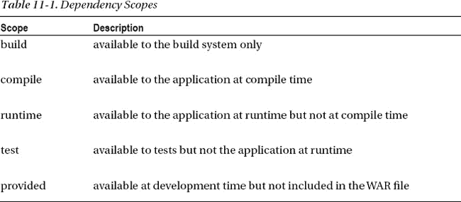

清单 11-16 中传递给作用域方法的字符串描述了依赖关系。其语法为 group:name:version，因此在 `mysql:mysql-connector-java:5.1.21` 中，“`mysql`”是组名，“`mysql-connector-java`”是名称，“`5.1.21`”自然是版本号。任何使用过 Maven 的人都会熟悉这些术语。

另一种语法是以命名参数的形式向 `scope` 方法指定构件的详细信息（见清单 11-17）。

***清单 11-17.** 使用命名参数表达依赖关系*

`grails.project.dependency.resolution = {`
`    ...`
`    dependencies {`
`        runtime group: 'mysql'`
`                name: 'mysql-connector-java'`
`                version: '5.1.21'`
`    }`
`    ...`
`}`

可以在单次调用中指定多个依赖关系（见清单 11-18）。

***清单 11-18.** 同时指定多个依赖关系*

`grails.project.dependency.resolution = {`
`    ...`
`    dependencies {`
`        // 在此处指定依赖关系，可选用 'build', 'compile', 'runtime', 'test' 或 'provided' 作用域，例如：`

`        runtime 'mysql:mysql-connector-java:5.1.21'`
`        runtime 'commons-httpclient:commons-httpclient:3.1'`

`        // 或者 ...`

`        runtime 'mysql:mysql-connector-java:5.1.21',`
`               'commons-httpclient:commons-httpclient:3.1'`
`        // 或者...`

`        runtime [[group: 'mysql', name: 'mysql-connector-java', version: '5.1.21'],`
`                 [group: 'commons-httpclient', name: 'commons-httpclient', version: '3.1']]`
`    }`
`    ...`
`}`

默认情况下，当 Grails 解析依赖关系时，框架不仅会解析显式声明的依赖关系，还会解析传递性依赖关系。这意味着如果你的应用程序声明了对库 A 的依赖，而库 A 依赖于库 B，库 B 又依赖于库 C，系统将解析所有这些依赖关系。这通常是可取的，因为如果你的应用程序使用了 A 且 A 依赖于 B，你可能需要 B 存在。但有时你可能希望禁用传递性依赖解析。实现此目的的语法如清单 11-19 所示。

***清单 11-19.** 排除传递性依赖*

`grails.project.dependency.resolution = {`
`    ...`
`    dependencies {`
`        // 在此处指定依赖关系，可选用 'build', 'compile', 'runtime', 'test' 或 'provided' 作用域，例如：`

`        runtime('mysql:mysql-connector-java:5.1.21') {`
`            transitive = false`
`        }`

`        // 或者...`
`        runtime group: 'mysql'`
`                     name: 'mysql-connector-java'`
`                     version: '5.1.21'`
`                     transitive: false`
`        // 或者，排除特定依赖关系，同时保留其他所有传递性依赖关系以供解析`
`        runtime('mysql:mysql-connector-java:5.1.21') {`
`            excludes 'xml-apis', 'commons-logging'`
`        }`
`    }`
`    ...`
`}`

`BuildConfig` 文件的最后一部分是插件部分，你已经多次使用过它。这是你声明应用程序将要使用的插件依赖关系的地方。声明插件依赖关系的语法与声明库依赖关系的语法非常相似，如上所示。一个显著的区别是，插件依赖关系不需要组名，默认组名为 `org.grails.plugins`。见清单 11-20。

***清单 11-20.** 指定插件依赖关系*

`grails.project.dependency.resolution = {`
`    ...`

`    plugins {`
`        runtime ":hibernate:$grailsVersion"`
`        runtime ":jquery:1.7.1"`
`        runtime ":resources:1.1.6"`
`        runtime ":searchable:0.6.4"`
`        compile ":cache:1.0.0"`
`        compile ":rest-client-builder:1.0.2"`
`        build ":tomcat:$grailsVersion"`
`    }`
`}`

传递性插件解析的工作方式与传递性库解析非常相似。如果你声明了对插件 A 的依赖，而插件 A 依赖于插件 B，那么插件 B 将被解析。插件依赖关系也可以进行排除，就像库依赖关系一样（见清单 11-21）。

***清单 11-21.** 排除传递性插件依赖关系*

`grails.project.dependency.resolution = {`
`    ...`

`    plugins {`
`        runtime(':someplugin:1.0') {`
`            excludes 'pluginA', 'pluginB'`
`        }`
`    }`
`}`

### 理解 Grails 构建系统

Grails 构建系统由 Gant（[`http://gant.codehaus.org`](http://gant.codehaus.org)）构建工具驱动。Gant 是 Apache Ant（[`http://ant.apache.org`](http://ant.apache.org)）的一个轻量级封装，Ant 是广受欢迎的 Java 构建系统。与使用 XML 格式描述构建的 Ant 不同，Gant 使用 Groovy DSL。这样做的好处是，你可以轻松地将构建逻辑与 Groovy 代码中的脚本混合在一起。清单 11-22 展示了一个典型的 Gant 构建脚本示例。

***清单 11-22.** Gant 构建脚本示例*

`targetDir = "build"`
`target(clean:"Cleans any compiled sources") {`
`delete(dir:targetDir) }`

`target(compile:"The compilation task") {`
`    depends(clean)`
`    mkdir(dir:"$targetDir/classes")`
`    javac(srcdir:"src/java",`
`          destdir:"$targetDir/classes")`
`}`
`target(jar:"Creates a DAR file")  {`
`    jar(destfile:"$targetDir/app.jar",basedir:"$targetDir/classes")`
`}`
`target(dist:"The default task") {`
`    depends(compile, jar)`
`}`
`setDefaultTarget ( dist )`

请注意，清单 11-10 中的示例通过调用 `target` 方法定义了许多目标。这些目标相当于 Ant 的 `<target>` 标签。此外，如你所见，你可以使用 `depends` 方法指定目标之间的依赖关系：

`depends(compile, jar)`

如果你在 Grails 之外安装 Gant，Gant 通过 `gant` 命令提供自己的命令行界面。`gant` 命令会搜索名为 `build.gant` 的文件（就像 Ant 查找 `build.xml` 一样），如果找到则尝试调用它。使用 `gant` 命令，你可以调用单个目标或链接多个目标，如下所示：

`$ gant clean jar`

此时，你将开始意识到普通 Gant 与 Grails 之间的区别。尽管 Gant 的行为与 Ant 非常相似，但 Grails 将 Gant 封装在其自己的 `grails` 命令中——也就是你在本书中一直使用的那个命令。`grails` 命令利用 Grails 项目中的约定，尝试自动确定要执行哪个脚本。例如，当你运行命令

`$ grails create-app`

Grails 将搜索以下目录，查找名为 `CreateApp.groovy` 的 Gant 脚本并执行：

> *   `PRODECTHOME/scripts`：当前项目的 `scripts` 目录。
> *   `GRAILSHOME/scripts`：你安装 Grails 位置的 `scripts` 目录。
> *   `PLUGINS_HOME/*/scripts`：每个已安装插件的 `scripts` 目录。
> *   `USERHOME/.grails/scripts`：当前用户主目录下 `.grails` 目录中的 `scripts` 目录。此位置取决于操作系统。

如果找到匹配的 Gant 脚本，`grails` 命令将执行该 Gant 脚本的*默认*目标。与 `gant` 命令相比，`grails` 命令针对 Grails 项目布局、插件系统以及轻松传递参数进行了优化。

#### 创建 Gant 脚本

为了帮助你更好地理解，我们来看一个简单的“Hello World”风格示例。使用 `create-script` 命令，创建一个名为 `HelloWorld.groovy` 的新脚本：

`grails> create-script HelloWorld`
`| Created file scripts/HelloWorld.groovy`

正如预期，你会在项目的 `scripts` 目录下得到一个名为 `HelloWorld.groovy` 的新 Gant 脚本。图 11-1 展示了该脚本的存放位置。

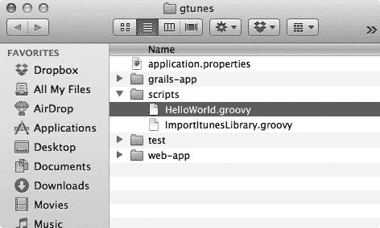

***图 11-1.** HelloWorld.groovy Gant 脚本*

Grails 在引用脚本时使用小写字母加连字符分隔的名称（例如 `hello-world`），但在生成脚本文件名时会将其转换为驼峰命名法。清单 11-23 展示了 图 11-1 中生成的 `HelloWorld.groovy` 脚本的内容。

***清单 11-23.** 脚本模板*

`grailsHome = ant.project.properties."environment.GRAILS_HOME"`
`includeTargets << grailsScript("_GrailsInit")`

`target(main: "The description of the script goes here!") {`
`   // TODO`
`}`
`setDefaultTarget(main)`

如你所见，该模板从 Grails 安装目录下的 `scripts` 文件夹中一个名为 `_GrailsInit.groovy` 的脚本里引入了一些现有功能。然后它定义了一个名为 `main` 的默认目标。为了完成这个“Hello World”示例，我们使用 `println` 语句来打印一条消息：

`includeTargets << grailsScript("_GrailsInit")`

`target(main: "The description of the script goes here!") {`
`    println 'Hello World!'`
`}`

`setDefaultTarget(main)`

要运行 `hello-world` 脚本，只需使用 `grails` 可执行文件运行以下命令：

`grails> hello-world`
`| Environment set to development....`
`Hello World!`
`grails>`

Grails 会搜索之前提到的所有目录，找到 `HelloWorld.groovy` 脚本。由于 `main` 目标是默认目标，Grails 将执行它，并打印出“Hello World!”消息。

当然，拥有完整的 Ant API 意味着你能做的事情远不止打印消息。Ant 及其插件提供了对各种目标的访问，允许你操作文件系统、编译 Java 或 Groovy 代码、执行 XSLT 转换，以及完成几乎任何你能在命令行中想到的任务。

 **提示** 如果你还不熟悉 Apache Ant 手册（大多数 Java 开发者都熟悉），不妨看一看（[`http://ant.apache.org/manual/`](http://ant.apache.org/manual/)）。该手册提供了关于 Ant 功能的全面信息。

#### 命令行变量

清单 11-11 中 `HelloWorld.groovy` 导入的 `_GrailsInit.groovy` 脚本提供了许多有用的变量和目标。以下是其中一部分。

> *   `grailsVersion`：你正在使用的 Grails 版本
> *   `grailsEnv`：Grails 执行时所处的环境
> *   `basedir`：表示脚本执行基目录的字符串
> *   `baseFile`：类似于 `basedir`，但以 `Java.io.File` 对象表示
> *   `userHome`：当前用户的主目录，以字符串形式表示
> *   `pluginsHome`：插件安装的位置
> *   `classesDir`：类文件编译到的位置

`grailsEnv` 变量值得特别一提。如果你还记得第 2 章的内容，你可以告诉 Grails 在开发、测试或生产环境的上下文中运行。回顾一下，以下命令将使用生产设置执行 `run-app` 命令：

`$ grails prod run-app`

你的脚本可以通过使用 `grailsEnv` 变量来同样感知环境。例如，如果你希望一个 Gant 脚本仅在开发环境中运行，可以编写如下代码：

`if(grailsEnv ==  'development')  {`
`// do something }`

其他一些变量，如 `pluginsHome` 和 `classesDir`，是由 Grails 自动构建的。默认情况下，Grails 将插件和一些编译后的资源存储在 `USER_HOME` 目录下的一个特殊路径中。例如，你可以在 `USER_HOME/.grails/2.0.4/projects/gtunes/plugins` 目录中找到 gTunes 应用程序的插件相关代码。

如你所见，Grails 使用 Grails 版本号和项目名称在 `USER_HOME` 目录下构建路径。如果你对这个位置不满意，可以通过在命令行传递 `grails.work.dir` 参数来告诉 Grails 使用不同的路径：

`$ grails -Dgrails.work.dir=/tmp run-app`

事实上，你可以传递大量不同的命令行参数来自定义 Grails 使用的各种位置。

> *   `grails.work.dir`：所有 Grails 工作（包括测试和源码编译目录）的基础位置
> *   `grails.project.classes.dir`：项目源码编译到的位置
> *   `grails.project.resource.dir`：项目静态资源（如 `web.xml`）生成到的位置
> *   `grails.project.test.class.dir`：测试源码编译到的位置
> *   `grails.plugins.dir`：插件安装的位置
> *   `grails.global.plugins.dir`：全局插件安装的位置

#### 解析命令行参数

与原始的 Gant 不同，`grails` 命令不支持目标链式调用；相反，它更倾向于轻松传递命令行参数。`Init.groovy` 脚本提供的一个有用的依赖目标是 `parseArguments` 目标。`parseArguments` 目标会读取所有命令行参数，并生成一个名为 `argsMap` 的变量，以更易访问的形式包含参数的值。

例如，假设你想让 `HelloWorld.groovy` 脚本能够打印要问候的人的名字，并且可以选择大写或小写输出。你可以允许将名字作为命令行参数传递，并将是否大写输出作为一个命令行标志，如下所示：

`grails> hello-world John`
`| Environment set to development....`
`Hello John`
`grails> hello-world John -uppercase`
`| Environment set to development.....`
`HELLO JOHN`
`grails>`

实现这些处理非常简单。清单 11-24 展示了一个更新后的 `HelloWorld.groovy` Gant 脚本，它优雅地处理了这些参数。

***清单 11-24.** 处理命令行参数*

`includeTargets << grailsScript("_GrailsInit")`

`target(main: "The description of the script goes here!") {`
`    def message = "Hello ${argsMap.params ? argsMap.params[0] : 'World'}"`
`    if(argsMap.uppercase) {`
`        println message.toUpperCase()`
`    } else {`
`        println message`
`    }`
`}`

`setDefaultTarget(main)`

请注意，命令行标志（以 `–` 或 `--` 开头的参数）会作为布尔值放入 `argsMap` 中。清单 11-12 中的示例展示了 `-uppercase` 标志如何最终成为一个布尔值，其键 `uppercase` 位于 `argsMap` 内部。你也可以使用带值的标志；例如，如果你传递了 `-uppercase=yes`，那么该值将是一个字符串 `yes`，并存储在 `argsMap` 中。

所有其他非标志参数都会放在 `params` 键下，作为一个 `List`，并保留它们被传递时的顺序。

#### 为脚本编写文档

你可能已经注意到，在清单 11-11 的脚本模板中，主目标（main target）有一个用于描述目标的占位符：

`target(main: "The description of the script goes here!") {`

你可以通过为脚本中的 `USAGE` 属性赋值，来提供关于某个目标的额外信息，以便其他人更好地理解如何使用你的脚本。例如，要为 `hello-world` 脚本提供信息，你可以进行如下修改：

`includeTargets << grailsScript("_GrailsInit")`

`target(main: "Prints a Hello message") {`
`    def message = "Hello ${argsMap.params ? argsMap.params[0] : 'World'}"`
`    if(argsMap.uppercase) {`
`        println message.toUpperCase()`
`    } else {`
`        println message`
`    }`
`}`

`setDefaultTarget(main)`

`USAGE = '''`
`    hello-world [-uppercase] [NAME]`

`where`
`    -uppercase = Convert the message to all uppercase`
`    NAME       = The name of the person to say hello to`
`'''`

这样一来，如果你的脚本的其他用户需要帮助，他们可以使用 Grails 提供的 `help` 命令，如清单 11-25 所示。

***清单 11-25.** 从 Gant 脚本获取帮助*

`grails> help hello-world`
`| Environment set to development.....`

`    grails hello-world -- Prints a Hello message`

`Usage (optionals in square brackets):`

`    hello-world [-uppercase] [NAME]`

`where`
`    -uppercase = Convert the message to all uppercase`
`    NAME       = The name of the person to say hello to`
`grails>`

#### 更多地复用 Grails

在清单 11-11 中包含 `GrailsInit.groovy` 脚本，只是包含现有 Grails 脚本的一个例子。实际上，你可以包含一个提供不同功能的脚本数组。例如，假设你想确保在脚本执行之前先运行测试。你可以包含 `_GrailsTest.groovy` 脚本并依赖于 `allTests` 目标，如清单 11-26 所示。

***清单 11-26.** 执行测试*

`includeTargets << grailsScript('_GrailsTest')`

`target(main: "The description of the script goes here!") {`
`    depends allTests`
`}`

`setDefaultTarget main`

或者，如果你想确保容器已启动并正在运行，也许是为了执行某种自动化功能测试，你可以使用 `RunApp.groovy` 脚本。这个脚本与你在命令行输入 `grails run-app` 时使用的脚本相同，它提供了一个名为 `runApp` 的目标，你可以用它来加载 Grails 中嵌入的 Tomcat 容器。作为对此的扩展，下一节将介绍如何加载 Grails，甚至无需容器。

#### 从命令行引导 Grails

如果你需要从命令行访问 Grails 环境，可以使用 `GRAILS_HOME/scripts/Bootstrap.groovy` 脚本加载 Grails。例如，这将使你能够从命令行使用 GORM 进行批处理。

首先，你需要包含以下 `Bootstrap.groovy` 脚本：

`includeTargets << grailsScript("_GrailsBootstrap")`
`然后调用 bootstrap 目标：`
`bootstrap()`

完成此操作后，将创建许多新变量，包括以下内容：

> *   `grailsApp`：对 `org.codehaus.groovy.grails.commons.GrailsApplication` 类的引用，允许你检查正在运行的 Grails 应用程序中的约定。
> *   `appCtx`：Spring `ApplicationContext` 实例，包含 Grails 应用程序的 bean 定义，在运行时可见。
> *   `servletContext`：`ServletContext` 的模拟实现，可从命令行使用。
> *   `pluginManager`：对 `org.codehaus.groovy.grails.plugins.GrailsPluginManager` 实例的引用，允许你检查当前安装的插件。

其中最常用的是 `appCtx` 变量，它允许访问 Spring `ApplicationContext` 中包含的所有 bean。例如，如果你需要获取 Hibernate `SessionFactory` 和/或 SQL `DataSource`，你可以使用 `appCtx` 轻松实现：

`DataSource dataSource = appCtx.getBean("dataSource") SessionFactory SessionFactory = appCtx.`
`getBean("sessionFactory")`

了解了这些基础知识后，让我们看几个示例，展示如何使用 Gant 来提高命令行生产力。

#### Gant 实战

在命令窗口中打印“Hello World!”虽然有趣，但归根结底并不是很有用。在接下来的章节中，你将看到几个真实的 Gant 脚本。第一个脚本将允许你快速部署到 Tomcat。

##### 自动化部署至 Tomcat

借助 Tomcat 自带的构建目标（参见 [`http://tomcat.apache.org/tomcat-7.0-doc/manager-howto.html`](http://tomcat.apache.org/tomcat-7.0-doc/manager-howto.html)），在 Ant 中编写 Tomcat 部署脚本相当简单。不过，在开始本示例之前，你需要确保已安装 Tomcat，并将 `TOMCAT_HOME` 设置为其安装路径。然后按如下方式运行 `grails create-script` 命令：

`$ grails create-script tomcat-deploy`

完成上述步骤后，你的项目 `scripts` 目录下应出现一个 `TomcatDeploy.groovy` 文件，如图 11-2 所示。

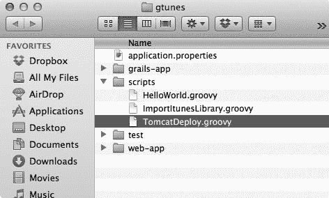

***图 11-2.** TomcatDeploy.groovy 脚本*

`TomcatDeploy.groovy` 脚本模板与你之前看到的 `HelloWorld.groovy` 模板完全相同。首先，你需要确定 Tomcat 安装目录的路径。检查 `TOMCAT_HOME` 环境变量可以帮助你实现这一点：

`grailsHome = ant.project.properties."environment.GRAILS_HOME"`
`tomcatHome = ant.project.properties."environment.TOMCAT_HOME"`

在获取 Tomcat 目录信息后，下一步是引入 `GRAILS_HOME/scripts` 目录下的 `War.groovy` 脚本。`_GrailsWar.groovy` 模板包含一些构建目标，可让你构建一个有效的 WAR 文件：

`includeTargets << grailsScript("_GrailsWar")`

要利用 Tomcat 的 Ant 任务，你需要通过调用 `taskdef` 方法来定义它们。此方法对应 Ant 的 `<taskdef>` 目标，因此在 Gant 中定义 Ant 任务与在纯 Ant 中定义几乎完全相同——只是少了尖括号：

`ant.path(id:"tomcat.lib.path") {`
`   fileset(dir:"${tomcatHome}/server/lib",includes:"*.jar")`
`}`
`ant.taskdef(name:"deploy",`
`            classname:"org.apache.catalina.ant.DeployTask",`
`            classpathref:"tomcat.lib.path")`

如你所见，唯一棘手的部分是确保使用 Tomcat 安装目录中的 JAR 文件，将 `DeployTask` 类所需的所有 JAR 文件正确地添加到类路径中。这是通过使用名为 `classpathref` 的命名参数和预定义的 Ant 路径 `tomcat.lib.path` 来完成的。

接下来，转到 `TomcatDeploy.groovy` 脚本的 `main` 目标，你可以将其修改为依赖于 `war` 目标，这将确保在其余代码运行之前构建一个有效的 WAR 文件：

`target(main: "将 Grails 应用程序部署到 Tomcat") {`
`    depends war`
`    ...`
`}`

完成后，你需要确定发布 WAR 文件的目标地址。例如，你可以将目标地址作为命令的第一个参数，否则默认使用 `localhost`：

`def dest = argsMap.params ? argsMap.params[0] : "http://localhost:8080/manager"`

完成后，剩下的工作就交给 `org.apache.catalina.ant.DeployTask` 类提供的 `deploy` 目标：

`deploy(war:warName, url:dest,`
`path:serverContextPath, username:"deployer", password:"secret")`

`warName` 和 `serverContextPath` 变量由 `War.groovy` 脚本设置，你可以在此处复用。部署目标还要求你在部署到 Tomcat 时传递 `username` 和 `password` 参数。假设你本地有一个正在运行的 Tomcat 实例，如果现在运行 `tomcat-deploy` 目标，你很可能会收到类似如下的 401 错误：

`java.io.IOException: Server returned HTTP response code: 401 for URL: http://localhost:8080/`
`manager/deploy?path=%2FgTunes`

原因是当前 Tomcat 没有注册名为 `deployer`、密码为 `secret` 的用户。要解决此问题，你需要编辑 `TOMCAT_HOME/conf/tomcat-users.xml` 文件，并添加一个有权访问 Tomcat `manager` 应用程序的用户，如清单 11-27 所示。

***清单 11-27.** 添加 Tomcat 部署者*

`<?xml version='1.0' encoding='utf-8'?>`
`<tomcat-users>`
`   ...`
`   <user username="deployer" password="secret" roles="standard,manager"/>`
`</tomcat-users>`

添加必要的 Tomcat 用户后，当你运行 `tomcat-deploy` 脚本时，Grails 将成功将你的应用程序部署到 Tomcat，如清单 11-28 所示。

***清单 11-28.** 部署到 Tomcat*

`$ grails tomcat-deploy ...`
`Done creating WAR /Developer/grails-dev/book/dgg/code/ch12/gTunes-0.1.war [deploy] OK - Deployed`
`application at context path /gTunes`

当然，你可以进一步扩展，编写另一个 `tomcat-undeploy` 脚本，或者将它们合并到两个脚本中。不过，清单 11-29 展示了 `TomcatDeploy.groovy` 脚本的完整代码。

***清单 11-29.** TomcatDeploy.groovy 脚本*

`grailsHome = ant.project.properties."environment.GRAILS_HOME"`
`tomcatHome = ant.project.properties."environment.TOMCAT_HOME"`

`includeTargets << grailsScript("War")`

`ant.path(id:"tomcat.lib.path") {`
`    fileset(dir:"${tomcatHome}/server/lib",includes:"*.jar")`
`}`
`ant.taskdef(name:"deploy",`
`                   classname:"org.apache.catalina.ant.DeployTask",`
`                   classpathref:"tomcat.lib.path")`
`target(main: "将 Grails 应用程序部署到 Tomcat") {`
`    depends(parseArguments, war)`
`    def dest = argsMap.params ? argsMap.params[0] : "http://localhost:8080/manager"`

`    deploy(war:warName,`
`           url:dest,`
`           path:serverContextPath,`
`           username:"deployer",`
`           password:"secret")`
`}`
`setDefaultTarget(main)`

###### 将数据导出为 XML

命令行脚本另一个相当常见的用途是允许数据迁移。这可以通过对数据库执行 SQL 转储来实现，但您可能希望提供将数据库中所有内容导出为 XML 的功能，就像 Atlassian Confluence 和 JIRA 等一些 Web 应用程序所做的那样。

让我们首先考虑如何编写一个导出脚本，将 gTunes 应用程序中的所有相关数据转储到一个可解析的 XML 文档中。首先，您需要创建一个名为 `export-library-to-xml` 的新 Gant 脚本：

`grails> create-script ExportLibraryToXml`
`| Created file scripts/ExportLibraryToXml.groovy`
`grails>`

完成此操作后，您需要利用前面讨论过的 `GRAILS_HOME/scripts/_GrailsBootstrap.groovy` 脚本。为此，只需包含 `_GrailsBootstrap.groovy`：

`includeTargets << grailsScript("_GrailsBootstrap")`

在 `main` 目标内部，您需要依赖于 `bootstrap` 目标：

`depends bootstrap`

首先，使用 `argsMap`，您可以通过获取第一个参数或以编程方式创建一个名称来确定要导出的文件：

`    def file = argsMap.params ?`
`               new File(argsMap.params[0]) :`
`               new File("./gtunes-data=${System.currentTimeMillis()}.xml")`

如前所述，`bootstrap` 目标会设置一个 `grailsApp` 变量，该变量持有对 `GrailsApplication` 实例的引用。此实例可用于通过 `classLoader` 属性动态加载类。这样做是必要的，因为 Gant 脚本无法直接引用应用程序中的类，因为它们无法知道这些类是否已被编译。幸运的是，使用 `classLoader` 获取对任何类的引用是相当简单的：

`def artistClass = grailsApp.classLoader.loadClass('com.gtunes.Artist')`

与 Java 不同，使用 Groovy，您可以通过对 `java.lang.Class` 的引用来调用任何静态方法；因此，即使使用动态加载的类引用，您也可以轻松使用常规的 GORM 方法。第一个示例是使用静态的 `count()` 方法来计算有多少个艺术家：

`    def artistClass = grailsApp.classLoader.loadClass('com.gtunes.Artist')`
`    def artistCount = artistClass.count()`

现在是时候创建 XML 了。为此，您将使用 Groovy 的 `StreamingMarkupBuilder` 类。清单 11-30 展示了如何构造和使用 `StreamingMarkupBuilder`。

***清单 11-30.** 使用 StreamingMarkupBuilder 写入文件*

`new FileWriter(file) << new groovy.xml.StreamingMarkupBuilder().bind {`
`    music {`
`        ...`
`    }`
`}`

Groovy 中的构建器允许您构建节点层次结构，这个概念非常适合 XML 的构建。在这种情况下，`music` 方法将成为 XML 文档的根元素 `<music>`。下一步，您将使用 `withTransaction` 方法启动一个事务，该方法首次在第 10 章中讨论过。

您在这里使用事务，以便为后续代码共享一个通用的 Hibernate `Session`，从而避免在访问未初始化的关联时发生 `LazyInitializationException`。在 Grails 中，与服务器环境不同，Hibernate `Session` 在脚本中不会为您管理，但通过使用 `withTransaction`，您可以规避这个问题：

`artistClass.withTransaction {`
`    ...`
`}`

除了 `withTransaction`，您还将利用 `withSession` 方法来获取所使用的 Hibernate `Session` 对象的引用。如第 10 章所述，当将大量数据读入 Hibernate `Session` 时，如果不定期清除 `Session`，可能会耗尽内存。由于您并不确切知道数据库中有多少数据，因此您将在此处执行此操作：

`artistClass.withSession { session ->`
`    ...`
`}`

下一步，请允许我使用双关语，就是使用 `step` 方法，利用之前获得的 `artistCount` 变量来对记录进行分页。通过这种技术，您可以获取，比如说，十个 `Artist` 实例，包括其关联。您可以以某种方式操作它们，然后在加载下十个之前清除 `Session`。清单 11-31 展示了实际运行的代码。

***清单 11-31.** 使用 step 方法对记录进行分页*

`0.step(artistCount, 10) { offset ->`
`    def artistList = artistClass.list(offset: offset,`
`                                      max: 10,`
`                                      fetch: [albums: 'join'])`
`    session.clear()`
`}`

有了 `Artist` 实例列表后，现在只需遍历每个实例以创建一组 `<artist>` XML 元素：

`for(currentArtist in artistList) {`
`    artist(name: currentArtist.name) {`
`        ...`
`    }`
`}`

最后，您还需要包含与每个 `Artist` 关联的所有 `Album` 实例，以及与每个 `Album` 关联的所有 `Song` 实例。您可以通过再嵌套几个循环来实现这一点：

`for(currentAlbum in currentArtist.albums) {`
`    album(currentAlbum.properties['title', 'year', 'genre', 'price']) {`
`        for(currentSong in currentAlbum.songs) {`
`            song(currentSong.properties['title', 'duration'])`
`        }`
`    }`
`}`

请注意，您可以使用下标运算符和属性名称列表来引用每个 `Album` 实例属性值的子集：

`currentAlbum.properties['title', 'year', 'genre', 'price']`

至此，`export-library-to-xml` 脚本就完成了。清单 11-32 展示了 `export-library-to-xml` Gant 脚本的完整代码。

***清单 11-32.** export-library-to-xml 完整代码*

`includeTargets << grailsScript("_GrailsBootstrap")`

`target(main: "Exports the gTunes database to XML") {`
`  depends bootstrap`
`  def file = argsMap.params ?`
`               new File(argsMap.params[0]) :`
`               new File("./gtunes-data=${System.currentTimeMillis()}.xml")`
`  def artistClass = grailsApp.classLoader.loadClass('com.gtunes.Artist')`
`  def artistCount = artistClass.count()`
`  println "Creating XML for ${artistCount} artists"`
`  new FileWriter(file) << new groovy.xml.StreamingMarkupBuilder().bind {`
`    music {`
`      artistClass.withTransaction {`
`          artistClass.withSession { session ->`
`            0.step(artistCount, 10) { offset ->`
`              def artistList = artistClass.list(offset: offset, max: 10, fetch: [albums:`
`'join'])`
`              for(currentArtist in artistList) {`
`                artist(name: currentArtist.name) {`
`                  for(currentAlbum in currentArtist.albums) {`
`                    album(currentAlbum.properties['title', 'year', 'genre', 'price']) {`
`                      for(currentSong in currentAlbum.songs) {`
`                        song(currentSong.properties['title', 'duration'])`
`                      }`
`                    }`
`                  }`
`                }`
`              }`
`            session.clear()`
`          }`
`        }`
`      }`
`    }`
`  }`
`  println "Done. Created XML ${file.absolutePath}"`
`}`

`setDefaultTarget(main)`

从清单 11-21 的完整代码中可以看出，您还可以添加几个 `println` 语句，只是为了告知用户正在发生的事情。现在，您可以使用 `grails` 命令运行 `export-library-to-xml` 脚本，然后会弹出一个 XML 文档，如清单 11-33 所示。

***清单 11-33.** 运行 export-library-to-xml 脚本*

*`$ grails export-library-to-xml`*
*`Creating XML for 498 artists`*
*`Done. Created XML /Developer/projects/gtunes/gtunes-data=1351863192571.xml`*

正如您在此示例中所见，该脚本会生成一个名为 `gtunes-data-122224970.xml` 的文件。该文件的内容包含了由 `StreamingMarkBuilder` 构建的 XML。清单 11-34 展示了一个示例。

***清单 11-34.** 示例输出 XML*

`<?xml version="1.0"?>`
`<music>`
`    <artist name="The Killers">`
`        <album year="2006" title="Sam's Town" price="4.99" genre="Rock">`
`            <song title="Sam's Town" duration="246099"/>`
`            <song title="Enterlude" duration="49972"/>`
`            <song title="When You Were Young" duration="220499"/>`
`            ...`
`        </album>`
`    </artist>`
`    ...`
`</music>`

### 使用 Hudson 进行持续集成

敏捷和测试驱动理念已被无休止地争论，这超出了本书的讨论范围。然而，如果有一种敏捷实践能够为任何项目（无论是“传统”项目还是敏捷项目）带来立竿见影的好处，那便是持续集成。

*持续集成*涉及设置一个服务器，该服务器持续地（按计划或通过监控变更）构建最新代码、运行所有测试，并生成代码快照以供分发。持续集成服务器可以执行各种附加任务，从生成覆盖率报告到创建最新文档，甚至在构建失败时发送电子邮件或短信通知。

本节将演示如何使用 Hudson，这是一个开源的持续集成服务器，可从 [`https://hudson.dev.java.net/`](https://hudson.dev.java.net/) 获取。要开始使用，您需要下载 Hudson 的 `hudson.war` 发行版，并将其部署到一个容器中，例如 Apache Tomcat。使用 Tomcat 部署只需将 WAR 文件放入 `TOMCAT_HOME/webapps` 目录并启动 Tomcat 即可。

然后，假设 Tomcat 已在 8080 端口上运行，您可以访问 [`http://localhost:8080/hudson`](http://localhost:8080/hudson)，您将看到 Hudson 仪表盘。

下一步是为 Hudson 安装 Grails 插件。在仪表盘主屏幕上，点击“管理 Hudson”链接，然后点击“管理插件”链接。在“可选”选项卡中，选中 Grails 插件旁边的复选框，然后点击页面底部的“安装”按钮。安装完插件后，您需要重启 Hudson。

安装 Grails 插件后，下一步是在 Hudson 中配置您的 Grails 安装。该插件本身不附带 Grails 版本，它使用一个必须与 Hudson 分开安装在系统上的版本。该插件允许您配置任意多个不同版本的 Grails。如果您在同一个 Hudson 实例中构建多个 Grails 项目，并且这些 Grails 项目并非都使用相同的版本构建，这将非常有用。

要在 Hudson 中配置 Grails 安装，请点击仪表盘主屏幕上的“管理 Hudson”链接，然后点击“配置系统”链接。图 11-3 显示了此屏幕中用于配置 Grails 安装的部分。

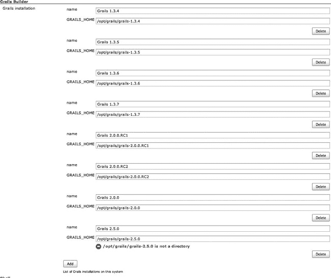

***图 11-3.** 在 Hudson 中配置 Grails 安装*

您可以看到每个 Grails 安装都有一个名称和一个 `GRAILS_HOME`。名称只是一个标识符，稍后在配置作业时，它将帮助您选择特定版本的 Grails。`GRAILS_HOME` 的值必须指向一个特定的 Grails 安装目录。请注意，内置了验证功能，可以告知您输入的目录是否存在。验证在您离开文本字段后才会激活。

配置完所有 Grails 安装后，请确保滚动到页面底部并点击“保存”按钮。

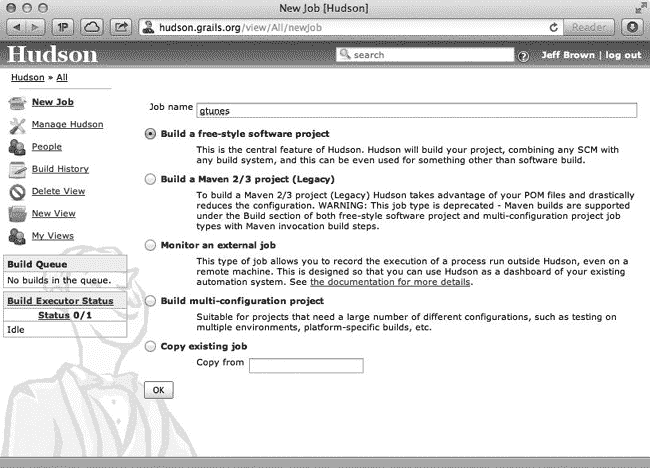

***图 11-4.** 创建一个新的自由风格作业*

在 Hudson 中至少配置了一个 Grails 安装后，您就可以为 Grails 项目创建作业了。为 Grails 项目创建作业的方式与在 Hudson 中为任何其他项目创建作业的方式相同。在仪表盘主屏幕上，点击“新建作业”链接。大多数情况下，您将为所谓的自由风格软件项目创建作业，因此您将在表单上选择该单选按钮来创建新作业（参见图 11-4）。

点击“确定”按钮后，您将进入配置此构建所有详细信息的页面。此页面允许您定义正在使用的版本控制系统、项目路径、构建项目的计划等。页面底部附近是您配置实际构建步骤的地方。安装 Grails 插件后，应该会出现一个新的构建步骤“使用 Grails 构建”，如图 11-5 所示。

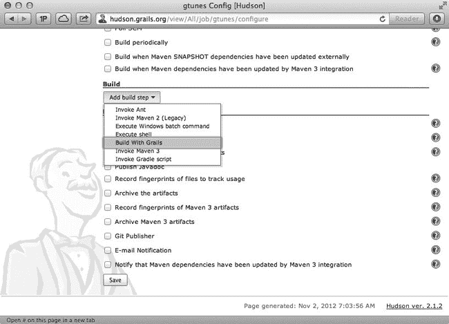

***图 11-5.** “使用 Grails 构建”构建步骤*

当您选择“使用 Grails 构建”构建步骤时，页面将更新为一个表单，让您配置 Grails 构建。这至少包括指定要使用的 Grails 版本以及要执行的 Grails 目标。一个典型的目标是执行 `test-app` 目标，但您可以将作业配置为执行任何有意义的目标。图 11-6 显示了 Grails 构建的详细信息。

“Grails 安装”下拉菜单将包含您之前配置的所有 Grails 安装。选择此作业应使用的 Grails 版本。

“目标”字段允许您指定希望作为此构建一部分执行的任意多个目标。这些目标将按照此文本框中指定的顺序执行。如果有任何参数需要传递给特定目标，则目标名称和参数应用双引号括起来，以便插件知道将它们分组为一个命令。

有用于指定 `grails.work.dir` 和 `project.work.dir` 系统属性的字段。

“项目基础目录”字段通常留空，但如果 Grails 项目不在作业工作目录的根目录下，则此字段很重要。例如，如果您的 Grails 项目在 SCM 系统中的路径类似于 `/projects/development/code/grails/gTunes/`，并且由于某种原因，您需要将此作业配置为检出 `/projects/development/code/grails/gTunes/` 下的所有内容，那么您需要为“项目基础目录”字段指定一个值。这里的问题是作业根目录是 `/projects/development/code/grails/gTunes/`；因此插件将从该目录执行所有 Grails 命令。由于这不是 Grails 项目本身的根目录，所有 Grails 命令都将失败。为了支持这种情况，应将“项目基础目录”字段的值设置为 `/projects/development/code/grails/gTunes/`；这是从作业根目录到 Grails 项目根目录的相对路径。设置完成后，所有 Grails 命令都将从 `/projects/development/code/grails/gTunes/` 目录执行。

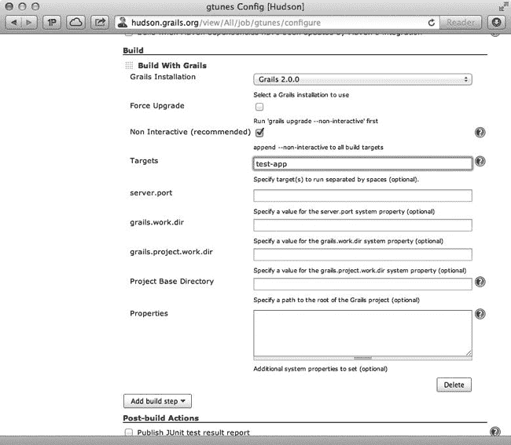

***图 11-6.** 配置 Grails 构建*

在 Hudson 中配置 Grails 作业的所有其他方面与任何其他类型的项目没有区别。

### 为您喜爱的 IDE 添加支持

Java 开发者普遍对现代集成开发环境（IDE）的便利性特别依赖，这很大程度上是因为 Java 语言的严格性。从其静态类型规则到诸如每行代码末尾必须加分号这样的特性，如果没有编译器的一点“唠叨”，用 Java 写代码几乎寸步难行。幸运的是，现代 IDE，如 Groovy/Grails Tool Suite (GGTS)、Eclipse 和 IntelliJ IDEA，让生活变得轻松了许多。事实上，它们做的远不止于此。随着重构工具的出现，Java 已成为目前最易于维护的语言之一。

动态语言领域的工具通常远不如 Java 可用的工具那么先进。另一方面，许多开发者使用 TextMate、jEdit 和其他简单的文本编辑器来创建整个应用程序；他们更青睐这些工具的速度和效率，而不是功能强大、特性丰富的 IDE 那种相对笨重和缓慢的感觉。之所以能做到这一点，是因为像 Grails 这样的框架的简洁性以及 Groovy 语法相对宽松。我们认为，在应用程序生命周期的早期阶段，你完全可以使用这些更简单的工具。

然而，随着应用程序的增长并进入维护阶段，对 IDE 的需求也会增加——尤其是在重构和维护方面。幸运的是，尽管这些工具出现得晚得多，但你确实有可用的选择。我们将在以下章节中介绍它们。

#### 使用 Groovy/Grails Tool Suite (GGTS)

Groovy/Grails Tool Suite (GGTS) 为构建 Groovy 和 Grails 应用程序提供了最佳的基于 Eclipse 的开发环境。GGTS 支持最新版本的 Groovy 和 Grails，并构建在最新的 Eclipse 版本之上。

GGTS 可从 [`http://grails.org/products/ggts`](http://grails.org/products/ggts) 获取。下载包包含一个双击安装程序，可简化工具的安装、启动和运行过程。

##### 配置 Grails 安装

GGTS 附带最新版本的 Grails——即该版本 GGTS 创建时可用的版本——但你可以在 IDE 中配置任意多个不同版本的 Grails。当你将项目从一个 Grails 版本升级到另一个版本，或者同时处理多个使用不同 Grails 版本的项目时，此功能非常有用。

要在 IDE 中配置 Grails 安装，请打开应用程序首选项，导航至 Groovy ä Grails，如图 11-7 所示。

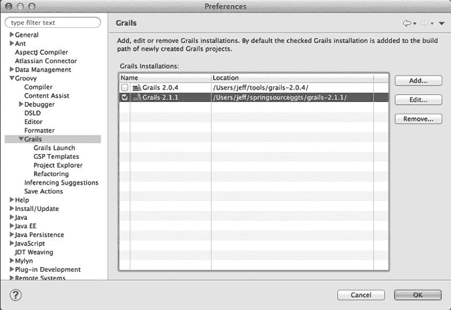

***图 11-7.** 配置 Grails 安装*

此对话框允许你配置系统中已安装的任意多个 Grails 安装。表格最左列的复选框允许你指定在 IDE 中创建新 Grails 应用程序时默认选择的版本。

##### 导入 Grails 项目

配置好 Grails 安装后，下一步是导入你的 Grails 项目。幸运的是，Grails 在创建项目时会自动为你生成 Eclipse 项目和类路径文件。因此，要导入项目，请选择“文件”“导入”菜单选项，然后选择“导入”选项，此时将出现如图 11-8 所示的对话框。

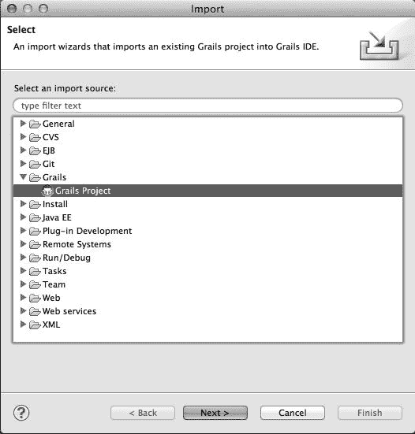

***图 11-8.** 将 Grails 项目导入 GGTS*

选择“Grails 项目”选项，然后单击“下一步”按钮。现在，使用“浏览”按钮浏览到 Grails 项目的根目录，然后单击“选择”或“确定”。一旦你选择了项目所在的目录，GGTS 将自动检测指定根目录内甚至根目录子目录中是否存在 Eclipse 项目文件（参见图 11-9）。

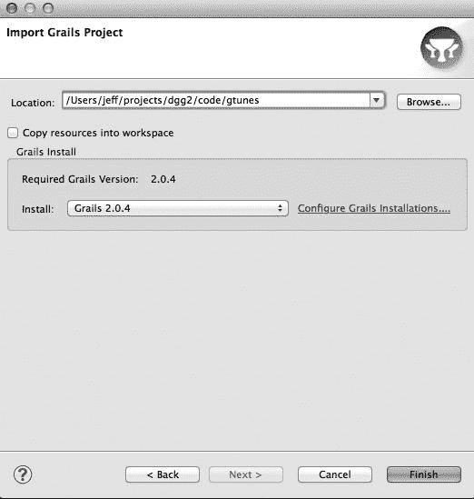

***图 11-9.** 将 Grails 项目导入 Eclipse*

单击“完成”按钮完成导入。此时，你的项目将配置正确的源目录和类路径。

###### 从 GGTS 运行 Grails 应用程序

你可以通过右键单击项目并选择“运行方式”菜单，从 GGTS 运行 Grails 应用程序。“运行方式”下的子菜单将包含多个选项，包括“Grails 命令 (run-app)”（参见图 11-10）。

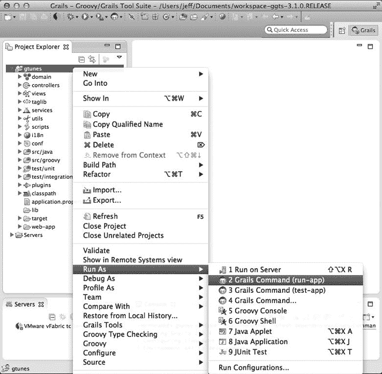

***图 11-10.** 从 GGTS 运行 Grails 应用程序*

如果你想在调试器中运行应用程序，则选择“调试方式”而不是“运行方式”菜单选项。在调试器中运行应用程序时，你可以设置断点、监视点以及 Java 开发者在其运行时调试器中习惯使用的所有其他功能。

GGTS 为工作区提供了 Grails 透视图，该透视图提供了对 Grails 应用程序中所有构件的智能视图以及其他功能。有用于创建构件和运行任意命令的向导。还有一个 Grails 插件管理器。GGTS 为构建、测试和调试 Grails 应用程序提供了一个非常灵活、非常强大的环境，并且正迅速成为 Grails 应用程序开发者的首选 IDE。有关 GGTS 的更多信息，请参见 [`http://grails.org/products/ggts`](http://grails.org/products/ggts)。

#### 使用 Spring Tool Suite (STS) 和 Eclipse

大多数希望在 Eclipse 环境中开发 Grails 应用程序的开发者会选择使用 GGTS。GGTS 构建在 Eclipse 之上，提供了 Eclipse 的所有功能，外加一整套 Groovy 和 Grails 支持。如果出于某种原因，你想在 Eclipse 环境中开发 Grails 应用程序但不想使用 GGTS，你可以将 Groovy 和 Grails 扩展安装到 Eclipse 或 STS 中，并获得相同的功能——只是需要多做一点工作来将所有东西拼凑在一起。你可以在 [`www.grails.org/STS+Integration`](http://www.grails.org/STS+Integration) 找到关于如何做到这一点的更多信息。

#### IntelliJ IDEA

JetBrains 在与 Groovy 团队密切合作下，在 IntelliJ 中构建了大部分相关支持。（你可以在 [`www.jetbrains.com/idea/features/groovy_grails.html`](http://www.jetbrains.com/idea/features/groovy_grails.html) 了解更多关于他们对 Groovy 和 Grails 的支持信息并查看他们的文档。）图 11-11 展示了 IntelliJ IDEA 的实际运行情况。

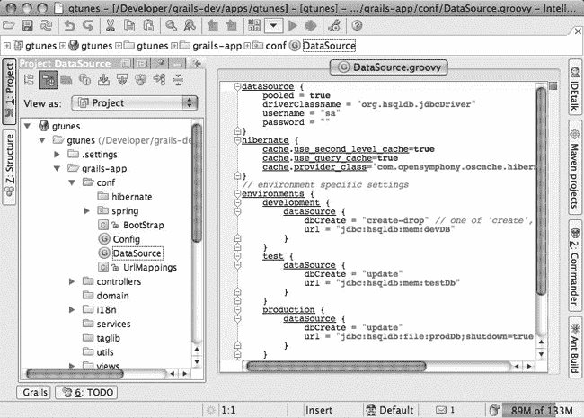

***图 11-11.** 带有 Groovy 插件的 IntelliJ IDEA*

#### NetBeans

在可用的开源 IDE 中，NetBeans ([`www.netbeans.org/`](http://www.netbeans.org/)) 为 Groovy 和 Grails 开发提供了最先进的支持。在使 NetBeans 成为市场上最好的 Ruby IDE 之一后，Sun 开始投资于 Groovy 和 Grails 支持，随着 NetBeans 6.5 的发布，这项投资的成果开始真正显现。NetBeans 插件具有内置的 Groovy 支持，提供语法高亮、代码补全、大纲视图以及轻松访问 Grails 命令的菜单选项。图 11-12 展示了 NetBeans Groovy 编辑器的外观。

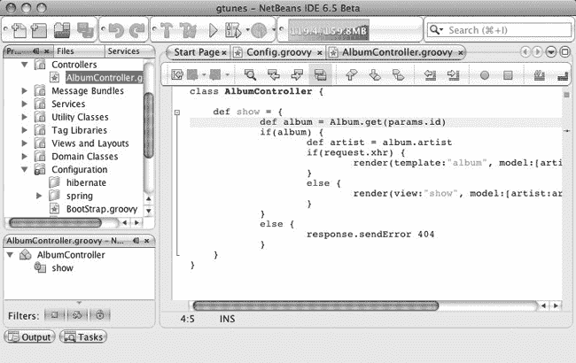

***图 11-12.** NetBeans Groovy/Grails 集成*

在 Grails 网站上有一篇关于 NetBeans 当前可用功能的好文章：[`http://www.grails.org/Net`](http://www.grails.org/Net)Beans+Integration。

#### 文本编辑器

市面上有许多功能强大的文本编辑器，它们为 Grails 项目提供了不同程度的支持。其中两款较为流行的编辑器是 TextMate 和 Sublime Text。关于如何使用 TextMate 编辑 Grails 项目，请参阅 [`https://github.com/textmate/groovy-grails.tmbundle`](https://github.com/textmate/groovy-grails.tmbundle)。关于如何使用 Sublime Text 编辑 Grails 项目，请参阅 [`https://github.com/osoco/sublimetext-grails`](https://github.com/osoco/sublimetext-grails)。

##### 使用 IDE 进行远程调试

你可以通过运行 `grails-debug` 可执行文件来替代 `grails` 可执行文件，从而对 Grails 进行远程调试。

 **提示** `grails-debug` 可执行文件仅会设置必要的 Java 选项，以便通过远程调试器启动 Grails。你也可以通过设置 `JAVA_OPTS` 环境变量来手动配置这些选项。

`grails-debug` 可执行文件将使用调试 JVM 启动 Grails。调试器监听在端口 5005 上，这是 Java 的默认调试器端口。然后，你可以在 IDE 中创建一个远程调试配置。例如，要在 IntelliJ IDEA 中执行此操作，请转到“调试”菜单并点击“编辑配置”。然后点击左上角的加号图标 (+)，选择“远程”，这将为你提供一个远程调试配置，如 图 11-13 所示。

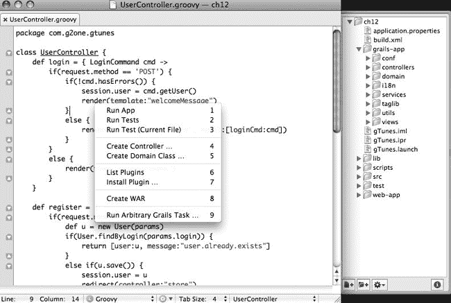

***图 11-13.** IntelliJ 远程调试配置*

你可以保持其余设置不变，只需点击右下角的“确定”按钮。完成此操作后，选择该远程调试配置并点击“调试”按钮；IntelliJ 将连接到 Grails 远程服务器。然后，你可以在应用程序源代码中设置断点，IntelliJ 将在这些断点处停止。

如果你愿意尝试，可以将 Grails 源代码添加到你的路径中，并深入 Grails 内部进行调试——但这由你自己决定！讲完 IDE 后，我们现在要讨论如何将 Grails 集成到服务器环境中。从邮件服务器到容器，还有很多内容要讲，所以请不要离开。

 **注意** 从 Grails 2.1 开始，Grails 命令行脚本支持 `–debug` 参数，因此你可以使用 `grails–debug` 来代替 `grails-debug`。在未来的 Grails 版本中，`grails-debug.sh` 和 `grails-debug.bat` 脚本很可能会被移除。

### 与邮件服务器的集成

Web 应用程序发送电子邮件已成为一种常见用例。简单邮件传输协议 (SMTP) 是实现邮件投递的推动者，并且已成为出站电子邮件的事实标准。许多不同的服务器产品都支持 SMTP，从 Microsoft Exchange Server 到大多数 Unix 系统上可用的开源 Sendmail 代理。

 **注意** SMTP 服务器的配置超出了本书的范围；我们将向你展示如何设置 Grails 以与成功配置的邮件服务器进行通信。

你可以通过多种方式将邮件与 Grails 集成。由于 Grails 构建在 Spring 之上，你可以使用 `org.springframework.mail` 抽象，它提供了比 JavaMail ([`http://java.sun.com/products/javamail/`](http://java.sun.com/products/javamail/)) 更友好的 API。然而，这涉及大量手动配置，因此我们将演示如何将 Grails Mail 插件与你的应用程序集成，以便在用户在 gTunes 上注册或进行购买时发送确认电子邮件。

首先，你需要更新 `BuildConfig.groovy` 以声明对 mail 插件的依赖。

`grails.project.dependency.resolution = {`
`    ...`
`    plugins {`
`        compile ":mail:1.0"`
`        ...`
`    }`
`}`

Mail 插件已经包含了 JavaMail 及其依赖项，因此你无需再安装任何其他库或依赖项。它使用合理的默认值，并自动假定你的邮件服务器在本地端口 25 上运行。但是，如果不是这种情况，你可以通过在 `grails-app/conf/Config.groovy` 中使用一些设置来配置它。例如，清单 11-35 展示了如何配置邮件服务器以使用 Gmail 帐户发送电子邮件。

***清单 11-35.** 为 Gmail 配置 Mail 插件*

`grails {`
`    mail {`
`        host = 'smtp.gmail.com'`
`        port = 465`
`        username = 'youraccount@gmail.com'`
`        password = 'yourpassword'`
`        props = ['mail.smtp.auth': 'true',`
`                 'mail.smtp.socketFactory.port': '465',`
`                 'mail.smtp.socketFactory.class': 'javax.net.ssl.SSLSocketFactory',`
`                 'mail.smtp.socketFactory.fallback': 'false']`
`    }`
`}`

请注意，在清单 11-35 中使用了 `props` 设置，它允许你配置 JavaMail 框架的属性。不过，就我们的目的而言，我们假设本地运行的邮件服务器已经足够。回到 Mail 插件本身，其主要新增功能是一个新方法 `sendMail`，该方法已添加到所有控制器中。清单 11-36 展示了其最简单的使用示例。

***清单 11-36.** 使用 sendMail 发送简单邮件消息*

`sendMail {`
`    to "john@g2one.com"`
`    subject "Hello John"`
`    body "How are you?"`
`}`

如果你需要从应用程序的其他位置（例如标签库和服务）访问 `sendMail` 方法，Mail 插件提供了一个可通过依赖注入获得的 mailService bean。只需在你的标签库或服务中定义一个名为 `mailService` 的属性，如下所示：

`def mailService`

然后，可以使用 `mailService` 实例调用 `sendMail` 方法；例如：

`mailService.sendMail {`
`    ...`
`}`

在清单 11-30 的示例中，邮件正文使用了简单的字符串。然而，同样可以使用 GSP 视图来定义正文。这正是你将用于向 gTunes 应用程序的用户发送注册确认电子邮件的方式。不过，在此之前，你需要修改 `User` 领域类，以添加一个新的 `email` 属性。清单 11-37 显示了对 `User` 类的更改。

***清单 11-37.** 向 User 类添加 email 属性*

`class User {`
`    String email`
`    ...`
`    static constraints = {`
`        ...`
`        email email:true, blank:false, unique:true`
`    }`
`}`

如清单 11-37 所示，你还对 `email` 属性应用了一组约束。`email` 约束确保它是一个有效的电子邮件地址，`blank` 约束确保不允许空白值，而 `unique` 约束则确保两个用户不能使用相同的电子邮件地址注册。完成此操作后，你需要修改 `grails-app/views/user/register.gsp` 视图，在注册表单中为 `email` 属性添加一个字段。清单 11-38 展示了需要对 `register.gsp` 文件进行的修改。

***清单 11-38.** 为 email 属性添加文本字段*

`<g:form action="register" name="registerForm">`
`    ...`
`    
`
`        <label for="email">Email *</label>`
`        <g:textField required="true" name="email" value="${user?.email}" />`
`        <g:hasErrors  bean="${user}" field="email">`
`            
<g:fieldError bean="${user}" field="email" />
`
`        </g:hasErrors>`
`    
`

`    ...`
`</g:form>`

完成这些后，你现在就有了一个可以发送确认邮件的电子邮件地址！要发送邮件，你需要修改 `UserController` 类的 `register` 操作，使用 `sendMail` 方法来发送邮件。清单 11-39 展示了 `register` 操作的修改。

***清单 11-39.** 发送电子邮件确认*

`def register() {`
`    ...`
`    else if(u.save()) {`
`        session.user = u`
`        try {`
`            sendMail {`
`                to u.email`
`                subject 'Registration Confirmation'`
`                body view: '/emails/confirmRegistration',`
`                         model: [user: u]`
`            }`
`        } catch (Exception e) {`
`            log.error "Problem sending email ${e.message}", e`
`        }`
`        redirect controller:"store"`

`    }`
`    ...`
`}`

请注意，在清单 11-33 中，你可以使用 `body` 方法的 `view` 参数来定义用于渲染邮件的 GSP 视图名称。如你所见，你还可以使用 `model` 参数传递一个模型。代码被包裹在 `try/catch` 块中，以防发送确认邮件时出现问题。目前，代码只是简单地记录错误，但你可以将消息放入队列中，以便稍后使用计划任务重新发送——这将在下一节中介绍。

至于 GSP 本身，你需要在 `grails-app/views/emails/confirmRegistration.gsp` 位置创建一个新视图。清单 11-39 中的示例使用了到此位置的绝对路径。如果你不指定绝对路径，那么与常规视图一样，路径会被假定为相对于当前控制器。清单 11-40 展示了渲染邮件内容的 `confirmRegistration` 视图。

***清单 11-40.** confirmRegistration 视图*

`<%@ page contentType="text/plain"%> Dear ${user.firstName} ${user.lastName},`
`Congratulations! You have registered with gTunes, giving you access to a huge collection of`
`music.`
`Your login id is: ${user.login}`
`You can use the following link to login: <g:createLink controller="store"`
`absolute="true" />`
`Kind Regards,`
`The gTunes Team`

请注意，清单 11-34 中的代码使用了一个 GSP 页面指令，将 `contentType` 设置为 `text/plain`。默认的 `contentType` 是 `text/html`，所以如果你想发送 HTML 邮件，请省略此行。至此，你已经实现了注册的电子邮件确认。然而，这还不是我们电子邮件冒险的终点；在下一节中，你将学习如何按计划发送电子邮件。

### 部署

将应用程序从开发环境迁移到生产或测试服务器时，通常会面临多种选择。部署 Grails 的选项多种多样，从简单到复杂，应有尽有。在接下来的几节中，你将了解部署 Grails 的不同方式以及如何自定义部署过程。

#### 使用 Grails 部署

如果你正在寻找一种简单的部署管理方式，并且不太关心容器的细节调优，那么使用 Grails 本身进行部署无疑是一种简单的方法。要使用 Grails 部署，你只需在目标服务器上安装 Grails，然后在项目根目录下使用 `run-war` 命令：

`$ grails run-war`

这将在 8080 端口上启动一个 Tomcat 服务器。在此基础上，你可以配置无处不在的 Apache HTTPD 服务器（[`http://httpd.apache.org/`](http://httpd.apache.org/)），使用 `mod_proxy` 将请求转发到 Tomcat 服务器。配置详情可以在 Apache 网站 [`http://tomcat.apache.org/connectors-doc/webserver_howto/apache.html`](http://tomcat.apache.org/connectors-doc/webserver_howto/apache.html) 上找到。或者，你甚至可以在 80 端口上运行 Tomcat，使其充当主 Web 服务器：

`$ grails -Dserver.port=80 run-war`

尽管这种方法很简单，但许多组织更喜欢结构化的部署方法，并使用 Java 领域的标准利器——WAR 文件。

#### 部署到容器

早在第 2 章中，你就已经了解了如何创建 WAR 文件。在 Java 世界中考虑部署时，首先想到的通常是如何创建 WAR。Java 平台的优势之一在于，你可以获取一个 WAR 文件并将其部署到各种容器上。

从商业巨头如 IBM WebSphere 和 BEA WebLogic，到流行的开源容器如 Tomcat 和 JBoss，选择非常丰富。然而，在所有这些有用的标准化背景下，不幸的是，部署 WAR 文件的方式仍然没有标准化。

在 Tomcat 这样的容器上，通常只需将 WAR 文件放入 `TOMCAT_HOME/webapps` 目录即可；而在 WebSphere 上，则有一个精美的 GUI 向导，允许你通过浏览器上传 WAR 文件。尽管如此，在部署到容器时，仍有一些重要事项需要考虑。以下是使用 Grails 部署时需要记住的关键点列表。

> *   确保将 `-server` 标志传递给运行容器的 JVM，以启用服务器 VM。在客户端 VM 上运行 Grails 会对性能产生负面影响。
> *   根据你拥有的 GSP 视图数量，你可能需要分配更多的 *permgen* 空间（JVM 用于动态编译类的内存区域）。GSP 视图在首次加载时会被编译成字节码，因此它们需要 permgen 空间。你可以使用 `-XX:MaxPermSize=256m` 标志来分配更多的 permgen 空间。
> *   建议在运行 Grails 应用程序时为 JVM 分配额外的内存。已知简单的 Grails 应用程序在低内存的共享虚拟主机上也能表现良好，但你能分配的内存越多越好。例如，要分配 512 兆字节的堆空间，你可以使用 `-Xmx512M` 标志。

#### 应用版本控制与元数据

你可能已经注意到，当运行 `grails war` 命令时，生成的 WAR 文件名末尾会带有一个版本号。你可能会好奇这个神秘的版本号从何而来。实际上，当你创建 Grails 应用时，应用的版本号会在元数据中被设置为 0.1。

你可以通过调用 `set-version` 命令来更改版本号，如清单 11-41 所示。

***清单 11-41.** 设置应用版本号*

`grails set-version 0.2`

之后，当你构建新的 WAR 文件时，将使用清单 11-41 中的版本号。在运行时，你可以通过 `grailsApplication` 对象来查看应用元数据：

`println grailsApplication.metadata."app.version"`

或者，在 GSP 中使用 `<g:meta>` 标签，如清单 11-42 所示。

***清单 11-42.** 使用应用元数据*

`版本号 <g:meta name="app.version"/>`
`基于 Grails 构建 <g:meta name="app.grails.version"/>`

#### 自定义 WAR

如果你想自定义 WAR 文件的生成方式，可以考虑利用一些钩子。例如，假设你想提供一个不同的基础 `web.xml` 模板，以便包含你自己的自定义 Servlet；你可以通过在 `grails-app/conf/Config.groovy` 中设置 `grails.config.base.webXml` 来实现：

`grails.config.base.webXml="file:${userHome}/.settings/my-web.xml"`

此外，如果你需要更改 WAR 文件的生成位置，可以使用 `grails.war.destFile` 属性：

`grails.war.destFile = "${tomcatHome}/webapps"`

如果你想在 WAR 中包含额外的资源，可以使用 `grails.war.resources` 设置，如清单 11-43 所示。

***清单 11-43.** 使用 grails.war.resources 设置包含自定义资源*

`grails.war.resources = { stagingDir ->`
`// 包含静态资源`
`  copy(dir:stagingDir) {`
`   fileset(dir:"/usr/var/www/htdocs")`
`  }`
`}`

请注意，分配给 `grails.war.resources` 的闭包会接收一个参数，该参数是正在构建 WAR 的目录位置。然后，你可以使用自定义的复制步骤来包含你需要的任何额外资源。一旦你拥有了 WAR 文件，你可能希望在应用加载时对数据库状态进行一些初始填充。我们将在下一节中介绍如何做到这一点。

##### 使用 BootStrap 类填充数据库

每当应用首次加载时，可能需要一些初始状态才能让应用正常运行。一种方法是使用 `BootStrap` 类。如果你查看 `grails-app/conf` 目录，可能会注意到一个名为 `BootStrap.groovy` 的类。清单 11-44 展示了这个类的模板。

***清单 11-44.** BootStrap 类*

`class BootStrap {`
`    def init = {`
`        servletContext ->`
`    }`
`    def destroy = {`
`    }`
`}`

如你所见，其中有一个 `init` 方法，它在容器首次加载时被调用，以及一个 `destroy` 方法。`destroy` 方法在容器关闭时被调用。但需要注意的是，不能保证该方法一定会被调用，因此不应依赖它来处理任何关键任务。

在 `Bootstrap` 类中，你可以使用 GORM 来填充数据库。得益于 GORM 对流式 API 的使用¹(1)，创建对象图变得非常容易，如清单 11-45 所示。

***清单 11-45.** 在应用加载时填充数据*

`def init = {`
`    def album = new Album(title:"Because of the Times")`
`    album.addToSongs(title:"Knocked Up").addToSongs(title:"Charmer")`
`        ...`
`    new Artist(name:"Kings of Leon") .addToAlbums(album) .save(flush:true)`
`}`

如果你需要按环境填充数据，可以使用 `GrailsUtil` 类来获取环境并进行切换。请参见清单 11-46 中的示例。

***清单 11-46.** 按环境进行引导*

`def init = {`
`    switch(grails.util.GrailsUtil.environment) {`
`        case "development":`
`            // 在开发环境下初始化`
`            break`
`        case "production":`
`            // 在生产环境下初始化`
`        break`
`    }`
`}`

¹ 流式 API 通常被称为方法链，因为它涉及编写以某种方式返回对象的方法，使得多个方法可以按顺序链接。更完整的定义请参见 [`www.martinfowler.com/bliki/FluentInterface.html`](http://www.martinfowler.com/bliki/FluentInterface.html)。

### 总结

Grails 的集成涵盖了广泛的领域，正如本章所讨论的众多主题所展示的那样。这些主题从与命令行工具的集成，到与开发环境的集成，再到最终部署到的服务器。你有许多可用的选项——多到用一整本书来讨论这个主题也不为过。好消息是，你在 Java 领域使用的许多部署选项和技术同样适用于 Grails。

无论是使用像 Tomcat 这样符合 Java EE 标准的容器，还是你最喜欢的构建工具，通常都有办法让 Groovy 和 Grails 在你的环境中无缝工作。下一章将讨论一个全新的主题，一个对 Grails 运行至关重要的主题——插件系统。在本书中，你已经使用了许多 Grails 中比较重要的插件。

现在，是时候让你转变为一个插件创建者，学习如何通过使用插件来模块化你的应用。

## 第 12 章

## 插件

到目前为止，你在本书的各个章节中一直是 Grails 插件系统的使用者。插件是 Grails 的基石。Grails 本身基本上就是一个插件运行时，除了如何加载和配置一组已安装的插件之外，它几乎一无所知。Grails 的大部分核心功能都是作为这个运行时的一套插件来实现的。

Grails 的插件系统非常灵活——以至于用一整本书来讨论这个主题也完全合理。在本章中，我们旨在总结核心概念，并演示插件系统的一些常见用例。然而，插件系统所能实现的全部功能，就留待你去想象了。

即使你不打算编写一个插件分发给全世界，我们也建议你花时间阅读本章。Grails 插件不仅仅是增强现有 Grails 应用功能的一种方式；它们也是模块化代码的有效方法。在本章后面，我们将演示如何使用插件将你的 Grails 应用拆分成独立的、可维护的插件，这些插件在运行时组合在一起。

### 插件基础

Grails 的核心是一个插件运行时环境。然而，为了使其立即可用，它附带了一组你已经了解过的默认插件，包括 GORM 和 Grails MVC 框架。除了默认插件之外，Grails 还附带了一组命令，用于自动发现和安装新插件。让我们先来看看这些命令。

#### 插件发现

Grails 插件社区是一个活跃的聚集地；它是 Grails 最令人兴奋的领域之一。在撰写本文时，中央仓库已提供超过 850 个插件。这些插件提供了从任务调度到搜索再到报告引擎等一系列功能，所有插件都可以通过 `grails list-plugins` 命令发现。要运行 `list-plugins` 命令，只需在命令窗口中输入“`grails list-plugins`”，如清单 12-1 所示。

***清单 12-1.** 运行 list-plugins 命令*

`$ grails list-plugins`

此命令的作用是访问 Grails 中央仓库并下载最新的已发布插件列表。然后，该列表会被格式化并打印到控制台。你可以在清单 12-2 中看到 `list-plugins` 命令的一些典型输出，为简洁起见已做删减。

***清单 12-2.** list-plugins 命令的输出*

`$ grails list-plugins`
`| Downloading: plugins-list.xml`

`Plugins available in the grailsCentral repository are listed below:`
`-------------------------------------------------------------`
`acegi               <0.5.3.2>   --  Acegi Plugin`
`activemq            <0.4.1>     --  Grails ActiveMQ Plugin`
`activiti            <5.9>       --  Grails Activiti Plugin - Enabled`
`activiti-shiro      <0.1.1>     --  This plugin integrates Shiro Security`
`   ...`

在左侧列中，你可以看到插件的名称，中间是其最新发布的版本。最后，在输出的右侧，你可以看到任何给定插件的简短描述。如果你想获取某个特定插件的更多信息，请使用 `plugin-info` 命令。清单 12-3 展示了如何获取清单 12-2 中 `audit-logging` 插件的更多信息。

***清单 12-3.** 使用 plugin-info 命令获取详细的插件信息*

`$ grails plugin-info spring-security-core`
`| Downloading: spring-security-core-1.2.7.3.pom.sha1`

`--------------------------------------------------------------------------`
`Information about Grails plugin`
`--------------------------------------------------------------------------`
`Name: spring-security-core | Latest release: 1.2.7.3`
`--------------------------------------------------------------------------`
`Spring Security Core Plugin`
`--------------------------------------------------------------------------`
`Author: Burt Beckwith`
`--------------------------------------------------------------------------`
`Author's e-mail: beckwithb@vmware.com`
`--------------------------------------------------------------------------`
`Find more info here: http://grails.org/plugin/spring-security-core`
`--------------------------------------------------------------------------`

`Spring Security Core plugin`

`Dependency Definition`
`--------------------------------------------------------------------------`
`    :spring-security-core:1.2.7.3`

`Required Repositories`
`--------------------------------------------------------------------------`
`     http://plugins.grails.org`
`     http://repo.grails.org/grails/plugins/`
`     http://repo.grails.org/grails/core/`
`     http://svn.codehaus.org/grails/trunk/grails-plugins`
`     http://repo1.maven.org/maven2/`

`Transitive Dependencies`
`--------------------------------------------------------------------------`
`     org.springframework.security:spring-security-core:3.0.7.RELEASE (compile)`
`     org.springframework.security:spring-security-web:3.0.7.RELEASE (compile)`

`Transitive Plugins`
`--------------------------------------------------------------------------`

`To get info about specific release of plugin 'grails plugin-info [NAME] [VERSION]'`

`To get list of all plugins type 'grails list-plugins'`

`To install latest version of plugin type 'grails install-plugin [NAME]'`

`To install specific version of plugin type 'grails install-plugin [NAME] [VERSION]'`

更多信息，请参见 [`http://grails.org/plug-ins`](http://grails.org/plug-ins)。与 `plugin-info` 命令一样，你可以获得关于该插件的更多信息，包括详细描述、作者姓名、文档链接 ([`http://grails.org/plug-in/spring-security-core`](http://grails.org/plug-in/spring-security-core)) 等。

##### 插件安装

这就引出了将插件安装到应用程序中的话题。为此，需要在 `grails-app/conf/BuildConfig.groovy` 文件中声明对插件的依赖。清单 12-4 中的代码演示了如何声明对 `spring-security-core` 插件 1.2.7.3 版本的编译时依赖。

***清单 12-4.** 使用 install-plugin 命令安装特定版本的插件*

`grails.project.dependency.resolution = {`
`    ...`
`    repositories {`
`        ...`
`    }`
`    plugins {`
`        compile ':spring-security-core:1.2.7.3'`
`        ...`
`    }`
`    dependencies {`
`        ...`
`    }`
`    ...`
`}`

##### 本地插件

当然，你创建的插件不一定非要存放在 Grails 中央仓库中。Grails 插件被打包成简单的 zip 文件，如果你从其他地方下载了插件 zip 文件，只需运行 `install-plugin` 命令并传入插件在磁盘上的位置即可安装。清单 12-5 展示了如何在 Unix 系统上安装位于你主目录中的插件。

***清单 12-5.** 安装本地插件*

`$ grails install-plugin ~/grails-spring-security-core-1.2.7.3.zip`

为了便于在团队内分发，你可以将插件托管在本地 Web 服务器上，而不是保存在本地磁盘上。对于这种情况，`install-plugin` 命令也支持通过 HTTP 安装插件。清单 12-6 展示了如何绕过 Grails 插件自动发现机制，通过 HTTP 从私有 Web 服务器安装 `spring-security-core` 插件。

***清单 12-6.** 通过 HTTP 安装插件*

`$ grails install-plugin http://plugins.mydomain.com/spring-security-core/spring-security-core-`
`1.2.7.3.zip`

现在你已经了解了插件发现和安装的基础知识，接下来让我们继续学习如何创建插件，并演示插件创建和分发的基础知识。之后，你将看到如何创建一些有用的插件来增强和模块化 gTunes 示例应用程序。

##### 创建插件

在 Grails 中创建插件就像创建普通应用程序一样简单。你只需运行 `grails create-plugin` 命令并为你的插件指定一个名称即可。事实上，你很快就会发现，一个 Grails 插件*就是*一个 Grails 应用程序。为了理解这一点，创建一个名为 `simple-cache` 的简单 Grails 插件，它可以为 Grails 应用程序提供缓存服务。你可以使用 `create-plugin` 命令来执行此操作，如清单 12-7 所示。

***清单 12-7.** 使用 create-plugin 命令创建插件*

`$ grails create-plugin simple-cache`

结果看起来就像一个普通的 Grails 应用程序。你拥有构成应用程序的所有典型资源，包括一个 `grails-app` 目录。然而，仔细检查后，你会注意到项目根目录下有一个名为 `SimpleCacheGrailsPlugin.groovy` 的文件。该文件包含一个代表*插件描述符*的类。图 12-1 显示了位于项目根目录中的插件描述符。

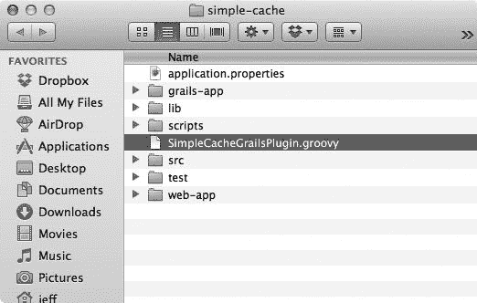

***图 12-1.** simple-cache 插件描述符*

##### 提供插件元数据

插件描述符具有多种用途。首要用途是让插件作者提供关于插件的元数据：作者姓名、版本号、描述等。代码清单 12-8 展示了 `SimpleCacheGrailsPlugin` 类以及用于提供这些信息的占位字段。

***代码清单 12-8.** SimpleCacheGrailsPlugin 插件描述符*

`class SimpleCacheGrailsPlugin {`
`    // 插件版本`
`    def version = "0.1"`
`    // 插件所适用的 Grails 版本`
`    def grailsVersion = "2.0 > *"`
`    // 该插件所依赖的其他插件`
`    def dependsOn = [:]`
`    // 从插件打包中排除的资源`
`    def pluginExcludes = [`
`        "grails-app/views/error.gsp"`
`    ]`

`    // TODO 填写这些字段`
`    def title = "Simple Cache Plugin" // 插件的标题显示名称`
`    def author = "Your name"`
`    def authorEmail = ""`
`    def description = '''\`
`插件的简要摘要/描述。`
`'''`

`    // 插件文档的 URL`
`    def documentation = "http://grails.org/plugin/simple-cache"`
`    ...`
`}`

当插件发布到 Grails 插件仓库时，诸如 `author`、`title` 等属性会出现在 `list-plugins` 和 `plugin-info` 命令的输出中。以下列表总结了可用的属性及其含义：

> *   `author`：插件作者的姓名
> *   `authorEmail`：作者的电子邮件联系地址
> *   `title`：插件的简短标题，将显示在 `list-plugins` 命令的右侧列中（参见代码清单 12-2）
> *   `description`：由 `plug-in-info` 命令显示的更长的详细描述
> *   `documentation`：指向插件文档位置的链接

此列表中的所有属性都是可选的；然而，提供这些信息将有助于他人理解您插件的用途。代码清单 12-9 展示了 `simple-cache` 插件的元数据信息。

***代码清单 12-9.** 提供元数据的 simple-cache 插件描述符*

`class SimpleCacheGrailsPlugin {`
`    // 插件版本`
`    def version = "0.1"`
`    // 插件所适用的 Grails 版本`
`    def grailsVersion = "2.0 > *"`
`    // 该插件所依赖的其他插件`
`    def dependsOn = [:]`
`    // 从插件打包中排除的资源`
`    def pluginExcludes = [`
`        "grails-app/views/error.gsp"`
`    ]`

`    // TODO 填写这些字段`
`    def title = "Simple Cache Plugin" // 插件的标题显示名称`
`    def author = "Jeff Brown"`
`    def authorEmail = "jbrown@vmware.com"`
`    def description = '''\`
`一个提供非常简单的缓存服务的演示插件。`
`此插件仅用于演示目的。对于严肃的`
`缓存需求，http://grails.org/plugins/cache 是一个真正的解决方案。`
`'''`

`    // 插件文档的 URL`
`    def documentation = http://grails.org/plugin/simple-cache`

`    ...`
`}`

#### 提供应用构件

插件增强现有应用的一个更明显的方式是提供新的构件，例如控制器、标签库或服务。

由于 Grails 插件本质上就是一个 Grails 应用，提供构件只需像在常规应用中一样创建它即可。对于 `simple-cache` 插件，您将实现一个提供应用层缓存的服务。为此，只需在插件根目录下使用 `create-service` 命令：

`$ grails create-service com.cache.Cache`

完成后，您将在 `grails-app/services/com/cache/CacheService.groovy` 位置获得一个新服务。由于这相当简单，您还将实现一个小型标签库来执行内容级缓存。要创建标签库，请运行 `create-tag-lib` 命令：

`$ grails create-tag-lib com.cache.Cache`

请注意，由于 Grails 插件就是一个 Grails 应用，您可以像运行 Grails 应用一样运行它！只需使用 `grails run-app` 命令，即可开始。这对插件开发者有显著的好处，因为插件开发与常规应用开发并无太大区别。您可以像运行常规应用一样运行您的插件，也可以像测试常规应用一样使用 `test-app` 命令测试您的插件。您甚至可以在插件中安装其他插件，这在开发依赖于其他插件的插件时至关重要。

至于 `CacheService` 和 `CacheTagLib`，我们稍后会讨论它们的实现细节。目前，您只需要知道，当您打包插件以供分发时，它将提供两个新的构件：一个标签库和一个服务。

#### 插件钩子

让我们回到插件描述符。除了提供关于插件的元数据外，描述符还允许您向插件运行时提供钩子。每个钩子都被定义为一个闭包属性，并允许插件参与插件生命周期的各个阶段。钩子按执行顺序列出如下：

> *   `doWithWebDescriptor`：此钩子接收由 Groovy 的 `XmlSlurper` 解析为 `GPathResult` 的 `web.xml` 文件的 XML。有关此钩子的更多信息，请参见本章后面的“修改生成的 WAR 描述符”部分。
> *   `doWithSpring`：此钩子允许参与 Grails 底层 Spring `ApplicationContext` 的运行时配置。有关更多信息，请参见“提供 Spring Bean”部分。
> *   `doWithDynamicMethods`：在 `ApplicationContext` 构建后执行，此钩子是插件用于向 Grails 类提供新行为的地方。有关更多信息，请参见本章后面的“使用元编程增强行为”部分。
> *   `doWithApplicationContext`：在 Grails `ApplicationContext` 构建后执行。`ApplicationContext` 实例作为第一个参数传递给此钩子。

默认情况下，您之前创建的 `simple-cache` 插件附带了所有这些钩子的空实现。如果您不打算实现任何这些钩子，可以直接从插件描述符中删除它们。代码清单 12-10 展示了各种插件钩子，正等待被实现。

 **注意** 如果您只想使用插件来提供应用模块化，可以直接跳到“打包和分发 Grails 插件”部分。接下来的几节将详细介绍如何挂接到 Grails 插件系统的各个方面。

***代码清单 12-10.** simple-cache 插件中的插件钩子*

`class SimpleCacheGrailsPlugin {`
`    def version = 0.1`
`    ...`
`    def doWithWebDescriptor = { xml -> }`
`    def doWithSpring = {}`

`    def doWithDynamicMethods = { applicationContext -> }`

`    def doWithApplicationContext = { applicationContext -> }`

`}`

##### 插件变量

在这些钩子的上下文中，存在多个隐式变量，允许你检查正在运行的 Grails 应用中的约定。以下是可用的变量及其相关描述：

> *   `application`：`org.codehaus.groovy.grails.commons.GrailsApplication` 类的一个实例；它提供关于已加载类及其内部约定的信息。
> *   `manager`：`org.codehaus.groovy.grails.plugins.GrailsPluginManager` 类的一个实例；它允许你发现已安装的其他 Grails 插件。
> *   `plugin`：对 `org.codehaus.groovy.grails.plugins.GrailsPlugin` 类的一个引用，它允许你查找关于该插件的各种信息，包括其名称、版本和依赖项。

如果你计划实现任何与 Grails 约定配合使用的钩子，理解 `GrailsApplication` 类通常最为关键。本质上，它定义了许多动态属性，这些属性映射到 Grails 应用中的每个概念。例如，要获取 `GrailsApplication` 中的控制器类列表，你可以这样做：

`def controllerClasses = application.controllerClasses`

请注意，当我们提到*类*时，我们指的不是 `Java.lang.Class` 接口的实例，而是 `org.codehaus.groovy.grails.commons.GrailsClass` 接口的实例，该接口定义了许多方法，用于检查 `GrailsApplication` 中特定工件类型的约定。

例如，给定之前创建的 `CacheService`，清单 12-11 演示了 `GrailsClass` 接口的一些方法及其行为方式。

***清单 12-11.** 使用 Grails 约定 API*

`GrailsClass serviceClass =`
`    application.getServiceClass("com.cache.CacheService")`
`assert "CacheService" == serviceClass.shortName`
`assert "Cache" == serviceClass.name`
`assert "com.cache.CacheService" == serviceClass.fullName`
`assert "cacheService" == serviceClass.propertyName`
`assert "cache" == serviceClass.logicalPropertyName`
`assert "com.cache" == serviceClass.packageName`
`assert true == serviceClass.getPropertyValue("transactional")`

你会在清单 12-11 中注意到使用了 `getServiceClass` 方法来按名称获取 `CacheService`。`getServiceClass` 方法是 `GrailsApplication` 类上可用的另一个动态方法。本质上，对于每种工件类型，`GrailsApplication` 类都提供了动态方法来访问该类型的工件，总结如下：

> *   `get*Classes`：获取特定工件类型的所有 `GrailsClass` 实例列表，例如使用 `getControllerClasses()` 或通过属性访问如 `controllerClasses`。
> *   `get*Class(String name)`：按名称获取特定的 `GrailsClass` 实例，例如 `getControllerClass("HelloController")`。
> *   `is*Class(Class theClass)`：查询给定的 `Java.lang.Class` 是否为特定的工件类型，例如 `isControllerClass(myClass)`。

上述方法名称中的星号是你感兴趣的相应工件类型的占位符。表 12-1 总结了不同的工件类型，并展示了每种类型的典型用法示例。

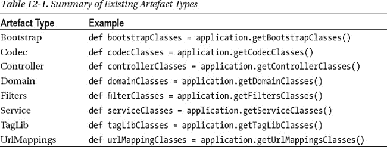

表 12-1 中的工件类型涵盖了现有的工件，但 Grails 也允许你添加自己的工件类型；我们将在下一节中讨论它们。

##### 自定义工件类型

Grails 开箱即用提供了一组特性，包括控制器、领域类等。正如你在上一节中看到的，你可以通过 `GrailsApplication` 接口访问所有这些方面。但是，如果你想添加一种新的工件类型呢？以现有的 Quartz 插件为例。Quartz 是一个作业调度 API，它按计划时间运行指定的任务。例如，你可能希望在每个月最后一个星期五的中午运行一些代码。Quartz 旨在解决这类情况。

看看现有的工件类型；它们都没有对作业这一概念进行建模。你如何扩展 Grails 并为其提供关于什么是作业的新知识？幸运的是，你可以在 Grails 的 `org.codehaus.groovy.grails.commons.ArtefactHandler` 接口中找到答案。清单 12-12 展示了 `ArtefactHandler` 接口的关键方法。

***清单 12-12.** ArtefactHandler 接口*

`public interface ArtefactHandler {`
`    String getType();`
`    boolean isArtefact(Class aClass);`
`    GrailsClass newArtefactClass(Class artefactClass);`
`}`

`getType()` 方法返回 `GrailsClass` 的类型，该类型将是表 13-1 第一列中显示的值之一。`isArtefact(Class)` 方法负责根据某些约定判断给定的类是否为当前工件类型。例如，该类是否以约定 *Controller* 结尾？如果是，那么它就是一个 `controller` 类。

`newArtefactClass(Class)` 方法将为给定的 `java.lang.Class` 创建一个新的 `GrailsClass` 实例。`ArtefactHandler` 接口还有其他方法，但其中大部分对你来说是抽象的，因为在实现自定义 `ArtefactHandler` 时，你通常会扩展 `org.codehaus.groovy.grails.commons.ArtefactHandlerAdapter` 类。看看清单 12-13，它展示了 Quartz 插件的一个可能实现。

***清单 12-13.** 用于 Quartz 插件的 ArtefactHandler*

`1 class JobArtefactHandler extends ArtefactHandlerAdapter {`
`2`
`3    static final TYPE = "Job"`
`4`
`5    JobArtefactHandler() {`
`6        super(TYPE, GrailsClass, DefaultGrailsClass, TYPE)`
`7    }`
`8`
`9    boolean isArtefactClass(Class clazz) {`
`10            // 类不应为空，且应以 Job 后缀结尾`
`11        if(!super.isArtefactClass(clazz)) return false`
`12            // 并且应有一个 execute 方法`
`13            return clazz.methods.find { it.name == 'execute' } != null`
`14    }`
`15 }`

在清单 12-13 的 `JobArtefactHandler` 中，有几个关键点需要注意。首先，看看第 5 到 7 行的构造函数：

`5    JobArtefactHandler() {`
`6        super(TYPE, GrailsClass, DefaultGrailsClass, TYPE)`
`7    }`

构造函数调用了 `super` 实现，传递了四个参数：

> *   *工件类型*：在此例中，你使用了一个名为 `TYPE` 的常量，其值为 `Job`。
> *   *用于工件类型的接口*：你可以扩展 `GrailsClass` 接口以提供更具体的接口，例如 `GrailsJobClass`。
> *   *工件类型接口的实现*：Grails 在 `DefaultGrailsClass` 中提供了一个默认实现，但如果你想在工件类型中提供自定义逻辑，可以继承此类。
> *   *类名应具有的后缀，以便将* `Java.lang.Class` *视为该工件类型*：`ArtefactHandlerAdapter` 中 `isArtefactClass` 方法的默认实现将对传入的 `Java.lang.Class` 执行检查，以确保类名以指定的后缀结尾。正如你在清单 12-13 的第 11 行所见，来自超类 `isArtefact` 方法的逻辑被重用了。

关于代码清单 12-13 中的代码，接下来需要注意`isArtefactClass(Class)`方法的实现。该方法通过调用父类的`isArtefactClass(Class)`实现来检查类是否以正确的后缀结尾，并判断该类是否包含`execute`方法。你可以通过编写一个简单的单元测试来验证对`JobArtefactHandler`行为的预期（参见代码清单 12-14）。

***代码清单 12-14.** 测试 ArtefactHandler*

`class JobArtefactHandlerTests extends GroovyTestCase {`
`    void testIsArtefact() {`
`        def handler = new JobArtefactHandler()`
`        assertTrue handler.isArtefactClass(TestJob)`
`        assertFalse handler.isArtefactClass(JobArtefactHandlerTests)`

`        GrailsClass jobClass = handler.newArtefactClass(TestJob)`
`        assertEquals "TestJob", jobClass.shortName`
`        assertEquals "Test", jobClass.name`
`        assertEquals "TestJob", jobClass.fullName`
`        assertEquals "testJob",jobClass.propertyName`
`        assertEquals "test",jobClass.logicalPropertyName`
`        assertEquals "", jobClass.packageName`
`    }`
`}`
`class TestJob {`
`    def execute() {}`
`}`

至此，还剩一件事要做。你需要将`ArtefactHandler`告知你的插件。假设你正在创建 Quartz 插件，并且有一个`QuartzGrailsPlugin`描述符。如果你添加一个包含已提供工件列表的`artefacts`属性，插件将使 Grails 识别`JobArtefactHandler`：

`def artefacts =  [new JobArtefactHandlerQ]`

因此，一旦安装了 Quartz 插件，如果`grails-app/jobs`目录中存在一个类似代码清单 12-15 的类，`JobArtefactHandler`就会将该类认定为“job”。

***代码清单 12-15.** Job 示例*

`class SimpleJob {`
`    def execute() {`
`        // 要执行的代码`
`    }`
`}`

完成这些步骤的一个额外好处是，`GrailsApplication`对象会突然识别出你刚刚添加的新工件类型。安装了假设的 Quartz 插件后，你可以使用代码清单 12-11 中首次展示的`GrailsApplication`对象上的所有动态方法。代码清单 12-16 演示了使用代码清单 12-15 中的`SimpleJob`的几个示例。

***代码清单 12-16.** 使用 GrailsApplication 对象检查 Job*

`def jobClasses = application.getJobClasses()`
`GrailsClass simpleJobClass = application.getJobClass("SimpleJob")`
`assert application.isJobClass(SimpleJob)`

本节要学习的关键点是，Grails 为你提供了一个*可扩展的*基于约定的 API。你完全不受现有约定的限制，可以轻松地将自己的想法融入其中。下一节将探讨“约定优于配置”（CoC）的理念如何扩展到 Spring 的运行时配置。

#### 提供 Spring Bean

`doWithSpring`钩子允许你使用 Grails 的`BeanBuilder`领域特定语言（DSL）为 Spring 指定在运行时配置的新 Spring Bean。Grails 完全构建在 Spring 框架之上。Grails 拥有所谓的`ApplicationContext`，它本质上是 Spring 提供的一个容器，用于容纳一个或多个 Bean。默认情况下，每个 Bean 都是单例的，这意味着在`ApplicationContext`中只有一个实例。

正如你在第 10 章中学到的，Grails 允许服务自动注入到控制器和标签库中。这种自动注入功能由 Spring 容器驱动，通常被称为*依赖注入*。这是一种极其强大的模式，它允许你有效地分离依赖关系及其构造。理论部分就到这里……现在让我们看一个示例。

之前，你在`simple-cache`插件中创建了一个名为`CacheService`的新服务。`CacheService`将与缓存提供程序协同工作，为`simple-cache`插件的任何用户提供应用层缓存。由于重新发明轮子并实现自己的缓存方案意义不大，因此你将利用 Ehcache 库。

插件可以通过`doWithSpring`向 Spring 应用上下文注册 Bean。代码清单 12-17 展示了如何定义一个`globalCache` Bean。

***代码清单 12-17.** 在 doWithSpring 中定义 Bean*

`class SimpleCacheGrailsPlugin {`
`    ...`
`    def doWithSpring = {`
`        globalCache(org.springframework.cache.ehcache.EhCacheFactoryBean) {`
`            timeToLive = 300`
`        }`
`    }`
`}`

Bean 的名称就是方法的名称，此处为`globalCache`。Bean 类是第一个参数，而作为最后一个参数传递的闭包允许你设置 Bean 的属性值。在此例中，配置了一个`globalCache` Bean，使其每 5 分钟（300 秒）使条目过期。

完成上述操作后，让我们开始实现`CacheService`。首先，你需要获取插件定义的`globalCache` Bean 的引用。为此，只需在`CacheService`中添加一个与 Bean 名称匹配的属性，如代码清单 12-18 所示。

***代码清单 12-18.** 获取由 doWithSpring 提供的 Bean*

`import net.sf.ehcache.Ehcache`
`class CacheService {`
`    static transactional = false`
`    Ehcache globalCache`
`    ...`
`}`

代码清单 12-18 中加粗显示了`globalCache`属性。请注意，已通过设置`static transactional = false`禁用了该服务的事务，因为此服务不需要事务。

现在让我们实现缓存逻辑。实现缓存时，典型的模式是从缓存中查找对象，如果对象不存在，则执行一些逻辑来获取要缓存的数据。代码清单 12-19 展示了此模式的伪代码。

***代码清单 12-19.** 缓存模式*

`def obj = cache.get("myentry")`
`if(!obj)   {`
`    obj = ...`
`    // 执行一些复杂任务来获取 obj`
`    cache.put("myentry", obj)`
`}`
`return obj`

然而，鉴于你可以使用闭包这一强大工具，利用它们来提出更优雅的解决方案更有意义。代码清单 12-20 展示了如何使用闭包实现整个逻辑块的缓存。

***代码清单 12-20.** 使用闭包缓存代码块的返回值*

`1 import net.sf.ehcache.Ehcache`
`2 import net.sf.ehcache.Element`
`3`
`4 class CacheService {`
`5    ...`
`6   def cacheOrReturn(Serializable cacheKey, Closure callable) {`
`7        def entry = globalCache?.get(cacheKey)?.getValue()`
`8        if(!entry) {`
`9             entry = callable.call()`
`10            globalCache.put new Element(cacheKey, entry)`
`11        }`
`12        return entry`
`13    }`
`14 }`

为了理解代码清单 12-20 中代码的作用，我们逐行分析一下。首先，在第 7 行，从 `globalCache` bean 中获取了一个条目，该 bean 是 `net.sf.ehcache.Ehcache` 类的一个实例：

`7      def entry = globalCache?.get(cacheKey)?.getValue()`

请注意，你可以使用 Groovy 的安全解引用操作符 `?.` 来确保在访问值时永远不会抛出 `NullPointerException`，即使 `globalCache` 属性为 `null` 也是如此！`globalCache` 实例的 `get` 方法返回一个 `net.sf.ehcache.Element` 实例，该实例有一个 `getValue()` 方法，你可以调用它来获取缓存的值。接下来，在第 8 行和第 9 行，代码检查返回的值是否为 `null`，如果是，则调用传入的闭包，该闭包返回需要缓存的结果：

`8        if(!entry) {`
`9            def entry = callable.call()`

在第 10 行，闭包调用的返回值用于将新的缓存条目放入缓存中：

`10 globalCache.put new Element(cacheKey, entry)`

最后，在第 12 行，无论是否是缓存版本，都会返回该缓存条目：

`12 return entry`

完成这些之后，让我们看看如何在代码清单 12-21 中实现一个可以利用 `CacheService` 的 `CacheTagLib`。

***代码清单 12-21.** 添加内容级缓存*

`class CacheTagLib {`
`    static namespace = "cache"`

`    CacheService cacheService`
`    def text = { attrs, body ->`
`        def cacheKey = attrs.key`
`        out << cacheService.cacheOrReturn(cacheKey) {`
`            body()`
`        }`
`    }`
`}`

再次说明，代码清单 12-21 展示了如何使用依赖注入在 `CacheTagLib` 中获取对 `CacheService` 的引用。然后使用 `cacheOrReturn` 方法，通过传递给 `text` 标签的 `key` 属性来缓存标签的 `body`。请注意，`CacheTagLib` 被放置在一个命名空间内，这是你在第 5 章中首次学到的概念。

`simple-cache` 插件的用户现在只需使用 `CacheTagLib` 提供的 `<cache:text>` 标签包裹他们想要缓存的标记代码主体，即可利用内容级缓存。代码清单 12-22 展示了其用法示例。

***代码清单 12-22.** 使用 simple-cache 插件提供的标签*

`<cache:text key="myKey">`
`    This is an expensive body of text!`
`</cache:text>`

#### 使用约定动态创建 Spring Bean

在上一节中，你使用在 Spring `ApplicationContext` 中注册的 Ehcache bean 实现了 `simple-cache` 插件。然而，这个示例并没有展示利用项目中的约定动态创建 bean 的能力。

在“自定义工件类型”部分，你探讨了如何创建一个能够识别 Quartz 任务的插件。在典型的 Spring 应用程序中，你需要使用 XML 或注解，通过 `org.springframework.scheduling.quartz.JobDetailBean` 类来配置每个单独的任务。而使用了解约定的 Grails 插件，你可以在运行时动态完成这一操作！代码清单 12-23 在 `QuartzGrailsPlugin` 插件描述符中展示了这一实际应用。

***代码清单 12-23.** 在运行时动态创建 Bean*

`1`  `import org.springframework.scheduling.quartz.* 2`
`3`  `class QuartzGrailsPlugin {`
`4      ...`
`5      def doWithSpring ={`
`6            application.jobClasses.each { GrailsClass job ->`
`7                 "${job.propertyName}"(JobDetailBean) {`
`8                  name = job.name`
`9                  jobClass = job.getClazz()`
`10               }`
`II           }`
`12           ...`
`13     }`
`14 }`

为了更好地理解代码清单 12-23 中的代码，我们逐步分析一下。首先，在第 6 行，使用 `each` 方法遍历所有类型为 `Job` 的工件：

`6      application.jobClasses.each { GrailsClass job ->`

然后，在第 7 行，利用 Groovy 使用 `String`（或 `GString`）作为方法名来调用方法的能力，动态创建了一个新的 bean：

`7      "${job.propertyName}"(JobDetailBean) {`

在这种情况下，给定代码清单 12-15 中的 `SimpleJob`，你最终会在 Spring `ApplicationContext` 中得到一个名为 `simpleJob` 的 bean，它是 Quartz `JobDetail` 类的一个实例。`JobDetailBean` 类是 Spring 提供的一个辅助类，用于创建作为 Spring bean 的 Quartz `JobDetail` 实例。最后，在第 8 行和第 9 行，使用 `GrailsClass` 接口的属性设置了任务的名称和任务的类：

`name = job.name`
`jobClass = job.getClazz()`

为了完成 Quartz 插件，你可以在 `doWithSpring` 中使用 Spring 的 `SchedulerFactoryBean` 为 `Scheduler`、触发器等进行 bean 设置。然而，由于这主要作为可行性演示，我们建议你查看 Grails 现有的优秀 Quartz 插件，该插件可通过以下命令安装：

`$ grails install-plugin quartz`

##### 使用元编程增强行为

在上一节中，您了解了插件如何参与 Spring `ApplicationContext` 的配置。现在，让我们看看插件通常贡献的另一个领域：应用程序行为。Groovy 是一种完全动态的语言，允许您通过其元编程 API 在运行时完全修改类的行为。

 **提示** 如果您想要一本详细介绍 Groovy 元编程能力的书籍，请参阅 Venkat Subramaniam 所著的 *Programming Groovy*（Pragmatic Programmers，2008 年）。

与 Smalltalk、Ruby、Lisp 和其他动态语言一样，Groovy 具有（元对象协议 MOP）。需要记住的关键点是，MOP 在运行时决定了 Groovy 代码的行为，因此在编译时看似执行一种操作的代码，可能被修改为执行完全不同的操作。对于 Groovy 知道的每个 `java.lang.Class`，都有一个关联的 `MetaClass`。`MetaClass` 决定了特定方法、构造函数或属性在运行时的行为方式。

Groovy 的 `MetaClass` 允许您向任何类添加方法、属性、构造函数和静态方法。例如，请考虑清单 12-24 中的代码。

***清单 12-24.** 向类添加新方法*

`class Dog {}`
`Dog.metaClass.bark = { "woof!" }`
`assert "woof!" == new Dog().bark()`

这里有一个名为 `Dog` 的简单类。`Dog` 类的实例本身无法吠叫。但是，通过使用 `MetaClass`，您可以使用以下表达式创建一个 `bark` 方法：

`Dog.metaClass.bark = { "woof!" }`

显然，这个例子只是触及了可能性的表面。Groovy 提供了大量与运行时元编程相关的功能，所有这些功能在 Grails 应用程序的上下文中都是可用的。

让我们通过尝试向所有控制器添加 `cacheOrReturn` 方法，以消除首先通过 Spring 注入服务的需要，来看一个 Grails 插件上下文中的示例。清单 12-25 演示了如何通过简单地委托给 `CacheService`，也可以向所有控制器添加一个 `cacheOrReturn` 方法。

 **提示** 如果您不想创建插件，但仍希望在 Grails 应用程序中进行元编程，我们建议您在 `Bootstrap` 类中执行此操作，这是第 12 章中涵盖的主题。

***清单 12-25.** 向所有控制器添加方法*

`class SimpleCacheGrailsPlugin {`
`    ...`
`    def doWithDynamicMethods = { applicationContext ->`
`        def cacheService = applicationContext.getBean("cacheService")`
`        application.controllerClasses*.metaClass*.cacheOrReturn = {`
`            Serializable cacheKey, Closure callable ->`

`            cacheService.cacheOrReturn(cacheKey, callable)`
`        }`
`    }`
`}`

关于清单 12-25 中的代码，另一个需要注意的重要方面是使用了 Groovy 的展开点运算符 `*.` 来从所有 `controllerClasses` 中获取所有 `MetaClass` 实例，以及使用展开赋值来为每个 `MetaClass` 创建一个 `cacheOrReturn` 方法。这比添加 `for` 或 `each` 循环要简单得多！

#### 插件事件与应用程序重载

除了“插件钩子”部分讨论的插件钩子之外，插件还可以参与许多事件，包括应用程序重载事件。Grails 旨在最大限度地减少开发期间所需的应用程序重启次数。然而，由于重载通常因每种工件类型而异，因此重载的责任被委托给了插件。

一个插件基本上可以监听三个核心事件：`onChange`、`onConfigChange` 和 `onShutdown`。让我们先看看 `onChange`，因为它是插件处理的最常见事件。每个单独的插件都可以监视一组资源。这些资源由一个名为 `watchedResources` 的属性定义。例如，作为 Grails 核心的一部分，有一个插件通过使用 `grails-app/i18n` 目录中的消息包来提供国际化支持（在第 7 章中介绍）。`i18n` 插件将其 `watchedResources` 属性定义如下：

`def watchedResources = "file:./grails-app/i18n/*.properties"`

这意味着 `i18n` 插件将监视 `grails-app/i18n` 目录中所有以 `.properties` 文件扩展名结尾的文件。

 **提示** 如果您想知道 `watchedResources` 属性使用的文件匹配模式，请查看 Spring 的 `org.springframework.core.io.support.PathMatchingResourcePatternResolver` 类，以及一般的 Spring Core IO 包，Grails 在底层使用了这些。

每当 `grails-app/il8n` 目录中的某个属性文件发生更改时，Grails 将自动触发监视该文件的插件的 `onChange` 事件，并传入一个更改 `event` 对象。`event` 对象本质上只是一个包含以下条目的映射：

> *   `source`：事件的来源，可以是代表磁盘上文件的 Spring `org.springframework.core.io.Resource` 实例，也可以是重新编译并更改后的 `Java.lang.Class` 实例（如果 `watchResources` 属性引用的是 Groovy 类）
> *   `application`：对 `GrailsApplication` 实例的引用
> *   `manager`：对 `GrailsPluginManager` 实例的引用
> *   `ctx`：对 Spring `ApplicationContext` 实例的引用

通常，`event` 映射中最重要的条目是 `source`，它包含对更改来源的引用。对于 `i18n` 插件，`source` 条目将引用一个 Spring `org.springframework.core.io.Resource` 实例，因为 `i18n` 插件监视的属性文件不是 Groovy 类。但是，如果您开发的插件选择监视 Groovy 类，Grails 将自动重新编译更改后的类，并将更改后的类放入 `event` 映射的 `source` 条目中。

考虑前面章节讨论的 Quartz 插件。该插件的 `watchedResources` 定义如下所示：

`def watchedResources = "file:./grails-app/jobs/**/*Job.groovy"`

每当某个 Groovy 文件发生更改时，Grails 将重新编译该类，并向您传递一个代表该任务的 `java.lang.Class` 实例的引用。然而，这就是 Grails 所做的全部工作。然后，您需要自行对正在运行的应用程序进行任何您认为必要的更改，以确保其处于正确的状态。例如，在“使用约定的动态 Spring Bean”部分中，您看到了如何为每个任务类动态注册新的 `JobDetail` bean。为了正确实现 Quartz 插件的重载，您需要确保这些 bean 被新类替换。清单 12-26 展示了一个假设的实现，该实现获取新重新编译的类，并使用 `ApplicationContext` 注册新的 bean。

***清单 12-26.** 为 Quartz 插件实现 onChange*

`1`  `class QuartzGrailsPlugin {`
`2     def watchedResources = "file:./grails-app/jobs/**/*Job.groovy"`
`3     ...`
`4`
`5` `     def onChange = { event ->`
`6          Class changedJob = event.source`
`7          GrailsClass newJobClass = application.addArtefact(changedJob)`
`8          def newBeans = beans {`
`9` `             "${newJobClass.propertyName}"(JobDetailBean) {`
`10             name = newJobClass.name`
`11             jobClass = newJobClass.getClazz()`
`12` `        }`
`13         }`
`14         newBeans.registerBeans(applicationContext)`
`15     }`
`16 }`

虽然这段代码很短，但它包含了不少需要理解的新概念。让我们从第 6 行开始逐一讲解，这里获取了事件 `source` 的引用：

`6 Class changedJob = event.source`

拿到 `source` 后，`onChange` 事件做的下一件事是通过调用 `addArtefact` 方法，将新的 `Class` 注册到 `GrailsApplication` 实例中：

`7      GrailsClass newJobClass = application.addArtefact(changedJob)`

第 8 行的代码相当有趣。这里使用了隐式的 `beans` 方法；它接收一段代码块，该代码块使用了“提供 Spring Bean”一节中讨论的 `BeanBuilder` 语法。`beans` 方法返回一个包含 Bean 定义（但不包含实例化后的 Bean 本身）的 `BeanBuilder` 实例：

`8      def newBeans = beans {`

第 8 到 13 行的代码本质上与清单 12-26 相同；所有代码所做的就是根据新类创建一个新的 `JobDetailBean` Bean 定义。第 14 行则更有趣；它展示了如何使用 `BeanBuilder` 类的 `registerBeans` 方法，将 `BeanBuilder` 实例中定义的所有 Bean 定义注册到所提供的 `ApplicationContext` 中：

`14 newBeans.registerBeans(applicationContext)`

当然，并非所有插件都需要根据 `onChange` 事件来注册新的 Bean。只有当你在 `doWithSpring` 闭包中注册了需要重新加载行为的 Bean 时，这才是一个需求。也许可以配合现有的 Bean 来实现插件的有效重新加载。例如，前面讨论过的 i18n 插件只是清除了 `MessageSource` 缓存，强制其重建：

`def messageSource = applicationContext.getBean("messageSource")`
`if (messageSource instanceof ReloadableResourceBundleMessageSource) {`
`    messageSource.clearCache()`
`}`

除了 `onChange` 事件，另外两个可用的事件是 `onConfigChange` 和 `onShutdown`。如果用户更改了位于 `grails-app/conf/Config.groovy` 的 Grails 全局配置文件，则会触发 `onConfigChange` 事件。对于 `onConfigChange` 事件处理器，变更事件的 `source` 是修改后的 `ConfigObject`。通常，插件依赖 `Config.groovy` 中的设置进行配置。请记住，Grails 使用约定*优于*配置，这意味着使用约定来简化开发，但在需要时仍然可以进行配置。本章稍后你将看到一个使用 Grails `ConfigObject` 的示例，该对象可通过 `GrailsApplication` 类的 `getConfig()` 方法获取。

最后，当调用 `GrailsPluginManager` 的 `shutdown()` 方法时，会触发 `onShutdown` 事件。例如，当 Grails 应用从容器中取消部署，并且调用了 Grails Servlet 的 `destroy()` 方法时，就会发生这种情况。

#### 修改生成的 WAR 描述符

如第 12 章所述，Grails 用于与 Servlet 容器集成的 `web.xml` 文件是以编程方式生成的。你在第 12 章中看到，可以通过使用 `install-templates` 命令来修改用于生成 `web.xml` 的模板。然而，插件也可以通过使用 `doWithWebDescriptor` 钩子以编程方式修改 `web.xml`。

本质上，当生成 `web.xml` 文件时，它会被 Groovy 的 `DOMBuilder` 解析到内存中。这个解析器会创建 XML 的内存表示，你可以对其进行修改。`doWithWebDescriptor` 钩子会将 XML 的引用作为第一个参数传递给 `doWithWebDescriptor` 闭包。`XmlSlurper` 允许你使用类似构建器的语法来对 XML 进行修改。

举个例子，Grails 的核心插件之一是 URL 映射插件，它提供了第 6 章中介绍的功能。该插件通过提供一个 Servlet 过滤器，将请求重写到主 Grails Servlet 上来工作。为了将这个 Servlet 过滤器添加到组合中，URL 映射插件的 `doWithWebDescriptor` 实现看起来类似于清单 12-27 中的代码。

***清单 12-27.** 添加新 Servlet 过滤器的 doWithWebDescriptor 示例*

`1  def doWithWebDescriptor = { webXml ->`
`2      def filters = webXml.filter`
`3      def lastFilter = filters[filters.size()-1]`
`4      lastFilter + {`
`5          filter {`
`6              'filter-name'('urlMapping')`
`7              'filter-class'(UrlMappingsFilter.getName())`
`8          }`
`9      }`
`10     ...`
`11 }`

为了理解清单 12-27 中的代码在做什么，让我们逐行分析。首先，在第 2 行，使用 GPath 表达式获取 `web.xml` 文件中所有现有 `<filter>` 元素的列表：

`def filters = webXml.filter`

然后，在第 3 行，获取列表中最后一个 `<filter>` 元素的引用：

`def lastFilter = filters[filters.size()-1]`

从前两个例子可以看出，使用 Groovy 的 XML API 与使用 Java XML 解析器完全不同。由 `XmlSlurper` 解析的 XML 对象几乎感觉像是一等对象，几乎看不出底层数据结构实际上是 XML。最后，在第 4 到 9 行，使用重载的 `+` 运算符，在最后一个 `<filter>` 元素之后直接添加一个新的 `<filter>` 元素：

`4 lastFilter + {`
`5     filter {`
`6          'filter-name'('urlMapping')`
`7          'filter-class'(UrlMappingsFilter.getName())`
`8     }`
`9 }`

请注意，在 Groovy 中，你可以使用字符串作为方法名；例如，你可以选择一个惯用的 XML 元素名称（如 `<filter-name>`）作为方法名。上述代码会将以下等效的 XML 片段附加到 `web.xml` 文档中：

`<filter>`
`<filter-name>urlMapping</filter-name>`
`<filter-class>`
`org.codehaus.groovy.grails.web.mapping.filter.UrlMappingsFilter`
`</filter-class>`
`</filter>`

如你所见，Grails 使得参与 `web.xml` 文件的生成变得非常容易。虽然在插件中这不是常见操作，但当你想要集成遗留的 Servlet、过滤器等时，它有时会很有用。如前所述，你可以使用 `grails install-templates` 命令并直接修改 `web.xml` 模板，但此技术允许你创建自动为你完成此配置的插件。减少配置并拥抱简单性，正是 Grails 的方式，而 `doWithWebDescriptor` 只是另一个例证。

#### 打包与分发 Grails 插件

当你确信插件已准备好分发时，可以使用 `grails package-plugin` 命令进行打包。在命令窗口中，只需在插件项目的根目录下输入 `grails package-plugin`，如清单 12-28 所示。

***清单 12-28.** 打包插件*

`$ grails package-plugin`
`  ...`

`| Plugin packaged grails-simple-cache-0.1.zip`

从清单 12-28 的输出可以看出，`package-plugin` 命令会根据插件的名称和版本号生成一个 zip 文件。在此例中，你打包的是之前开发的 `simple-cache` 插件。图 12-2 展示了生成的 zip 文件示例。

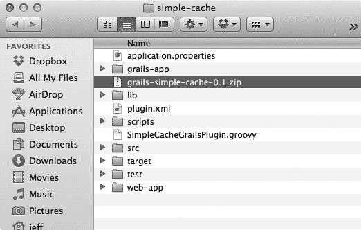

***图 12-2.** simple-cache 插件打包后的 zip 文件*

按照本章前面“插件安装”部分介绍的步骤，你现在可以将 `simple-cache` 插件安装到其他应用程序中，并使用它提供的标签库和服务。

如果你想将插件分发到 Grails 中央仓库，首先需要获取一个 Grails 中央仓库的插件开发者账户。你可以在 Grails 网站 [`http://grails.org/Creating+Plugins`](http://grails.org/Creating+Plugins) 上找到相关步骤。

获得账户后，你可以使用 release 插件提供的 `publish-plugin` 命令将插件发布到 Grails 中央仓库。

`$ grails publish-plugin`

`publish-plugin` 命令需要你的授权凭证才能发布到仓库。这些凭证应在 `$HOME/.grails/settings.groovy` 中定义，如清单 12-29 所示。

***清单 12-29.** 插件仓库凭证*

`// ~/.grails/settings.groovy`
`grails.project.repos.grailsCentral.username = 'your username'`
`grails.project.repos.grailsCentral.password = 'your password'`

`publish-plugin` 命令会为你完成所有繁重的工作，确保适当的资源已发布到仓库并正确标记。该命令还会生成一个更新的插件列表，以便每当 Grails 用户输入 `list-plugins` 命令时，你的插件都会出现。

#### 本地插件仓库

如果你想在自己的本地网络上利用 Grails 的插件分发和发现机制，可以设置一个本地插件仓库。Grails 插件仓库目前由兼容 Maven 的仓库支持。可以使用 Nexus 和 Artifactory 等工具来帮助管理这些仓库。一旦你启动并运行了一个兼容 Maven 的仓库，就需要配置 release 插件，使其了解你的仓库。方法是在 `BuildConfig.groovy` 中为每个要交互的仓库定义一个属性（参见清单 12-30）。

***清单 12-30.** 在 BuildConfig.groovy 中配置 Maven 仓库*

`grails.project.repos.myRepo.url = "http://localhost:8081/myRepo"`
`grails.project.repos.myRepo.type = "maven"`
`grails.project.repos.myRepo.username = "admin"`
`grails.project.repos.myRepo.password = "password"`
`grails.project.repos.myRepo.portal = "grailsCentral"`

`grails.project.repos.myOtherRepo.url = "http://localhost:8081/myOtherRepo"`
`grails.project.repos.myOtherRepo.type = "maven"`
`grails.project.repos.myOtherRepo.username = "admin"`
`grails.project.repos.myOtherRepo.password = "password"`
`grails.project.repos.myOtherRepo.portal = "grailsCentral"`

现在你已经配置好系统，使其了解你自己的 Maven 仓库，就可以发布到这些仓库了，如清单 12-31 所示。

***清单 12-31.** 发布到自定义仓库*

`grails publish-plugin –-repository=myRepo`
`grails publish-plugin –-repository=myOtherRepo`

release 插件还支持发布到本地 Maven 缓存。这不需要任何仓库服务器，而是直接安装到文件系统的 `$HOME/.m2/` 目录下。`maven-install` 命令会将插件发布到本地 Maven 缓存。为了让应用程序能够解析已安装到本地 Maven 缓存的插件，需要在 `BuildConfig.groovy` 中将 `mavenLocal()` 配置为一个仓库，如清单 12-32 所示。

***清单 12-32.** 将本地 Maven 缓存配置为仓库*

`grails.project.dependency.resolution = {`
`    ...`
`    repositories {`
`        mavenLocal()`
`        ...`
`    }`
`    ...`
`}`

至此，我们对插件系统的介绍就结束了。你已经了解了如何以多种不同方式利用插件系统。本节涉及了一些插件的思路，包括 `simple-cache` 插件和 Quartz 插件，但插件系统是 Grails 生态系统中如此关键的一部分，以至于学到的知识应该得到进一步应用。在下一节中，你将运用目前所学的内容，为 gTunes 应用程序创建两个新插件。在此过程中，你将发现 Grails 中的插件既可以作为扩展现有应用程序功能的一种方式，也可以作为有效模块化代码库的一种方式。

### 插件实战

你已经了解了什么是插件以及创建插件的基础知识。现在是时候通过为 gTunes 应用程序开发几个插件来将这些知识付诸实践了。你要创建的第一个插件是将你在第 8 章中开发的专辑封面服务和标签库变成一个可重用的插件。这是开发插件以添加功能并增强行为的绝佳示例。

#### 通过插件添加行为

首先，运行 `create-plugin` 命令来创建一个 `album-art` 插件的基础结构：`$ grails create-plugin album-art`。下一步是将 `AlbumArtService.groovy` 文件和 `AlbumArtTagLib.groovy` 文件移动到新创建的插件项目中。完成后，你的插件结构应如图 12-3 所示。

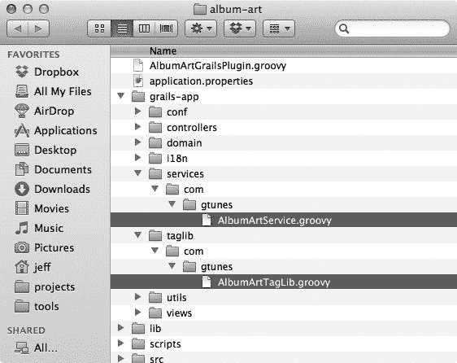

***图 12-3.** album-art 插件的结构*

请记住，`AlbumArtService` 类使用了由 `rest-client-builder` 插件提供的 `RestBuilder` 类。这个插件依赖需要在 `album-art` 插件的 `BuildConfig.groovy` 中声明；一旦 `album-art` 插件安装在应用程序中，就可以从应用程序的 `BuildConfig.groovy` 中移除对 `rest-client-builder` 的依赖。此外，别忘了将覆盖 `AlbumArtService` 和 `AlbumArtTagLib` 的两个测试从应用程序移动到插件中。如前所述，插件的妙处在于它们可以独立开发和测试，因此对于拥有多个开发人员的大型项目非常有用。将 `AlbumArtServiceTests` 和 `AlbumArtTagLibTests` 测试用例包含在 `album-art` 插件中后，你现在就可以通过运行 `test-app` 命令立即测试插件是否正常工作。

一旦测试通过，你就可以将描述插件用途的元数据添加到插件描述符中。清单 12-33 展示了更新后的插件描述符及其元数据。

***清单 12-33.** 为 album-art 插件提供元数据*

`class AlbumArtGrailsPlugin {`
`    def version = 0.1`
`    def author = "Joe Someone"`
`    def authorEmail = "joe@company.com"`
`    def title = "Album art look-up plugin"`
`    def description = 'A plug-in that provides facilities to look-up album art'`
`    ...`
`}`

为了进一步增加趣味性，你将进行一些元编程——首先，向所有控制器添加一个 `getAlbumArt` 方法；其次，允许 gTunes 应用程序中的 `Album` 类实例通过调用 `getArt()` 方法来检索其封面图片。第一种情况，如清单 12-34 所示，展示了必要的代码，它只是获取 `AlbumArtService` 实例，并向所有控制器添加一个委托给 `AlbumArtService` 的方法。

***清单 12-34.** 向所有控制器添加 getAlbumArt 方法*

`class AlbumArtGrailsPlugin {`
`    ...`
`    def doWithDynamicMethods = { ctx ->`
`        def albumArtService = ctx.getBean("albumArtService")`
`        application.controllerClasses*.metaClass*.getAlbumArt = { String artist, String album ->`
`            return albumArtService.getAlbumArt(artist, album)`
`        }`
`    }`
`}`

向 `Album` 类添加 `getArt()` 方法稍微复杂一些，因为插件对 `Album` 类一无所知。因此，为了实现这一增强功能，你将在 `GrailsApplication` 实例中搜索一个名为 `Album` 的领域类，如果存在，则向其添加 `getArt()` 方法。清单 12-35 展示了 `doWithDynamicMethods` 插件钩子的修改内容。

***清单 12-35.** 向所有控制器添加 getAlbumArt 方法*

`class AlbumArtGrailsPlugin {`
`  ...`
`  def doWithDynamicMethods = { ctx ->`
`    ...`
`    def albumClass = application.domainClasses.find { it.shortName == 'Album' }`
`    if(albumClass) {`
`      albumClass.metaClass.getArt ={->`
`        albumArtService.getAlbumArt(delegate.artist?.name,`
`                                    delegate.title)`
`      }`
`    }`
`  }`
`}`

请注意，在新的 `getArt` 方法体内，你可以使用闭包的 `delegate` 来获取 `artist` 和 `title`。在此上下文中，闭包的 `delegate` 属性等同于常规方法中的 `this`。有了清单 12-35 中的代码，你现在就可以使用清单 12-36 所示的代码来获取 `Album` 实例的封面图片 URL。

***清单 12-36.** 使用 getArt() 方法获取封面图片*

`def album = Album.get(10)`
`println "The art for this album is at ${album.art}"`

请注意，在 Groovy 中，遵循 Bean 约定的方法可以通过属性访问符号来访问，因此表达式 `album.art` 等同于 `album.getArt()`。至此，你已经完成了 `album-art` 插件。

### 在文件系统上指定插件位置

在本书中，你已经多次将插件安装到 gTunes 应用程序中，这通常是通过在 `BuildConfig.groovy` 的插件部分声明依赖来完成的。这是声明插件依赖最常见的方式，但并非唯一方式。应用程序可以声明对文件系统上任何位置的插件的依赖，即使该插件从未被打包或安装到仓库中。这对于你拥有插件源代码并希望在开发应用程序的同时积极开发插件的情况非常有用。声明此类依赖的方式是在 `BuildConfig.groovy` 中定义一个属性，属性名格式为 `grails.plugin.location.<插件名称>`，分配给该属性的值是文件系统上包含插件项目源代码的目录路径（参见清单 12-37）。

***清单 12-37.** 将 album-art 插件安装到 gTunes 中*

`grails.plugin.location.'album-art'='../album-art'`
`...`
`grails.project.dependency.resolution = {`
`    ...`
`}`

请注意，分配给该属性的值是“`../album-art`”，这是一个相对路径；该路径相对于 gTunes 应用程序的根目录。要使此功能生效，`album-art` 插件和 gTunes 应用程序目录需要共享一个父目录。另外，请注意 `grails.plugin.location.'album-art'` 属性名的一部分被引用了；这是因为插件名称中包含连字符。连字符在 Groovy 中不是有效的标识符字符；编译器看到它时会认为你在尝试进行减法运算。Groovy 提供了一种简单的方法来解决这个问题，即引用包含无效字符（即连字符）的属性名。

现在你可以启动 gTunes 应用程序，它的行为将与之前完全相同，只是它现在使用的是 `album-art` 插件的功能！关于 `album-art` 插件，需要注意的一点是，尽管它以服务、标签库和新方法的形式提供了新功能，但它并非一个完全自包含的应用程序。我们将在下一节中探讨如何实现这一点。

#### 用于应用模块化的插件

除了能够扩展 Grails 应用中的可用 API 之外，插件还提供了完整的应用功能模块。许多新手认为插件只适用于那些愿意深入核心 Grails API 的插件开发者，但实际上，插件是实现应用模块化的一种极其有效的方式。在本节中，你将学习如何创建一个完整的应用作为插件，并将其安装到 gTunes 应用中。

为简单起见，让我们处理一个在 Grails 相关的截屏和演示中非常常见的应用：博客。是的，与任何有自尊的现代 Web 应用一样，gTunes 应用也需要一个博客，gTunes 商店的运营者可以在其中发布关于新音乐、活动等重大公告。幸运的是，一个简单的博客并不太复杂；在 Grails 中实现它大约只需要五分钟。

第一步是运行 `create-plugin` 命令来创建博客插件：

`$ grails create-plugin blog`

这将创建 `blog` 插件及其关联的 `BlogGrailsPlugin` 描述符。你可以用一些插件元数据填充该描述符。清单 12-38 展示了一个示例 `blog` 插件描述符。

***清单 12-38.** 向博客插件添加元数据*

`class BlogGrailsPlugin {`
`    def version = 0.1`
`    def author = "Joe Someone"`
`    def authorEmail = "joe@company.com"`
`    def title = "A blogging plugin"`
`    def description = 'A plugin that provides a blog facility'`
`    ...`
`}`

现在是时候创建一个对博客文章进行建模的领域类了：

`$ grails create-domain-class com.blog.Post`

思考一下 `Post` 领域类，它将包含一些显而易见的内容，比如标题和正文，以及发布日期。将其付诸实践，清单 12-39 展示了包含必要属性的 `Post` 领域类。

***清单 12-39.** 包 com.blog 中的 Post 领域类*

`class Post {`
`    String title`
`    String body`
`    Date dateCreated`
`    Date lastUpdated`
`    static constraints = {`
`        title blank:false`
`        body type:"text", blank:false`
`    }`
`}`

请注意，`Post` 领域类使用了属性名 `dateCreated` 和 `lastUpdated`，以利用 Grails 中的自动时间戳功能，该功能首次在第 9 章中讨论过。有了合适的领域类，为了帮助你入门，你可以使用脚手架快速为 `Post` 领域类生成控制器和视图：

`$ grails generate-all com.blog.Post`

对于博客插件的第一个版本，你只打算支持创建新条目；因此，你可以删除生成的 `edit`、`update` 和 `delete` 操作。此外，你只需要显示前五篇文章；因此，你可以使用 `Post` 类的静态 `list` 方法的 `max` 参数来指定这一点。清单 12-40 展示了 `PostController` 的完整代码。

***清单 12-40.** 博客插件的 PostController*

`package com.blog`

`class PostController {`

`    // 仅允许通过 POST 请求访问 save 操作`
`    static allowedMethods = [save: 'POST']`

`    def index() {`
`        redirect(action:list,params:params)`
`    }`

`    def list() {`
`        [ postList: Post.list( max:5) ]`
`    }`

`    def create() {`
`        [post: new Post(params) ]`
`    }`

`    def save() {`
`        def post = new Post()`
`        post.properties['title', 'body'] = params`
`        if(!post.hasErrors() && post.save()) {`
`            flash.message = "Post ${post.id} created"`
`            redirect(action:list)`
`        } else {`
`            render(view:'create',model:[post:post])`
`        }`
`    }`
`}`

现在让我们转到视图。对于 `blog` 插件来说，`list.gsp` 视图是最重要的，因为它将负责显示每条博客条目。然而，Grails 中的默认脚手架将列表视图显示为表格，这在当前情况下不太有用。你可以通过修改 `list.gsp` 视图来渲染一个 `_post.gsp` 模板来解决这个问题。清单 12-41 展示了更新后的 `list.gsp` 代码。

***清单 12-41.** 博客插件的 list.gsp 视图*

`<html>`
`<head>`
`<meta http-equiv="Content-Type" content="text/html; charset=UTF-8"/> <meta name="layout"`
`content="${params.layout ?: 'main'}" /> <title>Post List</title>`
`</head>`
`<body>`
`
`
``
`<g:link class="create" action="create">New Post</g:link>  
 
`
`<h1>${grailsApplication.config.blog.title ?: 'No Title'}</h1>`
`<g:render plugin="blog"`
`template="post" var="post"`
`collection="${postList?.reverse()}" /> 
 </body> </html>`

关于清单 12-41 中的 `list.gsp` 视图，有几点关键内容需要提及。首先，请注意，当在插件视图中使用 `<g:render>` 标签渲染模板时，你*必须*指定该模板所属的插件；否则，Grails 将尝试在其安装到的应用中解析该模板。其次，请注意使用 `grailsApplication` 变量来指定博客标题：

`<h1>${grailsApplication.config.blog.title ?: 'No Title'}</h1>`

这里，隐式的 `grailsApplication` 对象用于从 `grails-app/conf/Config.groovy` 文件中读取配置设置。如果在 `Config.groovy` 中指定了名为 `blog.title` 的设置，那么视图将使用该设置。因此，该插件的用户能够根据自己的需求配置博客。另一种实现方式是使用 `<g:message>` 标签，在这种情况下，插件用户需要在 `grails-app/i18n/messages.properties` 文件中指定消息。选择权在你手中。

最后，请注意 HTML 的 `<meta>` 标签，它决定了 `list.gsp` 使用哪种布局：

`<meta name="layout" content="${params.layout ?: 'main'}" />`

如果 `params` 对象中存在 `layout` 参数，此标签将使用该参数作为布局；否则，它将使用 `main` 布局。当然，`main` 布局会解析为 `grails-app/views/layouts/main.gsp`，但为什么要允许通过参数进行自定义呢？这里的想法是，插件的用户可以通过 URL 映射非常轻松地自定义博客的布局。例如，考虑清单 12-42 中的 URL 映射。

***清单 12-42.** 使用 URL 映射自定义博客插件的布局*

`class BlogUrlMappings {`
`    static mappings = {`
`        '/blog'(controller: 'post', action: 'list') {`
`            layout = 'funky'`
`        }`
`    }`
`}`

如果你将清单 12-42 中的 URL 映射添加到你的 `grails-app/conf/BlogUrlMappings.groovy` 文件中，用户就可以访问 `/blog` URL，并执行 `PostController` 的 `list` 操作，进而渲染 `list.gsp` 视图。然而，请注意在传递给 URL 映射定义的闭包体内设置了一个名为 `layout` 的属性。正如你在第 6 章中学到的，可以通过这种方式传递参数。结果是，对于 `/blog` 映射，将使用名为 `grails-app/views/layouts/``funky.gsp` 的布局！这是一个非常强大的模式，因为它允许你通过将新的 URL 映射应用于相同的控制器和操作来应用不同的布局。

至于清单 12-41 中 `<g:render>` 方法使用的 `_post.gsp` 模板，它非常简单，只是适当地格式化每个 `Post` 实例。你可以在清单 12-43 中看到 `_post.gsp` 模板的代码。

***清单 12-43.** _post.gsp 模板*

`
 <h2>${post.title}</h2> 
`
`${post.body} 
`
`
`
`发布于 <g:formatDate date="${post.dateCreated}" format="dd MMMMMM yy" /> 
`
`
`

至此，你已经基本完成了 `list.gsp` 视图。图 12-4 展示了当你运行 `blog` 插件并访问 `PostController` 的 `list` 操作时，`list.gsp` 视图的显示效果。

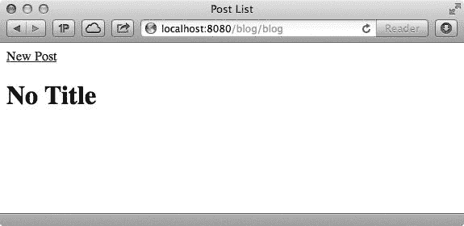

***图 12-4.** 博客插件的列表视图*

由于视图直接在 `list.gsp` 中渲染每个 `Post`，`show.gsp` 视图已变得多余，可以删除。同样，在第一个版本中，你只关心创建新帖子，因此 `edit.gsp` 也可以删除。你随时可以在后续版本中添加编辑功能！

接下来看 `create.gsp` 视图，它也需要稍作清理。此外，如果能提供富文本编辑功能来撰写帖子，那就更好了。Grails 可用的插件之一是 `CKEditor` 插件，它增加了对 CKEditor（[`http://ckeditor.com`](http://ckeditor.com)）的支持，这是一个富文本编辑组件。要将 `CKEditor` 插件安装到 `blog` 插件中，需要在 `BuildConfig.groovy` 中添加相应的依赖，如清单 12-44 所示。

***清单 12-44.** 添加对 CKEditor 的依赖*

`grails.project.dependency.resolution = {`

`    ...`

`    plugins {`
`        runtime ":ckeditor:3.6.3.0"`
`        ...`
`    }`
`}`

完成上述操作后，让我们在 `_form.gsp` 中使用 `CKEditor` 插件提供的 `<ckeditor:editor>` 标签来启用 CKEditor。清单 12-45 展示了更新后的 `_form.gsp` 文件，其中 `<ckeditor:editor>` 标签的使用已用粗体突出显示。

***清单 12-45.** 使用 CKEditor 启用富文本编辑*

`<%@ page import="com.blog.Post" %>`

`
`
`    <label for="title">`
`        <g:message code="post.title.label" default="标题" />`
`    </label>`
`    <g:textField name="title" value="${postInstance?.title}" />`
`
`

`
`
**`    <ckeditor:editor name="body" height="300" width="500">`**
**`        ${postInstance?.body}`**
**`    </ckeditor:editor>`**
`
`

使用 `<ckeditor:editor>` 标签，你可以指定只需要一个包含基本格式选项的简单工具栏；否则，你会得到一个几乎与 Microsoft Word 等文字处理器一样多选项的工具栏。插件文档位于 [`http://grails.org/plug-in/ckeditor`](http://grails.org/plug-in/ckeditor)，涵盖了所有配置选项。图 12-5 展示了 `create.gsp` 视图，其中 `<ckeditor:editor>` 标签负责渲染富文本编辑组件。

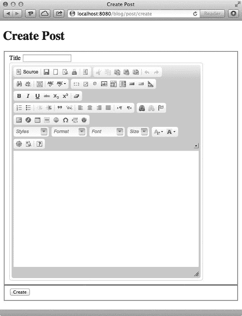

***图 12-5.** 使用 CKEditor 创建帖子*

当然，目前 `list.gsp` 和 `create.gsp` 页面看起来都相当平淡无奇，但这取决于你安装 `blog` 插件的应用程序，通过 CSS 提供有用的样式信息。说到将 `blog` 插件安装到应用程序中，现在正是时候！在 gTunes 的 `BuildConfig.groovy` 文件中，使用与之前表达对 `album-art` 插件依赖相同的技术，来表达对该插件的依赖，如清单 12-46 所示。

***清单 12-46.** 将 blog 插件安装到 gTunes 中*

`grails.plugin.location.blog='../blog'`
`...`
`grails.project.dependency.resolution = {`
`    ...`
`}`

请记住，`blog.title` 设置允许你自定义博客标题；只需在 `Config.groovy` 中添加以下设置即可：

`// 博客配置 blog.title="The gTunes Weblog"`

使用 `run-app` 命令运行 gTunes 应用程序，然后导航到 URL [`http://localhost:8080/gTunes/post/list`](http://localhost:8080/gTunes/post/list)。神奇的是，`blog` 插件已经在 gTunes 应用程序中运行，并且与之前完全一样——只不过现在它利用了 gTunes 应用程序的主布局。点击“新建帖子”按钮将带你进入之前开发的 `create.gsp` 视图。图 12-6 展示了在 gTunes 应用程序中运行的 CKEditor 组件。

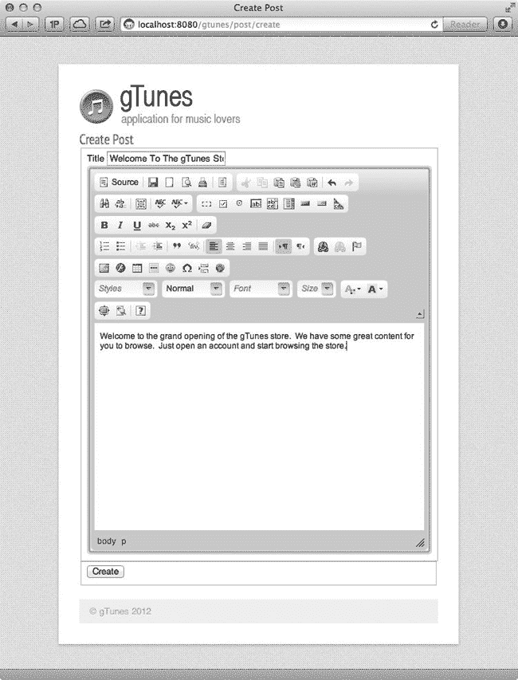

***图 12-6.** 在 gTunes 应用程序中创建博客帖子*

如果你输入一些内容，包括标题和正文，然后点击“发布”按钮，你将能够在 gTunes 应用程序博客上创建新帖子，如图 12-7 所示。

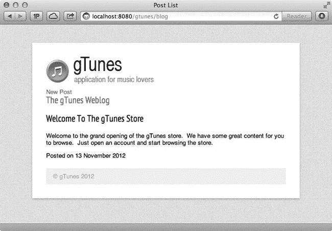

***图 12-7.** gTunes 应用程序中的一篇博客帖子*

显然，目前这只是一个非常基础的博客插件，不支持 RSS、评论、日历、归档等功能。然而，作为使用插件将应用程序分离为可重用模块这一概念的演示，这是一个完美的例子。一个独立的开发团队可以愉快地开发 `blog` 插件，并随着时间的推移逐步将其功能集成到主应用程序中。你甚至可以创建一个自动化构建，如你在第 11 章中学到的那样，来构建和测试所有插件，并将它们安装到主应用程序中进行集成测试。因此，即使你不打算成为 Grails 内部机制的专家，插件也绝对值得一看。

### 使用资源插件

资源插件提供了许多与管理应用程序中静态资源相关的功能。这包括将 JavaScript 文件的包含推迟到文档末尾以优化页面加载时间、防止资源在同一页面中被多次不必要地包含、纠正资源的加载顺序等等。该插件非常灵活且功能强大。这里我们将了解该插件提供的一些基本功能。让我们从在单独的文件中编写几个简单的 JavaScript 函数开始。

***清单 12-47.** web-app/js/hello.js*

`function sayHello() {`
`    alert('Hello!');`
`}`

***清单 12-48**. web-app/js/goodbye.js*

`function sayGoodbye() {`
`    alert('Goodbye!');`
`}`

现在让我们编写一个简单的 GSP 页面，该页面将使用这些 JavaScript 函数。

***清单 12-49.** grails-app/views/index.gsp*

`<!doctype html>`
`<html>`
`       <head>`
`              <title>资源插件演示</title>`
`        <g:javascript library="jquery"/>`
`        <g:javascript src="hello.js"/>`
`        <g:javascript src="goodbye.js"/>`
`        <r:layoutResources/>`
`       </head>`
`       <body>`
`            <r:script>`
`            $('#helloLink').click(function() {`
`                sayHello();`
`                return false;`
`            });`
`            $('#goodbyeLink').click(function() {`
`                sayGoodbye();`
`                return false;`
`            });`
`            </r:script>`
`            
<a id="helloLink" href="hello">打招呼</a>
`
`            
<a id="goodbyeLink" href="goodbye">说再见</a>
`
`            <r:layoutResources/>`
`       </body>`
`</html>`

当该 GSP 被渲染时，结果将类似于清单 12-50。

***清单 12-50.** 一个简单的渲染页面*

`<!doctype html>`
`<html>`
`  <head>`
`    <title>欢迎使用 Grails</title>    `
`    `
`    `
`    `
`  </head>`
`  <body>`
`    
<a id="helloLink" href="hello">打招呼</a>
`
`    
<a id="goodbyeLink" href="goodbye">说再见</a>
`
`    `
`  </body>`
`</html>`

渲染页面的大部分内容非常直接，与 GSP 中编写的内容紧密对应——并且很可能与你预期的内容非常接近。一个值得注意的有趣之处是，嵌入到页面中的 JavaScript，即那些将函数附加到“`hello`”和“`goodbye`”锚点标签的代码，被渲染在 body 的最底部，尽管 GSP 中的代码写在 body 的顶部。这是我们首次看到资源插件提供的好处之一。最佳实践是将所有 JavaScript 放在页面底部以改善页面加载时间。资源插件实现了这一点。该插件将 JavaScript 渲染在页面的最底部。在 GSP 的 body 底部调用的 `layoutResources` 标签正是实现这一点的关键。我们继续往下看。

资源插件提供的功能之一是能够定义“模块”，即应一起加载的静态资源组。从编码角度来看，你可能希望将 `goodbye.js` 和 `hello.js` 分开以方便维护，但又希望它们总是被一起加载到页面中。如果是这种情况，那么将这两个 `.js` 文件定义为一个模块的一部分可能是有意义的。这样，想要使用模块内容的页面就不必引用模块中包含的每个静态资源；相反，它们只需声明对该模块的依赖即可。

现在让我们编辑 `grails-app/conf/ApplicationResources.groovy`。在该文件中，我们将定义一个名为“messages”的新模块，并将你的两个 `.js` 文件都包含在该模块中。此任务的语法如清单 12-51 所示。

***清单 12-51.** 定义 messages 模块*

`modules = {`
`    application {`
`        resource url:'js/application.js'`
`    }`

`    // 这定义了一个名为 "messages" 的新模块，并且`
`    // 内容包含 2 个 js 文件`
`    messages {`
`        resource url: 'js/hello.js'`
`        resource url: 'js/goodbye.js'`
`    }`
`}`

现在从 GSP 中移除对 `.js` 文件的引用，并将其替换为 `<r:require module="messages"/>`，以表明此页面应包含 messages 模块中的所有 `.js` 文件。参见清单 12-52。

***清单 12-52.** 包含一个模块*

`...`

`<head>`
`    <title>欢迎使用 Grails</title>`
`    <g:javascript library="jquery"/>`
`    <r:require module="messages"/>`
`    <r:layoutResources/>`
`</head>`

`...`

现在渲染的页面将类似于清单 12-53。

***清单 12-53.** 渲染后的页面*

`<!doctype html>`
`<html>`
`  <head>`
`    <title>欢迎使用 Grails</title>`
`    `
`  </head>`
`  <body>`
`    
<a id="helloLink" href="hello">打招呼</a>
`
`    
<a id="goodbyeLink" href="goodbye">说再见</a>
`
`    `
`    `
`  </body>`
`</html>`

请注意，页面中不再有对 `hello.js` 和 `goodbye.js` 的引用；取而代之的是对 `bundle-bundle_messages_defer.js` 的引用。如果你在浏览器中访问该 URL，你会看到该文件包含了你的 `hello.js` 和 `goodbye.js` 文件内容的合并。确实相当巧妙。让我们再进一步。

编辑 `BuildConfig.groovy` 并添加对 `yui-minify-resources` 插件的依赖，如清单 12-54 所示。

***清单 12-54.** 依赖 yui-minify-resources 插件*

`grails.project.dependency.resolution = {`

`    ...`

`    plugins {`
`        runtime ":hibernate:$grailsVersion"`
`        runtime ":jquery:1.7.1"`
`        runtime ":resources:1.1.6"`
`        runtime ":yui-minify-resources:0.1.5"`

`        ...`
`    }`
`}`

包含 `yui-minify-resources` 插件将允许资源插件压缩 messages 模块中的所有 JavaScript。渲染后的 HTML 现在将包含对名为 `bundle-bundle_messages_defer.min.js` 的文件的引用（注意文件名中包含“`min`”），并且该文件将包含所有相关 JavaScript 的压缩版本。

资源插件的功能远不止于此，但即使是你已经看到的这一点点功能也非常有价值。位于 [`http://grails.org/plug-in/resources`](http://grails.org/plug-in/resources) 的插件文档提供了关于该插件功能的更多详细信息。

### 使用数据库迁移插件

到目前为止，我们还没有过多地涉及定义数据库表、列或任何类型的 DDL。GORM 在帮助管理这些方面做得非常出色。正如你所见，你可以定义领域类，然后让 GORM 来处理后续工作。如果你想自定义正在生成的模式，或者正在将应用程序映射到现有模式，可以通过在领域类的 `mapping` 块中编写代码来调整一些 ORM 细节，例如表名和列名。这一切都非常灵活且强大，但并不能处理所有事情。例如，应用程序的某个特定版本可能会引入新的领域类或为现有领域类添加新属性；当这种情况发生时，你需要某种方法将模式从一个版本的领域模型迁移到下一个版本。这就是数据库迁移插件发挥作用的地方。数据库迁移插件有助于管理数据库模式从一个版本的领域模型到下一个版本的演变。

下面是一个示例场景。假设你有一个简单的应用程序，其中包含一个 `Person` 领域类，如清单 12-55 中所定义。

***清单 12-55.** Person 类*

`package migrationdemo`

`class Person {`
`    String firstName`
`    String lastName`

`    static constraints = {`
`        firstName blank: false, size: 1..35`
`        lastName blank: false, size: 1..35`
`    }`
`}`

你的应用程序已完全开发完毕，准备发布到生产环境。此时是创建模式快照的好时机。如果以后领域模型发生变化，这个快照将作为一个基准点。当模型确实发生变化时，你需要在这个初始快照与支持更改后未来模型所需的模式之间创建差异。创建此初始快照的一种方法是使用数据库迁移插件提供的 `dbm-generate-gorm-changelog` 命令。要使用该命令，必须首先安装该插件，如清单 12-56 所示。

***清单 12-56.** 安装 database-migration 插件*

`// grails-app/conf/BuildConfig.groovy`
`grails.project.dependency.resolution = {`
`    ...`

`    plugins {`
`        runtime ":database-migration:1.2"`
`        ...`
`    }`
`}`

请注意，如果你使用的是 Grails 2.0.x，则需要安装此插件。从 Grails 2.1 开始，该插件默认已安装。

安装插件后，你现在可以执行 `dbm-generate-gorm-changelog` 脚本。

`$ grails dbm-generate-gorm-changelog changelog.groovy`
`| Packaging Grails application.....`
`| Finished dbm-generate-gorm-changelog`

这将创建 `grails-app/migrations/changelog.groovy`。参见清单 12-57。

***清单 12-57.** grails-app/migrations/changelog.groovy*

`databaseChangeLog = {`

`  changeSet(author: "jeff (generated)", id: "1352303958472-1") {`
`    createTable(tableName: "person") {`
`      column(autoIncrement: "true", name: "id", type: "bigint") {`
`        constraints(nullable: "false", primaryKey: "true",`
`                    primaryKeyName: "personPK")`
`      }`

`      column(name: "version", type: "bigint") {`
`        constraints(nullable: "false")`
`      }`

`      column(name: "first_name", type: "varchar(35)") {`
`        constraints(nullable: "false")`
`      }`

`      column(name: "last_name", type: "varchar(35)") {`
`        constraints(nullable: "false")`
`      }`
`    }`
`  }`
`}`

显然，该文件包含的不是 SQL，而是用于定义模式的 DSL 代码。该插件可以解释这些代码并将其转换为适合在数据库中执行的 SQL。DSL 非常直观。你大概可以通读代码并理解其中表达的大部分内容。审查这些代码并理解其含义非常重要。你不应该盲目依赖生成的代码。在将这些代码应用到生产数据库之前，请确保它代表了你需要的内容。该过程应包括评估 DSL 代码以及生成的 SQL。查看相应 SQL 代码的一种方法是运行 `dbm-update-sql` 命令，如清单 12-58 所示。

***清单 12-58.** 运行 dbm-update-sql*

`$ grails dbm-update-sql`
`| Starting dbm-update-sql for database sa @ jdbc:h2:mem:devDb;MVCC=TRUE;LOCK_TIMEOUT=10000`
`-- *********************************************************************`
`-- Update Database Script`
`-- *********************************************************************`
`-- Change Log: changelog.groovy`
`-- Ran at: 11/7/12 8:04 AM`
`-- Against: SA@jdbc:h2:mem:devDb`
`-- Liquibase version: 2.0.5`
`-- *********************************************************************`

`-- Create Database Lock Table`
`CREATE TABLE DATABASECHANGELOGLOCK (ID INT NOT NULL, LOCKED BOOLEAN NOT NULL, LOCKGRANTED`
`TIMESTAMP, LOCKEDBY VARCHAR(255), CONSTRAINT PK_DATABASECHANGELOGLOCK PRIMARY KEY (ID));`

`INSERT INTO DATABASECHANGELOGLOCK (ID, LOCKED) VALUES (1, FALSE);`

`-- Lock Database`
`-- Create Database Change Log Table`
`CREATE TABLE DATABASECHANGELOG (ID VARCHAR(63) NOT NULL, AUTHOR VARCHAR(63) NOT NULL, FILENAME`
`VARCHAR(200) NOT NULL, DATEEXECUTED TIMESTAMP NOT NULL, ORDEREXECUTED INT NOT NULL, EXECTYPE`
`VARCHAR(10) NOT NULL, MD5SUM VARCHAR(35), DESCRIPTION VARCHAR(255), COMMENTS VARCHAR(255), TAG`
`VARCHAR(255), LIQUIBASE VARCHAR(20), CONSTRAINT PK_DATABASECHANGELOG PRIMARY KEY (ID, AUTHOR,`
`FILENAME));`

`-- Changeset changelog.groovy::1352303958472-1::jeff (generated)::(Checksum: 3:cbe21510703560534`
`c81be19417709dd)`
`CREATE TABLE person (id BIGINT GENERATED BY DEFAULT AS IDENTITY NOT NULL, version BIGINT NOT`
`NULL, first_name VARCHAR(35) NOT NULL, last_name VARCHAR(35) NOT NULL, CONSTRAINT personPK`
`PRIMARY KEY (id));`

`INSERT INTO DATABASECHANGELOG (AUTHOR, COMMENTS, DATEEXECUTED, DESCRIPTION, EXECTYPE, FILENAME,`
`ID, LIQUIBASE, MD5SUM, ORDEREXECUTED) VALUES ('jeff (generated)', '', NOW(), 'Create Table',`
`'EXECUTED', 'changelog.groovy', '1352303958472-1', '2.0.5', '3:cbe21510703560534c81be19417709dd'`
`, 1);`
`| Finished dbm-update-sql`

一旦你审查了 DSL 代码和相应的 SQL，并确认所有内容都符合你的要求，你可以通过几种不同的方式让该 SQL 针对你的生产数据库执行。一种方法是在部署时让插件为你处理。为此，你需要在 `Config.groovy` 中将 `grails.plugin.databasemigration.updateOnStart` `config` 属性设置为 `true`，如清单 12-59 所示。

***清单 12-59.** 启用自动模式更新*

`// grails-app/conf/Config.groovy`
`grails.plugin.databasemigration.updateOnStart = true`

请注意，对于生产数据库，你很可能希望将 `grails-app/conf/DataSource.groovy` 中的 `dbCreate` 设置为 `"none"`。迁移插件是一种更可控、更安全的模式迁移管理方式。通过将 `dbCreate` 设置为类似 `"create-drop"` 的值来使用 Hibernate 的模式生成工具，对于开发环境来说既有用又高效，但可能不适合生产环境。

当 `updateOnStart` 设置为 `true` 时，迁移插件会通过生成并执行与最新迁移 DSL 代码相对应的 SQL，确保你的模式在部署时是最新的。某些应用希望在部署前对此有更明确的控制。如果你想提前生成模式，但又不想将 `updateOnStart` 设置为 `true`，一种方法是使用 `dbm-update` 脚本。`dbm-update` 脚本会评估迁移 DSL，生成相应的 SQL，并将该 SQL 发送到数据库执行。清单 12-60 展示了针对 `DataSource.groovy` 中的生产数据源配置运行 `dbm-update` 脚本的语法。

***清单 12-60.** 更新生产模式*

`$ grails prod dbm-update`

请谨慎对生产数据源执行任何操作。确保 SQL 已经过审查，并且已做好适当的备份。

现在，生产模式与当前的领域模型保持一致，你可以创建 `WAR` 文件并将其部署到生产环境；目前一切应该都准备就绪。如果你更改了领域模型，则需要生成一个新的迁移脚本，该脚本将调整现有模式以适应领域模型所做的任何更改。让我们向 `Person` 类添加几个新属性，如清单 12-61 所示。

***清单 12-61.** 向 Person 类添加 age 和 email 属性*

`package migrationdemo`

`class Person {`
`    String firstName`
`    String lastName`
`    Integer age`
`    String email`

`    static constraints = {`
`        firstName blank: false, size: 1..35`
`        lastName blank: false, size: 1..35`
`        email email: true`
`        age range: 16..66`
`    }`
`}`

如果我们将这段代码部署到生产环境，就会遇到问题，因为 person 表中没有用于存储 `age` 和 `email` 属性的列。迁移插件可以帮助迁移现有模式以支持新属性。`dbm-gorm-diff` 脚本会评估你当前的领域模型，将其与现有模式进行比较，然后生成必要的代码来调整现有模式以支持当前的领域模型。

`$ grails dbm-gorm-diff change1.groovy --add`

`dbm-gorm-diff` 命令的第一个参数是要创建的 DSL 文件的名称——在本例中是 `change1.groovy`。`--add` 开关告诉迁移插件在根 `changelog` 文件中添加一个引用此新创建文件的包含项。请参见清单 12-62。

***清单 12-62.** change1.groovy 的内容*

`databaseChangeLog = {`

`       changeSet(author: "jeff (generated)", id: "1352305604562-1") {`
`              addColumn(tableName: "person") {`
`                    column(name: "age", type: "integer") {`
`                           constraints(nullable: "false")`
`                    }`
`              }`
`       }`

`       changeSet(author: "jeff (generated)", id: "1352305604562-2") {`
`              addColumn(tableName: "person") {`
`                    column(name: "email", type: "varchar(255)") {`
`                           constraints(nullable: "false")`
`                    }`
`              }`
`       }`
`}`

请注意，`change1.groovy` 不包含整个领域模型的信息。该文件仅包含与当前模型和当前模式之间差异相关的信息。在本例中，它包含了与 `email` 和 `age` 属性相关的变更集。再次运行 `dbm-update-sql` 脚本以查看相应的 SQL。

`$ grails dbm-update-sql`
`| Starting dbm-update-sql for database sa @ jdbc:h2:devDB;MVCC=TRUE;LOCK_TIMEOUT=10000`
`-- *********************************************************************`
`-- Update Database Script`
`-- *********************************************************************`
`-- Change Log: changelog.groovy`
`-- Ran at: 11/7/12 8:36 AM`
`-- Against: SA@jdbc:h2:devDB`
`-- Liquibase version: 2.0.5`
`-- *********************************************************************`

`-- Lock Database`
`-- Changeset changelog.groovy::1352303958472-1::jeff (generated)::(Checksum: 3:cbe21510703560534`
`c81be19417709dd)`
`CREATE TABLE person (id BIGINT GENERATED BY DEFAULT AS IDENTITY NOT NULL, version BIGINT NOT`
`NULL, first_name VARCHAR(35) NOT NULL, last_name VARCHAR(35) NOT NULL, CONSTRAINT personPK`
`PRIMARY KEY (id));`

`INSERT INTO DATABASECHANGELOG (AUTHOR, COMMENTS, DATEEXECUTED, DESCRIPTION, EXECTYPE, FILENAME,`
`ID, LIQUIBASE, MD5SUM, ORDEREXECUTED) VALUES ('jeff (generated)', '', NOW(), 'Create Table',`
`'EXECUTED', 'changelog.groovy', '1352303958472-1', '2.0.5', '3:cbe21510703560534c81be19417709dd'`
`, 2);`

`-- Changeset change1.groovy::1352305604562-1::jeff (generated)::(Checksum:`
`3:0dce963c7c6e443c64ac983289725133)`
`ALTER TABLE person ADD age INT NOT NULL;`

`INSERT INTO DATABASECHANGELOG (AUTHOR, COMMENTS, DATEEXECUTED, DESCRIPTION, EXECTYPE, FILENAME,`
`ID, LIQUIBASE, MD5SUM, ORDEREXECUTED) VALUES ('jeff (generated)', '', NOW(), 'Add Column',`
`'EXECUTED', 'change1.groovy', '1352305604562-1', '2.0.5', '3:0dce963c7c6e443c64ac983289725133',`
`3);`

`-- Changeset change1.groovy::1352305604562-2::jeff (generated)::(Checksum:`
`3:d67ce27cffbfbc1c117fc0d3841e9a16)`
`ALTER TABLE person ADD email VARCHAR(255) NOT NULL;`

`INSERT INTO DATABASECHANGELOG (AUTHOR, COMMENTS, DATEEXECUTED, DESCRIPTION, EXECTYPE, FILENAME,`
`ID, LIQUIBASE, MD5SUM, ORDEREXECUTED) VALUES ('jeff (generated)', '', NOW(), 'Add Column',`
`'EXECUTED', 'change1.groovy', '1352305604562-2', '2.0.5', '3:d67ce27cffbfbc1c117fc0d3841e9a16',`
`4);`

`| Finished dbm-update-sql`

请注意，生成的 SQL 正在修改 `person` 表以添加新属性的列，并且也在更新 `DATABASECHANGELOG` 表，该表是迁移插件用来跟踪已运行迁移信息的表。此时，你拥有与最初创建模式时相同的选项来应用差异。你可以将 `updateOnStart` 属性设置为 `true`，或者显式运行 `dbm-update` 脚本。

上述用法是对插件所提供部分功能的一个良好介绍，但该插件提供的功能远不止于此。更多详细信息，请参阅 [`http://grails.org/plug-in/database-migration`](http://grails.org/plug-in/database-migration) 上的文档。

### 总结

在本章中，我们希望你已经了解了 Grails 插件系统的强大之处，不仅在于提供 API 增强的插件，同样也在于提供完整功能应用模块的用例，就像你在上一节中看到的那样。插件开发是一个非常广泛的话题，本章仅触及了可能性的表面。然而，本章已经为你提供了足够的知识来探索开发自己的插件。

从创建和填充插件元数据的基础知识，到开发插件本身的复杂性，最后到插件的打包和分发，本章涵盖了广泛的内容。正如你所见，Grails 提供了开箱即用的广泛功能，但通过其插件系统，它可以无限扩展。

## 索引

### A

Ajax

ActiveX 控件，169

异步表单提交

Ajax 登录代码，173

ApplicationResources.groovy 文件，174

当前登录操作代码，174

grails-app/views/layouts/main.gsp 布局，172

grails-app/views/store/index.gsp 布局，173

jQuery 表单代码，173

loginBox 模板，173

登录请求处理，174，175

登录模板，172

主 Sitemesh 布局，175

资源插件，174

_welcomeMessage.gsp 模板，175

BuildConfig.groovy，171

调用示例，171

代码，169

淡入效果，184

表单字段

BuildConfig.groovy，185

countHits，186

<g:remoteField> 标签，184，188

gTunes 领域，启用搜索，185

gTunes 实例搜索框，185

可搜索插件，185

启用搜索，186

searchEvery，186

_searchResults.gsp 模板，187

searchTop，186

StoreController，搜索操作，186

termFreqs，186

<g:javascript> 标签，170，171

<g:remoteLink> 标签，170

JavaScript 代码，169

jQuery Ajax 函数，170

jQuery 库，170

性能，188

远程链接

AlbumArtTagLib，181

AlbumArtTagLibTests，182，183

AlbumController，显示操作，178

_album.gsp 模板，177，183

_albumList.gsp 更新，177

BuildConfig.groovy，180

Church of Broken Glass，179

内容面板，176

create-tag-lib，180

create-tag-lib 命令，179

显示专辑，178

JSON 响应，179

请求参数，179

RestBuilder 类，180

RestClient，180

<r:script> 标签，170

showTime 操作，170

StoreController，170

AlbumArtService.groovy 文件，315

AlbumController，76

Artefact

参数，303

ArtefactHandler 测试，303

getType() 方法，302

JobArtefactHandler，302

newArtefactClass(Class) 方法，302

类型

ArtefactHandler 接口，302

领域和过滤器，301

isArtefact(Class) 方法，302

服务和引导程序，301

TagLib、编解码器和控制器，301

UrlMappings，301

面向切面编程（AOP），88

原子性、一致性、隔离性和持久性（ACID），239

自动依赖注入，243

### B

beforeInterceptor，88

主体标签，133

### C

CacheService，299

CacheTagLib，299

闭包属性，134

命令对象

AlbumCreateCommand，82

定义，81

Errors 对象，83

grails.validation.Validateable 注解，83

请求参数，82

用于验证，83

约定优于配置（CoC），249，304

条件查询

关联，201

构建器语法，198

createCriteria 静态方法，198

条件实例，198

动态查询，199

Groovy 的映射语法，199

Groovy 的展开运算符，200

Hibernate 条件，198

instanceof 运算符，200

list() 方法，198

投影，201

可重用代码块，200

scroll 方法，200

简单条件查询，198

自定义 Artefact 类型，307

### D, E

数据，77

DATABASECHANGELOG 表，334

数据库迁移插件

change1.groovy，333

DATABASECHANGELOG 表，334

dbm-generate-gorm-changelog 脚本，330

dbm-gorm-diff 命令，333

启用自动模式更新，332

GORM，329

安装，330

Person 领域类，329，332

生产模式，332

运行 dbm-update-sql，331

设置 updateOnStart，332

数据绑定

AlbumController，76

与关联，79

可绑定约束，80

bindData 方法，79

数据验证，77

errors API，77

文件上传，87

多个领域对象，78

默认人员表，48

分离条件查询

批量更新和删除，204

创建，202

执行，202，203

惰性求值，203

Dog. Instances 类，308

领域特定语言（DSL），304

doWithApplicationContext，299

doWithDynamicMethods，299

doWithSpring，299

doWithWebDescriptor，299

动态查找器，196–198

### F

Fields 插件，120

### G

Gails-app/taglib 目录，113

<g:checkBox> 标签，117

<g:collect> 标签，111

<g:createLink> 标签，115

<g:datePicker> 标签，119

<g:eachError> 标签，122

<g:each> 标签，110，111

genre.gsp h1 在线商店/h1，124

getContentType() 方法，86

getFile 方法，86

getInputStream() 方法，86

getSize() 方法，86

getText() 方法，91

<g:findAll> 标签，112

<g:form> 标签，116

<g:hasErrors> 标签，121

<g:link> 标签，114

GORM

关联

列表和映射关联，194

映射属性，194

关系管理方法，195

SortedSet，193，194

trackNumber 属性，194

传递性持久化，195

自动时间戳，231，232

配置，211–213

delete() 方法，193

游离对象

merge 方法，223

持久化生命周期，221

重新附加，221–223

list() 方法，192

listOrderBy 方法，192

锁定策略，229–231

max，192

offset，192

order，192

性能调优

批量抓取，226

即时加载 *vs.* 延迟加载关联，223–226

一级缓存，227

继承策略，229

查询缓存，228，229

二级缓存，227，228

查询

条件查询（*参见* 条件查询）

分离条件查询（*参见* 分离条件查询）

动态查找器，196–198

HQL 和 SQL，209，210

分页，210，211

Where 查询（*参见* Where 查询）

读取对象，191，192

save() 方法，193

语义

自动会话刷新，217，218

缓存，215

clear() 方法，216，217

currentSession() 方法，216

依赖注入，216

findAllByAlbum 方法，217

Hibernate 会话，213，214，216

ORM 工具，213

SessionFactory，216

会话管理与刷新，214，215

withSession 方法，216

sort，192

事务，218–220

GPath 表达式，112

<g:radio> 标签，118

Grails

BootStrap 类，290

构建系统

allTests 目标，266

引导，命令行，266

构建脚本，261

命令行参数，264

命令行变量，263

CreateApp.groovy，261

Gant，260，261

Gant 脚本创建，262

RunApp.groovy 脚本，266

脚本文档，265

目标方法，261

Tomcat（*参见* Tomcat）

与配置

CoC，249

Config.groovy 文件，249，250

环境特定方式，250

外部化，253

grails.mime.file.extensions，249

日志记录（*参见* Log4j 库）

堆栈跟踪过滤，252

持续集成，Hudson

使用 Grails 构建，275，276

定义，273

自由风格任务创建，275

安装过程，274

开源系统，273

“项目基础目录”，276

服务器，273

目标，276

依赖管理

BuildConfig.groovy，254，255

继承方法，256

属性，255

仓库（*参见* 仓库）

Web 应用程序，254

部署

应用程序元数据，289

容器，288

管理，288

Tomcat 服务器，288

版本号，289

WAR 定制，289

IDE（*参见* 集成开发环境 (IDE)）

集成，邮件服务器

confirmRegistration 视图，287

邮件确认，286，287

邮件消息，285

Mail 插件，285

mailService 属性，285

org.springframework.mail 抽象，285

注册，286

SMTP，284

用户类，286

grails-app/i18n/ 目录，155

GrailsApplication 实例，309

grails-app/views/store/shop.gsp，131

Grails 控制器

动作，90

命令对象（*参见* 命令对象）

自定义视图，75

数据绑定（*参见* 数据绑定）

默认动作，64

默认视图，75

gTunes 主页，92

HTTP 方法限制，83

拦截器

前置通知，88

后置通知，89

AOP，88

环绕通知，88

输入输出

文件上传，85

读取 InputStream 请求，87

写入二进制响应，87

日志记录

异常，66

Java 平台，65

log 属性，65

System.err.println，65

System.out.println，65

登录表单添加，94

登录过程测试

testLoginPasswordInvalid 测试用例，102

testLoginSuccess 测试用例，103

testLoginUserNotFound 测试用例，102

MockHttpServletResponse 类，91

模型创建，74

多个动作，64

注册

错误代码，98

实现，97

登录操作，101

LoginCommand，100

注册操作，96

注册视图，96

rejectValue 方法，98

屏幕，97

StoreController，98

成功注册测试，100

testPasswordsDoNotMatch 测试用例，99

testRegistrationFailed 测试，99

验证错误，98

渲染文本，72

请求属性，66

请求参数（*参见* 请求参数）

请求重定向方法，73

响应内容测试，92

SampleController 类，64

作用域

flash，67

flash 作用域，68

请求，67

servletContext，67，68

会话，67

单例控制器，63

模板，75

测试，create-controller 命令，89

单元测试失败，91

单元测试模板，90

更新后的 AlbumControllerUnitTests，91

用户领域类，93

Grails 领域类

构建关系，49

数据库映射，47

嵌入对象，56

failOnError 参数，44

gTunes 应用程序，41

继承

Groovy 继承语法，53

每个层次结构的表映射，53

每个子类的表，54

MySQL 数据库，41

面向对象 (OO) 应用程序，41

password 属性，45

public static 属性，42

save() 方法，44

Song 类，42

歌曲对象验证，44

Spring Errors 接口，44

标准验证器，43

测试

构建复杂系统，58

约束 Song 类，61

create-domain-class 命令，58

GORM，59

Java，58

SongTests 输出，61

歌曲单元测试，60

transient 属性，45

validate() 方法，44

Grails 动态标签

createLink 和 resource 标签，115

创建表单和字段

基本日期选择器，119

复选框和单选按钮，117

fields 插件，120

form 标签，116

处理值列表，118

textField 标签，117

自定义标签基础，134

自定义标签测试，135

字段验证示例，114

JSP 示例，113

链接标签

属性，114

基本链接，114

使用参数，115

方法调用示例，113

分页视图

支持的参数，126

领域类，127

流派操作，125，126

genre.gsp，124，125

grails-app/view/car/list.gsp，127

专辑列表，122，123

排序子句，128

分页专辑列表，123，124

分页支持，128，129

渲染 GSP 模板，129

标签创建场景，133

标签库创建，133

验证与错误处理

eachError 标签，121–122

hasErrors 标签，121

状态图，121

Grails 框架

应用程序

代码测试，8

控制器创建，6

create-app 命令，5

gTunes 应用程序结构，6

HTML 测试报告，10

打印消息，8

标准 Grails 欢迎页面，11

test-app 命令，9

数据源配置

DataSource.groovy 文件，32

gTunes WAR 文件，39

Hibernate 支持，37

内存 H2 数据库，32

JNDI 数据源配置，37

MySQL 数据库配置，34

run-war 部署，38

WAR 文件，38

环境友好，31

安装与配置，4

交互模式，12

Java 生态系统，3

平台，2

脚手架（*参见* 脚手架）

简洁与强大，1

歌曲领域类创建，16

song.groovy 文件，16

_GrailsInit.groovy，262

GrailsPluginManager 实例，309

Groovy/Grails 工具套件 (GGTS)，278

Groovy 继承语法，53

Groovy 脚本片段，107

Groovy 服务器页面 (GSP)

属性，106

内置 Grails 标签

collect 标签，111

findAll 标签，112

迭代标签，110

逻辑标签，109

设置变量，109

动态标签（*参见* Grails 动态标签）

GStrings，108

模型创建，106

页面指令，107

运行时环境，105

脚本片段，107

<g:select> 标签，118

<g:set> 标签，109

GSP 模板，129

GStrings，108

<g:textField> 标签，117

gTunes 应用程序，41

<g:while> 标签，111

### H

HelloWorld.groovy，262–264

Hibernate 条件，126

Hibernate 查询，185

HTTP 请求方法，146

HTTP 响应码，147

HttpServletRequest 接口，85

### I

集成开发环境（IDE）

GGTS，278

Grails 安装，278

Grails 项目

导入功能，279，280

IntelliJ IDEA，282

NetBeans，282，283

运行 Grails 应用程序，280，281

STS，281

文本编辑器，283

Java 语言，277

远程调试

配置，283，284

grails-debug 可执行文件，283

源代码，284

国际化

英语版 gTunes，157

grails-app/i18n/messages_es.property，159

grails-app/i18n/messages.property，158

java.util.ResourceBundle，157

messageSource，165

message 标签，157

参数化消息

自定义错误码，165

自定义验证消息，164

默认验证消息，163

领域类，约束，162

包含代码创建的 GSP，162

java.text.MessageFormat，160

message 标签，161

属性特定的验证消息，164

验证消息，163

渲染属性值，GSP，158

西班牙语版 gTunes，159

URL 映射，159

用户消息，155

控制反转（IoC），233

isEmpty() 方法，86

迭代标签，110，133

### J, K

Java 数据库连接（JDBC），25

Java 管理扩展（JMX）

Grails 服务暴露，246

操作，246，247

插件，243，247

StoreService 暴露，244

Java 命名和目录接口（JNDI）数据源，37

JSP 脚本片段，105

JSP 标准标签库（JSTL），105

### L

逻辑标签，109，133

Log4j 库

配置，250

调试级别，251

DSL，250

文件附加器，251

文件格式/XML，250

Hibernate 输出，252

布局样式，252

### M

Maven 仓库，314

元对象协议（MOP），308

MultipartFile 接口，86

MVC 架构，107

MySQL 数据库，42

### N

命名 URL 映射，150

嵌套标签，133

newArtefactClass(Class) 方法，302

NoSQL 数据库，196

NullPointerException，306

### O

对象关系映射（ORM），2，15

### P, Q

Package-plugin 命令，313

页面上下文，109

页面指令，107

Person 领域类，47

插件系统

addArtefact 方法，310

album-art 插件，316

AlbumArtService.groovy 文件，315

AlbumArtTagLib.groovy 文件，315

应用程序模块化

博客插件描述符，318

博客插件，gTunes，323

CKEditor，321–323

布局，320

list.gsp 视图，319–321

PostController，319

Post 领域类，318

_post.gsp 模板，321

工件应用程序，299

create-plugin 命令，296，315

数据库迁移（*参见* 数据库迁移插件）

getAlbumArt 方法，316

getArt() 方法，316，317

GrailsApplication 实例，309

GrailsPluginManager 实例，309

gTunes 应用程序

album-art 插件，317

博客文章，325

BuildConfig.groovy，317

CKEditor 组件，324

钩子

工件类型（*参见* 工件）

doWithApplicationContext，299

doWithDynamicMethods，299

doWithSpring，299

doWithWebDescriptor，299

getServiceClass 方法，301

GrailsApplication，300

Grails 约定 API，301

simple-cache 插件，300

假设实现，310

安装，295

JobDetailBean，310

list-plugins 命令，293，294

Maven 仓库，314，315

元数据，297，298

onChange，309

onConfigChange，309

onConfigChange 事件，311

onShutdown，309

打包与分发，312–314

plugin-info 命令，294，295

资源（*参见* 资源插件）

SimpleCacheGrailsPlugin 描述符，297

Spring ApplicationContext 实例，309

Spring Bean

ApplicationContext，304

CacheService，304

CacheTagLib，306

缓存模式，305

闭包，305

内容级缓存，306

约定，307

依赖注入，304

doWithSpring，304，305

DSL，304

getValue() 方法，306

globalCache Bean，305

NullPointerException，306

simple-cache 插件，306

spring-security-core，296

WAR 描述符，311，312

watchedResources，309

zip 文件，296

Publish-plugin 命令，313

### R

重定向参数，74

关系型数据库管理系统（RDBMS），2

渲染标签，129

重复标签，134

仓库

参数，258

配置，257

依赖范围，258

grailsCentral()，257

grailsHome()，257

grailsPlugins()，257

mavenRepo 方法，257

多重依赖，259

MySQL，258

插件依赖，260

运行时库依赖，258

传递性依赖解析，259

RequestParameter 注解，72

请求参数

类型转换

errors 属性，72

int 类型，71

list 类型，71

方法参数，71

RequestParameter 注解，72

字符串，70

userName，70

通过 params 属性，70

通过标准 Servlet API，70

Resources 插件

grails-app/views/index.gsp，326

Javascript 文件，325

消息模块，327

已渲染页面，328

已渲染页面，326，327

web-app/js/goodbye.js，326

web-app/js/hello.js，325

yui-minify-resources，328

### S

安全解引用运算符，110

save() 方法，77

脚手架

CRUD 接口，15

动态

创建操作，19

CRUD 应用程序控制器逻辑，17

删除操作，24

读取操作，21

歌曲控制器创建，17

歌曲列表页面，18

更新操作，23

静态

管理界面创建，25

AlbumController 类，25

创建动作，28

删除动作，27

编辑动作，27

generate-controller 命令，25

生成视图，29

GORM，26

索引动作，26

JDBC，25

列表动作，26

保存动作，28

显示动作，26

更新动作，27

URI，25

服务层

AlbumArtTagLib 类，235，236

基础知识，233

Bean 属性，237

缓存机制，237，238

常见活动，233

依赖注入，234，235

暴露

Axis2 插件，247

com.sun.management.jmxremote 系统属性，244

Grails 服务，246

JAVA_OPTS 设置，244

JConsole 应用程序，244，245

JMX 操作，246，247

JMX 插件，243，247

主 JConsole 窗口，244，245

StoreService，244

getAlbumArt 方法，236–239

IoC，233

主要驱动因素，233

作用域，241

测试，241–243

事务管理，239–241

SimpleCacheGrailsPlugin 描述符，296

简单邮件传输协议（SMTP），284

简单标签，133

Spring ApplicationContext，307

Spring ApplicationContext 实例，309

spring-security-core 插件，295

Spring Tool Suite (STS)，281

StoreController，102

### T

单表继承映射，53

每子类单表，54

标签库，133

Tomcat

优势，268

数据导出为 XML

Album，271

bootstrap 目标，270

classLoader，270

export-library-to-xml 代码，272，273

export-library-to-xml 脚本，273

gTunes 应用程序，270

music 方法，271

输出 XML，273

step 方法，271

StreamingMarkupBuilder，271

部署器，269

部署，269

目录，268

安装，267

JAR 文件，268

TomcatDeploy.groovy 脚本，269，270

TomcatDeploy.groovy 脚本，268

TOMCAT_HOME 环境变量，268

WAR 文件，268

toUpperCase 方法，110

TransactionStatus 参数，240

transferTo(dest) 方法，86

### U

统一资源标识符，25

URL 映射

附加请求参数，143

应用约束

映射参数，144

典型博客类型，144

通配符，145

ArtistController，152

Artist 映射，151

artistName 请求参数，152

assertForwardUrlMapping 方法，151

移除控制器和动作名称，140

定义，139

嵌入参数，141

正向和反向测试，153

grails-app/conf/UrlMappings.groovy，139

HTTP 请求方法，146

HTTP 响应码，147

link 标签，149

命名 URL 映射，150

反向测试，152

/showArtist/ URL，149

静态文本，140

单元测试，151

视图属性，143

### V

validate() 方法，77

验证状态图，121

### W, X

watchedResources，309

Where 查询

关联，206，207

基础，204，205

合取/析取，206

示例，209

函数，208

Groovy 的 findAll 方法，204

运算符，205

子查询，207，208

withTransaction 方法，240

### Y, Z

yui-minify-resources 插件，328
