# 2. 从零开始：Hello World

在本章中，你将学习如何使用 Eclipse IDE（集成开发环境）、Maven 依赖管理系统、WildFly 应用服务器和 H2 数据库，从零开始搭建一个 Jakarta Faces 开发环境。

## 安装 Java SE JDK

你可能已经知道，Java SE 以 JRE 形式提供给最终用户，以 JDK 形式提供给软件开发人员。Eclipse 本身并不严格要求 JDK，因为它有自己的编译器。Jakarta Faces 作为一个软件库，运行也不需要 JDK。然而，WildFly 确实需要 JDK 才能运行，主要是为了能够编译 Jakarta Pages 文件，尽管 Jakarta Pages（原名 Jakarta Pages, Java Server Pages）自 Jakarta Faces 2.0 起已作为 Jakarta Faces 的视图技术被弃用。

因此，你需要确保已按照 Oracle 的说明安装了 JDK。在撰写本文时，最新的 Java SE 版本是 17，但由于 Jakarta EE 10 是为 Java SE 11 设计的，你至少可以使用 Java SE 11 版本。安装说明取决于所使用的平台（Windows、Linux 或 MacOS）。你可以在此处找到详细的 Java SE 17 JDK 安装说明：[`https://docs.oracle.com/en/java/javase/17/install/overview-jdk-installation.html`](https://docs.oracle.com/en/java/javase/17/install/overview-jdk-installation.html)

最重要的部分是，`PATH` 环境变量必须包含包含 Java 可执行文件的 `/bin` 文件夹（例如，“`/path/to/jdk/bin`”），并且 `JAVA_HOME` 环境变量必须设置为 JDK 根文件夹（例如，“`/path/to/jdk`”）。Jakarta Faces 本身并不严格要求这些，但 Eclipse 和 WildFly 需要它们。Eclipse 作为一个集成开发环境，需要 `PATH` 来查找 Java 可执行文件。WildFly 作为一个 Jakarta EE 应用服务器，需要 `JAVA_HOME` 来查找 JDK 工具。


### 关于 Jakarta EE

Jakarta Faces 本身就是 Jakarta EE 的一部分。Jakarta EE 本质上是一个抽象规范，而所谓的应用服务器则是其具体实现。这些应用服务器的例子包括 Eclipse GlassFish、Red Hat WildFly、Apache TomEE 和 IBM WebSphere Liberty。你可以在 Jakarta EE 兼容产品页面找到它们：[`https://jakarta.ee/compatibility/`](https://jakarta.ee/compatibility/)。正是这些应用服务器，开箱即用地提供了 Jakarta Faces、Jakarta 表达式语言（EL）、Jakarta 标签（原名 Jakarta Tags）、Jakarta 上下文和依赖注入（CDI）、Jakarta 企业 Bean（原名 Jakarta Enterprise Beans、Enterprise Java Beans）、Jakarta 持久化、Jakarta Servlet、Jakarta WebSocket、Jakarta JSON 处理以及许多其他 API（应用程序编程接口）。

此外，还存在所谓的 Servlet 容器，它们基本上*只*开箱即用地提供 Jakarta Servlet、Jakarta Pages、Jakarta 表达式语言、Jakarta WebSocket 和 Jakarta Security，例如 Apache Tomcat 和 Eclipse Jetty。因此，在这样的 Servlet 容器上手动安装和配置 Jakarta Faces、Jakarta 标签、Jakarta 上下文和依赖注入、Jakarta 企业 Bean、Jakarta 持久化、Jakarta JSON 处理和/或 Jakarta EE 平台中许多其他缺失的 API，需要额外的工作。对于 Jakarta 企业 Bean 来说，这甚至不是一件简单的事，因为它需要修改 Servlet 容器的内部结构。顺便提一下，这正是 Apache TomEE 存在的原因。它是一个构建在精简版 Tomcat Servlet 容器引擎之上的 Jakarta EE 应用服务器。

因此，你不需要下载并安装整个“Jakarta EE”。基本上，下载任何一个你选择的 Jakarta EE 应用服务器就足够了。本书我们将选用 Red Hat WildFly。

## 安装 WildFly

WildFly 是 Red Hat 的一个开源 Jakarta EE 应用服务器。你可以从 [`https://wildfly.org/downloads`](https://wildfly.org/downloads) 下载它。请确保你选择的是“Jakarta EE 10 Full & Web Distribution”，而不是例如“Servlet-Only Distribution”或“Preview Distribution”，因为它们有其他用途。安装基本上就是将下载的文件解压并放到你的主文件夹中的某个位置。我们先把它放在那里，直到我们安装并运行 Eclipse，然后我们可以将 WildFly 集成到 Eclipse 中，并让 Eclipse 管理 WildFly 应用服务器。

## 安装 Eclipse

Eclipse 是一个用 Java 编写的开源 IDE。你可以从 [`https://eclipse.org`](https://eclipse.org) 下载它。它基本上就像一个记事本，但拥有成千上万甚至数百万的额外功能，例如自动编译类文件、用它们构建 WAR（Web 应用程序归档）文件，并将其部署到应用服务器，而无需在命令控制台中手动操作 `javac` 和其他工具。

Eclipse 有多种版本，甚至有针对 C/C++ 和 PHP 的版本。由于我们将使用 Jakarta EE（企业版）进行开发，我们需要名为“Eclipse IDE for **Enterprise** Java and Web developers”的版本，重要的是名称中带有“Enterprise”的版本。没有它的版本不包含开发 Jakarta EE Web 应用程序所需的插件。这是主下载页面：[`https://www.eclipse.org/downloads/packages/`](https://www.eclipse.org/downloads/packages/)。同样，安装基本上就是将下载的文件解压并放到你的主文件夹中的某个位置。

在 Windows 和 Linux 中，你会在解压后的文件夹中找到 `eclipse.ini` 配置文件。在 MacOS 中，此配置文件位于 `Eclipse.app/Contents/Eclipse`。打开此文件进行编辑。我们想要增加分配给 Eclipse 的内存。在 `eclipse.ini` 的底部，你会找到以下几行：

```
-Xms256m
-Xmx2048m
```

这分别设置了 Eclipse 可以使用的初始和最大内存池。当你想要开发一个像样的 Jakarta EE 应用程序时，这个值有点低。让我们至少将这两个值都加倍。

```
-Xms512m
-Xmx4g
```

注意，在 `Xmx` 设置中声明的值不要超过可用的物理内存。当实际内存使用量超过可用物理内存时，它会继续使用虚拟内存，通常以磁盘上的交换文件形式存在。这将大大降低性能，并导致严重的卡顿和速度变慢。

现在，你可以通过执行解压文件夹中的 `eclipse` 可执行文件来启动 Eclipse。系统会要求你选择一个目录作为工作空间。这是 Eclipse 保存所有工作空间项目和元数据的目录。

之后，Eclipse 会显示一个欢迎屏幕。目前这并不重要。你可以点击右上角的*隐藏*按钮来关闭欢迎屏幕。如有必要，请取消选中右下角的“启动时始终显示欢迎屏幕”。之后，你将进入工作台。默认情况下，它看起来像图 2-1 中的截图。

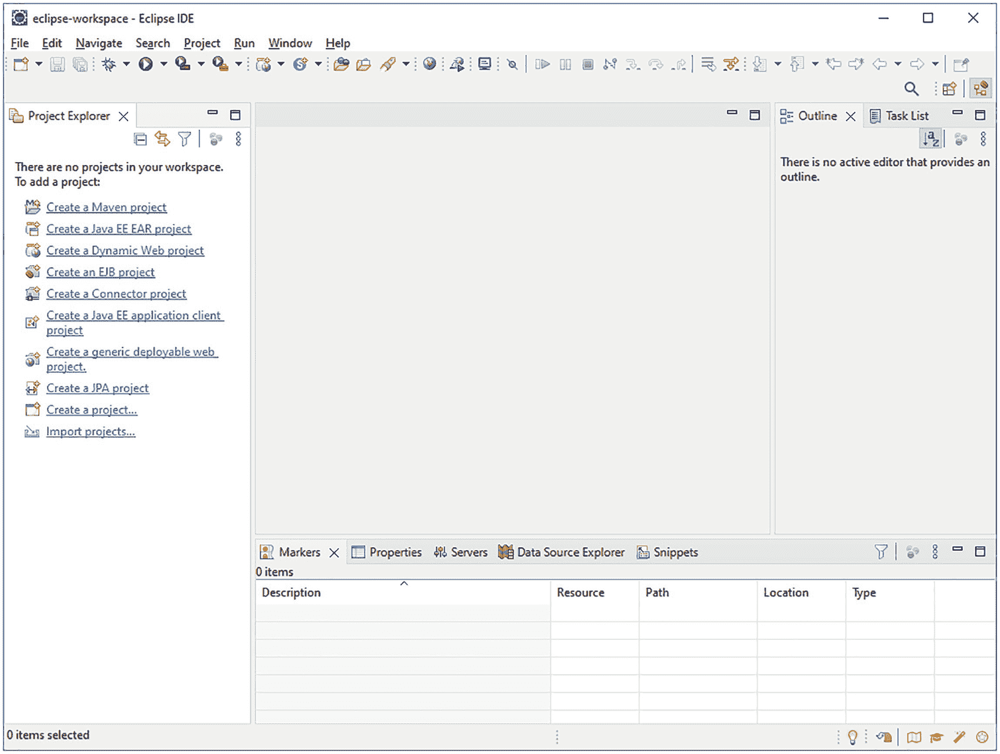

图 2-1

Eclipse 工作台

### 配置 Eclipse

在我们开始编写代码之前，我们想对 Eclipse 进行一些微调，以免最终遇到麻烦或烦恼。Eclipse 有大量的设置，其中一些默认值本不该是默认值。你可以通过 *Window* ➤ *Preferences* 来查看和配置设置。

*   *General* ➤ *Workspace* ➤ *Text file encoding* 必须设置为 **UTF-8**。特别是在 Windows 中，否则可能会默认使用专有编码 CP-1252，它只支持 255 个不同的字符，并且不支持拉丁语系之外的任何字符。当使用 CP-1252 读取和保存 Unicode 文件时，你可能会看到无法理解的字符序列。这也被称为“乱码”。^(¹)

*   *General* ➤ *Workspace* ➤ *New text file line delimiter* 必须设置为 **Unix**。它在 Windows 上也能正常工作。这尤其能让版本控制系统保持满意。否则，在不同操作系统上拉取代码的开发者可能会遇到由不同换行符引起的令人困惑的冲突或差异。

*   *General* ➤ *Editors* ➤ *Text editors* ➤ *Spelling* 最好**禁用**。这将为你避免一个潜在的巨大烦恼，因为它会不必要地检查 XML 配置文件（如 `faces-config.xml` 和 `web.xml`）中的技术条目，导致这些文件中出现令人困惑的警告，例如“`*.xhtml` 拼写不正确”。

*   *Java* ➤ *Installed JREs* 必须设置为 **JDK**（实际上与你已在 `JAVA_HOME` 环境变量中配置的相同），而不是 JRE。此设置通常也用于执行集成的应用服务器，该服务器通常需要 JDK。

*   *Java* ➤ *Compiler* ➤ *Compiler compliance level* 必须至少设置为 **11**。这是 Jakarta EE 10 所需的最低 Java 版本。当然，你也可以选择更高的版本。例如，**17** 也能正常工作。


### 在 Eclipse 中集成应用服务器

我们需要让 Eclipse 识别已安装的应用服务器，以便你能在 Eclipse 中无缝地部署、运行和调试 Web 项目。为了在 Eclipse 中集成新的应用服务器，首先查看工作台底部带有多个选项卡的区域，这些选项卡代表不同的*视图*（你可以通过*窗口* ➤ *显示视图*来添加新视图）。点击*服务器*选项卡以打开服务器视图（见图 2-2）。

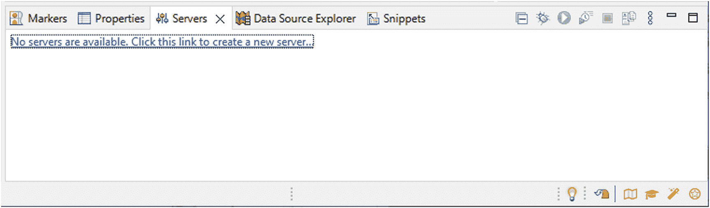

图 2-2

Eclipse 工作台的服务器视图

点击显示为“没有可用的服务器。点击此链接创建新服务器...”的链接。它将显示*新建服务器*向导，展示可用服务器类型的列表。从列表中选择*Red Hat Boss JBoss Middleware* ➤ *JBoss AS, WildFly, & EAP Server Tools*（见图 2-3）。

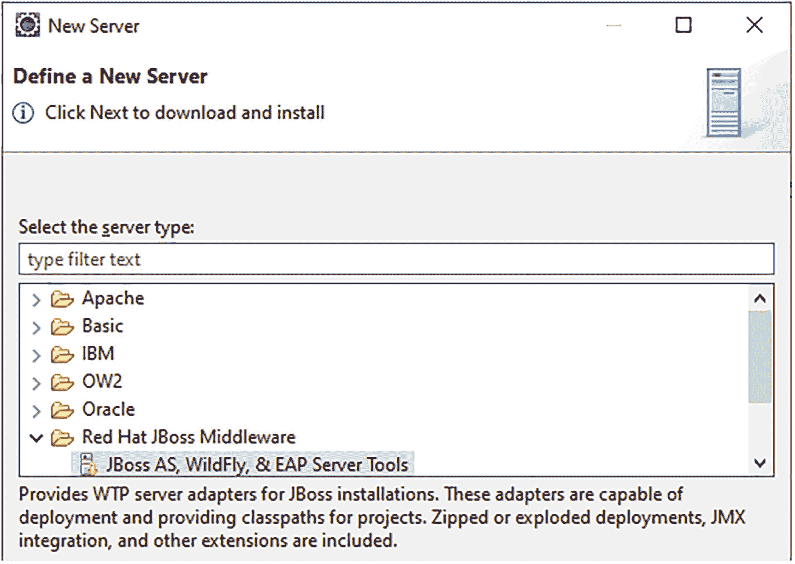

图 2-3

在新建服务器向导中选择 JBoss AS, WildFly, & EAP Server Tools

点击*下一步*后，它将在后台下载插件，并要求你接受许可协议后才能安装该插件。为了能够从工作台内部管理任何 JBoss 服务器，此插件是必需的。这将允许你向部署文件夹添加或移除 Eclipse 项目，以及启动和停止服务器，并以调试模式运行服务器。

让它在后台完成插件的下载和安装。对于任何“未签名软件”的警告，请确认并选择*仍然安装*。在这种特定情况下，这是可以的。最后，它会要求你重启 Eclipse。请相应地进行操作。

返回工作区后，再次点击*服务器*视图中的同一链接。你现在会看到*JBoss Community* ➤ *WildFly* 选项，对应多个 WildFly 版本。选择与你下载的版本匹配的版本。或者，如果你下载了更新的版本，那么服务器插件的最新可用版本通常也能正常工作（见图 2-4）。

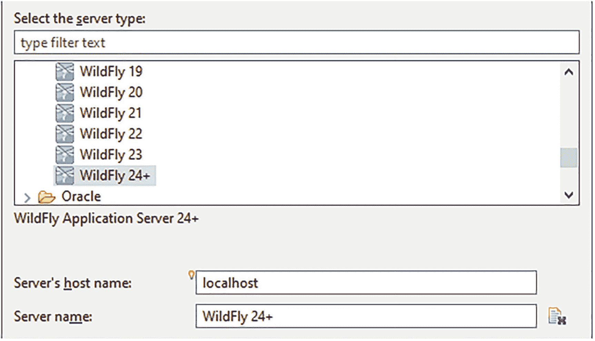

图 2-4

选择与下载版本匹配的 WildFly 版本

进入下一步。保持此屏幕的默认设置（见图 2-5）。

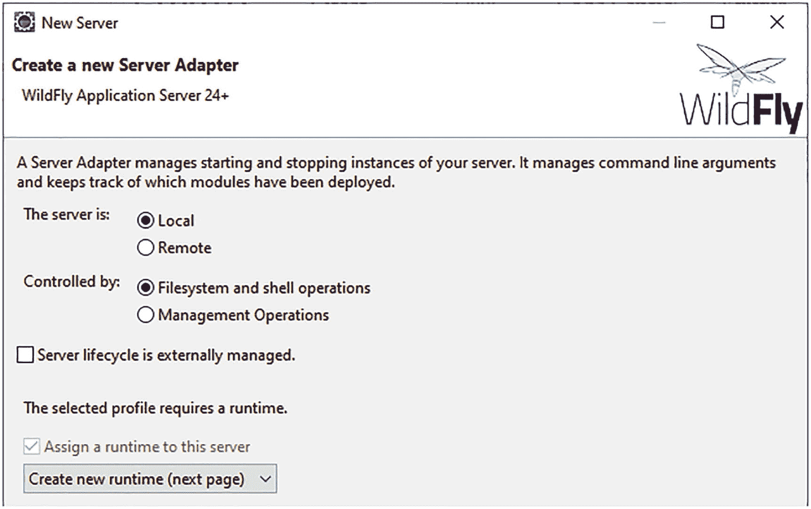

图 2-5

创建新的服务器适配器，并保持此屏幕的默认设置

再次进入下一步。在这里，你应该将*主目录*字段指向 WildFly 安装的文件夹，即你下载后解压的位置（见图 2-6）。并且你应该将*执行环境*调整为你想要的 Java 版本。选择至少 JavaSE-11。这是 Jakarta EE 10 所需的最低 Java 版本。当然，你也可以选择更高的版本。例如，**JavaSE-17** 在当前 WildFly 版本上也能正常工作。

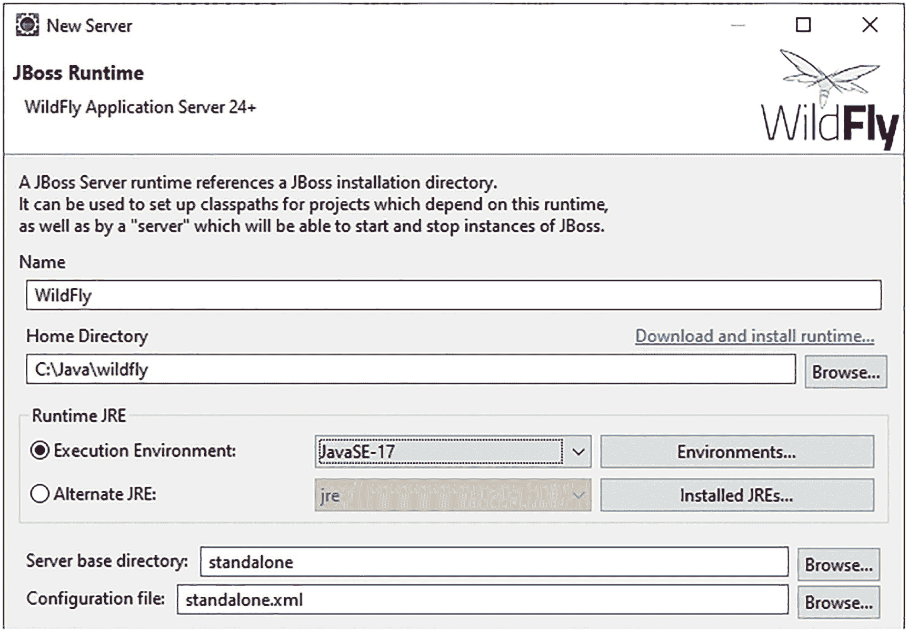

图 2-6

在新建服务器向导中指定 WildFly 位置

使用默认设置完成*新建服务器*向导的其余部分。你不需要编辑任何其他字段。新添加的服务器现在将出现在*服务器*视图中（见图 2-7）。

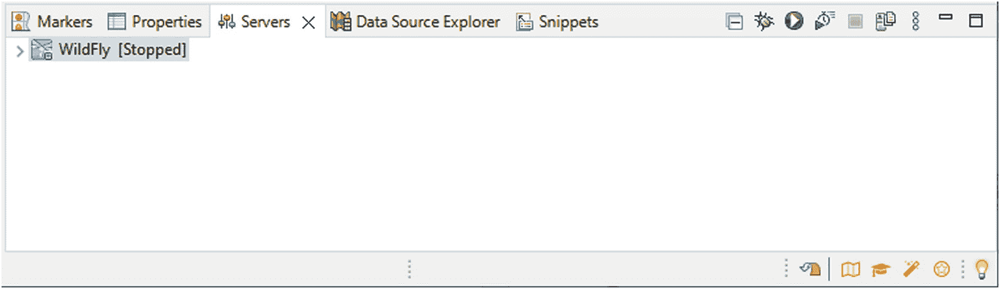

图 2-7

服务器视图中的 WildFly 服务器

## 在 Eclipse 中创建新项目

我们现在准备在 Eclipse 中为我们的 Jakarta Faces 应用程序创建一个新项目。这可以通过工作台的左侧区域完成，该区域默认只显示一个代表*项目资源管理器*视图的选项卡（同样，你可以通过*窗口* ➤ *显示视图*来添加新视图）。在此视图中的任意位置右键单击，然后选择*新建* ➤ *项目*。它将显示*新建项目*向导，其中可能包含过多的选项。

Eclipse 作为一个适用于多种项目任务的 IDE，提供了令人眼花缭乱的不同项目类型供你选择。对于将要部署为简单 WAR 文件的基于 Jakarta EE 的应用程序，基本上有两种项目类型可供选择：*Web* ➤ *动态 Web 项目* 和 *Maven* ➤ *Maven 项目*。

区别在于，前者是 Eclipse 原生项目，实际上只能在 Eclipse 上运行；而后者是一种通用项目类型，可以由 Eclipse 之外的任何 IDE 构建，并且可以轻松地在命令行以及各种 CI 服务器（如 GitHub Actions、CircleCI 和 Jenkins）上构建。因此，Maven 项目类型实际上是唯一可行的选择（见图 2-8）。

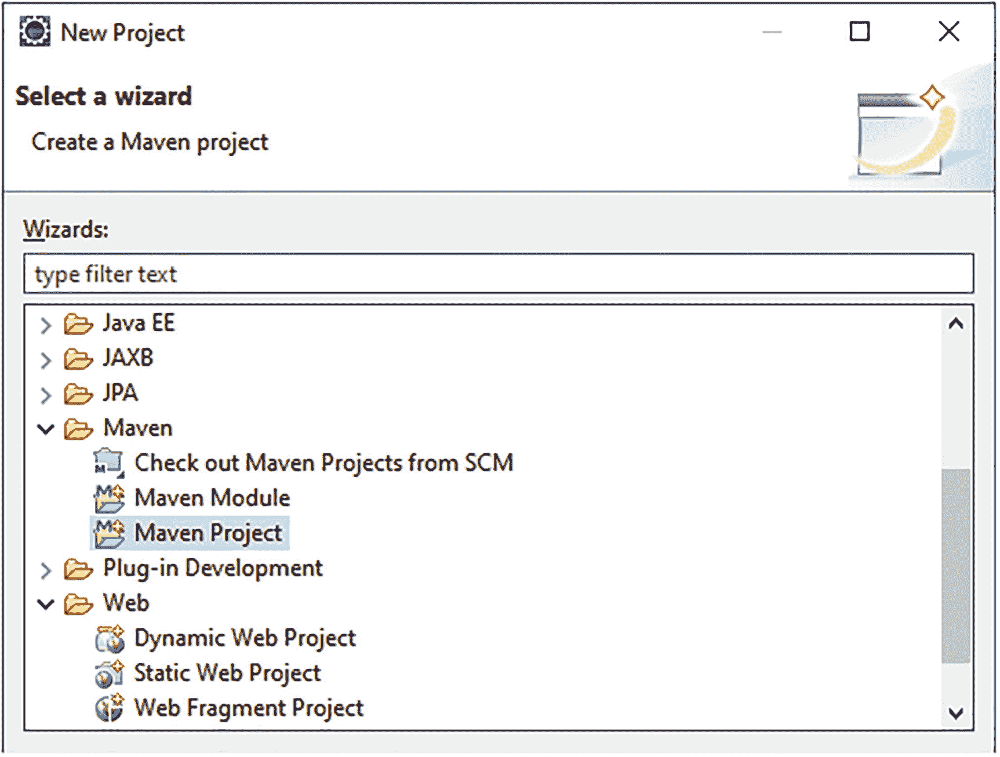

图 2-8

在新建项目向导中选择 Maven 项目（注意动态 Web 项目是另一个但不可行的选项）

在下一步中，确保选中*创建一个简单项目（跳过原型选择）*选项（见图 2-9）。

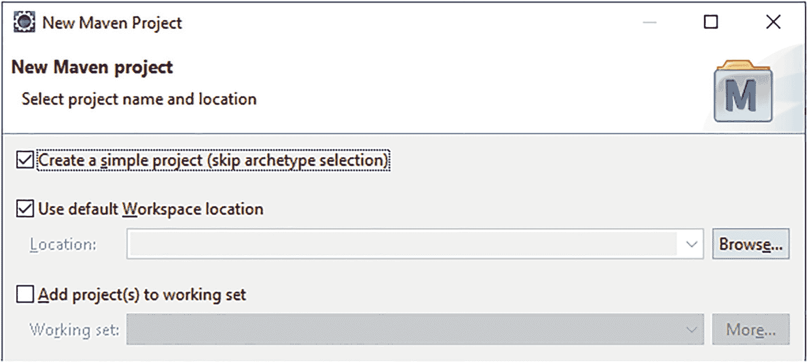

图 2-9

在新建 Maven 项目向导中勾选“创建一个简单项目”

这将让我们从一个真正空的 Maven 项目开始，以便我们可以自行配置和填充它。当然，你也可以从原型中选择，这基本上是一个包含多个已准备好的文件和配置的模板项目。但目前我们不需要任何原型。

在下一步中，我们可以指定项目自己的 Maven 坐标。Maven 坐标包括*Group Id*、*Artifact Id* 和 *Version*，在 Maven 世界中也被称为 GAV。*Group Id* 通常与你将要使用的根包名匹配，例如 `com.example`。*Artifact Id* 通常代表你将要使用的项目名称。为简单起见并为了与本书其余部分保持一致，我们将使用 `project`。*Version* 可以保持默认值 `0.0.1-SNAPSHOT`。最后，*Packaging* **必须**设置为 `war`（Web 应用程序归档）。这样在构建过程中将生成一个 WAR 文件而不是 JAR 文件（见图 2-10）。

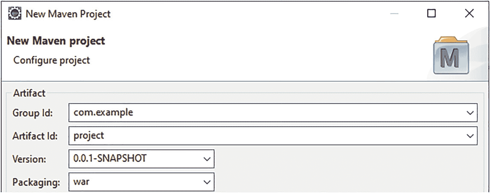

图 2-10

在新建 Maven 项目向导中填写 Maven GAV

完成*新建 Maven 项目*向导的其余部分。你不需要编辑任何其他字段。完成向导后，你将在*项目资源管理器*视图中看到项目结构（见图 2-11）。

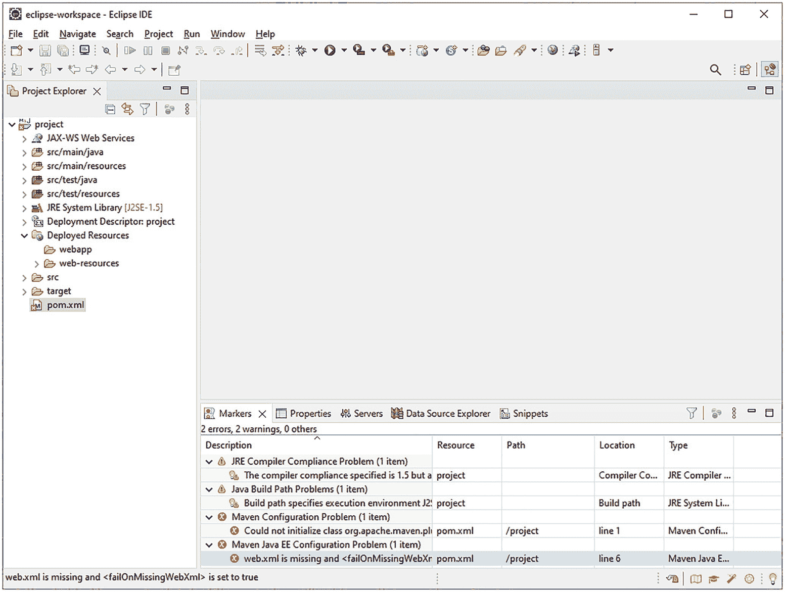

图 2-11

Eclipse 中新创建的 Maven 项目

不幸的是，Eclipse 生成的 `pom.xml`（它是项目为 Maven 项目并包含其配置的主要标志）并不理想。它已经过时了，即使是由撰写本文时的最新 Eclipse 版本（2021-12，即 2021 年 12 月版本）生成的也是如此。


您已经可以看到，在 *Markers* 视图中，`pom.xml` 文件被标记了一个醒目的红色叉号和两条错误信息。任何包含至少一个此类红色叉号的项目都无法构建，也无法部署。其中一条错误信息明确写道：“web.xml is missing and <failOnMissingWebXml> is set to true.” 换句话说，Maven 不知何故认为这仍然是一个 Jakarta EE 6 之前的项目，而实际上这已经不被允许了。另一条错误信息是：“Could not initialize class org.apache.maven.plugin.war.util.WebappStructureSerializer”。这基本上是由于默认的 Maven WAR 插件版本与 Java 17 不兼容造成的。可以通过将 Java 降级到较低版本来解决，但也可以通过显式地将默认的 Maven WAR 插件版本设置为更高版本来解决。

为了解决这个问题，并使 Eclipse 生成的 `pom.xml` 符合当前标准，我们需要打开 `pom.xml` 进行编辑，并按照以下代码所示进行调整：

```
4.0.0
com.example
project
0.0.1-SNAPSHOT
war

UTF-8

UTF-8

false

jakarta.platform
jakarta.jakartaee-api
10.0.0
provided

maven-war-plugin
3.3.2

```

保存此文件后，右键单击项目并选择 *Maven* ➤ *Update Project…* ➤ *OK*，Eclipse 就会自动处理，并清除项目上那个醒目的红色叉号。此 *Update Project* 操作还会根据更新后的 `pom.xml` 解决两个待处理的警告：“The compiler compliance specified is 1.5 but a JRE 17 is used” 和 “Build path specifies execution environment J2SE-1.5. There are no JREs installed in the workspace that are strictly compatible with this environment”。现在看起来好多了。我们将简要介绍这里最重要的设置。

*   **war** 打包方式：这表明该项目是一个“Web”项目，项目内容将被组装成一个 Web 归档文件。

*   **UTF-8** 编码：这设置了源文件的编码，以及生成（报告）输出文件时应使用的编码。这使得构建过程可重复，否则它将默认为系统默认编码（同样，这是一个相当糟糕的默认设置）。

*   **17** 编译器：这同时设置了 `.java` 源文件中使用的 Java 版本和 `.class` 文件中的字节码输出版本。如果不设置此项，Maven 会默认使用尽可能旧的版本，有时甚至比那个版本还低。

*   `failOnMissingWebXml` **false**：旧版本的 Jakarta EE 要求必须存在 `/WEB-INF/web.xml` 文件。尽管自 2009 年发布的 Jakarta EE 6 以来已不再需要此文件，但 Maven 仍然会检查该文件是否存在。将此值设置为 `false` 可以避免这种不必要的检查。

*   依赖项 **jakarta.platform:jakarta.jakartaee-api:10.0.0 provided**：这声明了对 Jakarta EE 10 API 的依赖，并确保编译器能够识别所有 Jakarta EE 类型，例如 `FacesServlet`、`@Named` 和 `@Entity`。此依赖项被设置为 `provided`，因为这些类型已由目标运行时（在我们的例子中是 WildFly）提供。因此，此依赖项将仅用于编译源代码，相关的 JAR 文件不会包含在生成的 WAR 文件中。您必须绝对确保任何由目标运行时提供的编译时依赖项都被设置为 `provided`；否则，它最终会出现在生成的 WAR 文件中，您可能会遇到类加载问题，导致不同版本的重复库相互冲突。如果您实际的目标不是完整的 Jakarta EE 服务器，而是像 Tomcat 这样的精简 Servlet 容器，那么您需要按照 Mojarra（一种可用的 Faces 实现，实际上也是 WildFly 底层使用的实现）的 README 中的说明调整依赖项。^(²)

*   插件 **maven-war-plugin:3.3.2**：这基本上覆盖了 Eclipse 内置的默认 Maven WAR 插件版本。如果您在 Eclipse 版本中没有遇到“Could not initialize class WebappStructureSerializer”错误信息，则*不*需要此条目。

下一步基本上是指导 Eclipse 生成部署描述符文件。在 *Project Explorer* 视图中右键单击项目，选择 *Properties*，然后打开 *Project Facets* 部分。更新 Servlet API 版本，并添加 Jakarta Faces 和 Jakarta Persistence 模块。Servlet API 由“Dynamic Web Module”条目表示。需要将其设置为版本 `6.0`，这与 Jakarta EE 10 规范相匹配。此外，需要选择“Jakarta Faces”和“Jakarta Persistence”条目，并分别设置为版本 `4.0` 和 `3.1`，以匹配 Jakarta EE 10 规范（参见图 2-12）。同时，您还需要仔细检查 Java 模块的版本是否确实是 `17` 或 pom.xml 中设置的任何版本。该值应该通过 *Update Project* 操作自动更新。

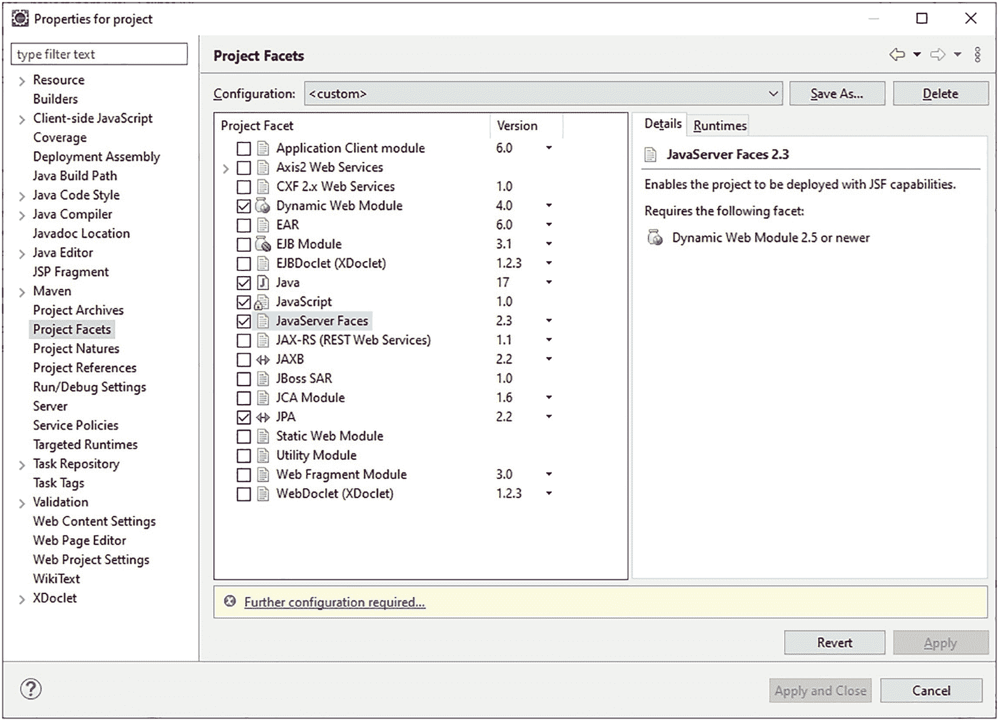

图 2-12

项目属性的 Project Facets 部分，启用了“JavaServer Faces”（Jakarta Faces）和“Jakarta Persistence”（Jakarta Persistence）模块（请注意，Jakarta Servlet API 版本由“Dynamic Web Module”表示，并且截图中的版本在撰写本文时已过时）

不幸的是，在撰写本章时可用的最新 Eclipse 版本（2021-12 版，即 2021 年 12 月）中，这些版本在下拉菜单中尚不可用。可用的最高版本是 Servlet 5.0、Faces 2.3 和 Persistence 2.2。这不是一个大问题。它唯一影响的是可用的代码生成器和向导。我们之后可以手动调整 Eclipse 生成的 `web.xml`、`faces-config.xml` 和 `persistence.xml` 文件，使其符合 Jakarta EE 10 兼容版本。

正如您在底部附近的黄色警告栏中看到的，Eclipse 只需要进一步配置。这涉及到新选择的 Jakarta Faces 和 Jakarta Persistence 模块。单击该链接后，我们将看到 *Modify Faceted Project* 向导（参见图 2-13）。

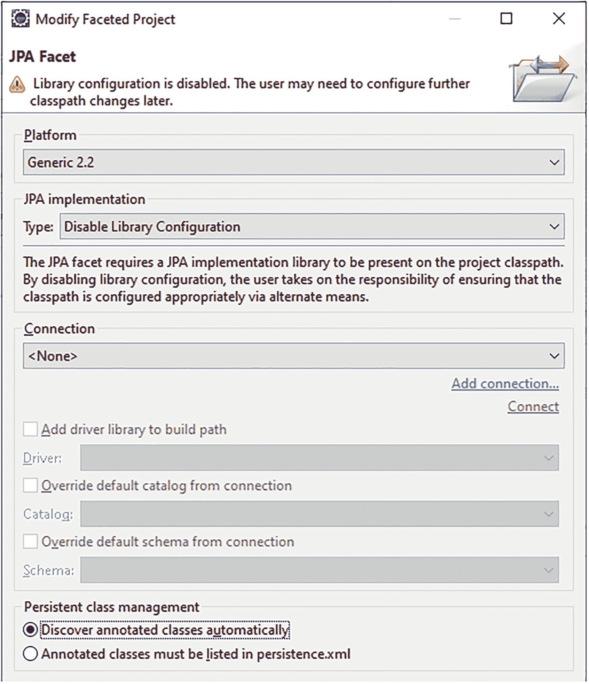

图 2-13

Jakarta Persistence 模块配置

*Modify Faceted Project* 向导的第一步允许我们配置 Jakarta Persistence 模块。我们需要确保指示 Eclipse，Jakarta Persistence 实现已由目标运行时提供，因此 Eclipse 不需要包含任何库。这可以通过在 *Jakarta Persistence implementation* 字段中选择“Disable Library Configuration”选项来实现。由于我们将使用 WildFly 提供的 Hibernate 作为实际的 Jakarta Persistence 实现，它支持自动发现带有 `@Entity` 注解的类，我们希望指示 Eclipse 也这样做。因此，请在 *Persistent class management* 字段中选择“Discover annotated classes automatically”选项。否则，当通过实体代码生成向导进行操作时，Eclipse 会自动将实体添加到 `persistence.xml` 中，或者当我们手动创建一个实体但未将其添加到 `persistence.xml` 时显示警告。

请注意，目前无需配置数据库连接（用于 Eclipse 内置的数据浏览器），因为我们将使用嵌入式数据库。


在*修改分面项目*向导的下一步中，我们可以配置 Jakarta Faces 功能（见图 2-14）。同样，这里需要确保 Eclipse 被告知 Jakarta Faces 实现已由目标运行时提供，因此 Eclipse 无需包含任何库。这可以通过在 *Jakarta Faces 实现库*字段中选择“禁用库配置”选项来实现。

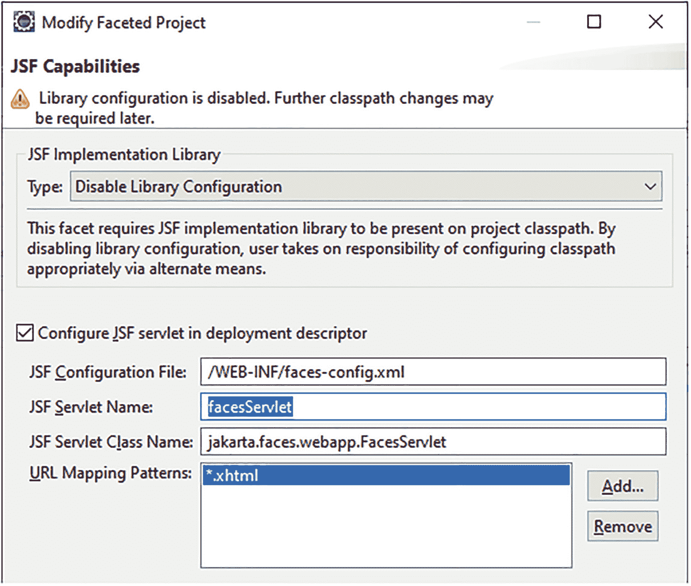

图 2-14

Jakarta Faces 功能配置

此外，我们需要重命名 `FacesServlet` 的 Servlet 名称，以匹配虚构的实例变量名：`facesServlet`。最后但同样重要的是，我们需要将 URL 映射模式从老式的 `/faces/*` 改为现代的 `*.xhtml`。

实际上，自 Jakarta Faces 2.2 版本起，在 `web.xml` 中注册 `FacesServlet` 已不再是严格必需的；你甚至可以取消勾选*在部署描述符中配置 Jakarta Faces servlet* 选项，并依赖默认的自动注册映射 `/faces/*`、`*.faces`、`*.jsf` 和 `*.xhtml`。然而，由于这允许最终用户甚至搜索引擎爬虫通过不同的 URL 打开同一个 Jakarta Faces 页面，从而在用户中造成混淆，并可能因重复内容而受到搜索引擎的惩罚，我们最好只限制使用一个明确配置的 URL 模式 `*.xhtml`。

现在，完成并应用所有向导和对话框。不幸的是，当前 Eclipse 版本的 Jakarta Persistence 插件只会将生成的 `persistence.xml` 放在错误的位置。它似乎没有意识到该项目是一个 Maven 项目，而是盲目地将生成的 `persistence.xml` 文件放入 `src/main/java/META-INF` 文件夹，仿佛它是一个普通的纯 Java 项目。这是错误的。你需要手动将其移动到 `src/main/resources/META-INF`，以符合 Maven 项目的规则。图 2-15 展示了工作台现在的样子。

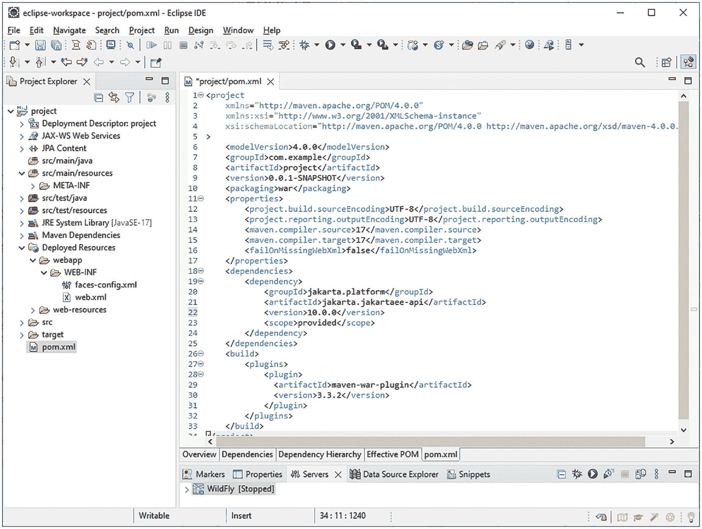

图 2-15

在 Eclipse 中正确配置的 Jakarta EE 10 Maven 项目

## 调整部署描述符

我们只需要调整所有部署描述符，使其与实际使用的 Servlet、Faces、Persistence 和 CDI 版本保持一致。这通常通过调整部署描述符 XML 文件的根元素来设置所需的 XML 模式和版本。

你可以在 [`https://jakarta.ee/xml/ns/jakartaee/`](https://jakarta.ee/xml/ns/jakartaee/) 找到所有 Jakarta EE 10 XML 模式，这是一个实际的网页。你可以通过在 Eclipse 项目资源管理器中双击部署描述符 XML 文件，然后在编辑器中选择*源*选项卡来打开它进行编辑。Jakarta EE 10 兼容部署描述符的正确根元素声明如下。

1.  **src/main/webapp/WEB-INF/web.xml** **用于 Servlet 6.0：**

    确保我们在*修改分面项目*向导中创建的 `jakarta.faces.webapp.FacesServlet` 确实存在，并且确实映射到了 `*.xhtml` 的 URL 模式。

2.  **src/main/webapp/WEB-INF/faces-config.xml** **用于 Faces 4.0：**

    目前，它确实是空的。

3.  **src/main/resources/META-INF/persistence.xml** **用于 Persistence 3.1：**

    目前，它确实只包含默认的持久化单元。我们稍后会重新配置它。只有当前可用的 Eclipse Jakarta Persistence 插件可能会对此显示错误，例如“persistence.xml 文件没有可识别的内容”。你可以通过在项目属性中禁用 Jakarta Persistence 验证器来忽略此错误，或者你也可以暂时回退到最初生成的 `persistence.xml` 文件。

4.  **src/main/webapp/WEB-INF/beans.xml** **用于 CDI 4.0**

最后，为了完整性，我们需要再创建一个部署描述符文件，即用于 CDI 4.0 的文件。这个文件不会自动生成，因为它不是必需的。CDI 在任何 Jakarta EE 兼容的 Web 应用程序中默认始终启用。它甚至是 Jakarta Faces 正常运行所必需的。

右键单击项目的 `/WEB-INF` 文件夹，然后选择*新建* ➤ *文件*。将其命名为 *beans.xml*。按如下方式填充新文件：

请注意，`bean-discovery-mode` 设置为 `annotated`。这是默认值。另一个值是 `all`。这稍微更具侵入性且开销更大，因为它会将**任何** Java 类都视为潜在的 CDI bean。

### 配置 Jakarta Faces

Jakarta Faces 有许多可通过 `web.xml` 中的 `<context-param>` 条目进行配置的设置。默认配置足以入门，但有一个特殊设置我们确实希望从一开始就设置好。该设置指示 Jakarta Faces 是否将提交的空字符串值解释为模型中的 `null`。由于 HTML 和 Jakarta Servlets 的特性，空输入字段默认会在模型中设置为空字符串。这通常是不希望的，我们更希望将它们保留为 `null`。这对于验证约束（例如 Jakarta Bean Validation 中的 `@NotNull` 和关系数据库中的 `NOT NULL`）非常重要。

可以通过将以下部分添加到 `web.xml` 来实现此设置：

```

jakarta.faces.INTERPRET_EMPTY_STRING_SUBMITTED_VALUES_AS_NULL

true

```


### 创建支持 Bean 类

项目配置正确后，我们就可以开始开发实际的 MVC 应用程序了。MVC 的*控制器*部分已在 `web.xml` 中配置为 `FacesServlet`。我们现在要创建的是 MVC 的*模型*部分。它本质上只是一个简单的 Java 类，按照 Jakarta Faces 的惯例，它被称为*支持 Bean*，因为它“支持”*视图*。

右键点击项目的 `src/main/java` 文件夹，选择 *新建* ➤ *类*。此时将出现*新建 Java 类向导*（见图 2-16）。在此向导中，将*包*设置为 `com.example.project.view`，并将*名称*设置为 `HelloWorld`。其余字段可以保持默认或留空。

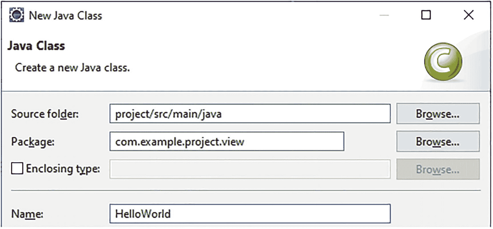

图 2-16

Eclipse 中的新建 Java 类向导

类编辑器将打开，其中包含新创建的支持 Bean 类。我们将对其进行修改，在类上添加 CDI `@Named` 和 `@RequestScoped` 注解，使其成为 CDI 托管 Bean。并且我们需要添加两个属性 `input` 和 `output`，为 `input` 属性配备 getter 和 setter 方法对，为 `output` 属性仅配备 getter 方法，以便可以从视图中引用它们。最后，我们将添加一个 `submit()` 操作方法，该方法根据 `input` 属性准备 `output` 属性，以便可以从视图中调用它。

提示：在 Eclipse 中输入属性后，你可以右键点击类编辑器中的任意位置，选择*源代码* ➤ *生成 Getter 和 Setter*，让 IDE 生成它们。完整的编辑后的支持 Bean 类应如下所示：

```
package com.example.project.view;
import jakarta.enterprise.context.RequestScoped;
import jakarta.inject.Named;
@Named @RequestScoped
public class HelloWorld {
private String input;
private String output;
public void submit() {
output = "Hello World! You have typed: " + input;
}
public String getInput() {
return input;
}
public void setInput(String input) {
this.input = input;
}
public String getOutput() {
return output;
}
}
```

我们将简要介绍这里使用的注解。

*   **@Named**：这为 Bean 提供了一个名称，主要用于在视图中通过 EL 引用它。没有任何属性时，此名称默认为简单类名，首字母小写，因此这里是“`helloWorld`”。它将通过 `#{helloWorld}` 在 EL 中可用。这可以在 Jakarta Faces 页面中使用。

*   **@RequestScoped**：这为 Bean 提供了一个作用域，这意味着在给定的生命周期内使用同一个 Bean 实例。对于 `@RequestScoped`，该生命周期是 HTTP 请求的持续时间。当作用域结束时，Bean 会自动销毁。你可以在第 8 章中阅读更多关于作用域的信息。

### 创建 Facelets 文件

接下来，我们将创建 MVC 的*视图*部分。它本质上只是一个 XHTML 文件，被 Jakarta Faces 解释为 *Facelets 文件*或简称为“Facelet”。当使用与 Facelets 文件路径匹配的 URL 调用 FacesServlet 时，Jakarta Faces 最终将解析它并生成 HTML 标记，作为对请求的响应发送到浏览器。借助 EL，它可以引用 Bean 属性并调用 Bean 操作。

右键点击项目的 `webapp` 文件夹，选择 *新建* ➤ *文件*（见图 2-17）。将其命名为 `hello.xhtml`。

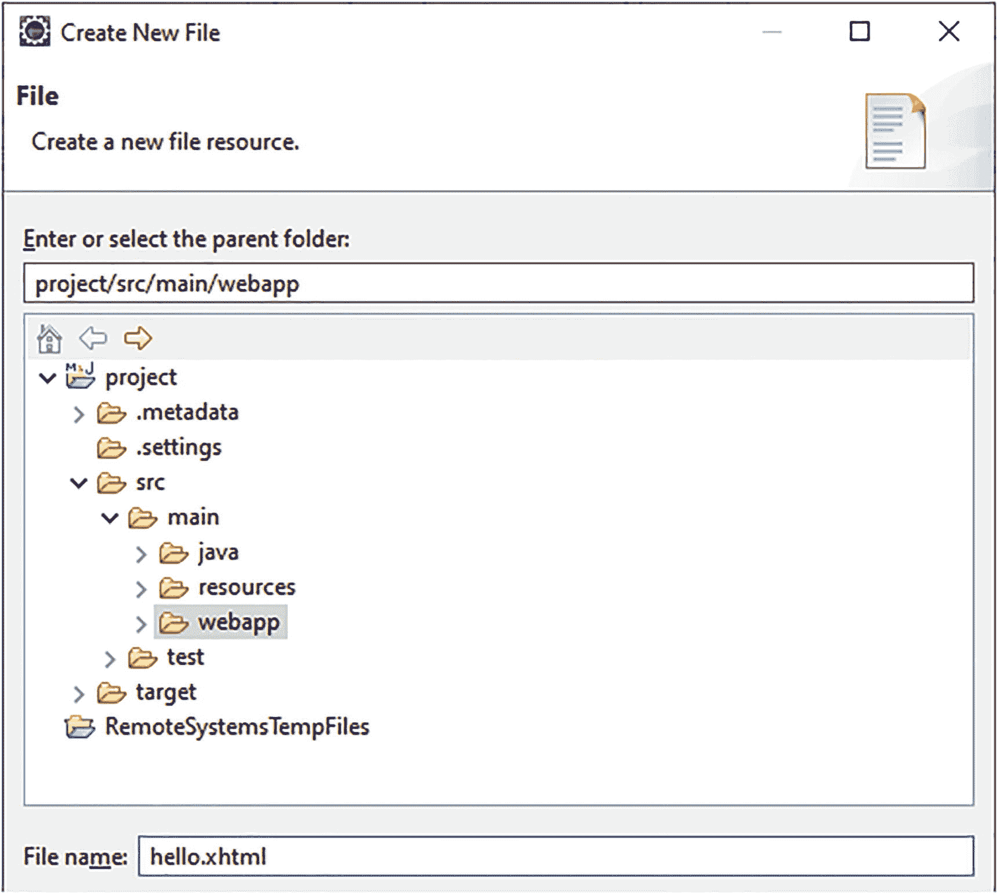

图 2-17

Eclipse 中的新建文件向导

HTML 编辑器将打开，其中包含新创建的 Facelets 文件。它最初是空的。用以下内容填充它：

```

Hello World

Hello World

```

我们将简要介绍这里使用的 Jakarta Faces 特定的 XHTML 标签。

*   **<h:head>**：这会生成 HTML `<head>` 元素。它让 Jakarta Faces 有机会自动包含任何必要的 JavaScript 文件，例如包含 `<f:ajax>` 所需逻辑的文件。

*   **<h:body>**：这会生成 HTML `<body>` 元素。你也可以在此特定 Facelet 中使用纯 HTML `<body>`，但这样它就不会给任何其他 Jakarta Faces 标签在 HTML `<body>` 末尾自动包含任何必要 JavaScript 的机会。

*   **<h:form>**：这会生成 HTML `<form>` 元素。Jakarta Faces 会自动在表单内的隐藏输入字段中包含所谓的视图状态。

*   **<h:outputLabel>**：这会生成 HTML `<label>` 元素。你也可以在此特定 Facelet 中使用纯 HTML `<label>`，但这样你就必须手动处理找出目标输入元素的实际 ID。

*   **<h:inputText>**：这会生成 HTML `<input type="text">` 元素。Jakarta Faces 会自动获取和设置 `value` 属性中指定的 Bean 属性的值。

*   **<h:commandButton>**：这会生成 HTML `<input type="submit">`。Jakarta Faces 会自动调用 `action` 属性中指定的 Bean 方法。

*   **<f:ajax>**：这会生成必要的 JavaScript 代码，以启用其所嵌套标签（在本例中为 `<h:commandButton>`）的 Ajax 行为。你也可以不使用它，但这样表单提交就不会异步执行。`@form` 的 `execute` 属性表示提交时必须处理其所在的整个 `<h:form>`，而 `:output` 的 `render` 属性表示 Ajax 提交完成后必须自动更新由 `id="output"` 标识的标签。

*   **<h:outputText>**：这会生成 HTML `<span>` 元素。这是在 Ajax 提交完成后被更新的元素。它只会打印 `value` 属性中指定的 Bean 属性。

这些 Jakarta Faces 特定的 XHTML 标签也称为 *Jakarta Faces 组件*。在接下来的章节中，将会有更多关于 Facelets 文件和 Jakarta Faces 组件的内容。请注意，你也可以在 Facelets 文件中完美地嵌入纯 HTML。只有在功能需要或使用 Jakarta Faces 组件更容易实现时，才应使用它们。


### 部署项目

在 *Servers* 视图中，右键点击 WildFly 服务器条目，选择 *Add and Remove*。此时会弹出 *Add and Remove* 向导（见图 2-18），您可以在其中向服务器添加或移除 WAR 项目。请对我们新创建的项目执行此操作，然后完成向导。

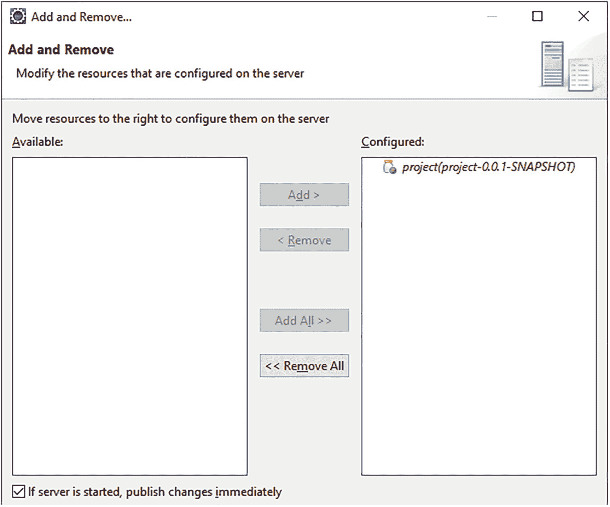

图 2-18

Add and Remove 向导，其中项目已通过移至右侧部署到服务器

现在启动 WildFly 服务器。您可以通过选中它，然后点击绿色箭头图标（其工具提示显示“启动服务器”）来启动。当然，您也可以使用工具提示显示“以调试模式启动服务器”的 bug 图标。*Console* 视图会短暂显示服务器启动日志。请等待服务器启动，并在 *Servers* 视图中获得 *Started* 状态（见图 2-19）。

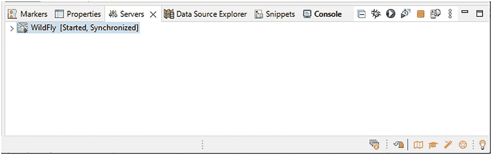

图 2-19

Servers 视图中状态为 Started 的 WildFly 服务器（请注意，Console 视图因有未读服务器日志而高亮显示）

现在，在您喜欢的网络浏览器中打开一个标签页（见图 2-20），输入地址 `http://localhost:8080/project-0.0.1-SNAPSHOT/hello.xhtml`，以打开新创建的 Jakarta Faces 页面。

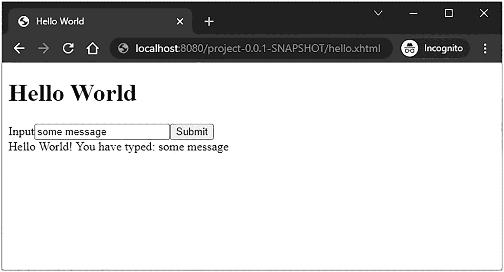

图 2-20

Chrome 浏览器中的 Hello World 页面，其中输入字段已填入文本“some message”，并且已按下提交按钮

回到 URL，“`localhost:8080`”部分约定俗成地是任何以开发模式运行的 Jakarta EE 服务器的默认域名。GlassFish 和 TomEE 等服务器也使用相同的地址。在 WildFly 中，URL 中的“`/project-0.0.1-SNAPSHOT`”部分默认从 Maven 生成的 WAR 文件名推断而来，您可以在 WildFly 安装目录的 `/standalone/deployments` 文件夹中找到该文件。URL 中的这一部分在 Jakarta Servlet 术语中称为“上下文路径”，可通过 `HttpServletRequest#getContextPath()` 获取，在 Jakarta Faces 中则由 `ExternalContext#getRequestContextPath()` 委托。

如果您难以确定实际使用的上下文路径，通常可以在服务器日志中找到它。不过，具体的日志行取决于所使用的服务器。对于 WildFly，它是由 `WFLYUT0021` 标识的行。打开 Eclipse 中的 *Console* 视图，按 `Ctrl+F` 并搜索 `WFLYUT0021`。它将显示以下行：

```
WFLYUT0021: Registered web context: '/project-0.0.1-SNAPSHOT' for server 'default-server'
```

如果您想调整 Maven 生成的 WAR 文件的文件名，从而间接调整 WildFly 中的上下文路径，可以通过在 `pom.xml` 的 `<build>` 部分中显式指定构建的所谓最终名称来实现，方法如下：

```
project

maven-war-plugin
3.3.2

```

现在右键点击项目，选择 *Maven* ➤ *Update Project…* ➤ *OK*。这基本上会强制重建 Maven 项目。完成后，右键点击服务器并选择 *Clean*。这基本上会强制进行干净的重新部署。如果您密切关注了服务器日志，那么 `WFLYUT0021` 行现在应该显示为

```
WFLYUT0021: Registered web context: '/project' for server 'default-server'
```

现在您可以使用 URL `http://localhost:8080/project/hello.xhtml` 访问同一页面（图 2-21）。

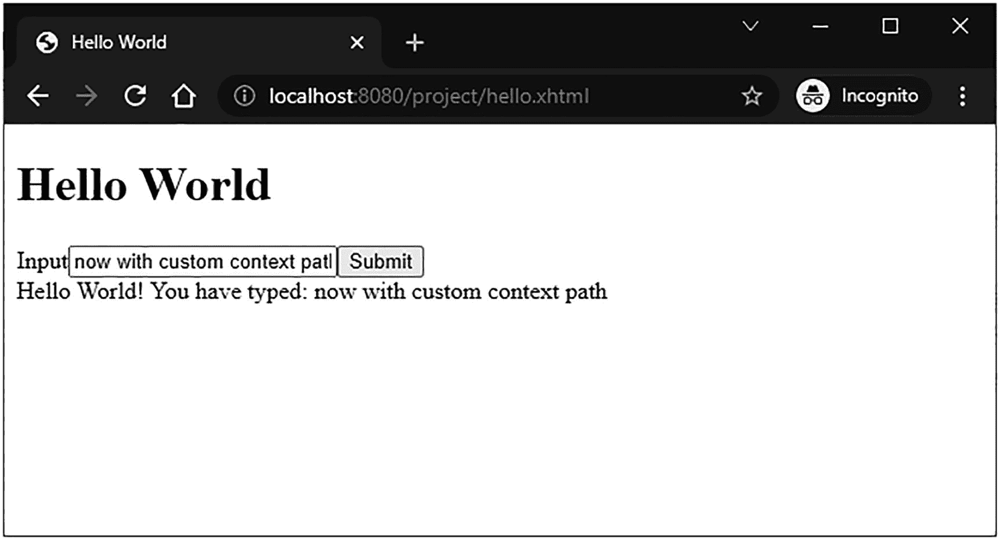

图 2-21

Web 应用程序现在使用自定义上下文路径

上下文路径部分也可以简单地设置为“`/`”。部署的 Web 应用程序随后将位于域根目录。如何执行此操作取决于所使用的服务器。对于 WildFly，您需要按如下方式创建 JBoss 特定的 `jboss-web.xml`：

```
src/main/webapp/WEB-INF/jboss-web.xml:

/

```

右键点击服务器并选择 *Clean*。服务器日志中的 `WFLYUT0021` 行现在应该显示为

```
WFLYUT0021: Registered web context: '/' for server 'default-server'
```

现在您可以使用 URL `http://localhost:8080/hello.xhtml` 访问同一页面（图 2-22）。

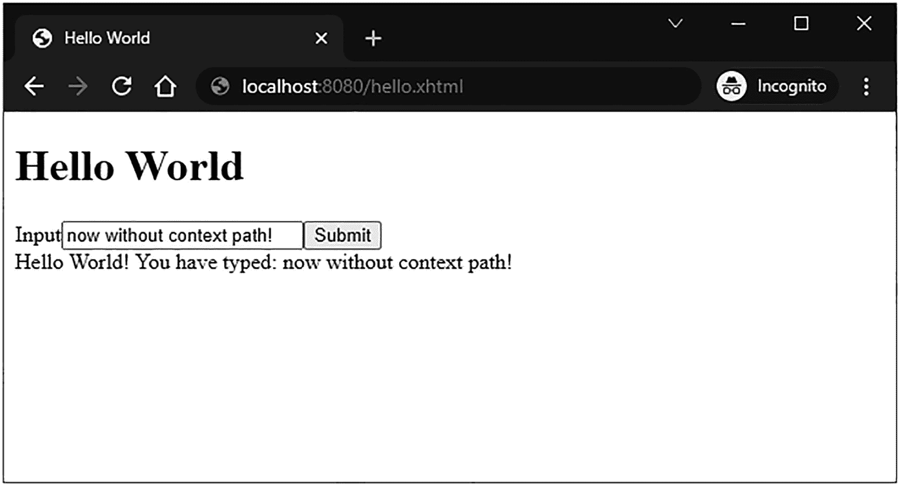

图 2-22

Web 应用程序现在已部署，不带上下文路径

我们可以更进一步，利用 Faces 4.0 引入的新“自动无扩展名映射”功能，这样我们就不再需要在 URL 中指定 `.xhtml` 扩展名。这可以通过向 `web.xml` 添加以下条目来实现：

```

jakarta.faces.AUTOMATIC_EXTENSIONLESS_MAPPING

true

```

这将指示 Jakarta Faces 自动将 FacesServlet 也映射到 URL 的无扩展名变体，允许您通过 `http://localhost:8080/hello` 打开页面（图 2-23）。

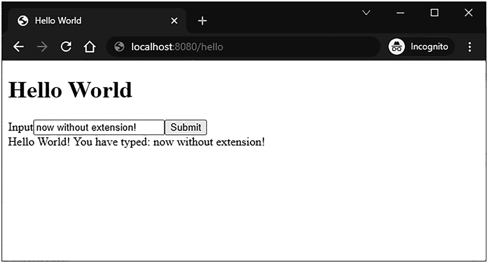

图 2-23

Web 应用程序现在无扩展名

我们还可以更进一步，将 `hello.xhtml` 设为默认登录页面，这样也无需在 URL 中指定它。这可以通过向 `web.xml` 添加以下条目来实现：

```
hello.xhtml

```

这将指示服务器在请求任何文件夹时，使用该文件夹内指定的文件作为默认资源。因此，例如，如果请求“`/`”文件夹，它将搜索“`/hello.xhtml`”文件并透明地将其返回。同样，当请求“`/foo`”文件夹时，服务器将搜索“`/foo/hello.xhtml`”文件并提供服务（如果不存在，则返回 404“未找到”）。

现在，保存 `web.xml` 并清理服务器。回到网络浏览器，您会注意到现在也可以通过 `http://localhost:8080` 访问该网页（见图 2-24）。

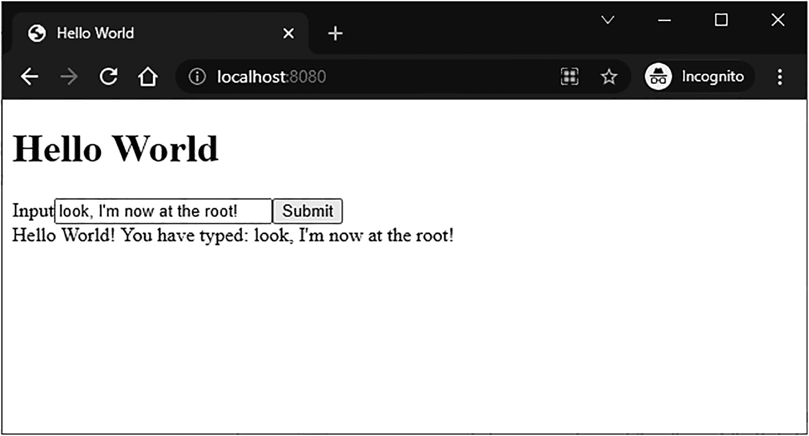

图 2-24

Hello World 页面现在位于根目录

## 安装 H2

H2^(³) 是一个内存型 SQL 数据库。它是一个嵌入式数据库，对于快速建模和测试 Jakarta Persistence 实体非常有用，特别是与基于 Jakarta Persistence 实体自动生成的 SQL 表结合使用时。将 H2 添加到您的 Web 应用程序项目只需将以下依赖项添加到 `pom.xml` 的 `<dependencies>` 部分：

```
com.h2database
h2
2.1.210

```

基本上就是这样。JDBC（Java 数据库连接）驱动程序也由此依赖项提供。


### 配置数据源

为了能够与 SQL 数据库交互，我们需要在 Web 应用程序项目中配置一个所谓的数据源。这可以通过将以下部分添加到 `web.xml` 中来完成：

```
java:global/DataSourceName
org.h2.jdbcx.JdbcDataSource
jdbc:h2:mem:test;MODE=LEGACY;DB_CLOSE_DELAY=-1

```

数据源的 `<name>` 代表 JNDI（Java 命名和目录接口）名称。“`java:global/`”部分是强制性的。“`DataSourceName`”部分可自由选择。它最终需要在后续的 `persistence.xml` 中注册。`<class-name>` 代表所使用的 JDBC 驱动程序的 `javax.sql.DataSource` 实现的完全限定名称。`<url>` 代表 JDBC 驱动程序特定的 URL 格式。其语法取决于所使用的 JDBC 驱动程序。对于数据库名称为“`test`”的内存 H2 数据库，其 URL 即为 `jdbc:h2:mem:test`。H2 特定的 `MODE=LEGACY` 路径参数基本上是为了解决 Hibernate 与 SQL“IDENTITY”类型不兼容的变通方法，在较新的 Hibernate 版本中，你可以尝试移除该部分。H2 特定的 `DB_CLOSE_DELAY=-1` 路径参数基本上指示其 JDBC 驱动程序在数据库一段时间未被访问时不要自动关闭它，即使应用服务器仍在运行。

配置数据源后，`javax.sql.DataSource` 的一个具体实例现在可以注入到任何 Servlet 容器管理的工件中，例如 Servlet 或过滤器，如下所示：

```
@Resource
private DataSource dataSource;
```

你可以通过 `DataSource#getConnection()` 从中获取 SQL 连接，用于传统的 JDBC 工作。然而，由于我们将使用纯 Jakarta EE，因此最好改用 Jakarta EE 自身的 Jakarta Persistence。

### 配置 Jakarta Persistence

为了让 Jakarta Persistence 识别新添加的数据源，我们需要按如下方式编辑 `persistence.xml` 中的持久化单元条目：

```
java:global/DataSourceName

```

你看，数据源是通过其 JNDI 名称来标识的，该名称我们之前在 `web.xml` 中配置过。你还会注意到一个 Jakarta Persistence 特定的属性 `jakarta.persistence.schema-generation.database.action`，其值为“`drop-and-create`”，这基本上意味着 Web 应用程序应根据 Jakarta Persistence 实体自动删除并创建所有 SQL 表。当然，这仅适用于原型设计目的，正如我们将在本书其余部分使用此项目所做的那样。对于实际应用程序，你最好选择“`create`”或“`none`”（这是默认值）。或者，更好的做法是使用真正的数据库服务器，例如 PostgreSQL，而不是内存数据库。

事务类型设置为“JTA”基本上意味着应用服务器本身应自动管理数据库事务。这样，客户端（通常是 Jakarta Faces 的后台 Bean 类）对 Jakarta Enterprise Beans 服务类上的每个方法调用都会透明地启动一个新事务，当服务方法返回给客户端（通常是调用它的后台 Bean）时，事务会自动提交并刷新。并且服务方法中的任何运行时异常都会自动回滚事务。

### 创建 Jakarta Persistence 实体

现在我们将创建一个 Jakarta Persistence 实体。基本上，它是一个 JavaBean 类，代表数据库表中的一条记录。每个 Bean 属性都映射到数据库表的特定列。通常，Jakarta Persistence 实体是根据现有数据库表建模的。但是，正如你在上一节“配置 Jakarta Persistence”中关于 `persistence.xml` 所读到的，反过来做也是可能的：数据库表是根据 Jakarta Persistence 实体生成的。

右键单击项目的 `src/main/java` 文件夹，然后选择 *New* ➤ *Jakarta Persistence Entity*。在向导中，将 *Package* 设置为 `com.example.project.model`，并将 *Class name* 设置为 `Message`。其余字段可以保留默认值或留空（参见图 2-25）。点击 *Finish*。

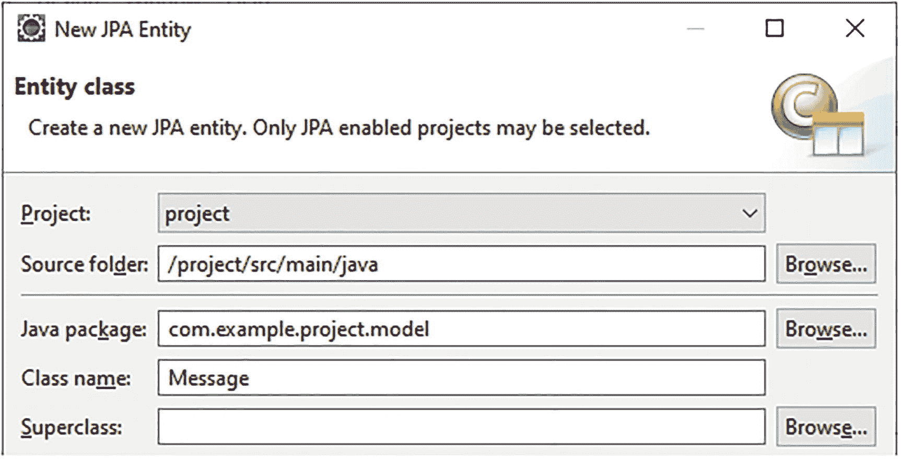

图 2-25

Eclipse 中的新建 Jakarta Persistence 实体向导

按如下方式修改新的实体类：

```
package com.example.project.model;
import java.io.Serializable;
import jakarta.persistence.Column;
import jakarta.persistence.Entity;
import jakarta.persistence.GeneratedValue;
import jakarta.persistence.GenerationType;
import jakarta.persistence.Id;
import jakarta.persistence.Lob;
import jakarta.validation.constraints.NotNull;
@Entity
public class Message implements Serializable {
private static final long serialVersionUID = 1L;
@Id @GeneratedValue(strategy=GenerationType.IDENTITY)
private Long id;
@Column(nullable = false) @Lob
private @NotNull String text;
// 添加/生成 getter 和 setter 方法。
}
```

提醒一下，你可以通过右键单击类编辑器中的任意位置并选择 *Source* ➤ *Generate Getters and Setters* 来让 Eclipse 生成 getter 和 setter 方法。

我们将简要介绍此处使用的注解。

*   **@Entity**：这将 Bean 标记为 Jakarta Persistence 实体，以便 Jakarta Persistence 实现将根据其所有属性自动收集与数据库相关的元数据。

*   **@Id @GeneratedValue(strategy=IDENTITY)**：这将一个属性标记为映射到 SQL“`IDENTITY`”类型的 SQL 数据库列。在 MySQL 术语中，这相当于“`AUTO_INCREMENT`”。在 PostgreSQL 术语中，这相当于“`BIGSERIAL`”。

*   **@Column**：这将一个属性标记为映射到常规的 SQL 数据库列。实际的 SQL 数据库列类型取决于所使用的 Java 类型。对于 Java `String`，如果没有额外的 `@Lob` 注解，默认情况下是 `VARCHAR(255)`，其长度可以通过 `@Column(length=n)` 来操作。然而，使用 `@Lob` 注解后，SQL 数据库列类型默认变为 `TEXT`。

*   **@Lob**：这将一个 `String` 属性标记为映射到类型为 `TEXT` 的 SQL 数据库列，而不是长度有限的 `VARCHAR`。

*   **@NotNull**：这实际上不是 Jakarta Persistence 的一部分，而是“Jakarta Bean Validation”的一部分。简而言之，它确保在提交 Jakarta Faces 表单以及持久化 Jakarta Persistence 实体时，Bean 属性被验证永远不会为 `null`（另请参见第 5 章）。还要注意，这基本上复制了 `@Column(nullable=false)` 的功能，但这仅仅是因为 Jakarta Persistence 不会将任何 Jakarta Bean Validation 注解视为有效的 SQL 数据库元数据来生成相应的 SQL 表。


### 创建 Jakarta Enterprise Beans 服务

接下来，我们需要创建一个 Jakarta Enterprise Beans 服务类，以便能够将前述 Jakarta Persistence 实体的实例保存到数据库中，并获取 Jakarta Persistence 实体的列表等。

右键点击项目的 `src/main/java` 文件夹，选择 *新建* ➤ *类*。在向导中，将 *包* 设置为 `com.example.project.service`，并将 *名称* 设置为 `MessageService`（参见图 2-26）。其余字段可以保持默认或留空。

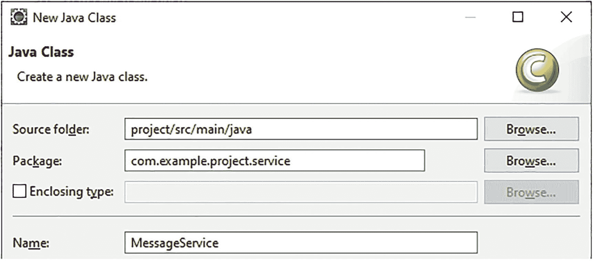

**图 2-26**

Eclipse 中的新建 Java 类向导

按如下方式修改新的服务类：

```
package com.example.project.service;
import java.util.List;
import com.example.project.model.Message;
import jakarta.ejb.Stateless;
import jakarta.persistence.EntityManager;
import jakarta.persistence.PersistenceContext;
@Stateless
public class MessageService {
@PersistenceContext
private EntityManager entityManager;
public void create(Message message) {
entityManager.persist(message);
}
public List list() {
return entityManager
.createQuery("FROM Message m", Message.class)
.getResultList();
}
}
```

基本上就是这样。让我们简要地过一下这些注解。

*   **@Stateless**：这将 bean 标记为无状态的 Jakarta Enterprise Beans 服务，以便应用服务器知道是否应该对其进行池化，以及何时启动和停止数据库事务。替代的注解是 `@Stateful` 和 `@Singleton`。请注意，`@Stateless` 并不意味着容器会确保类本身是无状态的。作为开发者，你仍然有责任确保该类不包含任何共享和可变的实例变量。否则，根据其用途，你最好将其标记为 `@Stateful` 或 `@Singleton`。

*   **@PersistenceContext**：这基本上是从项目中 `persistence.xml` 配置的持久化单元注入 Jakarta Persistence 实体管理器。实体管理器则负责将所有 Jakarta Persistence 实体映射到 SQL 数据库。它在底层会完成所有繁重的 JDBC 工作。

### 调整 Hello World

现在我们将调整之前创建的 `HelloWorld` 支持 bean，以便将消息保存到数据库中，并在表格中显示所有消息。

```
package com.example.project.view;
import java.util.List;
import com.example.project.model.Message;
import com.example.project.service.MessageService;
import jakarta.annotation.PostConstruct;
import jakarta.enterprise.context.RequestScoped;
import jakarta.inject.Inject;
import jakarta.inject.Named;
@Named @RequestScoped
public class HelloWorld {
private Message message = new Message();
private List messages;
@Inject
private MessageService messageService;
@PostConstruct
public void init() {
messages = messageService.list();
}
public void submit() {
messageService.create(message);
messages.add(message);
}
public Message getMessage() {
return message;
}
public List getMessages() {
return messages;
}
}
```

请注意，你不需要为 `message` 和 `messages` 设置 setter 方法。我们将使用 `Message` 实体本身的 getter 和 setter 方法。

最后，按如下方式调整 `hello.xhtml` 的 `<h:body>` 部分：

```
Hello World

#{message.id}
#{message.text}

```

现在，重启服务器，在你喜欢的网络浏览器中重新加载页面，并创建一些消息（参见图 2-27）。

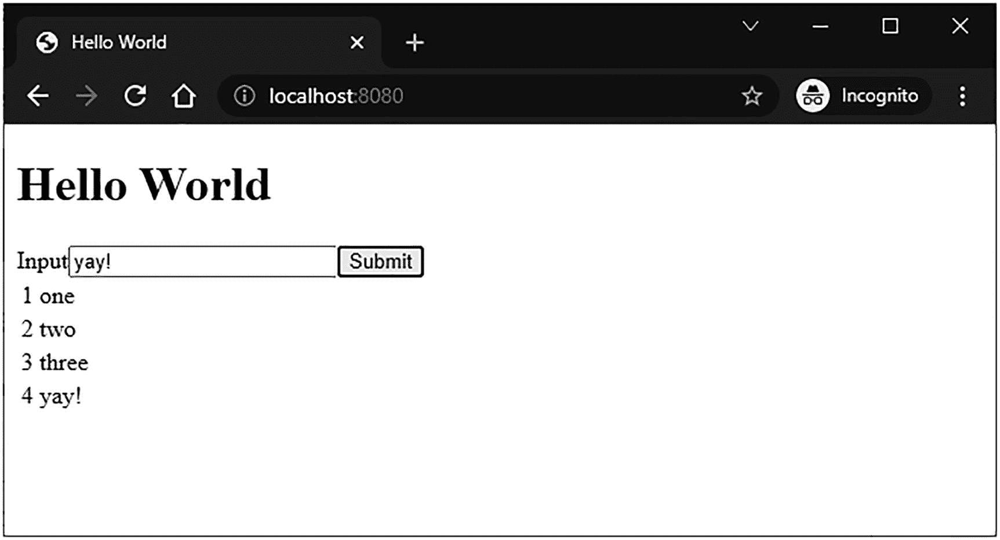

**图 2-27**

使用 Jakarta Faces、Jakarta CDI、Jakarta Enterprise Beans 和 Jakarta Persistence 的 Hello World

脚注 1   2   3

