# 3. 组件

Jakarta Faces 是一个基于组件的 MVC（模型-视图-控制器）框架。本质上，Jakarta Faces 将视图定义解析成一个“组件树”。这个树的根由与当前 faces 上下文实例关联的“视图根”实例表示。

```
UIComponent tree = FacesContext.getCurrentInstance().getViewRoot();
```

视图通常使用 Facelets 文件中的 XHTML+XML 标记来定义。XML 是一种标记语言，非常适合用最少的代码来定义树形层次结构。组件树也可以在 Java 类中使用 Java 代码创建和操作，但这通常会导致代码非常冗长，以便声明值或方法表达式，以及关联父组件和子组件。更好的方法是使用诸如 Jakarta Tags（以前称为 Jakarta Tags、Jakarta Pages Standard Tag Library）之类的标签处理器，仅使用 XML 来操作组件树。

组件树基本上定义了 Jakarta Faces 应如何处理 HTTP 请求，以便应用来自输入组件的请求值、转换和验证它们、更新受管 bean 模型值以及调用受管 bean 操作。它还定义了 Jakarta Faces 应如何通过使用与组件关联的渲染器生成必要的 HTML 输出来产生 HTTP 响应，这些组件的属性又可以引用受管 bean 属性。换句话说，组件树定义了应如何处理 Jakarta Faces 生命周期的各个阶段。图 3-1 中的图表显示了 Jakarta Faces 通常如何处理 HTTP 回发请求。

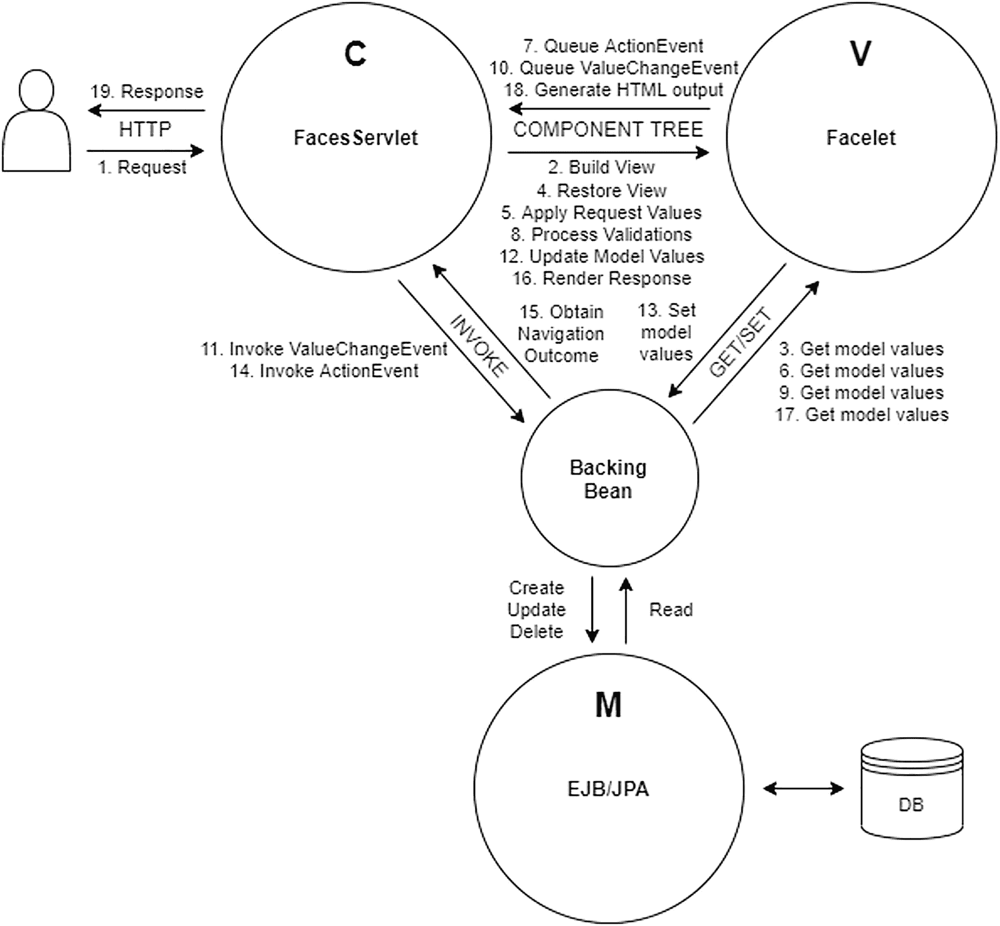

**图 3-1**

Jakarta Faces 如何在 MVC 架构中处理 HTTP 回发请求（数字表示顺序）

以下是每个步骤的简要说明：

1.  最终用户使用与 `FacesServlet` 映射匹配的 URL 发送 HTTP 请求，因此 `FacesServlet` 被调用。

2.  `FacesServlet` 将根据 HTTP 请求路径标识的 Facelets 文件构建组件树。

3.  在构建视图期间，组件树将在必要时从支持 bean 获取当前模型值。Facelets 模板标签和 Jakarta Tags 核心标签的任何属性，以及 Jakarta Faces 组件的仅“`id`”和“`binding`”属性将被执行。

4.  `FacesServlet` 将在组件树上恢复 Jakarta Faces 视图状态。

5.  `FacesServlet` 将让组件树应用 HTTP 请求参数，输入组件将它们存储为“提交的值”。

6.  输入和命令组件在检查其“`rendered`”、“`disabled`”和“`readonly`”属性以确定是否允许应用请求参数时，将在必要时从支持 bean 获取当前模型值。

7.  当命令组件基于 HTTP 请求参数检测到该命令组件的 HTML 表示在客户端被调用时，它将排队 `ActionEvent`。

8.  `FacesServlet` 将让组件树处理所有已注册的转换器和验证器对提交的值进行处理，输入组件将把新转换和验证的值存储为“本地值”。

9.  输入组件将从支持 bean 获取旧模型值，并将其与新值进行比较。

10. 如果新值与旧模型值不同，则输入组件将排队 `ValueChangeEvent`。

11. 当所有转换和验证完成后，`FacesServlet` 将在支持 bean 上调用任何已排队的 `ValueChangeEvent` 的监听器方法。

12. `FacesServlet` 将让组件树更新所有模型值。

13. 输入组件将在支持 bean 中设置新的模型值。


14. `FacesServlet` 将调用后台 bean 中任何已排队的 `ActionEvent` 的监听器方法。

15. 如有必要，后台 bean 的最终操作方法将返回一个非 `null` 的 `String` 结果，该结果指向目标视图。

16. `FacesServlet` 将让组件树渲染 HTTP 响应。

17. 在生成 HTML 输出时，组件树将（如有必要）从后台 bean 获取当前的模型值。实际上，任何参与生成 HTML 输出的 Facelets 组件和 Jakarta Faces 组件的属性都将被执行。

18. 组件树会将 HTML 输出写入 HTTP 响应。

19. `FacesServlet` 会将 HTTP 响应返回给最终用户。

这与基于请求的 MVC 框架不同，在后者中，开发者需要在与视图关联的“控制器”类中编写更多样板代码，以定义需要应用哪些请求参数，以及在填充实体之前应如何转换和验证这些参数。开发者通常还需要在调用操作之前，通过手动调用一系列 getter 和 setter 来手动填充实体，然后再将实体传递给服务层。在像 Jakarta Faces 这样的基于组件的 MVC 框架中，所有这些都不是必需的。

需要注意的是，后台 bean 在 MVC 范式中占据着相当独特的位置。根据视角的不同，它可以充当模型、视图和控制器。这一点将在第 8 章中详细说明。

## 标准 HTML 组件

默认的 Jakarta Faces 实现已经提供了一套广泛的组件，用于借助 Facelets 视图技术编写 HTML 页面。这些 HTML 组件位于 `jakarta.faces.html` XML 命名空间 URI（统一资源标识符）下，该 URI 应分配给“`h`”XML 命名空间前缀。

```
Jakarta Faces 页面中最重要的 HTML 组件是 `<h:head>` 和
`<h:body>`，它们必须始终存在。
没有它们，Jakarta Faces 将无法自动包含与特定组件关联的任何脚本或样式表资源。
例如，`<h:commandButton>`（用于生成 HTML 提交按钮）可以通过 `<f:ajax>` 标签可选地包含 Ajax 功能。
此 Ajax 功能需要将 `faces.js` 脚本文件包含在 HTML 文档中。该组件的渲染器会自动处理这一点，但这只有在 `<h:head>` 存在时才能正常工作。

`<h:body>` 对于 Ajax 功能并非必需，但可能存在一些组件需要在 HTML 正文末尾添加脚本，以便在页面加载期间执行初始化，例如 `<f:websocket>`，它需要在 JavaScript 中创建一个新的 `window.WebSocket` 实例。换句话说，最精简且符合 HTML5 规范的 Jakarta Faces 视图定义如下所示：

```

标题

...

```

生成的 HTML 响应（您可以通过在普通 Web 浏览器中右键单击“查看页面源代码”来检查）应如下所示：

```

标题

...

```

您可以看到，Jakarta Faces 基本上将视图定义中的所有组件替换为其生成的 HTML 输出。如前所述，Jakarta Faces 提供了一套广泛的标准 HTML 组件。表 3-1 提供了概览。

表 3-1
Jakarta Faces 提供的标准 HTML 组件

组件标签 |
 组件超类 |
 值类型 |
 HTML 输出 |
 自版本 |

| --- | --- | --- | --- | --- | --- | --- | --- | --- | --- | --- |

<h:body> |
 UIOutput |
 - |
 <body> |
 2.0 |

<h:button> |
 UIOutcomeTarget |
 String |
 <button onclick=window.location> |
 2.0 |

<h:column> |
 UIColumn |
 - |
 <td>（用于 h:dataTable） |
 1.0 |

<h:commandButton> |
 UICommand |
 String |
 <input type=submit> |
 1.0 |

<h:commandLink> |
 UICommand |
 String |
 <a onclick=form.submit()> |
 1.0 |

<h:commandScript> |
 UICommand |
 - |
 <script>（用于提交表单的函数） |
 2.3 |

<h:dataTable> |
 UIData |
 Object[ ] |
 <table>（动态） |
 1.0 |

<h:doctype> |
 UIOutput |
 - |
 <!DOCTYPE> |
 2.0 |

<h:form> |
 UIForm |
 - |
 <form method=post> |
 1.0 |

<h:graphicImage> |
 UIGraphic |
 - |
  |
 1.0 |

<h:head> |
 UIOutput |
 - |
 <head> |
 2.0 |

<h:inputFile> |
 UIInput |
 Part |
 <input type=file> |
 2.2 |

<h:inputHidden> |
 UIInput |
 Object |
 <input type=hidden> |
 1.0 |

<h:inputSecret> |
 UIInput |
 Object |
 <input type=password> |
 1.0 |

<h:inputText> |
 UIInput |
 Object |
 <input type=text> |
 1.0 |

<h:inputTextarea> |
 UIInput |
 Object |
 <textarea> |
 1.0 |

<h:link> |
 UIOutcomeTarget |
 String |
 <a href> |
 2.0 |

<h:message> |
 UIMessage |
 - |
 <span>（如有必要） |
 1.0 |

<h:messages> |
 UIMessages |
 - |
 <ul> |
 1.0 |

<h:messages layout=table> |
 UIMessages |
 - |
 <table> |
 1.0 |

<h:outputFormat> |
 UIOutput |
 Object |
 <span>（如有必要） |
 1.0 |

<h:outputLabel> |
 UIOutput |
 String |
 <label> |
 1.0 |

<h:outputText> |
 UIOutput |
 Object |
 <span>（如有必要） |
 1.0 |

<h:outputScript> |
 UIOutput |
 - |
 <script> |
 2.0 |

<h:outputStylesheet> |
 UIOutput |
 - |
 <link rel=stylesheet> |
 2.0 |

<h:panelGrid> |
 UIPanel |
 - |
 <table>（静态） |
 1.0 |

<h:panelGroup> |
 UIPanel |
 - |
 <span> |
 1.0 |

<h:panelGroup layout=block> |
 UIPanel |
 - |
 <div> |
 1.2 |

<h:selectBooleanCheckbox> |
 UIInput |
 Boolean |
 <input type=checkbox> |
 1.0 |

<h:selectManyCheckbox> |
 UIInput |
 Object[ ] |
 <table><input type=checkbox>* |
 1.0 |


<h:selectManyCheckbox layout=list> |
 UIInput |
 Object[] |
 <ul><li><input type=checkbox>* |
 4.0 |

<h:selectManyListbox> |
 UIInput |
 Object[ ] |
 <select multiple size=n><option>* |
 1.0 |

<h:selectManyMenu> |
 UIInput |
 Object[ ] |
 <select multiple size=1><option>* |
 1.0 |

<h:selectOneListbox> |
 UIInput |
 Object |
 <select size=n><option>* |
 1.0 |

<h:selectOneMenu> |
 UIInput |
 Object |
 <select size=1><option>* |
 1.0 |

<h:selectOneRadio> |
 UIInput |
 Object |
 <table><input type=radio>* |
 1.0 |

<h:selectOneRadio layout=list> |
 UIInput |
 Object |
 <ul><li><input type=radio>* |
 4.0 |

<h:selectOneRadio group> |
 UIInput |
 Object |
 <input type=radio name=group> |
 2.3 |

“组件超类”一列指明了该组件所继承的最重要的 `UIComponent` 超类。你必须将指定的类理解为来自 `jakarta.faces.component` 包。
“值类型”一列指明了组件 `value` 属性背后模型值所支持的类型（如果存在的话）。如果值类型是 `String`，则意味着只有模型值的 `toString()` 结果会被用作组件的值，通常用于那些将其渲染为某种标签的组件。如果是 `Object`，则意味着它支持任何类型的值，通常用于那些将其渲染为文本或将其解析为输入值的组件，必要时可借助隐式或显式的 `Converter`。如果值类型是 `Object[]`，则意味着它需要一个对象数组或集合作为模型值，通常用于数据和多选输入组件，必要时可借助隐式或显式的 `Converter`。
有两个专门的输入组件：`<h:inputFile>`，它将上传的文件绑定到 `jakarta.servlet.http.Part` 属性，并且不支持输出它——出于安全原因——以及 `<h:selectBooleanCheckbox>`，它将选中的值绑定到 `boolean` 属性。这两个输入组件不支持 `Converter`，因此也不支持任何其他模型值类型。
“HTML 输出”一列指明了生成的最简 HTML 输出。如果 HTML 输出显示“必要时”，则意味着仅当组件指定了任何需要作为 HTML 元素属性输出的属性（例如 `id`、`styleClass` 和 `onclick`）时，才会生成指定的 HTML 元素。也就是说，组件可能具有一些根本不会出现在生成的 HTML 输出中的属性，例如 `binding`、`rendered` 和 `converter`。如果一个组件可以有多种 HTML 元素表示形式，那么这通常由 `layout` 属性控制，正如你在 `<h:messages>` 和 `<h:panelGroup>` 中所见。如果 HTML 输出包含“*”（星号），则意味着该组件可能会生成零个或多个指定的嵌套 HTML 元素。
“自版本”一列指明了该 HTML 组件首次可用的 Jakarta Faces 版本。在本书撰写时，可用的 Jakarta Faces 版本如下：1.0（2004 年 3 月）、1.1（2004 年 5 月）、1.2（2006 年 5 月）、2.0（2009 年 7 月）、2.1（2010 年 11 月）、2.2（2013 年 3 月）、2.3（2017 年 3 月）、2.0（2020 年 10 月）和 4.0（2022 年 5 月）。
各个 HTML 组件的详细信息将在第 4 章和第 6 章中介绍。

标准核心标签

除了标准 HTML 组件之外，Jakarta Faces 还提供了一组“核心”标签。这些本质上是“辅助”标签，允许你通过将它们嵌套在目标 HTML 组件中或包裹在它们周围，以声明方式配置一个或多个目标 HTML 组件。这些核心标签可在 XML 命名空间 URI `jakarta.faces.core` 下使用，该 URI 应分配给“`f`”XML 命名空间前缀。

从技术上讲，这些标签旨在可重用于非 HTML 组件。Jakarta Faces 还提供了将不同的渲染套件附加到组件树的可能性，该渲染套件不生成 HTML 输出，而是生成不同的标记，因此使用了不同的 XML 命名空间。表 3-2 提供了一个概览。

表 3-2
Jakarta Faces 提供的标准核心标签

核心标签 |
 创建/处理 |
 目标组件 |
 自版本 |

| --- | --- | --- | --- | --- | --- | --- | --- | --- |

<f:actionListener> |
 jakarta.faces.event.ActionListener |
 ActionSource |
 1.0 |

<f:ajax> |
 jakarta.faces.component.behavior.AjaxBehavior |
 ClientBehaviorHolder(s) |
 2.0 |

<f:attribute> |
 UIComponent#getAttributes( ) |
 UIComponent |
 1.0 |

<f:attributes> |
 UIComponent#getAttributes( ) |
 UIComponent |
 2.2 |

<f:convertDateTime> |
 jakarta.faces.convert.DateTimeConverter |
 (Editable)ValueHolder |
 1.0 |

<f:convertNumber> |
 jakarta.faces.convert.NumberConverter |
 (Editable)ValueHolder |
 1.0 |

<f:converter> |
 jakarta.faces.convert.Converter |
 (Editable)ValueHolder |
 1.0 |

<f:event> |
 jakarta.faces.event.ComponentSystemEvent |
 UIComponent |
 2.0 |

<f:facet> |
 UIComponent#getFacets( ) |
 UIComponent |
 1.0 |

<f:importConstants> |
 jakarta.faces.component.UIImportConstants |
 UIViewRoot (metadata) |
 2.3 |

<f:loadBundle> |
 java.util.ResourceBundle |
 UIViewRoot |
 1.0 |

<f:metadata> |
 jakarta.faces.view.ViewMetadata |
 UIViewRoot |
 2.0 |

<f:param> |
 jakarta.faces.component.UIParameter |
 UIComponent |
 1.0 |

<f:passthroughAttribute> |
 UIComponent#getPassthroughAttributes( ) |
 UIComponent |
 2.2 |

<f:passthroughAttributes> |
 UIComponent#getPassthroughAttributes( ) |
 UIComponent |
 2.2 |

<f:phaseListener> |
 jakarta.faces.event.PhaseListener |
 UIViewRoot |
 1.0 |

<f:selectItem> |
 jakarta.faces.component.UISelectItem |
 UISelectOne/UISelectMany |
 1.0 |

<f:selectItems> |
 jakarta.faces.component.UISelectItems |
 UISelectOne/UISelectMany |
 1.0 |

<f:setPropertyActionListener> |
 jakarta.faces.event.ActionListener |
 ActionSource |
 1.0 |

<f:subview> |
 jakarta.faces.component.NamingContainer |
 UIComponents |
 1.0 |

<f:validateBean> |
 jakarta.faces.validator.BeanValidator |
 UIForm |
 2.0 |

<f:validateDoubleRange> |
 jakarta.faces.validator.DoubleRangeValidator |
 EditableValueHolder |
 1.0 |

<f:validateLength> |
 jakarta.faces.validator.LengthValidator |
 EditableValueHolder |
 1.0 |

<f:validateLongRange> |
 jakarta.faces.validator.LongRangeValidator |
 EditableValueHolder |
 1.0 |

<f:validateRegex> |
 jakarta.faces.validator.RegexValidator |
 EditableValueHolder |
 2.0 |

<f:validateRequired> |
 jakarta.faces.validator.RequiredValidator |
 EditableValueHolder |
 2.0 |

<f:validateWholeBean> |
 jakarta.faces.validator.BeanValidator |
 UIForm |
 2.3 |

<f:validator> |
 jakarta.faces.validator.Validator |
 EditableValueHolder |
 1.0 |

<f:valueChangeListener> |
 jakarta.faces.event.ValueChangeListener |
 EditableValueHolder |
 1.0 |

<f:view> |
 jakarta.faces.component.UIViewRoot |
 UIComponents |
 1.0 |

<f:viewAction> |
 jakarta.faces.component.UIViewAction |
 UIViewRoot (metadata) |
 2.2 |

<f:viewParam> |
 jakarta.faces.component.UIViewParameter |
 UIViewRoot (metadata) |
 2.0 |

<f:websocket> |
 jakarta.faces.component.UIWebsocket |
 UIViewRoot (body resource) |
 2.3 |


“创建/处理”列指定了核心标签在指定目标组件上创建或处理的内容。
“目标组件”列指定了核心标签所支持的目标组件超类或接口。你必须将指定的超类或接口理解为来自 `jakarta.faces.component` 包。如果目标组件以可选复数形式出现，如 `UIComponent(s)`，则表示核心标签可以嵌套在目标组件内部，也可以包装在一个或多个目标组件中。如果目标组件以显式复数形式出现，如 `UIComponents`，则表示核心标签只能包装一个或多个目标组件，因此不能嵌套。

至于目标组件接口，`ActionSource` 接口由 `UICommand` 组件实现。`ClientBehaviorHolder` 接口由 `UIForm`、`UIInput`、`UICommand`、`UIData`、`UIOutput`、`UIPanel` 和 `UIOutcomeTarget` 组件实现。`ValueHolder` 接口由 `UIOutput` 和 `UIInput` 组件实现。`EditableValueHolder` 接口由 `UIInput` 组件实现。根据表 3-1，你应该能够从中推导出实际的 HTML 组件。

“自”列指明了核心标签首次可用的 Jakarta Faces 版本。在撰写本书时，可用的 Jakarta Faces 版本如下：1.0（2004 年 3 月）、1.1（2004 年 5 月）、1.2（2006 年 5 月）、2.0（2009 年 7 月）、2.1（2010 年 11 月）、2.2（2013 年 3 月）、2.3（2017 年 3 月）、2.0（2020 年 10 月）和 4.0（2022 年 5 月）。
大多数单独的核心标签会在不同的章节中详细说明。

生命周期
Jakarta Faces 拥有一个定义非常清晰的生命周期。它被分解为六个阶段。每个阶段都会让 HTTP 请求穿过组件树，对其执行操作，并触发组件系统事件。本章引言部分已结合图表（图 3-1）给出了简要描述。以下各节将描述 Jakarta Faces 生命周期的每个单独阶段。

恢复视图阶段（第一阶段）
首先，创建 `UIViewRoot` 实例，并根据任何 `<f:view>` 标签设置其属性，例如 `locale`。此时组件树通常是空的。仅当当前请求是回传请求，或者视图包含带有子元素的 `<f:metadata>` 时，才会根据视图定义构建完整的组件树。基本上，会根据视图中定义的组件标签实例化一个特定的 `UIComponent` 子类，并用视图中定义的所有属性填充它，然后调用 `UIComponent#setParent()`，并传入实际的父组件。
`UIComponent#setParent()` 方法会首先检查是否已存在一个父组件，如果存在，则会在旧父组件上触发 `PreRemoveFromViewEvent`。然后，当新父组件设置完毕，当前组件成为组件树的一部分时，会使用当前组件触发 `PostAddToViewEvent`。
如果当前请求是回传请求，则会将由 `jakarta.faces.ViewState` 请求参数标识的“视图状态”恢复到新构建的组件树中。之后，会为树中的每个组件显式触发 `PostRestoreStateEvent`，即使组件树实际上并未被恢复。换句话说，即使不是回传请求，也会触发该事件。你最好将该事件重新理解为“`PostRestoreViewPhase`”。如果你在 `PostRestoreStateEvent` 期间确实关心它是否是回传请求，那么你还应该查阅 `FacesContext#isPostback()`。
到恢复视图阶段结束时，如果组件树仍然为空，则生命周期将立即前进到渲染响应阶段（第六阶段），从而跳过中间的任何阶段。

应用请求值阶段（第二阶段）
`UIComponent#processDecodes()` 方法将在 `UIViewRoot` 上被调用。`processDecodes()` 方法会首先在每个子组件和 facet 上调用 `processDecodes()` 方法，然后在其自身上调用 `UIComponent#decode()`。最后，将调用 `UIViewRoot#broadCastEvents()` 来触发为当前阶段排队的任何 `FacesEvent`。默认的 Jakarta Faces API（应用程序编程接口）不为应用请求值阶段提供此类事件，但开发者可以创建并排队自己的事件。
`decode()` 方法的默认实现将委托给 `Renderer#decode()` 方法。在组件或渲染器的 `decode()` 方法中，实现有机会从 HTTP 请求参数中提取提交的值，并将其设置为内部属性。在标准 HTML 组件集中，唯一执行此操作的组件是派生自 `UIForm`、`UIInput` 和 `UICommand` 的基于 HTML 表单的组件。`UIForm` 组件将使用 `true` 调用 `UIForm#setSubmitted()`。`UIInput` 组件将使用 HTTP 请求参数值调用 `UIInput#setSubmittedValue()`。`UICommand` 组件将为调用应用程序阶段（第五阶段）排队 `ActionEvent`。

处理验证阶段（第三阶段）
`UIComponent#processValidators()` 将在 `UIViewRoot` 上被调用。`processValidators()` 方法基本上会首先为当前组件触发 `PreValidateEvent`，然后在每个子组件和 facet 上调用 `processValidators()`，最后为当前组件触发 `PostValidateEvent`。之后，将调用 `UIViewRoot#broadCastEvents()` 来触发为当前阶段排队的任何 `FacesEvent`，这通常是 `ValueChangeEvent` 的一个实例。
在标准 HTML 组件集中，只有 `UIInput` 组件在此处行为不同。在调用每个子组件和 facet 的 `processValidators()` 之前，它们会首先在其自身上调用 `UIInput#validate()`。如果在应用请求值阶段（第二阶段）设置了提交的值，那么它们会首先在任何附加的 `Converter` 上调用 `Converter#getAsObject()`。如果它没有抛出 `ConverterException`，那么它们会在每一个附加的 `Validator` 实例上调用 `Validator#validate()`，无论其中是否有任何一个抛出了 `ValidatorException`。如果没有抛出 `ConverterException` 或 `ValidatorException`，则将使用转换并验证后的值调用 `UIInput#setValue()`，并且 `UIInput#isLocalValueSet()` 标志将返回 `true`，同时将使用 `null` 调用 `UIInput#setSubmittedValue()`。如果抛出了任何 `ConverterException` 或 `ValidatorException`，则将使用 `false` 调用 `UIInput#setValid()`，并且异常消息将通过 `FacesContext#addMessage()` 添加到 faces 上下文中。最后，当 `UIInput#isValid()` 返回 `false` 时，将使用 `true` 调用 `FacesContext#setValidationFailed()`。
到该阶段结束时，如果 `FacesContext#isValidationFailed()` 返回 `true`，则生命周期将立即前进到渲染响应阶段（第六阶段），从而跳过中间的任何阶段。


更新模型值阶段（第四阶段）
`UIViewRoot` 上会调用 `UIComponent#processUpdates()` 方法。`processUpdates()` 方法随后会依次在每个子组件和方面（facet）上调用 `processUpdates()` 方法。最后，将调用 `UIViewRoot#broadCastEvents()` 来触发为当前阶段排队的任何 `FacesEvent`。默认的 Jakarta Faces API 并未为更新模型值阶段提供此类事件，但开发者可以创建并排队自己的事件。
同样在此阶段，来自标准 HTML 组件集的组件中，只有 `UIInput` 组件具有额外的功能。在每个子组件和方面上调用 `processUpdates()` 之后，它们会在自身调用 `UIInput#updateModel()`。当 `UIInput#isValid()` 和 `UIInput#isLocalValueSet()` 都返回 `true` 时，它们将以 `getLocalValue()` 作为参数调用 `value` 属性背后的 setter 方法，并立即以 `null` 为参数调用 `UIInput#setValue()`，并通过让 `UIInput#isLocalValueSet()` 返回 `false` 来清除其标志。
如果此处抛出 `RuntimeException`（通常由 setter 方法本身的错误引起），则会以 `false` 为参数调用 `UIInput#setValid()` 并排队 `UpdateModelException`，生命周期将立即前进到渲染响应阶段（第六阶段），从而跳过其间的任何阶段。

调用应用程序阶段（第五阶段）
将调用 `UIViewRoot#processApplication()` 方法。此方法随后会调用 `UIViewRoot#broadCastEvents()` 来触发为当前阶段排队的任何 `FacesEvent`，这通常是 `AjaxBehaviorEvent` 或 `ActionEvent` 的实例。请注意，`processApplication()` 方法仅在 `UIViewRoot` 类上定义，并且不会遍历组件树。

渲染响应阶段（第六阶段）
当组件树仍为空时（即，当 HTTP 请求不是回发请求，或者视图没有带子元素的 `<f:metadata>`，或者开发者在此期间使用自己的实例显式调用了 `FacesContext#setViewRoot()`），则基于视图定义构建完整的组件树。当组件树存在时，首先为 `UIViewRoot` 触发 `PreRenderViewEvent`，然后在 `UIViewRoot` 上调用 `UIComponent#encodeAll()`，最后为 `UIViewRoot` 触发 `PostRenderViewEvent`。
每个组件的 `UIComponent#encodeAll()` 方法基本上会首先调用其自身的 `encodeBegin()` 方法。然后，如果 `getRendersChildren()` 方法返回 `true`，则组件将调用其自身的 `encodeChildren()` 方法，否则它将在每个子组件上调用 `encodeAll()`。最后，组件将调用其自身的 `encodeEnd()` 方法。这一切仅在 `UIComponent#isRendered()` 返回 `true` 时发生——即，当组件标签的 `rendered` 属性计算结果不为 `false` 时。
`encodeBegin()` 方法的默认实现将首先为当前组件触发 `PreRenderComponentEvent`，然后委托给 `Renderer#encodeBegin()`。`encodeChildren()` 方法的默认实现将委托给 `Renderer#encodeChildren()`。`encodeEnd()` 方法的默认实现将委托给 `Renderer#encodeEnd()`。如果组件没有附加渲染器，即当 `UIComponent#getRendererType()` 返回 `null` 时，则不会向响应中渲染任何 HTML 输出。
在 `encodeBegin()` 方法中，组件或渲染器实现有机会将开头的 HTML 元素及其所有属性写入响应。在 `encodeChildren()` 方法中，组件或渲染器实现有机会在必要时装饰或覆盖子元素的渲染。在 `encodeEnd()` 方法中，组件或渲染器实现有机会写入结束的 HTML 标签。写入响应是通过 `FacesContext#getResponseWriter()` 提供的响应写入器完成的。
对于在任何阶段触发的任何提到的 `XxxEvent` 类，如果任何监听器方法抛出 `jakarta.faces.event.AbortProcessingException`，^(⁴) 则当前正在运行的阶段将立即中止，并且生命周期将立即前进到渲染响应阶段（第六阶段），从而跳过其间的任何阶段。

Ajax 生命周期
在 Ajax 请求期间，生命周期几乎相同。只有第二、第三、第四和第六阶段略有不同。`processDecodes()`、`processValidators()` 和 `processUpdates()` 方法将仅在 `UIViewRoot` 本身以及 `<f:ajax execute>` 中指定的组件搜索表达式所涵盖的任何组件上调用。而 `encodeAll()` 方法将仅在 `UIViewRoot` 本身以及 `<f:ajax render>` 中指定的组件搜索表达式所涵盖的任何组件上调用。有关搜索表达式的更多信息，请参阅第 12 章。
因此请注意，当组件搜索表达式包含“`@all`”关键字时，Ajax 生命周期没有区别。它会不必要地处理和编码整个组件树。换句话说，请谨慎使用“`@all`”。对于 `<f:ajax execute="@all">`，没有合理的实际用例。在 HTML 方面，不可能一次提交多个表单。只有包含的表单会被提交。因此，最大的价值在于 `<f:ajax execute="@form">`。然而，对于 `<f:ajax render="@all">` 有一个合理的实际用例，即在 Ajax 请求期间抛出异常时渲染完整的错误页面。即便如此，这也可以通过 `PartialViewContext#setRenderAll()` 以编程方式更好地触发。有关更多详细信息，请参阅第 9 章。


视图构建时间
“视图构建时间”并不与 Jakarta Faces 生命周期的特定阶段绑定。视图构建时间是指根据视图定义，用其所有子节点填充物理 `UIViewRoot` 实例的时刻。

当 Jakarta Faces 即将根据视图定义创建 `UIComponent` 实例时，它会首先检查 `binding` 属性（如果有）背后的 getter 方法是否返回一个具体的 `UIComponent` 实例。
如果是，则继续使用该实例；否则，根据与之关联的“组件类型”创建 `UIComponent` 实例，然后调用 `binding` 属性（如果有）背后的 setter 方法。如果指定了 `id` 属性，则会调用 `UIComponent#setId()`。最后，会调用 `UIComponent#setParent()` 传入父组件，然后该组件实例在物理上成为组件树的一部分。此树将一直存在，直到渲染响应阶段（第六阶段）结束。之后，它连同已释放的 faces 上下文实例一起，有资格被垃圾回收器回收。

因此，`UIComponent` 实例本质上是请求作用域的。`binding` 属性可以引用一个受管 bean 属性，但由于 `UIComponent` 实例本质上是请求作用域的，目标受管 bean 也必须是请求作用域的，而不能是更宽的作用域。Jakarta Faces API 不会检查这一点，因此作为 Jakarta Faces 开发者，你务必确保不会在任何组件的 `binding` 属性中引用更宽作用域的受管 bean。

当任何组件的 `binding` 属性错误地引用了一个作用域宽于请求作用域的受管 bean 时，你不仅会在 bean 是视图或会话作用域的情况下，将整个组件树基本保存到 HTTP 会话中，而且还会在并发访问同一个受管 bean 实例的多个 HTTP 请求之间共享整个组件树。这非常低效且危险。

从技术上讲，视图构建时间可以发生在 Jakarta Faces 生命周期的任何阶段。通常，它发生在恢复视图阶段（第一阶段），特别是在回传请求期间，或者当视图包含带有子节点的 `<f:metadata>` 时。它也可能发生在渲染响应阶段（第六阶段），特别是在 GET 请求期间，当视图没有带有子节点的 `<f:metadata>` 时，或者当回传期间发生了非重定向导航时。当开发者以编程方式调用 `ViewDeclarationLanguage#buildView()` 时也会发生，这可以通过 `ViewHandler#createView()` 等方式隐式完成，如下面的操作方法示例所示，该方法强制 Jakarta Faces 从头开始完全重建当前视图：

```
public void rebuildCurrentView() {
FacesContext context = FacesContext.getCurrentInstance();
UIViewRoot currentView = context.getViewRoot();
String viewId = currentView.getViewId();
ViewHandler viewHandler = context.getApplication.getViewHandler();
UIViewRoot newView = viewHandler.createView(context, viewId);
context.setViewRoot(newView);
}
```

请注意，视图状态并不一定在视图构建期间被恢复到组件树中。视图状态仅在恢复视图阶段（第一阶段）被恢复到组件树中，并且这发生在 `FacesServlet` 自行执行视图构建时间之后。换句话说，前面展示的 `rebuildCurrentView()` 方法不会将当前视图状态恢复到新创建的组件树中。当像上面那样以编程方式重建视图时，通常不建议以编程方式恢复视图状态，因为在真实的 Jakarta Faces 应用程序中，重建当前视图的唯一原因通常是摆脱由持久化视图状态引起的任何更改，和/或基于受管 bean 中新更改的值强制重新执行任何 Jakarta 标签。

视图渲染时间
“视图渲染时间”也不与 Jakarta Faces 生命周期的特定阶段绑定。视图渲染时间是指调用特定组件的 `UIComponent#encodeAll()` 的时刻。
诚然，默认情况下，它总是在渲染响应阶段（第六阶段）由 `FacesServlet` 在 `UIViewRoot` 上执行，但这并不妨碍你在不同阶段以编程方式调用它，例如在调用应用程序阶段（第五阶段），以便将任意组件生成的 HTML 输出作为 `String` 变量获取。

视图状态
正如“视图构建时间”部分所述，构成组件树的 `UIComponent` 实例本质上是请求作用域的。它们在视图构建期间创建，并在渲染响应阶段（第六阶段）之后立即销毁。对 `UIComponent` 实例属性的任何更改（这些属性未被 EL（表达式语言）表达式引用，且与其默认值不同）都将作为“视图状态”保存。换句话说，“视图状态”绝对不等同于“组件树”。此外，如果整个组件树本身被保存在视图状态中，这不仅会导致不必要的臃肿视图状态，还会导致应用程序行为损坏，因为 `UIComponent` 实例本质上不是线程安全的，因此绝对不能跨多个 HTTP 请求共享。

保存视图状态通常发生在视图渲染期间。在此过程中，Jakarta Faces 会将视图状态写入生成的每个 Jakarta Faces 表单的 HTML 表示中的一个 `jakarta.faces.ViewState` 隐藏输入字段。当 Jakarta Faces “状态保存方法”设置为默认值“server”时，隐藏输入值代表一个唯一标识符，引用存储在 HTTP 会话中的序列化视图状态对象。当使用以下 `web.xml` 上下文参数将 Jakarta Faces “状态保存方法”显式设置为“client”时，隐藏输入值本身代表序列化视图状态对象的加密形式。

```
jakarta.faces.STATE_SAVING_METHOD
client

faces/ClientSideSecretKey
java.lang.String
[AES key in Base64 format]

```

请注意，如果你在服务器集群（“云”）上运行 Jakarta Faces 应用程序，或者希望视图状态在服务器重启后仍然有效，则必须显式指定带有固定 AES（高级加密标准）密钥的 `faces/ClientSideSecretKey` 环境条目。你可以使用以下简单的 Java 代码片段自己生成 Base64 编码的 AES 密钥：

```
KeyGenerator keyGen = KeyGenerator.getInstance("AES");
keyGen.init(256); // 如果没有 JCE，则使用 128。
byte[] rawKey = keyGen.generateKey().getEncoded();
String key = Base64.getEncoder().encodeToString(rawKey);
System.out.println(key); // 打印 Base64 格式的 AES 密钥。
```


标准 Jakarta Faces 表单（以 `<h:form>` 为代表）默认使用 `POST` 方法提交到与包含该表单的 Jakarta Faces 页面所请求的完全相同的 HTTP 请求 URI。换句话说，当你通过 `http://example.com/project/page.xhtml` 请求一个 Jakarta Faces 页面时，表单将提交到完全相同的 `http://example.com/project/page.xhtml` URI。这在 Web 开发术语中被称为“回发”。当 Jakarta Faces 需要处理一个传入的回发请求时，恢复视图阶段（第一阶段）将在视图构建时间之后，从 `jakarta.faces.ViewState` HTTP 请求参数中提取视图状态，并将所有已更改的属性恢复到当前请求中新创建的 `UIComponent` 实例中，以便组件树最终能够精确反映与先前请求的视图渲染期间完全相同的状态。

在一般的 Jakarta Faces Web 应用程序中，保存的视图状态的主要部分由实现 `jakarta.faces.component.EditableValueHolder` 接口的 `UIComponent` 实例的内部属性表示，^(⁵) 这涵盖了所有 `UIInput` 组件，例如 `<h:inputText>`。当提交 Jakarta Faces 表单因转换或验证错误而失败时，所有已更改的“是否有效？”状态和“本地值”状态（可以是提交的字符串值，也可以是已转换并验证的值）都将为所有涉及的 `UIInput` 组件保存在视图状态中。这样做的一个主要优点是，开发人员无需担心手动跟踪这些状态，以便在向网站用户重新呈现提交的表单时保留所有有效和无效的值，同时使模型（受管 bean 属性）完全不受这些值的影响。这对于 Jakarta Faces 开发人员和网站用户来说都是一个主要的可用性优势。

保存的视图状态中的一小部分由对组件树层次结构或组件属性的程序化更改表示。其中，对 `readonly`、`disabled` 和 `rendered` 属性的任何程序化更改都会被跟踪在视图状态中，这样黑客就没有机会以某种方式伪造请求，使这些属性翻转到错误的一侧，从而让黑客可能执行潜在的危险操作。这是一个主要的安全优势。

视图作用域
Jakarta Faces 所基于的 Servlet API（以及其他技术）提供了三个定义明确的作用域：请求作用域、会话作用域和应用作用域。基本上，请求作用域是通过将目标对象存储为 `HttpServletRequest` 的一个属性来建立的。类似地，会话作用域是通过将目标对象存储为 `HttpSession` 的一个属性来建立的，而应用作用域是通过将目标对象存储为 `ServletContext` 的一个属性来建立的。
Jakarta Faces 在此基础上增加了一个作用域，即视图作用域。这不能与组件树本身混淆。组件树（物理上的 `UIViewRoot` 实例）在同一个 HTTP 请求期间被创建和销毁，因此显然是请求作用域的。视图作用域也不能与视图状态混淆，尽管它们密切相关。
当最终用户在 Jakarta Faces 表单上触发回发请求，并且应用程序不执行任何类型的导航（即，操作方法返回 `null` 或 `void`）时，视图状态标识符将保持不变，并且视图作用域的生命周期将延长到下一个回发请求，直到应用程序执行显式导航，或者 HTTP 会话过期。你可以通过将目标对象存储为 `UIViewRoot#getViewMap()` 的一个条目来建立视图作用域。这正是 Jakarta Faces 存储其 `@ViewScoped` 受管 bean 的地方。不，这个映射不会反过来存储在视图状态中，即使 Jakarta Faces 状态保存方法被显式设置为“客户端”也是如此。整个视图作用域存储在 HTTP 会话中，与视图状态分开。只有视图作用域标识符存储在视图状态中。只有 `UIViewRoot` 实例的已更改属性存储在视图状态中。

阶段事件
`jakarta.faces.event.PhaseListener` 接口^(⁶) 可用于监听 Jakarta Faces 生命周期的任何阶段。该接口定义了三个方法：`getPhaseId()`，它应返回你感兴趣的阶段；`beforePhase()`，它将在指定阶段执行之前被调用；以及 `afterPhase()`，它将在指定阶段执行之后被调用。在 `beforePhase()` 和 `afterPhase()` 方法中，你因此有机会在 `getPhaseId()` 指定的阶段之前或之后运行一些代码。

`jakarta.faces.event.PhaseId` 类^(⁷) 定义了一组公共常量。它仍然可以追溯到 Jakarta Faces 1.0，该版本仅在 Java 1.5 发布前几个月发布，因此为时已晚，无法成为真正的 `enum`。以下是这些常量及其序数值：

*   `PhaseId.ANY_PHASE` (0)
*   `PhaseId.RESTORE_VIEW` (1)
*   `PhaseId.APPLY_REQUEST_VALUES` (2)
*   `PhaseId.PROCESS_VALIDATIONS` (3)
*   `PhaseId.UPDATE_MODEL_VALUES` (4)
*   `PhaseId.INVOKE_APPLICATION` (5)
*   `PhaseId.RENDER_RESPONSE` (6)

阶段监听器实例可以通过多种方式注册。声明式地，它们可以通过 `faces-config.xml` 在整个应用程序范围内注册：

```
com.example.project.YourListener

```

或者通过 `<f:view>` 内的 `<f:phaseListener>` 标签在整个视图范围内注册：

```

...

```

编程式地，它们可以通过当前使用的 `jakarta.faces.lifecycle.Lifecycle` 实例的 `addPhaseListener()` 和 `removePhaseListener()` 方法在整个应用程序范围内添加和移除。^(⁸)

```
FacesContext context = FacesContext.getCurrentInstance();
Lifecycle lifecycle = context.getLifecycle();
lifecycle.addPhaseListener(new YourListener());
```

并且它们可以通过 `UIViewRoot` 的 `addPhaseListener()` 和 `removePhaseListener()` 方法在整个视图范围内添加和移除。

```
FacesContext context = FacesContext.getCurrentInstance();
UIViewRoot viewRoot = context.getViewRoot();
viewRoot.addPhaseListener(new YourListener());
```


`PhaseListener` 的具体示例见“自定义组件系统事件”一节。

## 组件系统事件

如“生命周期”一节所述，在 Jakarta Faces 生命周期中会触发一系列组件系统事件。这些事件继承自抽象类 `jakarta.faces.event.ComponentSystemEvent`。^(⁹) 概括来说，包括以下事件：

*   `PreRemoveFromViewEvent`：
    当组件即将从组件树中移除时触发。

*   `PostAddToViewEvent`：
    当组件已添加到组件树时触发。

*   `PostRestoreStateEvent`
    （读作“`PostRestoreViewEvent`”）：
    在恢复视图阶段结束时为每个组件触发。请注意，如果在此阶段视图尚未构建完成，则该事件仅针对 `UIViewRoot` 触发；如果视图已在此阶段构建完成，则针对树中所有组件触发。

*   `PreValidateEvent`：
    当组件即将处理其转换器和验证器时触发，即使实际没有转换器或验证器也会触发。

*   `PostValidateEvent`：
    当组件完成其转换器和验证器的处理时触发，即使实际没有转换器或验证器也会触发。

*   `PreRenderViewEvent`：
    当 `UIViewRoot` 即将向 HTTP 响应写入 HTML 输出时触发。请注意，这是更改 HTTP 响应目标或以编程方式操作组件树的最晚安全时机。在此之后进行操作，无法保证对响应或组件树的程序性更改能按预期生效，因为此时响应可能已提交，或视图状态可能已保存。

*   `PreRenderComponentEvent`：
    当组件即将向 HTTP 响应写入其 HTML 输出时触发。

*   `PostRenderViewEvent`：
    当 `UIViewRoot` 完成向 HTTP 响应写入 HTML 输出时触发。请注意，此事件自 Jakarta Faces 2.3 起新增，其余事件均来自 Jakarta Faces 2.0。

“生命周期”一节中还有两个组件系统事件未提及：

*   `PostConstructViewMapEvent`：
    当 `UIViewRoot` 刚刚启动视图作用域时触发。

*   `PreDestroyViewMapEvent`：
    当 `UIViewRoot` 即将销毁视图作用域时触发。

这两个事件并不严格绑定于基于六个阶段的组件生命周期，它们基本上可以在生命周期的任何时刻发生。`PostConstructViewMapEvent` 在应用程序首次调用 `UIViewRoot#getViewMap()` 时触发。默认情况下，这仅发生在当前视图状态的第一个 `@ViewScoped` 托管 Bean 被创建时。`PreDestroyViewMapEvent` 在应用程序对 `UIViewRoot#getViewMap()` 调用 `Map#clear()` 时触发，这通常发生在已存在已设置的实例时调用 `FacesContext#setViewRoot()` 的情况下。这将结束视图作用域并销毁所有活跃的 `@ViewScoped` 托管 Bean。通常，这仅发生在操作方法返回非 `null` 的导航结果时。

你可以通过 `jakarta.faces.event.ComponentSystemEventListener` 接口监听上述任何组件系统事件。^(¹⁰) 在 Jakarta Faces API 中，`UIComponent` 类本身已实现了 `ComponentSystemEventListener`。该接口提供了一个 `processEvent()` 方法，其参数为 `ComponentSystemEvent`，而该参数又包含一个 `getComponent()` 方法，用于返回触发事件的具体 `UIComponent` 实例。`UIComponent#processEvent()` 的默认实现会检查给定的 `ComponentSystemEvent` 参数是否为 `PostRestoreStateEvent` 的实例，以及是否指定了 `binding` 属性；如果是，则调用 `binding` 属性对应的 setter 方法，并将组件实例本身作为参数传入。

有三种方式可以为这些组件系统事件订阅监听器。第一种是在视图中声明式地使用 `<f:event>` 标签。该标签可以附加到任何组件标签上。在相对较多的 Jakarta Faces 2.0/2.1 相关资源中，你会看到如下示例：

其中 `onload()` 方法通常实现如下：

```
public void onload() {
FacesContext context = FacesContext.getCurrentInstance();
if (!context.isPostback() && !context.isValidationFailed()) {
// ...
}
}
```

请注意，`<f:event listener="#{bean.onload}">` 默认期望一个带有 `ComponentSystemEvent` 参数的方法，但如果你不需要该参数，为简洁起见可以省略，此时方法表达式应加括号，如 `<f:event listener="#{bean.onload()}">`，尽管所使用的 EL 实现可能对此宽容处理。

如前所示，使用 `<f:event type="preRenderView">` 本质上是一种变通方法，以便在 GET 请求期间，基于 `<f:viewParam>` 设置的模型值来模拟调用应用程序阶段。之所以需要这样做，是因为 `@PostConstruct` 不适合，它在 Bean 构造后立即被调用，远早于 `<f:viewParam>` 设置模型值。自 Jakarta Faces 2.2 引入新的 `<f:viewAction>` 后，就不再需要 `<f:event>` 这种技巧了：

其中 `onload()` 方法只需实现如下：

```
public void onload() {
// ...
}
```

`<f:event>` 的另一个实际应用场景是在复合组件的支持组件中实现类似 `@PostConstruct` 的行为，你可以安全地基于其属性执行任何必要的初始化。

```
...

...
#{cc.someInitializedValue}

```

其中 `SomeComposite` 类的 `init()` 方法如下所示：

```
private Object someInitializedValue; // +getter
public void init() {
Map attributes = getAttributes();
someInitializedValue = initializeItBasedOn(attributes);
}
```

第二种订阅组件系统事件监听器的方式是在 Java 代码中以编程方式使用 `UIComponent#subscribeToEvent()`。这允许你根据条件为现有组件订阅组件系统事件监听器。务必牢记，组件系统事件监听器会保存在视图状态中。换句话说，在后续回发请求的恢复视图阶段，它会被恢复到组件实例中。使用 `UIComponent#subscribeToEvent()` 时请记住这一点；否则，你可能会多次订阅同一个监听器。可以通过至少正确实现 `equals()` 方法和 `Serializable` 接口来避免这种情况。

这使得为特定组件以编程方式正确注册组件系统事件监听器变得有些复杂。如果是现有组件，最好改用 `<f:event>`；如果是自定义组件，最好改用 `@ListenerFor` 注解，这实际上是第三种方式。下面是一个以编程方式正确注册组件系统事件监听器的入门示例，前提是 `YourListener` 类正确实现了 `equals()` 和 `hashCode()` 方法，并且实现了 `Serializable`、`Externalizable` 或 `jakarta.faces.component.StateHolder` 接口，以便能正确保存在视图状态中。

```
Class event = PreRenderViewEvent.class;
ComponentSystemEventListener listener = new YourListener();
component.subscribeToEvent(event, listener);
```


如前所述，将监听器订阅到组件系统事件的第三种方式是声明式地使用 `@ListenerFor` 注解。你只能将此注解放在 `UIComponent` 或 `Renderer` 类上，不能将其放在支持 bean 类上。对于支持 bean 类，应改用 `<f:event>`。`@ListenerFor` 注解将目标事件作为值。具体的 `ComponentSystemEventListener` 实例就是 `UIComponent` 实例本身。如果该注解声明在 `Renderer` 类上，那么目标组件是 `UIComponent` 实例，其 `UIComponent#getRendererType()` 引用了特定的 `Renderer` 类。以下示例展示了自定义组件 `YourComponent` 的用法：

```
@FacesComponent("project.YourComponent")
@ListenerFor(systemEventClass=PostAddToViewEvent.class)
public class YourComponent extends UIComponentBase {
@Override
public void processEvent(ComponentSystemEvent event) {
if (event instanceof PostAddToViewEvent) {
// ...
}
else {
super.processEvent(event);
}
}
// ...
}
```

是的，这个 `instanceof` 检查是必要的。如“生命周期”一节所述，默认情况下，`PostRestoreStateEvent` 会为树中的任何组件显式触发。调用 `super.processEvent(event)` 是必要的，以防此组件指定了 `binding` 属性，因为默认的 `UIComponent#processEvent()` 实现在 `PostRestoreStateEvent` 期间会调用 binding 属性背后的 setter 方法。

**自定义组件系统事件**

你可以创建自己的 `ComponentSystemEvent` 类型。基本上，你需要做的就是继承 `ComponentSystemEvent` 抽象类，在其上声明 `@NamedEvent` 注解，最后在期望的时刻调用 `Application#publishEvent()`。

假设你想创建一个在调用应用阶段（第五阶段）之前触发的自定义组件系统事件，即 `PreInvokeApplicationEvent`。那么你可以按如下方式创建自定义事件：

```
@NamedEvent(shortName="preInvokeApplication")
public class PreInvokeApplicationEvent extends ComponentSystemEvent {
public PreInvokeApplicationEvent(UIComponent component) {
super(component);
}
}
```

以下是你如何使用自定义的 `PhaseListener` 来发布它：

```
public class PreInvokeApplicationListener implements PhaseListener {
@Override
public PhaseId getPhaseId() {
return PhaseId.INVOKE_APPLICATION;
}
@Override
public void beforePhase(PhaseEvent event) {
FacesContext context = FacesContext.getCurrentInstance();
context.getApplication().publishEvent(context,
PreInvokeApplicationEvent.class, context.getViewRoot());
}
@Override
public void afterPhase(PhaseEvent event) {
// NOOP.
}
}
```

在 `faces-config.xml` 中注册此阶段监听器后，你可以使用 `<f:event>` 或 `@ListenerFor` 来监听此事件。一个实际应用的例子是将其嵌套在 `<f:view>` 或主模板中，或者嵌套在特定的 `<h:form>` 中，这样你就不需要在模板客户端或表单中的多个 `UICommand` 组件上复制/粘贴完全相同的 `<f:actionListener>`，甚至不需要在多个模板客户端上复制/粘贴完全相同的 `<f:viewAction>`。

---

**Jakarta Tags**

如果你曾经使用 Jakarta Pages 进行过开发，那么你很可能会遇到过 Jakarta Tags。然而，在 Facelets 中，只有 Jakarta Tags 的一个有限子集得以重生。它们是 `<c:if>`、`<c:choose><c:when><c:otherwise>`、`<c:forEach>`、`<c:set>` 和 `<c:catch>`。本质上，这些标签名称与 Jakarta Pages 中的相同，但其实现是为 Facelets 完全重写的。这些 Jakarta Tags 在 `jakarta.tags.core` XML 命名空间 URI 下可用，该 URI 应分配给“`c`”XML 命名空间前缀。

Jakarta Tags 的生命周期与 Jakarta Faces 标准 HTML 组件的生命周期不同。Jakarta Tags 在视图构建期间直接运行，而 Jakarta Faces 正忙于根据视图定义构建组件树。Jakarta Tags 实际上并不会作为组件存在于 Jakarta Faces 组件树中。换句话说，你可以使用 Jakarta Tags 来控制 Jakarta Faces 组件树的构建流程。

在使用 Jakarta Tags 开发 Jakarta Faces 页面时，需要牢记的最重要的一点是，它们不参与 Jakarta Faces 的生命周期。下面，我演示了 Jakarta Tags 的标签与其在 Jakarta Faces 或 Facelets 中的对应物之间最重要的行为差异。

```
versus 
```

以下是一个 `<c:forEach>` 示例，它遍历一个包含三个示例 `Item` 实体实例的 `List<Item>`，该实体具有 `id` 和 `value` 属性：

在视图构建期间，上述使用 `<c:forEach>` 的标记会在 Jakarta Faces 组件树中创建三个物理上独立的 `HtmlOutputText` 实例，大致表示如下：

反过来，它们在视图渲染期间各自生成自己的 HTML 输出，如下所示：

```
one
two
three
```

请注意，Jakarta Faces 组件的 `id` 属性也是在视图构建期间评估的，因此你需要以上述演示的方式手动确保生成的组件 ID 的唯一性。否则，Jakarta Faces 将抛出一个 `IllegalStateException`，其消息类似于：“在视图中发现重复的组件 ID。”另一个也在视图构建期间评估的 Jakarta Faces 组件属性是 `binding` 属性。如果你绝对需要将由 Jakarta Tags 生成的组件绑定到支持 bean 属性（这在实际应用中很少见），那么你应该指定一个唯一的数组索引、集合索引或映射键。以下是一个示例，前提是 `#{bean.components}` 引用了一个已准备好的 `UIComponent[]`、`List<UIComponent>` 或 `Map<Long, UIComponent>` 属性：

Facelets 中与 `<c:forEach>` 对应的标签是 `<ui:repeat>`。这本质上是一个 `UIComponent`。换句话说，`<ui:repeat>` 本身在视图构建期间也会进入 Jakarta Faces 组件树。它也在视图渲染期间运行，但它本身不生成任何 HTML 输出。它基本上在每次迭代轮次中，针对当前迭代的项（作为 `var` 属性）重新执行其子项的 HTML 输出生成。

在视图构建期间，上述内容在 Jakarta Faces 组件树中完全保持原样：一个 `UIRepeat` 实例，其中嵌套了一个 `HtmlOutputText` 实例，而 `<c:forEach>` 示例则在此处创建了三个 `HtmlOutputText` 实例。然后，在视图渲染期间，同一个 `<h:outputText>` 组件被*重用*，以根据当前迭代轮次生成其 HTML 输出。

```
one
two
three
```

请注意，`<ui:repeat>` 作为 `NamingContainer` 接口的一个实例，已经确保了基于迭代索引的客户端 ID 的唯一性。从技术上讲，也不可能在其任何子组件的 `id` 属性中引用其 `var` 属性，因为 `var` 属性仅在视图渲染期间设置，而 `id` 属性已在视图构建期间设置。

```
/ 对比 rendered
```

假设我们有一个自定义标签文件 `input.xhtml`，其中包含以下 Facelets 标记，使用 `<c:choose>` 有条件地添加不同的标签（更详细的示例可以在第 7 章的“标签文件”一节中找到）：

当它在视图定义中声明如下时：

```

那么这只会创建 `<h:inputText>` 组件在组件树中，大致表示如下：

如果使用 `rendered` 属性而不是 `<c:choose>`，如下所示：


那么它们最终都会大致出现在组件树中，如下所示：

你看，当你有许多 `<t:input>` 自定义标签时，这最终会导致组件树不必要地臃肿，并包含大量未使用的组件。因此，这里最好使用 `<c:choose>` 来代替 `rendered` 属性，特别是当 `type` 属性实际上是静态的（即，至少在视图作用域内，它永远不会改变）。

```
versus 
```

它们不可互换。`<c:set>` 可以在 Facelets 文件中的任何位置使用，它在 EL 作用域中设置一个变量，该变量在视图构建期间仅在标签位置之后可访问，但在视图渲染期间可在视图中的任何其他位置访问。`<ui:param>` 应仅嵌套在 `<ui:include>`、`<ui:decorate template>` 或 `<ui:composition template>` 中，它在 Facelets 模板的 EL 作用域中设置一个变量，该变量仅在模板本身中可访问。较旧的 Jakarta Faces 版本存在错误，导致 `<ui:param>` 变量在相关的 Facelets 模板之外也可用。永远不应依赖于此。

没有 `scope` 属性的 `<c:set>` 将表现得像一个别名。它不会在任何作用域中缓存 EL 表达式的结果。其主要目的是能够为在同一 Facelets 文件中重复多次的相对较长的 EL 表达式提供一个快捷方式。因此，它可以在迭代的 Jakarta Faces 组件中完美使用：

```

#{price}

```

它仅不适用于在循环中计算总和。以下构造将永远无法工作：

```

#{product.price}

Total price: #{total}
```

为此，请改用 EL 3.0 流 API。

```
#{product.price}

Total price: #{bean.products.stream().map(product->product.price).sum()}
```

然而，当你将 `scope` 属性设置为允许的值之一（`request`、`view`、`session` 或 `application`）时，它将在视图构建期间立即被求值并存储在指定的作用域中。

```
这仅在首次构建此视图时被求值一次，并且在此示例中，该值将作为 EL 变量 `#{DEV}` 在整个应用程序中可用。你最好在 master 模板文件的顶部声明这样的 `<c:set>`，该模板文件被整个应用程序中的每个 Facelets 文件使用。请注意，EL 变量是大写的，以符合 Java 常量的命名约定。

注意事项

当 Jakarta Tags 属性引用的 EL 变量在 Jakarta Faces 视图构建期间不可用时，使用 Jakarta Tags 只会导致意外结果。此类 EL 变量的示例包括由迭代组件（如 `<h:dataTable>` 和 `<ui:repeat>`）的 `var` 属性定义的变量，以及由 `<f:viewParam>`、`<f:viewAction>` 和 `<f:event type="preRenderView">` 在模型中设置的变量。简而言之，仅使用 Jakarta Tags 来控制 Jakarta Faces 组件树的构建流程，并仅使用 Jakarta Faces UI 组件来控制 HTML 输出生成的流程。在 Jakarta Tags 中，不要依赖在视图构建期间不可用的 EL 变量。

操作组件树
这可以通过 Jakarta Tags 声明式地完成，也可以通过 Java 代码编程式地完成。Jakarta Tags 方法已在上一节中详细阐述。也可以改用 Java 代码。作为预防措施，这通常会导致代码非常冗长且难以维护。当使用像 XML 这样的分层标记语言时，代码中的基于树的层次结构最易于阅读和维护。Facelets 本身已经是基于 XML 的。Jakarta Tags 也是基于 XML 的，因此可以无缝集成到 Facelets 文件中。因此，Jakarta Tags 是动态操作组件树的推荐方法，而不是 Java 代码。

`jakarta.faces.component.UIComponent` 的 Javadoc^(¹¹) 指定了何时可以安全地操作组件树：

*动态修改组件树可以在任何时间发生，在恢复视图期间和之后，但不能在状态保存期间，并且需要相对于渲染和状态保存正常运作。*

换句话说，你可以保证安全地修改组件树的最早时刻是在 `PostAddToViewEvent` 期间，而最晚时刻是在 `PreRenderViewEvent` 期间。两者之间的任何时刻也是可能的。在 `PostAddToViewEvent` 之前，不一定存在具体的 `UIViewRoot` 实例。在 `PreRenderViewEvent` 之后，存在视图状态已被保存的风险，你最好不要在此处陷入困境，因为视图状态包含了关于组件树任何动态更改的所有信息。换句话说，在渲染响应阶段（第六阶段）操作组件树是一个坏主意。
当你打算通过基于至少是视图作用域的 Java 模型添加新组件来操作组件树的构建时，请监听相关父组件的 `PostAddToViewEvent`。当你打算通过添加、移动或删除组件来操作已构建的组件树时，请监听 `UIViewRoot` 的 `PreRenderViewEvent`。

以下示例在 `PostAddToViewEvent` 期间，基于 Java 模型以编程方式填充一个动态表单：

其中 `#{dynamicForm}` 看起来类似于以下内容：

```
@Named @RequestScoped
public class DynamicForm {
private transient UIForm form;
private Map values = new HashMap();
@Inject
private FieldService fieldService;
public void populate(ComponentSystemEvent event) {
form = (UIForm) event.getComponent();
List fields = fieldService.list(form.getId());
fields.forEach(field -> field.populate(this));
}
public void createOutputLabel(Field field) {
HtmlOutputLabel label = new HtmlOutputLabel();
label.setId(field.getName() + "_l");
label.setFor(field.getName());
label.setValue(field.getLabel());
form.getChildren().add(label);
}
public void createInputText(Field field) {
HtmlInputText text = new HtmlInputText();
text.setId(field.getName()); // 需要显式 ID！
text.setLabel(field.getLabel());
text.setValueExpression("value", createValueExpression(field));
form.getChildren().add(text);
}
public void createMessage(Field field) {
HtmlMessage message = new HtmlMessage();
message.setId(field.getName() + "_m");
message.setFor(field.getName());
form.getChildren().add(message);
}
public static ValueExpression createValueExpression(Field field) {
String el = "#{dynamicForm.values['" + field.getName() + "']}"
FacesContext context = FacesContext.getCurrentInstance();
ELContext elContext = context.getELContext();
return context.getApplication().getExpressionFactory()
.createValueExpression(elContext, el, Object.class);
}
public Map getValues() {
return values;
}
}
```

并且其中抽象类 `Field` 代表你的表单字段的自定义模型，至少具有 `type`、`name` 和 `label` 属性，而 `TextField#populate()` 的具体实现看起来类似于以下内容：

```
public void populate(DynamicFormBean form) {
form.createOutputLabel(this);
form.createInputText(this);
form.createMessage(this);
}
```

请注意具体 `UIComponent` 类的命名模式。对于 HTML 组件，它们完全遵循约定“`Html[TagName]`”。对于 `<h:inputText>`，因此就是 `HtmlInputText`，依此类推。前面的 Java 示例基本上会创建以下 XML 表示：

它只是非常冗长地做到了这一点。本质上，你在这里重新发明了 Facelets 的工作。没有什么事情是使用 XML 不可能做到而只能在 Java 中做到的。只要你理解如何为此使用 Jakarta Tags：

其中 `#{dynamicForm}` 反而看起来类似于以下内容：


```
@Named @RequestScoped
public class DynamicForm {
private List fields;
private Map values = new HashMap();
@Inject
public FieldService fieldService;
public List getFields() {
if (fields = null) {
FacesContext context = FacesContext.getCurrentInstance();
UIComponent form = UIComponent.getCurrentComponent(context);
fields = fieldService.list(form.getId());
}
return fields;
}
public Map getValues() {
return values;
}
}
```

你看，无需手动创建和填充`UIComponent`实例，Facelets 就能基于简单的 XML 为你完成所有工作。`<t:field>`自定义标签可在第 7 章的“标签文件”部分找到。

脚注

4. 表单组件

这些是标准 Jakarta Faces 组件集中最重要的组件。没有它们，Jakarta Faces 一开始就不会有太大用处。如果使用纯 HTML 元素代替 Jakarta Faces 表单组件，你最终会在控制器类中塞满手动应用、转换和验证提交值的代码；用这些值更新模型；以及确定要调用的操作方法。这正是 Jakarta Faces 作为一个基于组件的 MVC（模型-视图-控制器）框架，用于 HTML 表单式 Web 应用程序时，应该为你分担的繁重工作。

输入、选择和命令组件
所有输入组件都继承自`UIInput`超类。所有选择组件都继承自其子类，可以是`UISelectBoolean`、`UISelectOne`或`UISelectMany`（有关标准 Jakarta Faces 组件的完整列表，请参见第 3 章的表 3-1）。所有输入和选择组件都实现了`EditableValueHolder`接口，该接口允许附加`Converter`、`Validator`和`ValueChangeListener`。所有命令组件都继承自`UICommand`超类，并实现`ActionSource`接口，该接口允许定义一个或多个应在调用应用程序阶段（第五阶段）调用的受管 bean 方法。它们只能有一个“action”方法和多个“action listener”方法。
HTML 要求所有输入、选择和命令元素都嵌套在表单元素中。标准 Jakarta Faces 组件集只提供一个这样的组件，即`<h:form>`，它来自`UIForm`超类。你也可以使用纯 HTML `<form>`元素，但这不会自动在表单中包含表示 Jakarta Faces 视图状态的必填`jakarta.faces.ViewState`隐藏输入字段。`<h:form>`的渲染器负责自动将其包含在生成的每个 Jakarta Faces 表单的 HTML 表示中。如果没有`jakarta.faces.ViewState`HTTP 请求参数，Jakarta Faces 将不会将该请求识别为有效的回发请求。换句话说，`FacesContext.getCurrentInstance().isPostback()`将返回`false`，然后 Jakarta Faces 甚至不会处理提交的值，更不用说调用操作方法了。在 Jakarta Faces 页面中，纯 HTML `<form>`元素仅在与`<f:viewParam>`标签结合用于 GET 请求时有用，这些标签应负责将 GET 请求参数作为提交值进行处理。这将在后面的“GET 表单”部分详细说明。
所有命令组件都有一个`action`属性，可以绑定到受管 bean 方法。只要没有转换或验证错误，该方法将在调用应用程序阶段（第五阶段）被调用。转换和验证将在第 5 章中详细介绍，因此本章将跳过此步骤的详细说明。

基于文本的输入组件
所有基于文本的输入组件都有一个`value`属性，可以绑定到受管 bean 属性。在视图渲染期间，将查询此属性的 getter 以检索并显示任何预设值。在回发请求的更新模型值阶段（第四阶段），如果适用，将使用已提交并经过转换和验证的值调用此属性的 setter。以下是一个基本用法示例，演示了所有基于文本的输入组件。

Facelets 文件 `/test.xhtml`：

支持 bean 类 `com.example.project.view.Bean`：

```
@Named @RequestScoped
public class Bean {
private String text;
private String password;
private String message;
private String hidden;
public void submit() {
System.out.println("表单已提交！");
System.out.println("text: " + text);
System.out.println("password: " + password);
System.out.println("message: " + message);
System.out.println("hidden: " + hidden);
}
// 在此处为每个属性添加/生成 getter 和 setter。
}
```

生成的 HTML 输出：

在 Chrome 浏览器中渲染（已添加换行符）：
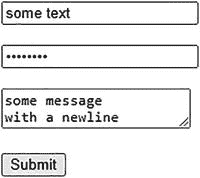
你会在生成的 HTML 输出中注意到几件事。毫无疑问，首先注意到的是 Jakarta Faces 也自动生成了表单和输入 HTML 元素的`id`和`name`属性，所有这些都带有由公共 API（应用程序编程接口）常量`UIViewRoot.UNIQUE_ID_PREFIX`定义的前缀`j_id`。其后的“`t`”基本上代表“树”，其后的数字基本上代表组件在组件树中的位置。因此，当你在 Facelets 文件中添加、删除或移动组件时，这很容易发生变化。因此，当 QA（质量保证）需要为 Web 应用程序编写集成测试时（通常需要使用 HTML 元素 ID），这也会带来麻烦。
当功能必须具有`id`和/或`name`属性时，Jakarta Faces 将使用自动生成的 ID。`id`属性是必需的，以便能够通过任何 JavaScript 代码（也可以由 Jakarta Faces 自动生成，例如负责 Ajax 工作的函数）找到 HTML 元素。由于这会使生成的 HTML 代码难以阅读，坦率地说，很丑陋，我们更希望显式指定任何 Jakarta Faces 表单、输入、选择和命令组件的`id`属性值。这样，Jakarta Faces 将直接使用它来生成 HTML 元素的`id`和`name`属性，而不是使用自动生成的属性。

现在，让我们为此重写 Facelets 文件 `/test.xhtml`。
一个好的做法是让输入组件的 ID 属性与 bean 属性名称完全匹配，命令组件的 ID 属性与 bean 方法名称完全匹配。这将产生更具自文档性的代码和生成的 HTML 输出。

现在，生成的 HTML 输出如下所示：


这样已经更清晰了。请注意，当你显式设置一个组件 ID 时，它最终一定会出现在生成的 HTML 输出中。生成的 HTML 元素 ID 代表“客户端 ID”，该 ID 可能因父组件不同而与组件 ID 有所差异。如果该组件有任何父组件是`NamingContainer`接口的实例，那么`NamingContainer`父组件的 ID 将会被前置到该组件的客户端 ID 中。在标准 Jakarta Faces HTML 组件集中，只有`<h:form>`和`<h:dataTable>`是`NamingContainer`的实例。其他如 Facelets 标签中的`<ui:repeat>`和 Jakarta Faces 核心标签中的`<f:subview>`也属于此类。

如果你更仔细地查看生成的 HTML 输出，会发现只剩下一个生成的 ID。它是视图状态隐藏输入字段的 ID，始终是`j_id1`。它代表`UIViewRoot`实例的 ID，默认情况下无法从 Facelets 文件设置。当在基于 Portlet 的 Web 应用程序（而非基于 Servlet 的 Web 应用程序）中使用 Jakarta Faces 时，这个 ID 是可覆盖的，并且它将代表 Portlet 的唯一名称。在基于 Portlet 的 Web 应用程序中，单个 Jakarta Faces 页面中可以包含多个 Portlet 视图。换句话说，基于 Portlet 的 Web 应用程序中的单个 Jakarta Faces 页面可以拥有多个`UIViewRoot`实例。

回到生成的 HTML 输出，HTML 输入元素的`name`属性对于 HTML 来说是必需的，这样才能通过 HTTP 将提交的值作为请求参数发送。它将作为请求参数名称。在任何主流的 Web 浏览器中，你都可以在 Web 开发者工具集的“网络”部分检查请求参数，该工具集可通过在浏览器中按 F12 键访问。图 4-1 展示了 Chrome 浏览器在提交填写了某些值的表单后呈现的回发请求，如图中“负载”部分所示。

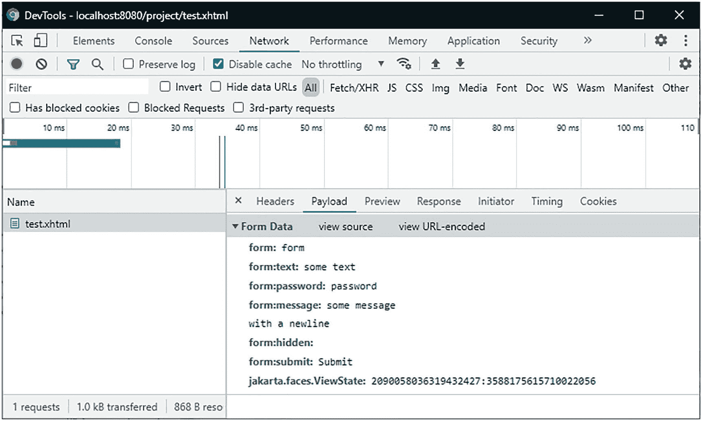

图 4-1
Chrome 开发者工具——网络——负载

正如你在生成的 HTML 输出和表单数据中所见，还有两个额外的隐藏输入字段。名称代表`<h:form>`ID 的隐藏输入字段将向 Jakarta Faces 指示在回发请求期间具体提交了哪个表单。因为单个 HTML 文档可以包含多个表单元素，通过这种方式，Jakarta Faces 可以在应用请求值阶段（第二阶段）确定当前表单组件是否确实被提交了。这将导致表单组件的`UIForm#isSubmitted()`返回 true。名称为`jakarta.faces.ViewState`的隐藏输入字段代表引用存储在会话中的序列化视图状态对象的唯一标识符。顺便提一下，视图状态隐藏输入字段上的`autocomplete="off"`并非技术上的要求，而只是一种变通方法，用于防止某些浏览器在按下后退按钮时用最后已知的值覆盖它，而这个值本身可能不正确。这两个隐藏输入字段由与`UIForm`组件关联的渲染器自动包含。我们的示例中由`<h:inputHidden>`标签生成的隐藏输入字段有一个空值。在这个表单中它实际上毫无用处。这种隐藏输入字段通常只有在它的值由你希望在托管 Bean 中捕获的某些 JavaScript 代码设置时才有用。通常，使用隐藏输入字段在请求之间“传递”托管 Bean 属性是没有意义的。相反，这些属性应分配给声明为具有比请求作用域更广作用域（如视图、流程或会话作用域）的托管 Bean。这样可以省去处理隐藏输入字段的麻烦。Bean 作用域将在第 8 章中详细说明。

如果你熟悉基本 HTML，表单数据中可见的其他请求参数应该不言自明。它们代表所涉及输入元素的名称/值对。你应该能够确定在提交之前表单中实际输入了哪些值。Jakarta Faces 也能做到同样的事情。它将遍历组件树，并使用组件的“客户端 ID”作为请求参数名称，从请求参数映射中获取值。基本上，在应用请求值阶段（第二阶段），以下代码会为每个输入组件在底层执行。这发生在`UIInput#decode()`方法中。

```
FacesContext context = FacesContext.getCurrentInstance();
ExternalContext externalContext = context.getExternalContext();
Map formData = externalContext.getRequestParameterMap();
String clientId = component.getClientId(context);
String submittedValue = formData.get(clientId);
component.setSubmittedValue(submittedValue);
```

在同一阶段，对于每个命令组件，在与该命令组件关联的渲染器的`decode`方法中，基本上会执行以下代码：

```
if (formData.get(clientId) != null) {
component.queueEvent(new ActionEvent(context, component));
}
```

在处理验证阶段（第三阶段），Jakarta Faces 将首先使用组件上注册的任何显式转换器或与“本地值”类型关联的任何隐式转换器，将提交的值转换为“本地值”。然后，它将使用组件上注册的所有验证器（如果有）验证“本地值”。如果转换和验证执行无误，那么“本地值”将被设置为组件的实际值，并且提交的值将被清除。这一切都发生在`UIInput#validate()`方法中，其核心逻辑在以下代码片段中以（非常！）简化的形式展示：

```
String submittedValue = component.getSubmittedValue();
try {
Object localValue = component.getConvertedValue(submittedValue);
for (Validator validator : component.getValidators()) {
validator.validate(context, component, localValue);
}
component.setValue(localValue);
component.setSubmittedValue(null);
}
catch (ConverterException | ValidatorException e) {
context.addMessage(clientId, e.getFacesMessage());
context.validationFailed(); // 跳过阶段 4 和 5。
component.setValid(false);
}
```

当没有转换或验证错误，并且`FacesContext#isValidationFailed()`因此返回`false`时，Jakarta Faces 将进入更新模型值阶段（第四阶段）。在此阶段，输入组件的“本地值”最终将被设置为与输入组件的`value`属性关联的托管 Bean 属性。这将发生在`UIInput#updateModel()`方法中，该方法简化如下：

```
ValueExpression el = component.getValueExpression("value");
if (el != null) {
Object localValue = component.getValue();
el.setValue(context.getELContext(), localValue);
component.setValue(null);
}
```


`el` 变量基本上代表了在 `value` 属性中定义的表达式语言（EL）语句，以我们的 `<h:inputText>` 示例来说，就是 `#{bean.text}`。`ValueExpression#setValue()` 方法将根据该表达式触发相应的 setter 方法，并传入组件的值。因此，它实际上会执行 `bean.setText(component.getValue())`。一旦所有模型值都已更新，Jakarta Faces 将进入调用应用程序阶段（第五阶段）。在应用请求值阶段（第二阶段）排队在命令组件中的任何 `ActionEvent` 都将被广播。它最终会调用与该命令组件关联的所有方法。在我们的 `<h:commandButton>` 示例中，其 `action` 属性定义为 `#{bean.submit}`，它将调用 `Bean#submit()` 方法。最后，Jakarta Faces 将进入最后一个阶段，即渲染响应阶段（第六阶段），生成 HTML 输出，并在此过程中调用 getter 方法以获取要嵌入到 HTML 输出中的模型值。

基于文件的输入组件
只有一个基于文件的输入组件，即 `<h:inputFile>`。它对其所在的 `<h:form>` 只有一个额外要求：必须将其 `enctype` 属性显式设置为 `multipart/form-data` 以符合 HTML 规范。这不会影响其他输入组件；它们将继续正常工作。只是默认的表单编码 `application/x-www-form-urlencoded` 不支持嵌入二进制数据。`multipart/form-data` 编码支持这一点，但它只是稍微冗长一些。每个请求参数值前面都有一个边界行、一个包含请求参数名称的 `Content-Disposition` 头、一个包含值内容类型的 `Content-Type` 头以及两个换行符。与默认编码（其中 URL 编码的请求参数名称/值对仅由 `&` 字符连接）相比，这非常低效，但这实际上是能够将文件嵌入 HTTP POST 请求而不会引起歧义的唯一可靠方法，尤其是在上传文本文件时，这些文件的内容恰好类似于 URL 编码的请求参数名称/值对。
`<h:inputFile>` 的 `value` 属性必须绑定到 `jakarta.servlet.http.Part` 接口的 bean 属性。

Facelets 文件 `/test.xhtml`：

支持 bean 类 `com.example.project.view.Bean`：

```
@Named @RequestScoped
public class Bean {
private Part file;
public void submit() throws IOException {
System.out.println("表单已提交！");
System.out.println("文件: " + file);
if (file != null) {
System.out.println("名称: " + file.getSubmittedFileName());
System.out.println("类型: " + file.getContentType());
System.out.println("大小: " + file.getSize());
InputStream content = file.getInputStream();
// 将内容写入磁盘或数据库。
}
}
// 在此处为每个属性添加/生成 getter 和 setter。
}
```

生成的 HTML 输出：

在 Chrome 浏览器中的渲染效果（已添加换行符）：
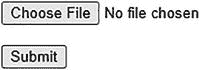

请求处理生命周期与基于文本的输入组件相同，但应用请求值阶段（第二阶段）除外。在 `UIInput#decode()` 方法中，不是将提交的文件作为请求参数提取，而是在与文件输入组件关联的渲染器中，将提交的文件作为请求部分提取。默认实现基本如下所示：

```
FacesContext context = FacesContext.getCurrentInstance();
ExternalContext ec = context.getExternalContext();
HttpServletRequest request = (HttpServletRequest) ec.getRequest();
String clientId = component.getClientId(context);
Part submittedValue = request.getPart(clientId);
component.setSubmittedValue(submittedValue);
```

选择组件
Jakarta Faces 提供了一系列选择组件，属于 `UISelectBoolean`、`UISelectOne` 和 `UISelectMany` 组件系列，它们都继承自 `UIInput`。除了 `UISelectBoolean` 之外，它们都期望通过嵌套在选择组件中的 `<f:selectItem>` 或 `<f:selectItems>` 标签来提供可供选择的项目。`UISelectBoolean` 组件的 `value` 属性只能绑定到 `boolean` 或 `Boolean` 类型的 bean 属性，并且不支持转换器，而其他组件支持转换器。`UISelectOne` 组件的 `value` 属性必须绑定到单值属性（例如 `String`），而 `UISelectMany` 组件的 `value` 属性只能绑定到多值属性（例如 `Collection<String>` 或 `String[]`）。
在现实世界的基于 HTML 的 Web 应用程序中，`<h:selectOneListbox>`（单选列表框）和 `<h:selectManyMenu>`（多选下拉框）并不是非常有用。通常，`<h:selectOneMenu>`（单选下拉框）和 `<h:selectManyListBox>`（多选列表框）更受欢迎，因为它们更加用户友好。以下是一个基本用法示例，演示了除上述最不常用的选择组件之外的所有选择组件。如果您仍然想使用它们，只需按照演示的方法使用不同的标签名称即可。

Facelets 文件 `/test.xhtml`：

支持 bean 类 `com.example.project.view.Bean`：

```
@Named @RequestScoped
public class Bean {
private boolean checked;
private String oneMenu;
private String oneRadio;
private List manyListbox;
private List manyCheckbox;
private List availableItems;
@PostConstruct
public void init() {
availableItems = Arrays.asList("one", "two", "three");
}
public void submit() {
System.out.println("表单已提交！");
System.out.println("checked: " + checked);
System.out.println("oneMenu: " + oneMenu);
System.out.println("oneRadio: " + oneRadio);
System.out.println("manyListbox: " + manyListbox);
System.out.println("manyCheckbox: " + manyCheckbox);
}
// 在此处为每个属性添加/生成 getter 和 setter。
// 注意 availableItems 属性不需要 setter。
}
```

生成的 HTML 输出：

```

one
two
three

one

two

three

one
two
three

one

two

three

```

在 Chrome 浏览器中的渲染效果（已添加换行符）：
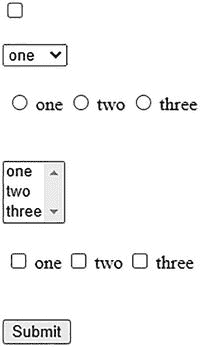

在生成的 HTML 输出中，您会立即注意到 `<h:selectOneRadio>` 和 `<h:selectManyCheckbox>` 在输入周围生成了一个 HTML 表格。自 Web 2.0 以来，这种标记确实不受欢迎。从 Jakarta Faces 4.0 开始，您可以通过显式地将 `layout` 属性设置为 `list` 来让它们生成 HTML 列表，如下所示：

```
...

...

```

如果您想完全控制生成的 HTML 标记，那么您可以使用一组 `<h:selectBooleanCheckbox>` 组件来代替 `<h:selectManyCheckbox>`，这些组件位于所需的 HTML 标记中，并绑定到稍作调整的模型。

Facelets 文件 `/test.xhtml`：

支持 bean 类 `com.example.project.view.Bean`：

```
@Named @RequestScoped
public class Bean {
private List manyCheckbox;
private List availableItems;
private Map manyCheckboxMap = new LinkedHashMap();
@PostConstruct
public void init() {
availableItems = Arrays.asList("one", "two", "three");
}
public void collectCheckedValues() {
manyCheckbox = manyCheckboxMap.entrySet().stream()
.filter(e -> e.getValue())
.map(Map.Entry::getKey)
.collect(Collectors.toList());
}
public void submit() {
System.out.println("表单已提交！");
System.out.println("manyCheckbox: " + manyCheckbox);
}
// 在此处为 availableItems 和 manyCheckboxMap 添加/生成 getter。
// 注意它们不需要 setter。
}
```

生成的 HTML 输出：

```

one

two

three

```

在 Chrome 浏览器中的渲染效果：

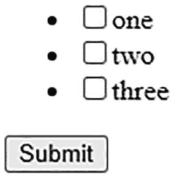


`<ul>` 的列表项符号当然可以通过将 CSS（层叠样式表）`list-style-type` 属性设置为 `none` 来隐藏。请注意，`<h:commandButton>` 的 `actionListener` 属性总是在 `action` 属性之前运行。长期以来，`<h:selectOneRadio>` 无法采用相同的方法。没有像 `<h:radioButton>` 这样的组件。解决方案曾在第三方组件库（如 PrimeFaces）中寻找。自 Jakarta Faces 2.2 起，可以通过在纯 HTML `<input type="radio">` 元素上使用新的“透传元素”和“透传属性”功能来实现这一点。^(¹²) 直到 Jakarta Faces 2.3，才借助新的 `group` 属性原生地实现了这一点，该属性基本上等同于纯 HTML `<input type="radio">` 元素的 `name` 属性。

Facelets 文件 `/test.xhtml`：

后台 Bean 类 `com.example.project.view.Bean`：

```
@Named @RequestScoped
public class Bean {
private String oneRadio;
private List availableItems;
@PostConstruct
public void init() {
availableItems = Arrays.asList("one", "two", "three");
}
public void submit() {
System.out.println("Form has been submitted!");
System.out.println("oneRadio: " + oneRadio);
}
// 在此处为每个属性添加/生成 getter 和 setter。
// 注意，availableItems 属性不需要 setter。
}
```

生成的 HTML 输出：

```

one

two

three

```

在 Chrome 浏览器中的渲染效果：
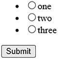
从技术上讲，`<h:selectManyCheckbox>` 也可以支持 `group` 属性，但尚未实现。

SelectItem 标签

为 `UISelectOne` 和 `UISelectMany` 组件提供可用项有几种方式。如前一节所示，你可以使用嵌套在选择组件中的 `<f:selectItem>` 和 `<f:selectItems>` 标签来实现。你可以使用 `<f:selectItem>` 标签在视图端完全定义可用项。以下是一个使用 `<h:selectOneMenu>` 的示例，但你可以在任何其他 `UISelectOne` 和 `UISelectMany` 组件中以相同方式使用它：

请注意，当选择组件的 `value` 属性关联的 Bean 属性为 `null` 时，可以使用值为 `#{null}` 的选择项来表示默认选择。如果你查阅过 `<f:selectItem>` 的标签文档，你可能会注意到 `noSelectionOption` 属性，并认为它旨在表示“无选择选项”。实际上，并非如此。尽管属性名如此，但它并不表示“无选择选项”。更好的属性名应该是 `hideWhenOtherOptionIsSelected`，即便如此，它也只有当父选择组件显式设置了 `hideNoSelectionOption="true"` 属性时才有效，如下所示：

因此，`hideWhenOtherOptionIsSelectedAndHideNoSelectionOptionIsTrue` 最终会成为最不言自明的属性名。不幸的是，在 Jakarta Faces 1.2 中实现 `noSelectionOption` 时，这一点考虑得并不周全。不应该需要两个属性才能使此属性生效。这对属性的主要目的是，当组件已经有一个非 `null` 值时，防止网站用户能够重新选择“无选择选项”。例如，通过在 `@PostConstruct` 方法中准备它，或者在表单提交后使用非 `null` 值重新渲染组件来实现。

也就是说，`<f:selectItem>` 的 `itemValue` 属性表示提交表单时将设置为 Bean 属性的值，以及在生成 HTML 输出时将从任何非 `null` 的 Bean 属性中预选的值。`itemLabel` 属性表示将显示给网站用户的标签。当 `itemLabel` 属性不存在时，Jakarta Faces 将默认使用 `itemValue`。请注意，标签绝不会提交回服务器。也就是说，在生成的 HTML 输出中，`<option>` 标签不是 `<option>` 值的一部分。

你可以使用 `<f:selectItems>` 标签来引用后台 Bean 中的 `Collection`、`Map` 或可用项数组。你甚至可以将其与 `<f:selectItem>` 标签混合使用。

它们将按照在视图中声明的顺序进行渲染。仅当你使用无序的 `Collection` 或 `Map` 实现（例如 `HashSet` 或 `HashMap`）作为值时，`<f:selectItems>` 提供的项顺序将是未定义的。因此，最好使用有序的 `Collection` 或 `Map` 实现，例如 `TreeSet`、`ArrayList`、`TreeMap` 或 `LinkedHashMap`。当将可用项填充为 `Map` 时，请记住，Map 的键代表项标签，Map 的值代表项值。你可能凭直觉认为情况正好相反，但这是一个技术限制。也就是说，在 Java 端，Map 的键强制唯一性，而 Map 的值则不强制。而在 HTML 端，选项标签应该是唯一的，而选项值则不需要唯一。

以下是填充此类 Map 的方法：

```
private Map availableItems;
@PostConstruct
public void init() {
availableItems = new LinkedHashMap();
availableItems.put("First item", "one");
availableItems.put("Second item", "two");
availableItems.put("Third item", "three");
}
// 添加/生成 getter。注意，不需要 setter。
```

如前所述，你也可以使用 `TreeMap` 或 `HashMap` 代替 `LinkedHashMap`，但这样项标签将分别自动排序或无序，而与插入顺序无关。

如果你真的想在视图端交换 Map 的键和值，你总是可以通过手动将 Map 条目的值指定为项标签，并将 Map 条目的键指定为项值来实现。你可以借助 `<f:selectItems>` 的 `var` 属性来做到这一点，通过该属性你可以声明当前迭代项的 EL 变量名。然后，可以在同一标签的 `itemValue` 和 `itemLabel` 属性中访问该变量。当你将 `Map#entrySet()` 传递给 `<f:selectItems>` 的 `value` 属性时，每个迭代项将代表一个 `Map.Entry` 实例。该实例又具有 `getKey()` 和 `getValue()` 方法，这些方法完全可以作为 EL 属性使用。

当使用 `Collection` 或数组作为可用项时，这也适用。你不需要像前面演示的那样先显式地将其转换为 `Set`（更具体地说，是 `Iterable`）。当你拥有一个包含复杂对象（例如模型实体）的 `Collection` 或数组作为可用项时，这尤其有用。

代表“国家”的模型实体：


```java
public class Country {
private Long id;
private String code;
private String name;
// 添加/生成 getter 和 setter 方法
}
```

后台 Bean：

```java
@Named @RequestScoped
public class Bean {
private String countryCode;
private List availableCountries;
@Inject
private CountryService countryService;
@PostConstruct
public void init() {
availableCountries = countryService.list();
}
// 添加/生成 getter 和 setter 方法
// 注意：availableCountries 不需要 setter 方法
}
```

视图：

```xml
<h:selectOneMenu value="#{bean.countryCode}">
    <f:selectItems value="#{bean.availableCountries}"
                   var="country"
                   itemValue="#{country.code}" itemLabel="#{country.name}">
</h:selectOneMenu>
```

请注意，为了清晰起见，上述示例中省略了任何持久化框架特定的注解（例如 Jakarta Persistence 的 `@Entity` 和 `@Id`）以及 `CountryService` 的实际实现。这些与任何前端框架（如 Jakarta Faces）都无关。

通过上述构造，从 `Country#getCode()` 获取的值最终会成为生成的 HTML `<option>` 元素的值。现在，当表单提交时，该值将成为选择组件的提交值，进而以该值调用 `#{bean.countryCode}` 属性背后的 setter 方法。当然，您也可以将整个 `Country` 对象用作选择组件的属性值，但这需要一个转换器，能够在复杂对象与适合嵌入 HTML 输出并作为 HTTP 请求参数发送的唯一字符串之间进行转换。您可以在第 5 章中了解更多信息。

## SelectItem 分组

如果您希望将一组选项归入一个公共标签下，则可以在选择组件中嵌套使用 `<f:selectItemGroup>` 和 `<f:selectItemGroups>` 标签来实现。以下是一个入门示例：

```xml
<h:selectOneMenu value="#{bean.selectedCategory}">
    <f:selectItemGroups value="#{bean.categories}" var="category">
        <f:selectItems value="#{category.products}" var="product"
                       itemValue="#{product.id}" itemLabel="#{product.name}">
    </f:selectItemGroups>
</h:selectOneMenu>
```

`<h:selectOneMenu>` 会将每个分组渲染为 HTML `<optgroup>`：
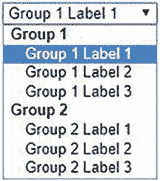
`<h:selectOneRadio layout="pageDirection">` 会将其渲染为嵌套表格：
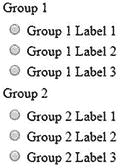
`<h:selectManyListbox>` 会将每个分组渲染为 HTML `<optgroup>`：
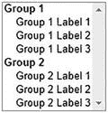
`<h:selectManyCheckbox layout="pageDirection">` 会将其渲染为嵌套表格：
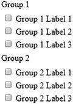
请注意 `<h:selectOneRadio>` 和 `<h:selectManyCheckbox>` 中 `layout="pageDirection"` 属性的重要性。这比默认的 `layout="lineDirection"`（会将所有内容渲染在一个大的单行表格中）看起来要好得多。

您可以使用 `<f:selectItemGroups>` 标签来引用后台 Bean 中的 `Collection`、`Map` 或可用项目分组的数组。您甚至可以将其与 `<f:selectItems>` 标签混合使用。以下是一个示例，它遍历一个 `List<Category>` 属性，而 `Category` 实体又包含一个 `List<Product>` 属性：

```xml
<h:selectOneMenu value="#{bean.selectedCategory}">
    <f:selectItemGroups value="#{bean.categories}" var="category">
        <f:selectItems value="#{category.products}" var="product"
                       itemValue="#{product.id}" itemLabel="#{product.name}">
    </f:selectItemGroups>
</h:selectOneMenu>
```

## 标签和消息组件

在通常设计良好的表单中，输入元素通常伴随有标签元素和针对输入字段的消息元素。在 HTML 中，标签由 `<label>` 元素表示。在 Jakarta Faces 中，您可以使用 `<h:outputLabel>` 组件来生成 HTML `<label>` 元素。HTML 没有专门用于表示消息的元素。在 Jakarta Faces 中，`<h:message>` 组件生成一个 HTML `<span>` 元素，而 `<h:messages>` 组件则根据 `layout` 属性的值生成 `<ul>` 元素或 `<table>` 元素。

标签元素具有多种 SEO（搜索引擎优化）和可用性优势。它以文本形式告知关联的输入元素。屏幕阅读器（例如视力障碍人士使用的）会找到标签并通过声音读出其内容。搜索引擎机器人会找到标签，并将关联的输入元素以标签作为关键词进行索引。并且，当点击标签时，它会聚焦并激活关联的输入元素。基于文本的输入元素会显示文本光标。复选框和单选按钮输入元素会被切换。列表框和下拉输入元素会获得焦点。文件输入元素会打开浏览对话框。提交按钮会被触发。

消息元素通常用于显示来自服务器端的任何转换和验证错误消息。这样，最终用户就能了解表单的状态，并采取相应操作，通常是修正输入值。您也可以用它来显示警告或提示信息。

在 Jakarta Faces 中，`<h:outputLabel>`、`<h:message>` 和 `<h:messages>` 组件都有一个 `for` 属性，您通常在其中定义关联输入组件的 ID。以下是一个登录表单风格的示例：

```xml
<h:outputLabel for="email" value="电子邮件" />
<h:inputText id="email" value="#{bean.email}" />
<h:message for="email" />

<h:outputLabel for="password" value="密码" />
<h:inputSecret id="password" value="#{bean.password}" />
<h:message for="password" />

<h:commandButton id="submit" value="登录" action="#{bean.submit}" />
```

实际上，您可以在 `for` 属性中使用任意组件搜索表达式。对于 `<h:outputLabel>` 组件，这没有太大意义。对于 `<h:message>` 和 `<h:messages>` 组件，引用非输入组件的 ID 仅在您希望从受管 Bean 以编程方式添加 faces 消息时才有意义。但您需要知道目标组件的客户端 ID。

```xml
<h:form id="login">
    ...
    <h:commandButton id="submit" value="登录" action="#{bean.submit}" />
</h:form>
```

上述 `<h:commandButton>` 将在 HTML 输出中生成一个客户端 ID "`login:submit`"。然后，您可以按如下方式以编程方式添加 faces 消息：

```java
public String submit() {
    try {
        yourAuthenticator.authenticate(email, password);
        return "/user/home.xhtml?faces-redirect=true";
    }
    catch (YourAuthenticationException e) {
        FacesContext context = FacesContext.getCurrentInstance();
        FacesMessage message = new FacesMessage("认证失败");
        context.addMessage("login:submit", message);
        return null;
    }
}
```

然而，更好的做法是通过传递 `null` 作为客户端 ID，将 faces 消息添加为全局消息。

```java
context.addMessage(null, message);
```

这样的消息只会出现在 `<h:messages globalOnly="true">` 中。


请注意 `messages` 组件中 `rendered` 属性的逻辑。因此，只有当其父组件 `NamingContainer` 的 `submitted` 属性求值为 `true` 时，它才会被渲染。在这个特定案例中，它检查的是 `UIForm#isSubmitted()`。这在以下场景中非常有用：你有多个非 Ajax 表单，每个表单都有自己的全局消息组件，和/或你在 Jakarta Faces 页面底部附近有一个“兜底”的 `<h:messages redisplay="false">` 组件，该组件随后使用 CSS 固定定位在顶部。否则，相同的全局消息会意外地在那里也显示出来。

在 Ajax 表单中，这种消息渲染逻辑并非必需，因为你只需在 `<f:ajax>` 的 `render` 属性中明确指定消息组件，就能精细地控制消息渲染。

此外，当 `<f:ajax>` 的 `execute` 属性没有像 `execute="@form"` 那样显式地指定表单时，`UIForm#isSubmitted()` 会意外地返回 `false`。

**命令组件**

你可能已经在之前关于输入和选择组件的章节中注意到了 `<h:commandButton>` 的示例。它会生成一个 HTML `<input type="submit">` 元素，这是 HTML 中将所在 `<form>` 元素的所有输入值发送到服务器的方式。在服务器端，此组件还能够调用一个或多个 Java 方法，这些方法通常在 `action` 或 `actionListener` 属性中定义，或者通过嵌套在命令组件中的 `<f:actionListener>` 标签定义。你还会了解到，动作监听器方法总是在与 `action` 属性关联的方法之前运行。

你可以使用 `<f:actionListener>` 标签在同一个命令组件上注册一个或多个额外的动作监听器。所有这些动作监听器会按照它们在视图中声明并附加到组件的相同顺序被调用。目标方法可以通过三种方式在 `<f:actionListener>` 标签上声明。一种方式是通过 `type` 属性，另外两种方式是通过 `binding` 属性。

第一种方式中的 `type` 属性必须基本上表示实现 `ActionListener` 接口的类的完全限定名。

```
package com.example.project;
import jakarta.faces.event.ActionListener;
import jakarta.faces.event.ActionEvent;
public class SomeActionListener implements ActionListener {
@Override
public void processAction(ActionEvent event) {
// ...
}
}
```

第二种方式中的 `binding` 属性必须基本上引用一个实现了 `ActionListener` 接口的受管 bean 实例。

```
@Named @RequestScoped
public class BeanImplementingActionListener implements ActionListener {
@Override
public void processAction(ActionEvent event) {
// ...
}
}
```

第三种方式中的 `binding` 属性可以基本上引用任何声明为 `void` 的任意受管 bean 方法。

```
@Named @RequestScoped
public class Bean {
public void someActionListenerMethod() {
// ...
}
}
```

请注意，第三种方式或多或少是未记录的。它自 EL 2.2（2009 年）引入以来才成为可能，开发者可以通过简单地添加括号（必要时带参数）来开始显式声明方法表达式。巧合的是，`<f:actionListener>` 的 `binding` 属性能够处理它们。在底层，`binding` 属性被视为一个 `ValueExpression`。当对其调用 `ValueExpression#getValue()` 时，逻辑期望获得一个实现了 `ActionListener` 接口的受管 bean 实例。然而，调用的不是一个 getter 方法，而是一个 void 方法，并且没有返回任何内容，这反过来被解释为 `null`。因此，逻辑会静默地继续执行，就好像根本没有可用的 bean 实例一样。

动作监听器在 `action` 属性之上还有一个额外的特性。当从动作监听器中显式抛出 `jakarta.faces.event.AbortProcessingException` 时，Jakarta Faces 将吞没该异常并中止处理调用应用程序阶段（第五阶段），并立即前进到渲染响应阶段（第六阶段）。所有剩余的动作监听器和动作方法（如果有的话）都将被跳过。被吞没的异常不会导致任何错误响应。鉴于这一事实，以及动作监听器总是在动作方法之前被调用的事实，你可以（滥）用它来在动作方法被调用之前，基于已更新的模型值执行一些转换和验证。

```
public void someActionListenerMethod() {
try {
convertOrValidate(this);
}
catch (SomeConversionOrValidationException e) {
FacesContext context = FacesContext.getCurrentInstance()
context.addMessage(null, new FacesMessage(e.getMessage()));
throw new AbortProcessingException(e);
}
}
public void someActionMethod() {
// 当抛出 AbortProcessingException 时，此方法不会被调用。
}
```

我说“（滥）用”是因为，本质上，执行此类任务是普通 `Converter` 或 `Validator` 实现的责任，这样模型值就不会被无效值污染。然而，在 Jakarta Faces 中，很长一段时间内，都无法基于多个字段执行转换或验证。因此，开发者开始使用动作（监听器）方法来执行此任务，这本质上违反了 Jakarta Faces 的生命周期。

直到 Jakarta Faces 2.3，才引入了一个新的 `<f:validateWholeBean>` 标签来对多个字段执行验证。你可以在第 5 章中阅读更多相关信息。因此，这为动作监听器方法只留下了一个合理的实际用例：基于一个或多个模型值执行转换。一个例子已经在“选择组件”部分演示过（在 `<ui:repeat>` 中使用多个 `<h:selectBooleanCheckbox>` 来规避 `<h:selectManyCheckbox>` 生成 HTML 表格的问题）。另一个例子是使用提供的模型值调用外部 Web 服务，并将其结果作为“转换后的”值获取。然后，动作方法仍应用于执行业务服务逻辑。当动作方法本身抛出异常时，它不会被吞没，但请求将以 HTTP 500 错误响应结束。你可以在第 9 章中找到更多相关信息。

除了 `<h:commandButton>` 之外，Jakarta Faces 还提供了另外两个命令组件：`<h:commandLink>` 和 `<h:commandScript>`。`<h:commandLink>` 的生命周期与 `<h:commandButton>` 基本相同，不同之处在于它生成一个 HTML `<a>` 元素，该元素借助 JavaScript 提交其包含的表单。在任何使用 `<h:commandButton>` 的地方，都可以用 `<h:commandLink>` 替代：

```
...

```

生成的 HTML 输出如下所示：

```

...
提交

```

在 Chrome 浏览器中的渲染效果：


在生成的 HTML 输出中，你会注意到它自动包含了 `faces.js` JavaScript 文件。该文件包含了 `window.faces` 对象以及 Jakarta Faces 实现特有的辅助函数，在 Mojarra 实现中，这些函数被放置在 `window.mojarra` 对象中。在纯 HTML 中，无法使用 `<a>` 元素提交 `<form>`。因此，必须引入一些 JavaScript 代码。在 Mojarra 的具体实现中，`mojarra.cljs()` 函数会被调用，其第一个参数是父表单，第二个参数是命令组件的客户端 ID（作为请求参数名和值），第三个参数是 `<h:commandLink>` 的 `target` 属性（如果有的话）。`mojarra.cljs()` 函数会为第二个参数提供的每一对名称/值创建 `<input type="hidden">` 元素，并将它们添加到第一个参数提供的表单中，确保这些参数最终成为回发请求的一部分。然后，它会创建一个不可见的 `<input type="submit">` 按钮，将其添加到表单中，并调用其 `click()` 函数，就像你使用普通的提交按钮一样。最后，它会从表单中移除所有动态创建的元素。

实际上，`<h:commandButton>` 也会使用此函数，但仅当你需要通过嵌套在命令组件中的一个或多个 `<f:param>` 标签传递额外的 HTTP 请求参数时才会用到。

```
...

```

生成的 HTML 输出：

在 Chrome 浏览器中渲染：


你可以通过 `@Inject @ManagedProperty` 在受管 bean 中获取额外的 HTTP 请求参数。

```
@Inject @ManagedProperty("#{param.id}")
private Integer id;
public void submit() {
System.out.println("Submitted ID: " + id);
}
```

还有一种通过命令组件传递参数的方法，即简单地将它们作为操作方法参数传递：

```
...

```

修改后的操作方法如下所示：

```
public void submit(Integer id) {
System.out.println("Submitted ID: " + id);
}
```

对于 `<h:commandButton>`，这不会生成任何 JavaScript，因此看起来与不使用任何操作方法参数时完全相同。这也意味着 `#{otherBean.id}` 的值不会通过 HTML 源代码作为 HTTP 请求参数传回服务器。这反过来意味着，它仅在 Jakarta Faces 即将调用操作方法时的回发请求期间被评估。这又意味着 `#{otherBean.id}` 至少必须是 `@ViewScoped` 才能在回发请求中仍然可用。换句话说，这种方法参数传递方式绝对不能与 `<f:param>` 标签方法互换，后者只需两个 bean 都是 `@RequestScoped` 即可正常工作。

标准 Jakarta Faces 组件集提供的最后一个命令组件是 `<h:commandScript>`。它自 Jakarta Faces 2.3 起可用。它允许你通过从自己的脚本中调用一个命名的 JavaScript 函数来调用受管 bean 操作方法。回发请求将始终通过 Ajax 执行。

生成的 HTML 输出：

```

var invokeBeanSubmit = function(o) {
var o = (typeof o==='object') && o ? o : {};
mojarra.ab('form:submit',null,'action',0,0,{'params':o});
}

```

它在 Web 浏览器中没有可见的 HTML 渲染。在生成的脚本中，你会看到它生成了一个函数变量，其名称与 `name` 属性中指定的名称相同。在此示例中，它确实位于全局作用域中。由于这在 JavaScript 上下文中被认为是不良实践（“全局命名空间污染”），你最好提供一个带命名空间的函数名称。这仅要求你之前在 HTML 文档中的某处声明了自己的命名空间，通常是通过 `<head>` 元素中的 JavaScript 文件。以下示例使用内联脚本简化了此操作：

```
...
var mynamespace = mynamespace || {};

```

回到生成的函数变量，你还会看到它接受一个对象参数，并将其作为“`params`”属性传递给 Mojarra 特有的 `mojarra.ab()` 函数的最后一个对象参数。该辅助函数将依次准备并调用标准 Jakarta Faces JavaScript API 的 `faces.ajax.request()` 函数。换句话说，你可以通过这种方式将 JavaScript 变量传递给受管 bean 操作方法。它们可以通过 `@ManagedProperty` 注入，方式与使用 `<f:param>` 相同。以下示例演示了使用 JavaScript 对象中的硬编码变量进行 JavaScript 调用，但你当然可以从 JavaScript 上下文中的任何其他地方获取这些变量：

```
var params = {
id: 42,
name: "John Doe",
email: "john.doe@example.com"
};
invokeBeanSubmit(params);
```

支持 bean 类：

```
@Inject @ManagedProperty("#{param.id}")
private Integer id;
@Inject @ManagedProperty("#{param.name}")
private String name;
@Inject @ManagedProperty("#{param.email}")
private String email;
public void submit() {
System.out.println("Submitted ID: " + id);
System.out.println("Submitted name: " + name);
System.out.println("Submitted email: " + email);
}
```

`<h:commandScript>` 也可用于将 HTML 文档的部分渲染推迟到窗口的 `load` 事件。为此，只需将 `autorun` 属性设置为 `true`，并在 `render` 属性中指定目标组件的客户端 ID。以下示例仅在页面在客户端加载完成后才加载并渲染一个数据表：

```

#{person.id}
#{person.name}
#{person.email}

```

其中支持 bean 如下所示：

```
@Named @RequestScoped
public class Bean {
private List lazyPersons;
@Inject
private PersonService personService;
public void loadLazyPersons() {
lazyPersons = personService.list();
}
public List getLazyPersons() {
return lazyPersons;
}
}
```

而 `Person` 实体如下所示：

```
public class Person {
private Long id;
private String name;
private String email;
// 添加/生成 getter 和 setter 方法。
}
```

请注意，为清晰起见，前面的示例中省略了任何持久化框架特有的注解，例如 Jakarta Persistence 的 `@Entity` 和 `@Id`，以及 `PersonService` 的实际实现。这些与 Jakarta Faces 等任何前端框架都无关。

不言而喻，`<h:commandScript>` 仅用于能够使用原生 JavaScript 调用 Jakarta Faces 受管 bean 操作方法，通常是在特定的 HTML DOM（文档对象模型）事件期间，而 `<h:commandLink>` 和 `<h:commandButton>` 似乎执行完全相同的操作；只是视觉呈现不同：一个渲染为链接，另一个渲染为按钮。用户体验（UX）的共识是，按钮应用于提交表单，而链接应用于导航到另一个页面或跳转到同一页面的另一个部分。因此，使用链接提交表单并不总被认为是最佳实践。仅当你希望使用图标或图像提交 HTML 表单时，它才有用。以下示例展示了如何在 Font Awesome 图标上使用命令链接：

对于所有其他情况，请使用普通按钮。


导航
有时，当某个表单成功提交后，你可能希望导航到另一个 Jakarta Faces 页面，例如从登录页面导航到用户主页（如“标签和消息组件”一节所示），或者从详情页面返回主页面。

传统上，导航目标必须在 `faces-config.xml` 的 `<navigation-rule>` 条目中单独定义，然后根据命令组件动作方法的 `String` 返回值进行导航。这种方法长期来看相当繁琐，并且对于基于 HTML 的 Web 应用程序来说并不十分有用。这个想法或多或少源自桌面应用程序。因此，Jakarta Faces 2.0 引入了“隐式导航”功能，允许你直接在 `String` 返回值本身中定义导航目标。

换句话说，不再使用以下动作方法：

```
public String someActionMethod() {
// ...
return "someOutcome";
}
```

以及以下 `faces-config.xml` 条目：

```

someOutcome
/otherview.xhtml

```

你可以在动作方法中直接这样做：

```
public String someActionMethod() {
// ...
return "/otherview.xhtml";
}
```

你甚至可以省略所用视图技术的默认后缀。

```
public String someActionMethod() {
// ...
return "/otherview";
}
```

你可以通过附加 `faces-redirect=true` 查询参数来强制重定向。

```
public String someActionMethod() {
// ...
return "/otherview?faces-redirect=true";
}
```

返回 `null` 将返回到提交表单的同一视图。换句话说，最终用户将停留在同一页面。然而，将动作方法声明为 `void` 更为简洁。

```
public void someActionMethod() {
// ...
}
```

回到重定向方法，这也被称为“Post-Redirect-Get”模式^(¹³)，它在可添加书签和避免重复提交方面有着显著区别。如果在 Jakarta Faces 表单的 POST 请求之后没有重定向，Web 浏览器地址栏中的 URL（统一资源定位符）不会更改为目标页面的 URL，而是保持不变。这是由“回传”的本质造成的：将表单提交回提供该表单页面的同一 URL。换句话说，浏览器地址栏中显示的实际是 HTML `<form>` 的 `action` 属性中指定的 URL。当指示 Jakarta Faces 在没有重定向的情况下导航到不同视图时，它基本上会直接构建目标页面并将其渲染到当前回传请求的响应中，而不会将浏览器地址栏中的 URL 更改为目标页面的 URL。

这种方法有缺点。一是刷新 Web 浏览器中的页面会导致 POST 请求重新执行，从而执行所谓的双重提交。这可能会用重复条目污染后端的数据库，特别是当相关的关系表没有定义适当的唯一约束时。另一个缺点是目标页面无法添加书签。浏览器地址栏中当前可见的 URL 基本上代表的是前一个页面。你无法通过添加书签、复制/粘贴和/或共享 URL，然后在新浏览器窗口中打开它来重新获得当前显示的目标页面。

相反，当指示 Jakarta Faces 通过重定向导航到不同视图时，它基本上会返回一个非常小的 HTTP 响应，状态码为 `302`，并带有一个 `Location` 标头，其值代表目标页面的 URL。当 Web 浏览器检索到这样的 HTTP 响应时，它会立即对 `Location` 标头中指定的 URL 发起一个全新的 GET 请求。此 URL 最终会反映在 Web 浏览器的地址栏中，从而变得可添加书签。此外，刷新页面只会刷新 GET 请求，因此不会导致双重提交。

Ajax 化组件
正如你在“命令组件”一节的 `<h:commandScript>` 示例中所注意到的，Jakarta Faces 也能够发起 Ajax 请求并执行部分渲染。此功能首次在 Jakarta Faces 2.0 中通过 `<f:ajax>` 标签引入。
此标签可以嵌套在任何实现 `ClientBehaviorHolder` 接口的组件中，也可以包裹在一组实现此接口的组件周围。在标准的 Jakarta Faces 组件集中，几乎所有 HTML 组件也都实现了 `ClientBehaviorHolder`。如果你查阅 `ClientBehaviorHolder` 的 Javadoc，^(¹⁴) 你会发现以下列表：

**所有已知的实现类：**

```
HtmlBody, HtmlCommandButton, HtmlCommandLink, HtmlDataTable, HtmlForm,
HtmlGraphicImage, HtmlInputFile, HtmlInputSecret, HtmlInputText, HtmlInputTextarea, HtmlOutcomeTargetButton, HtmlOutcomeTargetLink, HtmlOutputLabel, HtmlOutputLink, HtmlPanelGrid, HtmlPanelGroup, HtmlSelectBooleanCheckbox, HtmlSelectManyCheckbox, HtmlSelectManyListbox, HtmlSelectManyMenu, HtmlSelectOneListbox, HtmlSelectOneMenu, HtmlSelectOneRadio, UIWebsocket
```


因此，这些就是 `<h:body>`、`<h:commandButton>`、
`<h:commandLink>`、
`<h:dataTable>`、
`<h:form>`、
`<h:graphicImage>`、
`<h:inputFile>`、
`<h:inputSecret>`、
`<h:inputText>`、
`<h:inputTextarea>`、
`<h:button>`、
`<h:link>`、
`<h:outputLabel>`、
`<h:outputLink>`、
`<h:panelGrid>`、
`<h:panelGroup>`、
`<h:selectBooleanCheckbox>`、
`<h:selectManyCheckbox>`、
`<h:selectManyListbox>`、
`<h:selectManyMenu>`、
`<h:selectOneListbox>`、
`<h:selectOneMenu>`、
`<h:selectOneRadio>`、
以及 `<f:websocket>`。
你会看到所有可见的输入、选择和命令组件也都涵盖在内。
`<f:ajax>` 的一个要求是
`ClientBehaviorHolder`
组件必须嵌套在 `<h:form>` 中，并且
模板中使用了 `<h:head>`。`<h:form>`
基本上使 JavaScript 能够执行带有正确 Jakarta Faces 视图状态关联的回发请求。`<h:head>`
基本上使 `<f:ajax>` 能够
自动包含必要的 `faces.js` JavaScript
文件，该文件包含（除其他外）必需的 `faces.ajax.request()`
函数。

示例如下：

```
f:ajax 演示

```

生成的 HTML 输出：

```
f:ajax 演示

```

在 Chrome 浏览器中的渲染效果（添加了换行符）与不使用 Ajax 时相同：

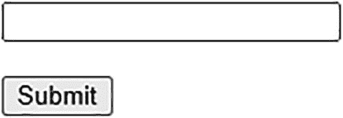

在生成的 HTML 输出中，你会看到包含必要 Jakarta Faces Ajax API 的 `faces.js` JavaScript
文件被自动包含在 HTML 头部。
你还会注意到 `<f:ajax>` 在
`<h:inputText>` 中生成了一个
额外的 `onchange` 属性，
并在 `<h:commandButton>` 中生成了一个
额外的 `onclick` 属性，
两者都定义了一些 Jakarta Faces 实现特定的 JavaScript
代码，负责执行 Ajax 请求。
Jakarta Faces 指定了两种内部 Ajax 事件类型：`valueChange` 和 `action`。当 `<f:ajax>`
没有指定 `event` 属性时，这些是
默认的事件类型。当 `<f:ajax>` 被
附加到一个实现了 `EditableValueHolder`
接口的组件上时，默认事件类型变为 `valueChange`。对于
实现了 `ActionSource`
接口的组件，默认事件类型是 `action`。对于所有其他
`ClientBehaviorHolder`
组件，默认事件是 `click`。这些内部事件类型实际生成的 HTML DOM 事件类型
取决于组件和相关的渲染器。

对于文本输入组件以及下拉和列表框选择组件，
`<f:ajax>` 的默认 HTML DOM 事件类型是
`"change"`。对于
复选框和单选按钮选择组件以及命令组件，
默认事件类型是 `"click"`。你可以在
生成的 HTML 输出中看到这一点，这可以通过在
`<f:ajax>` 标签上显式指定
`event` 属性来覆盖。

前面的示例将在 `onblur` 属性中生成 JavaScript 代码，
而不是在 `onclick` 属性中。
`event` 属性支持的值
取决于目标 `ClientBehaviorHolder`
组件。这些值可以在相关组件的 VDL 文档中找到。所有 `on[event]` 属性
都在那里定义。当你移除它们前面的 “`on`” 前缀时，
你就得到了一个支持的事件类型列表。例如，`<h:inputText>`^(¹⁵) 的 VDL
文档指出支持以下事件类型：

*   `blur`、
    `change`、`click`、`dblclick`、`focus`、`keydown`、`keypress`、`keyup`、`mousedown`、`mousemove`、`mouseout`、`mouseover`、`mouseup`、`select`

当所需的 DOM 事件类型在客户端发生并
触发 `on[event]`
属性中定义的关联 Jakarta Faces 实现特定的 JavaScript
代码时，最终会调用
标准 Jakarta Faces JavaScript API 的
`faces.ajax.request()`
函数。它将准备一组预定义的回发参数，其中 `jakarta.faces.source`
和 `jakarta.faces.behavior.event`
是最重要的。前者指定源组件的客户端 ID，本质上是在 JavaScript 上下文中
`this.id` 的值。后者指定事件类型，本质上是在 JavaScript 上下文中
`event.type` 的值。你可能已经猜到，它们是从传递给特定于 Mojarra 的 `mojarra.ab()`
函数的前两个参数派生出来的，如生成的 HTML 输出所示。
一旦触发，Ajax 请求将几乎以与非 Ajax 请求相同的方式
运行 Jakarta Faces 生命周期。恢复视图阶段（第一阶段）、处理验证阶段（第三阶段）、
更新模型值阶段（第四阶段）和调用应用程序阶段（第五阶段）
是相同的。应用请求值阶段（第二阶段）略有不同。
它只会解码 `<f:ajax>` 标签的
`execute`
属性所涵盖的组件，
该属性默认为 `@this`（“当前
组件”）。渲染响应阶段（第六阶段）则完全不同。
它不会生成整个 HTML 文档，而是生成一个
特殊的 XML 文档，该文档仅包含 `<f:ajax>` 标签的 render 属性所涵盖的组件的
生成 HTML 输出，
该属性默认为 `@none`（“没有
组件”）。
`<f:ajax>` 标签的
`execute`
和 `render`
属性接受一个以空格分隔的组件搜索表达式集合。
这可以表示相对于最近的 `NamingContainer`
父级的客户端 ID，或者始终相对于 `UIViewRoot` 的绝对客户端 ID，或者
标准或自定义搜索关键字，或者它们的链式组合。有关它们的深入解释，请参阅
第 12 章。
目前，我们只需要了解三个标准搜索
关键字：`@this`、`@form` 和 `@none`。顾名思义，
`@form` 关键字指的是
`UIForm` 类型（例如
`<h:form>`）的最近父级组件。

在 Ajax 请求的应用请求值阶段（第二阶段）期间，
对于 `<f:ajax>` 标签的
`execute`
属性所涵盖的每个组件，除了默认的解码过程之外，Jakarta Faces 还会检查
`jakarta.faces.source`
请求参数是否等于当前组件的客户端 ID。如果是，
则 Jakarta Faces 将为调用应用程序阶段（第五阶段）排队 `AjaxBehaviorEvent`。
在排队 `AjaxBehaviorEvent` 的底层，
其逻辑归结如下：

```
FacesContext context = FacesContext.getCurrentInstance();
ExternalContext externalContext = context.getExternalContext();
Map formData = externalContext.getRequestParameterMap();
String clientId = component.getClientId(context);
String source = formData.get("jakarta.faces.source");
String event = formData.get("jakarta.faces.behavior.event");
if (clientId.equals(source)) {
component.getClientBehaviors().get(event)
.forEach(clientBehavior -> component.queueEvent(
new AjaxBehaviorEvent(context, component, clientBehavior)));
}
```

这里，`ClientBehavior`
基本上代表了 `<f:ajax>` 标签的定义。
基于此逻辑，你可以得出结论：可以在同一个组件上附加多个 `<f:ajax>` 标签，
甚至针对相同的事件类型。其优点是，如有必要，你可以在
完全相同的事件类型上注册多个 Ajax 行为监听器。


这些 Ajax 行为监听器方法将在调用应用阶段（第五阶段）被调用；当然，前提是在处理验证阶段（第三阶段）没有出现转换或验证错误。对于命令组件，这些 Ajax 行为监听器方法将始终在动作监听器方法和动作方法*之前*被调用。无论目标组件是什么，Ajax 行为监听器方法必须是一个 `public void` 方法，并且可以选择性地接受 `AjaxBehaviorEvent` 参数。

```
public void onchangeFoo(AjaxBehaviorEvent event) {
// ...
}
```

这为你在输入和选择组件中提供了机会，可以在特定的 Ajax 事件上执行一些业务任务。最常见的实际案例包括准备一个 bean 属性，该属性随后会在另一个组件中渲染。可以想象一下级联下拉菜单，其中子下拉菜单的可用项取决于父下拉菜单的选中项。
在命令组件中，`<f:ajax listener>` 并不是特别有用。你已经可以在动作监听器和/或动作方法中执行业务任务。即使附加了 `<f:ajax>`，你也可以继续使用它们。
在 Ajax 请求的渲染响应阶段（第六阶段），Jakarta Faces 会为 `<f:ajax>` 标签的 `render` 属性所覆盖的每个组件，在 Ajax 响应中生成一个 XML `<update>` 元素，该元素包含该特定组件及其所有子组件（如果有的话）所生成的 HTML 输出。标准 Jakarta Faces JavaScript API 的 `faces.ajax.response()` 函数（由 `faces.ajax.request()` 注册为 Ajax 回调函数）将提取 `<update>` 元素的 `id` 属性（该属性代表目标组件的客户端 ID），并通过 JavaScript 的 `document.getElementById()` 获取具体的 HTML 元素，并在 HTML DOM 树中用 `<update>` 元素的内容替换它。

以下是一个表单示例，其中包含一个必填输入字段（附带一条消息）和一个明确指向该消息组件的命令按钮：

图 4-2 展示了在输入字段未填写的情况下提交表单后，Chrome 如何呈现 Ajax 响应。这是一个很长的一行代码，因此稍微滚动了一下，以便从感兴趣的 `<update>` 元素开始。它包含了 `<h:message id="m_text">` 组件生成的 HTML 输出。

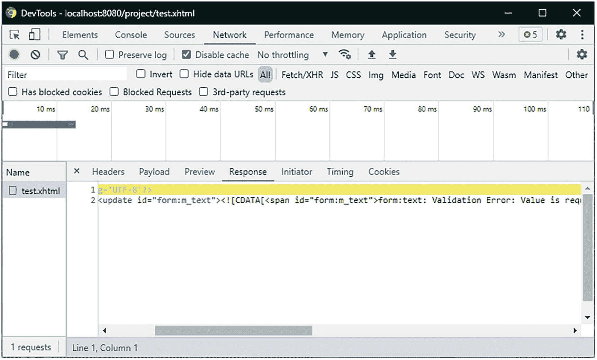

图 4-2
Chrome 开发者工具——网络——响应

如果你在 XML 响应中继续向下滚动，你还会注意到一个 `<update id="j_id1:jakarta.faces.ViewState:0">` 元素，其中包含 `jakarta.faces.ViewState` 隐藏输入元素的值。这对于 Jakarta Faces 在 Ajax 请求之间维护视图状态非常重要。当 `render` 属性恰好覆盖了一个 `UIForm` 组件时，当前 HTML 文档中的 `jakarta.faces.ViewState` 隐藏输入元素基本上会在用 Ajax 响应的 `<update>` 元素内容替换 HTML DOM 树中的元素时被完全清除。
任何缺失的 `jakarta.faces.ViewState` 隐藏输入元素最终都会被追加到当前 `UIViewRoot` 的每个 `<form method="post">` 中，并且任何现有 `jakarta.faces.ViewState` 隐藏输入元素的值都将被更新为新值。这种方法实际上是设计使然，原因有二：（1）视图状态值可能会在 Ajax 请求之间发生变化，因此必须更新当前 HTML 文档中的现有表单以跟上这一变化，以防这些表单未被 `render` 属性覆盖；（2）当 Jakarta Faces 状态保存方法明确设置为“`client`”时，`jakarta.faces.ViewState` 隐藏输入字段的值可能会变得非常大，因此如果 `render` 属性恰好覆盖了多个表单，则会产生低效的 Ajax 响应。

Ajax 中的导航

在具有正确定义的动作方法的命令组件中，使用 Ajax 执行导航与不使用 Ajax 执行导航并无区别。然而，有时你可能希望在附加到输入组件的 Ajax 监听器中执行导航，而不是在动作方法中执行。确实存在合理的实际用例。只是 `UIInput` 类不支持定义动作方法，并且 `<f:ajax listener>` 不支持返回导航结果。因此，你唯一的选择是以编程方式执行导航。这可以通过两种方式实现。第一种方式是使用 `jakarta.faces.application.NavigationHandler`。^(¹⁶)

```
public void ajaxListener(AjaxBehaviorEvent event) {
// ...
String outcome = "/otherview?faces-redirect=true";
FacesContext context = FacesContext.getCurrentInstance();
Application application = context.getApplication();
NavigationHandler handler = application.getNavigationHandler();
handler.handleNavigation(context, null, outcome);
}
```

第二种方式是使用 `jakarta.faces.context.ExternalContext#redirect()`。^(¹⁷)

```
public void ajaxListener(AjaxBehaviorEvent event) throws IOException {
// ...
String path = "/otherview.xhtml";
FacesContext context = FacesContext.getCurrentInstance();
ExternalContext externalContext = context.getExternalContext();
String uri = externalContext.getRequestContextPath() + path;
externalContext.redirect(uri);
}
```

两者之间存在一些差异。最重要的是，`NavigationHandler` 可以处理隐式导航结果值，但 `ExternalContext#redirect()` 只能处理实际路径，并且在涉及 Web 应用程序资源时需要手动添加请求上下文路径前缀。然而，它基本上可以接受任何 URI，例如外部 URL，如 `externalContext.redirect("``https://example.com")`，而 `NavigationHandler` 则无法处理它们。

GET 表单
Jakarta Faces 没有“GET 表单”的概念，但你可以为此直接使用纯 HTML。Jakarta Faces 支持处理 GET 请求参数并在 GET 请求上调用受管 bean 动作。为此，可以使用 `<f:viewParam>` 和 `<f:viewAction>` 标签。它们必须放置在 `<f:metadata>` 标签中，而该标签又只能在顶层页面中声明。因此，当使用模板时，它必须在模板客户端中声明，而不能在主模板中声明。换句话说，`<f:metadata>` 标签不能在模板客户端之间共享。


从技术上讲，`<f:metadata>` 标签在视图中的位置并不重要，只要它位于顶层页面即可。最符合自文档化规范的做法是将其放在视图的最顶部，紧跟在根标签之后。

```

...

...

...

```

使用模板时，应为其提供独立的模板定义。

```

...

...

```

不，你不能在主模板中放置 `<f:metadata>` 标签，而在模板客户端中保留 `<f:viewParam>` 和 `<f:viewAction>` 标签。这是一个技术限制。你所能做的最好的办法是创建一个自定义的 `<f:event>` 类型，该类型在调用应用程序阶段（第五阶段）之后运行，然后在主模板中声明它。第 3 章的“自定义组件系统事件”一节中给出了一个示例。
`<f:viewParam>` 标签由 `UIViewParameter` 组件支持，而该组件又继承自 `UIInput` 超类。这意味着它的行为几乎与 `<h:inputText>` 完全相同，但它是针对 GET 参数的。细微的差别体现在处理验证阶段（第三阶段）。默认情况下，空参数会跳过任何自定义验证器和 Jakarta Bean Validation。例如，`@NotNull` Jakarta Bean Validation 注解仅在 `web.xml` 中明确将上下文参数 `jakarta.faces.INTERPRET_EMPTY_STRING_SUBMITTED_VALUES_AS_NULL` 设置为 `true` 时才有效。另一个区别在于渲染响应阶段（第六阶段）。基本上，它什么都不会渲染。
`<f:viewAction>` 标签由 `UIViewAction` 组件支持，而该组件又实现了 `ActionSource` 接口。这意味着它的行为几乎与 `<h:commandButton>` 完全相同，但它是针对 GET 请求的。当然，你也可以在 `@ViewScoped` 托管 Bean 上使用带有 `@PostConstruct` 注解的方法来执行 GET 请求的逻辑，但问题在于，它会在托管 Bean 实例创建后立即运行，而此时任何 `<f:viewParam>` 都还没有机会运行。`<f:viewAction>` 将在调用应用程序阶段（第五阶段）被调用，此时模型值已经更新。它甚至支持返回一个代表导航结果的 `String`，该结果将表现为重定向。以下是一个搜索表单的示例：

Facelets 文件 `/search.xhtml`：

```

查询

#{result.name}
#{result.description}

```

支持 Bean 类 `com.example.project.view.Search`：

```
@Named @RequestScoped
public class Search {
private String query;
private List results;
@Inject
private SearchService searchService;
public void onload() {
results = searchService.listResults(query);
}
// 在此处添加/生成 getter 和 setter 方法。
// 注意，results 不需要 setter 方法。
}
```

在 Facelets 文件中，除了普通的 HTML 表单方法之外，还有几点需要注意。文本输入的 `value` 属性在 `#{search.query}` 为空时显示 `#{param.query}`，因为当 `<f:viewParam>` 上出现转换或验证错误时，提交的值将完全不会显示。`#{param}` 实际上是一个隐式 EL 对象，引用请求参数映射。`#{param.query}` 基本上会打印出名为“`query`”的请求参数的值。请注意，这种利用三元运算符 `#{x ? y : z}` 的 `value` 属性构造对于 Jakarta Faces 输入组件是无效的。它会在更新模型值阶段（第四阶段）抛出 `jakarta.el.PropertyNotWritableException` 异常。此外，`UIInput` 类在底层基本上已经执行了完全相同的逻辑。
`<h:message>` 也可以附加到 `<f:viewParam>` 上。然而，在这种特定的构造中，它实际上并未被使用。只有当你向 `<f:viewParam>` 添加转换器或验证器时，例如通过 `<f:viewParam ... required="true">`，你才会在 `<h:message>` 中看到错误消息，并且 `<f:viewAction>` 将不会被调用。
现在，当你打开页面并提交表单时，提交的值将作为查询字符串出现在 URL 中，例如 `/search.xhtml?query=submitted%20value`。这是可添加书签的，并且每次打开该 URL 时都可以重新执行。

无状态表单
状态保存在动态操作的表单中特别有用，这些表单使用 Ajax 有条件地渲染表单的某些部分，例如级联下拉菜单和辅助输入字段。Jakarta Faces 会在同一视图上的 Ajax 回发过程中记住表单的状态。通常，正是这些表单绝对需要视图范围的托管 Bean，而不是请求范围的托管 Bean。
当你的网站有“公共”和“私有”部分时，你希望尽可能推迟 HTTP 会话的创建，直到最终用户实际登录。这样，机器人就不会触发不必要的 HTTP 会话创建。但是，如果你在公共部分有一个标准的 Jakarta Faces 登录表单，那么仅仅通过访问该页面就会创建 HTTP 会话。如果该表单基本上没有自己的动态状态，并且已经绑定到请求范围的托管 Bean，那么这在服务器内存方面是一种不必要的开销。你可以考虑改用客户端状态保存，但这会影响整个网站，并且会带来网络带宽和 CPU（中央处理器）性能方面的开销。诚然，如果你拥有最先进的硬件，这种开销可以忽略不计，但如果你有大量访问者和/或硬件相对较差，这种开销则不可忽视。

对于绑定到请求范围 Bean 的静态表单，例如一个简单的双字段登录表单，理论上可以安全地在每次回发时完全清除其内容，那么视图状态就不一定需要保存。这可以通过将 `<f:view>` 的 `transient` 属性设置为 `true` 来实现。

```

...

```

这样，Jakarta Faces 将不会创建任何视图状态，并且 `jakarta.faces.ViewState` 隐藏输入字段将接收到一个固定值“`stateless`”。请注意，这会影响整个视图，并且无法仅为特定表单切换此设置。Jakarta Faces 目前不支持按表单配置状态保存方法。此外，无状态还有一个额外的缺点，即如果存在开放的 XSS 漏洞，理论上更容易执行 CSRF（跨站请求伪造）攻击。另请参阅第 13 章的“*跨站请求伪造保护*”一节。幸运的是，使用 Jakarta Faces，首先意外引入 XSS 漏洞已经非常困难。获得 XSS 漏洞的唯一方法是显式使用 `<h:outputText escape="false">` 来重新显示用户控制的数据。

脚注

5. 转换与验证


Jakarta Faces 作为一个基于 HTML 表单的 MVC（模型-视图-控制器）框架，其核心在于需要持续在 Java 对象（实体、Bean、值对象、数据传输对象等）与字符序列（字符串）之间进行转换。HTTP 请求本质上被分解为表示标头和参数的纯字符串，而非 Java 对象。HTTP 响应本质上被写成一个表示 HTML 或 XML 的大字符序列，而非某种 Java 对象的序列化形式。然而，Jakarta Faces 页面背后的普通 Java 模型并不一定处处包含 String 属性，否则将违背 Java 强类型化的本质。这正是转换器发挥作用的地方：在模型对象与视图字符串之间进行转换。

在将新提交且（如有必要）已转换的值更新到模型之前，你当然还希望验证它们是否符合 Web 应用程序的业务规则，并在必要时向最终用户呈现信息性错误消息，以便他们自行修正错误。通常，业务规则已在数据存储（例如关系数据库管理系统）中得到了很好的定义。一个设计良好的数据库表已经对数据类型、最大长度、可空性和唯一性设置了严格的约束。作为前端开发人员，你应绝对确保提交并转换后的值能够无错误地插入数据库。

例如，如果电子邮件地址列被约束为唯一且不可为空的列，最大长度为 254 个字符，那么你应该确保在将其插入数据库之前，提交的值已通过此类验证。否则，数据库插入操作将抛出某种 SQL 异常，而通常很难将这种异常分解为详细信息来告知最终用户具体错误所在。这正是验证器发挥作用的地方：在更新模型之前验证已提交（和已转换）的值。

标准转换器

Jakarta Faces 从一开始就提供了一系列开箱即用的标准转换器。其中大多数甚至基于模型属性的 Java 类型完全透明地完成其工作。它们都位于 `jakarta.faces.convert` 包中，^(¹⁸) 并且都实现了 `Converter<T>` 接口。表 5-1 提供了它们的概览。

表 5-1 Jakarta Faces 提供的标准转换器

| 转换器类 | 转换器 ID | 转换器标签 | 值类型 | 自版本 |
| --- | --- | --- | --- | --- |
| BigDecimalConverter | jakarta.faces.BigDecimal | n/a | java.math.BigDecimal | 1.0 |
| BigIntegerConverter | jakarta.faces.BigInteger | n/a | java.math.BigInteger | 1.0 |
| BooleanConverter | jakarta.faces.Boolean | n/a | boolean/java.lang.Boolean | 1.0 |
| ByteConverter | jakarta.faces.Byte | n/a | byte/java.lang.Byte | 1.0 |
| CharacterConverter | jakarta.faces.Character | n/a | char/java.lang.Character | 1.0 |
| DateTimeConverter | jakarta.faces.DateTime | `<f:convertDateTime>` | java.util.Date java.time.LocalDate java.time.LocalTime java.time.OffsetTime java.time.LocalDateTime java.time.OffsetDateTime java.time.ZonedDateTime | 1.0 2.3 2.3 2.3 2.3 2.3 2.3 |
| DoubleConverter | jakarta.faces.Double | n/a | double/java.lang.Double | 1.0 |
| EnumConverter | jakarta.faces.Enum | n/a | enum/java.lang.Enum | 1.0 |
| FloatConverter | jakarta.faces.Float | n/a | float/java.lang.Float | 1.0 |
| IntegerConverter | jakarta.faces.Integer | n/a | int/java.lang.Integer | 1.0 |
| LongConverter | jakarta.faces.Long | n/a | long/java.lang.Long | 1.0 |
| NumberConverter | jakarta.faces.Number | `<f:convertNumber>` | java.lang.Number | 1.0 |
| ShortConverter | jakarta.faces.Short | n/a | short/java.lang.Short | 1.0 |

“转换器 ID”列基本上指定了转换器标识符，你可以在任何 `ValueHolder` 组件的 `converter` 属性中，或任何嵌套的 `<f:converter>` 标签的 `converterId` 属性中指定该标识符，以激活特定的转换器。所有 `UIOutput` 和 `UIInput` 组件都实现了 `ValueHolder` 接口。“转换器标签”列中标注为“n/a”的转换器是隐式转换器。换句话说，你可以将任何 `ValueHolder` 组件的 `value` 属性绑定到类型为 `BigDecimal`、`BigInteger`、`boolean`/`Boolean`、`byte`/`Byte`、`char`/`Character`、`double`/`Double`、`enum`/`Enum`、`float`/`Float`、`int`/`Integer`、`long`/`Long` 和 `short`/`Short` 的任何 Bean 属性，并让 Jakarta Faces 自动进行转换，无需任何额外配置。只有 `<f:convertDateTime>` 和 `<f:convertNumber>` 需要显式注册，因为仅凭模型值本身并不一定能明确所需的转换算法。

在所有 `ValueHolder` 组件中，转换器将在渲染响应阶段（第六阶段）被调用，将非 `String` 类型的模型值转换为适合嵌入 HTML 的 `String`。而在 `EditableValueHolder` 组件中，转换器还将在处理验证阶段（第三阶段）被调用，将提交的 `String` 请求参数转换为非 `String` 类型的模型值。`EditableValueHolder` 接口扩展了 `ValueHolder` 接口，并由所有 `UIInput` 组件实现。

然而，隐式转换不适用于那些值类型实际上被参数化的 Bean 属性。想象一下，你在模型中有一个 `List<Integer>`，并且希望能够像下面这样编辑它：

那么，在提交后，你最终会在列表中得到未转换的 `String` 值，并在尝试迭代列表时被类转换异常搞得一头雾水。原因是负责处理那些 `#{...}` 内容的 EL（表达式语言）API（应用程序编程接口），在幕后由 `jakarta.el.ValueExpression` 实例表示，其当前版本无法检测泛型集合的参数化类型，并在 `ValueExpression#getType()` 上仅返回 `Object.class`。对于 EL 的这个限制，Jakarta Faces 也无能为力。你所能做的就是在输入组件上通过其“转换器 ID”显式指定所需的转换器。

另一种替代方案是将 `List<Integer>` 替换为 `Integer[]` 甚至 `int[]`。这样 EL 就能将值表达式识别为整数类型，因此 Jakarta Faces 就能为其找到所需的转换器。然而，在模型中使用普通数组代替集合如今已是“禁忌”。

回到显式标准转换器 `<f:convertNumber>` 和 `<f:convertDateTime>`，它们也可以嵌套在任何 `ValueHolder` 组件中。`<f:convertNumber>` 标签与基于数字的隐式转换器之间的区别在于，这些标签允许更精细地设置转换选项，例如数字类型或模式、整数和/或小数位数、是否使用分组以及区域设置。

`<f:convertNumber>`

`<f:convertNumber>`^(¹⁹) 在底层使用 `java.text.NumberFormat`。^(²⁰) `type` 属性指定将获取哪个 `java.text.NumberFormat` 实例，默认为 `number`。其他允许的值是 `currency` 和 `percent`。换句话说，以下标签：

将在底层按如下方式获取 `NumberFormat` 实例：

```
NumberFormat numberFormat = NumberFormat.getNumberInstance(locale);
NumberFormat currencyFormat = NumberFormat.getCurrencyInstance(locale);
NumberFormat percentFormat = NumberFormat.getPercentInstance(locale);
```


其中，`locale` 参数可由 `<f:convertNumber>` 标签的 `locale` 属性指定，默认值为 `UIViewRoot#getLocale()`，而该值又可由 `<f:view>` 的 `locale` 属性指定。换句话说，这些实例将根据数字类型和指定的区域设置自动应用标准数字格式模式。以下示例：

```
...

```

不会将价格（一个 `BigDecimal` 属性）格式化为 `R$ 12,34`（巴西雷亚尔），而是格式化为 `$12.34`（美元）。请注意，`<f:convertNumber>` 标签的 `locale` 属性不一定需要指定为 `faces-config.xml` 中支持的区域设置。同样需要注意的是，`value` 属性不一定需要引用 `BigDecimal`；任何其他 `java.lang.Number` 类型也都支持，但对于价格，我们当然希望将值存储在 `BigDecimal` 中，而不是例如 `Double` 或 `Float` 中，以避免因浮点数的浮点特性而导致的算术错误。^(²¹)

如果你出于某种原因需要更改标准数字格式模式——例如，因为你正在开发一个存储五位小数的金融数据的银行应用程序——并且你希望在后端管理屏幕中显示完整值，以便在必要时由人工进行验证，那么你可以使用 `<f:convertNumber>` 标签的 `pattern` 属性来覆盖标准数字格式模式，使其符合 `java.text.DecimalFormat` 的规则。^(²²)

请注意，当指定了 `pattern` 属性时，`type` 属性将被忽略。“货币符号”模式字符“¤”指定了实际货币符号的插入位置。实际货币符号取决于指定的区域设置。“逗号”模式字符“`,`”指定了分组分隔符的插入位置，该位置相对于小数分隔符或值的末尾。实际插入的分组分隔符符号在美元格式中恰好也是逗号，但在巴西雷亚尔格式中则是句点。“句点”模式字符“`.`”指定了小数分隔符的位置。实际插入的小数分隔符符号在美元格式中恰好也是句点，但在巴西雷亚尔格式中则是逗号。“可选数字”模式字符“`#`”在此模式中仅用于指示何时应插入分组分隔符符号，当实际数字不存在时不会显示任何内容。“必需数字”模式字符“`0`”指定了最小格式，当实际数字不存在时将显示零。以下是练习代码，应能让你深入了解 `<f:convertNumber>` 在底层是如何工作的：

```
Locale locale = new Locale("pt", "BR");
DecimalFormatSymbols symbols = new DecimalFormatSymbols(locale);
System.out.println("Currency symbol: " + symbols.getCurrencySymbol());
System.out.println("Grouping symbol: " + symbols.getGroupingSeparator());
System.out.println("Decimal symbol: " + symbols.getDecimalSeparator());
DecimalFormat formatter = new DecimalFormat("¤ #,##0.00000", symbols);
System.out.println(formatter.format(new BigDecimal("12.34")));
System.out.println(formatter.format(new BigDecimal(".1234")));
System.out.println(formatter.format(new BigDecimal("1234")));
System.out.println(formatter.format(new BigDecimal("1234567.1234567")));
```

输出应如下所示：

```
Currency symbol: R$
Grouping symbol: .
Decimal symbol: ,
R$ 12,34000
R$ 0,12340
R$ 1.234,00000
R$ 1.234.567,12346
```

`<f:convertNumber>` 也将精确渲染这些值。除了 `pattern` 属性之外，你还可以使用其他属性（例如 `currencySymbol`、`integerOnly`、`groupingUsed`、`minIntegerDigits`、`maxIntegerDigits`、`minFractionDigits` 和 `maxFractionDigits`）来微调 `type` 属性。你基本上可以通过以下方式实现相同的格式模式“¤ `#,##0.00000`”：

```
如果你很难从键盘上输入货币符号占位符，这实际上更具可读性且更方便。`pattern` 属性很少比使用其他属性微调 `type` 属性更有用。

如果你在 `UIInput` 组件中使用 `<f:convertNumber>`，从而要求最终用户输入值，那么你应该记住，货币和百分比类型明确要求最终用户也在输入字段中输入货币或百分比符号。对于货币输入，你可以通过将货币符号指定为空字符串来轻松禁用此功能，以便将其放置在输入组件外部。

```

$

```

对于百分比类型，不幸的是，这是不可能的。最终用户确实也必须明确地在输入字段中输入百分比符号。

<f:convertDateTime>

`<f:convertDateTime>`^(²³) 在底层使用 `java.text.DateFormat`^(²⁴)，并且自 Jakarta Faces 2.3 起，也使用 `java.time.formatter.DateTimeFormatter`。^(²⁵) 换句话说，你基本上可以使用任何类型的日期。此外，此标签有一个 `type` 属性，该属性必须与模型值的实际类型相对应。从历史上看，无法基于 `java.util.Date` 实例以编程方式检测所需的类型。自从新的 `java.time` API 为每种日期时间类型提供不同的类以来，这种情况已经改变。然而，为了能够将现有的 `<f:convertDateTime>` API 重用于新的 `java.time` API，必须添加新的类型。表 5-2 提供了一个概览。

表 5-2
*<f:convertDateTime type>* 支持的值

标签属性 |
 值类型 |
 实际格式化器 |
 自版本 |

| --- | --- | --- | --- | --- | --- | --- | --- | --- |

date（默认） |
 java.util.Date（零时间） |
 DateFormat#getDateInstance() |
 1.0 |

time |
 java.util.Date（零日期） |
 DateFormat#getTimeInstance() |
 1.0 |

both |
 java.util.Date |
 DateFormat#getDateTimeInstance() |
 1.0 |

localDate |
 java.time.LocalDate |
 DateTimeFormatter#ofLocalizedDate() |
 2.3 |

localTime |
 java.time.LocalTime |
 DateTimeFormatter#ofLocalizedTime() |
 2.3 |

localDateTime |
 java.time.LocalDateTime |
 DateTimeFormatter#ofLocalizedDateTime() |
 2.3 |

offsetTime |
 java.time.OffsetTime |
 DateTimeFormatter#ISO_OFFSET_TIME |
 2.3 |

offsetDateTime |
 java.time.OffsetDateTime |
 DateTimeFormatter#ISO_OFFSET_DATE_TIME |
 2.3 |

zonedDateTime |
 java.time.ZonedDateTime |
 DateTimeFormatter#ISO_ZONED_DATE_TIME |
 2.3 |

除了 `type` 属性之外，你最好还指定 `pattern` 属性，特别是在要求最终用户通过 `UIInput` 组件输入 `java.util.Date` 或 `java.time.LocalXxx` 类型的值时，因为实际模式在不同区域设置之间可能以不太自文档化的方式变化。`java.time.OffSetXxx` 和 `ZonedDateTime` 类型没有这个问题，因为它们默认使用通用的 ISO 8601 格式。^(²⁶)


`<f:convertDateTime>` 的 `pattern` 属性，对于 `java.util.Date`，遵循 `java.text.SimpleDateFormat` Javadoc 中指定的相同规则，^(²⁷) 而对于 `java.time` API，则遵循 `java.time.format.DateTimeFormatter` Javadoc 中指定的相同规则。^(²⁸) 它们大部分相同，但 `java.time` 格式支持更多模式。对于这两个 API，“月份中的日”模式字符是“`d`”，“年份中的月”模式字符是“`M`”，“年份”模式字符是“`y`”，“24 小时制”模式字符是“`H`”，“分钟”模式是“`m`”，“秒”模式是“`s`”。ISO 8601 日期格式是“`yyyy-MM-dd`”，ISO 8601 时间格式是“`HH:mm:ss`”。偏移时间和带时区的时间需要在时间部分之后增加一个偏移量，该偏移量由 ISO 8601 时区模式字符“`X`”表示。有效值的示例包括：CET（欧洲中部时间）的“`+01:00`”，BRT（巴西利亚时间）的“`-03:00`”，以及 IST（印度标准时间）的“`+5:30`”。与之前一样，偏移时间和带时区的日期时间需要用“`T`”字符分隔，而不是空格。以下是所有可能的 `<f:convertDateTime>` 类型的概览，其中本地化类型具有显式指定的模式：

请注意，此处重新配置了 `<h:messages>` 以显示详细信息而非仅显示摘要，因为在标准 Jakarta Faces 中，日期时间转换错误的详细信息消息包含一个示例值，该值对于最终用户理解所需格式更为有用。以下是关联的后台 Bean 的外观：

```
@Named @RequestScoped
public class Bean {
private Date date;
private Date time;
private Date both;
private LocalDate localDate;
private LocalTime localTime;
private LocalDateTime localDateTime;
private OffsetTime offsetTime;
private OffsetDateTime offsetDateTime;
private ZonedDateTime zonedDateTime;
public void submit() {
System.out.println("date: " + date);
System.out.println("time: " + time);
System.out.println("both: " + both);
System.out.println("localDate: " + localDate);
System.out.println("localTime: " + localTime);
System.out.println("localDateTime: " + localDateTime);
System.out.println("offsetTime: " + offsetTime);
System.out.println("offsetDateTime: " + offsetDateTime);
System.out.println("zonedDateTime: " + zonedDateTime);
}
// 添加/生成 getter 和 setter 方法。
}
```

既然 HTML5 已经发布了一段时间，并且越来越多的浏览器支持新的 HTML5 日期和时间输入，你最好默认启用它，因为它附带了一个非常有用的内置日期选择器。Web 浏览器可能会以本地化格式在日期选择器中显示日期模式，但它始终会以 ISO 8601 格式提交值。因此，这非常有用。HTML5 日期和时间输入可以通过将输入文本字段的 `type` 属性设置为“`date`”，^(²⁹) “`time`”，^(³⁰) 或 “`datetime-local`”^(³¹) 来激活。以下是一些示例：

以下是在 Chrome 浏览器中它们的渲染方式（添加了换行符）：


标准验证器

当提交的值在流程验证阶段（第三阶段）成功转换后，Jakarta Faces 将立即对转换后的值进行验证。Jakarta Faces 已经提供了一些开箱即用的标准验证器。它们都在 `jakarta.faces.validator` 包中，^(³²) 并且都实现了 `Validator<T>` 接口。表 5-3 提供了它们的概览。

表 5-3 Jakarta Faces 提供的标准验证器

验证器类 |
 验证器 ID |
 验证器标签 |
 值类型 |
 自版本 |

| --- | --- | --- | --- | --- | --- | --- | --- | --- | --- | --- |

LongRangeValidator |
 jakarta.faces.LongRange |
 <f:validateLongRange> |
 java.lang.Number |
 1.0 |

DoubleRangeValidator |
 jakarta.faces.DoubleRange |
 <f:validateDoubleRange> |
 java.lang.Number |
 1.0 |

LengthValidator |
 jakarta.faces.Length |
 <f:validateLength> |
 java.lang.Object |
 1.0 |

RegexValidator |
 jakarta.faces.RegularExpression |
 <f:validateRegex> |
 java.lang.String |
 2.0 |

RequiredValidator |
 jakarta.faces.Required |
 <f:validateRequired> |
 java.lang.Object |
 2.0 |

BeanValidator |
 jakarta.faces.Bean |
 <f:validateBean> |
 java.lang.Object |
 2.0 |

n/a |
 n/a |
 <f:validateWholeBean> |
 java.lang.Object |
 2.3 |

“验证器 ID”列基本上指定了验证器标识符，你可以在任何 `EditableValueHolder` 组件的 `validator` 属性中，或任何嵌套的 `<f:validator>` 标签的 `validatorId` 属性中指定该标识符，以激活特定的验证器。与转换器相反，单个 `EditableValueHolder` 组件可以附加多个验证器。无论彼此的结果如何，它们都将被执行。

<f:validateLongRange>/<f:validateDoubleRange>

这两个验证器允许你为绑定到基于 `java.lang.Number` 的属性的输入组件指定允许的最小和/或最大数值。这些可以通过 `minimum` 和 `maximum` 属性来指定。

通过传递属性，这也可以与 HTML5 输入类型“`number`”（微调器）和“`range`”（滑块）结合使用，后者又需要 `min`、`max` 以及可选的 `step` 作为传递属性。在此示例中，`#{bean.quantity}` 只是一个 `Integer`，而 `#{bean.volume}` 是一个 `BigDecimal`。

请注意，你可以直接在 `BigDecimal` 属性上使用 `<f:validateLongRange>`。它不关心属性的实际 `java.lang.Number` 类型是否为 `Long`，而只关心指定的 `minimum` 和 `maximum` 属性是否为 `Long`。如果你想指定一个基于小数的数字作为最小值和/或最大值，请改用 `<f:validateDoubleRange>`。

<f:validateLength>/<f:validateRegex>

这两个验证器主要设计用于基于 `java.lang.String` 的属性。`<f:validateLength>` 将首先通过调用 `Object#toString()` 将提交的值转换为字符串，然后根据指定的 `minimum` 和/或 `maximum` 属性验证 `String#length()` 的结果。`<f:validateRegex>` 将首先将提交的值强制转换为 `String`，然后检查 `String#matches()` 对于指定的 `pattern` 属性是否返回 `true`。换句话说，它不接受除 `java.lang.String` 之外的任何其他属性类型。假设你想验证一个值始终为三位数字；那么有三种可能的方式：

`maxlength="3"` 属性只是为了让最终用户在客户端无法输入超过三个字符。将数字存储为字符串是毫无意义的，因此第二种方式被排除。这给我们留下了第一种或第三种方式。从技术上讲，你选择哪一种并不重要。第一种方式可以说更具自文档性，因为你实际上想要验证的是长度，而不是范围。

回到 `<f:validateRegex>`，`pattern` 属性完全遵循 `java.util.regex.Pattern` 中指定的正则表达式规则。^(³³) 然而，有一个潜在的陷阱：所需的转义反斜杠数量取决于当前使用的 EL 实现。在 Oracle 的 EL 实现（`com.sun.el.*`）中，你需要两个反斜杠，就像在常规的 Java `String` 中一样；但在 Apache 的 EL 实现（`org.apache.el.*`）中，你必须使用一个反斜杠；否则，它会出错，或者无法按预期匹配。截至目前，Payara、WildFly、Liberty 和 WebLogic 使用 Oracle 的 EL 实现，而 TomEE 和 Tomcat 使用 Apache 的 EL 实现。换句话说，以下示例在使用 Oracle EL 的服务器上可以工作，但在使用 Apache EL 的服务器上无法工作。


使用 Apache EL 时，你需要改用 `pattern="\d{3}"`。另一方面，正则表达式模式 `\d` 实际上表示“任意数字”，因此它不仅匹配拉丁数字，还匹配希伯来语、西里尔语、阿拉伯语、中文等数字。如果这不是你的本意，那么最好使用 `[0-9]` 模式。

<f:validateRequired>

这是一个略显奇怪的组件。也就是说，所有 `UIInput` 组件都已经有一个 `required` 属性，提供了完全相同的功能。为什么还要使用整个 `<f:validateRequired>` 标签呢？它是在 Jakarta Faces 2.0 中专门为“复合组件”添加的（更多内容将在第 7 章中介绍）。更确切地说，在某些复合组件组合中，模板客户端有机会将转换器和验证器附加到复合组件暴露的特定 `EditableValueHolder` 接口上，而该接口又引用了复合组件实现中包含的一个或多个 `UIInput` 组件。以下是此类复合组件的一个示例：

```
...
...
...
```

以下是使用此复合组件的模板客户端示例：

你可能已经猜到，`for` 属性必须与暴露的 `<cc:editableValueHolder>` 的 `name` 属性完全匹配，并且此验证器将主要针对由 `input1` 和 `input3`（而不是 `input2`）标识的内部输入组件，从而有效地使它们成为 `required="true"`。顺便提一下，这个 `for` 属性也存在于所有其他转换器和验证器标签上。

<f:validateBean>/<f:validateWholeBean>

使用时，这两个标签依赖于 Jakarta Bean Validation API（应用程序编程接口），以前更常被称为“JSR 303”和“Jakarta Bean Validation”。与 Jakarta Faces 一样，Jakarta Bean Validation 是 Jakarta EE API 的一部分，已包含在任何 Jakarta EE 应用服务器中。在 Tomcat 和其他 Servlet 容器中，你需要单独安装它。在 Java 代码中，Jakarta Bean Validation 由 `jakarta.validation.*` 包的注解和接口表示，例如 `@NotNull`、`@Size`、`@Pattern` 和 `ConstraintValidator`。目前，最流行的实现是 Hibernate Validator。^(³⁴)

Jakarta Faces 会自动检测 Jakarta Bean Validation 的存在，在这种情况下，它会在验证阶段（第三阶段）结束时透明地处理所有 Jakarta Bean Validation 约束，无论 Jakarta Faces 自身验证器的结果如何。如果需要，可以通过 `web.xml` 中的以下上下文参数在整个应用程序范围内禁用它：

```
jakarta.faces.validator.DISABLE_DEFAULT_BEAN_VALIDATOR
true
```

或者，如果这有点过于粗暴，你可以借助 `<f:validateBean>` 标签进行精细控制，该标签可以包裹一组 `UIInput` 组件，或者嵌套在其中。当 `<f:validateBean>` 标签的 `disabled` 属性设置为 `true` 时，目标 `UIInput` 组件上的任何 Jakarta Bean Validation 都将被禁用。以下代码将仅禁用父级 `UIInput` 组件上的任何 Jakarta Bean Validation。

以下代码将仅禁用由 `input3`、`input4` 和 `input5` 标识的 `UIInput` 组件上的任何 Jakarta Bean Validation：

需要记住的是，这只会禁用由 Jakarta Faces 管理的 Jakarta Bean Validation，而不会禁用例如由 Jakarta Persistence 管理的 Jakarta Bean Validation。因此，如果你碰巧使用 Jakarta Persistence 来持久化由 Jakarta Faces 组件填充的实体，并且 Jakarta Bean Validation 被禁用，那么 Jakarta Persistence 仍会代表自身执行 Jakarta Bean Validation，完全独立于 Jakarta Faces。如果你还想在 Jakarta Persistence 端禁用 Jakarta Bean Validation，那么你需要在 `persistence.xml` 中将属性 `jakarta.persistence.validation.mode` 设置为 `NONE`（另请参阅 `jakarta.persistence.ValidationMode` Javadoc）。^(³⁵)

```
NONE
```

通过 `<f:validateBean>` 标签的 `validationGroups` 属性，你可以根据需要声明一个或多个验证组。在这种情况下，只有注册在同一组上的 Jakarta Bean Validation 约束才会被处理。想象一下以下模型：

```
@NotNull
private String value1;
@NotNull(groups=NotNull.class)
private String value2;
@NotNull(groups={NotNull.class, Default.class})
private String value3;
```

请注意，任何 Jakarta Bean Validation 约束的 `groups` 属性必须引用一个接口，但它可以是任何你想要的接口。为简单起见，在前面的示例中，我们只是将 `jakarta.validation.constraints.NotNull` 接口重用为组标识符。然而，常见的做法是为所需的组创建你自己的标记接口。

同样重要的是，`@NotNull` 仅在你已将 Jakarta Faces 配置为将提交的空字符串值解释为 `null` 时才有效；否则，它会用空字符串而不是 null 污染模型，并导致 `@NotNull` 无法完成其工作，因为空字符串不是 `null`。提醒一下，相关的 `web.xml` 上下文参数如下：

```
jakarta.faces.INTERPRET_EMPTY_STRING_SUBMITTED_VALUES_AS_NULL
true
```

现在，当提交一个空表单，并且这三个模型属性被以下输入组件引用，且它们上面没有任何 `<f:validateBean>` 时：

那么你将收到属于 `jakarta.validation.groups.Default` 组的 Jakarta Bean Validation 约束的验证错误，这些约束包括无组的 `value1` 和显式分组的 `value3`。`value2` 不会被 Jakarta Bean Validation 验证，因为它没有显式声明默认组。

当提交一个空表单，并且有一个 `<f:validateBean>` 标签的 `validationGroups` 属性设置为 `NotNull.class` 时：

那么你将收到属于 `jakarta.validation.constraints.NotNull` 组的 Jakarta Bean Validation 约束的验证错误，这些约束包括显式声明了此组的 `value2` 和 `value3`。无组的 `value1` 不会被 Jakarta Bean Validation 验证，因为它仅隐含了默认组。

最后，当提交一个空表单，并且有一个 `<f:validateBean>` 标签的 `validationGroups` 属性指定了两个组（以逗号分隔的字符串形式）时：

那么你将收到所有输入上的验证错误，因为它们都至少匹配指定的组之一。然而，在实际应用中，这种分组功能很少使用。它仅在分组字段可以由同一个验证器同时验证时才有用。使用 Jakarta Bean Validation，实现这一点的唯一方法是在 bean 类本身上放置一个自定义的 `Constraint` 注解，获取一个填充了值的该 bean 实例，然后将其传递给与自定义 `Constraint` 注解关联的自定义 `ConstraintValidator`。想象一个“时间段”实体，它有一个“开始日期”属性，该属性应始终在“结束日期”属性之前。它看起来类似于以下内容：


```
@PeriodConstraint
public class Period implements Serializable {
@NotNull
private LocalDate startDate;
@NotNull
private LocalDate endDate;
// 添加/生成 getter 和 setter 方法。
}
```

配合以下自定义约束注解：

```
@Constraint(validatedBy=PeriodValidator.class)
@Target(TYPE)
@Retention(RUNTIME)
public @interface PeriodConstraint {
String message() default "开始日期必须在结束日期之前";
Class[] groups() default {};
Class[] payload() default {};
}
```

以及以下自定义约束验证器：

```
public class PeriodValidator
implements ConstraintValidator
{
@Override
public boolean isValid
(Period period, ConstraintValidatorContext context)
{
return period.getStartDate().isBefore(period.getEndDate());
}
}
```

可以看到，Jakarta Bean Validation 期望在执行实际验证时，模型值已经存在于给定的 Bean 实例中。从 Jakarta Faces 的角度来看，这意味着模型值必须在处理验证之前更新。然而，这与 Jakarta Faces 的生命周期不符，因为在 Jakarta Faces 生命周期中，模型值只有在验证成功处理后才会更新。本质上，Jakarta Faces 需要克隆 Bean 实例，用所需的模型值填充它，在克隆的 Bean 实例上调用 Jakarta Bean Validation，收集所有验证错误，然后丢弃克隆的 Bean 实例。

这正是 `<f:validateWholeBean>` 标签在底层所做的事情，该标签随 Jakarta Faces 2.3 引入。以下是一个使用此代码的表单示例：

配合以下支持 Bean：

```
@Named @ViewScoped
public class Booking implements Serializable {
private Period period = new Period();
// 添加/生成 getter 方法。
}
```

请注意，`<f:validateWholeBean>` 标签被显式地放置为父级 `<h:form>` 的最后一个子元素，这确保了验证是在同一表单中所有单个输入组件之后最后执行的。这是符合规范的；如果标签位置错误，Jakarta Faces 实现可能会抛出运行时异常。

**Immediate 属性**

`EditableValueHolder`、`ActionSource` 和 `AjaxBehavior` 接口也指定了一个 `immediate` 属性，它基本上映射到所有 `UIInput` 和 `UICommand` 组件以及 `<f:ajax>` 标签的 `immediate` 属性。当在 `EditableValueHolder` 组件上设置为 `true` 时，通常在处理验证阶段（第三阶段）以及更新模型值阶段（第四阶段）发生的所有操作，都将在应用请求值阶段（第二阶段）执行。如果这些组件上的转换或验证失败，生命周期也将跳过处理验证阶段（第三阶段）。当在 `ActionSource` 组件或 `AjaxBehavior` 标签上设置为 `true` 时，通常发生在调用应用程序阶段（第五阶段）的所有操作，都将在应用请求值阶段（第二阶段）执行，并且仅在转换和验证没有失败的情况下执行。

从历史上看，此属性主要用于在表单上执行“内部”操作，通常是根据父输入组件提交的值加载子输入组件，而不会被同一表单中其他输入组件的转换或验证错误阻塞。一个常见的用例是在父下拉列表更改时填充子下拉列表，而不会冒子下拉列表的 `required` 属性阻止提交的风险。

这种方法显然早于 Web 2.0 时代，在那个时代你只需为此使用 Ajax。需要理解的是，自从 Jakarta Faces 2.0 引入 `<f:ajax>` 以来，`immediate` 属性基本上已经失去了这个用途。完全相同的用例可以通过以下更简洁的方式实现：

正如你在第 4 章中学到的，`<f:ajax>` 的 `execute` 属性默认值为 `@this`，因此这里省略了它。这也意味着同一表单中所有其他 `EditableValueHolder` 组件将不会被处理，因此不会导致 `#{bean.loadCities}` 被来自其他输入的转换或验证错误阻塞。

如今，有了 Ajax 魔法等特性，`immediate` 属性已经失去了其主要用例。即使没有它，Jakarta Faces 也能正常运行。由于其历史用例，许多初学者可能会误以为其主要目的是“跳过所有验证”。然而，事实并非如此。为此，你需要精细调整 `<f:ajax>` 的 `execute` 属性，使其仅覆盖真正需要验证的输入组件。如果你希望在提交整个表单时实际“跳过所有验证”，那么最好使用 Jakarta Bean Validation 约束（如 `@NotNull` 等），并简单地使用 `<f:validateBean disabled="true">` 包裹整个表单。

**自定义转换器**

从一开始，Jakarta Faces 就支持自定义转换器。主要用例是能够转换非标准模型值，例如特定于 Web 应用程序的持久化实体。不太常见的用例是扩展现有的标准转换器，并在其构造函数中设置一些常用的默认值，这样你就可以在视图定义中用更少的代码来声明组件上所需的标准转换器配置。

假设你希望在持久化实体上创建主从页面，并且希望将实体的 ID 作为请求参数从主页面传递到从页面。以下是一个基于虚构 `Product` 实体的主页面 `/products/list.xhtml` 中的数据表示例：

```
#{product.id}
#{product.name}
#{product.description}

```

注意表格的最后一列。它生成了一个指向详情页面 `/products/edit.xhtml` 的链接，其中实体的 ID 作为 GET 请求参数传递，例如 `/product.xhtml?id=42`。在详情页面中，你可以使用 `<f:viewParam>` 将 GET 请求参数设置到支持 Bean 中。

```

...

编辑产品 #{editProduct.product.id}

...

```

然而，有一个小问题：从 Java 角度来看，GET 请求参数本质上是一个表示产品 ID 的 `String`，而 `EditProduct` 支持 Bean 的 `product` 属性实际上期望的是一个由传入 ID 标识的完整 `Product` 实体。

```
@Named @ViewScoped
public class EditProduct implements Serializable {
private Product product;
// Getter+setter 方法。
}
```

正是为了这个转换步骤，需要创建一个自定义转换器，它能够将表示产品 ID 的 `String` 与表示 `Product` 实体的 `Object` 之间进行转换。Jakarta Faces 提供了 `jakarta.faces.convert.Converter` 接口^(³⁶) 来帮助入门。以下是这样一个 `ProductConverter` 的具体示例：

```
@FacesConverter(forClass=Product.class, managed=true)
public class ProductConverter implements Converter {
@Inject
private ProductService productService;
@Override
public String getAsString
(FacesContext context, UIComponent component, Product product)
{
if (product == null) {
return "";
}
if (product.getId() != null) {
return product.getId().toString();
}
else {
throw new ConverterException(
new FacesMessage("无效的产品 ID"), e);
}
}
@Override
public Product getAsObject
(FacesContext context, UIComponent component, String id)
{
if (id == null || id.isEmpty()) {
return null;
}
try {
return productService.getById(Long.valueOf(id));
}
catch (NumberFormatException e) {
throw new ConverterException(
new FacesMessage("无效的产品 ID"), e);
}
}
}
```


在 `@FacesConverter` 注解中，有几个重要事项需要注意。首先，`forClass` 属性主要用于指定该转换器应在**处理验证阶段**（第三阶段）和**渲染响应阶段**（第六阶段）自动为其运行的目标实体类型。这样，您就无需在视图中显式注册转换器。如果您想显式注册，则可以将 `forClass` 属性替换为 `value` 属性，并指定转换器的唯一标识符，例如：

```
@FacesConverter(value="project.ProductConverter", managed=true)
```

然后，您可以在任何 `ValueHolder` 组件的 `converter` 属性中，或任何嵌套的 `<f:converter>` 标签的 `converterId` 属性中，精确指定该转换器 ID。

但是，如果您继续使用 `forClass` 属性，则无需这样做。请注意，您不能同时指定两者。两者只能选其一，其中 `value` 属性的优先级高于 `forClass` 属性。因此，如果您同时指定了两者，`forClass` 属性实际上会被忽略。我们不希望出现这种情况，因为对于透明转换整个实体这一特定目的而言，`forClass` 属性要强大得多。

注解中需要注意的第二点是 `managed` 属性。这是 Jakarta Faces 2.3 中新增的。本质上，它用于在 CDI 上下文中管理转换器实例。为了在转换器中实现依赖注入，必须将 `managed` 属性设置为 `true`。以前，这是通过将转换器本身设为受管 bean 来解决的。^(³⁷)

如果您以前使用过 Jakarta Faces 转换器，您还会注意到该接口现在终于被参数化了。该接口早于 Java 1.5，因此从一开始就没有参数化。使用 `Converter<T>` 后，`getAsObject()` 现在返回 `T` 而不是 `Object`，而 `getAsString()` 现在接受 `T` 作为值参数，而不是 `Object`。这省去了不必要的 `instanceof` 检查和/或类型转换。

请注意，Jakarta Faces 自身早于 Jakarta Faces 2.3 的标准转换器（目前基本上所有标准转换器都是如此）是冻结的，无法利用这一特性，否则它们将不再向后兼容。换句话说，它们仍然是原始类型。也就是说，有人可能在纯 Java 代码中以编程方式使用 Jakarta Faces 转换器，而不是让 Jakarta Faces 来处理它们，这种可能性虽小但并非不可避免。如果标准转换器被参数化，那么那些纯 Java 代码将无法再编译。这与 `Map#get()` 显式接受 `Object` 而不是 `K` 作为参数的原因基本相同。此外，还有一种更小但并非不可避免的可能性，即有人创建了一个自定义转换器，它扩展了标准转换器，但也显式地重新声明了该接口。类似于以下情况：

```
public class ExtendedNumberConverter
extends NumberConverter implements Converter
{
// ...
}
```

如果 `NumberConverter` 以某种方式被参数化，那么这样一个晦涩的转换器将无法再编译。即使我们将 `NumberConverter` 参数化为 `Converter<Object>`，编译器也会对 `ExtendedNumberConverter` 报错，从而破坏向后兼容性，错误信息如下：

*接口 Converter 不能使用不同的参数实现多次：Converter<Object> 和 Converter*

回到我们的 `ProductConverter` 实现，在 `getAsString()` 中，您会注意到当模型值为 `null` 时，转换器显式地返回一个空字符串。这是根据 Javadoc 的要求。^(³⁸) 技术原因是，当评估值为 `null` 时，Jakarta Faces 不会渲染关联的 HTML 属性。通常，这不是一个大问题。生成的 HTML 输出中未使用的属性越少越好。只是，这对于 `<select>` 元素的 `<option>` 来说，无法按预期工作。如果自定义转换器返回 `null` 而不是空字符串，那么 `<option>` 元素将在没有 `value` 属性的情况下被渲染，从而回退到提交其文本内容。这确实很尴尬，但 HTML 规范中确实是这样规定的。^(³⁹) 换句话说，如果您有一个转换器错误地返回 `null` 而不是空字符串，并且您有一个包含关联实体和默认选项的下拉列表，如下所示：

那么，在提交默认选项时，Web 浏览器将把字面字符串“请选择……”发送到服务器，而不是空字符串。这会导致 `ProductConverter#getAsObject()` 中抛出 `NumberFormatException`，而我们本意是返回 `null`。因此，正确的解决方案是让 `getAsString()` 在模型值为 `null` 时返回一个空字符串。

如果您有更多需要 Jakarta Faces 转换器的持久化实体，并且希望避免为所有其他持久化实体重复本质上相同的 `ProductConverter` 逻辑，那么您可以为其创建一个通用的 Jakarta Faces 转换器。如果您的所有持久化实体都继承自同一个定义了 `getId()` 的基类，那么这种方法效果最好。

```
@MappedSuperClass
public abstract class BaseEntity implements Serializable {
@Id @GeneratedValue(strategy=IDENTITY)
private Long id;
public Long getId() {
return id;
}
}
```

并且如果您为所有这些实体提供了一个基础实体服务：

```
@Stateless
public class BaseEntityService {
@PersistenceContext
private EntityManager entityManager;
@TransactionAttribute(SUPPORTS)
public  E getById(Class type, Long id) {
return entityManager.find(type, id);
}
}
```

那么通用转换器可以如下所示：

```
@FacesConverter(forClass=BaseEntity.class, managed=true)
public class BaseEntityConverter implements Converter {
@Inject
private BaseEntityService baseEntityService;
@Override
public String getAsString
(FacesContext context, UIComponent component, BaseEntity entity)
{
if (entity == null) {
return "";
}
if (entity.getId() != null) {
return entity.getId().toString();
}
else {
throw new ConverterException(
new FacesMessage("Invalid entity ID"), e);
}
}
@Override
public BaseEntity getAsObject
(FacesContext context, UIComponent component, String id)
{
if (id == null || id.isEmpty()) {
return null;
}
ValueExpression value = component.getValueExpression("value");
Class type = (Class)
value.getType(context.getELContext());
try {
return baseEntityService.getById(type, Long.valueOf(id));
}
catch (NumberFormatException e) {
throw new ConverterException(
new FacesMessage("Invalid entity ID"), e);
}
}
}
```

这里的关键是 `ValueExpression#getType()` 调用。它返回与组件 `value` 属性关联的 EL 表达式背后属性的实际类型。对于 `<f:viewParam value="#{editProduct.product}">`，这将返回 `Product.class`，它符合 `Class<? extends BaseEntity>`。

回到不太常见的自定义转换器用例，即扩展标准转换器，假设您有一个在 Web 应用程序中随处可见的 `<f:convertDateTime>` 配置：

```

并且您希望将其替换为类似以下内容：

```


一种方法就是直接扩展它，在构造函数中设置默认值，
并在 `*.taglib.xml` 文件中注册它，
这样就完成了。下面是一个 `LocalDateConverter` 可能的样子：

```
@FacesConverter("project.ConvertLocalDate")
public class LocalDateConverter extends DateTimeConverter {
public LocalDateConverter() {
setType("localDate");
setPattern("yyyy-MM-dd");
}
}
```

这是 `/WEB-INF/example.taglib.xml` 中的条目。

```
<tag>
    <tag-name>convertLocalDate</tag-name>
    <converter-id>project.ConvertLocalDate</converter-id>
</tag>
```

或者，你也可以通过去掉转换器 ID 并将其设为 `forClass` 转换器，使其成为一个隐式转换器。

```
@FacesConverter(forClass=LocalDate.class)
```

这样，你甚至不需要任何 `<t:convertLocalDate>` 标签。别忘了删除 `example.taglib.xml` 中的 `<tag>` 条目。它们不能同时使用。如果你需要这种情况，例如，因为你希望能够更改 `LocalDate` 的模式，请创建另一个子类。

你甚至可以有一个针对 `java.lang.String` 类型属性的 `forClass` 转换器。当你想要一个自动的、应用范围的字符串修剪策略，以防止模型被用户提交值中的前导或尾随空格污染时，这非常有用。下面是一个这样的转换器可能的样子：

```
@FacesConverter(forClass=String.class)
public class TrimConverter implements Converter {
@Override
public String getAsString
(FacesContext context, UIComponent component, String modelValue)
{
return modelValue == null ? "" : modelValue;
}
@Override
public String getAsObject(FacesContext context,
UIComponent component, String submittedValue)
{
if (submittedValue == null || submittedValue.isEmpty()) {
return null;
}
String trimmed = submittedValue.trim();
return trimmed.isEmpty() ? null : trimmed;
}
}
```

最后但同样重要的是，当你需要将整个实体作为选择组件的 `SelectItem` 值提供时（如下所示，另请参见第 4 章），并附带一个针对 `Country.class` 的自定义转换器：

```
<h:selectOneMenu value="#{bean.country}" converter="project.CountryConverter">
    <f:selectItems value="#{bean.availableCountries}" var="country"
        itemValue="#{country}" itemLabel="#{country.name}" />
</h:selectOneMenu>
```

其中相关的支持 bean 属性声明如下：

```
private Country country;
private List<Country> availableCountries;
```

那么你需要记住，该实体已正确实现了其 `equals()` 和 `hashCode()` 方法。否则，Jakarta Faces 在提交表单时可能会抛出一个令人困惑的验证错误。

*验证错误：值无效*

当 bean 是请求作用域而不是视图作用域时，可能会发生这种情况，因此每次回发时都会重新创建可用国家列表。作为防止篡改请求的安全措施的一部分，Jakarta Faces 将重新遍历可用选项，以验证所选选项是否确实在其中。Jakarta Faces 将使用 `Object#equals()` 方法将所选选项与每个可用选项进行测试。如果对于任何可用选项，此方法都没有返回 `true`，则会抛出上述验证错误。

继续以 `BaseEntity` 示例为例，以下是你最好如何实现其 `equals()` 和 `hashCode()` 方法。

```
@Override
public boolean equals(Object other) {
if (getId() != null
&& getClass().isInstance(other)
&& other.getClass().isInstance(this))
{
return getId().equals(((BaseEntity) other).getId());
}
else {
return (other == this);
}
}
@Override
public int hashCode() {
if (getId() != null) {
return Objects.hash(getId());
}
else {
return super.hashCode();
}
}
```

请注意 `equals()` 方法中的双向 `Class#isInstance()` 测试。这样做是为了代替 `getClass() == other.getClass()`，因为当你的持久化框架使用代理（例如 Hibernate）时，后者会返回 `false`。

自定义验证器
此外，验证器从一开始就可以在 Jakarta Faces 中进行自定义。由于几乎每个基本用例都已由标准 Jakarta Faces 验证器甚至 Jakarta Bean Validation 约束（例如长度、范围和模式验证）涵盖，因此留给自定义 Jakarta Faces 验证器的最常见用例是通过根据数据库约束测试提交的值来验证数据完整性。通常，这些涉及唯一约束。

一个很好的实际示例是在基于电子邮件的注册过程中或在用户帐户管理页面中更改电子邮件地址时进行验证，以确认指定的电子邮件地址尚未被使用。特别是，值更改事件无法通过 Jakarta Bean Validation 约束以简单的方式进行测试，因为 Jakarta Bean Validation 不提供任何机会来比较旧值和新值，而无需从数据库中重新获取实体。在 Jakarta Faces 验证器中，你可以通过 `UIComponent` 参数轻松获取旧值。首先，相应地实现 `jakarta.faces.validator.Validator` 接口^(⁴⁰)。

```
@FacesValidator(value="project.UniqueEmailValidator", managed=true)
public class UniqueEmailValidator implements Validator {
@Inject
private UserService userService;
@Override
public void validate
(FacesContext context, UIComponent component, String email)
throws ValidatorException
{
if (email == null || email.isEmpty()) {
return; // 让 @NotNull 或 required=true 处理此情况。
}
String oldEmail = (String) ((UIInput) component).getValue();
if (!email.equals(oldEmail) && userService.exist(email)) {
throw new ValidatorException(
new FacesMessage("Email already in use"));
}
}
}
```

旧值可以简单地从 `UIInput#getValue()` 获取，它基本上返回 `UIInput` 组件的当前 `value` 属性。为了使其运行，在任何 `EditableValueHolder` 组件的 `validator` 属性中，或任何嵌套的 `<f:validator>` 标签的 `validatorId` 属性中，精确指定声明的验证器 ID。

查看 `UniqueEmailValidator` 类时，你会注意到注解和接口也获得了与转换器相同的 Jakarta Faces 2.3 更改。与 `@FacesConverter` 一样，自 Jakarta Faces 2.3 起，`@FacesValidator` 注解也获得了一个新的 `managed` 属性，该属性应启用验证器实现中的依赖注入。并且与 `Converter<T>` 一样，`Validator<T>` 也被参数化，因此 `validate()` 方法现在接受一个 `T` 而不是 `Object` 作为值参数。

你还需要确保你的验证器实现方式能够在其值参数为 `null` 或空时跳过验证。历史上，在 Jakarta Faces 1.x 中，当值参数为 `null` 时，`validate()` 方法总是会被跳过。然而，自从 Jakarta Bean Validation 集成到 Jakarta Faces 2.0 以来，这种情况发生了变化，从而破坏了基于 Jakarta Faces 1.x 的现有自定义验证器的向后兼容性。可以通过显式设置以下 `web.xml` 上下文参数来关闭此破坏性更改：

```
<context-param>
    <param-name>jakarta.faces.VALIDATE_EMPTY_FIELDS</param-name>
    <param-value>false</param-value>
</context-param>
```


这样做的缺点是，Jakarta Faces 不会触发 Jakarta Bean Validation 的 `@NotNull` 注解，你基本上需要为所有 Jakarta Faces 输入组件重复此约束，通过显式地将它们的 `required` 属性设置为 `true`。你最好不要这样做，而是继续在你的自定义验证器中执行 `null` 和空值检查。借助 Jakarta Bean Validation 在模型中的单一位置设置验证约束，比使用完全相同的模型在不同层之间重复验证约束更符合 DRY（不要重复自己）原则。

回到验证提交值唯一性的用例，当然，你也可以跳过这一步，直接插入数据，并捕获来自持久化层的任何约束违反异常，然后相应地显示一条 Faces 消息。然而，这与当前在用户界面中更改输入字段后立即提供即时反馈的趋势并不相符。

然而，在注册期间验证唯一电子邮件地址这个特定用例中，可能还有另一个原因不透露指定电子邮件地址唯一性的过多细节：安全性。在这种情况下，你最好让注册过程以与成功时完全相同的方式完成，即告诉用户检查邮箱，但在幕后，实际上向目标收件人发送一封不同的电子邮件，而不是激活邮件，最好每天不超过一次。该电子邮件的内容类似于以下内容：

*亲爱的用户，*

*看起来您或其他人试图使用您的电子邮件地址* foo@example.com *在我们的网站上注册*，*但该地址已与一个现有账户关联。也许您实际上是想登录* *或重置密码？如果确实不是您本人操作，请回复此邮件告知我们，我们将对此进行调查。*

*此致，示例公司*

最后，你可能还需要考虑使包含“`+`”字符（后跟一串字符，表示电子邮件别名）的用户名部分的电子邮件失效或去重。对于许多电子邮件提供商，尤其是 Gmail，电子邮件地址 `foo@gmail.com` 和 `foo+``bar@gmail.com` 指向的是完全相同的电子邮件账户，这基本上允许最终用户创建几乎无限数量的账户。

自定义约束
虽然这不属于 Jakarta Faces 的范畴，但为了完整性，我们想展示另一个自定义 Jakarta Bean Validation 约束的示例。在关于 `<f:validateWholeBean>` 的章节中已经给出了一个早期示例。Jakarta Bean Validation API 已经提供了许多现成的约束，你可以在 `jakarta.validation.constraints` 包中找到它们。^(⁴¹)
自定义 Jakarta Bean Validation 约束最常见的用例与本地化模式有关。想想电话号码、邮政编码、银行账号和密码。当然，大多数这些都可以仅通过 `@Pattern` 来完成，但这可能会导致代码的自文档性较差，尤其是在所需模式相对复杂的情况下。

以下是一个自定义 `@Phone` 约束的示例，它应尽可能匹配国际公认的电话号码：

```
@Constraint(validatedBy=PhoneValidator.class)
@Target(FIELD)
@Retention(RUNTIME)
public @interface Phone {
String message() default "Invalid phone number";
Class[] groups() default {};
Class[] payload() default {};
}
```

这是关联的 `PhoneValidator`：

```
public class PhoneValidator
implements ConstraintValidator
{
private static final Pattern SPECIAL_CHARS =
Pattern.compile("[\\s().+-]|ext", Pattern.CASE_INSENSITIVE);
private static final Pattern DIGITS =
Pattern.compile("[0-9]{7,15}");
@Override
public boolean isValid
(String phone, ConstraintValidatorContext context)
{
if (phone == null || phone.isEmpty()) {
return true; // 让 @NotNull/@NotEmpty 处理此情况。
}
return isValid(phone);
}
public static boolean isValid(String phone) {
String digits = SPECIAL_CHARS.matcher(phone).replaceAll("");
return DIGITS.matcher(digits).matches();
}
}
```

要激活它，只需注解关联的实体属性即可。

```
@Phone
private String phone;
```

这将在 Jakarta Faces 和 Jakarta Persistence 两侧被触发：在 Jakarta Faces 中，在流程验证阶段（第三阶段）；在 Jakarta Persistence 中，在持久化和合并期间。如 `<f:validateBean>`/`<f:validateWholeBean>` 章节所述，可以在两侧禁用它。

自定义消息
来自 Jakarta Faces 和 Jakarta Bean Validation 的转换和验证错误消息是完全可定制的。在应用程序范围内，可以通过提供一个属性文件来自定义它们，该文件将所需消息指定为预定义键的值。你可以在 Jakarta Faces 4.0 规范的第 2.5.2.4 节“本地化应用程序消息”中找到 Jakarta Faces 转换和验证消息的预定义键。^(⁴²) 你可以在 Jakarta Bean Validation 3.0 规范的附录 B“标准 ResourceBundle 消息”中找到 Jakarta Bean Validation 消息的预定义键。^(⁴³) 对于 Jakarta Faces，属性文件的完全限定名称必须在 `faces-config.xml` 中注册为 `<message-bundle>`。对于 Jakarta Bean Validation，属性文件的确切完全限定名称是 `ValidationMessages`。

作为示例，我们将修改 Jakarta Faces `required="true"` 验证和 Jakarta Bean Validation `@NotNull` 约束的默认消息。

```
main/java/resources/com/example/project/i18n/messages.properties
jakarta.faces.component.UIInput.REQUIRED = {0} 是必需的。
jakarta.faces.validator.BeanValidator.MESSAGE = {1} {0}
main/java/resources/ValidationMessages.properties
jakarta.validation.constraints.NotNull.message = 是必需的。
```

请注意 Jakarta Bean Validation 消息中缺少标签占位符。相反，`jakarta.faces.validator.BeanValidator.MESSAGE` 中的 `{1}` 表示与 Jakarta Faces 组件关联的 `label`，而 `{0}` 表示 Jakarta Bean Validation 消息。自定义的 Jakarta Bean Validation 消息包文件会自动被拾取。自定义的 Jakarta Faces 消息包文件需要先在 `faces-config.xml` 中显式注册。

```
com.example.project.i18n.messages

```

有了这些属性文件，以下输入组件将显示完全相同的验证错误消息：

如果你想在单个组件的基础上精细控制消息，可以使用 `UIInput` 组件的 `converterMessage`、`validatorMessage` 和/或 `requiredMessage` 属性。`converterMessage` 将在任何转换错误时显示。

`validatorMessage` 将在任何验证错误以及由 Jakarta Bean Validation 触发的错误时显示。

请注意，当 `required="true"` 未满足时，不会显示此消息。为此，你需要改用 `requiredMessage`。

请注意，对于任何 Jakarta Bean Validation 的 `@NotNull`，不会显示此消息。你应该改用 `validatorMessage`。

脚注

6. 输出组件


从技术上讲，第 4 章中描述的输入组件也是输出组件。它们不仅能够处理任何提交的输入值，还能够在渲染响应阶段（第六阶段）输出模型值。这一点在 Jakarta Faces API（应用程序编程接口）中也很明显：`UIInput` 超类继承自 `UIOutput` 超类。

还有一组组件仅输出其模型值，甚至仅输出一个 HTML 元素。这些是纯输出组件。它们不参与 Jakarta Faces 生命周期的所有阶段。有时，它们会在恢复视图阶段（第一阶段）参与，如果它们是动态创建或操作的话，但它们的大部分工作是在渲染响应阶段（第六阶段）生成 HTML 输出时执行的。在其他阶段，它们不会执行太多额外的任务。

**基于文档的输出组件**

这些组件是 `<h:doctype>`、`<h:head>` 和 `<h:body>`。请注意，没有像 `<h:html>` 这样的组件。`<h:doctype>` 可以说是整个标准 Jakarta Faces HTML 组件集中使用最少的 HTML 组件。你可以只使用一个普通的 `<!DOCTYPE html>` 元素。`<h:doctype>` 仅在你需要 `<!DOCTYPE>` 元素的纯 XML 表示形式时才有用，这通常只发生在你需要将整个 Jakarta Faces 视图存储为 Jakarta Faces 周围某个更高级抽象层的另一个 XML 结构的一部分时。

`<h:head>` 和 `<h:body>` 标签是 Jakarta Faces 中最重要的标签。虽然生成 HTML 文档的 `<head>` 和 `<body>` 元素不需要任何特殊逻辑，但这些标签对于正确自动处理 JavaScript 和 CSS（层叠样式表）资源依赖关系是必需的，这也是 Jakarta Faces 2.0 中引入的功能。

`<h:head>` 和 `<h:body>` 允许 Jakarta Faces 自动将 JavaScript 和 CSS 资源依赖关系重新定位到组件树中的正确位置，以便它们最终出现在生成的 HTML 输出中的正确位置。在标准 Jakarta Faces 组件集中，只有 `<h:commandLink>`、`<h:commandScript>`、`<f:ajax>` 和 `<f:websocket>` 使用此功能。它们都需要在最终的 HTML 文档中包含 `faces.js` JavaScript 文件。在视图构建期间，它们基本上会使用 `UIViewRoot#addComponentResource()`^(⁴⁴) 在指定的目标组件（可以是 `<h:head>` 或 `<h:body>`）处注册组件资源依赖关系。在视图渲染期间，与 `<h:head>` 和 `<h:body>` 组件关联的渲染器将通过 `UIViewRoot#getComponentResources()`^(⁴⁵) 获取所有已注册的组件资源依赖关系，并生成带有引用相关资源依赖关系的 URL（统一资源定位符）的适当 `<link rel="stylesheet">` 和 `<script>` 元素。

如第 3 章“标准 HTML 组件”部分所示，以下代码是最小且符合 HTML5 规范的 Jakarta Faces 页面的样子：

```

标题

...

```

**基于文本的输出组件**

这些组件是 `<h:outputText>`、`<h:outputFormat>`、`<h:outputLabel>` 和 `<h:outputLink>`。它们都继承自 `UIOutput` 超类，并具有一个可以绑定到受管 bean 属性的 `value` 属性。在视图渲染期间，将调用 getter 方法来检索和显示任何预设值。这些组件永远不会调用 setter 方法，因此，可以安全地将其从受管 bean 类中省略，以减少未使用的代码。

历史上，在 Jakarta Pages 上的 Jakarta Faces 1.x 中，必须使用 `<h:outputText>` 才能将 bean 属性作为文本输出。Jakarta Pages 不支持模板文本中的 Jakarta Faces 风格的 EL（表达式语言）`#{...}`。Facelets 支持模板文本中的 Jakarta Faces 风格的 EL `#{...}`，因此，可以直接在 Facelets 中输出 bean 属性，而无需整个组件。换句话说，以下代码在 Facelets 中是等效的。

使用 `<h:outputText>`：

```
欢迎，！
```

以及在模板文本中使用 EL：

```
欢迎，#{user.name}！
```

无需解释，后者的代码片段更简洁且可读性更强。然而，`<h:outputText>` 在 Facelets 中并未变得无用。它仍然适用于以下目的：

*   禁用隐式 HTML 转义
*   附加显式转换器
*   在 `<f:ajax render>` 中引用

Jakarta Faces 在任何地方都有隐式 HTML 转义。任何输出到 HTML 响应的内容都会检查 HTML 特殊字符“`<`”、“`>`”、“`&`”，并且当在 HTML 元素的属性内输出时，还会检查“`"`”。这些 HTML 特殊字符将分别被替换为“`& lt;`”、“`& gt;`”、“`& amp;`”和“`& quot;`”。然后，Web 浏览器不会将这些字符解释为生成的 HTML 输出的一部分，而是将其视为纯文本，并最终将它们作为字面字符呈现给最终用户。

想象一下，用户选择 `<script>alert('xss')</script>` 作为用户名，并通过前面显示的任一代码片段通过 `#{``user.name``}` 发出；那么 Jakarta Faces 将在生成的 HTML 输出中将其渲染如下：

```
欢迎，&lt;script&gt;alert('xss')&lt;/script&gt;！
```

而 Web 浏览器将按字面意思显示为“欢迎，<script>alert('xss')</script>!”，而不是仅显示“欢迎，!”并附带一个显示文本“xss”的 JavaScript 警告框，从而无意中实际执行了用户控制的 JavaScript。最终用户能够执行任意 JavaScript 代码是危险的。这将允许恶意用户在其他人登录并查看以这种方式渲染恶意用户用户名的页面时，执行特定代码，将会话 cookie 的信息传输到外部主机。（另请参阅第 13 章中的“跨站脚本保护”部分。）

另一方面，也可能存在您希望将安全的 HTML 代码嵌入到生成的 HTML 输出中的情况。最常见的用例与在网站上为其他用户发布消息有关，其中允许使用有限的格式子集，例如粗体、斜体、链接、列表和标题。通常，这些内容需要使用预定义的人类友好标记格式（例如 Markdown，或不太为人所知的 Wikicode，或古老的 BBCode）在文本区域元素中输入。

```
上述标记格式都能够解析带有标记的原始文本，并将其转换为安全的 HTML 代码，其中任何恶意的 HTML 代码都已被转义或剥离。原始文本至少始终保存在数据库中作为记录，并且生成的安全 HTML 代码以及所使用的解析器版本也可以保存在数据库中以提高性能，这样就不必为同一段原始文本不必要地重新执行解析器。

假设我们将使用带有 CommonMark^(⁴⁶) 的 Markdown，并具有以下 `Markdown` 接口：


```
private interface Markdown {
public String getText();
public void setHtml(String html);
public String getVersion();
public void setVersion(String version);
}
```

以及以下 `MarkdownListener` 实体监听器：

```
public class MarkdownListener {
private static final Parser PARSER = Parser.builder().build();
private static final HtmlRenderer RENDERER =
HtmlRenderer.builder().escapeHtml(true).build();
private static final String VERSION = getCommonMarkVersion();
@PrePersist
public void parseMarkdown(Markdown markdown) {
String html = RENDERER.render(PARSER.parse(markdown.getText()));
markdown.setHtml(html);
markdown.setVersion(VERSION);
}
@PreUpdate
public void parseMarkdownIfNecessary(Markdown markdown) {
if (markdown.getVersion() == null) {
parseMarkdown(markdown);
}
}
@PostLoad
public void updateMarkdownIfNecessary(Markdown markdown) {
if (!VERSION.equals(markdown.getVersion())) {
parseMarkdown(markdown);
}
}
private static String getCommonMarkVersion() {
try {
Properties properties = new Properties();
properties.load(Parser.class.getResourceAsStream(
"/META-INF/maven/com.atlassian.commonmark"
+ "/commonmark/pom.properties"));
return properties.getProperty("version");
}
catch (IOException e) {
throw new UncheckedIOException(e);
}
}
}
```

然后，实现 `Markdown` 接口并注册了 `MarkdownListener` 实体监听器的 `Message` 实体可以如下所示：

```
@Entity @EntityListeners(MarkdownListener.class)
public class Message implements Markdown, Serializable {
@Id @GeneratedValue(strategy=IDENTITY)
private Long id;
@Column(nullable = false) @Lob
private @NotNull String text;
@Column(nullable = false) @Lob
private String html;
@Column(nullable = false, length = 8)
private String version;
@Override
public void setText(String text) {
if (!text.equals(this.text)) {
this.text = text;
setVersion(null); // 触发 MarkdownListener 的 @PreUpdate。
}
}
// 添加/生成其余的 getter 和 setter 方法。
}
```

最后，为了向最终用户呈现安全的 HTML 代码，你可以使用 `<h:outputText>`，并将其 `escape` 属性设置为 `false`，从而指示 Jakarta Faces 无需隐式地对值进行 HTML 转义。

```

除了隐式 HTML 转义之外，Jakarta Faces 还支持隐式转换。对于通过 `<h:outputText>` 或模板文本中的 EL 发出的任何属性类型，Jakarta Faces 将按类查找转换器，调用其 `Converter#getAsString()` 方法，并渲染结果。如果你想显式地使用特定或不同的转换器，则必须将模板文本中的任何 EL 替换为 `<h:outputText>`，并显式地在其上注册转换器。通常，那些需要以特定于区域设置的格式进行格式化的数字或日期时间相关属性才需要这样做。

`<h:``outputText>` 的最后一个用途是能够在 `<f:ajax render>` 中引用一段内联文本。默认情况下，`<h:outputText>` 不会生成任何 HTML 代码。但如果它至少指定了一个必须出现在生成的 HTML 输出中的属性，例如 `id` 或 `styleClass`，那么它将生成一个 HTML `<span>` 元素。该元素可通过 JavaScript 引用，因此对于通过 Ajax 更新文本的特定部分非常有用。当然，你也可以选择通过 Ajax 更新某个公共容器组件，但这远不如仅通过 Ajax 更新真正需要更新的特定部分高效。
`<h:``outputFormat>` 是 `<h:outputText>` 的扩展，它预先使用 `java.text.MessageFormat` API^(⁴⁷) 解析值。这在与本地化资源包结合使用时特别有用。可以在第 14 章的“参数化资源包值”一节中找到示例。
`<h:``outputLabel>` 基本上会生成 HTML `<label>` 元素，这是 HTML 表单的重要组成部分。这已在第 4 章的“标签和消息组件”一节中描述过。需要注意的是，从 HTML 的角度来看，`<h:outputLabel>` 和 `<h:outputText>` 绝对不可互换。在互联网上最近涌现的一批低质量编程教程网站中（这些网站基本上只展示代码片段，没有任何技术解释，以获取广告收入），`<h:outputLabel>` 经常被错误地用于在 Hello World Jakarta Faces 页面中输出一段文本。这类教程网站最好完全忽略。

`<h:``outputLink>` 会生成一个 HTML `<a>` 元素。它有点像是 Jakarta Faces 1.x 的遗留物，自从 Jakarta Faces 2.0 中引入了更有用的 `<h:link>` 之后，它的作用就不太大了。当你不需要使用链接来引用 Jakarta Faces 视图时（此时应使用 `<h:link>`），你也可以直接使用纯 HTML `<a>` 元素来代替 `<h:outputLink>`。以下标签会生成完全相同的 HTML：

```
Google
Google
```

纯 HTML 的等价写法更简洁。

基于导航的输出组件
这些组件是 `<h:link>` 和 `<h:button>`，它们都继承自 `UIOutcomeTarget` 超类。它们有一个 `outcome` 属性，该属性接受指向 Jakarta Faces 视图的逻辑路径。如果路径是有效的 Jakarta Faces 视图，则该路径实际上会被验证；否则，链接或按钮将呈现为禁用状态。换句话说，它们不接受指向非 Jakarta Faces 资源的路径，更不用说外部 URL 了。对于这种情况，你需要使用 `<h:outputLink>` 或纯 HTML `<a>` 元素。
`<h:link>` 将生成一个 HTML `<a>` 元素，其 `href` 属性指定了目标 Jakarta Faces 视图的 URL。`<h:button>` 将生成一个 HTML `<input type="button">` 元素，其 `onclick` 属性借助 JavaScript 将目标 Jakarta Faces 视图的 URL 赋值给 `window.location.href` 属性。这确实有点笨拙，但这只是 HTML 的一个限制。`<input type="button">` 和 `<button>` 都不支持类似 `href` 的属性。
假设 Eclipse 中 Maven WAR 项目的文件夹结构如下：
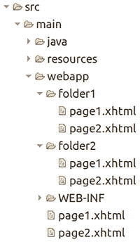

以下位于 `/folder1/page1.xhtml` 中的 `<h:link>` 和 `<a>` 对将在 HTML 输出中生成完全相同的链接。

```
link1

link2

link3

link4

link5
```

因此请注意，`<h:link>` 已经会自动在 Web 应用程序项目的任何上下文路径前添加前缀，并附加当前活动的 `FacesServlet` 映射的 URL 模式。还要注意，如果没有前导斜杠，则 outcome 相对于当前文件夹进行解释；如果有前导斜杠，则 outcome 相对于上下文路径进行解释。


基于面板的输出组件
这些组件是 `<h:panelGroup>` 和 `<h:panelGrid>`，它们都继承自 `UIPanel` 超类。`<h:panelGroup>` 具有多种职责。它可以生成 HTML 的 `<span>`、`<div>` 甚至 `<td>` 元素，具体取决于 `layout` 属性以及它是否被包含在 `<h:panelGrid>` 中。

默认情况下，`<h:panelGroup>` 仅生成一个 HTML `<span>` 元素，这与 `<h:outputText>` 完全相同。主要区别在于 `<h:panelGroup>` 没有 `value` 属性。相反，其内容由其子元素表示。它也不支持禁用 HTML 转义或附加转换器。这些功能由任何 `<h:outputText>` 子元素负责。在这种上下文中，它并不是特别有用。只有当您需要使用 `<f:ajax render>` 引用一个内联元素，而该元素又用于组合一组紧密相关的内联元素时，`<h:panelGroup>` 才比 `<h:outputText>` 更有用。类似下面表示“用户资料”的代码，该资料应该可以通过页面下方某种用户资料编辑表单中的 Ajax 进行更新。

```
欢迎，

#{user.name}

...

...

...

```

当将 `<h:panelGroup>` 的 `layout` 属性设置为 `block` 时，它将生成一个 HTML `<div>` 元素。在标准 HTML 中，“内联元素”^(⁴⁸) 默认不会在新行开始，也不允许包含块级子元素。而“块级元素”^(⁴⁹) 默认总是在新行开始，并且允许包含内联和块级子元素。因此，`<h:panelGroup>` 的 `layout` 属性支持的值是“`inline`”和“`block`”。从历史上看，`layout` 属性是在 Jakarta Faces 1.2 中才添加的，原因是 Jakarta Faces 开发者抱怨缺少一个用于表示 HTML `<div>` 元素的 Jakarta Faces 组件。然后，这个组件可以用来包装需要 Ajax 更新的较大块级区域；否则，一个普通的 HTML `<div>` 也足够了。

```

欢迎，

#{user.name}

```

请注意，在 HTML 中，将块级元素嵌套在内联元素中是非法的。`<p>` 是一个块级元素，因此，在前面的结构中，`layout="block"` 是绝对必需的。如果您不指定此属性，从而让 Jakarta Faces 渲染一个 HTML `<span>` 元素，那么 Web 浏览器的行为将是未指定的。普通的 Web 浏览器会将块级子元素渲染到内联元素之外，甚至可能在 JavaScript 遍历此结构时出错，因为它不一定能在内联元素中找到预期的块级子元素。
还要记住，在前面的结构中，`<p>` 标签和“欢迎”文本也会在对 `<h:panelGroup>` 执行任何 Jakarta Faces Ajax 更新操作时被更新。这本质上是对服务器端和客户端硬件资源的浪费，因为它们是静态的，永远不会发生变化。在进行 Ajax 更新时，您最好确保 `<f:ajax render>` 只引用那些绝对需要 Ajax 更新的组件，而不是一个也包含静态部分的不必要的大区域。
当 `<h:panelGroup>` 被嵌套在生成 HTML `<table>` 元素的 `<h:panelGrid>` 组件中时，`<h:panelGroup>` 的 `layout` 属性将被忽略，该组件将基本上充当一个容器，用于容纳最终应位于表格同一单元格中的组件。也就是说，`<h:panelGrid>` 的渲染器会将每个直接子组件视为一个单独的表格单元格。

给定以下两列的 `<h:panelGrid>`，它应该生成一个两列的 HTML 表格，您猜猜实际生成的 HTML 输出会是什么样子？

```
一

三
四
五
六
七

八
九

```

两个 Jakarta Faces 组件之间的每一段模板文本在内部都被视为一个单独的 Jakarta Faces 组件。在 Mojarra 中，它由内部的 `UIInstructions` 组件表示。在视图构建时间之后，实际的组件树层次结构大致如下所示：

```
一

三
四

五

六
七

八
九

```

再次注意，Facelets 中没有像 `<ui:instructions>` 这样的组件。前面的标记纯粹是为了可视化实际的组件树层次结构，以便您的大脑更好地处理它。这个 `<h:panelGrid>` 实际上有六个直接子组件，每个子组件都将位于自己的表格单元格中。对于两列，这将有效地生成三行。以下是实际生成的 HTML 输出（为便于阅读而重新格式化）。

```

一
二

三 四
五

六 七
八 九

```

在 Chrome 浏览器中的渲染效果：
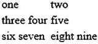

您看，`<h:panelGroup>` 确保了“五”和“八 九”不会与“六 七”位于同一个表格单元格中。还要注意，如果某个 Jakarta Faces 组件已经代表一个单独的单元格，则无需将其包装在 `<h:panelGroup>` 中。这就是为什么“二”后面的 `<h:outputText>` 不需要包装在 `<h:panelGroup>` 中。当然，您也可以这样做以提高源代码的可读性，但这在技术上是不必要的。以下带有显式 `<h:panelGroup>` 声明的代码会生成完全相同的 HTML 输出，但毫无疑问，人类更容易解析它。

```

一

二

三
四

五

六
七

八
九

```

如果您碰巧需要基于视图作用域的可迭代模型来生成动态数量的单元格，那么您可以在 `<h:panelGrid>` 中嵌套 Jakarta 标签 `<c:forEach>`，以便将其生成为具有固定列数的数据网格。

```

#{product.name}
#{product.description}

```

因此请注意，与 `<c:forEach>` 相比，`<ui:repeat>` 在此处不适用，如第 3 章的“Jakarta 标签”部分所述。它在技术上可以正常工作，但 `<h:panelGrid>` 的渲染器会将其解释为单个表格单元格。
还要注意，这个可迭代模型是视图作用域非常重要，特别是当您在 `<h:panelGrid>` 内部有 Jakarta Faces 表单组件时。技术原因是，在处理回发请求期间，Jakarta Faces 期望提交的迭代索引背后的迭代项与页面呈现给最终用户时的项完全相同。换句话说，当 Jakarta Faces 即将处理表单提交时，如果在此期间某个项被添加、删除甚至重新排序，导致其迭代索引可能发生变化，那么提交的值和/或调用的操作可能会针对当前位于最初已知索引处的错误项执行。这对模型的完整性是危险的。如果您在 `<h:panelGrid>` 内部没有任何 Jakarta Faces 表单组件，或者该模型在视图作用域内不会发生变化（例如，因为它仅在应用程序启动时创建或更新），那么 `#{viewProducts}` 背后的支持 bean 可以安全地设置为请求作用域。

数据迭代组件
只有一个，即 `<h:dataTable>`，它继承自 `UIData` 超类，并基于可迭代的数据模型生成一个 HTML `<table>`，其中每个项目表示为单独的一行。Jakarta Faces 中可用的另一个数据迭代组件，即 Facelets 的 `<ui:repeat>`，并不继承自 `UIData` 超类，也不生成任何 HTML 输出，因此在技术上不算作“输出组件”。此外，在标准的 Jakarta Faces 组件集中，没有组件生成 HTML 的 `<ul>`、`<ol>` 或 `<dl>`，但这可以通过创建一个继承自 `UIData` 的自定义组件相对容易地实现（另请参阅第 11 章的“创建新组件和渲染器”部分）。


`UIData` 的 `value` 属性支持 `java.lang.Iterable`。换句话说，你可以将任何 Java 集合作为模型值提供。由于 `UIData` 中最常使用基于索引的访问，因此最高效的是 `java.util.ArrayList`，因为它提供了 `O(1)` 的索引访问。

`<h:dataTable>` 组件的渲染器仅支持 `<h:column>` 作为直接子组件，其他内容将被忽略。顾名思义，`<h:column>` 代表单个列。每次遍历 `<h:dataTable>` 的 `value` 时，基本上都会根据当前遍历的项重新渲染所有列。与 `<c:forEach>` 和 `<ui:repeat>` 一样，当前遍历的项通过 `var` 属性暴露在 EL 作用域中。以下是一个遍历 `List<String>` 的基本示例。

```
#{string}

```

后台 Bean 类 `com.example.project.view.Bean`：

```
@Named @RequestScoped
public class Bean {
private List strings;
@PostConstruct
public void init() {
strings = Arrays.asList("one", "two", "three");
}
public List getStrings() {
return strings;
}
}
```

生成的 HTML 输出：

```

one
two
three

```

在 Chrome 浏览器中的渲染效果：

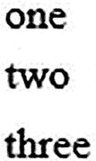

需要注意的是，由 `var` 属性指定的变量名不应与现有的受管 Bean 名称甚至隐式 EL 对象冲突。隐式 EL 对象在 EL 解析中具有更高的优先级。隐式 EL 对象的一个例子是 `#{header}`，它引用 `ExternalContext#getRequestHeaderMap()`。^(⁵⁰) 因此，如果你碰巧有 `#{bean.headers}` 并且希望在迭代组件中呈现它，那么你不能使用 `var="header"`，最好想一个不同的名称，例如 `var="head"`。

以下是一个更详细的示例，展示了产品列表。类似的表格在第五章的“自定义转换器”部分已经展示过。

```

ID
#{product.id}

Name
#{product.name}

Description
#{product.description}

```

后台 Bean 类 `com.example.project.view.Products`：

```
@Named @RequestScoped
public class Products {
private List list;
@Inject
private ProductService productService;
@PostConstruct
public void init() {
list = productService.list();
}
public List getList() {
return list;
}
}
```

产品实体：`com.example.project.model.Product`：

```
@Entity
public class Product {
@Id @GeneratedValue(strategy=IDENTITY)
private Long id;
@Column(nullable = false)
private @NotNull String name;
@Column(nullable = false)
private @NotNull String description;
// 添加/生成 getter+setter 方法。
}
```

产品服务：`com.example.project.service.ProductService`：

```
@Stateless
public class ProductService {
@PersistenceContext
private EntityManager entityManager;
@TransactionAttribute(SUPPORTS)
public List list() {
return entityManager
.createQuery("FROM Product ORDER BY id DESC", Product.class)
.getResultList();
}
}
```

生成的 HTML 输出：

```

ID
Name
Description

Three
The third product

Two
The second product

One
The first product

```

在 Chrome 浏览器中的渲染效果：
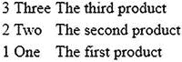
需要注意的是，`<h:dataTable>` 的 `value` 属性背后的可迭代模型必须引用一个已在一次性生命周期事件（如 `@PostConstruct` 或 `<f:viewAction>`）中预先准备好的 Bean 属性。这并非特指 `UIData` 组件，而是基本上适用于每个 Jakarta Faces 组件。也就是说，在 Jakarta Faces 生命周期中，getter 方法可能会被多次调用，尤其是在迭代组件的 `value` 属性或任何 Jakarta Faces 组件的 `rendered` 属性中被引用时。

技术原因是，任何 EL 值表达式在幕后都会被创建为一个 `jakarta.el.ValueExpression` 实例，该实例内部基本上只保存字面量 EL 字符串，如 `"#{products.list}"`，并且每次对其调用 `ValueExpression#getValue()` 都会简单地根据提供的 EL 上下文重新计算表达式。这通常是一个非常廉价的操作，耗时在纳秒级别，但当 getter 方法反过来执行一个相对昂贵的数据库查询（可能需要数十、数百甚至数千毫秒）时，它可能会急剧变慢。

当迭代组件恰好嵌套了 Jakarta Faces 表单组件时，迭代组件可能会在 Jakarta Faces 生命周期的每个阶段调用 getter 方法。如果你通过在 getter 方法中从数据库获取列表来准备可迭代模型，那么这将导致每次调用 getter 方法时都查询数据库，这显然是低效的。此外，关于根据提交的迭代索引解析感兴趣的迭代项的问题，也可能出现，正如上一节关于 `<h:panelGrid>` 与 `<c:forEach>` 的最后一段所述。

另一件需要注意的事情是 `<f:facet name="header">`。这基本上会生成一个 `<thead>` 元素，其内容位于 `<th>` 元素中。`<h:dataTable>` 也支持 `<f:facet name="footer">`，它会生成一个 `<tfoot>` 元素，其内容位于 `<td>` 元素中。你通常可以在标签文档以及 `<h:dataTable>` 标签文档中找到所有支持的 `<f:facet>` 名称。^(⁵¹)

基本上，你可以在 `<h:column>` 内部放置任何内容来表示单元格内容，甚至可以是表单组件或嵌套的 `<h:dataTable>` 或 `<ui:repeat>`。以下是一个小示例，展示了在嵌套的 `<ui:repeat>` 中显示 `Product` 实体的一个虚构的 `Set<Tag> tags` 属性。

```
...

#{tag.name}

```

可编辑的 `<h:dataTable>`

至于嵌套在 `<h:column>` 内部的表单组件，你可以用输入组件替换模板文本中的 EL，如下所示：

```

ID
#{product.id}

Name

Description

```

其中，后台 Bean 类的 `save()` 方法在将后台 Bean 类从 `@RequestScoped` 更改为 `@ViewScoped` 后，基本如下所示：

```
public void save() {
productService.update(products);
}
```

而服务类的 `update()` 方法则如下所示：

```
@TransactionAttribute(REQUIRED)
public void update(Iterable products) {
products.forEach(entityManager::merge);
}
```

请注意，你完全无需担心收集提交的值。Jakarta Faces 已经为你完成了这项任务。另外，也无需担心 `<h:dataTable>` 内组件 ID 的唯一性，因为该组件已经实现了 `NamingContainer` 接口，并会将其自身的客户端 ID 和迭代索引前置到子组件的客户端 ID 之前，正如你在以下生成的 HTML 输出中所见：

```

ID
Name
Description

The third product

The second product

The first product

```


必须承认，像这样拥有一个可编辑的表格效率并不高，尤其是在表格包含大量列和行的情况下。Jakarta Faces 可以很好地处理它；但普通的网络浏览器在处理时可能会遇到困难，特别是当行数超过几千行时。我还没提到最终用户可能因为要一直滚动浏览整个页面而抓狂，并且基本上无法获得清晰的概览。对此有几种解决方案：首先是分页；其次是过滤；第三是基于行的内联编辑和更新；第四是在对话框或详情页中进行外部编辑。
所有上述提到的表格特定性能和可用性解决方案，标准 `<h:dataTable>` 均未提供，因此需要大量的自定义代码。强烈建议您寻找一个支持这些功能的现有 Jakarta Faces 组件库，以便让您的 Jakarta Faces 开发更轻松，无需重新发明轮子。目前，最广泛使用的是 PrimeFaces 及其 `<p:dataTable>`。^(⁵²) 这甚至可以通过 OptimusFaces 的 `<op:dataTable>` 进一步简化，^(⁵³) 而后者又是基于 `<p:dataTable>` 构建的。
在详情页中编辑选中的项目是标准 Jakarta Faces 可以做到的，这在第 5 章的“自定义转换器”部分有演示。

需要说明的是，在模型值为 `List<String>` 的特定情况下，在列中使用输入组件并不像 `List<Product>` 示例中演示的那样容易实现。换句话说，下面的示例根本行不通：

技术问题在于 `java.lang.String` 是不可变的，并且没有为其内部值提供公共 setter 方法。确实，它实际上也没有 getter 方法，但 EL 已经默认使用 `Object#toString()`，对于 `String` 来说，它只是返回字符串本身。这可以通过使用索引显式引用模型值的特定项来解决，如下所示：

注意 `binding` 属性。
基本上，在视图构建期间，这会将当前的 `UIComponent` 实例设置为一个由给定名称标识的 EL 变量。在这个特定的代码片段中，它将使 `#{table}` 变量引用 `<h:dataTable>` 标签背后的具体 `HtmlDataTable` 实例。`#{table}` 变量在视图构建期间只能在视图中的标签位置之后被引用，而在视图渲染期间则可以在视图中的任何位置被引用。通过这种方式，您可以像访问 bean 一样访问 `UIComponent` 属性。因此，`#{table.rowIndex}` 基本上引用了 `UIData#getRowIndex()` 方法，^(⁵⁴) 该方法返回当前的迭代索引。最后，这被用来引用列表中的目标项。在更新模型值阶段（第四阶段），Jakarta Faces 将简单地替换指定索引处的项。

同样对于 `binding` 属性，非常重要的一点是变量名不应与现有的受管 bean 名称或隐式 EL 对象冲突，当然也不应与同一视图中的其他组件冲突。您也可以让 `binding` 属性引用一个支持 bean 的属性，如下所示：

```

以及

```
private UIData table; // +getter +setter
```

但如果它在支持 bean 的其他地方没有被使用，这就相当无用了。
此外，当受管 bean 的作用域宽于请求时（另请参阅第 3 章的“视图构建时间”部分），这很危险。最好不要将组件实例绑定到支持 bean；这可能表明一种不良实践。唯一合理的实际用例是将复合组件子项绑定到支持组件（另请参阅第 7 章的“复合组件”部分）。

如果您在类似 `List<String>` 的东西上使用 `<ui:repeat>` 或 `<c:forEach>` 而不是 `<h:dataTable>`，那么您可以通过 `varStatus` 属性以更简单的方式获取迭代索引。

在 <h:dataTable> 中添加/删除行

回到使用 `List<Product>` 的 `<h:dataTable>`，在某些情况下，您可能希望能够在同一视图中添加或删除项目，通常是在某种管理页面中。为了添加一个新的 `Product`，我们需要在受管 bean 中准备一个新实例，在单独的表单中填写它，持久化它，然后刷新表格。

```

...

```

其中相关的支持 bean 代码如下所示：

```
private List list; // +getter
private Product product = new Product(); // +getter
@PostConstruct
public void init() {
list = productService.list();
}
public void add() {
productService.create(product);
list.add(0, product);
product = new Product();
}
```

以及服务类中的这个 `create()` 方法：

```
@TransactionAttribute(REQUIRED);
public Long create(Product product) {
entityManager.persist(product);
return product.getId();
}
```

删除可以通过多种方式完成。无论如何，您可能需要一个额外的列来容纳提交按钮、单选按钮或复选框。最简单的方法是使用一个包含命令按钮的列，该按钮删除当前迭代的项目，然后刷新表格。

```

...

```

以及 `@ViewScoped` 支持 bean 类中的这个 `delete(Product)` 方法：

```
public void delete(Product product) {
productService.delete(product);
list.remove(product);
}
```

以及服务类中的这个 `delete()` 方法：

```
@TransactionAttribute(REQUIRED)
public void delete(Product product) {
if (entityManager.contains(product)) {
entityManager.remove(product);
}
else {
Product managedProduct = getById(product.getId());
if (managedProduct != null) {
entityManager.remove(managedProduct);
}
}
}
```

注意 `<f:ajax>` 的 `render` 属性。它指定了 `@namingcontainer`，这基本上引用了最近的父级 `NamingContainer` 组件。在标准 Jakarta Faces HTML 组件集中，只有 `<h:form>` 和 `<h:dataTable>` 是 `NamingContainer` 的实例。在这个特定的结构中，`@namingcontainer` 因此引用了 `<h:dataTable>`。您也可以使用 `<f:ajax render=":list:products">` 代替；只是稍微冗长一些。`<f:ajax render="products">` 将不起作用，因为它会尝试在当前迭代行的上下文中找到它，而这基本上是在所有 `<h:column>` 组件内部。

在 <h:dataTable> 中选择行

自 Jakarta Faces 2.3 起，在 `<h:dataTable>` 中拥有单选按钮列是原生支持的，这要归功于 `<h:selectOneRadio>` 的新 `group` 属性（另请参阅第 4 章的“选择组件”部分）。

```

...

```

以及 `@ViewScoped` 支持 bean 类中的这个 `deleteSelected()` 方法：

```
private Product selected; // +getter +setter
public void deleteSelected() {
productService.delete(selected);
list.remove(selected);
}
```

请注意，您在这里也需要一个 `ProductConverter` 或 `BaseEntityConverter`。这些在第 5 章的“自定义转换器”部分有详细说明。

复选框选择稍微复杂一些。您直观上会使用 `<h:selectManyCheckbox>`，但它不像 `<h:selectOneRadio>` 那样支持 `group` 属性。您需要退而使用 `<h:selectBooleanCheckbox>` 配合一个 `Map<Product, Boolean>`，其中映射键代表当前迭代的产品，映射值代表复选框的值。

```

...

```

`@ViewScoped` 支持 bean 中修改后的 `deleteSelected()` 方法如下所示：

```
private Map selection = new HashMap(); // +getter
public void deleteSelected() {
List selected = selection.entrySet().stream()
.filter(Entry::getValue)
.map(Entry::getKey)
.collect(Collectors.toList());
productService.delete(selected);
selected.forEach(list::remove);
selection.clear();
}
```


重载的 `ProductService#delete(Iterable)` 方法如下所示：

```
@TransactionAttribute(REQUIRED)
public void delete(Iterable products) {
products.forEach(this::delete);
}
```

<h:dataTable> 中的动态列
在 `<h:dataTable>` 中，
借助 Jakarta 标签 `<c:forEach>`，也可以
基于至少是视图作用域的 Java 模型动态创建多个 `<h:column>`
实例。请求作用域的模型也可以，但这
不能保证在回发请求期间它与前一次请求完全相同，因此存在动态
`<h:column>`
组合出现偏差的风险。
`<c:forEach>`
的值应引用实体属性名称或映射键的集合。然后，你可以在 EL 中使用花括号表示法，如 `#{entity[propertyName]}`
或 `#{map[key]}`
来引用实际值。这适用于 `UIOutput` 和 `UIInput` 组件。
以下示例说明了如何为 `List<Product>` 实现这一点。

后台 Bean：

```
@Named @RequestScoped
public class Products {
private List list;
private List properties;
@Inject
private ProductService productService;
@PostConstruct
public void init() {
list = productService.list();
properties = Arrays.asList("id", "name", "description");
}
// 添加/生成 getter 方法（此处不需要 setter）。
}
```

Facelets 文件：

```

#{product[property]}

```

你甚至可以将其进一步推广到公共超类的其他实体，例如 `BaseEntity`，通过实体服务获取相关的属性名称。

资源组件
Jakarta Faces 提供了三个资源组件：`<h:graphicImage>`、
`<h:outputScript>` 和 `<h:outputStylesheet>`，
分别用于图像资源、JavaScript 资源和 CSS 资源。它们可以引用物理资源文件
以及动态资源文件。物理资源文件
本身必须放置在 Web 主文件夹的 `/resources` 子文件夹中。动态资源文件
可以通过自定义的 `ResourceHandler` 来处理，该处理器会拦截特定的库名称和/或资源名称。给定 Eclipse 中 Maven WAR 项目的以下文件夹
结构：
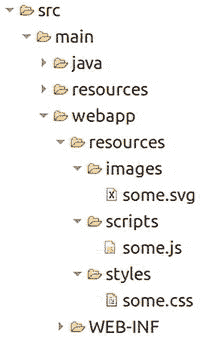

资源的引用方式如下：

生成的 HTML 输出如下所示，假设 `/project` 是
Web 应用程序的上下文路径：

你会看到它以前缀 `/jakarta.faces.resource`
路径开头，并以当前活动的 `FacesServlet`
URL 模式结尾。`/jakarta.faces.resource`
由常量 `ResourceHandler#RESOURCE_IDENTIFIER` 表示。^(⁵⁵) 资源 URL 匹配
`FacesServlet` 的 URL 模式，这确保了它实际上会调用 `FacesServlet`，
而 `FacesServlet` 又知道如何处理该资源。它首先会调用
`ResourceHandler#isResourceRequest()`，
该方法默认判断 URL 前缀是否以已知的
`RESOURCE_IDENTIFIER`
常量开头，如果是，则立即委托给 `ResourceHandler#handleResourceRequest()`
，而不是经历整个 Jakarta Faces 生命周期。
另请注意，这些 Web 资源不放置在 `src/main/resources`
文件夹中，而是放置在 `src/main/webapp/resources`
文件夹中。`src/main/resources`
文件夹仅用于必须最终位于类路径中的非类资源，例如资源包文件和配置属性
文件。这些类路径资源可通过 `ClassLoader#getResource()` 获取。^(⁵⁶) `src/main/webapp/resources`
不会最终位于类路径中；相反，它会最终位于 Web 内容中。
这些 Web 资源可通过 `ExternalContext#getResource()` 获取，^(⁵⁷) 该方法在底层委托给
`ServletContext#getResource()`。^(⁵⁸)
因此，`name`
属性基本上表示相对于 `src/main/webapp/resources`
文件夹的资源路径。这些组件还支持 `library` 属性。
`library`
属性必须表示 Jakarta Faces 库的唯一资源库名称。对于标准 Jakarta Faces，资源库名称是“`jakarta.faces`”；对于
PrimeFaces，^(⁵⁹) 资源库名称是
“`primefaces`”；
对于 OmniFaces，^(⁶⁰) 资源库名称是
“`omnifaces`”；
对于 BootsFaces，^(⁶¹) 资源库名称是“`bsf`”；等等。
通常，这些特定于库的资源已经由相关的 Jakarta Faces 库自动包含，通常是通过
`UIComponent` 或 `Renderer` 类上的 `@ResourceDependency`
注解声明性地包含，有时也通过 `UIViewRoot#addComponentResource()` 以编程方式包含。
这将在第 11 章的“资源依赖关系”一节中详细说明。如有必要，这些资源可以
使用资源组件进行引用，从而显式指定
`library` 属性。

以下示例显式包含了标准的 Jakarta Faces
`faces.js`
文件：

```
...

```

这通常是不必要的，因为依赖于此脚本的 Jakarta Faces 组件，例如 `<h:commandLink>`、
`<f:ajax>` 和 `<f:websocket>`，
已经自动包含了它。这是另一个示例，显式包含了 PrimeFaces
库中的 `jquery.js` 文件——当然，这仅在你实际安装了 PrimeFaces 时才有效。

```
...

```

当你希望在不包含任何 PrimeFaces 组件的页面上重用 PrimeFaces 提供的 jQuery 库时，这种方法可能很有用，例如，当你有一些依赖于 jQuery 的 Web 项目特定脚本时。默认情况下，所有 PrimeFaces 组件都会自动包含此 jQuery 库，但如果页面不包含任何 PrimeFaces 组件，则不会发生这种情况。Jakarta Faces 资源管理将确保自动包含和显式包含的 JavaScript 和 CSS 资源不会在生成的 HTML 输出中重复。换句话说，上述显式包含 jQuery 的行可以安全地用于实际包含 PrimeFaces 组件的页面。


请注意，目前互联网上存在大量质量低劣的 Jakarta Faces 教程，它们未能正确使用 `library` 属性。相反，这些教程错误地将 `library` 属性演示为 `src/main/webapp/resources` 文件夹内的子文件夹，示例如下：

这种做法是完全错误的。它无法让自定义资源处理器区分不同库的资源。在前面的示例中，你基本上需要检查三个不同的资源库，尽管所有这些资源都属于同一个库——即 Web 项目本身。

谈到自定义资源处理器，假设你想强制 Web 浏览器在服务器端的图片、JavaScript 和/或 CSS 资源发生更改时重新加载它们。这可以通过向资源 URL 添加一个查询字符串参数来实现，该参数的值代表资源的版本。这也被称为“缓存破坏”。在 Jakarta Faces 中，可以通过以下自定义 `ResourceHandler` 示例来实现，该处理器装饰 `Resource` 以返回其最后修改时间戳作为查询字符串参数。

```
public class VersionResourceHandler extends ResourceHandlerWrapper {
    public VersionResourceHandler(ResourceHandler wrapped) {
        super(wrapped);
    }

    @Override
    public Resource createResource(String name, String library) {
        Resource resource = super.createResource(name, library);
        if (resource == null || library != null) {
            return resource;
        }
        return new ResourceWrapper(resource) {
            @Override
            public String getRequestPath() {
                String url = super.getRequestPath();
                return url
                    + (url.contains("?") ? "&" : "?")
                    + "v=" + getLastModified();
            }

            private long getLastModified() {
                try {
                    return getWrapped().getURL()
                        .openConnection().getLastModified();
                }
                catch (IOException ignore) {
                    return 0;
                }
            }
        };
    }
}
```

为了激活它，需要在 `faces-config.xml` 中注册如下：

```
<resource-handler>
    com.example.project.resourcehandler.VersionResourceHandler
</resource-handler>
```

请注意，`createResource()` 方法在资源为 `null` 或 `library` 不为 `null` 时，会原样返回创建的资源。当 `name` 未知时，资源本身为 `null`。当 `library` 未指定时，它为 `null`，因此特定于 Web 项目。当然，你也可以将此逻辑应用于其他库的所有资源，但它们通常已经拥有自己内部实现的此类资源处理器。

回到资源组件，你只能将 `<h:graphicImage>` 放置在 body 内，body 可以是纯 HTML 的 `<body>` 或 Jakarta Faces 的 `<h:body>`。显然，在纯 HTML 文档中，`` 元素只能位于文档 body 内。你可以将 `<h:outputScript>` 和 `<h:outputStylesheet>` 放置在 Jakarta Faces 页面的任何位置。默认情况下，`<h:outputScript>` 会在声明的位置精确生成 HTML `<script>` 元素，无论该位置是在文档的 head 还是 body 中。然而，`<h:outputStylesheet>` 在 `<h:body>` 内声明时，默认会被移动到 `<h:head>` 的末尾。这是因为在 HTML 中，将 `<link rel="stylesheet">` 放在 `<head>` 之外是不合法的。当 `<h:outputScript>` 在 `<h:body>` 内声明且 `target` 属性设置为 `head` 时，它也可以被自动移动到文档 head 的末尾。当 `<h:outputScript>` 的 `target` 属性设置为 `body` 时，它会被自动移动到文档 body 的末尾。`<h:outputStylesheet>` 不支持此功能。换句话说，以下测试 Facelet：

```
<ui:composition xmlns="http://www.w3.org/1999/xhtml"
    xmlns:h="jakarta.faces.html">
    <h:head>
        <h:outputScript name="script1.js" />
        <h:outputStylesheet name="style1.css" />
        <h:outputScript name="script2.js" target="head" />
    </h:head>
    <h:body>
        <h:outputStylesheet name="style2.css" />
        <h:outputScript name="script3.js" target="head" />
        <h:outputScript name="script4.js" target="body" />
        <h:outputScript name="script5.js" />
        <h:graphicImage name="image1.png" />
        <p>Paragraph 1</p>
        <p>Paragraph 2</p>
    </h:body>
</ui:composition>
```

基本上会生成以下 HTML 输出（为简洁起见，URL 已简化）：

```
<html xmlns="http://www.w3.org/1999/xhtml">
<head>
<script type="text/javascript" src="script1.js"></script>
<link type="text/css" rel="stylesheet" href="style1.css" />
<script type="text/javascript" src="script2.js"></script>
<link type="text/css" rel="stylesheet" href="style2.css" />
<script type="text/javascript" src="script3.js"></script>
</head>
<body>
<script type="text/javascript" src="script4.js"></script>
<script type="text/javascript" src="script5.js"></script>

<p>Paragraph 1</p>
<p>Paragraph 2</p>
</body>
</html>
```

换句话说，文档 head 中的资源渲染顺序是：

1.  来自 `<h:head>` 且没有 `target` 的 `<h:outputScript>`
2.  来自 `<h:head>` 的 `<h:outputStylesheet>`
3.  来自 `<h:head>` 且 `target="head"` 的 `<h:outputScript>`
4.  来自 `<h:body>` 的 `<h:outputStylesheet>`
5.  来自 `<h:body>` 且 `target="head"` 的 `<h:outputScript>`

请注意，`<h:outputStylesheet>` 隐式推断 `target="head"`，因此会在没有任何 target 的 `<h:outputScript>` *之后*渲染。所有通过组件的 `@ResourceDependency` 注解自动包含的 JavaScript 和 CSS 资源，最终会位于 `<h:head>` 中声明的资源和 `<h:body>` 中声明的资源之间。因此，如果你碰巧使用了一个自动包含一堆 CSS 资源的 Jakarta Faces 库，并且想要覆盖其中一些资源，那么最好将这样的 `<h:outputStylesheet>` 放在 `<h:body>` 中，而不是 `<h:head>` 中，这样可以保证它在库的 CSS 资源*之后*加载。

但要注意，某些 Jakarta Faces 库会自动覆盖 `<h:head>` 的默认渲染器，这可能会打乱默认的资源排序。在这种情况下，你最好查阅相关 Jakarta Faces 库的文档以了解新的排序规则，或者通过 Web 项目的 `faces-config.xml` 恢复 `<h:head>` 的默认渲染器。

```
<render-kit>
    <renderer>
        <component-family>jakarta.faces.Output</component-family>
        <renderer-type>jakarta.faces.Head</renderer-type>
        <renderer-class>com.sun.faces.renderkit.html_basic.HeadRenderer</renderer-class>
    </renderer>
</render-kit>
```

如果你使用的是 MyFaces 而不是 Mojarra 作为 Jakarta Faces 实现，那么请使用 `org.apache.myfaces.renderkit.html.HtmlHeadRenderer` 作为渲染器类。

如果你打算开发一个自动包含特定资源的 Jakarta Faces 库，那么请记住使用 `@ResourceDependency` 或 `UIViewRoot#addComponentResource()`，而不是为此目的替换 `<h:head>` 的默认渲染器。由于注解不允许指定动态值，任何动态资源最好在 `<h:head>` 的 `PostAddToView` 事件期间添加。这可以通过一个 `SystemEventListener` 在应用程序范围内实现，如下所示，假设你的库的资源库名称是“`foo`”：

```
public class DynamicResourceListener implements SystemEventListener {
    private static final String LIBRARY = "foo";

    @Override
    public boolean isListenerForSource(Object source) {
        UIOutput output = (UIOutput) source;
        return "jakarta.faces.Head".equals(output.getRendererType());
    }

    @Override
    public void processEvent(SystemEvent event) {
        FacesContext context = event.getFacesContext();
        String scriptName = "foo.js"; // 可以是动态的。
        addResource(context, scriptName);
        String stylesheetName = "foo.css"; // 可以是动态的。
        addResource(context, stylesheetName);
    }

    private void addResource(FacesContext context, String name) {
        UIComponent resource = new UIOutput();
        resource.getAttributes().put("library", LIBRARY);
        resource.getAttributes().put("name", name);
        resource.setRendererType(context.getApplication()
            .getResourceHandler().getRendererTypeForResourceName(name));
        context.getViewRoot()
            .addComponentResource(context, resource, "head");
    }
}
```

它在 `faces-config.xml` 中注册如下：

```
<application>
    <system-event-listener>
        <system-event-listener-class>
            com.example.project.listener.DynamicResourceListener
        </system-event-listener-class>
        <system-event-class>
            jakarta.faces.event.PostAddToViewEvent
        </system-event-class>
        <source-class>
            jakarta.faces.component.UIOutput
        </source-class>
    </system-event-listener>
</application>
```

请注意，`<source-class>` 最好可以是 `jakarta.faces.component.html.HtmlHead`，但这并不一定在所有 Jakarta Faces 实现中都有效。例如，在 Mojarra 中，`<h:head>` 隐式创建的是 `UIOutput` 的实例，而不是 `HtmlHead`。

安装后，这个 `DynamicResourceListener` 将为上面最后一个包含 `style1.css`、`script1.js`、`script2.js` 等的测试 Facelet 生成以下 HTML 输出（同样，为简洁起见，URL 已简化）。

```
<html xmlns="http://www.w3.org/1999/xhtml">
<head>
<script type="text/javascript" src="script1.js"></script>
<link type="text/css" rel="stylesheet" href="style1.css" />
<script type="text/javascript" src="script2.js"></script>
<link type="text/css" rel="stylesheet" href="foo.css" />
<script type="text/javascript" src="foo.js"></script>
<link type="text/css" rel="stylesheet" href="style2.css" />
<script type="text/javascript" src="script3.js"></script>
</head>
<body>
<script type="text/javascript" src="script4.js"></script>
<script type="text/javascript" src="script5.js"></script>

<p>Paragraph 1</p>
<p>Paragraph 2</p>
</body>
</html>
```

因此，文档 head 中的资源渲染顺序是：

1.  来自 `<h:head>` 且没有 `target` 的 `<h:outputScript>`


2.  在 `PostAddToView` 期间动态添加到 `head` 的脚本

3.  在 `PostAddToView` 期间动态添加到 `head` 的样式表

4.  `<h:outputStylesheet>`
    来自 `<h:head>`

5.  `<h:outputScript>`
    来自 `<h:head>`，并带有
    `target="head"`

6.  `<h:outputStylesheet>`
    来自 `<h:body>`

7.  `<h:outputScript>`
    来自 `<h:body>`，并带有
    `target="head"`

你看，这个顺序是相当可预测的。本来没有必要
重写 `<h:head>` 的渲染器。
此外，从
Jakarta Faces 库中重写 `<h:head>` 的渲染器
存在风险，即它可能与任何其他恰好也重写了
`<h:head>` 渲染器的 Jakarta Faces 库不兼容。你
真的应该避免这种情况。
使用资源组件的另一个优点是，Jakarta Faces 可以这样自动
将与页面关联的所有资源推送到客户端，以便
客户端能够比解析 HTML 文档并定位所有 `<link>`、`<script>` 和
`` 元素所需的时间更早地检索到它们。这是 Jakarta Faces 2.3 的新特性。这仅要求
Jakarta Faces 2.3 Web 应用程序部署到与 Servlet 4.0 兼容的容器
（Payara 5、GlassFish 5、Tomcat 9、WildFly 12 等），并且使用 HTTPS
而不是 HTTP，并且客户端支持 HTTP/2
协议。^(⁶²) 这不需要
Jakarta Faces 端进行额外的配置。

透传元素

Jakarta Faces 还支持将任意 HTML 元素隐式解释为
一个功能完备的 Jakarta Faces 组件。此功能
在 Jakarta Faces 2.2 中引入，正式名称为“透传
元素”。当你想要
使用 HTML5 元素（如 `<main>`、`<article>`、
`<section>`、
`<aside>`、
`<nav>`、
`<header>`、
和 `<footer>`）并且
希望能够通过 `<f:ajax render>` 引用它们时，这尤其有用。以前，在 Jakarta Faces 2.2 之前，这些元素
没有对应的 Jakarta Faces 组件，因此你
被迫将它们包装在 `<h:panelGroup layout="block">` 中，这只会使生成的 HTML 输出
语义性降低。透传元素触发器可通过 `jakarta.faces` 命名空间使用。你只需要
在此命名空间上指定至少一个属性。默认的命名空间前缀就是“`faces`”。

```

标题

...

...

...

...

```

在底层，在 Jakarta Faces 组件树中，这些 HTML5
元素被转换为 `UIPanel` 组件，并且
在 Jakarta Faces 组件树中的处理方式与 `<h:panelGroup>` 完全相同。
这样，你可以干净地继续使用语义化的 HTML5 标记，同时仍然
能够通过 `<f:``ajax render>` 引用它们。
换句话说，以下构造将不起作用：

```
...

...

```

它失败是因为当传递“`main`”作为搜索
关键字时，`UIViewRoot#findComponent()`
没有返回任何内容。Jakarta Faces 找不到具有给定 ID 的任何组件。这里的
`<main>` 元素
基本上被解释为模板文本。但以下构造将
起作用：

```
...

...

```

对“`main`”调用 `UIViewRoot#findComponent()`
将返回一个代表 `<main>` 元素的 `UIPanel` 实例。
然后 Jakarta Faces 将能够将其渲染到 Ajax 响应中。
透传元素特性也适用于其他 HTML 元素；只是
它们不一定都转换为 `UIPanel` 实例。
相反，它们将被转换为一个 Jakarta Faces 组件，
其生成的 HTML 输出与原始 HTML 元素匹配（参见表
6-1）。以下
构造在底层与上一个构造相同：

表 6-1
Jakarta Faces 识别的透传元素

透传 HTML 元素 |
 隐含的 Jakarta Faces 组件 |

| --- | --- | --- | --- | --- |

<a faces:action=“…”> |
 <h:commandLink> |

<a faces:actionListener=“…”> |
 <h:commandLink> |

<a faces:value=“…”> |
 <h:outputLink> |

<a faces:outcome=“…”> |
 <h:link> |

<body faces:id=“…”> |
 <h:body> |

<button faces:id=“…”> |
 <h:commandButton type=“button”> |

<button faces:outcome=“…”> |
 <h:button> |

<form faces:id=“…”> |
 <h:form> |

<head faces:id=“…”> |
 <h:head> |

 |
 <h:graphicImage> |

<input faces:id=“…” type=“button”> |
 <h:commandButton type=“button”> |

<input faces:id=“…” type=“checkbox”> |
 <h:selectBooleanCheckbox> |

<input faces:id=“…” type=“file”> |
 <h:inputFile> |

<input faces:id=“…” type=“hidden”> |
 <h:inputHidden> |

<input faces:id=“…” type=“password”> |
 <h:inputSecret> |

<input faces:id=“…” type=“reset”> |
 <h:commandButton type=“reset”> |

<input faces:id=“…” type=“submit”> |
 <h:commandButton type=“submit”> |

<input faces:id=“…” type=“*”> |
 <h:inputText> |

<label faces:id=“…”> |
 <h:outputLabel> |

<link faces:id=“…”> |
 <h:outputStylesheet> |

<script faces:id=“…”> |
 <h:outputScript> |

<select faces:id=“…”> |
 <h:selectOneListbox> |

<select faces:id=“…” multiple=“*”> |
 <h:selectManyListbox> |

<* faces:id=“…”> |
 <h:panelGroup> |

```

...

...

```

在此类透传元素上指定的任何属性都会隐式
映射到 Jakarta Faces 组件的相应属性。在
以下示例中，Jakarta Faces 组件和透传元素
对是等效的。

```

联系人
```

请注意，你不需要将透传元素的每个
属性都注册到“`faces`”命名空间上。
只需一个属性就足以触发透传元素特性，
最好是第一个属性。这可以使代码保持简洁。

脚注

7. Facelets 模板化

当 Jakarta Faces 于 2004 年首次推出时，只有 Jakarta Pages
（以前称为 Jakarta Pages）可作为视图技术使用。
很明显，对于使用 Jakarta Faces 进行 Web 开发来说，这是一种不合适的视图技术。
Jakarta Pages 的问题在于，它一遇到模板文本就会写入 HTTP 响应，而
Jakarta Faces 希望首先根据视图声明创建组件树，以便
能够在其上执行生命周期处理。例如，以下使用 Jakarta Pages
视图技术的 Jakarta Faces 1.0/1.1 页面：

```
strong link text

```

将产生以下 HTML 输出，其中 Jakarta Pages 在 Jakarta Faces 组件
生成的 HTML 输出*之前*发出了模板文本：

```
strong link text

```

“正确的方法”是将模板文本包装在 `<f:verbatim>`
标签中：

```
strong link text

```

这将正确地产生以下 HTML 输出：

```
strong link text

```


这显然招致了大量批评，普遍的建议是人们不应将 Jakarta Faces 与 HTML 混用。Jakarta Faces 1.0/1.1 的另一个问题是，没有组件可以表示 HTML 的 `<div>` 元素。当时正值“Web 2.0”刚刚兴起，人们也开始反对使用 HTML 表格来布局网页。主流观点认为只应使用 div，这使得人们对 Jakarta Faces 1.0/1.1 更加反感。
Jakarta Pages 导致 HTML 输出混乱的奇特行为，在仅两年后（2006 年）发布的 Jakarta Faces 1.2 中通过内部变通方式得到了解决。而缺少表示 HTML `<div>` 的组件这一问题，则通过为现有的 `<h:panelGroup>` 组件新增一个 `layout="block"` 属性来解决，使其渲染出 `<div>` 而非 `<span>`。因此，从 Jakarta Faces 1.2 开始，人们就可以安全地在 Jakarta Pages 页面中混合使用纯 HTML 和 Jakarta Faces 组件，并继续以纯 HTML 和 Jakarta Faces 两种方式使用 div。然而，在编写 Jakarta Faces 1.0/1.1 页面时应避免使用纯 HTML 的旧建议，却演变成了一个至今仍在某些人中流传的顽固迷思。
Jakarta Pages 的另一个问题是，现有的 Jakarta Pages 专用标签（例如 Jakarta Tags，原名 Jakarta Tags）以及 `${...}` 形式的现有 Jakarta Pages 专用表达式语言，完全无法集成到 Jakarta Faces 的生命周期中。因此，在 Jakarta Pages 页面中将现有的 Jakarta Pages 专用标签库和表达式与 Jakarta Faces 组件混合使用，会导致令人困惑且不直观的行为。人们无法使用 Jakarta Tags 的 `<c:forEach>` 来渲染一组 Jakarta Faces 组件，因为这些组件无法识别 `<c:forEach var>` 声明的变量。除了 `<h:dataTable>` 之外，没有专门的 Jakarta Faces 组件来遍历列表，最终人们在 Jakarta Faces 页面中创建列表时只能局限于使用 HTML 表格。
最后，Jakarta Pages 提供的模板功能也非常有限，实际上只有一个“模板”标签，即 `<jsp:include>`；因此，使用 Jakarta Pages 进行模板化需要采用相当复杂的方法，即为每个可重用模板部分的定义创建一堆自定义标签。^(⁶³) 这与 Jakarta Faces 追求可重用组件以最小化代码重复的理念相悖。使用 Jakarta Pages，你最终会重复 Jakarta Faces 组件本身。现有的模板框架，如 Tiles 和 Thymeleaf，要么以 Jakarta Pages 为中心，要么根本不支持 Jakarta Faces，因此无法使用。
显然，迫切需要一种面向 Jakarta Faces 的新视图技术来取代 Jakarta Pages，并解决其与 Jakarta Faces 生命周期相关的所有问题。于是，Facelets 在 2006 年被引入。它可以为 Jakarta Faces 1.1 和 1.2 单独安装，并内置于 Jakarta Faces 2.0 中。它成为了 Jakarta Faces 的默认视图技术，而 Jakarta Pages 作为 Jakarta Faces 的视图技术立即被弃用。Jakarta Faces 2.0 中引入的新标签，例如 `<f:ajax>`、`<h:head>`、`<h:body>`、`<h:outputScript>` 和 `<h:outputStylesheet>`，仅适用于 Facelets，不适用于 Jakarta Pages。Jakarta Faces 2.0 还引入了一个新接口 `ViewDeclarationLanguage` API，以便更轻松地插入自定义视图声明语言 (VDL) 作为 Jakarta Pages 甚至 Facelets 的替代方案。通过这种方式，人们可以为 Jakarta Faces 创建纯基于 Java 的 VDL。^(⁶⁴)

XHTML
Facelets VDL 规定视图定义在基于 XML 的文件中，这些文件使用 SAX 解析器编译并保存在内存中。自 Jakarta Faces 2.1 起，此内存缓存可通过自定义的 `FaceletCacheFactory` 进行配置。当 Jakarta Faces 项目阶段设置为 `Development` 时，Facelets 文件的 SAX 编译表示默认不会被缓存。这使得在已运行的服务器上进行开发更加容易，只需在支持将本地更改热发布到目标运行时的 IDE（集成开发环境）中编辑 Facelets 文件即可。
Facelets 文件本身通常使用 `.xhtml` 扩展名，因此初学者常称其为“XHTML”而非“Facelets”。在 Jakarta Faces 的上下文中讨论时，这没问题，但“XHTML”一词在 Web 开发领域还有另一层含义。其核心是，XHTML 是一种用于 HTML 页面的标记语言，这些页面需要使用基于 XML 的工具进行编译。换句话说，开发者基本上是创建包含 HTML 标记和 Web 框架特定 XML 标签的 XML 文件，然后 Web 框架会将其解析为 XML 树，生成该 XML 树的某种 Web 框架特定表示（在 Jakarta Faces 中是 `UIViewRoot`），并最终根据框架对 XML 树的内部表示生成所需的 HTML 输出。
但在 2006 年 Facelets 被引入前后，XHTML 被另一群 Web 开发者过度炒作，他们基本上是因为看到 W3 验证器使其 HTML4 文档无效而感到失望——这通常是因为他们希望显式关闭所有标签以保持一致性，包括那些根据 HTML4 规范实际上不应关闭的标签，例如 `<link>`、`<meta>`、`<br>` 和 `<hr>`；有时还因为他们希望指定自定义标签属性，以便某些 JavaScript 插件能与 HTML 文档更清晰地交互，而这也是 HTML4 规范所不允许的。尽管世界上几乎所有 Web 浏览器（包括古老的 IE6）都宽容地接受了这一点，但这些开发者不希望看到他们精心制作的 HTML4 文档被 W3 验证器判定为无效，于是他们将 HTML 文档类型声明更改为使用 XHTML DTD——这是 HTML 的一个扩展，要求每个标签都必须闭合，并允许在现有标签上指定自定义属性。然而，这本质上是对 XHTML 的滥用，因为他们实际上根本没有使用任何 XML 工具来编译文档并生成所需的 HTML 输出。这仅仅是为了让 W3 验证器满意。
巧合的是，也大约在同一时间，HTML5 刚刚开始起草。本质上，开发者只需从 HTML 文档类型声明中移除任何 DTD，就能得到一个允许基于 XML 语法的 HTML 文档，其中所有标签始终闭合，并允许自定义元素和属性，更重要的是，能在 W3 验证器中正确验证。换句话说，`<!DOCTYPE html>` 对这些开发者来说已经足够了，即使在 IE6 中也是如此。不幸的是，HTML5 正式完成花费了很长时间，因此在开发者能够切换回 HTML 文档类型之前，他们一直在滥用 XHTML 文档类型。当与这些开发者讨论 Facelets 时，不要称其为“XHTML”，而应直接称为“Facelets”；否则会引起混淆。

模板组合

Facelets 提供了标签，用于基于单个主模板文件轻松创建模板组合。这应该能减少所有网页中重复出现的站点级部分（如页眉、导航菜单和页脚）的代码重复。主模板文件应代表一个包含所有站点级部分的完整网页布局，并应使用 `<ui:insert>` 标签来表示可以插入页面特定部分的位置。以下是这样一个主模板文件 `/WEB-INF/templates/layout.xhtml` 的基本示例：

```

#{title}

```


请注意，主模板文件和包含文件被明确放置在 `/WEB-INF` 文件夹中。这样做是为了防止用户通过猜测 URL 路径直接访问。另外请注意，页面标题被声明为一个简单的 EL（表达式语言）表达式 `#{title}`，而不是使用 `<ui:insert>`。也就是说，`<title>` 元素中不允许包含任何标记。

`xmlns` 属性基本上通过 URI（统一资源标识符）定义了在声明的 XML 命名空间中可以使用哪些标签。默认的根 XML 命名空间 URI 是 W3 XHTML 标准 [`http://www.w3.org/1999/xhtml`](http://www.w3.org/1999/xhtml)，它定义了“任何 XHTML 和 HTML5+ 标签”，例如前面示例中的 `<html>`、`<title>`、`<header>`、`<main>` 和 `<footer>`。Facelets 编译器能够识别这个标准 XML 命名空间，并将所有元素作为“通用 UI 指令”传递。在 Facelets 文件中，不需要显式声明根 XML 命名空间。只有像 IDE 这样的工具可能需要它们来实现正确的代码补全，但 Jakarta Faces 本身并不要求在 Facelet 中存在根 XML 命名空间。

“`h`” XML 命名空间指定了 HTML 标签库 URI，而“`ui`” XML 命名空间指定了 Facelets 标签库 URI，这两个 URI 都存在于 Jakarta Faces 实现的 JAR 文件中，并在 Web 应用程序启动时注册到 Facelets。这样，Facelets 编译器就能找到相关的标签处理器、组件和复合组件，这些组件负责完成构建视图、解码 HTTP 请求和编码 HTTP 响应的繁重工作。因此，这些 URI 并不一定是实际存在的互联网地址。你甚至可以通过一个 `*.taglib.xml` 文件来指定你自己的 URI。这将在后面的“标签文件”部分进一步展开。

以下是包含文件 `/WEB-INF/includes/layout/header.xhtml` 的内容：

请注意徽标周围的链接。它指向 `#{request.contextPath}/`。这基本上会打印出相对于应用程序根目录的域相对 URL。`#{request}` 是一个隐式 EL 对象，引用当前的 `HttpServletRequest` 实例。`contextPath` 指的是它的一个属性，由 `getContextPath()` 方法提供。

以下是包含文件 `/WEB-INF/includes/layout/footer.xhtml` 的内容：

```

© Example Company

```

最后，模板客户端的样子，例如 `/home.xhtml`：

```

Welcome to Example Company!
Lorem ipsum dolor sit amet.

```

请注意 `<ui:composition>` 的 `template` 属性。这必须代表主模板的服务器端路径，最好是绝对路径，即以“`/`”开头。在模板客户端中，`<ui:param>` 允许你定义一个特定于主模板的简单参数。基本上，你可以使用任何参数名称，只要主模板支持它，并且不与现有的受管 Bean 名称冲突。在这个特定案例中，EL 变量 `#{title}` 的值被指定为“Welcome!”。这最终会出现在主模板的 `<title>` 元素中。

而 `<ui:define>` 允许你定义一个特定于主模板的标记块。它最终会出现在主模板中声明了同名 `<ui:insert>` 的位置。图 7-1 清晰地概述了所有这些部分是如何组合在一起的。

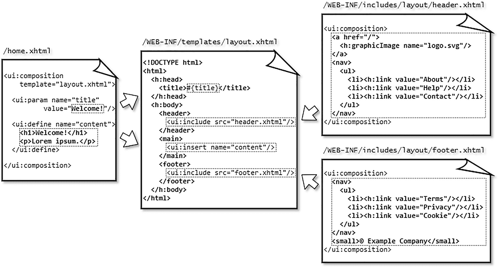

图 7-1
主模板 `layout.xhtml`、包含文件 `header.xhtml` 和 `footer.xhtml`，以及模板客户端 `home.xhtml` 之间的关系。请注意，为简洁起见，省略了模板文件路径和一些标签属性。实际编码请参考前面显示的代码片段。

最后，打开 `/home.xhtml` 应该会生成最终的 HTML 输出，你可以通过在普通 Web 浏览器中右键单击*查看页面源代码*来检查。

单页应用程序
最近的一个趋势是所谓的单页应用程序（SPA）。这个概念本身并不新鲜；事实上，它比 Jakarta Faces 本身还要古老，但在“Web 2.0”时代，随着基于 JavaScript 的框架（如 Angular）而广泛流行。基本上，SPA 通过在使用 Ajax 请求导航到不同页面时动态更改主要内容，而不是通过 GET 请求加载整个页面，从而使 Web 应用程序表现得像桌面应用程序。Gmail 就是这样一个知名的 SPA 例子。

这种 SPA 也可以通过 Jakarta Faces 实现，只需使用 `<ui:include>`，其 `src` 属性由 Ajax 动态更新。以下是一个示例，使用了上一节中展示的相同主模板 `/spa.xhtml`：

请注意，`<article>` 元素通过显式指定 Jakarta Faces 标识符 `faces:id="..."` 被声明为所谓的直通元素。在底层，当声明一个没有对应 Jakarta Faces 组件的 HTML 元素（例如 `<header>`、`<footer>`、`<main>`、`<article>` 和 `<section>`）作为直通元素时，它会被转换为一个 `UIPanel` 组件，并在 Jakarta Faces 组件树中像 `<h:panelGroup>` 一样被处理。这样，你就可以干净地继续使用语义化的 HTML5 标记，同时仍然能够像引用 Jakarta Faces 组件一样引用它，从而能够通过 Ajax 更新它。另请参阅第 6 章中的“直通元素”部分。

正如你可能从之前的 `/spa.xhtml` 示例中解读出的那样，有一个侧边导航菜单，它通过 `#{spa}` 标识的受管 Bean 设置当前页面，并通过 Ajax 更新 `id="content"` 标识的组件，该组件又包含一个动态包含。前面的示例期望在 `/WEB-INF/includes/spa` 文件夹中存在以下包含文件：`page1.xhtml`、`page2.xhtml` 和 `page3.xhtml`。它们每个都是一个简单的包含文件，内容如下：

```
First page
Lorem ipsum dolor sit amet.

```

与 `#{spa}` 受管 Bean 关联的后台 Bean 相当简单；它看起来如下：

```
@Named @ViewScoped
public class Spa implements Serializable {
private String page;
@PostConstruct
public void init() {
page = "page1";
}
public void set(String page) {
this.page = page;
}
public String getPage() {
return page;
}
}
```


默认页面在 `@PostConstruct` 中定义。否则，用户可能会看到一个包含“`Invalid path : /WEB-INF/includes/spa/.xhtml`”消息的错误页面。请注意，支持 bean 被声明为 `@ViewScoped`。这对于在回传过程中记住当前正在打开的页面非常重要。如果它是 `@RequestScoped`，并且用户导航到例如 `page2` 并在其中提交一个表单（这会创建一个新的 HTTP 请求），那么 `@RequestScoped` 管理的 bean 将被重新创建，`page` 属性的默认值为 `page1`，因此不再是初始选择的 `page2` 值。这会导致当 Jakarta Faces 准备解码任何输入组件以处理回传请求中的表单提交时，`<ui:include>` 将不再引用 `page2.xhtml`，因此 Jakarta Faces 将无法找到在 `page2.xhtml` 中声明的输入组件。`@ViewScoped` bean 的生命周期与用户回传到同一个视图（在本例中为 `/spa.xhtml`）的时间相同，因此它能正确记住当前选中的页面。

在尝试这个 SPA 示例时，您可能已经注意到一个缺点：这些页面无法添加书签。这是因为这些页面不是通过幂等的 GET 请求打开的。您可以通过利用 HTML5 `history.pushState` API 来解决这个问题。^(⁶⁵) 基本上，在 Ajax 请求完成后，您应该将预期的 URL 推送到浏览器历史记录中，这将反映在浏览器的地址栏中。并且您应该修改 `Spa` 支持 bean，以检查是否打开了任何特定页面，然后相应地准备 `page` 变量。

以下是一个入门示例，它只是附加了 `?page=xxx` 查询字符串参数。首先，调整 `spa.xhtml` 中的 `<f:ajax>`，按如下方式指定 `onevent` 属性：

```

并创建以下 JavaScript 函数：

```
function pageChangeListener(event) {
if (event.status == "success") {
var page = document.getElementById("content").dataset.page;
var url = location.pathname + "?page=" + page;
history.pushState(null, document.title, url);
}
}
```

最后，按如下方式调整 `Spa` 支持 bean：

```
@Inject @ManagedProperty("#{param.page}")
Private String page;
public void init() {
if (page == null) {
page = "page1";
}
}
```

另外，请注意您可能想要验证提供的页面参数。顺便说一句，黑客的路径探测是无害的，因为 Jakarta Faces 已经不允许遍历到父路径，例如 `/spa.xhtml?page=../../templates/layout`。

模板装饰

如果您希望拥有一个可重用的包含文件，该文件能够插入模板定义，就像使用 `<ui:include>` 来引用一个包含一个或多个 `<ui:insert>` 部分的包含文件一样，那么您可以使用 `<ui:decorate>`。以下是一个这样的示例，`/WEB-INF/decorations/contact.xhtml`：

```

✆ +31 (0)6 1234 5678
✉ info@example.com

```

以下是它的使用方式；您可以将 `<ui:decorate>` 放在模板客户端的任何位置，就像 `<ui:include>` 一样：

```
Questions? Contact us!

```

请注意，`contact.xhtml` 只有一个 `<ui:insert>`，并且它没有名称。这会将整个 `<ui:decorate>` 标签体插入到 `<ui:insert>` 声明的位置。当然，您可以指定一个名称，但那样您就需要显式地为其指定一个带有名称的 `<ui:define>`。这仅在您有多个插入部分时才有用。

如有必要，您可以使用 `<ui:param>` 来传递参数。其工作方式与 `<ui:composition template>` 相同。以下示例将电子邮件用户名 `/WEB-INF/decorations/contact.xhtml` 参数化，默认值为“`info`”。

```
...
✉ #{empty mailto ? 'info' : mailto}@example.com
...
```

然后可以按如下方式使用：

```

Contact us

For press inquiries you can contact us by the below
phone number and email address.

```

标签文件

与 `<ui:composition template>` 和 `<ui:decorate>` 一样，您也可以在 `<ui:include>` 中使用 `<ui:param>`。

其中 `/WEB-INF/includes/field.xhtml` 看起来像这样：

但是，请注意不要在 `<ui:include>` 中使用过多的 `<ui:param>` 标签。在这种情况下，您更希望使用更简洁的方式，如下所示：

当 `<ui:include>` 带有三个或更多 `<ui:param>` 标签时，这强烈表明该包含文件最好注册为标签文件，以便在 Facelet 中使用更少的样板代码。
首先，将包含文件移动到不同的子文件夹 `/WEB-INF/tags/field.xhtml`。这不是技术上的要求。无论您将其放在哪里，它都能正常工作，但我们只是想清晰地组织文件。主模板文件放在 `/WEB-INF/templates`，包含文件放在 `/WEB-INF/includes`，装饰文件放在 `/WEB-INF/decorations`，标签文件放在 `/WEB-INF/tags`。

然后，创建以下 `/WEB-INF/example.taglib.xml`：

```

example.tags
t

Renders label + input + message field.
field
tags/field.xhtml

The type of the input component.
type
false
java.lang.String

The ID of the input component.
id
true
java.lang.String

The label of the input component.
label
true
java.lang.String

The value of the input component.
value
false
java.lang.Object

Whether the field is rendered.
rendered
false
boolean

```

不可否认，这需要相当多的样板代码。但要知道，`<attribute>` 元素对于标签文件的技术功能并非强制性的。您甚至可以完全省略它们。但那样 IDE 将无法在尝试自动完成自定义标签时将它们加载到自动建议框中。这不太友好。所以最好保留它们。顺便说一句，标签属性的 `<required>` 属性仅在 Jakarta Faces 项目阶段设置为 `Development` 时才会导致运行时错误。在其他 Jakarta Faces 项目阶段，它会被忽略。而一般的 IDE 在自动完成标签时会立即提示这些必需的属性。

文件名 `example.taglib.xml` 可以自由选择。为了让 Jakarta Faces 在应用程序启动时自动拾取标签库文件，只有两个要求：它必须具有 `.taglib.xml` 扩展名，并且必须放置在 `/WEB-INF` 文件夹中（或者，如果是一个最终位于 `/WEB-INF/lib` 中的 JAR 文件，则必须放置在该 JAR 文件的 `/META-INF` 文件夹中）。不幸的是，在某些服务器（如 GlassFish/Payara）中，将文件放在 `/WEB-INF` 中并不总是能很好地工作。在这种情况下，您必须通过 `web.xml` 中的以下上下文参数显式注册它，其值表示从 Web 根目录到 `*.taglib.xml` 文件的完整路径。

```
jakarta.faces.FACELETS_LIBRARIES
/WEB-INF/example.taglib.xml

```

为了使用 `*.taglib.xml` 中定义的任何标签，您首先必须在 Facelet 的 XML 命名空间中声明标签库的 `<namespace>` URI，以及一个任意的 XML 命名空间前缀。为了更好地维护代码，建议一致地选择标签库的首选 XML 命名空间前缀，如 `*.taglib.xml` 的 `<short-name>` 中所指定的，在我们的 `example.taglib.xml` 中就是“`t`”。

```

Log In

```

请注意，电子邮件字段的 `type="email"` 最终会进入标签文件实现的 `<c:otherwise>` 中，并通过 `<h:inputText>` 的 `type="#{type}"` 属性传递。这使您可以轻松使用 HTML5 输入字段，例如 `type="email"`、`type="number"` 和 `type="tel"`。

您可能还注意到了另一个自定义标签 `<t:button>`。以下是它在 `/WEB-INF/tags/button.xhtml` 中的实现方式。

它在 `example.taglib.xml` 中的注册方式与 `<t:field>` 几乎相同，但 `action` 属性有一个例外。从技术上讲，您需要指定一个 `<method-signature>` 而不是（属性）`<type>`：

```


按钮的操作方法。
注意：必须包含方法括号。

action
true
void action()

```

你可能已经注意到，实际的标签实现使用的是 `<f:actionListener binding="#{action}">` 而不是 `action="#{action}"`。
这实际上是一个必要的技巧，目的是为了让它能够正确地调用该方法。
也就是说，`<method-signature>` 最初是为 UI 组件设计的，而不是为标签文件设计的。它在标签文件中会被忽略。这个问题可能会在 Faces.next 中得到解决。目前，你可以通过 `<f:actionListener binding>` 这个技巧来绕过它。这只有一个额外的要求：你需要在标签文件客户端显式地包含方法括号，例如 `<t:button action="#{login.submit()}">`。当你省略方法括号，写成 `<t:button action="#{login.submit}">` 时，提交将会失败，并抛出 *jakarta.el.PropertyNotFoundException: The class ‘com.example.project.view.Login’ does not have the property ‘submit’* 异常。

如果你想从标签文件客户端自定义标签文件，例如，通过添加更具体的输入属性、嵌套核心标签，或者在标签或消息前/后追加内容，那么你可以使用 `<ui:define>` 和 `<ui:insert>`，就像你习惯在主模板文件和装饰文件中使用它们一样。下面的示例演示了如何通过添加一系列新的 `<ui:insert>` 标签来增强 `/WEB-INF/tags/field.xhtml`：

现在，这提供了极大的灵活性！在标签文件客户端，你可以使用 `<ui:define name="beforeLabel">` 来定义一些应出现在字段标签之前的内容。你可以使用 `<ui:define name="label">` 来完全覆盖标签。你还可以使用 `<ui:define name="insideLabel">` 在标签内部追加一些（HTML）内容，等等。下面的示例演示了如何使用 `insideLabel` 在密码字段的标签后追加一个“忘记密码？”链接：

请注意，`<ui:insert name="insideLabel">` 被包裹在一个 HTML `<span>` 标签中。这允许你更轻松地通过 CSS 选择最终出现在该位置上的“任何内容”，例如，你可以仅使用以下 CSS 让它向右浮动：

```
.field label > span {
float: right;
}
```

标签文件客户端中任何未嵌套在 `<ui:define>` 中的内容，最终都会进入嵌套在所选输入组件中的无名 `<ui:insert>` 标签内。这允许你轻松地为该输入组件嵌套任何 `<f:xxx>` 核心标签：

这个特定示例通过当 `KeyBoardEvent.key` 等于“`Enter`”时返回 `false` 来阻止表单在按下*回车*键时提交，并注册一个正则表达式验证器，通过匹配正则表达式模式“`[0-9]{4}`”来仅接受四位数字的值，并指示 Jakarta Faces 在值更改事件发生时通过 Ajax 更新由“`otherField`”标识的组件。
回到 `/WEB-INF/tags/field.xhtml` 中的标签文件实现，你可能已经注意到这里使用了 Jakarta Tags `<c:when>` 而不是 Jakarta Faces 组件的 `rendered` 属性。这样做有优势，因为 Jakarta Tags 的生命周期与 Jakarta Faces 组件不同。Jakarta Tags 在 Jakarta Faces 组件树即将构建时（视图构建期间）执行。Jakarta Faces 组件在即将生成 HTML 输出时（视图渲染期间）执行。此外，如果你使用 Jakarta Faces 自己的 `rendered` 属性，那么你会遇到“重复组件 ID”错误，因为具有相同 ID 的多个组件会物理上存在于 Jakarta Faces 组件树中。
如果你正在考虑使用纯 Java 代码基于至少一个视图作用域的模型动态创建组件树，那么你绝对应该重新考虑使用 Jakarta Tags。由于 Jakarta Tags 本身也是基于 XML 的，因此你可以将所有内容组合在一个 XHTML 文件中，最终你会为“动态”组件获得可读性和可维护性更好的代码。

复合组件
有时，你可能希望将一组相关的输入组件组合起来表示一个单一的模型值。一个经典的例子是使用三个 `<h:selectOneMenu>` 下拉框分别表示日、月、年，并最终绑定到后台 bean 中的一个 `java.time.LocalDate` 属性。仅使用包含文件或标签文件来实现这一点并不简单。你需要一些额外的基于 Java 的逻辑来确保，例如，日下拉框不会根据当前选中的月份显示 29、30 或 31 这些值，并且能够将提交的值转换为一个完整的 `LocalDate` 实例，反之亦然。但是，你不能也不应该在任何 Facelet 中放置任何 Java 代码。
你可能会想，只需为此创建一个专用的后台 bean。但这也不够。它不允许你通过 Jakarta Faces 阶段干净地挂接到组件的生命周期：从多个组件收集单个提交的值，将它们转换为一个单一的 `LocalDate` 实例，必要时在验证阶段抛出转换器异常，并让 Jakarta Faces 生命周期自动跳过剩余阶段。后台 bean 的 setter 方法或 action 方法远非放置该逻辑的正确位置。无论如何，它被调用时都太晚了。而且，能够通过 Facelet 中任意位置的 EL 表达式引用并可能操作同一个后台 bean，这感觉很奇怪。
这正是复合组件发挥作用的地方：将一堆现有的 Jakarta Faces 组件组合成一个虚拟的单一组件，该组件绑定到一个单一的模型值，并最终以与使用普通 `<h:inputText>` 完全相同的方式使用它。想象一个 `<t:inputLocalTime>` 复合组件，它由两个绑定到单一 `java.time.LocalTime` 模型值的 `<h:selectOneMenu>` 组件组成。你可以使用一个完整的 `UIComponent` 实例作为所谓的后台组件，而不是使用后台 bean。


首先，在 `main/webapp/resources` 文件夹中创建一个专用子文件夹（注意不是 `main/java/resources`！），例如 `main/webapp/resources/components`。你可以将代表复合组件的 Facelets 文件放在此处。表示该子文件夹的路径（如 `/components`）随后将在 XML 命名空间 URI 中，位于 `jakarta.faces.composite` 之后使用，如下所示。

```

请注意，XML 命名空间前缀“`t`”与我们之前为标签文件定义的前缀冲突。这当然不是本意。你可以为复合组件选择不同的 XML 命名空间。然而，也可以让它们共享相同的自定义 XML 命名空间 URI `example.tags`。这可以通过在 `*.taglib.xml` 中添加一个 `<composite-library-name>` 来实现，而该元素的值必须代表专用子文件夹的名称。

```
components
```

这样，所有复合组件也可以通过与标签文件相同的 XML 命名空间来使用。

```
...

```

代表复合组件的 Facelets 文件的文件名将成为标签名称。因此，为了拥有一个 `<t:inputLocalTime>`，我们需要在 `main/webapp/resources/components` 文件夹中有一个 `inputLocalTime.xhtml` 文件。以下是一个入门示例，展示了它可能的样子：

```

:

```

这里有几件事需要注意，这些使得复合组件与标签文件有所不同。首先，复合组件的主体始终分为两个部分：接口（interface）和实现（implementation）。
接口声明了一个 `componentType` 属性，该属性应引用 `UIComponent` 子类上的 `@FacesComponent` 注解的值，或者引用 `faces-config.xml` 或 `*.taglib.xml` 中声明的 `<component>` 的 `<component-type>` 条目。当 `componentType` 属性不存在时，它默认为 `UINamingContainer`。接口还将支持的组件属性声明为 `<cc:attribute>` 条目。为简单起见，我们在示例接口中只限制了两个属性：`value` 和 `required`。还有一些从 `UIComponent` 超类隐式继承的属性，我们无需显式定义为 `<cc:attribute>` 条目：`id`、`binding` 和 `rendered`。这使得你可以在实现中使用的属性总数达到五个。
实现定义了复合组件的实际标记。在示例实现中，你可以找到两个包裹在 `<span>` 元素中的 `<h:selectOneMenu>` 下拉菜单。你还可以在其中找到特殊 EL 变量 `#{cc}` 的多次出现，它引用复合组件背后的当前 `UIComponent` 实例，因此它是 `componentType` 属性中声明的类型的实例，如果该属性不存在，则是 `UINamingContainer` 的实例。`#{cc.attrs}` 是组件属性映射的快捷方式，可通过 `UIComponent#getAttributes()` 获取。在 `required` 属性中使用的 `#{cc.attrs.required}` 因此引用了 `<cc:attribute name="required">`，你可以在客户端将其定义为 `<t:inputLocalTime required="true">`。

`<span>` 元素中的 `#{cc.clientId}` 只是将复合组件的客户端 ID 作为 `<span>` 元素的 `id` 属性打印出来。这实际上是一种技巧，以便能够使用来自模板客户端的客户端 ID 搜索表达式来引用“整个”复合组件。想象以下情况：

如果没有将 `#{cc.clientId}` 渲染为包裹 `<cc:implementation>` 整个主体的任何纯 HTML 元素（通常是 `<span>` 或 `<div>`）的 ID，这种情况将无法工作。技术问题在于，虽然复合组件本身可以通过组件 ID 搜索表达式在 Jakarta Faces 组件树中找到，但复合组件的 HTML 表示默认情况下无法通过 JavaScript 中的 `document.getElementById(clientId)` 获取。换句话说，Jakarta Faces Ajax 将无法更新它。因此，显式添加一个带有复合组件客户端 ID 的纯 HTML 元素可以解决这个问题。

最后，有一堆 `#{cc}` 表达式并不直接引用 `#{cc.attrs}`。两个 `<h:selectOneMenu>` 组件都通过 `binding` 属性直接绑定为所谓的后备组件（backing component）的属性，即复合组件背后的具体 `UIComponent` 实例。并且两个 `<f:selectItems>` 选项列表也直接从后备组件获取其值。以下是后备组件类的实现方式，`com.example.project.composite.InputLocalTime`：

```
@FacesComponent("inputLocalTime")
public class InputLocalTime extends UIInput implements NamingContainer {
private static final List HOURS =
IntStream.rangeClosed(0, 23).boxed()
.map(InputLocalTime::pad).collect(Collectors.toList());
private static final List MINUTES =
IntStream.rangeClosed(0, 59).boxed()
.map(InputLocalTime::pad).collect(Collectors.toList());
private UIInput hour;
private UIInput minute;
@Override
public String getFamily() {
return UINamingContainer.COMPONENT_FAMILY;
}
@Override
public void encodeBegin(FacesContext context) throws IOException {
LocalTime localTime = (LocalTime) getValue();
if (localTime != null) {
hour.setValue(pad(localTime.getHour()));
minute.setValue(pad(localTime.getMinute()));
}
super.encodeBegin(context);
}
@Override
public Object getSubmittedValue() {
String submittedHour = (String) hour.getSubmittedValue();
String submittedMinute = (String) minute.getSubmittedValue();
if (submittedHour == null || submittedMinute == null) {
return null;
}
else if (submittedHour.isEmpty() || submittedMinute.isEmpty()) {
return "";
}
else {
return submittedHour + ":" + submittedMinute;
}
}
@Override
protected Object getConvertedValue
(FacesContext context, Object submittedValue)
{
String submittedTime = (String) submittedValue;
if (submittedTime == null || submittedTime.isEmpty()) {
return null;
}
try {
return LocalTime.parse(submittedTime,
DateTimeFormatter.ISO_LOCAL_TIME);
}
catch (DateTimeParseException e) {
throw new ConverterException(e);
}
}
private static String pad(Integer value) {
return String.format("%02d", value);
}
public UIInput getHour() { return hour; }
public void setHour(UIInput hour) { this.hour = hour; }
public UIInput getMinute() { return minute; }
public void setMinute(UIInput minute) { this.minute = minute; }
public List getHours() { return HOURS; }
public List getMinutes() { return MINUTES; }
}
```


刚才那段代码有点复杂。你不仅会看到 getter 和 setter 为了简洁而被折叠，还会看到我们的复合组件继承了 `UIInput` 并实现了 `NamingContainer`。继承自 `UIInput` 的好处是，我们无需在后台组件中重复 `UIInput` 的大部分默认编码和解码行为，因此只需要重写少数几个方法即可。实现 `NamingContainer` 是 `<cc:interface>` 的技术要求。这使您能够在同一上下文中使用复合组件的多个实例，而不会遇到“重复组件 ID”错误。重写的 `getFamily()` 方法也反映了这一要求。

构成复合组件的实际 `UIInput` 组件被声明为后台组件的属性。在本例中，它们都是 `<h:selectOneMenu>` 下拉菜单，通过 `binding` 属性与这些属性绑定。这使我们能够在编码（即处理 HTTP 响应）期间轻松设置它们的值，并在解码（即处理 HTTP 请求）期间获取提交的值。您可以在重写的 `encodeBegin()` 和 `getSubmittedValue()` 方法中分别找到相应的逻辑。

因此，在 `encodeBegin()` 方法中，您有机会根据模型值（如果有）准备显示的值。`getValue()` 方法继承自 `UIInput` 超类，并与复合组件的 `value` 属性绑定。您可以分解模型值，并在复合组件的各个 `UIInput` 组件中设置所需的值。`pad()` 辅助方法只是用前导零填充数字，例如，将“`1`”显示为“`01`”。在专门为 `<f:selectItems>` 静态初始化可用小时和分钟列表时，也会使用此辅助方法。

在 `getSubmittedValue()` 方法中，您应该将各个 `UIInput` 组件的提交值组合成一个单独的 `String`。在 `<t:inputLocalTime>` 的具体情况下，我们按照 ISO 本地时间模式 `HH:mm` 组合成一个 `String`。反过来，`UIInput` 超类将此值传递给 `getConvertedValue()`，我们在此有机会将组合后的 `String` 转换为具体的模型值，在本例中即为 `LocalTime`。最终，`UIInput` 超类将确保在更新模型值阶段将其设置到后台 bean 中。现在您可以按如下方式使用它：

其中，由 `#{bean}` 表示的后台 bean 如下所示：

```
@Named @RequestScoped
public class Bean {
private LocalTime time;
public void submit() {
System.out.println("Submitted local time: " + time);
}
public LocalTime getTime() {
return time;
}
public void setTime(LocalTime time) {
this.time = time;
}
}
```

如果您需要在复合组件内嵌套 `<f:ajax>`，以便在任何一个单独下拉菜单的更改事件期间运行某些 Ajax，那么您可以通过添加 `<cc:clientBehavior>` 来针对两个下拉菜单实现，如下所示：

```
...

```

`<cc:clientBehavior>` 的 `name` 属性表示您应在模板客户端中声明以触发它的事件名称。

`<cc:clientBehavior>` 的 `default` 属性设置为 `"true"` 表示这是默认事件，这意味着您可以省略它，就像您可以为现有输入文本和下拉组件使用 `event="change"`，为现有复选框和单选按钮组件使用 `event="click"`，以及为现有命令组件使用 `event="action"` 一样。

`<cc:clientBehavior>` 的 `targets` 属性必须定义一个以空格分隔的 ID 集合，这些 ID 指向复合组件实现中包含的、您希望在其上触发 Ajax 事件的 `UIInput` 组件，而 `<cc:clientBehavior>` 的 `event` 属性必须定义要在目标 `UIInput` 组件上实际触发的所需事件名称。换句话说，这在底层实际上与在复合组件中实现以下内容的效果相同：

在这个具体示例中，`event` 属性的值恰好与 `name` 属性的值相同。起初这可能令人困惑，但它允许您轻松定义自定义事件名称。例如，以下是在您只想在 `hour` 下拉菜单更改时触发事件时使用的代码：

```
...

```

这样，以下 Ajax 监听器将仅在 `hour` 下拉菜单更改时触发，而不会在 `minute` 下拉菜单更改时触发。

总而言之，必须指出的是，复合组件在 Jakarta Faces 2.0 中首次引入后曾被过度炒作。人们开始使用它们来“组合”整个模板、包含文件、装饰文件，甚至多个标签，而无需使用任何后台组件。也就是说，与标签文件相比，其零配置的特性非常有吸引力。所有内容都在复合组件文件本身中通过 `<cc:interface>` 声明。并且它们可以直接在模板客户端中使用，只需遵循约定，无需在某些 XML 文件中进行配置。需要注意的是，由于其内部设计，与普通的包含文件、装饰文件和标签文件相比，复合组件在构建和恢复视图时相对昂贵，尤其是在深度嵌套的情况下。因此，最佳实践是仅在您确实需要通过 `<cc:interface componentType>` 使用后台组件时才使用它们。对于任何其他情况，请改用包含文件、装饰文件或标签文件。在前面的章节中，您可能已经了解到，借助 Jakarta Tags，标签文件可以非常强大。

**递归复合组件**
您可以安全地将复合组件相互嵌套。但是，当您递归地将同一个复合组件嵌套在自身内部时，当 EL 尝试解析 `#{cc}` 背后的具体复合组件实例时，将会因堆栈溢出错误而失败。^((66))

假设您有一个递归树模型，它表示某种讨论线程，例如电子邮件及其所有回复，或博客评论及其所有回复，其中每个回复又可以有另一组回复。这可以表示为单个 Jakarta Persistence 实体，如下所示：

```
@Entity
public class Message {
@Id @GeneratedValue(strategy=IDENTITY)
private Long id;
@Lob @Column(nullable = false)
private @NotNull String text;
@ManyToOne
private Message replyTo;
@OneToMany(mappedBy = "replyTo")
private List replies = Collections.emptyList();
// 添加/生成其余的 getter 和 setter。
}
```

请注意，`replyTo` 属性表示当前消息所回复的父消息，而 `replies` 属性表示对当前消息的所有回复。然后，可以在 `MessageService` 中按如下方式查询树结构：

```
public List tree() {
return entityManager.createQuery(
"SELECT DISTINCT m FROM Message m"
+ " LEFT JOIN FETCH m.replies r"
+ " ORDER BY m.id ASC", Message.class)
.getResultList().stream()
.filter(m -> m.getReplyTo() == null)
.collect(toList());
}
```

请注意，随后对结果列表进行过滤乍一看效率低下，但实际上，每条消息只被检索一次，并简单地在 `replies` 属性中被引用。

现在，您会直观地将 `<t:message>` 复合组件实现为如下形式：

```

#{cc.attrs.value.text}

```

然后按如下方式使用它：


你可能会疑惑，为什么在复合组件的实现中使用了 `<c:forEach>` 而不是 `<ui:repeat>`。原因相对简单：`<ui:repeat>` 在视图构建阶段会被忽略。换句话说，如果在那里使用 `<ui:repeat>`，那么 `<t:message>` 会将自己包含在一个无限循环中。如果你需要记住原因和解决方法，请回到第 3 章的“Jakarta 标签”部分。但即使采用之前的实现，你仍然会遇到无限循环。你知道 `#{cc}` 引用的是当前复合组件的实例。在底层，当 `#{reply}` 被传递给嵌套的复合组件时，实际上传递的是对 `#{cc.attrs.value.replies[index]}` 的引用。这本身没有问题。但是，当嵌套的复合组件反过来从这个别名中求值 `#{cc}` 部分时，它会引用自身而不是父复合组件。因此，就产生了无限循环。

理论上，你可以通过将 `#{cc}` 替换为 `#{cc.parent}` 来解决这个问题，后者会返回 `UIComponent#getParent()`。

```
...

...

```

然而，这仍然不起作用。在底层，在嵌套的复合组件内部，当 EL 求值器遇到 `#{cc.parent}` 并尝试对其求值“`attrs.value`”时，父复合组件会返回另一个形式为 `#{cc.attrs.value}` 的 EL 表达式，该表达式最终会被求值。但是，`#{cc}` 部分仍然被解释为“当前复合组件”，而它位于嵌套的复合组件内部，因此就是嵌套的复合组件本身。

我们只能通过让父复合组件不返回另一个 EL 表达式，而是返回已经求值后的值来解决这个问题。这可以通过在后台组件中重写 `UIComponent#setValueExpression()` 来实现，在该方法中检查代表 `#{cc.attrs.value}` 的 `ValueExpression` 是否即将被设置到组件上，然后立即对其求值，并将结果存储为复合组件的局部变量。这应该不会造成损害，因为它本应是一个只读属性。

```
@FacesComponent("messageComposite")
public class MessageComposite extends UINamingContainer {
private Message message;
@Override
public void setValueExpression
(String attributeName, ValueExpression expression)
{
if ("value".equals(attributeName)) {
ELContext elContext = getFacesContext().getELContext();
message = (Message) expression.getValue(elContext);
}
else {
super.setValueExpression(attributeName, expression);
}
}
public Message getMessage() {
return message;
}
}
```

有了这个后台组件，并在实现中将“`attrs.value`”替换为“`message`”，它最终就能正常工作了。

```

#{cc.message.text}

```

隐式 EL 对象

在 Facelets 文件中，有许多可用的隐式 EL 对象。它们主要是当前 faces 上下文中重要工件、作用域、映射和组件的快捷方式。表 7-1 提供了它们的概览。

表 7-1
Jakarta Faces 的 EL 上下文中可用的隐式 EL 对象

隐式 EL 对象 |
 解析为 |
 返回 |
 自版本起 |

| --- | --- | --- | --- | --- | --- | --- | --- | --- |

#{facesContext} |
 FacesContext#getCurrentInstance( ) |
 FacesContext |
 2.0 |

#{externalContext} |
 FacesContext#getExternalContext( ) |
 ExternalContext |
 2.3 |

#{view} |
 FacesContext#getViewRoot( ) |
 UIViewRoot |
 2.0 |

#{component} |
 UIComponent#getCurrentComponent( ) |
 UIComponent |
 2.0 |

#{cc} |
 UIComponent#getCurrentCompositeComponent( ) |
 UIComponent |
 2.0 |

#{request} |
 ExternalContext#getRequest( ) |
 HttpServletRequest |
 1.0 |

#{session}  |
 ExternalContext#getSession( ) |
 HttpSession |
 1.0 |

#{application} |
 ExternalContext#getContext( ) |
 ServletContext |
 1.0 |

#{flash} |
 ExternalContext#getFlash( ) |
 Flash |
 2.0 |

#{requestScope} |
 ExternalContext#getRequestMap( ) |
 Map<String, Object> |
 1.0 |


#{viewScope} |
 UIViewRoot#getViewMap( ) |
 Map<String, Object> |
 2.0 |

#{flowScope} |
 FlowHandler#getCurrentFlowScope( ) |
 Map<Object, Object> |
 2.2 |

#{sessionScope} |
 ExternalContext#getSessionMap( ) |
 Map<String, Object> |
 1.0 |

#{applicationScope} |
 ExternalContext#getApplicationMap( ) |
 Map<String, Object> |
 1.0 |

#{initParam}  |
 ExternalContext#getInitParameterMap( ) |
 Map<String, String> |
 1.0 |

#{param} |
 ExternalContext#getRequestParameterMap( ) |
 Map<String, String> |
 1.0 |

#{paramValues} |
 ExternalContext#getRequestParameterValuesMap( ) |
 Map<String, String[ ]> |
 1.0 |

#{header} |
 ExternalContext#getRequestHeaderMap( ) |
 Map<String, String> |
 1.0 |

#{headerValues} |
 ExternalContext#getRequestHeaderValuesMap( ) |
 Map<String, String[ ]> |
 1.0 |

#{cookie} |
 ExternalContext#getRequestCookieMap( ) |
 Map<String, Cookie> |
 1.0 |

#{resource}  |
 ResourceHandler#createResource( ) |
 Resource |
 2.0 |

对于所有隐式 EL 对象，如果该类在某个位置指定了 getter 方法，例如`HttpServletRequest#getContextPath()`，那么你当然可以像往常一样在 EL 中通过`#{request.contextPath}`来访问它。对于作用域映射，任何属性都将被解释为映射键。如果该属性恰好包含句点字符，则可以使用花括号表示法，例如`#{map['key.with.periods']}`来访问映射值。请注意，`#{flash}`本质上继承自`Map<String, Object>`，因此可以将其视为此类。还应该说明的是，`#{flowScope}`确实与其他作用域映射不同，它接受`Object`而不是`String`作为映射键。这很可能是一个历史性的错误。访问作用域映射的规范方法是使用基于`String`的键。`#{cookie}`通过 cookie 名称进行映射，其值实际上返回一个`jakarta.servlet.http.Cookie`实例，该实例又具有一个`getValue()`属性。因此，要访问`JSESSIONID` cookie，你基本上需要`#{cookie.JSESSIONID.value}`。当然，在这个会话 ID 的特定示例中，你也可以直接使用`#{session.id}`。

`#{resource}`实际上有自己的 EL 解析器，它将任何属性解释为“`library:name`”格式的资源标识符，然后将其传递给`ResourceHandler#createResource()`，并最终通过`Resource#getRequestPath()`返回资源的 URL。这在 CSS 资源中非常有用，可以将 Jakarta Faces 图像资源引用为 CSS 背景图像。以下示例将实际渲染`src/main/webapp/resources/images/background.svg`的 URL。

```
body {
background-image: url("#{resource['images/background.svg']}");
background-size: cover;
}
```

请注意，在 CSS 资源中解析 EL 表达式仅在 CSS 资源本身通过`<h:outputStylesheet>`（而非`<link>`）包含时才有效。还应注意，Jakarta Faces 默认仅在 CSS 资源的第一次请求时记住它是否包含 EL 表达式。如果没有，那么 Jakarta Faces 在后续请求中不会重新检查，即使在开发阶段也是如此。因此，如果你注意到现有 CSS 资源中的第一个 EL 表达式似乎不起作用，那么最好重新启动 Web 应用程序。CSS 资源中 EL 解析的这个特性实际上非常有用。

CSS 资源中 EL 解析的这个特性在 JS 资源中不可用。对于 JS 资源，你需要改为在全局作用域中打印一个 JS 对象，并在必要时让你的 JS 资源拦截它。例如：

```
var config = #{configuration.script};

```

其中`#{configuration.script}`仅从你的托管 Bean 返回一个 JSON 对象字符串。或者，你可以让 EL 将其打印为 HTML 元素的数据属性，例如以下示例中的上下文路径：

```
...

```

然后在 JS 中可以这样访问：

```
var baseuri = document.documentElement.dataset.baseuri;
```

或者如果你是 jQuery 爱好者：

```
var baseuri = $("html").data("baseuri");
```


也就是说，在 Java 端创建受管 bean，或在 Facelets 端声明自定义 EL 变量时（例如 `<h:dataTable var="foo">`、`<ui:repeat var="foo">` 或 `<c:set var="foo">`），你必须绝对确保不会显式或隐式地选择与前面列出的隐式 EL 对象冲突的受管 bean 名称或 EL 变量名。这是因为隐式 EL 对象在 EL 解析中的优先级高于用户定义的名称。因此，例如，以下构造不会按你预期的方式工作：

```
#{param}

```

它默认会在每次迭代时直接打印“`{}`”，这基本上就是空 `Map` 的默认 `Map#toString()` 格式。当你使用类似 `?foo=bar` 的查询字符串重新打开同一页面时，它会在每次迭代时直接打印“`{foo=bar}`”。你最好将 `var="param"` 重命名为其他名称，例如 `var="parameter"`。

脚注

8.  Backing Beans

“Backing bean”是 Jakarta Faces 特有的概念。它代表最终用作“受管 bean”的单一 JavaBean 类，负责在 Jakarta Faces 页面中提供数据、操作和/或组件。

模型、视图还是控制器？
Jakarta Faces 是一个 MVC（模型-视图-控制器）框架。MVC 是一种广泛应用于软件应用程序的架构设计模式，其根源在于桌面应用程序开发。^(⁶⁷)
从 Jakarta Faces 框架的角度来看，模型由 backing bean 表示；视图由组件树表示，而组件树通常又在 Facelets 文件中定义；控制器由 Jakarta Faces 已提供的 `FacesServlet` 表示。然而，从 Jakarta EE 应用服务器的角度来看，模型由服务层表示（该服务层通常又使用 Jakarta Persistence 实体），视图由你所有基于 Jakarta Faces 的代码表示，而控制器是 `FacesServlet`。从 Jakarta Faces 开发者的角度来看，模型由服务层表示，视图由 Facelets 文件表示，而控制器由 backing bean 表示。
因此，backing bean 类可以是模型、视图或控制器，具体取决于你的视角，而服务层始终是模型，Facelets 文件始终是视图，`FacesServlet` 始终是控制器。请注意，在此上下文中，“Jakarta Faces 开发者”就是你，你正在为 Jakarta EE 应用服务器使用 Jakarta Faces 框架开发 Web 应用程序。

图 8-1 说明了 backing bean 在 Jakarta Faces 的 MVC 范式中的位置。这是一个维恩图，其中控制器和视图的交集由 Jakarta Faces 组件树表示，该组件树可以通过组件的 `binding` 属性绑定到 backing bean。视图和模型的交集由 EL 值表达式的属性 getter 和 setter 表示，这些 getter 和 setter 可以通过组件的 `value` 属性绑定到 backing bean。控制器和模型的交集由 EL 方法表达式的操作方法调用表示，这些调用可以通过组件的 `action` 属性绑定到 backing bean。最后，所有交集的交集由 backing bean 本身表示。

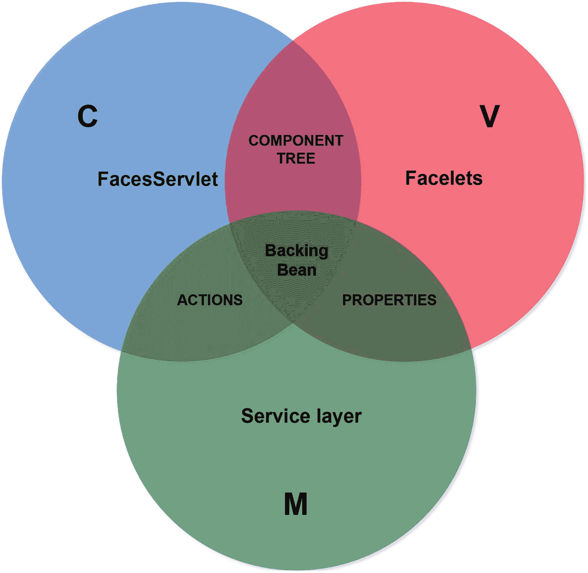

图 8-1
Backing bean 在 Jakarta Faces MVC 范式中的位置

因此，在这个 MVC 范式中，backing bean 占据了一个相当独特的位置。请注意，backing bean 不一定需要由单个类表示。它甚至可以由多个类表示，每个类都有自己的受管 bean 作用域，就像视图可以由多个 Facelets 文件表示，模型可以由多个 Jakarta Enterprise Beans 和 Jakarta Persistence 类表示一样。

回到 Jakarta Faces 开发者的视角，我们甚至可以更进一步，根据你如何编写 backing bean 类来考虑它是模型还是控制器。以下是一种方式：

```
@Named @RequestScoped @Stateful
public class ProductBacking {
private String productName;
private String productDescription;
@Inject
private ActiveUser activeUser;
@PersistenceContext
private EntityManager entityManager;
public void save() {
Product product = new Product();
product.setName(productName);
product.setDescription(productDescription);
product.setCreatedBy(activeUser.get());
entityManager.persist(product);
FacesContext.getCurrentInstance().addMessage(null,
new FacesMessage("Product created!"));
}
// 为产品名称和描述添加/生成 getter 和 setter
}
```

在这种相当原始的方式中，实体的属性基本上在 backing bean 类中重复了，并且业务逻辑紧密耦合在 backing bean 类中。换句话说，backing bean 类错误地接管了真实模型的职责。有人会误将这样的 backing bean 类视为唯一的模型。当我们消除这种重复和不可重用性时，我们找到了另一种方式：

```
@Named @RequestScoped
public class ProductBacking {
private Product product = new Product();
@Inject
private ProductService productService;
public void save() {
productService.create(product);
FacesContext.getCurrentInstance().addMessage(null,
new FacesMessage("Product created!"));
}
public Product getProduct() {
return product;
}
}
```

其中 `ProductService` 如下所示：

```
@Stateless
public class ProductService {
@PersistenceContext
private EntityManager entityManager;
@Inject
private ActiveUser activeUser;
public Long create(Product product) {
product.setCreatedBy(activeUser.get());
entityManager.persist(product);
return product.getId();
}
}
```

这实际上是编写 backing bean 的正确方式。与第一种方式相比，你可以认为，从 Jakarta Faces 开发者的角度来看，backing bean 已成为真实模型的控制器。从 Jakarta Faces 开发者的角度来看，backing bean 作为控制器并没有错，但从 Jakarta Faces 框架的角度来看，这实际上并不正确，因为 `FacesServlet` 才是真正的控制器。`FacesServlet` 将 backing bean 视为模型，因为 `FacesServlet` 无法直接访问真实模型（即服务层）。作为 Jakarta Faces 开发者，你当然可以在自己的上下文中将 backing bean 视为控制器，因为你可以轻松忽略 `FacesServlet` 的所有职责，在编写 Jakarta Faces 代码时无需担心它的工作。在编写 Jakarta Faces 代码时，你只需要关心视图、模型和 backing bean。其余工作由 Jakarta Faces 透明地完成。

受管 Bean

“Backing bean”和“受管 bean”之间的概念差异可以通过以下在 bean 管理设施底层执行的代码行来表示：

```
BackingBeanClass managedBeanInstance = new BackingBeanClass();
someContext.put("managedBeanName", managedBeanInstance, someScope);
```


换句话说，后台 bean 是由您（Jakarta Faces 开发者）创建的具体类，并注册到某个 bean 管理设施（如 CDI）中。Bean 管理设施将自动管理 bean 的生命周期，在必要时执行构造、依赖注入和销毁，而无需您手动操作。如果您曾使用过普通的 Servlet 和 Jakarta Pages 进行开发，那么这基本上消除了手动实例化 bean 并将其作为 `ServletContext`、`HttpSession` 或 `ServletRequest` 属性的需要。^(⁶⁸) 要将后台 bean 类注册为 Jakarta Faces 视图的 CDI 托管 bean，只需在类签名上添加 `@jakarta.inject.Named` 注解^(⁶⁹)。

```
@Named
public class BackingBeanClass {
// ...
}
```

然后，它将立即通过 `#{backingBeanClass}` 在 EL 上下文中可用，并通过 `@Inject` 在所有其他托管 bean 中可用。EL 上下文在 Facelets 文件中直接可用。默认情况下，托管 bean 名称是通过将后台 bean 类名的首字母小写来派生的。这可以通过指定 `@Named` 注解的值来覆盖。

```
@Named("managedBeanName")
public class BackingBeanClass {
// ...
}
```

现在，它通过 `#{managedBeanName}` 在 EL 上下文中可用。`@Inject` 方法没有任何变化。一旦后台 bean 成为托管 bean，当它在与 bean 作用域关联的上下文中首次被访问时，它将被自动实例化和初始化。当与 bean 作用域关联的生命周期结束时，它将被自动销毁。更多关于托管 bean 作用域的内容将在下一节介绍。
从历史上看，Jakarta Faces 提供了一种原生方式来将后台 bean 类注册为托管 bean：首先，在 1.x 版本中通过 `faces-config.xml` 中的 `<managed-bean>` 条目；自 2.0 版本起通过 `@jakarta.faces.bean.ManagedBean` 注解，该注解自 2.3 版本起已正式弃用，转而推荐使用 CDI 的 `@Named`，并自 4.0 版本起完全移除。
CDI 在 Jakarta EE 应用服务器中原生可用，并且相对容易安装在裸机 Servlet 容器中。例如，CDI 的实现之一 JBoss Weld，只需将单个依赖 `org.jboss.weld.servlet:weld-servlet-shaded` 添加到项目中^(⁷⁰)，即可在 Tomcat 中安装，无需任何额外工作。

作用域
托管 bean 的作用域基本上代表了托管 bean 的生命周期。如前一节所述，从普通的 Jakarta Servlet 角度来看，作用域由作为 `ServletContext`、`HttpSession` 或 `ServletRequest` 属性放入的对象表示。这些对象将分别成为“应用作用域”、“会话作用域”和“请求作用域”。CDI 等的工作方式仍然如此；它只是在其上添加了一个额外的抽象层，这样您就不再需要手动创建对象并将其放入特定作用域。

在标准 Jakarta Faces 中，以下基于 CDI 的托管 bean 作用域可用于后台 bean，按生命周期从长到短排序：

1.  `@jakarta.enterprise.context.ApplicationScoped`

2.  `@jakarta.enterprise.context.SessionScoped`

3.  `@jakarta.faces.lifecycle.ClientWindowScoped`

4.  `@jakarta.enterprise.context.ConversationScoped`

5.  `@jakarta.faces.flow.FlowScoped`

6.  `@jakarta.faces.view.ViewScoped`

7.  `@jakarta.enterprise.context.RequestScoped`

8.  `@jakarta.enterprise.context.Dependent`

@ApplicationScoped
应用作用域的托管 bean 实例与 Web 应用程序本身的生命周期绑定。它在底层表示为 `ServletContext` 的一个属性，该属性在 Web 应用程序部署时创建，在 Web 应用程序取消部署时销毁。请注意，这并不等同于服务器的启动和关闭。Web 应用程序可以在正在运行的服务器上部署和取消部署。
换句话说，在整个 Web 应用程序的生命周期中，只有一个应用作用域的托管 bean 实例，它在所有请求和会话之间共享。您可以认为它的行为类似于单例。然而，它实际上并不遵循单例设计模式。它遵循的是“只创建一个”设计模式。^(⁷¹) 真正的单例没有任何公共构造函数，只有一个返回静态初始化懒加载实例的静态方法。另一方面，真正的 JavaBean 需要存在一个默认构造函数。
默认情况下，应用作用域的 bean 托管实例是在 Web 应用程序的代码在其生命周期内首次访问它时创建的。因此，根据定义，它并非在 `ServletContext` 实例创建时立即创建。但是，可以保证它在 `ServletContext` 实例销毁时被销毁。

应用作用域的托管 bean 对于需要在应用程序生命周期内仅初始化一次的应用程序范围数据非常有用，或者需要提供委托给静态变量的非静态 getter，或者需要提供用于 EL 的函数。以下示例确保存储在数据库中的应用程序设置仅加载一次，并在应用程序的其余生命周期内通过 `#{settings}` 作为 `Map` 提供。

```
@ApplicationScoped
public class ApplicationSettingsProducer {
private Map settings;
@Inject
private ApplicationSettingsService applicationSettingsService;
@PostConstruct
public void init() {
settings = applicationSettingsService.getAll();
}
@Produces @Named
public Map getSettings() {
return settings;
}
}
```

请注意，`@Named` 注解放在 getter 上，这意味着托管 bean 名称与属性名称匹配：`#{settings}`。还要注意，getter 又需要 `@Produces` 注解才能被识别为托管 bean 生产者。以下是另一个提供文本格式化函数的示例：

```
@Named @ApplicationScoped
public class Format {
public String date(LocalDate localDate) {
if (localDate != null) {
return localDate.format(DateTimeFormatter.ISO_LOCAL_DATE);
}
else {
return "n/a";
}
}
public String currency(BigDecimal amount) {
if (amount != null) {
return NumberFormat.getCurrencyInstance(Locale.US)
.format(amount);
}
else {
return "n/a";
}
}
}
```

这在例如数据表中保持 Facelets 代码简洁时可能很有用。

```
#{format.date(product.lastModified)}
#{format.currency(product.discount)}

```

当您需要在不允许嵌套 `<h:outputText><f:convertXxx>` 的属性中使用格式化值时，它也很有用。

```


@SessionScoped
会话作用域的托管 Bean 实例与已建立的 HTTP 会话的生命周期绑定。它在底层表示为 `HttpSession` 的一个属性，该属性是为每个唯一客户端根据 Web 应用代码的需求而创建的。当 Web 应用代码通过 `HttpServletRequest#getSession()` 首次直接或间接访问 `HttpSession` 时，Servlet 容器将创建一个新的 `HttpSession` 实例，生成一个长且唯一的字符串作为会话 ID，并将其存储在服务器内存中，通常作为某个内部 `Map` 的一个条目。Servlet 容器还会在 HTTP 响应上设置一个会话 Cookie，其 Cookie 名称为“`JSESSIONID`”，Cookie 值为会话 ID。“会话 Cookie”通过缺少“最大存活时间”属性来识别。根据 HTTP Cookie 规范，只要 Cookie 有效，客户端（Web 浏览器）就需要在后续请求的标头中发回此 Cookie。在任何像样的 Web 浏览器中，你都可以在 Web 开发者工具集的“网络”部分检查请求和响应标头，该工具集可通过在 Web 浏览器中按 F12 键访问。Servlet 容器将检查每个传入的 HTTP 请求，查找名称为“`JSESSIONID`”的 Cookie，并使用其值（会话 ID）从服务器内存中获取关联的 `HttpSession` 实例。

在服务器端，`HttpSession` 实例会一直保持活动状态，直到超过 `web.xml` 中 `<session-timeout>` 设置指定的超时值（大多数（如果不是全部）Servlet 容器默认值为 30 分钟）未被访问。因此，当客户端访问 Web 应用的时间超过指定时间时，Servlet 容器将销毁 `HttpSession` 实例。每个后续的 HTTP 请求，即使指定了 Cookie，也无法再访问关联的 `HttpSession` 实例；Servlet 容器将创建一个新的 `HttpSession` 实例，并用新的会话 ID 覆盖 Cookie 值。

在客户端，默认情况下，所有会话 Cookie 在浏览器实例运行期间都保持有效。因此，当客户端关闭浏览器实例时，所有会话 Cookie 都会在客户端被销毁。在新的浏览器实例中，来自先前浏览器会话的会话 Cookie 不再可用，因此浏览器不会发送任何 `JSESSIONID` Cookie。然后，服务器会将其解释为一个全新的会话。与先前浏览器会话关联的 `HttpSession` 实例将在服务器端静默过期。

默认情况下，会话作用域的托管 Bean 实例是在 HTTP 会话生命周期内，当 Web 应用代码首次访问它时创建的。因此，根据定义，它并非在创建 `HttpSession` 实例时立即创建。但是，可以保证在销毁 `HttpSession` 实例时销毁它。会话作用域的托管 Bean 在同一浏览器会话的所有浏览器标签页和窗口之间有效共享。

会话作用域的托管 Bean 对于跟踪客户端特定数据非常有用，例如表示当前登录用户的实体、所选语言以及其他与用户相关的偏好设置。以下示例计算当前区域设置，并为其提供 getter/setter，以便可以在视图中获取它，并通过 `UIInput` 组件进行修改。

```
@Named @SessionScoped
public class ActiveLocale implements Serializable {
private Locale current;
@PostConstruct
public void init() {
FacesContext context = FacesContext.getCurrentInstance();
current = context.getApplication()
.getViewHandler().calculateLocale(context);
}
// Getter+setter.
}
```

更详细的示例可以在第 14 章的“更改活动区域设置”部分找到。请注意，会话作用域的托管 Bean 必须实现 `Serializable`，因为存储这些 Bean 的 `HttpSession` 实例本身可能会在服务器重启时被写入磁盘，甚至在具有可分发会话的服务器集群配置中通过网络传输到不同的服务器。

另一个经典示例是“购物车”。

```
@Named @SessionScoped
public class Cart implements Serializable {
private List products = new ArrayList();
public void addProduct(Product product) {
products.add(product);
}
// ...
}
```

@ClientWindowScoped
客户端窗口作用域的托管 Bean 基本上与已建立的 `jakarta.faces.lifecycle.ClientWindow` 实例的生命周期绑定，该实例已在 Jakarta Faces 2.2 中随 `@FlowScoped` 一起引入。只有 `@ClientWindowScoped` 注解是 Jakarta Faces 4.0 中新增的。

`ClientWindow` 实例又由一个预定义的 HTTP 请求参数标识，该参数的名称为“`jfwid`”（“Jakarta Faces Window ID”），其值表示客户端窗口 ID。客户端窗口 ID 又引用了当前 HTTP 会话中的一个隔离映射，该映射存储了客户端窗口作用域的托管 Bean。首先需要通过向 `web.xml` 添加以下上下文参数来激活它。

```
jakarta.faces.CLIENT_WINDOW_MODE
url

```

唯一其他支持的值是“`none`”，这也是默认值。缺少此上下文参数将导致任何使用 `@ClientWindowScoped` Bean 的操作抛出 `jakarta.enterprise.context.ContextNotActiveException`。当在 Jakarta Faces 页面中引用了 `@ClientWindowScoped` Bean，并且首次打开该页面（因此首次构造该 Bean）时，将生成一个新的“`jfwid`”请求参数值。当使用 `UIOutcomeTarget` 组件导航到其他页面时，此参数将在 URL 中可见。Jakarta Faces 将在 `ViewHandler` 的帮助下，自动将“`jfwid`”请求参数附加到结果 URL。

只要在后续的回发和导航中重复使用相同的“`jfwid`”请求参数值，关联的 `@ClientWindowScoped` Bean 实例将在会话的剩余时间内保持活动状态，无论它发生在哪个浏览器标签页或窗口中。只有在没有“`jfwid`”请求参数的情况下，在同一 URL 上打开一个全新的浏览器标签页/窗口时，才会启动一个新的 `ClientWindow`，因此也会创建一个全新的 `@ClientWindowScoped` Bean。

当最终用户将“`jfwid`”请求参数的值修改为自定义值时，这也会启动一个新的 `ClientWindow`，并带有其自己的新 `@ClientWindowScoped` Bean 实例。但是，每个 HTTP 会话允许的 `ClientWindow` 实例数量有上限，对于 Mojarra，默认情况下每个会话最多十个。这可以通过 `web.xml` 中的以下上下文参数进行配置。

```
jakarta.faces.NUMBER_OF_CLIENT_WINDOWS

```

只有当达到此限制时，`ClientWindow` 才会结束并销毁所有关联的 Bean，因此最近最少使用的那个将被逐出。


@ConversationScoped
一个对话作用域（conversation-scoped）托管 Bean 的生命周期与注入的 `jakarta.enterprise.context.Conversation` 实例绑定，该实例提供了 `begin()` 和 `end()` 方法，必须由 Web 应用程序的代码显式调用，以指示对话作用域的开始和结束。对话作用域由一个预定义的 HTTP 请求参数表示，其默认名称为“`cid`”（“对话 ID”），该参数的值代表对话 ID。对话 ID 进而引用当前 HTTP 会话中的一个隔离映射，用于存储对话作用域的托管 Bean 实例。

只要对话作用域尚未开始，对话作用域的托管 Bean 的行为就类似于请求作用域的托管 Bean。当应用程序代码显式调用 `Conversation#begin()` 时，对话作用域将开始，并且由 CDI 实现提供的自定义 `jakarta.faces.application.ViewHandler` 将确保其所有 `getXxxURL()` 方法（例如 `getActionURL()` 和 `getBookmarkableURL()`）返回包含对话 ID 参数的 URL（统一资源定位符）。以 Weld 为例，该 ViewHandler 是 `ConversationAwareViewHandler`。^(⁷²) 所有 Jakarta Faces 的 `UIForm` 和 `UIOutcomeTarget` 组件都从 `ViewHandler` 的这些方法派生其操作和目标 URL。因此，这些组件生成的 HTML 输出最终会在目标 URL 中包含对话 ID。

在传入的 HTTP 请求中，当请求中存在对话 ID 参数且该参数仍然有效时，CDI 实现将从 HTTP 会话中获取关联的对话作用域，并确保所有对话作用域的托管 Bean 都从该对话 ID 标识的特定对话作用域中获取。这适用于 GET 和 POST 请求。任何表单提交或任何指向包含对话 ID 的 URL 的链接/导航，只要该对话作用域仍然有效，都将提供对同一对话作用域的访问。当应用程序代码显式调用 `Conversation#end()` 时，对话作用域结束。

当最终用户稍后重用“`cid`”请求参数，或将其值修改为其自身浏览器会话中未启动的值，或当底层 `HttpSession` 实例被销毁时，CDI 将抛出 `jakarta.enterprise.context.NonexistentConversationException`。

对话作用域的托管 Bean 特别有用，可以在同一浏览器会话中被重定向到其他地方后，能够返回到特定的有状态页面。一个经典的例子是第三方 Web 服务，它被包含在 HTML `<iframe>` 中，或在新浏览器标签页中打开，甚至作为纯 HTML `<form>` 的 `action` 属性的目标，并且可以通过特定的请求参数进行配置，以便在完成服务后重定向回您的 Web 应用程序。当您在重定向 URL 中包含对话 ID 时，您将能够在重定向后的页面中，恢复使用与重定向之前完全相同的对话作用域托管 Bean 实例。这使您有机会完成并解锁任何待处理的事务，当然，也可以结束对话。

假设有一个如下所示的结账按钮：

```
...

...

```

以下是 `#{payment}` 背后关联的对话作用域 Bean 的样子：

```
@Named @ConversationScoped
public class Payment implements Serializable {
private Order order;
private String url;
@Inject
private Cart cart;
@Inject
private OrderService orderService;
@Inject
private Conversation conversation;
public void checkout() {
order = orderService.lockProductsAndPrepareOrder(cart);
conversation.begin();
url = "https://third.party.com/pay?returnurl="
+ URLEncoder.encode("https://my.site.com/paid?cid="
+ conversation.getId(), "UTF-8");
}
public void confirm() {
orderService.saveOrderAndCreateInvoice(order);
conversation.end();
}
@PreDestroy
public void destroy() {
orderService.unlockProductsIfNecessary(order);
}
public String getUrl() {
return url;
}
}
```

基本上，结账按钮仅在未设置支付 URL 时才会渲染。一旦按下该按钮，购物车中的所有产品都会被锁定，并且订单会被准备好。同时，根据第三方支付服务的不同，必须准备好引用该服务的 URL，您需要将返回 URL 作为某个查询参数包含在支付服务的 URL 中。返回 URL 又应包含代表对话 ID 的“`cid`”请求参数。在重定向后的页面（实际上将在 `<iframe>` 中加载）中，您可以使用 `<f:viewAction>` 来标记对话完成。

当然，一般的第三方支付服务应该提供更完善的 Java 甚至 JavaScript API，而不是 `<iframe>`；此外，应该能够为每种支付结果（例如支付失败和支付中止）提供不同的返回页面。前面的示例只是为了提供总体思路。


@FlowScoped
流作用域托管 Bean 的生命周期与 Jakarta Faces 流（Flow）绑定。它本质上通过预定义的 HTTP 请求参数“`jfwid`”扩展了客户端窗口作用域；只是其作用域被进一步限定在隔离子文件夹中的一组特定 Jakarta Faces 视图内。当最终用户点击导航到 Jakarta Faces 流特定入口页面的 Jakarta Faces 链接或按钮组件时，流作用域将自动启动。如果直接打开入口页面而未通过 Jakarta Faces 链接或按钮组件导航，则无法启动流作用域。
此外，特别是在使用 `UIOutcomeTarget` 组件而非 `UICommand` 组件进行导航时，查询字符串可能附带另外两个预定义的 HTTP 请求参数：“`jffi`”（“Jakarta Faces 流标识符”）和“`jftfdi`”（“Jakarta Faces 目标流文档标识符”）。实际上，这些参数仅在使用 GET 请求启动 Jakarta Faces 流时是必需的。从技术上讲，在流的其余部分，仅“`jfwid`”参数就足够了。只要“`jfwid`”参数存在且仍然有效，Jakarta Faces 流就是幂等的，并且可以通过 GET 请求恢复。当您打开新的浏览器标签页并导航到 Jakarta Faces 流时，实际上会启动一个新的流作用域，该作用域独立于另一个标签页中的流作用域。一旦 Jakarta Faces 流内的回发请求导航到流外部的页面，流作用域将自动结束。当最终用户稍后重用“`jfwid`”请求参数，或将其值篡改为其自身浏览器会话中未启动的值，或直接进入流，或底层 `HttpSession` 实例被销毁时，CDI 将抛出 `jakarta.enterprise.context.ContextNotActiveException`。
因此，流作用域与客户端窗口作用域及会话作用域的主要区别在于，Jakarta Faces 流内的页面无法直接进入。当最终用户导航到流的入口页面时，它们会自动启动；当回发导航到流外部时，它们会自动结束。
流作用域托管 Bean 有助于将对话隔离到一组特定的 Jakarta Faces 页面。一个经典的现实世界示例是预订应用程序，它分布在物理上不同页面的多个表单中。
有多种方式可以定义 Jakarta Faces 流。一种方式是通过约定，另一种方式是通过在 `/[flowId]/[flowId]-flow.xml` 文件中进行声明式配置，还有一种方式是通过使用 `jakarta.faces.flow.FlowBuilder` API 进行编程式配置。^(⁷³) 在本书中，我们将仅限于约定优于配置。首先，创建以下文件夹结构：

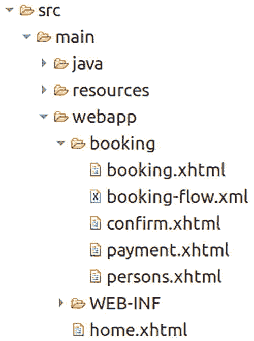

第一个约定是，流入口页面的名称必须与其所在的子文件夹名称完全相同。在本例中，即“`booking`”。这被视为流 ID。第二个约定是，子文件夹中必须有一个 `*-flow.xml` 文件，其文件名以流 ID 为前缀，即 `booking-flow.xml`。此 XML 配置文件目前可以保持为空。仅当您想要精细调整 Jakarta Faces 流配置时（例如，通过指定不同的入口页面），它才派上用场。没有此文件，流作用域将不会被激活。然而，在 Web 应用程序中至少激活一个流的一个缺点是，Jakarta Faces 客户端窗口 ID 参数“`jfwid`”将附加到每个导航 URL 上，即使它不针对 Jakarta Faces 流。这种 URL 污染可能是一些开发者完全不使用流作用域的主要原因。

用于进入 Jakarta Faces 流的导航组件必须放置在流子文件夹外部的 Jakarta Faces 页面中。导航结果必须引用流子文件夹的名称，即流 ID。以下是 `/home.xhtml` 中的一个示例。

```
当然，这可以用 `<h:link>` 替代。建议为此使用 GET 而非 POST，以便预订页面的 URL 能正确反映在浏览器的地址栏中。然后，在子文件夹内的所有页面中，您可以引用一个流作用域托管 Bean，该 Bean 将在所有这些页面之间共享。您还可以在这些页面之间来回导航，同时保留流作用域托管 Bean 的实例。建议为此使用带有重定向的 Ajax。Ajax 提交将改善用户体验。重定向将确保各个页面仍然可以添加书签。

以下是这些页面外观的示例。`/booking/booking.xhtml` 页面有一个输入字段，要求输入开始日期作为第一步：

```

...

```

`/booking/persons.xhtml` 页面有几个输入字段，要求输入人员详细信息：

```

...

...

```

`/booking/confirm.xhtml` 页面显示到目前为止输入信息的摘要：

```

...

```

`/booking/payment.xhtml` 页面显示一个支付方式下拉菜单并执行支付：

```

...

...

```

最后，`#{booking}` 背后的流作用域 Bean 可以如下所示：

```
@Named @FlowScoped("booking")
public class Booking implements Serializable {
private LocalDate startDate;
private List persons;
private PaymentMethod paymentMethod;
// ...
public void submit() {
// ...
}
}
```

您可以看到，大部分导航任务由命令组件的 `action` 属性完成。`faces-redirect=true` 是一个特殊的请求参数，Jakarta Faces 内部将其识别为在回发后执行重定向的指令。当然，在执行实际重定向之前，此请求参数会从目标 URL 中剥离。一旦回发离开流，流作用域托管 Bean 就会被销毁，并且之前呈现的页面 URL 将不再可重用。

@ViewScoped
视图作用域托管 Bean 的生命周期与 Jakarta Faces 视图状态绑定。Jakarta Faces 视图状态在第 3 章的“视图状态”部分有详细说明。简而言之，只要最终用户在同一个 Jakarta Faces 视图上执行回发请求，并且调用的操作方法持续返回 `null` 或 `void`，视图作用域托管 Bean 就保持存活。一旦操作方法返回非 `null` 值，即使是一个空字符串或代表同一个视图，视图作用域也将结束。视图作用域托管 Bean 在同一浏览器会话的不同标签页之间不共享。每个标签页都获得自己唯一的实例。实际上，它们通过生成的 Jakarta Faces 表单的 HTML 表示中的 `jakarta.faces.ViewState` 隐藏输入字段间接标识。
然而，视图作用域托管 Bean 实际上并不存储在 Jakarta Faces 视图状态中，即使启用了客户端状态保存也是如此。无论 Jakarta Faces 状态保存方法如何，它们实际上都存储在 HTTP 会话中。当最终用户通过链接或书签执行 GET 请求、在浏览器地址栏中编辑 URL 或关闭浏览器标签页来卸载网页时，它们不会立即被销毁。它们会一直存在于 HTTP 会话中，并且仅在 HTTP 会话过期时才会被销毁。


由于最终用户理论上可以在同一会话中打开无限数量的浏览器标签页，从而产生同样多的视图状态和视图作用域托管 Bean，因此 HTTP 会话中存储的视图状态和视图作用域托管 Bean 数量有一个可配置的最大限制。一旦达到此限制，最近最少使用的视图状态和视图作用域托管 Bean 将被过期并销毁。当最终用户实际返回到最初引用现已过期的视图状态的标签页，并对其执行回发请求时，Jakarta Faces 将抛出一个 `ViewExpiredException`。

视图状态数量的限制取决于所使用的 Jakarta Faces 实现。在 Mojarra 中，此限制可通过 `web.xml` 中的 `com.sun.faces.numberOfLogicalViews` 上下文参数进行配置，其默认值为 `15`。^(⁷⁴)

```
com.sun.faces.numberOfLogicalViews

```

然而，如果你的 Web 应用程序（例如讨论论坛或问答网站）允许在更多浏览器标签页中打开，那么你最好切换到客户端状态保存。这样，Jakarta Faces 视图状态将不再存储在 HTTP 会话中，因此也永远不会过期。但是，关联的视图作用域托管 Bean 仍然存储在 HTTP 会话中，并且可能过期。当最终用户实际返回到最初引用现已过期的视图作用域托管 Bean 的标签页，并对其执行回发请求时，Jakarta Faces 不会抛出 `ViewExpiredException`，而是会从头开始创建一个新的托管 Bean，从而丢失对原始托管 Bean 实例的所有状态更改。视图作用域托管 Bean 数量的限制也取决于所使用的 Jakarta Faces 实现。在 Mojarra 中，此限制可通过 `web.xml` 中的 `com.sun.faces.numberOfActiveViewMaps` 上下文参数进行配置，其默认值为 25。

```
com.sun.faces.numberOfActiveViewMaps

```

此配置实际上将默认值降低到与会话中 Jakarta Faces 视图状态的最大默认数量相等。当你使用服务器端状态保存，并且所有 Jakarta Faces 视图都只引用一个视图作用域托管 Bean 实例时，这没问题。然而，在一个经过良好开发和重构的 Jakarta Faces Web 应用程序中，平均每个 Jakarta Faces 页面通常会引用多个视图作用域托管 Bean。例如，如果每个 Jakarta Faces 视图最多有三个不同的视图作用域托管 Bean，那么你最好将限制设置为 `com.sun.faces.numberOfLogicalViews` 值的三倍。你只需要考虑可能的内存消耗。当视图作用域托管 Bean 本身持有相对大量的数据时，内存消耗会迅速失控。

视图作用域托管 Bean 对于在同一个 Jakarta Faces 视图上基于 Ajax 的回发之间保持状态非常有用，特别是当这些回发导致任何 `UIComponent` 的 `rendered` 属性、任何 `UIInput` 组件的 `disabled` 或 `readonly` 属性，或同一 Jakarta Faces 视图内任何 `UICommand` 组件的 `disabled` 属性值发生变化时。也就是说，在后续回发中，作为防止篡改请求的安全措施的一部分，Jakarta Faces 会在实际处理组件之前重新检查它们。如果持有状态的托管 Bean 是请求作用域而不是视图作用域，那么这些条件的变化将在后续回发中丢失，并且回发将无法按预期直观地处理。换句话说，视图作用域托管 Bean 在动态表单中特别有用。

一个例子是当下拉列表选择“其他”选项时，有条件地渲染一个自由文本字段。

```

...

...

```

当托管 Bean 是请求作用域并且因此在每个请求上重新创建时，此构造将不起作用。当下拉列表更改时，它会创建一个新的请求作用域 Bean 实例，在其中设置标题，并渲染自由文本字段，最后请求作用域 Bean 实例被销毁。当表单提交时，它会创建一个新的请求作用域 Bean 实例，因此没有客户标题，当 Jakarta Faces 在应用请求值阶段（第二阶段）检查自由文本字段的 `rendered` 属性并发现它为 `false` 时，它最终根本不会处理该自由文本字段。此构造仅在托管 Bean 是视图作用域时才有效，因为在下拉列表更改期间设置的客户标题在表单提交的应用请求值阶段（第二阶段）仍然可用。

但是，有一种变通方法。你可以让 `rendered` 属性检查 HTTP 请求参数而不是模型值。如第 4 章所述，HTTP 请求参数名称由组件的客户端 ID 指定。你可以将下拉列表组件绑定到视图，并使用其客户端 ID 来获取 HTTP 请求参数值。

这样，当 Jakarta Faces 在表单提交的应用请求值阶段（第二阶段）检查 `rendered` 属性时，它会注意到它为 `true` 并继续处理自由文本字段，即使托管 Bean 是请求作用域，因此此时 `#{bean.customer.title}` 仍然为 `null`。请注意，`binding` 属性不引用托管 Bean 属性。这是不必要的，因为在那里不会用到它。

这个关于 Jakarta Faces 在 `rendered` 属性上行为的示例也完全适用于任何 `UIInput` 组件的 `readonly` 属性以及任何 `UIInput` 和 `UICommand` 组件的 `disabled` 属性。

也可能存在这样的情况：请求作用域托管 Bean 可以正常工作，但与视图作用域托管 Bean 相比，存在状态损坏的风险，尤其是在依赖来自可能被其他用户更改的共享数据库的数据时。这主要影响 `UIInput` 或 `UICommand` 组件嵌套在迭代组件（例如 `<h:dataTable>`、`<ui:repeat>` 和 `<c:forEach>`）中的用例，这些组件迭代来自数据库的模型。这在前面的第 6 章中已经解释过，但为了复习，我们将再次解释。想象一个产品表，其中一列有一个删除按钮。

```

...

```

使用这个后台 Bean：

```
@Named @ViewScoped
public class Products implements Serializable {
private List list;
@Inject
private ProductService productService;
@PostConstruct
public void init() {
list = productService.list();
}
public void delete(Product product) {
productService.delete(product);
list.remove(product);
}
public List getList() {
return list;
}
}
```

提交的按钮在底层由迭代索引标识。当 Jakarta Faces 即将处理表单提交，并且在此期间添加、删除或重新排序了产品，导致迭代索引发生变化时，则调用的操作可能会针对当前位于最初已知索引处的错误项目执行。这对模型的完整性是危险的。在这种情况下，迭代组件的值必须引用一个视图作用域的模型。

同样，这里也有一个变通方法。你可以不依赖迭代索引，而是依赖迭代对象的唯一标识符，该标识符必须作为 HTTP 请求参数传递，而不是作为 EL 方法参数。

```

...

```

其中后台 Bean 调整如下：


``` 
@Named @RequestScoped
public class Products {
private List list;
@Inject @ManagedProperty("#{param.id}")
private Long id;
@Inject
private ProductService productService;
@PostConstruct
public void init() {
list = productService.list();
}
public void delete() {
productService.delete(id);
list.removeIf(product -> product.getId().equals(id));
}
public List getList() {
return list;
}
}
```

不，使用 `action="#{products.delete(product.id)}"` 代替 `<f:param>` 是行不通的。技术原因在于，`<f:param>` 在表单的渲染响应阶段会立即执行，远在最终用户按下删除按钮之前。因此，当最终用户按下删除按钮时，它能保证持有正确的值。相反，EL 方法参数仅在最终用户按下删除按钮后的回传请求中才被求值。如果在此期间模型发生了变化，那么当特定产品的迭代索引改变时，它就会求值为错误的 ID。

如本节开头所述，标准的 Jakarta Faces 视图作用域 Bean 管理机制存在两个主要缺点：第一，当最终用户卸载网页时，这些实例不会立即过期，而是会滞留在 HTTP 会话中；第二，即使启用了客户端状态保存，它们仍存储在 HTTP 会话中。这些问题目前尚未在标准的 Jakarta Faces API 中得到解决。

目前，Jakarta Faces 实用工具库 OmniFaces 提供了一个增强版的 `@ViewScoped` 注解，解决了这两个缺点。^(⁷⁵) 使用 `@org.omnifaces.cdi.ViewScoped` 注解的视图作用域托管 Bean 在最终用户卸载页面时会被实际销毁。这底层是通过 JavaScript 中的 `Navigator.sendBeacon` API^(⁷⁶) 以及 OmniFaces 提供的专门监听这些卸载请求的 `ViewHandler` 实现来完成的。已有生产级应用大量使用视图作用域托管 Bean，在从标准的 Jakarta Faces `@ViewScoped` 切换到 OmniFaces `@ViewScoped` 后，内存使用量减少了高达 80%。这使得“卸载时销毁”功能成为未来版本标准 Jakarta Faces API 中一个重要的候选特性。

为了在启用客户端状态保存时，将物理上的视图作用域托管 Bean 保存到 Jakarta Faces 视图状态中，必须将 OmniFaces `@ViewScoped` 注解的 `saveInViewState` 属性设置为 `true`。你只需要记住，这些 Bean 永远不会过期，即使页面被卸载或 HTTP 会话过期也不会。实际上，整个 Bean 在物理上已成为生成的 HTML 输出的一部分，位于 `jakarta.faces.ViewState` 隐藏输入字段中。社区已有请求，希望让 Jakarta Faces 状态管理更加灵活，例如在逐个视图（每个 `UIViewRoot`）甚至逐个表单（每个 `UIForm`）的基础上切换客户端和服务器端状态保存，并能够将视图作用域托管 Bean 存储在实际的视图状态中，而不是 HTTP 会话中。这也可能在未来的标准 Jakarta Faces API 版本中重新考虑。

@RequestScoped

请求作用域托管 Bean 的生命周期与 HTTP 请求绑定，这对 Jakarta Faces 来说是最重要的情况。其他情况包括：会话 Bean 上异步方法调用（使用 `@Asynchronous` 注解的方法）的生命周期、定时器超时方法的生命周期，或消息驱动 Bean（MDB）处理消息时的生命周期，所有这些都发生在 Jakarta Enterprise Beans（以前称为 Jakarta Enterprise Beans）中。请注意，Ajax 请求也计为单个 HTTP 请求。

当客户端向服务器发送 HTTP 请求时，Servlet 容器会创建代表 HTTP 请求和响应的 `HttpServletRequest` 和 `HttpServletResponse` 实例，并将它们传递给认证模块、Servlet 过滤器和 Servlet。在所有认证模块、Servlet 过滤器和 Servlet 完成请求和响应的处理后，这些实例会立即被销毁。换句话说，每个 HTTP 请求都会创建一个新的请求作用域托管 Bean 实例，该实例仅在该请求期间可用，在其他请求中不可用。

请求作用域托管 Bean 适用于简单且静态的表单，这些表单没有任何基于 Ajax 的动态更新，对于这类表单，你更倾向于使用视图作用域托管 Bean。可以想象一个登录表单或联系表单。

```
@Named @RequestScoped
public class Login {
private String username;
private String password;
// ...
}
```

当然，这些表单也可以毫无问题地绑定到视图作用域托管 Bean，但那样会浪费内存空间。请注意，你绝对不应该将 Jakarta Persistence 实体本身作为托管 Bean。换句话说，以下方法实际上是错误的：

```
@Named @RequestScoped // 或 @Model
@Entity
public class Product {
// ...
}
```

这不仅违反了迪米特法则^(⁷⁷)，而且还有可能导致 Jakarta Persistence 无法持久化它，因为 CDI 实际上会将托管 Bean 包装在一个代理类中，而当你试图将注入的实例传递给实体管理器时，Jakarta Persistence 将无法从中获取实体信息。在这种情况下，Hibernate 会抛出 “`Unknown entity: com.example.Entity$Proxy$_$$_WeldClientProxy`” 异常，这实际上代表的是 CDI 代理类。

此时你可能想知道 CDI 究竟是如何工作的。首先，在 Web 应用程序启动期间，它会收集所有使用 CDI 兼容作用域注解标注的类。然后，它会为所有这些类生成代理类。最终，这些代理类的实例会被注入。给定一个示例 Bean 类 `com.example.Bean`，生成的 CDI 代理类可能如下所示：

```
public class Bean$Proxy$_$$_CDI extends Bean implements Serializable {
public String getSomeProperty() {
Bean actualInstance = CDI.resolveItSomehow();
return actualInstance.getSomeProperty();
}
public void setSomeProperty(String someProperty) {
Bean actualInstance = CDI.resolveItSomehow();
actualInstance.setSomeProperty(someProperty);
}
}
```


你看，它继承了 bean 类，使其可序列化，并使用了一个“不可能冲突”的类名，并让所有方法委托给从 CDI 上下文获取的实际实例。你可能也会立刻明白为什么 CDI bean 管理设施要求 bean 类必须是公开的，并且有一个公开的无参构造器。你还会看到，当创建并注入这样一个代理类时，底层的实际实例并不一定会被创建。它只会在虚构的 `CDI.resolveItSomehow()` 方法被调用时自动创建。在底层，它会从一个线程局部变量中获取上下文，这与 `FacesContext#getCurrentInstance()` 的工作方式完全相同。
顺便提一下，Jakarta Enterprise Beans 也以这种方式使用可序列化的代理。这就是为什么它看似神奇地完成了启动或加入事务以及使用池化实例的所有繁重工作。实际上，这一切都是在代理方法中完成的，即在调用实际实例方法之前和之后。
请注意，CDI 还有一个 `@jakarta.enterprise.inject.Model` 原型注解，它基本上将 `@Named` 和 `@RequestScoped` 捆绑到一个注解中。这与请求作用域的受管 bean 没有任何区别。不幸的是，它并不代表一个非代理实例；否则，将其放在 `@Entity` 上会很好。`@Model` 注解的存在只是为了方便。

@Dependent
一个依赖作用域的受管 bean 的生命周期与首次创建它的作用域的生命周期绑定在一起。因此，如果你将其注入到 `@ApplicationScoped` 中，那么它也会变成应用作用域。如果你将其注入到 `@ViewScoped` 中，那么它也会变成视图作用域。以此类推。这是 CDI 的默认作用域。
然而，这有一个陷阱。当你忘记在你的 `@Named` 支持 bean 上声明任何 CDI 作用域注解，并且你在 EL 中直接引用它（如 `#{dependentScopedBean}`），而不是通过另一个受管 bean 引用它（如 `#{requestScopedBean.dependentScopedBean}`），那么每次 EL 求值都会创建一个全新的实例，该实例仅存在于该 EL 上下文中。换句话说，想象一个 Jakarta Faces 表单，包含两个输入字段和一个提交按钮，每个都绑定到一个依赖作用域的受管 bean，那么你最终会得到三个独立的实例。一个设置了第一个输入字段，一个设置了第二个输入字段，一个调用了动作方法。因此，如果你在动作方法中观察到已提交值为 `null` 的奇怪行为，即使必需验证已通过，那么首先要检查的是 CDI 受管 bean 的作用域是否存在且正确。

与其他作用域的主要技术区别在于，依赖作用域的受管 bean 不会被代理。换句话说，被注入的是实际实例。以下是一个示例，说明如何通过 `@Inject` 使用它来准备一个新的（且未被代理的！）Jakarta Persistence 实体：

```
@Dependent
public class Entities {
@Produces
public Product getProduct() {
return new Product();
}
}
@Named @RequestScoped
public class Products {
@Inject
private Product product;
@Inject
Private ProductService productService;
public void add() {
productService.create(product);
}
public Product getProduct() {
return product;
}
}
```

请注意，你仍然不能使用 `<h:inputText value="#{product.name}">`，因为它会获取自己的实例。你仍然需要使用 `#{products.product.name}`。正是由于这个原因，生产者方法没有使用 `@Named`。还要注意，如果是视图作用域的受管 bean，你需要通过从动作方法返回一个非空结果来强制 Jakarta Faces 重启视图作用域；否则，注入的 `Product` 实例将在下一个视图中被重用。
最后，这个示例并不是非常有用，因为其行为不一定直观。你最好使用 `private Product product = new Product();` 来代替 `@Inject`。

选择哪个作用域？
选择哪个作用域完全取决于 bean 持有和表示的数据（实例变量，即状态）。你应该努力将状态放在尽可能短的可接受作用域中。从 `@RequestScoped` bean 开始。一旦你注意到某些状态需要在同一视图的回发后保留，就将该状态精确地拆分到一个新的 `@ViewScoped` bean 中，然后将其 `@Inject` 到 `@RequestScoped` bean 中。一旦你注意到某些状态需要在同一会话的另一个请求中保留，就将该状态精确地拆分到一个新的 `@SessionScoped` bean 中，然后将其 `@Inject` 到 `@RequestScoped` bean 中。以此类推。
滥用 `@ApplicationScoped` bean 来存储会话、对话、流程、视图或请求作用域的数据，会导致数据在所有用户之间共享，因此任何人都可以看到彼此的数据，这显然是错误的。滥用 `@SessionScoped` bean 来存储对话、流程、视图或请求作用域的数据，会导致数据在同一会话的所有浏览器标签页之间共享，因此最终用户在切换标签页后与每个视图交互时可能会遇到不一致的情况，这对用户体验不利。滥用 `@RequestScoped` bean 来存储视图、流程或对话作用域的数据，会导致视图、流程或对话作用域的数据在每次（Ajax）回发时被重新初始化为默认值，可能导致表单无法正常工作。滥用 `@ViewScoped`、`@FlowScoped` 或 `@ConversationScoped` bean 来存储请求、会话或应用作用域的数据，以及滥用 `@SessionScoped` bean 来存储应用作用域的数据，虽然不会影响最终用户，但会不必要地占用服务器内存，并且效率低下。
请注意，不应基于性能影响来选择作用域，除非你真的内存占用很低并且希望完全无状态。那么你需要专门使用带有 `@RequestScoped` bean 的无状态表单，并通过请求参数来维护任何客户端的状态。换句话说，你可能需要重新发明 `jakarta.faces.ViewState` 隐藏输入字段已经完成的工作。

@FlashScoped 在哪里？
最后，Jakarta Faces 也支持闪存作用域。它由一个短生命周期的 cookie 支持，该 cookie 与会话作用域中的一个数据条目相关联。在重定向前，会在 HTTP 响应上设置一个 cookie，其值代表会话作用域中数据条目的唯一键。重定向后，会检查闪存作用域 cookie 的存在，并将与该 cookie 值（作为键）关联的数据条目从会话作用域中移除，并放入重定向请求的请求作用域中。最后，该 cookie 会从 HTTP 响应中移除。这样，重定向的请求就可以访问在初始请求中准备好的请求作用域数据。
实际上，标准的 Jakarta Faces API 并没有将其作为受管 bean 作用域提供。换句话说，不存在 `@FlashScoped` 这样的东西。闪存作用域只能通过受管 bean 中的 `ExternalContext#getFlash()` 和 EL 中的 `#{flash}` 作为映射使用。
历史上，引入闪存作用域主要是为了能够在重定向页面中显示在动作方法中设置的面部消息。想象一下在详情页面中保存编辑过的产品并重定向回主页面用例。

```
public String save() {
FacesContext context = FacesContext.getCurrentInstance();
try {
productService.update(product);
context.addMessage(null, new FacesMessage("Product saved!"));
return "/products?faces-redrect=true";
}
catch (Exception e) {
context.addMessage(null, new FacesMessage(
"Cannot save product. Error: " + e.getMessage()));
return null;
}
}
```


“产品已保存！”的 faces 消息不会显示在重定向页面的 `<h:messages globalOnly>` 中，因为 faces 消息本质上是请求作用域的（实际上是“faces 上下文作用域”）。历史上，在 Jakarta Faces 1.x 时代，这个问题是通过一个阶段监听器解决的，该监听器在渲染响应阶段之后将所有未显示的 faces 消息复制到 HTTP 会话中，并在恢复视图阶段之后将它们重新添加回 faces 上下文。自从 Jakarta Faces 2.0 引入了 flash 作用域，这个问题可以通过简单地调用 `Flash#setKeepMessages()`^(⁷⁸) 以更简单的方式解决。

```
productService.update(product);
context.addMessage(null, new FacesMessage("Product saved!"));
context.getExternalContext().getFlash().setKeepMessages(true);
return "/products?faces-redrect=true";
```

这样，faces 消息会在重定向前自动存储在 flash 作用域中，并在重定向后恢复。

flash 作用域不仅对 faces 消息有用。它对于在从一个视图重定向到另一个视图时传递整个对象也很有用，而无需将某个对象标识符作为请求参数传递。以下是一个示例，它为下一步准备了一个实体，而无需先将其保存到数据库中：

```
@Named @RequestScoped // or @ViewScoped
public class Home {
private Product product = new Product();
public String prepareProduct() {
FacesContext context = FacesContext.getCurrentInstance();
context.getExternalContext().getFlash().put("product", product);
return "/next?faces-redirect=true";
}
public Product getProduct() {
return product;
}
}
```

其中，下一步的 bean 如下所示：

```
@Named @ViewScoped
public class Next implements Serializable {
@Inject @ManagedProperty("#{flash.product}")
private Product product;
public void save() {
// ...
}
public Product getProduct() {
return product;
}
}
```

并且，当 flash 作用域中不存在该实体时，`/next.xhtml` 会重定向回 `/home.xhtml`。

请注意，当你直接打开 `/next.xhtml` 或在 Web 浏览器中刷新页面时，就会发生这种重定向。如果你希望避免这种情况，可以通过在 `#{flash}` 映射中将条目键前缀设置为预定义的键“`keep`”，来指示 flash 作用域保留该条目值。

```
@Named @RequestScoped
public class Next {
@Inject @ManagedProperty("#{flash.keep.product}")
private Product product;
// ...
}
```

这样，flash 作用域的生命周期将延长，直到最终用户关闭浏览器窗口、应用程序导航到不同的视图或底层 HTTP 会话过期。通过这种方式，你甚至可以将受管 bean 设置为请求作用域而不是视图作用域，并且在 `/next.xhtml` 页面提交表单甚至刷新页面时也不会丢失实体。这是 flash 作用域一个相对强大的特性。

受管 Bean 的初始化和销毁

受管 bean 实例可以在带有 `@PostConstruct` 注解的方法中基于注入的依赖项进行初始化。受管 bean 实例可以在带有 `@PreDestroy` 注解的方法中挂接到销毁事件。

```
@Named
public class Bean {
@PostConstruct
public void init() {
// ...
}
@PreDestroy
public void destroy() {
// ...
}
}
```

方法名称不是预定义的。确切的方法名称 `init()` 和 `destroy()` 基本上是从现有的 `HttpServlet` API 继承而来的。你当然可以选择自己的方法名称，例如 `onload()` 和 `cleanup()`。了解这些注解是可继承的很有用。换句话说，你可以将这些初始化和销毁方法放在一个抽象基类中。

在 postconstruct 方法中，你有机会基于注入的依赖项执行初始化。这些注入的依赖项在构造函数中尚不可用。bean 管理设施只能在构造受管 bean 实例之后注入依赖项。然后它会立即调用带有 `@PostConstruct` 注解的方法。在 pre-destroy 方法中，你有机会执行任何必要的清理工作，例如关闭资源、删除文件和保存状态。

注入 Jakarta Faces 提供的类型

显然，受管 bean 可以通过 CDI 的 `@Inject` 相互注入，正如本书中多次演示的那样。除了注入你自己的类型之外，各种 Jakarta Faces 提供的类型也可以通过 CDI 注入。这些类型在很大程度上对应于我们在第 7 章“隐式 EL 对象”部分的表 7-1 中看到的隐式 EL 对象。这并非巧合。在内部，Jakarta Faces 中的隐式对象是由 CDI 中所谓的 `Bean<T>` 实例实现的。这些 CDI `Bean<T>` 实例实际上是工厂对象，它们知道如何生成 bean，以及使用什么类型、可选的限定符和/或什么名称。当在表达式语言中使用隐式对象的名称时，CDI EL 解析器会按名称查找该对象，这会导致调用某个 `Bean<T>` 实例。当我们进行注入时，我们注入的类型以及任何显式或隐式的限定符，构成了用于此查找的替代键。两种类型的键都将导致使用完全相同的 CDI `Bean<T>` 实例。

表 8-1 显示了可通过 CDI 注入的 Jakarta Faces 提供的类型。

表 8-1
可注入的 Jakarta Faces 提供的类型，自 2.3 版本起

可注入的 Jakarta Faces 类型 | 解析为

| --- | --- | --- | --- | --- |

jakarta.faces.context.FacesContext | FacesContext#getCurrentInstance(  )

jakarta.faces.context.ExternalContext | FacesContext#getExternalContext(  )

jakarta.faces.component.UIViewRoot | FacesContext#getViewRoot(  )

jakarta.faces.context.Flash | ExternalContext#getFlash(  )

@RequestMap Map<String, Object> | ExternalContext#getRequestMap(  )

@ViewMap Map<String, Object> | UIViewRoot#getViewMap(  )

@FlowMap Map<Object, Object> | FlowHandler#getCurrentFlowScope(  )

@SessionMap Map<String, Object> | ExternalContext#getSessionMap(  )

@ApplicationMap Map<String, Object> | ExternalContext#getApplicationMap(  )

@InitParameterMap Map<String, String> | ExternalContext#getInitParameterMap(  )

@RequestParameterMap Map<String, String> | ExternalContext#getRequestParameterMap(  )

@RequestParameterValuesMap Map<String, String[ ]> | ExternalContext#getRequestParameterValuesMap(  )

@HeaderMap Map<String, String> | ExternalContext#getRequestHeaderMap(  )

@HeaderValuesMap Map<String, String[ ]> | ExternalContext#getRequestHeaderValuesMap(  )

@RequestCookieMap Map<String, Cookie> | ExternalContext#getRequestCookieMap(  )

jakarta.faces.application.ResourceHandler | Application#getResourceHandler(  )

应该注意的是，与表 7-1 中提到的隐式 EL 对象相比，表 8-1 中提到的可 CDI 注入的 Jakarta Faces 提供的类型缺少了几个，即：

*   `#{component}`

*   `#{cc}`

*   `#{request}`

*   `#{session}`

*   `#{application}`


`#{component}` 和 `#{cc}` 都解析为 `UIComponent`，但该组件不可注入，因为这需要一个特殊的代理或自定义作用域，其范围必须足够窄，以便在访问注入类型时解析出这些组件的“当前”实例。由于 Jakarta Faces 中尚不存在此类作用域，因此它们已被排除在 CDI 注入之外。
`#{request}`、`#{session}` 和 `#{application}` 分别代表 Servlet 容器中的 `HttpServletRequest`、`HttpSession` 和 `ServletContext`，它们已被省略，因为这些类型并非由 Jakarta Faces 拥有，因此 Jakarta Faces 不应为它们提供 CDI 注入能力。Jakarta Faces 确实为这些类型提供了隐式 EL 对象，这主要是历史原因。唯一应为这些类型提供注入的规范是直接拥有这些类型的 Servlet API。

从表 8-1 可以看出，对于只有一个实例且该实例由 Jakarta Faces 提供（拥有）的对象，不需要限定符。当涉及更通用的类型（例如各种映射）时，则需要限定符。所有这些限定符注解都可以从 `jakarta.faces.annotation` 包中获得。^(⁷⁹)

需要注意的是，上述所有类型都是请求作用域的，但它们实际有效的时间范围更小，即从 `FacesServlet` 的 `service()` 方法被调用后不久开始，直到该方法即将退出前为止。应注意不要在此时间范围之外注入和访问这些类型。预计 Jakarta Faces 规范的未来修订版将解决此问题。

以下示例展示了如何注入两种由 Jakarta Faces 提供的类型：

```
@Named @RequestScoped
public class Bean {
@Inject
private Flash flash;
@Inject @RequestParameterMap
private Map requestParameterMap;
public void someMethod() {
if (requestParameterMap.containsKey("something")) {
flash.put("aKey", "aValue");
}
}
}
```

**急切初始化**

托管 Bean 默认是延迟初始化的，即当它们首次在 EL 表达式中被引用或作为注入依赖项时才会被初始化。托管 Bean 可以通过一个观察者方法在任意作用域启动时进行急切初始化，该方法会观察目标作用域的初始化事件。之前在“`@ViewScoped`”部分已经给出过一个例子。急切初始化方法的一般模式如下：

```
public void startup(@Observes @Initialized(XxxScoped.class) S scope) {
// ...
}
```

其中 `XxxScoped.class` 可以是任何与 CDI 兼容的作用域，`S` 代表该作用域的拥有者。对于以下作用域，对应关系如下：

*   `ApplicationScoped.class` – `jakarta.servlet.ServletContext`
*   `SessionScoped.class` – `jakarta.servlet.http.HttpSession`
*   `ConversationScoped.class` – `jakarta.servlet.ServletRequest`
*   `FlowScoped.class` – `jakarta.faces.flow.Flow`
*   `ViewScoped.class` – `jakarta.faces.component.UIViewRoot`
*   `RequestScoped.class` - `jakarta.servlet.ServletRequest`

请注意，包含此观察者方法的 Bean 必须至少具有相同的作用域，才能使 `@Observes @Initialized` 生效。对于应用作用域的托管 Bean，急切初始化的优势在于，您可以将其配置为“启动”Bean，而无需在其他 Bean 中引用它来触发其初始化。

```
@ApplicationScoped
public class Startup {
public void contextInitialized
(@Observes @Initialized(ApplicationScoped.class)
ServletContext context)
{
// ...
}
}
```

对于请求作用域的 Bean，急切初始化的优势在于，如有必要，您可以在 `FacesServlet` 被调用之前很久就发起异步数据库查询。

```
@Named @RequestScoped
public class EagerProducts {
private Future> list;
@Inject
private ProductService productService;
public void requestInitialized
(@Observes @Initialized(RequestScoped.class)
HttpServletRequest request)
{
if ("/products.xhtml".equals(request.getServletPath())) {
list = productService.asyncList();
}
}
public List getList() {
try {
return list.get();
}
catch (InterruptedException e) {
Thread.currentThread().interrupt();
throw new FacesException(e);
}
catch (ExecutionException e) {
throw new FacesException(e);
}
}
}
```

其中 `ProductService` 如下所示：

```
@Stateless
public class ProductService {
@TransactionAttribute(SUPPORTS)
public List list() {
return entityManager
.createQuery("FROM Product ORDER BY id DESC", Product.class)
.getResultList();
}
@Asynchronous
public Future> asyncList() {
return new AsyncResult(list());
}
}
```

特别要注意，`requestInitialized()` 方法需要在调用业务服务方法之前确定实际的路径。这是因为 `@Observes @Initialized(RequestScoped.class)` 基本上会在每个请求上被调用。在这个特定示例中，只有当请求访问 `/products.xhtml` 页面时，业务服务方法才会被触发。而该页面可以像往常一样引用产品列表。

```
...

```

当打开此页面时，请求作用域的 Bean 将在请求开始时立即被初始化，远在 `FacesServlet` 被调用之前，并异步地从数据库获取 `List<Products>`。根据所使用的服务器硬件、可用的服务器资源以及在 Bean 创建和进入 Jakarta Faces 渲染响应阶段之间运行的所有同步代码，这种方法可能会为您提供 10`–`500 毫秒（如果管道中存在一些低效代码，甚至可能更多）的时间窗口，用于在与 HTTP 请求并行的不同线程中从数据库获取数据，从而实现与数据库获取数据所需时间相当的速度提升。

**分层**

在实现支持 Bean 时，理解将 Jakarta Faces 支持 Bean 与 Jakarta Persistence 实体和 Jakarta Enterprise Beans 服务分离的重要性至关重要。换句话说，在开发支持 Bean 时，您应确保您的支持 Bean 尽可能精简，并尽可能多地将模型属性委托给实体，将业务逻辑委托给服务。您应该认识到，实体和服务应该能够在与 Jakarta Faces 完全不同的前端（例如 Jakarta RESTful Web Services 甚至普通的 Jakarta Pages/Servlets）中完全可重用。

因此，这也意味着您应确保不要直接或间接地在实体或服务中包含 Jakarta Faces 特定的依赖项。例如，以下方法实际上是错误的：

```
@Entity
public class Product {
private String name;
private String description;
public static Product of(ProductBacking backingBean) {
Product product = new Product();
product.setName(backingBean.getName());
product.setDescription(backingBean.getDescription());
return product;
}
// ...
}
```

在这里，Jakarta Persistence 实体与 Jakarta Faces 支持 Bean 紧密耦合。不仅实体的属性在支持 Bean 中被重用，而且实体还依赖于支持 Bean。这将无法将实体提取到可跨不同 Web 应用程序重用的独立 JAR 模块中。

以下方法实际上也是错误的：

```
@Stateless
public class ProductService {
@Inject
private EntityManager entityManager;
public void create(Product product) {
entityManager.persist(product);
FacesContext.getCurrentInstance().addMessage(null,
new FacesMessage("Product created!"));
}
}
```


在这里，Jakarta Enterprise Beans 方法会调用 faces 上下文并在其中设置一条消息。当该方法从例如 Web 服务或 Servlet 被调用时，会因 `NullPointerException` 而失败，因为那里没有任何可用的 faces 上下文实例。这个 UI 消息传递任务显然不是后端代码的职责，而是前端代码的职责。换句话说，添加 faces 消息只应且仅应在 Jakarta Faces 构件（例如 backing bean）中发生。

正确的方法如下，正如之前在“模型、视图还是控制器？”一节中演示的那样：

```
@Named @RequestScoped
public class ProductBacking {
private Product product = new Product();
@Inject
private ProductService productService;
public void save() {
productService.create(product);
FacesContext.getCurrentInstance().addMessage(null,
new FacesMessage("Product created!"));
}
public Product getProduct() {
return product;
}
}
```

命名约定

Jakarta Faces 本身并没有规定严格的约定。我在各个项目中见过以下约定：

*   `Foo`

*   `FooBean`

*   `FooBacking`

*   `FooBackingBean`

*   `FooManager`

*   `FooManagedBean`

*   `FooController`

其中 `Foo` 又可以代表以下之一：

*   Jakarta Faces 视图 ID，

例如，`/edit/product.xhtml` 对应的 `EditProduct`

*   Jakarta Faces 视图名称，

例如，`/view/products.xhtml` 对应的 `Products`

*   Jakarta Persistence 实体名称，

例如，`@Entity class Product` 对应的 `Product`

*   Jakarta Faces 表单 ID，

例如，`<h:form id="editProduct">` 对应的 `EditProduct`
首先，必须尽一切可能避免使用以 `Bean` 结尾的名称，如 `FooBean`、`FooBackingBean` 和 `FooManagedBean`。“bean”后缀是多余的，而且过于模糊，因为实际上 Java 中任何有状态的类都可以被标记为 JavaBean。你不会立即为你的实体使用“`ProductBean`”，或者为你的服务使用“`ProductServiceBean`”甚至“`ProductServiceEnterpriseBean`”，对吧？诚然，`#{bean}` 或 `#{myBean}` 甚至 `#{yourBean}` 来指示一个受管 bean，在博客、论坛、问答网站甚至本书的通用代码示例中非常常见。但这仅仅是为了代码片段的清晰和简单而做的。
这样我们就剩下 `Foo`、`FooBacking`、`FooManager` 和 `FooController`。所有这些都是可以接受的。就个人而言，我倾向于对请求、视图、流程和会话作用域的 bean 使用 `FooBacking`，对会话和应用作用域的 bean 使用 `FooManager`。至于 `Foo` 部分的命名约定，通常取决于 backing bean 是与特定的 Jakarta Faces 视图或 Jakarta Faces 表单紧密绑定，还是通常可在引用特定实体的多个 Jakarta Faces 视图或表单中重用。
无论如何，这是一个相当主观的问题，很难用“唯一且正确的”答案来客观回答。你如何命名，对我来说或对其他人来说真的没那么重要，只要你在整个项目中保持一致即可。

脚注

9. 异常处理

有时，事情可能会意外出错。在 Java 中，这通常表现为抛出一个 `Exception`。在 Jakarta EE 中，基本上也没什么不同。问题在于如何以及何时妥善处理它们。默认情况下，HTTP 请求期间任何未捕获的异常最终都会显示为应用服务器提供的默认错误页面。图 9-1 展示了 WildFly 的默认 HTTP 500 错误页面外观。

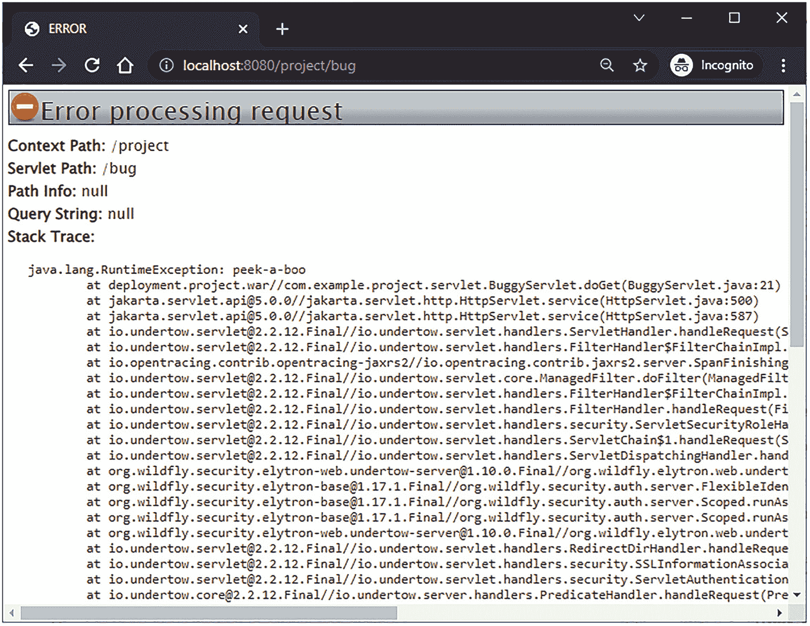

图 9-1
WildFly 的默认 HTTP 500 错误页面

所使用的 Jakarta Faces 实现甚至可能提供自己的默认错误页面。Mojarra 和 MyFaces 都基于 `jakarta.faces.context.ExceptionHandler` API^(⁸⁰) 提供了一个内部默认实现，该实现仅在 Jakarta Faces 项目阶段设置为 `Development` 时才会显示。图 9-2 展示了 Mojarra 的该页面外观。

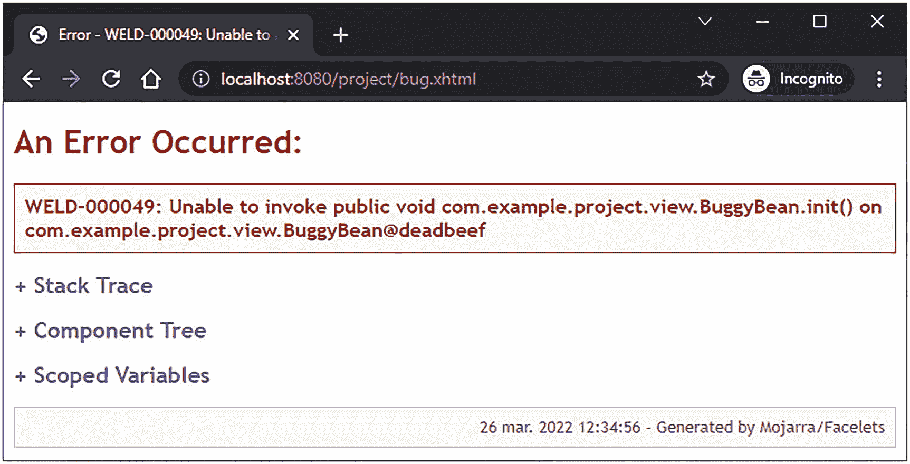

图 9-2
开发阶段 Mojarra 的默认 HTTP 500 错误页面

它不仅包含堆栈跟踪，还包含 Jakarta Faces 组件树和任何作用域变量的文本表示，这可能有助于查明根本原因，尽管实际上，仅凭堆栈跟踪并使用调试器重新执行用例比这更有帮助。

自定义错误页面

虽然对普通 Web 开发人员有用，但坦率地说，那些默认错误页面对于普通最终用户来说是可怕的。其外观和感觉与网站的其他部分完全不同，文本对普通最终用户来说就像天书。这样的错误页面甚至没有为最终用户提供退出点。不满的最终用户无法快速找到主页或联系页面。幸运的是，对于最终用户来说，你可以通过在 Web 应用程序中包含一个错误页面，并在 `web.xml` 的 `<error-page>` 条目中注册其位置来覆盖这些默认错误页面。

```

/WEB-INF/errorpages/500.xhtml

```

自定义错误页面特意被放置在 `/WEB-INF` 文件夹中，这样最终用户就无法直接访问或为其添加书签。默认情况下，Servlet 容器会在请求作用域中设置与错误页面相关的属性，其键被定义为 `jakarta.servlet.RequestDispatcher.ERROR_XXX` 常量。^(⁸¹) 这样，如有必要，你可以将它们包含在自定义错误页面中。以下是一个示例：

```
Request URI
#{requestScope['jakarta.servlet.error.request_uri']}
Exception type
#{requestScope['jakarta.servlet.error.exception']['class']}
Exception message
#{requestScope['jakarta.servlet.error.exception'].message}
Stack trace
#{
facesContext.externalContext.response.writer.flush()
}#{
requestScope['jakarta.servlet.error.exception'].printStackTrace
(facesContext.externalContext.response.writer)
}

```

请注意打印堆栈跟踪的技巧。在打印堆栈跟踪之前刷新响应写入器非常重要，并且 `<pre>` 元素内 EL（表达式语言）表达式之外的模板文本中不能有空白；否则，它会被附加到堆栈跟踪中。

回到此类错误页面的可怕性，你最好将所有错误细节隐藏在仅在 Jakarta Faces 项目阶段等于 `Development` 时才评估为 `true` 的条件之后。首先，在某个主模板中设置一个应用作用域的快捷变量：

现在，当 Jakarta Faces 项目阶段等于 `Development` 时，你可以有条件地在错误页面中显示任何技术信息。

```
Error detail for developer

...

```

无论如何，错误页面完全无状态是非常重要的。换句话说，一个像样的错误页面可能不包含任何 Jakarta Faces 表单，甚至不包含注销表单。你不仅会避免表单提交失败的风险（因为最初的异常实际上是由损坏的 Jakarta Faces 状态引起的），而且这些表单实际上会提交到错误的 URL（统一资源定位符），即错误页面本身的 URL。由于错误页面隐藏在 `/WEB-INF` 文件夹中，表单提交只会导致 404 错误。与其将错误页面移出 `/WEB-INF` 文件夹，不如使用一个提交到普通 Servlet 的纯 HTML 表单来解决注销的情况。`SecurityContext` 在那里也是可注入的，会话作用域的受管 bean（如果有的话）也是如此。

Ajax 异常处理


默认情况下，当 Jakarta Faces Ajax 请求期间发生异常时，最终用户不会收到任何关于操作是否成功执行的反馈。在 Mojarra 中，仅当 Jakarta Faces 项目阶段设置为 `Development` 时，最终用户才会看到一个仅包含异常类型和消息的纯 JavaScript 警告框（参见图 9-3）。

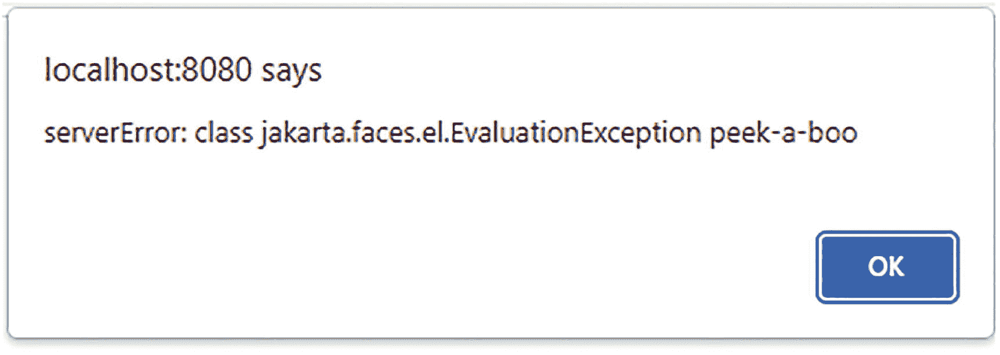

**图 9-3** 在 Mojarra 的 Development 阶段，Ajax 请求抛出异常时显示的 JavaScript 警告框

这并不十分有用。而在 `Production` 阶段，最终用户甚至不会收到任何反馈。Web 应用会静默失败，让最终用户感觉好像什么都没发生，这只会令人困惑，并且对用户体验不利。更合理的做法是，将 Jakarta Faces Ajax 请求期间的异常处理方式与同步请求期间的异常处理方式保持一致，即复用与 `web.xml` 中声明的 `<error-page>` 完全相同的错误页面。换句话说，最终用户应该能够完整地看到错误页面。这可以通过创建一个自定义的 `ExceptionHandler` 实现来实现，该实现基本上指示 Jakarta Faces 基于错误页面创建一个新的 `UIViewRoot`，然后构建并渲染它。只是代码量相当大。最简单的形式如下所示：

```
public class AjaxExceptionHandler extends ExceptionHandlerWrapper {
public AjaxExceptionHandler(ExceptionHandler wrapped) {
super(wrapped);
}
@Override
public void handle() {
handleAjaxException(FacesContext.getCurrentInstance());
getWrapped().handle();
}
protected void handleAjaxException(FacesContext context) {
Iterator unhandledExceptionQueuedEvents =
getUnhandledExceptionQueuedEvents().iterator();
if (context == null
|| context.getExternalContext().isResponseCommitted()
|| !context.getPartialViewContext().isAjaxRequest()
|| !unhandledExceptionQueuedEvents.hasNext()
) {
return;
}
Throwable exception = unhandledExceptionQueuedEvents
.next().getContext().getException();
while (exception.getCause() != null
&& (exception instanceof FacesException
|| exception instanceof ELException)
) {
exception = exception.getCause();
}
ExternalContext external = context.getExternalContext();
String uri = external.getRequestContextPath()
+ external.getRequestServletPath();
Map requestScope = external.getRequestMap();
requestScope.put(RequestDispatcher.ERROR_REQUEST_URI, uri);
requestScope.put(RequestDispatcher.ERROR_EXCEPTION, exception);
String viewId = "/WEB-INF/errorpages/500.xhtml";
Application application = context.getApplication();
ViewHandler viewHandler = application.getViewHandler();
UIViewRoot viewRoot = viewHandler.createView(context, viewId);
context.setViewRoot(viewRoot);
try {
external.responseReset();
ViewDeclarationLanguage viewDeclarationLanguage =
viewHandler.getViewDeclarationLanguage(context, viewId);
viewDeclarationLanguage.buildView(context, viewRoot);
context.getPartialViewContext().setRenderAll(true);
viewDeclarationLanguage.renderView(context, viewRoot);
context.responseComplete();
}
catch (IOException e) {
throw new FacesException(e);
}
finally {
requestScope.remove(RequestDispatcher.ERROR_EXCEPTION);
}
unhandledExceptionQueuedEvents.remove();
while (unhandledExceptionQueuedEvents.hasNext()) {
unhandledExceptionQueuedEvents.next();
unhandledExceptionQueuedEvents.remove();
}
}
public static class Factory extends ExceptionHandlerFactory {
public Factory(ExceptionHandlerFactory wrapped) {
super(wrapped);
}
@Override
public ExceptionHandler getExceptionHandler() {
return new AjaxExceptionHandler
(getWrapped().getExceptionHandler());
}
}
}
```

`handleAjaxException()` 方法首先会检查是否存在 faces 上下文、响应是否尚未提交、请求是否为 Ajax 请求，以及队列中是否有任何未处理的异常事件。如果这些条件都不满足，它将返回并让 Jakarta Faces 像往常一样继续处理。

当响应或其一部分已经物理地发送到客户端时，HTTP 响应被视为已提交。这是一个无法回头的点。你无法收回已经发送的字节。当异常在渲染响应阶段中途发生时，可能会发生这种情况。HTTP 响应的前半部分可能已经发送给了客户端。此外，Jakarta Faces 和服务器的默认异常处理器也无法处理这种情况。实际上，客户端会得到一个半生不熟的 HTML 页面。为避免这种情况，你能做的最好的事情是确保不在支持 bean 的 getter 方法中执行业务逻辑（这本身总是一个坏主意），并确保支持 bean 尽快被初始化。这可以通过在 `<f:viewAction>` 中执行对异常敏感的业务逻辑来实现，而不是在 `@PostConstruct` 中。另一种选择是增加 HTTP 响应缓冲区大小，以匹配对异常最敏感的页面所生成的 HTML 响应的大小。假设它是 100KB，可以使用以下 `web.xml` 上下文参数。

```
jakarta.faces.FACELETS_BUFFER_SIZE

```

`handleAjaxException()` 中的下一步是从未处理异常事件队列中提取感兴趣的根原因。在 Jakarta Faces 生命周期处理期间发生的任何异常都将被包装在 `jakarta.faces.FacesException` 中。在评估 EL 表达式期间发生的任何异常都将被包装在 `jakarta.el.ELException` 中。这些不是我们感兴趣的，因此，我们需要解开它们以找到底层的根原因。

接下来，将设置 `#{requestScope['jakarta.servlet.error.request_uri']}` 和 `#{requestScope['jakarta.servlet.error.exception']}` 变量，以便错误页面可以访问它们。同时，代表错误页面的 `UIViewRoot` 实例将在 `ViewHandler` 的帮助下创建，并设置在 faces 上下文中。如有必要，你可以根据异常的实际根原因有条件地准备错误页面的视图 ID。例如：

```
String viewId;
if (exception instanceof ViewExpiredException) {
viewId = "/WEB-INF/errorpages/expired.xhtml";
}
else {
viewId = "/WEB-INF/errorpages/500.xhtml";
}
```

回到 `handleAjaxException()`，在 `try` 块中，HTTP 响应缓冲区将被清除，`UIViewRoot` 将被填充组件，Ajax 上下文将被指示渲染整个视图，`UIViewRoot` 将被渲染，faces 上下文将被指示响应已手动处理完毕，因此它不会执行任何导航，最后，异常将从请求作用域中移除。在 `finally` 块中将异常从请求作用域中移除并非强制要求，但存在一些 Servlet 容器（如 Tomcat）会将其视为触发向响应追加内部错误页面的信号。我们希望避免这种行为，以保持自定义错误页面的整洁。
最后，未处理异常事件的队列将被清空。
这也不是强制性的，但这样做是有目的的，以便与 `web.xml` 配置的错误页面的默认行为相匹配，并防止链中的任何下一个 `ExceptionHandler` 处理任何剩余的异常事件。


为了使其运行，你实际上还需要创建一个工厂。与 Jakarta Faces 中许多其他应用程序范围的定制一样，自定义异常处理器只能通过工厂注册。这看起来可能有些冗长，但这正是设计的一部分。在这种特定情况下，它允许你根据某些全局配置设置返回不同的异常处理器实现。你可以在前面展示的 `AjaxExceptionHandler` 类的底部找到一个嵌套的 `Factory` 类。它继承自 `jakarta.faces.context.ExceptionHandlerFactory`^(⁸²)，并且可以按如下方式在 `faces-config.xml` 中注册：

```

com.example.project.exceptionhandler.AjaxExceptionHandler$Factory

```

顺便提一下，必须说明的是，这种异常处理器也适用于非 Ajax 请求。你只需移除 `PartialViewContext#isAjaxRequest()` 检查。你只需要记住，根据是否为 Ajax 请求，手动将 HTTP 响应状态码设置为 `500`。在 `ExternalContext#responseReset()` 这行代码之后执行此操作。

```
if (!context.getPartialViewContext().isAjaxRequest()) {
external.setResponseStatus
(HttpServletResponse.SC_INTERNAL_SERVER_ERROR);
}
```

如果你在 Ajax 请求上执行此操作，那么 Jakarta Faces Ajax 脚本将不会按预期处理 Ajax 响应。它不会显示错误页面，而是会触发 `onerror` 处理器。

ViewExpiredException 处理
如果你之前使用过 Jakarta Faces，那么你很可能见过或听说过 `ViewExpiredException`。当与回发关联的 Jakarta Faces 视图状态在 HTTP 会话中再也找不到时，就会抛出此异常。换句话说，当 `jakarta.faces.STATE_SAVING_METHOD` 上下文参数设置为其默认值“`server`”，并且最终用户提交了一个 Jakarta Faces 表单，但其视图状态在服务器端已无法找到时。请注意，当上下文参数设置为“`client`”时，你仍然需要一个“`faces/ClientSideSecretKey`”环境条目，以避免在服务器重启时出现视图过期。所有这些都在第 3 章的“视图状态”部分进行了详细阐述。此外，在第 8 章的“`@ViewScoped`”部分，你可以找到如何配置 Jakarta Faces 将在 HTTP 会话中保存的视图和托管 Bean 的数量。

有几种情况可能会意外发生 `ViewExpiredException`。所有这些情况都与页面导航和浏览器缓存有关，同时最终用户最近已从 Web 应用程序注销。通常，作为安全措施，HTTP 会话会在注销时失效，并且最终用户会被重定向到某个登录页面。当之前访问过的网页是可缓存的，并且最终用户在注销后按下浏览器的后退按钮时，那么最终用户可能会成功地从浏览器缓存中看到之前访问过的网页。如果该页面包含任何 Jakarta Faces 表单，那么其 `jakarta.faces.ViewState` 隐藏输入字段实际上将引用一个在当前会话中已不存在的视图状态。当最终用户提交此类表单时，Jakarta Faces 将不可避免地抛出 `ViewExpiredException`。

尽管这是一项出色的安全措施，但最终用户可能会感到困惑，因为之前访问过的网页实际上在最终用户的体验中已成功加载。这种困惑对用户体验不利。因此，你最好确保有状态的 Jakarta Faces 页面不可缓存，这样当最终用户按下后退按钮时，Web 浏览器将被迫实际访问 Web 服务器，从而加载一个全新的页面，其视图状态在当前 HTTP 会话中实际上是有效的。这可以通过一个 servlet 过滤器来实现，该过滤器设置特定的响应头，以指示客户端不要缓存 HTTP 响应。以下是此类 servlet 过滤器的一个示例：

```
@WebFilter(servletNames="facesServlet")
public class NoCacheFilter implements Filter {
@Override
public void doFilter
(ServletRequest req, ServletResponse res, FilterChain chain)
throws IOException, ServletException
{
HttpServletRequest request = (HttpServletRequest) req;
HttpServletResponse response = (HttpServletResponse) res;
String resourcePath = request.getContextPath()
+ ResourceHandler.RESOURCE_IDENTIFIER;
if (!request.getRequestURI().startsWith(resourcePath)) {
response.setHeader
("Cache-Control", "no-store, must-revalidate");
}
chain.doFilter(request, response);
}
}
```

基本上，它挂接到所有将访问 `FacesServlet` 的请求上，前提是它在 `web.xml` 中配置了 servlet 名称为“`facesServlet`”，如下所示：

```
facesServlet
jakarta.faces.webapp.FacesServlet

```

或者，如果你已将 Web 应用程序划分为仅包含无状态 Jakarta Faces 页面的公共区域和仅包含有状态 Jakarta Faces 页面的受限区域，那么你也可以将此过滤器映射到仅匹配有状态部分的更具体的 URL 模式，例如 `/admin/*`。

```
@WebFilter("/admin/*")
```

此过滤器在设置缓存控制头之前，首先检查 HTTP 请求是否不代表 Jakarta Faces 资源请求。这些请求通过上下文路径之后的 `/jakarta.faces.resource` 路径来标识，该路径可通过 `ResourceHandler#RESOURCE_IDENTIFIER` 常量获得。当你使用 Jakarta Faces 资源组件（例如 `<h:graphicImage>`、`<h:outputScript>` 或 `<h:outputstyleSheet>`）时，会自动使用此路径。另请参阅第 6 章的“资源组件”部分。你不想禁用它们上的浏览器缓存，因为那样会影响页面加载性能。

所设置的 `Cache-Control` 头实际上仅被支持 HTTP 1.1 的客户端识别。HTTP 1.1 于 1997 年引入。如果你还想覆盖 HTTP 1.0 客户端（如今通常只是古老的代理服务器或无法获得比 Internet Explorer 6.0 更好的浏览器的可怜用户），那么你最好在 `Cache-Control` 之外再添加两个响应头。

```
response.setHeader("Pragma", "no-cache"); // HTTP 1.0.
response.setDateHeader("Expires", 0); // Proxies.
```

现在，有了这个过滤器，最终用户将无法再从浏览器缓存中看到任何 Jakarta Faces 页面，因此也就无法再遇到 `ViewExpiredException`。然而，仍然存在一些情况，`ViewExpiredException` 是不可避免的。一种情况是，最终用户在不同的浏览器标签页中打开了多个 Jakarta Faces 页面，并在其中一个标签页中注销，然后在另一个标签页中执行操作，而事先没有刷新页面。对于这种情况，你确实需要一个“抱歉，您的会话已过期”的错误页面。这可以很容易地在 `web.xml` 中配置为另一个错误页面，如下所示：

```

jakarta.faces.application.ViewExpiredException

/WEB-INF/errorpages/expired.xhtml

```

不要让 `<location>` 指向一个公共页面，例如登录页面。错误页面必须保留在 `/WEB-INF` 文件夹中，以避免被直接访问、添加书签甚至被爬取。如果你确实需要最终用户最终进入一个现有的公共页面，那么最好在错误页面中使用一个元刷新头，该头进而将最终用户重定向到所需的公共页面。这样，你可以确保浏览器地址栏中的 URL 被更新为正确的 URL，而不是发生错误的上一页面的 URL。

```

会话已过期

抱歉，您的会话已过期
您将被重定向到登录页面

如果重定向未生效，或者您等不及了，请点击此处。

```

请注意，元刷新内容中的“`0`”表示重定向前等待的秒数。因此，“`0`”意味着“立即重定向”。你可以使用，例如，“`3`”来让浏览器在重定向前等待 3 秒。


请务必记得，在任何自定义异常处理器（例如上一节演示的 `AjaxExceptionHandler`）中，也要配置这个确切的错误页面 `<location>`。你还需要确保你的“通用”错误页面映射的是 `500` 错误代码，而不是像 `java.lang.Exception` 或 `java.lang.Throwable` 这样的异常类型。本章的第一节已经对此进行了演示。

```
/WEB-INF/errorpages/500.xhtml
```

否则，所有被包装在 `ServletException` 中的异常最终仍会进入通用错误页面。当异常在同步（非 Ajax）回发期间（而非异步（Ajax）回发期间）被抛出时，Jakarta Faces 会将任何异常包装在 `ServletException` 中。`web.xml` 错误页面机制仅在未找到按异常类型匹配的错误页面时，才会从 `ServletException` 中提取根本原因，以便按异常类型进行第二次错误页面匹配。

避免 `ViewExpiredException` 的一个完全不同的替代方案是使用无状态的 Jakarta Faces 视图。这样，Jakarta Faces 视图状态将不会被保存，Jakarta Faces 视图也永远不会过期，而只是会在每次请求时从头开始重建。你可以通过将 `<f:view>` 的 `transient` 属性设置为 `true` 来启用无状态视图。这在第 4 章的“无状态表单”一节中有详细阐述。

IOException 处理

底层 `HttpServletRequest` 和 `HttpServletResponse` 对象的某些方法可能会抛出 `IOException`。通常，这仅发生在网络连接意外中断时：例如，最终用户通过按下 Web 浏览器中的 Esc 按钮突然停止 HTTP 请求，或者最终用户在当前页面仍在加载时突然导航到另一个网页，甚至当最终用户的计算机着火或网线被老鼠咬断时。这些情况确实是无法避免的。对于作为 Web 应用程序开发人员的你来说，最好让任何 `IOException` 一直向上冒泡到 Servlet 容器。换句话说，绝对没有必要像下面这样捕获它：

```
public void someAjaxListener() {
try {
FacesContext.getCurrentInstance()
.getExternalContext().redirect(url);
}
catch (IOException e) {
throw new UncheckedIOException(e);
}
}
```

相反，直接让它抛出即可。

```
public void someAjaxListener() throws IOException {
FacesContext.getCurrentInstance()
.getExternalContext().redirect(url);
}
```

EJBException 处理

有时，调用服务方法也可能导致异常。通常，这些异常是有意为之的，例如“实体未找到”、“违反唯一约束”、“用户凭据无效”以及“实体已被其他用户修改”。默认情况下，任何从 Jakarta Enterprise Beans 服务方法抛出的非特定于应用程序的 `RuntimeException`（例如 `NullPointerException`，甚至 Jakarta Persistence 的 `PersistenceException`）都会被包装在 `EJBException` 中。这使得在 Jakarta Faces 操作方法中确定实际的根本原因变得笨拙。

```
public void addProduct() {
FacesMessage message;
try {
Long id = productService.create(product);
message = new FacesMessage(FacesMessage.SEVERITY_INFO,
"产品保存成功", "ID 是 " + id);
}
catch (EJBException e) {
if (e.getCause() instanceof ConstraintViolationException) {
message = new FacesMessage(FacesMessage.SEVERITY_ERROR,
"重复的产品！", e.getMessage());
context.validationFailed();
}
else {
throw e;
}
}
context.addMessage(null, message);
}
```

这不是最佳实践。你不仅需要通过检查 `Exception#getCause()` 来确定 `EJBException` 的根本原因，而且 `web.xml` 错误页面机制也无法为例如 `ConstraintViolationException` 显示特定的错误页面，因为它被包装在 `EJBException` 中。为了让服务方法抛出未包装的异常，你需要首先创建一个自定义异常超类，然后使用 `@jakarta.ejb.ApplicationException` 对其进行注解。^(⁸³)

```
@ApplicationException(rollback=true)
public abstract class BusinessException extends RuntimeException {
public BusinessException() {
super();
}
public BusinessException(Exception cause) {
super(cause);
}
}
```

请注意注解上的 `rollback=true` 属性。如果你希望 Jakarta Enterprise Beans 容器在抛出此异常时回滚任何活动事务，这一点非常重要。以下是此自定义业务异常的一些子类示例：

```
public abstract class QueryException extends BusinessException {}
public class EntityNotFoundException extends QueryException {}
public class DuplicateEntityException extends QueryException {}
public abstract class CredentialsException extends BusinessException {}
public class InvalidUsernameException extends CredentialsException {}
public class InvalidPasswordException extends CredentialsException {}
```

请注意，你不一定需要在所有子类上重复 `@ApplicationException`，因为它已经是 `@Inherited` 的。以下是一些可能抛出这些异常的具体用例：

```
public User getById(Long id) {
try {
return entityManager
.createQuery("FROM User u WHERE u.id = :id", User.class)
.setParameter("id", id)
.getSingleResult();
}
catch (NoResultException e) {
throw new EntityNotFoundException(e);
}
}
public Optional findByEmail(String email) {
try {
return Optional.of(entityManager
.createQuery("FROM User u"
+ " WHERE u.email = :email", User.class)
.setParameter("email", email)
.getSingleResult());
}
catch (NoResultException e) {
return Optional.empty();
}
}
public User getByEmailAndPassword(String email, String password) {
User user = findByEmail(email)
.orElseThrow(InvalidUsernameException::new);
Credentials credentials = user.getCredentials();
byte[] passwordHash = digest(password, credentials.getSalt());
if (!Arrays.equals(passwordHash, credentials.getPasswordHash())) {
throw new InvalidPasswordException();
}
return user;
}
public Long create(User user) {
if (findByEmail(user.getEmail()).isPresent()) {
throw new DuplicateEntityException();
}
entityManager.persist(user);
return user.getId();
}
```

在后台 Bean 操作方法中，你可以相应地处理它们。

```
public void signup() {
FacesMessage message;
try {
userService.create(user);
message = new FacesMessage("您已成功注册！");
}
catch (DuplicateEntityException e) {
message = new FacesMessage(FacesMessage.SEVERITY_ERROR,
"抱歉，用户名已被占用！", e.getMessage());
context.validationFailed();
}
context.addMessage(null, message);
}
```

为了进一步减少样板代码，你甚至可以放过所有业务异常，并让自定义异常处理器来处理它们。


```
public class BusinessExceptionHandler extends ExceptionHandlerWrapper {
public BusinessExceptionHandler(ExceptionHandler wrapped) {
super(wrapped);
}
@Override
public void handle() {
handleBusinessException(FacesContext.getCurrentInstance());
getWrapped().handle();
}
protected void handleBusinessException(FacesContext context) {
Iterator unhandledExceptionQueuedEvents =
getUnhandledExceptionQueuedEvents().iterator();
if (context == null
|| !unhandledExceptionQueuedEvents.hasNext()
) {
return;
}
Throwable exception = unhandledExceptionQueuedEvents
.next().getContext().getException();
while (exception.getCause() != null
&& (exception instanceof FacesException
|| exception instanceof ELException)
) {
exception = exception.getCause();
}
if (!(exception instanceof BusinessException)) {
return;
}
context.addMessage(null, new FacesMessage(
FacesMessage.SEVERITY_FATAL,
exception.toString(),
exception.getMessage()));
context.validationFailed();
context.getPartialViewContext()
.getRenderIds().add("globalMessages");
unhandledExceptionQueuedEvents.remove();
while (unhandledExceptionQueuedEvents.hasNext()) {
unhandledExceptionQueuedEvents.next();
unhandledExceptionQueuedEvents.remove();
}
}
public static class Factory extends ExceptionHandlerFactory {
public Factory(ExceptionHandlerFactory wrapped) {
super(wrapped);
}
@Override
public ExceptionHandler getExceptionHandler() {
return new BusinessExceptionHandler
(getWrapped().getExceptionHandler());
}
}
}
```

是的，它确实与前面“Ajax 异常处理器”一节中展示的 `AjaxExceptionHandler` 类似。然而，第一个区别在于，当响应已提交或不是 Ajax 请求时，它不会跳过异常处理。第二个区别在于提取异常根本原因与排空剩余未处理异常事件之间的逻辑。这个 `BusinessExceptionHandler` 将改为检查根本原因是否为 `BusinessException` 的实例，如果是，它将添加一个 faces 消息，并指示 Jakarta Faces 显式地 Ajax 更新由“`globalMessages`”标识的组件，该组件应指向主模板中的全局消息组件，类似于以下内容：

```

```

最终，所有与业务异常相关的 faces 消息都将汇集于此。您可能已经注意到，通过调用 `FacesContext#validationFailed()`，faces 上下文被显式标记为“验证失败”。这通常对于 Facelet 模板中依赖于此状态的任何代码都很有用。如果您希望将其与 `AjaxExceptionHandler` 一起用于非业务异常，则需要在 `faces-config.xml` 中将其注册在 `AjaxExceptionHandler` *之后*。在 `faces-config.xml` 中后声明的任何内容都将有效地包装先前声明的处理器。这也适用于自定义异常处理器工厂。当 `BusinessExceptionHandler` 确认异常不是 `BusinessException` 的实例时，它将把未处理的异常留在队列中，从该方法返回，并最终委托给被包装的 `ExceptionHandler`（即 `AjaxExceptionHandler`）的 `handle()` 方法。

```

com.example.project.AjaxExceptionHandler$Factory

com.example.project.BusinessExceptionHandler$Factory

```

有了 `BusinessExceptionHandler`，您可以进一步简化支持 bean 的动作方法，如下所示：

```
public void signup() {
userService.create(user);
context.addMessage(null,
new FacesMessage("You are successfully signed up!");
}
```

脚注

10. WebSocket 推送

WebSocket 支持由 `<f:websocket>` 标签、`PushContext` 接口和 `@Push` 注解表示，这些是在 Jakarta Faces 2.3 中引入的。它构建在 Jakarta EE 7 中引入的 JSR-356 WebSocket 规范之上。自 7.0.27 版本起，Tomcat 原生支持 JSR-356，自 9.1.0 版本起，Jetty 也原生支持。在 Mojarra 中，`<f:websocket>` 有一个额外的 Jakarta EE 依赖：JSON-P (JSR-353)。如果您的目标是 Tomcat 或 Jetty 而非 Jakarta EE 应用服务器，则可能需要单独安装它。JSON-P 在内部用于将 Java 对象转换为 JSON 字符串，以便可以轻松地传输到客户端，并作为附加到 `<f:websocket>` 的 JavaScript 监听器函数的参数提供。

配置

JSR-356 WebSocket 规范并未正式支持在运行时以编程方式初始化套接字端点。因此，我们不能仅仅通过在视图中声明 `<f:websocket>` 并等待引用它的 Jakarta Faces 页面首次打开来初始化它。我们确实需要在部署期间显式地初始化它。Jakarta Faces 默认可以做到这一点，但如果 Web 应用程序永远不会使用未使用的 WebSocket 端点，那么让它永远保持打开状态在资源效率上并不高。因此，我们无法避免使用上下文参数来指示 Jakarta Faces 在部署期间显式地初始化它。

```
jakarta.faces.ENABLE_WEBSOCKET_ENDPOINT
true

```

如果您更喜欢编程式初始化而非声明式初始化，则始终可以在 Web 片段库的 `ServletContainerInitializer` 中使用 `ServletContext#setInitParameter()`，如下所示：

```
public class YourInitializer implements ServletContainerInitializer {
@Override
public void onStartup(Set> types, ServletContext context) {
context.setInitParameter(
PushContext.ENABLE_WEBSOCKET_ENDPOINT_PARAM_NAME, "true");
}
}
```

请注意，无法在 `ServletContextListener` 中执行此任务，因为 Jakarta Faces 实际上会在其自己的 `ServletContainerInitializer` 实现中检查上下文参数，而该实现总是在任何 `ServletContextListener` 之前运行。一旦 WebSocket 端点启用并在部署期间成功初始化，它将在 URL 模式 `/jakarta.faces.push/*` 上监听 WebSocket 握手请求。第一个路径元素将代表 WebSocket 通道名称。回到“官方”说法，某些 WebSocket 实现确实支持编程式初始化，例如 Undertow 提供的实现，而 Undertow 又被 WildFly 使用。不幸的是，规范并未如此规定，并且可能存在根本不支持编程式初始化的 WebSocket 实现，例如 Payara 中使用的 Tyrus。^(⁸⁴)

默认情况下，WebSocket 容器会在应用服务器监听 HTTP 请求的同一端口上监听握手请求。您可以选择使用另一个 `web.xml` 上下文参数更改端口：

```
jakarta.faces.WEBSOCKET_ENDPOINT_PORT

```

或者在 `ServletContainerInitializer` 中以编程方式更改：

```
context.setInitParameter(
PushContext.WEBSOCKET_ENDPOINT_PORT_PARAM_NAME, "8000");
```

用法

在您的 Jakarta Faces 页面中，只需声明 `<f:websocket>` 标签，并附上必需的 `channel` 属性（代表通道名称）和可选的 `onmessage` 属性（代表对 JavaScript 函数的引用）。

```

function logMessage(message, channel, event) {
console.log(message);
}

```

JavaScript 函数将被调用，并传入三个参数：

1.  `message`：作为 JSON 对象的推送消息。
2.  `channel`：WebSocket 通道名称。如果您打算使用全局监听器或希望手动控制 WebSocket 的关闭，这可能会很有用。


3.  `event`：原始的 `MessageEvent` 对象。如果你打算在 JavaScript 函数中检查它，这可能会很有用。

在 WAR 端，你可以通过 `@Push` 注解在任何支持 CDI 注入的 Web 工件中注入 `PushContext`。这可以是一个简单的 CDI 托管 Bean，也可以是 `@WebServlet`、`@WebFilter` 或 `@WebListener`。

```
import jakarta.inject.Named;
import jakarta.enterprise.context.RequestScoped;
import jakarta.inject.Inject;
import jakarta.faces.push.Push;
import jakarta.faces.push.PushContext;
@Named @RequestScoped
public class Bean {
@Inject @Push
private PushContext test;
public void submit() {
test.send("Hello World!");
}
}
```

`PushContext` 变量名 *test* 必须与 Jakarta Faces 页面中声明的通道名称匹配。如果无法将变量名与通道名称匹配，则始终可以在 `@Push` 注解的可选 `channel` 属性中指定通道名称。

```
@Inject @Push(channel="test")
private PushContext foo;
```

一旦前面展示的 Bean 的 `submit()` 方法被某个 Jakarta Faces 命令组件（即使在不同的 Jakarta Faces 页面中）调用，推送消息“Hello World!”就会被发送到**所有**在相同通道名称上打开的套接字，作用域为整个应用。

**作用域与用户**

你可能已经意识到，`<f:websocket>` 默认是应用作用域的。你可以通过可选的 `scope` 属性来控制作用域。允许的值为 `application`、`session` 和 `view`。

当设置为 `session` 时，消息将仅发送给当前会话中相同通道上所有打开的套接字。

```
这对于来自用户自身发起的长时间运行的、会话作用域的后台任务的进度消息特别有用。这样，用户可以继续浏览网站，而无需等待结果出现在同一个页面上。

或者，你也可以将可选的 `user` 属性设置为一个可序列化的值，该值代表唯一的用户标识符，例如，可以是代表用户登录名的 `String` 或代表用户 ID 的 `Long`。当设置此属性时，套接字的作用域将自动默认为 `session`，并且不能设置为 `application`。
```

这提供了向特定用户发送消息的机会，如下所示：

```
private String message;
private User recipient;
@Inject @Push
private PushContext chat;
public void sendMessage() {
Long recipientId = recipient.getId();
chat.send(message, recipientId);
}
```

你甚至可以通过提供一个 `Set` 参数将其发送给多个用户。

```
private String message;
private Set recipients;
@Inject @Push
private PushContext chat;
public void sendMessage() {
Set recipientIds = recipients.stream()
.map(User::getId)
.collect(Collectors.toSet());
chat.send(message, recipientIds);
}
```

换句话说，你可以通过这种方式轻松实现一个聊天框。顺便提一下，像 Stack Overflow 这样的网站上的实时用户定向通知就是这样工作的。

当 `scope` 设置为 `view` 时，消息将仅发送给当前视图中指定通道上打开的套接字。这不会影响整个应用中所有其他视图上相同通道的任何套接字。

```

这也支持与 `user` 属性结合使用。

```
这种针对特定用户的视图作用域套接字的结构虽然有些不寻常，但仅当由 `user` 属性代表的登录用户的生存期可能比 HTTP 会话短时才应使用。然而，这反过来被认为是一种糟糕的安全实践。最佳安全实践是，在登录和注销期间都使 HTTP 会话失效。在登录期间使 HTTP 会话失效可以防止会话固定攻击，而在注销期间使会话失效可以防止特定于用户的脏数据在 HTTP 会话中残留。
```

**通道设计提示**

你可以在整个应用中声明多个不同作用域、带或不带用户目标的推送通道。但是，请注意，相同的通道名称可以轻松地在多个视图中重用，即使它是视图作用域的。如果你使用尽可能少的不同的通道名称，并将通道名称绑定到特定的推送套接字作用域/用户组合，而不是绑定到特定的 Jakarta Faces 视图，这样效率更高。如果你打算为不同目的使用多个视图作用域的通道，那么最好只使用一个视图作用域的通道，并拥有一个全局 JavaScript 监听器，该监听器可以根据传递的消息来区分其任务，例如，在服务器端按如下方式发送消息：

```
Map message = new HashMap();
message.put("functionName", "someFunction");
message.put("functionData", functionData); // 可以是 Map 或 Bean。
someChannel.send(message);
```

然后在 `onmessage` JavaScript 监听器函数中按如下方式处理：

```
function someSocketListener(message) {
windowmessage.functionName;
}
function someFunction(data) {
// ...
}
function otherFunction(data) {
// ...
}
// ...
```

**一次性推送**

你可以使用 `connected` 属性来防止套接字在页面加载时自动连接。

```
当你想在调用可能需要更长时间才能完成的视图作用域 Ajax 操作方法后，对结果执行一次性推送，并且希望用户能立即继续使用同一个页面，而不会因为“网站速度慢”的体验而感到烦恼时，这特别有用。这种方法只需要使用 `faces.push` JavaScript API（应用程序编程接口）进行一些额外的工作。它有三个函数，但只有两个是我们感兴趣的：`faces.push.open(...)` 和 `faces.push.close(...)`。第三个函数 `faces.push.init(...)` 基本上是初始化套接字，你不应该关心调用它；那是 `<f:websocket>` 标签的渲染器的工作。

为了在调用 Ajax 操作方法之前显式打开未打开的套接字，你需要调用 `faces.push.open(...)` 函数，并将套接字客户端 ID 作为参数。为了在推送消息到达后立即显式关闭已打开的套接字，你需要调用 `faces.push.close(...)` 函数，并将套接字客户端 ID 作为参数。以下示例完整地演示了一次性推送方法：
```

```
function startLongRunningProcess() {
faces.push.open("push");
document.getElementById("status").innerHTML =
"长时间运行的过程已开始 ...";
}
function endLongRunningProcess(result) {
faces.push.close("push");
document.getElementById("status").innerHTML = result;
}

```

必须说明的是，像前面那样将 JavaScript 代码直接放在 HTML 源代码中是一种糟糕的做法。当然，这仅用于演示目的。为了更好的维护性、性能和工具支持，在实际代码中，你应该将 JavaScript 代码放在一个 JS 文件中，并通过 `<h:outputScript>` 包含它。这里我还没有提及为了演示目的而缺少 jQuery 魔法的问题。

在示例中，打开套接字是在命令按钮的 `onclick` 期间执行的。而 `onmessage` 监听器函数则关闭套接字。当然，你也可以让套接字始终保持打开状态，而无需摆弄 JavaScript，但如果套接字除了呈现视图作用域 Ajax 操作方法的结果之外没有其他用途，这可能会浪费资源。以下是关联的后台 Bean 可能的样子。

```
@Named @RequestScoped
public class LongRunningProcess {
@Inject
private LongRunningProcessService service;
@Inject @Push
private PushContext push;
public void submit() {
service.asyncSubmit(result -> push.send(result));
}
}
```

以下是服务类的样子。


```markdown

```
@Stateless
public class LongRunningProcessService {
@Asynchronous
public void asyncSubmit(Consumer callback) {
String result = someLongRunningProcess();
callback.accept(result);
}
}
```

请注意 Jakarta Enterprise Beans 的 `@Asynchronous`
注解。这在当前结构中非常重要。它将确保企业 Bean 方法在单独的线程中执行。这使得支持 Bean 方法能够立即返回，而无需等待企业 Bean 方法完成。

有状态 UI 更新

正如你可能注意到的，`onmessage` JavaScript 监听器函数通常仅适用于小型无状态任务，例如显示反馈消息或使用 JavaScript 向某个无状态列表添加新项。当你想要更新由另一个 Jakarta Faces 组件表示的有状态 UI（用户界面）时，它的作用就不太大了。想象一下，用一个完整的 Jakarta Faces 表格替换一个简单的加载图片。

为此，你最好嵌套一个监听特定推送消息的 `<f:ajax>`。通过其 `render` 属性，你有机会在收到推送消息时自动更新任意 Jakarta Faces 组件。以下是一个示例，它最初显示一个加载图片，然后在表格准备好加载时显示表格：

```

#{result.id}
#{result.name}
#{result.value}

```

请注意，`<f:websocket>` 放置在 `<h:form>` 中。当它嵌套了 `<f:ajax>` 时，这是强制性的。通常情况下，这不是必需的。以下是支持 Bean 可能的样子。

```
@Named @ViewScoped
public class LongRunningSearch implements Serializable {
private List results;
@Inject
private LongRunningSearchService service;
@Inject @Push
private PushContext push;
@PostConstruct
public void init() {
service.asyncLoadResults(results -> {
this.results = results;
push.send("loaded");
});
}
public List getResults() {
return results;
}
}
```

请注意，推送消息 `"loaded"` 与 `<f:ajax event>` 的值完全匹配。你可以使用任何你想要的值，并且可以根据需要嵌套任意数量的 `<f:ajax>` 标签。托管 Bean 必须是 `@ViewScoped` 的，这一点很重要，因为 Ajax 调用基本上是在同一视图内的不同请求中执行的。最后，服务类如下所示：

```
@Stateless
public class LongRunningSearchService {
@Asynchronous
public void asyncLoadResults(Consumer> callback) {
List results = someLongRunningProcess();
callback.accept(results);
}
}
```

`someLongRunningProcess()` 方法代表你对某个长时间运行进程的实现（例如，调用第三方 Web 服务 API）。

全站推送通知

为此，你可以使用一个应用程序作用域的套接字。这种套接字对于由 Web 应用程序本身在特定事件（可能对所有应用程序用户都感兴趣）上触发的全站反馈消息特别有用。可以想象一下全站统计信息、实时列表、股票更新等。以下示例展示了一个实时前十名列表的情况：

```
#{item.ranking}
#{item.name}
#{item.score}

```

以下是服务类的样子，借助了 CDI 事件的一点帮助。

```
@Stateless
public class ItemService {
@Inject
private EntityManager entityManager;
@Inject
private BeanManager beanManager;
public void update(Item item) {
List previousTop10 = getTop10();
entityManager.merge(item);
List currentTop10 = getTop10();
if (!currentTop10.equals(previousTop10)) {
beanManager.fireEvent(new Top10UpdatedEvent());
}
}
@TransactionAttribute(NOT_SUPPORTED)
pulic List getTop10() {
return entityManager
.createNamedQuery("Item.top10", Item.class)
.getResultList();
}
}
```

请注意，在这个特定示例中，`Top10UpdatedEvent` 基本上只是一个空类，例如 `public class Top10UpdatedEvent {}`。还要注意，我们没有在服务类中注入 `PushContext`。否则这会被认为是各层之间的紧耦合。所有 Jakarta Faces 相关的代码都属于前端，而不是后端。这样，后端服务类可以更好地在所有类型的前端框架（除了 Jakarta Faces 之外，例如 Jakarta RESTful Web 服务，甚至普通的 Jakarta Pages/Servlet）中重用。换句话说，你应该确保你的后端类不会直接或间接地使用任何前端特定的类，例如来自 `jakarta.faces.*`、`jakarta.ws.*` 和 `jakarta.servlet.*` 包的类。

任何使用 `BeanManager#fireEvent()` 方法触发的事件都可以使用 CDI `@Observes` 注解进行观察。这适用于所有层。换句话说，即使它在后端被触发，你也可以在前端观察到它。唯一的条件是托管 Bean 必须是 `@ApplicationScoped` 的。也就是说，此时不一定存在任何 HTTP 请求、HTTP 会话或 Jakarta Faces 视图。

```
@Named @ApplicationScoped
public class Bean {
private List top10;
@Inject
private ItemService service;
@Inject @Push
private PushContext top10Observer;
@PostConstruct
public void load() {
top10 = service.getTop10();
}
public void onTop10Updated(@Observes Top10UpdatedEvent event) {
load();
top10Observer.send("updated");
}
public List getTop10() {
return top10;
}
}
```

跟踪活动套接字

为了跟踪活动套接字，你可以在一个应用程序作用域的 Bean 中观察 `@WebsocketEvent.Opened` 和 `@WebsocketEvent.Closed` 事件。以下示例假设你有 `<f:websocket channel="chat" user="...">`，并且你打算收集“活跃聊天用户”：

```
@ApplicationScoped
public class WebsocketEventObserver {
private Map users;
@PostConstruct
public void init() {
users = new ConcurrentHashMap();
}
public void onopen(@Observes @Opened WebsocketEvent event) {
if ("chat".equals(event.getChannel())) {
getCounter(event.getUser()).incrementAndGet();
}
}
public void onclose(@Observes @Closed WebsocketEvent event) {
if ("chat".equals(event.getChannel())) {
getCounter(event.getUser()).decrementAndGet();
}
}
private AtomicInteger getCounter(Serializable user) {
return users.computeIfAbsent(user, k -> new AtomicInteger());
}
public Set getActiveUsers() {
return users.entrySet().stream()
.filter(entry -> entry.getValue().intValue() > 0)
.map(entry -> entry.getKey())
.collect(Collectors.toSet());
}
}
```

你可以使用前面的 `getActiveUsers()` 方法来获取一组“活跃聊天用户”。请注意，单个用户可以在同一会话中多次打开同一个网页（例如，多个浏览器标签页），这正是使用计数器而不是简单地从 `Set` 中添加和删除用户的原因。

客户端事件处理

默认情况下，`<f:websocket>` 标签会保持连接永久打开，只要文档是打开的，只要没有设置 `connected="false"`，并且只要没有调用 `faces.push.close(clientId)`。当第一次连接尝试失败时，它会立即关闭套接字。你可以选择使用 `onclose` 属性来引用一个充当关闭监听器的 JavaScript 函数。

```

function closeListener(code, channel, event) {
if (code == -1) {
// 客户端不支持 WebSocket API。例如 IE9。
}
else if (code == 1000) {
// 由于视图或会话过期导致的正常关闭。
}
else if (code == 1008) {
// 由于未知的通道 ID 导致的正常关闭。
}
else {
// 由于客户端或服务器错误导致的异常关闭。
// 你可能想要显示一条消息和/或刷新页面。
}
}

```

该 JavaScript 函数将被调用，并传入三个参数：

```


1.  `code`：关闭原因代码，以整数形式表示。如果值为 `-1`，则表示客户端不支持 WebSocket JavaScript API^(⁸⁵)。如果值为 `1000`，则表示由于服务器端的视图或会话过期而发生了正常关闭。如果值为 `1008`，则表示由于提供的通道 ID 未知而发生了正常关闭。这通常只会在客户端伪造通道 ID，或者服务器在客户端尚未刷新页面时，因新部署导致通道 ID 变更而重启时发生。

2.  `channel`：WebSocket 通道名称。如果你打算设置全局监听器，这个信息可能会很有用。

3.  `event`：原始的 `CloseEvent` 对象。如果你打算在 JavaScript 函数中检查它，这个信息可能会很有用。

正如你在上述 `onclose` 监听器函数示例中可能注意到的，你可以通过检查 `<f:websocket>` 的关闭代码是否等于 `1000`，来通过 JavaScript 执行一些客户端操作（例如，显示警告消息和/或重定向到某个“会话已过期”页面）。

```javascript
function closeListener(code) {
    if (code == 1000) {
        window.location = faces.contextPath + "/expired.xhtml";
    }
}
```

这对于视图作用域和会话作用域的套接字都有效。然而，只要文档在客户端仍然处于打开状态，应用程序作用域的套接字就会永久保持打开，即使底层的视图或会话已经过期。

当首次连接尝试成功，但套接字后来因某种原因（例如，服务器正在重启）断开连接时，默认情况下会触发一个错误事件，并以递增的时间间隔持续尝试重新连接。在 Mojarra 的情况下，它会最多重试 25 次，每次间隔增加 500 毫秒。如果所有重连尝试都失败，它最终会完全关闭套接字并调用 `onclose` 监听器。你可以选择使用 `onerror` 属性来引用一个监听这些错误事件的 JavaScript 函数。

```javascript
function errorListener(code, channel, event) {
    if (code == 1001) {
        // 服务器可达，但返回了意外的响应代码。例如，服务器关闭时返回 503。
    }
    else if (code == 1006) {
        // 服务器不再可达，这可能发生在服务器完全宕机或客户端网络断开时。
    }
    else {
        // 任何其他原因，通常不会是 -1、1000 或 1008，
        // 因为此时会调用 onclose 代替。
    }
    // 无论如何，websocket 都会尝试重新连接。这个
    // onerror 函数会被再次调用。一旦 websocket
    // 放弃重新连接，最终会调用 onclose。
}
```

深入解析 Mojarra 的 f:websocket 实现

`<f:websocket>` API 指定了以下类和方法：

*   `jakarta.faces.push.Push`：一个用于 `@Inject` 的 CDI 限定符。借助此限定符，可以指定套接字通道名称。

*   `jakarta.faces.push.PushContext`：一个包含三个 `send()` 方法的接口：`send(Object message)`、`send(Object message, S user)` 和 `send(Object message, Collection<S> users)`。所有这些方法都将推送消息作为 `Object` 接收，并在 JavaScript 中将其转换为 JSON 字符串。所有这些方法都返回一个 `Set<Future<Void>>`。如果返回空集合，则表示没有与给定通道和用户关联的开放套接字。对于每个 `Future<Void>`，如果在调用 `Future#get()` 方法时没有抛出 `ExecutionException`，则表示消息已成功投递。

*   `jakarta.faces.component.UIWebsocket`：一个实现了 `ClientBehaviorHolder` 的组件，以支持嵌套的 `<f:ajax>`。历史上，原型套接字标签是从 `TagHandler` 而非 `UIComponent` 扩展而来的。后来决定让该标签支持 `<f:ajax>`，因为这将使复杂且有状态的 UI 更新变得更加容易。然而，让 `TagHandler` 实现 `ClientBehaviorHolder` 并受益于所有内置的 Ajax 魔法是不可能的，因此最终转换为了 `UIComponent`。

*   `ViewHandler#getWebsocketURL()` 方法：该方法接收一个通道名称，并借助 `ExternalContext#encodeWebsocketURL()` 返回形式为 `ws://host:port/context/jakarta.faces.push/channel` 的绝对 WebSocket URL。

*   `ExternalContext#encodeWebsocketURL()` 方法：该方法基本上接收一个形式为 `/context/jakarta.faces.push/channel` 的相对 WebSocket URI，并返回绝对 WebSocket URL。

实际的实现相当广泛。它直接基于 OmniFaces 的 `<o:socket>`^(⁸⁶)，并在此处和彼处进行了一些调整，例如在 JavaScript API 函数中使用组件的客户端 ID 而不是通道名称。

*   `com.sun.faces.renderkit.html_basic.WebsocketRenderer`：一个 Faces 渲染器类，在编码期间将套接字通道、作用域和用户注册到 `WebsocketChannelManager` 中，并从中检索 WebSocket URL。然后它会自动包含包含必要 `faces.push.*` 函数的 `faces.js` 脚本，并渲染 `faces.push.init(...)` 内联脚本函数调用，其中将 WebSocket URL 作为参数之一。此函数应在 JavaScript 中创建一个 `new WebSocket(url)`。`WebsocketRenderer` 还会将 `WebsocketFacesListener` 订阅到当前视图。

*   `com.sun.faces.push.WebsocketChannelManager`：一个会话作用域的 CDI 托管 Bean，用于跟踪所有迄今为止注册的 `<f:websocket>` 通道、作用域和用户，并确保每个套接字获得其唯一的通道标识符。它会将每个通道标识符注册到 `WebsocketSessionManager` 中，并将用户目标套接字的通道标识符注册到 `WebsocketUserManager` 中。

*   `com.sun.faces.push.WebsocketFacesListener`：一个系统事件监听器，监听 `PreRenderViewEvent`，并根据 `connected` 属性是否表示一个在 Ajax 请求期间发生更改的动态 EL 表达式，在必要时渲染 `faces.push.open(...)` 或 `faces.push.close(...)` 内联脚本函数调用。

*   `com.sun.faces.push.WebsocketEndpoint`：一个实现了 JSR-356 `jakarta.websocket.Endpoint` 的类，并监听 URI 模板 `/jakarta.faces.push/{channel}`。当在客户端 JavaScript 中创建并打开一个 `new WebSocket(url)` 时，会在服务器端 Java 中创建一个新的 `jakarta.websocket.Session`，并且 `WebsocketEndpoint` 会将该 `Session` 添加到 `WebsocketSessionManager`。相应地，当套接字关闭时，`WebsocketEndpoint` 会将其从 `WebsocketSessionManager` 中移除。

*   `com.sun.faces.push.WebsocketSessionManager`：一个应用程序作用域的 CDI 托管 Bean，用于收集所有迄今为止打开的套接字会话，并验证其唯一的 WebSocket URL 是否已由 `WebsocketChannelManager` 注册。

*   `com.sun.faces.push.WebsocketUserManager`：一个应用程序作用域的 CDI 托管 Bean，用于收集所有迄今为止打开的用户目标套接字的通道标识符。

*   `com.sun.faces.push.WebsocketPushContext`：`PushContext` 接口的具体实现。它将通过 `WebsocketSessionManager` 发送推送消息，并在必要时通过 `WebsocketUserManager` 获取用户目标通道。


*   `com.sun.faces.push.WebsocketPushContextProducer`：
    一个 CDI 生产者，用于根据从 `@Push` 限定符、`WebsocketSessionManager` 和 `WebsocketUserManager` 获取的通道名称来创建 `WebsocketPushContext` 实例。

脚注

11. 自定义组件

在第 7 章中，您应该已经了解到，当您希望将主页面布局片段拆分为可重用的模板（例如页眉、菜单、主要内容区域和页脚）时，Facelets 的 `<ui:composition>`、`<ui:include>` 和 `<ui:decorate>` 非常有用。并且，当您希望拥有一个可重用的组件组以最大限度地减少代码重复时，Facelet 标签文件（例如 `<t:field>`）非常有用。此外，当您希望基于现有组件（以及必要时的 HTML 代码）创建一个具有单一职责的自定义组件时，复合组件（例如 `<t:inputLocalTime>`）非常有用。

然而，在某些情况下，可能不存在完全符合您需求的单一组件，即使通过组合现有组件和/或 HTML 代码也无法实现。或者，组件确实存在，但其渲染器无法满足您的需求。此时，您就需要创建一个自定义组件或自定义渲染器。

Jakarta Faces 从一开始就围绕 `UIComponent` API（应用程序编程接口）提供了高度的抽象。您可以通过创建一个全新的自定义 `UIComponent`，或扩展标准 HTML 组件集中的现有组件，或为现有组件插入一个自定义的 `Renderer` 来自定义组件。

组件类型、组件族和渲染器类型

每个 `UIComponent` 实例都关联着“组件类型”、“组件族”和“渲染器类型”。组件类型基本上代表了与组件标签关联的唯一组件标识符。它可以通过 `@FacesComponent` 注解或 `faces-config.xml` 中的 `<component>` 条目注册到 Jakarta Faces。以下示例演示了在一个最小组件类上使用 `@FacesComponent` 注解：

```
@FacesComponent(SomeComponent.COMPONENT_TYPE)
public class SomeComponent extends UIComponentBase {
public static final String COMPONENT_TYPE = "project.SomeComponent";
public static final String COMPONENT_FAMILY = "project.SomeFamily";
public SomeComponent() {
setRendererType(SomeRenderer.RENDERER_TYPE);
}
@Override
public String getFamily() {
return COMPONENT_FAMILY;
}
}
```

以下示例演示了在 `faces-config.xml` 中使用 `<component>` 条目：

```
<component>
<component-type>project.SomeComponent</component-type>
<component-class>com.example.project.component.SomeComponent</component-class>
</component>
```

请注意，当您通过*注解*和 XML 两种方式使用相同的标识符注册 Jakarta EE 工件时，XML 声明将始终优先于注解声明。这对于所有 Jakarta Faces 注解同样适用。

组件类中的公共常量 `COMPONENT_TYPE` 和 `COMPONENT_FAMILY` 并非强制要求，但它们遵循与标准 Jakarta Faces 组件集相同的约定，因此在使用 Jakarta Faces 进行开发时能提供更高的一致性。具体来说，公共常量 `COMPONENT_TYPE` 允许开发者像下面这样以编程方式创建组件，而无需硬编码组件类型。

```
UIComponent component = FacesContext.getCurrentInstance()
.getApplication().createComponent(SomeComponent.COMPONENT_TYPE);
```

请注意，以这种方式以编程方式创建 `UIComponent` 实例在一般的 Jakarta Faces Web 应用程序中并非标准做法。相反，您通常会在视图中定义组件，并将创建 `UIComponent` 实例的工作留给 Jakarta Faces 或任何可插拔的组件库。

对于 Facelets 视图技术，像 `<x:someComponent>` 这样的组件标签可以通过 `@FacesComponent(createTag=true)` 或 `*.taglib.xml` 文件中的 `<tag>` 条目（同时指定组件类型）注册到 Jakarta Faces，如下所示：

```
<tag>
<tag-name>someComponent</tag-name>
<component-type>project.SomeComponent</component-type>
</tag>
```

如前所述，标准 Jakarta Faces 组件集在组件标签背后的具体 `UIComponent` 类中也定义了 `COMPONENT_TYPE` 常量。这些 `UIComponent` 类都位于 `jakarta.faces.component.html` 包中。`UIComponent` 类的名称可以通过在组件标签名称前加上“`Html`”前缀来推导得出。因此，例如，标准 Jakarta Faces 组件标签 `<h:outputText>` 实际上由 `HtmlOutputText` 组件类支持。Jakarta Faces 可以通过 `@FacesComponent` 注解或 `faces-config.xml` 中的 `<component>` 条目来确定哪个组件类与组件类型关联，因此 Jakarta Faces 知道，对于 `<h:outputText>` 标签，它应该创建一个具体的 `HtmlOutputText` 实例。

一旦 Jakarta Faces 获得了具体的 `UIComponent` 实例，它就可以通过分别调用 `UIComponent#getFamily()` 和 `UIComponent#getRendererType()` 方法来获取组件族和渲染器类型。这些信息对于为给定的 `UIComponent` 实例创建一个具体的 `Renderer` 实例是必需的，如下面的代码片段所示：

```
Renderer renderer = FacesContext.getCurrentInstance().getRenderKit()
.getRenderer(component.getFamily(), component.getRendererType());
```

组件族基本上是一个“硬编码”的常量，可以在多个组件类型之间共享。它之所以是“硬编码”的，是因为没有为其提供 setter 方法。这是为了能够获取具体的 `Renderer` 实例，因为渲染器不是按组件类型注册的，而是按组件族注册的。这允许可插拔渲染工具包的开发者只需按组件族注册一次渲染器类型，而无需为每个已知的标准组件类型和未知的自定义组件类型多次注册。通常，组件族和渲染器类型通过 `@FacesRenderer` 注解或 `faces-config.xml` 中的 `<renderer>` 条目注册到 Jakarta Faces 应用程序。以下示例演示了在一个最小渲染器类上使用注解：

```
@FacesRenderer(
componentFamily=SomeComponent.COMPONENT_FAMILY,
rendererType=SomeRenderer.RENDERER_TYPE)
public class SomeRenderer extends Renderer {
public static final String RENDERER_TYPE = "project.SomeRenderer";
}
```

以下示例演示了在 `faces-config.xml` 中使用条目：

```
<renderer>
<component-family>project.SomeFamily</component-family>
<renderer-type>project.SomeRenderer</renderer-type>
<renderer-class>com.example.project.renderer.SomeRenderer</renderer-class>
</renderer>
```

渲染器类型默认在具体组件类的构造函数中定义，如前面展示的 `SomeComponent` 类的代码片段所示。如果需要，组件子类开发者，甚至作为组件最终用户的您，都可以随时用所需的渲染器实例覆盖组件的默认渲染器实例。这可以通过多种方式实现，全部通过 XML。第一种方式是通过 `*.taglib.xml` 文件中与组件标签关联的 `<tag>` 条目。

```
<tag>
<tag-name>someComponent</tag-name>
<component-type>project.SomeComponent</component-type>
<renderer-type>custom.OtherRenderer</renderer-type>
</tag>
```

这会影响整个应用程序，并且仅针对特定的组件标签。第二种方式是通过在 `faces-config.xml` 中添加一个新的 `<renderer>` 条目，该条目精确地针对所需的组件族及其默认渲染器类型。

```
<renderer>
<component-family>project.SomeFamily</component-family>
<renderer-type>project.SomeRenderer</renderer-type>
<renderer-class>com.example.custom.renderers.OtherRenderer</renderer-class>
</renderer>
```

这会影响整个应用程序，并针对与给定渲染器类型关联的给定组件族所关联的*每个*组件标签。第三种方式是通过组件标签的 `rendererType` 属性。


这仅影响声明的组件标签，而不影响其他标签。表 11-1 提供了标准 Jakarta Faces 组件集中所有组件类型、组件族和渲染器类型的概览。

表 11-1
标准 Jakarta Faces HTML 组件集的组件类、组件类型、组件族和渲染器类型

组件标签 |
 组件类 |
 组件类型 |
 组件族 |
 渲染器类型 |

| --- | --- | --- | --- | --- | --- | --- | --- | --- | --- | --- |

<h:body> |
 HtmlBody |
 jakarta.faces.OutputBody |
 jakarta.faces.Output |
 jakarta.faces.Body |

<h:button> |
 HtmlOutcomeTargetButton |
 jakarta.faces.HtmlOutcomeTargetButton |
 jakarta.faces.OutcomeTarget |
 jakarta.faces.Button |

<h:column> |
 HtmlColumn |
 jakarta.faces.HtmlColumn |
 jakarta.faces.Column |
 null |

<h:commandButton> |
 HtmlCommandButton |
 jakarta.faces.HtmlCommandButton |
 jakarta.faces.Command |
 jakarta.faces.Button |

<h:commandLink> |
 HtmlCommandLink |
 jakarta.faces.HtmlCommandLink |
 jakarta.faces.Command |
 jakarta.faces.Link |

<h:commandScript> |
 HtmlCommandScript |
 jakarta.faces.HtmlCommandScript |
 jakarta.faces.Command |
 jakarta.faces.Script |

<h:dataTable> |
 HtmlDataTable |
 jakarta.faces.HtmlDataTable |
 jakarta.faces.Data |
 jakarta.faces.Table |

<h:doctype> |
 HtmlDoctype |
 jakarta.faces.OutputDoctype |
 jakarta.faces.Output |
 jakarta.faces.Doctype |

<h:form> |
 HtmlForm |
 jakarta.faces.HtmlForm |
 jakarta.faces.Form |
 jakarta.faces.Form |

<h:graphicImage> |
 HtmlGraphicImage |
 jakarta.faces.HtmlGraphicImage |
 jakarta.faces.Graphic |
 jakarta.faces.Image |

<h:head> |
 HtmlHead |
 jakarta.faces.OutputHead |
 jakarta.faces.Output |
 jakarta.faces.Head |

<h:inputFile> |
 HtmlInputFile |
 jakarta.faces.HtmlInputFile |
 jakarta.faces.Input |
 jakarta.faces.File |

<h:inputHidden> |
 HtmlInputHidden |
 jakarta.faces.HtmlInputHidden |
 jakarta.faces.Input |
 jakarta.faces.Hidden |

<h:inputSecret> |
 HtmlInputSecret |
 jakarta.faces.HtmlInputSecret |
 jakarta.faces.Input |
 jakarta.faces.Secret |

<h:inputText> |
 HtmlInputText |
 jakarta.faces.HtmlInputText |
 jakarta.faces.Input |
 jakarta.faces.Text |

<h:inputTextarea> |
 HtmlInputTextarea |
 jakarta.faces.HtmlInputTextarea |
 jakarta.faces.Input |
 jakarta.faces.Textarea |

<h:link> |
 HtmlOutcomeTargetLink |
 jakarta.faces.HtmlOutcomeTargetLink |
 jakarta.faces.OutcomeTarget |
 jakarta.faces.Link |

<h:message> |
 HtmlMessage |
 jakarta.faces.HtmlMessage |
 jakarta.faces.Message |
 jakarta.faces.Message |

<h:messages> |
 HtmlMessages |
 jakarta.faces.HtmlMessages |
 jakarta.faces.Messages |
 jakarta.faces.Messages |

<h:outputFormat> |
 HtmlOutputFormat |
 jakarta.faces.HtmlOutputFormat |
 jakarta.faces.Output |
 jakarta.faces.Format |

<h:outputLabel> |
 HtmlOutputLabel |
 jakarta.faces.HtmlOutputLabel |
 jakarta.faces.Output |
 jakarta.faces.Label |

<h:outputText> |
 HtmlOutputText |
 jakarta.faces.HtmlOutputText |
 jakarta.faces.Output |
 jakarta.faces.Text |

<h:outputScript> |
 UIOutput |
 jakarta.faces.Output |
 jakarta.faces.Output |
 jakarta.faces.Script |

<h:outputStylesheet> |
 UIOutput |
 jakarta.faces.Output |
 jakarta.faces.Output |
 jakarta.faces.resource.Stylesheet |

<h:panelGrid> |
 HtmlPanelGrid |
 jakarta.faces.HtmlPanelGrid |
 jakarta.faces.Panel |
 jakarta.faces.Grid |

<h:panelGroup> |
 HtmlPanelGroup |
 jakarta.faces.HtmlPanelGroup |
 jakarta.faces.Panel |
 jakarta.faces.Group |

<h:selectBooleanCheckbox> |
 HtmlSelectBooleanCheckbox |
 jakarta.faces.HtmlSelectBooleanCheckbox |
 jakarta.faces.SelectBoolean |
 jakarta.faces.Checkbox |

<h:selectManyCheckbox> |
 HtmlSelectManyCheckbox |
 jakarta.faces.HtmlSelectManyCheckbox |
 jakarta.faces.SelectMany |
 jakarta.faces.Checkbox |

<h:selectManyListbox> |
 HtmlSelectManyListbox |
 jakarta.faces.HtmlSelectManyListbox |
 jakarta.faces.SelectMany |
 jakarta.faces.Listbox |

<h:selectManyMenu> |
 HtmlSelectManyMenu |
 jakarta.faces.HtmlSelectManyMenu |
 jakarta.faces.SelectMany |
 jakarta.faces.Menu |

<h:selectOneListbox> |
 HtmlSelectOneListbox |
 jakarta.faces.HtmlSelectOneListbox |
 jakarta.faces.SelectOne |
 jakarta.faces.Listbox |

<h:selectOneMenu> |
 HtmlSelectOneMenu |
 jakarta.faces.HtmlSelectOneMenu |
 jakarta.faces.SelectOne |
 jakarta.faces.Menu |

<h:selectOneRadio> |
 HtmlSelectOneRadio |
 jakarta.faces.HtmlSelectOneRadio |
 jakarta.faces.SelectOne |
 jakarta.faces.Radio |

如果你仔细检查该表，你会发现在组件族和渲染器类型中存在某种模式，尤其是在输入、选择和命令组件中。你会注意到，一个渲染器类型可以被多个组件共享，即使它们属于不同的组件族。你还会注意到，有一个 HTML 组件没有渲染器类型，即 `<h:column>`。
这是一个特殊的组件，不能单独使用，只能嵌套在特定的父组件中使用。在标准 Jakarta Faces 组件集中，目前只有 `<h:dataTable>` 可以充当其父组件。
它的渲染器基本上会遍历所有子组件，并对 `UIColumn` 执行 `instanceof` 检查，然后相应地处理它们。

创建新组件和渲染器
如果你仔细留意了第 3 章中的表 3-1，你可能已经注意到 Jakarta Faces 没有提供任何组件来根据提供的数组或集合值渲染动态的 `<ul>` 或 `<ol>` 甚至 `<dl>` 元素。它只支持对 `<table>` 元素进行此类操作。诚然，使用 Facelets 的 `<ui:repeat>` 加上一些自定义 HTML 代码也能实现同样的效果，但我们将以此为契机，创建一个新的自定义组件来渲染 `<ul>` 或 `<ol>`。

第一步是检查哪个 `UIComponent` 子类适合我们设想的任务，以便将自定义代码逻辑减少到最低限度。在 `jakarta.faces.component` 包中，你可以找到许多 `UIXxx` 组件子类。如果你想创建一个新的表单组件，则继承 `UIForm`。如果你想创建一个新的输入组件，则继承 `UIInput`。如果你想创建一个新的输出组件，则继承 `UIOutput`。如果你想创建一个新的数据迭代器组件，则继承 `UIData`。很少需要直接继承 `UIComponent`。
我们希望能够在集合上进行迭代，以便在 `<ul>` 内部生成 `<li>` 元素，因此我们将选择 `UIData`。它已经实现了大量的迭代和状态保存逻辑。以下是自定义组件类 `com.example.project.component.DataList`：

```
@FacesComponent(createTag=true)
public class DataList extends UIData {
public DataList() {
setRendererType(DataListRenderer.RENDERER_TYPE);
}
}
```

就这些吗？是的，`UIData` 超类已经拥有我们所需的一切，所有生成 HTML 的代码都放在 `DataListRenderer` 中，稍后将展示。你会注意到 `@FacesComponent` 注解声明了一个 `createTag=true` 属性。这基本上指示 Jakarta Faces 自动创建一个组件标签，其预定义的 XML 命名空间为 `jakarta.faces.component`。换句话说，上述标签在 Facelets 文件中可以这样使用：

```
...

...

```

XML 命名空间前缀 “`my`” 当然由你选择。通常，你会在这里选择公司名称的某种缩写。你也可以使用 `namespace` 属性覆盖预定义的 XML 命名空间。

```
@FacesComponent(createTag=true, namespace="example.components")
```

然后它将可以这样使用：

```
...

...

```


这个命名空间不幸地无法与自定义 `*.taglib.xml` 文件的 `<namespace>` 统一。如果你对两者使用相同的命名空间，那么 Jakarta Faces 将优先采用 `*.taglib.xml` 中的定义，而非 `@FacesComponent` 中的定义，从而导致无法找到自定义组件标签。实际上，在任何与 Jakarta EE 相关的内容中，任何基于 XML 的事物注册优先级都高于基于 Java 注解的同一事物注册。

你基本上需要在该 `*.taglib.xml` 文件中显式注册自定义组件。以下展示了如何扩展第 7 章“标签文件”一节中创建的 `/WEB-INF/example.taglib.xml`，以注册自定义组件，这本质上与 `@FacesComponent` 为你所做的工作相同。

```

example.tags
t

渲染一个 HTML 列表。
dataList

dataList

```

这样，自定义组件就可以与其他标签在同一个命名空间下使用。

```
...

...

```

现在，你可以移除 `@FacesComponent` 的所有属性，使其仅保留 `@FacesComponent`。是的，正如你在 `example.taglib.xml` 中所见，组件类型默认为类名，并将首字母小写。你始终可以通过显式指定 `@FacesComponent` 注解的值来覆盖它。通常，你会希望在其前面加上公司名称。将其定义为公共常量是一个好习惯，这样其他人可以在必要时通过 Javadoc 查找它，或将其用于 `Application#createComponent()`。

```
@FacesComponent(DataList.COMPONENT_TYPE)
public class DataList extends UIData {
public static final String COMPONENT_TYPE = "example.DataList";
public DataList() {
setRendererType(DataListRenderer.RENDERER_TYPE);
}
}
```

现在相应地调整 `example.taglib.xml` 中的组件类型。

```
example.DataList

```

`*.taglib.xml` 还为你提供了通过 `<attribute>` 条目注册属性的空间，尽管这可能会导致代码冗长。你应该已经在第 7 章的“标签文件”一节中看到过这一点。不幸的是，当前版本的 Faces 没有提供注解来声明式地声明一个“官方”组件属性。目前还没有类似 `@FacesAttribute private Iterable value` 这样的东西。这可能会在未来的 Faces.next 中出现。不使用任何 `<attribute>` 的非官方方式也能正常工作。你可以在视图中的组件标签上声明任何你想要的属性。

```

这就是 XML 的自由度。至于实际的组件或渲染器实现是否对其进行了处理，则是另一回事。你甚至可以在现有组件上声明一个自定义属性，并插入一个扩展的 `Renderer` 来处理该属性。更多内容将在后面的“扩展现有渲染器”一节中介绍。说到渲染器，我们的 `<t:dataList>` 仍然需要它的渲染器。以下是 `com.example.project.renderer.DataListRenderer` 的样子。

```
@FacesRenderer(
componentFamily=UIData.COMPONENT_FAMILY,
rendererType=DataListRenderer.RENDERER_TYPE)
public class DataListRenderer extends Renderer {
public static final String RENDERER_TYPE = "example.List";
@Override
public void encodeBegin
(FacesContext context, UIComponent component)
throws IOException
{
ResponseWriter writer = context.getResponseWriter();
UIData data = (UIData) component;
if (data.getRowCount() > 0) {
writer.startElement("ul", component);
}
}
@Override
public boolean getRendersChildren() {
return true;
}
@Override
public void encodeChildren
(FacesContext context, UIComponent component)
throws IOException
{
ResponseWriter writer = context.getResponseWriter();
UIData data = (UIData) component;
for (int i = 0; i  0) {
for (UIComponent child : component.getChildren()) {
child.encodeAll(context);
}
}
writer.endElement("li");
}
data.setRowIndex(-1);
}
@Override
public void encodeEnd
(FacesContext context, UIComponent component)
throws IOException
{
ResponseWriter writer = context.getResponseWriter();
UIData data = (UIData) component;
if (data.getRowCount() > 0) {
writer.endElement("ul");
}
}
}
```

事后看来，这相对简单。我们尽可能多地将繁重的工作委托给 Jakarta Faces 提供的 `UIData` 超类。在 `encodeBegin()` 中，当数据模型不为空时，你开始 `<ul>` 元素。这需要通过检查 `UIData#getRowCount()` 的结果来判断。其 Javadoc^(⁸⁷) 基本说明如下：

*返回底层数据模型中的行数。如果可用行数未知，则返回 -1。*

“行”这个术语确实与表格密切相关。这也是这个超类最初设计的目的：`<h:dataTable>`。使用“项”这个术语会比“行”更通用，但事实就是如此。

然后，在 `encodeChildren()` 方法中，我们通过 `UIData#setRowIndex()` 方法设置当前行索引，开始 `<li>` 元素，通过在每个子组件上调用 `UIComponent#encodeAll()` 原样编码所有子组件，最后结束 `<li>` 元素。循环完成后，我们通过调用值为 `-1` 的 `UIData#setRowIndex()` 显式地向 `UIData` 超类表明这一点。其 Javadoc^(⁸⁸) 说明如下：

*如果新的 rowIndex 值为 -1：如果 var 属性不为 null，则移除相应的请求作用域属性（如果有）。重置所有后代组件的状态信息。*

因此，它会清除与迭代相关的任何状态。这非常重要；否则，可能会在组件树中进一步引起副作用，甚至当它自身需要遍历数据模型时导致视图状态损坏。最后，在 `encodeEnd()` 方法中，它将基于与 `encodeBegin()` 中相同的条件结束 `<ul>` 元素。

`encodeChildren()` 方法中的 `UIData#setRowIndex()` 调用会在底层从 `value` 属性中提取数据模型，并将其包装在 `jakarta.faces.model.DataModel` 抽象类的合适实现中。^(⁸⁹) 到目前为止，根据 `UIData#getValue()` 的 Javadoc，^(⁹⁰) 支持 `value` 属性背后对象的以下类型，按此扫描顺序：

1.  `java.util.List`（自 1.0 起）。

2.  数组（自 1.0 起）。

3.  `java.sql.ResultSet`（自 1.0 起）。

4.  `java.util.Collection`（自 2.2 起）。

5.  `java.lang.Iterable`（自 2.3 起）。

6.  `java.util.Map`（自 2.3 起）。

7.  已通过 `@FacesDataModel` 注册了合适 `DataModel` 的类型（自 2.3 起）。

8.  所有其他类型将使用 `ScalarDataModel` 类进行适配，该类会将对象视为单行数据（自 1.0 起）。


在现代 Jakarta EE 应用中，你确实不会期望看到有人直接传递一个普通的 `java.sql.ResultSet`，但这都是为了向后兼容。请记住，Jakarta Faces 是在 2004 年引入的。向后兼容性是它能够存活至今的最强支柱之一。它当然是一个可以被移除的候选对象，但不是现在。

某些类型之间确实存在重叠；`List` 和 `Collection` 很容易被 `Iterable` 覆盖，因为它们都实现了这个接口。但这有性能方面的原因。对于 `List`，`ListDataModel` 通过索引直接访问元素；对于 `Collection`，元素首先通过 `Collection#toArray()` 提取，然后由 `CollectionDataModel` 通过索引访问；而对于 `Iterable`，元素会被简单地迭代，并首先由 `IterableDataModel` 收集到一个新的 `List` 中。这可能会带来差异。

你还会看到，Faces 2.3 不仅新增了两个数据模型，还引入了一个新的注解来注册自定义数据模型。以前，每次将自定义集合传递给 `UIData` 组件之前，你都需要手动将其包装在自定义数据模型中。`DataModel` 抽象类本身有一个缺点，即它本身不是 `Serializable` 的，这或多或少迫使你让持有此类数据模型的 `@ViewScoped` bean 在 transient 数据模型属性上使用延迟加载的 getter，如下所示：

```
private YourCollection yourCollection;
private transient YourDataModel dataModel;
public DataModel getDataModel() {
if (dataModel == null) {
dataModel = new YourDataModel(yourCollection);
}
return dataModel;
}
```

理想情况下，`UIData` 应该能自己识别 `YourCollection` 类型，并自动将其包装在 `YourDataModel` 中。`@FacesDataModel` 注解正是用来实现这一点的。

```
@FacesDataModel(forClass=YourCollection.class)
public class YourDataModel extends DataModel {}
```

回到自定义渲染器，还有一个方法没有解释：`getRendersChildren()`。它被重写以显式返回 `true`。你可能会问自己，为什么它最初是 `false`？为什么不直接让它成为 `encodeChildren()` 的默认行为，并依赖任何重写的 `encodeChildren()` 方法来决定是否要对子组件调用 `encodeAll()`？这实际上是规范中的一个历史性疏忽。最初，`encodeAll()` 方法并不存在。它是在 Faces 1.2 中才添加的，并且它基本上使 `getRendersChildren()` 变得过时了。但为了向后兼容，引入了这种复杂性。
简而言之，如果你重写了 `encodeChildren()` 方法，请始终让 `getRendersChildren()` 返回 `true`。否则，子组件将根本不会被编码。
最后但同样重要的是，你可能还会想知道，为什么我们不“简单地”重写 `DataList` 组件的 `encodeBegin()`、`encodeChildren()`（以及 `getRendersChildren()`）和 `encodeEnd()` 方法，而是创建一个“完整的”渲染器实现。主要原因是：简单性和可扩展性。`UIComponent` 上指定的这些方法不仅仅执行渲染。它们还会检查 `UIComponent#isRendered()` 是否返回 `true`。`encodeBegin()` 还会触发 `PreRenderComponentEvent`，并将当前组件作为 `#{component}` 推入 EL（表达式语言）作用域。`encodeEnd()` 将 `#{component}` 从 EL 作用域中弹出。它们还会检查是否有附加的渲染器，如果有，则委托给它。这些都在它们的 Javadoc 中有说明。当你重写这些方法时，你需要手动处理这些事情。这是不必要的重复工作。并且，如果将来有人想要调整组件的渲染，如果你的组件不检查自定义渲染器，他们将无法简单地插入一个。

扩展现有组件

假设有一个现有的组件，你想调整其行为，通常是通过添加一个或多个新的自定义属性。如果这些属性纯粹是输出性质的，那么你可以直接使用 Faces 2.2 中引入的直通属性（pass-through attributes）功能。以前，任何组件官方不支持的属性在视图渲染期间都会被简单地忽略。例如，当你想要为现有的 `<h:inputFile>` 组件添加 `directory` 属性时，^(⁹¹) 简单地像下面这样添加属性是行不通的。

```

```

使用直通属性功能，你可以显式地指示 Jakarta Faces 无论如何都渲染自定义属性。这可以通过两种方式实现。第一种方式是通过 `jakarta.faces.passthrough` XML 命名空间注册它。

```
...

```

另一种方式是通过 `<f:passThroughAttribute>` 标签声明它。

```
...

```

请注意，你还需要显式设置 `multiple="true"`；否则，你将无法发送包含多个文件的目录。在支持 `directory` 属性的浏览器上，文件浏览对话框将允许选择文件夹。但是，这在不支持此非标准属性的浏览器上不起作用；^(⁹²) 在基于 WebKit 的浏览器上，你需要设置 `webkitdirectory` 属性。因此，当你仅仅想要在尽可能广泛的浏览器支持下支持目录选择时，最终会变成这样。

```
...

```

减少这种样板代码的一种方法是扩展 `<h:inputFile>` 组件，添加一个新的 `directory` 属性，该属性会自动相应地设置所有这三个属性。第一步是查看 `<h:inputFile>` 具体对应哪个 `UIComponent` 类。正如你在表 11-1 中看到的，它是 `jakarta.faces.component.html.HtmlInputFile`。让我们从扩展它并添加新的 `directory` 属性开始。

```
@FacesComponent(createTag=true)
public class InputFile extends HtmlInputFile {
@Override
public void encodeBegin(FacesContext context) throws IOException {
boolean directory = isDirectory();
if (directory) {
setMultiple(true);
getPassThroughAttributes().put("directory", true);
getPassThroughAttributes().put("webkitdirectory", true);
}
super.encodeBegin(context);
}
public boolean isDirectory() {
return (boolean) getStateHelper().eval("directory", true);
}
public void setDirectory(boolean directory) {
getStateHelper().put("directory", directory);
}
}
```

请注意，`directory` 属性没有对应的属性。任何公共组件属性都必须由一个 getter/setter 对表示，该对进一步委托给 `UIComponent#getStateHelper()`。基本上，你必须将所有视图范围的组件属性委托给 `StateHelper`。这将反过来确保正确的增量最终进入 Jakarta Faces 视图状态。这当然是可选的，但不这样做将使组件实例无法以编程方式操作。在之前的 HTTP 请求期间执行的任何更改都将在后续的 HTTP 回传请求中丢失，原因很简单：`UIComponent` 实例是从头开始重新创建的。

还要注意，`directory` 和 `webkitdirectory` 属性只是在 `encodeBegin()` 方法中作为直通属性添加，然后才委托给实际执行渲染工作的父类方法。这消除了为渲染新属性这一特定目的而创建整个自定义渲染器的需要。现在让我们测试一下。

```
...

```

为了完整起见，以下是支持 bean 的样子。


```
@Named @RequestScoped
public class Bean {
private List files;
public void upload() {
for (Part file : files) {
String fileName = file.getSubmittedFileName();
String fileType = file.getContentType();
long fileSize = file.getSize();
System.out.println("File name: " + fileName);
System.out.println("File type: " + fileType);
System.out.println("File size: " + fileSize);
}
}
// 添加/生成 getter 和 setter 方法。
}
```

现在，我们基本上已经创建了与 `<h:inputFile>` 等效的 `UIComponent`，并带有一个透传的 `directory` 属性。

在 Jakarta Faces 4.0 中，`<h:inputFile>` 新增了一个 `accept` 属性。其用法如下：

```
...

```

在支持此属性的浏览器上，文件浏览对话框将仅显示与 `accept` 属性中指定的、以逗号分隔的 IANA（互联网号码分配机构）媒体类型^(⁹³) 相匹配的文件。然而，这在**不支持**此属性的浏览器中^(⁹⁴) 将不起作用，并且它也不会在服务器端进行任何验证。即使浏览器支持该属性，任何恶意的最终用户都可以轻易地操纵检索到的 HTML 文档并移除 `accept` 属性，从而能够上传不同类型的文件。

为了能够在服务器端验证上传文件的媒体类型是否确实与指定的 `accept` 属性匹配，你可以像下面这样重写 `InputFile` 类的 `UIInput#validateValue()` 方法。该方法在处理验证阶段（第三阶段）期间运行。

```
@Override
protected void validateValue(FacesContext context, Object newValue) {
String accept = getAccept();
if (accept != null && newValue instanceof Part) {
Part part = (Part) newValue;
String contentType = context.getExternalContext()
.getMimeType(part.getSubmittedFileName());
String acceptPattern = accept.trim()
.replace("*", ".*").replaceAll("\\s*,\\s*", "|");
if (contentType == null || !contentType.matches(acceptPattern)) {
String message = "不可接受的文件类型";
context.addMessage(getClientId(context), new FacesMessage(
FacesMessage.SEVERITY_ERROR, message, null));
setValid(false);
}
}
if (isValid()) {
super.validateValue(context, newValue);
}
}
```

如你所见，它基本上会检查是否指定了 `accept` 属性以及是否有提交的文件，如果有，则将 `accept` 属性转换为正则表达式模式，并将提交文件的内容类型与之匹配。`accept` 属性表示一个以逗号分隔的 IANA 媒体类型字符串，其中星号用作通配符，逗号用作析取运算符。例如，`accept` 值为 `"image/*,application/pdf"` 会被转换为正则表达式 `"image/.*|application/pdf"`。如果不匹配，它将向 faces 上下文添加一个与该组件关联的 faces 消息，并通过调用 `UIInput#setValid(false)` 将该组件标记为无效。最后，如果组件有效，它将把验证调用继续传递给超类。

此外，还有一点需要提及：内容类型不是从 `Part#getContentType()` 获取的，而是根据提交的文件名从 `ExternalContext#getMimeType()` 获取的。这只是为了覆盖客户端未发送内容类型或发送了服务器无法理解的内容类型这种边界情况。`ExternalContext#getMimeType()` 基本上是从 `web.xml` 中的 `<mime-mapping>` 条目获取已知内容类型的列表。服务器本身有一些默认值，你可以在 Web 应用程序自己的 `web.xml` 中覆盖或扩展它们。

现在，文件的内容类型属性在客户端被过滤，并在服务器端被验证。一切看起来不错，但这当然只是基于文件名验证文件的内容类型，而不是文件的实际内容。想象一下，有人创建了一个 ZIP 文件，然后简单地将文件扩展名重命名为图像文件，甚至是带有恶意软件的可执行文件。它仍然可以通过客户端和服务器端的文件类型验证。坦率地说，这个责任不在于组件本身，而在于你，即 Jakarta Faces 开发者。正确的解决方案是创建一个自定义验证器并将其附加到组件上。下面是一个图像文件验证器的示例，借助能够解析图像文件的 Java 2D API。如果它抛出异常或返回 `null`，那么它肯定不是图像文件。

```
@FacesValidator("project.ImageFileValidator")
public class ImageFileValidator implements Validator {
@Override
public void validate
(FacesContext context, UIComponent component, Part value)
throws ValidatorException
{
if (value == null) {
return; // 让 @NotNull 或 required="true" 处理。
}
try {
ImageIO.read(value.getInputStream()).toString();
}
catch (Exception e) {
String message = "不是图像文件";
throw new ValidatorException(new FacesMessage(message), e);
}
}
}
```

为了使其运行，将其声明为组件标签的 `validator` 属性。

```

它运行得非常完美。现在，当验证也通过时，将调用后端 bean 的动作方法，你可以在其中将上传的文件保存到所需位置。实现方式如下：

```
public void upload() {
Path folder = Paths.get("/path/to/uploads");
String fileName = Paths.get(photo.getSubmittedFileName())
.getFileName().toString();
int indexOfLastDot = fileName.lastIndexOf('.');
String name = fileName.substring(0, indexOfLastDot);
String extension = fileName.substring(indexOfLastDot);
FacesMessage message = new FacesMessage();
try (InputStream contents = photo.getInputStream()) {
Path file = Files.createTempFile(folder, name + "-", extension);
Files.copy(contents, file, StandardCopyOption.REPLACE_EXISTING);
message.setSummary("上传文件已成功保存。");
}
catch (IOException e) {
message.setSummary("无法保存上传的文件，请重试。");
message.setSeverity(FacesMessage.SEVERITY_ERROR);
e.printStackTrace();
}
FacesContext.getCurrentInstance().addMessage(null, message);
}
```

你可能会疑惑为什么它似乎将上传的文件保存为临时文件。实际上并非如此。我们只是利用 `Files#createTempFile()` 工具来保证保存文件名的唯一性。它会在文件名和文件扩展名之间自动包含一个唯一的随机字符串。否则，当多人上传恰好同名的不同文件时，他们可能会相互覆盖，导致数据丢失。


扩展现有渲染器
假设有一个现有渲染器存在逻辑缺陷或不足，你希望通过扩展它来快速修补，而不是从头重写。不幸的是，这听起来比实际做起来要容易得多。也就是说，标准的渲染器实现并非标准 Jakarta Faces API 的一部分，这与 `jakarta.faces.component.html` 包中可用的标准 HTML 组件实现不同。实际的标准 HTML 渲染器实现由 Jakarta Faces 实现本身提供。Mojarra 将它们放在 `com.sun.faces.renderkit.html_basic` 包中，而 MyFaces 将它们放在 `org.apache.myfaces.renderkit.html` 包中。

这些标准 HTML 渲染器的另一个问题是代码抽象程度相对较差。基本上，所有这些标准 HTML 渲染器都没有抽象出专门用于发出 HTML 标记的代码片段，使其与逻辑完全分离。换句话说，当你需要修复某些逻辑时，几乎总是必须重写或复制/粘贴所有负责发出 HTML 的代码。

一个常见的现实世界示例是希望让 `<h:message>` 或 `<h:messages>` 渲染未转义的面部消息，以便你可以在面部消息中嵌入一些 HTML 代码，通常是提供指向所需目标页面的链接（例如，“`Unknown user, perhaps you want to <a href="login">Log in</a>?`”）。标准的 `<h:message>` 组件不支持这种功能，而 HTML 转义由其渲染器控制，该渲染器因此依赖于 Jakarta Faces 实现。这种 Jakarta Faces 内置的 HTML 转义随处可见，并且当你即将在网页中嵌入用户控制的数据时，它是防止潜在 XSS 攻击漏洞的非常重要的防护措施。有少数组件具有显式属性来关闭此 HTML 转义，例如带有 `escape` 属性的 `<h:outputText>`、带有 `itemEscaped` 属性的 `<f:selectItem>` 以及带有 `itemLabelEscaped` 属性的 `<f:selectItems>`。然而，`<h:message>` 和 `<h:messages>` 中缺少这样的属性。另请参阅 Jakarta Faces API 规范问题 634。^((95)) 也许它会在 Faces.next 中添加，但就目前而言，你无法绕过使用第三方组件库或扩展现有的标准 HTML 渲染器。

我们将以此为例来扩展现有的 `<h:message>` 标准 HTML 渲染器。第一步是查看 `<h:message>` 组件当前具体使用哪个渲染器。在表 11-1 中，你将看到此组件由 `HtmlMessage` 类支持。当前使用的渲染器实现可以通过编程方式确定，如下所示：

```
String componentFamily = HtmlMessage.COMPONENT_FAMILY;
String rendererType = new HtmlMessage().getRendererType();
Renderer renderer = FacesContext.getCurrentInstance().getRenderKit()
.getRenderer(componentFamily, rendererType);
System.out.println(renderer.getClass());
```

如果你使用 Mojarra 作为 Jakarta Faces 实现，它将打印如下内容：

```
class com.sun.faces.renderkit.html_basic.MessageRenderer
```

这正好是我们想要扩展的渲染器类。Mojarra 是开源的，其源代码目前可在 [`https://github.com/eclipse-ee4j/mojarra`](https://github.com/eclipse-ee4j/mojarra) 获取。一旦你手头有了 `MessageRenderer` 源代码，下一步就是找出 `FacesMessage` 的摘要和详细信息具体在哪里渲染，以及我们如何用最少的代码覆盖它。我们可以在源代码中看到，它发生在 `encodeEnd()` 方法中，在当前 Mojarra 4.0 版本中，该方法已有 160 行代码。它使用 `ResponseWriter#writeText()`^((96)) 来渲染摘要和详细信息。我们希望将其替换为 `ResponseWriter#write()`，这样它就不会执行任何转义。

当然，我们可以扩展该类，复制/粘贴 `encodeEnd()` 方法的所有 160 行代码，并调整 `summary` 和 `detail` 变量的 `writeText()` 调用，如下所示：

```
Object escape = component.getAttributes().get("escape");
if (escape == null || Boolean.parseBoolean(escape.toString())) {
writer.writeText(summary, component, null);
}
else {
writer.write(summary);
}
```

然而，这并不十分优雅。如果我们能在 `encodeEnd()` 方法期间捕获所有 `writeText()` 调用，并透明地委托给 `write()` 呢？那看起来会好得多。你可以通过包装 `ResponseWriter`，将其设置在 faces 上下文中，并将其传递给超类来实现这一点。几乎任何公共的 Jakarta Faces API 工件在 API 中也有一个等效的 `XxxWrapper` 类。你可以在 `jakarta.faces.FacesWrapper` Javadoc^((97)) 的“所有已知实现类”部分找到它们。所有这些包装类使得 Jakarta Faces 非常易于定制和扩展。它们都有一个接受待包装类的构造函数，你基本上只需要选择你想要装饰的一个或多个方法。

总而言之，以下是我们如何扩展 `MessageRenderer`，以在 `encodeEnd()` 方法期间将所有 `writeText()` 调用委托给 `write()`。

```
public class EscapableMessageRenderer extends MessageRenderer {
@Override
public void encodeEnd
(FacesContext context, UIComponent component)
throws IOException
{
ResponseWriter writer = context.getResponseWriter();
try {
context.setResponseWriter(new ResponseWriterWrapper(writer) {
@Override
public void writeText
(Object text, UIComponent component, String property)
throws IOException
{
String string = text.toString();
Object escape = component.getAttributes()
.get("escape");
if (escape == null
|| Boolean.parseBoolean(escape.toString()))
{
super.writeText(string, component, property);
}
else {
super.write(string);
}
}
});
super.encodeEnd(context, component);
}
finally {
context.setResponseWriter(writer);
}
}
}
```

请注意，在使用了包装后的响应写入器的 `try` 块的 `finally` 中恢复原始响应写入器非常重要。为了使其运行，请在 `faces-config.xml` 中将其注册到与 `<h:message>` 组件关联的组件系列和渲染器类型上：

```

jakarta.faces.Message
jakarta.faces.Message

com.example.project.renderer.EscapableMessageRenderer

```

不，你不能为此使用 `@FacesRenderer` 注解。这在扩展现有渲染器时不起作用。原始渲染器本身已经在某个 XML 文件中注册到了完全相同的组件系列和渲染器类型上。而且你知道，当同时发现基于 XML 的配置和基于注解的配置时，基于 XML 的配置总是具有更高的优先级。

现在，你可以将现有 `<h:message>` 组件的 `escape` 属性设置为 `false`，以使扩展后的渲染器执行其工作。

```
请注意，不要在任何显示在此处的面部消息中嵌入用户控制的输入，否则你将打开一个潜在的 XSS 攻击漏洞。

自定义标签处理器
在第 3 章中，你了解了视图构建时间和视图渲染时间之间的区别，以及诸如 Jakarta Tags 之类的标签处理器在构建 Jakarta Faces 组件树时运行，而 Jakarta Faces 组件在通过 Jakarta Faces 生命周期处理 HTTP 请求和响应时运行。不仅 Jakarta Faces 组件可以自定义，标签处理器也可以自定义。当你想控制 Jakarta Faces 组件树的构建而不是处理 HTTP 请求和响应时，这尤其有用。


`<f:viewParam>` 在主从页面中非常有用。从主页面，你可以通过实体 ID 作为参数链接到详情页面。在详情页面，你可以通过 `<f:viewParam>` 根据 ID 加载实体。具体用法如下：

当转换或验证失败时，当前页面的 faces 上下文中会添加一条 faces 消息。然而，更多时候你希望直接将用户重定向回主页面。通过 `<f:event>` 结合 `PostValidateEvent` 来实现这一点相对简单。不，`<f:viewAction>` 是行不通的，因为当存在转换或验证错误时，它根本不会被调用。

```
...

```

其中 `onload()` 方法如下所示：

```
public void onload() throws IOException {
FacesContext context = FacesContext.getCurrentInstance();
if (context.isValidationFailed()) {
ExternalContext ec = context.getExternalContext();
ec.redirect(ec.getRequestContextPath() + "/items.xhtml");
}
}
```

好吧，这样是可行的，但当你拥有更多类似页面时，这会导致大量样板代码。理想情况下，你希望能够以声明方式在 `<f:viewParam>` 本身上注册一个事件监听器，采用如下这种自文档化的方式，这样就能使后端 bean 代码免于手动处理请求-响应的杂乱逻辑。

这可以通过一个标签处理器来实现，该处理器基本上在由 `<f:viewParam>` 标签表示的 `UIViewParameter` 组件上注册一个新的系统事件监听器。标签处理器类必须继承自 `jakarta.faces.view.facelets.TagHandler`。

```
public class ViewParamValidationFailed extends TagHandler
implements ComponentSystemEventListener
{
private String redirect;
public ViewParamValidationFailed(TagConfig config) {
super(config);
redirect = getRequiredAttribute("redirect").getValue();
}
@Override
public void apply(FaceletContext context, UIComponent parent)
throws IOException
{
if (parent instanceof UIViewParameter
&& !context.getFacesContext().isPostback())
{
parent.subscribeToEvent(PostValidateEvent.class, this);
}
}
@Override
public void processEvent(ComponentSystemEvent event)
throws AbortProcessingException
{
UIComponent parent = event.getComponent();
parent.unsubscribeFromEvent(PostValidateEvent.class, this);
FacesContext context = event.getFacesContext();
if (context.isValidationFailed()) {
try {
ExternalContext ec = context.getExternalContext();
ec.redirect(ec.getRequestContextPath() + redirect);
}
catch (IOException e) {
throw new AbortProcessingException(e);
}
}
}
}
```

确实，这个类也实现了 `jakarta.faces.event.ComponentSystemEventListener`。对于标签处理器来说，这并不是严格必需的；在这个特定示例中这样做只是为了代码的便利性。重写的 `apply()` 方法用于 `TagHandler`，而重写的 `processEvent()` 方法用于 `ComponentSystemEventListener`。在 `apply()` 方法中，我们有机会在父组件被添加到组件树之前以编程方式操作它。我们可以通过调用 `UIComponent#subscribeToEvent()` 并传入相关的组件系统事件类型和监听器实例，以编程方式实现与 `<f:event>` 相同的行为。相关的监听器实例恰好就是当前的标签处理器实例。当应用程序发布了相关的组件系统事件时，监听器实例的 `processEvent()` 方法将被调用。我们在 `processEvent()` 中做的第一件事就是取消订阅该监听器实例。这是有意为之，因为组件系统事件监听器被视为有状态的，因此本质上会保存在 Jakarta Faces 视图状态中。观察这一点的一个简单方法是，重新配置 Jakarta Faces，通过在 `web.xml` 中将 `jakarta.faces.STATE_SAVING_METHOD` 上下文参数显式设置为 `client`，将视图状态保存在客户端，然后检查任何 Jakarta Faces 表单生成的 HTML 输出中 `jakarta.faces.ViewState` 隐藏输入字段的大小。每次当你添加一个 `<f:event>`，或者在 `ComponentSystemEventListener` 完成其工作后没有取消订阅它时，Jakarta Faces 视图状态的大小就会随着监听器实例的序列化形式而增长。在这个特定的用例中，监听器只应在非回发请求期间运行，这完全没有必要，因此需要显式取消订阅。

现在，为了使其运行，在 `/WEB-INF/example.taglib.xml` 中按如下方式注册它：

```
<tag>
    <tag-name>viewParamValidationFailed</tag-name>
    <handler-class>com.example.project.taghandler.ViewParamValidationFailed</handler-class>
</tag>
```

**打包成可分发的 JAR**

如果你开发了一系列可复用的组件、渲染器、标签处理器、标签文件、复合组件等等，并且希望将它们打包成一个 JAR 文件，以便包含在 Web 应用程序的 `/WEB-INF/lib` 中，那么你需要创建一个所谓的 Web 片段项目。基本上，所有面向 Jakarta Faces 的组件和实用库，如 OmniFaces、PrimeFaces、OptimusFaces、BootsFaces、ButterFaces 和 DeltaSpike，都是这样构建的。从 Maven 的角度来看，这只是一个 JAR 项目。关键在于，将通常放在 Maven WAR 项目的 `src/main/webapp` 文件夹中的文件，放到 Maven JAR 项目的 `src/main/resources/META-INF/resources/[libraryName]` 文件夹中。有一个主要的例外：所有通常放在 `src/main/webapp/WEB-INF` 中的部署描述符文件，如 `web.xml`、`faces-config.xml`、`*.taglib.xml` 和 `beans.xml`，直接放在 `src/main/resources/META-INF` 文件夹中。另一个例外是，`web.xml` 文件需要替换为 `web-fragment.xml`。resources 文件夹中的 `[libraryName]` 子文件夹代表“库名称”，通常是项目名称的 URL 友好形式，例如“`omnifaces`”、“`primefaces`”、“`optimusfaces`”、“`bsf`”、“`butterfaces`”等。这个库名称随后可用于资源组件的 `library` 属性，例如 `<h:outputScript>`、`<h:outputStylesheet>` 和 `<h:graphicImage>`。以下是在 Eclipse 中，当按照“Web 片段”规则组织时，这样一个 Maven JAR 项目的样子。请特别注意 `src/main/resources` 文件夹的结构。当然，任何 Java 类都可以像往常一样放在 `src/main/java` 文件夹中。
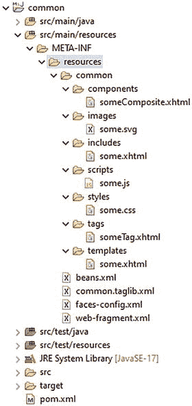


其中，`common.taglib.xml` 的内容如下所示，复合库名称设置为相对于 `src/main/resources/META-INF/resources` 的路径，而标签文件源则设置为相对于 `*.taglib.xml` 文件自身位置的路径。

```
com.example/common
common
common/components

someTag
resources/common/tags/someTag.xhtml

```

而 `web-fragment.xml` 的内容如下所示，它与 `web.xml` 几乎相同，只是根元素不同，使用的是 `<web-fragment>` 而非 `<web-app>`。

```
common

```

一旦这样的 Web 片段项目被构建为 JAR 文件并包含在主 Web 应用项目的 `/WEB-INF/lib` 中，那么该 JAR 中的资源就可以通过库名 “common” 在主 Web 应用项目的 Facelets 文件中使用，如下所示：

资源依赖

在某些情况下，你的自定义组件或渲染器可能依赖于特定的 JavaScript 或样式表资源，而你希望避免最终用户必须通过 `<h:outputScript>` 或 `<h:outputStylesheet>` 手动引入这些资源。在这种情况下，你会发现 `@jakarta.faces.application.ResourceDependency` 注解^(⁹⁸) 非常有用。假设你想在某个特定自定义组件中自动包含 `common:scripts/some.js` 和 `common:styles/some.css`，那么你可以按如下方式操作：

```
@ResourceDependency(library="common", name="some.css", target="head")
@ResourceDependency(library="common", name="some.js", target="head")
public class SomeCustomComponent extends UIComponent {
// ...
}
```

当然，你也可以在必要时包含 Jakarta Faces 自带的 `jakarta.faces:faces.js`，例如，当你的自定义组件恰好依赖于 `faces.ajax.request()` 或标准 Jakarta Faces JavaScript API 提供的其他函数时。`jakarta.faces:faces.js` 可以按如下方式包含，其脚本库名称和资源名称可作为 `ResourceHandler` 的常量使用。

```
@ResourceDependency(
library=ResourceHandler.FACES_SCRIPT_LIBRARY_NAME,
name=ResourceHandler.FACES_SCRIPT_RESOURCE_NAME,
target="head")
public class SomeCustomComponent extends UIComponent {
// ...
}
```

脚注

12. 搜索表达式

正如第 3 章 “Ajax 生命周期” 部分和第 4 章 “Ajax 化组件” 部分所述，`<f:ajax>` 标签的 `execute` 和 `render` 属性接受一组以空格分隔的所谓组件搜索表达式。搜索表达式自 Jakarta Faces 诞生之初就一直存在，因为它被用于 `<h:outputLabel>`、`<h:message>` 和 `<h:messages>` 组件的 `for` 属性中，但直到 Jakarta Faces 2.0 引入 `<f:ajax>` 后，它们才成为 Jakarta Faces 开发者必须掌握的知识。也就是说，标签和消息在几乎所有情况下都已经与目标输入组件位于同一个命名容器父组件中，因此只需在 `for` 属性中指定目标输入组件的 ID 就足够了，但对于 `<f:ajax>` 的 `execute` 和 `render` 属性来说，情况未必如此，因为目标组件可能位于不同的命名容器上下文中，甚至位于物理上不同的 Facelets 文件中。为了克服这些困难，Jakarta Faces 2.0 引入了一些更抽象的搜索表达式：“`@this`”、“`@form`”、“`@all`” 和 “`@none`”。像 “`@form`” 这样的表达式特别容易使用，因为它只是指代当前表单。如果该当前表单是在引用它的页面之上两个父模板中定义的，那么这确实使得引用它变得容易得多。尽管这些关键字让事情变得简单了许多，但它们相当有限。不仅只有四个关键字，而且它们不可扩展，默认的 Jakarta Faces 组件集仅在 `<f:ajax>` 标签内部使用它们。在其他组件中使用它们，甚至在 Jakarta Faces 自己的 `<h:outputLabel>`、`<h:message>` 和 `<h:messages>` 组件中使用，以及以编程方式使用它们，都被忽略了。因此，在 Jakarta Faces 2.3 中，引入了一个 “组件搜索表达式框架”，极大地扩展了这四个关键字。它主要基于 PrimeFaces 中一个经过验证的 API（应用程序编程接口）^(⁹⁹)。

相对本地 ID

这是组件搜索表达式的最简单形式。最常见的用例出现在 `<h:outputLabel>`、`<h:message>` 和 `<h:messages>` 组件的 `for` 属性中。它简单地引用目标 `UIInput` 组件的唯一 ID。

这仅要求目标组件也位于同一个命名容器父组件内。命名容器父组件是实现了 `NamingContainer` 接口^(¹⁰⁰) 的组件。在标准 Jakarta Faces 中，只有 `<h:form>`、`<h:dataTable>`、`<ui:repeat>` 和 `<f:subview>` 是 `NamingContainer` 的实例。所有复合组件也是 `NamingContainer` 的实例，但标签文件不是。

如果你需要从 `<h:outputLabel>` 引用命名容器内的特定 `UIInput` 组件，那么你需要在命名容器组件的 ID 后附加所谓的命名容器分隔符字符，然后是目标 `UIInput` 组件的 ID。默认的命名容器分隔符字符是冒号 “`:`”。当前配置的分隔符字符可以通过 `UINamingContainer#getSeparatorCharacter()`^(¹⁰¹) 以编程方式获取。

```
char separatorCharacter = UINamingContainer
.getSeparatorCharacter(FacesContext.getCurrentInstance);
```

这可以通过 `web.xml` 中的 `jakarta.faces.SEPARATOR_CHAR` 上下文参数进行配置。

```
jakarta.faces.SEPARATOR_CHAR
-

```

警告

**不**建议将其更改为其他字符，例如连字符 “`-`” 甚至下划线 “`_`”^(¹⁰²)。


从长远来看，这种变更既令人困惑又脆弱，因为 ID 属性本身也允许使用这些字符。Jakarta Faces 不会根据当前配置的命名容器分隔符来验证组件 ID，因此它很容易被遗漏，并在搜索表达式中引用此类组件时引发问题。因此，最好依赖默认的“`:`”。

回到在命名容器中从 `<h:outputLabel>` 引用特定 `UIInput` 组件的问题，例如在示例复合组件 `<t:inputLocalTime>` 中（如第 7 章“复合组件”一节所示），小时下拉组件的 ID 为“`hour`”。因此，对于 `<h:outputLabel>`，当使用默认的命名容器分隔符时，复合组件内小时下拉组件的相对本地 ID 是“`time:hour`”。

请注意，这对于 `<h:message>` 并非必需，因为 Faces 消息在底层已经使用复合组件本身的客户端 ID 添加到 Faces 上下文中。

使用相对本地 ID 在 `<h:dataTable>` 的 `<h:column>` 上下文中也同样有效。它会在当前迭代行的上下文中进行解析，即使目标组件位于另一列中。以下示例演示了这一点：

```
...

Country

City

...

```

在底层，相对本地 ID 是使用 `UIComponent#findComponent()` API 中描述的算法进行解析的。^((103)) 这意味着你也可以通过编程方式解析它们。你只需确保在正确的基础组件上调用 `findComponent()` 方法，而不是在例如 `UIViewRoot` 上调用。

**绝对层级 ID**

如果目标组件与当前组件不在同一个命名容器父级中，那么你需要使用绝对层级 ID，而不是本地相对 ID。关键区别在于，绝对层级 ID 以命名容器分隔符开头。然后它会从 `UIViewRoot` 开始搜索目标组件。这种结构通常用于 `<f:ajax>` 的 `render` 属性中，当它需要引用一个不在同一表单内的组件时。

```
...

...

```

一个不太常见但需要绝对层级 ID 的用例是，当你需要引用一个嵌套在另一个命名容器中的组件时。例如，当你想在复合组件内部的 `<cc:clientBehavior>` 事件期间更新与该复合组件关联的 `<h:message>` 时。

你可以认为这是 Jakarta Faces 规范中的一个错误或疏忽。这确实如此，应该在 Jakarta Faces 的下一个版本中加以解决。另一个不太常见的用例是，当你需要更新迭代组件（如 `<h:dataTable>` 和 `<ui:repeat>`）的特定迭代轮次时。

```

...

...

```

请注意，与普通的 Java 集合和数组一样，迭代索引是从零开始的。另请注意，你基本上需要将单元格的内容包装在另一个组件中，以便正确引用单元格的内容，并且你需要显式指定每一列才能更新整行，如前所示。更新整列也是可能的，但不太方便，因为你基本上需要为每一行指定搜索表达式。幸运的是，`render` 属性可以接受 EL（表达式语言）表达式，并且 EL 流 API 可用于根据表中的项目数量，以 `:form:table:[i]:column` 格式连接一组字符串。

```
' :form:list:' += bean.items.indexOf(i) += ':column2')
.reduce((l, r) -> (l += r)).get()}">

```

诚然，这不是最优雅的方法。你最好委托给应用程序作用域 bean 中的自定义函数。它可能看起来像下面这样：

其中 `#{ajax}` 应用程序作用域 bean 看起来像下面这样：

```
@Named @ApplicationScoped
public class Ajax {
public String columnIds(List list, String idTemplate) {
return IntStream.range(0, list.size()).boxed()
.map(i -> idTemplate.replace("::", ":" + i + ":"))
.collect(Collectors.joining(" "));
}
}
```

这已经好一些了，但仍然有些模板化。如有必要，你也可以从后台 bean 以编程方式添加 Ajax 渲染 ID。你可以使用 `PartialViewContext#getRenderIds()`^((104)) 来实现。也就是说，返回的集合是可变的，并且仅在渲染响应阶段（第六阶段）被查询。你还需要在此处指定一个绝对层级 ID，但有一个重要的区别：它不能以命名容器分隔符开头。换句话说，“`:form:table:0:column2`” 是行不通的；你需要指定“`form:table:0:column2`”。它总是相对于 `UIViewRoot` 进行解析。

```
FacesContext context = FacesContext.getCurrentInstance();
PartialViewContext ajaxContext = context.getPartialViewContext();
ajaxContext.getRenderIds().add("form:table:0:column2");
```

作为提示，如果你难以确定绝对层级 ID 和/或记住哪些组件是命名容器，那么你始终可以查看生成的 HTML 输出。在你最喜欢的网络浏览器中打开 Jakarta Faces 页面，执行*查看页面源代码*，找到感兴趣的 Jakarta Faces 组件的 HTML 元素表示，获取其 ID 属性的值，最后在其前面加上命名容器分隔符。另外，如果你遇到以 `j_id` 为前缀的自动生成 ID，那么你绝对需要为相关的 Jakarta Faces 组件提供一个固定的 ID；否则，当组件在组件树中的位置因例如在感兴趣组件位置之前有条件地包含的组件而可能发生变化时，其值将会出错。（另请参见第 4 章中的“基于文本的输入组件”一节。）

与相对本地 ID 类似，绝对层级 ID 可以使用 `UIComponent#findComponent()` API 中描述的算法以编程方式解析。^((105)) 以下示例演示了如何获取代表 `<h:form id="form"><h:dataTable id="table">` 的 `UIData` 组件。

```
UIViewRoot root = FacesContext.getCurrentInstance().getViewRoot();
UIData table = (UIData) root.findComponent("form:table");
```

**标准搜索关键字**

Jakarta Faces 提供了一组更抽象的搜索表达式，称为“搜索关键字”。它们都以“`@`”字符开头。它们可用于替换搜索表达式中的固定组件 ID。表 12-1 提供了它们的概述。

**表 12-1 Jakarta Faces 提供的标准搜索关键字**

| 关键字 | 解析为 | 自版本起 |
| :--- | :--- | :--- |
| @this | `UIComponent#getCurrentComponent()` | 2.0 |
| @form | `UIComponent#getNamingContainer()` 直到遇到 `UIForm` | 2.0 |
| @all | 所有内容 | 2.0 |
| @none | 无 | 2.0 |
| @parent | `UIComponent#getParent()` | 2.3 |
| @child(index) | 给定索引处的 `UIComponent#getChildren()` | 2.3 |
| @next | `UIComponent#getParent()` 然后下一个索引处的 `UIComponent#getChildren()` | 2.3 |
| @previous | `UIComponent#getParent()` 然后上一个索引处的 `UIComponent#getChildren()` | 2.3 |
| @namingcontainer | `UIComponent#getNamingContainer()` | 2.3 |
| @composite | `UIComponent#getCompositeComponentParent()` | 2.3 |
| @id(id) | 使用给定 ID 的 `UIComponent#findComponent()` | 2.3 |
| @root | `FacesContext#getViewRoot()` | 2.3 |

在标准的 Jakarta Faces 组件集中，所有搜索关键字（包括自定义关键字）都可以在以下组件属性中使用：


*   `<f:ajax execute>`: 指定在 Ajax 回发请求的“应用请求值”、“验证处理”、“更新模型值”和“调用应用程序”阶段（第二、三、四、五阶段）必须处理的组件。默认为 `@this`

*   `<f:ajax render>`: 指定在 Ajax 回发请求的“渲染响应”阶段（第六阶段）必须处理的组件。默认为 `@none`

*   `<h:outputLabel for>`: 指定生成的 HTML `<label>` 元素的目标组件。默认为 `@none`

*   `<h:message for>`: 指定必须为其渲染第一条 Faces 消息的目标组件。默认为 `@none`

*   `<h:messages for>`: 指定必须为其渲染所有 Faces 消息的目标组件。默认为 `@none`

请注意，在 `<h:outputLabel>`、`<h:message>` 和 `<h:messages>` 的 `for` 属性中使用搜索关键字仅在 Jakarta Faces 2.3 之后才成为可能。在旧版本中，仅支持相对 ID 和绝对 ID。

最常用的搜索关键字无疑是 `@form`。当你在一个旨在处理整个表单的 `UICommand` 组件中使用 `<f:ajax>` 时，基本上别无选择。

```
...

```

Jakarta Faces 2.3 的另一项新功能是，搜索关键字可以与常规组件 ID 链接。以下示例是对前面“绝对层级 ID”一节中给出的示例的扩展：

以下示例在删除一行时更新整个表格：

```

...

```

特别要注意，它引用的是最近的实现了 `NamingContainer` 接口的组件，在此上下文中，该组件是 `<h:dataTable>`，而不是 `<h:form>`。

关于程序化解析，包含关键字的搜索表达式无法使用 `UIComponent#findComponent()` 进行程序化解析。为此，你需要改用 `SearchExpressionHandler#resolveComponent()` 或 `resolveComponents()`^(¹⁰⁶)。`SearchExpressionHandler` 又可以通过 `Application#getSearchExpressionHandler()` 获取。你还需要预先创建 `SearchExpressionContext`^(¹⁰⁷)，它包装了开始搜索的起始组件。

```
FacesContext context = FacesContext.getCurrentInstance();
UIComponent base = context.getViewRoot(); // 可以是任何组件。
String expression = "@namingcontainer";
SearchExpressionContext searchContext = SearchExpressionContext
.createSearchExpressionContext(context, base);
SearchExpressionHandler searchHandler = context.getApplication()
.getSearchExpressionHandler();
handler.resolveComponent(searchContext, expression, (ctx, found) -> {
System.out.println(found);
});
```

坦白说，这相当冗长，但它是 Jakarta Faces API 自带的。幸运的是，存在像 OmniFaces 这样的实用库。

自定义搜索关键字

Jakarta Faces 2.3 引入的组件搜索表达式框架也附带了一个 API，允许我们创建自定义搜索关键字。想象一下，你有一个包含多个 `<h:message>` 组件的表单，并且希望在提交表单时重新渲染它们全部。那么你可能会倾向于在 `<f:ajax>` 的 `render` 属性中也使用 `@form`。

但这效率并不高。实际上，它还会不必要地重新渲染同一表单中所有在 Ajax 回发请求期间根本不会改变的标签、输入组件以及任何其他静态内容。这是一种资源浪费。理想情况下，我们应该有一个像 `@messages` 这样的搜索关键字，它基本上引用同一表单中的所有消息组件。

请注意，每个 `<h:message>` 组件都设置了显式 ID，因为如果没有显式 ID，它们默认不会向 HTML 输出渲染任何内容，那么 Jakarta Faces Ajax API JavaScript 将无法找到它们以根据 Ajax 响应更新其内容。

为了让 Jakarta Faces 识别新的搜索关键字 `@messages`，首先按如下方式扩展 `jakarta.faces.component.search.SearchKeywordResolver`^(¹⁰⁸)：

```
public class MessagesKeywordResolver extends SearchKeywordResolver {
@Override
public boolean isResolverForKeyword
(SearchExpressionContext context, String keyword)
{
return "messages".equals(keyword);
}
@Override
public void resolve
(SearchKeywordContext context, UIComponent base, String keyword)
{
UIComponent form = base.getNamingContainer();
while (!(form instanceof UIForm) && form != null) {
form = form.getNamingContainer();
}
if (form != null) {
Set messageClientIds = new HashSet();
VisitContext visitContext = VisitContext.createVisitContext
(context.getSearchExpressionContext().getFacesContext());
form.visitTree(visitContext, (visit, child) -> {
if (child instanceof UIMessage) {
messageClientIds.add(child.getClientId());
}
return VisitResult.ACCEPT;
});
if (!messageClientIds.isEmpty()) {
context.invokeContextCallback(new UIMessage() {
@Override
public String getClientId(FacesContext context) {
return String.join(" ", messageClientIds);
}
});
}
}
context.setKeywordResolved(true);
}
}
```

应该指出，这种方法已经有点取巧了。也就是说，`SearchKeywordResolver` 的意图是将一个关键字解析为恰好一个组件，该组件的客户端 ID 将用于替换该关键字。然后，这个组件将被传递给 `SearchKeywordContext#invokeContextCallback()`。在上述方法中，我们改为收集父级 `UIForm` 中找到的所有 `UIMessage` 组件的客户端 ID，然后向 `invokeContextCallback()` 提供一个假的 `UIMessage` 组件，该组件又会调用这个假 `UIMessage` 组件的 `getClientId()` 方法，该方法实际上返回所需的客户端 ID 集合。
还应注意，这里使用的是 `UIComponent#visitTree()`^(¹⁰⁹)，而不是递归遍历 `UIComponent#getChildren()` 来收集任何 `UIMessage` 组件的客户端 ID。也就是说，当简单地遍历子组件时，你迟早会遇到一个迭代器组件，例如 `<h:dataTable>` 或 `<ui:repeat>`，如果它恰好只嵌套了一个 `UIMessage` 组件，那么你最终只会得到一个客户端 ID，即没有迭代索引的那个。`UIComponent#visitTree()` 不会这样做；路径中的任何迭代器组件实际上都会遍历其模型值，并有效地返回多个 `UIMessage` 组件，每个组件都带有包含迭代索引的正确客户端 ID。
最后，必须使用 `true` 调用 `SearchKeywordContext#setKeywordResolved()`，以告知搜索上下文该关键字已成功解析，即使它实际上解析为空。如果你忘记这样做，实际上不会造成任何损害，但如果你不这样标记搜索关键字已解析，那么搜索上下文将继续咨询所有其他搜索关键字解析器，这最终可能会降低效率。

最后，为了让新的 `MessagesKeywordResolver` 运行，按如下方式在 `faces-config.xml` 中注册它：

```

com.example.project.MessagesKeywordResolver

```

或者，在 `@WebListener` 中以编程方式注册，如下所示：

```
@WebListener
public class ApplicationConfig implements ServletContextListener {
@Override
public void contextInitialized(ServletContextEvent event) {
FacesContext.getCurrentInstance().getApplication()
.addSearchKeywordResolver(new MessagesKeywordResolver());
}
}
```

请注意，此时 `FacesContext` 必须可用，因此 `ServletContainerInitializer` 不一定能工作；并且 `FacesServlet` 可能尚未处理过请求，因此在某个受管 bean 中注册也不一定能工作。

脚注

13. 安全性


Web 应用程序的安全性是一个广泛的领域，涵盖了许多主题，例如保护对资源的访问、防范各种类型的注入攻击，以及防止用户被诱骗代表攻击者执行恶意操作。

Jakarta Faces 通过多种方式支持这些主题，要么提供原生解决方案，要么与 Jakarta EE 平台的设施集成。对于资源访问（包括身份验证（调用者证明其身份）和授权（系统确定调用者有权访问哪些资源）），Jakarta Faces（JavaServer Faces）与 Jakarta EE 安全机制集成，而该机制又由 Servlet 规范和 Jakarta EE 安全规范等定义。

Jakarta EE 安全（JSR 375）在 Jakarta EE 8 中同时被 Web 和完整配置文件支持。此外，参考实现 Soteria 可在 Jakarta EE 7 服务器上运行，并且由于它构建在 JASPIC（Jakarta EE 身份验证 SPI）（JSR 196）之上，因此它也可以在支持 JASPIC 的 Servlet 容器（例如 8.5 版本以上的 Tomcat 和 7.0 版本以上的 Jetty）上运行。

**Jakarta EE 安全概述与历史**

在 Jakarta EE 中，安全性并非在单个规范中定义，而是实际上分布在多个规范中，这些规范以各种方式相互集成。虽然这允许安全性的不同方面以各自的速度演进，并且实际上甚至允许某些方面被非规范实现所取代，但这确实模糊了哪个规范负责什么的问题。

在本介绍性部分中，我们将首先提供一些组件的概览以及它们如何组合在一起。我们将重点关注安全的 Web 方面。安全性也存在于 Jakarta 企业 Beans（Enterprise JavaBeans）和 JCA（Java 连接器架构）连接器等中，但这些超出了本书的范围。

从历史上看，Jakarta EE 的安全性主要基于 Jakarta Servlet 规范引入的安全模型，即核心元素是“身份验证机制”（`FORM`、`BASIC` 等）、`web.xml` 中的一组安全约束（其中特定模式（URL 模式）与一组角色（包括空集合）相结合），以及一些以编程方式测试调用者详细信息的方法，例如 `HttpServletRequest.isUserInRole`。

虽然有效，但在早期许多细节被遗漏了。Servlet 规范确实要求实现（Servlet 容器）在身份验证机制方面是可扩展的，但没有具体说明应该如何实现。同样，Servlet 规范隐含地要求一个“身份存储”（文件、数据库、LDAP 等），用于保存调用者的详细信息，如凭据、名称和角色，但将所有关于如何配置这些的细节留给了 Servlet 容器。

Servlet 规范没有定义任何以编程方式访问 `web.xml` 中定义的安全约束的方法，也没有定义以编程方式影响其执行的方法（例如，使某些约束基于时间）。此外，Servlet 规范的早期版本没有以最严格的方式指定约束解析，这允许各种 Servlet 容器在解释上存在一些细微差异。

第一个解决这些问题的附加规范是 JACC（JSR 115），简单来说，它处理授权问题。JACC 规定了 `web.xml` 安全约束应如何在代码中表示，即作为一组 *Permission* 实例。JACC 还规定了如何通过代码访问（查询）这些实例，并最终允许自定义授权模块替换或增强容器为确定其访问决策而执行的逻辑。关于 JACC，可能有点难以理解的是，它本身并不是一个可以独立实现然后添加到 Servlet 容器中的东西（就像我们可以对 Jakarta Faces 所做的那样），而是标准化并更简洁地规定了所有 Servlet 容器内部已经在做的事情。

第二个解决上述问题的附加规范是 JASPIC（JSR 196），它处理身份验证问题。JASPIC 规定了 Servlet 容器应在何时调用身份验证机制，并为这些身份验证机制定义了一个明确的接口类型，因此自定义身份验证机制可以使用此接口而不是 Servlet 容器的专有接口，从而具有可移植性。JASPIC 对身份存储有一些规定，但太少以至于在实践中无法真正使用。与 JACC 一样，JASPIC 也不是可以独立实现的东西，但它标准化了所有 Servlet 容器已经在做的事情。

JACC 和 JASPIC 都定义了低级别的 SPI（服务提供者接口），这些接口主要旨在由供应商实现和使用，以提供扩展产品。它们相当简陋且相当抽象。因此，它们不是面向应用程序开发人员的（丰富的）API（应用程序编程接口）。这就是 Jakarta EE 安全 API（JSR 375）的用武之地。Jakarta EE 安全提供了 JASPIC 身份验证模块的更高级别、更易于注册（只需实现接口）且更易于使用（基于 CDI）的版本。Jakarta EE 安全 API 还完整定义了身份存储构件，但也许最重要的是，它提供了所有这些构件的多个具体实现，其中包括一个针对 Jakarta Faces 使用而优化的基于 FORM 的身份验证机制，以及多个身份存储，例如 JDBC（Java 数据库连接）存储和 LDAP（轻量级目录访问协议）存储。

Jakarta EE 安全 API 的 RI（参考实现）称为 Soteria。此实现当然由 Jakarta EE RI GlassFish 提供。Soteria 与 Mojarra 和 MyFaces 一样，被设计为基本上可以在每个 Servlet 容器上独立运行，前提是该容器符合 JASPIC 规范（正如本章引言中提到的，Tomcat 和 Jetty 都符合）。它的依赖项（在撰写本文时，针对 Soteria 2.0）是 CDI 3.0 和表达式语言 4.0。这两个依赖项由所有 Jakarta EE 实现提供。Servlet 容器通常提供 EL（表达式语言）支持，而 CDI 可以单独添加，例如使用 RI Weld。对于少数 *可选* 功能，Soteria 利用了符合 JACC 规范的 Servlet 容器。


保护对资源的访问
在 Jakarta Faces 中，需要保护的主要资源是通过 URL 模式访问的视图。因此，我们需要为这些 URL 模式定义安全约束。这些约束主要在 `web.xml` 中定义。事实上，从 Jakarta EE 10 开始，`web.xml` 几乎是唯一可以为 Jakarta Faces 视图定义安全约束的有效位置。

Jakarta EE 有三种安全约束：

*   排除
*   未检查
*   按角色

排除
“**排除**”，也称为“拒绝所有”，意味着任何外部调用者都将被拒绝访问此约束所涵盖的资源。有人可能会问这种约束的目的是什么。如果资源永远无法被访问，那么这些资源一开始为什么存在？答案有两点。其一，单个应用程序可能为不同目的而配置。排除安全约束是一种快速禁用某些不适用于应用程序特定配置的资源的简单方法。一个更重要的用例是能够区分资源的外部使用和内部使用。这里的关键见解是，安全约束仅应用于对该资源的外部请求，即调用者请求 `https://example.com/resources/template.xhtml`，但**不**应用于内部请求，例如包含、转发以及从类路径或文件系统加载资源的任何方法。这对于 Jakarta Faces 尤其重要，因为复合组件存在一个不太理想的设计选择。复合组件是通过 Facelet 而非 Java 类实现的组件。按照惯例，它们必须放置在位于 Web 根目录下的名为 `/resources` 的目录内的子目录中，例如 `/resources/bar/foo.xhtml`。这将使复合组件“`foo`”在命名空间 `jakarta.faces.composite/bar` 中可用。

组件当然不是视图，调用者不应能够直接请求它们。不幸的是，`/resources` 对于 Jakarta EE 来说并不是一个特殊的目录。Jakarta Faces 按照惯例赋予了它特殊含义，但对于 Servlet 容器来说，它和其他目录一样。这特别意味着它没有应用任何保护，任何调用者都可以直接从中请求资源。换句话说，这个目录是“未检查”的，也称为“全局可读”。即使使用 `*.xhtml` 映射，这不仅允许用户猜测我们有哪些组件，还允许用户尝试执行这些组件。显然，这不是我们想要的。对此有两种解决方案：

*   配置另一个目录作为 Jakarta Faces 资源目录。
*   在 `web.xml` 中添加上述安全约束。

通过 `jakarta.faces.WEBAPP_RESOURCES_DIRECTORY` 上下文参数，可以将另一个目录配置为 Jakarta Faces 资源目录，而不是 `/resources`。例如：

```
jakarta.faces.WEBAPP_RESOURCES_DIRECTORY
WEB-INF/resources

```

请注意，该路径是相对于 Web 根目录的，并且不能以“`/`”开头。

虽然这对我们自己的应用程序来说是一个好的默认设置，但它仍然不能完全保护我们。也就是说，第三方 JAR 仍然可以通过 `/resources` 提供其资源，并且不受该上下文参数的影响。因此，需要前面提到的“排除”约束。它看起来如下：

```

/resources 文件夹
/resources/*

```

可以看出，定义*排除*约束归结为定义我们希望约束的 URL 模式，而不定义任何特定的约束。

未检查
“**未检查**”，也称为“允许所有”、“公开”和“全局可读”，意味着所有调用者，无论是否经过身份验证，都可以访问此“约束”所涵盖的资源。在内部，可能存在一个显式约束，但在 `web.xml` 中，这个“约束”只是通过不为某个 URL 模式定义任何约束来定义的。换句话说，没有被任何其他模式显式覆盖的每个 URL 都是“未检查”的。

按角色
“**按角色**”意味着一个所谓的角色与一个 URL 模式相关联，并且经过身份验证的调用者必须拥有该角色才能访问该资源。角色本身通常被视为具有严格语义的概念，但它本质上不过是一个不透明的字符串，需要与经过身份验证的调用者关联的字符串集合以及 URL 模式关联的字符串集合相匹配。该字符串的内容完全由应用程序决定，这意味着它可以是“调用者类型”，例如“`admin`”、“`user`”等，也可以是细粒度的内容，例如“`may_add_item`”，甚至是像“`AYUDE-OPWR-BM1OP`”这样的令牌。

以下是一个示例：

```

用户页面
/user/*

VIEW_USER_PAGES

管理员页面
/admin/*

VIEW_ADMIN_PAGES

VIEW_USER_PAGES

VIEW_ADMIN_PAGES

```

在前面的片段中，我们定义了两个安全约束——一个用于 `/user/*` 模式，调用者需要拥有角色“`VIEW_USER_PAGES`”；另一个用于 `/admin/*` 模式，调用者需要拥有角色“`VIEW_ADMIN_PAGES`”。有了上述约束，访问例如 `/user/account.xhtml` 的调用者必须经过身份验证并且拥有提到的角色。

一个 auth-constraint 可以包含多个角色，这些角色之间应用“或”语义。这意味着经过身份验证的调用者只需要拥有该约束中的其中一个角色即可被授予访问权限。约束还可以限制为特定的 HTTP 方法（例如 GET 或 POST）。但这有一个注意事项，因为默认情况下，所有未指定的方法都将是未检查的（公开的）。这可以通过使用顶级的 `<deny-uncovered-http-methods/>` 标签来应对。以下是一个示例：

```

用户页面
/user/*
GET
POST

VIEW_USER_PAGES

```


设置认证机制
在定义安全约束之后，我们需要设置调用者如何进行身份验证。负责与调用者交互（即以特定方式向调用者索取凭证）的构件被称为“认证机制”。Jakarta EE 提供了多种现成的认证机制。Servlet 规范提供了四种，即 `FORM`、`BASIC`、`DIGEST` 和 `CERT`，而 Jakarta EE Security 也提供了 `FORM` 和 `BASIC`（区别在于它们对应的是 CDI bean），同时还提供了一种名为“自定义 `FORM`”的 `FORM` 变体。
`FORM` 和自定义 `FORM` 都适用于交互式 Web 应用程序，例如我们主要使用 Jakarta Faces 构建的那些应用。与 `BASIC` 不同，`FORM` 认证机制会回调应用程序，让其渲染向调用者索取凭证的表单，这也是这些机制名称的由来。
两者之间的主要区别在于，机制在渲染表单后，要求应用程序如何继续所谓的认证对话。在 `FORM` 中，这是通过让调用者将填写好的表单提交到虚拟 URL `j_security_check` 来实现的；而在自定义 `FORM` 中，这是通过编程方式调用注入的 `SecurityContext` 来完成的。不过，这个微小的差异对 Jakarta Faces 来说却至关重要。在 Jakarta Faces 中，表单视图默认会提交到其请求来源的同一 URL，因此回发到单个机制强制要求的 URL 完全不自然。除此之外，在 Jakarta Faces 中，我们经常需要在回发后运行服务器端代码；想想转换器、验证器以及发出 faces 消息的能力。如果必须回发到虚拟的非 faces 的 `j_security_check` URL，我们实际上无法做到这些，但当我们能够从后台 bean 的动作方法中以编程方式继续认证对话时，这就相当可行了。
我们将首先向您展示如何配置 Web 应用程序以使用自定义 `FORM` 认证机制。稍后，我们将解释如何实际使用 Jakarta Faces 来满足该机制对应用程序施加的要求。

Jakarta EE Security 提供的所有认证机制都通过其自身的 `AuthenticationMechanismDefinition` 注解进行安装和配置。该注解告诉容器要安装哪种类型的认证机制以及使用何种配置。该注解可以放置在类路径上的几乎所有类上。从逻辑上讲，它与 `@FacesConfig` 注解配合得很好。以下是一个示例：

```
@CustomFormAuthenticationMechanismDefinition(
loginToContinue = @LoginToContinue(
loginPage = "/login.xhtml",
errorPage = ""
)
)
@FacesConfig @ApplicationScoped
public class ApplicationConfig {
// ...
}
```

这里一个可能有点不幸的要求是，必须指定 `errorPage` 属性并将其设置为空字符串。这是必要的，因为 `@LoginToContinue` 元素对于实际的错误页面有一个默认值。在 Jakarta Faces 中，我们很少使用显式的错误页面来显示错误，而是通过 faces 消息在原始页面上重新显示错误信息。
请注意，当前版本的 Jakarta EE Security 只允许同时激活一个认证机制。从技术上讲，当容器遇到 `@CustomFormAuthenticationMechanismDefinition` 注解时，它会在系统中添加一个类型为 `HttpAuthenticationMechanism` 的已启用 CDI bean。了解这一点很重要，因为它是一个常规的 CDI bean，意味着我们可以注入它、装饰它、拦截它，并且基本上可以对它执行我们通常对 CDI bean 能做的所有操作。
`loginToContinue` 属性用于配置当调用者试图访问受保护视图时容器转发到的视图。这被称为“容器发起的认证”；容器启动认证对话，而不是应用程序。

请注意，默认是*转发*到登录页面，这意味着如果调用者试图访问 `https://example.com/foo.xhtml`，并且 `/foo.xhtml` 是受保护的，调用者仍然会在地址栏中看到 `/foo.xhtml`，而不是 `/login.xhtml`。然而，回发目标是 `/login.xhtml`，因此在输入凭证后，调用者会在地址栏中看到这个地址。或者，我们可以配置 `loginToContinue` 属性使用重定向。

```
@CustomFormAuthenticationMechanismDefinition(
loginToContinue = @LoginToContinue(
loginPage = "/login.xhtml",
useForwardToLogin = false,
errorPage = ""
)
)
@FacesConfig @ApplicationScoped
public class ApplicationConfig {
// ...
}
```

设置身份存储
在声明了安全约束并设置了想要用于身份验证的机制之后，还剩下最后一块拼图：设置包含调用者数据（如凭证、姓名和角色）的构件。在 Jakarta EE Security 中，这个构件被称为身份存储。
Jakarta EE 提供了两种现成的身份存储：一种用于连接数据库，另一种用于连接 LDAP（轻量级目录访问协议）。Jakarta EE Security 参考实现（Soteria）还附带了一个嵌入式身份存储。大多数应用服务器会提供它们自己的额外身份存储，这些通常是在应用程序外部配置的（例如，通过管理控制台、CLI 或存储在服务器内部的 XML 配置文件）。
设置和配置 Jakarta EE Security 提供的身份存储以及参考实现提供的身份存储，其方式与认证机制类似：通过 `IdentityStoreAnnotation`。就像认证机制版本一样，这会导致容器在系统中添加一个已启用的 CDI bean，这次是实现 `IdentityStore` 接口的 bean。

以下示例与我们之前对认证机制的定义一起展示：

```
@CustomFormAuthenticationMechanismDefinition(
loginToContinue = @LoginToContinue(
loginPage = "/login.xhtml",
useForwardToLogin = false,
errorPage = ""
)
)
@EmbeddedIdentityStoreDefinition({
@Credentials(
callerName = "admin@example.com",
password = "secret1",
groups = { "VIEW_USER_PAGES", "VIEW_ADMIN_PAGES" }
),
@Credentials(
callerName = "user@example.com",
password = "secret2",
groups = { "VIEW_USER_PAGES" })
)
})
@FacesConfig @ApplicationScoped
public class ApplicationConfig {
// ...
}
```


上述操作会创建一个嵌入式（内存中）的身份存储，其中包含两个调用者（用户）：第一个用户属于“`VIEW_USER_PAGES`”和“`VIEW_ADMIN_PAGES`”组，第二个用户仅属于“`VIEW_USER_PAGES`”组。身份验证机制将使用此身份存储来验证凭证（调用者名称和密码）是否匹配，如果匹配，则从身份存储中获取正确的组。

细心的读者可能会注意到术语发生了变化。之前我们讨论的是“角色”，而突然之间变成了“组”。这是错误吗？其实不然。组和角色之间存在细微差别。对于容器而言，两者都只是不透明的字符串，但组可以*选择性地*映射到角色。我们在此不进一步详述此过程，但只需说明，默认情况下，Jakarta EE 强制要求所谓的 1:1 组到角色映射，这基本上意味着组和角色是相同的。

为了更好地理解身份存储，我们在此再举两个例子。第一个例子，我们将介绍 Jakarta EE Security API 提供的身份存储之一——数据库身份存储。此存储通过 `@DatabaseIdentityStoreDefinition` 注解激活和配置*。*需要配置的三个最重要的属性是：数据源（代表 SQL 数据库）、根据调用者名称获取（哈希后的！）密码的 SQL 查询，以及根据调用者名称识别调用者所属组的 SQL 查询。示例如下：

```
@CustomFormAuthenticationMechanismDefinition(
loginToContinue = @LoginToContinue(
loginPage = "/login.xhtml",
errorPage = ""
)
)
@DatabaseIdentityStoreDefinition(
dataSourceLookup = "java:app/MyDataSource",
callerQuery = "SELECT password FROM caller WHERE name = ?",
groupsQuery = "SELECT name FROM groups WHERE caller_name = ?"
)
@DataSourceDefinition(
name = "java:app/MyDataSource",
className = "org.h2.jdbcx.JdbcDataSource",
url="jdbc:h2:~/test;MODE=LEGACY;DB_CLOSE_ON_EXIT=FALSE"
)
@FacesConfig @ApplicationScoped
public class ApplicationConfig {
// ...
}
```

在此示例中，使用 `org.h2.jdbcx.JdbcDataSource` 驱动程序为 H2 数据库定义了数据源。当然，对于任何其他拥有 JDBC 驱动程序的数据库，都可以类似地完成此操作。或者，也可以在应用程序外部定义数据源。我们使用的调用者查询是“`select password from caller where name = ?`”，这意味着我们假设一个表至少包含两列——一列保存调用者名称，另一列保存哈希后的密码。例如，可以通过以下 SQL 语句创建这样的表：

```
CREATE TABLE caller(
name VARCHAR(32) PRIMARY KEY,
password VARCHAR(255)
)
```

我们用于组的查询是“`select name from groups where caller_name = ?`”，这假设一个表至少包含两列——调用者名称和组名称，调用者所属的每个组对应一行。例如，可以通过以下 SQL 语句创建这样的表：

```
CREATE TABLE caller_groups(
caller_name VARCHAR(32),
name VARCHAR(32)
)
```

在填充调用者表时，必须注意密码列默认使用哈希算法，即 `PBKDF2WithHmacSHA256`。可以通过设置迭代次数、密钥大小和盐值大小来（应该）自定义此算法。
除了使用 Jakarta EE Security API 提供的身份存储，我们还可以选择提供自己的自定义身份存储。一个常见的用例是使用应用程序自身的服务来加载特定于应用程序的用户数据。

以下展示了此类身份存储的示例：

```
@ApplicationScoped
public class UserServiceIdentityStore implements IdentityStore {
@Inject
private UserService userService;
@Override
public CredentialValidationResult validate(Credential credential) {
UsernamePasswordCredential login =
(UsernamePasswordCredential) credential;
String email = login.getCaller();
String password = login.getPasswordAsString();
Optional optionalUser =
userService.findByEmailAndPassword(email, password);
if (optionalUser.isPresent()) {
User user = optionalUser.get();
return new CredentialValidationResult(
user.getEmail(),
user.getRolesAsStrings()
);
}
else {
return CredentialValidationResult.INVALID_RESULT;
}
}
}
```

无需特定注册；只需将前面给出的类存在于应用程序中（在其类路径上）。有了这样的自定义身份存储，`ApplicationConfig` 类因此就不需要任何身份存储的配置了。

```
@CustomFormAuthenticationMechanismDefinition(
loginToContinue = @LoginToContinue(
loginPage = "/login.xhtml",
errorPage = ""
)
)
@FacesConfig @ApplicationScoped
public class ApplicationConfig {
// ...
}
```

前面给出的 `UserServiceIdentityStore` 将大部分工作委托给 `UserService`，后者负责处理应用程序中的 `User` 实体。全面讨论此类服务超出了本书的范围，但我们可以想象它可以使用，例如，Jakarta Persistence 来持久化和加载 `User` 实体。我们的自定义身份存储使用该服务，尝试根据通过凭证传入的用户名和密码查找 `User`。如果返回了 `User` 实例，则表示该名称对应一个现有用户，并且密码正确。在这种情况下，身份存储会返回 `CredentialValidationResult`，它执行两项操作：指示身份验证成功，并向容器提供最终将用于为当前请求设置已验证身份的数据。如果服务找不到该用户，则说明用户名或密码错误。在这种情况下，存储返回 `INVALID_RESULT` 以指示身份验证未成功。

提供我们自定义的 Jakarta Faces 代码
在前面的章节中，我们首先定义了安全约束（哪些视图受到保护），然后设置了身份验证机制（调用者如何与我们的应用程序交互以进行身份验证），最后设置了身份存储（调用者数据所在的位置）。
现在是时候将我们自己的自定义代码插入到身份验证过程中了。这主要通过提供身份验证机制在需要收集调用者凭证（本例中为电子邮件和密码）时重定向到的视图来实现。

登录页面可以保持相对简单——一个标准表单页面，包含两个绑定到我们后台 bean 的输入字段，以及一个用于提交的按钮。

```

登录

登录

```

前面的页面是一个完全正常的 Jakarta Faces 视图。这特别意味着，与 `FORM` 身份验证中经典的 HTML `<form method="post" action="j_security_check">` 不同，身份验证机制不会以任何方式监视回发 URL，因此对收集凭证的输入元素没有任何限制。
相反，Jakarta Faces 后台 bean 必须收集这些凭证，然后以编程方式传递它们，并通知身份验证机制继续对话。在传递凭证之前，Jakarta Faces 可以自由地进行自己的验证，并与调用者进行自己的对话，而无需身份验证机制参与其中。请注意，命令按钮明确不使用 Ajax 提交。您也可以使用 Ajax，但那样普通的 Web 浏览器就不会提示最终用户记住登录凭据了。


以下展示了处理登录调用的支持 bean 的完整示例。我们将在下文逐一讨论各个部分。

```
@Named @RequestScoped
public class Login {
@NotNull
@Email
private String email;
@NotNull
@Size(min = 8, message = "Password must be at least 8 characters")
private String password;
@Inject
private SecurityContext securityContext;
@Inject
private ExternalContext externalContext;
@Inject
private FacesContext facesContext;
public void submit() {
switch (continueAuthentication()) {
case SEND_CONTINUE:
facesContext.responseComplete();
break;
case SEND_FAILURE:
facesContext.addMessage(null, new FacesMessage(
FacesMessage.SEVERITY_ERROR, "Login failed", null));
break;
case SUCCESS:
facesContext.addMessage(null, new FacesMessage(
FacesMessage.SEVERITY_INFO, "Login succeed", null));
break;
case NOT_DONE:
// 此处不会发生
}
}
private AuthenticationStatus continueAuthentication() {
return securityContext.authenticate(
(HttpServletRequest) externalContext.getRequest(),
(HttpServletResponse) externalContext.getResponse(),
AuthenticationParameters.withParams().credential(
new UsernamePasswordCredential(email, password))
);
}
public String getEmail() {
return email;
}
public void setEmail(String email) {
this.email = email;
}
public String getPassword() {
return password;
}
public void setPassword(String password) {
this.password = password;
}
}
```

我们以两个与所收集凭证对应的实例变量开始支持 bean。

```
@NotNull
@Email
private String email;
@NotNull
@Size(min = 8, message = "Password must be at least 8 characters")
private String password;
```

这清楚地展示了相对于 `FORM` 认证机制的优势，即我们可以使用 Jakarta Bean Validation 轻松预验证用户的输入。由于 Jakarta Faces 与 Jakarta Bean Validation 内置集成，如果输入未通过验证，将提供标准 faces 消息以供渲染。

接下来，我们定义了需要注入的上下文对象。这些对象是：

```
@Inject
private SecurityContext securityContext;
@Inject
private ExternalContext externalContext;
@Inject
private FacesContext facesContext;
```

细心的读者会认出 `ExternalContext` 和 `FacesContext` 是两个众所周知的 Jakarta Faces 原生类，而 `SecurityContext` 则显得与众不同。这个类来自 Jakarta EE Security，我们将在此处使用它与认证机制进行通信。

对话的继续发生在 `continueAuthentication()` 方法中，如下所示：

```
private AuthenticationStatus continueAuthentication() {
return securityContext.authenticate(
(HttpServletRequest) externalContext.getRequest(),
(HttpServletResponse) externalContext.getResponse(),
AuthenticationParameters.withParams().credential(
new UsernamePasswordCredential(email, password))
);
}
```

对 `SecurityContext#authenticate()` 的调用将再次触发认证机制。由于该机制将处于等待传递凭证的状态，因此它确实会查找我们传入的凭证并使用它们继续执行。稍后我们将看到，我们也可以请求丢弃任何可能存在的状态并启动新的对话。请注意，我们必须将请求和响应对象转换为 `HttpServletRequest` 和 `HttpServletResponse`。不幸的是，这是必要的，因为 `ExternalContext` 抽象了 Servlet 和 Portlet 请求，并且对于这两个对象仅返回 `Object`。

`SecurityContext#authenticate()` 方法返回一个状态，该状态大致指示了认证机制所执行的操作。我们的 Jakarta Faces 支持 bean 的动作方法必须处理以下情况：

```
switch (continueAuthentication()) {
case SEND_CONTINUE:
facesContext.responseComplete();
break;
case SEND_FAILURE:
facesContext.addMessage(null, new FacesMessage(
FacesMessage.SEVERITY_ERROR, "Login failed", null));
break;
case SUCCESS:
facesContext.addMessage(null, new FacesMessage(
FacesMessage.SEVERITY_INFO, "Login succeed", null));
break;
case NOT_DONE:
// 此处不会发生
}
```

可以看出，有四种可能的结果。
第一种是 `SEND_CONTINUE`，基本上意味着“认证进行中”。当认证机制再次接管对话时（例如，通过渲染其自身的响应，或者更可能的是，将调用者重定向到新位置），它会返回此状态。Jakarta Faces 支持 bean 应确保通过调用 `FacesContext#responseComplete()` 来结束 Jakarta Faces 生命周期，并且不再以任何方式与响应本身交互。
第二种是 `SEND_FAILURE`，基本上意味着“认证失败”。当认证机制无法验证所提供的凭证时，会返回此状态。在大多数情况下，这是因为调用者提供了错误的凭证。Jakarta Faces 支持 bean 可以通过设置 faces 消息并重新显示登录表单来对此做出响应。
第三种状态是 `SUCCESS`，意味着“认证成功”。当认证机制成功验证所提供的凭证时，会返回此状态。只有在返回此状态之后，`HttpServletRequest#getUserPrincipal()`、`SecurityContext#getCallerPrincipal()` 等才会返回非 `null` 值，以指示当前调用者已通过认证。Jakarta Faces 支持 bean 可以通过多种方式对此做出响应（例如，设置 faces 消息并继续渲染视图，或者自行发出重定向）。
第四种也是最后一种状态是 `NOT_DONE`，当认证机制选择根本不进行认证时返回此状态。例如，当提前调用认证机制但认证似乎并非必要时，就会发生这种情况。通常，Jakarta Faces 支持 bean 在此处无需采取任何特殊操作。

调用者发起的认证
前面的代码讨论了未认证的调用者尝试访问受保护资源（URL/页面）并且认证对话自动启动的情况。由于此认证对话由容器启动，我们称之为“容器发起的认证”。
另一种情况是调用者显式启动认证对话（例如，通过单击“登录”按钮）。由于调用者启动此对话，我们称之为“调用者发起的认证”。
在调用者发起的认证情况下，核心认证机制实际上是直接调用的，并且平台提供的“登录以继续”功能被跳过。这意味着，如果认证机制依赖“登录以继续”来重定向到登录页面，并在认证后重定向回受保护资源，那么当应用程序以编程方式触发认证时，这两个操作都不会发生。

我们之前通过注解定义的 `CustomFormAuthenticationMechanism` 确实是一种使用平台“登录以继续”服务的机制，因此我们将通过定向到之前使用的同一个登录视图来启动认证对话。为了表明这是一个新的登录，提供了一个额外的请求参数。我们启动的视图如下所示：

```

欢迎

已登录为 #{request.userPrincipal}

```

在支持 bean 中，我们将注入两个额外的对象：一个用于获取和存储上述请求参数的实例，以及一个对 `Flash` 的引用，我们稍后将使用它。

```
@Inject
private Flash flash;
@Inject @ManagedProperty("#{param.new}")
private boolean isNew;
```


托管 Bean 的作用域需要改为 `@ViewScoped`，这样我们才能在登录表单回传后保留 `isNew` 实例变量的值。
一个重要的补充是在 `SecurityContext#authenticate()` 方法中，我们现在将提供一个额外的参数：`newAuthentication`*。*
不过，身份验证机制并非严格需要此参数，它只是足够智能，能够区分初始的新身份验证和继续正在进行的身份验证对话。然而，当调用者处于身份验证对话过程中，然后导航离开，稍后又明确点击登录按钮时，事情就变得复杂了。如果与该对话关联的状态在那时尚未过期，身份验证机制就不知道需要新的身份验证，并且很可能会继续那个已中止但仍然有效的对话。

为了防止这种情况，我们可以通过将 `newAuthentication` 设置为 `true` 来强制进行新的身份验证。这将丢弃所有现有状态。修改后的 `continueAuthentication()` 方法如下所示：

```
private AuthenticationStatus continueAuthentication() {
return securityContext.authenticate(
(HttpServletRequest) externalContext.getRequest(),
(HttpServletResponse) externalContext.getResponse(),
AuthenticationParameters.withParams()
.newAuthentication(isNew).credential(
new UsernamePasswordCredential(email, password))
);
}
```

请注意，此版本既可用于继续对话的情况，也可用于启动新对话的情况。当我们继续对话时，`isNew` 将简单地设置为 `false`，这恰好也是未指定该参数时的默认值。

当使用 `CustomFormAuthenticationMechanism` 时，我们知道在调用者发起的身份验证中提供凭证后，不会发生任何重定向或向响应写入其他内容，这为我们提供了一个方便的位置来处理调用者通过身份验证后重定向到登录页面的逻辑：即 `SUCCESS` 情况。

```
case SUCCESS:
flash.setKeepMessages(true);
facesContext.addMessage(null, new FacesMessage(
FacesMessage.SEVERITY_INFO, "Login succeed", null));
externalContext.redirect(
externalContext.getRequestContextPath() + "/index.xhtml");
break;
```

我们在此处将调用者重定向到 `index.xhtml` 登录页面。请注意，这也是调用者发起身份验证对话的视图，但这在本示例中只是巧合。通常，应用程序开发者可以完全自由地选择将调用者重定向到的视图甚至 URL。通常会选择某种登录页面，它可以是应用程序的首页，也可以是调用者主要角色对应的仪表板。正如我们之前提到的，当返回 `SUCCESS` 时，调用者已完全通过身份验证。这意味着我们可以查询调用者的角色，并在决定重定向到何处时使用这些角色。
展望：未来版本的 Jakarta EE Security 可能会引入一种混合选项，其中调用者发起的身份验证仍然可以像容器发起的身份验证一样以相同的重定向开始，并允许应用程序提供重定向回的 URL。

记住我
一旦调用者通过了 Jakarta Faces（Web）应用程序的身份验证，我们自然不希望要求调用者每次请求都重新进行身份验证。为了防止这种情况，成功身份验证的结果通常以某种方式与调用者的 HTTP 会话关联起来。实际上，`CustomFormAuthenticationMechanism` 内部正是使用 Jakarta EE Security 提供的“自动应用会话”服务来实现这一点的。该服务存储与成功身份验证相关的数据（至少是调用者名称以及调用者所属的任何组）。虽然实现最终取决于这些数据具体存储在哪里以及生命周期如何，但在实践中，它通常位于服务器内存中与 HTTP 会话关联的一个特殊部分。这个部分的特殊之处在于它通常是会话作用域的，但数据不能通过 `HttpSession#getAttribute()` 访问。
为了不耗尽服务器内存，HTTP 会话会在一定时间后过期。典型的过期时间在 10 分钟到 1 小时之间。如果调用者在此时间之后访问应用程序，则需要重新进行身份验证。
然而，即使是在长达一小时的闲置后重新进行身份验证，通常也是不可取的。但出于上述服务器资源耗尽的原因，延长 HTTP 会话的时长是不可行的。
这就是“记住我”（remember-me）发挥作用的地方。记住我是一个有点俏皮的术语，指的是将调用者的凭证交换为一个令牌，并且该令牌通常存储在一个与 HTTP 会话 cookie 不同且具有更长生存时间的 cookie 中。
记住我令牌有效地充当了调用者的新凭证，而不会暴露调用者的原始密码。记住我令牌基本上可以多次分发，例如，根据调用者用于连接应用程序的设备或 IP（互联网协议）来分发。必须注意，虽然令牌不会暴露调用者的原始凭证，但它仍然充当访问调用者账户的钥匙，因此应该像对待任何其他类型的凭证一样采取相同的预防措施。具体来说，包含记住我令牌的 cookie 应仅通过 HTTPS/SSL 发送，并且应用程序不应逐字存储实际令牌，而应存储其强哈希值。
由于使用记住我的主要原因是避免耗尽服务器内存并实现长生命周期，因此记住我令牌几乎总是存储在稳定的存储中（例如，数据库）。因此，从这种存储中查找比从服务器内存中查找成本更高，如果每次请求都需要执行此操作，尤其是在一直有大量 Ajax 请求的情况下，这可能会严重影响性能。
出于这个原因，记住我几乎总是与某种缓存结合使用。`CustomFormAuthenticationMechanism` 所使用的服务的模块化特性使得记住我可以插入到前面提到的自动应用会话服务和实际的身份验证机制之间。这样，我们实际上得到了一种内存层次结构；首先尝试在 HTTP 会话存储中查找身份验证数据；如果找不到，则尝试记住我服务；如果该服务也不包含数据，则最后尝试身份验证机制。

要使用记住我，需要做两件事：

1.  为已安装的身份验证机制激活记住我服务

2.  提供一个能够分发和验证记住我令牌的特殊身份存储


激活“记住我”服务
Jakarta EE Security 中的“记住我”服务由一个拦截器表示。通过拦截器绑定注解 `@RememberMe`（即“记住我”服务），可以轻松地将其应用于我们拥有源代码的自定义认证机制。不幸的是，当需要将这些服务应用于一个我们没有源代码、甚至不知道确切实现类型的 bean 时，就没那么容易了。

由于我们之前示例中一直使用的 `CustomFormAuthenticationMechanism` 确实属于后一种类型，因此需要做更多的工作。本质上，我们需要获取容器提供的实际 `CustomFormAuthenticationMechanism` 实现的引用，然后使用 CDI 2.0 的 `InterceptionFactory` 以编程方式添加 `@RememberMe` 注解。最终结果需要从一个替代生产者方法中返回。

以下代码通过我们之前展示的 `ApplicationConfig` bean 中的新方法 `produceAuthenticationMechanism()` 演示了这一点：

```
@CustomFormAuthenticationMechanismDefinition(
loginToContinue = @LoginToContinue(
loginPage = "/login.xhtml",
useForwardToLogin = false,
errorPage = ""
)
)
@FacesConfig @ApplicationScoped
@Alternative @Priority(500)
public class ApplicationConfig {
@Produces
public HttpAuthenticationMechanism produceAuthenticationMechanism(
InterceptionFactory
interceptionFactory, BeanManager beanManager
) {
@RememberMe
class RememberMeClass {};
interceptionFactory.configure().add(
RememberMeClass.class.getAnnotation(RememberMe.class));
return interceptionFactory.createInterceptedInstance(
new HttpAuthenticationMechanismWrapper(
(HttpAuthenticationMechanism) beanManager
.getReference(beanManager
.resolve(beanManager
.getBeans((HttpAuthenticationMechanism.class).stream()
.filter(b -> b.getBeanClass() != ApplicationConfig.class)
.collect(Collectors.toSet())),
HttpAuthenticationMechanism.class,
beanManager.createCreationalContext(null))));
}
}
```

`ApplicationConfig` bean 使用了 `@Alternative` 和 `@Priority` 注解进行标注。这里使用 `@Alternative` 是为了表明该生产者不仅仅是一个普通的生产者，而是一个应该被调用来替代任何现有生产者或 bean 的生产者。也就是说，我们在此处生成的 bean 是 CDI 通常会为注入而选择的同类型 bean 的一个替代品。`@Priority` 用于启用（激活）我们的替代生产者。如果没有这个注解，生产者虽然存在但未被启用，这意味着 CDI 不会调用它。启用替代品的另一种方法是使用 `beans.xml`。这里的数字 500 用于在启用了多个替代品时进行选择。在这种情况下，将选择数字最大的那个。

前面展示的代码使用了较为知名的 CDI 模式 `BeanManager#getBeans()/resolve()/getReference()` 来获取容器提供的 `CustomFormAuthenticationMechanism`。这种模式比更简单的 `CDI.current().select(...)` 变体更冗长，但它允许我们过滤掉代表生产者方法的 `Bean<T>`。在生产者方法内部从该 `Bean<T>` 获取引用会再次调用同一个生产者方法，从而导致递归调用，最终引发堆栈溢出。不用说，这是不希望的，因此我们才需要过滤掉那个特定的 `Bean<T>`。

从 `BeanManager#getReference()` 返回的 bean 实例几乎肯定是一个代理；`CustomFormAuthenticationMechanism` 被指定为应用作用域，并且它隐式地使用了拦截器。由于对现有代理进行代理存在技术难度（考虑到生成的代理通常是 final 类型，并且会使用代理缓存），CDI 2.0 对它可以从中创建被拦截实例的对象类型施加了限制。为了绕过这个限制，我们别无选择，只能像前面代码所示那样插入一个额外手动创建的“直通包装器” `HttpAuthenticationMechanismWrapper` 实例。这个包装器的代码如下：

```
public class HttpAuthenticationMechanismWrapper
implements HttpAuthenticationMechanism
{
private HttpAuthenticationMechanism wrapped;
public HttpAuthenticationMechanismWrapper() {
//
}
public HttpAuthenticationMechanismWrapper
(HttpAuthenticationMechanism httpAuthenticationMechanism)
{
this.wrapped = httpAuthenticationMechanism;
}
public HttpAuthenticationMechanism getWrapped() {
return wrapped;
}
@Override
public AuthenticationStatus validateRequest(
HttpServletRequest request,
HttpServletResponse response,
HttpMessageContext context) throws AuthenticationException
{
return getWrapped().validateRequest(request, response, context);
}
@Override
public AuthenticationStatus secureResponse(
HttpServletRequest request,
HttpServletResponse response,
HttpMessageContext context) throws AuthenticationException
{
return getWrapped().secureResponse(request, response, context);
}
@Override
public void cleanSubject(
HttpServletRequest request,
HttpServletResponse response,
HttpMessageContext context)
{
getWrapped().cleanSubject(request, response, context);
}
}
```

展望：预计未来版本的 Jakarta EE Security 会为上述任务添加一个便捷方法，从而大大简化此工作。

注销
无论使用哪种登录方法，在某些时候，调用者可能希望显式地注销。在 Jakarta EE 中，正常的登录（认证）通常主要在每个请求的基础上有效，但各种认证机制或它们所使用的服务（例如 `@AutoApplySession` 和 `@RememberMe`）可能会在单个请求之外保持状态，并在每个后续请求中自动重新认证调用者。
这种状态可能保存在多个地方：cookie 中、HTTP 会话中、客户端存储中等。为了注销，我们必须确保清除所有这些状态。在 Jakarta Faces 中，我们可以通过简单地调用 `HttpServletRequest#logout()` 方法来实现这一点。这将立即从当前请求中移除已认证的身份，并调用认证机制的 `cleanSubject()` 方法，该方法进而会移除其使用的任何会话数据、cookie 等。

以下是一个示例：

```
@Named @RequestScoped
public class Logout {
@Inject
private HttpServletRequest request;
public void submit() throws ServletException {
request.logout();
request.getSession().invalidate();
}
}
```

请注意，为了完全注销，通常最佳实践是同时使会话失效。调用 `HttpServletRequest#logout()` 应该只移除认证机制使用的会话状态（如果有的话），而在完全注销后，我们通常也不希望任何其他会话状态残留。根据应用程序的设计，注销后通常还会将调用者重定向到应用程序的主页。


自定义主体
我们从安全上下文中获取的默认主体，除了名称（更准确地说，是调用者主体名称，也称为用户主体名称）之外，几乎不包含其他信息。这通常是一个唯一名称，并且通常（但不一定）是调用者用于进行身份验证的名称。

在实践中，Web 应用程序几乎总是需要比这个名称更多的信息，并且通常需要一个更丰富的、特定于应用程序的模型对象来表示用户。此模型对象的生命周期需要与主体的生命周期紧密耦合。

例如，如果调用者在请求中途注销，则关联的模型对象必须立即消失；如果调用者紧接着（可能仍在同一请求中）再次登录，则必须提供一个新的模型对象。

有多种模式可以实现这一点，其中一些包括 Servlet 过滤器，另一些则包含 CDI 生产者。不过，我们这里要展示的模式涉及自定义主体。

自定义主体意味着身份存储返回一个特定的 `Principal` 类型，而不是仅仅提供一个 `String` 并让容器决定类型。然后，这个特定的 `Principal` 类型可以*包含*我们的模型对象（聚合），或者*成为*模型对象（继承）。这里我们将给出一个聚合方法的示例。

首先，考虑以下自定义 `Principal`：

```
public class UserPrincipal extends CallerPrincipal {
private final User user;
public UserPrincipal(User user) {
super(user.getEmail());
this.user = user;
}
public User getUser() {
return user;
}
}
```

这个主体继承自 `jakarta.security.enterprise.CallerPrincipal`，它是 Jakarta EE Security API 特定的调用者主体表示。

有了这个 `Principal` 实现，我们现在可以调整之前展示的身份存储，使其返回我们的自定义主体。

```
@ApplicationScoped
public class UserServiceIdentityStore implements IdentityStore {
@Inject
private UserService userService;
@Override
public CredentialValidationResult validate(Credential credential) {
UsernamePasswordCredential login =
(UsernamePasswordCredential) credential;
String email = login.getCaller();
String password = login.getPasswordAsString();
Optional optionalUser =
userService.findByEmailAndPassword(email, password);
if (optionalUser.isPresent()) {
User user = optionalUser.get();
return new CredentialValidationResult(
new UserPrincipal(user), // 使用 Principal 而非 String。
user.getRolesAsStrings()
);
}
else {
return CredentialValidationResult.INVALID_RESULT;
}
}
}
```

随后，我们可以从注入的安全上下文中再次访问我们的模型对象。

```
@Inject
private SecurityContext securityContext;
[...]
Optional OptionalUser =
securityContext.getPrincipalsByType(UserPrincipal.class)
.stream()
.map(e -> e.getUser())
.findAny();
```

基于访问权限的条件渲染
在 Web 应用程序中，通常希望根据调用者是否经过身份验证，以及如果经过身份验证，则根据该调用者拥有的角色，以不同方式渲染视图的某些部分。
Jakarta Faces 组件标签实际上不需要为此设置特殊属性，因为现有的隐式对象结合表达式语言已经足够强大，可以执行所需的大部分检查。

最常见的检查之一是确定用户是否已通过身份验证。这在之前的 `index.xhtml` 视图中简要展示过：

```
已登录为 #{request.userPrincipal}

```

当然，你也可以在这里使用任何 Jakarta Faces 组件的 `rendered` 属性。

```
已登录为 #{request.userPrincipal}

```

但是，正如你在第 3 章的“Jakarta 标签”部分所学到的，这只会导致组件树稍微冗长一些。此外，`rendered` 属性检查会在 Jakarta Faces 生命周期中反复执行，而 Jakarta 标签仅在视图构建期间执行一次。
请注意，我们在这里使用的是隐式对象 `#{request}`，而不是更通用的 `SecurityContext`。这是因为在 Jakarta EE 8 中，没有与这个 `SecurityContext` 对应的隐式 EL 对象可用。在 Jakarta EE Security 以及 Jakarta Servlet API（`HttpServletRequest` 类型的请求来源于此）中，定义 `getUserPrincipal()` 返回 `null` 意味着用户未通过身份验证。Jakarta EE Security 与表达式语言之间更好的对齐计划在 Jakarta EE 的未来版本中实现。

另一个常见的检查是测试调用者是否属于特定角色。这里我们也可以使用隐式对象 `#{request}`，如下所示：

需要记住的是，正如本章开头所解释的，角色“`foo`”不一定是我们通常使用该词时所称的角色。也就是说，它不一定是像“`admin`”或“`manager`”这样的东西。实际上，对于像视图片段中这种非常局部的用法，通常更倾向于使用更细粒度的名称（例如，“`CAN_UPDATE_SALARY`”）。一种常见的技术是将细粒度角色映射到更粗粒度的角色，例如，确实映射到“`ADMIN`”。通过这种技术，用户被赋予这些更粗粒度的角色，而存储身份验证数据的数据存储也只包含这些粗粒度的角色。当像我们之前看到的身份存储为某个调用者检索此身份验证数据并看到“`ADMIN`”时，它会返回一个“`ADMIN`”所映射到的角色集合（例如，`{"CAN_UPDATE_SALARY", "CAN_ADJUST_MARGINS", ...}`）。

我们可以测试的一个特殊角色是“`**`”角色，它是 `#{not empty request.userPrincipal}` 检查的替代方案。此角色隐式分配给任何经过身份验证的调用者，但需要注意的是，应用程序并未以任何方式声明此角色。如果应用程序声明了，“`**`”就会失去其特殊含义，而只是安全系统显式测试的另一个不透明字符串。使用“`**`”检查，我们在本节中显示的第一个片段如下所示：

```
已登录为 #{request.userPrincipal}

```

在标准的 Jakarta EE 编程式 API 中，没有可用的方法来测试调用者是否属于两个或多个角色中的任何一个，或者是否属于所有两个或多个角色。如果需要，可以使用如下代码所示的工具方法：

```
public static boolean isInAnyRole
(HttpServletRequest request, String... roles)
{
for (String role : roles) {
if (request.isUserInRole(role)) {
return true;
}
}
return false;
}
public static boolean isInAllRoles
(HttpServletRequest request, String... roles)
{
for (String role : roles) {
if (!request.isUserInRole(role)) {
return false;
}
}
return true;
}
```


有时，我们不仅需要根据调用者所拥有的角色来以不同方式渲染视图内容，还需要考虑调用者被允许访问哪些其他视图（网络资源）。例如，在渲染导航菜单时（省略调用者无权访问的视图条目），或者以特殊方式（例如，用红色显示或旁边加锁图标）渲染指向调用者无权访问的视图的链接或按钮时，就会用到这一点。

实现此功能的一种传统方法是测试程序员已知能授予对给定视图访问权限的角色。虽然这看起来可能有效，但在实践中通常很脆弱，因为它让代码在特定角色/视图关系的假设下运行，却没有强有力的保证来确保这种关系确实成立。

一种更稳定的测试调用者是否有权访问给定视图的方法非常简单，就是直接测试这一点：“调用者是否有权访问此视图（网络资源）？” `SecurityContext` 有一个方法几乎可以完全用于此目的：`SecurityContext#hasAccessToWebResource()`。

由于 `SecurityContext` 不是一个命名的 bean 或隐式对象，我们必须创建一个小的辅助 bean 才能在 EL 中使用它。如下所示：

```
@Named @ApplicationScoped
public class Security {
@Inject
private SecurityContext securityContext;
public boolean hasAccessToWebResource(String resource) {
return securityContext.hasAccessToWebResource(resource, "GET");
}
}
```

这里需要注意两点。
首先，`hasAccessToWebResource()` 方法接受一个网络资源模式，该模式与我们之前看到的 `web.xml` 片段中用于 `url-pattern` 的模式相同。这接近于 Jakarta Faces 视图，但并不完全相同。Jakarta Faces 视图通常以独立于映射的方式指定（例如，`/foo` 而不是 `/faces/foo` 或 `/foo.xhtml`）。然而，网络资源模式必须是 URL 本身，并包含映射。
其次，`hasAccessToWebResource()` 要求我们指定要测试访问权限的 HTTP 方法。这是必需的，因为在 Jakarta EE Security 中，约束实际上适用于每个 URL 和每个 HTTP 方法。例如，调用者可能有权 POST 到 `/foo.xhtml`，但无权 GET `/foo.xhtml`。
由于我们将使用我们的实用方法进行导航测试，GET 通常是正确的 HTTP 方法，但我们应该意识到，有时我们可能需要测试其他 HTTP 方法。

有了辅助 bean，我们现在可以轻松地检查对视图上目标资源的访问权限，并据此更改渲染。为了演示这一点，我们首先在 `web.xml` 中定义三个新的网络资源约束。

```

Bar
/bar.xhtml

bar

Foo
/foo.xhtml

foo

Baz
/baz.xhtml

baz

```

定义这些约束后，我们可以在 `enabled` 属性上通过访问检查来渲染指向它们的链接。

使用拥有例如“`bar`”和“`foo`”角色但没有“`baz`”角色的调用者进行身份验证，将导致指向 `/baz` 的链接被渲染为禁用状态。

跨站请求伪造保护
跨站请求伪造（CSRF）是一种攻击，它使用户在未经其同意甚至不知情的情况下，向某个他们可能已登录的站点发送请求。此类请求随后会产生某种副作用，这种副作用可能以某种特定方式对攻击者有利。
例如，假设你的银行有一个形式为 `https:/example.com/transferAmount=4000&targetAccount=7836` 的 URL，意思是“从我的账户向 ID 为 7836 的账户转账 4000 欧元。”在此语句中，“我的账户”是通过你与银行之间的已登录会话（通常是一个 cookie）来确定的。现在，攻击者可能无法获取你的会话 cookie，但在这个例子中，如果能够诱使你的浏览器在你登录银行账户的同时，从你访问的任何其他网站发送 `https:/example.com/transferAmount=4000&targetAccount=7836` 请求，并且 `targetAccount` 参数设置为攻击者控制的账户 ID，那么就不需要获取 cookie。请注意，在实践中，不太可能使用 GET 请求和请求参数，而是会使用 POST 和 POST 参数。然而，对于两者而言，都存在相同的基本漏洞。

如果我们想保护我们的应用程序免受此类恶意请求的攻击，其中一种方法是在请求中包含“某物”（即一个令牌），该令牌需要满足：

1.  特定于某个调用者

2.  在一段时间后过期

3.  难以被猜测

恰好，Jakarta Faces 已经拥有满足所有这些三个要求的东西，那就是在 Jakarta Faces 表单中可以找到的 `jakarta.faces.ViewState` 隐藏参数。

注意

不过有一个警告，那就是只有在使用回发、服务器端状态保存以及相关视图不是无状态的情况下，此参数才能完全满足这些要求。只有在这种情况下，`jakarta.faces.ViewState` 的值才真正是一个令牌。由于这是默认设置，Jakarta Faces 在这方面开箱即用相对安全，但一旦我们偏离这些默认设置，例如通过使用无状态视图，这种保护就会受到损害。另请参阅第 4 章中的“无状态表单”一节。

除了这种隐式的 CSRF 保护之外，Jakarta Faces 还具有显式的 CSRF 保护。这种显式的 CSRF 保护为所有情况添加了一个令牌，并额外增加了对“`referer`”和“`origin`”HTTP 头的检查。请注意，对于传入请求，通常不应信任 HTTP 头，因为它们很容易被伪造。然而，对于这种特定的攻击，我们并不是要防御任何随机的 HTTP 请求，而是专门防御来自受信任浏览器的请求。头部检查是对令牌检查的补充，并且令牌检查必须始终首先通过。

定义哪些视图应该受到 CSRF 令牌和额外头部检查的保护，其方式与我们为视图定义角色的方式有些相似：在部署描述符中定义一组 URL 模式。不过，这次部署描述符是 `faces-config.xml` 而不是 `web.xml`。以下是在 `faces-config.xml` 中这些条目的示例：

```
/bar.xhtml
/foo.xhtml
/baz.xhtml

```

请注意，这里的 `url-pattern` 与 `web.xml` 中使用的模式完全相同。这里需要注意的一点是，尽管 `faces-config.xml` 是 Jakarta Faces 特定的部署描述符，但这里的 `url-pattern` 再次是相对于应用程序根目录的完整 URL，这意味着它必须包含所有使用的映射，例如 `/faces/` 和 `.xhtml`。

将前面显示的包含 `protected-views` 片段的 `faces-config.xml` 添加到我们本章一直在处理的示例应用程序代码中，将导致 `index.xhtml` 上指向例如 `/bar.xhtml` 的链接以以下方式渲染：

```
/bar.xhtml?jakarta.faces.Token=gdMoNbfOycv2v80gr
```


可以看出，`jakarta.faces.Token` 请求参数已由 Jakarta Faces 添加。该令牌与用户的 HTTP 会话绑定，因此如果 HTTP 会话过期，令牌也会过期。该令牌在密码学上是强壮的，这意味着它满足了之前所述的 CSRF 保护令牌的所有三个要求。

如果令牌被篡改（例如，我们使用 `xxMoNbfOycv2v80gr` 而不是 `gdMoNbfOycv2v80gr`）或完全缺失（即，我们请求 `/bar.xhtml`），那么 Jakarta Faces 将抛出一个 `jakarta.faces.application.ProtectedViewException`。

如果链接来自无状态页面，Jakarta Faces 应用程序可以通过通知用户并允许重新渲染原始页面来处理此异常。在前面的示例中，这意味着重新渲染 `index.xhtml`。真正的用户将获得一个新的 CSRF 保护令牌，而攻击者将无法从原始请求中获得预期的副作用。

如前所述，还有一个 `referer` 和 `origin` 头部检查。对于此检查，Jakarta Faces 会检查 `referer` 头部（如果可用）是否设置为源自同一应用程序的 URL。为了演示这一点，考虑第二个 Jakarta Faces 应用程序，它只有一个空的 `faces-config.xml` 和以下视图：

```

test

```

假设我们第一个带有 CSRF 保护的 `bar.xhtml` 的应用程序部署在 `http://localhost:8080/project`，点击来自第二个应用程序的输出链接将导致第一个应用程序再次抛出 `jakarta.faces.application.ProtectedViewException`。请注意，`referer` 是一个可选检查，仅在 `referer` 头部实际存在时才执行，就像第二个应用程序中的链接一样。

如果我们直接在浏览器的地址栏中输入 `http://localhost:8080/project/bar.xhtml?jakarta.faces.Token=gdMhNbfOycv2v80gr`，或者通过命令行工具（如 `wget` 或 `curl`）直接请求它，则不会有 `referer`，并且请求将被接受。

在实践中，GET 请求受到 CSRF 攻击保护的价值较低，因为这些请求实际上*应该*是幂等的（不应有副作用，只应显示数据）。与其使用 CSRF 保护令牌来保护 GET 请求，更好的做法是重构应用程序，使其不包含非幂等的 GET 请求。

对于回发，CSRF 保护令牌的工作方式大致相同。为了演示，考虑将 `/bar.xhtml` 视图更改为以下内容：

渲染此页面将导致表单目标 URL 以与 GET 请求相同的方式应用 CSRF 保护令牌，例如：

```
因此，这是与隐式的 `jakarta.faces.ViewState` 令牌的另一个区别，后者始终是一个 POST 参数。

Web 参数篡改保护
Web 参数篡改是一种针对应用程序的攻击，攻击者会修改发送（回）到托管应用程序的服务器的参数值。如果应用程序没有正确验证这些值，攻击者可能会获得超出其权限的利益，或者可能有机会执行额外的攻击。

例如，假设一个 Web 应用程序渲染了一个可以分配给其他用户的角色列表，例如“用户”、“经理”和“销售”。攻击者可以尝试修改回发的数据，并将“用户”的选择更改为“管理员”。如果服务器盲目地接受输入，并且“管理员”是一个存在的值，这将允许攻击者将“管理员”角色授予另一个用户，即使攻击者没有权限这样做。

Jakarta Faces 对此类攻击的一个子集提供了隐式保护，即针对从选择组件（具体来说，基于 `UISelectOne`* 和 `UISelectMany`* 的组件）回发的值。这是通过 Jakarta Faces 在回发后从 `jakarta.faces.ViewState` 恢复视图（当使用完整状态保存时）或重新创建视图（当使用部分状态保存时）来实现的。只有那些也被渲染过的值才会被接受。不过，通常的注意事项仍然适用，那就是在使用部分状态保存时，绑定到组件的数据在回发前后必须相同。然而，这可以通过使用视图作用域轻松实现。

为了演示，考虑以下视图：

```

选中的值：#{bean.selected}

```

以及以下支持 bean：

```
@Named @RequestScoped
public class Bean {
private List available = Arrays.asList("foo", "bar", "kaz");
private String selected;
public List getAvailable() {
return available;
}
public String getSelected() {
return selected;
}
public void setSelected (String selected) {
this.selected = selected;
}
}
```

例如，选择“bar”并点击“select”将按预期渲染“选中的值：bar”。可以通过多种方式更改发送的值，例如，通过像 Burp Proxy 这样的拦截代理，或者通过 Chrome 等浏览器的开发者工具编辑实时源代码。

如图 13-1 所示，更改后选择“`foo`”条目并再次点击选择按钮，将导致“`foox`”值被发送到应用程序。此值将被 Jakarta Faces 拒绝，因此将渲染“选中的值：”，表明我们篡改的值确实未被接受。

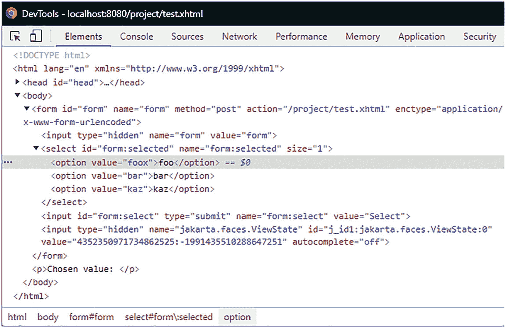

图 13-1
通过 Chrome 的 DOM 检查器在 HTML 源代码中将选中的值从“foo”篡改为“foox”

跨站脚本保护
跨站脚本或 XSS 是一种攻击，它有多种变体，但实际上归结为 Web 应用程序将从（其他）用户那里获得的数据直接作为发送给客户端的标记的一部分进行渲染。如果这些数据本身包含脚本代码（通常是 JavaScript），浏览器可能会盲目地执行它，从而允许攻击者读取例如 cookie 数据，并将其发送到攻击者控制的服务器。

Jakarta Faces 通过为许多常见上下文启用上下文输出转义来提供针对此类攻击的保护。最常见的上下文是输出 HTML，所有 Jakarta Faces 输出编写器默认情况下都会对其输出进行 XML 转义。

为了演示，考虑以下支持 bean：

```
@Named @RequestScoped
public class Bean {
private String value = "alert('hi')";
public String getValue() {
return value;
}
}
```

`value` 实例变量包含一个我们不希望浏览器执行的脚本。在此示例中，它是硬编码的，但在实践中，它可能来自例如数据库中存储的数据。


现在我们将使用 Jakarta Faces 的两个简单默认构造来渲染这个值：Facelet 上的直接表达式语言表达式和 `<h:outputText>` 组件。

```

#{bean.value}

```

当请求此视图并查看 HTML 源代码时，我们会看到该值两次都被渲染为“`&lt;script&gt;alert('hi')&lt;/script&gt;`”（即，以浏览器不会执行的转义形式呈现）。

如果我们明确不希望进行此转义，可以将 `<h:outputText>` 的 `escape` 属性设置为 `false`。例如：

```
<h:outputText value="#{bean.value}" escape="false" />
```

再次请求包含上述组件的视图将导致出现一个 JavaScript 警告框，显示“hi”。如果这是攻击者输入的恶意代码，客户端系统的安全性就会受到损害。因此，`escape` 属性应极其谨慎地使用。

用于 URL 的输出也会被转义，但由于上下文不同，转义方式也不同。为了演示，请考虑在视图中添加以下组件：

```
<h:outputLink value="http://foo.com/bar?x=#{bean.value}">
    Go to foo
</h:outputLink>
```

请求此视图后，我们会看到链接被渲染为

```
<a href="http://foo.com/bar?x=%3Cscript%3Ealert('hi')%3C/script%3E">
    Go to foo
</a>
```

这里发生的情况是，我们的原始值已使用 URL 编码进行了转义，以便用作 URL 参数。可以看出，这与 XML 转义不同，因此称为“上下文相关输出转义”。

与 XSS 防护相关，应用程序使用的敏感 cookie 应设置为 `HttpOnly`，这意味着它们会随每个请求发送到服务器，但无法被客户端的脚本读取。对于会话 ID cookie，可以在 `web.xml` 中按如下方式进行设置：

```
<session-config>
    <cookie-config>
        <http-only>true</http-only>
        <secure>true</secure>
    </cookie-config>
</session-config>
```

请注意，此处 cookie 也被设置为“secure”。这与 XSS 无关，而是设置 cookie 仅在使用 HTTPS/SSL 时发送。这可以保护 cookie 不被窃听（例如，在共享 Wi-Fi 网络上）。由于开发通常通过 HTTP 在 localhost 上进行，因此此类设置可能会给开发带来问题。如果是这种情况，则可以在 `ServletContextListener` 中使用 `ServletContext#getSessionCookieConfig()` 来设置 cookie 是否安全：

```
@WebListener
public class ApplicationConfig implements ServletContextListener {
    @Override
    public void contextInitialized(ServletContextEvent event) {
        if (...) {
            event.getServletContext()
                .getSessionCookieConfig()
                .setSecure(false);
        }
    }
}
```

其中“...”是一个特定于应用程序的检查，用于判断是否在“开发模式”下运行。您甚至可以使用 Jakarta Faces 自身的 `Application#getProjectStage()` 来实现此目的。

源文件暴露防护
在服务器端 Web 应用程序的上下文中，源文件暴露是指 Web 应用程序部分源代码的非预期泄露。这是一种安全风险，不仅因为源代码本身的暴露（可能构成商业秘密），还因为它可能让攻击者洞察到后续攻击的基础（源代码可能包含对其他系统、Bean 甚至带有密码的注释的引用，尽管这些注释一开始就不应该存在）。

由于过去一些可能不太理想的设计选择，Jakarta Faces 在这方面存在一些特定的漏洞，主要涉及 URL 映射的方式以及资源文件的位置。要理解此漏洞，我们首先解释 Jakarta Faces 映射和 `FacesServlet` 的工作原理。

每个 Jakarta Faces 应用程序的主要入口点是 `FacesServlet`。这是 Jakarta Faces 框架提供的一个 Servlet，充当所谓的前端控制器，所有 Jakarta Faces 请求都通过它进行路由。

因此，对 Jakarta Faces 视图（例如 `foo.jsf`）的请求首先需要通过此 Servlet，然后 Servlet 会以某种方式定位代表视图 `foo.jsf` 的组件树定义。我们将这个实际定义称为“物理资源”。开箱即用，Jakarta Faces 支持一种类型的物理资源：扩展名为 `.xhtml` 的 Facelets 文件。

为了使 `FacesServlet` 能够处理所有这些请求，必须将其映射到一个或多个能够捕获这些请求的 URL 模式。为此，Jakarta Faces 支持前缀映射、后缀映射和精确映射。

如果在 `web.xml` 中没有指定显式映射，并且在应用程序中找到了可识别的 Jakarta Faces 工件（例如空的 `faces-config.xml` 或 `@FacesConfig` 注解），则 `FacesServlet` 会被自动映射。自 Jakarta Faces 2.1 和 Servlet 3.0 起，此自动映射针对以下模式：

*   `/faces/*`（前缀映射）
*   `*.jsf`（后缀映射）
*   `*.faces`（后缀映射）

自 Jakarta Faces 2.3 起，还包括以下模式：

*   `*.xhtml`（后缀映射）

尤其是较旧的（现有的）Jakarta Faces 应用程序仍然会在 `web.xml` 中显式映射 `FacesServlet`，例如，如下所示：

```
<servlet>
    <servlet-name>facesServlet</servlet-name>
    <servlet-class>jakarta.faces.webapp.FacesServlet</servlet-class>
</servlet>
<servlet-mapping>
    <servlet-name>facesServlet</servlet-name>
    <url-pattern>/faces/*</url-pattern>
    <url-pattern>*.jsf</url-pattern>
</servlet-mapping>
```

在后缀映射并使用 Facelets 时，`FacesServlet` 将首先尝试定位与请求资源具有相同路径和名称但后缀替换为 `.xhtml` 的物理资源。例如，对 `/path/foo.jsf` 的请求将导致查找文件 `/path/foo.xhtml`。使用前缀映射时，`FacesServlet` 将尝试定位与请求资源具有相同名称和路径但减去前缀路径的物理资源。例如，对 `/faces/path/foo.xhtml` 的请求将导致查找文件 `/path/foo.xhtml`。然而，这可能会引入一个导致 Facelet 源代码暴露的安全问题。也就是说，对 `/path/foo.xhtml` 的查找是在 `FacesServlet` 所在的 WAR 的 Web 根目录中进行的。除非另有（隐式）映射，否则 Web 根目录中的每个文件都可以直接下载。在这种情况下，如果直接请求 `/path/foo.xhtml` 而不是 `/path/foo.jsf` 或 `/faces/path/foo.xhtml`，则该请求不会经过 `FacesServlet`，并且会返回该页面的纯 Facelets 源代码，而不是渲染后的标记。

有两种方法可以防止这种源代码暴露：

1.  将 `FacesServlet` 直接映射到 `*.xhtml`。
2.  向 `web.xml` 添加安全约束。


将 `FacesServlet` 直接映射到 `*.xhtml` 可能是最自然的解决方案。通过这种映射，请求的资源与物理资源完全相同。如果请求 `/path/foo.xhtml`，那么 `FacesServlet` 将尝试定位 `/path/foo.xhtml`。通过这种映射，不存在第二条路径可以访问 Facelets 源文件，因此也就没有暴露它的风险。
附注：能够使用 `*.xhtml` 映射是 Jakarta Faces 2.0 中的一个新特性。在 Jakarta Faces 1.x 中这样做会导致 `RequestDispatcher#forward()` 出现无限循环。

要将 `FacesServlet` 映射到 `*.xhtml`，最简单的方法是依赖 Jakarta Faces 2.3 的默认映射，如前所述。如果由于某种原因无法做到这一点，请将映射添加到 `web.xml` 中的 `FacesServlet` 映射中，如下代码所示：

```
facesServlet
/faces/**.jsf
*.xhtml

```

作为替代方案，可以定义一个安全约束来阻止对 `*.xhtml` 资源的访问。很少有充分的理由选择此方法而非更简单的 `*.xhtml` 到 `*.xhtml` 映射，但为了完整性，可以按如下方式操作：

```
禁止访问 Facelets 源文件

XHTML
*.xhtml

```

暴露 Facelets 源代码的一个特殊情况发生在复合组件中。复合组件是通过 Facelet 而非 Java 类实现的组件。按照惯例，它们必须放置在位于 Web 根目录下的 `/resources` 目录的子目录中，例如 `/resources/bar/foo.xhtml`。这将使组件 “`foo`” 在命名空间 “`jakarta.faces.composite/bar`” 中可用。
组件当然不是视图，用户不应该能够直接请求它们。不幸的是，`/resources` 对于 Jakarta EE 来说并不是一个特殊的目录。Jakarta Faces 通过约定赋予了它特殊含义，但对于 Servlet 容器来说，它和其他目录一样。这特别意味着对此没有应用任何保护，任何用户都可以直接从中请求资源。换句话说，这个目录是“世界可读的”。即使使用 `*.xhtml` 映射，这不仅允许用户猜测我们有哪些组件，还允许用户尝试执行它们。显然，这不是我们想要的。

对此同样有两种解决方案：

1.  配置另一个目录作为 Jakarta Faces 资源目录。

2.  向 `web.xml` 添加安全约束。

在 Jakarta Faces 2.2 中，引入了一种方法来解决此安全漏洞。即，通过 `jakarta.faces.WEBAPP_RESOURCES_DIRECTORY` 上下文参数，可以将另一个目录配置为 Jakarta Faces 资源目录，而不是 `/resources`。例如：

```
jakarta.faces.WEBAPP_RESOURCES_DIRECTORY
WEB-INF/resources

```

请注意，该路径是相对于 Web 根目录的，并且不能以 “/” 开头。

或者，对于 Jakarta Faces 2.0/2.1，可以在 `web.xml` 中再次配置一个安全约束，以禁止调用者访问 `/resources`。这可以通过类似于保护 `*.xhtml` 访问的方式来完成。

```

resources
资源目录
/resources/*

```

14. 本地化

Jakarta Faces 一直拥有不错的国际化支持。自 Jakarta Faces 1.0 起，您可以提供基于 `java.util.ResourceBundle` 的不同语言环境的捆绑文件，这些文件随后会在声明的位置动态地作为文本包含在网页中。此外，所有 Jakarta Faces 转换器和验证器都有自己的一套本地化默认消息，您可以通过消息包轻松自定义这些消息，或者自 Jakarta Faces 1.2 起，通过新的 `requiredMessage`、`converterMessage` 和 `validatorMessage` 属性进行自定义。Jakarta Faces 2.0 通过新的 `jakarta.faces.application.ResourceHandler` API（应用程序编程接口）增加了对可本地化资源（如样式表、脚本和图像）的支持。
国际化（“I18N”）行为与本地化（“L10N”）行为是不同的。国际化部分基本上已由 Jakarta Faces 自身作为 MVC（模型-视图-控制器）框架完成。您需要做的只是处理本地化部分。基本上，您需要在视图中指定“活动语言环境”，提供所需的资源包文件（如有必要，可借助第三方翻译服务进行翻译），并在您的 Jakarta Faces 页面中声明对捆绑文件的引用。
在本章中，您将学习如何为不同语言准备 Jakarta Faces Web 应用程序，以及如何开发它以方便您自己进行维护性的本地化。

你好世界，Olá mundo，नमस्ते दुनिया
首先，在项目的 `main/java/resources` 文件夹中创建一组新的捆绑文件。Maven WAR 项目的 `main/java/resources` 文件夹用于存放最终构建中应位于 `/WEB-INF/classes` 文件夹中的非类文件。捆绑文件可以采用 `java.util.Properties` 格式，扩展名为 `.properties`。

这些文件的文件名必须有一个公共前缀（例如 “`text`”），后跟一个下划线和两个字母的 ISO 639-1-Alpha-2^(¹¹⁰) 语言代码（例如，英语用 “`en`”，葡萄牙语用 “`pt`”，印地语用 “`hi`”）。可选地，后面可以再跟一个下划线和两个字母的 ISO 3166-1-Alpha-2^(¹¹¹) 国家代码（例如，英国用 “`GB`”，美国用 “`US`”，巴西用 “`BR`”，葡萄牙用 “`PT`”）。

```
main/java/resources/com/example/project/i18n/text.properties
title = 本地化示例
heading = 你好世界
paragraph = 欢迎来到我的网站！
main/java/resources/com/example/project/i18n/text_pt_BR.properties
title = Exemplo de localização
heading = Olá mundo
paragraph = Bem-vindo ao meu site!
main/java/resources/com/example/project/i18n/text_hi.properties
title = स्थानीयकरण उदाहरण
heading = नमस्ते दुनिया
paragraph = मेरी वेबसाइट पर स्वागत है!
```

请注意，所有这些捆绑文件都有共同的键 “`title`”、“`heading`” 和 “`paragraph`”，这些键通常是英文的。这基本上是互联网和 Web 开发人员的通用语言。将源代码完全保留为英文被认为是最佳实践，特别是如果它是开源的。
还要注意，英文捆绑文件的文件名中没有像 `text_en.properties` 那样的 “`en`” 语言代码，而只是 `text.properties`。基本上，它已成为后备捆绑文件，应包含整个 Web 应用程序中使用的每一个捆绑键。这样，当具有特定语言代码的捆绑文件不包含所需的捆绑条目时，将从后备捆绑文件中查找该值。这对于您希望逐步升级捆绑文件，或者当 Web 应用程序中有某些部分不一定需要本地化（例如后端管理页面）的情况非常有用。

配置

为了让 Jakarta Faces 应用程序识别这些捆绑文件和所需的语言环境，我们需要编辑其 `faces-config.xml` 文件，向 `<application>` 元素添加以下条目：

```

en
pt_BR
hi


com.example.project.i18n.text
text

```

`<base-name>`
必须遵循与 Java 类相同的约定来指定完全限定名（FQN），并且不包含文件扩展名。`<var>` 基本上声明了资源包文件的 EL（表达式语言）变量名。这将使当前加载的资源包在 EL 中通过 `#{text}` 以类似 `Map` 的对象形式可用。为避免冲突，你只需确保此名称未被任何受管 Bean 或任何隐式 EL 对象占用。

在 Jakarta Faces 页面中引用资源包

这相对简单，只需将 `#{text}` 视为一个 `Map`，并将资源包键作为映射键即可。

```

#{text['title']}

#{text['heading']}
#{text['paragraph']}

```

Jakarta Faces 将根据 HTTP `Accept-Language` 标头^(¹¹²)自动确定最匹配的活动区域设置，并将其设置为 `UIViewRoot` 的 `locale` 属性。`Accept-Language` 标头可在浏览器设置中配置。例如，在 Chrome 中，你可以通过 `chrome://settings/languages` 进行配置。如果你尝试调整它，例如，在浏览器中将英语、葡萄牙语和印地语切换为排名最高的语言设置，然后刷新 Jakarta Faces 页面，你会注意到文本会随之改变，以符合浏览器指定的语言设置。如果你检查浏览器的开发者工具（通常按 F12 可访问），并在网络监视器中检查 HTTP 请求标头，你还会注意到 `Accept-Language` 标头会相应更改。

你可能已经注意到，在前面显示的代码示例中，`<html>` 标签的 `lang` 属性引用了 `#{view.locale.toLanguageTag()}`。基本上，这会打印当前 `UIViewRoot` 的 `locale` 属性的 IETF BCP 47 语言标签^(¹¹³)，而 `UIViewRoot` 又作为隐式 EL 对象 `#{view}` 可用。`locale` 属性是 `java.util.Locale` 的一个实例，它实际上没有像 `getLanguageTag()` 这样的语言标签 getter 方法，只有一个 `toLanguageTag()` 方法，因此在 EL 中直接引用了该方法，而不是预期的属性引用。

`<html>` 标签的 `lang` 属性对于 Jakarta Faces 本地化功能的运行并非必需。此外，Jakarta Faces 将其视为模板文本，不会对其进行任何特殊处理。你可以安全地省略它。然而，它对搜索引擎很重要。这样，像 Google 这样的搜索引擎就会知道页面内容使用的是哪种语言。这不仅对于正确出现在本地化搜索结果中很重要，而且对于你以不同语言提供同一页面也很重要。否则，一般的搜索引擎算法会将其视为“重复内容”而进行惩罚，这对 SEO（搜索引擎优化）排名不利。

你还会注意到，资源包键是以所谓的大括号表示法 `#{text['...']}` 指定的。单引号之间的字符串基本上代表了资源包键。在这种特定情况下，你也可以使用 `#{text.title}`、`#{text.heading}` 和 `#{text.paragraph}` 来代替。然而，这并非普遍做法。使用大括号表示法不仅能让 EL 变量所代表的内容（资源包）具有普遍清晰的含义，而且还允许你在资源包键名中使用点号，例如 `#{text['meta.description']}`。EL 表达式 `#{text.meta.description}` 具有完全不同的含义，即“获取 `text` 对象的嵌套 `meta` 属性的 `description` 属性”，其行为类似于 `text.getMeta().getDescription()`，这是不正确的。

更改活动区域设置

你也可以在服务器端更改活动区域设置。最好在包含 `<f:view>` 标签的站点级主模板中的单个位置进行此操作。活动区域设置可以在 `<f:view>` 的 `locale` 属性中设置，该属性可以接受表示语言标签的静态字符串，也可以接受具体的 `java.util.Locale` 实例。`locale` 属性接受 EL 表达式，并且可以通过受管 Bean 以编程方式更改。这为你提供了让用户通过网页更改区域设置的机会，而无需在浏览器的语言设置中手动调整。你可以在 Jakarta Faces 页面中向用户展示可用的语言选项，并让每次选择都更改活动区域设置。这可以通过以下 Jakarta Faces 页面实现：

```

#{text['title']}

#{text['heading']}
#{text['paragraph']}

```

它与前面的示例略有调整；现在 `<f:view>` 包裹了 `<h:head>` 和 `<h:body>`。`<f:view>` 的 `locale` 属性通过 `#{activeLocale}` 受管 Bean 引用当前活动的区域设置，该 Bean 如下所示：

```
@Named @SessionScoped
public class ActiveLocale implements Serializable {
private Locale current;
private List available;
@Inject
private FacesContext context;
@PostConstruct
public void init() {
Application app = context.getApplication();
current = app.getViewHandler().calculateLocale(context);
available = new ArrayList();
available.add(app.getDefaultLocale());
app.getSupportedLocales().forEachRemaining(available::add);
}
public void reload() {
context.getPartialViewContext().getEvalScripts()
.add("location.replace(location)");
}
public Locale getCurrent() {
return current;
}
public String getLanguageTag() {
return current.toLanguageTag();
}
public void setLanguageTag(String languageTag) {
current = Locale.forLanguageTag(languageTag);
}
public List getAvailable() {
return available;
}
}
```

在 `@PostConstruct` 中，使用 `ViewHandler#calculateLocale()` 根据 `Accept-Language` 标头以及 `faces-config.xml` 中配置的默认和支持的区域设置来计算当前区域设置。这完全遵循 Jakarta Faces 内部行为，就像没有定义 `<f:view locale>` 时一样。最后，根据配置的默认和支持的区域设置收集可用的区域设置。

可用的区域设置通过 `<h:selectOneMenu>` 的 `<f:selectItems>` 以下拉选项的形式呈现给用户（参见图 14-1）。嵌套的 `<f:ajax>` 确保一旦用户更改选项，所选选项就会在受管 Bean 中设置。

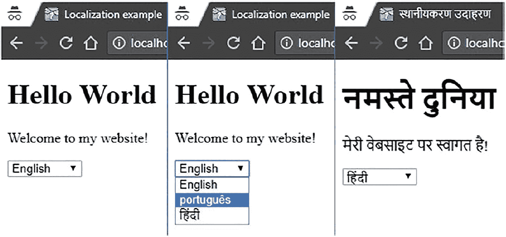

图 14-1
更改活动区域设置


`#{activeLocale.languageTag}`
属性内部委托给当前的 `java.util.Locale`
实例。这样做主要是为了方便，这样我们就不必在想要于 `<h:selectOneMenu>` 中使用 `#{activeLocale.current}` 时，为其添加一个转换器。
`<f:ajax listener>` 基本上会借助一段在 Ajax 请求完成时执行的 JavaScript 来执行完整的页面重新加载。这是通过向 `PartialViewContext#getEvalScripts()` 方法添加一个脚本来实现的，该方法是 Jakarta Faces 2.3 中新增的。任何添加的脚本最终都会按顺序出现在 Jakarta Faces Ajax 响应的 `<eval>` 部分中，而该部分又会在 Jakarta Faces Ajax 引擎更新了 HTML DOM（文档对象模型）树之后执行。
该脚本本身 `location.replace(location)`，基本上指示 JavaScript 重新加载当前文档，而不在历史记录中保留之前的文档。这意味着后退按钮不会重新显示同一页面。你也可以改用 `location.reload(true)`，但如果之前在同一文档上触发了同步（非 Ajax）POST 请求，则此方法无法正常工作。它会被重新执行并导致重复提交。而且它还会不必要地在历史记录中记住上一页。这可能会导致令人困惑的行为，因为后退按钮似乎没有效果，因为它会重新显示完全相同的页面（因为活动区域存储在会话中，而不是请求中）。
或者，在这种特定用例中，你也可以不使用 `<f:ajax listener>`，而仅使用 `<f:ajax render="@all">` 且不带任何监听器。它至少有一个缺点：文档的标题不会被更新。无论如何，使用 `@all` 通常被认为是一种不好的做法。它只有一个合法的实际用例：在 Ajax 请求上显示完整的错误页面。
作为一个完全不同的替代方案，你可以将活动区域设置为请求作用域而不是会话作用域，方法是将语言标签包含在 URL 中，例如 `http://example.com/en/page.xhtml`、`http://example.com/pt/page.xhtml` 和 `http://example.com/hi/page.xhtml`。这样，你就可以通过简单地点击链接来更改活动区域。这只需要一个 Servlet 过滤器，从 URL 中提取 `java.util.Locale` 实例并将其转发到所需的 Jakarta Faces 页面，以及一个自定义视图处理程序，该处理程序将语言标签包含在任何 `<h:form>`、`<h:link>` 和 `<h:button>` 组件生成的 URL 中。

**组织资源包键**

当 Web 应用程序增长时，你可能会注意到资源包文件开始变得难以维护。关键在于遵循非常严格的约定来组织资源包键。可重用的站点范围条目，通常是那些用作输入标签、按钮标签、链接标签、表格标题标签等的条目，应使用通用前缀作为键（例如，“`label.save=Save`”）。特定于页面的条目应使用特定于页面的前缀作为键（例如，“`foldername_pagename.title=Some Page Title`”）。以下是一个本地化 Facelets 模板的详细示例，`/WEB-INF/templates/page.xhtml`：

```

#{text[page += '.title']}

#{text[page += '.title']}

© #{text['page_home.title']}

```

Jakarta 标签 `<c:set>` 基本上将 `UIViewRoot#getViewId()` 转换为适合作为页面特定前缀的字符串。Jakarta Faces 视图 ID 基本上表示代表 Jakarta Faces 页面的物理文件的绝对服务器端路径（例如，“`/user/account.xhtml`”）。这需要被处理成适合作为资源包键的格式。`fn:split()` 调用从中提取出 “`/user/account`” 部分，而 `fn:replace()` 调用将正斜杠转换为下划线，使其变成 “`_user_account`”。最后，`<c:set>` 将其以 “`page_user_account`” 的名称存储在视图作用域中，名称为 “`page`”，以便在同一视图的其他地方可以作为 `#{page}` 使用。

你会注意到 `#{page}` 又被用作 `<h:body>` 的 ID 等。这使得在需要时，可以更容易地从通用的 CSS（层叠样式表）文件中选择特定页面。`#{page}` 还被用于多个资源包引用中，例如 `#{text[page += '.title']}`，在 “`/home.xhtml`” 的情况下，它最终引用键 “`page_home.title`”。使用这样的模板，你可以拥有以下特定于页面的资源包条目：

```
page_home.title = My Website
page_home.meta.description = A Hello World Faces application.
page_login.title = Log In
page_login.meta.description = Log in to My Website.
page_signup.title = Sign Up
page_signup.meta.description = Sign up to My Website.
```

以下是一个使用前面展示的模板 `/WEB-INF/templates/page.xhtml` 的模板客户端示例，即 `/login.xhtml`：

以下是关联的资源包条目的样子：

```
label.email = Email
label.password = Password
label.login = Log In
```

注意：如果你发现页面显示不正常，只需添加一个包含以下规则的 CSS 文件即可：

```
nav a, fieldset label, fieldset input {
display: block;
}
```

**本地化转换/验证消息**

如果你已经准备了一个简单的支持 bean 类 `Login`，它有两个字符串属性 `email` 和 `password`，以及一个方法 `submit()`，并且提交了前面显示的登录页面而没有填写电子邮件输入字段，那么你将遇到以下格式的验证错误：

```
login:email: Validation Error: Value is required.
```

当你将语言切换到葡萄牙语并重新提交空表单时，你会看到它也被本地化了。但是，当你进一步将语言切换到印地语时，你会注意到标准的 Jakarta Faces 实现中没有标准的印地语消息包。你需要提供你自己的。有几种方法可以实现这一点。

首先，Jakarta Faces 输入和选择组件支持三个属性来覆盖默认消息：`requiredMessage`、`validatorMessage` 和 `converterMessage`。以下示例展示了如何覆盖默认的必填消息：

```
这可以说是最简单的方法。主要的缺点是，如果你没有将其包装在像 `<my:inputText>` 这样的可重用标签文件中，你必须在任何地方复制/粘贴它。这不符合 DRY 原则。^(¹¹⁴)

另一种方法是提供一个自定义消息包，覆盖所有特定于 Jakarta Faces 转换/验证消息的预定义包键，并将其注册为 `faces-config.xml` 中的 `<message-bundle>`。你可以在 Jakarta Faces 规范的 2.5.2.4 节“本地化应用程序消息”中找到所有预定义的包键。默认必填消息 “Validation Error: Value is Required” 的包键是 `jakarta.faces.component.UIInput.REQUIRED`。我们可以在新的消息包文件中对其进行调整，如下所示：

```
main/java/resources/com/example/project/i18n/messages.properties
jakarta.faces.component.UIInput.REQUIRED = {0} is required.
main/java/resources/com/example/project/i18n/messages_pt_BR.properties
jakarta.faces.component.UIInput.REQUIRED = {0} é obrigatório.
main/java/resources/com/example/project/i18n/messages_hi.properties
jakarta.faces.component.UIInput.REQUIRED = {0} आवश्यक है.
```

最后，在 `faces-config.xml` 文件的 `<application>` 元素中对其进行配置：

```
...
com.example.project.i18n.messages

```

你可能已经注意到消息中的 `{0}` 占位符。它们代表关联的输入和选择组件的标签。标签默认为组件的客户端 ID，这基本上是你可以在浏览器页面源代码中找到的 Jakarta Faces 生成的 HTML 元素的 ID。你可以通过显式设置组件的 `label` 属性来覆盖它。


请注意，将消息包放在与资源包不同的文件中并非严格必要。你也可以直接将消息包条目放入 `text.properties` 文件中，并调整 `faces-config.xml` 中的 `<message-bundle>` 条目，使其指向与 `<resource-bundle>` 相同的完全限定名（FQN）。

在自定义转换器/验证器中获取本地化消息

`<message-bundle>` 条目的值可以通过 `Application#getMessageBundle()` 以编程方式获取。然后，你可以利用该值，结合 `java.util.ResourceBundle` API 和 `UIViewRoot#getLocale()` 来获取实际的包。这使得你能够在自定义转换器和验证器中获取本地化消息。以下是这样一个验证器的示例，它检查指定的电子邮件地址是否已被使用：

```
@FacesValidator(value = "duplicateEmailValidator", managed = true)
public class DuplicateEmailValidator implements Validator {
@Inject
private UserService userService;
@Override
public void validate
(FacesContext context, UIComponent component, String value)
throws ValidatorException
{
if (value == null) {
return;
}
Optional user = userService.findByEmail(value);
if (user.isPresent()) {
throw new ValidatorException(new FacesMessage(getMessage(
context, "message.duplicateEmailValidator")));
}
}
public static String getMessage(FacesContext context, String key) {
return ResourceBundle.getBundle(
context.getApplication().getMessageBundle(),
context.getViewRoot().getLocale()).getString(key);
}
}
```

请注意 `@FacesValidator` 注解中的 `managed` 属性。这基本上会开启验证器实例上的 CDI 支持，从而允许你向验证器中注入业务服务。`@FacesConverter` 也提供了相同的属性。

上面展示的验证器示例假设由 `<message-bundle>` 标识的资源包文件中存在以下条目：

```
message.duplicateEmailValidator = Email is already in use.
```

本地化枚举

本地化枚举最简洁的方法是直接使用枚举自身的标识作为包键。这可以使枚举类免受潜在的 UI 特定杂乱信息（如硬编码的包键）的干扰。通常，枚举的简单名称与枚举值的组合足以表示一个站点范围内的唯一标识符。给定以下代表用户组的 `com.example.project.model.Group` 枚举：

```
public enum Group {
USER,
MANAGER,
ADMINISTRATOR,
DEVELOPER;
}
```

以及 `text.properties` 中的以下资源包条目：

```
Group.USER = User
Group.MANAGER = Manager
Group.ADMINISTRATOR = Administrator
Group.DEVELOPER = Developer
```

你可以像下面这样轻松地本地化它们：

```

...

```

请注意，`<f:importConstants>` 需要放置在 `<f:metadata>` 内部。其 `type` 属性必须代表枚举的完全限定名，或者任何包含 `public static final` 形式公共常量的类或接口。`<f:importConstants>` 会自动将它们作为 `Map<String, Object>` 导入到 EL 作用域中，其中 map 的键代表常量的名称（字符串形式），map 的值代表常量的实际值。
通过 `#{Group.values()}`，你可以获取所有常量值的集合，然后每个值在 `itemLabel` 中被本地化。另请注意，`itemValue` 被省略了，因为它默认使用 `var` 属性的值，而这已经足够了。

参数化的资源包值

你还可以使用 `java.text.MessageFormat` API 的 `{0}` 占位符来参数化你的资源包条目。^(¹¹⁵) 在 Jakarta Faces 端，它们只能通过 `<h:outputFormat>` 进行替换，其中参数作为 `<f:param>` 子元素提供，顺序与占位符相同。给定以下条目：

```
page_products.table.header = There {0, choice, 0#are no products
| 1#is one product
| 1<are {0} products}.
```

可以使用 `<h:outputFormat>` 如下进行替换：

基于数据库的 ResourceBundle

Jakarta Faces 还支持指定一个自定义的 `ResourceBundle` 实现作为 `<base-name>`。这允许你以编程方式填充和提供所需的包，例如，从多个包文件，甚至从数据库中。在这个例子中，我们将用从数据库加载条目的资源包来替换默认的基于属性文件的资源包。这使我们更进一步地组织资源包键。通过这种方式，你甚至可以通过基于 Web 的界面来编辑它们。
以下是 Jakarta Persistence 实体的样子：

```
@Entity
@Table(uniqueConstraints = {
@UniqueConstraint(columnNames = { "locale", "key" })
})
public class Translation {
@Id @GeneratedValue(strategy = GenerationType.IDENTITY)
private Long id;
@Column(length = 5, nullable = false)
private @NotNull Locale locale;
@Column(length = 255, nullable = false)
private @NotNull String key;
@Lob @Column(nullable = false)
private @NotNull String value;
// 在此处添加/生成 getter 和 setter 方法。
}
```

请注意，Jakarta Persistence 注解提供了足够的提示，说明表的 DDL（数据定义语言）应该是什么样子。当在 `persistence.xml` 中将属性 `jakarta.persistence.schema-generation.database.action` 设置为 `create` 或 `drop-and-create` 时，它将自动生成适当的 DDL。为完整起见，这里是 HSQL/pgSQL 风格的 DDL。

```
CREATE TABLE Translation (
id BIGINT GENERATED BY DEFAULT AS IDENTITY PRIMARY KEY,
locale VARCHAR(5) NOT NULL,
key VARCHAR(255) NOT NULL,
value CLOB NOT NULL
);
ALTER TABLE Translation
ADD CONSTRAINT UK_Translation_locale_key
UNIQUE (locale, key);
```

以下是 Jakarta Enterprise Beans 服务的样子。

```
@Stateless
public class TranslationService {
@PersistenceContext
private EntityManager entityManager;
@TransactionAttribute(value = REQUIRES_NEW)
@SuppressWarnings("unchecked")
public Object[][] getContent
(Locale locale, Locale fallback)
{
List resultList = entityManager.createQuery(
"SELECT t1.key, COALESCE(t2.value, t1.value)"
+ " FROM Translation t1"
+ " LEFT OUTER JOIN Translation t2"
+ " ON t2.key = t1.key"
+ " AND t2.locale = :locale"
+ " WHERE t1.locale = :fallback")
.setParameter("locale", locale)
.setParameter("fallback", fallback)
.getResultList();
return resultList.toArray(new Object[resultList.size()][]);
}
}
```

对于 Jakarta Persistence，我们只需要一个额外的转换器，用于在模型中的 `java.util.Locale` 和数据库中的 `VARCHAR`（由 `java.lang.String` 表示）之间进行转换。你可以为此使用 `AttributeConverter`。它很像 Jakarta Faces 转换器，但用于 Jakarta Persistence 实体。它相对简单；不需要额外的配置。请参见以下内容：

```
public class LocaleConverter
implements AttributeConverter
{
@Override
public String convertToDatabaseColumn(Locale locale) {
return locale.toLanguageTag();
}
@Override
public Locale convertToEntityAttribute(String languageTag) {
return Locale.forLanguageTag(languageTag);
}
}
```

现在我们有了自定义的 `ResourceBundle`；它被称为 `DatabaseResourceBundle`。将其放在包 `com.example.project.i18n` 中。


```
public class DatabaseResourceBundle extends ResourceBundle {
private static final Control CONTROL = new DatabaseControl();
@Override
public Object handleGetObject(String key) {
return getCurrentInstance().getObject(key);
}
@Override
public Enumeration getKeys() {
return getCurrentInstance().getKeys();
}
private ResourceBundle getCurrentInstance() {
FacesContext context = FacesContext.getCurrentInstance();
String key = CONTROL.getClass().getName();
return (ResourceBundle) context.getAttributes()
.computeIfAbsent(key, k -> ResourceBundle.getBundle(key,
context.getViewRoot().getLocale(),
Thread.currentThread().getContextClassLoader(),
CONTROL));
}
private static class DatabaseControl extends Control {
@Override
public ResourceBundle newBundle
(String baseName, Locale locale, String format,
ClassLoader loader, boolean reload)
throws IllegalAccessException, InstantiationException,
IOException
{
FacesContext context = FacesContext.getCurrentInstance();
final Object[][] contents = CDI.current()
.select(TranslationService.class).get()
.getContent(
locale,
context.getApplication().getDefaultLocale());
return new ListResourceBundle() {
@Override
protected Object[][] getContents() {
return contents;
}
};
}
}
}
```

最后，调整 `faces-config.xml` 中的 `<resource-bundle><base-name>`
条目，将自定义 `ResourceBundle` 的完全限定名称指定为：

```
com.example.project.i18n.DatabaseResourceBundle
```

坦率地说，这个 `ResourceBundle` 的实际实现有些取巧，仅仅是因为存在以下限制：

1.  Jakarta Faces 不允许通过 `faces-config.xml` 定义自定义的 `ResourceBundle.Control`。
2.  通过 SPI（串行外设接口）以 `java.util.spi.ResourceBundleControlProvider` 的形式提供自定义的 `ResourceBundle.Control` 在 WAR 环境中无法生效。
3.  为 `faces-config.xml` 中注册的每个语言环境创建多个独立的 `DatabaseResourceBundle` 子类，例如 `DatabaseResourceBundle_en`、`DatabaseResourceBundle_pt_BR` 和 `DataBaseResourceBundle_hi`，以满足默认的 `ResourceBundle.Control` 行为，从长远来看不利于维护。

这种方法的另一个优点是，它允许你通过简单地调用 `ResourceBundle#clearCache()` 以编程方式清除缓存中的任何数据库资源包。也就是说，Jakarta Faces 实现可能会在其 `Application` 实现中进一步缓存它，导致 `ResourceBundle#clearCache()` 看起来完全没有效果。已知 Mojarra 会这样做。^(¹¹⁶)

ResourceBundle 中的 HTML

这是一种不良实践。它会增加维护负担。对于大段内容，你最好选择比 HTML 更轻量级的标记语言，例如 Markdown。^(¹¹⁷) 这不仅在 XSS（跨站脚本）风险方面更安全，而且用户通过某些内容管理系统（CMS）界面中的文本区域进行编辑也更容易。最好与基于数据库的资源包结合实现。你可以向 `Translation` 模型添加一个额外的布尔标志，指示该值是否应解析为 Markdown。

```
@Column(nullable = false)
private boolean markdown;
```

然后，在 `TranslationService#getContents()` 内部，将其作为第三列进行选择。

```
"SELECT t1.key, COALESCE(t2.value, t1.value), t1.markdown"
```

最后，在 `DatabaseControl#newBundle()` 方法中，检索内容后，你可以根据该布尔值对它们进行后处理。你可以为此使用任何基于 Java 的 Markdown 库，例如 CommonMark。^(¹¹⁸)

```
static final Parser PARSER = Parser.builder().build();
static final HtmlRenderer RENDERER = HtmlRenderer.builder().build();
...
for (Object[] translation : contents) {
if ((boolean) translation[2]) {
translation[1] = RENDERER.render(PARSER.parse(translation[1]));
}
}
```

脚注

15. 扩展

如果说 Jakarta Faces 有一个单一的元素或优点可以归因于其长久存在，那可能就是它能够以多种方式进行扩展。从一开始，Jakarta Faces 就使得替换、装饰或增强其大部分核心元素成为可能。这催生了大量的扩展库和项目。在早期，这些包括 A4J (Ajax4JSF)、Tomahawk、RichFaces、独立的 Facelets 项目、PrettyFaces 等等。A4J 被合并到 RichFaces 中，而 RichFaces 本身最终在 2016 年停止服务。Facelets 被纳入 Jakarta Faces 本身，而 PrettyFaces 则成为 Rewrite 框架的一部分。如今，知名且活跃的扩展库包括 PrimeFaces、OmniFaces 和 BootsFaces 等。虽然个别库来了又去，但从早期至今，Jakarta Faces 的可扩展性始终如一。有时人们会说所有这些库都是为了解决 Jakarta Faces 的缺陷或遗漏，但这并不完全准确。事实上，Jakarta Faces 被明确设计为允许此类扩展，从而允许甚至刺激此类扩展库的出现。例如，Jakarta Faces 的同期技术 Jakarta Enterprise Beans（以前称为 Jakarta Enterprise Beans, Enterprise JavaBeans）几乎没有扩展点，因此，尽管它有许多缺点，我们从未看到围绕它形成繁荣的生态系统。

扩展类型
有几种不同的方式可以使用 Jakarta Faces 中的各种扩展点。一个主要的区别在于“经典”方法和“以 CDI 为中心的方法”。在后一种方法中，Jakarta Faces 几乎不需要显式支持可扩展性，因为 CDI 内置了许多机制来支持扩展或替换 CDI 工件。第 8 章的表 8-1 展示了这些工件。

扩展 CDI 工件
CDI 增强或完全替换类型的一种方式是提供替代生产者。我们已经在第 13 章中看到了这种技术的使用，尽管用例略有不同。最简单的方法是当你需要完全替换该类型时。如果需要增强，则需要一些代码来获取先前的类型，这在当前版本的 CDI (4.0) 中略显冗长。

以下展示了一个示例，我们将请求参数映射替换为一个新的映射，该映射包含原始映射的所有值，以及我们自己添加的一个额外值：

```
@Dependent @Alternative @Priority(APPLICATION)
public class RequestParameterMapProducer {
@Produces @RequestScoped @RequestParameterMap
public Map producer(BeanManager beanManager) {
Map previousMap = getPreviousMap(beanManager);
Map newMap = new HashMap(previousMap);
newMap.put("test", "myTestValue");
return newMap;
}
}
```

如前所述，`getPreviousMap()` 方法有些冗长。其定义如下：

```
private Map getPreviousMap(BeanManager beanManager) {
class RequestParameterMapAnnotationLiteral
extends AnnotationLiteral
implements RequestParameterMap
{
private static final long serialVersionUID = 1L;
}
Type MAP_TYPE = new ParameterizedType() {
@Override
public Type getRawType() {
return Map.class;
}
@Override
public Type[] getActualTypeArguments() {
return new Type[] {String.class, String.class};
}
@Override
public Type getOwnerType() {
return null;
}
};
return (Map) beanManager
.getReference(beanManager
.resolve(beanManager
.getBeans(MAP_TYPE, new RequestParameterMapAnnotationLiteral())
.stream()
.filter(bean -> bean
.getBeanClass() != RequestParameterMapProducer.class)
.collect(Collectors.toSet())),
MAP_TYPE,
beanManager.createCreationalContext(null));
}
}
```


预计在将来修订任何相关规范时，获取此“先前”或“原始”类型的任务将变得更加容易。例如，未来版本的 Jakarta Faces 可能会为其（CDI）注解引入现成的注解字面量，例如此处展示的 `RequestParameterMapAnnotationLiteral`。

为了测试这个替代生产者是否有效，请考虑以下后台 bean：

```
@Named @RequestScoped
public class TestBean {
@Inject @RequestParameterMap
private Map requestParameterMap;
public String getTest() {
return requestParameterMap.get("test");
}
public String getFoo() {
return requestParameterMap.get("foo");
}
}
```

以及以下 Facelet：

```

Test: #{testBean.test}
Foo: #{testBean.foo}

```

部署一个包含这些工件且带有请求参数（例如“`foo=bar`”）的应用程序，将会发现新的映射确实包含了原始请求参数以及我们自己添加的值。

扩展经典工件
在 Jakarta Faces 中，增强或完全替换某个类型的经典方法是为该类型安装一个工厂。这种工厂的基本工作方式与之前演示的 CDI 方法大致相同；工厂返回所请求类型的实现，并获取对“先前”或“原始”类型的引用。

在 Jakarta EE 中，“经典”通常意味着 XML，确实，经典工厂涉及 XML。具体来说，注册工厂需要在 `faces-config.xml` 中使用 `<factory>` 元素，并为每个需要提供工厂的类型使用特定的元素。截至 Jakarta Faces 4.0，支持以下工厂：

*   `<application-factory>`
*   `<exception-handler-factory>`
*   `<external-context-factory>`
*   `<faces-context-factory>`
*   `<facelet-cache-factory>`
*   `<partial-view-context-factory>`
*   `<lifecycle-factory>`
*   `<view-declaration-language-factory>`
*   `<tag-handler-delegate-factory>`
*   `<render-kit-factory>`
*   `<visit-context-factory>`
*   `<flash-factory>`
*   `<flow-handler-factory>`
*   `<client-window-factory>`
*   `<search-expression-context-factory>`

除此之外，还有另外一些工件可以通过类似但略有不同的方式进行替换/增强；这里，没有返回该类型的工厂，而是直接指定了该类型的实现。这种变体是通过 `faces-config.xml` 中的 `<application>` 元素来指定的。截至 Jakarta Faces 4.0，以下类型可以直接替换/增强：

*   `<navigation-handler>`
*   `<view-handler>`
*   `<resource-handler>`
*   `<search-expression-handler>`
*   `<flow-handler>`
*   `<state-manager>`
*   `<action-listener>`

请注意，所有这些类型都是单例。从 Jakarta Faces 运行时的角度来看，每种类型只有一个实例，但通过包装的方式支持多个实现各自添加功能，从而形成一个链（实现 A 包装实现 B，实现 B 包装实现 C，依此类推）。
上述为每种类型使用的特定元素立即凸显了经典方法的一个问题；Jakarta Faces *必须*为每个要以这种方式替换/增强的特定类型提供显式支持。相比之下，CDI 方法允许我们替换/增强几乎任何类型，而无需 Jakarta Faces 提供特殊支持，只要 Jakarta Faces 对该工件使用 CDI 即可。
好的一面是，与 Jakarta Faces 版本相比，当前工厂实现稍微简单一些，因为“先前”或“原始”类型只需在其构造函数中传递给它，而无需使用冗长的代码进行查找。

作为示例，我们将展示如何增强外部上下文工厂。为此，我们从在 `faces-config.xml` 中提到的注册开始。

```

com.example.project.ExternalContextProducer

```

然后实现如下所示：

```
public class ExternalContextProducer extends ExternalContextFactory {
public ExternalContextProducer(ExternalContextFactory wrapped) {
super(wrapped);
}
@Override
public ExternalContext getExternalContext
(Object context, Object request, Object response)
{
ExternalContext previousExternalContext =
getWrapped().getExternalContext(context, request, response);
ExternalContext newExternalContext =
new ExternalContextWrapper(previousExternalContext) {
@Override
public String getAuthType() {
return "OurOwnAuthType";
}
};
return newExternalContext;
}
}
```

这里有几件事需要注意。首先，每种此类工厂都必须继承自一个预先定义好的父工厂，在本例中是 `ExternalContextFactory`。其次，存在一个必须遵循的隐式契约，即完全按照示例所示实现构造函数。也就是说，添加一个公共构造函数，其单个参数的类型与超类完全相同，并将此参数传递给超类构造函数。然后，该实例可在其他方法中通过 `getWrapped()` 方法使用。

测试它是否确实有效相对容易。我们使用与 CDI 版本类似的后台 bean：

```
@Named @RequestScoped
public class TestBean {
@Inject
private ExternalContext externalContext;
public String getAuth() {
return externalContext.getAuthType();
}
}
```

以及以下 Facelet：

```

Test: #{testBean.auth}

```

由于外部上下文也是可通过 CDI 注入的类型，细心的读者可能会想知道，如果同时为该类型提供了 CDI 替代生产者和经典工厂会发生什么。答案是，严格来说，这并未被规范明确说明（因此行为未定义），但在实践中，强烈暗示使用经典工厂作为最终获取外部上下文的来源。这意味着，`ExternalContext` 的替代生产者只会影响 `ExternalContext` 的直接注入，而不会影响通过任何其他方式获取此类型的情况，例如，通过调用 `FacesContext#getExternalContext()`*。* 这是用户应该清楚意识到的一点。不过，预计规范的未来修订版将使 CDI 生产者成为初始来源。

插件
除了替代生产者和工厂之外，Jakarta Faces 提供的另一种扩展类型本质上是插件。这里，没有替换或增强核心的 Jakarta Faces 类型，而是向运行时的某些部分添加了额外的功能。因此，这些添加中的大多数必须以某种方式声明它们确切添加的内容，这与仅提供类型 `X` 或 `Y` 实现的工厂不同。

插件作为 `<application>` 元素的子元素添加到 `faces-config.xml` 中，就像前面提到的一些类似工厂的类型一样。支持以下插件：

*   `<el-resolver>`
*   `<search-keyword-resolver>`


我们在第 12 章的“自定义搜索关键字”一节中已经看到了搜索关键字解析器的一个示例。该插件的特点是方法 `isResolverForKeyWord()`，通过此方法，插件可以指明它将为哪个关键字或关键字模式运行。

这里我们将看另一个示例，即 EL 解析器。EL 解析器本身并非 Jakarta Faces 特有的类型，而是源自表达式语言（EL）规范。不过，该规范的重要部分确实起源于 Jakarta Faces。

EL 解析器允许我们以自定义方式解释表达式的所谓基对象（base）和属性（property）。考虑表达式 `#{foo.bar.kaz}`，在解析“`bar`”时，“`foo`”是基对象，“`bar`”是属性；而在解析“`kaz`”时，“`bar`”是基对象，“`kaz`”是属性。起初可能有点令人惊讶的是，当解析“`foo`”时，基对象是 `null`，而“`foo`”是属性。

在实践中，通常不需要添加自定义 EL 解析器，我们通常只需定义一个满足需求的命名 CDI bean 即可。然而，当 Jakarta Faces 集成在一个完全不同的环境中时，自定义 EL 解析器就可能派上用场了，比如我们希望表达式解析到一个完全不同的（受管理的）bean 系统。即便如此，CDI 到其他 bean 的桥接器可能仍是更好的选择，但了解自定义 EL 解析器是我们武器库中的另一件工具也是件好事。

无论如何，为了演示 EL 解析器的功能，我们将展示一个示例，其中 EL 表达式的基对象被解释为一个模式，这是我们无法直接用命名 CDI bean 做到的。

以下是一个 EL 解析器的示例：

```
public class CustomELResolver extends ELResolver {
protected boolean isResolverFor(Object base, Object property) {
return base == null
&& property instanceof String
&& ((String) property).startsWith("dev");
}
@Override
public Object getValue
(ELContext context, Object base, Object property)
{
if (isResolverFor(base, property)) {
context.setPropertyResolved(true);
return property.toString().substring(3);
}
return null;
}
@Override
public Class getType
(ELContext context, Object base, Object property)
{
if (isResolverFor(base, property)) {
context.setPropertyResolved(true);
return String.class;
}
return null;
}
@Override
public Class getCommonPropertyType
(ELContext context, Object base)
{
return base == null ? getType(context, base, null) : null;
}
@Override
public boolean isReadOnly
(ELContext context, Object base, Object property)
{
return true;
}
@Override
public void setValue
(ELContext context, Object base, Object property, Object value)
{
// NOOP
}
@Override
public Iterator getFeatureDescriptors
(ELContext context, Object base)
{
return null;
}
}
```

如果我们现在使用以下 Facelet：

```

Test: #{devThisIsDev}

```

在请求该页面时，我们会看到输出“Test: ThisIsDev”。这里发生的情况是，自定义 EL 解析器处理所有以“dev”开头的名称。

动态扩展
前面的示例主要是关于静态注册我们需要的扩展，例如，通过直接在 `faces-config.xml` 中注册工厂或类型。工厂为我们提供了一些实现动态行为的机会。也就是说，在调用工厂时，我们可以决定返回什么新类型（如果有的话）。

为了实现更动态的行为，通常需要能够动态添加工厂，或者在 CDI 中动态添加生产者。CDI 为此提供了一个复杂的 SPI（服务提供者接口）（简称为“CDI 扩展”），但这在一定程度上超出了本书的范围。

对于经典工厂以及实际上 `faces-config.xml` 中的所有内容，有一种较低级别的方法可以动态添加它们：应用程序配置填充器（Application Configuration Populator），我们接下来将讨论它。

应用程序配置填充器
应用程序配置填充器是一种通过编程方式提供额外 `faces-config.xml` 文件的机制，尽管它使用的是 XML DOM（文档对象模型）API（应用程序编程接口）。这个 DOM API 使用起来可能有些晦涩，并且应用程序配置填充器的功能受限于它只能进行配置。在 Jakarta Faces 中，没有 SPI 可以直接在此级别修改其他 `faces-config.xml`。

该机制的工作原理是实现抽象类 `jakarta.faces.application.ApplicationConfigurationPopulator`，并将其完全限定类名放入 JAR 库的 `META-INF/services/jakarta.faces.application.ApplicationConfigurationPopulator` 文件中。

为了演示这一点，我们将创建之前演示的 `ExternalContextProducer` 的另一个版本，这次使用提到的 `ApplicationConfigurationPopulator`。为此，我们采用相同的代码，移除 `faces-config.xml` 文件，并添加 `META-INF/services` 条目以及以下 Java 类：

```
public class ConfigurationProvider
extends ApplicationConfigurationPopulator
{
@Override
public void populateApplicationConfiguration(Document document) {
String ns = document.getDocumentElement().getNamespaceURI();
Element factory = document.createElementNS(ns, "factory");
Element externalContextFactory =
document.createElementNS(ns, "external-context-factory");
externalContextFactory.appendChild(
document.createTextNode(
ExternalContextProducer.class.getName()));
factory.appendChild(externalContextFactory);
document.getDocumentElement().appendChild(factory);
}
}
```

需要注意的是，由于这底层使用了 `java.util.ServiceLoader`，它仅在 `ConfigurationProvider` 和 `ExternalContextProducer` 一起打包在 WAR 的 `/WEB-INF/lib` 目录下的实际 JAR 库中时才有效，而不是直接放在 WAR 中。

应用程序主类
之前我们讨论了应用程序配置填充器，正如我们所看到的，它实际上是一种 `faces-config.xml` 提供者。这意味着它处理的是完全限定类名和本质上仍是文本的元素。

Jakarta Faces 也提供了多种更传统的编程式 API，其中最著名的可能是 `jakarta.faces.application.Application` 主类，它除了其他功能外，还持有我们在“扩展经典工件”一节中提到的相同单例对象。为完整起见，我们在此重复这个列表。

*   `jakarta.faces.application.NavigationHandler`

*   `jakarta.faces.application.ViewHandler`

*   `jakarta.faces.application.ResourceHandler`

*   `jakarta.faces.component.search.SearchExpressionHandler`

*   `jakarta.faces.flow.FlowHandler`

*   `jakarta.faces.application.StateManager`

*   `jakarta.faces.event.ActionListener`

所有这些在 `Application` 类上都有相应的 setter 方法。例如，以下展示了 `ActionListener` 的 Javadoc 和方法声明：

```
/**
* 
* 设置要注册为所有 {@link jakarta.faces.component.ActionSource} 组件默认的 {@link ActionListener}。
* 
*
* @param listener 新的默认 {@link ActionListener}
*
* @throws NullPointerException
*             如果 listener 为 null
*/
public abstract void setActionListener(ActionListener listener);
```

同样，`Application` 类对于我们在“插件”一节中提到的插件类型也有“`add`”方法。

*   `jakarta.el.ELResolver`

*   `jakarta.faces.el.PropertyResolver`
    （已弃用）

*   `jakarta.faces.el.VariableResolver`
    （已弃用）

*   `jakarta.faces.component.search.SearchKeywordResolver`


使用 `Application` 类来设置这些单例的一个难点在于，它首先对时机非常敏感。这意味着我们只能从某个特定时间点开始设置此类，显然不能早于 `Application` 本身可用的时间点，而对于某些单例，则要等到第一个请求被处理之后才能设置。这个“第一个请求”是一个有点难以追踪的时间点。具体来说，资源处理器、视图处理器、流程处理器和状态处理器，呃，状态*管理器*，在第一个请求之后就不能再设置了，而 EL 解析器和搜索关键字解析器在第一个请求之后也不能再添加。

为了演示这一点，我们将再次添加之前演示过的自定义 EL 解析器，但这次采用更动态的方式。为此，我们从 `faces-config.xml` 文件中移除 EL 解析器，并添加一个系统监听器。修改后的 `faces-config.xml` 文件如下所示：

```

com.example.project.ELResolverInstaller

jakarta.faces.event.PostConstructApplicationEvent

```

确实，这并没有摆脱 XML，实际上 XML 甚至更多了，但减少或摆脱 XML 并非此处的主要目的，主要目的是能够以更动态的方式注册 EL 解析器。

我们刚刚注册的系统事件监听器如下所示：

```
public class ELResolverInstaller implements SystemEventListener {
@Override
public boolean isListenerForSource(Object source) {
return source instanceof Application;
}
@Override
public void processEvent(SystemEvent event) {
Application application = (Application) event.getSource();
application.addELResolver(new CustomELResolver());
}
}
```

这里我们有一个系统事件监听器，它监听 `PostConstructApplicationEvent`*。* 这通常是添加像 EL 解析器这样的插件的好时机。此时 `Application` 实例保证可用，并且请求处理尚未开始，因此我们肯定能在第一个请求被处理之前及时完成。

局部扩展与包装
在某些情况下，我们不想全局覆盖（例如）视图处理器，而只想在局部调用中覆盖，通常是在组件的方法中。Jakarta Faces 通过传递 `FacesContext` 来支持这一点，组件将其作为获取几乎所有其他内容的主要入口点。对于 Jakarta Faces 来说，组件不是 CDI 制品，也不能通过其他方式注入，因此 CDI 方法目前不适用于它们。

然后可以通过使用 `FacesContextWrapper` 包装 `FacesContext` 并将其传递给下一层来实现局部扩展。请注意，Servlet 规范使用了相同的模式，其中 `HttpServletRequest` 和 `HttpServletResponse` 可以由过滤器使用 `HttpServletRequestWrapper` 和 `HttpServletResponseWrapper` 进行包装，并传递给下一个过滤器，该过滤器可以再次包装它并传递给它的下一个过滤器，依此类推。

为了说明这一点，假设对于某个特定组件，我们希望增强操作 URL 的生成（表单组件等会用到），使得该 URL 被附加“`?foo=bar`”。如果我们通过全局覆盖视图处理器来实现，那么所有使用视图处理器的组件和其他代码都会看到这个 URL，而这里我们只希望这个非常特定的组件看到它。

为了实现这一点，我们使用包装，如下面的组件所示：

```
@FacesComponent(createTag = true)
public class CustomForm extends HtmlForm {
@Override
public void encodeBegin(FacesContext context) throws IOException {
super.encodeBegin(new ActionURLDecorator(context));
}
}
```

如果没有 Jakarta Faces 的支持，实现这个包装器至少可以说是一项相当繁琐的任务，因为从 `FacesContext` 到 `ViewHandler` 的路径需要深入几次调用，并且涉及的类有大量方法。幸运的是，Jakarta Faces 通过为其大部分重要制品提供包装器（带有易于使用的构造函数）极大地简化了这项任务。

这里使用的模式是，顶层类（前面例子中的 `ActionURLDecorator`）继承自 `FacesContextWrapper`，并将原始的 `FacesContext` 传递给其超类。然后，通过覆盖链中的初始方法（这里是 `getApplication()`）并返回该方法返回类型的包装器（同时将超类版本传递给其构造函数），来实现中间对象的路径。这个包装器然后对链中的下一个方法执行相同的操作，直到到达需要自定义行为的最终方法。

下面是一个示例：

```
public class ActionURLDecorator extends FacesContextWrapper {
public ActionURLDecorator(FacesContext context) {
super(context);
}
@Override
public Application getApplication() {
return new ApplicationWrapper(super.getApplication()) {
@Override
public ViewHandler getViewHandler() {
return new ViewHandlerWrapper(super.getViewHandler()) {
@Override
public String getActionURL
(FacesContext context, String viewId)
{
String url = super.getActionURL(context, viewId);
return url + "?foo=bar";
}
};
}
};
}
}
```

在 Jakarta Faces 应用程序中有了这两个类之后，现在考虑以下使用我们自定义表单组件的 Facelet：

请记住，当自定义组件使用 `@FacesComponent(createTag=true)` 注解时，不需要 XML 注册，其 XML 命名空间默认为 `jakarta.faces.component`，其组件标签名称默认为简单的类名；另请参见第 11 章。
如果我们请求与此 Facelet 对应的视图并按下按钮，那么我们会看到“`?foo=bar`”出现在 URL 之后，这意味着我们通过包装器链对视图处理器进行的局部扩展已正确生效。


内省（Introspection）

能够正确扩展框架的一个重要方面，不仅在于能够利用扩展点，还在于能够内省框架，并查询它有哪些可用的工件或资源。

Jakarta Faces 为内省提供支持的一个方面是，它能够揭示系统中存在哪些视图资源。请记住，在 Jakarta Faces 中，像 Facelets 这样的视图被抽象在视图处理器（view handler）之后，而视图处理器又管理着一个或多个视图声明语言（VDL）实例。VDL，也称为模板引擎，能够通过资源处理器（resource handler）读取其视图。正如我们在本章中所见，所有这些组件都可以被增强，甚至被完全替换。

这具体意味着视图可以来自任何地方（例如，来自文件系统（最常见的情况）），但也可以在内存中生成、从数据库加载、通过网络获取等等。此外，像 Facelets 使用的简单物理文件到逻辑视图名称的映射，对于其他视图声明语言来说，也完全不必如此。

综上所述，这意味着如果没有一个明确的内省机制，使得我们可以询问视图处理器、VDL 和资源处理器它们有哪些可用的视图/资源，我们就无法可靠地获取完整的视图列表。

例如，当我们想要使用所谓的无扩展名 URL（extensionless URLs）时，就需要这样的视图列表。无扩展名 URL 是指没有任何扩展名（如 `.xhtml` 或 `.jsf`），也没有任何额外路径映射（如 `/faces/*`）的 URL。

由于 URL 本身缺乏任何提示，Jakarta Faces 运行其上的 Servlet 容器必须通过其他方式知道某个请求必须被路由到 faces servlet。

实现这一点的一个特别优雅的方式是利用 Servlet 的“精确映射”功能。这是 URL 映射的一种变体，它将一个确切的名称（而非模式）映射到给定的 servlet，在本例中就是 faces servlet。由于 Servlet 规范提供了动态添加 Servlet 映射的 API，而 Jakarta Faces 也提供了动态内省可用视图的 API，我们基本上只需要将这两者结合起来，就能实现无扩展名 URL。

以下展示了如何实现这一点的示例：

```java
@WebListener
public class ExtensionLessURLs implements ServletContextListener {
    @Override
    public void contextInitialized(ServletContextEvent event) {
        FacesContext facesContext = FacesContext.getCurrentInstance();
        event.getServletContext()
                .getServletRegistrations()
                .values()
                .stream()
                .filter(servlet -> servlet
                        .getClassName().equals(FacesServlet.class.getName()))
                .findAny()
                .ifPresent(facesServlet -> facesContext
                        .getApplication()
                        .getViewHandler()
                        .getViews(facesContext, "/",
                                ViewVisitOption.RETURN_AS_MINIMAL_IMPLICIT_OUTCOME)
                        .forEach(view -> facesServlet.addMapping(view)));
    }
}
```

这里发生的是，我们首先尝试找到 faces servlet，这恰好是内省的另一个例子，这次是在 Servlet 规范中。如果找到了，我们就向视图处理器请求所有视图。如前所述，这将在内部内省所有可用的视图声明实例，而这些实例又可能内省资源处理器。使用“`RETURN_AS_MINIMAL_IMPLICIT_OUTCOME`”参数是为了确保所有视图都以最简形式返回，不附加任何文件扩展名或其他标记。这与例如动作方法（action methods）返回的形式相同，或者与命令组件（command components）的 action 属性一起使用的形式相同。

获得正确格式的视图流后，我们直接将每个视图作为精确映射添加到我们之前找到的 faces servlet 中。

例如，假设我们在 Web 根目录下的 `/foo` 文件夹中有一个名为 `bar.xhtml` 的 Facelet 视图。那么 `getViews()` 将返回一个包含字符串“`/foo/bar`”的流。当 faces servlet 被映射到这个“`/foo/bar`”时，并假设 Jakarta Faces 应用程序部署在域 `localhost` 端口 `8080` 的上下文路径 `/test` 下，我们就可以请求 `http://localhost:8080/test/foo/bar` 来查看该 Facelet 的渲染响应。

请注意，尽管通过这种方式在 Jakarta Faces 中实现无扩展名 URL 相对简单，但为每个应用程序都这样做仍然有些繁琐。预计 Jakarta Faces 的下一个版本将通过单一设置来支持此功能。

索引

A

accept 属性

Accept-Language 标头

actionListener 属性

ActionSource 接口

活动区域设置（Active locale）

addPhaseListener() 和 removePhaseListener() 方法

Alexander Smirnov 的 Telamon 框架

@Alternative 和 @Priority 注解

应用程序编程接口（API）

应用程序作用域数据（Application-scoped data）

应用程序作用域托管 Bean（Application-scoped managed beans）

@Asynchronous 注解

AuthenticationMechanismDefinition 注解

autorun 属性

B

支撑 Bean（Backing bean）

binding 属性

重复与不可重用性

faces 开发者

FacesServlet

Jakarta Faces 阶段

方法

MVC

服务层

value 属性

支撑组件（Backing component）

BeanManager#fireEvent() 方法

beforePhase() 和 afterPhase() 方法

binding 属性

花括号表示法（Brace notation）

浏览器指定的语言

捆绑文件（Bundle files）

捆绑键（Bundle keys）

C

缓存破坏（Cache busting）

层叠样式表（CSS）

CDI 可注入的 Jakarta Faces

CDI.resolveItSomehow() 方法

cleanSubject() 方法

客户端窗口作用域托管 Bean（Client-window-scoped managed bean）

组件搜索表达式框架（Component Search Expression Framework）

组件树（Component tree）

Ajax 生命周期

自定义组件系统事件

定义

HTML 组件

HTTP

Jakarta 标签

生命周期

应用请求值阶段

处理验证阶段

渲染响应阶段

恢复视图阶段

更新模型值阶段

操作

阶段事件

标准核心标签

系统事件

视图构建时间

视图渲染时间

视图作用域

视图状态

XML

复合组件（Composite components）

支撑 Bean

支撑组件

最佳实践

创建文件夹

encodeBegin() 方法

getSubmittedValue() 方法

getter/setter 方法

小时下拉框

内部设计

入门示例

<cc:clientBehavior>

<span> 元素

<t:inputLocalTime>

分钟下拉框

NamingContainer

递归树模型

attrs.value

#{cc} 引用

实现

Jakarta Persistence 实体

MessageService

UIComponent#setValueExpression()

章节

实现

接口

标签文件

技术问题

UIInput

用途

XML 命名空间

约束注解（constraint annotation）

内容管理系统（CMS）

上下文与依赖注入（CDI）

continueAuthentication() 方法

会话作用域数据（Conversation-scoped data）

会话作用域托管 Bean（Conversation-scoped managed bean）

converter 属性

转换器（Converters）

自定义

Jakarta Faces

<f:convertDateTime>

<f:convertNumber>

跨站请求伪造（CSRF）

跨站脚本攻击（XSS）

自定义组件（Custom components）

创建新组件/渲染器

扩展现有组件

扩展现有渲染器

打包，JAR

Renderer

资源依赖

标签处理器

类型/家族/渲染器类型

自定义组件

创建新组件/渲染器

标签处理器

自定义转换器和验证器

@CustomFormAuthenticationMechanismDefinition 注解

D

基于数据库的资源包

数据库捆绑包（Database bundles）

DatabaseControl#newBundle() 方法

@DatabaseIdentityStoreDefinition 注解


数据定义语言（DDL）

数据迭代组件

Bean 类

Chrome 浏览器

<f:facet name="header">

getter 方法

隐式 EL 对象

jakarta.el.ValueExpression

List<String>

产品列表

<h:dataTable>

输出组件

Product 实体

Product 服务

UIData

decode() 方法

依赖作用域托管 Bean

基于文档的输出组件

文档对象模型（DOM）

下拉选项

E

Eclipse

配置

创建新项目

定义

集成应用服务器

Xmx 设置

Eclipse Enterprise for Java (EE4J)

encodeAll() 方法

encodeBegin() 方法

encodeChildren() 方法

encodeEnd() 方法

生命周期结束（EOL）

英文资源包文件

枚举类

equals() 方法

errorPage 属性

异常处理

Ajax

自定义错误页面

EJBException

HTTP 500 错误页面

HTTP 请求

IOException

ViewExpiredException 处理

表达式语言（EL）

扩展

CDI 工件

经典方法

动态

应用配置填充器

应用主类

经典工厂

本地/包装

内省

库

插件

类型

F

Facelets 文件

faces.ajax.response() 函数

@FacesComponent 注解

faces.push.open(...) 函数

基于文件的资源包

Flash 作用域

流作用域托管 Bean

forClass 属性

FORM 认证机制

完全限定名（FQN）

G

getActiveUsers() 方法

getPreviousMap() 方法

getRendersChildren() 方法

getWrapped() 方法

H

hashCode() 方法

H2

调整 Hello world

应用程序项目

配置数据源

配置 Jakarta Persistence

定义

Jakarta Enterprise Beans 服务

Jakarta Persistence 实体

HttpServletRequest#logout() 方法

HTTP 会话

I

ICEsoft

id 属性

immediate 属性

隐式 EL 对象

上下文路径

#{cookie}

CSS 资源

getter 方法

JS 资源

托管 Bean

概述

#{resource}

作用域映射

用户自定义名称

var=“parameter”

@Inject 方法

input 属性

集成开发环境（IDE）

itemLabel 属性

itemValue 属性

J, K

Jakarta EE

Jakarta Faces

部署描述符

支持 Bean 类

配置 Faces

部署项目

元素

Facelet 文件

Facelets

Jakarta Pages

Jakarta 标签

HTML <div>

输出

模板文本

模板标签

2.0

VDL

Jakarta Faces Ajax 引擎

Jakarta Faces 组件

Ajax 化

命令

基于文件的输入

GET 表单

输入/选择/命令

标签/消息组件

导航

导航 Ajax

选择

SelectItem 组

SelectItem 标签

无状态表单

基于文本的输入

jakarta.faces.component.html 包

Jakarta Faces 转换/验证消息

Jakarta Faces 开发者

Jakarta Persistence

基于 Java 的逻辑

基于 Java 的 Markdown 库

Java 数据库连接（JDBC）

Jakarta EE WebSocket API

基于 JavaScript 的框架

Java SE JDK

Jakarta Faces

版本

Jakarta Faces

AJAX

Cactus 框架

组件库

定义

EG

Faces

实现

Jakarta Pages

1.x API

1.2 规范工作

开源组件

包

PrimeFaces

参考实现

版本

Web 框架空间

Java 服务器页面（JSP）

L

label 属性

lang 属性

轻量级目录访问协议（LDAP）

list-style-type 属性

locale 属性

loginToContinue 属性

M

托管 Bean

应用作用域

CDI

客户端窗口作用域

会话作用域

依赖作用域

销毁

急切数据库查询

急切初始化

EE

EL

流作用域

初始化

请求作用域

作用域

会话作用域

供应商类型

视图作用域

消息驱动 Bean（MDB）

模型-视图-控制器（MVC）

mojarra.ab() 函数

N

@Named 和 @RequestScoped 注解

@Named 注解

NamingContainer 接口

命名约定

基于导航的输出组件

导航组件

O

Object#equals() 方法

对象管理器

@Observes 注解

OmniFaces 库

on[event] 属性

on message 属性

Oracle

P, Q

基于面板的输出组件

块级元素

内联元素

HTML <div>

<h:panelGrid>

<h:panelGroup>

UIInstructions

更新

用户资料

参数化资源包条目

部分页面渲染（PPR）

透传元素

Jakarta Faces

<f:ajax render>

<main> 元素

命名空间

UIViewRoot#findComponent()

用途

PATH 环境变量

pattern 属性

POST 方法

PostConstruct 方法

processDecodes() 方法

processEvent() 方法

processUpdates() 方法

processValidators() 方法

@Produces 注解

public void 方法

R

rebuildCurrentView() 方法

render 属性


Renderer#decode() 方法

requestInitialized() 方法

请求作用域数据

请求作用域托管 Bean

ResourceBundle

资源组件

优势

属性

createResource() 方法

CSS

自定义资源处理器

动态资源文件

DynamicResourceListener

faces-config.xml

faces.js 文件

FacesServlet

文件夹结构

HTML 输出

/jakarta.faces.resource

jquery.js 文件

jQuery 库

库名称

<h:graphicImage>

<h:head>

<h:outputScript>

<h:outputStylesheet>

<source-class>

MyFaces

排序规则

覆盖

物理资源文件

/project

渲染顺序

@ResourceDependency

src/main/resources

SystemEventListener

测试 Facelet

S

saveInViewState 属性

搜索引擎优化 (SEO)

搜索表达式

绝对层级 ID

自定义搜索关键字

定义

本地 ID

标准关键字

安全性

认证机制

调用者发起的认证

基于访问权限的条件渲染

CSRF

自定义 Jakarta Faces 代码

默认主体

定义

身份存储

Jakarta EE

注销

保护访问

按角色

调用者的 HTTP 会话

已排除

未检查

记住我服务

源码暴露保护

Web 参数篡改

XSS

SecurityContext#authenticate() 方法

Servlet 过滤器

会话作用域托管 Bean

单页应用 (SPA)

Ajax

支持 Bean

缺点

Gmail

Jakarta Faces 组件

JavaScript 函数

入门示例

<article> 元素

托管 Bean

@PostConstruct

@RequestScoped

/spa.xhtml

@ViewScoped

Soteria

String 属性

submit() 动作方法

submit() 方法

T

标签文件

CSS

自定义

电子邮件字段

Enter 键

example.taglib.xml

实现

insideLabel

<attribute> 元素

<f:xxx> 核心标签

<methodsignature>

<required> 属性

<ui:insert>

<ui:param> 标签

主模板文件

方法括号

rendered 属性

标签文件客户端

*.taglib.xml

/WEB-INF/example.taglib.xml

/WEB-INF/includes/field.xhtml

/WEB-INF/tags/button.xhtml

模板组合

Facelets 编译器

/home.xhtml

<ui:define>

<ui:param>

主模板文件

命名空间

概述

#{request}

模板属性

/WEB-INF 文件夹

/WEB-INF/includes/layout/footer.xhtml

/WEB-INF/includes/layout/header.xhtml

xmlns 属性

模板定义

基于文本的输出组件

用例

Facelets

HTML 代码

HTML 转义

Jakarta Faces

区域特定模式

<h:outputFormat>

<h:outputLabel>

<h:outputLink>

<h:outputText>

消息实体

输出

用途

用户

视图渲染时间

Web 浏览器

toLanguageTag() 方法

翻译模型

type 属性

U

UIComponent 实例

UIComponent#encodeAll() 方法

UIComponent#processDecodes() 方法

UIComponent#processUpdates() 方法

UIComponent#setParent() 方法

UIData#setRowIndex() 方法

UIInput#updateModel() 方法

UIInput#validate() 方法

UIInput#validateValue() 方法

UI 消息传递任务

UIViewRoot#processApplication() 方法

统一表达式语言 (UEL)

统一资源标识符 (URI)

用户界面 XML (UIX) 框架

V

验证错误

validationGroups 属性

验证器

自定义

自定义约束

自定义消息

immediate 属性

Jakarta Faces

<f:validateBean>

<f:validateRequired>

<f:validateLength>

<f:validateLongRange>

视图声明语言 (VDL)

ViewHandler#getWebsocketURL() 方法

兼容 CDI 的 @ViewScoped 注解

视图作用域托管 Bean

视图作用域模型

W

基于 Web 的界面

Web 参数篡改

WebSocket

活跃套接字

通道设计提示

客户端事件处理

配置

定义

实现

一次性推送

作用域/用户

站点范围推送通知

有状态 UI 更新

用法

WildFly

X, Y, Z

XHTML

定义

HTML4

HTML5

W3 验证器

```

```

```

```

```

```

```

```

```

```

```

```

```

```

```

```

```

```

```

```

```

```

```

```

```

```

```

```

```

```
