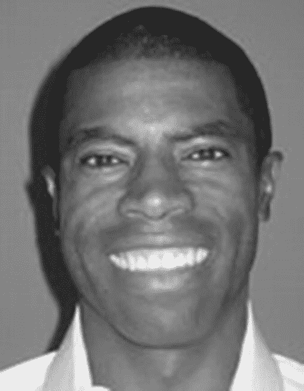

# 关于技术审校者

**查德（“肖德”）·达比**（Chád (“Shod”) Darby）是 Java 开发领域的作者、讲师和演讲者。作为 Java 应用与架构领域的公认权威，他曾在全球（美国、英国、印度、俄罗斯和澳大利亚）的软件开发大会上发表技术演讲。在 15 年的专业软件架构师生涯中，他曾为 Blue Cross/Blue Shield、Merck、Boeing、Red Hat 以及多家初创公司工作。

查德是多本 Java 书籍的合著者，包括 *Professional Java E-Commerce*（Wrox Press）、*Beginning Java Networking*（Wrox Press）以及 *XML and Web Services Unleashed*（Sams Publishing）。他拥有 Sun Microsystems 和 IBM 的 Java 认证，并持有卡内基梅隆大学的计算机科学学士学位。您可以访问查德的博客 [www.luv2code.com](http://www.luv2code.com) 观看他免费的 Java 视频教程。您也可以在 Twitter 上关注他：@darbyluvs2code。

© Bauke Scholtz, Arjan Tijms 2018

Bauke Scholtz 和 Arjan Tijms，《Java EE 8 中 JSF 的权威指南》，`doi.org/10.1007/978-1-4842-3387-0_1`

