# 2. 从零开始到 Hello World

Bauke Scholtz^(1 ) 和 Arjan Tijms²

(1) 库拉索岛威廉斯塔德

(2) 荷兰北荷兰省阿姆斯特丹

在本章中，你将学习如何从零开始，使用 Eclipse IDE（集成开发环境）、Payara 应用服务器和 H2 数据库搭建一个 JSF（JavaServer Faces）开发环境。

## 安装 Java SE JDK

你可能已经知道，Java SE 以 JRE 形式提供给最终用户，以 JDK 形式提供给软件开发人员。Eclipse 本身并不严格要求 JDK，因为它有自己的编译器。JSF 作为一个软件库，运行也不需要 JDK。然而，Payara 确实需要 JDK 才能运行，主要是为了能够编译 JSP 文件，尽管自 JSF 2.0 以来，JSP 已作为 JSF 视图技术被弃用。

因此，你需要确保已按照 Oracle 的说明安装了 JDK。当前的 Java SE 版本是 9，但由于 Java EE 8 是为目前更成熟的 Java SE 8 设计的，因此推荐使用 JDK 8：[`docs.oracle.com/javase/8/docs/technotes/guides/install/install_overview.html`](https://docs.oracle.com/javase/8/docs/technotes/guides/install/install_overview.html)。

最重要的部分是：PATH 环境变量应包含存放 Java 可执行文件的 /bin 文件夹（例如，“/path/to/jdk/bin”），并且 JAVA_HOME 环境变量应设置为 JDK 根文件夹（例如，“/path/to/jdk”）。JSF 本身并不严格要求这些，但 Eclipse 和 Payara 需要它们。Eclipse 需要 PATH 来查找 Java 可执行文件。Payara 需要 JAVA_HOME 来查找 JDK 工具。


### 关于 Java EE 需要注意什么？

请注意，你**不**需要从 Oracle.com 下载并安装 Java EE，即使 JSF 本身是 Java EE 的一部分。Java EE 基本上是一个抽象规范，而所谓的应用服务器则是其具体实现。这些应用服务器的例子包括 Payara、WildFly、TomEE、GlassFish 和 Liberty。正是这些应用服务器，开箱即用地提供了 JSF（JavaServer Faces）、EL（表达式语言）、CDI（上下文和依赖注入）、EJB（企业级 JavaBeans）、JPA（Java 持久化 API）、Servlet、WebSocket 和 JSON-P（JavaScript 对象表示法处理）等 API（应用程序编程接口）。

还存在所谓的 Servlet 容器，它们基本上只开箱即用地提供 Servlet、JASPIC（Java 容器认证服务提供者接口）、JSP（JavaServer Pages）、EL 和 WebSocket API，例如 Tomcat 和 Jetty。然而，在这样的 Servlet 容器上手动安装和配置 JSF、JSTL（JSP 标准标签库）、CDI、EJB 和 JPA 等组件需要一些工作。对于 EJB 来说，这甚至不是一件简单的事，因为它需要修改 Servlet 容器的内部结构。顺便提一下，这正是 TomEE 存在的原因。它是一个基于裸机 Tomcat Servlet 容器引擎构建的 Java EE 应用服务器。

回到 Oracle.com 上的 Java EE 下载，它基本上会提供 GlassFish 服务器，以及一堆文档和可选的 Netbeans IDE。我们不需要它，因为我们已经在使用 Payara 作为 Java EE 应用服务器，并且将 Eclipse 作为 IDE。因此，Java SE JDK 就足够了。

## 安装 Payara

Payara 是一个开源的 Java EE 应用服务器，于 2014 年从 GlassFish 分支出来。它基本上是对 Oracle 宣布停止对 GlassFish 商业支持的一种回应，因此以前商业使用 GlassFish 的公司可以轻松切换到 Payara 并继续享受商业支持。得益于对以前使用 GlassFish 的商业客户提供的商业支持，Payara 应用服务器软件可以持续进行错误修复和改进。

第一个集成 JSF 2.3 的 Payara 版本是 5。你可以从 [`payara.fish`](https://payara.fish) 下载它。请确保你选择的是 “Payara Server Full” 或 “Payara Server Web Profile” 下载，而不是例如 “Payara Micro” 或 “Payara Embedded”，因为它们有其他用途。安装基本上就是将下载的文件解压并放到你主目录下的某个位置。我们先把它放在那里，直到我们启动并运行 Eclipse，这样我们就可以将 Payara 集成到 Eclipse 中，并让它管理服务器。

### 其他服务器呢？

本书选择 Payara 的主要原因是，在撰写本文时，它是少数几个集成了 JSF 2.3 的 Java EE 应用服务器之一。另一个是 GlassFish，但我们不太推荐它，因为它基本上不提供商业支持或错误修复。GlassFish 必须被视为其他应用服务器供应商的真正参考实现，以便他们可以在必要时通过示例构建自己的应用服务器实现。

在撰写本文时，WildFly、TomEE 和 Liberty 还没有提供集成了 JSF 2.3 的版本。

## 安装 Eclipse

Eclipse 是一个用 Java 编写的开源 IDE。它基本上就像一个记事本，但拥有成千上万甚至数百万的额外功能，例如自动编译类文件、用它们构建 WAR 文件，并将其部署到应用服务器，而无需在命令控制台中手动摆弄 javac。

Eclipse 有很多种版本。由于我们将使用 Java EE 进行开发，我们需要名为 “Eclipse IDE for Java EE developers” 的版本。它通常是 [`eclipse.org/downloads/eclipse-packages/`](http://eclipse.org/downloads/eclipse-packages) 上排名最高的下载链接。同样，安装基本上就是将下载的文件解压并放到你主目录下的某个位置。

在 Windows 和 Linux 中，你会在解压后的文件夹中找到 eclipse.ini 配置文件。在 Mac OS 中，此配置文件位于 Eclipse.app/Contents/Eclipse 中。打开此文件进行编辑。我们想要增加分配给 Eclipse 的内存。在 eclipse.ini 的底部，你会找到以下几行：

```
-Xms256m
-Xmx1024m
```

这分别设置了 Eclipse 可以使用的初始和最大内存池大小。当你想开发一个像样的 Java EE 应用程序时，这有点太低了。让我们至少将这两个值都加倍。

```
-Xms512m
-Xmx2g
```

注意，声明的内存不要超过可用的物理内存。当实际内存使用量超过可用物理内存时，它会继续使用虚拟内存，通常是磁盘上的交换文件。这将大大降低性能，并导致严重的卡顿和速度减慢。

现在，你可以通过执行解压文件夹中的 eclipse 可执行文件来启动 Eclipse。系统会要求你选择一个目录作为工作空间。这是 Eclipse 将保存所有工作空间项目和元数据的目录。

之后，Eclipse 会显示一个欢迎屏幕。目前这并不重要。你可以点击右上角的 *Workbench* 按钮来关闭欢迎屏幕。如有必要，请取消选中右下角的 “Always show Welcome at start up”。之后，你将进入工作台。默认情况下，它看起来像图 2-1 中的截图。

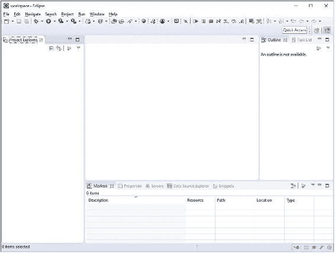

###### 图 2-1 Eclipse 工作台

### 配置 Eclipse

在我们可以开始编写代码之前，我们想对 Eclipse 进行一些微调，以免最终遇到麻烦或烦恼。Eclipse 有大量的设置，其中一些默认值本不应该成为默认值。你可以通过 *Window ➤ Preferences* 来查看和配置设置。

*   *General ➤ Workspace ➤ Text file encoding* 必须设置为 **UTF-8**。特别是在 Windows 中，否则可能会默认使用专有的 CP-1252 编码，该编码不支持拉丁语系以外的任何字符。当使用 CP-1252 读取和保存 Unicode 文件时，你可能会看到难以理解的字符序列。这也被称为“乱码”。¹

*   *General ➤ Workspace ➤ New text file line delimiter* 必须设置为 **Unix**。它在 Windows 上也能正常工作。这尤其能让版本控制系统保持满意。否则，在不同操作系统上拉取代码的开发人员可能会因为不同的换行符而面临令人困惑的冲突或差异。

*   *General ➤ Editors ➤ Text editors ➤ Spelling* 最好**禁用**。这将为你避免一个潜在的巨大烦恼，因为它会不必要地检查 faces-config.xml 和 web.xml 等 XML 配置文件中的拼写，导致这些文件中出现令人困惑的错误和警告。

*   *Java ➤ Compiler ➤ Compiler compliance level* 必须设置为 **1.8**。这是 Java EE 8 所需的最低 Java 版本。

*   *Java ➤ Installed JREs* 必须设置为 **JDK**，而不是 JRE。此设置通常也用于执行集成的应用服务器，而应用服务器通常需要 JDK。


### 安装 JBoss Tools 插件

当前版本的 Eclipse Java EE 标准版不支持任何 CDI 工具。它没有用于创建 CDI 托管 Bean 的向导，也没有用于 JSF 页面中 CDI 托管 Bean 的自动补全和超链接功能。JBoss Tools 插件是一个功能丰富的插件，其中就提供了 CDI 工具。² 这在开发 Java EE Web 应用程序时非常有用。

要安装它，请转到 *帮助 ➤ Eclipse Marketplace*。在搜索字段中输入“JBoss Tools”，然后点击 *Go*。在结果中向下滚动，直到看到 JBoss Tools Final，然后点击 *Install*（见图 2-2）。

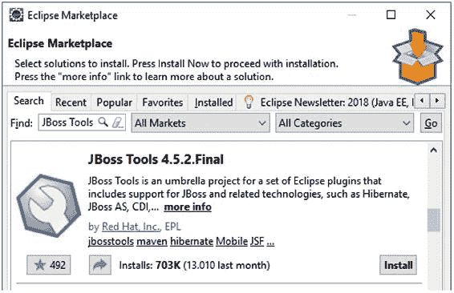

###### 图 2-2 Eclipse Marketplace 中的 JBoss Tools

在下一步中，您将看到一个相当长的列表，列出了所有 JBoss Tools 的组件。我们并不需要全部安装。该列表确实也包含一些与 JSF 相关的工具，但它们并不是特别有用。可视化页面编辑器则完全没有用处。通过拖拽来组装 JSF 页面并不能让您成为一名优秀的 JSF 开发者。只有亲自编写代码才能做到这一点。此外，安装并隐式启用了太多未使用的功能可能会使 Eclipse 变得极其缓慢。您选择的功能越少，IDE 行为发生意外变化的可能性就越小。因此，取消选中顶部的复选框，然后仅选中“Context and Dependency Injection Tools”（上下文和依赖注入工具）复选框（见图 2-3）。

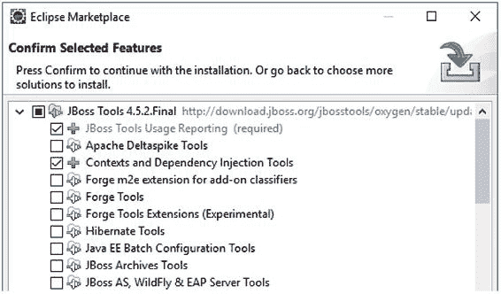

###### 图 2-3 暂时只选择 CDI 工具

接下来，接受许可协议的条款，并完成向导，直到 Eclipse 重新启动。

### 在 Eclipse 中集成新服务器

我们需要让 Eclipse 熟悉任何已安装的应用服务器，以便 Eclipse 能够无缝地将其 Java EE API 库链接到项目的构建路径中（即：项目的编译时类路径）。这是为了能够在您的项目中导入 Java EE API 中的类所必需的。您知道，应用服务器本身代表了抽象 Java EE API 的具体实现。

为了在 Eclipse 中集成一个新的应用服务器，首先检查工作台底部区域，那里有多个选项卡代表不同的*视图*（您可以通过 *窗口 ➤ 显示视图* 添加新的视图）。点击 *服务器* 选项卡以打开服务器视图（见图 2-4）。点击显示“没有可用的服务器。点击此链接创建一个新服务器...”的链接。

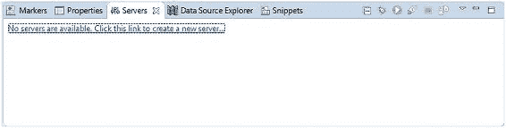

###### 图 2-4 Eclipse 工作台的服务器视图

从可用服务器工具列表中，选择 *Oracle ➤ GlassFish Tools*（见图 2-5）。

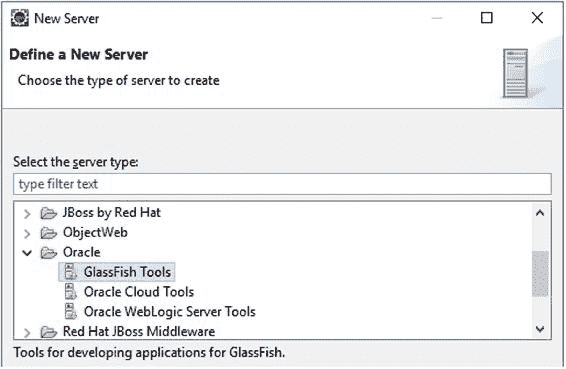

###### 图 2-5 在新建服务器向导中选择 GlassFish Tools

首次点击 *下一步* 后，它将在后台下载插件，并要求您在安装插件前接受许可协议。此插件是必需的，以便能够从工作台内部管理任何基于 GlassFish 的服务器——包括将 Eclipse 项目添加到部署文件夹或从中移除、启动和停止服务器，以及以调试模式运行服务器。安装完成后，它会要求您重新启动 Eclipse。请相应地进行操作。

返回工作区后，再次点击 *服务器* 视图中的相同链接。您现在将看到一个 *GlassFish* ➤ *GlassFish* 选项。选择此项，并将 *服务器名称* 字段设置为“Payara”（见图 2-6）。

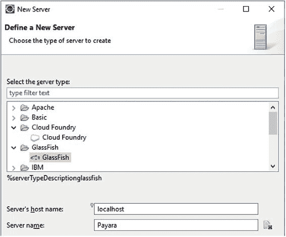

###### 图 2-6 在新建服务器向导中选择 GlassFish 服务器并将其命名为 Payara

进入下一步。在这里，您应该将 *GlassFish 位置* 字段指向 Payara 安装目录下的 glassfish 子文件夹，即您下载后解压缩的位置（见图 2-7）。

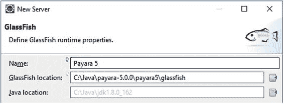

###### 图 2-7 在新建服务器向导中指定 GlassFish 位置

使用默认设置完成 *新建服务器* 向导的其余部分。您无需编辑任何其他字段。新添加的服务器现在将出现在 *服务器* 视图中（见图 2-8）。

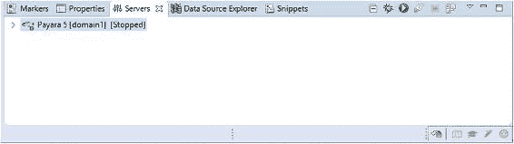

###### 图 2-8 服务器视图中的 Payara 服务器

## 在 Eclipse 中创建新项目

我们现在准备好在 Eclipse 中为我们的 JSF 应用程序创建一个新项目。这可以通过工作台的左侧区域完成，该区域默认只显示一个代表*项目资源管理器*视图的选项卡（同样，您可以通过 *窗口 ➤ 显示视图* 添加新视图）。在此视图中的任意位置右键单击，然后选择 *新建 ➤ 项目*。它将显示 *新建项目* 向导，其中可能包含过多的选项。

Eclipse 作为一个适用于多种不同项目任务的 IDE，提供了令人眼花缭乱的各种项目类型供您选择。对于将要部署为简单 WAR 文件的基于 Java EE 的应用程序，我们基本上有两种项目类型可供选择：*Web ➤ 动态 Web 项目* 和 *Maven ➤ Maven 项目*。

区别在于，前者是 Eclipse 原生项目，实际上只能在 Eclipse 上工作；而后者是一种通用项目类型，可以由任何 IDE 构建，也可以轻松地在命令行以及各种 CI 服务器（如 Travis 和 Jenkins）上构建。因此，Maven 项目类型实际上是唯一可行的选择（见图 2-9）。

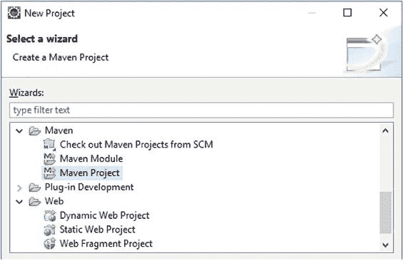

###### 图 2-9 在新建项目向导中选择 Maven 项目（注意动态 Web 项目是另一个但不可行的选项）

在下一步中，确保选中 *创建一个简单项目（跳过原型选择）* 选项（见图 2-10）。这将让我们从一个真正空的 Maven 项目开始，以便我们自己配置和填充它。当然，您也可以选择一个原型，这基本上是一个包含几个已准备好的文件和配置的模板项目。但目前我们不需要任何原型。

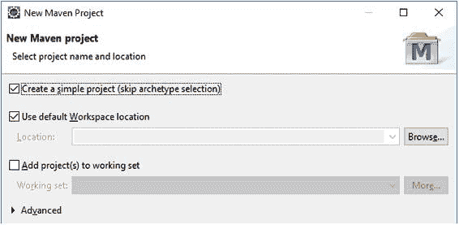

###### 图 2-10 在新建 Maven 项目向导中勾选“创建一个简单项目”

在下一步中，我们可以指定我们自己的项目 Maven 坐标。Maven 坐标包括 *Group Id*、*Artifact Id* 和 *Version*，在 Maven 世界中也被称为 GAV。*Group Id* 通常与您将要使用的根包名匹配，例如 com.example。*Artifact Id* 通常代表您将要使用的项目名称。为简单起见并为了与本书其余部分保持一致，我们将使用 project。*Version* 可以保持默认的 0.0.1-SNAPSHOT。最后，*Packaging* 应设置为 war。

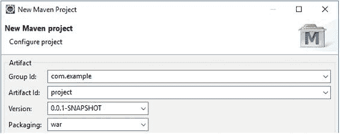

###### 图 2-11 在新建 Maven 项目向导中填写 Maven GAV

完成 *新建 Maven 项目* 向导的其余部分（见图 2-11）。您无需编辑任何其他字段。完成向导后，您将在 *项目资源管理器* 视图中看到项目结构（见图 2-12）。

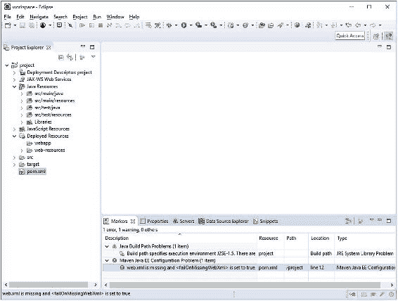


###### 图 2-12 Eclipse 中新建的 Maven 项目

遗憾的是，Eclipse 生成的 `pom.xml`（它是项目作为 Maven 项目并包含其配置的主要标志）并不理想。它已经过时了，即使是由最新的 Eclipse Oxygen 2（2017 年 12 月版）生成的也是如此。从 `pom.xml` 文件上标有令人警惕的红叉以及 *Markers* 视图中显示的错误消息，你就能看出这一点。任何至少有一个此类红叉的项目都无法构建，也无法部署。错误消息明确写着“web.xml is missing and <failOnMissingWebXml> is set to true.” 换句话说，Maven 不知何故认为这仍然是一个 Java EE 6 之前的项目，而实际上这已经是不允许的了。

为了解决这个问题，并使 Eclipse 生成的 `pom.xml` 符合当前标准，我们需要打开 `pom.xml` 进行编辑，并按照以下代码所示进行调整：

```
<project
    xmlns:="http://maven.apache.org/POM/4.0.0"
    xmlns:xsi="http://www.w3.org/2001/XMLSchema-instance"
    xsi:schemaLocation="http://maven.apache.org/POM/4.0.0
        http://maven.apache.org/xsd/maven-4.0.0.xsd"
>
    <modelVersion>4.0.0</modelVersion>

<groupId>com.example</groupId>
    <artifactId>project</artifactId>
    <version>0.0.1-SNAPSHOT</version>
    <packaging>war</packaging>

<properties>
        <project.build.sourceEncoding>
            UTF-8
        </project.build.sourceEncoding>
        <project.reporting.outputEncoding>
            UTF-8
        </project.reporting.outputEncoding>
        <maven.compiler.source>1.8</maven.compiler.source>
        <maven.compiler.target>1.8</maven.compiler.target>
        <failOnMissingWebXml>false</failOnMissingWebXml>
    </properties>

<dependencies>
        <dependency>
            <groupId>javax</groupId>
            <artifactId>javaee-api</artifactId>
            <version>8.0</version>
            <scope>provided</scope>
        </dependency>
    </dependencies>
</project>
```

保存此文件后，Eclipse 会自动处理并清除那个令人警惕的红叉。现在看起来好多了。我们将简要介绍这里最重要的设置。

*   打包方式 **war**——表示该项目是一个“Web”项目，并且项目的内容将被组装成一个 Web 归档文件。
*   编码 **UTF-8**——设置源文件所使用的编码，以及生成（报告）输出文件时应使用的编码。这使构建过程可重复，否则它将默认使用系统默认编码（同样，这是一个相当糟糕的默认设置）。
*   编译器 **1.8**——同时设置 `.java` 源文件中使用的 Java 版本以及 `.class` 文件中的字节码输出版本。如果不设置此项，Maven 会默认使用最旧的版本，有时甚至比最旧的版本还低。
*   failOnMissingWebXml **false**——旧版本的 Java EE 要求必须存在 `/WEB-INF/web.xml` 文件。尽管自 2009 年发布的 Java EE 6 以来，这已不再是必需项，但 Maven 仍然会检查此文件是否存在。将其设置为 `false` 可以避免这种不必要的检查。
*   依赖 **javax:javaee-api:8.0 provided**——声明了对 Java EE 8 API 的依赖，并确保编译器能够识别所有 Java EE 类型，例如 `@Named`。此依赖项被设置为 `provided`，因为这些类型已由目标运行时（在我们的例子中是 Payara）提供。因此，它们将仅用于编译源代码，而不会包含在生成的 `.war` 文件中。你必须绝对确保任何由目标运行时提供的编译时依赖项都被设置为 `provided`；否则，它们最终会出现在生成的 `.war` 文件中，你可能会遇到类加载问题，其中不同版本的重复库会相互冲突。如果你实际的目标不是完整的 Java EE 服务器，而是一个精简的 Servlet 容器，则需要按照 Mojarra 的 README 中的说明调整依赖项，³ Mojarra 是可用的 JSF 实现之一，实际上也是 Payara 底层使用的实现。

现在，在 Eclipse 的 *Markers* 视图中，只剩下一个警告，内容是“Build path specifies execution environment J2SE-1.5. There are no JREs installed in the workspace that are strictly compatible with this environment.” 嗯，这基本上意味着 Eclipse 将此 Maven 项目识别为仅支持 Java 1.5 的项目，而我们实际上并没有安装 Java SE 5，尽管 `pom.xml` 中的编译器版本已设置为 1.8。

为了告诉 Eclipse 这确实是一个 Java 1.8 项目，我们需要在 *Project Explorer* 视图中右键单击该项目，然后选择 *Properties*。在 *Project Facets* 部分，你应该将 *Java* facet 的版本从 1.5 更改为 1.8（如果你安装了 JDK 9，则更改为 9）（参见图 2-13）。同时，我们还需要更新 Servlet API 版本，并添加 CDI、JSF 和 JPA facet。Servlet API 由“Dynamic Web Module”条目表示。这需要设置为版本 4.0，以匹配 Java EE 8。此外，还需要选择“CDI”、“JavaServer Faces”和“JPA”条目。顺便提一下，“CDI”facet 只有在按照“安装 JBoss Tools 插件”一节的说明安装了 JBoss Tools 后才可用。

遗憾的是，在最新的可用 Eclipse 版本（2017 年 12 月的 Oxygen 2）中，下拉菜单中还没有 JSF 2.3 或 JPA 2.2 版本。可用的最高版本是 JSF 2.2 和 JPA 2.1。这不是一个大问题。它唯一的影响在于可用的代码生成器和向导。我们之后可以随时调整 Eclipse 生成的 `faces-config.xml` 和 `persistence.xml` 文件，以匹配 Java EE 8 兼容的版本。

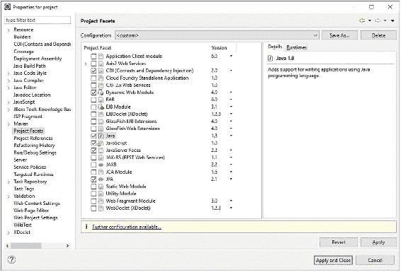

###### 图 2-13 项目属性的 Project Facets 部分（注意，Servlet API 版本由“Dynamic Web Module”表示）

正如你在黄色警告栏中所看到的，只有 Eclipse 需要进一步配置。这涉及到新选择的 JSF 和 JPA facet。点击该链接后，我们会看到 *Modify Faceted Project* 向导（参见图 2-14）。

*Modify Faceted Project* 向导的第一步允许我们配置 JPA facet。我们需要确保指示 Eclipse，JPA 实现已由目标运行时提供，因此 Eclipse 不需要包含任何库。这可以通过在 *JPA* *implementation* 字段中选择“Disable Library Configuration”选项来实现。由于我们将使用 Payara 提供的 Hibernate 作为实际的 JPA 实现，它会自动支持发现带有 `@Entity` 注解的类，我们希望指示 Eclipse 也这样做；否则，当通过实体代码生成向导进行操作时，它会自动将实体添加到 `persistence.xml` 中，或者当我们手动创建一个实体但未将其添加到 `persistence.xml` 时显示警告。

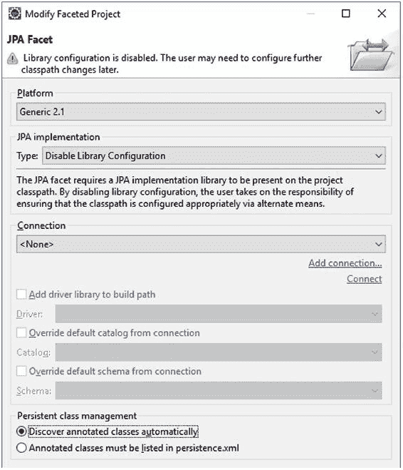


###### 图 2-14 JPA 方面配置

请注意，目前无需配置数据库连接，因为我们将使用嵌入式数据库。

在*修改方面项目*向导的下一步中，我们可以配置 JSF 功能（见图 2-15）。同样，我们需要确保 Eclipse 被告知 JSF 实现已由目标运行时提供，因此 Eclipse 无需包含任何库。这可以通过在*JSF 实现库*字段中选择“禁用库配置”选项来实现。此外，我们需要将 FacesServlet 的 Servlet 名称重命名为与虚构的实例变量名称一致：facesServlet。最后但同样重要的是，我们需要将 URL 映射模式从古老的 /faces/* 更改为现代的 *.xhtml。

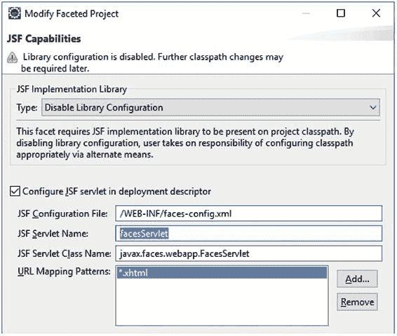

###### 图 2-15 JSF 功能配置

实际上，自 JSF 2.2 起，在 web.xml 中注册 FacesServlet 已不再是严格必需的；你甚至可以取消选中*在部署描述符中配置 JSF servlet* 选项，并依赖默认的自动注册映射 /faces/*、*.faces、*.jsf 和 *.xhtml。然而，由于这允许最终用户甚至搜索引擎爬虫通过不同的 URL 打开同一个 JSF 页面，从而在用户中造成混淆，并在搜索引擎爬虫中导致重复内容惩罚，我们最好只限制使用一个显式配置的 URL 模式。

现在，完成并应用所有向导和对话框。JPA 插件仅将生成的 persistence.xml 放在了错误的位置。你需要手动将其移动到 src/main/resources/META-INF。图 2-16 展示了工作台现在的样子。

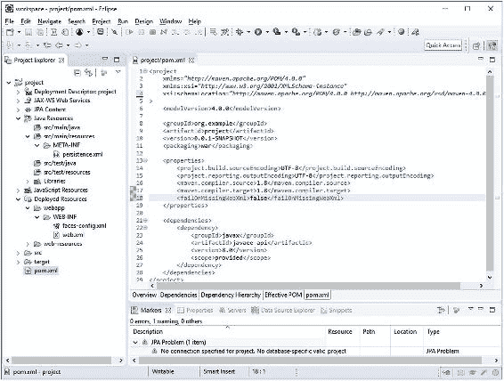

###### 图 2-16 在 Eclipse 中正确配置的 Java EE 8 Maven 项目

我们只需要调整所有部署描述符，使其与实际使用的 Servlet、JSF、JPA 和 CDI 版本保持一致。这通常通过调整部署描述符 XML 文件的根元素来设置所需的 XML 模式和版本完成。

你可以在 [`xmlns.jcp.org/xml/ns/javaee`](http://xmlns.jcp.org/xml/ns/javaee) 找到所有 Java EE 8 模式，这是一个实际的网页，目前会重定向到 Oracle.com 的某个登录页面。鉴于 Java EE 8 目前正从 Oracle 转移到 Eclipse，这种情况未来可能会改变。你可以通过双击部署描述符 XML 文件，然后在编辑器中选择*源*选项卡来打开它进行编辑。兼容 Java EE 8 的部署描述符的正确根元素声明如下：

```
src/main/webapp/WEB-INF/web.xml for Servlet 4.0:
<?xml version="1.0" encoding="UTF-8"?>
<web-app
    xmlns:="http://xmlns.jcp.org/xml/ns/javaee"
    xmlns:xsi="http://www.w3.org/2001/XMLSchema-instance"
    xsi:schemaLocation="http://xmlns.jcp.org/xml/ns/javaee
        http://xmlns.jcp.org/xml/ns/javaee/web-app_4_0.xsd"
    version="4.0"
>
    <!-- Servlet configuration here. -->
</web-app>
src/main/webapp/WEB-INF/faces-config.xml for JSF 2.3:
<?xml version="1.0" encoding="UTF-8"?>
<faces-config
    xmlns:="http://xmlns.jcp.org/xml/ns/javaee"
    xmlns:xsi="http://www.w3.org/2001/XMLSchema-instance"
    xsi:schemaLocation="http://xmlns.jcp.org/xml/ns/javaee
        http://xmlns.jcp.org/xml/ns/javaee/web-facesconfig_2_3.xsd"
    version="2.3"
>
    <!-- JSF configuration here. -->
</faces-config>
src/main/resources/META-INF/persistence.xml for JPA 2.2:
<?xml version="1.0" encoding="UTF-8"?>
<persistence
    xmlns:="http://xmlns.jcp.org/xml/ns/persistence"
    xmlns:xsi="http://www.w3.org/2001/XMLSchema-instance"
    xsi:schemaLocation="http://xmlns.jcp.org/xml/ns/persistence
        http://xmlns.jcp.org/xml/ns/persistence/persistence_2_2.xsd"
    version="2.2"
>
    <!-- JPA configuration here. -->
</persistence>
```

只有 Eclipse 当前可用的 JPA 插件会对此显示错误。你可以通过在项目属性中禁用 JPA 验证器来忽略此错误，但也可以暂时回退到使用兼容 JPA 2.1 的 persistence.xml。

最后，为了完整性，我们需要再创建一个部署描述符文件，即用于 CDI 2.0 的文件。这个文件不会自动生成，因为它不是必需的。CDI 在任何兼容 Java EE 8 的 Web 应用程序中默认都是启用的。它甚至是 JSF 正常运行所必需的。例如，新的 `<f:websocket>` 完全依赖于 CDI。右键单击项目的 /WEB-INF 文件夹，选择*新建 ➤ beans.xml 文件*。现在出现的*新建 beans.xml 文件*向导是 JBoss Tools 插件的一部分。保持所有选项为默认值，完成向导。它将生成如下文件：

```
src/main/webapp/WEB-INF/beans.xml for CDI 2.0:
<?xml version="1.0" encoding="UTF-8"?>
<beans
    xmlns:="http://xmlns.jcp.org/xml/ns/javaee"
    xmlns:xsi="http://www.w3.org/2001/XMLSchema-instance"
    xsi:schemaLocation="http://xmlns.jcp.org/xml/ns/javaee
        http://xmlns.jcp.org/xml/ns/javaee/beans_2_0.xsd"
    version="2.0" bean-discovery-mode="annotated"
>
    <!-- CDI configuration here. -->
</beans>
```

### 创建支持 Bean 类

项目现在已正确配置，我们可以开始开发实际的 MVC 应用程序。MVC 的控制器部分已在 web.xml 中配置为 FacesServlet。MVC 的模型部分正是我们现在要创建的。它基本上只是一个简单的 Java 类，按照 JSF 的惯例，它被称为*支持 Bean*，因为它“支持”一个视图。

右键单击项目的 src/main/java 文件夹，选择*新建 ➤ Bean*。现在出现的*新建 CDI Bean* 向导也是 JBoss Tools 插件的一部分（见图 2-17）。在此向导中，将*包*设置为 com.example.project.view，将*名称*设置为 HelloWorld，勾选*添加 @Named* 复选框，最后将*作用域*设置为 @RequestScoped。其余字段可以保持默认或留空。

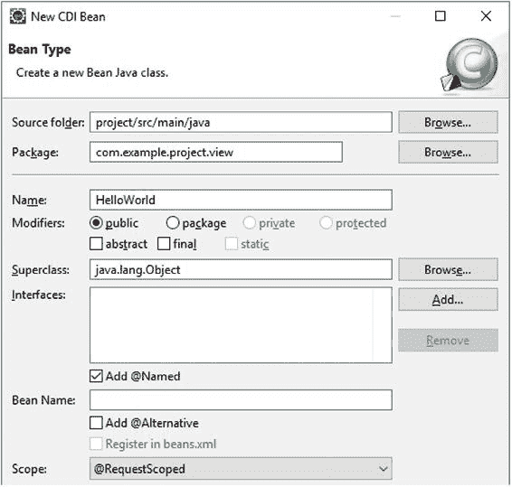


###### 图 2-17 Eclipse 中 JBoss Tools 提供的“新建 CDI Bean”向导

类编辑器现在将打开新创建的后台 Bean 类。我们将对其进行修改，删除无用的构造函数；添加两个属性 `input` 和 `output`；并为 `input` 属性添加 getter 和 setter 方法对，为 `output` 属性仅添加 getter 方法，以及一个 `submit()` 操作方法，该方法根据 `input` 属性准备 `output` 属性。提示：在 Eclipse 中，输入属性后，你可以在类编辑器中右键单击任意位置，然后选择 *Source ➤ Generate Getters and Setters*，让 IDE 自动生成它们。编辑后的后台 Bean 类应如下所示：

```
package com.example.project.view;

import javax.enterprise.context.RequestScoped;
import javax.inject.Named;

@Named @RequestScoped
public class HelloWorld {

    private String input;
    private String output;

    public void submit() {
        output = "Hello World! You have typed: " + input;
    }

    public String getInput() {
        return input;
    }

    public void setInput(String input) {
        this.input = input;
    }

    public String getOutput() {
        return output;
    }
}
```

我们将简要介绍此处使用的注解。

*   **@Named**——为 Bean 指定一个名称，主要用于通过 EL 引用它。如果不带任何属性，此名称默认为类名的首字母小写形式，因此此处为 "helloWorld"。它将通过 EL 中的 #{helloWorld} 访问。这可以在 JSF 页面中使用。

*   **@RequestScoped**——为 Bean 指定一个作用域，这意味着在给定的生命周期内使用 Bean 的同一个实例。在这种情况下，生命周期是 HTTP 请求的持续时间。当作用域结束时，Bean 会被自动销毁。你可以在第 8 章中阅读更多关于作用域的内容。

### 创建 Facelets 文件

接下来，我们将创建 MVC 的视图部分。它基本上只是一个 XHTML 文件，JSF 将其解释为 *Facelets 文件* 或简称为 *Facelet*。这个 Facelets 文件最终将生成 HTML 标记，这些标记作为对请求的响应发送到浏览器。借助 EL，它可以引用 Bean 属性并调用 Bean 操作。

右键单击项目的 webapp 文件夹，然后选择 *New ➤ XHTML Page*（参见图 2-18）。现在出现的 *New XHTML Page* 向导也是 JBoss Tools 插件的一部分。在此向导中，将 *File name* 设置为 hello.xhtml，然后完成向导。

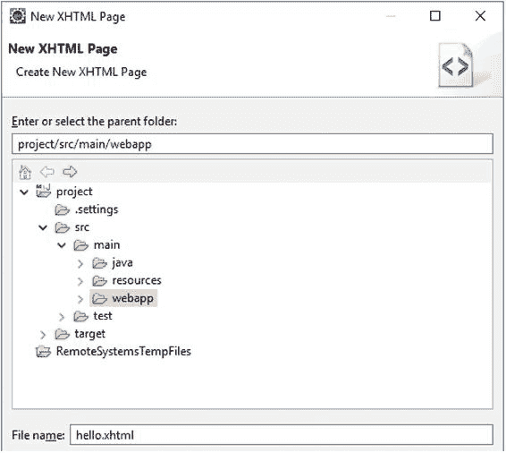

###### 图 2-18 Eclipse 中 JBoss Tools 提供的“新建 XHTML 页面”向导

XHTML 编辑器现在将打开新创建的 Facelets 文件。你还会注意到 *Palette* 视图显示在底部框中。这对于基于 JSF 的 Web 开发来说基本上没什么用。所以让我们关闭它。回到新创建的 Facelets 文件，它最初是空的。用以下内容填充它：

```
<!DOCTYPE html>
<html lang="en"
    xmlns:="http://www.w3.org/1999/xhtml"
    xmlns:f="http://xmlns.jcp.org/jsf/core"
    xmlns:h="http://xmlns.jcp.org/jsf/html"
>
    <h:head>
        <title>Hello World</title>
    </h:head>
    <h:body>
        <h1>Hello World</h1>
        <h:form>
            <h:outputLabel for="input" value="Input" />
            <h:inputText id="input" value="#{helloWorld.input}" />
            <h:commandButton value="Submit"
                action="#{helloWorld.submit}">
                <f:ajax execute="@form" render=":output" />
            </h:commandButton>
        </h:form>
        <h:outputText id="output" value="#{helloWorld.output}" />
    </h:body>
</html>
```

我们将简要介绍此处使用的 JSF 特定 XHTML 标签。

*   **<h:head>**——生成 HTML 的 <head>。它为 JSF 提供了自动包含任何必要 JavaScript 文件的机会，例如包含 <f:ajax> 所需逻辑的文件。

*   **<h:body>**——生成 HTML 的 <body>。你也可以在此特定 Facelet 中使用纯 HTML 的 <body>，但这样它就不会给任何其他 JSF 标签在 HTML <body> 末尾自动包含任何必要 JavaScript 的机会。

*   **<h:form>**——生成 HTML 的 <form>。JSF 会自动将视图状态包含在一个隐藏的输入字段中。

*   **<h:outputLabel>**——生成 HTML 的 <label>。你也可以在此特定 Facelet 中使用纯 HTML 的 <label>，但那样你就必须手动处理找出目标输入元素的实际 ID。

*   **<h:inputText>**——生成 HTML 的 <input type="text">。JSF 会自动获取并设置 `value` 属性中指定的 Bean 属性的值。

*   **<h:commandButton>**——生成 HTML 的 <input type="submit">。JSF 会自动调用 `action` 属性中指定的 Bean 方法。

*   **<f:ajax>**——生成 Ajax 行为所需的 JavaScript 代码。你也可以不使用它，但那样表单提交就不会异步执行。`execute` 属性表示提交时必须处理整个 <h:form>，而 `render` 属性表示 Ajax 提交完成后必须更新由 `id="output"` 标识的标签。

*   **<h:outputText>**——生成 HTML 的 <span>。这是在 Ajax 提交完成时被更新的标签。它只会打印 `value` 属性中指定的 Bean 属性。

这些 JSF 特定的 XHTML 标签也称为 *JSF 组件*。在接下来的章节中，将有更多关于 Facelets 文件和 JSF 组件的内容。请注意，你也可以在 Facelets 文件中完美地嵌入纯 HTML。只有在功能需要时，或者使用 JSF 组件更容易实现时，才应使用 JSF 组件。

### 部署项目

在 *Servers* 视图中，首先启动 Payara 服务器。你可以通过选择它，然后单击绿色箭头图标（其工具提示显示“启动服务器”）来执行此操作。当然，你也可以使用错误图标（其工具提示显示“以调试模式启动服务器”）。*Console* 视图将短暂显示服务器启动日志。等待服务器启动，并在 *Servers* 视图中获得 *Started* 状态（参见图 2-19）。

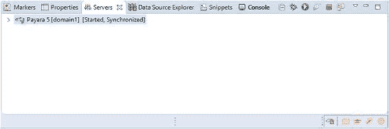

###### 图 2-19 Servers 视图中状态为 Started 的 Payara 服务器（请注意，Console 视图已高亮显示，因为它有未读的服务器日志）

现在右键单击 Payara 服务器条目，然后选择 *Add and Remove*。它将显示 *Add and Remove* 向导（参见图 2-20），该向导允许你向服务器添加和移除 WAR 项目。对我们新创建的项目执行此操作，然后完成向导。

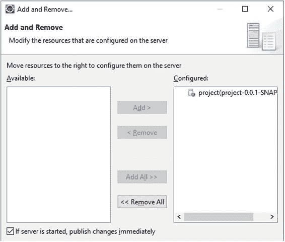

###### 图 2-20 Add and Remove 向导，其中项目已通过移动到右侧部署到服务器

必须明确指出，对于 Payara 和 GlassFish 服务器，最好在服务器已启动时执行此操作。当服务器关闭时移除项目，它可能仍然存在于服务器的部署文件夹中。这只是 GlassFish 自身的一个怪癖。例如，对于 WildFly 和 Tomcat 服务器，则不需要这样做。

现在，在你最喜欢的 Web 浏览器中打开一个标签页（参见图 2-21），输入地址 http://localhost:8080/project/hello.xhtml 以打开新创建的 JSF 页面。

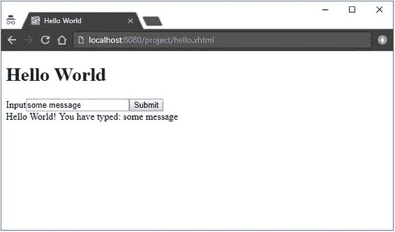


###### 图 2-21 Chrome 浏览器中的 Hello World 页面，其中输入字段已填入文本“some message”，并且已按下提交按钮

回到 URL，“localhost:8080”部分按惯例是任何以开发模式运行的 Java EE 服务器的默认域名。WildFly 和 TomEE 等其他服务器也使用相同的地址。“/project”部分按惯例是 Eclipse 项目的名称。用 Servlet 术语来说，这被称为“上下文路径”，可通过 `HttpServletRequest#getContextPath()` 获取，在 JSF 中则由 `ExternalContext#getRequestContextPath()` 委托处理。

上下文路径部分也可以设置为空字符串；这样部署的 Web 应用程序将位于域根目录下。在 Eclipse 中，这也可以在项目的属性中进行设置。首先，使用 *Add and Remove* 向导将项目从部署中移除。然后右键点击项目，选择 *Properties*，再选择 *Web Project Settings*。接着，将 *Context root* 字段设置为正斜杠“/”，并关闭属性窗口。最后，使用 *Add and Remove* 向导将项目重新添加到部署中。现在，它将被部署到域根目录，你可以通过 http://localhost:8080/hello.xhtml 访问 JSF 页面。我们甚至可以更进一步，将 hello.xhtml 设为默认登录页面，这样 URL 中也无需指定它。这可以通过在 web.xml 中添加以下条目来实现：

```
<welcome-file-list>
    <welcome-file>hello.xhtml</welcome-file>
</welcome-file-list>
```

请注意，Payara 可以配置为在项目中的资源发生更改时自动发布更改到部署。在保存编辑后的 web.xml 之前，在 *Servers* 视图中双击 Payara 服务器，展开 *Publishing* 部分，并选择 *Automatically publish when resource change*，同时设置一个较低的间隔，例如 0 秒（参见图 2-22）。

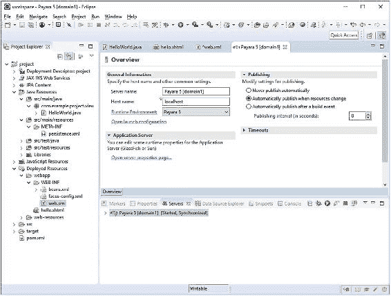

###### 图 2-22 Eclipse 中的 Payara 服务器配置，已启用自动发布并将间隔设置为 0 秒

现在，保存 web.xml，你会注意到 Eclipse 会立即触发 Payara 在仍在运行时发布更改。回到 Web 浏览器，你会注意到现在只需通过 http://localhost:8080 即可访问 JSF 页面（参见图 2-23）。

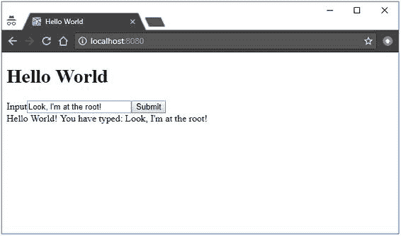

###### 图 2-23 Hello World 页面现在位于根目录

## 安装 H2

H2⁴ 是一个内存型 SQL 数据库。它是一个嵌入式数据库，对于快速建模和测试 JPA 实体非常有用，尤其是与基于 JPA 实体自动生成的 SQL 表结合使用时。将 H2 添加到你的 Web 应用程序项目中，只需在 pom.xml 的 `<dependencies>` 部分添加以下依赖项：

```
<dependency>
    <groupId>com.h2database</groupId>
    <artifactId>h2</artifactId>
    <version>1.4.196</version>
</dependency>
```

基本上就是这样。JDBC（Java 数据库连接）驱动程序已经内置其中。

### 配置数据源

为了能够与 SQL 数据库交互，我们需要在 Web 应用程序项目中配置一个所谓的数据源。这可以通过在 web.xml 中添加以下部分来完成：

```
<data-source>
    <name>java:global/DataSourceName</name>
    <class-name>org.h2.jdbcx.JdbcDataSource</class-name>
    <url>jdbc:h2:mem:test;DB_CLOSE_DELAY=-1</url>
</data-source>
```

数据源名称代表 JNDI（Java 命名和目录接口）名称。类名代表所使用的 JDBC 驱动程序的 `javax.sql.DataSource` 实现的完全限定名称。URL 代表特定于 JDBC 驱动程序的 URL 格式。其语法取决于所使用的 JDBC 驱动程序。对于数据库名称为“test”的内存型 H2 数据库，其 URL 即为 `jdbc:h2:mem:test`。H2 特有的 `DB_CLOSE_DELAY=-1` 路径参数基本上指示其 JDBC 驱动程序不要在数据库一段时间未被访问时自动关闭它，即使应用服务器仍在运行。

现在，可以在任何 Servlet 容器管理的工件（如 Servlet 或过滤器）中按如下方式注入 DataSource 的具体实例：

```
@Resource
private DataSource dataSource;
```

你可以通过 `DataSource#getConnection()` 从中获取 SQL 连接，用于传统的 JDBC 工作。然而，由于我们将要使用 Java EE，最好改用 Java EE 自身的 JPA 来实现。

### 配置 JPA

为了让 JPA 识别新添加的数据源，我们需要在 persistence.xml 中添加一个新的持久化单元，该单元将数据源用作 JTA 数据源。

```
<persistence-unit name="PersistenceUnitName" transaction-type="JTA">
    <jta-data-source>java:global/DataSourceName</jta-data-source>

    <properties>
        <property
            name="javax.persistence.schema-generation.database.action"
            value="drop-and-create" />
    </properties>
</persistence-unit>
```

如你所见，数据源通过其 JNDI 名称进行标识。你还会注意到一个 JPA 特有的属性 `javax.persistence.schema-generation.database.action`，其值为“drop-and-create”，这基本上意味着 Web 应用程序应基于 JPA 实体自动删除并创建所有 SQL 表。当然，这仅适用于原型设计目的，正如我们将在本书剩余部分使用此项目所做的那样。对于实际应用程序，你最好选择“create”或“none”（这是默认值）。事务类型设置为“JTA”基本上意味着应用服务器应自动管理数据库事务。这样，从客户端（通常是 JSF 支持 bean）对 EJB 的每次方法调用都会透明地启动一个新事务，当 EJB 方法返回给客户端（通常是调用它的支持 bean）时，事务会自动提交并刷新。并且，EJB 方法抛出的任何运行时异常都会自动回滚事务。

### 创建 JPA 实体

现在，我们将创建一个 JPA 实体。基本上，它是一个 JavaBean 类，代表数据库表中的一条记录。每个 bean 属性都映射到数据库表的特定列。通常，JPA 实体是针对现有数据库表进行建模的。但是，正如你在上一节“配置 JPA”中关于 persistence.xml 所读到的，反过来做也是可能的：基于 JPA 实体生成数据库表。

右键点击项目的 src/main/java 文件夹，选择 *New ➤ JPA Entity*。在向导中，将 *Package* 设置为 com.example.project.model，并将 *Name* 设置为 Message。其余字段可以保持默认或留空（参见图 2-24）。

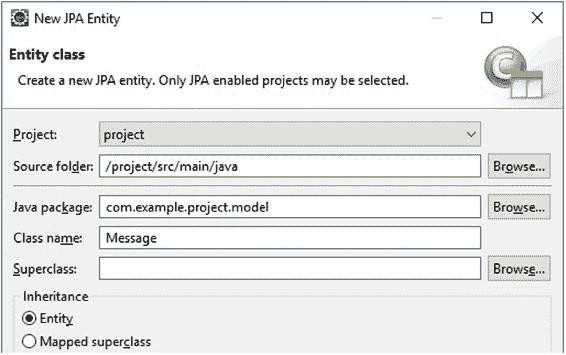


###### 图 2-24 Eclipse 中的新建 JPA 实体向导

按如下方式修改新的实体类：

```
package com.example.project.model;

import java.io.Serializable;
import javax.persistence.Column;
import javax.persistence.Entity;
import javax.persistence.GeneratedValue;
import javax.persistence.GenerationType;
import javax.persistence.Id;
import javax.persistence.Lob;
import javax.validation.constraints.NotNull;

@Entity
public class Message implements Serializable {

    private static final long serialVersionUID = 1L;

    @Id @GeneratedValue(strategy=GenerationType.IDENTITY)
    private Long id;

    @Column(nullable = false) @Lob
    private @NotNull String text;

    // 添加/生成 getter 和 setter 方法。
}
```

提醒一下，你可以通过在类编辑器中右键单击任意位置并选择 *Source ➤ Generate Getters and Setters* 来让 Eclipse 生成 getter 和 setter 方法。

我们将简要介绍这里使用的注解。

*   **@Entity**——将 Bean 标记为 JPA 实体，以便 JPA 实现会根据其所有属性自动收集与数据库相关的元数据。

*   **@Id @GeneratedValue(strategy=IDENTITY)**——将一个属性标记为映射到 SQL “IDENTITY” 类型的数据库列。在 MySQL 术语中，这相当于“AUTO_INCREMENT”。在 PostgreSQL 术语中，这相当于“BIGSERIAL”。

*   **@Column**——将一个属性标记为映射到常规数据库列。实际的数据库列类型取决于所使用的 Java 类型。如果没有额外的 @Lob 注解，它是一个 VARCHAR(255)，其长度可以通过 @Column(length=n) 来操作。然而，使用 @Lob 注解后，列类型变为 TEXT。

*   **@Lob**——将一个 String 属性标记为映射到 TEXT 类型的数据库列，而不是长度受限的 VARCHAR。

*   **@NotNull**——这实际上不是 JPA 的一部分，而是“Bean Validation”的一部分。简而言之，它确保在提交 JSF 表单以及持久化 JPA 实体时，Bean 属性被验证永远不会为 null。（参见第 5 章。）另请注意，这基本上复制了 @Column(nullable=false)，但这仅仅是因为 JPA 不会将任何 Bean Validation 注解视为有效的数据库元数据来生成相应的 SQL 表。

### 创建 EJB 服务

接下来，我们需要创建一个 EJB，以便能够将前述 JPA 实体的实例保存到数据库中，并获取 JPA 实体的列表。

右键单击项目的 src/main/java 文件夹，然后选择 *New ➤ Class*。在向导中，将 *Package* 设置为 com.example.project.service，并将 *Name* 设置为 MessageService（参见图 2-25）。其余字段可以保留默认值或留空。

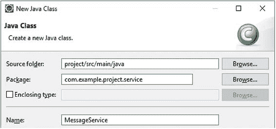

###### 图 2-25 Eclipse 中的新建 Java 类向导

按如下方式修改新的服务类：

```
package com.example.project.service;

import java.util.List;
import javax.ejb.Stateless;
import javax.persistence.EntityManager;
import javax.persistence.PersistenceContext;

@Stateless
public class MessageService {

    @PersistenceContext
    private EntityManager entityManager;

    public void create(Message message) {
        entityManager.persist(message);
    }

    public List<Message> list() {
        return entityManager
            .createQuery("FROM Message m", Message.class)
            .getResultList();
    }
}
```

基本上就是这样。让我们简要介绍一下这些注解。

*   **@Stateless**——将 Bean 标记为无状态 EJB 服务，以便应用服务器知道是否应该对其进行池化，以及何时启动和停止数据库事务。替代注解是 @Stateful 和 @Singleton。请注意，@Stateless 并不意味着容器会确保类本身是无状态的。作为开发人员，你仍然有责任确保该类不包含任何共享且可变的实例变量。否则，根据其用途，你最好将其标记为 @Stateful 或 @Singleton。

*   **@PersistenceContext**——基本上是从项目 persistence.xml 中配置的持久化单元注入 JPA 实体管理器。实体管理器反过来负责将所有 JPA 实体映射到 SQL 数据库。它将在幕后完成所有繁重的 JDBC 工作。

### 调整 Hello World

现在我们将调整之前创建的 HelloWorld 支持 Bean，以便将消息保存到数据库中，并在表格中显示所有消息。

```
@Named @RequestScoped
public class HelloWorld {

    private Message message = new Message();
    private List<Message> messages;

    @Inject
    private MessageService messageService;

    @PostConstruct
    public void init() {
        messages = messageService.list();
    }

    public void submit() {
        messageService.create(message);
        messages.add(message);
    }

    public Message getMessage() {
        return message;
    }

    public List<Message> getMessages() {
        return messages;
    }
}
```

请注意，你不需要为 message 和 messages 设置 setter 方法。我们将使用 Message 实体本身的 getter 和 setter 方法。

最后，按如下方式调整 hello.xhtml 的 <h:body> 部分：

```
<h1>Hello World</h1>
<h:form>
    <h:outputLabel for="input" value="Input" />
    <h:inputText id="input" value="#{helloWorld.message.text}" />
    <h:commandButton value="Submit"
        action="#{helloWorld.submit}">
        <f:ajax execute="@form" render=":table" />
    </h:commandButton>
</h:form>
<h:dataTable id="table" value="#{helloWorld.messages}" var="message">
    <h:column>#{message.id}</h:column>
    <h:column>#{message.text}</h:column>
</h:dataTable>
```

现在在你喜欢的 Web 浏览器中重新加载页面并创建一些消息（参见图 2-26）。

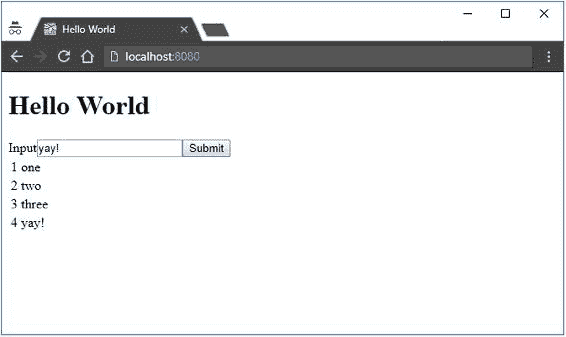

###### 图 2-26 使用 JSF、CDI、EJB 和 JPA 的 Hello World

