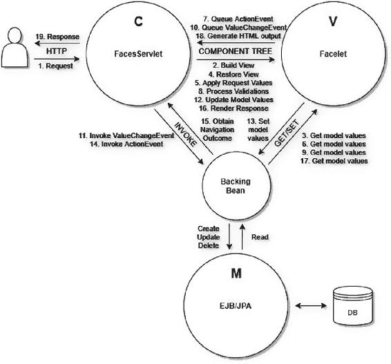

# 3. 组件

Bauke Scholtz¹ 与 Arjan Tijms²

(1) 库拉索岛威廉斯塔德

(2) 荷兰北荷兰省阿姆斯特丹

JSF（JavaServer Faces）是一个基于组件的 MVC（模型-视图-控制器）框架。本质上，JSF 将视图定义解析为“组件树”。该树的根由与 faces 上下文当前实例关联的“视图根”实例表示。

```
UIComponent tree = FacesContext.getCurrentInstance().getViewRoot();
```

视图通常使用 Facelets 文件中的 XHTML+XML 标记来定义。XML 是一种标记语言，非常适合用最少的代码来定义树形层次结构。组件树也可以在 Java 类中使用 Java 代码创建和操作，但这通常会导致代码非常冗长，以便声明值或方法表达式，并关联父子关系。通常，这样做的开发者并没有意识到如何使用诸如 JSTL（JavaServer Pages 标准标签库）之类的标签处理器，仅通过 XML 来操作组件树。

组件树基本上定义了 JSF 应如何处理 HTTP 请求，以便应用来自输入组件的请求值、转换和验证它们、更新托管 bean 模型值以及调用托管 bean 操作。它还定义了 JSF 应如何通过使用与组件关联的渲染器生成必要的 HTML 输出来产生 HTTP 响应，这些组件的属性又可以引用托管 bean 属性。换句话说，组件树定义了应如何处理 JSF 生命周期的各个阶段。图 3-1 中的图表显示了 HTTP 回传请求通常是如何被 JSF 处理的。



###### 图 3-1 JSF 如何在 MVC 架构中处理 HTTP 回传请求（数字表示顺序）

以下是每个步骤的简要描述：

1.  最终用户发送一个 HTTP 请求，该请求匹配 `FacesServlet` 的映射，从而调用它。

2.  `FacesServlet` 将根据 HTTP 请求路径标识的 Facelet 文件构建组件树。

3.  在构建视图期间，组件树将根据需要从支持 bean 获取当前模型值。任何 Facelets 模板标签和 JSTL 核心标签的属性，以及 JSF 组件的 "id" 和 "binding" 属性都将被执行。

4.  `FacesServlet` 将在组件树上恢复 JSF 视图状态。

5.  `FacesServlet` 将让组件树应用 HTTP 请求参数，输入组件将它们存储为“提交的值”。

6.  在检查 "rendered"、"disabled" 和 "readonly" 属性以检查它们是否被允许应用请求参数时，输入和命令组件将根据需要从支持 bean 获取当前模型值。

7.  当命令组件基于 HTTP 请求参数检测到它在客户端被调用时，它将排队 `ActionEvent`。

8.  `FacesServlet` 将让组件树处理所有已注册的转换器和验证器对提交的值进行处理，输入组件将新转换和验证的值存储为“本地值”。

9.  输入组件将从支持 bean 获取旧模型值，并将它们与新值进行比较。

10. 如果新值与旧模型值不同，则输入组件将排队 `ValueChangeEvent`。

11. 当所有转换和验证完成后，`FacesServlet` 将在支持 bean 上调用任何已排队的 `ValueChangeEvent` 的监听器方法。

12. `FacesServlet` 将让组件树更新所有模型值。

13. 输入组件将在支持 bean 中设置新的模型值。

14. `FacesServlet` 将在支持 bean 上调用任何已排队的 `ActionEvent` 的监听器方法。

15. 支持 bean 的最终操作方法将根据需要返回一个引用目标视图的非空字符串结果。

16. `FacesServlet` 将让组件树渲染响应。

17. 在生成 HTML 输出期间，组件树将根据需要从支持 bean 获取当前模型值。实际上，任何参与生成 HTML 输出的 Facelet 组件和 JSF 组件的属性都将被执行。

18. 组件树将把 HTML 输出写入 HTTP 响应。

19. `FacesServlet` 将把 HTTP 响应返回给最终用户。

这与基于请求的 MVC 框架不同，在后者中，开发者需要在与视图关联的“控制器”类中编写更多样板代码，以定义需要应用哪些请求参数，和/或在填充实体之前应如何转换和验证它们。开发者还经常需要在调用操作之前，通过手动调用一堆 getter 和 setter 来手动填充实体。所有这些在 JSF 中都是不必要的。

需要注意的是，支持 bean 在 MVC 范式中具有相当独特的地位。根据视角的不同，它可以充当模型、视图和控制器。这将在第 8 章中详细说明。

## 标准 HTML 组件

默认的 JSF 实现已经提供了一套广泛的组件，用于借助 Facelets 视图技术编写 HTML 页面。这些 HTML 组件可在 `http://xmlns.jcp.org/jsf/html` XML 命名空间 URI（统一资源标识符）下找到，该 URI 应分配给 "h" XML 命名空间前缀。

```
xmlns:h="http://xmlns.jcp.org/jsf/html"
```

JSF 页面中始终应存在的最重要的 HTML 组件是 `<h:head>` 和 `<h:body>`。没有它们，JSF 将无法自动包含与特定组件关联的任何脚本或样式表资源。例如，生成 HTML 提交按钮的 `<h:commandButton>`，其 Ajax 功能需要将 `jsf.js` 脚本文件包含在 HTML 文档中。

*   `<h:commandButton>`，生成一个 HTML 提交按钮。
*   `<h:commandButton>`，可以选择性地包含 Ajax 功能。
*   Ajax 功能需要在 HTML 文档中包含一个 `jsf.js` 脚本文件。

该组件的渲染器会自动处理这一点，但这仅在存在 `<h:head>` 时才有效。`<h:body>` 在这里稍微不那么重要，但可能存在需要在 HTML 正文末尾添加脚本的组件，例如 `<f:websocket>`。换句话说，最精简且符合 HTML5 规范的 JSF 页面如下所示：

```
<!DOCTYPE html>
<html lang="en"
    xmlns:="http://www.w3.org/1999/xhtml"
    xmlns:h="http://xmlns.jcp.org/jsf/html"
>
    <h:head>
        <title>标题</title>
    </h:head>
    <h:body>
        ...
    </h:body>
</html>
```

生成的 HTML 响应，您可以通过在普通 Web 浏览器中右键单击*查看页面源代码*来检查，应如下所示：

```
<!DOCTYPE html>
<html lang="en" xmlns:="http://www.w3.org/1999/xhtml">
    <head>
        <title>标题</title>
    </head>
    <body>
        ...
    </body>
</html>
```

您看，JSF 基本上将页面中的所有组件替换为其生成的 HTML 输出。如前所述，JSF 提供了一套广泛的标准 HTML 组件。表 3-1 提供了一个概览。


###### 表 3-1 JSF 提供的标准 HTML 组件

| 组件标签 | 组件超类 | 值类型 | HTML 输出 | 起始版本 |
| --- | --- | --- | --- | --- |
| <h:body> | UIOutput | - | <body> | 2.0 |
| <h:button> | UIOutcomeTarget | String | <button onclick=window.location> | 2.0 |
| <h:column> | UIColumn | - | <td> (用于 h:dataTable) | 1.0 |
| <h:commandButton> | UICommand | String | <input type=submit> | 1.0 |
| <h:commandLink> | UICommand | String | <a onclick=form.submit()> | 1.0 |
| <h:commandScript> | UICommand | - | <script> (用于提交表单的函数) | 2.3 |
| <h:dataTable> | UIData | Object[] | <table> (动态) | 1.0 |
| <h:doctype> | UIOutput | - | <!DOCTYPE> | 2.0 |
| <h:form> | UIForm | - | <form method=post> | 1.0 |
| <h:graphicImage> | UIGraphic | - |  | 1.0 |
| <h:head> | UIOutput | - | <head> | 2.0 |
| <h:inputFile> | UIInput | Part | <input type=file> | 2.2 |
| <h:inputHidden> | UIInput | Object | <input type=hidden> | 1.0 |
| <h:inputSecret> | UIInput | Object | <input type=password> | 1.0 |
| <h:inputText> | UIInput | Object | <input type=text> | 1.0 |
| <h:inputTextarea> | UIInput | Object | <textarea> | 1.0 |
| <h:link> | UIOutcomeTarget | String | <a href> | 2.0 |
| <h:message> | UIMessage | - | <span> (如有必要) | 1.0 |
| <h:messages> | UIMessages | - | <ul> | 1.0 |
| <h:messages layout=table> | UIMessages | - | <table> | 1.0 |
| <h:outputFormat> | UIOutput | Object | <span> (如有必要) | 1.0 |
| <h:outputLabel> | UIOutput | String | <label> | 1.0 |
| <h:outputText> | UIOutput | Object | <span> (如有必要) | 1.0 |
| <h:outputScript> | UIOutput | - | <script> | 2.0 |
| <h:outputStylesheet> | UIOutput | - | <link rel=stylesheet> | 2.0 |
| <h:panelGrid> | UIPanel | - | <table> (静态) | 1.0 |
| <h:panelGroup> | UIPanel | - | <span> | 1.0 |
| <h:panelGroup layout=block> | UIPanel | - | <div> | 1.2 |
| <h:selectBooleanCheckbox> | UIInput | Boolean | <input type=checkbox> | 1.0 |
| <h:selectManyCheckbox> | UIInput | Object[] | <table><input type=checkbox>* | 1.0 |
| <h:selectManyListbox> | UIInput | Object[] | <select multiple size=n><option>* | 1.0 |
| <h:selectManyMenu> | UIInput | Object[] | <select multiple size=1><option>* | 1.0 |
| <h:selectOneListbox> | UIInput | Object | <select size=n><option>* | 1.0 |
| <h:selectOneMenu> | UIInput | Object | <select size=1><option>* | 1.0 |
| <h:selectOneRadio> | UIInput | Object | <table><input type=radio>* | 1.0 |
| <h:selectOneRadio group> | UIInput | Object | <input type=radio name=group> | 2.3 |

“组件超类”列指定了该组件所继承的最重要的 UIComponent 超类。您必须将指定的类理解为来自 `javax.faces.component` 包。

“值类型”列指定了组件 `value` 属性背后模型值所支持的类型（如果存在）。如果值类型是 `String`，则意味着只有模型值的 `toString()` 结果会被用作组件的值，通常用于将其渲染为某种标签的组件。如果是 `Object`，则意味着它支持任何类型的值，通常用于将其渲染为文本或将其解析为输入值的组件，必要时可借助隐式或显式转换器。如果值类型是 `Object[]`，则意味着它需要一个对象数组或集合作为模型值，通常用于数据和多选输入组件，必要时可借助隐式或显式转换器。

有两个专门的输入组件：`<h:inputFile>` 将上传的文件绑定到 `javax.servlet.http.Part` 属性，并且出于安全原因不支持输出该文件；`<h:selectBooleanCheckbox>` 将选中值绑定到一个布尔属性。这两个输入组件不支持转换器，因此也不支持任何其他模型值类型。

“HTML 输出”列指定了生成的最小 HTML 输出。如果 HTML 输出显示“如有必要”，则意味着仅当组件指定了任何需要作为 HTML 元素属性输出的属性（例如 `id`、`styleClass`、`onclick` 等）时，才会发出指定的 HTML 元素。也就是说，组件可以具有完全不会出现在生成的 HTML 输出中的属性，例如 `binding`、`rendered`、`converter` 等。如果一个组件可以有多种 HTML 元素表示形式，那么通常由 `layout` 属性控制，正如您在 `<h:messages>` 和 `<h:panelGroup>` 中看到的那样。如果 HTML 输出包含“*”（星号），则意味着该组件可能会发出零个或多个指定的嵌套 HTML 元素。

“起始版本”列指示该 HTML 组件首次可用的 JSF 版本。在撰写本书时，可用的 JSF 版本如下：1.0（2004 年 3 月）、1.1（2004 年 5 月）、1.2（2006 年 5 月）、2.0（2009 年 7 月）、2.1（2010 年 11 月）、2.2（2013 年 3 月）和 2.3（2017 年 3 月）。

各个 HTML 组件的详细信息将在第 4 章和第 6 章中介绍。

## 标准核心标签

除了标准 HTML 组件之外，JSF 还提供了一组“核心”标签。这些本质上是“辅助”标签，允许您通过嵌套在目标 HTML 组件中或包裹它们来声明式地配置一个或多个目标 HTML 组件。这些核心标签可在 XML 命名空间 URI `http://xmlns.jcp.org/jsf/core` 下找到，该 URI 应分配给 XML 命名空间前缀 `"f"`。

```
xmlns:f="http://xmlns.jcp.org/jsf/core"
```

从技术上讲，这些标签旨在可重用于非 HTML 组件。JSF 提供了将不同的渲染工具包附加到组件树的可能性，该工具包不生成 HTML 输出，而是生成不同的标记——因此使用了不同的 XML 命名空间。表 3-2 提供了一个概览。


###### 表 3-2 JSF 提供的标准核心标签

| 核心标签 | 创建/处理的对象 | 目标组件 | 起始版本 |
| --- | --- | --- | --- |
| <f:actionListener> | javax.faces.event.ActionListener | ActionSource | 1.0 |
| <f:ajax> | javax.faces.component.behavior.AjaxBehavior | ClientBehaviorHolder(s) | 2.0 |
| <f:attribute> | UIComponent#getAttributes() | UIComponent | 1.0 |
| <f:attributes> | UIComponent#getAttributes() | UIComponent | 2.2 |
| <f:convertDateTime> | javax.faces.convert.DateTimeConverter | (Editable)ValueHolder | 1.0 |
| <f:convertNumber> | javax.faces.convert.NumberConverter | (Editable)ValueHolder | 1.0 |
| <f:converter> | javax.faces.convert.Converter | (Editable)ValueHolder | 1.0 |
| <f:event> | javax.faces.event.ComponentSystemEvent | UIComponent | 2.0 |
| <f:facet> | UIComponent#getFacets() | UIComponent | 1.0 |
| <f:importConstants> | javax.faces.component.UIImportConstants | UIViewRoot (元数据) | 2.3 |
| <f:loadBundle> | java.util.ResourceBundle | UIViewRoot | 1.0 |
| <f:metadata> | javax.faces.view.ViewMetadata | UIViewRoot | 2.0 |
| <f:param> | javax.faces.component.UIParameter | UIComponent | 1.0 |
| <f:passthroughAttribute> | UIComponent#getPassthroughAttributes() | UIComponent | 2.2 |
| <f:passthroughAttributes> | UIComponent#getPassthroughAttributes() | UIComponent | 2.2 |
| <f:phaseListener> | javax.faces.event.PhaseListener | UIViewRoot | 1.0 |
| <f:selectItem> | javax.faces.component.UISelectItem | UISelectOne/UISelectMany | 1.0 |
| <f:selectItems> | javax.faces.component.UISelectItems | UISelectOne/UISelectMany | 1.0 |
| <f:setPropertyActionListener> | javax.faces.event.ActionListener | ActionSource | 1.0 |
| <f:subview> | javax.faces.component.NamingContainer | UIComponents | 1.0 |
| <f:validateBean> | javax.faces.validator.BeanValidator | UIForm | 2.0 |
| <f:validateDoubleRange> | javax.faces.validator.DoubleRangeValidator | EditableValueHolder | 1.0 |
| <f:validateLength> | javax.faces.validator.LengthValidator | EditableValueHolder | 1.0 |
| <f:validateLongRange> | javax.faces.validator.LongRangeValidator | EditableValueHolder | 1.0 |
| <f:validateRegex> | javax.faces.validator.RegexValidator | EditableValueHolder | 2.0 |
| <f:validateRequired> | javax.faces.validator.RequiredValidator | EditableValueHolder | 2.0 |
| <f:validateWholeBean> | javax.faces.validator.BeanValidator | UIForm | 2.3 |
| <f:validator> | javax.faces.validator.Validator | EditableValueHolder | 1.0 |
| <f:valueChangeListener> | javax.faces.event.ValueChangeListener | EditableValueHolder | 1.0 |
| <f:view> | javax.faces.component.UIViewRoot | UIComponents | 1.0 |
| <f:viewAction> | javax.faces.component.UIViewAction | UIViewRoot (元数据) | 2.2 |
| <f:viewParam> | javax.faces.component.UIViewParameter | UIViewRoot (元数据) | 2.0 |
| <f:websocket> | javax.faces.component.UIWebsocket | UIViewRoot (主体资源) | 2.3 |

历史上还有一个 `<f:verbatim>` 标签，但它的目标组件是自 JSF 2.0 起已弃用的 JSP（Java Server Pages）视图技术，因此自 JSF 2.0 起它也被弃用了。

“创建/处理的对象”列指定了核心标签在指定目标组件上创建或处理的对象。

“目标组件”列指定了核心标签所支持的目标组件超类或接口。您应理解指定的类或接口来自 `javax.faces.component` 包。如果目标组件以可选复数形式出现（如 `UIComponent(s)`），则表示核心标签可以嵌套在目标组件内部，也可以包裹一个或多个目标组件。如果目标组件以明确复数形式出现（如 `UIComponents`），则表示核心标签只能包裹一个或多个目标组件，而不能嵌套。

关于目标组件接口：`ActionSource` 接口由 `UICommand` 组件实现。`ClientBehaviorHolder` 接口由 `UIForm`、`UIInput`、`UICommand`、`UIData`、`UIOutput`、`UIPanel` 和 `UIOutcomeTarget` 组件实现。`ValueHolder` 接口由 `UIOutput` 和 `UIInput` 组件实现。`EditableValueHolder` 接口由 `UIInput` 组件实现。基于表 3-1，您应该能够从中推导出实际的 HTML 组件。

“起始版本”列指示了该核心标签首次可用的 JSF 版本。在本书撰写时，可用的 JSF 版本包括：1.0（2004 年 3 月）、1.1（2004 年 5 月）、1.2（2006 年 5 月）、2.0（2009 年 7 月）、2.1（2010 年 11 月）、2.2（2013 年 3 月）和 2.3（2017 年 3 月）。

大多数单独的核心标签将在后续各章节中详细说明。

## 生命周期

JSF 拥有一个定义非常清晰的生命周期。它被分解为六个阶段。每个阶段都会让 HTTP 请求流经组件树，对其执行操作，并触发组件系统事件。本章引言部分已结合图表（图 3-1）给出了简要描述。以下各节将描述生命周期的每个阶段。

### 恢复视图阶段（第一阶段）

首先创建 `UIViewRoot` 实例，并根据任何 `<f:view>` 标签设置其属性（如区域设置）。此时组件树仍然是空的。只有当当前请求是回传请求，或者视图包含带有子元素的 `<f:metadata>` 时，才会根据视图定义构建完整的组件树。基本上，会根据视图中定义的组件标签实例化一个特定的 `UIComponent` 子类，并用视图中定义的所有属性填充它，然后调用 `UIComponent#setParent()`，并传入实际的父组件。

`UIComponent#setParent()` 方法首先会检查是否已存在父组件，如果存在，则会在旧父组件上触发 `PreRemoveFromViewEvent`。然后，当新父组件设置完毕，当前组件成为组件树的一部分时，会使用当前组件触发 `PostAddToViewEvent`。

如果当前请求是回传请求，则会将由 `javax.faces.ViewState` 请求参数标识的“视图状态”恢复到新构建的组件树中。之后，会为树中的每个组件显式触发 `PostRestoreStateEvent`，即使组件树实际上并未被构建或恢复。换句话说，即使不是回传请求，也会触发该事件。您最好将此事件重新解释为“PostRestoreViewPhase”。如果在 `PostRestoreStateEvent` 期间，您确实关心它是否是回传请求，则还应查阅 `FacesContext#isPostback()`。

在该阶段结束时，如果完整的组件树实际上尚未构建，则会立即进入渲染响应阶段（第六阶段），从而跳过中间的所有阶段。


### 应用请求值阶段（第二阶段）

`UIComponent#processDecodes()` 将在 `UIViewRoot` 上被调用。`processDecodes()` 方法首先会在每个子组件和 facet 上调用 `processDecodes()`，然后在其自身上调用 `UIComponent#decode()`。最后，调用 `UIViewRoot#broadCastEvents()` 来触发为当前阶段排队的任何 `FacesEvent`。默认的 JSF API（应用程序编程接口）不提供此类事件，但开发者可以创建并排队自己的事件。

`decode()` 方法的默认实现将委托给 `Renderer#decode()` 方法。在组件或渲染器的 `decode()` 方法中，实现有机会从请求参数中提取提交的值，并将其设置为内部属性。在标准 HTML 组件集中，唯一执行此操作的组件是派生自 `UIForm`、`UIInput` 和 `UICommand` 的基于 HTML 表单的组件。`UIForm` 组件将调用 `UIForm#setSubmitted()` 并传入 `true`。`UIInput` 组件将调用 `UIInput#setSubmittedValue()` 并传入请求参数的值。`UICommand` 组件将为调用应用阶段（第五阶段）排队 `ActionEvent`。

### 处理验证阶段（第三阶段）

`UIComponent#processValidators()` 将在 `UIViewRoot` 上被调用。`processValidators()` 方法基本上会首先为当前组件触发 `PreValidateEvent`，然后在每个子组件和 facet 上调用 `processValidators()`，接着为当前组件触发 `PostValidateEvent`。最后，它将调用 `UIViewRoot#broadCastEvents()` 来触发为当前阶段排队的任何 `FacesEvent`，这通常是 `ValueChangeEvent` 的一个实例。

在标准 HTML 组件集中，只有 `UIInput` 组件在此处行为不同。在调用每个子组件和 facet 的 `processValidators()` 之前，它们会首先在其自身上调用 `UIInput#validate()`。如果在应用请求值阶段（第二阶段）设置了提交的值，那么它们会首先在任何附加的 `Converter` 上调用 `Converter#getAsObject()`。当它没有抛出 `ConverterException` 时，它们会在所有附加的 `Validator` 实例上调用 `Validator#validate()`，无论其中是否有任何一个抛出了 `ValidatorException`。

当没有抛出 `ConverterException` 或 `ValidatorException` 时，将使用转换并验证后的值调用 `UIInput#setValue()`，并且 `UIInput#isLocalValueSet()` 标志将返回 `true`，同时将使用 `null` 调用 `UIInput#setSubmittedValue()`。

当抛出了任何 `ConverterException` 或 `ValidatorException` 时，将使用 `false` 调用 `UIInput#setValid()`，并且异常的消息将通过 `FacesContext#addMessage()` 添加到 faces 上下文中。最后，当 `UIInput#isValid()` 返回 `false` 时，将使用 `true` 调用 `FacesContext#setValidationFailed()`。

在该阶段结束时，当 `FacesContext#isValidationFailed()` 返回 `true` 时，立即前进到渲染响应阶段（第六阶段），从而跳过中间的任何阶段。

### 更新模型值阶段（第四阶段）

`UIComponent#processUpdates()` 将在 `UIViewRoot` 上被调用。`processUpdates()` 方法将依次在每个子组件和 facet 上调用 `processUpdates()` 方法。最后，它将调用 `UIViewRoot#broadCastEvents()` 来触发为当前阶段排队的任何 `FacesEvent`。默认的 JSF API 不提供此类事件，但开发者可以创建并排队自己的事件。

同样在此阶段，在标准 HTML 组件集中，只有 `UIInput` 组件在此处有一个钩子。在调用每个子组件和 facet 的 `processUpdates()` 之后，它们会在其自身上调用 `UIInput#updateModel()`。当 `UIInput#isValid()` 和 `UIInput#isLocalValueSet()` 都返回 `true` 时，它们将使用 `getLocalValue()` 作为参数调用值属性背后的 setter 方法，并立即使用 `null` 调用 `UIInput#setValue()`，同时清除 `UIInput#isLocalValueSet()` 标志。

当在此处抛出 `RuntimeException`（通常由 setter 方法本身的错误引起）时，它将使用 `false` 调用 `UIInput#setValid()`，并排队 `UpdateModelException`，然后立即前进到渲染响应阶段（第六阶段），从而跳过中间的任何阶段。

### 调用应用阶段（第五阶段）

将调用 `UIViewRoot#processApplication()`。此方法将依次调用 `UIViewRoot#broadCastEvents()` 来触发为当前阶段排队的任何 `FacesEvent`，这通常是 `AjaxBehaviorEvent` 或 `ActionEvent` 的实例。请注意，`processApplication()` 方法仅在 `UIViewRoot` 类上定义，并且不会遍历组件树。

### 渲染响应阶段（第六阶段）

当组件树仍然为空时，即当请求不是回发请求，或者视图没有包含子组件的 `<f:metadata>`，或者开发者在此期间使用自己的实例显式调用了 `FacesContext#setViewRoot()` 时，则基于视图定义构建完整的组件树。当组件树存在时，首先为 `UIViewRoot` 触发 `PreRenderViewEvent`，然后在 `UIViewRoot` 上调用 `UIComponent#encodeAll()`，接着为 `UIViewRoot` 触发 `PostRenderViewEvent`。

`UIComponent#encodeAll()` 方法基本上会首先在其自身上调用 `encodeBegin()`，然后如果 `UIComponent#getRendersChildren()` 返回 `true`，则在其自身上调用 `encodeChildren()`，否则在每个子组件上调用 `UIComponent#encodeAll()`，然后在其自身上调用 `encodeEnd()`。所有这些仅在 `UIComponent#isRendered()` 返回 `true` 时发生——也就是说，当组件标签的 `rendered` 属性计算结果不为 `false` 时。

`encodeBegin()` 方法的默认实现会首先为当前组件触发 `PreRenderComponentEvent`，然后委托给 `Renderer#encodeBegin()`。`encodeChildren()` 方法的默认实现会委托给 `Renderer#encodeChildren()`。`encodeEnd()` 方法的默认实现会委托给 `Renderer#encodeEnd()`。如果组件没有附加渲染器，即当 `UIComponent#getRendererType()` 返回 `null` 时，则不会向响应中渲染任何 HTML 输出。

在 `encodeBegin()` 方法中，组件或渲染器实现有机会将开头的 HTML 元素及其所有属性写入响应。在 `encodeChildren()` 方法中，组件或渲染器实现有机会在必要时装饰或覆盖子组件的渲染。在 `encodeEnd()` 方法中，组件或渲染器实现有机会写入结尾的 HTML 标签。向响应写入内容是通过 `FacesContext#getResponseWriter()` 可用的响应写入器完成的。

对于在任何阶段触发的任何提到的 `XxxEvent` 类，如果任何监听器方法抛出 `javax.faces.event.AbortProcessingException`，¹ 则当前正在运行的阶段将立即中止，并且生命周期将立即前进到渲染响应阶段（第六阶段），从而跳过中间的任何阶段。


## Ajax 生命周期

Ajax 请求期间的生命周期几乎相同。只有第二、三、四和第六阶段略有不同。`processDecodes()`、`processValidators()` 和 `processUpdates()` 方法仅会在 `UIViewRoot` 本身以及 `<f:ajax execute>` 中指定的组件搜索表达式所覆盖的任何组件上被调用。而 `encodeAll()` 方法仅会在 `UIViewRoot` 本身以及 `<f:ajax render>` 中指定的组件搜索表达式所覆盖的任何组件上被调用。更多关于搜索表达式的内容，请参阅第 12 章。

因此请注意，当组件搜索表达式包含 `"@all"` 关键字时，Ajax 生命周期不会有任何区别。换句话说，请谨慎使用 `"@all"`。在实际应用场景中，使用 `<f:ajax execute="@all">` 并不合理。在 HTML 端，不可能同时提交多个表单。只有包含该组件的表单会被提交。因此，最大的价值在于 `<f:ajax execute="@form">`。然而，对于 `<f:ajax render="@all">` 有一个合理的实际用例，即在 Ajax 请求期间抛出异常时渲染完整的错误页面。即便如此，这也只能通过 `PartialViewContext#setRenderAll()` 以编程方式触发。更多细节，请参阅第 9 章。

## 视图构建时间

“视图构建时间”并不与 JSF 生命周期的某个特定阶段绑定。视图构建时间是指根据视图定义，用其所有子节点填充物理 `UIViewRoot` 实例的时刻。

当 JSF 准备根据视图定义创建一个 `UIComponent` 实例时，它会首先检查组件表示的 `binding` 属性是否返回一个具体的 `UIComponent` 实例，如果是，则继续使用该实例；否则，根据与之关联的“组件类型”创建 `UIComponent` 实例，然后（如果存在）调用 `binding` 属性对应的 setter 方法。如果视图定义中指定了组件表示的 `id` 属性，则会调用 `UIComponent#setId()`。最后，会调用 `UIComponent#setParent()` 设置父组件，然后该组件实例就成为组件树的一部分。这个树将一直存在，直到渲染响应阶段（第六阶段）结束。之后，它连同已释放的 `FacesContext` 实例一起，成为垃圾回收器的候选对象。

因此，`UIComponent` 实例本质上是请求作用域的。`binding` 属性可以引用一个受管 bean 属性，但由于 `UIComponent` 实例本质上是请求作用域的，目标受管 bean 也必须是请求作用域的，而不能是更宽的作用域。JSF API 不会检查这一点，因此作为开发者，你必须绝对确保在任何组件的 `binding` 属性中，不要引用更宽作用域的受管 bean。

然而，当 `binding` 属性引用了比请求作用域更宽的受管 bean 时，你不仅基本上是在将整个组件树保存到 HTTP 会话中（如果 bean 是视图或会话作用域），而且你还在本质上跨多个并发访问同一个受管 bean 实例的 HTTP 请求共享整个组件树——这非常低效且危险。

从技术上讲，视图构建时间可以发生在任何 JSF 生命周期阶段。通常，它发生在恢复视图阶段（第一阶段），特别是在回传请求期间，或者当视图包含带有子元素的 `<f:metadata>` 时。它也可能发生在渲染响应阶段（第六阶段），特别是在 GET 请求期间，当视图没有包含子元素的 `<f:metadata>` 时，或者在回传期间发生了非重定向导航时。当开发者以编程方式调用 `ViewDeclarationLanguage#buildView()` 时也会发生，这可以通过 `ViewHandler#createView()` 等方式隐式完成，如下面的操作方法代码示例所示，该示例强制我们从零开始完全重建当前视图：

```
public void rebuildCurrentView() {
    FacesContext context = FacesContext.getCurrentInstance();
    UIViewRoot currentView = context.getViewRoot();
    String viewId = currentView.getViewId();
    ViewHandler viewHandler = context.getApplication.getViewHandler();
    UIViewRoot newView = viewHandler.createView(context, viewId);
    context.setViewRoot(newView);
}
```

请注意，视图状态并不一定在视图构建期间被恢复到组件树中。视图状态仅在恢复视图阶段（第一阶段）被恢复到组件树中，并且这发生在该阶段自身执行完视图构建之后。换句话说，上面展示的 `rebuildCurrentView()` 方法并不会将当前视图状态恢复到新创建的组件树中。当像上面那样以编程方式重建视图时，通常不建议以编程方式恢复视图状态，因为在实际的 JSF 应用程序中，重建当前视图的唯一原因通常是摆脱持久化视图状态引起的任何更改，和/或基于受管 bean 中新更改的值重新执行任何 JSTL 标签。

## 视图渲染时间

“视图渲染时间”也不与 JSF 生命周期的某个特定阶段绑定。视图渲染时间是指调用特定组件的 `UIComponent#encodeAll()` 的时刻。

诚然，默认情况下它总是在渲染响应阶段（第六阶段）在 `UIViewRoot` 上执行，但这并不妨碍你在其他阶段（例如调用应用程序阶段（第五阶段））以编程方式调用它，例如，为了获取任意组件生成的 HTML 输出作为字符串变量。


## 视图状态

正如“视图构建时间”一节所述，构成组件树的 `UIComponent` 实例本质上是请求作用域的。它们在视图构建期间被创建，并在渲染响应阶段（第六阶段）结束后立即被销毁。任何对 `UIComponent` 实例属性的更改，如果这些属性未被 EL（表达式语言）表达式引用，且与默认值不同，都将被保存为“视图状态”。换句话说，“视图状态”与“组件树”绝非同一概念。此外，如果整个组件树本身被保存在视图状态中，那么这不仅会导致视图状态不必要的臃肿，还会导致不良的应用程序行为，因为 `UIComponent` 实例本质上不是线程安全的，因此绝对不能跨多个 HTTP 请求共享。

视图状态的保存发生在视图渲染期间。在此过程中，JSF 会将视图状态写入一个 `javax.faces.ViewState` 隐藏输入字段，该字段位于生成的每个 JSF 表单的 HTML 表示中。当 JSF 状态保存方法设置为默认的“server”时，该隐藏输入的值代表一个唯一标识符，指向存储在 HTTP 会话中的序列化视图状态对象。当使用以下 `web.xml` 上下文参数将 JSF 状态保存方法显式设置为“client”时，该隐藏输入的值本身代表序列化视图状态对象的加密形式。

```
<context-param>
    <param-name>javax.faces.STATE_SAVING_METHOD</param-name>
    <param-value>client</param-value>
</context-param>
<env-entry>
    <env-entry-name>jsf/ClientSideSecretKey</env-entry-name>
    <env-entry-type>java.lang.String</env-entry-type>
    <env-entry-value>[Base64 格式的 AES 密钥]</env-entry-value>
</env-entry>
```

请注意，如果你在服务器集群（“云”）上运行 JSF 应用程序，或者希望视图状态在服务器重启后仍然有效，则必须使用固定的 AES（高级加密标准）密钥显式指定 `jsf/ClientSideSecretKey` 环境条目。你可以使用以下简单的 Java 代码片段自行生成 Base64 编码的 AES 密钥：

```
KeyGenerator keyGen = KeyGenerator.getInstance("AES");
keyGen.init(256); // 如果没有 JCE，则使用 128
byte[] rawKey = keyGen.generateKey().getEncoded();
String key = Base64.getEncoder().encodeToString(rawKey);
System.out.println(key); // 打印 Base64 格式的 AES 密钥
```

标准的 JSF 表单（由 `<h:form>` 表示）默认使用 POST 方法提交到与包含该表单的 JSF 页面被请求时完全相同的 URI。换句话说，当你通过 [`example.com/project/page.xhtml`](http://example.com/project/page.xhtml) 请求一个 JSF 页面时，它将提交到完全相同的 [`example.com/project/page.xhtml`](http://example.com/project/page.xhtml) URI。这在 Web 开发术语中被称为“回传”。当 JSF 需要处理一个传入的回传请求时，恢复视图阶段（第一阶段）将在视图构建时间之后，从 `javax.faces.ViewState` 参数中提取视图状态，并将所有已更改的属性恢复到当前请求新创建的 `UIComponent` 实例中，从而使组件树最终反映出与上一次请求的视图渲染期间完全相同的状态。

在一般的 JSF Web 应用程序中，保存的视图状态大部分由实现 `javax.faces.component.EditableValueHolder` 接口² 的 `UIComponent` 实例的内部属性表示，该接口涵盖了所有 `UIInput` 组件，例如 `<h:inputText>`。当提交 JSF 表单因转换或验证错误而失败时，所有涉及的 `UIInput` 组件的已更改的“是否有效？”状态和“本地值”状态（可以是提交的字符串值，也可以是已转换和验证的值）都将保存在视图状态中。这样做的一个主要优点是，开发人员无需担心手动跟踪这些状态，以便在保持模型（托管 Bean 属性）完全不受这些值影响的同时，向网站用户重新呈现包含所有有效和无效值的已提交表单。这对于 JSF 开发人员和网站用户来说都是一个主要的可用性优势。

保存的视图状态中较少的一部分由对组件树层次结构或组件属性的程序化更改表示。其中，对 `readonly`、`disabled` 和 `rendered` 属性的任何程序化更改都会被跟踪在视图状态中，这样黑客就没有机会以某种方式伪造请求，使这些属性翻转到错误的一侧，从而可能执行危险的操作。这是一个主要的安全优势。

## 视图作用域

JSF 所基于的 Servlet API 提供了三个定义明确的作用域：请求作用域、会话作用域和应用作用域。基本上，请求作用域是通过将感兴趣的对象存储为 `HttpServletRequest` 的属性来建立的。类似地，会话作用域是通过将感兴趣的对象存储为 `HttpSession` 的属性来建立的，而应用作用域是通过将感兴趣的对象存储为 `ServletContext` 的属性来建立的。

JSF 在此基础上增加了一个作用域，即视图作用域。这绝不能与组件树本身混淆。组件树（物理的 `UIViewRoot` 实例）在同一个 HTTP 请求期间被创建和销毁，因此显然是请求作用域的。这也绝不能与视图状态混淆，尽管它们密切相关。

当最终用户在 JSF 表单上触发回传请求，并且应用程序不执行任何类型的导航（即，操作方法返回 `null` 或 `void`）时，视图状态标识符将保持不变，并且视图作用域将延长到下一个回传请求，直到应用程序执行显式导航，或者 HTTP 会话过期。你可以通过将感兴趣的对象存储为 `UIViewRoot#getViewMap()` 的一个条目来建立视图作用域。这正是 JSF 存储其 `@ViewScoped` 托管 Bean 的地方。不，这个映射并不会反过来存储在视图状态中，即使 JSF 状态保存方法被显式设置为“client”也是如此。视图作用域存储在 HTTP 会话中，与视图状态分开。只有视图作用域标识符存储在视图状态中。只有 `UIViewRoot` 实例的已更改属性存储在视图状态中。


## 阶段事件

`javax.faces.event.PhaseListener` 接口³可用于监听 JSF 生命周期的任何阶段。该接口定义了三个方法：`getPhaseId()`，应返回你感兴趣的阶段；`beforePhase()`，将在指定阶段执行前被调用；以及 `afterPhase()`，将在指定阶段执行后被调用。因此，在 `beforePhase()` 和 `afterPhase()` 方法中，你有机会在 `getPhaseId()` 指定的阶段之前或之后运行一些代码。

`javax.faces.event.PhaseId` 类⁴定义了一组公共常量。它仍源自 JSF 1.0，该版本发布于 Java 1.5 之前仅几个月，因此为时已晚，未能成为真正的枚举。这些常量及其序数值如下所示。

*   `PhaseId.ANY_PHASE` (0)
*   `PhaseId.RESTORE_VIEW` (1)
*   `PhaseId.APPLY_REQUEST_VALUES` (2)
*   `PhaseId.PROCESS_VALIDATIONS` (3)
*   `PhaseId.UPDATE_MODEL_VALUES` (4)
*   `PhaseId.INVOKE_APPLICATION` (5)
*   `PhaseId.RENDER_RESPONSE` (6)

阶段监听器实例可以通过多种方式注册。声明式地，可以通过 `faces-config.xml` 在整个应用程序范围内注册。

```xml
<lifecycle>
    <phase-listener>com.example.project.YourListener</phase-listener>
</lifecycle>
```

或者通过 `<f:view>` 内的 `<f:phaseListener>` 标签在整个视图范围内注册。

```xml
<f:view>
    <f:phaseListener type="com.example.project.YourListener" />
    ...
</f:view>
```

编程式地，可以通过 `javax.faces.lifecycle.Lifecycle` 实例的 `addPhaseListener()` 和 `removePhaseListener()` 方法在整个应用程序范围内添加和移除监听器。⁵ 然而，获取当前的 `Lifecycle` 实例略显复杂，因为在公共 JSF API 中（目前）还没有直接的 getter 方法。

```java
FacesContext context = FacesContext.getCurrentInstance();
String lifecycleId = context.getExternalContext()
    .getInitParameter(FacesServlet.LIFECYCLE_ID_ATTR);
if (lifecycleId == null) {
    lifecycleId = LifecycleFactory.DEFAULT_LIFECYCLE;
}
LifecycleFactory lifecycleFactory = (LifecycleFactory)
    FactoryFinder.getFactory(FactoryFinder.LIFECYCLE_FACTORY);
Lifecycle lifecycle = lifecycleFactory.getLifecycle(lifecycleId);
```

并且，可以通过 `UIViewRoot` 的 `addPhaseListener()` 和 `removePhaseListener()` 方法在整个视图范围内添加和移除监听器。关于 `PhaseListener` 的具体示例，请参见“自定义组件系统事件”一节。

## 组件系统事件

如“生命周期”一节所述，在生命周期期间会触发一系列组件系统事件。它们继承自 `javax.faces.event.ComponentSystemEvent` 抽象类。⁶ 总结如下：

*   `PreRemoveFromViewEvent`：当组件即将从组件树中移除时触发。
*   `PostAddToViewEvent`：当组件已添加到组件树时触发。
*   `PostRestoreStateEvent`（可理解为“PostRestoreViewEvent”）：当恢复视图阶段结束时，为每个组件触发。请注意，如果在此阶段视图构建尚未发生，则该事件仅针对 `UIViewRoot` 触发。如果在此阶段视图构建已经发生，则该事件会为树中的任何组件触发。
*   `PreValidateEvent`：当组件即将处理其转换器和验证器时触发，即使实际上没有转换器或验证器也会触发。
*   `PostValidateEvent`：当组件完成处理其转换器和验证器时触发，即使实际上没有转换器或验证器也会触发。
*   `PreRenderViewEvent`：当 `UIViewRoot` 即将向 HTTP 响应写入 HTML 输出时触发。请注意，这是更改 HTTP 响应目标或以编程方式操作组件树的最晚安全时机。在此之后进行操作，无法保证对响应或组件树的任何程序化更改能按预期生效，因为此时响应可能已被提交，或视图状态可能已被保存。
*   `PreRenderComponentEvent`：当组件即将向 HTTP 响应写入其 HTML 输出时触发。
*   `PostRenderViewEvent`：当 `UIViewRoot` 完成向 HTTP 响应写入 HTML 输出时触发。请注意，此事件自 JSF 2.3 起新增。其他所有事件均来自 JSF 2.0。

还有两个组件系统事件在“生命周期”一节中未被提及。

*   `PostConstructViewMapEvent`：当 `UIViewRoot` 刚刚启动视图作用域时触发。
*   `PreDestroyViewMapEvent`：当 `UIViewRoot` 即将销毁视图作用域时触发。

这两个事件并非严格绑定于基于组件的六阶段生命周期，它们基本上可以在生命周期中的任何时间发生。`PostConstructViewMapEvent` 在应用程序首次调用 `UIViewRoot#getViewMap()` 时触发。默认情况下，这仅在当前视图状态的第一个 `@ViewScoped` 托管 Bean 被创建时发生。`PreDestroyViewMapEvent` 在应用程序对 `UIViewRoot#getViewMap()` 调用 `Map#clear()` 时触发，这通常仅在已存在一个 `FacesContext#setViewRoot()` 实例的情况下调用该方法时发生。这将结束视图作用域并销毁任何活动的 `@ViewScoped` 托管 Bean。通常，这仅在操作方法返回非空导航结果时发生。

你可以使用 `javax.faces.event.ComponentSystemEventListener` 接口监听上述任何组件系统事件。⁷ 在 JSF API 中，`UIComponent` 类本身已经实现了 `ComponentSystemEventListener`。该接口提供了一个 `processEvent()` 方法，其参数为 `ComponentSystemEvent`，而该事件对象又包含一个 `getComponent()` 方法，用于返回触发该事件的具体 `UIComponent` 实例。`UIComponent#processEvent()` 的默认实现主要检查当前事件是否为 `PostRestoreStateEvent` 的实例，并且是否指定了 `binding` 属性，如果是，则使用组件实例本身作为参数调用 setter 方法。

有三种方式可以为这些组件系统事件订阅监听器。第一种是声明式地在视图中使用 `<f:event>` 标签。该标签可以附加到任何组件标签上。在相对较多的 JSF 2.0/2.1 相关资源中，你会看到的一个示例如下：


```
<f:metadata>
    <f:viewParam name="id" value="#{bean.id}" />
    <f:event type="preRenderView" listener="#{bean.onload()}" />
</f:metadata>
```

其中，`onload()` 方法通常实现如下：

```
public void onload() {
    FacesContext context = FacesContext.getCurrentInstance();
    if (!context.isPostback() && !context.isValidationFailed()) {
        // ...
    }
}
```

请注意，`<f:event listener="#{bean.onload}">` 默认期望一个带有 `ComponentSystemEvent` 参数的方法，但如果你不需要该参数，为简洁起见可以省略，并且方法表达式应加上括号，尽管 EL 实现可能对此要求不严格。

`<f:event type="preRenderView">` 本质上是一种变通方法，以便能够基于 `<f:viewParam>` 设置的模型值，在 GET 请求上执行调用应用阶段。之所以需要这样做，是因为 `@PostConstruct` 不合适，因为它会在 bean 构造后立即被调用，但远在模型值更新之前。自 JSF 2.2 引入新的 `<f:viewAction>` 后，就不再需要这种 `<f:event>` 技巧了：

```
<f:metadata>
    <f:viewParam name="id" value="#{bean.id}" />
    <f:viewAction action="#{bean.onload}" />
</f:metadata>
```

其中，`onload()` 方法只需实现如下：

```
public void onload() {
    // ...
}
```

`<f:event>` 的另一个实际应用示例是在复合组件的支持组件中实现类似 `@PostConstruct` 的行为，你可以安全地基于其属性执行任何必要的初始化。

```
<cc:interface componentType="someComposite">
    ...
</cc:interface>
<cc:implementation>
    <f:event type="postAddToView" listener="#{cc.init()}" />
    ...
    #{cc.someInitializedValue}
</cc:implementation>
```

其中，`SomeComposite` 类的 `init()` 方法如下所示：

```
private Object someInitializedValue; // +getter

public void init() {
    Map<String, Object> attributes = getAttributes();
    someInitializedValue = initializeItBasedOn(attributes);
}
```

第二种方式是在 Java 代码中以编程方式使用 `UIComponent#subscribeToEvent()`。这允许你有条件地为现有组件订阅一个组件系统事件监听器。需要牢记的是，组件系统事件监听器会保存在视图状态中。换句话说，它会在后续回发请求的恢复视图阶段被恢复到组件实例中。在使用 `UIComponent#subscribeToEvent()` 时请记住这一点；否则，你可能会多次订阅同一个监听器。只要监听器实现的 `equals()` 方法正确实现，JSF 实现 Mojarra 对此有内部防护，但 MyFaces 没有此防护，因为 JSF 规范尚未对此做出规定。

这使得为特定组件以编程方式正确注册组件系统事件监听器变得有些复杂。如果是现有组件，最好使用 `<f:event>`；如果是自定义组件，最好使用 `@ListenerFor` 注解，这实际上是第三种方式。下面是一个以编程方式正确注册组件系统事件监听器的入门示例，前提是 `YourListener` 类正确实现了 `equals()` 和 `hashCode()` 方法，并且实现了 `Serializable`、`Externalizable` 或 `javax.faces.component.StateHolder`，以便能正确保存在视图状态中。

```
Class<PreRenderViewEvent> event = PreRenderViewEvent.class;
ComponentSystemEventListener listener = new YourListener();

List<SystemEventListener> existingListeners =
    component.getListenersForEventClass(event);

if (existingListeners != null && !existingListeners.contains(listener)) {
    component.subscribeToEvent(event, listener);
}
```

是的，这个空值检查是必要的。`UIComponent#getListenersForEventClass()` 并未规定要返回一个空列表。总而言之，这显然不是一个经过深思熟虑的 API。最好使用 `<f:event>` 或 `@ListenerFor` 来避免混乱的代码和困惑。

如前所述，第三种方式是以声明方式使用 `@ListenerFor` 注解。此注解只能放在 `UIComponent` 或 `Renderer` 类上。不能将其放在支持 bean 类上。对于支持 bean，应使用 `<f:event>`。`@ListenerFor` 注解将目标事件作为值。具体的 `ComponentSystemEventListener` 实例就是 `UIComponent` 实例本身。如果注解声明在 `Renderer` 类上，那么目标组件是 `UIComponent` 实例，其 `UIComponent#getRendererType()` 引用了特定的 `Renderer` 类。以下示例展示了自定义组件 `YourComponent` 的用法：

```
@FacesComponent("project.YourComponent")
@ListenerFor(systemEventClass=PostAddToViewEvent.class)
public class YourComponent extends UIComponentBase {

@Override
    public void processEvent(ComponentSystemEvent event) {
        if (event instanceof PostAddToViewEvent) {
            // ...
        }
        else {
            super.processEvent(event);
        }
    }

// ...
}
```

是的，这个 `instanceof` 检查是必要的。如“生命周期”部分所述，默认情况下，`PostRestoreStateEvent` 会为树中的任何组件显式触发。如果此组件指定了 `binding` 属性，则需要调用 `super.processEvent(event)`；也就是说，默认的 `UIComponent#processEvent()` 实现会在 `PostRestoreStateEvent` 期间调用 `binding` 属性背后的 setter 方法。

## 自定义组件系统事件

你可以创建自己的 `ComponentSystemEvent` 类型。基本上，你需要做的就是继承 `ComponentSystemEvent` 抽象类，在其上声明 `@NamedEvent` 注解，最后在期望的时刻调用 `Application#publishEvent()`。

假设你想创建一个自定义的组件系统事件，该事件在调用应用阶段（第五阶段）之前触发，即 `PreInvokeApplicationEvent`。自定义事件如下所示：

```
@NamedEvent(shortName="preInvokeApplication")
public class PreInvokeApplicationEvent extends ComponentSystemEvent {
    public PreInvokeApplicationEvent(UIComponent component) {
        super(component);
    }
}
```

以下是如何使用 `PhaseListener` 来发布该事件。

```
public class PreInvokeApplicationListener implements PhaseListener {

    @Override
    public PhaseId getPhaseId() {
        return PhaseId.INVOKE_APPLICATION;
    }

    @Override
    public void beforePhase(PhaseEvent event) {
        FacesContext context = FacesContext.getCurrentInstance();
        context.getApplication().publishEvent(context,
            PreInvokeApplicationEvent.class, context.getViewRoot());
    }

    @Override
    public void afterPhase(PhaseEvent event) {
        // NOOP.
    }
}
```

在 `faces-config.xml` 中注册此阶段监听器后，你可以使用 `<f:event>` 或 `@ListenerFor` 来监听此事件。一个实际应用示例是将其嵌套在 `<f:view>` 或主模板中，或者嵌套在特定的 `<h:form>` 中，这样你就不需要在模板客户端或表单中的多个 `UICommand` 组件上复制粘贴相同的 `<f:actionListener>`。

```
<f:event type="preInvokeApplication"
         listener="#{bean.prepareInvokeApplication}" />
```


## JSTL 核心标签

如果你曾经使用 JSP 进行开发，那么你很可能会遇到过 JSTL 标签。然而，在 Facelets 中，只有 JSTL 标签的一个有限子集被重新实现了。它们是 `<c:if>`、`<c:choose><c:when><c:otherwise>`、`<c:forEach>`、`<c:set>` 和 `<c:catch>`。本质上，XML 命名空间和标签名称与 JSP 中的相同，但它们是为 Facelets 完全重写的。

这组标签的正式名称是“JSTL 核心 Facelets 标签库”，而不是“JSTL 核心 JSP 标签库”，并且其文档也与 JSP 分开记录。⁸ 这些 JSTL 标签可在 [`xmlns.jcp.org/jsp/jstl/core`](http://xmlns.jcp.org/jsp/jstl/core) XML 命名空间 URI 下找到，该 URI 应分配给 "c" XML 命名空间前缀。

```
xmlns:c="http://xmlns.jcp.org/jsp/jstl/core"
```

是的，令人惊讶的是，URI 中包含了 "/jsp" 路径。从历史上看，JSF 2.0 中 Facelets 的前身也实现了这些 JSTL 标签，但它没有使用较新的 JSTL 1.1 规范中的命名空间 URI。相反，它使用了 JSTL 1.0 规范中的命名空间 URI：[`java.sun.com/jstl/core`](http://java.sun.com/jstl/core)。然而，这在 JSF 2.0 的 Facelets 中得到了“纠正”。依我拙见，这非常令人困惑，因为 JSTL 1.1 XML 命名空间 URI 暗示这些实际上是 JSP 标签，而不是 Facelets 标签。但事实就是如此。

JSTL 命名空间 URI 最初变更的技术原因是 EL 从 JSTL 迁移到了 JSP。EL 在 JSTL 1.0 中引入，并且仅在 JSTL 标签内工作，因此在 JSTL 标签之外无法使用。JSP 2.0 也希望利用 EL 的潜力，因此将其从 JSTL 迁移到了 JSP。因此，JSTL 1.1 发布时不再包含 EL，并且不再向后兼容 JSTL 1.0——因此命名空间 URI 发生了变更以区分这一点。

JSTL 标签的生命周期与 JSF 的标准 HTML 组件不同。JSTL 标签在视图构建期间直接运行，而 JSF 则忙于根据视图定义构建组件树。JSTL 标签不会出现在 JSF 组件树中。换句话说，你可以使用 JSTL 标签来控制 JSF 组件树的构建流程。

请注意，使用 JSTL 控制组件树构建并不像在 JSP 上使用 JSF 而不是 Facelets 那样容易实现。也就是说，用于 JSP 的 JSTL 标签只能识别 JSP 特定的 `${}` 表达式，而不能识别 JSF 特定的 `#{}` 表达式。这意味着，如果 JSF 管理的 Bean 在那一刻尚未被 JSF 创建，那么 JSP 中的 JSTL 标签就无法识别它们，并且 JSF 组件也无法访问 `<c:forEach>` 的 `var` 属性。在 Facelets 中，JSTL 标签因此被改造，使其支持 `#{}` 表达式。这使得它们非常强大。

在使用 JSTL 标签开发 JSF 页面时，你需要牢记的最重要的一点是，它们在视图构建期间运行，并且不参与 JSF 生命周期。下面我演示了 JSTL 标签与其 JSF/Facelets 对应物之间最重要的区别。

```
<c:forEach> 与 <ui:repeat>
```

以下是一个 `<c:forEach>` 示例，它遍历一个 `List<Item>`，其中包含三个示例 Item 实体实例，这些实例具有 id 和 value 属性：

```
<c:forEach items="#{bean.items}" var="item">
    <h:outputText id="item_#{item.id}" value="#{item.value}" />
</c:forEach>
```

在视图构建期间，这会在组件树中创建三个独立的 `<h:outputText>` 组件，大致表示如下：

```
<h:outputText id="item_1" value="#{bean.items[0].value}" />
<h:outputText id="item_2" value="#{bean.items[1].value}" />
<h:outputText id="item_3" value="#{bean.items[2].value}" />
```

反过来，它们在视图渲染期间各自生成其 HTML 输出，如下所示：

```
<span id="item_1">one</span>
<span id="item_2">two</span>
<span id="item_3">three</span>
```

请注意，JSF 组件的 `id` 属性也是在视图构建期间评估的，因此你需要手动确保生成的组件 ID 的唯一性。否则，JSF 将抛出一个 `IllegalStateException`，其消息类似于：“在视图中发现重复的组件 ID。” 另一个也在视图构建期间评估的 JSF 组件属性是 `binding` 属性。如果你绝对需要将 JSTL 生成的组件绑定到支持 Bean 属性（这种情况很少见），那么你应该指定一个唯一的数组索引、集合索引或映射键。以下是一个示例，前提是 `#{bean.components}` 引用了一个已准备好的 `UIComponent[]`、`List<UIComponent>` 或 `Map<Long, UIComponent>` 属性。

```
<c:forEach items="#{bean.items}" var="item">
    <h:outputText binding="#{bean.components[item.id]}"
        id="item_#{item.id}" value="#{item.value}" />
</c:forEach>
```

`<c:forEach>` 在 Facelets 中的对应物是 `<ui:repeat>`。这本质上是一个 UIComponent，它本身不生成任何 HTML 输出。换句话说，`<ui:repeat>` 本身在视图构建期间也会出现在 JSF 组件树中，并且仅在视图渲染期间运行。它基本上在每次迭代轮次中，针对当前迭代的项（作为 `var` 属性）重新渲染其子组件。

```
<ui:repeat id="items" value="#{bean.items}" var="item">
    <h:outputText id="item" value="#{item.value}" />
</ui:repeat>
```

在视图构建期间，上述内容在 JSF 组件树中完全按原样存在：一个单独的 UIRepeat 实例，其中嵌套了一个 HtmlOutputText 实例，而 `<c:forEach>` 在这里创建了三个 HtmlOutputText 实例。然后，在视图渲染期间，同一个 `<h:outputText>` 组件被重复使用，以基于当前迭代轮次生成其 HTML 输出。

```
<span id="items:0:item">one</span>
<span id="items:1:item">two</span>
<span id="items:2:item">three</span>
```

请注意，作为 NamingContainer 组件的 `<ui:repeat>` 已经基于迭代索引确保了客户端 ID 的唯一性。从技术上讲，也不可能在其任何子组件的 `id` 属性中引用其 `var` 属性，因为 `var` 属性仅在视图渲染期间设置，而 `id` 属性已在视图构建期间设置。

```
<c:if>/<c:choose> 与 rendered
```

假设我们有一个自定义标签文件，可以按如下方式使用：

```
<t:input type="email" id="email" label="Email" value="#{bean.email}" />
```

并且 `input.xhtml` 标签文件包含以下 Facelets 标记，使用 `<c:choose>` 有条件地添加不同的标签（你也可以使用 `<c:if>` 来实现）：

```
<c:choose>
    <c:when test="#{type eq 'password'}">
        <h:inputSecret id="#{id}" label="#{label}" value="#{value}" />
    </c:when>
    <c:when test="#{type eq 'textarea'}">
         <h:inputTextarea id="#{id}" label="#{label}" value="#{value}" />
    </c:when>
    <c:otherwise>
         <h:inputText id="#{id}" label="#{label}" value="#{value}"
             a:type="#{type}">
         </h:inputText>
    </c:otherwise>
</c:choose>
```

请注意，更详细的示例可以在第 7 章的“标签文件”部分找到。这个构造将只在组件树中创建 `<h:inputText>` 组件，大致表示如下：

```
<h:inputText id="email" label="Email" value="#{bean.email}"
    a:type="email">
</h:inputText>
```

而如果使用 `rendered` 属性代替 `<c:choose>`，如下所示：

```
<h:inputSecret id="#{id}_password" rendered="#{type eq 'password'}"
    label="#{label}" value="#{value}">
</h:inputSecret>
<h:inputTextarea id="#{id}_textarea" rendered="#{type eq 'textarea'}"
    label="#{label}" value="#{value}">
</h:inputTextarea>
<h:inputText id="#{id}_text"
    rendered="#{type ne 'password' and type ne 'textarea'}"
    label="#{label}" value="#{value}">
</h:inputText>
```


那么它们最终会大致以如下方式出现在组件树中：

```
<h:inputSecret id="email_password" rendered="#{type eq 'password'}"
    label="Email" value="#{bean.email}">
</h:inputSecret>
<h:inputTextarea id="email_textarea" rendered="#{type eq 'textarea'}"
    label="Email" value="#{bean.email}">
</h:inputTextarea>
<h:inputText id="email_text"
    rendered="#{type ne 'password' and type ne 'textarea'}"
    label="Email" value="#{bean.email}">
</h:inputText>
```

你看，当你有大量此类组件时，尤其是当 `type` 属性实际上是静态的（即它从不改变，至少在视图作用域内如此），这会导致组件树不必要地臃肿，其中包含大量未使用的组件。另请注意，每个组件的 `id` 属性都有一个静态后缀，这样你就不会遇到“在视图中发现重复的组件 ID”异常。

```
<c:set> 与 <ui:param> 
```

它们不可互换。`<c:set>` 在 EL 作用域中设置一个变量，该变量在视图构建期间仅在标签位置之后可访问，但在视图渲染期间可在视图中的任何位置访问。`<ui:param>` 应仅嵌套在 `<ui:include>`、`<ui:decorate template>` 或 `<ui:composition template>` 中，并在 Facelets 模板的 EL 作用域中设置一个变量，该变量仅在模板本身中可访问。较旧的 JSF 版本存在错误，导致 `<ui:param>` 变量在相关的 Facelets 模板之外也可用。绝不应依赖于此。

不带 `scope` 属性的 `<c:set>` 将表现为别名。它不会在任何作用域中缓存 EL 表达式的结果。其主要目的是为在同一个 Facelets 文件中重复多次的相对较长的 EL 表达式提供一个快捷方式。因此，它可以在例如迭代 JSF 组件内部完美使用。

```
<ui:repeat value="#{bean.products}" var="product">
    <c:set var="price" value="#{product.price}" />
    #{price}
</ui:repeat>
```

但它不适合，例如，在循环中计算总和。以下构造永远不会起作用：

```
<c:set var="total" value="#{0}" />
<ui:repeat value="#{bean.products}" var="product">
    <c:set var="total" value="#{total = total + product.price}" />
    #{product.price}
</ui:repeat>
Total price: #{total}
```

为此，请改用 EL 3.0 流 API。

```
<ui:repeat value="#{bean.products}" var="product">
    #{product.price}
</ui:repeat>
Total price: #{bean.products.stream().map(product->product.price).sum()}
```

然而，当你将 `scope` 属性设置为允许的值之一（`request`、`view`、`session` 或 `application`）时，它将在视图构建期间立即求值并存储在指定的作用域中。

```
<c:set var="DEV"
    value="#{facesContext.application.projectStage eq 'Development'}"
    scope="application" />
```

这将在首次构建此视图时仅求值一次，并作为 EL 变量 `#{DEV}` 在整个应用程序中可用。你最好在 master 模板文件中声明这样的 `<c:set>`，该文件被整个应用程序中的每个 Facelets 文件使用。请注意，EL 变量名称大写以符合 Java 常量命名约定。

###### 注意事项

当 JSTL 标签属性引用的 EL 变量在视图构建期间不可用时，使用 JSTL 标签只会导致意外结果。此类 EL 变量的示例包括由迭代组件（如 `<h:dataTable>` 和 `<ui:repeat>`）的 `var` 属性定义的变量，以及由 `<f:viewParam>`、`<f:viewAction>` 和 `<f:event type="preRenderView">` 在模型中设置的变量。

简而言之，仅使用 JSTL 标签来控制 JSF 组件树构建的流程，并仅使用 JSF UI 组件来控制 HTML 输出生成的流程。在 JSTL 标签中，不要依赖在视图构建期间不可用的 EL 变量。

## 操作组件树

这可以通过声明式地使用 JSTL 标签以及编程式地使用 Java 代码来完成。JSTL 方法已在上一节中详细阐述。也可以改用 Java 代码。作为预防措施，这通常会导致代码非常冗长且难以维护。当使用像 XML 这样的分层标记语言时，代码中的树形层次结构最易于阅读和维护。Facelets 本身已经是基于 XML 的。JSTL 也是基于 XML 的，因此可以无缝集成到 Facelets 文件中。因此，JSTL 是动态操作组件树的推荐方法，而不是 Java 代码。

`javax.faces.component.UIComponent` 的 Javadoc ⁹ 指定了何时可以安全地操作组件树：

> *动态修改组件树可以在任何时间发生，在恢复视图期间和之后，但不能在状态保存期间，并且需要相对于渲染和状态保存正常运作。*

换句话说，可以保证安全修改组件树的最早时刻是在 `PostAddToViewEvent` 期间，最晚时刻是在 `PreRenderViewEvent` 期间。两者之间的任何时刻也是可能的。在 `PostAddToViewEvent` 之前，不一定存在具体的 `UIViewRoot` 实例。在 `PreRenderViewEvent` 之后，存在状态已保存的风险，你最好不要陷入其中。换句话说，在渲染响应阶段（第六阶段）操作组件树是一个坏主意。

当你打算基于至少是视图作用域的 Java 模型通过添加新组件来操作组件树时，请监听相关父组件的 `PostAddToViewEvent`。当你打算基于完全构建的组件树通过添加/移动/删除组件来操作组件树时，请监听 `UIViewRoot` 的 `PreRenderViewEvent`。

以下示例在 `PostAddToViewEvent` 期间基于 Java 模型以编程方式填充动态表单：

```
<h:form id="dynamicFormId">
    <f:event type="postAddToView" listener="#{dynamicForm.populate}" />
</h:form>
```

其中 `#{dynamicForm}` 看起来类似于以下内容：

```
@Named @RequestScoped
public class DynamicForm {

private transient UIForm form;
    private Map<String, Object> values = new HashMap<>();

@Inject
    private FieldService fieldService;

public void populate(ComponentSystemEvent event) {
        form = (UIForm) event.getComponent();
        List<Field> fields = fieldService.list(form.getId());
        fields.forEach(field -> field.populate(this));
    }

public void createOutputLabel(Field field) {
        HtmlOutputLabel label = new HtmlOutputLabel();
        label.setId(field.getName() + "_l");
        label.setFor(field.getName());
        label.setValue(field.getLabel());
        form.getChildren().add(label);
    }

public void createInputText(Field field) {
        HtmlInputText text = new HtmlInputText();
        text.setId(field.getName()); // 需要显式 ID！
        text.setLabel(field.getLabel());
        text.setValueExpression("value", createValueExpression(field));
        form.getChildren().add(text);
    }

public void createMessage(Field field) {
        HtmlMessage message = new HtmlMessage();
        message.setId(field.getName() + "_m");
        message.setFor(field.getName());
        form.getChildren().add(message);
    }

public static ValueExpression createValueExpression(Field field) {
        String el = "#{dynamicForm.values['" + field.getName() + "']}"
        FacesContext context = FacesContext.getCurrentInstance();
        ELContext elContext = context.getELContext();
        return context.getApplication().getExpressionFactory()
            .createValueExpression(elContext, el, Object.class);
    }


public Map<String, Object> getValues() {
        return values;
    }
}
```

其中，抽象类 `Field` 代表你自定义的表单字段模型，至少包含 `type`、`name` 和 `label` 属性，而 `TextField#populate()` 的具体实现大致如下：

```
public void populate(DynamicFormBean form) {
    form.createOutputLabel(this);
    form.createInputText(this);
    form.createMessage(this);
}
```

请注意具体 UIComponent 类的命名模式。对于 HTML 组件，它们严格遵循 `“Html[TagName]”` 的约定。例如，`<h:inputText>` 对应 `HtmlInputText`，以此类推。上述 Java 示例将基本生成以下 XML 表示：

```
<h:outputLabel id="name_l" for="name" value="Label" />
<h:inputText id="name" value="#{dynamicForm.values['name']}" />
<h:message id="name_m" for="name" />
```

它只是相当冗长地完成了这项工作。本质上，你是在重新发明 Facelets 的工作。使用 XML 并非不可能，而仅用 Java 也能实现。只要你理解如何为此使用 JSTL：

```
<h:form id="dynamicFormId">
    <c:forEach items="#{dynamicForm.fields}" var="field">
        <t:field type="#{field.type}"
            id="#{field.name}" label="#{field.label}"
            value="#{dynamicForm.values[field.name]}">
        </t:field>
    </c:forEach>
</h:form>
```

其中，`#{dynamicForm}` 看起来大致如下：

```
@Named @RequestScoped
public class DynamicForm {

private List<Field> fields;
    private Map<String, Object> values = new HashMap<>();

@Inject
    public FieldService fieldService;

public List<Field> getFields() {
        if (fields = null) {
            FacesContext context = FacesContext.getCurrentInstance();
            UIComponent form = UIComponent.getCurrentComponent(context);
            fields = fieldService.list(form.getId());
        }
        return fields;
    }

public Map<String, Object> getValues() {
        return values;
    }
}
```

你看，无需手动创建和填充 UIComponent 实例。Facelets 会基于简单的 XML 为你完成所有工作。`<t:field>` 可在第 7 章的“标签文件”部分找到。

