# 4. 表单组件

Bauke Scholtz^(1 ) 和 Arjan Tijms²

(1) 库拉索岛威廉斯塔德

(2) 荷兰北荷兰省阿姆斯特丹

这些是标准 JSF（JavaServer Faces）组件集中最重要的组件。没有它们，JSF 一开始就不会非常有用。当使用纯 HTML 元素而不是 JSF 组件时，你最终会用代码污染控制器，以手动应用、转换和验证提交的值；用这些值更新模型；并找出要调用的操作方法。这正是 JSF 作为基于 HTML 表单的 Web 应用程序的组件化 MVC（模型-视图-控制器）框架，应该为你分担的繁重工作。

## 输入、选择和命令组件

所有输入组件都继承自 `UIInput` 超类。所有选择组件都继承自其子类，可以是 `UISelectBoolean`、`UISelectOne` 或 `UISelectMany`。（有关标准 JSF 组件的完整列表，请参见第 3 章的表 3-1。）所有输入和选择组件都实现了 `EditableValueHolder` 接口，该接口允许附加 `Converter`、`Validator` 和 `ValueChangeListener`。所有命令组件都继承自 `UICommand` 超类，并实现 `ActionSource` 接口，该接口允许定义一个或多个应在调用应用程序阶段（第五阶段）调用的托管 bean 方法。它们只能有一个“action”方法和多个“action listener”方法。

HTML 要求所有输入、选择和命令元素都嵌套在表单元素中。标准 JSF 组件集只提供一个这样的组件，即 `<h:form>`，它来自 `UIForm` 超类。你也可以使用纯 HTML `<form>` 元素，但它不会自动在表单中包含表示 JSF 视图状态的强制性 `javax.faces.ViewState` 隐藏输入字段。`<h:form>` 的渲染器负责自动将其包含在生成的每个 JSF 表单的 HTML 表示中。没有它，JSF 将无法识别该请求为有效的回发请求。换句话说，`FacesContext.getCurrentInstance().isPostback()` 将返回 `false`，然后 JSF 甚至不会处理提交的值，更不用说调用操作方法了。JSF 页面中的纯 HTML `<form>` 元素仅对结合 `<f:viewParam>` 标签的 GET 请求有用，这些标签应负责处理提交的输入值。这将在后面的“GET 表单”部分详细说明。

所有命令组件都有一个 `action` 属性，可以绑定到托管 bean 方法。只要没有转换或验证错误，此方法将在调用应用程序阶段（第五阶段）被调用。转换和验证将在第 5 章中介绍，因此我们在此跳过详细说明此步骤。


## 基于文本的输入组件

所有基于文本的输入组件都有一个 `value` 属性，该属性可以绑定到受管 bean 的属性。在视图渲染期间，会查询此属性的 getter 方法，以检索并显示任何预设值。而在回发请求的更新模型值阶段（第四阶段），如果适用，则会使用已提交、经过转换和验证的值来调用此属性的 setter 方法。以下是一个基本用法示例，演示了所有基于文本的输入组件。

Facelets 文件 /test.xhtml：

```
<h:form>
    <h:inputText value="#{bean.text}" />
    <h:inputSecret value="#{bean.password}" />
    <h:inputTextarea value="#{bean.message}" />
    <h:inputHidden value="#{bean.hidden}" />
    <h:commandButton value="Submit" action="#{bean.submit}" />
</h:form>
```

支持 bean 类 com.example.project.view.Bean：

```
@Named @RequestScoped
public class Bean {

private String text;
    private String password;
    private String message;
    private String hidden;

public void submit() {
        System.out.println("表单已提交！");
        System.out.println("text: " + text);
        System.out.println("password: " + password);
        System.out.println("message: " + message);
        System.out.println("hidden: " + hidden);
    }

// 在此处为每个属性添加/生成 getter 和 setter 方法。
}
```

生成的 HTML 输出：

```
<form id="j_idt4" name="j_idt4" method="post"
    action="/project/test.xhtml"
    enctype="application/x-www-form-urlencoded">
    <input type="hidden" name="j_idt4" value="j_idt4" />
    <input type="text" name="j_idt4:j_idt5" />
    <input type="password" name="j_idt4:j_idt6" />
    <textarea name="j_idt4:j_idt7"></textarea>
    <input type="hidden" name="j_idt4:j_idt8" />
    <input type="submit" name="j_idt4:j_idt9" value="Submit" />
    <input type="hidden" name="javax.faces.ViewState"
        id="j_id1:javax.faces.ViewState:0"
        value="-4091383829147627416:3884402765892734278"
        autocomplete="off" />
</form>
```

在 Chrome 浏览器中的渲染效果（已添加换行）：

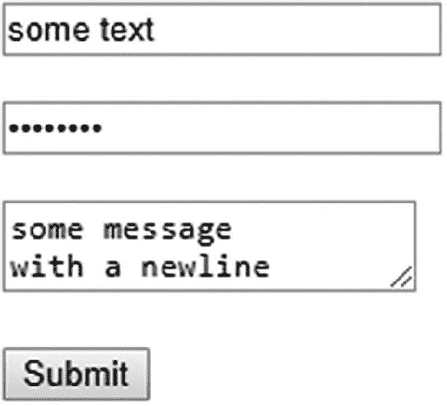

你会在生成的 HTML 输出中注意到几件事。毫无疑问，首先注意到的是 JSF 还自动生成了 HTML 元素的 `id` 和 `name` 属性，它们都带有 `j_id` 前缀，该前缀由公共 API（应用程序编程接口）常量 `UIViewRoot.UNIQUE_ID_PREFIX` 定义。其中的“t”基本上代表“树”（tree），而数字基本上代表组件在组件树中的位置。因此，当你在 Facelets 文件中添加、删除或移动组件时，这个数字很容易发生变化。当质量保证（QA）需要为 Web 应用程序编写集成测试时（通常需要用到 HTML 元素 ID），这也会成为令人头疼的问题。

当功能必须要有 `id` 和/或 `name` 属性才能生成 HTML 输出时，JSF 会使用自动生成的 ID。`id` 属性是必需的，以便任何 JavaScript 代码（也可以是 JSF 自动生成的，例如负责 Ajax 工作的函数）能够找到该 HTML 元素。由于这会使生成的 HTML 代码难以阅读，坦率地说，也很丑陋，我们希望显式地指定任何 JSF 表单、输入、选择和命令组件的 `id` 属性。这样，JSF 就会直接使用它为 HTML 元素的 `id` 和 `name` 属性赋值，而不是自动生成一个。现在，让我们为此重写 Facelets 文件 /test.xhtml。一个好的做法是让输入组件的 `id` 属性与 bean 属性名完全匹配，命令组件的 `id` 属性与 bean 方法名完全匹配。这样最终会得到更具自文档性的代码和生成的 HTML 输出。

```
<h:form id="form">
    <h:inputText id="text" value="#{bean.text}" />
    <h:inputSecret id="password" value="#{bean.password}" />
    <h:inputTextarea id="message" value="#{bean.message}" />
    <h:inputHidden id="hidden" value="#{bean.hidden}" />
    <h:commandButton id="submit" value="Submit"
        action="#{bean.submit}" />
</h:form>
```

现在，生成的 HTML 输出如下所示：

```
<form id="form" name="form" method="post" action="/project/test.xhtml"
    enctype="application/x-www-form-urlencoded">
    <input type="hidden" name="form" value="form" />
    <input id="form:text" type="text" name="form:text" />
    <input id="form:password" type="password" name="form:password" />
    <textarea id="form:message" name="form:message"></textarea>
    <input id="form:hidden" type="hidden" name="form:hidden" />
    <input id="form:submit" type="submit" name="form:submit"
        value="Submit" />
    <input type="hidden" name="javax.faces.ViewState"
        id="j_id1:javax.faces.ViewState:0"
        value="-7192066430460949081:-3987350607752016894"
        autocomplete="off" />
</form>
```

这已经清晰多了。请注意，当你显式设置组件 ID 时，它最终一定会出现在生成的 HTML 输出中。生成的 HTML 元素 ID 代表“客户端 ID”，它可能与组件 ID 不同，具体取决于其父组件。如果该组件有任何父组件是 `NamingContainer` 接口的实例，那么 `NamingContainer` 父组件的 ID 将被添加到该组件的客户端 ID 之前。在标准的 JSF HTML 组件集中，只有 `<h:form>` 和 `<h:dataTable>` 是 `NamingContainer` 的实例。其他还有 `<ui:repeat>` 和 `<f:subview>`。

如果你更仔细地查看生成的 HTML 输出，会发现只剩下一个自动生成的 ID。那就是视图状态隐藏输入字段的 ID，它始终是 `j_id1`。它代表 `UIViewRoot` 实例的 ID，默认情况下无法从 Facelets 文件中设置。当在基于 Portlet 的 Web 应用程序（而非基于 Servlet 的 Web 应用程序）中使用 JSF 时，这个 ID 是可覆盖的，并且会代表 Portlet 的唯一名称。在基于 Portlet 的 Web 应用程序中，一个 JSF 页面中可以有多个 Portlet 视图。换句话说，在基于 Portlet 的 Web 应用程序中，一个 JSF 页面可以有多个 `UIViewRoot` 实例。

回到生成的 HTML 输出，HTML 输入元素的 `name` 属性对于 HTML 来说是必需的，以便能够通过 HTTP 将提交的值作为请求参数发送。它将作为请求参数名。在任何一款主流的 Web 浏览器中，你都可以在 Web 开发者工具集的“网络”部分检查请求参数，在浏览器中按 F12 键即可访问。图 4-1 展示了在填写一些值并提交表单后，Chrome 如何呈现回发请求，正如该图的“表单数据”部分所示。

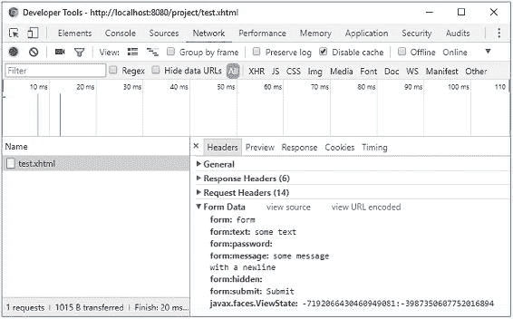


###### 图 4-1 Chrome 开发者工具——网络——标头——表单数据

这个隐藏的输入字段，其名称代表 `<h:form>` 的 ID，将向 JSF 指示在回发请求期间具体提交的是哪个表单。也就是说，单个 HTML 文档可以包含多个表单元素。通过这种方式，JSF 可以在应用请求值阶段（第二阶段）确定当前表单组件是否确实被提交。这将导致表单组件的 `UIForm#isSubmitted()` 方法返回 `true`。名称为 `javax.faces.ViewState` 的隐藏输入字段代表一个唯一标识符，它指向存储在会话中的序列化视图状态对象。这两个隐藏输入字段都是由与 `UIForm` 组件关联的渲染器自动包含的。顺便提一下，视图状态隐藏输入字段上的 `autocomplete="off"` 并非技术上的要求，而只是一种变通方法，用于防止某些浏览器在按下后退按钮时用最后已知的值覆盖它，而这个值本身可能是不正确的。

我们示例中的隐藏输入字段的值为空。在这个表单中，它实际上毫无用处。这样的隐藏输入字段通常只有在它的值由某些你想在托管 bean 中捕获的 JavaScript 代码设置时才有用。通常，使用隐藏输入字段将托管 bean 属性从一个请求“传递”到下一个请求是没有意义的。相反，这些属性应该分配给一个声明为具有比请求作用域更广作用域（例如视图、流程或会话作用域）的托管 bean。这样可以省去处理隐藏输入字段的麻烦。Bean 作用域将在第 8 章中详细说明。

如果你熟悉基本的 HTML，其他请求参数应该不言自明。它们代表所涉及的输入元素的名称/值对。你应该能够确定在提交之前在表单中实际输入了哪些值。JSF 也能够做到同样的事情。它将遍历组件树，并使用组件的“客户端 ID”作为请求参数名称，从请求参数映射中获取值。基本上，在应用请求值阶段（第二阶段），以下代码会在幕后为每个输入组件执行。这发生在 `UIInput#decode()` 方法中。

```
FacesContext context = FacesContext.getCurrentInstance();
ExternalContext externalContext = context.getExternalContext();
Map<String, String> formData = externalContext.getRequestParameterMap();

String clientId = component.getClientId(context);
String submittedValue = formData.get(clientId);
component.setSubmittedValue(submittedValue);
```

并且，在同一阶段，对于每个命令组件，在与该组件关联的渲染器的 `decode` 方法中，基本上会执行以下代码：

```
if (formData.get(clientId) != null) {
    component.queueEvent(new ActionEvent(context, component));
}
```

在处理验证阶段（第三阶段），JSF 会在执行必要的转换和验证（如果任何转换器或验证器已注册到组件或关联的 bean 属性上，并且执行无误）之后，将每个相关输入组件的提交值设置为“本地值”。这发生在 `UIInput#validate()` 方法中，其核心逻辑以下面的简化（非常简化！）代码形式展示：

```
String submittedValue = component.getSubmittedValue();
try {
    Converter converter = component.getConverter();
    Object newValue = component.getConvertedValue(submittedValue);
    for (Validator validator : component.getValidators()) {
        validator.validate(context, component, newValue);
    }
    component.setValue(newValue);
    component.setSubmittedValue(null);
}
catch (ConverterException | ValidatorException e) {
    context.addMessage(clientId, e.getFacesMessage());
    context.validationFailed(); // 跳过阶段 4 和 5。
    component.setValid(false);
}
```

当没有验证错误，并且 `FacesContext#isValidationFailed()` 因此返回 `false` 时，JSF 将前进到更新模型值阶段（第四阶段）。在此阶段，输入组件的“本地值”最终将被设置为与输入组件的 `value` 属性关联的托管 bean 属性。这将发生在 `UIInput#updateModel()` 方法中，该方法简化如下：

```
ValueExpression el = component.getValueExpression("value");
if (el != null) {
    el.setValue(context.getELContext(), component.getValue());
    component.setValue(null);
}
```

`el` 变量基本上代表了在 `value` 属性中定义的表达式语言（EL）语句，在我们的 `<h:inputText>` 示例中，就是 `#{bean.text}`。`ValueExpression#setValue()` 将基本上触发此表达式背后的 setter 方法，并将组件的值作为参数传入。因此，实际上它将执行 `bean.setText(component.getValue())`。

一旦所有模型值都已更新，JSF 将前进到调用应用程序阶段（第五阶段）。在应用请求值阶段（第二阶段）排队到命令组件中的任何 `ActionEvent` 都将被广播。它最终将调用与该命令组件关联的所有方法。在我们的 `<h:commandButton>` 示例中，其 `action` 属性定义为 `#{bean.submit}`，它将调用 `Bean#submit()` 方法。最后，JSF 将前进到最后一个阶段，即渲染响应阶段（第六阶段），生成 HTML 输出，并在此过程中调用 getter 方法以获取要嵌入到 HTML 输出中的模型值。


## 基于文件的输入组件

是的，只有一个基于文件的输入组件，即 `<h:inputFile>`。它对其所在的 `<h:form>` 只有一个额外要求：其 `enctype` 属性必须显式设置为 `multipart/form-data`，以符合 HTML 规范。这对其他输入组件没有影响；它们将继续正常工作。只是默认的表单编码 `application/x-www-form-urlencoded` 不支持嵌入二进制数据。`multipart/form-data` 编码支持这一点，但它只是稍微冗长一些。每个请求参数值前面都有一个边界行、一个包含请求参数名称的 `Content-Disposition` 标头、一个包含值内容类型的 `Content Type` 标头以及两个换行符。与默认编码相比，这种编码效率非常低，在默认编码中，URL 编码的请求参数名称/值对仅通过 `&` 字符连接，但这实际上是能够将文件嵌入 HTTP POST 请求而不会引起歧义的唯一可靠方法，尤其是在上传文本文件时，其内容恰好与名称/值对相似。

`<h:inputFile>` 的 `value` 属性应绑定到 `javax.servlet.http.Part` 接口的 bean 属性。

Facelets 文件 /test.xhtml：

```
<h:form id="form" enctype="multipart/form-data">
    <h:inputFile id="file" value="#{bean.file}" />
    <h:commandButton id="submit" value="Submit"
        action="#{bean.submit}" />
</h:form>
```

支持 bean 类 com.example.project.view.Bean：

```
@Named @RequestScoped
public class Bean {

    private Part file;

    public void submit() throws IOException {
        System.out.println("Form has been submitted!");
        System.out.println("file: " + file);
        if (file != null) {
            System.out.println("name: " + file.getSubmittedFileName());
            System.out.println("type: " + file.getContentType());
            System.out.println("size: " + file.getSize());
            InputStream content = file.getInputStream();
            // Write content to disk or DB.
        }
    }

    // Add/generate getters and setters for every property here.
}
```

生成的 HTML 输出：

```
<form id="form" name="form" method="post" action="/project/test.xhtml"
    enctype="multipart/form-data">
    <input type="hidden" name="form" value="form" />
    <input id="form:file" type="file" name="form:file" />
    <input id="form:submit" type="submit" name="form:submit"
        value="Submit" />
    <input type="hidden" name="javax.faces.ViewState"
        id="j_id1:javax.faces.ViewState:0"
        value="6034213708100805615:8835868421785849982"
        autocomplete="off" />
</form>
```

在 Chrome 浏览器中的渲染效果（已添加换行符）：

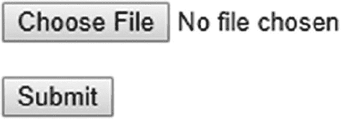

请求处理生命周期与基于文本的输入组件相同，除了应用请求值阶段（第二阶段）。不是在 `UIInput#decode()` 方法中将提交的文件作为请求参数提取，而是在与文件输入组件关联的渲染器中将提交的文件作为请求部分提取。默认实现基本上如下所示：

```
FacesContext context = FacesContext.getCurrentInstance();
ExternalContext ec = context.getExternalContext();
HttpServletRequest request = (HttpServletRequest) ec.getRequest();

String clientId = component.getClientId(context);
Part submittedValue = request.getPart(clientId);
component.setSubmittedValue(submittedValue);
```

## 选择组件

JSF 提供了 `UISelectBoolean`、`UISelectOne` 和 `UISelectMany` 组件系列中的一系列选择组件，它们都继承自 `UIInput`。除了 `UISelectBoolean` 之外，它们都期望通过嵌套在选择组件中的 `<f:selectItems>` 或 `<f:selectItem>` 标签提供可用的选择项。`UISelectBoolean` 组件的 `value` 属性只能绑定到 `boolean` 或 `Boolean` 类型的 bean 属性，并且不支持转换器，而其他组件支持转换器。`UISelectOne` 组件的 `value` 属性必须绑定到单值属性（例如 `String`），而 `UISelectMany` 组件的 `value` 属性只能绑定到多值属性（例如 `Collection<String>` 或 `String[]`）。

在现实世界的基于 HTML 的 Web 应用程序中，`<h:selectOneListbox>`（单选列表框）和 `<h:selectManyMenu>`（多选下拉菜单）并不是非常有用。通常，`<h:selectOneMenu>`（单选下拉菜单）和 `<h:selectManyListBox>`（多选列表框）更受欢迎，因为它们对用户更友好。以下是一个基本用法示例，演示了除上述最不常用的选择组件之外的所有选择组件。如果您仍然想使用它们，只需按照演示的方法使用不同的标签名称即可。

Facelets 文件 /test.xhtml：

```
<h:form id="form">
    <h:selectBooleanCheckbox id="checked" value="#{bean.checked}" />
    <h:selectOneMenu id="oneMenu" value="#{bean.oneMenu}">
        <f:selectItems value="#{bean.availableItems}" />
    </h:selectOneMenu>
    <h:selectOneRadio id="oneRadio" value="#{bean.oneRadio}">
        <f:selectItems value="#{bean.availableItems}" />
    </h:selectOneRadio>
    <h:selectManyListbox id="manyListbox" value="#{bean.manyListbox}">
        <f:selectItems value="#{bean.availableItems}" />
    </h:selectManyListbox>
    <h:selectManyCheckbox id="manyCheckbox" value="#{bean.manyCheckbox}">
        <f:selectItems value="#{bean.availableItems}" />
    </h:selectManyCheckbox>
    <h:commandButton id="submit" value="Submit"
        action="#{bean.submit}" />
</h:form>
```

支持 bean 类 com.example.project.view.Bean：

```
@Named @RequestScoped
public class Bean {

private boolean checked;
    private String oneMenu;
    private String oneRadio;
    private List<String> manyListbox;
    private List<String> manyCheckbox;
    private List<String> availableItems;

@PostConstruct
    public void init() {
        availableItems = Arrays.asList("one", "two", "three");
    }

public void submit() {
        System.out.println("Form has been submitted!");
        System.out.println("checked: " + checked);
        System.out.println("oneMenu: " + oneMenu);
        System.out.println("oneRadio: " + oneRadio);
        System.out.println("manyListbox: " + manyListbox);
        System.out.println("manyCheckbox: " + manyCheckbox);
    }

// Add/generate getters and setters for every property here.
    // Note that availableItems property doesn’t need a setter.
}
```

生成的 HTML 输出：


```
<form id="form" name="form" method="post" action="/project/test.xhtml"
    enctype="application/x-www-form-urlencoded">
    <input type="hidden" name="form" value="form" />
    <input id="form:checked" type="checkbox" name="form:checked" />
    <select id="form:oneMenu" name="form:oneMenu" size="1">
        <option value="one">one</option>
        <option value="two">two</option>
        <option value="three">three</option>
    </select>
    <table id="form:oneRadio">
        <tr>
            <td>
                <input id="form:oneRadio:0" type="radio"
                    name="form:oneRadio" value="one" />
                <label for="form:oneRadio:0"> one</label>
            </td>
            <td>
                <input id="form:oneRadio:1" type="radio"
                    name="form:oneRadio" value="two" />
                <label for="form:oneRadio:1"> two</label>
            </td>
            <td>
                <input id="form:oneRadio:2" type="radio"
                    name="form:oneRadio" value="three" />
                <label for="form:oneRadio:2"> three</label>
            </td>
        </tr>
    </table>
    <select id="form:manyListbox" name="form:manyListbox"
        multiple="multiple" size="3">
        <option value="one">one</option>
        <option value="two">two</option>
        <option value="three">three</option>
    </select>
    <table id="form:manyCheckbox">
        <tr>
            <td>
                <input id="form:manyCheckbox:0" type="checkbox"
                    name="form:manyCheckbox" value="one" />
                <label for="form:manyCheckbox:0"> one</label>
            </td>
            <td>
                <input id="form:manyCheckbox:1" type="checkbox"
                    name="form:manyCheckbox" value="two" />
                <label for="form:manyCheckbox:1"> two</label>
            </td>
            <td>
                <input id="form:manyCheckbox:2" type="checkbox"
                    name="form:manyCheckbox" value="three" />
                <label for="form:manyCheckbox:2"> three</label>
            </td>
        </tr>
    </table>
    <input id="form:submit" type="submit" name="form:submit"
        value="Submit" />
    <input type="hidden" name="javax.faces.ViewState"
        id="j_id1:javax.faces.ViewState:0"
        value="403461711995663039:117935361680169981"
        autocomplete="off" />
</form>
```

在 Chrome 浏览器中的渲染效果（已添加换行）：

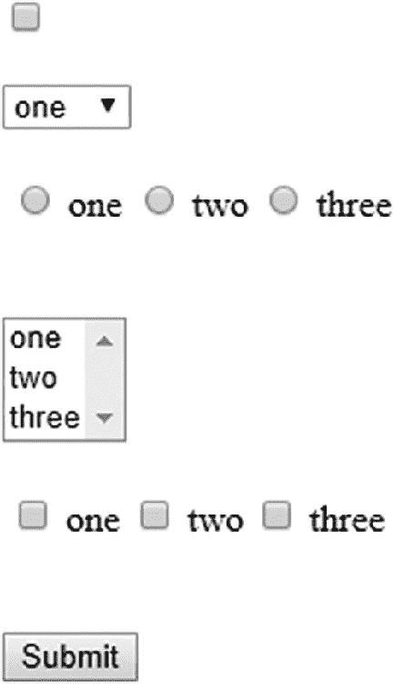

在生成的 HTML 输出中，你会立刻注意到 `<h:selectOneRadio>` 和 `<h:selectManyCheckbox>` 会在输入元素周围生成一个 HTML 表格。自 Web 2.0 时代以来，这种标记方式确实不受欢迎。这多少是 JSF 1.0 时代的遗留产物，当时 Web 2.0 还不存在。对于 `<h:selectManyCheckbox>`，可以通过在所需的 HTML 标记中使用一组 `<h:selectBooleanCheckbox>` 组件来轻松解决，这些组件绑定到一个稍作调整的模型上。

Facelets 文件 /test.xhtml：

```
<h:form id="form">
    <ul>
        <ui:repeat id="many" value="#{bean.availableItems}" var="item">
            <li>
                <h:selectBooleanCheckbox id="checkbox"
                    value="#{bean.manyCheckboxMap[item]}" />
                <h:outputLabel for="checkbox" value="#{item}" />
            </li>
        </ui:repeat>
    </ul>
    <h:commandButton id="submit" value="Submit"
        actionListener="#{bean.collectCheckedValues}"
        action="#{bean.submit}" />
</h:form>
```

后端 Bean 类 com.example.project.view.Bean：

```
@Named @RequestScoped
public class Bean {

private List<String> manyCheckbox;
    private List<String> availableItems;
    private Map<String, Boolean> manyCheckboxMap = new LinkedHashMap<>();

@PostConstruct
    public void init() {
        availableItems = Arrays.asList("one", "two", "three");
    }

public void collectCheckedValues() {
        manyCheckbox = manyCheckboxMap.entrySet().stream()
            .filter(e -> e.getValue())
            .map(Map.Entry::getKey)
            .collect(Collectors.toList());
    }

public void submit() {
        System.out.println("Form has been submitted!");
        System.out.println("manyCheckbox: " + manyCheckbox);
    }

// 为 availableItems 和 manyCheckboxMap 添加/生成 getter 方法。
    // 注意，它们不需要 setter 方法。
}
```

生成的 HTML 输出：

```
<form id="form" name="form" method="post" action="/project/test.xhtml"
    enctype="application/x-www-form-urlencoded">
    <input type="hidden" name="form" value="form" />
    <ul>
        <li>
            <input id="form:many:0:checkbox" type="checkbox"
                 name="form:many:0:checkbox" />
            <label for="form:many:0:checkbox">one</label>
        </li>
        <li>
            <input id="form:many:1:checkbox" type="checkbox"
                 name="form:many:1:checkbox" />
            <label for="form:many:1:checkbox">two</label>
         </li>
         <li>
             <input id="form:many:2:checkbox" type="checkbox"
                 name="form:many:2:checkbox" />
             <label for="form:many:2:checkbox">three</label>
         </li>
    </ul>
    <input id="form:submit" type="submit" name="form:submit"
        value="Submit" />
    <input type="hidden" name="javax.faces.ViewState"
        id="j_id1:javax.faces.ViewState:0"
        value="-2278907496447873737:-4769857814543424434"
        autocomplete="off" />
</form>
```

在 Chrome 浏览器中的渲染效果：

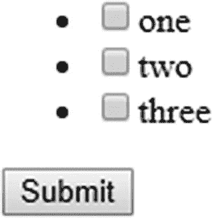

这已经更符合 Web 2.0 的风格了。当然，可以通过将 CSS（层叠样式表）的 `list-style-type` 属性设置为 `none` 来隐藏 `<ul>` 的项目符号。请注意，`<h:commandButton>` 的 `actionListener` 属性总是在 `action` 属性之前执行。长期以来，同样的方法并不适用于 `<h:selectOneRadio>`。没有像 `<h:radioButton>` 这样的组件。解决方案曾依赖于第三方组件库，例如 PrimeFaces。从 JSF 2.2 开始，可以通过在纯 HTML `<input type="radio">` 元素上使用新的“透传元素”和“透传属性”功能来巧妙实现。¹ 直到 JSF 2.3，才借助新的 `group` 属性原生支持，该属性本质上与纯 HTML `<input type="radio">` 元素的 `name` 属性相同。

Facelets 文件 /test.xhtml：

```
<h:form id="form">
    <ul>
        <ui:repeat id="one" value="#{bean.availableItems}" var="item">
            <li>
                <h:selectOneRadio id="radio" group="groupName"
                    value="#{bean.oneRadio}">
                    <f:selectItem itemValue="#{item}" />
                </h:selectOneRadio>
                <h:outputLabel for="radio" value="#{item}" />
            </li>
        </ui:repeat>
    </ul>
    <h:commandButton id="submit" value="Submit"
        action="#{bean.submit}" />
</h:form>
```

后端 Bean 类 com.example.project.view.Bean：

```
@Named @RequestScoped
public class Bean {

private String oneRadio;
    private List<String> availableItems;

@PostConstruct
    public void init() {
        availableItems = Arrays.asList("one", "two", "three");
    }

public void submit() {
        System.out.println("Form has been submitted!");
        System.out.println("oneRadio: " + oneRadio);
    }

// 在此为每个属性添加/生成 getter 和 setter 方法。
    // 注意，availableItems 属性不需要 setter 方法。
}
```

生成的 HTML 输出：


```
<form id="form" name="form" method="post" action="/project/test.xhtml"
    enctype="application/x-www-form-urlencoded">
    <input type="hidden" name="form" value="form" />
    <ul>
        <li>
            <input type="radio" id="form:one:0:radio"
                name="form:groupName" value="form:one:0:radio:one" />
            <label for="form:one:0:radio">一</label>
        </li>
        <li>
            <input type="radio" id="form:one:1:radio"
                name="form:groupName" value="form:one:1:radio:two" />
            <label for="form:one:1:radio">二</label>
        </li>
        <li>
            <input type="radio" id="form:one:2:radio"
                name="form:groupName" value="form:one:2:radio:three" />
            <label for="form:one:2:radio">三</label>
        </li>
    </ul>
    <input id="form:submit" type="submit" name="form:submit"
        value="提交" />
    <input type="hidden" name="javax.faces.ViewState"
        id="j_id1:javax.faces.ViewState:0"
        value="3336433674711048358:164229014603307903"
        autocomplete="off" />
</form>
```

在 Chrome 浏览器中的渲染效果：

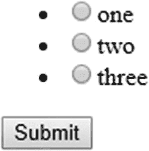

从技术上讲，`<h:selectManyCheckbox>` 也可以支持 group 属性，但这一功能尚未实现。或许它会在 JSF.next 中实现。

## SelectItem 标签

为 UISelectOne 和 UISelectMany 组件提供可用项有多种方式。如上一节所示，你可以使用嵌套在选择组件中的 `<f:selectItems>` 和 `<f:selectItem>` 标签来实现。你可以使用 `<f:selectItem>` 标签在视图端完全定义可用项。以下是一个使用 `<h:selectOneMenu>` 的示例，但你可以以相同的方式在任何其他 UISelectOne 和 UISelectMany 组件中使用它：

```
<h:selectOneMenu id="selectedItem" value="#{bean.selectedItem}">
    <f:selectItem itemValue="#{null}" itemLabel="-- 请选择 --" />
    <f:selectItem itemValue="one" itemLabel="第一项" />
    <f:selectItem itemValue="two" itemLabel="第二项" />
    <f:selectItem itemValue="three" itemLabel="第三项" />
</h:selectOneMenu>
```

请注意，当选择组件的 value 属性关联的 bean 属性为 null 时，可以使用值为 `#{null}` 的选择项来呈现默认选择。如果你查阅过 `<f:selectItem>` 的标签文档，你可能会注意到 `noSelectionOption` 属性，并认为它旨在表示“无选择选项”。实际上，这并不正确。正如你在许多论坛、问答网站和互联网上质量低劣的教程中所见，许多初学者确实这么认为。尽管属性名称具有误导性，但它并不表示“无选择选项”。更好的属性名称应该是 `hideWhenOtherOptionIsSelected`（当其他选项被选中时隐藏），即便如此，它也只有当父选择组件显式设置了 `hideNoSelectionOption="true"` 属性时才有效，如下所示：

```
<h:selectOneMenu id="selectedItem" value="#{bean.selectedItem}"
    hideNoSelectionOption="true">
    <f:selectItem itemValue="#{null}" itemLabel="-- 请选择 --"
        noSelectionOption="true" />
    <f:selectItem itemValue="one" itemLabel="第一项" />
    <f:selectItem itemValue="two" itemLabel="第二项" />
    <f:selectItem itemValue="three" itemLabel="第三项" />
</h:selectOneMenu>
```

因此，`hideWhenOtherOptionIsSelectedAndHideNoSelectionOptionIsTrue`（当其他选项被选中且 hideNoSelectionOption 为 true 时隐藏）最终会成为最不言自明的属性名称。不幸的是，在 JSF 1.2 中实现 `noSelectionOption` 时，这一点并未考虑周全。这个属性需要两个属性才能生效，本不应该是必要的。这对属性的主要目的是防止网站用户在组件已有非 null 值时重新选择“无选择选项”——例如，通过在 `@PostConstruct` 方法中准备该值，或者在表单提交后使用非 null 值重新渲染组件。

也就是说，`<f:selectItem>` 的 `itemValue` 属性表示在表单提交时将作为 bean 属性设置的值，以及在生成 HTML 输出时将从任何非 null bean 属性中预选的值。`itemLabel` 属性表示将向网站用户显示的标签。当 `itemLabel` 属性缺失时，JSF 将默认使用 `itemValue`。请注意，标签绝不会提交回服务器。也就是说，在生成的 HTML 输出中，`<option>` 标签不是 `<option>` 值的一部分。

你可以使用 `<f:selectItems>` 标签来引用支持 bean 中的 `Collection`、`Map` 或可用项数组。你甚至可以将其与 `<f:selectItem>` 标签混合使用。

```
<h:selectOneMenu id="selectedItem" value="#{bean.selectedItem}">
    <f:selectItem itemValue="#{null}" itemLabel="-- 请选择 --" />
    <f:selectItems value="#{bean.availableItems}" />
</h:selectOneMenu>
```


它们将按照在视图中声明的相同顺序进行渲染。仅当您使用无序的 Map 实现（例如 HashMap）作为值时，`<f:selectItems>` 提供的项目顺序才会是未定义的。因此，最好使用有序的 Map 实现，例如 `TreeMap` 或 `LinkedHashMap`。当将可用项目填充为 Map 时，请记住，Map 的键代表项目标签，Map 的值代表项目值。您可能直观地期望它是相反的，但这是一个技术限制。也就是说，在 Java 端，Map 的键强制唯一性，而值则不强制。而在 HTML 端，选项标签应该是唯一的，而选项值则不需要。以下是填充此类 Map 的方法：

```
private Map<String, String> availableItems;

@PostConstruct
public void init() {
    availableItems = new LinkedHashMap<>();
    availableItems.put("First item", "one");
    availableItems.put("Second item", "two");
    availableItems.put("Third item", "three");
}

// 添加/生成 getter。注意，setter 不是必需的。
```

如前所述，您也可以使用 `TreeMap` 或 `HashMap`，但此时项目标签将分别变为排序或未排序，而与插入顺序无关。

如果您确实希望在视图端交换 Map 的键和值，您始终可以通过手动将 Map 条目值分配为项目标签，并将 Map 条目键分配为项目值来实现。您可以借助 `<f:selectItems>` 的 `var` 属性来做到这一点，通过该属性您可以声明当前迭代项目的 EL 变量名。然后，可以在同一标签的 `itemValue` 和 `itemLabel` 属性中访问该变量。当您将 `Map#entrySet()` 传递给 `<f:selectItems>` 的 `value` 属性时，每个迭代项目将代表一个 `Map.Entry` 实例。该实例又具有 `getKey()` 和 `getValue()` 方法，这些方法完全可以作为 EL 属性使用。

```
<f:selectItems value="#{bean.availableItems.entrySet()}" var="entry"
    itemValue="#{entry.key}" itemLabel="#{entry.value}">
</f:selectItems>
```

当使用 `Collection` 或数组作为可用项目时，这也适用。您不需要像上面演示的那样先显式地将其转换为 `Set`（更具体地说，是 `Iterable`）。当您拥有复杂对象的 `Collection` 或数组作为可用项目（例如模型实体）时，这尤其有用。

代表“国家”的模型实体：

```
public class Country {

private Long id;
    private String code;
    private String name;

// 添加/生成 getter 和 setter。
}
```

支持 bean：

```
@Named @RequestScoped
public class Bean {

private String countryCode;
    private List<Country> availableCountries;

@Inject
    private CountryService countryService;

@PostConstruct
    public void init() {
        availableCountries = countryService.getAll();
    }

// 添加/生成 getter 和 setter。
    // 注意，availableCountries 的 setter 不是必需的。
}
```

视图：

```
<h:selectOneMenu id="countryCode" value="#{bean.countryCode}">
    <f:selectItem itemValue="#{null}" itemLabel="-- 请选择 --" />
    <f:selectItems value="#{bean.availableCountries}" var="country">
        itemValue="#{country.code}" itemLabel="#{country.name}"
    </f:selectItems>
</h:selectOneMenu>
```

请注意，为了清晰起见，省略了任何特定于持久化框架的注解（例如 JPA 的 `@Entity` 和 `@Id`）以及 `CountryService` 的实际实现。这些与任何前端框架（如 JSF）无关。

通过上述结构，从 `Country#getCode()` 获取的值将最终成为生成的 HTML `<option>` 元素的值。现在，当表单提交时，它将作为选择组件的提交值，进而使用该值调用 `#{bean.countryCode}` 属性背后的 setter 方法。当然，您也可以将整个 `Country` 对象用作选择组件的属性值，但这需要一个转换器，该转换器可以在复杂对象和适合嵌入到 HTML 输出中并作为 HTTP 请求参数发送的唯一字符串之间进行转换。您可以在第 5 章中阅读更多内容。

## SelectItemGroup

如果您想将一组选项分组在一个公共标签下，您可以使用 `javax.faces.model.SelectItemGroup`，然后在 `<f:selectItems>` 的 `value` 属性中引用它。不幸的是，这不能在 Facelets 文件中以声明方式在自定义嵌套模型上完成。为此，您必须将您的模型映射到 JSF 提供的 `javax.faces.model.SelectItem`。以下是一个入门示例：

```
private List<SelectItem> availableItems;

@PostConstruct
public void init() {
    SelectItemGroup group1 = new SelectItemGroup("组 1");
    group1.setSelectItems(new SelectItem[] {
        new SelectItem("组 1 值 1", "组 1 标签 1"),
        new SelectItem("组 1 值 2", "组 1 标签 2"),
        new SelectItem("组 1 值 3", "组 1 标签 3")
    });
    SelectItemGroup group2 = new SelectItemGroup("组 2");
    group2.setSelectItems(new SelectItem[] {
        new SelectItem("组 2 值 1", "组 2 标签 1"),
        new SelectItem("组 2 值 2", "组 2 标签 2"),
        new SelectItem("组 2 值 3", "组 2 标签 3")
    });
    availableItems = Arrays.asList(group1, group2);

    // 为 availableItems 添加/生成 getter。
    // 注意，setter 不是必需的。
}
```

需要注意的是，自 JSF 1.0（2004 年）以来，这两个模型 API 基本上没有变化，这就是为什么您仍然看到 `SelectItemGroup#setSelectItems()` 方法接受一个 `SelectItem[]` 数组而不是 `SelectItem...` 可变参数的原因。这肯定会在 JSF.next 中得到解决。在任何选择组件中将其引用为 `<f:selectItems value="#{bean.availableItems}" />` 时，以下是每个组件的外观。

`<h:selectOneMenu>` 会将每个组渲染为 HTML `<optgroup>`：

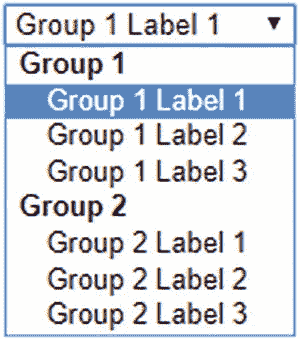

`<h:selectOneRadio layout="pageDirection">` 会将其渲染为嵌套表格：

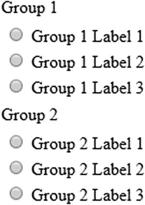

`<h:selectManyListbox>` 会将每个组渲染为 HTML `<optgroup>`：

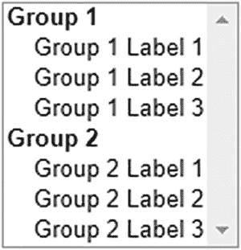

`<h:selectManyCheckbox layout="pageDirection">` 会将其渲染为嵌套表格：

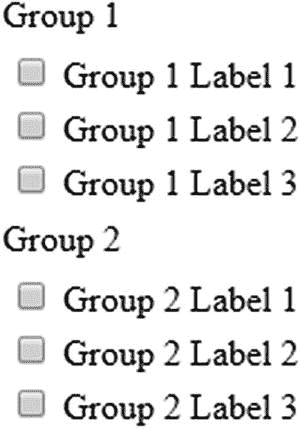

请注意 `<h:selectOneRadio>` 和 `<h:selectManyCheckbox>` 中 `layout="pageDirection"` 属性的重要性。这看起来会比默认的 `layout="lineDirection"`（将所有内容渲染在一个大的单行表格行中）好得多。


## 标签与消息组件

在精心设计的表单中，输入元素通常伴随有标签元素和针对该输入字段的消息元素。在 HTML 中，标签由 `<label>` 元素表示。在 JSF 中，你可以使用 `<h:outputLabel>` 组件来生成 HTML 的 `<label>` 元素。HTML 并没有专门用于表示消息的元素。在 JSF 中，`<h:message>` 组件会生成一个 HTML `<span>` 元素，而 `<h:messages>` 组件则根据 `layout` 属性的值，生成 `<ul>` 元素或 `<table>` 元素。

标签元素具有多种 SEO（搜索引擎优化）和可用性优势。它用文本告知关联的输入元素。屏幕阅读器（例如视力障碍人士使用的设备）会找到标签并通过声音读出其内容。搜索引擎爬虫会找到标签并以此索引关联的输入元素。此外，点击标签本身会聚焦并激活关联的输入元素。基于文本的输入元素会显示文本光标。复选框和单选输入元素会被切换。列表框和下拉输入元素会被聚焦。文件输入元素会打开浏览对话框。提交按钮会被触发。

消息元素通常用于显示来自服务器端的转换和验证错误消息。这样，最终用户就能了解表单的状态并采取相应操作，通常是修正输入值。你也可以用它来显示警告或提示性消息。

在 JSF 中，`<h:outputLabel>`、`<h:message>` 和 `<h:messages>` 组件都有一个 `for` 属性，你通常在其中定义关联的 `UIInput` 组件的 ID。以下是一个登录表单的示例：

```
<h:form id="login">
    <fieldset>
        <legend>登录</legend>
        <section>
            <h:outputLabel for="email" value="电子邮件地址" />
            <h:inputText id="email" value="#{login.email}"
                required="true" />
            <h:message id="m_email" for="email" />
        </section>
        <section>
            <h:outputLabel for="password" value="密码" />
            <h:inputSecret id="password" value="#{login.password}"
                required="true" />
            <h:message id="m_password" for="password" />
        </section>
        <footer>
            <h:commandButton id="submit" value="登录"
                action="#{login.submit}" />
        </footer>
    </fieldset>
</h:form>
```

实际上，你可以在 `for` 属性中使用任意组件搜索表达式。对于 `<h:outputLabel>` 组件，这没有太大意义。对于 `<h:message>` 和 `<h:messages>` 组件，引用非 `UIInput` 组件的 ID 仅在你希望从托管 Bean 中以编程方式添加 faces 消息时才有意义。但你需要知道目标组件的客户端 ID。

```
<h:form id="login">
    ...
            <h:commandButton id="submit" value="登录"
                action="#{login.submit}" />
            <h:message id="m_submit" for="submit" />
    ...
</h:form>
```

上述 `<h:commandButton>` 会在 HTML 输出中生成一个客户端 ID "login:submit"。然后你可以按如下方式以编程方式添加 faces 消息：

```
public String submit() {
    try {
        yourAuthenticator.authenticate(email, password);
        return "/user/home.xhtml?faces-redirect=true";
    }
    catch (YourAuthenticationException e) {
        FacesContext context = FacesContext.getCurrentInstance();
        FacesMessage message = new FacesMessage("认证失败");
        context.addMessage("login:submit", message);
        return null;
    }
}
```

然而，更好的做法是通过传递 `null` 作为客户端 ID，将 faces 消息添加为全局消息。

```
        context.addMessage(null, message);
```

这样的消息只会出现在 `<h:messages globalOnly="true">` 中。

```
            <h:commandButton id="submit" value="登录"
                action="#{login.submit}" />
            <h:messages id="messages" globalOnly="true"
                rendered="#{component.namingContainer.submitted}" />
```

请注意消息组件 `rendered` 属性中的逻辑。只有当父级 `NamingContainer` 的 `submitted` 属性计算结果为 `true` 时，它才会被渲染。在这个特定例子中，它检查的是 `UIForm#isSubmitted()`。这在你有多个非 Ajax 表单，每个表单都有自己的全局消息组件，和/或在 JSF 页面底部附近有一个“捕获所有”的 `<h:messages redisplay="false">` 组件（该组件使用 CSS 固定定位在顶部）时非常有用。否则，全局消息也会意外地在那里显示。

在 Ajax 表单中，这种消息渲染逻辑并非必需，因为你可以通过在 `<f:ajax>` 的 `render` 属性中明确指定消息组件来精细调整消息渲染。此外，当 `<f:ajax>` 的 `execute` 属性没有像 `execute="@form"` 那样明确指定表单时，`UIForm#isSubmitted()` 会意外地返回 `false`。


## 命令组件

在前文关于输入和选择组件的章节中，您可能已经注意到了 `<h:commandButton>` 的示例。它会生成一个 HTML `<input type="submit">` 元素，这是 HTML 中将所在 `<form>` 元素的所有输入值发送到服务器的方式。在服务器端，该组件还能够调用一个或多个 Java 方法，这些方法通常定义在 `action` 或 `actionListener` 属性中，或者通过嵌套在命令组件中的 `<f:actionListener>` 标签来定义。您还会了解到，动作监听器方法总是在与 `action` 属性关联的方法之前运行。

您可以使用 `<f:actionListener>` 标签在同一个命令组件上注册一个或多个额外的动作监听器。所有这些动作监听器会按照它们在视图中声明并附加到组件上的顺序被调用。目标方法可以通过三种方式在 `<f:actionListener>` 标签上声明。一种方式是通过 `type` 属性，另外两种方式是通过 `binding` 属性。

```
<h:commandButton ...>
    <f:actionListener type="com.example.project.SomeActionListener" />
    <f:actionListener binding="#{beanImplementingActionListener}" />
    <f:actionListener binding="#{bean.someActionListenerMethod()}" />
<h:commandButton>
```

第一种方式中的 `type` 属性必须表示实现 `ActionListener` 接口的类的完全限定名。

```
package com.example.project;

import javax.faces.event.ActionListener;
import javax.faces.event.ActionEvent;

public class SomeActionListener implements ActionListener {

@Override
    public void processAction(ActionEvent event) {
        // ...
    }
}
```

第二种方式中的 `binding` 属性必须引用一个实现了 `ActionListener` 接口的受管 bean 实例。

```
@Named @RequestScoped
public class BeanImplementingActionListener implements ActionListener {

@Override
    public void processAction(ActionEvent event) {
        // ...
    }
}
```

而第三种方式中的 `binding` 属性可以引用任何声明为 `void` 的任意受管 bean 方法。

```
@Named @RequestScoped
public class Bean {

public void someActionListenerMethod() {
        // ...
    }
}
```

请注意，第三种方式或多或少是未记录的。它仅在 EL 2.2（2009 年）引入后才成为可能，开发者可以通过简单地添加括号（必要时带参数）来显式声明方法表达式。巧合的是，`<f:actionListener>` 的 `binding` 属性能够处理它们。在底层，`binding` 属性被视为一个 `ValueExpression`，并且逻辑期望在调用 `ValueExpression#getValue()` 时获得一个实现 `ActionListener` 接口的受管 bean 实例。然而，这里调用的是一个 `void` 方法而不是 getter 方法，它返回了 `null`，这被解释为 `null`。因此，逻辑会静默地继续执行，就好像根本没有可用的 bean 实例一样。

动作监听器在 `action` 属性之上还有一个额外的特性。当从动作监听器中显式抛出 `javax.faces.event.AbortProcessingException` 时，JSF 将吞掉该异常并中止处理调用应用程序阶段（第五阶段），然后立即前进到渲染响应阶段（第六阶段）。所有剩余的动作监听器和动作方法（如果有的话）都将被跳过。被吞掉的异常不会导致任何错误响应。鉴于这一事实，以及动作监听器总是在动作方法之前被调用的事实，您可以（滥）用它来在动作方法被调用之前，基于已更新的模型值执行一些转换和验证。

```
public void someActionListenerMethod() {
    try {
        convertOrValidate(this);
    } catch (SomeConversionOrValidationException e) {
        FacesContext context = FacesContext.getCurrentInstance()
        context.addMessage(null, new FacesMessage(e.getMessage()));
        throw new AbortProcessingException(e);
    }
}

public void someActionMethod() {
    // 当抛出 AbortProcessingException 时，此方法将不会被调用。
}
```

我说“（滥）用”是因为执行此类任务本质上是普通 `Converter` 或 `Validator` 实现的责任，这样模型值就不会被无效值污染。然而，在 JSF 中很长一段时间内，都无法基于多个字段执行转换或验证。因此开发者开始使用动作（监听器）方法，这本质上违反了 JSF 的生命周期。

直到 JSF 2.3 才引入了一个新的 `<f:validateWholeBean>` 标签来对多个字段执行验证。您可以在第 5 章中阅读更多相关信息。因此，这为动作监听器方法只留下了一个合理的实际用例：基于一个或多个模型值执行转换。在“选择组件”一节中已经演示了一个示例（在 `<ui:repeat>` 中使用多个 `<h:selectBooleanCheckbox>` 来规避 `<h:selectManyCheckbox>` 生成 HTML 表格的问题）。另一个示例是使用提供的模型值调用外部 Web 服务，并将其结果作为“转换后”的值获取。动作方法仍应用于执行业务服务逻辑。当动作方法抛出异常时，请求将以 HTTP 500 错误响应结束。您可以在第 9 章中找到更多相关信息。

除了 `<h:commandButton>` 之外，JSF 还提供了另外两个命令组件：`<h:commandLink>` 和 `<h:commandScript>`。`<h:commandLink>` 的生命周期与 `<h:commandButton>` 基本相同，不同之处在于它生成一个 HTML `<a>` 元素，该元素借助 JavaScript 提交其所在的表单。在任何使用 `<h:commandButton>` 的地方，都可以用 `<h:commandLink>` 替代。

```
<h:form id="form">
    ...
    <h:commandLink id="submit" value="提交" action="#{bean.submit}" />
</h:form>
```

生成的 HTML 输出如下所示：

```
<form id="form" name="form" method="post" action="/project/test.xhtml"
    enctype="application/x-www-form-urlencoded">
    <input type="hidden" name="form" value="form" />
    ...
    <script type="text/javascript"
        src="/project/javax.faces.resource/jsf.js.xhtml?ln=javax.faces">
    </script>
    <a id="form:submit" href="#" onclick="
        mojarra.jsfcljs(
            document.getElementById('form'),
            {'form:submit':'form:submit'},
            ''
        ); return false;">提交</a>
    <input type="hidden" name="javax.faces.ViewState"
        id="j_id1:javax.faces.ViewState:0"
        value="-6936791897896630173:-5064219023156239099"
        autocomplete="off" />
</form>
```

在 Chrome 浏览器中的渲染效果：


在生成的 HTML 输出中，您会注意到它自动包含了 `jsf.js` JavaScript 文件。该文件包含 `jsf` 对象以及 JSF 实现特定的辅助函数，在 Mojarra 实现的情况下，这些函数被放置在 `mojarra` 对象中。在纯 HTML 中，无法使用 `<a>` 元素提交 `<form>`。因此，必须引入一些 JavaScript 来实现。


在 Mojarra 的具体实现中，`mojarra.jsfcljs()` 函数会被调用，其第一个参数是父表单，第二个参数是命令组件的客户端 ID（作为请求参数名和值），第三个参数是 `<h:commandLink>` 的 `target` 属性（如果存在）。在 `mojarra.jsfcljs()` 函数的底层，它会为第二个参数中的每个名称/值对创建 `<input type="hidden">` 元素，并将它们添加到第一个参数提供的表单中，确保这些参数最终会出现在回发请求中。然后，它会创建一个临时的 `<input type="submit">` 按钮，将其添加到表单中，并调用其 `click()` 函数，就像你使用普通的提交按钮一样。最后，它会从表单中移除所有这些动态创建的元素。

这个函数实际上也被 `<h:commandButton>` 使用，但仅当你需要通过嵌套在命令组件中的一个或多个 `<f:param>` 标签传递额外的请求参数时才会用到。

```
<h:form id="form">
    ...

<h:commandButton id="submit" value="Submit" action="#{bean.submit}">
        <f:param name="id" value="#{otherBean.id}" />
    </h:commandButton>
</h:form>
```

生成的 HTML 输出：

```
<form id="form" name="form" method="post" action="/project/test.xhtml"
    enctype="application/x-www-form-urlencoded">
    <input type="hidden" name="form" value="form" />
    <script type="text/javascript"
        src="/project/javax.faces.resource/jsf.js.xhtml?ln=javax.faces">
    </script>
    <input id="form:submit" type="submit" name="form:submit"
        value="Submit" onclick="mojarra.jsfcljs(
            document.getElementById('form'),
            {'form:submit':'form:submit','id':'42'},
            '');return false" />
    <input type="hidden" name="javax.faces.ViewState"
        id="j_id1:javax.faces.ViewState:0"
        value="886811437739939021:6102567809374231851"
        autocomplete="off" />
</form>
```

在 Chrome 浏览器中的渲染效果：


你可以通过 `@Inject @ManagedProperty` 在受管 bean 中获取它们。

```
@Inject @ManagedProperty("#{param.id}")
private Integer id;

public void submit() {
    System.out.println("Submitted ID: " + id);
}
```

确保从正确的包中导入 `@ManagedProperty`。JSF 提供了两个，一个来自 `javax.faces.bean` 包（自 JSF 2.3 起已弃用），另一个来自 `javax.faces.annotation` 包（你应该在 CDI 中使用它）。你还需要确保通过至少在 Web 应用程序中显式使用 `@FacesConfig` 注解一个受管 bean，来显式激活 JSF 2.3 特有的 CDI 感知 EL 解析器功能；否则，CDI 感知的 `@ManagedProperty` 将无法通过 CDI 找到 `FacesContext` 的当前实例。同样，`<h:commandButton>` 可以被 `<h:commandLink>` 替代。

还有另一种通过命令组件传递参数的方式——即简单地将它们作为操作方法参数传递。

```
<h:form id="form">
    ...

<h:commandButton id="submit" value="Submit"
        action="#{bean.submit(otherBean.id)}">
    </h:commandButton>
</h:form>
```

修改后的操作方法如下所示：

```
public void submit(Integer id) {
    System.out.println("Submitted ID: " + id);
}
```

对于 `<h:commandButton>` 来说，这不会生成任何 JavaScript，因此它看起来与你不使用任何操作方法参数时完全相同。这也就意味着 `#{otherBean.id}` 的值不会通过 HTML 源代码作为请求参数传回服务器。这反过来意味着它只在 JSF 即将调用操作方法时的回发请求期间被评估。这又意味着 `#{otherBean.id}` 至少必须是 `@ViewScoped` 的，才能在回发请求中仍然可用。换句话说，这种参数传递方法绝对不能与 `<f:param>` 标签方法互换，在后一种方法中，两个 bean 都可以只是 `@RequestScoped` 的。

标准 JSF 组件集提供的最后一个命令组件是 `<h:commandScript>`。这是 JSF 2.3 中的新功能。它允许你通过从自己的脚本中调用一个命名的 JavaScript 函数来调用受管 bean 的操作方法。回发请求将始终通过 Ajax 执行。

```
<h:form id="form">
    <h:commandScript id="submit" name="invokeBeanSubmit"
        action="#{bean.submit}">
    </h:commandScript>
</h:form>
```

生成的 HTML 输出：

```
<form id="form" name="form" method="post" action="/project/test.xhtml"
    enctype="application/x-www-form-urlencoded">
    <input type="hidden" name="form" value="form" />
    <script type="text/javascript"
        src="/project/javax.faces.resource/jsf.js.xhtml?ln=javax.faces">
    </script>
    <span id="form:submit">
        <script type="text/javascript">
            var invokeBeanSubmit = function(o) {
                var o = (typeof o==='object') && o ? o : {};
                mojarra.ab('form:submit',null,'action',0,0,{'params':o});
            }
        </script>
    </span>
    <input type="hidden" name="javax.faces.ViewState"
        id="j_id1:javax.faces.ViewState:0"
        value="3568384626727188032:3956762118801488231"
        autocomplete="off" />
</form>
```

它在 Web 浏览器中没有可见的 HTML 渲染效果。在生成的脚本中，你会看到它生成了一个函数变量，其名称与 `name` 属性中指定的名称相同。在这个例子中，它确实位于全局作用域中。由于这在 JavaScript 上下文中被认为是不好的做法（“全局命名空间污染”），你最好提供一个带命名空间的函数名。这仅需要你事先在 HTML 文档中的某个位置声明你自己的命名空间，通常是通过 `<head>` 元素中的一个 JavaScript 文件。以下示例使用内联脚本简化了这一点：

```
<h:head>
    ...
    <script>var mynamespace = mynamespace || {};</script>
</h:head>
<h:body>
    <h:form id="form">
        <h:commandScript id="submit" name="mynamespace.invokeBeanSubmit"
            action="#{bean.submit}">
        </h:commandScript>
    </h:form>
</h:body>
```

回到生成的函数变量，你还会看到它接受一个对象参数，并将其作为“params”属性传递给 Mojarra 特有的 `mojarra.ab()` 函数的最后一个对象参数。该辅助函数将在 `mojarra.ab()` 函数的底层准备并调用标准 JSF JavaScript API 的 `jsf.ajax.request()` 函数。换句话说，你可以通过这种方式将 JavaScript 变量传递给受管 bean 的操作方法。它们可以通过 `@ManagedProperty` 注入，就像你使用 `<f:param>` 一样。以下示例演示了使用 JavaScript 对象中的硬编码变量进行 JavaScript 调用，但你当然可以从 JavaScript 上下文中的任何地方获取这些变量：

```
var params = {
    id: 42,
    name: "John Doe",
    email: "john.doe@example.com"
};
invokeBeanSubmit(params);
```

支持 bean 类：

```
@Inject @ManagedProperty("#{param.id}")
private Integer id;

@Inject @ManagedProperty("#{param.name}")
private String name;

@Inject @ManagedProperty("#{param.email}")
private String email;

public void submit() {
    System.out.println("Submitted ID: " + id);
    System.out.println("Submitted name: " + name);
    System.out.println("Submitted email: " + email);
}
```

`<h:commandScript>` 也可以用于将 HTML 文档的部分渲染推迟到窗口加载事件。要实现这一点，只需将 `autorun` 属性设置为 `true`，并在 `render` 属性中指定目标组件的客户端 ID。以下示例仅在页面在客户端完成加载后才加载并渲染一个数据表：


```
<h:panelGroup layout="block" id="lazyPersonsPanel">
    <h:dataTable rendered="#{not empty bean.lazyPersons}"
        value="#{bean.lazyPersons}" var="person">
        <h:column>#{person.id}</h:column>
        <h:column>#{person.name}</h:column>
        <h:column>#{person.email}</h:column>
    </h:dataTable>
</h:panelGroup>
<h:form id="form">
    <h:commandScript id="loadLazyPersons" name="loadLazyPersons"
        autorun="true" action="#{bean.loadLazyPersons}"
        render=":lazyPersonsPanel">
    </h:commandScript>
</h:form>
```

其中，后台 Bean 的代码如下所示：

```
@Named @RequestScoped
public class Bean {

private List<Person> lazyPersons;

@Inject
    private PersonService personService;

public void loadLazyPersons() {
        lazyPersons = personService.getAll();
    }

public List<Person> getLazyPersons() {
        return lazyPersons;
    }
}
```

而 Person 实体类的代码如下所示：

```
public class Person {

private Long id;
    private String name;
    private String email;

// 添加/生成 getter 和 setter 方法。
}
```

请注意，为了清晰起见，此处省略了任何持久化框架特定的注解（例如 JPA 的 `@Entity` 和 `@Id`）以及 `PersonService` 的实际实现。这些内容与任何前端框架（如 JSF）均无关。

回到可用的命令组件，不言而喻，`<h:commandScript>` 仅用于能够通过原生 JavaScript 调用 JSF 托管 Bean 的操作方法，通常是在特定的 HTML DOM（文档对象模型）事件期间。然而，`<h:commandLink>` 和 `<h:commandButton>` 似乎执行完全相同的操作；只是视觉呈现不同。一个渲染为链接，另一个渲染为按钮。用户体验（UX）的共识是：按钮应用于提交表单，而链接应用于导航到另一个页面或跳转到锚点。因此，使用链接提交表单并不总被认为是最佳实践。它仅在你希望使用图标或图像提交 HTML 表单时才有用。对于所有其他情况，请使用普通按钮。以下示例展示了如何在 Font Awesome 图标上使用命令链接：

```
<h:commandLink id="delete" action="#{bean.delete}">
    <i class="fa fa-trash" />
</h:commandLink>
```

## 导航

有时，当某个表单成功提交后，你可能希望导航到另一个 JSF 页面——例如，从登录页面导航到用户主页（如“标签和消息组件”一节所示），或者从详情页面返回主页面。

从历史上看，导航目标必须在 `faces-config.xml` 的 `<navigation-rule>` 条目中单独定义，然后根据 `UICommand` 组件的操作方法返回的字符串值来执行导航。从长远来看，这种方法相当繁琐，并且对于基于 HTML 的 Web 应用程序来说并不十分有用。这个想法或多或少源自桌面应用程序。因此，JSF 2.0 引入了“隐式导航”功能，允许你直接在字符串返回值本身中定义导航目标。换句话说，不再使用以下操作方法：

```
public String someActionMethod() {
    // ...
    return "someOutcome";
}
```

以及以下 `faces-config.xml` 条目：

```
<navigation-rule>
    <navigation-case>
        <from-outcome>someOutcome</from-outcome>
        <to-view-id>/otherview.xhtml</to-view-id>
    </navigation-case>
</navigation-rule>
```

你可以直接在操作方法中这样写：

```
public String someActionMethod() {
    // ...
    return "/otherview.xhtml";
}
```

你甚至可以省略所使用的视图技术的默认后缀。

```
public String someActionMethod() {
    // ...
    return "/otherview";
}
```

你可以通过附加 `faces-redirect=true` 查询参数来强制重定向。

```
public String someActionMethod() {
    // ...
    return "/otherview?faces-redirect=true";
}
```

返回 `null` 将返回到提交表单的同一个视图。换句话说，最终用户将停留在同一页面。然而，将操作方法声明为 `void` 更为简洁。

```
public void someActionMethod() {
    // ...
}
```

回到重定向方法，这也被称为“Post-Redirect-Get”模式 ²，它在可书签化和避免重复提交方面有着显著的区别。如果在 JSF 表单的 POST 请求之后没有重定向，Web 浏览器地址栏中的 URL（统一资源定位符）不会更改为目标页面的 URL，而是保持不变。这是由“回发”的本质造成的：将表单提交回提供该表单页面的同一个 URL。当 JSF 被指示在没有重定向的情况下导航到不同视图时，它基本上会构建目标页面并将其直接渲染到当前回发请求的响应中。

这种方法有缺点。一是刷新 Web 浏览器中的页面会导致 POST 请求被重新执行，从而执行所谓的重复提交。这可能会用重复条目污染后端的数据存储，特别是当涉及的关系表没有定义适当的唯一约束时。另一个缺点是目标页面不可书签化。浏览器地址栏中当前的 URL 基本上代表的是前一个页面。你无法通过书签、复制/粘贴和/或共享该 URL 然后在新浏览器窗口中打开它来回到目标页面。

当 JSF 被指示通过重定向导航到不同视图时，它基本上会返回一个非常小的 HTTP 响应，状态码为 302，并在其中包含一个带有目标页面 URL 的 `Location` 标头。当 Web 浏览器检索到这样的响应时，它会立即对 `Location` 标头中指定的 URL 发起一个全新的 GET 请求。此 URL 会反映在 Web 浏览器的地址栏中，因此是可书签化的。此外，刷新页面只会刷新 GET 请求，因此不会导致重复提交。


## 为组件添加 Ajax 功能

正如你在“命令组件”一节中关于 `<h:commandScript>` 所注意到的，JSF 能够发起 Ajax 请求并执行部分渲染。这一能力首次在 JSF 2.0 中通过 `<f:ajax>` 标签引入。该标签可以嵌套在任何实现了 `ClientBehaviorHolder` 接口的组件中，也可以包裹在一组实现了该接口的组件外部。在标准的 JSF 组件集中，几乎所有 HTML 组件也都实现了 `ClientBehaviorHolder`。如果你查阅 `ClientBehaviorHolder` 的 Javadoc，³ 会发现以下列表：

**所有已知的实现类：**

```
HtmlBody, HtmlCommandButton, HtmlCommandLink, HtmlDataTable, HtmlForm, HtmlGraphicImage, HtmlInputFile, HtmlInputSecret, HtmlInputText, HtmlInputTextarea, HtmlOutcomeTargetButton, HtmlOutcomeTargetLink, HtmlOutputLabel, HtmlOutputLink, HtmlPanelGrid, HtmlPanelGroup, HtmlSelectBooleanCheckbox, HtmlSelectManyCheckbox, HtmlSelectManyListbox, HtmlSelectManyMenu, HtmlSelectOneListbox, HtmlSelectOneMenu, HtmlSelectOneRadio, UIWebsocket
```

这些对应的就是 `<h:body>`、`<h:commandButton>`、`<h:commandLink>`、`<h:dataTable>`、`<h:form>`、`<h:graphicImage>`、`<h:inputFile>`、`<h:inputSecret>`、`<h:inputText>`、`<h:inputTextarea>`、`<h:button>`、`<h:link>`、`<h:outputLabel>`、`<h:outputLink>`、`<h:panelGrid>`、`<h:panelGroup>`、`<h:selectBooleanCheckbox>`、`<h:selectManyCheckbox>`、`<h:selectManyListbox>`、`<h:selectManyMenu>`、`<h:selectOneListbox>`、`<h:selectOneMenu>`、`<h:selectOneRadio>` 和 `<f:websocket>`。

你会看到所有可见的输入、选择和命令组件也都包含在内。

`<f:ajax>` 的一个要求是 `ClientBehaviorHolder` 组件必须嵌套在 `<h:form>` 中，并且模板中使用了 `<h:head>`。`<h:form>` 基本上使得 JavaScript 能够以正确的 JSF 视图状态关联来执行回发请求。`<h:head>` 则使得 `<f:ajax>` 能够自动包含必要的 `jsf.js` JavaScript 文件，该文件包含了（除其他内容外）强制性的 `jsf.ajax.request()` 函数。

```
<h:head id="head">
    <title>f:ajax 演示</title>
</h:head>
<h:body>
    <h:form id="form">
        <h:inputText id="text" value="#{bean.text}">
            <f:ajax />
        </h:inputText>
        <h:commandButton id="submit" value="提交"
            action="#{bean.submit}">
            <f:ajax execute="@form" />
        </h:commandButton>
    </h:form>
</h:body>
```

生成的 HTML 输出：

```
<head id="head">
    <title>f:ajax 演示</title>
    <script type="text/javascript"
        src="/project/javax.faces.resource/jsf.js.xhtml?ln=javax.faces">
    </script>
</head>
<body>
    <form id="form" name="form" method="post"
        action="/project/test.xhtml"
        enctype="application/x-www-form-urlencoded">
        <input type="hidden" name="form" value="form" />
        <input id="form:text" type="text" name="form:text"
            onchange="mojarra.ab(this,event,'valueChange',0,0)" />
        <input id="form:submit" type="submit" name="form:submit"
            value="提交" onclick="mojarra.ab(
                this,event,'action','@form',0);return false;" />
        <input type="hidden" name="javax.faces.ViewState"
            id="j_id1:javax.faces.ViewState:0"
            value="6345708413515990903:-8460061657159853996"
            autocomplete="off" />
    </form>
</body>
```

在 Chrome 浏览器中的渲染效果（已添加换行）与不使用 Ajax 时相同：

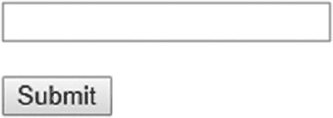

在生成的 HTML 输出中，你会看到包含必要 JSF Ajax API 的 `jsf.js` JavaScript 文件被自动包含在 HTML 的 head 部分。你还会注意到，`<h:inputText>` 中的 `<f:ajax>` 生成了一个额外的 `onchange` 属性，而 `<h:commandButton>` 中生成了一个额外的 `onclick` 属性，两者都定义了一些特定于 JSF 实现的、负责执行 Ajax 请求的 JavaScript 代码。

JSF 指定了两种内部 Ajax 事件类型：`valueChange` 和 `action`。当 `<f:ajax>` 没有指定 `event` 属性时，这些是默认的事件类型。当 `<f:ajax>` 附加到实现了 `EditableValueHolder` 接口的组件上时，默认事件类型变为 `valueChange`。对于实现了 `ActionSource` 接口的组件，默认事件类型是 `action`。对于所有其他 `ClientBehaviorHolder` 组件，默认事件是 `click`。这些内部事件类型实际生成的 HTML DOM 事件类型取决于组件及其关联的渲染器。

对于基于文本的输入组件以及基于下拉列表和列表框的选择组件，`<f:ajax>` 的默认 HTML DOM 事件类型是 `"change"`。对于基于单选按钮和复选框的选择组件以及命令组件，默认事件类型是 `"click"`。你可以在生成的 HTML 输出中看到这一点，这可以通过在 `<f:ajax>` 标签上显式指定 `event` 属性来覆盖。

```
<h:inputText ...>
    <f:ajax event="blur" />
</h:inputText>
```

上面的示例将在 `onblur` 属性中生成 JavaScript 代码，而不是在 `onclick` 属性中。`event` 属性支持的值取决于目标 `ClientBehaviorHolder` 组件。这些值可以在相关组件的 VDL 文档中找到。所有 `on[event]` 属性都在那里定义。当你移除它们前面的 `"on"` 前缀时，就得到了支持的事件类型列表。例如，`<h:inputText>` 的 VDL 文档 ⁴ 指出支持以下事件类型：

*   blur, change, click, dblclick, focus, keydown, keypress, keyup, mousedown, mousemove, mouseout, mouseover, mouseup, select

当所需的 DOM 事件类型在客户端发生并触发了 `on[event]` 属性中定义的、与 JSF 实现相关的特定 JavaScript 代码时，最终会调用标准 JSF JavaScript API 的 `jsf.ajax.request()` 函数。它将准备一组预定义的回发参数，其中 `javax.faces.source` 和 `javax.faces.behavior.event` 是最重要的。前者指定源组件的客户端 ID，本质上是 JavaScript 上下文中 `this.id` 的值。后者指定事件类型，本质上是 JavaScript 上下文中 `event.type` 的值。你可能已经猜到，它们是从传递给 Mojarra 特定的 `mojarra.ab()` 函数的前两个参数派生出来的，正如在生成的 HTML 输出中看到的那样。

一旦触发，Ajax 请求将几乎以与非 Ajax 请求相同的方式贯穿 JSF 生命周期。恢复视图阶段（第一阶段）、处理验证阶段（第三阶段）、更新模型值阶段（第四阶段）和调用应用程序阶段（第五阶段）是相同的。应用请求值阶段（第二阶段）略有不同。它只会解码 `<f:ajax>` 标签的 `execute` 属性所覆盖的组件，该属性默认为 `@this`（“当前组件”）。渲染响应阶段（第六阶段）则完全不同。它不会生成整个 HTML 文档，而是生成一个特殊的 XML 文档，该文档仅包含 `<f:ajax>` 标签的 `render` 属性所覆盖的组件的生成 HTML 输出，该属性默认为 `@none`（“没有组件”）。

`execute` 和 `render` 属性接受一个由空格分隔的组件搜索表达式集合。这可以表示相对于最近的 `NamingContainer` 父组件的客户端 ID，或者始终相对于 `UIViewRoot` 的绝对客户端 ID，或者标准或自定义的搜索关键字，或者它们的链式组合。有关它们的深入解释，请参见第 12 章。目前，我们只需要了解标准搜索关键字 `@this`、`@form` 和 `@none`。顾名思义，`@form` 关键字指的是 `UIForm` 类型（例如 `<h:form>`）的最近父组件。


在 Ajax 请求的应用请求值阶段（第二阶段），JSF 会针对 `<f:ajax>` 标签的 `execute` 属性所覆盖的每个组件，在默认解码过程之外，还会检查 `javax.faces.source` 请求参数是否等于当前组件的客户端 ID。如果是，JSF 将在调用应用阶段（第五阶段）将 `AjaxBehaviorEvent` 加入队列。在 `AjaxBehaviorEvent` 入队机制的底层，其逻辑归结如下：

```
FacesContext context = FacesContext.getCurrentInstance();
ExternalContext externalContext = context.getExternalContext();
Map<String, String> formData = externalContext.getRequestParameterMap();

String clientId = component.getClientId(context);
String source = formData.get("javax.faces.source");
String event = formData.get("javax.faces.behavior.event");

if (clientId.equals(source)) {
    component.getClientBehaviors().get(event)
        .forEach(behavior -> component.queueEvent(
            new AjaxBehaviorEvent(context, component, behavior)));
}
```

这里，`ClientBehavior` 基本上代表了 `<f:ajax>` 标签的定义。基于此逻辑，你可以得出结论：可以在同一个组件上附加多个 `<f:ajax>` 标签，甚至针对相同的事件类型。其优势在于，必要时你可以在完全相同的事件类型上注册多个 Ajax 行为监听器。

```
<h:inputText id="foo" ...>
    <f:ajax listener="#{bean.onchangeFoo}" />
    <f:ajax listener="#{otherBean.onchangeFoo}" />
</h:inputText>
```

这些 Ajax 行为监听器方法将在调用应用阶段（第五阶段）被调用；当然，前提是在处理验证阶段（第三阶段）没有发生转换或验证错误。对于命令组件，这些 Ajax 行为监听器方法总是在动作监听器方法和动作方法之前被调用。无论目标组件是什么，Ajax 行为监听器方法必须是一个 `public void` 方法，并且可以选择性地接受 `AjaxBehaviorEvent` 参数。

```
public void onchangeFoo(AjaxBehaviorEvent event) {
    // ...
}
```

这为你在输入和选择组件中提供了机会，可以在特定的 Ajax 事件上执行某些业务任务。最常见的实际案例包括准备另一个 bean 属性，该属性随后会在另一个组件中渲染。可以想象一下级联下拉菜单，其中子下拉菜单的可用选项取决于父下拉菜单的选中项。在动作组件中，`<f:ajax listener>` 并不是特别有用。你已经有能力在动作监听器和/或动作方法中执行业务任务。即使附加了 `<f:ajax>`，你也可以继续使用它们。

在 Ajax 请求的渲染响应阶段（第六阶段），JSF 会针对 `<f:ajax>` 标签的 `render` 属性所覆盖的每个组件，生成一个 XML `<update>` 元素，该元素仅包含该特定组件及其所有子组件（如果有）的 HTML 输出。标准 JSF JavaScript API 的 `jsf.ajax.response()` 函数（由 `jsf.ajax.request()` 注册为 Ajax 回调函数）会提取 `<update>` 元素的 `id` 属性（代表目标组件的客户端 ID），并通过 JavaScript 的 `document.getElementById()` 在客户端 ID 上获取具体的 HTML 元素，然后在 HTML DOM 树中用 `<update>` 元素的内容替换该元素。

以下是一个表单示例，其中包含一个带有消息的必填输入字段，以及一个显式定位消息组件的命令按钮：

```
<h:form id="form">
    <h:inputText id="text" value="#{bean.text}" required="true" />
    <h:message id="m_text" for="text" />
    <br />
    <h:commandButton id="submit" value="Submit" action="#{bean.submit}">
        <f:ajax execute="@form" render="m_text" />
    </h:commandButton>
</h:form>
```

图 4-2 展示了在输入字段未填写的情况下提交表单后，Chrome 如何呈现 Ajax 响应。这是一个很长的单行响应，因此稍微滚动了一下，以便从感兴趣的 `<update>` 元素开始查看。它包含了 `<h:message id="m_text">` 组件生成的 HTML 输出。

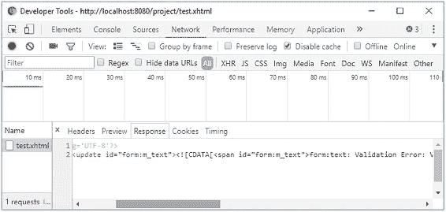

###### 图 4-2 Chrome 开发者工具——网络——响应

如果在 XML 响应中继续向下滚动，你还会注意到一个 `<update id="j_id1:javax.faces.ViewState:0">` 元素，其中包含 `javax.faces.ViewState` 隐藏输入元素的值。这对于 JSF 在 Ajax 请求之间维护视图状态至关重要。当 `render` 属性恰好覆盖了一个 `UIForm` 组件时，当前 HTML 文档中的 `javax.faces.ViewState` 隐藏输入元素基本上会在 HTML DOM 树中用 Ajax 响应的 `<update>` 元素内容替换该元素的过程中被完全清除。

缺失的 `javax.faces.ViewState` 隐藏输入元素最终会被附加到当前 `UIViewRoot` 的每个 `<form method="post">` 中。这种方法实际上是设计使然，原因有二：（1）因为视图状态值可能在 Ajax 请求之间发生变化，因此必须更新 HTML 文档中现有的表单以跟上这一变化，以防这些表单未被 `render` 属性覆盖；（2）因为当 JSF 状态保存方法显式设置为“client”时，`javax.faces.ViewState` 隐藏输入字段的值可能会变得非常大，因此如果 `render` 属性恰好覆盖了多个表单，否则会生成低效的 Ajax 响应。

## Ajax 中的导航

在具有正确定义的动作方法的 `UICommand` 组件中，情况并无不同。然而，有时你可能希望在附加到 `UIInput` 组件的 Ajax 监听器中执行导航。对此存在合理的实际用例。但是，`UIInput` 类不支持定义动作方法，并且 `<f:ajax listener>` 不支持返回导航结果。因此，你唯一的选择是以编程方式执行导航。这可以通过两种方式实现。第一种方式是使用 `javax.faces.application.NavigationHandler`。⁵

```
public void ajaxListener(AjaxBehaviorEvent event) {
    // ...

    String outcome = "/otherview?faces-redirect=true";
    FacesContext context = FacesContext.getCurrentInstance();
    Application application = context.getApplication();
    NavigationHandler handler = application.getNavigationHandler();
    handler.handleNavigation(context, null, outcome);
}
```

第二种方式是使用 `javax.faces.context.ExternalContext#redirect()`。⁶

```
public void ajaxListener(AjaxBehaviorEvent event) throws IOException {
    // ...

    String path = "/otherview.xhtml";
    FacesContext context = FacesContext.getCurrentInstance();
    ExternalContext externalContext = context.getExternalContext();
    String uri = externalContext.getRequestContextPath() + path;
    externalContext.redirect(uri);
}
```

两者之间存在若干差异。最重要的是，`NavigationHandler` 可以处理隐式导航结果值，而 `ExternalContext#redirect()` 只能处理实际路径，并且在涉及 Web 应用程序资源时需要手动添加请求上下文路径前缀。然而，它基本上可以处理任何 URI，例如外部 URL，如 `externalContext.redirect("http://example.com")`，而 `NavigationHandler` 则无法处理它们。


## GET 表单

JSF 本身没有“GET 表单”的概念，但你可以直接使用纯 HTML 来实现。JSF 支持处理 GET 请求参数，并在 GET 请求上调用托管 bean 的操作。为此，可以使用 `<f:viewParam>` 和 `<f:viewAction>`。它们必须放置在 `<f:metadata>` 中，而 `<f:metadata>` 只能在顶层页面中声明。因此，在使用模板时，它必须在模板客户端中声明，而不能在主模板中声明。换句话说，`<f:metadata>` 不能在模板客户端之间共享。

从技术上讲，`<f:metadata>` 在视图中的位置并不重要，只要它在顶层页面中即可。最清晰的写法是将其放在视图的最顶部，紧跟在根标签之后。

```
<!DOCTYPE html>
<html lang="en"
    xmlns:="http://www.w3.org/1999/xhtml"
    xmlns:f="http://xmlns.jcp.org/jsf/core"
    xmlns:h="http://xmlns.jcp.org/jsf/html"
>
    <f:metadata>
        ...
    </f:metadata>

<h:head>
        ...
    </h:head>

<h:body>
        ...
    </h:body>
</html>
```

当使用模板时，为其定义自己的模板定义。

```
<ui:composition template="/WEB-INF/templates/layout.xhtml"
    xmlns:="http://www.w3.org/1999/xhtml"
    xmlns:f="http://xmlns.jcp.org/jsf/core "
    xmlns:h="http://xmlns.jcp.org/jsf/html"
>
    <ui:define name="metadata">
        <f:metadata>
            ...
        </f:metadata>
    </ui:define>

<ui:define name="content">
        ...
    </ui:define>
</ui:composition>
```

不，你不能将 `<f:metadata>` 放在主模板中，而将 `<f:viewParam>` 和 `<f:viewAction>` 保留在模板客户端中。这是一个技术限制。你最多可以创建一个自定义的 `<f:event>` 类型，它在调用应用程序阶段（第五阶段）之后运行，然后在主模板中声明它。第 3 章的“创建自定义组件事件”一节中给出了一个示例。

`<f:viewParam>` 标签由 `UIViewParameter` 组件支持，该组件又继承自 `UIInput` 超类。这意味着它的行为几乎与 `<h:inputText>` 完全相同，但用于 GET 参数。细微的差别在于处理验证阶段（第三阶段）。默认情况下，空参数会跳过任何自定义验证器和 bean 验证。例如，`@NotNull` bean 验证注解仅在 `web.xml` 中显式将上下文参数 `javax.faces.INTERPRET_EMPTY_STRING_SUBMITTED_VALUES_AS_NULL` 设置为 `true` 时才会生效。另一个区别在于渲染响应阶段（第六阶段）。基本上，它什么都不会渲染。

`<f:viewAction>` 标签由 `UIViewAction` 组件支持，该组件又实现了 `ActionSource` 接口。这意味着它的行为几乎与 `<h:commandButton>` 完全相同，但用于 GET 请求。当然，你也可以在 `@ViewScoped` 托管 bean 上使用 `@PostConstruct` 注解的方法来执行 GET 请求的逻辑，但问题在于它会在托管 bean 实例创建后立即运行，而此时 `<f:viewParam>` 甚至还没有机会运行。`<f:viewAction>` 将在模型值更新后的调用应用程序阶段（第五阶段）被调用。它甚至支持返回一个表示导航结果的字符串，该字符串将表现为重定向。

以下是一个搜索表单的示例：

Facelets 文件 /search.xhtml:

```
<f:metadata>
    <f:viewParam id="query" name="query" value="#{search.query}" />
    <f:viewAction action="#{search.onload}" />
</f:metadata>

<h:body>
    <form>
        <label for="query">查询</label>
        <input type="text" name="query"
            value="#{empty search.query ? param.query : search.query}">
        </input>
        <input type="submit" value="搜索" />
        <h:message for="query" />
    </form>
    <h:dataTable id="results" rendered="#{not empty search.results}"
        value="#{search.results}" var="result">
        <h:column>#{result.name}</h:column>
        <h:column>#{result.description}</h:column>
    </h:dataTable>
</h:body>
```

后台 bean 类 com.example.project.view.Search:

```
@Named @RequestScoped
public class Search {

private String query;
    private List<Result> results;

@Inject
    private SearchService searchService;

public void onload() {
        results = searchService.getResults(query);
    }

// 在此处添加/生成 getter 和 setter。
    // 注意，results 不需要 setter。
}
```

在 Facelets 文件中，除了纯 HTML 表单方法之外，还有几点需要注意。文本输入的 `value` 属性在 `#{search.query}` 为空时显示 `#{param.query}`，因为否则当 `<f:viewParam>` 上出现转换或验证错误时，提交的值根本不会显示。`#{param}` 实际上是一个隐式 EL 对象，引用请求参数映射。`#{param.query}` 基本上会打印名为“query”的请求参数的值。请注意，这种 `value` 属性的构造对于 JSF 输入组件是无效的。它会在更新模型值阶段（第四阶段）抛出 `javax.el.PropertyNotWritableException`，而且，它已经在 `<f:viewParam>` 的内部执行了完全相同的逻辑。

`<h:message>` 可以附加到 `<f:viewParam>`。然而，在这种特定的构造中，它实际上并未被使用。只有当你向 `<f:viewParam>` 添加转换器或验证器时，例如通过 `<f:viewParam ... required="true">`，你才会在 `<h:message>` 中看到错误消息，并且 `<f:viewAction>` 将不会被调用。

现在，当你打开页面并提交表单时，提交的值将作为查询字符串出现在 URL 中，例如 `/search.xhtml?query=jsf`。这是可添加书签的，并且每次打开 URL 时都可以重新执行。


## 无状态表单

在动态操作的表单中，状态保存尤其有用，这类表单使用 Ajax 有条件地渲染部分内容，例如级联下拉菜单和辅助输入字段。JSF 会在同一视图的 Ajax 回传过程中记住表单状态。通常，正是这些表单需要你绝对使用视图作用域的管理 Bean，而不是请求作用域的管理 Bean。

当你的网站包含“公共”和“私有”部分时，你希望尽可能推迟 HTTP 会话的创建，直到最终用户实际登录。这样，爬虫就不会触发不必要的 HTTP 会话创建。然而，如果你在公共部分有一个标准的 JSF 登录表单，仅仅访问该页面就会创建 HTTP 会话。如果该表单本身基本没有动态状态，并且绑定到一个请求作用域的管理 Bean，那么这在服务器内存方面就是一种不必要的开销。你可以考虑改用客户端状态保存，但这会影响整个网站，并且会带来网络带宽和 CPU（中央处理器）性能方面的开销。诚然，如果你拥有最先进的硬件，这种开销可以忽略不计，但如果你有大量访问者和/或硬件相对较差，这种开销就不可忽视了。

对于绑定到请求作用域 Bean 的静态表单，例如一个简单的双字段登录表单（理论上可以在每次回传时安全地完全清空），则不一定需要保存视图状态。这可以通过将 `<f:view>` 的 `transient` 属性设置为 `true` 来实现。

```
<f:view transient="true">
    <h:form id="login">
        ...
    </h:form>
</f:view>
```

这样，JSF 就不会创建任何视图状态，并且 `javax.faces.ViewState` 隐藏输入字段将收到一个固定值“stateless”。请注意，这会影响整个视图，并且无法仅为特定表单切换此设置。JSF 目前不支持按表单配置状态保存方法。此外，无状态还有一个额外的缺点：如果存在开放的 XSS 漏洞，理论上更容易执行 CSRF（跨站请求伪造）攻击。（另请参阅第 13 章的“跨站请求伪造保护”一节。）幸运的是，使用 JSF 时，意外引入 XSS 漏洞已经非常困难。获得 XSS 漏洞的唯一方法是使用 `<h:outputText escape="false">` 来重新显示用户控制的数据。

