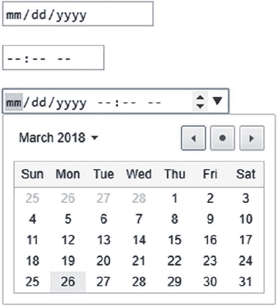

# 5. 转换与验证

Bauke Scholtz^(1 ) 和 Arjan Tijms²

(1) 库拉索岛威廉斯塔德

(2) 荷兰北荷兰省阿姆斯特丹

JSF（JavaServer Faces）作为一个基于 HTML 表单的 MVC（模型-视图-控制器）框架，其核心基本上需要一直在 Java 对象（实体、Bean、值对象、数据传输对象等）和字符序列（字符串）之间进行转换。HTTP 请求基本上被分解为表示标头和参数的纯文本字符串，而不是 Java 对象。HTTP 响应基本上被写成一个表示 HTML 或 XML 的大字符序列，而不是某种 Java 对象的序列化形式。然而，JSF 页面背后的普通 Java 模型并不一定到处都包含 String 属性。那将违背 Java 强类型化的特性。这就是转换器发挥作用的地方：在模型中的对象和视图中的字符串之间进行转换。

在使用新提交的（并在必要时转换后的）值更新模型值之前，你当然希望验证它们是否符合 Web 应用程序的业务规则，并在必要时向最终用户显示信息性错误消息，以便他们可以自行修复任何错误。通常，业务规则已经在数据存储（例如关系数据库管理系统）中得到了很好的定义。一个设计良好的数据库表已经在数据类型、最大大小、可空性和唯一性方面有严格的约束。你作为前端开发人员，应该绝对确保提交和转换后的值可以无误地插入到数据库中。

例如，如果电子邮件地址列被约束为唯一且不可为空的列，最大长度为 254 个字符，那么你应该确保在将其插入数据库之前，提交的值已按此要求进行验证。否则，数据库插入将抛出一些异常，通常很难将其分解为详细信息来告知最终用户确切的错误。这就是验证器发挥作用的地方：在更新模型之前验证提交（和转换）的值。

## 标准转换器

JSF 从一开始就提供了一组开箱即用的标准转换器。其中大多数甚至基于模型属性的 Java 类型完全透明地完成其工作。它们都在 `javax.faces.convert` 包¹中，并且都实现了 `Converter<T>` 接口。表 5-1 提供了它们的概览。


###### 表 5-1 JSF 提供的标准转换器

| 转换器类 | 转换器 ID | 转换器标签 | 值类型 | 起始版本 |
| --- | --- | --- | --- | --- |
| BigDecimalConverter | javax.faces.BigDecimal | 无 | java.math.BigDecimal | 1.0 |
| BigIntegerConverter | javax.faces.BigInteger | 无 | java.math.BigInteger | 1.0 |
| BooleanConverter | javax.faces.Boolean | 无 | boolean/java.lang.Boolean | 1.0 |
| ByteConverter | javax.faces.Byte | 无 | byte/java.lang.Byte | 1.0 |
| CharacterConverter | javax.faces.Character | 无 | char/java.lang.Character | 1.0 |
| DateTimeConverter | javax.faces.DateTime | <f:convertDateTime> | java.util.Datejava.time.LocalDatejava.time.LocalTimejava.time.OffsetTimejava.time.LocalDateTimejava.time.OffsetDateTimejava.time.ZonedDateTime | 1.02.32.32.32.32.32.3 |
| DoubleConverter | javax.faces.Double | 无 | double/java.lang.Double | 1.0 |
| EnumConverter | javax.faces.Enum | 无 | enum/java.lang.Enum | 1.0 |
| FloatConverter | javax.faces.Float | 无 | float/java.lang.Float | 1.0 |
| IntegerConverter | javax.faces.Integer | 无 | int/java.lang.Integer | 1.0 |
| LongConverter | javax.faces.Long | 无 | long/java.lang.Long | 1.0 |
| NumberConverter | javax.faces.Number | <f:convertNumber> | java.lang.Number | 1.0 |
| ShortConverter | javax.faces.Short | 无 | short/java.lang.Short | 1.0 |

“转换器 ID”列主要指定了转换器标识符，你可以将其用于任何 `ValueHolder` 组件的 `converter` 属性，或任何嵌套的 `<f:converter>` 标签的 `converterId` 属性，以激活特定的转换器。所有 `UIOutput` 和 `UIInput` 组件都实现了 `ValueHolder` 接口。在“转换器标签”列中标注为“无”的转换器是隐式转换器。换句话说，你可以直接将任何类型为 `BigDecimal`、`BigInteger`、`boolean/Boolean`、`byte/Byte`、`char/Character`、`double/Double`、`enum/Enum`、`float/Float`、`int/Integer`、`long/Long` 和 `short/Short` 的 bean 属性绑定到任何 `ValueHolder` 组件的 `value` 属性，JSF 会自动进行转换，无需任何额外配置。只有 `<f:convertDateTime>` 和 `<f:convertNumber>` 需要显式注册，因为仅凭模型值本身并不一定能明确所需的转换算法。

在所有 `ValueHolder` 组件中，转换器将在渲染响应阶段（第六阶段）被调用，将非字符串类型的模型值转换为适合嵌入 HTML 的字符串。而在 `EditableValueHolder` 组件中，转换器还会在处理验证阶段（第三阶段）被调用，将提交的字符串请求参数转换为非字符串类型的模型值。`EditableValueHolder` 接口扩展了 `ValueHolder` 接口，并由所有 `UIInput` 组件实现。

然而，当这些类型被参数化时，这种隐式转换在 bean 属性上不起作用。假设你的模型中有一个 `List<Integer>`，并且希望按如下方式进行编辑：

```
<ui:repeat value="#{bean.integers}" varStatus="loop">
    <h:inputText value="#{bean.integers[loop.index]}" />
</ui:repeat>
```

那么，提交后，列表中最终会得到未转换的字符串值，并且在尝试遍历列表时，你会被类转换异常搞得一头雾水。原因是负责处理那些 `#{...}` 表达式（在幕后由 `javax.el.ValueExpression` 实例表示）的 EL（表达式语言）API（应用程序编程接口），在其当前版本中无法检测泛型集合的参数化类型，并且在 `ValueExpression#getType()` 上仅返回 `Object.class`。JSF 对 EL 的这一限制无能为力。你所能做的就是在输入组件上显式指定所需的转换器。

```
<ui:repeat value="#{bean.integers}" varStatus="loop">
    <h:inputText value="#{bean.integers[loop.index]}"
        converter="javax.faces.Integer">
    </h:inputText>
</ui:repeat>
```

另一种替代方案是将 `List<Integer>` 替换为 `Integer[]` 甚至 `int[]`。这样 EL 就能将值表达式识别为整数类型，从而 JSF 能够为其找到所需的转换器。然而，在模型中使用普通数组而不是集合，在当今是不推荐的。

回到显式标准转换器 `<f:convertNumber>` 和 `<f:convertDateTime>`，它们也可以嵌套在任何 `ValueHolder` 组件中。`<f:convertNumber>` 与隐式的基于数字的转换器之间的区别在于，这些标签允许更精细地设置转换选项，例如数字类型或模式、整数和/或小数位数、是否使用分组以及区域设置。


### <f:convertNumber>

<f:convertNumber> ² 在底层使用了 `java.text.NumberFormat`。³ `type` 属性指定了将获取哪个实例，默认值为 `number`。其他允许的值为 `currency` 和 `percent`。换句话说，以下标签：

```
<f:convertNumber type="number" />
<f:convertNumber type="currency" />
<f:convertNumber type="percent" />
```

在底层将按如下方式获取 `NumberFormat` 实例：

```
NumberFormat numberFormat = NumberFormat.getNumberInstance(locale);
NumberFormat currencyFormat = NumberFormat.getCurrencyInstance(locale);
NumberFormat percentFormat = NumberFormat.getPercentInstance(locale);
```

其中，`locale` 参数可以通过 `<f:convertNumber>` 标签的 `locale` 属性指定，默认值为 `UIViewRoot#getLocale()`，而后者又可以通过 `<f:view>` 的 `locale` 属性指定。换句话说，这些实例将根据数字类型和指定的区域设置自动应用标准的数字格式模式。以下示例：

```
<f:view locale="pt_BR">
    ...
    <h:outputText value="#{product.price}">
        <f:convertNumber type="currency" locale="en_US" />
    </h:outputText>
</f:view>
```

将不会把价格（一个 `BigDecimal` 属性）格式化为 R$ 12,34（巴西雷亚尔），而是格式化为 $12.34（美元）。请注意，`<f:convertNumber>` 标签的 `locale` 属性不一定需要指定为 `faces-config.xml` 中支持的区域设置。还应注意，`value` 属性不一定需要引用 `BigDecimal`；任何其他 `java.lang.Number` 类型也受支持，但对于价格，我们当然希望将值存储在 `BigDecimal` 中，而不是例如 `Double` 或 `Float`，以避免由于浮点数的浮点特性而导致的算术错误。⁴

如果你出于某种原因需要更改标准的数字格式模式——例如，因为你正在开发一个银行应用程序，该程序存储具有五位小数的财务数据——并且你希望在后端管理屏幕上显示完整值，以便人类在必要时可以验证它们，那么你可以使用 `<f:convertNumber>` 标签的 `pattern` 属性来覆盖符合 `java.text.DecimalFormat` 规则的标准数字格式模式。⁵

```
<f:convertNumber pattern="¤ #,##0.00000" locale="pt_BR" />
```

请注意，当指定了 `pattern` 属性时，`type` 属性将被忽略。“货币符号”模式字符“¤”指定了实际货币符号必须插入的位置。实际的货币符号取决于指定的区域设置。“逗号”模式字符“,”指定了何时必须插入分组分隔符，该分隔符相对于小数分隔符或值的末尾。实际插入的分组分隔符符号在美元格式中恰好也是一个逗号，但在巴西雷亚尔格式中是一个句点。“句点”模式字符“.”指定了小数分隔符的位置。实际插入的小数分隔符符号在美元格式中恰好也是一个句点，但在巴西雷亚尔格式中是一个逗号。“可选数字”模式字符“#”在此模式中仅用于指示何时应插入分组分隔符符号，当实际数字不存在时不会显示任何内容。“必需数字”模式字符“0”指定了最小格式，当实际数字不存在时将显示零。以下是一个练习代码，应该能让你深入了解 `<f:convertNumber>` 在底层是如何工作的：

```
Locale locale = new Locale("pt", "BR");
DecimalFormatSymbols symbols = new DecimalFormatSymbols(locale);

System.out.println("货币符号: " + symbols.getCurrencySymbol());
System.out.println("分组符号: " + symbols.getGroupingSeparator());
System.out.println("小数符号: " + symbols.getDecimalSeparator());

DecimalFormat formatter = new DecimalFormat("¤ #,##0.00000", symbols);

System.out.println(formatter.format(new BigDecimal("12.34")));
System.out.println(formatter.format(new BigDecimal(".1234")));
System.out.println(formatter.format(new BigDecimal("1234")));
System.out.println(formatter.format(new BigDecimal("1234567.1234567")));
```

输出应如下所示：

```
货币符号: R$
分组符号: .
小数符号: ,
R$ 12,34000
R$ 0,12340
R$ 1.234,00000
R$ 1.234.567,12346
```

`<f:convertNumber>` 也将精确渲染这些值。除了 `pattern` 属性，你还可以使用其他属性（例如 `currencySymbol`、`integerOnly`、`groupingUsed`、`minIntegerDigits`、`maxIntegerDigits`、`minFractionDigits` 和 `maxFractionDigits`）来微调 `type` 属性。你基本上可以通过以下方式实现相同的格式模式“¤ #,##0.00000”：

```
<f:convertNumber type="currency" locale="pt_BR"
    minFractionDigits="5" maxFractionDigits="5" />
```

这实际上更具可读性，并且在你难以从键盘上输入货币符号占位符时更加方便。`pattern` 属性很少比使用其他属性微调 `type` 属性更有用。

如果你在 `UIInput` 组件中使用 `<f:convertNumber>`，因此需要最终用户输入值，你应该记住，`currency` 和 `percent` 类型明确要求最终用户也输入货币或百分比符号。对于货币输入，你可以通过将空字符串指定为货币符号来轻松禁用此功能，以便你可以将其放在输入组件外部。

```
<span class="currency">
    <span class="symbol">$</span>
    <h:inputText ...>
        <f:convertNumber type="currency" currencySymbol="" />
    </h:inputText>
</span>
```

不幸的是，对于百分比类型，这是不可能的。

### <f:convertDateTime>

<f:convertDateTime> ⁶ 在底层使用了 `java.text.DateFormat`，⁷ 并且从 JSF 2.3 开始，也使用了 `java.time.formatter.DateTimeFormatter`。⁸ 换句话说，你基本上可以使用任何类型的日期。此外，此标签有一个 `type` 属性，该属性必须与模型值的实际类型相对应。从历史上看，无法基于 `java.util.Date` 实例以编程方式检测所需的类型。自从新的 `java.time` API 为每种日期时间类型提供不同的类以来，这种情况已经改变。然而，为了能够将现有的 `<f:convertDateTime>` API 重用于新的 `java.time` API，必须添加新的类型。表 5-2 提供了一个概览。


###### 表 5-2 <f:convertDateTime type> 支持的值

| 标签属性 | 值类型 | 实际格式化器 | 起始版本 |
| --- | --- | --- | --- |
| date（默认） | java.util.Date（零时间） | DateFormat#getDateInstance() | 1.0 |
| time | java.util.Date（零日期） | DateFormat#getTimeInstance() | 1.0 |
| both | java.util.Date | DateFormat#getDateTimeInstance() | 1.0 |
| localDate | java.time.LocalDate | DateTimeFormatter#ofLocalizedDate() | 2.3 |
| localTime | java.time.LocalTime | DateTimeFormatter#ofLocalizedTime() | 2.3 |
| localDateTime | java.time.LocalDateTime | DateTimeFormatter#ofLocalizedDateTime() | 2.3 |
| offsetTime | java.time.OffsetTime | DateTimeFormatter#ISO_OFFSET_TIME | 2.3 |
| offsetDateTime | java.time.OffsetDateTime | DateTimeFormatter#ISO_OFFSET_DATE_TIME | 2.3 |
| zonedDateTime | java.time.ZonedDateTime | DateTimeFormatter#ISO_ZONED_DATE_TIME | 2.3 |

除了 type 属性外，最好同时指定 pattern 属性，特别是在通过 UIInput 组件要求最终用户输入 java.util.Date 或 java.time.LocalXxx 值时，因为实际的模式在不同区域设置中可能以不太自文档化的方式变化。java.time.OffSetXxx 和 ZonedDateTime 没有这个问题，因为它们默认使用通用的 ISO 8601 格式。⁹

<f:convertDateTime> 的 pattern 属性，对于 java.util.Date，遵循 java.text.SimpleDateFormat Javadoc 中指定的相同规则，¹⁰ 对于 java.time API，遵循 java.time.format.DateTimeFormatter Javadoc 中指定的相同规则。¹¹ 它们大部分相同，但 java.time 格式支持更多模式。对于这两个 API，“月中的日”模式字符是“d”，“年中的月”模式字符是“M”，“年”模式字符是“y”，“24 小时制”模式字符是“H”，“分钟”模式是“m”，“秒”模式是“s”。ISO 8601 日期格式是“yyyy-MM-dd”，ISO 8601 时间格式是“HH:mm:ss”。偏移时间和带时区时间需要在时间部分之后附加一个偏移量，由 ISO 8601 时区模式字符“X”表示。有效值的示例包括 CET（欧洲中部时间）的“+01:00”、BRT（巴西利亚时间）的“-03:00”和 IST（印度标准时间）的“+5:30”。与之前一样，偏移日期时间和带时区日期时间需要用“T”字符而不是空格分隔。以下是所有可能的 <f:convertDateTime> 类型的概述，其中本地化类型已明确指定了模式：

```
<h:form id="form">
    <h:inputText id="date" value="#{bean.date}">
        <f:convertDateTime type="date" pattern="yyyy-MM-dd" />
    </h:inputText>
    <h:inputText id="time" value="#{bean.time}">
        <f:convertDateTime type="time" pattern="HH:mm:ss" />
    </h:inputText>
    <h:inputText id="both" value="#{bean.both}">
        <f:convertDateTime type="both" pattern="yyyy-MM-dd HH:mm:ss" />
    </h:inputText>
    <h:inputText id="localDate" value="#{bean.localDate}">
        <f:convertDateTime type="localDate" pattern="yyyy-MM-dd" />
    </h:inputText>
    <h:inputText id="localTime" value="#{bean.localTime}">
        <f:convertDateTime type="localTime" pattern="HH:mm:ss" />
    </h:inputText>
    <h:inputText id="localDateTime" value="#{bean.localDateTime}">
        <f:convertDateTime type="localDateTime"
            pattern="yyyy-MM-dd HH:mm:ss">
        </f:convertDateTime>
    </h:inputText>
    <h:inputText id="offsetTime" value="#{bean.offsetTime}">
        <f:convertDateTime type="offsetTime" />
    </h:inputText>
    <h:inputText id="offsetDateTime" value="#{bean.offsetDateTime}">
        <f:convertDateTime type="offsetDateTime" />
    </h:inputText>
    <h:inputText id="zonedDateTime" value="#{bean.zonedDateTime}">
        <f:convertDateTime type="zonedDateTime" />
    </h:inputText>
    <h:commandButton value="submit" action="#{bean.submit}" />
    <h:messages showSummary="false" showDetail="true"/>
</h:form>
```

请注意，此处将 <h:messages> 重新配置为显示详细信息而非仅显示摘要，因为日期时间转换错误的详细信息在标准 JSF 中会包含一个示例值，这对最终用户理解所需格式更为有用。以下是关联的后台 bean 的样子：

```
@Named @RequestScoped
public class Bean {

private Date date;
    private Date time;
    private Date both;
    private LocalDate localDate;
    private LocalTime localTime;
    private LocalDateTime localDateTime;
    private OffsetTime offsetTime;
    private OffsetDateTime offsetDateTime;
    private ZonedDateTime zonedDateTime;

public void submit() {
        System.out.println("date: " + date);
        System.out.println("time: " + time);
        System.out.println("both: " + both);
        System.out.println("localDate: " + localDate);
        System.out.println("localTime: " + localTime);
        System.out.println("localDateTime: " + localDateTime);
        System.out.println("offsetTime: " + offsetTime);
        System.out.println("offsetDateTime: " + offsetDateTime);
        System.out.println("zonedDateTime: " + zonedDateTime);
    }

// 添加/生成 getter 和 setter 方法。
}
```

如今 HTML5 已经推出了一段时间，越来越多的浏览器支持新的 HTML5 日期和时间输入，¹² 你最好默认启用它，因为它带有非常实用的内置日期选择器。Web 浏览器可能会以本地化格式在日期选择器中显示日期模式，但它始终会以 ISO 8601 格式提交值。因此这非常有用。HTML5 日期和时间输入可以通过将输入文本字段的 type 属性设置为“date”、¹³ “time”¹⁴ 或“datetime-local”¹⁵（而不是“datetime”，因为它已被弃用）来激活。使用 JSF <h:inputText> 时，你需要将其设置为传递属性。以下是一些示例：

```
<h:form id="form">
    <h:inputText id="localDate" a:type="date" value="#{bean.localDate}">
        <f:convertDateTime type="localDate" pattern="yyyy-MM-dd" />
    </h:inputText>
    <h:inputText id="localTime" a:type="time" value="#{bean.localTime}">
        <f:convertDateTime type="localTime" pattern="HH:mm" />
    </h:inputText>
    <h:inputText id="localDateTime" a:type="datetime-local"
        value="#{bean.localDateTime}">
        <f:convertDateTime type="localDateTime"
            pattern="yyyy-MM-dd'T'HH:mm">
        </f:convertDateTime>
    </h:inputText>
    <h:commandButton value="submit" action="#{bean.submit}" />
    <h:messages showSummary="false" showDetail="true"/>
</h:form>
```

以下是在 Chrome 浏览器中的渲染效果（已添加换行符）：



## 标准验证器

当提交的值在流程验证阶段（第三阶段）成功转换后，JSF 将立即对转换后的值执行验证。JSF 已经提供了一些开箱即用的标准验证器。它们都位于 javax.faces.validator 包中，¹⁶ 并且都实现了 Validator<T> 接口。表 5-3 提供了它们的概述。


###### 表 5-3 JSF 提供的标准验证器

| 验证器类 | 验证器 ID | 验证器标签 | 值类型 | 起始版本 |
| --- | --- | --- | --- | --- |
| LongRangeValidator | javax.faces.LongRange | <f:validateLongRange> | java.lang.Number | 1.0 |
| DoubleRangeValidator | javax.faces.DoubleRange | <f:validateDoubleRange> | java.lang.Number | 1.0 |
| LengthValidator | javax.faces.Length | <f:validateLength> | java.lang.Object | 1.0 |
| RegexValidator | javax.faces.RegularExpression | <f:validateRegex> | java.lang.String | 2.0 |
| RequiredValidator | javax.faces.Required | <f:validateRequired> | java.lang.Object | 2.0 |
| BeanValidator | javax.faces.Bean | <f:validateBean> | java.lang.Object | 2.0 |
| 不适用 | 不适用 | <f:validateWholeBean> | java.lang.Object | 2.3 |

“验证器 ID”列基本上指定了验证器标识符，你可以将其指定在任何 `EditableValueHolder` 组件的 `validator` 属性中，或任何嵌套的 `<f:validator>` 标签的 `validatorId` 属性中，以激活特定的验证器。与转换器相反，单个 `EditableValueHolder` 组件可以附加多个验证器。无论彼此的结果如何，它们都将被执行。

### <f:validateLongRange>/<f:validateDoubleRange>

这些验证器允许你为绑定到基于 `java.lang.Number` 属性的输入组件指定最小和/或最大允许数值。这些值可以通过 `minimum` 和 `maximum` 属性来指定。

```
<h:inputText value="#{bean.quantity}">
    <f:validateLongRange minimum="1" maximum="10" />
</h:inputText>
```

通过传递属性，这也可以与 HTML5 输入类型“number”（数字微调器）和“range”（滑块）结合使用，后者需要 `min`、`max` 以及可选的 `step` 作为传递属性。在此示例中，`#{bean.quantity}` 只是一个 `Integer`，而 `#{bean.volume}` 是一个 `BigDecimal`。

```
<h:inputText value="#{bean.quantity}"
    a:type="number" a:min="1" a:max="10">
    <f:validateLongRange minimum="1" maximum="10" />
</h:inputText>
<h:inputText value="#{bean.volume}"
    a:type="range" a:min="1" a:max="10" a:step="0.1">
    <f:validateLongRange minimum="1" maximum="10" />
</h:inputText>
```

请注意，你可以直接在 `BigDecimal` 属性上使用 `<f:validateLongRange>`。它不关心属性的实际 `java.lang.Number` 类型是否为 `Long`，只关心指定的 `minimum` 和 `maximum` 属性是否为 `Long`。如果你想指定一个基于小数的数字作为 `minimum` 和/或 `maximum`，那么请改用 `<f:validateDoubleRange>`。

```
<h:inputText value="#{bean.volume}"
    a:type="range" a:min="0.1" a:max="10.0" a:step="0.1">
    <f:validateDoubleRange minimum="0.1" maximum="10.0" />
</h:inputText>
```

### <f:validateLength>/<f:validateRegex>

这些验证器主要设计用于基于 `java.lang.String` 的属性。`<f:validateLength>` 会首先通过调用 `Object#toString()` 将提交的值转换为字符串，然后根据指定的 `minimum` 和/或 `maximum` 属性验证 `String#length()` 的结果。`<f:validateRegex>` 会将提交的值转换为 `String`，然后检查 `String#matches()` 对于指定的 `pattern` 属性是否返回 `true`。换句话说，它不接受除 `java.lang.String` 之外的任何其他属性类型。假设你想验证一个值始终为三位数字；那么有三种可能的方式：

```
<h:inputText value="#{bean.someStringOrInteger}" maxlength="3">
    <f:validateLength minimum="3" maximum="3" />
</h:inputText>

<h:inputText value="#{bean.someString}" maxlength="3">
    <f:validateRegex pattern="[0-9]{3}" />
</h:inputText>

<h:inputText value="#{bean.someInteger}" maxlength="3">
    <f:validateLongRange minimum="100" maximum="999" />
</h:inputText>
```

`maxlength="3"` 属性只是为了让最终用户在客户端无法输入超过三个字符。将数字存储为字符串毫无意义，因此第二种方式被排除。这给我们留下了第一种或第三种方式。从技术上讲，选择哪一种并不重要。第一种方式可以说更具自文档性，因为你实际上想要验证的是长度，而不是范围。

回到 `<f:validateRegex>`，`pattern` 属性遵循与 `java.util.regex.Pattern` 中指定的完全相同的正则表达式规则。¹⁷ 然而，有一个潜在的陷阱：所需的转义反斜杠数量取决于当前使用的 EL 实现。在 Oracle 的 EL 实现（`com.sun.el.*`）中，你需要两个反斜杠，就像在常规的 Java 字符串中一样；但在 Apache 的 EL 实现（`org.apache.el.*`）中，你必须使用一个反斜杠，否则会出错或无法按预期匹配。截至目前，Payara、WildFly、Liberty 和 WebLogic 使用 Oracle 的 EL 实现，而 TomEE 和 Tomcat 使用 Apache 的 EL 实现。换句话说，以下示例在使用 Oracle EL 的服务器上可以工作，但在使用 Apache EL 的服务器上无法工作。

```
<h:inputText value="#{bean.someString}" maxlength="3">
    <f:validateRegex pattern="\\d{3}" />
</h:inputText>
```

当使用 Apache EL 时，你需要改用 `pattern="\d{3}"`。另一方面，正则表达式模式 `\d` 实际上表示“任何数字”，因此不仅匹配拉丁数字，还匹配希伯来语、西里尔语、阿拉伯语、中文等数字。如果这不是你的意图，你最好使用 `[0-9]` 模式。

### <f:validateRequired>

这是一个有点奇怪的家伙。也就是说，所有 `UIInput` 组件都已经有一个 `required` 属性，提供了完全相同的功能。那你为什么还要使用整个 `<f:validateRequired>` 标签呢？它是在 JSF 2.0 中专门为“复合组件”（更多内容将在第 7 章中介绍）添加的。更确切地说，在某些复合组件组合中，模板客户端有机会将转换器和验证器附加到复合组件暴露的特定 `EditableValueHolder` 接口，该接口又引用复合组件实现中包含的一个或多个 `UIInput` 组件。以下是此类复合组件的示例：

```
<cc:interface>
    ...
    <cc:editableValueHolder
        name="inputs" targets="input1 input3">
    </cc:editableValueHolder>
</cc:interface>
<cc:implementation>
    ...
    <h:inputText id="input1" ... />
    <h:inputText id="input2" ... />
    <h:inputText id="input3" ... />
    ...
</cc:implementation>
```

以下是模板客户端的示例：

```
<my:compositeComponent ...>
    <f:validateRequired for="inputs" />
</my:compositeComponent>
```

你可能已经猜到，`for` 属性必须与暴露的 `<cc:editableValueHolder>` 的 `name` 属性完全匹配，并且此验证器将基本上针对由 `input1` 和 `input3` 标识的封闭输入组件（因此不包括 `input2`），从而有效地使它们成为 `required="true"`。顺便说一下，这个 `for` 属性也存在于所有其他转换器和验证器标签上。


### <f:validateBean>/<f:validateWholeBean>

使用这些标签时，它们对 Bean Validation API（应用程序编程接口）存在必需的依赖关系，该 API 以前更常被称为“JSR 303”。与 JSF 一样，Bean Validation 是 Java EE API 的一部分，已包含在任何 Java EE 应用服务器中。在 Tomcat 和其他 Servlet 容器中，你需要单独安装它。在 Java 代码中，Bean Validation 由 `javax.validation.*` 包中的注解和接口表示，例如 `@NotNull`、`@Size`、`@Pattern`、`ConstraintValidator` 等。目前最流行的实现是 Hibernate Validator。¹⁸

JSF 会自动检测 Bean Validation 的存在，在这种情况下，它会在验证阶段（第三阶段）结束时透明地处理所有 Bean Validation 约束，无论 JSF 自身验证器的结果如何。如果需要，可以通过 `web.xml` 中的以下上下文参数在整个应用程序范围内禁用此功能：

```
<context-param>
    <param-name>
        javax.faces.validator.DISABLE_DEFAULT_BEAN_VALIDATOR
    </param-name>
    <param-value>true</param-value>
</context-param>
```

或者，如果这种方法过于粗糙，你可以借助 `<f:validateBean>` 标签进行细粒度控制，该标签可以包裹一组 `UIInput` 组件，或嵌套在这些组件内部。当 `<f:validateBean>` 标签的 `disabled` 属性设置为 `true` 时，目标 `UIInput` 组件上的任何 Bean Validation 都将被禁用。以下代码将仅禁用父级 `UIInput` 组件上的任何 Bean Validation。

```
<h:inputText ...>
    <f:validateBean disabled="true" />
</h:inputText>
```

以下代码将仅禁用由 `input3`、`input4` 和 `input5` 标识的 `UIInput` 组件上的任何 Bean Validation：

```
<h:inputText id="input1" ... />
<h:inputText id="input2" ... />
<f:validateBean disabled="true">
    <h:inputText id="input3" ... />
    <h:inputText id="input4" ... />
    <h:inputText id="input5" ... />
<f:validateBean>
```

需要牢记的重要一点是，这只会禁用 JSF 管理的 Bean Validation，而不会禁用例如 JPA 管理的 Bean Validation。因此，如果你碰巧使用 JPA（Java 持久化 API）来持久化由 JSF 组件填充且禁用了 Bean Validation 的实体，那么 JPA 仍会代表自身独立于 JSF 执行 Bean Validation。如果你也想在 JPA 端禁用 Bean Validation，则需要在 `persistence.xml` 中将属性 `javax.persistence.validation.mode` 设置为 `NONE`（另请参阅 `javax.persistence.ValidationMode` Javadoc）。¹⁹

```
<property name="javax.persistence.validation.mode">NONE</property>
```

通过 `<f:validateBean>` 标签的 `validationGroups` 属性，你可以根据需要声明一个或多个验证组。在这种情况下，只会处理注册在同一组上的 Bean Validation 约束。设想以下模型：

```
@NotNull
private String value1;

@NotNull(groups=NotNull.class)
private String value2;

@NotNull(groups={NotNull.class, Default.class})
private String value3;
```

请注意，任何 Bean Validation 约束的 `groups` 属性必须引用一个接口，但它可以是任何你想要的接口。为简单起见，在上面的示例中，我们只是将 `javax.validation.constraints.NotNull` 接口重用为组标识符。然而，常见的做法是为所需的组创建你自己的标记接口。

同样不容忽视的是，`@NotNull` 仅在你已将 JSF 配置为将提交的空字符串值解释为 `null` 时才有效；否则，它会用空字符串（而非 `null`）污染模型，并导致 `@NotNull` 无法正常工作，因为空字符串不是 `null`。提醒一下，相关的 `web.xml` 上下文参数如下：

```
<context-param>
    <param-name>
        javax.faces.INTERPRET_EMPTY_STRING_SUBMITTED_VALUES_AS_NULL
    </param-name>
    <param-value>true</param-value>
</context-param>
```

现在，当提交一个空表单，且这些模型属性被以下输入组件引用，且这些组件上没有 `<f:validateBean>` 时：

```
<h:inputText value="#{bean.value1}" />
<h:inputText value="#{bean.value2}" />
<h:inputText value="#{bean.value3}" />
```

你将在属于 `javax.validation.groups.Default` 组的 Bean Validation 约束上收到验证错误，这些约束即是没有分组的 `value1` 和显式分组的 `value3`。`value2` 不会被 Bean 验证，因为它没有显式声明默认组。

并且，当提交一个空表单，且 `<f:validateBean>` 的 `validationGroups` 设置为 `NotNull.class` 时：

```
<f:validateBean validationGroups="javax.validation.constraints.NotNull">
    <h:inputText value="#{bean.value1}" />
    <h:inputText value="#{bean.value2}" />
    <h:inputText value="#{bean.value3}" />
</f:validateBean>
```

你将在属于 `javax.validation.constraints.NotNull` 组的 Bean Validation 约束上收到验证错误，这些约束即是显式声明了该组的 `value2` 和 `value3`。未分组的 `value1` 不会被 Bean 验证，因为它仅隐含了默认组。

最后，当提交一个空表单，且 `<f:validateBean>` 的 `validationGroups` 属性中同时指定了两个组（以逗号分隔的字符串形式）时：

```
<f:validateBean validationGroups="javax.validation.groups.Default,
                                  javax.validation.constraints.NotNull">
    <h:inputText value="#{bean.value1}" />
    <h:inputText value="#{bean.value2}" />
    <h:inputText value="#{bean.value3}" />
</f:validateBean>
```

你将在所有输入上收到验证错误，因为它们都至少匹配指定的组之一。然而，在实际应用中，这种分组功能很少使用。它仅在分组字段可以由同一个验证器同时验证时才真正有用。使用 Bean Validation，实现这一点的唯一方法是在 bean 类本身上放置一个自定义的 `Constraint` 注解，获取一个填充了值的该 bean 实例，然后将其传递给与该自定义 `Constraint` 注解关联的自定义 `ConstraintValidator`。设想一个“时间段”实体，它有一个“开始日期”属性，该属性应始终在“结束日期”属性之前。它看起来类似于以下内容：

```
@PeriodConstraint
public class Period implements Serializable {

@NotNull
    private LocalDate startDate;

@NotNull
    private LocalDate endDate;

// 添加/生成 getter 和 setter 方法。
}
```

使用以下自定义约束注解：

```
@Constraint(validatedBy=PeriodValidator.class)
@Target(TYPE)
@Retention(RUNTIME)
public @interface PeriodConstraint {
    String message() default "开始日期必须在结束日期之前";
    Class<?>[] groups() default {};
    Class<?>[] payload() default {};
}
```

以及以下自定义约束验证器：

```
public class PeriodValidator
    implements ConstraintValidator<PeriodConstraint, Period>
{
    @Override
    public boolean isValid
        (Period period, ConstraintValidatorContext context)
    {
        return period.getStartDate().isBefore(period.getEndDate());
    }
}
```

你看，Bean Validation 期望在执行验证时模型值已经存在。从 JSF 的角度来看，这意味着模型值必须在处理验证之前更新。然而，这不符合 JSF 的生命周期，在该生命周期中，模型值仅在验证成功处理后才更新。本质上，JSF 需要克隆 bean 实例，用所需的模型值填充它，对其调用 Bean Validation，收集任何验证错误，然后丢弃克隆的 bean 实例。


这正是 JSF 2.3 引入的 `<f:validateWholeBean>` 标签在底层所做的事情。以下是一个使用该代码的示例表单：

```
<h:form>
    <h:inputText a:type="date" value="#{booking.period.startDate}">
        <f:convertDateTime type="localDate" pattern="yyyy-MM-dd" />
    </h:inputText>
    <h:inputText a:type="date" value="#{booking.period.endDate}">
        <f:convertDateTime type="localDate" pattern="yyyy-MM-dd" />
    </h:inputText>
    <h:commandButton value="提交" />
    <h:messages />
    <f:validateWholeBean value="#{booking.period}" />
</h:form>
```

配合以下支持 bean：

```
@Named @ViewScoped
public class Booking implements Serializable {

private Period period = new Period();

// 添加/生成 getter 方法。
}
```

请注意，`<f:validateWholeBean>` 被显式地放置在父级 `<h:form>` 的最后一个子元素位置，这确保了验证会在同一表单中所有单个输入组件处理完毕后，作为最后一步执行。这是符合规范的；如果标签位置放置不当，JSF 实现可能会抛出运行时异常。

## Immediate 属性

`EditableValueHolder`、`ActionSource` 和 `AjaxBehavior` 接口也定义了一个 `immediate` 属性，该属性基本上映射到所有 `UIInput` 和 `UICommand` 组件以及 `<f:ajax>` 标签的 `immediate` 属性。当在 `EditableValueHolder` 组件上将其设置为 `true` 时，通常在处理验证阶段（第三阶段）以及更新模型值阶段（第四阶段）发生的所有操作，都将在应用请求值阶段（第二阶段）执行。如果这些组件上的转换或验证失败，生命周期还将跳过处理验证阶段（第三阶段）。当在 `ActionSource` 组件或 `AjaxBehavior` 标签上将其设置为 `true` 时，通常发生在调用应用程序阶段（第五阶段）的所有操作，都将在应用请求值阶段（第二阶段）执行，并且仅在转换和验证未失败的情况下执行。

从历史上看，此属性主要用于能够在表单上执行“内部”操作，通常是根据父输入组件提交的值来加载子输入组件，而不会被同一表单中其他输入组件产生的转换或验证错误所阻塞。一个常见的用例是在父下拉列表更改时填充子下拉列表。

```
<h:selectOneMenu value="#{bean.country}" required="true" immediate="true"
    onchange="submit()" valueChangeListener="#{bean.loadCities}">
    <f:selectItems value="#{bean.countries}" />
</h:selectOneMenu>
<h:selectOneMenu value="#{bean.city}" required="true">
    <f:selectItems value="#{bean.cities}" />
</h:selectOneMenu>
```

这种方法显然早于 Web 2.0 时代，在那个时代你只需使用 Ajax 即可实现此目的。需要理解的是，自 JSF 2.0 引入 `<f:ajax>` 以来，`immediate` 属性在此用途上基本上已经变得无用。完全相同的用例可以通过以下更简洁的方式实现：

```
<h:selectOneMenu value="#{bean.country}" required="true">
    <f:selectItems value="#{bean.countries}" />
    <f:ajax listener="#{bean.loadCities}" render="city" />
</h:selectOneMenu>
<h:selectOneMenu id="city" value="#{bean.city}" required="true">
    <f:selectItems value="#{bean.cities}" />
</h:selectOneMenu>
```

正如你在第 4 章中学到的，`<f:ajax>` 的 `execute` 属性默认值为 `@this`，因此这里省略了它。这也意味着同一表单中所有其他的 `EditableValueHolder` 组件将不会被处理，因此不会导致 `#{bean.loadCities}` 被来自其他输入组件的转换或验证错误所阻塞。

如今，有了 Ajax 魔法等特性，`immediate` 属性已经失去了其主要用例。即使没有它，JSF 也能很好地运行。由于其历史用途，许多初学者可能会误以为其主要目的是“跳过所有验证”。然而，事实并非如此。为此，你需要微调 `<f:ajax>` 的 `execute` 属性，使其仅覆盖真正需要验证的输入组件。如果你希望在提交整个表单时实际“跳过所有验证”，最好使用 Bean Validation 约束（如 `@NotNull` 等），并简单地将 `<f:validateBean disabled="true">` 包裹在整个表单周围。

## 自定义转换器

从最初开始，JSF 就支持自定义转换器。其主要用例是能够转换非标准的模型值，例如特定于 Web 应用程序的持久化实体。不太常见的用例是扩展现有的标准转换器，并在其构造函数中设置一些常用的默认值，这样你就可以用更少的代码在视图中声明所需的标准转换器配置。

想象一下，你希望能够在持久化实体上创建主从页面，并且希望将实体的 ID 作为请求参数从主页面传递到详细页面。以下是一个基于虚构的 `Product` 实体的主页面 `/products/list.xhtml` 中的数据表示例：

```
<h:dataTable value="#{listProducts.products}" var="product">
    <h:column>#{product.id}</h:column>
    <h:column>#{product.name}</h:column>
    <h:column>#{product.description}</h:column>
    <h:column>
        <h:link value="编辑" outcome="edit">
            <f:param name="id" value="#{product.id}" />
        </h:link>
    </h:column>
</h:dataTable>
```

注意表格的最后一列。它生成了一个指向详细页面 `/products/edit.xhtml` 的链接，其中实体的 ID 作为 GET 请求参数传递，例如 `/product.xhtml?id=42`。在详细页面中，你可以使用 `<f:viewParam>` 将 GET 请求参数设置到支持 bean 中。

```
<f:metadata>
    <f:viewParam name="id" value="#{editProduct.product}"
        required="true" requiredMessage="错误的请求">
    </f:viewParam>
</f:metadata>
...
<h:form>
    <h1>编辑产品 #{editProduct.product.id}</h1>
    <h:inputText value="#{editProduct.product.name}" />
    <h:inputText value="#{editProduct.product.description}" />
    ...
</h:form>
```

然而，有一个小问题：从 Java 角度来看，GET 请求参数本质上是一个表示产品 ID 的 `String`，而 `EditProduct` 支持 bean 的 `product` 属性实际上期望的是一个由传入 ID 标识的完整 `Product` 实体。

```
@Named @ViewScoped
public class EditProduct implements Serializable {

private Product product;

// Getter+setter 方法。
}
```

正是为了这个转换步骤，需要创建一个自定义转换器，它能够将表示产品 ID 的 `String` 与表示 `Product` 实体的 `Object` 之间进行转换。JSF 提供了 `javax.faces.convert.Converter` 接口²⁰ 来帮助你入门。以下是这样一个 `ProductConverter` 的具体示例：

```
@FacesConverter(forClass=Product.class, managed=true)
public class ProductConverter implements Converter<Product> {

@Inject
    private ProductService productService;

@Override
    public String getAsString
        (FacesContext context, UIComponent component, Product product)
    {
        if (product == null) {
            return "";
        }

if (product.getId() != null) {
            return product.getId().toString();
        }
        else {
            throw new ConverterException(
                new FacesMessage("无效的产品 ID"), e);
        }
    }

@Override
    public Product getAsObject
         (FacesContext context, UIComponent component, String id)
    {
        if (id == null || id.isEmpty()) {
            return null;
        }

try {
            return productService.getById(Long.valueOf(id));
        }
        catch (NumberFormatException e) {
            throw new ConverterException(
                new FacesMessage("无效的产品 ID"), e);
        }
    }
}
```


在 `@FacesConverter` 注解中，有几点重要事项需要注意。首先，`forClass` 属性主要用于指定该转换器应在**流程验证阶段**（第三阶段）和**渲染响应阶段**（第六阶段）自动运行的目标实体类型。这样，你就不需要在视图中显式注册转换器了。如果你想要显式注册，可以用 `value` 属性替换 `forClass` 属性，并指定转换器的唯一标识符，例如：

```
@FacesConverter(value="project.ProductConverter", managed=true)
```

然后，你可以在任何 `ValueHolder` 组件的 `converter` 属性中，或任何嵌套的 `<f:converter>` 标签的 `converterId` 属性中，精确指定该转换器 ID。

```
<f:viewParam name="id" value="#{editProduct.product}"
    converter="project.ProductConverter"
    required="true" requiredMessage="Bad request">
</f:viewParam>
```

但如果你坚持使用 `forClass` 属性，则无需这样做。请注意，你不能同时指定这两个属性。两者只能选其一，且 `value` 属性的优先级高于 `forClass`。因此，如果你同时指定了这两个属性，`forClass` 属性实际上会被忽略。我们不希望出现这种情况，因为对于透明转换整个实体这一特定目的而言，`forClass` 属性要强大得多。

注解中需要注意的第二点是 `managed` 属性。这是 JSF 2.3 新增的特性。本质上，它用于在 CDI 上下文中管理转换器实例。为了在转换器中实现依赖注入，必须将 `managed` 属性设置为 `true`。以前，解决这个问题的方法是将转换器本身设为托管 Bean。²¹

如果你之前使用过 JSF 转换器，你还会注意到该接口现在终于支持泛型了。该接口诞生于 Java 1.5 之前，因此从一开始就没有使用泛型。有了 `Converter<T>`，`getAsObject()` 现在返回的是 `T` 而不是 `Object`，而 `getAsString()` 现在接受 `T` 作为 `value` 参数，而不是 `Object`。这省去了不必要的 `instanceof` 检查和类型转换。

请注意，JSF 自身早于 JSF 2.3 的标准转换器（目前基本上所有标准转换器都是如此）是固定不变的，无法利用这一特性，否则它们将无法保持向后兼容性。换句话说，它们仍然是原始类型。也就是说，存在一种可能性很小但并非不可避免的情况：有人会在纯 Java 代码中以编程方式使用 JSF 转换器，而不是让 JSF 来处理它们。如果标准转换器使用了泛型，那么这些纯 Java 代码将无法编译。这与 `Map#get()` 显式接受 `Object` 而不是 `K` 作为参数的原因基本相同。此外，还有一种可能性更小但同样并非不可避免的情况：有人创建了一个自定义转换器，它继承自标准转换器，但又显式地重新声明了该接口。类似下面这样：

```
public class ExtendedNumberConverter
    extends NumberConverter implements Converter
{
    // ...
}
```

如果 `NumberConverter` 以某种方式使用了泛型，那么这种晦涩的转换器将无法编译。即使我们将 `NumberConverter` 参数化为 `Converter<Object>`，编译器也会对 `ExtendedNumberConverter` 报错，从而破坏向后兼容性，错误信息如下：

> *接口 Converter 不能以不同的参数实现多次：Converter<Object> 和 Converter*

回到我们的 `ProductConverter` 实现，在 `getAsString()` 方法中，你会注意到当模型值为 `null` 时，转换器显式地返回一个空字符串。这是符合 Javadoc 规范的。²² 技术原因是，当评估的值为 `null` 时，JSF 不会渲染关联的 HTML 属性。通常来说，这不是一个大问题。生成的 HTML 输出中未使用的属性越少越好。只是，这对于 `<select>` 元素的 `<option>` 来说，无法按预期工作。如果自定义转换器返回 `null` 而不是空字符串，那么 `<option>` 元素在渲染时将不带任何 `value` 属性，从而会转而提交其文本内容。这确实很尴尬，但 HTML 规范中确实是这样规定的。²³ 换句话说，如果你有一个转换器错误地返回了 `null` 而不是空字符串，并且你有一个包含关联实体和默认选项的下拉列表，如下所示：

```
<h:selectOneMenu value="#{bean.product}">
    <f:selectItem itemValue="#{null}" itemLabel="请选择 ..." />
    <f:selectItems value="#{bean.products}"
        var="product" itemLabel="#{product.name}">
    </f:selectItems>
</h:selectOneMenu>
```

那么，在提交默认选项时，Web 浏览器会向服务器发送字符串“请选择 ...”，而不是空字符串。这会导致 `ProductConverter#getAsObject()` 中抛出 `NumberFormatException`，而我们本意是返回 `null`。因此，正确的解决方案是让 `getAsString()` 在模型值为 `null` 时返回一个空字符串。

如果你有更多的持久化实体需要 JSF 转换器，并且希望避免为所有其他持久化实体重复编写本质上相同的 `ProductConverter` 逻辑，你可以为它们创建一个通用的 JSF 转换器。这仅在你所有的持久化实体都继承自同一个定义了 `getId()` 方法的基类时才有效。

```
@MappedSuperClass
public abstract class BaseEntity implements Serializable {

@Id @GeneratedValue(strategy=IDENTITY)
    private Long id;

public Long getId() {
        return id;
    }
}
```

并且，如果你为所有这些实体提供了一个基础实体服务：

```
@Stateless
public class BaseEntityService {

@PersistenceContext
    private EntityManager entityManager;

@TransactionAttribute(SUPPORTS)
    public <E extends BaseEntity> E getById(Class<E> type, Long id) {
        return entityManager.find(type, id);
    }
}
```

那么，通用转换器可以如下所示：

```
@FacesConverter(forClass=BaseEntity.class, managed=true)
public class BaseEntityConverter implements Converter<BaseEntity> {

@Inject
    private BaseEntityService baseEntityService;

@Override
    public String getAsString
        (FacesContext context, UIComponent component, BaseEntity entity)
    {
        if (entity == null) {
            return "";
        }

if (entity.getId() != null) {
            return entity.getId().toString();
        }
        else {
            throw new ConverterException(
                new FacesMessage("无效的实体 ID"), e);
        }
    }

@Override
    public BaseEntity getAsObject
         (FacesContext context, UIComponent component, String id)
    {
        if (id == null || id.isEmpty()) {
            return null;
        }

ValueExpression value = component.getValueExpression("value");
        Class<? extends BaseEntity> type = (Class<? extends BaseEntity>)
            value.getType(context.getELContext());

try {
            return baseEntityService.getById(type, Long.valueOf(id));
        }
        catch (NumberFormatException e) {
            throw new ConverterException(
                new FacesMessage("无效的实体 ID"), e);
        }
    }
}
```


因此，关键在于调用 `ValueExpression#getType()`。该方法会返回与组件 `value` 属性关联的 EL 表达式背后属性的实际类型。以 `<f:viewParam value="#{editProduct.product}">` 为例，它将返回 `Product.class`，这符合 `Class<? extends BaseEntity>` 的类型要求。

回到自定义转换器（继承标准转换器）这一不太常见的用例，假设你在 Web 应用的各个地方都重复配置了 `<f:convertDateTime>`，如下所示：

```
<f:convertDateTime type="localDate" pattern="yyyy-MM-dd" />
```

而你希望用类似下面的方式替换它：

```
<t:convertLocalDate />
```

那么，一种方法就是直接继承它，在构造函数中设置默认值，在 `*.taglib.xml` 文件中注册它，仅此而已。下面展示了这样一个 `LocalDateConverter` 可能的样子：

```
@FacesConverter("project.ConvertLocalDate")
public class LocalDateConverter extends DateTimeConverter {

public LocalDateConverter() {
        setType("localDate");
        setPattern("yyyy-MM-dd");
    }
}
```

以下是 `/WEB-INF/example.taglib.xml` 中的条目：

```
<tag>
    <tag-name>convertLocalDate</tag-name>
    <converter>
        <converter-id>project.ConvertLocalDate</converter-id>
    </converter>
</tag>
```

或者，你也可以通过移除转换器 ID 并将其改为 `forClass` 转换器，使其成为一个隐式转换器。

```
@FacesConverter(forClass=LocalDate.class)
```

这样，你甚至不需要任何 `<t:convertLocalDate>` 标签。别忘了删除 `example.taglib.xml` 中的 `<tag>` 条目。它们不能同时使用。如果你需要这种情况（例如，因为你希望能够更改 `LocalDate` 的模式），请创建另一个子类。

你甚至可以针对 `java.lang.String` 类型的属性使用 `forClass` 转换器。当你希望拥有一个自动的、应用全局的字符串修剪策略，以防止用户提交的值中前导或尾随空格污染模型时，这非常有用。下面展示了这样一个转换器可能的样子：

```
@FacesConverter(forClass=String.class)
public class TrimConverter implements Converter<String> {

@Override
    public String getAsString
        (FacesContext context, UIComponent component, String modelValue)
    {
        return modelValue == null ? "" : modelValue;
    }

@Override
    public String getAsObject(FacesContext context,
        UIComponent component, String submittedValue)
    {
        if (submittedValue == null || submittedValue.isEmpty()) {
            return null;
        }

String trimmed = submittedValue.trim();
        return trimmed.isEmpty() ? null : trimmed;
    }
}
```

最后但同样重要的是，当你需要将整个实体作为选择组件的 `SelectItem` 值提供时（另请参见第 4 章），并配合一个针对 `Country.class` 的自定义转换器，如下所示：

```
<h:selectOneMenu value="#{bean.country}">
    <f:selectItem itemValue="#{null}" itemLabel="-- 请选择 --" />
    <f:selectItems value="#{bean.availableCountries}" var="country">
        itemValue="#{country}" itemLabel="#{country.name}"
    </f:selectItems>
</h:selectOneMenu>
```

其中，相关的支持 bean 属性声明如下：

```
private Country country;
private List<Country> availableCountries;
```

那么你需要记住，该实体必须正确实现其 `equals()` 和 `hashCode()` 方法。否则，JSF 在提交表单时可能会抛出令人困惑的验证错误。

> *验证错误：值无效*

当 bean 的作用域是请求作用域而非视图作用域时，可能会发生这种情况，因为每次回发时都会重新创建可用国家列表。作为防止篡改请求的安全措施的一部分，JSF 会重新遍历可用选项，以验证所选选项是否确实在其中。JSF 将使用 `Object#equals()` 方法将所选选项与每个可用选项进行比较。如果对于任何可用选项，该方法都未返回 `true`，则会抛出上述验证错误。

继续以 `BaseEntity` 为例，下面是你最好如何实现其 `equals()` 和 `hashCode()` 方法的方式。

```
@Override
public boolean equals(Object other) {
    if (getId() != null
        && getClass().isInstance(other)
        && other.getClass().isInstance(this))
    {
        return getId().equals(((BaseEntity) other).getId());
    }
    else {
        return (other == this);
    }
}

@Override
public int hashCode() {
    if (getId() != null) {
        return Objects.hash(getId());
    }
    else {
        return super.hashCode();
    }
}
```

请注意 `equals()` 方法中的双向 `Class#isInstance()` 测试。这样做是为了替代 `getClass() == other.getClass()`，因为当你的持久化框架（如 Hibernate）使用代理时，后者会返回 `false`。


## 自定义验证器

此外，从最初开始，JSF 就支持自定义验证器。由于几乎所有基本用例都已由标准 JSF 验证器甚至 Bean Validation 约束（例如长度、范围和模式验证）覆盖，因此留给自定义 JSF 验证器的最常见用例是通过针对基于数据库的约束测试提交值来验证数据完整性。通常，这些涉及唯一性约束。

一个很好的实际例子是在基于电子邮件的注册过程中进行验证，或者在用户账户管理页面更改电子邮件地址时，验证指定的电子邮件地址是否尚未被使用。特别是，更改事件无法通过 Bean Validation 约束以简单方式进行测试，因为 Bean Validation 无法在不从数据库重新获取实体的情况下比较旧值和新值。首先，只需相应地实现 `javax.faces.validator.Validator` 接口²⁴。

```
@FacesValidator(value="project.UniqueEmailValidator", managed=true)
public class UniqueEmailValidator implements Validator<String> {

@Inject
    private UserService userService;

@Override
    public void validate
        (FacesContext context, UIComponent component, String email)
            throws ValidatorException
    {
        if (email == null || email.isEmpty()) {
            return; // 让 @NotNull 或 required=true 处理此情况
        }

String oldEmail = (String) ((UIInput) component).getValue();

if (!email.equals(oldEmail) && userService.exist(email)) {
            throw new ValidatorException(
                new FacesMessage("Email already in use"));
        }
    }
}
```

为了使其运行，只需在任何 `EditableValueHolder` 组件的 `validator` 属性中指定声明的验证器 ID，或在任何嵌套的 `<f:validator>` 标签的 `validatorId` 属性中指定即可。

```
<h:inputText value="#{signup.user.email}"
    validator="project.UniqueEmailValidator">
</h:inputText>
```

查看 `UniqueEmailValidator` 类时，您会注意到注解和接口也经历了与转换器相同的 JSF 2.3 更改。与 `@FacesConverter` 类似，自 JSF 2.3 起，`@FacesValidator` 注解也新增了一个 `managed` 属性，该属性应支持在验证器实现中进行依赖注入。并且，与 `Converter<T>` 类似，`Validator<T>` 也进行了参数化，因此 `validate()` 方法现在接受 `T` 而不是 `Object` 作为值参数。

您还需要确保验证器的实现能够在值参数为 `null` 或空时跳过验证。历史上，在 JSF 1.x 中，当值参数为 `null` 时，`validate()` 方法总是会被跳过。然而，自从 JSF 2.0 集成了 Bean Validation 后，这一行为发生了变化，从而破坏了与现有基于 JSF 1.x 的自定义验证器的向后兼容性。可以通过显式设置以下 `web.xml` 上下文参数来关闭此破坏性更改：

```
<context-param>
    <param-name>javax.faces.VALIDATE_EMPTY_FIELDS</param-name>
    <param-value>false</param-value>
</context-param>
```

这样做的缺点是，Bean Validation 的 `@NotNull` 将不会被 JSF 触发，您基本上需要通过显式设置所有 JSF 输入组件的 `required` 属性为 `true` 来重复此约束。您最好不要这样做，而是继续在自定义验证器中执行 `null` 和空检查。借助 Bean Validation 在模型中的单一位置设置验证约束，比使用相同模型在不同层重复验证约束更符合“不要重复自己”（DRY）原则。

最后，旧值可以简单地通过 `UIInput#getValue()` 获取，该方法基本上返回 `UIInput` 组件的当前值属性。

回到验证提交值唯一性的用例，当然您也可以跳过此步骤，无论如何都插入数据，并捕获来自持久层的任何约束违反异常，然后相应地显示 faces 消息。然而，这与当前在用户界面中更改输入字段后立即提供即时反馈的趋势不符。

然而，在注册过程中验证唯一电子邮件地址的这个特定用例中，可能还有另一个原因不透露指定电子邮件地址唯一性的过多细节：安全性。在这种情况下，您最好让注册过程以与成功时完全相同的方式完成，即告诉用户检查邮箱，但在幕后实际向目标收件人发送一封不同的电子邮件，而不是激活邮件，最好每天不超过一次。该电子邮件内容类似于以下内容：

> *亲爱的用户，*
>
> *看起来您或其他人试图在我们的网站上使用您的电子邮件地址 foo@example.com 进行注册，而该地址已与一个现有账户关联。也许您实际上是想*登录*或*重置密码*？如果确实不是您，请回复此邮件告知我们，我们将进行调查。*
>
> *此致，示例公司*

最后，您可能还需要考虑使包含“+”字符（后跟一串字符，表示电子邮件别名）的用户名部分的电子邮件失效或去重。对于许多电子邮件提供商，尤其是 Gmail，电子邮件地址 `foo@gmail.com` 和 `foo+bar@gmail.com` 指向完全相同的电子邮件账户，这基本上允许最终用户创建几乎无限数量的账户。


## 自定义约束

虽然这不属于 JSF 的范畴，但为了完整性，我们想展示另一个自定义 Bean Validation 约束的示例。在关于 `<f:validateWholeBean>` 的章节中已经给出了一个早期示例。Bean Validation API 本身提供了许多现成的约束，你可以在 `javax.validation.constraints` 包中找到它们。²⁵ Bean Validation 2.0 中新增了许多约束，这些约束也是 Java EE 8（如 JSF 2.3）的一部分，例如 `@Email`。

自定义 Bean Validation 约束最常见的用例与本地化模式有关。例如电话号码、邮政编码、银行账号和密码。当然，其中大部分都可以仅通过 `@Pattern` 实现，但这可能会导致代码的自我文档化程度降低，尤其是在所需模式相对复杂的情况下。

以下是一个自定义 `@Phone` 约束的示例，它应尽可能匹配国际通用的电话号码：

```
@Constraint(validatedBy=PhoneValidator.class)
@Target(FIELD)
@Retention(RUNTIME)
public @interface Phone {
    String message() default "Invalid phone number";
    Class<?>[] groups() default {};
    Class<?>[] payload() default {};
}
```

以下是关联的 `PhoneValidator`：

```
public class PhoneValidator
    implements ConstraintValidator<Phone, String>
{
    private static final Pattern SPECIAL_CHARS =
        Pattern.compile("[\\s().+-]|ext", Pattern.CASE_INSENSITIVE);
    private static final Pattern DIGITS =
        Pattern.compile("[0-9]{7,15}");

    @Override
    public boolean isValid
        (String phone, ConstraintValidatorContext context)
    {
        if (phone == null || phone.isEmpty()) {
            return true; // 让 @NotNull/@NotEmpty 处理此情况
        }

        return isValid(phone);
    }

    public static boolean isValid(String phone) {
        String digits = SPECIAL_CHARS.matcher(phone).replaceAll("");
        return DIGITS.matcher(digits).matches();
    }
}
```

要激活它，只需注解关联的实体属性即可。

```
@Phone
private String phone;
```

这将在 JSF 和 JPA 两侧触发：在 JSF 中，在验证阶段（第三阶段）触发；在 JPA 中，在 persist 和 merge 操作期间触发。如 `<f:validateBean>`/`<f:validateWholeBean>` 章节所述，可以在两侧禁用它。

## 自定义消息

来自 JSF 以及 Bean Validation 的转换和验证错误消息是完全可定制的。在应用范围内，可以通过提供一个属性文件来自定义，该文件将所需消息指定为预定义键的值。你可以在 JSF 2.3 规范的第 2.5.2.4 节“本地化应用消息”中找到 JSF 转换和验证消息的预定义键。²⁶ 你可以在 Bean Validation 2.0 规范的附录 B“标准 ResourceBundle 消息”中找到 Bean Validation 消息的预定义键。²⁷ 对于 JSF，属性文件的完全限定名称必须在 `faces-config.xml` 中注册为 `<message-bundle>`。对于 Bean Validation，属性文件的完全限定名称是 `ValidationMessages`。

作为示例，我们将修改 JSF `required="true"` 验证和 Bean Validation `@NotNull` 约束的默认消息。

```
main/java/resources/com/example/project/i18n/messages.properties
javax.faces.component.UIInput.REQUIRED = {0} 是必填项。
javax.faces.validator.BeanValidator.MESSAGE = {1} {0}
main/java/resources/ValidationMessages.properties
javax.validation.constraints.NotNull.message = 是必填项。
```

请注意 Bean Validation 消息中缺少标签占位符。相反，`javax.faces.validator.BeanValidator.MESSAGE` 中的 `{1}` 表示与 JSF 组件关联的标签，而 `{0}` 表示 Bean Validation 消息。自定义的 Bean Validation 消息包文件会被自动识别。自定义的 JSF 消息包文件需要先在 `faces-config.xml` 中显式注册。

```
<application>
    <message-bundle>com.example.project.i18n.messages</message-bundle>
</application>
```

有了这些属性文件，以下输入组件将显示完全相同的验证错误消息：

```
<h:inputText id="field" label="第一个输入"
    value="#{bean.field}" required="true">
</h:inputText>
<h:message for="field" />

<h:inputText id="notNullField" label="第二个输入"
    value="#{bean.notNullField}">
</h:inputText>
<h:message for="notNullField" />
```

如果你想在单个组件级别精细控制消息，可以使用 `UIInput` 组件的 `converterMessage`、`validatorMessage` 和/或 `requiredMessage` 属性。`converterMessage` 将在任何转换错误时显示。

```
<h:inputText value="#{bean.localDate}"
    converterMessage="请输入格式为 YYYY-MM-DD 的日期。">
    <f:convertLocalDate type="localDate" pattern="yyyy-MM-dd" />
</h:inputText>
```

`validatorMessage` 将在任何验证错误时显示，包括由 Bean Validation 触发的错误。

```
<h:inputText value="#{bean.dutchZipCode}" required="true"
    validatorMessage="请输入格式为 1234AB 的邮政编码。">
    <f:validateRegex pattern="[0-9]{4}[A-Z]{2}" />
</h:inputText>
```

请注意，当 `required="true"` 未满足时，不会显示此消息。为此，你需要改用 `requiredMessage`。

```
<h:inputText value="#{bean.dutchZipCode}" required="true"
    requiredMessage="请输入邮政编码。"
    validatorMessage="请输入格式为 1234AB 的邮政编码。">
    <f:validateRegex pattern="[0-9]{4}[A-Z]{2}" />
</h:inputText>
```

请注意，对于任何 Bean Validation 的 `@NotNull`，不会显示此消息。此时你应该改用 `validatorMessage`。


