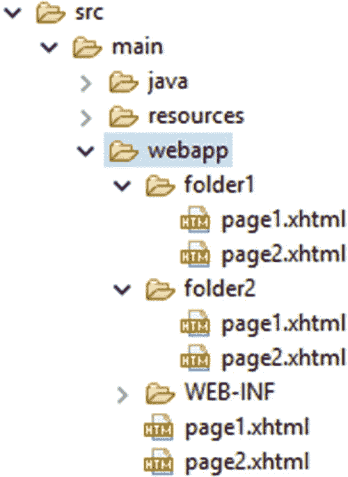
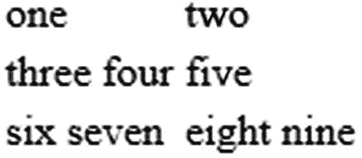
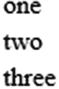
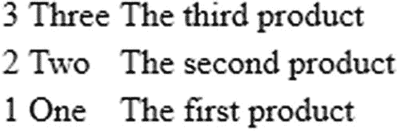
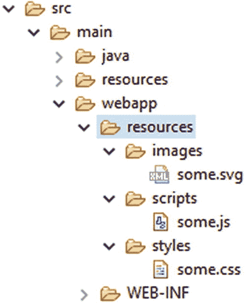

# 6. 输出组件

Bauke Scholtz^(1 ) 和 Arjan Tijms²

(1)库拉索岛威廉斯塔德

(2)荷兰北荷兰省阿姆斯特丹

从技术上讲，第 4 章中描述的输入组件也是输出组件。它们不仅能够处理任何提交的输入值，还能够在渲染响应阶段（第六阶段）输出模型值。这一点在 JSF（JavaServer Faces）API（应用程序编程接口）中也很明显：`UIInput` 超类继承自 `UIOutput` 超类。

还有一组组件仅输出其模型值，甚至仅输出一个 HTML 元素。这些是纯输出组件。它们不参与 JSF 生命周期的所有阶段。有时它们会在恢复视图阶段（第一阶段）参与，如果它们是动态创建或操作的话，但它们的大部分工作是在渲染响应阶段（第六阶段）生成 HTML 输出时执行的。在其他阶段，它们不会执行太多额外任务。


## 基于文档的输出组件

这些组件包括 `<h:doctype>`、`<h:head>` 和 `<h:body>`。请注意，并不存在 `<h:html>` 这样的组件。`<h:doctype>` 可以说是整个标准 JSF HTML 组件集中使用最少的 HTML 组件。你完全可以只使用一个普通的 `<!DOCTYPE html>` 元素。`<h:doctype>` 仅在你想以纯 XML 形式表示 `<!DOCTYPE>` 元素时才有用，而这通常只发生在你需要将整个 JSF 视图作为 JSF 上层某个更高抽象层的另一个 XML 结构的一部分进行存储时。

自 JSF 2.0 起，`<h:head>` 和 `<h:body>` 成为了最重要的标签，因为 `<f:view>` 在 Facelets 中已变为可选。从历史上看，在 JSP 中，`<f:view>` 是强制性的，用于声明该 JSP 页面是一个 JSF 视图。虽然生成 HTML 文档的 `<head>` 和 `<body>` 元素不需要任何特殊逻辑，并且 `<h:head>` 和 `<h:body>` 对于 Facelets 页面被识别为 JSF 视图来说并非强制要求，但这些标签对于正确自动处理同样在 JSF 2.0 中引入的 JavaScript 和 CSS（层叠样式表）资源依赖关系是强制性的。

`<h:head>` 和 `<h:body>` 允许 JSF 自动将 JavaScript 和 CSS 资源依赖关系重新定位到组件树中的正确位置，以便它们最终出现在生成的 HTML 输出中的正确位置。在标准 JSF 组件集中，只有 `<h:commandLink>`、`<h:commandScript>`、`<f:ajax>` 和 `<f:websocket>` 使用此功能。它们都要求最终的 HTML 文档中包含 `jsf.js` JavaScript 文件。在视图构建期间，它们基本上会使用 `UIViewRoot#addComponentResource()` ¹ 在指定的目标组件（可以是 `<h:head>` 或 `<h:body>`）处注册组件资源依赖关系。在视图渲染期间，与 `<h:head>` 和 `<h:body>` 组件关联的渲染器将通过 `UIViewRoot#getComponentResources()` ² 获取所有已注册的组件资源依赖关系，并生成带有引用相关资源依赖关系的 URL（统一资源定位符）的 `<link rel="stylesheet">` 和 `<script>` 元素。

如第 3 章“标准 HTML 组件”部分所示，以下代码是最精简且符合 HTML5 规范的 JSF 页面：

```
<!DOCTYPE html>
<html lang="en"
    xmlns:="http://www.w3.org/1999/xhtml"
    xmlns:h="http://xmlns.jcp.org/jsf/html"
>
    <h:head>
        <title>标题</title>
    </h:head>
    <h:body>
        ...
    </h:body>
</html>
```

## 基于文本的输出组件

这些组件包括 `<h:outputText>`、`<h:outputFormat>`、`<h:outputLabel>` 和 `<h:outputLink>`。它们都继承自 `UIOutput` 超类，并具有一个 `value` 属性，该属性可以绑定到受管 bean 的属性。在视图渲染期间，将调用 getter 方法来检索并显示任何预设值。这些组件永远不会调用 setter 方法，因此可以安全地将其从受管 bean 类中省略，以减少未使用的代码。

从历史上看，在基于 JSP（Java 服务器页面）的 JSF 1.x 中，`<h:outputText>` 是输出 bean 属性作为文本所必需的。JSP 不支持在模板文本中使用 JSF 风格的 EL（表达式语言）`#{...}`。Facelets 支持在模板文本中使用 JSF 风格的 EL `#{...}`，因此 bean 属性可以直接在 Facelets 中输出，而无需整个 JSF 组件。换句话说，以下代码在基于 Facelets 的 JSF 中是等价的，即 `<h:outputText>`：

```
<p>欢迎，<h:outputText value="#{user.name}" />！</p>
```

以及模板文本中的 EL：

```
<p>欢迎，#{user.name}！</p>
```

无需解释，后一段代码更简洁且更易读。然而，`<h:outputText>` 在 Facelets 中并未变得无用。它仍然适用于以下目的：

*   禁用隐式 HTML 转义。
*   附加显式转换器。
*   在 `<f:ajax render>` 中引用。

JSF 在所有地方都进行隐式 HTML 转义。任何输出到 HTML 响应的内容都会检查 HTML 特殊字符“<”、“>”、“&”，以及在输出到 HTML 元素的属性时可选地检查“"”。这些 HTML 特殊字符将分别被替换为“&lt;”、“&gt;”、“&amp;”和“&quot;”。然后，Web 浏览器不会将这些字符解释为生成的 HTML 输出的一部分，而是将其视为纯文本，并最终作为字面字符呈现给最终用户。

想象一下，一个用户选择 `<script>alert('xss')</script>` 作为用户名，并通过上述任一代码片段经由 `#{user.name}` 输出；那么 JSF 将在生成的 HTML 输出中将其渲染如下：

```
<p>欢迎，<script>alert('xss')</script>！</p>
```

而 Web 浏览器将按字面意思显示为“欢迎，<script>alert('xss')</script>！”，而不是仅显示“欢迎，！”并附带一个显示文本“xss”的 JavaScript 警告框，从而导致用户控制的 JavaScript 被无意中实际执行。最终用户能够执行任意 JavaScript 代码是危险的。这将允许恶意用户执行特定代码，当其他人登录并查看渲染了该恶意用户用户名的页面时，该代码会将有关会话 cookie 的信息传输到外部主机。（另请参阅第 13 章的“跨站脚本防护”部分。）

另一方面，也可能存在您希望将安全的 HTML 代码嵌入到生成的 HTML 输出中的情况。最常见的用例与在网站上为其他用户发布消息有关，其中允许使用有限的格式子集，例如粗体、斜体、链接、列表、标题等。通常，这些内容需要使用预定义的、对用户友好的标记格式（例如 Markdown，或不太为人所知的 Wikicode，或古老的 BBCode）在文本区域元素中输入。它们都能够解析带有标记的原始文本，并将其转换为安全的 HTML 代码，其中任何恶意的 HTML 代码都已被转义或剥离。

```
<h:inputTextarea value="#{message.text}" />
```

原始文本至少始终保存在数据库中以供记录，而生成的、安全的 HTML 代码以及所使用的解析器版本也可以保存在数据库中以提高性能，这样就不必为同一段原始文本不必要地重新执行解析器。假设我们将使用带有 CommonMark³ 的 Markdown，并拥有以下 Markdown 接口，


```
private interface Markdown {
    public String getText();
    public void setHtml(String html);
    public String getVersion();
    public void setVersion(String version);
}
```

以及以下 `MarkdownListener` 实体监听器，

```
public class MarkdownListener {

private static final Parser PARSER = Parser.builder().build();
    private static final HtmlRenderer RENDERER =
        HtmlRenderer.builder().escapeHtml(true).build();
    private static final String VERSION = getCommonMarkVersion();

@PrePersist
    public void parseMarkdown(Markdown markdown) {
        String html = RENDERER.render(PARSER.parse(markdown.getText()));
        markdown.setHtml(html);
        markdown.setVersion(VERSION);
    }

@PreUpdate
    public void parseMarkdownIfNecessary(Markdown markdown) {
        if (markdown.getVersion() == null) {
            parseMarkdown(markdown);
        }
    }

@PostLoad
    public void updateMarkdownIfNecessary(Markdown markdown) {
        if (!VERSION.equals(markdown.getVersion())) {
            parseMarkdown(markdown);
        }
    }

private static String getCommonMarkVersion() {
        try {
            Properties properties = new Properties();
            properties.load(Parser.class.getResourceAsStream(
                "/META-INF/maven/com.atlassian.commonmark"
                    + "/commonmark/pom.properties"));
            return properties.getProperty("version");
        }
        catch (IOException e) {
            throw new UncheckedIOException(e);
        }
    }                                                                              
}
```

那么，实现了 `Markdown` 接口并注册了 `MarkdownListener` 实体监听器的 `Message` 实体可以如下所示：

```
@Entity @EntityListeners(MarkdownListener.class)
public class Message implements Markdown, Serializable {

@Id @GeneratedValue(strategy=IDENTITY)
    private Long id;

@Column(nullable = false) @Lob
    private @NotNull String text;

@Column(nullable = false) @Lob
    private String html;

@Column(nullable = false, length = 8)
    private String version;

@Override
    public void setText(String text) {
        if (!text.equals(this.text)) {
            this.text = text;
            setVersion(null); // 触发 MarkdownListener @PreUpdate。
        }
    }

// 添加/生成其余的 getter 和 setter 方法。
}
```

最后，为了向最终用户呈现安全的 HTML 代码，你可以使用 `escape` 属性设置为 `false` 的 `<h:outputText>`，从而指示 JSF 不需要隐式地对值进行 HTML 转义。

```
<h:outputText value="#{message.html}" escape="false" />
```

除了隐式 HTML 转义，JSF 还支持隐式转换。对于通过 `<h:outputText>` 或模板文本中的 EL 发出的任何属性类型，JSF 都会按类查找转换器，调用其 `Converter#getAsString()` 方法，并渲染结果。如果你希望显式使用特定或不同的转换器，则必须将模板文本中的任何 EL 替换为 `<h:outputText>`，并显式在其上注册转换器。通常，那些与数字或日期时间相关的属性需要以特定于区域设置的格式进行格式化。

```
<h:outputText value="#{product.price}">
    <f:convertNumber type="currency" locale="en_US" />
</h:outputText>
```

`<h:outputText>` 的最后一个用途是能够在 `<f:ajax render>` 中引用一段内联文本。默认情况下，`<h:outputText>` 不会生成任何 HTML 代码。但如果它指定了至少一个必须出现在生成的 HTML 输出中的属性（例如 `id` 或 `styleClass`），那么它将生成一个 HTML `<span>` 元素。该元素可通过 JavaScript 引用，因此对于通过 Ajax 更新文本的特定部分非常有用。当然，你也可以选择通过 Ajax 更新某个通用容器组件，但这远不如仅更新真正需要更新的特定部分高效。

`<h:outputFormat>` 是 `<h:outputText>` 的扩展，它预先使用 `java.text.MessageFormat` API⁴ 解析值。这在与本地化资源包结合使用时特别有用。第 14 章的“参数化资源包值”一节中可以找到一个示例。

`<h:outputLabel>` 基本上生成 HTML `<label>` 元素，这是 HTML 表单的重要组成部分。这已在第 4 章的“标签和消息组件”一节中描述过。需要注意的是，从 HTML 的角度来看，`<h:outputLabel>` 和 `<h:outputText>` 绝对不可互换。在近期互联网上涌现的一批低质量编程教程网站中（这些网站基本上只展示代码片段，没有任何技术解释，以获取广告收入），`<h:outputLabel>` 经常被错误地用于在 Hello World JSF 页面中输出一段文本。这类教程网站最好完全忽略。

`<h:outputLink>` 生成一个 HTML `<a>` 元素。它是 JSF 1.x 的遗留产物，自从 JSF 2.0 中引入了更有用的 `<h:link>` 之后，它的作用就不大了。当你不需要使用链接引用 JSF 视图时（这种情况应使用 `<h:link>`），你也可以直接使用纯 HTML `<a>` 元素来代替 `<h:outputLink>`。以下标签生成完全相同的 HTML。

```
<h:outputLink value="http://google.com">Google</h:outputLink>
<a href="http://google.com">Google</a>
```

纯 HTML 等效写法更简洁。

## 基于导航的输出组件

这些组件是 `<h:link>` 和 `<h:button>`，它们都继承自 `UIOutcomeTarget` 超类。它们有一个 `outcome` 属性，该属性接受指向 JSF 视图的逻辑路径。如果路径是有效的 JSF 视图，则会进行验证；否则，链接或按钮将呈现为禁用状态。换句话说，它们不接受指向非 JSF 资源的路径，更不用说外部 URL 了。对于这种情况，你需要使用 `<h:outputLink>` 或纯 HTML。

`<h:link>` 将生成一个 HTML `<a>` 元素，其 `href` 属性指定了目标 JSF 视图的 URL。`<h:button>` 将生成一个 HTML `<input type="button">` 元素，其 `onclick` 属性借助 JavaScript 将目标 JSF 视图的 URL 赋值给 `window.location.href` 属性。这确实有些笨拙，但这只是 HTML 的限制。`<input type="button">` 和 `<button>` 都不支持类似 `href` 的属性。

给定 Eclipse 中 Maven WAR 项目的以下文件夹结构，



以下位于 `/folder1/page1.xhtml` 中的 `<h:link>` 和 `<a>` 对将生成完全相同的链接。

```
<h:link outcome="page2" value="link1" />
<a href="#{request.contextPath}/folder1/page2.xhtml">link1</a>

<h:link outcome="/folder2/page1" value="link2" />
<a href="#{request.contextPath}/folder2/page1.xhtml">link2</a>

<h:link outcome="/folder2/page2" value="link3" />
<a href="#{request.contextPath}/folder2/page2.xhtml">link3</a>

<h:link outcome="/page1" value="link4" />
<a href="#{request.contextPath}/page1.xhtml">link4</a>

<h:link outcome="/page2" value="link5" />
<a href="#{request.contextPath}/page2.xhtml">link5</a>
```

因此请注意，`<h:link>` 已经自动预置了 Web 应用程序项目的任何上下文路径，并附加了当前活动的 `FacesServlet` 映射的 URL 模式。另请注意，如果没有前导斜杠，`outcome` 将相对于当前文件夹进行解释；如果有前导斜杠，则 `outcome` 将相对于上下文路径进行解释。


## 基于面板的输出组件

这些组件是 `<h:panelGroup>` 和 `<h:panelGrid>`，它们都继承自 `UIPanel` 超类。`<h:panelGroup>` 具有多种职责。根据 `layout` 属性以及它是否被包含在 `<h:panelGrid>` 中，它可以生成一个 HTML `<span>`、`<div>` 甚至 `<td>` 元素。

默认情况下，`<h:panelGroup>` 仅生成一个 HTML `<span>` 元素，就像 `<h:outputText>` 一样。主要区别在于 `<h:panelGroup>` 没有 `value` 属性。相反，其内容由其子元素表示。它也不支持禁用 HTML 转义或附加转换器。这取决于任何 `<h:outputText>` 子元素。在这种上下文中，它并不是特别有用。当你需要使用 `<f:ajax render>` 引用一个内联元素，而该元素又用于组合一组紧密相关的内联元素时，`<h:panelGroup>` 才比 `<h:outputText>` 更有用。类似下面的代码表示“用户资料”，它应该可以在某个用户资料编辑页面中通过 Ajax 更新。

```
<p>
    欢迎，
    <h:panelGroup id="userProfile">
        
        #{user.name}
    </h:panelGroup>
</p>
...
<h:form>
    ...
    <f:ajax ... render=":userProfile" />
    ...
</h:form>
```

当将 `<h:panelGroup>` 的 `layout` 属性设置为 `block` 时，它将生成一个 HTML `<div>` 元素。在标准 HTML 中，“内联元素”⁵ 默认不会在新行开始，也不允许包含块级子元素。而“块级元素”⁶ 默认总是在新行开始，并且允许包含内联和块级元素作为子元素。因此，`<h:panelGroup>` 的 `layout` 属性支持的值是 `"inline"` 和 `"block"`。从历史上看，`layout` 属性是在 JSF 1.2 中才添加的，原因是 JSF 开发者抱怨缺少一个用于表示 HTML `<div>` 元素的 JSF 组件。（另请参见第 7 章。）这可用于包装需要 Ajax 更新的较大区域；否则，一个普通的 HTML `<div>` 也足够了。

```
<h:panelGroup layout="block" id="userProfile">
    <p>
        欢迎，
        
        #{user.name}
    </p>
</h:panelGroup>
```

请注意，在 HTML 中，将块级元素嵌套在内联元素中是非法的。`<p>` 是一个块级元素，因此在上述结构中 `layout="block"` 是绝对必需的。如果你不指定此属性，从而让 JSF 渲染一个 HTML `<span>` 元素，那么 Web 浏览器的行为将是未指定的。一般的 Web 浏览器会将块级子元素渲染到内联元素之外，甚至可能在使用 JavaScript 操作此结构时出错，例如在 JSF Ajax 更新操作期间。

还要记住，在上述结构中，`<p>` 标签和“欢迎”文本也会在对 `<h:panelGroup>` 的任何 JSF Ajax 更新操作期间被更新。这本质上是对服务器端和客户端硬件资源的浪费，因为它们是静态的，永远不会发生变化。在进行 Ajax 更新时，你最好确保 `<f:ajax render>` 只引用那些绝对需要 Ajax 更新的组件，而不是一个不必要的大区域。

当 `<h:panelGroup>` 被嵌套在生成 HTML `<table>` 元素的 `<h:panelGrid>` 组件中时，`<h:panelGroup>` 的 `layout` 属性将被忽略，该组件将基本上充当一个组件容器，这些组件最终应位于表格的同一个单元格中。也就是说，`<h:panelGrid>` 的渲染器将每个直接子组件视为一个单独的表格单元格。

给定以下两列的 `<h:panelGrid>`，它应该生成一个两列的 HTML 表格，你猜实际生成的 HTML 输出应该是什么样子？

```
<h:panelGrid columns="2">
    one
    <h:outputText value="two" />
    three
    four
    <h:panelGroup>five</h:panelGroup>
    six
    seven
    <h:panelGroup>
        eight
        nine
    </h:panelGroup>
</h:panelGrid>
```

###### 提示

两个 JSF 组件之间的每段模板文本在内部都被视为一个单独的 JSF 组件。在 Mojarra 中，它由内部的 `UIInstructions` 组件表示。实际的组件树层次结构大致如下所示。

```
<h:panelGrid columns="2">
    <ui:instructions>one</ui:instructions>
    <h:outputText value="two" />
    <ui:instructions>                                                                                        
        three
        four
    </ui:instructions>
    <h:panelGroup>five</h:panelGroup>
    <ui:instructions>
        six
        seven
    </ui:instructions>
    <h:panelGroup>
        eight
        nine
    </h:panelGroup>
</h:panelGrid>
```

再次注意，Facelets 中不存在 `<ui:instructions>` 这样的组件。上面的标记纯粹是为了可视化，以便你的大脑能更好地处理它。这个 `<h:panelGrid>` 实际上有六个直接子元素，每个子元素最终都会位于自己的表格单元格中。由于有两列，这实际上将生成三行。以下是实际生成的 HTML 输出（为便于阅读已重新格式化）。

```
<table>
    <tbody>
        <tr>
            <td>one</td>
            <td>two</td>
        </tr>
        <tr>
            <td>three four</td>
            <td>five</td>
        </tr>
        <tr>
            <td>six seven</td>
            <td>eight nine</td>
        </tr>
    </tbody>
</table>
```

在 Chrome 浏览器中渲染：



你看，`<h:panelGroup>` 确保了“five”和“eight nine”不会与“six seven”位于同一个表格单元格中。还要注意，如果某个 JSF 组件已经代表一个单独的单元格，则无需将其包装在 `<h:panelGroup>` 中。因此，“two”后面的 `<h:outputText>` 不需要包装在 `<h:panelGroup>` 中。当然，为了更好的源代码可读性，你可以这样做，但技术上并非必要。

如果你碰巧需要基于视图作用域模型拥有动态数量的单元格，那么你可以在 `<h:panelGrid>` 中嵌套一个 JSTL（JSP 标准标签库）`<c:forEach>`，让它以固定列数的数据网格形式生成这些单元格。

```
<h:panelGrid columns="3">
    <c:forEach items="#{viewProducts.products}" var="product">
        <h:panelGroup>
            <h3>#{product.name}</h3>
            <p>#{product.description}</p>
        </h:panelGroup>
    </c:forEach>
</h:panelGrid>
```

因此请注意，与 `<c:forEach>` 相比，`<ui:repeat>` 在此处不合适，如第 3 章“JSTL 核心标签”一节所述。它在技术上可以正常工作，但 `<h:panelGrid>` 的渲染器会将其解释为单个表格单元格。

还要注意，模型是视图作用域非常重要，特别是当你在 `<h:panelGrid>` 内部有 JSF 表单组件时。技术原因是，在处理回发请求期间，JSF 期望迭代索引后面的模型项与页面呈现给最终用户时完全相同。换句话说，当 JSF 即将处理表单提交时，如果某个项在此期间被添加、删除甚至重新排序，导致迭代索引发生变化，那么提交的值和/或调用的操作可能会针对当前位于最初已知索引处的错误项执行。这对模型的完整性是危险的。如果你在 `<h:panelGrid>` 内部没有任何 JSF 表单组件，或者模型在视图作用域内不会发生变化（例如，因为它仅在应用程序启动时创建或更新），那么 `#{viewProducts}` 背后的支持 bean 可以安全地是请求作用域的。


## 数据迭代组件

是的，只有一个，即 `<h:dataTable>`，它继承自 `UIData` 超类，并基于可迭代的数据模型生成一个 HTML `<table>`，其中每个数据项表示为一行。JSF 中另一个可用的数据迭代组件是 Facelets 的 `<ui:repeat>`，它不继承自 `UIData` 超类，也不生成任何 HTML 输出，因此严格来说不算作“输出组件”。此外，在标准 JSF 组件集中，没有组件能生成 HTML `<ul>`、`<ol>` 或 `<dl>`，但通过继承 `UIData` 创建一个自定义组件相对容易实现。（另请参阅第 11 章中的“创建新组件和渲染器”一节。）

`UIData` 的 `value` 属性支持 `java.lang.Iterable`。换句话说，你可以提供任何 Java 集合作为模型值。由于 `UIData` 中最常使用基于索引的访问，因此最高效的是 `java.util.ArrayList`，因为它提供了 O(1) 的索引访问。`<h:dataTable>` 组件的渲染器仅支持 `<h:column>` 作为直接子组件，其他任何内容都会被忽略。顾名思义，`<h:column>` 代表单个列。每次对 `<h:dataTable>` 的 `value` 进行迭代时，都会根据当前迭代项重新渲染所有列。与 `<c:forEach>` 和 `<ui:repeat>` 类似，当前迭代项通过 `var` 属性暴露在 EL 作用域中。以下是一个基本示例，它迭代一个 `List<String>`。

```
<h:dataTable id="strings" value="#{bean.strings}" var="string">
    <h:column>#{string}</h:column>
</h:dataTable>
```

后台 Bean 类 `com.example.project.view.Bean`：

```
@Named @RequestScoped
public class Bean {

private List<String> strings;

@PostConstruct
    public void init() {
        strings = Arrays.asList("one", "two", "three");
    }

public List<String> getStrings() {
        return strings;
    }
}
```

生成的 HTML 输出：

```
<table>
    <tbody>
        <tr><td>one</td></tr>
        <tr><td>two</td></tr>
        <tr><td>three</td></tr>
    </tbody>
</table>
```

在 Chrome 浏览器中的渲染效果：



需要注意的是，由 `var` 属性指定的变量名不应与现有的受管 Bean 名称甚至隐式 EL 对象冲突。隐式 EL 对象在 EL 解析中具有更高的优先级。隐式 EL 对象的一个例子是 `#{header}`，它引用 `ExternalContext#getRequestHeaderMap()`。⁷ 因此，如果你恰好有 `#{bean.headers}` 并希望在一个迭代组件中呈现它，那么你不能使用 `var="header"`，最好想一个不同的名称，例如 `var="head"`。

以下是一个更详细的示例，展示了产品列表。类似的表格在第 5 章中已经出现过。

```
<h:dataTable id="products" value="#{products.list}" var="product">
    <h:column>
        <f:facet name="header">ID</f:facet>
        #{product.id}
    </h:column>
    <h:column>
        <f:facet name="header">名称</f:facet>
        #{product.name}
    </h:column>
    <h:column>
        <f:facet name="header">描述</f:facet>
        #{product.description}
    </h:column>
</h:dataTable>
```

后台 Bean 类 `com.example.project.view.Products`：

```
@Named @RequestScoped
public class Products {

private List<Product> list;

@Inject
    private ProductService productService;

@PostConstruct
    public void init() {
        list = productService.list();
    }

public List<Product> getList() {
        return list;
    }
}
```

产品实体：`com.example.project.model.Product`：

```
@Entity
public class Product {

@Id @GeneratedValue(strategy=IDENTITY)
    private Long id;

@Column(nullable = false)
    private @NotNull String name;

@Column(nullable = false)
    private @NotNull String description;

// 添加/生成 getter 和 setter 方法。
}
```

产品服务：`com.example.project.service.ProductService`：

```
@Stateless
public class ProductService {

@PersistenceContext
    private EntityManager entityManager;

@TransactionAttribute(SUPPORTS)
    public List<Product> list() {
        return entityManager
            .createQuery("FROM Product ORDER BY id DESC", Product.class)
            .getResultList();
    }
}
```

生成的 HTML 输出：

```
<table>
    <thead>
        <tr>
            <th scope="col">ID</th>
            <th scope="col">名称</th>
            <th scope="col">描述</th>
        </tr>
    </thead>
    <tbody>
        <tr>
            <td>3</td>
            <td>Three</td>
            <td>第三个产品</td>
        </tr>
        <tr>
            <td>2</td>
            <td>Two</td>
            <td>第二个产品</td>
        </tr>
        <tr>
            <td>1</td>
            <td>One</td>
            <td>第一个产品</td>
        </tr>
    </tbody>
</table>
```

在 Chrome 浏览器中的渲染效果：



需要注意的是，`<h:dataTable>` 的 `value` 属性背后的模型必须引用一个 Bean 属性，该属性应事先在一次性生命周期事件（如 `@PostConstruct` 或 `<f:viewAction>`）中准备好。这并非专门适用于 `UIData` 组件，而是基本上适用于所有 JSF 组件。也就是说，getter 方法在 JSF 生命周期中可能会被多次调用，尤其是在迭代组件的 `value` 属性或任何 JSF 组件的 `rendered` 属性中被引用时。

技术原因是，任何 EL 值表达式在幕后都会被创建为一个 `javax.el.ValueExpression` 实例，该实例内部基本上只保存了 EL 字符串字面量（如 `#{products.list}`），对其进行的任何 `ValueExpression#getValue()` 调用都只会根据提供的 EL 上下文重新计算该表达式。这通常是一个非常轻量级的操作，耗时在纳秒级别，但当 getter 方法反过来执行一个相对昂贵的数据库查询（可能需要数十甚至数百毫秒）时，性能可能会急剧下降。

当迭代组件中嵌套了表单组件时，迭代组件可能会在 JSF 生命周期的每个阶段调用 getter 方法。如果你在 getter 方法中通过从数据库获取列表来准备模型，这将导致每次调用 getter 方法时都查询数据库，这显然是低效的。此外，关于根据迭代索引解析当前迭代项的问题也可能出现，正如上一节关于 `<h:panelGrid>` 与 `<c:forEach>` 的最后一段所述。

另一个需要注意的点是 `<f:facet name="header">`。这基本上会生成包含 `<th>` 内容的 `<thead>`。`<h:dataTable>` 也支持 `<f:facet name="footer">`，它会生成包含 `<td>` 内容的 `<tfoot>`。你通常可以在标签文档以及 `<h:dataTable>` 标签文档中找到所有支持的 `<f:facet>` 名称。⁸

基本上，你可以在 `<h:column>` 内部放置任何内容来表示单元格内容，甚至可以是表单组件或嵌套的 `<h:dataTable>` 或 `<ui:repeat>`。以下是一个小示例，展示了在嵌套的 `<ui:repeat>` 中呈现 `Product` 实体的虚构 `Set<Tag> tags` 属性。

```
<h:dataTable id="products" value="#{products.list}" var="product">
    ...
    <h:column>
        <ui:repeat value="#{product.tags}" var="tag">
            #{tag.name}<br/>
        </ui:repeat>
    </h:column>
</h:dataTable>
```


### 可编辑的 <h:dataTable>

对于嵌套在 <h:column> 中的表单组件，你可以按照以下方式用输入组件替换模板文本中的 EL 表达式：

```
<h:form id="list">
    <h:dataTable id="products" value="#{products.list}" var="product">
        <h:column>
            <f:facet name="header">ID</f:facet>
            #{product.id}
        </h:column>
        <h:column>
            <f:facet name="header">名称</f:facet>
            <h:inputText id="name" value="#{product.name}" />
            <h:message for="name" />
        </h:column>
        <h:column>
            <f:facet name="header">描述</f:facet>
            <h:inputTextarea id="description"
                value="#{product.description}">
            </h:inputTextarea>
            <h:message for="description" />
        </h:column>
    </h:dataTable>
    <h:commandButton id="save" value="保存" action="#{products.save}">
        <f:ajax execute="@form" render="@form" />
    </h:commandButton>
</h:form>
```

因此，在将支持 bean 类从 `@RequestScoped` 改为 `@ViewScoped` 后，其 `save()` 方法的基本形式如下：

```
public void save() {
    productService.update(products);
}
```

而服务类的 `update()` 方法则如下所示：

```
@TransactionAttribute(REQUIRED)
public void update(Iterable<Product> products) {
    products.forEach(entityManager::merge);
}
```

请注意，你完全无需担心收集提交的值。JSF 已经为你完成了这项任务。同时，你也不必担心 `<h:dataTable>` 内组件 ID 的唯一性，因为该组件已经实现了 `NamingContainer` 接口，并会将其自身的客户端 ID 和迭代索引添加到子组件的客户端 ID 之前，正如你在以下生成的 HTML 输出中所见：

```
<table id="list:products">
    <thead>
        <tr>
            <th scope="col">ID</th>
            <th scope="col">名称</th>
            <th scope="col">描述</th>
        </tr>
    </thead>
    <tbody>
        <tr>
            <td>3</td>
            <td>
                <input id="list:products:0:name" type="text"
                    name="list:products:0:name" value="Three">
                </input>
            </td>
            <td>
                <textarea id="list:products:0:description"
                    name="list:products:0:description"
                >第三个产品</textarea>
            </td>
        </tr>
        <tr>
            <td>2</td>
            <td>
                <input id="list:products:1:name" type="text"
                    name="list:products:1:name" value="Two">
                </input>
            </td>
            <td>
                <textarea id="list:products:1:description"
                    name="list:products:1:description"
                >第二个产品</textarea>
            </td>
        </tr>
        <tr>
            <td>1</td>
            <td>
                <input id="list:products:2:name" type="text"
                    name="list:products:2:name" value="One">
                </input>
            </td>
            <td>
                <textarea id="list:products:2:description"
                    name="list:products:2:description"
                >第一个产品</textarea>
            </td>
        </tr>
    </tbody>
</table>
```

必须指出，拥有这样一个可编辑表格的效率并不高，尤其是当表格包含大量列和行时。JSF 可以很好地处理它；但普通的 Web 浏览器可能会难以应对，特别是当行数超过几千行时。更不用说最终用户可能因为需要不断滚动整个页面而抓狂，并且基本上无法获得清晰的概览。对此有几种解决方案：首先是分页；其次是过滤；第三是基于行的内联编辑和更新；第四是在对话框或详情页面中进行外部编辑。

所有上述提到的表格特定性能和可用性解决方案，标准 `<h:dataTable>` 均未提供，因此需要编写大量自定义代码。强烈建议你寻找一个支持这些功能的现有 JSF 组件库，以便让你的 JSF 开发更轻松，无需重复造轮子。目前最广泛使用的是 PrimeFaces 及其 `<p:dataTable>`。⁹ 这甚至可以通过 OptimusFaces 的 `<op:dataTable>`¹⁰ 进一步简化，而后者又基于 `<p:dataTable>`。在详情页面中进行编辑只能通过标准 JSF 实现，这在第 5 章的“自定义转换器”部分有演示。

需要说明的是，在之前展示的 `List<String>` 示例中，将列从输出转换为输入并不像 `List<Product>` 示例那样容易。换句话说，以下示例根本不会起作用。

```
<h:form>
    <h:dataTable value="#{bean.strings}" var="string">
        <h:column>
            <h:inputText value="#{string}" />
        </h:column>
    </h:dataTable>
    <h:commandButton value="保存" action="#{bean.save}">
        <f:ajax execute="@form" />
    </h:commandButton>
</h:form>
```

技术问题在于 `java.lang.String` 是不可变的，并且没有用于其内部值的公共 setter 方法。确实，它也没有 getter，但 EL 默认会使用 `Object#toString()`，而对于 String 来说，该方法只是返回字符串本身。这可以通过按索引引用模型值来解决，如下所示：

```
<h:form>
    <h:dataTable binding="#{table}" value="#{bean.strings}" var="string">
        <h:column>
            <h:inputText value="#{bean.strings[table.rowIndex]}" />
        </h:column>
    </h:dataTable>
    <h:commandButton value="保存" action="#{bean.save}">
        <f:ajax execute="@form" />
    </h:commandButton>
</h:form>
```

注意 `binding` 属性。基本上，在视图构建期间，这会将当前的 `UIComponent` 实例设置为由给定名称标识的 EL 变量。在这个特定的代码片段中，它将使 `#{table}` 变量引用 `<h:dataTable>` 标签背后的具体 `HtmlDataTable` 实例。然后，`#{table}` 变量在视图构建期间只能在标签位置之后引用，而在视图渲染期间则可以在视图中的任何位置引用。通过这种方式，你可以像访问 bean 一样访问其属性。`#{table.rowIndex}` 基本上引用了 `UIData#getRowIndex()` 方法，¹¹ 该方法返回当前的迭代索引。最后，这被用来引用列表中的目标项。在更新模型值阶段（第四阶段），JSF 将简单地替换指定索引处的项。

对于 `binding` 属性，非常重要的一点是变量名不应与现有的受管 bean 名称或隐式 EL 对象冲突，当然也不能与同一视图中的其他组件冲突。你也可以让 `binding` 属性引用一个支持 bean 属性，如下所示：

```
<h:dataTable binding="#{bean.table}" ...>
```

配合：

```
private UIData table; // +getter +setter
```


但如果该组件在后台 bean 的其他地方未被使用，这种做法就毫无用处。此外，当受管 bean 的作用域大于请求作用域时（另请参阅第 3 章“视图构建时间”一节），这种做法是危险的。最好不要将组件实例绑定到后台 bean；这可能表明是一种不良实践。在 JSF 2.x 中，唯一合理的实际用例是将复合组件子项绑定到后台组件（另请参阅第 7 章“复合组件”一节）。

如果你在类似 `List<String>` 这样的对象上使用 `<ui:repeat>` 或 `<c:forEach>` 而不是 `<h:dataTable>`，那么你可以通过 `varStatus` 属性以更简单的方式获取迭代索引。

```
<h:form>
    <ui:repeat value="#{bean.strings}" var="string" varStatus="loop">
        <h:inputText value="#{bean.strings[loop.index]}" /><br/>
    </ui:repeat>
    <h:commandButton value="保存" action="#{bean.save}">
        <f:ajax execute="@form" />
    </h:commandButton>
</h:form>
```

### 在 `<h:dataTable>` 中添加/删除行

回到包含 `List<Product>` 的 `<h:dataTable>`，有时你可能希望能够在同一视图中添加或删除项目，通常是在某种管理页面中。为了添加新产品，我们需要在受管 bean 中准备一个新实例，在单独的表单中填写它，持久化它，然后刷新表格。

```
<h:form id="list">
    <h:dataTable id="products" value="#{products.list}" ...>
        ...
    </h:dataTable>
</h:form>
<h:form id="add">
    <h:outputLabel for="name" value="名称" />
    <h:inputText id="name" value="#{products.product.name}" />
    <h:message for="name" />

    <h:outputLabel for="description" value="描述" />
    <h:inputTextarea id="description"
        value="#{products.product.description}">
    </h:inputTextarea>
    <h:message for="description" />

    <h:commandButton id="add" value="添加" action="#{products.add}">
        <f:ajax execute="@form" render="@form :list:products" />
    </h:commandButton>                                                                                                            
</h:form>
```

其中相关的后台 bean 代码如下所示：

```
private List<Product> list; // +getter
private Product product = new Product(); // +getter

@PostConstruct
public void init() {
    list = productService.list();
}

public void add() {
    productService.create(product);
    list.add(0, product);
    product = new Product();
}
```

服务类中的 `create()` 方法如下：

```
@TransactionAttribute(REQUIRED);
public Long create(Product product) {
    entityManager.persist(product);
    return product.getId();
}
```

删除可以通过多种方式完成。无论如何，你可能需要一个额外的列来容纳提交按钮、单选按钮或复选框。最简单的方法是使用一个包含命令按钮的列，该按钮删除当前迭代的项目，然后刷新表格。

```
<h:form id="list">
    <h:dataTable id="products" value="#{products.list}" var="product">
        ...
        <h:column>
            <h:commandButton id="delete" value="删除"
                action="#{products.delete(product)}">
                <f:ajax render="@namingcontainer" />
            </h:commandButton>
        </h:column>
    </h:dataTable>
</h:form>
```

在 `@ViewScoped` 后台 bean 类中的 `delete(Product)` 方法如下：

```
public void delete(Product product) {
    productService.delete(product);
    list.remove(product);
}
```

服务类中的 `delete()` 方法如下：

```
@TransactionAttribute(REQUIRED)
public void delete(Product product) {
    if (entityManager.contains(product)) {
        entityManager.remove(product);
    }
    else {
        Product managedProduct = getById(product.getId());

        if (managedProduct != null) {
            entityManager.remove(managedProduct);
        }
    }
}
```

请注意 `<f:ajax>` 的 `render` 属性。它指定了 `@namingcontainer`，这基本上引用了最近的父级 `NamingContainer` 组件。在标准 JSF HTML 组件集中，只有 `<h:form>` 和 `<h:dataTable>` 是 `NamingContainer` 的实例。在这种特定结构中，`@namingcontainer` 因此引用了 `<h:dataTable>`。你也可以使用 `<f:ajax render=":list:products">` 代替；只是稍微冗长一些。`<f:ajax render="products">` 将不起作用，因为它会尝试在当前迭代行的上下文中找到它，而该上下文基本上位于所有 `<h:column>` 组件内部。

### 在 `<h:dataTable>` 中选择行

自 JSF 2.3 起，由于 `<h:selectOneRadio>` 新增了 `group` 属性（另请参阅第 4 章“选择组件”一节），在 `<h:dataTable>` 中拥有单选按钮列成为原生支持的功能。

```
<h:form id="list">
    <h:dataTable id="products" value="#{products.list}" var="product">
        <h:column>
            <h:selectOneRadio id="selected" group="selected"
                value="#{products.selected}">
                <f:selectItem itemValue="#{product}" />
            </h:selectOneRadio>
        </h:column>
        ...
    </h:dataTable>
    <h:commandButton id="deleteSelected" value="删除所选产品"
         action="#{products.deleteSelected}">
         <f:ajax execute="@form" render="products" />
    </h:commandButton>
</h:form>
```

在 `@ViewScoped` 后台 bean 类中的 `deleteSelected()` 方法如下：

```
private Product selected; // +getter +setter

public void deleteSelected() {
    productService.delete(selected);
    list.remove(selected);
}
```

请注意，这里你还需要一个 `ProductConverter` 或 `BaseEntityConverter`。这些在第 5 章“自定义转换器”一节中有详细说明。

复选框选择稍微复杂一些。你直观上会想到使用 `<h:selectManyCheckbox>`，但它还不像 `<h:selectOneRadio>` 那样支持 `group` 属性。你需要退而求其次，使用 `<h:selectBooleanCheckbox>` 配合 `Map<Product, Boolean>`，其中 map 的键代表当前迭代的产品，map 的值代表复选框的值。

```
<h:form id="list">
    <h:dataTable id="products" value="#{products.list}" var="product">
        <h:column>
            <h:selectBooleanCheckbox id="selection"
                value="#{products.selection[product]}">
            </h:selectBooleanCheckbox>
        </h:column>
        ...
    </h:dataTable>
    <h:commandButton id="deleteSelected" value="删除所选产品"
         action="#{products.deleteSelected}">
         <f:ajax execute="@form" render="products" />
    </h:commandButton>
</h:form>
```

`@ViewScoped` 后台 bean 中修改后的 `deleteSelected()` 方法如下所示：

```
private Map<Product, Boolean> selection = new HashMap<>(); // +getter

public void deleteSelected() {
    List<Product> selected = selection.entrySet().stream()
        .filter(Entry::getValue)
        .map(Entry::getKey)
        .collect(Collectors.toList());
    productService.delete(selected);
    selected.forEach(list::remove);
    selection.clear();
}
```

重载的 `ProductService#delete(Iterable)` 方法如下所示：

```
@TransactionAttribute(REQUIRED)
public void delete(Iterable<Product> products) {
    products.forEach(this::delete);
} 
```


### `<h:dataTable>` 中的动态列

借助 JSTL 的 `<c:forEach>`，`<h:dataTable>` 也可以基于至少是视图作用域的 Java 模型动态创建多个 `<h:column>` 实例。请求作用域的模型也可以，但这无法保证在回发请求期间它与前一个请求完全相同，因此存在动态 `<h:column>` 组合出错的风险。

`<c:forEach>` 的值应引用一个集合，该集合至少包含实体属性名称，甚至可以是映射键。然后，你可以在 EL 中使用花括号表示法，如 `#{entity[propertyName]}` 或 `#{map[key]}` 来引用实际值。这适用于 `UIOutput` 和 `UIInput` 组件。以下示例说明了如何为 `List<Product>` 实现这一点。

支持 bean：

```
@Named @RequestScoped
public class Products {

    private List<Product> list;
    private List<String> properties;

    @Inject
    private ProductService productService;

    @PostConstruct
    public void init() {
        list = productService.list();
        properties = Arrays.asList("id", "name", "description");
    }

    // 添加/生成 getter 方法（此处不需要 setter）。
}
```

Facelets 文件：

```
<h:dataTable value="#{products.list}" var="product">
    <c:forEach items="#{products.properties}" var="property">
        <h:column>#{product[property]}</h:column>
    </c:forEach>
</h:dataTable>
```

你甚至可以进一步将其泛化，用于公共超类（例如 `BaseEntity`）的其他实体，从而从实体服务中获取相关的属性名称。

## 资源组件

JSF 提供了三个资源组件：`<h:graphicImage>`、`<h:outputScript>` 和 `<h:outputStylesheet>`，分别用于图像资源、JavaScript 资源和 CSS 资源。它们可以引用物理资源文件以及动态资源文件。物理资源文件本身必须放置在 Web 主文件夹的 `/resources` 子文件夹中。动态资源文件可以通过自定义的 `ResourceHandler` 来处理，该处理器会拦截特定的库名称和/或资源名称。假设在 Eclipse 的 Maven WAR 项目中有以下文件夹结构，



则资源可以按如下方式引用：

```
<h:graphicImage name="images/some.svg" />
<h:outputScript name="scripts/some.js" />
<h:outputStylesheet name="styles/some.css" />
```

生成的 HTML 输出如下所示，假设 `/project` 是 Web 应用程序的上下文路径：

```

<script type="text/javascript"
    src="/project/javax.faces.resource/scripts/some.js.xhtml"></script>
<link type="text/css" rel="stylesheet"
    href="/project/javax.faces.resource/styles/some.css.xhtml" />
```

你会看到它以前缀 `/javax.faces.resource` 路径开头，并以当前活动的 `FacesServlet` URL 模式结尾。`/javax.faces.resource` 由常量 `ResourceHandler#RESOURCE_IDENTIFIER` 表示。¹² 资源 URL 与 `FacesServlet` 的 URL 模式匹配，这确保了它实际上会调用 `FacesServlet`，而 `FacesServlet` 又知道如何处理该资源。它首先会调用 `ResourceHandler#isResourceRequest()`，该方法默认会判断 URL 前缀是否以已知的 `RESOURCE_IDENTIFIER` 常量开头，如果是，则委托给 `ResourceHandler#handleResourceRequest()` 处理，而不是经过 JSF 生命周期。

另请注意，Web 资源并非放置在 `src/main/resources` 文件夹中，而是放置在 `src/main/webapp/resources` 文件夹中。`src/main/resources` 文件夹仅用于那些最终必须位于类路径中的非类资源，例如资源包文件。这些类路径资源可以通过 `ClassLoader#getResource()` 获取。¹³ `src/main/webapp/resources` 不会进入类路径；相反，它会进入 Web 内容。这些 Web 资源可以通过 `ExternalContext#getResource()` 获取，¹⁴ 该方法在底层委托给 `ServletContext#getResource()`。¹⁵

因此，`name` 属性基本上表示相对于 `src/main/webapp/resources` 文件夹的资源路径。这些组件还支持一个 `library` 属性。`library` 属性必须表示 JSF 库的唯一资源库名称。对于标准 JSF，资源库名称是“javax.faces”；对于 PrimeFaces，¹⁶ 资源库名称是“primefaces”；对于 OmniFaces，¹⁷ 资源库名称是“omnifaces”；对于 BootsFaces，¹⁸ 资源库名称是“bsf”，等等。通常，这些特定于库的资源已经由相关的 JSF 库自动包含，通常是通过 `UIComponent` 或 `Renderer` 类上的 `@ResourceDependency` 注解声明式地包含，有时也通过 `UIViewRoot#addComponentResource()` 以编程方式包含。这将在第 11 章的“资源依赖”部分详细说明。如有必要，可以使用资源组件引用这些资源，此时你需要显式指定 `library` 属性。

以下示例显式包含了标准 JSF 的 `jsf.js` 文件：

```
<h:head>
    ...
    <h:outputScript library="javax.faces" name="jsf.js" />
</h:head>
```


通常情况下，这并非必要，因为依赖此脚本的 JSF 组件（例如 `<h:commandLink>`、`<f:ajax>` 和 `<f:websocket>`）已经自动包含了它。以下是另一个显式包含 PrimeFaces 库中 `jquery.js` 文件的示例——当然，这仅在您已安装 PrimeFaces 的情况下有效。

```
<h:head>
    ...
    <h:outputScript library="primefaces" name="jquery/jquery.js" />
</h:head>
```

当您希望在不一定包含 PrimeFaces 组件的页面上重用 PrimeFaces 提供的 jQuery 库时，这会很有用。也就是说，当页面不包含任何 PrimeFaces 组件时，此脚本不会自动包含，但您可能恰好有一些依赖于 jQuery 的 Web 项目特定脚本。JSF 资源管理将确保自动包含和显式包含的 JavaScript 及 CSS 资源不会在生成的 HTML 输出中重复。换句话说，上述显式包含 jQuery 的行可以安全地用于包含 PrimeFaces 组件的页面。

请注意，目前互联网上有大量质量低劣的 JSF 教程，它们没有正确使用 `library` 属性。相反，这些教程错误地将 `library` 属性演示为表示 `src/main/webapp/resources` 文件夹内的子文件夹——类似于以下内容：

```
<h:graphicImage library="images" name="some.svg" />
<h:outputScript library="scripts" name="some.js" />
<h:outputStylesheet library="styles" name="some.css" />
```

这完全是错误的。它没有提供任何自定义资源处理器来区分不同库的资源。在上述示例中，您基本上需要检查三个不同的资源库，即使所有这些资源都属于同一个库——即 Web 项目本身。

谈到自定义资源处理器，假设您希望强制 Web 浏览器在服务器端资源发生更改时重新加载图像、JavaScript 和/或 CSS 资源。这可以通过向资源 URL 添加一个查询字符串参数来实现，该参数的值代表资源的版本。这也被称为“缓存破坏”。在 JSF 中，可以通过自定义 `ResourceHandler` 来实现，该处理器装饰 `Resource` 以将其最后修改时间戳作为查询字符串参数返回。

```
public class VersionResourceHandler extends ResourceHandlerWrapper {

public VersionResourceHandler(ResourceHandler wrapped) {
        super(wrapped);                                                          
    }

@Override
    public Resource createResource(String name, String library) {
        Resource resource = super.createResource(name, library);

if (resource == null || library != null) {
            return resource;
        }

return new ResourceWrapper(resource) {
            @Override
            public String getRequestPath() {
                String url = super.getRequestPath();
                return url
                    + (url.contains("?") ? "&" : "?")
                    + "v=" + getLastModified();
            }

private long getLastModified() {
                try {
                    return getWrapped().getURL()
                        .openConnection().getLastModified();
                }
                catch (IOException ignore) {
                    return 0;
                }
            }
        };
    }
}
```

为了激活它，需要在 `faces-config.xml` 中按如下方式注册：

```
<application>
    <resource-handler>
        com.example.project.resourcehandler.VersionResourceHandler
    </resource-handler>                                                    
</application>
```

请注意，当 `createResource()` 方法返回的资源为 `null` 或 `library` 不为 `null` 时，它会原样返回创建的资源。当名称未知时，资源本身为 `null`。当 `library` 未指定时，它为 `null`，因此特定于 Web 项目。当然，您也可以将此逻辑应用于其他库的所有资源，但它们通常已经有自己的资源处理器版本。

回到资源组件，您只能将 `<h:graphicImage>` 放置在 body 内部，body 可以是纯 HTML `<body>` 或 JSF `<h:body>`。显然，在 HTML 文档中，`` 元素只能位于文档 body 内。您基本上可以将 `<h:outputScript>` 和 `<h:outputStylesheet>` 放置在 JSF 页面的任何位置。默认情况下，`<h:outputScript>` 会在声明的位置精确生成 HTML `<script>` 元素，无论该位置是在文档的 head 还是 body 中。然而，`<h:outputStylesheet>` 在 `<h:body>` 内声明时，默认会被移动到 `<h:head>` 的末尾。也就是说，在 HTML 中，将 `<link rel="stylesheet">` 放在 `<head>` 之外是非法的。当 `<h:outputScript>` 在 `<h:body>` 内声明且 `target` 属性设置为 `head` 时，它也可以自动移动到文档 head 的末尾。当 `<h:outputScript>` 的 `target` 属性设置为 `body` 时，它将被自动移动到文档 body 的末尾。`<h:outputStylesheet>` 不支持此功能。换句话说，以下测试 Facelet：

```
<h:head>
    <title>资源组件重定位演示。</title>
    <h:outputStylesheet name="style1.css" />
    <h:outputScript name="script1.js" />
    <h:outputScript name="script2.js" target="head" />
    <h:outputScript name="script3.js" target="body" />
</h:head>
<h:body>
    <p>段落 1</p>
    <h:outputStylesheet name="style2.css" />
    <h:outputScript name="script4.js" />
    <h:outputScript name="script5.js" target="head" />
    <h:outputScript name="script6.js" target="body" />
    <p>段落 2</p>
</h:body>
```

将基本生成以下 HTML 输出（为简洁起见，URL 已简化）。

```
<head>
    <title>资源组件重定位演示。</title>
    <script type="text/javascript" src="script1.js"></script>
    <link type="text/css" rel="stylesheet" href="style1.css" />
    <script type="text/javascript" src="script2.js"></script>
    <link type="text/css" rel="stylesheet" href="style2.css" />
    <script type="text/javascript" src="script5.js"></script>
</head>
<body>
    <p>段落 1</p>
    <script type="text/javascript" src="script4.js"></script>
    <p>段落 2</p>
    <script type="text/javascript" src="script3.js"></script>
    <script type="text/javascript" src="script6.js"></script>
</body>
```

换句话说，文档 head 中的资源渲染顺序是：

1.  1. 来自 `<h:head>` 且没有 `target` 的 `<h:outputScript>`。
2.  2. 来自 `<h:head>` 的 `<h:outputStylesheet>`。
3.  3. 来自 `<h:head>` 且 `target="head"` 的 `<h:outputScript>`。
4.  4. 来自 `<h:body>` 的 `<h:outputStylesheet>`。
5.  5. 来自 `<h:body>` 且 `target="head"` 的 `<h:outputScript>`。

请注意，`<h:outputStylesheet>` 隐式推断 `target="head"`，因此会在没有 `target` 的 `<h:outputScript>` *之后*渲染。所有通过组件的 `@ResourceDependency` 注解自动包含的 JavaScript 和 CSS 资源，最终会位于 `<h:head>` 中声明的资源和 `<h:body>` 中声明的资源之间。因此，如果您恰好使用了一个自动包含大量 CSS 资源的 JSF 库，并且希望覆盖其中一些资源，最好将此类 `<h:outputStylesheet>` 放在 `<h:body>` 中，以确保它在该库的资源*之后*加载。

不过请注意，某些 JSF 库会自动覆盖 `<h:head>` 的默认渲染器，这可能会打乱默认的资源排序。在这种情况下，您最好查阅相关 JSF 库的文档以了解新的排序规则，或者通过 Web 项目的 `faces-config.xml` 恢复 `<h:head>` 的默认渲染器。


```
<render-kit>
    <renderer>
        <component-family>javax.faces.Output</component-family>
        <renderer-type>javax.faces.Head</renderer-type>
        <renderer-class>
            com.sun.faces.renderkit.html_basic.HeadRenderer
        </renderer-class>
    </renderer>
</render-kit>
```

如果你使用 MyFaces 而非 Mojarra 作为 JSF 实现，请改用 `org.apache.myfaces.renderkit.html.HtmlHeadRenderer` 作为渲染器类。

如果你打算开发一个自动包含特定资源的 JSF 库，请记住使用 `@ResourceDependency` 或 `UIViewRoot#addComponentResource()`，而不是为了此目的替换 `<h:head>` 的默认渲染器。由于注解不允许指定动态值，任何动态资源最好在 `<h:head>` 的 `PostAddToView` 事件期间添加。这可以通过一个 `SystemEventListener` 在应用范围内实现，如下所示，假设 JSF 库的资源库名称为 "foo"：

```
public class DynamicResourceListener implements SystemEventListener {

private static final String LIBRARY = "foo";

@Override
    public boolean isListenerForSource(Object source) {
        UIOutput output = (UIOutput) source;
        return "javax.faces.Head".equals(output.getRendererType());
    }

@Override
    public void processEvent(SystemEvent event) {
        FacesContext context = event.getFacesContext();

String scriptName = "foo.js"; // 可以是动态的。
        addResource(context, scriptName);

String stylesheetName = "foo.css"; // 可以是动态的。
        addResource(context, stylesheetName);
    }

private void addResource(FacesContext context, String name) {
        UIComponent resource = new UIOutput();
        resource.getAttributes().put("library", LIBRARY);
        resource.getAttributes().put("name", name);
        resource.setRendererType(context.getApplication()
            .getResourceHandler().getRendererTypeForResourceName(name));
        context.getViewRoot()
            .addComponentResource(context, resource, "head");
    }
}
```

该监听器在 `faces-config.xml` 中注册如下：

```
<system-event-listener>                                                    
    <system-event-listener-class>
        com.example.project.listener.DynamicResourceListener
    </system-event-listener-class>
    <system-event-class>
        javax.faces.event.PostAddToViewEvent
    </system-event-class>
    <source-class>javax.faces.component.UIOutput</source-class>
</system-event-listener>
```

请注意，`<source-class>` 最好应该是 `javax.faces.component.html.HtmlHead`，但这并不一定在所有 JSF 实现中都能正常工作。例如，在 Mojarra 中，`<h:head>` 会隐式创建 `UIOutput` 的实例，而不是 `HtmlHead`。

安装完成后，这个 `DynamicResourceListener` 将针对最后展示的包含 `style1.css`、`script1.js`、`script2.js` 等的测试 Facelet 页面，生成如下的 HTML 输出（同样，为简洁起见，URL 已简化）。

```
<head>
    <title>资源组件重定位演示。</title>
    <script type="text/javascript" src="script1.js"></script>
    <script type="text/javascript" src="foo.js"></script>
    <link type="text/css" rel="stylesheet" href="foo.css" />
    <link type="text/css" rel="stylesheet" href="style1.css" />
    <script type="text/javascript" src="script2.js"></script>
    <link type="text/css" rel="stylesheet" href="style2.css" />
    <script type="text/javascript" src="script5.js"></script>
</head>
<body>
    <p>段落 1</p>
    <script type="text/javascript" src="script4.js"></script>
    <p>段落 2</p>
    <script type="text/javascript" src="script3.js"></script>
    <script type="text/javascript" src="script6.js"></script>
</body>
```

因此，文档头部资源的渲染顺序如下：

1.  来自 `<h:head>` 且未指定 target 的 `<h:outputScript>`。
2.  在 `PostAddToView` 期间添加到 head 的动态脚本。
3.  在 `PostAddToView` 期间添加到 head 的动态样式表。
4.  来自 `<h:head>` 的 `<h:outputStylesheet>`。
5.  来自 `<h:head>` 且 target 为 "head" 的 `<h:outputScript>`。
6.  来自 `<h:body>` 的 `<h:outputStylesheet>`。
7.  来自 `<h:body>` 且 target 为 "head" 的 `<h:outputScript>`。

你看，这个顺序是相当可预测的。因此，没有必要重写 `<h:head>` 的渲染器。此外，从 JSF 库中重写 `<h:head>` 的渲染器可能会导致它与任何其他恰好也重写了 `<h:head>` 渲染器的 JSF 库不兼容。你肯定希望避免这种情况。

使用资源组件的另一个优点是，JSF 会自动将所有与文档关联的资源推送到客户端，这样客户端就能比解析 HTML 文档并定位所有 `<link>`、`<script>` 和 `` 元素所需的时间更早地获取到这些资源。这是 JSF 2.3 的新特性。这仅要求 JSF 2.3 Web 应用部署到兼容 Servlet 4.0 的容器（如 Payara 5、GlassFish 5、Tomcat 9、WildFly 12 等），并且使用 HTTPS 而非 HTTP，同时客户端支持 HTTP/2 协议。¹⁹ 这不需要在 JSF 端进行额外的配置。


## 透传元素

JSF 还支持隐式地将任意 HTML 元素解释为完整的 JSF 组件。此功能在 JSF 2.2 中引入，正式名称为“透传元素”。当你想要使用 HTML5 元素（如 `<main>`、`<article>`、`<section>`、`<aside>`、`<nav>`、`<header>`、`<footer>` 等），并希望在 `<f:ajax render>` 中引用它们时，此功能特别有用。在 JSF 2.2 之前，这些元素没有对应的 JSF 组件，因此你不得不将它们包裹在 `<h:panelGroup layout="block">` 中，这只会让 HTML 的语义性降低。透传元素的触发器可通过 [`xmlns.jcp.org/jsf`](http://xmlns.jcp.org/jsf) 命名空间获得。你只需在此命名空间上指定至少一个属性即可。默认的命名空间前缀就是“jsf”。

```
<!DOCTYPE html>
<html lang="en"
    xmlns:="http://www.w3.org/1999/xhtml"
    xmlns:jsf="http://xmlns.jcp.org/jsf"
    xmlns:h="http://xmlns.jcp.org/jsf/html"
>
    <h:head>
        <title>Title</title>
    </h:head>
    <h:body>
        <header>
            ...
            <nav jsf:id="menu">
                ...
            </nav>
        </header>
        <main jsf:id="main">
            ...
        </main>
        <footer>
            ...
        </footer>
    </h:body>
</html>
```

在底层，JSF 组件树中，这些 HTML5 元素会被转换为 `UIPanel` 组件，并在 JSF 组件树中像 `<h:panelGroup>` 一样被处理。这样，你就可以干净地继续使用语义化的 HTML5 标记，同时仍然能够通过 `<f:ajax render>` 引用它们。换句话说，以下结构将无法工作：

```
<main id="main">
    ...
    <h:form id="form">
        ...
        <h:commandButton id="submit" ...>
            <f:ajax render=":main" />
        </h:commandButton>
    </h:form>
</main>
```

它会失败，因为当传递“main”时，`UIViewRoot#findComponent()` 不会返回任何内容。JSF 无法找到具有给定 ID 的组件。这里的 `<main>` 元素基本上被解释为模板文本。但以下结构将正常工作：

```
<main jsf:id="main">
    ...
    <h:form id="form">
        ...
        <h:commandButton id="submit" ...>
            <f:ajax render=":main" />
        </h:commandButton>
    </h:form>
</main>
```

对“main”调用 `UIViewRoot#findComponent()` 将返回一个代表 `<main>` 元素的 `UIPanel` 实例。然后 JSF 将能够将其渲染到 Ajax 响应中。透传元素功能也适用于其他 HTML 元素，只是它们不一定都会转换为 `UIPanel` 实例。相反，它们会被转换为一个 JSF 组件，该组件生成的 HTML 输出与原始 HTML 元素相匹配（参见表 6-1）。以下结构在底层与上一个结构相同：

```
<main jsf:id="main">
    ...
    <form jsf:id="form">
        ...
        <input type="submit" jsf:id="submit" ...>
            <f:ajax render=":main" />
        </input>
    </form>
</main>
```

###### 表 6-1 JSF 识别的透传元素

| 透传 HTML 元素 | 隐含的 JSF 组件 |
| --- | --- |
| `<a jsf:action="…">` | `<h:commandLink>` |
| `<a jsf:actionListener="…">` | `<h:commandLink>` |
| `<a jsf:value="…">` | `<h:outputLink>` |
| `<a jsf:outcome="…">` | `<h:link>` |
| `<body jsf:id="…">` | `<h:body>` |
| `<button jsf:id="…">` | `<h:commandButton type="button">` |
| `<button jsf:outcome="…">` | `<h:button>` |
| `<form jsf:id="…">` | `<h:form>` |
| `<head jsf:id="…">` | `<h:head>` |
| `` | `<h:graphicImage>` |
| `<input jsf:id="…" type="button">` | `<h:commandButton type="button">` |
| `<input jsf:id="…" type="checkbox">` | `<h:selectBooleanCheckbox>` |
| `<input jsf:id="…" type="file">` | `<h:inputFile>` |
| `<input jsf:id="…" type="hidden">` | `<h:inputHidden>` |
| `<input jsf:id="…" type="password">` | `<h:inputSecret>` |
| `<input jsf:id="…" type="reset">` | `<h:commandButton type="reset">` |
| `<input jsf:id="…" type="submit">` | `<h:commandButton type="submit">` |
| `<input jsf:id="…" type="*">` | `<h:inputText>` |
| `<label jsf:id="…">` | `<h:outputLabel>` |
| `<link jsf:id="…">` | `<h:outputStylesheet>` |
| `<script jsf:id="…">` | `<h:outputScript>` |
| `<select jsf:id="…">` | `<h:selectOneListbox>` |
| `<select jsf:id="…" multiple="*">` | `<h:selectManyListbox>` |
| `<* jsf:id="…">` | `<h:panelGroup>` |

在此类透传元素上指定的任何属性都会隐式映射到 JSF 组件的相应属性。在以下示例中，JSF 组件和透传元素对是等价的。

```
<h:graphicImage library="common" name="some.svg" />


<h:inputText value="#{bean.name}" />
<input type="text" jsf:value="#{bean.name}" />

<h:inputText a:type="email" value="#{bean.email}" />
<input type="email" jsf:value="#{bean.email}" />

<h:link outcome="contact" value="Contact" />
<a jsf:outcome="contact">Contact</a>
```

请注意，你不需要在“jsf”命名空间上注册透传元素的每一个属性。只需一个属性（最好是第一个）就足以触发透传元素功能。这可以使代码保持简洁。


