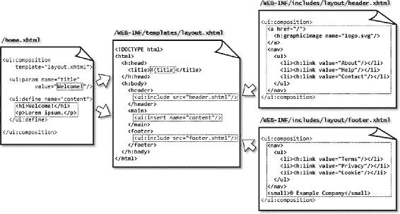
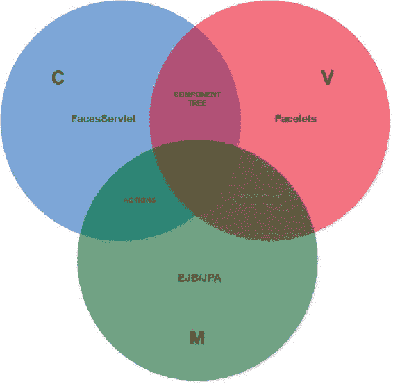
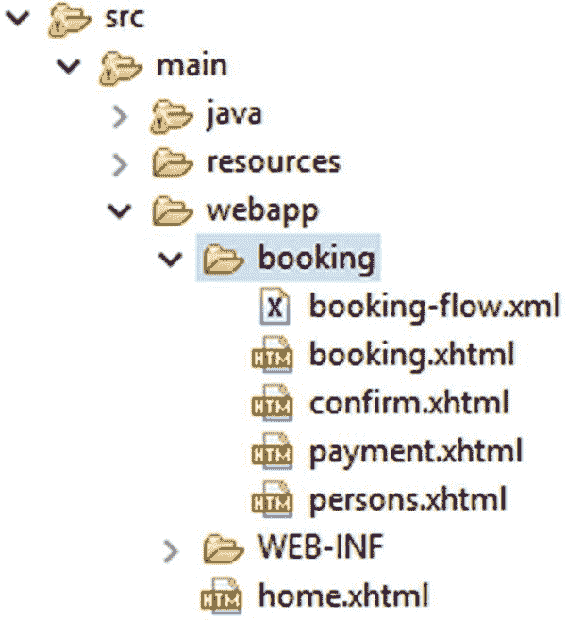
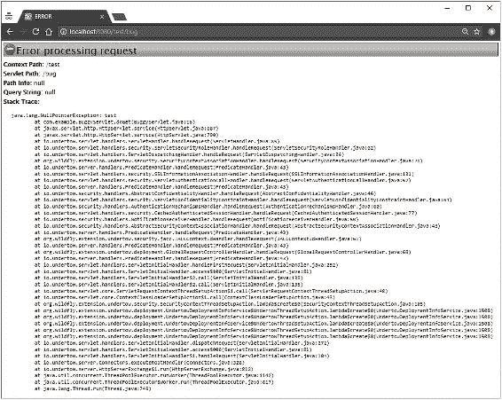
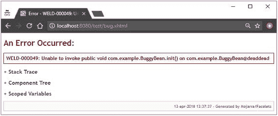
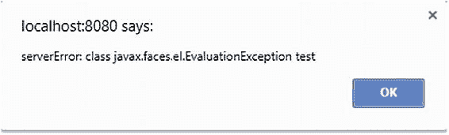
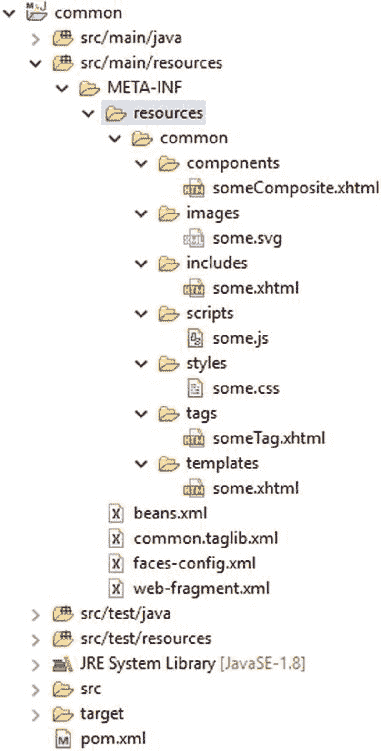
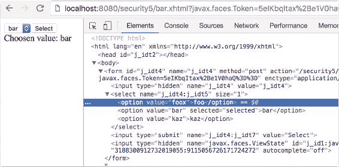
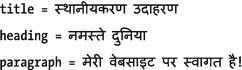
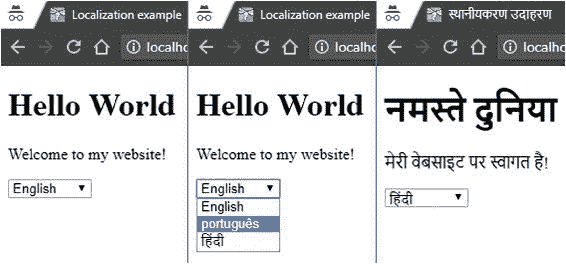

# 7. Facelets 模板

Bauke Scholtz^(1 ) 和 Arjan Tijms²

(1) 库拉索岛威廉斯塔德

(2) 荷兰北荷兰省阿姆斯特丹

当 JSF（JavaServer Faces）于 2004 年首次推出时，只有 JSP（Java Server Pages）拥有视图技术。人们很快意识到，对于使用 JSF 进行 Web 开发来说，这是一种不合适的视图技术。JSP 的问题在于，一旦遇到模板文本，它就会立即写入 HTTP 响应，而 JSF 则希望首先基于视图声明创建一个组件树，以便能够在其上执行生命周期处理。例如，以下使用 JSP 视图技术的 JSF 1.0/1.1 页面：

```
<h:commandLink action="...">
    <strong>strong link text</strong>
</h:commandLink>
```

会产生以下 HTML 输出，其中模板文本由 JSP 在 JSF 组件生成的 HTML 输出之前发出¹：

```
<strong>strong link text</strong>
<a href="..." onclick="..."></a>
```

“正确的方法”是将模板文本包裹在 `<f:verbatim>` 标签中：

```
<h:commandLink action="...">
    <f:verbatim><strong>strong link text</strong><f:verbatim>
</h:commandLink>
```

这将产生以下 HTML 输出：

```
<a href="..." onclick="...">  <strong>strong link text</strong></a>
```

这显然受到了很多批评，现在普遍的建议是人们不应该将 JSF 与 HTML 混合使用。JSF 1.0/1.1 的另一个问题是，没有组件来表示 HTML `<div>`。那时正值“Web 2.0”刚刚兴起，人们也开始不推荐使用 HTML 表格来布局网页。主流观点认为只应使用 div，这使得人们更加不喜欢 JSF 1.0/1.1。

JSP 导致 HTML 输出混乱的奇特行为在仅两年后（2006 年）发布的 JSF 1.2 中得到了解决，而缺少表示 HTML `<div>` 组件的问题则通过为 `<h:panelGroup>` 组件添加新的 `layout="block"` 属性来解决，使其渲染 `<div>` 而不是 `<span>`。因此，从 JSF 1.2 开始，人们就可以安全地在 JSP 页面中将纯 HTML 与 JSF 组件混合使用，并继续以纯 HTML 和 JSF 两种方式使用 div。然而，在编写 JSF 1.0/1.1 页面时避免使用纯 HTML 的建议计划，却变成了一个至今仍在某些人中流传的顽固误解。

JSP 的另一个问题是，现有的 JSP 标签库（如 JSTL（JSP 标准标签库））和以 `${…}` 形式存在的现有 JSP 表达式，完全无法集成到 JSF 生命周期中。因此，在 JSP 页面中将现有的 JSP 标签库和 JSP 表达式与 JSF 组件混合使用，会导致令人困惑且不直观的行为。人们无法使用 `<c:forEach>` 来渲染 JSF 组件列表，因为这些组件看不到 `<c:forEach var>` 声明的变量。除了 `<h:dataTable>` 之外，没有专门的 JSF 组件可以遍历列表，最终人们在 JSF 页面中创建列表时只能局限于使用表格。

最后，JSP 提供的模板功能也非常有限，实际上只有一个“模板”标签 `<jsp:include>`；因此，使用 JSP 进行模板化需要一种相当复杂的方法，即为每个可重用模板部分的定义创建一堆自定义标签。² 这与 JSF 的理念——拥有可重用组件以最小化代码重复——相矛盾。使用 JSP，你最终会重复 JSF 组件本身。现有的模板框架（如 Tiles 和 Thymeleaf）要么以 JSP 为中心，要么根本不支持 JSF，因此无法使用。


显然，迫切需要一种面向 JSF 的新视图技术来取代 JSP，并解决其与 JSF 生命周期相关的所有问题。于是，Facelets 在 2006 年被引入。它可以为 JSF 1.1 和 1.2 单独安装，并内置于 JSF 2.0 中。它成为了 JSF 的默认视图技术，而 JSP 作为 JSF 的视图技术已被弃用。JSF 2.0 中引入的新标签，例如 `<f:ajax>`、`<h:head>`、`<h:body>`、`<h:outputScript>` 和 `<h:outputStylesheet>`，仅适用于 Facelets，不适用于 JSP。JSF 2.0 还引入了一个新接口，以便更轻松地插入自定义视图声明语言（VDL）作为 JSP 甚至 Facelets 的替代方案，即 `ViewDeclarationLanguage` API。通过这种方式，人们可以创建例如纯 Java 的 JSF VDL。³

## XHTML

Facelets VDL 规定视图在基于 XML 的文件中定义，这些文件使用 SAX 解析器编译并保存在内存中。自 JSF 2.1 起，此内存缓存可通过自定义的 `FaceletCacheFactory` 进行配置。当 JSF 项目阶段设置为 Development 时，Facelets 文件的 SAX 编译表示默认不会被缓存。这使得在已运行的服务器上进行开发更加容易，只需在支持将本地更改热发布到目标运行时的 IDE（集成开发环境）中编辑 Facelets 文件即可。

Facelets 文件本身通常使用 `.xhtml` 扩展名，因此初学者常称其为“XHTML”而非“Facelets”。在 JSF 上下文中讨论时这没问题，但“XHTML”一词在 Web 开发领域还有另一层含义。其核心是，XHTML 是一种用于 HTML 页面的标记语言，这些页面需要使用基于 XML 的工具进行编译。换句话说，开发者基本上创建的是包含 HTML 标记和 Web 框架特定 XML 标签的 XML 文件，然后 Web 框架会将其解析为 XML 树，生成该 XML 树的某种 Web 框架特定表示（在 JSF 中为 `UIViewRoot`），并最终根据框架对该 XML 树的内部表示生成所需的 HTML 输出。

但在 2006 年 Facelets 引入前后，XHTML 被另一群 Web 开发者过度炒作，他们基本上是因为看到 W3 验证器使其 HTML4 文档无效而感到失望——通常是因为希望显式关闭所有标签以保持一致性，包括那些根据 HTML4 规范实际上不应关闭的标签，例如 `<link>`、`<meta>`、`<br>` 和 `<hr>`——有时还因为希望指定自定义标签属性，以便某些 JavaScript 插件能与 HTML 文档更清晰地交互，而这也是 HTML4 规范所不允许的。

尽管世界上几乎每个 Web 浏览器（包括史前级别的 IE6）都宽容地接受了这一点，但这些开发者不希望看到他们精心制作的 HTML4 文档被 W3 验证器判定为无效，于是他们将 HTML 文档类型声明更改为使用 XHTML DTD，这是 HTML 的一个扩展，要求每个标签都必须关闭，并允许在现有标签上指定自定义属性。然而，这本质上是对 XHTML 的滥用，因为他们实际上根本没有使用任何 XML 工具来编译文档并生成所需的 HTML 输出。这仅仅是为了让 W3 验证器满意。

巧合的是，也大约在同一时期，HTML5 刚刚开始起草。本质上，开发者只需从 HTML 文档类型声明中移除任何 DTD，就能得到一个允许基于 XML 语法的 HTML 文档，其中所有标签始终关闭，并允许自定义元素和属性，而且重要的是，能在 W3 验证器中正确验证。换句话说，`<!DOCTYPE html>` 对这些开发者来说已经足够了，即使在 IE6 中也是如此。不幸的是，HTML5 正式完成花费了很长时间，因此开发者在能够切换回 HTML 文档类型之前，一直滥用 XHTML 文档类型。当与这些开发者讨论 Facelets 时，不要称其为“XHTML”，而应直接称为“Facelets”；否则会引起混淆。

## 模板组合

Facelets 提供了用于基于单个主模板文件轻松创建模板组合的标签。这应该能减少整个网站中重复出现的部分（如页眉、导航菜单和页脚）的代码重复。主模板文件应表示一个完整的网页布局，包含所有网站范围的区域，并使用 `<ui:insert>` 标签来表示可以插入页面特定区域的位置。以下是此类主模板文件 `/WEB-INF/templates/layout.xhtml` 的基本示例：

```
<!DOCTYPE html>
<html lang="en"
    xmlns:="http://www.w3.org/1999/xhtml"
    xmlns:h="http://xmlns.jcp.org/jsf/html"
    xmlns:ui="http://xmlns.jcp.org/jsf/facelets"
>
    <h:head>
        <title>#{title}</title>
    </h:head>
    <h:body>
        <header>
            <ui:include src="/WEB-INF/includes/layout/header.xhtml" />
        </header>
        <main>
            <ui:insert name="content" />
        </main>
        <footer>
            <ui:include src="/WEB-INF/includes/layout/footer.xhtml" />
        </footer>
    </h:body>
</html>
```

请注意，主模板文件和包含文件被明确放置在 `/WEB-INF` 文件夹中。这样做是为了防止用户通过猜测 URL 路径来直接访问。另请注意，页面标题被声明为一个简单的 EL（表达式语言）表达式 `#{title}`，而不是 `<ui:insert>`。`<title>` 元素中不允许有任何标记。

`xmlns` 属性基本上通过 URI（统一资源标识符）定义了可以在声明的 XML 命名空间中使用哪些标签。根 XML 命名空间指定了 W3 XHTML 标准 [`www.w3.org/1999/xhtml`](http://www.w3.org/1999/xhtml) 的 URI，因此它定义了“任何 XHTML 和 HTML5+ 标签”，例如上例中的 `<html>`、`<title>`、`<header>`、`<main>` 和 `<footer>`。Facelets 编译器知道这个标准 XML 命名空间，并将所有元素作为“通用 UI 指令”传递。`h` XML 命名空间指定了 JSF HTML 标签库 URI，而 `ui` XML 命名空间指定了 JSF Facelets 标签库 URI，这两个 URI 都存在于 JSF 实现 JAR 文件中，并在 Web 应用程序启动时注册到 Facelets。这样，Facelets 编译器就能找到相关的标签处理器、组件和复合组件，它们负责完成构建视图、解码 HTTP 请求和编码 HTTP 响应的繁重工作。因此，这些 URI 并不一定是有效的互联网地址。您甚至可以通过 `*.taglib.xml` 文件指定自己的 URI。这将在后面的“标签文件”部分进一步展开。

以下是包含文件 `/WEB-INF/includes/layout/header.xhtml` 的内容：

```
<ui:composition
    xmlns:="http://www.w3.org/1999/xhtml"
    xmlns:h="http://xmlns.jcp.org/jsf/html"
    xmlns:ui="http://xmlns.jcp.org/jsf/facelets"
>
    <a href="#{request.contextPath}/">
        <h:graphicImage name="images/layout/logo.svg" />
    </a>
    <nav>
        <ul>
            <li><h:link outcome="/about" value="关于" /></li>
            <li><h:link outcome="/help" value="帮助" /></li>
            <li><h:link outcome="/contact" value="联系" /></li>
        </ul>
    </nav>
</ui:composition>
```

请注意徽标周围的链接。它指向 `#{request.contextPath}/`。这基本上会打印出相对于域名的应用程序根目录 URL。`#{request}` 是一个隐式 EL 对象，引用当前的 `HttpServletRequest` 实例。`contextPath` 指的是其属性之一，由 `getContextPath()` 方法隐含。

以下是包含文件 `/WEB-INF/includes/layout/footer.xhtml` 的内容：


```
<ui:composition
    xmlns:="http://www.w3.org/1999/xhtml"
    xmlns:h="http://xmlns.jcp.org/jsf/html"
    xmlns:ui="http://xmlns.jcp.org/jsf/facelets"
>
    <nav>
        <ul>
            <li><h:link outcome="/terms-of-service"
                        value="服务条款" /></li>
            <li><h:link outcome="/privacy-policy"
                        value="隐私政策" /></li>
            <li><h:link outcome="/cookie-policy"
                        value="Cookie 政策" /></li>
        </ul>
    </nav>
    <small>© 示例公司</small>                                                                      
</ui:composition>
```

最后，模板客户端（例如 `/home.xhtml`）的代码示例如下：

```
<ui:composition template="/WEB-INF/templates/layout.xhtml"
    xmlns:="http://www.w3.org/1999/xhtml"
    xmlns:h="http://xmlns.jcp.org/jsf/html"
    xmlns:ui="http://xmlns.jcp.org/jsf/facelets"
>
    <ui:param name="title" value="欢迎！" />

<ui:define name="content">
        <h1>欢迎来到示例公司！</h1>
        <p>Lorem ipsum dolor sit amet.</p>
    </ui:define>
</ui:composition>
```

请注意 `<ui:composition>` 中的 `template` 属性。该属性必须指向主模板的服务器端路径，最好使用绝对路径，即以“/”开头。

在模板客户端中，`<ui:param>` 允许你定义专用于主模板的简单参数。基本上，你可以使用任何参数名称，只要该参数被主模板支持，并且不与现有的受管 bean 名称冲突。在此特定示例中，EL 变量 `#{title}` 的值被指定为“欢迎！”。该值最终会出现在主模板的 `<title>` 元素中。

而 `<ui:define>` 允许你定义专用于主模板的标记块。该标记块最终会出现在主模板中声明了同名 `<ui:insert>` 的位置。图 7-1 清晰地展示了所有这些元素是如何组合在一起的。



###### 图 7-1 主模板 layout.xhtml、包含文件 header.xhtml 和 footer.xhtml，以及模板客户端 home.xhtml 之间的关系。请注意，为简洁起见，省略了模板文件路径和部分标签属性。实际编码请参考前面展示的代码片段。

最后，打开 `/home.xhtml` 应生成最终的 HTML 输出，你可以通过在普通浏览器中右键单击*查看页面源代码*来检查该输出。

## 单页应用

最近的一个趋势是所谓的单页应用（SPA）。这个概念本身并不新鲜；事实上，它比 JSF 本身还要古老，但在“Web 2.0”时代，随着基于 JavaScript 的框架（如 Angular）的出现而广泛流行。基本上，SPA 通过在不同页面间导航时使用 Ajax 请求动态更改主要内容，而不是通过 GET 请求加载整个页面，从而使 Web 应用表现得像桌面应用一样。Gmail 就是 SPA 的一个知名例子。

这种 SPA 也可以通过 JSF 实现，只需使用 `<ui:include>`，并通过 Ajax 动态更新其 `src` 属性即可。以下示例使用了与上一节相同的主模板 `/spa.xhtml`：

```
<ui:composition template="/WEB-INF/templates/layout.xhtml"
    xmlns:="http://www.w3.org/1999/xhtml"
    xmlns:jsf="http://xmlns.jcp.org/jsf"
    xmlns:f="http://xmlns.jcp.org/jsf/core"
    xmlns:h="http://xmlns.jcp.org/jsf/html"
    xmlns:ui="http://xmlns.jcp.org/jsf/facelets"
>
    <ui:param name="title" value="单页应用" />

<ui:define name="content">
        <aside>
            <nav>
                <h:form>
                    <f:ajax render=":content">
                        <ul>
                            <li><h:commandLink value="页面 1"
                                action="#{spa.set('page1')}" /></li>
                            <li><h:commandLink value="页面 2"
                                action="#{spa.set('page2')}" /></li>
                            <li><h:commandLink value="页面 3"
                                action="#{spa.set('page3')}" /></li>
                        </ul>
                    </f:ajax>
                </h:form>
            </nav>
        </aside>
        <article jsf:id="content" data-page="#{spa.page}">
            <ui:include src="/WEB-INF/includes/spa/#{spa.page}.xhtml" />
        </article>
    </ui:define>
</ui:composition>
```

请注意，`<article>` 元素通过显式指定 JSF 标识符 `jsf:id="…"` 被声明为所谓的透传元素。此功能是在 JSF 2.2 中引入的。在底层，当以这种方式将没有对应 JSF 组件的 HTML 元素（例如 `<header>`、`<footer>`、`<main>`、`<article>`、`<section>` 等）声明为透传元素时，它会被转换为 `UIPanel` 组件，并在 JSF 组件树中像 `<h:panelGroup>` 一样被处理。这样，你既可以干净地继续使用语义化的 HTML5 标记，又能像引用 JSF 组件一样引用它，从而能够通过 Ajax 更新它。

正如你可能从上面的 `/spa.xhtml` 示例中解读出的那样，有一个侧边导航菜单，它设置由 `#{spa}` 标识的受管 bean 中的当前页面，并通过 Ajax 更新由 `id="content"` 标识的组件，而该组件又包含一个动态包含。上述示例期望在 `/WEB-INF/includes/spa` 文件夹中存在以下包含文件：`page1.xhtml`、`page2.xhtml` 和 `page3.xhtml`。每个文件都是一个简单的包含文件，内容如下：

```
<ui:composition
    xmlns:="http://www.w3.org/1999/xhtml"
    xmlns:h="http://xmlns.jcp.org/jsf/html"
    xmlns:ui="http://xmlns.jcp.org/jsf/facelets"
>
    <h1>第一页</h1>
    <p>Lorem ipsum dolor sit amet.</p>
</ui:composition>
```

与 `#{spa}` 受管 bean 关联的后台 bean 相当简单，如下所示：

```
@Named @ViewScoped
public class Spa implements Serializable {

private String page;

@PostConstruct
    public void init() {
        page = "page1";
    }

public void set(String page) {
        this.page = page;
    }

public String getPage() {
        return page;
    }
}
```

默认页面在 `@PostConstruct` 中定义。否则，用户可能会看到一个错误页面，其中包含消息“无效路径：/WEB-INF/includes/spa/.xhtml”。


请注意，后台 Bean 声明为 `@ViewScoped`。这一点很重要，因为它需要在回传过程中记住当前打开的是哪个页面。如果它是 `@RequestScoped`，当用户导航到例如 page2 并提交其中的表单时，会创建一个新的 HTTP 请求，那么 `@RequestScoped` 管理的 Bean 将被重新创建，其页面值仍为 page1 而非 page2。这会导致当 JSF 准备解码任何输入组件以处理回传请求中的表单提交时，`<ui:include>` 不会引用 page2.xhtml，因此 JSF 将无法找到在 page2.xhtml 中声明的输入组件。`@ViewScoped` Bean 的生命周期与用户回传到同一视图（本例中为 /spa.xhtml）的时间相同，因此它能正确记住当前选中的页面。

在尝试这个 SPA 示例时，您可能已经注意到一个缺点：页面无法添加书签。这是因为页面不是通过幂等的 GET 请求打开的。您可以通过使用 HTML5 的 `history.pushState` API 来解决这个问题。⁴ 基本上，在 Ajax 请求完成后，您应该将目标 URL 推送到浏览器历史记录中，这将会反映在浏览器的地址栏中。并且，您应该修改 Spa 后台 Bean，使其检查是否有特定页面被打开，并相应地准备 `page` 变量。

以下是一个入门示例，它仅附加了 `?page=xxx` 查询字符串参数。首先，调整 spa.xhtml 中的 `<f:ajax>`，指定 `onevent` 属性如下：

```
<f:ajax ... onevent="pageChangeListener">
```

然后创建以下 JavaScript 函数：

```
function pageChangeListener(event) {
    if (event.status == "success") {
        var page = document.getElementById("content").dataset.page;
        var url = location.pathname + "?page=" + page;
        history.pushState(null, document.title, url);
    }
}
```

最后，按如下方式调整 Spa 后台 Bean：

```
@Inject @ManagedProperty("#{param.page}")
Private String page;

public void init() {
    if (page == null) {
        page = "page1";
    }
}
```

###### 注意

`@ManagedProperty` 目前有两种形式：已弃用的来自 `javax.faces.bean` 包的形式，以及 JSF 2.3 引入的来自 `javax.faces.annotation` 包的形式。

您需要后者。另外，请注意您可能想要验证提供的 `page` 参数。顺便说一句，黑客的路径探测是无害的，因为 JSF 本身已经不允许遍历到父路径，例如 `/spa.xhtml?page=../../templates/layout`。

## 模板装饰

如果您希望拥有一个可重用的包含文件，它能够插入模板定义，就像使用 `<ui:include>` 来引用一个包含一个或多个 `<ui:insert>` 部分的包含文件一样，那么您可以使用 `<ui:decorate>`。以下是一个示例，即 `/WEB-INF/decorations/contact.xhtml`：

```
<ui:composition
    xmlns:="http://www.w3.org/1999/xhtml"
    xmlns:ui="http://xmlns.jcp.org/jsf/facelets"
>
    <section class="contact">
        <header><ui:insert /></header>
        <nav>
            <ul>
                <li>✆ <a href="tel:+31612345678"
                    title="Phone">+31 (0)6 1234 5678</a></li>
                <li>✉ <a href="mailto:info@example.com"
                    title="Email">info@example.com</a></li>
            </ul>
        </nav>
    </section>
</ui:composition>
```

以下是它的使用方法，您可以将 `<ui:decorate>` 像 `<ui:include>` 一样放在模板客户端的任何位置：

```
<ui:decorate template="/WEB-INF/decorations/contact.xhtml">
    <h2>有问题？联系我们！</h2>
</ui:decorate>
```

请注意，contact.xhtml 只有一个 `<ui:insert>`，并且它没有名称。这会将整个 `<ui:decorate>` 标签体插入到 `<ui:insert>` 声明的位置。当然，您可以指定一个名称，但那样您就需要显式地使用 `<ui:define>` 并为其指定一个名称。只有当您有多个插入部分时，这才有用。

如有必要，您可以使用 `<ui:param>` 来传递参数。其工作方式与 `<ui:composition template>` 相同。以下示例将电子邮件用户名的 `/WEB-INF/decorations/contact.xhtml` 参数化，默认值为 "info"。

```
...
<li>✉ <a href="mailto: #{empty mailto ? 'info' : mailto}@example.com"
    title="Email">#{empty mailto ? 'info' : mailto}@example.com</a></li>
...
```

然后可以这样使用：

```
<ui:decorate template="/WEB-INF/decorations/contact.xhtml">
    <ui:param name="mailto" value="press" />
    <h3>联系我们</h3>
    <p>
        如有媒体垂询，您可以通过以下电话号码和电子邮件地址联系我们。
    </p>
</ui:decorate>
```

## 标签文件

与 `<ui:composition template>` 和 `<ui:decorate>` 一样，您也可以在 `<ui:include>` 中使用 `<ui:param>`。但是，请注意不要过度使用。

```
<ui:include src="/WEB-INF/includes/field.xhtml">
    <ui:param name="id" value="firstName" />
    <ui:param name="label" value="名字" />
    <ui:param name="value" value="#{profile.user.firstName}" />
</ui:include>
```

其中 `/WEB-INF/includes/field.xhtml` 的内容大致如下：

```
<ui:composition
    xmlns:="http://www.w3.org/1999/xhtml"
    xmlns:jsf="http://xmlns.jcp.org/jsf "
    xmlns:h="http://xmlns.jcp.org/jsf/html"
    xmlns:ui="http://xmlns.jcp.org/jsf/facelets"
    xmlns:a="http://xmlns.jcp.org/jsf/passthrough"
    xmlns:c="http://xmlns.jcp.org/jsp/jstl/core"
>
    <div class="field" jsf:rendered="#{rendered ne false}">
        <h:outputLabel id="#{id}_l" for="#{id}" value="#{label}" />
        <c:choose>
            <c:when test="#{type eq 'password'}">
                <h:inputSecret id="#{id}" label="#{label}"
                    value="#{value}">
                </h:inputSecret>
            </c:when>
            <c:when test="#{type eq 'textarea'}">
                <h:inputTextarea id="#{id}" label="#{label}"
                    value="#{value}">
                </h:inputTextarea>                                                                                        
            </c:when>
            <!-- 更多类型可以在此处作为 c:when 添加 -->
            <c:otherwise>
                <h:inputText id="#{id}" label="#{label}"
                    value="#{value}" a:type="#{type}">
                </h:inputText>
            </c:otherwise>
        </c:choose>
        <h:messages id="#{id}_m" for="#{id}" styleClass="messages" />
    </div>
</ui:composition>
```

在这种情况下，您可能更希望使用更简洁的方式，如下所示：

```
<t:field id="firstName" label="名字"
    value="#{profile.user.firstName}">
</t:field>
```

如果 `<ui:include>` 带有两个或更多 `<ui:param>`，这强烈表明该包含文件最好注册为标签文件，以便在 Facelet 中使用更少的样板代码。

首先，将包含文件移动到不同的子文件夹 `/WEB-INF/tags/field.xhtml`。这不是技术上的要求。无论您将其放在哪里，它都能正常工作，但我们只是希望清晰地组织文件。主模板文件放在 `/WEB-INF/templates`，包含文件放在 `/WEB-INF/includes`，装饰文件放在 `/WEB-INF/decorations`，标签文件放在 `/WEB-INF/tags`。

然后，创建以下 `/WEB-INF/example.taglib.xml`：

```
<?xml version="1.0" encoding="UTF-8"?>
<facelet-taglib
    xmlns:="http://xmlns.jcp.org/xml/ns/javaee"
    xmlns:xsi="http://www.w3.org/2001/XMLSchema-instance"
    xsi:schemaLocation="http://xmlns.jcp.org/xml/ns/javaee
      http://xmlns.jcp.org/xml/ns/javaee/web-facelettaglibrary_2_3.xsd"
    version="2.3"
>
    <namespace>http://example.com/tags</namespace>
    <short-name>t</short-name>


<tag>
        <description>渲染标签、输入框和消息字段。</description>
        <tag-name>field</tag-name>
        <source>tags/field.xhtml</source>
        <attribute>
            <description>输入组件的类型。</description>
            <name>type</name>
            <required>false</required>
            <type>java.lang.String</type>
        </attribute>
        <attribute>
            <description>输入组件的 ID。</description>
            <name>id</name>
            <required>true</required>
            <type>java.lang.String</type>
        </attribute>
        <attribute>
            <description>输入组件的标签。</description>
            <name>label</name>
            <required>true</required>
            <type>java.lang.String</type>
        </attribute>
        <attribute>
            <description>输入组件的值。</description>
            <name>value</name>
            <required>false</required>
            <type>java.lang.Object</type>
        </attribute>
        <attribute>
            <description>字段是否被渲染。</description>
            <name>rendered</name>
            <required>false</required>
            <type>boolean</type>
        </attribute>
    </tag>
</facelet-taglib>

不可否认，这确实是相当多的样板代码。但了解以下内容很有帮助：`<attribute>` 元素对于标签文件的技术运行并非强制要求。你甚至可以完全省略它们。但这样一来，IDE 在尝试自动补全自定义标签时，就无法将这些属性加载到自动建议框中。这对开发者来说并不友好。因此，最好还是保留它们。顺便提一下，标签属性的 `<required>` 属性仅在 JSF 项目阶段设置为 Development 时才会导致运行时错误。在其他 JSF 项目阶段，它会被忽略。而且，大多数 IDE 在自动补全标签时会立即提示这些必需属性。

文件名 `example.taglib.xml` 可以自由选择。为了让 JSF 在应用启动时自动识别标签库文件，只有两个要求：文件扩展名必须是 `.taglib.xml`，并且必须放置在 `/WEB-INF` 文件夹中（如果是最终位于 `/WEB-INF/lib` 的 JAR 文件，则放置在该 JAR 文件的 `/META-INF` 文件夹中）。不幸的是，在某些服务器（如 GlassFish/Payara）上，将文件放在 `/WEB-INF` 中并不总是能正常工作。在这种情况下，你需要通过 `web.xml` 中的以下上下文参数显式注册它，该参数的值表示从 Web 根目录到 `*.taglib.xml` 文件的完整路径。

```
<context-param>
    <param-name>javax.faces.FACELETS_LIBRARIES</param-name>
    <param-value>/WEB-INF/example.taglib.xml</param-value>
</context-param>
```

为了使用 `*.taglib.xml` 中定义的任何标签，你首先必须在你的 Facelet 中精确声明标签库的 `<namespace>` URI，以及一个任意的 XML 命名空间前缀。为了提高代码的可维护性，建议选择标签库在其 `<short-name>` 中指定的首选 XML 命名空间前缀，在我们的 `example.taglib.xml` 中，这个前缀是 "t"。

```
<ui:composition template="/WEB-INF/templates/layout.xhtml"
    xmlns:="http://www.w3.org/1999/xhtml"
    xmlns:h="http://xmlns.jcp.org/jsf/html"
    xmlns:ui="http://xmlns.jcp.org/jsf/facelets"
    xmlns:t="http://example.com/tags"
>
    <ui:param name="title" value="登录" />

<ui:define name="content">
        <h:form>
            <fieldset>
                <header>
                    <h1>登录</h1>
                </header>
                <t:field type="email" id="email" label="邮箱"
                    value="#{login.email}">
                </t:field>
                <t:field type="password" id="password" label="密码"
                    value="#{login.password}">
                </t:field>
                <footer>
                    <t:button id="submit" label="登录"
                         action="#{login.submit()}">
                    </t:button>
                </footer>
            </fieldset>
        </h:form>
    </ui:define>
</ui:composition>
```

请注意，电子邮件字段的 `type="email"` 最终会进入标签文件实现中的 `<c:otherwise>`，并通过 `<h:inputText>` 的 `a:type="#{type}"` 属性传递。这允许你轻松使用 HTML5 输入字段，例如 `type="email"`、`type="number"`、`type="tel"` 等。将 `type` 属性定义为透传属性 `a:type` 是强制性的，因为 `<h:inputText>` 默认会忽略任何自定义的 `type` 属性，并固执地渲染为 `type="text"`。

你可能还注意到了另一个自定义标签 `<t:button>`。以下是它在 `/WEB-INF/tags/button.xhtml` 中的实现方式。

```
<ui:composition
    xmlns:="http://www.w3.org/1999/xhtml"
    xmlns:jsf="http://xmlns.jcp.org/jsf"
    xmlns:f="http://xmlns.jcp.org/jsf/core"
    xmlns:h="http://xmlns.jcp.org/jsf/html"
    xmlns:ui="http://xmlns.jcp.org/jsf/facelets"
>
    <div class="button" jsf:rendered="#{rendered ne false}">
        <h:commandButton id="#{id}" value="#{label}">
            <f:actionListener binding="#{action}" />
            <f:ajax execute="@form" render="@form" />
        </h:commandButton>
        <h:messages id="#{id}_m" globalOnly="true" redisplay="false" />
    </div>
</ui:composition>
```

它在 `example.taglib.xml` 中的注册方式与 `<t:field>` 几乎相同，但 `action` 属性是个例外。从技术上讲，你需要指定一个 `<method-signature>` 而不是（属性）`<type>`：

```
<attribute>
    <description>
        按钮的动作方法。
        注意：必须包含方法括号。
    </description>
    <name>action</name>
    <required>true</required>
    <method-signature>void action()</method-signature>
</attribute>
```

你可能已经注意到，实际的标签实现使用了 `<f:actionListener binding="#{action}">` 而不是 `action="#{action}"`。这实际上是一个必要的技巧，以便正确调用该方法。也就是说，`<method-signature>` 最初是为 UI 组件设计的，而不是为标签文件设计的。它在标签文件中会被忽略。这个问题可能会在 JSF.next 中得到解决。目前，你可以通过 `<f:actionListener binding>` 这个技巧来规避。这只有一个额外要求：你需要在标签文件客户端显式包含方法括号，例如 `<t:button action="#{login.submit()}">`。否则，`<t:button action="{login.submit}">` 会失败，并抛出 *javax.el.PropertyNotFoundException: The class ‘com.example.project.view.Login’ does not have the property ‘submit’*。

如果你希望从标签文件客户端开始自定义标签文件，例如，通过添加更具体的输入属性、嵌套核心标签，或者在标签或消息前/后追加内容，那么你可以像使用主模板文件和装饰文件一样，使用 `<ui:define>` 和 `<ui:insert>`。以下示例演示了如何通过添加一组新的 `<ui:insert>` 标签来增强 `/WEB-INF/tags/field.xhtml`：


```
<ui:composition
    xmlns:="http://www.w3.org/1999/xhtml"
    xmlns:jsf="http://xmlns.jcp.org/jsf "
    xmlns:h="http://xmlns.jcp.org/jsf/html"
    xmlns:ui="http://xmlns.jcp.org/jsf/facelets"
    xmlns:a="http://xmlns.jcp.org/jsf/passthrough"
    xmlns:c="http://xmlns.jcp.org/jsp/jstl/core"
>
    <div class="field" jsf:rendered="#{rendered ne false}">
        <ui:insert name="beforeLabel" />
        <ui:insert name="label">
            <h:outputLabel id="#{id}_l" for="#{id}" value="#{label}">
                <span><ui:insert name="insideLabel" /></span>
            </h:outputLabel>
        </ui:insert>
        <ui:insert name="beforeInput" />
        <ui:insert name="input">
            <c:choose>
                <c:when test="#{type eq 'password'}">
                    <h:inputSecret id="#{id}" label="#{label}"
                        value="#{value}">
                        <ui:insert />
                    </h:inputSecret>
                </c:when>
                <c:when test="#{type eq 'textarea'}">
                    <h:inputTextarea id="#{id}" label="#{label}"
                        value="#{value}">
                        <ui:insert />
                    </h:inputTextarea>
                </c:when>
                <!-- 更多类型可在此处通过 c:when 添加 -->
                <c:otherwise>
                    <h:inputText id="#{id}" label="#{label}"
                        value="#{value}" a:type="#{type}">
                        <ui:insert />
                    </h:inputText>
                </c:otherwise>
            </c:choose>
        </ui:insert>
        <ui:insert name="beforeMessages" />
        <ui:insert name="messages">
            <h:messages id="#{id}_m" for="#{id}" styleClass="messages" />
        </ui:insert>
    </div>
</ui:composition>
```

现在，这真是极大的灵活性！在标签文件客户端中，你可以使用 `<ui:define name="beforeLabel">` 来定义一些应在字段标签之前显示的内容。你也可以使用 `<ui:define name="label">` 来完全覆盖标签。你还可以使用 `<ui:define name="insideLabel">` 在标签内部追加一些（HTML）内容，以此类推。下面的示例演示了如何使用 `insideLabel` 在密码字段的标签后追加一个“忘记密码？”链接：

```
<t:field ...>
    <ui:define name="insideLabel">
        <h:link outcome="/reset-password" value="忘记密码？" />
    </ui:define>
</t:field>
```

请注意，`<ui:insert name="insideLabel">` 被包裹在一个 HTML `<span>` 标签中。这让你能够更轻松地通过 CSS 选择最终出现在该位置上的“任何内容”，例如，你可以仅通过 `.field label > span { float: right; }` 让其中的内容向右浮动。

标签文件客户端中任何不属于 `<ui:define>` 的内容，最终都会进入所选输入组件内部的无名 `<ui:insert>` 标签中。这让你能够轻松地为该输入组件嵌套任何特定的 `<f:xxx>` 核心标签：

```
<t:field ...>
    <f:attribute name="onkeypress" value="return event.key != 'Enter'" />
    <f:validateRegex pattern="[0-9]{4}" />
    <f:ajax render="otherField" />
</t:field>
```

这个具体示例通过当 `KeyboardEvent.key` 等于“Enter”时返回 `false`，阻止了表单在按下*回车*键时提交；同时注册了一个正则表达式验证器，通过匹配正则表达式模式 `[0-9]{4}` 来仅接受四位数字的值；并指示 JSF 在值变更事件发生时，通过 Ajax 更新由“otherField”标识的组件。

回到 `/WEB-INF/tags/field.xhtml` 中的标签文件实现，你可能已经注意到，这里使用的是老牌的 JSTL，而不是 JSF 自身的 `rendered` 属性。这样做有优势，因为 JSTL 的生命周期与 JSF UI 组件不同。JSTL 在 JSF 组件树即将构建时（即视图构建阶段）执行。而 JSF 组件则在即将生成 HTML 输出时（即视图渲染阶段）执行。此外，如果你使用 JSF 自身的 `rendered` 属性，那么由于多个具有相同 ID 的组件会物理上存在于 JSF 组件树中，你将面临“重复组件 ID”的错误。

如果你正在考虑使用纯 Java 代码，基于至少一个视图作用域的模型来动态创建组件树，那么你绝对应该重新考虑，转而使用 JSTL。由于 JSTL 本身也是基于 XML 的，因此你可以将所有内容整合到一个 XHTML 文件中，最终你将获得可读性和可维护性都更好的“动态”组件代码。


## 复合组件

有时，您希望将一组相关的输入组件组合起来，以表示单个模型值。一个经典的例子是使用三个 `<h:selectOneMenu>` 下拉菜单分别表示日、月、年，并最终绑定到后台 Bean 中的一个 `java.time.LocalDate` 属性。仅使用包含文件或标签文件来实现这一点并不简单。您需要一些额外的基于 Java 的逻辑，例如，确保日期的下拉菜单不会根据当前选择的月份显示 29、30 或 31 这些值，并且能够将提交的值转换为一个完整的 `LocalDate` 实例，反之亦然。但是，您不能也不应该在任何 Facelet 中放入 Java 代码。

您可能会想到为此创建一个专用的后台 Bean。但这也不够。它无法让您通过 JSF 生命周期干净地挂接到组件的生命周期：从多个组件收集各个提交的值，将它们转换为单个 `LocalDate` 实例，必要时在验证阶段抛出转换器异常，并让 JSF 生命周期自动跳过剩余阶段。后台 Bean 的 setter 方法或 action 方法远非放置该逻辑的正确位置。无论如何，它被调用时都太晚了。而且，能够通过 Facelet 中任意位置的 EL 表达式引用并可能操作同一个后台 Bean，会让人感觉很奇怪。

这正是复合组件发挥作用的地方：将一堆现有的 JSF 组件组合成一个虚拟的单个组件，该组件绑定到单个模型值，并且最终使用方式与使用普通的 `<h:inputText>` 完全相同。想象一个 `<t:inputLocalTime>` 复合组件，它由两个 `<h:selectOneMenu>` 组件组成，并绑定到单个 `java.time.LocalTime` 模型值。您可以使用一个完整的 `UIComponent` 实例作为所谓的后台组件，而不是使用后台 Bean。

首先，在 `main/webapp/resources` 文件夹（注意不是 `main/java/resources`！）中创建一个专用子文件夹，例如 `main/webapp/resources/components`。您可以在其中放置代表复合组件的 Facelets 文件。然后，该子文件夹将在 XML 命名空间 URI 中，位于 `http://xmlns.jcp.org/jsf/composite` 之后使用，如下所示。

```
xmlns:t="http://xmlns.jcp.org/jsf/composite/components"
```

请注意，XML 命名空间前缀 "t" 与我们之前为标签文件定义的那个冲突了。这当然不是本意。您可以为复合组件选择不同的 XML 命名空间。然而，也可以让它们共享同一个自定义 XML 命名空间 URI `http://example.com.tags`。这可以通过在 `*.taglib.xml` 中添加一个 `<composite-library-name>` 来实现，该名称必须代表专用子文件夹的名称。

```
<composite-library-name>components</composite-library-name>
```

这样，所有复合组件也可以通过与标签文件相同的 XML 命名空间来使用。

```
<... xmlns:t="http://example.com/tags">
...
<t:inputLocalTime ... />
```

代表复合组件的 Facelets 文件的文件名将成为标签名称。因此，为了拥有一个 `<t:inputLocalTime>`，我们需要在 `main/webapp/resources/components` 文件夹中有一个 `inputLocalTime.xhtml` 文件。以下是一个入门示例，展示了它可能的样子：

```
<ui:component
    xmlns:="http://www.w3.org/1999/xhtml"
    xmlns:f="http://xmlns.jcp.org/jsf/core"
    xmlns:h="http://xmlns.jcp.org/jsf/html"
    xmlns:ui="http://xmlns.jcp.org/jsf/facelets"
    xmlns:cc="http://xmlns.jcp.org/jsf/composite"
>
    <cc:interface componentType="inputLocalTime">
        <cc:attribute name="value" type="java.time.LocalTime"
            shortDescription="选定的时间。默认为 00:00。">
        </cc:attribute>
        <cc:attribute name="required" type="boolean"
            shortDescription="必填状态。默认为 false。">
        </cc:attribute>
    </cc:interface>
    <cc:implementation>
        <span id="#{cc.clientId}" class="inputLocalTime">
            <h:selectOneMenu id="hour" binding="#{cc.hour}"
                required="#{cc.attrs.required}">
                <f:selectItem itemValue="#{null}" />
                <f:selectItems value="#{cc.hours}" />
            </h:selectOneMenu>
            :
            <h:selectOneMenu id="minute" binding="#{cc.minute}"
                required="#{cc.attrs.required}">
                <f:selectItem itemValue="#{null}" />
                <f:selectItems value="#{cc.minutes}" />
            </h:selectOneMenu>
        </span>
    </cc:implementation>
</ui:component>
```

这里有几件事需要注意，这使得复合组件与标签文件不同。首先，复合组件的主体始终分为两部分：接口和实现。

接口声明了一个 `componentType` 属性，该属性应引用 `UIComponent` 子类上的 `@FacesComponent` 注解的值，或者在 `faces-config.xml` 或 `*taglib.xml` 中声明的 `<component>` 的 `<component-type>` 条目。当 `componentType` 属性不存在时，它默认为 `UINamingContainer`。接口还声明了支持的属性。为简单起见，我们只限制为两个：`value` 和 `required`。还有一些从 `UIComponent` 超类隐式继承的属性，我们不需要显式地将其定义为 `<cc:attribute>`：`id`、`binding` 和 `rendered`。这使得总共五个属性可以在实现中使用。

实现定义了复合组件的实际标记。在这里，您可以看到两个 `<h:selectOneMenu>` 下拉菜单包裹在一个 `<span>` 元素中。在这里，您还可以看到特殊 EL 变量 `#{cc}` 的多次出现，它引用了复合组件背后的当前 `UIComponent` 实例，因此它是 `componentType` 属性中声明的类型之一，或者，如果不存在，则是 `UINamingContainer`。`#{cc.attrs}` 是组件属性映射的快捷方式，可通过 `UIComponent#getAttributes()` 获得。因此，在 `<t:inputLocalTime>` 中使用的 `#{cc.attrs.required}` 引用了 `<cc:attribute name="required">`。

`<span>` 元素中的 `#{cc.clientId}` 只是将复合组件的客户端 ID 打印为 `<span>` 的 `id` 属性。这实际上是一个技巧，以便能够使用来自模板客户端的客户端 ID 搜索表达式来引用“整个”复合组件。想象以下情况：

```
<h:inputText ...>
    <f:ajax render="time" />
</h:inputText>
<t:inputLocalTime id="time" ... />
```

如果没有将 `#{cc.clientId}` 渲染为包裹 `<cc:implementation>` 整个主体的任何普通 HTML 元素（通常是 `<span>` 或 `<div>`）的 ID，这种情况将无法工作。技术问题是，虽然复合组件本身可以通过组件 ID 搜索表达式在 JSF 组件树中找到，但复合组件的 HTML 表示默认情况下无法通过 JavaScript 中的 `document.getElementById(clientId)` 获得。换句话说，JSF Ajax 将无法更新它。因此，显式添加一个带有复合组件客户端 ID 的普通 HTML 元素可以解决这个问题。


最后，还有一堆 #{cc} 表达式并未直接引用这些属性。两个 <h:selectOneMenu> 下拉菜单都直接绑定为所谓支持组件（即复合组件背后的具体 UIComponent 实例）的属性。并且，两个 <f:selectItems> 选项也直接从支持组件获取其值。以下是支持组件类 `com.example.project.composite.InputLocalTime`。

```
@FacesComponent("inputLocalTime")
public class InputLocalTime extends UIInput implements NamingContainer {

private static final List<String> HOURS =
        IntStream.rangeClosed(0, 23).boxed()
            .map(InputLocalTime::pad).collect(Collectors.toList());
    private static final List<String> MINUTES =
        IntStream.rangeClosed(0, 59).boxed()
            .map(InputLocalTime::pad).collect(Collectors.toList());

private UIInput hour;
    private UIInput minute;

@Override
    public String getFamily() {
        return UINamingContainer.COMPONENT_FAMILY;
    }

@Override
    public void encodeBegin(FacesContext context) throws IOException {                                                          
        LocalTime localTime = (LocalTime) getValue();

if (localTime != null) {
            hour.setValue(pad(localTime.getHour()));
            minute.setValue(pad(localTime.getMinute()));
        }

super.encodeBegin(context);
    }

@Override
    public Object getSubmittedValue() {
        String submittedHour = (String) hour.getSubmittedValue();
        String submittedMinute = (String) minute.getSubmittedValue();

if (submittedHour == null || submittedMinute == null) {
            return null;
        }
        else if (submittedHour.isEmpty() || submittedMinute.isEmpty()) {
            return "";
        }
        else {
            return submittedHour + ":" + submittedMinute;
        }
    }

@Override
    protected Object getConvertedValue
        (FacesContext context, Object submittedValue)
    {
        String submittedTime = (String) submittedValue;

if (submittedTime == null || submittedTime.isEmpty()) {
            return null;
        }

try {
            return LocalTime.parse(submittedTime,
                DateTimeFormatter.ISO_LOCAL_TIME);
        }
        catch (DateTimeParseException e) {                                                          
            throw new ConverterException(e);
        }
    }

private static String pad(Integer value) {
        return String.format("%02d", value);
    }

public UIInput getHour() { return hour; }
    public void setHour(UIInput hour) { this.hour = hour; }
    public UIInput getMinute() { return minute; }
       public void setMinute(UIInput minute) { this.minute = minute; }
    public List<String> getHours() { return HOURS; }
    public List<String> getMinutes() { return MINUTES; }
}
```

现在，代码量有点大。你不仅会看到 getter 和 setter 为了简洁而被折叠，还会看到我们的复合组件继承了 UIInput 并实现了 NamingContainer。继承 UIInput 的好处是，我们无需在支持组件中重复 UIInput 的大部分默认编码和解码行为，因此只需重写少数几个方法。实现 NamingContainer 是 `<cc:interface>` 的技术要求。这使您能够在同一上下文中使用复合组件的多个实例，而不会遇到“重复组件 ID”错误。此要求也体现在重写的 `getFamily()` 方法中，根据复合组件的约定，该方法必须返回 `UINamingContainer.COMPONENT_FAMILY` 常量。

构成复合组件的实际 UIInput 组件被声明为支持组件的属性。在本例中，它们都是通过 `binding` 属性绑定到这些属性的 `<h:selectOneMenu>` 下拉菜单。这使我们能够在编码（即：处理 HTTP 响应）期间轻松设置它们的值，并在解码（即：处理 HTTP 请求）期间获取提交的值。你可以在重写的 `encodeBegin()` 和 `getSubmittedValue()` 方法中找到相应的逻辑。

因此，在 `encodeBegin()` 方法中，你有机会根据模型值（如果有）准备显示的值。`getValue()` 方法继承自 UIInput 超类，并与 `value` 属性关联。你可以分解模型值，并在复合组件的各个 UIInput 组件中设置所需的值。`pad()` 辅助方法只是在数字前补零，例如，将“1”显示为“01”。此辅助方法也用于专门为 `<f:selectItems>` 静态初始化可用小时和分钟列表。

在 `getSubmittedValue()` 方法中，你应该将各个 UIInput 组件的提交值组合成一个单独的字符串。在 `<t:inputLocalTime>` 的具体情况下，我们按照 ISO 本地时间模式 `HH:mm` 组合成一个字符串。反过来，UIInput 超类将此值传递给 `getConvertedValue()`，我们在此有机会将组合后的字符串转换为具体的模型值，在本例中即 `LocalTime`。最终，UIInput 超类将确保在更新模型值阶段将其设置到支持 bean 中。现在你可以像下面这样使用它：

```
<ui:composition template="/WEB-INF/templates/layout.xhtml"
    xmlns:="http://www.w3.org/1999/xhtml"
    xmlns:f="http://xmlns.jcp.org/jsf/core"
    xmlns:h="http://xmlns.jcp.org/jsf/html"
    xmlns:ui="http://xmlns.jcp.org/jsf/facelets"
    xmlns:cc="http://xmlns.jcp.org/jsf/composite/components"
>
    <ui:define name="content">
        <h:form>
            <h:outputLabel for="time:hour" value="时间" />
            <t:inputLocalTime id="time" value="#{bean.time}" />
            <h:commandButton value="提交" action="#{bean.submit}">
                <f:ajax execute="@form" />
            </h:commandButton>
        </h:form>
    </ui:define>
</ui:composition>
```

其中由 `#{bean}` 表示的支持 bean 如下所示：

```
@Named @RequestScoped
public class Bean {

private LocalTime time;

public void submit() {
        System.out.println("提交的本地时间: " + time);
    }

public LocalTime getTime() {
        return time;
    }

public void setTime(LocalTime time) {
        this.time = time;
    }
}
```

如果你需要在复合组件内部嵌套 `<f:ajax>`，以便在任何一个下拉菜单的更改事件期间运行某些 Ajax，那么你可以通过添加针对两个下拉菜单的 `<cc:clientBehavior>` 来实现，如下所示：

```
<cc:interface ...>
    ...
    <cc:clientBehavior name="change" default="true"
        targets="hour minute" event="change">
    </cc:clientBehavior>
</cc:interface>
```

`name` 属性表示事件名称，你需要在模板客户端中声明该名称以触发它。

```
<t:inputLocalTime id="time" ...>
    <f:ajax event="change" execute="time" ... />
</t:inputLocalTime>
```

`default="true"` 表示这是默认事件，这意味着你可以省略它，就像你可以对现有的输入文本和下拉组件省略 `event="change"`，对现有的复选框和单选按钮组件省略 `event="click"`，以及对现有的命令组件省略 `event="action"` 一样。

```
<t:inputLocalTime id="time" ...>
    <f:ajax execute="time" ... />
</t:inputLocalTime>
```


`targets` 属性必须定义一个以空格分隔的 ID 集合，这些 ID 对应着你希望触发 Ajax 事件的复合组件中的目标 UIInput 组件；而 `event` 属性则必须定义实际要在目标 UIInput 组件上触发的事件名称。换句话说，在底层实现上，其效果等同于在复合组件中编写以下代码：

```
<h:selectOneMenu id="hour" ...>
    <f:ajax event="change" ... />
</h:selectOneMenu>
<h:selectOneMenu id="minute" ...>
    <f:ajax event="change" ... />
</h:selectOneMenu>
```

在这个具体示例中，`event` 属性恰好与 `name` 属性值相同。这起初可能会让人困惑，但它允许你轻松定义自定义事件名称。例如，以下代码用于仅在小时下拉框发生变更时触发事件：

```
<cc:interface ...>
    ...
    <cc:clientBehavior name="hourChange"
        targets="hour" event="change">
    </cc:clientBehavior>
</cc:interface>
```

这样一来，只有当小时下拉框发生变更时，才会触发以下 Ajax 监听器，而分钟下拉框的变更则不会触发。

```
<t:inputLocalTime id="time" ...>
    <f:ajax event="hourChange" execute="time"
        listener="#{bean.hourChanged}">
    </f:ajax>
</t:inputLocalTime>
```

请注意，在给定的示例中始终明确指定了 `execute="time"`。这是因为在当前 JSF 2.3 版本中，默认的 `execute="@this"` 在复合组件实现上下文中仍然无法正常工作。JSF 本可以从任何 `<cc:clientBehavior default="true">` 中推导出目标组件，但目前尚未如此规定。

总而言之，必须承认，复合组件在 JSF 2.0 首次引入后曾被过度炒作。人们开始使用它们来“组合”整个模板、包含文件、装饰文件，甚至多个标签，而无需使用任何后台组件。也就是说，与标签文件相比，其零配置的特性极具吸引力。所有内容都在复合组件文件中通过 `<cc:interface>` 声明。并且，只需遵循约定，无需在任何 XML 文件中进行配置，即可直接在模板客户端中使用它们。

需要注意的是，由于复合组件的内部设计，在构建和恢复视图时，其开销相对较大，与普通的包含文件、装饰文件和标签文件相比尤其如此，特别是在深度嵌套的情况下。因此，最佳实践是：仅当你确实需要通过 `<cc:interface componentType>` 使用后台组件时，才使用复合组件。对于其他任何情况，请改用包含文件、装饰文件或标签文件。在前面的章节中，你可能已经了解到，借助 JSTL，标签文件可以变得非常强大。

### 递归复合组件

你可以安全地将复合组件相互嵌套。但是，当你将同一个复合组件递归地嵌套在自身内部时，当 EL 尝试解析 `#{cc}` 背后的具体复合组件实例时，将会因堆栈溢出错误而失败。⁵

假设你有一个递归树模型，它代表了某种讨论线程，例如电子邮件及其所有回复，或博客评论及其所有回复，其中每条回复本身又可以包含另一组回复。这可以表示为如下所示的单个 JPA 实体：

```
@Entity
public class Message {

@Id @GeneratedValue(strategy=IDENTITY)
    private Long id;

@Lob
    @Column(nullable = false)
    private @NotNull String text;

@ManyToOne
    private Message replyTo;

@OneToMany(mappedBy = "replyTo")
    private List<Message> replies = Collections.emptyList();

// 添加/生成其余的 getter 和 setter 方法。
}
```

请注意，`replyTo` 属性表示当前消息所回复的父消息，而 `replies` 属性表示对当前消息的所有回复。然后，可以在 `MessageService` 中按如下方式查询树结构：

```
public List<Message> tree() {
    return entityManager.createQuery(
        "SELECT DISTINCT m FROM Message m"
            + " LEFT JOIN FETCH m.replies r"
            + " ORDER BY m.id ASC", Message.class)
        .getResultList().stream()
        .filter(m -> m.getReplyTo() == null)
        .collect(toList());
}
```

请注意，随后对结果列表进行过滤乍看之下效率不高，但实际上每条消息只被检索一次，并且仅在 `replies` 属性中被引用。

现在，你可能会凭直觉将 `<t:message>` 复合组件实现为如下形式：

```
<cc:interface>
    <cc:attribute name="value" type="com.example.Message" />
</cc:interface>
<cc:implementation>
    #{cc.attrs.value.text}
    <c:if test="#{not empty cc.attrs.value.replies}">
        <ul>
            <c:forEach items="#{cc.attrs.value.replies}" var="reply">
                <li>
                    <t:message value="#{reply}" />
                </li>
            </c:forEach>
        </ul>
    </c:if>
</cc:implementation>
```

然后按如下方式使用：

```
<c:forEach items="#{messages.tree}" var="message">
    <t:message value="#{message}" />
</c:forEach>
```

你或许会疑惑为什么使用 `<c:forEach>` 而不是 `<ui:repeat>`。解释相对简单：`<ui:repeat>` 在视图构建期间会被忽略。换句话说，`<t:message>` 会陷入无限循环。如果你需要记住原因和方式，请回到第 3 章的“JSTL 核心标签”部分。

但即使采用上述实现，你仍然会遇到无限循环。你知道 `#{cc}` 引用的是当前复合组件的实例。在底层，当 `#{reply}` 被传递给嵌套的复合组件时，实际上传递的是对 `#{cc.attrs.value.replies[index]}` 的引用。这本身没有问题。但是，当嵌套的复合组件反过来从这个别名中计算 `#{cc}` 部分时，它会引用自身而不是父复合组件。因此，导致了无限循环。

理论上，你可以通过将 `#{cc}` 替换为 `#{cc.parent}`（它返回 `UIComponent#getParent()`）来解决这个问题。

```
<c:forEach items="#{cc.attrs.value.replies}" varStatus="loop">
    ...
    <t:message value="#{cc.parent.attrs.value.replies[loop.index]}" />
    ...
</c:forEach>
```


然而，这仍然不起作用。在底层，嵌套的组合组件内部，当 EL 求值器遇到 `#{cc.parent}` 并尝试对其求值“attrs.value”时，父组合组件会返回另一个 EL 表达式，形式为 `#{cc.attrs.value}`，该表达式最终会被求值。但是，`#{cc}` 部分仍然被解释为“当前组合组件”，而它位于嵌套的组合组件内部，因此就是嵌套的组合组件本身。

我们只能通过让父组合组件不返回另一个 EL 表达式，而是返回已经求值后的值来解决这个问题。这可以通过在后台组件中重写 `UIComponent#setValueExpression()` 来实现，在该方法中检查代表 `#{cc.attrs.value}` 的 `ValueExpression` 是否即将被设置到组件上，然后立即对其求值，并将结果存储为组合组件的局部变量。这不会造成损害，因为它本应是一个只读属性。

```
@FacesComponent("messageComposite")
public class MessageComposite extends UINamingContainer {

private Message message;

@Override
    public void setValueExpression
        (String attributeName, ValueExpression expression)
    {
        if ("value".equals(attributeName)) {
            ELContext elContext = getFacesContext().getELContext();
            message = (Message) expression.getValue(elContext);
        }
        else {
            super.setValueExpression(attributeName, expression);
        }
    }

public Message getMessage() {
        return message;
    }
}
```

有了这个后台组件，并将“attrs.value”替换为“message”，它终于可以工作了。

```
<cc:interface componentType="messageComposite">
    <cc:attribute name="value" type="com.example.Message" />
</cc:interface>
<cc:implementation>
    #{cc.message.text}
    <c:if test="#{not empty cc.message.replies}">
        <ul>
            <c:forEach items="#{cc.message.replies}" varStatus="loop">
                <li>
                    <t:message
                        value="#{cc.parent.message.replies[loop.index]}">
                    </t:message>
                </li>
            </c:forEach>
        </ul>
    </c:if>
</cc:implementation>
```

## 隐式 EL 对象

在 Facelets 文件中，有一系列可用的隐式 EL 对象。它们主要是当前 faces 上下文中重要工件、作用域、映射和组件的快捷方式。表 7-1 提供了它们的概览。

###### 表 7-1 JSF 的 EL 上下文中可用的隐式 EL 对象

| 隐式 EL 对象 | 解析为 | 返回类型 | 引入版本 |
| --- | --- | --- | --- |
| #{facesContext} | FacesContext#getCurrentInstance() | FacesContext | 2.0 |
| #{externalContext} | FacesContext#getExternalContext() | ExternalContext | 2.3 |
| #{view} | FacesContext#getViewRoot() | UIViewRoot | 2.0 |
| #{component} | UIComponent#getCurrentComponent() | UIComponent | 2.0 |
| #{cc} | UIComponent#getCurrentCompositeComponent() | UIComponent | 2.0 |
| #{request} | ExternalContext#getRequest() | HttpServletRequest | 1.0 |
| #{session} | ExternalContext#getSession() | HttpSession | 1.0 |
| #{application} | ExternalContext#getContext() | ServletContext | 1.0 |
| #{flash} | ExternalContext#getFlash() | Flash | 2.0 |
| #{requestScope} | ExternalContext#getRequestMap() | Map<String, Object> | 1.0 |
| #{viewScope} | UIViewRoot#getViewMap() | Map<String, Object> | 2.0 |
| #{flowScope} | FlowHandler#getCurrentFlowScope() | Map<Object, Object> | 2.2 |
| #{sessionScope} | ExternalContext#getSessionMap() | Map<String, Object> | 1.0 |
| #{applicationScope} | ExternalContext#getApplicationMap() | Map<String, Object> | 1.0 |
| #{initParam} | ExternalContext#getInitParameterMap() | Map<String, String> | 1.0 |
| #{param} | ExternalContext#getRequestParameterMap() | Map<String, String> | 1.0 |
| #{paramValues} | ExternalContext#getRequestParameterValuesMap() | Map<String, String[]> | 1.0 |
| #{header} | ExternalContext#getRequestHeaderMap() | Map<String, String> | 1.0 |
| #{headerValues} | ExternalContext#getRequestHeaderValuesMap() | Map<String, String[]> | 1.0 |
| #{cookie} | ExternalContext#getRequestCookieMap() | Map<String, Cookie> | 1.0 |
| #{resource} | ResourceHandler#createResource() | Resource | 2.0 |

对于 JSF 工件和组件，如果该类在某处指定了一个 getter 方法，例如 `HttpServletRequest#getContextPath()`，那么你当然可以像往常一样在 EL 中通过 `#{request.contextPath}` 访问它。

对于作用域映射，任何属性都将被解释为映射键。如果该属性恰好包含句点字符，那么你可以使用花括号表示法，如 `#{map['key.with.periods']}`，来访问映射值。请注意，`#{flash}` 本质上继承自 `Map<String, Object>`，因此可以这样对待它。还应该提到的是，`#{flowScope}` 确实与其他作用域映射不同，它接受 `Object` 而不是 `String` 作为映射键。这很可能是一个历史错误。访问作用域映射的规范方法是使用基于 `String` 的键。

`#{cookie}` 通过 cookie 名称进行映射，其值实际上返回一个 `javax.servlet.http.Cookie`，而该对象又有一个 `getValue()` 属性。因此，要访问 `JSESSIONID` cookie，你基本上需要 `#{cookie.JSESSIONID.value}`。当然，你也可以直接使用 `#{session.id}` 代替。

`#{resource}` 实际上有自己的 EL 解析器，它将任何属性解释为“library:name”格式的资源标识符，然后将其传递给 `ResourceHandler#createResource()`，并最终通过 `Resource#getRequestPath()` 返回资源的 URL。这在 CSS 资源中非常有用，可以将 JSF 图像资源引用为 CSS 背景图像。以下示例将实际渲染 `src/main/webapp/resources/images/background.svg` 的 URL。

```
body {
    background-image: url("#{resource['images/background.svg']}");
    background-size: cover;
}
```


请注意，CSS 资源中的 EL 表达式解析仅在 CSS 资源本身通过 `<h:outputStylesheet>` 而非 `<link>` 引入时生效。另外还需注意，JSF 默认仅在首次请求 CSS 资源时记住该资源是否包含 EL 表达式。如果首次请求时未包含，则 JSF 在后续请求中不会重新检查，即使在开发阶段也是如此。因此，如果你发现现有 CSS 资源中的第一个 EL 表达式似乎不起作用，最好重启 Web 应用程序。CSS 资源中的 EL 解析功能实际上非常有用。如果 SCSS（Sassy CSS）对你来说过于复杂，那么你可以使用 EL 来参数化一些重复的 CSS 属性，例如颜色。

```
.color-gray {
    color: #{applicationScope['gray']='#B8B8B8'};
}

...

.someSelector {
    border: 1px solid #{gray};
}
.otherSelector {
    color: #{gray};
}

...
```

不，CSS 资源中的 EL 解析功能在 JS 资源中不可用。为此，你需要在全局作用域中输出一个 JS 对象，并在必要时让你的 JS 资源拦截它。例如，

```
<h:outputScript>var config = #{configuration.script};</h:outputScript>
<h:outputScript name="scripts/some.js" />
```

其中 `#{configuration.script}` 只是从你的受管 bean 返回一个 JSON 对象字符串。或者，你可以让 EL 将其作为 HTML 元素的数据属性输出：

```
<html lang="en" data-baseuri="#{request.contextPath}/">
    ...
</html>
```

然后在 JS 中按如下方式访问：

```
var baseuri = document.documentElement.dataset.baseuri;
```

或者，如果你是 jQuery 爱好者：

```
var baseuri = $   ("html").data("baseuri");
```

话虽如此，当你在 Java 端创建受管 bean，或在 Facelets 端声明自定义 EL 变量（例如 `<h:dataTable var="foo">`、`<ui:repeat var="foo">` 或 `<c:set var="foo">`）时，你必须绝对确保不会显式或隐式地选择一个与前面列出的隐式 EL 对象冲突的受管 bean 名称或 EL 变量名称，因为隐式 EL 对象在 EL 解析中的优先级高于用户定义的名称。因此，例如，以下构造可能无法按预期工作：

```
<ui:repeat value="#{bean.parameters}" var="param">
    #{param}<br />
</ui:repeat>
```

它会在每次迭代时逐字打印“{}”，这基本上是空 Map 的默认 `Map#toString()` 格式。当你使用像 `?foo=bar` 这样的查询字符串重新打开同一页面时，它会在每次迭代时逐字打印“{foo=bar}”。你最好将 `var="param"` 重命名为其他名称。

# 脚注

1 [www.onjava.com/pub/a/onjava/2004/06/09/jsf.html](http://www.onjava.com/pub/a/onjava/2004/06/09/jsf.html) 。

2 [`stackoverflow.com/q/1296235/157882.`](https://stackoverflow.com/q/1296235/157882) 。

3 [`arjan-tijms.omnifaces.org/2011/09/authoring-jsf-pages-in-pure-java.html`](http://arjan-tijms.omnifaces.org/2011/09/authoring-jsf-pages-in-pure-java.html) 。

4 [`developer.mozilla.org/en-US/docs/Web/API/History_API#Adding_and_modifying_history_entries.`](https://developer.mozilla.org/en-US/docs/Web/API/History_API%23Adding_and_modifying_history_entries) 。

5 [`balusc.omnifaces.org/2016/02/recursive-tree-of-composite-components.html.`](http://balusc.omnifaces.org/2016/02/recursive-tree-of-composite-components.html) 。

© Bauke Scholtz, Arjan Tijms 2018

Bauke Scholtz 和 Arjan Tijms，《Java EE 8 中 JSF 权威指南》，`doi.org/10.1007/978-1-4842-3387-0_8`

# 8. 支持 Bean

Bauke Scholtz^(1 ) 和 Arjan Tijms²

(1)威廉斯塔德，库拉索

(2)阿姆斯特丹，北荷兰省，荷兰

“支持 bean”是一个 JSF 特有的概念。它代表最终用作“受管 bean”的单一 JavaBean 类，负责在 JSF 页面中提供数据、操作和/或 UI（用户界面）组件。

## 模型、视图还是控制器？

JSF（JavaServer Faces）是一个 MVC（模型-视图-控制器）框架。这是一种广泛应用于软件应用程序的架构设计模式，其根源在于桌面应用程序开发。¹

从 JSF 框架的角度来看，模型由支持 bean 表示，视图由组件树表示，而组件树通常定义在 Facelets 文件中，控制器由 JSF 已提供的 FacesServlet 表示。然而，从 Java EE 应用服务器的角度来看，模型由服务层表示，服务层通常定义在 EJB（企业 JavaBeans）类和 JPA（Java 持久化 API）实体中，视图由你所有基于 JSF 的代码表示，控制器是 FacesServlet。从 JSF 开发者的角度来看，模型由服务层表示，视图由 Facelets 文件表示，控制器由支持 bean 表示。

因此，支持 bean 类可以是模型、视图或控制器，具体取决于你的视角，而服务层始终是模型，Facelets 文件始终是视图，FacesServlet 始终是控制器。请注意，在此上下文中，“JSF 开发者”就是你，你正在使用 JSF 框架为 Java EE 应用服务器开发 Web 应用程序。

图 8-1 说明了支持 bean 在 JSF 的 MVC 范式中的位置。这是一个维恩图，其中控制器和视图的交集由 JSF 组件树表示，该组件树可以通过组件的 `binding` 属性绑定到支持 bean。视图和模型的交集由 EL（表达式语言）值表达式的属性 getter 和 setter 表示，这些表达式通常通过组件的 `value` 属性绑定到支持 bean。控制器和模型的交集由 EL 方法表达式的操作方法调用表示，这些表达式可以通过组件的 `action` 属性绑定到支持 bean。最后，所有交集的交集由支持 bean 本身表示。




###### 图 8-1 支持 Bean 在 JSF 的 MVC 范式中的位置

在这种 MVC 范式中，支持 Bean 因此占据了一个相当独特的位置。请注意，支持 Bean 不一定需要由单个类来表示。它甚至可以由多个类来表示，每个类都有自己的受管 Bean 作用域，就像视图可以由多个 Facelets 文件表示，模型可以由多个 EJB/JPA 类表示一样。

回到 JSF 开发者的视角，我们甚至可以更进一步，根据你编写支持 Bean 类的方式，来考虑支持 Bean 是模型还是控制器。以下是一种方式：

```
@Named @RequestScoped @Stateful
public class ProductBacking {

    private String productName;
    private String productDescription;

    @Inject
    private ActiveUser activeUser;

    @PersistenceContext
    private EntityManager entityManager;

    public void save() {
        Product product = new Product();
        product.setName(productName);
        product.setDescription(productDescription);
        product.setCreatedBy(activeUser.get());
        entityManager.persist(product);
        FacesContext.getCurrentInstance().addMessage(null,
            new FacesMessage("Product created!"));
    }

    // 为产品名称和描述添加/生成 getter 和 setter 方法
}
```

在这种相当简单的方式中，实体的属性基本上在支持 Bean 类中被重复了，并且业务逻辑紧密耦合在支持 Bean 类中。换句话说，支持 Bean 类错误地接管了真实模型的职责。有人可能会错误地将这种支持 Bean 类解释为唯一的模型。当我们消除这种重复和不可重用性时，我们找到了另一种方式：

```
@Named @RequestScoped
public class ProductBacking {

    private Product product = new Product();

    @Inject
    private ProductService productService;

    public void save() {
        productService.create(product);
        FacesContext.getCurrentInstance().addMessage(null,
            new FacesMessage("Product created!"));
    }

    public Product getProduct() {
        return product;
    }
}
```

其中 `ProductService` 如下所示：

```
@Stateless
public class ProductService {

    @PersistenceContext
    private EntityManager entityManager;

    @Inject
    private ActiveUser activeUser;

    public Long create(Product product) {
        product.setCreatedBy(activeUser.get());
        entityManager.persist(product);
        return product.getId();
    }
}
```

这实际上是编写支持 Bean 的正确方式。与第一种方式相比，你可以认为，从 JSF 开发者的角度来看，支持 Bean 已经成为了 EJB/JPA 模型的控制器。从 JSF 开发者的角度来看，支持 Bean 作为控制器并没有错，但从 JSF 框架的角度来看，这实际上并不正确，因为真正的控制器是`FacesServlet`。`FacesServlet`将支持 Bean 视为模型，因为它无法直接访问真正的模型，即服务层。当然，作为 JSF 开发者，你可以在自己的上下文中将支持 Bean 视为控制器，因为在编写 JSF 代码时，你无需担心`FacesServlet`的工作，可以轻松忽略它的所有职责。在编写 JSF 代码时，你只需要关心视图、模型和支持 Bean。其余的工作都由 JSF 透明地完成。

## 受管 Bean

“支持 Bean”和“受管 Bean”之间的概念差异可以通过在 Bean 管理设施底层执行的以下几行代码来表示：

```
BackingBeanClass managedBeanInstance = new BackingBeanClass();
someContext.put("managedBeanName", managedBeanInstance, someScope);
```

换句话说，支持 Bean 是由你（JSF 开发者）创建的具体类，并注册到某个 Bean 管理设施（如 CDI）中。Bean 管理设施将通过执行构造、依赖注入和在必要时进行销毁来自动管理 Bean 的生命周期，而无需你手动操作。如果你曾经使用 JSP/Servlet 进行开发，这基本上消除了手动实例化 Bean 并将其作为`ServletContext`、`HttpSession`或`ServletRequest`属性的需要。² 要将支持 Bean 类注册为 JSF 视图的 CDI 受管 Bean，只需在类签名上添加`@javax.inject.Named`注解³。

```
@Named
public class BackingBeanClass {
    // ...
}
```

然后它将立即在 EL 上下文中通过`#{backingBeanClass}`可用，并在所有其他受管 Bean 中通过`@Inject`可用。EL 上下文在 Facelets 文件中直接可用。默认情况下，受管 Bean 名称是通过将支持 Bean 类名的首字母小写派生而来的。这可以通过指定`@Named`注解的值来覆盖。

```
@Named("managedBeanName")
public class BackingBeanClass {
    // ...
}
```

现在它在 EL 上下文中通过`#{managedBeanName}`可用。`@Inject`方法没有任何变化。一旦 JSF 支持 Bean 成为受管 Bean，当它在与 Bean 作用域关联的上下文中首次被访问时，它将被自动实例化和初始化。当与 Bean 作用域关联的生命周期结束时，它将被自动销毁。下一节将详细介绍受管 Bean 作用域。

历史上，JSF 提供了一种原生方式来将支持 Bean 类注册为受管 Bean：首先，在 JSF 1.x 中通过`faces-config.xml`中的`<managed-bean>`条目，自 JSF 2.0 起通过`@javax.faces.bean.ManagedBean`注解，该注解自 JSF 2.3 起已正式弃用，转而推荐使用 CDI 的`@Named`。CDI 首次引入是在 Java EE 6 中，与 JSF 2.0 同时期，旨在统一上下文敏感实例的管理，并允许将当前可用的实例相互注入。不幸的是，JSF 2.0 的`@ManagedBean`在 CDI 完成之前就已经定型，因此这两种管理 Bean 的方式曾并行存在了一段时间。CDI Bean 管理设施相比 JSF Bean 管理设施有几个优势。

首先，使用 CDI 的`@Inject`将一个受管 Bean 注入到另一个受管 Bean 中，不需要在父支持 Bean 类中提供 getter/setter 对，而 JSF 的`@javax.faces.bean.ManagedProperty`则需要 getter/setter 对，这被认为是一种不良实践，因为这会向外部暴露过多信息，可能造成混淆。我们应该通过`#{bean}`还是`#{parentBean.bean}`来访问注入的 Bean？

其次，注入的 CDI 受管 Bean 的作用域可以比父受管 Bean 的作用域更窄。这是可能的，因为 CDI 的`@Inject`实际上注入的是一个代理实例，该代理实例再委托给当前可用的实例，而 JSF 的`@ManagedProperty`则是在父 Bean 构造后直接调用 setter 方法来“注入”实际实例。

第三，CDI 受管 Bean 可以在所有其他不由 JSF 直接管理的 Java EE 工件中访问，例如 Web Servlet、Web 过滤器、Web 监听器、Socket 端点、Web 服务端点、企业 Bean 等。这使得在同一应用程序的不同层之间（尤其是在同一个 HTTP 会话内）交换数据变得非常容易。


再次强调，自 JSF 2.3 起，JSF 的 Bean 管理功能已正式弃用。在新的 JSF 应用程序中，你绝对不应再使用它。出于向后兼容的考虑，它仍会保留在 JSF API 中，但 `javax.faces.bean` 包很可能会在未来的某个 JSF 版本中被完全移除。现有的 JSF 应用程序应尽快迁移到 CDI。CDI 在普通的 Java EE 应用服务器中原生可用，并且在功能精简的 Servlet 容器中也相对容易安装。例如，作为 CDI 实现之一的 JBoss Weld，只需在项目中添加一个依赖 `org.jboss.weld.servlet:weld-servlet-shaded` 即可安装在 Tomcat 中⁴，无需额外操作。

## 作用域

受管 Bean 的作用域基本上代表了受管 Bean 的生命周期。如前一节所述，从纯 JSP/Servlet 的角度来看，作用域由作为 `ServletContext`、`HttpSession` 或 `ServletRequest` 属性放入的对象来表示。这些对象将分别成为应用程序作用域、会话作用域和请求作用域。这也是 CDI 等技术的运作方式；它只是在其上增加了一个额外的抽象层，这样你就不再需要手动创建对象并将其放入特定的作用域中。

在标准 JSF 中，以下 CDI 受管 Bean 作用域可用于 JSF 的后台 Bean，按生命周期从长到短排列。

1.  `@javax.enterprise.context.ApplicationScoped`
2.  `@javax.enterprise.context.SessionScoped`
3.  `@javax.enterprise.context.ConversationScoped`
4.  `@javax.faces.flow.FlowScoped`
5.  `@javax.faces.view.ViewScoped`
6.  `@javax.enterprise.context.RequestScoped`
7.  `@javax.enterprise.context.Dependent`

请注意，`javax.faces.bean` 包也定义了一组作用域，但它们仅适用于由 JSF 的 `@ManagedBean` 管理的 Bean，不适用于由 CDI 管理的 Bean。此外，自 JSF 2.3 起，`javax.faces.bean` 包已被弃用，转而推荐使用 CDI。

### @ApplicationScoped

应用程序作用域的受管 Bean 实例与 Web 应用程序本身的生命周期绑定。它在底层表示为 `ServletContext` 的一个属性，该属性在 Web 应用程序部署时创建，在 Web 应用程序取消部署时销毁。请注意，这不等同于服务器的启动和关闭。Web 应用程序可以在正在运行的服务器上进行部署和取消部署。

换句话说，在整个 Web 应用程序的生命周期内，只有一个应用程序作用域的受管 Bean 实例，该实例在所有请求和会话之间共享。你可以认为它的行为类似于单例。然而，它实际上并未遵循单例设计模式。它遵循的是“仅创建一个”设计模式。⁵ 真正的单例没有任何公共构造函数，只有一个静态方法，该方法返回一个静态初始化的延迟加载实例。另一方面，一个真正的 JavaBean 需要一个默认构造函数的存在。

默认情况下，应用程序作用域的受管 Bean 实例是在 Web 应用程序的生命周期内，当 Web 应用程序的代码首次访问它时创建的。因此，它并非在 `ServletContext` 实例创建时立即创建。但是，可以保证在 `ServletContext` 实例销毁时它会被销毁。

应用程序作用域的受管 Bean 对于需要在应用程序生命周期内仅初始化一次的应用程序范围数据非常有用，或者需要提供委托给静态变量的非静态 getter 方法，或者需要提供用于 EL 表达式的函数。以下示例确保存储在数据库中的应用程序设置仅加载一次，并在应用程序的其余生命周期内通过 `#{settings}` 以 `Map` 形式提供。

```
@ApplicationScoped
public class ApplicationSettingsProducer {

    private Map<String, String> settings;

    @Inject
    private ApplicationSettingsService applicationSettingsService;

    @PostConstruct
    public void init() {
        settings = applicationSettingsService.getAll();
    }

    @Produces @Named
    public Map<String, String> getSettings() {
        return settings;
    }
}
```

请注意，`@Named` 注解放在 getter 方法上，这意味着受管 Bean 的名称与属性名称匹配：`#{settings}`。同时请注意，getter 方法本身需要 `@Produces` 注解才能被识别为受管 Bean 生产者。以下是另一个提供文本格式化函数的示例。

```
@Named @ApplicationScoped
public class Format {

    public String date(LocalDate localDate) {
        if (localDate != null) {
            return localDate.format(DateTimeFormatter.ISO_LOCAL_DATE);
        }
        else {
            return "n/a";
        }
    }

    public String currency(BigDecimal amount) {
        if (amount != null) {
            return NumberFormat.getCurrencyInstance(Locale.US)
                .format(amount);
        }
        else {
            return "n/a";
        }
    }
}
```

这在例如数据表中保持 Facelets 代码简洁时非常有用。

```
<h:dataTable value="#{cart.products}" var="product">
    <h:column>#{format.date(product.lastModified)}</h:column>
    <h:column>#{format.currency(product.discount)}</h:column>
</h:dataTable>
```

当你需要在不允许嵌套 `<h:outputText><f:convertXxx>` 的属性中使用格式化值时，它也非常有用。

```
<h:commandLink ... title="Last visited #{format.date(user.lastVisited)}">
```


### @SessionScoped

会话作用域的管理 Bean 实例与已建立的 HTTP 会话的生命周期绑定。它在底层表现为 `HttpSession` 的一个属性，该属性是为每个唯一客户端根据 Web 应用程序代码的需求而创建的。当 Web 应用程序代码首次通过 `HttpServletRequest#getSession()` 直接或间接访问 `HttpSession` 时，Servlet 容器会创建一个新的 `HttpSession` 实例，生成一个长且唯一的 ID，并将其存储在服务器内存中。Servlet 容器还会在 HTTP 响应上设置一个会话 Cookie，其中 `JSESSIONID` 作为 Cookie 名称，唯一的会话 ID 作为 Cookie 值。“会话 Cookie”通过缺少“最大存活时间”属性来识别。

根据 HTTP Cookie 规范，只要 Cookie 有效，客户端（Web 浏览器）就需要在后续请求的标头中将其发送回来。在任何主流的 Web 浏览器中，你都可以在 Web 开发者工具集的“网络”部分检查请求和响应标头，该工具集可通过在浏览器中按 F12 键访问。Servlet 容器会检查每个传入的 HTTP 请求，查找名为 `JSESSIONID` 的 Cookie，并使用其值（会话 ID）从服务器内存中获取关联的 `HttpSession` 实例。

在服务器端，`HttpSession` 实例会一直保持活动状态，直到其未被访问的时间超过 `web.xml` 中 `<session-timeout>` 设置指定的超时值（在大多数（如果不是全部）Servlet 容器中，该值默认为 30 分钟）。因此，当客户端访问 Web 应用程序的间隔时间超过指定时间时，Servlet 容器将销毁 `HttpSession` 实例。随后的每个 HTTP 请求，即使带有指定的 Cookie，也无法再访问该 `HttpSession` 实例；Servlet 容器会创建一个新的 `HttpSession` 实例，并用新的会话 ID 覆盖 Cookie 值。

在客户端，默认情况下，所有会话 Cookie 在浏览器实例运行期间保持有效。因此，当客户端关闭浏览器实例时，客户端上的所有会话 Cookie 都会被销毁。在新的浏览器实例中，来自先前浏览器会话的会话 Cookie 不再可用，因此浏览器不会发送任何 `JSESSIONID` Cookie。服务器随后会将其解释为一个全新的会话。与先前浏览器会话关联的 `HttpSession` 实例将在服务器端静默过期。

默认情况下，会话作用域的管理 Bean 实例会在 HTTP 会话生命周期内，当 Web 应用程序代码首次访问它时被创建。因此，它并非在 `HttpSession` 实例创建时立即创建。然而，可以保证的是，当 `HttpSession` 实例被销毁时，它也会被销毁。会话作用域的管理 Bean 实际上在同一浏览器会话内的所有浏览器标签页之间共享。

会话作用域的管理 Bean 对于跟踪客户端特定数据非常有用，例如代表当前登录用户的实体、所选语言以及其他与用户相关的偏好设置。以下示例计算当前区域设置，并为其提供 getter/setter 方法，以便在视图中获取它，并通过 `UIInput` 组件进行修改。

```
@Named @SessionScoped
public class ActiveLocale implements Serializable {

private Locale current;

@PostConstruct
    public void init() {
        FacesContext context = FacesContext.getCurrentInstance();
        current = context.getApplication()
            .getViewHandler().calculateLocale(context);
    }

// Getter+setter.
}
```

更详细的示例可以在第 14 章的“更改活动区域设置”部分找到。请注意，会话作用域的管理 Bean 必须实现 `Serializable`，因为存储这些 Bean 的 `HttpSession` 实例本身可能会在服务器重启时被写入磁盘，甚至在具有可分发会话的服务器集群配置中通过网络传输到另一台服务器。

另一个经典示例是“购物车”。

```
@Named @SessionScoped
public class Cart implements Serializable {

private List<Product> products = new ArrayList<>();

public void addProduct(Product product) {
        products.add(product);
    }

// ...
}
```


### @ConversationScoped

处于会话作用域的托管 Bean 的生命周期与注入的 `javax.enterprise.context.Conversation` 实例绑定，该实例提供了 `begin()` 和 `end()` 方法，必须由 Web 应用程序代码显式调用，以指示会话作用域的开始和结束。会话作用域由一个预定义的 HTTP 请求参数表示，其默认名称为“cid”（“会话 ID”），该参数的值代表会话 ID。会话 ID 又引用了当前 HTTP 会话中的一个隔离映射，会话作用域的托管 Bean 实例将存储在该映射中。

只要会话作用域尚未开始，会话作用域的托管 Bean 的行为就类似于请求作用域的托管 Bean。当应用程序代码显式调用 `Conversation#begin()` 时，会话作用域将开始，并且由 CDI 实现提供的自定义 `javax.faces.application.ViewHandler` 将确保其所有 `getXxxURL()` 方法（例如 `getActionURL()` 和 `getBookmarkableURL()`）返回包含会话 ID 参数的 URL（统一资源定位符）。以 Weld 为例，该 ViewHandler 是 `ConversationAwareViewHandler`。⁶ 所有 JSF 的 `UIForm` 和 `UIOutcomeTarget` 组件都从 ViewHandler 的这些方法派生其操作和目标 URL。因此，这些组件生成的 HTML 输出最终将在目标 URL 中包含会话 ID。

在传入的 HTTP 请求中，当请求中存在会话 ID 参数且该参数仍然有效时，CDI 实现将从 HTTP 会话中获取关联的会话作用域，并确保所有会话作用域的托管 Bean 都从该由会话 ID 标识的会话作用域中获取。这适用于 GET 和 POST 请求。任何表单提交或指向包含会话 ID 的 URL 的链接/导航，只要该会话作用域仍然有效，都将提供对同一个会话作用域的访问。当应用程序代码显式调用 `Conversation#end()` 时，会话作用域结束。当最终用户稍后重用“cid”请求参数，或将其值修改为在其自身浏览器会话中未启动的值，或当底层 `HttpSession` 实例被销毁时，CDI 将抛出 `javax.enterprise.context.NonexistentConversationException`。

会话作用域的托管 Bean 特别有用，可以在同一浏览器会话中被重定向到别处后，能够返回到特定的有状态页面。一个经典的例子是第三方 Web 服务，它被包含在 HTML `<iframe>` 中，或在新浏览器标签页中打开，甚至作为纯 HTML `<form>` 的 `action` 属性的目标，并且可以通过特定的请求参数配置为在完成服务后重定向回您的 Web 应用程序。当您在重定向 URL 中包含会话 ID 时，您将能够在重定向后的页面中，恢复使用与重定向之前完全相同的会话作用域托管 Bean 实例。这使您有机会完成并解锁任何待处理的事务，当然，也可以结束会话。

假设有一个如下所示的结账按钮：

```
<h:form>
    ...
    <ui:fragment rendered="#{empty payment.url}">
        ...
        <h:commandButton value="结账" action="#{payment.checkout}">
            <f:ajax render="@form" />
        </h:commandButton>
    </ui:fragment>
    <ui:fragment rendered="#{not empty payment.url}">
        <iframe src="#{payment.url}"></iframe>
    </ui:fragment>
</h:form>
```

以下是 `#{payment}` 背后关联的会话作用域 Bean 的样子：

```
@Named @ConversationScoped
public class Payment implements Serializable {

private Order order;
    private String url;

@Inject
    private Cart cart;

@Inject
    private OrderService orderService;

@Inject
    private Conversation conversation;

public void checkout() {
        conversation.begin();
        order = orderService.lockProductsAndPrepareOrder(cart);
        url = "http://third.party.com/pay?returnurl="
            + URLEncoder.encode("http://my.site.com/paid?cid="
            + conversation.getId(), "UTF-8");
    }

public void confirm() {                                                                                      
        orderService.saveOrderAndCreateInvoice(order);
        conversation.end();
    }

@PreDestroy
    public void destroy() {
        orderService.unlockProductsIfNecessary(order);
    }

public String getUrl() {
        return url;
    }
}
```

基本上，结账按钮仅在未设置支付 URL 时渲染。一旦按下该按钮，购物车中的所有产品都会被锁定，并准备好订单。同时，根据第三方支付服务，需要准备引用该服务的 URL，其中将返回 URL 作为支付服务 URL 中的某个查询参数包含在内。返回 URL 又应包含代表会话 ID 的“cid”请求参数。在 `<iframe>` 中实际加载的重定向页面中，您可以使用 `<f:viewAction>` 标记会话完成。

```
<f:metadata>
    <f:viewAction action="#{payment.confirm}" />
</f:metadata>
```

当然，一般的第三方支付服务应该提供更完善的 Java 甚至 JavaScript API，而不是 `<iframe>`；此外，应该能够为每种支付结果（例如支付失败和支付中止）提供不同的返回页面。以上示例仅用于说明总体思路。


### @FlowScoped

流作用域托管 Bean 与 JSF 流的生命周期绑定。它遵循与会话作用域相同的原则，只是将会话进一步限定在隔离子文件夹中的一组特定 JSF 视图内。当最终用户点击导航到 JSF 流特定入口页面的 JSF 链接或按钮组件时，流作用域将自动启动。如果未通过 JSF 组件导航而直接打开入口页面，则无法启动流作用域。也就是说，JSF 将借助 ViewHandler 自动将预定义的 HTTP 请求参数 “jfwid”（“javax.faces Window ID”）附加到结果 URL 上，该参数的值代表 JSF 客户端窗口 ID。而 JSF 客户端窗口 ID 又引用了当前 HTTP 会话中存储流作用域托管 Bean 的隔离映射。

此外，特别是当使用 UIOutcomeTarget 组件而非 UICommand 组件进行导航时，查询字符串可能附带 “jffi”（javax.faces Flow ID）和 “jftfdi”（javax.faces To Flow Document ID）请求参数。实际上，这些参数仅在使用 GET 请求启动 JSF 流时是必需的。从技术上讲，对于 JSF 流的其余部分，“jfwid” 参数就足够了。只要 “jfwid” 参数存在且仍然有效，JSF 流就是幂等的，并且可以通过 GET 请求恢复。当您打开新的浏览器标签页并导航进入 JSF 流时，实际上会启动一个新的流作用域，该作用域独立于其他标签页中的 JSF 流。一旦 JSF 流内的回发请求导航到 JSF 流外部的页面，流作用域将自动结束。当最终用户稍后重复使用 “jfwid” 请求参数，或将其值篡改为其自身浏览器会话中未启动的值，或直接进入流，或当底层 HttpSession 实例被销毁时，CDI 将抛出 javax.enterprise.context.ContextNotActiveException。

因此，流作用域与会话作用域的主要区别在于，JSF 流内的页面无法直接进入。当最终用户导航到 JSF 流的入口页面时，它们会自动启动；当回发导航到 JSF 流外部时，它们会自动结束。流作用域托管 Bean 对于将会话隔离到一组特定的 JSF 页面非常有用。一个经典的现实世界示例是预订应用程序，它分布在物理上不同的多个表单页面中。

有多种定义 JSF 流的方式。一种方式是通过约定，另一种方式是通过在 /[flowId]/[flowId]-flow.xml 文件中进行声明式配置，还有一种方式是通过使用 javax.faces.flow.FlowBuilder API 进行编程式配置。⁷ 在本书中，我们将仅限于约定优于配置的方式。首先，创建以下文件夹结构：



第一个约定是，流入口页面的名称必须与其所在的子文件夹名称完全相同。在本例中，即 “booking”。这被视为流 ID。第二个约定是，子文件夹中必须存在一个 *-flow.xml 文件，其名称以流 ID 为前缀，即 booking-flow.xml。此 XML 配置文件目前可以保持为空。它仅在您想要精细调整 JSF 流配置时才有用，例如，通过指定不同的入口页面。没有此文件，JSF 流作用域将不会被激活。然而，在 Web 应用程序中至少激活一个 JSF 流的一个缺点是，JSF 客户端窗口 ID 参数 “jfwid” 将被附加到每一个导航 URL 上，即使它不指向 JSF 流。这种 URL 污染可能是一些开发者完全不使用 JSF 流作用域的主要原因。

用于进入 JSF 流的导航组件必须放置在流子文件夹外部的 JSF 页面中。导航结果必须引用子文件夹名称，即流 ID。以下是 /home.xhtml 中的一个示例。

```
<h:button value="开始预订" outcome="booking" />
```

当然，这可以用 <h:link> 替代。建议仅为此使用 GET，以便预订页面的 URL 能够反映在浏览器的地址栏中。然后，在子文件夹内的所有页面中，您可以引用一个流作用域托管 Bean，该 Bean 将在所有这些页面之间共享。您还可以在这些页面之间来回导航，同时保留流作用域托管 Bean 的实例。我们建议您为此使用带有重定向的 Ajax。Ajax 提交将改善用户体验。重定向将确保各个页面仍然可以被添加书签。

/booking/booking.xhtml：

```
<h:form>
    <h:inputText value="#{booking.startDate}" />
    ...
    <h:commandButton value="下一步" action="persons?faces-redirect=true">
       <f:ajax execute="@form" render="@form" />
    </h:commandButton>
</h:form>
```

/booking/persons.xhtml：

```
<h:form>
    <ui:repeat value="#{booking.persons}" var="person">
        <h:inputText value="#{person.name}" />
        ...
    </ui:repeat>
    ...
    <h:commandButton value="返回" action="booking?faces-redirect=true">
       <f:ajax execute="@form" render="@form" />
    </h:commandButton>
    <h:commandButton value="下一步" action="confirm?faces-redirect=true">
       <f:ajax execute="@form" render="@form" />
    </h:commandButton>
</h:form>
```

/booking/confirm.xhtml：

```
<h:form>
    <h:outputText value="#{booking.startDate}" />
    ...
    <h:commandButton value="返回" action="persons?faces-redirect=true">
       <f:ajax execute="@form" render="@form" />
    </h:commandButton>
    <h:commandButton value="下一步" action="payment?faces-redirect=true">
       <f:ajax execute="@form" render="@form" />
    </h:commandButton>
</h:form>
```

/booking/payment.xhtml：

```
<h:form>
    <h:selectOneMenu value="#{booking.paymentMethod}">
        ...
    </h:selectOneMenu
    ...
    <h:commandButton value="返回" action="confirm?faces-redirect=true">
       <f:ajax execute="@form" render="@form" />
    </h:commandButton>
    <h:commandButton value="提交" actionListener="#{booking.submit()}"
       action="/home?faces-redirect=true">
       <f:ajax execute="@form" render="@form" />
    </h:commandButton>
</h:form>
```

最后，是 #{booking} 背后的流作用域 Bean：

```
@Named @FlowScoped("booking")
public class Booking implements Serializable {

private LocalDate startDate;
    private List<Person> persons;
    private PaymentMethod paymentMethod;
    // ...

public void submit() {
        // ...
    }
}
```

您可以看到，大部分导航任务是由命令组件的 action 属性完成的。?faces-redirect=true 是一个特殊的请求参数，JSF 内部将其识别为在回发后执行重定向的指令，当然，在执行实际重定向之前会从目标 URL 中剥离该参数。一旦回发离开该流，流作用域托管 Bean 就会被销毁，并且之前呈现的页面 URL 将不再可重用。


### @ViewScoped

视图作用域托管 Bean 与 JSF 视图状态的生命周期绑定。JSF 视图状态在第 3 章的“视图状态”一节中有详细阐述。简而言之，只要最终用户在同一个 JSF 视图上执行回发请求，并且所调用的操作方法持续返回 null 或 void，视图作用域托管 Bean 就会一直存在。一旦操作方法返回非 null 值（即使是空字符串或代表同一视图），视图作用域就会结束。视图作用域托管 Bean 在同一浏览器会话的不同标签页之间不共享，每个标签页都有自己唯一的实例。实际上，它们是通过 JSF 表单生成的 HTML 表示中的 `javax.faces.ViewState` 隐藏输入字段间接标识的。

然而，视图作用域托管 Bean 并不存储在 JSF 视图状态中，即使启用了客户端状态保存也是如此。无论采用何种 JSF 状态保存方法，它们实际上都存储在 HTTP 会话中。当最终用户通过链接或书签执行 GET 请求、在浏览器地址栏中编辑 URL 或关闭浏览器标签页来卸载网页时，它们不会立即被销毁。它们会一直保留在 HTTP 会话中，直到 HTTP 会话过期才会被销毁。

由于最终用户理论上可以在同一会话中生成无限数量的浏览器标签页，从而也生成同样多的 JSF 视图状态和视图作用域托管 Bean，因此对于存储在 HTTP 会话中的 JSF 视图状态和视图作用域托管 Bean 的数量，存在一个可配置的最大限制。一旦达到此限制，最近最少使用的 JSF 视图状态和视图作用域托管 Bean 将过期并被销毁。当最终用户实际返回到最初引用现已过期的 JSF 视图状态的标签页，并对其执行回发请求时，JSF 将抛出 `ViewExpiredException`。JSF 视图状态数量的限制取决于所使用的 JSF 实现。在 Mojarra 中，此限制可通过 `web.xml` 中的 `com.sun.faces.numberOfLogicalViews` 上下文参数进行配置，其默认值为 15。⁸

```
<context-param>
    <param-name>com.sun.faces.numberOfLogicalViews</param-name>
    <param-value>25</param-value>
</context-param>
```

但是，如果您的 Web 应用程序（例如讨论论坛或问答网站）允许用户在更多浏览器标签页中打开，那么最好切换到客户端状态保存。这样，JSF 视图状态将不再存储在 HTTP 会话中，因此也永远不会过期。然而，关联的视图作用域托管 Bean 仍然存储在 HTTP 会话中，并且可能过期。当最终用户实际返回到最初引用现已过期的视图作用域托管 Bean 的标签页，并对其执行回发请求时，JSF 不会抛出 `ViewExpiredException`，而是会从头开始创建一个新的 Bean，从而丢失对原始托管 Bean 实例的所有状态更改。视图作用域托管 Bean 数量的限制也取决于所使用的 JSF 实现。在 Mojarra 中，此限制尚不能通过 `web.xml` 上下文参数配置。只能通过显式设置名称为 `com.sun.faces.application.view.activeViewMapsSize` 的会话属性来配置，其默认值为 25。这可以通过一个应用程序作用域的托管 Bean 来实现，如下所示，该 Bean 会观察会话作用域的初始化。

```
@ApplicationScoped
public class Config {

public void sessionCreated
        (@Observes @Initialized(SessionScoped.class) HttpSession session)
    {
        session.setAttribute
            ("com.sun.faces.application.view.activeViewMapsSize", 15);
    }
}
```

此配置实际上将默认值降低到与会话中 JSF 视图状态的默认最大数量相等。当您使用服务器端状态保存，并且所有 JSF 视图实际上只引用一个视图作用域托管 Bean 实例时，这样做是可以的。然而，在一个经过良好开发和重构的 JSF Web 应用程序中，平均每个 JSF 页面通常会引用多个视图作用域托管 Bean。例如，如果每个 JSF 视图最多有三个不同的视图作用域托管 Bean，那么最好将限制设置为 `com.sun.faces.numberOfLogicalViews` 值的三倍。您只需要考虑可能的内存消耗。当视图作用域托管 Bean 本身持有相对大量的数据时，内存消耗会迅速失控。

视图作用域托管 Bean 对于在同一个 JSF 视图上基于 Ajax 的回发之间保持状态非常有用，特别是当这些回发导致任何 `UIComponent` 的 `rendered` 属性、`UIInput` 组件的 `disabled` 或 `readonly` 属性，或同一 JSF 视图中任何 `UICommand` 组件的 `disabled` 属性值发生变化时。也就是说，在后续的回发中，JSF 作为防止篡改请求的安全措施的一部分，会在实际处理组件之前重新检查这些属性。如果保存状态的托管 Bean 是请求作用域而不是视图作用域，那么这些条件的变化将在后续回发中丢失，并且回发将无法按预期直观地处理。换句话说，视图作用域托管 Bean 在动态表单中特别有用。

一个例子是下拉菜单，当选择“其他”选项时，它会条件性地渲染一个自由文本字段。

```
<f:metadata>
    <f:importConstants type="com.example.project.model.Title" />
</f:metadata>
...
<h:form>
    <h:selectOneMenu value="#{bean.customer.title}">
        <f:selectItems value="#{Title}" />
        <f:ajax render="other" />
    </h:selectOneMenu>
    <h:panelGroup id="other">
        <h:inputText rendered="#{bean.customer.title eq 'OTHER'}"
            value="#{bean.customer.titleOther}" required="true" />
    </h:panelGroup>
    ...
    <h:commandButton value="Save" action="#{bean.save}" />
</h:form>
```

当托管 Bean 是请求作用域并且因此在每个请求上重新创建时，此构造将无法工作。当下拉菜单更改时，它会创建一个新的请求作用域 Bean 实例，在其中设置标题，渲染自由文本字段，最后请求作用域 Bean 实例被销毁。当表单提交时，它会创建一个新的请求作用域 Bean 实例，因此没有客户标题，当 JSF 在自由文本字段的应用请求值阶段（第二阶段）检查 `rendered` 属性并发现它为 false 时，最终它将根本不会处理该自由文本字段。只有当托管 Bean 是视图作用域时它才能工作，因为在下拉菜单更改期间设置的客户标题在表单提交的应用请求值阶段（第二阶段）仍然可用。

然而，有一种变通方法。您可以让 `rendered` 属性检查 HTTP 请求参数而不是模型值。如第 4 章所述，HTTP 请求参数名称由组件的客户端 ID 指定。您可以将下拉菜单组件绑定到视图，然后使用其客户端 ID 来获取 HTTP 请求参数值。

```
<h:selectOneMenu binding="#{title}" value="#{bean.customer.title}">
    <f:selectItems value="#{Title}" />
    <f:ajax render="other" />
</h:selectOneMenu>
<h:panelGroup id="other">
    <h:inputText rendered="#{param[title.clientId] eq 'OTHER'}"
        value="#{bean.customer.titleOther}" required="true" />
</h:panelGroup>
```


这样一来，当 JSF 在表单提交的“应用请求值”阶段（第二阶段）检查 `rendered` 属性时，它会发现该属性为 true，并继续处理自由文本字段，即使托管 bean 是请求作用域的，因此此时 `#{bean.customer.title}` 仍然为 null。请注意，`binding` 属性并不引用托管 bean 的属性。这是不必要的，因为在那里不会用到它。所有这些同样适用于任何 `UIInput` 组件的 `readonly` 属性以及任何 `UIInput` 和 `UICommand` 组件的 `disabled` 属性。

在某些情况下，请求作用域的托管 bean 也能正常工作，但与视图作用域的托管 bean 相比，它存在状态损坏的风险，尤其是在依赖来自共享数据库（可能被其他用户修改）的数据时。这主要影响那些 `UIInput` 或 `UICommand` 组件嵌套在迭代组件（如 `<h:dataTable>`、`<ui:repeat>` 和 `<c:forEach>`）中的用例，这些迭代组件会遍历来自数据库的模型。这一点在第 6 章中已经解释过，但为了温故知新，我们将再次说明。想象一个产品表格，其中一列包含删除按钮。

```
<f:form id="list">
    <h:dataTable id="products" value="#{products.list}" var="product">
        ...
        <h:column>
            <h:commandButton id="delete" value="Delete"
                action="#{products.delete(product)}">
                <f:ajax render="@namingcontainer" />
            </h:commandButton>
        </h:column>
    </h:dataTable>
</h:form>
```

对应的后台 bean 如下：

```
@Named @ViewScoped
public class Products implements Serializable {

private List<Product> list;

@Inject
    private ProductService productService;

@PostConstruct
    public void init() {
        list = productService.list();
    }

public void delete(Product product) {
        productService.delete(product);
        list.remove(product);
    }

public List<Product> getList() {
        return list;
    }
}
```

提交的按钮在底层是通过迭代索引来标识的。当 JSF 准备处理表单提交时，如果在此期间有产品被添加、删除甚至重新排序，导致迭代索引发生变化，那么被调用的操作可能会针对当前位于最初已知索引处的错误项目执行。这对模型的完整性是危险的。在这种情况下，迭代组件的 `value` 必须引用一个视图作用域的模型。

同样，这里也有一种变通方法。与其依赖迭代索引，不如依赖被迭代对象的唯一标识符，该标识符必须作为 HTTP 请求参数传递，而不是作为 EL 方法参数传递。

```
<f:form id="list">
    <h:dataTable id="products" value="#{products.list}" var="product">
        ...
        <h:column>
            <h:commandButton id="delete" value="Delete"
                action="#{products.delete}">
                <f:param name="id" value="#{product.id}" />
                <f:ajax render="@namingcontainer" />
            </h:commandButton>
        </h:column>
    </h:dataTable>
</h:form>
```

后台 bean 相应调整如下：

```
@Named @RequestScoped
public class Products {

private List<Product> list;

@Inject @ManagedProperty("#{param.id}")
    private Long id;

@Inject
    private ProductService productService;

@PostConstruct
    public void init() {
        list = productService.list();
    }

public void delete() {
        productService.delete(id);
        list.removeIf(product -> product.getId().equals(id));
    }

public List<Product> getList() {
        return list;
    }
}
```

不，使用 `action="#{products.delete(product.id)}"` 而不是 `<f:param>` 是行不通的。技术原因是，`<f:param>` 在表单的“渲染响应”阶段（远在最终用户按下删除按钮之前）就会立即执行。因此，在最终用户按下删除按钮的那一刻，它能保证拥有正确的值。相反，EL 方法参数只有在最终用户按下删除按钮之后才会被评估。如果在此期间模型发生了变化，那么当特定产品的迭代索引改变时，它就会评估出错误的 ID。

正如本节开头所述，标准的 JSF 视图作用域 bean 管理机制有两个主要缺点：首先，当最终用户卸载网页时，实例不会立即过期，而是会滞留在 HTTP 会话中；其次，即使启用了客户端状态保存，它们也会存储在 HTTP 会话中。这些问题目前尚未在标准 JSF API 中得到解决。

目前，JSF 实用工具库 OmniFaces 提供了一个增强的 `@ViewScoped` 注解，解决了这两个缺点。⁹ 使用 `@org.omnifaces.cdi.ViewScoped` 注解的视图作用域托管 bean 在最终用户卸载页面时实际上会被销毁。这底层是通过 JavaScript 中的 `Navigator.sendBeacon` API¹⁰ 以及 OmniFaces 提供的、监听这些卸载请求的专用 `ViewHandler` 实现来完成的。已有生产级应用程序大量使用视图作用域托管 bean，在从标准 JSF `@ViewScoped` 切换到 OmniFaces `@ViewScoped` 后，内存使用量减少了高达 80%。这使得“卸载时销毁”功能成为未来版本标准 JSF API 中一个重要的候选特性。

为了在启用客户端状态保存时将物理的视图作用域托管 bean 保存到 JSF 视图状态中，必须将 OmniFaces `@ViewScoped` 注解的 `saveInViewState` 属性设置为 true。你只需要记住，这些 bean 永远不会过期，即使页面被卸载或 HTTP 会话过期也不会。实际上，整个 bean 在物理上已经成为生成的 HTML 输出的一部分，位于 `javax.faces.ViewState` 隐藏输入字段中。社区一直有请求让 JSF 状态管理更加灵活，例如在逐个视图（每个 `UIViewRoot`）甚至逐个表单（每个 `UIForm`）的基础上切换客户端和服务器端状态保存，并且能够将视图作用域的托管 bean 存储在实际的视图状态中，而不是 HTTP 会话中。这可能会在标准 JSF API 的未来版本中重新考虑。


### @RequestScoped

请求作用域的托管 Bean 与 HTTP 请求的生命周期绑定，这对 JSF 来说是最重要的情况。其他情况包括 EJB 异步方法调用（使用 `@Asynchronous` 注解的方法）、EJB 定时器超时方法或消息驱动 Bean（MDB）处理消息时的生命周期。请注意，Ajax 请求也计为一次单独的 HTTP 请求。

当客户端向服务器发送 HTTP 请求时，Servlet 容器会创建代表 HTTP 请求和响应的 `HttpServletRequest` 和 `HttpServletResponse` 实例，并将它们传递给认证模块、过滤器和 Servlet。在所有认证模块、过滤器和 Servlet 完成请求和响应的处理后，这些实例会立即被销毁。换句话说，每个 HTTP 请求都会创建一个新的请求作用域托管 Bean 实例，该实例仅在该请求期间可用，而不会在其他请求中共享。

请求作用域的托管 Bean 适用于简单且静态的表单，这些表单没有任何基于 Ajax 的动态更新，对于这种情况，你更倾向于使用视图作用域的托管 Bean。可以想象一个登录表单或联系表单。

```
@Named @RequestScoped
public class Login {

private String username;
    private String password;

// ...
}
```

当然，这些表单也可以绑定到视图作用域的托管 Bean 而不会出现问题，但这会浪费内存空间。请注意，你绝对不应该将 JPA 实体本身作为托管 Bean。换句话说，以下方法实际上是错误的：

```
@Named @RequestScoped
@Entity
public class Product {
    // ...
}
```

这不仅违反了迪米特法则，¹¹ 而且存在 JPA 无法持久化它的风险，因为 CDI 实际上将托管 Bean 包装在一个代理类中，当你试图将注入的实例传递给 JPA 时，JPA 将无法从中获取实体信息。在这种情况下，Hibernate 会抛出“Unknown entity: com.example.Entity$Proxy$_$$_WeldClientProxy”，这实际上代表的是 CDI 代理类。

此时你可能会好奇 CDI 究竟是如何工作的。首先，在 Web 应用程序启动期间，它会收集所有带有 CDI 兼容作用域注解的类。然后，它会为所有这些类生成代理类。最终，这些代理类的实例会被注入。给定一个示例 Bean 类 `com.example.Bean`，生成的 CDI 代理类可能如下所示：

```
public class Bean$Proxy$_$$_CDI extends Bean implements Serializable {

public String getSomeProperty() {
        Bean actualInstance = CDI.resolveItSomehow();
        return actualInstance.getSomeProperty();
    }

public void setSomeProperty(String someProperty) {
        Bean actualInstance = CDI.resolveItSomehow();
        actualInstance.setSomeProperty(someProperty);
    }
}
```

你看，它继承了 Bean 类，使其可序列化，并使用了一个“不可能冲突”的类名，并让所有方法委托给从 CDI 上下文中获取的实际实例。你可能也会立刻明白为什么 CDI Bean 管理设施要求 Bean 类必须是公共的，并且拥有一个公共的默认构造函数。你还会看到，当创建并注入这样一个代理类时，底层的实际实例不一定会被创建。它只会在虚构的 `CDI.resolveItSomehow()` 方法被调用时自动创建。在底层，它会从一个线程局部变量中获取上下文，这与 `FacesContext#getCurrentInstance()` 的工作方式完全相同。

顺便提一下，EJB 也以这种方式使用可序列化的代理。这就是为什么它能够看似神奇地完成启动或加入事务以及使用池化实例等所有繁重工作。然而，传统的 JSF `@ManagedBean` 设施根本不使用代理。这正是为什么无法在更广作用域的 JSF 托管 Bean 中注入更窄作用域的 JSF 托管 Bean 的原因。而使用 CDI Bean 管理设施，这是可以做到的。

请注意，CDI 还有一个 `@javax.enterprise.inject.Model` 原型注解，它基本上将 `@Named` 和 `@RequestScoped` 捆绑到一个注解中。这与请求作用域的托管 Bean 没有任何区别。不幸的是，它并不代表一个非代理实例；否则，将其放在 `@Entity` 上会很好。`@Model` 注解的存在只是为了方便。

### @Dependent

依赖作用域的托管 Bean 与其首次被创建时所在的作用域的生命周期绑定。因此，如果你将其注入到 `@ApplicationScoped` 中，它也会变成应用程序作用域。如果你将其注入到 `@ViewScoped` 中，它也会变成视图作用域，以此类推。这是 CDI 的默认作用域。

然而，这有一个陷阱。当你忘记在支持 Bean 上声明 CDI 作用域注解，或者从错误的包中导入了名称完全相同的作用域（例如，`javax.faces.bean.RequestScoped` 而不是 `javax.enterprise.context.RequestScoped`），并且你在 EL 中直接引用它（如 `#{dependentScopedBean}`），而不是通过另一个托管 Bean 引用它（如 `#{requestScopedBean.dependentScopedBean}`），那么每次 EL 求值都会创建一个全新的实例，该实例仅存在于该 EL 上下文中。换句话说，想象一个包含两个输入字段和一个提交按钮的 JSF 表单，每个都绑定到一个依赖作用域的托管 Bean，那么你最终会得到三个独立的实例。一个用于设置第一个输入字段，一个用于设置第二个输入字段，一个用于调用动作方法。因此，如果你曾经观察到动作方法中提交的值为 null 的奇怪行为，即使必填验证已经通过，首先要检查的是实际使用的 CDI 托管 Bean 作用域。

与其他作用域的主要技术区别在于，依赖作用域的托管 Bean 不会被代理。换句话说，被注入的是实际实例。

```
@Dependent
public class Entities {

    @Produces
    public Product getProduct() {
        return new Product();
    }
}

@Named @RequestScoped
public class Products {

    @Inject
    private Product product;

    @Inject
    Private ProductService productService;

    public void add() {
        productService.create(product);
    }

    public Product getProduct() {
        return product;
    }
}
```

请注意，你仍然不能使用 `<h:inputText value="#{product.name}">`，因为它会获取自己的实例。你仍然需要使用 `#{products.product.name}`。正是由于这个原因，生产者没有使用 `@Named`。另外请注意，如果是视图作用域的托管 Bean，你需要通过从动作方法返回一个非 null 的结果来强制 JSF 重新启动视图作用域；否则，注入的 `Product` 实例将在下一个视图中被重用。


## 该选择哪种作用域？

选择哪种作用域完全取决于 Bean 所持有和表示的数据（即实例变量，也就是状态）。你应该尽量将状态置于可接受的最短作用域内。从 `@RequestScoped` Bean 开始。一旦发现某些状态需要在同一视图的回发后保留，就将这些状态精确地拆分到一个新的 `@ViewScoped` Bean 中，然后将其 `@Inject` 到 `@RequestScoped` Bean 中。一旦发现某些状态需要在同一会话内的另一个 GET 请求中保留，就将这些状态精确地拆分到一个新的 `@ConversationScoped` Bean 中，然后将其 `@Inject` 到 `@RequestScoped` Bean 中。以此类推。

将 `@ApplicationScoped` Bean 滥用于会话、对话、流程、视图或请求作用域的数据，会导致这些数据在所有用户之间共享，因此任何人都能看到彼此的数据，这显然是错误的。将 `@SessionScoped` Bean 滥用于对话、流程、视图或请求作用域的数据，会导致这些数据在同一会话的所有浏览器标签页之间共享，因此最终用户在切换标签页后与每个视图交互时可能会遇到不一致的情况，这对用户体验不利。将 `@RequestScoped` Bean 滥用于视图、流程或对话作用域的数据，会导致视图、流程或对话作用域的数据在每次（Ajax）回发时被重新初始化为默认值，可能导致表单无法正常工作。将 `@ViewScoped`、`@FlowScoped` 或 `@ConversationScoped` Bean 滥用于请求、会话或应用作用域的数据，以及将 `@SessionScoped` Bean 滥用于应用作用域的数据，虽然不会影响最终用户，但会不必要地占用服务器内存，并且效率低下。

请注意，选择作用域不应基于性能影响，除非你确实内存占用很低并且希望完全无状态。在这种情况下，你需要专门使用带有 `@RequestScoped` Bean 的无状态表单，并通过操作请求参数来维护任何客户端的状态。换句话说，你可能需要重新发明 `javax.faces.ViewState` 隐藏输入字段已经完成的功能。

## `@FlashScoped` 在哪里？

最后，JSF 也支持 Flash 作用域。它由一个短期存在的 Cookie 支持，该 Cookie 与会话作用域中的一个数据条目相关联。在重定向前，会在 HTTP 响应上设置一个 Cookie，其值与会话作用域中的数据条目唯一关联。重定向后，会检查 Flash 作用域 Cookie 的存在，并将与该 Cookie 关联的数据条目从会话作用域中移除，然后放入重定向请求的请求作用域中。最后，该 Cookie 会从 HTTP 响应中移除。这样，重定向后的请求就可以访问在初始请求中准备好的请求作用域数据。

实际上，标准的 JSF API 并没有将其作为受管 Bean 作用域提供。换句话说，不存在 `@FlashScoped` 这样的注解。Flash 作用域只能通过受管 Bean 中的 `ExternalContext#getFlash()` 和 EL 中的 `#{flash}` 作为 Map 使用。从历史上看，引入 Flash 作用域主要是为了能够在重定向后的页面中显示在操作方法中设置的 Faces 消息。想象一下这样一个用例：在详情页面保存编辑后的产品，然后重定向回主页面。

```
public String save() {
    FacesContext context = FacesContext.getCurrentInstance();

try {
        productService.update(product);
        context.addMessage(null, new FacesMessage("产品已保存！"));
        return "/products?faces-redrect=true";
    }
    catch (Exception e) {
        context.addMessage(null, new FacesMessage(
            "无法保存产品。错误：" + e.getMessage()));
        return null;
    }
}
```

Faces 消息“产品已保存！”不会显示在重定向页面的 `<h:messages globalOnly>` 中，因为 Faces 消息本质上是请求作用域的（实际上是“Faces 上下文作用域”）。在 JSF 1.x 时代，这个问题是通过一个阶段监听器解决的，该监听器在渲染响应阶段之后将所有未显示的 Faces 消息复制到 HTTP 会话中，并在恢复视图阶段之后将它们重新添加回 Faces 上下文。自从 JSF 2.0 引入 Flash 作用域以来，这个问题可以通过简单地调用 `Flash#setKeepMessages()` ¹² 以更简单的方式解决。

```
productService.update(product);
context.addMessage(null, new FacesMessage("产品已保存！"));
context.getExternalContext().getFlash().setKeepMessages(true);
return "/products?faces-redrect=true";
```

这样，Faces 消息会在重定向前自动存储在 Flash 作用域中，并在重定向后恢复。

Flash 作用域不仅对 Faces 消息有用。它对于在从一个视图重定向到另一个视图时传递整个对象也很有用，而无需将某个对象标识符作为请求参数传递。以下是一个示例，它为下一步准备了一个实体，而无需先将其保存到数据库中：

```
@Named @RequestScoped // 或 @ViewScoped
public class Home {

private Product product = new Product();

public String prepareProduct() {
        FacesContext context = FacesContext.getCurrentInstance();
        context.getExternalContext().getFlash().put("product", product);
        return "/next?faces-redirect=true";
    }

public Product getProduct() {
        return product;
    }
}
```

下一步的 Bean 如下所示：

```
@Named @ViewScoped
public class Next implements Serializable {

@Inject @ManagedProperty("#{flash.product}")
    private Product product;

public void save() {
        // ...
    }

public Product getProduct() {
        return product;
    }
}
```

并且，当 Flash 作用域中不存在该实体时，`/next.xhtml` 会重定向回 `/home.xhtml`。

```
<f:metadata>
    <f:viewAction action="/home" if="#{empty flash.product}" />
</f:metadata>
```

请注意，当你直接打开 `/next.xhtml` 或在 Web 浏览器中刷新页面时，会发生此重定向。如果你想避免这种情况，可以通过在 `#{flash}` Map 上的条目键前加上预定义的“keep”键，来指示 Flash 作用域保留该条目的值。

```
@Named @RequestScoped
public class Next {

@Inject @ManagedProperty("#{flash.keep.product}")
    private Product product;

// ...
}
```

这样，Flash 作用域的生命周期将延长，直到最终用户关闭浏览器窗口、应用程序导航到不同视图或底层 HTTP 会话过期。这样，你甚至可以使受管 Bean 成为请求作用域而不是视图作用域，并且在 `/next.xhtml` 页面中提交表单甚至刷新页面时不会丢失实体。这是 Flash 作用域一个相对强大的功能。


## 托管 Bean 的初始化与销毁

托管 Bean 实例可以在带有 `@PostConstruct` 注解的方法中，基于注入的依赖进行初始化。托管 Bean 实例可以在带有 `@PreDestroy` 注解的方法中，挂载销毁事件。

```
@Named
public class Bean {

    @PostConstruct
    public void init() {
        // ...
    }

    @PreDestroy
    public void destroy() {
        // ...
    }
}
```

方法名称并非预定义。`init()` 和 `destroy()` 这两个方法名基本上是从 `HttpServlet` 继承而来的。当然，你可以选择自己的名称，例如 `onload()` 和 `cleanup()`。了解这些注解是可继承的会很有用。换句话说，你可以将这些方法和注解放在一个抽象基类中。

在 `@PostConstruct` 方法中，你有机会基于注入的依赖执行初始化。这些依赖在构造函数中尚不可用。Bean 管理设施只能在构造完托管 Bean 实例之后才能注入依赖。然后它会立即调用带有 `@PostConstruct` 注解的方法。在 `@PreDestroy` 方法中，你有机会执行任何必要的清理工作，例如关闭资源、删除文件等。

## 注入 JSF 提供的类型

显然，支持 Bean 可以被注入，正如上面示例中多次演示的那样。除了注入你自己的类型之外，各种 JSF 提供的类型也可以通过 CDI 进行注入。这些类型在很大程度上对应于我们在第 7 章的表 7-1 中看到的隐式 EL 对象。这并非巧合。在 JSF 内部，隐式对象是通过 CDI 中所谓的 `Bean<T>` 实例来实现的。这些 CDI `Bean<T>` 实例实际上是工厂对象，它们知道如何生成 Bean，以及使用什么类型、可选的限定符和/或什么名称。

当在表达式语言中使用隐式对象的名称时，CDI EL 解析器会按名称查找该对象，这会导致调用某个 `Bean<T>` 实例。当我们进行注入时，我们注入的类型，连同任何显式或隐式的限定符，构成了用于此查找的替代键。两种类型的键都会导致使用完全相同的 CDI `Bean<T>` 实例。

需要注意的是，与表 8-1 中提到的隐式 EL 对象相比，对于可通过 CDI 注入的 JSF 提供类型，缺少了几个，即：

*   `#{component}`
*   `#{cc}`
*   `#{request}`
*   `#{session}`
*   `#{application}`

`#{component}` 和 `#{cc}` 都解析为 `UIComponent`，它是不可注入的，因为这需要一个特殊的代理或自定义作用域，其范围要足够窄，以便在访问注入类型时解析出它们的“当前”实例。由于 JSF 中尚不存在这样的作用域，并且完成 JSF 2.3 规范的时间和资源所剩无几，因此这些被排除在 CDI 注入之外。

`#{request}`、`#{session}` 和 `#{application}` 分别代表 Servlet 容器中的 `HttpServletRequest`、`HttpSession` 和 `ServletContext`，它们被省略了，因为这些类型不属于 JSF，因此 JSF 不应为它们提供 CDI 注入能力。JSF 确实为这些提供了隐式 EL 对象，这主要是历史原因。唯一应该为这些类型提供注入的规范是 Servlet API，它直接拥有这些类型。

表 8-1 显示了可通过 CDI 注入的 JSF 提供类型。

###### 表 8-1 可注入的 JSF 提供类型，自 2.3 版本起全部可用

| 可注入的 JSF 类型 | 解析为 |
| --- | --- |
| javax.faces.context.FacesContext | FacesContext#getCurrentInstance(  ) |
| javax.faces.context.ExternalContext | FacesContext#getExternalContext(  ) |
| javax.faces.component.UIViewRoot | FacesContext#getViewRoot(  ) |
| javax.faces.context.Flash | ExternalContext#getFlash(  ) |
| @RequestMap Map<String, Object> | ExternalContext#getRequestMap(  ) |
| @ViewMap Map<String, Object> | UIViewRoot#getViewMap(  ) |
| @FlowMap Map<Object, Object> | FlowHandler#getCurrentFlowScope(  ) |
| @SessionMap Map<String, Object> | ExternalContext#getSessionMap(  ) |
| @ApplicationMap Map<String, Object> | ExternalContext#getApplicationMap(  ) |
| @InitParameterMap Map<String, String> | ExternalContext#getInitParameterMap(  ) |
| @RequestParameterMap Map<String, String> | ExternalContext#getRequestParameterMap(  ) |
| @RequestParameterValuesMap Map<String, String[]> | ExternalContext#getRequestParameterValuesMap(  ) |
| @HeaderMap Map<String, String> | ExternalContext#getRequestHeaderMap(  ) |
| @HeaderValuesMap Map<String, String[]> | ExternalContext#getRequestHeaderValuesMap(  ) |
| @RequestCookieMap Map<String, Cookie> | ExternalContext#getRequestCookieMap(  ) |
| javax.faces.application.ResourceHandler | Application#getResourceHandler(  ) |

从表 8-1 可以看出，对于只有一个实例且该实例由 JSF 提供（拥有）的对象，不需要限定符。当涉及更通用的类型（例如各种 Map）时，则需要限定符。所有这些限定符注解都可以从 `javax.faces.annotation` 包中获得。¹³

需要注意的是，上述所有类型都是请求作用域的，但它们实际有效的时间更短，即从 `FacesServlet` 的 `service()` 方法被调用后不久，直到该方法退出前不久。应注意不要在此时间范围之外注入和访问这些类型。预计未来版本的 JSF 规范将解决此问题。

以下展示了注入两种 JSF 提供类型的示例：

```
@Named @RequestScoped
public class Bean {

    @Inject
    private Flash flash;

    @Inject @RequestParameterMap
    private Map<String, String> requestParameterMap;

    public void someMethod() {
        if (requestParameterMap.containsKey("something")) {
             flash.put("aKey", "aValue");
        }
    }
}
```


## 急切初始化

默认情况下，托管 bean 在首次被 EL 表达式引用或作为注入依赖项时才会进行懒加载。通过观察特定作用域初始化的观察者方法，可以使托管 bean 在任何作用域启动时进行急切初始化。之前在“@ViewScoped”部分曾给出过一个示例。方法模式如下：

```
public void startup(@Observes @Initialized(XxxScoped.class) S scope) {
    // ...
}
```

其中 `XxxScoped.class` 可以是任何兼容 CDI 的作用域，`S` 代表该作用域的所有者。对于以下作用域，对应关系如下：

*   `ApplicationScoped.class` – `javax.servlet.ServletContext`
*   `SessionScoped.class` – `javax.servlet.http.HttpSession`
*   `ConversationScoped.class` – `javax.servlet.ServletRequest`
*   `FlowScoped.class` – `javax.faces.flow.Flow`
*   `ViewScoped.class` – `javax.faces.component.UIViewRoot`
*   `RequestScoped.class` - `javax.servlet.ServletRequest`

请注意，为了使 `@Observes @Initialized` 生效，包含该方法的 bean 的作用域必须至少与观察的作用域相同。对于应用作用域的托管 bean，急切初始化的优势在于，你可以将其配置为“启动”bean，而无需在其他 bean 中引用它来触发初始化。

```
@ApplicationScoped
public class Startup {

public void contextInitialized
        (@Observes @Initialized(ApplicationScoped.class)
            ServletContext context)
    {
        // ...
    }
}
```

对于请求作用域的 bean，急切初始化的优势在于，如有必要，你可以在 `FacesServlet` 被调用之前很久就发起异步数据库查询。

```
@Named @RequestScoped
public class EagerProducts {

private Future<List<Product>> list;

@Inject
    private ProductService productService;

public void requestInitialized
        (@Observes @Initialized(RequestScoped.class)
            HttpServletRequest request)
    {
        if ("/products.xhtml".equals(request.getServletPath())) {
            list = productService.asyncList();
        }
    }

public List<Product> getList() {
        try {
            return list.get();
        }
        catch (InterruptedException e) {
            Thread.currentThread().interrupt();
            throw new FacesException(e);
        }
        catch (ExecutionException e) {
            throw new FacesException(e);
        }
    }
}
```

其中 `ProductService` 的代码如下：

```
@Stateless
public class ProductService {

@TransactionAttribute(SUPPORTS)
    public List<Product> list() {
        return entityManager
            .createQuery("FROM Product ORDER BY id DESC", Product.class)
            .getResultList();
    }

@Asynchronous
    public Future<List<Product>> asyncList() {
        return new AsyncResult<>(list());
    }
}
```

请特别注意 `requestInitialized()` 方法，它观察任何请求作用域的启动，因此需要预先确定实际路径，以避免不必要地访问业务服务。在这个具体示例中，只有当请求到达 `/products.xhtml` 时才会触发。该 JSF 页面可以像往常一样直接引用产品列表。

```
<h:dataTable value="#{eagerProducts.list}" var="product">
    ...
</h:dataTable>
```

当打开这个 JSF 页面时，请求作用域的 bean 会在 `FacesServlet` 被调用之前初始化，并异步从数据库获取 `List<Products>`。根据所使用的服务器硬件、可用的服务器资源以及在第一个 Servlet 过滤器被调用到进入 JSF 渲染响应之间运行的所有代码，这种方法可能会为你提供 10ms ~ 500ms 的时间窗口（如果管道中存在低效代码，时间甚至可能更长），以便在与 HTTP 请求并行的不同线程中从数据库获取数据，从而获得与数据库获取数据所需时间相当的加速效果（这意味着该操作无需在与 HTTP 请求相同的线程中完成）。

## 分层

在实现后台 bean 时，理解将 JSF 后台 bean 与 JPA 实体和 EJB 服务分离的重要性至关重要。换句话说，在开发后台 bean 时，应确保后台 bean 尽可能精简，并将尽可能多的模型属性委托给 JPA 实体，将业务逻辑委托给 EJB 服务。你应该认识到，JPA 实体和 EJB 服务应该能够在完全不同的前端（例如 JAX-RS 甚至纯 JSP/Servlet）中完全重用。

这同样意味着，你应该确保不会直接或间接地在 JPA 实体或 EJB 服务中包含 JSF 特定的依赖项。例如，以下方法实际上是错误的：

```
@Entity
public class Product {

    private String name;
    private String description;

    public static Product of(ProductBacking backingBean) {
        Product product = new Product();
        product.setName(backingBean.getName());
        product.setDescription(backingBean.getDescription());
        return product;
    }

    // ...
}
```

在这里，JPA 实体与 JSF 后台 bean 紧密耦合。不仅实体的属性在后台 bean 中被重用，而且实体还依赖于后台 bean。这样就不可能将实体提取到一个可在不同 JSF Web 应用程序间重用的 JAR 模块中。

以下方法实际上也是错误的：

```
@Stateless
public class ProductService {

    @Inject
    private EntityManager entityManager;

    public void create(Product product) {
        entityManager.persist(product);
        FacesContext.getCurrentInstance().addMessage(null,
            new FacesMessage("Product created!"));
    }
}
```

在这里，EJB 直接操作 faces 上下文并设置消息。当从例如 JAX-RS 服务或 Servlet 调用该 EJB 方法时，这将导致 `NullPointerException`，因为那里不存在 faces 上下文的实例。这个 UI 消息传递任务不是后端代码的责任，而是前端代码的责任。换句话说，添加 faces 消息只应在 JSF 工件（例如后台 bean）中发生。

正确的方法如下，正如之前在“模型、视图还是控制器？”部分中演示的那样：

```
@Named @RequestScoped
public class ProductBacking {

    private Product product = new Product();

    @Inject
    private ProductService productService;

    public void save() {
        productService.create(product);
        FacesContext.getCurrentInstance().addMessage(null,
            new FacesMessage("Product created!"));
    }

    public Product getProduct() {                                                          
        return product;
    }
}
```


## 命名约定

JSF 本身并未规定严格的命名约定。我在各种 JSF 项目中见过以下约定：

*   Foo

*   FooBean

*   FooBacking

*   FooBackingBean

*   FooManager

*   FooManagedBean

*   FooController

其中，Foo 又可以代表以下内容之一：

*   JSF 视图 ID，

    例如，`/edit/product.xhtml` 对应的 `EditProduct`

*   JSF 视图名称，

    例如，`/view/products.xhtml` 对应的 `Products`

*   JPA 实体名称，

    例如，`@Entity` 类 `Product` 对应的 `Product`

*   JSF 表单 ID，

    例如，`<h:form id="editProduct">` 对应的 `EditProduct`

首先，必须尽量避免使用以 Bean 结尾的名称，如 `FooBean`、`FooBackingBean` 和 `FooManagedBean`。“bean”后缀是多余的，而且过于模糊，因为 Java 中几乎任何类都可以被标记为 JavaBean。你不会立即为你的 JPA 实体使用“ProductBean”，或者为你的 EJB 服务使用“ProductServiceBean”，甚至“ProductServiceEnterpriseBean”，对吧？诚然，在博客、论坛、问答网站甚至本书中的通用代码示例中，经常使用 `#{bean}`、`#{myBean}` 甚至 `#{yourBean}` 来表示 JSF 或 CDI 管理的 bean。但这仅仅是为了代码片段的清晰和简洁。

这样，我们就剩下 `Foo`、`FooBacking`、`FooManager` 和 `FooController`。这些命名方式都是可以接受的。就我个人而言，我倾向于将 `FooBacking` 用于请求、视图、流程和会话作用域的 bean，而将 `FooManager` 用于会话和应用作用域的 bean。至于 `Foo` 部分的命名约定，通常取决于该支持 bean 是与特定的 JSF 视图或 JSF 表单紧密绑定，还是通常可在引用特定实体的多个 JSF 视图或表单之间重用。

无论如何，这是一个相当主观的问题，很难客观地回答出“唯一且正确的”答案。你如何命名对我来说或对其他人来说真的不那么重要，只要你在整个项目中保持一致即可。

# 脚注

1 [`en.wikipedia.org/wiki/Model%E2%80%93view%E2%80%93controller`](https://en.wikipedia.org/wiki/Model%E2%80%93view%E2%80%93controller) .

2 [`stackoverflow.com/q/3106452/157882`](https://stackoverflow.com/q/3106452/157882) .

3 [`javaee.github.io/javaee-spec/javadocs/javax/inject/Named.html`](https://javaee.github.io/javaee-spec/javadocs/javax/inject/Named.html) .

4 [`balusc.omnifaces.org/2013/10/how-to-install-cdi-in-tomcat.html`](http://balusc.omnifaces.org/2013/10/how-to-install-cdi-in-tomcat.html) .

5 [`butunclebob.com/ArticleS.UncleBob.SingletonVsJustCreateOne`](http://butunclebob.com/ArticleS.UncleBob.SingletonVsJustCreateOne) .

6 [`github.com/weld/core/blob/master/modules/jsf/src/main/java/org/jboss/weld/module/jsf/ ConversationAwareViewHandler.java`](https://github.com/weld/core/blob/master/modules/jsf/src/main/java/org/jboss/weld/module/jsf/ConversationAwareViewHandler.java) .

7 [`javaee.github.io/javaee-spec/javadocs/javax/faces/flow/builder/FlowBuilder.html`](https://javaee.github.io/javaee-spec/javadocs/javax/faces/flow/builder/FlowBuilder.html) .

8 [`stackoverflow.com/q/4105439/157882`](https://stackoverflow.com/q/4105439/157882) .

9 [`showcase.omnifaces.org/cdi/ViewScoped`](http://showcase.omnifaces.org/cdi/ViewScoped) .

10 [`developer.mozilla.org/en-US/docs/Web/API/Navigator/sendBeacon`](https://developer.mozilla.org/en-US/docs/Web/API/Navigator/sendBeacon) .

11 [`en.wikipedia.org/wiki/Law_of_Demeter`](https://en.wikipedia.org/wiki/Law_of_Demeter) .

12 [`javaee.github.io/javaee-spec/javadocs/javax/faces/context/Flash.html#setKeepMessages-boolean-`](https://javaee.github.io/javaee-spec/javadocs/javax/faces/context/Flash.html%23setKeepMessages-boolean-) .

13 [`javaee.github.io/javaee-spec/javadocs/javax/faces/annotation/package-summary.html`](https://javaee.github.io/javaee-spec/javadocs/javax/faces/annotation/package-summary.html) .

© Bauke Scholtz, Arjan Tijms 2018

Bauke Scholtz 和 Arjan Tijms，《Java EE 8 中 JSF 的权威指南》，`doi.org/10.1007/978-1-4842-3387-0_9`

# 9. 异常处理

Bauke Scholtz^(1 ) 和 Arjan Tijms²

(1) 库拉索岛威廉斯塔德

(2) 荷兰北荷兰省阿姆斯特丹

有时事情会意外出错。在 Java 中，这通常表现为抛出异常。在 Java EE 中，基本上也是如此。问题在于如何以及何时正确地处理它们。默认情况下，HTTP 请求期间任何未捕获的异常最终都会显示在应用服务器提供的默认错误页面上。图 9-1 展示了 WildFly 默认的 HTTP 500 错误页面：



###### 图 9-1 WildFly 11.0.0 的默认 HTTP 500 错误页面

所使用的 JSF（JavaServer Faces）实现甚至可能提供自己的默认错误页面。Mojarra 和 MyFaces 都提供了一个基于 `javax.faces.context.ExceptionHandler` API¹ 的内部默认实现，该实现仅在 JSF 项目阶段设置为“开发”时才会显示。图 9-2 展示了 Mojarra 的该页面外观。



###### 图 9-2 开发阶段 Mojarra 2.3.3 的默认 HTTP 500 错误页面

它不仅包含堆栈跟踪，还包含 JSF 组件树和任何作用域变量的文本表示，这可能有助于查明根本原因，尽管实际上，仅凭堆栈跟踪以及使用调试器重新执行用例比这更有帮助。


## 自定义错误页面

虽然默认的错误页面对于普通 Web 开发者来说很有用，但坦率地说，它们对普通最终用户来说相当吓人。其“外观与感觉”与网站其他部分完全脱节，文本对普通最终用户而言如同天书。这样的错误页面甚至没有为最终用户提供退出途径。不满的最终用户无法快速找到返回首页或联系页面的路径。幸运的是，对于最终用户而言，你可以通过在 Web 应用程序中包含一个错误页面，并在 `web.xml` 的 `<error-page>` 条目中注册其位置，来覆盖这些默认错误页面。

```
<error-page>
    <error-code>500</error-page>
    <location>/WEB-INF/errorpages/500.xhtml</location>
</error-page>
```

自定义错误页面特意被放置在 `/WEB-INF` 文件夹中，这样最终用户就无法直接访问或为其添加书签。默认情况下，Servlet 容器会在请求作用域中设置与错误页面相关的属性，这些属性的键被定义为 `javax.servlet.RequestDispatcher.ERROR_XXX` 常量。² 这样，如有必要，你可以将它们包含在自定义错误页面中。示例如下：

```
<dl>
    <dt>请求 URI</dt>
    <dd>#{requestScope['javax.servlet.error.request_uri']}</dd>
    <dt>异常类型</dt>
    <dd>#{requestScope['javax.servlet.error.exception']['class']}</dd>
    <dt>异常消息</dt>
    <dd>#{requestScope['javax.servlet.error.exception'].message}</dd>
    <dt>堆栈跟踪</dt>
    <dd><pre>#{
        facesContext.externalContext.response.writer.flush()
     }#{
        requestScope['javax.servlet.error.exception'].printStackTrace
            (facesContext.externalContext.response.writer)
     }</pre></dd>
</dl>
```

请注意打印堆栈跟踪的技巧。在打印堆栈跟踪之前刷新响应写入器非常重要，并且 `<pre>` 元素内 EL（表达式语言）表达式之外的模板文本中不能有空白字符，否则这些空白字符会被附加到堆栈跟踪中。

回到此类错误页面的吓人之处，你最好将所有错误细节隐藏在一个条件之后，该条件仅在 JSF 项目阶段等于 Development 时才评估为 true。首先，在某个主模板中设置一个应用程序作用域的快捷变量：

```
<c:set var="DEV" scope="application"
    value="#{facesContext.application.projectStage eq 'Development'}">
</c:set>
```

现在，当 JSF 项目阶段等于 Development 时，你可以有条件地在错误页面中显示技术信息。

```
<c:if test="#{DEV}">
    <h3>面向开发者的错误详情</h3>
    <dl>
        ...
    </dl>
</c:if>
```

无论如何，错误页面完全无状态是非常重要的。换句话说，一个像样的错误页面不能包含任何 JSF 表单，甚至不能包含登出表单。这不仅是为了避免因初始异常实际上是由损坏的 JSF 状态引起而导致表单提交失败的风险，而且这些表单实际上会提交到错误的 URL（统一资源定位符），即错误页面本身的 URL。由于错误页面隐藏在 `/WEB-INF` 文件夹中，表单提交只会导致 404 错误。与其将错误页面移出 `/WEB-INF` 文件夹，不如通过使用一个提交到普通 Servlet 的纯 HTML 表单来解决登出问题。`SecurityContext` 在那里也是可注入的，会话作用域的管理 Bean（如果有的话）也是如此。

## Ajax 异常处理

默认情况下，当 JSF Ajax 请求期间发生异常时，最终用户不会收到任何关于操作是否成功执行的反馈。在 Mojarra 中，只有当 JSF 项目阶段设置为 Development 时，最终用户才会看到一个仅包含异常类型和消息的原始 JavaScript 警告框（参见图 9-3）。



###### 图 9-3 在 Mojarra 2.3.3 的 Development 阶段，Ajax 请求期间抛出异常时的 JavaScript 警告框

这并不十分有用。而在 Production 阶段，最终用户甚至不会收到任何反馈。Web 应用程序会静默失败，让最终用户感觉好像什么都没发生，这只会令人困惑，并且对用户体验不利。如果 JSF Ajax 请求期间的异常能够像同步请求期间的异常一样被处理，重用与 `web.xml` 中声明的 `<error-page>` 完全相同的错误页面，那将更有意义。换句话说，最终用户应该能够完整地看到错误页面。这可以通过创建一个自定义的 `ExceptionHandler` 实现来实现，该实现基本上指示 JSF 基于错误页面创建一个新的 `UIViewRoot`，然后构建并渲染它。这需要相当多的代码。最简单的形式如下所示：

```
public class AjaxExceptionHandler extends ExceptionHandlerWrapper {

public AjaxExceptionHandler(ExceptionHandler wrapped) {
        super(wrapped);
    }

@Override
    public void handle() {
        handleAjaxException(FacesContext.getCurrentInstance());
        getWrapped().handle();
    }

protected void handleAjaxException(FacesContext context) {
        Iterator<ExceptionQueuedEvent> unhandledExceptionQueuedEvents =
            getUnhandledExceptionQueuedEvents().iterator();

if (context == null
            || context.getExternalContext().isResponseCommitted()
            || !context.getPartialViewContext().isAjaxRequest()
            || !unhandledExceptionQueuedEvents.hasNext()
        ) {
            return;
        }

Throwable exception = unhandledExceptionQueuedEvents
            .next().getContext().getException();

while (exception.getCause() != null
            && (exception instanceof FacesException
                || exception instanceof ELException)
        ) {
            exception = exception.getCause();
        }

ExternalContext external = context.getExternalContext();
        String uri = external.getRequestContextPath()
            + external.getRequestServletPath();
        Map<String, Object> requestScope = external.getRequestMap();
        requestScope.put(RequestDispatcher.ERROR_REQUEST_URI, uri);
        requestScope.put(RequestDispatcher.ERROR_EXCEPTION, exception);

String viewId = "/WEB-INF/errorpages/500.xhtml";
        Application application = context.getApplication();
        ViewHandler viewHandler = application.getViewHandler();
        UIViewRoot viewRoot = viewHandler.createView(context, viewId);
        context.setViewRoot(viewRoot);

try {
            external.responseReset();
            ViewDeclarationLanguage viewDeclarationLanguage =
                viewHandler.getViewDeclarationLanguage(context, viewId);
            viewDeclarationLanguage.buildView(context, viewRoot);
            context.getPartialViewContext().setRenderAll(true);
            viewDeclarationLanguage.renderView(context, viewRoot);
            context.responseComplete();
        }
        catch (IOException e) {
            throw new FacesException(e);
        }
        finally {
            requestScope.remove(RequestDispatcher.ERROR_EXCEPTION);
        }

unhandledExceptionQueuedEvents.remove();

while (unhandledExceptionQueuedEvents.hasNext()) {
            unhandledExceptionQueuedEvents.next();
            unhandledExceptionQueuedEvents.remove();
        }
    }

public static class Factory                                                                               extends ExceptionHandlerFactory {

public Factory(ExceptionHandlerFactory wrapped) {
            super(wrapped);
        }

@Override
        public ExceptionHandler getExceptionHandler() {
            return new AjaxExceptionHandler
                (getWrapped().getExceptionHandler());
        }
    }
}
```


`handleAjaxException()` 方法首先会检查是否存在 faces 上下文、响应是否尚未提交、请求是否为 Ajax 请求，以及队列中是否有未处理的异常事件。如果这些条件均不满足，该方法将直接返回，让 JSF 像往常一样继续执行。

当响应或其部分内容已实际发送到客户端时，HTTP 响应即被视为已提交。这是一个不可逆的节点。你无法收回已发送的字节。这种情况可能发生在渲染响应阶段中途发生异常时。HTTP 响应的前半部分可能已经发送给了客户端。此外，JSF 和服务器的默认异常处理器也无法处理这种情况。最终，客户端会收到一个不完整的 HTML 页面。为避免这种情况，你能做的最好是确保不在支持 bean 的 getter 方法中执行业务逻辑（这本身始终是一个坏主意），并确保支持 bean 尽早被初始化。这可以通过在 `<f:viewAction>` 中执行对异常敏感的业务逻辑来实现，而不是使用 `@PostConstruct`。另一种选择是增大 HTTP 响应缓冲区大小，使其与对异常最敏感的页面所生成的 HTML 响应大小相匹配。假设该大小为 100 kB，则可以使用以下 `web.xml` 上下文参数。

```
<context-param>
    <param-name>javax.faces.FACELETS_BUFFER_SIZE</param-name>
    <param-value>102400</param-value> <!-- 100 kB. -->
</context-param>
```

`handleAjaxException()` 的下一步是从未处理异常事件队列中提取我们关心的根本原因。在 JSF 生命周期处理过程中发生的任何异常都将被包装在 `javax.faces.FacesException` 中。在 EL 表达式求值期间发生的任何异常都将被包装在 `javax.el.ELException` 中。这些都不是我们关心的。

接下来，将设置 `#{requestScope['javax.servlet.error.request_uri']}` 和 `#{requestScope['javax.servlet.error.exception']}` 变量，以便错误页面可以访问它们。同时，将借助 `ViewHandler` 创建代表错误页面的 `UIViewRoot` 实例，并将其设置在 JSF 上下文中。如有必要，你可以根据异常的实际根本原因有条件地准备错误页面的视图 ID。例如：

```
String viewId;

if (exception instanceof ViewExpiredException) {
    viewId = "/WEB-INF/errorpages/expired.xhtml";
}
else {
    viewId = "/WEB-INF/errorpages/500.xhtml";
}
```

回到 `handleAjaxException()`，在 try 块中，将清除 HTTP 响应缓冲区，用组件填充 `UIViewRoot`，指示 Ajax 上下文渲染整个视图，渲染 `UIViewRoot`，指示 JSF 上下文响应已手动处理完毕，因此它不会执行任何导航，最后从请求作用域中移除该异常。在 finally 块中移除异常并非强制要求，但存在一些 Servlet 容器（如 Tomcat）会将其视为触发向响应写入内部错误页面的信号。

最后，将清空未处理异常事件的队列。这也不是强制性的，但这样做是为了与 `web.xml` 中配置的错误页面的默认行为保持一致，并防止链中的下一个 `ExceptionHandler` 处理任何剩余的异常事件。

为了使其运行起来，你实际上还需要创建一个工厂。与 JSF 中许多其他应用程序范围的定制一样，自定义异常处理器只能通过工厂注册。这看起来可能有些冗长，但这正是设计的一部分。在这种特定情况下，它允许你根据某些全局配置设置返回不同的异常处理器实现。你可以在前面展示的 `AjaxExceptionHandler` 类的底部找到作为嵌套类的工厂。它继承自 `javax.faces.context.ExceptionHandlerFactory` ³，并可以在 `faces-config.xml` 中按如下方式注册：

```
<factory>
    <exception-handler-factory>
        com.example.project.exceptionhandler.AjaxExceptionHandler$Factory
    </exception-handler-factory>
</factory>
```

顺便提一下，必须说明的是，这种异常处理器也适用于非 Ajax 请求。你只需移除 `PartialViewContext#isAjaxRequest()` 检查。你只需要记住，根据是否是 Ajax 请求，手动将 HTTP 响应状态码设置为 500。在 `ExternalContext#responseReset()` 这行代码之后执行此操作。

```
if (!context.getPartialViewContext().isAjaxRequest()) {
    external.setResponseStatus
        (HttpServletResponse.SC_INTERNAL_SERVER_ERROR);
}
```

如果你在 Ajax 请求上执行此操作，JSF Ajax 脚本将不会按预期处理 Ajax 响应。它不会显示错误页面，而是会触发 `onerror` 处理器。


## ViewExpiredException 处理

如果你之前使用过 JSF，那么很可能见过或听说过 `ViewExpiredException`。简而言之，当与回发关联的 JSF 视图状态在 HTTP 会话中再也找不到时，就会抛出此异常——换句话说，当 `javax.faces.STATE_SAVING_METHOD` 上下文参数设置为其默认值 "server"，并且最终用户提交了一个 JSF 表单，但其视图状态在服务器端已无法找到时。请注意，当上下文参数设置为 "client" 时，你仍然需要一个 "jsf/ClientSideSecretKey" 环境条目，以避免在服务器重启时出现过期视图。所有这些都在第 3 章的 "视图状态" 一节中有详细说明。此外，在第 8 章的 "@ViewScoped" 一节中，你可以找到如何配置 JSF 将在 HTTP 会话中保存的视图和托管 Bean 的数量。

有几种情况可能会导致意外出现 `ViewExpiredException`。所有这些情况都与页面导航和浏览器缓存有关，同时最终用户最近已从 Web 应用程序注销。通常，在注销期间，HTTP 会话会作为安全措施失效，并且最终用户会被重定向到某个登录页面。当之前访问过的网页是可缓存的，并且最终用户在注销后按下浏览器的后退按钮时，那么最终用户可能会成功地从浏览器缓存中看到之前访问过的网页。如果该网页包含任何 JSF 表单，那么其 `javax.faces.ViewState` 隐藏输入字段实际上会引用一个在当前会话中已不存在的视图状态。当最终用户提交这样的 JSF 表单时，JSF 将不可避免地抛出 `ViewExpiredException`。

尽管这是一项出色的安全措施，但最终用户可能会感到困惑，因为之前访问过的网页实际上在最终用户的体验中已成功加载。这对用户体验不利。因此，你最好确保有状态的 JSF 页面不可缓存，这样当最终用户按下后退按钮时，Web 浏览器将被迫实际访问 Web 服务器，从而加载一个全新的页面，其视图状态在当前 HTTP 会话中实际上是有效的。这可以通过一个 Servlet 过滤器来实现，该过滤器设置特定的响应头，指示客户端不要缓存 HTTP 响应。以下是这样一个 Servlet 过滤器的示例：

```
@WebFilter(servletNames="facesServlet")
public class NoCacheFilter implements Filter {

@Override                                                          
    public void doFilter
        (ServletRequest req, ServletResponse res, FilterChain chain)
            throws IOException, ServletException
    {
        HttpServletRequest request = (HttpServletRequest) req;
        HttpServletResponse response = (HttpServletResponse) res;
        String resourcePath = request.getContextPath()
            + ResourceHandler.RESOURCE_IDENTIFIER;

if (!request.getRequestURI().startsWith(resourcePath)) {
            response.setHeader
                ("Cache-Control", "no-store, must-revalidate");
        }

chain.doFilter(request, response);
    }
}
```

基本上，它会拦截所有将要命中 `FacesServlet` 的请求，前提是它在 `web.xml` 中配置了一个名为 "facesServlet" 的 Servlet 名称，如下所示：

```
<servlet>
    <servlet-name>facesServlet</servlet-name>
    <servlet-class>javax.faces.webapp.FacesServlet</servlet-class>
</servlet>
```

或者，如果你已将 Web 应用程序划分为一个仅包含无状态 JSF 页面的公共区域和一个仅包含有状态 JSF 页面的受限区域，那么你也可以将此过滤器映射到仅匹配有状态部分的特定 URL 模式，例如 `/admin/*`。

```
@WebFilter("/admin/*")
```

该过滤器示例在设置缓存控制头之前，首先检查 HTTP 请求是否不代表 JSF 资源请求。这些请求由上下文路径之后的 `/javax.faces.resource` 路径标识，该路径可通过 `ResourceHandler#RESOURCE_IDENTIFIER` 常量获得。当你使用 JSF 资源组件（例如 `<h:graphicImage>`、`<h:outputScript>` 或 `<h:outputstyleSheet>`）时，会自动使用此路径。（另请参阅第 6 章的 "资源组件" 一节。）你不想禁用它们上的浏览器缓存，因为那样会影响页面加载性能。

所设置的缓存控制头实际上仅被支持 HTTP 1.1 的客户端识别。HTTP 1.1 于 1997 年引入。如果你还想覆盖 HTTP 1.0 客户端（如今通常仅指古老的代理或无法使用比 Internet Explorer 6.0 更好的浏览器的可怜用户），那么你最好再添加两个响应头。

```
response.setHeader("Pragma", "no-cache"); // HTTP 1.0.
response.setDateHeader("Expires", 0); // Proxies.
```

现在，有了这个过滤器，最终用户将无法再从浏览器缓存中看到任何 JSF 页面，因此也就无法再在这些页面上遇到 `ViewExpiredException`。然而，仍然存在一些情况，`ViewExpiredException` 是不可避免的。一种情况是，最终用户在多个浏览器标签页中打开了几个 JSF 页面，并在其中一个标签页中注销，然后在另一个标签页中执行操作，而没有事先刷新页面。对于这种情况，你确实需要一个 "抱歉，您的会话已超时" 的错误页面。这可以很容易地在 `web.xml` 中配置为另一个错误页面，如下所示：

```
<error-page>    
    <exception-type>
        javax.faces.application.ViewExpiredException
    </exception-type>
    <location>/WEB-INF/errorpages/expired.xhtml</location>
</error-page>
```

不要让它指向一个公共 JSF 页面，例如登录页面。如果你确实需要它成为一个公共 JSF 页面，请在错误页面中使用一个元刷新头，将最终用户进一步重定向到一个公共 JSF 页面。

```
<!DOCTYPE html>
<html lang="en">
    <head>
        <title>会话已过期</title>
        <meta http-equiv="refresh"
            content="0;url=#{request.contextPath}/login.xhtml" />
    </head>
    <body>
        <h1>抱歉，您的会话已超时</h1>
        <h3>您将被重定向到登录页面</h3>
        <p>
             <a href="#{request.contextPath}/login.xhtml">
                 如果重定向未生效，或者您等不及了，
                 请点击此处。
             </a>
         </p>
    </body>
</html>
```

请注意，元刷新内容中的 "0" 表示重定向前的秒数。因此，"0" 意味着 "立即重定向"。例如，你可以使用 "3" 让浏览器在重定向前等待 3 秒。

还要记住，在任何自定义异常处理器（例如上一节演示的 `AjaxExceptionHandler`）中配置此位置。你还需要确保你的 "通用" 错误页面映射到错误代码 500，而不是异常类型（例如 `java.lang.Exception` 或 `java.lang.Throwable`）；否则，所有包装在 `ServletException` 中的异常仍会进入通用错误页面。当异常在同步（非 Ajax）回发期间（而不是异步（Ajax）回发期间）抛出时，JSF 会将任何异常包装在 `ServletException` 中。`web.xml` 错误页面机制仅在按异常类型找不到匹配的错误页面时，才会从 `ServletException` 中提取根本原因，以便按异常类型进行第二次错误页面匹配。


避免 `ViewExpiredException` 的另一种完全不同的方案是使用无状态 JSF 视图。这样，JSF 视图状态将不会被保存，JSF 视图也永远不会过期，而是每次请求时都会从头重建。你可以通过将 `<f:view>` 的 `transient` 属性设置为 `true` 来启用无状态视图。第 4 章的“无状态表单”一节对此进行了详细说明。

无论采用哪种解决方案，请确保**不要**使用 Mojarra 特有的 `com.sun.faces.enableRestoreView11Compatibility` 上下文参数。这基本上会开启 JSF 1.0/1.1 中关于过期视图的行为。它不会再抛出 `ViewExpiredException`，但也不会真正恢复原始的视图状态。它基本上会从头重建视图以及所有关联的视图作用域 Bean，从而丢失所有原始状态。由于应用程序的行为会令人困惑（“嘿，我输入的值去哪了..??”），这对用户体验很不好。更好的做法是改用无状态 JSF 视图，这样你可以在特定视图中管理应用程序，而不是在所有视图中。

## IOException 处理

底层 `HttpServletRequest` 和 `HttpServletResponse` 对象的某些方法可能会抛出 `IOException`。通常，这仅发生在网络连接意外中断时：例如，最终用户通过按下 Web 浏览器中的 Esc 按钮突然停止 HTTP 请求，或者最终用户在当前页面仍在加载时突然导航到另一个网页，甚至最终用户的计算机或网线着火时。这些情况确实无法避免。作为 Web 应用程序开发者，最好的做法是让任何 `IOException` 向上冒泡到 Servlet 容器。换句话说，完全没有必要像下面这样捕获它：

```
public void someAjaxListener() {
    try {
        FacesContext.getCurrentInstance()
            .getExternalContext().redirect(url);
    }
    catch (IOException e) {
        throw new UncheckedIOException(e);
    }
}
```

相反，直接让它抛出即可。

```
public void someAjaxListener() throws IOException {                                                                                      
    FacesContext.getCurrentInstance()
        .getExternalContext().redirect(url);
}
```

## EJBException 处理

有时，调用服务方法也可能导致异常。通常，这些异常是有意为之的，例如“实体未找到”、“违反唯一约束”、“无效的用户凭据”、“实体已被其他用户修改”等。默认情况下，任何非特定于应用程序的 `RuntimeException`，例如 `NullPointerException`，甚至从 EJB 服务方法抛出的 JPA 的 `PersistenceException`，都会被包装在 `EJBException` 中。这使得在 JSF 操作方法中确定实际的根本原因变得笨拙。

```
public void addProduct() {
    FacesMessage message;

try {
        Long id = productService.create(product);
        message = new FacesMessage(FacesMessage.SEVERITY_INFO,
            "Product successfully saved", "ID is " + id);
    }
    catch (EJBException e) {
        if (e.getCause() instanceof ConstraintViolationException) {
            message = new FacesMessage(FacesMessage.SEVERITY_ERROR,
                "Duplicate product!", e.getMessage());
            context.validationFailed();

}
        else {
            throw e;
        }
    }

context.addMessage(null, message);
}
```

这不是最佳实践。你不仅需要通过检查 `Exception#getCause()` 来确定 EJB 异常的根本原因，而且 web.xml 错误页面机制也无法为例如 `ConstraintViolationException` 显示特定的错误页面，因为它被包装在 `EJBException` 中。为了让 EJB 抛出未包装的异常，你需要首先创建一个自定义异常超类，然后使用 `@javax.ejb.ApplicationException` 对其进行注解。⁴

```
@ApplicationException(rollback=true)
public abstract class BusinessException extends RuntimeException {
    public BusinessException() {
        super();
    }
    public BusinessException(Exception cause) {
        super(cause);
    }
}
```

请注意注解上的 `rollback=true` 属性。如果你希望 EJB 容器在抛出此异常时回滚任何活动事务，这一点非常重要。以下是此自定义业务异常的一些子类示例。

```
public abstract class QueryException extends BusinessException {}
public class EntityNotFoundException extends QueryException {}
public class DuplicateEntityException extends QueryException {}
public abstract class CredentialsException extends BusinessException {}
public class InvalidUsernameException extends CredentialsException {}
public class InvalidPasswordException extends CredentialsException {}
```

请注意，你不需要在所有子类上重复 `@ApplicationException`，因为它已经是 `@Inherited` 的。以下是一些可能抛出这些异常的具体用例：

```
public User getById(Long id) {
    try {
        return entityManager
            .createQuery("FROM User u WHERE u.id = :id", User.class)
            .setParameter("id", id)
            .getSingleResult();
    }
    catch (NoResultException e) {
        throw new EntityNotFoundException(e);
    }
}

public Optional<User> findByEmail(String email) {
    try {
        return Optional.of(entityManager
            .createQuery("FROM User u"
                + " WHERE u.email = :email", User.class)
            .setParameter("email", email)
            .getSingleResult());
    }
    catch (NoResultException e) {
        return Optional.empty();
    }
}

public User getByEmailAndPassword(String email, String password) {                                                                                                
    User user = findByEmail(email)
        .orElseThrow(InvalidUsernameException::new);
    Credentials credentials = user.getCredentials();
    byte[] passwordHash = digest(password, credentials.getSalt());

if (!Arrays.equals(passwordHash, credentials.getPasswordHash())) {
        throw new InvalidPasswordException();
    }

return user;
}


public Long create(User user) {
    if (findByEmail(user.getEmail()).isPresent()) {
        throw new DuplicateEntityException();
    }
    entityManager.persist(user);
    return user.getId();
}
```

在 JSF 支持 bean 的动作方法中，你可以相应地处理它们。

```
public void signup() {
    FacesMessage message;

try {
        userService.create(product);
        message = new FacesMessage("您已成功注册！");
    }
    catch (DuplicateEntityException e) {
        message = new FacesMessage(FacesMessage.SEVERITY_ERROR,
            "抱歉，用户名已被占用！", e.getMessage());
        context.validationFailed();
    }

context.addMessage(null, message);
}
```

为了进一步减少样板代码，你甚至可以放行所有业务异常，并使用自定义异常处理器来处理它们。

```
public class BusinessExceptionHandler extends ExceptionHandlerWrapper {

public BusinessExceptionHandler(ExceptionHandler wrapped) {
        super(wrapped);
    }

@Override
    public void handle() {
        handleBusinessException(FacesContext.getCurrentInstance());
        getWrapped().handle();
    }

protected void handleBusinessException(FacesContext context) {
        Iterator<ExceptionQueuedEvent> unhandledExceptionQueuedEvents =
            getUnhandledExceptionQueuedEvents().iterator();

if (context == null
            || !unhandledExceptionQueuedEvents.hasNext()
        ) {
            return;
        }

Throwable exception = unhandledExceptionQueuedEvents
            .next().getContext().getException();

while (exception.getCause() != null
            && (exception instanceof FacesException
                || exception instanceof ELException)
        ) {
            exception = exception.getCause();
        }

if (!(exception instanceof BusinessException)) {
            return;
        }

context.addMessage(null, new FacesMessage(                                                                                                
            FacesMessage.SEVERITY_FATAL,
            exception.toString(),
            exception.getMessage()));
        context.validationFailed();
        context.getPartialViewContext()
            .getRenderIds().add("globalMessages");

unhandledExceptionQueuedEvents.remove();

while (unhandledExceptionQueuedEvents.hasNext()) {
            unhandledExceptionQueuedEvents.next();
            unhandledExceptionQueuedEvents.remove();
        }
    }

public static class Factory extends ExceptionHandlerFactory {

public Factory(ExceptionHandlerFactory wrapped) {
            super(wrapped);
        }

@Override
        public ExceptionHandler getExceptionHandler() {
            return new BusinessExceptionHandler
                (getWrapped().getExceptionHandler());
        }
    }

}
```

是的，这确实与前面“Ajax 异常处理器”一节中展示的 AjaxExceptionHandler 类似。然而，第一个区别在于，当响应已提交或不是 Ajax 请求时，它不会跳过异常处理。第二个区别在于提取异常根本原因和排空剩余未处理异常事件之间的逻辑。这个 BusinessExceptionHandler 会检查根本原因是否是 BusinessException 的实例，如果是，它将添加一个 faces 消息，并指示 JSF 显式更新由“globalMessages”标识的组件，该组件应指向主模板中的全局消息组件，类似于以下内容：

```
<h:messages id="globalMessages" globalOnly="true" />
```

最终，所有与业务异常相关的 faces 消息都将汇集于此。你可能已经注意到，通过调用 FacesContext#validationFailed()，faces 上下文被显式标记为“验证失败”。这通常很有用，以防 Facelet 模板中的任何代码依赖于此。如果你希望将其与 AjaxExceptionHandler 一起用于非业务异常，则需要在 faces-config.xml 中*在* AjaxExceptionHandler *之后*注册它。在 faces-config.xml 中声明较晚的任何内容都将有效地包装先前声明的内容。这也适用于自定义异常处理器工厂。当 BusinessExceptionHandler 确认异常不是 BusinessException 的实例时，它将把未处理的异常留在队列中，从方法返回，并最终委托给被包装的 ExceptionHandler 的 handle() 方法，即 AjaxExceptionHandler。

```
<factory>
    <exception-handler-factory>
        com.example.project.AjaxExceptionHandler$Factory
    </exception-handler-factory>
    <exception-handler-factory>
        com.example.project.BusinessExceptionHandler$Factory
    </exception-handler-factory>
</factory>
```

有了 BusinessExceptionHandler，你可以进一步简化支持 bean 的动作方法，如下所示：

```
public void signup() {
    userService.create(product);
    context.addMessage(null,
        new FacesMessage("您已成功注册！");
}
```

# 脚注

1 [`javaee.github.io/javaee-spec/javadocs/javax/faces/context/ExceptionHandler.html`](https://javaee.github.io/javaee-spec/javadocs/javax/faces/context/ExceptionHandler.html) .

2 [`javaee.github.io/javaee-spec/javadocs/javax/servlet/RequestDispatcher.html#ERROR_EXCEPTION`](https://javaee.github.io/javaee-spec/javadocs/javax/servlet/RequestDispatcher.html%23ERROR_EXCEPTION) .

3 [`javaee.github.io/javaee-spec/javadocs/javax/faces/context/ExceptionHandlerFactory.html`](https://javaee.github.io/javaee-spec/javadocs/javax/faces/context/ExceptionHandlerFactory.html) .

4 [`javaee.github.io/javaee-spec/javadocs/javax/ejb/ApplicationException.html`](https://javaee.github.io/javaee-spec/javadocs/javax/ejb/ApplicationException.html) .

© Bauke Scholtz, Arjan Tijms 2018

Bauke Scholtz 和 Arjan Tijms，《Java EE 8 中 JSF 的权威指南》，`doi.org/10.1007/978-1-4842-3387-0_10`

# 10. WebSocket 推送

Bauke Scholtz^(1 ) 和 Arjan Tijms²

(1)威廉斯塔德，库拉索

(2)阿姆斯特丹，北荷兰省，荷兰

JSF 1.0 引入了基于 HTML 表单的 POST 动作支持。JSF 2.0 引入了基于 AJAX 的 POST 支持。JSF 2.0 引入了 GET 查询字符串参数映射支持。JSF 2.2 引入了基于 GET 的动作支持。JSF 2.3 引入了 WebSocket 支持。

JSF 的 WebSocket 支持由新的 <f:websocket> 标签、PushContext 接口和 @Push 注解表示。它构建在 Java EE 7 中引入的 JSR-356 WebSocket 规范之上。因此，从技术上讲，它也可以在 Java EE 7 环境中使用。自 7.0.27 版本的 Tomcat 和 9.1.0 版本的 Jetty 起，它们也原生支持 JSR-356。

在 Mojarra 中，<f:websocket> 有一个额外的 Java EE 7 依赖项：JSON-P (JSR-353)。如果你的目标环境是 Tomcat 或 Jetty 而非 Java EE 应用服务器，你可能需要单独安装它。JSON-P 在内部用于将 Java 对象转换为 JSON 字符串，以便可以轻松地传输到客户端，并作为附加到 <f:websocket> 的 JavaScript 监听器函数的参数提供。


## 配置

JSR-356 WebSocket 规范并未正式支持在运行时以编程方式初始化套接字端点。因此，我们无法通过在视图中简单声明 `<f:websocket>` 并等待引用它的 JSF 页面首次打开来完成初始化。我们确实需要在部署期间显式地初始化它。虽然我们可以默认这样做，但如果 Web 应用从未使用过某个 WebSocket 端点，让它永远保持打开状态并不理想。因此，我们无法避免使用一个上下文参数来在部署期间显式地初始化它。

```
<context-param>
    <param-name>javax.faces.ENABLE_WEBSOCKET_ENDPOINT</param-name>
    <param-value>true</param-value>
</context-param>
```

如果你更喜欢编程式初始化而非声明式初始化，你可以在你的 Web 片段库的 `ServletContainerInitializer` 中使用 `ServletContext#setInitParameter()`，如下所示：

```
public class YourInitializer implements ServletContainerInitializer {

    @Override
    public void onStartup(Set<Class<?>> types, ServletContext context) {
        context.setInitParameter(
            PushContext.ENABLE_WEBSOCKET_ENDPOINT_PARAM_NAME, "true");
    }
}
```

请注意，无法在 `ServletContextListener` 中执行此任务，因为 JSF 实际上会在其自身的 `ServletContainerInitializer` 实现中注册 WebSocket 端点，而该实现总是在任何 `ServletContextListener` 之前运行。

一旦 WebSocket 端点在部署期间被启用并成功初始化，它将在 URL（统一资源定位符）模式 `/javax.faces.push/*` 上监听 WebSocket 握手请求。第一个路径元素将代表 WebSocket 通道名称。

回到“正式”一词，某些 WebSocket 实现确实支持编程式初始化，例如 Undertow 提供的实现（WildFly 也使用该实现）。不幸的是，规范并未如此规定，并且可能存在根本不支持编程式初始化的 WebSocket 实现，例如 Payara 中使用的 Tyrus。¹

默认情况下，WebSocket 容器会在应用服务器监听 HTTP 请求的同一端口上监听握手请求。你可以通过另一个 `web.xml` 上下文参数来更改端口：

```
<context-param>
    <param-name>javax.faces.WEBSOCKET_ENDPOINT_PORT</param-name>
    <param-value>8000</param-value>
</context-param>
```

或者在 `ServletContainerInitializer` 中以编程方式设置：

```
context.setInitParameter(
    PushContext.WEBSOCKET_ENDPOINT_PORT_PARAM_NAME, "8000");
```

## 用法

在你的 JSF 页面中，只需声明 `<f:websocket>` 标签，并附上必需的 `channel` 属性（代表通道名称）和可选的 `onmessage` 属性（代表对 JavaScript 函数的引用）。

```
<f:websocket channel="test" onmessage="logMessage" />

<script>
    function logMessage(message, channel, event) {
        console.log(message);
    }
</script>
```

该 JavaScript 函数将被调用并传入三个参数。

1.  `message`：作为 JSON 对象的推送消息。
2.  `channel`：WebSocket 通道名称。如果你打算使用全局监听器，或希望手动控制 WebSocket 的关闭，这可能会很有用。
3.  `event`：原始的 `MessageEvent` 对象。如果你打算在 JavaScript 函数中检查它，这可能会很有用。

在 WAR 端，你可以通过 `@Push` 注解在任何支持 CDI 注入的 Web 工件中注入 `PushContext`。这可以是一个简单的 CDI 托管 Bean，也可以是 `@WebServlet`、`@WebFilter` 或 `@WebListener`。

```
import javax.inject.Named;
import javax.enterprise.context.RequestScoped;

import javax.inject.Inject;
import javax.faces.push.Push;
import javax.faces.push.PushContext;

@Named @RequestScoped
public class Bean {

    @Inject @Push
    private PushContext test;

    public void submit() {
        test.send("Hello World!");
    }
}
```

`PushContext` 变量名 `test` 必须与 JSF 页面中声明的通道名称匹配。如果无法将变量名与通道名称匹配，你始终可以在 `@Push` 注解的可选 `channel` 属性中指定通道名称。

```
@Inject @Push(channel="test")
private PushContext foo;
```

一旦前面展示的 Bean 的 `submit()` 方法被某个 JSF 命令组件（即使在不同的 JSF 页面中）调用，推送消息“Hello World!”将被发送到整个应用中**所有**在相同通道名称上打开的套接字。

## 作用域与用户

你可能已经意识到，`<f:websocket>` 默认是应用作用域的。你可以通过可选的 `scope` 属性来控制作用域。允许的值为 `application`、`session` 和 `view`。

当设置为 `session` 时，消息将仅发送到当前会话中相同通道上所有打开的套接字。

```
<f:websocket channel="progress" scope="session" />
```

这对于来自用户自身发起的长时间运行的会话作用域后台任务的进度消息特别有用。这样，用户就可以继续浏览网站，而无需在同一个页面上等待结果。

或者，你也可以将可选的 `user` 属性设置为一个可序列化的值，代表唯一的用户标识符，它可以是一个代表用户登录名的字符串，或是一个代表用户 ID 的长整型。当设置此属性时，套接字的作用域将自动默认为 `session`，并且不能设置为 `application`。

```
<f:websocket channel="chat" user="#{loggedInUser.id}" />
```

这提供了向特定用户发送消息的机会，如下所示：

```
private String message;
private User recipient;

@Inject @Push
private PushContext chat;

public void sendMessage() {
    Long recipientId = recipient.getId();
    chat.send(message, recipientId);
}
```

你甚至可以通过提供一个 `Set` 参数来向多个用户发送消息。

```
private String message;
private Set<User> recipients;

@Inject @Push
private PushContext chat;

public void sendMessage() {
    Set<Long> recipientIds = recipients.stream()
        .map(User::getId)
        .collect(Collectors.toSet());
    chat.send(message, recipientIds);
}
```

换句话说，你可以通过这种方式轻松实现一个聊天框。顺便提一下，像 Stack Overflow 和 Facebook 这样的实时用户定向通知就是通过这种方式工作的。

当作用域设置为 `view` 时，消息将仅发送到当前视图中指定通道上打开的套接字。这不会影响应用中所有其他视图中相同通道上的任何套接字。

```
<f:websocket channel="push" scope="view" />
```

这也支持与 `user` 属性结合使用。

```
<f:websocket channel="chat" user="#{user.id}" scope="view" />
```

不过，这种构造有些不同寻常，仅当 `user` 属性所代表的已登录用户的生存期可能比 HTTP 会话短时才应使用。然而，这反过来被认为是一种糟糕的安全实践。最佳安全实践是：在登录和注销期间使 HTTP 会话失效。在登录期间使 HTTP 会话失效可以防止会话固定攻击，而在注销期间使会话失效可以防止脏的用户特定数据在 HTTP 会话中残留。


## 通道设计提示

你可以在整个应用程序中，在不同作用域上声明多个推送通道，无论是否指定用户目标。但请注意，即使通道是视图作用域的，同一个通道名称也很容易在多个视图中被重复使用。如果你尽可能少用不同的通道名称，并将通道名称绑定到特定的推送套接字作用域/用户组合（而非特定的 JSF 视图），效率会更高。如果你打算为不同目的使用多个视图作用域的通道，最好只使用一个视图作用域的通道，并设置一个全局 JavaScript 监听器，该监听器能够根据传递的消息来区分其任务，例如，在服务器端按如下方式发送消息：

```
Map<String, Object> message = new HashMap<>();
message.put("functionName", "someFunction");
message.put("functionData", functionData); // 可以是 Map 或 Bean。
someChannel.send(message);
```

然后在 `onmessage` JavaScript 监听器函数中按如下方式处理：

```
function someSocketListener(message) {
    windowmessage.functionName;
}

function someFunction(data) {
    // ...
}

function otherFunction(data) {                                                          
    // ...
}

// ...
```

## 一次性推送

你可以使用 `connected` 属性来防止套接字在页面加载时自动连接。

```
<f:websocket ... connected="false" />
```

当你希望在调用一个可能需要更长时间才能完成的视图作用域 Ajax 操作方法后，执行一次性的结果推送，并且希望用户能立即继续使用同一个页面，而不会因“网站响应慢”的体验而感到烦恼时，这尤其有用。这种方法只需要配合 `jsf.push` JavaScript API（应用程序编程接口）做一些额外的工作。² 它有三个函数，但我们只对其中的两个感兴趣：`jsf.push.open(...)` 和 `jsf.push.close(...)`。第三个函数 `jsf.push.init(...)` 主要用于初始化套接字，这由 `<f:websocket>` 标签的渲染器负责。

在调用 Ajax 操作方法之前，你需要通过调用 `jsf.push.open(...)` 函数并传入套接字客户端 ID 作为参数来显式地打开套接字。而在推送消息到达之后，你需要通过调用 `jsf.push.close(...)` 函数并传入套接字客户端 ID 作为参数来显式地关闭套接字。以下示例演示了这种方法：

```
<script>
    function startLongRunningProcess() {
        jsf.push.open("push");
        document.getElementById("status").innerHTML =
            "长时间运行进程已启动...";
    }
    function endLongRunningProcess(result) {
        jsf.push.close("push");
        document.getElementById("status").innerHTML = result;
    }
</script>
<h:form>
    <h:commandButton value="提交"
        onclick="startLongRunningProcess()"
        action="#{longRunningProcess.submit}">
        <f:ajax />
    </h:commandButton>                                                    
</h:form>
<div id="status" />
<f:websocket id="push" channel="push" scope="view"
    connected="false" onmessage="endLongRunningProcess">
</f:websocket>
```

必须指出，像上面那样将 JavaScript 代码直接放在 HTML 源码中是一种不好的做法。当然，这仅用于演示目的。为了更好的维护性、性能和工具支持，在实际代码中，你应该将 JavaScript 代码放在一个 JS 文件中，并通过 `<h:outputScript>` 引入。这里我甚至还没提到为了演示而缺少 jQuery 魔法的问题。

在这个例子中，打开套接字是在命令按钮的 `onclick` 事件中执行的。而 `onmessage` 监听器函数则负责关闭套接字。当然，你也可以让套接字始终保持打开状态，而无需操作 JavaScript，但如果套接字除了呈现视图作用域 Ajax 操作方法的结果之外没有其他用途，这可能会浪费资源。以下是关联的后台 Bean 的样子：

```
@Named @RequestScoped
public class LongRunningProcess {

    @Inject
    private LongRunningProcessService service;

    @Inject @Push
    private PushContext push;                                                          

    public void submit() {
        service.asyncSubmit(result -> push.send(result));
    }
}
```

以下是服务类的样子：

```
@Stateless
public class LongRunningProcessService {

    @Asynchronous
    public void asyncSubmit(Consumer<String> callback) {
        String result = someLongRunningProcess();
        callback.accept(result);
    }

}
```

请注意 EJB 的 `@Asynchronous` 注解。这在此结构中非常重要。它将确保 EJB（企业 Java Bean）方法在单独的线程中执行。这允许后台 Bean 方法立即返回，而无需等待 EJB 方法完成。

## 有状态 UI 更新

你可能已经注意到，`onmessage` JavaScript 监听器函数通常仅适用于小型无状态任务，例如显示反馈消息或使用 JavaScript 向某个无状态列表添加新项。当你想要更新由另一个 JSF 组件表示的有状态 UI（用户界面）时，它就不是那么有用了。想象一下，用一个完整的 JSF 表格替换一个简单的加载图片。

为此，你最好嵌套一个监听特定推送消息的 `<f:ajax>`。通过其 `render` 属性，你可以在传入的推送消息中自动更新任意 JSF 组件。以下是一个示例，它最初显示一个加载图片，然后在表格准备好加载时显示表格：

```
<h:form>
    <f:websocket channel="push" scope="view">
        <f:ajax event="loaded" render=":results" />
    </f:websocket>
</h:form>
<h:panelGroup id="results" layout="block">
    <h:graphicImage name="images/loading.gif"
        rendered="#{empty longRunningSearch.results}">
    </h:graphicImage>
    <h:dataTable value="#{longRunningSearch.results}" var="result"
        rendered="#{not empty longRunningSearch.results}">
        <h:column>#{result.id}</h:column>
        <h:column>#{result.name}</h:column>
        <h:column>#{result.value}</h:column>
    </h:dataTable>
</h:panelGroup>
```

请注意，`<f:websocket>` 被放置在 `<h:form>` 中。当它嵌套了 `<f:ajax>` 时，这是强制性的。通常情况下这不是必需的。以下是后台 Bean 的样子：

```
@Named @ViewScoped
public class LongRunningSearch implements Serializable {

    private List<Result> results;

    @Inject
    private LongRunningSearchService service;

    @Inject @Push
    private PushContext push;

    @PostConstruct
    public void init() {
        service.asyncLoadResults(results -> {
            this.results = results;
            push.send("loaded");
        });
    }

    public List<Result> getResults() {
        return results;
    }
}
```

请注意，推送消息 `"loaded"` 与 `<f:ajax event>` 的值完全匹配。你可以使用任何你想要的值，并且可以根据需要嵌套任意多个 `<f:ajax>` 标签。托管 Bean 必须是 `@ViewScoped` 的，这一点很重要，因为 Ajax 调用基本上是在同一个视图内的不同请求中执行的。最后，服务类如下所示：

```
@Stateless
public class LongRunningSearchService {

    @Asynchronous
    public void asyncLoadResults(Consumer<List<Result>> callback) {
        List<Result> results = someLongRunningProcess();
        callback.accept(results);
    }
}
```

`someLongRunningProcess()` 方法代表你对某个长时间运行进程的实现（例如，调用第三方 Web 服务 API）。


## 全站推送通知

为此，你可以使用一个应用程序作用域的套接字。这种套接字对于由 Web 应用程序本身在某个可能对所有应用程序用户感兴趣的事件上触发的应用程序级反馈消息特别有用。可以想象一下全站统计、实时列表、股票更新等场景。以下示例展示了一个实时前十名列表的情况：

```
<h:dataTable id="top10" value="#{bean.top10}" var="item">
    <h:column>#{item.ranking}</h:column>
    <h:column>#{item.name}</h:column>
    <h:column>#{item.score}</h:column>
</h:dataTable>
<h:form>
    <f:websocket channel="top10Observer">
        <f:ajax event="updated" render=":top10" />
    </f:websocket>
</h:form>
```

以下是服务类的样子，借助了 CDI 事件的一点帮助。

```
@Stateless
public class ItemService {

    @Inject
    private EntityManager entityManager;

    @Inject
    private BeanManager beanManager;

    public void update(Item item) {
        List<Item> previousTop10 = getTop10();
        entityManager.merge(item);
        List<Item> currentTop10 = getTop10();

        if (!currentTop10.equals(previousTop10)) {
            beanManager.fireEvent(new Top10UpdatedEvent());
        }
    }

    pulic List<Item> getTop10() {
        return entityManager
            .createNamedQuery("Item.top10", Item.class)
            .getResultList();
    }
}
```

请注意，在这个特定示例中，`Top10UpdatedEvent` 基本上只是一个空类，比如 `public class Top10UpdatedEvent {}`。另外请注意，我们这里没有注入 `PushContext`。否则这会被认为是层之间的紧耦合。所有与 JSF 相关的代码都属于前端，而不是后端。这样，后端服务类就能更好地在各种前端框架（除了 JSF，例如 JAX-RS 甚至普通的 JSP/Servlet）中重用。换句话说，你应该确保你的后端类不会直接或间接地使用任何前端特定的类，例如来自 `javax.faces.*`、`javax.ws.*` 和 `javax.servlet.*` 包的类。

任何通过 `BeanManager#fireEvent()` 方法触发的事件都可以使用 CDI 的 `@Observes` 注解进行观察。这适用于所有层。换句话说，即使事件在后端触发，你也可以在前端观察到它。唯一的要求是支持 bean 必须是 `@ApplicationScoped` 的。也就是说，在那一刻，不一定存在任何 HTTP 请求、HTTP 会话或 JSF 视图。

```
@Named @ApplicationScoped
public class Bean {

    private List<Item> top10;

    @Inject
    private ItemService service;

    @Inject @Push
    private PushContext top10Observer;

    @PostConstruct
    public void load() {
        top10 = service.getTop10();
    }

    public void onTop10Updated(@Observes Top10UpdatedEvent event) {
        load();
        top10Observer.send("updated");
    }

    public List<Item> getTop10() {                                                          
        return top10;
    }
}
```

## 跟踪活跃的套接字

为了跟踪活跃的套接字，你可以在一个应用程序作用域的 bean 中观察 `@WebsocketEvent.Opened` 和 `@WebsocketEvent.Closed` 事件。以下示例假设你有一个 `<f:websocket channel="chat" user="...">`，并且你打算收集“活跃的聊天用户”：

```
@ApplicationScoped
public class WebsocketEventObserver {

    private Map<Serializable, AtomicInteger> users;

    @PostConstruct
    public void init() {
        users = new ConcurrentHashMap<>();
    }

    public void onopen(@Observes @Opened WebsocketEvent event) {
        if ("chat".equals(event.getChannel())) {
            getCounter(event.getUser()).incrementAndGet();
        }
    }

    public void onclose(@Observes @Closed WebsocketEvent event) {
        if ("chat".equals(event.getChannel())) {
            getCounter(event.getUser()).decrementAndGet();
        }
    }

    private AtomicInteger getCounter(Serializable user) {
        return users.computeIfAbsent(user, k -> new AtomicInteger());
    }

    public Set<Serializable> getActiveUsers() {
        return users.entrySet().stream()
            .filter(entry -> entry.getValue().intValue() > 0)
            .map(entry -> entry.getKey())
            .collect(Collectors.toSet());
    }
}
```

你可以使用上面的 `getActiveUsers()` 方法来获取一组“活跃的聊天用户”。请注意，单个用户可以在同一个会话中多次打开同一个网页（例如，多个浏览器标签页），这正是为什么使用计数器而不是简单地从 Set 中添加和删除用户的原因。

## 检测会话和视图过期

默认情况下，只要文档保持打开状态，`<f:websocket>` 标签就会保持连接永久打开——当然，前提是没有设置 `connected="false"`，或者没有调用 `jsf.push.close(clientId)`。当第一次连接尝试失败时，它会立即报告一个错误。你可以选择使用 `onclose` 属性来引用一个充当关闭监听器的 JavaScript 函数。

```
<f:websocket ... onclose="logClose" />

<script>
    function logClose(code, channel, event) {
        if (code == -1) {
            // 客户端不支持 WebSocket API。例如 IE9。
        }
        else if (code == 1000) {
            // 由于视图或会话过期导致的正常关闭。
        }
        else {
            // 由于客户端或服务器错误导致的异常关闭。
        }
    }
</script>
```

该 JavaScript 函数将被调用并传入三个参数。

1.  `code`：作为整数的关闭原因代码。如果为 -1，则表示客户端根本不支持 WebSocket JavaScript API³。如果为 1000，则表示由于服务器端的视图或会话过期而发生了正常关闭。

2.  `channel`：WebSocket 通道名称。如果你打算使用全局监听器，这可能会很有用。

3.  `event`：原始的 `CloseEvent` 对象。如果你打算在 JavaScript 函数中检查它，这可能会很有用。

当第一次连接尝试成功，但后来由于某种原因（例如，服务器正在重启）断开连接时，默认情况下它会持续尝试重新连接。在 Mojarra 的情况下，它会最多重试 25 次，每次间隔增加 500 毫秒，并最终报告一个错误。

正如你可能在前面提到的 `onclose` 监听器函数示例中注意到的，你可以检查 `<f:websocket>` 的关闭代码是否等于 1000，以便通过 JavaScript 执行一些客户端操作（例如，显示警告消息和/或重定向到某个“会话已过期”页面）。

```
<f:websocket channel="push" scope="session" onclose="closeListener" />

<script>
    function closeListener(code) {
        if (code == 1000) {
            window.location = jsf.contextPath + "/expired.xhtml";
        }
    }
</script>
```

这既适用于视图作用域的套接字，也适用于会话作用域的套接字。然而，只要文档在客户端仍然打开，应用程序作用域的套接字就会永久保持打开状态，即使底层的视图或会话已经过期。


## 深入解析 Mojarra 的 f:websocket 实现

<f:websocket> API 规定了以下类和方法：

*   `javax.faces.push.Push`，一个用于 `@Inject` 的 CDI 限定符。借助此限定符，可以指定套接字通道名称。

*   `javax.faces.push.PushContext`，一个包含三个 `send()` 方法的接口：`send(String message)`、`send(String message, S user)` 和 `send(String message, Collection<S> users)`。所有这些方法都将推送消息作为 `Object` 接收，并在 JavaScript 端将其转换为 JSON 字符串。每个消息都返回 `Future<Void>`。如果返回 `null`，则表示目标套接字根本未打开。如果在调用 `Future#get()` 方法时未抛出 `ExecutionException`，则表示消息已成功送达。

*   `javax.faces.component.UIWebsocket`，一个实现了 `ClientBehaviorHolder` 的组件，用于支持嵌套的 `<f:ajax>`。从历史上看，原型标签使用的是 `TagHandler` 而非 `UIComponent`。后来决定让该标签支持 `<f:ajax>`，因为这会使复杂且有状态的 UI 更新变得更加容易。然而，让 `TagHandler` 实现 `ClientBehaviorHolder` 并受益于所有内置的 Ajax 魔法是不可能的，因此才转换为了 `UIComponent`。

*   `ViewHandler#getWebsocketURL()` 方法，它接收一个通道名称，并借助 `ExternalContext#encodeWebsocketURL()` 返回 `ws://host:port/context/javax.faces.push/channel` 形式的绝对 WebSocket URL。

*   `ExternalContext#encodeWebsocketURL()` 方法，它基本上接收一个 `/context/javax.faces.push/channel` 形式的相对 WebSocket URI，并返回绝对 WebSocket URL。

实际的实现相当广泛。它直接基于 OmniFaces 的 `<o:socket>` ⁴，并在此处和彼处进行了一些调整，例如在 JavaScript API 函数中使用组件的客户端 ID 而不是通道名称。

*   `com.sun.faces.renderkit.html_basic.WebsocketRenderer`，一个 Faces 渲染器类，它在编码期间将套接字通道、作用域和用户注册到 `WebsocketChannelManager`，并从中检索 WebSocket URL。然后，它会自动包含包含必要 `javax.push.*` 函数的 `jsf.js` 脚本，并渲染 `jsf.push.init(...)` 内联脚本函数调用，其中将 WebSocket URL 作为参数之一。此函数应在 JavaScript 中创建一个新的 `WebSocket(url)`。`WebsocketRenderer` 还会将 `WebsocketFacesListener` 订阅到当前视图。

*   `com.sun.faces.push.WebsocketChannelManager`，一个会话作用域的 CDI 托管 Bean，它跟踪所有已注册的 `<f:websocket>` 通道、作用域和用户，并确保每个套接字都有其唯一的通道标识符。它会将每个通道标识符注册到 `WebsocketSessionManager`，并将面向用户的套接字的通道标识符注册到 `WebsocketUserManager`。

*   `com.sun.faces.push.WebsocketFacesListener`，一个系统事件监听器，它监听 `PreRenderViewEvent`，并根据 `connected` 属性是否表示在 Ajax 请求期间发生更改的动态 EL 表达式，在必要时渲染 `jsf.push.open(...)` 或 `jsf.push.close(...)` 内联脚本函数调用。

*   `com.sun.faces.push.WebsocketEndpoint`，一个实现了 JSR-356 `javax.websocket.Endpoint` 的类，并监听 URI 模板 `/javax.faces.push/{channel}`。当在客户端 JavaScript 中创建并打开一个新的 `WebSocket(url)` 时，会在服务器端 Java 中创建一个新的 `javax.websocket.Session`，并且 `WebsocketEndpoint` 会将此 `Session` 添加到 `WebsocketSessionManager`。同样地，当套接字关闭时，`WebsocketEndpoint` 会将其从 `WebsocketSessionManager` 中移除。

*   `com.sun.faces.push.WebsocketSessionManager`，一个应用作用域的 CDI 托管 Bean，它收集所有已打开的套接字会话，并验证其唯一的 WebSocket URL 是否已由 `WebsocketChannelManager` 注册。

*   `com.sun.faces.push.WebsocketUserManager`，一个应用作用域的 CDI 托管 Bean，它收集所有已打开的面向用户的套接字的通道标识符。

*   `com.sun.faces.push.WebsocketPushContext`，`PushContext` 接口的具体实现。它通过 `WebsocketSessionManager` 发送推送消息，并在必要时通过 `WebsocketUserManager` 获取面向用户的通道。

*   `com.sun.faces.push.WebsocketPushContextProducer`，CDI 生产者，它根据从 `@Push` 限定符、`WebsocketSessionManager` 和 `WebsocketUserManager` 获取的通道名称创建 `WebsocketPushContext` 实例。

# 脚注

1 [`github.com/javaee/websocket-spec/issues/211`](https://github.com/javaee/websocket-spec/issues/211) .

2 [`javaserverfaces.github.io/docs/2.3/jsdocs/symbols/jsf.push.html`](https://javaserverfaces.github.io/docs/2.3/jsdocs/symbols/jsf.push.html) .

3 [`caniuse.com/#feat=websockets`](http://caniuse.com/%23feat%3Dwebsockets) .

4 [`showcase.omnifaces.org/push/socket`](http://showcase.omnifaces.org/push/socket) .

© Bauke Scholtz, Arjan Tijms 2018

Bauke Scholtz 和 Arjan Tijms，Java EE 8 中 JSF 的权威指南，`doi.org/10.1007/978-1-4842-3387-0_11`

# 11. 自定义组件

Bauke Scholtz^(1 ) 和 Arjan Tijms²

(1)威廉斯塔德，库拉索

(2)阿姆斯特丹，北荷兰省，荷兰

在第 7 章中，您应该已经了解到，像 `<ui:composition>`、`<ui:include>` 和 `<ui:decorate>` 这样的 Facelet 模板在您希望将主页面布局片段拆分为可重用的模板（如页眉、菜单、主要内容区域和页脚）时非常有用。而像 `<t:field>` 这样的 Facelet 标签文件在您希望拥有可重用的组件组以最大限度地减少代码重复时非常有用。并且，像 `<t:inputLocalTime>` 这样的复合组件在您希望基于现有组件（以及必要时的一些 HTML）创建具有单一职责的自定义组件时非常有用。

然而，在某些情况下，可能不存在完全符合您目的的单一组件，即使是由现有组件和一些 HTML 组合而成也不行。或者，组件可能存在，但其渲染器并未按您设想的方式工作。此时，您就需要创建一个自定义组件或自定义渲染器。

JSF（JavaServer Faces）从一开始就围绕 UIComponent API（应用程序编程接口）提供了高度的抽象。您可以通过创建一个全新的自定义 UIComponent，或扩展现有标准 HTML 组件集中的组件，或为现有组件插入自定义 Renderer 来自定义组件。


## 组件类型、组件族与渲染器类型

每个 `UIComponent` 实例都关联着“组件类型”、“组件族”和“渲染器类型”。组件类型本质上代表了与组件标签关联的唯一组件标识符。它可以通过 `@FacesComponent` 注解或 `faces-config.xml` 中的 `<component>` 条目注册到 JSF 中。以下示例演示了在一个最小组件类上使用注解的方式：

```
@FacesComponent(SomeComponent.COMPONENT_TYPE)
public class SomeComponent extends UIComponentBase {

public static final String COMPONENT_TYPE = "project.SomeComponent";
    public static final String COMPONENT_FAMILY = "project.SomeFamily";

public SomeComponent() {
        setRendererType(SomeRenderer.RENDERER_TYPE);
    }

@Override
    public String getFamily() {
        return COMPONENT_FAMILY;
    }
}
```

以下示例演示了在 `faces-config.xml` 中使用条目的方式：

```
<component>
    <component-type>project.SomeComponent</component-type>
    <component-class>
        com.example.project.component.SomeComponent
    </component-class>
</component>
```

请注意，当你同时通过注解和 XML 方式使用相同标识符注册 Java EE 工件时，XML 声明将始终优先于注解声明。这一点对所有 JSF 注解同样适用。

组件类中的公共常量 `COMPONENT_TYPE` 和 `COMPONENT_FAMILY` 并非强制要求，但它们遵循与标准 JSF 组件集相同的约定，因此在使用 JSF 开发时能提供更高的一致性。公共常量 `COMPONENT_TYPE` 允许开发者以编程方式创建组件，而无需硬编码组件类型。

```
UIComponent component = FacesContext.getCurrentInstance()
    .getApplication().createComponent(SomeComponent.COMPONENT_TYPE);
```

请注意，在一般的 JSF Web 应用程序中，以这种方式编程创建 `UIComponent` 实例通常并非标准做法。相反，你通常会在视图中定义组件，并将创建 `UIComponent` 实例的工作交给 JSF 或任何可插拔的组件库。在使用 Facelets 视图技术的情况下，组件标签可以通过 `@FacesComponent(createTag=true)` 或 `*.taglib.xml` 文件中的 `<tag>` 条目（同时指定组件类型）注册到 JSF 中，如下所示：

```
<tag>
    <tag-name>someComponent</tag-name>
    <component>
        <component-type>project.SomeComponent</component-type>
    </component>
</tag>
```

如前所述，标准 JSF 组件集也在组件标签背后的具体 `UIComponent` 类中定义了组件类型。这些 `UIComponent` 类都位于 `javax.faces.component.html` 包中。`UIComponent` 类名可以通过在组件标签名前加上“Html”前缀推导出来。例如，组件标签 `<h:outputText>` 由 `HtmlOutputText` 组件支持。JSF 可以通过 `@FacesComponent` 注解或 `faces-config.xml` 中的 `<component>` 条目，确定哪个组件类确切地与组件标签关联，因此 JSF 知道对于 `<h:outputText>` 标签，它应该创建一个具体的 `HtmlOutputText` 实例。

一旦 JSF 获得了具体的 `UIComponent` 实例，它就可以通过分别调用 `UIComponent#getFamily()` 和 `UIComponent#getRendererType()` 方法来确定组件族和渲染器类型。这些信息对于为给定的 `UIComponent` 实例创建具体的 `Renderer` 实例是必需的，如下面的代码片段所示：

```
Renderer renderer = FacesContext.getCurrentInstance().getRenderKit()
    .getRenderer(component.getFamily(), component.getRendererType());
```

组件族本质上是一个“硬编码”的常量，可以在多个组件类型之间共享。它之所以是“硬编码”的，是因为没有为其提供 setter 方法。这是为了获取具体的 `Renderer` 实例所必需的，因为这些实例不是按组件类型注册到 JSF 中的，而是按组件族注册的。这允许可插拔渲染套件的开发者只需注册一次渲染器类型，而无需为每个已知的标准组件类型和未知的自定义组件类型多次注册。通常，组件族和渲染器类型通过 `@FacesRenderer` 注解或 `faces-config.xml` 中的 `<renderer>` 条目注册到 JSF 中。以下示例演示了在一个最小渲染器类上使用注解的方式：

```
@FacesRenderer(
    componentFamily=SomeComponent.COMPONENT_FAMILY,
    rendererType=SomeRenderer.RENDERER_TYPE)
public class SomeRenderer extends Renderer {
    public static final String RENDERER_TYPE = "project.SomeRenderer";
}
```

以下示例演示了在 `faces-config.xml` 中使用条目的方式：

```
<render-kit>
    <renderer>
        <component-family>project.SomeFamily</component-family>
        <renderer-type>project.SomeRenderer</renderer-type>
        <renderer-class>
            com.example.project.renderer.SomeRenderer
        </renderer-class>
    </renderer>
</render-kit>
```

渲染器类型默认在具体组件类的构造函数中定义，正如你可能已经在前面的 `SomeComponent` 类代码片段中注意到的那样。如果需要，组件子类的开发者，甚至作为组件最终用户的你，都可以随时用所需的渲染器实例覆盖组件的默认渲染器实例。这可以通过多种方式实现，全部通过 XML 完成。第一种方式是通过 `*.taglib.xml` 文件中与组件标签关联的 `<tag>` 条目。

```
<tag>
    <tag-name>someComponent</tag-name>
    <component>
        <component-type>project.SomeComponent</component-type>
        <renderer-type>custom.OtherRenderer</renderer-type>
    </component>
</tag>
```

这会影响整个应用程序，并且仅针对特定的组件标签。第二种方式是通过在 `faces-config.xml` 中添加一个新的 `<renderer>` 条目，该条目精确地针对所需的组件族及其默认渲染器类型。

```
<render-kit>
    <renderer>
        <component-family>project.SomeFamily</component-family>
        <renderer-type>project.SomeRenderer</renderer-type>
        <renderer-class>
            com.example.custom.renderers.OtherRenderer
        </renderer-class>
    </renderer>
</render-kit>
```

这会影响整个应用程序，并且针对当前与给定渲染器类型关联的、属于给定组件族的*每个*组件标签。第三种方式是通过组件标签的 `rendererType` 属性。

```
<x:someComponent ... rendererType="custom.OtherRenderer" />
```

这仅影响声明的组件标签，而不影响其他标签。表 11-1 提供了标准 JSF 组件集中所有组件类型、组件族和渲染器类型的概览。


###### 表 11-1 标准 JSF HTML 组件集的组件类、组件类型、组件族和渲染器类型

| 组件标签 | 组件类 | 组件类型 | 组件族 | 渲染器类型 |
| --- | --- | --- | --- | --- |
| <h:body> | HtmlBody | javax.faces.OutputBody | javax.faces.Output | javax.faces.Body |
| <h:button> | HtmlOutcomeTargetButton | javax.faces.HtmlOutcomeTargetButton | javax.faces.OutcomeTarget | javax.faces.Button |
| <h:column> | HtmlColumn | javax.faces.HtmlColumn | javax.faces.Column | null |
| <h:commandButton> | HtmlCommandButton | javax.faces.HtmlCommandButton | javax.faces.Command | javax.faces.Button |
| <h:commandLink> | HtmlCommandLink | javax.faces.HtmlCommandLink | javax.faces.Command | javax.faces.Link |
| <h:commandScript> | HtmlCommandScript | javax.faces.HtmlCommandScript | javax.faces.Command | javax.faces.Script |
| <h:dataTable> | HtmlDataTable | javax.faces.HtmlDataTable | javax.faces.Data | javax.faces.Table |
| <h:doctype> | HtmlDoctype | javax.faces.OutputDoctype | javax.faces.Output | javax.faces.Doctype |
| <h:form> | HtmlForm | javax.faces.HtmlForm | javax.faces.Form | javax.faces.Form |
| <h:graphicImage> | HtmlGraphicImage | javax.faces.HtmlGraphicImage | javax.faces.Graphic | javax.faces.Image |
| <h:head> | HtmlHead | javax.faces.OutputHead | javax.faces.Output | javax.faces.Head |
| <h:inputFile> | HtmlInputFile | javax.faces.HtmlInputFile | javax.faces.Input | javax.faces.File |
| <h:inputHidden> | HtmlInputHidden | javax.faces.HtmlInputHidden | javax.faces.Input | javax.faces.Hidden |
| <h:inputSecret> | HtmlInputSecret | javax.faces.HtmlInputSecret | javax.faces.Input | javax.faces.Secret |
| <h:inputText> | HtmlInputText | javax.faces.HtmlInputText | javax.faces.Input | javax.faces.Text |
| <h:inputTextarea> | HtmlInputTextarea | javax.faces.HtmlInputTextarea | javax.faces.Input | javax.faces.Textarea |
| <h:link> | HtmlOutcomeTargetLink | javax.faces.HtmlOutcomeTargetLink | javax.faces.OutcomeTarget | javax.faces.Link |
| <h:message> | HtmlMessage | javax.faces.HtmlMessage | javax.faces.Message | javax.faces.Message |
| <h:messages> | HtmlMessages | javax.faces.HtmlMessages | javax.faces.Messages | javax.faces.Messages |
| <h:outputFormat> | HtmlOutputFormat | javax.faces.HtmlOutputFormat | javax.faces.Output | javax.faces.Format |
| <h:outputLabel> | HtmlOutputLabel | javax.faces.HtmlOutputLabel | javax.faces.Output | javax.faces.Label |
| <h:outputText> | HtmlOutputText | javax.faces.HtmlOutputText | javax.faces.Output | javax.faces.Text |
| <h:outputScript> | UIOutput | javax.faces.Output | javax.faces.Output | javax.faces.Script |
| <h:outputStylesheet> | UIOutput | javax.faces.Output | javax.faces.Output | javax.faces.resource.Stylesheet |
| <h:panelGrid> | HtmlPanelGrid | javax.faces.HtmlPanelGrid | javax.faces.Panel | javax.faces.Grid |
| <h:panelGroup> | HtmlPanelGroup | javax.faces.HtmlPanelGroup | javax.faces.Panel | javax.faces.Group |
| <h:selectBooleanCheckbox> | HtmlSelectBooleanCheckbox | javax.faces.HtmlSelectBooleanCheckbox | javax.faces.SelectBoolean | javax.faces.Checkbox |
| <h:selectManyCheckbox> | HtmlSelectManyCheckbox | javax.faces.HtmlSelectManyCheckbox | javax.faces.SelectMany | javax.faces.Checkbox |
| <h:selectManyListbox> | HtmlSelectManyListbox | javax.faces.HtmlSelectManyListbox | javax.faces.SelectMany | javax.faces.Listbox |
| <h:selectManyMenu> | HtmlSelectManyMenu | javax.faces.HtmlSelectManyMenu | javax.faces.SelectMany | javax.faces.Menu |
| <h:selectOneListbox> | HtmlSelectOneListbox | javax.faces.HtmlSelectOneListbox | javax.faces.SelectOne | javax.faces.Listbox |
| <h:selectOneMenu> | HtmlSelectOneMenu | javax.faces.HtmlSelectOneMenu | javax.faces.SelectOne | javax.faces.Menu |
| <h:selectOneRadio> | HtmlSelectOneRadio | javax.faces.HtmlSelectOneRadio | javax.faces.SelectOne | javax.faces.Radio |

如果仔细审视该表，你会发现组件族和渲染器类型中存在某种规律，尤其是在输入、选择和命令组件中。你会注意到，一个渲染器类型可以被多个组件共享，甚至跨不同组件族共享。

你还会注意到，有一个 HTML 组件没有渲染器类型，即 `<h:column>`。这是一个特殊组件，不能单独使用，只能嵌套在特定的父组件中使用。在标准 JSF 组件集中，目前只有 `<h:dataTable>` 支持它。其渲染器能够识别类型为 `UIColumn` 的子组件，并据此进行相应处理。


## 创建新组件和渲染器

如果你更仔细地观察第 3 章的表格 3-1，可能会注意到 JSF 没有提供任何组件来根据提供的数组或集合值渲染动态的`<ul>`、`<ol>`甚至`<dl>`元素。它只支持`<table>`元素。诚然，使用 Facelets 的`<ui:repeat>`加上一些自定义 HTML 代码也能实现同样的效果，但我们将以此为契机，创建一个能够渲染`<ul>`或`<ol>`的新自定义组件。

第一步是检查哪个`UIComponent`子类适合我们设想的任务，以便将自定义代码逻辑降至最低。在`javax.faces.component`包中，你可以找到许多`UIXxx`组件子类。如果你想创建新的表单组件，请继承`UIForm`；如果想创建新的输入组件，请继承`UIInput`；如果想创建新的输出组件，请继承`UIOutput`；如果想创建新的数据迭代器组件，请继承`UIData`。通常很少需要直接继承`UIComponent`。我们希望能够在集合上迭代，以便在`<ul>`内部生成`<li>`元素，因此我们将选择`UIData`。它已经实现了大量迭代和状态保存逻辑。以下是自定义组件类`com.example.project.component.DataList`：

```
@FacesComponent(createTag=true)
public class DataList extends UIData {

public DataList() {
        setRendererType(DataListRenderer.RENDERER_TYPE);
    }
}
```

就这些吗？是的，`UIData`超类已经包含了我们所需的一切，所有生成 HTML 的代码只需放入`DataListRenderer`中，稍后将展示。你会注意到`@FacesComponent`注解声明了`createTag=true`属性。这基本上指示 JSF 自动在预定义的 XML 命名空间`http://xmlns.jcp.org/jsf/component`中创建一个组件标签。换句话说，上述标签在 Facelets 文件中可以这样使用：

```
< ... xmlns:my="http://xmlns.jcp.org/jsf/component">
    ...
    <my:dataList ...>
        ...
    </my:dataList>
```

XML 命名空间前缀“my”当然由你选择。通常，你会在此处选择公司名称的某种缩写。你也可以使用`namespace`属性覆盖预定义的 XML 命名空间。

```
@FacesComponent(createTag=true, namespace="http://example.com/ui")
```

这样它将按如下方式可用：

```
< ... xmlns:ex="http://example.com/ui">
    ...
    <ex:dataList ...>
        ...
    </ex:dataList>
```

遗憾的是，此命名空间无法与自定义`*.taglib.xml`文件的`<namespace>`统一。如果对两者使用相同的命名空间，JSF 将优先使用`*.taglib.xml`而非`@FacesComponent`，从而无法找到自定义组件标签。也就是说，在几乎所有与 Java EE 相关的内容中，任何基于 XML 的注册优先级都高于基于 Java 注解的注册。

你基本上还需要在`*.taglib.xml`文件中显式注册自定义组件。以下是在第 7 章“标签文件”一节中创建的`/WEB-INF/example.taglib.xml`如何通过注册自定义组件进行扩展，这本质上与`@FacesComponent`为你所做的工作相同。

```
<?xml version="1.0" encoding="UTF-8"?>
<facelet-taglib
    xmlns:="http://xmlns.jcp.org/xml/ns/javaee"
    xmlns:xsi="http://www.w3.org/2001/XMLSchema-instance"
    xsi:schemaLocation="http://xmlns.jcp.org/xml/ns/javaee
      http://xmlns.jcp.org/xml/ns/javaee/web-facelettaglibrary_2_3.xsd"
    version="2.3"
>
    <namespace>http://example.com/tags</namespace>
    <short-name>t</short-name>

<!-- 其他标签在此 -->

<tag>
        <description>渲染一个 HTML 列表。</description>
        <tag-name>dataList</tag-name>
        <component>
            <component-type>dataList</component-type>
        </component>
    </tag>
</facelet-taglib>
```

这样，自定义组件就可以与其他标签位于同一命名空间中。

```
< ... xmlns:t="http://example.com/tags">
    ...
    <t:dataList ...>
        ...
    </t:dataList> 
```

现在，你可以基本上移除`@FacesComponent`的所有属性，使其仅保留`@FacesComponent`。是的，正如你在`example.taglib.xml`中看到的，组件类型默认为类名并将首字母小写。你始终可以通过在`@FacesComponent`注解中显式指定值来覆盖它。通常，你会用公司名称作为前缀。将其定义为公共常量是一个好习惯，这样其他人可以在必要时在 Javadoc 中查找它，或将其用于`Application#createComponent()`。

```
@FacesComponent(DataList.COMPONENT_TYPE)
public class DataList extends UIData {

public static final String COMPONENT_TYPE = "example.DataList";

public DataList() {
        setRendererType(DataListRenderer.RENDERER_TYPE);
    }
}
```

现在相应地调整`example.taglib.xml`中的组件类型。

```
<component>
    <component-type>example.DataList</component-type>
</component>
```

`*.taglib.xml`还允许你通过`<attribute>`条目注册属性，尽管这可能会导致代码冗长。你应该已经在第 7 章的“标签文件”一节中看到过。遗憾的是，当前版本的 JSF 没有提供注解来声明式地声明“官方”组件属性。目前还没有类似`@FacesAttribute private Iterable value`这样的东西。这可能会在未来的 JSF 版本中出现。非官方的方式（不带任何`<attribute>`）也能正常工作。你可以在视图中的组件标签上声明任何你想要的属性。

```
<t:dataList foo="bar" bar="foo" />
```

这只是 XML 的自由度。实际组件或渲染器实现是否对其做处理则是另一回事。你甚至可以在现有组件上声明自定义属性，并插入一个扩展的`Renderer`来处理该属性。更多内容将在“扩展现有渲染器”一节中介绍。说到渲染器，我们的`<t:dataList>`仍然需要在其构造函数中注册的渲染器。以下是`com.example.project.renderer.DataListRenderer`的样子。

```
@FacesRenderer(
    componentFamily=UIData.COMPONENT_FAMILY,
    rendererType=DataListRenderer.RENDERER_TYPE)
public class DataListRenderer extends Renderer {

public static final String RENDERER_TYPE = "example.List";

@Override
    public void encodeBegin
        (FacesContext context, UIComponent component)
            throws IOException
    {
        ResponseWriter writer = context.getResponseWriter();
        UIData data = (UIData) component;

if (data.getRowCount() > 0) {
            writer.startElement("ul", component);
        }
    }

@Override
    public void encodeChildren
        (FacesContext context, UIComponent component)
            throws IOException
    {
        ResponseWriter writer = context.getResponseWriter();
        UIData data = (UIData) component;

for (int i = 0; i < data.getRowCount(); i++) {
            data.setRowIndex(i);
            writer.startElement("li", component);

if (component.getChildCount() > 0) {
                for (UIComponent child : component.getChildren()) {
                    child.encodeAll(context);
                }
            }

writer.endElement("li");
        }

data.setRowIndex(-1);
    }

@Override
    public void encodeEnd
        (FacesContext context, UIComponent component)
            throws IOException
    {
        ResponseWriter writer = context.getResponseWriter();
        UIData data = (UIData) component;


```markdown
if (data.getRowCount() > 0) {
            writer.endElement("ul");
        }
    }
}
```

事后看来，这相对简单。我们将尽可能多的繁重工作委托给 JSF 提供的 `UIData` 超类。在 `encodeBegin()` 中，当数据模型不为空时，你开始 `<ul>` 元素。这需要通过检查 `UIData#getRowCount()` 的结果来确认。其 Javadoc¹ 基本说明如下：

> *返回底层数据模型中的行数。如果可用行数未知，则返回 -1。*

“行”这个术语确实与表格密切相关。这也是该超类最初设计的目的：`<h:dataTable>`。“项”这个术语本来会更通用，但现状如此。

然后，在 `encodeChildren()` 方法中，我们通过 `UIData#setRowIndex()` 方法设置当前行索引，开始 `<li>` 元素，通过在每个子组件上调用 `UIComponent#encodeAll()` 来原样编码所有子组件，最后结束 `<li>` 元素。循环完成后，我们通过调用值为 -1 的 `UIData#setRowIndex()` 来明确告知 `UIData` 超类。其 Javadoc² 说明如下：

> *如果新的 rowIndex 值为 -1：如果 var 属性不为 null，则移除相应的请求作用域属性（如果有）。重置所有后代组件的状态信息。*

因此，它会清除与迭代相关的任何状态。这一点非常重要；否则，它可能会在组件树中进一步引起副作用，甚至当它自身需要遍历数据模型时，可能导致视图状态损坏。最后，在 `encodeEnd()` 方法中，它将基于与 `encodeBegin()` 中相同的条件结束 `<ul>` 元素。

`encodeChildren()` 方法中对 `UIData#setRowIndex()` 的调用会在底层从 `value` 属性中提取数据模型，并将其包装在 `javax.faces.model.DataModel` 抽象类的合适实现中。³ 到目前为止，根据 `UIData#getValue()` 的 Javadoc，⁴ 支持 `value` 属性背后的以下对象类型，按此扫描顺序：

1.  `java.util.List`（自 1.0 起）
2.  数组（自 1.0 起）
3.  `java.sql.ResultSet`（自 1.0 起）
4.  `javax.servlet.jsp.jstl.sql.Result`（自 1.0 起）
5.  `java.util.Collection`（自 2.2 起）
6.  `java.lang.Iterable`（自 2.3 起）
7.  `java.util.Map`（自 2.3 起）
8.  已通过 `@FacesDataModel` 注册了合适 `DataModel` 的类型（自 2.3 起）
9.  所有其他类型将使用 `ScalarDataModel` 类进行适配，该类会将对象视为单行数据（自 1.0 起）

你确实不会期望在现代 Java EE 应用中看到有人传递一个普通的 `java.sql.ResultSet`，更不用说看到带有 JSTL `<sql:xxx>` 标签的 JSP 页面了。但这都是为了向后兼容。请记住，JSF 是在 2004 年引入的。向后兼容性是它能够存活至今的最强关键之一。它们当然有被移除的可能，但不是现在。

而且，某些类型之间确实存在重叠；`List` 和 `Collection` 很容易被 `Iterable` 覆盖，因为它们都实现了这个接口。但这有性能方面的原因。对于 `List`，`ListDataModel` 通过索引直接访问项；对于 `Collection`，`CollectionDataModel` 首先通过 `Collection#toArray()` 提取项，然后通过索引访问；对于 `Iterable`，`IterableDataModel` 只是简单地迭代项，并首先将它们收集到一个新的 `List` 中。这可能会有所不同。

你还会看到，JSF 2.3 不仅添加了两个新的数据模型，还引入了一个新的注解来注册自定义数据模型。以前，每次将自定义集合传递给 `UIData` 组件之前，你需要手动将其包装在自定义数据模型中。`DataModel` 抽象类本身有一个缺点，即它本身不可序列化，这或多或少迫使你让持有此类数据模型的 `@ViewScoped` bean 在瞬态数据模型属性上拥有一个延迟加载的 getter，如下所示：

```
private YourCollection yourCollection;
private transient YourDataModel dataModel;

public DataModel getDataModel() {
    if (dataModel == null) {
        dataModel = new YourDataModel(yourCollection);
    }
    return dataModel;
}
```

理想情况下，`UIData` 应该自身识别 `YourCollection` 类型，并自动将其包装在 `YourDataModel` 中。新的 `@FacesDataModel` 注解正是做到了这一点。

```
@FacesDataModel(forClass=YourCollection.class)
public class YourDataModel<E> extends DataModel<E> {}
```

回到自定义渲染器，还有一个方法没有解释：`getRendersChildren()`。它被重写为显式返回 `true`。你可能会问自己，为什么它最初是 `false`？为什么不直接让它成为 `encodeChildren()` 的默认行为，并依赖任何重写的 `encodeChildren()` 方法来决定是否要在子组件上调用 `encodeAll()`？这实际上是规范中的一个历史性疏忽。最初，`encodeAll()` 方法并不存在。它是在 JSF 1.2 中才添加的，并且基本上使 `getRendersChildren()` 变得过时。但为了向后兼容，引入了这种复杂性。

简而言之，如果你重写了 `encodeChildren()` 方法，请始终让 `getRendersChildren()` 返回 `true`。否则，子组件将根本不会被编码。

最后但同样重要的是，你可能还会想知道，为什么我们不“简单地”重写 `DataList` 组件的 `encodeBegin()`、`encodeChildren()`（和 `getRendersChildren()`）以及 `encodeEnd()` 方法，而是创建一个“完整的”渲染器实现。主要原因是：简单性和可扩展性。`UIComponent` 上指定的这些方法不仅仅用于渲染。它们还会检查 `UIComponent#isRendered()` 是否返回 `true`。`encodeBegin()` 还会触发 `PreRenderComponentEvent`，并将当前组件作为 `#{component}` 推入 EL（表达式语言）作用域。`encodeEnd()` 将 `#{component}` 从 EL 作用域中弹出。并且它们还会检查是否附加了渲染器，如果有，则委托给它。这些都在它们的 Javadoc 中有所说明。当你重写这些方法时，你需要手动处理它们。这是不必要的重复工作。而且，如果将来有人想要调整组件的渲染，如果你的组件不检查渲染器，他们将无法插入自定义渲染器。
```


## 扩展现有组件

假设有一个现有组件，你希望调整其行为，通常是通过添加一个或多个新的自定义属性。如果这些属性纯粹是输出型的，那么你可以直接使用 JSF 2.2 中引入的透传属性功能。在此之前，任何组件官方不支持的属性在视图渲染时都会被忽略。例如，当你希望为现有的 `<h:inputFile>` 组件添加缺失的 `accept` 属性时，简单地像下面这样添加属性是行不通的。

```
<h:inputFile id="photo" value="#{editProfile.photo}" accept="image/*" />
```

利用透传属性功能，你可以明确指示 JSF 无论如何都要渲染该自定义属性。这可以通过两种方式实现。第一种方式是通过 [`xmlns.jcp.org/jsf/passthrough`](http://xmlns.jcp.org/jsf/passthrough) XML 命名空间进行注册。

```
< ... xmlns:h="http://xmlns.jcp.org/jsf/html"
    xmlns:a="http://xmlns.jcp.org/jsf/passthrough">
    ...
    <h:form enctype="multipart/form-data">
        <h:inputFile ... a:accept="image/*" />
    </h:form>
```

另一种方式是通过 `<f:passThroughAttribute>` 标签进行声明。

```
< ... xmlns:f="http://xmlns.jcp.org/jsf/core"
    xmlns:h="http://xmlns.jcp.org/jsf/html">
    ...
    <h:form enctype="multipart/form-data">
        <h:inputFile ...>
            <f:passThroughAttribute name="accept" value="image/*" />
        </h:inputFile>
    </h:form>
```

无论哪种方式，在客户端都能正常工作。在支持该属性的浏览器上，文件浏览对话框只会显示与 `accept` 属性中指定的、以逗号分隔的 IANA（互联网号码分配机构）媒体类型相匹配的文件。然而，在不支持该属性的浏览器上，这将无法生效，并且也不会在服务器端进行任何验证。即使浏览器支持该属性，任何恶意的最终用户都可以轻易地操纵检索到的 HTML 文档，移除 `accept` 属性，从而能够上传不同类型的文件。

正是为了处理服务器端的工作，你希望扩展 `<h:inputFile>` 组件，使其能够基于 `accept` 属性执行验证。第一步是查看 `<h:inputFile>` 具体代表哪个 `UIComponent` 类。如 表 11-1 所示，它是 `javax.faces.component.html.HtmlInputFile`。让我们从扩展它并添加新的 `accept` 属性开始。

```
@FacesComponent(createTag=true)
public class InputFile extends HtmlInputFile {

@Override
    public void encodeBegin(FacesContext context) throws IOException {
        String accept = getAccept();
        if (accept != null) {
            getPassThroughAttributes().put("accept", accept);
        }
        super.encodeBegin(context);
    }

public String getAccept() {
        return (String) getStateHelper().eval("accept");
    }

public void setAccept(String accept) {
        getStateHelper().put("accept", accept);
    }
}
```

请注意，`accept` 属性没有对应的属性。任何公共组件属性都必须由一个 getter/setter 对来表示，该对进一步委托给 `UIComponent#getStateHelper()`。基本上，你必须将所有视图范围的组件属性委托给 `StateHelper`。这将反过来确保正确的增量最终进入 JSF 视图状态。这当然是可选的，但不这样做将导致组件实例无法通过编程方式进行操作。在前一个 HTTP 请求期间执行的任何更改都会在随后的 HTTP 回发请求中丢失，原因很简单：`UIComponent` 实例是从头开始重新创建的。

还要注意，新的 `accept` 属性只是在 `encodeBegin()` 方法中作为透传属性添加，然后才委托给执行实际渲染工作的父类方法。这消除了为渲染新属性这一特定目的而创建整个自定义渲染器的需要。现在让我们测试一下。

```
< ... xmlns:h="http://xmlns.jcp.org/jsf/html"
    xmlns:my="http://xmlns.jcp.org/jsf/component">
    ...
    <h:form enctype="multipart/form-data">
        <my:inputFile id="photo" value="#{editProfile.photo}"
            accept="image/*" required="true">
            <f:ajax listener="#{editProfile.upload}" render="photo_m" />
        </my:inputFile>
        <h:message id="photo_m" for="photo" />
    </h:form>
```

为了完整起见，以下是后台 bean 的样子。

```
@Named @RequestScoped
public class EditProfile {

private Part photo;

public void upload() {
        String fileName = photo.getSubmittedFileName();
        String fileType = photo.getContentType();
        long fileSize = photo.getSize();

System.out.println("File name: " + fileName);
        System.out.println("File type: " + fileType);
        System.out.println("File size: " + fileSize);
    }

// 添加/生成 getter 和 setter。
}
```

现在，我们基本上创建了等同于 `<h:inputFile>` 并带有透传 `accept` 属性的 `UIComponent`。下一步是实现服务器端验证，检查上传文件的媒体类型是否与指定的 `accept` 属性匹配。为此，我们希望在我们的 `InputFile` 类中重写 `UIInput#validateValue()`，如下所示。这将在处理验证阶段（第三阶段）运行。

```
@Override
protected void validateValue(FacesContext context, Object newValue) {
    String accept = getAccept();

if (accept != null && newValue instanceof Part) {
        Part part = (Part) newValue;
        String contentType = context.getExternalContext()
            .getMimeType(part.getSubmittedFileName());
        String acceptPattern = accept.trim()
            .replace("*", ".*").replaceAll("\\s*,\\s*", "|");

if (contentType == null || !contentType.matches(acceptPattern)) {
            String message = "不可接受的文件类型";
            context.addMessage(getClientId(context), new FacesMessage(
                FacesMessage.SEVERITY_ERROR, message, null));
            setValid(false);
        }
    }

if (isValid()) {
        super.validateValue(context, newValue);
    }
}
```

如你所见，它基本上会检查是否指定了 `accept` 属性以及是否有提交的文件，如果是，则将 `accept` 属性转换为正则表达式模式，并将提交文件的内容类型与之匹配。`accept` 属性表示一个以逗号分隔的 IANA 媒体类型字符串，其中星号用作通配符，逗号用作析取运算符。例如，`accept` 值为 `"image/*,application/pdf"` 会这样转换为正则表达式 `"image/.*|application/pdf"`。如果不匹配，它将向 faces 上下文添加一条与该组件关联的 faces 消息，并通过调用 `UIInput#setValid(false)` 将组件标记为无效。最后，如果组件有效，它将继续向父类进行验证调用。

另外还有一点需要提及：内容类型不是从 `Part#getContentType()` 获取的，而是基于提交的文件名从 `ExternalContext#getMimeType()` 获取的。这只是为了覆盖客户端不发送内容类型，或者发送了服务器无法理解的内容类型这种边界情况。`ExternalContext#getMimeType()` 基本上是从 `web.xml` 中的 `<mime-mapping>` 条目获取已知内容类型的列表。服务器本身有一些默认值，你可以在 Web 应用程序自己的 `web.xml` 中覆盖或扩展它们。


现在，文件的 content type 属性在客户端进行过滤，并在服务器端进行验证。这固然很好，但这当然只是基于文件名验证文件的 content type，而不是文件的实际内容。想象一下，有人创建了一个 ZIP 文件，然后简单地将文件扩展名重命名为图像文件，甚至是一个带有恶意软件的可执行文件。它仍然会通过客户端和服务器端的文件类型验证。坦率地说，这个责任不在于组件本身，而在于你，JSF 开发者。正确的解决方案是创建一个自定义验证器并将其附加到组件上。以下是一个图像文件验证器的示例，它借助了能够解析图像文件的 Java2D API。如果它抛出异常或返回 null，那么它肯定不是图像文件。

```
@FacesValidator("project.ImageFileValidator")
public class ImageFileValidator implements Validator<Part> {

@Override
    public void validate
        (FacesContext context, UIComponent component, Part value)
            throws ValidatorException
    {
        if (value == null) {
            return; // 让 @NotNull 或 required="true" 处理。
        }

try {
            ImageIO.read(value.getInputStream()).toString();
        }
        catch (Exception e) {
            String message = "Not an image file";
            throw new ValidatorException(new FacesMessage(message), e);
        }
    }
}
```

为了使其运行，将其声明为组件标签的 validator 属性。

```
<my:inputFile ... validator="project.ImageFileValidator" />
```

它运行得很好。现在，当验证也通过时，将调用后端 bean 的动作方法，你可以在其中将上传的文件保存到所需位置。这可以按如下方式实现：

```
public void upload() {
    Path folder = Paths.get("/path/to/uploads");
    String fileName = Paths.get(photo.getSubmittedFileName())
        .getFileName().toString();
    int indexOfLastDot = fileName.lastIndexOf('.');
    String name = fileName.substring(0, indexOfLastDot);
    String extension = fileName.substring(indexOfLastDot);
    FacesMessage message = new FacesMessage();

try (InputStream contents = photo.getInputStream()) {
        Path file = Files.createTempFile(folder, name + "-", extension);
        Files.copy(contents, file, StandardCopyOption.REPLACE_EXISTING);
        message.setSummary("Uploaded file successfully saved.");
    }
    catch (IOException e) {
        message.setSummary("Could not save uploaded file, try again.");
        message.setSeverity(FacesMessage.SEVERITY_ERROR);
        e.printStackTrace();
    }

FacesContext.getCurrentInstance().addMessage(null, message);
}
```

你可能会疑惑为什么它似乎将上传的文件保存为临时文件。实际上并非如此。我们只是利用 `Files#createTempFile()` 工具来保证保存文件文件名的唯一性。它会在文件名和文件扩展名之间自动包含一个唯一的随机字符串。否则，当多人上传恰好同名的不同文件时，他们可能会相互覆盖，从而导致信息丢失。

## 扩展现有渲染器

假设有一个现有的渲染器存在逻辑错误或缺陷，你想通过扩展它而不是从头重写来快速修补它。不幸的是，这听起来比实际要容易得多。也就是说，标准的渲染器实现不是标准 JSF API 的一部分，这与 `javax.faces.component.html` 包中可用的标准 HTML 组件实现相反。实际的标准 HTML 渲染器实现由 JSF 实现本身提供。Mojarra 将它们放在 `com.sun.faces.renderkit.html_basic` 包中，而 MyFaces 将它们放在 `org.apache.myfaces.renderkit.html` 包中。

这些标准 HTML 渲染器的另一个问题是代码的抽象性相对较差。基本上，所有这些标准 HTML 渲染器都没有抽象出那些仅用于发出 HTML 标记的代码片段，使其与逻辑完全分离。换句话说，当你需要修复某些逻辑时，你几乎总是还必须编写或复制/粘贴所有负责发出 HTML 的代码。

一个常见的现实世界示例是希望让 `<h:message>` 或 `<h:messages>` 以未转义的方式渲染 faces 消息，这样你就可以在 faces 消息中嵌入一些 HTML 代码，通常是提供一个指向所需目标页面的链接（例如，“未知用户，也许你想<a href="login">登录</a>？”）。标准的 `<h:message>` 组件不支持这种功能，并且 HTML 转义由其渲染器控制，而渲染器又依赖于 JSF 实现。这种 JSF 内置的 HTML 转义随处可见，并且当你即将在网页中嵌入用户控制的数据时，它是防止可能的 XSS 攻击漏洞的非常重要的屏障。有一些组件具有显式属性来关闭此 HTML 转义，例如带有 `escape` 属性的 `<h:outputText>`、带有 `itemEscaped` 属性的 `<f:selectItem>` 以及带有 `itemLabelEscaped` 属性的 `<f:selectItems>`。然而，`<h:message>` 和 `<h:messages>` 中缺少这样的属性。另请参阅 JSF 规范问题 634。⁹ 也许它会在 JSF.next 中添加，但目前你无法绕过第三方组件库或扩展现有的标准 HTML 渲染器。

我们将以此为例，为 `<h:message>` 扩展现有的标准 HTML 渲染器。第一步是查看 `<h:message>` 组件当前具体使用哪个渲染器。在表 11-1 中，你将看到此组件由 `HtmlMessage` 类支持。当前使用的渲染器实现可以通过编程方式确定，如下所示：

```
String componentFamily = HtmlMessage.COMPONENT_FAMILY;
String rendererType = new HtmlMessage().getRendererType();
Renderer renderer = FacesContext.getCurrentInstance().getRenderKit()
    .getRenderer(componentFamily, rendererType);
System.out.println(renderer.getClass());
```

如果你使用 Mojarra 作为 JSF 实现，它将打印如下内容：

```
class com.sun.faces.renderkit.html_basic.MessageRenderer
```

这正好是我们想要扩展的渲染器类。Mojarra 是开源的，其源代码目前可在 [`github.com/javaserverfaces/mojarra`](https://github.com/javaserverfaces/mojarra) 获取。一旦你掌握了 `MessageRenderer` 的源代码，下一步就是找出 `FacesMessage` 的摘要和详细信息具体在哪里渲染，以及我们如何用最少的代码覆盖它。我们可以在源代码中看到，这发生在 `encodeEnd()` 方法中，在当前 Mojarra 2.3.3 版本中，该方法已经有 182 行代码。它使用 `ResponseWriter#writeText()` ¹⁰ 来渲染摘要和详细信息。我们希望将其替换为 `ResponseWriter#write()`，这样它就不会执行任何转义。


我们当然可以扩展该类，复制/粘贴 `encodeEnd()` 方法中全部 182 行代码，并像下面这样调整 `writeText()` 对摘要和详情变量的调用：

```
Object escape = component.getAttributes().get("escape");

if (escape == null || Boolean.parseBoolean(escape.toString())) {
    writer.writeText(summary, component, null);
}
else {
    writer.write(summary);
}
```

然而，这种做法并不优雅。如果我们能在 `encodeEnd()` 方法中捕获所有 `writeText()` 调用，并透明地委托给 `write()` 方法，那会好得多。你可以通过包装 `ResponseWriter`，将其设置到 faces 上下文中，并传递给父类来实现这一点。JSF API 中几乎每个公开的构件都有对应的 `XxxWrapper` 类。你可以在 `javax.faces.FacesWrapper` Javadoc 的“所有已知实现类”部分找到它们。¹¹ 所有这些包装类使得 JSF 非常易于定制和扩展。它们都有一个接受待包装类的构造函数，你基本上只需要选择要装饰的一个或多个方法即可。

总而言之，下面展示了如何扩展 `MessageRenderer`，以将 `encodeEnd()` 方法期间的所有 `writeText()` 调用委托给 `write()`。

```
public class EscapableMessageRenderer extends MessageRenderer {

@Override
    public void encodeEnd
        (FacesContext context, UIComponent component)
            throws IOException
    {
        ResponseWriter writer = context.getResponseWriter();

try {
            context.setResponseWriter(new ResponseWriterWrapper(writer) {
                @Override
                public void writeText
                    (Object text, UIComponent component, String property)
                        throws IOException
                {
                    String string = text.toString();
                    Object escape = component.getAttributes()
                        .get("escape");
                    if (escape == null
                        || Boolean.parseBoolean(escape.toString()))
                    {
                        super.writeText(string, component, property);
                    }
                    else {
                        super.write(string);
                    }
                }
            });

super.encodeEnd(context, component);
        }
        finally {
            context.setResponseWriter(writer);
        }
    }
}
```

请注意，在使用了包装后的响应写入器的 try 块的 finally 中恢复原始响应写入器非常重要。为了使其运行，请在 `faces-config.xml` 中按如下方式注册，关联到 `<h:message>` 组件的组件族和渲染器类型：

```
<render-kit>
    <renderer>
        <component-family>javax.faces.Message</component-family>
        <renderer-type>javax.faces.Message</renderer-type>
        <renderer-class>
            com.example.project.renderer.EscapableMessageRenderer
        </renderer-class>
    </renderer>
</render-kit>
```

不，你不能为此使用 `@FacesRenderer` 注解。在扩展现有渲染器时，这不起作用。原始渲染器本身已经在某个 XML 文件中注册到了完全相同的组件族和渲染器类型上。而且你知道，当同时发现基于 XML 的配置和基于注解的配置时，前者总是具有更高的优先级。

现在，你只需将现有 `<h:message>` 组件的 `escape` 属性设置为 `false`，即可让扩展后的渲染器执行其工作。

```
<h:message ... escape="false" />
```

请注意，不要在显示在此处的任何 faces 消息中嵌入用户控制的输入，否则你将打开一个潜在的 XSS 攻击漏洞。

## 自定义标签处理器

在第 3 章中，你了解了视图构建时间和视图渲染时间之间的区别，以及诸如 JSTL 之类的标签处理器在构建 JSF 组件树时运行，而 JSF 组件在处理 HTTP 请求和响应的 JSF 生命周期中运行。不仅 JSF 组件可以定制，标签处理器也可以。当你想控制 JSF 组件树的构建而不是处理 HTTP 请求和响应时，这尤其有用。

`<f:viewParam>` 在主从页面中很有用。从主页面，你可以链接到以实体 ID 作为参数的详情页面。在详情页面，你可以通过 `<f:viewParam>` 按 ID 加载实体。具体如下：

```
<f:metadata>
    <f:viewParam name="id" value="#{editItem.item}"
        converter="project.ItemConverter" converterMessage="未知项目"
        required="true" requiredMessage="错误请求">
    </f:viewParam>
</f:metadata>
```

当转换或验证失败时，一条 faces 消息将被添加到当前页面的 faces 上下文中。然而，更多时候你只想直接将用户重定向回主页面。使用 `<f:event>` 处理 `PostValidateEvent` 来实现这一点相对简单。不，`<f:viewAction>` 不起作用，因为当存在转换或验证错误时，它首先就不会被调用。

```
<f:metadata>
    ...
    <f:event type="postValidate" listener="#{editItem.onload()}" />
</f:metadata>
```

其中 `onload()` 方法如下所示：

```
public void onload() throws IOException {
    FacesContext context = FacesContext.getCurrentInstance();
    if (context.isValidationFailed()) {
        ExternalContext ec = context.getExternalContext();
        ec.redirect(ec.getRequestContextPath() + "/items.xhtml");
    }
}
```

好吧，这可行，但当你拥有更多此类页面时，这会导致样板代码。理想情况下，你希望能够以声明方式在 `<f:viewParam>` 本身上注册一个事件监听器，如下所示，这样你就可以保持后端 bean 代码中不包含手动请求-响应处理逻辑。

```
<f:metadata>
    <f:viewParam ...>
        <t:viewParamValidationFailed redirect="/items.xhtml" />
    </f:viewParam>
</f:metadata>
```

这可以通过一个标签处理器来实现，该处理器在由 `<f:viewParam>` 标签表示的 `UIViewParameter` 组件上注册一个新的系统事件监听器。标签处理器类必须扩展 `javax.faces.view.facelets.TagHandler`。

```
public class ViewParamValidationFailed extends TagHandler
    implements ComponentSystemEventListener
{
    private String redirect;

public ViewParamValidationFailed(TagConfig config) {
        super(config);
        redirect = getRequiredAttribute("redirect").getValue();
    }

@Override
    public void apply(FaceletContext context, UIComponent parent)
        throws IOException
    {
        if (parent instanceof UIViewParameter
            && !context.getFacesContext().isPostback())
        {
            parent.subscribeToEvent(PostValidateEvent.class, this);
        }
    }

@Override
    public void processEvent(ComponentSystemEvent event)
        throws AbortProcessingException
    {
        UIComponent parent = event.getComponent();
        parent.unsubscribeFromEvent(PostValidateEvent.class, this);
        FacesContext context = event.getFacesContext();

if (context.isValidationFailed()) {
            try {
                ExternalContext ec = context.getExternalContext();
                ec.redirect(ec.getRequestContextPath() + redirect);
            }
            catch (IOException e) {
                throw new AbortProcessingException(e);
            }
        }
    }
}
```


实际上，这也实现了 `javax.faces.event.ComponentSystemEventListener`。对于标签处理器来说，这并不是严格必需的；在这个特定示例中只是为了代码方便而这样做。重写的 `apply()` 方法用于 `TagHandler`，而重写的 `processEvent()` 方法用于 `ComponentSystemEventListener`。在 `apply()` 方法中，我们有机会在父组件被添加到组件树之前，以编程方式对其进行操作。

我们可以通过调用 `UIComponent#subscribeToEvent()` 来以编程方式实现与 `<f:event>` 相同的行为，传入感兴趣的组件系统事件类型和监听器实例。感兴趣的监听器实例恰好就是当前的标签处理器实例。当应用程序发布了感兴趣的组件系统事件时，监听器实例的 `processEvent()` 方法将被调用。

我们在 `processEvent()` 中做的第一件事是取消订阅该监听器实例。这是有意为之，因为组件系统事件监听器被认为是有状态的，因此本质上会被保存在 JSF 视图状态中。观察这一点的一个简单方法是，重新配置 JSF，通过在 `web.xml` 中显式地将 `javax.faces.STATE_SAVING_METHOD` 上下文参数设置为 `client`，将视图状态保存在客户端，然后检查任何 JSF 表单生成的 HTML 输出中 `javax.faces.ViewState` 隐藏输入字段的大小。每次你添加 `<f:event>`，或者在 `ComponentSystemEventListener` 完成其工作后没有取消订阅它，JSF 视图状态的大小都会随着监听器实例的序列化形式而增长。在这个监听器只应在非回发期间运行的特定用例中，这是不必要的；因此需要显式取消订阅。

现在，为了让它运行起来，在 `/WEB-INF/example.taglib.xml` 中按如下方式注册它：

```
<tag>
    <tag-name>viewParamValidationFailed</tag-name>
    <handler-class>
        com.example.project.taghandler.ViewParamValidationFailed
    </handler-class>                                                    
</tag>
```

## 打包成可分发的 JAR

如果你开发了一堆可复用的组件、渲染器、标签处理器、标签文件、复合组件等等，并且希望将它们打包成一个 JAR 文件，以便包含在 Web 应用程序的 `/WEB-INF/lib` 目录中，那么你需要创建一个所谓的 Web 片段项目。基本上，所有面向 JSF 的组件和实用库，如 OmniFaces、PrimeFaces、OptimusFaces、BootsFaces、ButterFaces 和 DeltaSpike，都是这样构建的。从 Maven 的角度来看，它只是一个 JAR 项目。关键是将通常放在 Maven WAR 项目的 `src/main/webapp` 文件夹中的文件，放到 Maven JAR 项目的 `src/main/resources/META-INF/resources/[libraryName]` 文件夹中。有一个主要的例外：所有通常放在 `src/main/webapp/WEB-INF` 中的部署描述符文件，例如 `web.xml`、`faces-config.xml`、`*.taglib.xml` 和 `beans.xml`，都直接放在 `src/main/resources/META-INF` 文件夹中。另一个例外是，`web.xml` 文件需要被 `web-fragment.xml` 替代。

resources 文件夹中的 `[libraryName]` 子文件夹代表“库名称”，它通常是项目名称的 URL 友好形式。例如，“omnifaces”、“primefaces”、“optimusfaces”、“bsf”、“butterfaces”等。这个库名称正好可以在资源组件（如 `<h:outputScript>`、`<h:outputStylesheet>` 和 `<h:graphicImage>`）的 `library` 属性中使用。下面是在 Eclipse 中，这样一个 Maven JAR 项目按照“Web 片段”规则组织后的样子。请特别注意 `src/main/resources` 文件夹的结构。当然，任何 Java 类都可以像往常一样放在 `src/main/java` 文件夹中。



其中，`common.taglib.xml` 看起来如下所示，复合库名称设置为相对于 `src/main/resources/META-INF/resources` 的路径，标签文件源设置为相对于 `*.taglib.xml` 文件本身位置的路径。

```
<?xml version="1.0" encoding="UTF-8"?>
<facelet-taglib
    xmlns:="http://xmlns.jcp.org/xml/ns/javaee"
    xmlns:xsi="http://www.w3.org/2001/XMLSchema-instance"
    xsi:schemaLocation="http://xmlns.jcp.org/xml/ns/javaee
        http://xmlns.jcp.org/xml/ns/javaee/web-facelettaglibrary_2_3.xsd"
    version="2.3"
>
    <namespace>http://example.com/common</namespace>
    <short-name>common</short-name>
    <composite-library-name>common/components</composite-library-name>

<tag>
        <tag-name>someTag</tag-name>
        <source>resources/common/tags/someTag.xhtml</source>
    </tag>
</facelet-taglib>
```

并且，`web-fragment.xml` 看起来如下所示，与 `web.xml` 几乎相同，只是根元素不同，使用 `<web-fragment>` 而不是 `<web-app>`。

```
<?xml version="1.0" encoding="UTF-8"?>
<web-fragment
    xmlns:="http://xmlns.jcp.org/xml/ns/javaee"
    xmlns:xsi="http://www.w3.org/2001/XMLSchema-instance"
    xsi:schemaLocation="http://xmlns.jcp.org/xml/ns/javaee
        http://xmlns.jcp.org/xml/ns/javaee/web-fragment_4_0.xsd"
    version="4.0"
>
    <name>common</name>
</web-fragment>
```

一旦这样的 Web 片段项目被构建为 JAR 文件并包含在主 Web 应用程序项目的 `/WEB-INF/lib` 中，那么该 JAR 中的资源就可以通过库名称“common”在主 Web 应用程序项目的 Facelets 文件中使用，如下所示：

```
<ui:composition template="/common/templates/some.xhtml"
    xmlns:="http://www.w3.org/1999/xhtml"
    xmlns:h="http://xmlns.jcp.org/jsf/html"
    xmlns:ui="http://xmlns.jcp.org/jsf/facelets"
    xmlns:common="http://example.com/common"
>
    <ui:define name="content">
        <common:someComposite />
        <h:graphicImage library="common" name="js/some.svg" />
        <ui:include src="/common/includes/some.xhtml" />
        <h:outputScript library="common" name="scripts/some.js" />
        <h:outputStylesheet library="common" name="styles/some.css" />
        <common:someTag />
    </ui:define>                                                    
</ui:composition>
```

## 资源依赖

在某些情况下，你的自定义组件或渲染器可能依赖于特定的 JavaScript 或样式表资源，而你希望避免最终用户通过 `<h:outputScript>` 或 `<h:outputStylesheet>` 手动包含它。在这种情况下，你可能会发现 `@javax.faces.application.ResourceDependency` 注解¹² 很有用。假设你想自动将 `common:scripts/some.js` 和 `common:styles/some.css` 与某个特定的自定义组件一起包含进来；那么你可以这样做：

```
@ResourceDependency(library="common", name="some.css", target="head")
@ResourceDependency(library="common", name="some.js", target="head")
public class SomeCustomComponent extends UIComponent {
    // ...
}
```

当然，你也可以在必要时包含 JSF 自己的 `javax.faces:jsf.js`，例如，当你的自定义组件恰好依赖于 `jsf.ajax.request()` 或标准 JSF JavaScript API 提供的其他函数时。`javax.faces:jsf.js` 可以按如下方式包含，脚本库和名称作为 `ResourceHandler` 的常量可用。

```
@ResourceDependency(
    library=ResourceHandler.JSF_SCRIPT_LIBRARY_NAME,
    name=ResourceHandler.JSF_SCRIPT_RESOURCE_NAME,
    target="head")
public class SomeCustomComponent extends UIComponent {
    // ...
}
```


# 脚注

1 [`javaee.github.io/javaee-spec/javadocs/javax/faces/component/UIData.html#getRowCount--`](https://javaee.github.io/javaee-spec/javadocs/javax/faces/component/UIData.html%23getRowCount%2D%2D) .

2 [`javaee.github.io/javaee-spec/javadocs/javax/faces/component/UIData.html#setRowIndex-int-`](https://javaee.github.io/javaee-spec/javadocs/javax/faces/component/UIData.html%23setRowIndex-int-) .

3 [`javaee.github.io/javaee-spec/javadocs/javax/faces/model/DataModel.html`](https://javaee.github.io/javaee-spec/javadocs/javax/faces/model/DataModel.html) .

4 [`javaee.github.io/javaee-spec/javadocs/javax/faces/component/UIData.html#getValue--`](https://javaee.github.io/javaee-spec/javadocs/javax/faces/component/UIData.html%23getValue%2D%2D) .

5 [`developer.mozilla.org/en-US/docs/Web/HTML/Element/input/file`](https://developer.mozilla.org/en-US/docs/Web/HTML/Element/input/file) .

6 [`javaserverfaces.github.io/docs/2.3/vdldocs/facelets/h/inputFile.html`](https://javaserverfaces.github.io/docs/2.3/vdldocs/facelets/h/inputFile.html) .

7 [www.iana.org/assignments/media-types/media-types.xhtml](http://www.iana.org/assignments/media-types/media-types.xhtml) .

8 [`caniuse.com/#feat=input-file-accept`](https://caniuse.com/%23feat%3Dinput-file-accept) .

9 [`github.com/javaee/javaserverfaces-spec/issues/634`](https://github.com/javaee/javaserverfaces-spec/issues/634) .

10 [`javaee.github.io/javaee-spec/javadocs/javax/faces/context/ResponseWriter.html#writeText-java.lang.Object-javax.faces.component.UIComponent-java.lang.String-`](https://javaee.github.io/javaee-spec/javadocs/javax/faces/context/ResponseWriter.html%23writeText-java.lang.Object-javax.faces.component.UIComponent-java.lang.String-) .

11 [`javaee.github.io/javaee-spec/javadocs/javax/faces/FacesWrapper.html`](https://javaee.github.io/javaee-spec/javadocs/javax/faces/FacesWrapper.html) .

12 [`javaee.github.io/javaee-spec/javadocs/javax/faces/application/ResourceDependency.html`](https://javaee.github.io/javaee-spec/javadocs/javax/faces/application/ResourceDependency.html) .

© Bauke Scholtz, Arjan Tijms 2018

Bauke Scholtz 与 Arjan Tijms，《Java EE 8 中 JSF 权威指南》，`doi.org/10.1007/978-1-4842-3387-0_12`

# 12. 搜索表达式

Bauke Scholtz^(1 ) 与 Arjan Tijms²

(1) 库拉索岛威廉斯塔德

(2) 荷兰北荷兰省阿姆斯特丹

正如第 3 章“Ajax 生命周期”和第 4 章“Ajax 化组件”所述，`<f:ajax>` 标签的 `execute` 和 `render` 属性接受一组以空格分隔的所谓**组件搜索表达式**。

搜索表达式自 JSF（JavaServer Faces）诞生之初就一直存在，因为它被用于 `<h:outputLabel>`、`<h:message>` 和 `<h:messages>` 的 `for` 属性中。但直到 JSF 2.0 引入 `<f:ajax>` 后，它们才成为 JSF 开发者必须掌握的核心知识。这是因为，标签和消息在绝大多数情况下已经与目标输入组件位于同一个命名容器父组件中，因此在 `for` 属性中直接指定目标输入组件的 ID 就已足够。但对于 `<f:ajax>` 的 `execute` 和 `render` 属性而言，情况未必如此，因为目标组件可能位于不同的命名容器上下文中，甚至位于物理上不同的 Facelets 文件中。

为了克服这些困难，JSF 2.0 引入了几个更抽象的搜索表达式：`"@this"`、`"@form"`、`"@all"` 和 `"@none"`。像 `"@form"` 这样的表达式特别易于使用，因为它仅表示“以当前表单为目标”。如果该当前表单是在引用它的页面之上两个父模板中定义的，那么这确实使引用它变得容易得多。

尽管这些关键字让事情变得简单了许多，但它们的功能相当有限。不仅只有四个关键字，而且它们不可扩展，并且默认的 JSF 组件集仅在 `<f:ajax>` 标签内部使用它们。在其他组件（甚至 JSF 自带的 `<h:outputLabel>`、`<h:message>` 和 `<h:messages>`）中使用它们，以及以编程方式使用它们，都被忽略了。因此，在 JSF 2.3 中，最后时刻引入了一个“组件搜索表达式框架”，极大地扩展了这四个关键字。它主要基于 PrimeFaces 中一个经过验证的 API（应用程序编程接口）。¹

## 相对本地 ID

这是组件搜索表达式的最简单形式。最常见的用例出现在 `<h:outputLabel>`、`<h:message>` 和 `<h:messages>` 组件的 `for` 属性中。它仅引用目标 `UIInput` 组件的唯一 ID。

```
<h:outputLabel for="email" value="电子邮件地址" />
<h:inputText id="email" value="#{login.email}" required="true" />
<h:message for="email" />
```

这仅要求目标组件也位于同一个命名容器父组件内。命名容器父组件是实现了 `NamingContainer` 接口的组件。² 在标准 JSF 中，只有 `<h:form>`、`<h:dataTable>`、`<ui:repeat>` 和 `<f:subview>` 是 `NamingContainer` 的实例。所有复合组件也都是 `NamingContainer` 的实例，但标签文件不是。

如果你需要从 `<h:outputLabel>` 引用命名容器内的特定 `UIInput` 组件，那么你需要将所谓的命名容器分隔符字符附加到命名容器组件的 ID 之后，然后再附加目标 `UIInput` 组件的 ID。默认的命名容器分隔符字符是冒号“:”。当前配置的分隔符字符可以通过 `UINamingContainer#getSeparatorCharacter()` 以编程方式获取。³

```
char separatorCharacter = UINamingContainer
    .getSeparatorCharacter(FacesContext.getCurrentInstance);
```

这可以通过 `web.xml` 中的 `javax.faces.SEPARATOR_CHAR` 上下文参数进行配置。

```
<context-param>
    <param-name>javax.faces.SEPARATOR_CHAR</param-name>
    <param-value>-</param-value>
</context-param>
```


###### 警告

**不**建议将其更改为其他字符，例如连字符“-”或下划线“_”。⁴

从长远来看，这样做会造成混淆且脆弱，因为这些字符在 ID 属性本身中也是允许的。JSF 不会根据当前配置的命名容器分隔符字符来验证组件 ID，因此它很容易被忽略，并在搜索表达式中引用此类组件时引发问题。

回到从 `<h:outputLabel>` 引用命名容器内特定 `UIInput` 组件的问题，在示例复合组件 `<t:inputLocalTime>`（如第 7 章“复合组件”一节所示）中，小时下拉组件的 ID 为“hour”。因此，对于 `<h:outputLabel>`，当使用默认的命名容器分隔符时，复合组件内小时下拉菜单的相对本地 ID 是“time:hour”。

```
<h:outputLabel id="l_time" for="time:hour" value="Time" />
<t:inputLocalTime id="time" value="#{schedule.time}" required="true" />
<h:message id="m_time" for="time" />
```

请注意，这对于 `<h:message>` 并非必需，因为 faces 消息在底层已经使用复合组件本身的客户端 ID 添加到 faces 上下文中。

使用相对本地 ID 在 `<h:dataTable>` 的 `<h:column>` 上下文中也同样有效。它会在当前迭代行的上下文中进行解析，即使目标组件位于另一列中。以下示例说明了这一点：

```
<h:dataTable id="users" value="#{admin.users}" var="user">
    ...
    <h:column>
        <f:facet name="header">Country</f:facet>
        <h:selectOneMenu id="country" value="#{user.address.country}">
            <f:selectItems value="#{data.countries}" />
            <f:ajax render="city" />
        </h:selectOneMenu>
    </h:column>
    <h:column>
        <f:facet name="header">City</f:facet>
        <h:selectOneMenu id="city" value="#{user.address.city}">
            <f:selectItems value="#{user.address.country.cities}" />
        </h:selectOneMenu>
    </h:column>
    ...
</h:dataTable>
```

在底层，相对本地 ID 是使用 `UIComponent#findComponent()` API 中描述的算法来解析的。⁵ 这意味着你也可以通过编程方式解析它们。你只需确保 `findComponent()` 方法是在正确的基组件上调用，而不是在例如 `UIViewRoot` 上调用。

## 绝对分层 ID

如果目标组件与当前组件不在同一个命名容器父级中，那么你需要使用绝对分层 ID 而不是本地相对 ID。关键区别在于，绝对分层 ID 以命名容器分隔符字符开头。然后它会从 `UIViewRoot` 开始搜索目标组件。这种结构通常用在 `<f:ajax>` 的 `render` 属性中，当它需要引用一个不在同一表单内的组件时。

```
<h:form id="search">
    ...
    <h:commandButton id="submit" ...>
        <f:ajax execute="@form" render=":results" />
    </h:commandButton>
</h:form>
<h:panelGroup id="results" layout="block">
    ...
</h:panelGroup>
```

一个不太常见的需要使用绝对分层 ID 的用例是，当你需要引用一个嵌套在另一个命名容器中的组件时——例如，当你想在复合组件内部的 `<cc:clientBehavior>` 事件期间更新与复合组件关联的 `<h:message>`。

```
<h:form id="form">
    <h:outputLabel id="l_time" for="time:hour" value="Time" />
    <t:inputLocalTime id="time" value="#{schedule.time}" required="true">
        <f:ajax render=":form:m_time" />
    <h:message id="m_time" for="time" />
</h:form>
```

你可以认为这是 JSF 规范中的一个错误或疏忽。这确实如此，应该在 JSF 的下一个版本中加以解决。另一个不太常见的用例是，当你需要更新迭代组件（如 `<h:dataTable>` 和 `<ui:repeat>`）的特定迭代轮次时。

```
<h:form id="form">
    <h:dataTable id="table" value="#{bean.items}" var="item">
        <h:column>
            <h:panelGroup id="column1" layout="block">
                ...
            </h:panelGroup>
        </h:column>
        <h:column>
            <h:panelGroup id="column2" layout="block">
                ...
            </h:panelGroup>
        </h:column>
    </h:dataTable>
    <h:commandButton value="Update second row">
        <f:ajax render=":form:table:1:column1
                        :form:table:1:column2">
        </f:ajax>
    </h:commandButton>
</h:form>
```

请注意，迭代索引是从零开始的，与普通的 Java 集合和数组一样。还要注意，你基本上需要将单元格的内容包装在另一个组件中，以便正确引用单元格的内容，并且你需要显式指定每一列才能更新整行，如上所示。更新整个列也是可能的，但不太方便，因为你基本上需要为每一行指定搜索表达式。幸运的是，`render` 属性可以接受 EL（表达式语言）表达式，并且 EL 流 API 可用于根据表中的项目数量，以 `:form:table:[i]:column` 格式连接一组字符串。

```
<h:commandButton value="Update second column">
    <f:ajax render="#{bean.items.stream()
        .map(i -> ' :form:list:' += bean.items.indexOf(i) += ':column2')
        .reduce((l, r) -> (l += r)).get()}">
    </f:ajax>
</h:commandButton>
```

诚然，这不是最优雅的方法。你最好委托给应用程序作用域 bean 中的自定义函数。它可能看起来像下面这样：

```
<h:commandButton value="Update second column">
    <f:ajax
        render="#{ajax.columnIds(bean.items, ':form:table::column2')}"
    </f:ajax>
</h:commandButton>
```

其中 `#{ajax}` 应用程序作用域 bean 看起来像下面这样：

```
@Named @ApplicationScoped
public class Ajax {

public String columnIds(List<?> list, String idTemplate) {
        return IntStream.range(0, list.size()).boxed()
            .map(i -> idTemplate.replace("::", ":" + i + ":"))
            .collect(Collectors.joining(" "));
    }
}
```


这已经算是不错的做法了，但仍有模板化的痕迹。如有必要，你还可以通过编程方式从后端 bean 添加 Ajax 渲染 ID。为此，你可以使用 `PartialViewContext#getRenderIds()` ⁶。返回的集合是可变的，并且仅在渲染响应阶段（第六阶段）被使用。你还需要在此处指定一个绝对层级 ID，但有一个重要的区别：它不能以命名容器分隔符字符开头。换句话说，`:form:table:0:column2` 是行不通的；你需要指定 `form:table:0:column2`。它始终相对于 `UIViewRoot` 进行解析。

```
FacesContext context = FacesContext.getCurrentInstance();
PartialViewContext ajaxContext = context.getPartialViewContext();
ajaxContext.getRenderIds().add("form:table:0:column2");
```

作为提示，如果你难以确定绝对层级 ID 或记住哪些组件是命名容器，那么你始终可以查看生成的 HTML 输出。在你常用的浏览器中打开 JSF 页面，执行*查看页面源代码*，找到目标 JSF 组件对应的 HTML 元素，获取其 `ID` 属性的值，最后在其前面加上命名容器分隔符字符。

另外，如果你遇到以 `j_id` 为前缀的自动生成 ID，那么你绝对需要为相关的 JSF 组件指定一个固定的 ID；否则，当该组件在组件树中的位置可能因条件变化（例如，在目标组件位置之前有条件包含的组件）而改变时，其值就会出错。（另请参阅第 4 章的“基于文本的输入组件”一节。）

与相对本地 ID 类似，绝对层级 ID 可以使用 `UIComponent#findComponent()` API 中描述的算法通过编程方式解析。⁷ 以下示例演示了如何获取代表 `<h:form id="form"><h:dataTable id="table">` 的 `UIData` 组件。

```
UIViewRoot root = FacesContext.getCurrentInstance().getViewRoot();
UIData table = (UIData) root.findComponent("form:table");
```

## 标准搜索关键字

JSF 提供了一组更抽象的搜索表达式，称为“搜索关键字”。它们都以 `@` 字符开头。它们可用于在搜索表达式中替代固定的组件 ID。表 12-1 提供了它们的概述。

###### 表 12-1 JSF 提供的标准搜索关键字

| 关键字 | 解析目标 | 起始版本 |
| --- | --- | --- |
| @this | UIComponent#getCurrentComponent() | 2.0 |
| @form | UIComponent#getNamingContainer() 直到遇到 UIForm | 2.0 |
| @all | 所有组件 | 2.0 |
| @none | 无 | 2.0 |
| @parent | UIComponent#getParent() | 2.3 |
| @child(index) | 给定索引处的 UIComponent#getChildren() | 2.3 |
| @next | UIComponent#getParent() 然后下一个索引处的 UIComponent#getChildren() | 2.3 |
| @previous | UIComponent#getParent() 然后上一个索引处的 UIComponent#getChildren() | 2.3 |
| @namingcontainer | UIComponent#getNamingContainer() | 2.3 |
| @composite | UIComponent#getCompositeComponentParent() | 2.3 |
| @id(id) | 使用给定 ID 的 UIComponent#findComponent() | 2.3 |
| @root | FacesContext#getViewRoot() | 2.3 |

在标准 JSF 组件集中，所有搜索关键字（包括自定义关键字）都可以用于以下组件属性：

*   `<f:ajax execute>` — 指定在 Ajax 回发请求的应用请求值、处理验证、更新模型值和调用应用阶段（第二、三、四、五阶段）期间必须处理的组件。默认为 `@this`。

*   `<f:ajax render>` — 指定在 Ajax 回发请求的渲染响应阶段（第六阶段）期间必须处理的组件。默认为 `@none`。

*   `<h:outputLabel for>` — 指定生成的 HTML `<label>` 元素的目标组件。默认为 `@none`。

*   `<h:message for>` — 指定必须为其渲染第一个 faces 消息的目标组件。默认为 `@none`。

*   `<h:messages for>` — 指定必须为其渲染所有 faces 消息的目标组件。默认为 `@none`。

请注意，对于 `<h:outputLabel>`、`<h:message>` 和 `<h:messages>` 的 `for` 属性，使用搜索关键字仅在 JSF 2.3 之后才成为可能。在旧版本中，仅支持相对 ID 和绝对 ID。

最常用的搜索关键字无疑是 `@form`。当你在一个旨在处理整个表单的 `UICommand` 组件中使用 `<f:ajax>` 时，基本上别无选择。

```
<h:form>              
    ...
    <h:commandButton value="Submit" ...>
        <f:ajax execute="@form" />
    </h:commandButton>
</h:form> 
```

自 JSF 2.3 起，另一个新特性是搜索关键字可以与常规组件 ID 链接。以下示例扩展了前面“绝对层级 ID”一节中给出的示例。

```
<h:form>
    <h:outputLabel id="l_time" for="time:hour" value="Time" />
    <t:inputLocalTime id="time" value="#{schedule.time}" required="true">
        <f:ajax render="@form:m_time" />
    <h:message id="m_time" for="time" />
</h:form>
```

以下示例演示了在删除一行时更新整个表格。

```
<h:form>
    <h:dataTable value="#{products.list}" var="product">
        ...
        <h:column>
            <h:commandButton id="delete" value="Delete"
                action="#{products.delete(product)}">
                <f:ajax render="@namingcontainer" />
            </h:commandButton>
        </h:column>
    </h:dataTable>
</h:form>
```

特别注意，它引用的是最近的实现了 `NamingContainer` 接口的组件，在此上下文中是 `<h:dataTable>`，而不是 `<h:form>`。

关于编程式解析，包含关键字的搜索表达式不能使用 `UIComponent#findComponent()` 进行编程式解析。为此，你需要使用 `SearchExpressionHandler#resolveComponent()` 或 `resolveComponents()` ⁸。`SearchExpressionHandler` 又可以通过 `Application#getSearchExpressionHandler()` 获取。你还需要预先创建 `SearchExpressionContext` ⁹，它封装了开始搜索的组件。

```
FacesContext context = FacesContext.getCurrentInstance();
UIComponent base = context.getViewRoot(); // 可以是任何组件。
String expression = "@namingcontainer";

SearchExpressionContext searchContext = SearchExpressionContext
    .createSearchExpressionContext(context, base);
SearchExpressionHandler searchHandler = context.getApplication()
    .getSearchExpressionHandler();
handler.resolveComponent(searchContext, expression, (ctx, found) -> {
    System.out.println(found);
});
```

坦率地说，这相当冗长，但它是 JSF API 自带的。幸运的是，存在像 OmniFaces 这样的实用工具库。


## 自定义搜索关键字

JSF 2.3 引入的组件搜索表达式框架还附带了一个 API，允许我们创建自定义搜索关键字。假设你有一个包含多个 `<h:message>` 组件的表单，并且希望在提交表单时重新渲染所有这些组件。那么你可能会倾向于在 `<f:ajax>` 的 `render` 属性中使用 `@form`。

```
<h:form>                
    <h:outputLabel for="input1" ... />
    <h:inputText id="input1" ... />
    <h:message for="input1" />

<h:outputLabel for="input2" ... />
    <h:inputText id="input2" ... />
    <h:message for="input2" />

<h:outputLabel for="input3" ... />
    <h:inputText id="input3" ... />
    <h:message for="input3" />

<h:commandButton value="提交" ...>
        <f:ajax execute="@form" render="@form" />
    </h:commandButton>
</h:form> 
```

但这种方法效率并不高。实际上，它还会不必要地重新渲染同一表单内的所有标签、输入组件以及任何其他在 Ajax 回发请求期间根本不会改变的静态内容。这会造成资源浪费。理想情况下，我们应该有一个类似 `@messages` 的搜索关键字，它可以引用同一表单内的所有消息组件。

```
<h:form>
    <h:outputLabel for="input1" ... />
    <h:inputText id="input1" ... />
    <h:message id="m_input1" for="input1" />

<h:outputLabel for="input2" ... />
    <h:inputText id="input2" ... />
    <h:message id="m_input2" for="input2" />

<h:outputLabel for="input3" ... />
    <h:inputText id="input3" ... />
    <h:message id="m_input3" for="input3" />

<h:commandButton value="提交" ...>
        <f:ajax execute="@form" render="@messages" />
    </h:commandButton>
</h:form>
```

请注意，每个 `<h:message>` 组件都设置了显式 ID，因为如果没有显式 ID，它们默认不会向 HTML 输出渲染任何内容，那么 JSF Ajax API 的 JavaScript 将无法找到它们，从而无法根据 Ajax 响应更新其内容。

为了让 JSF 识别新的搜索关键字 `@messages`，首先需要按如下方式扩展 `javax.faces.component.search.SearchKeywordResolver` ¹⁰：

```
public class MessagesKeywordResolver extends SearchKeywordResolver {

@Override
    public boolean isResolverForKeyword
        (SearchExpressionContext context, String keyword)
    {
        return "messages".equals(keyword);
    }

@Override
    public void resolve
        (SearchKeywordContext context, UIComponent base, String keyword)
    {
        UIComponent form = base.getNamingContainer();
        while (!(form instanceof UIForm) && form != null) {
            form = form.getNamingContainer();
        }

if (form != null) {
            Set<String> messageClientIds = new HashSet<>();
            VisitContext visitContext = VisitContext.createVisitContext
                (context.getSearchExpressionContext().getFacesContext());

form.visitTree(visitContext, (visit, child) -> {
                if (child instanceof UIMessage) {
                    messageClientIds.add(child.getClientId());
                }
                return VisitResult.ACCEPT;
            });

if (!messageClientIds.isEmpty()) {
                context.invokeContextCallback(new UIMessage() {
                    @Override
                    public String getClientId(FacesContext context) {
                        return String.join(" ", messageClientIds);
                    }
                });
            }
        }

context.setKeywordResolved(true);
    }
}
```

需要注意的是，这种方法已经有些取巧了。也就是说，`SearchKeywordResolver` 的意图是将一个关键字解析为恰好一个组件，该组件的客户端 ID 随后将用于替换关键字。然后这个组件会被传递给 `SearchKeywordContext#invokeContextCallback()`。在上述方法中，我们改为收集父级 `UIForm` 内所有 `UIMessage` 组件的客户端 ID，然后向 `invokeContextCallback()` 提供一个假的 `UIMessage` 组件，该组件会调用假 `UIMessage` 组件的 `getClientId()`，而后者实际上返回的是所需的客户端 ID 集合。

还应注意，这里使用的是 `UIComponent#visitTree()` ¹¹ 而不是递归遍历 `UIComponent#getChildren()` 来收集任何 `UIMessage` 组件的客户端 ID。也就是说，当简单地遍历子组件时，你迟早会遇到一个迭代器组件，例如 `<h:dataTable>` 或 `<ui:repeat>`，如果它恰好只嵌套了一个 `UIMessage` 组件，那么你最终只会得到一个客户端 ID，即不带迭代索引的那个。`UIComponent#visitTree()` 不会这样做；路径中的任何迭代器组件都会实际遍历其模型值，并返回多个 `UIMessage` 组件，每个组件都带有包含迭代索引的正确客户端 ID。

最后，必须调用 `SearchKeywordContext#setKeywordResolved(true)` 来通知搜索上下文关键字已成功解析，即使它实际上没有解析到任何内容。如果忘记这一步，实际上不会造成任何损害，但如果不这样标记搜索关键字已解析，搜索上下文将继续咨询所有其他搜索关键字解析器，这可能会导致效率降低。

最后，为了让新的 `MessagesKeywordResolver` 运行，需要在 `faces-config.xml` 中按如下方式注册它：

```
<application>
    <search-keyword-resolver>
        com.example.project.MessagesKeywordResolver
    </search-keyword-resolver>
</application>
```

或者，在 `@WebListener` 中以编程方式注册，如下所示：

```
@WebListener
public class ApplicationConfig implements ServletContextListener {

@Override
    public void contextInitialized(ServletContextEvent event) {
        FacesContext.getCurrentInstance().getApplication()
            .addSearchKeywordResolver(new MessagesKeywordResolver());
    }
}
```

请注意，此时 `FacesContext` 必须可用，因此 `ServletContainerInitializer` 不一定能正常工作；并且 `FacesServlet` 可能尚未处理过请求，因此在某些受管 bean 中注册也不一定能正常工作。


# 脚注

1 [`www.primefaces.org/search-expression-framework/`](https://www.primefaces.org/search-expression-framework/) .

2 [`javaee.github.io/javaee-spec/javadocs/javax/faces/component/NamingContainer.html`](https://javaee.github.io/javaee-spec/javadocs/javax/faces/component/NamingContainer.html) .

3 [`javaee.github.io/javaee-spec/javadocs/javax/faces/component/UINamingContainer.html#getSeparatorChar-javax.faces.context.FacesContext-`](https://javaee.github.io/javaee-spec/javadocs/javax/faces/component/UINamingContainer.html%23getSeparatorChar-javax.faces.context.FacesContext-) .

4 [`stackoverflow.com/q/10726653/157882`](https://stackoverflow.com/q/10726653/157882) .

5 [`javaee.github.io/javaee-spec/javadocs/javax/faces/component/UIComponent.html#findComponent-java.lang.String-`](https://javaee.github.io/javaee-spec/javadocs/javax/faces/component/UIComponent.html%23findComponent-java.lang.String-) .

6 [`javaee.github.io/javaee-spec/javadocs/javax/faces/context/PartialViewContext.html#getRenderIds--`](https://javaee.github.io/javaee-spec/javadocs/javax/faces/context/PartialViewContext.html%23getRenderIds%2D%2D) .

7 [`javaee.github.io/javaee-spec/javadocs/javax/faces/component/UIComponent.html#findComponent-java.lang.String-`](https://javaee.github.io/javaee-spec/javadocs/javax/faces/component/UIComponent.html%23findComponent-java.lang.String-) .

8 [`javaee.github.io/javaee-spec/javadocs/javax/faces/component/search/SearchExpressionHandler.html#resolveComponent-javax.faces.component.search.SearchExpressionContext-java.lang.String-javax.faces.component.ContextCallback-`](https://javaee.github.io/javaee-spec/javadocs/javax/faces/component/search/SearchExpressionHandler.html%23resolveComponent-javax.faces.component.search.SearchExpressionContext-java.lang.String-javax.faces.component.ContextCallback-) .

9 [`javaee.github.io/javaee-spec/javadocs/javax/faces/component/search/SearchExpressionContext.html`](https://javaee.github.io/javaee-spec/javadocs/javax/faces/component/search/SearchExpressionContext.html) .

10 [`javaee.github.io/javaee-spec/javadocs/javax/faces/component/search/SearchKeywordResolver.html`](https://javaee.github.io/javaee-spec/javadocs/javax/faces/component/search/SearchKeywordResolver.html) .

11 [`javaee.github.io/javaee-spec/javadocs/javax/faces/component/UIComponent.html#visitTree-javax.faces.component.visit.VisitContext-javax.faces.component.visit.VisitCallback-`](https://javaee.github.io/javaee-spec/javadocs/javax/faces/component/UIComponent.html%23visitTree-javax.faces.component.visit.VisitContext-javax.faces.component.visit.VisitCallback-) .

© Bauke Scholtz, Arjan Tijms 2018

Bauke Scholtz 和 Arjan Tijms，《Java EE 8 中 JSF 权威指南》，`doi.org/10.1007/978-1-4842-3387-0_13`

# 13. 安全性

Bauke Scholtz^(1 ) 和 Arjan Tijms²

(1)库拉索岛威廉斯塔德

(2)荷兰北荷兰省阿姆斯特丹

Web 应用程序的安全性是一个广泛的领域，涵盖诸多主题，例如保护对资源的访问、防御各种类型的注入攻击，以及防止用户被诱骗代表攻击者执行恶意操作。

JSF（JavaServer Faces）以多种方式支持这些主题，要么提供原生解决方案，要么与 Java EE 平台的功能集成。对于资源访问（包括身份验证（调用者证明其身份）和授权（系统确定调用者有权访问哪些资源）），JSF（JavaServer Faces）与 Java EE 安全机制集成，而该机制又由 Servlet 规范和 Java EE 安全规范等定义。

Java EE 安全（JSR 375）在 Java EE 8 的 Web 配置文件和完整配置文件中均受支持。此外，参考实现 Soteria 可在 Java EE 7 服务器上运行，并且由于它构建在 JASPIC（Java EE 身份验证 SPI）（JSR 196）之上，因此它也可以在支持 JASPIC 的 Servlet 容器（例如 Tomcat 8.5 及更高版本和 Jetty 7.0 及更高版本）上运行。


## Java EE 安全概述与历史

在 Java EE 中，安全并非由单一规范定义，而是分散在多个以不同方式相互集成的规范中。虽然这允许安全的不同方面以各自的速度演进，并且实际上甚至允许某些部分被非规范实现所替代，但这确实模糊了各规范各自负责的领域。

在本入门章节中，我们将首先对各个组成部分及其如何协同工作提供一个较为广泛的概述。我们将重点关注安全的 Web 方面。安全也存在于诸如 EJB（企业 JavaBeans）和 JCA（Java 连接器架构）连接器等组件中，但这些内容不在本书的讨论范围之内。

从历史上看，Java EE 的安全主要基于 Servlet 规范引入的安全模型。也就是说，该模型的核心元素包括一个“认证机制”（FORM、BASIC 等）、一组在 `web.xml` 中定义的安全约束（其中特定的 URL 模式与一组角色（包括空角色集合）相结合），以及几种以编程方式测试调用者详细信息的方法，例如 `HttpServletRequest.isUserInRole`。

虽然有效，但在早期许多细节被遗漏了。Servlet 规范确实要求实现（Servlet 容器）在认证机制方面是可扩展的，但没有具体说明应该如何实现。同样，Servlet 规范隐含地要求一个“身份存储”（文件、数据库、LDAP 等）来保存调用者的详细信息，如凭证、名称和角色，但将所有关于如何配置这些的细节留给了 Servlet 容器。

Servlet 规范没有定义任何以编程方式访问 `web.xml` 中定义的安全约束的方法，也没有定义以编程方式影响其执行的方法（例如，使某些约束基于时间）。此外，Servlet 规范的早期版本并没有以最严格的方式指定约束解析，这导致了不同 Servlet 容器之间在解释上存在一些细微差异。

第一个解决这些问题的附加规范是 JACC（JSR 115），简单来说，它处理的是授权问题。JACC 规定了 `web.xml` 中的安全约束应如何在代码中表示，即作为一组 `Permission` 实例。JACC 还规定了代码如何访问（查询）这些实例，并最终允许自定义授权模块替换或增强容器用于确定其访问决策的逻辑。关于 JACC，一个可能有点难以理解的地方是，它本身并不是一个可以独立实现然后添加到 Servlet 容器中的东西（就像我们可以对 JSF 做的那样），而是标准化并更精确地规定了所有 Servlet 容器内部已经在做的事情。

第二个解决上述问题的附加规范是 JASPIC（JSR 196），它处理的是认证问题。JASPIC 规定了 Servlet 容器应在何时调用认证机制，并为这些认证机制定义了一个明确的接口类型，因此自定义认证机制可以使用此接口，而不是 Servlet 容器专有的接口，从而使其可移植。JASPIC 对身份存储有一些规定，但太少，以至于在实践中无法真正使用。与 JACC 类似，JASPIC 也不是可以独立实现的东西，但它标准化了所有 Servlet 容器已经在做的事情。

JACC 和 JASPIC 都定义了低层级的 SPI（服务提供者接口），这些接口主要旨在由供应商实现和使用，以提供扩展产品。它们相当原始且相当抽象。因此，它们不是面向应用程序开发人员的（丰富的）API（应用程序编程接口）。这就是 Java EE 安全 API（JSR 375）的用武之地。Java EE 安全提供了 JASPIC 认证模块的一个更高级、更易于注册（只需实现接口）且更易于使用（基于 CDI）的版本。Java EE 安全 API 还完整定义了身份存储构件，但也许最重要的是，它提供了所有这些构件的多个具体实现，其中包括一个针对 JSF 使用优化的基于 FORM 的认证机制，以及多个身份存储，例如 JDBC（Java 数据库连接）存储和 LDAP（轻量级目录访问协议）存储。

Java EE 安全 API 的 RI（参考实现）称为 Soteria。该实现当然由 Java EE 8 的 RI GlassFish 及其衍生版 Payara 提供。Soteria 与 Mojarra 和 MyFaces 一样，被设计为可以独立运行在基本上任何遵循 JASPIC 规范的 Servlet 容器上（正如本章引言中提到的，Tomcat 和 Jetty 都遵循该规范）。其依赖项（在撰写本文时，针对 Soteria 1.0）是 CDI 1.2 和表达式语言 3.0。这两个依赖项由所有 Java EE 7 实现提供。Servlet 容器通常提供 EL（表达式语言）支持，而 CDI 可以单独添加，例如，使用 RI Weld。对于少数*可选*功能，Soteria 利用了遵循 JACC 规范的 Servlet 容器。

## 保护对资源的访问

在 JSF 中，需要保护的主要资源是通过 URL 模式访问的视图。因此，我们需要为这些 URL 模式定义安全约束。这些约束主要在 `web.xml` 中定义。事实上，从 Java EE 8 开始，`web.xml` 几乎是唯一可行的为 JSF 视图定义安全约束的地方。

Java EE 有三种安全约束：

*   排除
*   未检查
*   按角色


### 排除

“**排除**”，又称“全部拒绝”，意味着此约束所覆盖的资源将拒绝所有外部调用者的访问。有人可能会问，这种约束的目的是什么。如果资源永远无法被访问，那这些资源一开始为什么存在？

答案有两方面。一方面，单个应用程序可能为不同目的而配置。排除式安全约束是一种便捷方式，可以快速禁用那些不适用于应用程序特定配置的若干资源。一个更重要的用例是能够区分资源的外部使用和内部使用。这里的关键见解是，安全约束仅应用于对该资源的外部请求，即针对请求 [`example.com/resources/template.xhtml`](https://example.com/resources/template.xhtml) 的调用者，但**不**应用于内部请求，例如包含、转发以及任何从类路径或文件系统加载资源的方法。

这对于 JSF 来说尤其重要，因为复合组件存在一个不太理想的设计选择。复合组件是通过 Facelet 而非 Java 类实现的组件。按照惯例，它们必须放置在位于 Web 根目录下名为 /resources 的目录内的子目录中。例如，/resources/bar/foo.xhtml。这将使复合组件“foo”在命名空间 [`xmlns.jcp.org/jsf/composite/bar`](http://xmlns.jcp.org/jsf/composite/bar) 中可用。

组件当然不是视图，调用者不应能直接请求它们。不幸的是，/resources 对于 Java EE 来说并不是一个特殊目录。JSF 通过约定赋予了它特殊含义，但对于 Servlet 容器来说，它和其他目录一样。这尤其意味着它没有任何保护措施，任何调用者都可以直接请求其中的资源。换句话说，这个目录是“未检查的”，即“全局可读”。即使使用 *.xhtml 映射，这不仅允许用户猜测我们有哪些组件，还允许用户尝试执行这些组件。显然这不是我们想要的。对此有两种解决方案：

*   配置另一个目录作为 JSF 资源目录
*   在 web.xml 中添加上述安全约束

通过 `javax.faces.WEBAPP_RESOURCES_DIRECTORY` 上下文参数，可以将另一个目录配置为 JSF 资源目录，而不是 /resources。例如：

```
<context-param>
   <param-name>javax.faces.WEBAPP_RESOURCES_DIRECTORY</param-name>
   <param-value>WEB-INF/resources</param-value>
</context-param>
```

注意，该路径是相对于 Web 根目录的，并且不能以“/”开头。

虽然这对我们自己的应用程序来说是一个好的默认设置，但它仍然不能完全保护我们。也就是说，第三方 jar 包仍然可以通过 /resources 提供它们的资源，并且不受该上下文参数的影响。因此，前面提到的“排除”约束是必需的。它看起来如下：

```
<security-constraint>
    <web-resource-collection>
        <web-resource-name>The /resources folder</web-resource-name>
        <url-pattern>/resources/*</url-pattern>
    </web-resource-collection>
</security-constraint>
```

可以看出，定义一个*排除*约束归结为定义我们希望约束的 URL 模式，而不定义任何具体的约束。

### 未检查

“**未检查**”，又称“全部允许”、“公开”和“全局可读”，意味着所有调用者，无论是否经过身份验证，都可以访问此“约束”所覆盖的资源。在内部，可能存在一个显式约束，但在 web.xml 中，这个“约束”的定义方式很简单，就是不为某个 URL 模式定义任何约束。换句话说，没有被任何其他模式显式覆盖的每个 URL 都是“未检查”的。

### 按角色

“**按角色**”意味着一个所谓的角色与一个 URL 模式相关联，并且经过身份验证的调用者必须拥有该角色才能访问该资源。角色本身通常被视为具有严格语义的概念，但它本质上不过是一个不透明的字符串，需要与经过身份验证的调用者关联的一组此类字符串以及 URL 模式关联的一组字符串相匹配。该字符串的内容完全由应用程序决定，这意味着它可以是“调用者类型”，如“admin”、“user”等，也可以是更细粒度的内容，如“may_add_item”，甚至是像“AYUDE-OPWR-BM1OP”这样的令牌。

以下是一个示例：

```
<security-constraint>
    <web-resource-collection>
        <web-resource-name>User pages</web-resource-name>
        <url-pattern>/user/*</url-pattern>
    </web-resource-collection>
    <auth-constraint>
        <role-name>VIEW_USER_PAGES</role-name>
    </auth-constraint>
</security-constraint>

<security-constraint>
    <web-resource-collection>
        <web-resource-name>Admin pages</web-resource-name>
        <url-pattern>/admin/*</url-pattern>
    </web-resource-collection>
    <auth-constraint>
        <role-name>VIEW_ADMIN_PAGES</role-name>
    </auth-constraint>
</security-constraint>

<security-role>
    <role-name>VIEW_USER_PAGES</role-name>
</security-role>
<security-role>
    <role-name>VIEW_ADMIN_PAGES</role-name>
</security-role>
```

在上面的片段中，我们定义了两个安全约束——一个用于 /user/* 模式，调用者需要拥有角色“VIEW_USER_PAGES”；另一个用于 /admin/* 模式，调用者需要拥有角色“VIEW_ADMIN_PAGES”。有了上述约束，访问例如 /user/account.xhtml 的调用者必须经过身份验证，并且必须拥有提到的角色。

一个 `auth-constraint` 可以包含多个角色，这些角色之间应用“或”逻辑。这意味着经过身份验证的调用者只需要拥有该约束中的其中一个角色即可被授予访问权限。约束还可以进一步限制到特定的 HTTP 方法（例如 GET 或 POST）。但这有一个注意事项，因为默认情况下，所有未指定的方法都将被视为未检查（公开）。这可以通过使用顶级的 `<deny-uncovered-http-methods/>` 标签来应对。以下是一个示例：

```
<deny-uncovered-http-methods />

<security-constraint>
    <web-resource-collection>
        <web-resource-name>User pages</web-resource-name>
        <url-pattern>/user/*</url-pattern>
        <http-method>GET</http-method>
        <http-method>POST</http-method>
    </web-resource-collection>
    <auth-constraint>
        <role-name>VIEW_USER_PAGES</role-name>
    </auth-constraint>
</security-constraint>
```


## 设置认证机制

在定义安全约束之后，我们需要设置调用者如何进行认证。负责与调用者交互（即以特定方式要求调用者提供凭证）的组件被称为“认证机制”。Java EE 提供了多种现成的认证机制。Servlet 规范提供了四种，即 FORM、BASIC、DIGEST 和 CERT，而 Java EE Security 也提供了 FORM 和 BASIC（区别在于它们对应的是 CDI bean），同时还提供了一种名为“Custom FORM”的 FORM 变体。

FORM 和 Custom FORM 都适用于交互式 Web 应用程序，例如我们主要使用 JSF 构建的那些应用。与 BASIC 等机制不同，FORM 认证机制会回调应用程序，让其渲染要求调用者提供凭证的表单，这也是这些机制名称的由来。

两者之间的主要区别在于，机制在渲染表单后要求应用程序如何继续所谓的认证对话。在 FORM 中，这是通过让调用者将填写好的表单提交到虚拟 URL `j_security_check` 来实现的；而在 Custom FORM 中，这是通过调用注入的 `SecurityContext` 以编程方式完成的。不过，这个微小的区别对 JSF 来说却至关重要。在 JSF 中，表单视图默认会提交到其请求来源的同一 URL，因此回发到机制强制指定的单一 URL 并不自然。除此之外，在 JSF 中，我们经常需要在回发后运行服务器端代码；想想转换器、验证器以及显示 faces 消息的能力。如果我们必须回发到虚拟的非 faces 的 `j_security_check` URL，这些功能几乎都无法实现，但当我们能够从后台 bean 的动作方法中以编程方式继续认证对话时，这些就变得相当可行了。

我们将首先向您展示如何配置 Web 应用程序以使用 Custom FORM 认证机制。之后，我们将解释如何实际使用 JSF 来满足该机制对应用程序提出的要求。

Java EE Security 提供的所有认证机制都通过其自身的 `AuthenticationMechanismDefinition` 注解进行安装和配置。该注解告诉容器要安装哪种类型的认证机制以及使用何种配置。该注解可以放置在类路径上的几乎所有类上。从逻辑上讲，它与 `@FacesConfig` 注解非常契合。以下是一个示例：

```
@CustomFormAuthenticationMechanismDefinition(
    loginToContinue = @LoginToContinue(
        loginPage = "/login.xhtml",
        errorPage = ""
    )
)
@FacesConfig @ApplicationScoped
public class ApplicationConfig {
    // ...
}
```

这里一个可能不太理想的要求是，必须指定 `errorPage` 属性并将其设置为空字符串。之所以需要这样，是因为 *@LoginToContinue* 元素为实际的错误页面提供了一个默认值。在 JSF 中，我们很少使用显式的错误页面来显示错误，而是重新显示原始页面，并通过 faces 消息在其上渲染错误信息。

请注意，当前版本的 Java EE Security 只允许同时激活一个认证机制。从技术上讲，当容器遇到 `@CustomFormAuthenticationMechanismDefinition` 注解时，它会在系统中添加一个类型为 `HttpAuthenticationMechanism` 的已启用 CDI bean。了解这一点很重要，因为它是一个常规的 CDI bean，意味着我们可以注入它、装饰它、拦截它，并且基本上可以对其执行我们通常对 CDI bean 能做的所有操作。

`loginToContinue` 属性用于配置当调用者试图访问受保护视图时容器转发到的视图。这被称为“容器发起的认证”；由容器启动认证对话，而非应用程序。

请注意，默认是*转发*到登录页面，这意味着如果调用者试图访问 [`example.com/foo.xhtml`](https://example.com/foo.xhtml) ，并且 `/foo.xhtml` 是受保护的，调用者地址栏中仍将显示 `/foo.xhtml`，而不是 `/login.xhtml`。然而，回发目标是 `/login.xhtml`，因此在输入凭证后，调用者会在地址栏中看到这个地址。或者，我们也可以配置 `loginToContinue` 属性以使用重定向。

```
@CustomFormAuthenticationMechanismDefinition(
    loginToContinue = @LoginToContinue(
        loginPage = "/login.xhtml",
        useForwardToLogin = false,
        errorPage = ""
    )
)
@FacesConfig @ApplicationScoped
public class ApplicationConfig {
    // ...
}
```


## 设置身份存储

在声明了安全约束并设置了用于身份验证的机制后，还剩下最后一个难题：设置包含调用者数据（如凭证、姓名和角色）的工件。在 Java EE Security 中，这个工件被称为身份存储（identity store）。

Java EE 提供了两种开箱即用的身份存储：一种用于连接数据库，另一种用于连接 LDAP（轻量级目录访问协议）。Java EE Security 参考实现（Soteria）还额外附带了一个嵌入式身份存储。大多数应用服务器都提供自己的额外身份存储，这些存储通常配置在应用程序外部（例如，通过管理控制台、CLI 或存储在服务器内部的 XML 配置文件）。

设置和配置 Java EE Security 提供的身份存储以及 RI 提供的身份存储，其方式与身份验证机制类似：通过 `IdentityStoreAnnotation`。就像身份验证机制的版本一样，这将导致容器向系统添加一个启用的 CDI bean，这次是实现 `IdentityStore` 接口的 bean。

下面展示了一个示例，以及我们之前对身份验证机制的定义：

```
@CustomFormAuthenticationMechanismDefinition(
    loginToContinue = @LoginToContinue(
        loginPage = "/login.xhtml",
        useForwardToLogin = false,
        errorPage = ""
    )
)
@EmbeddedIdentityStoreDefinition({
    @Credentials(
        callerName = "admin@example.com",
        password = "secret1",
        groups = { "VIEW_USER_PAGES", "VIEW_ADMIN_PAGES" }
    ),
    @Credentials(
        callerName = "user@example.com",
        password = "secret2",
        groups = { "VIEW_USER_PAGES" })
    )
})
@FacesConfig @ApplicationScoped
public class ApplicationConfig {
    // ...
}
```

上述代码会创建一个嵌入式（内存中）存储，其中包含两个调用者（用户），第一个用户属于“VIEW_USER_PAGES”和“VIEW_ADMIN_PAGES”组，第二个用户仅属于“VIEW_USER_PAGES”组。身份验证机制将使用此身份存储来验证凭证（调用者名称和密码）是否匹配，如果匹配，则从身份存储中获取正确的组。

细心的读者可能会注意到术语发生了变化。之前我们谈论的是“角色”，而突然间变成了“组”。这是错误吗？嗯，并非如此。组和角色有细微差别。对于容器来说，两者都只是不透明的字符串，但组可以选择性地映射到角色。我们在此不进一步详述此过程，但只需说明，默认情况下，Java EE 强制要求所谓的 1:1 组到角色映射，这简单意味着组和角色是相同的。

为了更好地理解身份存储，我们在此再举两个例子。第一个例子，我们将查看 Java EE Security API 提供的身份存储之一——数据库身份存储。此存储使用 `@DatabaseIdentityStoreDefinition` 注解激活和配置。需要配置的三个最重要的属性是：数据源（代表 SQL 数据库）、根据调用者名称获取（已哈希！）密码的 SQL 查询，以及根据调用者名称识别调用者所属组的 SQL 查询。下面给出一个示例：

```
@CustomFormAuthenticationMechanismDefinition(
    loginToContinue = @LoginToContinue(
        loginPage = "/login.xhtml",
        errorPage = ""
    )
)
@DatabaseIdentityStoreDefinition(
    dataSourceLookup = "java:app/MyDataSource",
    callerQuery = "SELECT password FROM caller WHERE name = ?",
    groupsQuery = "SELECT name FROM groups WHERE caller_name = ?"
)
@DataSourceDefinition(
    name = "java:app/MyDataSource",
    className = "org.h2.jdbcx.JdbcDataSource",
    url="jdbc:h2:~/test;DB_CLOSE_ON_EXIT=FALSE"
)
@FacesConfig @ApplicationScoped
public class ApplicationConfig {
    // ...
}
```

在此示例中，使用 `org.h2.jdbcx.JdbcDataSource` 驱动程序为 H2 数据库定义了一个数据源。自然，对于任何拥有 JDBC 驱动程序的数据库，都可以类似地完成此操作。或者，数据源可以在应用程序外部定义。我们使用的调用者查询是“select password from caller where name = ?”，这意味着我们假设一个表至少包含两列——一列保存调用者名称，另一列保存哈希后的密码。例如，可以通过以下 SQL 语句创建这样的表：

```
CREATE TABLE caller(
    name VARCHAR(32) PRIMARY KEY,
    password VARCHAR(255)
)
```

我们用于组的查询是“select name from groups where caller_name = ?”，这假设一个表至少包含两列——调用者名称和组名称，调用者所属的每个组对应一行。例如，可以通过以下 SQL 语句创建这样的表：

```
CREATE TABLE caller_groups(
    caller_name VARCHAR(32),
    name VARCHAR(32)
)
```

在填充调用者表时，必须注意密码列默认使用哈希算法，即 `PBKDF2WithHmacSHA256`。可以通过设置迭代次数、密钥大小和盐值大小来（应该）自定义此算法。

除了使用 Java EE Security API 提供的身份存储，我们还可以选择提供自己的自定义身份存储。一个常见的用例是使用应用程序自身的服务来加载特定于应用程序的用户数据。

下面展示了这样一个身份存储的示例：

```
@ApplicationScoped
public class UserServiceIdentityStore implements IdentityStore {

@Inject
    private UserService userService;

@Override
    public CredentialValidationResult validate(Credential credential) {
        UsernamePasswordCredential login =
            (UserNamePasswordCredential) credential;
        String email = login.getCaller();
        String password = login.getPasswordAsString();

Optional<User> optionalUser =
            userService.findByEmailAndPassword(email, password);

if (optionalUser.isPresent()) {
            User user = optionalUser.get();
            return new CredentialValidationResult(
                user.getEmail(),
                user.getRolesAsStrings()
            );
        }
        else {
            return CredentialValidationResult.INVALID_RESULT;
        }
    }
}
```

无需特定的注册；上述类只需存在于应用程序中（在其类路径上）。有了这样的自定义身份存储，`ApplicationConfig` 类就不需要任何身份存储的配置了。

```
@CustomFormAuthenticationMechanismDefinition(
    loginToContinue = @LoginToContinue(
        loginPage = "/login.xhtml",
        errorPage = ""
    )
)
@FacesConfig @ApplicationScoped
public class ApplicationConfig {
    // ...
}
```

上面给出的 `UserServiceIdentityStore` 将大部分工作委托给 `UserService`，后者负责处理应用程序中的 `User` 实体。全面讨论此类服务超出了本书的范围，但我们可以想象它可以使用，例如，JPA 来持久化和加载 `User` 实体。我们的自定义身份存储使用该服务，尝试根据通过凭证传入的用户名和密码来查找 `User`。如果返回了 `User` 实例，则意味着该名称对应一个现有用户，并且密码正确。在这种情况下，身份存储会返回 `CredentialValidationResult`，它执行两项操作：指示身份验证成功，并向容器提供最终用于为当前请求设置已验证身份的数据。如果服务找不到该用户，则说明用户名或密码错误。在这种情况下，存储返回 `INVALID_RESULT` 以指示身份验证未成功。


## 提供自定义 JSF 代码

在前面的章节中，我们首先定义了安全约束（哪些视图受保护），然后设置了认证机制（调用者如何与我们的应用交互以进行认证），最后设置了身份存储（调用者数据存放的位置）。

现在，我们需要将自定义代码接入认证流程。这主要通过提供认证机制在需要收集调用者凭证（本例中为电子邮件和密码）时指向的视图来实现。

登录页面可以保持相对简单——一个标准表单页面，包含两个绑定到后台 Bean 的输入字段，以及一个提交按钮。

```
<!DOCTYPE html>
<html lang="en"
    xmlns:="http://www.w3.org/1999/xhtml"
    xmlns:h="http://xmlns.jcp.org/jsf/html"
>
    <h:head>
        <title>登录</title>
    </h:head>
    <h:body>
        <h1>登录</h1>
        <h:form>
            <h:outputLabel for="email" value="电子邮件" />
            <h:inputText id="email" value="#{login.email}" />
            <br />
            <h:outputLabel for="password" value="密码" />
            <h:inputSecret id="password" value="#{login.password}" />
            <br />
            <h:commandButton value="登录" action="#{login.submit}" />
            <h:messages />
        </h:form>
    </h:body>
</html>
```

上面的页面是一个完全正常的 JSF 视图。这特别意味着，与 FORM 认证中经典的 HTML `<form method="post" action="j_security_check">` 不同，认证机制不会以任何方式监控回发 URL，因此对收集凭证的输入元素没有任何限制。

相反，JSF 后台 Bean 必须收集这些凭证，然后以编程方式传递它们，并通知认证机制继续对话。在传递凭证之前，JSF 可以自由地进行自己的验证，并与调用者进行自己的对话，而无需认证机制参与其中。请注意，命令按钮明确不使用 Ajax 提交。你也可以这样做，但那样的话，普通浏览器就不会提示最终用户代表它记住登录凭证。

下面展示了一个处理登录调用的后台 Bean 的完整示例。我们将在下文逐一讨论各个部分。

```
@Named @RequestScoped
public class Login {

@NotNull
    @Email
    private String email;

@NotNull
    @Size(min = 8, message = "密码长度至少为 8 个字符")
    private String password;

@Inject
    private SecurityContext securityContext;

@Inject
    private ExternalContext externalContext;

@Inject
    private FacesContext facesContext;

public void submit() {
        switch (continueAuthentication()) {
            case SEND_CONTINUE:
                facesContext.responseComplete();
                break;

case SEND_FAILURE:
                facesContext.addMessage(null, new FacesMessage(
                    FacesMessage.SEVERITY_ERROR, "登录失败", null));
                break;

case SUCCESS:
                facesContext.addMessage(null, new FacesMessage(
                    FacesMessage.SEVERITY_INFO, "登录成功", null));
                break;

case NOT_DONE:
                // 此处不会发生
        }
    }

private AuthenticationStatus continueAuthentication() {
        return securityContext.authenticate(
            (HttpServletRequest) externalContext.getRequest(),
            (HttpServletResponse) externalContext.getResponse(),
            AuthenticationParameters.withParams().credential(
                new UsernamePasswordCredential(email, password))
        );
    }

public String getEmail() {
        return email;
    }

public void setEmail(String email) {
        this.email = email;
    }

public String getPassword() {
        return password;
    }

public void setPassword(String password) {
        this.password = password;
    }
}
```

我们以两个与所收集凭证对应的实例变量开始后台 Bean。

```
@NotNull
@Email
private String email;

@NotNull
@Size(min = 8, message = "密码长度至少为 8 个字符")
private String password;
```

这清楚地展示了相对于 FORM 认证机制的优势，即我们可以使用 Bean 验证轻松地预先验证用户的输入。由于 JSF 内置了与 Bean 验证的集成，如果输入未通过验证，将提供一个标准的 faces 消息用于渲染。

接下来，我们定义了注入所需的上下文对象。这些对象是：

```
@Inject
private SecurityContext securityContext;

@Inject
private ExternalContext externalContext;

@Inject
private FacesContext facesContext;
```

细心的读者会认出 `ExternalContext` 和 `FacesContext` 是两个众所周知的 JSF 原生类，而 `SecurityContext` 则是例外。这个类来自 Java EE Security，我们将在这里使用它与认证机制进行通信。

继续对话的过程发生在 `continueAuthentication()` 方法中，如下所示：

```
private AuthenticationStatus continueAuthentication() {
    return securityContext.authenticate(
        (HttpServletRequest) externalContext.getRequest(),
        (HttpServletResponse) externalContext.getResponse(),
        AuthenticationParameters.withParams().credential(
           new UsernamePasswordCredential(email, password))
    );
}
```

调用 `SecurityContext#authenticate()` 将再次触发认证机制。由于该机制将处于等待传递凭证的状态，它确实会查找我们传入的凭证，并使用它们继续。正如我们稍后将看到的，我们也可以请求丢弃任何可能存在的状态并开始新的对话。请注意，我们必须将请求和响应对象转换为 `HttpServletRequest` 和 `HttpServletResponse`。不幸的是，这是必需的，因为 `ExternalContext` 抽象了 Servlet 和 Portlet 请求，并且对于这两个对象只返回 `Object`。

`SecurityContext#authenticate()` 方法返回一个状态，该状态大致指示了认证机制所执行的操作。我们 JSF 后台 Bean 的动作方法必须处理以下情况：

```
switch (continueAuthentication()) {
    case SEND_CONTINUE:
        facesContext.responseComplete();
        break;

case SEND_FAILURE:
        facesContext.addMessage(null, new FacesMessage(
            FacesMessage.SEVERITY_ERROR, "登录失败", null));
        break;

case SUCCESS:
        facesContext.addMessage(null, new FacesMessage(
            FacesMessage.SEVERITY_INFO, "登录成功", null));
        break;

case NOT_DONE:
        // 此处不会发生
}
```

可以看出，有四种可能的结果。

第一种是 `SEND_CONTINUE`，基本上意味着“认证进行中”。当认证机制重新接管对话时（例如，通过渲染自己的响应，或者更可能的是，通过将调用者重定向到新位置），它会返回此状态。JSF 后台 Bean 应通过调用 `FacesContext#responseComplete()` 确保 JSF 生命周期结束，并且不再以任何方式与响应本身交互。

第二种是 `SEND_FAILURE`，基本上意味着“认证失败”。当认证机制无法验证所提供的凭证时，会返回此状态。在大多数情况下，这是因为调用者提供了错误的凭证。JSF 后台 Bean 可以通过设置 faces 消息并重新显示登录表单来响应此情况。


第三个状态是 SUCCESS，表示“身份验证成功”。当身份验证机制成功验证所提供的凭证时，会返回此状态。只有在返回此状态后，`HttpServletRequest#getUserPrincipal()`、`SecurityContext#getCallerPrincipal()` 等方法才会返回非空值，以表明当前调用者已通过身份验证。JSF 后台 bean 可以通过多种方式对此做出响应（例如，设置 faces 消息并继续渲染视图，或自行发起重定向）。

第四个也是最后一个状态是 NOT_DONE，当身份验证机制选择完全不进行身份验证时返回此状态。例如，当身份验证机制被预先调用，但身份验证似乎并非必要时，就会发生这种情况。通常，JSF 后台 bean 在此处无需采取任何特殊操作。

## 调用者发起的身份验证

之前的代码讨论了未经验证的调用者尝试访问受保护资源（URL/页面）时，身份验证对话框自动启动的情况。由于此身份验证对话框由容器启动，我们称之为“容器发起的身份验证”。

另一种情况是调用者显式启动身份验证对话框（例如，通过点击“登录”按钮）。由于调用者启动此对话框，我们称之为“调用者发起的身份验证”。

在调用者发起的身份验证情况下，核心身份验证机制被直接调用，并且平台提供的“登录以继续”功能被跳过。这意味着，如果身份验证机制依赖于“登录以继续”来重定向到登录页面，并在身份验证后重定向回受保护资源，那么当应用程序以编程方式触发身份验证时，这两个操作都不会发生。

我们之前通过注解定义的 `CustomFormAuthenticationMechanism` 确实是一种使用平台“登录以继续”服务的机制，因此我们将通过导航到之前使用的同一个登录视图来启动身份验证对话框。为了表明这是一个新的登录，提供了一个额外的请求参数。我们启动的视图如下所示：

```
<!DOCTYPE html>
<html lang="en"
    xmlns:="http://www.w3.org/1999/xhtml"
    xmlns:f="http://xmlns.jcp.org/jsf/core"
    xmlns:h="http://xmlns.jcp.org/jsf/html"
    xmlns:c="http://xmlns.jcp.org/jsp/jstl/core"
>
    <h:head>
        <title>欢迎</title>
    <h:head>
    <h:body>
        <c:if test="#{not empty request.userPrincipal}">
            <p>已登录为 #{request.userPrincipal}</p>
        </c:if>
        <c:if test="#{empty request.userPrincipal}">
            <h:form>
                <h:button value="登录" outcome="/login">
                    <f:param name="new" value="true" />
                </h:button>
            </h:form>
        </c:if>
    </h:body>
</html>
```

在后台 bean 中，我们将注入两个额外的对象：一个用于获取和存储上述请求参数的实例，以及一个对 Flash 的引用，我们稍后将使用它。

```
@Inject
private Flash flash;

@Inject @ManagedProperty("#{param.new}")
private boolean isNew;
```

托管 bean 的作用域需要更改为 `@ViewScoped`，这样我们就能在登录表单回发后保留 `isNew` 实例变量的值。

一个重要的补充是在 `SecurityContext#authenticate()` 方法中，我们现在将提供一个额外的参数：`newAuthentication`。不过，身份验证机制严格来说并不需要这个参数，它只是足够智能，能够区分初始的新身份验证和继续正在进行的身份验证对话框。然而，当调用者处于身份验证对话框中间，然后导航离开，稍后又显式点击登录按钮时，事情就变得复杂了。如果与该对话框关联的状态在那时尚未过期，身份验证机制将不知道需要一个新的身份验证，并且很可能会继续那个已中止但仍然有效的对话框。

为了防止这种情况，我们可以通过将 `newAuthentication` 设置为 `true` 来强制进行新的身份验证。这将丢弃所有现有状态。修改后的 `continueAuthentication()` 方法如下所示：

```
private AuthenticationStatus continueAuthentication() {
    return securityContext.authenticate(
        (HttpServletRequest) externalContext.getRequest(),
        (HttpServletResponse) externalContext.getResponse(),
        AuthenticationParameters.withParams()
           .newAuthentication(isNew).credential(
               new UsernamePasswordCredential(email, password))
    );
}
```

请注意，此版本既可用于继续对话框的情况，也可用于启动新对话框的情况。当我们继续对话框时，`isNew` 将简单地设为 `false`，这恰好也是未指定该参数时的默认值。

当使用 `CustomFormAuthenticationMechanism` 时，我们知道在调用者发起的身份验证中提供凭证后，不会发生任何重定向或其他对响应的写入操作，因此这为我们提供了一个方便的位置来处理调用者通过身份验证后重定向到登录后页面的操作：即 SUCCESS 情况。

```
case SUCCESS:
    flash.setKeepMessages(true);
    facesContext.addMessage(null, new FacesMessage(
        FacesMessage.SEVERITY_INFO, "登录成功", null));
    externalContext.redirect(
        externalContext.getRequestContextPath() + "/index.xhtml");
    break;
```

我们在此处将调用者重定向到 `index.xhtml` 登录后页面。请注意，这也是调用者发起身份验证对话框的视图，但这在本例中只是巧合。通常，应用程序开发者可以完全自由地选择将调用者重定向到的视图甚至 URL。通常，会选择某种登录后页面，它可以是应用程序的首页，也可以是调用者主要角色对应的仪表板。正如我们上面提到的，当返回 SUCCESS 时，调用者已完全通过身份验证。这意味着我们可以查询调用者的角色，并利用这些角色来决定重定向到何处。

展望：未来版本的 Java EE Security 可能会引入一种混合选项，其中调用者发起的身份验证仍然可以像容器发起的身份验证一样以相同的重定向开始，并允许应用程序提供重定向回的 URL。


## 记住我（Remember Me）

一旦调用者在 JSF（Web）应用程序中通过身份验证，我们自然不希望每次请求都要求调用者重新进行身份验证。为了防止这种情况，成功身份验证的结果通常会以某种方式与调用者的 HTTP 会话关联。实际上，`CustomFormAuthenticationMechanism` 内部正是使用 Java EE Security 提供的“自动应用会话”服务来实现这一点的。该服务存储与所述成功身份验证相关的数据（至少包括调用者名称以及调用者所属的任何组）。虽然具体实现最终取决于这些数据的确切存储位置和生命周期，但在实践中，它们通常位于服务器内存中与 HTTP 会话关联的一个特殊区域。这个区域之所以特殊，是因为它通常是会话作用域的，但数据无法通过 `HttpSession#getAttribute()` 访问。

为了避免耗尽服务器内存，HTTP 会话会在一定时间后过期。典型的过期时间在 10 分钟到 1 小时之间。如果调用者在此时间之后访问应用程序，则需要重新进行身份验证。

然而，即使不活动时间长达一小时，重新进行身份验证也常常是不可取的。但出于上述服务器资源耗尽的原因，延长 HTTP 会话的时长又是不可行的。

这时，“记住我”（remember-me）就派上了用场。“记住我”是一个略带俏皮的说法，指的是一个过程：调用者的凭证被交换为一个令牌，并且该令牌通常存储在一个与 HTTP 会话 cookie 不同的 cookie 中，并且具有更长的生存时间。

“记住我”令牌实际上充当了调用者的新凭证，同时不会暴露调用者的原始密码。“记住我”令牌基本上可以多次分发，例如，按调用者用于连接应用程序的每个设备或 IP（互联网协议）分发一次。必须注意，虽然令牌不会暴露调用者的原始凭证，但它仍然充当着访问调用者账户的钥匙，因此应像对待任何其他类型的凭证一样，采取同样的预防措施。具体来说，包含“记住我”令牌的 cookie 应仅通过 HTTPS/SSL 发送，并且应用程序不应逐字存储实际令牌，而应存储其强哈希值。

由于使用“记住我”的主要原因是避免耗尽服务器内存并实现长生命周期，因此“记住我”令牌几乎总是存储在稳定存储中（例如，数据库）。因此，从这种存储中查找数据比从服务器内存中查找成本更高，如果每次请求都需要执行此操作，可能会严重影响性能，尤其是在一直有大量 Ajax 请求的情况下。

出于这个原因，“记住我”几乎总是与某种缓存结合使用。`CustomFormAuthenticationMechanism` 所使用的服务的模块化特性，使得“记住我”可以插入到上述的自动应用会话服务与实际的身份验证机制之间。这样，我们实际上获得了一种内存层次结构：首先尝试在 HTTP 会话存储中查找身份验证数据，如果找不到，则尝试“记住我”服务，如果该服务也不包含数据，则最后尝试身份验证机制。

要使用“记住我”，需要完成两件事。

1.  为已安装的身份验证机制激活“记住我”服务

2.  提供一个能够分发和验证“记住我”令牌的特殊身份存储

### 激活“记住我”服务

Java EE Security 中的“记住我”服务由一个拦截器（Interceptor）表示。通过拦截器绑定注解 `@RememberMe`，可以轻松地将[“记住我”服务]应用于我们自己的自定义身份验证机制，即我们拥有其源代码的机制。不幸的是，当需要将这些注解应用于我们没有源代码的 bean，甚至不知道其确切实现类型的 bean 时，就没那么容易了。

由于我们在上述示例中一直使用的 `CustomFormAuthenticationMechanism` 确实属于后一种类型，因此需要做更多的工作。本质上，我们需要获取容器提供的实际 `CustomFormAuthenticationMechanism` 实现的引用，然后使用 CDI 2.0 的 `InterceptionFactory` 以编程方式添加 `@RememberMe` 注解。然后，结果应从替代生产者方法中返回。

以下代码通过我们之前展示的 `ApplicationConfig` bean 中的新方法 `produceAuthenticationMechanism()` 演示了这一点：

```
@CustomFormAuthenticationMechanismDefinition(
    loginToContinue = @LoginToContinue(
        loginPage = "/login.xhtml",
        useForwardToLogin = false,
        errorPage = ""
    )
)
@FacesConfig @ApplicationScoped
@Alternative @Priority(500)
public class ApplicationConfig {

@Produces
    public HttpAuthenticationMechanism produceAuthenticationMechanism(
        InterceptionFactory<HttpAuthenticationMechanismWrapper>
        interceptionFactory, BeanManager beanManager
    ) {
        @RememberMe
        class RememberMeClass {};
        interceptionFactory.configure().add(
            RememberMeClass.class.getAnnotation(RememberMe.class));
        return interceptionFactory.createInterceptedInstance(
            new HttpAuthenticationMechanismWrapper(
                (HttpAuthenticationMechanism) beanManager
                .getReference(beanManager
                .resolve(beanManager
                .getBeans((HttpAuthenticationMechanism.class).stream()
                .filter(b -> b.getBeanClass() != ApplicationConfig.class)
                .collect(Collectors.toSet())),
                    HttpAuthenticationMechanism.class,
                    beanManager.createCreationalContext(null))));
    }
}
```

`ApplicationConfig` bean 使用了 `@Alternative` 和 `@Priority` 注解进行标注。`@Alternative` 在此处用于指示该生产者不是普通的常规生产者，而是一个应被调用来替代任何现有生产者或 bean 的生产者。也就是说，我们在此处生成的 bean 是 CDI 原本会为注入选择的具有相同类型的 bean 的替代品。`@Priority` 用于启用（激活）我们的替代生产者。没有此注解，生产者虽然存在但未被启用，这意味着 CDI 不会调用它。启用替代品的另一种方法是使用 `beans.xml`。这里的数字 500 用于在启用了多个替代品时进行选择。在这种情况下，将选择数字最大的那个。

上面显示的代码使用了较为知名的 CDI 模式 `BeanManager#getBeans()/resolve()/getReference()` 来获取容器提供的 `CustomFormAuthenticationMechanism`。这种模式比更简单的 `CDI.current().select(...)` 变体更冗长，但它允许我们过滤掉代表生产者方法的 `Bean<T>`。从生产者方法内部的该 `Bean<T>` 获取引用会再次调用同一个生产者方法，从而导致递归调用，最终导致堆栈溢出。不言而喻，这是不希望的，因此我们才需要过滤掉那个特定的 `Bean<T>`。


从 `BeanManager#getReference()` 返回的 bean 实例几乎肯定是一个代理；`CustomFormAuthenticationMechanism` 被指定为应用作用域，并且它隐式地使用了拦截器。由于对现有代理进行代理存在技术难度（考虑到生成的代理通常是 final 类型，并且会使用代理缓存），CDI 2.0 对其能够创建被拦截实例的对象类型施加了限制。为了绕过这个限制，我们别无选择，只能像上述代码所示那样，插入一个额外手动创建的“透传包装器” `HttpAuthenticationMechanismWrapper` 实例。该包装器的代码如下：

```
public class HttpAuthenticationMechanismWrapper
    implements HttpAuthenticationMechanism
{
    private HttpAuthenticationMechanism wrapped;

public HttpAuthenticationMechanismWrapper() {
        //
    }

public HttpAuthenticationMechanismWrapper
        (HttpAuthenticationMechanism httpAuthenticationMechanism)
    {
        this.wrapped = httpAuthenticationMechanism;
    }

public HttpAuthenticationMechanism getWrapped() {
        return wrapped;
    }

@Override
    public AuthenticationStatus validateRequest(
        HttpServletRequest request,
        HttpServletResponse response,
        HttpMessageContext context) throws AuthenticationException
    {
        return getWrapped().validateRequest(request, response, context);
    }

@Override
    public AuthenticationStatus secureResponse(
        HttpServletRequest request,
        HttpServletResponse response,
        HttpMessageContext context) throws AuthenticationException
    {
        return getWrapped().secureResponse(request, response, context);
    }
    @Override
    public void cleanSubject(
        HttpServletRequest request,
        HttpServletResponse response,
        HttpMessageContext context)
    {
        getWrapped().cleanSubject(request, response, context);
    }
}
```

展望：预计未来版本的 Java EE Security 会为上述任务添加一个便捷方法，从而大大简化此操作。

## 登出

无论使用哪种登录方法，调用方有时可能希望显式登出。在 Java EE 中，正常的登录（身份验证）通常主要仅对每个请求有效，但各种身份验证机制或其使用的服务（例如 `@AutoApplySession` 和 `@RememberMe`）可能会在单个请求之外保持状态，并在每个后续请求中自动重新验证调用方。

此状态可能保存在多个位置：cookie 中、HTTP 会话中、客户端存储中等。为了登出，我们必须确保清除所有这些状态。在 JSF 中，我们可以通过调用 `HttpServletRequest#logout()` 方法简单地实现这一点。这将立即从当前请求中移除已验证的身份，并调用身份验证机制的 `cleanSubject()` 方法，该方法进而会移除其使用的任何会话数据、cookie 等。

以下是一个示例：

```
@Named @RequestScoped
public class Logout {

    @Inject
    private HttpServletRequest request;

    public void submit() throws ServletException {
        request.logout();
        request.getSession().invalidate();
    }
}
```

请注意，为了完全登出，通常最佳实践是同时使会话失效。调用 `HttpServletRequest#logout()` 应该只移除身份验证机制使用的会话状态（如果有的话），而在完全登出后，我们通常也不希望任何其他会话状态残留。根据应用程序设计，通常在登出后还会将调用方重定向到应用程序的主页。

## 自定义 Principal

我们可以从安全上下文中获取的默认 principal 除了名称，或者更准确地说，调用方 principal 名称（也称为用户 principal 名称）之外，包含的信息非常少。这通常是一个唯一名称，并且通常是（但不一定是）调用方用于身份验证的名称。

在实践中，Web 应用程序几乎总是需要比这个名称更多的信息，并且通常需要一个更丰富的、特定于应用程序的模型对象来表示用户。此模型对象的生命周期需要与 principal 的生命周期紧密耦合。例如，如果调用方在请求中途登出，关联的模型对象必须立即消失；如果调用方紧接着（可能仍在同一个请求中）再次登录，则必须有一个新的模型对象可用。

有多种模式可以实现这一点，其中一些包括 Servlet 过滤器，另一些包含 CDI 生产者。然而，我们这里要展示的模式涉及自定义 principal。

自定义 principal 意味着从身份存储返回一个特定的 `Principal` 类型，而不是仅仅提供一个 `String` 并让容器决定类型。然后，这个特定的 `Principal` 类型可以*包含*我们的模型对象（聚合），或者*成为*模型对象（继承）。这里我们将给出一个聚合方法的示例。

首先考虑以下自定义 Principal：

```
public class UserPrincipal extends CallerPrincipal {

    private final User user;

    public UserPrincipal(User user) {
        super(user.getEmail());
        this.user = user;
    }

    public User getUser() {
        return user;
    }
}
```

这个 principal 继承自 `javax.security.enterprise.CallerPrincipal`，它是 Java EE Security API 特定的调用方 principal 表示。

有了这个 Principal 实现，我们现在可以调整之前介绍的身份存储，使其返回我们的自定义 principal。

```
@ApplicationScoped
public class UserServiceIdentityStore implements IdentityStore {

    @Inject
    private UserService userService;

    @Override
    public CredentialValidationResult validate(Credential credential) {
        UsernamePasswordCredential login =
            (UserNamePasswordCredential) credential;
        String email = login.getCaller();
        String password = login.getPasswordAsString();

        Optional<User> optionalUser =
            userService.findByEmailAndPassword(email, password);

        if (optionalUser.isPresent()) {
            User user = optionalUser.get();
            return new CredentialValidationResult(
                new UserPrincipal(user), // Principal 而非 String。
                user.getRolesAsStrings()
            );
        }
        else {
            return CredentialValidationResult.INVALID_RESULT;
        }
    }
}
```

随后，我们可以再次从注入的安全上下文中访问我们的模型对象。

```
@Inject
private SecurityContext securityContext;
[...]
Optional<User> OptionalUser =
            securityContext.getPrincipalsByType(UserPrincipal.class)
                                     .stream()
                                     .map(e -> e.getUser())
                                     .findAny();
```


## 基于访问权限的条件渲染

在 Web 应用中，我们经常需要根据调用者是否已通过身份验证，以及（如果已通过验证）其所属的角色，来差异化渲染视图的某些部分。

JSF 组件标签实际上并不需要为此设置特殊属性，因为现有的隐式对象结合表达式语言已经足够强大，能够完成所需的大部分检查。

最常见的检查之一是判断用户是否已通过身份验证。这在上述 `index.xhtml` 视图中已有简要展示：

```
<c:if test="#{not empty request.userPrincipal}">
    <p>已登录为 #{request.userPrincipal}</p>
</c:if>
```

当然，你也可以在此处使用任何 JSF 组件的 `rendered` 属性。

```
<ui:fragment rendered="#{not empty request.userPrincipal}">
    <p>已登录为 #{request.userPrincipal}</p>
</ui:fragment>
```

然而，正如你在第 3 章的“JSTL 核心标签”部分所学，这只会导致组件树略微冗长。此外，`rendered` 属性的检查会在 JSF 生命周期中反复执行，而 JSTL 标签仅在视图构建期间执行一次。

请注意，我们在这里使用的是隐式对象 `#{request}`，而不是更通用的 `SecurityContext`。这是因为在 Java EE 8 中，没有与 `SecurityContext` 对应的隐式 EL 对象可用。在 Java EE Security 以及 Servlet API（`request` 对象源自该 API，其类型为 `HttpServletRequest`）中，规定 `getUserPrincipal()` 返回 `null` 表示用户未通过身份验证。Java EE Security 与表达式语言之间更好的对齐计划在未来的 Java EE 版本中实现。

如前所述，另一个常见的检查是测试调用者是否属于特定角色。这里我们同样可以使用隐式对象 `#{request}`，如下所示：

```
<c:if test="#{request.isUserInRole('foo')}">
    <!-- 此处放置 foo 特有的内容 -->
</c:if>
```

需要记住的是，正如本章开头所解释的，角色“foo”不必是我们通常意义上所说的“角色”。也就是说，它不必是像“admin”或“manager”这样的名称。实际上，对于视图中某个片段这种非常局部的使用场景，通常更倾向于使用粒度更细的名称（例如，“CAN_UPDATE_SALARY”）。一种常见的技术是将细粒度的角色映射到更粗粒度的角色，例如“ADMIN”。通过这种技术，用户被赋予这些粗粒度角色，而存储身份验证数据的数据库也只包含这些粗粒度角色。当像我们之前看到的身份存储为某个调用者检索此身份验证数据并看到“ADMIN”时，它会返回一个“ADMIN”所映射到的角色集合（例如，`{"CAN_UPDATE_SALARY", "CAN_ADJUST_MARGINS", ...}`）。

一个我们可以测试的特殊角色是“**”角色，它是 `#{not empty request.userPrincipal}` 检查的替代方案。该角色被隐式分配给任何已通过身份验证的调用者，但前提是应用程序没有以任何方式声明过它。如果应用程序声明了，“**”就会失去其特殊含义，而仅仅成为安全系统显式测试的另一个不透明字符串。使用“**”检查，我们在本节中展示的第一个片段如下所示：

```
<c:if test="#{request.isUserInRole('**')}">
    <p>已登录为 #{request.userPrincipal}</p>
</c:if>
```

在标准的 Java EE 编程式 API 中，没有可用的方法来测试调用者是否属于两个或多个角色中的任何一个，或者是否属于所有两个或多个角色。如果需要，可以使用如下代码所示的工具方法：

```
public static boolean isInAnyRole(HttpServletRequest request, String... roles) {
    for (String roles : roles) {
        if (request.isUserInRole(role)) {
            return true;
        }
    }
    return false;
}
public static boolean isInAllRoles(HttpServletRequest request, String... roles) {
    for (String roles : roles) {
        if (!request.isUserInRole(role)) {
            return false;
        }
    }
    return true;
}
```

有时，我们不仅需要根据调用者的角色来差异化渲染视图内容，还需要考虑调用者被允许访问哪些其他视图（Web 资源）。例如，在渲染导航菜单时（省略调用者无权访问的视图条目），或者以特殊方式（例如，用红色显示或旁边带有锁图标）渲染导航到调用者无权访问的视图的链接或按钮时，就会用到这一点。

实现此目的的传统方法是测试程序员已知的、能授予对给定视图访问权限的角色。虽然这看起来可能有效，但在实践中通常很脆弱，因为它让代码在假设存在特定角色/视图关系的情况下工作，而没有任何强有力的保证来确保这种关系确实成立。

一种更稳定的测试调用者是否有权访问给定视图的方法，就是直接测试这一点：调用者是否有权访问此视图（Web 资源）。`SecurityContext` 有一个方法几乎可以完全用于此目的：`SecurityContext#hasAccessToWebResource()`。由于 `SecurityContext` 既不是命名 bean 也不是隐式对象，我们必须创建一个小的辅助 bean 才能在 EL 中使用它。如下所示：

```
@Named @ApplicationScoped
public class Security {

@Inject
    private SecurityContext securityContext;

public boolean hasAccessToWebResource(String resource) {
        return securityContext.hasAccessToWebResource(resource, "GET");
    }
}
```

这里需要注意两点。

首先，`hasAccessToWebResource()` 方法接受一个 Web 资源模式，该模式与我们之前看到的 `web.xml` 片段中用于 `url-pattern` 的模式相同。这接近于 JSF 视图，但并不完全相同。JSF 视图通常以与映射无关的方式指定（例如，`/foo` 而不是 `/faces/foo` 或 `/foo.xhtml`）。然而，Web 资源模式必须是 URL 本身，并包含映射。

其次，`hasAccessToWebResource()` 要求我们指定要测试访问权限的 HTTP 方法。这是必需的，因为在 Java EE Security 中，约束实际上适用于每个 URL 和每个 HTTP 方法。例如，调用者可能有权 POST 到 `/foo.xhtml`，但无权 GET `/foo.xhtml`。由于我们将使用工具方法进行导航测试，`GET` 通常是正确的 HTTP 方法，但我们应该意识到有时可能需要测试其他 HTTP 方法。

有了辅助 bean，我们现在可以轻松地检查对视图上目标资源的访问权限，并据此改变渲染效果。为了演示这一点，我们首先在 `web.xml` 中定义三个新的 Web 资源约束。


```
<security-constraint>
    <web-resource-collection>
        <web-resource-name>Bar</web-resource-name>
        <url-pattern>/bar.xhtml</url-pattern>
    </web-resource-collection>
    <auth-constraint>
        <role-name>bar</role-name>
    </auth-constraint>
</security-constraint>
<security-constraint>
    <web-resource-collection>
        <web-resource-name>Foo</web-resource-name>
        <url-pattern>/foo.xhtml</url-pattern>
    </web-resource-collection>
    <auth-constraint>
        <role-name>foo</role-name>
    </auth-constraint>
</security-constraint>
<security-constraint>
    <web-resource-collection>
        <web-resource-name>Baz</web-resource-name>
        <url-pattern>/baz.xhtml</url-pattern>
    </web-resource-collection>
    <auth-constraint>
        <role-name>baz</role-name>
    </auth-constraint>
</security-constraint>
```

定义完这些约束后，我们可以在 `enabled` 属性上通过访问检查来渲染指向它们的链接。

```
<h:link value="前往 Bar" outcome="/bar"
    disabled="#{not security.hasAccessToWebResource('/bar.xhtml')}" />
<h:link value="前往 Foo" outcome="/foo"
    disabled="#{not security.hasAccessToWebResource('/foo.xhtml')}" />
<h:link value="前往 Baz" outcome="/baz"
    disabled="#{not security.hasAccessToWebResource('/baz.xhtml')}" />
```

如果使用一个拥有“bar”和“foo”角色但没有“baz”角色的调用者进行身份验证，那么指向 `/baz` 的链接将被渲染为禁用状态。

## 跨站请求伪造保护

跨站请求伪造（CSRF）是一种攻击方式，它使用户在未经同意甚至不知情的情况下，向某个他们可能已登录的站点发送请求。此类请求随后会产生某种副作用，这些副作用可能以特定方式对攻击者有利。

例如，假设你的银行有一个形如 `https:/example.com/transferAmount=4000&targetAccount=7836` 的 URL，其含义是“从我的账户向 ID 为 7836 的账户转账 4000 欧元。”在此语句中，“我的账户”是通过你与银行之间的登录会话（通常是一个 cookie）来确定的。现在，攻击者可能无法获取你的会话 cookie，但在这个例子中，只要你的浏览器在你登录银行账户的同时，在另一个标签页或窗口中访问了其他网站，并被诱骗发送了 `https:/example.com/transferAmount=4000&targetAccount=7836` 这个请求（其中 `targetAccount` 参数被设置为攻击者控制的账户 ID），那么攻击者就无需获取 cookie 也能得逞。请注意，在实践中，不太可能使用 GET 请求和请求参数，而是会使用 POST 请求和 POST 参数。然而，对于这两种方式，都存在相同的基本漏洞。

如果我们想保护应用程序免受此类恶意请求的攻击，其中一种方法是在请求中包含“某种东西”（即一个令牌），该令牌需要满足以下条件：

1.  特定于某个调用者。
2.  在一段时间后过期。
3.  难以被猜测。

恰好 JSF 已经拥有满足这三项要求的东西，那就是在 JSF 表单中可以找到的 `javax.faces.ViewState` 隐藏参数。

###### 注意

不过这里有一个注意事项：只有在使用回发、服务器端状态保存，并且相关视图不是无状态的情况下，该参数才能完全满足这些要求。只有在这种情况下，`javax.faces.ViewState` 的值才真正是一个令牌。由于这是默认设置，JSF 在这方面开箱即用相对安全，但一旦我们偏离这些默认设置（例如，通过使用无状态视图），这种保护就会受到损害。另请参阅第 4 章中的“无状态表单”一节。

除了这种隐式的 CSRF 保护之外，JSF 还提供了显式的 CSRF 保护。这种显式的 CSRF 保护会为所有情况添加一个令牌，并且额外增加了对“referer”和“origin”HTTP 头的检查。请注意，对于传入的请求，通常不应信任 HTTP 头，因为它们很容易被伪造。然而，对于这种特定的攻击，我们试图防御的并非任意随机的 HTTP 请求，而是专门针对从受信任浏览器发送的请求。头部检查是在令牌检查之外的附加检查，并且令牌检查必须始终首先通过。

定义哪些视图应受 CSRF 令牌和额外头部检查保护的方式，与我们为视图定义角色的方式有些相似——即在部署描述符中定义一组 URL 模式。不过，这次使用的部署描述符是 `faces-config.xml`，而不是 `web.xml`。以下是在 `faces-config.xml` 中这些条目的示例：

```
<protected-views>
    <url-pattern>/bar.xhtml</url-pattern>
    <url-pattern>/foo.xhtml</url-pattern>
    <url-pattern>/baz.xhtml</url-pattern>
</protected-views>
```

请注意，这里的 `url-pattern` 与 `web.xml` 中使用的模式完全相同。这里需要注意的一点是，尽管 `faces-config.xml` 是 JSF 特定的部署描述符，但这里的 `url-pattern` 仍然是相对于应用程序根目录的完整 URL，这意味着它必须包含所有使用的映射，例如 `/faces/` 和 `.xhtml`。

将包含上述 `protected-views` 片段的 `faces-config.xml` 添加到我们本章一直在处理的示例应用程序代码中，将会在 `index.xhtml` 上渲染指向例如 `/bar.xhtml` 的链接，其形式如下：

```
/bar.xhtml?javax.faces.Token=gdMoNbfOycv2v80gr
```

可以看到，`javax.faces.Token` 请求参数已由 JSF 添加。该令牌与用户的 HTTP 会话绑定，因此如果 HTTP 会话过期，令牌也会过期。该令牌在密码学上是强壮的，这意味着它满足了上述 CSRF 保护令牌的所有三项要求。

如果令牌被篡改（例如，我们使用 `xxMoNbfOycv2v80gr` 而不是 `gdMoNbfOycv2v80gr`），或者完全缺失（即我们请求 `/bar.xhtml`），JSF 将抛出 `javax.faces.application.ProtectedViewException`。如果链接来自无状态页面，JSF 应用程序可以通过通知用户并允许重新渲染原始页面来处理此异常。在上面的例子中，这意味着重新渲染 `index.xhtml`。这样，真正的用户将获得一个新的 CSRF 保护令牌，而攻击者则无法从原始请求中获得预期的副作用。

如前所述，还有 referer 和 origin 头部检查。对于此检查，JSF 会检查 referer 头部（如果可用）是否设置为源自同一应用程序的 URL。为了演示这一点，考虑第二个 JSF 应用程序，它只有一个空的 `faces-config.xml` 和以下视图：

```
<!DOCTYPE html>
<html lang="en"
    xmlns:="http://www.w3.org/1999/xhtml"
    xmlns:h="http://xmlns.jcp.org/jsf/html"
>
    <h:head />
    <h:body>
        <h:outputLink value="http://localhost:8080/project/bar.xhtml?javax.faces.Token=gdMhNbfOycv2v80gr">
            测试
        </h:outputLink>
    </h:body>
</html>
```


假设我们第一个带有 CSRF 保护的应用程序 bar.xhtml 部署在 http://localhost:8080/project 上，点击第二个应用程序中的输出链接，将导致第一个应用程序再次抛出 javax.faces.application.ProtectedViewException。请注意，referer 是一个可选检查，仅在 referer 头实际存在时才会执行，就像第二个应用程序中的链接那样。

如果我们在浏览器的地址栏中直接输入 http://localhost:8080/project/bar.xhtml?javax.faces.Token=gdMhNbfOycv2v80gr，或者通过 wget 或 curl 等命令行工具直接请求它，则不会有 referer，请求将被接受。

在实践中，GET 请求受 CSRF 攻击保护的价值较低，因为这些请求实际上*应该*是幂等的（不应有副作用，且仅应显示数据）。与其用 CSRF 保护令牌来屏蔽 GET 请求，更好的做法可能是重构应用程序，使其不包含非幂等的 GET 请求。

不过，对于回发（postback）来说，CSRF 保护令牌的工作方式大致相同。为了演示，请考虑将 /bar.xhtml 视图修改为以下内容：

```
<!DOCTYPE html>
<html lang="en"
    xmlns:="http://www.w3.org/1999/xhtml"
    xmlns:h="http://xmlns.jcp.org/jsf/html"
>
    <h:head />
    <h:body>
        <h:form>
            <h:commandButton value="测试" action="#{bar.submit}" />
        </h:form>
    </h:body>
</html>
```

渲染此页面将导致表单目标 URL 应用 CSRF 保护令牌，方式与我们之前看到的 GET 请求相同——例如：

```
<form method="post"
    action="/project/bar.xhtml?javax.faces.Token=gdMhNbfOycv2v80gr" ...>
```

因此，这与隐式的 javax.faces.ViewState 令牌（它始终是一个 POST 参数）是另一个不同之处。

## Web 参数篡改防护

Web 参数篡改是一种针对应用程序的攻击，攻击者会修改发送（回）到托管应用程序的服务器的参数值。如果应用程序没有正确验证这些值，攻击者可能会获得超出其权限的更多利益，或者有机会执行额外的攻击。

例如，假设一个 Web 应用程序渲染了一个角色列表，这些角色可以分配给其他用户，比如“用户”、“经理”和“销售”。攻击者可能会尝试修改回发的数据，将“用户”的选择改为“管理员”。如果服务器盲目地接受输入，并且“管理员”是一个存在的值，那么即使攻击者没有权限这样做，这也允许攻击者将“管理员”角色授予另一个用户。

JSF 对此类攻击的一个子集具有隐式保护；即，针对从选择组件（具体来说，基于 UISelectOne* 和 UISelectMany* 的组件）回发的值。其工作原理是，JSF 在回发后要么从 javax.faces.ViewState 恢复视图（当使用完整状态保存时），要么重新创建视图（当使用部分状态保存时）。只有那些也被渲染过的值才会被接受。不过，通常的注意事项仍然适用，那就是在使用部分状态保存时，组件绑定的数据在回发前后必须保持一致。然而，通过使用视图作用域，这很容易实现。

为了演示，请考虑以下视图：

```
<!DOCTYPE html>
<html lang="en"
    xmlns:="http://www.w3.org/1999/xhtml"
    xmlns:h="http://xmlns.jcp.org/jsf/html"
    xmlns:f="http://xmlns.jcp.org/jsf/core"
>
    <h:head />
    <h:body>
        <h:form>
            <h:selectOneMenu value="#{bean.selected}">
                <f:selectItems value="#{bean.available}" />
            </h:selectOneMenu>
            <h:commandButton value="选择" />
        </h:form>
        <p>选中的值: #{bean.selected}</p>
    </h:body>
</html>
```

以及以下支持 bean：

```
@Named @RequestScoped
public class Bean {

    private List<String> available = Arrays.asList("foo", "bar", "kaz");
    private String selected;

    public List<String> getAvailable() {
        return available;
    }

    public String getSelected() {
        return selected;
    }
    public void setSelected (String selected) {
        this.selected = selected;
    }
}
```

例如，选择“bar”并点击“选择”，将按预期渲染“选中的值: bar”。可以通过多种方式更改正在发送的值，例如通过像 Burp Proxy 这样的拦截代理，或者通过 Chrome 等浏览器的开发者工具编辑实时源代码。



###### 图 13-1 在 HTML 源代码中篡改选中的值

如图 13-1 所示，在更改后选择“foo”条目并再次点击选择按钮，将导致“foox”值被发送到应用程序。该值将被 JSF 拒绝，因此将渲染“选中的值:”，表明我们篡改的值确实未被接受。


## 跨站脚本攻击防护

跨站脚本攻击（XSS）有多种变体，但本质上都是指 Web 应用程序将来自（其他）用户的数据直接作为标记的一部分渲染并发送给客户端。如果这些数据本身包含脚本代码（通常是 JavaScript），浏览器可能会盲目执行它，从而使攻击者能够读取（例如）Cookie 数据并将其发送到攻击者控制的服务器。

JSF 通过为许多常见上下文启用上下文相关的输出转义来提供针对此类攻击的保护。最常见的上下文是输出 HTML，默认情况下，JSF 的所有输出写入器都会对其输出进行 XML 转义。

为了演示，请考虑以下后台 Bean：

```
@Named @RequestScoped
public class Bean {

private String value = "<script>alert('hi')</script>";

public String getValue() {
        return value;
    }
}
```

`value` 实例变量包含一个我们不希望浏览器执行的脚本。在此示例中，它是硬编码的，但在实践中，它可能来自存储的数据，例如数据库。

现在，我们将使用 JSF 的两个简单的默认构造来渲染此值：Facelet 上的直接表达式语言表达式和 `<h:outputText>` 组件。

```
<!DOCTYPE html>
<html lang="en"
    xmlns:="http://www.w3.org/1999/xhtml"
    xmlns:h="http://xmlns.jcp.org/jsf/html"
    xmlns:f="http://xmlns.jcp.org/jsf/core"
>
    <h:head />
    <h:body>
        <p>#{bean.value}</p>
        <p><h:outputText value="#{bean.value}" /></p>
    </h:body>
</html>
```

当请求此视图并查看 HTML 源代码时，我们会看到该值两次都被渲染为“`<script>alert('hi')</script>`”（即，以浏览器不会执行的转义形式）。

如果我们明确不希望进行此转义，则可以将 `<h:outputText>` 的 `escape` 属性设置为 `false`。例如：

```
<h:outputText value="#{bean.value}" escape="false" />
```

再次请求包含上述组件的视图将导致出现一个 JavaScript 警告框，显示“hi”。如果这是攻击者输入的恶意代码，则客户端系统的安全性将受到损害。因此，应极其谨慎地使用 `escape` 属性。

用于 URL 的输出也会被转义，但转义方式不同，因为它是不同的上下文。为了演示，请考虑将以下组件添加到视图中：

```
<h:link outcome="/foo">
    Go to foo
    <f:param name="param" value="#{bean.value}" />
</h:link>
```

请求此视图后，我们会看到链接已被渲染为：

```
<a href="/project/foo.xhtml?param=%3Cscript%3Ealert%28%27hi%27%29%3C%2Fscript%3E">
    Go to foo
</a>
```

这里发生的情况是，我们的原始值已使用 URL 编码被转义以用作 URL 参数，可以看出这与 XML 转义不同，因此称为“上下文相关的输出转义”。

与 XSS 防护相关，应用程序使用的敏感 Cookie 应设置为 HttpOnly，这意味着它们将随每个请求发送到服务器，但无法被客户端的脚本读取。对于会话 ID Cookie，可以在 `web.xml` 中按如下方式完成：

```
<session-config>
    <cookie-config>
        <http-only>true</http-only>
        <secure>true</secure>
    </cookie-config>
</session-config>
```

请注意，此处 Cookie 也被设置为“secure”。这与 XSS 无关，而是设置 Cookie 仅在使用 HTTPS/SSL 时发送。这可以保护 Cookie 免遭窃听（例如，在共享 WiFi 网络上）。由于开发通常通过 HTTP 使用 localhost 进行，因此此类设置可能会给开发带来问题。如果是这种情况，则可以在 `ServletContextListener` 中使用 `ServletContext#getSessionCookieConfig()` 来将 Cookie 设置为安全或不安全：

```
@WebListener
public class ApplicationConfig implements ServletContextListener {

@Override
    public void contextInitialized(ServletContextEvent event) {
        if (...) {
            event.getServletContext()
                .getSessionCookieConfig()
                .setSecure(false);
        }
    }
}
```

其中“...”是一个特定于应用程序的检查，用于判断是否在“开发模式”下运行。您甚至可以使用 JSF 自身的 `Application#getProjectStage()` 来实现此目的。


## 源代码暴露防护

在服务端 Web 应用的语境下，源代码暴露指的是 Web 应用部分源代码的非预期泄露。这是一种安全风险，不仅因为源代码本身（可能构成商业秘密）的泄露，还因为它可能为攻击者提供后续攻击的线索（源代码可能包含对其他系统、Bean 的引用，甚至包含密码的注释，尽管这类注释一开始就不应该存在）。

由于过去一些可能不太理想的设计选择，JSF 在这方面存在一些特定的漏洞，主要涉及 URL 映射方式以及资源文件的位置。为了理解这个漏洞，我们首先解释 JSF 映射和 `FacesServlet` 的工作原理。

每个 JSF 应用的主要入口是 `FacesServlet`。这是由 JSF 框架提供的一个 Servlet，充当所谓的前端控制器，所有 JSF 请求都通过它进行路由。

因此，对 `foo.jsf` 这样的 JSF 视图的请求首先需要经过这个 Servlet，然后它会以某种方式定位代表 `foo.jsf` 视图的组件树定义。我们将这个实际定义称为“物理资源”。开箱即用，JSF 支持两种类型的物理资源：Facelets 和扩展名为 `.xhtml`、`.view.xml` 和 `.jsp` 的 JSP 文件。请注意，JSP 文件已基本被弃用。

为了让 `FacesServlet` 能够处理所有这些请求，它必须映射到一个或多个能够捕获这些请求的 URL 模式。为此，JSF 支持前缀、后缀和精确映射。

如果在 `web.xml` 中没有指定显式映射，并且在应用中找到了可识别的 JSF 工件（例如空的 `faces-config.xml` 或 `@FacesConfig` 注解），那么 `FacesServlet` 会被自动映射。从 JSF 2.1 和 Servlet 3.0 开始，此自动映射针对以下模式：

*   `/faces/*`（前缀映射）
*   `*.jsf`（后缀映射）
*   `*.faces`（后缀映射）

从 JSF 2.3 开始，还包括：

*   `*.xhtml`（后缀映射）

特别是较旧的（现有的）JSF 应用仍然会在 `web.xml` 中显式映射 `FacesServlet`，示例如下：

```
<servlet>
    <servlet-name>facesServlet</servlet-name>
    <servlet-class>javax.faces.webapp.FacesServlet</servlet-class>
</servlet>
<servlet-mapping>
    <servlet-name>facesServlet</servlet-name>
    <url-pattern>/faces/*</url-pattern>
    <url-pattern>*.jsf</url-pattern>
</servlet-mapping>
```

在后缀映射并使用 Facelets 时，`FacesServlet` 会首先尝试定位与请求资源路径和名称相同、但后缀替换为 `.xhtml` 的物理资源。例如，对 `/path/foo.jsf` 的请求将导致查找文件 `/path/foo.xhtml`。

在前缀映射中，`FacesServlet` 会尝试定位与请求资源名称和路径相同、但减去前缀路径的物理资源。例如，对 `/faces/path/foo.xhtml` 的请求将导致查找文件 `/path/foo.xhtml`。

然而，这可能会引入一个安全问题，导致 Facelet 源代码泄露。也就是说，对 `/path/foo.xhtml` 的查找是在 `FacesServlet` 所在的 WAR 的 Web 根目录中进行的。除非另有（隐式）映射，Web 根目录中的每个文件都可以直接下载。在这种情况下，如果直接请求 `/path/foo.xhtml` 而不是 `/path/foo.jsf` 或 `/faces/path/foo.xhtml`，该请求将不会经过 `FacesServlet`，并返回该页面的纯 Facelets 源代码，而不是渲染后的标记。

有两种方法可以防止这种源代码泄露。

1.  将 `FacesServlet` 直接映射到 `*.xhtml`
2.  向 `web.xml` 添加安全约束

将 `FacesServlet` 直接映射到 `*.xhtml` 可能是最自然的解决方案。通过这种映射，请求的资源与物理资源完全相同。如果请求 `/path/foo.xhtml`，那么 `FacesServlet` 将尝试定位 `/path/foo.xhtml`。通过这种映射，没有第二条路径可以访问 Facelets 源代码，因此不存在泄露风险。

附注：能够使用 `*.xhtml` 映射是 JSF 2.0 中的一个新特性。在 JSF 1.x 中这样做会导致无限循环。

要将 `FacesServlet` 映射到 `*.xhtml`，最简单的方法是依赖上面解释的 JSF 2.3 的默认映射。如果由于某种原因无法做到这一点，请将映射添加到 `web.xml` 中的 `FacesServlet` 映射中，如下代码所示：

```
<servlet-mapping>
    <servlet-name>facesServlet</servlet-name>
    <url-pattern>/faces/*</url-pattern
    <url-pattern>*.jsf</url-pattern>
    <url-pattern>*.xhtml</url-pattern>
</servlet-mapping>
```

作为替代方案，可以定义一个安全约束来阻止对 `*.xhtml` 资源的访问。通常没有充分的理由选择此方法而不是更简单的 `*.xhtml` 到 `*.xhtml` 映射，但为了完整性，可以按如下方式操作：

```
<security-constraint>
    <display-name>禁止访问 Facelets 源代码</display-name>
    <web-resource-collection>
        <web-resource-name>XHTML</web-resource-name>
        <url-pattern>*.xhtml</url-pattern>
    </web-resource-collection>
    <auth-constraint />
</security-constraint>
```

Facelets 源代码泄露的一个特殊情况发生在复合组件上。复合组件是通过 Facelet 而非 Java 类实现的组件。按照惯例，它们必须放置在 Web 根目录下名为 `/resources` 的目录内的一个子目录中——例如 `/resources/bar/foo.xhtml`。这将使组件“foo”在命名空间 `http://xmlns.jcp.org/jsf/composite/bar` 中可用。

组件当然不是视图，用户不应该能够直接请求它们。不幸的是，`/resources` 对于 Java EE 来说并不是一个特殊的目录。JSF 通过约定赋予了它特殊含义，但对于 Servlet 容器来说，它和其他目录一样。这特别意味着对此没有应用任何保护，任何用户都可以直接从中请求资源。换句话说，这个目录是“世界可读的”。即使使用 `*.xhtml` 映射，这不仅允许用户猜测我们有哪些组件，还允许用户尝试执行这些组件。显然，这不是我们想要的。

对此同样有两种解决方案：

1.  配置另一个目录作为 JSF 资源目录
2.  向 `web.xml` 添加安全约束

在 JSF 2.2 中，引入了一种解决此安全漏洞的方法。即，通过 `javax.faces.WEBAPP_RESOURCES_DIRECTORY` 上下文参数，可以将另一个目录配置为 JSF 资源目录，而不是 `/resources`。例如：

```
<context-param>
    <param-name>javax.faces.WEBAPP_RESOURCES_DIRECTORY</param-name>
    <param-value>WEB-INF/resources</param-value>
</context-param>
```

请注意，该路径是相对于 Web 根目录的，并且不能以“/”开头。

或者，对于 JSF 2.0/2.1，可以在 `web.xml` 中再次配置一个安全约束，以禁止调用者访问 `/resources`。这可以通过类似于保护 `*.xhtml` 访问的方式来完成。

```
<security-constraint>
    <web-resource-collection>
        <web-resource-name>resources</web-resource-name>
        <description>资源目录</description>
        <url-pattern>/resources/*</url-pattern>
    </web-resource-collection>
    <auth-constraint />
</security-constraint>
```

© Bauke Scholtz, Arjan Tijms 2018

Bauke Scholtz 和 Arjan Tijms，《Java EE 8 中 JSF 的权威指南》，`doi.org/10.1007/978-1-4842-3387-0_14`


# 14. 本地化

Bauke Scholtz¹ 与 Arjan Tijms²

(1) 库拉索岛威廉斯塔德

(2) 荷兰北荷兰省阿姆斯特丹

JSF 一直拥有不错的国际化支持。自 JSF 1.0 起，你就可以提供基于 `java.util.ResourceBundle` 的、针对不同区域设置的资源包文件，这些文件会在声明的页面位置被动态地作为文本包含到网页中。此外，所有 JSF 转换器和验证器都拥有自己的一套本地化默认消息，你可以通过消息包轻松自定义这些消息，或者从 JSF 1.2 开始，通过新的 `requiredMessage`、`converterMessage` 和 `validatorMessage` 属性进行自定义。JSF 2.0 通过新的 `javax.faces.application.ResourceHandler` API（应用程序编程接口）增加了对可本地化资源（如样式表、脚本和图片）的支持。

国际化（“I18N”）行为与本地化（“L10N”）行为是不同的。国际化部分基本上已由 JSF（JavaServer Faces）自身作为一个 MVC（模型-视图-控制器）框架完成。你所需做的就是处理本地化部分。基本上，你需要在视图中指定“活动区域设置”，提供所需的资源包文件（如有必要，可借助第三方翻译服务进行翻译），并在你的 JSF 页面中声明对资源包文件的引用。

在本章中，你将学习如何为不同语言准备一个 JSF Web 应用程序，以及如何开发它，以便于你自身在维护时进行本地化。

## Hello World, Olá mundo, 

首先，在项目的 `main/java/resources` 文件夹中创建一组新的资源包文件。Maven WAR 项目的 `main/java/resources` 文件夹用于存放非类文件，这些文件最终会位于最终构建的 `/WEB-INF/classes` 文件夹中。资源包文件可以采用 `java.util.Properties` 格式，扩展名为 `.properties`。

这些文件的文件名必须有一个公共前缀（例如，“text”），后跟一个下划线和两个字母的 ISO 639-1-Alpha-2¹ 语言代码（例如，“en”代表英语，“pt”代表葡萄牙语，“hi”代表印地语）。它还可以选择性地再跟一个下划线和两个字母的 ISO 3166-1-Alpha-2² 国家代码（例如，“GB”代表英国，“US”代表美国，“BR”代表巴西，“PT”代表葡萄牙）。

```
main/java/resources/com/example/project/i18n/text.properties
title = 本地化示例
heading = Hello World
paragraph = 欢迎来到我的网站！
main/java/resources/com/example/project/i18n/text_pt_BR.properties
title = Exemplo de localização
heading = Olá mundo
paragraph = Bem-vindo ao meu site!
main/java/resources/com/example/project/i18n/text_hi.properties
```



请注意，所有这些资源包文件都有共同的键“title”、“heading”和“paragraph”，这些键通常使用英语。它基本上是互联网和 Web 开发者的通用语言。最佳实践是将源代码完全保留为英文，特别是如果它是开源的。

还要注意，英文资源包文件的文件名中没有像 `text_en.properties` 那样的“en”语言代码，而只是 `text.properties`。基本上，它已成为后备资源包文件，应包含整个 Web 应用程序中使用的每一个资源包键。这样，当特定语言代码的资源包文件不包含所需的资源包条目时，将从后备资源包文件中查找该值。这对于你希望逐步升级资源包文件，或者 Web 应用程序中有某些部分（例如后端管理页面）不一定需要本地化的情况非常有用。

## 配置

为了让 JSF 应用程序识别这些资源包文件和所需的区域设置，我们需要编辑其 `faces-config.xml` 文件，在 `<application>` 元素中添加以下条目：

```
<application>
    <locale-config>
        <default-locale>en</default-locale>
        <supported-locale>pt_BR</supported-locale>
        <supported-locale>hi</supported-locale>
    </locale-config>
    <resource-bundle>
        <base-name>com.example.project.i18n.text</base-name>
        <var>text</var>
    </resource-bundle>
</application>
```

`<base-name>` 必须指定完全限定名称（FQN），遵循与 Java 类相同的约定，并且不包含文件扩展名。`<var>` 基本上声明了资源包文件的 EL（表达式语言）变量名。这将使当前加载的资源包在 EL 中通过 `#{text}` 作为一个类似 Map 的对象可用。为避免冲突，你只需确保此名称尚未被任何受管 Bean 或任何隐式 EL 对象占用。


## 在 JSF 页面中引用资源包

这相对简单，只需将 `#{text}` 视为一个 Map，其中资源包的键作为 Map 的键即可。

```
<!DOCTYPE html>
<html lang="#{view.locale.toLanguageTag()}"
    xmlns:="http://www.w3.org/1999/xhtml"
    xmlns:h="http://xmlns.jcp.org/jsf/html">
    <h:head>
        <title>#{text['title']}</title>
    </h:head>
    <h:body>
        <h1>#{text['heading']}</h1>
        <p>#{text['paragraph']}</p>
    </h:body>
</html>
```

JSF 会自动根据 HTTP `Accept-Language` 请求头³确定最匹配的活动区域设置，并将其设置为 `UIViewRoot` 的 `locale` 属性。`Accept-Language` 请求头可在浏览器设置中配置。例如，在 Chrome 中，你可以通过 `chrome://settings/languages` 进行配置。如果你尝试调整它，比如将英语、葡萄牙语和印地语依次设为浏览器中排名靠前的语言设置，然后刷新 JSF 页面，你会注意到页面文本会随之改变，以符合浏览器指定的语言设置。如果你打开浏览器的开发者工具（通常按 F12 键可访问），并在网络监视器中检查 HTTP 请求头，你还会发现 `Accept-Language` 请求头也相应地发生了变化。

你可能已经注意到，`<html>` 标签的 `lang` 属性引用了 `#{view.locale.toLanguageTag()}`。基本上，这会打印出当前 `UIViewRoot` 的 `locale` 属性的 IETF BCP 47 语言标签⁴，而 `UIViewRoot` 本身作为一个隐式 EL 对象 `#{view}` 可用。`locale` 属性是 `java.util.Locale` 的一个实例，它实际上没有像 `getLanguageTag()` 这样的语言标签 getter 方法，只有一个 `toLanguageTag()` 方法，因此在 EL 中直接引用了该方法，而不是预期的属性引用。

`<html>` 标签的 `lang` 属性对于 JSF 本地化功能的运行并非必需。此外，JSF 将其视为模板文本，不会对其进行任何特殊处理。你可以安全地省略它。然而，它对搜索引擎很重要。这样，像 Google 这样的搜索引擎就能知道页面内容使用的是哪种语言。这不仅对于正确出现在本地化搜索结果中很重要，而且在你以不同语言提供同一页面时也很重要。否则，一般的搜索引擎算法可能会将其视为“重复内容”而进行惩罚，这对 SEO（搜索引擎优化）排名不利。

你还会注意到，资源包的键是以所谓的大括号表示法 `#{text['...']}` 指定的。单引号之间的字符串基本上代表了资源包的键。在这种特定情况下，你也可以使用 `#{text.title}`、`#{text.heading}` 和 `#{text.paragraph}` 来代替。然而，这并非普遍做法。使用大括号表示法不仅能让 EL 变量所代表的内容（一个资源包）的含义更加清晰，而且还允许你在资源包键名中使用点号，例如 `#{text['meta.description']}`。因为 EL 表达式 `#{text.meta.description}` 的含义完全不同：“获取 text 对象的嵌套 meta 属性的 description 属性”，这是不正确的。

## 更改活动区域设置

你也可以在服务器端更改活动区域设置。最好在包含 `<f:view>` 标签的站点级主模板中的单一位置进行此操作。活动区域设置可以在 `<f:view>` 的 `locale` 属性中设置，该属性可以接受表示语言标签的静态字符串，也可以接受具体的 `java.util.Locale` 实例。`locale` 属性接受 EL 表达式，并可以通过受管 bean 以编程方式更改。这为你提供了让用户通过网页更改区域设置的机会，而无需在浏览器的语言设置中手动调整。你可以在 JSF 页面中向用户展示可用的语言选项，并让每次选择都更改活动区域设置。这可以通过以下 JSF 页面实现：

```
<!DOCTYPE html>
<html lang="#{activeLocale.languageTag}"
    xmlns:="http://www.w3.org/1999/xhtml"
    xmlns:f="http://xmlns.jcp.org/jsf/core"
    xmlns:h="http://xmlns.jcp.org/jsf/html">
    <f:view locale="#{activeLocale.current}">
        <h:head>
            <title>#{text['title']}</title>
        </h:head>
        <h:body>
            <h1>#{text['heading']}</h1>
            <p>#{text['paragraph']}</p>
            <h:form>
                <h:selectOneMenu value="#{activeLocale.languageTag}">
                    <f:selectItems
                        value="#{activeLocale.available}" var="l"
                        itemValue="#{l.toLanguageTag()}"
                        itemLabel="#{l.getDisplayLanguage(l)}">
                    </f:selectItems>
                    <f:ajax listener="#{activeLocale.reload()}" />
                </h:selectOneMenu>
            </h:form>
        </h:body>
    </f:view>
</html>
```

它与之前的示例略有不同；现在 `<f:view>` 包裹了 `<h:head>` 和 `<h:body>`。`<f:view>` 的 `locale` 属性通过 `#{activeLocale}` 受管 bean 引用当前活动的区域设置，该 bean 如下所示：

```
@Named @SessionScoped
public class ActiveLocale implements Serializable {

private Locale current;
    private List<Locale> available;

@Inject
    private FacesContext context;

@PostConstruct
    public void init() {
        Application app = context.getApplication();
        current = app.getViewHandler().calculateLocale(context);
        available = new ArrayList<>();
        available.add(app.getDefaultLocale());
        app.getSupportedLocales().forEachRemaining(available::add);
    }

public void reload() {
        context.getPartialViewContext().getEvalScripts()
            .add("location.replace(location)");
    }

public Locale getCurrent() {
        return current;
    }

public String getLanguageTag() {
        return current.toLanguageTag();
    }

public void setLanguageTag(String languageTag) {
        current = Locale.forLanguageTag(languageTag);
    }

public List<Locale> getAvailable() {
        return available;
    }

}
```

需要重申的是，`@Inject FacesContext` 仅当你在 Web 应用程序的某个位置任意一个 CDI bean 上放置了 `@FacesConfig` 注解时才有效。否则，你必须将其替换为内联的 `FacesContext.getCurrentInstance()` 调用。这些内联调用只有一个注意事项：你需要绝对确保不要在例如 `@PostConstruct` 中将其赋值给一个字段，因为实际的实例在同一个 bean 实例的不同方法调用之间可能会发生变化。通过 CDI 将其作为字段注入可以透明地处理这个问题，因此是安全的，但手动赋值则不安全。

在 `@PostConstruct` 中，使用 `ViewHandler#calculateLocale()` 根据 `Accept-Language` 请求头以及 `faces-config.xml` 中配置的默认和支持的区域设置来计算当前区域设置。这与未定义 `<f:view locale>` 时的 JSF 内部行为完全相同。最后，根据配置的默认和支持的区域设置收集可用的区域设置。

可用的区域设置通过 `<h:selectOneMenu>` 的 `<f:selectItems>` 以下拉选项的形式呈现给用户（参见图 14-1）。嵌套的 `<f:ajax>` 确保一旦用户更改选项，所选选项就会立即在受管 bean 中设置。




###### 图 14-1 更改活动区域设置

`#{activeLocale.languageTag}` 属性在内部委托给当前的 `java.util.Locale` 实例。这主要是为了方便，这样当我们想在 `<h:selectOneMenu>` 中使用 `#{activeLocale.current}` 时，就不必为其添加转换器了。

`<f:ajax listener>` 基本上是在 Ajax 请求完成后，借助一段 JavaScript 代码来执行完整的页面重新加载。这是通过向 `PartialViewContext#getEvalScripts()` 方法添加脚本来实现的，该方法是 JSF 2.3 中新增的。任何添加的脚本最终都会按顺序出现在 JSF Ajax 响应的 `<eval>` 部分，并在 JSF Ajax 引擎更新了 HTML DOM（文档对象模型）树之后执行。

脚本本身 `location.replace(location)` 基本上指示 JavaScript 重新加载当前文档，而不在历史记录中保留前一个文档。这意味着后退按钮不会重新显示同一页面。你也可以使用 `location.reload(true)` 代替，但如果之前在同一文档上触发了同步（非 Ajax）POST 请求，这种方法就无法很好地工作。它会重新执行该请求并导致重复提交。而且，它还会不必要地在历史记录中记住前一页面。这可能会导致令人困惑的行为，因为后退按钮似乎没有效果——它会重新显示完全相同的页面，因为活动区域设置存储在会话中，而不是请求中。

或者，在这种特定用例中，你也可以不使用 `<f:ajax listener>`，而仅使用 `<f:ajax render="@all">`，无需任何监听器。它至少有一个缺点：文档的标题不会被更新。无论如何，使用 `@all` 通常被认为是一种不好的做法。它只有一个合法的实际用例：在 Ajax 请求上显示完整的错误页面。

作为另一种完全不同的替代方案，你可以将活动区域设置设为请求作用域而非会话作用域，方法是将语言标签包含在 URL 中，例如 [`example.com/en/page.xhtml`](http://example.com/en/page.xhtml)、[`example.com/pt/page.xhtml`](http://example.com/pt/page.xhtml)、[`example.com/hi/page.xhtml`](http://example.com/hi/page.xhtml)。这样，你只需点击链接即可更改活动区域设置。这只需要一个 Servlet 过滤器，从 URL 中提取 `java.util.Locale` 实例并将其转发到所需的 JSF 页面，以及一个自定义视图处理器，将语言标签包含在任何 `<h:form>`、`<h:link>` 和 `<h:button>` 组件生成的 URL 中。你可以在 Java EE Kickoff 应用程序中找到入门示例。⁵

## 组织资源包键

当 Web 应用程序增长时，你可能会注意到资源包文件开始变得难以维护。关键在于遵循非常严格的约定来组织资源包键。可重用的站点级条目（通常用作输入标签、按钮标签、链接标签、表头标签等）应使用通用前缀作为键（例如，“label.save=保存”）。特定于页面的条目应使用页面特定的前缀作为键（例如，“foldername_pagename.title=某个页面标题”）。以下是一个本地化 Facelets 模板的详细示例，`/WEB-INF/templates/page.xhtml`：

```
<!DOCTYPE html>
<html lang="#{activeLocale.language}"
    xmlns:="http://www.w3.org/1999/xhtml"
    xmlns:f="http://xmlns.jcp.org/jsf/core"
    xmlns:h="http://xmlns.jcp.org/jsf/html"
    xmlns:ui="http://xmlns.jcp.org/jsf/facelets"
    xmlns:c="http://xmlns.jcp.org/jsp/jstl/core"
    xmlns:fn="http://xmlns.jcp.org/jsp/jstl/functions"
>
    <c:set var="page" value="page#{fn:replace(
        fn:split(view.viewId, '.')[0], '/', '_')}" scope="view" />
    <f:view locale="#{activeLocale.current}">
        <h:head>
            <title>#{text[page += '.title']}</title>
            <meta name="description"
                content="#{text[page += '.meta.description']}" />
        </h:head>
        <h:body id="#{page}">
            <header>
                <nav>
                    <h:link outcome="/home"
                        value="#{text['label.home']}" />
                    <h:link outcome="/login"
                        value="#{text['label.login']}" />
                    <h:link outcome="/signup"
                        value="#{text['label.signup']}" />
                </nav>
                <h:form>
                    <h:selectOneMenu
                            value="#{activeLocale.languageTag}">
                        <f:selectItems
                            value="#{activeLocale.available}" var="l"
                            itemValue="#{l.toLanguageTag()}"
                            itemLabel="#{l.getDisplayLanguage(l)}">
                        </f:selectItems>
                        <f:ajax listener="#{activeLocale.reload()}" />
                    </h:selectOneMenu>
                </h:form>
            </header>
            <main>
                <h1>#{text[page += '.title']}</h1>
                <ui:insert name="content" />
            </main>
            <footer>
                © #{text['page_home.title']}
            </footer>
        </h:body>
    </f:view>
</html>
```

JSTL 的 `<c:set>` 基本上将 `UIViewRoot#getViewId()` 转换为一个适合用作页面特定前缀的字符串。JSF 视图 ID 基本上代表了表示 JSF 页面的物理文件的绝对服务器端路径（例如，“/user/account.xhtml”）。这需要被处理成适合作为资源包键的格式。`fn:split()` 调用从中提取出 “/user/account” 部分，而 `fn:replace()` 调用将正斜杠转换为下划线，使其变成 “_user_account”。最后，`<c:set>` 将其以 “page_user_account” 的形式存储在视图作用域中，名称为 “page”，以便在同一视图的其他地方可以作为 `#{page}` 使用。

你会注意到 `#{page}` 又被用作 `<h:body>` 的 ID 等。这使得在需要时，可以更容易地从通用的 CSS（层叠样式表）文件中选中特定页面。`#{page}` 还被用于多个资源包引用中，例如 `#{text[page += '.title']}`，在 “/home.xhtml” 的情况下，它最终引用了键 “page_home.title”。使用这样的模板，你可以拥有以下特定于页面的资源包条目：

```
page_home.title = 我的网站
page_home.meta.description = 一个 Hello World JSF 应用程序。

page_login.title = 登录
page_login.meta.description = 登录到我的网站。

page_signup.title = 注册
page_signup.meta.description = 注册到我的网站。
```


以下是一个模板客户端的示例，它使用了之前展示的模板 /WEB-INF/templates/page.xhtml 和 /login.xhtml：

```
<ui:composition template="/WEB-INF/templates/page.xhtml"
    xmlns:="http://www.w3.org/1999/xhtml"
    xmlns:f="http://xmlns.jcp.org/jsf/core"
    xmlns:h="http://xmlns.jcp.org/jsf/html"
    xmlns:ui="http://xmlns.jcp.org/jsf/facelets"
>
    <ui:define name="content">
        <h:form id="login">
            <fieldset>
                <h:outputLabel for="email"
                    value="#{text['label.email']}" />
                <h:inputText id="email" required="true"
                    value="#{login.email}" />
                <h:message for="email" styleClass="message" />

<h:outputLabel for="password"
                    value="#{text['label.password']}" />
                <h:inputSecret id="password" required="true"
                    value="#{login.password}" />
                <h:message for="password" styleClass="message" />

<h:commandButton id="submit" action="#{login.submit}"
                    value="#{text['label.login']}" />
                <h:message for="login" styleClass="message" />
            </fieldset>
        </h:form>
    </ui:define>
</ui:composition>
```

以下是关联的资源包条目示例：

```
label.email = Email
label.password = Password
label.login = Log In
```

注意：如果你发现页面显示异常，只需添加一个包含以下规则的 CSS 文件即可：

```
nav a, fieldset label, fieldset input {
    display: block;
}
```

## 本地化转换/验证消息

如果你已经准备了一个简单的后台 Bean 类 Login，包含两个字符串属性 email 和 password 以及一个方法 submit()，并在未填写电子邮件输入框的情况下提交上述登录页面，那么你将遇到如下格式的验证错误：

```
login:email: Validation Error: Value is required.
```

当你将语言切换为葡萄牙语并重新提交空表单时，你会发现错误信息也已本地化。然而，当你进一步将语言切换为印地语时，你会注意到标准 JSF 实现中没有提供印地语的标准消息包。你需要自行提供。有几种方法可以实现这一点。

首先，JSF 输入和选择组件支持三个属性来覆盖默认消息：requiredMessage、validatorMessage 和 converterMessage。以下示例展示了如何覆盖默认的必填消息：

```
<h:inputText ... requiredMessage="#{text['message.required']}" />
```

这可以说是最简单的方法。主要缺点是，如果你没有将其封装在可重用的标签文件（如 <my:inputText>）中，则需要在各处复制粘贴。这不符合 DRY 原则。⁶

另一种方法是提供一个自定义消息包，覆盖所有针对 JSF 转换/验证消息的预定义包键，并在 faces-config.xml 中将其注册为 <message-bundle>。你可以在 JSF 规范的第 2.5.2.4 节“本地化应用程序消息”中找到预定义的包键。⁷ 默认必填消息“Validation Error: Value is Required”的包键是 javax.faces.component.UIInput.REQUIRED。我们可以在新的消息包文件中进行如下调整：

```
main/java/resources/com/example/project/i18n/messages.properties
javax.faces.component.UIInput.REQUIRED = {0} is required.
main/java/resources/com/example/project/i18n/messages_pt_BR.properties
javax.faces.component.UIInput.REQUIRED = {0} é obrigatório.
main/java/resources/com/example/project/i18n/messages_hi.properties
```


最后，在 faces-config.xml 文件的 <application> 元素中进行配置：

```
<application>
    ...
    <message-bundle>com.example.project.i18n.messages</message-bundle>
</application>
```

你可能已经注意到消息中的 {0} 占位符。它们代表关联输入和选择组件的标签。标签默认为组件的客户端 ID，基本上就是你在浏览器页面源代码中看到的 JSF 生成的 HTML 元素的 ID。你可以通过显式设置组件的 label 属性来覆盖它。

```
<h:inputText id="email" ... label="#{text['label.email']}" />
<h:inputSecret id="password" ... label="#{text['label.password']}" />
```

请注意，将消息包放在与资源包不同的文件中并非绝对必要。你也可以直接将消息包条目放在 text.properties 文件中，并将 <message-bundle> 条目调整为指向与 <resource-bundle> 相同的完全限定名（FQN）。

## 在自定义转换器/验证器中获取本地化消息

<message-bundle> 条目的值可以通过 Application#getMessageBundle() 以编程方式获取。然后，你可以利用 java.util.ResourceBundle API 以及 UIViewRoot#getLocale() 来获取实际的包。这允许你在自定义转换器和验证器中获取本地化消息。以下是一个此类验证器的示例，它检查指定的电子邮件地址是否已被使用：

```
@FacesValidator(value = "duplicateEmailValidator", managed = true)
public class DuplicateEmailValidator implements Validator<String> {

    @Inject
    private UserService userService;

    @Override
    public void validate
        (FacesContext context, UIComponent component, String value)
            throws ValidatorException
    {
        if (value == null) {
            return;
        }

        Optional<User> user = userService.findByEmail(value);

        if (user.isPresent()) {
            throw new ValidatorException(new FacesMessage(getMessage(
                context, "message.duplicateEmailValidator")));
        }
    }

    public static String getMessage(FacesContext context, String key) {
        return ResourceBundle.getBundle(
            context.getApplication().getMessageBundle(),
            context.getViewRoot().getLocale()).getString(key);
    }
}
```

你可能已经注意到 @FacesValidator 注解中新增的 managed 属性。这基本上会开启验证器实例上的 CDI 支持，从而允许你将业务服务注入到验证器中。@FacesConverter 也支持相同的属性。

上述验证器示例假设由 <message-bundle> 标识的资源包文件中存在以下条目：

```
message.duplicateEmailValidator = Email is already in use.
```


## 本地化枚举

本地化枚举最简洁的方式是直接将其自身标识作为资源包键。这能使枚举类避免混入硬编码资源包键等潜在的 UI 特定杂乱内容。通常，枚举的简单名称与枚举值的组合足以构成站点范围内的唯一标识符。以下是一个表示用户组的 `com.example.project.model.Group` 枚举：

```
public enum Group {
    USER,
    MANAGER,
    ADMINISTRATOR,
    DEVELOPER;
}
```

以及 `text.properties` 中的以下资源包条目：

```
Group.USER = 用户
Group.MANAGER = 管理员
Group.ADMINISTRATOR = 系统管理员
Group.DEVELOPER = 开发者
```

你可以通过以下方式轻松实现本地化：

```
<f:metadata>
    <f:importConstants type="com.example.project.model.Group" />
</f:metadata>
...
<h:selectManyCheckbox value="#{editUserBacking.user.groups}">
    <f:selectItems value="#{Group.values()}" var="group"
        itemLabel="#{text['Group.' += group]}" />
</h:selectManyCheckbox>
```

请注意，`<f:importConstants>` 是 JSF 2.3 新增的功能。它必须放置在 `<f:metadata>` 内部。其 `type` 属性必须指定枚举的完全限定名，或任何包含 `public static final` 字段形式公共常量的类或接口。`<f:importConstants>` 会自动将这些常量以 `Map<String, Object>` 的形式导入 EL 作用域，其中映射键代表常量名称的字符串形式，映射值代表常量的实际值。

通过 `#{Group.values()}` 你可以获取所有常量值的集合，然后每个值在 `itemLabel` 中被本地化。另请注意，`itemValue` 被省略了，因为它默认使用 `var` 属性的值，这已经足够了。

## 参数化资源包值

你还可以使用 `java.text.MessageFormat` API 的 `{0}` 占位符来参数化资源包条目。⁸ 在 JSF 端，只能通过 `<h:outputFormat>` 进行替换，参数以 `<f:param>` 子元素的形式提供，顺序与占位符一致。给定以下条目：

```
page_products.table.header = 产品表头：{0, choice, 0#没有产品
                                             | 1#有 1 个产品
                                             | 1<有{0}个产品}。
```

可以使用 `<h:outputFormat>` 进行替换，如下所示：

```
<h:outputFormat value="#{text['page_products.table.header']}">
    <f:param value="#{bean.products.size()}" />
</h:outputFormat>
```

## 基于数据库的 ResourceBundle

JSF 还支持将自定义的 `ResourceBundle` 实现指定为 `<base-name>`。这允许你以编程方式填充和提供所需的资源包，例如从多个资源包文件甚至从数据库中获取。在本例中，我们将默认的基于属性文件的资源包替换为从数据库加载条目的资源包。这使我们在组织资源包键方面更进一步。通过这种方式，你甚至可以通过基于 Web 的界面来编辑它们。以下是 JPA 实体的样子：

```
@Entity
@Table(uniqueConstraints = {
    @UniqueConstraint(columnNames = { "locale", "key" })
})
public class Translation {

@Id @GeneratedValue(strategy = GenerationType.IDENTITY)
    private Long id;

@Column(length = 5, nullable = false)
    private @NotNull Locale locale;

@Column(length = 255, nullable = false)
    private @NotNull String key;

@Lob @Column(nullable = false)
    private @NotNull String value;

// 在此处添加/生成 getter 和 setter 方法。
}
```

请注意，JPA（Java 持久化 API）注解提供了足够的提示，说明表的 DDL（数据定义语言）应该是什么样子。当在 `persistence.xml` 中将 `javax.persistence.schema-generation.database.action` 属性设置为 `create` 或 `drop-and-create` 时，它将自动生成适当的 DDL。为完整起见，以下是 HSQL/pgSQL 风格的 DDL。

```
CREATE TABLE Translation (
    id BIGINT GENERATED BY DEFAULT AS IDENTITY PRIMARY KEY,
    locale VARCHAR(5) NOT NULL,
    key VARCHAR(255) NOT NULL,
    value CLOB NOT NULL
);

ALTER TABLE Translation
    ADD CONSTRAINT UK_Translation_locale_key
    UNIQUE (locale, key);
```

以下是 EJB（企业 JavaBeans）服务的样子。

```
@Stateless
public class TranslationService {

@PersistenceContext
    private EntityManager entityManager;

@TransactionAttribute(value = REQUIRES_NEW)
    @SuppressWarnings("unchecked")
    public Object[][] getContent
        (Locale locale, Locale fallback)
    {
        List<Object[]> resultList = entityManager.createQuery(
            "SELECT t1.key, COALESCE(t2.value, t1.value)"
                + " FROM Translation t1"
                + " LEFT OUTER JOIN Translation t2"
                    + " ON t2.key = t1.key"
                    + " AND t2.locale = :locale"
                + " WHERE t1.locale = :fallback")
            .setParameter("locale", locale)
            .setParameter("fallback", fallback)
            .getResultList();
        return resultList.toArray(new Object[resultList.size()][]);
    }
}
```

对于 JPA，我们只需要一个额外的转换器，用于在模型中的 `java.util.Locale` 和数据库中的 `VARCHAR`（由 `java.lang.String` 表示）之间进行转换。你可以为此使用 JPA 2.0 的 `AttributeConverter`。它很像 JSF 转换器，但用于 JPA 实体。它相对简单，无需额外配置。请参见以下内容：

```
public class LocaleConverter
    implements AttributeConverter<Locale, String>
{
    @Override
    public String convertToDatabaseColumn(Locale locale) {
        return locale.toLanguageTag();
    }

@Override
    public Locale convertToEntityAttribute(String languageTag) {
        return Locale.forLanguageTag(languageTag);
    }
}
```

现在我们有了自定义的 `ResourceBundle`；它被称为 `DatabaseResourceBundle`。将其放在包 `com.example.project.i18n` 中。

```
public class DatabaseResourceBundle extends ResourceBundle {

private static final Control CONTROL = new DatabaseControl();

@Override
    public Object handleGetObject(String key) {
        return getCurrentInstance().getObject(key);
    }

@Override
    public Enumeration<String> getKeys() {
        return getCurrentInstance().getKeys();
    }


private ResourceBundle getCurrentInstance() {
        FacesContext context = FacesContext.getCurrentInstance();
        String key = CONTROL.getClass().getName();
        return (ResourceBundle) context.getAttributes()
            .computeIfAbsent(key, k -> ResourceBundle.getBundle(key,
                context.getViewRoot().getLocale(),
                Thread.currentThread().getContextClassLoader(),
                CONTROL));
    }

private static class DatabaseControl extends Control {
        @Override
        public ResourceBundle newBundle
            (String baseName, Locale locale, String format,
                ClassLoader loader, boolean reload)
            throws IllegalAccessException, InstantiationException,
                IOException
        {
            FacesContext context = FacesContext.getCurrentInstance();
            final Object[][] contents = CDI.current()
                .select(TranslationService.class).get()
                .getContent(
                    locale,
                    context.getApplication().getDefaultLocale());
            return new ListResourceBundle() {
                @Override
                protected Object[][] getContents() {
                    return contents;
                }
            };
        }
    }
}
```

最后，调整 `faces-config.xml` 中的 `<resource-bundle><base-name>` 条目，指定自定义 `ResourceBundle` 的完全限定名称，如下所示：

```
<base-name>com.example.project.i18n.DatabaseResourceBundle</base-name>
```

坦白说，这个 `ResourceBundle` 的实际实现有些取巧，仅仅是因为存在以下限制：

1.  JSF 不允许通过 `faces-config.xml` 定义自定义的 `ResourceBundle.Control`。

2.  通过 SPI（串行外设接口）以 `java.util.spi.ResourceBundleControlProvider` 方式提供自定义的 `ResourceBundle.Control` 在 WAR 中无法生效。

3.  为 `faces-config.xml` 中注册的每个区域设置创建多个独立的 `DatabaseResourceBundle` 子类，例如 `DatabaseResourceBundle_en`、`DatabaseResourceBundle_pt_BR` 和 `DatabaseResourceBundle_hi`，以满足默认的 `ResourceBundle.Control` 行为，从长远来看不利于维护。

此方法的另一个优点是，它允许您通过简单地调用 `ResourceBundle#clearCache()` 以编程方式清除缓存中的任何数据库包。也就是说，JSF 实现可能会在其 `Application` 实现中进一步缓存它，导致 `ResourceBundle#clearCache()` 似乎完全没有效果。已知 Mojarra 会这样做。⁹

## ResourceBundle 中的 HTML

这是一种不良实践。它会增加维护负担。对于大段内容，您最好选择比 HTML 更轻量级的标记语言，例如 Markdown。¹⁰ 这不仅在 XSS（跨站脚本）风险方面更安全，而且用户通过某些内容管理系统（CMS）界面中的文本区域进行编辑也更容易。最好结合基于数据库的资源包来实现这一点。您可以向 `Translation` 模型添加一个额外的布尔标志，指示该值是否应解析为 Markdown。

```
@Column(nullable = false)
private boolean markdown;
```

然后，在 `TranslationService#getContents()` 内部，将其作为第三列进行选择。

```
"SELECT t1.key, COALESCE(t2.value, t1.value), t1.markdown"
```

最后，在 `DatabaseControl#newBundle()` 方法中，检索内容后，您可以根据该布尔值对它们进行后处理。您可以为此使用任何基于 Java 的 Markdown 库，例如 CommonMark。¹¹

```
static final Parser PARSER = Parser.builder().build();
static final HtmlRenderer RENDERER = HtmlRenderer.builder().build();
...
for (Object[] translation : contents) {
    if ((boolean) translation[2]) {
        translation[1] = RENDERER.render(PARSER.parse(translation[1]));
    }
}
```

# 脚注

1 [`en.wikipedia.org/wiki/List_of_ISO_639-1_codes`](https://en.wikipedia.org/wiki/List_of_ISO_639-1_codes) .

2 [`en.wikipedia.org/wiki/ISO_3166-1_alpha-2`](https://en.wikipedia.org/wiki/ISO_3166-1_alpha-2) .

3 [`www.w3.org/Protocols/rfc2616/rfc2616-sec14.html#sec14.4`](https://www.w3.org/Protocols/rfc2616/rfc2616-sec14.html#sec14.4).

4 [`en.wikipedia.org/wiki/IETF_language_tag`](https://en.wikipedia.org/wiki/IETF_language_tag) .

5 [`github.com/javaeekickoff/java-ee-kickoff-app`](https://github.com/javaeekickoff/java-ee-kickoff-app) .

6 [`en.wikipedia.org/wiki/Don%27t_repeat_yourself`](https://en.wikipedia.org/wiki/Don%27t_repeat_yourself) .

7 [`download.oracle.com/otn-pub/jcp/jsf-2_3-final-eval-spec/JSF_2.3.pdf`](http://download.oracle.com/otn-pub/jcp/jsf-2_3-final-eval-spec/JSF_2.3.pdf) .

8 [`docs.oracle.com/javase/8/docs/api/java/text/MessageFormat.html`](https://docs.oracle.com/javase/8/docs/api/java/text/MessageFormat.html) .

9 [`stackoverflow.com/q/4325164/157882`](https://stackoverflow.com/q/4325164/157882) .

10 [`en.wikipedia.org/wiki/Markdown`](https://en.wikipedia.org/wiki/Markdown) .

11 [`github.com/atlassian/commonmark-java`](https://github.com/atlassian/commonmark-java) .

© Bauke Scholtz, Arjan Tijms 2018

Bauke Scholtz 和 Arjan Tijms，《Java EE 8 中 JSF 的权威指南》，`doi.org/10.1007/978-1-4842-3387-0_15`

# 15. 扩展

Bauke Scholtz^(1 ) 和 Arjan Tijms²

(1) 威廉斯塔德，库拉索

(2) 阿姆斯特丹，北荷兰省，荷兰

如果说 JSF（JavaServer Faces）有一个单一的元素或优点可以归因于其如此长久的存在，那可能就是它能够以多种方式进行扩展。从一开始，JSF 就使得替换、装饰或增强其大部分核心元素成为可能。

这催生了大量的扩展库和项目。在早期，这些包括 A4J（Ajax4JSF）、Tomahawk、RichFaces、独立的 Facelets 项目、PrettyFaces 等等。A4J 被合并到 RichFaces 中，而 RichFaces 本身最终于 2016 年停止服务。Facelets 被整合到 JSF 本身中，而 PrettyFaces 则成为 Rewrite 框架的一部分。如今，知名且活跃的扩展库包括 PrimeFaces、OmniFaces 和 BootsFaces 等。虽然个别库来了又去，但主要的常量是 JSF 从其诞生之初至今的可扩展性。

有时人们说所有这些库都是为了解决 JSF 的缺陷或遗漏，但这并不完全准确。事实上，JSF 被明确设计为使此类扩展成为可能，从而允许甚至刺激此类扩展库的出现。例如，与 JSF 同时期的技术 EJB（企业 JavaBeans）几乎没有扩展点，因此，尽管它有许多缺点，我们从未看到围绕它形成丰富的生态系统。


## 扩展类型

在 JSF 中使用各种扩展点有几种不同的方式。主要区别在于“经典”方法和“以 CDI 为中心的方法”。

在后一种方法中，JSF 几乎不需要显式支持可扩展性，因为 CDI 内置了许多机制来支持扩展或替换 CDI 工件。这是 JSF 的未来规划（使几乎所有内容都成为 CDI 工件），但目前 JSF 2.3 仍处于早期的过渡阶段，只有少数工件通过 CDI 提供。第 8 章的表格 8-1 展示了这些工件。

## 扩展 CDI 工件

CDI 完全增强或替换类型的一种方式是提供替代生产者。我们已经在第 13 章中看到了这种技术的使用，尽管其用例略有不同。

最简单的方式是当你需要完全替换该类型时。如果需要增强，则需要一些代码来获取之前的类型，这在当前版本的 CDI (2.0) 中略显冗长。

以下示例展示了我们将请求参数映射替换为一个新映射，该映射包含原始映射的所有值，以及我们自己添加的一个额外值：

```
@Dependent @Alternative @Priority(APPLICATION)
public class RequestParameterMapProducer {

    @Produces @RequestScoped @RequestParameterMap
    public Map<String, String> producer(BeanManager beanManager) {
        Map<String, String> previousMap = getPreviousMap(beanManager);
        Map<String, String> newMap = new HashMap<>(previousMap);
        newMap.put("test", "myTestValue");
        return newMap;
    }
}
```

如前所述，`getPreviousMap()` 方法略显冗长。其定义如下：

```
private Map<String, String> getPreviousMap(BeanManager beanManager) {
    class RequestParameterMapAnnotationLiteral
        extends AnnotationLiteral<RequestParameterMap>
        implements RequestParameterMap
    {
        private static final long serialVersionUID = 1L;
    }

    Type MAP_TYPE = new ParameterizedType() {
        @Override
        public Type getRawType() {
            return Map.class;
        }
        @Override
        public Type[] getActualTypeArguments() {
            return new Type[] {String.class, String.class};
        }
        @Override
        public Type getOwnerType() {
            return null;
        }
    };

    return (Map<String, String>) beanManager
        .getReference(beanManager
        .resolve(beanManager
        .getBeans(MAP_TYPE, new RequestParameterMapAnnotationLiteral())
        .stream()
        .filter(bean -> bean
            .getBeanClass() != RequestParameterMapProducer.class)
        .collect(Collectors.toSet())),
            MAP_TYPE,
            beanManager.createCreationalContext(null));
    }
}
```

预计在相关规范的未来修订版中，获取此“先前”或“原始”类型的任务将变得更加容易。例如，未来版本的 JSF 可能会为其（CDI）注解引入即用型注解字面量，例如此处展示的 `RequestParameterMapAnnotationLiteral`。

为了测试此替代生产者是否有效，请考虑以下支持 bean：

```
@Named @RequestScoped
public class TestBean {

    @Inject @RequestParameterMap
    private Map<String, String> requestParameterMap;

    public String getTest() {
        return requestParameterMap.get("test");
    }

    public String getFoo() {
        return requestParameterMap.get("foo");
    }
}
```

以及以下 Facelet：

```
<!DOCTYPE html>
<html lang="en"
    xmlns="http://www.w3.org/1999/xhtml"
    xmlns:h="http://xmlns.jcp.org/jsf/html"
>
    <h:head/>
    <h:body>
        <p>Test: #{testBean.test}</p>
        <p>Foo: #{testBean.foo}</p>
    </h:body>
</html>
```

部署一个包含这些工件且带有请求参数（例如“foo=bar”）的应用程序，将会显示新映射确实包含了原始请求参数以及我们自己添加的值。

## 扩展经典工件

在 JSF 中增强或完全替换类型的经典方法是为该类型安装一个工厂。这种工厂的基本工作方式与上面演示的 CDI 方法大致相同；工厂返回所请求类型的实现，并获取对“先前”或“原始”类型的引用。

在 Java EE 中，“经典”通常意味着 XML，而经典的工厂确实涉及 XML。具体来说，注册工厂需要在 `faces-config.xml` 中使用 `<factory>` 元素，并为每个需要提供工厂的类型使用特定的元素。从 JSF 2.3 开始，支持以下工厂：

*   `<application-factory>`
*   `<exception-handler-factory>`
*   `<external-context-factory>`
*   `<faces-context-factory>`
*   `<facelet-cache-factory>`
*   `<partial-view-context-factory>`
*   `<lifecycle-factory>`
*   `<view-declaration-language-factory>`
*   `<tag-handler-delegate-factory>`
*   `<render-kit-factory>`
*   `<visit-context-factory>`
*   `<flash-factory>`
*   `<flow-handler-factory>`
*   `<client-window-factory>`
*   `<search-expression-context-factory>`

除此之外，还有另外一些工件可以通过类似但不同的方式进行替换/增强；这里没有返回类型的工厂，而是直接指定了该类型的实现。这种变体使用 `faces-config.xml` 中的 `<application>` 元素来指定。从 JSF 2.3 开始，以下类型可以直接替换/增强：

*   `<navigation-handler>`
*   `<view-handler>`
*   `<resource-handler>`
*   `<search-expression-handler>`
*   `<flow-handler>`
*   `<state-manager>`
*   `<action-listener>`

请注意，所有这些都是单例。从 JSF 运行时的角度来看，每种类型只有一个实例，但通过包装支持多个实现各自添加功能，从而形成一个链（实现 A 包装实现 B，包装实现 C，等等）。

上述用于每种类型的特定元素立即凸显了经典方法的一个问题；JSF *必须* 为每种要以这种方式替换/增强的特定类型提供显式支持。相比之下，CDI 方法允许我们替换/增强几乎任何类型，而无需 JSF 提供任何特殊支持，只要 JSF 对该工件使用 CDI 即可。

好的一面是，目前工厂实现比 CDI 版本稍微简单一些，因为“先前”或“原始”类型只是通过构造函数传递给它，而无需使用冗长的代码进行查找。

作为示例，我们将展示如何增强外部上下文工厂。为此，我们首先在 `faces-config.xml` 中进行上述注册。

```
<factory>
    <external-context-factory>
        com.example.project.ExternalContextProducer
    </external-context-factory>
</factory>
```

然后实现如下所示：

```
public class ExternalContextProducer extends ExternalContextFactory {
    public ExternalContextProducer(ExternalContextFactory wrapped) {
        super(wrapped);
    }

@Override
    public ExternalContext getExternalContext
        (Object context, Object request, Object response)
    {
        ExternalContext previousExternalContext =
            getWrapped().getExternalContext(context, request, response);
        ExternalContext newExternalContext =
            new ExternalContextWrapper(previousExternalContext) {
                @Override
                public String getAuthType() {
                    return "OurOwnAuthType";
                }
            };
        return newExternalContext;
    }
}
```


这里需要注意几点。首先，这类工厂都必须继承自一个预先定义的父工厂，在本例中就是 `ExternalContextFactory`。其次，存在一个必须遵循的隐式契约，即严格按照示例所示的方式实现构造函数。也就是说，添加一个公共构造函数，其单一参数的类型与超类完全相同，并将此参数传递给父构造函数。然后，该实例可以通过 `getWrapped()` 方法在其他方法中使用。

测试其是否正常工作相对简单。我们使用一个与 CDI 版本类似的支撑 bean：

```
@Named @RequestScoped
public class TestBean {

@Inject
    private ExternalContext externalContext;

public String getAuth() {
        return externalContext.getAuthType();
    }
}
```

以及以下 Facelet：

```
<!DOCTYPE html>
<html lang="en"
    xmlns="http://www.w3.org/1999/xhtml"
    xmlns:h="http://xmlns.jcp.org/jsf/html"
>
    <h:head />
    <h:body>
        <p>Test: #{testBean.auth}</p>
    </h:body>
</html>
```

由于外部上下文也是一种可通过 CDI 注入的类型，细心的读者可能会好奇，当同时为该类型提供了 CDI 替代生产者和经典工厂时会发生什么。答案是，严格来说这并未被规范明确（因此属于未定义行为），但在实践中，强烈暗示经典工厂被用作最终获取外部上下文的来源。这意味着，`ExternalContext` 的替代生产者只会影响 `ExternalContext` 的直接注入，而不会影响通过任何其他方式获取该类型的情况，例如，通过调用 `FacesContext#getExternalContext()`。这是用户应该清楚意识到的一点。不过，预计规范的未来修订版将使 CDI 生产者成为初始来源。

## 插件

JSF 在替代生产者和工厂之外提供的另一种扩展类型，本质上是一种插件。这里，核心 JSF 类型不会被替换或增强，而是向运行时的某些部分添加额外的功能。因此，这些新增功能中的大多数必须以某种方式声明它们具体添加了什么，这与仅提供 X 或 Y 类型实现的工厂不同。

插件作为 `faces-config.xml` 中 `<application>` 元素的子元素添加，就像上面提到的一些类似工厂的类型一样。支持以下类型：

*   `<el-resolver>`

*   `<property-resolver>`（已弃用）

*   `<variable-resolver>`（已弃用）

*   `<search-keyword-resolver>`

我们已经在第 12 章的“自定义搜索关键字”一节中看到了搜索关键字解析器的一个示例。该解析器作为插件的一个特点是 `isResolverForKeyWord()` 方法，通过该方法，插件可以指示它将为哪个关键字或关键字模式运行。

我们在这里再看另一个示例，即 EL 解析器。属性解析器和变量解析器都已弃用，并被 EL 解析器取代。EL 解析器本身并非 JSF 特有的类型，而是源自表达式语言（EL）规范。不过，该规范的重要部分起源于 JSF。

EL 解析器允许我们以自定义方式解释表达式的所谓基对象和属性。考虑表达式 `#{foo.bar.kaz}`，那么在解析“bar”时，“foo”是基对象，“bar”是属性；而在解析“kaz”时，“bar”是基对象，“kaz”是属性。起初可能有点令人惊讶的是，当解析“foo”时，基对象为 null，而“foo”是属性。

在实践中，通常不需要添加自定义 EL 解析器，我们通常只需定义一个满足需求的命名 CDI bean 即可。然而，当 JSF 集成在一个完全不同的环境中时，自定义 EL 解析器可能会发挥作用，例如，我们希望表达式解析到一个完全不同的（受管理的）bean 系统。即便如此，即使在这种情况下，CDI 到其他 bean 的桥接器可能是更好的选择，但了解自定义 EL 解析器是我们武器库中的另一个工具也是件好事。

无论如何，为了演示 EL 解析器的功能，我们将展示一个示例，其中 EL 表达式的基对象被解释为一个模式，这是我们无法直接用命名 CDI bean 做到的。

以下展示了一个 EL 解析器示例：

```
public class CustomELResolver extends ELResolver {

protected boolean isResolverFor(Object base, Object property) {
        return base == null
            && property instanceof String
            && ((String) property).startsWith("dev");
    }

@Override
    public Object getValue
        (ELContext context, Object base, Object property)
    {
        if (isResolverFor(base, property)) {
            context.setPropertyResolved(true);
            return property.toString().substring(3);
        }
        return null;
    }

@Override
    public Class<?> getType
        (ELContext context, Object base, Object property)
    {
        if (isResolverFor(base, property)) {
            context.setPropertyResolved(true);
            return String.class;
        }
        return null;
    }

@Override
    public Class<?> getCommonPropertyType
        (ELContext context, Object base)
    {
        return base == null ? getType(context, base, null) : null;
    }

@Override
    public boolean isReadOnly
        (ELContext context, Object base, Object property)
    {
        return true;
    }

@Override
    public void setValue
        (ELContext context, Object base, Object property, Object value)
    {
        // NOOP;
    }

@Override
    public Iterator<FeatureDescriptor> getFeatureDescriptors
        (ELContext context, Object base)
    {
        return null;
    }
}
```

如果我们现在使用以下 Facelet：

```
<!DOCTYPE html>
<html lang="en"
    xmlns="http://www.w3.org/1999/xhtml"
    xmlns:h="http://xmlns.jcp.org/jsf/html"
>
    <h:head />
    <h:body>
        <p>Test: #{devThisIsDev}</p>
    </h:body>
</html>
```

我们会在请求时看到打印出“Test: ThisIsDev”。这里发生的是，自定义 EL 解析器处理所有以“dev”开头的名称。

## 动态扩展

前面的示例主要涉及静态注册我们需要的扩展，例如，通过在 `faces-config.xml` 中直接注册工厂或类型。工厂为我们提供了一些实现动态行为的机会。也就是说，在调用工厂时，我们可以决定返回什么新类型（如果有的话）。

为了实现更动态的行为，通常需要能够动态添加工厂，或者在 CDI 中动态添加生产者。CDI 为此提供了一个复杂的 SPI（服务提供者接口）（简称为“CDI 扩展”），但这在一定程度上超出了本书的范围。

对于经典工厂以及实际上 `faces-config.xml` 中的所有内容，有一种相对底层的方法可以动态添加它们：应用程序配置填充器，我们接下来将讨论它。


### 应用程序配置填充器

应用程序配置填充器是一种机制，用于通过编程方式提供额外的 `faces-config.xml` 文件，尽管它使用的是 XML DOM（文档对象模型）API（应用程序编程接口）。这个 DOM API 使用起来可能有些晦涩，而且应用程序配置填充器的功能受限于它只能进行配置。在 JSF 中，没有 SPI 能够在此层级直接修改其他 `faces-config.xml`。

该机制通过实现抽象类 `javax.faces.application.ApplicationConfigurationPopulator`，并将该类的完全限定类名放入 JAR 库的 `META-INF/services/javax.faces.application.ApplicationConfigurationPopulator` 文件中来工作。

为了演示这一点，我们将创建之前演示过的 `ExternalContextProducer` 的另一个版本，这次使用上述的 `ApplicationConfigurationPopulator`。为此，我们采用相同的代码，移除 `faces-config.xml` 文件，并添加 `META-INF/services` 条目以及以下 Java 类：

```
public class ConfigurationProvider
    extends ApplicationConfigurationPopulator
{
    @Override
    public void populateApplicationConfiguration(Document document) {
        String ns = document.getDocumentElement().getNamespaceURI();
        Element factory = document.createElementNS(ns, "factory");
        Element externalContextFactory =
            document.createElementNS(ns, "external-context-factory");
        externalContextFactory.appendChild(
            document.createTextNode(
                ExternalContextProducer.class.getName()));
        factory.appendChild(externalContextFactory);
        document.getDocumentElement().appendChild(factory);
    }
}
```

需要注意的是，由于这底层使用了 `java.util.ServiceLoader`，它仅在 `ConfigurationProvider` 和 `ExternalContextProducer` 一起被打包到放置在 WAR 的 `/WEB-INF/lib` 目录下的实际 JAR 库中时才有效，而不是直接放在 WAR 中。

### 应用程序主类

上面我们讨论了应用程序配置填充器，正如我们所看到的，它实际上是一种 `faces-config.xml` 提供者。这意味着它处理的是完全限定类名和本质上仍是文本的元素。

JSF 也提供了一些更传统的编程式 API，其中最著名的可能是 `javax.faces.application.Application` 主类，它除了其他功能外，还持有我们在“扩展经典构件”一节中提到的那些单例。为了完整起见，我们在此重复这个列表。

*   `javax.faces.application.NavigationHandler`

*   `javax.faces.application.ViewHandler`

*   `javax.faces.application.ResourceHandler`

*   `javax.faces.component.search.SearchExpressionHandler`

*   `javax.faces.flow.FlowHandler`

*   `javax.faces.application.StateManager`

*   `javax.faces.event.ActionListener`

所有这些在 `Application` 类上都有相应的 setter 方法。例如，下面展示了 `ActionListener` 的 Javadoc 和方法声明：

```
/**
  * <p>
  * 设置要为所有 {@link javax.faces.component.ActionSource} 组件注册的默认 {@link ActionListener}。
  * </p>
  *
  * @param listener 新的默认 {@link ActionListener}
  *
  * @throws NullPointerException
  *            如果 <code>listener</code> 为 <code>null</code>
  */
public abstract void setActionListener(ActionListener listener);
```

同样地，`Application` 类对于我们在“插件”一节中提到的插件类型也有“add”方法。

*   `javax.el.ELResolver`

*   `javax.faces.el.PropertyResolver`（已弃用）

*   `javax.faces.el.VariableResolver`（已弃用）

*   `javax.faces.component.serarch.SearchKeywordResolver`

使用 `Application` 类来设置这些单例的一个困难在于，首先，它对时机很敏感。这意味着我们只能从某个特定时间点开始设置这些类，显然不能早于 `Application` 本身可用的时间点，并且对于某些单例，直到第一个请求被处理时才能设置。这个第一个请求是一个比较难以追踪的时间点。

具体来说，资源处理器、视图处理器、流程处理器和状态处理器，呃，状态*管理器*，在第一个请求之后就不能再设置了，而 EL 解析器和搜索关键字解析器在第一个请求之后也不能再添加。

为了演示这一点，我们将再次添加上面演示过的自定义 EL 解析器，但这次采用更动态的方式。为此，我们从 `faces-config.xml` 文件中移除 EL 解析器，并添加一个系统监听器。我们的 `faces-config.xml` 文件如下所示：

```
<application>
    <system-event-listener>
        <system-event-listener-class>
            com.example.project.ELResolverInstaller
        </system-event-listener-class>
        <system-event-class>
            javax.faces.event.PostConstructApplicationEvent
        </system-event-class>
    </system-event-listener>
</application>
```

确实，这并没有摆脱 XML，实际上，XML 甚至更多了，但减少或摆脱 XML 并不是这里的重点，重点是以更动态的方式注册 EL 解析器的能力。

我们刚刚在这里注册的系统事件监听器如下所示：

```
public class ELResolverInstaller implements SystemEventListener {

@Override
    public boolean isListenerForSource(Object source) {
        return source instanceof Application;
    }

@Override
    public void processEvent(SystemEvent event) {
        Application application = (Application) event.getSource();
        application.addELResolver(new CustomELResolver());
    }
}
```

这里我们有一个系统事件监听器，它监听 `PostConstructApplicationEvent`。这通常是添加像 EL 解析器这样的插件的好时机。此时 `Application` 实例保证可用，并且请求处理尚未开始，因此我们肯定能在第一个请求被处理之前及时完成。


## 局部扩展与包装

在某些情况下，我们并不希望全局覆盖（例如）视图处理器，而仅希望在组件中某个方法的局部调用中生效。JSF 通过传递 `FacesContext` 来实现这一点，组件将其作为获取几乎所有其他内容的主要入口点。对于 JSF 2.3 而言，组件并非 CDI 制品，也无法通过其他方式注入，因此 CDI 方法目前不适用于它们。

局部扩展可以通过包装 faces 上下文并将包装后的上下文传递给下一层来实现。请注意，Servlet 规范使用了相同的模式：`HttpServletRequest` 和 `HttpServletResponse` 可以被过滤器包装，然后传递给下一个过滤器，该过滤器可以再次包装并传递给下一个过滤器，依此类推。

为了说明这一点，假设对于某个特定组件，我们希望增强表单组件等所使用的操作 URL 生成方式，使得 `"?foo=bar"` 被添加到该 URL 中。如果我们通过全局覆盖视图处理器来实现，所有使用该视图处理器的组件和其他代码都会看到这个 URL，而我们只希望这个特定组件拥有此行为。

为了实现这一点，我们使用包装技术，如下面的组件所示：

```
@FacesComponent(createTag = true)
public class CustomForm extends HtmlForm {

@Override
    public void encodeBegin(FacesContext context) throws IOException {
        super.encodeBegin(new ActionURLDecorator(context));
    }
}
```

如果没有 JSF 的支持，实现包装器至少可以说是一项相当繁琐的任务，因为从 `FacesContext` 到 `ViewHandler` 的路径需要多次调用，并且涉及的类拥有大量方法。幸运的是，JSF 通过为其大部分重要制品提供包装器，并附带易于使用的构造函数，极大地简化了这项任务。

这里使用的模式是：顶层类（上例中的 `ActionURLDecorator`）继承自 `FacesContextWrapper`，并将原始 faces 上下文传递给其超类。然后，通过覆盖链中的初始方法（此处为 `getApplication()`），并返回该方法返回类型的包装器（将超类版本传递给其构造函数），来实现中间对象的路径。这个包装器随后对链中的下一个方法执行相同操作，直到到达需要自定义行为的最终方法。

以下是一个示例：

```
public class ActionURLDecorator extends FacesContextWrapper {

public ActionURLDecorator(FacesContext context) {
        super(context);
    }

@Override
    public Application getApplication() {
        return new ApplicationWrapper(super.getApplication()) {
            @Override
            public ViewHandler getViewHandler() {
                return new ViewHandlerWrapper(super.getViewHandler()) {
                    @Override
                    public String getActionURL
                        (FacesContext context, String viewId)
                    {
                        String url = super.getActionURL(context, viewId);
                        return url + "?foo=bar";
                    }
                };
            }
        };
    }
}
```

在 JSF 应用程序中引入这两个类后，现在考虑以下使用我们自定义表单组件的 Facelet：

```
<!DOCTYPE html>
<html lang="en"
    xmlns="http://www.w3.org/1999/xhtml"
    xmlns:h="http://xmlns.jcp.org/jsf/html"
    xmlns:test="http://xmlns.jcp.org/jsf/component"
>
    <h:head />
    <h:body>
        <test:customForm action="index">
            <h:commandButton action="index" value="Go Index" />
        </test:customForm>
    </h:body>
</html>
```

请记住，当自定义组件使用 `@FacesComponent(createTag=true)` 注解时，无需进行 XML 注册，其 XML 命名空间默认为 [`xmlns.jcp.org/jsf/component`](http://xmlns.jcp.org/jsf/component)，组件标签名称默认为简单的类名。（另请参见第 11 章。）

如果我们请求与此 Facelet 对应的视图并按下按钮，我们确实会看到 `"?foo=bar"` 出现在 URL 之后，这意味着我们通过包装器链对视图处理器进行的局部扩展已正确生效。


## 内省

能够正确扩展框架的一个重要方面，不仅在于能够利用扩展点，还在于能够内省框架并查询它有哪些工件或资源可用。

JSF 提供内省支持的一个方面是，它能够揭示系统中存在哪些视图资源。请记住，在 JSF 中，像 Facelets 这样的视图被抽象在视图处理器之后，而视图处理器又管理着一个或多个视图声明语言（VDL）实例。VDL，也称为模板引擎，能够通过资源处理器读取其视图。正如我们在本章中所见，所有这些组件都可以被增强，甚至被完全替换。

这具体意味着视图可以来自任何地方（例如，最典型的是来自文件系统），但也可以在内存中生成、从数据库加载、通过网络获取等等。此外，像 Facelets 使用的简单物理文件到逻辑视图名称的映射，对于其他视图声明语言来说，也并非必须如此。

总而言之，这意味着如果没有一个明确的内省机制，使得我们可以询问视图处理器、VDL 和资源处理器它们有哪些视图/资源可用，我们就无法可靠地获取完整的视图列表。

例如，当我们想要使用所谓的无扩展名 URL 时，就需要这样的视图列表。无扩展名 URL 是指没有任何扩展名（如 `.xhtml` 或 `.jsf`），也没有任何额外路径映射（如 `/faces/**`）的 URL。由于 URL 本身缺乏任何提示，JSF 运行其上的 Servlet 容器必须通过其他方式知道某个请求必须被路由到 faces servlet。

一种特别优雅的方式是利用 Servlet 的“精确映射”功能，这是 URL 映射的一种变体，其中将精确的名称（而非模式）映射到给定的 servlet，在本例中就是 faces servlet。由于 Servlet 规范提供了动态添加 Servlet 映射的 API，并且 JSF 提供了动态内省哪些视图可用的 API，我们基本上只需要将这两者结合起来即可实现无扩展名 URL。

以下是一个如何实现此功能的示例：

```
@WebListener
public class ExtensionLessURLs implements ServletContextListener {
    @Override
    public void contextInitialized(ServletContextEvent event) {
        FacesContext facesContext = FacesContext.getCurrentInstance();
        event.getServletContext()
            .getServletRegistrations()
            .values()
            .stream()
            .filter(servlet -> servlet
                .getClassName().equals(FacesServlet.class.getName()))
            .findAny()
            .ifPresent(facesServlet -> facesContext
                .getApplication()
                .getViewHandler()
                .getViews(facesContext, "/",
                    ViewVisitOption.RETURN_AS_MINIMAL_IMPLICIT_OUTCOME)
                .forEach(view -> facesServlet.addMapping(view)));
    }
}
```

这里发生的是，我们首先尝试找到 faces servlet，这恰好是内省的另一个例子，这次是在 Servlet 规范中。如果找到了，我们就向视图处理器请求所有视图。如上所述，这将在内部内省所有可用的视图声明实例，而这些实例又可能内省资源处理器。`RETURN_AS_MINIMAL_IMPLICIT_OUTCOME` 参数用于确保所有视图都以最简形式返回，不附加任何文件扩展名或其他标记。这与例如操作方法返回或命令组件的 `action` 属性中使用的形式相同。

获得正确格式的视图流后，我们直接将每个视图作为精确映射添加到我们之前找到的 faces servlet 中。

例如，假设我们在 Web 根目录下的 `/foo` 文件夹中有一个名为 `bar.xhtml` 的 Facelet 视图。那么 `getViews()` 将返回一个包含字符串 `"/foo/bar"` 的流。当 faces servlet 被映射到这个 `"/foo/bar"` 时，并假设 JSF 应用程序部署在域 `localhost` 端口 `8080` 的上下文路径 `/test` 下，我们可以请求 `http://localhost:8080/test/foo/bar` 来查看该 Facelet 的渲染响应。

请注意，尽管通过这种方式在 JSF 中实现无扩展名 URL 相对简单，但为每个应用程序都这样做仍然有些繁琐。预计 JSF 的下一个版本将通过单个设置来支持此功能。

# 索引

# A

1.  动作监听器方法

2.  ADF Faces

3.  Ajax

    1.  action

    2.  应用请求值阶段

    3.  行为监听器方法

    4.  ClientBehaviorHolder

    5.  execute 和 render 属性

    6.  `<f:ajax>` 标签

    7.  `@form` 关键字

    8.  `<h:form>`

    9.  实现类

    10. 调用应用程序阶段

    11. javax.faces.ViewState

    12. JSF 生命周期

    13. 生命周期

    14. 消息组件

    15. 导航

    16. on[event] 属性

    17. 渲染响应阶段

    18. 支持的事件类型

    19. valueChange

4.  Ajax 异常处理

    1.  Ajax 请求

    2.  应用程序级自定义

    3.  业务逻辑

    4.  ExceptionHandler

    5.  handleAjaxException()

    6.  HTTP 响应

    7.  JavaScript 警告

    8.  生产阶段

    9.  UIViewRoot 实例

    10. 未处理的异常事件

5.  Alexander Smirnov 的 Telamon 框架

6.  应用程序编程接口 (API)

7.  应用服务器

8.  认证机制

    1.  AuthenticationMechanismDefinition 注解

    2.  调用者发起的认证

参见调用者发起的认证

1.  自定义 FORM

2.  @CustomFormAuthenticationMechanismDefinition 注解

3.  @FacesConfig 注解

4.  FORM

5.  自定义 JSF 代码

    1.  动作方法

    2.  支持 bean

    3.  continueAuthentication() 方法

    4.  登录页面

6.  loginToContinue 属性

# B

1.  支持 bean

    1.  类

        1.  编辑

        2.  JBoss Tools 插件

    2.  注入 JSF 提供的类型

    3.  层

    4.  托管 bean

参见托管 bean

1.  MVC 框架

2.  命名约定

1.  BeanManager#fireEvent() 方法

2.  Bean Validation API

    1.  逗号分隔的字符串

    2.  上下文参数

    3.  自定义约束注解

    4.  自定义消息

    5.  groups 属性

    6.  在 Java 代码中

    7.  JPA 管理的

    8.  NotNull.class

    9.  UIInput 组件

    10. 验证错误

    11. validationGroups 属性

    12. web.xml

3.  绑定属性

4.  按角色安全约束


# C

1.  缓存清除

2.  调用方发起的身份验证

    1.  continueAuthentication() 方法

    2.  Flash

    3.  登录以继续服务

    4.  SecurityContext#authenticate() 方法

    5.  SUCCESS 情况

3.  以 CDI 为中心的方法

    1.  支持 bean

    2.  getPreviousMap() 方法

    3.  RequestParameterMapProducer 类

4.  经典方法

    1.  CDI 版本

    2.  外部上下文工厂

    3.  Facelet

    4.  工厂

    5.  替换/增强

5.  命令组件

    1.  动作监听器方法

    2.  参数传递方法

    3.  绑定属性

    4.  Font Awesome 图标

    5.  带有硬编码变量的 JavaScript

    6.  加载并渲染数据表

    7.  受管 bean 动作方法

    8.  Mojarra 特定情况

    9.  命名空间函数

    10.  params 属性

    11.  传递额外的请求

    12.  目标方法

    13.  用户体验共识

6.  组件系统事件

    1.  javax.faces.event.ComponentSystemEvent 抽象类

    2.  javax.faces.event.ComponentSystemEventListener 接口

    3.  onload() 方法

    4.  类似 @PostConstruct 的行为

    5.  PostConstructViewMapEvent

    6.  PreDestroyViewMapEvent

    7.  PreInvokeApplicationEvent

    8.  Renderer 类

    9.  订阅监听器

    10.  UIComponent#subscribeToEvent()

    11.  YourComponent

    12.  YourListener 类

7.  组件树

    1.  核心标签

    2.  #{dynamicForm}

    3.  HTML

参见 HTML 组件

1.  HTTP 请求

2.  JSTL 核心标签

3.  生命周期

    1.  调用应用阶段

    2.  处理验证阶段

    3.  请求值阶段

    4.  恢复视图阶段

4.  模型值阶段

5.  阶段事件

6.  PostAddToViewEvent

7.  PreRenderViewEvent

8.  渲染响应阶段

9.  步骤

10.  TextField#populate()

11.  XML

1.  复合组件

    1.  Ajax 监听器

    2.  支持 bean

    3.  支持组件

    4.  注意事项

    5.  客户端 ID

    6.  默认事件

    7.  encodeBegin() 方法

    8.  事件属性

    9.  getSubmittedValue() 方法

    10.  实现

    11.  接口

    12.  JSF 2.0

    13.  JSF 阶段

    14.  LocalDate 属性

    15.  NamingContainer

    16.  递归

    17.  空格分隔的集合

    18.  UIComponent 实例

    19.  UIInput 超类

    20.  XML 命名空间

2.  容器发起的身份验证

3.  上下文路径

4.  转换器

    1.  Bean 属性

    2.  自定义

        1.  基础实体服务

        2.  converterId 属性

        3.  空字符串

        4.  equals() 和 hashCode() 方法

        5.  用于 java.lang.String 的 forClass 转换器

        6.  通用转换器

        7.  getId()

        8.  GET 请求参数

        9.  LocalDateConverter

        10.  受管属性

        11.  NumberConverter

        12.  Object#equals() 方法

        13.  纯 Java 代码

        14.  ProductConverter

        15.  Product 实体

        16.  产品 ID

        17.  用例

        18.  Web 应用程序

    3.  EL

    4.  <f:convertDateTime>

        1.  支持 bean

        2.  Chrome 浏览器

        3.  HTML5 日期和时间输入

        4.  ISO 8601 格式

        5.  支持的值

    5.  <f:convertNumber>

        1.  货币符号模式

        2.  NumberFormat 实例

        3.  标准数字格式模式

        4.  标签

    6.  接口

    7.  ValueHolder 组件

5.  核心标签

    1.  JSTL

参见 JSTL 核心标签

1.  标准化

1.  跨站请求伪造 (CSRF)

    1.  银行 URL

    2.  bar.xhtml

    3.  faces-config.xml

    4.  HTTP 头部

    5.  恶意请求

    6.  保护

2.  跨站脚本攻击 (XSS)

    1.  支持 bean

    2.  通用上下文

    3.  Facelet 和 <h:outputText> 组件

    4.  ServletContextListener

    5.  会话 ID Cookie

    6.  URL

3.  自定义组件

    1.  组件族

    2.  组件类型

    3.  自定义标签处理器

    4.  可分发的 JAR，打包

    5.  扩展现有组件

    6.  扩展现有渲染器

    7.  新组件和渲染器

        1.  向后兼容性

        2.  DataModel 抽象类

        3.  EL

        4.  encodeBegin() 方法

        5.  encodeChildren() 方法

        6.  encodeEnd() 方法

        7.  @FacesComponent

        8.  @FacesDataModel 注解

        9.  官方组件属性

        10.  UIComponent 子类

        11.  UIData 子类

        12.  value 属性

        13.  XML 命名空间

    8.  渲染器类型

    9.  资源依赖

# D

1.  数据库身份存储

2.  数据源

3.  双重提交

# E

1.  早期访问规范

2.  Eclipse

    1.  配置设置

    2.  Facelets 文件

    3.  GlassFish

        1.  位置

        2.  Payara 服务器名称

        3.  选择工具

    4.  安装

    5.  安装 JBoss Tools

    6.  Java EE API

    7.  Maven 项目

        1.  创建简单项目

        2.  GAV 位于

        3.  Java EE 8

        4.  JBoss Tools 插件

        5.  JPA 方面配置

        6.  JSF 功能配置

        7.  标记视图

        8.  修改分面项目向导

        9.  Oxygen 2

        10.  pom.xml 文件

        11.  项目浏览器视图

        12.  选择

        13.  Servlet API

        14.  设置

        15.  黄色警告栏

    8.  PATH

    9.  项目浏览器视图

    10.  服务器视图

    11.  工作台

3.  EJBException 处理

4.  电子邮件地址列

5.  基于电子邮件的注册

6.  企业 JavaBeans (EJB)

7.  Exadel

8.  Exadel 可视化组件平台

9.  表达式语言 (EL)

10.  扩展

    1.  应用配置填充器

    2.  应用主类

        1.  ActionListener

        2.  事件监听器

        3.  faces-config.xml

        4.  插件

    3.  以 CDI 为中心的方法

参见以 CDI 为中心的方法

1.  经典方法

参见经典方法

1.  自定义表单组件

2.  动态

3.  内省

    1.  无扩展名 URL

    2.  VDL

4.  本地扩展

5.  插件

    1.  EL 解析器

    2.  工厂类类型

6.  包装

1.  ExternalContext#encodeWebsocketURL() 方法

# F

1.  Facelets

2.  Facelets 与 JSF 完美契合 (文章)

3.  Facelets 模板

    1.  复合组件

参见复合组件

1.  隐式 EL 对象

2.  SPA

3.  标签文件

    1.  样板代码

    2.  客户端

    3.  自定义

    4.  重复的组件 ID

    5.  HTML5 输入字段

    6.  实现

    7.  insideLabel

    8.  主模板文件

    9.  <method-signature>

    10.  <required> 属性

    11.  taglib 文件

    12.  <ui:include>

    13.  视图作用域模型

4.  模板组合

    1.  客户端

    2.  编译器

    3.  最终 HTML 输出

    4.  getContextPath() 方法

    5.  主模板文件

    6.  xmlns 属性

5.  模板装饰

6.  XHTML

    1.  HTML5

    2.  侏罗纪 IE6

    3.  SAX 解析器

    4.  Web 开发者

1.  FacesServlet

2.  基于文件的输入组件

3.  FORM 身份验证机制

# G

1.  GET 表单

    1.  <f:metadata>

    2.  调用应用阶段

    3.  请求参数映射

    4.  搜索表单

    5.  提交的值

    6.  UIViewAction

    7.  UIViewParameter

    8.  使用模板

2.  GlassFish

    1.  位置

    2.  Payara 服务器名称

    3.  选择工具


# H

1.  H2 数据库

    1.  配置数据源

    2.  创建 EJB 服务

    3.  Hello World

        1.  getters 和 setters

        2.  保存消息

    4.  JPA

        1.  配置

        2.  创建实体

    5.  pom.xml

2.  Hello World

    1.  `<application>` 元素

    2.  花括号表示法

    3.  更改活动区域设置

    4.  通用键

    5.  通用前缀

    6.  config.xml 文件

    7.  创建支持 bean 类

    8.  Facelets 文件

    9.  Facelets 模板

    10.  getters 和 setters

    11.  HTTP Accept-Language 标头

    12.  label 属性

    13.  lang 属性

    14.  locale 属性

    15.  本地化枚举

    16.  映射键

    17.  `<message-bundle>` 条目

    18.  新消息

    19.  覆盖默认消息

    20.  页面特定条目

    21.  参数资源

    22.  Payara 服务器

        1.  添加和删除向导

        2.  自动发布

        3.  在 Chrome 浏览器中

        4.  上下文路径

        5.  根目录

        6.  启动服务器

        7.  web.xml

    23.  ResourceBundle

        1.  基于数据库

        2.  包含 HTML

    24.  保存消息

    25.  XHTML 标签

3.  隐藏输入字段

4.  HTML 组件

    1.  输入

    2.  JSF 页面

    3.  输出

    4.  起始列

    5.  标签

    6.  UIComponent 超类

    7.  值类型列

    8.  查看页面源代码

# I

1.  ICEbrowser beans

2.  ICEsoft

3.  身份存储

    1.  特定于应用程序的用户数据

    2.  认证机制

    3.  数据库

    4.  组和角色

    5.  SQL 语句

4.  Immediate 属性

5.  隐式导航

6.  通过摒弃 JSP 来改进 JSF（文章）

7.  输入组件

    1.  基于文件

参见基于文件的输入组件

1.  HTML

2.  基于文本

参见基于文本的输入组件

1.  互联网号码分配局 (IANA)

2.  调用应用程序阶段

3.  IOException 处理

# J, K

1.  JACC

2.  JASPIC

3.  Java EE 8

4.  Java EE API

5.  Java EE 安全

    1.  API

    2.  自定义主体

    3.  排除的约束

    4.  身份存储

参见身份存储

1.  JACC

2.  JASPIC

3.  注销

4.  记住我服务

5.  rendered 属性

    1.  更细粒度的名称

    2.  hasAccessToWebResource()

    3.  隐式对象 #{request}

    4.  “**” 角色

    5.  SecurityContext

    6.  实用方法

    7.  web.xml

6.  按角色约束

7.  Servlet 规范

8.  源代码暴露防护

    1.  复合组件

    2.  Facelets 和 JSP 文件

    3.  FacesServlet

    4.  前端控制器

    5.  预防方法

    6.  *.xhtml

9.  SPI

10.  未检查的约束

1.  Java 命名和目录接口 (JNDI)

2.  JavaOne 2015

3.  Java 持久化 API (JPA)

    1.  配置

    2.  创建实体

    3.  实体

    4.  面配置

    5.  实现

4.  Java SE JDK

5.  JavaServer Faces (JSF)

    1.  Apache Struts

    2.  冲突

    3.  开发者

    4.  1.2 专家组

    5.  表达式语言

    6.  ICEsoft

    7.  受管 bean

    8.  OmniFaces 库

    9.  OurFaces

    10.  PrimeFaces

    11.  视图处理器

6.  Java 服务器页面 (JSP)

7.  JBoss Tools

8.  JSF 2.0

    1.  CDI 规范

    2.  Facelets

    3.  目标

    4.  javax.faces.bean.RequestScoped 注解

    5.  PrimeFaces

    6.  陷阱

    7.  视图作用域

9.  JSF 2.2

10.  JSF 2.3

11.  JSP 标准标签库 (JSTL)

12.  JSR-127

13.  JSTL 核心标签

    1.  支持 bean 属性

    2.  在循环中计算总和

    3.  组件树

    4.  EL 作用域

    5.  Facelets

    6.  IllegalStateException

    7.  input.xhtml 标签文件

    8.  项目实体

    9.  命名空间 URI

    10.  规范

    11.  视图构建时间

    12.  视图渲染时间

# L

1.  标签组件

# M

1.  受管 bean

    1.  CDI

    2.  急切初始化

    3.  EL 上下文

    4.  初始化和销毁

    5.  Java EE 6

    6.  JSF 2.0

    7.  JSF 开发者

    8.  作用域

        1.  @ApplicationScoped

        2.  选择

        3.  @ConversationScoped

        4.  @Dependent

        5.  @FlashScoped

        6.  @FlowScoped

        7.  @RequestScoped

        8.  @SessionScoped

        9.  @ViewScoped

2.  消息组件

3.  消息驱动 bean (MDB)

4.  模型实体

5.  模型值阶段

6.  模型-视图-控制器 (MVC)

7.  Mojarra

    1.  `<f:websocket>`

    2.  特定情况

8.  MyFaces

# N

1.  导航

# O

1.  OmniFaces 库

2.  开源实现

3.  OurFaces 库

4.  输出组件

    1.  数据迭代组件

        1.  添加/删除行

        2.  动态列

        3.  可编辑

        4.  EL 值表达式

        5.  产品列表

        6.  产品实体

        7.  在 `<h:dataTable>` 中选择行

        8.  UIData 的 value 属性

        9.  var 属性

    2.  基于文档

    3.  基于导航

    4.  基于面板

        1.  `<h:panelGrid>`

        2.  内联元素

        3.  迭代索引

        4.  JSF 组件

        5.  JSTL

        6.  `<ui:instructions>`

        7.  用户配置文件

    5.  直通元素

    6.  资源组件

参见资源组件

1.  基于文本

    1.  Facelets

    2.  `<h:outputText>`

    3.  JSF

    4.  恶意用户

    5.  受管 bean 属性

    6.  Markdown 接口

    7.  MarkdownListener 实体监听器

    8.  消息实体

    9.  预定义的人性化标记格式

1.  Oxygen 2

# P, Q

1.  直通元素

2.  专利待批的 Direct-to-DOM™

3.  Payara

    1.  GlassFish

    2.  安装

    3.  JAVA_HOME

    4.  版本

4.  自定义 @Phone 约束

5.  基于 Portlet 的 Web 应用程序

6.  提交后重定向获取模式

7.  PrimeFaces 库

8.  处理验证阶段

9.  PushContext 接口

# R

1.  参考实现 (RI)

2.  记住我服务

    1.  认证机制

    2.  CustomFormAuthenticationMechanism

    3.  HttpAuthenticationMechanismWrapper

    4.  @RememberMe 注解

    5.  令牌

3.  Rendered 属性

    1.  更细粒度的名称

    2.  hasAccessToWebResource()

    3.  隐式对象 #{request}

    4.  “**” 角色

    5.  SecurityContext

    6.  实用方法

    7.  web.xml

4.  渲染响应阶段

5.  请求作用域

6.  请求值阶段

7.  资源组件

    1.  优势

    2.  bsf

    3.  缓存破坏

    4.  类路径

    5.  createResource() 方法

    6.  DynamicResourceListener

    7.  FacesServlet

    8.  `<h:outputScript>`

    9.  JSF 组件

    10.  JSF 2.3 Web 应用程序

    11.  name 属性

    12.  OmniFaces

    13.  物理资源文件

    14.  PrimeFaces

    15.  渲染器类

    16.  渲染顺序

    17.  @ResourceDependency 注解

    18.  ResourceHandler

    19.  SystemEventListener

    20.  Web 应用程序

8.  恢复视图阶段

9.  RichFaces

# S

1.  搜索表达式

    1.  绝对层次化 ID

    2.  相对本地 ID

    3.  搜索关键字

参见搜索关键字

1.  搜索表单

2.  搜索关键字

    1.  自定义

    2.  标准

3.  选择组件

    1.  演示方法

    2.  HTML 标记

    3.  JSF 2.2

    4.  JSF 2.3

    5.  新的 group 属性

    6.  UISelectBoolean 组件

    7.  UISelectMany 组件

4.  SelectItem 标签

    1.  国家模型实体

    2.  EL 属性

    3.  `<f:selectItem>`

    4.  `<h:selectOneMenu>`

    5.  itemLabel 属性

    6.  itemValue 属性

    7.  映射键

    8.  noSelectionOption 属性

    9.  SelectItemGroup

5.  服务提供者接口 (SPI)

6.  Servlet 容器

7.  Servlet 规范

8.  会话作用域

9.  单页应用程序 (SPA)

10.  SkinServlet

11.  someLongRunningProcess() 方法

12.  Soteria

13.  Spring 1.0\. MyFaces

14.  无状态表单

15.  Struts Web 框架


# T

1.  基于文本的输入组件

    1.  基本用法示例

    2.  Chrome

    3.  隐藏输入字段

    4.  id 属性

    5.  调用应用阶段

    6.  基于 Portlet 的 Web 应用程序

    7.  处理验证阶段

    8.  UIInput#decode() 方法

    9.  UIInput#updateModel() 方法

    10.  UIInput#validate() 方法

2.  陷阱

# U

1.  UIInput 超类

2.  统一表达式语言 (UEL)

3.  用户界面 (UI)

4.  用户界面 XML (UIX)

# V

1.  验证器

    1.  Bean Validation API

        1.  逗号分隔的字符串

        2.  上下文参数

        3.  自定义约束注解

        4.  groups 属性

        5.  在 Java 代码中

        6.  JPA 管理的

        7.  NotNull.class

        8.  UIInput 组件

        9.  验证错误

        10.  validationGroups 属性

        11.  web.xml

    2.  将提交的值转换为字符串

    3.  基于电子邮件的注册

    4.  最小和最大属性

    5.  由 JSF 提供

    6.  required 属性

2.  视图构建时间

3.  视图声明语言 (VDL)

4.  ViewExpiredException 处理

5.  ViewHandler#getWebsocketURL() 方法

6.  视图渲染时间

7.  视图作用域

8.  视图状态

# W

1.  Web 片段

2.  Web 参数篡改

3.  WebSocket 推送

    1.  通道设计提示

    2.  配置

    3.  f:websocket 实现

    4.  一次性推送

    5.  作用域与用户

    6.  检测会话和视图过期

    7.  全站推送通知

    8.  有状态 UI 更新

    9.  跟踪活跃套接字

    10.  用法

# X, Y, Z

1.  XHTML

2.  XSS

参见跨站脚本攻击 (XSS)
