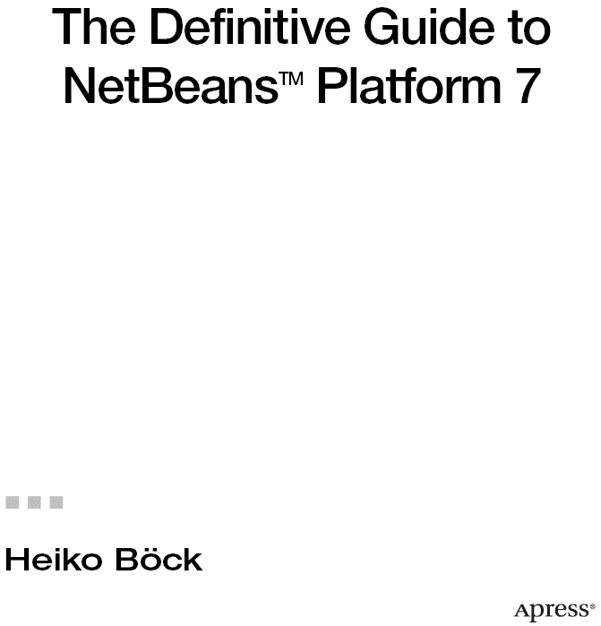

**NetBeans^(TM) Platform 7 权威指南**

版权所有 © 2012 Heiko Böck

保留所有权利。未经版权所有者及出版人事先书面许可，不得以任何形式或任何方式（电子或机械，包括影印、录制，或通过任何信息存储或检索系统）复制或传播本作品的任何部分。

ISBN-13（平装版）：978-1-4302-4101-0

ISBN-13（电子版）：978-1-4302-4102-7

本书中可能出现商标名称、标识和图像。我们并非在每次出现商标名称、标识或图像时都使用商标符号，而是仅以编辑方式使用这些名称、标识和图像，以维护商标所有者的利益，且无意侵犯商标权。

本出版物中使用的商品名称、商标、服务标记及类似术语，即使未明确标识为商标，也不应被视为对其是否受专有权利保护的任何意见表达。

      总裁兼出版人：Paul Manning
      采编编辑：Steve Anglin
      开发编辑：Tom Welsh
      技术审校：Jesse Glick 和 David Konecny
      编辑委员会：Steve Anglin, Mark Beckner, Ewan Buckingham, Gary Cornell, Morgan Engel, Jonathan Gennick,
            Jonathan Hassell, Robert Hutchinson, Michelle Lowman, James Markham, Matthew Moodie, Jeff Olson, Jeffrey
            Pepper, Douglas Pundick, Ben Renow-Clarke, Dominic Shakeshaft, Gwenan Spearing, Matt Wade, Tom Welsh
      协调编辑：Annie Beck
      文字编辑：Elizabeth Berry
      排版：Bytheway Publishing Services
      索引编制：BiM Indexing & Proofreading Services
      插图：SPI Global
      封面设计：Anna Ishchenko

本书通过 Springer Science+Business Media, NY, 233 Spring Street, 6th Floor, New York, NY 10013 在全球图书贸易中发行。电话：1-800-SPRINGER，传真：(201) 348-4505，电子邮件：[`orders-ny@springer-sbm.com`](http://orders-ny@springer-sbm.com)，或访问 [`www.springeronline.com`](http://www.springeronline.com)。

如需了解翻译信息，请发送电子邮件至 [`rights@apress.com`](http://rights@apress.com)，或访问 [`www.apress.com`](http://www.apress.com)。

Apress 及 friends of ED 的书籍可批量购买，用于学术、企业或促销用途。大多数图书也提供电子版及许可证。如需更多信息，请参考我们的特殊批量销售——电子书许可网页，网址为 [`www.apress.com/bulk-sales`](http://www.apress.com/bulk-sales)。

本书中的信息按“原样”提供，不提供任何担保。尽管在编写本作品时已采取一切预防措施，但作者和 Apress 均不对因本作品所含信息直接或间接引起的任何损失或损害对任何个人或实体承担责任。

本书的源代码可供读者在 [`www.apress.com`](http://www.apress.com) 获取。您需要回答与本书相关的问题才能成功下载代码。

## 内容概览

 关于作者

 关于译者

 关于技术审校

 致谢

 引言

 第一部分：基础与概念：NetBeans 平台基础

 第 1 章：引言

 第 2 章：NetBeans 平台的结构

 第 3 章：NetBeans 模块系统

 第 4 章：OSGi 框架

 第 5 章：查找概念

 第 6 章：操作

 第 7 章：数据与文件

 第 8 章：技巧与窍门

 第二部分：外观与感觉：开发用户界面

 第 9 章：菜单栏与工具栏

 第 10 章：窗口系统

 第 11 章：状态栏与进度条

 第 12 章：节点与资源管理器

 第 13 章：对话框与向导

 第 14 章：可视化库

 第 15 章：技巧与窍门

 第三部分：就绪与运行：使用 NetBeans 平台标准模块

 第 16 章：帮助系统

 第 17 章：输出窗口

 第 18 章：导航器

 第 19 章：属性

 第 20 章：选项与设置

 第 21 章：面板

 第四部分：使用与扩展：NetBeans 平台与 ID 的高级 API

 第 22 章：面板 API

 第 23 章：任务列表 API

 第 24 章：快速搜索 API

 第 25 章：自动更新服务 API

 第五部分：服务器与数据库：企业应用与 NetBeans 平台

 第 26 章：Java DB

 第 27 章：Hibernate

 第 28 章：Java 持久化 API

 第 29 章：MySQL 与 EclipseLink

 第 30 章：Web 服务

 第 31 章：Java 企业版与 NetBeans 平台

 第 32 章：RESTful Web 服务

 第 33 章：认证与多用户登录

 第六部分：打包与发布：适配、交付与实现应用

 第 34 章：国际化与本地化

 第 35 章：品牌与打包应用

 第 36 章：更新 NetBeans 平台应用程序

 第 7 部分：测试与工具：开发与测试 NetBeans 平台应用程序

 第 37 章：Maven 与 NetBeans 平台

 第 38 章：Eclipse IDE 与 NetBeans 平台

 第 39 章：从 Eclipse 迁移到 NetBeans

 第 40 章：IntelliJ IDEA 与 NetBeans 平台

 第 41 章：NetBeans Swing GUI 构建器

 第 42 章：测试 NetBeans 平台应用程序

 第 43 章：使用 NetBeans IDE 进行调试

 第 8 部分：实践与拓展：开发 MP3 管理器——NetBeans 平台应用示例

 第 44 章：示例项目：MP3 管理器

 附录

 索引

## 目录

 关于作者

 关于译者

 关于技术审校者

 致谢

 引言

 第 1 部分：基础与概念：NetBeans 平台基础

 第 1 章：引言

什么是富客户端？

什么是富客户端平台？

富客户端平台的优势

缩短开发时间

用户界面一致性

应用程序更新

平台无关性

可重用性与可靠性

NetBeans 平台的特点

用户界面框架

数据编辑器

自定义显示

向导框架

数据系统

数据管理与表示框架

中央服务管理

国际化

帮助系统

小结

 第 2 章：NetBeans 平台的结构

NetBeans 平台架构

NetBeans 平台发行版

NetBeans 运行时容器

NetBeans 类加载器系统

模块类加载器

系统类加载器

原始类加载器

小结

 第 3 章：NetBeans 模块系统

模块的结构

配置文件

清单文件

属性

示例

层文件

文件夹与文件的顺序

文件类型

属性值

访问系统文件系统

创建模块

版本控制与依赖关系

版本控制

定义依赖关系

生命周期

模块注册表

使用库

库包装模块

向模块添加库

重用模块

小结

 第 4 章：OSGi 框架

OSGi 与 NetBeans 平台

OSGi 捆绑包格式

创建新的 OSGi 捆绑包

捆绑包生命周期

集成现有 OSGi 捆绑包

OSGi 运行时容器中的 NetBeans 平台

小结

 第 5 章：查找概念

功能

服务与扩展点

定义服务接口

松散服务提供

提供多个服务实现

确保服务可用性

全局服务

注册服务提供者

注解

服务提供者配置文件

模块间通信

动态查找

Java 服务加载器

总结

 第 6 章：操作

始终启用的操作

回调操作

上下文感知操作

总结

 第 7 章：数据与文件

文件系统 API

文件对象

创建

重命名

删除

移除

读写数据

监控变更

数据系统 API

数据对象

实现上下文接口

使用上下文接口

动态提供上下文接口

数据对象工厂

手动创建数据对象

总结

 第 8 章：技巧与诀窍

NetBeans 平台的生命周期

平台启动时的任务

平台结束时的任务

平台重启

日志记录

日志记录器

日志管理器

配置

总结

 第二部分：外观与体验：开发用户界面

 第 9 章：菜单栏与工具栏

菜单栏

创建和定位菜单及菜单项

插入分隔符

隐藏现有菜单项

快捷键与助记符

创建自定义菜单栏

工具栏

创建工具栏与工具栏操作

工具栏配置

用户自定义适配

创建自定义工具栏

使用自定义控件

总结

 第 10 章：窗口系统

配置

窗口：顶层组件

创建顶层组件

行为

状态

上下文菜单

持久化

注册表

停靠容器：模式

创建模式

直接停靠

修改模式

窗口组：顶层组件组

顶层组件组的行为

创建顶层组件组

管理：窗口管理器

多视图

总结

 第 11 章：状态栏与进度条

状态栏

使用状态栏

扩展状态栏

通知

进度条

显示独立任务的进度

显示多个相关任务的进度

将进度条集成到你的组件中

总结

 第 12 章：节点与资源管理器

节点 API

节点类

节点容器

节点图标

节点上下文菜单

事件处理

示例

资源管理器 API

总结

 第 13 章：对话框与向导

标准对话框

信息对话框

问题对话框

输入对话框

自定义对话框

显示通知

示例

向导

向导架构

创建面板

从面板创建向导

事件处理

提前结束向导

数据的额外验证

迭代器

总结

 第 14 章：可视化库

可视化库 API 的结构

Widget 类

依赖关系

边框

布局

场景：根元素

卫星视图

导出场景

ObjectScene – 模型-视图关系

图形

VMD：可视化移动设计器

总结

 第 15 章：技巧与窍门

桌面特性

系统托盘集成

图形组件的异步初始化

撤销/重做

总结

 第 3 部分：准备就绪：使用 NetBeans 平台标准模块

 第 16 章：帮助系统

创建并集成帮助集

module-hs.xml

module-map.xml

module-toc.xml

module-idx.xml

帮助页面

在帮助页面中插入链接

链接到外部网站

链接到其他帮助页面

上下文相关帮助

打开帮助系统

总结

 第 17 章：输出窗口

生成输出

添加操作

插入/显示超链接

总结

 第 18 章：导航器

创建面板

注册面板

总结

 第 19 章：属性

提供属性

用户自定义属性编辑器

总结

 第 20 章：选项与设置

创建选项面板

主面板

辅助面板

辅助面板容器

管理设置

总结

 第 21 章：面板

通过图层文件添加面板条目

通过自定义节点创建面板

节点类

创建并添加面板

拖放功能

总结

 第 4 部分：使用与扩展：NetBeans 平台与 IDE 的高级 API

 第 22 章：面板 API

定义并注册面板项

创建并注册面板控制器

扩展现有面板

总结

 第 23 章：任务列表 API

实现扫描器

注册扫描器与分组

总结

 第 24 章：快速搜索 API

实现快速搜索提供者

注册快速搜索提供者

集成快速搜索用户界面

隐藏现有搜索提供者类别

总结

 第 25 章：自动更新服务 API

后台自动更新

搜索更新

安装并重启更新

自动启动安装

自动停用模块

总结

 第 5 部分：服务器与数据库：企业应用与 NetBeans 平台

 第 26 章：Java DB

集成 Java DB

注册驱动程序

创建并使用数据库

关闭数据库

通过 NetBeans IDE 开发数据库

安装并启动 Java DB 系统

将 Java DB 服务器驱动程序集成到应用程序中

创建并配置数据库

从应用程序外部访问数据库

检索并导入表结构

示例应用程序

配置、访问与关闭

数据模型与数据访问模块

表示与编辑数据

总结

 第 27 章：Hibernate

集成 Hibernate 库

示例应用程序的结构

配置 Hibernate

将对象映射到关系

SessionFactory 与 Sessions

保存与加载对象

总结

 第 28 章：Java 持久化 API

Hibernate 与 Java 持久化 API

Java 持久化配置

EntityManagerFactory 与 EntityManager

保存与加载对象

总结

 第 29 章：MySQL 与 EclipseLink

安装 MySQL 数据库

集成 MySQL 驱动

集成 EclipseLink

从数据库模式创建实体

构建并测试应用程序

总结

 第 30 章：Web 服务

创建 Web 服务客户端

使用 Web 服务

总结

 第 31 章：Java 企业版与 NetBeans 平台

持久化实体

企业 JavaBean

Web 服务

Web 服务客户端

NetBeans 平台应用程序

总结

 第 32 章：RESTful Web 服务

创建 Web 应用程序

创建持久化实体

创建 RESTful Web 服务

安装 NetBeans 平台应用程序

RESTful Web 服务客户端

总结

 第 33 章：认证与多用户登录

登录对话框

目录服务器

安装测试环境

设置用户数据

认证

Java 命名与目录接口（JNDI）

Java 认证与授权服务（JAAS）

适配应用程序

系统文件系统

模块系统

总结

 第 6 部分：打包与发布：适配、交付与实现应用程序

 第 34 章：国际化与本地化

源代码中的字符串字面量

清单文件中的字符串字面量

帮助页面的国际化

其他资源的国际化

图形

任意文件

层文件中的文件夹、文件与属性

本地化资源的管理与准备

总结

 第 35 章：应用程序的品牌化与打包

品牌化

名称、图标与启动画面

窗口系统行为

资源包

命令行参数

参数概览

开发时确定参数

创建分发版本

安装程序包

ZIP 分发

Java Web Start 包

Mac OS X 应用程序

摘要

 第 36 章：更新 NetBeans 平台应用程序

自动更新服务

NBM 文件

更新中心

提供语言包

在客户端配置与安装

新建更新中心

自动安装更新

摘要

 第 7 部分：测试与工具：开发与测试 NetBeans 平台应用程序

 第 37 章：Maven 与 NetBeans 平台

Maven 项目的基础与结构

父 POM 文件

模块 POM 文件

Maven 仓库

NetBeans IDE 中的 Maven 项目

创建 NetBeans 平台应用程序

创建 NetBeans 平台模块

添加依赖项

无 NetBeans IDE 的 Maven 项目

创建 NetBeans 平台应用程序

创建 NetBeans 平台模块

公开包

添加依赖项

创建并执行应用程序

摘要

 第 38 章：Eclipse IDE 与 NetBeans 平台

安装 Eclipse IDE

创建 NetBeans 平台应用程序

创建 NetBeans 平台模块

添加依赖项

启动并执行应用程序

摘要

 第 39 章：从 Eclipse 迁移到 NetBeans

NetBeans IDE

在哪里可以找到什么？

处理项目

从 Eclipse 插件到 NetBeans 模块

插件生命周期与事件

插件信息

图像

资源

设置

应用程序生命周期

视图与编辑器

摘要

 第 40 章：IntelliJ IDEA 与 NetBeans 平台

预设

创建 NetBeans 平台应用程序

定义依赖项

构建并执行应用程序

摘要

 第 41 章：NetBeans Swing GUI 构建器

GUI 构建器的结构

编辑器

面板

检查器

属性

组件与布局

表单

设计策略

对齐与锚定

适配组件

文本与变量名

应用程序特定代码

动作

Beans 绑定

绑定表格与数据源

将详细视图绑定到表格

绑定监听器

验证器

转换器

摘要

 第 42 章：测试 NetBeans 平台应用程序

单元测试

通用测试

在 NetBeans 运行时容器环境中测试

查找与服务测试

系统文件系统测试

检查测试覆盖率

功能 GUI 测试

安装测试环境

实现测试用例

检查测试覆盖率

Maven 项目情况下的配置

模块测试

功能测试

测试覆盖率

摘要

 第 43 章：使用 NetBeans IDE 调试

调试窗口

断点

变量

远程调试

控制调试

调用栈

堆遍历

摘要

 第 8 部分：实践与拓展：开发 MP3 管理器——NetBeans 平台应用程序示例

 第 44 章：示例项目：MP3 管理器

设计

创建 NetBeans 平台应用程序

支持 MP3

创建 JMF 模块

注册 MP3 插件

MP3 文件类型

ID3 支持

ID3 API

ID3 编辑器

媒体库

服务

MP3 播放器

服务接口

服务提供者

MP3 文件播放

用户界面

播放列表

节点视图

节点容器

顶层组件

拖放

保存播放列表

摘要

 附录

 索引

## 关于作者

  Heiko Böck 拥有计算机科学硕士学位，是一名专业的 Java 软件开发专家。他多年来一直从事 NetBeans 平台相关工作，并且是 NetBeans 梦之队的成员。他是德语书籍《NetBeans Platform 6》和《NetBeans Platform 7》的作者，这两本书均已成为该领域的标准著作。目前，他正在罗伯特·博世有限公司撰写博士论文。

## 关于译者

  安妮·伯克（Anne Böck）在蒂宾根大学攻读英语专业，可以说多年来每天都在与英语打交道。她曾在印第安纳大学（美国）交换学习一学期，之后又在加拿大生活和工作了六个月。如今，她在德国一所学校教授英语，同时也担任专业翻译。

## 关于技术审校

  杰西·格利克（Jesse Glick）自 1999 年起参与 NetBeans 项目，见证了它被 Sun Microsystems 收购、开源，并最终纳入 Oracle 工具组合的过程。他致力于 IDE 的基础组件开发，例如项目系统、Ant 和 Maven 集成，以及 Hudson 集成。

杰西还为 NetBeans 平台及其 IDE 内工具做出了贡献，合著了一本关于该主题的 O'Reilly 书籍，并在多个相关会议上发表演讲。

  大卫·科内茨尼（David Konecny）是 Oracle 技术团队的核心成员。他是 NetBeans IDE 中 Java EE 支持的技术负责人，多年来致力于 IDE 的多个不同领域。在为 Sun 和 Oracle 工作之前，他曾在各种工程岗位上工作了十年。他对自己的工作以及生活中的一切充满热情。他出生于捷克斯洛伐克，目前居住在新西兰，并居家办公。

## 引言

当您手持这本著作时，您便拥有了关于基于 Swing 的富客户端平台——*NetBeans Platform 7*——最新、最全面的指南。这个主题丰富的富客户端平台极具现实意义。除了 NetBeans 平台，Eclipse RCP 也是该类平台的主要代表。这两个平台的发展主要得益于 NetBeans 和 Eclipse 集成开发环境（IDE）的推动。这两款 IDE 均基于各自的平台构建，并且它们本身也是富客户端应用程序。NetBeans 平台完全基于包含 AWT 和 Swing 的 Java API，并整合了 Java 标准版（JSE）的概念；而 Eclipse RCP 则使用 SWT 和 JFace，越来越多地依赖于自身的方法和概念。

富客户端平台非常灵活，主要用于满足应用程序及其架构不断增长的需求。一个关键方面在于，它们能提高生产力和灵活性，以便根据产品的预期用途进行配置，并使其适应市场需求。这对于专业应用程序尤其重要。

在我看来，即使应用程序非常小或非常大，NetBeans 平台也始终值得使用，这得益于 NetBeans IDE 提供的全面支持。仅凭其执行环境就已值得采用，更不用说其众多 API 为客户端应用程序开发中常见的问题和挑战提供了实用的解决方案。这些解决方案非常贴近实践和应用，极大地提高了生产力。

然而，这一假设基于一个基本条件：对富客户端平台工作原理的专业知识和运用。应用程序开发者至少应了解其主要原则；只有这样，才能在实践真正实现提高生产力和提升软件质量的优势。

许多开发者曾认为该平台过于复杂，这也是富客户端平台尚未成为客户端应用程序开发准标准的主要原因之一。起初，开发者可能会觉得需要掌握大量的 API 和概念。然而，一旦开始深入学习，就会发现其中蕴含着巨大的协同效应和简化可能性，足以弥补初始学习阶段的挑战。

NetBeans IDE 通过提供全面、有用且直观的向导，简化了日常使用并降低了开发者的学习曲线。同样重要的是，所有 NetBeans API 和概念都建立在 Java 标准版（JSE）的 API 和概念之上。这一事实简化了日常使用体验，也促进了现有组件的重用。

### NetBeans 平台的新特性

NetBeans Platform 7 包含众多创新。其中一项关键创新是引入了*注解*。例如，操作不再需要从特定的类派生。因此，操作可以通过注解进行注册，同时，操作也可以添加到菜单或工具栏中。以前，您需要为顶层组件分配两个独立的配置文件。现在，顶层组件通过注解进行注册，并向 NetBeans 平台公开。由于使用了注解，声明性信息现在可以直接且分散地提供。注解有完善的文档，并由编辑器或编译器进行检查；信息以更简单的方式提供，避免了 XML 中可能出现的错误条目。此外，信息恰好位于其引用的位置，因此无需管理额外的文件。这也简化了重构，并促进了 NetBeans 平台对 NetBeans IDE 的独立性。请记住，必要的配置文件或配置条目是在编译时根据注解生成的。这意味着使用注解并非强制要求；您也可以像以前一样手动创建必要的配置。

是否使用注解最终是一个理念问题，也取决于项目的规模和您的特殊需求。当然，您也可以看到注解的缺点。例如，元信息分散在源文件中。而一个集中的文件可能更易于调整或概览。

对*OSGi* 捆绑包的支持也是一项关键创新。现在，OSGi 捆绑包可以在 NetBeans Platform 7 中与 NetBeans 模块并行运行。为此，OSGi 框架（Felix 或 Equinox）可选地集成到 NetBeans 平台中。也可以将 NetBeans 平台模块转换为 OSGi 捆绑包。这一创新使得大量现有的 OSGi 捆绑包得以使用。

对 Maven 的开箱即用支持也可称为一项创新。现在，NetBeans 平台应用程序可以完全通过 Maven 进行开发。借助 NetBeans Maven 插件以及公共 Maven 仓库中所有 NetBeans 平台模块的可用性，在 NetBeans IDE 之外使用 NetBeans 平台已毫无障碍。

### 本书结构

本书面向希望基于 NetBeans 平台开发客户端应用的 Java 开发者。读者无需具备富客户端平台的相关知识。本书的主要目标是贴近实际实践，介绍 NetBeans 平台的基本理念与功能，并阐释 NetBeans IDE 在应用开发阶段提供的出色支持，以及 NetBeans 平台的接口与优势。通过这种方式，我希望能够激励您进一步使用 NetBeans 平台——并扪心自问，为何您此前没有基于富客户端平台来开发应用，尤其是在您认识到过去本可以从中获益的众多优势之后。

本书各章节大多相互独立，以便您能直接切入感兴趣的章节，并为您提供一份基于 NetBeans 平台开发富客户端应用的实用手册。为使各章节清晰易懂并便于直接查阅，本书中的讲解均辅以小型示例，而不依赖于某个整体应用。在本书末尾，我将展示如何创建一个完整的富客户端应用，涵盖从草案阶段、创建基本结构到实现应用逻辑的全过程。我将以 MP3 管理器为例，采用类似教程的格式进行讲解。在该应用中，您将集成 Java Media Framework (JMF) 以及 Java DB 数据库系统等。

第 1 部分 介绍 NetBeans 平台的基本特性与概念。首先，您将了解富客户端的定义、富客户端平台通常包含哪些特性，以及 NetBeans 平台提供的特殊优势。此外，由于基于模块的特性至关重要，我将在第 1 部分 中同时介绍 NetBeans 模块系统和 OSGi 框架。查找、操作和数据管理这三个核心主题将分别用一章的篇幅来阐述，从而完成第一部分的内容。

第 2 部分 完全专注于用户界面的开发。这部分主要涉及窗口系统以及菜单栏、工具栏、状态栏和进度条。借助窗口系统的支持，您可以轻松实现并管理自己的窗口。结合第一部分中讲解的数据管理，您将在单独的一章中学习灵活的节点概念以及 Explorer API。本部分还涵盖了对话框和向导的开发，以及强大的 Visual Library API 的使用。

在第 3 部分 中，我们将深入探讨 NetBeans 平台的标准模块，这些模块无需太多额外工作即可直接使用。这包括帮助系统、输出窗口、导航器、属性窗口、选项对话框和面板模块。我将用单独的章节解释如何使用它们中的每一个。

第 4 部分 介绍如何使用 NetBeans 平台和 NetBeans IDE 中非常有用的 API。实际上，您并不局限于 NetBeans 平台的模块。其中一章解释了如何使用 Palette API，另一章则介绍了如何使用 Task List API。此外，我们还将通过贴近实际实践的示例，深入了解 Quick Search 和 Auto Update Services API。

在第 5 部分 中，我将 NetBeans 平台置于数据库和 Java EE 应用的背景下。首先，您将在 NetBeans 平台应用中使用 Java DB 作为客户端数据库解决方案。后续章节将介绍如何使用 Hibernate 来简化数据库访问。然而，应用 Hibernate 并不需要依赖于特定的对象关系映射（ORM）框架。在稍后的章节中，我将解释如何为此目的集成 Java Persistence API (JPA)。作为 Java DB 和 Hibernate 的替代方案，我还将深入探讨结合 EclipseLink 的 MySQL 数据库解决方案。在本部分中，我们将从两个方面探讨 Web 服务：一方面，是关于使用基于 SOAP 的任何可用 Web 服务；另一方面，是关于连接使用 SOAP 和基于 REST 的 Web 服务的服务器端 Java EE 应用。最后一章将回答关于用户身份验证和应用特定定制的问题。

在第 6 部分 中，您将了解 NetBeans 平台在国际化和本地化方面提供的可能性。此外，本部分还涵盖了 NetBeans 平台的品牌化以及将整个应用打包为可交付单元。在另一章中，您将了解 NetBeans 平台的更新机制，借助该机制，您可以在交付后以简单透明的方式更新您的应用。

本书的第 7 部分 介绍 NetBeans 平台或 NetBeans IDE 的各种开发和测试工具。首先，是关于使用 Maven 构建系统实现 NetBeans 平台应用。在另一章中，您将学习如何甚至在 Eclipse IDE 内使用 Maven 开发 NetBeans 平台应用。此外，有一章将简化从 Eclipse IDE 切换到 NetBeans IDE 以开发 NetBeans 平台应用的过程。除了 NetBeans 和 Eclipse IDE，IntelliJ IDEA 也可用于开发 NetBeans 平台应用。NetBeans IDE 提供了一个强大的 GUI 构建器，用于高效开发用户界面。您将在单独的章节中学习如何使用它，以及如何调试和测试您的应用。

第 8 部分 以一个完整可用的示例来结束本指南。在本部分中，您将逐步开发一个 MP3 管理器应用。前面描述的概念和技术将在此汇聚，并能让您如同在实际实践中一样理解它们。

### 下载代码

本书中的所有示例和讲解均基于 Java 6 和 NetBeans 7。您可以在 [`http://java.oracle.com`](http://java.oracle.com) 下载 Java 开发工具包 (JDK 6)，并在 [`http://netbeans.org`](http://netbeans.org) 下载 NetBeans 7。

本书中的每个源代码示例都可以从 Apress 网站上本书的“源代码/下载”区域下载，作为完整的可运行 NetBeans IDE 项目。

## 第 1 部分

## 基础与概念：NetBeans 平台基础

## 第 1 章

## 引言

本章将向您介绍富客户端开发。在此过程中，您将了解什么是富客户端，以及富客户端平台如何为您提供帮助。本章还将简要介绍 NetBeans 平台的主要优势和特性。

### 什么是富客户端？

在客户端-服务器架构中，术语*富客户端*用于指代数据处理主要发生在客户端一侧的客户端。客户端还提供图形用户界面（GUI）。富客户端通常是可通过插件和模块进行扩展的应用程序。通过这种方式，富客户端能够解决不止一个问题。

富客户端通常基于某个框架进行开发。框架提供了一个基本起点，用户可以在其上组装应用程序中逻辑相关的部分，这些部分被称为模块。理想情况下，不相关的解决方案（例如由不同提供商提供的解决方案）可以协同工作，使得所有模块看起来像是作为一个整体创建的。

除此之外，富客户端还具有易于分发和更新的优势，例如通过客户端内部的自动在线更新功能，或通过一种使富客户端能够通过互联网启动的机制（例如，通过 Java Web Start）。

以下是富客户端特性的概述：

*   灵活且模块化的应用程序架构
*   平台无关性
*   对最终用户的可适应性
*   支持在线和离线工作
*   简化向最终用户的分发
*   简化客户端的更新

### 什么是富客户端平台？

富客户端平台是一个应用程序生命周期环境，是桌面应用程序的基础。大多数桌面应用程序都具有相似的功能，例如菜单、工具栏、状态栏、进度可视化、数据显示、自定义设置、用户特定数据和配置的保存与加载、启动画面、关于对话框、国际化、帮助系统等等。针对这些及其他典型的客户端应用程序功能，富客户端平台提供了一个框架，可以快速、简单地组合这些功能。

应用程序的可配置性和可扩展性在此类框架中占据核心地位。因此，例如，你可以在文本文件中声明式地提供应用程序的菜单项，然后菜单将由框架自动加载。这意味着源代码变得更加集中和易于管理，开发者能够专注于应用程序的实际业务需求，同时菜单具有最大的可配置性。

富客户端平台最重要的方面是其架构。基于富客户端平台的应用程序以模块的形式编写，应用程序中逻辑连贯的部分被隔离在模块内。模块被声明式地描述并由平台自动加载。因此，源代码与应用程序之间无需显式绑定。通过这种方式，在独立运行的模块之间建立了一种相对松散的耦合关系，这极大地简化了应用程序的动态可扩展性及其组成部分的替换能力。这样，从单个模块组装面向用户或特定领域的应用程序也变得非常容易。

富客户端平台还使开发者无需关注与应用程序业务逻辑关系不大的任务。在开发周期结束时，你将获得一个当之无愧的现代化应用程序架构。

### 富客户端平台的优势

除了富客户端架构提供的模块化（这同时意味着高度的健壮性和最终用户价值）之外，还应强调其提供的广泛开发支持。基于富客户端平台开发的这些及其他优势在此简要介绍。

#### 减少开发时间

富客户端平台为桌面应用程序开发提供了大量的应用程序编程接口（API）。例如，开发者可以使用这些 API 来管理窗口和菜单，或支持自定义选项的显示。通过重用许多预定义的组件，开发者能够非常专注于所讨论应用程序的业务逻辑。

#### 用户界面一致性

应用程序的可用性始终至关重要，特别是当应用程序旨在供特定领域的专业人士使用时。富客户端平台提供了一个用于显示用户界面（UI）的框架，重点强调一致性、可访问性和可用性。

#### 更新应用程序

使用富客户端平台，可以快速高效地向最终用户分发新的或更新的模块。因此，无需开发者通知应用程序的所有客户端切换到新版本。更新可以以模块的形式分发和安装，因此不同的功能可以由独立的开发团队开发和交付。应用程序的模块化架构确保已完成的模块可以分发，而无需等待其他模块完成。

#### 平台无关性

富客户端平台基于国际标准和可重用组件。因此，基于富客户端平台的 Java 应用程序可以自动部署到多个系统，例如 Windows 或 Linux，只要存在 Java 运行时环境的实现即可。由于应用程序的功能集和适用性不断变化，以可扩展且可部署到不同目标系统的方式进行开发非常重要。所有这些都由富客户端平台提供，从而节省了时间和金钱。基于富客户端平台的应用程序除了 Java 运行时环境外，不需要其他库或组件。

#### 可重用性和可靠性

富客户端平台提供了一系列特性和模块，可用于开发者自己的应用程序。如果模块不完全符合应用程序的要求，完全可以将其作为起点，同时根据需要进行扩展或更改。由于大多数平台也提供其源代码，因此在某些情况下，考虑更改或扩展平台本身也是值得的。这些因素意味着高度的可靠性和自由度。

### NetBeans 平台的特点

除了富客户端平台的通用优势外，NetBeans 平台还提供了众多框架和若干额外功能，这些功能对你的应用程序可能特别有用。此处概述了构成 NetBeans 平台主要特点的重要功能。

#### 用户界面框架

窗口、菜单、工具栏和其他组件由平台提供。因此，你可以专注于特定的操作，这能精简你的代码，使其更好且不易出错。NetBeans 平台提供的完整用户界面完全基于 AWT/Swing，并且可以使用你自己的组件进行扩展。

#### 数据编辑器

NetBeans 集成开发环境（IDE）中强大的 NetBeans 编辑器可以被你自己的应用程序使用。该编辑器的工具和功能可以快速轻松地扩展和调整，以适应应用程序的目的。

#### 自定义显示

每个应用程序都需要显示用户和应用程序特定的设置。NetBeans 平台提供了一个框架，使得集成你自己的选项对话框变得极其简单，让用户能够以赏心悦目的方式保存和恢复设置。

#### 向导框架

NetBeans 平台提供了简单的工具来创建可扩展且用户友好的向导，引导用户完成应用程序中的复杂步骤。

#### 数据系统

在 NetBeans 平台中，数据可以是本地的，也可以通过 FTP、CVS、数据库或 XML 文件获取。通过抽象化，一个模块对数据的访问对所有其他模块是透明的。因此，实际的数据访问本身并非关注点，因为它由 NetBeans 平台的 API 处理。

#### 数据管理与表示框架

基于文件和已保存数据的抽象化（如前一段所述），NetBeans 平台提供了一个框架，通过该框架可以为数据分配特定的操作或功能。该框架还负责管理和表示数据及其在用户界面上的操作。

#### 中央服务管理

NetBeans 平台通过查找概念提供了中央服务管理。这使你能够独立地提供和使用应用程序内提供的特定服务。这个概念很重要，因为它能够实现应用程序各部分之间的松散耦合。这是 NetBeans 平台应用所追求的重要目标之一。

#### 国际化

NetBeans 平台提供了支持 JavaHelp 和其他资源国际化的类和方法。你可以轻松地将文本常量存储在属性文件中。NetBeans 平台还会加载适用于当前国家和语言设置的文本常量和图标。

#### 帮助系统

通过标准的 JavaHelp 系统，NetBeans 平台提供了一个中央系统，用于向最终用户集成和显示帮助主题。此外，各个模块可以向应用程序的帮助系统贡献自己的主题。最重要的是，NetBeans 平台还允许你提供上下文相关的帮助。

### 总结

在本章中，你了解了富客户端所能带来的不同，以及富客户端所具备的优势，包括其模块化架构，这种架构得益于富客户端平台独有的模块系统。然而，富客户端平台还提供了许多其他优势和特性，包括对一致用户界面的支持，以及在运行时用新功能更新应用程序的能力。最后，本章介绍了 NetBeans 平台最重要的特性。

## 第 2 章

## NetBeans 平台的结构

为了让你了解富客户端应用程序的结构，并展示你正在创建的应用程序与 NetBeans 平台之间的关系，本章将讨论 NetBeans 平台的架构。本章还将介绍 NetBeans 平台的独立构建模块，以及 NetBeans 运行时容器为你处理的责任。最后，本章将解释 NetBeans 类加载器系统的结构，以及它在基于 NetBeans 平台构建的应用程序中所扮演的角色。

### NetBeans 平台架构

现代应用程序的规模和复杂性正在稳步增长。同时，专业应用程序首先需要具备灵活性，以便能够快速、轻松地扩展。这使得有必要将应用程序划分为不同的部分。因此，每个不同的部分都是一个构建模块，共同构成模块化架构。这些不同的部分必须相互独立，提供定义良好的接口供同一应用程序的其他部分使用，并具备其他部分可以使用的特性。

将应用程序划分为模块（即逻辑上相互依赖的部分）极大地增强了应用程序的设计。与单体应用程序（其中每个类都可以使用任何其他类的代码）相比，这种架构更加灵活，更重要的是，更易于维护。虽然在 Java 中可以保护类免受外部世界的访问，但这种类级别的保护粒度太细，对大多数应用程序来说用处不大。NetBeans 平台正是解决了现代客户端应用程序的这一核心问题。其概念和结构支持灵活且模块化应用程序的开发与概念化。

NetBeans 平台的基本构建模块是模块。一个模块是一组功能相关的类，以及该模块暴露的接口描述，以及其运行所需的其他模块的描述。完整的 NetBeans 平台，以及在其之上构建的应用程序，都被划分为模块。这些模块由 NetBeans 平台的核心加载，该核心被称为 *NetBeans 运行时容器*。NetBeans 运行时容器动态且自动地加载应用程序的模块，之后还负责运行该应用程序。

NetBeans IDE 是一个模块化富客户端应用程序的绝佳示例。IDE 的功能和特性，例如其 Java 语言支持或代码编辑器，都是以模块的形式在 NetBeans 平台之上创建的，如图 2-1 所示。这带来了巨大的优势，因为应用程序可以通过添加更多模块进行扩展，并适应特定的用户需求，从而允许停用或卸载未使用的特定模块。

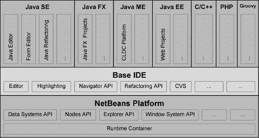

***图 2-1.** NetBeans IDE 的概念结构*

为了使你的应用程序能够达到这种模块化水平，NetBeans 平台一方面提供了使模块能够被其他模块扩展的机制和概念，另一方面也使它们能够在不相互依赖的情况下进行通信。换句话说，NetBeans 平台支持应用程序内模块的松散耦合。

为了优化模块内代码的封装（这在模块化系统中是必需的），NetBeans 平台提供了自己的*类加载器系统*。每个模块由其类加载器加载，并在此过程中形成一个独立的代码单元。因此，一个模块可以显式地使其包可用，从而将特定功能暴露给其他模块。为了使用其他模块的功能，一个模块可以声明对其他模块的依赖。这些依赖关系在模块的清单文件中声明，并由 NetBeans 运行时容器解析，确保应用程序始终以一致的状态启动。最重要的是，这种松散耦合在 NetBeans 平台的声明式概念中发挥了作用。我的意思是，尽可能多地在描述文件和配置文件中进行定义，以避免这些概念与 Java 源代码的硬连接。

模块由其清单文件的数据以及相关 XML 文件中指定的数据共同描述，因此无需显式添加到 NetBeans 平台。通过使用 XML 文件，NetBeans 平台能够了解其可用的模块、它们的位置以及允许加载这些模块所需满足的契约。这些依赖关系在模块的清单文件中声明，并由 NetBeans 运行时容器解析，从而确保应用程序始终以一致的状态启动。NetBeans 平台本身由一组核心模块（参见图 2-2）构成，这些模块是启动应用程序和定义其用户界面所必需的。为此，NetBeans 平台提供了许多 API 模块和服务提供者接口（SPI）模块，极大地简化了开发过程。这组模块（如图 2-2 所示）包括，例如，提供常用操作类的 Actions API；功能强大的 Nodes API；以及帮助您轻松地将自己的选项对话框集成到应用程序中的 Options SPI。除此之外，NetBeans 平台中还有完整的可重用组件，例如输出窗口和收藏夹模块。

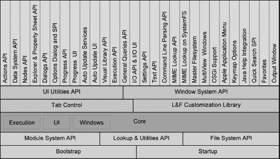

***图 2-2.** NetBeans 平台架构*

### NetBeans 平台发行版

通常您不需要单独下载 NetBeans 平台的发行版，因为 NetBeans 平台已经是 NetBeans IDE 的基本组成部分，而 NetBeans IDE 本身就是一个富客户端应用程序。在 NetBeans IDE 中开发应用程序时，平台会从 NetBeans IDE 中提取出来。但是，也可以将多个 NetBeans 平台添加到 NetBeans IDE 中。为此，您可以从官方网站 [`http://netbeans.org/features/platform`](http://netbeans.org/features/platform) 下载 NetBeans 平台的独立发行版。

现在让我们仔细看看 NetBeans 平台发行版中的重要部分：

*   模块 `org.netbeans.bootstrap`、`org.netbeans.core.startup`、`org-openide-filesystems`、`org-openide-modules`、`org-openide-util` 和 `org-openide-util-lookup` 构成了 NetBeans 运行时容器，它是平台的核心，负责所有其他模块的开发。
*   NetBeans 平台也支持 OSGi 技术。为此所需的模块是 `org.netbeans.libs.felix`、`org.netbeans.core.osgi`、`org.netbeans.core.netigso` 和 `org.netbeans.libs.osgi`。
*   模块 `org-netbeans-core`、`org-netbeans-core-execution`、`org-netbeans-core-ui` 和 `org-netbeans-core-windows` 为 API 模块提供基本功能。
*   `org-netbeans-core-output2` 是一个完整的应用程序模块，可用作中央输出窗口。
*   模块 `org-netbeans-core-multiview` 是一个用于多视图窗口（例如，表单编辑器窗口）的框架，并为其提供了一个 API。
*   模块 `org-openide-windows` 包含窗口系统 API，这可能是最常用的 API。它包含用于开发窗口和窗口管理器等的基本类。通过窗口管理器，您可以访问有关所有现有窗口的信息。
*   应用程序的更新功能由模块 `org-netbeans-modules-autoupdate-services` 实现。该模块提供了查找、下载和安装模块的完整功能。模块 `org-netbeans-modules-autoupdate-ui` 提供了插件管理器，使用户能够管理和控制模块及更新。
*   使用 `org-netbeans-modules-favorites` 模块，您可以显示随机数据和目录结构，并通过数据系统 API 影响其操作。
*   `org-openide-actions` 模块提供了一组常用的操作，例如复制、剪切和打印。这些操作的功能可以以上下文相关的方式实现。
*   一个非常强大的模块是 `org-openide-loaders`，它包含数据系统 API。这可用于创建数据加载器，这些加载器可以与特定类型的文件关联，然后为其创建数据对象。可以通过简单的方式为这些数据对象添加特殊行为。
*   `org-openide-nodes` 模块的 Nodes API 是 NetBeans 平台的一个非常核心的特性。例如，节点可以在资源管理器视图中显示；通过这种方式，节点可以为数据对象提供操作和属性表。
*   `org-openide-explorer` 模块提供了一个框架来开发资源管理器视图，例如在 NetBeans IDE 的项目或文件视图中使用的视图。
*   `org-netbeans-modules-editor-mimelookup` 模块提供了一个 API 来查找特定 MIME 类型的设置、服务和其他对象，以及一个 SPI 来实现您自己的特定 MIME 类型数据提供者。`org-netbeans-modules-editor-mimelookup-impl` 模块是该 SPI 的一个特殊实现，负责在系统文件系统的目录结构中查找对象。
*   `org-netbeans-modules-javahelp` 包含 JavaHelp 运行时库，并为模块 API 提供了一个实现，使应用程序模块能够通过 JavaHelp 技术集成自己的帮助集。
*   用于实现和提供您自己的提供者的 QuickSearch SPI 位于模块 `org.netbeans.spi.quicksearch` 中。
*   主文件系统模块 `org-netbeans-modules-masterfs` 提供了一个重要的包装器文件系统。
*   模块 `org-netbeans-modules-options-api` 提供了一个选项对话框和一个 SPI，使得添加您自己的选项面板变得容易。
*   长时间运行的任务可以由模块 `org-netbeans-api-progress` 集中管理。模块 `org-netbeans-modules-progress-ui` 提供了此功能的可视化，可以停止单独的任务。
*   `org-netbeans-modules-queries` 提供了一个通用的查询 API，模块可以使用它来查询有关文件的信息。还提供了一个 SPI 来提供您自己的查询实现。
*   `org-netbeans-modules-sendopts`，该模块提供了一个*命令行解析 API* 和一个 SPI，您自己的处理程序可以通过它注册到命令行。
*   `org-netbeans-modules-settings` 模块提供了一个 API，用于以用户定义的格式保存特定于模块的设置。它还提供了几种有用的设置格式。
*   `org-openide-awt` 模块包含*UI 工具 API*，通过该 API 提供了用于创建用户界面的不同帮助类。
*   在 `org-openide-dialogs` 模块中，提供了一个用于显示标准对话框和特定于应用程序的对话框的 API。向导框架位于此模块中。
*   `org-openide-execution` 提供了一个用于执行长时间运行的异步任务的 API。
*   `org-openide-io` 为文件的输入和输出提供了一个 API 和一个 SPI。该模块还提供了一个标准实现，您可以使用它在输出窗口模块上进行写入。
*   `org-openide-text` 模块中的 Text API 提供了 `javax.swing.text` API 的扩展。
*   模块 `org-netbeans-swing-plaf` 和 `org-netbeans-swing-tabcontrol` 负责外观和感觉的适配以及标签的显示。模块 `org-jdesktop-layout` 是 Swing 布局扩展库的包装模块。
*   可视化库 API 由模块 `org-netbeans-api-visual` 提供。

此外，还可以将 IDE 发行版中的模块添加到列出的模块中。

### NetBeans 运行时容器

NetBeans 平台及其模块化架构的基础被称为 *NetBeans 运行时容器*。它由以下五个模块组成：

*   *Bootstrap*：该模块首先执行。它执行所有已注册的命令行处理器，创建一个用于加载启动模块的引导类加载器，然后执行该模块。
*   *Startup*：该模块通过初始化模块系统和文件系统来部署应用程序。
*   *模块系统 API*：此 API 负责管理模块及其设置和依赖关系。
*   *文件系统 API*：此 API 提供了一个虚拟文件系统，用于提供平台无关的访问。它主要用于加载模块的资源。
*   *Lookup 与 Utilities API*：该组件提供了一个重要的基础组件，用于模块间的相互通信。Lookup API 位于一个独立的模块中，因此它可以独立于 NetBeans 平台使用。

图 2-3 中的箭头显示了这五个基本模块之间的依赖关系。

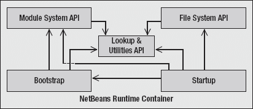

***图 2-3.** NetBeans 运行时容器*

运行时容器是富客户端应用程序的最小形式，并且可以无需其他模块直接运行。如果没有任务需要执行，运行时容器将在启动后直接关闭。值得注意的是，NetBeans 平台一方面可以创建具有丰富用户界面的应用程序，另一方面也可以使用此运行时容器来构建模块化的命令行应用程序。启动运行时容器时，它会查找所有可用的模块，并从中创建一个内部注册表。通常，一个模块仅在需要时才被加载。首先，它会被注册为“已存在”。然而，模块也有可能在启动时立即执行任务。这是通过模块安装程序（Module Installer）完成的，相关内容将在第 3 章中讨论。运行时容器还支持在运行时动态加载、卸载、安装和卸载模块。当用户更新应用程序（使用自动更新功能）时，此功能尤其必要。在应用程序中停用不需要的模块时，也需要此功能。

为了完整理解富客户端应用程序的启动过程，还需要说明的是，Bootstrap 模块（第一个执行的模块）是由一个特定于平台的启动器启动的。该启动器还负责识别 Java 运行时环境。启动器是 NetBeans 平台的一部分，并且是特定于操作系统（或 OS）的，例如，在 Windows 系统上它是一个 `.exe` 文件。

### NetBeans 类加载器系统

NetBeans 类加载器系统是 NetBeans 运行时容器的一部分，也是封装模块和构建模块化架构结构的前提条件。该系统由三种不同类型的类加载器组成。它们是 *模块类加载器*、*系统类加载器* 和 *原始类加载器*。

*   大多数类由模块类加载器加载。
*   系统类加载器仅在特定情况下使用，例如，当必须访问模块外部的资源时。
*   原始类加载器从应用程序启动器的类路径中加载资源。

模块类加载器和系统类加载器是多父级类加载器；它们可以拥有任意数量的父级，而不仅仅像通常那样只有一个父级类加载器。图 2-4 显示了各种类加载器类型之间的连接关系。

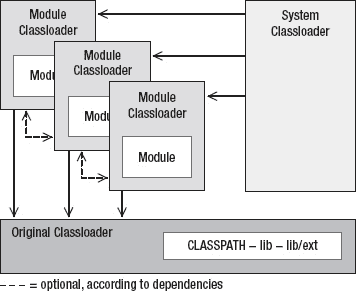

***图 2-4.** NetBeans 类加载器系统*

#### 模块类加载器

对于在模块系统中注册的每个模块，都会创建一个模块类加载器的实例，每个模块通过该实例获得自己的命名空间。此类加载器主要从模块的 JAR 归档文件中加载类，但也可能从多个归档文件中加载，这在库包装模块中经常发生。您将在第 3 章中了解更多相关信息。

原始类加载器隐式地是每个模块类加载器的父级类加载器，并且位于父级列表的首位。其他父级是那些设置了依赖关系的相关模块的类加载器。如何设置依赖关系将在第 3 章中描述。

这种多父级模块类加载器使得能够从其他模块加载类，同时避免命名空间冲突。类的加载被委托给父级类加载器，而不是模块本身。除了模块 JAR 归档文件中的类之外，此类加载器还负责从 `locale` 子目录加载区域设置扩展归档文件（参见第 34 章），以及从 `patches` 子目录加载补丁归档文件（如果存在）。

#### 系统类加载器

默认情况下，系统类加载器是一个多父级类加载器。它拥有所有已实例化的模块类加载器作为其父级。因此，理论上可以使用此类加载器加载模块提供的所有内容。可以通过两种不同的方式访问系统类加载器：通过 Lookup（稍后您将了解更多相关内容），以及通过当前线程的上下文类加载器。默认情况下（只要您没有显式设置其他上下文类加载器），这就是系统类加载器。

`ClassLoader cl = (ClassLoader) Lookup.getDefault().lookup(ClassLoader.class);`

或

`ClassLoader cl = Thread.currentThread().getContextClassLoader();`

#### 原始类加载器

原始（应用程序）类加载器由应用程序的启动器创建。它从原始的 `CLASSPATH` 以及 `lib` 目录及其 `ext` 子目录中加载类和其他资源。如果某个 JAR 归档文件未被识别为模块（即清单条目无效），则不会将其传递给模块系统。此类资源总是被优先找到：如果在此处找到与模块 JAR 归档文件中相同的资源，则模块中的资源将被忽略。这种安排对于模块的品牌化（例如）以及准备特定模块的多语言发行版是必要的。与之前一样，此类加载器不用于加载所有相关资源。它更可能用于应用程序早期启动阶段所需的资源，例如设置外观和感觉所需的类。

### 总结

本章从 NetBeans 平台的架构入手，考察了其结构，其核心由运行时容器提供。运行时容器为基于 NetBeans 平台构建的应用程序提供了执行环境，并为模块化应用程序提供了基础设施。本章介绍并解释了确保模块封装的 NetBeans 类加载器系统。除了运行时容器之外，许多模块构成了 NetBeans 平台的一部分，本章简要介绍了其中的每一个，最后指出 NetBeans IDE 本身就是一个富客户端应用程序，由可在您自己的应用程序中重用的模块组成。

## 第 3 章

## NetBeans 模块系统

*NetBeans 模块系统*负责管理所有模块。这意味着它负责诸如创建类加载器、加载模块、激活或停用模块等任务。NetBeans 模块系统在设计时尽可能使用了标准 Java 技术。模块格式的基本思想源于 Java 扩展机制。包版本规范的基本概念被用于描述和管理应用程序模块与系统模块之间的依赖关系。

模块的基本属性，例如模块的描述以及与其他模块的依赖关系，都在清单文件中进行描述。该文件使用标准的清单格式，并附加了 NetBeans 特有的属性。Java 激活框架和 Java 开发工具包（JDK）的内部功能（例如对可执行 JAR 归档的支持）是模块规范的模型。大多数模块除了清单文件中的属性外，不需要特殊的安装代码，这意味着它们是以声明方式添加到平台中的。一个 XML 文件，即 *layer.xml* 文件，提供了用户特定的信息，并定义了模块如何集成到平台中。在该文件中，指定了模块想要添加到平台的所有内容，从操作到菜单项再到服务等等。

### 模块的结构

一个模块是一个简单的 JAR 归档文件，通常由以下部分组成：

*   清单文件（*manifest.mf*）
*   层文件（*layer.xml*）
*   类文件
*   资源，如图标、属性包、帮助集等

只有清单文件是必需的，因为它标识了一个模块。所有其他内容取决于其模块的任务。例如，如果模块仅代表一个库，则不需要层文件。模块的结构如图 3-1 所示。

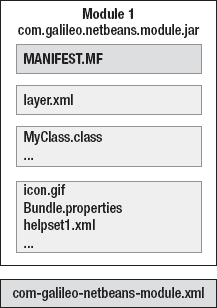

***图 3-1.** NetBeans 模块*

此外，每个模块都包含一个位于 JAR 归档文件外部的 XML 配置文件（`com-galileo-netbeans-module.xml`）。这是模块系统读取的第一个文件；也就是说，它向平台宣告该模块的存在。

### 配置文件

每个模块通过一个 XML 配置文件在模块系统中声明，该文件位于模块外部，即集群的 *config/Modules* 目录中。当应用程序启动时，模块系统会读取此目录。模块根据这些信息被加载。在此配置文件中，定义了模块的名称、版本和位置，并定义了是否以及如何加载模块。该文件的结构如下，如清单 3-1 所示。

***清单 3-1.** 模块配置文件：com-galileo-netbeans-module.xml*

`<`**`module`** `name="com.galileo.netbeans.module">`
`   <param name="autoload">false</param>`
`   <param name="eager">false</param>`
`   <param name="enabled">true</param>`
`   <param name="jar">`**`modules/com-galileo-netbeans-module.jar`**`</param>`
`   <param name="reloadable">false</param>`
`   <param name="specversion">1.0</param>`
`</`**`module`**`>`

`enabled` 属性定义了模块是否被加载，从而决定它是否提供给应用程序。有三种方式可以确定模块应在何时加载：

*   *常规***：** 大多数应用程序模块属于此类型。它们在启动应用程序时被加载。应用程序的加载时间会因模块初始化时间而延长。因此，建议保持模块初始化非常简短。通常，在模块加载期间无需运行任何操作，因为许多任务可以声明式地定义。
*   *自动加载***：** 这些模块仅在其他模块需要它们时才被加载。自动加载模块符合*懒加载*原则。此模式通常用于那些充当库的模块。
*   *急切加载***：** 急切加载模块仅在满足所有依赖关系时才被加载。这是另一种最小化启动时间的方法。例如，如果模块 X 依赖于实际上甚至不可用的模块 A 和 B，那么加载模块 X 是没有意义的。

如果 `autoload` 和 `eager` 两个属性的值都为 `false`，则模块类型为常规。如果其中一个值为 `true`，则模块类型为自动加载或急切加载。模块类型在模块属性的 API 版本部分中定义（参见图 3-7）。默认情况下使用常规模式。

### 清单文件

在 NetBeans 平台中运行的每个模块都有一个清单文件。该文件是对模块及其环境的文本描述。加载模块时，清单文件是模块系统读取的第一个文件。如果清单文件包含 `OpenIDE-Module` 属性，则识别为 NetBeans 模块。这是唯一必需的属性。其值可以是任何标识符（通常代码名称是所用模块的基础——例如，`com.galileo.netbeans.module`）。因此，即使由不同的开发者创建，模块之间也不会发生冲突。此标识符用于清晰地区分一个无歧义的模块，这对于升级或依赖关系定义等是必需的。

#### 属性

以下列出常用的清单属性。一个模块可以通过这些清单属性进行文本描述。此外，这些属性决定了模块如何集成到平台中。

*   *`OpenIDE-Module`*：此属性为模块定义一个唯一名称，供模块系统将其识别为一个模块。定义此属性是强制性的。
    **`OpenIDE-Module`**`: com.galileo.netbeans.module`
*   *`OpenIDE-Module-Name`*：定义模块的显示名称，该名称也会显示在插件管理器中。
    **`OpenIDE-Module-Name:`** `My First Module`
*   *`OpenIDE-Module-Short-Description`*：模块功能的简短描述。
    **`OpenIDE-Module-Short-Description`**`:`
    `   This is a short description of my first module`
*   *`OpenIDE-Module-Long-Description`*：使用此属性可以更好地描述模块的功能。此文本也会显示在插件管理器中。因此，始终使用此属性来告知用户模块的特性是很有意义的。
    **`OpenIDE-Module-Long-Description`**`:`
    `   Here you can put a longer description with more than one`
    `   sentence. You can explain the capability of your module.`
*   *`OpenIDE-Module-Display-Category`*：通过此属性，可以将模块分组到一个虚拟组中，从而作为一个功能单元呈现给用户。
    **`OpenIDE-Module-Display-Category`**`: My Modules`
*   *`OpenIDE-Module-Install`****:*** 可以使用此属性注册一个模块安装器类（参见生命周期一节），以便在模块生命周期的特定时间点执行操作。
    **`OpenIDE-Module-Install`**`: com/galileo/netbeans/module/Installer.class`
*   *`OpenIDE-Module-Layer`*：这是最重要的属性之一。它指定了层文件的路径（参见*层文件*一节）。模块到平台的集成由层文件描述。
    **`OpenIDE-Module-Layer`**`: com/galileo/netbeans/module/layer.xml`
*   *`OpenIDE-Module-Public-Packages`*：为了支持封装，默认情况下禁止访问其他模块中的类。使用此属性，可以将包显式声明为公共包，以便其他模块可以访问它。这对于库尤其重要。
    **`OpenIDE-Module-Public-Packages`**`:`
    `   com.galileo.netbeans.module.actions.*,`
    `   com.galileo.netbeans.module.util.*`
*   *`OpenIDE-Module-Friends`*：如果只有特定模块可以访问通过 `OpenIDE-Module-Public-Packages` 属性声明为公共的包，则可以在此处指定这些模块。
    **`OpenIDE-Module-Friends`**`:`
    `   com.galileo.netbeans.module2,`
    `   com.galileo.netbeans.module3`
*   *`OpenIDE-Module-Localizing-Bundle`*：此处可以定义一个用作本地化包的属性文件（参见第 8 章）。
    **`OpenIDE-Module-Localizing-Bundle`**`:`
    `   com/galileo/netbeans/module/Bundle.properties`

##### 版本与依赖关系

可以使用以下属性定义不同的版本和依赖关系。在*版本控制与依赖关系*一节中，您可以找到这些属性的应用及其全部功能的详细描述。

*   *`OpenIDE-Module-Module-Dependencies`*：使用此属性定义模块之间的依赖关系，并且还可以指定所需的最低模块版本。
    **`OpenIDE-Module-Module-Dependencies`**`:`
    `   org.openide.util > 6.8.1,`
    `   org.openide.windows > 6.5.1`
*   *`OpenIDE-Module-Package-Dependencies`*：一个模块也可能依赖于特定的包。此类依赖关系通过此属性定义。
    **`OpenIDE-Module-Package-Dependencies`**`: com.galileo.netbeans.module2.gui > 1.2`
*   *`OpenIDE-Module-Java-Dependencies`*：如果模块需要特定的 Java 版本，可以通过此属性设置。
    **`OpenIDE-Module-Java-Dependencies`**`: Java > 1.5`
*   *`OpenIDE-Module-Specification-Version`*：此属性指示模块的规范版本。通常采用杜威十进制格式编写。
    **`OpenIDE-Module-Specification-Version`**`: 1.2.1`
*   *`OpenIDE-Module-Implementation-Version`*：此属性设置模块的实现版本，通常使用时间戳。每当模块发生更改时，此数字都应随之更改。
    **`OpenIDE-Module-Implementation-Version`**`: 200701190920`
*   *`OpenIDE-Module-Build-Version:`* 此属性仅具有可选性质，模块系统会忽略它。通常提供一个时间戳。
    **`OpenIDE-Module-Build-Version`**`: 20070305`
*   *`OpenIDE-Module-Module-Dependency-Message`*：此处可以设置一段文本。当模块依赖关系无法解析时，会显示此文本。在某些情况下，存在未解析的依赖关系可能是很正常的。此时，最好向用户显示一条有用的消息，告知他们可以在哪里找到所需的模块，或者为什么不需要它们。
    **`OpenIDE-Module-Module-Dependency-Message`**`:`
    `   The module dependency is broken. Please go to the`
    `   following URL and download the module.`
*   *`OpenIDE-Module-Package-Dependency-Message`*：当对某个包的必要引用失败时，会显示由此属性定义的消息。
    **`OpenIDE-Module-Package-Dependency-Message`**`:`
    `   The package dependency is broken. The reason could be…`
*   *`OpenIDE-Module-Deprecated`*：使用此属性标记一个不再受支持的旧模块。如果用户尝试将该模块加载到平台中，则会显示一条警告。
    **`OpenIDE-Module-Deprecated`**`: true`
*   *`OpenIDE-Module-Deprecation-Message`*：使用此属性添加可选信息。该信息和弃用警告都会显示在应用程序日志中，例如，您可以告知用户应该改用哪个模块。请注意，仅当 `OpenIDE-Module-Deprecated` 属性设置为 `true` 时，才会显示此消息。
    **`OpenIDE-Module-Deprecation-Message`**`:`
    `   Module 1 is deprecated, use Module 3 instead.`

##### 服务接口与服务实现

以下属性用于定义特定的服务提供者接口及其实现。关于此主题的更多信息，请参阅第 5 章。

*   *`OpenIDE-Module-Provides`*：使用此属性声明一个服务接口，该模块为此接口提供服务提供者。
    **`OpenIDE-Module-Provides`**`: com.galileo.netbeans.spi.ServiceInterface`
*   *`OpenIDE-Module-Requires`*：在此处可以声明一个服务接口，该模块需要该接口的服务提供者。由哪个模块提供接口的实现并不重要。
    **`OpenIDE-Module-Requires`**`: org.openide.windows.IOProvider`
*   *`OpenIDE-Module-Needs`*：此属性是 require 属性的低调版本，不需要模块具有任何特定的顺序。这对于需要特定实现的 API 模块可能很有用。
    **`OpenIDE-Module-Needs`**`: org.openide.windows.IOProvider`
*   *`OpenIDE-Module-Recommends`*：使用此属性，可以实现一个可选依赖项。例如，如果有一个模块提供了 `java.sql.Driver` 实现，则该模块会被激活并授予访问权限。然而，如果没有可用的此令牌提供者，则由可选依赖项定义的模块仍然可以执行。
    **`OpenIDE-Module-Recommends`**`: java.sql.Driver`
*   *`OpenIDE-Module-Requires-Message`*：与前两个属性类似，可以使用此属性定义一个消息。如果未找到所需的令牌，则会显示此消息。
    **`OpenIDE-Module-Requires-Message`**`:`
    `   所需的服务提供者不可用。有关更多信息，请访问以下网站。`

**操作系统相关模块**

清单属性 `OpenIDE-Module-Requires` 允许您定义倾向于在特定操作系统上使用的模块。此属性用于检查特定令牌是否存在。可用的令牌如下：

`org.openide.modules.os.Windows`
`org.openide.modules.os.Linux`
`org.openide.modules.os.Unix`
`org.openide.modules.os.PlainUnix`
`org.openide.modules.os.MacOSX`
`org.openide.modules.os.OS2`
`org.openide.modules.os.Solaris`

模块系统确保这些令牌仅在相应的操作系统上可用。例如，一个在 Windows 系统上由模块系统自动激活的模块，会在所有其他系统上自动停用。要提供一个在 Windows 系统上自动加载但在其他操作系统上自动停用的模块，请将模块类型设置为 `eager`，并将以下条目添加到清单文件中：

**`OpenIDE-Module-Requires`**`: org.openide.modules.os.Windows`

##### 可见性

通过以下属性，可以控制模块在插件管理器中的可见性。这样，可以隐藏那些对应用程序最终用户不重要的模块。

*   *`AutoUpdate-Show-In-Client`*：此属性决定模块是否在插件管理器中显示。可以设置为 `true` 或 `false`。
    **`AutoUpdate-Show-In-Client`**`: true`
*   *`AutoUpdate-Essential-Module`*：使用此属性，您可以标记属于应用程序一部分的模块。被这样标记的模块，用户无法在插件管理器中停用或卸载。可以设置为 `true` 或 `false`。
    **`AutoUpdate-Show-In-Client`**`: true`

结合这两个属性，NetBeans 平台引入了所谓的*套件*模块。每个可见模块（`AutoUpdate-Show-In-Client: true`）在插件管理器中都被视为一个套件模块。套件模块定义依赖关系的所有模块都以相同方式处理，除非这些模块也属于其他套件模块且被设为不可见。这意味着，如果一个套件模块被停用，所有依赖它的模块也将被停用。

通过这种方式，您可以为多个逻辑相关的模块构建包装模块。然后，您可以将它们作为一个整体展示给最终用户。您可以创建一个空模块，在其中将 `AutoUpdate-Show-In-Client` 属性设置为 `true`，同时定义对所有属于此套件模块的模块的依赖关系。然后，在依赖模块中将 `AutoUpdate-Show-In-Client` 属性设置为 `false`，这样它们就不会被单独显示。

#### 示例

清单 3-2 展示了一个包含一些典型属性的清单文件。

***清单 3-2.** 清单文件示例*

**`OpenIDE-Module:`** `com.galileo.netbeans.module`
**`OpenIDE-Module-Public-Packages:`**`-`
**`OpenIDE-Module-Module-Dependencies:`**
`   com.galileo.netbeans.module2 > 1.0,`
`   org.jdesktop.layout/1 > 1.4,`
`   org.netbeans.core/2 = 200610171010,`
`   org.openide.actions > 6.5.1,`
`   org.openide.awt > 6.9.0,`
**`OpenIDE-Module-Java-Dependencies:`** `Java > 1.6`
**`OpenIDE-Module-Implementation-Version:`** `200701100122`
**`OpenIDE-Module-Specification-Version:`** `1.3`
**`OpenIDE-Module-Install:`** `com/galileo/netbeans/module/Install.class`
**`OpenIDE-Module-Layer:`** `com/galileo/netbeans/module/layer.xml`
**`OpenIDE-Module-Localizing-Bundle:`** `com/galileo/netbeans/module/Bundle.properties`
**`OpenIDE-Module-Requires:`**
`   org.openide.windows.IOProvider,`
`   org.openide.modules.ModuleFormat1`

### 层文件

除了用于描述模块接口和环境的模块清单文件外，还存在一个*层*文件。这是核心配置文件，几乎定义了模块向平台添加的所有内容。因此，层文件是模块与 NetBeans 平台之间的接口，以声明方式描述模块如何集成到平台中。首先，属性 `OpenIDE-Module-Layer` 会在清单文件中公开层文件是否存在。在此过程中，会定义文件的路径，通常使用 `layer.xml` 作为文件名。

**`OpenIDE-Module-Layer:`** `com/galileo/netbeans/module/layer.xml`

该文件格式是一个包含文件夹、文件和属性的分层文件系统。启动应用程序时，所有现有的层文件会被合并成一个虚拟文件系统。这就是所谓的*系统文件系统*，它是 NetBeans 平台的运行时配置。

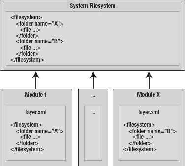

***图 3-2.** 系统文件系统*

该层文件包含某些默认文件夹。它们由作为扩展点的不同模块定义。例如，存在默认文件夹 `Menu`，如清单 3-3 所示。

***清单 3-3.** 层文件的默认文件夹*

`<`**`folder`** `name="`**`Menu`**`">`
`   <`**`folder`** `name="Edit">`
`      <`**`file`** `name="MyAction.shadow">`
`         <`**`attr`** `name="originalFile"`
`               stringvalue="Actions/Edit/com-galileo-netbeans-module-MyAction.instance"/>`
`      </`**`file`**`>`
`   </`**`folder`**`>`
`</`**`folder`**`>`

在此示例中，操作类 `MyAction` 被添加到“编辑”菜单中。此时不必担心确切的语法；它将在后续章节中结合相应的标准文件夹进行解释。首先，我们详细阐述层文件的基本结构。此外，NetBeans 平台提供了处理层文件的实用功能，如后续章节中创建第一个模块时所示。您还可以在本书附录中找到包含最重要扩展点的索引。

每个模块都能够添加新的菜单项或创建新的工具栏。由于每个模块的层文件都会被合并到系统文件系统中，因此整个菜单栏的内容得以组装。负责生成菜单栏的窗口系统现在必须读取 `Menu` 文件夹，以获取整个菜单栏的内容。

这个系统文件系统也极大地促进了模块可以在运行时添加或移除这一特性。可以在该系统文件系统上注册监听器。例如，窗口系统也会执行此操作。如果由于添加模块而发生任何更改，窗口系统或菜单栏本身可以更新其内容。

#### 文件夹和文件的顺序

从层文件中读取条目的顺序（以及它们在菜单栏中显示的顺序）可以通过位置属性来确定，如清单 3-4 所示。

***清单 3-4.** 定义层文件中条目的顺序*

`<filesystem>`
`  <folder name="Menu">`
`    <folder name="Edit">`
`      <file name="`**`CopyAction.shadow`**`">`
`        <attr name="originalFile"`
`              stringvalue="Actions/Edit/org-openide-actions-CopyAction.instance"/>`
`        <`**`attr`** `name="`**`position" intvalue`**`="10"/>`
`      </file>`
`      <file name="`**`CutAction.shadow`**`">`
`        <attr name="originalFile"`
`              stringvalue="Actions/Edit/org-openide-actions-CutAction.instance"/>`
`        <`**`attr`** `name="`**`position" intvalue`**`="20"/>`
`      </file>`
`    </folder>`
`  </folder>`
`</filesystem>`

因此，复制操作会显示在剪切操作之前。如有必要，您也可以使用此属性来定义 `folder` 元素的顺序。在实践中，位置值会设置得间隔较大。这简化了后续插入其他条目。如果两次分配了相同的位置，则在运行应用程序时会记录一条警告消息。

为了轻松定位层内容，NetBeans IDE 在项目窗口中提供了一个层树，其中显示了层文件的所有条目。在那里，可以通过拖放来定义它们的顺序。层文件中的相应条目随后由 IDE 处理。在创建第一个模块后，*创建模块*部分已经解释了具体在哪里可以找到这些层树。您可以使用 NetBeans IDE 的向导来确定操作的顺序（请参见第 6 章）。相应的属性随后由向导创建。

如果层树中条目的位置需要更改，则会将一些条目添加到层文件中。这些条目会覆盖受更改影响的条目的默认位置。条目（也包括 NetBeans 平台模块的条目）的位置按如下方式覆盖：

`<`**`attr`** `name="`**`Menu/Edit/CopyAction.shadow/position" intvalue`**`="15"/>`

在属性名称 `position` 之前使用受影响条目的完整文件路径。

#### 文件类型

系统文件系统中提供了不同的文件类型。在开发应用程序时，您会在某些时候再次遇到它们。例如，在层文件中注册操作和菜单项。我将在以下部分中解释两种常用的文件类型。

##### 实例文件

系统文件系统中类型为 *.instance* 的文件描述了可创建实例的对象。文件名通常描述了一个 Java 对象的完整类名（例如 `com-galileo-netbeans-module-MyClass.instance`），这使得默认构造函数或静态方法能够创建实例。

`<filesystem>`
`   <file name="com-galileo-netbeans-module-MyClass.instance"/>`
`</filesystem>`

通过使用文件系统和数据系统 API 创建实例，如下所示：

`FileObject o = FileUtil.getConfigFile(name);`
`DataObject d = DataObject.find(o);`
`InstanceCookie c = d.getLookup.lookup(InstanceCookie.class);`
`c.instanceCreate();`

如果你希望为实例使用更便捷的名称，可以通过 `instanceClass` 属性来定义完整的类名。这使得可以使用更短的名称：

`<file name="MyClass.instance">`
`   <attr name="`**`instanceClass`**`" stringvalue="com.galileo.netbeans.module.MyClass"/>`
`</file>`

对于没有无参默认构造函数的类，可以通过 `instanceCreate` 属性定义的静态方法来创建实例。

`<file name="MyClass.instance">`
`   <attr name="`**`instanceCreate" methodvalue`**`="com.galileo.netbeans.module.MyClass.`**`getDefault`**`"/>`
`</file>`

这样做时，如果工厂方法签名中声明了，条目的 `FileObject` 会被传递给 `getDefault()` 方法。利用这个 `FileObject`，你可以读取自定义属性，例如。假设你想在层文件中将图标路径或任何其他资源定义为属性：

`<file name="MyClass.instance">`
`   <attr name="instanceCreate" methodvalue="com.galileo.netbeans.module.MyClass.getDefault"/>`
**`<attr name="icon" urlvalue="nbres:/com/galileo/icon.gif"/>`**
`</file>`

用于创建 `MyClass` 类实例的 `getDefault()` 方法可能如下所示：

`public static MyClass` **`getDefault`**`(FileObject obj) {`
`   URL url = (URL) obj.`**`getAttribute`**`("icon");`
`   ...`
`   return new MyClass(...);`
`}`

正如你所见，我使用 `urlvalue` 属性类型指定了路径。因此，会直接提供一个 URL 实例。除了已知的属性类型 `stringvalue`、`methodvalue` 和 `urlvalue` 之外，还有其他几种类型。我们将在 *层文件* 一节中更详细地介绍它们。

特定类型的一个或多个实例也可以通过 Lookup 生成，而不是像之前展示的那样通过 `InstanceCookie` 生成。与之前展示的不同，你可以轻松地生成特定类型的多个实例，并为系统文件系统的特定文件夹创建 Lookup。使用 `lookup()` 或 `lookupAll()` 方法，可以提供一个或多个实例（如果定义了多个）。

**`Lookup`** `lkp =` **`Lookups.forPath("MyFolder")`**`;`
`Collection<? extends MyClass> c = lkp.`**`lookupAll(MyClass.class)`**`;`

这种 `Lookup` 在第 10 章中被用于扩展顶层组件的内容菜单，添加在层文件中定义的自定义操作。基本类或接口可以通过层文件中的 `instanceOf` 属性由用户定义。这使得 `Lookup` 的工作更高效，避免了 `Lookup` 为了确定类继承自哪个基类或实现了哪个接口而必须实例化每个对象。这样，`Lookup` 可以直接只创建所需类型的对象实例。

如果前面条目中的 `MyClass` 类实现了，例如，`MyInterface` 接口，我们可以按如下方式完成条目：

`<file name="com-galileo-netbeans-module-MyAction.instance">`
`   <attr name="`**`instanceOf`**`" stringvalue="`**`com.galileo.netbeans.module.MyInterface`**`"/>`
`</file>`

##### 影子文件

*.shadow* 文件是一种指向 *.instance* 文件的引用链接。它们主要用于使用对象的单例实例时，例如操作。这些实例由 `Actions` 文件夹中的 .instance 文件定义。然后，`Menu` 或 `Toolbars` 文件夹中的条目通过使用 .shadow 文件来引用该操作。.shadow 文件既可以引用系统文件系统中的文件，也可以引用磁盘上的文件。收藏夹模块就是通过这种方式存储其条目的。指向 .instance 文件的路径由 `originalFile` 属性指定（参见清单 3-5）。

***清单 3-5**，连接 .shadow 文件与 .instance 文件*

`<folder name="Actions">`
`  <folder name="Window">`
`    <file name="com-galileo-netbeans-module-MyAction.`**`instance`**`"/>`
`  </folder>`
`</folder>`
`<folder name="Menu">`
`  <folder name="Window">`
`    <file name="MyAction.`**`shadow`**`">`
`      <attr name="originalFile"`
`            stringvalue="Actions/Window/com-galileo-netbeans-module-MyAction.`**`instance`**`"/>`
`    </file>`
`  </folder>`
`</folder>`

#### 属性值

大多数情况下，系统文件系统中的文件条目会通过属性进行扩展。不过，这些属性可能具有完全不同的含义。例如，注册操作的名称由属性定义。在其他地方，可以通过属性定义类名或工厂方法。系统文件系统提供了一系列类型，通过这些类型，属性值变得可用；利用这些属性，可以读取不同的属性值。表 3-1 展示了最常见的类型及其含义。所有类型都列在文件系统 DTD 中（参见附录）。

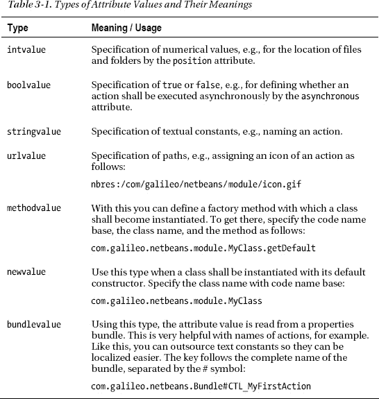

由 `methodvalue` 类型指示的工厂方法具有不同的签名：

`static MyClass factoryMethod();`
`static MyClass factoryMethod(FileObject fo);`
`static MyClass factoryMethod(FileObject fo, String attrName);`
`static MyClass factoryMethod(Map attrs);`
`static MyClass factoryMethod(Map attrs, String attrName);`

通过 `FileObject` 参数，你可以以一种简单的方式访问系统文件系统中的相应条目。利用这个对象，你可以访问相关的属性（比较 *文件类型* 一节）。当使用 `Map` 作为工厂方法的参数时，你可以直接获取这些属性。

#### 访问系统文件系统

当然，你自己的模块文件夹、文件和属性也可以从层文件中使用，以便为其他人提供模块扩展点。你可以通过以下调用来访问系统文件系统以读取条目：

`FileUtil.`**`getConfigRoot`**`();`

此调用将系统文件系统的根目录作为 `FileObject` 提供。从那里，你可以访问整个内容。如果你想访问系统文件系统中的特定路径，也可以使用以下方法：

`FileUtil.`**`getConfigFile`**`(String path);`

在第 10 章中，我将向你展示一个示例，说明如何在层文件中定义自己的条目，读取它们，从而为其他模块提供一个扩展点。

### 创建模块

现在是时候创建你的第一个模块了。NetBeans IDE 中集成的示例应用程序也提供了很好的模块开发入门介绍。为简单起见，你只需在此设计一个单独的模块。

首先，创建一个 NetBeans 平台应用程序或模块套件。这样，你将能够更轻松地执行和测试模块，并且可以定义对你自己的模块和库的依赖关系（请参阅“定义依赖关系”部分）。之后，你甚至可以创建一个独立的富客户端发行版（请参阅第 35 章）。

NetBeans IDE 提供了一个向导来帮助你应用 NetBeans 平台应用程序项目。

1.  启动 NetBeans IDE，然后在菜单中选择 *文件*  *新建项目*…。在左侧出现的对话框中会显示不同的项目类别。在此选择 *NetBeans 模块*。然后在右侧选择项目类型 *NetBeans 平台应用程序*（请参阅图 3-3）。

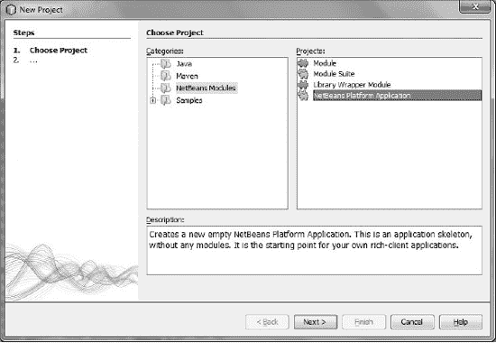

***图 3-3.** 创建一个新的 NetBeans 平台应用程序项目*

2.  在下一页，为应用程序命名（例如，My Application），并选择项目保存的位置。其余字段可以留空。
3.  点击 *完成* 按钮以创建 NetBeans 平台应用程序项目。
4.  现在可以创建第一个模块了；此任务有另一个向导可用。打开 *文件* *新建项目* … 菜单。选择类别 *NetBeans 模块*，然后在右侧选择项目类型 *模块*。
5.  点击 *下一步* 按钮进入下一页，为项目命名。在此输入，例如，My Module，然后选择选项 *添加到模块套件*，并从列表中选择先前创建的 NetBeans 平台应用程序或模块套件。
6.  在最后一页，定义代码名称基址和模块显示名称。本地化包的默认值可以保留。为了完整起见，激活选项 *生成 XML 层* 以创建一个层文件。如果不需要，可以稍后将其删除，同时删除清单文件中的相关条目。
7.  点击 *完成* 按钮，让向导生成模块，如图 3-4 所示。

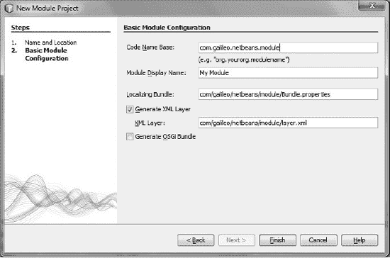

***图 3-4.** 新模块的配置*

在“项目”窗口中查看该模块，你会看到 *源包* 文件夹。目前，此文件夹仅包含 *Bundle.properties* 和 *layer.xml* 文件。*Bundle.properties* 文件仅为清单文件中注册的信息提供一个本地化包。*layer.xml* 文件提供了所谓的 *层树*，这是一种特殊视图，你可以在 *重要文件* 文件夹中找到它。它提供两种不同的视图。一方面，有 *<此层>* 文件夹，其中仅显示你的层文件的内容。另一方面，有 *<上下文中的此层>* 文件夹，其中显示了属于你的 NetBeans 平台应用程序的模块的层文件条目。此视图也表示为系统文件系统，就像运行时提供给平台的那样。

在此视图中，模块的条目（你正在查看其文件夹的模块）以粗体显示。这让你可以概览最重要的默认文件夹，并且你可以直接移动、删除或添加条目。此外，你可以在 *重要文件* 文件夹中找到同样由向导创建的清单文件（请参阅图 3-5）。

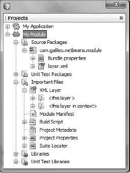

***图 3-5.** 项目窗口中的模块*

你现在可以启动已创建的模块作为富客户端应用程序。为此，请在菜单中选择 *运行  运行主项目 (F6)* 或在你 NetBeans 平台应用程序项目的上下文菜单中选择 *运行*。（请参阅图 3-6）。

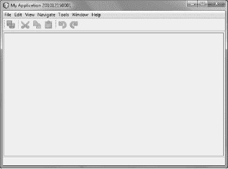

***图 3-6.** 你的 NetBeans 平台应用程序的基本结构*

我们仅用几个步骤就应用了 NetBeans 平台应用程序的基本结构。在接下来的章节中，我们将逐步为我们的模块配备功能，例如窗口和菜单项。通过这种方式，我们将丰富富客户端应用程序。

### 版本控制与依赖关系

为了确保模块化系统保持一致性和可维护性，系统内的模块规定它们需要使用的模块至关重要。为此，NetBeans 平台允许定义对其他模块的依赖关系。只有定义了依赖关系，一个模块才能访问另一个模块的代码。依赖关系在模块的清单文件中设置。当模块被加载时，模块系统会读取该信息。

#### 版本控制

为了保证依赖关系之间的兼容性，你必须定义版本；例如，*主发行版本*、*规范版本* 和 *实现版本*。这些版本基于 Java 包版本控制规范，并反映了依赖关系的基本概念。你可以在模块的“属性”对话框中定义和编辑依赖关系，该对话框可以通过 *属性  API 版本控制* 访问（请参阅图 3-7）。

首先，在此窗口中定义 *主发行版本*。此版本用于通知用户与模块先前版本相比存在不兼容的更改。在此，斜杠用于在清单文件中将代码名称基址与版本分开：

**`OpenIDE-Module`**`: com.galileo.netbeans.module`**`/1`** 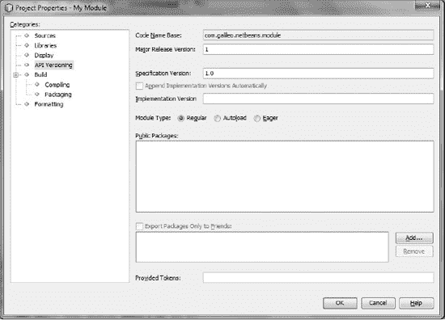

***图 3-7.** 设置模块版本*

最重要的版本是 *规范版本*。使用杜威十进制格式来定义此版本：

**`OpenIDE-Module-Specification-Version`**`: 1.0.4`

*实现版本* 是自由定义的文本。通常，使用一个时间戳，提供日期和时间。通过这种方式，你可以确定其唯一性。如果在模块的“属性”对话框中未显式设置，IDE 会在创建模块时使用当前时间戳添加实现版本，设置在清单文件中：

**`OpenIDE-Module-Implementation-Version`**`: 200701231820`

另一方面，如果你在“属性”对话框中定义了自己的实现版本，IDE 会添加带有当前时间戳的 `OpenIDE-Module-Build-Version` 属性。

在公共包列表中，列出了你模块中的所有包。要将一个包暴露给其他模块，请勾选你想要暴露的包旁边的复选框。这样做，你就定义了模块的 API。暴露的包在清单文件中如下列出：

**`OpenIDE-Module-Public-Packages:`**
`   com.galileo.netbeans.module.*,`
`   com.galileo.netbeans.module.model.*`

要限制对公共包的访问（例如，只允许你自己的模块访问公共包），你可以定义模块的 *好友*。你可以在“属性”对话框的“API 版本控制”部分的公共包列表下方定义它们。然后，这些好友在清单文件中如下列出：

**`OpenIDE-Module-Friends`**`:`
`   com.galileo.netbeans.module2,`
`   com.galileo.netbeans.module3`

#### 定义依赖关系

基于这些不同的版本，定义你明确的依赖关系。为此，有三种不同类型的依赖关系可用：模块依赖于模块、包或 Java 版本。

**无依赖关系则无法访问**

要使用来自另一个模块（包括 NetBeans 平台自身的模块）的类，你必须首先按照以下章节所述定义一个依赖关系。这意味着，如果你在模块中使用了一个 NetBeans 平台类，而代码编辑器找不到所需的类，通常只需设置对提供该类的模块的依赖关系即可解决问题。

好的，作为一名高级文档工程师和翻译员，我将严格遵循您提供的注意事项和示例，将给定的英文文本翻译成中文。

##### 模块依赖关系

您可以通过 *属性  库* 来定义和编辑模块依赖关系，如图 3-8 所示。

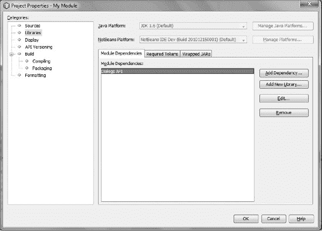

***图 3-8.** 模块依赖关系的定义*

在此窗口中，使用 *添加依赖关系…* 为您的模块添加依赖关系。NetBeans 模块系统提供了多种方法来将依赖关系连接到特定模块。

在最简单的情况下，不需要指定版本。这意味着只需要有一个可用的模块，而不需要特定的版本（尽管在可能的情况下，您仍然可以指定一个版本）：

**`OpenIDE-Module-Module-Dependencies`**`: com.galileo.netbeans.module2`

此外，您可能需要一个特定的规范版本。在这种情况下，模块版本应大于 7.1 版。这是定义依赖关系最常见的方式：

**`OpenIDE-Module-Module-Dependencies`**`: org.openide.dialogs` **`> 7.1`**

如果您要依赖的模块有一个主发行版本，则必须在模块名称后通过斜杠指定：

**`OpenIDE-Module-Module-Dependencies`**`: org.netbeans.modules.options.api`**`/1`** `> 1.5`

此外，您还可以指定一个主发行版本的范围：

**`OpenIDE-Module-Module-Dependencies`**`: com.galileo.netbeans.module3`**`/2-3`** `> 3.1.5`

为了与另一个模块建立紧密集成，可以设置一个*实现依赖关系*。这种方法的主要区别和原因在于，无论模块是否暴露了这些包，都可以使用模块中的所有包。必须谨慎设置这种依赖关系，因为它违背了封装原则和 API 的定义。为了使系统能够保证应用程序的一致性，必须将依赖关系精确地设置在给定实现版本的版本上。然而，这个版本会随着模块的每次更改而变化。

**`OpenIDE-Module-Module-Dependencies`**`: com.galileo.netbeans.module2 =` **`200702031823`**

在列表中选择所需的依赖关系（参见图 3-8），然后单击 *编辑…* 按钮。如图 3-9 所示，您可以设置各种类型的依赖关系。

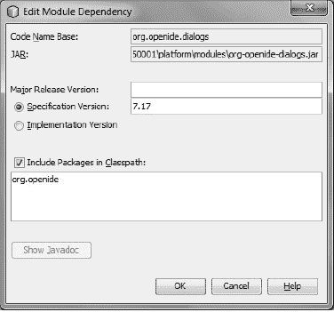

***图 3-9.** 编辑模块依赖关系*

##### Java 包依赖关系

NetBeans 允许您设置对特定 Java 包的模块依赖关系。这种依赖关系在清单文件中设置：

**`OpenIDE-Module-Package-Dependencies`**`: javax.sound.midi.spi > 1.4`

##### Java 版本依赖关系

如果您的模块依赖于特定的 Java 版本，例如 Java 6，您也可以在模块属性的 *属性  源代码* 下，使用 *源代码级别* 设置来指定。除此之外，您还可以要求特定版本的 Java 虚拟机：

**`OpenIDE-Module-Java-Dependencies`**`: Java > 1.6 VM > 1.0`

您可以使用等号要求一个精确的版本，或者要求一个大于指定版本的版本。

### 生命周期

您可以实现一个所谓的*模块安装程序*来影响模块的生命周期，从而对某些事件做出反应。模块系统 API 提供了 `ModuleInstall` 类，我们从中派生自己的模块安装程序类。这样做时，可以覆盖所需事件的以下方法。可用的方法或事件如下：

*   *`validate()`*：此方法在安装或加载模块之前调用。如有必要，在此设置某些加载序列，例如验证模块许可证。如果序列不成功且模块未加载，则可以抛出 `IllegalStateException`。此异常会阻止加载或安装模块。
*   *`restored()`*：此方法在加载已安装的模块时始终被调用。在此，可以初始化启动模块的操作。
*   *`uninstalled()`*：此方法在从应用程序中移除模块时调用。
*   *`closing()`*：在模块结束之前，会调用此方法。在此，您还可以测试模块是否准备好被移除，或者是否仍有要执行的活动。如果返回值为 `false`，则模块和整个应用程序不会结束，因为此方法总是在结束模块之前调用。只有当所有模块都设置为 `true` 时，应用程序才会结束。例如，您可以向用户显示一个对话框，以确认是否真的应该关闭应用程序。
*   *`close()`*：如果所有模块都准备好结束，则调用此方法。在此，您可以在关闭模块之前调用操作。

 **注意** 使用这些方法时，请考虑您调用的操作是否可以通过声明方式设置。但是，始终检查所需操作是否可以采用声明方式。特别是在 `validate()` 和 `restored()` 方法的情况下，请考虑这些方法会影响整个应用程序的启动时间。例如，当注册服务时，您可以使用层文件中的条目或 Java 扩展机制（参见第 5 章）。这样，它们会在首次使用时才被加载，并且不会延长整个应用程序的启动时间。

清单 3-6 展示了一个模块安装程序类的结构。

***清单 3-6.** 模块安装程序类的结构*

`public class Installer extends` **`ModuleInstall`** `{`
`public void` **`validate`**`() throws IllegalStateException {`
`      // 例如，检查许可证密钥，如果无效则抛出`
`      // IllegalStateException。`
`   }`
`public void` **`restored`**`() {`
`      // 在加载模块时调用。`
`   }`
`public void` **`uninstalled`**`() {`
`      // 在卸载模块时调用。`
`   }`
`public boolean` **`closing`**`() {`
`      // 调用以检查模块是否可以关闭。`
`   }`
`public void` **`close`**`() {`
`      // 在模块关闭之前调用。`
`   }`
`}`

为了记录模块安装程序类在不同会话中的状态，请覆盖 `ModuleInstall` 类实现的 `Externalizable` 接口中的 `readExternal()` 和 `writeExternal()` 方法。在此存储和检索必要的数据。这样做时，建议首先在超类上调用要覆盖的方法。为了让模块系统在启动时知道某个模块是否提供了模块安装程序以及在哪里找到它，请在清单文件中注册它：

**`OpenIDE-Module-Install`**`: com/galileo/netbeans/module/Installer.class`

现在，您要创建您的第一个模块安装程序。NetBeans IDE 提供了一个向导来创建此文件（参见图 3-10）。转到 *文件*  *新建文件…*，然后在 *模块开发* 类别中选择文件类型 *安装程序 / 激活器*。

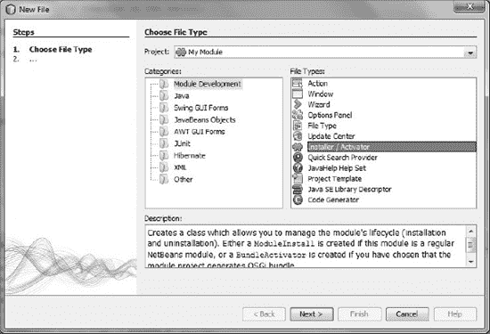

***图 3-10.** 创建模块安装程序*

点击*下一步*，然后在下一页点击*完成*以结束向导。现在，模块安装器类已在指定包中创建，并在清单文件中注册。你只需重写该类的必要方法即可。例如，你可以重写`closing()`方法来显示一个对话框，确认是否真的应该关闭应用程序。你可以像代码清单 3-7 所示实现此功能。

***代码清单 3-7.** 关闭应用程序的对话框*

`import org.openide.DialogDisplayer;`
`import org.openide.NotifyDescriptor;`
`import org.openide.modules.ModuleInstall;`

`public class Installer extends` **`ModuleInstall`** `{`
`public boolean` **`closing`**`() {`
`      NotifyDescriptor d = new NotifyDescriptor.Confirmation(`
`         "Do you really want to exit the application?",`
`         "Exit",`
`         NotifyDescriptor.YES_NO_OPTION);`

**`if`** `(DialogDisplayer.getDefault().notify(d) == NotifyDescriptor.YES_OPTION) {`
`return` **`true`**`;`
`      }`**`else`** `{`
`return` **`false`**`;`
`      }`
`   }`
`}`

请注意，此模块需要依赖 Dialogs API 才能使用 NetBeans 对话框支持。依赖关系的定义已在*版本控制与依赖关系*一节中描述，而关于 Dialogs API 的信息可在第 13 章中找到。

要尝试此新功能，请调用*运行  运行主项目 (F6)*。当应用程序关闭时，将显示该对话框，你可以确认是否真的应该关闭应用程序。

### 模块注册表

模块通常不需要关心其他模块，也不需要知道其他模块是否存在。然而，有时可能需要创建所有可用模块的列表。模块系统为每个模块提供了一个`ModuleInfo`类，其中存储了关于模块的所有信息。`ModuleInfo`对象可通过 Lookup 集中获取，获取方式如下：

`Collection<? extends` **`ModuleInfo`**`> modules = Lookup.getDefault().lookupAll(`**`ModuleInfo`**`.class);`

该类提供的信息包括模块名称、版本、依赖关系、当前状态（已激活或已停用）以及当前模块的服务实现是否存在。使用`getAttribute()`方法可从清单文件中获取此信息。要获知变更，请注册一个`PropertyChangeListener`，它会通知你系统中模块的激活和停用情况（`ModuleInfo`对象）。你还可以注册一个`LookupListener`，它会通知你模块的安装和卸载。例如，可以像代码清单 3-8 所示定义一个监听器。

***代码清单 3-8.** 响应模块系统的变更*

`Lookup.Result<ModuleInfo>`**`result`** `= Lookup.getDefault().lookupResult(`**`ModuleInfo`**`.class);`
**`result`**`.addLookupListener(new LookupListener() {`
`   public void resultChanged(LookupEvent lookupEvent) {`
`Collection<? extends` **`ModuleInfo`**`> c = result.allInstances();`
`      System.out.println("Available modules: " + c.size());`
`   }`
`});`
`result.allItems(); // 初始化监听器`

### 使用库

在开发富客户端应用程序时，你很可能需要将外部库以 JAR 归档文件的形式包含在应用程序中。由于整个应用程序基于模块，因此最好将外部 JAR 文件以模块的形式集成进来。这样做的好处是可以设置对该模块的依赖关系，从而增强整个应用程序的一致性。你还可以将多个 JAR 文件打包到一个模块中，之后就不再需要像通常开发应用程序时那样，将物理 JAR 文件放在应用程序类路径上。

#### 库包装器模块

要实现上述场景，请创建一个*库包装器模块*。NetBeans IDE 为此提供了一个项目类型和向导。

1.  要创建新的库包装器项目，请转到*文件  新建项目*…，然后使用图 3-11 所示的对话框，选择类别*NetBeans 模块*，接着选择项目类型*库包装器模块*。

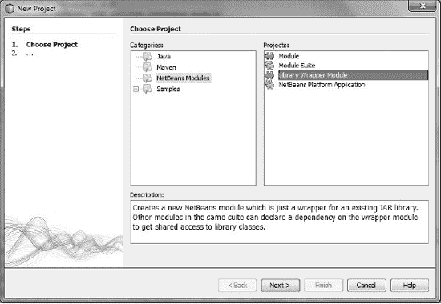

***图 3-11.** 创建库包装器模块*

2.  点击*下一步*以选择所需的 JAR 文件。你可以在此处选择一个或多个 JAR 文件（按住 Ctrl 键可选择多个 JAR 文件）。你还可以为你正在包装为模块的 JAR 添加许可证文件。
3.  在下一步中，提供项目名称以及存储新模块的位置。指定该库包装器模块所属的模块套件或平台应用程序。
4.  再次点击*下一步*以填写*基本模块配置*对话框，如图 3-12 所示。

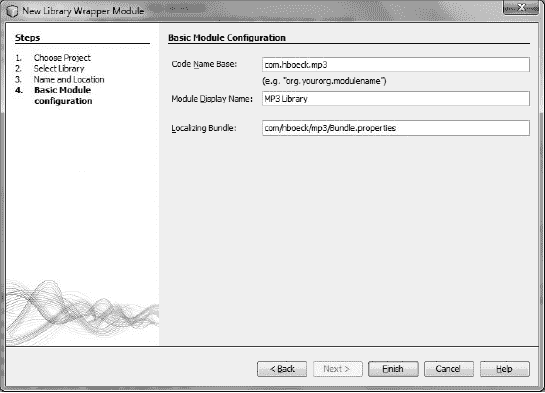

***图 3-12.** 库包装器模块配置*

5.  在此处你可以定义代码名称基。通常此字段会预填入选中的 JAR 归档文件的读取代码名称基的名称。此外，你可以为模块提供名称和本地化包，以本地化模块清单信息。点击*完成*按钮，即可创建新项目。

当你在*项目*窗口中查看新创建的库包装器模块，并额外打开*源包*文件夹时，你会看到清单文件的*Bundle.properties*文件位于此处。被模块封装的库已被复制到项目文件夹的*release/modules/ext*目录中。

要理解库包装器模块的工作原理，请查看位于项目结构中*重要文件*文件夹内的相关清单文件。请注意，代码清单 3-9 中描述的清单信息可能不会直接出现在清单文件中。某些信息（如公共包）仅在构建模块时（调用*构建项目*时）才会写入。要查看完整的清单文件，请创建模块，然后打开创建的模块 JAR 归档文件（位于 NetBeans 平台应用程序的*build/cluster/modules*目录中）内的清单文件。你可以在库包装器模块属性的*API 版本控制*下查看哪些包是公开的。在那里，你可以稍后从*公共包*列表中删除包。

***代码清单 3-9.** 库包装器模块的清单文件*

`Manifest-Version: 1.0`
`Ant-Version: Apache Ant 1.7.0`
`Created-By: 1.6.0-b105 (Sun Microsystems Inc.)`
`OpenIDE-Module: com.hboeck.mp3`
**`OpenIDE-Module-Public-Packages:`**
**`com.hboeck.mp3.*,`**
**`com.hboeck.mp3.id3.*,`**
**`...`**
`OpenIDE-Module-Java-Dependencies: Java > 1.4`
`OpenIDE-Module-Specification-Version: 1.0`
`OpenIDE-Module-Implementation-Version: 101211`
`OpenIDE-Module-Localizing-Bundle:`
`   com/hboeck/mp3/Bundle.properties`
`OpenIDE-Module-Requires: org.openide.modules.ModuleFormat1`
**`Class-Path: ext/com-hboeck-mp3.jar`**

向导完成了两件非常重要的事情。一方面，它使用**OpenIDE-Module-Public-Packages**属性标记了库的所有包，使所有这些包可公开访问。这很有用，因为库也应该被其他模块使用。另一方面，向导使用**Class-Path**属性标记了库（位于分发版的*ext/*目录中），将其置于模块类路径上。这样，库的类就可以被模块类加载器加载。*自动加载*类型被自动分配给库包装器模块（参见*配置文件*一节）。这样，它只在需要时被加载。

#### 向模块添加库

如前一节所述，在将库集成到应用程序时，建议始终使用库包装模块。以这种方式为第三方库创建新模块，可以提升应用程序的整体价值和可维护性，因为你可以通过包装该库的模块来设置对它的依赖关系。在某些情况下，你可能希望将库直接添加到现有模块（即你自己的应用程序模块）中。这很简单，操作方式与创建库包装模块类似。

要添加库，请在上下文菜单中通过*属性*打开目标模块的功能。在定义对其他模块依赖关系的*库*类别中，你会在右侧找到*包装的 JAR* 选项卡。在那里，你可以通过*添加 JAR* 按钮添加所需的库。

这样做会为每个库在*项目元数据*文件中添加一个 `class-path-extension` 条目。由 `runtime-relative-path` 属性定义的路径是库在发行版中的位置（即在创建模块时自动复制到的位置）。库原始文件的位置由 `binary-origin` 属性指定。如你所见，这与库包装模块的目录相同。（参见清单 3-11。）

***清单 3-11.** 包含类路径扩展的项目元数据文件*

**`<class-path-extension>`**
**`<runtime-relative-path>`**`ext/com-hboeck-mp3.jar`**`</runtime-relative-path>`**
**`<binary-origin>`**`release/modules/ext/com-hboeck-mp3.jar`**`</binary-origin>`**
**`</class-path-extension>`**

通过将此条目添加到项目元数据文件中，该库会被复制到 *ext/* 目录，并在创建模块时通过 `Class-Path: ext/com-hboeck-mp3.jar` 条目添加到模块的清单中。与库包装模块不同，该库的包不会被暴露。因此，它们只能被该模块使用。（在大多数情况下，这正是直接添加库的原因：不希望将其公开）。也可以将库的包定义为公开的，这在库包装模块中是自动实现的。

**何时使用哪种方法？**

请记住，出于模块化和可维护性的考虑，应尽可能创建库的包装模块，而不是直接添加库。通常，只有当库仅被该模块使用，并且将库与使用它的模块一起分发不成问题时，才应直接将库添加到模块中。此外，请注意，你不能通过 `Class-Path` 从两个不同的模块加载同一个库。这可能导致不可预见的问题。同时，不要尝试使用 `Class-Path` 属性来引用模块 JAR 归档文件或位于 NetBeans *lib/* 目录中的库。

### 复用模块

通常，对于规模不大的应用程序，你会创建一个 NetBeans 平台应用程序项目，然后将应用程序的全部逻辑以模块的形式添加到该项目中。如果你随后想要在团队中实现一个大型企业级应用程序，将应用程序分解为多个部分，每个部分包含一定数量的模块，可能会很有用。为此，NetBeans IDE 提供了将单个模块或整个集群（包含 NetBeans 模块的文件夹）添加为依赖项的功能。因此，例如，如果你开发了一系列基础模块，并希望其功能在多个应用程序中使用，那么最好使用模块套件。

你可以通过*文件  新建项目…  NetBeans 模块*来创建一个模块套件。在这个模块套件中，你可以开发和测试与特定应用程序模块隔离的基础模块。启动模块的构建过程时，所有模块都会存储在一个集群中。然后，你可以按如下方式将此集群添加到另一个 NetBeans 平台项目中：在目标应用程序中调用*属性  库*。在那里，你会找到*添加集群…* 按钮（参见图 3-13），通过它可以选择模块套件的集群。

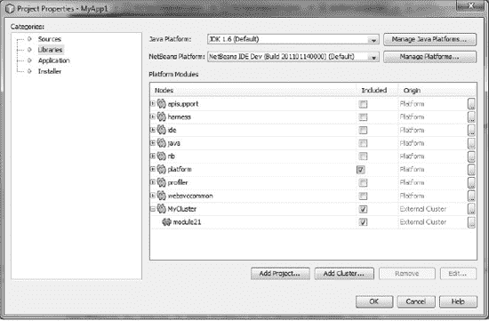

***图 3-13.** 添加整个集群以复用外部模块。*

如果你没有选择真正的集群，NetBeans IDE 会要求你选择文件夹中所需的模块，然后创建一个相应的集群。这意味着 NetBeans IDE 会自动从一个包含模块的文件夹中创建集群。

现在，你可以按照上述方式，从不同的 NetBeans 平台应用程序中访问更多的 NetBeans 模块，从而实现模块的复用。这样，你就可以集中实现通用模块，使其独立于特定的应用程序。

**模块套件 vs. NetBeans 平台应用程序**

本书主要讨论基于 NetBeans 平台开发独立应用程序。因此，在后续章节中，将一直使用*NetBeans 平台应用程序*项目类型来创建应用程序。对于此项目类型，默认只提供 NetBeans 平台模块，因为它将成为一个独立的应用程序，而不是 NetBeans IDE 的扩展。但是，你仍然可以访问 NetBeans IDE 的任何模块。为此，请在 NetBeans 平台应用程序项目中调用*属性  库*。在那里，你可以激活所需的模块。你自己的模块只能定义对已激活模块的依赖关系。你可以在*属性  库*下随时在 NetBeans 平台应用程序和模块套件之间切换。品牌支持以及创建安装程序的功能，逻辑上仅在 NetBeans 平台应用程序中提供。

### 总结

在本章中，你学习了 NetBeans 平台应用程序底层模块系统的结构及其工作原理。模块系统是运行时容器的一部分。首先，我们了解了 NetBeans 模块的结构。你学习了清单文件中定义的众多配置选项。除了清单文件，模块还可以选择性地提供一个层文件。你学习了如何通过模块层文件中的注册条目为整个应用程序做出贡献。

你创建了第一个模块，学习了模块如何使用其他模块的代码，并探讨了模块的生命周期以及如何通过库包装模块将第三方库集成到模块中。最后，你了解了这类模块的工作原理，并获得了实践经验。

## 第 4 章

## OSGi 框架

OSGi 框架提供了一个模块化的运行时环境。基于 OSGi 框架构建的应用程序是以模块化方式开发的——以*捆绑包*的形式——因此 OSGi 框架与 NetBeans 平台的模块系统具有可比性。一个 OSGi 捆绑包符合 NetBeans 模块的原则。OSGi 框架因其由一个公司联盟进行标准化而得到广泛采用。如今，它已通过 Java 社区流程被接受为 Java 的官方动态组件模型，即 JSR 291。

然而，本章不会过于详细地讨论 OSGi 框架（已有大量专门针对 OSGi 的信息可供参考）。相反，它将展示 OSGi 与 NetBeans 平台结合使用的可能性。

### OSGi 与 NetBeans 平台

鉴于 OSGi 的重要性——尤其对企业而言——NetBeans 平台已得到扩展，使得 OSGi 包现在可以在 NetBeans 平台应用程序中执行。为此，包不应由 NetBeans 模块系统执行，而应由集成的 OSGi 运行时容器（Felix 或 Equinox）执行。这意味着您可以开发混合应用程序，其中 NetBeans 模块和 OSGi 包可以并行运行。必须通过一个特殊的适配器层在两个模块系统之间建立连接；因此，NetBeans 模块能够定义对 OSGi 包的依赖关系并引用其 API。反之亦然：OSGi 包也可以定义对 NetBeans 模块的依赖关系并引用它们。

此外，还可以在 OSGi 运行时容器中执行整个 NetBeans 平台应用程序。为此，在创建应用程序时，所有 NetBeans 平台模块都会被转换为 OSGi 包。NetBeans IDE 自然支持此功能以及包的开发。由于这两个模块系统非常相似，两个系统可以交互，并且可以将 NetBeans 模块转换为 OSGi 包。

### OSGi 包格式

在第 3 章中，您了解了 NetBeans 模块的基本结构以及清单文件在该结构中的特殊重要性。在清单文件中，您定义了模块的特性和接口。OSGi 包也通过清单文件来描述；大多数属性与 NetBeans 模块系统的属性相对应。OSGi 包的基本结构如图 4-1 所示。

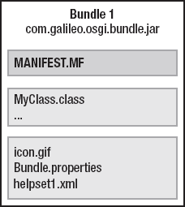

***图 4-1.** OSGi 包的组件*

表 4-1 列出了最重要的 NetBeans 模块属性以及相应的 OSGi 包属性。

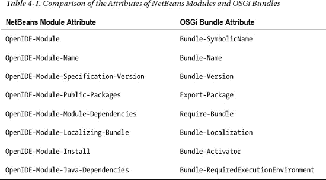

以下每个清单（清单 4-1 和清单 4-2）分别显示了一个简单 NetBeans 模块和一个结构相同的 OSGi 包的清单文件。如您所见，这两个文件之间的差异微乎其微。

***清单 4-1.** NetBeans 模块的清单文件*

**`OpenIDE-Module`**`: com.galileo.netbeans.module`
**`OpenIDE-Module-Specification-Version`**`: 1.0`
**`OpenIDE-Module-Name`**`: My Module`
**`OpenIDE-Module-Localizing-Bundle`**`: com/galileo/netbeans/module/Bundle.properties`
**`OpenIDE-Module-Install`**`: com/galileo/netbeans/module/Installer.class`
**`OpenIDE-Module-Public-Packages`**`: com.galileo.netbeans.module.api.*`
**`OpenIDE-Module-Module-Dependencies`**`: com.galileo.netbeans.library > 1.0`
**`OpenIDE-Module-Java-Dependencies`**`: Java > 1.6`

***清单 4-2.** OSGi 包的清单文件*

**`Bundle-SymbolicName`**`: com.galileo.osgi.bundle`
**`Bundle-Version`**`: 1.0`
**`Bundle-Name`**`: My Bundle`
**`Bundle-Localization`**`: com/galileo/osgi/bundle/Bundle`
**`Bundle-Activator`**`: com.galileo.osgi.bundle.Installer`
**`Export-Package`**`: com.galileo.osgi.bundle.api`
**`Require-Bundle`**`: com.galileo.netbeans.library;bundle-version="1.0,100)"`
**`Bundle-RequiredExecutionEnvironment`**`: JavaSE-1.6`

使用属性 `OpenIDE-Module-Localizing-Bundle` 或 `Bundle-Localization` 定义本地化包时，请记住在 OSGi 包中不提供文件扩展名。通过属性 `Require-Bundle` 定义对另一个模块或包的依赖关系时，使用 `bundle-version` 指示所需的版本。要定义对运行时环境的最低要求，您可以使用属性 `Bundle-RequiredExecutionEnvironment` 指定一个标签列表。如果期望 Java 6，请使用 `JavaSE-1.6`。其他标签示例包括 `J2SE-1.5` 或 `OSGi/Minimum-1.1`。

### 创建新的 OSGi 包

在 NetBeans IDE 中创建新的 OSGi 包很容易。为此，请使用创建新 NetBeans 模块的向导，并指示它应成为一个符合 OSGi 规范的包，如[图 4-2 所示。

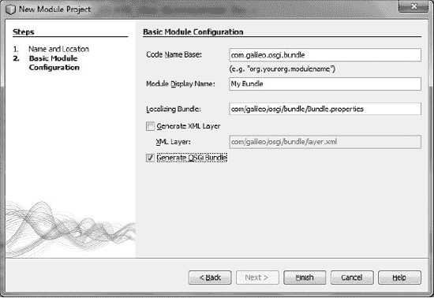

***图 4-2.** 使用 NetBeans 向导创建 OSGi 包*

在 *NetBeans 模块* 类别中，选择 *文件*  *新建项目…* 下的模块类型。然后在 *基本模块配置* 下激活 *生成 OSGi 包* 选项（参见图 4-2）。之后，模块或包的进一步使用是完全透明的，这意味着您可以像往常一样使用 NetBeans 向导定义依赖关系或向包添加功能。特别有趣的是，您还可以向 OSGi 包添加层文件。该层文件也会集成到系统文件系统中 NetBeans 模块的层文件中。

在 NetBeans 平台应用程序中，请记住 OSGi 包实际上是由 OSGi 容器（默认是 Apache Felix OSGi 实现）执行的，而不是由 NetBeans 模块系统执行的。与此相关，还请记住以下模块已被激活，因此已包含在您的平台应用程序中：

*   OSGi 规范
*   Apache 的 Felix OSGi 实现
*   NetBeans OSGi 集成

### 包生命周期

类似于第 3 章中介绍的 NetBeans 模块的模块安装器，OSGi 框架为 OSGi 包提供了一种可能性，使您可以引用包生命周期中的某些事件。实现 `BundleActivator` 接口的此类类称为激活器（参见清单 4-3）。它提供了 `start()` 和 `stop()` 方法。

***清单 4-3.** OSGi 包的激活器类*

`import org.osgi.framework.BundleActivator;`
`import org.osgi.framework.BundleContext;`

`public class Activator implements` **`BundleActivator`**`{`
`public void` **`start`**`(BundleContext c) throws Exception {`
`   }`
`public void` **`stop`**`(BundleContext c) throws Exception {`
`   } }`

也可以使用与创建模块安装器相同的 NetBeans 向导来创建此类。如果您通过 *文件*  *新建文件*  *模块开发*  *安装器 / 激活器* 为 OSGi 包调用此向导，则会自动创建一个激活器类。

### 集成现有的 OSGi 包

NetBeans 平台支持 OSGi 包的一个重要优势无疑是能够重用已存在的、以 OSGi 包形式存在的组件。

向平台应用程序添加一个完整的包文件夹（称为*集群*）非常容易。为此，只需在相关项目的*属性*对话框中激活*库*类别。您可以通过*添加集群…*按钮添加包，该按钮也可以选择 NetBeans 平台提供的模块。（参见图 4-3。）在接下来的对话框中选择相关目录。如果所选目录不是集群，向导会指出这一点。如果您单击*下一步*，向导将列出所有 JAR 文件（包和模块）。然后您可以选择所需的包，并通过*完成*按钮完成向导。

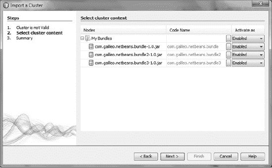

***图 4-3.** 创建和导入包集群*

现在，您可以在模块中定义对之前添加的包的依赖关系。

### OSGi 运行时容器中的 NetBeans 平台

前面几节讨论了在 NetBeans 平台内部（更准确地说，是与 NetBeans 平台并行）执行 OSGi 模块；NetBeans 平台模块仍由 NetBeans 平台系统执行。现在，如果你想开发一个完全基于 OSGi 的应用程序，可以将整个 NetBeans 平台视为 OSGi 模块。

为此，请在 NetBeans 平台应用程序的上下文菜单中点击 *OSGi*  *构建模块*。整个应用程序，即所有必要的 NetBeans 平台模块加上你自行创建的模块，会在 *build/osgi* 目录下以符合 OSGi 规范的模块形式创建。此外，你的应用程序可以直接在 NetBeans IDE 中的 OSGi 运行时容器 Felix 中执行。为此，请在上下文菜单中点击 *OSGi*  *在 Felix 中运行*；模块会自动创建并与 Felix 一起启动。

### 总结

在本章中，你学习了 OSGi 框架的一些基础知识。你了解了 OSGi 模块的结构，并比较了 NetBeans 模块与 OSGi 模块的清单文件属性。你还学习了如何使用 NetBeans IDE 创建兼容 OSGi 的模块。本章的最后部分解释了模块的生命周期，以及如何将现有模块集成到 NetBeans 平台应用程序中。

## 第 5 章

## 查找概念

查找概念既重要又简单。它在 NetBeans 平台应用程序的许多地方被使用，允许模块之间相互通信。本章展示了典型的用例以及查找概念的工作原理。

### 功能

*查找*是 NetBeans 平台中用于管理对象实例的核心组件和常用概念。简化来说，查找是一个 `Map`，以 `Class` 对象作为键，以这些 `Class` 对象的实例作为值。

查找背后的主要思想是解耦组件。它让模块之间能够相互通信，这在基于组件的系统（例如基于 NetBeans 平台的应用程序）中扮演着重要角色。一方面，模块可以提供对象；另一方面，模块可以通过查找来搜索和使用对象。

** 注意** 查找概念在查找 API 模块中实现。它提供了一个非常简单且清晰的接口。查找 API 模块在 NetBeans 平台中经常被使用（通常也是间接使用）；它是 NetBeans 平台模块化概念的基石。顺便提一下，查找 API 模块完全独立运行，不依赖于任何其他模块。也就是说，你可以在任何 Java 应用程序中使用查找 API 模块，即使该应用程序并非基于 NetBeans 平台开发。

查找的优势在于其类型安全性，这是通过使用 `Class` 对象而非字符串作为键来实现的。这样，键就定义了检索实例的类型。因此，不可能请求一个在模块中类型未知的实例。这种模式使得应用程序更加健壮，因为像 `ClassCastException` 这样的错误不会发生。查找也用于检索和管理一个键（即一种类型）的多个实例。这种对特定实例的集中管理用于不同的目的。查找用于发现服务提供者，支持声明式添加和实例的延迟加载。除此之外，你可以通过查找将实例从一个模块传递到另一个模块，而无需模块之间相互了解。通过这种方式，建立了一种模块间的通信。甚至上下文相关的操作也是使用查找组件实现的。

为了澄清一个常见的误解，在单个应用程序中可以有多个查找。最常用的查找是全局查找，由 NetBeans 平台默认提供。此外，还有一些组件（例如 TopComponent）拥有自己的查找。这些是局部查找。如“模块间通信”部分所述，你可以创建自己的查找，并为你的组件配备一个查找。

查找概念简单、高效且方便。一旦你熟悉了这种模式，你会发现它适用于许多不同的领域。在接下来的部分中，将展示查找在其主要用例中的用法。

### 服务与扩展点

查找的一个主要应用是发现和提供服务。在这种场景下，查找扮演着动态服务定位器的角色，允许将服务接口与服务提供者分离。一个模块使用功能而无需了解任何实现细节。通过这种方式，实现了模块之间的松散耦合。

使用查找和服务接口，可以轻松为图形组件定义扩展点。一个很好的例子是 NetBeans 状态栏，它定义了接口 `StatusLineElementProvider`。通过这个接口和服务提供者注册，状态栏可以用用户定义的组件进行扩展（第 5 章的“状态栏”部分描述了一个示例），而状态栏无需了解这些组件或依赖于它们。

为了实现动态、灵活的服务提供和交换，这些服务是以声明方式添加到查找中的，而不是在源代码中编程实现。这可以通过两种方法之一实现：使用 *META-INF/services* 目录中的服务提供者配置文件添加服务的实现，或者使用模块的层文件。这两种方法都将在本章后面的“注册服务提供者”部分展示。

NetBeans 平台提供了一个全局查找，可以通过静态方法 `Lookup.getDefault()` 获取。这个全局查找用于发现通过可用的声明式注册之一添加的服务。使用这种方法可以为单个服务注册多个实现。声明式注册允许在首次请求时实例化实现。这种模式被称为延迟加载。

为了更好地理解这种提供和请求服务的模式，并获得更实际的视角，本章将演示如何为 MP3 文件创建搜索列表。

#### 定义服务接口

模块 A 是一个提供用户界面的模块，允许用户通过特定的搜索条件搜索 MP3 文件。搜索结果会显示在一个列表中。为了保持独立于搜索算法，并确保能够动态使用多种搜索变体（这些变体可能在运行时切换），你在模块 A 中指定了服务接口 `Mp3Finder`。该服务定义了 MP3 文件的搜索接口。实际的搜索算法在另一个模块（模块 B）中实现，并通过声明式注册提供。

#### 松散服务提供

模块 B 是用于实现接口 `Mp3Finder` 的服务提供者。在此示例中，假设该模块正在数据库中搜索 MP3 文件。这允许注册服务提供者的多个实现。所有实现可以位于一个或多个独立的模块中。要创建模块 A 中接口 `Mp3Finder` 的 `Mp3DatabaseFinder` 实现，模块 B 必须定义对模块 A 的依赖关系。然而，作为搜索列表用户界面的模块 A 不需要依赖模块 B。这是因为 Lookup 基于接口（同样位于模块 A 中）而非实现（位于模块 B 中）提供服务。因此，模块 A 完全独立于服务的实现（参见图 5-1），并且可以透明地使用它。

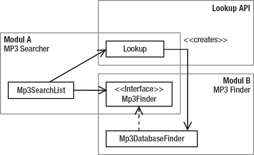

***图 5-1.** 服务查找模式*

在模块 A 中，指定了服务接口 `Mp3Finder`，并实现了一个用于搜索和显示 MP3 文件的用户界面（参见清单 5-1）。通过将接口 `Mp3Finder` 的 `Class` 对象传递给 Lookup，返回一个与请求类型匹配的实例，从而获取服务提供者。接口 `Mp3Finder` 也被称为模块 A 的扩展点。任何模块都可以为其注册实现。

***清单 5-1.** 模块 A：MP3 搜索器*

`public interface` **`Mp3Finder`** `{`
`public List<Mp3FileObject>` **`find`**`(String search);`
`}`
`public class Mp3SearchList {`
`   public void doSearch(String search) {`
**`Mp3Finder`** `finder =`
`         Lookup.getDefault().Lookup(`**`Mp3Finder`**`.class);`
`      List<Mp3FileObject> list = finder.`**`find`**`(search);`
`   }`
`}`

模块 B 提供了一个服务提供者，允许在数据库中搜索 MP3 文件。这是通过实现模块 A 指定的接口 `Mp3Finder` 来完成的（参见清单 5-2）。因此，模块 B 是模块 A 在扩展点 `Mp3Finder` 上的一个扩展。

新创建的服务提供者必须被注册，以便可以通过 Lookup 发现它。为此，你需要使用 `ServiceProvider` 注解。

***清单 5-2.** 模块 B：MP3 查找器*

`import org.openide.util.Lookup.ServiceProvider;`
`...`
**`@ServiceProvider`**`(service = Mp3Finder.class)`
`public class` **`Mp3DatabaseFinder`** `implements` **`Mp3Finder`** `{`
`public List<Mp3FileObject>` **`find`**`(String search) {`
`      // 在数据库中搜索 mp3 文件`
`   }`
`}`

#### 提供多个服务实现

能够注册多个 MP3 搜索实现是很有用的。这很容易实现。只需创建接口 `Mp3Finder` 的更多实现即可。同样，这些实现必须通过注解进行注册。例如，这样的实现可以如下所示：

`import org.openide.util.Lookup.ServiceProvider;`
`...`
**`@ServiceProvider`**`(service = Mp3Finder.class)`
`public class` **`Mp3FilesystemFinder`** `implements` **`Mp3Finder`** `{`
`public List<Mp3FileObject>` **`find`**`(String search) {`
`      // 在本地文件系统中搜索 mp3 文件`
`   }`
`}`

要使用某个服务的所有已注册实现，必须采用使用 Lookup 发现服务的方式。不要使用 `Lookup()` 方法来获取单个实现，而应使用 `LookupAll()` 来检索该服务的所有已注册实现。按如下方式调用所有已发现服务的 `find()` 方法：

`public class Mp3SearchList {`
`   public void doSearch(String search) {`
`Collection<? extends` **`Mp3Finder`**`> finder =`
`         Lookup.getDefault().`**`LookupAll(Mp3Finder`**`.class);`
`      List<Mp3FileObject> list = new ArrayList<Mp3FileObject>();`
`      for(Mp3Finder f : finder) {`
`         list.addAll(f.`**`find`**`(search));`
`      }`
`   }`
`}`

#### 确保服务可用性

如果没有可用的搜索服务允许搜索 MP3 文件，那么搜索模块对用户来说就没有用处。为了启用模块 A，并确保至少有一个服务实现可用，NetBeans 模块系统提供了两个属性：`OpenIDE-Module-Provides` 和 `OpenIDE-Module-Requires`，它们允许在模块的清单文件中定义是否提供或需要特定的服务实现。这些以及清单文件的其他属性将在第 3 章的“模块清单”部分中更详细地描述。

在模块 A 的清单文件中，需要存在至少一个 `Mp3Finder` 服务的提供者，使用以下条目：

**`OpenIDE-Module-Requires`**`: com.galileo.netbeans.modulea.Mp3Finder`

为了在加载模块时通知模块系统模块 B 提供了 `Mp3Finder` 服务，请将以下条目添加到模块 B 的清单文件中：

**`OpenIDE-Module-Provides`**`: com.galileo.netbeans.modulea.Mp3Finder`

如果没有模块在其清单文件中声明这样的条目（即没有可用的服务提供者），模块系统会报告错误并且不会加载模块 A。

### 全局服务

全局服务——即能被多个模块使用且仅由一个模块提供的服务——通常通过抽象（单例）类来实现。采用这种模式，服务自行管理其实现，并在系统中未注册其他实现时，提供一个额外的简单实现（作为内部类）。这样做的好处是，用户总能获得一个有效的服务引用，而永远不会得到 `null` 值。

一个例子是 MP3 播放器服务（参见代码清单 5-3），它被不同的模块使用，例如搜索列表或播放列表。播放器的实现应该是可替换的。

***代码清单 5-3.** 作为 MP3 服务模块中全局服务的 MP3 播放器*

`public` **`abstract`** `class Mp3Player {`
`   public abstract void play(Mp3FileObject mp3);`
`   public abstract void stop();`
`public` **`static Mp3Player getDefault`**`() {`
`      Mp3Player player =`
`         Lookup.getDefault().Lookup(Mp3Player.class);`
`      if(player == null) {`
`         player = new DefaultMp3Player();`
`      }`
`      return player;`
`   }`
`private static class` **`DefaultMp3Player`** `extends Mp3Player {`
`      public void play(Mp3FileObject mp3) {`
`         // 将文件发送到外部播放器，或`
`         // 提供自己的播放器实现，或`
`         // 显示没有可用播放器的消息`
`      }`
`      public void stop() {}`
`   }`
`}`

这个服务以抽象类的形式实现，通过抽象方法定义其接口，同时通过静态方法 `getDefault()` 提供对服务的访问。这种模式的优势在于，服务的用户无需了解任何关于 Lookup API 的知识。这使得应用程序逻辑保持简洁，并且独立于 Lookup API。

抽象类通常应属于某个模块，而该模块又是应用程序标准发行版的一部分（在示例中，即 MP3 服务模块）。服务提供者（即包含播放 MP3 文件实际代码的类）可以封装在单独的模块中（参见代码清单 5-4）。在示例中，这就是 `MyMp3Player` 类，随后你需要为其创建一个骨架，并将其添加到模块 C。

***代码清单 5-4.** MP3 播放器模块中的 MP3 播放器服务提供者*

`public class MyMp3Player extends` **`Mp3Player`** `{`
`   public void play(Mp3FileObject mp3) {`
`      // 播放文件`
`   }`
`   public void stop() {`
`      // 停止播放器`
`   }`
`}`

现在，必须注册 `MyMp3Player` 服务提供者。为此，你可以使用 `ServiceProvider` 注解，如下所示：

`@ServiceProvider (service = Mp3Player.class)`
`public class MyMp3Player extends` **`Mp3Player`** `{ ...`

模块之间的关系和依赖关系如图 5-2 所示。

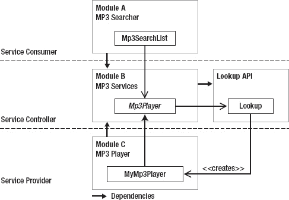

***图 5-2.** 全局服务、服务提供者和应用程序模块的依赖关系与关联*

NetBeans 平台中全局服务的典型示例是 `StatusDisplayer` 和 `IOProvider`。`IOProvider` 类提供对输出窗口的访问。实际将数据写入输出窗口的服务提供者是一个单独的类 `NbIOProvider`，位于一个单独的模块中。如果该模块可用且服务提供者已注册，则通过静态方法 `IOProvider.getDefault()` 获取其实现。如果该模块不可用，则提供默认实现，该实现将输出数据写入默认输出（`System.out` 和 `System.err`）。

### 注册服务提供者

为了实现服务提供者的动态和灵活注册（即使在交付应用程序之后），并确保仅在需要时才加载它们，注册是通过使用配置文件以声明方式完成的。

在基于 NetBeans 平台的应用程序中，可通过 Lookup 获取的服务可以通过多种方式进行注册并向系统公开。以下各节将描述这些不同的可能性。

#### 注解

Lookup API 提供了 `ServiceProvider` 注解用于注册服务提供者。这是让你的提供者类为 Lookup 所知的最简单、最透明的方式。因此，在创建应用程序时，会自动应用一个服务提供者配置文件，你将在*服务提供者配置文件*一节中看到这一点。因此，如果你不想使用注解，可以直接跳到该节。在代码清单 5-5 所示的示例中，你可以看到此注解的属性。

***代码清单 5-5.** 使用 @ServiceProvider 注解注册服务提供者*

`import com.galileo.netbeans.mp3object.Mp3FileObject;`
`import java.util.List;`
`import org.openide.util.Lookup.ServiceProvider;`

**`@ServiceProvider`**`(`
**`service`** `= Mp3Finder.class,`
**`path`** `= "Mp3FinderServices",`
**`position`** `= 10,`
**`supersedes`**`={"com.galileo.netbeans.module.DefaultMp3Finder"})`
`public class Mp3DatabaseFinder implements Mp3Finder {`
`    @Override`
`    public List<Mp3FileObject> find(String what){`
`        ...`
`    }`
`}`

在代码清单 5-5 中，类 `Mp3DatabaseFinder` 通过 `ServiceProvider` 注解注册为服务 `Mp3Finder` 的实现。唯一必需的属性是 `service` 属性，通过它你可以确定要提供哪个服务。你可以通过 `position` 属性影响 Lookup 交付多个服务提供者的顺序。使用 `supersedes` 可以指定一个已注册服务提供者的列表，这些提供者将被本次注册所替代。这样，例如，你可以删除某个已注册的服务标准实现。最后，还有 `path` 属性。通过它，你可以指定一个名称或完整路径（例如，*MyServices/Mp3Services*），服务提供者配置文件将在此路径下应用。不过，在这种情况下，使用的是 *META-INF/namedservices* 目录，而不是 *META-INF/services*。因此，在代码清单 5-5 的示例中，配置文件将存储在 *META-INF/namedservices/Mp3FinderServices* 目录中。这样，就可以通过使用 `Lookups.forPath()` 创建的 Lookup 来访问该实现。

#### 服务提供者配置文件

服务提供者也可以通过*服务提供者配置文件*进行注册。此类文件实际上是在后台使用 `ServiceProvider` 注解创建的。

这种方法属于 Java JAR 文件规范的一部分。文件以其服务命名，并在其内容中列出所有服务提供者。该文件必须放置在 *META-INF/services* 目录中，该目录是模块 *src/* 目录的一部分，或者换句话说，它必须是模块类路径的一部分。

`src/META-INF/services/com.galileo.netbeans.module.Mp3Finder`
**`com.galileo.netbeans.module.Mp3DatabaseFinder`**
**`com.galileo.netbeans.module.Mp3FilesystemFinder`**

在此示例中，为该服务（即接口或抽象类 `Mp3Finder`）注册了两个服务提供者。全局查找（即标准查找 `Lookup.getDefault()`）会发现在 *`META INF/services`* 目录中的服务，并实例化这些提供者。成功的服务实例化要求每个服务提供者都有一个默认构造函数，以便能够通过 Lookup 创建。

如前所述，你可以让你的服务实现以特定名称公开；这样，它可以被更快地访问。为此，请在 *META-INF/namedservices* 目录中创建配置文件。该目录的一个子文件夹表示名称，例如 *META-INF/namedservices/Mp3FinderServices*。你可以通过使用 `Lookups.forPath("Mp3FinderServices")` 创建的 Lookup 来获取在那里注册的服务。

基于服务提供者配置文件的原始规范，NetBeans 平台提供了两个扩展，允许移除现有的服务提供者以及更改已注册提供者的顺序。为了使这些补充符合原始的 Java 规范，这些附加项以注释符号 # 作为前缀。因此，JDK 实现会忽略这些行。

##### 移除服务提供者

可以移除由另一个模块注册的服务提供者。此功能可用于用你自己的实现替换 NetBeans 平台服务的标准实现。

通过在你的服务提供者配置文件中添加以下条目来移除服务提供者。同时，你可以提供你自己的实现。

`# 移除其他实现（通过在行前添加 #- 前缀）`
`#-org.netbeans.core.ServiceImpl`
`# 提供我自己的实现`
`com.galileo.netbeans.module.MyServiceImpl`

##### 服务提供者的顺序

Lookup 返回服务提供者的顺序是通过为每个提供者条目设置一个 `position` 属性来控制的。例如，这对于控制状态栏中附加条目的顺序（参见第 11 章）或确保你自己的实现在 NetBeans 平台实现之前被调用是必要的。此外，允许为 position 属性指定负值。NetBeans 平台按 position 升序对实例进行排序，因此编号较小的实例会在编号较大的实例之前返回。为此，需要在服务提供者配置文件中添加以下条目：

`com.galileo.netbeans.module.MyServiceImpl`
`#position=20`
`com.galileo.netbeans.module.MyImportantServiceImpl`
`#position=10`

建议以较大的间隔分配 position 值，如示例所示。这简化了后续添加更多实现的操作。

##### 服务文件夹

提供服务实现的另一种方式是使用模块层文件中的 `Services` 文件夹进行注册，如清单 5-6 所示。

***清单 5-6.** 在层文件中注册服务提供者*

`<folder name="`**`Services`**`">`
`   <folder name="Mp3Services">`
`      <file name="com-galileo-netbeans-module-Mp3DatabaseFinder.instance">`
`         <attr name="`**`instanceOf`**`" stringvalue="com.galileo.netbeans.module.Mp3Finder"/>`
`      </file>`
`   </folder>`
`</folder>`

如果使用默认 Lookup 请求服务，则通过搜索 `Services` 文件夹及其子目录中的实例来发现实现，这些实例可以分配给所请求的服务接口。因此，可以使用任意文件夹对服务进行分组，如我们示例中的 `Mp3Services` 文件夹所示。

与使用服务提供者配置文件注册相比，如果在层文件中注册，服务提供者无需提供默认构造函数。使用层文件，可以在 `instanceCreate` 属性中指定一个静态方法，用于创建服务提供者的实例。假设已经创建的提供者 `Mp3DatabaseFinder` 有一个返回实例的静态方法 `getDefault()`。可以通过添加以下属性来更改声明：

`<attr name="`**`instanceCreate`**`"`
`   methodvalue="com.galileo.netbeans.module.Mp3DatabaseFinder.`**`getDefault`**`"/>`

通过此属性声明，服务提供者实例不是使用默认构造函数创建的，而是通过调用静态方法 `getDefault()` 创建的（有关此属性和相应的 *.instance* 文件的更详细信息，请参见第 3 章）。

此外，通过 `Services` 文件夹进行注册也允许移除现有的服务提供者并控制提供者的顺序。这两种机制都是通过使用层文件的默认功能实现的。可以通过在其名称后添加后缀 `_hidden` 来移除服务提供者，就像对菜单条目所做的那样（参见第 9 章）。

`<file name="com-galileo-netbeans-module-ServImp.instance`**`_hidden`**`">`

返回服务提供者的顺序是通过 `position` 属性控制的，这与层文件中其他条目使用的策略相同（参见第 3 章）。

`<folder name="Services">`
`   <file name="com-galileo-netbeans-module-ServImp.instance">`
`      <attr name="position" intvalue="10"/>`
`   </file>`
`   <file name="com-galileo-netbeans-module-ServImp2.instance">`
`      <attr name="position" intvalue="20"/>`
`   </file>`
`</folder>`

在此示例中，`position` 属性确保服务提供者 `ServImp` 会在 `ServImp2` 之前返回。

#### 模块间通信

除了由 NetBeans 平台提供的、允许访问所有已注册服务的全局 Lookup 之外，还可以为自己的组件配备一个本地 Lookup。Lookup API 提供了一个用于创建 Lookup 的工厂，以及一个监听 Lookup 变化的机会。使用 `ProxyLookup` 类，用户可以创建一个代理，将多个 Lookup 合并为一个。利用 Lookup API 和 SPI 的这一特性，您可以在不同模块的组件之间实现通信，而无需使它们相互依赖。

松散耦合模块通信的一个典型用例是显示所选对象的详细信息。对象的选择和信息的可视化分别在不同的模块中完成。例如，想象一个显示 MP3 文件搜索结果的列表。在列表中选择一个条目会通过 Lookup 提供该选中条目，这样应用程序的其他部分就可以访问该条目并显示所需的详细信息。这种模式类似于观察者模式。提供对象的模块（在此例中是搜索列表）是主题，而信息显示模块是观察者。这允许多个模块以各种方式显示数据或详细信息。同样，其优点是模块之间的松散耦合：它们完全相互独立。它们唯一的共同点是所提供的对象（或者更准确地说，是其接口），该对象是待处理信息的来源。这种松散耦合是通过使用代理对象实现的，该代理对象在观察者的注册过程中充当主题的替身。因此，观察者注册在代理组件（在此例中是 Lookup）上，而不是主题上。

图 5-3 展示了以下段落中实现的示例。两个窗口位于独立的模块中，彼此独立（两者都可以被替换，或者可以任意添加新的窗口）。

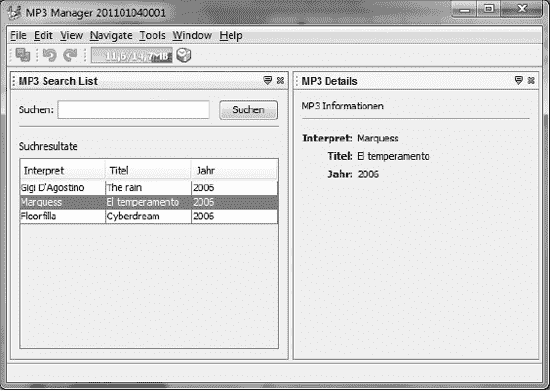

***图 5-3.** 两个模块之间数据交换的典型应用示例，无需相互依赖*

此概念的结构如图 5-4 所示。模块 A 中的 `Mp3SearchList` 类代表一个搜索结果列表。搜索结果条目由 `Mp3FileObject` 类表示，该类位于一个独立的模块中，因为此类是所有模块的最大公约数。如果在列表中选择了一个条目，`Mp3FileObject` 实例就会被添加到本地 Lookup 中。需要一个代理（即一个表示为 `ContextGlobalProvider` 接口的代理组件）来解耦模块 A 和 B。此代理组件将模块 A 的本地 Lookup（其中包含当前选中的实例）提供给模块 B。为了使集中式代理组件能够访问 `Mp3SearchList` 类的本地 Lookup，Lookup API 提供了 `Lookup.Provider` 接口。`Mp3SearchList` 类必须实现此接口。

通过 `getLookup()` 方法，可以提供本地 Lookup。`Lookup.Provider` 接口已由 `TopComponent` 类实现，该类是所有可见的 NetBeans 窗口系统组件以及 `Mp3SearchList` 的父类。NetBeans 窗口系统已经提供了一个中央代理组件的实例，即 `GlobalActionContextImpl` 类。该类提供了一个代理 Lookup，它可以访问当前聚焦的 `TopComponent` 的本地 Lookup。通过调用静态工具方法 `Utilities.actionsGlobalContext()` 可以轻松获取此 Lookup。因此，无需关心 `ContextGlobalProvider` 实例，您就已经可以访问全局代理 Lookup。如果您对更多细节感兴趣，并想进一步了解此概念，那么研究一下所提及的类和方法源代码可能会很有价值。

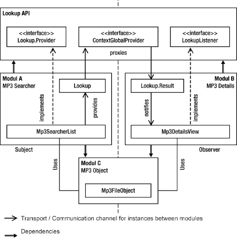

***图 5-4.** 使用本地 Lookup 通过代理组件解耦主题和观察者的模块间通信概念结构*

`Mp3DetailsView` 类通过调用 `Utilities.actionsGlobalContext()` 来获取对 `Mp3SearchList` 的本地 Lookup 的访问权限。基于全局代理 Lookup，您为 `Mp3FileObject` 类创建一个 `Lookup.Result`。`Lookup.Result` 类的实例为特定类型的类提供 Lookup 的一个子集。其主要优点是用户可以通过使用 `LookupListener` 来监听此子集中的变化。因此，一旦在 `Mp3SearchList` 中选择了另一个 `Mp3FileObject`，或者显示 `Mp3SearchList` 的窗口失去焦点，该组件就会收到通知。例如，将不会显示详细的 MP3 信息。

接下来，您将找到此示例应用程序的类。仅显示了类的重要部分。

首先，是 `Mp3SearchList` 类，它代表一个窗口，因此继承自基类 `TopComponent`。为了能够监听结果列表中的选择变化，您还需要实现 `ListSelectionListener` 接口。作为一个私有成员，您有一个管理表格中数据的数据模型。出于演示目的，选择了一个简单的数据模型，在构造函数中创建了 `Mp3FileObject` 类的三个示例对象，并将它们添加到模型中。这些数据通常由搜索算法提供。第二个私有成员对象是 `InstanceContent` 的一个实例。这使您能够动态更改 Lookup 的内容。在 `Mp3SearchList` 的构造函数中，您现在可以使用 `AbstractLookup` 类创建一个本地 Lookup，并将 `InstanceContent` 对象传递到其构造函数中。使用 `associateLookup()` 方法，您的本地 Lookup 被设置为 `TopComponent` 的 Lookup，以便它可以从 `getLookup()` 方法返回。

在 `valueChanged()` 方法中（当在表格中选择一个数据集时调用），您从数据模型中获取数据集，将其包装到一个集合中，并传递给 `InstanceContent` 实例（见清单 5-7），该实例是 Lookup 的数据存储。因此，选中的元素始终是本地 Lookup 的一部分。

***清单 5-7.** Mp3SearchList 在表格中显示搜索结果，并将实际选中的数据集添加到本地 Lookup。*

`public class` **`Mp3SearchList`** `extends` **`TopComponent`**
`implements` **`ListSelectionListener`** `{`
`   private Mp3SearchListModel model = new Mp3SearchListModel();`
`private` **`InstanceContent content`** `= new InstanceContent();`
`   public Mp3SearchList() {`
`      initComponents();`
`      searchResults.setModel(model);`
`      searchResults.getSelectionModel().`
`         addListSelectionListener(this);`
**`associateLookup`**`(new AbstractLookup(`**`content`**`));`
`   }`
`public void` **`valueChanged`**`(ListSelectionEvent event) {`
`      if(!event.getValueIsAdjusting()) {`
`         Mp3FileObject mp3 =`
`            model.getRow(searchResults.getSelectedRow());`
**`content.set(Collections.singleton(mp3), null);`**
`      }`
`   }`
`}`

这里，带有搜索结果的表格的数据模型 `Mp3SearchListModel` 只是一个示例，并且保持得非常简单（见清单 5-8）。在构造函数中直接创建了三个 `Mp3FileObject` 类型的对象。

***清单 5-8.** 简化的数据模型，用于管理和提供结果列表的数据*

`import javax.swing.table.AbstractTableModel;`
`...`
`public class` **`Mp3SearchListModel`** `extends AbstractTableModel {`
`   private String[] columns = {"Interpret", "Titel", "Jahr"};`
`   private List<Mp3FileObject> data = new ArrayList<Mp3FileObject>();`

`   public Mp3SearchListModel() {`
`data.add(new` **`Mp3FileObject`**`("Gigi D'Agostino", "The rain", "2006"));`
`data.add(new` **`Mp3FileObject`**`("Marquess", "El temperamento", "2006"));`
`data.add(new` **`Mp3FileObject`**`("Floorfilla", "Cyberdream", "2006"));`
`   }`
`   public Mp3FileObject getRow(int row) {`
`      return data.get(row);`
`   }`
`   @Override`
`   public Object getValueAt(int row, int col) {`
`      Mp3FileObject mp3 = data.get(row);`
`      switch(col) {`
`         case 0: return mp3.getArtist();`
`         case 1: return mp3.getTitle();`
`         case 2: return mp3.getYear();`
`      }`
`      return "";`
`   }`
`}`

类 `Mp3DetailsView` 是一个窗口，用于显示 `Mp3SearchList` 中选中条目的详细信息。为了在 Lookup 发生变化时（例如，当选择发生变化时）获得通知，实现了 `LookupListener` 接口。一个 `Lookup.Result` 作为私有成员使用，它使我们能够对特定类型（本例中为 `Mp3FileObject`）的变化做出反应。打开窗口会触发 `componentOpened()` 方法。使用此回调，通过 `Utilities.actionsGlobalContext()` 方法获取代理组件的 Lookup，该方法返回一个始终委托给活动 `TopComponent` 的本地 Lookup 的 Lookup。基于此代理 Lookup，现在为 `Mp3FileObject` 类型创建一个 `Lookup.Result`，并注册一个 `LookupListener` 来监听此结果的变化。如果某个 `TopComponent` 获得焦点，并且其本地 Lookup 中包含一个或多个此类型的实例，则会调用 `resultChanged()` 方法。这样，您只需检索这些实例并相应地显示信息，如清单 5-9 所示。

***清单 5-9.** 窗口 Mp3DetailsView 显示在 Mp3SearchList 中选中的 Mp3FileObject 的信息。*

`public class` **`Mp3DetailsView`** `extends` **`TopComponent`** `implements` **`LookupListener`** `{`
`private` **`Lookup.Result<Mp3FileObject> result`** `= null;`

`   public Mp3DetailsView() {`
`      initComponents();`
`   }`
`   public void componentOpened() {`
**`result = Utilities.actionsGlobalContext().LookupResult(Mp3FileObject.class);`**
**`result.addLookupListener(this);`**
`   }`
`public void` **`resultChanged`**`(LookupEvent event) {`
`Collection<? extends Mp3FileObject> mp3s =` **`result.allInstances();`**
`      if(!mp3s.isEmpty()) {`
`         Mp3FileObject mp3 = mp3s.iterator().next();`
**`         artist.setText(mp3.getArtist());`**
**`         title.setText(mp3.getTitle());`**
**`         year.setText(mp3.getYear());`**
`      }`
`   }`
`}`

通过 `Mp3SearchList` 提供并使用 `Mp3DetailsView` 显示的信息是 `Mp3FileObject` 类的一部分（参见清单 5-10）。此类应在一个单独的模块中实现，以实现最佳的封装和重用；在本例中，它是模块 C。为了授予模块 A 和 B 对此类的访问权限，它们必须声明对模块 C 的依赖。如果 `Mp3FileObject` 类仅通过模块 A 提供，则可以将该类移至模块 A。

***清单 5-10.** Mp3FileObject 提供数据*

`public class` **`Mp3FileObject`** `{`
`   private String artist;`
`   private String title;`
`   private String year;`

`public` **`Mp3FileObject`**`(String artist, String title, String year) {`
`      this.artist = artist;`
`      this.title  = title;`
`      this.year   = year;`
`   }`
`public String` **`getArtist`**`() {`
`      return this.artist;`
`   }`
`public String` **`getTitle`**`() {`
`      return this.title;`
`   }`
`public String` **`getYear`**`() {`
`      return this.year;`
`   }`
`}`

作为代理组件，此示例使用了 NetBeans 平台提供的全局代理 Lookup，该 Lookup 委托给活动 `TopComponent` 的本地 Lookup。在图 5-4 中，这通过接口 `ContextGlobalProvider` 进行了描述。这个全局代理 Lookup 也可以很容易地被您自己的实现所替代。该实现只需将包含主题的组件的本地 Lookup 提供给观察者。

### 动态 Lookup

我们已经在*注册服务提供者*一节中处理了 Lookup 的一个典型用例。在那里，您学习了如何通过 `InstanceContent` 对象将您自己类的实例添加到 Lookup 中。在本段中，我将向您展示如何通过一个小的辅助类，将 Lookup API 的优势用于一般的应用程序目的。为此，您需要创建一个基于 `AbstractLookup` 类的 Lookup 类。这个类将被集中提供，因此通过单例模式实现。（参见清单 5-11。）

***清单 5-11.** 可以添加或删除中心对象的动态 Lookup*

`import org.openide.util.Lookup.AbstractLookup;`
`import org.openide.util.Lookup.InstanceContent;`

`public class DynamicLookup extends` **`AbstractLookup`** `{`
`   private static DynamicLookup Lookup = new DynamicLookup();`
`private` **`InstanceContent`** `content = new InstanceContent();`

`   private DynamicLookup() {`
`   }`
`public void` **`add`**`(Object instance) {`
`      content.add(instance);`
`   }`
`public void` **`remove`**`(Object instance) {`
`      content.remove(instance);`
`   }`
`public static DynamicLookup` **`getDefault`**`(){`
`      return Lookup;`
`   }`
`}`

这个简单的 Lookup 类包含了您在*注册服务提供者*一节中已经使用过的 `InstanceContent` 对象；它管理您想要添加的对象。通过 `getDefault()` 方法，您提供动态 Lookup 的中心实例。通过另外两个方法 `add()` 和 `remove()`，您可以从任何位置添加和访问对象；从而轻松实现多向通信。

当然，这个 Lookup 也可以注册一个监听器（`LookupListener`）（参见*注册服务提供者*一节），例如，以此来对某个特定对象的存在做出反应。

### Java 服务加载器

自 Java 6 起，提供了一个与 Lookup 类似的 API：`ServiceLoader`。该类用于加载服务提供者，这些提供者通过 *`META-INF/services`* 目录进行注册。借助此功能，`ServiceLoader` 类等同于可通过 `Lookup.getDefault()` 获取的 NetBeans 标准 Lookup。`ServiceLoader` 是针对特定类型创建的，创建时需使用服务接口或抽象服务类的 `Class` 对象。通过静态工厂方法创建 `ServiceLoader` 实例。根据用于加载服务提供者的类加载器不同，有三种创建服务加载器的方法。

默认情况下，服务提供者使用当前线程的上下文类加载器进行加载。在 NetBeans 平台内部，这指的是系统类加载器（有关 NetBeans 类加载器系统的更多详细信息，请参见第 2 章）。这使得用户可以从所有模块加载服务提供者。通过以下调用创建此类服务加载器：

`ServiceLoader<Mp3Finder> s = ServiceLoader.`**`load`**`(Mp3Finder.class);`

你可能希望使用特定的类加载器来加载服务提供者，例如使用模块类加载器将服务提供者的加载限制在自身模块的类中。要获取这样的 `ServiceLoader`，需要将使用的类加载器传递给工厂方法：

`ServiceLoader<Mp3Finder> s = ServiceLoader.`**`load`**`(`
`   Mp3Finder.class, this.getClass().getClassLoader());`

除此之外，还可以创建一个仅返回已安装服务提供者的服务加载器——例如，位于 *`lib/ext`* 目录或平台特定扩展目录中的 JAR 归档文件中的服务提供者。类路径上找到的其他服务提供者将被忽略。此服务加载器使用 `loadInstalled()` 方法创建：

`ServiceLoader<Mp3Finder> s = ServiceLoader.`**`loadInstalled`**`(Mp3Finder.class);`

服务提供者可以通过迭代器获取。迭代器会在首次访问时触发提供者的动态加载。已加载的提供者会存储在本地缓存中。迭代器在加载剩余未加载的提供者之前，会先返回已缓存的提供者。如有必要，可以使用 `reload()` 方法清除内部缓存。这确保了所有提供者都会被重新加载。

`Iterator<Mp3Finder> i = s.`**`iterator`**`();`
`if(i.hasNext()) {`
`   Mp3Finder finder = i.next();`
`}`

如果提供者无法实例化、与指定类型不匹配或配置文件不正确，则会触发 `ServiceConfigurationError`。

### 总结

在本章中，你学习了 NetBeans 平台最有趣且最重要的概念之一：Lookup。本章探讨了 Lookup 的功能，并让你熟悉了服务接口和服务提供者。你学习了如何创建服务接口并在服务提供者中使用它们，以及如何以松散耦合的方式发现服务提供者。为此，你开始使用各种注册机制。

然而，Lookup 的功能远不止发现服务。实际上，它们还用于实现模块间通信。本章向你展示了一个示例，其中窗口之间无需相互了解即可共享信息。最后，通过将其与 JDK 6 的 `ServiceLoader` 类相关联，拓宽了对该主题的探讨。

## 第 6 章

## 操作

NetBeans 平台对操作的处理基于 *Swing 操作框架*。因此，每个操作都基于 Swing 接口 `ActionListener` 或 `Action`。NetBeans 平台的优点在于它为不同类型的常见操作提供了基础设施。以前，操作必须根据操作类型从特定的类派生；自 NetBeans 平台 7 起，所有操作都具有相同的形式，只需实现 `ActionListener` 接口即可。除了操作现在更易于使用之外，操作的实现对你作为开发者来说也变得更加透明。现在，NetBeans 平台在后台为你完成了繁重的工作。

**极大简化：NetBeans 平台 7 中的操作**

只需通过 `ActionListener` 接口实现你的操作逻辑。元信息，如操作的 ID、名称或图标，只需通过注解添加即可。其余工作由 NetBeans 平台为你完成。

不仅可以创建执行其封装逻辑的基本操作类（`AlwaysEnabled`），还可以创建动态传递可用操作（`Callback`）的操作，或者能够将其逻辑包含在特定上下文中的操作（`ContextAware`）。图 6-1 再次概述了这三种主要操作类型及其最重要的特性。

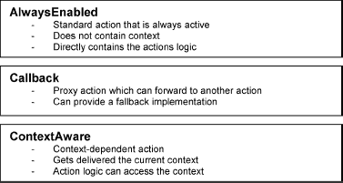

***图 6-1.** NetBeans 平台中不同类型的操作*

操作的注册集中在你标准文件夹 `Actions` 的层文件中完成。然后可以从其他位置引用此集中注册。这有一个很大的优点：操作可以同时在多个地方使用，例如在菜单栏、工具栏以及应用程序模块本身中与控制元素关联。因此，平台只会创建操作类的一个实例。集中声明操作的另一个原因是能够针对特定用户自定义工具栏。这样，所有可用的操作都可以显示给用户，并可以分配到任何工具栏。如果用户从工具栏中移除一个条目，该操作不会丢失，因为删除的只是引用，而不是操作本身。

为了简化操作的注册和分配，NetBeans 平台 7 也引入了新特性。现在，使用注解代替了在层文件中手动注册和分配。借助这些信息，在创建应用程序时会自动生成相应的层条目。不过，你并非必须使用注解。你仍然可以直接在层文件中创建层条目。

在接下来的章节中，我将解释如何简单地创建操作、如何构建它们，以及如何通过注解或手动层条目进行注册。你可以使用 NetBeans IDE 提供的向导来创建操作类。你将了解到操作类非常简单，甚至不需要使用向导。

### 始终启用的操作

选择*文件*  *新建文件…*  *模块开发*  *操作* 以调用创建新操作类的向导。在第一步中，你可以选择操作的类型。这样，你可以在*始终启用*的操作和*条件启用*的操作之间进行选择。你想要创建一个始终提供的操作，因此应选择*始终启用*。在下一步中，你可以将操作类集成到菜单栏和工具栏中，还可以定义快捷键（参见图 6-2）。现在你关注的是操作本身，因此请取消这些选项，并将要创建的操作分配到现有类别或新类别中。

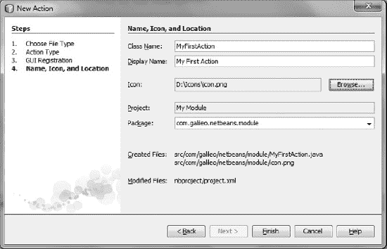

***图 6-2.** 使用 NetBeans 向导创建操作类*

点击*下一步*按钮进入最后一步。你可以在此处定义操作类的名称，该名称将显示在菜单中。此外，你可以或必须为操作选择一个图标。此图标通常应为 16 × 16 像素。你还应提供相同图标的 24 × 24 像素版本。这样，用户便可以在两种不同大小的工具栏之间进行选择。你无需特意选择它，只需将其放在同一文件夹中，并以附加了*24* 的相同名称命名即可。如果 16 × 16 像素的图标名为 *icon.gif*，则 24 × 24 像素的图标必须命名为 *icon24.gif*。此外，你还可以为相应状态提供图标 *icon_pressed.gif*、*icon_disabled.gif*、*icon_rollover.gif*。然后点击*完成*按钮关闭向导并生成操作类。现在，让我们看看清单 6-1 中显示的操作类。

***清单 6-1.** 操作类示例——尽管分配和提供是通过注解的元信息完成的*

`import java.awt.event.ActionEvent;`
`import java.awt.event.ActionListener;`
`import org.openide.awt.ActionID;`
`import org.openide.awt.ActionRegistration;`
`import org.openide.awt.ActionReferences;`

**`@ActionID`**`(`
`    id = "com.galileo.netbeans.MyFirstAction",`
`    category = "File")`
**`@ActionRegistration`**`(`
`    displayName = "#CTL_MyFirstAction",`
`    iconBase = "com/galileo/netbeans/icon.gif")`
`@ActionReferences({})`
`public final class MyFirstAction implements` **`ActionListener`** `{`
`public void` **`actionPerformed`**`(ActionEvent e) {`
`        // TODO implement action body`
`    }`
`}`

首先，你应该通过 `ActionID` 注解为每个操作分配一个唯一标识符。为此，需要使用 `id` 参数指定一个唯一字符串。我建议使用类名及其代码名称基址的组合。这样，ID 就是真正唯一的。此外，操作必须分配到一个类别；该类别可以是已存在的类别，也可以是一个新类别。

操作通过 `ActionRegistration` 注解进行注册。该操作在由 `ActionID` 分配的标识符处注册。显示名称通过从 *Bundle.properties* 文件中读取键 `#CTL_MyFirstAction` 的赋值来获取。这样做的好处是名称可以轻松本地化（名称可以调整为另一种语言）。此外，还通过 `iconBase` 参数指定了一个图标。

 **注意** 目前我将忽略由向导自动创建的 `ActionReferences` 注解。通过这种方式，操作被分配到菜单或工具栏。我将在第 9 章中讨论这一点。

操作类本身非常简单。只需要实现 `ActionListener` 接口的 `actionPerformed()` 方法。你打算执行的操作将由该方法执行。

正如本章开头所述，通过注解注册操作是常规方法。但是，你并非必须使用它。通过在层文件中引用条目来将你的操作引入 NetBeans Platform 同样可行，因为使用注解在原理上并无本质区别。唯一的区别在于，当你根据注解信息自动构建应用程序时，这些条目会被创建。要注册一个不带注解的始终启用操作类，请在 `Actions` 文件夹中创建以下 `.instance` 元素，如清单 6-2 所示。

***清单 6-2.** 通过在层文件中直接条目注册始终启用的操作*

`<file name="com-galileo-netbeans-MyFirstAction.instance">`
`  <attr name="`**`displayName`**`" bundlevalue=`
`    "com.galileo.netbeans.Bundle#CTL_MyFirstAction"/>`
`  <attr name="`**`iconBase`**`"`
`    stringvalue="com/galileo/netbeans/icon.gif"/>`
`  <attr name="`**`instanceCreate`**`"`
`    methodvalue="org.openide.awt.Actions.alwaysEnabled"/>`
`  <attr name="`**`delegate`**`"`
`    newvalue="com.galileo.netbeans.MyFirstAction"/>`
`</file>`

名称与注解参数相对应的属性，其含义与之相同。这些及其他必要属性及其值在表 6-1 中进行了说明。

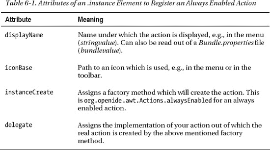

除了这些属性之外，还提供了两个可选属性。这些属性在表 6-2 中列出。

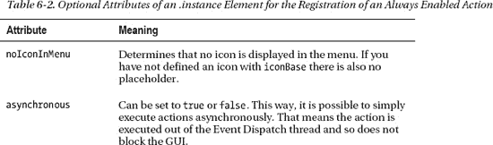

### 回调动作

回调动作与始终启用动作不同，因为回调动作能够委托给另一个通常依赖于上下文的动作。通常，回调动作不包含动作逻辑，而是进一步委托给所谓的*动作执行器*。如果不存在动作执行器，你可以在回调动作中添加所谓的回退实现。回调动作主要用于全局动作，即那些根据上下文遵循不同逻辑的动作。这些动作包括搜索、复制或粘贴等。NetBeans 平台的 Actions API 也提供了多个这样的全局动作。动作执行器由 Java 的 `ActionMap` 提供。在此过程中，动作执行器和回调动作的键会注册到这个映射中。所有继承自 `JComponent` 的类默认都有一个 `ActionMap`。NetBeans 平台基类也默认有一个 `TopComponent`。它用于在 NetBeans 平台应用程序中显示的窗口（更多信息请参见第 10 章）。这个 `ActionMap` 通过 Lookup 提供。回调动作类的任务是检查全局代理 Lookup 中是否存在 `ActionMap`。如果存在，则检查是否为你自己的动作注册了动作执行器。在这种情况下，菜单和工具栏条目等动作表示器会被自动激活。如果没有提供动作执行器和回退实现，动作表示器将被停用。

NetBeans IDE 没有提供专门的向导来创建回调动作。如果你想创建一个带有回退实现的回调动作，只需使用“始终启用动作”一节中描述的向导来创建一个始终启用的动作类。然后，你只需在 `ActionRegistration` 注解中添加另一个参数。如果你不需要回退实现，那就更简单了。只需将 `ActionID` 和 `ActionRegistration` 注解添加到键上即可。在这种情况下，甚至不再需要类。

在清单 6-3 中，将创建一个带有回退实现的动作，以实现刷新功能。它将根据当前哪个窗口拥有焦点来执行不同的动作。使用始终启用动作的向导创建一个名为 `RefreshAction` 的动作类，并将其添加到菜单或工具栏中。已经用 `key` 参数扩展的类应如清单 6-3 所示。

***清单 6-3.** 带有回退实现的回调动作*

`import java.awt.event.ActionEvent;`
`import java.awt.event.ActionListener;`
`import org.openide.awt.ActionRegistration;`
`import org.openide.awt.ActionReference;`
`import org.openide.awt.ActionReferences;`
`import org.openide.awt.ActionID;`

`@ActionID(     category = "File",`
`    id = "com.galileo.netbeans.RefreshAction")`
`@ActionRegistration(`
`    iconBase = "com/galileo/netbeans/icon.gif",`
`    displayName = "#CTL_RefreshAction"`
**`key = "RefreshAction"`**`)`
`@ActionReferences({`
`    @ActionReference(path = "Menu/File", position = 900),`
`    @ActionReference(path = "Toolbars/File", position = 300)`
`})`
`public final class` **`RefreshAction`** `implements ActionListener {`
`    public void actionPerformed(ActionEvent e) {`
`        // TODO 回退实现`
`    }`
`}`

与始终启用动作的唯一区别在于，回调动作使用了额外的参数 `key`。这样，你可以分配一个随机标识符，动作执行器通过该标识符进行关联。

`RefreshAction` 类本身充当回退实现。如果你不需要这样的类，只需像清单 6-4 所示那样注解一个键即可。

***清单 6-4.** 不带回退实现的回调动作*

`@ActionID(     category = "File",`
`    id = "com.galileo.netbeans.RefreshAction")`
`@ActionRegistration(`
`    iconBase = "com/galileo/netbeans/icon.gif",`
`    displayName = "#CTL_RefreshAction")`
`public static final String` **`REFRESH_ACTION = "RefreshAction"`**`;`

现在，如果你启动应用程序，并且既没有提供回退实现也没有提供动作执行器，该动作在菜单和工具栏中都将被停用。清单 6-5 常规性地解释了如何提供动作执行器，因为它假设一个派生自 `TopComponent` 类的窗口。你将在第 10 章 中创建这样一个窗口。一旦创建完成，你也可以实际测试这个动作类。

***清单 6-5.** 为回调动作注册动作执行器*

`public final class MyTopComponent extends TopComponent {`
`   public MyTopComponent() {       ...`
**`getActionMap()`**`.put(`**`"RefreshAction"`**`,`
`                         new AbstractAction() {`
`         public void actionPerformed(ActionEvent event) {`
`           // 刷新顶层组件的内容`
`         }`
`      });`
`   }`
`}`

通过 `JComponent` 类定义的 `getActionMap()` 方法获取顶层组件的动作映射。然后，添加一个与 `RefreshAction` 的键关联的动作实现实例。现在，由 `AbstractAction` 类创建的动作位于 `MyTopComponent` 的上下文中。你可以将任何实现了 `Action` 接口的动作类添加到动作映射中。

一旦 `MyTopComponent` 窗口获得焦点，`RefreshAction` 就会被激活。确认该动作后，将执行由 `MyTopComponent` 提供的 `actionPerformed()` 方法。为了全面理解，了解回调类如何获取动作执行器是有意义的，因为仅仅将动作执行器添加到动作映射中并不会将其提供给 `RefreshAction` 类。这两部分之间的连接仍然缺失。Lookup 概念负责这个连接。在这种情况下，Lookup 概念指的是顶层组件的本地 Lookup 和一个全局代理 Lookup，后者便于回调动作访问本地 Lookup。顶层组件必须确保其动作映射位于其 Lookup 中。然后，回调动作才能找到动作执行器。默认情况下，动作映射已经在顶层组件的本地 Lookup 中；你无需再担心它，除非你使用 `associateLookup()` 方法设置另一个本地 Lookup 或重写 `getLookup()` 方法。只需知道你需要再次添加动作映射。关于 Lookup 概念就介绍这么多；你可以在第 5 章 中找到更多信息。

现在，你可以向回调动作添加任意数量的动作执行器，这些执行器会根据当前上下文自动执行。你可能会问自己如何使用 NetBeans Actions API 提供的动作，例如 `CopyAction`、`CutAction` 或 `DeleteAction` 类，这些类至少已经集成在菜单中，因此可以使用。这些类都是回调动作，只需像之前通过 `RefreshAction` 类解释的那样提供一个动作执行器即可使用。

如果你不想为回调动作使用注解，你也可以通过清单 6-6 中所示的条目在 `Actions` 文件夹中注册它们。

***清单 6-6.** 通过层文件中的条目注册回调动作*

`<file name="com-galileo-netbeans-RefreshAction.instance">`
`  <attr name="displayName"`
`    bundlevalue="com.galileo.netbeans.Bundle#CTL_RefreshAction"/>`
`  <attr name="iconBase"`
`    stringvalue="com/galileo/netbeans/icon.gif"/>`
`  <attr name="`**`instanceCreate`**`"`
`    methodvalue="org.openide.awt.Actions.callback"/>`
`  <attr name="`**`fallback`**`"`
`    methodvalue="org.openide.awt.Actions.alwaysEnabled" />`
`  <attr name="`**`delegate`**`"`
`    newvalue="com.galileo.netbeans.RefreshAction"/>`
`  <attr name="`**`key`**`" stringvalue="RefreshAction"/>`
`</file>`

属性 `displayName` 和 `iconBase` 对应于“始终启用操作”一节中解释的始终启用操作的属性。回调操作的专用属性在表 6-3 中列出并说明。

始终启用操作的可选属性（参见表 6-2）也可以通过回调操作提供。

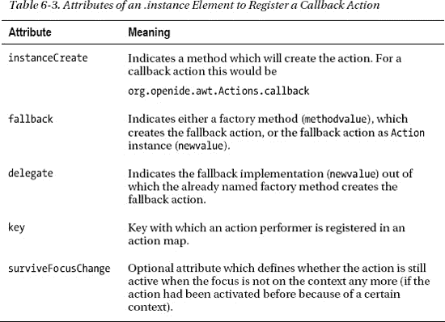

### 上下文感知操作

此类操作在特定上下文中工作——例如，一个文件。此类操作的特殊之处在于，只有当应用程序中引用的上下文也处于活动状态时，这些操作才会被激活。在示例中，文件在应用程序中被打开。上下文由 NetBeans 平台自动传递给操作，因此操作可以在该上下文上执行引用的操作，例如编辑文件。通常，上下文和操作通过所谓的*上下文接口*（也称为*Cookie*）连接，该接口由上下文实现。

在以下示例中，我们希望使用节点类作为上下文。节点是特定数据的表示。在实践中，节点可以是一个文件，例如在树形结构中描绘或在编辑器中打开的文件。你将在第 7 章和第 12 章中了解更多关于这个在 NetBeans 平台中频繁使用的概念。

要创建上下文感知操作，你可以再次使用操作向导（*文件*  *新建文件*…  *模块开发*  *操作*）。但在这种情况下，你应该选择类型*条件启用*。然后指定上下文接口，并选择当存在多个上下文接口实例时操作是否仍应处于活动状态。在此示例中，我们使用上下文接口 `Editable`，并指定该操作仅在一个上下文实例上工作。在向导的下一页，你可以将操作集成到菜单栏和工具栏中（参见“始终启用操作”一节）。完成向导后，你的操作类应大致如清单 6-7 所示。

***清单 6-7.** 上下文感知类型的操作类，当存在上下文接口 Editable 的实例时变为活动状态*

`import java.awt.event.ActionListener;`
`import java.awt.event.ActionEvent;`
`import org.netbeans.api.actions.Editable;`
`import org.openide.awt.ActionID;`
`import org.openide.awt.ActionRegistration;`
`import org.openide.awt.ActionReferences;`

`@ActionID(`
`    category = "Edit",`
`    id = "com.galileo.netbeans.MyContextAction")`
`@ActionRegistration(`
`    iconBase = "com/galileo/netbeans/icon.gif",`
`    displayName = "#CTL_MyContextAction")`
`@ActionReferences({})`
`public final class MyContextAction implements ActionListener {`
`private final` **`Editable context`**`;`
`    public MyContextAction(`**`Editable context`**`) {`
`        this.context = context;`
`    }`
`public void` **`actionPerformed`**`(ActionEvent ev) {`
`        // 对上下文执行操作`
**`context.edit()`**`;`
`    } }`

现在查看创建的操作类，你会很快发现它与始终启用操作几乎没有区别。上下文感知操作以相同的方式使用 `ActionID` 和 `ActionRegistration` 注解进行注册。

与始终启用操作不同，上下文感知操作有一个构造函数。构造函数将所需的上下文作为参数。在 `actionPerformed()` 方法中，你可以访问此上下文。如果你定义当大多数上下文实例处于活动状态时操作也应处于活动状态，则在创建操作（或之后）时，会将上下文实例列表传递给构造函数。注册时无需定义其他参数。只有以下部分发生变化：

`private final` **`List<Editable> context`**`;`
`public MyContextAction(`**`List<Editable> context`**`) {`
`    this.context = context;`
`}`

我们现在还需要一个节点，用于激活该操作。作为示例，我创建了类 `MyNode`，它继承自 `Node` 的子类 `AbstractNode`。在实际应用中，这样的节点类可以代表某种类型的文件。本例中的类仅用于阐明上下文感知操作与特定上下文的关联。在操作类中，你已定义节点必须实现接口 `Editable`。因此，现在需要完成这一步骤。该上下文接口指定了方法 `edit()`，你刚刚通过一个空实现创建了它。该方法稍后由操作类调用；它代表了上下文相关的操作逻辑。Actions API 提供了一系列常用的上下文接口，例如 `Openable` 或 `Closable`。不过，由于你不需要特定的超接口，你可以将任何接口用作上下文接口。（参见清单 6-8。）

***清单 6-8.** 实现上下文接口 Editable 并因此代表操作上下文的节点*

`import org.netbeans.api.actions.Editable;`
`import org.openide.nodes.AbstractNode;`
`import org.openide.nodes.Children;`

`public class MyNode extends AbstractNode` **`implements Editable`** `{`
`   public MyNode() {`
`     super(Children.LEAF);`
`   }`
`public void` **`edit`**`() {`
`      // 根据此节点代表的数据编辑某些内容`
`   }`
`}`

现在，你只需在你的顶层组件中设置活动节点，该组件可以是一个文件编辑器，例如，其中打开了由该节点代表的文件。为此，你只需将该节点添加到顶层组件的本地 Lookup 中。（参见清单 6-9。）

***清单 6-9.** 设置活动节点。通过这样做，当实现此节点的相关上下文接口时，该操作变为活动状态。*

`public final class MyTopComponent extends TopComponent {`
`   public MyTopComponent() {`
`      MyNode node = new MyNode();`
`      ...`
`      associateLookup(Lookups.fixed(`**`node`**`, getActionMap()));`
`   }`
`}`

如果你的应用程序中的焦点在此顶层组件上，NetBeans 平台会确保将本地 Lookup（其中现在有一个 `MyNode` 实例）作为全局上下文提供给该操作。在这种情况下，菜单栏和/或工具栏中的操作也会由 NetBeans 平台自动激活。

最后，关于上下文感知操作，清单 6-10 展示了如何通过直接在层文件中注册来注册此类操作类，而无需使用注解。

***清单 6-10.** 通过直接在层文件中注册上下文感知操作。*

`<file name="com-galileo-netbeans-MyContextAction.instance">`
`  <attr name="displayName" bundlevalue=`
`    "com.galileo.netbeans.Bundle#CTL_MyContextAction"/>`
`  <attr name="iconBase"`
`    stringvalue="com/galileo/netbeans/icon.gif"/>`
`  <attr name="`**`instanceCreate`**`"`
`    methodvalue="org.openide.awt.Actions.context"/>`
`  <attr name="`**`delegate`**`"`
`    methodvalue="org.openide.awt.Actions.inject"/>`
`  <attr name="`**`injectable`**`"`
`    stringvalue="com.galileo.netbeans.MyContextAction"/>`
`  <attr name="`**`type`**`"`
`    stringvalue="org.netbeans.api.actions.Editable"/>`
`  <attr name="`**`selectionType`**`" stringvalue="EXACTLY_ONE"/>`
`</file>`

属性 `displayName` 和 `iconBase` 指的是“始终启用的操作”一节中描述的始终启用操作的属性。在表 6-4 中，列出并解释了上下文感知操作的特殊属性。表 6-2 中始终启用操作的可选属性也适用于上下文感知操作。

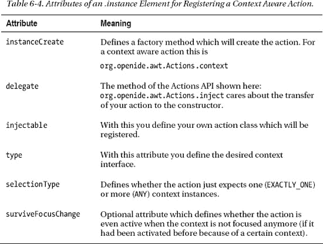

### 总结

本章讨论了操作。你学习了如何通过 NetBeans IDE 中的向导快速高效地创建操作。你还了解了可用的各种操作类型，并学习了如何有效使用它们。例如，某些操作始终可用，而其他操作仅在特定上下文中可用。你学习了使用注解注册和分配操作是多么容易。

## 第 7 章

## 数据和文件

NetBeans 平台为创建、管理、操作和呈现数据提供了一个非常强大的概念。这个概念主要包含文件系统 API 和数据系统 API。此外，还有节点 API 和资源管理器 API。这些 API 中的每一个都位于其自身的抽象级别上。该系统可以划分为四个级别，以及 NetBeans 平台应用程序外部的具体数据，如图 7-1 所示。

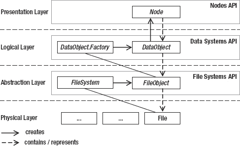

***图 7-1.** NetBeans 平台内管理数据和文件的架构*

数据系统最初使用 `FileSystem` 类进行抽象。这样，位于其下的物理数据可以以任何形式存在。`FileSystem` 类允许用户以相同的方式处理来自不同来源的物理数据——例如，本地文件系统、XML 文件形式的文件系统（类似于系统文件系统的构建方式）或 JAR 文件。只需以所需形式提供抽象类 `FileSystem` 的一个实现即可。这样，文件系统 API 就从具体数据中抽象出来，并在应用程序内以虚拟文件系统的形式提供。因此，可以独立于数据来源进行访问。抽象层上以 `FileObject` 类形式存在的抽象数据，尚未包含关于要管理何种数据类型的信息。因此，该层不包含数据特定的逻辑。在此基础之上，逻辑层有数据系统 API。这里有代表特定类型数据的对象。这些对象基于 `DataObject` 类构建。对于每种所需的数据类型，都存在一个 `DataObject.Factory`，负责创建对象。节点 API 是该概念中的顶层（它位于表示层）。因此，节点负责数据的类型特定表示。在这方面，`Node` 代表一个 `DataObject`，而 `DataObject` 本身负责创建节点。在第 12 章中，我将详细解释如何通过节点和资源管理器来表示你的数据。

### 文件系统 API

NetBeans 平台通过文件系统 API 提供对文件和文件夹的透明访问。在此过程中，访问非常抽象；无论数据是以虚拟 XML 文件系统（例如系统文件系统）的形式存在，还是位于 JAR 存档或普通目录中，其工作方式都是相同的。文件系统的一般接口在抽象类 `FileSystem` 中描述。抽象类 `AbstractFileSystem` 实现了文件系统的一些任务。因此，它作为特殊文件系统实现的基类很有用。具体的实现 `LocalFileSystem`、`JarFileSystem` 和 `XMLFileSystem` 都派生自该类。类 `MultiFileSystem` 代表多个文件系统的代理；它主要用作基类。文件系统的类层次结构如图 7-2 所示。

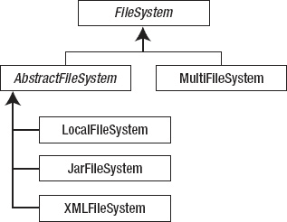

***图 7-2.** 文件系统的类层次结构*

### 文件对象

文件系统中的文件——目录和文件——由类 `FileObject` 表示。这是 Java 平台 `File` 类的一个抽象包装类。`FileObject` 的实现由具体的文件系统提供。除了标准的文件操作外，类 `FileObject` 还提供了监督文件或目录更改的可能性。以下部分将描述类 `FileObject` 的操作。

#### 创建

若要在本地文件系统中为现有文件创建 `FileObject`，可通过辅助类 `FileUtil` 实现：

`FileObject obj = FileUtil.`**`toFileObject`**`(new File("C:/file.txt"));`

若要根据具体的 `FileSystem` 对象创建 `FileObject`，可使用 `findResource()` 方法指定完整路径：

`FileSystem fs = …`
`FileObject obj = fs.`**`findResource`**`("folder/file");`

以下演示如何基于 `File` 对象创建新文件或目录：

`File file   = new File("E:/newfolder/newfile.txt");`
`File folder = new File("E:/newfolder2");`
`FileObject fo1 = FileUtil.`**`createData`**`(file);`
`FileObject fo2 = FileUtil.`**`createFolder`**`(folder);`

若已拥有一个 `FileObject` 形式的目录，可在其文件系统中创建文件或目录，操作如下：

`FileObject folder    = …`
`FileObject file      = folder.`**`createData`**`("newfile.txt");`
`FileObject subfolder = folder.`**`createFolder`**`("newfolder");`

#### 重命名

若要重命名文件或目录，首先需确保 `FileObject` 不会被随意编辑。这可通过 `FileLock` 对象实现。重命名后，需在 `finally` 块中释放该 `FileLock`。

`FileObject myfile = …`
**`FileLock`** `lock = null;`
`try {`
`   lock = myfile.`**`lock`**`();`
`} catch (FileAlreadyLockedException e) {`
`   return;`
`}`
`try {`
`   myfile.`**`rename`**`(lock, "newfilename", myfile.getExt());`
`} finally {`
`   lock.`**`releaseLock`**`();`
`}`

#### 删除

删除文件或目录非常简单，因为 `delete()` 方法会自动处理 `FileLock` 的预留和打开。因此，删除只需以下一行代码：

`FileObject myfile = …`
`myfile.`**`delete`**`();`

此外，该方法还提供了一个变体，允许像重命名 `FileObject` 那样传入自定义的 `FileLock`。

#### 移动

`FileObject` 不能像 `File` 那样通过重命名来移动。`FileUtil` 类提供了 `moveFile()` 方法用于移动 `FileObject`。该方法将文件或目录复制到目标目录，删除源文件，并在此过程中自动预留所需的 `FileLock` 对象，随后再释放它们。

`FileObject fileToMove = …`
`FileObject destFolder = …`
`FileUtil.`**`moveFile`**`(fileToMove, destFolder, fileToMove.getName());`

#### 读写数据

与 Java 类似，`FileObject` 的读写通过流来实现。为此，`FileObject` 类提供了 `InputStream` 和 `OutputStream`。你可以将它们封装在 `BufferedReader` 中以实现简单高效的读取，以及封装在 `PrintWriter` 中用于写入，如清单 7-1 所示。

***清单 7-1.** 读写 FileObject*

`FileObject myFile = …`
**`BufferedReader`** `input = new BufferedReader(new InputStreamReader(myFile.`**`getInputStream`**`()));`
`try {`
`   String line = null;`
`   while((line = input.readLine()) != null) {`
`      // 处理该行`
`} finally {`
`   input.close();`
`}`
**`PrintWriter`** `output = new PrintWriter(`
`   myFile.`**`getOutputStream`**`());`
`try {`
`   output.println("myfile 的新内容");`
`} finally {`
`   output.close();`
`}`

你也可以选择将自定义的 `FileLock` 传递给 `getOutputStream()` 方法。

`FileObject` 类本身提供了两个简便方法，用于轻松读取基于文本的 `FileObject`。一方面，可以使用 `asText()` 方法一次性获取文件的完整内容。另一方面，可以使用 `asLines()` 方法获取包含所有独立行的列表。这两个方法都可以选择将特定的编码（如 UTF-8）作为参数传入。

`FileObject myFile = …`
`for (String line : fo.`**`asLines`**`()) {`
`   // 处理该行`
`}`

#### 监控变更

`FileObject` 类使你能够对文件系统中的文件变更做出响应，因为你可以为此注册一个 `FileChangeListener`，如清单 7-2 所示。

***清单 7-2.** 响应数据对象的变更*

`File file = new File("E:/NetBeans 7/file.txt");`
**`FileObject`** `fo = FileUtil.toFileObject(file);`
`fo.addFileChangeListener(new` **`FileChangeListener`**`(){`
`public void` **`fileFolderCreated`**`(FileEvent fe) {`
`   }`
`public void` **`fileDataCreated``**`(FileEvent fe) {`
`   }`
`public void` **`fileChanged`**`(FileEvent fe) {`
`   }`
`public void` **`fileDeleted`**`(FileEvent fe) {`
`   }`
`public void` **`fileRenamed`**`(FileRenameEvent fre) {`
`   }`
`public void` **`fileAttributeChanged`**`(FileAttributeEvent fae) {`
`   } });`

`fileFolderCreated()` 和 `fileDataCreated()` 方法在创建目录或调用文件时被调用。这些方法仅在所监控的 `FileObject` 是一个目录时才有意义。当文件发生变更时，事件总是会针对文件本身及其父目录触发。这意味着，即使监控的是父目录，这些方法也会收到数据变更的通知。如果你对 `FileChangeListener` 接口的所有事件不感兴趣，可以改用适配器类 `FileChangeAdapter`。

 **注意** 请记住，你只能收到应用程序内对具体 `FileObject` 执行的事件通知。例如，当在应用程序外部（如 Windows 资源管理器）重命名文件时，你将无法收到通知。

`FileSystem`、`FileObject` 和 `FileUtil` 类提供了大量非常有用的方法。因此，仔细查阅文件系统 API 的文档是完全值得的。

### 数据系统 API

数据系统 API 提供了一个基于文件系统 API 的逻辑层。`FileObject` 管理其数据时不关心数据类型，而 `DataObject` 则是针对特定类型的 `FileObject` 的包装器。`DataObject` 通过类型特定的特性和功能扩展了 `FileObject`。这些功能由接口或抽象类（即所谓的上下文接口）来指定。功能的实现由 `DataObject` 通过本地 Lookup 提供。由于这种机制，`DataObject` 的能力可以动态且灵活地调整，并且可以从外部调用。由于 `DataObject` 知道其所管理数据的类型，因此它能够相应地表示数据。这意味着，`DataObject` 负责自行创建一个 `Node`，以便在用户界面上相应地表示数据。`DataObject` 由专门的 `DataObject.Factory` 创建，该工厂恰好负责一种数据类型。

该系统的连贯性很容易展示。在下面的示例中，三层 API 如何协同工作并相互构建将变得非常清晰。在这方面，NetBeans IDE 完成了大量工作并提供了一个向导。

现在，您希望使用此向导向模块中添加一个用于 MP3 文件的数据文件。

1.  为此，请选择“文件” “新建文件…”，然后在“模块开发”类别中选择“文件类型”。
2.  目前，您可以确定 MIME 类型；在此示例中，输入 `audio/mpeg`。文件类型根据扩展名进行识别；对于 XML 文件，也可以通过根元素来识别内容的类型。在这里，您希望文件通过扩展名 `mp3` 来识别。因此，您填写此项（参见图 7-3）。您可以选择定义多个文件扩展名，每个扩展名之间用逗号分隔。因此，对于视频文件，`mpg` 或 `mpeg` 会是有意义的。

    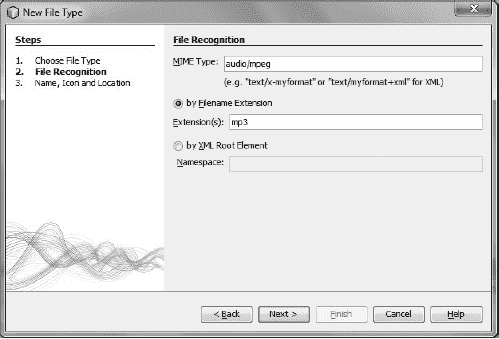

    ***图 7-3.** 使用 NetBeans 向导为 MP3 文件创建新的文件类型*

3.  要进入最后一页，请按“下一步”。输入 `Mp3` 作为类名前缀，并选择一个 16 × 16 像素的图标。
4.  然后按“完成”按钮，向导将创建数据对象类。

### 数据对象

原则上，数据对象由抽象类 `DataObject` 定义。通常，子类 `MultiDataObject` 被用作基类。一方面，它已经实现了 `DataObject` 的大部分抽象方法；这就是为什么您自己的数据对象类保持得非常小巧。另一方面，多数据对象可以包含一个或多个文件对象。一个数据对象总是有一个称为主文件的文件对象。此外，多数据对象可以选择性地包含一个或多个文件，这些文件称为辅助文件。辅助文件通常出现在相关数据中——例如，在表单编辑器中。在编辑器中，文件 *myform.java、myform.form、myform.class* 由一个数据对象表示。在此示例中，文件 *myform.java* 是主文件，而文件 *myform.class* 和 *myform.form* 是辅助文件。数据对象内的文件对象由类 `MultiDataObject.Entry` 管理。这里主要使用子类 `FileEntry`。标准的文件操作（例如移除或删除）通过此类执行。查看由向导创建的类 `Mp3DataObject`，如清单 7-3 所示。

***清单 7-3.** 用于文件对象类型 Mp3 的数据对象类。此类为 MP3 文件提供逻辑。*

`import java.io.IOException;`
`import org.openide.filesystems.FileObject;`
`import org.openide.loaders.DataNode;`
`import org.openide.loaders.DataObjectExistsException;`
`import org.openide.loaders.MultiDataObject;`
`import org.openide.loaders.MultiFileLoader;`
`import org.openide.nodes.Node;`
`import org.openide.nodes.Children;`
`import org.openide.util.Lookup;`

`public class Mp3DataObject extends` **`MultiDataObject`** `{`
`public` **`Mp3DataObject(FileObject pf, MultiFileLoader loader)`**
`      throws DataObjectExistsException, IOException {`
`      super(pf, loader);`
`   }`
`   protected Node createNodeDelegate() {`
`      return new DataNode(this, Children.LEAF, getLookup());`
`   }`
`public Lookup` **`getLookup`**`() {`
`      return getCookieSet().getLookup();`
`   }`
`}`

正如您已经知道的，数据对象通常由数据对象工厂创建。该工厂负责创建特定的数据对象类型。`Mp3DataObject` 类的构造函数包含两个参数。首先，是主文件，它包含或代表实际的 MP3 文件。其次，它包含以 `MultiFileLoader` 对象形式存在的工厂实例，该工厂负责该数据对象。您只需将这些参数传递给基类构造函数，由它进行管理。数据对象负责创建相应的节点，因为该对象知道其数据的类型。节点用于在用户界面上表示数据对象。您通过方法 `createNodeDelegate()` 来实现这一点，该方法创建节点类 `DataNode` 的一个实例并返回。这是与位于表示层的节点 API 的接口（参见图 7-1）。您将在第 12 章中了解更多相关信息。

文件对象和数据对象之间的主要区别在于，数据对象知道它包含哪些数据。这意味着数据对象的特征在于能够为此类型的数据（在本例中为 MP3 文件）提供特性和功能。数据对象为其文件提供的功能由接口或抽象类描述。这些就是上下文接口。这些接口的实例由数据对象在本地 Lookup 中管理。由于这些接口不一定由 `DataObject` 本身实现，而是由 Lookup 管理，因此数据对象能够动态地提供其能力。这意味着，例如，它可以在运行时提供一个正在播放的 MP3 文件。只要 MP3 文件正在播放，就会提供此功能。此外，还可以灵活地用更多功能扩展数据对象。Lookup 本身提供了对这些接口的类型安全访问。

现在，您的 `Mp3DataObject` 的基本结构已经完成。构造函数通过相应的工厂从较低抽象层获取要管理的文件对象。抽象层为上层表示层提供一个代表，并最终通过 Lookup 将其功能提供给环境。基类 `DataObject` 和 `MultiDataObject` 提供了许多用于使用数据对象的方法。在此，查阅 API 文档会非常有帮助。

#### 实现上下文接口

首先，你需要通过一个接口来指定将接收你的 `Mp3DataObject` 的功能。现在，你应该将其命名为 `PlayInterface`，并指定一个 `play()` 方法，通过该方法可以播放对应的 `Mp3DataObject`：

`public interface` **`PlayInterface`** `{`
`public void` **`play`**`();`
`}`

当然，接下来你需要实现通过上下文接口指定的所需功能。你可能会想象直接通过 `Mp3DataObject` 类来实现该接口；然而，更好的做法是通过一个单独的类，即*支持*类来实现。这样，该功能可以灵活地添加到 `Mp3DataObject` 中，也可以再次删除。此外，多个上下文接口可以在语义上分组，并且 `Mp3DataObject` 类可以保持非常小巧。

`public class` **`PlaySupport`** `implements` **`PlayInterface`** `{`
`   private Mp3DataObject mp3 = null;`
`   public PlaySupport(Mp3DataObject mp3) {`
`      this.mp3 = mp3;`
`   }`
`public void` **`play`**`() {`
`      System.out.println("Play: " + mp3.getPrimaryFile().getName());`
`   }`
`}`

此外，只需将这个支持类的一个实例添加到 `Mp3DataObject` 类的查找（Lookup）中。你可以通过 `getCookieSet().assign()` 方法来实现，并在此过程中指明其类型为 `PlayInterface`。当然，你也可以指明 `PlaySupport.class`，但这样做可以使你独立于具体实现。

`public class Mp3DataObject extends` **`MultiDataObject`** `{`
`public` **`Mp3DataObject(FileObject pf, MultiFileLoader loader)`**
`      throws DataObjectExistsException, IOException {`
`      super(pf, loader);`
**`getCookieSet().assign(PlayInterface.class, new PlaySupport(this));`**
`   }`
`}`

最终，你分三步为你的 `Mp3DataObject` 扩展了一个功能。这个功能可以从外部通过 `getLookup()` 获取的本地查找（Lookup）来使用。

#### 使用上下文接口

最后，问题仍然是如何访问数据对象的功能。我想通过一个上下文感知的动作类来回答这个问题。为此，你需要通过向导创建一个新类，路径为 *文件*  *新建文件*…  *模块开发*  *动作*。现在，你使用 `Mp3DataObject` 作为上下文。这样，只有当选中了一个 `Mp3DataObject`（即其节点）时，该动作才会变为可用。正如你从第 6 章已经了解到的，上下文会被传递到上下文感知类的构造函数中：

`public final class MyContextAction implements ActionListener {`
`private final` **`Mp3DataObject context`**`;`
`    public MyContextAction(`**`Mp3DataObject context`**`) {`
`        this.context = context;`
`    }`
`public void` **`actionPerformed`**`(ActionEvent ev) {`
`        // 对上下文执行某些操作`
`PlayInterface p =` **`context.getLookup().Lookup(PlayInterface.class);`**
`        p.play();`
`    }`
`}`

现在，如果在你的应用程序中选中了一个 `Mp3DataObject`，该上下文感知动作就会通过 NetBeans 平台自动变为可用。然后，你可以在 `actionPerformed()` 方法中访问上下文，即 `Mp3DataObject` 实例。正如你已经知道的，数据对象的特性是在一个查找（Lookup）中管理的。因此，你获取这个查找，并通过 `Lookup()` 方法提供 `PlayInterface` 的实现。现在，你可以访问 `PlaySupport` 类的实现，并执行其方法。

你可以通过 *收藏夹* 模块来测试所有内容。

1.  为此，请确保在你的 NetBeans 平台应用程序中，在 *属性*  *库* 下的平台集群中激活了“收藏夹”模块。
2.  接下来，启动你的应用程序，并通过 *窗口*  *收藏夹* 打开“收藏夹”窗口。
3.  右键单击该窗口，然后选择 *添加到收藏夹*。
4.  然后，在选择对话框中选择一个 MP3 文件或一个包含 MP3 文件的目录，然后按 *添加* 将选中的条目添加到“收藏夹”窗口中。显示的 MP3 文件由一个数据节点实例表示，该实例是由 `Mp3DataObject` 本身创建的。当你将 MP3 文件添加到“收藏夹”窗口时，该对象由一个数据加载器创建。

如果你选中了一个 MP3 文件，然后执行该动作——查看 `play()` 方法的输出——你会看到，你可以通过该动作的上下文类直接访问选中的数据。

#### 动态提供上下文接口

在下面的示例（清单 7-4）中，我将向你展示如何在应用程序运行期间更改 `Mp3DataObject` 提供的功能。通过这种方式，你还可以隐式控制用户可用的操作。你已经为播放 MP3 文件创建了一个上下文接口和一个支持类。现在，你希望将同样的方法应用于停止 MP3 文件。此外，支持类和 `playing()` 方法现在会设置 `Mp3DataObject` 的当前播放状态。

***清单 7-4.** 用于播放 Mp3DataObject 的上下文接口和支持类*

`public interface` **`PlayInterface`** `{`
`   public void play();`
`}`
`public class` **`PlaySupport`** `implements` **`PlayInterface`** `{`
`   private Mp3DataObject mp3 = null;`
`   public PlaySupport(Mp3DataObject mp3) {`
`      this.mp3 = mp3;`
`   }`
`public void` **`play`**`() {`
`       System.out.println("play");`
`       mp3.playing(true);`
`    }`
`}`
`public interface` **`StopInterface`** `{`
`   public void stop();`
`}`
`public class` **`StopSupport`** `implements` **`StopInterface`** `{`
`   private Mp3DataObject mp3 = null;`
`   public StopSupport(Mp3DataObject mp3) {`
`      this.mp3 = mp3;`
`   }`
`public void` **`stop`**`() {`
`      System.out.println("stop");`
`      mp3.playing(false);`
`  }`
`}`

你在构造函数中创建这两个支持类。首先，你可以假设 MP3 文件未被播放，因此你使用 `assign()` 方法将 `PlaySupport` 添加到 Lookup 中。你更改了上下文接口中的内容。你在 `playing()` 方法中执行此操作，该方法由支持类通过相应的参数调用。如果文件正在播放，则仅通过将类型 `PlayInterface` 而不传递任何实例传递给 `assign()` 方法来删除该类型的所有实例，并添加一个 `StopInterface` 的实例（参见清单 7-5）。如果文件停止，则反之亦然。

***清单 7-5.** 动态添加和删除上下文接口的实例*

`public class` **`Mp3DataObject`** `extends MultiDataObject {`
**`private PlaySupport playSupport = null;`**
**`private StopSupport stopSupport = null;`**
`   public Mp3DataObject(FileObject pf, MultiFileLoader loader)`
`      throws DataObjectExistsException, IOException {`
`      super(pf, loader);`
**`playSupport = new PlaySupport(this);`**
**`stopSupport = new StopSupport(this);`**
`      getCookieSet().assign(PlayInterface.class, playSupport);`
`   }`
`public synchronized void` **`playing`**`(boolean value) {`
`      if(value) {`
**`getCookieSet().assign(PlayInterface.class);`**
**`getCookieSet().assign(StopInterface.class, stopSupport);`**
`      } else {`
**`getCookieSet().assign(StopInterface.class);`**
**`getCookieSet().assign(PlayInterface.class, playSupport);`**
`      }`
`   }`
`}`

为了完善这个示例，你还需要另外两个操作类，用于启动和停止 MP3 文件。这两个类应该是 `ContextAware` 类，它们使用 `PlayInterface` 和 `StopInterface` 作为上下文。然后，菜单或工具栏条目会根据所选 MP3 文件提供的上下文接口或支持类自动激活或停用（参见清单 7-6）。

***清单 7-6.** 上下文敏感操作，当所选 Mp3DataObject 提供相应上下文接口的实例时激活*

`public final class` **`PlayAction`** `implements ActionListener {`
`   private final PlayInterface context;`
`   public PlayAction(`**`PlayInterface context`**`) {`
`      this.context = context;`
`   }`
`   @Override`
`   public void actionPerformed(ActionEvent ev) {`
**`context.play();`**
`   }`
`}`
`public final class` **`StopAction`** `implements ActionListener {`
`   private final StopInterface context;`
`   public StopAction(`**`StopInterface context`**`) {`
`      this.context = context;`
`   }`
`   @Override`
`   public void actionPerformed(ActionEvent ev) {`
**`context.stop();`**
`   }`
`}`

#### 数据对象工厂

数据对象由数据对象工厂创建。一个工厂只负责一种类型。工厂可以通过文件后缀或 XML 根元素来识别文件类型。工厂在层中注册，并由 NetBeans 平台自动创建，该平台管理所有现有的工厂，并能为相应的文件类型找到对应的文件。工厂由接口 `DataObject.Factory` 指定。类 `MultiFileLoader` 代表了一个默认使用的实现（参见清单 7-6）。

负责创建 `Mp3DataObject` 类型数据对象的工厂也已由 NetBeans 向导在层文件中注册。查看层文件（清单 7-7）可以了解此类工厂注册是如何构建的。

***清单 7-7.** 在层文件中注册数据对象工厂*

`<folder name="`**`Loaders`**`">`
`   <folder name="audio">`
`      <folder name="mpeg">`
`         <folder name="`**`Factories`**`">`
`            <file name="`**`Mp3DataLoader`**`.instance">`
`               <attr name="`**`SystemFileSystem.icon`**`" urlvalue=`
`                "nbresloc:/com/galileo/netbeans/module/mp3.png"/>`
`               <attr name="`**`dataObjectClass`**`" stringvalue=`
`                "com.galileo.netbeans.module.`**`Mp3DataObject`**`"/>`
`               <attr name="`**`instanceCreate`**`" methodvalue=`
`                "org.openide.loaders.DataLoaderPool.factory"/>`
`               <attr name="`**`mimeType`**`" stringvalue="`**`audio/mpeg`**`"/>`
`            </file>`
`         </folder>`
`      </folder>`
`   </folder>`
`</folder>`

在标准文件夹 `Loaders` 下，根据定义的 MIME 类型（本例中为 `audio/mpeg`）创建子文件夹。在这些子文件夹下是标准文件夹 `Factories`，我们的特殊数据对象工厂以名称 `Mp3DataLoader.instance` 在其中注册。通过属性 `SystemFileSystem.icon` 指定了此文件类型的图标。通过属性 `mimeType` 和 `dataObjectClass`，你可以确定工厂应为哪种数据类型生成哪种数据对象类型。这意味着，这里只确定了 MIME 类型，而不是文件后缀。此确定也在层文件的标准文件夹 `Services/MIMEResolver` 中进行。最后，通过方法 `DataLoaderPool.factory()` 创建了现已注册的、用于你的 `Mp3DataObject` 类的特殊工厂。

当你在本章开头创建 MP3 文件类型时，NetBeans 向导除了创建 `Mp3DataObject` 类之外，还创建了文件 *Mp3Resolver.xml*。此文件确定文件扩展名 *.mp3* 被分配给 MIME 类型 `audio/mpeg`（参见清单 7-8）。

***清单 7-8.** MIME 解析器文件*

`<!DOCTYPE MIME-resolver PUBLIC`
`   "-//NetBeans//DTD MIME Resolver 1.0//EN"`
`   "http://www.netbeans.org/dtds/mime-resolver-1_0.dtd">`
`<MIME-resolver>`
`   <file>`
`      <ext name="mp3"/>`
`      <resolver mime="audio/mpeg"/>`
`   </file>`
`</MIME-resolver>`

此文件也在层文件中注册。为此，使用了前面提到的标准文件夹 `Services/MIMEResolver`，如清单 7-9 所示。

***清单 7-9.** MIME 类型的注册*

`<folder name="`**`Services`**`">`
`   <folder name="`**`MIMEResolver`**`">`
`      <file name="`**`Mp3Resolver.xml`**`" url="Mp3Resolver.xml">`
`         <attr name="displayName" bundlevalue=`
`               "com.galileo.netbeans.module.Bundle#Services/MIMEResolver/Mp3Resolver.xml"/>`
`      </file>`
`   </folder>`
`</folder>`

#### 手动创建数据对象

通常，数据对象无需显式创建，而是由工厂按需生成。不过，你也可以通过 `DataObject` 类的静态 `find()` 方法，为给定的 `FileObject` 创建一个 `DataObject`：

`FileObject myFile = …`
`try {`
`   DataObject obj = DataObject.`**`find`**`(myFile);`
`} catch(DataObjectNotFoundException ex) {`
`   // 没有适用于此文件类型的加载器`
`}`

在此过程中，会传入 `FileObject`。系统会为其文件类型查找工厂。如果找到，工厂会创建一个 `DataObject` 并返回。否则，若没有为该文件类型注册工厂，则会抛出 `DataObjectNotFoundException`。

### 总结

在本章中，你了解了 NetBeans 四大 API 中的两个及其依赖关系。我们通过一个 MP3 文件的示例来学习这些内容。在这四个 API 中，文件系统 API 位于最底层，作为任何类型数据的通用抽象层。在此基础上，数据系统 API 处理与文件系统 API 抽象出的数据相关的逻辑；例如，你可以使用数据系统 API 将 MP3 文件与播放它的功能连接起来。

## 第 8 章

## 技巧与窍门

本章将涵盖两个具有普遍重要性的主题。第一部分将向你介绍如何在特定的 NetBeans 平台生命周期事件上执行任务。第二部分将探讨在 NetBeans 平台应用程序中通常如何进行日志记录。

### NetBeans 平台的生命周期

NetBeans 平台提供了多种机会来响应生命周期的某些事件，并自行触发这些事件。

#### 平台启动时的任务

NetBeans 平台提供了一个名为 `WarmUp` 的扩展点，用于在启动应用程序时执行异步任务：

`<folder name="`**`WarmUp`**`">`
`   <file name="com-galileo-netbeans-module-MyWarmUpTask.instance"/>`
`</folder>`

你可以在层文件中将任何实例（实现 `Runnable` 接口）添加到此扩展点：

`public class MyWarmUpTask implements` **`Runnable`**`{`
`public void` **`run`**`() {`
`      // 在应用程序启动时执行某些操作`
`   }`
`}`

关键任务——例如，作为模块启动条件所必需的任务——绝不能在此处启动。这些任务在应用程序启动时异步执行，这意味着无法保证任务何时开始或结束。在这种情况下，应使用模块安装程序（参见第 3 章）。

#### 平台结束时的任务

当 NetBeans 平台应用程序关闭时，所有用户特定的设置（例如关于打开的 `top component` 的信息、应用程序窗口大小和工具栏）都会保存到应用程序用户目录。此外，所有实现了模块安装程序的模块（参见第 3 章）都会被询问是否允许关闭应用程序。因此，应用程序不仅仅是关闭，而是被妥善地关闭。通常，应用程序是通过菜单或标题栏中的关闭按钮来关闭的。在某些情况下，你可能需要通过编程方式关闭应用程序。例如，如果在登录对话框中输入了错误数据，并且应用程序应该被关闭，这可能是一个选项。在这种情况下，你不能也不应该——像 Java 应用程序通常所做的那样——使用 `System.exit()` 来关闭应用程序。关闭应用程序的过程由 Utilities API 中的全局服务 `LifecycleManager` 指定。NetBeans `Core` 模块为此提供了一个服务提供者，负责执行前面提到的任务。可以通过调用 `getDefault()` 方法来获取 `LifecycleManager` 的这个标准实现。通过调用以下代码行来关闭应用程序：

`LifecycleManager.getDefault().exit();`

由于此 `LifecycleManager` 是作为服务实现的，你可以提供此抽象类的自定义实现。这并不意味着 NetBeans 平台的标准实现不再可用——你只需调用它即可。这样，就可以在应用程序关闭时执行自定义任务。清单 8-1 演示了如何在执行自定义任务后调用标准实现并妥善关闭应用程序。

***清单 8-1.** 一个自定义的 LifecycleManager 实现，它调用了标准实现*

`import org.openide.LifecycleManager;`

`public class MyLifecycleManager extends` **`LifecycleManager`** `{`
`   @Override`
`public void` **`saveAll`**`() {`
`      for(LifecycleManager manager :`
`         Lookup.getDefault().lookupAll(LifecycleManager.class)) {`
`         if(manager != this) { /* 跳过我们自己的实例 */`
**`  manager.saveAll();`**
`         }`
`      }`
`   }`
`   @Override`
`   public void` exit`() {`
`      // 执行应用程序特定的关闭任务`
`      for(LifecycleManager manager :`
`         Lookup.getDefault().lookupAll(LifecycleManager.class)) {`
`         if(manager != this) { /* 跳过我们自己的实例 */`
**`manager.exit();`**
`         }`
`      }`
`   }`
`}`

此实现必须注册为服务提供者。需要注意的是，必须声明一个位置，以确保自定义实现首先被 Lookup 传递和调用。如果不这样做，则只会调用标准的 `LifecycleManager`。我们使用以下注解注册该类：

`@ServiceProvider(service=LifecycleManager.class, position=1)`

#### 平台重启

你不仅可以通过 NetBeans 平台的生命周期管理器结束应用程序，还可以重启它。为此，`LifecycleManager` 类提供了 `markForRestart()` 方法。如果在结束之前调用此方法，则会实现重启：

`LifecycleManager.getDefault().` **`markForRestart`**`();`
`LifecycleManager.getDefault().exit();`

### 日志记录

日志记录是一个非常重要且有用（但经常被忽视）的主题。日志记录是记录状态、警告和错误消息的做法。NetBeans 平台中的日志记录基于 Java 日志记录 API。

#### 日志记录器

日志输出由日志记录 API 使用 `Logger` 对象记录。通常，不同的 `Logger` 实例用于特定的组件。你可以通过工厂方法 `getLogger()` 获取 `Logger` 的实例。你也可以使用全局日志记录器，但应尽可能使用命名的、特定于组件的日志记录器。这样，不同的日志记录器可以单独打开或关闭，这在查找错误时非常有用。通过以下调用获取命名的日志记录器：

`Logger log = Logger.`**`getLogger`**`(MyClass.class.`**`getName`**`());`

通常，创建日志输出的类的完整名称被用作日志记录器的名称。此名称通过 `Class` 方法 `getName()` 获取。如果已存在此名称的日志记录器，则返回该日志记录器。可以使用名称 `Logger.GLOBAL_LOGGER_NAME` 获取全局日志记录器。

使用 `Logger` 类中的 `log()` 方法记录（指定 `Level` 的）日志输出。`Level` 类中提供了以下日志级别：

*   `FINEST`
*   `FINER`
*   `FINE`
*   `CONFIG`
*   `INFO`
*   `WARNING`
*   `SEVERE`

为方便起见，还提供了 `finest()`、`finer()`、`fine()`、`config()`、`info()`、`warning()` 和 `severe()` 方法；这些方法在声明的级别记录给定的消息。

#### 日志管理器

Java 日志记录 API 指定了一个中央 `LogManager`。该管理器控制着一个包含所有已命名日志记录器的分层命名空间。因此，使用类的完整名称（包含分层包结构）作为日志记录器名称是合理的。要访问此管理器，请使用以下代码：

**`LogManager`** `manager = LogManager.`**`getDefault`**`();`

`LogManager` 提供了所有日志记录器的名称。因此，你可以检测到 NetBeans 平台日志记录器的名称，例如，其级别可能因调试目的而更改。所有日志记录器的列表可以通过以下方式检索：

**`LogManager`** `manager = LogManager.`**`getLogManager`**`();`
`for(String name : Collections.list(manager.`**`getLoggerNames`**`())) {`
`   System.out.println(name);`
`}`

#### 配置

除了日志记录器，管理器还管理配置文件，这些文件最初是从 Java 平台目录中的 `lib/logging.properties` 文件加载的。你可以通过将特定配置文件的文件名设置为系统属性 `java.util.logging.config.file`，从该文件加载特殊配置文件。配置数据也可以从数据库加载，例如。为此，需要实现一个从数据库提取数据的类。然后，使用系统属性 `java.util.logging.config.class` 注册此类。注册后，该类会被自动实例化。在此类中，你通过 `InputStream` 为 `LogManager` 提供配置数据，用于 `LogManager` 方法的 `readConfiguration(InputStream)`。

在配置文件中注册 `Handler` 实现，以便它们将日志数据输出到控制台（`ConsoleHandler`）或文件（`FileHandler`）。你可以注册自己的实现，例如 NetBeans 平台中用于以图形方式显示日志消息的处理程序。日志记录系统自带一个根日志记录器。所有其他日志记录器将其日志转发给此根日志记录器。为根日志记录器注册一个处理程序，使用以下属性：

**`handlers`** `= java.util.logging.ConsoleHandler`

可以使用逗号列出多个处理程序。要禁用向根日志记录器转发日志，请使用以下方式：

`<logger name>.`**`useParentHandlers`** `= false`

在这种情况下，你可以或必须为此日志记录器专门定义一个处理程序，以便获取日志输出：

`<logger name>.`**`handlers`** `= java.util.logging.FileHandler`

最后，在配置中设置日志级别很重要。日志级别定义了记录哪种类型的日志。这样，你可以在查找错误时隐藏简单的状态消息，仅显示警告和错误消息。一方面，你可以使用以下功能全局定义日志级别：

`.level = WARNING`

另一方面，你可以通过使用日志记录器的名称作为前缀来覆盖单个日志记录器的日志级别：

`<logger name>.level = INFO`

配置数据不仅可以在配置文件中设置，还可以作为系统属性设置。在运行时使用 `System.setProperty()` 方法进行设置。这样做时，请确保调用 `LogManager` 的 `readConfiguration()` 方法以应用新的配置数据。或者，在应用程序启动时使用命令行参数确定配置。在 NetBeans 中开发时，在 *Project Properties* 文件（位于 *Important Files* 下）中使用属性 `run.args.extra` 设置模块套件的启动参数。例如，使用以下内容：

**`run.args.extra`** `= -J-Dcom.galileo.netbeans.myclass.level=INFO`

为了分发你的应用程序，请使用 *etc/<application>.conf* 文件中的属性 `default_options` 设置命令行参数。

##### 错误报告

NetBeans 平台实现并注册了一个特殊的日志处理程序，该程序在对话框中向用户显示记录的错误消息。因此，请使用 `SEVERE` 或 `WARNING` 日志级别，并将 `Exception` 直接传递给 `log()` 方法。

`Logger` **`logger`** `= Logger.getLogger(MyClass.class.getName());`
`try {`
`   ...`
`} catch(Exception e) {`
`   logger.`**`log`**`(Level.`**`SEVERE`**`, null, e);`
`   // 或者`
`   logger.`**`log`**`(Level.`**`WARNING`**`, null, e);`
`}`

### 总结

在本章中，你学习了如何在 NetBeans 平台应用程序启动和完成时执行任务。你可以将任何 `Runnable` 实例注册为任务。你还可以使用生命周期管理器重新启动应用程序。本章的第二部分涉及日志记录这一重要主题，包括不同类型的日志输出以及如何配置它们。

## 第二部分

## 外观与体验：开发用户界面

## 第 9 章

## 菜单栏和工具栏

除了管理自己的窗口、状态栏和进度条之外，NetBeans 平台应用程序的应用程序窗口默认还管理菜单栏和工具栏。以下部分将介绍如何使用菜单栏和工具栏。

 **提示** 使用 NetBeans 平台 7，菜单、菜单项和工具栏操作的创建和注册已大大简化。结合第 6 章中描述的操作注解，可以轻松创建菜单项和工具栏操作。

### 菜单栏

基于 NetBeans 平台的应用程序的菜单栏由平台本身通过系统文件系统构建。每个菜单（以及菜单项）都在模块层文件中定义。这允许每个模块以声明方式将其菜单项添加到菜单栏。使用 NetBeans 平台 7，这甚至更加简单。只需实现选择菜单项时执行的操作；这样，该操作会附带一个注解，相应的层条目会自动从这些注解中创建。

在第 6 章中，你学习了如何创建和注解操作类。在本节中，你将学习如何将操作集成到菜单栏中。

#### 创建菜单位置与菜单项

使用 NetBeans IDE 的操作向导创建操作时（参见第 6 章），你可以通过向导图形界面轻松将其分配到菜单并定位到所需位置。为了让你了解后台实际发生的过程——以便日后修改或脱离 NetBeans IDE 支持也能独立操作——我将详细解释为自定义操作创建菜单项的方法。

例如，假设你想在*编辑*菜单中添加一个菜单项。为此，请使用第 6 章中“始终启用的操作”一节提到的简单操作类。你尚未将该操作分配到菜单或工具栏——到目前为止，我们忽略了由操作向导自动创建的 `ActionReferences` 注解。现在，你需要使用这个注解将操作分配到菜单（参见清单 9-1）。

***清单 9-1.** 使用注解将操作分配到菜单*

`@ActionID(`
`    category = "Edit",`
`    id = "com.galileo.netbeans.module.MyFirstAction")`
`@ActionRegistration(`
`    iconBase = "com/galileo/netbeans/module/icon.png",`
`    displayName = "#CTL_MyFirstAction")`
**`@ActionReferences`**`({`
**`@ActionReference`**`(`
`        path = "Menu/Edit",`
`        position = 1200)`
`})`
`public final class MyFirstAction implements ActionListener {`
`    public void actionPerformed(ActionEvent e) {`
`        // TODO implement action body`
`    }`
`}`

在清单 9-1 中，你可以看到 `ActionReferences` 注解是一个分配列表。每次分配通过 `ActionReference` 注解完成。使用 `path` 属性指定操作显示的位置。`Menu` 是系统文件系统中的一个标准文件夹，用于管理应用程序的完整菜单栏。菜单由 `Menu/` 后面的名称决定。在此示例中，操作显示在 `Edit` 菜单中。菜单项的名称由操作本身决定，即 `displayName` 确定的值。此外，使用 `position` 属性定义操作在菜单中的位置。

清单 9-2 展示了此注解的效果：在创建软件时，会在层文件中生成一个对应的条目。如果你不想使用注解，也可以自行创建此条目，从而将操作分配到菜单。

***清单 9-2.** 通过直接层条目将操作分配到菜单*

`<filesystem>`
`  <folder name="`**`Menu`**`">`
`    <folder name="`**`Edit`**`">`
`      <file name="`**`MyFirstAction.shadow`**`">`
`        <attr name="originalFile"`
`         stringvalue="Actions/Edit/com-galileo-netbeans-module-`**`MyFirstAction.instance`**`"/>`
`        <attr name="position" intvalue="1200"/>`
`      </file>`
`    </folder>`
`  </folder>`
`</filesystem>`

你使用标准文件夹 `Menu` 中的 `folder` 元素分配了 `Edit` 菜单。菜单项通过 `file` 元素添加。接着，通过 `originalFile` 属性引用操作类，该类必须在标准文件夹 `Actions` 中定义。由于模块系统会合并所有层文件，因此所有在 `Edit` 文件夹下设置的模块菜单项都会显示在*编辑*菜单中。因此，菜单仅通过 `folder` 元素的定义创建。至此，你已经创建了第一个菜单项。到目前为止，我们假设 *Edit* 菜单已经存在。但情况并非必须如此。由于菜单无需显式应用，它们由 NetBeans 平台自动创建。这样，你可以轻松创建任意组合的菜单。例如，要将上述操作移动到 *Edit* 的子菜单中，只需修改 `ActionReference` 注解的 `path` 属性：

`@ActionReference(`
`    path = "Menu/Edit/`**`My Submenu`**`",`
`    position = 1200)`

这会在层文件中生成另一个文件夹 `My Submenu`，用于表示子菜单的内容，如清单 9-3 和图 9-1 所示。

***清单 9-3.** 创建子菜单*

`<folder name="`**`Menu`**`">`
`  <folder name="`**`Edit`**`">`
`    <folder name="`**`My Submenu`**`">`
`      <file name="MyFirstAction.shadow">`
`        <attr name="originalFile"`
`         stringvalue="Actions/Edit/com-galileo-netbeans-module-MyFirstAction.instance"/>`
`        <attr name="position" intvalue="1200"/>`
`      </file>`
`    </folder>`
`  </folder>`
`</folder>` 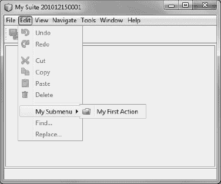

***图 9-1.** 菜单  子菜单  菜单项*

你可以在运行应用程序之前，在层树中查看菜单或菜单项的顺序（参见第 3 章）。在前面的示例中，你学习了如何通过 `position` 属性（使用 `ActionReference` 注解或直接在层文件中）确定菜单项的位置。由于菜单和子菜单在创建菜单项时会隐式应用，因此无法通过注解确定顺序。因此，当分配一个需要精确定位的新菜单或子菜单时，你必须在层文件中使用该菜单之前先进行分配。在那里，你可以像清单 9-4 所示那样确定位置。更多信息请参见第 3 章。

***清单 9-4.** 确定菜单或子菜单的位置*

`<folder name="`**`Menu`**`">`
`  <folder name="`**`Edit`**`">`
`    <folder name="`**`My Submenu`**`">`
`      <attr name="position" intvalue="800"/>`
`    </folder>`
`  </folder>`
`</folder>`

#### 插入分隔符

在使用 `ActionReference` 注解定义菜单项时，你可以确定显示在菜单项之间的分隔符。为此，提供了 `separatorBefore` 和 `separatorAfter` 属性。这需要你输入它们的绝对位置。要在清单 9-1 的示例菜单项前添加分隔符，请按清单 9-5 所示扩展操作的注解。

***清单 9-5.** 通过注解属性添加分隔符*

`@ActionReference(`
`    path = "Menu/Edit",`
`    position = 1200,`
**`separatorBefore = 1190`**`)`

此外，还可以直接在层文件中定义分隔符。与上一个示例类似，层条目将如清单 9-6 所示。

***清单 9-6.** 通过层条目添加分隔符*

`<folder name="Menu">`
`  <folder name="Edit">`
`    <folder name="My Submenu">`
`      <file name="MyFirstAction.shadow"> ... </file>`
**`<file name="MyFirstAction-separatorBefore.instance">`**
**`<attr name="instanceCreate" newvalue="javax.swing.JSeparator"/>`**
**`<attr name="position" intvalue="1190"/>`**
**`</file>`**
`    </folder>`
`  </folder>`
`</folder>`

#### 隐藏现有菜单项

您也可以隐藏现有的菜单或菜单项，这些菜单项可能来自平台模块，也可能由其他应用程序模块添加。由于层级树的存在，这非常容易实现。为此，请在您的模块中打开文件夹 *重要文件  XML 层级  <上下文中的此层级>*。您定义的条目以及来自应用程序其他模块或平台模块的条目都会显示在此处。在 *菜单栏* 文件夹下方，您可以看到所有菜单和菜单项。在此处选择所需的条目，并通过上下文菜单将其删除。它们实际上并不会被删除，而只是在您的层级文件中被设置为不可见，假设您删除了 *视图* 菜单和菜单项 *编辑*  *查找*…。在这种情况下，清单 9-7 中的条目会被添加到您的层级文件中。

***清单 9-7.** 隐藏菜单项*

`<folder name="Menu">`
`  <folder name="View`**`_hidden`**`"/>`
`  <folder name="Edit">`
`    <file name="org-openide-actions-FindAction.shadow`**`_hidden`**`"/>`
`  </folder>`
`</folder>`

因此，后缀 `_hidden` 被添加到相应的条目中。如果您现在想重新添加一个已删除（即已隐藏）的条目，只需从您的层级文件中移除该后缀即可。

#### 快捷键和助记符

快捷键在层级文件中集中定义和管理。这就是标准文件夹 `Shortcuts` 存在的原因。快捷键由 `file` 元素定义，并在中央 `Actions` 文件夹中作为属性引用到某个操作类。因此，快捷键不是为菜单项创建的，而是为操作创建的。一个快捷键由一个或多个修饰键和一个标识符组成，它们之间用减号分隔：

`modifier-identifier`

以下键可用作修饰键，在层级文件中由一个字母（代码）表示：

*   C – (Ctrl)
*   A – (Alt)
*   S – (Shift)
*   M – (Cmd)/(Meta)

此外，还有两个通配符代码，用于确保快捷键与操作系统无关；应使用这些代码：

*   D – (Ctrl) 或 (Cmd)/(Meta) (在 Mac OS 上)
*   O – (Alt) 或 (Ctrl) (在 Mac OS 上)

所有由 Java 类 `KeyEvent` 定义的常量都可用作标识符。例如，对于 `KeyEvent.VK_M`，只需省略前缀 `VK_`，因此标识符就是 `M`。

如本节开头所述，快捷键在层级文件中进行管理，尽管您可以通过 `ActionReference` 注解以简单的方式创建它们。这意味着，创建快捷键类似于创建菜单项。例如，要为操作 `MyFirstAction` 使用快捷键 (Ctrl) + (M)，您可以添加 清单 9-8 中所示的注解。

***清单 9-8.** 使用注解定义快捷键*

`@ActionID(`
`   category = "Edit",`
`   id = "com.galileo.netbeans.module.MyFirstAction")`
`@ActionRegistration(`
`   iconBase = "com/galileo/netbeans/module/icon.png",`
`   displayName = "#CTL_MyFirstAction")`
`@ActionReferences({`
`    @ActionReference(path = "Menu/Edit", position = 100),`
**`@ActionReference(path = "Shortcuts", name = "D-M")`**
`})`
`public final class MyFirstAction implements ActionListener {`
`   ... }`

此注解会生成如 清单 9-9 所示的层级条目。这意味着，在定义快捷键时，如果您不想使用代表首选方式的注解，可以选择直接使用层级条目（参见 清单 9-9）。

***清单 9-9.** 在层级文件中定义快捷键*

`<folder name="`**`Shortcuts`**`">`
`   <file name="`**`D-M`**`.shadow">`
`      <attr name="originalFile"`
`            stringvalue="Actions/Edit/com-galileo-netbeans-module-MyFirstAction.instance"/>`
`    </file>`
`</folder>`

在此上下文中，查看 `Utilities.keyToString()` 和 `Utilities.stringToKey()` 函数的 Javadoc 可能会有所帮助，这些函数用于编码快捷键。表 9-1 中列出了一些可能的组合作为示例。如果您不确定某个特定键的拼写，也可以使用操作向导（参见第 6 章）。

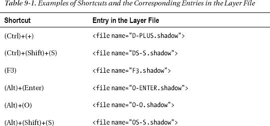

助记符是通过在操作名称中相应字符前设置一个 & 符号 (&) 直接插入的。这也可以在操作类或属性文件中进行：

`CTL_OpenMyWindow=Open MyWind`**`&`**`ow`

请记住，助记符仅在按住 (Alt) 键时才会显示。

#### 创建您自己的菜单栏

如果您想创建自己的菜单栏以在模块中使用，可以轻松地使用 NetBeans API 的功能。数据系统 API 实际上提供了一个 `JMenubar` 类的子类，即 `MenuBar` 类。这个类可以根据其内容创建一个 `DataFolder` 对象，因此您可以像在模块的层级文件中定义标准菜单一样定义自己的菜单。

现在，只需要再创建一个 `DataFolder` 对象。为此，您需要通过方法 `FileUtil.getConfigFile()` 获取对菜单根文件夹的访问权限。在此示例中，它被称为 `MyModuleMenu`。对于此模块，您创建一个 `DataFolder` 对象，并使用静态方法 `findFolder()` 将其直接传递给 `MenuBar` 构造函数，如 清单 9-10 所示。

***清单 9-10.** 创建您自己的菜单栏，该菜单栏从系统文件系统中读取其内容*

`FileObject menu = FileUtil.getConfigFile("`**`MyModuleMenu`**`");`
`MenuBar    bar  = new MenuBar(DataFolder.`**`findFolder`**`(menu));`

### 工具栏

#### 创建工具栏和工具栏操作

您可以像向菜单栏添加操作一样，向工具栏添加操作。您可以使用现有的工具栏，也可以创建任意数量的自定义工具栏来对您的工具栏按钮进行分组。工具栏在层级文件的标准文件夹 `Toolbars` 中定义。如“菜单栏”部分所述，使用 `ActionReference` 注解将操作添加到工具栏。您希望将操作类添加到 `MyFirstAction` 工具栏，如 清单 9-11 所示。

***清单 9-11.** 使用注解向工具栏添加操作*

`@ActionID(`
`    category = "Edit",`
`    id = "com.galileo.netbeans.module.MyFirstAction")`
`@ActionRegistration(`
`    iconBase = "com/galileo/netbeans/module/icon.png",`
`    displayName = "#CTL_MyFirstAction")`
`@ActionReferences({`
**`@ActionReference`**`(`
`        path = "`**`Toolbars`**`/`**`MyToolbars`**`",`
`        position = 100)`
`})`
`public final class MyFirstAction implements ActionListener {`
`    public void actionPerformed(ActionEvent e) {`
`        // TODO implement action body`
`    }`
`}`

如您在 清单 9-11 中所见，工具栏与菜单项的区别仅在于相应的路径规范。菜单项通过 `ActionReference` 注解引用标准文件夹 `Menu` 中的操作，而对于工具栏操作，则使用标准文件夹 `Toolbars`。请记住，对于工具栏操作，操作类通过 `iconBase` 属性提供了一个相应的图标。

与菜单栏类似，这样的注解会导致自动创建一个层级条目。如果您不想使用注解，也可以通过直接在层级文件中为工具栏添加条目来添加您的工具栏操作。与 清单 9-9 匹配的条目将如 清单 9-12 所示。

***清单 9-12.** 通过直接层级条目向工具栏添加操作*

`<folder name="`**`Toolbars`**`">`
`  <folder name="`**`MyToolbar`**`">`
`    <file name="MyFirstAction.shadow">`
`      <attr name="originalFile"`
`            stringvalue="Actions/Edit/com-galileo-netbeans-module-MyFirstAction.instance"/>`
`    </file>`
`  </folder>`
`</folder>`

#### 工具栏配置

哪些工具栏以何种顺序显示，会保存在一个 XML 格式的工具栏配置中。（请在附录中找到对应的 DTD。）NetBeans 平台默认自带的工具栏由 Core-UI 模块中的配置 *Standard.xml* 定义。该配置如清单 9-13 所示。

***清单 9-13.** 标准平台工具栏配置：Standard.xml*

`<Configuration>`
`   <Row>`
`      <Toolbar name="`**`File`**`"/>`
`      <Toolbar name="`**`Clipboard`**`"/>`
`      <Toolbar name="`**`UndoRedo`**`"/>`
`      <Toolbar name="`**`Memory`**`"/>`
`   </Row>`
`</Configuration>`

你可以选择创建自己的配置，并在运行时动态设置它们，从而根据上下文显示或隐藏工具栏。现在，你创建自己的配置，其中希望显示已创建的名为 `MyToolbar` 的工具栏以及标准工具栏 `Edit`，同时隐藏 `File` 工具栏。该配置可能如清单 9-14 所示。

***清单 9-14.** 自定义工具栏配置*

`<!DOCTYPE Configuration PUBLIC`
`  "-//NetBeans IDE//DTD toolbar//EN"`
`  "http://www.netbeans.org/dtds/toolbar.dtd">`
`<Configuration>`
`   <Row>`
`      <Toolbar name="`**`UndoRedo`**`"/>`
`      <Toolbar name="`**`MyToolbar`**`"/>`
`   </Row>`
`   <Row>`
`      <Toolbar name="`**`File`**`" visible="`**`false`**`"/>`
`   </Row>`
`</Configuration>`

你可以用任意名称保存这个新创建的配置。然后将其添加到层文件中，使该配置在平台中公开。为此，需要使用 `url` 属性定义配置相对于层文件的位置，如清单 9-15 所示。

***清单 9-15.** 注册工具栏配置*

`<folder name="Toolbars">`
`   <file name="`**`MyToolbarConfig.xml`**`" url="toolbars/MyToolbarConfig.xml"/>`
`</folder>`

要显示所需的工具栏并激活该配置，只需在源代码中所需位置添加一行代码。为此，UI 工具模块提供了一个有用的 API：

`ToolbarPool.getDefault().setConfiguration("`**`MyToolbarConfig`**`");`

例如，此调用可以在激活窗口时发生，以便向用户显示与上下文无关的工具栏。在本章中，你希望在创建第一个窗口时立即进行此设置。

`ToolbarPool` 类负责管理在系统文件系统中注册的工具栏。`getDefault()` 方法返回由系统生成的 `ToolbarPool` 对象，该对象负责管理在标准文件夹 `Toolbars` 中定义的工具栏。你也可以选择创建自己的 `ToolbarPool` 对象，用于管理在自定义文件夹中定义的工具栏。为此，只需将一个 `DataFolder` 对象传递给构造函数即可。我将在“创建自己的工具栏”一节中向你展示其工作原理。

`ToolbarPool` 类提供了一些有用的功能，如表 9-2 所示。

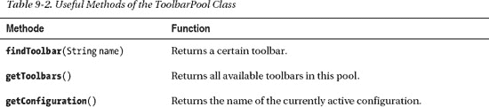

#### 用户自定义

按下鼠标右键时，应用程序的工具栏上会显示一个上下文菜单。用户可以使用它来显示或隐藏单独的工具栏。用户还可以在运行时通过*自定义...* 来配置工具栏。通过拖放添加或删除单个操作，如图 9-2 所示。

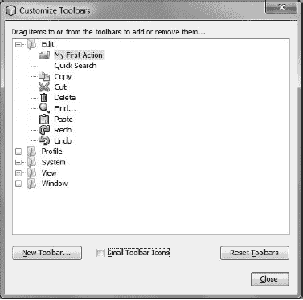

***图 9-2.** 用户特定的工具栏设置*

#### 创建自己的工具栏

与菜单栏一样，你可以创建自己的工具栏或工具栏池。然后，例如，你可以在顶层组件中使用这些工具栏。为此，`ToolbarPool` 类和 `Menubar` 类提供了一个构造函数，你可以向其传递一个 `DataFolder` 对象，该对象代表系统文件系统中的一个工具栏文件夹，如清单 9-16 所示。你可以像定义标准工具栏一样定义自己的工具栏。

***清单 9-16.** 创建从系统文件系统读取内容的自己的工具栏*

`FileObject  tbs  = FileUtil.getConfigFile("`**`MyToolbars`**`");`
`ToolbarPool pool = new ToolbarPool(DataFolder.`**`findFolder`**`(tbs));`

关于可以通过系统文件系统向工具栏添加哪些组件的更多信息，请参阅 `ToolbarPool` 类的 API 文档。

#### 使用自定义控件

默认情况下，你的操作在工具栏中显示为图标。除此之外，你还可以为工具栏操作配备特定的控件元素，例如组合框。你不需要为此使用特殊的操作类。你可以使用前面章节中使用的标准操作。该类必须继承 `AbstractAction`，而不是实现 `ActionListener` 接口。我们实现 `Presenter.Toolbar` 接口，以便该操作始终可以提供其特殊的控件元素。此外，为控件元素的初始化实现一个标准构造函数也是合理的。

##### 工具栏中的组合框

作为示例，我想向你展示一个操作类，它有一个组合框作为控件元素，你可以用它来编辑缩放比例等。

***清单 9-17.** 工具栏操作用户特定的控件元素*

`@ActionID(`
`    category = "View",`
`    id = "com.galileo.netbeans.module.MyComboboxAction")`
`@ActionRegistration(displayName = "#CTL_MyComboboxAction")`
`@ActionReferences({`
`    @ActionReference(path="Toolbars/MyToolbar") })`
`public final class MyComboboxAction extends` **`AbstractAction`** `implements` **`Presenter.Toolbar`** `{`
`JComboBox box =` **`new JComboBox`**`(new String[]{"100%", "200%"});`

`    public MyComboboxAction() {`
`        box.setMaximumSize(box.getPreferredSize());`
`        box.setAction(this);`
`    }`

`    @Override`
`    public void actionPerformed(ActionEvent e) {`
`        System.out.print("Adjust zoom to: ");`
`        System.out.println(box.getSelectedItem());`
`    }`

`    @Override`
`public Component` **`getToolbarPresenter()`** `{`
`        return box;`
`    } }`

操作类通常通过注解注册，并因此分配给一个工具栏。你将自定义控件元素添加为私有字段。你希望避免组合框占据整个宽度，因此在构造函数中将组合框的最大宽度设置为首选宽度。控件元素与操作的连接非常重要。你可以通过组合框的 `setAction()` 方法实现这一点，该方法通过 `this` 运算符将对自身类的引用传递给它。现在，如果操作组合框，则会执行此操作。最后，你只需实现 `getToolbarPresenter()` 方法并返回组合框即可。你创建的组合框将显示，而不是标准按钮。

##### 工具栏中的下拉菜单

NetBeans 平台提供了一个特殊的工厂类，用于创建带有弹出菜单的下拉按钮（参见图 9-3）。你可以像之前展示的组合框一样，将此类按钮集成到工具栏中。因此，首先你需要创建一个动作类，并为其添加一个工具栏。它必须继承自 `AbstractAction` 类，以便能够实现 `Toolbar.Presenter` 接口。在 `getToolbarPresenter()` 方法中，你随后生成一个弹出菜单，并用层文件中的动作填充它。然后，通过 `DropDownButtonFactory.createDropDownButton()` 方法生成相应的按钮并返回，如清单 9-18 所示。

***清单 9-18.** 创建下拉按钮*

`@ActionID(`
`    category = "File",`
`    id = "com.galileo.netbeans.module.MyDropDownButton")`
`@ActionRegistration(`
`    iconBase = "com/galileo/netbeans/module/icon.png",`
`    displayName = "#CTL_MyDropDownButton")`
`@ActionReferences({`
`    @ActionReference(path = "`**`Toolbars`**`/File", position = 300)`
`})`
`public final class MyDropDownButton extends` **`AbstractAction`** `implements` **`Presenter.Toolbar`** `{`
`final String` **`EXTENSION_POINT`** `= "MyDropDownActions";`
`    JPopupMenu popup = new JPopupMenu();`

`    @Override`
`    public void actionPerformed(ActionEvent e) { }`

`    @Override`
`public Component` **`getToolbarPresenter`**`() {`
`for (Action a: Utilities.` **`actionsForPath`**`(`**`EXTENSION_POINT`**`))`
`            popup.add(a);`
`return` **`DropDownButtonFactory.createDropDownButton`**`(`
`               ImageUtilities.loadImageIcon("com/galileo/netbeans/module/icon.png", false),`
`               popup);`
`    } }`

如果你查看清单 9-17 中的源代码，你会发现只需几行代码就能创建一个灵活可扩展的、带有弹出菜单的下拉按钮。除了创建按钮的工厂方法外，`Utilities` 类的 `actionsForPath()` 方法也很重要。它提供了注册在特定文件夹中的所有动作的列表。你可以通过 `ActionReference` 注解将它们注册到那里，默认情况下，就像这样：

`@ActionReference(path = "MyDropDownActions", position = 100)`
`public final class MyDropDownAction1 implements ActionListener`

因此，动作 `MyDropDownAction1` 被注册在系统文件系统的 `MyDropDownActions` 文件夹中。其工作方式与向菜单栏或工具栏添加动作相同。你看，系统文件系统不仅对标准组件（如菜单栏或工具栏）有帮助，你还可以利用它来创建自己的组件。

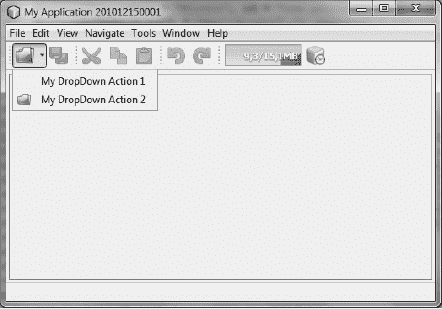

***图 9-3.** 工具栏中带有弹出菜单的下拉按钮*

### 总结

本章涵盖了 NetBeans 平台应用程序的菜单栏和工具栏。你学习了菜单的结构、如何设置自己的工具栏，以及最重要的是，如何简单地将你的动作添加到工具栏或菜单中。

## 第 10 章

## 窗口系统

*窗口系统*是 NetBeans 平台提供的一个框架。它负责所有应用程序窗口的管理和显示，并允许用户自定义用户界面的布局。

**提示** 窗口的注册现在通过注解进行，这不仅使 NetBeans 平台应用程序的开发更加容易，而且使其更加独立于 NetBeans IDE。

可视化窗口系统的基本结构是基于文档的。这意味着中心部分——即编辑器部分——主要用于在选项卡中显示多个文件。不同的窗口可以放置在编辑器区域周围的各个区域，即视图区域（参见图 10-1）。通常，这些是提供文档编辑功能的辅助窗口。以 NetBeans IDE 为例，这些窗口提供了项目结构、属性对话框和输出窗口。这三个窗口位于编辑器区域周围。

默认情况下，所有窗口都显示在 NetBeans 主应用程序窗口中。此外，还可以通过使用上下文菜单或将窗口从应用程序窗口中拖出，来取消停靠窗口（*停靠/取消停靠*）。图 10-2 展示了其效果，其中项目窗口已被取消停靠。停靠和取消停靠允许灵活地定位窗口。所谓的*浮动窗口*功能在使用多个显示器时尤其有用。

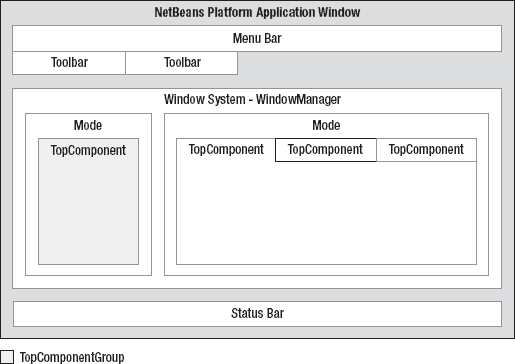

***图 10-1.** NetBeans 平台应用程序窗口的结构*

窗口系统由模式组成。*模式*是一个容器，窗口可以在其中像选项卡一样显示。窗口必须是 `TopComponent` 的子类。所有显示的窗口都由 `WindowManager` 管理。也可以对窗口进行分组。窗口系统的组装在层文件中以声明方式描述。这种组装包括对可用模式、在这些模式中显示的窗口以及定义哪个窗口属于哪个窗口组的描述。这些信息也通过系统文件系统提供给窗口系统。在接下来的章节中，将详细描述窗口系统的各个部分；我还将向你展示如何在你的模块中使用它们。

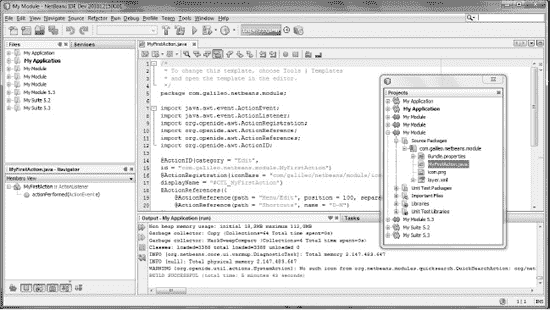

***图 10-2.** 带有浮动窗口的 NetBeans 窗口系统*

### 配置

模块在层文件中配置其窗口、模式和组，位于标准文件夹 `Windows2` 下的 `Components`、`Modes` 和 `Groups` 文件夹中。这样，模块可以定义其可用的窗口，将它们与模式关联，并对它们进行分组。

此配置是模块定义的默认配置。窗口系统在首次启动时使用此默认配置。退出应用程序时，对应用程序布局所做的任何更改（例如，将窗口移动到另一个模式或关闭窗口组）都会存储在用户目录的 `config/Windows2Local` 文件夹中，其层次结构与层文件相同。重新启动时，会首先读取应用程序设置。仅当用户目录中不存在配置文件时（例如，首次启动应用程序时），才会从层文件中读取设置。

### 窗口：顶层组件

窗口系统 API 提供了 `TopComponent` 类，用于创建集成到 NetBeans 平台中的窗口。它是 Java 类 `JComponent` 的子类，并为窗口与窗口系统的交互提供可选支持。一个 `TopComponent` 始终存在于一个模式内部，因此它是可停靠的，由 `WindowManager` 自动管理，并接收生命周期事件。

#### 创建顶层组件

NetBeans IDE 提供了一个有用的向导来创建 `TopComponent`。该向导会创建完整的基本骨架。通过调用 *文件*  *新建文件…*，然后选择类别 *模块开发* 和文件类型 *窗口* 来启动它。在接下来的页面 *基本设置* 中，你可以为你的顶层组件编辑一系列设置，如 图 10-3 所示。

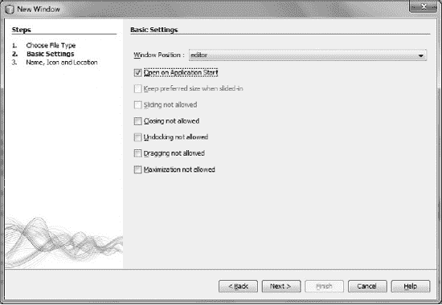

***图 10-3.** 创建顶层组件：基本设置*

首先，定义 *窗口位置*，即你的顶层组件应该显示的模式。目前，你只能选择 NetBeans 平台提供的模块。但是，稍后你可以将其替换为自定义模式。此外，你可以在此向导页面上定义要创建的顶层组件的行为。我将在后面的“行为”部分解释此选项的含义。

点击 *下一步* 进入向导的最后一页。在那里，你可以确定类名的前缀和顶层组件的图标，如 图 10-4 所示。

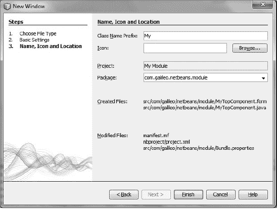

***图 10-4.** 创建顶层组件：名称、图标和位置*

点击 *完成* 按钮结束向导并创建顶层组件。该向导已经为你完成了所有必要的工作。现在，你可以使用表单编辑器编辑顶层组件并为其配备所需的功能。你可以通过 *运行*  *运行主项目* 来测试所有内容。

现在让我们看一下向导创建的类。这个类现在被一系列注解标记，其含义在 清单 10-1 中解释。

***清单 10-1.** 带有注解的顶层组件的基本结构*

`import org.openide.util.NbBundle;`
`import org.openide.windows.TopComponent;`
`import org.netbeans.api.settings.ConvertAsProperties;`
`import org.openide.awt.ActionID;`
`import org.openide.awt.ActionReference;`

`@ConvertAsProperties(`
`    dtd = "-//com.galileo.netbeans.module//My//EN",`
`    autostore = false)`
**`@TopComponent.Description`**`(`
`    preferredID = "MyTopComponent",`
`    iconBase = "com/galileo/netbeans/module/icon.png",`
`    persistenceType = TopComponent.PERSISTENCE_ALWAYS)`
**`@TopComponent.Registration`**`(`
`    mode = "editor",`
`    openAtStartup = true)`
`@ActionID(`
`    category = "Window",`
`    id = "com.galileo.netbeans.module.MyTopComponent")`
`@ActionReference(`
`    path = "Menu/Window" /*, position = 333 */)`
**`@TopComponent.OpenActionRegistration`**`(`
`    displayName = "#CTL_MyAction",`
`    preferredID = "MyTopComponent")`
`public final class` **`MyTopComponent`** `extends TopComponent {`
`public` **`MyTopComponent`**`() {`
`        initComponents();`
`        setName(NbBundle.getMessage(MyTopComponent.class, "CTL_MyTopComponent"));`
`        setToolTipText(NbBundle.getMessage(MyTopComponent.class, "HINT_MyTopComponent"));`
`    }`
`    ...`
`}`

顶层组件通过注解 `TopComponent.Description` 标记了基本信息。一个唯一标识符（`preferredID`）、图标的路径（`iconBase`）以及确定顶层组件是否会被保存（`persistenceType`）都属于这些基本信息。这些可能性将在下一节“持久性”中描述。

你通过 `TopComponent.Registration` 注解将顶层组件添加到一个模式中。由属性 `mode` 确定的模式必须已经存在。你可以选择 NetBeans 平台已定义的模式，也可以自己创建一个。在“创建模式”一节中，你将学习如何做到这一点。通过 `openAtStartup` 属性，你可以确定你的顶层组件是否会在应用程序启动时自动打开。最后，提供了可选属性 `position` 用于确定一个模式内多个顶层组件的顺序。

NetBeans 平台在后台通过注解 `TopComponent.OpenActionRegistration` 做了大量工作。此注解会导致在层文件中注册一个用于打开被注解的顶层组件的操作。在这方面，有趣的是不仅发生了注册，而且操作也会自动提供。这意味着，你的模块中不再存在相应的操作类。操作类是通过工厂方法 `TopComponent.openAction()` 使用传递的参数在后台创建的。你通过 `displayName` 属性定义操作的名称。使用 # 你可以为属性包中的文本常量确定一个键（参见第 6 章）。通过 `preferredID` 属性，你可以轻松确定你的顶层组件是只能生成一个实例还是多个实例。为此，请使用已定义的顶层组件标识符。这样，只会创建一个单例实例。省略该属性，则在执行操作时会打开顶层组件的一个新实例。

`ActionID` 和 `ActionReference` 这两个属性与 `TopComponent.OpenActionRegistration` 注解相关联。如第 6 章所述，通过 `ActionID`，为打开操作添加了一个带有类别的唯一标识符。通过 `ActionReference` 注解，你可以确定操作将在哪里以及哪个菜单中显示（参见第 9 章）。虽然像描述的那样使用注解比注册顶层组件要简单得多，但我将解释（参见清单 10-2）——然而，它的使用并非强制性的。你也可以选择直接在层文件中指定必要的信息。首先，在层文件的标准文件夹 `Windows2/Components` 中定义顶层组件。分配到模式的操作发生在标准文件夹 `Windows2/Modes` 中。

***清单 10-2.** 在层文件中定义和分配顶层组件*

`<folder name="`**`Windows2`**`">`
`   <folder name="`**`Components`**`">`
`      <file name="MyTopComponent.settings" url="MyTopComponentSettings.xml"/>`
`   </folder>`
`   <folder name="`**`Modes`**`">`
`      <folder name="editor">`
`         <file name="MyTopComponent.wstcref" url="MyTopComponentWstcref.xml"/>`
`      </folder>`
`   </folder>`
`</folder>`

在文件夹 `Windows2/Components` 中定义顶层组件需要一个 *Settings* 文件。该文件中命名了顶层组件的完整类名。这样，窗口系统就能够创建顶层组件的实例。（参见清单 10-3。）

***清单 10-3.** 用于声明式添加顶层组件的设置文件*

`<!DOCTYPE settings PUBLIC`
` "-//NetBeans//DTD Session settings 1.0//EN"`
` "http://www.netbeans.org/dtds/sessionsettings-1_0.dtd">`
`<settings version="1.0">`
`   <instance class="com.galileo.netbeans.module.MyTopComponent"/>`
`</settings>`

将顶层组件映射到模式是通过一个 *顶层组件引用* 文件完成的，如清单 10-4 所示。在此文件中定义了顶层组件的唯一标识符。此外，通过 `state` 元素的 `opened` 属性，定义了窗口是否在应用程序启动时打开。

***清单 10-4.** 将顶层组件映射到模式的顶层组件引用文件*

`<!DOCTYPE tc-ref PUBLIC`
` "-//NetBeans//DTD Top Component in Mode Properties 2.0//EN"`
` "http://www.netbeans.org/dtds/tc-ref2_0.dtd">`
`<tc-ref version="2.0" >`
`   <tc-id id="`**`MyTopComponent`**`"/>`
`   <state opened="`**`true`**`"/>`
`</tc-ref>`

如果你选择了声明式方式而不是注解，那么你最终应该覆盖顶层组件类的 `preferredID()` 和 `getPersistenceType()` 这两个方法，从而提供相应的值。

#### 行为

顶层组件的行为可通过一系列特性进行调整，如表 10-1 所示。您可以使用 NetBeans 窗口向导编辑这些特性的设置。或者，您也可以稍后调整这些在顶层组件构造函数中设置的特性。

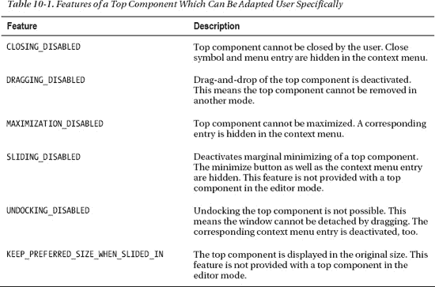

这些特性可以在顶层组件内通过以下方法以`PROP_`为前缀进行设置：

**`putClientProperty`**`(`
`    TopComponent.PROP_CLOSING_DISABLED,`
`    Boolean.TRUE);`

#### 状态

顶层组件可以具有多种状态，如表 10-2 所列。

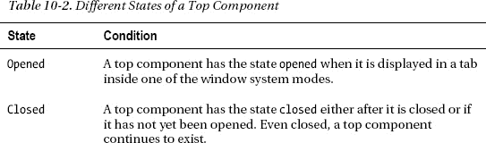

进入特定状态是通过调用表 10-3 所示的方法之一来宣告的。如果窗口需要在特定状态下执行操作，只需重写相应的方法即可。

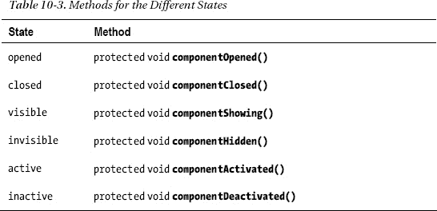

第 9 章展示了如何创建工具栏配置以及如何使用它们来显示应用程序特定的工具栏。使用前面介绍的两种告知我们顶层组件状态的方法来显示当前活动的顶层组件，如清单 10-5 所示。

***清单 10-5.** 根据上下文显示和隐藏工具栏*

`public class MyTopComponent extends TopComponent {`
`   private String origConfig = "Standard";`
`   private String myConfig   = "`**`MyToolbarConfig`**`";`

`protected void` **`componentActivated()`** `{`
`      origConfig = ToolbarPool.getDefault().`**`getConfiguration`**`();`
`      ToolbarPool.getDefault().setConfiguration(myConfig);`
`   }`

`protected void` **`componentDeactivated()`** `{`
`      ToolbarPool.getDefault().`**`setConfiguration`**`(origConfig);`
`   } }`

如果顶层组件获得焦点，则会调用`componentActivated()`方法。当前配置会被存储起来以便后续重新激活。然后，您设置自己的工具栏配置`MyToolbarConfig`（在第 9 章中创建）。如果选择了另一个顶层组件，此顶层组件将失去焦点，并调用`componentDeactivated()`方法。在此方法中设置存储的配置以恢复之前的工具栏。

#### 上下文菜单

右键单击顶层组件的标题栏时，会显示一个上下文菜单，其中包含*取消停靠窗口*或*关闭窗口*等操作。这些操作通过`TopComponent`类的`getActions()`方法获得。要在此上下文菜单中添加您自己的操作，可以重写此方法（参见清单 10-6）。这样做时，以声明方式添加操作会很有用。在第 3 章中，我提到过可以向层文件添加您自己的文件夹和扩展点。这正是您在这里要使用的。操作在层文件中声明，并在`getActions()`方法中按需读取。

***清单 10-6.** 从层文件读取上下文菜单的操作*

`public class` **`MyTopComponent`** `extends TopComponent {`
`   private List<Action> ca = null;`

`   @Override`
`public Action[]` **`getActions`**`() {`
`      if (ca == null) {`
`         ca = new ArrayList<Action>(Arrays.asList(`**`super.getActions()`**`));`
`         ca.add(null); /* 添加分隔符 */`
`Lookup lkp =` **`Lookups.forPath`**`("ContextActions/MyTC");`
`         ca.addAll(lkp.`**`lookupAll`**`(Action.class));`
`      }`

`      return ca.toArray(new Action[ca.size()]);`
`   } }`

首先，调用超类的`getActions()`方法以获取默认操作。借助`Lookups.forPath()`方法，您可以轻松地为声明的文件夹`ContextActions/MyTC`创建一个查找对象。然后，`lookupAll()`方法获取所有实现了`Action`接口的已注册操作。创建菜单时，平台会自动将`null`值替换为分隔符。组装好的操作列表以数组形式返回。最后，您只需创建对实际操作定义（通常位于标准文件夹`Actions`中）的引用。您可以通过在相应的操作类本身中使用注解优雅地实现引用，或者通过在层文件中直接添加条目来实现。必要的注解如下所示：

`@ActionReference(path = "ContextActions/MyTC")`

例如，自定义文件夹中层文件中相应的条目可能如清单 10-7 所示。

***清单 10-7.** 在层文件中定义上下文菜单操作*

`<folder name="`**`ContextActions`**`">`
`  <folder name="`**`MyTC`**`">`
`    <file name="MyAction1.shadow">`
`      <attr name="originalFile"`
`            stringvalue="Actions/Edit/com-galileo-netbeans-module-MyAction1.instance"/>`
`    </file>`
`    <file name="MyAction2.shadow">`
`      <attr name="originalFile"`
`            stringvalue="Actions/Edit/com-galileo-netbeans-module-MyAction2.instance"/>`
`    </file>`
`  </folder>`
`</folder>`

现在您已经创建了一个扩展点。其他模块可以通过在其层文件的`ContextActions/MyTC`文件夹中定义操作，轻松地将操作添加到您的顶层组件的上下文菜单中。因此，任何其他模块都可以灵活地扩展上下文菜单，而无需任何依赖关系。

#### 持久化

窗口系统能够在退出应用程序时存储已打开的顶层组件，并在重新启动时恢复它们。但是，在某些用例中，不希望存储顶层组件。确定是否存储顶层组件是通过`getPersistenceType()`方法返回的值来完成的。您可以使用`TopComponent.Description`注解的`persistenceType`属性来确定此值。但是，如果您不使用注解，则应始终重写命名的方法。表 10-4 中列出的常量可用作返回值。

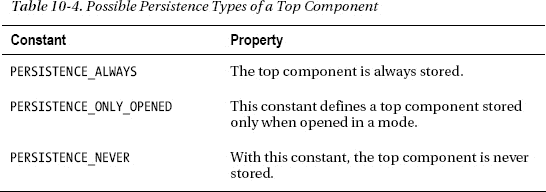

窗口系统在存储或恢复顶层组件时会调用`writeProperties()`和`readProperties()`方法。然后，窗口系统在保存和加载顶层组件时调用这些方法。您可以使用这些方法来保存或加载顶层组件特定的数据。为此，您始终会获得一个`Properties`对象作为参数。保存的数据由 NetBeans 平台以 XML 文件形式保存在用户目录中。数据也是从那里加载的。

#### 注册表

NetBeans 窗口系统的所有顶层组件都在一个注册表中集中管理。此注册表的接口由`TopComponent.Registry`接口指定。此注册表的实例可以直接通过`TopComponent`类调用以下方法获得：

`TopComponent.Registry registry = TopComponent.getRegistry();`

或者通过`WindowManager`获得：

`TopComponent.Registry registry = WindowManager.getDefault().getRegistry();`

例如，此注册表将通过`getActivated()`返回当前激活的顶层组件，或通过`getOpened()`返回所有打开的顶层组件。此外，可以在注册表上注册一个`PropertyChangeListener`，以便全局响应顶层组件的状态变化（例如，参见表 10-5）。

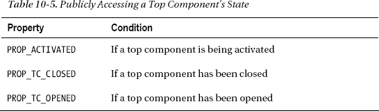

在以下示例中，向注册表添加了一个监听器。此监听器在顶层组件打开时做出响应（参见清单 10-8）。

***清单 10-8.** 全局跟踪顶层组件状态变化*

`public class MyTopComponent extends TopComponent implements` **`PropertyChangeListener`** `{`

`   public MyTopComponent() {`
**`  TopComponent.Registry`** `reg = TopComponent.`**`getRegistry()`**`;`
`      reg.addPropertyChangeListener(WeakListeners.propertyChange(this, reg));`
`   }`

`public void` **`propertyChange`**`(PropertyChangeEvent evt) {`
`      if(evt.getPropertyName().equals(TopComponent.Registry.`**`PROP_OPENED`**`))`
`         // 顶层组件已打开`
`   } }`

### 停靠容器：模式（Mode）

NetBeans 平台的整个窗口系统由多个区域组成，多个组件可以以选项卡形式停靠在这些区域中。这些区域就是前面提到的编辑区和视图区。这样的一个区域被称为一个模式（mode）。然而，模式本身并不是一个显示的组件，而是作为其中所显示组件的控制器和容器。这些组件的类型是 `TopComponent`，正如上一节所述。模式由窗口系统 API 中的 `Mode` 接口定义。

#### 创建模式

模式并非固定区域，而是可以通过 XML 文件单独定义。一些重要的区域（例如中央编辑区或 NetBeans IDE 通常打开项目视图的区域）已在 NetBeans 平台模块中定义。你也可以定义并添加自己的模式。模式的配置文件结构如清单 10-9 所示。

***清单 10-9.** 模式配置文件：MyMode.wsmode*

`<!DOCTYPE mode PUBLIC`
` "-//NetBeans//DTD Mode Properties 2.3//EN"`
` "http://www.netbeans.org/dtds/mode-properties2_3.dtd">`
`<mode version="2.3">`
`   <`**`module`** `name="com.galileo.netbeans.module" spec="1.0"/>`
`   <`**`name`**`   unique="`**`MyMode`**`"/>`
`   <`**`kind`**`   type="view"/>`
`   <`**`state`**`  type="joined"/>`
`   <`**`constraints`**`>`
`      <path orientation="vertical" number="0" weight="0.2"/>`
`      <path orientation="horizontal" number="0" weight="1.0"/>`
`   </constraints>`
`   <`**`empty-behavior`** `permanent="true"/>`
`</mode>`

首先，使用 `module` 属性定义该模式所属的模块。最重要的元素是 `name` 元素。`name` 元素的值必须是唯一的标识符，并且必须与文件名匹配（包括大小写）。此外，通过 `kind` 元素可以定义模式显示其组件的方式。共有三种模式类型：`editor`、`view` 和 `sliding`。图 10-5 展示了这三种类型在 NetBeans IDE 中的外观。

***图 10-5.** 不同类型的模式*

`editor` 类型的模式通常位于应用程序的中央区域，例如由核心窗口模块通过 *wsmode* 文件（正如模式名称所示）指定的 `Editor` `Mode`。围绕此编辑器模式排列的顶层组件通常显示在 `view` 类型的模式中。

这些窗口通常也被称为辅助窗口，因为它们提供诸如编辑文档等功能。除了在模式中选项卡显示方式不同之外，`editor` 和 `view` 模式的区别还在于：`editor` 类型在右上角具有控制元素，便于在文档和顶层组件之间导航。此外，还有 `sliding` 类型的模式。窗口系统允许你将顶层组件移动或最小化到应用程序窗口的右侧、左侧或底部边框。这在处理不常用或偶尔使用的窗口时通常很有用。当鼠标悬停在最小化顶层组件的按钮上时，它会打开并覆盖在其他打开的窗口之上，当鼠标离开控制元素时又会自动隐藏。这些窗口位于 `sliding` 类型的模式中。

`sliding` 类型的模式还可以定义 `slidingSide` 元素。它选择模式将位于的边框（左侧、右侧、底部）。关于这一点，允许使用以下值：

`<slidingSide side="`**`left`**`"/>`
`<slidingSide side="`**`right`**`"/>`
`<slidingSide side="`**`bottom`**`"/>`

`state` 元素定义模式是停靠在应用程序窗口中，还是取消停靠在一个单独的窗口中。允许的值为 `joined`（表示停靠模式）和 `separated`（表示取消停靠的表示形式）。例如，当一个顶层组件被取消停靠时，其模式会变为 `separated`。

`constraints` 元素允许定义相对于其他模式的尺寸和位置。例如，前面的示例会将模式显示在应用程序窗口的顶部边框上。如果它位于底部边框，则会在 `number` 属性中放入一个更大的数字（例如 30）。由于此数字控制所有模式的位置，因此查看 NetBeans 平台预定义模式的配置文件会很有帮助。其中一些位于 *Core-UI* 模块中。

现在，我们通过模块的层文件将此配置文件添加到平台中。为此，我们在文件夹 `Windows2/Modes` 中引用 *.wsmode* 文件（参见清单 10-10）。

***清单 10-10.** 向层文件添加新模式*

`<folder name="`**`Windows2`**`">`
`   <folder name="`**`Modes`**`">`
`      <file name="`**`MyMode`**`.wsmode" url="MyMode.wsmode"/>`
`      <folder name="`**`MyMode`**`">`
`         <file name="MyTopComponent.wstcref" url="MyTopComponentWstcref.xml"/>`
`      </folder>`
`   </folder>`
`</folder>`

通过向导创建的顶层组件引用文件，将顶层组件添加到新模式中。这允许对顶层组件的排列进行灵活的声明式更改。如你所见，由于声明式分配，你可以灵活地更改组件的排列。

在应用程序窗口中双击标题栏可以最大化顶层组件。默认情况下，所有其他组件都会切换到滑动模式。如果某个组件必须保持原位而不移动到边框，则可以向相应的顶层组件引用文件（*.wstcref*）添加一个属性，如下所示：

`<docking-status` maximized-mode`="docked">`

#### 直接停靠

也可以直接将顶层组件停靠到某个特定模式中，如清单 10-11 所示。

***清单 10-11.** 以编程方式将顶层组件添加到特定模式*

`TopComponent tc = new MyTopComponent();`
**`Mode`** `m = WindowManager.getDefault().findMode("explorer");`
`if(m != null)`
`   m.`**`dockInto`**`(tc);`
`tc.`**`open()`**`;`
`tc.`**`requestActive()`**`;`

为此，请使用 `WindowManager` 类的 `findMode()` 方法。如果存在，该方法会根据唯一名称返回模式。然后，你可以使用 `dockInto()` 方法将你的实例直接停靠到该模式中的顶层组件。

#### 修改模式

在运行时，用户保留将顶层组件移动到其他模式或更改模式尺寸的能力。这些数据更改存储在用户目录中，并在重新启动应用程序时恢复。仅当用户目录中没有存储数据时，才会从层文件和模块的配置文件中读取配置。这就是为什么在开发过程中更改配置文件时，清理并构建项目（*Clean & Build Project*）通常很有帮助。

### 窗口组：顶层组件组（Top Component Group）

通常，某些任务需要同时使用多个窗口。在 NetBeans IDE 中创建 GUI 就是这样一个例子。在这种情况下，会显示检查器、面板和属性窗口。当离开表单编辑器模式时，这些窗口会被隐藏。为此，NetBeans 平台提供了将顶层组件组合成一个组的功能，该组可以切换所有这些组件的可见性。窗口系统 API 为此提供了 `TopComponentGroup` 接口。然而，组不会更改窗口的布局（即模式的组合或尺寸），而是负责打开和关闭组内的窗口。

#### 顶级组件组的行为

组根据用户设置管理其窗口，允许以下情况：

*   当打开一个组时，如果 `open` 属性设置为 `true`（且尚未打开任何窗口），则所有尚未打开的窗口都将被打开。
*   关闭组时，所有在打开该组之前未打开的窗口都将被关闭，并且它们的 `close` 属性将被设置为 `true`。这意味着用户在打开该组之前已打开的窗口将保持打开状态。
*   关闭组时（如果其中一个窗口在打开组之前已经打开），仅关闭那些 `close` 属性为 `true` 且在打开组之前其属性尚未被打开的窗口。这意味着用户在打开组本身之前打开的窗口将保持打开状态。
*   如果用户关闭了组中的某个窗口，则在关闭该组时，`open` 属性会被设置为 `false`。因此，当组重新打开时，该窗口将不会被打开。
*   如果在组处于打开状态期间，用户打开了组中之前已关闭的窗口，则 `open` 属性会被设置为 `true`，从而在组重新打开时打开该窗口。

因此，用户能够影响组的内容。即使您觉得前面案例的描述有些令人困惑，深入了解这些逻辑组的最佳方式就是直接去探索它们。

#### 创建顶级组件组

组通过*组配置文件*来定义，并在位于 *Windows2/Groups* 文件夹中的层文件中声明，以此向平台宣告其存在。该文件的结构如清单 10-12 所示。

***清单 10-12.** 组配置文件：MyGroup.wsgrp*

`<!DOCTYPE group PUBLIC "-//NetBeans//DTD Group Properties 2.0//EN" "http://www.netbeans.org/dtds/group-properties2_0.dtd">`
`<group version="2.0">`
`   <`**`module`** `name="com.galileo.netbeans.module" spec="1.0"/>`
`   <`**`name`** `unique="MyGroup"/>`
`   <`**`state`** `opened="false"/>`
`</group>`

通过可选的 `module` 属性，您可以声明此组所属的模块名称。`name` 属性定义了必须与文件名对应的唯一标识符。组当前是否显示由 `state` 属性设置。现在，您在层文件中创建该组，并将其引用到*组配置文件*（参见清单 10-13）。

***清单 10-13.** 向层文件添加组*

`<folder name="`**`Windows2`**`">`
`   <folder name="`**`Groups`**`">`
`      <file name="`**`MyGroup`**`.wsgrp" url="MyGroup.wsgrp"/>`
`      <folder name="`**`MyGroup`**`">`
`         <file name="MyTopComponent.wstcgrp" url="MyTopComponent.wstcgrp"/>`
`      </folder>`
`   </folder>`
`</folder>`

如您所见，我已经将您的第一个顶级组件添加到了新创建的组中。这是通过声明一个*组引用配置文件*（*.wstcgrp*）来完成的，该文件声明了顶级组件在组内的行为（如清单 10-14 所示）。

***清单 10-14.** 组引用配置：MyTopComponent.wstcgrp*

`<!DOCTYPE tc-group PUBLIC`
` -//NetBeans//DTD Top Component in Group Properties 2.0//EN"`
` "http://www.netbeans.org/dtds/tc-group2_0.dtd">`
`<tc-group version="2.0">`
`   <`**`module`** `name="com.galileo.netbeans.module" spec="1.0"/>`
`   <`**`tc-id`** `id="MyTopComponent"/>`
`   <`**`open-close-behavior`** `open="true" close="true"/>`
`</tc-group>`

此文件通过其唯一标识符引用一个顶级组件。`TopComponent` 必须在层文件的 `Windows2/Components` 文件夹中使用一个 *.settings* 文件进行声明（当使用向导创建顶级组件时会自动发生，请参见“创建顶级组件”一节）。此外，还定义了窗口在打开和关闭时的行为。（这些属性已在上一节中讨论过。）

对于您想要添加到组中的每个窗口，请创建这样一个文件，并在层文件中您的组文件夹下添加一个条目。您可以通过窗口管理器轻松使用该组。窗口管理器还提供了一种查找组的方法，如清单 10-15 所示。

***清单 10-15.** 打开和关闭顶级组件组*

`TopComponentGroup group = WindowManager.getDefault().`**`findTopComponentGroup("MyGroup")`**`;`
`if(group != null) { /* 找到组 */`
`   group.`**`open()`**`;`
`}`

### 管理：窗口管理器

窗口管理器是窗口系统的核心组件。它管理模式、窗口和组，并提供一个 API 来访问其管理的组件。为此，用于定位组件的方法（见表 10-6）非常有用。

可以向窗口管理器添加一个 `PropertyChangeListener`，例如，以便在某个模式被激活时得到通知。此外，可以通过调用 `getModes()` 获取窗口系统中所有可用模式的集合。主应用程序窗口通过以下调用进行访问：

`Frame main = WindowManager.getDefault().`**`getMainWindow()`**`;`

窗口系统类的架构总结在图 10-6 中。

***图 10-6.** NetBeans 窗口系统架构*

### 多视图

使用 *MultiViewAPI* 可以在内部将一个顶层组件分割到多个容器或组件中。通常，顾名思义，这种方法用于为单个数据对象提供多个视图。最常见的例子是 NetBeans 表单编辑器，用户可以在“源代码”视图和“设计”视图之间切换。这两个视图都基于相同的 *.java* 和 *.form* 文件。但是，视图之间的关系并非强制性的。这意味着你可以将任何完全相互独立、显示不同数据的组件集成到容器中。因此，MultiView SPI 可以用作一个通用框架。

多视图顶层组件提供的按钮栏允许用户在不同视图之间切换。可选地，其中一个由任意类型的 `JComponent` 组成的视图，会提供一个显示在下拉列表旁边的工具栏（参见图 10-7）。

***图 10-7.** 包含三个视图/组件的多视图顶层组件*

每个视图由一个独立的组件组成，该组件必须是 `JComponent` 的子类。通常使用基类 `JPanel`。但是，这并不妨碍你使用 `TopComponent` 类，从而允许将一个或多个窗口集成到多视图中。要使一个组件成为多视图顶层组件中的一个视图，需要实现 `MultiViewElement` 接口。该接口定义的方法的含义，最好通过一个简单的例子来说明，如下所示：

`public class MultiViewPanel1 extends` **`JPanel`** `implements`**`MultiViewElement`** `{`
`   private JToolBar toolbar = new JToolBar();`
`private` **`MultiViewElementCallback`** `callback = null;`

`   public MultiViewPanel1() {`
`      initComponents();`
`      toolbar.add(new Panel1ToolbarAction1());`
`      toolbar.add(new Panel1ToolbarAction2());`
`   }`

视图最初通过 `setMultiViewElementCallback()` 方法接收一个 `MultiViewElementCallback`，以便访问（其嵌入的）顶层组件。例如，通过此对象你可以获取多视图顶层组件，或者——正如你将看到的——你可以调整多视图顶层组件的名称。要在你的类中使用这个回调对象，请将数据保存为一个私有元素。视图的实例通过 `getVisualRepresentation()` 方法获取。每当视图被激活时都会调用此方法，这意味着应避免在此方法中创建组件。通常，使用 `this` 来传递当前组件。当前视图的工具栏通过 `getToolbarRepresentation()` 方法获取。它也会被重复调用。为此，你也应该提供一个已创建的工具栏。多视图顶层组件上下文菜单中的操作，通过 `getActions()` 方法从当前活动视图中获取。首先，使用此方法通过 `MultiViewElementCallback` 对象访问顶层组件的标准操作。接下来，你可以将自己的操作添加到标准操作集中。使用 `getLookup()` 来提供一个 Lookup，该 Lookup 成为多视图顶层组件 Lookup 的一部分，因此也是全局上下文的一部分。

`public void` **`setMultiViewCallback`**`(MultiViewElementCallback c) {`
`      callback = c;`
`   }`

`public JComponent` **`getVisualRepresentation`**`() {`
`      return this;`
`   }`

`public JComponent` **`getToolbarRepresentation`**`() {`
`      return toolbar;`
`   }`

`public Action[]` **`getActions`**`() {`
`      if(callback != null) {`
`         return callback.createDefaultActions();`
`      } else {`
`         return new Action[]{};`
`      }`
`   }`

`public Lookup` **`getLookup`**`() {`
`      return Lookups.singleton(this);`
`   }`

接下来的方法应该很熟悉，因为它们在讨论 `TopComponent` 类时已经介绍过。通过这些方法，你可以了解视图和多视图顶层组件的各种状态。在这个例子中，你希望在视图被打开或激活时，动态地命名顶层组件的标题（例如视图的名称）。标题可以通过 `MultiViewElementCallback` 对象，使用 `updateTitle()` 方法来更改。

`public void` **`componentOpened`**`() {`
`      callback.updateTitle("视图 1");`
`   }`

`public void` **`componentClosed``**`() {}`
`public void` **`componentShowing`**`() {}`
`public void` **`componentHidden`**`() {}`

`public void` **`componentActivated`**`() {`
`      callback.updateTitle("视图 1");`
`   }`

`public void` **`componentDeactivated`**`() {}`

每个视图通过 `getUndoRedo()` 方法提供自己的撤销/重做功能。（如何通过 NetBeans API 实现撤销/重做将在第 15 章中讨论。）如果不需要此支持，请提供 `UndoRedo.NONE`，如下所示：

`public UndoRedo` **`getUndoRedo`**`() {`
`      return UndoRedo.NONE;`
`   }`

最后，实现 `canCloseElement()` 方法。当多视图顶层组件关闭时，会在每个视图上调用此方法。只有当所有视图都提供了 `CloseOperationState.STATE_OK` 时，顶层组件才会被关闭。如果你的视图不能立即关闭，例如因为更改的数据尚未保存，请提供一个通过 `MultiViewFactory.createUnsafeCloseState()` 方法创建的 `CloseOperationState` 对象。然而，这仅在实现了 `CloseOperationHandler` 时才有意义，该处理器在创建多视图顶层组件时传入，因为它负责解析所有视图的 `CloseOperationState` 对象。例如，在此处理器内，可以向用户显示一个对话框。

`public CloseOperationState` **`canCloseElement`**`() {`
`      return CloseOperationState.STATE_OK;`
`   } }`

为了创建和描述每个视图组件，你需要一个 `MultiViewDescription`。该类的主要作用是实例化图形视图组件，这些组件仅由 `createElement()` 方法按需创建。该方法仅在用户首次打开视图时调用一次。`getPersistenceType()` 方法用于指定顶层组件的保存方式。使用 `TopComponent` 类的常量（在“持久性”部分讨论）。参见清单 10-16。

***清单 10-16.** 视图的描述与工厂*

`public class MultiViewPanel1Description implements` **`MultiViewDescription`**`, Serializable {`

`public MultiViewElement` **`createElement`**`() {`
`return` **`new MultiViewPanel1()`**`);`
`   }`

`   public String preferredID() {`
`      return "PANEL_1";`
`   }`

`public int` **`getPersistenceType`**`() {`
`return` **`TopComponent.PERSISTENCE_NEVER`**`;`
`   }`

`   public String getDisplayName() {`
`      return "视图 1";`
`   }`

`   public Image getIcon() {`
`      return null;`
`   }`

`   public HelpCtx getHelpCtx() {`
`      return HelpCtx.DEFAULT_HELP;`
`   } }`

最后，剩下的就是从独立创建的视图中创建一个多视图顶层组件。为此，*MultiView SPI* 提供了一个工厂：`MultiViewFactory` 类。此类包含允许根据需要创建 `TopComponent` 或 `CloneableTopComponent` 的方法。

`MultiViewDescription dsc[] = {`
`   new MultiViewPanel1Description(),`
`   new MultiViewPanel2Description(),`
`   new MultiViewPanel3Description()};`
`TopComponent tc =`**`MultiViewFactory.createMultiView`**`(dsc, dsc[0]);`
`tc.open();`

首先，创建一个包含视图的 `MultiViewDescription` 类实例的数组。然后，将此数组传递给 `createMultiView()` 方法。第二个参数用于确定初始活动视图。可选地，你可以将 `CloseOperationHandler` 的实现作为第三个参数传入。该处理器负责处理在关闭多视图顶级组件时，通过视图的 `canCloseElement()` 方法创建的 `CloseOperationState` 对象。这样，多视图顶级组件就被创建了，你只需通过 `open()` 方法打开并显示该组件即可。为了从外部也能访问这些视图，你可以使用静态方法 `MultiViews.findMultiViewHandler()` 来为视图顶级组件创建一个 `MultiViewHandler`。通过此处理器，你可以获取当前选中的视图或一次性获取所有可用视图。

### 总结

NetBeans 平台窗口系统无疑是图形用户界面的核心部分，你可以通过它在独立窗口中实现和管理用户特定的 GUI。在本章中，你学习了窗口系统的基本结构。你了解了顶级组件、模式和组群的操作与特性。最后，你还学习了如何使用 MultiView API 来组合多个顶级组件。

## 第 11 章

## 状态栏与进度条

状态栏使你能够直接向应用程序的用户提供信息。同时，你还可以用自己的组件扩展状态栏。除了状态栏之外，应用程序中还集成了一个能够同时管理和显示多个任务的进度条。在接下来的章节中，你将学习如何使用这两个组件。

### 状态栏

NetBeans 平台的应用程序窗口中已经集成了一个状态栏。你可以通过抽象类 `StatusDisplayer` 访问此状态栏。通过 `getDefault()` 方法，你可以获取状态栏的标准实现（如果没有提供其他实现，这就是标准的 NetBeans 平台状态栏）。你也可以提供自己的状态栏实现。（第 5 章描述了如何为服务（例如状态栏）创建自己的实现。）

#### 使用状态栏

你可以通过 `setStatusText()` 方法在状态栏上输出文本：

`StatusDisplayer.getDefault().setStatusText("我的第一条状态");`

该方法有一个变体。通过这个变体，你可以通过一个额外的参数来确定所显示文本的重要性。这意味着状态消息会一直显示，直到设置了新的消息（具有相同或更高的重要性）。此外，你还可以选择自行删除该消息。为此，`setStatusText()` 方法会返回一个句柄：

`StatusDisplayer.Message setStatusText(String t, int importance)`

你可以在一个可参数化的毫秒数后删除相应的消息。你可以通过一个 `StatusDisplayer.Message` 实例形式的句柄，使用 `clear(int timeInMillis)` 方法来实现。

你可以通过 `addChangeListener()` 方法注册一个 `ChangeListener`，以响应状态栏的这些变化（文本的变化）。如果你想使用状态栏，必须确保你的模块定义了依赖于 UI 工具*包*模块。

#### 扩展状态栏

你可以非常简单地扩展状态栏（如果有足够的空间）。UI 工具 API 提供了服务接口 `StatusLineElementProvider`。该接口指定了 `getStatusLineElement()` 方法，该方法返回将被添加到状态栏的组件。

你可以通过 `ServiceProvider` 注解添加你的实现。关于服务提供者如何提供其实现以及如何确定组件在状态栏中位置的更多信息，请参阅第 5 章。作为示例，清单 11-1 展示了如何向状态栏添加一个时钟（参见图 11-1）。

***清单 11-1.** 用时钟扩展状态栏*

`import org.openide.awt.StatusLineElementProvider;`

`public class MyStatusLineClock implements` **`StatusLineElementProvider`** `{`
`   private static final DateFormat format = DateFormat.getTimeInstance(DateFormat.MEDIUM);`
`   private static JLabel time = new JLabel(" " + format.format(new Date()) + " ");`
`   private JPanel panel = new JPanel(new BorderLayout());`

`   public MyStatusLineClock() {`
`      Timer t = new Timer(1000, new ActionListener() {`
`         public void actionPerformed(ActionEvent event) {`
`            time.setText(" " + format.format(new Date()) + " ");`
`         }`
`      });`
`      t.start();`
`      panel.add(new JSeparator(SwingConstants.VERTICAL), BorderLayout.WEST);`
`      panel.add(time, BorderLayout.CENTER);`
`   }`

`public Component` **`getStatusLineElement()`** `{`
`      return panel;`
`   } }`

现在，必须发布该实现，以便状态栏能够找到它。为此，请在类中添加以下注解：

`import org.openide.util.lookup.ServiceProvider`
`@ServiceProvider(service = StatusLineElementProvider.class)`
`public class MyStatusLineClock implements StatusLineElementProvider { … }`

这样，你的时钟就被声明式地添加到了 Lookup 中。因此，状态栏可以找到它，并将其组件添加进去。

***图 11-1.** 用你自己的组件扩展状态栏*

#### 通知

除了在状态栏左侧显示静态文本外，你还可以在右侧以气泡形式显示通知（参见图 11-2）。这样不仅可以更醒目地向用户显示消息，用户还可以通过点击消息触发一个操作。例如，插件管理器就使用了这种通知，你可以从中下载或安装新模块。这样用户只需点击一下即可直接启动该过程。

***图 11-2.** 在 NetBeans 平台内以气泡形式显示通知*

显示的气泡会在几秒钟后自动隐藏。但是，图标会保留在状态栏中，以便用户仍然可以选择稍后调用该通知（参见清单 11-2）。

***清单 11-2.** 在状态栏中显示通知*

**`Notification`** `noti =`**`NotificationDisplayer`**`.getDefault().`**`notify`**`(`
`    "我的第一条通知...",`
`    ImageUtilities.loadImageIcon("com/galileo/netbeans/module/info16.png", true),`
`    "... 几秒钟后消失",`
`    Lookups.forPath("NotificationActions").lookup(ActionListener.class));`

如清单 11-2 所示，向 `notify()` 方法传递一个标题、一个图标、一个详细描述和一个操作（在示例中，通过系统文件系统的 Lookup 使用了一个操作）。或者，如果不提供操作，你也可以直接传递 `null`。可选地，你可以使用 `NotificationDisplayer.Priority` 来确定消息的优先级。提供了 `HIGH`、`LOW`、`NORMAL` 和 `SILENT` 这些值；但是，`SILENT` 意味着状态栏中只显示图标。点击此图标时，气泡才会出现。如果消息由多个字符串组成，你也可以使用 `JComponent` 实例，既作为气泡中的详细描述，也用于在通知列表中显示。你可以使用 `notify()` 方法的一个变体来实现。

该消息会一直保留在状态栏的通知列表中，直到用户将其关闭。你也可以通过 `clear()` 方法，使用 `notify()` 方法返回的句柄 `Notification` 来关闭通知。

### 进度条

默认情况下，NetBeans 状态栏集成了一个进度条。它通过 Progress API 来使用。有一些类可用于可视化简单任务的进度，也可用于监控多个任务（这些任务的进度会合并显示为一个）。同时，也可以监控各个独立任务的进度。

#### 显示独立任务的进度

根据对进行中任务的了解程度，你可以设置三种不同的显示变体，如图 11-3 所示：

*   如果已知所需步骤数，则显示完成前的百分比进度。
*   如果已知所需步骤数及其总耗时，则显示完成前的剩余秒数。
*   如果既不知道所需步骤数，也不知道总耗时，则显示无限进度。

***图 11-3.** 不同类型的进度显示*

最基本的用例涉及使用 `ProgressHandleFactory`，为特定任务创建一个 `ProgressHandle` 实例（见清单 11-3）。`ProgressHandle` 提供了对进度显示的控制。

***清单 11-3.** 为独立任务使用进度条*

`Runnable run = new Runnable() {`
`   public void run() {`
**`ProgressHandle`** `p =` **`ProgressHandleFactory`**`.createHandle("我的任务");`
`      p.start(100);`
`         // 执行一些工作`
`      p.progress("步骤 1", 10);`
`         // 执行下一步工作`
`      p.progress(100);`
`      p.finish();`
`   } };`

`Thread t = new Thread(run);`
`t.start(); // 启动任务和进度可视化`

表 11-1 列出了用于启动不同显示类型的方法。

表 11-2 中显示的方法允许在运行时在有限和无限进度条之间切换，包括显示百分比或秒数。

 **注意** 使用进度条时的一个常见错误与在负责更新 GUI 的事件分发线程中执行的实际任务有关。在该线程中执行任务会阻塞该线程，进而阻塞进度条的显示，因为当事件分发线程再次介入更新 GUI 时，这一步已经完成了。为了单独执行任务，可以使用 Java API 中的 `SwingWorker` 类。其用法在第 15 章中通过异步初始化进行了展示。在此上下文中，`ProgressUtils` 类也提供了有用的功能。

有几种方法可以通过 `ProgressHandleFactory` 创建 `ProgressHandle`。其中一种方法允许传递 `Cancellable` 服务接口，使用户能够通过进度条旁边显示的一个按钮来中止任务（见图 11-3）。

`createHandle(String displayName,` **`Cancellable`** `allowToCancel)`

使用 `suspend(String message)` 方法可以暂停进度条并显示相应的消息。

#### 显示多个相关任务的进度

此外，Progress API 还提供了一种扩展方法来监控进度。可以通过 `AggregateProgressFactory` 创建一个 `AggregateProgressHandle`。借助这个句柄，你可以将多个任务的进度组合起来，并在一个进度条中显示。为此，还需要 `ProgressContributor` 类。每个任务都需要一个该类的实例来向 `AggregateProgressHandle` 通报当前进度。

以下示例展示了这种进度显示类型的使用。为此，我们要创建一些执行时间不同的任务，然后在进度条中显示它们的进度。

为此，我们首先创建抽象类 `AbstractTask`，它继承自 `Thread` 类。这允许列表中的任务并行执行。也可以不从 `Thread` 派生，而是顺序启动任务。这个抽象类负责创建和管理 `ProgressContributor` 类，并负责通报当前进度。

`public abstract class AbstractTask extends Thread {`
`protected` **`ProgressContributor`** `p = null;`

`   public AbstractTask(String id) {`
`p =` **`AggregateProgressFactory.createProgressContributor`**`(id);`
`   }`

`public` **`ProgressContributor`** `getProgressContributor() {`
`      return p;`
`   } }`

现在，你通过 `MyTask` 类创建一个需要十步才能完成的示例任务。你只需实现 `run()` 方法，在该方法中执行任务并通报进度。

`public class MyTask extends AbstractTask {`
`   public MyTask(String id) {`
`      super(id);`
`   }`

`   public void run() {`
`      p.`**`start`**`(10);`
`      //执行一些工作`
`      p.`**`progress`**`(5);`
`      //执行一些工作`
`      p.`**`progress`**`(10);`
`      p.`**`finish`**`();`
`   }`
`}`

`MyTask2` 类是另一个示例任务，它比 `MyTask1` 类需要更多步骤才能完成。

`public class MyTask2 extends AbstractTask {`
`   public MyTask2(String id) {`
`      super(id);`
`   }`

`   public void run() {`
`      p.`**`start`**`(30);`
`      //执行另一项工作`
`      p.`**`progress`**`(2);`
`      //执行另一项工作`
`      p.`**`progress`**`(15);`
`      p.`**`finish`**`();`
`   }`
`}`

在 `MyProgram` 类中，有一个任务列表和用于执行任务的 `processTaskList()` 方法。作为示例，你在构造函数中存储三个任务并将它们添加到任务列表中。通过调用 `processTaskList()` 方法（例如，可以通过按钮调用），会为 `ProgressContributor` 创建一个数组，并将每个任务的 `ProgressContributor` 添加到该数组中。然后，你通过 `createHandle()` 方法将此数组传递给 `AggregateProgressFactory`（它会创建一个 `AggregateProgressHandle`）（见清单 11-4）。启动此句柄时，进度条会显示出来，并准备好接收来自任务的进度通知。剩下的就是启动任务。当最后一个任务完成时，进度条会自动终止。

***清单 11-4.** 执行任务列表*

`public class` **`MyProgram`** `{`
`private List<AbstractTask>` **`tasks`** `= new ArrayList<AbstractTask>();`

`public` **`MyProgram`**`() {`
`tasks.add(new` **`MyTask`**`("任务 1"));`
`tasks.add(new` **`MyTask2`**`("任务 2"));`
`tasks.add(new` **`MyTask2`**`("任务 3"));`
`   }`

`   public void processTaskList() {`
**`ProgressContributor`** `cps[] = new` **`ProgressContributor`**`[tasks.size()];`
`      int i = 0;`
`      for(AbstractTask task : tasks) {`
`         cps[i] = task.getProgressContributor();`
`         i++;`
`      }`

好的，作为一名高级文档工程师和翻译员，我将严格遵循您提供的注意事项和示例格式，将给定的英文文本翻译成中文。

**`AggregateProgressHandle`** `aph =` **`AggregateProgressFactory.createHandle`**`(`
`            "MyTasks”, // 显示名称`
`            cps,       // 进度贡献者`
`            null,      // 不可取消`
`            null);     // 无输出`
`      aph.`**`start`**`();`
`      for(AbstractTask task : tasks) {`
`         task.start();`
`      }`
`   }`
`}`

如果您希望了解所有任务的单独事件，可以将一个监视器传递给 `AggregateProgressHandle` 实例。为此，您只需在所需位置实现 `ProgressMonitor` 接口，并将其一个实例传递给 `AggregateProgressHandle`（参见清单 11-5）。

***清单 11-5.** 通过监视器监管单独任务的事件*

`public class MyProgressMonitor implements` **`ProgressMonitor`** `{`
`public void` **`started`**`(ProgressContributor pc) {`
`      System.out.println(pc.getTrackingId() + " 已开始");`
`   }`

`public void` **`progressed`**`(ProgressContributor pc) {`
`      System.out.println(pc.getTrackingId() + " 已推进");`
`   }`

`public void` **`finished`** `(ProgressContributor pc) {`
`      System.out.println(pc.getTrackingId() + " 已完成");`
`   }`
`}`

`AggregateProgressHandle aph = AggregateProgressFactory.create...`
`aph.`**`setMonitor`**`(new MyProgressMonitor());`

#### 将进度条集成到您的组件中

为了将进度条集成到组件中，`ProgressHandleFactory` 和 `AggregateProgressFactory` 都提供了三种方法，用于获取带有名称的标签、带有详细信息的标签以及特定 `ProgressHandle` 或 `AggregateProgressHandle` 的进度条：

`JLabel` **`createMainLabelComponent`**`(ProgressHandle ph)`
`JLabel     `**`createDetailLabelComponent`**`(ProgressHandle ph)`
`JComponent` **`createProgressComponent`**`(ProgressHandle ph)`

### 总结

除了菜单栏、工具栏和窗口系统之外，状态栏和进度条也被集成到了 NetBeans 平台的应用程序窗口中。在本章中，您已经了解了它们。在第一部分中，您看到了如何使用和扩展状态栏。您还了解了以气泡形式显示通知的支持。在第二部分中，您学习了用于显示或多或少正在进行的任务进度的各种方法。

## 第 12 章

## 节点和资源管理器

在第 7 章中，您了解到 NetBeans 平台为创建、管理、编辑和呈现数据提供了一个非常重要的概念。然后您学习了文件系统 API 和数据系统 API。本章将介绍以节点形式呈现数据。节点可以附带操作，并显示在资源管理器视图中。因此，节点负责数据的特定于类型的表示。在此上下文中，一个 `Node` 代表一个 `DataObject`，而 `DataObject` 本身负责创建节点（参见第 7 章）。

### 节点 API

*节点 API* 是 NetBeans 资源管理系统中的第三层，也是最高层。在此上下文中，节点 API 的作用是数据的可视化表示。与此 API 紧密相关的是*资源管理器 API*，它用于显示和管理节点。节点用于将数据呈现给应用程序的用户界面，并为用户提供用于与底层数据交互的操作、功能和属性。然而，节点不仅仅用于呈现数据，还可以用于许多其他事情。例如，当双击节点时，可以调用隐藏在节点下的操作。此外，节点通常不关心业务逻辑，而是专注于提供表示层，将用户交互委托给操作类，并在适用的情况下委托给其相关的数据对象。

#### 节点类

通用接口和特性由抽象基类 `Node` 描述（参见图 12-1）。所有 `Node` 的子类都可以在资源管理器视图中进行管理和显示，其可能性将在“资源管理器 API”部分中介绍。

***图 12-1.** 节点基类的层次结构*

`AbstractNode` 和 `FilterNode` 这两个类派生自 `Node`。`AbstractNode` 类通过为标准实现提供基类的抽象方法，代表了节点最简单的形式。因此，从这个类开始，您可以直接创建一个实例。代理节点可以通过 `FilterNode` 类实现，它将方法调用委托给原始节点。当数据集需要在多个位置可视化时，通常使用这种节点。`BeanNode` 类用于表示 JavaBean。节点的子元素可以通过 `IndexedNode` 类使用 `Index` 进行分类。最后，还有最常用的子类 `DataNode`；使用这种节点可以表示数据对象。在最简单的情况下，直接使用这个类；在第 7 章中，MP3 文件类型就是这种情况。这个类由 `Mp3DataObject` 的 `createNodeDelegate()` 方法实例化。该对象负责提供相应的节点本身。

除了对数据对象的引用之外，`Mp3DataObject` 的 Lookup 也会传递给构造函数。通过这个 Lookup，数据对象可以在某种程度上将其操作提供给用户，或者将其操作带到表面。例如，在节点上执行的操作通过 `getLookup()` 方法获取节点的特性，从而获取底层数据对象的 Lookup。因此，节点只是转发 Lookup。然而，节点本身——以及数据对象——可以拥有并以上下文接口的形式提供功能。这些功能——与数据对象完全相同——由节点通过 `getCookieSet().assign()` 关联，并通过 `getLookup()` 方法从外部调用。在这种情况下，不必将 Lookup 传递给节点构造函数，因为构造函数使用其自身的 Lookup。

如果一个节点不显示数据对象，而是显示一些特殊内容——例如，根节点——您可以创建自己的节点类，直接从 `AbstractNode` 派生。使用这个基类，您还可以在后续示例中实现文件夹节点。

#### 节点容器

每个节点都有自己的 `Children` 对象，它代表一个子节点容器，这些子节点是该节点的下级节点。在此上下文中，容器负责添加、删除和结构化子节点。位于此容器中的每个节点都将该节点（容器的所有者）作为父节点。对于那些没有子节点的节点——例如，`Mp3DataObject` 的 `DataNode`——可以通过 `Children.LEAF` 传递一个空容器。抽象基类 `Children` 有多个变体。通常，您不应该从这个基类派生。最常见的类是 `Children.Keys<T>` 类，其中键和节点之间通常是一对一的关系。在图 12-2 所示的示例中，节点的键是一个文件对象。但是，您不直接使用该类，而是从 `ChildFactory` 类派生，并通过工厂方法 `Children.create()` 创建一个 `Children` 对象。这使您能够在后台轻松创建子节点（例如，如果直接创建会长时间阻塞 GUI）。

***图 12-2.** 不同子容器类的层次结构*

#### 节点图标

您可以使用 `setIconBaseWithExtension()` 方法，根据节点的当前状态，设置一组图标（为节点显示）的路径。通过此方法，您可以定义四种不同图标的基础名称。例如，如果您指定了 *com/galileo/netbeans/module/icon.png*，则会自动找到以下图标（这些图标应已提供）：

*   com/galileo/netbeans/module/icon.png
*   com/galileo/netbeans/module/iconOpen.png
*   com/galileo/netbeans/module/icon32.png
*   com/galileo/netbeans/module/iconOpen32.png

#### 节点上下文菜单

节点为用户提供一个上下文菜单，通过该菜单可以提供与上下文无关的操作。`DataNode` 通过节点所管理的数据对象的工厂，获取其上下文菜单的条目或相应操作。反过来，节点类通过 `getActions()` 方法提供这些操作。正如您在第 7 章中所学，在这方面，可以将操作注册在 MIME 类型特定文件夹下的标准文件夹 `Loaders` 中。例如，如果 MIME 类型是 `audio/mpeg`，如第 7 章所示，操作将注册在 `Loaders/audio/mpeg/Actions` 中。当然，您可以为此使用 Actions API 的机制（在第 6 章中描述）。这些操作会被自动读取并添加到节点的上下文菜单中。为了说明这一点，我将继续使用第 7 章中的 MP3 数据对象示例。只需添加以下注解，即可将 `PlayAction` 操作添加到 `Mp3DataObject` 的节点上下文菜单中。

`@ActionReferences({`
`   ...`
**`@ActionReference`**`(`
`      path = "`**`Loaders/audio/mpeg/Actions`**`",`
`      position = 50, separatorAfter=60)`
`})`
`public final class PlayAction implements ActionListener { ...`

因此，播放功能也会出现在 MP3 文件的上下文菜单中（参见图 12-3）。当然，这还结合了第 7 章中实现的上下文敏感性（另请参见第 6 章）。这意味着如果文件正在播放，播放操作在上下文菜单中也会被禁用。

***图 12-3.** 向节点上下文菜单添加操作*

节点通过 `getPreferredAction()` 方法提供双击时执行的操作。如果未重写此方法，则使用 `getActions()` 返回数组中的第一个操作。

#### 事件处理

为了响应节点的事件，您可以安装 `PropertyChangeListener` 以及 `NodeListener`。您可以使用 `PropertyChangeListener` 来监视节点通过 `getPropertySet()` 方法提供的属性。通过 `NodeListener`，您可以获知节点的内部变化，例如名称、父节点以及子节点等。为此，节点类提供了一系列公共属性键，例如 `PROP_NAME` 或 `PROP_LEAF`。`NodeListener` 提供了表 12-1 中所示的方法。

如果您不想了解或实现所有事件，可以使用适配器类 `NodeAdapter` 来代替 `NodeListener` 接口。

#### 示例

接下来，我将向您展示一个示例，说明如何使用 Nodes API 创建自己的节点类并构建子容器。这样做时，您还会看到节点背后不仅可以有文件。在此示例中，节点将用于在树形结构中表示操作，同时您希望通过层文件定义内容。这样，内容可以灵活调整，并为其他模块提供一个扩展点。要在树形结构中显示节点，请使用 Explorer API（将在下一节讨论）。完整的示例将生成一个资源管理器窗口，如图 12-4 所示。

***图 12-4.** 使用节点和资源管理器视图的示例*

您在层文件中的一个单独文件夹中确定资源管理器窗口的上下文。我们将此文件夹称为 `Explorer`；它分别代表窗口或模块的扩展点。操作（由资源管理器窗口树形结构中的节点表示）可以注册在该文件夹的任何子文件夹中（参见清单 12-1）。层文件的内容如图 12-4 所示的示例。

***清单 12-1.** 层文件中的扩展点；资源管理器文件夹中的所有条目都显示在资源管理器窗口中。*

`<`**`folder`** `name="`**`Explorer`**`">`
`  <attr name="icon" stringvalue="com/galileo/netbeans/module/explorer.png"/>`
`  <`**`folder`** `name="`**`MP3 Player`**`">`
`    <attr name="icon" stringvalue="com/galileo/netbeans/module/player.png"/>`
`    <`**`file`** `name="`**`PlaylistAction.shadow`**`">`
`      <attr name="originalFile"`
`            stringvalue="Actions/Edit/com-galileo-netbeans-module-PlaylistAction.instance"/>`
`    </file>`
`  </folder>`
`  <`**`folder`** `name="`**`Views`**`">`
`    <attr name="icon" stringvalue="com/galileo/netbeans/module/views.png"/>`
`    <`**`file`** `name="`**`OutputAction.shadow`**`">`
`      <attr name="originalFile"`
`            stringvalue="Actions/Window/org-netbeans-core-io-ui-IOWindowAction.instance"/>`
`    </file>`
`  </folder>`
`  <`**`folder`** `name="`**`Favorites`**`">`
`    <attr name="icon" stringvalue="com/galileo/netbeans/module/favorites.png"/>`
`    <`**`file`** `name="`**`FavoritesAction.shadow`**`">`
`      <attr name="originalFile"`
`            stringvalue="Actions/Window/org-netbeans-modules-favorites-View.instance"/>`
`    </file>`
`  </folder>`
`</folder>`

您可以看到，这些操作——在此处通过 `shadow` 文件注册——引用了已注册的操作。此外，您希望能够通过自定义属性 `icon` 为文件夹分配图标。当然，这些引用也可以通过相应的注解来创建（参见第 6 章）。要使用节点显示此结构，您需要一个节点类和一个用于每个操作的子工厂类。从表示文件夹内容的节点类开始。将其命名为 `ExplorerFolderNode`，并从节点标准实现 `AbstractNode` 派生。因此，目前您只需要一个构造函数。您将 `FileObject` 传递给此节点的构造函数。`FileObject` 表示层文件的一个文件夹条目，以及一个负责创建子元素的 `Children` 对象。您将此对象传递给基类构造函数。然后，您通过层文件的值设置节点的名称和图标基础路径。（参见清单 12-2。）

***清单 12-2.** 用于表示文件夹的节点类*

`import org.openide.filesystems.FileObject;`
`import org.openide.nodes.AbstractNode;`
`import org.openide.nodes.Children;`

`public class` **`ExplorerFolderNode`** `extends` **`AbstractNode`** `{`

`   public ExplorerFolderNode(FileObject node, Children ch) {`
`      super(ch);`
**`setDisplayName`**`(node.getName());`
`      String iconBase = (String) node.getAttribute("icon");`
`      if(iconBase != null) {`
**`setIconBaseWithExtension`**`(iconBase);`
`      }`
`   }`
`}`

你需要为`Children`对象创建一个`ChildFactory`类。这个类将被命名为`ExplorerFolderFactory`。节点将通过`FileObject`来创建，这意味着你需要继承`ChildFactory<FileObject>`（参见清单 12-3）。

***清单 12-3.** ExplorerFolderNode 类型元素的子工厂*

`import org.openide.filesystems.FileObject;`
`import org.openide.nodes.ChildFactory;`
`import org.openide.nodes.Children;`
`import org.openide.nodes.Node;`

`public class` **`ExplorerFolderFactory`** `extends` **`ChildFactory<FileObject>`** `{`
`   private FileObject folder = null;`

`   public ExplorerFolderFactory(FileObject folder) {`
`      this.folder = folder;`
`   }`

`   @Override`
`protected boolean` **`createKeys`**`(List<FileObject> toPopulate) {`
`      toPopulate.addAll(Arrays.asList(folder.getChildren()));`
`      return true;`
`   }`

`   @Override`
`protected Node` **`createNodeForKey`**`(FileObject key) {`
`      return new ExplorerFolderNode(key,`
**`Children.create`**`(new ExplorerChildFactory(key), false));`
`   }`
`}`

你将父节点的`FileObject`传递给工厂类的构造函数（如清单 12-3 所示）。你需要加载并管理该节点下的所有条目。当父节点被打开时，`createKeys()`方法会被自动调用。这意味着子节点仅在需要时才被创建。你从中读取所有下级文件夹，并将它们添加到`toPopulate`列表中。这个列表由`ChildFactory`类管理。对于在此方法中添加的每个键，都会调用`createNodeForKey()`方法。因此，你需要在此处创建`ExplorerFolderNode`对象。相应地，这样的对象将包含该动作。因此，你需要将一个`ExplorerChildFactory`实例传递给该对象。清单 12-4 展示了在`ExplorerLeafNode`类上下文中该对象的实现。

***清单 12-4.** 用于表示动作的节点类*

`import org.openide.awt.Actions;`
`import org.openide.nodes.AbstractNode;`
`import org.openide.nodes.Children;`

`public class ExplorerLeafNode extends AbstractNode {`
`   private Action action = null;`

`   public ExplorerLeafNode(`**`Action`** `action) {`
`      super(`**`Children.LEAF`**`);`
`      this.action = action;`
`      setDisplayName(Actions.cutAmpersand((String)action.getValue(Action.NAME)));`
`   }`

`   @Override`
`public Action` **`getPreferredAction`**`() {`
`      return action;`
`   }`

`   @Override`
`   public Image getIcon(int type) {`
`      ImageIcon img = (ImageIcon) action.getValue(Action.SMALL_ICON);`
`      if(img != null) {`
`         return img.getImage();`
`      } else {`
`         return null;`
`      }`
`   }`
`}`

你从`AbstractNode`派生节点类（如清单 12-4 所示），每个类将表示一个动作。构造函数从子工厂接收实际的`Action`对象。当然，这些节点不应再有子节点，因此你通过`Children.LEAF`传递一个空容器。此外，还要设置节点的名称和图标。你重写`getPreferredAction()`方法，以便传递该节点背后的动作。当你双击此节点时，相应的动作就会被执行。

清单 12-5 展示了`ExplorerChildFactory`类如何创建这些类型的节点。

***清单 12-5.** ExplorerLeafNode 类型元素的子工厂*

`import org.openide.filesystems.FileObject;`
`import org.openide.nodes.ChildFactory;`
`import org.openide.nodes.Node;`
`import org.openide.util.lookup.Lookups;`

`public class` **`ExplorerChildFactory`** `extends` **`ChildFactory<Action>`** `{`
`   private FileObject folder = null;`

`   public ExplorerChildFactory(FileObject folder) {`
`      this.folder = folder;`
`   }`

`   @Override`
`protected boolean` **`createKeys`**`(List<Action> toPopulate) {`
`      for(Action action : Lookups.forPath(folder.getPath()).lookupAll(Action.class)) {`
`         toPopulate.add(action);`
`      }`
`      return true;`
`   }`

`   @Override`
`protected Node` **`createNodeForKey`**`(Action key) {`
`      return new ExplorerLeafNode(key);`
`   }`
`}`

`ExplorerLeafNode`类型的子元素将通过一个`Action`实例创建，因此你需要继承`ChildFactory<Action>`。以`FileObject`实例的形式将相应的父元素传递给构造函数。在`createKeys()`方法中，你现在可以访问父元素，并为该父元素创建一个`Lookup`。这提供了一种非常优雅的方式来获取所有在此注册的动作。最后，通过`createNodeForKey()`方法为这些动作创建节点对象。

到目前为止，你已经学习了如何实现自己的节点类以及如何创建它们的实例。利用这些类，你能够完全描绘层文件中定义的结构。但你仍然需要另一个视图来在窗口中用树形结构描绘这些节点。Explorer API 负责实现节点的表示。为了说明这一点，以下章节将对 Explorer API 进行简要介绍，之后我们将完成已开始的示例。

### Explorer API

通过 Explorer API，您可以在不同变体中直观地显示和管理节点。为此，该 API 提供了一组资源管理器视图，您可以使用这些视图在典型结构中显示节点。这些视图的类层次结构如图 12-5 所示。例如，`ChoiceView` 类在组合框中呈现其节点，而 `MenuView` 则在任意深度的菜单结构中呈现节点。最常用且可能最受欢迎的视图是 `BeanTreeView`，它以树形结构呈现节点。除了表示节点和处理操作（例如剪切、插入、删除或拖放节点）之外，这些视图还负责显示节点的上下文菜单。视图通过节点的 `getActions()` 方法获取节点的操作。

***图 12-5.** 不同资源管理器视图的类层次结构*

管理资源管理器视图始终由 `ExplorerManager` 类完成。包含资源管理器视图的组件必须提供该管理器的一个实例。在大多数情况下，这是其顶层组件。

关于这一点值得注意的是，管理器不必连接到视图，因为视图会自动在组件层次结构中（即在父组件中）搜索管理器。父组件必须实现 `ExplorerManager.Provider` 接口，这样才能找到该管理器。该接口指定了 `getExplorerManager()` 方法，视图通过该方法确定管理器。在此过程中，多个不同的视图可以使用同一个管理器。

资源管理器管理器的主要任务之一是监视视图中节点的选择。管理器始终提供选定的节点及其 Lookup。您按如下步骤操作，以便其他顶层组件甚至来自外部的其他模块（来自操作类）可以访问当前上下文。使用辅助类 `ExplorerUtils`，您可以通过 `createLookup()` 方法创建一个始终代表选定节点（或由资源管理器管理器提供的多个节点）的 Lookup。使用 `associateLookup()` 方法，您将（以这种方式创建的）Lookup 定义为顶层组件的本地 Lookup。因此，可以通过全局代理 Lookup（在调用 `Utilities.actionsGlobalContext()` 时获得）从外部访问该 Lookup。

在上一节中，您为资源管理器示例创建了必要的节点类和子工厂类。目前还缺少的是一个带有可以显示节点的资源管理器视图的窗口。通过这仍然缺失的一步，我将解释视图和管理器的用法。首先，您通过 NetBeans IDE 的窗口向导创建顶层组件 `ExplorerTopComponent`。然后，您为其提供一个资源管理器管理器。为此，您必须实现 `ExplorerManager.Provider` 接口，并将 `ExplorerManager` 的一个实例作为私有数据元素应用。通过 `getExplorerManager()` 方法返回此管理器。下一步，您向顶层组件添加一个 `BeanTreeView`；最简单的方法是使用表单编辑器将一个滚动面板拖到窗口上，然后在属性中 *Code* 类别下的 *Custom Creation Code* 处输入 `new BeanTreeView()`。然后，您的 `initComponents()` 方法应该看起来像示例那样。如前所述，视图会自行找到资源管理器管理器，因此您无需采取进一步步骤来连接视图和管理器。每个视图，或者说每个管理器，都基于一个根元素，所有其他节点都源自该根元素。您使用 `setRootContext()` 在 `initTree()` 方法中设置此根元素。您还将节点类 `ExplorerFolderNode` 的一个实例传递给刚刚提到的方法。从该节点开始，所有其他节点的创建被启动。当然，仅当系统文件系统中存在文件夹 `Explorer` 时（即，如果有任何模块在其层文件中向文件夹 `Explorer` 添加了条目），您才创建此节点。请参见清单 12-6。

***清单 12-6.** 通过 BeanTreeView 显示节点的资源管理器窗口。节点由资源管理器管理器管理。*

`public final class` **`ExplorerTopComponent`** `extends TopComponent`
`implements` **`ExplorerManager.Provider`** `{`

`private static final String` **`ROOT_NODE`** `= "Explorer";`
`   private final ExplorerManager manager = new ExplorerManager();`

`   public ExplorerTopComponent() {`
`      initComponents();`
`      initTree();`
`      initActions();`
`      associateLookup(`**`ExplorerUtils.createLookup(manager, getActionMap()));`**
`   }`

`   private JScrollPane jScrollPane1;`

`   private void initComponents() {`
`jScrollPane1 = new` **`BeanTreeView`**`();`
`      setLayout(new BorderLayout());`
`      add(jScrollPane1, BorderLayout.CENTER);`
`      ...`
`   }`

`   private void initTree() {`
`      FileObject root = FileUtil.getConfigFile(`**`ROOT_NODE`**`);`
`      if(root != null) { /* 找到文件夹 */`
`         manager.setRootContext(`
**`new ExplorerFolderNode`**`(root,` **`Children.create`**`(`
**`new ExplorerFolderFactory`**`(root), false)));`
`      }`
`   }`

`   private void initActions() {`
`      CutAction cut = SystemAction.get(CutAction.class);`
`getActionMap().put(cut.getActionMapKey(),` **`ExplorerUtils.actionCut(manager));`**
`      CopyAction copy = SystemAction.get(CopyAction.class);`
`getActionMap().put(copy.getActionMapKey(),` **`ExplorerUtils.actionCopy(manager));`**
`      PasteAction paste = SystemAction.get(PasteAction.class);`
`getActionMap().put(paste.getActionMapKey(),` **`ExplorerUtils.actionPaste(manager));`**
`      DeleteAction delete = SystemAction.get(DeleteAction.class);`
`getActionMap().put(delete.getActionMapKey(),` **`ExplorerUtils.actionDelete(manager, true));`**
`   }`

`public ExplorerManager` **`getExplorerManager`**`() {`
`      return manager;`
`   }`

`   protected void componentActivated() {`
`      ExplorerUtils.`**`activateActions`**`(manager, true);`
`   }`

`   protected void componentDeactivated() {`
`      ExplorerUtils.`**`activateActions`**`(manager, false);`
`   }`
`}`

下一步，您在 `initActions()` 方法中将平台提供的标准操作（剪切、复制、粘贴和删除）与资源管理器管理器的操作连接起来。资源管理器管理器的操作由 `ExplorerUtils` 类提供，您通过操作映射键将其注册到顶层组件的操作映射中。您通过 `ExplorerUtils.createLookup` 方法创建一个代理 Lookup（提供各自选定的节点及其 Lookup），以便可以通过顶层组件的 Lookup 访问视图的各自选定节点。您通过 `associateLookup()` 方法将此代理 Lookup 定义为顶层组件的本地 Lookup。操作映射也必须位于顶层组件的 Lookup 中，以便先前注册的操作（在操作映射中注册的）实际处于活动状态。实际上，您可以直接将操作映射传递给 `createLookup()` 方法，这使得操作映射可以通过代理 Lookup 使用。

为了节省资源，您可以在 `componentActivated()` 和 `componentDeactivated()` 方法中打开或关闭资源管理器管理器操作的监听器（您之前将其连接到系统操作），这些方法在激活和停用窗口时被调用。这样，例如，如果窗口甚至未激活，它们就不会收到剪贴板事件的通知。

至此，我应该提一下 NetBeans 网站上 `http://netbeans.org/kb/trails/platform.html` 提供的许多有趣的示例和教程。这些教程易于理解，并且关于 Nodes、Explorer 和 Property Sheet API 的示例特别有用。

### 摘要

借助节点和资源管理器 API，NetBeans 平台提供了一个用于显示各种不同数据的通用框架。在本章中，您学习了不同节点类的基础知识以及节点容器的功能。通过一个示例，您创建了自己的节点类和容器，并使用资源管理器 API 显示了 XML 文件中定义的一些数据。

## 第 13 章

## 对话框与向导

*对话框 API* 可帮助您创建和显示对话框与向导。这些对话框基于 Java 的 `Dialog` 类。使用对话框 API，您可以显示标准对话框，以及针对特定业务需求定制的自定义对话框。此外，该 API 与 NetBeans 窗口系统以及 NetBeans 帮助系统都能很好地集成。向导可被视为一种特殊的对话框，因此也是对话框 API 的一部分。

### 标准对话框

使用 `NotifyDescriptor` 类来定义标准对话框的属性。提供一个以 `String`、`Icon` 或 `Component` 形式呈现的消息，该消息将与对话框一起显示。或者，也可以使用数组在不同情况下显示多条消息。可以指定不同类型的消息，从而控制所显示的图标。通过 `NotifyDescriptor` 中预定义的常量来定义类型，如表 13-1 所列。

选项类型定义了对话框中显示哪些按钮，为此提供了表 13-2 中所示的常量。

此外，您可以使用构造函数或 `setAdditionalOptions()` 方法传入一个 `Object` 数组，其组件会以 `JButton` 对象的形式添加到对话框的按钮中。通常，这里传入的是 `String` 对象，但您也可以使用 `Component` 或 `Icon` 对象。然而，如果您想省略默认按钮，则只能通过 `setOptions()` 方法或在构造函数中传入它们来提供自定义按钮。同样，这里也使用 `String`、`Component` 和 `Icon` 类：

**`NotifyDescriptor`** `d = new` **`NotifyDescriptor`**`(`
`   "文本",  // 对话框消息`
`   "标题", // 对话框标题`
`   NotifyDescriptor.OK_CANCEL_OPTION,    // 按钮`
`   NotifyDescriptor.INFORMATION_MESSAGE, // 符号`
`   null,    // 自定义按钮，类型为 Object[]`
`   null);   // 附加按钮，类型为 Object[]`

像前面定义的对话框描述，会被传入 `DialogDisplayer` 类的 `notify()` 方法中，该类负责对话框的创建和显示，并在对话框关闭时给出返回值。`DialogDisplayer` 被设计为一个全局服务，其提供者通过 Lookup 由 `getDefault()` 方法提供。

`Object retval = DialogDisplayer.getDefault().notify(d);`

您可以通过与表 13-3 中列出的常量进行比较，来识别用户点击的按钮。

对于最常见的对话框类型，对话框 API 提供了 `NotifyDescriptor` 类的三个子类，因此您只需定义少数几个参数。在接下来的章节中，我们将通过示例更详细地了解这些类。

#### 信息对话框

通过 `NotifyDescriptor.Message` 类创建信息对话框。将要显示的文本以及可选的**消息类型**传递给构造函数。默认情况下，对话框会显示信息符号，如图 13-1 所示。

`NotifyDescriptor nd = new` **`NotifyDescriptor.Message`**`("信息");` 

***图 13-1.** 信息对话框*

#### 问题对话框

如果希望用户能够回答对话框中提出的问题（参见图 13-2），请使用 `NotifyDescriptor.Confirmation` 类。为此，提供了一系列构造函数，用于传入消息、标题、消息类型和附加选项类型。

`NotifyDescriptor d = new` **`NotifyDescriptor.Confirmation`**`(`
`   "您可以在此处放置任何字符串或组件",`
`   "这是一个问题");` 

***图 13-2.** 问题对话框*

#### 输入对话框

通过 `NotifyDescriptor.InputLine` 类可以轻松创建输入对话框。定义要在对话框输入区域显示的文本和标题（参见图 13-3）。或者，传入选项类型和消息类型，以便显示所需的按钮和符号。

`NotifyDescriptor d = new` **`NotifyDescriptor.InputLine`**`(`
`   "名和姓：",`
`   "请输入您的姓名");` 

***图 13-3.** 输入对话框*

通过 `getInputText()` 方法访问用户输入的文本。或者，通过 `setInputText()` 方法在字段中输入文本。

### 自定义对话框

自定义对话框通过 `DialogDescriptor` 类创建。此类是 `NotifyDescriptor` 类的扩展。传入一个要显示的 `Component` 对象，同时定义对话框的模态性以及一个相关的 `ActionListener`，该监听器在点击按钮时做出响应。或者，传入一个 `HelpCtx` 对象，提供帮助主题的 ID，以便在对话框上自动显示“帮助”按钮。对于 `DialogDescriptor`，通过 `DialogDisplayer` 的 `createDialog()` 方法创建一个 `Dialog` 对象。或者，通过 `notify()` 或 `notifyLater()` 方法直接显示对话框。

#### 显示通知

在创建自己的对话框时，例如为了向用户查询某些数据，您可以向用户显示通知（参见*向导*一节），其效果等同于向导。通知行由对话框 API 自动集成，如果需要，可以通过 `NotifyDescriptor` 实例的 `createNotificationLineSupport()` 方法创建。因此，通知行以 `NotificationLineSupport` 实例的形式创建在对话框底部（参见图 13-4）。您可以使用以下方法在该行中显示信息：

`setInformationMessage(String msg)`
`setWarningMessage(String msg)`
`setErrorMessage(String msg)`

这些方法中的每一个还会在显示的通知前面设置一个相应的图标。您可以通过相应的 `get` 方法读取当前显示的通知。使用 `clearMessages()` 方法可以再次删除已显示的通知。

***图 13-4.** 带有集成通知行的对话框*

#### 示例

以下示例演示了如何通过 `DialogDescriptor` 类创建登录对话框。关键在于对话框要在适当的时机显示：即应用程序启动时。应用程序应被阻塞，直到用户正确输入登录信息。支持两种方法，如下文所述。

如前所述，可以将一个 `Component` 对象传递给 `DialogDescriptor`，使其显示在对话框中。在图 13-5 所示的示例中，这种方法被用来将两个文本字段集成到对话框中，以便用户输入用户名和密码。该面板通过其 `getUsername()` 和 `getPassword()` 方法提供用户名和密码。要在应用程序启动时显示对话框，需要一个模块安装程序（参见第 3 章）。在模块安装程序的 `restored()` 方法中，创建 `DialogDescriptor` 来显示登录对话框。

***图 13-5.** 通过 DialogDescriptor 和附加面板创建的登录对话框*

由于需要异步执行对话框——否则对话框会在初始化阶段显示——因此有必要注册一个 `ActionListener` 来响应用户的按钮点击。实际的登录过程在 `actionPerformed()` 方法中执行。如果输入的值不正确，则通过 `LifecycleManager` 类退出应用程序（参见第 8 章）。

为了允许在用户点击关闭按钮（位于对话框右上角）时做出反应，需要注册一个 `PropertyChangeListener`，在其中关闭应用程序。为了在初始化阶段之后立即显示对话框——即启动画面之后直接显示——请使用 `notifyLater()` 方法，如清单 13-1 所示。

***清单 13-1.** 应用程序启动时显示的登录对话框，阻塞应用程序直到成功输入用户名和密码*

`public class Installer extends ModuleInstall`
`implements` **`ActionListener`** `{`
`private` **`LoginPanel`** `panel = new LoginPanel();`
`private` **`DialogDescriptor`** `d = null;`
`   @Override`
`public void` **`restored`**`() {`
`d = new` **`DialogDescriptor`**`(panel, "Login", true, this);`
`d.` **`setClosingOptions`**`(new Object[]{});`
`d.addPropertyChangeListener(new` **`PropertyChangeListener`**`() {`
`         public void propertyChange(PropertyChangeEvent e) {`
`            if(e.getPropertyName().equals(DialogDescriptor.PROP_VALUE)`
`            && e.getNewValue()==DialogDescriptor.CLOSED_OPTION) {`
**`LifecycleManager.getDefault().exit();`**
`            }`
`         }`
`      });`
`      DialogDisplayer.getDefault().`**`notifyLater`**`(d);`
`   }`
`public void` **`actionPerformed`**`(ActionEvent event) {`
`      if(event.getSource() == DialogDescriptor.CANCEL_OPTION) {`
**`LifecycleManager.getDefault().exit();`**
`      } else {`
`         if(!SecurityManager.`**`login`**`(panel.getUsername(), panel.getPassword())) {`
`            panel.setInfo("Wrong user name or password");`
`         } else {`
`            d.`**`setClosingOptions`**`(null);`
`         }`
`      }`
`   }`
`}`

另一种显示对话框的方法是使用 `notify()` 方法，该方法在应用程序可用时立即在单独的线程中执行。通过 `WindowManager` 类提供的 `invokeWhenUIReady()` 方法来实现。这种方法与 `notifyLater()` 的区别在于，对话框仅在应用程序窗口完全加载后才显示。

`WindowManager.getDefault().`**`invokeWhenUIReady`**`(new Runnable(){`
`   public void run() {`
`      DialogDisplayer.getDefault().`**`notify`**`(d);`
`   }`
`});`

最后，可以通过扩展 `JDialog` 从头开始构建一个完整的对话框。为此，可以使用相关的 NetBeans IDE 向导，路径为 *文件  新建文件…  Java GUI 窗体  JDialog 窗体*。如果你需要将主应用程序窗口作为对话框的父窗口，可以通过窗口管理器获取，如下所示：

`Frame f = WindowManager.getDefault().`**`getMainWindow`**`();`

### 向导

除了对对话框的支持外，对话框 API 还包含一个向导框架，用于创建分步流程，帮助用户完成特定操作。这类向导在 NetBeans IDE 本身中很常见，例如用于创建新窗口或操作的向导。对于每一步，都需要提供一个与该步骤所需数据输入相对应的面板。步骤之间的协调由向导框架处理。我们将在以下示例中使用此向导，通过该示例，我将特别向您展示设计向导及其架构的可能性。在此示例中，您将创建一个用于创建播放列表的向导。该向导提供两个步骤。第一步允许用户描述播放列表，如图 13-6 所示，第二步允许选择音乐曲目并将其添加到播放列表。

***图 13-6.** 用于创建播放列表的示例向导中的第一步*

#### 向导架构

`WizardDescriptor` 类原则上描述和配置一个向导。该类是上一节中解释的 `DialogDescriptor` 类的子类。而 `DialogDescriptor` 类又是 `NotifyDescriptor` 的子类。`WizardDescriptor` 包含并管理向导中的所有面板，并负责核心任务，例如控制操作按钮和显示目录。换句话说，`WizardDescriptor` 是整个向导的控制器。通常，`WizardDescriptor` 还提供数据模型，从各个步骤收集的数据作为属性保存在该模型中。但您也可以提供自己的数据模型。

对于向导中的每一步，都必须提供一个面板。通常，一个面板由两个独立的类构建而成。第一个类实现图形用户界面。这个类被称为*可视化面板*，通常扩展 `JPanel`。第二个类负责面板的管理和验证，被称为*向导面板*。该类扩展了 `WizardDescriptor.Panel<Data>` 类。它按需创建可视化面板，并将其提供给向导。就 MVC（模型-视图-控制器）范式而言，可视化面板是视图，向导面板是控制器。可视化面板仅包含用户界面实现，并通过 `get` 和 `set` 方法提供用户输入的数据。可视化面板不应包含业务逻辑，尤其不应处理任何特定于向导的类或调用。因此，该面板是完全可重用的，也可以在向导之外使用。通过这种方式，面板是可重用的——例如，在用于稍后编辑播放列表的对话框中。`WizardDescriptor`、`WizardPanel` 和 `VisualPanel` 之间的关系再次在图 13-7 中说明。

***图 13-7.** 向导的架构*

#### 创建面板

向导的骨架是在 NetBeans IDE 中创建的。转到 *文件  新建文件…*，然后在 *模块开发* 类别中选择 *向导* 文件类型。在下一步中，选择 *自定义* 作为注册类型，并将向导步骤序列设置为 *静态*。输入 *2* 作为要创建的面板数量。在最后一步中，为所创建的类名称提供一个前缀。在此示例中，使用 `Playlist` 作为前缀。最后，单击 *完成*。IDE 随后会创建两个面板的骨架，每个面板都包含一个可视化面板和一个向导面板。不过，你需要调整一些预定义方法的内容。

首先，在 NetBeans 表单编辑器中创建第一个面板的用户界面——即 `PlaylistVisualPanel1` 类。添加几个字段，用户可以通过这些字段描述播放列表。用户必须能够为播放列表指定名称，同时选择流派并提供描述和图片。完成后的面板应如图 13-6 所示，其中面板已显示为集成在向导中。该面板是一个普通的 Swing 组件，继承自 `JPanel`；但你需要牢记以下实现细节：

*   对于向用户请求的每项数据，都定义一个公共属性常量。这些常量用于播放列表的名称、流派、描述和图片。特别是，这些常量稍后用于将数据保存到数据模型以及从数据模型加载数据。
*   在构造函数中，为每个需要监控的字段添加一个监听器。在此示例中，你需要确保名称至少包含三个字符，所选图片的最大尺寸为 128 × 128 像素，并且当未选择图片时显示警告消息。为此，你需要为两个文本字段 `playlistName` 和 `imagePath` 注册一个 `DocumentListener`。
*   重写 `getName()` 方法非常重要。通过这种方式，你可以提供向导步骤标题中显示的面板名称。
*   为每个字段添加一个 getter 方法，向导面板使用该方法访问用户输入的数据。
*   在 `DocumentListener` 的方法 `changedUpdate()`、`insertUpdate()` 和 `removeUpdate()` 中，使用 `firePropertyChange()` 方法通知所有已注册的 `PropertyChangeListener`。向导三个层之间的交互将在下一节详细讨论。

清单 13-2 展示了可视化面板 `PlaylistWizardPanel1` 的一部分。请注意，该面板完全不含任何向导逻辑。该类的完整源代码以及完整的示例项目可以从 Apress 网站上本书的源代码/下载区域下载。

***清单 13-2.** 第一个向导步骤的可视化面板*

`public final class` **`PlaylistVisualPanel1`** `extends` **`JPanel`**
`implements` **`DocumentListener`** `{`
`public static final String` **`PROP_PLAYLIST_NAME`** `= "playlist";`
`public static final String` **`PROP_GENRE`**`         = "genre";`
`public static final String` **`PROP_DESCRIPTION`**`   = "description";`
`public static final String` **`PROP_IMAGE_PATH`**`    = "imagePath";`
`   public PlaylistVisualPanel1() {`
`      initComponents();`
`      playlistName.getDocument().`**`addDocumentListener`**`(this);`
`      imagePath.getDocument().`**`addDocumentListener`**`(this);`
`   }`
`public String` **`getName`**`() {`
`      return NbBundle.getMessage(PlaylistWizardPanel1.class, "Panel1.Name");`
`   }`
`   public String getPlaylistName() {`
`      return playlistName.getText();`
`   }`
`   public String getGenre() {`
`      return (String)genre.getSelectedItem();`
`   }`
`   public String getDescription() {`
`      return description.getText();`
`   }`
`   public String getImagePath() {`
`      return imagePath.getText();`
`   }`
`public void` **`changedUpdate`**`( DocumentEvent e ) {`
`      if (playlistName.getDocument() == e.getDocument()) {`
**`firePropertyChange`**`(PROP_PLAYLIST_NAME, 0, 1);`
`      } else if(imagePath.getDocument() == e.getDocument()) {`
**`firePropertyChange`**`(PROP_IMAGE_PATH, 0, 1);`
`      }`
`   } }`

查看相关向导面板的内容，它为可视化面板提供了控制器。该类实现了 `WizardDescriptor.Panel<Data>` 接口，该接口定义了向导面板的接口。作为模板，你可以定义一个将用作数据模型的类。由于你不需要特殊的自定义数据模型，通常使用 `WizardDescriptor` 类来定义向导面板。此外，实现一个 `PropertyChangeListener`，以便能够对可视化面板中的更改做出反应。

向导面板具有一个状态：有效或无效。有效性取决于你的具体需求。在此例中，只有当名称至少包含三个字符时，面板才有效。该状态通过私有数据元素 `isValid` 保存。

`import java.beans.PropertyChangeEvent;`
`import java.beans.PropertyChangeListener;`
`import javax.swing.event.ChangeEvent;`
`import javax.swing.event.ChangeListener;`
`import javax.swing.event.EventListenerList;`
`import org.openide.WizardDescriptor;`
`...`
`public class` **`PlaylistWizardPanel1`** `implements`
**`  WizardDescriptor.Panel<WizardDescriptor>, PropertyChangeListener`** `{`
`   private PlaylistVisualPanel1 view  = null;`
`   private WizardDescriptor     model = null;`
`private boolean` **`isValid`** `= false;`
`   private ResourceBundle bundle = NbBundle.getBundle(PlaylistWizardPanel1.class);`

`getComponent()` 方法是一个工厂方法，用于按需创建可视化面板。当面板在向导中首次创建时，`WizardDescriptor` 会调用该方法。当向导中应首次显示该面板时，`WizardDescriptor` 会调用该方法。因此，并非所有面板都需要在向导启动时立即创建。这将显著提升提供许多不同步骤的向导的性能。因此，在使用 `getComponent()` 方法时要非常小心。例如，不要在 `getName()` 方法中调用它，因为 `getName()` 方法是在创建向导时调用的。创建可视化面板后，你可以设置一些属性，这些属性会影响组件在向导中的显示方式。

*   使用 `PROP_CONTENT_SELECTED_INDEX` 提供面板的编号（显示在向导左侧的目录中），使用户能够看到当前步骤的编号。
*   将属性 `PROP_AUTO_WIZARD_STYLE` 设置为 `true`，这将创建包含典型组件（如内容区域和标题）的向导。当向导只有一个步骤时，将其设置为 `false` 是合理的，这样只会显示面板和按钮。
*   通过属性 `PROP_CONTENT_DISPLAYED` 和 `PROP_CONTENT_NUMBERED`，指定向导步骤的名称和编号显示在向导的左侧。

`public PlaylistVisualPanel1` **`getComponent`**`() {`
`      if (view == null) {`
`view = new` **`PlaylistVisualPanel1`**`();`
`         view.putClientProperty(WizardDescriptor.PROP_CONTENT_SELECTED_INDEX, new Integer(0));`
`         view.putClientProperty(WizardDescriptor.PROP_AUTO_WIZARD_STYLE, Boolean.TRUE);`
`         view.putClientProperty(WizardDescriptor.PROP_CONTENT_DISPLAYED, Boolean.TRUE);`
`         view.putClientProperty(WizardDescriptor.PROP_CONTENT_NUMBERED, Boolean.TRUE);`
`      }`
`return` **`view`**`;`
`   }`

通过 `getName()` 方法，您可以提供要在向导标题中显示的名称。通过 `getHelp()` 方法，您首先返回 `HelpCtx.DEFAULT_HELP`。这意味着向导中的*帮助*按钮将被禁用。如果您想为面板提供帮助，请返回一个 `HelpCtx` 对象。（关于 `HelpCtx` 类和 NetBeans 帮助系统的更多信息，请参见第 16 章。）面板的状态（前面在定义向导步骤是否有效的小节中讨论过）通过 `isValid()` 方法提供。当面板被调用时，或者通过从 `ChangeListener` 接收到的通知，`WizardDescriptor` 会调用此方法。仅当该方法返回值 `true` 时，向导的*下一步*或*完成*按钮才会被激活。`setMessage()` 是一个辅助方法，用于向用户显示通知。向导的通知行默认提供，并显示在向导窗口的面板下方。该行由类 `NotificationLineSupport` 表示。您可以通过 `WizardDescriptor` 的 `getNotificationLineSupport()` 方法访问它。

然后，通过 `setErrorMessage()` 方法设置文本。如果以这种方式设置了文本，并且 `isValid()` 方法返回 `false`，则会显示一个错误符号。但是，如果 `isValid()` 方法返回 `true`，则只会显示一个警告标志。如果您希望持续显示警告标志或信息标志，可以使用 `setWarningMessage()` 或 `setInformationMessage()` 方法。

`public String` **`getName`**`() {`
`      return bundle.getString("Panel1.Name");`
`   }`
`public HelpCtx` **`getHelp`**`() {`
`      return HelpCtx.DEFAULT_HELP;`
`   }`
`public boolean` **`isValid`**`() {`
`      return isValid;`
`   }`
`private void` **`setMessage`**`(String message) {`
`      model.getNotificationLineSupport().setInformationMessage(message);`
`   }`

数据模型通过 `readSettings()` 和 `storeSettings()` 方法进行访问。数据模型的类型取决于模板，该模板通过类签名中的 `WizardDescriptor.Panel` 接口指定。在这种情况下，涉及的类是 `WizardDescriptor`。当面板打开时，会调用 `readSettings()` 方法。例如，可以在此处读取来自上一个面板的值。在可视面板上注册一个 `PropertyChangeListener`，以通知您面板中的用户活动。在此处注册它，以确保 `WizardDescriptor` 可用。当退出面板时，会调用 `storeSettings()` 方法。通过可视面板中定义的属性名称，将用户输入的值保存在 `WizardDescriptor` 中。这样，这些值会立即从一个面板传递到下一个面板，直到在向导完成后可以从 `WizardDescriptor` 中读取它们。

`public void` **`readSettings`**`(WizardDescriptor model) {`
`      this.model = model;`
`      getComponent().`**`addPropertyChangeListener`**`(this);`
`   }`
`public void` **`storeSettings`**`(WizardDescriptor model) {`
`      model.putProperty(PlaylistVisualPanel1.`**`PROP_PLAYLIST_NAME`**`,`
`                        getComponent().`**`getPlaylistName`**`());`
`      model.putProperty(PlaylistVisualPanel1.`**`PROP_GENRE`**`,`
`                        getComponent().`**`getGenre`**`());`
`      model.putProperty(PlaylistVisualPanel1.`**`PROP_DESCRIPTION`**`,`
`                        getComponent().`**`getDescription`**`());`
`      model.putProperty(PlaylistVisualPanel1.`**`PROP_IMAGE_PATH`**`,`
`                        getComponent().`**`getImagePath`**`());`
`   }`

在讨论可视面板时，我已经说过必须验证用户输入的值。更具体地说，您需要确保用户输入的名称至少包含三个字符，并且所选图像的宽度和高度不超过 128 像素。为了获知可视面板的更改——即当用户输入名称或选择图像时——您在 `readSettings()` 方法中为可视面板注册了一个 `PropertyChangeListener`。您需要实现 `propertyChange()` 方法。在那里，可以通过 `checkValidity()` 方法验证向导中输入的值，该方法检查相关条件，可能显示一条消息，并返回相应的返回值。我们现在需要将更改通知给父级 `WizardDescriptor`，以便可以激活或停用相关按钮。只有当输入的数据通过验证并且 `WizardDescriptor` 收到该事实的通知时，用户才能继续执行下一步。通过 `fireChangeEvent()` 方法实现这一点。

`public void` **`propertyChange`**`(PropertyChangeEvent event) {`
`      boolean oldState = isValid;`
`isValid =` **`checkValidity`**`();`
**`fireChangeEvent`**`(this, oldState, isValid);`
`   }`
`private boolean` **`checkValidity`**`() {`
`      if(`**`getComponent().getPlaylistName().trim().length() < 3`**`) {`
`         setMessage(bundle.getString("Panel1.Error1"));`
`return` **`false`**`;`
`      } else if(getComponent().getImagePath().length() != 0) {`
`         ImageIcon img = new ImageIcon(getComponent().getImagePath());`
`         if(`**`img.getIconHeight()>128 || img.getIconWidth()>128`**`) {`
`            setMessage(bundle.getString("Panel1.Error2"));`
`return` **`false`**`;`
`         }`
`      } else if(`**`getComponent().getImagePath().length() == 0`**`) {`
`         setMessage(bundle.getString("Panel1.Warning1"));`
`return` **`true`**`;`
`      }`
`      setMessage(null);`
`return` **`true`**`;`
`   }`

为了向向导面板注册一个 `WizardDescriptor`，`WizardDescriptor.Panel` 接口指定了 `addChangeListener()` 和 `removeChangeListener()` 方法。在类中实现这些方法。使用 `fireChangeEvent()` 方法通知所有已注册的监听器。出于性能考虑，首先验证面板的状态是否已更改，以便仅在发生更改时通知 `WizardDescriptor`。如果 `isValid()` 方法返回 `true`，表明面板处于有效状态，则可以使用空方法体来实现这些方法。在这种情况下，甚至可以完全省略 `fireChangeEvent()` 方法。此场景适用于示例的第二个面板，该面板始终返回 `true`。

`private final EventListenerList` **`listeners`** `=`
`      new EventListenerList();`
`public void` **`addChangeListener`**`(ChangeListener l) {`
`      listeners.add(ChangeListener.class, l);`
`   }`
`public void` **`removeChangeListener`**`(ChangeListener l) {`
`      listeners.remove(ChangeListener.class, l);`
`   }`
`protected final void` **`fireChangeEvent`**`(`
`      Object source, boolean oldState, boolean newState) {`
**`if(oldState != newState)`** `{`
`         ChangeEvent ev = new ChangeEvent(source);`
`         for (ChangeListener listener : listeners.getListeners(ChangeListener.class)) {`
`            listener.`**`stateChanged`**`(ev);`
`         }`
`      }`
`   } }`

**在多个向导步骤之间共享基础面板**

如果向导由多个面板组成，建议创建一个基础类来处理监听器逻辑，并提供辅助方法（如 `setMessage()` 方法）。该基础类实现了 `WizardDescriptor.Panel<Data>` 接口，因此特定面板只需从该基础类派生即可。此方法在图 13-7 中也有考虑。

#### 从面板创建向导

到目前为止，您已经了解了如何构建代表向导中一个步骤的面板。您看到了视图和控制器的任务是如何分配，并且最重要的是，如何清晰分离的。在完成整个向导之前，只剩下一个小步骤。向导由 `WizardDescriptor` 类表示，该类管理各个面板。现在的一个选项是实例化您自己的面板，并将它们传递给 `WizardDescriptor`。使用 IDE 创建面板时自动创建的动作类就是按这种方式工作的。出于封装、更清晰的结构化和可重用性的考虑，创建一个扩展 `WizardDescriptor` 类的独立向导描述符是一个好主意。因此，这个类甚至可以负责面板的创建及其属性。动作类在启动向导时，只需创建向导描述符的一个实例。这个实例可以直接传递给 `DialogDisplayer`。通过这种方式，您的向导可以被完全透明地调用。

因此，对于此示例，创建 `PlaylistWizardDescriptor` 类，扩展 `WizardDescriptor` 类（参见清单 13-3）。使用 `setPanelsAndSettings()` 方法传入两个面板，它们被声明为私有字段。面板必须通过迭代器实例传入；这样的迭代器类负责面板的顺序。使用默认的 `ArrayIterator`。`setPanelsAndSettings()` 的第二个参数是一个数据模型，它通过 `readSettings()` 和 `storeSettings()` 方法传递给面板。向导收集的数据存储在此数据模型中。将其作为引用传递给 `PlaylistWizardDescriptor`，您希望将其用作数据模型。最后，执行一些配置任务。

***清单 13-3.** 向导描述符，将面板组装成一个向导*

`public class` **`PlaylistWizardDescriptor`** `extends` **`WizardDescriptor`** `{`

`private PlaylistWizardPanel1 p1 =` **`new PlaylistWizardPanel1();`**
`private PlaylistWizardPanel2 p2 =` **`new PlaylistWizardPanel2();`**

`public` **`PlaylistWizardDescriptor`**`() {`
`List<Panel<WizardDescriptor>>` **`panels`** `= new ArrayList<Panel<WizardDescriptor>>();`
`      panels.add(p1);`
`      panels.add(p2);`
`      this.`**`setPanelsAndSettings`**`(new ArrayIterator<WizardDescriptor>(`**`panels`**`),` **`this`**`);`
`      this.setTitleFormat(new MessageFormat("{0}"));`
`      this.setTitle(NbBundle.getMessage(PlaylistWizardDescriptor.class, "Wizard.Name"));`

`      putProperty(WizardDescriptor.PROP_CONTENT_DATA,`
`         new String[]{panel1.getName(), panel2.getName()});`
`      putProperty(WizardDescriptor.PROP_AUTO_WIZARD_STYLE,`
`         Boolean.TRUE);`
`      putProperty(WizardDescriptor.PROP_CONTENT_DISPLAYED,`
`         Boolean.TRUE);`
`      putProperty(WizardDescriptor.PROP_CONTENT_NUMBERED,`
`         Boolean.TRUE);`
`   } }`

比 `WizardDescriptor` 本身更简单的是启动向导的动作类。创建一个 `PlaylistWizardDescriptor` 类的简单实例，并立即将其传递给 `createDialog()` 方法，如本章前面“自定义对话框”部分所示。这将创建一个 `Dialog` 对象，其中包含一个向导，通常通过 `setVisible()` 方法显示（参见清单 13-4）。完成向导后，您可以使用 `getValue()` 方法确定用户按下了哪个按钮。这里最重要的一点是如何分析数据。由于 `WizardDescriptor` 本身就是您的数据模型，您可以直接从中读取数据。最好的方法是使用 `getProperties()` 方法，提供一个包含所有已保存属性的 `Map`。

***清单 13-4.** 创建并调用向导的动作类*

`@ActionID(`
`   category = "Tools",`
`   id = "com.galileo.netbeans.module.PlaylistWizardAction")`
`@ActionRegistration(`
`   displayName = "#CTL_PlaylistWizardAction",`
`   iconBase = "com/galileo/netbeans/module/wizard.png")`
`@ActionReference(path = "Menu/Tools", position = 1200)`
`public final class` **`PlaylistWizardAction`** `implements ActionListener {`
`   @Override`
`   public void actionPerformed(ActionEvent e) {`
**`PlaylistWizardDescriptor descriptor = new PlaylistWizardDescriptor();`**
`      Dialog dialog = DialogDisplayer.getDefault().`**`createDialog(descriptor)`**`;`
`      dialog.setVisible(true);`
`      dialog.toFront();`
`      if(`**`descriptor.getValue()`**`==WizardDescriptor.FINISH_OPTION) {`
`Map<String, Object> props =` **`descriptor.getProperties()`**`;`
`         //使用存储在 props 中的数据创建播放列表`
`      }`
`   }`
`}`

#### 事件处理

在本节中，我将再次概述三个层（向导描述符、向导面板和可视面板）之间的交互概念，以及如何接收和处理事件与通知。在图 13-8 的时序图中，显示了两种场景：向导的初始化，以及用户输入数据时向导各部分之间的交互。

***图 13-8.** 向导描述符、向导面板和可视面板之间的交互。*

在启动向导的动作类的 `actionPerformed()` 方法中，创建了一个 `PlaylistWizardDescriptor` 实例。此描述符生成其面板，并为每个面板注册一个 `ChangeListener`，以便在面板状态发生变化时得到通知。然后通过向导面板的 `getComponent()` 方法获取可视面板。此方法按需创建可视面板，并注册一个 `PropertyChangeListener`，以获知用户所做的更改。向导描述符通过 `ChangeListener` 观察其面板的状态，而该 `ChangeListener` 又通过 `PropertyChangeListener` 观察可视面板的状态。

当用户在由视图通过监听器监控的字段中输入数据时，会触发一个 `PropertyChangeEvent`，通知向导面板数据已更改。向导面板通过 getter 方法检索数据，然后验证接收到的数据。根据验证结果，设置面板的状态。

如果状态发生变化，会触发一个 `ChangeEvent`，通知向导描述符，该描述符通过调用 `isValid()` 方法验证面板状态。根据 `isValid()` 方法的值，向导描述符会激活或停用向导中的按钮。

#### 提前结束向导

根据具体用例，允许用户提前结束向导可能很有用。通常，*完成*按钮仅在最后一个面板中激活。为了允许用户在更早的面板中结束向导，请在相应面板上实现 `WizardDescriptor.FinishablePanel` 接口。该接口指定了 `isFinishPanel()` 方法，如果向导可以完成，你可以通过该方法返回 `true` 值。在示例中，可以设想在第一个面板中实现此接口，允许用户在输入数据后立即结束向导，而无需将曲目添加到播放列表。

#### 数据的额外验证

面板通过 `isValid()` 方法向向导描述符声明其数据的有效性。该方法在打开面板时以及通过 `ChangeListener` 通知时被调用。如果希望在用户点击*下一步*或结束向导时执行额外的验证，请实现 `WizardDescriptor.ValidatingPanel` 接口。该接口指定了 `validate()` 方法，可以在其中执行详细的验证。通过此方式识别出的错误将通过 `WizardValidationException` 进行通知。此异常类的构造函数接收一个 `JComponent`，该组件将获得焦点，以便向用户显示错误位置。此外，可以添加一条失败消息，该消息随后会显示在向导中。

与其使用 `WizardDescriptor.ValidatingPanel` 接口的 `validate()` 方法（该方法在事件分发线程（EDT）中异步执行，而 EDT 中不应执行长时间运行的任务，否则会阻塞整个用户界面），不如使用 `WizardDescriptor.AsynchronousValidatingPanel` 接口来异步处理验证。使用此接口时，`validate()` 方法会在一个单独的线程中自动执行。因此，用户界面仍然可供用户使用，从而可以使用*取消*按钮来结束进程。由于异步方法不在 EDT 中执行，因此你不应访问 GUI 组件来从中读取数据。为此，该接口指定了 `prepareValidation()` 方法，该方法在 EDT 中调用，允许访问 GUI 组件中的数据，同时禁止进一步更改。使用 `validate()` 方法对这些数据执行检查。

#### 迭代器

在向导描述符中，面板由一个迭代器管理。该迭代器负责面板的顺序。此类迭代器的接口由 `WizardDescriptor.Iterator` 类描述。该接口的一个标准实现是 `WizardDescriptor.ArrayIterator` 类，它按顺序提供面板。当将面板作为数组传递给 `WizardDescriptor` 类时，也会使用此类。但是，当希望根据用户选择或输入的数据，允许用户跳过某个或多个面板时，请为 `WizardDescriptor` 分配你自己的迭代器实现，以处理面板的动态顺序。此类迭代器的框架也可以通过 NetBeans IDE 中的向导创建。回到*向导*向导的第一步，你将*向导步骤序列*设置为*静态*。但是，如果你在此处设置为*动态*，IDE 将创建一个迭代器类。

基于 `WizardDescriptor.Iterator` 接口，有一些扩展。使用 `WizardDescriptor.InstantiatingIterator` 接口及其 `instantiate()` 方法来创建一个 `Set` 对象。一个扩展是 `WizardDescriptor.AsynchronousInstantiatingIterator`，其 `instantiate()` 方法在用户点击*完成*按钮时，在 EDT 之外异步执行。最后，使用 `WizardDescriptor.ProgressInstantiatingIterator` 接口，在向导结束时，当 `instantiate()` 方法正在处理时，向用户显示一个进度条。在这种情况下，`instantiate()` 方法在一个单独的线程中被调用，并接收一个 `ProgressHandle`。状态通过此类显示，就像使用标准进度条一样（参见第 11 章）。

### 总结

NetBeans 平台提供了一个专业的 API 用于创建对话框和向导。在本章中，你学习了如何快速创建简单的标准对话框，以及如何创建适应你特殊需求的复杂对话框。此外，你还学习了如何通过 Dialogs API 实现结构清晰的向导，以引导用户穿越复杂的事实世界。

## 第 14 章

## 可视化库

NetBeans *可视化库 API* 是一个用于可视化各种不同结构的通用库。它特别适合面向图形的表示。可视化库 API 是标准 NetBeans 平台的一部分，并被 NetBeans IDE 本身在众多模块和领域中使用，例如在 Java Micro Edition (JME) 应用程序中对 midlet 进行可视化建模，如图 14-1 所示。要使用可视化库 API，你只需定义对相应模块的依赖关系（在模块*属性*的*库*下），正如之前对其他模块所述的那样。

### 可视化库 API 的结构

可视化库 API 的组件，如同 Swing 一样，以树形结构进行组织和管理。所有图形组件的超类是 `Widget` 类。如果你查看图 14-1，那么三个组件（*移动设备*、*表单*和 *loginScreen*），以及连接到这些组件的边，都是 widget。一个 widget 也可以是更多 widget 的容器。每个 widget 都有一个相对于其父 widget 确定的位置。`Widget` 超类除了管理颜色和透明度等属性外，还负责呈现 widget 的边框和背景。像 Swing 容器一样，widget 具有特定的布局，负责定位其子 widget。Widget 之间也可以相互依赖，以便在发生更改时得到通知。一个 widget 允许链接一系列动作（这些动作在特定用户事件发生时执行）。

***图 14-1.** 使用可视化库 API 的图导向结构的可视化模型*

### Widget 类

可视化库 API 的所有图形组件都是 `Widget` 类的子类，该类管理并提供基本特性和功能，如布局、背景和字体。因此，`Widget` 是一个图形原语，相当于 Swing 中的 `JComponent` 类。从 `Widget` 派生出了许多类，它们为各自的目的提供了 `Widget` 实现。这个继承层次结构如图 14-2 所示，这些不同 widget 类的含义列在表 14-1 中。这些类中最重要的几个将在以下各节中更详细地讨论。关于这些类的更详尽描述，请参阅可视化库 API 文档，该文档位于可视化库的 JavaDoc 页面中。

***图 14-2.** 可视化库 API 的 Widget 继承层次结构*

表 14-1 提供了各种 widget 实现的特性和功能概览。

#### 依赖关系

可以在各个控件之间定义依赖关系。这样，您就能对其他控件的位置或大小变化做出响应。这种依赖关系通过注册在控件上的监听器来实现。为此，`Widget` 类提供了两个方法：`addDependency()` 和 `removeDependency()`。通过这两个方法，可以添加或移除监听器。监听器由接口 `Widget.Dependency` 指定。实现该接口时，监听器必须实现 `revalidateDependency()` 方法，当其他控件的位置或大小发生变化时，相应控件会调用此方法。在此方法中，您应调用自己控件的 `revalidate()` 方法，即依赖于其他控件的那个控件。

#### 边框

每个控件都有一个边框。默认情况下，这是一个空边框，由 `EmptyBorder` 类表示。您可以使用 `setBorder()` 方法指定其他边框。边框由接口 `Border` 定义，该接口由众多边框类实现。除了 `EmptyBorder` 类，这些类还包括 `LineBorder`、`BevelBorder`、`DashedBorder`、`ImageBorder`、`ResizeBorder`、`RoundedBorder` 和 `SwingBorder`。`ResizeBorder` 会在控件的边缘添加八个点，用于改变其大小。通过 `SwingBorder` 类，您可以使用任何 Swing 的 `javax.swing.border.Border` 实现。最后，还提供了 `CompositeBorder` 类，您可以向它传递任意数量的上述 `Border` 实例，以组合多个不同的边框。

然而，边框并非直接创建，而是通过工厂创建。这个工厂是 `BorderFactory` 类，它提供了众多方法，您可以用它们创建各种边框类型。您也可以将工厂生成的实例同时用于多个控件。因此，如果您希望多个控件使用相同的边框，只需创建该边框的一个实例即可。

#### 布局

一个控件（类似于 Swing 容器）具有特定的布局，由布局管理器管理和确定。布局由接口 `Layout` 定义，负责子控件的排列。共有四种不同的布局变体可用。您可以通过 `LayoutFactory` 类创建它们，并使用 `setLayout()` 方法将其添加到控件中。

*   *AbsoluteLayout*：使用 `AbsoluteLayout` 时，子控件根据 `getPreferredLocation()` 提供的坐标进行排列。子控件的大小对应于 `getPreferredBounds()` 提供的尺寸。如果这两个方法都返回 `null`，则位置变为 `(0, 0)`，或使用尺寸 `(0, 0, 0, 0)`。默认情况下，控件使用此布局。此布局通过 `Layout al = LayoutFactory.`**`createAbsoluteLayout`**`();` 生成。

*   *FlowLayout*：`FlowLayout` 按顺序在水平或垂直方向上排列其控件。这样做时，可以选择四种不同的对齐方式：左上、居中、右下和两端对齐。此外，还可以确定各个控件之间的间距。控件的大小对应于 `getPreferredBounds()` 返回的值。创建此布局可使用以下方法；或者，将对齐方式作为 `LayoutFactory.SerialAlignment` 类型与间距一起提供：`Layout hfl = LayoutFactory.`**`createHorizontalFlowLayout`**`();`
    `Layout vfl = LayoutFactory.`**`createVerticalFlowLayout`**`();`
*   *CardLayout*：`CardLayout` 仅显示当前活动的控件，该控件由 `setActiveCard()` 方法确定。活动控件的大小由 `getPreferredBounds()` 决定。所有其他控件都以尺寸 `(0, 0, 0, 0)` 表示，因此实际上不可见。通过 `getActiveCard()` 方法确定当前活动的控件。您可以通过以下方式创建布局：`Layout cl = LayoutFactory.`**`createCardLayout`**`();`

*   并通过以下调用指定活动控件：

`LayoutFactory.`**`setActiveCard`**`(Widget parent, Widget` **`act`**`);`

您可以使用 `SwitchCardAction` 类切换到另一个控件。

*   *OverlayLayout*：`OverlayLayout` 确定包含所有子控件的最小区域。包含此布局的控件及其所有子控件都将被设置为该确定区域的大小，并彼此堆叠排列。最后一个子控件显示在最上层。您可以通过以下方式创建此布局：`Layout ol = LayoutFactory.`**`createOverlayLayout`**`();`

控件知道自己的位置、大小和内容，但不会获取有关其行为的信息。控件的行为受任意添加到控件上的动作影响。这些动作由接口 `WidgetAction` 定义，该接口定义了许多事件方法。这些方法由相应的事件调用，例如在分配了动作的控件上点击鼠标按钮。然后，动作类的实现会执行所需的行为，例如通过拖放移动控件。

与边框和布局一样，动作也是由工厂创建的。这个工厂是 `ActionFactory` 类。这些动作在控件内部由 `WidgetAction.Chain` 类管理。此类接收用户事件，并将其转发给由该类管理的相应动作。每个控件都有此类的一个实例，可通过 `getAction()` 方法获取。使用 `WidgetAction.Chain` 类的 `addAction()` 和 `removeAction()` 方法，您可以向控件添加或移除动作。

`ActionFactory` 类的某些工厂方法需要一个提供者作为参数。提供者实现了动作的特定行为。在某些情况下（例如 `EditAction`），必须指定一个提供者实现（在双击相应控件时执行）。对于其他动作，例如 `MoveAction`，如果你希望行为偏离默认设置，可以选择性地指定一个提供者。这些提供者各自通过一个特殊的接口来指定，例如 `EditProvider` 或 `HoverProvider`。

分组功能是在 `WidgetAction.Chain` 类中管理控件动作的真正优势或目的。在某些应用中，你可能只允许对 `Scene` 执行某些动作。例如，可能只允许移动控件，而不允许编辑它们。你可以使用 `Scene` 类中的 `setActiveTool()` 方法来确定 `Scene` 的当前状态。现在，`Widget` 类可以根据不同的状态管理一个独立的 `WidgetAction.Chain` 实例。以前，是通过 `getAction()` 方法来获取动作的。该方法提供默认的 `WidgetAction.Chain` 实例，如果没有设置状态（`setActiveTool(null)`），也会使用该实例。现在，你可以使用 `getActions(String` `tool)` 方法的一个变体（向其提供工具名称，并获取相关的 `WidgetAction.Chain` 实例），以便为特定状态获取一个实例。

**AcceptAction**

此动作用于处理拖放操作。因此，在创建动作时必须提供一个 `AcceptProvider` 实现。`AcceptProvider` 接口指定了 `isAcceptable()` 方法，该方法允许指定是否允许在此控件上进行放置操作，以及 `accept()` 方法，通过该方法完成放置操作。

`ActionFactory.`**`createAcceptAction`**`(`**`AcceptProvider`**` p);`

**ActionMapAction**

此动作创建一个上下文菜单，通过右键单击控件来显示。与此相关，可以使用不带参数的默认方法创建动作，此时菜单的动作是从场景视图的 `ActionMap` 中推断出来的。此外，还有一个选项可以向该方法提供一个用于创建菜单的 `InputMap` 和 `ActionMap`。

`ActionFactory.`**`createActionMapAction`**`();`
`ActionFactory.`**`createActionMapAction`**`(`**`InputMap`**` i,` **`ActionMap`**` a);`

**AddRemoveControlPointAction**

此动作只能由 `FreeConnectionWidget` 控件使用。你可以通过双击控制点来添加或删除它们。你也可以选择性地指定所使用的灵敏度。

`ActionFactory.`**`createAddRemoveControlPointAction`**`();`
`ActionFactory.`**`createAddRemoveControlPointAction`**`(`
**`double`** `createSensitivity,`
**`double`** `deleteSensitivity);`

**MoveAction/AlignWithMoveAction**

使用 `MoveAction`，可以通过拖放来移动控件。请注意，此动作仅在父控件具有 `AbsoluteLayout` 时才有效。`AlignWithMoveAction` 的行为与 `MoveAction` 类似。但与 `MoveAction` 不同的是，`AlignWithMoveAction` 还会与其他控件进行额外的“吸附”对齐。你可以通过一个包含 `AlignWithWidgetCollector` 实例的列表，或者通过一个 `LayerWidget` 来检查哪些控件将被对齐或分别进行检查。在第二种情况下，会检查每个图层内所有子控件的对齐情况。

`ActionFactory.`**`createMoveAction`**`();`
`ActionFactory.`**`createMoveAction`**`(`
**`MoveStrategy`**`             strategy,`
**`MoveProvider`**`             provider);`
`ActionFactory.`**`createAlignWithMoveAction`**`(`
**`AlignWithWidgetCollector`**`  collector,`
**`LayerWidget`**`              interactionLayer,`
**`AlignWithMoveDecorator`**`   decorator);`
`ActionFactory.`**`createAlignWithMoveAction`**`(`
**`LayerWidget`**`              collectionLayer,`
**`LayerWidget`**`              interactionLayer,`
**`AlignWithMoveDecorator`**`   decorator);`

**ResizeAction/AlignWithResizeAction**

使用 `ResizeAction`，你可以更改控件的大小。此外，`AlignWithResizeAction` 会检查其他控件的对齐情况。你可以通过 `AlignWithWidgetCollector` 或 `LayerWidget` 来传递需要检查与其他控件对齐情况的控件。

`ActionFactory.`**`createResizeAction`**`();`
`ActionFactory.`**`createResizeAction`**`(`
**`ResizeStrategy`**`             strategy,`
**`ResizeProvider`**`             provider);`
`ActionFactory.`**`createResizeAction`**`(`
**`ResizeStrategy`**`             strategy,`
**`ResizeControlPointResolver`** `resolver,`
**`ResizeProvider`**`             provider);`
`ActionFactory.`**`createAlignWithResizeAction`**`(`
**`AlignWithWidgetCollector`**`   collector,`
**`LayerWidget`**`                interactionLayer,`
**`AlignWithMoveDecorator`**`     decorator);`
`ActionFactory.`**`createAlignWithResizeAction`**`(`
**`LayerWidget`**`                collectionLayer,`
**`LayerWidget`**`                interactionLayer,`
**`AlignWithMoveDecorator`**`     decorator);`

**ZoomAction/CenteredZoomAction**

使用这些动作，你可以通过鼠标滚轮更改整个场景的缩放比例。因此，不要将这些动作添加到控件上，而是直接添加到场景上。

`ActionFactory.`**`createZoomAction`**`();`
`ActionFactory.`**`createZoomAction`**`(`**`double`** `zoom,` **`boolean`** `animated);`
`ActionFactory.`**`createCenteredZoomAction`**`(`**`double`** `zoomMultiplier);`

**ConnectAction/ExtendedConnectAction/ReconnectAction**

使用 `ConnectAction` 实例，你可以检查源控件和目标控件上所需的连接，然后建立此连接。你可以选择性地通过 `ConnectDecorator` 指定一个用户特定的连接元素。使用 `ExtendedConnectAction`，只有在按住 *Ctrl* 键时才能建立连接。此动作适用于与其他动作发生冲突的情况——例如，如果你想同时使用 `ConnectAction` 和 `MoveAction`。在这些情况下，请使用 `ExtendedConnectAction`。

`ActionFactory.`**`createConnectAction`**`(`
**`LayerWidget`**`        interactionLayer,`
**`ConnectProvider`**`    provider);`
`ActionFactory.`**`createConnectAction`**`(`
**`ConnectDecorator`**`   decorator,`
**`LayerWidget`**`        interactionLayer,`
**`ConnectProvider`**`    provider);`
`ActionFactory.`**`createExtendedConnectAction`**`(`
**`LayerWidget`**`        interactionLayer,`
**`ConnectProvider`**`    provider);`
`ActionFactory.`**`createExtendedConnectAction`**`(`
**`ConnectDecorator`**`   decorator,`
**`LayerWidget`**`        interactionLayer,`
**`ConnectProvider`**`    provider);`
`ActionFactory.`**`createReconnectAction`**`(`
**`ReconnectProvider`**`  provider);`
`ActionFactory.`**`createReconnectAction`**`(`
**`ReconnectDecorator`** `decorator,`
**`ReconnectProvider`**`  provider);`

**CycleFocusAction/CycleObjectSceneFocusAction**

使用 `CycleFocusAction` 和 `CycleObjectSceneFocusAction`，你可以通过 *Tab* 键在场景的控件之间向前或向后切换焦点。使用 `CycleFocusAction` 时，你可以通过 `CycleFocusProvider` 指定行为，即设置焦点的前一个或后一个控件。对于可以应用于 `ObjectScene` 的 `CycleObjectSceneFocusAction`，其焦点顺序由 `getIdentityCode()` 的返回值决定。

`ActionFactory.`**`createCycleFocusAction`**`(`**`CycleFocusProvider`** `p);`
`ActionFactory.`**`createCycleObjectSceneFocusAction`**`();`

**EditAction/InplaceEditorAction**

若要通过双击编辑某个 widget，请为其添加一个 `EditAction`。你可以通过 `EditProvider` 来实现双击所触发的行为。此外，你还可以提供一个双击时显示的就地编辑器。为此，请使用 `InplaceEditorAction`，该编辑器可以是任何 `JComponent` 子类。例如，对于 `IconNodeWidget` 或 `LabelWidget`，通常使用 `JTextField`。

`ActionFactory.`**`createEditAction`**`(`
**`EditProvider`**`           provider);`
`ActionFactory.`**`createInplaceEditorAction`**`(`
**`   InplaceEditorProvider`**`  provider);`
`ActionFactory.`**`createInplaceEditorAction`**`(`
**`   TextFieldInplaceEditor`** `editor);`
`ActionFactory.`**`createInplaceEditorAction`**`(`
**`   TextFieldInplaceEditor`** `editor,`
**`   EnumSet`**`                expansionDirections);`

**ForwardKeyEventsAction**

使用此操作，你可以将键盘事件转发给其他 widget。

`ActionFactory.`**`createForwardKeyEventsAction`**`(`
**`   Widget`** `forwardToWidget,`
**`   String`** `forwardToTool);`

**HoverAction**

使用 `HoverAction`，你可以在鼠标指针移动到 widget 上方时做出响应。widget 的行为由 `HoverProvider` 或 `TwoStateHoverProvider` 指定。

`ActionFactory.`**`createHoverAction`**`(`**`HoverProvider`** `p);`
`ActionFactory.`**`createHoverAction`**`(`**`TwoStateHoverProvider`** `p);`

**MoveControlPointAction/FreeMoveControlPointAction/OrthogonalMoveControlPointAction**

这些操作用于移动 `ConnectionWidget` 连接线的控制点。当 `ConnectionWidget` 具有 `OrthogonalSearchRouter` 时，使用 `OrthogonalMoveControlPointAction`。`FreeMoveControlPointAction` 对点的定位没有任何限制。

`ActionFactory.`**`createMoveControlPointAction`**`(`**`MoveControlPointProvider`** `provider);`
`ActionFactory.`**`createFreeMoveControlPointAction`**`();`
`ActionFactory.`**`createOrthogonalMoveControlPointAction`**`();`

**PanAction**

如果场景的视图包含在 `JScrollPane` 中，则 `PanAction` 允许在按下鼠标中键并移动鼠标时滚动场景视图。因此，此操作被添加到场景中：

`ActionFactory.`**`createPanAction`**`();`

**PopupMenuAction**

使用 `PopupMenuAction` 为 widget 提供上下文菜单。这需要实现一个 `PopupMenuProvider`，通过它来提供一个 `JPopupMenu` 实例。

`ActionFactory.`**`createPopupMenuAction`**`(`**`PopupMenuProvider`** `provider);`

**SelectAction/RectangularSelectAction**

`SelectAction` 类似于 `EditAction`，但此事件仅由单击触发。单击事件的逻辑实现由 `SelectProvider` 提供。通过此 provider，你还可以确定某个 widget 是否可以被选中。通常，`RectangularSelectAction` 被添加到 `ObjectScene` 或 `LayerWidget` 中，通过在其周围绘制矩形来选择 widget。

`ActionFactory.`**`createSelectAction`**`(`**`SelectProvider`** `provider);`
`ActionFactory.`**`createRectangularSelectAction`**`(`
**`   ObjectScene`**`                scene,`
**`   LayerWidget`**`                interactionLayer);`
`ActionFactory.`**`createRectangularSelectAction`**`(`
**`   RectangularSelectDecorator`**`  decorator,`
**`   LayerWidget`**`                interactionLayer,`
**`   RectangularSelectProvider`**`  provider);`

**SwitchCardAction**

此操作用于在 `CardLayout` 中的 widget 之间切换：

`ActionFactory.`**`createSwitchCardAction`**`(`**`Widget`** `cardLayoutWidget);`

### 场景：根元素

如你所知，Visual Library API 的组件（即 widget）以层次树结构进行排列和管理。这反过来意味着 widget 可以包含其他 widget。`Scene` 类本身也是一个 widget，它代表后续元素的容器，因此是树层次结构的根元素（参见图 14-2）。从图形上看，场景由一个视图表示，该视图是一个简单的 `JComponent` 实例。然后，它通常被添加到 `JScrollPane` 中。你总是从创建一个场景开始，然后根据应用程序的目的，以层次结构向其中添加更多 widget。清单 14-1 对此进行了说明。

***清单 14-1.** 创建场景并添加 Widget*

`import org.netbeans.api.visual.action.ActionFactory;`
`import org.netbeans.api.visual.action.WidgetAction;`
`import org.netbeans.api.visual.widget.ImageWidget;`
`import org.netbeans.api.visual.widget.LayerWidget;`
`import org.netbeans.api.visual.widget.Scene;`
`...`
`public final class` **`SceneTopComponent`** `extends TopComponent {`
`private` **`JScrollPane scenePane`** `= new JScrollPane();`
`private` **`Scene sc`** `= new Scene();`

`   public SceneTopComponent() {`
`      scenePane.`**`setViewportView`**`(sc.`**`createView`**`());`
**`  LayerWidget`** `layer1 = new LayerWidget(sc);`
`      sc.`**`addChild`**`(layer1);`
**`  ImageWidget`** `w1 = new ImageWidget(sc,`
`         ImageUtilities.loadImage("com/galileo/netbeans/module/node.gif"));`
`      layer1.`**`addChild`**`(w1);`
**`  ImageWidget`** `w2 = new ImageWidget(sc,`
`         ImageUtilities.loadImage("com/galileo/netbeans/module/node.gif"));`
`      layer1.`**`addChild`**`(w2);`
**`  LayerWidget`** `layer2 = new LayerWidget(sc);`
`      sc.`**`addChild`**`(layer2);`
**`  ImageWidget`** `w3 = new ImageWidget(sc,`
`         ImageUtilities.loadImage("com/galileo/netbeans/module/node2.gif"));`
`      layer2.`**`addChild`**`(w3);`
`      WidgetAction ma = ActionFactory.`**`createMoveAction`**`();`
`      w1.`**`getActions`**`().`**`addAction`**`(ma);`
`      w2.`**`getActions`**`().`**`addAction`**`(ma);`
`      w3.`**`getActions`**`().`**`addAction`**`(ma);`
`   }`
`}`

场景被创建为一个私有数据元素。使用 `createView()` 方法，你可以为此场景创建一个类型为 `JComponent` 的视图，因此它可以嵌入到任何 Swing 容器中。将其添加到 `JScrollPane` 中，这样场景或视图就不会被限制在特定大小。现在，在创建了一个类似于 `JGlassPane` 的 `LayerWidget` 之后，你可以按层次结构向场景添加 widget，然后向该 `LayerWidget` 添加两个 `ImageWidget`。为了说明 widget 的分组和对齐，你创建了另一个 `LayerWidget` 实例并添加了一个额外的 `ImageWidget`。因此，你将每个 `ImageWidget` 添加到一个 `LayerWidget`，而这些 `LayerWidget` 又都归属于场景。我们将其添加到一个 `MoveAction` 实例，以便这些 widget 可以在场景内移动。移动操作实例是通过 `ActionFactory` 创建的，并且可以重复使用。此示例显示在图 14-3 中。

#### 卫星视图

为了保持概览并能够在较大场景中快速导航，场景以交互式 `JComponent` 的形式提供概览。这是使用 `createSatelliteView()` 方法创建的*卫星视图*。如果你的场景视图嵌入在 `JScrollPane` 中，并且场景同时大于显示区域，则可以通过移动概览中存在的灰色框来更新视图，从而导航场景（参见图 14-3）。

***图 14-3.** 可以创建场景的概览，同时可用于导航。*

#### 导出场景

只需几个步骤，并借助一些 Java 工具，您就可以将使用 Visual Library API 生成的场景导出为 PNG 文件中的图像。为此，您首先需要创建一个 `BufferedImage` 对象，以便将图形数据写入其中。使用相应场景视图的当前大小来指定此 `Image` 实例的尺寸，以确保存储完整的内容。从此对象中，您可以获取 `Graphics2D` 上下文，用于将数据馈送到 `BufferedImage` 对象的缓冲区中。接下来，您必须将此上下文提供给场景的 `paint()` 方法。然后，场景会将其内容写入 `BufferedImage` 实例的缓冲区，而不是屏幕（请参见清单 14-2）。之后，释放该上下文以便释放资源。使用 `JFileChooser`，您请求一个文件名，并在必要时附加适当的后缀。完成后，您利用 `ImageIO` 类查找 PNG 文件的 `ImageWriter`，并使用 `ImageWriter` 将 `BufferedImage` 对象的数据写入所选文件。

***清单 14-2.** 将场景导出为 PNG 文件*

`private` **`Scene` **`sc = new`** `Scene`**`();`

`public void exportScene() {`
`BufferedImage img = new` **`BufferedImage`**`(`
`      sc.getView().`**`getWidth`**`(),`
`      sc.getView().`**`getHeight`**`(),`
`      BufferedImage.TYPE_4BYTE_ABGR);`

`   Graphics2D graphics = img.`**`createGraphics`**`();`
`   sc.`**`paint`**`(graphics);`
`   graphics.`**`dispose`**`();`

`   JFileChooser chooser = new JFileChooser();`
`   chooser.setFileFilter(new FileNameExtensionFilter(`
`      "便携式网络图形 (.png)", "`**`png`**`"));`

`   if(chooser.`**`showSaveDialog`**`(sc.getView()) == JFileChooser.APPROVE_OPTION) {`
`      File f = chooser.`**`getSelectedFile`**`();`
`      if (!f.getName().toLowerCase().`**`endsWith`**`(".png")) {`
`         f = new File(f.getParentFile(), f.getName() + "`**`.png`**`");`
`      }`
`      try {`
**`ImageIO.write(img, "png", file);`**
`      } catch (IOException e) {`
`         Logger.getLogger(getName()).warning(e.toString());`
`      }`
`   }`
`}`

### ObjectScene – 模型-视图关系

Visual Library API 仅提供视图的组成组件。这意味着小部件仅包含关于呈现方式或数据流的信息。小部件所不具备的是数据模型。这就是 `ObjectScene` 类发挥作用的地方，它代表了 `Scene` 类的扩展。此类的功能（或扩展）是管理视图（即小部件）与关联数据模型（可以是任何对象）之间的映射。`ObjectScene` 类提供了允许分配数据模型或多个小部件的方法。此外，还可以确定注册到小部件的数据模型，反之亦然。除了表示数据模型和小部件之外，`ObjectScene` 类还提供关于小部件或数据模型当前状态（由 `ObjectState` 类表示）的信息。

数据模型在内部存储在一个 `Map` 中。为了识别和比较，使用了数据模型的 `equals()` 方法。请确保您的数据模型包含此方法的有用实现，并另外注意每个唯一的数据模型只能添加一次（因为唯一标识）。因此，如果数据模型 `d1` 已存在于 `ObjectScene` 中，并且您添加了第二个数据模型 `d2`，且满足 `d1.equals(d2) == true`，则会引发异常。

表 14-2 总结了 `ObjectScene` 类最重要的方法及其功能。

### 图形

为了简化图形的创建——即创建节点和关联的边——基于 `ObjectScene` 类（在上一节中介绍）的 API 提供了 `GraphScene` 和 `GraphPinScene` 类。清单 14-3 再次说明了 `ObjectScene` 类对这些类的实际意义。

`GraphScene` 和 `GraphPinScene` 都是抽象类，其唯一任务是管理数据模型和小部件。小部件的创建由子类完成，这些子类根据数据模型创建小部件。这是通过抽象 attach 方法实现的，子类必须重写这些方法。数据模型的类型由模板定义，并且可以在节点、边和引脚的情况下各不相同。在最简单的情况下，如本例所示，您使用 `String` 类型。对于节点和边，您必须为每个提供一个单独的 `LayerWidget`，并将它们添加到场景中。

***清单 14-3.** GraphPinScene 类的实现*

`public class` **`MyGraphPinScene`** `extends` **`GraphPinScene<String, String, String>`** `{`
`private` **`LayerWidget`** `mainLayer;`
`private` **`LayerWidget`** `connectionLayer;`

`public` **`MyGraphPinScene`**`() {`
`      mainLayer = new LayerWidget(this);`
`      addChild(mainLayer);`
`      connectionLayer = new LayerWidget(this);`
`      addChild(connectionLayer);`
`   }`

`attachNodeWidget()` 方法负责创建节点。为此，本例使用了 `IconNodeWidget` 类。（也可以使用 `ImageWidget` 类。）实际上，您也可以使用 `IconNodeWidget` 类来管理附带的引脚。这是通过使用 `LabelWidget` 来完成的，可以通过 `getLabelWidget()` 方法访问它。为此小部件定义了一个 `FlowLayout`，以便可以正确排列和呈现引脚。要移动节点，请添加一个 `MoveAction` 实例。最后，将节点添加到 `mainLayer` 并返回它。

`protected Widget` **`attachNodeWidget`**`(String node) {`
**`IconNodeWidget`** `widget = new IconNodeWidget(this);`
`      widget.`**`setImage`**`(ImageUtilities.loadImage("com/galileo/netbeans/module/node.gif"));`
`      widget.getLabelWidget().`**`setLayout`**`(`
`         LayoutFactory.createHorizontalFlowLayout(LayoutFactory.SerialAlignment.JUSTIFY, 5));`
`      widget.getActions().`**`addAction`**`(ActionFactory.`**`createMoveAction`**`());`
`      mainLayer.`**`addChild`**`(widget);`
`      return(widget);`
`   }`

`attachEdgeWidget()` 方法负责创建边。为此，您希望使用 `ConnectionWidget` 类。使用路由器，这样您就不会只在节点之间以直线绘制边（最终与其他节点或边相交）。您可以将一系列 `LayerWidget` 传递给路由器。这样做，`LayerWidget` 的小部件不会被交叉。因此，路由器会为边确定一条路径，以便不会发生交叉。您可以使用 `RouterFactory` 创建这样的路由器。然后，我们将配置好的边添加到 `ConnectionLayer` 并返回它们。

`protected Widget` **`attachEdgeWidget`**`(String edge) {`
**`ConnectionWidget`** `widget = new ConnectionWidget(this);`
`      widget.setTargetAnchorShape(AnchorShape.TRIANGLE_FILLED);`
`      widget.`**`setRouter`**`(RouterFactory.createOrthogonalSearchRouter(mainLayer,connectionLayer));`
`      connectionLayer.`**`addChild`**`(widget);`
`      return widget;`
`   }`

引脚使用 `attachPinWidget()` 方法创建。引脚是节点的输入或输出，可以连接到边（图 14-4 中的红点代表引脚）。因此，引脚被分配给一个节点；该节点可能拥有多个引脚。您会收到引脚的数据模型以及引脚将添加到的节点的数据模型。通过 `findWidget()` 方法，您可以确定节点的小部件。之后，您可以将创建的引脚添加到此小部件中。

`protected Widget` **`attachPinWidget`**`(String node, String pin) {`
**`ImageWidget`** `widget = new ImageWidget(this,`
`         ImageUtilities.loadImage("com/galileo/netbeans/module/pin.gif"));`
`IconNodeWidget n = (IconNodeWidget)` **`findWidget`**`(node);`
`      n.getLabelWidget().`**`addChild`**`(widget);`
`      return widget;`
`   }`

最后，你必须重写 `attachEdgeSourceAnchor()` 和 `attachEdgeTargetAnchor()` 方法。通过这些方法，可以指定边的起点和终点。在这方面，你首先通过 `findWidget()` 方法确定边要连接的引脚。然后，通过 `AnchorFactory` 为该引脚创建一个锚点。之后，将该引脚添加到你已经通过 `findWidget()` 追踪到的边上。

`protected void` **`attachEdgeSourceAnchor`**`(String edge, String oldPin, String pin) {`
`ConnectionWidget c = (ConnectionWidget)` **`findWidget`**`(edge);`
`Widget widget =` **`findWidget`**`(pin);`
`      Anchor a = AnchorFactory.createRectangularAnchor(widget);`
`      c.`**`setSourceAnchor`**`(a);`
`   }`

`protected void` **`attachEdgeTargetAnchor`**`(String edge, String oldPin, String pin) {`
`ConnectionWidget c = (ConnectionWidget)` **`findWidget`**`(edge);`
`Widget widget =` **`findWidget`**`(pin);`
`      Anchor a = AnchorFactory.createRectangularAnchor(widget);`
`      c.`**`setTargetAnchor`**`(a);`
`   }`
`}`

类似地，你也可以为没有引脚的 `GraphScene` 类创建一个实现。在那里，边直接连接到节点，而不是引脚。刚刚创建的实现的优势现在在使用时变得显而易见（参见清单 14-4）。与普通场景一样，你创建一个实例并将其视图添加到 `JScrollPane` 中。现在，你不需要创建单独的小部件。你只需将数据模型（本例中是一个字符串）提供给 `addNode()`、`addPin()` 或 `addEdge()` 方法。然后，这些方法会在内部调用你为实现创建小部件而实现的 attach 方法——此外，它们还会在传递的数据模型上创建小部件的映射。

***清单 14-4.** 使用 GraphPinScene*

`import org.netbeans.api.visual.graph.layout.GridGraphLayout;`
`import org.netbeans.api.visual.layout.LayoutFactory;`
`import org.netbeans.api.visual.layout.SceneLayout;`
`...`
`public final class` **`GraphTopComponent`** `extends TopComponent {`
`   public GraphTopComponent() {`
**`MyGraphPinScene`** `scene = new MyGraphPinScene();`
`      scenePane.setViewportView(scene.createView());`
`      scene.`**`addNode`**`("Node 1");`
`      scene.`**`addNode`**`("Node 2");`
`      scene.`**`addNode`**`("Node 3 ");`
`      scene.`**`addPin`**`("Node 1", "p1");`
`      scene.`**`addPin`**`("Node 2", "p2");`
`      scene.`**`addPin`**`("Node 2", "p3");`
`      scene.`**`addPin`**`("Node 3", "p4");`
`      scene.`**`addEdge`**`("Edge 1");`
`      scene.`**`addEdge`**`("Edge 2");`
`      scene.`**`setEdgeSource`**`("Edge 1", "p1");`
`      scene.`**`setEdgeTarget`**`("Edge 1", "p2");`
`      scene.`**`setEdgeSource`**`("Edge 2", "p3");`
`      scene.`**`setEdgeTarget`**`("Edge 2", "p4");`

**`GridGraphLayout`**`<String, String> layout = new GridGraphLayout<String, String>();`
`      SceneLayout sceneLayout = LayoutFactory.`**`createSceneGraphLayout`**`(scene, layout);`
`      sceneLayout.`**`invokeLayout`**`();`
`   }`
`}`

***图 14-4.** 使用 GraphPinScene 实现创建图的示例*

### VMD：可视化移动设计器

使用 VMD 类实现图甚至更简单。在这方面，VMD 代表 *Visual Mobile Designer*，并标记了 VMD 使用的类。这些类提供了一个 `GraphPinScene` 实现，如上一节所示。除了场景之外，还有用于节点、边和引脚的特殊类，它们提供了一致的设计。因此，你无需关心任何实现细节，例如小部件的创建、布局或路由器的设置；你只需添加必要的元素。一个 `VMDGraphScene` 已经具有四个图层和操作，例如缩放、平移和选择。让我们再次以三个节点（上文）的简单示例为例，并使用 `VMDGraphScene` 来实现它（参见清单 14-5）。

***清单 14-5.** 使用 VMD 类创建图*

`import org.netbeans.api.visual.vmd.VMDGraphScene;`
`import org.netbeans.api.visual.vmd.VMDNodeWidget;`
`import org.netbeans.api.visual.vmd.VMDPinWidget;`
`...`
`public final class VMDTopComponent extends TopComponent {`
`   private VMDGraphScene scene = new VMDGraphScene();`
`public` **`VMDTopComponent`**`() {`

**`      VMDGraphScene`** `scene = new` **`VMDGraphScene`**`();`
`      scenePane.setViewportView(scene.`**`createView`**`());`

**`      VMDNodeWidget`** `n1 = (VMDNodeWidget)scene.`**`addNode`**`("Node 1");`
`      n1.`**`setNodeName`**`("Node 1");`

**`      VMDNodeWidget`** `n2 = (VMDNodeWidget)scene.`**`addNode`**`("Node 2");`
`      n2.`**`setNodeName`**`("Node 2");`

**`      VMDNodeWidget`** `n3 = (VMDNodeWidget)scene.`**`addNode`**`("Node 3");`
`      n3.`**`setNodeName`**`("Node 3");`
**`VMDPinWidget`** `p1 = (VMDPinWidget)scene.`**`addPin`**`("Node 1","Pin 1");`
`      p1.`**`setPinName`**`("Pin 1");`
**`VMDPinWidget`** `p2 = (VMDPinWidget)scene.`**`addPin`**`("Node 2","Pin 2");`
`      p2.`**`setPinName`**`("Pin 2");`

**`      VMDPinWidget`** `p3 = (VMDPinWidget)scene.`**`addPin`**`("Node 2","Pin 3");`
`      p3.`**`setPinName`**`("Pin 3");`
**`VMDPinWidget`** `p4 = (VMDPinWidget)scene.`**`addPin`**`("Node 3","Pin 4");`
`      pin4.`**`setPinName`**`("Pin 4");`
`      scene.`**`addEdge`**`("Edge 1");`
`      scene.`**`setEdgeSource`**`("Edge 1", "Pin 1");`
`      scene.`**`setEdgeTarget`**`("Edge 1", "Pin 2");`
`      scene.`**`addEdge`**`("Edge 2");`
`      scene.`**`setEdgeSource`**`("Edge 2", "Pin 3");`
`      scene.`**`setEdgeTarget`**`("Edge 2", "Pin 4");`
`   }`
`}`

`VMDGraphScene` 对节点、边和引脚的数据模型使用 `String` 类型。正如你从上一节已经知道的，元素通过 `addNode()`、`addPin()` 和 `addEdge()` 方法添加。在这个例子中，你只需给节点和引脚命名。使用 `setProperties()` 方法和额外的 set 方法，你可以设置其他属性，例如节点或引脚的图标。

***图 14-5.** VMD 图类提供了额外的功能，例如隐藏引脚或添加图标。*

### 总结

Visual Library 是一个用于创建面向图形的用户界面的强大框架。本章讨论了 Visual Library API 的基本结构。我们详细查看了所有小部件类。你学习了关于事件和操作以及作为根元素的 Scene 类的所有内容。本章另一个重要部分涵盖了模型-视图关系。最后，你了解了如何使用来自 Visual Mobile Designer 的预定义类。

## 第 15 章

## 技巧与窍门

在本章中，你将学习一些关于 NetBeans 平台用户界面的有用特性。本章涉及桌面集成、GUI 组件的异步初始化以及撤销和重做功能的实现。

### 桌面功能

Java 平台的 `Desktop` 类允许执行标准应用程序，例如互联网浏览器或电子邮件客户端。将 `File` 或 `URI` 对象传递给 `Desktop` 类提供的方法。基于这些对象，可以启动关联的标准应用程序。例如，如果执行 `Desktop.open(new File("myfile.pdf"))`，则会启动 Acrobat Reader（如果这是 `.pdf` 文件的标准应用程序）。表 15-1 显示了 `Desktop` 类的所有方法。

### 系统托盘集成

Java 平台增强了桌面集成功能，并提供了对底层操作系统系统托盘的访问。您可以添加一个或多个图标，这些图标可以配备上下文菜单以及双击操作。对于 NetBeans 平台应用程序，一种好的方法是使用模块安装器的 `restored()` 方法。首先，检查操作系统是否有系统托盘。如果有，则使用 `getSystemTray()` 方法获取对其的访问权限。要添加上下文菜单，请创建一个 `PopupMenu`，其操作通过层文件中的扩展点定义（这样，您就可以从不同模块向托盘图标添加操作）。将此扩展点命名为 `TrayMenu`，并通过 `Lookup` 读取其内容。这些操作只需实现与 `ActionListener` 接口对应的 `Action`，并以通常的方式注册。例如，一个操作可能如清单 15-1 所示。

***清单 15-1.** 向托盘菜单的扩展点添加操作。*

`@ActionID(`
`   category = "TrayMenu",`
`   id = "com.galileo.netbeans.module.FirstTrayAction")`
`@ActionRegistration(`
`   displayName = "#CTL_FirstTrayAction")`
`@ActionReferences({`
`   @ActionReference(path = "`**`TrayMenu`**`", position = 100)`
`})`
`public final class FirstTrayAction implements ActionListener {`
`   @Override`
`   public void actionPerformed(ActionEvent e) {`
`      System.out.println("我的第一个托盘操作");`
`   }`
`}`

您可以从 Lookup 提供的已注册操作构建上下文菜单。创建上下文菜单后，创建一个 `TrayIcon` 对象，将菜单、图标和工具提示传递给该对象，并将其添加到系统托盘，如清单 15-2 所示。

***清单 15-2.** 添加系统托盘图标，其内容基于层文件中的数据构建*

`import org.openide.modules.ModuleInstall;`
`import org.openide.util.ImageUtilities;`
`import org.openide.util.lookup.Lookups;`
`import java.awt.SystemTray;`
`import java.awt.TrayIcon;`
`...`
`public class Installer extends ModuleInstall {`

`   @Override`
`public void` **`restored`**`() {`
`      if (SystemTray.`**`isSupported`**`()) {`
**`SystemTray`** `tray = SystemTray.`**`getSystemTray`**`();`
`         PopupMenu popup = new PopupMenu();`
`         popup.setFont(new Font("Arial", Font.PLAIN, 11));`

`         for(Action a : Utilities.actionsForPath("TrayMenu")) {`
`            MenuItem item = new MenuItem((String)a.getValue(Action.NAME));`
`            item.addActionListener(a);`
`            popup.add(item);`
`         }`

`         Image image = ImageUtilities.loadImage("com/galileo/netbeans/module/icon.gif");`
**`TrayIcon`** `trayIcon = new` **`TrayIcon`**`(image, "我的托盘菜单", popup);`

`         trayIcon.addActionListener(new ActionListener() {`
`            @Override`
`            public void actionPerformed(ActionEvent e) {`
`               System.out.println("双击托盘图标");`
`            }`
`         });`

`         try {`
**`tray.add(trayIcon);`**
`         } catch (AWTException e) {`
`            System.err.println(e);`
`         }`
`      }`
`   }`
`}`

### 图形组件的异步初始化

在开发图形用户界面时，实现快速响应时间非常重要。对于组件的初始化阶段尤其如此，这些组件需要在与用户的对话框中初始化。一个很好的例子是向导，这在第 13 章中讨论过。如果用户启动一个向导，该向导应立即打开并可用。但通常，组件（如下拉框）的数据需要从相对较慢的数据源加载，或者必须根据依赖数据进行计算和组合。在这种情况下，请在单独的线程中异步初始化您的组件，与用户界面的其余初始化分开。这样做时，请注意不要从事件分发线程（EDT）外部访问 GUI 组件。

NetBeans *Utilities API* 通过服务提供者接口 `AsyncGUIJob` 提供了一种满足此要求的简单方法。该接口指定了两种方法来帮助异步初始化组件。`construct()` 方法会在单独的线程中自动执行，因此 EDT 不会被阻塞。这使您可以加载数据或执行其他长时间运行的初始化，而不会影响性能。但是，不要在 `construct()` 方法中访问 GUI 组件。一旦 `construct()` 方法返回，就会调用 `finished()` 方法。由于它是从事件分发线程调用的，因此您可以将之前在 `construct()` 方法中加载的数据添加到 GUI 组件中。在清单 15-3 的示例中，数据（在 `construct()` 中加载）被添加到一个 `DefaultComboBoxModel` 中。加载后，您在 `finished()` 方法中将创建的数据模型添加到 `JComboBox`。此异步过程通过 `Utilities.attachInitJob()` 方法启动并连接到组件。这样，就可以为各种组件定义和启动独立的作业。

***清单 15-3.** 使用 AsyncGUIJob 接口异步初始化图形组件*

`public final class AsynchTopComponent extends TopComponent {`
`   private JComboBox items = new JComboBox(new String[] { "加载中..." });`
`   private DefaultComboBoxModel m = new DefaultComboBoxModel();`

`   private AsynchTopComponent() {`
`      initComponents();`
**`Utilities.attachInitJob`**`(items,` **`new AsyncGUIJob`**`(){`
`public void` **`construct`**`() {`
`            // 长时间的数据加载`
`            for(int i = 0; i < 20; i++) {`
`               Thread.sleep(200);`
`               m.addElement("项目 " + i);`
`            }`
`         }`

`public void` **`finished`**`() {`
`            items.setModel(m);`
`         }`
`      });`
`   }`
`}`

另一种异步初始化 GUI 组件的可能性是 Java 平台的 `SwingWorker` 类。它是一个抽象类，其初始化组件的方式与通过 `AsyncGUIJob` 接口几乎相同。使用 `SwingWorker` 类，前面使用 `AsyncGUIJob` 的示例如清单 15-4 所示。

***清单 15-4.** 使用 SwingWorker 类异步初始化图形组件*

**`SwingWorker`**`<DefaultComboBoxModel, String> worker =`
`new` **`SwingWorker`**`<DefaultComboBoxModel, String>() {`

`   @Override`
`protected DefaultComboBoxModel` **`doInBackground()`** `throws Exception {`
`      // 长时间的数据加载`
`      for(int i = 0; i < 20; i++) {`
`         Thread.sleep(200);`
`         m.addElement(new String("项目 " + i));`
`      }`
**`return m;`**
`   }`

`   @Override`
`protected void` **`done()`** `{`
`      try {`
`         items.setModel(`**`get()`**`);`
`      } catch (Exception ignore) {}`
`   }`
`};`

`worker.`**`execute()`**`;`

与`construct()`方法类似，数据在`doInBackground()`方法中被创建（或加载）。与`construct()`方法不同的是，我们将创建的数据作为函数的返回值传递（参见清单 15-5）。返回类型由`SwingWorker`类的第一个模板参数定义——在本例中为`DefaultComboBoxModel`。此方法也在 EDT 之外执行。`done()`方法是`finished()`方法的对应方法，一旦`doInBackground()`方法执行完毕，就会在 EDT 内部调用它。通过使用`get()`方法，你可以接收由`doInBackground()`准备的数据。

`SwingWorker`类的其他非常有用的特性是`publish()`和`process()`方法。通过使用`publish()`，数据可以从异步执行的`doInBackground()`方法发送到 EDT，并通过调用`process()`进行处理。

***清单 15-5.** 使用 SwingWorker 类在初始化阶段直接添加数据*

`items.setModel(m);`
**`SwingWorker`**`<DefaultComboBoxModel,` **`String`**`> worker =`
`new` **`SwingWorker`**`<DefaultComboBoxModel,` **`String`**`>() {`

`   @Override`
`protected DefaultComboBoxModel` **`doInBackground`**`() throws Exception {`
`      for(int i = 0; i < 20; i++) {`
`         Thread.sleep(200);`
**`publish`**`("Item " + i);`
`      }`
`      return m;`
`   }`

`   @Override`
`protected void` **`process`**`(List<String> chunks) {`
`      m.addElement(chunks.iterator().next());`
`   }`
`};`

`worker.execute();`

与其在`done()`方法中设置数据模型，不如立即添加元素。在`doInBackground()`方法中，单个条目会立即使用`publish()`发送到 EDT。这些条目通过`process()`方法接收并插入到组合框中，因此它们会立即显示出来。`publish()`和`process()`的参数类型由`SwingWorker`类的第二个模板参数定义。

### 撤销/重做

你可以使用上下文接口`UndoRedo.Provider`为任何组件（并为用户）提供撤销/重做支持。如果某个组件位于全局代理查找（实现了`UndoRedo.Provider`接口）中，则默认情况下，撤销/重做按钮（在工具栏和*编辑*菜单中）会自动激活。

撤销和重做功能由`UndoRedo`接口定义。该接口由`UndoRedo.Manager`类实现。此管理器派生自 Java 平台的`UndoManager`类。该类负责管理可以撤销或重建的更改。此管理器的一个实例通过`UndoRedo.Provider`接口指定的`getUndoRedo()`方法返回给你的组件。

将要添加到管理器的事件高度依赖于上下文。这些事件的接口由`UndoableEdit`指定。Java 已经为此接口提供了一些抽象实现，例如`AbstractUndoableEdit`类。该类为所有方法提供了标准实现。因此，你只需覆盖你需要的方法。`StateEdit`类和相应的`StateEditable`接口也非常有用。`StateEditable`接口必须由那些其数据可能被用户更改的对象实现。例如，一个代表 MP3 文件的`DataObject`类，其 ID3 信息可以由用户更改。

清单 15-6 基于一个非常简单的类演示了这一原理，该类只有一个可以通过文本字段由用户更改的特性。你将撤销/重做管理器（可以通过`getUndoRedo()`方法提供）作为私有数据元素保存。`TopComponent`有两个按钮：一个用于读取数据对象的属性，另一个用于保存文本字段中所做的更改。如果进行了更改，首先创建一个实现`UndoableEdit`接口的`StateEdit`对象。你必须将一个`StateEditable`实例传递给此对象。当然，这就是你的数据对象。然后，将通过这种方式创建的`UndoableEdit`实例，通过`undoableEditHappened()`方法传递给管理器（它会通知所有监听器）。这样，所有平台的撤销和重做操作按钮都会自动激活或停用。现在，你可以在数据对象中进行所有更改，然后通过`end()`方法结束事件。

***清单 15-6.** 提供撤销/重做管理器并在用户更改数据时添加元素*

`import javax.swing.event.UndoableEditEvent;`
`import javax.swing.undo.StateEdit;`
`import org.openide.awt.UndoRedo;`
`...`
`public class MyTopComponent extends TopComponent implements UndoRedo.Provider {`
`private` **`UndoRedo.Manager`** `manager = new` **`UndoRedo.Manager`**`();`
`   private MyObject obj = new MyObject();`

`   @Override`
`public UndoRedo` **`getUndoRedo`**`() {`
`      return manager;`
`   }`

`   private void loadActionPerformed(ActionEvent evt) {`
`      textField.setText(obj.getProp());`
`   }`

`   private void saveActionPerformed(ActionEvent evt) {`
**`StateEdit edit = new StateEdit(obj);`**
`      manager.`**`undoableEditHappened`**`(new` **`UndoableEditEvent`**`(obj, edit));`
`      obj.setProp(textField.getText());`
**`edit.end();`**
`   }`
`}`

数据对象（其更改将被撤销或恢复）必须实现`StateEditable`接口。该接口指定了`storeState()`和`restoreState()`两个方法。`StateEdit`类的原理基于将数据对象的特性存储在一个`Hashtable`中。然后，这个`Hashtable`由`StateEdit`对象管理；在创建`StateEdit`对象时调用`storeState()`方法。在应用更改之前，特性被存储到哈希表（即被传递）中。如果用户想要再次撤销某些更改，`StateEdit`对象会调用`restoreState()`方法。此方法传递一个包含原始值的`Hashtable`。你只需读取这些值并应用它们即可。（参见清单 15-7。）

***清单 15-7.** 需要恢复已更改特性的数据对象*

`public class MyObject implements` **`StateEditable`** `{`
`   private String prop = new String("init value");`

`public void` **`storeState`**`(Hashtable<Object, Object> props) {`
`      props.put("prop", prop); // 保存原始状态`
`   }`

`public void` **`restoreState`**`(Hashtable<?, ?> props) {`
`      prop = (String)props.get("prop"); // 读取原始状态`
`   }`

`   public void setProp(String value) {`
`      prop = value;`
`   }`

`   public String getProp() {`
`      return prop;`
`   }`
`}`

最后，我将说明向文本组件添加撤销/重做功能是多么容易；此功能对文本尤其有用。`JTextComponent`的所有子类——默认情况下包括`JEditorPane`、`JTextArea`和`JTextField`——都拥有一个`Document`作为数据模型。你可以通过`addUndoableEditListener()`方法向`Document`实例添加一个`UndoableEditListener`。NetBeans 的`UndoRedo.Manager`也实现了此监听器接口。你可以将此管理器（之前存储在`TopComponent`中并由`getUndoRedo()`方法返回）作为监听器添加到`Document`实例。这意味着，通过添加一行代码，你就可以为文本组件添加撤销/重做功能：

`textField.getDocument().`**`addUndoableEditListener`**`(manager);`

现在，文本组件本身能够将其事件报告给管理器，而撤销和重做按钮则会相应地自动激活或停用。当然，通过这种方式，你可以为文本组件以及任何其数据模型实现了`Document`接口或使用了`Document`实现的组件（例如`HTMLDocument`和`PlainDocument`类）添加撤销支持。

### 摘要

在本章中，你了解了 NetBeans 平台中与图形用户界面开发相关的一些实用接口、类和概念。你学习了 Java 平台的桌面集成功能，以及如何异步初始化 GUI 组件。最后，你还学习了如何实现撤销和重做功能。

## 第三部分

## 准备就绪：使用 NetBeans 平台标准模块

## 第 16 章

## 帮助系统

NetBeans 平台的帮助系统基于 *JavaHelp*。NetBeans 平台提供了一个包含 JavaHelp 库的模块，并提供了一个用于访问帮助系统的类（参见图 16-1）。要使用帮助系统，你必须在你的模块中通过 *属性*  *库* 设置对 *`JavaHelp 集成`* 模块的依赖；应用程序中将自动提供菜单项 *帮助*  *帮助内容*。用户可以通过此菜单项打开帮助窗口。

***图 16-1.** 集成帮助系统的窗口*

### 创建和集成帮助集

NetBeans IDE 提供了一个用于设置帮助集的向导。这使得原本棘手的过程变得轻而易举。为此，请调用菜单项 *文件*  *新建文件…*，在 *模块开发* 类别中选择文件类型 *JavaHelp 帮助集*，然后单击 *下一步*。在下一个（也是最后一个）页面上，你将看到由向导创建或更改的文件列表。单击 *完成* 以构成帮助集。

帮助集通过 `HelpSetRegistration` 注解添加到模块中。创建的帮助集文件由向导存储在单独的 `docs` 包中。由于帮助集没有 Java 文件，因此会创建一个 Java 文件（*package-info.java*）并添加注解，如清单 16-1 所示。

***清单 16-1.** 通过注解注册帮助集*

**`@HelpSetRegistration(helpSet`** `= "module-hs.xml", position = 3672)`
`package com.galileo.netbeans.module.docs;`
`import org.netbeans.api.javahelp.HelpSetRegistration;`

带有 `helpSet` 属性的 `HelpSetRegistration` 注解引用了实际的帮助集 XML 文件 *module-hs.xml*。此注解会在标准文件夹 `Services/JavaHelp` 中的层文件中生成一个条目。这也意味着，如果你有意避免使用注解，可以通过在层文件中添加如下条目来手动注册你的帮助集，如清单 16-2 所示。

***清单 16-2.** 在层文件中直接注册帮助集*

`<folder name="`**`Services`**`">`
`   <folder name="`**`JavaHelp`**`">`
`      <file name="module-helpset.xml" url="module-helpset.xml"/>`
`   </folder>`
`</folder>`

因此，你在层文件中注册了 *module-helpset.xml* 文件，该文件包含对帮助集的引用。层文件随后看起来像清单 16-3 所示。

***清单 16-3.** 用于通过层文件注册的帮助集引用文件*

`<?xml version="1.0" encoding="UTF-8"?>`
`<!DOCTYPE` **`helpsetref`** `PUBLIC`
`   "-//NetBeans//DTD JavaHelp Help Set Reference 1.0//EN"`
`   "http://www.netbeans.org/dtds/helpsetref-1_0.dtd">`
**`<helpsetref`** `url="`**`nbdocs:`**`/com/galileo/netbeans/module/docs/`**`module-hs.xml"/`**`>`

在第一步中，你学习了如何使用 NetBeans 向导创建帮助集，以及如何通过单独的注解或通过层条目和额外的 XML 文件来注册帮助集。在接下来的章节中，我们将更详细地研究各个文件。

#### module-hs.xml

这是描述和配置帮助集的核心文件。使用 `title` 元素为帮助集命名。在 `map` 元素中，你引用映射文件。在这些映射文件中包含了带有 ID 的 HTML 帮助页面；帮助集的内容由这些映射文件定义。通过 `view` 元素，你将帮助集的内容添加到目录和索引中（参见清单 16-4）。此外，你还定义了要使用的搜索引擎。

***清单 16-4.** 帮助集描述*

`<?xml version="1.0" encoding="UTF-8"?>`
`<!DOCTYPE` **`helpset`** `PUBLIC`
`   "-//Sun Microsys Inc.//DTD JavaHelp HelpSet Version 2.0//EN"`
`   "http://java.sun.com/products/javahelp/helpset_2_0.dtd">`
**`<helpset`** `version="2.0">`
`   <title>我的模块帮助</title>`
`   <maps>`
`      <homeID>com.galileo.netbeans.module.about</homeID>`
`      <mapref location="`**`module-map.xml"/>`**
**`</maps>`**
**`<view`** `mergetype="javax.help.AppendMerge">`
`      <name>TOC</name>`
`      <label>目录</label>`
`      <type>javax.help.TOCView</type>`
`      <data>`**`module-toc.xml`**`</data>`
**`</view>`**
**`<view`** `mergetype="javax.help.AppendMerge">`
`      <name>Index</name>`
`      <label>索引</label>`
`      <type>javax.help.IndexView</type>`
`      <data>`**`module-idx.xml`**`</data>`
**`</view>`**
**`<view`**`>`
`      <name>Search</name>`
`      <label>搜索</label>`
`      <type>javax.help.SearchView</type>`
`      <data engine="com.sun.java.help.search.DefaultSearchEngine">JavaHelpSearch</data>`
**`</view>`**
**`</helpset>`**

#### module-map.xml

实际的 HTML 帮助页面在映射文件中注册，并通过 `target` 属性赋予一个唯一 ID。该唯一 ID 随后用于目录和索引。此外，这些确切的 ID 也用于 `HelpCtx` 对象，即用于实现上下文相关的帮助。（参见清单 16-5。）

***清单 16-5.** 将帮助主题 ID 映射到 HTML 页面*

`<?xml version="1.0" encoding="UTF-8"?>`
`<!DOCTYPE` **`map`** `PUBLIC`
`   "-//Sun Microsystems Inc.//DTD JavaHelp Map Version 2.0//EN"`
`   "http://java.sun.com/products/javahelp/map_2_0.dtd">`
**`<map`** `version="2.0">`
`   <mapID target="`**`com.galileo.netbeans.module.about"`** `url=`**`"module-about.html"/>`**
**`</map>`**

#### module-toc.xml

使用此文件，你可以确定目录的内容。在这里，你通过 `tocitem` 元素注册要添加到目录中的相应帮助页面的 ID。这样，`tocitem` 元素可以任意嵌套，以便对帮助页面进行分组。（参见清单 16-6。）

***清单 16-6.** 帮助集的目录*

`<?xml version="1.0" encoding="UTF-8"?>`
`<!DOCTYPE` **`toc`** `PUBLIC`
`   "-//Sun Microsystems Inc.//DTD JavaHelp TOC Version 2.0//EN"`
`   "http://java.sun.com/products/javahelp/toc_2_0.dtd">`
`<`**`toc`** `version="2.0">`
`   <tocitem text="我的模块">`
**`<tocitem`** `text="关于我的模块" target=`**`"com.galileo.netbeans.module.about"/>`**
`   </tocitem>`
**`</toc>`**

#### module-idx.xml

在此文件中，你使用 `indexitem` 元素列出要包含在索引中的帮助页面的 ID。（参见清单 16-7。）

***清单 16-7.** 帮助集的索引*

`<?xml version="1.0" encoding="UTF-8"?>`
`<!DOCTYPE` **`index`** `PUBLIC`
`   "-//Sun Microsystems Inc.//DTD JavaHelp Index Version 2.0//EN"`
`   "http://java.sun.com/products/javahelp/index_2_0.dtd">`
`<`**`index`** `version="2.0">`
`   <`**`indexitem`** `text="关于我的模块" target=`**`"com.galileo.netbeans.module.about"/>`**
**`</index>`**

#### 帮助页面

前面介绍的 XML 文件仅用于配置帮助集和帮助系统。你可以将帮助页面本身创建为标准 HTML 页面。向导在创建帮助集时已经创建了第一个示例页面，即 *module-about.html* 文件。该文件也已通过 *module-map.xml* 文件附加到帮助集中。因此，你可以用完全相同的方式添加自己的帮助页面。

### 在帮助页面中插入链接

在帮助页面内，你可以定义指向外部站点和其他帮助页面的链接，即使它们属于另一个模块。

#### 指向外部网站的链接

通常，外部网站会在外部浏览器中调用，因为帮助窗口不适合此目的。因此，负责此功能的是 `BrowserDisplayer` 类，你可以通过 `object` HTML 元素引用它。你通过 `content` 参数定义链接本身（参见清单 16-8）。

***清单 16-8.** 嵌入在帮助页面中的链接*

**`<object`**
`   classid="java:org.netbeans.modules.javahelp`**`.BrowserDisplayer">`**
`   <param name=`**`"content"`** `value="`**`http://www.netbeans.org">`**
`   <param name="text" value="http://www.netbeans.org">`
`   <param name="textFontSize" value="medium">`
`   <param name="textColor" value="blue">`
**`</object>`**

`BrowserDisplayer` 类将链接传递给 `URLDisplayer` 服务。不过，NetBeans 平台提供的该服务的默认实现会在 NetBeans 平台的内部 Web 浏览器中打开链接。由于此浏览器通常无法充分显示网站，因此对我们来说，最好的方式是调用操作系统的标准浏览器。由于 `URLDisplayer` 类被设计为服务，并且 Java 平台提供了一种调用标准浏览器的方法（通过 `Desktop` 类），你可以通过特定的服务提供者来实现这一点。为此，你需要创建 `ExternalURLDisplayer` 类，该类派生自服务类 `HtmlBrowser.URLDisplayer`。此接口位于 *UI Utilities* 模块中，因此你必须在 *属性  库* 下定义对该模块的依赖关系。此接口指定了 `showURL()` 方法，该方法获取要打开的链接作为 `URL` 对象。然后，你只需将此链接以 `URI` 对象的形式传递给 Java `Desktop` 类的 `browse()` 方法。接着，Java `Desktop` 类会在其标准浏览器中打开相应的网站。（参见清单 16-9。）

***清单 16-9.** 用于在外部打开帮助页面链接的服务提供者*

**`@ServiceProvider`** `(service = HtmlBrowser.URLDisplayer.class, position = 0)`
`public class ExternalURLDisplayer extends` **`HtmlBrowser.URLDisplayer{`**
`public void` **`showURL`**`(URL link) {`
`      try {`
**`Desktop.getDesktop().browse(link.toURI());`**
`      } catch(Exception ex) {`
`         Logger.getLogger("global").log(Level.SEVERE, null, ex);`
`         // 向用户显示消息对话框`
`      }`
`   }`
`}`

此服务提供者通过 `ServiceProvider` 注解进行注册并发布（参见第 5 章）。

#### 指向其他帮助页面的链接

你可以通过 `href` 元素使用 `nbdocs` 协议轻松添加指向其他模块帮助页面的链接，如清单 16-10 所示。

***清单 16-10.** 指向其他模块帮助页面的链接*

`<a` **`href="nbdocs:`**`//org.netbeans.modules.usersguide/org/netbeans/`
`   modules/usersguide/configure/configure_options.html">使用选项对话框</a>`

重要的是，你首先需要指明模块的代码名称基。在此示例中，它是 `org.netbeans.modules.usersguide`。随后，你定义帮助页面的路径。如果模块和帮助页面不可用，由于指定了代码名称基，帮助系统能够向用户显示相关信息。你以相同的方式链接到自己的模块内部帮助页面。

### 上下文相关帮助

上下文相关帮助使用户能够直接访问与当前上下文相关的帮助和相应主题，用户实际上就处于该上下文中。因此，用户无需搜索所需主题，而是直接显示相应的页面。上下文相关帮助是通过将各个组件与相应帮助页面的 ID 连接来实现的。NetBeans 平台定义了 `HelpCtx.Provider` 接口，因此组件可以以简单的方式向帮助系统通告帮助 ID。此接口指定了 `getHelpCtx()` 方法，该方法必须由相应的组件实现，并返回一个包含 ID 的 `HelpCtx` 对象。

NetBeans 平台 API 的许多常用类已经实现了 `HelpCtx.Provider` 接口。例如，其中包括 `Node`、`DataObject`、`TopComponent`、`SystemAction`、`WizardDescriptor.Panel` 和 `DialogDescriptor` 等类。然后，你只需在其子类中重写 `getHelpCtx()` 方法。通常，用户通过按 (*F1*) 来调用上下文帮助。在对话框或向导上会显示一个用于调用帮助的附加键，该键通过 `getHelpCtx()` 方法提供一个 ID。

必须存在快捷键定义，以便可以通过 (*F1*) 调用帮助。如果 NetBeans 平台尚未定义（即你无法通过 (*F1*) 打开帮助窗口），你可以在层文件中使用以下条目自行定义此快捷键，如清单 16-11 所示。

***清单 16-11.** 使帮助系统可通过 F1 访问。*

`<folder name=`**`"Shortcuts`**`">`
`   <file name="`**`F1`**`.shadow">`
`      <attr name="originalFile"`
`            stringvalue="Actions/Help/org-netbeans-modules-javahelp-`**`HelpAction.`**`instance"/>`
`   </file>`
`</folder>`

如果用户按下 (*F1*)，则会执行 `HelpAction`。`HelpAction` 会自动搜索当前获得焦点的组件。如果获得焦点的组件实现了 `HelpCtx.Provider` 接口，则通过 `getHelpCtx()` 方法确定帮助页面的 ID。此外，你还可以使用 **setHelpIDString()** 方法为 `JComponent` 子类提供帮助 ID：

`JComponent c = ...`
`HelpCtx`**`.setHelpIDString`**`(c, "com.galileo.netbeans.module.about");`

请记住，你的组件必须是可聚焦的，以便 `HelpAction` 能够找到它。默认情况下，`TopComponent` 类是不可聚焦的（你可以通过 `isFocusable()` 方法发现这一点）。你可以通过简单地调用 `setFocusable()` 来实现这一点。因此，一个通过 `getHelpCtx()` 提供其帮助 ID 的 `TopComponent` 子类将如清单 16-12 所示。

***清单 16-12.** 组件的上下文相关帮助*

`public final class MyTopComponent extends TopComponent {`
`   public MyTopComponent() {`
**`setFocusable`**`(true);`
`   }`
`public HelpCtx` **`getHelpCtx`**`() {`
`return new` **`HelpCtx`**`("com.galileo.netbeans.module.about");`
`   }`
`}`

如果 `MyTopComponent` 获得焦点并且用户按下 (*F1*)，则会调用帮助系统和帮助页面。该帮助页面的 ID 为 `com.galileo.netbeans.module.about`。你可以在帮助集的映射文件中将此 ID 与所需页面关联起来（参见“创建和集成帮助集”一节）。如果你只想调用帮助窗口而不显示特定页面，可以返回 `HelpCtx.DEFAULT_HELP`。除此之外，你还可以将 `Class` 对象传递给 `HelpCtx` 构造函数，而不是以 `String` 形式传递 ID。然后，`HelpCtx` 对象会通过完整的类名来识别 ID。因此，如果你在 `MyTopComponent` 示例中使用了 `new` `HelpCtx(getClass())`，则帮助 ID 将为 `com.galileo.netbeans.module.MyTopComponent`。

### 打开帮助系统

如果你想自行调用帮助系统，可以通过 Lookup 进行访问。其中注册了一个 `Help` 类的实现（参见清单 16-13）。

***清单 16-13.** 调用关于特定主题的帮助系统*

**`Help`** `h = Lookup.getDefault().lookup(`**`Help.`**`class);`
`if(h != null)`
`   h`**`.showHelp`**`(new HelpCtx("`**`com.galileo.netbeans.module.about`**`"));`
`   // h.showHelp(HelpCtx.DEFAULT_HELP);`

你将一个代表帮助页面的 `HelpCtx` 实例传递给 `showHelp()` 方法。将你在映射文件中确定的所需帮助页面的 ID 传递给构造函数。如果你想打开显示默认帮助页面的帮助窗口，可以使用 `HelpCtx.DEFAULT_HELP`。

### 总结

在本章中，你学习了如何使用基于标准 JavaHelp 框架的 NetBeans 平台帮助系统。我们探讨了如何创建自己的帮助集以及如何在帮助页面中插入链接。本章你学到的一个重要内容是，如何创建上下文相关的帮助。

## 第 17 章

## 输出窗口

NetBeans 平台提供了*输出窗口*模块，作为一个舒适且实用的显示区域，用于向用户显示消息。多个不同的输出可以在不同的标签页中并行输出。输出窗口与 NetBeans 平台的 I/O API 紧密相连。因此，标准的 I/O 提供程序实现会将其输出重定向到输出窗口。（参见图 17-1。）

***图 17-1.** 输出窗口*

### 生成输出

首先，在 NetBeans 平台应用程序的属性中，在 *属性  库* 下，确保 *输出窗口* 和 *I/O API* 这两个模块在 *平台* 集群中被激活，这样该模块才可供你使用，因为你只能在此处激活模块后才能定义对它们的依赖关系。现在，你必须在想要使用输出窗口的模块中定义对 I/O API 模块的依赖关系。为此，打开你的模块的 *属性*，并在 *库* 下通过 *添加依赖项…* 按钮添加 I/O API 模块作为依赖项。然后，你的输出可能如清单 17-1 所示。

***清单 17-1.** 使用输出窗口模块*

`InputOutput io =` **`IOProvider.getDefault().getIO`**`("Task", true);`
`io.`**`getOut`**`().println("信息消息");`
`io.`**`getErr`**`().println("错误消息");`
`io.getOut().close();`
`io.getErr().close();`

你通过 Lookup 上的 `IOProvider.getDefault()` 方法获取位于输出窗口中的 `IOProvider` 服务的服务提供者。如果输出窗口模块（以及服务提供者）不存在，`getDefault()` 方法将提供一个标准实现，该实现会将输出写入标准输出。因此，输出窗口是作为全局服务实现的。（更多信息请参见第 5 章。）因此，输出窗口可以很容易地被你自己的窗口替代，而无需修改源代码。`getIO()` 方法返回一个 `InputOutput` 对象，你可以通过它访问窗口。你可以定义一个显示在标签页或标题中的名称。通过 `boolean` 参数，你可以决定是创建一个新标签页，还是重用已存在的同名标签页。通过 `getOut()` 和 `getErr()` 方法，你可以获得一个 `OutputWriter` 类的对象。该类是 Java `PrintWriter` 类的子类。因此，你可以像往常一样使用 `println()` 输出消息。通过 `getErr()` 输出的文本在输出窗口中显示为红色。重要的是，当你完成所有输出后，必须使用 `close()` 方法再次关闭流。这样，原本以粗体显示的标签页名称会恢复正常显示，向用户表明任务已完成。如果显示了多个任务，你可以通过 `InputOutput.select()` 方法确保相应的任务处于活动状态。

你可以通过菜单项 *窗口  输出  输出* 在你的应用程序中打开输出窗口。此菜单项由输出窗口模块添加。输出窗口提供了一个上下文菜单，例如，你可以使用它在输出中搜索，或删除某个标签页中的输出。

### 添加操作

输出窗口包含一个工具栏，你可以在上面放置自己的操作。例如，在图 17-1 中有四个 Ant 特定的操作。为此，`getIO()` 方法有一个变体，它接受一个类型为 `Action` 的数组作为第二个参数。因此，可以传递非常简单的操作类，这些类只需实现 Java `Action` 接口即可。重要的是，你的操作类需要通过属性 `Action.SMALL_ICON` 定义一个可以在工具栏中显示的图标。接下来，你将看到一个此类操作的示例类，它派生自已经实现了 `Action` 接口的 `AbstractAction` 类。你在构造函数中创建一个 `ImageIcon`，并将其设置为 `SMALL_ICON` 属性。

`public class StopTask extends` **`AbstractAction`** `{`
`   public StopTask() {`
`      putValue(`**`SMALL_ICON`**`, ImageUtilities.loadImageIcon("icon.gif", true));`
`   }`
`   public void actionPerformed(ActionEvent evt) {`
`      // 停止任务`
`   }`
`}`

现在，你将一个包含 `StopTask` 类实例的数组作为第二个参数传递给 `getIO()` 方法。

`InputOutput io = IOProvider.getDefault().`**`getIO`**`("Task",` **`new Action[]{new StopTask()}`**`);`

### 插入/显示超链接

你可以通过前面描述的 `getOut()` 和 `getErr()` 方法访问输出窗口。为此，这些方法返回一个 `OutputWriter` 实例。该类代表了 Java 平台 `PrintWriter` 类的一个扩展。它指定了两个额外的 `println()` 方法，用于在输出窗口中显示超链接。为此，需要将文本作为 `String` 对象和一个 `OutputListener` 实例传入。该监听器负责执行点击链接时要执行的操作。

在清单 17-2 中，你通过 `getOut()` 方法访问相应的 `OutputWriter` 实例。如前所述，`println()` 方法获取链接的名称和一个监听器。

***清单 17-2.** 在输出窗口中创建超链接*

`InputOutput io = IOProvider.getDefault().getIO("Task", true);`
**`OutputWriter`** `ow =` **`Io.getOut()`**`;`
`try {`
`   ow.`**`println`**`("我的链接", new MyHyperlinkListener());`
`} catch (IOException ex) {`
`   Exceptions.printStackTrace(ex);`
`}`

你可以使用 `OutputListener` 接口实现一个相应的监听器，如清单 17-3 所示。

***清单 17-3.** 用于响应输出窗口中超链接的监听器*

`import org.openide.windows.OutputEvent;`
`import org.openide.windows.OutputListener;`

`public class MyHyperlinkListener implements` **`OutputListener`** `{`

`   @Override`
`   public void outputLineSelected(OutputEvent ev) {`
`      // 选择链接/行时的操作`
`   }`

`   @Override`
`public void` **`outputLineAction`**`(OutputEvent ev) {`
`      // 点击链接时的操作`
`   }`

`   @Override`
`   public void outputLineCleared(OutputEvent ev) {`
`      // 删除链接/行时的操作`
`   }`
`}`

如你在清单 17-3 中所见，你必须实现三个方法。你不仅需要响应点击操作，还必须响应选择和删除链接的操作。如果你需要在监听器内访问某个特定对象，只需创建一个相应的构造函数，并在添加链接或监听器时将要访问的对象传递给它即可。

### 摘要

你可以将输出窗口用于自己的目的。因此，在开发时，你可以通过简单的方式创建输出，或者稍后向用户显示有用的信息。在本章中，你学习了如何访问输出窗口、如何添加自己的操作，以及如何插入和显示超链接。

## 第 18 章

## 导航器

你可以通过*导航器*窗口和*导航器 API* 显示上下文相关的面板。通常，NetBeans IDE 编辑器使用这些面板在文档中进行导航，例如，显示 Java 类的构造函数、方法和其他元素（参见图 18-1）。因此，用户可以在文档内导航。然而，这只是一个应用场景；导航器中显示的面板可用于任何目的。

***图 18-1.** 一个 .java 文件的导航器面板*

导航器 API 通过接口 `NavigatorPanel` 指定了可在导航器中显示的面板的接口。面板通过模块的层文件以声明方式添加。这样，面板就与特定的 MIME 类型关联。如果打开了具有相应 MIME 类型的文件，则会显示相应注册的面板。如果没有提供具有特定 MIME 类型的 `FileObject`、`DataObject` 或 `Node`（通过它们可以找到相应的导航器面板），则显示上下文的组件可以实现 `NavigatorLookupHint` 接口。然后，该接口可以通过本地 Lookup 提供。此接口仅指定了一个可以返回 MIME 类型的方法。因此，如果不存在具有 MIME 类型的文件，导航器模块也能够找到面板。

### 创建面板

我将继续使用第 5 章中的示例（通过添加一个额外的模块来扩展它），以向你展示导航器 API 的用法。该示例涉及一个能够显示 `Mp3FileObject` 类型条目的搜索列表。当前选中的元素通过本地 Lookup 提供。该元素提供有关音乐标题的信息。你希望在新模块中使用此元素，并在导航器面板中显示当前艺术家的所有可用专辑。此过程在以下步骤和图 18-2 中进行了说明。这个示例更清楚地说明了扩展基于 NetBeans 平台的应用程序并添加额外模块和组件是多么简单和灵活。

***图 18-2.** 上下文相关的导航器面板*

首先，你必须在 NetBeans 平台应用程序的 *属性  库*下激活*导航器 API* 模块（位于 *ide* 集群中），因为导航器 API 不属于平台的标准发行版，而是属于 IDE 发行版。然后，你创建一个名为 *MP3 Navigator* 的新模块，并将其添加到你的应用程序项目中。在 *属性  库*下，添加对模块 *MP3 Object*、*Navigator API* 和 *Utilities API* 的依赖。清单 18-1 显示了这些模块中的类。之后，你通过向导创建一个新的 *JPanel 表单*。然后，在新创建的类中，将基类从 `JPanel` 更改为 `JComponent`，并实现 `NavigatorPanel` 和 `LookupListener` 这两个接口。然后，你可以使用表单编辑器任意创建面板的内容。在此示例中，我只向面板添加了两个标签和一个列表来显示专辑。随后，展示了该类最重要的部分。完整且可运行的示例可以从本书的 Apress 网站源代码/下载区域 [`www.apress.com`](http://www.apress.com) 下载。

***清单 18-1.** 导航器面板实现的最重要部分*

`public class` **`Mp3AlbumNavigatorPanel`** `extends` **`JComponent`**
`implements` **`NavigatorPanel`**`,` **`LookupListener`** `{`
`   private Lookup.Result<Mp3FileObject> result = null;`

`   public Mp3AlbumNavigatorPanel() {`
`      initComponents();`
`   }`

`   @Override`
`public JComponent` **`getComponent`**`() {`
`return` **`this`**`;`
`   }`

`   @Override`
`public void` **`panelActivated`**`(Lookup context) {`
`      result = Utilities.actionsGlobalContext().lookupResult(Mp3FileObject.class);`
`      result.`**`addLookupListener`**`(this);`
`   }`

`   @Override`
`public void` **`panelDeactivated`**`() {`
`      result.removeLookupListener(this);`
`      result = null;`
`   }`

`   @Override`
`public void` **`resultChanged`**`(LookupEvent event) {`
`      Collection<? extends Mp3FileObject> mp3s = result.allInstances();`
`      if(!mp3s.isEmpty()) {`
`         Mp3FileObject mp3 = mp3s.iterator().next();`
`         //search for albums of selected artist and display it`
`         albumsOf.setText(mp3.getArtist());`
`         DefaultListModel model = new DefaultListModel();`
`         model.addElement("Album 1 of " + mp3.getArtist());`
`         model.addElement("Album 2 of " + mp3.getArtist());`
`         albums.setModel(model);`
`      }`
`   }`
`}`

导航器模块通过 `getComponent()` 方法获取要显示的面板，该方法指定了 `NavigatorPanel` 接口。当面板显示或隐藏时，会分别调用 `panelActivated()` 和 `panelDeactivated()` 方法。激活面板时，你通过全局代理 Lookup 为类类型 `Mp3FileObject` 创建一个 `Lookup.Result`。全局代理 Lookup 提供搜索列表的本地 Lookup，其中包含已激活的 `Mp3FileObject`。你为 `Lookup.Result` 注册一个 `LookupListener`，以便能够在搜索列表中选择另一个条目时做出反应。当发生更改时，会调用 `resultChanged()` 方法。在此方法中，你可以在导航器面板上显示所需的内容。为简单起见，此示例仅呈现两个条目。通常，你会在此位置在数据库中搜索该艺术家的专辑。

### 注册面板

你必须在模块的图层文件中注册面板，以便导航器模块能够找到并创建该面板。为此，导航器模块定义了 `Navigator/Panels` 文件夹。在此文件夹下，将你的面板分配到一个 MIME 类型，该面板将针对此类型显示。此处选择 `audio/mpeg`。（参见清单 18-2。）不过，其他任何类型也是可行的。

***清单 18-2.** 在图层文件中注册导航器面板*

`<folder name="`**`Navigator`**`">`
`   <folder name="`**`Panels`**`">`
`      <folder name="audio">`
`         <folder name="mpeg">`
`            <file name="com-galileo-netbeans-module-mp3navigator-                         `**`Mp3AlbumNavigatorPanel`**`.instance"/>`
`         </folder>`
`      </folder>`
`   </folder>`
`</folder>`

现在，你应该思考导航器模块如何知道何时显示哪个面板。通常，导航器模块会读取当前活动节点的 MIME 类型。如果不存在节点（如本例所示），Navigator API 提供了 `NavigatorLookupHint` 接口。该接口指定了 `getContentType()` 方法，上下文组件（本例中为 `Mp3SearchList` 类）通过该方法提供 MIME 类型，导航器面板将据此显示。你在 `Mp3SearchList` 类中实现此接口，并返回 MIME 类型 `audio/mpeg`，与你之前在图层文件中注册面板时完全一致；参见清单 18-3。

***清单 18-3.** 实现 NavigatorLookupHint 接口，该接口决定要显示的面板*

`import org.netbeans.spi.navigator.NavigatorLookupHint;`
`...`
`public final class` **`Mp3SearchList`** `extends TopComponent implements ListSelectionListener {`

`   public Mp3SearchList() {`
`      ...`
`      associateLookup(new ProxyLookup(new AbstractLookup(content),`
`Lookups.singleton(new` **`Mp3AlbumNavigatorLookupHint`**`())));`
`   }`

`private static final class Mp3AlbumNavigatorLookupHint implements` **`NavigatorLookupHint`** `{`
`public String` **`getContentType`**`() {`
`         return "`**`audio/mpeg`**`";`
`      }`
`   }`
`}`

你创建了内部类 `Mp3AlbumNavigatorLookupHint`，它实现了 `NavigatorLookupHint` 接口。现在必须将此类的实例添加到你的本地 Lookup 中。由于你已经确定了一个 `AbstractLookup` 作为本地 Lookup，它包含了搜索列表中当前选中的条目，因此你不能直接添加此实例。所以，你必须创建一个 `ProxyLookup`，你可以将 `AbstractLookup` 和一个 Lookup（通过工厂 `Lookups` 创建）传递给它。然后，通过 `associateLookup()` 方法将此代理 Lookup 定义为本地 Lookup。一旦顶层组件 `Mp3SearchList` 获得焦点，全局 Lookup 就会通知导航器模块存在一个 `NavigatorLookupHint` 实例。结果，导航器可以调用 `getContentType()` 方法，并根据返回值打开相应的导航器面板。

当然，当存在多个不同的面板时，导航器组件就变得有趣了。你可以创建任意数量的导航器面板，并在 `Navigator/Panels` 文件夹中分配相应的 MIME 类型。然后，导航器模块会根据当前哪个组件处于活动状态，自动切换面板。最后，Navigator API 还提供了 `NavigatorHandler` 类。该类包含静态方法 `activatePanel()`，你可以向其传递一个 `NavigatorPanel` 实例。这样，你也可以通过编程方式打开面板。

### 总结

导航器模块是一个用于显示上下文相关数据结构的通用组件。本章讨论了如何创建可由导航器模块显示的面板。你还学习了导航器模块定位面板的两种方法。

## 第 19 章

## 属性

通过**属性**窗口，你可以以简单的方式显示节点的属性。这意味着你可以显示由该节点表示的数据或操作的属性（更多信息请参见第 12 章）。因此，你为用户提供了修改它的可能性。一组属性由 Nodes API 的 `Sheet` 类管理。`AbstractNode` 类（通常是节点的基类）通过 `getSheet()` 方法提供这样一个 `Sheet`。要提供这样一个 `Sheet`，你只需重写 `createSheet()` 方法。然后，你可以将你的特定属性添加到此 `Sheet` 中。我将提供一个示例来演示其工作原理。你想要显示刚刚选中或激活的 MP3 文件的 ID3 信息。不过，为简单起见，你并不读取 ID3 信息，而是仅使用固定的示例值；一个条件是，你至少拥有自己的节点类，该类派生自 `AbstractNode`。在第 7 章中创建 MP3 文件类型时，你看到默认使用的是 `DataNode` 类。那么，让我们再次查看 MP3 文件类型示例（你也可以直接使用 NetBeans 向导创建一个 MP3 文件类型）并实现你自己的节点类。属性窗口中显示的属性将类似于图 19-1 所示。

***图 19-1.** 属性窗口中显示刚刚选中的节点的属性*

### 提供属性

如前所述，你必须在相应的节点类中重写 `createSheet()` 方法；在本示例中，即新创建的 `Mp3DataNode` 类，它代表 *.mp3* 类型的文件。首先，你需要一个 `Sheet` 实例，你可以通过基类的方法轻松创建它，该方法已经为实例添加了一组基本属性（这是图 19-1 中名为 *属性* 的第一个区域）。如果你不需要这些信息，当然也可以通过 `Sheet` 的标准构造函数自行创建实例。因此，你已经了解到，显示的属性可以按区域组织，用户可以根据需要隐藏或显示这些区域。此类区域的属性由 `Sheet.Set` 类管理。你通过工厂方法 `createPropertiesSet()` 创建两个 `Sheet.Set` 对象，以便应用 *ID3v1* 和 *ID3v2* 这两个区域。重要的是，你需要通过 `setName()` 方法为 `Sheet.Set` 指定一个唯一的名称（用于内部管理），否则只会显示最后添加的 `Sheet.Set`。通过 `setDisplayName()` 方法，你可以确定该区域用作标题的名称。

***清单 19-1.** 通过 createSheet() 方法，你可以创建一个包含所需属性的 Sheet 实例，该实例将显示在属性窗口中。*

`public class` **`Mp3DataNode`** `extends DataNode {`
`protected Sheet` **`createSheet`**`() {`
`      Sheet s = super.`**`createSheet`**`();`
`      Sheet.Set id3v1 = Sheet.`**`createPropertiesSet`**`();`
`      Sheet.Set id3v2 = Sheet.`**`createPropertiesSet`**`();`
`      id3v1.`**`setName`**`("ID3v1");`
`      id3v1.setDisplayName("ID3v1");`
`      id3v2.`**`setName`**`("ID3v2");`
`      id3v2.setDisplayName("ID3v2");`
`      Mp3DataObject mp3 =getLookup().`**`lookup`**`(Mp3DataObject.class);`

`      try {`
**`Property`** `artistProp =`
`            new PropertySupport.Reflection<String>(mp3, String.class, "`**`artist`**`");`
**`Property`** `titleProp  =`
`            new PropertySupport.Reflection<String>(mp3, String.class, "`**`title`**`");`
**`PropertySupport.Reflection`**`<String> genreProp  =`
`            new PropertySupport.Reflection<String>(mp3, String.class, "`**`genre`**`");`
**`Property`** `trackProp =`
`            new PropertySupport.Reflection<Integer>(mp3, Integer.class, "`**`getTrack`**`",` **`null`**`);`

`         artistProp.setName("Artist");`
`         titleProp.setName("Title");`
`         genreProp.setName("Genre");`
`         trackProp.setName("Track");`
`         id3v1.`**`put`**`(artistProp);`
`         id3v1.`**`put`**`(titleProp);`
`         id3v1.`**`put`**`(genreProp);`
`         id3v2.`**`put`**`(trackProp);`
`      } catch (NoSuchMethodException ex) {`
`         ex.printStackTrace();`
`      }`
**`s.put(id3v1);`**
**`s.put(id3v2);`**
`      return s;`
`   }`
`}`

你可以通过 Lookup 访问数据对象，即提供这些特性的 MP3 文件。然后，你为每个属性创建一个对象，确保区分用户可更改的属性与只读属性。对于用户能够在*属性*窗口中更改的特性，你创建一个带有相应类型（此处为 `String`）的 `PropertySupport.Reflection` 实例。第一个参数传入数据对象；第二个参数传入属性的数据类型；第三个参数传入相应属性的 get 和 set 方法的名称。例如，对于第一个属性，你传入 `artist`。这意味着 `Mp3DataObject` 类必须同时提供 `setArtist()` 和 `getArtist()` 方法。否则，将发生 `NoSuchMethodException`。对于用户不得或不会更改的属性，请使用构造函数的另一种变体。实际上，你可以将 get 和 set 方法分别传递给构造函数。你只需将 `null` 作为 set 方法传入，这样属性就无法更改。清单 19-3 展示了 `Mp3DataObject` 类的部分内容。

***清单 19-2.** 数据对象必须通过 get 方法提供其属性。如果这些属性也可更改，你还需要相应的 set 方法。*

`public class Mp3DataObject extends MultiDataObject {`
`public String` **`getArtist`**`() {`
`      return this.artist;`
`   }`
`public void` **`setArtist`**`(String artist) {`
`      this.artist = artist;`
`   }`
`   ...`
`public int` **`getTrack`**`() {`
`      return this.track;`
`   }`
`}`

我们通过 `setName()` 方法为创建的实例（代表各个属性）指定名称，然后通过 `put()` 方法将实例添加到所需的 `Sheet.Set` 中。接着，你通过 `put()` 方法将 put 方法添加到 `Sheet` 中，然后返回该 `Sheet`。

### 用户自定义属性编辑器

您可以使用自定义编辑器来处理属性值，以支持用户输入、修改属性、检查（日期）或限制（固定值选择）。在图 19-1 中，您可能已经注意到流派可以通过组合框进行选择。您可以通过以下调用为每个单独属性进行设置：

`genreProp.`**`setPropertyEditorClass`**`(GenrePropertyEditor.class);`

其中 `GenrePropertyEditor` 是一个带有组合框的用户自定义编辑器。接下来，我们将探讨如何构建这样一个编辑器，并介绍相关的类和方法。请在本书的网页上找到该示例的完整代码，该代码位于 Apress 网站 `www.apress.com` 的源代码/下载区域。

首先，您需要从 Java 类 `PropertyEditorSupport` 派生出 `GenrePropertyEditor` 类。这是 `PropertyEditor` 接口的基础实现，所有用户自定义编辑器都必须实现该接口。此外，您还需要同时实现 `ExPropertyEditor` 和 `InplaceEditor.Factory` 这两个接口。通过 `ExPropertyEditor` 的 `attachEnv()` 方法，我们可以获取一个 `PropertyEnv` 对象，从而以某种方式与属性窗口进行交互。您需要在该对象上注册一个 `InplaceEditor.Factory` 实例（即您自己的类），该实例负责创建编辑器。实际上，`getInplaceEditor()` 方法正是执行此操作。该方法仅在请求时创建并交付编辑器。您将图形编辑器组件的实现作为私有内部类提供，该类派生自 `InplaceEditor`，正如您可能从 `getInplaceEditor()` 的返回值中猜到的那样。由于您希望使用组合框作为编辑器，因此将其定义为私有数据元素，并使用所需的值进行初始化。（参见清单 19-3。）然后，必须在 `getComponent()` 方法之前交付此组件。`InplaceEditor` 的其他重要方法包括 `setValue()` 和 `getValue()`。通过这些方法，可以基于属性设置组合框的值，反之亦然。此外，还有 `reset()` 方法，用于撤销更改（通常在按下 *Esc* 键时）。

***清单 19-3.** 用户自定义编辑器，可通过组合框选择流派属性*

`public class` **`GenrePropertyEditor`** `extends` **`PropertyEditorSupport`**
`implements` **`ExPropertyEditor`**`,` **`InplaceEditor.Factory`** `{`
`   private InplaceEditor ed = null;`

`public void` **`attachEnv`**`(PropertyEnv propertyEnv) {`
`      propertyEnv.`**`registerInplaceEditorFactory`**`(this);`
`   }`

`public InplaceEditor` **`getInplaceEditor`**`() {`
`      if(ed == null)`
`         ed = new Inplace();`
`      return ed;`
`   }`

`private static class` **`Inplace`** `implements` **`InplaceEditor`** `{`
`      private PropertyEditor editor = null;`
`      private PropertyModel  model  = null;`
**`private JComboBox genres = new JComboBox(`**
**`new String[] {"Techno", "Trance", "Rock", "Pop"});`**

`      public JComponent getComponent() {`
`         return this.genres;`
`      }`

`public Object` **`getValue`**`() {`
`         return this.genres.getSelectedItem();`
`      }`

`public void` **`setValue`**`(Object object) {`
`         this.genres.setSelectedItem(object);`
`      }`

`public void` **`reset`**`() {`
`         String genre = (String) editor.getValue();`
`         if(genre != null)`
`            this.genres.setSelectedItem(genre);`
`      }`
`   }`
`}`

### 总结

属性窗口是一种简单且常见的方式，用于显示和修改任意对象的属性。在本章中，您学习了如何提供要在属性窗口中显示的属性。您还学习了如何实现用户特定的属性编辑器。

## 第 20 章

## 选项与设置

借助*选项对话框 API 和 SPI*，您可以轻松创建选项面板，用户可以通过这些面板方便地管理应用程序的设置和选项。该模块提供了选项对话框的基本结构，您可以将自己的面板集成到其中，如图 20-1 所示。面板有两种或三种可能的变体。有主面板和次面板。次面板是主面板的子类别，以选项卡形式呈现。主面板有两种类型：一种是自己管理选项的主面板，另一种是仅作为容器并包含次面板的主面板。设置通常使用 Preferences API 进行保存和加载。NetBeans 平台提供了一个特定的实现，将在“管理设置”部分进行更详细的说明。

***图 20-1.** 标准选项对话框，您可以在其中集成自己的面板*

### 创建选项面板

NetBeans IDE 提供了一个用于创建选项面板（适用于所有三种类型）的向导，如图 20-2 所示。该向导位于 *文件  新建文件…* 下的 *模块开发  选项面板* 类别中。根据您的目的，选择*主面板*（带或不带辅助面板）或*辅助面板*，并指示向导所需的数据。最后，向导会创建面板并通过注解进行注册。

***图 20-2.** 用于创建选项面板的 NetBeans 向导*

一个面板由视图和控制器组成。视图负责提供图形用户界面（GUI）以及加载和保存数据。控制器创建视图，同时充当选项对话框和视图之间的中介。面板（即视图）派生自 `JPanel` 类。您可以在此面板上任意放置用于显示和设置选项的组件。清单 20-1 使用了两个文本字段。您可以通过 Preferences API（请参阅“管理设置”部分）在 `store()` 和 `load()` 方法中保存和加载这些字段的值，控制器在打开和关闭面板时会调用这些方法。

只有当用户选择了适当的设置后，选项对话框才能被关闭。因此，面板必须将其状态（有效或无效）告知选项对话框。通过 `valid()` 方法实现验证。例如，在本例中，您需要确保用户在第一个字段中输入一个值，因此您向 `option1` 文本字段添加了一个 `DocumentListener`。现在，每当用户在第一个文本字段中进行输入时，控制器都会通过 `Controller.changed()` 收到通知，该方法进而调用 `valid()` 方法，仅当文本字段中至少输入了一个字符时才返回 `true`。

***清单 20-1.** 选项面板的视图，仅派生自 JPanel*

`public final class` **`ModuleOptions1Panel`** `extends` **`JPanel`** `implements DocumentListener {`
`   private JTextField option1;`
`   private JTextField option2;`
`private final` **`ModuleOptions1PanelController`** `controller;`

`   public ModuleOptionsPanel(ModuleOptions1PanelController ctl) {`
`      this.controller = ctl;`
`      initComponents();`
`      option1.getDocument().addDocumentListener(this);`
`   }`

`   public void insertUpdate(DocumentEvent event) {`
**`controller.changed();`**
`   }`

`   public void removeUpdate(DocumentEvent event) {`
**`controller.changed();`**
`   }`

`   public void changedUpdate(DocumentEvent event) {`
**`controller.changed();`**
`   }`

`public void` **`load`**`() {`
`      option1.setText(`
`         NbPreferences.forModule(ModuleOptions1Panel.class).`
`         get("option1", "default"));`
`   }`

`public void` **`store`**`() {`
`      NbPreferences.forModule(ModuleOptions1Panel.class).`
`         put("option1", option1.getText());`
`   }`

`public boolean` **`valid`**`() {`
`      if(option1.getText().length() == 0) {`
`         return false;`
`      } else {`
`         return true;`
`      }`
`   }`
`}`

现在让我们看看控制器的职责。由于控制器需要与选项对话框交互，其接口由抽象类 `OptionsPanelController` 确定。控制器最重要的任务是使用 `getPanel()` 创建视图，您通过 `getComponent()` 方法提供该视图。如您所见，`getComponent()` 方法接收一个 Lookup。这是一个代理 Lookup，包含选项对话框中所有可用控制器的 Lookup。控制器使用 `getLookup()` 方法提供一个 Lookup，该方法已由抽象类 `OptionsPanelController` 实现。然而，这个默认实现仅提供一个空的 Lookup。因此，为了在 Lookup 中提供某些对象，您必须重写 `getLookup()` 方法。这样，您就可以通过这个所谓的“主 Lookup”（通过 `getComponent()` 获取）与其他选项面板进行通信。您已经在第 5 章中学习了如何使用本地 Lookup 和全局代理 Lookup（在本例中即主 Lookup）实现通信。

`update()` 方法在面板首次加载时被调用。在这里，您调用面板的 `load()` 方法来加载数据，从而初始化字段。如果用户单击*确定*按钮，则会调用选项对话框的 `applyChanges()` 方法。因此，您在此通过 `store()` 方法保存数据。但是，如果用户取消对话框，则会调用 `cancel()` 方法，显然您不应在此保存数据。如果出现这种情况，您可以回滚已做的更改。使用 `isValid()` 方法，您可以告知选项对话框面板的数据是否正常。如果数据不正常，*确定*按钮会自动禁用。此外，您必须告知选项对话框数据是否已更改。您可以使用 `isChanged()` 方法来实现这一点。通过 `getHelpCtx()`，您可以提供一个 `HelpCtx` 对象，该对象包含对帮助页面的引用，当用户单击选项对话框的*帮助*按钮时会显示该页面。

为了将数据更改告知选项对话框，您必须使其能够进行注册（请参阅清单 20-2）。您可以通过 `addPropertyChangeListener()` 和 `removePropertyChangeListener()` 方法实现这一点。您已经从视图类 `ModuleOptions1Panel` 中了解了 `changed()` 方法。当数据更改时，视图会调用此方法，从而将更改告知选项对话框。选项对话框被注册为监听器。因此，选项对话框反过来会检查数据是否有效。

***清单 20-2.** 选项面板控制器*

`import org.netbeans.spi.options.OptionsPanelController;`
`...`
**`@OptionsPanelController.SubRegistration`**`(`
`   location = "Advanced",`
`   displayName = "#AdvancedOption_DisplayName_ModuleOptions1",`
`   keywords = "#AdvancedOption_Keywords_ModuleOptions1",`
`   keywordsCategory = "Advanced/ModuleOptions1")`
`public final class ModuleOptions1PanelController extends` **`OptionsPanelController`** `{`

`private` **`ModuleOptions1Panel`** `panel;`
`   private final PropertyChangeSupport pcs = new PropertyChangeSupport(this);`
`   private boolean changed;`

`public JComponent` **`getComponent`**`(Lookup masterLookup) {`
`      return getPanel();`
`   }`

`private ModuleOptionsPanel` **`getPanel`**`() {`
`      if (panel == null) {`
`         panel = new ModuleOptions1Panel(this);`
`      }`
`      return panel;`
`   }`

`public void` **`update`**`() {`
`      getPanel().load();`
`      changed = false;`
`   }`

`public void` **`applyChanges`**`() {`
`      getPanel().store();`
`      changed = false;`
`   }`

`public void` **`cancel`**`() {`
`   }`

`public boolean` **`isValid`**`() {`
`      return getPanel().valid();`
`   }`

`public boolean` **`isChanged`**`() {`
`      return changed;`
`   }`

`public HelpCtx` **`getHelpCtx`**`() {`
`      return null;`
`   }`

`   public void addPropertyChangeListener(`
`      PropertyChangeListener l) {`
`      pcs.addPropertyChangeListener(l);`
`   }`

`   public void removePropertyChangeListener(`
`      PropertyChangeListener l) {`
`      pcs.removePropertyChangeListener(l);`
`   }`

`public void` **`changed`**`() {`
`      if (!changed) {`
`         changed = true;`
`         pcs.firePropertyChange(OptionsPanelController.PROP_CHANGED, false, true);`
`      }`
`      pcs.firePropertyChange(OptionsPanelController.PROP_VALID, null, null);`
`   }`
`}`

选项面板通过注解注册，从而被添加到选项对话框中。不包含次级面板的主面板使用 `@OptionsPanelController.TopLevelRegistration` 注解。作为次级面板容器的主面板使用 `@OptionsPanelController.ContainerRegistration` 注解。次级面板通过 `@OptionsPanelController.SubRegistration` 注解注册。该注解被添加到控制器上，而控制器本身负责创建对应的面板。

#### 主面板

使用注解注册主面板时，必须通过 `categoryName` 属性指定名称，并通过 `iconBase` 属性指定图标（参见清单 20-3）。图标和名称位于选项对话框的顶部栏中（参见图 20-1）。可选地，你可以添加 `keywords` 和 `keywordsCategory` 属性并赋予适当的值，以便通过快速搜索找到该选项面板。此外，你还可以通过 `id` 属性分配一个标识符。使用此标识符，可以通过 `OptionsDisplayer.open()` 方法直接打开面板。理想情况下，你应为此使用控制器类中的一个常量字符串。你可以通过 `position` 属性影响选项对话框中面板的显示顺序。请注意，你还可以通过 `#` 符号从 *Bundle.properties* 文件中读取与当前显示注解相关的值。

***清单 20-3.** 通过注解注册带有自定义选项的主面板*

`@OptionsPanelController.`**`TopLevelRegistration`**`(`
**`categoryName`** `= "#OptionsCategory_Name_ModuleOptions2",`
**`iconBase`** `= "com/galileo/netbeans/module/icon.png",`
**`keywords`** `= "#OptionsCategory_Keywords_ModuleOptions2",`
**`keywordsCategory`** `= "ModuleOptions2",`
**`id`** `= ModuleOptions2PanelController.ID)`

如果你不想使用注解，也可以选择在标准文件夹 `OptionsDialog` 中创建层条目（如清单 20-4 所示）。实际上，清单 20-3 中显示的注解会自动创建这样一个条目。

***清单 20-4.** 通过层条目注册带有自定义选项的主面板*

`<folder name="`**`OptionsDialog`**`">`
`   <file name="ModuleOptions2OptionsCategory.instance">`
`      <attr name="`**`controller`**`" newvalue=`
`         "com.galileo.netbeans.module.ModuleOptions2PanelController"/>`
`      <attr name="`**`instanceCreate`**`" methodvalue=`
`         "org.netbeans.spi.options.OptionsCategory.createCategory"/>`
`      <attr name="`**`categoryName`**`" bundlevalue=`
`         "com.galileo.netbeans.module.Bundle#OptionsCategory_Name_ModuleOptions2"/>`
`      <attr name="`**`iconBase`**`" stringvalue=`
`         "com/galileo/netbeans/module/icon.png"/>`
`      <attr name="`**`keywords`**`" bundlevalue=`
`         "com.galileo.netbeans.module.Bundle#OptionsCategory_Keywords_ModuleOptions2"/>`
`      <attr name="`**`keywordsCategory`**`"stringvalue="ModuleOptions2"/>`
`      <attr name="`**`title`**`" bundlevalue=`
`         "com.galileo.netbeans.module.Bundle#OptionsCategory_Title_ModuleOptions2"/>`
`   </file>`
`</folder>`

#### 次级面板

次级面板的注册方式类似。`@OptionsPanelController.SubRegistration` 注解为此区分了两个属性。与主面板不同，次级面板没有图标（再次参见图 20-1）。相反，你需要通过 `location` 属性指定你的面板将被添加到的类别（即主面板容器）（参见清单 20-5）。

***清单 20-5.** 通过注解注册次级面板*

`@OptionsPanelController.`**`subRegistration`**`(`
**`location`** `= "Advanced",`
**`displayName`** `= "#AdvancedOption_DisplayName_ModuleOptions1",`
**`keywords`** `= "#AdvancedOption_Keywords_ModuleOptions1",`
**`keywordsCategory`** `= "Advanced/ModuleOptions1",`
**` id`** `= ModuleOptions1PanelController.ID)`

对应的层条目与主面板的条目主要在一个方面有所不同：通过 `instanceCreate` 属性分配了另一个用于创建次级面板的工厂方法。此外，重要的是通过子文件夹来实现与主面板的关联。在清单 20-6 中，这是标准文件夹 `OptionsDialog` 下的 `Advanced` 文件夹。

***清单 20-6.** 通过层条目注册带有自定义选项的次级面板*

`<folder name="OptionsDialog">`
`  <folder name="Advanced">`
`    <file name="com-galileo-netbeans-module-ModuleOptions1PanelController.instance">`
`      <attr name="`**`controller`**`" newvalue=`
`         "com.galileo.netbeans.module.ModuleOptions1PanelController"/>`
`      <attr name="`**`instanceCreate`**`" methodvalue=`
`         "org.netbeans.spi.options.AdvancedOption.createSubCategory"/>`
`      <attr name="`**`displayName`**`" bundlevalue=`
`         "com.galileo.netbeans.module.Bundle#AdvancedOption_DisplayName_ModuleOptions1"/>`
`      <attr name="`**`keywords`**`" bundlevalue=`
`         "com.galileo.netbeans.module.Bundle#AdvancedOption_Keywords_ModuleOptions1"/>`
`      <attr name="`**`keywordsCategory`**`"`
`         stringvalue="Advanced/ModuleOptions1"/>`
`      <attr name="`**`toolTip`**`" bundlevalue=`
`         "com.galileo.netbeans.module.Bundle#AdvancedOption_Tooltip_ModuleOptions1"/>`
`    </file>`
`  </folder>`
`</folder>`

#### 二级面板容器

之前，你已经学习了如何实现和注册主面板与二级面板。一个将包含二级面板的主面板（即所谓的二级面板容器）仅需注册这样一个容器即可。为此，请使用注解 `@OptionsPanelController.ContainerRegistration`。该注解使用的属性与“主面板”和“二级面板”章节中已讨论的属性相对应。你必须指定 `categoryName`、`iconBase` 和 `id`。通过 `id` 定义一个文件夹，二级面板可以通过 `location` 属性使用该文件夹进行分配。（参见清单 20-7。）

***清单 20-7.** 通过注解注册二级面板容器*

`@OptionsPanelController.`**`containerRegistration`**`(`
**`id`** `= "ModuleOptions3",`
**`categoryName`** `= "#OptionsCategory_Name_ModuleOptions3",`
**`iconBase`** `= "com/galileo/netbeans/module/info32.png",`
**`keywords`** `= "#OptionsCategory_Keywords_ModuleOptions3",`
**`keywordsCategory`** `= "ModuleOptions3")`

请记住，清单 20-7 中显示的注解是与包一起使用，而不是与类一起使用。你也可以通过自定义的层条目来注册容器，而不是使用注解，如清单 20-8 所示。

***清单 20-8.** 通过层条目注册二级面板容器*

`<folder name="`**`OptionsDialog`**`">`
`   <file name="ModuleOptions3.instance">`
`      <attr name="instanceCreate" methodvalue=`
`         "org.netbeans.spi.options.OptionsCategory.createCategory"/>`
`      <attr name="`**`advancedOptionsFolder`**`" stringvalue="OptionsDialog/`**`ModuleOptions3`**`"/>`
`      <attr name="categoryName" bundlevalue=`
`        "com.galileo.netbeans.module.Bundle#OptionsCategory_Name_ModuleOptions3"/>`
`      <attr name="iconBase" stringvalue=`
`        "com/galileo/netbeans/module/info32.png"/>`
`      <attr name="keywords" bundlevalue=`
`         "com.galileo.netbeans.module.Bundle#OptionsCategory_Keywords_ModuleOptions3" />`
`      <attr name="keywordsCategory" stringvalue="ModuleOptions3"/>`
`   </file>`
`   <folder name="`**`ModuleOptions3`**`">`
`      <attr intvalue="0" name="position"/>`
`   </folder>`
`</folder>`

在清单 20-8 中，你可以看到首先在标准文件夹 `OptionsDialog` 中创建了一个包含某些属性的文件。通过 `instanceCreate` 属性，指定了工厂方法，该方法随后创建容器。`advancedOptionsFolder` 属性指明了二级面板必须分配到的文件夹，以便在此容器中显示。如果你想确定刚注册的容器在选项对话框中的位置，你可以像清单 20-8 那样先创建文件夹，并添加带有期望值的 `position` 属性。

通过 `OptionsDisplayer` 类，你可以访问选项对话框，从而可以直接从你的上下文中打开带有特定面板的对话框：

`OptionsDisplayer.getDefault().`**`open`**`(ModuleOptions2PanelController.ID);`

使用之前通过注解定义的标识符（`id` 属性）。

### 管理设置

NetBeans Platform 应用程序中的设置和配置数据最好通过 Java Preferences API 进行保存和加载。Java 平台通过 `Preferences` 类指定了一个接口。使用此接口，可以独立于其物理位置保存和加载设置和配置数据。可以提供不同的实现，以便将数据保存在文件、系统注册表甚至数据库中。数据以键值对的形式按层次结构保存。`Preferences` 类的一个实例代表此层次结构中的一个节点。你可以将节点想象成文件系统中的一个目录，数据可以保存在其下。

通过 `NbPreferences` 类，Utilities API 为 NetBeans Platform 提供了 Java Preferences 规范的一个实现。此实现确保设置存储在应用程序的中央配置目录中，该目录位于用户目录中。设置以普通的 *.properties* 文件形式存储。因此，你通过 Preferences 保存的设置，就像 NetBeans Platform 应用程序中的所有其他设置一样，是按用户管理的。`NbPreferences` 类提供了两个静态方法。使用 `forModule()` 方法，会返回一个 `Preferences` 节点，其数据为每个模块保存在 *config/Preferences* 目录下的一个单独的 *.properties* 文件中（参见图 20-3）。使用 `root()` 方法，会返回一个应用程序全局的 `Preferences` 节点，该节点在 *config/Preferences.properties* 文件中管理其数据。

***图 20-3.** 使用 NetBeans Preferences 实现，设置可以按模块保存在 Preferences 目录中，也可以按应用程序全局保存在 Preferences.properties 文件中*

然后，你可以使用 `Preferences` 类指定的方法轻松保存和读取设置。例如，如果你想保存服务器的名称和端口，我们使用清单 20-9 中所示的调用。

***清单 20-9.** 通过 Preferences API 保存和加载设置*

`Preferences node =` **`NbPreferences.forModule(this.getClass());`**
`String name = node.`**`get`**`("server.name", "localhost");`
`int    port = node.`**`getInt`**`("server.port", 8080);`
`node.`**`put`**`("server.name", name);`
`node.`**`putInt`**`("server.port", port);`

除了此处显示的用于访问数据的方法外，还有更多方法可用，例如，你也可以轻松保存数组或布尔值。此外，通过 *Java* *Preferences* *API*，你可以在一个 `Preferences` 实例（即一个节点）上注册 `NodeChangeListener` 和 `PropertyChangeListener`，以便对子节点的添加和删除以及数据的变化做出反应。

### 总结

通过 Options Dialog API 和 SPI，NetBeans Platform 提供了一个预制的选项对话框。在此选项对话框中，你可以快速轻松地集成你自己的（私有）面板。你已经学习了如何由用户集中且统一地管理设置。你还学习了 NetBeans Preferences API 如何简化保存设置的过程。

## 第 21 章

## 面板

窗体编辑器是使用面板模块的一个非常好的例子。窗体编辑器将其 AWT 和 Swing 组件放置在面板上（参见图 21-1）。然后可以通过拖放移动这些组件。你也可以在运行时向面板添加组件。面板窗口的内容由 `PaletteController` 管理和提供。这样的 `PaletteController` 可以通过 Lookup 由顶层组件提供。这意味着，一旦某个 Lookup 中包含 `PaletteController` 实例的顶层组件变为活动状态，面板窗口就会打开并显示其内容。`PaletteController` 是通过 `PaletteFactory` 类创建的。有两种方式提供组件。你可以通过层文件中的 XML 文件注册将在面板上显示的组件，或者你可以使用两级或三级节点层次结构。我们将在此处探讨这两种方法。

请注意，你不仅限于为自己的顶层组件提供面板，还可以在层文件中为特定文件类型注册一个面板，该面板仅在 NetBeans 编辑器中打开此类文件时显示。如果你想扩展 NetBeans IDE 的功能，这尤其有用。此主题将在第 22 章 中探讨。

***图 21-1.** NetBeans GUI 编辑器的面板*

### 通过图层文件定义面板条目

将放置在面板上的组件通过 清单 21-1 所示的 XML 文件进行定义。

***清单 21-1.** 定义面板条目的 XML 文件*

`<!DOCTYPE` **`editor_palette_item`** `PUBLIC`
`   "-//NetBeans//Editor Palette Item 1.1//EN"`
`   "http://www.netbeans.org/dtds/editor-palette-item-1_1.dtd">`
`<`**`editor_palette_item`** `version="1.1">`
`   <body></body>`
`   <`**`icon16`** `urlvalue="file:/E:/icon16.jpg"/>`
`   <`**`icon32`** `urlvalue="file:/E:/icon32.jpg"/>`
`   <`**`inline-description`**`>`
`      <`**`display-name`**`>My Palette Item</`**`display-name`**`>`
`      <`**`tooltip`**`>My Palette Item</`**`tooltip`**`>`
`   </`**`inline-description`**`>`
`</`**`editor_palette_item`**`>`

通过 `icon16` 和 `icon32` 元素，你可以根据用户设置分别为该条目定义要显示的图标。通常，它们的尺寸为 16 像素和 32 像素，但也可以更大。不过，即使对于 `icon16` 属性，分配一个 16 像素大小的图标也是有意义的，因为该属性也用于在面板管理器中显示（可通过“面板”窗口的上下文菜单调用），而该管理器只能显示 16 像素的图标。有趣的是，你还可以使用绝对路径，如本节示例所示。因此，不仅可以使用模块中的图标，还可以使用用户自定义目录中的图标。如果你希望用户在运行时能够向面板添加条目，这一点尤其有用。

通过 `inline-description` 元素及其两个子元素 `display-name` 和 `tooltip`，你可以确定条目在面板中显示的文本。或者，你也可以使用 `description` 元素代替 `inline-description`。通过其属性 `localizing-bundle`，你可以指定一个资源包，该资源包提供 `display-name` 和 `tooltip` 的值。通过属性 `display-name-key` 和 `tooltip-key`，你可以指定这些值的键。这样，你还可以实现面板条目的国际化；查看此 XML 文件的 DTD（DTD 可在附录中找到）会非常有帮助。

现在你可以定义任意数量的组件。这些组件必须注册到模块的图层文件中，以便将其添加到面板中。为此，你可以定义一个任意文件夹。在此文件夹下，为每个将在面板上显示的类别创建一个子文件夹。然后，将 XML 文件放入此子文件夹中。结果如下所示，例如：

`<folder name="`**`MyPaletteItems`**`">`
`   <folder name="`**`My Category`**`">`
`      <file name="myitem1.xml" url="`**`myitem1.xml`**`"/>`
`      <file name="myitem2.xml" url="`**`myitem2.xml`**`"/>`
`   </folder>`
`</folder>`

现在，只缺少一个 `PaletteController` 实例，你需要将其添加到将显示面板条目的顶层组件中（参见清单 21-2）。正如本章开头所述，为此你需要使用 `PaletteFactory` 类。该类提供了一个工厂方法，即 `createPalette()`。你只需将你在图层文件中定义的 `MyPaletteItems` 文件夹传递给此方法。然后，`PaletteFactory` 和 `PaletteController` 类会处理其余工作。你必须提供一个 `PaletteActions` 类的实现作为第二个参数。该类为某些事件提供操作。在最简单的情况下，你可以创建此抽象类的空实现，并在方法中返回空数组 `null`。

***清单 21-2.** 创建面板实例并将其与顶层组件连接*

`public MyTopComponent() {`
`   ...`
`   try {`
`      associateLookup(Lookups.fixed(`
**`PaletteFactory.createPalette("MyPaletteItems", new MyActions())`**`));`
`   } catch(IOException e) {`
`      // 找不到 MyPaletteItems`
`   }`
`}`

### 通过自定义节点创建面板

面板的条目由一个节点表示。在上一节中，你通过 XML 文件定义了每个条目。对于每个这样的条目，都会自动提供一个标准节点。你也可以通过自己的节点实现（而非 XML 定义）来提供面板组件。这些节点必须存在于一个三级层次结构中。顶层只是一个根节点，你可以将其传递给 `createPalette()` 方法以创建元素。第二层上的节点（即根节点的所有子节点）代表一个类别。反过来，它们的子节点则用作面板条目。例如，假设你想创建一个用于管理音乐专辑的面板，这些专辑可以通过拖放添加到播放列表中（如图 21-2 所示）。

***图 21-2.** 使用面板管理音乐专辑，这些专辑可以通过拖放添加到播放列表中*

#### 节点类

正如你在第 12 章中所学，子节点由`ChildFactory`类创建。你需要创建一个这样的类来管理类别，这些类别将显示在组件面板上，在本例中为流派。为此，你需要继承`ChildFactory<String>`类。节点由`createNodesForKey()`方法创建。对于本例（参见清单 21-3），你只需直接创建三个`GenreNode`实例。

可以想象，你将从数据库中读取流派，然后为其创建`GenreNode`对象。（在涉及嵌入和使用 Java DB 的第 26 章中，我们将使用并扩展此示例。）`GenreNode`类本身非常简单。流派作为参数传递给其构造函数，该参数直接传递给`AlbumNodeFactory`类。这样，你就处于节点层次结构的第二级（或第三级）（参见清单 21-4）。

***清单 21-3.** 所有将显示在组件面板上的流派，均由 GenreNodeFactory 创建。*

`import org.openide.nodes.ChildFactory;`
`import org.openide.nodes.Node;`
`...`
`public class` **`GenreNodeFactory`** `extends ChildFactory<String> {`

`   @Override`
`protected boolean` **`createKeys`**`(List<String> toPopulate) {`
`      toPopulate.add("root");`
`      return true;`
`   }`

`@Override    protected Node[]` **`createNodesForKey`**`(String key) {`
`      return new Node[]{`
`         new GenreNode("Techno, Trance and Dance"),`
`         new GenreNode("Rock and Pop"),`
`         new GenreNode("Country and Classic")};`
`   }`
`}`

***清单 21-4.** 由 GenreNode 类表示的流派*

`import org.openide.nodes.AbstractNode;`
`import org.openide.nodes.Children;`

`public class` **`GenreNode`** `extends AbstractNode {`
`   public GenreNode(String genre) {`
`super(Children.create(new` **`AlbumNodeFactory`**`(genre), false));`
`      this.`**`setDisplayName`**`(genre);`
`   }`
`}`

负责为特定流派创建专辑的`AlbumNodeFactory`类，其构建方式与`GenreNodeFactory`类基本相同。首先，在`createNodesForKey()`方法中直接创建三个`AlbumNode`类型的节点实例，并将流派传递给该方法。利用此参数，例如，你可以在数据库中搜索属于该流派的专辑。专辑的数据由`Album`类管理（参见清单 21-5）。

***清单 21-5.** AlbumNodeFactory 类为特定流派创建专辑节点。*

`import org.openide.nodes.ChildFactory;`
`import org.openide.nodes.Node;`
`...`
`public class` **`AlbumNodeFactory`** `extends ChildFactory<String> {`
`   private String genre;`

`   public AlbumNodeFactory(String genre) {`
`      this.genre = genre;`
`   }`

`   @Override`
`protected boolean` **`createKeys`**`(List<String> toPopulate) {`
`      toPopulate.add(genre);`
`      return true;`
`   }`

`   @Override`
`protected Node[]` **`createNodesForKey`**`(String key) {`
`      return new Node[] {`
**`new AlbumNode`**`(`
**`new Album`**`("Tunnel Trance Force 39", "42", "2","2007",`
`                  "com/galileo/netbeans/module/cover_small.jpg",`
`                  "com/galileo/netbeans/module/cover_big.jpg")),`
**`new AlbumNode`**`(`
**`new Album`**`("Dream Dance 43", "39", "3", "2007",`
`                  "com/galileo/netbeans/module/cover2_small.jpg",`
`                  "com/galileo/netbeans/module/cover2_big.jpg")),`
**`new AlbumNode`**`(`
**`new Album`**`("DJ Networx 31", "45", "2", "2006",`
`                  "com/galileo/netbeans/module/cover3_small.jpg",`
`                  "com/galileo/netbeans/module/cover3_big.jpg"))       };`
`   }`
`}`

最后，`AlbumNode`类负责在组件面板上显示专辑（如图 21-2 所示）。由于`AlbumNode`没有额外的子节点，你需要通过`Children.LEAF`将一个空容器传递给基类的构造函数。你通过`setDisplayName()`确定名称，该名称将显示在组件面板上。你可以在此处使用 HTML 来实现吸引人的展示效果（参见清单 21-6）。为此，我创建了`getLabel()`方法，该方法组合一个 HTML 字符串，以表格形式显示专辑数据。`getHtmlDisplayName()`的值在面板管理器中使用，你可以通过组件面板的上下文菜单打开该管理器。你通过`getIcon()`方法提供相应条目的图标。在此示例中，图标是专辑的封面。因此，用户可以在大图标和小图标之间进行选择。所以，你应该根据`type`参数提供一个小图标（通常为 16 像素）和一个大图标。

***清单 21-6.** AlbumNode 类负责显示组件面板条目。*

`import org.openide.nodes.AbstractNode;`
`import org.openide.nodes.Children;`
`...`
`public class` **`AlbumNode`** `extends AbstractNode {`
`private` **`Album`** `album = null;`

`   public AlbumNode(`**`Album`** `album) {`
`      super(`**`Children.LEAF`**`);`
`      this.album = album;`
`      this.setDisplayName(getLabel());`
`   }`

`public String` **`getHtmlDisplayName`**`() {`
`      return "<b>" + album.getTitle() + "</b> (" + album.getTracks() + " Tracks)";`
`   }`

`public Image` **`getIcon`**`(int type) {`
`      return album.getIcon(type);`
`   }`

`private String` **`getLabel`**`() {`
`      String label = "<html>" +`
`         "<table cellspacing=\"0\" cellpadding=\"1\">" +`
`            "<tr>" +`
`               "<td><b>Title </b></td>" +`
`               "<td>" + album.getTitle() + "</td>" +`
`             ...`
`   }`
`}`

#### 创建并添加组件面板

创建完这个为组件面板提供数据的节点层次结构后，你现在可以创建一个组件面板并将其添加到播放列表顶层组件的 Lookup 中。这样，只要播放列表处于活动状态，组件面板就会显示出来。因此，首先在`PlaylistTopComponent`类的构造函数中创建一个根节点。你的组件面板数据来自这个根节点。你向此根节点传递一个子容器，该容器由工厂方法`Children.create()`创建。这个子容器负责管理数据。同时，你传递一个负责创建数据的`GenreNodeFactory`实例。然后，你只需要一个`PaletteActions`实例，目前它没有更多意义。稍后，你可以通过`createPalette()`从中创建一个`PaletteController`实例。你可以将此实例打包到一个 Lookup 中，并通过`associateLookup()`将其定义为顶层组件的本地 Lookup。

`import org.netbeans.spi.palette.PaletteActions;`
`import org.netbeans.spi.palette.PaletteController;`
`import org.netbeans.spi.palette.PaletteFactory;`
`...`
`public` **`PlaylistTopComponent`**`() {`
`   ...`
`   Node root = new AbstractNode(`**`Children.create(new GenreNodeFactory(), false)`**`);`
`   PaletteActions    a = new MyPaletteActions();`
`   PaletteController p = PaletteFactory.`**`createPalette`**`(root, a);`
**`associateLookup`**`(Lookups.fixed(p));`
`}`

#### 拖放功能

目前仍缺少将专辑从面板拖放到播放列表窗口的功能。为此，需要补充两个部分：一个用于`Album`和`AlbumNode`类，另一个用于将接收`Album`类实例的顶层组件或表格。

你要传递的数据位于`Album`类中。你在`Album`类上实现`Transferable`接口，以便能够通过拖放直接将它们传递给播放列表顶层组件（参见清单 21-7）。需要一个`DataFlavor`（你在`Album`中将其创建为静态实例）来标识数据。通过`getTransferDataFlavors()`方法返回你特定的`DataFlavor`。`getTransferData()`方法由播放列表窗口调用。如果请求的`DataFlavor`是`DATA_FLAVOR`类型，则通过`this`将专辑实例返回给此方法。如果请求了其他`DataFlavor`，则触发异常。

***清单 21-7.** Album 类包含数据并实现 Transferable 接口，因此可以通过拖放传递。*

`import java.awt.datatransfer.DataFlavor;`
`import java.awt.datatransfer.Transferable;`
`import java.awt.datatransfer.UnsupportedFlavorException;`
`...`
`public class` **`Album`** `implements` **`Transferable`** `{`
`public static final DataFlavor` **`DATA_FLAVOR`** `= new DataFlavor(`**`Album.class`**`, "album");`
`   ...`

`public DataFlavor[]` **`getTransferDataFlavors`**`() {`
`      return new DataFlavor[] {DATA_FLAVOR};`
`   }`

`public boolean` **`isDataFlavorSupported`**`(DataFlavor flavor) {`
`      return flavor == DATA_FLAVOR;`
`   }`

`public Object` **`getTransferData`**`(DataFlavor flavor) throws UnsupportedFlavorException {`
`      if(flavor == DATA_FLAVOR) {`
**`return this;`**
`      } else {`
`         throw new UnsupportedFlavorException(flavor);`
`      }`
`   }`
`}`

实际上，用户移动的不是`Album`对象本身，而是`AlbumNode`实例。这意味着拖放事件是在节点上触发的。因此，你重写了`Node`类已指定的`drag()`方法。此方法返回一个`Transferable`实例——在本例中，是由`AlbumNode`表示的专辑实例（参见清单 21-8）。

***清单 21-8.** 使 AlbumNode 支持拖放*

`import java.awt.datatransfer.Transferable;`
`...`
`public class` **`AlbumNode`** `extends AbstractNode {`
`private` **`Album`** `album = null;`
`   ...`
`public Transferable` **`Drag`**`() throws IOException {`
`return` **`Album`**`;`
`   }`
`}`

最后，你还需要扩展`PlaylistTopComponent`，使其能够接收面板条目。为此，你需要一个`TransferHandler`，并将其注册到对象上。该对象将能够接收数据；在这里，它是`albums`表格及其滚动区域`scrollPane`。你实现一个名为`AlbumTransferHandler`的特定传输处理器，以确定要接受哪些数据并处理这些数据。为此，你只需重写两个方法。首先是`canImport()`方法，当对象被拖到组件上或组件上方时，始终会调用此方法。在此组件中，你决定是否接受该对象。此检查通过之前在`Album`中确定的`DataFlavor`完成。如果此方法返回`true`，用户会收到一个（鼠标符号）信号，表明组件能够接收该对象。另一个需要重写的方法是`importData()`方法。当触发放置事件时，会调用此方法。通过传递的`TransferSupport`对象，你恰好可以接收到由之前实现的`drag()`方法传递给`AlbumNode`类的`Transferable`实例。然后，使用`getTransferData()`方法和你的`DataFlavor`对象，你就能确定相应的`Album`对象。最后，你将对象的数据添加到表格中。（参见清单 21-9。）

***清单 21-9.** 接收通过拖放传递的 Album 对象*

`import javax.swing.TransferHandler;`
`import javax.swing.TransferHandler.TransferSupport;`
`...`
`public final class` **`PlaylistTopComponent`** `extends TopComponent {`

`private TransferHandler th = new` **`AlbumTransferHandler`**`();`

`   public PlaylistTopComponent() {`
`      ...`
`      albums.`**`setTransferHandler`**`(th);`
`      scrollPane.`**`setTransferHandler`**`(th);`
`   }`

`private final class` **`AlbumTransferHandler`** `extends` **`TransferHandler`** `{`

`public boolean` **`canImport`**`(TransferSupport support) {`
`         return support.`**`isDataFlavorSupported`**`(`**`Album.DATA_FLAVOR`**`);`
`      }`

`public boolean` **`importData`**`(TransferSupport support) {`
`         try {`
`            Album a = (Album)support.getTransferable().`**`getTransferData`**`(`**`Album.DATA_FLAVOR`**`);`
`            DefaultTableModel model = (DefaultTableModel)albums.getModel();`
`            model.`**`addRow`**`(new Object[]{a.getTitle(),`
`                                      a.getTracks(),`
`                                      a.getCDs(),`
`                                      a.getYear()});`
`            return true;`
`         } catch(Exception e) {`
`            Exceptions.printStackTrace(e);`
`            return false;`
`         }`
`      }`
`   }`
`}`

### 总结

NetBeans IDE 的面板模块负责组件的管理和图形显示，以便快速访问。在本章中，你学习了如何在层文件中定义面板条目。此外，你还实现了一个示例，创建了一个表示面板项的具体节点类。在这个示例中，你还看到了为自己的面板项实现拖放支持是多么容易。

## 第四部分

## 使用与扩展：NetBeans 平台与 IDE 的高级 API

## 第 22 章

## 面板 API

在第 21 章中，你创建了一个面板。你可以通过拖放将音乐专辑从该面板拖放到顶层组件（你自己实现的）上。如前所述，也可以为特定文件类型注册一个面板。这意味着，当在 NetBeans 编辑器中打开这种类型的文件时，为此类型注册的面板会自动打开。下面的示例将展示这实际上是如何工作的。

假设你想为清单文件（*.mf*）提供一个面板（参见图 22-1）。首先，你定义将在面板上提供的项，每个项都有一个 XML 文件和一个类。然后，你在层文件中注册此项。接着，你实现一个类，为已定义和注册的项创建一个面板。最后，你在层文件中为清单文件类型注册这个类。

***图 22-1.** 清单文件的面板*

### 定义与注册调色板项

单个调色板项由类型为 *editor-palette-item* 的 XML 文件定义（参见附录中的 DTD）。在此类文件中，您可以指定通过拖放操作调用的类，该类负责插入操作。您需要定义两个不同尺寸的图标，并为这些项分配文本和工具提示。最终，调色板项 *Module Name* 的外观如清单 22-1 所示。

***清单 22-1.** 通过 XML 文件定义调色板项*

`<?xml version="1.0" encoding="UTF-8"?>`
`<!DOCTYPE` **`editor_palette_item`** `PUBLIC`
`   "-//NetBeans//Editor Palette Item 1.1//EN"`
`   "http://www.netbeans.org/dtds/editor-palette-item-1_1.dtd">`
`<`**`editor_palette_item`** `version="1.1">`
`  <`**`class`** `name="com.galileo.netbeans.module.items.`**`ModuleName`**`"/>`
`  <`**`icon16`** `urlvalue="com/galileo/netbeans/ModuleName16.png"/>`
`  <`**`icon32`** `urlvalue="com/galileo/netbeans/ModuleName32.png"/>`
`  <`**`inline-description`**`>`
`     <`**`display-name`**`>Module Name</`**`display-name`**`>`
`     <`**`tooltip`**`>Module Name</`**`tooltip`**`>`
`  </`**`inline-description`**`>`
`</`**`editor_palette_item`**`>`

 **注意** 您也可以将两个文本元素 `display-name` 和 `tooltip` 的值外包到资源包中，以实现调色板项的国际化和本地化。为此，需要用 `description` 元素替换 `inline-description` 元素。然后，不再直接提供这两个值，而是指定它们在资源包中对应的键。此外，当然还需要指定要使用的资源包：

**`<description`**
**`localizing-bundle`**`="com.galileo.netbeans.module.Bundle"`
**`display-name-key`**`="DISPLAY"`
**`tooltip-key`**`="TOOLTIP"/>`

您通过 `class` 元素定义了 `ModuleName` 类。当您将条目从调色板拖入清单文件时，会调用此类。为此，该类需要实现 `ActiveEditorDrop` 接口。该接口是文本 API 的一部分，您必须为其定义一个依赖项。`ActiveEditorDrop` 接口的 `handleTransfer()` 方法会在拖放事件发生时自动调用。该方法会传递一个 `JTextComponent` 作为参数。通过此组件，您可以访问当前文档，即您想要插入调色板条目的清单文件。由于在此场景中，每个调色板条目的处理过程都是重复的，仅根据要插入的文本有所不同，因此您实现了一个抽象的 `ManifestItem` 类。该类负责在清单文档中插入条目。相应的文本由 `getItem()` 方法提供。子类必须实现此方法。（参见清单 22-2。）

***清单 22-2.** 负责插入清单文件的抽象类*

`import org.openide.text.`**`activeEditorDrop`**`;`
`...`
`public abstract class` **`ManifestItem`** `implements` **`ActiveEditorDrop`** `{`
`public` **`Abstract`** `String` **`getItem`**`();`

`public boolean` **`handleTransfer`**`(JTextComponent editor) {`
`      try {`
`         Document doc = editor.`**`getDocument`**`();`
`         int pos = editor.`**`getCaretPosition`**`();`
`         doc.`**`insertString`**`(pos,` **`getItem`**`() + "\n", null);`
`      } catch (BadLocationException ex) {`
`         Logger.getLogger(ManifestItem.class.getName()).log(Level.SEVERE, null, ex);`
`      }`
`      return(true);`
`   }`
`}`

具体调色板项类的结构非常简单。

`public class` **`ModuleName`** `extends` **`ManifestItem`** `{`
`public String` **`getItem`**`() {`
`      return("OpenIDE-Module-Name: My Module");`
`   }`
`}`

对于另一个条目：

`public class` **`ModuleSpecVersion`** `extends` **`ManifestItem`** `{`
`public String` **`getItem`**`() {`
`      return("OpenIDE-Module-Specification-Version: 1.0");`
`   }`
`}`

当然，您还可以扩展这些类，以便向用户显示一个对话框。在此对话框中，用户可以直接指定具体的值，例如模块的名称或版本。为了完成定义各个项的第一步，您只需将其注册到层文件中的一个文件夹（由您创建）中。在这种情况下，将文件夹命名为 `ManifestPalette` 是合理的。在此文件夹下，您可以创建更多子文件夹。每个子文件夹随后代表调色板中的一个类别，条目可以按类别分组。（参见清单 22-3。）

***清单 22-3.** 在您自己的文件夹中注册调色板条目*

`<folder name="`**`ManifestPalette`**`">`
`   <folder name="`**`Basic`**`">`
`      <file name="ModuleName.xml" url="items/`**`ModuleName.xml`**`"/>`
`   </folder>`
`   <folder name="`**`Versioning`**`">`
`      <file name="ModuleSpecVersion.xml" url="items/`**`ModuleSpecVersion.xml`**`"/>`
`      <file name="ModuleImplVersion.xml" url="items/`**`ModuleImplVersion.xml`**`"/>`
`   </folder>`
`</folder>`

### 创建与注册调色板控制器

您已经在层文件的 `ManifestPalette` 文件夹中实现并注册了调色板的各项。现在，您的任务是为该文件夹创建一个 `PaletteController` 实例，用于管理这些条目。为此，请创建一个名为 `ManifestPalette` 的类。向该类添加 `createPalette()` 方法。该方法借助调色板 API 的 `PaletteFactory` 类创建一个 `PaletteController` 实例，如清单 22-4 所示。

***清单 22-4.** 负责管理您条目的调色板控制器类*

`import org.netbeans.spi.palette.PaletteActions;`
`import org.netbeans.spi.palette.`**`paletteController`**`;`
`import org.netbeans.spi.palette.`**`paletteFactory`**`;`
`...`
`public class` **`ManifestPalette`** `{`
`private static` **`PaletteController`** `palette;`

`public static PaletteController` **`createPalette`**`() {`
`      try {`
`         if (palette == null) {`
`palette =` **`PaletteFactory`**`.`**`createPalette`**`("`**`ManifestPalette`**`", new MyPaletteActions());`
`         }`
`         return(`**`palette`**`);`
`      } catch (Exception ex) {`
`         Logger.getLogger(ManifestPalette.class.getName()).log(Level.SEVERE, null, ex);`
`      }`
`      return null;`
`   }`

`   private static final class MyPaletteActions`
`      extends PaletteActions {`
`      ...`
`   }`
`}`

现在进入关键部分，即为清单文件类型注册此控制器。首先，您需要确定清单文件已注册的 MIME 类型。您可以通过 *项目* 视图下 *重要文件*  XML 层  <此层在上下文中> 的层树轻松找到此类型。在那里，您可以在 `Editors` 下找到 MIME 类型 `text/x-mainfest`。因此，您需要在层文件的 `Editors/text/x-manifest` 文件夹中注册控制器，如下所示：

`<folder name="`**`Editors`**`">`
`   <folder name="`**`text`**`">`
`      <folder name="`**`x-manifest`**`">`
`         <file name="`**`ManifestPalette`**`.instance">`
`            <attr name="instanceOf" stringvalue="org.netbeans.spi.palette.`**`paletteController`**`"/>`
`            <attr name="instanceCreate"`
`               methodvalue="com.galileo.netbeans.module.`**`ManifestPalette`**`.`**`createPalette`**`"/>`
`         </file>`
`      </folder>`
`   </folder>`
`</folder>`

因此，当在编辑器中打开清单文件时，会通过 `createPalette()` 方法自动为您清单调色板项的控制器。此控制器通过 Lookup 提供给调色板模块。然后，调色板模块可以显示相应的条目，如图 22-1 所示。

### 扩展现有面板

除了为尚无面板的文件类型创建自己的面板外，您还可以向现有面板添加条目。为此，您只需知道图层文件中文件夹的名称即可。您可以轻松地在图层树（*重要文件  XML 图层*）中搜索现有的面板文件夹。例如，HTML 文件的文件夹名为 `HTMLPalette`。您也可以像处理自己的 `ManifestPalette` 文件夹一样，将条目添加到现有的 `HTMLPalette` 文件夹中。例如，结果可能如清单 22-5 所示。

***清单 22-5.** 添加现有面板的条目*

`<folder name="`**`HTMLPalette`**`">`
`   <folder name="`**`我的 HTML 项`**`">`
`      <file name="item1.xml" url="items/item1.xml"/>`
`      <file name="item2.xml" url="items/item2.xml"/>`
`   </folder>`
`</folder>`

### 总结

使用面板 API，您不仅可以扩展 NetBeans Platform 应用程序，还可以扩展 NetBeans IDE。您可以创建特定于文件的面板，或扩展现有面板。在本章中，您学习了如何创建和注册面板项以及面板控制器。在本章的最后部分，我们探讨了如何扩展现有面板。

## 第 23 章

## 任务列表 API

NetBeans IDE 的“任务列表”模块使您能够显示任务、通知或错误消息，如图 23-1 所示。任务列表中的条目可以按组排列，使用户获得更好的概览；用户还可以决定显示哪些部分的条目。默认情况下，任务列表模块中定义了三个部分，称为作用域。一个作用域对应于当前打开的文件，另一个作用域对应于主项目及其打开的依赖项目，第三个作用域对应于所有打开的项目。这些条目由在固定作用域内工作的扫描器提供。

***图 23-1.** NetBeans IDE 的任务列表模块*

对于任务列表模块，存在*任务列表 API*，您可以使用它灵活地扩展模块的操作范围。其核心在于提供额外的扫描器。这些扩展通过图层文件中的扩展点进行集成。通过一个示例最能说明其工作原理。假设您想要实现一个扫描器，用于显示所有直接使用信息输出的位置，例如使用 `System.out.println()`。例如，在交付产品之前，您可以确保所有重要位置都已替换为日志输出或已删除。

### 实现扫描器

您需要从抽象的 `FileTaskScanner` 类派生自己的扫描器实现。扫描器具有名称和对其功能的描述。您可以选择将扫描器连接到选项面板。通过此选项面板，用户可以单独配置扫描器。例如，您可以使用 NetBeans IDE 的 ToDo 扫描器来配置令牌，这些令牌将在文件中被识别为 ToDo 任务。为简单起见，您可以直接在扫描器中定义这些令牌。然后，将名称、描述和选项面板路径（如果不使用选项面板则为 `null`）这三个参数传递给基类构造函数。由于扫描器稍后将在图层文件中声明式注册，然后由任务列表框架初始化，因此您需要提供工厂方法 `create()`。通过此方法，可以创建 `LoggingTaskScanner` 实例。

您可能已经猜到，扫描器最重要的部分是 `scan()` 方法。通过此方法，您将获得要搜索的文件。您使用 `Pattern`（用于识别令牌）和 `Matcher` 遍历此文件。为每个找到的位置创建一个 `Task` 实例。然后，将此实例添加到返回的列表中。清单 23-1 中的实现使用了 `TodoTaskScanner` 类作为模板。通过静态方法 `Task.create()` 创建 `Task` 实例。您需要向此方法传递搜索到的文件、条目应添加到的组、描述（通常是找到令牌的行）以及行号。

***清单 23-1.** 扫描器实现*

`import org.netbeans.spi.tasklist.FileTaskScanner;`
`import org.netbeans.spi.tasklist.Task;`
`import org.openide.filesystems.FileObject;`
`...`
`public class` **`LoggingTaskScanner`** `extends` **`FileTaskScanner`** `{`

`private static final String` **`GROUP_NAME`** `= "logging-tasklist";`
`private static final String[]` **`TOKENS`** `= {       "System.out.println",`
`      "System.err.println",`
`      "printStackTrace"};`
`   private Pattern  regexp   = null;`
`   private Callback callback = null;`

`public` **`LoggingTaskScanner`**`(String name, String desc){`
`      super(name, desc, null);`
`   }`

`public` **`static`** `LoggingTaskScanner` **`create`**`() {`
`      String name = NbBundle.getBundle(LoggingTaskScanner.class).                              getString("LBL_loggingtask");`
`      String desc = NbBundle.getBundle(LoggingTaskScanner.class).`
`                             getString("HINT_loggingtask");`
`return new` **`LoggingTaskScanner`**`(name, desc);`
`   }`

`public List<? extends` **`Task`**`>` **`scan`**`(FileObject file) {`
`      List<Task> tasks = new LinkedList<Task>();`
`      int lineno = 0;`
`      try {`
`         for (String line : file.asLines()) {`
`            lineno++;`
`            Matcher matcher = getScanRegexp().matcher(line);`
`            if (matcher.find()) {`
`               String description =`
`                  line.subSequence(matcher.start()+1, line.length()).toString();`
`               Task task = Task.create(file, GROUP_NAME, description, lineno );`
`               tasks.add(task);`
`            }`
`         }`
`      } catch (IOException ex) {`
`         Exceptions.printStackTrace(ex);`
`      }`
`return` **`tasks`**`;`
`   }`

`private Pattern` **`getScanRegexp`**`() {`
`      if (regexp == null) {`
`         // 为令牌创建 Pattern`
`      }`
`      return regexp;`
`   }`

`public void` **`attach`**`(Callback callback) {`
`      if(callback == null && this.callback != null) {`
`         regexp = null;`
`      }`
`      this.callback = callback;`
`   }`

`   @Override`
`public void` **`notifyPrepare`**`() {`
`      getScanRegexp();`
`   }`

`   @Override`
`public void` **`notifyFinish`**`() {`
`      regexp = null;`
`   }`
`}`

用户可以通过任务列表窗口的上下文菜单激活或停用扫描器。您可以通过 `attach()` 方法获知扫描器是处于活动状态还是非活动状态。如果 `callback` 参数的值为 `null`，则表示扫描器已被停用。您可以通过 `Callback` 实例访问任务列表框架。最后，还有两个方法 `notifyPrepare()` 和 `notifyFinish()`。`notifyPrepare()` 方法在任务列表框架启动扫描之前被调用，您可以在其中为后续的 `scan()` 方法调用做准备。最后，会调用 `notifyFinish()` 方法。

### 注册扫描器与分组

任务列表框架在层文件中定义了三个扩展点，通过这些扩展点可以注册扩展。这三个扩展点分别是：

> `TaskList/Groups`
> `TaskList/Scanners`
> `TaskList/ScanningScopes`

首先，你需要创建一个新的分组，用于将日志任务归组。你已经在扫描器中通过 `logging-tasklist` 确定了一个 ID。通过这个 ID，可以将扫描器中创建的任务分配到该分组。通过 `Task` 类的 `createGroup()` 方法可以轻松创建分组；你只需指定一些用于配置分组的其他属性。除了 ID 之外，你还需要为资源包中对应的值确定键。在注册扫描器时，你需要指定基类，并指定用于创建扫描器的工厂方法（参见清单 23-2）。

***清单 23-2.** 创建任务分组并通过任务列表框架的扩展点注册扫描器*

`<filesystem>`
`  <folder name="`**`TaskList`**`">`
`    <folder name="`**`Groups`**`">`
`      <file name="`**`LoggingTaskGroup`**`.instance">`
`        <attr name="`**`instanceCreate`**`" methodvalue="org.netbeans.spi.tasklist.`**`Task.createGroup`**`"/>`
`        <attr name="`**`localizingBundle`**`" stringvalue="com.galileo.netbeans.module.Bundle"/>`
`        <attr name="`**`groupName`**`" stringvalue="`**`logging-tasklist`**`"/>`
`        <attr name="`**`diplayNameKey`**`" stringvalue="`**`LBL_loggroup`**`"/>`
`        <attr name="`**`descriptionKey`**`" stringvalue="`**`HINT_loggroup`**`"/>`
`        <attr name="`**`iconKey`**`" stringvalue="`**`ICON_logging`**`"/>`
`        <attr name="`**`position`**`" intvalue="`**`400`**`"/>`
`      </file>`
`    </folder>`
`    <folder name="`**`Scanners`**`">`
`      <file name="`**`LoggingTaskScanner`**`.instance">`
`        <attr name="`**`instanceOf`**`" stringvalue="org.netbeans.spi.tasklist.`**`FileTaskScanner`**`"/>`
`        <attr name="`**`instanceCreate`**`" methodvalue=            "com.galileo.netbeans.module.`**`LoggingTaskScanner.create`**`"/>`
`      </file>`
`    </folder>`
`  </folder>`
`</filesystem>`

### 小结

任务列表 API 是 NetBeans IDE 的一部分，你可以使用它以任何方式扩展标准任务列表模块。在本章中，你学习了如何创建自己的扫描器实现。你还了解了如何注册任务列表扫描器和分组。

## 第 24 章

## 快速搜索 API

NetBeans 平台的快速搜索功能是一种用于轻松搜索不同来源中各种文件的基础设施（如图 24-1 所示）。快速搜索模块提供了一个简单的 API，用于提供所谓的搜索提供程序实现。

***图 24-1.** 快速搜索功能*

快速搜索模块的搜索框可以添加到工具栏或菜单栏中。然后用户可以在其中输入所需术语。在输入时，已注册的搜索提供程序会异步查询相应的结果。通过单击结果可以触发一个操作。清单 24-1 展示了如何实现一个与收藏夹模块结合的搜索提供程序。你可以在其文件夹中搜索 MP3 文件。单击找到的文件应将其添加到播放列表中。

### 实现快速搜索提供程序

NetBeans IDE 提供了一个向导，用于创建搜索提供程序的基本结构和注册。通过 *文件  新建文件  模块开发  快速搜索提供程序* 来调用此向导。首先，我们命名提供程序类并定义该类将要创建的包。此外，我们定义类别，搜索结果将在快速搜索弹出窗口中按此类别分组（参见图 24-1）。你也可以影响这些类别的顺序。较小的数字表示相关类别会列在顶部。最后，你必须选择一个*命令前缀*。如果此前缀与搜索词之间用空格分隔，则仅会在相关类别中进行搜索。

***清单 24-1.** 快速搜索提供程序实现*

`import org.netbeans.spi.quicksearch.`**`SearchProvider`**`;`
`import org.netbeans.spi.quicksearch.`**`SearchRequest`**`;`
`import org.netbeans.spi.quicksearch.`**`SearchResponse`**`;`
`...`
`public class MyMusicQSProvider implements` **`SearchProvider`** `{`
`   private DataFolder f;`

`   public MyMusicQSProvider() {`
`      FileObject fo = FileUtil.getConfigFile("Favorites");`
`      f = DataFolder.findFolder(fo);`
`   }`

`   @Override`
`public void` **`evaluate`**`(`**`SearchRequest`** `req,` **`SearchResponse`** `resp) {`
`      for (DataObject data : f.getChildren()) {`
`         if (data instanceof DataShadow) {`
`            DataShadow obj = (DataShadow) data;`
`            for (final FileObject child : obj.getOriginal().getPrimaryFile().getChildren()) {`
`               if (child.getName().toLowerCase().contains(req.getText().toLowerCase())`
`                 && child.getExt().toLowerCase().equals("mp3")) {`
`                  if(!resp.addResult(new AddToPlaylist(child),child.getName())) {`
`                     return;`
`                  }`
`               }`
`            }`
`         }`
`      }`
`   }`

`   private static final class AddToPlaylist implements Runnable {`
`      private FileObject fo;`

`      public AddToPlaylist(FileObject fo) {`
`         this.fo = fo;`
`      }`

`      @Override`
`      public void run() {`
`         try {`
`            PlaylistTopComponent.addFile(DataObject.find(fo).getNodeDelegate());`
`         } catch (DataObjectNotFoundException ex) {`
`            Exceptions.printStackTrace(ex);`
`         }`
`      }`
`   }`
`}`

首先，你需要获取对收藏夹窗口中显示的文件夹的访问权限。你可以在搜索提供程序的构造函数中执行此操作。你需要重写的唯一方法是 `evaluate()` 方法。该方法会接收在快速搜索搜索框中输入的文本，并以 `SearchRequest` 对象的形式传递。让我们查看所有已添加到收藏夹窗口的文件夹，并检测那些文件名包含搜索字符串的 MP3 文件。通过 `addResult()` 方法将搜索结果添加到 `SearchResponse` 对象中。这样做时，你需要传递一个 `Runnable` 实例以及要在搜索结果列表中显示的名称（可以使用 HTML 格式化）。当单击结果列表中的相关条目时，将执行此实例。在此示例中，你实现了 `AddToPlaylist` 类。你将构造函数传递给找到的文件。在 `run()` 方法（在单击事件时执行）中，你确定一个代表该文件的 `Node` 实例。然后将其添加到播放列表中。

### 注册快速搜索提供程序

搜索提供程序的实现必须通过在层文件中添加条目，向快速搜索模块公开；其中提供了扩展点 `QuickSearch`。当你使用 NetBeans IDE 向导创建提供程序时，该条目会自动创建。搜索提供程序被分配到某个类别。这样，搜索结果就可以在结果列表中按类别显示（参见图 24-1）。你可以使用 `position` 属性决定该类别在结果列表中的位置。使用 `command` 属性，你可以指定一个前缀，将搜索范围限制在该类别内。在此示例中，这意味着可以通过输入 *MP3 <搜索字符串>* 将搜索范围限制在显示的搜索提供程序上。

可以将多个搜索提供程序实现添加到一个类别中。搜索提供程序的名称由 `displayName` 属性指定。（参见清单 24-2。）

***清单 24-2.** 搜索提供程序的注册*

`<folder name="`**`QuickSearch`**`">`
`   <folder name="Music">`
`      <attr name="`**`command`**`" stringvalue="MP3"/>`
`      <attr name="`**`position`**`" intvalue="100"/>`
`      <file name="com-galileo-netbeans-module-`**`MyMusicQSProvider`**`.instance">`
`         <attr name="`**`displayName`**`"`
`            bundlevalue="com.galileo.netbeans.module.Bundle#MyMusicQSProvider.instance"/>`
`      </file>`
`   </folder>`
`</folder>`

### 集成快速搜索用户界面

默认情况下，你的应用程序中不提供快速搜索框。可以通过*自定义工具栏*对话框将其添加到工具栏。通过层条目，你也可以将快速搜索用户界面永久分配给某个工具栏。这样，你可以确保它在启动应用程序时就已经存在。你可以通过层树确定快速搜索操作的名称，然后创建一个链接。如清单 24-3 所示，你将此操作添加到新创建的工具栏 QuickSearch 中。

***清单 24-3.** 添加快速搜索用户界面*

`<folder name="`**`Toolbars`**`">`
`   <folder name="`**`QuickSearch`**`">`
`      <file name="org-netbeans-modules-quicksearch-QuickSearchAction.shadow">`
`         <attr name="originalFile" stringvalue="`
**`Actions/Edit/org-netbeans-modules-quicksearch-QuickSearchAction.instance`**`"/>`
`         <attr name="position" intvalue="400"/>`
`      </file>`
`   </folder>`
`</folder>`

### 隐藏现有的搜索提供程序类别

默认情况下，用于操作和其他功能的搜索提供程序属于 NetBeans 平台。这些提供程序各自被分配到一个类别。你可以通过标准的系统文件系统功能（即，与隐藏菜单项相同的方式）来隐藏类别。你可以将相关的搜索提供程序从搜索中排除。为此，你只需在类别名称后添加后缀 `_hidden`。例如，在层文件中添加清单 24-4 中的以下条目，以删除前两个声明的搜索提供程序类别：

***清单 24-4.** 删除搜索提供程序类别*

`<folder name="QuickSearch">`
`   <folder name="Actions`**`_hidden`**`"/>`
`   <folder name="Options`**`_hidden`**`"/>`
`</folder>`

### 总结

可以通过快速搜索 API 向 NetBeans 平台的快速搜索功能添加提供程序。这些提供程序可以在任何位置搜索任何数据和对象。在本章中，你学习了如何实现和注册快速搜索提供程序。你还了解了如何集成快速搜索用户界面以及如何隐藏现有的搜索提供程序类别。

## 第 25 章

## 自动更新服务 API

NetBeans 平台通过其插件管理器为用户提供了一个有用的工具。使用此工具，可以安装、卸载、激活、停用或更新应用程序的各个部分（单个模块或几个相关模块）。可以通过自动更新服务 API 直接访问这些功能，并创建真正不同的应用程序。

由于 `UpdateManager` 类的存在，可以访问所有现有的模块。一个模块（单元）由 `UpdateUnit` 类表示；该类是不同元素的一种包装器。这些元素可能包括：

*   已安装的模块本身
*   为当前区域设置安装的模块
*   已安装更新的前一个版本（备份）
*   可用更新列表（在更新中心）
*   可用本地化版本列表（在更新中心）

上述元素分别由 `UpdateElement` 类表示。该类提供模块的名称、类别、作者或图标等信息。安装或卸载等操作由 `OperationContainer` 实例管理。为了创建此类实例，每个操作都提供了一个工厂方法。

以下各节通过典型应用演示了自动更新服务 API 的使用。

### 后台自动更新

业务应用程序通常要求在不与用户交互的情况下，在客户端自动安装更新。这确保了所有用户都使用相同且最新版本的应用程序。

#### 搜索更新

第一步是搜索必须安装的模块。搜索会在所有已注册的更新中心中进行。这意味着在应用程序的首次交付中，至少应注册一个更新中心。新的模块应通过此更新中心纳入。你可以通过 NetBeans IDE 非常轻松地注册一个更新中心。为此，只需调用 *文件  新建文件  模块开发  更新中心*。你可以在第 36 章中找到更多相关信息。

使用清单 25-1 所示的方法搜索最新的模块和已更新的模块。让所需的（或所有）更新提供者从更新中心加载关于所提供模块的信息非常重要。在此示例中，你通过 `UpdateUnitProviderFactory` 确定所有提供者，并执行其 `refresh()` 方法。之后，你通过 `UpdateManager` 确定所有可以更新或重新安装的已提供模块，该管理器也会考虑所有提供者。为此，使用 `!unit.getAvailableUpdates().isEmpty()` 过滤掉所有已安装且未更新的模块。现在，你只需使用 `getInstalled()` 方法来区分新模块和已更新的模块。如果它返回 `null`，则表示该模块的版本尚未安装；也就是说，它是一个新模块。根据此查询，你将模块添加到相应的列表中。

***清单 25-1.** 搜索新模块和已更新模块*

`private List<UpdateElement> install = new ArrayList<UpdateElement>();`
`private List<UpdateElement> update = new ArrayList<UpdateElement>();`

`public void` **`searchNewAndUpdatedModules`**`() {`
`   for (UpdateUnitProvider provider : UpdateUnitProviderFactory.`
`           getDefault().getUpdateUnitProviders(false)) {`
`      try {`
`         provider.`**`refresh`**`(null, true);`
`      } catch (IOException ex) {`
`         LOG.severe(ex.getMessage());`
`      }`
`   }`
`for (UpdateUnit unit :` **`UpdateManager`**`.getDefault().`**`getUpdateUnits`**`()) {`
`      if (!unit.`**`getAvailableUpdates`**`().isEmpty()) {`
`         if (unit.`**`getInstalled`**`() == null) {`
`            install.`**`add`**`(unit.getAvailableUpdates().get(0));`
`         } else {`
`            update.`**`add`**`(unit.getAvailableUpdates().get(0));`
`         }`
`      }`
`   }`
`}`

在清单 25-1 所示的方法中，所有更新中心都由 `UpdateManager` 查询。你也可以将搜索限制在单独的提供者上，以确保模块自动从专用更新中心安装，如清单 25-2 所示。你通过 `UpdateUnitProviderFactory` 根据名称（根据层文件中的定义）确定所需的更新提供者。与之前的方法不同，你随后不是搜索更新管理器，而是直接在提供者上确定它。

***清单 25-2.** 在特殊更新中心中搜索模块*

`private static final String` **`UC_NAME`** `= "com_galileo_netbeans_module_update_center";`

`public void` **`searchNewAndUpdatedModulesInDedicatedUC`**`() {`
`   for (UpdateUnitProvider provider : UpdateUnitProviderFactory.`
`           getDefault().`**`getUpdateUnitProviders`**`(false)) {`
`      try {`
`         if (`**`provider.getName()`**`.equals(UC_NAME)) {`
`            provider.refresh(null, true);`
`for (UpdateUnit u :` **`provider.getUpdateUnits()`**`) {`
`               if (!u.getAvailableUpdates().isEmpty()) {`
`                  if (u.getInstalled() == null) {`
`                     install.add(u.getAvailableUpdates().get(0));`
`                  } else {`
`                     update.add(u.getAvailableUpdates().get(0));`
`                  }`
`               }`
`            }`
`         }`
`      } catch (IOException ex) {`
`         LOG.severe(ex.getMessage());`
`      }`
`   }`
`}`

#### 安装和重启更新

对模块的操作通过 `OperationContainer` 执行。可以向此容器添加任意数量的 `UpdateElement` 实例。请注意，每个操作容器负责一个特定的操作。这意味着在这种情况下需要两个不同的容器。它们通过相应的工厂方法 `OperationContainer.createForInstall()` 和 `OperationContainer.createForUpdate()` 创建。添加元素不依赖于类型。因此，你为你的目的创建一个辅助方法。（参见清单 25-3。）

***清单 25-3.** 将更新元素添加到操作容器*

`public OperationContainer<InstallSupport>` **`addToContainer`**`(`
`        OperationContainer<InstallSupport> c,`
`        List<UpdateElement> modules) {`
`   for (UpdateElement e : modules) {`
`      if (container.`**`canBeAdded`**`(e.getUpdateUnit (), e)) {`
**`OperationInfo`**`<InstallSupport> operationInfo = c.`**`add`**`(e);`
`         if (operationInfo != null) {`
`            c.add(operationInfo.`**`getRequiredElements`**`());`
`         }`
`      }`
`   }`
`   return container;`
`}`

清单 25-3 中显示的辅助方法首先检查模块是否与容器兼容。对于每个模块，这通过 `canBeAdded()` 方法进行检查。在这种情况下，你添加该模块；当该模块尚未在容器中找到时，会返回一个 `OperationInfo` 实例。此实例有助于通过 `getRequiredElements()` 方法添加当前模块所需的依赖项。在此示例中，可以跳过此调用，因为无论如何都会添加所有可用的模块。但是，使用 `getBrokenDependencies()` 方法，你可以检查是否有依赖项无法满足。

除了用元素填充容器之外，下载和安装模块的工作方式相同；一个辅助方法对此步骤很有用。一个 `OperationContainer` 被传递给此方法。通过此操作容器，然后可以安装模块。之后，你通过 `InstallSupport` 实例的 `doDownload()`、`doValidate()` 和 `doInstall()` 方法下载、检查并最终安装模块。如果 `doInstall()` 方法返回一个 `OperationSupport.Restarter`，则需要重新启动才能完成安装。但是，你此时不希望重新启动，而是将何时重新启动的决定权留给用户，因此使用 `doRestartLater()` 方法。（参见清单 25-4。）

***清单 25-4.** 下载并安装模块，然后通知用户*

`public void` **`installModules`**`(OperationContainer<InstallSupport> container) {`
`   try {`
`      InstallSupport support = container.getSupport();`

`      if (support != null) {`
`         Validator vali = support.`**`doDownload`** `(null, true);`
`         Installer inst = support.`**`doValidate`**`(vali, null);`
**`Restarter`** `restarter = support.`**`doInstall`**`(inst, null);`

`         if (restarter != null) {`
`            support.`**`doRestartLater`**`(restarter);`
`            if (!isRestartRequested) {`
**`NotificationDisplayer`**`.getDefault().notify(`
`                  "应用程序已更新",`
`                  ImageUtilities.loadImageIcon("com/galileo/netbeans/module/rs.png", false),`
`                  "点击此处重新启动",`
`new` **`RestartAction`**`(support, restarter));`
`               isRestartRequested = true;`
`            }`
`         }`
`      }`
`   } catch (OperationException ex) {`
`      LOG.severe(ex.getMessage());`
`   }`
`}`

用户仍需被告知需要重启应用程序；为此，集成在 NetBeans 平台状态栏中的通知显示器可以很好地完成此任务。提示会以气泡形式显示给用户。这样做的一个实际好处是，你可以添加一个显示为链接的操作。这样用户就可以直接重启。你需要 `InstallSupport` 和 `Restarter` 实例来执行重启。将两者都提供给 `RestartAction`，然后由它执行重启（如清单 25-5 所示）。

***清单 25-5.** 执行重启的操作类*

`private static final class` **`RestartAction`** `implements ActionListener {`
`private` **`InstallSupport`** `support;`
`private` **`OperationSupport.Restarter`** `restarter;`

`   public RestartAction(`
`           InstallSupport support,`
`           OperationSupport.Restarter restarter) {`
`      this.support = support;`
`      this.restarter = restarter;`
`   }`

`   @Override`
`public void` **`actionPerformed`**`(ActionEvent e) {`
`      try {`
`         support.`**`doRestart`**`(restarter, null);`
`      } catch (OperationException ex) {`
`         LOG.severe(ex.getMessage());`
`      }`
`   }`
`}`

#### 自动启动安装

最后，你必须在后台启动流程的自动执行。一种方法是在启动应用程序时安装更新。你可以通过一个预热任务以简单的方式完成此操作。这看起来就像那些整体实现的方法，如清单 25-6 所示。

***清单 25-6.** 通过预热任务执行自动更新安装*

`import org.netbeans.api.autoupdate.InstallSupport;`
`import org.netbeans.api.autoupdate.OperationContainer;`
`import org.netbeans.api.autoupdate.OperationException;`
`import org.netbeans.api.autoupdate.OperationSupport;`
`import org.netbeans.api.autoupdate.UpdateElement;`
`import org.netbeans.api.autoupdate.UpdateManager;`
`import org.netbeans.api.autoupdate.UpdateUnit;`
`import org.netbeans.api.autoupdate.UpdateUnitProvider;`
`import org.netbeans.api.autoupdate.UpdateUnitProviderFactory;`
`import org.openide.awt.NotificationDisplayer;`
`import org.openide.util.RequestProcessor;`
`...`
`public class` **`AutoInstaller`** `implements` **`Runnable`** `{`
`   private static final Logger LOG = Logger.getLogger(AutoInstaller.class.getName());`

`   @Override`
`public void` **`run`**`() {`
**`RequestProcessor`**`.getDefault().post(`
`         new AutoInstallerImpl(), 1000);`
`   }`

`private static final class` **`AutoInstallerImpl`** `implements Runnable {`
`private` **`List<UpdateElement> install`** `= new ArrayList<UpdateElement>();`
`private` **`List<UpdateElement> update`** `= new ArrayList<UpdateElement>();`
`      private boolean isRestartRequested = false;`

`      @Override`
`      public void run() {`
**`searchNewAndUpdatedModules`**`();`
`         OperationContainer<InstallSupport> installContainer =`
**`addToContainer`**`(OperationContainer.createForInstall(), install);`
**`installModules`**`(installContainer);`

`         OperationContainer<InstallSupport> updateContainer =`
**`addToContainer`**`(OperationContainer.createForUpdate(), update);`
**`installModules`**`(updateContainer);`
`      }`

`public OperationContainer<InstallSupport>` **`addToContainer`**`(`
`              OperationContainer<InstallSupport> container,`
`              List<UpdateElement> modules) { ... }`

`public void` **`installModules`**`(`
`             OperationContainer<InstallSupport> container) { ...}`

`public void` **`searchNewAndUpdatedModules`**`() { ... }`
`   }`

`private static final class` **`RestartAction`**
`           implements ActionListener { ... }`
`}`

预热任务在启动应用程序时异步执行。只需实现 `Runnable` 接口即可。还可以通过 `RequestProcessor` 类将启动延迟一段时间。预热任务只需按如下方式在层文件中注册：

`<folder name="`**`WarmUp`**`">`
`   <file name="com-galileo-netbeans-module-AutoInstaller.instance"/>`
`</folder>`

### 自动停用模块

在上一节展示如何自动更新应用程序的示例中，你了解了用于查找、下载、安装和更新模块的自动更新服务 API。此外，该 API 还可以激活或停用某些模块。这有一些非常有趣的应用。例如，你可以为某些用户组（通过登录信息）关闭某些模块或功能。该方法与上一节描述的方法非常相似。首先，通过 `UpdateManager` 确定所有可用的模块（包括已安装的模块）。通过附加过滤器 `UpdateManager.TYPE.MODULE`，确保只交付应用程序模块，而不交付本地化模块。通过 `getInstalled()` 方法检查你是否正在处理一个已安装的模块。这样就能过滤出新模块。在剩余已激活的模块中搜索要停用的模块。停用通过唯一的代码名称基础进行。（参见清单 25-7。）

***清单 25-7.** 搜索特定的活动应用程序模块*

`List<String> modules = Collections.singletonList("com.galileo.netbeans.module3");`
`OperationContainer<OperationSupport> cont = OperationContainer.createForDirectDisable();`
`for (UpdateUnit unit : UpdateManager.getDefault().getUpdateUnits(UpdateManager.TYPE.MODULE)) {`
`   if (unit.getInstalled() != null) {`
`      UpdateElement elem = unit.getInstalled();`
`      if (elem.isEnabled()) {`
`         if (modules.contains(elem.getCodeName())) {`
`            if (cont.canBeAdded(unit, elem)) {`
`               OperationInfo<OperationSupport> operationInfo = cont.add(elem);`
`               if (operationInfo != null) {`
`                  cont.add(operationInfo.getRequiredElements());`
`               }`
`            }`
`         }`
`      }`
`   }`
`}`

要停用模块，你需要使用工厂方法 `OperationContainer.createForDirectDisable()` 创建一个引用容器。将所需模块添加到其中。在此之前，请再次检查模块是否与容器兼容。如果模块成功添加，你可以通过 `OperationInfo` 实例添加所有依赖于要停用模块的模块。最后，确保容器不为空。然后通过 `doOperation()` 方法停用模块（参见清单 25-8。）

***清单 25-8.** 停用应用程序模块*

`if (!cont.listAll().isEmpty()) {`
`   try {`
`      Restarter restarter = cont.getSupport().doOperation(null);`
`   } catch (OperationException ex) {`
`      LOG.severe(ex.getMessage());`
`   }`
`}`

### 总结

你可以使用自动更新服务 API 访问插件管理器提供的所有功能，这使得实现非常有趣的应用程序成为可能。在本章中，你学习了如何在后台执行特定于应用程序的自动更新，以及如何以编程方式禁用模块。

## 第 5 部分

## 服务器与数据库：企业应用程序与 NetBeans 平台

## 第 26 章

## Java DB

*Apache Derby* 是一个隐藏在 Java DB 背后的关系型数据库管理系统（RDBMS）。该数据库系统完全用 Java 实现，因此可以作为跨平台系统使用。对于一个完整的数据库管理系统而言，Java DB 非常小巧；它可以直接随应用程序一起交付，因为无需特殊安装，也无需为操作数据库而执行额外操作。因此，Java DB 非常适合在富客户端应用程序中使用。自 Java 平台 6 起，Oracle 默认提供客户端数据库 Java DB；NetBeans IDE 自然也在管理和服务器操作方面支持 Java DB。

### 集成 Java DB

你可以通过 Java 平台安装获取 Java DB，也可以在 [`http://www.oracle.com/technetwork/java/javadb`](http://www.oracle.com/technetwork/java/javadb) 下载最新版本。在 *lib* 子目录中，你会找到文件 *derby.jar*，它既是实际的数据库系统，也提供了驱动程序。此外还有文件 *derbyclient.jar*，当 Java DB 在服务器上运行，并且你不想将数据库系统随应用程序一起交付时，会用到此文件。不过，本讨论主要涉及客户端使用，因此重点是将 Java DB 嵌入到其应用程序中。使用 NetBeans 平台应用程序的术语，你需要将 Java DB 作为一个独立且分离的模块添加到应用程序中；也就是说，你需要创建一个库包装模块。首先，调用 *文件  新建项目...* 并选择 *NetBeans 模块  库包装模块*。下一步是选择文件 *derby.jar* 以及附加文件 *derbyLocale_de_DE.jar*，后者包含数据库系统所有报告的德语版本。当然，你也可以选择添加其他语言包或附加包。在此示例中，使用 `org.apache.derby` 作为代码名称基础，使用 `Java` `DB` `Embedded` 作为名称。现在，你只需在想要访问数据库的应用程序模块中，定义对此刚创建的模块的依赖关系即可。当 JDBC 驱动程序首次被调用时，数据库系统将自动启动。

### 注册驱动程序

如果你已经使用过 JDBC API，那么你可能或多或少熟悉 `Class.forName()` 调用。它会间接加载你所使用的数据库系统对应的数据库驱动程序，从而使驱动程序管理器能够建立到其数据库的连接。`DriverManager` 类已通过 JDBC API 4.0（Java 平台 6 的一部分）进行了扩展，因此它可以加载通过 *META-INF/services* 目录注册的数据库驱动程序。理想情况下，你或驱动程序本身可以声明式地注册 `java.sql.Driver` 接口的实现。这样做的好处是，可以完全省略 `Class.forName()` 调用，并且驱动程序仅在首次需要时才被加载。Java DB 也通过这种方式注册其所需的驱动程序。对我们来说，这意味着我们可以直接通过 `DriverManager` 建立连接，而无需担心驱动程序的问题。

### 创建和使用数据库

在将 Java DB 打包成包装模块并添加到 NetBeans 平台应用程序，并且定义了与 NetBeans 平台应用程序的依赖关系之后，你就可以直接访问数据库系统并创建你的第一个数据库了。每个数据库都由 Java DB 在一个单独的目录中管理，该目录的名称与数据库名称相同，如 图 26-1 所示。这些目录创建在你必须首先定义的系统目录中。一个理想的位置是用户目录，例如，NetBeans 平台及其特定于应用程序的设置也保存在该目录中。你可以通过系统属性获取路径，这样就不需要考虑跨平台的路径问题了。

这个基础目录通过名称 `derby.system.home` 进行注册。

`System.setProperty("`**`derby.system.home`**`",`
`        System.getProperty("`**`netbeans.user`**`",`
`        System.getProperty("`**`user.home`**`")) + "/databases");`

你可以通过 `netbeans.user` 特性获取特定于应用程序的目录路径。如果未设置此特性，则使用用户目录的默认值，该值可通过 `user.home` 获取。在检测到的目录中，数据库应位于 *databases* 目录下。如果你未设置 `derby.system.home` 特性，Java DB 将使用应用程序的当前目录。

***图 26-1.** 将 Java DB 作为库包装模块集成到你自己的应用程序中。数据库的物理位置由 derby.system.home 特性设置。*

Java DB 的一个非常实用的特性是，数据库系统无需显式启动。每个数据库在首次访问时都会单独启动；你无需担心管理本地数据库的运行，你可以像使用服务器数据库一样使用和调用它。

按照上述方法设置系统目录后，你可以通过驱动程序管理器建立到数据库的连接：

`Connection connection = DriverManager.`**`getConnection`**`(`
`        "`**`jdbc:derby:MyDB`**`;create=true", "user", "password");`

那么，如何创建数据库呢？这是通过定义添加到连接 URL 中的属性 `create=true` 来实现的。如果数据库 `MyDB` 不存在，则会先创建它，随后建立到该数据库的连接。如果数据库已存在，则仅建立连接。这个属性非常重要，尤其是在 Java DB 的嵌入式本地使用中，因为应用程序的数据库会在首次安装或启动时自动创建。不过，Java DB 还定义了许多其他属性，这些属性目前并不重要。你可以在 Java DB 参考手册中找到这些属性的信息，该手册位于 Java DB 发行版的目录中，并附有其他文档。除了将属性附加到 URL 之外，你还可以将它们保存在 `Properties` 对象中，并将其作为第二个参数传递给 `getConnection()` 方法：

**`Properties`** `props = new Properties();`
`props.put("`**`user`**`", "user");`
`props.put("`**`password`**`", "password");`
`props.put("`**`create`**`", "true");`
`Connection connection = DriverManager.`**`getConnection`**`("`**`jdbc:derby:MyDB`**`", props);`

### 关闭数据库

当建立与数据库的连接时，数据库会自动启动。关闭则不同。数据库系统无法识别应用程序何时结束（因此会突然关闭），所以你应该在应用程序结束时显式地关闭数据库系统；这样才能保证数据的一致性。关闭系统意味着所有活动的数据库都会被隐式关闭。当然，你也可以选择单独关闭某个数据库。

完成此任务的最佳方式是通过模块安装程序或生命周期管理器实现（参见第 8 章）。在模块安装程序中，使用 `close()` 方法，如清单 26-1 所示。

***清单 26-1.** 关闭数据库系统以结束应用程序*

`import java.sql.DriverManager;`
`import java.sql.SQLException;`
`import org.openide.modules.ModuleInstall;`

`public class Installer extends` **`ModuleInstall`** `{`
`   @Override`
`public void` **`close`**`() {`
`      try {`
`        DriverManager.getConnection("jdbc:derby:;`**`shutdown=true`**`");`
`      } catch (SQLException ex) {}`
`   }`
`}`

这样，整个 Java DB 系统就会在应用程序结束时关闭。如果你想关闭单个数据库，只需在相应的数据库名称后面加上 `jdbc:derby:`。例如，如果你想关闭数据库 `MyDB`，调用方式如下：

`DriverManager.getConnection("jdbc:derby:MyDB;`**`shutdown=true`**`");`

请记住，关闭操作（即参数 `shutdown=true`）总会触发一个异常，该异常会提供关于关闭过程的报告。

### 使用 NetBeans IDE 开发数据库

为了简化数据库支持应用程序的开发，NetBeans IDE 中集成了 Java DB 支持。通过 IDE，你可以启动和停止数据库系统、创建数据库以及建立与数据库的连接。用于创建和配置表的图形支持尤其简化了开发过程。这使你能够以非常简单的方式定义和修改各个表列及其数据类型。

#### 安装和启动 Java DB 系统

要使用此支持，首先需要定义 Java DB 的安装路径。通过 *窗口*  *服务* 打开 *服务* 窗口，然后从 *Java DB* 节点的上下文菜单中选择 *属性*。该路径应已指向 Java 平台安装目录中的 Java DB 目录。如果你自己下载了 Java DB，或者有单独的安装，当然也可以在此设置路径。你还需要设置另一个路径，用于创建和存放数据库。

完成这些设置后，你可以通过上下文菜单中的 *启动服务器* 来启动数据库服务器。这是必要的，因为现在数据库系统不再集成在应用程序中，而是作为独立的服务器运行。服务器通常会在端口 1527 上接受连接，该端口信息会显示在输出窗口中。

#### 将 Java DB 服务器驱动程序集成到应用程序中

由于 Java DB 数据库系统并未集成在其应用程序中，而是作为服务器运行，因此有必要为你的应用程序添加另一个驱动程序。这个用于建立与 Java DB 服务器连接的驱动程序位于文件 *derbyclient.jar* 中（在“集成 Java DB”一节中介绍过）。通过库包装器模块将其添加到你的应用程序中，并在你的模块中定义一个数据库连接，使其依赖于该模块。

#### 创建和配置数据库

现在，你的应用程序已准备好访问已启动的 Java DB 服务器。你可以在 NetBeans IDE 中，通过 *服务* 窗口中 *数据库*  *Java DB* 节点的上下文菜单中的 *创建数据库...* 来创建一个新数据库，如图 26-2 所示。在此过程中，你需要为数据库输入名称、用户名和密码。输入这些数据后，数据库即被创建，并建立连接。你可以通过相应连接的上下文菜单项 *连接...* 来建立连接。如果连接成功建立，将显示数据库的表、索引和外键。使用上下文菜单，你可以为每个项目创建新条目。

例如，你可以通过 *表* 的上下文菜单中的 *创建表...* 来创建新表，通过 *查看数据...* 来查看表的内容，或者通过 *执行命令* 来执行 SQL 命令。

***图 26-2.** 你可以在服务窗口中访问 Java DB 数据库，并在此进行配置。*

#### 从应用程序访问数据库

现在，你将处理需要使用数据库的应用程序。在使用 Java DB 系统的集成应用程序时需要定义的 `derby.system.home` 特性，现在已不再需要。为了成功地从你的应用程序建立与 Java DB 服务器的连接，你需要调整连接 URL，因为你需要指定数据库服务器接受连接的名称（或 IP 地址）和端口：

`Connection connection = DriverManager.`**`getConnection`**`(`
`     "jdbc:derby:`**`//localhost:1527/`**`MyDB;", "user", "password");`

由于在这种情况下数据库服务器与应用程序位于同一台计算机上，请使用 `localhost` 或 IP 地址 `127.0.0.1`，并将端口定义为 `1527`。你也可以从 NetBeans IDE 服务窗口中已建立的连接中获取此 URL。

#### 检索和导入表结构

接下来，我将向你展示服务窗口中数据库浏览器的一个非常有用的功能。可以显示创建表所用的 SQL 源代码，以便将其原样复制到你的应用程序中，用于数据库表的初始创建，或复制到 SQL 脚本文件中。调用所需表的上下文菜单，你会找到 *抓取结构...* 选项；调用它可以将结构保存到文件中。然后，只需在上下文菜单中选择 *重新创建表...*，并选择刚刚创建的文件。创建表所需的 SQL 源代码将显示在一个窗口中。你也可以将此功能用于其原始目的，从而将外部数据库中的表导入到你的数据库中。

### 示例应用程序

我想用一个非常简单的例子来结束本章，以解释 Java DB 在创建表结构方面的一些特性，并向你展示如何巧妙地将 Java DB 集成到应用程序的生命周期中。在这个例子中，你将管理可以分配到特定流派的音乐专辑。

#### 配置、访问与关闭

你需要配置 Java DB 数据库系统，集中管理对其的访问，并在时机成熟时通过模块安装程序关闭该系统。首先，在 `restored()` 方法中设置数据库的存储路径，该方法在启动应用程序或调用具有 `derby.system.home` 特性的模块时被调用（参见清单 26-2）。数据库将创建在用户特定用户目录下的 *databases* 子目录中。此外，你还需要调用 `initTables()` 方法，在该方法中，你首先希望通过 `SELECT` 查询来检查所需的表是否已创建。如果应用程序是首次启动（表尚不存在），则会触发一个 `SQLException`，我们捕获该异常，然后创建 `albums` 和 `genres` 这两个表。

先创建 `genres` 表，因为 `albums` 表将依赖于它。表中的每个条目都会获得一个唯一的 ID，该 ID 由数据库按升序分配。你可以通过为 `id` 列指定 `GENERATED ALWAYS AS IDENTITY` 来实现这一点。因此，即使你在向表中添加条目时为 `id` 列定义了值，也会使用自动生成的值。或者，你也可以使用 `BY DEFAULT` 代替 `ALWAYS`；这样，只有在你没有显式分配 ID 时，才会生成一个值。最后，使用 `PRIMARY KEY` 将 `id` 列定义为主键，通过该主键将建立与 `albums` 表中条目的连接。紧接着创建 `albums` 表，并以相同的方式定义其主键列 `id`。其他列包括 `title`、`tracks`、`cds`、`years` 和 `genre`。但是，你并不直接将流派写入 `genre` 列，而是写入 `genre` 表中某个流派条目的 ID。因此，`albums` 表中的 `genre` 列是一个外键。你通过 `FOREIGN KEY (genre)` 来定义它，并通过 `REFERENCES genres (id)` 来定义与 `genres` 表中 `id` 列的关联。在 `genres` 表中添加三个示例条目，以便在创建专辑时可以选择一个流派。

***清单 26-2.** 启动时安装数据库系统与数据库*

`import java.sql.Statement;`
`import java.sql.Connection;`
`import java.sql.DriverManager;`
`import java.sql.SQLException;`
`import org.openide.modules.ModuleInstall;`
`import org.openide.util.Exceptions;`

`public class` **`Installer`** `extends ModuleInstall {`
`private static` **`Connection`** `conn = null;`
`@Override    public void` **`restored`**`() {`
`      System.setProperty("`**`derby.system.home`**`",`
`         System.getProperty("netbeans.user",`
`         System.getProperty("user.home")) + "/databases");`
`      initTables();`
`   }`
`private void` **`initTables`**`() {`
`      try {`
`         Statement stmt = getConnection().createStatement();`
`         stmt.`**`executeQuery`**`("SELECT id FROM genres");`
`         stmt.close();`
`      } catch(SQLException e) {`
`         try {`
`            Statement stmt = getConnection().createStatement();`
`            stmt.execute("`**`CREATE TABLE`** `genres (" +`
`"id` **`INTEGER GENERATED ALWAYS AS IDENTITY`**`, " +`
`"genre` **`VARCHAR`**`(100), " +`
`               "`**`PRIMARY KEY`**`(id))");`
`            stmt.execute("`**`CREATE TABLE`** `albums (" +`
`"id` **`INTEGER GENERATED ALWAYS AS IDENTITY`**`, " +`
`               "title`**`  VARCHAR`**`(100), " +`
`"tracks` **`VARCHAR`**`(10), " +`
`               "cds  `**`  VARCHAR`**`(10), " +`
`               "years`**`  VARCHAR`**`(10), " +`
**`"genre`**`  INTEGER, " +`
`               "`**`PRIMARY KEY`**`(id), " +`
`               "`**`FOREIGN KEY`**`(genre)` **`REFERENCES`** `genres (id))");`
`            stmt.execute("`**`INSERT INTO`** `genres (genre) " +`
`               "`**`VALUES`**`('Techno, Trance & Dance')");`
`            stmt.execute("`**`INSERT INTO`** `genres (genre) " +`
`               "`**`VALUES`**`('Rock & Pop')");`
`            stmt.execute("`**`INSERT INTO`** `genres (genre) " +`
`               "`**`VALUES`**`('Country & Classic')");`
`            stmt.close();`
`         } catch(SQLException ex) {`
`            Exceptions.printStackTrace(ex);`
`         }`
`      }`
`   }`

你通过静态方法 `getConnection()` 提供对数据库的集中访问。这样，用户尤其不必担心连接 URL。此外，`Connection` 对象（即与数据库的连接）被集中持有，无需每次都重新建立和关闭。`getConnection()` 方法也是一个工厂方法，如果连接尚未建立，它会建立一个连接；如果连接已建立，则返回该 `Connection` 对象。应用程序结束时，你会通过 `close()` 方法得到通知。正是在这里，你最终关闭仍与数据库保持的连接，然后通过 `jdbc:derby:;shutdown=true` 关闭整个 Java DB 系统（以及你的数据库 `MyDB`）。（参见清单 26-3。）

***清单 26-3.** 集中提供连接与关闭数据库*

`public static Connection` **`getConnection`**`() throws SQLException {`
`      if(conn == null || conn.isClosed()) {`
`         conn = DriverManager.`**`getConnection`**`(`
`            "`**`jdbc:derby:MyDB;create=true`**`", "user", "password");`
`      }`
`      return conn;`
`   }`
`   @Override`
`public void` **`close`**`() {`
`      try {`
`        conn.`**`close`**`();`
`        DriverManager.getConnection("jdbc:derby:;`**`shutdown=true`**`");`
`      } catch (SQLException ex) {}`
`   }`
`}`

#### 数据模型与数据访问模块

正如你在创建表时已经看到的，你需要管理两个不同类别的数据：专辑（其信息在 `albums` 表中管理）和流派（位于 `genres` 表中）。为此，你需要为每个类别创建一个数据模型，如代码清单 26-4 所示。这些是 `Album` 和 `Genre` 类，它们提供了特定的 set 和 get 方法。请记住，这些类中不包含持久化逻辑。你将在另一个单独的类中管理这些逻辑。

***代码清单 26-4.** 专辑的数据模型*

`public class` **`Album`** `{`
`private Integer` **`id`**`;`
`   private String`**`  title`**`;`
`   private String`**`  tracks`**`;`
`   private String`**`  cds`**`;`
`   private String`**`  year`**`;`
`   private Genre`**`   genre`**`;`
`public` **`Album`**`(Integer id, String title, String tracks, String cds, String year) {`
`      this.id     = id;`
`      this.title  = title;`
`      this.tracks = tracks;`
`      this.cds    = cds;`
`      this.year   = year;`
`   }`
`   public Integer getId() {`
`      return id;`
`   }`
`   public String getTitle() {`
`      return title;`
`   }`
`   ...`
`}`

你重写了 `toString()` 和 `equals()` 这两个方法，这对于在 `Genre` 类中正确表示和选择流派，或在创建专辑的对话框中进行操作是必需的，如代码清单 26-5 所示。

***代码清单 26-5.** 流派的数据模型*

`public class` **`Genre`** `{`
`private Integer` **`id`**`;`
`   private String`**`  genre`**`;`
`public` **`Genre`**`(Integer id, String genre) {`
`      this.id    = id;`
`      this.genre = genre;`
`   }`
`   public Integer getId() {`
`      return id;`
`   }`
`   public String getGenre() {`
`      return genre;`
`   }`
`public String` **`toString`**`() {`
`      return genre;`
`   }`
`public boolean` **`equals`**`(Object obj) {`
`      if(obj instanceof Genre) {`
`         if(((Genre)obj).getId() == id) {`
`            return true;`
`         }`
`      }`
`      return false;`
`   }`
`}`

为了实现数据模型和业务逻辑（即用于管理文件的用户界面，使其独立于底层持久化层），你将数据库相关的术语和所有 SQL 指令封装在一个单独的数据访问类 `DataModel` 中。该类负责在数据库上执行所需的更改和查询，并通过数据模型 `Album` 和 `Genre` 提供数据。

需要在 `DataModel` 类中实现的方法是 `getAlbums()` 和 `getGenres()`，它们以列表的形式提供所有可用的专辑和流派（参见代码清单 26-6）。方法 `insertAlbum()`、`updateAlbum()` 和 `deleteAlbum()` 还允许你在数据库中插入、更改或删除专辑。

***代码清单 26-6.** DataModel 类封装了对 Java DB 的访问，并通过相应的数据模型 Album 和 Genre 提供数据。*

`import java.sql.PreparedStatement;`
`import java.sql.ResultSet;`
`import java.sql.SQLException;`
`import java.sql.Statement;`
`import java.util.ArrayList;`
`import java.util.List;`
`import org.openide.util.Exceptions;`

`public class` **`DataModel`** `{`
`public static List<Album>` **`getAlbums`**`() {`
`      List<Album> albums = new ArrayList<Album>();`
`      try {`
`         Statement stmt = Installer.getConnection().createStatement();`
`         ResultSet rs = stmt.executeQuery(`
`            "`**`SELECT * FROM albums INNER JOIN genres ON albums.genre = genres.id`**`");`
`while(rs.next()) {             Album album =` **`new Album`**`(rs.getInt(1),  `
`               rs.getString(2), rs.getString(3),`
`               rs.getString(4), rs.getString(5));`
`            album.setGenre(`**`new Genre`**`(rs.getInt(7), rs.getString(8)));`
`            albums.add(album);`
`         }`
`         rs.close();`
`         stmt.close();`
`      } catch(SQLException e) {`
`         Exceptions.printStackTrace(e);`
`      }`
`      return albums;`
`   }`

`public static List<Genre>` **`getGenres`**`() {`
`      List<Genre> genres = new ArrayList<Genre>();`
`      try {`
`         Statement stmt = Installer.getConnection().createStatement();`
`         ResultSet rs =stmt.executeQuery("`**`SELECT * FROM genres`**`");`
`         while(rs.next()) {`
`            genres.add(`**`new Genre`**`(rs.getInt(1), rs.getString(2)));`
`         }`
`         rs.close();`
`         stmt.close();`
`      } catch(Exception e) {`
`         Exceptions.printStackTrace(e);`
`      }`
`      return genres;`
`   }`

`public static void` **`updateAlbum`**`(Album a) throws SQLException {`
`      PreparedStatement stmt =`
`         Installer.getConnection().prepareStatement(`
`            "`**`UPDATE albums SET title=?, tracks=?, cds=?, years=?, genre=? WHERE id=?`**`");`
`      stmt.setString(1, a.getTitle());`
`      stmt.setString(2, a.getTracks());`
`      stmt.setString(3, a.getCds());`
`      stmt.setString(4, a.getYear());`
`      stmt.setInt(5, a.getGenre().getId());`
`      stmt.setInt(6, a.getId());`
`      stmt.execute();`
`   }`

`public static void` **`insertAlbum`**`(Album a) throws SQLException {`
`      PreparedStatement stmt = Installer.getConnection().prepareStatement(`
`            "`**`INSERT INTO albums (title, tracks, cds, years, genre) VALUES(?, ?, ?, ?, ?)`**`",`
`             Statement.RETURN_GENERATED_KEYS);`
`      stmt.setString(1, a.getTitle());`
`      stmt.setString(2, a.getTracks());`
`      stmt.setString(3, a.getCds());`
`      stmt.setString(4, a.getYear());`
`      stmt.setInt(5, a.getGenre().getId());`
`      stmt.execute();`
`      // 读取并设置自增字段的值`
`      ResultSet rs = stmt.`**`getGeneratedKeys`**`(); rs.next();`
`      album.setId(rs.getInt(1));`
`   }`
`public static void` **`deleteAlbum`**`(Album a) throws SQLException {`
`      PreparedStatement stmt =`
`         Installer.getConnection().prepareStatement("`**`DELETE FROM albums WHERE id = ?`**`");`
`      stmt.setInt(1, a.getId());`
`      stmt.execute();`
`   }`
`}`

#### 表示与编辑数据

现在，让我们来看看那些能够表示数据，并允许用户管理和编辑音乐专辑的组件。你希望在一个顶层组件内的表格中列出专辑（参见图 26-3）。首先，你创建一个类 `AlbumsTopComponent`，其中包含一个 `JTable` 类型的表格。你需要为这个表格提供一个模型，以便它能根据已创建的数据模型 `Album` 来表示和管理专辑。由于这个数据模型仅在此处需要，你将其实现为私有内部类 `AlbumsTableModel`。因此，数据存储在一个 `Album` 类型的 `List` 中。由于稍后需要访问这个模型，你将其初始化为一个私有数据元素。数据模型通过 `setModel()` 方法与表格连接。通常，表格条目可以通过双击进行编辑或详细查看。为了实现此功能，需要在 `JTable` 实例 `albums` 上注册一个 `MouseListener` 或 `MouseAdapter`。当双击时，`MouseListener` 或 `MouseAdapter` 会调用 `editAlbumActionPerformed()` 方法。我将在本节稍后介绍此方法的功能。

***图 26-3.** 在表格中列出数据库条目*

`import java.awt.event.MouseAdapter;`
`import java.awt.event.MouseEvent;`
`import javax.swing.table.AbstractTableModel;`
`import org.openide.util.Exceptions;`
`...`
`public final class` **`AlbumsTopComponent`** `extends TopComponent {`
`private JTable` **`albums`**`;`
`private` **`AlbumTableModel model`** `= new AlbumTableModel();`
`   public AlbumsTopComponent() {`
`      initComponents();`
`      albums.`**`setModel`**`(model);`
`      albums.addMouseListener(new MouseAdapter() {`
`         public void mouseClicked(MouseEvent event) {`
`            if(event.`**`getClickCount()`** `== 2) {`
`               editAlbumActionPerformed(null);`
`            }`
`         }`
`      });`
`   }`

`private static final class` **`AlbumTableModel`**
`      extends AbstractTableModel {`
`private String[]` **`columns`** `= {"标题","曲目","CD 数","年份"};`
`private List<Album>` **`data`** `= new ArrayList<Album>();`
`public Album` **`getRow`**`(int row) {`
`         return data.get(row);`
`      }`
`      @Override`
`public int` **`getRowCount`**`() {`
`         return data.size();`
`      }`
`      @Override`
`public int` **`getColumnCount`**`() {`
`         return columns.length;`
`      }`
`      @Override`
`public String` **`getColumnName`**`(int col) {`
`         return columns[col];`
`      }`
`      @Override`
`public Object` **`getValueAt`**`(int row, int col) {`
`         Album album = data.get(row);`
`         switch(col) {`
`            case 0: return album.`**`getTitle`**`();`
`            case 1: return album.`**`getTracks`**`();`
`            case 2: return album.`**`getCds`**`();`
`            case 3: return album.`**`getYear`**`();`
`         }`
`         return "";`
`      }`
`public List<Album>` **`getData`**`() {`
`         return data;`
`      }`
`   }`

当然，当你打开顶层组件时，所有当前的条目都会被读取并显示。这就是为什么你要重写 `componentOpened()` 方法，在该方法中，我们通过抽象管理数据库访问的 `DataModel`，使用 `getAlbums()` 方法查询数据库中的所有条目。你将此模型添加到表格的数据模型中，并通过 `fireTableDataChanged()` 方法通知视图（即 `JTable` 实例）数据已更改。最后，你实现了另外三个操作方法，用户可以通过它们添加、编辑和删除条目。要创建新专辑，可以使用 `newAlbumActionPerformed()` 方法。在此方法中，你调用一个对话框，用户可以通过一个静态方法在其中插入所需数据。你将在下一步（也是最后一步）创建此对话框。如果此方法返回一个 `Album` 实例（表示对话框成功完成），则将数据添加到数据库中。如果此步骤执行无误，则将专辑添加到表格中。

`public void` **`componentOpened`**`() {`
`      model.getData().clear();`
`      model.getData().addAll(`**`DataModel.getAlbums()`**`);`
`      model.fireTableDataChanged();`
`   }`

`private void` **`newAlbumActionPerformed`**`(ActionEvent evt) {`
`      Album album = AlbumEditDialog.newAlbum();`
`      if(album != null) {`
`         try {`
`            DataModel.`**`insertAlbum`**`(album);`
`            model.getData().`**`add`**`(album);`
`            model.`**`fireTableDataChanged`**`();`
`         } catch(SQLException e) {`
`            Exceptions.printStackTrace(e);`
`         }`
`      }`
`   }`

`editAlbumActionPerformed()` 方法通过双击或*编辑*操作来执行。与创建新条目类似，你再次调用一个对话框。不过，这次使用的是 `editAlbum()` 方法，你可以向它传递一个 `Album` 实例。该实例的数据将在对话框中被编辑。表格中刚刚选中的行通过 `getSelectedRow();` 方法提供其输出，然后你可以利用该输出来读取表格数据模型中的相关数据。用户可以在出现的对话框中更改数据。之后按下按钮，`editAlbum()` 方法会返回修改后的 `Album` 实例。你通过数据访问模块的 `updateAlbum()` 方法在数据库中看到这些更改。还可以删除数据库中的现有条目：`deleteAlbumActionPerformed()` 方法将执行此操作。

首先，询问用户是否确实要删除数据，以防止误删条目。为此所需的询问对话框是通过 NetBeans Dialogs API 实现的。你为其创建一个 `NotifyDescriptor.Confirmation` 实例，并通过 `notify()` 方法启用对话框显示。当用户同意删除时，你通过 `deleteAlbum()` 方法从数据库中移除该条目，并且在此操作成功完成后，最终从表格中删除该专辑并刷新表格。（参见清单 26-7。）

***清单 26-7.** 用于显示和编辑数据库中现有专辑的顶层组件*

`private void` **`editAlbumActionPerformed`**`(ActionEvent evt) {`
`      if (albums.getSelectedRowCount() > 0) {`
`         Album album = AlbumEditDialog.editAlbum(model.getRow(albums.`**`getSelectedRow`**`()));`
`         if(album != null) {`
`            try {`
`               DataModel.`**`updateAlbum`**`(album);`
`               model.`**`fireTableDataChanged`**`();`
`            } catch(SQLException e) {`
`               Exceptions.printStackTrace(e);`
`            }`
`         }`
`      }`
`   }`

`private void` **`deleteAlbumActionPerformed`**`(ActionEvent evt) {`
`      if (albums.getSelectedRowCount() > 0) {`
`         Album album = model.getRow(albums.getSelectedRow());`
`NotifyDescriptor d = new` **`NotifyDescriptor.Confirmation`**`(`
`            "您确定要删除专辑 " +`
`             album.getTitle(),`
`            "确认删除专辑");`
`         if (DialogDisplayer.getDefault().**`notify`**`(d) == NotifyDescriptor.YES_OPTION) {`
`            try {`
`               DataModel.**`deleteAlbum`**`(album);`
`               model.getData().**`remove`**`(album);`
`               model.**`fireTableDataChanged`**`();`
`            } catch(SQLException e) {`
`               Exceptions.printStackTrace(e);`
`            }`
`         }`
`      }`
`   }`
`}`

最后一项任务是设置用于记录和编辑数据的对话框。您希望再次利用 Dialogs API 的优势，不自行构建完整的对话框，而仅构建包含相关字段的面板来捕获数据（参见图 26-4）。因此，您创建了一个简单的 `JPanel` 类。最佳实现路径是：*文件  新建文件...  Swing GUI 窗体  JPanel 窗体*。

***图 26-4.** 用于编辑和创建条目的对话框面板*

您在此面板的构造函数中从数据库加载所有流派，然后将其添加到组合框中；您只需要用到 `newAlbum()` 和 `editAlbum()` 这两个方法，它们与上一步中的方法类似。为了方便使用对话框，您将它们实现为静态方法；这些方法是工厂方法，它们自行负责创建对话框。因此，您首先创建了自定义类 `AlbumEditDialog` 的一个实例。然后通过 `DialogDescriptor` 创建一个对话框，将刚创建的面板传递给它，对话框就完成了。像往常一样，我们使用 `notify()` 方法显示对话框。一旦用户按下*确定*，您就从数据中创建一个专辑对象并返回它。否则，您只需返回 `null`，表示用户取消了操作。在 `editAlbum()` 方法中，您以相同的方式设置对话框。您只需用传入专辑的值预填充字段。对话框结束后，不会创建新的 `Album` 对象；而是使用相应的 set 方法更新数据，并返回更新后的实例。（参见清单 26-8。）

***清单 26-8.** 用于编辑和创建新专辑的对话框*

`import javax.swing.JPanel;`
`import org.openide.DialogDescriptor;`
`import org.openide.DialogDisplayer;`

`public class` **`AlbumEditDialog`** `extends JPanel {`
`   private AlbumEditDialog() {`
`      initComponents();`
`      for(Genre g : DataModel.getGenres()) {`
`         genre.addItem(g);`
`      }`
`   }`

`public static Album` **`newAlbum`**`() {`
`AlbumEditDialog d = new` **`AlbumEditDialog`**`();`
`DialogDescriptor desc = new` **`DialogDescriptor`**`(d, "新建...");`
`      if(DialogDisplayer.getDefault().notify(desc) == DialogDescriptor.OK_OPTION) {`
`         Album album = new Album(0,`
`            d.title.getText(), d.tracks.getText(),`
`            d.cds.getText(), d.year.getText());`
`         album.setGenre((Genre)d.genre.getModel().getSelectedItem());`
`return` **`album`**`;`
`      } else {`
`         return null;`
`      }`
`   }`

`public static Album` **`editAlbum`**`(Album album) {`
`AlbumEditDialog d = new` **`AlbumEditDialog`**`();`
`      d.title.setText(album.getTitle());`
`      d.tracks.setText(album.getTracks());`
`      d.cds.setText(album.getCds());`
`      d.year.setText(album.getYear());`
`      d.genre.getModel().setSelectedItem(album.getGenre());`
`DialogDescriptor desc = new` **`DialogDescriptor`**`(d, "编辑...");`

`      if(DialogDisplayer.getDefault().notify(desc) == DialogDescriptor.OK_OPTION) {`
`         album.setTitle(d.title.getText());`
`         album.setTracks(d.tracks.getText());`
`         album.setCds(d.cds.getText());`
`         album.setYear(d.year.getText());`
`         album.setGenre((Genre)d.genre.getModel().getSelectedItem());`
`return` **`album`**`;`
`      } else {`
`         return null;`
`      }`
`   }`
`}`

至此，您已经创建了访问数据库以及管理和表示数据所需的所有类。这就是 Java DB 示例应用程序的结尾。

### 总结

数据库通常位于服务器上。然而，Java DB 提供了一种客户端数据库解决方案。在本章中，我们探讨了如何将这样的数据库集成到您的 NetBeans Platform 应用程序中。

## 第 27 章

## Hibernate

在第 26 章中，您学习了如何在富客户端应用程序中使用客户端数据库解决方案 Java DB。您必须分解文件以将其保存到关系数据库系统中，并且还必须通过 JDBC 接口以传统方式通过 SQL 提取数据库中的数据。然后，您必须组装您的对象——在本例中是 `Album` 和 `Genre`。您将此功能封装在 `DataModel` 类中——您可能已经注意到，这可能会变得相当复杂且容易出错。这也是数据库创建者投入如此多精力来开发和标准化面向对象数据库的原因之一，尽管它们目前还无法与关系型系统相抗衡并得到广泛应用。这主要是因为 RDBMS 的广泛使用：新的应用程序必须访问以关系形式保存的数据。

因此，所谓的对象关系桥接技术应运而生；它们负责将对象数据保存到关系数据库以及从关系数据库加载对象数据，从而为底层数据库系统形成一个抽象层。此类桥接技术中最流行且使用最广泛的实现可能是 Hibernate。Hibernate 负责将对象数据映射到关系上，这种映射应尽可能透明。理想情况下，这意味着您无需担心数据的存储位置和方式。

本章将展示如何将 Hibernate 有效地集成到基于 NetBeans Platform 的富客户端应用程序中。不过，这里仅介绍使用 Hibernate 的基本概念；本章不会讨论 Hibernate 广泛功能的所有细节。

### 集成 Hibernate 库

首先，你需要从 [`http://hibernate.org.`](http://hibernate.org.) 下载当前版本的 *Hibernate* 发行版（此处为 3.6.1 版本）。该发行版除了包含 Hibernate 库本身之外，还附带了所有必要的第三方库、示例和全面的文档。你需要像处理 Java DB 一样，将这些库封装成一个独立的模块；这将为应用程序提供 Hibernate 功能。为此，请调用 *文件  新建项目...*，然后选择 *NetBeans 模块  库包装器模块*。将以下库添加到发行版中：

*   hibernate3.jar
*   lib/jpa/hibernate-jpa-2.0-api-1.0.0.Final.jar
*   lib/required/antlr-2.7.6.jar
*   lib/required/commons-collections-3.1.jar
*   lib/required/dom4j-1.6.1.jar
*   lib/required/javassist-3.12.0.GA.jar
*   lib/required/jta-1.1.jar
*   lib/required/slf4j-api-1.6.1.jar

Hibernate 使用 Java 简单日志门面（SLF4J）API 来生成日志输出。顾名思义，该 API 为不同的日志框架（包括 Log4J 或 Java 平台日志框架）提供了一个门面。对于门面而言，并不“强制”要求某个框架必须存在；然而，提供一个这样的框架确实很有意义，尤其是在应用程序开发过程中，因为 Hibernate 会输出大量有用的报告。SLF4J 也提供了自己的简单日志实现。该实现是 SLF4J 包的一部分，你可以从 [`http://slf4j.org`](http://slf4j.org) 下载。因此，现在也将这个 JAR 文件添加到 Hibernate 模块中：

`slf4j-simple-1.6.1.jar`

如果在 NetBeans 平台中使用库时出现问题，很可能是类加载器问题。Hibernate 本身使用系统类加载器，因此可以在没有显式定义依赖关系的情况下访问实体。Javassist 库的代理工厂——负责在运行时为对象生成代理（延迟加载所需）——使用了不同的类加载器，因此无法找到 Hibernate 库中的类或应用程序模块中的类。有利的是，你可以通过 `ProxyFactory.ClassLoaderProvider` 接口向 `javassist.util.proxy.ProxyFactory` 类提供你自己的类加载器提供程序实现，并为 Hibernate 模块创建一个模块安装程序。使用 `restored()` 方法在启动时为 `ProxyFactory` 的应用程序提供系统类加载器（参见清单 27-1）。

***清单 27-1.** 提供类加载器提供程序实现*

`import javassist.util.proxy.ProxyFactory;`
`import org.openide.modules.ModuleInstall;`

`public class Installer extends ModuleInstall {`
`   @Override`
`   public void restored() {`
`ProxyFactory.classLoaderProvider = new` **`ProxyFactory.ClassLoaderProvider`**`() {`
`        @Override`
`        public ClassLoader get(ProxyFactory pf) {`
`return` **`Thread.currentThread().getContextClassLoader`**`();`
`        }`
`     };`
`   }`
`}`

通常，当前线程的上下文类加载器就是系统类加载器（如果没有使用其他类加载器）。通过 `get()` 方法将其传递给 `ProxyFactory` 对象。

### 示例应用程序的结构

现在，我将向你展示如何将 Hibernate 与第 26 章中的专辑示例结合使用，以便你能够体会到对象关系桥接的优势。此外，你现在还可以再次使用已经集成的数据库系统 Java DB。将包含 Hibernate 库的库包装器模块添加到已创建的 Platform 应用程序中。每个想要使用 Hibernate 功能的模块都可以定义对该应用程序的依赖关系。在此示例中，只有应用程序模块（*我的模块*）需要这样做。通过上下文菜单打开*属性*窗口，并在*库*下添加*Hibernate*模块。你需要以相同的方式向*Hibernate*模块添加对*Java DB*模块的依赖关系，以便 Hibernate 能够访问 Java DB 数据库驱动程序。

到目前为止，你已经在应用程序模块中管理了实体类 `genre` 和 `album`。由于 Hibernate 需要访问这些类，你应该定义另一个从 Hibernate 到应用程序模块的依赖关系。这将导致循环依赖；NetBeans 平台的模块系统会迅速报告错误，应用程序甚至无法启动。这就是为什么你要将实体类外包到一个单独的模块中，从而解决循环依赖问题。这种包含额外模块的配置在图 27-1 中以图形方式进行了说明。

***图 27-1.** 应用程序组件及其依赖关系*

 **提示** 在开发应用程序时，不建议使用 Java DB 的嵌入式版本（在本例中为 *Java DB Embedded* 模块）；相反，应使用已集成在 NetBeans IDE 中的服务器变体。按照第 27 章所述，将 Java DB 驱动程序作为模块集成到你的应用程序中，在 *hibernate.cfg.xml* 文件中将其调整为连接 URL，然后在 NetBeans IDE 中通过服务窗口中 *数据库  Java DB* 节点的上下文菜单中的*启动服务器*来启动数据库服务器。这样，你就可以查看 Hibernate 生成的数据库模式了。

### 配置 Hibernate

集成 Hibernate 后，你现在需要提供一些配置信息。你可以通过一个默认名为 *hibernate.cfg.xml* 的 XML 文件来定义这些信息。你绝对需要指定数据库驱动程序、连接数据库的 URL、必要的身份验证数据以及应使用的 SQL 方言。该配置文件的内容如以下清单 27-2 所示。

***清单 27-2.** Hibernate 配置文件*

`<?xml version="1.0" encoding="utf-8"?>`
`<!DOCTYPE hibernate-configuration PUBLIC`
`   "-//Hibernate/Hibernate Configuration DTD 3.0//EN"`
`   "http://hibernate.sourceforge.net/hibernate-configuration-3.0.dtd">`
`<`**`hibernate-configuration`**`>`
`   <session-factory>`
`      <property name="connection.driver_class">`**`org.apache.derby.jdbc.EmbeddedDriver`**`</property>`
`      <property name="connection.url">`**`jdbc:derby:hibernate-db;create=true`**`</property>`
`      <property name="connection.username">`**`user`**`</property>`
`      <property name="connection.password">`**`password`**`</property>`
`      <property name="dialect">`**`org.hibernate.dialect.DerbyDialect`**`</property>`
`   </session-factory>`
`</`**`hibernate-configuration`**`>`

首先，你定义了数据库类，在本例中，对于 Java DB 数据库系统，它是 `org.apache.derby.jdbc.EmbeddedDriver`。添加 URL 以便 Hibernate 能够建立与数据库的连接；你已经知道这是为 Java DB 组合而成的。除了最终可能需要的用户名和密码之外，你还必须定义 SQL 方言。Hibernate 在 `org.hibernate.dialect` 包中为所有主流数据库系统提供了相应的类。你可以从 Hibernate 参考文档中找到有关其他配置选项的更多信息。

所有这些都引出了一个问题：这个文件应该放在哪里。由于数据位于单独的文件中，你可以选择使用多个具有不同配置的 Hibernate 模块。然后，你可以将该文件保存在应用程序模块的 *src* 目录中，或者直接保存在 Hibernate 模块中。重要的是它必须位于相关的类路径上，因为这是搜索它的位置。或者，正如你稍后将看到的，在创建 `Configuration` 对象时，你可以为配置文件定义替代的 URL。

#### 关系上的对象映射

现在 Hibernate 已经准备就绪，问题在于 Hibernate 如何将你的对象保存到数据库中。引用对象结构是如何映射到关系上的？你需要为每个对象创建一个所谓的*映射文件*，该文件精确地保存了这种映射信息。这其中包括对象属性在关系中以何种名称和类型保存的信息，但更重要的是，如何处理不同对象之间的关联。根据对象结构的复杂性和应用程序的目的，可能需要大量详细信息。在此背景下无法深入细节，因此将应用限制在示例类所需的映射信息上。

首先，让我们为示例类 `Genre` 查看这样一个映射。你记得，在其中你管理了一个作为唯一 ID 的数字和一个用于流派名称本身的字符串。（参见清单 27-3。）

***清单 27-3.** 类 Genre 的对象关系映射：Genre.hbm.xml*

`<!DOCTYPE hibernate-mapping PUBLIC`
`   "-//Hibernate/Hibernate Mapping DTD 3.0//EN"`
`   "http://hibernate.sourceforge.net/hibernate-mapping-3.0.dtd">`
`<`**`hibernate-mapping`** `package="`**`com.galileo.netbeans.myentities`**`">`
`   <`**`class`** `name="`**`Genre`**`" table="`**`Genre`**`" lazy="true">`
`      <`**`id`** `name="`**`id`**`">`
`         <`**`generator`** `class="increment"/>`
`      </`**`id`**`>`
`      <`**`property`** `name="`**`genre`**`"`
`                not-null="true"`
`                length="30"`
`                column="genre"/>`
`   </class>`
`</`**`hibernate-mapping`**`>`

通过 `class` 元素，你定义了类名以及保存 `Genre` 类型对象文件的表名。使用 `id` 元素，你将同名的对象属性定义为表的主键，该主键将按升序分配。最后，你只需要使用 `property` 元素定义第二个也是最后一个属性 `genre`。如果你查看类 `Album` 的映射片段，事情会变得更有趣一些，因为一个流派可以分配给一个专辑；然而，同一流派可以有多个专辑。因此，你有一个 `many-to-one`（多对一）关系。你使用同名的元素来定义它，并将其 `lazy` 属性设置为 `false`，如清单 27-4 所示。这样，`Genre` 对象会与 `Album` 一起加载，而不是仅在需要时才加载。通过设置 `fetch="join"`，你指示 Hibernate 在查询专辑数据时通过 JOIN 查询同时获取流派。这是一种查询优化：只需一次查询而不是两次，即可将类完全从数据库中加载出来。

***清单 27-4.** 使用多对一在 Genre 上定义关联*

`<!DOCTYPE hibernate-mapping PUBLIC`
`   "-//Hibernate/Hibernate Mapping DTD 3.0//EN"`
`   "http://hibernate.sourceforge.net/hibernate-mapping-3.0.dtd">`
`<`**`hibernate-mapping`** `package="`**`com.galileo.netbeans.myentities`**`">`
`   <`**`class`** `name="`**`Album`**`" table="`**`Album`**`" lazy="true">`
`      <`**`id`** `name="id">`
`         <`**`generator`** `class="increment"/>`
`      </`**`id`**`>`
`      <`**`many-to-one`** `name="`**`genre`**`" lazy="`**`false`**`" fetch="`**`join`**`"/>`
`      <`**`property`** `name="title"`
`                not-null="true"`
`                length="30"`
`                column="title"/>`

现在，你需要让 Hibernate 知道这些通常以 *hbm.xml* 结尾且与类位于同一包中的映射。这可以通过在配置文件 *hibernate.cfg.xml* 中添加一个条目来完成，你之前已经在该文件中进行了数据库设置。你通过 `mapping` 元素列出所有文件。此外，你定义了值为 `update` 的特性 `hbm2ddl`。因此，如果数据库模式尚不存在，Hibernate 会在应用程序启动时根据映射文件中的信息自动为我们创建它，如清单 27-5 所示。

***清单 27-5.** 在配置文件中公开映射文件*

`<hibernate-configuration>`
`   <session-factory>`
`      ...`
`      <property name="`**`hbm2ddl.auto`**`">`**`update`**`</property>`
`      <`**`mapping`** `resource="com/galileo/netbeans/myentities/`**`Genre.hbm.xml`**`"/>`
`      <`**`mapping`** `resource="com/galileo/netbeans/myentities/`**`Album.hbm.xml`**`"/>`
`   </session-factory>`
`</hibernate-configuration>`

#### SessionFactory 和会话

现在配置工作已完成，你可以首次接触 Hibernate 了。为此，首先创建一个 `Configuration` 类的对象，该类管理你之前在 *hibernate.cfg.xml* 文件中创建的配置。默认情况下，此类希望从 *hibernate.properties* 文件中获取其信息。但是，你将信息组织在 XML 文档中，因此你需要指示 `Configuration` 实例使用 `configure()` 方法搜索此文件。此方法也有几个参数化的变体，你可以向其传递一个 `File` 或 `URL` 形式的配置文件。我们使用无参数版本，它直接在类路径上查找名为 *hibernate.cfg.xml* 的配置。通常，这样的 `Configuration` 只创建一次。基于此配置，我们使用 `buildSessionFactory()` 方法创建一个 `SessionFactory`。`SessionFactory` 也会在应用程序的整个运行期间保持。

换句话说，你在模块的中心位置管理 `Configuration` 和 `SessionFactory` 实例。模块安装程序类很适合这个目的；你可以在其中创建一个 `SessionFactory` 的静态实例（参见清单 27-6）。

***清单 27-6.** 集中管理并提供 SessionFactory*

`import org.hibernate.`**`Session`**`;`
`import org.hibernate.`**`SessionFactory`**`;`
`import org.hibernate.cfg.`**`Configuration`**`;`
`import org.openide.modules.ModuleInstall;`

`public class` **`Installer`** `extends ModuleInstall {`
`private static final` **`SessionFactory`** `sessionFactory;`
`   static {`
`      try {`
`sessionFactory = new` **`Configuration`**`().`**`configure`**`().`**`buildSessionFactory`**`();`
`      } catch (Throwable ex) {`
`         throw new ExceptionInInitializerError(ex);`
`      }`
`   }`
`public static Session` **`createSession`**`() {`
`      return sessionFactory.`**`openSession`**`();`
`   }`
`public static Session` **`currentSession`**`() {`
`      return sessionFactory.`**`getCurrentSession`**`();`
`   }`
`   @Override`
`public void` **`close`**`() {`
`      sessionFactory.`**`close`**`();`
`   }`
`}`

通过会话访问数据库。`Session` 是一个生命周期相对较短的对象，负责应用程序和数据库之间的交互。因此，`Session` 背后隐藏着一个 JDBC 连接。会话还负责创建事务并包含一个缓存。你使用 `openSession()` 方法创建每个新的 `Session`。使用 `getCurrentSession()` 方法可以获取一个更当前的会话。如果没有，则会创建一个新的会话并将其绑定到当前线程。如果由该 `Session` 创建的事务完成（通过 `commit()` 或 `rollback()`），它会自动关闭。这种使用会话的方式最简单、最方便，因此是首选。

#### 保存与加载对象

通过 `Installer` 类，你创建了一个用于轻松保存和加载对象的辅助工具。你想直接使用它。还记得我们创建的 `DataModel` 类吗？这个类负责与数据库交互，因此它是 SQL 与对象之间的映射器。现在 Hibernate 为我们完成了所有这些任务。然而，你仍然想使用这个类，因为这样你就不必修改应用程序的其余部分，同时还能封装 Hibernate 的交互。这可能是本章最有趣的部分，因为这里实现了最大的简化（参见清单 27-7）。

***清单 27-7.** DataModel 类通过 Hibernate 与数据库交互*

`import com.galileo.netbeans.myentities.Genre;`
`import com.galileo.netbeans.myentities.Album;`
`import java.util.List;`
`import org.hibernate.`**`Session`**`;`
`import org.hibernate.`**`Transaction`**`;`

`public class` **`DataModel`** `{`
`public static List<Album>` **`getAlbums`**`() {`
**`  Session`** `s = Installer.`**`currentSession`**`();`
`      Transaction t = s.`**`beginTransaction`**`();`
`      List<Album> list = (List<Album>)s.`**`createCriteria`**`(`**`Album.class`**`).list();`
`      t.`**`commit`**`();`
`      return list;`
`   }`
`public static List<Genre>` **`getGenres`**`() {`
**`  Session`** `s = Installer.`**`currentSession`**`();`
`      Transaction t = s.`**`beginTransaction`**`();`
`      List<Genre> list = (List<Genre>)s.`**`createCriteria`**`(`**`Genre.class`**`).list();`
`      t.`**`commit`**`();`
`      return list;`
`   }`
`public static void` **`updateAlbum`**`(Album album) {`
**`  Session`** `s = Installer.`**`currentSession`**`();`
`      Transaction t = s.`**`beginTransaction`**`();`
`      s.`**`update`**`(album);`
`      t.`**`commit`**`();`
`   }`
`public static void` **`insertAlbum`**`(Album album) {`
**`  Session`** `s = Installer.`**`currentSession`**`();`
`      Transaction t = s.`**`beginTransaction`**`();`
`      s.`**`save`**`(album);`
`      t.`**`commit`**`();`
`   }`
`public static void` **`deleteAlbum`**`(Album album) {`
`      Session s = Installer.`**`currentSession`**`();`
`      Transaction t = s.`**`beginTransaction`**`();`
`      s.`**`delete`**`(album);`
`      t.`**`commit`**`();`
`   }`
`}`

对于每个操作，我们都使用一个当前（或可能新建的）`Session`，并用它创建一个事务。然后你可以在 `Session` 上保存、更新和执行所需操作，并通过 `commit()` 成功关闭事务。如前所述，无需显式关闭 `Session`，因为它会在事务结束时自动关闭。

这个示例自然处理的是非常简单的应用场景。因此，在会话期间，每个操作都有一个生命周期相同的事务。（你可以从 Hibernate 文档中获取关于应使用的会话和事务粒度的信息。）至此，你已经完全迁移了我们的示例，该示例最初通过 JDBC 接口使用 SQL 在应用程序和数据库之间进行“粗略草稿”式的数据传输。因此，应用程序完全抽象于底层持久化系统运行，你可以方便且透明地保存和查询对象。

### 小结

Hibernate 是一个对象关系桥接器。它允许你在应用程序和数据库之间创建一个透明的接口。在本章中，你学习了如何在 NetBeans Platform 应用程序中集成 Hibernate。你了解了如何配置 Hibernate，以及对象与关系之间的映射是如何完成的。本章还涉及了会话和会话工厂，以及对象的保存与加载。

## 第 28 章

## Java 持久化 API

Java 持久化 API（JPA）的目标是定义一个标准化、易于使用的持久化模型，该模型可用于 Java SE 和 Java EE。其最佳特性和思想主要来源于 Hibernate、TopLink 和 JDO。因此，使用 JPA 接口的应用程序完全独立于像 Hibernate 这样的特定框架。其应用程序保持了与之前使用 Java 数据库连接（JDBC）接口时相同的独立性。

JPA 的主要特点是其轻量性和简洁性。JPA 的主要特性之一是通过 Java 注解直接在持久化对象中指定对象关系映射。不再需要像第 27 章中 Hibernate 使用的单独映射文件（需要说明的是，不需要对对象结构进行显式的关系映射）。不过，可以通过注解来影响标准映射策略。这使得实体的规范变得更加容易。此外，JPA 还规定了与 SQL 相关的查询语言 *Java 持久化查询语言*（JPQL），用于静态和动态查询，这使其独立于像 HQL 这样的专有查询语言。持久化层可以分为三个领域：`javax.persistence` 包中的 API 本身、查询语言 JPQL 以及用于定义映射信息的注解。

与此同时，一系列项目和框架提供了 JPA 实现，其中包括 Hibernate、EclipseLink 和 OpenJPA。我们现在来看一下 JPA 接口，因为你已经了解了 Hibernate 的原生接口。顺便提一下，Hibernate 的 JPA 接口与原生接口看起来并没有太大不同。你会清楚地看到，在制定 JPA 规范时，Hibernate 是一个模型。

### Hibernate 与 Java 持久化 API

从 Hibernate 3.5 开始，Hibernate 对 JPA 的实现是一个内置功能，位于 *hibernate3.jar* 中。与所使用的库和 JPA 本身一起，你可以创建一个名为 Hibernate 的模块，具体操作如第 27 章所述。请注意关于类加载器和日志记录的提示。

### Java 持久化配置

持久化层的配置方式与原生 Hibernate 接口非常相似（参见清单 28-1）。配置信息位于 *META-INF* 目录下的 *persistence.xml* 文件中。这些文件被打包在 *持久化单元* 中。

***清单 28-1.** 持久化层配置：META INF/persistence.xml*

`<`**`persistence`**

`   version="1.0">`
`   <`**`persistence-unit`** `name="`**`HibernateJPA`**`" transaction-type="RESOURCE_LOCAL">`
`      <provider>org.hibernate.ejb.HibernatePersistence</provider>`
`      <class>`**`com.galileo.netbeans.myentities.Genre`**`</class>`
`      <class>`**`com.galileo.netbeans.myentities.Album`**`</class>`
`      <`**`properties`**`>`
`         <property name="`**`hibernate.connection.driver_class`**`"`
`            value="org.apache.derby.jdbc.EmbeddedDriver"/>`
`         <property name="`**`hibernate.connection.url`**`"`
`            value="jdbc:derby:hibernatejpa-db;create=true"/>`
`         <property name="`**`hibernate.connection.username`**`"`
`            value="user"/>`
`         <property name="`**`hibernate.connection.password`**`"`
`            value="password"/>`
`         <property name="`**`hibernate.dialect`**`"`
`            value="org.hibernate.dialect.DerbyDialect"/>`
`         <property name="`**`hibernate.hbm2ddl.auto`**`"`
`            value="update"/>`
`      </`**`properties`**`>`
`   </`**`persistence-unit`**`>`
`</`**`persistence`**`>`

我们打开一个名为 `HibernateJPA` 的 `persistence-unit`，稍后你将用它来生成 `EntityManagerFactory`。在此单元中，你需要列出所有应由该工厂的 `EntityManager` 管理的类。你必须再次定义与 *hibernate.cfg.xml* 中相同的特性，只不过这些特性需要加上前缀 `hibernate`。你将创建的 *persistence.xml* 文件放置在 *My Entities* 模块的 *src/META-INF* 目录下。

在 JPA 中实现实体的优势在于，由于属性访问器方法（并非针对每个属性），对于需要保持持久化的属性，必须提供访问方法（即 get 和 set 方法），或者将属性设为公开，因为 JPA 也可以读写私有属性。此外，无需实现特定的接口或继承自某个给定的类。由 JPA 进行持久化管理的实体就是普通的 Java 对象。类中只需要少量注解即可。这些注解主要包括：使用 `@Entity` 注解将类标识为实体，使用 `@Id` 定义标识符，以及声明属性。因此，类的表达能力不会受到任何限制。默认情况下，JPA 会像在关系中一样管理对象层次结构。可以通过注解调整这种映射策略，例如，使新实现的对象适应现有的数据库模式。（参见清单 28-2。）

考虑到实体的定义，让我们再次审视 `Genre` 和 `Album` 这两个类。你只需要在类定义前插入 `@Entity` 注解。此外，通过 `@Id` 注解将类属性 `id` 设置为类的标识符。同时，指示持久化层（此处为 Hibernate）为此属性生成一个值。属性 `genre` 是一个普通属性，因此无需单独标记。只要它未被标记为 `transient`，就会被自动包含在内。可选地，可以使用 `@Basic` 注解标记普通属性。请记住，为你的属性提供 get 和 set 方法并非强制要求。例如，在 `Genre` 类中，如果你不需要 `getId()` 和 `setId()` 方法，可以省略它们。

***清单 28-2.** 只需少量注解，即可将你的类定义为可在关系数据库系统中保存的实体。之前的映射文件可以完全弃用。*

`import javax.persistence.`**`Entity`**`;`
`import javax.persistence.`**`GeneratedValue`**`;`
`import javax.persistence.`**`Id`**`;`
**`@Entity`**
`public class` **`Genre`** `{`
**`@Id`**
**`@GeneratedValue`**
`   private Integer id;`
`   private String genre;`
`   public Genre() {`
`   }`
`   ...`
`}`

在 `Album` 类中还需要做一件事。你需要为属性 `year` 显式定义一个列名，因为默认情况下列名与属性名相同。然而，对于 `year` 来说，这会在首次查询时导致错误，因为 `year` 是 SQL 的一部分。因此，你需要使用 `@Column` 注解定义一个用户指定的名称。最后，你只需将 `Genre` 类的关联定义为 `@ManyToOne`，你的两个实体就准备好了。（参见清单 28-3。）

***清单 28-3.** 实体 Albums 的定义，包含对 Genre 类的关联*

`import javax.persistence.`**`Column`**`;`
`import javax.persistence.`**`Entity`**`;`
`import javax.persistence.`**`GeneratedValue`**`;`
`import javax.persistence.`**`Id`**`;`
`import javax.persistence.`**`ManyToOne`**`;`

**`@Entity`**
`public class` **`Album`** `{`

**`@Id`**
**`@GeneratedValue`**
`   private Integer id;`
`   private String title;`
`   private String tracks;`
`   private String cds;`
**`   @Column(name = "years")`**
`   private String year;`
**`   @ManyToOne`**
`   private Genre genre;`

`   public Album() {`
`   }`
`   ...`
`}`

为了让你的实体能够访问这些注解，你需要为 *My Entities* 模块添加对 *Hibernate* 模块的依赖。Hibernate 的 `EntityManager` 使用系统类加载器，因此你无需为你的实体添加对 Hibernate 模块的依赖，否则会导致循环依赖。如果出现那种情况，你就必须将注解打包到一个单独的模块中，从而导致更复杂的配置结构。按照当前方式，你最终会得到如图 28-1 所示的布局和依赖关系。

***图 28-1.** 使用 Hibernate 的 JPA 接口时各模块之间的依赖关系*

### EntityManagerFactory 与 EntityManager

与原生 Hibernate 接口中的 `SessionFactory` 类似，Java Persistence API 提供了 `EntityManagerFactory`。该工厂为特定的持久化单元创建。因此，由该工厂生成的 `EntityManager` 能够保存和管理在相应持久化单元所定义的数据库中的对象。通常，`EntityManagerFactory` 只创建一次，并在整个应用程序运行期间保持，就像 `SessionFactory` 一样。你可以通过调用引导类 `Persistence` 的以下方法来获取此类工厂的实例：

**`EntityManagerFactory`** `emf = Persistence.`**`createEntityManagerFactory`**`("HibernateJPA");`

传递的参数 `HibernateJPA` 定义了文件 *persistence.xml* 中定义的一个持久化单元的名称。该工厂是为该持久化单元创建的。

会话（在某种程度上代表 JDBC 链接的封装）的等价物在 JPA 中由 `EntityManager` 类提供。通过此管理器，你可以访问数据库，并在其中保存、删除、查找和查询对象。通常，一个 `EntityManager` 用于某个特定流程。然而，如果为每个查询或操作都创建一个新的 `EntityManager`，则是一种不良实践。因此，根据应用程序上下文选择合适的 `EntityManager` 运行时非常重要。由于本例中只有少量简单的数据库操作，为简单起见，我们只在整个运行时使用一个 `EntityManager`。在实践中，为每个操作都使用一个 `EntityManager` 是没有意义的。

与 `SessionFactory` 一样，将 `EntityManagerFactory` 管理在一个模块安装程序类中是合理的（参见清单 28-4）。这样，你也可以轻松且正确地完成工厂关闭应用程序的操作。

***清单 28-4.** Entity Manager Factory 的集中管理与提供*

`import javax.persistence.`**`EntityManager`**`;`
`import javax.persistence.`**`EntityManagerFactory`**`;`
`import javax.persistence.`**`Persistence`**`;`
`public class` **`Installer`** `extends ModuleInstall {`
`public static final` **`EntityManagerFactory`** `EMF;`
`public static final` **`EntityManager`**`        EM;`
`   static {       try {`
`         EMF = Persistence.`**`createEntityManagerFactory`**`("`**`HibernateJPA`**`");`
`         EM = EMF.`**`createEntityManager`**`();`
`      } catch (Throwable ex) {`
`         throw new ExceptionInInitializerError(ex);`
`      }`
`   }`
`   @Override`
`public void` **`close`**`() {`
`      EM.`**`close`**`();`
`      EMF.`**`close`**`();`
`   }`
`}`

### 保存与加载对象

最后，还需要澄清如何通过 `EntityManager` 访问你的对象。再次以 `DataModel` 类为例，你在其中实现了与原生 Hibernate 接口的交互。现在你想用 JPA 替换它。让我们看看 `getAlbums()` 和 `getGenres()` 方法。像往常一样，你首先创建一个事务，在其中执行查询或操作。通过 `getTransaction()` 方法，你可以从 `EntityManager` 获取一个 `EntityTransaction` 实例。使用 `begin()` 启动事务，然后为 *JPQL* 查询 `SELECT a FROM Album a` 创建一个 `Query` 实例。此查询提供 `Album` 表中的所有对象。你可以通过 `getResultList()` 方法以 `List` 形式获取此结果。使用 `commit()` 成功完成事务。（参见清单 28-5。）

***清单 28-5.** 使用 EntityManager 与数据库交互*

`import javax.persistence.`**`Query`**`;`

`public class` **`DataModel`** `{`

`public static List<Album>` **`getAlbums`**`() {`
`     Installer.EM.`**`getTransaction`**`().`**`begin`**`();`
`     Query q = Installer.EM.`**`createQuery`**`("SELECT a FROM Album a");`
`     List<Album> list = q.`**`getResultList`**`();`
`     Installer.EM.`**`getTransaction`**`().`**`commit`**`();`
`     return list;`
`   }`

`public static List<Genre>` **`getGenres`**`() {`
`     Installer.EM.`**`getTransaction`**`().`**`begin`**`();`
`     Query q = Installer.EM.`**`createQuery`**`("SELECT g FROM Genre g");`
`     List<Genre> list = q.`**`getResultList`**`();`
`     Installer.EM.`**`getTransaction`**`().`**`commit`**`();`
`     return list;`
`   }`

`public static void` **`updateAlbum`**`(Album album) {`
`      Installer.EM.`**`getTransaction`**`().`**`begin`**`();`
`      Installer.EM.`**`persist`**`(album);`
`      Installer.EM.`**`getTransaction`**`().`**`commit`**`();`
`   }`

`public static void` **`insertAlbum`**`(Album album) {`
`      updateAlbum(album);`
`   }`

`public static void` **`deleteAlbum`**`(Album album) {`
`      Installer.EM.`**`getTransaction`**`().`**`begin`**`();`
`      Installer.EM.`**`remove`**`(album);`
`      Installer.EM.`**`getTransaction`**`().`**`commit`**`();`
`   }`
`}`

### 小结

Java Persistence API (JPA) 是用于对象关系桥接（如 Hibernate）的统一接口。JPA 实现了持久化系统之间的透明使用和轻松兼容。在本章中，你使用了 Hibernate 的 JPA 兼容接口。

## 第 29 章

## MySQL 与 EclipseLink

在第 26 章中，你创建了一个应用程序，将音乐专辑保存到 Java DB 数据库中。第一步，你将待保存的对象拆分为 SQL 语句，并再次从 SQL 结果中组装它们。像 Hibernate 这样的对象关系映射 (ORM) 框架会为你完成这项工作。第 27 章 讨论了如何将 Hibernate 集成到 NetBeans Platform 应用程序中，以及如何使用 Hibernate 的原生接口。在第 28 章中，你了解了定义 ORM 框架接口的 Java Persistence API (JPA)。使用 JPA，你可以使应用程序独立于特定的实现，在本例中即 Hibernate。

在接下来的章节中，将用 EclipseLink 替换 Hibernate，并使用 MySQL 服务器代替 Java DB 数据库系统（参见图 29-1）。除了集成这两个组件之外，你还将学习如何使用 NetBeans IDE 从关系创建实体。位于 *My Module* 中的应用程序逻辑保持不变。

***图 29-1.** 集成 EclipseLink 和 MySQL 的应用程序结构*

### 安装 MySQL 数据库

首先，创建一个 MySQL 数据库。本章假设您已经安装了 MySQL 服务器或可以访问一台服务器。您可以在 [`http://dev.mysql.com/downloads`](http://dev.mysql.com/downloads) 下载免费使用的社区版。然后，在 NetBeans IDE 中打开 *服务* 窗口。您会在其中找到 *数据库* 节点。在其上下文菜单中选择 *注册 MySQL 服务器...*（参见 图 29-2）。

***图 29-2.** 在 NetBeans IDE 中注册 MySQL 服务器*

在出现的对话框中输入服务器名称、端口、用户名和密码（本例中为 *localhost*）。您将获得一个 *MySQL 服务器* 节点，如 图 29-3 所示。现在，您可以通过该节点的上下文菜单中的 *创建数据库...* 来创建一个数据库。将其命名为 *eclipselink-db*。

***图 29-3.** 在服务窗口中安装和管理 MySQL 服务器*

本章的方法与之前章节不同：实体类是根据数据库的关系创建的。因此，下一步您需要创建必要的表。*album* 和 *genre* 这两个表的结构应如 清单 29-1 所示。在服务窗口中打开您之前创建的连接，并在 *eclipselink-db  表* 节点的上下文菜单中选择 *执行命令...* 操作来创建表（参见 图 29-3）。您可以直接以 SQL 语句的形式输入模式（参见 清单 29-1）。或者，您也可以选择 *创建表...* 操作并手动创建这两个表。

***清单 29-1.** album 和 genre 两个表的模式*

`CREATE TABLE genre (`
`   id INT NOT NULL,`
`   genre VARCHAR(30) NOT NULL,`
`   PRIMARY KEY(id)`
`)`
`CREATE TABLE album (`
`   id INT NOT NULL AUTO_INCREMENT,`
`   title VARCHAR(30) NOT NULL,`
`   tracks VARCHAR(30) NOT NULL,`
`   cds VARCHAR(30) NOT NULL,`
`   year VARCHAR(30) NOT NULL,`
`   genre INT NOT NULL,`
`   PRIMARY KEY(id),`
`   FOREIGN KEY(genre) REFERENCES genre(id)`
`)`

最后，在 NetBeans IDE 中注册 MySQL 服务器。至此，您已经创建了一个数据库和必要的表。

#### 集成 MySQL 驱动程序

集成 MySQL JDBC 驱动程序（Connector/J），以便 NetBeans Platform 应用程序能够连接到 MySQL 服务器，并且 NetBeans Platform 能够访问数据库。通过 *文件  新建项目…  NetBeans 模块  库包装器模块* 创建一个新的库包装器模块来完成此操作。您可以直接从 [`http://dev.mysql.com/downloads`](http://dev.mysql.com/downloads) 下载驱动程序，或者从 NetBeans IDE 的 *ide/modules/ext* 目录中获取。

此处将模块命名为 *MySQL Connector*，并将其添加到 NetBeans Platform 应用程序中（参见 图 29-4）。

***图 29-4.** 在您的应用程序中集成 MySQL JDBC 驱动程序。*

#### 集成 EclipseLink

您不希望直接通过 JDBC 接口访问数据库，而是通过 ORM 框架 EclipseLink（JPA 2.0）进行访问。因此，您必须确保必要的库可用。创建一个库包装器模块，并添加 Java Persistence API 以及作为 JPA 特殊实现的 EclipseLink 库。您可以从 NetBeans IDE 的 *java/modules/ext/eclipselink* 目录中获取这两个库：

> eclipselink-2.2.0.jar
> 
> eclipselink-javax.persistence-2.0.jar

将此包装器模块命名为 *EclipseLink*，并将其添加到您的 NetBeans Platform 应用程序中。

### 从数据库模式创建实体

在前面的章节中，您自己创建了实体类。ORM 框架会根据其结构自动创建表。现在，您想要逆转这个过程。在本章开始时，您已经为应用程序创建了必要的表。NetBeans IDE 现在可以自动创建相应的实体类。当您需要在现有数据库上实现应用程序时，这个过程就变得很有意义。

不幸的是，NetBeans IDE 中基于表创建实体类的向导仅适用于 Java 项目，不适用于模块项目。因此，您需要稍微绕一下路。首先，通过 *文件  新建项目…  Java  Java 类库* 创建一个 Java 项目。然后，您可以通过 *文件  新建文件…  持久性  来自数据库的实体类* 启动实际的向导。首先选择相应的数据库连接（*eclipselink db*），然后通过 *添加 >* 添加 *album* 和 *genre* 表。在后续页面上，会列出要创建的类。定义包（*com.galileo.netbeans.myentities*）并选择 *创建持久化单元* 选项。同时，会创建必要的 JPA 配置（*persistence.xml*），如 图 29-5 所示（另请参见 第 28 章）。

***图 29-5.** 基于现有数据库表创建实体类*

在向导的最后一页，使用 *java.util.List* 作为 *集合类型*，并取消所有选项的勾选。实体类创建完成后，您可以创建一个库。为此，请从项目的上下文菜单中选择 *构建*。下一步，将 JAR 文件添加到 NetBeans Platform 应用程序的库包装器模块中。将其命名为 *My Entities*，并使用 *com.galileo.netbeans.myentities* 作为代码名称基础。

### 构建并测试应用程序

现在，您已经为 MySQL 驱动程序和 Java Persistence API 的 EclipseLink 实现创建了模块。您没有自己创建实体类 `Album` 和 `Genre`，而是让 NetBeans IDE 创建并注解它们。基于此，您创建了一个 NetBeans 模块。您可以按原样使用应用程序模块“我的模块”，因为使用 JPA 的好处是您可以更改底层的 ORM 框架。您只需在 `Installer` 类中创建实体管理器工厂时指定新的持久化单元名称即可。如果您按照 图 29-1 定义依赖关系，就可以启动并测试应用程序。

### 总结

在本章中，您使用了广泛使用的 MySQL 数据库，通过 JPA 实现 EclipseLink 来存储您的对象。您学习了如何从关系创建类，并且当您更改持久化提供程序而不影响应用程序代码和逻辑时，您也看到了使用 Java Persistence API 的巨大优势。

## 第 30 章

## Web 服务

*Amazon Product Advertising API* 允许您搜索产品或关于多个产品的信息，甚至可以在购物车中执行操作。本章将向您展示如何使用 NetBeans IDE 创建必要的类，以及如何在 NetBeans Platform 应用程序中使用这些类。

### 创建 Web 服务客户端

第一步，不要打开 NetBeans 模块，而是打开一个可通过向导创建的 Java 类库。选择 *文件  新建项目*，在 *Java* 类别中选择项目类型 *Java 类库*。将项目命名为 *Amazon Web Services*，然后点击 *完成* 关闭向导。接着选择 *文件  新建文件  Web 服务  Web 服务客户端*。直接通过 URL *[`webservices.amazon.com/AWSECommerceService/DE/AWSECommerceService.wsdl`](http://webservices.amazon.com/AWSECommerceService)* 指定要使用的文件（这仅在联网时有效）。如果想离线工作，可以下载 WSDL 文件并在向导中将其指定为本地文件（参见图 30-1）。将生成 Web 服务类的包命名为 `com.amazon.advertising.api`。

***图 30-1.** 为 Amazon Product Advertising API 创建 Web 服务客户端*

保持客户端样式为 *JAX-WS 样式*。点击 *完成*，以便根据 WSDL 文件中的描述创建使用 Web 服务所需的所有类。为了更有序地使用 Web 服务操作（稍后你会看到），请取消默认设置的 *包装器样式*。在项目视图中打开新添加的 *Web 服务引用* 文件夹，其中应有一个 *AWSECommerceService* 条目。打开该条目的上下文菜单，选择 *编辑 Web 服务属性*。在 WSDL 自定义选项卡上展开 *端口类型* 下的 *AWSECommerceServicePortType* 节点，并取消选中 *启用包装器样式* 选项（参见图 30-2）。此设置将应用于该端口类型的所有操作。

***图 30-2.** 为 Amazon Web 服务停用包装器样式*

如果通过 *确定* 应用设置，Web 服务客户端类应会更新。现在可以执行 *构建*，并在项目文件夹中获取 Web 服务客户端的 JAR 文件 *dist/Amazon_Web_Services.jar*。下一步，你可以在 NetBeans 模块中将其用作 *Amazon Web Services API*。

### 使用 Web 服务

上一节中，已创建了一个用于使用 Amazon Web 服务的 Java 接口。你可以用完全相同的方式处理其他 Web 服务。要从 NetBeans Platform 应用程序中调用 Web 服务，首先通过 *文件  新建项目…  NetBeans 模块  NetBeans Platform 应用程序* 创建一个 NetBeans Platform 应用程序。你可以为应用程序指定任意名称。下一步，将 Web 服务客户端添加到应用程序中。为此，通过 *文件  新建项目…  NetBeans 模块  库包装器模块* 创建一个库包装器模块。将 JAR 文件 *Amazon_Web_Services.jar* 添加到库包装器模块中，并将其也命名为 *Amazon Web Services*。

现在，Web 服务客户端已在你的 NetBeans Platform 应用程序中可用。接下来，你可以创建一个应用程序模块来使用该 Web 服务。通过 *文件  新建项目…  NetBeans 模块  模块* 向 Platform 应用程序添加另一个模块。添加对 Amazon Web 服务模块的依赖关系，以便该模块也能使用 Web 服务客户端。为了演示 Web 服务操作的调用，创建一个顶层组件。通过该组件，你希望使用 *ASIN*（亚马逊标准识别号）搜索产品的可用图片。考虑到 MP3 管理器（在第 44 章中开发），可以设想以下用途：将 ASIN 保存在 MP3 文件的 ID3 标签中，然后可以显示当前播放 MP3 文件的可用封面——或者可以搜索并显示当前播放艺术家的专辑。

在示例应用程序中，如图 30-3 所示，你希望通过输入的 ASIN 搜索产品，并显示其在亚马逊网站上使用的预览图。为此，请仔细研究调用 Amazon Web 服务所需的查询。此查询应异步执行，以避免阻塞整个应用程序。请记住，访问 GUI 组件只能在事件调度线程中进行。一旦查询执行完毕，你需要得到通知，以便显示图片。实现这一点的最简单方法是使用 `SwingWorker` 类。创建你自己的类，派生自 `SwingWorker<String, Object>`。

***图 30-3.** 通过 Amazon Product Advertising API 查询产品信息*

你需要重写的方法 `doInBackground()` 会自动异步执行。在这里放置你的 Web 服务查询。查询执行后，`SwingWorker` 类会调用该方法（参见清单 30-1）。你可以通过 `get()` 方法轻松获取 `doInBackground()` 方法的返回值——在本例中，是产品图片的 URL。

***清单 30-1.** 使用 SwingWorker 类执行 Web 服务查询并显示结果*

`import com.amazon.advertising.api.`**`AWSECommerceService`**`;`
`import com.amazon.advertising.api.AWSECommerceServicePortType;`
`import com.amazon.advertising.api.ImageSet;`
`import com.amazon.advertising.api.Item;`
`import com.amazon.advertising.api.`**`ItemLookup`**`;`
`import com.amazon.advertising.api.ItemLookupRequest;`
`import com.amazon.advertising.api.ItemLookupResponse;`
`…`
`final class` **`AWSTopComponent`** `extends TopComponent {`
`private static final String` **`AWS_KEY`** `= <你的访问密钥>;`
`private static final String` **`SEC_KEY`** `= <你的秘密密钥>;`

`private final class` **`ImageLookupByASIN`** `extends` **`SwingWorker`**`<String, Object> {`
`private String` **`asin`** `= "";`

`public` **`ImageLookupByASIN`**`(String asin) {`
`         this.asin = asin;`
`      }`

`      @Override`
`public String` **`doInBackground`**`() {`
`         String url = "";`
`         try {`
**`AWSECommerceService`** `service = new AWSECommerceService();`
`            service.setHandlerResolver(new AWSHandlerResolver(SEC_KEY));`
**`AWSECommerceServicePortType`** `port = service.getAWSECommerceServicePort();`

**`ItemLookupRequest`** `request = new ItemLookupRequest();`
`            request`**`.setIdType`**`("`**`ASIN`**`");`
`            request`**`.getItemId`**`().add(asin);`
`            request`**`.getResponseGroup`**`().add("`**`Images`**`");`

**`ItemLookup`** `il = new ItemLookup();`
`            il.setAWSAccessKeyId(AWS_KEY);`
`            il`**`.getRequest`**`().add(request);`

**`ItemLookupResponse`** `response = port`**`.itemLookup`**`(il);`
`            Item i = response`**`.getItems`**`().get(0)`**`.getItem`**`().get(0);`

`            ImageSet is = i`**`.getImageSets`**`().get(0).`**`getImageSet`**`().get(0);`
`            url = is`**`.getThumbnailImage`**`().getURL();`
`         } catch (Exception e) {`
`            Exceptions.printStackTrace(e);`
`         }`
`return` **`url`**`;`
`      }`

`      @Override`
`protected void` **`done`**`() {`
`         try {`
`            cover.`**`add`**`(new JLabel(new ImageIcon(new URL(`**`get()`**`))));`
`            cover.`**`updateUI`**`();`
`         } catch (Exception e) {`
`            Exceptions.printStackTrace(e);`
`         }`
`      }`
`   }`

`private void` **`searchActionPerformed`**`(ActionEvent evt) {`
`new` **`ImageLookupByASIN`**`(asin.getText()).`**`execute`**`();`
`   }`
`}`

首先，在异步执行的 `doInBackground()` 方法中确定亚马逊 Web 服务的端口。您希望执行 *ItemLookup* 操作，该操作通过 `ItemLookup` 和 `ItemLookupRequest` 对象进行配置。通过请求对象，您确定要使用 *ASIN* 来搜索产品。您将作为参数传递给 `ImageLookupByASIN` 对象的 ASIN 添加到项目 ID 列表中。您可以通过 *响应组* 确定并缩小 Web 服务返回的信息范围。由于您只对图片的 URL 感兴趣，而其他产品信息并不重要，因此您使用 *Images* 组类型。

要使用亚马逊 Web 服务 (AWS)，您需要一个所谓的 *AWS 访问密钥* 和一个 *AWS 秘密密钥*。两者都可以通过免费登录 *[`aws.amazon.com`](http://aws.amazon.com)* 获得。对亚马逊 Web 服务的查询必须进行签名。签名由 `AWSHandlerResolver` 类的秘密密钥生成并确定。（您可以在本书的源代码/下载页面提供的示例项目中找到此类，网址为 [www.apress.com](http://www.apress.com)）。您通过 `setAWSAccessKeyId()` 方法将访问密钥传递给 `ItemLookup` 对象。您还添加了 `ItemLookupRequest` 对象。通过这种方式，您组成了查询所需的参数。现在，您可以在之前确定的 Web 服务端口上执行 `itemLookup()` 操作。您将查询结果保存在一个 `ItemLookupResponse` 对象中，该对象包含一个以 `Item` 对象形式呈现的已找到产品列表。由于一个 ASIN 只对应一个产品，您可以直接从列表中取出第一个项目。一个项目包含一个 `ImageSet`，您从中提取并返回预览图。

现在整个查询已完成，`SwingWorker` 类调用 `done()` 方法。在此方法中，您可以通过 `get()` 方法获取 URL。最后，您可以直接从中创建一个 `ImageIcon` 对象，以便后续显示（参见图 30-3）。

### 总结

本章讨论了 Web 服务这一主题。您从相应的 WSDL 文件为 AWS 创建了一个 Web 服务 API（一个 Web 服务客户端）。为此，您使用了 NetBeans IDE 的相关工具支持。接下来，您学习了如何将 Web 服务客户端集成到您自己的 NetBeans Platform 应用程序中。总而言之，这个示例展示了在您自己的应用程序中使用 Web 服务是多么容易。

## 第 31 章

## Java 企业版与 NetBeans 平台

Java 企业版 (Java EE) 为开发由模块化组件构成的分布式多层业务应用程序提供了基础。特别是在业务应用程序中，NetBeans Platform 常与大量数据结合使用，这些数据通常需要以复杂的方式进行编辑。如何有效地融合这两个世界——Java 企业版和 NetBeans 平台——自然成为了一个问题。

在 Java EE 中，默认会提供一个应用程序客户端，用于 Java EE 应用程序的客户端使用。该应用程序客户端在应用程序客户端容器 (ACC) 中执行。不幸的是，这样的容器并不适合集成到 NetBeans Platform 应用程序中。另一种可能性是放弃 ACC 的优势，直接访问 Java EE 应用程序——具体来说，就是企业 Java Bean (EJB)。但是，ACC 会在运行时自动创建包装类。这些包装类，加上特殊的类加载策略，禁止了与 NetBeans Platform 的集成；数量难以管理的库是另一个问题。这个问题的根源在于组件之间通过 RMI-IIOP（基于互联网 Inter-Orb 协议的 Java 远程方法调用）等方式进行的通信。

现在，一个 Java EE 应用程序除了企业 Java Bean 之外，还可以包含 Web 服务。这些 Web 服务甚至被视为 EJB。通信通过简单的 SOAP 协议在 HTTP 协议之上进行（参见图 31-1）。您已经在第 30 章中了解到，从 NetBeans Platform 应用程序中调用 Web 服务是多么容易。原因在于该协议所需的实现工作量很小；由此可知，只需要少量的库。此外，仅有的两个必要 API——JAX-WS 和 JAXB——自 Java 6 起就已经是 Java 平台的一部分。不需要外部库。

从这个角度来看，我建议您将 Web 服务用作企业 Java Bean 的一种外观或中间件。这样，就可以轻松地从 NetBeans Platform 应用程序中调用 EJB。已有的 EJB 结构可以保持不变，因为 Web 服务层可以说是仅置于其前端。此外，这样的外观有助于不同 Bean 的聚合和编排。

***图 31-1.** 以 Web 服务作为与 EJB 通信接口的 Java EE 应用程序架构*

以下各节将通过一个简单的示例来说明这种架构的实现。在该示例中，NetBeans Platform 的用户应该能够从服务器查询产品，并将多个产品放入一个由服务器端管理的购物车中。

### 持久化实体

第一步是实现一个代表产品的持久化实体类。由于你将此类实现为持久化实体，因此能够通过实体管理器直接管理数据库中的产品；实例可以轻松地存入或从数据库中移除。你必须在 EJB 模块中实现持久化实体，以及后续的 EJB 和 Web 服务接口。为简单起见，本示例仅使用一个模块。在 NetBeans IDE 中，通过 *文件  新建项目…  Java EE  EJB 模块* 创建此项目，并将其命名为 *OrderSystem*。请使用 *GlassFish Server 3.1* 和 *Java EE 6*。

在开始实现之前，建议先创建一个数据库；然后可以为其创建一个持久化单元。最简单的情况下，使用集成的 Java DB 作为数据库。在 *服务* 窗口的 *数据库* 下可以找到此数据库。在上下文菜单中点击 *创建数据库…*，即可创建一个新数据库。将其命名为 *ProductDatabase*。（参见图 31-2。）

接下来，你可以通过 *文件  新建文件…  持久化  实体类* 向 EJB 模块项目添加一个新的持久化实体类。将其命名为 *Product*，并添加到包 `com.galileo.netbeans.entities` 中。主键使用数据类型 `Long`。如果尚未创建持久化单元，可以在最后创建一个。将持久化单元命名为 *OrderSystemPU*。使用预设的 JPA 2.0 的 *EclipseLink* 实现作为持久化提供程序。通过 *数据源* 为刚创建的数据库定义 JNDI 名称 `jdbc/ProductDatabase`。在 *表生成策略* 中选择 *创建*。如果持久化实体所需的表尚不存在，则会自动创建。

***图 31-2.** 选择持久化提供程序和数据库*

创建实体类后，可以添加所需的属性。如果在编辑器的上下文菜单中选择 *插入代码…* 或使用组合键 *Alt+Insert*，在 NetBeans IDE 中操作非常方便。在打开的上下文菜单中，可以选择 *添加属性* 选项。通过这种方式，会自动为相应的特性创建 getter 和 setter 方法。将清单 31-1 中概述的特性添加到 `Product` 类中。

***清单 31-1.** 用于产品管理的持久化实体*

`import javax.persistence.Entity;`
`import javax.persistence.GeneratedValue;`
`import javax.persistence.GenerationType;`
`import javax.persistence.Id;`

**`@Entity`**
`public class` **`Product`** `implements Serializable {`
`   @Id`
`   @GeneratedValue(strategy = GenerationType.AUTO)`
`private Long` **`id`**`;`
`protected String` **`orderId`**`;`
`protected String` **`name`**`;`
`protected Double` **`price`**`;`

`   public Long getId() {`
`      return id;`
`   }`

`   public void setId(Long id) {`
`      this.id = id;`
`   }`
`   …`
`}`

### 企业 Java Bean

为了管理可用产品和购物车中的产品，分别实现一个 EJB。你可以通过点击 *文件  新建文件…  Enterprise JavaBeans  会话 Bean* 向已创建的项目添加一个 Bean 类。将用于产品管理的 EJB 类命名为 *ProductBean*，并添加到包 `com.galileo.netbeans.beans` 中。会话类型应为 *无状态*。（参见图 31-3。）你必须在本地使用此类（Web 服务将位于同一模块中，因此可以本地访问）；自 EJB 3.1 起，不再需要指定接口。

***图 31-3.** 创建 ProductBean 类以管理产品*

现在，为 Bean 类 `ProductBean` 配备两个方法：一个用于添加产品，另一个用于获取所有已保存产品的完整列表。你可以通过 Java 持久化 API (JPA) 的实体管理器访问数据库中的产品。为此，可以再次使用 NetBeans IDE 的代码向导。在你的类中按下 *Alt+Insert*，并在上下文菜单中选择 *使用实体管理器…* 选项。实体管理器将作为私有数据元素创建。使用注解 `@PersistenceContext` 注解实体管理器，并为其定义持久化单元的名称（根据 *persistence.xml* 文件中的配置）。实体管理器的实例由 EJB 容器在运行时注入。（参见清单 31-2。）

***清单 31-2.** 用于管理产品的无状态会话 Bean*

`@Stateless`
`@LocalBean`
`public class` **`ProductBean`** `{`

`   @`**`PersistenceContext`**`(unitName = "OrderSystemPU")`
`private` **`EntityManager`** `em;`

`public void` **`addProduct`**`(Product product) {`
`      em.persist(product);`
`   }`
`public List<Product>` **`getProducts`**`() {`
`      return em.createQuery(`
`         em.getCriteriaBuilder().createQuery(Product.class)).getResultList();`
`   }`
`}`

接下来，你需要一个用于实现购物车的 Bean 类。为此，再次选择 *文件  新建文件…  Enterprise JavaBeans  会话 Bean*，并使用向导创建一个名为 `CartBean` 的 EJB。将该 EJB 添加到包 `com.galileo.netbeans.beans` 中。会话类型应为 *有状态*，并且在这种情况下同样不需要接口，因为它只能由 Web 服务本地访问。（参见清单 31-3。）

***清单 31-3.** 用于管理购物车的 CartBean 类*

`import com.galileo.netbeans.entities.Product;`
`import java.util.ArrayList;`
`import java.util.List;`
`import javax.ejb.LocalBean;`
`import javax.ejb.Stateful;`

`@`**`Stateful`**
`@`**`LocalBean`**
`public class` **`CartBean`** `{`
`   private List<Product> products = new ArrayList<Product>();`

`public void` **`addProduct`**`(Product product) {`
`      products.add(product);`
`   }`

`public List<Product>` **`getProducts`**`() {`
`      return products;`
`   }`

`public Double` **`getSum`**`() {`
`      Double sum = 0.0;`
`      for (Product p : products) {`
`         sum += p.getPrice();`
`      }`
`      return sum;`
`   }`

`public Integer` **`getAmount`**`() {`
`      return products.size();`
`   }`
`}`

现在，你已经实现了两个简单的会话 Bean 和一个持久化实体。当然，应用程序可以通过更多 Java EE 特性进行扩展，但本章主要介绍如何通过 Web 服务接口调用 EJB。

### Web 服务

本节将介绍如何创建一个 Web 服务接口，该接口在一定程度上充当通信层来调用 EJB。创建 Web 服务有两种方式。它可以实现在 EJB 模块中，从而作为一个会话 Bean；或者，如果实现在 Web 应用程序中，你可以将 Web 服务实现为带有 Web 服务接口的会话 Bean，或者实现为一个普通的 Web 服务。

在本示例中，Web 服务将被集成到已有的 EJB 模块中。当然，你也可以为此目的创建一个新的 EJB 模块。不过，在这种情况下，需要为 `ProductBean` 和 `CartBean` 都创建一个本地接口。这样，Web 服务才能引用这些 EJB。通过 *文件  新建文件…  Web 服务  Web 服务* 向 EJB 模块添加一个 Web 服务。将其命名为 *OrderService*，并添加到包 `com.galileo.netbeans.service` 中。如你所见，在此类容器中，Web 服务必须创建为一个无状态会话 Bean，这只是在实现中添加一个额外的注解。（参见图 31-4。）

***图 31-4.** 将 Web 服务类创建为无状态会话 Bean*

现在，将两个 Bean 的引用添加到 Web 服务的基本结构中。由于*依赖注入*，这非常简单，但你也可以利用代码向导的优势。因此，按下 *Alt+Insert* 并选择 *调用企业 Bean*。然后在选择对话框中选择所需的 EJB。通过这种方式，你可以创建对 `ProductBean` 和 `CartBean` 对象的引用，如清单 31-4 所示。同样简单的方式是，使用代码向导（通过 *添加 Web 服务操作…*）添加所需的 Web 服务方法，这些方法最终将在你的 NetBeans Platform 应用程序中可用。（参见图 31-5。）

***图 31-5.** 使用代码向导添加 Web 服务方法*

向 Web 服务添加注解 `@WebService` 并为其命名。两个 EJB 引用将在运行时由 EJB 容器自动初始化。

***清单 31-4.** 将 Web 服务实现为 EJB 的门面*

`import com.galileo.netbeans.beans.CartBean;`
`import com.galileo.netbeans.beans.ProductBean;`
`import com.galileo.netbeans.entities.Product;`
`import java.util.List;`
`import javax.ejb.EJB;`
`import javax.jws.Oneway;`
`import javax.jws.WebService;`
`import javax.jws.WebMethod;`
`import javax.jws.WebParam;`
`import javax.ejb.Stateless;`

`@`**`WebService`**`(serviceName = "`**`OrderService`**`") @Stateless`
`public class` **`OrderService`** `{`
`   @`**`EJB`**
`private` **`ProductBean`** `productBean;`
`   @`**`EJB`**
`private` **`CartBean`** `cartBean;`

`   @WebMethod(operationName = "addProductToCart")`
`   @Oneway`
`public void` **`addProductToCart`**`(`
`      @WebParam(name = "product") Product product) {`
`      cartBean.addProduct(product);`
`   }`

`   @WebMethod(operationName = "getSumOfCart")`
`public Double` **`getSumOfCart`**`() {`
`      return cartBean.getSum();`
`   }`

`   @WebMethod(operationName = "getAmountOfCart")`
`public Integer` **`getAmountOfCart`**`() {`
`      return cartBean.getAmount();`
`   }`

`   @WebMethod(operationName = "getProducts")`
`public List<Product>` **`getProducts`**`() {`
`      return productBean.getProducts();`
`   }`

`   @WebMethod(operationName = "addProduct")`
`   @Oneway`
`public void` **`addProduct`**`(`
`      @WebParam(name = "product") Product product) {`
`      productBean.addProduct(product);`
`   }`
`}`

现在，你已经为两个企业 Bean 配备了 Web 服务接口。Web 服务由 WSDL 文件描述，并且基于 WSDL 文件创建 Web 服务客户端。不过，你无需创建 WSDL 文件，因为 GlassFish 服务器会按需生成它。因此，你只需将包含 Web 服务的 EJB 模块部署到服务器上。在相关项目的上下文菜单中选择 *部署*。确保数据库服务器与 GlassFish 服务器一起启动，以便 Web 服务调用能够成功执行。

### Web 服务客户端

如果你想在 NetBeans Platform 应用程序中使用 Web 服务客户端，而不是 Java EE 应用程序客户端，则无法直接在其中创建它。这需要一个普通的 Java 项目。最简单的情况下，只需通过 *文件  新建项目…  Java  Java 类库* 创建一个 Java 类库项目。然后通过 *文件  新建文件…  Web 服务  Web 服务客户端* 向其添加一个 Web 服务客户端，如图 31-6 所示。

***图 31-6.** 创建 Web 服务客户端*

将 WSDL 文件的 URL 传递给向导（参见图 31-6）。你可以通过在 Web 服务项目菜单中简单地选择 *浏览…* 来完成此操作。指定一个包名并完成向导，这样 Web 服务客户端类就会根据 WSDL 文件中的信息自动创建。使用 *构建* 从此客户端创建一个 JAR 文件。在下一节中，你将看到该 JAR 文件将被集成到 NetBeans Platform 应用程序中。

### NetBeans 平台应用程序

假设您已创建了一个 NetBeans 平台应用程序，请添加一个库包装器模块，并将已创建的包含 Web 服务客户端的 JAR 文件添加到该模块中。此外，创建一个应用程序模块，该模块依赖于集成的 Web 服务客户端模块。首先，向应用程序模块添加一个操作，该操作用于将产品作为测试数据添加到数据库中（请参见清单 31-5）。

***清单 31-5.** 添加测试产品*

`import com.galileo.netbeans.client.OrderService;`
`import com.galileo.netbeans.client.OrderService_Service;`
`import com.galileo.netbeans.client.Product;`
`…`
`public final class CreateProducts implements ActionListener {`
`   @Override`
`   public void actionPerformed(ActionEvent e) {`
`OrderService_Service service =` **`new OrderService_Service`**`();`
**`OrderService`** `port = service.` **`getOrderServicePort`**`();`
`      Product p1 = new Product();`
`      p1.setName("Product 1");`
`      p1.setOrderId("P1");`
`      p1.setPrice(2.99);`
`      Product p2 = new Product();`
`      p2.setName("Product 2");`
`      p2.setOrderId("P2");`
`      p2.setPrice(3.99);`
`      …`
`      port`**`.addProduct`**`(p1);`
`      port.`**`addProduct`**`(p2);`
`    }`
`}`

现在，您需要一个包含表格的顶层组件，该表格可以列出所有可用的产品（请参见图 31-7）。

***图 31-7.** 用于演示通过 Web 服务访问 EJB 的 NetBeans 平台应用程序*

您无需自己创建 `OrderService` 对象。相反，已创建的 `OrderService_Service` 类会通过 `getOrderServicePort()` 方法为您提供一个实例（请参见清单 31-6）。然后，您可以在此实例上完全透明地执行服务器端实现的方法。通过单击*重新加载*按钮，所有产品将被选中并添加到表格中。通过*添加到购物车*，所有选中的产品将被传输到 `CartBean`。同时，将从 `CartBean` 请求当前总金额和产品数量。

***清单 31-6.** 使用 Web 服务从服务器读取数据并恢复数据*

`import com.galileo.netbeans.client.OrderService;`
`import com.galileo.netbeans.client.OrderService_Service;`
`import com.galileo.netbeans.client.Product;`
`…`
`public final class OrderTopComponent extends TopComponent {`
`private OrderService_Service service =` **`new OrderService_Service`**`();`
`   private OrderService port;`

`   public OrderTopComponent() {`
`      …`
`port =` **`service.getOrderServicePort`**`();`
`   }`

`   private void addToCartActionPerformed(ActionEvent evt) {`
`      if (tableView.getSelectedRowCount() > 0) {`
`         port.`**`addProductToCart`**`(tableModel.getRow(tableView.getSelectedRow()));`
`         cartSum.setText(`**`port.getSumOfCart`**`() + " ");`
`cartAmount.setText("" +` **`port.getAmountOfCart`**`());`
`      }`
`   }`

`   private void reloadProductsActionPerformed(ActionEvent evt) {`
`      tableModel.getList().clear();`
`      tableModel.getList().addAll(`**`port.getProducts`**`());`
`      tableModel.fireTableDataChanged();`
`   }`
`}`

至此，已经创建了一个应用程序示例，通过该示例，可以在 NetBeans 平台应用程序的上下文之外访问 EJB。在这种方法中，没有使用典型的应用程序客户端（使用 RMI-IIOP），而是使用了更简单的 Web 服务接口（通过 HTTP 使用 SOAP）。虽然有意识地放弃了应用程序容器的一两项功能，但在“简单集成”和灵活性方面获得了巨大优势。

### 总结

NetBeans 平台通常与 Java 企业版一起使用。到目前为止，尚未考虑这两个“世界”之间的交互。在本章中，您学习了如何轻松地从 NetBeans 平台应用程序中访问 EJB。为了演示这一点，您创建了一个简单的服务器端购物系统，将其部署到 GlassFish 应用程序服务器，并从基于 NetBeans 平台的应用程序访问此 Java EE 应用程序。

## 第 32 章

## RESTful Web 服务

本章介绍如何通过 RESTful Web 服务提供和使用服务器端数据。与基于 SOAP 的 Web 服务类似，可以通过 NetBeans 平台应用程序访问 Java EE 服务器应用程序。本章将向您展示创建和集成 RESTful Web 服务客户端所需的步骤。您将创建一个简单的产品数据库，其中包含一个持久化实体类和一个提供数据访问的 RESTful Web 服务类。服务器通过实体管理器直接获取数据。但也可以访问提供所需数据的企业 Java Bean（EJB）。

### 创建 Web 应用程序

虽然可以在 EJB 模块中提供基于 SOAP 的 Web 服务，但 RESTful Web 服务需要一个 *Web 应用程序* 项目（WAR 文件）。然后，此应用程序将在 Java EE 服务器的 Web 容器中执行。使用 NetBeans IDE 向导，通过 *文件*  *新建项目…*  *Java Web*  *Web 应用程序* 创建一个 Web 应用程序项目。将项目命名为 *OrderSystem*，并将其分配给一个 Java EE 服务器。最后，点击*完成*完成向导。（请参见图 32-1。）

***图 32-1.** 创建 Web 应用程序项目并将其分配给服务器*

### 创建持久化实体

首先，你需要创建一个持久化实体类，它将代表要管理的数据。通过这种方式，你可以在数据库中读取、更改、保存和删除产品。NetBeans IDE 也提供了一个向导。你也可以直接创建一个持久化单元；但是，你需要预先配置一个数据库。你可以使用集成的 Java DB，它可以在*服务*窗口的*数据库*下，通过上下文菜单进行配置（参见第 26 章）。

依次选择*文件  新建文件…  持久化  实体类*来创建一个持久化实体类。将其命名为 *Product*，并分配到包 `com.galileo.netbeans.order.entities.` 中。激活*创建持久化单元*选项，让向导创建它（你需要在接下来的向导页面中输入更多信息）。将持久化单元命名为 *OrderSystemPU*，并选择 *EclipseLink* 作为持久化提供程序。要使用之前创建的数据库，请使用 *jdbc/ProductDatabase* 作为数据源。选择*创建*作为表生成策略，这样当添加第一个产品时，数据库中必要的表就会自动生成。（参见图 32-2。）

***图 32-2.** 创建持久化实体类和持久化单元*

该类创建时带有属性 `id`，它唯一标识数据库中的一条记录。此 ID 的值由数据库自动赋予。作为示例，你可以添加更多属性（`orderId, name, price`）以及相应的 getter 和 setter 方法。（参见清单 32-1。）

***清单 32-1.** 带有 JPA 注解的持久化实体类 Product，用于将对象保存到数据库*

`import java.io.Serializable;`
`import javax.persistence.Entity;`
`import javax.persistence.GeneratedValue;`
`import javax.persistence.GenerationType;`
`import javax.persistence.Id;`
**`@Entity`**
`public class` **`Product`** `implements Serializable {`
`   @Id`
`   @GeneratedValue(strategy = GenerationType.AUTO)`
`   private Long   id;`
`   private String orderId;`
`   private String name;`
`   private Double price;`

`public Long` **`getId`**`() {`
`      return id;`
`   }`
`public void` **`setId`**`(Long id) {`
`      this.id = id;`
`   }`
`public String` **`getName`**`() {`
`      return name;`
`   }`
`public void` **`setName`**`(String name) {`
`      this.name = name;`
`   }`
`   …`
`}`

### 创建 RESTful Web 服务

有几个向导可用于创建 RESTful Web 服务。除了创建简单的服务，你也可以直接为你的用例创建 Web 服务。同时，用于操作和查询数据的相关方法会自动创建。依次选择*文件  新建文件…  Web 服务  来自实体类的 RESTful Web 服务*，并添加你之前创建的类 `Product`。将服务类添加到包 `com.galileo.netbeans.order.service` 中。

创建的服务被拆分为两个类：`AbstractFacade` 和 `ProductFacadeREST`。`AbstractFacade` 类是对通过实体管理器访问数据库的方法的抽象实现。那些应作为服务提供的方法在 `ProductFacadeREST` 中实现；实体管理器在此类中进行管理。（参见清单 32-2。）

***清单 32-2.** 用于操作和获取 Product 类型数据的 RESTful Web 服务类*

`import com.galileo.netbeans.order.entities.Product;`
`import javax.ws.rs.Consumes;`
`import javax.ws.rs.DELETE;`
`import javax.ws.rs.GET;`
`import javax.ws.rs.POST;`
`import javax.ws.rs.PUT;`
`import javax.ws.rs.Path;`
`import javax.ws.rs.PathParam;`
`import javax.ws.rs.Produces;`

`@Stateless`
`@Path("com.galileo.netbeans.order.entities.product")`
`public class` **`ProductFacadeREST`** `extends AbstractFacade<Product> {`

**`@PersistenceContext`**`(unitName = "OrderServicePU")`
`   private EntityManager em;`

`   public ProductFacadeREST() {`
`      super(Product.class);`
`   }`

`   @POST`
`   @Override`
`   @Consumes({"application/xml"})`
`public void` **`create`**`(Product entity) {`
`      super.create(entity);`
`   }`

`   @PUT`
`   @Override`
`   @Consumes({"application/xml"})`
`   public void` edit`(Product entity) {`
`      super.edit(entity);`
`   }`

`   @DELETE`
`   @Path("{id}")`
`public void` **`remove`** `(@PathParam("id") Long id) {`
`      super.remove(super.find(id));`
`   }`

`   @Override`
`protected EntityManager` **`getEntityManager`**`() {`
`      return em;`
`   }`
`   …`
`}`

这些方法带有注解，用于标识使用了哪些 HTTP 操作。此外，数据传输的格式通过 `@Consumes` 和 `@Produces` 定义。除了 `application/xml` 类型，你还可以选择 `application/json`。

这样，你就创建了一个简单的 RESTful Web 服务，现在可以通过*部署*将其提供到服务器上。该服务的接口由一个 WADL 文件定义，该文件也由 Java EE 服务器发布。你可以通过 Web 界面测试该服务：在应用程序项目的上下文菜单中选择*测试 RESTful Web 服务*。

### 安装 NetBeans 平台应用程序

创建 Web 服务后，现在回到 NetBeans 平台。首先，创建一个 NetBeans 平台应用程序项目，将其命名为 *OrderApplication*。在创建应用程序模块之前，你需要将扩展 NetBeans IDE 中的附属模块添加到应用程序中。为此，请进入项目*属性*的*库*类别。在那里添加以下模块：

*   enterprise/RESTful Web 服务库
*   ide/JAXB 2.2 库
*   ide/JAXB API

*Jersey* 库（它是 Java RESTful Web 服务 API (JAX-RS) 的参考实现）隐藏在 RESTful Web 服务库模块之后。

### RESTful Web 服务客户端

现在，您将为 Web 服务创建一个服务客户端类。为此，首先创建一个名为 *OrderModule* 的应用程序模块。在此新模块上，依次选择 *文件 * *新建文件… * *Web 服务 * *RESTful Java 客户端*。将服务类命名为 *OrderServiceClient*，将其添加到包 `com.galileo.netbeans.order.module` 中，然后通过 *浏览…* 按钮选择 *来自项目* 选项，选择将为其创建客户端类的 Web 服务。（参见图 32-3。）

***图 32-3.** 为 RESTful Web 服务创建服务客户端*

现在，让我们看一下创建的类。服务提供的所有方法均通过 JAX-RS 实现；使用了允许完全透明调用服务的签名。（参见清单 32-3。）

***清单 32-3.** 具有完全透明对象的 RESTful Web 服务客户端，该对象可在 Java EE 服务器之间传输*

`import com.sun.jersey.api.client.Client;`
`import com.sun.jersey.api.client.UniformInterfaceException;`
`import com.sun.jersey.api.client.WebResource;`
`…`
`public class` **`OrderServiceClient`** `{`
`   private WebResource webResource;`
`   private Client client;`
`   private static final String BASE_URI = "http://localhost:8080/OrderSystem/resources";`

`public` **`OrderServiceClient`**`() {`
`      ClientConfig config = new DefaultClientConfig();`
`      client = Client.create(config);`
`      webResource = client.resource(BASE_URI).`
`         path("com.galileo.netbeans.order.entities.product");`
`   }`

`public void` **`create`**`(Object requestEntity) throws UniformInterfaceException {`
`      webResource.type(MediaType.APPLICATION_XML).post(requestEntity);`
`   }`

`public` **`<T> T findAll(Class<T> responseType)`** `throws UniformInterfaceException {`
`      WebResource resource = webResource;`
`      return resource.accept(MediaType.APPLICATION_XML).get(responseType);`
`   }`
`   …`
`}`

查看清单 32-3 中创建的类，您会发现方法返回的数据类型由传入的类对象类型定义。要获取 XML 格式的原始数据，您可以直接使用 `String` 类型。但是，您希望为数据创建一个实体类（类似于服务器端类）。JAXB 会根据 XML 数据以及相关的注解自动创建所需的实体类实例。如果 getter 和 setter 方法与相关 XML 元素的名称（以及服务器端类的属性）匹配，则除了使用 `@XmlRootElement` 注解该类之外，您无需执行任何其他操作。（参见清单 32-4。）

***清单 32-4.** 由 JAXB 框架自动创建并用 XML 数据填充属性的实体类*

`import javax.xml.bind.annotation.XmlRootElement;`

`@XmlRootElement`
`public class Product {`
`   private Long   id;`
`   private String orderId;`
`   private String name;`
`   private Double price;`
`   …`
`}`

现在，您可以在所有传输对象或获取单个对象的情况下使用此类。如果服务方法向您传递了一个对象列表（参见清单 32-3 中的方法），则必须创建一个辅助类。在 XML 中，对象列表由额外的标签（`<Products>`）包裹。为了能够正确创建此标签及其下属对象，需要使用清单 32-5 中所示的辅助类。

***清单 32-5.** 用于自动创建产品列表的辅助类*

`import java.util.ArrayList;`
`import java.util.List;`
`import javax.xml.bind.annotation.XmlRootElement;`

**`@XmlRootElement`**
`public class` **`Products`** `{`
`   private List<Product> product = new ArrayList<Product>();`

`public List<Product>` **`getProduct`**`() {`
`      return product;`
`   }`

`public void` **`setProduct`**`(List<Product> product) {`
`      this.product = product;`
`   }`
`}`

Web 服务客户端的使用非常简单。作为测试，您可以向数据库添加多个产品，然后查询特定对象或所有对象并传递其数据，如清单 32-6 所示。

***清单 32-6.** 测试 RESTful Web 服务的服务客户端*

`public final class` **`TestRESTAction`** `implements ActionListener {`

`   @Override`
`   public void actionPerformed(ActionEvent e) {`
**`OrderServiceClient`** `client =` **`new OrderServiceClient`**`();`

**`Product`** `p = new Product();`
`      p.setName("Test Product");`
`      p.setOrderId("P1");`
`      p.setPrice(3.99);`
**`client.create`**`(p);`

`Product p1 =` **`client.find`**`(Product.class, "1");`
`      System.out.println("P1: " + p1);`

**`Products`** `pro =`**`client.findAll`**`(Products.class);`
`      System.out.println("Products: " + pro.getProduct().size());`
`   }`
`}`

### 总结

RESTful Web 服务提供了一种非常简单的方式，可以从 NetBeans 平台应用程序中访问服务器端资源。在本章中，您学习了如何创建 RESTful Web 服务及相应的客户端模块。您使用客户端模块从 NetBeans 平台应用程序访问了一个简单的产品数据库。

## 第 33 章

## 身份验证与多用户登录

在开始讨论身份验证和多用户登录之前，让我们回顾一下您在第 13 章中创建的登录对话框。通过此对话框，您可以获取用户的登录数据。这里，我们将在服务器端检查这些数据。检查登录数据有多种可能性。在此背景下，我们将重点介绍两种 Java 内置函数。一旦用户成功注册，根据其权限或组成员身份调整应用程序就显得尤为重要。

### 登录对话框

在第 13 章中，我们创建了一个特定于应用程序的对话框，即登录对话框。当时的重点在于 UI 组件，而非登录流程。您直接在安装程序中实现了处理程序的逻辑，用于在应用程序启动前显示对话框的起始状态。现在，由于需要添加身份验证流程及后续的适配工作，您希望将逻辑外部化到单独的`LoginHandler`类中。（参见代码清单 33-1。）

***代码清单 33-1.** 用于管理登录对话框的登录处理程序（第一部分）*

`import org.openide.DialogDescriptor;`
`import org.openide.DialogDisplayer;`
`import org.openide.LifecycleManager;`
`…`
`public class` **`LoginHandler`** `implements ActionListener {`
`   private static final LoginHandler instance = new LoginHandler();`
`   private LoginPanel panel = new LoginPanel();`
`   private DialogDescriptor dialog = null;`

`   private LoginHandler() {`
`   }`

`public static LoginHandler` **`getDefault`**`() {`
`      return instance;`
`   }`

`public void` **`showLoginDialog`**`() {`
`      panel.reset();`
`      dialog = new DialogDescriptor(panel, "Login", true, this);`
`      dialog.setClosingOptions(new Object[]{});`
`      dialog.addPropertyChangeListener(new PropertyChangeListener() {`
`         @Override`
`         public void`**`propertyChange`**`(PropertyChangeEvent evt) {`
`            if(evt.getPropertyName().equals(DialogDescriptor.PROP_VALUE)`
`               && evt.getNewValue().equals(DialogDescriptor.CLOSED_OPTION)) {`
`               LifecycleManager.getDefault().`**`exit`**`();`
`            }`
`         }`
`      });`

`      DialogDisplayer.getDefault().`**`notifyLater`**`(dialog);`
`   }`

`   @Override`
`public void` **`actionPerformed`**`(ActionEvent evt) {`
`      if(evt.getSource() == DialogDescriptor.CANCEL_OPTION) {`
`         LifecycleManager.getDefault().`**`exit`**`();`
`      } else {`
**`login`**`();`
`      }`
`   }`

`   private void login() { … }`
`}`

将负责创建和显示对话框的类实现为单例类是合理的。首先，`showLoginDialog()`方法创建了一个`DialogDescriptor`实例，该实例同时接收 UI 面板（包含文本字段）和对`LoginHandler`实例的引用。您通过`LoginHandler`类实现了`ActionListener`接口及其`actionPerformed()`方法。当按下按钮时，该方法会被激活。我们在此处理两种情况：如果用户按下*取消*或*Esc*键，或关闭对话框，则应用程序结束。如果用户按下*确定*，则使用输入数据启动登录流程。此外，您还需要安装一个`PropertyChangeListener`，以便在按下右上角的集成关闭按钮时能够做出响应。

现在，您可以在安装程序的`restored()`方法中使用此`LoginHandler`类来显示对话框（参见代码清单 33-2）。您可能还希望在菜单中注册一个操作来实现用户切换，如代码清单 33-3 所示。

***代码清单 33-2.** 在应用程序启动时执行登录处理程序*

`import org.openide.modules.ModuleInstall;`
`public class` **`Installer`** `extends ModuleInstall {`
`   @Override`
`public void` **`restored`**`() {`
`      LoginHandler.getDefault().`**`showLoginDialog`**`();`
`   }`
`}`

***代码清单 33-3.** 通过可分配给菜单的操作执行登录处理程序*

`public final class` **`SwitchUser`** `implements ActionListener {`
`   @Override`
`   public void`**`actionPerformed`**`(ActionEvent e) {`
`      LoginHandler.getDefault().`**`showLoginDialog`**`();`
`   }`
`}`

### 目录服务器

用户身份验证所需的数据通常由目录服务器管理。借助目录服务器，您可以通过轻量级目录访问协议（LDAP）交换必要的信息。为了实施示例并进行演示，您需要安装一个本地目录服务器。您可以创建并修改所需的数据结构以供其使用。

#### 安装测试环境

*Apache Directory*项目将用作服务器。其一部分是*ApacheDS*，这是一个用 Java 编写的、符合 LDAP 标准的目录服务器。该项目的另一部分是*Apache Directory Studio*，这是一个工具平台，您将用作目录服务器 ApacheDS 的图形用户界面。您只需下载并安装嵌入了 ApacheDS 的目录工作室。安装软件后，您可以启动工作室并安装服务器。但在安装服务器之前，您必须先添加它。通过*文件  新建…*打开向导，并在*Apache DS*类别中选择*Apache DS 服务器*条目。在后续页面中，您只需为其命名，然后点击*完成*结束向导。之后，您就可以配置服务器了。（参见图 33-1。）

***图 33-1.** 安装 Apache Directory 服务器实例*

创建的实例将以默认设置添加到*服务器*窗口中。在此窗口中，首先启动服务器。之后，您可以通过上下文菜单中的*LDAP 浏览器  创建连接*来创建连接。此连接将添加到*连接*窗口中。切换到该窗口，并通过上下文菜单中的*打开连接*建立与服务器的连接。连接建立后，*LDAP 浏览器*窗口中将显示一个目录信息树（DIT）。（参见图 33-2。）接下来，您将向 LDAP 浏览器窗口添加必要的用户数据。

***图 33-2.** Apache Directory Studio*

#### 设置用户数据

启动目录服务器后，既然你已获得访问权限，接下来需要设置用户数据，以便后续能够使用这些数据登录。在图 33-2 中，你已经看到 DIT 中 *system* 条目下的 *users* 条目。现在，请向该条目添加两个用户条目。为此，请从该条目的上下文菜单中选择 *New  New Entry*。你需要从头开始设置该条目。在接下来的页面中，添加对象类 *inetOrgPerson*。与此关联，会添加更多元素。点击 *Next*，在下一页使用 `uid=<username>`（其中 *username* 是你的用户名）设置相对可分辨名称 (RDN)。下一步是设置通用名称 (cn) 和姓氏 (sn)。（参见图 33-3。）你可以在此处使用任意值。

***图 33-3.** 完成新用户条目的属性设置*

现在，你可以通过 *Finish* 完成新用户的设置。缺少的是一个密码，你可以通过一个额外的属性来添加。为此，请在目录工作室的属性列表的上下文菜单中激活 *New Attribute…*。属性类型为 *userPassword*。直接点击 *Finish* 关闭向导。结果，密码编辑器将自动显示。你可以在此定义实际密码并选择哈希算法。

现在，你已经可以对应用程序用户进行身份验证。然而，在本章中，我们希望更进一步，根据用户所属的特定用户组，在 NetBeans 平台应用程序中激活或停用某些功能。这种组成员关系在目录中的显示方式取决于具体用例（用户属于一个还是多个组）。在此示例中，直接将组成员关系添加到用户条目中。使用多值属性可以将一个用户分配到多个组。此操作的主要过程与添加密码相同。使用 *employeeType* 作为属性类型。完成向导后，直接在属性列表中定义值（例如，*User*）。要将用户分配到多个组，只需添加多个 *employeeType* 属性。

以同样的方式继续，分配第二个用户，你将把他分配到 *Admin* 组。在接下来的章节中，将为这两个用户组实现不同的应用程序配置。

### 身份验证

在前面的段落中，你迈出了第一步，即在启动应用程序时查询用户的登录数据，并让服务器执行这些数据检查。目前还缺少的是应用程序（客户端）和目录（服务器）之间的连接。正如本章开头所述，你希望为此使用 LDAP 协议。Java 平台甚至提供了多种开箱即用的方式来实现简单的 LDAP 通信。显然，最好使用 Java 命名和目录接口 (JNDI)；不过，Java 身份验证和授权服务 (JAAS) 也非常有用。在此示例中，你将使用 JNDI，因为它提供了更大的灵活性。

#### Java 命名和目录接口 (JNDI)

你经常会在 Java EE 中看到 JNDI。JNDI 之所以灵活，是因为其工厂可以以不同方式进行配置。目录服务器和 LDAP 协议也都有对应的工厂，因此它们也可以灵活使用。登录过程，即 JNDI 的使用，被分离在 `SecurityManager` 类中。在这个单例类中，你管理当前已登录用户的用户组。现在，请将注意力转向 `login()` 方法。首先，你需要在 `Properties` 实例中组合以下特性：

*   INITIAL_CONTEXT_FACTORY：此特性定义了你应该使用的工厂。对于此应用程序，请使用 `com.sun.jndi.ldap.LdapCtxFactory`。
*   *PROVIDER_URL*：定义目录服务器的 URL。你需要在服务器名称、端口和 DN 之前定义 ldap 协议，例如 `ldap://localhost:10389/ou=system`。
*   *SECURITY_AUTHENTICATION*：指示简单身份验证和安全层 (SASL) 框架的身份验证机制。提供了 SIMPLE、DIGEST-MD5、GSSAPI、NTLM、GSS-SPNEGO 和 CRAM-MD5。
*   *SECURITY_PRINCIPAL*：将用户名指示为目录中的完整路径。该路径已给出。你从登录对话框中动态插入用户名。
*   *SECURITY_CREDENTIALS*：传输属于已验证用户的密码。

将使用这些特性创建的 `Properties` 对象传递给 `InitialDirContext` 类，该类会尝试使用给定的详细信息建立连接。如果此尝试因输入错误密码等原因而失败，则会抛出 `NamingException`。你也可以使用子类 `InitialLdapContext` 代替 `InitialDirContext` 来处理 LDAP 查询以实现高级控制。（参见清单 33-4。）

***清单 33-4.** 使用 JNDI 访问目录服务器的实现*

`import javax.naming.NamingException;`
`import javax.naming.directory.Attribute;`
`import javax.naming.directory.Attributes;`
`import javax.naming.directory.DirContext;`
`import javax.naming.directory.InitialDirContext;`
`…`
`public class` **`SecurityManager`** `{`
`   private static final SecurityManager inst = new SecurityManager();`
`   private String user;`
`   private List<UserGroup> groups = new ArrayList<UserGroup>();`

`   private SecurityManager() {`
`   }`

`public static SecurityManager` **`getDefault`**`() {`
`      return inst;`
`   }`

`public boolean` **`login`**`(String user, String password) {`
`      this.user = "";`
`      this.groups.clear();`
`      Properties props = new Properties();`

`      props.put(DirContext.`**`INITIAL_CONTEXT_FACTORY`**`, "com.sun.jndi.ldap.LdapCtxFactory");`
`      props.put(DirContext`**`.PROVIDER_URL`**`, "ldap://localhost:10389/ou=system");`
`      props.put(DirContext`**`.SECURITY_AUTHENTICATION`**`, "simple");`
`      props.put(DirContext`**`.SECURITY_PRINCIPAL`**`, "uid=" + user + ", ou=users, ou=system");`
`      props.put(DirContext`**`.SECURITY_CREDENTIALS`**`, password);`

`      try {`
`InitialDirContext ctx = new` **`InitialDirContext`**`(props);`
`         this.user = user;`
`Attributes attr = ctx` **`.getAttributes`**`("uid=" + user + ", ou=users");`
`         Attribute a = attr.get("employeeType");`

`         if (a != null) {`
`            for (String groupName : Collections.list((Enumeration<String>) a.getAll())) {`
`UserGroup group =` **`UserGroup`**`.get(groupName);`
`               if (group != null) {`
`                  groups.add(group);`
`               }`
`            }`
`         }`
`         return true;`
`      } catch (NamingException ex) {`
`         return false;`
`      }`
`   }`

`public List<UserGroup>` **`getUserGroups`**`() {`
`      return this.groups;`
`   }`
`}`

如果连接成功建立，则不会抛出异常。你可以通过这种方式查询 `InitialDirContext` 实例的用户属性。获取属性 *employeeType*，该属性将用户分配到组。由于这是一个多值属性，你可以使用 `getAll()` 方法获取该属性的所有值。为每个属性值创建一个对象。（请参阅本章后面的*适配应用程序*。）将所有识别出的组添加到一个列表中，并通过 `getUserGroups()` 方法提供该列表。

#### Java 认证与授权 (JAAS)

Java 认证与授权 (JAAS) API 是 JNDI 的一种替代方案。正如其名，它侧重于认证而非查询目录中的属性。因此，创建清单 33-4 中的示例并不那么容易。不过，本节将向您展示如何在 NetBeans Platform 应用程序中使用和集成 JAAS API 及其配置。

与 JNDI 概念类似，您首先需要一个配置文件。JAAS 在特定的文件结构中提供了这样的配置。该文件通常通过命令行参数定义。在 NetBeans Platform 应用程序中，将此文件打包到模块中是合理的。使用 `LoginContext` 构造函数的变体，可以向其传递一个 `ConfigFile` 实例；配置文件被传递给该实例。您可以通过 `getResource()` 方法获取该 `URI` 或 `URL`。

JAAS API 为不同的认证机制提供了不同的登录模块，就像它为 LDAP 协议（您可以通过该协议与目录服务器通信）所做的那样。在清单 33-5 所示的配置文件中，指定了在哪个配置中使用哪个登录模块。

***清单 33-5.** JAAS 配置文件*

**`LoginJaas`** `{`
`   com.sun.security.auth.module`**`.LdapLoginModule`** `REQUIRED`
`   userProvider="ldap://localhost:10389"`
`   authIdentity="uid={USERNAME},ou=users,ou=system"`
`   useSSL=false`
`   debug=true;`
`};`

可以在一个文件中管理不同的配置。每个配置都有一个名称。与 JNDI 一样，您需要指定目录服务器的 URL，并指定用户条目的路径。用户名和密码是分开查询或设置的，如清单 33-6 所示。

***清单 33-6.** 使用 JAAS API 进行认证*

`import com.sun.security.auth.login.ConfigFile;`
`import java.security.Principal;`
`import javax.security.auth.callback.Callback;`
`import javax.security.auth.callback.CallbackHandler;`
`import javax.security.auth.callback.NameCallback;`
`import javax.security.auth.callback.PasswordCallback;`
`import javax.security.auth.callback.UnsupportedCallbackException;`
`import javax.security.auth.login.LoginContext;`
`…`
`public class` **`SecurityManager`** `implements CallbackHandler {`
`   private static SecurityManager inst = new SecurityManager();`
`   private String user;`
`   private String password;`

`   private SecurityManager() {`
`   }`

`public static SecurityManager` **`getDefault`**`() {       return inst;`
`   }`

`public boolean` **`login`**`(String user, String password) {`
`      this.user = user;`
`      this.password = password;`
`      LoginContext loginContext = null;`
`      try {`
`         URL url = SecurityManager.class. getResource("`**`config.jaas`**`");`
`loginContext = new` **`LoginContext`**`("LoginJaas",`
`                 null, this, new ConfigFile(url.toURI()));`
`         loginContext`**`.login`**`();`
`         for (`**`Principal`** `p : loginContext.getSubject().getPrincipals()) {`
`             System.out.println("Principal: <" + p.getClass() + "> " + p.getName());`
`         }`
`         return true;`
`      } catch (LoginException e) {`
`         return false;`
`      }`
`   }`

`   @Override`
`public void` **`handle`**`(Callback[] callbacks) throws IOException, UnsupportedCallbackException {`
`      for (`**`Callback`** `cb : callbacks) {`
`         if (cb instanceof NameCallback) {`
**`NameCallback`** `nc = (NameCallback) cb;`
`            nc.`**`setName`**`(this.user);`
`         } else if (cb instanceof PasswordCallback) {`
**`PasswordCallback`** `pc = (PasswordCallback) cb;`
`            pc.`**`setPassword`**`(this.password.toCharArray());`
`         }`
`      }`
`   }`
`}`

将一个 `CallbackHandler` 对象传递给 `LoginContext` 构造函数。直接在 `SecurityManager` 类中实现 `CallbackHandler` 接口。`handle()` 方法接收一个包含 `Callback` 实例的数组。检查实例的类型并执行相应操作。这主要是设置用户名和密码，这些信息可以在登录过程中由 `login()` 方法查询。如果认证完全完成，您可以通过不同的 `Principal` 实例查询用户的特征。

### 适配应用程序

本节将介绍 NetBeans Platform 用于将应用程序适配到特定用户的功能。一方面，涉及如何动态适配包含菜单配置的系统文件系统。另一方面，涉及如何在模块层开启或关闭某些功能。

您需要使用本章开头 `LoginHandler` 类的 `login()` 方法，该方法之前被保留未讲。此方法将用户输入的数据传递给安全管理器（参见上一节*认证*）。安全管理器负责服务器上的认证。如果用户成功登录，则使用 `getUserGroups()` 方法获取相关的用户组。如果列表为空，则表示用户未分配到任何组，因此用户没有权限。否则，将列表传递给 `UserGroupFileSystem` 类（将在下一节*系统文件系统*中讨论），某些模块将被激活或停用。在 `UserGroupModuleSystem` 类中实现此功能（将在本章后面的*模块系统*一节中讨论）。请参见清单 33-7。

***清单 33-7.** 成功登录后的应用程序适配*

`public class` **`LoginHandler`** `implements ActionListener {`
`   …`
`private void` **`login`**`() {`
`      if(!SecurityManager.getDefault().`**`login`**`(panel.getUsername(), panel.getPassword())) {`
`         panel.setInfo("Wrong password or username");`
`      } else {`
`         List<UserGroup> groups = SecurityManager.getDefault()`**`.getUserGroups`**`();`
`         if (groups.isEmpty()) {`
`            panel.setInfo("You have no access rights");`
`         } else {`
`            try {`
**`UserGroupFileSystem`**`.getDefault().setUserGroups(groups);`
**`UserGroupModuleSystem`**`.handleModules(MOD2DISABLE, false);`
**`UserGroupModuleSystem`**`.handleModules(MOD2ENABLE, true);`
`               dialog.setClosingOptions(null);`
`            } catch (Exception ex) {`
`               Exceptions.printStackTrace(ex);`
`            }`
`         }`
`      }`
`   }`
`}`

以下各节将解释 `UserGroupFileSystem` 和 `UserGroupModuleSystem` 类是如何实现的，以及适配所需的配置。

#### 系统文件系统

系统文件系统在本书的几乎每一章中都或多或少地扮演着重要角色。它在某些用户组的动态适配中至关重要，作为例如操作、菜单项、窗口或选项面板等内容的中央注册表。无论如何，系统文件系统是使动态适配成为可能的核心概念。有两个特性值得利用。一个是通过添加后缀 `_hidden` 来隐藏特定条目。另一个是在运行时添加额外配置的可能性。

你将实现 `UserGroupFileSystem` 类。不过，首先你需要思考如何管理一个用户组（参见清单 33-8）。枚举类型 `UserGroup` 将对此有所帮助。

***清单 33-8.** 用户组信息的管理*

`public enum` **`UserGroup`** `{`
**`ADMIN`**`("Admin", "configs/admin.xml"),`
**`USER`**`("User", "configs/user.xml");`
`   private String groupName;`
`   private String configPath;`

**`UserGroup`**`(String groupName, String configPath) {`
`      this.groupName = groupName;`
`      this.configPath = configPath;`
`   }`

`public URL` **`getConfig`**`() {`
`      return UserGroup.class.getResource(configPath);`
`   }`

`public String` **`getGroup`**`() {`
`      return this.groupName;`
`   }`

`   public boolean equals(String groupName) {`
`      return this.groupName.equals(groupName);`
`   }`

`   @Override`
`   public String toString() {`
`      return this.groupName;`
`   }`

`public static UserGroup` **`get`** `(String groupName) {`
`      for (UserGroup group : UserGroup.values()) {`
`         if (group.groupName.equals(groupName)) {`
`            return group;`
`         }`
`      }`
`      return null;`
`   }`
`}`

在此枚举类型中，通过元素 `USER` 和 `ADMIN` 定义组的名称以及相应配置文件的路径。这样，`getConfig()` 方法就能直接返回指向 XML 文件的 URL。

之前，你定义了 Admin 和 User 两个用户组。现在，你需要为每个组创建一个小的测试配置，以便可以显示或隐藏某些菜单。因此，将为用户组 User 提供一个菜单，该菜单不提供给 Admin 组，反之亦然。（参见清单 33-9）。

***清单 33-9.** 用户组 User 的配置*

`<filesystem>`
`   <folder name="Menu">`
`      <folder name="Tools_hidden"/>`
`      <folder name="Admin_hidden"/>`
`   </folder>`
`</filesystem>`

使用清单 33-9 所示的配置，User 组用户的 *Tools* 和 *Admin* 菜单将被隐藏。

***清单 33-10.** 用户组 Admin 的配置*

`<filesystem>`
`   <folder name="Menu">`
`      <folder name="Edit_hidden"/>`
`      <folder name="User_hidden"/>`
`   </folder>`
`</filesystem>`

与清单 33-10 所示的配置相反，对于 Admin 组成员，*Edit* 和 *User* 菜单被隐藏。

一个或多个以 XML 文件形式存在的此类配置，可以由一个 `XMLFileSystem` 在一个充当代理的 `MultiFileSystem` 中共同管理。`MultiFileSystem` 实现可以作为服务提供者注册，并在启动期间添加到系统文件系统中。由于系统文件系统能够对更改做出反应，因此可以在后续阶段（即登录之后）设置实际配置。为此，创建一个继承自 `MultiFileSystem` 的 `UserGroupFileSystem` 类（参见清单 33-11）。使用 `@ServiceProvider` 注解注册该类，以便系统能够找到并加载它。

***清单 33-11.** 可设置动态配置的 MultiFileSystem 实现*

`import org.openide.filesystems.FileSystem;`
`import org.openide.filesystems.MultiFileSystem;`
`import org.openide.filesystems.XMLFileSystem;`
`import org.openide.util.Lookup;`
`import org.openide.util.lookup.ServiceProvider;`

`@ServiceProvider(service = FileSystem.class) @ServiceProvider(service = UserGroupFileSystem.class) public class` **`UserGroupFileSystem`** `extends` **`MultiFileSystem`** `{`

`public` **`UserGroupFileSystem`**`() {`
`      setPropagateMasks(true);`
`   }`

`public static UserGroupFileSystem` **`getDefault`**`() {`
`      return Lookup.getDefault().lookup(UserGroupFileSystem.class);`
`   }`

`public void` **`setUserGroups`**`(List<UserGroup>` **`groups`**`) throws Exception {`
`      FileSystem[] fileSystems = new FileSystem[groups.size()];`
`      for (int idx = 0; idx < fileSystems.length; idx++) {`
`fileSystems[idx] = new` **`XMLFileSystem`**`(groups.get(idx)`**`.getConfig`**`());`
`      }`
**`setDelegates`**`(fileSystems);`
`   }`
`}`

注册的类会在启动期间自动初始化。但是，到目前为止还没有设置任何配置，因此它实际上是一个空文件系统。有必要在构造函数中调用 `setPropagateMasks(true)` 方法，这样带有 `_hidden` 后缀的条目才能生效。全局查找（global lookup）提供了已经添加到系统文件系统中的实例。因此，这个实例使你能够在之后向系统文件系统中注入动态条目。

`setUserGroups()` 方法（你将从登录处理器中传递一个包含 `UserGroup` 对象的列表给它）最终会设置配置。为此，为每个组的 XML 文件创建一个 `XMLFileSystem` 实例，并从中创建一个数组。然后，将此数组传递给 `setDelegates()` 方法，以便传播这些更改。

#### 模块系统

首先，你需要以声明式的方式定义，对于哪个用户组，哪些模块应被显式激活或停用。为此，只需扩展两个已有的 XML 文件即可。在新定义的文件夹中，可以列出任意数量的模块，但仅限于那些带有 `codeNameBase` 属性的模块。通过这种方式，你可以指定模块的唯一标识（参见清单 33-12）。

***清单 33-12.** 用户组 User 的模块配置*

`<filesystem>`
`   <folder name="`**`Modules2Disable`**`">`
`      <file name="AdminModule">`
`         <attr name="`**`codeNameBase`**`" stringvalue="`**`com.galileo.netbeans.module.admin`**`"/>`
`      </file>`
`   </folder>`
`   <folder name="`**`Modules2Enable`**`">`
`      <file name="UserModule">`
`         <attr name="`**`codeNameBase`**`" stringvalue="`**`com.galileo.netbeans.module.user`**`"/>`
`      </file>`
`   </folder>`
`</filesystem>`

对于 *User* 组的用户，模块 `AdminModule` 应被停用，而模块 `UserModule` 应被激活。对于 *Admin* 用户组，则设置相反，如清单 33-13 所示。

***清单 33-13.** 用户组 Admin 的模块配置*

`<filesystem>`
`   <folder name="`**`Modules2Disable`**`">`
`      <file name="UserModule">`
`         <attr name="`**`codeNameBase`**`" stringvalue="`**`com.galileo.netbeans.module.user`**`"/>`
`      </file>`
`   </folder>`
`   <folder name="`**`Modules2Enable`**`">`
`      <file name="AdminModule">`
`         <attr name="`**`codeNameBase`**`" stringvalue="`**`com.galileo.netbeans.module.admin`**`"/>`
`      </file>`
`   </folder>`
`</filesystem>`

这些配置将由 `UserGroupModuleSystem` 类读取和解释。实现参数化的 `handleModules()` 方法。这样，该方法既可以用于激活，也可以用于停用。你可以将配置文件中的文件夹传递给该方法。在此文件夹中，你搜索所有文件元素并读取其属性 `codeNameBase`，以便将模块的唯一标识添加到列表中。使用更新管理器（它可以访问所有模块）查找此列表中所有模块的模块实例。然后将这些实例添加到相应的操作容器中。最后，通过此容器可以执行激活或停用操作（参见清单 33-14）。

***清单 33-14.** 根据提供的配置激活和停用模块*

`import org.netbeans.api.autoupdate.OperationContainer;`
`import org.netbeans.api.autoupdate.OperationSupport;`
`import org.netbeans.api.autoupdate.UpdateManager;`
`import org.netbeans.api.autoupdate.UpdateUnit;`
`import org.openide.filesystems.FileObject;`
`import org.openide.filesystems.FileUtil;`
`import org.openide.util.Exceptions;`

`public class` **`UserGroupModuleSystem`** `{`

`public static void` **`handleModules`**`(String folder, boolean en) {`
`      FileObject fo = FileUtil`**`.getConfigFile`**`(folder);`
`      List<String> modules = new ArrayList<String>();`
`      for (FileObject fi : fo.getChildren()) {`
`         modules.add((String)fi`**`.getAttribute`**`("codeNameBase"));`
`      }`
`      try {`
`         OperationContainer<OperationSupport> cont;`
`         if (en) {`
`            cont = OperationContainer`**`.createForEnable`**`();`
`         } else {`
`            cont = OperationContainer`**`.createForDirectDisable`**`();`
`         }`
`         for (UpdateUnit uu : UpdateManager.getDefault()`**`.getUpdateUnits`**`()) {`
`            if (uu.getInstalled() != null`
`               && modules.contains(uu.getInstalled().getCodeName())`
`               && uu.getInstalled().isEnabled() == !en) {`
`               cont.add(uu`**`.getInstalled`**`());`
`            }          }`
`         if (!cont.listAll().isEmpty()) {`
`            cont.getSupport()`**`.doOperation`**`(null);`
`         }`
`      } catch (Exception ex) {`
`         Exceptions.printStackTrace(ex);`
`      }`
`   }`
`}`

模块的激活或停用再次清晰地体现了基于模块的 NetBeans 平台的优势。停用一个模块时，所有组件（如菜单项或窗口）都会在运行时自动删除。激活该模块时，所有组件又会简单地重新添加。

### 总结

企业应用程序通常必须动态地适应不同的用户组。本章展示了 NetBeans 平台提供的可能性。你将 JNDI 和 JAAS 与 Apache 目录服务器结合使用来管理用户数据。你学习了如何为特定用户组调整用户界面，以及如何加载和停用预定义的模块。

## 第六部分

## 打包与交付：适配、交付和实现应用程序

## 第 34 章

## 国际化与本地化

专业的应用程序——尤其是灵活的应用程序——应设计为能够尽可能轻松地适应其他国家/地区和语言。因此，Java 和 NetBeans 平台以及 NetBeans IDE 为国际化提供了大量支持，使你的应用程序易于国际化和本地化。即使是规模很小的应用程序，以及最初仅为单一语言设计的应用程序，也值得为本地化做好准备。

### 源代码中的字符串字面量

源代码中的字符串字面量被外包到 `*.properties` 文件中。因此，与语言相关的字面量可以被分离出来，并轻松地更改为其他语言。即使在应用程序发布后，这也是可行的。这些常量以键值对的形式保存在一个简单的 `*.properties` 文件中：

`CTL_MyTopComponent = My Window`
`HINT_MyTopComponent = This is My Window`

此类资源文件由 Java 类 `ResourceBundle` 管理。一个 `ResourceBundle` 负责特定 `Locale`（区域设置）的资源，该设置同时指定了国家和语言。为了便于处理 `*.properties` 文件以及访问 `ResourceBundle` 实例，NetBeans 平台提供了 `NbBundle` 类。资源文件必须命名为 *Bundle.properties*；不过，通常每个包都会创建这样一个文件。创建 `ResourceBundle` 对象最简单的方法是使用以下调用：

`ResourceBundle bundle = NbBundle`**`.getBundle`**`(MyTopComponent.class);`

因此，`NbBundle` 类会为 `MyTopComponent` 类所在包中提供的 *Bundle.properties* 文件创建一个 `ResourceBundle` 对象。所需的字符串字面量可以通过 `ResourceBundle` 的 `getString()` 方法轻松读取：

`String msg = bundle`**`.getString`**`("CTL_MyTopComponent");`

如果你只想在类中读取少量字面量，可以使用 `getMessage()` 方法直接读取字面量，而无需事先创建 `ResourceBundle` 实例，如下所示：

`String msg = NbBundle`**`.getMessage`**`(MyTopComponent.class, "CTL_MyTopComponent");`

此外，还可以向字符串字面量中添加占位符。这在需要插入数字或文件名/路径时最为常见。使用一对大括号作为占位符，其中包含参数的编号：

`Result = {0} MP3-Files found for {1}`

你可以直接将这些参数传递给 `getMessage()` 方法，该方法会用参数替换占位符。或者，你可以传递最多三个参数，或一个包含无限数量参数的数组：

`String label = NbBundle.getMessage(MyTopComponent.class, "Result",`
**`new Integer(results.size()), search.getText()`**`);`

在 `*.properties` 文件中，字面量仅以一种语言保存。要为应用程序添加另一种语言，请在同一个文件夹中提供一个名为 `Bundle_<语言>_<国家>.properties` 的文件，其中包含具有相同键的字面量。`NbBundle` 类使用 `getBundle()` 方法返回此文件的 `ResourceBundle`。此文件等同于返回 `Locale.getDefault()` 的 `Locale` 设置。不包含语言和国家标识符的 *Bundle.properties* 文件是默认的资源包。如果 `Locale` 设置没有可用的特定资源包，则始终使用此默认资源包。也可以通过将 `Locale` 对象传递给 `getBundle()` 方法来请求特定的资源包。要了解资源包的搜索顺序，方法 `NbBundle.getLocalizingSuffixes()` 会按使用顺序列出所有后缀。

默认情况下，方法 `Locale.getDefault()` 返回虚拟机的 `Locale` 设置。要使用特定的 `Locale` 设置运行和执行整个应用程序，请设置命令行参数 `locale`。使用此参数，你可以将语言和国家标识符传递给应用程序。你可以在第 35 章中找到更多相关信息。

NetBeans IDE 提供了一个向导，用于对源文件中的字符串字面量进行国际化。使用此向导，你可以扫描文件中的字符串，然后将其移动到 `*.properties` 文件中。你可以编辑键、值以及将替换字面量的代码。你可以在菜单中的 *工具  国际化  国际化向导* 下找到该向导，如图 34-1 所示。

***图 34-1.** 你可以使用国际化向导自动将字符串字面量移动到资源包，并粘贴必要的源代码。*

### 清单文件中的字符串字面量

除了源文件的字符串字面量之外，你还可以对清单文件的文本信息进行国际化。有两种方法可以做到这一点。第一种方法是将语言标识符附加到清单属性上，从而多次使用相同的属性：

`Manifest-Version: 1.0`
`OpenIDE-Module: com.galileo.netbeans.module`
`OpenIDE-Module-Name: My Module`
`OpenIDE-Module-Name`**`_de`**`: Mein Modul`

第二种（也是首选）方法是将你打算国际化的属性外包到一个 `*.properties` 文件中。然后，属性名称将用作键，并在每种语言的资源包中提供。使用 `OpenIDE-Module-Localizing-Bundle` 属性定义资源包，如清单 34-1 所示（另请参见第 3 章），这样属性就会从资源包中读取（参见清单 34-2 和 34-3）。

***清单 34-1.** Manifest.mf*

`Manifest-Version: 1.0`
`OpenIDE-Module: com.galileo.netbeans.module`
**`OpenIDE-Module-Localizing-Bundle`**`: com/galileo/netbeans/module/Bundle.properties`

***清单 34-2.** Bundle.Properties*

`OpenIDE-Module-Name = My Module`

***清单 34-3.** Bundle_de.Properties*

`OpenIDE-Module-Name = Mein Modul`

### 帮助页面的国际化

通常，帮助页面（包括帮助集配置文件）的国际化方式与 `*.properties` 文件类似，即通过附加国家和/或语言标识符。由于一个帮助集通常包含大量文件，这会导致结构非常混乱。因此，也可以将打算国际化的文件存储在一个子文件夹中，如图 34-2 所示。不再需要语言和国家标识，因为该信息已由子文件夹表示。

***图 34-2.** 特定语言的帮助集存储在单独的目录中。*

只有帮助集文件 `module-hs.xml` 保留在根目录中，并且没有附加标识符。在此文件中，你委托到相应的文件夹。当当前的 `Locale` 设置与现有文件不匹配时，始终使用不带标识符的帮助集文件。该帮助集文件指向帮助页面的英文版本（参见清单 34-4）。

***清单 34-4.** 引用特定语言包的帮助集文件*

`<maps>`
`   <homeID>com.galileo.netbeans.module.about</homeID>`
`   <mapref location="`**`en/`**`module-map.xml"/>`
`</maps>`
`<view mergetype="javax.help.AppendMerge">`
`   <name>TOC</name>`
`   <label>Contents</label>`
`   <type>javax.help.TOCView</type>`
`   <data>`**`en/`**`module-toc.xml</data>`
`</view>`
`<view mergetype="javax.help.AppendMerge">`
`   <name>Index</name>`
`   <label>Index</label>`
`   <type>javax.help.IndexView</type>`
`   <data>`**`en/`**`module-idx.xml</data>`
`</view>`

你还应该考虑到，帮助集的注册仅通过 *package-info.java* 文件中的 `HelpSetRegistration` 注解为 `module-hs.xml` 文件进行一次。然后，包含国家/语言标识的帮助集会被自动找到。

### 国际化其他资源

除了已经描述的国际化领域之外，NetBeans 平台还提供了对其他应用程序组件进行国际化的额外可能性。

#### 图形

不仅文本可以根据语言和国家进行适配；图形（如图标）也可以进行适配。`ImageUtilities` 类提供了 `loadImage()` 方法的一个变体，该方法通常用于加载图形，以简化此过程。你可以设置一个 `boolean` 参数，决定是否根据当前的 `Locale` 设置加载可用的语言/国家特定版本的图形。方法 `NbBundle.getLocalizingSuffixes()` 列出了会被搜索的可能标识。

`Image img = ImageUtilities`**`.loadImage`**`("resources/icon.gif",`**`true`**`);`

例如，如果当前的 `Locale` 设置为 *de_DE*，则会首先搜索 *icon_de_DE.gif* 和 *icon_de.gif*。

#### 任意文件

NetBeans 平台定义了一种特殊协议，用于加载其他任意国际化资源。这就是 *nbresloc* 协议，它是 *nbres* 协议的扩展，通过它你可以从所有可用的模块中加载资源。你可以轻松地为通过此协议寻址的资源创建一个 `URL` 对象：

`URL u = new URL("`**`nbresloc`**`:/com/galileo/netbeans/icon.png");`
`ImageIcon icon = new ImageIcon(u);`

如果 `Locale` 设置为 `de_DE`，并且存在名为 `icon_de_DE.png` 或 `icon_de.png` 的文件，则会加载此图标而不是 `icon.png`。

#### 层文件中的文件夹、文件和属性

系统文件系统提供了两个特殊属性，用于国际化文件夹和文件的名称和图标。这对于例如菜单（其名称仅在层文件中声明，因此无法通过 `NbBundle` 类读取，就像操作那样）非常有用。这两个属性是 `SystemFileSystem.localizingBundle` 和 `SystemFileSystem.icon`。使用第一个属性，你可以引用你的资源包，省略 *.properties* 扩展名。在此资源包中，会自动搜索一个键，该键与包含 `SystemFileSystem.localizingBundle` 属性的文件夹或文件的完整路径匹配。对于此示例，该路径是 `Menu/MyMenu` 和 `Menu/MyMenu/MySubMenu`。使用 `SystemFileSystem.icon` 属性，你还可以为文件夹或文件设置图标。使用 `nbresloc` 协议，以便它也可以作为国际化版本加载。（参见清单 34-5、34-6 和 34-7。）

***清单 34-5.** Layer.xml*

`<folder name="`**`Menu`**`">`
`   <folder name="`**`MyMenu`**`">`
`      <attr name="SystemFileSystem.localizingBundle"`
`            stringvalue="com.galileo.netbeans.module.Bundle"/>`
`      <folder name="`**`MySubMenu`**`">`
`         <attr name="`**`SystemFileSystem.localizingBundle`**`"`
`               stringvalue="com.galileo.netbeans.module.Bundle"/>`
`         <attr name="`**`SystemFileSystem.icon`**`"`
`               urlvalue="`**`nbresloc`**`:/com/galileo/netbeans/module/icon.png"/>`
`      </folder>`
`   </folder>`
`</folder>`

***清单 34-6.** Bundle.properties*

**`Menu/MyMenu`**`=Extras`
**`Menu/MyMenu/MySubMenu`**`=My Tools`

***清单 34-7.** Bundle_de.properties*

**`Menu/MyMenu`**`=Extras`
**`Menu/MyMenu/MySubMenu`**`=Meine Tools`

系统文件系统提供了 `bundlevalue` 属性类型，用于国际化层文件中的属性。因此，你可以将例如由层文件中的属性确定的操作名称外包到属性包中。

`<file name="com-galileo-netbeans-MyFirstAction.instance">`
`   <attr name="`**`displayName`**`" bundlevalue="com.galileo.netbeans.module.Bundle#CTL_MyAction"/>`
`</file>`

因此，操作的名称由 `CTL_MyAction` 键确定。为此，请指明包和包的名称。最终使用哪个包取决于区域设置，并且是自动确定的。

### 本地化资源的管理和准备

到目前为止，本讨论假设本地化资源已存储在模块所在的同一文件夹中，无论是 *Bundle.properties* 文件还是图形。但是，如何确保每种语言的资源被单独管理，以及如何稍后为已提供的模块添加额外的翻译？为此，NetBeans 平台可以将要本地化的资源与模块的其余部分（主要是类）分离。图 34-3 显示了 *locale* 目录，该目录位于存储模块的目录之下。此文件夹中 JAR 归档文件中的某种语言的资源会附加一个语言/国家标识符。该归档文件与模块 JAR 归档文件同名。在此*区域设置扩展归档文件*中，管理所有语言/国家特定的资源。它们具有与模块相同的包结构。这样，资源就被分离了，并且可以单独更新。例如，NetBeans 平台模块的翻译就是以相同方式提供的。

***图 34-3.** 在目录 locale 的单独 JAR 归档文件中准备特定语言的资源*

请注意，各个本地化资源仍然需要语言/国家标识符。*区域设置扩展归档文件*不需要清单文件，因为该归档文件完全由本地化包的名称标识，并被添加到模块类加载器的类路径中。

在此示例中，德语的资源作为区域设置扩展归档文件位于 *locale* 文件夹中。没有标识符的英语资源是默认资源，位于模块的 JAR 归档文件中。现在，有趣的是，你可以将默认资源放入区域设置扩展归档文件中，因为它没有标识符，并且可以在 *locale* 目录中提供；你计划本地化的资源与模块本身完全分离。当添加另一种语言是由第三方完成时，尤其如此，因为很明显哪些资源必须本地化。

### 总结

本章展示了如何国际化应用程序，使其适应多种语言。你学习了国际化源代码和清单文件的细节，以及适配帮助页面和其他资源（如图形）的方法。

## 第 35 章

## 应用程序的品牌化与打包

如第 3 章所述，NetBeans 平台使用两种不同类型的容器：*模块套件*和*NetBeans 平台应用程序*。模块套件代表纯相关模块的集合，而 NetBeans 平台应用程序则为独立应用程序提供了基本结构。这意味着你可以根据用户需求定制 NetBeans 平台应用程序，然后从中创建可安装的包。以下部分将解释其工作原理。

### 品牌化

平台应用程序提供了一个单独的对话框，用于所谓的品牌化，即应用程序的产品特定适配。此对话框中有许多设置，包括名称和不同图标的适配，以及确定启动画面和窗口系统的行为。有趣的是，你可以任意更改平台定义的所有文本，例如某些窗口的名称。在以下部分中，我们将对此进行更详细的探讨；首先，在你的平台应用程序的上下文菜单中单击*品牌化...*。NetBeans 平台应用程序中的品牌化示例如图 35-1 所示。

#### 名称、图标与启动画面

在品牌设置对话框的第一个选项卡（*基本设置*）中，您可以指定应用程序的名称，并为 16 × 16、32 × 32 和 48 × 48 三种尺寸分配图标。这些图标用于不同用途。例如，16 × 16 的图标用于应用程序的标题栏，32 × 32 的图标用于任务栏。不过，您也可以为每种用途指定不同的图标。

***图 35-1.** NetBeans Platform 应用程序的品牌设置*

在*启动画面*选项卡中，您可以选择一个启动画面，该画面会在应用程序启动时显示。此启动画面也用于“关于”对话框。此外，您还可以在启动画面上显示一个进度条。您可以显示或隐藏进度条，并决定其颜色。通过拖放操作，您可以轻松确定进度条在启动画面上的位置。同样，您还可以在此处确定文本字段的位置，该字段用于显示加载应用程序时的状态信息。您也可以自行设定文本的颜色。

#### 窗口系统行为

在第 10 章中，您已经学习了如何在 NetBeans 窗口系统中单独指定窗口的行为。在*窗口系统*选项卡中，您可以将这些设置全局应用于整个窗口系统，即应用于所有窗口。（参见图 35-2。）

***图 35-2.** 配置窗口系统的行为*

除了已知的参数外，您还可以决定窗口系统内的窗口大小是否可更改。此外，您还可以决定在编辑器模式（文档）或视图模式（非文档）下，窗口是否可以关闭。

#### 资源包

您可以在*资源包*选项卡中更改 NetBeans Platform 的所有文本常量，并轻松地将其调整为您所需的内容（参见图 35-3）。右上角提供了一个搜索字段，用于按键和值过滤文本常量。这样，您就能轻松管理这些数量众多的资源包。

***图 35-3.** 调整 NetBeans Platform 的文本常量*

例如，如果您想删除版本号（默认显示在应用程序标题后面），首先搜索 `application` 以获取一系列键值对。这样，您就能找到键为 `CTL_MainWindow` 的文本常量，它决定了应用程序的名称。双击此条目，您可以更改其值。删除标题后面的 `{0}` 部分。这样，版本号就不再显示了。所有更改过的文本都会以粗体显示，以便您总览所有修改。

如果您更改了文本常量，原始文件并不会被修改。相反，NetBeans IDE 会在您的 Platform 应用程序的 *branding* 目录中，按照相应模块的原始文件夹层次结构，创建包含更改后文本的新 *.properties* 文件。（参见图 35-4。）在创建应用程序时，会创建一个所谓的品牌模块，其名称中包含 *Branding Name* 作为后缀。在 Platform 应用程序的 *Properties* 下的 *Application* 中定义品牌名称。这样，您可以同时交付具有不同品牌设置的应用程序。您可以通过命令行参数指定启动应用程序时选择哪个品牌；这将在“命令行参数”部分中介绍。

***图 35-4.** 在品牌模块中管理已更改的文本常量*

您可以随时切换回原始值，因为更改后的文本常量是单独管理的。在开发过程中，如果您想重置单个或多个更改后的值，请打开*文件*视图。在*文件*视图中，您可以在 Platform 应用程序的目录中找到 *branding* 文件夹。在此文件夹中，您可以找到相应的属性文件（参见图 35-4）。在那里，您可以删除单独的条目或整个文件。

### 命令行参数

通过 NetBeans Platform 提供的特定于操作系统的启动器来启动您完成的应用程序。例如，对于 Windows 操作系统，此启动器是一个 *.exe* 文件。您可以通过一系列参数来影响此启动器，从而影响应用程序的启动和执行。请注意，所有路径要么使用双反斜杠，要么使用单斜杠。命令行参数列于表 35-1 中。

#### 参数概览

您可以直接将这些参数传递给启动器，或者通过位于应用程序分发目录中的 *etc/<品牌名称>.conf* 文件来定义和传递。在该文件中，您可以通过 `default_options` 属性指定任何选项。此外，您还可以在此文件中单独指定 Java 平台、用户目录以及其他集群的路径。

#### 开发时确定参数

使用 `run.args.extra` 属性，您可以在 Platform 应用程序或模块的 *project.properties* 文件中指定参数（如果该模块不属于其他应用程序）。您可以使用此属性在 NetBeans IDE 内开发应用程序时定义命令行参数。例如，如果您要测试另一个区域设置并希望打开日志记录器的输出，请在 *project.properties* 文件中输入以下内容：

`run.args.extra = --locale fr:FR \`
`                 -J-Dcom.galileo.netbeans.module.level=100`

### 创建分发版本

NetBeans IDE 提供了多种类型来创建应用程序的分发版本。对于最终用户而言，安装程序包是最有趣的分发形式，因为用户只需单击安装程序即可自动安装完整的软件。

#### 安装程序包

NetBeans IDE 能够从您的应用程序创建特定于操作系统的安装程序包，如图 35-5 所示。为此，只需在 Platform 应用程序的 *Properties* 下的 *Installer* 中定义您要创建的包类型。您还可以选择添加软件许可证，并选择是否压缩安装程序包。

***图 35-5.** 创建特定于平台的安装程序包*

您可以为 Windows、Linux、Mac OS X 和 Solaris 创建安装程序包。现在，如果您从应用程序上下文菜单中选择 *Package as…*  *Installers*，NetBeans IDE 将在 *dist* 目录中创建所需的安装程序包。

#### ZIP 分发

将应用程序打包为 ZIP 分发文件是一种非常常见的交付形式。与安装程序包一样，执行应用程序所需的所有部分都会被打包。这包括 NetBeans 平台的模块、您自己的应用程序模块、用于启动应用程序的启动器以及一些配置文件。（参见图 35-6。）您可以通过在应用程序项目的上下文菜单中选择 *打包为…*  *ZIP 分发* 来开始创建这个完整的包。完成后的分发文件保存在相应项目文件夹的 *dist* 目录中。

***图 35-6.** ZIP 分发的组成部分*

*   特定于平台的启动器位于 *bin* 目录中。其中还包括一个 *.exe* 文件。
*   *etc* 目录包含启动器使用的配置文件。这包括 <*品牌标识 id>.conf* 文件，您可以在其中定义命令行参数或 JDK 的路径（参见“创建分发”部分）。
*   *my_application* 和 *platform* 目录是集群。在 *my_application* 集群中，存放着您的应用程序模块以及您的配置文件和经过适配的平台模块。因此，NetBeans 平台的所有模块，包括 NetBeans 运行时容器的模块（参见第 2 章），都位于 *platform* 集群中。

#### Java Web Start 包

使用 Java Web Start，您的应用程序可以直接从互联网启动并执行。为此，请从平台应用程序的上下文菜单中调用菜单项 *JNLP*  *构建*。此调用的结果是在 *dist* 分发目录中获得一个 *.war* 文件。然后可以将此文件直接复制到 servlet 容器的部署目录中。*WEB-INF/web.xml* 文件是部署描述符，它定义了位于 *WEB-INF/lib* 目录中的 JNLP servlet。

#### Mac OS X 应用程序

第四种也是最后一种分发方式，即创建 Mac OS X 应用程序，也是可用的。为此，请调用相应平台应用程序的上下文菜单 *打包为…  Mac OS X 应用程序*。请注意，您无法在 Windows 平台上执行此操作，因为其中会访问 *ln* 命令，但 Windows 并未提供该命令。

### 总结

## 第 36 章

## 更新 NetBeans 平台应用程序

在软件生命周期中，几乎总是会发生这样的情况：由于修复错误、增加新功能或实现新需求，您希望为应用程序提供更新。如果您只需要提供一个补丁或一个新功能，却需要重新分发整个应用程序，那将非常麻烦。这正是模块化架构的优势之一：您可以在模块层提供更新。对于用户而言，安装更新必须尽可能简单直观。为此，NetBeans 平台结合插件管理器提供了一个自动更新服务。该模块能够在一组预定义的更新中心中自动搜索已更新或新的模块，并在运行时动态加载它们。此外，用户还可以通过插件管理器手动安装下载的更新或新模块。

### 自动更新服务

更新以 NBM 文件的形式提供。这些更新包必须通过更新中心提供。在 NetBeans 平台应用程序中，可以定义更新中心，自动更新服务会在其中搜索更新。更新中心的定义可以手动进行，也可以随应用程序模块一起提供。用户可以配置应用程序，使其在特定时间自动搜索更新。当然，也可以手动启动更新。图 36-1 展示了自动更新服务的组件。

***图 36-1.** 构成自动更新功能的组件及其依赖关系*

### NBM 文件

您希望作为更新提供的模块以 NBM 文件的形式分发。这些文件由一个 JAR 归档文件组成，其中包含实际的模块及其配置数据以及插件管理器所需的更新信息（参见图 36-2）。一个 NBM 文件还可能包含该模块所需的库。模块 JAR 文件及其相关配置文件的内容已在第 3 章中描述过。

我尚未讨论的一个文件是 `info.xml` 文件。该文件包含在插件管理器中选择现有模块或要安装的模块时向用户显示的信息（参见清单 36-1）。`manifest` 元素包含来自模块清单文件的信息。例如，定义的依赖关系非常重要。如果用户在插件管理器中选择了一个依赖于另一个模块的模块，则后者会被自动激活，以便与所选模块同时下载。不过，如果依赖关系无法满足，用户仍然可以安装该模块，但无法激活它。最后，您还可以通过 `license` 元素添加许可证信息，该信息会在模块安装开始前显示给用户。这会强制用户确认已满足许可要求，以便安装该模块。

***图 36-2.** NBM 文件的组成部分*

***清单 36-1.** NBM 文件的信息文件*

`<?xml version="1.0" encoding="UTF-8"?>`
`<!DOCTYPE module PUBLIC    "-//NetBeans//DTD Autoupdate Module Info 2.5//EN"`
`   "http://www.netbeans.org/dtds/autoupdate-info-2_5.dtd">`
`<module` **`codenamebase`**`="com.galileo.netbeans.module"`
**`distribution`**`="./com-galileo-netbeans-module.nbm"`
**`downloadsize`**`="7123"`
**`homepage`**`="http://heikoboeck.de"`
**`license`**`="AD9FBBC9"`
**`moduleauthor`**`="Heiko Boeck"`
**`needsrestart`**`="false"`
**`releasedate`**`="2007/10/16">`
`   <`**`manifest`** `AutoUpdate-Show-In-Client="true"`
`             OpenIDE-Module="com.galileo.netbeans.module"`
`             OpenIDE-Module-Name="My Module"`
`             OpenIDE-Module-Implementation-Version="071016"`
`             ...              OpenIDE-Module-Specification-Version="1.0"/>`
`   <`**`license`** `name="AD9FBBC9">Place your license information here</`**`license`**`>`
`</module>`

NBM 文件由 NetBeans IDE 自动创建，只需在所需模块的上下文菜单中选择 *创建 NBM* 即可。当您选择 *创建 NBM* 时，IDE 会尝试对 NBM 文件进行签名。为此，必须准备并生成一个所谓的密钥库（参见图 36-3）。使用 NetBeans IDE 的 *密钥库管理器*，该管理器仅在安装 *Mobility* 插件后才可用。此 mobility 插件是完整 NetBeans IDE 安装包的一部分。不过，您也可以稍后通过插件管理器（*工具  插件  可用插件*）安装此插件。通过 *工具  密钥库* 打开密钥库管理器。接下来，通过 *添加密钥库...* 创建一个密钥库文件，包括文件名和密钥库将存放的目录。推荐的位置是您模块的 *nbproject* 文件夹。在输入至少六个字符的密码后，单击“确定”以创建密钥库。

***图 36-3.** 创建密钥库*

现在，需要添加一个密钥对。使用此密钥对可以对 NBM 文件进行签名。为此，请在密钥库管理器中选择密钥库（左侧），然后单击*新建...*按钮（右侧）。在接下来的对话框中（如图 36-4 所示），您必须指定一个别名并提供个人信息。请确保提供与创建密钥库时相同的密码。接下来，单击*确定*关闭对话框并在密钥库中创建密钥对。

***图 36-4.** 创建密钥对*

或者，您也可以在不使用 NetBeans IDE 的情况下创建密钥库和密钥对。您可以使用 JDK 自带的 *keytool* 工具。调用方式如下：

`<JDK 路径>/bin/keytool –genkey`
`   –storepass mypassword`
`   –alias mymodule`
`   –keystore <模块路径>/nbproject/keystore.ks`

为了让 IDE 能够找到密钥库和密钥对，请在 `nbproject/project.properties` 文件中定义以下两个属性（该文件位于*项目*窗口下的*重要文件  项目属性*中）。如果该文件不存在，您可以自行创建。使用 `keystore` 定义密钥库相对于模块项目文件夹的路径。使用 `nbm_alias` 键设置要使用的密钥对的别名，因为一个密钥库可能包含多个密钥对。

**`keystore`**`=nbproject/keystore.ks`
**`nbm_alias`**`=mymodule`

现在再次调用*创建 NBM* 命令，让 IDE 对 NBM 文件进行签名。此时会弹出一个对话框，要求输入分配给密钥库的密码。输入正确的密码以成功完成签名。如果您不想每次都输入此密码，可以将 `storepass` 属性添加到属性文件中：

**`storepass`**`=mypassword`

然后，在插件管理器中，用户在下载所选模块完成后、最终安装过程开始之前，可以看到模块证书。请注意，系统会显示一条警告，提示该模块不可信。要避免此情况，请提供来自官方证书供应商（如 VeriSign）的证书。

### 更新中心

NBM 文件（即分布式应用程序的更新）被放入更新中心，用户可以从那里下载。这样的更新中心无非是一个存放模块的存储位置，通常位于可通过互联网访问的服务器上。使用 XML 文件形式的*更新中心描述符*来描述模块位置和其他详细信息（参见清单 36-2）。这样，自动更新服务就能找到模块，同时判断模块是已更新还是新模块。更新中心描述符列出了更新中心中每个 NBM 文件的 `info.xml` 文件内容（在上一节中已解释）。因此，应用程序的自动更新服务能够确定提供了哪些更新或新模块及其版本，而无需打开或下载 NBM 文件。`license` 元素仅在 `module` 元素外部定义，而非内部。因此，您可以同时为多个模块使用同一个许可证。这样，只会向用户显示一个许可证。也可以多次使用 `license` 元素，以便为每个模块提供单独的许可证。

***清单 36-2.** 更新中心描述符：updates.xml*

`<?xml version="1.0" encoding="UTF-8" ?>`
`<!DOCTYPE module_updates PUBLIC    "-//NetBeans//DTD Autoupdate Catalog 2.5//EN"`
`   "http://www.netbeans.org/dtds/autoupdate-catalog-2_5.dtd">`
`<module_updates timestamp="08/54/21/17/04/2007">`
`<module` **`codenamebase`**`="com.galileo.netbeans.module"`
**`distribution`**`="./com-galileo-netbeans-module.nbm"`
`           ...`
`   </module>`
`<module` **`codenamebase`**`="com.galileo.netbeans.module2"`
**`distribution`**`="./com-galileo-netbeans-module2.nbm"`
`           ...`
`   </module>`
`   <`**`license`**`name="AD9FBBC9">在此处放置您的许可证信息</`**`license`**`>`
`</module_updates>`

更新中心描述符的根元素是 `module_updates` 元素。`module_updates` 元素仅包含 `timestamp` 属性，自动更新服务会将该时间戳与先前的时间戳进行比较。这意味着自动更新服务仅在 `timestamp` 日期晚于上次连接的日期时才会读取更新中心。可选地，可以通过 `module_group` 元素在更新中心描述符中对模块进行分组。这允许模块在插件管理器中以组的形式显示（按语义或上下文导向）；您可以以任何方式封装该元素。在 `module` 元素中，`distribution` 属性非常重要，因为它定义了模块的下载位置。除了本例中所示的相对路径，还可以提供指向模块位置的绝对 URL。

此类更新中心描述符的地址在更新中心配置中用作服务器 URL。不过，您不必自己创建更新中心描述符。如果您右键单击 NetBeans 平台应用程序的上下文菜单，会找到菜单项*打包为  NBM*。单击它，就会创建文件名为 *updates.xml* 的更新中心描述符，以及属于此平台应用程序的所有模块的独立 NBM 文件。您可以在 *build/updates* 目录中找到这些文件。

### 提供语言包

在第 34 章中，您已经学习了如何以另一种语言提供模块的语言特定内容。您了解了两种变体：一种是将本地化资源直接放置在模块中；另一种是通过 *locale* 目录中的独立 JAR 文件提供。到目前为止，本示例假设您可以访问模块或应用程序。但是，如何为您已提供的应用程序的用户提供额外的语言包呢？

您可以像通过更新中心提供更新或新模块一样，轻松地为已交付的模块提供额外的语言包。唯一的区别在于，更新描述符（*info.xml*）和更新中心描述符（*updates.xml*）中的 `manifest` 元素被替换为 `l10n` 元素。其结构如下：

`<`**`l10n langcode`**`="de"`
`      module_major_version="1"`
`      module_spec_version="1.0"`
`      OpenIDE-Module-Name="Mein Modul"`
`      OpenIDE-Module-Long-Description="My Module 的德语本地化版本。"`
`/>`

首先，使用 `langcode` 属性指明此包包含的语言。通过版本属性，您可以确定此语言包适用于哪个版本。仅当此语言包与已安装模块的版本匹配时，它才会被激活。

好的，作为一名高级文档工程师和翻译员，我将严格遵循您提供的注意事项和示例，将给定的英文文本翻译成中文。

### 在客户端配置和安装

所需的更新中心必须通过*插件管理器*安装，您可以通过*工具  插件*打开它。然后，您的富客户端应用程序就能够从更新中心获取新的或更新的模块。在*设置*选项卡中，您可以安装任何更新中心（参见图 36-5）。更新中心的 URL 必须指向更新中心描述符（请参阅“更新中心”部分）。在此视图中，您还可以停用某些更新中心，从而将它们从更新过程中排除。

***图 36-5.** 配置要搜索新模块的更新中心*

切换到*更新*选项卡时，使用*重新加载目录*按钮，让自动更新服务在已定义的更新中心中查找更新。系统会搜索应用程序中已安装模块的更新版本。要搜索新模块，请在*可用插件*选项卡中使用相同的方法。找到的模块会立即显示在列表中，您可以从中选择所需的模块。使用*更新*或*安装*按钮将选定的模块添加到应用程序中。本地可用的模块（即个人下载的模块）也可以安装。为此，请切换到*已下载*选项卡，然后单击*添加插件...* 以添加所需的 NBM 文件。最后，单击*安装*以安装选定的插件。

最后一个要讨论的选项卡是*已安装*选项卡（参见图 36-6）。所有当前已安装的模块都按类别列在其中。您可以在此视图中停用模块，也可以完全卸载它们。

***图 36-6.** “已安装”选项卡列出了所有已安装的模块。在这里，您可以停用和卸载模块。*

#### 新建更新中心

如前所述，您应用程序的用户可以在插件管理器中注册额外的更新中心。但是，您也可以将更新中心信息添加到您的某个模块中。一旦该模块在应用程序中被加载，注册的更新中心也会自动提供。因此，您可以为已交付的应用程序添加额外的更新中心。要将此类更新中心信息添加到您的模块，可以在*文件  新建文件...  模块开发  更新中心*下找到一个向导。该向导会注册输入的更新中心信息，包括名称和 URL，这些信息存储在层文件中标准文件夹 `Services/AutoupdateType` 内。这样的条目看起来如清单 36-3 所示。

***清单 36-3.** 层文件中的更新中心定义*

`<folder name="`**`Services`**`">`
`   <folder name="`**`AutoupdateType`**`">`
`      <file name="`**`my_module_update_center.instance`**`">`
`         <attr name="`**`displayName`**`"`
`               bundlevalue="com.galileo.netbeans.module.Bundle                #Services/AutoupdateType/my_module_update_center.instance"/>`
`         <attr name="`**`enabled`**`" boolvalue="`**`true`**`"/>`
`         <attr name="instanceCreate" methodvalue=`
`               "org.netbeans.modules.autoupdate.updateprovider.`
`               AutoupdateCatalogFactory.createUpdateProvider"/>`
`         <attr name="instanceOf" stringvalue="org.netbeans.spi.autoupdate.UpdateProvider"/>`
`         <attr name="`**`url`**`" bundlevalue=`
`               "com.galileo.netbeans.module.Bundle#`**`my_module_update_center`**`"/>`
`      </file>`
`   </folder>`
`</folder>`

实际文件已外包到资源包中：

`my_module_update_center=`**`http://heikoboeck.de/updates.xml`**
`Services/AutoupdateType/my_module_update_center.instance=`**`My Update Center`**

此示例假设更新中心可通过 *http* 的互联网地址公开访问。但是，您也可以使用 *file* 协议来安装更新中心，例如，在公司内部服务器上。

`file:/D:/NetBeans/MyUpdateCenter/updates/updates.xml`

#### 自动安装更新

NBM 文件也可以在无需用户交互的情况下安装。为此，只需将 NBM 文件放入集群的 *`update/download`* 目录中。然后，当应用程序下次启动时，更新将自动安装。之后，NBM 文件会被移除，应用程序会重新启动。已更新模块原始版本的备份位于 *`update/backup/netbeans`* 目录中。请记住，更新始终安装在存储该更新的集群中，即使要更新的模块安装在不同的集群中也是如此。

*自动更新服务 API* 为模块的管理、自动安装、卸载或停用提供了更多可能性。第 25 章 将介绍自动更新服务 API 的功能。

### 总结

本章向您介绍了 NetBeans 平台的更新功能。首先，您了解了自动更新服务的工作原理。NBM 文件是一个更新包，可以通过 NetBeans IDE 从您的模块创建。接下来，您学习了如何提供和配置更新中心。您还了解了如何配置模块以提供现有模块的本地化版本。最后，本章讨论了客户端更新中心的配置以及如何自动安装更新。

## 第七部分

## 测试与工具：开发和测试 NetBeans 平台应用程序

## 第 37 章

## Maven 与 NetBeans 平台

NetBeans 平台默认使用构建工具 Ant。作为 Ant 的替代方案，Maven 迄今为止仅作为附加插件提供，且 IDE 对其支持有限。但这种情况已经改变；Maven 现在已成为 NetBeans IDE 的一个组成部分。NetBeans IDE 包含了 Maven 发行版和用于创建不同项目类型的众多向导。本章将重点介绍在开发 NetBeans 平台应用程序时的 Maven 支持。

Maven 项目的配置是分层且模块化的，因此它非常适合作为 NetBeans 平台应用程序的构建系统。在 Maven 项目中，完整的构建过程由 Maven 执行，这意味着即使没有 NetBeans IDE 也能轻松工作。Maven 本身的功能被组织成独立的插件；由于 Maven 的广泛使用，针对众多任务都有可用的插件。必要的配置文件保持小巧且组织清晰。

### Maven 项目的基础和结构

在 Maven 中，软件项目的所有必要信息都在所谓的 *POM*（项目对象模型）文件中定义。每个模块（例如 JAR 文件）都包含自己的文件。一个项目可以由多个模块组成。可以创建一个聚合这些模块的父 POM 文件，以便可以共同创建这些模块。同时，下级模块可以继承父 POM 文件的特性。这样就形成了一个分层结构，并且这个结构可以进一步向下扩展。（参见图 37-1。）

***图 37-1.** 具有父 POM 文件的多模块项目的文件结构，用于继承特性和聚合多个模块*

#### 父 POM 文件

Maven 最重要的特性之一就是支持继承。这意味着父 POM 可以被 POM 文件引用。在父 POM 中定义的元素可以被继承或覆盖。同时，还可以聚合模块。所有属于该项目的模块都在父 POM 文件中定义。这样，一个由多个模块组成的软件项目就可以作为一个整体来创建。

父 POM 文件的基本结构如清单 37-1 所示。在该文件中，或者说该项目，主要通过 `groupId`、`artifactId` 和 `version` 元素来标识。由于它不是模块（例如 JAR 文件），而是一个父 POM 文件，因此使用了 *pom* 类型的 `packaging`。在 `dependencies` 元素下，你可以定义对其他模块的依赖关系。这对于使用其他模块中类的单个模块尤其重要。你可以在父 POM 文件中预先定义依赖项的版本，以确保所有定义了该依赖关系的模块都使用相同的版本。你还可以使用 `build` 元素预先配置构建过程中使用的插件。多个相关模块的实际聚合是通过 `modules` 元素实现的。因此，如果使用此父 POM 文件启动构建过程，则会构建 *Module1* 和 *Module2* 模块。如果构建过程在某个模块上失败，则整个构建过程将被取消。

***清单 37-1.** 用于聚合多个模块的父 POM 文件示例*

`<?xml version="1.0" encoding="UTF-8"?>`
`<project    xsi:schemaLocation="http://maven.apache.org/xsd/maven-4.0.0.xsd">`
`   <modelVersion>4.0.0</modelVersion>`
`   <`**`groupId`**`>com.galileo.netbeans</`**`groupId`**`>`
`   <`**`artifactId`**`>MyApplication</`**`artifactId`**`>`
`   <version>1.0-SNAPSHOT</version>`
`   <`**`packaging`**`>pom</`**`packaging`**`>`
`   <name>MyApplication</name>`
`   <repositories>...</repositories>`
`   <build>...</build>`
`   <`**`modules`**`>`
`      <module>`**`Module1`**`</module>`
`      <module>Module2</module>`
`   </`**`modules`**`>`
`   <properties>...</properties>`
`</project>`

#### 模块 POM 文件

模块的 POM 文件具有完全相同的基本结构。显然，此处使用 `parent` 元素代替了 `modules` 元素。这样，你就可以引用要使用的 POM 文件，其设置将被继承。由 `artifactId` 指定的名称必须与父 POM 文件中 `modules` 下指定的名称相同。现在，你定义了你正在处理的是一个模块。这是通过 `packaging` 元素完成的；例如，对于 NetBeans Platform 模块，它可以是 *jar* 或 *nbm*。（参见清单 37-2。）

***清单 37-2.** 继承自父 POM 文件的模块 POM 文件示例*

`<?xml version="1.0" encoding="UTF-8"?>`
`<project xsi:schemaLocation="http://maven.apache.org/xsd/maven-4.0.0.xsd">`
`   <modelVersion>4.0.0</modelVersion>`
`   <`**`parent`**`>`
`      <artifactId>MyApplication</artifactId>`
`      <groupId>com.galileo.netbeans</groupId>`
`      <version>1.0-SNAPSHOT</version>`
`   </`**`parent`**`>`
`   <artifactId>`**`Module1`**`</artifactId>`
`   <`**`packaging`**`>nbm</`**`packaging`**`>`
`   <name>MyModule</name>`
`   <properties>...</properties>`
`   <dependencies>`
`      <`**`dependency`**`>`
`         <groupId>com.galileo.netbeans</groupId>`
`         <artifactId>Module5</artifactId>`
`         <version>1.3</version>`
`      </`**`dependency`**`>`
`   </dependencies>`
`   <build>...</build>`
`</project>`

Maven 最重要的特性之一是依赖管理，尤其是与 Ant 相比。在 Maven 中，对其他模块（JAR 文件）或项目的依赖关系是在每个项目或模块的相应 POM 文件中声明的。然而，实际的主要优势在于 Maven 能够解析传递性依赖，因为 Maven 甚至能够解析并集成依赖项的依赖项。因此，你无需关心整个类路径，这确保了构建在任何时候都能轻松重现。

#### Maven 仓库

嵌入和管理仓库是 Maven 不可或缺的一部分。在此上下文中，仓库是工件（主要是 JAR 文件）的存放位置。除了实际的工件之外，POM 文件也位于此处。因此，POM 文件允许解析传递性依赖。存储结构遵循特定的约定。例如，如果另一个项目需要，组 ID 为 `com.galileo.netbeans`、工件 ID 为 `MyModule`、版本为 `1.0` 的模块将位于 `<Repository>/com/galileo/netbeans/MyModule/1.0/MyModule-1.0.jar`。

除了默认集成的中央 Maven 仓库（[`http://repo1.maven.org/maven2`](http://repo1.maven.org/maven2)）之外，你可以为项目定义任意数量的其他特定仓库。将清单 37-3 中的条目添加到你的 POM 文件中，以便能够使用来自包含 NetBeans 模块的仓库中的工件。

***清单 37-3.** Maven 仓库的定义*

`<repositories>`
`   <`**`repository`**`>`
`      <id>netbeans</id>`
`      <name>NetBeans</name>`
`      <url>http://bits.netbeans.org/maven2/</url>`
`   </`**`repository`**`>`
`</repositories>`

当然，这个定义可以添加到父 POM 文件中，这样就不必单独配置每个相应的模块了。

Maven 管理一个本地仓库；你不必为每次构建都从在线仓库下载必要的工件。所有下载的工件都位于此本地仓库中，构建过程会首先搜索该仓库以加速构建。然后，该过程也可以离线执行。你可以在 *settings.xml* 文件中定义本地仓库的位置，该文件通常位于用户目录下的 *<user directory>/.m2/settings.xml*。定义如清单 37-4 所示。

***清单 37-4.** 本地 Maven 仓库的定义*

`<settings>`
`   <`**`localRepository`**`>D:\MyLocalRepository</`**`localRepository`**`>`
`   ...`
`</settings>`

### NetBeans IDE 中的 Maven 项目

NetBeans IDE 默认提供了用于创建 NetBeans Platform 应用程序及其 Maven 和 Ant 模块的不同向导。此外，还提供了有用的功能，例如 Maven 仓库浏览器。

#### 创建 NetBeans 平台应用程序

首先，你可以通过 *文件  新建项目…  Maven  NetBeans 应用程序* 来创建一个 NetBeans 平台应用程序。请注意，项目名称不能包含空格，因为它会被用作 POM 文件中的 `artifactId`。由于仓库中定位的构件不允许包含空格，因此 artifactId 中不能有空格，但你可以在 `<name>` 中指定一个替代的显示名称。此外，你需要指定一个 `groupId`（采用类似 Java 包的反向 DNS 格式）和一个 `version`。向导的最后一步是选择你的应用程序所基于的 NetBeans 版本。POM 文件中会自动设置对相关集群的依赖，从而包含平台模块。此外，还可以设置是否将 OSGi 包添加为依赖项，以及是否在创建平台应用程序时直接创建一个初始模块项目。完成以下向导后，你将得到如图 37-2 所示的应用程序结构。

***图 37-2.** NetBeans IDE 项目视图中基于 Maven 的 NetBeans 平台应用程序项目*

一眼看去，引人注意的是实际的 NetBeans 平台应用程序项目并非仅由一个部分组成，而是由三个（如果选择添加示例模块，则为四个）部分组成。它们分别命名为 *NB App、NB App Branding* 和 *NB App Parent*。这些部分具有以下任务：

*   *NB App*：此项目决定了哪些组件属于该应用程序，即在 *pom.xml* 文件中定义了与 NetBeans 平台集群、品牌模块以及应用程序模块 *MyModule* 的依赖关系。通过此项目的上下文菜单中的 *运行* 来启动你的应用程序。
*   *NB App Branding*：通过项目的这一部分，品牌资源（即经过调整的文本和图标）被管理并创建为品牌模块。你可以通过此项目的上下文菜单打开品牌对话框。
*   *NB App Parent*：这是整个应用程序的实际容器项目。也就是说，此项目的 POM 文件既是前面描述的两个模块的父 POM 文件，也是所有后续应用程序模块的父 POM 文件。所有模块的聚合正是通过 `modules` 属性在此处完成的。通过此项目的上下文菜单调用 *构建* 来创建整个应用程序。这样，所有附属模块都会被创建。

#### 创建 NetBeans 平台模块

你可以通过 *文件  新建项目…  Maven  NetBeans 模块* 来类似地创建一个新的 Maven 应用程序模块。要从现有的平台应用程序中添加一个新模块，只需选择要创建模块的目标应用程序的基本目录。这是父 POM 文件所在的层级。该模块会自动添加到父 POM 文件中。同时，一个相应的 `parent` 条目也会被添加到模块的 POM 文件中。这样，它也会继承平台应用程序的配置。

#### 添加依赖项

最后，我将向你展示如何向模块添加依赖项。为此，请在 *依赖项* 节点的上下文菜单中调用 *添加依赖项* 条目。你可以在相应的对话框中直接通过定义构件 ID、组 ID 和版本号来添加依赖项，或者通过选择一个打开的项目来添加（参见 图 37-3）。搜索功能包含了已定义的 Maven 仓库。这样，你就可以添加对 NetBeans 平台某个模块的依赖项，例如。然而，这也意味着你只能搜索那些已经安装在仓库中的模块。因此，如果你想定义一个对属于你的应用程序但尚未创建的模块的依赖项，你必须通过 *打开的项目* 这种方式。

***图 37-3.** 向基于 Maven 的 NetBeans 平台模块添加依赖项*

通过 Maven 仓库浏览器查找模块甚至更加容易（参见 图 37-4）。通过 *窗口  其他  Maven 仓库浏览器* 打开它。在这里你可以添加仓库。在这些仓库中，你可以搜索和浏览。你可以通过模块上下文菜单中的 *添加为依赖项* 将一个模块（以特定版本）添加为依赖项。

***图 37-4**. Maven 仓库浏览器*

### 不使用 NetBeans IDE 的 Maven 项目

在上一节中，你使用了 NetBeans IDE 来创建 NetBeans 平台 Maven 项目。由于 NetBeans IDE 实际上只是将 GUI 的参数传递给 Maven，因此你也可以直接使用 Maven。接下来，我将详细向你展示如何使用 NetBeans Maven 插件来创建一个 NetBeans 平台应用程序。

在开始设置第一个 Maven 项目之前，需要满足一些前提条件：

1.  如果你尚未安装 Maven，可以从 *[`maven.apache.org`](http://maven.apache.org)* 下载最新版本。你只需解压下载的包并将其存放在合适的目录中即可。
2.  然后创建环境变量 M2_HOME，该变量应指向 Maven 发行版的基本目录（例如，*C:\Program Files\apache-maven-3.0.3*）。
3.  此外，应设置环境变量 JAVA_HOME，该变量指向 JRE 目录（例如，*C:\Program Files\Java\jdk1.6.0_24*）。
4.  最后，将该目录添加到 path 变量中。这样，就可以在命令行中直接调用 Maven，而无需指定路径。

现在，你已经准备好开始并创建一个基于 Maven 的 NetBeans 平台应用程序，具体操作如下所述。

#### 创建 NetBeans 平台应用程序

NetBeans Maven 插件由原型 `netbeans-platform-app` 补充。该原型创建了 NetBeans 平台应用程序项目的完整结构。要找到该原型，你需要构件 ID、组 ID 和引用版本。

接下来，你通过 `groupId`、`artifactId` 和 `version` 定义要创建的项目数据。使用 `netbeansVersion` 定义你想要使用的 NetBeans 平台版本。你可以在 NetBeans Maven 仓库中查看所有可用版本，地址为 [`http://bits.netbeans.org/maven2/org/netbeans/cluster/platform/maven-metadata.xml`](http://bits.netbeans.org/maven2/org/netbeans/cluster/platform/maven-metadata.xml)。

你可以通过参数 `package` 可选地定义用于品牌模块的包。如果你未定义该参数，则组 ID 将作为有效值使用。要让 Maven 进入非交互模式，请使用参数 `--batch-mode`。这样，Maven 无需人工干预即可创建项目。你通过目标 `archetype:generate` 触发项目结构的创建（参见清单 37-5）。

***清单 37-5.** 使用命令行创建 NetBeans 平台应用程序项目的 Maven 参数*

`>`**`mvn`**
`-DarchetypeArtifactId=`**`netbeans-platform-app-archetype`**
`-DarchetypeGroupId=org.codehaus.mojo.archetypes`
`-DarchetypeVersion=1.10`
`-DgroupId=com.galileo.netbeans`
`-DartifactId=MyApplication`
`-Dversion=1.0-SNAPSHOT`
`-DnetbeansVersion=RELEASE70`
`-Dpackage=com.galileo.netbeans.myapplication`
`--batch-mode`
**`archetype:generate`**

如果你在项目将要创建的所需目录中执行清单 37-5 中显示的命令行调用，你将获得图 37-5 中描述的结构。

***图 37-5.** 基于 Maven 的 NetBeans 平台应用程序项目的结构*

图 37-5 中描述的项目各部分的含义将在 *NetBeans IDE 中的 Maven 项目*一节中解释。此时，你希望再次深入了解配置的幕后情况。为了概览所创建的 POM 文件和项目结构，首先查看父 POM 文件，即顶层 *pom.xml* 文件（参见清单 37-6）。

***清单 37-6.** NetBeans 平台应用程序项目的父 POM 文件*

`<project ... >`
`   <modelVersion>4.0.0</modelVersion>`
`   <groupId>com.galileo.netbeans</groupId>`
`   <artifactId>MyApplication</artifactId>`
`   <version>1.0-SNAPSHOT</version>`
`   <packaging>pom</packaging>`
`   <name>MyApplication - NB App Parent</name>`
`   <repositories>`
`      <`**`repository`**`>`
`         <id>netbeans</id>`
`         <name>NetBeans</name>`
`         <url>`**`http://bits.netbeans.org/maven2/`**`</url>`
`      </`**`repository`**`>`
`   </repositories>`
`   <dependencies>`
`      <dependency>`
`         <groupId>junit</groupId>`
`         <artifactId>junit</artifactId>`
`         <version>4.8.2</version>`
`         <scope>test</scope>`
`      </dependency>`
`   </dependencies>`
`   <build>`
`      <`**`pluginManagement`**`>`
`         <plugins>`
`            <plugin>`
`               <groupId>org.codehaus.mojo</groupId>`
`               <artifactId>nbm-maven-plugin</artifactId>`
`               <version>3.5</version>`
`               <extensions>true</extensions>`
`               <configuration>                `
`                  <`**`brandingToken`**`>${brandingToken}</`**`brandingToken`**`>`
`                  <`**`cluster`**`>${brandingToken}</`**`cluster`**`>`
`               </configuration>`
`            </plugin>`
`            <plugin>`
`               <groupId>org.apache.maven.plugins</groupId>`
`               <artifactId>maven-compiler-plugin</artifactId>`
`               <version>2.3.2</version>`
`               <configuration>`
`                  <source>1.6</source>`
`                  <target>1.6</target>`
`               </configuration>`
`            </plugin>`
`         </plugins>`
`      </`**`pluginManagement`**`>`
`   </build>`
`   <`**`modules`**`>`
`      <module>branding</module>`
`      <module>application</module>`
`   </`**`modules`**`>`
`   <properties>`
`      <`**`netbeans.version`**`>RELEASE70</`**`netbeans.version`**`>`
`      <`**`brandingToken`**`>myapplication</`**`brandingToken`**`>`
`   </properties>`
`</project>`

接下来定义仓库。NetBeans 平台或 NetBeans IDE 模块可以从该仓库加载，因此它被全局提供给项目。在此文件的 `dependencies` 下定义的依赖项将提供给所有模块（这些模块继承自父 POM 文件）。因此，你不再需要添加对 JUnit 的依赖。稍后用于构建过程的 Maven 插件可以在 `pluginManagement` 元素下进行预配置。因此，在此处，例如，你可以定义要使用的集群和 NetBeans Maven 插件的品牌令牌。此外，你可以向编译器插件提供信息，表明项目是基于 Java 创建的。最初，只有项目的两个模块（品牌模块和应用程序模块）被添加到 `modules` 元素下。你创建的所有属于此应用程序的模块都将通过其构件 ID 在此处执行。最后，定义将全局和集中提供的属性。你可以使用 ${...} 访问它们的值。

品牌模块和应用程序模块的 POM 文件都具有普通 NetBeans 平台模块 POM 文件的结构。接下来让我们更仔细地看看这一点。

#### 创建 NetBeans 平台模块

在*创建 NetBeans 平台应用程序*一节中，通过命令行且不借助任何开发环境创建了一个基于 Maven 的 NetBeans 平台应用程序项目后，现在您希望为其添加一个应用程序模块。系统提供了一个用于创建模块的原型；这样做的好处是，模块与项目的关系会自动建立。这意味着，当在其基本目录中创建模块时，该模块会自动添加到 NetBeans 平台应用程序项目中（参见清单 37-7）。

***清单 37-7.** 使用命令行创建 NetBeans 平台模块项目的 Maven 参数*

`>`**`mvn`**
`-DarchetypeArtifactId=`**`nbm-archetype`**
`-DarchetypeGroupId=org.codehaus.mojo.archetypes`
`-DarchetypeVersion=1.7-DartifactId=MyModule`
`-DgroupId=com.galileo.netbeans`
`-Dversion=1.0-SNAPSHOT`
`-DnetbeansVersion=RELEASE70`
`-Dpackage=com.galileo.netbeans.mymodule`
`--batch-mode`
**`archetype:generate`**

与创建平台应用程序项目不同，此处您使用的是 `nbm` 原型。这些参数与清单 37-5 中已描述的参数一致。只需指定要创建的模块的 artifact ID、group ID 和版本。您还可以选择性地定义要使用的 NetBeans 版本以及作为此模块基础的包。

现在，让我们看一下为此模块生成的 POM 文件。首先，通过 `parent` 元素建立了与父 POM 文件的链接。因此，该文件继承了父 POM 文件的设置，从而无需再定义 NetBeans Maven 仓库或特定的 Java 版本等。这样，配置文件保持小巧且易于维护。`nbm` 被用作 `packaging` 类型，因此在创建模块时，会生成一个 NetBeans 模块。在此模块的 POM 文件中，还通过 `useDefaultManifestFile` 元素指示 JAR 插件使用已有的清单文件。

`<project ... >`
`   <modelVersion>4.0.0</modelVersion>`
`   <`**`parent`**`>`
`      <artifactId>MyApplication</artifactId>`
`      <groupId>com.galileo.netbeans</groupId>`
`      <version>1.0-SNAPSHOT</version>`
`   </`**`parent`**`>`
`   <groupId>com.galileo.netbeans</groupId>`
`   <artifactId>MyModule</artifactId>`
`   <version>1.0-SNAPSHOT</version>`
`   <packaging>`**`nbm`**`</packaging>`
`   <name>MyModule NetBeans 模块</name>`
`   <properties> ... </properties>`
`   <`**`dependencies`**`>`
`      <dependency>`
`         <groupId>org.netbeans.api</groupId>`
`         <artifactId>org-netbeans-api-annotations-common</artifactId>`
`         <version>${netbeans.version}</version>`
`      </dependency>`
`   </`**`dependencies`**`>`
`   <build>`
`      <plugins>`
`         <plugin>`
`            <groupId>org.apache.maven.plugins</groupId>`
`            <artifactId>maven-jar-plugin</artifactId>`
`            <version>2.3.1</version>`
`            <configuration>`
`               <`**`useDefaultManifestFile`**`>true</`**`useDefaultManifestFile`**`>`
`            </configuration>`
`         </plugin>`
`         ...`
`      </plugins>`
`   </build>`
`</project>`

该模块已自动添加到父 POM 文件中，因此该模块属于整个 NetBeans 平台应用程序项目。为此，父 POM 文件进行了如下调整：

`<modules>`
`   <module>branding</module>`
`   <module>application</module>`
**`   <module>MyModule</module>`**
`</modules>`

#### 公开包

如前所述，NetBeans 模块必须明确地将那些类需要提供给其他模块使用的包声明为公开。您需要配置 NetBeans Maven 插件，以使基于 Maven 的 NetBeans 模块的包变为公开。为此，该插件提供了 `publicPackages` 元素。

在清单 37-8 中，包 `com.galileo.netbeans.api` 被设置为对其他模块公开。因此，另一个模块现在可以定义一个依赖关系，并使用这个公开包中的类。可以使用任意数量的 `publicPackage` 元素来定义更多的包。

***清单 37-8.** 定义 NetBeans 模块的公开包*

`<plugin>`
`   <groupId>org.codehaus.mojo</groupId>`
`   <artifactId>nbm-maven-plugin</artifactId>`
`   <version>3.5</version>`
`   <extensions>true</extensions>`
`   <configuration>`
`      <`**`publicPackages`**`>`
`         <`**`publicPackage`**`>com.galileo.netbeans.api</`**`publicPackage`**`>`
`      </`**`publicPackages`**`>`
`   </configuration>`
`</plugin>`

#### 添加依赖关系

不同模块之间的依赖关系在 Maven 的 POM 文件中通过 `dependencies` 元素定义。如果您想定义对某个特定版本模块的依赖，请指定 artifact ID、group ID 和版本（可选）。如果未指定版本，Maven 仓库中的元数据将用于查找最近使用的版本。要向 NetBeans 模块 *MyModule* 添加对模块 *MyModule2* 的依赖，请在 POM 文件中扩展清单 37-9 所示的条目。

***清单 37-9.** MyModule 与 MyModule2 之间依赖关系的定义*

`<dependencies>`
`   <`**`dependency`**`>`
`      <groupId>com.galileo.netbeans</groupId>`
`      <artifactId>MyModule2</artifactId>`
`      <version>2.0</version>`
`   </`**`dependency`**`>`
`</dependencies>`

#### 创建并执行应用程序

最后，问题仍然是如何整体创建应用程序以及如何将其作为 NetBeans 平台应用程序来执行。要创建整个应用程序，请使用标准的 Maven 构建阶段 *install*。所有源代码将被编译，测试将被执行（如果存在），模块将被打包，最后整个应用程序将被复制到本地仓库中。在父 POM 文件上执行此构建阶段：

`D:\NetBeans\Maven\MyApplication>`**`mvn install`**

表 37-1 中列出的 NetBeans Maven 插件的目标会自动与此构建阶段（或与构建阶段 *package*）关联。为此，查看插件的网站会非常有帮助：[`http://mojo.codehaus.org/nbm-maven-plugin/plugin-info.html`](http://mojo.codehaus.org/nbm-maven-plugin/plugin-info.html)。在那里，您可以找到所提供的各个目标的参数。这样，您就可以根据特殊需求调整构建过程。

使用 `mvn install` 创建应用程序后，您现在可以使用 `mvn nbm:run-platform` 启动应用程序。请注意，此目标只能在打包类型为 *nbm-application* 的 POM 文件上使用。这意味着您需要切换到标准应用程序模块的目录来执行应用程序：

`D:\NetBeans\Maven\MyApplication\application>`**`mvn nbm:run-platform`**

此外，还提供了表 37-2 中列出的目标。它们可以被显式调用。

至此，您已经无需 NetBeans IDE 即可安装、创建并执行一个 NetBeans 平台应用程序。这主要表明，开发基于 NetBeans 平台的应用程序并不一定需要 NetBeans IDE。使用 Maven 极大地简化了使用替代开发环境的过程。第 38 章和第 40 章将介绍在 Eclipse 和 IntelliJ IDEA IDE 中开发 NetBeans 平台应用程序。

### 总结

Maven 现在已成为 NetBeans 平台不可或缺的一部分。因此，除了 Ant 之外，不仅提供了另一种构建系统，还提供了一个独立于 NetBeans IDE 进行工作的绝佳机会。在本章中，您学习了如何在 NetBeans IDE 中使用 Maven 项目。您还学习了如何在不使用 NetBeans IDE 的情况下，通过命令行使用 Maven 创建和构建 NetBeans 平台应用程序。

## 第 38 章

## Eclipse IDE 与 NetBeans 平台

在第 37 章中，你已经了解到，即使不使用 NetBeans IDE，也能轻松创建基于 NetBeans 平台的应用程序。现在之所以能够实现这一点，是因为 NetBeans 平台应用程序可以使用 Maven（配合 NetBeans Maven 插件）进行开发。一个包含所有 NetBeans 模块（作为 Maven 模块）的 Maven 仓库位于 [`http://bits.netbeans.org/maven2`](http://bits.netbeans.org/maven2)，因此，对 NetBeans 平台模块的依赖关系可以轻松地通过一个 XML 条目来定义。

除了 Maven，大量的注解也有助于摆脱对特定 IDE 的依赖，因为到目前为止，许多声明式配置条目已经通过相应的向导创建完成。但手动编译这些条目既复杂又容易出错。相应的配置条目和配置文件会自动生成。

由于 Eclipse IDE 支持 Maven，因此为使用 NetBeans 平台扫清了道路。

### 安装 Eclipse IDE

本章假设你已经安装了当前版本的 Eclipse。你可以从 [`http://www.eclipse.org/downloads`](http://www.eclipse.org/downloads) 获取发行版，不过该版本尚未包含对 Maven 项目的支持。你可以通过 *M2Eclipse* 功能来安装对 Maven 项目的支持。

获取 M2Eclipse 功能最简单的方式是通过 *Eclipse Marketplace*。为此，只需激活 *Help  Eclipse Marketplace*。选择 *Eclipse Marketplace* 目录。所有可用的功能将显示在接下来的页面上。之后，你可以点击 *Install* 按钮安装 *Maven Integration for Eclipse*。确定必要的插件后（参见图 38-1），点击 *Finish* 关闭向导。

***图 38-1.** 安装 M2Eclipse 功能*

安装完 Maven 功能后，下一步需要确保 Eclipse IDE 使用 JDK 的虚拟机启动，因为 Maven 插件会用到 JDK 中的库。你可以修改位于 Eclipse 发行版根目录下的 *eclipse.ini* 文件。在该文件中，你可以使用 `vm` 参数指定要使用的虚拟机，如下所示：

`-vm`
`C:\Program Files\Java\jdk1.6.0_23\bin\javaw.exe`

此参数必须指定在 `vmargs` 参数之前。

### 创建 NetBeans 平台应用程序

现在你的 Eclipse IDE 可以处理 Maven 项目了，你可以在 Eclipse 中创建基于 NetBeans 平台的应用程序。为此，请调用 *File  New  Other...*，然后在 *Maven Project* 向导类别中选择 *Maven*。保持 *Create a simple project* 选项为未选中状态，因为你希望在后续页面中选择一个特定的 Maven 原型。该原型将为 NetBeans 平台应用程序创建基本结构。你可以通过在 *Nexus Indexer* 目录中过滤 `platform` 来找到所需的 *netbeans-platform-app* 原型，如图 38-2 所示。

***图 38-2.** 选择 NetBeans 平台应用程序原型*

选择此原型。在后续页面上，你需要为要创建的应用程序选择组 ID、工件 ID 和版本。这个包仅用于品牌模块。最后，你通过 `netbeansVersion` 特性来确定要使用的 NetBeans 平台版本。你可以在 [`http://bits.netbeans.org/maven2/org/netbeans/cluster/platform`](http://bits.netbeans.org/maven2/org/netbeans/cluster/platform) 查看标准仓库中可用的版本。点击 *Finish* 创建 NetBeans 平台 Maven 项目。（参见图 38-3。）

***图 38-3.** 定义 NetBeans 平台应用程序项目的参数*

如第 37 章所述，Maven 将创建三个项目。一个项目（在此示例中名为 *MyApplication*）代表父 POM 文件。此外，还会创建两个引用父项目的 Maven 模块项目。一个代表包含其模块的 NetBeans 平台（*application*），另一个代表品牌模块（*branding*）。

### 创建 NetBeans 平台模块

现在，你可以为上面创建的 NetBeans 平台应用程序基础添加第一个应用程序模块。为此，你可以再次使用向导。在包资源管理器中调用父项目的上下文菜单（例如，*MyApplication*），然后选择 *Maven  New Maven Module Project*（注意：如果你使用菜单而不是上下文菜单，父 POM 文件可能会被覆盖）。

在第一页上，你为要创建的模块定义一个名称。它应该自动引用父项目。保持 *Create a simple project* 选项为未选中状态，因为你希望在接下来的向导页面上选择一个特定的 NetBeans 模块原型。

你可以在 *Nexus Indexer* 目录中找到 *nbm-archetype*——你可以过滤列表中的 *nbm* 条目。现在选择 *nbm-archetype*（参见图 38-4）。

***图 38-4.** 选择 nbm-archetype 来创建 NetBeans 模块*

在最后一个向导页面上，组 ID 应该已经被父项目的值预先填充。请定义当前有效模块的版本以及使用的基础包。此项目类型没有列出属性，但你必须定义 `netbeansVersion` 属性。通过这种方式，你可以指定一个现有的 NetBeans 版本（参见图 38-5）。

***图 38-5.** 定义 NetBeans 平台模块项目的参数*

最后，应用程序模块被创建，并在你点击 *Finish* 按钮时自动添加到父 POM 文件中。这样，整个应用程序稍后可以作为一个单元自动创建。父 POM 文件引用模块 POM 文件；父 POM 文件继承模块 POM 文件的设置和特性。

### 添加依赖关系

为了能够访问其他模块的类，你必须在 POM 文件中定义一个依赖关系。这也适用于使用 NetBeans 平台模块的类。如果你指定了组 ID、工件 ID 和版本，就可以手动在 POM 文件中定义依赖关系。或者，你可以从相关模块的上下文菜单中点击 *Maven  Add Dependency*。在那里你可以搜索模块，并通过点击 *OK* 来添加选定的依赖关系。（参见图 38-6。）

***图 38-6.** 添加依赖关系*

### 启动与运行应用程序

接下来我将展示如何整体创建并启动应用程序。您可以使用标准的 Maven 构建阶段 *install* 来创建应用程序。要运行它，请在父项目上选择 *Run As  Maven install*。

若要从 Eclipse IDE 启动应用程序，可以使用 NetBeans Maven 插件的目标 *nbm:run-platform*。通过按下 *Run  Run Configurations* 来建立*运行配置*。双击 *Maven Build* 将创建一个新配置。为其命名（例如 *Start Platform*）并定义根目录。根目录是自动创建的 *application* 项目，它代表 NetBeans 平台本身。您可以通过按下 *Browse Workspace...* 按钮来选择项目。在 *Goals* 处输入 *nbm:run-platform*，通过 *Apply* 确认设置。点击 *Run* 启动应用程序。（参见图 38-7）

***图 38-7.** 创建运行配置以启动 NetBeans 平台应用程序*

NetBeans Maven 插件还实现了许多其他目标。其中包括创建 ZIP 发行版。在第 37 章的*创建与运行应用程序*一节中，您可以了解提供了哪些目标。与这些目标类似，您可以安装一个运行配置，以便在 Eclipse IDE 中方便地使用。

### 总结

开发 NetBeans 平台应用程序不再只是 NetBeans IDE 用户的专利。Maven 支持使得在 Eclipse IDE 中使用 NetBeans 平台变得非常简单。在本章中，您了解了如何设置 Eclipse IDE 来创建、开发和启动基于 Maven 的 NetBeans 平台应用程序。

## 第 39 章

## 从 Eclipse 到 NetBeans

本章介绍 NetBeans IDE 的基本属性和功能。本章旨在帮助简化从 Eclipse IDE 到 NetBeans IDE 的迁移过程，并使您更容易上手使用 NetBeans 平台。

### NetBeans IDE

本节介绍 NetBeans IDE 的技术、基本特性和功能。它有助于平滑地从 Eclipse IDE 过渡到 NetBeans IDE，并提供对 NetBeans 平台的介绍。

#### 在哪里可以找到什么？

表 39-1 提供了在 NetBeans IDE 中可以找到您熟悉的 Eclipse IDE 窗口和功能的基本概览。

#### 处理项目

在 NetBeans IDE 中，将键盘快捷键映射到提供的功能是通过*键映射*完成的。此键映射可在 *Tools  Options  Keymap* 下查看和编辑。这意味着您可以根据自己的需求调整操作。更好的是，可以同时管理多个键映射。NetBeans IDE 开箱即用地提供了一个 Eclipse 键映射，使得可以切换到 Eclipse 配置文件（同样在 *Tools*  *Options*  *Keymap* 下）并继续使用熟悉的快捷键。这无疑使操作变得更加容易，尤其对于高级 Eclipse 用户而言。

Eclipse 用户在 NetBeans IDE 中经常怀念的功能是*透视图*特性。不过，在 *http://plugins.netbeans.org* 上提供了一个提供透视图功能的模块。因此，您可以在 NetBeans IDE 中使用透视图。该模块可以通过*插件管理器*（*Tools*  *Plugins*）下载并安装。

### 从 Eclipse 插件到 NetBeans 模块

Eclipse 世界中的插件概念等同于 NetBeans 模块。与 Eclipse IDE 一样，NetBeans IDE 提供了一个向导，只需点击几下即可为模块提供基本结构。通过 *File  New Project…  NetBeans Modules  Module* 执行此操作。

在使用 Eclipse IDE 创建插件时，必须从一开始就声明多个参数。其中包括激活器、GUI，以及是否要使用新插件创建富客户端应用程序。NetBeans IDE 模块向导采用了一种更通用的方法。在前面指定的所有三点中，都可以在以后决定是否需要该功能。激活器——称为 NetBeans 模块安装程序（稍后会详细介绍）——可以随时通过单独的向导添加。此向导位于 *File  New File...  Module Development  Installer / Activator* 下。此外，无需担心模块是否带有图形界面。在这一点上，有单独的向导可用，您可以根据需要稍后使用它们。最重要的向导之一是*窗口*向导，用于构建窗口，这些窗口将在 NetBeans 窗口系统中停靠和管理。通过 *File  New File...  Module Development  Window* 启动此向导。您可以决定是提供一个该模块将成为其一部分的富客户端应用程序，还是该模块将成为现有应用程序的扩展。尽管模块向导会询问是需要独立模块还是应用程序模块，但这很容易在模块的*属性*对话框中更改，或者只需在 NetBeans 平台应用程序中添加和删除模块即可。

为了使模块成为自包含的富客户端应用程序，需要一个 NetBeans 平台应用程序项目。该项目是您模块的容器，并负责为您的应用程序进行品牌化。要创建 NetBeans 平台应用程序，也提供了一个向导。在 *File  New Project...  NetBeans Modules  NetBeans Platform Application* 下找到它。新的和现有的模块都可以添加到新应用程序中。您的应用程序（以及您的模块）所使用的 NetBeans 模块范围，在 *Properties  Libraries* 下确定。您的应用程序（或您的模块）绝不限于 NetBeans 平台模块。任意 NetBeans IDE 模块都可以添加到您的应用程序中。

#### 插件生命周期与事件

一个 Eclipse 插件可能包含一个*激活器*。该类继承自抽象类 `Plugin` 或 `AbstractUIPlugin`，具体取决于插件是否包含图形元素。这个可选的类作为插件的概念性表示。它不包含任何应用逻辑，主要对特定事件做出响应；例如，由接口 `BundleActivator` 指定并由类 `Plugin` 和 `AbstractUIPlugin` 实现的方法 `start()` 和 `stop()`。当插件被加载或关闭时，Eclipse 平台会调用这些方法。通过重写这些方法，可以在这些时刻执行特定的平台相关任务。一个最简单的 `Activator` 形式如清单 39-1 所示。

***清单 39-1.** Eclipse 插件的 Activator 类*

`import org.eclipse.core.runtime.Plugin;`
`import org.osgi.framework.BundleContext;`

`public class` **`Activator`** `extends` **`Plugin`** `{`
`   private static Activator plugin;`

`public void` **`start`**`(BundleContext context) throws Exception {`
**`super.start`**`(context);`
`      plugin = this;`
`   }`

`public void` **`stop`** `(BundleContext context) throws Exception {       plugin = null;`
**`super.stop`**`(context);`
`   }`

`public static Activator` **`getDefault`**`() {`
`      return plugin;`
`   }`
`}`

与 Eclipse 插件激活器相对应的是 NetBeans 模块的模块安装器。这个模块安装器是可选的。NetBeans 平台在模块启动期间实例化一个安装器。该安装器继承自类 `ModuleInstall`（参见清单 39-2）。

该类指定了方法 `restored()` 和 `close()`，它们与 `BundleActivator` 接口中的方法等效。此外还有用于检查启动条件的 `validate()`、用于检查停止条件的 `closing()` 以及用于卸载模块的 `uninstalled()`。与激活器一样，这些方法可以被重写并根据需要加以利用。

***清单 39-2.** 与 Activator 对应的是 NetBeans 模块安装器。*

`import org.openide.modules.ModuleInstall;`

`public class` **`Installer`** `extends` **`ModuleInstall`**`{`

`   @Override`
`public void` **`restored`**`() {`
`      // module started`
`   }`

`   @Override`
`public void` **`close`**`() {`
`      // module stopped`
`   }`

`public static Installer` **`getDefault`** `() {`
`return` **`findObject`**`(Installer.class, true);`
`   }`
`}`

Eclipse 插件的激活器由新的插件项目自动创建，而安装器则可以随时通过模块安装器向导创建，该向导位于 *文件  新建文件...  模块开发  安装器 / 激活器*。因此，安装器也会在清单文件中注册。关于此内容的更详细信息，请参见第 3 章。

#### 插件信息

除了启动和停止插件之外，激活器类还具有其他功能。例如，它可以通过 `Bundle` 对象提供插件和清单信息。NetBeans 平台通过 `ModuleInfo` 对象提供 NetBeans 模块的信息。应用程序中所有模块的实例都可以在 Lookup 中找到。从这个集合中，你可以检索到自己模块的 `ModuleInfo` 实例。你可以通过安装器类，借助 `getModule()` 方法将此实例提供给模块用户，如清单 39-3 所示。

***清单 39-3.** 提供包含模块信息的 ModuleInfo 实例*

`import org.openide.modules.`**`ModuleInfo`**`;`
`import org.openide.modules.ModuleInstall;`
`import org.openide.util.Lookup;`

`public class` **`Installer`** `extends ModuleInstall {`
`public static final String` **`MODULE_ID`** `= "`**`com.galileo.netbeans.module`**`";`
`private` **`ModuleInfo`** `info = null;`
`   ...`
`public ModuleInfo` **`getModuleInfo`**`() {`
`      if (info == null) {`
`Collection<? extends` **`ModuleInfo`**`> all =`
`            Lookup.getDefault().`**`lookupAll`** `(`**`ModuleInfo`**`.class);`
`         for (ModuleInfo mi : all) {`
`            if (mi.`**`getCodeNameBase`**`().equals(`**`MODULE_ID`**`)) {`
`               info = mi; break;`
`            }`
`         }`
`      }`
`return` **`info`**`;`
`   }`
`}`

或者，你可以使用自动更新服务 API（参见第 25 章），它可以访问所有已安装的模块及其属性。

`UpdateElement` 类提供所有模块信息，例如名称、版本、类别或作者。（参见清单 39-4。）

***清单 39-4.** 通过更新管理器确定模块信息。*

`import org.netbeans.api.autoupdate.`**`UpdateElement`**`;`
`import org.netbeans.api.autoupdate.UpdateManager;`
`import org.netbeans.api.autoupdate.UpdateUnit;`
`...`
`public class` **`Installer`** `extends ModuleInstall {`
`   public static final String MODULE_ID = "com.galileo.netbeans.module";`
`   private static UpdateElement moduleInfo;`
`   ...`
`public static` **`UpdateElement getModuleInfo`** `() {`
`      if (moduleInfo == null) {`
`for (UpdateUnit unit :` **`UpdateManager`**`.getDefault().`**`getUpdateUnits`**`(`
`            UpdateManager.TYPE.MODULE)) {`
`            if (unit.`**`getInstalled`**`() != null`
`               && unit.getInstalled().getCodeName().equals(MODULE_ID)) {`
`               moduleInfo = unit.getInstalled();`
`               break;`
`            }`
`         }`
`      }`
`      return moduleInfo;`
`   }`
`}`

#### 图像

应用程序中使用的图片和图标不是通过安装器加载的，而是通过 NetBeans 平台中的一个中心类 `ImageUtilities` 加载的。该类提供了 `loadImage()` 和 `loadImageIcon()` 方法，应（最好）使用这些方法。它们背后是一个图标管理器，负责管理已加载的图像和图标，并防止重复加载资源。使用它可以从所有可用的模块中加载图标。也可以加载本地化资源，如下例所示。如果第二个参数设置为 `true`，并且存在一个名为 *icon_de_DE.png* 的图标，那么它将被加载（如果应用程序的区域设置是 `de_DE`）：

`Image img = ImageUtilities.`**`loadImage`**`("resources/icon.png",` **`true`**`);`

#### 资源

任何插件资源都可以通过 Eclipse 中的 `FileLocator` 类进行访问。要从 NetBeans 模块中简单加载资源，你可以通过 `getModuleResource()` 方法扩展 `Installer` 类（参见清单 39-5）。使用可以访问所有模块资源的模块类加载器。该方法返回一个 URL，通过 `URLMapper` 类，该 URL 会映射到 `FileObject` 实例。

***清单 39-5.** getModuleResource() 方法有助于加载任意模块资源。*

`import java.net.URL;`
`import org.openide.filesystems.FileObject;`
`import org.openide.filesystems.URLMapper;`
`import org.openide.modules.ModuleInstall;`

`public class` **`Installer`**`extends ModuleInstall {`
`   ...`
`public FileObject` **`getModuleResource`**`(String path) {`
`      URL url = getClass().getClassLoader().`**`getResource`**`(path);`
**`FileObject`** `resource =` **`URLMapper`**`.`**`findFileObject`**`(url);`
`return` **`resource`**`;`
`   }`
`}`

`FileObject` 类提供了丰富的方法来处理资源。以下示例通过将模块 *resources* 目录下的 *myprops.properties* 文件内容加载到 `Properties` 对象中，演示了这一点。

`public final class` **`TestAction`** `implements ActionListener {`
`public void` **`actionPerformed`**`(ActionEvent e) {`
**`FileObject`** `res = Installer.getDefault().`**`getModuleResource`**`(`
`                                "`**`resources/myprops.properties`**`");`
`      Properties props = new Properties();`
`      try {`
`         props.load(`**`res.getInputStream()`**`);`
`         System.out.println("Value:" + props.getProperty("key"));`
`      } catch(Exception ex) {}`
`   }`
`}`

#### 设置

插件特定的设置，供内部和用户使用，在 Eclipse RCP 中通过 `Preferences` 对象或 `IPreferenceStore` 对象进行管理，这些对象由 Activator 类提供。NetBeans 平台采用了一种略有不同的方法。为了管理设置，它包含了 Java Preferences API 的一个实现。通过 `NbPreferences` 类可以获取 `Preferences` 实例。此实现的一个优点是数据存储在 NetBeans 平台用户目录中。模块特定数据和应用程序特定数据之间是有区别的。`root()` 方法提供对存储在 *config/Preferences.properties* 文件中的设置的访问。另一方面，`forModule()` 方法处理对模块特定属性文件中数据的访问。例如，如果代码名称基是 `com.galileo.netbeans.module`，设置将存储在 *config/Preferences/com/galileo/netbeans/module.properties* 文件中。

`   NbPreferences.`**`forModule`**`(MyClass.class).put("key", "value");`
`   NbPreferences.`**`root`**`().put("key", "value");`

你可以在第 20 章中找到关于此主题的更详细信息。

#### 应用程序生命周期

Eclipse RCP 应用程序的生命周期由 `IApplication` 实例处理。它实现了 `start()` 和 `stop()` 方法。前者负责启动应用程序，通常用于创建和打开主窗口。`stop()` 方法处理应用程序的关闭，此时工作台被关闭，并执行其他特定于应用程序的任务。不幸的是，NetBeans 平台应用程序没有如此便捷的生命周期管理——不过，从另一方面看，这大大简化了开发。例如，主窗口会自动打开和关闭，无需编码。与应用程序生命周期相关的大多数方面都在各个模块内部处理，并通过模块安装程序进行管理。另一种可能性是对整个应用程序的关闭做出反应，而不是对单个模块的关闭做出反应；这是通过抽象类 `LifecycleManager` 完成的。NetBeans 平台提供的 `LifecycleManager` 类的默认实现负责应用程序的正常关闭。你可以在默认实现之前插入你自己的此类的实现，以便在应用程序关闭时处理特定于应用程序的任务。重要的是不要忘记从你自己的实现中调用默认实现。此类的外观以及如何使用 `LifecycleManager` 显式关闭应用程序，在第 8 章中进行了描述。

#### 视图和编辑器

Eclipse 工作台显示和停靠两种类型的窗口——*视图*和*编辑器*——而 NetBeans 平台则用一种窗口类型处理这些类型。在 NetBeans 窗口系统中显示的窗口是一个*顶层组件*；窗口的实现派生自 `TopComponent` 类。这个超类将自身作为窗口集成到 NetBeans 窗口系统中，并提供大量信息，允许访问其当前状态及其生命周期。类似于 Eclipse 应用程序中的视图和编辑器通过相关扩展点进行组织的方式，顶层组件通过层文件在 `Mode` 文件夹内以声明方式提供。模式是顶层组件的容器。这里，让我们回到视图和编辑器的区别，因为模式可以是这些类型之一。顶层组件在这些模式之一中创建（参见图 9-5）。模式的大小、位置和类型在 XML 文件中描述。这样，你也有机会在层文件中使用相应的扩展点注册你自己的模式（更多信息请参见第 10 章）。但是，顶层组件不需要在模式内注册，它们会在默认模式下显示。与 Eclipse 工作台一样，用户在应用程序运行时可以将顶层组件放置在不同的位置。

为了轻松创建和注册顶层组件，NetBeans IDE 再次提供了一个非常有用的向导。选择 *文件  新建文件...  模块开发  窗口* 并开始使用它。该向导为你提供了配置顶层组件并将其分配给某个模式的可能性。关于此主题以及与用户界面设计相关的其他主题的详细信息，请参见第 2 部分。

### 总结

本章假设你是 Eclipse 用户，并向你介绍了 NetBeans IDE 作为工具，以及 NetBeans 平台作为桌面框架。本章首先查看了 Eclipse 中最常用的功能和窗口，并展示了它们在 NetBeans IDE 中的对应位置。你学习了如何将键映射调整为 Eclipse 设置。接着，我们比较了 Eclipse 插件和 NetBeans 模块，并比较了两个平台的术语，描述了它们之间的主要相似点和差异。

## 第 40 章

## IntelliJ IDEA 与 NetBeans 平台

JetBrains 的 Java 开发环境 IntelliJ IDEA ([`http://jetbrains.com/idea`](http://jetbrains.com/idea)) 现在通过社区版免费提供。由于集成了 Maven 项目支持，它为开发 NetBeans 平台应用程序提供了另一种选择。在本章中，我将为初学者和专业人士提供一些使用 IntelliJ IDEA 成功搭建基于 NetBeans 平台的应用程序的技巧。

### 预设配置

Maven 并非 IntelliJ IDEA 的内置组件。因此，在创建 Maven 项目之前，您需要先提供一个 Maven 发行版。您可以从 [`http://maven.apache.org`](http://maven.apache.org) 下载当前版本的 zip 文件，并将其解压到您想要的位置。这个包含 Maven 发行版的目录必须让 IntelliJ IDEA 能够访问到。您可以通过 IDE 设置中的 *Settings  Maven* 直接进行配置，或者通过通常位于 Maven 中的环境变量 *M2_HOME* 来设置。默认情况下，IntelliJ IDEA 会使用该变量定义的路径。Maven 的设置文件（*settings.xml*）通常位于用户目录下的 *.m2/settings.xml*。此外，用户目录下的 *.m2/repository* 被用作本地仓库。

### 创建 NetBeans 平台应用程序

如果 Maven 已安装，并且 IntelliJ IDEA 已知晓其安装位置，您就可以直接开始创建并设置一个 NetBeans 平台应用程序项目。为此，请调用 *File  New Project...*，然后选择 *Create project from scratch* 选项。在接下来的页面中，您可以为要创建的项目命名，并定义存储位置。激活 *Create module* 选项，并选择 *Maven Module* 类型。（参见图 40-1。）

***图 40-1.** 创建 Maven 项目*

点击 *Next* 进入下一页。在此页面，您可以为新项目分配 group ID、artifact ID 和版本。由于您不只是想创建一个空的标准 Maven 项目，而是要创建一个 NetBeans 平台应用程序项目，请激活 *Create from archetype* 选项。从列表中选择属于 *org.codehaus.mojo.archetypes* 组的 *netbeans-platform-app-archetype* 原型的最新版本。（参见图 40-2。）如果列表中没有，您可以使用 *Add archetype ...* 按钮手动添加该原型，并指定其 artifact 和 group ID。您可以在官方 Maven 仓库 [`http://search.maven.org/#search|ga|1|netbeans-platform-app-archetype`](http://search.maven.org/#search%7Cga%7C1%7Cnetbeans-platform-app-archetype) 查看可用的版本。

***图 40-2.** 为 NetBeans 平台应用程序项目选择 Maven 原型*

点击 *Finish* 完成向导，Maven 将创建 NetBeans 平台应用程序的基本结构。最初，这可能需要一些时间，因为需要将多个 Maven 插件下载到本地仓库。正如第 37 章中提到的，实践中会创建三个 Maven 项目：一个用于打包整个 NetBeans 平台应用程序的上级父项目、一个用于 NetBeans 平台模块的项目，以及另一个用于品牌模块的项目。这些项目都隶属于父项目，因此继承了 POM 文件的特性。由此产生的项目结构如图 40-3 所示。

***图 40-3.** Maven NetBeans 平台应用程序的项目结构*

接下来，您可以向此 Maven 项目添加一个或多个 Maven NetBeans 模块。通过菜单中的 *File  New Module...*，或者从已创建的 NetBeans 平台应用程序项目的上下文菜单中选择 *New  Module* 来完成此操作。选择 *Create project from scratch* 选项，并在下一页中选择 *Maven Module* 类型。为模块命名，并确保该模块创建在父项目的目录中。在下一步中，您将看到该模块已添加到父项目中，并且模块本身继承了父项目的属性。您还会看到 group ID 和版本已从父 POM 文件中获取。您也可以选择定义其他值；为此，请取消激活 *Inherit* 选项。还有一个专门用于创建 NetBeans 模块的 Maven 原型，即来自 *org.codehaus.mojo.archetypes* 组的 *nbm-archetype* 原型。从列表中选择它，或使用 *Add archetype* 手动添加。（参见图 40-4。）

***图 40-4.** 为 NetBeans 模块项目选择 Maven 原型*

点击 *Finish* 完成向导。Maven 会自动创建该模块，并将其作为模块添加到 NetBeans 平台项目中。在此模块及其他模块中，您可以实现应用程序逻辑。本书描述了多个可用的类和 API；您只需将相关的 NetBeans 平台模块作为依赖项添加到您的应用程序模块中即可。在下一节中，您将学习如何轻松搜索平台模块并将其添加为依赖项。

### 定义依赖项

正如您从前面的章节中已经了解到的，只有在设置了相关模块的依赖关系后，才能使用 NetBeans 模块中的类。对于 Maven 项目，可以通过向 POM 文件添加 Maven 依赖项来实现。IntelliJ IDEA 提供了一个搜索助手来添加依赖项条目。要打开它，请打开相关的 POM 文件，然后调用 *Code  Generate*。接着从弹出菜单中选择 *Dependency* 以打开助手。例如，您可以搜索 `netbeans`，选择一个特定的 NetBeans 模块，并将其添加为依赖项。（参见图 40-5。）

***图 40-5.** 搜索 NetBeans 模块并将其添加为依赖项*

您可以直接在 POM 文件中添加依赖项条目。此外，您也可以在编辑器中实现类时添加依赖项。当您使用一个尚未定义依赖关系的模块中的类时，编辑器中会显示错误。然后，使用 *Alt+Enter* 从弹出菜单中选择，并通过 artifact 搜索助手添加必要的依赖项。

### 构建与运行应用程序

现在您已经了解了如何创建 NetBeans 平台应用程序的基本结构、如何向其添加应用程序模块，以及如何添加依赖项以使用 NetBeans 平台模块的 API，接下来您只需要能够构建、运行 NetBeans 平台应用程序并创建发行版即可。

*Maven Projects* 资源管理器（*Window  Tool Windows  Maven Projects*）在此处非常有用。首先，需要使用 Maven 构建阶段 *install* 来安装整个应用程序并将其复制到本地仓库。为此，请打开父项目的 *Lifecycle* 文件夹（在示例中为 *MyApplication - NB App Parent*），然后通过上下文菜单或双击启动该过程。

NetBeans 平台应用程序通过 Maven 插件 *nbm-maven-plugin* 来运行。为此，该插件提供了目标 *nbm:run-platform*。请注意，您不能通过父项目启动应用程序；必须通过自动创建的 *NB App* 模块（它代表 NetBeans 平台本身）来启动。您可以在 *Maven Projects* 资源管理器中找到该插件提供的所有目标（参见图 40-6）。您还会找到目标 *nbm:standalone-zip*，通过它，您最终可以将应用程序创建为 ZIP 发行版。

***图 40-6.** 通过 Maven 项目资源管理器创建和运行应用程序*

或者，您可以通过 *Run  Edit Configurations* 设置一个运行配置，然后直接从工具栏启动构建。通过运行配置，您还可以在目标 *nbm:run-platform* 之前自动执行构建阶段 *install*。这样，您只需一个按钮即可创建并运行您的应用程序。

### 摘要

JetBrains 出品的 IntelliJ IDEA Java 开发环境现已免费提供社区版。在本章中，你学习了如何使用此 IDE 开发 NetBeans 平台应用程序。

## 第 41 章

## NetBeans Swing GUI 构建器

富客户端应用程序最显著的特性可能就是用户界面，它通过直观且用户友好的功能与数据结构决定了应用程序的质量。然而，仅使用源代码编辑器来创建用户界面可能是一项挑战。你不仅需要不断想象组件的结构，而且最终结果往往与预期大相径庭。

在这方面，包含强大 Swing GUI 构建器的 NetBeans IDE 被证明极具创新性。你可以通过拖放和选择给定参数来创建整个用户界面。换句话说，你甚至不需要编写一行代码。

例如，GUI 构建器会自动用于创建顶层组件、选项面板或 NetBeans 平台应用程序的向导；你也可以创建完全通用的组件。将它们添加到面板中，你就可以在任何其他组件中再次使用它们。本章将首先解释一些关于 GUI 构建器结构的细节；稍后我们将更详细地介绍其最重要的功能。

### GUI 构建器的结构

在编辑 GUI 组件时，GUI 构建器会在不同的窗口中为你提供大量信息和功能支持。下一节将概述这些窗口及其用途。

#### 编辑器

*编辑器*（*窗口*  *编辑器*）是 GUI 构建器的核心部分。它提供两种不同的视图。你可以在*设计*视图和*源代码*视图之间切换。在设计视图中，可以进行 GUI 组件的实际创建。你可以将组件从面板拖放到组件上的设计视图中，并在那里单独编辑它。在源代码视图中，你可以实现按钮的操作等。（参见图 41-1。）

***图 41-1.** 具有设计视图和源代码视图的 GUI 构建器编辑器*

切换到源代码视图，你会看到由 GUI 构建器自动生成的代码区域。这些所谓的*保护块*以灰色标记且不可编辑；只能通过 GUI 构建器的用户界面进行更改。在某些地方可以插入自定义代码。

#### 面板

当你在编辑器中实现 GUI 组件并处于设计视图时，*面板*窗口（*窗口*  *面板*）会提供所有可用的 Swing 和 AWT 组件，并按类别进行组织（参见图 41-2）。你可以将其拖放到编辑器中你自己的组件上。

***图 41-2.** 包含所有 Swing 和 AWT 组件的面板窗口*

 **注意** 使用面板，你不仅可以使用默认提供的组件，还可以添加自己的组件并将其拖放到你自己的应用程序中。在面板窗口中右键单击可调用*面板管理器*，你可以从中从 JAR 文件、已注册的库或项目中导入新组件。你还可以创建新类别、以不同方式组织它们，或使用面板管理器删除类别。这样你就能始终保持清晰。

#### 检查器

所有可见甚至不可见的组件都会在*检查器*窗口（*窗口*  *导航*  *检查器*）中以层次树结构显示（参见图 41-3）。选择某个条目时，编辑器中相应的组件也会被选中。检查器帮助你在复杂的 GUI 组件中也能保持清晰。当编辑用作不可见容器的 `JPanel` 组件时，检查器尤其有用。

***图 41-3.** 用于导航和访问单个组件的检查器窗口*

#### 属性

每个 Swing 或 AWT 组件都提供多种可能的设置，这些设置都显示在*属性*窗口（*窗口*  *属性*）中。这样做的一个巨大优势是，对于许多具有设定值的特性，可以从列表中选择所需的值。对于更多特性，例如容器边框的配置，还提供了专门的编辑器。此外，属性窗口还提供了关于特性绑定（*绑定*）、其操作（*事件*）和用户特定代码（*代码*）的附加视图。你不仅能获得全面的概览，同时还能获得非常简便的编辑功能。（参见图 41-4。）我们稍后将回到各个视图进行讨论。

***图 41-4.** 所选 AWT 或 Swing 组件的特性概览，具有多种编辑可能性*

### 组件与布局

本节将描述 GUI 构建器组件是如何构成的，以及如何在其上放置和组织其他组件。

#### 表单

使用 GUI 构建器创建的组件称为表单。在*文件*  *新建文件*  *Swing GUI 表单*和*AWT GUI 表单*下提供了用于创建表单的特定向导。当然，作为 NetBeans 平台应用程序开发者，*JPanel 表单*向导是实现子组件最常用的。对于开发顶层组件，在*文件*  *新建文件*  *模块开发*  *窗口*下提供了一个特殊的表单向导（参见第 10 章）。

表单由一个 `.form` 文件以及一个包含保留代码块的 `.java` 文件来标识。它与 `.java` 文件具有相同的名称和目录。GUI 构建器将所有关于布局和所用组件的信息，以及由此生成或更改的 Java 源代码，都保存在这个 XML 文件中。

#### 设计策略

GUI 构建器遵循所谓的*自由设计*策略。虽然你习惯于将组件放置在布局管理器的某个特定区域内，但在 NetBeans GUI 构建器的设计视图中，你可以将组件放置在任何位置。然后它会自动检测必要的布局属性并自动生成代码。`GroupLayout` 管理器是其基础。你可以按照组件在应用程序中显示的方式来排列它们。此外，你还可以通过设计视图工具栏中的*预览设计*按钮来预览它们。这样你就可以测试组件对大小变化的反应。

在使用 GUI 构建器极其直观的自由设计一段时间后，你几乎不会想念其他布局管理器，尽管你可以为特殊目的设置替代布局管理器。你可以通过在表单上右键单击并选择*设置布局*，从以下流行的布局管理器中进行选择：

*   自由设计
*   绝对布局
*   边框布局
*   盒式布局
*   卡片布局
*   流式布局
*   网格包布局
*   网格布局
*   空布局

#### 对齐与锚定

GUI 构建器的一大优势在于支持组件放置。系统会显示参考线（取决于已添加到窗体中的组件），以便排列新组件。当组件靠近参考线时，会自动根据参考线进行排列；您可以快速创建排列精确、结构清晰的用户界面。（参见图 41-5。）

***图 41-5.** 组件的自动对齐与锚定*

所谓的*锚定点*用于定义更改窗口大小时布局管理器的行为。组件要么锚定到其相邻组件，要么锚定到窗体的边距。在图 41-5 中，您可以看到按钮 *jButton1* 如何锚定到窗体的边距以及文本字段 *jTextField1*。文本字段本身锚定到窗体的上边距；也就是说，窗体的大小在下方更改，因此按钮的位置不会改变。如果窗体在右侧变大，按钮会“粘”在右侧边框上。GUI 构建器会根据位置建议锚定点（以半圆形标记可见）。不过，您可以通过上下文菜单中的 *Anchor* 来更改它们。

### 适配组件

您已经学习了如何在窗体中放置和更改不同组件的位置。现在，您还需要适配这些组件。

#### 文本与变量名

从组件面板拖到其窗体的组件会获得一个引用类型名称的默认标题。变量的命名方式相同。您可以通过 *F2* 或上下文菜单中的 *Edit Text* 来适配标题。您也可以在上下文菜单中通过 *Change Variable Name* 来适配变量名。

#### 特定于应用程序的代码

在*组件面板*部分，我提到最初无法编辑 GUI 构建器生成的代码。然而，如图 41-6 所示的*代码定制器*使这成为可能。您可以通过上下文菜单中的 *Customize Code* 为每个组件调用代码定制器。这样做，您可以在初始化和声明代码的不同位置添加用户特定的代码。此外，还可以让组件在本地创建或作为字段创建。在后一种情况下，您可以定义与访问或存储相关的附加属性。

***图 41-6.** 用于适配组件初始化和声明的代码定制器*

之前我提到过，属性窗口提供了一个特殊的代码视图（*Code*）。除了图 41-6 中显示的选项之外，这还提供了额外的干预机会。这样做，您不仅可以轻松编辑代码，同时还能全面了解所有用户特定的代码扩展。

### 操作

操作是用户界面的基本组成部分。操作应作为对用户触发事件的响应来执行。例如，此类事件可以是鼠标单击或按键。您可以为组件的每个事件定义单独的操作。GUI 构建器会为您连接事件和操作。您可以从上下文菜单（*Events*）中选择所有可用的事件。单击某个特定事件，系统会自动为其注册一个监听器。此监听器会调用该方法。然后，您可以在源代码视图中实现其方法体。

下面通过一个示例来说明。将为图 41-5 中显示的按钮的 *actionPerformed* 事件（即单击按钮）实现一个操作。因此，您需要从按钮 *jButton1* 的上下文菜单中调用以下条目：*Events  Action  actionPerformed*。编辑器会自动切换到源代码视图，并跳转到与此事件调用的相关方法。在清单 41-1 中，它是方法 `jButton1ActionPerformed()`。

***清单 41-1.** 操作的实现。只有方法体可以编辑。*

`private void` **`jButton1ActionPerformed`**`(java.awt.event.ActionEvent evt) {`
`   jTextField1.setText("Hello World");`
`}`

如果您查看源代码视图中自动生成的代码块，您会发现一个监听器的注册（如清单 41-2 所示），该监听器会调用包含实际操作的方法。

***清单 41-2.** GUI 构建器自动注册事件监听器*

`jButton1.addActionListener(new java.awt.event.ActionListener() {`
`   public void actionPerformed(java.awt.event.ActionEvent evt) {`
**`jButton1ActionPerformed`**`(evt);`
`   }`
`});`

您可以轻松了解哪些事件已注册以及提供了哪些其他事件。在属性窗口的事件视图（*Events*）中获取此概览。此外，您还可以注册、删除或重命名多个*处理程序*，或跳转到它们在源代码中的位置。（参见图 41-7。）

***图 41-7.** 用于管理特定组件操作处理程序的事件视图*

### Beans 绑定

一方面，您可以使用 Beans 绑定框架（JSR 295）将 GUI 组件绑定到数据源。另一方面，您可以使不同 GUI 组件的特性彼此保持同步。这些是几乎每个富客户端应用程序都必须实现的任务。Beans 绑定框架与 NetBeans IDE 或 GUI 构建器一起，确保您只需编写少量代码。

我将通过一个典型示例（如图 41-8 所示）来演示 Beans 绑定框架以及 GUI 构建器支持的优势。在该示例中，您获取一个已有的数据库，并为其表创建实体类。然后，您将数据库中的数据绑定到 NetBeans 平台应用程序中的表格。此外，您还将一个详细视图绑定到该表格。这样，表格和详细视图中的某些更改都应该是可行的。

***图 41-8.** Beans 绑定示例应用程序*

#### 绑定表与数据源

第一步是创建（或使用已有的）Java DB 数据库。在“服务”窗口中，你可以通过 *数据库  Java DB* 节点的上下文菜单中的“创建数据库”轻松创建一个新数据库。在本示例中，该数据库被命名为 *ProductDatabase*。你需要向数据库中添加一个结构如清单 41-3 所示的表，然后创建两个测试数据集——之后你可以随时添加任意数量的条目。

***清单 41-3.** 表结构与测试数据集*

`CREATE TABLE` **`product`** `(`
`   id INT NOT NULL PRIMARY KEY GENERATED ALWAYS AS IDENTITY,`
`   title   VARCHAR(50) NOT NULL,`
`   orderId VARCHAR(10) NOT NULL,`
`   price   DOUBLE      NOT NULL`
`);`

`INSERT INTO product (title, orderId, price) VALUES ('Product 1', 'P1', 1.49);`
`INSERT INTO product (title, orderId, price) VALUES ('Product 2', 'P2', 5.99);`

现在你需要为这个表创建一个实体类。不过，你无需自己实现这个实体类，而是可以通过 NetBeans IDE 的向导自动生成。但在此之前，需要一个 Java 类库项目。通过 *文件  新建项目...  Java  Java 类库* 来创建它。然后，你可以在此项目中使用向导（路径：*文件  新建文件...  持久化  来自数据库的实体类*）来实现所需的实体类。第一步，选择数据库连接，然后选择表 *PRODUCT*。在下一步中，取消创建命名查询和 JAXB 注释的选项。但是，应该创建一个持久化单元。在向导的最后一页，选择 `java.util.List` 作为*集合类型*，并取消选中*用于重新生成表的属性*选项，因为你是在已有的表基础上进行操作。然后，点击*完成*创建 `Product` 类。该类除了具有 JPA 注释的属性外，还包含 getter 和 setter 方法。稍后，需要实现一个监听器逻辑，用于将 `Product` 实例的更改传播到表中。所有 set 方法都必须使用 `firePropertyChange()` 方法来通知监听器。（参见清单 41-4。）

***清单 41-4.** 带有更改监听器逻辑的 PRODUCT 表实体类，该逻辑可直接显示表中的更改*

`import java.beans.PropertyChangeListener;`
`import java.beans.PropertyChangeSupport;`
`import javax.persistence.Basic;`
`import javax.persistence.Column;`
`...`
**`@Entity`**
`@Table(name = "PRODUCT")`
`public class` **`Product`** `implements Serializable {`
`   private static final long serialVersionUID = 1L;`

`   @Id`
`   @GeneratedValue(strategy = GenerationType.IDENTITY)`
`   @Basic(optional = false)`
`   @Column(name = "ID")`
`private Integer` **`id`**`;`

`   @Basic(optional = false)`
`   @Column(name = "TITLE")`
`private String` **`title`**`;`

`   @Basic(optional = false)`
`   @Column(name = "ORDERID")`
`private String` **`orderid`**`;`

`   @Basic(optional = false)`
`   @Column(name = "PRICE")`
`private double` **`price`**`;`

`   private transient PropertyChangeSupport changeSupport = new PropertyChangeSupport(this);`

`   public Product() {`
`   }`

`   public Product(Integer id) {`
`      this.id = id;`
`   }`

`   public Product(`
`      Integer id, String title, String orderid, double price) {`
`      this.id = id;`
`      this.title = title;`
`      this.orderid = orderid;`
`      this.price = price;`
`   }`

`   public Integer getId() {`
`      return id;`
`   }`

`   public void setId(Integer id) {`
`      Integer oldId = this.id;`
`      this.id = id;`
`      changeSupport.`**`firePropertyChange`**`("id", oldId, id);`
`   }`

`   public String getTitle() {`
`      return title;`
`   }`

`   public void setTitle(String title) {`
`      String oldTitle = this.title;`
`      this.title = title;`
`      changeSupport.`**`firePropertyChange`**`("title", oldTitle, title);`
`   }`

`   public String getOrderid() {`
`      return orderid;`
`   }`

`   public void setOrderid(String orderid) {`
`      String oldOrderid = this.orderid;`
`      this.orderid = orderid;`
`      changeSupport.`**`firePropertyChange`**`("orderid", oldOrderid, orderid);`
`   }`

`   public double getPrice() {`
`      return price;`
`   }`

`   public void setPrice(double price) {`
`      double oldPrice = this.price;`
`      this.price = price;`
`      changeSupport.`**`firePropertyChange`**`("price", oldPrice, price);`
`   }    `

`public void` **`addPropertyChangeListener`**`(PropertyChangeListener listener) {`
`      changeSupport.addPropertyChangeListener(listener);`
`   }`

`public void` **`removePropertyChangeListener`**`(`
`      PropertyChangeListener listener) {`
`      changeSupport.removePropertyChangeListener(listener);`
`   }`
`}`

文件 *persistence.xml* 与实体类一同生成。持久化单元由此文件配置。因此，你可以在此处根据需要编辑数据库的连接参数。持久化单元的名称很重要；稍后你将需要它来访问数据。（参见清单 41-5。）

***清单 41-5.** persistence.xml 中持久化单元的配置*

`<`**`persistence`** `...>`
`  <persistence-unit name="`**`MyEntitiesLibraryPU`**`" transaction-type="RESOURCE_LOCAL">`
`    <provider>org.eclipse.persistence.jpa.PersistenceProvider</provider>`
`    <class>com.galileo.netbeans.myentities.Product</class>`
`    <properties>`
`      <property name="javax.persistence.jdbc.url"`
`         value="jdbc:derby://localhost:1527/ProductDatabase"/>`
`      <property name="javax.persistence.jdbc.password"`
`         value="password"/>`
`      <property name="javax.persistence.jdbc.driver"`
`         value="org.apache.derby.jdbc.ClientDriver"/>`
`      <property name="javax.persistence.jdbc.user"`
`         value="admin"/>`
`    </properties>`
`  </persistence-unit>`
`</`**`persistence`**`>`

你可以通过*构建*来创建库项目。然后回到 NetBeans 平台。通过*文件  新建项目  NetBeans 模块  NetBeans 平台应用程序* 创建一个应用程序。对于这个平台应用程序，你需要包含两个额外的模块。为此，在*属性  库*中打开 *java* 集群，并添加 *Beans Binding 集成* 和 *TopLink Essentials* 这两个模块。之后，你可以添加一个库包装器模块，其中包含之前创建的实体类的 JAR 文件。此模块将被称为 *My Entities*。

你还需要两个额外的库包装器模块，一个用于连接数据库，另一个用于保存对象。为数据库驱动程序添加一个模块；这是文件 *derbyclient.jar*，你可以在 Java DB 安装目录中找到它。将此模块命名为 *Java DB Driver*。你需要另一个用于 *EclipseLink* 的库包装器模块作为持久化提供程序。将 NetBeans IDE 安装目录下 *java/modules/ext/eclipselink* 中的 *eclipselink-2.2.0.jar* 和 *eclipselink-javax.persistence-2.0.jar* 这两个文件添加到该模块。

现在，只缺少一个模块了：实际的应用程序模块。将其命名为 *My Module*。你首先需要定义以下依赖关系，以便这些不同模块之间的交互能够正常工作：

*   *My Entities* 模块包含对 *EclipseLink* 和 *Java DB Driver* 模块的依赖。
*   *My Module* 模块包含对 *EclipseLink*、*My Entities* 和 *Beans Binding 集成* 模块的依赖。

到目前为止，您已安装该应用程序，现在可以通过 *文件  新建文件  模块开发  窗口* 为模块 *My Module* 添加一个顶层组件。该顶层组件最终应如图 图 41-8 所示。但在添加表格和文本字段之前，您需要一个数据源，以便稍后可以将表格绑定到该数据源。

为此，请在检查器窗口中打开节点 *Other Components* 的上下文菜单，然后选择 *从面板添加  Java Persistence  Entity Manager*。接着，从同一类别中添加一个 *Query* 对象和一个 *Query Result* 对象。

***图 41-9.** 添加和配置数据源*

请保持给定的顺序（添加后可通过上下文菜单更改），因为这些对象相互依赖。因此，必须按此顺序创建这些对象。这些对象仍需在属性窗口中进行配置。然后在检查器窗口中选择相应的对象，以便调整以下特性：

*   您必须为 *EntityManager* 对象定义 *persistenceUnit* 的值。持久化单元的名称之前已由向导在 *persistence.xml* 文件中确定（参见 清单 41-5）。请使用此名称。
*   您需要为 *Query* 对象的参数 *query* 定义 JPA 查询，该查询用于从数据库中检索数据。对于此示例，查询为 `SELECT p FROM Product p`。为参数 *entityManager* 选择已创建的实体管理器名称 `entityManager1`。
*   对于 List 对象（Query Result），为参数 *query* 选择之前创建的 `query1` 对象。然后在属性窗口中切换到 *代码* 视图；您可以通过指定 *类型参数* 来参数化列表 `<Product>`。

现在，您可以像 图 41-8 所示，从面板向表单添加一个表格、三个标签、文本字段以及一个按钮。接下来，您将进入由 Beans Binding 框架完成的部分：填充表格（通常，您需要先实现一个数据模型）以及在表格和文本字段之间同步更改数据。

调用表格的上下文菜单，选择 *绑定  元素*。选择之前创建并参数化的列表对象 `list1` 作为 *绑定源*。由于您希望显示所有属性，可以直接点击 *确定* 完成对话框（无需更改）。这样，系统会自动为表格创建一个数据模型，您可以根据需要对其进行调整。为此，请在上下文菜单中调用 *表格内容*。在此对话框中，您可以在 *列* 下单独设置众多项目。其中包括更改标题或调整各列的顺序。（参见 图 41-10。）

***图 41-10.** 调整自动创建的表格数据模型*

这样，数据源和将要创建数据的表格就连接起来了。您现在就可以启动应用程序，您会看到相关表中的所有条目都已列出。而且，您无需自己编写一行代码。Beans Binding 框架为您完成了大量工作，包括例行的实现任务。

#### 将详细视图绑定到表格

您希望保持表格和文本字段之间的数据同步。如果在表格中选中某个条目，其数据将显示在文本字段中。如果您现在编辑文本字段中的值，该值也应在表格和数据模型中更改。反过来，如果表格发生更改，也应在文本字段中显示。

从详细视图的单个字段开始，您将绑定表格中选中条目的相应值。为此，请调用第一个文本字段（将包含产品标题）的上下文菜单，并选择 *绑定  文本*。现在，您将示例中命名为 `jTable1` 的表格用作 *绑定源*。在文件夹 *selectedElement* 中选择所需的属性作为 *绑定表达式*。（参见 图 41-11。）

***图 41-11.** 将文本字段绑定到源*

您可以在 *高级* 选项卡中定义更新特性。这意味着通过 *始终同步*，您可以确定更改在双向都被接受。您还可以确定更新将在哪个事件（例如输入文本）发生时进行。

现在，您可以类似地为所有剩余的文本字段重复此绑定文本字段到数据源的步骤。然后启动应用程序。同时，您可以选择表格条目并在详细视图中编辑它们。查看数据库或重新启动应用程序后，您会很快发现更改并未持久化；您需要确定何时将更改保存到数据库中。现在，您将为应用程序添加第一行代码。

您需要一个事务来将更改写入数据库。您可以直接在构造函数中使用实体管理器创建这样一个事务。为此，请切换到源代码视图，并将 清单 41-6 中的行添加到构造函数中：

***清单 41-6.** 启动事务*

`public MyTopComponent() {`
`   ...`
`   entityManager1.`**`getTransaction`**`().`**`begin`**`();`
`}`

最后，您希望使用已添加的按钮 *保存* 将更改保存到数据库中。这意味着您需要关闭当前事务，然后为即将到来的更改启动一个新事务。通过双击按钮，可以直接注册一个用于 *actionPerformed* 事件的动作方法。因此，您现在只需实现 清单 41-7 中所示的两行代码作为方法体。

***清单 41-7.** 将更改保存到数据库*

`private void jButton1ActionPerformed(ActionEvent evt) {`
`   entityManager1.getTransaction().`**`commit`**`();`
`   entityManager1.getTransaction().`**`begin`**`();`
`}  `

#### 绑定监听器

您可以注册一个监听器来响应绑定源或绑定目标的更改。您使用 GUI 构建器应用的所有绑定都会被添加到一个 `BindingGroup` 中。此绑定组作为顶层组件中的一个字段被应用，因此您可以在该 `BindingGroup` 实例上注册一个监听器。然后，触发更改的 `Binding` 将作为参数传递。（参见 清单 41-8。）

***清单 41-8.** 注册绑定更改的监听器*

`private org.jdesktop.beansbinding.`**`BindingGroup`** `bindingGroup;`
`...`
`bindingGroup.`**`addBindingListener`**`(new AbstractBindingListener() {`

`   @Override`
`public void` **`targetChanged`**`(Binding b, PropertyStateEvent evt) {`
`      binding.getName();`
`   }`

`   @Override`
`public void` **`sourceChanged`**`(Binding b, PropertyStateEvent evt) {`
`   }`
`});`

为了能够区分不同的绑定，您可以在绑定对话框（参见 图 41-11）的 *高级* 选项卡中为绑定指定一个名称。

#### 验证器

验证器可用于检查用户输入的数据。例如，可以检查某个值的期望限制范围。你可以为之前创建的示例应用程序创建一个验证器类。然后，你可以将订单 ID 限制为 10 个字符。将类命名为`OrderIDValidator`，并使其继承自`Validator`类。使用`String`作为类型参数。接着，你需要实现`validate()`方法，以便之后检查值的期望范围。如果值无效，则创建一个`Result`实例，通过该实例可以传递错误消息。如果值有效，则直接返回`null`。（参见清单 41-9。）

***清单 41-9.** 确保有效值的验证器类实现*

`import org.jdesktop.beansbinding.Validator;`
`import org.jdesktop.beansbinding.Validator.Result;`

`public class` **`OrderIDValidator`** `extends` **`Validator`**`<String> {`
`   @Override`
`public Result` **`validate`**`(String value) {`
`      if (value.length() > 10) {`
`return new` **`Result`**`(null, "订单 ID 的最大长度为 10");`
`      }`
`      return null;`
`   }`
`}`

现在，将这些验证器类分配给绑定。为此，你首先需要编译该类。最简单的方法是在项目视图中，通过该类的上下文菜单中的*编译*选项进行编译。之后，在检查器窗口中（编辑器必须处于设计视图），打开*其他组件*节点的上下文菜单，并调用*从面板添加  Beans  选择 Bean*。在弹出的对话框中，输入完整的类名，包括代码名称基。在此示例中，使用`com.galileo.netbeans.module.OrderIDValidator`。这样，验证器就以所需的形式提供，你可以将其分配给绑定。为此，通过*绑定  文本*打开相应文本字段的绑定对话框。切换到*高级*选项卡。在那里，你可以选择添加的实例（`orderIDValidator1`）。

然而，我们尚未考虑如果输入的值无效会发生什么。Beans Binding 框架会确保无效值不被应用。但是，通常你希望向用户反馈此信息。你已经在验证器类中生成了相应的消息。为了忽略无效输入并返回消息，你需要注册一个`BindingListener`并实现`syncFailed()`方法（参见*绑定监听器*一节）。检查是否遇到了验证器错误，并返回相应的消息。（参见清单 41-10。）

***清单 41-10.** 对无效值变更的响应*

`bindingGroup.addBindingListener(new AbstractBindingListener() {`
`   @Override    public void syncFailed(Binding binding, SyncFailure fail) {`
`      if ((fail != null) && (fail.getType() == Binding.SyncFailureType.VALIDATION_FAILED)) {`
`         statusLabel.setText(fail.getValidationResult().getDescription());`
`      }`
`   }`
`});`

#### 转换器

可以使用转换器类在数据类型之间进行转换。例如，可以在 GUI 中将值显示为文本，而在数据库中将其保存为数字。这种转换是双向的。转换器类继承自`Converter`类，并通过类型参数决定数据的源类型和目标类型。在清单 41-11 中，你希望在数字和字符串之间进行转换。

***清单 41-11.** 用于更改不同数据类型的转换器类*

`import org.jdesktop.beansbinding.Converter;`

`public class` **`ProductCategoryConverter`** `extends` **`Converter`**`<Integer, String> {`

`   @Override`
`public String` **`convertForward`**`(Integer arg) {`
`      String value = null;`
`      switch (arg) {`
`         case 1:`
`            value = "类别 1";`
`            break;`
`         case 2:`
`            value = "类别 2";`
`            break;`
`      }`
`      return value;`
`   }`

`   @Override`
`public Integer` **`convertReverse`**`(String arg) {`
`      int value = 0;`
`      if ("类别 1".equals(arg)) {`
`         value = 1;`
`      } else if ("类别 2".equals(arg)) {`
`         value = 2;`
`      }`
`      return value;`
`   }`
`}`

将转换器添加到绑定的方式与验证器相同（参见*验证器*一节）。

### 总结

NetBeans IDE 通过 Swing GUI 构建器为用户提供了一个实现用户界面的强大工具。在开发 NetBeans 平台应用程序时，你也可以利用 Swing GUI 构建器。在本章中，你学习了 GUI 构建器的基本功能、其组件以及布局管理器。此外，你还使用了 Beans Binding 框架，并了解了 GUI 构建器提供的支持。

## 第 42 章

## 测试 NetBeans 平台应用程序

对于使用 NetBeans 平台应用程序实现和运行测试，可以识别出两种不同类型的测试：单元测试和功能测试。本章将讨论这两种测试以及 NetBeans 为它们提供的支持。

### 单元测试

NetBeans 平台应用程序的*单元测试*是基于流行的测试框架 *JUnit* 实现的。NetBeans 通过库 *NB JUnit* 提供了 JUnit 的扩展。该库提供了许多辅助类，使得在 NetBeans 平台内测试类和方法变得更加容易。

**注意** JUnit 不再是 NetBeans IDE 的一部分。现在，在安装时，系统会询问你是否要安装 JUnit。以下描述假定你已同意安装。JUnit 模块在首次启动 IDE 时安装。注意：此安装需要写入权限，而 Windows 7 的标准程序目录通常不具备此权限。对于 Cobertura 模块也是如此，你将在*检查测试覆盖率*一节中使用它。你可以通过将 IDE 安装到另一个（具有写入权限的）目录来解决此问题。

首先，我将通过一个简单的类描述创建和运行测试的一般过程。后续章节将介绍如何成功测试 NetBeans 平台应用程序的特殊资源，例如来自 Lookup 的服务或来自系统文件系统的文件。

#### 通用测试

假设 清单 42-1 中所示的 `Math` 类是第一个简单的 JUnit 测试类。您希望通过单元测试来检查其方法的正确性。您可以在 NetBeans Platform 应用程序的模块中创建此测试。

***清单 42-1.** 待通过单元测试检查的简单类及其方法*

`public class` **`Math`** `{`
`public int` **`add`**`(int a, int b) {`
`      return a + b;`
`   }`
`public int` **`subtract`**`(int a, int b) {`
`      return a - b;`
`   }`
`}`

NetBeans IDE 提供了多种向导来创建单元测试的基本结构。除了创建空的测试类之外，您还可以为指定的类创建测试，从而可以为所有方法创建测试。这节省了大量时间和工作。您以相同的方式为要检查的 `Math` 类创建一个测试类。依次选择 *文件  新建文件  JUnit  现有类的测试*。通过 *浏览* 选择所需的类。（参见 图 42-1。）

***图 42-1.** 自动为现有类创建测试用例*

如 图 42-1 所示，您可以选择要为其创建测试的方法。这里有 *公共*、*受保护* 和 *包私有* 方法之分。您还可以决定是否创建 *测试初始化器* 和/或 *终结器* 方法。通过 *默认方法体* 选项，测试将根据方法的签名自动实现。根据被测试方法的复杂程度，您几乎不需要调整这些实现。因此，此选项可以节省大量工作。之后，点击 *完成* 创建测试类 `MathTest`，该类将创建在一个新的目录 *test/unit/src* 中。此外，在应用程序的 *单元测试库* 下会添加对 JUnit 库的依赖。这样您就得到了如 图 42-2 所示的项目结构。

***图 42-2.** 项目结构，包含用于测试用例的独立文件夹以及必要的库*

** 注意** 如果在创建测试类后，您想通过 NetBeans 向导向您的类添加其他方法，您可以自动为这些方法创建测试。为此，只需再次执行相关类的向导即可。然后，现有的测试类将扩展包含新方法的测试用例。

现在让我们看一下已创建的测试类 `MathTest`。您会看到，在这个简单示例的开头，不需要 *NB JUnit* 模块的支持；仅使用了 JUnit 类。此外，您会注意到，自 JUnit 4 起，测试类不再需要派生自特定的基类。尽管如此，测试用例（以及一些辅助方法）现在都使用注解进行标记。使用注解，您可以自由地为方法命名。（参见 清单 42-2。）

***清单 42-2.** 用于检查 Math 类方法的测试类 MathTest*

`import org.junit.After;`
`import org.junit.AfterClass;`
`import org.junit.Before;`
`import org.junit.BeforeClass;`
`import org.junit.Test;`
`import static org.junit.Assert.*;`

`public class` **`MathTest`** `{`
`   public MathTest() {`
`   }`
**`@BeforeClass`**
`public static void` **`setUpClass`**`() throws Exception {`
`   }`
**`@AfterClass`**
`public static void` **`tearDownClass`**`() throws Exception {`
`   }`
**`@Before`**
`public void` **`setUp`**`() {`
`   }`
**`@After`**
`public void` **`tearDown`**`() {`
`   }`

**`@Test`**
`public void` **`testAdd`**`() {`
`      System.out.println("add");`
`      int a = 0;`
`      int b = 0;`
`      Math instance = new Math();`
`      int expResult = 0;`
`      int result = instance.add(a, b);`
**`assertEquals`**`(expResult, result);`
`      // TODO review the generated test code.`
`      fail("The test case is a prototype.");`
`   }`

**`@Test`**
`public void` **`testSubtract`**`() {`
`      System.out.println("subtract");`
`      int a = 0;`
`      int b = 0;`
`      Math instance = new Math();`
`      int expResult = 0;`
`      int result = instance.subtract(a, b);`
**`assertEquals`**`(expResult, result);`
`      // TODO review the generated test code.`
`      fail("The test case is a prototype.");`
`   }`
`}`

使用 `@Before` 和 `@After` 注解标记的两个方法会在运行该类的每个测试之前自动执行。因此，可以在运行测试之前确定和分配某些前提条件和资源。之后，它们最终可以被释放。为了运行一个类的每个单独测试，都会创建该类的一个新实例。这意味着构造函数适用于分配那些对该类的所有测试用例都通用的资源。

例如，如果多个测试都需要数据库连接，那么（出于性能考虑）只创建一次连接，然后在完成所有相关测试后关闭它是合理的。为此，您可以使用 `@BeforeClass` 和 `@AfterClass` 注解标记两个方法，通过这些方法您可以进行必要的准备工作和收尾工作。这些方法必须声明为 `static`，因为它们是在创建类之前被调用的。此外，这强制要求由这些方法全局提供的资源（例如数据库连接）也必须是 `static` 的。这样它们就可以提供给所有实例。清单 42-3 中显示了一个示例。

***清单 42-3.** 在所有测试之前或之后提供和释放资源*

`public class DatabaseTest {`
`   private static Connection conn;`

`   @BeforeClass`
`   public static void setUpClass() throws Exception {`
`      conn = DriverManager.getConnection("url");`
`   }`

`   @AfterClass`
`   public static void tearDownClass() throws Exception {`
`      conn.close();`
`   }`

`   @Test`
`   public void testAdd() throws Exception {`
`      Statement stmt = conn.createStatement();`
`      //...`
`   }`

`   @Test`
`   public void testRemove() throws Exception {`
`      Statement stmt = conn.createStatement();`
`      //...`
`   }`
`}`

让我们回到测试类 `MathTest`。现在您想要完成并执行这两个目前还只是自动创建的基本结构的测试。首先，您可以删除 setUp 和 tearDown 方法，因为在这种情况下您不需要它们。之后，您为这两个测试定义有用的参数以及相应的预期返回值。该类看起来与 清单 42-4 中的类似。

***清单 42-4.** 包含测试值和预期结果值的 MathTest*

`import org.junit.Test;`
`import static junit.framework.Assert.*;`
`public class` **`MathTest`** `{`

`   @Test`
`public void` **`testAdd`**`() {`
`      System.out.println("testAdd");`
`      int a = 3;`
`      int b = 4;`
`      Math instance = new Math();`
`      int expResult = 7;`
`      int result = instance.add(a, b);`
**`assertEquals`**`(expResult, result);`
`   }`

`   @Test`
`public void` **`testSubtract`**`() {`
`      System.out.println("testSubtract");`
`      int a = 5;`
`      int b = 3;`
`      Math instance = new Math();`
`      int expResult = 2;`
`      int result = instance.subtract(a, b);`
**`assertEquals`**`(expResult, result);`
`   }`
`}`

在用合理的值填充两个测试后，您现在可以执行它们了。从 Platform 应用程序项目的上下文菜单中选择 *测试全部*，或者从所需模块的上下文菜单中选择 *测试* 来执行所有模块的测试。或者，您也可以按 *Alt+F6* 或调用 *运行  测试项目*。然后，将执行在项目视图中选中的项目的测试。

NetBeans IDE 提供了一个专门的*测试结果*窗口（*窗口  输出  测试结果*）来清晰展示结果（参见图 42-3）。运行测试时会自动打开该窗口。测试过程中在标准输出上产生的输出会显示在窗口右侧。您可以使用左侧工具栏设置不同的筛选器。例如，您可以仅显示存在错误的测试。此外，您还可以选择对所有测试或仅对失败的测试重复运行。

***图 42-3.** 测试结果概览*

到目前为止，对于常规测试，NB JUnit 模块并不需要特殊的支持。使用 JUnit 注解使得实现特别简单明了。尽管接下来您将测试 NetBeans 平台特定的实现，但您会用到 NB JUnit 模块的优势。不过，在使用它之前，您需要先激活它。为此，请打开 NetBeans 平台应用程序项目的*属性*窗口的上下文菜单。在 *harness* 集群的 *Libraries* 类别中激活 *NB JUnit* 模块。然后，可以通过随后显示的 *Resolve* 按钮自动添加此模块所需的模块。之后，您可以通过模块项目的*单元测试库*节点的上下文菜单，选择*添加单元测试依赖项*来添加 *NB JUnit* 模块。从上下文菜单中调用新添加的模块 *Edit*，并激活*递归包含依赖项*选项，以便在测试时获取这些模块提供的依赖项（参见图 42-4）。

***图 42-4.** 必须递归包含 NB JUnit 模块的依赖项。*

#### 在 NetBeans 运行时容器环境中进行测试

NB JUnit 模块使您能够在 NetBeans 运行时容器环境中运行测试。在测试期间，也会提供诸如全局 Lookup 等功能，但这要求您为整个 NetBeans 平台应用程序项目运行测试（*全部测试*）。

为此，请使用 `NbModuleSuite` 类。您可以创建一个包装测试，并通过静态方法 `suite()` 基于 `NbModuleSuite.Configuration` 对象来交付它。

您在清单 42-5 中看到，测试类派生自 `NbTestCase` 类。这是为了能够将其添加到 `Configuration` 对象中所必需的。您不再需要那些不再被考虑的注解。相反，所有测试都必须以 `test` 为前缀。

***清单 42-5.** 在 NetBeans 运行时容器环境中运行测试。*

`import junit.framework.Test;`
`import org.netbeans.junit.NbTestCase;`
`import org.netbeans.junit.NbModuleSuite;`

`public class MathTest extends NbTestCase {`

`   public MathTest() {`
`      super("MathTest");`
`   }`

`   public static Test suite() {`
`      NbModuleSuite.Configuration config = NbModuleSuite.createConfiguration(MathTest.class);`
`      return NbModuleSuite.create(config);`
`   }`

`   public void testAdd() {`
`      ...`
`   }`
`}`

请注意，如果您有其他包含注解但未添加到包装测试对象中 `suite()` 方法的测试类，这些测试也会被执行，但它们实际上无法成功运行，因为它们会被 NetBeans 运行时容器关闭所取消。因此，建议将所有要运行的测试都添加到包装器中，以确保所有测试都在相同的环境中运行。您可以使用 `@Ignore` 注解轻松标记那些不会运行的测试。

您可以通过 `Configuration` 对象的 `addTest()` 方法添加任意数量的测试类或仅添加单个测试。此外，您还可以定义哪些模块（`enableModules()`）或哪些集群（`clusters()`）将处于活动状态。不过，*platform* 集群默认是激活的。通常，对于模块测试来说，在运行测试时避免启动用户界面（这只会浪费时间）是有意义的，可以通过 `gui(false)` 实现。调用这些方法时，请确保在先前方法的返回值上调用下一个方法，因为 `NbModuleSuite.Configuration` 类的方法每次都会返回一个包含相应更改值的实例副本。因此，调用方式如下所示：

`NbModuleSuite.Configuration config = NbModuleSuite`
`   .createConfiguration(CalculatorTest.class)`
`   .addTest(MathTest.class)`
`   .enableModules(".*")`
`   .clusters(".*");`

#### 查找与服务测试

基本上，你可以按照上一段所述，为那些通过全局查找（Lookup）查询服务的模块实现测试。然而，这样一来你就必须运行整个应用程序的测试。如果你想测试单个模块，可以实现所谓的*模拟*对象（占位对象）来成功运行模块测试。如果在开发或测试时没有提供松散耦合的服务提供者，你也可以采用同样的方法。模拟对象的类作为测试类的一部分实现，然后可以添加到全局查找中。为此，你有两种选择，将在下面的场景中进行探讨（参见清单 42-6、清单 42-7 和清单 42-8）。

以下假设你有一个名为 *My Module* 的模块，它使用了 `CalculatorService` 服务（也在本例中定义）。

***清单 42-6.** 使用全局服务的待检查类*

`import org.openide.util.Lookup;`
`public class` **`Calculator`** `{`
`public int` **`add`**`(int a, int b) {`
**`CalculatorService`** `calc = Lookup.getDefault().`**`lookup`**`(CalculatorService.class);`
`      return calc.add(a, b);`
`   }`
`}`

***清单 42-7.** 服务接口*

`public interface` **`CalculatorService`** `{`
`   public int add(int a, int b);`
`}`

模块 *My Module 2* 为 `CalculatorService` 提供了一个服务提供者。

***清单 42-8.** 独立模块中的服务提供者*

`import com.galileo.netbeans.module.CalculatorService;`
`import org.openide.util.lookup.ServiceProvider;`

`@`**`ServiceProvider`**`(service=`**`CalculatorService`**`.class)`
`public class` **`CalculatorImpl`** `implements` **`CalculatorService`** `{`
`   @Override`
`public int` **`add`**`(int a, int b) {`
`      return a + b;`
`   }`
`}`

现在，你为 `Calculator` 类创建测试类 `CalculatorTest`。如果你在模块或整个应用程序上运行测试，稍后将会收到一个 `NullPointerException`，因为 `lookup()` 调用无法提供服务实现。为了解决这个问题，你可以直接在测试类中提供一个模拟服务。你可以通过 NB JUnit 模块中的 `MockServices` 类将其添加到全局查找中。在运行测试之前，在一个标有 `@BeforeClass` 注解的方法中执行此操作。在清单 42-9 的示例中，这个方法就是 `setUpClass()`。

***清单 42-9.** 包含模拟服务实现的测试类*

`import org.junit.BeforeClass;`
`import org.junit.Test;`
`import static org.junit.Assert.*;`

`public class` **`CalculatorTest`** `{`

**`@BeforeClass`**
`public static void` **`setUpClass`**`() throws Exception {`
**`MockServices`**`.`**`setServices`**`(CalculatorMockInt.class);`
`   }`

**`@Test`**
`public void` **`testAdd`**`() {`
`      System.out.println("add");`
`      Calculator calc = new Calculator();`
`      assertEquals(calc.add(3, 5), 8);`
`   }`

`public static final class` **`CalculatorMockInt`** `implements` **`CalculatorService`** `{`
`      @Override`
`public int` **`add`**`(int a, int b) {`
`         return a + b;`
`      }`
`   }`
`}`

你实现了一个模拟类（必须是 `public` 的），可以通过 `MockServices.setServices()` 将其发布到全局查找中。你使用内部类 `CalculatorMockInt` 来实现它。这样，你现在就可以独立于其他模块进行测试了。

使用 `MockServices` 类的另一种方法是在单元测试包中的一个独立类或文件中实现模拟类。然后，你可以像往常一样使用 `@ServiceProvider` 注解发布它。在测试执行之前，会在目录 *build/test/unit/classes/META-INF/services* 中应用一个相关的条目。（参见清单 42-10）。

***清单 42-10.** 在独立文件中实现和注册模拟系统*

`import org.openide.util.lookup.ServiceProvider;`

**`@ServiceProvider`**`(service = CalculatorService.class)`
`public class` **`CalculatorMockExt`** `implements` **`CalculatorService`** `{`
`   @Override`
`public int` **`add`**`(int a, int b) {`
`      return a + b;`
`   }`
`}`

 **注意** 当删除模拟类或其 `@ServiceProvider` 注解时，注册信息仍然存在于 *META-INF/services* 目录中。在运行新测试之前，请执行一次“清理”（clean）。

#### 系统文件系统测试

运行测试时，模块可以直接通过系统文件系统访问层文件的内容（无需进一步配置测试）。但是，无法访问其他模块的内容。无论如何，在运行单元测试时，相关组件最好与其环境隔离进行测试。现在问题来了：如何在不修改 *layer.xml* 文件本身的情况下，为系统文件系统中的软件模块提供所需内容？

这个问题的答案是，你可以在运行时将自己的文件系统添加到系统文件系统中。因此，你可以在一个 XML 文件中创建配置（这是软件模块测试所必需的）。将其与测试类保存在一起。在那里实现一个派生自 `MultiFileSystem` 的文件系统实现。在构造函数中，你可以为每个 XML 文件创建一个 `XMLFileSystem` 实例。然后，你可以将其传递给充当所有 `XMLFileSystem` 实例代理的 `MultiFileSystem`。然后，通过全局 Lookup 中的 `@ServiceProvider` 注解将此文件系统实现公开。这样，此文件系统的内容就会被添加到系统文件系统中。

清单 42-11 通过一个简单的示例演示了上述方法。你为已知的 `Math` 类扩展一个 `multiply()` 方法。该方法从系统文件系统中读取其值。

***清单 42-11.** 从系统文件系统读取值的待测试方法*

`import org.openide.filesystems.FileObject;`
`import org.openide.filesystems.FileUtil;`

`public class` **`Math`** `{`
`public int` **`multiply`**`(String aName, String bName) {`
`      FileObject file = FileUtil.`**`getConfigFile`**`("MyFolder/MyFile");`

`      int aVal = (int)file.`**`getAttribute`**`(aName);`
`      int bVal = (int)file.`**`getAttribute`**`(bName);`
`      return aVal * bVal;`
`   }`
`}`

你在一个 XML 文件（位于单元测试目录中）中创建此测试所需的配置。（参见清单 42-12）。该文件在此处命名为 *test.xml*。

***清单 42-12.** 将在系统文件系统中可用的配置*

`<filesystem>`
`   <folder name="MyFolder">`
`      <file name="MyFile">`
`         <attr name="a" intvalue="2"/>`
`         <attr name="b" intvalue="3"/>`
`      </file>`
`   </folder>`
`</filesystem>`

根据你的需要，可以提供多个 XML 文件。你必须为每个文件创建一个 `XMLFileSystem` 实例，并通过 `setDelegates()` 方法将它们全部添加到一个 `MultiFileSystem` 实例中。为此，你在单元测试目录中创建 `TestFileSystem` 类（参见清单 42-13）。

***清单 42-13.** 将不同 XML 配置添加到系统文件系统的文件系统实现*

`import org.openide.filesystems.FileSystem;`
`import org.openide.filesystems.MultiFileSystem;`
`import org.openide.filesystems.XMLFileSystem;`
`import org.openide.util.Exceptions;`
`import org.openide.util.lookup.ServiceProvider;`

**`@ServiceProvider`**`(service=`**`FileSystem`**`.class)`
`public class` **`TestFileSystem`** `extends` **`MultiFileSystem`** `{`
`   public TestFileSystem() throws Exception {`
**`setDelegates`**`(new` **`XMLFileSystem`**`(TestFileSystem.class.getResource("`**`test.xml`**`")));`

`   }`
`}`

通过 `@ServiceProvider` 注解，你确保 `TestFileSystem` 类在启动时被实例化并添加到系统文件系统中。因此，你现在可以通过清单 42-14 中所示的测试成功检查 `Math.multiply()` 方法的正确性。

***清单 42-14.** 测试从系统文件系统获取数据的 multiply() 方法*

`public class MathTest {`
`   @Test`
`   public void testMultiply() {`
`      System.out.println("testMultiply");`
`      Math instance = new Math();`
`      int expResult = 6;`
`      int result = instance.multiply("a", "b");`
`      assertEquals(expResult, result);`
`   }`
`}`

现在，你可以单独测试那些在运行时通过系统文件系统从其他模块读取数据的软件模块了。

#### 检查测试覆盖率

对于软件质量而言，重要的是（最好）每一行代码都能在测试中被执行到。这被称为测试覆盖率。为了检查测试覆盖率，你可以使用 *Cobertura* 项目。Cobertura 可以检测覆盖率，并在运行测试时生成清晰的报告。在这些报告中，你可以在每个类的源代码上下文中查看结果。首先，你需要通过插件管理器安装 *Cobertura Module Test Coverage* 插件。

通过集成到模块构建脚本中的 Ant 目标，可以轻松创建此报告。在项目视图中打开 *Important Files* 文件夹，然后扩展 *Build Script* 文件，以便显示所有可用的 Ant 目标。要创建报告，请在 *coverage-report* 目标的上下文菜单中调用 *Run Target*。

创建的报告可以通过 Ant 目标 *display-coverage-report* 在你的浏览器中显示，或者你可以直接在目录 *build\test\unit\cobertura-report* 中打开该报告。（参见图 42-5）。

***图 42-5.** 模块测试的测试覆盖率报告*

### 功能 GUI 测试

为了创建功能测试，NetBeans 除了前面提到的 NB JUnit 模块外，还提供了 Jelly Tools Platform 模块（基于 Jemmy）。Jemmy 本身是一个库，可以用它来创建 GUI 应用程序的自动化测试。它包含一些方法，能够自动化用户通过 Swing 或 AWT 组件（例如输入文本或按下按钮）可以执行的操作。Jemmy 提供了大量的操作符类，通过这些类可以访问所有 Swing 组件。在此基础上，Jelly Tools Platform 模块实现了用于访问特定 NetBeans 平台 GUI 组件（如主应用程序窗口、收藏夹、输出窗口或不同的选项面板）的操作符类。

#### 安装测试环境

在创建第一个测试类之前，你需要通过几个简单步骤安装测试环境。以下操作假设你已在 NetBeans IDE 中创建并打开了一个包含至少一个模块的 NetBeans Platform 应用程序项目。

首先，创建一个用于存放测试类的文件夹。最简便的方法是在“文件”窗口（*Window  Files*）中操作。只需在相应模块目录下通过 *File  New File  Other  Folder* 创建 *test/qa-functional/src* 目录即可。（参见图 42-6。）

***图 42-6.** 功能测试类目录结构*

因此，在项目视图中（重启 IDE 后）会显示两个新文件夹：*Functional Test Packages* 和 *Functional Test Libraries*。在将实现和执行功能测试所需的库添加到 *Functional Test Libraries* 文件夹之前，你需要先将这些库添加到应用程序本身。因此，在 Platform 应用程序项目中，通过 *Properties  Libraries* 激活整个集群 *harness*。缺失的模块可以通过 *Resolve* 按钮自动添加。

然后，你可以从 *Functional Test Libraries* 文件夹的上下文菜单中，通过 *Add Functional Test Depedency* 添加以下库：

*   JUnit
*   Jelly Tools Platform
*   Jemmy
*   NB JUnit

你只需确保 NB JUnit 模块的依赖项被递归包含即可。可以通过上下文菜单中的 *Edit...* 激活此选项（参见图 42-4）。至此，你已经创建了必要的先决条件，可以在下一节中实现第一个测试用例。

#### 实现测试用例

本节将通过一个简单示例说明实现功能 GUI 测试的基本方法。某个功能将通过按下按钮持久化保存在窗口中。打开应用程序或窗口时，该值将自动加载到相应的文本字段中。（参见图 42-7。）

***图 42-7.** 将测试 TopComponent MyWindow 的功能。*

因此，以顶层组件类形式实现的窗口可能如清单 42-15 所示。

***清单 42-15.** 待测试的 GUI 组件，用于保存或加载功能*

`import org.openide.windows.TopComponent;`
`import org.openide.awt.ActionID;`
`import org.openide.awt.ActionReference;`
`import org.openide.util.NbBundle;`
`import org.openide.util.NbBundle.Messages;`
`import org.openide.util.NbPreferences;`

`@TopComponent.Description( preferredID = "MyTopComponent",`
`   persistenceType = TopComponent.PERSISTENCE_ALWAYS)`
`@TopComponent.Registration( mode = "editor",`
`   openAtStartup = true)`
`@ActionID( category = "Window",`
`   id = "com.galileo.netbeans.module.MyTopComponent")`
`@ActionReference(path = "Menu/Window")`
`@TopComponent.OpenActionRegistration(`
`   displayName = "#CTL_MyAction",`
`   preferredID = "MyTopComponent")`
`@Messages( {"CTL_MyTopComponent=`**`MyWindow`**`",`
`   "CTL_MyAction=`**`MyWindow`**`"})`
`public final class` **`MyTopComponent`** `extends TopComponent {`

`   private javax.swing.JButton okButton;`
`   private javax.swing.JTextField propValue;`

`   public MyTopComponent() {`
`      initComponents();`
`      setName(Bundle.CTL_MyTopComponent());`
`   }`

`   ...`

`private void` **`okButtonActionPerformed`**`(ActionEvent evt) {`
`      NbPreferences.forModule(MyTopComponent.class).`**`put`**`("propKey", propValue.getText());`
`   }`

`   @Override`
`public void` **`componentOpened`**`() {`
`      propValue.setText(NbPreferences.forModule(`
`         MyTopComponent.class).`**`get`**`("propKey", "default"));`
`   }`
`}`

现在，你需要为此功能创建一个测试用例。在 *Functional Test Packages* 下通过 *File  New File  Java  Java Class* 创建 `MyTopComponentTest` 类。功能测试派生自 `JellyTestCase` 类。与 *在 NetBeans 运行时容器环境中测试* 一节类似，你需要提供一个包装测试实例，确保所有测试都在 NetBeans 运行时容器环境中运行。通过 `suite()` 方法提供该实例，以便确定哪些集群和模块将处于活动状态。你可以通过 `Configuration` 对象进行设置，还可以影响哪些测试会被运行。（参见清单 42-16。）

***清单 42-16.** 测试 MyTopComponent 功能的测试类*

`import junit.framework.Test;`
`import org.netbeans.jellytools.JellyTestCase;`
`import org.netbeans.jellytools.MainWindowOperator;`
`import org.netbeans.jellytools.TopComponentOperator;`
`import org.netbeans.jemmy.operators.JButtonOperator;`
`import org.netbeans.jemmy.operators.JTextFieldOperator;`
`import org.netbeans.junit.NbModuleSuite;`

`public class` **`MyTopComponentTest`** `extends` **`JellyTestCase`** `{`

`   private static final String EXPECTED_RESULT = "testValue";`

`   public MyTopComponentTest(String name) {`
`      super(name);`
`   }`

`public static` **`Test`****`suite`**`() {`
`      return NbModuleSuite.allModules(MyTopComponentTest.class,`
`         "testSetValue", "testGetValue");`
`   }`

`public void` **`testSetValue`**`() {`
`TopComponentOperator op = new` **`TopComponentOperator`**`("MyWindow");`
`JTextFieldOperator text = new` **`JTextFieldOperator`**`(op, 0);`
`      text.`**`setText`**`(EXPECTED_RESULT);`
`JButtonOperator button = new` **`JButtonOperator`**`(op, "OK");`
`      button.`**`press`**`();`
`      op.close();`
`   }`

`public void` **`testGetValue`**`() {`
`MainWindowOperator main =` **`MainWindowOperator`**`.getDefault();`
`      main.menuBar().`**`pushMenu`**`("Window|MyWindow");`
`TopComponentOperator op = new` **`TopComponentOperator`**`("MyWindow");`
`JTextFieldOperator text = new` **`JTextFieldOperator`**`(op, 0);`
`      String result = text.`**`getText`**`();`
**`assertEquals`**`(EXPECTED_RESULT, result);`
`   }`
`}`

在清单 42-16 所示的测试类 `MyTopComponentTest` 中，你使用 `NbModuleSuite.allModules()` 方法创建了一个包装测试实例。系统会自动使用一个配置，在该配置中，应用程序的所有集群和模块都处于活动状态。此外，你通过 `testSetValue()` 和 `testGetValue()` 实现了两个测试（所有以 `test` 前缀开头的方法都会作为测试执行）。通过 `allModules()` 方法，你指定了这两个测试用例，以确保它们的执行顺序。

通过 Jelly Tools Platform 模块中 `TopComponentOperator` 类型的实例，你可以按名称访问 `TopComponent`（另请参见清单 42-16）。你创建一个 `JTextFieldOperator` 实例，以便能够向文本字段中输入内容。你将 `TopComponentOperator` 作为容器传递。你可以设置一个测试值，并通过 *OK* 按钮保存设置。这些设置可以通过 `JButtonOperator` 类完成。最后，你通过 `close()` 方法关闭窗口。

在第二个测试中，你首先需要在应用程序的主菜单中打开窗口。你可以使用 `MainWindowOperator` 来访问它。`MainWindowOperator` 能够通过指定的路径调用菜单项。请记住，与之前的测试类似，你需要访问文本字段。这次，你读取文本并将其与之前设置的值进行比较。

表 42-1 列出了 Jelly Tools Platform 模块中可用的操作符类选择。Jemmy 库为所有标准的 Swing 和 AWT 组件提供了操作符类。在开发独立的功能测试用例时，查看相应的 API 文档无疑会有所帮助。

#### 检查测试覆盖率

即使对于功能测试，也可以通过 Cobertura 创建关于测试覆盖率的报告（另请参见*检查测试覆盖率*一节）。为此，请使用 Ant 目标 *coverage-report-qa-functional*。执行测试并创建报告后，你可以从目录 *build\test\qa-functional\cobertura-report* 调用该 Ant 目标。

### Maven 项目中的配置

为基于 Maven 的 NetBeans Platform 应用程序实现测试的方式与*单元测试*和*功能 GUI 测试*两节中描述的方式相同，唯一的区别在于配置，我们接下来将对此进行探讨。

#### 模块测试

运行软件测试是 Maven 构建生命周期中不可或缺的一部分。因此，构建阶段 *test* 在 *compile* 之后、*package* 创建实际构件之前执行。这些测试由 *Maven Surefire Plugin* 运行。该插件会自动运行位于 *src/test/java* 下的测试用例。通过依赖项条目，可以定义使用的 JUnit 版本。因此，在应用基于 Maven 的 NetBeans Platform 应用程序项目时，父 POM 文件中已经添加了（如清单 42-17 所示的）条目。

***清单 42-17.** 指定 JUnit 版本*

`<dependencies>`
`   <`**`dependency`**`>`
`      <groupId>`**`junit`**`</groupId>`
`      <artifactId>junit</artifactId>`
`      <version>4.8.2</version>`
`      <scope>`**`test`**`</scope>`
`   </`**`dependency`**`>`
`</dependencies>`

将此条目写入父 POM 文件后，它将自动提供给所有模块。这意味着无需进一步配置。

模块测试可以通过 NetBeans IDE 中的向导创建，如*常规测试*一节所述。如果你想使用 JUnit 扩展来实现测试用例，请将清单 42-18 所示的条目添加到相应模块的 POM 文件中，如果其余模块也使用此模块，则添加到父 POM 文件中。

***清单 42-18**. 向 NB JUnit 模块添加依赖项*

`<dependency>`
`   <groupId>org.netbeans.api</groupId>`
`   <artifactId>org-netbeans-modules-nbjunit</artifactId>`
`   <version>${netbeans.version}</version>`
`   <scope>test</scope>`
`</dependency>`

#### 功能测试

功能 GUI 测试也可以在基于 Maven 的 NetBeans Platform 应用程序中与 Jelly Tools Platform 模块结合实现和运行。为此，请向应用程序模块（具有 *nbm-application* 打包类型的模块；请参见第 37 章）添加对 Jelly Tools Platform 模块的依赖项，如清单 42-19 所示。添加对 NB JUnit 模块的依赖项。这两个模块所需的模块（即传递性依赖项）将由 Maven 自动添加到类路径中。

***清单 42-19.** 为功能测试添加依赖项*

`<dependencies>`
`   <dependency>`
`      <groupId>org.netbeans.api</groupId>`
`      <artifactId>org-netbeans-modules-nbjunit</artifactId>`
`      <version>${netbeans.version}</version>`
`      <scope>test</scope>`
`   </dependency>`
`   <dependency>`
`      <groupId>org.netbeans.api</groupId>`
`      <artifactId>org-netbeans-modules-jellytools-platform</artifactId>`
`      <version>${netbeans.version}</version>`
`      <scope>test</scope>`
`   </dependency>`
`</dependencies>`

此外，你必须通过属性 `cluster.path.final` 配置 Maven Surefire 插件。这样，你就可以定义自己的集群和 NetBeans Platform 集群。你也在应用程序项目的 POM 文件中执行此操作，如清单 42-20 所示。

***清单 42-20.** 为运行功能测试配置 Surefire 插件*

`<`**`build`**`>`
`   <`**`plugins`**`>`
`      <`**`plugin`**`>`
`         <groupId>org.apache.maven.plugins</groupId>`
`         <artifactId>`**`maven-surefire-plugin`**`</artifactId>`
`         <version>2.7.1</version>`
`         <configuration>`
`            <systemProperties>`
`               <property>`
`                  <name>`**`cluster.path.final`**`</name>`
`                  <value>${project.build.directory}/`
`                     ${brandingToken}/${brandingToken}:`
`                     ${project.build.directory}/`
`                     ${brandingToken}/platform</value>`
`               </property>`
`            </systemProperties>`
`         </configuration>`
`      </plugin>`
`   </plugins>`
`</build>`

因此，你现在甚至可以在基于 Maven 的项目中实现功能 GUI 测试，正如*实现测试用例*一节中已经描述的那样。只需将其存储在模块测试目录 *src/test/java* 下即可。

#### 测试覆盖率

Cobertura 还会为基于 Maven 的 NetBeans 平台项目生成一份关于测试覆盖率的报告。在 POM 文件中添加以下条目，即可使用 *Maven Cobertura 插件*，如清单 42-21 所示。

***清单 42-21.** 将 Cobertura 插件添加到 POM 文件*

`<reporting>`
`   <plugins>`
`      <plugin>`
`         <groupId>org.codehaus.mojo</groupId>`
`         <artifactId>cobertura-maven-plugin</artifactId>`
`         <version>2.4</version>`
`      </plugin>`
`   </plugins>`
`</reporting>`

你可以通过以下命令从命令行（或其他 IDE）启动报告生成：

`mvn cobertura:cobertura`

然后，报告会以 HTML 格式存储在 *target\site\cobertura* 目录中。此外，NetBeans IDE 还提供了一个有用的插件。你可以通过插件管理器安装 *Maven 测试覆盖率* 插件，这样，就可以通过模块的上下文菜单，选择 *代码覆盖率  显示报告* 来显示报告。（参见图 42-8）。

***图 42-8.** NetBeans IDE 中集成的测试覆盖率报告*

你可以运行测试，并通过 *运行所有测试* 来执行以下报告生成。你可以直接查看相应类的哪些行通过了测试，哪些没有，并在概览中打开单个文件（如图 42-9 所示）。

***图 42-9.** 测试覆盖率分析的详细结果*

### 总结

进行软件测试是软件开发模型中不可或缺的一部分。在本章中，你学习了更多关于如何轻松高效地测试 NetBeans 平台应用程序的知识。在本章的第一部分，我们在 JUnit 的支持下进行了模块测试。在第二部分，你学习了如何测试 NetBeans 平台应用程序的 GUI。这是在 Jelly Tools 平台的支持下完成的。

## 第 43 章

## 使用 NetBeans IDE 进行调试

本章介绍 NetBeans 调试环境的功能。在此环境中，你可以使用大量有用的信息窗口和其他实用功能来调试你的 NetBeans 平台应用程序。

### 调试窗口

NetBeans 调试器使用一系列有用的窗口，使调试尽可能高效和透明。在以下部分中，你将详细了解这些窗口。*调试* 窗口本身是不同功能的组合。每个功能都有专门的窗口。因此，你可以概览所有线程，并且在到达断点时，也可以概览完整的调用堆栈。一个符号（在右侧）会显示哪些线程当前已暂停。你可以通过此符号停止或恢复某些线程。你也可以通过上下文菜单同时影响所有线程。通过双击调用堆栈中的条目，你可以直接跳转到源文件中相应方法的位置。（参见图 43-1）。

***图 43-1.** 显示所有当前线程和当前调用层次结构的调试窗口*

### 断点

所谓的*断点*是调试应用程序的基础。通过这些断点，你可以在源代码中定义应用程序执行应停止的特定位置。IDE 的支持提供了某些可能性。例如，你可以仔细查看变量的当前值，或者在应用程序停止的位置更详细地查看方法的返回值。通过这种方式，你可以获取有关软件异常行为的信息。

根据在源代码中的位置或事件，可以区分不同类型的断点。NetBeans IDE 中提供的断点类型列于表 43-1 中。

应用断点可以通过单击行号（源代码编辑器的左侧边距）、通过菜单 *调试  新建断点* 或通过断点窗口工具栏中的按钮  来完成（参见图 43-2）。

***图 43-2.** 断点窗口中所有断点的概览*

所有设置的断点都会显示在*断点*窗口中。为了清晰起见，你还可以将它们分组排列。你可以将断点分类为用户特定的（*自定义组*），或者使用按钮 （断点窗口的左侧边距）按默认方式分组。可用的标准组如下：

*   编程语言：*语言*
*   断点类型：*类型*
*   项目：*项目*
*   文件：*文件*
*   调试会话：*调试会话*
*   子组：*嵌套*

调用断点的上下文菜单以分配用户特定的组，或将断点分配给现有组。使用*移入组...*，你可以直接将断点分配给一个组，或者使用*新建*创建一个新组。如图 43-2 所示，你可以专门激活或停用单独的断点或断点组。额外显示的绿色箭头会显示你的应用程序当前暂停在哪个断点处。断点也可以配置为仅在特定条件下暂停应用程序。因此，对于所有类型的断点，你都可以确定应用程序仅在运行一定次数后才暂停。例如，你可以让应用程序在某个变量上的断点被第十次命中时暂停。

***图 43-3.** 单独配置断点*

此外，你可以为*类*和*异常*断点类型定义应排除哪些类。对于其余类型，你可以通过布尔表达式定义断点生效的任何条件。默认情况下，当到达断点时，当前正在执行的线程会暂停。但是，你也可以配置断点，使其暂停所有线程或不暂停任何线程。在后一种情况下，应用程序会直接继续执行。

### 变量

NetBeans IDE 提供了不同的窗口和工具，以便在到达断点时检查变量。在变量窗口（*窗口  调试  变量*）中，会显示当前上下文中的所有变量（参见图 43-4）。这样，你可以观察实例变量、局部变量以及最终传递的参数的值。你也可以通过将鼠标指向变量，直接在编辑器中查看各个变量的值。

***图 43-4.** 变量概览*

通过所谓的*监视*，你还可以观察当前断点上下文之外的变量。你可以通过变量窗口左侧的工具栏添加新的监视条目。此外，你可以直接在源代码编辑器中选择变量，然后通过拖放添加它们，以便具体而清晰地跟踪某些变量的值。作为在变量窗口中表示监视的替代方案，你可以使用单独的监视窗口，该窗口位于*窗口  调试  监视* 下。

### 远程调试

最简单的方式是直接从 NetBeans IDE 中以调试模式启动应用程序。不过，NetBeans IDE 也支持调试在 NetBeans IDE 外部启动的应用程序。为此，你需要以调试模式启动应用程序。同时，必须指定一些参数，以便 NetBeans IDE 能够通过 *Java 调试连线协议* (JDWP) 成功连接到应用程序。远程调试参数列于表 43-2。

例如，通过以下参数启动你的应用程序，以便利用 NetBeans IDE 进行调试：

`-Xdebug -Xrunjdwp: transport=dt_socket,server=y,address=65535,suspend=n`

要调试一个外部启动的应用程序，请调用 *调试  附加调试器*。选择 *Java 调试器* *(JPDA)*，并使用 *SocketAttach* 作为连接器。此外，你还需要指定应用程序运行的主机名、应用程序接受请求的端口号以及超时时间。

按照图 43-5 所示完成设置后，按 *确定* 以直接建立连接。

***图 43-5.** 将远程调试器与应用程序连接*

### 控制调试

NetBeans IDE 提供了多种操作，你可以利用它们快速定位代码中的关键点，从而最高效地进行调试。以下列表对这些操作进行了很好的概述：

*    *调试主项目* (*Ctrl + F5*)：启动当前在 IDE 中打开的主项目（以调试模式）。只有启动调试后，以下操作才可用。
*    *单步跳过* (*F8*)：执行当前完整的代码行，而不会进入其中可能存在的调用。
*    *单步跳过表达式* (*Shift + F8*)：使用此命令，你可以详细评估由多个方法调用组成的表达式。在“变量”窗口中，每个单独方法调用传递的值和返回值会作为历史记录显示（参见图 43-4）。如果表达式不包含进一步的方法调用，则该操作的行为与 *单步跳过* 相同。
*    *单步进入* (*F7*)：使用此命令执行一行代码。如果该代码行包含存在源代码的方法调用，你可以通过此操作进入这些单独的调用。如果存在多个调用，你可以通过一次点击直接进入相应的方法调用。
*    *单步进入下一个方法* (*Shift + F7*)：类似于 *单步进入* 操作。但使用此操作会直接进入当前行的下一个方法。
*    *单步跳出* (*Ctrl + F7*)：执行一行代码。如果它是某个方法的一部分，则会执行所有剩余的行，并且调试器会跳转到调用位置。
*    *运行到光标处* (*F4*)：执行从当前位置到光标所在行的所有行。
*    *继续* (*F5*)：使用此操作，你可以通过断点恢复暂停的线程。应用程序会一直执行到可能存在的下一个断点。
*    *暂停：* 使用此操作，你可以立即暂停所有线程。
*    *结束调试器会话* (*Shift + F5*)：此操作结束当前的调试器会话，如果应用程序是从 IDE 中启动的，也会随之结束。

### 调用堆栈

如果你的应用程序在断点处停止，你可以通过 *调用堆栈* 窗口（*窗口  调试  调用堆栈*）查看直到当前行的完整调用层次结构，如图 43-6 所示。双击某个条目，它会直接跳转到编辑器中对应的调用位置。这样你就可以检查与被调用方法相关的变量。

***图 43-6.** 用于跟踪调用层次结构的“调用堆栈”窗口*

要跳转到 Java 和 NetBeans 平台的方法中，必须存在源代码。你可以在 *源* 窗口（*窗口  调试  源*）中查看调试器可用的源目录，如图 43-7 所示。你也可以在此处通过上下文菜单的 *添加源根目录* 来添加更多目录。在下载页面 [`http://netbeans.org`](http://www.netbeans.org) 上，你可以获取 NetBeans 平台的源代码，它是一个单独的 ZIP 文件。

***图 43-7.** “源”窗口，显示调试时可用的所有源目录*

### 堆遍历

借助堆遍历功能，NetBeans IDE 提供了一个用于跟踪内存泄漏的重要工具。可以在“已加载类”窗口中显示应用程序所有当前实例的概览，如图 43-8 所示。要从众多实例中找到所需的实例，你可以按名称或子类进行过滤。如果需要，你还可以使用正则表达式过滤实例。

***图 43-8.** “已加载类”窗口，用于显示按类分组的所有当前实例的数量*

你可以通过某个条目的上下文菜单中的 *在实例视图中显示*（参见图 43-9）来单独查看特定类的实例。这样，你就可以查看所选实例的各个值。你可以在左侧选择一个实例。相应的引用也会显示出来。

***图 43-9.** “实例”窗口，用于显示特定类的所有当前实例*

### 总结

借助一个高效设计的调试环境，可以快速追踪应用程序中的错误和潜在问题。你手头就有这样一个环境：NetBeans IDE。在本章中，你了解了 NetBeans 的调试功能，以及如何将它们用于 NetBeans 平台应用程序的调试。

## 第 8 部分

## 实践与拓展：开发一个 MP3 管理器——NetBeans 平台应用程序示例

## 第 44 章

## 示例项目：MP3 管理器

本章旨在演示一个完全可执行的、在 NetBeans 平台上播放 MP3 文件的应用程序的设计与实现。当然，这个应用程序将尽可能灵活和模块化。因此，它将重用许多之前实现和讨论过的 NetBeans 平台的优势和特性。

即使你没有阅读前面所有的章节，或者你正试图直接深入 NetBeans 平台的世界，本章也很有用。在需要更详细知识的地方，我会引导你参考更深入讨论该主题的章节。接下来的页面将只涵盖实现中最重要的部分。与本书中的所有其他示例一样，你可以从 Apress 网站（[`www.apress.com`](http://www.apress.com)）上本书的源代码/下载区域下载此示例，它是一个完整的 NetBeans 项目。

### 设计

本质上，你的应用程序应能够播放 MP3 文件，在播放列表中管理这些文件，并显示相关的 ID3 信息。此外，你还希望支持通过应用程序对 ID3 信息进行简单的编辑和添加。使用 NetBeans 平台的“收藏夹”模块作为 MP3 库。例如，借助“面板”模块，你可以管理整个 MP3 专辑。你还可以使用“输出”模块在处理 ID3 任务时向用户提供反馈。该应用程序的一大优势在于其易于扩展，这得益于 NetBeans 平台基于模块的架构。然而，同样需要精心设计的架构和应用程序结构，因此你必须考虑要提供的功能以及粒度，也就是说，你必须提前考虑需要多少个模块来完成这项工作。为了提供合适的接口和扩展点，你还必须考虑应用程序在哪些方面以及如何需要最大的可扩展性。然后，你使用相应的接口和扩展点来创建必要的接口。

在图 44-1 中，你可以看到应用程序的结构，其中包含 NetBeans 平台以及底层的 Java 平台。实际的应用程序部分，在图 44-1 中用 *MP3 管理器* 标记，大致可以分为三层：

*   最底层包含将成为应用程序组成部分的模块，包括图形用户界面，例如导航器列表、用于 MP3 文件的 Java Sound SPI 实现，以及数据库系统 Java DB。你希望在应用程序内部将 Java DB 用于不同目的。
*   在中间层，你封装服务接口。这一层有助于解耦应用程序组件，因为这些组件不再直接依赖于彼此的实现，在大多数情况下仅依赖于所提供的接口。
*   第三层基于第二层，实现应用程序的组件，使用独立模块提供实际功能。

所有模块及其各自的职责如下所列（稍后，你将逐步创建并实现其中一些模块）：

*   *核心*：在此模块中，可以提供应用程序重要且不可或缺的组件（使用应用程序所必需的组件）。
*   *核心 UI*：你在此模块中封装额外的用户界面。
*   *JMF 插件*：在此模块中，你封装 Java Media Framework 和 MP3 实现的 Java Sound SPI，后者由 Sun 以 JAR 存档形式提供。播放 MP3 编码的音频数据需要 Java Sound SPI。
*   *Java DB*：通过此模块，你集成数据库系统 Java DB。
*   *服务*：你在此模块中定义服务接口，以便应用程序提供的服务可以动态扩展。
*   *播放器*：此模块提供一个带有图形用户界面的 MP3 播放器。
*   *播放列表*：通过此模块，MP3 文件可以在不同的列表中进行管理，从而提供给播放器。
*   *ID3 API*：包含用于读取和写入 MP3 文件 ID3 信息的 API。
*   *收藏夹品牌化*：调整“收藏夹”模块的菜单项。
*   *属性品牌化*：调整“属性”模块的菜单项。
*   *数据库搜索器*：这是一个服务提供者，你可以用它来在数据库中搜索 MP3 文件。
*   *文件系统搜索器*：这是一个服务提供者，你可以用它来在硬盘驱动器上搜索 MP3 文件。
*   *搜索器 UI*：此模块为使用搜索 MP3 的服务提供者提供用户界面。
*   *索引器*：此模块自动指示位于硬盘驱动器上的 MP3 文件。借助它，可以使用不同标准快速找到 MP3 文件。

***图 44-1.** 将应用程序组件划分为模块*

### 创建 NetBeans 平台应用程序

每个 NetBeans 富客户端应用程序的基础是一个 *NetBeans 平台应用程序项目*。该项目代表整个应用程序，并包含各个模块。应用程序品牌化（即应用程序命名、启动画面等）也通过 NetBeans 平台应用程序项目进行。NetBeans IDE 提供了一个用于创建此类项目的向导。你可以通过 *文件  新建项目* 调用此向导。然后，在 *NetBeans 模块* 下选择项目类型 *NetBeans 平台应用程序*。按 *下一步* 进入下一页，你可以在其中输入项目名称。这次你选择 *MP3 管理器*。通过单击 *完成*，平台应用程序即创建完成。你可以在品牌化对话框中专门调整应用程序的外观以适应产品，该对话框可以通过平台应用程序上下文菜单中的 *品牌化…* 调用。在那里，你还可以调整标题、不同的图标和启动画面等。

现在你已经为应用程序创建了基础，可以继续处理各个模块，即应用程序的组件。

### 对 MP3 的支持

为了在你的播放器模块中支持播放 MP3 文件，请使用 *Java Media Frameworks* (JMF) 和一个 MP3 插件。*MP3 插件* 是用于 MP3 文件的 Java Sound API（它是 Java 平台的一部分）的一个实现。基本上，这个插件足以播放 MP3，但借助 JMF 实现会容易得多。你为这两个组件（JMF 和 MP3 插件）创建一个 *库包装器模块*，以便将这两个库集成到你的应用程序中。

#### 创建 JMF 模块

从 [`http://www.oracle.com/technetwork/java/javase/tech`](http://www.oracle.com/technetwork/java/javase/tech) 下载跨平台版本的 JMF 以及 MP3 插件。（你也可以在 Apress 网站 [`www.apress.com`](http://www.apress.com) 上本书的源代码/下载区域找到这两个组件。）将 JMF 发行版中的 JAR 存档 *lib/jmf.jar* 和 MP3 插件发行版中的 *lib/ext/mp3plugin.jar* 复制到一个目录中。之后你可以将两者添加到一个模块中。调用 *文件  新建项目...  NetBeans 模块  库包装器模块*。通过 *浏览* 添加你复制到目录中的两个 JAR 存档（按住 *Ctrl* 键以选择两个存档）。在向导的下一页输入 *JMF 插件* 作为项目名称，并选择已创建的 NetBeans 平台应用程序。在下一页通过 `javax.media` 确定模块的 *代码名称基*。最后，按 *完成*，包装器模块即创建完成并添加到 MP3 管理器中。

#### 注册 MP3 插件

请注意，MP3 插件不会自动提供给 JMF；你必须在 JMF 的 `PlugInManager` 中注册此插件，才能使用它。将任务交给一个 *模块* *安装程序*（你可以在第 3 章中找到更多相关信息），以确保该插件始终被注册。模块安装程序会在加载 JMF 插件时执行。通过 *文件  新建文件  模块开发  安装程序/激活器* 来创建模块安装程序。在出现的对话框中点击 *完成* 按钮以创建安装程序。你需要在 `restored()` 方法中实现对 `PlugInManager` 的必要注册。你必须指明插件的类、输入和输出格式以及插件的类型。当然，在这种情况下它是一个编解码器插件。接下来，插入如下所示的代码行，如清单 44-1 所示。

***清单 44-1.** 启动时在 JMF 插件管理器中注册 MP3 插件*

`package` **`javax.media`**`;`
`import javax.media.format.`**`AudioFormat`**`;`
`import org.openide.modules.`**`ModuleInstall`**`;`

`public class` **`Installer`** `extends ModuleInstall {`
`public void` **`restored`**`() {`
`      Format input1 = new AudioFormat(`**`AudioFormat.MPEGLAYER3`**`);`
`      Format input2 = new AudioFormat(`**`AudioFormat.MPEG`**`);`
`      Format output = new AudioFormat(`**`AudioFormat.LINEAR`**`);`
**`PlugInManager`**`.addPlugIn(`
`              "`**`com.sun.media.codec.audio.mp3.JavaDecoder`**`",`
`              new Format[]{input1, input2},`
`              new Format[]{output},`
**`PlugInManager.CODEC`**`);`
`   }`
`}`

#### MP3 文件类型

在你的应用程序中实现易用且专业的 MP3 文件管理的另一个重要基础是所谓的 MP3 文件类型。*文件类型* 是 NetBeans 平台的一个概念，用于管理特定类型的文件。它由三个主要部分组成。首先，有一个 `FileObject`，它基本上是对 `File` 的封装。因此，它代表了具体的物理 MP3 文件。在此基础上，有一个 `DataObject`，它以灵活的方式通过属性和功能扩展了 `FileObject`。第三个组件是 `Node` 对象，用于在用户界面上以图形方式表示 `DataObject`，并且包含接受操作的能力。更多相关信息可以在第 7 章和第 12 章中找到。

通常，MP3 文件类型属于 MP3 管理器的核心功能，这意味着你可以在核心模块中管理 MP3 文件类型。然而，为了获得更大的灵活性并避免循环依赖，你应该为 MP3 文件类型创建一个单独的模块。为此，请调用 *文件  新建项目...  NetBeans 模块  模块*。将名称指定为 *File Type*，并将代码名称基础指定为 `com.hboeck.mp3manager.filetype`。其余值可以保留。点击 *完成* 按钮将关闭向导并创建该模块。

文件类型的组件完全由文件类型向导创建，而该向导又由 IDE 提供。通过 *文件  新建文件  模块开发  文件类型* 调用此向导。你使用 `audio/mpeg` 作为 MP3 的 MIME 类型，当然，将扩展名指定为 `mp3`。在下一页中，输入 `Mp3` 作为要创建的类的前缀，并且你可以为此文件类型选择一个图标。现在所有必需的信息都已收集完毕，点击 *完成* 即可创建 MP3 文件类型。

该向导为 MP3 MIME 类型注册了一个数据对象工厂，该工厂负责加载 `Mp3DataObject`。（参见清单 44-2。）

***清单 44-2.** 每个数据对象工厂负责特定的文件类型，并由 NetBeans 平台提供服务。这就是它必须被注册的原因。*

`<folder name="Loaders">`
`  <folder name="`**`audio`**`">`
`    <folder name="`**`mpeg`**`">`
`      <folder name="Factories">`
`        <file name="`**`Mp3DataLoader.instance`**`">`
`          <attr name="SystemFileSystem.icon"`
`                urlvalue="nbresloc:/com/hboeck/mp3manager/filetype/mp3.png"/>`
`          <attr name="`**`dataObjectClass`**`"`
`                stringvalue="com.hboeck.mp3manager.filetype.`**`Mp3DataObject`**`"/>`
`          <attr name="instanceCreate"`
`                methodvalue="org.openide.loaders.DataLoaderPool.factory"/>`
`          <attr name="mimeType" stringvalue="audio/mpeg"/>`
`        </file>`
`      </folder>`
`    </folder>`
`  </folder>`
`</folder>`

此工厂为每个 MP3 `FileObject` 创建一个 `Mp3DataObject`，其基本结构如清单 44-3 所示。

***清单 44-3.** 通过 Mp3DataObject 类实现 MP3 文件的逻辑。*

`import java.io.IOException;`
`import org.openide.filesystems.FileObject;`
`import org.openide.loaders.DataNode;`
`import org.openide.loaders.DataObjectExistsException;`
`import org.openide.loaders.MultiDataObject;`
`import org.openide.loaders.MultiFileLoader;`
`import org.openide.nodes.Node;`
`import org.openide.nodes.Children;`
`import org.openide.util.Lookup;`

`public class` **`Mp3DataObject`** `extends` **`MultiDataObject`** `{`
`public` **`Mp3DataObject`**`(FileObject pf, MultiFileLoader loader)`
`      throws DataObjectExistsException, IOException {`
`      super(pf, loader);`
`   }`

`   @Override`
`protected Node` **`createNodeDelegate`**`() {`
`      return new DataNode(this, Children.LEAF, getLookup());`
`   }`

`   @Override`
`public Lookup` **`getLookup`**`() {`
`      return getCookieSet().getLookup();`
`   }`
`}`

这个类的任务是为一个普通的 `FileObject` 赋予逻辑。此外，`Mp3DataObject` 会为你提供一个节点。通过这个节点，MP3 文件可以简单方便地在不同视图中显示，例如收藏夹模块，或者例如在播放列表中。你将在本章后面实现这样一个播放列表。默认情况下，只使用 `DataNode` 类。在下一节中，你将为该节点配备特殊功能，然后创建一个继承自 `DataNode` 的特殊节点类。

 **注意** 当实现第一个使用 MP3 文件类型（因此必须定义对该文件类型的依赖）的模块时，你会发现这是不可能的。原因是默认情况下，一个模块的所有包都不是公开的。这意味着，你必须明确指定哪些包可以从外部访问。你可以在模块的 *属性* 中的 *API 版本控制* 下进行定义。只有当至少有一个包被定义为公开，并且包含其他模块所依赖的模块时，该模块才会在列表中显示。

### ID3 支持

在 MP3 文件内部，关于文件的信息可以保存在 *ID3 标签* 中，其中你必须区分两个不同的版本。ID3v1 标签由固定数量的字段（如编号、艺术家和标题）组成，每个字段都有固定的大小。至少，最重要的信息可以通过该标签存储在文件中。ID3v2 标签引入了一个更加灵活的概念。它定义了数量多得多的标准化字段，此外，还可以添加多个自定义字段（字段也称为帧）。尽管如此，该标签也可以被那些不了解或无法解释此字段的应用程序读取。ID3v2 标签的帧长度可能不同。此外，一个帧只有在需要时才会存在于文件中，这意味着不存在空帧。

#### ID3 API

当然，您会在应用程序中重用以此方式存储的信息。因此，您需要一个能够根据规范充分支持 ID3 数据检索和存储的 API。在互联网上，您可以免费找到一系列此类 ID3 API。其中大多数都相当实用。不过，为了便于处理和简单集成，我开始实现自己的 ID3 API。这样做时，我有意避免使用 NetBeans API 的帮助，以便也能在其他应用程序中使用它。尽管这个库仍在开发中（目前只能编辑 ID3v1 标签），但对于这个仅用于演示 NetBeans 平台优势和强项的示例来说已经足够了。当然，您也可以自由使用其他库。但如果这样做，您必须将生成的源代码位置调整到所选 API。与 JMF 库一样，您可以使用库包装器模块来集成 ID3 库。您可以通过点击 *文件  新建项目...* 和 *NetBeans 模块  库包装器模块* 来创建这样一个模块。在向导的第一页，选择名为 `com-hboeck-mp3manager-id3.jar` 的库（该库也可以从 Apress 网站上本书的源代码/下载区域下载）。将模块命名为 *ID3 API*，并将其添加到 MP3 管理器中。所有其他字段可以保留默认值。

您必须定义一个对 ID3 模块的依赖关系，以便向文件类型模块提供 ID3 API。您可以在文件类型模块的 *属性* 中的 *库* 类别下执行此操作（参见图 44-2）。按下 *添加依赖项...* 按钮，然后选择 *ID3 API* 模块即可。

***图 44-2.** 定义对 ID3 API 的依赖关系*

如前所述，`Mp3DataObject` 类负责特定于 MP3 的信息和方法。因此，您扩展了这个类，以便于访问 ID3v1 标签和 ID3v2 标签（参见清单 44-4）。非常重要的是，您只在访问文件本身时才创建标签，原因如下。例如，如果您在“收藏夹”窗口中打开一个包含许多 MP3 文件的文件夹，则会为每个文件创建一个 `Mp3DataObject`。如果您读取每个文件的 ID3 标签，最终会遇到显著的延迟——这是一种需要避免的行为。

***清单 44-4.** 扩展 MP3 DataObject 类以支持 ID3*

`import com.hboeck.mp3manager.id3.v1.`**`ID3v1Tag`**`;`
`import com.hboeck.mp3manager.id3.v2.`**`ID3v2Tag`**`;`
`...`
`public class` **`Mp3DataObject`** `extends MultiDataObject {`
`private` **`ID3v1Tag`** `id3v1 = null;`
`private` **`ID3v2Tag`** `id3v2 = null;`
`public` **`Mp3DataObject`**`(FileObject pf, MultiFileLoader loader)`
`           throws DataObjectExistsException, IOException {`
`      super(pf, loader);`
`   }`
`   ...`

`public ID3v1Tag` **`getID3v1Tag`**`() {`
`      if(id3v1 == null) {`
`id3v1 = new` **`ID3v1Tag`**`(FileUtil.toFile(`**`getPrimaryFile()`**`));`
`      }`
`return` **`id3v1`**`;`
`   }`

`public ID3v2Tag` **`getID3v2Tag`**`() {`
`      if(id3v2 == null) {`
`id3v2 = new` **`ID3v2Tag`**`(FileUtil.toFile(`**`getPrimaryFile()`**`));`
`      }`
`return` **`id3v2`**`;`
`   }`
`}`

使用 `DataObject` 方法 `getPrimaryFile()`，您可以获取由 `Mp3DataObject` 实例管理的 MP3 文件的 `FileObject`（这是数据加载器传递给构造函数的对象）。您必须将一个 `FileObject` 传递给 ID3 标签构造函数。这个文件是通过使用 `FileUtil.toFile()` 方法获得的，该方法确定由 `FileObject` 封装的文件。

另一种获取 `ID3v1Tag` 和 `ID3v2Tag` 类实例的方法是通过 `Mp3DataObject` 的 Lookup 来提供它们。这使得您能够从简单的 `Node` 或 `DataObject` 实例中检索这些实例，而无需特殊的类型安全性：

`Node n = ...`
`ID3v1Tag id3v1 = n.`**`getLookup`**`().`**`lookup`**`(ID3v1Tag.class);`

#### ID3 编辑器

现在您只需要一种显示和编辑 ID3 数据的方法。您可以通过 NetBeans 平台的 *属性* 模块连接到您的 MP3 文件类型来实现这一点。节点的工作是提供要在用户界面中显示的属性。因此，您现在创建 `Mp3DataNode` 类。与此类关联，您必须更改 `Mp3DataObject` 类的 `createNodeDelegate()` 方法。然后会创建一个 `Mp3DataNode` 实例。

在新创建的 `Mp3DataNode` 类中，您重写 `createSheet()` 方法。该方法使用 `Sheet` 实例提供节点的属性；可以出现只能读取或写入的特性。在此示例中，ID3v1 数据既可读也可写，而 ID3v2 数据只能读取。

首先，您调用 `DataNode` 超类的 `createSheet()` 方法，该方法已经创建了一个 `Sheet` 并向其中添加了一些基本属性，例如文件名、大小或修改日期。如果您不希望显示这些数据，也可以直接使用 `Sheet.createDefault()` 创建自己的 sheet。在 `Sheet` 对象内部，属性使用 `Set` 对象进行分组。这些组可以在“属性”窗口中有意地隐藏或显示。使用静态的 `createPropertiesSet()` 方法创建 `Set`。

您创建两个这样的 `Set`，以便分别管理 ID3v1 和 ID3v2 数据。重要的是，每个 `Set` 都必须使用 `setName()` 方法赋予一个唯一的名称；否则，这些集合将在 sheet 内部被覆盖。（参见清单 44-5）。

***清单 44-5.** 在属性 Sheet 中提供 ID3 信息以供显示和编辑*

`import org.openide.nodes.`**`PropertySupport`**`;`
`import org.openide.nodes.`**`Sheet`**`;`

`public class` **`Mp3DataNode`** `extends DataNode {`
`   ...`
`   @Override`
`protected Sheet` **`createSheet`**`() {`
`      Sheet sheet = super.createSheet();`
`      Sheet.Set set1 = Sheet.`**`createPropertiesSet`**`();`
`      Sheet.Set set2 = Sheet.`**`createPropertiesSet`**`();`
`      set1.`**`setName("id3v1")`**`;`
`      set1.setDisplayName("ID3 V1");`
`      set2.`**`setName("id3v2")`**`;`
`      set2.setDisplayName("ID3 V2");`

**`Mp3DataObject`** `m = getLookup().lookup(`**`Mp3DataObject`**`.class);`
`      ID3v1Tag id3v1 = m.`**`getID3v1Tag`**`();`
`      ID3v2Tag id3v2 = m.`**`getID3v2Tag`**`();`
`      try {`
`         /* ID3v1 属性 */`
**`  Property`** `title1 =`
`            new PropertySupport.Reflection<String>(id3v1, String.class, "`**`title`**`");`
`         ...`
`         title1.setName("标题");`
`         set1.`**`put`**`(title1);`
`         /* ID3v2 属性 */`
**`Property`** `album2 =`
`            new PropertySupport.Reflection<String>(id3v2, String.class, "`**`getAlbum`**`", null);`
`         ...`
`         album2.setName("专辑");`
`         set2.`**`put`**`(album2);`
`      } catch (Exception e) { }`

`      sheet.`**`put`**`(set1);`
`      sheet.`**`put`**`(set2);`
`return` **`sheet`**`;`
`   }`
`}`

`Node` 的查找功能会返回该节点所代表的 `Mp3DataObject` 实例。利用之前创建的 `getID3v1Tag()` 和 `getID3v2Tag()` 方法，你可以访问 MP3 文件的 ID3 信息。接着，为每个属性创建一个 `PropertySupport.Reflection<T>` 类的实例。使用模板指定属性的类型（本例中为 `String`）。对于可读写的属性，你需指定方法名称（通过这些方法可读写属性），但要去掉 `get` 和 `set` 前缀。将 `title` 传递给构造函数即可设置标题（例如，使用 `getTitle()` 和 `setTitle()` 方法）。只读属性则传递给一个特殊的构造函数版本，该版本分别接收 get 和 set 方法的名称。将 `null` 作为 set 方法传递可防止属性被修改。每个创建的属性都通过 `setName()` 方法命名。此名称会显示在 *属性* 窗口中。最后，使用 `put() 方法` 将每个实例添加到 `Sheet` 对象中，并返回该 sheet。

启动应用程序，并通过 *窗口* 菜单打开收藏夹和属性窗口后，如果你在属性窗口中选中一个 MP3 文件，将会看到如 图 44-3 所示的窗口。

***图 44-3.** 使用属性窗口作为 ID3 编辑器*

在第 19 章中，你将学习如何为属性提供特殊的编辑器（例如用于选择值的组合框），比如流派这种可以有一系列预定义值的属性。

### 媒体库

在上一节中，你使用了 NetBeans 平台提供的收藏夹模块。该模块也非常适合在你的应用程序中用作 *媒体库*。原因在于，用户可以非常简便地将单个文件或整个目录添加到收藏夹模块中。该功能不仅限于 MP3 文件，还可用于管理任何文件类型。因此，例如通过添加空闲集群中的图像模块，你还可以管理和显示 JPG 格式的曲目封面。由于你可以通过层文件将操作绑定到特定的 MIME 类型，因此可以直接在 *收藏夹* 窗口中处理 MP3 文件。这意味着，例如，你可以通过双击直接播放文件，或使用拖放功能将文件拖到单独的窗口（例如播放列表）。请记住，要使用收藏夹模块或窗口，它必须在你的 NetBeans 平台中处于激活状态（即可用状态）。通过上下文菜单打开 MP3 管理器的 *属性*，并确保在 *平台* 集群下的 *库* 类别中已激活 *收藏夹* 模块。

现在，你还可以使用品牌模块更改收藏夹模块的名称和菜单。品牌模块由 NetBeans IDE 自动创建。你只需在品牌对话框中调整所需的文本即可，该对话框可通过平台应用程序上下文菜单中的 *品牌…* 打开。你可以在 *资源包* 注册表中搜索要替换的文本。你需要调整窗口名称和不同的菜单项，如 图 44-4 所示。

***图 44-4.** 将收藏夹模块品牌化为媒体库*

### 服务

接下来，你将实现应用程序的主要功能。它分为两部分：*服务接口* 和 *服务提供者*。结合服务提供者的注册机制和查找功能，你可以实现完全解耦且独立于特定模块的功能。因此，你需要创建一个新模块来捆绑服务接口，以便集中提供（参见图 44-1）。从这个角度来看，该模块可以看作是不同应用程序模块之间的链接。像往常一样，使用 *文件  新建项目...* 来创建一个新模块。为方便起见，将其命名为 *Services*，并将代码名称基础设置为 `com.hboeck.mp3manager.services`。即使对于这个模块，你也必须记住要为包启用公共访问权限，这需要在 *属性  API 版本控制* 下进行，因为只有这样，你才能定义对 Services 模块的依赖关系，并使用其类。

### MP3 播放器

在上一节中，你通过将服务模块分为两部分（服务接口和服务提供者）为播放器设计奠定了基础。现在，你需要考虑播放器应向应用程序的其他组件提供的接口和功能。然后，你将在抽象类中描述这些接口。你应该选择抽象类，而不是接口，因为播放器将是一个核心的全局服务。换句话说，请求模块通常只对一个播放器实例感兴趣。正如你将在后续章节中注意到的，使用抽象类可以更容易地确保这种行为。

#### 服务接口

在服务模块内部，你创建了一个名为 `player` 的新包，其中包含一个名为 `Mp3Player` 的抽象类。当然，播放器必须能够播放、暂停和停止 MP3 文件。此外，用户应该能够静音、控制音量，并查看当前播放位置和总时长。还应该能够影响文件的当前播放位置。你通过该类中的抽象方法指定了播放器将提供的所有这些所需功能。（参见清单 44-6）。

***清单 44-6.** 定义播放器接口并使用 `getDefault()` 方法提供实现*

`package com.hboeck.mp3manager.services.`**`player`**`;`
`import com.hboeck.mp3manager.filetype.`**`Mp3DataObject`**`;`
`import java.util.ListIterator;`
`import org.openide.util.`**`Lookup`**`;`
`...`
`public` **`abstract`** `class` **`Mp3Player`** `{`

`public static Mp3Player` **`getDefault`**`() {`
**`Mp3Player`** `p = Lookup.getDefault().`**`lookup`**`(`**`Mp3Player`**`.class);`
`      if (p == null) {`
`p = new` **`DefaultMp3Player`**`();`
`      }`
`      return p;`
`   }`

`public` **`abstract`** `void` **`play`**`(Mp3DataObject mp3);`
`public` **`abstract`** `void` **`play`**`(ListIterator<Mp3DataObject> mp3s);`
`public` **`abstract`** `void` **`pause`**`();`
`public` **`abstract`** `void` **`stop`**`();`
`public` **`abstract`** `void` **`previous`**`();`
`public` **`abstract`** `void` **`next`**`();`
`public` **`abstract`** `void` **`setMute`**`(boolean mute);`
`public` **`abstract`** `void` **`setVolume`**`(int volume);`
`public` **`abstract`** `int` **`getDuration`**`();`
`public` **`abstract`** `int` **`getMediaTime`**`();`
`public` **`abstract`** `void` **`setMediaTime`**`(int seconds);`
`}`

对于服务请求者——即想要使用播放器的模块——最重要的部分是 `getDefault()` 方法。此方法实际上通过 Lookup 搜索已注册的 `Mp3Player` 实现。如果找到实现，Lookup 会返回其实例。如果未找到实现，你仍然希望确保请求者永远不会获得 `null` 引用，而是始终获得 `Mp3Player` 类的实例。因此，你在抽象类 `Mp3Player` 内部提供了一个默认实现，名为 `DefaultMp3Player`，在最简单的情况下，它除了告诉用户它什么也不做之外，什么也不做。另一个简单而巧妙的解决方案是将 MP3 文件转发给外部应用程序。（参见清单 44-7）。

***清单 44-7.** 在抽象类内部提供默认实现*

`public abstract class` **`Mp3Player`** `{`
`   ...`
`private static class` **`DefaultMp3Player`** `extends` **`Mp3Player`** `{`
`public void` **`play`**`(Mp3DataObject mp3) {`
`         Logger.getLogger(Mp3Player.class.getName()).info("not supported”);`
`      }`
`public void` **`stop`**`() { }`
`      ...`
`   }`
`}`

如果我们想象一个使用播放器的模块，我们会很快注意到，模块需要被告知播放器中可能发生的事件，以便做出反应。例如，用户界面需要被告知 MP3 文件播放结束。为此，我们指定了一个名为 `Mp3PlayerEventListener` 的监听器接口，其简单版本可能如下所示：

`package com.hboeck.mp3manager.services.`**`player`**`;`
`import com.hboeck.mp3manager.filetype.Mp3DataObject;`
`import java.util.EventListener;`

`public interface` **`Mp3PlayerEventListener`** `extends` **`EventListener`**`{`
`public void` **`playing`**`(Mp3DataObject mp3);`
`public void` **`stopped`**`();`
`}`

向播放器添加和移除 `Mp3PlayerEventListener` 的功能直接在抽象类中实现；具体实现无需再为此操心。此外，你提供了两个与监听器接口对应的 fire 方法，具体类可以使用这些方法向监听器通知事件，如清单 44-8 所示。

***清单 44-8.** 管理对事件感兴趣的监听器的方法*

`import com.hboeck.mp3manager.filetype.Mp3DataObject;`
`import java.util.ListIterator;`
`import javax.swing.event.EventListenerList;`
`import org.openide.util.Lookup;`

`public abstract class` **`Mp3Player`** `{`
`   ...`
`   private final EventListenerList listeners = new EventListenerList();`

`public void` **`addEventListener`**`(Mp3PlayerEventListener l) {`
`      listeners.add(Mp3PlayerEventListener.class, l);`
`   }`

`public void` **`removeEventListener`**`(Mp3PlayerEventListener l) {`
`      listeners.remove(Mp3PlayerEventListener.class, l);`
`   }`

`protected final void` **`firePlayEvent`**`(Mp3DataObject mp3) {`
`      for(Mp3PlayerEventListener listener :`
`         listeners.getListeners(Mp3PlayerEventListener.class)) {`
`         listener.playing(mp3);`
`      }`
`   }`

`protected final void` **`fireStopEvent`**`() {`
`      for(Mp3PlayerEventListener listener :`
`         listeners.getListeners(Mp3PlayerEventListener.class)) {`
`         listener.stopped();`
`      }`
`   }`
`}`

#### 服务提供者

你的第一个服务已经定义完毕，现在可以开始实现服务提供者了。这意味着你将使用 JMF 模块及其功能来播放 MP3 文件。这又回到了你对 MP3 文件类型的使用上。正如之前在图 44-1 中所指出的，MP3 播放器被实现在一个单独的模块中。因此，你需要再次创建一个新模块，将其命名为 `Player`，并为其传递代码名称基址 `com.hboeck.mp3manager.player`。使用 *属性  库*，定义相应的依赖关系，以便此模块能够访问文件类型、JMF 插件以及服务接口。

首先，创建一个 `Mp3PlayerImpl` 类，它继承自之前创建的服务接口 `Mp3Player`。在这里，你通过 Java Media Framework 实现了服务接口 `MP3Player` 的抽象方法。从 `play()` 方法开始，该方法接收一个作为 `Mp3DataObject` 传入的 MP3 文件。JMF 的核心类是 `Manager` 类，它用于获取系统相关的资源。这个管理器会为作为 URL 传入的 MP3 文件创建一个 `Player` 实例。在使用 `start()` 方法启动该 `Player` 之前，你需要为其注册一个 `ControllerListener`，以便能够获知 `Player` 的不同状态。（参见清单 44-9）。

***清单 44-9.** 使用 JMF 实现服务提供者*

`package com.hboeck.mp3manager.`**`player`**`;`
`import com.hboeck.mp3manager.filetype.Mp3DataObject;`
`import com.hboeck.mp3manager.services.player.`**`Mp3Player`**`;`
`import javax.media.ControllerEvent;`
`import javax.media.ControllerListener;`
`import javax.media.EndOfMediaEvent;`
`import javax.media.GainControl;`
`import javax.media.Manager;`
`import javax.media.Player;`
`import javax.media.RealizeCompleteEvent;`
`import javax.media.Time;`
`...`
`public class` **`Mp3PlayerImpl`** `extends` **`Mp3Player`** `implements` **`ControllerListener`** `{`

`   private static final Logger LOG = Logger.getLogger(Mp3PlayerImpl.class.getName());`
`private` **`Player`**`      player        = null;`
`   private GainControl volumeControl = null;`
`   private int     volume = 20;`
`   private boolean mute   = false;`
`   private Mp3DataObject               mp3  = null;`
`   private ListIterator<Mp3DataObject> list = null;`

`public` **`Mp3PlayerImpl`**`() {`
`   }`

`   @Override`
`public void` **`play`**`(Mp3DataObject mp3) {`
`      try {`
`         this.mp3 = mp3;`
`         if(player != null) {`
`            player.stop();`
`            player.close();`
`         }`
`         player = Manager.`**`createPlayer`**`(mp3.getPrimaryFile().getURL());`
`         player.`**`addControllerListener`**`(this);`
`         player.`**`start`**`();`
`      } catch(Exception e) {`
`         LOG.log(Level.SEVERE, e.getMessage(), e);`
`      }`
`   }`

`   @Override`
`public void` **`play`**`(ListIterator<Mp3DataObject> mp3s) {`
`      list = mp3s;`
`      if(list.hasNext()) {`
**`play`**`(list.next());`
`      }`
`   }`

`@Override    public void` **`pause`**`() {`
`      if(player != null) {`
`         player.`**`stop`**`();`
`      }`
`   }`

`   @Override`
`   public void`**`stop`**`() {`
`      if(player != null) {`
**`  fireStopEvent`**`();`
`         player.stop();`
`         player.`**`setMediaTime`**`(new Time(0));`
`         player.close();`
`      }`
`   }`

`   @Override`
`public void` **`previous`**`() {`
`      if (list != null && list.hasPrevious()) {`
**`play`**`(list.previous());`
`      }`
`   }`

`   @Override`
`public void` **`next`**`() {`
`      if (list != null && list.hasNext()) {`
**`play`**`(list.next());`
`      }`
`   }`

`ControllerListener` 接口定义了 `controllerUpdate()` 方法，用于获取 `Player` 的当前状态。我们特别关注两种状态：首先，只有当 `Player` 被实现（Realized）后，你才能访问音量控制；同时，你通知监听器 MP3 文件已经开始播放（通过 `firePlayEvent()` 方法实现）。第二个感兴趣的事件是 `EndOfMediaEvent`，它允许你停止 `Player`，然后将当前播放位置重置到开头。如果向 `play()` 方法传递了一个 MP3 文件列表，你将开始播放列表中的下一个文件。（参见清单 44-10）。

***清单 44-10.** 响应 JMF 播放器的事件*

`   @Override`
`public void` **`controllerUpdate`**`(ControllerEvent evt) {`
`if (evt instanceof` **`RealizeCompleteEvent`**`) {`
`         LOG.info("Realized");`
**`firePlayEvent`**`(mp3);`
`         volumeControl = player.`**`getGainControl`**`();`
`         setVolume(volume);`
`         setMute(mute);`
`} else if (evt instanceof` **`EndOfMediaEvent`**`) {`
`         LOG.info("End of Media");`
`         stop();`
`         if(list != null && list.hasNext()) {`
**`play`**`(list.next());`
`         } else {`
`            list = null;`
`         }`
`      }`
`   }`

最后，你还需要在服务提供者类中实现其余的控制和信息方法。（参见清单 44-11）。

***清单 44-11.** 控制音量和播放位置的方法*

`   @Override`
`public void` **`setVolume`**`(int volume) {`
`      this.volume = volume;`
`      if(volumeControl != null) {`
`         volumeControl.setLevel((float)(volume/100.0));`
`      }`
`   }`

`   @Override`
`public void` **`setMute`**`(boolean mute) {`
`      this.mute = mute;`
`      if(volumeControl != null) {`
`         volumeControl.setMute(mute);`
`      }`
`   }`

`   @Override`
`public int` **`getDuration`**`() {`
`      return (int)player.getDuration().getSeconds();`
`   }`

`   @Override`
`public int` **`getMediaTime`**`() {`
`      return (int)player.getMediaTime().getSeconds();`
`   }`

`   @Override`
`public void` **`setMediaTime`**`(int seconds) {`
`      player.setMediaTime(new Time((double)seconds));`
`   }`
`}`

应通过 `Mp3Player.getDefault()` 方法来访问此 MP3 播放器的实现。你必须注册 `Mp3PlayerImpl` 类，以使该方法能够通过 Lookup 找到该实现。这通过一个 `ServiceProvider` 注解来完成。（参见清单 44-12）。

***清单 44-12.** 注册 Mp3Player 服务提供者*

`import org.openide.util.lookup.ServiceProvider;`
`...`
**`@ServiceProvider`**`(service=`**`Mp3Player.class`**`)`
`public class Mp3PlayerImpl extends Mp3Player implements ControllerListener {`
`   ...`
`}`

#### MP3 文件播放

既然已经实现了 MP3 播放器服务提供者，就可以为 MP3 文件类型注册一个操作。这样一来，就可以通过上下文菜单或直接在“收藏夹”窗口中双击等方式播放 MP3 文件。使用 NetBeans 操作向导可以轻松创建并注册此类操作。调用 *文件  新建文件...* 并选择 *模块开发  操作*。选择 *条件启用* 作为操作类型，并将 `Mp3DataObject` 作为上下文接口。在下一页中，可以将此操作与预定义类别关联，或创建一个新类别。接着，将操作分配给一个菜单。激活 *文件类型上下文菜单项* 选项，以便该操作出现在 MP3 文件的上下文菜单中。选择 `audio/mpeg` 作为内容类型，该类型在创建 MP3 文件类型时已定义。最后，在向导的最后一页定义类名、标签和图标。点击 *完成* 结束向导。这样一来，NetBeans IDE 和 NetBeans 平台带来的便利性再次显而易见。只需在 `actionPerformed()` 方法中再插入一行代码即可（参见清单 44-13）。

***清单 44-13.** 播放 MP3 文件的上下文相关操作*

`import com.hboeck.mp3manager.filetype.Mp3DataObject;`
`import com.hboeck.mp3manager.services.player.Mp3Player;`
`import java.awt.event.ActionListener;`
`import java.awt.event.ActionEvent;`
`import org.openide.awt.ActionRegistration;`
`import org.openide.awt.ActionReference;`
`import org.openide.awt.ActionReferences;`
`import org.openide.awt.ActionID;`

`@ActionID(`
`        category = "File",`
`        id = "com.hboeck.mp3manager.player.PlayAction")`
`@ActionRegistration(`
`        displayName = "#CTL_PlayAction",`
`        iconBase= "com/hboeck/mp3manager/player/gui/icons/play16.png")`
`@ActionReferences({`
`   @ActionReference(path = "Menu/File", position = 0),`
`   @ActionReference(path = "Loaders/audio/mpeg/Actions", position = 0)`
`})`
`public final class PlayAction implements ActionListener {`
`   private final Mp3DataObject context;`

`   public PlayAction(Mp3DataObject context) {`
`      this.context = context;`
`   }`

`   @Override`
`   public void actionPerformed(ActionEvent ev) {`
**`Mp3Player.getDefault().play(context);`**
`   }`
`}`

有了这个操作，就可以立即测试 MP3 播放器。启动应用程序并打开“收藏夹”窗口。将一个 MP3 文件或包含 MP3 文件的文件夹添加到“收藏夹”窗口。现在，可以通过双击或使用上下文菜单开始播放。

#### 用户界面

仅仅有一个操作并不能令人满意，因此在本节中，将为 MP3 播放器创建一个完整的用户界面。该用户界面使用了 MP3 播放器服务提供的功能。在播放器模块中创建一个名为 `com.hboeck.mp3manager.player.gui` 的新包。借助 *窗口* 向导，创建一个 `TopComponent` 类。可以像之前一样通过 *文件  新建文件...  模块开发* 来调用此向导。对于窗口位置，可以使用 `explorer` 等；对于类名前缀，可以使用 `Mp3Player`。然后，使用窗体设计器构建一个 `TopComponent`，如图 44-5 所示。

***图 44-5.** MP3 播放器用户界面*

当然，它看起来并不那么美观，但功能齐全，提供了所有相关的 MP3 播放器功能。设计顶层组件的大部分工作都由窗体设计器完成。只需实现操作即可（参见清单 44-14）。但首先，需要在构造函数中获取对 `getDefault()` 方法提供的 `Mp3Player` 实例的访问权限。为此实例注册一个 `Mp3PlayerEventListener`（在“服务接口”部分为其定义了接口），以便在 MP3 文件启动和停止事件时得到通知。这些事件用于更新用户界面上显示的信息。

***清单 44-14.** 大多数方法都非常简单，仅将相关值委托给 MP3 播放器*

`import com.hboeck.mp3manager.filetype.Mp3DataObject;`
`import javax.swing.JFileChooser;`
`import javax.swing.Timer;`
`import javax.swing.filechooser.FileNameExtensionFilter;`
`import org.openide.awt.ActionID;`
`import org.openide.awt.ActionReference;`
`...`
`@TopComponent.Description( preferredID = "Mp3PlayerTopComponent",`
`   iconBase="com/hboeck/mp3manager/player/gui/player.png",`
`   persistenceType = TopComponent.PERSISTENCE_ALWAYS)`
`@TopComponent.Registration( mode = "explorer",`
`   openAtStartup = true)`
`@ActionID( category = "Window",`
`   id = "com.hboeck.mp3manager.player.gui.Mp3PlayerTopComponent")`
`@ActionReference(path = "Menu/Window" /*, position = 333 */)`
`@TopComponent.OpenActionRegistration(`
`   displayName = "#CTL_Mp3PlayerAction",`
`   preferredID = "Mp3PlayerTopComponent")`
`public final class` **`Mp3PlayerTopComponent`** `extends` **`TopComponent`**
`implements` **`Mp3PlayerEventListener`** `{`
`   private static final SimpleDateFormat SDF = new SimpleDateFormat("mm:ss");`
`   private JSlider       duration;`
`   private JSlider       volume;`
`   private JToggleButton mute;`
`   private JButton       next;`
`   private JButton       open;`
`   private JButton       pause;`
`   private JButton       play;`
`   private JButton       previous;`
`   private JButton       stop;`
`   private JLabel        time;`
`   private JLabel        title;`
`private` **`Timer`**`     t      = null;`
`private` **`Mp3Player`** `player = null;`

`public` **`Mp3PlayerTopComponent`**`() {`
`      initComponents();`
`      ...`
`      player = Mp3Player.`**`getDefault`**`();`
`      player.`**`addEventListener`**`(this);`
`   }`

`private void` **`pauseActionPerformed`**`(ActionEvent evt) {`
`      player.`**`pause`**`();`
`   }`

`private void` **`stopActionPerformed`**`(ActionEvent evt) {`
`      player.`**`stop`**`();`
`   }`

`private void` **`nextActionPerformed`**`(ActionEvent evt) {`
`      player.`**`next`**`();`
`   }`

`private void` **`previousActionPerformed`**`(ActionEvent evt) {`
`      player.`**`previous`**`();`
`   }`

`private void` **`muteActionPerformed`**`(ActionEvent evt) {`
`      player.`**`setMute`**`(mute.isSelected());`
`   }`

`private void` **`volumeStateChanged`**`(ChangeEvent evt) {`
`      player.`**`setVolume`**`(volume.getValue());`
`   }`

`private void` **`durationMouseReleased`**`(MouseEvent evt) {`
`      player.`**`setMediaTime`**`(duration.getValue());`
`   }`

点击*播放*按钮会调用 `playActionPerformed()` 方法，在该方法中你可以使用 `TopComponent.Registry`（参见清单 44-15）。这将提供当前激活的节点，而无需考虑它们所属的 `TopComponent`，也就是说，如果在任意顶层组件（无论是媒体库窗口还是播放列表等）中选中了一个 `Mp3DataObject`（或更确切地说是一个 `Mp3DataNode`），然后点击*播放*按钮，该文件就会被播放。

***清单 44-15.** 使用 TopComponent.Registry 播放当前选中的 MP3 文件。*

`private void` **`playActionPerformed`**`(ActionEvent evt) {`
`Node n[] =` **`getRegistry`**`().`**`getActivatedNodes`**`();`
`      if(n != null) {`
`         Mp3DataObject mp3 = n[0].`**`getLookup`**`().`**`lookup`**`(Mp3DataObject.class);`
`         if(mp3 != null) {`
`            player.`**`play`**`(mp3);`
`         }`
`      }`
`   }`

`private void` **`openActionPerformed`**`(ActionEvent evt) {`
`      JFileChooser c = new JFileChooser();`
`      c.setFileFilter(new FileNameExtensionFilter("MP3 Files", "mp3"));`

`      if(c.showOpenDialog(this) == JFileChooser.APPROVE_OPTION) {`
`         try {`
`            player.`**`play`**`(Mp3DataObject.`**`find`**`(c.`**`getSelectedFile`**`()));`
`         } catch(Exception e) {`
`            Exceptions.printStackTrace(e);`
`         }`
`      }`
`   }`

在由 `Mp3Player` 调用的 `playing()` 方法中，你可以在用户界面中显示标题和时间信息。因此，你不必局限于文件名；还可以访问 ID3 标签并显示其中的信息（参见清单 44-16）。定时器用于更新播放时间。在 `stopped()` 方法（表示 MP3 文件播放已停止）中，你重置所有显示的信息并停止定时器。

***清单 44-16.** 更新当前 MP3 文件的显示信息*

`public void` **`playing`**`(Mp3DataObject mp3) {`
`      resetInfos();`
`      title.setText(mp3.getName());`
`      duration.setMaximum(player.getDuration());`
`      ID3v1Tag id3v1 = mp3.`**`getID3v1Tag`**`();`
`      title.setText(id3v1.`**`getArtist`**`()+" – "+id3v1.`**`getTitle`**`());`
**`ActionListener`** `updateInfo = new ActionListener() {`
`public void` **`actionPerformed`**`(ActionEvent evt) {`
`            duration.setValue(player.getMediaTime());`
`            time.setText(SDF.format(new Date(player.getMediaTime() * 1000)));`
`         }`
`      };`

`      if (t != null) {`
`         t.`**`stop`**`();`
`      }`
`      t = new Timer(1000, updateInfo);`
`      t.`**`start`**`();`
`   }`

`public void` **`stopped`**`() {`
`      resetInfos();`
`      if(t != null) {`
`         t.`**`stop`**`();`
`      }`
`   }`

`private void` **`resetInfos`**`() {`
`      duration.setValue(0);`
`      time.setText("00:00");`
`      title.setText("Title");`
`   }`
`}`

### 播放列表

本节的目标是创建一个播放列表。用户应该能够同时管理多个播放列表。当然，你还希望用户能够通过拖放操作将媒体库中的 MP3 文件添加到播放列表中。所有这些功能都在一个单独的模块中提供。因此，通过 *文件  新建项目...  NetBeans 模块  模块* 创建一个新模块，将其命名为 *`Playlist`*，并将代码名称基础设置为 `com.hboeck.mp3manager.playlist`。添加对 *`File Type`* 和 *`Services`* 模块的依赖。

对于播放列表，使用了另一个 `top component`，其中包含一个来自 Explorer API 的 `TreeTableView`。使用这种视图，可以借助 `Mp3DataNode` 类轻松管理 MP3 文件。

#### 节点视图

让我们从节点的视图开始。你使用一个 `TreeTableView` 并创建子类 `PlaylistView`。此类用于隐藏配置并拥有一个更便捷的类。唯一需要配置的是默认动作处理器，因为默认情况下，在此视图中双击会执行节点的默认动作（即 `Mp3DataNode` 的默认动作），也就是你在“MP3 文件播放”部分创建的 `PlayAction`。但此动作仅播放单个文件，而播放列表的期望行为是自动播放整个列表。因此，你需要实现 `setDefaultActionProcessor()` 方法（参见清单 44-17），该方法接收一个 `ActionListener` 实例。当节点被双击或按下*回车*键时，将执行此监听器的 `actionPerformed()` 方法（而不是节点的默认动作）。

***清单 44-17.** 此视图用于在列表视图中表示 MP3 文件。*

`package com.hboeck.mp3manager.playlist;`
`import org.openide.explorer.view.`**`TreeTableView`**`;`

`public class` **`PlaylistView`** `extends` **`TreeTableView`** `{`

`public` **`PlaylistView`**`() {`
`      setRootVisible(false);`
`   }`

`public void` **`setDefaultActionProcessor`**`(final ActionListener action) {`
**`setDefaultActionAllowed`**`(false);`
`      tree.addMouseListener(new MouseAdapter() {`
`         @Override`
`public void` **`mouseClicked`**`(MouseEvent me) {`
`            if (me.getClickCount() == 2) {`
`               action.`**`actionPerformed`**`(null);`
`            }`
`         }`
`      });`
`      treeTable.`**`registerKeyboardAction`**`(action,`
`             KeyStroke.getKeyStroke(KeyEvent.`**`VK_ENTER`**`, 0, false),`
`             JComponent.WHEN_FOCUSED);`
`   }`
`}`

#### 节点容器

`PlaylistView` 中表示的所有节点都由一个容器管理。容器基于 `Children` 类。此类有不同的变体，应根据用途进行选择。你将使用 `Index.ArrayChildren` 类作为节点容器的超类（参见清单 44-18）。要添加到播放列表的节点存储在 `ArrayList` 类型的对象中。你通过 `initCollection()` 方法提供此列表。该列表最初为空，因为节点是通过从媒体库拖放来插入的。使用 `getRemaining()` 方法，你可以返回剩余 MP3 文件的列表，该列表可以直接传递给播放器以播放播放列表。

***清单 44-18.** 用于管理播放列表中包含的 MP3 文件的容器类*

`package com.hboeck.mp3manager.`**`playlist`**`;`
`import com.hboeck.mp3manager.filetype.Mp3DataObject;`
`import org.openide.nodes.Index;`
`import org.openide.nodes.Node;`

`public final class` **`NodeContainer`** `extends` **`Index.ArrayChildren`** `{`
`private` **`List<Node>`** `list = new ArrayList<Node>();`

`   @Override`
`protected List<Node>` **`initCollection`**`() {`
`      return list;`
`   }`

`public` **`ListIterator`**`<Mp3DataObject>` **`getRemaining`**`(Node n) {`
`      List<Mp3DataObject> v = new ArrayList<Mp3DataObject>();`
`      for (Node n : list.subList(indexOf(n), list.size())) {`
`         v.add(n.getLookup().lookup(Mp3DataObject.class));`
`      }`
`      return v.listIterator();`
`   }`

`public void` **`add`**`(Node n) {`
`      add(new Node[]{n});`
`   }`
`}`

#### 顶层组件

现在你可以开始创建播放列表了。为此，你再次需要一个顶层组件。你将通过 *文件  新建文件...  模块开发  窗口* 菜单，使用窗口向导来创建顶层组件。你将顶层组件分配给*编辑器*模式，并指定前缀 `Playlist`。这样，你就已经创建了播放列表的基本结构。以这种方式创建的顶层组件默认被设计为单例实例。这意味着只能打开一个该类型的窗口。然而，由于你想要同时管理多个播放列表，你必须更改这一点。为此，你只需删除 `TopComponent.OpenActionRegistration` 注解中的 `preferredID` 属性。这样，每次调用相应的操作时，都会创建一个新的 `PlaylistTopComponent` 实例。（参见图 44-6）。

`package com.hboeck.mp3manager.`**`playlist`**`;`
`import com.hboeck.mp3manager.filetype.Mp3DataObject;`
`import com.hboeck.mp3manager.services.player.Mp3Player;`
`import org.openide.explorer.ExplorerManager;`
`import org.openide.explorer.ExplorerUtils;`
`import org.openide.nodes.AbstractNode;`

`@TopComponent.Description( preferredID = "PlaylistTopComponent",`
`   iconBase = "com/hboeck/mp3manager/playlist/playlist.png",`
`   persistenceType = TopComponent.PERSISTENCE_ALWAYS)`
`@TopComponent.Registration( mode = "editor",`
`   openAtStartup = false)`
`@ActionID( category = "Window",`
`   id = "com.hboeck.mp3manager.playlist.PlaylistTopComponent")`
`@ActionReference(path = "Menu/Window" /*, position = 333 */)`
`@TopComponent.OpenActionRegistration(`
`   displayName = "#CTL_PlaylistAction")`
`public final class` **`PlaylistTopComponent`** `extends` **`TopComponent`**
`implements` **`ExplorerManager.Provider`** `{`

`   private static final String PREF_CURRENTDIR = "currentdir";`
`   private Preferences PREF = NbPreferences.forModule(PlaylistTopComponent.class)`
`private` **`ExplorerManager`** `manager   = new ExplorerManager();`
`private` **`NodeContainer`**`   container = new NodeContainer();`
`private` **`PlaylistView`**`    playlist  = new PlaylistView();`

`public` **`PlaylistTopComponent`**`() {`
`      initComponents();`
`      setName(NbBundle.getMessage(PlaylistTopComponent.class, "CTL_Playlist"));`
`      setToolTipText(NbBundle.getMessage(PlaylistTopComponent.class, "CTL_Playlist"));`
**`manager`**`.setRootContext(new`**`AbstractNode`**`(`**`container`**`));`
`      playlist.`**`setDefaultActionProcessor`**`(new Play());`
**`associateLookup`**`(ExplorerUtils.`**`createLookup`**`(manager, getActionMap()));`
`   }`

`   private final class Play implements ActionListener {`
`      @Override`
`      public void actionPerformed(ActionEvent e) {`
`         Mp3Player.getDefault().play(`
`            container.`**`getRemaining`**`(manager.getSelectedNodes()[0]));`
`      }`
`   }`

`public ExplorerManager` **`getExplorerManager`**`() {`
`      return manager;`
`   }`
`   ...`
`}` 

***图 44-6.** 播放列表顶层组件*

你通过使用窗体设计器添加一个带有三个按钮的工具栏来增强顶层组件。这些按钮用于添加和删除文件，以及为播放列表命名。最后，你只需添加一个使用 `BorderLayout` 并占据顶层组件整个区域的面板。此面板用作节点视图的容器。

`PlaylistView` 中的节点管理由资源管理器完成。你实现了 `ExplorerManager.Provider` 接口，创建了一个 `ExplorerManager` 的私有实例，并在 `getExplorerManager()` 方法中返回此管理器。此外，你创建了一个 `NodeContainer` 实例。每个管理器都有一个根上下文，这是一个用作所有其他节点根的节点。此上下文通过 `setRootContext()` 方法设置。你将使用一个 `AbstractNode` 作为根上下文（因为你无论如何都不想显示它），并将其传递给承载播放列表 MP3 文件的容器。

最后，你创建一个 `PlaylistView` 实例，并向其传递双击播放列表中 MP3 文件时要执行的操作。要传递操作，请使用 `setDefaultActionProcessor()` 方法。你的默认行为是从所选文件开始播放整个列表。因此，`getRemaining()` 方法会提供列表中所有剩余的文件。最后，视图只需添加到你在上一步中使用窗体设计器创建的面板中。为此，请从面板的上下文菜单中调用*自定义代码*，并在布局初始化（预填充）之后插入以下行：

`panel.add(playlist, BorderLayout.CENTER);`

当然，最后你不应忘记播放列表工具栏中的按钮，因为它们用于通过调用文件选择器对话框来添加和删除 MP3 文件，以及重命名播放列表本身。应该能够通过 `addActionPerformed()` 方法以可选择多个文件和目录的方式添加文件。因此，你添加了 `addAllFiles()` 方法，该方法递归解析所选内容并将所有文件添加到节点容器中。删除文件（通过 `removeActionPerformed()` 方法完成）非常简单，因为 `ExplorerManager` 返回所有选中的条目，并且容器的 `remove()` 方法可以一步删除一个节点数组。使用对话框 API 重命名播放列表（通过 `renameActionPerformed()` 方法调用）也很容易。（参见清单 44-19）。

***清单 44-19.** 编辑播放列表的操作*

`public final class` **`PlaylistTopComponent`** `extends` **`TopComponent`**
`implements` **`ExplorerManager.Provider`** `{`
`   ...`
`private void` **`addActionPerformed`**`(ActionEvent evt) {`
`      JFileChooser fc = new JFileChooser(PREF.get(PREF_CURRENTDIR, ""));`
`      fc.setFileSelectionMode(JFileChooser.`**`FILES_AND_DIRECTORIES`**`);`
`      fc.setFileFilter(new FileNameExtensionFilter("MP3 Files", "mp3"));`
`      fc.`**`setMultiSelectionEnabled`**`(true);`
`      if(fc.showOpenDialog(this) ==JFileChooser.APPROVE_OPTION) {`
**`addAllFiles`**`(fc.getSelectedFiles());`
`         PREF.put(PREF_CURRENTDIR,`
`            fc.getCurrentDirectory().getAbsolutePath());`
`      }`
`   }`

`private void` **`addAllFiles`**`(File[] files) {`
`      for(File f : files) {`
`         if(f.isFile()) {`
`            try {`
`               container`**`.add`**`(Mp3DataObject.find(f).`**`getNodeDelegate`**`());`
`            } catch(Exception e) {}`
`         } else if(f.isDirectory()) {`
**`  addAllFiles`**`(f.listFiles());`
`         }`
`      }`
`   }`

`private void` **`removeActionPerformed`**`(ActionEvent evt) {`
`      container.`**`remove`**`(manager.getSelectedNodes());`
`   }`

`private void` **`renameActionPerformed`**`(ActionEvent evt) {`
`      NotifyDescriptor.InputLine nf = new NotifyDescriptor.InputLine(`
`            "New Playlist Name", "Rename");`
`      nf.setInputText(getName());`
`      if(DialogDisplayer.getDefault().notify(nf) == NotifyDescriptor.OK_OPTION) {`
**`setName`**`(nf.getInputText());`
`      }`
`   }`
`}`

现在你可以启动应用程序，打开一个或多个播放列表，并通过工具栏添加 MP3 文件（参见图 44-7）。

***图 44-7.** 使用播放列表工具栏，可以将文件添加到播放列表中。*

如果你尝试将文件从媒体库窗口拖放到播放列表，你会很快发现这是不可能的。目前还无法实现，因为你的 `Mp3DataNode` 类（包含你希望在窗口之间传输的对象）和 `PlaylistView` 类尚未为拖放操作做好准备。我们将在下一节中介绍这一简单直观使用方面的内容。

#### 拖放

首先，你需要扩展 `Mp3DataNode` 类。其超类 `AbstractNode` 已经实现了 `drag()` 方法，该方法会在拖拽事件发生时被调用。例如，当你将文件从媒体库拖拽到播放列表时，就会触发一个拖拽事件。此方法必须返回一个 `Transferable` 实例。因此，你需要在 `Mp3DataNode` 类中实现 `Transferable` 接口及其方法。你重写 `drag()` 方法，从而返回一个指向自身实例的引用。为了在拖放操作期间访问数据并进行标识，你需要创建一个 `DataFlavor` 对象，该对象可以从外部访问。（参见清单 44-20。）

***清单 44-20.** 对 Mp3DataNode 类的扩展以启用拖放功能*

`package com.hboeck.mp3manager.`**`filetype`**`;`
`import java.awt.datatransfer.DataFlavor;`
`import java.awt.datatransfer.Transferable;`
`import java.awt.datatransfer.UnsupportedFlavorException;`
`...`
`public class` **`Mp3DataNode`** `extends` **`DataNode`** `implements` **`Transferable`** `{`
`public static final DataFlavor` **`DATA_FLAVOR`** `=`
`      new DataFlavor(Mp3DataNode.class, "Mp3DataNode");`
`   ...`
`   @Override`
`public Transferable` **`drag`**`() {`
`return` **`this`**`;`
`   }`

`   @Override`
`public DataFlavor[]` **`getTransferDataFlavors`**`() {`
`      return new DataFlavor[]{DATA_FLAVOR};`
`   }`

`@Override    public boolean` **`isDataFlavorSupported`**`(DataFlavor flavor) {`
`      return flavor == DATA_FLAVOR;`
`   }`

`@Override    public Object` **`getTransferData`** `(DataFlavor flavor) throws UnsupportedFlavorException {`
`if(flavor ==` **`DATA_FLAVOR`**`) {`
`return` **`this`**`;`
`      } else {`
`         throw new UnsupportedFlavorException(flavor);`
`      }`
`   }`
`}`

然而，尽管 `Mp3DataNode` 现在可以被传输，但你的播放列表仍然无法接收它。现在，你必须向 `PlaylistView` 添加一个 `DropTarget`。你需要创建一个 `DropTarget` 对象，并向其传递一个 `DropTargetAdapter`。通过这个 `DropTargetAdapter`，你就能接收到关于拖放事件的通知。你只需实现 `dragEnter()` 和 `drop()` 这两个方法。当文件被拖拽到你的播放列表时，`dragEnter()` 方法会被立即调用。由于你只允许拖放 MP3 文件，因此需要使用数据风味来检查数据类型。如果数据不是 `Mp3DataNode`，则调用 `rejectDrag()` 方法来阻止拖放。`drop()` 方法会在实际的拖放事件发生时被调用。因此，你需要从参数中提取 `Mp3DataNode`，并将其添加到 `ExplorerManager`，或者更准确地说，添加到负责该视图的容器中。（参见清单 44-21。）

***清单 44-21.** 为了能够通过拖放添加 MP3 文件，PlaylistView 需要一个 DropTarget。*

`package com.hboeck.mp3manager.`**`playlist`**`;`
`import java.awt.dnd.DropTarget;`
`import java.awt.dnd.DropTargetAdapter;`
`import java.awt.dnd.DropTargetDragEvent;`
`import java.awt.dnd.DropTargetDropEvent;`
`...`
`public class` **`PlaylistView`** `extends` **`TreeTableView`** `{`
`public` **`PlaylistView`**`() {`
`      setRootVisible(false);`
**`setDropTarget`**`();`
`   }`

`private void` **`setDropTarget`**`() {`
`DropTarget dt = new DropTarget(this, new` **`DropTargetAdapter`**`() {`
`@Override          public void` **`dragEnter`**`(DropTargetDragEvent dtde) {`
`            if(!dtde.`**`isDataFlavorSupported`**`(Mp3DataNode.DATA_FLAVOR)) {`
`               dtde.`**`rejectDrag`**`();`
`            }`
`         }`

`         @Override`
`public void` **`drop`**`(DropTargetDropEvent dtde) {`
`            try {`
**`Mp3DataNode`** `n = (Mp3DataNode)dtde.getTransferable().`
**`getTransferData`**`(Mp3DataNode.`**`DATA_FLAVOR`**`);`
`               ExplorerManager.find(getParent()).`
`                  getRootContext().getChildren().`**`add`**`(new Node[]{n});`
`            } catch(Exception e) {`
`               Exceptions.printStackTrace(e);`
`               dtde.rejectDrop();`
`            }          }`
`      });`
`      setDropTarget(dt);`
`   }`
`}`

至此，你现在就可以将 MP3 文件从媒体库或其他来源直接拖拽到播放列表中了。

#### 保存播放列表

你可能已经注意到，重启应用程序时播放列表的内容会丢失。这是因为窗口系统虽然能存储播放列表本身，但无法存储其中包含的数据。换句话说，你需要为应用程序扩展加载和存储功能。一个很好的方法是将列表存储在嵌入式数据库中（例如，Java DB 在这方面就表现非常出色）。这种客户端数据库系统已在第 26 章的“Java DB”部分中使用过。你可以通过一个模块将其集成到应用程序中，从而将数据库用于其他目的（除了播放列表的使用之外）。

该模块是一个库包装器模块，其创建方式与其他模块相同——通过 *文件  新建项目...  NetBeans 模块  库包装器模块*。你需要从 Java DB 发行版中添加文件 *lib/derby.jar* 和 *lib/derbyLocale_de_DE.jar*。（关于如何集成和使用 Java DB，以及如何获取发行版的更多信息，请参见第 26 章。）将模块命名为 *Java DB*，并使用 `org.apache.derby` 作为代码名称基础。创建模块后，添加一个模块安装程序，用于初始化集中式访问。此类安装程序可以通过 *文件  新建文件...  模块开发  安装程序/激活器* 创建。之后，通过 *重构  重命名...* 将其重命名为 *Database*。

在模块启动时调用的 `restored()` 方法中，你需要设置 Java DB 的系统目录并执行 `initTables()` 方法。该方法将首先通过执行 SELECT 查询来检查 `playlist` 表是否存在。如果表尚不存在，则会抛出 `SQLException`，你需要捕获该异常以便创建表。使用 `getConnection()` 方法，你可以获得与数据库的连接。`close()` 方法允许在应用程序结束后正确关闭数据库系统。（参见清单 44-22。）

***清单 44-22.** Database 类初始化数据库并提供集中式连接。*

`package org.apache.derby;`
`import java.sql.Connection;`
`import java.sql.DriverManager;`
`import java.sql.SQLException;`
`import java.sql.Statement;`
`import org.openide.modules.ModuleInstall;`
`import org.openide.util.Exceptions;`

`public class` **`Database`** `extends` **`ModuleInstall`** `{`
`private static` **`Connection`** `conn = null;`

`public void` **`restored`**`() {`
`      System.setProperty("`**`derby.system.home`**`",`
`         System.getProperty("netbeans.user",`
`         System.getProperty("user.home")) + "/databases");`
**`initTables`**`();`
`   }`

`private void` **`initTables`**`() {`
`      try {`
`         Statement stmt = getConnection().createStatement();`
`         stmt.executeQuery("`**`SELECT id FROM playlist`**`");`
`         stmt.close();`
`      } catch(SQLException e) {`
`         try {`
`            Statement stmt = getConnection().createStatement();`
`            stmt.`**`execute("CREATE TABLE playlist (" +`**
**`"id VARCHAR(12)," +`**
**`"filename VARCHAR(100))"`**`);`
`            stmt.close();`
`         } catch(SQLException ex) {`
`            Exceptions.printStackTrace(ex);`
`         }`
`      }`
`   }`

`public static Connection` **`getConnection`**`() throws SQLException{`
`      if(conn == null || conn.isClosed()) {`
`conn =` **`DriverManager.getConnection`**`(`
`            "jdbc:derby:Mp3Manager;create=true",`
`            "user", "password");`
`      }`
`      return conn;`
`   }`

`public void` **`close`**`() {`
`      try {`
`        conn.close();`
`        DriverManager.`**`getConnection`**`("jdbc:derby:;`**`shutdown=true`**`");`
`      } catch (SQLException ex) {}`
`   }`
`}`

不要忘记将包含 `Database` 类的 `org.apache.derby` 包设为公开。为了使 *`Playlist`* 模块能够访问数据库，需要指定对 Java DB 模块的依赖关系。如你所知，视图的节点必须由类 `NodeContainer` 提供。了解这一点后，最好的做法是直接扩展此类，使其能够自行从数据库读取播放列表的内容，并在应用程序关闭时将其存储。为此，需要在 `NodeContainer` 类中添加 `load()` 和 `update()` 方法。`load()` 方法将执行查询以读取特定播放列表的所有条目。当使用 `getNodeDelegate()` 方法时，每个条目都会生成一个 `Mp3DataObject`，该对象提供其对应的节点。（参见清单 44-23。）

***清单 44-23.** load() 方法从数据库读取所有条目并将其添加到容器中。*

`package com.hboeck.mp3manager.`**`playlist`**`;`
`import java.sql.PreparedStatement;`
`import java.sql.ResultSet;`
`import java.sql.SQLException;`
`import org.apache.derby.Database;`
`...`
`public final class` **`NodeContainer`** `extends` **`Index.ArrayChildren`** `{`
`   ...`
`public void` **`load`**`(String id) {`
`      try {`
`         String sql="`**`SELECT filename FROM playlist WHERE id = ?`**`";`
`PreparedStatement stmt =` **`Database.getConnection()`**`.prepareStatement(sql);`
`         stmt.setString(1, id);`
`         ResultSet rs = stmt.`**`executeQuery`**`();`
`         while (rs.next()) {`
`            try {`
`               add(Mp3DataObject.`**`find`**`(rs.getString(1)).`**`getNodeDelegate`**`());`
`            } catch(Exception e) {}`
`         }`
`         rs.close();`
`         stmt.close();`
`      } catch(SQLException e) {`
`         LOG.severe(e.toString());`
`      }`
`   }`

要存储播放列表，请使用 `update()` 方法。首先，删除此特定播放列表的所有条目，以避免出现孤立条目。然后使用 `getNodes()` 方法获取此容器的所有节点，并为每个节点存储相关 MP3 文件的路径。（参见清单 44-24。）

***清单 44-24.** update() 方法将容器的条目存储在数据库中。*

`public void` **`update`** `(String id) {`
`      try {`
`String sql =` **`"DELETE FROM playlist WHERE id = ?`**`";`
`PreparedStatement stmt =` **`Database.getConnection()`**`.prepareStatement(sql);`
`         stmt.setString(1, id);`
`         stmt.execute();`
`         stmt.close();`
`         sql="`**`INSERT INTO playlist (id, filename) VALUES (?, ?)`**`";`
`stmt =` **`Database.getConnection()`**`.prepareStatement(sql);`
`         for(Node n : getNodes()) {`
`            stmt.setString(1, id);`
`            stmt.setString(2, n.getLookup().`**`lookup`**`(Mp3DataObject.class).`
`               getPrimaryFile().`**`getPath`**`());`
`            stmt.execute();`
`         }`
`         stmt.close();`
`      } catch(Exception e) {`
`         LOG.severe(e.toString());`
`      }`
`   }`
`}`

你可能会问是谁在调用这些方法。如果你打开 `Playlist` 类，就能找到答案，因为基类 `TopComponent` 定义了 `componentOpened()` 方法，该方法在打开窗口时被调用。在这里，你首先确定顶层组件的唯一 ID，然后在后续步骤中使用此 ID 调用容器的 `load()` 方法。超类的 `writeExternal()` 方法用于在应用程序关闭时存储数据。因此，你将重写此方法，并使用你存储为私有变量的 ID 来调用 `update()` 方法。（参见清单 44-25。）

***清单 44-25.** Playlist 类负责加载和存储容器的内容。*

`public class` **`PlaylistTopComponent`** `extends` **`TopComponent`**
`   implements ExplorerManager.Provider {`
`private String` **`id`** `=`**`""`**`;`
`   ...`
`   @Override`
`public void` **`componentOpened`**`() {`
`      id = WindowManager.getDefault().`**`findTopComponentID`**`(this);`
`      LOG.log(Level.INFO, "Load playlist with ID: {0}", id);`
`      container.`**`load`**`(id);`
`   }`

`void` **`writeProperties`**`(Properties p) {`
`      p.setProperty("version", "1.0");`
`      LOG.log(Level.INFO, "Save playlist with ID: {0}", id);`
`      container.update(id);`
`   }`
`}`

### 总结

在本章中，我们创建了一个更大的示例，使您能够应用在前几章中学到的许多概念。首先，您定义了一个基于 NetBeans 模块的模块化应用程序结构。您创建了一个模块，使示例应用程序能够播放 MP3 文件。该模块包含 JMF 类以及 MP3 插件。

为了在 NetBeans 平台中处理 MP3 文件，您创建了一个 MP3 文件类型，如第 7 章所述。接着，您在 NetBeans 平台应用程序中包含了一个 ID3 库，实现了一个 MP3 播放器服务模块。在此模块中，您还为播放器实现了一个小型 GUI。

接下来，您创建了播放列表功能。为此，您创建了自己的节点视图和节点容器。为了实现从媒体库窗口拖放的功能，您扩展了 `Node` 类。

最后，本章演示了如何轻松地逐步构建一个模块化的 NetBeans 平台应用程序，并强调了此类应用程序的可扩展性。

## 附录

本附录包含 NetBeans 平台中重要扩展点的列表，以及一些重要配置文件（如模式、工具栏或顶层组件组配置）的文档类型定义（DTD）列表。

### 重要的 NetBeans 平台扩展点

表 A-1 列出了最重要的 NetBeans 平台扩展点。这些是层文件中的文件夹，您可以在其中注册扩展。表中包含了您可以找到有关每个扩展点用法的更多信息的章节。

### 重要的配置 DTD

#### 文件系统

`<!-- -//NetBeans//DTD` **`Filesystem`** `1.2//EN -->`
`<!-- XML representation of a fixed filesystem -->`
`<!-- as for example a module layer. -->`
`<!-- See: org.openide.filesystems.XMLFileSystem -->`
`<!ELEMENT filesystem   (file|folder|attr)* >`
`<!ELEMENT folder       (folder|file|attr)* >`
`<!ELEMENT file         (#PCDATA|attr)* >`
`<!ELEMENT attr           EMPTY >`
`<!ATTLIST filesystem >`
`<!ATTLIST folder`
`          name         CDATA #REQUIRED >`
`<!ATTLIST file`
`          name         CDATA #REQUIRED`
`          url          CDATA #IMPLIED >`
`<!ATTLIST attr`
`          name         CDATA #REQUIRED`
`          bytevalue    CDATA #IMPLIED`
`          shortvalue   CDATA #IMPLIED`
`          intvalue     CDATA #IMPLIED`
`          longvalue    CDATA #IMPLIED`
`          floatvalue   CDATA #IMPLIED`
`          doublevalue  CDATA #IMPLIED`
`          boolvalue    CDATA #IMPLIED`
`          charvalue    CDATA #IMPLIED`
`          stringvalue  CDATA #IMPLIED`
`          urlvalue     CDATA #IMPLIED`
`          methodvalue  CDATA #IMPLIED`
`          newvalue     CDATA #IMPLIED`
`          serialvalue  CDATA #IMPLIED`
`          bundlevalue  CDATA #IMPLIED >`

#### 模式定义

`<!-- //NetBeans//DTD` **`Mode Properties`** `2.2//EN -->`
`<!ELEMENT` **`mode`** `(`
**`module`**`?,`
**`name`**`,`
**`kind`**`,`
**`state`**`,`
**`constraints`**`?,`
`   (`**`bounds`** `|` **`relative-bounds`**`)?,`
**`frame?,`**
**`active-tc`**`?,`
**`empty-behavior`**`?,`
**`slidingSide`**`?,`
**`slideInSize`**`*) >`
`<!ATTLIST` **`mode`**
**`version`** `CDATA #REQUIRED >`

`<!ELEMENT` **`module`** `EMPTY >`
`<!ATTLIST` **`module`**
**`name`** `CDATA #REQUIRED`
**`spec`** `CDATA #IMPLIED >`

`<!ELEMENT` **`name`** `EMPTY >`
`<!ATTLIST` **`name`**
**`unique`** `CDATA #REQUIRED >`

`<!ELEMENT` **`kind`** `EMPTY >`
`<!ATTLIST` **`kind`**
**`type`** `(editor | view | sliding) #REQUIRED >`

`<!ELEMENT` **`slidingSide`** `EMPTY >`
`<!ATTLIST` **`slidingSide`**
**`side`** `(left | right | bottom) #REQUIRED >`

`<!ELEMENT` **`slideInSize`** `EMPTY >`
`<!ATTLIST` **`slideInSize`**
**`tc-id`** `CDATA #REQUIRED`
**`size`**`  CDATA #REQUIRED >`

`<!ELEMENT` **`state`** `EMPTY >`
`<!ATTLIST` **`state`**
**`type`** `(joined | separated) #REQUIRED >`

`<!-- This entry is used when a window is moved out of the applcation via the "Undock" function -->`
`<!ELEMENT` **`bounds`** `EMPTY >`
`<!ATTLIST` **`bounds`**
**`x`**`      CDATA #REQUIRED`
**`y`**`      CDATA #REQUIRED`
**`width`**`  CDATA #REQUIRED`
**`height`** `CDATA #REQUIRED >`
`<!ELEMENT` **`relative-bounds`** `EMPTY >`
`<!ATTLIST` **`relative-bounds`**
**`x`**`      CDATA #REQUIRED`
**`y`**`      CDATA #REQUIRED`
**`width`**`  CDATA #REQUIRED`
**`height`** `CDATA #REQUIRED >`

`<!-- The current status of the windows. The value is represented by an integer. Settable`
`values can be found in the java.awt.Frame class. Default: Frame.NORMAL (0) -->`
`<!ELEMENT` **`frame`** `EMPTY >`
`<!ATTLIST` **`frame`**
**`state`** `CDATA #IMPLIED >`

`<!ELEMENT` **`constraints`** `(path*) >`
`<!ATTLIST` **`constraints`** `>`

`<!ELEMENT` **`path`** `EMPTY >`
`<!ATTLIST` **`path`**
**`orientation`** `(horizontal | vertical) #REQUIRED`
**`number`**`      CDATA                   #REQUIRED`
**`weight`**`      CDATA                   #IMPLIED >`

`<!ELEMENT` **`active-tc`** `EMPTY >`
`<!ATTLIST` **`active-tc`**
**`id`** `CDATA #IMPLIED > // 活动顶层组件的 ID`

`<!—If set to true permanently, the mode will continue to exist even when no top component is`
`docked within it -->`
`<!ELEMENT` **`empty-behavior`** `EMPTY >`
`<!ATTLIST` **`empty-behavior`**
**`permanent`** `(true | false) #IMPLIED >`

#### 模式中顶层组件的配置

`<!-- //NetBeans//DTD` **`Top Component in Mode Properties`** `2.2//EN -->`
`<!ELEMENT` **`tc-ref`** `(`
**`module`**`?,`
**`tc-id`**`,`
**`state`**`,`
**`previousMode`**`,`
**`docking-status`**`?,`
**`slide-in-status`**`?) >`
`<!ATTLIST` **`tc-ref`**
**`version`** `CDATA #REQUIRED>`

`<!—- This optional element is used to remove the top component reference when the specified`
`module is deactivated -->`
`<!ELEMENT` **`module`** `EMPTY >`
`<!ATTLIST` **`module`**
**`name`** `CDATA #REQUIRED  // 模块的代码名称基`
**`spec`** `CDATA #IMPLIED > // 模块的规范版本`

`<!ELEMENT` **`tc-id`** `EMPTY >`
`<!ATTLIST` **`tc-id`**
**`id`** `CDATA #REQUIRED >  // 顶层组件的唯一 ID`

`<!ELEMENT` **`state`** `EMPTY >`
`<!ATTLIST` **`state`**
**`opened`** `(true | false) #REQUIRED >`

`<!—- This attribute is used by the sliding views to restore the top component in the previous`
`mode. -->`
`<!ELEMENT` **`previousMode`** `EMPTY >`
`<!ATTLIST` **`previousMode`**
**`name`**`  CDATA`
**`index`** `CDATA #IMPLIED>`
`<!ELEMENT` **`docking-status`** `EMPTY >`
`<!ATTLIST` **`docking-status`**
**`maximized-mode`** `(docked | slided) #IMPLIED`
**`default-mode`**`   (docked | slided) #IMPLIED >`

`<!ELEMENT` **`slide-in-status`** `EMPTY >`
`<!ATTLIST` **`slide-in-status`**
**`maximized`** `(true | false) #IMPLIED >`

#### 顶层组件组定义

`<!-- //NetBeans//DTD` **`Group Properties`** `2.0//EN -->`
`<!ELEMENT` **`group`** `(`
**`module`**`?,`
**`name`**`,`
**`state`**`) >`
`<!ATTLIST` **`group`**
**`version`** `CDATA #REQUIRED >`

`<!ELEMENT` **`module`** `EMPTY >`
`<!ATTLIST` **`module`**
**`name`** `CDATA #REQUIRED`
**`spec`** `CDATA #IMPLIED >`

`<!ELEMENT` **`name`** `EMPTY >`
`<!ATTLIST` **`name`**
**`unique`** `CDATA #REQUIRED >`

`<!ELEMENT` **`state`** `EMPTY >`
`<!ATTLIST` **`state`**
**`opened`** `(true | false) #REQUIRED >`

#### 组中顶层组件的配置

`<!--//NetBeans//DTD` **`顶层组件属性`** `2.0//EN -->`
`<!ELEMENT` **`tc-group`** `(`
**`module`**`?,`
**`tc-id`**`,`
**`open-close-behavior`**`) >`
`<!ATTLIST` **`tc-group`**
**`version`** `CDATA #REQUIRED >`

`<!ELEMENT` **`module`** `EMPTY >`
`<!ATTLIST` **`module`**
**`name`** `CDATA #REQUIRED`
**`spec`** `CDATA #IMPLIED >`

`<!ELEMENT` **`tc-id`** `EMPTY >`
`<!ATTLIST` **`tc-id`**
**`id`** `CDATA #REQUIRED > // 顶层组件的唯一标识`

`<!ELEMENT` **`open-close-behavior`** `EMPTY >`
`<!ATTLIST` **`open-close-behavior`**
**`open`**`       (true | false)   #REQUIRED`
**`close`**`      (true | false)   #REQUIRED`
**`was-opened`** `(true | false)   #IMPLIED >`

#### 工具栏定义与配置

`<!-- //NetBeans//DTD` **`工具栏配置`** `1.1//EN -->`
`<!ELEMENT` **`Configuration`** `(Row+) >`
`<!ELEMENT` **`Row`** `(Toolbar*) >`
`<!ELEMENT` **`Toolbar`** `EMPTY >`
`<!ATTLIST` **`Toolbar`**
**`name`**`       CDATA         #REQUIRED`
**`visible`**`   (true | false) #IMPLIED`
**`align`**`     (left | right) #IMPLIED`
**`draggable`** `(true | false) #IMPLIED >`

#### 调色板项定义

`<!-- //NetBeans//DTD` **`编辑器调色板项`** `1.1//EN -->`
`<!ELEMENT` **`editor_palette_item`** `(`
`   (`**`class`**`|`**`body`**`),`
**`icon16`**`,`
**`icon32`**`,`
`   (`**`description`**`|`**`inline-description`**`)) >`
`<!ATTLIST` **`editor_palette_item`**
**`version`** `CDATA #REQUIRED >`

`<!-- 实现 org.openide.text.ActiveEditorDrop 接口的类名 -->`
`<!ELEMENT` **`class`** `EMPTY>`
`<!ATTLIST` **`class`**
**`name`** `CDATA #REQUIRED >`

`<!-- 文本描述，也可以包含 HTML 标签。 -->`
`<!ELEMENT` **`body`** `(#PCDATA)>`

`<!ELEMENT` **`icon16`** `EMPTY>`
`<!ATTLIST` **`icon16`**
**`urlvalue`** `CDATA #REQUIRED >`
`<!ELEMENT` **`icon32`** `EMPTY>`
`<!ATTLIST` **`icon32`**
**`urlvalue`** `CDATA #REQUIRED >`

`<!ELEMENT` **`description`** `EMPTY>`
`<!ATTLIST` **`description`**
**`localizing-bundle`** `CDATA #REQUIRED`
**`display-name-key`**`  CDATA #REQUIRED`
**`tooltip-key`**`       CDATA #REQUIRED >`

`<!ELEMENT` **`inline-description`** `(`**`display-name`**`,` **`tooltip`**`)>`
`<!ELEMENT` **`display-name`** `(#PCDATA)>`
`<!ELEMENT` **`tooltip`** `(#PCDATA)>`

## 索引

### A

AbstractAction 类, 119–120, 226

AbstractFacade 类, 347

AbstractLookup 类, 71

AbstractNode 类, 83–84, 158, 163–165, 235

AbstractTask 类, 152–154

AbstractUndoableEdit 类, 212

AcceptAction 动作, 193

AcceptProvider 接口, 193

Action 接口, 132, 226

ActionFactory 类, 192

ActionID 注解, 77, 79–80, 83, 127–128

ActionListener 接口, 78

ActionListener 接口, 75, 119, 208, 354

ActionMap, 79

ActionMapAction 动作, 193

actionPerformed( ) 方法, 78, 83, 95, 173, 184, 354–355, 511, 516

ActionReferences, 109–110, 114–115, 119–120, 128, 132

ActionRegistration 注解, 77, 79–80, 83

动作, 75–85, 446–447

添加到输出窗口, 226

始终启用, 76–78

回调, 79–81

上下文感知, 82–85

Actions 文件夹, 78, 113

actionsForPath( ) 方法, 121

activatePanel( ) 方法, 233

Activator 类, 53, 428

活动状态, 131

ActiveEditorDrop 接口, 264

添加原型选项, 432, 434

添加属性选项, 335

addActionPerformed( ) 方法, 519

addObject( ) 方法, 200

AddRemoveControlPointAction 动作, 193

地址参数, 486

addResult( ) 方法, 277

addTest( ) 方法, 466

addToContainer.OperationContainer.createForInstall( ) 方法, 284

addToContainer.OperationContainer.createForUpdate( ) 方法, 284

AddToPlaylist 类, 277

addUndoableEditListener( ) 方法, 213

AdminModule, 365

AggregateProgressFactory, 152–155

AggregateProgressHandle, 152, 154–155

Album 类，255、257–259、303

Album 表，311

AlbumNode 类，256–257、259

AlbumNodeFactory 类，255

AlbumsTableModel 类，299

AlbumsTopComponent 类，299–300

对齐与锚定，444–445

AlignWithMoveAction 动作，MoveAction 动作与，193

AlignWithResizeAction 动作，ResizeAction 动作与，194

allModules( ) 方法，475

始终启用（Always Enabled）的动作，76–78

亚马逊标准识别码（ASIN），330

亚马逊网络服务（AWS），330、332

锚定，对齐与，444–445

注解，63

API（应用程序编程接口）

自动更新服务 API，279–285

在后台，279–284

自动停用模块，284–285

com.galileo.netbeans.api，412

数据系统 API，91–92

对话框 API，对话框，169–174

资源管理器 API，166–168

文件系统 API，14、88

ID3，499–500

JPA，315–321、336

其中的 EntityManagerFactory，318

其中的 Hibernate 实现，315

其中的对象加载，319

其中的持久化层配置，315–318

其中的对象保存，319

查找与实用工具 API，14

模块系统 API，14

多视图，141–145

MultiViewAPI，141–145

导航器 API，229–233

节点 API，157–165

容器，158–159

上下文菜单，159–160

事件处理，160–161

示例，161–165

图标，159

Node 类，157–158

选项对话框 API，241–250

选项面板，242–248

设置，248–250

org-netbeans-api-progress，13

org-netbeans-modules-options-api，12

面板 API，263–267

扩展现有面板，267

面板控制器，266–267

面板项，264–265

快速搜索 API，275–278

隐藏现有搜索提供程序类别，278

集成 UI，277–278

提供者，276–277

任务列表 API，269–273

可视化库 API，187–205

图形，200–202

ObjectScene 类，199–200

Scene 类，197–199

结构，187

VMD，203–204

Widget 类，188–196

特定于应用程序的代码，445–446

应用程序，379–387

品牌化，379–383

名称、图标和启动画面，379–380

资源包，381–383

窗口系统行为，380–381

命令行参数，383–385

开发时确定，385

概述，384–385

分发，385–387

安装程序包，385–386

Java Web Start 包，387

Mac OS X 应用程序，387

ZIP，386–387

使用 Eclipse IDE

概述，416–418

启动和执行，421–422

在 IntelliJ IDEA 中

创建，431–435

执行，436–437

JavaDB 数据库

从应用程序外部访问，293

将服务器驱动程序集成到应用程序中，292

Maven

在 NetBeans IDE 中，404–405

不使用 NetBeans IDE，408–410，412–414

更新，389–398

自动更新服务，389

在客户端页面上配置和安装，395–398

语言包，395

NBM 文件，390–394

使用富客户端平台，4–5

更新中心，394–395

Web，345

应用程序，MP3 管理器。*参见* MP3 管理器应用程序

applyChanges( ) 方法，244

任意文件，国际化，375

ASIN（亚马逊标准识别号），330

assign( ) 方法，96

associateLookup( ) 方法，166，168

AsyncGUIJob 接口，209–210

异步属性，79

attach( ) 方法，271

attachEdgeWidget( ) 方法，201

attachEnv( ) 方法，238

attachNodeWidget( ) 方法，201

attachPinWidget( ) 方法，201

属性

在层文件中，国际化，375–376

清单文件的属性，19–23

服务接口和服务实现，22

版本和依赖项，20–22

可见性，23

属性值，28–29

身份验证，353–367

根据身份验证调整应用程序，361–366

用于身份验证的模块系统，365–366

使用系统文件系统，362–365

用于身份验证的目录服务器，355–357

JAAS，359–361

JNDI，358–359

用于身份验证的登录对话框，353–354

自动更新服务 API，279–285，389

在后台，279–284

自动开始安装，283–284

更新，279–282

自动停用模块，284–285

AutoInstallerImpl( ) 方法，283

AutoUpdate-Essential-Module，23

AutoUpdate-Show-In-Client，23

可用插件选项卡，396

AWS（亚马逊 Web 服务），330，332

AWSECommerceService，327–328，331

AWSECommerceServicePortType 节点，328，331

AWSHandlerResolver 类，331–332

### B

批处理模式参数，408，410

Beans 绑定框架，447–457

绑定监听器，455

转换器类，456–457

表格

绑定数据源与，448–453

将详细视图绑定到，453–454

验证器类，455–456

BeanTreeView，166–167

绑定

监听器，455

表格

将详细视图绑定到，453–454

与数据源，448–453

boolvalue 属性，29

Bootstrap 模块，13–14

BorderFactory 类，191

边框，Widget 类，191

品牌化，379–383

名称、图标和启动画面，379–380

资源包，381–383

窗口系统行为，380–381

品牌化目录，382

断点，482–484

browse( ) 方法，221

BrowserDisplayer 类，221

BufferedImage 对象，198

包集群，54

Bundle 对象，426

BundleActivator 接口，425

Bundle.properties 文件，44，77–78，246，371–372，376

包

创建新的，51–52

格式，49–51

集成现有的，53–54

生命周期，52–53

资源，381–383

bundlevalue 属性，29，376

### C

Calculator 类，466–467

CalculatorTest 类，466–467

调用企业 Bean 选项，339

调用栈，487–488

回调动作，79–81

CallbackHandler 接口，361

CallbackHandler 对象，361

canBeAdded( ) 方法，281

cancel( ) 方法，244

canCloseElement( ) 方法，144–145

canImport( ) 方法，259

CartBean 对象，337–341，344

CenteredZoomAction 动作，ZoomAction 动作与，194

中央服务管理，6

changed( ) 方法，244

变更，监控，90–91

checkValidity( ) 方法，180

ChildFactory 类，163–164，254

ChildFactoryAction，165

child.getExt( ) 方法，276

Children 类，158–159，163–165，167

ChoiceView，166

Class 方法，103

Class 对象，57，59，72，223

Class.forName( ) 方法，289

类加载器系统，9–10，14–16

模块，15

原始，16

系统，16

clear( ) 方法，150

clearMessages( ) 方法，172

客户端页面

在客户端页面上配置和安装更新中心，395–398

自动安装更新，398

新的，397–398

客户端

RESTful Web 服务，349–351

Web 服务，327–329

close( ) 方法，226，291，524

已关闭状态，130

CloseOperationState 对象，144–145

closing( ) 方法，41

CLOSING_DISABLED 特性，130

集群，54

cn（通用名称），356

codeNameBase 属性，365–366

com-galileo-netbeans-module.xml，18

组合框，在工具栏中，119–120

com.galileo.netbeans.api，412

com.galileo.netbeans.beans，336–337，340

com.galileo.netbeans.entities，334，337，340

com.galileo.netbeans.order.module，349

com.galileo.netbeans.order.service，347

com.galileo.netbeans.service，338

命令行参数，383–385

在开发过程中确定，385

概述，384–385

命令行参数部分，382

通用名称（cn），356

通信，模块间，66–71

组件对象，172–173

componentActivated( ) 方法，131–132，143

componentOpened( ) 方法，526

组件，将进度条集成到其中，155

CompositeBorder 类，191

config/Windows2Local 文件夹，125

ConfigFile，360–361

配置文件，18–19，104–105

错误报告，105

服务提供者，64–66

顺序，64–65

移除，64

Services 文件夹，65–66

Configuration 对象，310

configure( ) 方法，312

ConnectAction 动作，ExtendedConnectAction 动作，194

Connection 对象，296

ConnectionWidget 类，201

construct( ) 方法，209，211

container.getSupport( ) 方法，282

容器

节点，158–159

用于节点，516–517

辅助面板，247–248

上下文感知动作，82–85

上下文接口，95

实现，94

动态提供，95–97

上下文菜单，132–133，159–160

上下文相关帮助，222–223

ContextAware 类，75，95，97

ControllerListener 接口，509

控制器，调色板，266–267

controllerUpdate( ) 方法，509

控制调试，486–487

控件，工具栏，119–121

其中的组合框，119–120

其中的下拉菜单，120–121

转换器类，456–457

CopyAction，81

从原型创建选项，432

create( ) 方法，270

创建 NBM 顺序，393

创建持久化单元选项，325

createDialog( ) 方法，172，182

createElement( ) 方法，144

createGroup( ) 方法，272

createHandle( ) 方法，154

createKeys( ) 方法，164–165

createLookup( ) 方法，168

createMultiView( ) 方法，145

createNodeDelegate( ) 方法，501

createNodeForKey( ) 方法，164–165

createNodesForKey( ) 方法，254–255

createNotificationLineSupport( ) 方法，172

createPalette( ) 方法，254，266–267

createPropertiesSet( ) 方法，501

createSatelliteView( ) 方法，198

createSheet( ) 方法，235–236，501

create=true 属性，291，296

createView( ) 方法，197

CTL_MyFirstAction，77

自定义显示，6

CutAction，81

CycleFocusAction 动作，195

CycleObjectSceneFocusAction 动作，195

### D

数据访问模块、数据模型，296–298

数据编辑器，5

数据管理，87–99

Data Systems API，91–92

DataObject 类，92–99

上下文接口，94–97

数据对象，97–99

File Systems API，88

FileObject 类，88–91

删除，89

监控更改，90–91

读写数据，90

移除，90

重命名，89

以及表示框架，6

数据模型与数据访问模块，296–298

数据对象

工厂，97–98

手动创建，99

数据源与表，绑定，448–453

数据系统，6

Data Systems API，91–92

Database 类，525

DataFlavor 对象，259，521

DataFolder 对象，115，117–118

DataModel 类，297–298，301–304

DataNode 类，158–159，235，498

DataObject 类，88，92–99，212

上下文接口

实现，94

动态提供，95–97

数据对象

工厂，97–98

手动创建，99

DataObject 方法，500

DataObjectNotFoundException，99

DB 数据库，292–294，308，310，448

DB 驱动程序，309

调试窗口，481

使用 NetBeans IDE 进行调试，481–490

断点，482–484

调用栈，487–488

控制，486–487

调试窗口，481

堆遍历，488–489

远程调试，485–486

变量，484–485

DefaultComboBoxModel，210–211

default_options 属性，385

delegate 属性，78–79，81–82，84–85

DeleteAction，81

deleteAlbum( ) 方法，298–299，302–303

依赖关系

定义，36–39

Java 包依赖，38

Java 版本依赖，38–39

模块依赖，36–38

在 Eclipse IDE 中，420

在 IntelliJ IDEA 中，435–436

Maven

在 NetBeans IDE 中，406

不使用 NetBeans IDE，412

版本与，20–22

Widget 类，191

derby.system.home 特性，290，293–295

Swing GUI Builder 工具的设计策略，444

Desktop 类，207，221

详细信息视图，绑定到表格，453–454

开发时间，通过富客户端平台减少，4

Dialog 类，169，172，182

DialogDescriptor 类，172–173，175，303–304

对话框

自定义，172–174

显示通知，172

示例，173–174

标准，169–172

信息对话框，171

输入对话框，172

询问对话框，171

Dialogs API，对话框

自定义，172–174

标准，169–172

直接停靠，137

目录信息树 (DIT)，356

用于认证的目录服务器，355–357

displayName 属性，77–78，80–81，83–85，128

显示器的自定义，6

dist/Amazon_Web_Services.jar 文件，329

distribution 属性，394

发行版，385–387

安装程序包，385–386

Java Web Start 包，387

Mac OS X 应用程序，387

NetBeans 平台的，11–13

ZIP，386–387

DIT（目录信息树），356

dockInto( ) 方法，137

Document 接口，213

doDownload( ) 方法，282

doInBackgroud( ) 方法，330

doInBackground( ) 方法，211，330–332

doInstall( ) 方法，282

done( ) 方法，211，331–332

doOperation( ) 方法，285

doRestartLater( ) 方法，282

doValidate( ) 方法，282

已下载选项卡，396

拖放功能，257–259

拖放操作，521–523

drag( ) 方法，258–259，521

dragEnter( ) 方法，522

DRAGGING_DISABLED 特性，130

Driver 接口，289

DriverManager 类，289

驱动程序

注册，289–290

服务器，Java DB 数据库，292

工具栏中的下拉菜单，120–121

drop( ) 方法，522

DropTarget 对象，522

动态 Lookup 概念，71–72

### E

Eclipse IDE，415–422

应用程序，416–418，421–422

依赖项，420

安装，415–416

模块，418–420

Eclipse 平台，插件，424–429

图像，427

信息，426–427

生命周期，425–429

资源，428

设置，428–429

视图和编辑器，429

eclipse.ini 文件，416

eclipselink-db 节点，322–323，325

EclipseLink，与 MySQL 配合使用，322–325

从数据库模式创建实体，325

集成驱动程序，324

集成 EclipseLink，324–325

测试应用程序，326

编辑菜单，109–110

编辑 Web 服务属性选项，328

Editable 接口，82–85

EditAction 动作，与 InplaceEditorAction 动作，195

editAlbum( ) 方法，302–304

editAlbumActionPerformed( ) 方法，299–300，302

editor-palette-item，264

编辑器类型，136

编辑器窗口，Swing GUI 构建器工具，439–440

编辑器

数据，5

ID3，500–503

用户定义的属性，238

视图与，Eclipse 平台插件的，429

EDT（事件分发线程），209

EJB（企业级 Java Bean），336–338

employeeType 属性，357，359

EmptyBorder 类，191

启用包装样式选项，328

enabled 属性，18

end( ) 方法，212

企业级 Java Bean（EJB），336–338

实体，持久化，346

实体管理器工厂，326

EntityManager 对象，316–319，452

EntityManagerFactory，316，318–319

EntityTransaction，319

equals( ) 方法，199，297

错误报告，105

etConnection( ) 方法，291

evaluate( ) 方法，277

事件分发线程（EDT），209

事件处理，160–161，183–184

执行命令，323

Explorer API，166–168

Explorer 文件夹，162

ExplorerChildFactory，164–165

ExplorerFolderNode 对象，164

ExplorerLeafNode 类，164–165

ExplorerManager 类，166

ExplorerManager.Provider 接口，519

ExplorerUtils 类，168

ExplorerUtils.createLookup 方法，168

ExtendedConnectAction 动作，ConnectAction 动作，ReconnectAction 动作与，194

扩展点，服务与，58–61

定义接口，58

确保可用性，60–61

松散提供，58–59

多个实现，60

外部网站，将链接插入帮助页面，221

Externalizable 接口，40

ExternalURLDisplayer 类，221

### F

工厂、数据对象，97–98

后备属性，79–82

FavoritesOperator 类，475

f.getChildren( ) 方法，276

File 类，88–89

文件系统 API，14，88

文件类型，26–28

实例，27–28

MP3，497–498

阴影，28

FileLocator 类，428

FileLock 对象，89–90

FileObject 类，88–91

删除，89

监控更改，90–91

读写数据，90

移除，90

重命名，89

FileObject 文件，271

FileObject 参数，29

文件，在图层文件中，375–376

FileSystem 类，87，89

文件系统，系统，30

FileUtil 类，90

FilterNode 类，158

Finalizer 方法，460

find( ) 方法，60，99

findMode( ) 方法，137

findObject( ) 方法，200

findToolbar(String name) 方法，117

findWidget( ) 方法，201–202

完成按钮，420

finish( ) 方法，151

finished( ) 方法，209，211

fireChangeEvent( ) 方法，180–181

firePlayEvent( ) 方法，509

firePropertyChange( ) 方法，177，449

文件夹元素，26，110

文件夹，在图层文件中，375–376

forModule( ) 方法，249，428

表单，使用 Swing GUI 构建器工具，443

ForwardKeyEventsAction 动作，195

框架，6

FreeMoveControlPointAction 动作、MoveControlPointAction 动作、OrthogonalMoveControlPointAction 动作，196

功能 GUI 测试，471–476

检查测试覆盖率，476

实现测试用例，472–475

安装测试环境，471–472

功能测试，Maven 项目，477–478

### G

常规测试，459–464

GENERATED ALWAYS AS IDENTITY，294–295

Genre 类，311，317

Genre 表，310

GenreNode 类，255

GenreNodeFactory 类，255

GenrePropertyEditor 类，238

get( ) 方法，211，330，332

getAction( ) 方法，192–193

getActionMap( ) 方法，80–81，84

getActions( ) 方法，132，142，159，166

getAlbums( ) 方法，319

getAll( ) 方法，359

getAttribute( ) 方法，42

getAvailableUpdates( ) 方法，281

getBrokenDependencies( ) 方法，281

getBundle( ) 方法，372

getComponent( ) 方法，178，184，231，238

getConfig( ) 方法，363–364

getConfiguration( ) 方法，117

getConfigurations( ) 方法，118

getConnection( ) 方法，291–293，295–296，298–299，523

getContentType( ) 方法，232–233

getCookieSet( ) 方法.assign( ) 方法，158

getDefault( ) 方法，27，72，102，147，170，226，280，506，510，512

getErr( ) 方法，226

getExplorerManager( ) 方法，166–167，519

getGenres( ) 方法，319

getHelp( ) 方法，179

getHelpCtx( ) 方法，222

getId( ) 方法，316

getInplaceEditor( ) 方法，238

getInputText( ) 方法，172

getInstalled( ) 方法，280–281，284

getIO( ) 方法，226

getItem( ) 方法，264

getLabel( ) 方法，256

getLabelWidget( ) 方法，201

getLocalizingSuffixes( ) 方法，372，375

getLogger( ) 方法，103，105

getLookup( ) 方法，67，69，81，158，243

getMessage( ) 方法，280–283，285，372

getModes( ) 方法，140

getModule( ) 方法，426

getName( ) 方法，177–179，283

getNodeDelegate( ) 方法，525

`getNodes()` 方法，525

`getNotificationLineSupport()` 方法，179

`getObjectState()` 方法，200

`getOrderServicePort()` 方法，343–344

`getOut()` 方法，226–227

`getPersistenceType()` 方法，129、133、144

`getPreferredAction()` 方法，160、165

`getProperties()` 方法，182

`getPropertySet()` 方法，160

`getRemaining()` 方法，517

`getRequiredElements()` 方法，281、285

`getResource()` 方法，360

`getSelectedRow()` 方法，302

`getState()` 方法，200

`getString()` 方法，371

`getSystemTray()` 方法，208

`getToolbarPresenter()` 方法，120

`getToolbarRepresentation()` 方法，142

`getToolbars()` 方法，117

`getTransferData()` 方法，258–259

`getTransferDataFlavors()` 方法，258

`getUndoRedo()` 方法，143、212–213

`getUserGroups()` 方法，359、361–362

`getValue()` 方法，182

`getVisualRepresentation()` 方法，142

全局服务，61–63

图形组件，异步初始化，209–211

图形用户界面（GUI），3

图形，国际化，375

图表，200–202

`GraphScene` 类，202

组，注册扫描仪和，272

GUI（图形用户界面），3

### H

`handleModules()` 方法，362、365–366

`handleTransfer()` 方法，264

堆遍历，488–489

`Help` 类，223

帮助页面，220

在其中插入链接，220–222

指向外部网站，221

指向其他帮助页面，221–222

国际化，373–375

帮助集，218–220

帮助页面，220–222

`module-hs.xml` 文件，218

`module-idx.xml` 文件，220

`module-map.xml` 文件，219

`module-toc.xml` 文件，220

帮助系统，6、217–224

上下文相关，222–223

帮助集，218–220

帮助页面，220

`module-hs.xml` 文件，218

`module-idx.xml` 文件，220

`module-map.xml` 文件，219

`module-toc.xml` 文件，220

打开，223

`HelpCtx` 类，172、179、219、222–223、244

`HelpCtx.Provider` 接口，222

`HelpOperator` 类，475

Hibernate 实现，在 JPA 中，315

Hibernate 库，307–314

配置，309–314

在关系上映射对象，310–311

保存和加载对象，313–314

`SessionFactory` 资源和会话，312–313

集成，307–308

示例化应用程序的结构，308–309

`hibernate3.jar`，315

`hibernate.cfg.xml`，316

隐藏菜单，112–113

`HoverAction` 动作，196

超链接，插入和显示，226–227

### I

icon 属性，163

iconBase 属性，77–81，83–85

IconNodeWidget 类，201

图标

名称，启动画面与，379–380

节点，159

ID3 标签，498–503

API，499–500

编辑器，500–503

IDE（集成开发环境），423–430

Eclipse 平台插件，424–429

图像，427

信息，426–427

生命周期，425–429

资源，428

设置，428–429

视图与编辑器，429

NetBeans，423–424

处理项目，424

内部导航，423

ImageIcon，332

ImageIO 类，198

图像，插件，427

ImageUtilities 类，375，427

ImageWidget 类，201

importData( ) 方法，259

非活动状态，131

IndexedNode 类，158

信息对话框，171

initActions( ) 方法，168

initComponents( ) 方法，167

InitialDirContext 类，358–359

initTables( ) 方法，294–295，523

initTree( ) 方法，167

injectable 属性，84–85

InplaceEditorAction 动作，EditAction 动作与，195

输入对话框，172

InputOutput 对象，226

InputOutput.select( ) 方法，226

insertAlbum( ) 方法，298–299，302

检查器窗口，Swing GUI 构建器工具，441

Installer 类，313，326，428

安装程序包，385–386

安装测试环境，功能 GUI 测试，471–472

.instance 元素，78

实例文件，27–28

InstanceContent 对象，69，71–72

instanceCreate 属性，78，81–82，84–85

instanceOf 属性，28

instantiate( ) 方法，185

集成开发环境。*参见* IDE

IntelliJ IDEA，431–437

应用程序

创建，431–435

执行，436–437

定义依赖项，435–436

其中的 Maven 支持，431

模块间通信，66–71

接口

上下文，95

实现，94

动态提供，95–97

服务

定义，58

与服务实现，22

TopComponentGroup，138–139

国际化，6，371–378

本地化资源的管理与准备，376–378

任意文件的，375

层文件中文件夹、文件和属性的，375–376

图形的，375

帮助页面的，373–375

字符串字面量

在清单文件中，373

在源代码中，371–372

intvalue 属性，26，29

不可见状态，131

invokeWhenUIReady( ) 方法，174

io.getErr( ) 方法，225

io.getOut( ) 方法，225，227

IOProvider.getDefault( ) 方法，225–227

IPreferenceStore 对象，428

isChanged( ) 方法，244

isFocusable( ) 方法，222

isValid( ) 方法，179，181，184–185，244

ItemLookup，331–332

ItemLookupRequest，331–332

迭代器，185

### J

JAAS（Java 认证与授权服务），359–361

JAR 文件，42–43，87，308，390，395，402–403，441，451

Java 认证与授权服务（JAAS），359–361

Java 类，113，125，229，238，341，371，448

Java 数据库连接（JDBC），315

Java DB 数据库，289–305

从应用程序外部访问，293

配置，292

通过 NetBeans IDE 开发，292–294

从应用程序外部访问数据库，293

配置数据库，292

安装并启动 Java DB 数据库系统，292

将 Java DB 数据库服务器驱动程序集成到应用程序中，292

检索并导入表结构，294

使用 Java DB 的示例应用程序，294–305

配置、访问与关闭，294–296

数据模型与数据访问模块，296–298

数据表示与编辑，299–305

集成，289

注册驱动程序，289–290

检索并导入表结构，294

关闭，291–292

Java 调试线协议（JDWP），485

Java 调试器（JPDA），486

Java 开发工具包（JDK），17

Java EE（Java 企业版），333–344

EJB，336–338

NetBeans 平台应用程序，342–344

用于 Java EE 的持久化实体，334–335

用于 Java EE 的 Web 服务客户端，341–342

用于 Java EE 的 Web 服务，338–341

Java 企业版。*参见* Java EE

Java 文件，218

Java 媒体框架（JMF）模块，496

Java 微型版（JME），187

Java 命名和目录接口（JNDI），358–359

Java 对象，27

Java 包依赖，38

Java 持久化 API。*参见* JPA

Java 持久化查询语言（JPQL），315

Java ServiceLoader 类，72–73

Java 版本依赖，38–39

Java Web Start 包，387

javassist.util.proxy.ProxyFactory，308

java.util.List，325

java.util.logging.config.class，104

javax.persistence，315，317，319

JAX-WS 风格，328

JButtonOperator 类，474–475

JComboBox，210

JComponent 类，150，188

JDBC 驱动程序，289

JDBC 接口，307，314

JDBC（Java 数据库连接），315

jdbc/ProductDatabase，346

JDK（Java 开发工具包），17

JDWP（Java 调试线协议），485

JellyTestCase 类，474

JME（Java 微型版），187

JMenubar 类，115

JMF（Java 媒体框架）模块，496

JNDI（Java 命名和目录接口），358–359

JPA（Java 持久化 API），315–320

JPA 中的 EntityManagerFactory，318

JPA 中的 Hibernate 实现，315

JPA 中加载对象，319

JPA 中持久化层配置，315–318

JPA 中保存对象，319

JPanel 类，242，303

JPDA（Java 调试器），486

JPQL（Java 持久化查询语言），315

JScrollBar 类，190

JTextComponent，264–265

JTextFieldOperator，474–475

### K

KEEP_PREFERRED_SIZE_WHEN_SLIDED_IN 特性，130

key 属性，82

key 参数，79

KeyEvent.VK_M，113

kind 元素，135

### L

langcode 属性，395

语言包，395

Layer 文件，17，24

layer 文件，24–30

访问系统文件系统，30

属性值，28–29

通过 palette 模块中的条目，252–253

文件类型，26–28

实例，27–28

阴影，28

其中的文件夹、文件和属性，375–376

其中文件夹和文件的顺序，26

layer.xml 文件，17，32

LayoutFactory 类，191

LayoutFactory.SerialAlignment 类型，192

Level 类，103

库，42–46

添加到模块，45–46

包装模块，43–45

license 元素，390，394

LifecycleManager 类，102–103，173，429

生命周期

应用程序的，429

模块的，52–53

NetBeans 平台的，101–103

重启，103

结束时的任务，101–102

启动时的任务，101

插件的，425–426

List 对象，452

监听器，绑定，455

ListSelectionListener 接口，68

字面量，字符串

在清单文件中，373

在源代码中，371–372

load( ) 方法，244，525–526

已加载类窗口，488–489

loadImage( ) 方法，375

加载对象，在 JPA 中，319

loadInstalled( ) 方法，72

Locale 对象，372

Locale.getDefault( ) 方法，372

本地化资源，管理与准备，376–378

Logger 对象，103

日志记录，103–105

配置文件，104–105

Logger 对象，103

LogManager 管理器，103–104

LoggingTaskScanner，270–272

登录对话框，用于身份验证，353–354

login( ) 方法，358，361

LoginContext，360–361

LoginHandler 类，353–355，361–362

LogManager 管理器，103–104

LogManager 方法，104

Lookup 与实用工具 API，14

Lookup 类，71–72

Lookup 概念，57–73

动态，71–72

功能，57–58

Java ServiceLoader 类，72–73

注册服务提供者，63–71

注解，63

配置文件，64–66

模块间通信，66–71

服务

与扩展点，58–61

全局，61–63

lookup( ) 方法，60，95

Lookup，服务测试与，466–468

lookupAll( ) 方法，28

LookupListener 接口，70

Lookup.Provider 接口，67

松散服务提供，58–59

### M

Mac OS X 应用程序，387

MainWindowOperator，474–475

Manager 类，507

manifest 元素，390，395

manifest 文件，19–24

属性，19–23

服务接口与服务实现，22

版本与依赖，20–22

可见性，23

示例，24

其中的字符串字面量，国际化，373

ManifestItem 类，264

映射，对象到关系，310–311

Math 类，459–464，468–470

MathTest 类，460–463，465–466，470

Maven，401–414

在 NetBeans IDE 中，404–406

添加依赖，406

应用程序，404–405

模块，405–406

POM 文件

模块，402–403

父级，402

仓库，403–404

不使用 NetBeans IDE，407–414

添加依赖，412

应用程序，408–410

执行，412–414

使包公开，412

模块，410–411

Maven 构建选项，421

Maven 模块，431，434

MAVEN PROJECT 向导，416

Maven 项目，476–479

功能测试，477–478

模块测试，476–477

测试覆盖率，478–479

Maven 支持，在 IntelliJ IDEA 中，431

MAXIMIZATION_DISABLED 特性，130

Media Library 模块，用于 MP3 Manager 应用程序，503

菜单栏，109–115

自定义，115

菜单项

创建和定位菜单与，109–112

隐藏现有，112–113

分隔符，112

快捷键和助记符，113–115

MenuBar 类，115

Menubar 类，118

菜单

上下文菜单，132–133，159–160

下拉菜单，在工具栏中，120–121

以及其中的条目

创建和定位，109–112

隐藏现有，112–113

MenuView，166

元数据文件，45

methodvalue 属性，27，29

MIME 类型，12，92，98，159，229，232–233，266，497，503

助记符，快捷键和，113–115

MockServices 类，467–468

模型，和数据访问模块，296–298

模式，134–138

直接对接，137

修改，138

模块属性，135，139

模块类加载器，15

模块依赖关系，36–38

模块元素，394

module-hs.xml 文件，218，374–375

module-idx.xml 文件，220

module-map.xml 文件，219

模块系统 API，14

模块系统，用于认证，365–366

模块系统，NetBeans。*参见* NetBeans 模块系统

模块测试，Maven 项目，476–477

module-toc.xml 文件，220

module_group 元素，394

ModuleInfo 类，42，426

ModuleInstall 类，39–40

ModuleName 类，264

模块，30–34

向模块添加库，45–46

数据访问，数据模型和，296–298

自动停用，284–285

与 Eclipse IDE 配合使用，418–420

模块间通信，66–71

库包装器，43–45

生命周期，39–42

Maven

在 NetBeans IDE 中，405–406

不使用 NetBeans IDE，410–411

注册表，42

重用，46–47

结构，17–18

modules 属性，405

module_updates 元素，394

MouseAdapter，299–300

MouseListener，299

MoveAction 动作，和 AlignWithMoveAction 动作，193

MoveControlPointAction 动作，FreeMoveControlPointAction 动作，196

moveFile( ) 方法，90

MP3 管理器应用程序，493–527

设计，493–494

媒体库模块，503

MP3 播放器，505–515

播放，510–511

服务接口，505–506

服务提供者，507–510

用户界面，512–515

播放列表，515–526

拖放操作，521–523

节点，516–517

保存，523–526

顶层组件，517–521

服务模块，504

支持，495–498

ID3 标签，498–503

JMF 模块，496

MP3 文件类型，497–498

注册 MP3 插件，496

Mp3DataLoader.instance，98

Mp3DataObject，93–98，158–159

MultiFileLoader 对象，93

MultiFileSystem，468–469

multiply( ) 方法，468–470

MultiViewAPI，141–145

MultiViewElementCallback 对象，142–143

MultiViewFactory 类，144

MultiViewFactory.createUnsafeCloseState( ) 方法，144

MyAction 类，25，28

MyClass 类，27

MyDB 数据库，291–293，296

MyFirstAction，110–116

MyHyperlinkListener( ) 方法，227

MyInterface 接口，28

MyMusicQSProvider( ) 方法，276

MyNode 类，83–84

MyProgram 类，153

MySQL 数据库

从数据库模式创建实体，325

安装，322–325

集成驱动程序，324

集成 EclipseLink，324–325

MyTask 类，153–154

MyTask2 类，153–154

MyToolbar，116–117，119

MyToolbarConfig，131–132

MyTopComponent 类，371–372

MyTopComponentTest 类，474–475

### N

name 元素，135

导航，在 NetBeans IDE 中，423

Navigator API，面板，229–233

NavigatorHandler 类，233

NavigatorLookupHint 接口，229，232

NavigatorPanel 接口，231

NB 应用品牌化，405

NB 应用父级，405，409

NbBundle 类，371–372，375–376

NbDialogOperator 类，476

nbm-archetype，419

nbm-archetype 原型，434

NBM 文件，389–396，398，413

nbm-maven-plugin，436

NBM（NetBeans 模块）文件，390–394

NbModuleSuite 类，465–466，474–475

nbm:run-platform，436

nbm:standalone-zip，436

NbPreferences 类，249，428

nbproject 文件夹，391

NbTestCase 类，465

NetBeans IDE，423–424

处理项目，424

Java DB 数据库

在应用程序外部访问，293

配置，292

通过 NetBeans IDE 进行开发，292–294

安装和启动，292

将服务器驱动程序集成到应用程序中，292

检索和导入表结构，294

内部导航，423

NetBeans 模块（NBM）文件，390–394

NetBeans 模块系统，17–48

配置文件，18–19

定义依赖关系，36–39

Java 包，38

Java 版本，38–39

模块，36–38

层文件，24–30

访问系统文件系统，30

属性值，28–29

文件类型，26–28

文件夹和文件的顺序，26

库，42–46

添加到模块，45–46

包装模块，43–45

清单文件，19–24

属性，19–23

示例，24

模块，30–34

生命周期，39–42

注册表，42

重用，46–47

结构，17–18

版本控制，34–36

NetBeans 平台

特性，5–6

中央服务管理，6

自定义显示，6

数据编辑器，5

数据系统，6

数据管理与表示框架，6

帮助系统，6

国际化，6

UI 框架，5

向导框架，6

生命周期，101–103

重启，103

结束时的任务，101–102

启动时的任务，101

结构，9–16

类加载器系统，14–16

NetBeans 运行时容器，13–14

平台架构，9–10

平台分发，11–13

netbeans-platform-app 原型，416

NetBeans 平台应用程序，342–344，348–349

NetBeans 运行时容器，13–14，465–466

NetBeans 窗口，380

NetBeans 向导，52–53

netbeans.user 特性，290，295

netbeansVersion 属性，417，419

newAlbum( ) 方法，301，303–304

newvalue 属性，29

Nexus Indexer 目录，416，419

Node 类，157–158，254–256，258，527

Node 对象，497

NodeContainer 类，525

NodeListener 接口，161

节点

容器，516–517

自定义，通过其创建调色板模块，254–259

视图，516

Nodes API，157–165

容器，158–159

上下文菜单，159–160

事件处理，160–161

示例，161–165

图标，159

Node 类，157–158

noIconInMenu 属性，79

NotificationDisplayer.getDefault( ) 方法，282

NotificationDisplayer.Priority，150

通知

显示，172

状态栏，149–150

notify( ) 方法，150，170，174，302–303

NotifyDescriptor 类，171–172

NotifyDescriptor.Confirmation 类，171，302

NotifyDescriptor.InputLine 类，172

NotifyDescriptor.Message 类，171

notifyFinish( ) 方法，272

notifyLater( ) 方法，172–173

notifyPrepare( ) 方法，272

### O

objects，在 JPA 中，319

ObjectScene 类，199–200

ObjectState 类，199

obj.getOriginal( ) 方法，276

OM 文件，402

One 文件，390

open 属性，138

open( ) 方法，145

OpenActionRegistration，128

openAtStartup 属性，128

opened 属性，129

opened 状态，128–131, 133–134, 138–139, 143

OpenIDE-Module 属性，19

OpenIDE-Module-Build-Version，21, 35

OpenIDE-Module-Deprecated，21–22

OpenIDE-Module-Deprecation-Message，22

OpenIDE-Module-Display-Category，20

OpenIDE-Module-Friends，20, 36

OpenIDE-Module-Implementation-Version，21, 24, 35, 45

OpenIDE-Module-Install，20, 24, 40

OpenIDE-Module-Java-Dependencies，21, 24, 38, 45

OpenIDE-Module-Layer，20, 24

OpenIDE-Module-Localizing-Bundle，20, 24, 45

OpenIDE-Module-Long-Description，20

OpenIDE-Module-Module-Dependencies，21, 24, 37–38

OpenIDE-Module-Module-Dependency-Message，21

OpenIDE-Module-Name，19

OpenIDE-Module-Needs，22

OpenIDE-Module-Package-Dependencies，21, 38

OpenIDE-Module-Package-Dependency-Message，21

OpenIDE-Module-Provides，22

OpenIDE-Module-Public-Packages，20, 24, 35, 45

OpenIDE-Module-Recommends，22

OpenIDE-Module-Requires，22–24, 45

OpenIDE-Module-Requires-Message，22

OpenIDE-Module-Short-Description，19

OpenIDE-Module-Specification-Version，21, 24, 35, 45

openSession( ) 方法，312–313

OperationContainer.createForDirectDisable( ) 方法，284–285

OperationContainer.createForInstall( ) 方法，281

OperationContainer.createForUpdate( ) 方法，281

选项对话框 API，241–250

选项面板，242–248

主面板，246

次面板，246–247

次面板容器，247–248

设置，248–250

选项面板，242–248

主面板，246

次面板，246–247

次面板容器，247–248

OptionsDisplayer 类，248

OptionsDisplayer.open( ) 方法，246

OptionsOperator 类，476

OrderService 对象，343

OrderServiceClient，349–351

OrderService_Service 类，343

OrderSystemPU，346

org-netbeans-api-progress，13

org-netbeans-core-multiview，11

org-netbeans-modules-autoupdate-services，12

org-netbeans-modules-autoupdate-ui，12

org-netbeans-modules-editor-mimelookup，12

org-netbeans-modules-favorites，12

org-netbeans-modules-javahelp，12

org-netbeans-modules-masterfs，12

org-netbeans-modules-options-api，12

org-netbeans-modules-queries，13

org-netbeans-modules-sendopts，13

org-netbeans-modules-settings，13

org-netbeans-swing-plaf，13

org-netbeans-swing-tabcontrol，13

org-openide-actions，12

org-openide-awt，13

org-openide-dialogs，13

org-openide-execution，13

org-openide-explorer，12

org-openide-io，13

org-openide-loaders，12

org-openide-nodes，12

org-openide-text，13

org-openide-windows，12

org.apache.derby.jdbc.EmbeddedDriver，310

org.codehaus.mojo.archetypes，432, 434

org.hibernate.dialect，310

org.netbeans.spi.quicksearch，12

原始类加载器，16

OrthogonalMoveControlPointAction 动作，MoveControlPointAction 动作，196

OSGi 束，49–53

OSGi 框架，49–55

束

创建新的，51–52

格式，49–51

集成现有的，53–54

生命周期，52–53

运行时容器，54

输出窗口模块，225–228

动作，226

插入和显示超链接，226–227

生成输出，225–226

OutputListener 接口，227

OutputOperator 类，476

OutputWriter 类，226

### P

packages（包），Maven，公开化，412

paint( ) 方法，198

Palette API（调色板 API），263–267

扩展现有调色板，267

调色板控制器，创建与注册，266–267

调色板项，定义与注册，264–265

调色板控制器，创建与注册，266–267

调色板项，定义与注册，264–265

调色板模块，251–260

通过自定义节点创建，254–259

拖放功能，257–259

节点类，254–256

通过图层文件添加条目，252–253

Swing GUI 构建器工具的调色板窗口，440

PaletteActions 类，253

PaletteController，266

PaletteFactory 类，251，253，266

调色板，扩展现有，267

PanAction 动作，196

面板，176–181

从面板创建向导，181–182

使用 Navigator API 显示，230–233

选项，242–248

主面板，246

辅助面板，246–247

辅助面板容器，247–248

JPA 中的持久化层配置，315–318

TopComponent 类的持久化，133

持久化单元，315

PERSISTENCE_ALWAYS，127，133

PERSISTENCE_NEVER，133，144

PERSISTENCE_ONLY_OPENED，133

persistence.xml 文件，315–316，318，337

持久化实体，334–335，346

Platform 类，36

平台

NetBeans

架构，9–10

发行版，11–13

富客户端，3–4

优势，4–5

独立性，5

play( ) 方法，95，507，509

playActionPerformed( ) 方法，514

MP3 文件的播放，510–511

playing( ) 方法，95–96，515

PlayInterface，94–97

Playlist 类，526

播放列表，515–526

拖放操作，521–523

节点

容器，516–517

视图，516

保存，523–526

顶部组件，517–521

`PlaylistTopComponent` 类，257

`PlaylistTopComponent.addFile.DataObject.find(fo).getNodeDelegate( )` 方法，277

`PlaylistView` 类，521

`PlaylistWizardDescriptor` 类，182

`PlaySupport` 类，95

插件管理器，389–391，394–395，397

`pluginManagement` 元素，409–410

插件，424–429

图像，427

信息，426–427

生命周期

应用程序的，429

以及事件，425–426

MP3，注册，496

资源，428

设置，428–429

视图和编辑器，429

`PluginsOperator` 类，476

POM 文件，402–403，410–411，413，418，433–436

`PopupMenuAction` 动作，196

`position` 属性，110–111，128

`Preferences` 类，248–249

`Preferences/com/galileo/netbeans/module.properties` 文件，428

`Preferences` 对象，428

`Preferences.properties` 文件，249，428

`preferredID` 属性，128

`preferredID( )` 方法，127–129，144

`prepareValidation( )` 方法，185

`Presenter.Toolbar` 接口，119

主键，294–295

主面板，246

`println( )` 方法，226–227

`PrintWriter` 类，226

`process( )` 方法，211

`processTaskList( )` 方法，153

`ProductBean` 类，336–341

`ProductFacadeREST` 类，347–348

进度条，150–155

显示进度

多个相关任务的，152–154

独立任务的，150–152

集成到组件中，155

`ProgressContributor` 类，152–155

`ProgressHandle`，151–152，155

`ProgressHandleFactory`，151–152，155

`project.properties` 文件，385

项目，使用 NetBeans IDE 处理，424

`PROP_ACTIVATED`，134

属性

提供，236–238

用户自定义编辑器，238

属性文件，104，382–383

`Properties` 对象，133，291，358

属性窗口，235–239

提供属性，236–238

Swing GUI 构建器工具的，442

用户自定义属性编辑器，238

`property` 元素，311

`propertyChange( )` 方法，180

`PropertyChangeListener`，134，140，354

`PropertyEditor` 接口，238

`PropertyEnv` 对象，238

`PROP_TC_CLOSED`，134

`PROP_TC_OPENED`，134

`protected void componentActivated( )` 方法，131

`protected void componentClosed( )` 方法，131

`protected void componentDeactivated( )` 方法，131–132

`protected void componentHidden( )` 方法，131

`protected void componentOpened( )` 方法，131

`protected void componentShowing( )` 方法，131

`provider.getUpdateUnits( )` 方法，281

提供者，快速搜索 API

实现，276–277

注册，277

`ProxyFactory` 对象，308

`ProxyFactory.ClassLoaderProvider` 接口，308

公开，使包公开，412

`publicPackages` 元素，412

`put( )` 方法，238

### Q

`Query` 对象，452

问题对话框，171

快速搜索 API，275–278

隐藏现有搜索提供者类别，278

集成用户界面，277–278

提供者

实现，276–277

注册，277

### R

RDBMS（关系型数据库管理系统），289

RDN（相对可分辨名称），356

readConfiguration( ) 方法，104

readProperties( ) 方法，133

readSettings( ) 方法，179–180

ReconnectAction 动作，ExtendedConnectAction 动作，194

RectangularSelectAction 动作，196

重做功能，撤销功能与，211–213

参考文件，129

refresh( ) 方法，280

RefreshAction 类，79–81

注册

驱动程序，289–290

MP3 插件，496

调色板控制器，266–267

调色板项，264–265

面板，232–233

快速搜索 API 提供者，277

扫描器和组，272

服务提供者，63–71

注解，63

配置文件，64–66

模块间通信，66–71

注册表

模块的，42

TopComponent 类，134

rejectDrag( ) 方法，522

关系型数据库管理系统（RDBMS），289

关系，对象映射于，310–311

相对可分辨名称（RDN），356

可靠性，可重用性与，5

重新加载按钮，343

重新加载目录按钮，396

远程调试，485–486

remove( ) 方法，519

removeActionPerformed( ) 方法，519

removeChild( ) 方法，200

removeObject( ) 方法，200

仓库，用于 Maven，403–404

RequestProcessor 类，284

RequestProcessor.getDefault( ) 方法，283

reset( ) 方法，238

ResizeAction 动作，以及 AlignWithResizeAction 动作，194

解析按钮，464

资源包，381–383

资源包选项卡，381

ResourceBundle 方法，371

资源

本地化的，管理与准备，376–378

插件，428

restored( ) 方法，173，208，294，308，354，496，523

restoreState( ) 方法，213

REST（表述性状态转移）ful Web 服务，345–352

客户端，349–351

安装 NetBeans 平台应用程序，348–349

持久化实体，346

Web 应用程序，345

Result 对象，452

resultChanged( ) 方法，231

可重用性，以及可靠性，5

revalidate( ) 方法，191

富客户端

描述，3

平台，3–5

root( ) 方法，249，428

run( ) 方法，153，276–277，283

run.args.extra 属性，385

Runnable 实例，105

Runnable 接口，101，284

运行时容器，9–11，14，16

运行时容器环境，NetBeans，465–466

运行时容器，OSGi 框架，54

### S

卫星视图概览，198

在 JPA 中保存对象，319

scan( ) 方法，270

扫描器

实现，270–272

与组一起注册，272

Scene 类，192，197–199，205

导出，198–199

卫星视图概览，198

屏幕，启动画面，名称，图标和，379–380

搜索提供商，隐藏现有类别，278

searchNewAndUpdatedModules( ) 方法，280，283–284

searchNewAndUpdatedModulesInDedicatedUC( ) 方法，280

SearchRequest 对象，277

SearchResponse 对象，277

辅助面板容器，247–248

辅助面板，246–247

SecurityManager 类，358，361

SELECT 查询，294

SelectAction 动作，以及 RectangularSelectAction 动作，196

selectionType 属性，85

separatorAfter 属性，112

separatorBefore 属性，112

分隔符，112

服务器驱动程序，Java DB 数据库，292

server 参数，485

服务实现，服务接口和，22

服务接口

用于 MP3 播放器，505–506

和服务实现，22

服务提供者接口 (SPI)，10

服务提供者

用于 MP3 播放器，507–510

注册，63–71

注解，63

配置文件，64–66

模块间通信，66–71

ServiceLoader 类，72

ServiceProvider，148

服务

和扩展点，58–61

定义服务接口，58

确保服务可用性，60–61

松散服务提供，58–59

多个服务实现，60

全局服务，61–63

Services 文件夹，65–66

Services 模块，用于 MP3 Manager 应用程序，504

SessionFactory，312

SessionFactory 资源，和会话，312–313

会话，SessionFactory 资源和，312–313

setAction( ) 方法，120

setActiveTool( ) 方法，192

setAdditionalOptions( ) 方法，170

setArtist( ) 方法，237

setAWSAccessKeyId( ) 方法，331–332

setBorder( ) 方法，191

setConfiguration(String c) 方法，118

setDefaultActionProcessor( ) 方法，516，519

`setDelegates()` 方法，365，469

`setDisplayName()` 方法，236

`setHelpIDString()` 方法，222

`setIconBaseWithExtension()` 方法，159，163

`setId()` 方法，316

`setLayout()` 方法，191

`setMessage()` 方法，179，181

`setName()` 方法，236，238

`setOptions()` 方法，170

`setPanelsAndSettings()` 方法，182

`setPreferredIconSize(int s)` 方法，118

`setPropagateMasks()` 方法，364

`setProperties()` 方法，204

`setStatusText()` 方法，147

设置，248–250

设置文件，129

`settings.xml` 文件，404

`setUp` 方法，462–463

`setUserGroups()` 方法，365

`setVisible()` 方法，182

影子文件，28

`Sheet` 类，235，501–502

`Sheet.Set` 类，236

快捷键和助记符，113–115

`showHelp()` 方法，223

`showLoginDialog()` 方法，353–355

`showURL()` 方法，221

`shutdown=true` 参数，291–292，296

`SLIDING_DISABLED` 特性，130

`slidingSide` 元素，136

`sn`（姓氏），356

源代码中的字符串字面量，371–372

SPI（服务提供者接口），10

启动画面选项卡，380

启动画面、名称、图标，379–380

`SQLException`，291，294–296，298–299，302–303

`start()` 方法，148，151，154，507

`start(int workunits, long sec)` 方法，151

`start(int workunits)` 方法，151

启动模块，13

`state` 元素，129

`StateEdit` 类，212–213

`StateEditable` 接口，212–213

`TopComponent` 类的状态，130–132

状态栏，147–150

扩展，147–148

通知，149–150

`StatusDisplayer` 类，147

`StatusLineElementProvider` 接口，147–148

`stop()` 方法，429

`StopInterface`，96–97

`stopped()` 方法，515

`StopTask` 类，226

`StopTask()` 方法，226

`store()` 方法，244

`storeSettings()` 方法，179，182

`storeState()` 方法，213

字符串字面量的国际化

清单文件中的字符串字面量，373

源代码中的字符串字面量，371–372

`stringvalue` 属性，25–29

结构

类加载器系统，14–16

模块，15

原始，16

系统，16

NetBeans 运行时容器，13–14

`suite()` 方法，465，474

`Support` 类，94

姓氏（`sn`），356

`surviveFocusChange` 属性，82，85

`suspend` 参数，486

Swing GUI 构建器工具，439–457

操作，446–447

Beans 绑定框架，447–457

绑定监听器，455

转换器类，456–457

表格，448–454

验证器类，455–456

组件

特定于应用程序的代码，445–446

和布局，443–445

文本和变量名，445

结构，439–442

编辑器窗口，439–440

检查器窗口，441

面板窗口，440

属性窗口，442

Swing 接口，75

`SwingWorker` 类，152，210–211，330，332

`SwitchCardAction` 类，192

`switchToIndeterminate()` 方法，152

系统类加载器，16

系统文件系统

访问，30

和身份验证，362–365

单元测试，468–470

系统托盘的集成，208

`System.exit()` 方法，102

`SystemFileSystem.icon` 属性，376

`SystemFileSystem.localizingBundle` 属性，376

`System.out.println()` 方法，270

`System.setProperty()` 方法，104

### T

表格

绑定数据源与，448–453

将详细视图绑定到，453–454

与数据源，绑定，448–453

检索和导入其结构，294

任务列表 API

概述，269

扫描器

实现，270–272

注册，272

tearDown 方法，462–463

测试覆盖率

功能 GUI 测试，476

Maven 项目，478–479

单元测试，470

TestFileSystem 类，469

testGetValue( ) 方法，475

测试应用程序，459–480

Maven 项目的配置，476–479

功能测试，477–478

模块测试，476–477

测试覆盖率，478–479

功能 GUI 测试，471–476

检查测试覆盖率，476

实现测试用例，472–475

安装测试环境，471–472

单元测试，459–470

检查测试覆盖率，470

常规测试，459–464

查找与服务测试，466–468

NetBeans 运行时容器环境，465–466

系统文件系统，468–470

testSetValue( ) 方法，474–475

文本，与变量名，445

Thread 类，151–153

时间戳属性，394

TodoTaskScanner 类，270

工具栏，115–121

用户自适应，118

其配置，116–117

控件，119–121

工具栏中的组合框，119–120

工具栏中的下拉菜单，120–121

自定义，118–119

与工具栏操作，115–116

ToolbarPool 类，117–119

Toolbar.Presenter 接口，120

顶层组件，517–521

TopComponent 类，125–134

其行为，129–130

上下文菜单，132–133

持久化，133

注册表，134

其状态，130–132

TopComponentGroup，138，140

TopComponentGroup 接口，138–139

TopComponentOperator 类，474–476

TopComponent.Registry 接口，134

TopComponents，101

toPopulate，164–165

toString( ) 方法，297

Transferable 接口，258，521

TransferSupport 对象，259

传输参数，485

TrayIcon 对象，208

类型属性，85

### U

用户界面（UIs），207–214

图形组件的异步初始化，209–211

与富客户端平台的一致性，4

Desktop 类，207

框架，5

用于 MP3 播放器，512–515

集成快速搜索 API，277–278

系统托盘集成，208

撤销和重做功能，211–213

撤销功能与重做功能，211–213

UndoableEdit 接口，212

undoableEditHappened( ) 方法，212

UNDOCKING_DISABLED 特性，130

UndoManager 类，212

UndoRedo 接口，212

UndoRedo.Provider 接口，212

单元测试，459–470

检查测试覆盖率，470

常规测试，459–464

查找与服务测试，466–468

NetBeans 运行时容器环境，465–466

系统文件系统，468–470

unit.getInstalled( ) 方法，280，285

更新中心，394–395

update( ) 方法，244，525–526

updateAlbum( ) 方法，298–299，302

UpdateManager.getDefault( ) 方法，280，284

更新

自动安装，398

安装并重启，281–282

搜索，279–280

更新选项卡，396

updateTitle( ) 方法，143

更新应用程序，4–5

URI 对象，207，221

URL 对象，221，375

URLDisplayer 类，221

URLMapper 类，428

urlvalue 属性，27，29

使用实体管理器选项，337

useDefaultManifestFile 元素，411

用户定义的属性编辑器，238

用户界面。*参见* UIs

UserGroupFileSystem 类，361–362，364

UserGroupModuleSystem 类，361–362，365–366

UserModule，365

userPassword 属性，357

Utilities 类，121

Utilities.attachInitJob( ) 方法，210

Utilities.keyToString( ) 方法，114

Utilities.stringToKey( ) 方法，114

### V

valid( ) 方法，242

validate( ) 方法，185，455

数据验证，185

验证器类，455–456

变量名与文本，445

变量，NetBeans IDE 调试，484–485

变量窗口，485，487

版本控制，34–36

版本与依赖关系，20–22

视图

Eclipse 平台插件的视图与编辑器，429

节点的视图，516

模块的可见性，23

可见状态，131

可视化库 API，187–205

图形，200–202

ObjectScene 类，199–200

Scene 类，197–199

导出，198–199

卫星视图概览，198

结构，187

VMD，203–204

Widget 类，188–196

边框，191

依赖关系，191

布局，191

可视化移动设计器（VMD），203–204

vm 参数，416

VMD（可视化移动设计器），203–204

### W

WAR 文件，414

Web 应用程序，345

WEB-INF/web.xml 文件，387

Web 服务客户端（用于 Java EE），341–342

Web 服务（用于 Java EE），338–341

Web 服务，327–332

Web 服务引用文件夹，328

外部网站，221

Widget 类，188–196

边框，191

依赖项，191

布局，191

AcceptAction 动作，193

ActionMapAction 动作，193

AddRemoveControlPointAction 动作，193

ConnectAction、ExtendedConnectAction 和 ReconnectAction 动作，194

CycleFocusAction 和 CycleObjectSceneFocusAction 动作，195

EditAction 和 InplaceEditorAction 动作，195

ForwardKeyEventsAction 动作，195

HoverAction 动作，196

MoveAction 和 AlignWithMoveAction 动作，193

MoveControlPointAction、FreeMoveControlPointAction 和 OrthogonalMoveControlPointAction 动作，196

PanAction 动作，196

PopupMenuAction 动作，196

ResizeAction 和 AlignWithResizeAction 动作，194

SelectAction 和 RectangularSelectAction 动作，196

ZoomAction 和 CenteredZoomAction 动作，194

WidgetAction.Chain 类，192

窗口管理器组件，140

窗口位置，126

窗口系统框架，123–145

配置，125

模式，134–138

直接停靠，137

修改，138

MultiViewAPI，141–145

TopComponent 类，125–134

行为，129–130

上下文菜单，132–133

持久化，133

注册表，134

状态，130–132

TopComponentGroup 接口，138–139

行为，138

窗口管理器组件，140

窗口系统选项卡，380

窗口系统，行为，380–381

WindowManager 类，124–125，134，137，140，174

Windows2/Components 文件夹，128–129，139

Windows2/Modes 文件夹，128，137

向导文件，176

向导框架，6

WizardDescriptor 类，175，181–182，185

WizardDescriptor.ArrayIterator 类，185

WizardDescriptor.AsynchronousValidatingPanel 接口，185

WizardDescriptor.InstantiatingIterator 接口，185

WizardDescriptor.Iterator 类，185

WizardDescriptor.Iterator 接口，185

WizardDescriptor.Panel 接口，179，181

WizardDescriptor.ProgressInstantiatingIterator 接口，185

WizardDescriptor.ValidatingPanel 接口，185

WizardOperator 类，476

向导，175–185

数据的额外验证，185

架构，175–176

提前结束，185

事件处理，183–184

迭代器，185

面板，176–181

包装模块，库，43–45

包装样式，328

writeExternal( ) 方法，526

writeProperties( ) 方法，133

WSDL 文件，341–342

### X

Xdebug 参数，485

XML 文件，6，10，87，135，220，254，264，363，365，429

XMLFileSystem，364–365，468–469

Xrunjdwp 参数，485

### Z

ZIP 发行版，386–387

ZoomAction 动作，以及 CenteredZoomAction 动作，194
