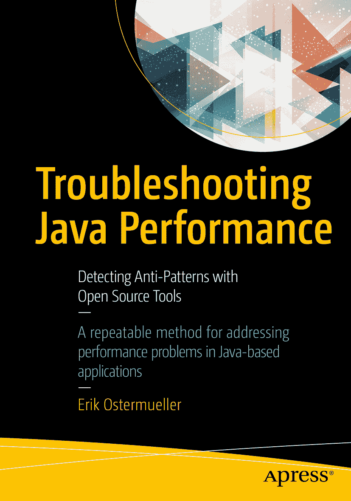
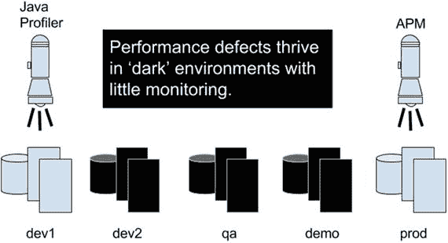

埃里克·奥斯特穆勒（Erik Ostermueller）《Java 性能故障排查：使用开源工具检测反模式》

作者在本书中引用的任何源代码或其他补充材料，读者均可通过本书在 GitHub 上的产品页面获取，网址为 [`www.apress.com/9781484229781`](http://www.apress.com/9781484229781)。如需更详细信息，请访问 [`http://www.apress.com/source-code`](http://www.apress.com/source-code)。ISBN 978-1-4842-2978-1 电子书 ISBN 978-1-4842-2979-8 [`doi.org/10.1007/978-1-4842-2979-8`](https://doi.org/10.1007/978-1-4842-2979-8) 美国国会图书馆控制号：2017954917 © 埃里克·奥斯特穆勒 2017 本作品受版权保护。出版商保留所有权利，无论是涉及材料的全部或部分，特别是翻译、重印、重用插图、朗诵、广播、微缩胶片复制或任何其他物理形式的复制权，以及信息存储与检索、电子改编、计算机软件或目前已知或未来开发的类似或不同方法的传输权。本书中可能出现商标名称、标识和图像。我们未在每次出现商标名称、标识或图像时使用商标符号，而是仅以编辑方式使用这些名称、标识和图像，以维护商标所有者的利益，无意侵犯商标权。本出版物中使用的商品名称、商标、服务标志及类似术语，即使未被明确标识，也不应被视为对其是否受专有权利保护的立场表达。尽管本书中的建议和信息在出版时被认为是真实准确的，但作者、编辑和出版商均不对可能存在的任何错误或遗漏承担法律责任。出版商对本书所含内容不作任何明示或暗示的保证。本书采用无酸纸印刷。通过 Springer Science+Business Media New York 向全球图书贸易发行，地址：233 Spring Street, 6th Floor, New York, NY 10013。电话：1-800-SPRINGER，传真：(201) 348-4505，电子邮件：orders-ny@springer-sbm.com，或访问 www.springeronline.com。Apress Media, LLC 是一家加利福尼亚有限责任公司，其唯一成员（所有者）是 Springer Science + Business Media Finance Inc (SSBM Finance Inc)。SSBM Finance Inc 是一家特拉华州公司。献给约翰、欧文和琼。引言

仅用 30 分钟的故障排查时间，你能多接近 Java 性能问题的根本原因？你会使用哪些可观测性工具？你会调查哪些子系统？

本书是一本面向 Java 服务端开发者的 Java 性能调优简明教程。它探讨了一种系统化的方法，旨在充分利用这 30 分钟，并力图证明，即使是接触性能调优较少的 Java 开发者，也能取得比普遍预期更多的成果。

本书篇幅简短，是因为它只聚焦于作者在担任 Java 分布式系统首席性能工程师的 10 年工作中所遇到的最严重问题。尽管如此，书中介绍的工具和技术可用于发现几乎任何缺陷。

本书包含大量性能问题的演练，你可以从 github.com 下载并在自己的机器上运行。这些动手实践示例提供了丰富的、身临其境的实战经验，这是纯书本方法（即使是更厚的书）无法提供的。

读者将学习一种系统化、易于记忆的四步调优方法，称为**P.A.t.h.检查清单**，它能引导读者关注系统的正确部分并使用正确的工具来发现性能缺陷。如果你想知道我为什么选择这样大写这个缩写词，你会在第 4 章找到答案。本书仅使用开源和免费提供的工具。在大多数情况下，你甚至可以看到应用性能修复前后监控数据的变化。以下是检查清单：

*   **P**：持久化（Persistence）。学习如何识别和修复最常见的 JDBC 性能问题，这些问题同样适用于 NoSQL 领域。
*   **A**：外部系统（Alien systems）。检测何时对其他系统的网络调用会导致性能下降。
*   **t**：线程（threads）。学习如何使用一种低开销的工具来识别 CPU 和响应时间问题，该工具可用于任何环境，甚至生产环境。
*   **h**：堆（heap）。通过快速 GC 健康检查，读者将使用红-黄-绿方法来评估 GC 性能是否健康。它还为更高级的技术（如查找/修复内存泄漏）提供了指导方向。

要识别这些缺陷，需要生成类似生产环境的工作负载，因此本书有几章内容可以帮助你快速上手，创建负载脚本来对系统进行压力测试。除了负载脚本编写优先级和避免常见陷阱等主题外，读者还将学习一种独特的方法，来确定究竟需要应用多少线程的负载，以显示你的系统是否具有可扩展性。

## 主题

在调优软件的过程中，我们会遇到一些反复出现的主题。

### 黑暗环境

性能缺陷在“黑暗”环境中滋生，即缺乏适当监控的环境。这是一个问题，因为我们的许多环境都是“黑暗”的——QA 环境、演示环境以及你团队中从未使用过 Java 分析器的开发人员的桌面环境。

本书将使用主要随 JDK 提供的低开销工具，帮助将性能缺陷从任何环境（无论黑暗与否）中清除出去。

图 1.

监控不足的“黑暗”环境。APM = 应用性能管理工具。

### 即插即用

有许多过时且降低生产力的监控工具，迫使我们重新配置并重启 JVM 才能收集性能数据。用于详细垃圾回收（GC）性能数据的十几个或更多 JVM 参数就是这样一个例子。在可能的情况下，本书使用你可以从任何正在运行的 JVM 中捕获的指标，无需重新配置，无需重启 JVM。我称之为即插即用方法。

### 代码优先

大多数性能工程师都希望拥有海量硬件来进行软件调优。就我个人而言，我无法忍受这一点。拥有无数 CPU 和无限内存听起来不错，但实际上，一旦你拥有大量硬件，就难免会陷入“大型环境瘫痪症”（我自创的术语），其表现包括：

*   由于安全级别提高导致机器访问受限，监控/可见性降低。
*   由于运维流程缓慢，测试运行频率降低。初始环境构建复杂且耗时数周。代码重新部署需要数小时。集群范围重启需要 20-30 分钟。系统备份和维护会导致数小时的停机。大多数单次负载测试运行时间超过 60 分钟。
*   大型环境包含大量性能存疑的额外组件：负载均衡器、防火墙、内容交换机、集群、应用服务器配置等等。
*   需要更多人员成本来照看这些额外的基础设施。

所有这些都让我对大型环境提不起兴趣。我有点惊讶居然有人选择这样工作，因为进展极其缓慢。最终，真正让我兴奋的是在更短的时间内完成更多的调优。

如果我们每天能完成 5-10 个“修复-测试”调优周期，而不是传统的 2-3 个，会怎样？这将是解决性能问题更快、更令人印象深刻的方式。

如果我们能精心设计一个调优环境，将“大型环境瘫痪症”的影响降到最低，会怎样？这将使我们开发人员能够将注意力从管理环境转移到我们交付物——Java 代码本身的性能上。我称之为“代码优先”调优方法，它之所以重要，是因为这是调优系统最快的方式。

第 2 章为这样一个调优环境提供了非常详细的设计，其中包含一个非常特殊的、能够极大减少“大型环境瘫痪症”的神秘特性。但除此之外，这个环境有一个关键要求：在此调优时，我们必须能够重现通常在生产环境中发现的大部分缺陷。没有这一点，这个环境就毫无价值。因此，为了具体证明在这种环境中可以找到（并修复）类似生产环境的性能缺陷，我编写了两组服务器端 Java 代码示例，这些示例展示了（在负载下的）性能缺陷及其修复方法。

### 一次编写，随处运行（WORA）的性能缺陷

当 Java 在 20 世纪 90 年代中期首次发布时，在多个操作系统上编译和运行 C 程序是一件极其痛苦的事情。作为回应，Java 平台不遗余力地确保在一个操作系统上编写的 Java 代码能够轻松地在所有其他支持 Java 的操作系统上编译和运行。Sun Microsystems 称之为“一次编写，随处运行”（WORA）。

但恰巧的是，WORA 有一个不受欢迎且鲜为人知的副作用：如果你的代码中存在性能缺陷，那么该缺陷不仅会在多个平台上显现，还会在不同规模（无论大小）的环境中出现。

当然也有例外，但在我担任 Java 性能工程师的十年间，这一点反复得到验证。由于我预料到大多数读者会难以相信，因此我编写了十几个性能缺陷来证明这一点。第 2 章提供了这些负载测试性能结果的快速概览。第 8 章详细介绍了测试的架构，并描述了如何在您自己的机器上（无论其性能如何）运行这些示例。

由于大多数性能缺陷在大型和小型环境中都能重现，因此我们在选择进行性能调优的地点时面临一个关键抉择。这一点非常重要：既然我们可以在小型环境中效率更高，每天完成 5-10 个修复测试周期，为什么还要在大型环境中调优，忍受所有“大型环境瘫痪症”的问题呢？

请记住，尽管为了便捷，大多数调优都在小型环境中进行，但通常需要大型环境来展示完整的吞吐量和其他性能需求。什么是性能需求？我们很快就会讲到。

### 三线程负载，零思考时间（3t0tt）

我日常工作的一部分是培训开发人员调优他们的代码。我观察到的最常见错误之一是，人们用不切实际的大量负载压垮他们的 Java 服务器端系统。这个领域有太多人这样做了，也许这是雄性激素作祟？

本书附带的两组代码都执行小型负载测试，对服务器端系统施加压力。每个测试都配置为启动恰好三个 Java 线程，这些线程同时且持续地提交 HTTP 网络请求。HTTP 请求之间没有配置“思考时间”。我将这种负载量称为 3t0tt，因为它代表三个线程的负载且零思考时间。发音为“three tot”。它用作负载量的单位，例如：你施加了多少负载？3t0tt。

这种特定的负载水平设计为具有足够小的 CPU 和内存消耗，以便在几乎任何工作站上运行，但又足够大，能够重现大多数多线程/同步问题。尽管这种小负载量很少足以让系统崩溃，但本书鼓励读者评估系统中的几个特定部分，并确定哪个部分导致了最大的性能下降。这被称为“低垂的果实”。在确定问题后，部署修复方案并重新测试。如果性能得到改善，则继续调查下一个“低垂的果实”问题，并重复此过程。

对于性能新手来说，选择合适的负载量是很困难的。3t0tt 为一个困难的培训问题提供了一个非常简单的起点。在第 6 章中，你将学习该领域的下一课，即确定施加多少负载以快速评估可扩展性。

### 性能工程这门学科

本书更像是一本故障排除指南，而非涵盖性能调优整个学科的全面手册。本小节将简要介绍性能流程应如何运作，以及如何判断系统调优何时完成。

如果我们正在构建一个软件系统，那些精确定义我们将要编码内容的规格说明被称为“功能需求”。它们详细说明了每个屏幕上的数据输入项，以及用户点击“提交”按钮后应显示的结果。当需求中的所有功能都已实现时，应用程序在功能上就完成了。

另一方面，性能需求则定义了应用程序必须多快地响应，以及系统在特定时间间隔内（例如一小时内）必须处理多少业务进程才能满足客户需求。这些分别被称为响应时间和吞吐量需求。一份性能需求文档首先会列出所有/大部分业务进程（来自功能需求），然后为每个进程分配响应时间和吞吐量需求。

例如，如果资金转账的响应时间要求是 2 秒，吞吐量要求是每小时 3600 笔，那么稳态负载测试（关于负载测试的详细信息，请参见第 4、5、6 和 7 章）必须证明 90%的资金转账响应时间低于 2 秒，并且在 60 分钟内至少有 3600 笔交易成功执行。

有时，性能需求甚至会对硬件投入的资金设置上限。如果集群中需要五个节点才能达到上述目标，而性能需求规定我们最多只能购买四个节点，那么就需要进行更多的调优工作（很可能是降低 CPU 消耗），以便仅用四个节点就能满足响应时间和吞吐量的目标。

通常还会规定，所有性能需求必须在 CPU 消耗低于 X 的情况下满足，其中 X 是运维人员在生产环境中感到舒适的值。

这方面最常见的错误之一就是根本没有性能需求。当然，这些需求并不精确也不完美。从某个起点开始，随着时间的推移不断完善它们，以最佳地满足客户对性能和稳定性的需求，同时避免因过度调优系统而浪费时间。

以下是我所说的这种完善过程的一个例子。应该花时间了解性能需求与从生产环境收集的响应时间和吞吐量数据的匹配程度。如果生产数据显示，在一年中最繁忙日子的最繁忙时段，系统处理了 7200 笔资金转账，而吞吐量需求低于这个数字，那么吞吐量需求就应该至少提高到这个数字（7200），并且为了安全起见，可能还需要再提高一点（比如 25%）。

关于此流程的更详细探讨，Walter Kuketz 在 [`www.cgi.com`](http://www.cgi.com) 网站上有一份 20 页的 PDF 白皮书，内容非常精彩。Walter 实际上帮助我撰写了上面的小节。要找到他的白皮书，请使用以下搜索条件进行互联网搜索：

“Walter Kuketz” “Guidebook for the Systems Development Life Cycle”

### 划定责任界限

让系统达到性能要求是谁的责任？是编写代码的开发人员，还是性能工程师？如果你的答案是性能工程师，那么谁来阻止开发人员在其他代码库中散布同样类型的性能缺陷，这些缺陷曾导致第一个系统崩溃？请记住，驱动自动化的懒惰是好的。而逃避性能责任的懒惰则是坏的。

这会将开发人员变成性能缺陷的制造者，而少数性能工程师根本不可能跟上如此大量的缺陷。

最后，如果性能工程师是在开发周期结束时才被引入来发现/修复性能问题，那么就没有时间进行调优，更不用说替换一个已经开发了数月甚至数年、性能不佳的技术方案了。

## 章节组织

本书分为三个部分。

### 第一部分：性能调优入门

第一部分的三个章节为性能测试奠定了基础：

第 1 章详细介绍了四个性能反模式，它们是大多数性能缺陷的核心。理解这些反模式，能让我们在查看原始性能指标时更容易识别出缺陷。

第 2 章论证了在非常小的计算环境（如开发者工作站）中是调优 Java 服务器端系统最高效的地方。它还详细说明了将所有较大系统的组成部分有效压缩到较小环境中所需的所有步骤。

第 3 章是关于浩瀚的性能指标海洋以及如何选择正确的指标。如果你曾经对在性能测试期间应该使用哪些指标感到困惑，那么本章就是为你准备的。

### 第二部分：创建负载脚本和负载测试

本书的第二部分是关于创建负载脚本和负载测试的总体介绍：

第 4 章详细介绍了创建网络负载脚本（模拟生产负载）的“第一优先级”和“第二优先级”方法。第一优先级能让你快速启动并进行测试。第二优先级则展示了如何增强脚本，以更精确地模拟真实用户的生产负载。

第 5 章详细介绍了你需要客观评估的所有正确标准，以判断你在第 4 章中构建的脚本是否模拟了一个“有效”的测试。本章帮助你快速了解你是否搞砸了负载测试，以及结果是否必须丢弃。没有人愿意基于无效的结果做出重大的调优/开发决策。

第 6 章详细介绍了评估可扩展性的最快方法。它描述了一种称为“可扩展性标尺”的测试。如果可扩展性对你很重要，你应该每周至少运行一次此测试，以帮助引导你的应用程序性能朝着正确的方向发展。

第 7 章是我写给开源负载生成器 JMeter 的一封情书。`jmeter-plugins.org` 也很重要！商业负载生成器无法跟上 JMeter 所有出色的功能。

### 第三部分：P.A.t.h. 检查清单与性能故障排查

第三部分的章节主要关于性能故障排查。它们详细介绍了用于识别 Java 服务端性能问题根本原因的工具和技术。

第 8 章概述了 P.A.t.h. 检查清单，并提供了两个示例应用的架构概览，你可以在自己的机器上运行它们。这些示例应用可从 github.com 下载，旨在为你提供收集正确性能数据并定位问题根本原因的实践体验。

P.A.t.h. 检查清单中的各项内容已在前面描述过，因此此处不再重复，但以下是每个项目对应的章节：

*   **P**：持久化（Persistence）。第 9 章
*   **A**：外部系统（Alien systems）。第 10 章
*   **t**：线程（threads）。第 11 章
*   **h**：堆（heap）。第 12 章

致谢

感谢 Apress 信任我这位首次写书的作者；你们的支持对我来说意味着一切。

Apache 基金会的 Shawn McKinney 是第一个认为我能写书的人。Shawn，你早期的鼓励和对那些疯狂想法的坦诚反馈是无价的，而且你总是第一个对任何新代码提供反馈。谢谢你。Mike Scheuter 是我认识的最聪明的人之一；他是我在 FIS 的长期朋友、导师和同事，是他最初教会我热爱堆栈跟踪以及许多其他与工作相关或无关的事情。感谢我的雇主 FIS 和我们的 PerfCoE 团队。FIS 在整个企业范围内对卓越性能的持续高管级支持在业内是独一无二的。为此表示感谢。

阿肯色大学小石城分校信息科学系主任 Liz Pierce 博士，策划了我于 2017 年 6 月初举办的一个 8 小时的 Java 性能研讨会。感谢 Liz 博士的支持，也感谢大约 15 位学生、教职员工和其他人，他们牺牲了两个周六下午的时间来钻研性能问题。我非常喜欢。多伦多的 CMG Canada 小组也在一两个月前慷慨地审核了其中的一些想法。谢谢。

2011 年，我在 cmg.org 的一次国际性能会议上获得了最佳论文和最佳演讲者奖。著名的美国计算机科学家 Jeff Buzen 领导了评选委员会，他本人对排队论领域做出了许多贡献。CMG 当时（以及在其他方面）的支持给了我多年后出版这本书所需的信心。谢谢你 Jeff，谢谢你 CMG。

还有许多以各种方式提供过帮助的人：Joyce Fletcher 和 Rod Rowley，他们在 2006 年给了我第一份调优工作。感谢 Mike Dunlavey、Nick Seward、Stellus Pereira、David Humphrey、Dan Sobkoviak 和 Mike McMillan 的支持。感谢我的父亲 Ralph Ostermueller，感谢你数月来持续的关注和支持，也感谢我的母亲。

我还想快速提一下我每天受益的少数几个特定的开源项目。感谢 Glowroot.org 的 Trask 在最后一刻的修复，感谢 JMeter 和 JMeter-Plugins。你们都很棒。

感谢 Walter Kuketz、Jeremiah Bentch、Erik Nilsson 和 Juan Carlos Terrazas 阅读本书的后期草稿。Erik，你在早期章节中对清晰度的要求一直萦绕在我心头。你的意见迫使我提高了一些标准；希望这能体现出来，谢谢。Jeremiah，你关于 SELECT N+1、JPA 和其他问题的资深评论帮助我填补了巨大的空白。谢谢。最后，感谢 Walter：你数十年的性能/SDLC 经验，言简意赅地传授给我，确实帮助我避免了在最后阶段偏离轨道。谢谢。

感谢我的技术审阅者 Rick Wagner：Rick，与你合作我最喜欢的一点，除了你广泛的 Java/RedHat 经验以及你审阅众多技术书籍的独特经历之外，是你能够经常引导我为读者描绘一幅更完整的软件性能图景，而不是我最初开始画的那半幅画。谢谢。

最后，感谢我的家人。我的大儿子 Owen 的编辑技巧在引言、第 1 章、第 8 章以及其他地方都得到了充分展现。他 20 岁，对编程一无所知，但却给了我关于如何逐步构建复杂思想的精妙课程。谁能想到呢。在你写下一本书之前，先联系他。我的小儿子 John 帮助测试了代码示例，并忍受了许多次头脑风暴会议，最终才让我想出了正确的点子。John 的编辑技巧在于润色单个句子。事实证明，这里有一个模式。我出色的妻子 Joan Dudley，她在大学教授文学，是这本书和她的学生们的宏观编辑。Joan 的编辑贡献是“每个段落都很重要”和“清晰度不亚于任何人”。Joan，你做出了许多牺牲，在我忙于这个疯狂的长篇项目时，你撑起了整个家。我爱你，感谢你鼓励我去尝试伟大的事情。

目录
第一部分：性能调优入门
第 1 章：性能反模式 3
主要性能反模式 3
主要反模式 #1：不必要的初始化 4
主要反模式 #2：策略/算法效率低下 5
主要反模式 #3：过度处理 6
主要反模式 #4：大型处理挑战 7
评估处理挑战的规模 7
使用主要性能反模式 8
别忘了 9
下一步 9
第 2 章：适度的调优环境 11
快速调优 11
一次编写，随处运行的性能缺陷 12
面向开发者的调优环境 13
网络 15
模拟后端系统 16
使用 Wiremock 模拟 HTTP 后端 17
本地负载生成 19
负载生成快速概览 19
负载生成器的职责 19
按 PID 查看 CPU 消耗 20
比较指标 22
别忘了 23
下一步 23
第 3 章：指标：消除猜测的良药 25
选择哪个指标？ 25
为调优设定方向 26
备用方案：使用负载生成器指标进行间接性能评估 27
大型负载是一个危险信号 27
波动性是一个危险信号 28
创造性地为调优设定方向 29
创造性测试计划 1 29
创造性测试计划 2 30
跟踪性能进展 30
别忘了 32
下一步 32
第二部分：创建负载脚本与负载测试
第 4 章：负载生成概述 35
负载生成器 36
关联变量 36
负载脚本中的步骤排序 37
首要优先级脚本 38
负载脚本与 SUT 登录 38
在多个线程中使用同一个 SUT 用户 39
第二优先级 40
负载脚本阶段 1 40
负载脚本阶段 2 40
负载脚本阶段 3 41
负载脚本阶段 4 43
欢迎质疑 43
项目生命周期提示 44
别忘了 44
下一步 45
第 5 章：无效的负载测试 47
网络问题 47
容器问题 48
预热不足 51
硬件资源耗尽 51
虚拟化问题 51
错误的工作负载问题 53
负载脚本错误 54
别忘了 55
下一步 56
第 6 章：可扩展性标尺 57
创建可扩展性标尺负载计划 57
解读结果 60
不完美但至关重要 63
重现糟糕的性能 63
好的和坏的 CPU 消耗 64
别忘了 65
下一步 66
第 7 章：JMeter 必知特性 67
致 JMeter 的情书 68
必须使用 jmeter-plugins.org 70
PerfMon 71
JMeter user.properties 是你的朋友 73
JMeter 简介 74
用于快速工作的 UI 特性 76
使用 JMeter 断言在负载测试期间进行功能验证 77
脚本变量 80
将性能结果保存到磁盘 81
如何避免大型文件的冗余副本 83
为重度调试或高吞吐量合理调整输出文件大小 84
录制 HTTP 脚本 86
调试 HTTP 录制 89
直接对 Java 进行负载测试与调试 90
JMeter 沙盒 91
带单个图表的 JMeter 沙盒 93
JMeter 沙盒 / 同一图表上的多个指标 93
用于测试关联变量的 JMeter 沙盒 96
探索性调查——第一步，找到数据项 97
探索性调查——第二步 99
先决条件 101
别忘了 103
下一步 103
第三部分：P.A.t.h. 检查清单与性能故障排查
第 8 章：P.A.t.h. 检查清单简介 107
快速回顾 107
使用 P.A.t.h. 检查清单 109
运行示例 111
Java 性能故障排查 (jpt) 示例应用 111
littleMock 示例应用 113
别忘了 114
下一步 115
第 9 章：持久化，P.A.t.h. 中的“P” 117
测试 05：单个 SQL 的性能问题 117
多个 SQL 语句的性能问题 119
第一个问题：SELECT N+1 120
第二个问题：对静态数据的未缓存 SELECT 126
JPA 和 Hibernate 128
别忘了 129
下一步 129
第 10 章：外部系统，P.A.t.h. 中的“A” 131
降低长距离响应时间 131
压缩让一切更快 131
使用 HTTPS 时压缩的安全警告 134
消息大小 134
使用线程转储检测网络请求 135
量化响应时间 136
识别可从压缩中受益的明文负载 137
别忘了 138
下一步 139
第 11 章：线程，P.A.t.h. 中的“t” 141
线程转储的当前用途 141
线程与线程转储 142
导航线程转储 143
手动线程转储分析 (MTDP) 146
示例 1 147
样本量与健康的怀疑态度 149
MTDP 演示 150
导航不熟悉的代码 152
利用四种反模式 153
交互式线程转储阅读练习 153
如何让代码更快 155
局限性 156
需要多少负载？ 157
区分高吞吐量与慢速堆栈跟踪 157
MTDP 与其他示例 157
别忘了 159
下一步 159
第 12 章：堆，P.A.t.h. 中的“h” 161
快速 GC 健康检查 161
GC 指标的传统方法 162
垃圾收集器概述 163
使用 jstat 即时获取 GC 指标 164
堆趋势分析 168
使用 JVM 参数调整堆大小 170
使用 NewRatio 的注意事项 172
盲目增加 -Xmx 173
回收未使用的 RAM 173
内存泄漏 175
排查内存泄漏 175
堆转储分析 177
捕获堆转储 177
使用 Eclipse MAT 查找内存泄漏 178
Eclipse MAT 自动泄漏检测 178
在 Eclipse MAT 中探索 180
泄漏的类型 183
堆故障排查，逐步指南 184
别忘了 185
第 13 章：结论 187
入门步骤 187
将本书与大型监控工具结合使用 188
3t0tt（3 个负载线程，零思考时间） 189
最后一句话 189
索引 191
内容一览
关于作者 xv
关于技术审阅者 xvii
致谢 xix
引言 xxi
第一部分：性能调优入门
第 1 章：性能反模式 3
第 2 章：适度的调优环境 11
第 3 章：指标：消除猜测的良药 25
第二部分：创建负载脚本与负载测试
第 4 章：负载生成概述 35
第 5 章：无效的负载测试 47
第 6 章：可扩展性标尺 57
第 7 章：JMeter 必知特性 67
第三部分：P.A.t.h. 检查清单与性能故障排查
第 8 章：P.A.t.h. 检查清单简介 107
第 9 章：持久化，P.A.t.h. 中的“P” 117
第 10 章：外部系统，P.A.t.h. 中的“A” 131
第 11 章：线程，P.A.t.h. 中的“t” 141
第 12 章：堆，P.A.t.h. 中的“h” 161
第 13 章：结论 187
索引 191
关于作者与关于技术审阅者
关于作者
关于技术审阅者

