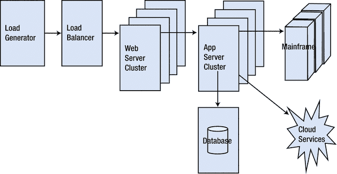
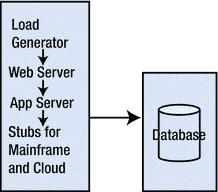
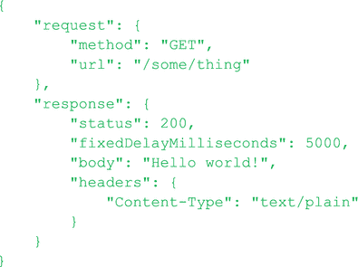
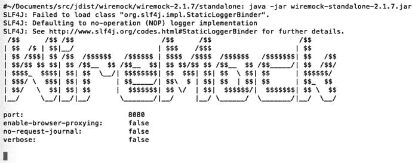
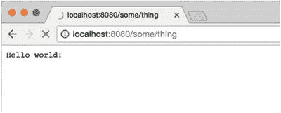
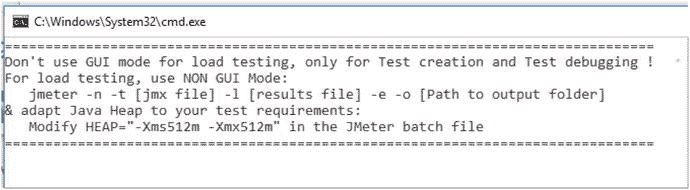
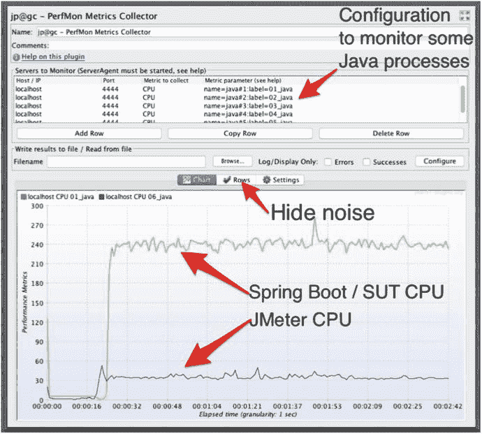
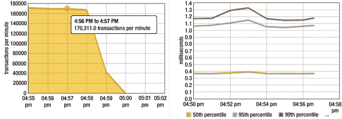

# 2. 一个规模适中的调优环境

本章展示了如何通过首先在一个规模适中的、较小的环境中进行调优，从而在更大的性能环境中花费更少的时间。在这个较小的环境中，你每天可以完成更多的“修复-测试”循环，这极大地加速了整个调优过程。

本章的目标是：

*   学习如何设计负载测试，使其能在非常小的计算环境（例如你的桌面电脑）中运行，从而有效地将其转变为一个经济高效的性能调优实验室。
*   学习如何绘制单个进程随时间变化的 CPU/内存消耗图。
*   学习如何用返回预录响应的存根服务器替换后端系统。

将项目的性能调优阶段安排在代码冻结前后是一个非常糟糕的主意，但这恰恰是我们通常安排它的时间点。代码冻结者说“不能再改了”，而调优者则咕哝着回应“必须修复代码”。这场争论最终以在操场滑梯旁的斗殴告终。这就是 SDLC 风格的“生产力”。即使目睹了这场混乱，管理层似乎也无法理解为什么系统性能最终会如此糟糕。“代码冻结”与“代码变更”之间长期存在的冲突再次被忽视。

本章探讨了一系列技术，使你能够利用一个小型的开发者调优环境，在 SDLC 的早期及整个过程中提升性能。最终可能仍然需要在大型、类生产环境中进行性能验证，但早期的验证将防止其退化为更传统的、充满焦虑的、在投产前最后时刻仓促完成的工作。

## 快速调优

许多人会合理地反对说，一个只有几个 CPU 的小型调优环境对于达到高吞吐量系统的最终性能目标来说太小了。这是一个合理的反对意见。但达到最大吞吐量并非直接目标。相反，小型环境提供了一个易于访问和监控的系统，我们可以在其中完成许多“修复-测试”循环，也许每天多达 10 个。

在一个单一的“修复-测试”循环中，你运行几分钟的负载测试，使用监控工具识别最大的性能问题，编写并部署代码修复，验证改进效果，然后重复。

传统上，在代码完成且质量保证部门测试完所有代码后，性能测试被紧紧地塞进投产前的日程中。这由于多种原因尤其具有挑战性。首先，几乎没有时间来创建大多数人认为调优所需的昂贵的大型计算环境。其次，为了稳定性起见，随着投产日期的临近，实施代码冻结是合理的。然而，代码冻结的文化使得性能工程师特别难以测试和部署使系统正常运行所需的更改。最后，几乎没有时间从第一天起就紧密融入产品中的、性能不佳的技术方案中抽身。这是一项最后一刻的仓促工作。

相比之下，这种“快速调优”方法有助于防止调优消耗你的预算，并有助于避免最后一刻的性能冲刺。通过在早期解决大部分性能缺陷，在完整环境中展示完整的吞吐量目标就变成了一项更小、更易于管理的任务。


## 一次编写，随处运行的性能缺陷

本书附带的代码示例可在以下两个 GitHub 仓库中找到：

[`https://github.com/eostermueller/javaPerformanceTroubleshooting`](https://github.com/eostermueller/javaPerformanceTroubleshooting)

[`https://github.com/eostermueller/littleMock`](https://github.com/eostermueller/littleMock)

我将第一个仓库简称为“jpt”，第二个简称为“littleMock”。本节简要列举了第一组示例（jpt）中的性能缺陷。关于两组示例的更多细节，请参见第 8 章。第 1、2 和 3 章属于入门性质，因此我能理解为什么表 2-1 中来自负载测试的硬核性能数据看起来有些格格不入。我包含这些数据是为了提供切实的证据，证明常见的性能缺陷在适中的调优环境（如工作站）中很容易被检测到。

表 2-1.

来自 jpt 示例的性能缺陷吞吐量结果（您可以在自己的机器上运行）。RPM = 每分钟请求数，由 Glowroot.org 测量。

| 测试编号 | A 测试 RPM | B 测试 RPM | 性能缺陷 | 备注 |
| --- | --- | --- | --- | --- |
| 01 | 119 | 394 | 慢速 HTTP 后端 |   |
| 02 | 2973 | 14000 | 对 1MB 数据文件的多次读取 |   |
| 03 | 15269 | 10596 | 对静态数据的未缓存查询 |   |
| 04 | 6390 | 15313 | 慢速结果集迭代 |   |
| 05 | 3801 | 12 | 缺少数据库索引 |   |
| 06 | 10573 | 10101 | 堆上 RAM 过度分配 | 吞吐量无显著差异，但对于避免浪费至关重要。 |
| 07 | 18150 | 26784 | SELECT N+1 |   |
| 08 | 354 | 354 | CPU 密集型失控线程 | 额外的 CPU 消耗未影响吞吐量。 |
| 09 | N/A | N/A | 多个问题 | 09b.jmx 不存在。请自行尝试。 |
| 10 | N/A | N/A | 通过广域网传输未压缩的 HTTPS 响应 | 仅在通过广域网测试时结果才有意义。 |
| 11 | N/A | N/A | 内存泄漏 | 11a 吞吐量下降，但仅在慢速泄漏填满堆之后。 |
| 12 | 7157 | 9001 | 年轻代过小 |   |

表 2-1 中的每一行都详细说明了两个测试——一个包含特定性能缺陷，另一个则不包含。在不同行之间，A 测试或 B 测试哪个包含缺陷是变化的。具有较高 RPM 的测试性能更好，尽管存在少数例外情况，其中除 RPM 之外的其他因素决定了最佳性能。

与这组示例类似，大多数性能缺陷都是“一次编写，随处运行”（WORA）缺陷，因为无论您是在大型集群环境还是小型笔记本电脑上运行它们，该缺陷都会存在并且可以被检测到。

我不期望其他人能复现我在该表中包含的精确数字。相反，主要思想是要理解，对于任何测试编号（例如 05a 和 05b），a 测试和 b 测试之间都存在具体且可重复的性能差异。

我根据过去十年作为全职 Java 服务器端性能工程师的经验选择了这组特定的缺陷。在此之前的十五年里，作为一名开发人员、团队负责人和架构师，我基本上看到了同样的问题。

这个列表是否与您所见完全吻合尚有争议；您的情况可能会有所不同。但我相当确信，这些缺陷对于服务器端 Java 开发人员来说会非常熟悉。更重要的是，揭示这些问题原因的工具和技术比这个缺陷列表本身更具通用性。这套工具将有助于检测此列表中未包含的大量问题。

再次说明，刚刚展示的 12 个示例是第一组示例（jpt）的一部分。我们将在第 8 章讨论第二组示例（littleMock）。敬请期待。

## 面向开发者的调优环境

由于这些缺陷在大型和小型环境中都可以被检测到，我们不再需要等待大型环境来调优我们的系统。我们几乎可以在任何我们想要的环境中进行调优。这意味着，当我们集思广益，思考我们的调优环境应该是什么样子时，我们有了选择，而且是很有吸引力的选择。那么，对于一个优秀的调优环境，您的愿望清单上会有什么呢？以下是我清单上的首要事项：

*   大量的 RAM。
*   拥有系统的 root 或管理员权限（或者至少是非常好的安全访问权限）。在 Linux 中，可以使用 `sudo` 来授予对某些 root 命令的访问权限，而不授予其他命令。这使一切变得更容易——监控、部署代码、查看日志文件等等。
*   能够快速更改/编译/构建/打包和重新部署代码。

除此之外，我需要一个好的项目经理来保持我的日程安排清晰。但除此之外，令人惊讶的是，所需的东西很少。有了这个简单的清单和本书中介绍的调优方法，您就可以在系统调优方面取得巨大进展。

大多数大型生产级环境（图 2-1）都缺少这个愿望清单中的重要事项：代码重新部署很慢（需要数小时或数天，并且涉及大量繁琐流程）。然后，调优系统的人员很少获得足够的安全访问权限，无法对关键系统组件进行彻底而快速的检查。这就是我们在引言中讨论过的“大型环境瘫痪症”。



图 2-1.

传统全尺寸性能调优环境

这里展示的环境可能具有冗余和大量的 CPU；这些都是很棒的东西，但我愿意为了一个我可以完全访问的小型环境（比如我的笔记本电脑或台式机）而牺牲它们。图 2-2 展示了一种将图 2-1 中几乎所有内容压缩到仅两台机器上的方法。



图 2-2.

仅使用两台机器的适中性能调优环境

乍一看，这个小型环境的设计似乎做出了妥协。实时大型机和实时云服务消失了。冗余消失了。此外，由于我们将多个组件（负载生成器、Web 服务器、应用服务器和桩模块）压缩到一台机器上，RAM 耗尽是一个大问题。这些都是值得关注的问题，但称它们为妥协，就像指责婴儿在学会走路之前先学会爬行一样。这个小型开发者调优环境是我们站稳脚跟的地方，是我们理解如何让系统表现良好的地方，这样我们就可以避免在摇摇欲坠的基础上构建系统的其余部分——那个我们太过熟悉的基础。

为了让这个理想化的目标落到实处，本书附带的十二个“可在您自己的机器上运行”的性能缺陷示例将有助于使这一切变得具体。每个示例负载测试实际上都是一对测试——一个包含性能缺陷，另一个是重构版本，具有可衡量的更好性能。

但我们还没有谈到我们集成的所有后端系统——大型机、第三方系统，有很多。让这些真实系统在我们的适中调优环境中可用，其工作量巨大，以至于成本效益不高。那么，没有这些系统我们如何进行调优呢？

在适中的调优环境中，这些后端系统被简单的“替身”程序所取代，这些程序接受来自您系统的真实请求。但是，这些替身程序并不实际处理输入，而是简单地返回预先录制或预先配置的响应。

在本章的剩余部分，您将看到一些非常优秀的工具集的概述，这些工具集有助于快速创建这些替身程序，我们将这个过程称为“对后端进行桩化”。


为了实时掌握这些临时程序（我将其称为**存根服务器**）的资源消耗是否合理，能够绘制出机器上各进程的实时 CPU 和内存消耗图表会很有帮助。我们将在下文讨论用于绘制图表的工具集，但下一节会先探讨在轻量级负载测试环境中使用任何网段所涉及的风险。就我个人而言，任何一个存根服务器的资源消耗（无论是内存还是 CPU）都不能超过 10%–15%。

## 网络

我本可以将图 2-2 画成只有一台机器，但考虑到要找到一台内存足够容纳所有组件的机器可能比较困难。所以，如果你的内存足够，我建议将所有组件部署在一台机器上，以进一步贯彻**代码优先**的调优方法。

本节将展示将大型环境中的多个组件整合到一两台机器上的一些好处。

假设你测试的所有部分——服务器、数据库、测试机器等——都在同一个数据中心。如果你将负载生成机器（比如一台运行 JMeter 的小型虚拟机）迁移到另一个数据中心（通常网络速度会更慢），然后运行完全相同的负载测试，响应时间会急剧上升，吞吐量则会骤降。即使负载生成在同一数据中心，通过网络生成负载也会让你面临风险，因为你是在别人的地盘上操作。而在那个地盘上，网络性能由他人掌控。想想维护网络性能所涉及的所有组件：

*   防火墙
*   作为安全措施运行的带宽限制软件（如 NetLimiter）
*   HTTP 代理服务器（如果访问互联网）
*   硬件——路由器、内容交换机、CAT5 线缆等
*   负载均衡器，尤其是其管理并发的配置

当我的老板紧盯着我，确保我的代码性能达标时，这些网络组件的所有者没有一个能随时为我提供帮助。所以，可以说，我把它们从脚本中剔除了。只要可能，我都会设计负载测试来避免网络依赖。一种方法是在与 Java 容器相同的机器上运行更多进程。

我承认，将这些组件部署在同一台机器上有点不符合常规，就像你的朋友看到你离开辅助轮就不会骑自行车时嘲笑你一样。当服务于一个战略目的——解决非常真实的性能焦虑时，我乐于采用像使用辅助轮这样看似胆小的策略。让我们借助辅助轮，专注于代码调优，并为应用程序建立一点信心。

一旦你的团队在开发者调优环境中对性能建立了更多信心，就可以卸下辅助轮，开始在更接近生产环境的网络配置下进行负载测试和调优。但在起步阶段，通过在调优环境中避免网络依赖，我们可以愉快地消除大量风险，从而推进我们的**代码优先**策略。

## 对后端系统进行存根处理

如果你个人已准备好开始调优，但某个后端系统无法用于负载测试，那么在搭建环境时就会遇到一些困难。不过还是有办法的。简单地注释掉代码中对该不可用系统的网络调用，并用硬编码的响应来替代，这会非常有帮助。这样可以看到系统其余部分的性能表现，但这种方法有点 hack 的味道。为什么？因为修改硬编码响应的内容需要重启。此外，由于你注释掉了调用，网络 API 在负载下得不到验证。同时，任何针对后端网络调用的监控措施也将无法得到测试。

我建议不要使用硬编码，而是运行一个虚拟程序，我称之为**网络存根服务器**。这种通用做法也被称为**服务虚拟化**。¹ 存根服务器程序充当不可用系统的替身，接收网络请求并返回预先录制（或仅仅是预先配置）的响应。

你可以配置网络存根，使其根据输入请求的内容返回特定的响应消息。例如：“如果存根服务器收到一个 HTTP 请求，且 URL 路径以 `/backend/fraudCheck` 结尾，则返回特定的 JSON 或 XML 响应。”

如果系统中有许多（可能是几十或几百个）请求-响应对，可以使用网络录制和回放方法来捕获配置所需的大部分数据。

在评估使用哪个网络存根服务器时，请务必寻找具备以下特性的：

*   允许你在不重启网络存根程序的情况下重新配置请求/响应。
*   允许你配置响应时间延迟，以模拟响应时间与你后端系统相似的后端。
*   允许自定义 Java 代码来定制响应。例如，调用存根的系统可能需要在响应中包含当前时间戳或生成的唯一 ID。
*   允许你根据输入 URL 和/或 POST 数据的内容来配置特定的响应。
*   提供录制和回放功能。
*   与录制和回放类似，能够查询最近的请求-响应对也很不错。
*   网络存根程序可以从单元测试中启动，也可以作为独立程序运行。
*   可以配置为监听任何 TCP 端口。

如果你的后端系统有 HTTP/S 入口点，那你很幸运，因为有许多成熟的、专为 HTTP 设计的开源网络存根服务器：

*   Wiremock：`wiremock.org`
*   Hoverfly：[`https://hoverfly.io/`](https://hoverfly.io/)
*   Mock Server：[`http://www.mock-server.com/`](http://www.mock-server.com/)
*   Betamax：[`http://betamax.software/`](http://betamax.software/)

但对于其他协议，如 RMI、JMS、IRC、SMS、WebSockets 和普通套接字，目前还没有同等成熟度的存根服务器。因此，对于这些协议，尤其是专有协议和消息格式，你可能不得不采用老办法：直接注释掉对后端系统的调用，并编写硬编码的响应。但这里还有一个最后的选择：你可以考虑编写自己的、针对你的协议和专有消息格式定制的存根服务器。在认为这项工作过于庞大而放弃之前，请快速浏览一下这三个成熟的开源网络 API：

*   Netty：[`https://netty.io/`](https://netty.io/)
*   Grizzly：[`https://grizzly.java.net/`](https://grizzly.java.net/)
*   Mina：[`https://mina.apache.org/`](https://mina.apache.org/)

这三个 API 都是专门为快速构建网络应用程序而设计的。事实上，这里有一个演示，展示了如何使用 Netty 在不到 250 行 Java 代码中构建一个自定义的 TCP 套接字服务器：

[`http://shengwangi.blogspot.com/2016/03/netty-tutorial-hello-world-example.html`](http://shengwangi.blogspot.com/2016/03/netty-tutorial-hello-world-example.html)

这可以成为为你内部使用专有消息格式的 TCP 套接字服务器构建存根服务器的一个良好开端。


### 使用 Wiremock 模拟 HTTP 后端

图 2-3 和图 2-4 展示了一个快速示例，说明如何启动、配置并向 Wiremock（我最喜欢的 HTTP 模拟服务器）提交请求。



图 2-4.

用于配置 Wiremock 返回预定 HTTP 响应的 HTTP POST 请求的 JSON 主体



图 2-3.

使用 `java -jar` 选项运行 wiremock.org 模拟服务器的启动横幅

使用简单的 `java -jar` 方法启动 Wiremock 非常容易：只需执行 `java -jar wiremock.jar`，它就会立即启动，监听 8080 端口上的 HTTP 请求（该端口可配置）。

启动后，您可以调用 HTTP/json 来配置请求-响应对，以模拟您的后端。您将 JSON 数据 POST 到 `http://<host>:<port>/__admin/mappings/new`。然后，您可以将这些调用保存在 SOAP UI、Chrome Postman 或 JMeter 脚本中，并在负载测试前直接执行它们。在图 2-4 中，JSON 表示：“如果 Wiremock 收到一个对 `/some/thing` 的 `GET` 请求，那么等待 5 秒后，返回 ‘Hello world!’ 作为响应。”

一旦您将上述代码 POST 到 `http://localhost:8080/__admin/mappings/new`，您应该尝试测试新的模拟桩，如图 2-5 所示。



图 2-5.

使用 Chrome 测试新创建的 Wiremock 配置（图 2-4）

……果然，浏览器直到 Wiremock 等待了我们通过 JSON 中的 `fixedDelayMilliseconds` 属性要求的 5000 毫秒后，才显示出 “Hello world!”。

这并不太难，对吧？总结一下，下载 Wiremock jar 包并以 `java -jar` 方式运行。然后提交 Wiremock 的 JSON-over-HTTP 配置消息，基本上就是教会 Wiremock 针对您的后端支持的每个 HTTP 请求返回哪个响应。最后，启动您的应用程序，让它向 Wiremock 发送请求，Wiremock 将返回您配置好的响应。就是这样。

## 本地负载生成

秉持“代码优先”的理念，双机开发者调优环境（图 2-2）的核心是您的代码——一个用于 Web 层的单个 JVM，它向一个用于应用层的单个 JVM 发起调用。

以下是我们要关注的其他部分。

首先是刚刚讨论过的模拟服务器。它们替代了大型机和云服务。对实际系统进行性能审查需要等到以后，可能是在集成测试环境中。

最终，我们会加入一些监控，但进入开发者调优环境的最后一个组件是负载生成器，这也是本节的主题。

### 负载生成快速概览

负载生成器是一种网络流量生成器。我们用它来对支持网络的软件应用（如 SOA 或 Web 应用的服务器端部分）施加压力，以查看响应是否足够快，并确保其不会崩溃。

当然，向 Web 应用发送随机流量是没有帮助的——我们需要提交 Web 应用设计用来处理的确切类型的 Web 请求。为此，大多数负载生成器（如 JMeter）使用录制-回放的方法来精确生成流量。其工作原理如下：在一个空闲的系统上，您使用 Web 浏览器手动浏览您的应用程序，同时一个特殊工具（随负载生成器提供）会记录您的浏览器发出的网络请求。

该录制的输出是一个特定于工具的脚本，它可以逐字回放单个用户的流量，从而对被测系统施加一点压力。然后，为了模拟动态工作负载并摆脱逐字回放，您需要增强脚本，使其能够登录（数据驱动的）各种用户，并对被测系统中的各种“事物”（无论被测系统处理的是什么——比如购买皮划艇、海牛约会服务、发布新闻故事等）进行操作。在硬件允许的情况下，负载生成器可以根据需要启动任意数量的线程来模拟大量用户。

### 负载生成器的职责

负载生成器主要有以下职责：

1.  在您浏览系统时记录网络流量，并将导航细节保存到脚本中。
2.  允许您编辑/调试/增强脚本，使其更接近生产负载。
3.  在单个线程中运行脚本，并允许多个线程同时运行同一个脚本，从而对您的系统施加负载。这就是“负载生成”。
4.  通过实时图表/显示和/或测试后报告来显示响应时间、吞吐量和其他测试结果。

图 2-2 中的“负载生成器”特指职责 3，即负载生成。您可以根据需要在任何地方以任何方式处理职责 1、2 和 4。

事实上，JMeter 负载生成器的启动横幅就提到了这一点（图 2-6）。



图 2-6.

JMeter 发出的警告：不要在负载测试期间使用 GUI

思路是使用 JMeter GUI 模式来创建、录制和完善您的负载脚本。运行少量负载（可能每秒少于十个请求）也是可以接受的。所有这些操作都可以在 JMeter GUI 模式下完成。但是，当需要运行超过 10 RPS 的负载时，为了避免负载生成器本身出现性能问题，最安全的方法是在非 GUI 模式下运行 JMeter，也就是从命令行运行，或者无头运行。图 2-6 中的 JMeter 启动横幅甚至展示了如何做到这一点。示例如下：

1.  首先启动 JMeter GUI，创建您的负载计划并保存为 `myLoadPlan.jmx`。
2.  将 `myLoadPlan.jmx` 文件复制到您的开发者调优环境中，该环境需要安装 JMeter。
3.  运行以下命令：

    ```
    $JMETER_HOME/bin/jmeter -n -t myLoadPlan.jmx -l test001.jtl -e -o dirTest001
    ```

    其中 `test001.jtl` 是一个文本数据文件，JMeter 会将测试结果写入其中；`dirTest001` 是一个文件夹，JMeter 会创建它并在测试结束后用于存放性能报告。

只要 JMeter 进程的 RAM 和 CPU 消耗保持相对较低（可能两者都低于 20%），那么我在同一台机器上同时运行 JMeter 和被测系统就没有遇到过问题。如果您仍然怀疑，可以尝试将负载生成器移到同一子网的另一台机器上，看看性能是否有显著提升。


## 按 PID 查看 CPU 消耗

如果团队中只有一个人关心性能，那将是一场艰苦的上坡战。但当你有几个（或所有）同事共同关注问题、确保报告结果、研究性能解决方案等时，性能管理就会变得容易得多。

因此，为了吸引（并保持）其他人的参与和兴趣，需要一定程度的性能透明度，以便更好地让其他人了解最新情况。例如，每个人都知道如何使用 `top` 和任务管理器来监控 CPU 消耗。但你是否在整个测试期间都盯着它看，还是在查看大量其他指标时移开了视线？在故障排查时，我们都应该成为彼此优秀的怀疑论者，而一张测试期间的 CPU 基本消耗图，确实能在这些问题被提出之前就帮助回答它们。

但是，当你要在多台机器上监控 CPU，或者像我们这样，要区分单台机器上众多进程中哪个 CPU 占用高/波动大时，监控 CPU 的任务就变得更加繁重。我的观点是，定期创建并分享易于理解的图表和指标是值得花时间的。此外，在 CPU 消耗这个特定问题上，目前缺乏能够按单个进程 ID（PID）绘制 CPU 随时间消耗图的开源/免费工具。

我想快速介绍一个能做到这一点的工具，而且它恰好不仅能与 JMeter 配合使用，其结果还能与任何其他 JMeter 指标显示在同一张图表上。这个工具叫做 PerfMon，来自 jmeter-plugins.org，网址是 [`https://jmeter-plugins.org/wiki/PerfMon/`](https://jmeter-plugins.org/wiki/PerfMon/)（见图 2-7）。



图 2-7. jmeter-plugins.org 的 PerfMon 允许你监控 CPU 和许多其他指标

以下是一些说明：

*   由于本次测试使用的 i7 处理器有八个核心，如果单条线达到 800，就意味着系统已 100% 消耗。对于六个核心，最大值是 600。在这张图中，我们有两条线，240 和 40。240+40=280，280/800 = 35% CPU。
*   在顶部的窗格中，我已将 PerfMon 配置为捕获六个不同 Java 进程的 CPU 指标。不幸的是，我不得不在我的 MacBook 上使用 `top` 来确认哪个进程使用了约 240，哪个使用了约 40。
*   有时会有许多低 CPU 消耗的线条造成干扰。图 2-3 中的“隐藏噪音”标签展示了一种临时移除那些消耗极低、使图表显得杂乱的线条的方法。自动缩放、颜色选择、隐藏线条以及其他出色的图表优化功能都记录在此处：[`https://jmeter-plugins.org/wiki/SettingsPanel/`](https://jmeter-plugins.org/wiki/SettingsPanel/)

我主要使用这些图表来确认负载生成器和任何存根服务器的 CPU 保持相对较低，可能低于 20%。JMeter 的读数大约为 40，所以 40/800=5% CPU，低于 20%，因此 JMeter 的 CPU 消耗足够低。

PerfMon 几乎可以在所有可用平台上运行。以下是另外两个也能按 PID 绘制资源消耗图的工具。它们都不原生支持 Windows，但你可以尝试在 Linux/Docker 容器中运行它们：

*   [`https://nmonvisualizer.github.io/nmonvisualizer/`](https://nmonvisualizer.github.io/nmonvisualizer/)
*   [`https://github.com/google/cadvisor`](https://github.com/google/cadvisor)

无论你使用哪种工具，拥有显示 CPU 和其他资源消耗的 PID 级别指标，对于了解在你适度的调优环境中是否存在行为异常的进程至关重要。在报告结果时，请记得指出来自测试基础设施（负载生成器和存根服务器）的消耗部分。

## 对比指标

几年前，我在一个部署在 Tomcat 上且与 JMeter 位于同一台机器上的“空操作”Java Servlet 上运行了一个 JMeter 测试。如果我当时看到每秒 1000 个请求，我想我会印象深刻。但在我更新版本的测试中，我看到了每秒超过 2800 个请求，CPU 消耗约为 35%。并且 99% 的请求在不到 1.3 毫秒内完成（在 Servlet 端由 glowroot.org 测量）。

这些结果好得惊人，以至于我至今还记得。我找不到我的车钥匙，但我记得我那台用了四年的笔记本电脑能产生多大的吞吐量，我建议你也这样做。为什么？这些数字非常强大，因为它们让我不再认为 Java 天生就慢。它们也有助于消除关于 Tomcat、JMeter、TCP 甚至我的 MacBook 是否天生就慢的类似误解。

最后，这些结果（图 2-8）让我觉得，即使在这个小型开发者调优环境的单台机器上，也能取得巨大的进步。



图 2-8. 一个“空操作”Java Servlet 的响应时间和吞吐量指标。指标来自 Glowroot.org。Intel(R) Core(TM) i7-3615QM CPU @ 2.30GHz，Java 1.8.0_92-b14。

## 别忘了

图 2-1 和图 2-2 中的环境截然不同！本章讨论了在开发者适度调优环境（图 2-1）设计中排除的所有内容。我们正在缩小范围，以便能够审查我们开发者负责的那部分系统——即代码——的性能。因此，有了“代码优先”的口号。

我理解我提出的这个小型开发者调优环境看起来可能非常规，以至于你可能会怀疑它是否能复现足够真实的条件，使调优有价值。简而言之，这种环境设计的外观看起来非常人为。

对此，我的回应是，这种特定的环境设计满足了一个长期存在的特定战略需求，有助于避免最后一刻仓促进行的性能调优工作，这些工作曾使我们的系统，甚至可能使我们的行业，变得有些不稳定。适度的调优环境还有助于我们在软件开发生命周期（SDLC）的早期识别并放弃性能不佳的设计方法。

很少有人质疑风洞用于验证空气动力学或比例模型桥梁用于评估稳定性的有效性。风洞和模型桥梁虽然非常人为，但却是被广泛接受的、插入到开发过程中以实现战略目的的测试结构。这种小型开发者调优环境设计是我们为解决长期存在的、全行业范围的性能问题而提供的技术方案。

会有怀疑论者说，小型环境永远无法足够接近地模拟生产工作负载。这些人通常也是那些认为性能问题几乎无法重现的人。对于这群人，我想说，适度的调优环境是一个参考环境，我们用它来演示如何让我们的系统表现出色。我们无法解决所有问题，但我们必须以某种方式、在某个地方开始展示我们的韧性。


## 下一步

在引言中，我谈到了性能缺陷如何在黑暗环境中滋生。并非所有环境都是黑暗的。有时，你会面对一片无边的指标海洋，很难知道该用哪些指标来实现性能目标。下一章将指标分为几个高级类别，并讨论如何利用每个类别来实现性能目标。此外，还有一些创造性的解决方案可以重构你的负载测试，帮助避免在完全黑暗的环境中迷失方向。

脚注 1

如果你想要更多细节，这里还有一些服务虚拟化工具。请参阅 [`http://blog.trafficparrot.com/2015/05/service-virtualization-and-stubbing.html`](http://blog.trafficparrot.com/2015/05/service-virtualization-and-stubbing.html)

以及这本书`:` [`http://www.growing-object-oriented-software.com/`](http://www.growing-object-oriented-software.com/) 。

