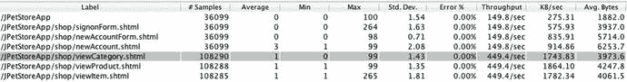
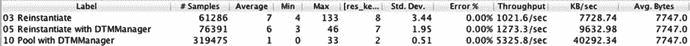
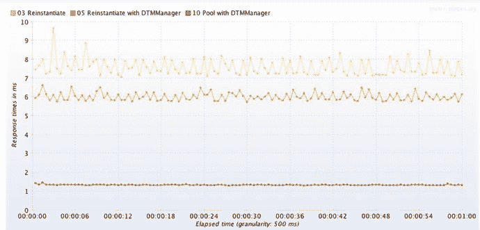
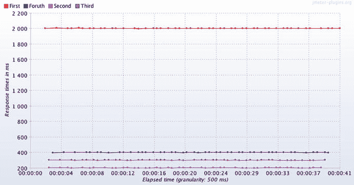
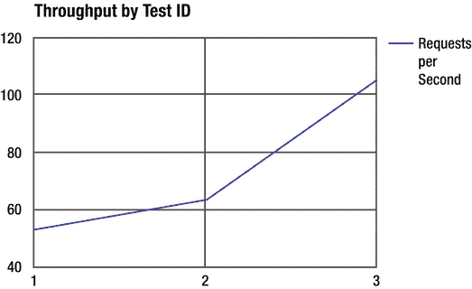

# 3. 指标：消除猜测的良方

引言中讨论了黑暗环境的概念，即在你需要的时候和地点，合适的监控往往不可用。这确实是我们行业早就应该讨论和解决的问题，但这个问题也有两面性。如果我们抛开所有实际难题（如安全、访问、许可、开销、培训等），将合适的工具接入合适的环境，情况就会完全逆转。对某些人来说，并非因指标太少而数据匮乏，而是被所有可能指标的广阔海洋所吓倒，并且很容易因选错指标而受骗。

本章的目标是：

*   理解应使用哪些类型的指标来决定是否保留或丢弃调优变更。
*   理解哪些类型的指标用于识别导致特定性能问题的组件。
*   记住，跟踪、绘制图表并分享系统随时间的调优进展，有助于让团队中的成员更关注性能。

本章将这片广阔的指标海洋分为三个松散的类别，并展示如何利用每个类别来实现关键性能目标。

## 哪个指标？

在处理性能问题时，我们花大量时间问这三个问题：

*   资源问题：系统使用了多少硬件资源（CPU、RAM、网络、磁盘）？35%？98%？
*   责任问题：被测系统（SUT）中的哪些组件应对特定的性能问题负责？“组件”需要是我们能够调查的具体对象，比如特定源代码文件中的单个 Java 方法，或者单个数据库查询或其他网络请求。
*   用户收益问题：最终用户能否感受到特定调优改进带来的响应时间影响？哪个代码或配置变更表现更好？

在调优系统的顺利日子里，我能够做正确的事，“遵循数据”而不是猜测这三个至关重要问题的答案。这意味着要花时间从精心规划的负载测试中捕获某些指标。但在应对压力巨大的生产问题时，或者仅仅是在袜子不配对的倒霉日子里，一切都不确定了，我对问题的解释变成了毫无根据的胡乱猜测。黑暗环境问题使这变得更加困难，因为当合适的指标不可用时（不幸的是，这种情况相当频繁），臆测就会占据主导。

因此，本章旨在通过首先专注于用指标回答这些关键问题，来帮助你更容易地找到有用的指标。简而言之，表 3-1 显示了我建议用于回答每个问题的指标。

表 3-1.

常见性能问题的指标

|   | 性能问题 | 由以下指标回答 |
| --- | --- | --- |
| 1 | 资源（CPU/RAM 等）是否可用？ | 基础指标：PerfMon、TypePerf、ActivityMonitor、top/htop/topas/nmon/sar 等 |
| 2 | 哪个组件导致了性能下降？ | 服务器端数据，如线程转储、分析器数据、详细的 GC 数据、SQL 吞吐量/响应时间等 |
| 3 | 最终用户是否受益？哪个代码变更表现更好？ | 来自负载生成器的响应时间和吞吐量指标。 |

有些指标有助于回答多个问题。例如，问题 2 和问题 3 都在一定程度上涉及响应时间。我的目的不是要建立严格无重叠的指标分类，而是为你提供一个相当好的起点，了解使用哪些指标来回答每个关键问题。

在本书的后续部分，关于 P.A.t.h. 检查清单的四章将回答问题 2（责任在谁？）。问题 1（是否有可用资源？）使用的指标来自大家熟悉的工具，对吧？Top、PerfMon、nmon 等。Brendan Gregg 的 USE 方法是避免忘记监控资源消耗的好方法。这里是链接：

[`http://www.brendangregg.com/usemethod.html`](http://www.brendangregg.com/usemethod.html)

如果一台机器是你的负载测试的一部分，但你无法访问其资源消耗指标，请小心不要将其归咎于你的任何问题。

我真心认为，学习 P.A.t.h. 四章中的故障排除技巧是可行的。但在整个调优过程中，同时关注这三个指标问题可能更具挑战性——很容易忘记其中任何一个。

本章的其余部分将致力于回答问题 3，即确定你的最终用户是否会从各种提议的性能变更中受益。

## 设定调优方向

决定保留哪些调优改进，在很大程度上设定了调优过程的方向。通常，来自负载生成器的更快响应时间和更高吞吐量指标，应该对是否保留特定变更拥有最终决定权。更低的资源（CPU/RAM）消耗也很关键，但通常是次要因素。

所有这些建议听起来有点简单，所以让我聚焦于这一点：只有在负载生成器测试显示变更将使最终用户受益或减少资源消耗时，才决定保留性能调优变更。仅仅因为某个代码或配置变更使其他环境受益，并不意味着它会使你的环境受益。此外，毫无根据的猜测会削弱对调优项目的信心。尽可能避免这种情况。

考虑这个例子：一个能为你带来 10ms 响应时间改进的代码变更，可以对一个响应时间为 30ms 的系统产生神奇、变革性的效果，但如果你将同样的 10ms 改进变更应用到一个响应时间为 3000ms 的系统上，产生重大性能提升的可能性就非常低。让负载生成器指标来驱动决策；让它们指导保留哪些代码/配置变更。

但调优指导并非仅来自负载生成器指标，因为从系统中调优掉明显的高 CPU 消耗也非常重要。CPU 的作用甚至比消除高 CPU 消耗的例程更大——它为我们提供了一个方便的衡量标准，可以用来判断系统是否能够扩展。第 6 章将就此提供非常具体的指导，敬请期待。

许多不同的指标，例如将在 P.A.t.h. 章节中讨论的那些，都有助于决定保留什么变更：服务器端详细的 GC 指标、SQL 响应时间指标、微基准测试结果。但最终，只有当负载生成器结果显示对最终用户有益时，这些变更才应保留在代码库中。记住：负载生成器指标驱动决策。CPU 和 RAM 消耗指标也很重要——它们扮演着辅助角色。

## 备用方案：利用负载生成器指标进行间接性能评估

P.A.t.h. 章节展示了如何直接评估并找出系统中哪些部分最慢，而第 1 章中的四个性能反模式则帮助你构想出哪些更改可能提升性能。部署更改后，如果负载生成器的响应时间和吞吐量指标（以及资源消耗）显示出足够的改进，那么你就保留该更改；否则就回滚（我就是这么做的）。然后你回到 P.A.t.h. 检查清单，在你做出出色的更改后重新评估性能状况（因为状况会以有趣的方式发生变化，不妨检查一下），接着再部署另一个更改并重复此过程。调优大致就是这样运作的。

在我熟练运用 P.A.t.h. 检查清单和适度的调优环境之前，发现根本原因要困难一些。我曾设法从负载生成器指标中挖掘出额外的线索和提示。这些“间接”技术如今仍然有用，但当你能通过 P.A.t.h. 直接观察性能问题时，它们就没那么必要了。

不过，我仍会在此分享其中一些技术，因为有时你无法快速访问系统来运行 P.A.t.h.，比如当你查看别人的负载生成器报告时。同样，有时需要来自不同指标的第二个佐证，才能让团队充分信服某个特定的优化方案，而说服团队在整个过程中占据了相当大的比重。

### 大型负载是一个危险信号

逻辑上审视负载测试中负载最大的请求，问问自己所有这些字节是否真的必要？例如，请看图 3-1。

图 3-1.

最右侧的“平均字节数”列显示了每个进程（最左侧列）的 HTTP 响应大小。该列中的大型异常值（此图中没有）将是性能问题的首要嫌疑对象。数据来自 JMeter 摘要报告。

“平均字节数”列中字节数最多的请求是 newAccount.shtml，平均为 6253.7 字节。这个数字并不让我担心，尤其是与表中其他行的“平均字节数”数值相比。但如果某个“平均字节数”值比其他值大几倍或更多——那就值得调查了。至少，额外的字节会花费更多传输时间，但情况可能会更糟。如果系统花费宝贵的时间来组装这个大型页面呢？有一次我遇到这种情况，大量被禁用的账户（没有客户想看到）被意外启用，并从后端一直传输到浏览器，浪费了大量时间/资源。另一次，不仅客户端反复请求本可以在服务器上缓存的数据，而且 XML 格式不必要地庞大，且没有人足够关心以确保负载被压缩。压缩文本文件通常能将文件缩小 90%。利用这一点来最小化传输的字节数。如果你的应用程序来自 1999 年，那么大的尺寸可能是由于所有数据都被塞进单个页面，而没有良好的“第一页/下一页/最后一页”支持。

### 变异性是一个危险信号

响应时间指标中一个较为明显的可修复性能问题迹象是变异性。在大多数情况下，响应时间抖动得越厉害，性能就越差。因此，要关注标准偏差（Std. Dev 列）最高的 HTTP 请求，它们显示出高度变化的响应时间。当然，高度变化的响应时间可能归因于某些良性因素，比如偶尔复杂的数据或其他处理。

图 3-2 中的三行显示了略微不同的 XSLT 进程处理完全相同的 .xslt 文件和相同的 .xml 文件——你可以通过每行“平均字节数”（最右侧列）的完全相同数值来判断。数据来自三次不同的测试，每次都是 60 秒的稳态运行，带有 8 个负载线程，并且每次显示出截然不同的性能。

图 3-2.

三种 XSLT 处理实现的负载测试结果。数据来自 jmeter-plugins.org 的合成报告。

请注意，响应时间（平均值）和标准偏差（Std. Dev.）大致成正比。吞吐量与这两者成反比。换句话说，当响应时间和变异性都较低时，性能/吞吐量表现良好。

如果 0.51 的极低标准偏差加上 400% 以上的吞吐量提升（1273.3 而非 5325.8）还不足以让你信服，那么图 3-3 中相同数据的时间序列图可能会说服你。

图 3-3.

从上到下依次是使用三种不同 XSLT API 惯用法的良好、更好和最佳 XSLT 响应时间。测试速度越快，锯齿状的变异性就越小。

响应时间中额外的变异性（如此处图表所示）可以帮助你指出哪些系统请求可能需要优化。其他指标（如吞吐量和 CPU 消耗）中的变异性也有助于指出问题。

## 创造性地设定调优方向

是的，负载生成器指标应该主导方向，并决定保留哪些优化措施。但也要记住，这里有很大的创意空间。本节提供了一些创造性地重构测试和测试计划以提供性能洞察的示例。

本书中有两章帮助你运行模拟（即模仿）常规生产负载的负载测试。第 4 章描述了如何将负载脚本从僵化、死板的单用户流量录制演变为动态的工作负载模拟。第 5 章帮助你检测无效负载测试的一些性能特征，这可以帮助你避免基于无效的负载生成器数据做出错误的调优决策。

这里的要点是，让负载测试更真实是一件好事。然而，尽管听起来可能有些荒谬，但通过让你的负载测试不那么真实，也能获得大量绝佳的洞察。让我通过两个例子来解释这种看似疯狂的做法。

### 创意测试计划 1

曾几何时，我参与一个调优项目，果然，我在某些“黑暗环境”中漫无目的地徘徊。我缺乏安全访问权限或许可证（天知道，可能是任何东西）来使用所有我喜欢的监控工具。没有指标，我该如何调优？这是一个中间层系统，我试图弄清楚所有时间是否都花在了调用非 Java 后端系统上，还是花在了 Java 层本身。为了查明 Java 端的速度，我决定注释掉所有对数据库和后端系统的调用，留下一个完全被阉割的系统，只保留进入和退出 Java 架构的部分。它应该相当快，因为大部分实际工作都被注释掉了，对吧？

被阉割系统的负载测试响应时间为 100 毫秒。这算快还是慢？作为与这 100 毫秒的对比点，前一章中的“什么都不做”示例仅用了大约 1 毫秒。我有两个做基本相同事情（什么都不做）的不同系统，其中一个却慢得多。最终，这帮助我们找到并修复了一些遍及架构各个部分的大型瓶颈。这就是创意测试。

### 创意测试计划 2

以下是另一个示例，我们通过移除测试计划中的部分工作负载（看似是一种倒退）来取得进展。图 3-4 展示了一个测试，其中依次调用了四个不同的 SOA 服务：服务一、服务二、服务三和服务四。服务一的响应时间远慢于其他三个请求，导致快速服务在测试的大部分时间里实际上都在等待服务一执行完毕。这种等待严重限制了吞吐量（未在图中显示），使我们失去了观察服务在更高吞吐量下表现的机会。

图 3-4.

该测试中的三个快速服务大部分时间都在等待较慢的服务

为了解决这个问题，我们需要分而治之，并寻求另一位技术人员的帮助。一位开发人员在一个环境中独立负责改进慢速服务（服务一）的性能，而另外三个快速服务则在另一个环境中使用不同的负载脚本进行独立测试。如果不采用这种方法，这三个快速服务将无法在更高的吞吐量下进行测试。当几乎任何环境都可以作为调优环境时，这就会变得容易得多。而拥有一个单一的大型调优环境会使这种标准的“分而治之”方法变得非常困难。

## 跟踪性能进展

负载生成器的响应时间和吞吐量指标至关重要，持续数周或数月的调优工作应以此为导向。关于适度规模调优环境的第 2 章鼓励我们通过使用更小、更易于管理和访问的计算环境，每天完成更多的修复-测试循环。随着测试的进行，在调优的每一天你都会得到更多或好或坏的结果，而由于结果和测试配置数量众多，它们很容易被遗忘。为了记住哪些更改/测试对性能影响最大，请将每次测试的结果以清晰整洁的表格形式（例如表 3-2）发布到 wiki 页面上，与团队共享。有些 wiki 表格甚至允许你在表格单元格中直接粘贴性能图的小缩略图（当然可以放大）。为了方便起见，请将最近的测试放在最前面。

表 3-2.

记录哪些更改影响最大的负载测试结果示例

| 测试 ID | 开始时间/持续时间 | 目的 | 结果 | RPS | RT (毫秒) | CPU |
| --- | --- | --- | --- | --- | --- | --- |
| 3 | 7 月 4 日，下午 6:25，10 分钟 | 添加数据库索引 | 大幅提升！ | 105 | 440 | 68% |
| 2 | 7 月 4 日，上午 11:30，10 分钟 | 测试对 AccountMgr.java 的性能更改 | 性能提升 | 63 | 1000 | 49% |
| 1 | 7 月 4 日，上午 9:00，10 分钟 | 基准测试 |   | 53 | 1420 | 40% |

请记住，性能调优项目的项目经理的角色就像家庭轿车后座上的四岁小孩，不停地用“我们到了吗？”这个问题来烦扰我们。我们达到性能目标了吗？像这样的表格可以安抚他们，但这也是为你自己准备的。我不确定为什么，但陷入性能危机很容易让人忘记需要迁移到生产环境的一系列更改。保持表格定期更新需要自律，但该表格记录并证明了（或未证明）为获得更好性能所投入的资金是否合理。这至关重要。

起初，表格中的行似乎应该比较来自同一个、未更改的负载计划的结果，并施加完全相同的负载量。这是我们所说的“苹果对苹果”的比较吗？不完全是。相反，该表格记录了针对特定业务流程集迄今为止的最佳吞吐量，无论负载计划如何，尽管这将是记录该负载计划变化的绝佳位置。一旦你的调优工作产生了更高的吞吐量，你将需要为负载计划增加更多的负载线程，以更接近你的吞吐量目标。

为了创建一个引人入胜的性能调优叙事，请将此表格中的每秒请求数（RPS）和日期列转换为“吞吐量随时间改进图”。这能快速传达你艰苦调优工作的起伏（图 3-5）。

图 3-5.

使用此类图表有助于沟通性能进展

## 别忘了

如果你仅从系统外部使用资源消耗指标和负载生成器指标来尝试解决性能问题，可能会变得沮丧，因为没有足够的信息来确定需要更改系统的哪些部分来解决性能问题。这就是“责任”指标发挥作用的地方。我们从第 8 章开始使用的 P.A.t.h. 检查清单，正是为了填补这一空白而设计的。

同时请记住，适度规模调优环境的主要目的之一是在一天内运行更多的修复-测试循环，帮助你取得更多性能进展。但更多的测试意味着更多的结果，而更多的结果很容易被遗忘，所以花点时间与你的团队（尤其是项目经理）一起寻找一个类似 wiki 的解决方案来记录性能测试结果。为了处理性能测试中暴露出的所有问题，对问题进行优先级排序会有所帮助，这样你的团队就知道该关注什么了。

本书共有 3 个“部分”，你刚刚完成了第一部分，即性能调优入门。第 4、5、6 和 7 章构成了下一部分，内容全部关于负载生成——如何在测试环境中对系统施加压力，就像它正在承受生产负载的真实压力一样。

## 下一步

知道几乎在任何环境中都能发现真实的性能缺陷，这让你能更轻松地快速开始调优你的系统。也许开始调优的另一个最大障碍是创建负载脚本的需求。

下一章的第一部分是一个路线图，指导你如何快速上手并创建第一个负载脚本。第二部分则详细介绍了如何增强第一个脚本，以创建/模拟更接近生产环境的负载。

