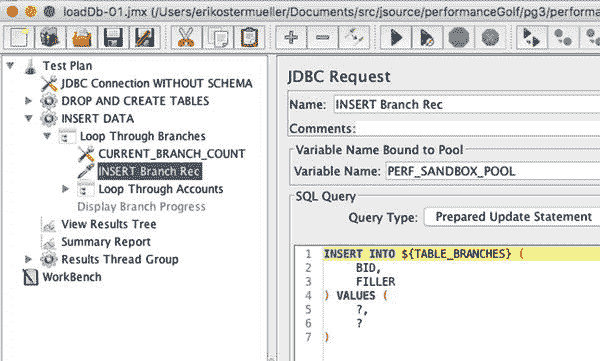

# 4. 负载生成概述

在会议和其他讨论中，我们都曾短暂地担忧过你的产品能否处理生产工作负载。这就是性能焦虑。它就像一个巨大的、红色的不确定性气泡，笼罩在未发布的服务器端软件产品团队之上。

验证系统架构是否性能良好，是戳破这个巨大红色气泡的好方法，而本章将帮助你在软件开发生命周期（SDLC）的早期阶段就开始着手。

本章提出了一个包含两部分计划的负载脚本创建方案，这对于理解你的应用程序在压力下的表现至关重要。计划的第一部分帮助你快速创建第一个脚本，以便你了解架构的性能。

本章的目标是：

*   理解：可以使用一个非常基础、简洁、仅包含少量业务流程的负载脚本，来对系统架构进行负载测试。
*   理解：调整架构级别的性能问题，可以如何为所有业务流程带来快速的性能提升。
*   理解：为了更真实地模拟生产业务流程，需要对负载生成脚本进行哪些增强。

似乎开发和测试软件本身已经够难了，学习如何为负载测试生成负载还需要额外的工作。以下是负载测试中涉及的一些任务：

*   为负载生成器创建和维护脚本，以对被测系统施加压力。
*   为你的数据库创建和维护生产规模的数据集。
*   创建和维护负载测试用于登录被测系统的用户 ID 和密码。

由于所有这些以及其他工作，对被测系统 100%的业务流程进行负载测试很少（如果有的话）能够实现。这根本不划算。我的备用方法是首先使用一个简单的**优先脚本**对基本架构进行负载测试，然后增强脚本以覆盖最关键的业务流程（**次要脚本**）。使用这两个脚本调整你的系统，能让你了解使被测系统其他业务流程达到性能要求所需的技术，只要这些流程基于大致相同的架构、库、容器、日志记录、相同的身份验证和授权机制等。

本章概述了为你的被测系统创建优先脚本和次要脚本所需的增强功能。优先脚本帮助你快速发现架构级别的性能缺陷。次要脚本则提供了更接近真实工作负载的模拟。但首先，你需要掌握一些增强负载脚本的基本技能。我们将在下一节中介绍这些技能，其中还包括对负载生成器的简要介绍。

## 负载生成器

在第 2 章讨论适度的调优环境时，我们提到负载生成器基本上是一个网络流量生成器，用于查看你的被测系统能否承受类似生产环境的负载压力。可以手动组装脚本，但它们通常是通过“录制-回放”过程创建的。本节将讨论在初始录制和测试完成后，你通常需要做的所有增强工作。

性能问题可以在代码、数据或配置中修复，但负载脚本内部也有很多需要修正的地方，以便最好地模拟你的生产工作负载。

### 关联变量

在你对负载脚本所做的所有增强中，创建关联变量的使用频率最高，因此每个人都应该熟悉它。我们在负载生成器的脚本语言中创建这些变量。然后，你使用该变量来保存来自 HTTP 请求输出的特定数据片段，以便它随后可以作为输入参数或后续请求的 POST 正文内容被提交。

这里有一个简单的例子：假设你使用浏览器在一个 Web 应用中创建了一个新客户，并且该 Web 应用生成了一个新客户 ID（本例中为`custId=2360`）。然后你选择用一个新的街道地址来更新客户详细信息。“客户更新”URL 看起来像这样：

[`http://mybox.com/startCustUpdate?custId=2360`](http://mybox.com/startCustUpdate?custId=2360)

如果你使用负载生成器录制此过程，这个 URL 会被逐字录制并保存到你的脚本中。几天或几周后，当你再次运行此脚本时，使用这个特定的 custId 2360 将非常不合适，因为新的`custId`值已经被创建了。因此，我们不希望像这样硬编码的值被编码在脚本文件中。

所以，我们小心地用关联变量替换硬编码的值。你需要负责更新脚本，以便在响应中找到 custId=2360，将其存储在关联变量中，然后在后续的一个或多个请求中使用该变量。

我讲得比较快，所以表 4-1 总结了所需的更改。

**表 4-1. 将系统中的硬编码 ID 转换为关联变量所需的增强**

| 顺序 | 负载脚本行为（初始录制时） | 添加关联变量所需的增强 |
| --- | --- | --- |
| 1 | 负载脚本调用某个 URL 来创建新客户。 | 无需更改。 |
| 2 | 前一个请求的响应返回给负载生成器，响应中的某处包含新生成的客户 ID 2360。 | 增强负载脚本，使其能够从 HTTP 响应中定位/抓取新创建的唯一客户 ID。将该值存储在负载脚本变量中；`CUST_ID` 是个好名字。使用 JMeter，你可以通过正则表达式提取器来实现。 |
| 3 | 负载脚本提交一个 URL 来更新客户详细信息；录制的客户 ID 2360 作为 URL 参数传递： [`http://mybox.com/startCustUpdate?custId=2360`](http://mybox.com/startCustUpdate?custId=2360) `.` | 增强脚本，使其不再传递硬编码的客户 ID 2360，而是传递存储在`CUST_ID`变量中的数字。 |

这种关联变量技术可以而且应该用于更复杂的负载脚本，尤其是那些录制生成的脚本。对你来说，一个故障排除的技巧是，要精确找到脚本中需要应用该技术的位置。至少，你应该仔细考虑在脚本中的以下位置应用此技术：

*   如前所述，服务器端代码生成唯一 ID 的任何位置。
*   在脚本录制过程中，你输入数据或选择某些选项的任何位置。
*   应用程序中存储 HTML 隐藏变量的所有部分。
*   任何其他位置，例如使用隐藏变量时，JavaScript 将数据从一个服务器端请求的输出移动到另一个服务器端请求的输入。
*   所有使用 CSRF 令牌（ [`https://stackoverflow.com/questions/5207160/what-is-a-csrf-token-what-is-its-importance-and-how-does-it-work`](https://stackoverflow.com/questions/5207160/what-is-a-csrf-token-what-is-its-importance-and-how-does-it-work) ）的地方。这些不可猜测的令牌是动态生成的，并存储在 URL 参数中。它们使得恶意网页难以在你浏览器的一个标签页中，向另一个标签页中的其他站点（例如你的银行）执行请求。
*   使用 JMeter 时，关联变量对于 JSESSIONID 支持并非必需。相反，只需确保你的 JMeter 脚本有一个 Cookie 管理器。

重申一下，你需要负责找出需要添加关联变量的位置。从上面的列表开始，之后你的任务将变得繁琐：仔细评估每个 HTTP 请求是否返回了正确的数据，并在必要时添加此技术。另一种在脚本中定位关联变量位置的方法是，思考你在浏览器中输入的所有数据项：搜索特定的客户名称、选择要购买的特定商品、选择你想在单身酒吧看到的那只特别的海牛。

无论使用哪种负载生成器，关联变量对于应用真实的生产负载都至关重要。但如果你使用的是 JMeter，第 7 章将提供一个基于本书 github.com 仓库中的示例 JMeter .jmx 计划，创建关联变量的分步指南。请查找 `jpt_ch07_correlationVariables.jmx`。

### 在负载脚本中对步骤进行排序

当你录制负载脚本时，你会登录到被测系统（SUT），浏览几个网页执行业务流程（例如前面详述的“创建客户”），然后注销。

负载生成器允许你选择将录制的脚本播放一次、重复播放特定次数，或重复播放特定时长。在 JMeter 中，这些选项可以在一个名为线程组的东西中找到，你还可以在此处设置同时重放脚本的线程数。JMeter 自带的默认线程组对于基本任务来说已经足够，但我非常喜欢 Blaze Meter 的并发线程组。它有一个很好的可视化显示，展示你的线程将如何快速增加到满负载。你可以从 jmeter-plugins.org 下载它。

通常，你需要两组（或更多）用户同时执行不同的业务流程。编写这种脚本的一个不那么显而易见的方法是，为每个任务分别录制两个脚本，然后将这两个脚本合并为一个。要在 JMeter 中实现这一点，请在一个新的/空白的 JMeter 脚本中创建两个独立的线程组，并可以将它们命名为 A 和 B。

然后分别录制并测试这两个负载脚本，并将一个脚本中的所有活动复制到 A 线程组，另一个复制到 B 线程组。

这种组织方式有一些非常令人信服的理由。例如，它允许你为一个线程组设置更高的线程数（更多负载），而为另一个线程组设置更低的线程数，这使你能够（大致）反映最终用户在生产环境中使用的实际负载量。

此外，这有助于你模拟一个帮助两组不同人员协调活动的 Web 应用程序的行为。例如，假设一组人员创建小部件的订单，而另一组人员批准每个订单。实现一个重复创建订单的线程组相当直接。要实现另一个包含订单批准活动的线程组，首先编写一个重复检查新订单的脚本。包括 JMeter 在内的负载生成器，允许你添加条件测试，这些测试会在响应 HTML 中检查指示是否有新订单创建的标签或属性。一旦检测到新订单，你就可以添加录制的步骤来批准该订单。有关详细信息，请参阅 JMeter 的 If 控制器和 While 控制器。循环控制器以及设置和拆卸线程组也会很有帮助。

掌握了这些负载生成器基础知识后，接下来的两个部分将阐述一个两步计划：“第一优先级”和“第二优先级”，这有助于你平衡快速创建负载脚本与创建能够相对真实地施加负载的脚本之间的冲突需求。

## 第一优先级脚本

性能焦虑是真实存在的；思考这些难以回答的问题：在达到性能目标之前，我们必须修复多少个缺陷？这需要多长时间？我们是否投资了错误的 Java 架构，一个永远无法良好运行的架构？用这些充满焦虑且无法回答的问题来戏弄项目规划者有点有趣，不妨找个时间试试。

第一优先级脚本有助于你快速上手，迅速修复一些最明显的性能缺陷，并缓解部分性能焦虑。本节提供了一个“必须具备”的负载脚本增强功能的最低检查清单，这些功能是让你和你的团队相信负载测试有效性所必需的。但同时，也要将“第一优先级”版本视为一个上限：一旦添加了这些第一优先级的增强功能，就停下来。专注于解决第 8 章中 P.A.t.h.检查清单所揭示的主要性能缺陷。一旦你控制住了最大的问题，就可以跳到本章后面的第二优先级负载脚本增强功能，以完成工作，并提供出色的性能。

### 加载脚本与 SUT 登录

第 1 章讨论的第三个性能反模式是“过度处理”。其中提到，试图对很少使用的业务流程进行负载测试和调优是浪费时间。相反，我们应该专注于最重要和最常用的流程。

在初次创建负载脚本时，很容易陷入这种情况：用户登录和退出系统的频率远高于生产环境中的实际情况。

因此，**首要优先级**负载脚本的主要目标是确保脚本中的 SUT 登录活动在一定程度上符合实际，尤其是对于登录过程处理密集型的 SUT。

我所说的密集型活动包括为用户会话创建资源、单点登录、授权数百个权限、密码认证等。登录过程越复杂，就越需要精心设计负载脚本来模拟真实的登录场景。为什么？因为调优一个不常执行的功能是浪费时间。

如果你没有来自生产环境的良好数据来了解登录频率（例如，与其他业务流程相比，系统范围内每小时发生多少次登录），你就需要做出判断。在大多数系统中，真实用户不会以 1:2 的比例登录、执行两个业务流程然后注销。相反，他们在注销前会做更多工作。也许用户每执行 10 个其他业务流程才登录 1 次，这是一个更合理的比例。我这里的数据完全是粗略的——最终需要你来决定。

使用 JMeter，实现登录与其他业务流程大约 1:10 比例的一个简单方法是使用循环控制器（前面提到过），如下所示：

1.  用户登录。
2.  JMeter 循环控制器重复五次。
    1.  业务流程 1（通常需要少量 HTTP 请求）。
    2.  业务流程 2（通常需要少量 HTTP 请求）。
3.  注销。

一旦你的脚本中 SUT 登录次数与其他业务流程相比大致符合实际，就可以开始施加负载，并使用 P.A.t.h.检查清单来发现缺陷。

### 在多个线程中使用同一个 SUT 用户

本节中的建议可以在**首要优先级**或**次要优先级**负载脚本中实现——由你选择。我将它们放在这里，是因为它们也属于登录问题，与前面讨论的类似。

如果你的 SUT 不允许同一用户同时在两个不同的浏览器中登录，那么在负载测试中同时登录两个或更多并发用户时，就会导致登录失败。

为避免此问题，你可以从文本文件中读取用户 ID 和密码，而不是在负载脚本中硬编码单个用户 ID。想象一个每行包含一个用户 ID 和密码的.csv 文件。以下是 JMeter 用于读取该文件的组件：

[`http://jmeter.apache.org/usermanual/component_reference.html#CSV_Data_Set_Config`](http://jmeter.apache.org/usermanual/component_reference.html#CSV_Data_Set_Config)

大多数负载生成器（包括 JMeter）都具有防止两个线程同时使用同一用户（实际上就是一行文本）的功能。默认行为通常是在读取/使用最后一条记录后，回到.csv 文件的开头。你可以使用文本编辑器手动创建.csv 文件，也可以手动导出 SQL 语句（如`SELECT MY_USER_NAME FROM MY_USER_TABLE`）的结果。

使用更符合实际数量的用户还有其他动机。我们直说吧。内存泄漏和多线程缺陷让性能工程师们忙得不可开交，而会话管理代码通常充斥着这两种缺陷。使用单一的 SUT 用户 ID 进行负载测试（就像刚录制且基本未修改的负载脚本那样），无法充分测试 SUT 的会话管理压力。¹

假设你的脚本仍然反复登录同一个用户。如果 SUT 缓存了该用户的权限，你的命中/未命中比率会异常高（应用服务器启动时一次未命中，随后全是命中……），因为在负载测试运行时，同一个用户会始终留在缓存中。这意味着你的 SUT 将始终走快速代码路径，从快速缓存（而非较慢的数据库）加载用户权限，从而低估了实际的处理量。

仅使用单个用户进行测试时，你还会错过了解维持大量用户会话所需内存量的机会。因此，务必估算一下任意时刻会有多少用户登录，并在负载测试中包含这么多用户。

最后，既然我们谈到了用户和会话内存，别忘了验证系统的自动注销功能是否正常。你可能需要制作一个负载测试的临时版本，并注释掉所有注销活动。运行测试，等待 30 分钟左右（或 SUT 自动注销用户所需的时间），然后验证会话计数是否降至零。

## 次要优先级

为了全面准确地模拟业务流程和工作负载，你需要一个功能齐全的负载生成器，例如 JMeter。然而，正如我之前所说，大多数性能缺陷都可以使用我在“首要优先级”部分详述的少量功能子集来发现。当然，通过“次要优先级”的增强功能可以发现一些关键错误，但这类错误往往较少。这些缺陷也往往属于单个业务流程的一部分，而非整个 SUT 架构。

以下各个负载脚本阶段展示了脚本增强的典型演进过程。每个阶段都列出了你可以进行的增强。

### 负载脚本阶段 1

在负载脚本阶段 1，你刚刚录制了一个使用 Web 浏览器遍历 SUT 最新/最佳版本的负载脚本。当然，也可能是你正在处理一组手动收集的 SOA 请求。你已在脚本中添加了一些验证过程，以确保所有 HTTP/S 响应无错误，并包含一些关键的响应文本片段。脚本中还添加了一些关联变量，用于将单个数据项（例如生成的新客户 ID 或发货确认号）从一个 HTML 响应的输出传递到脚本后续业务流程中某个需要它的网页。除此之外，几乎没有其他修改。

#### 细节

负载生成是一种录制-回放技术，它有点脆弱，就像大多数代码生成的东西一样。因此，请保留最近录制过程的完整、详细 HTTP 日志的备份；也许可以将最近的录制日志和负载脚本保存在源代码控制中。日志必须包含所有 HTTP 请求 URL、任何 POST 数据、HTTP 响应代码，当然还有 HTTP 响应文本。当后续对脚本的“优化”导致某些功能失效时，你可以回到原始、准规范的完整对话日志，找出问题所在。

事实上，使用合适的负载生成器，对规范日志和出错的 HTTP 日志进行简单但非常仔细的文本文件差异/比较，就能直接引导你找到功能脚本的问题。第 7 章中有一个如何在 JMeter 中执行此操作的示例。请查找“调试 HTTP 录制”部分。

#### 验证 HTTP 响应

验证 HTTP 响应是否包含“正确”的响应数据至关重要。累积起来，我浪费了数周又数周的时间去分析和信任那些响应中充满错误（而我却毫不知情）的测试。因此，我恳请你花些时间来增强你的脚本，以便在缺少正确的 HTTP 响应时记录一个错误。此外，你还应该检查是否出现了错误的响应（例如异常、错误消息等）。

关于 JMeter 的第 7 章展示了一个实现此功能的功能，称为断言。有各种各样的 JMeter 报告和图表可以显示错误计数。当你的 JMeter 断言标记出一个问题时，这些 JMeter 报告会反映出这些错误。如果没有这种基本的可见性，你也可能像我一样浪费数周的时间。

### 负载脚本阶段 2

负载脚本在单个测试中记录多个不同用户的登录，而不是反复使用同一个用户。硬编码的主机名或 IP 地址以及 TCP 端口号被替换为变量，当你在不同环境中使用脚本时，可以更改变量的值。该脚本以生产环境中大致相同的比例执行业务流程。

#### 详细信息

此脚本处理工作负载比例。为了获得更接近生产环境的工作负载，你需要增强负载脚本，以更真实的比例执行各种业务流程。从非常高的层面来看，对于许多目的而言，业务流程的划分是 70% 的查询，30% 的更新/插入/删除。我们的比例常常不切实际，因为我们没有花时间从生产环境中收集高质量数据来了解每种类型的业务流程执行的频率。

但是，在全身心投入寻找生产环境中哪些服务使用最多/最少（并调整你的负载脚本以按这些比例施加负载）之前，我建议首先关注一个更不完美的方法，即你向所有服务施加三个或更多线程的负载（零思考时间）。这就是引言中提到的 3t0tt。当然，我们这样做是为了从那个旧宿舍的沙发里抖出多线程的 bug。追求更精确和完善的负载比例能为你带来两方面的好处。其一，你避免了在永远不会使用的工作负载上浪费时间进行故障排除；其二，你发现了与首选的生产工作负载相关的兼容性/争用问题。当然，这两点都很重要，但根据我的经验，它们出现的频率明显低于多线程 bug，而即使使用不精确的负载比例，也能从那张可爱的沙发里赶走这些 bug。目标是正确的工作负载比例和负载脚本思考时间，但要从至少三个线程的零思考时间负载开始。

使用 JMeter，你可以通过为不同的脚本分配不同数量的线程来实现工作负载比例/百分比。例如，如果你想模拟前面详述的 70%/30% 的分割，你可以先录制两个独立的脚本，一个用于账户查询，另一个用于账户更新。对于这样一个简单的脚本，所有 HTTP 请求都存储在一个 JMeter 线程组下——你可以在其中指定要施加的负载线程数和测试持续时间。

因此，要实现 70/30 的工作负载比例，你可以从一个包含两个空白线程组的空白脚本开始，这两个线程组在 JMeter 树形配置中是同级关系。在第一个线程组中，你可以分配七个线程，另一个线程组分配三个线程。然后，你将账户查询的所有 HTTP 请求复制/粘贴到有七个线程的线程组中，并将账户更新的 HTTP 请求复制/粘贴到另一个线程组中。

这篇博文详细介绍了三种替代的 JMeter 方法来正确设置工作负载比例：

[`https://www.blazemeter.com/blog/running-jmeter-samplers-defined-percentage-probability`](https://www.blazemeter.com/blog/running-jmeter-samplers-defined-percentage-probability)

### 负载脚本阶段 3

负载脚本不再查询或修改录制脚本时使用的确切客户或账户，而是增强为从数据文件中读取账户/客户/其他标识符，然后将这些标识符输入到被测系统。

#### 详细信息

在这个阶段，负载脚本从读取 .csv 文件中的用户 ID 扩展到读取 .csv 文件中的其他重要数据，例如客户和账户数据。但仔细想想，何必这么麻烦呢？我们很可能是在操之过急。在我们花时间增强负载脚本以使用 .csv 或数据驱动的样本施加流量之前，这些客户、账户和其他表中必须实际存在足够规模的数据。

是的，本章是关于负载脚本的，但我忍不住要提醒大家，如果行数足够少，我的狗都有能力设计出性能出色的数据库。你几乎能想到的任何查询，在记录数少于大约一万条时都会表现得非常好。因此，当行数很少时，“性能自满”情绪会很高。

为了克服这种自满情绪，使用负载生成器脚本来驱动被测系统增长大表的行数似乎是个好主意。但不幸的是，在调优过程的这个阶段，被测系统通常非常慢，以至于即使让它运行很多小时，在它添加足够的数据之前，你可能都开始领退休金了。

如果是这种情况，可以考虑使用 JMeter 作为快速的 RDBMS 数据填充器。创建一个单独的脚本，使用 JMeter JDBC 采样器（图 4-1）：

图 4-1.

JMeter 可以使用你的 JDBC 驱动程序执行 SQL。在我的 2012 年款 MacBook 上，这个文件用于在远不到 10 分钟的时间内填充了超过 200 万行数据。这个文件 `loadDb-01.jmx` 可以在 jpt 示例的 `src/test/jmeter` 文件夹中找到。

[`http://jmeter.apache.org/usermanual/component_reference.html#JDBC_Request`](http://jmeter.apache.org/usermanual/component_reference.html#JDBC_Request)

它应该启动多个线程，执行大量的 INSERT 语句（仔细排序以符合外键依赖关系），其 VALUES 取自随机变量：

[`http://jmeter.apache.org/usermanual/component_reference.html#Random_Variable`](http://jmeter.apache.org/usermanual/component_reference.html#Random_Variable)

或者取自 .csv 文本文件：

[`http://jmeter.apache.org/usermanual/component_reference.html#CSV_Data_Set_Config`](http://jmeter.apache.org/usermanual/component_reference.html#CSV_Data_Set_Config)

关于如何快速获得生产规模表计数的这个小插曲就到此为止。让我们回到最初的讨论，即初始录制的负载脚本查询或修改来自一个或几个特定客户或账户的数据。你在脚本录制中使用的任何数据都硬编码在负载脚本文件中。查询客户 101。更新账户 393900 的余额。“101”和“393900”存储在脚本文件中。

现在你的表计数已经足够庞大了，你可以增强你的负载脚本，例如，基于 .csv 文件中找到的账号进行账户查询。因此，负载脚本文件中不再有 101 和 393900，这些值改为存储在 .csv 文件中。

一个很好的起点是使用一个包含数万个不同账号的文本文件，文本文件中每行一个账号。这是负载生成器最常见的输入文件格式。但不要只停留在 .csv 文件中只有一列；这里有一些唾手可得的好处。如果你在 .csv 文件中添加第二列，包含相应的账户余额，你就可以轻松地增强负载生成器脚本，以验证被测系统是否为每次查询返回了正确的余额。

### 加载脚本阶段 4

随着调优的深入，被测系统（SUT）会变成一个强大的数据生成器，重复的负载测试会向 SUT 的表中插入海量数据。别忘了密切关注不断增长的行数，原因可能出乎你的意料：

*   是的，不切实际的大表数量很糟糕，但表数量不足也同样糟糕。如果你的负载测试持续了 300 秒，每秒创建了 10 个订单，那么数据库中应该存在一些具体的证据。难道不应该有大约 3000（300x10）条记录被插入，并且你可以通过 `SELECT COUNT(*)` 查询轻松验证吗？正如我之前提到的，请对你的加载脚本保持怀疑态度，并在测试前后捕获表计数，以证明实际工作已经完成。
*   确保表计数不会不合理地增长过大，导致性能不必要地下降。花时间与业务分析师（那些对客户数据和法规要求最有经验的人）合作，就数据保留要求及其对表计数的影响达成一致。如果你的实时主数据库必须保留十年的交易历史，请计算这相当于多少条记录。
*   制定一个计划，将表的大小保持在合适的范围内。当表变得不合理地大时，我们通常会恢复备份到已知的状态/大小，但这需要时间/管理/纪律来为备份文件获取磁盘空间，以及实际创建备份（并保持其更新）的时间。临时性的 `DELETE` 操作更简单，但可能非常慢，因为很少花时间为临时查询建立索引，而且任何临时性的操作听起来都不太好——这似乎是在不必要地引入变化和风险。是的，`TRUNCATE` 更快，但我们在这里是为了用真实的表计数来验证性能。零是不现实的。

## 保持怀疑态度

我想给你一个小小的警告：请对自己和同事保持怀疑态度，质疑你的脚本生成的负载是否与生产环境中的负载相似。甚至可以在团队日程上留出一些时间，召开一次“加载脚本怀疑论”会议。当然，这需要大量的透明度、沟通和性能测试数据的共享。让我解释一下为什么这很重要。当我看到加载脚本在 SUT 上运行时，我那顶彩色螺旋桨帽上的螺旋桨会兴奋地、欢快地旋转起来。看看那些加载生成器线程，就像快乐的小机器人，在我的大型 Web 应用程序的页面间导航！多么有趣！外表看起来令人印象深刻。一个刚刚录制的加载脚本，包含数十个捕获的 URL/参数，看起来令人印象深刻。第一次看到脚本施加负载也令人印象深刻，繁忙的日志文件、吞吐量和 CPU 指标看起来确实令人印象深刻。

但不要被愚弄。克制你的兴奋。检查错误。做一个持怀疑态度的、清醒的评估，判断所有这些“活动”是否真的接近生产环境的工作负载。如果你的加载脚本产生了单个的小结果，比如在数据库表中插入一行来表示一个完成的在线购物订单，那么请增强你的脚本以验证最终结果。即使没有错误和异常，你的脚本可能仍然没有返回正确的数据，例如账户查询的账户余额。

如果你的应用程序已经投入生产，也许可以将一些生产指标（如每个 URL 的点击次数）与负载测试期间捕获的指标进行比较。

## 项目生命周期提示

开始性能测试的障碍可能很大。很多事情都需要大量时间：硬件采购和设置、SUT 的安装、监控工具的安装、JMeter 或其他加载脚本的创建、为 SUT 创建测试用户、增强数据库中的数据使其更像生产环境（尤其是行数），等等。仅仅列出这些就让我筋疲力尽，但请耐心听我说，因为我可以向你展示一些大多数人错过的绝佳机会。

不幸的是，在将 SUT 引入生产环境之前，进行全面的性能审查需要完成上述大部分准备工作。但请理解，你绝不能等到完美的、独角兽般的性能环境出现才开始调优。只需一个幸运用户（你）的流量，你就可以立即开始发现重大且有意义的性能缺陷，这些缺陷会降低生产环境的性能。这是我提到的其中一个机会：在任何你能找到的“无负载”环境中开始使用 P.A.t.h. 检查清单中的 P. 和 A. 项（P=持久化，A=外部系统），在这种环境中，只有少数人在悠闲地使用 SUT。所以，如果你准备好在不投入时间创建加载脚本的情况下让事情变得更快，请立即跳到第 9 章和第 10 章。

这就是 P.A.t.h. 中 P 和 A 大写，而 t.h. 小写的唯一原因。小写的部分仅用于负载测试——具体来说，它们在无负载环境中没有实际用处。在负载下，它们可以帮助调整同步，找到高 CPU 消耗者的确切位置，识别低效的垃圾回收，等等。大写的部分则同时适用于负载和无负载环境。从排版上看，大小写混合并不美观，但这或许能成为一个微妙的提醒：现在就开始使用 P. 和 A. 来发现性能缺陷。

表 4-2 中过于简化的时间表展示了两位开发人员如何同时高效地处理性能问题。Java 开发人员 1 立即开始调优，而 Java 开发人员 2 则创建加载脚本。

表 4-2.
性能调优项目启动的 9 天粗略时间表

| 天数 | Java 开发人员 1 / 任务 | Java 开发人员 2 / 任务 |
| --- | --- | --- |
| 1-3 | 使用 P.A.t.h. 检查清单中的 P. 和 A. 部分，在“无负载”环境下探索性能问题 | 加载脚本 / V1：录制、参数化并测试。 |
| 4-6 | 加载脚本 / V2：录制、参数化并测试。 | 加载脚本 / V1：使用它施加负载，使用 P.A.t.h. 检查清单定位缺陷。 |
| 7-9 | 加载脚本 / V1：使用它施加负载，使用 P.A.t.h. 检查清单定位缺陷。 | 修复并部署性能缺陷。 |

## 别忘了

决定哪些脚本增强项获得最高优先级、哪些获得次优先级的理由相当直接。由于没有时间和金钱对所有业务流程进行性能测试和调优，即使你做了所有“正确”的事情，生产环境中仍然会出现性能问题。因此，作为后备方案，你应首先致力于调优整体架构，以便那十几个经过全面性能审查的业务流程成为如何编写既功能正常又性能良好的组件的蓝图。

许多人会问，考虑到代码库在更多代码变更后还需要再次进行性能测试，开发期间的调优是否值得。我同意这是一个小问题。然而，一个更重要的问题是：我们当前的架构是否会在预期的生产负载下崩溃和烧毁？这才是我希望得到答案的、经常被遗忘的问题，而本章中的“最高优先级”脚本正是回答这个问题所需的工具。

此外，修复一个架构层面的缺陷会影响大多数业务流程，这有助于最大化你的修复对性能的影响。当然，硬币的另一面是，某些属于次优先级的脚本增强项，对于稳定功能关键的业务流程的性能可能是必要的。你需要自行判断。也许你最关键的业务流程从一开始就应该同时获得最高优先级和次优先级的增强。

## 下一步

正如本章所示，负载测试需要花费一些时间来准备和运行，因此我总是不太愿意放弃测试结果。但有时，结果错得离谱，别无选择。下一章将为你提供详细指南，说明何时应该接受并放弃测试结果。

脚注 1

我所讨论的这种会话管理使用了以下接口：

[`http://docs.oracle.com/javaee/7/api/javax/servlet/http/HttpServletRequestWrapper.html#getSession`](http://docs.oracle.com/javaee/7/api/javax/servlet/http/HttpServletRequestWrapper.html%23getSession) `--` [`https://docs.oracle.com/javaee/7/api/javax/servlet/http/HttpSession.html`](https://docs.oracle.com/javaee/7/api/javax/servlet/http/HttpSession.html)

