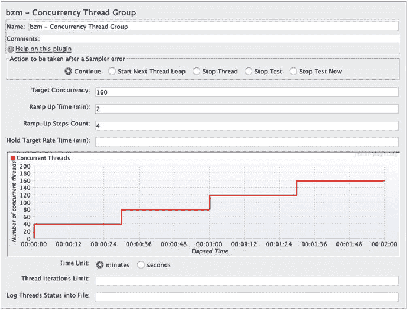
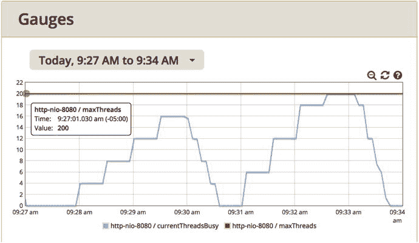
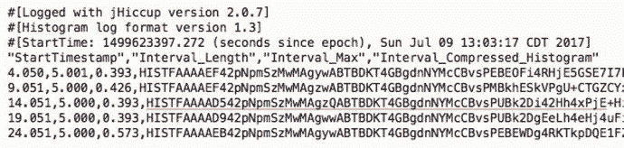

# 5. 无效的负载测试

性能调优可能变得相当复杂；只需想想环境中可能产生性能问题的各种位置：

*   容器的配置（WebSphere 或 Spring Boot 等）
*   网络
*   操作系统
*   硬件
*   负载生成器

不要让这些让你不知所措。为了最大限度地降低复杂性，我们开发人员应首先关注我们负责的部分——代码的性能。这就是“代码优先”方法。相当大比例的性能缺陷是“一次编写，到处运行”的问题，无论环境如何，这些问题都会存在。

本章的目标是：

*   了解大约六项检查内容，以确保你的负载测试生成的是健康、类似生产环境的负载。

本章重点介绍那些会使你辛苦创建的负载测试结果无效的环境和其他性能问题。要绕过其中一些无效测试（通常由环境问题引起），需要一点创造力；让我们来看看。

## 网络问题

在第 2 章中，我列出了影响网络性能的因素：

*   防火墙
*   作为安全措施运行的带宽限制软件（如 NetLimiter）
*   HTTP 代理服务器（如果访问互联网）
*   硬件——路由器、内容交换机、CAT5 等
*   负载均衡器，尤其是其管理并发的配置

每当其中一个或多个因素导致性能问题时，你的负载测试就是无效的，结果需要丢弃。我们很少拥有排查网络问题的工具、权限或专业知识，那么为什么一开始要费心呢？我建议在可能的情况下，设计测试以消除网络跳数。集成测试和其他更大的环境是最终了解完整网络性能的好地方。

有时我会陷入困境，被迫使用某个我怀疑有问题的特定网段。如果你和我一样，没有解决网络性能问题的工具、专业知识（或权限），那么有一个选择：间接测量。假设你怀疑某个特定网段有问题。如果你对一个已知速度很快的静态网页施加负载，而响应时间却非常糟糕，那么你就遇到了问题。

## 容器问题

我有资格写一本关于性能的书的原因之一，是我浪费了生命中无数小时来搞砸 JDBC 连接池和 Web 容器线程池的配置。

这些池的一个好处（实际上有很多好处）是，如果你的 Java 应用因某种原因出现异常，它们可以防止操作系统或数据库卡死。池通过将线程或连接的数量限制在配置中设置的最大值来实现这一点。但如果上限配置得太低，池就会限制性能。了解上限是否设置得太低，应该是你持续关注的问题。

关注正确的监控指标，会显示上限是否在不恰当的时候被触发，从而剥夺了系统宝贵的吞吐量。但请相信我，我知道这需要大量的工作，并且会分散你对主要关注点（代码优先）的注意力。一个简单的指导原则有助于避免所有这些情况：

*   “在调优之前提高资源上限，在生产环境之前降低它们。”

是的，我有点嫉妒早在 2006 年，Steven Haines 就在他的书《Pro Java EE 5 Performance Management and Optimization》（Apress, 2006）中首次提出了提高所有上限的想法：

[`https://www.amazon.com/Pro-Java-Performance-Management-Optimization/dp/1590596102`](https://www.amazon.com/Pro-Java-Performance-Management-Optimization/dp/1590596102)

你也可以在他这篇在线文章中找到这个建议：

[`https://www.infoq.com/articles/Wait-Based-Tuning-Steven-Haines`](https://www.infoq.com/articles/Wait-Based-Tuning-Steven-Haines)

但我认为我的表述更简洁，所以你更有可能记住它。

当我说提高这些上限时，我的意思是把它们提得很高，比如将 JDBC 连接池中的最大线程数和最大连接数都设置为 1999。

我认为这里用一个例子会有所帮助。

图 5-1 中的图表显示了随时间变化的并发用户数，这些用户将在针对配置了 8 秒休眠时间的 littleMock 服务器运行的 JMeter 负载测试中执行。littleMock 是一个小型 Java 服务器端测试应用程序，我们将在第 8 章中进一步讨论。这是它的 URL：[`https://github.com/eostermueller/littleMock`](https://github.com/eostermueller/littleMock)



图 5-1.

增量负载测试的配置，显示了在测试中施加负载的计划。这个线程组是 JMeter 的一个插件，可从 [`https://jmeter-plugins.org/wiki/ConcurrencyThreadGroup/`](https://jmeter-plugins.org/wiki/ConcurrencyThreadGroup/) 下载。

阶梯式的“爬坡”是增量负载测试的标志，性能工程师已经使用这种测试很多年了。每个“台阶”增加 40 个负载线程。在测试进行到 1 分 30 秒时，所有 160 个用户都将启动并运行。明白了吗？

图 5-1 显示的是所谓的负载计划，我运行了两次。第一次，我使用了这里显示的配置。第一次测试结束后仅几秒钟，我将目标并发数从 160 改为 240，然后再次运行。因此，第二次测试不是每步 160/4=40 个线程，而是每步 240/4=60 个线程。

所有这些配置都在负载生成器端，也就是客户端。为了查看服务器端的线程数（活动线程数称为并发数），在图 5-2 中，我使用了 Glowroot，这是一个来自 glowroot.org 的开源 APM 工具。



图 5-2.

两次背靠背增量负载测试期间的服务器端并发数。在左侧的测试中，负载生成器运行了 160 个线程，这里全部显示出来。右侧的测试运行了 240 个线程，但在上午 9:33 之前不久，Spring Boot 中的 tomcat 最大线程设置将并发数限制为 200。注意


图 5-2 显示的并发值大致在 0 到 200 之间，但纵轴只显示了 0 到 20，为什么会有这种差异？左上角的圆角矩形显示 maxThreads 的实际值是 200。Glowroot 对纵轴进行了“自动缩放”，结果变成了 0-20。

如果在右侧的测试中避免这个上限问题，其实很简单，只要遵循“调优前提高上限，上线前降低上限”的建议即可。由于被测系统（SUT）是 littleMock，它运行在 Spring Boot 和 Tomcat 环境下，我只需轻松添加以下属性：

```
server.tomcat.max-threads=1999
```

到 `application.properties` 文件中，具体文档可参考：

[`https://docs.spring.io/spring-boot/docs/current/reference/html/common-application-properties.html`](https://docs.spring.io/spring-boot/docs/current/reference/html/common-application-properties.html)

别忘了对 JDBC 连接池设置也做同样的操作。最重要的是，在将应用部署到生产环境之前，你需要降低这些上限，以避免我之前提到的系统卡死或失控的情况。降低多少呢？降低到比生产环境中实际使用的线程数或连接数高出约 25% 的水平。例如，如果负载测试显示（使用图 5-2 中的指标）你在生产环境中不会使用超过 240 个线程，那么将上限设置为 300（1.25×240）。

因此，触碰到资源上限的负载测试是无效的测试，但现在你知道了如何轻松避免这个问题：调优前提高资源上限，上线前降低资源上限。

## 预热不足

性能工程师们可能会无休止地争论，在进行稳态负载测试之前，系统需要预热多长时间才合适。5 分钟？15 分钟？对我来说，每个系统都不同。我会预热系统，直到其指标稳定几分钟。如果指标从未稳定，那么预热时间的长短就无关紧要了。在这种情况下，我会做的一件事是简化负载脚本，以隔离工作负载中导致混乱的那部分。

所以，如果你在响应时间和吞吐量等指标稳定之前就进行性能评估，那么你看到的将是一个无效的测试。

## 硬件资源耗尽

不言而喻，你的职责是确保在测试时系统有足够的 CPU/内存。请记住，人们很容易忘记检查这一点。同时，关注 CPU 的两个主要细分部分也很有帮助。内核 CPU（也称为系统 CPU）是操作系统使用的 CPU 百分比。用户 CPU 是我们的 Java 和其他应用程序（包括数据库）使用的 CPU 百分比。有些人认为 0% 的内核 CPU 是可以实现的。那当然很好，但我确实不知道如何实现。通常，如果内核 CPU 不超过用户 CPU 的 10%，就没有问题。所以，如果用户 CPU 是 75%，那么 7.5% 或更低的内核 CPU 不会引发任何警报。当内核 CPU 远高于此比例时，就该请系统管理员介入了——因为这次负载测试很可能是无效的。在虚拟化环境中工作时，有时增加一两个 CPU 可以解决这个问题。

如今，从远程系统捕获指标要容易得多。将这些指标以图表形式直接显示在你的负载生成器中，是一个很好的温和提醒，让你关注它们。PerfMon 可以为你做到这一点。我们在第 2 章中使用它来绘制单个进程 ID（PID）的 CPU 图表。以下是链接：

[`https://jmeter-plugins.org/wiki/PerfMon/`](https://jmeter-plugins.org/wiki/PerfMon/)

JMeter 插件 Composite Graph 甚至可以将 CPU（以及其他环境指标）与 JMeter 指标（如响应时间和吞吐量）显示在完全相同的图表上。

[`https://jmeter-plugins.org/wiki/CompositeGraph/`](https://jmeter-plugins.org/wiki/CompositeGraph/)

当你的测试耗尽了所有 CPU/内存时，你有几个选择。要么增加更多的 CPU/内存，要么使用 P.A.t.h. 检查清单来降低消耗。这个讨论从第 8 章开始。

到现在为止，你可能已经发现我的方法之间存在一些重叠。在第 3 章中，三种类型的指标中，有一种是用来理解资源消耗的。在本章中，我指出过多的消耗会使测试无效。这两者之间没有细微差别——只是两次提醒你要关注资源消耗。

负载测试中的功能错误也是如此。我在第 4 章关于负载脚本的部分提到过，这里在讨论无效测试时再次提及。我相信这个信息在两个地方都值得强调，但我想确保你知道这是对同一问题的两次引用。


## 虚拟化问题

我喜欢虚拟化的理念——只要需要，就能创建一台新的“客户”机（当然，是为了负载测试）。但掌控全局的“父”虚拟机的性能指标，对我们这样的凡夫俗子来说，往往是禁区。如果无法获取这些指标，你又如何知道客户机是否健康呢？

来自 Azul Systems 的 Gil Tene（[`https://www.azul.com/`](https://www.azul.com/)）给出了答案。他编写了一个名为 jHiccup 的 Java 小工具。该工具基于一个有趣的问题：如果你让一个线程休眠特定的毫秒数，那么当整个操作系统经历暂停或卡顿（hiccups）时，这个线程会准时醒来吗？答案是否定的，线程不会准时醒来，而 jHiccup 正是用来测量线程预期唤醒时间与实际唤醒时间之间的差异。

请查看此链接以获取 jHiccup 的最新版本：

[`https://github.com/giltene/jHiccup/releases`](https://github.com/giltene/jHiccup/releases)

其主页在此：

[`https://github.com/giltene/jHiccup`](https://github.com/giltene/jHiccup)

下载并将发布的 zip 文件解压到一个新文件夹。然后 `cd` 到与 jHiccup.jar 相同的文件夹，并执行以下命令：

```
java -javaagent:jHiccup.jar="-d 4000" org.jhiccup.Idle -t 30000
```

控制台会看似挂起 30 秒（`-t` 参数）。完成后，它会创建一个类似图 5-3 的文件；该文件将位于当前文件夹，并命名为类似 `hiccup.170709.1303.20680.hlog` 的格式。



图 5-3.

jHiccup 的输出。第三列 Interval_Max 显示在过去 5 秒间隔（第二列）内，你的操作系统被暂停的最大时间（毫秒）。最后测量的 0.573ms 是 30 秒内的最长暂停时间。

在引言中，我提到了对“即插即用”工具的需求，以便我们能更快地诊断和修复性能问题。jHiccup 就是一个很好的例子。是的，你确实需要下载一个 jar 文件，但除此之外，它非常简单易用。你不需要父虚拟机的安全/访问权限。你也不需要重启任何程序来捕获指标。

要获取更详细的指标，比如实际的暂停时间而不仅仅是 Interval_Max 值，则需要更多工作（使用 jHiccupLogProcessor）。但只有当最大时间显示出问题时，才需要进行这项工作。就我个人而言，如果父虚拟机定期暂停我的客户机的时间超过 2%，我就会担心。因此，如果图 5-3 中那些 Interval_Max 时间从当前的 0.573ms 经常性地增加到 100ms 或更多，那么我就会担心（100ms / 5000ms 间隔 = 2%），并会做两件事：

1.  研究如何使用 jHiccupLogProcessor 来获取并绘制详细数据，而不仅仅是上述的最大值。  
2.  将我的发现转告给有权访问所有性能指标的父虚拟机管理员。  

jHiccup 的测量结果也对垃圾回收（GC）暂停很敏感。第 12 章将详细讨论用于评估 GC 健康状况的工具，但如果你需要另一个证据来证明 GC 暂停拖慢了速度，jHiccup 就是你的工具。我上面的例子将 jHiccup 插入到一个名为 org.jhiccup.Idle 的空转程序中。你需要寻找另一种语法，将 jHiccup 插入到你正在调查其指标的 JVM 中。

这个故事的重点是，不健康的虚拟化基础设施是导致负载测试无效的另一个原因，其测试结果确实应该被丢弃。

通常，只有当现有解释（或 P.A.t.h. 检查清单）无法解释特定性能问题时，我才会花时间收集 jHiccup 数据。

## 错误的工作负载问题

本节将更详细地探讨性能反模式第 3 条：

*   过度处理：系统正在执行不必要的工作，移除这些工作能带来可衡量的性能提升。一个例子是检索了过多的数据，而其中大部分数据都被丢弃了。另一个例子是在负载测试中包含了错误的、资源密集型的用例——一个在生产环境中很少使用的用例。

我非常感谢那些花时间为应用程序复杂的边界情况创建数据和测试的开发人员。谢谢你们。我们确实需要这类测试和提醒，来展示我们对系统所期望的功能。

话虽如此，如果只有少量此类边界情况会经过你的生产系统，那么用这些边界情况来猛攻你的系统（并试图调优它们）就是浪费时间。通常，这些边界情况会出人意料地突然出现。有一次，在一个系统的性能意外且严重下降后，我仔细检查了源代码控制系统，寻找任何意外的代码或其他更改。没有发现明显的问题。

经过十天痛苦且毫无成果的故障排除后，我们重新评估了针对其中一些恼人边界情况的负载生成脚本，并发现了一个异常。问题不在于我们包含在负载生成脚本中的功能（这确实是需要注意的），而在于数据。

我们发现，其中一个 HTTP 响应的平均字节数（如负载生成器所示）大约是其他响应的 10 倍。为什么这一个会比其他大这么多？结果发现，我们后端被测系统（SUT）上的一个设置被无意中更改了，它开始返回数百个非活动（且意外的）账户以及预期的活动账户的 HTTP 查询结果。哎呀。对负载脚本各个部分的平均大小（以字节为单位）进行合理性检查对于发现低效问题非常重要，所以我在关于指标的章节中也提到了这一点——那里有一个很好的截图（图 3-1），如果你需要一些细节来了解全貌的话。

这个故事的寓意是，边界情况不仅出现在你选择包含在负载脚本中的功能里，也出现在系统的数据和其他地方。例如，当开启过多的日志记录（如 log4j）时，性能几乎总是会受到影响，而记录如此多的日志也可以被视为这些边界情况之一。有时问题就出在你身上。你发现了性能缺陷，部署了代码，运行了一些负载测试，然后又运行了更多的负载测试，直到你运行了“添加小部件”用例一亿次。如果这些重复的负载测试使得数据库中的记录数量高得极不真实，那么问题就出在你——负载生成器——身上。问题可能来自最意想不到的地方。

所以，花点时间了解生产工作负载中的各种流量类型。如果你不确定每个业务流程的负载情况，你怎么知道负载测试中应该包含哪些功能？例如，如果你的账户存款流量中只有不到 1% 包含超过 10 个项目（支票、现金），那么用来自镇上那家唯一还接受支票的披萨店的数千张支票来猛攻系统进行存款测试，就是浪费时间。我打赌他们还在听八轨磁带。

这里有几点需要注意：

*   不要浪费时间调优很少使用的用例。
*   验证生产环境中的主要用例也包含在你的负载脚本中。如果你认为自己知道有哪些用例，你有什么数据可以说服别人？


你在生产环境中常见的大部分性能缺陷，即使只运行一个业务进程并施加少量线程负载（例如 3t0tt），且系统中不包含任何其他业务进程时，也能被发现。因此，我认为“单一业务进程”负载是一种“有效”的测试，即使它并不包含生产工作负载中的所有业务进程。

当然，偶尔也会出现这样的情况：只有当两个特定的业务进程在同一工作负载中运行时，你才能复现某个性能缺陷——比如两个进程对关系型数据库表中同一行数据进行读写操作，例如“查询订单状态”和“更新订单状态”。许多应用程序使用表来监控工作流中某个进程的状态。这些情况也必须一起进行负载测试。

最后，我想通过提及一些其他需要注意的处理类型来结束本节关于“错误工作负载问题”的讨论。有时，当你在某台机器上进行负载测试时，那台机器并非 100% “属于你”。自动安装程序在后台运行，备份任务意外启动，谁知道病毒扫描程序何时会介入。

如果你怀疑存在任何这些问题，不要满足于仅显示 CPU 或 CPU 核心级别 CPU 消耗的传统 CPU 指标。相反，请花点时间，像我们在第 2 章中对适度调优环境所做的那样，使用 PerfMon 查找并绘制每个 PID 的 CPU 消耗图。

[`https://jmeter-plugins.org/wiki/PerfMonMetrics/#Per-Process`](https://jmeter-plugins.org/wiki/PerfMonMetrics/#Per-Process)

## 负载脚本错误

在进行性能调优时，你总会遇到一些有趣的问题（我妻子说我本人就是一个有趣的问题）。为什么在（似乎）什么都没改变的情况下，性能反而变差了？为什么这两个指标相互矛盾？同样，当你试图找出导致 JVM 进程死亡的全面灾难性故障的原因时，你得像准备一顿丰盛的午餐一样做好充分准备——这其实也挺有趣的。与这类问题“搏斗”正是我的乐趣所在。但是，被平凡的功能性故障拖累，就没那么愉快了。

事实上，由于乐趣太少，忽略功能性错误不幸地成了我的第二天性。我经常对自己说：“我在录制负载生成脚本时没有看到任何错误，那么当我重放同一个脚本时，怎么可能会有问题呢？”

几年前，我们曾苦苦寻找性能如此糟糕的原因。我当时正在重构一个负载脚本，让它从一个 .csv 文件中读取用户名和密码（它们是测试密码，真的，千真万确），这样我的负载生成器脚本就不会让每个线程都使用完全相同的用户登录被测系统。我们想知道 SQL 缓存代码是否在工作（并且性能良好）。重构脚本后，负载测试成功登录了数百个用户（至少我是这么认为的），响应时间快得惊人，吞吐量翻了一番（或者翻了三倍？）。我向团队宣布了这个好消息，随后大家庆祝了一番。

但实际情况是，我忘记在我新创建的 .csv 数据文件中为用户 ID 添加正确的两个字符前缀，结果没有一个用户成功登录，我编写的所有业务进程也都没有得到实际执行。当我纠正了数据文件中的用户名后（唉），我们原来糟糕的性能又完全恢复了。没错！性能测试中充满了这种苦乐参半、令人怀疑的“胜利”。因此，我实际上一直在对大量的系统故障进行负载测试，这当然不是我们核心关注点的优先事项。

所以，请从我的错误中吸取教训，花时间增强你的负载脚本，不仅要检查每个 HTTP 或其他被测系统响应中的功能性错误，还要确保出现了正确的响应。我会重复这一点，因为它非常重要：你的负载脚本必须检查常见错误（如“exception”、“error”及其他错误消息文本）的缺失，同时也要检查预期结果的存在，例如查询时的账户余额，或创建订单时生成的唯一 ID。理查德·费曼曾说过：“首要原则是你不能欺骗自己——而你自己是最容易被欺骗的人。”

让对性能结果的怀疑精神成为一项团队活动，这将建立团队在整个调优过程中的信心。错误计数应该获得与吞吐量和其他指标同等的首要关注。

一位评论员曾这样评价皮克斯动画电影《机器人总动员》：

“这些机器人，通常被认为没有情感的生物……必须说服观众它们拥有灵魂和个性。”

作为性能工程师，我们的工作是说服我们的听众（我们的开发/QA 团队和我们的客户）相信负载测试是真实的，相信负载测试对被测系统施加的压力与生产环境中的压力非常相似。为什么？这样团队才会有动力去修复出现的任何性能问题。有时，我对负载测试结果非常怀疑（实际上，只是害怕所有可能的尴尬），以至于我会去清点被测系统重要关系型数据库表中的行数。通常，我会选择那些变化最大、最大的表。然后，我会确保测试前后的表计数与负载生成器报告的吞吐量结果一致。例如，假设负载生成器报告在一个 300 秒的测试中，每秒执行了 10 个“创建新账户”进程。测试结束后，我会确保账户表中的记录比测试开始前多了大约 3000 条。

你可能会认为，通过让负载生成器记录所有线程的完整 HTTP 请求和响应，可以检测和管理来自被测系统的这类错误。我知道我曾经也这么认为。第 7 章将展示，过多的负载生成器日志记录会扼杀负载生成器的性能，并扭曲整个测试的结果。这种程度的详细日志对于排查单个线程回放的问题非常宝贵，但在其他情况下则会碍事。

当你的负载生成器统计测试结果、区分良莠、甄别成功与失败时，大多数负载生成器都提供了一种方法，让我们可以指定哪些被测系统响应表示错误。我强烈建议同时使用这两种技术来标记错误。第 7 章将向你展示如何：

*   因为 HTML 响应中缺少重要部分（如余额查询中的账户余额）而标记错误。
*   当 HTML 响应中出现异常文本时标记错误。
*   提供错误出现次数和时间的概览。

要添加多少验证取决于你。我希望前面的小故事能说明验证不足的问题是多么频繁地发生。但是，添加过多的验证会占用本可用于优化代码的时间。过多的验证也可能导致负载生成器性能下降。例如，在单个页面上验证 20 个不同的数据项对于性能测试来说可能过于冗余（但对于功能测试来说是合理的）。我在使用一台现代桌面级机器，每秒处理 1000 个请求时，对每个 HTTP 响应验证 3-5 个数据项，从未遇到过负载生成器开销方面的问题。如果你在这种负载量下已经压垮了负载生成器的 CPU/内存，那么这个问题就值得你花时间去解决。

当负载测试应用 3t0tt 时，它是在施加三个线程的负载且零思考时间。根据我的经验，这足以暴露多线程代码中的大部分错误。这类问题的典型特征是出现少量但持续不断的错误。如果你的测试经常出现各种功能性错误，那么你检测多线程错误的能力就会减弱或完全丧失。目标是让你的负载测试中零错误。


## 别忘了

想象一下，一场高考的试卷字体小到连年轻考生都全程在桌上眯着眼，根本无法看清那些微小的印刷字。我们会说这是一场无效的考试，任何头脑正常的人都不会去看学生的成绩，更不会据此做出改变人生的大学录取决定。这里的教训是：丢弃无效测试的结果。

同样，在根据负载测试结果做决定之前，你必须先评估测试是否有效，是否足够接近生产环境中的条件。本章探讨了若干标准，根据我的经验，这些标准会导致测试无效。在依据任何性能测试的结果采取行动之前，都应仔细评估其有效性。

## 下一步

你的系统能扩展吗？你上次检查是什么时候？第 6 章提供了一个具体且新颖的公式来测试可扩展性。它非常易于遵循，你可以每周每天都测量可扩展性，从而帮助缓解性能焦虑。这个测试被称为“可扩展性标尺”。

