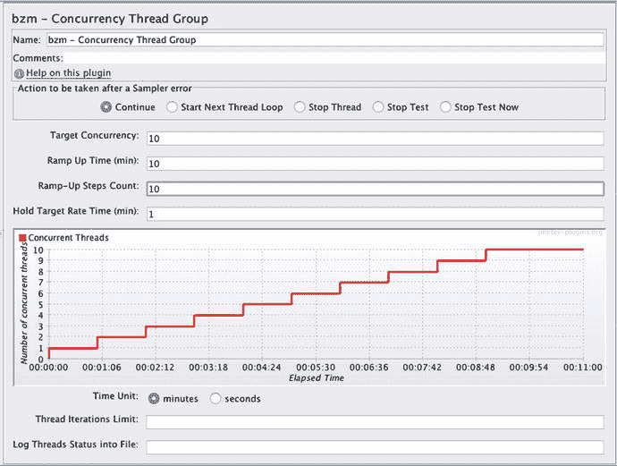
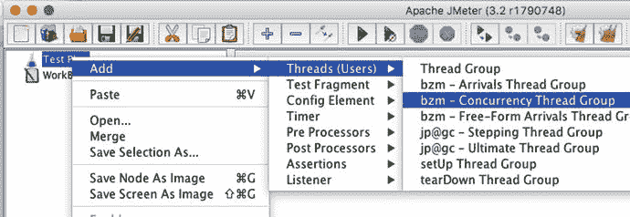
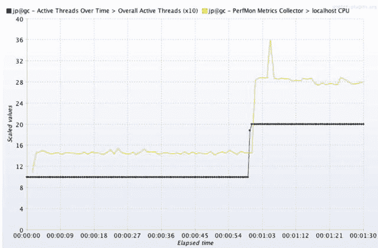
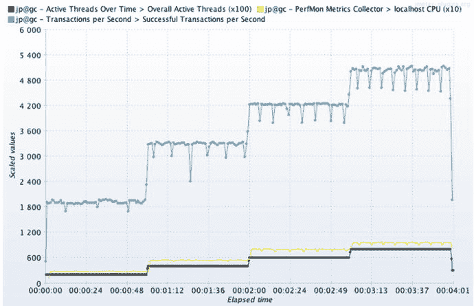
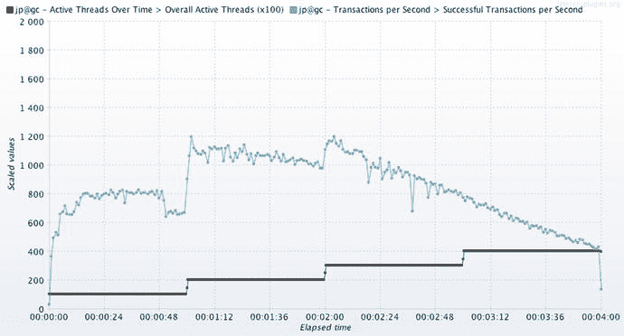

# 6. 可扩展性标尺

如今很少有系统能实现可扩展性，因为可扩展性测试运行得太不频繁了。本章展示了如何运行一个既快速又简单的可扩展性测试，你可以每周每天都运行它，为最终引导你的被测系统（SUT）走向可扩展性提供急需的指导。

本章的目标是：

*   学习一个公式，以精确确定需要施加多少线程或负载，从而轻松看出你的系统离可扩展还有多远。
*   学习如何识别测试数据何时表明你已复现了一个阻碍可扩展性的性能问题。

试图修复一个无法复现的缺陷是令人望而生畏的，性能缺陷也不例外。本章将引导你采用一种系统性的方法来复现那些阻碍系统扩展的缺陷。第 8 章我们将开始使用 P.A.t.h. 检查清单来诊断和修复问题。

可扩展性标尺是经典增量负载计划的一个变体，这个经典方法常常在性能最佳实践的记录中被遗忘。这个变体旨在精确地向我们展示需要施加多少负载，以及如何识别何时复现了一个问题——一个阻碍可扩展性的问题。

可扩展性是指系统在增加更多硬件资源时提升吞吐量的能力。这个定义准确而简洁，但同样令人痛苦地缺乏实用性，尤其是当你像大多数技术人员一样，正在寻找如何让系统实现扩展的具体指导时。

为了填补这一空白并提供一些方向，我使用了以下我称之为“可扩展性标尺”的负载测试：

1.  运行一个增量负载测试，包含四个相等的负载阶梯，第一个阶梯将应用服务器 CPU 推至约 25%。
2.  当这个测试产生四个方正、棱角分明的吞吐量阶梯，且最后一个阶梯将 CPU 推至 100% 时，被测系统（SUT）就是可扩展的。

让我们先看看如何使用负载生成器为标尺创建一个负载计划，然后我们将讨论可扩展性实际上是如何工作的。解释这种方法需要一点时间，但做过几次之后，它就会变成你的第二天性。

## 创建可扩展性标尺负载计划

可扩展性标尺指出，你的第一个负载阶梯需要让被测系统（SUT）消耗约 25% 的 CPU。需要多少线程的负载才能达到 25%？你需要运行一个快速测试来找出答案。这本质上是在将标尺校准到被测系统（SUT）和当前环境。

图 6-1 所示的 JMeter 测试计划提出了一个问题：“在这 10 个阶梯中，被测系统（SUT）的 CPU 消耗会在哪一个达到 25%？”

图 6-1.

用于查看需要多少线程负载才能将应用服务器 CPU 推至 25% 的 JMeter 负载计划

以下是执行此操作的一些简要说明：

1.  从 jmeter.apache.org 安装 JMeter。
2.  使用以下两种选项之一安装并发线程组：
    1.  通过从 [`https://jmeter-plugins.org/install/Install/`](https://jmeter-plugins.org/install/Install/) 下载一个 jar 文件到 JMETER_HOME/ext 目录，将插件管理器安装到 JMeter 中。重启 JMeter，然后从“选项/插件”菜单中选择“自定义线程组”。
    2.  直接从 [`https://jmeter-plugins.org/wiki/ConcurrencyThreadGroup/`](https://jmeter-plugins.org/wiki/ConcurrencyThreadGroup/) 下载 zip 文件……并将内容解压到 JMETER_HOME/lib 和 lib/ext 文件夹中，保持 zip 文件中的目录结构。
3.  重启 JMeter。
4.  使用图 6-2 中的菜单选项添加并发线程组。

    

    图 6-2.

    将并发线程组添加到新的 JMeter 负载计划中。
5.  在图 6-1 中设置 10-10-10-1 选项。

图 6-3 显示了这次简短校准测试的结果，或者至少是它的最开始部分。当测试进行到 10 个阶梯中的第二个时，我已经看到了足够的信息，于是停止了它。

图 6-3.

发现需要多少线程才能将 CPU 推至 25%。这个包含两个不同指标（CPU 和活跃线程）的图表是通过 Composite Graph 和 PerfMon 实现的，这两个工具都来自 jmeter-plugins.org。学习如何在关于 JMeter 的第 7 章中使用它们。

图 6-1 中的负载计划显示，每个负载阶梯应持续约 60 秒，事实也确实如此。我们之所以知道这一点，是因为黑线（位于“随时间变化的活跃线程”下方）在 Y 轴上的值为 10 并持续了 60 秒，然后在测试的剩余时间里值为 20。此图表的自动缩放功能有点令人困惑。图例中显示的 (x10) 意味着图表上的 10 和 20 被放大了 10 倍，实际值是 1 和 2，而不是 10 和 20。

图 6-3 中的黄线显示，第一个负载线程将 CPU 推至约 15%，第二个线程（在 60 秒标记处）将 CPU 推至约 28%。测试的全部目的是将被测系统（SUT）推至至少 25%，因此我在首次达到 25% 的那个阶梯之后停止了负载生成器。校准完成。

标尺要求“四个相等的负载阶梯，第一个阶梯将 CPU 推至约 25%”。由于两个线程将被测系统（SUT）推至约 25% 的 CPU，因此 2 就是标尺中四个相等阶梯中每个阶梯的大小。我们现在掌握了足够的信息来创建我们的标尺负载计划。

### 解读结果

校准测试已完成，现在你知道需要多少负载线程才能将被测系统（SUT）的 CPU 消耗推至约 25%。我从校准测试中取出了结果“2”，并将其放入负载计划中，创建了一个步进为 2-4-6-8 的可扩展性标尺测试。每分钟增加两个负载线程；在 4 分钟测试的最后一分钟，有八个线程在运行。当你的负载脚本单次迭代耗时（例如）少于 10 秒且思考时间为零时，在每个负载级别停留 1 分钟是可行的。这是一个非常粗略的指导原则，旨在确保你的脚本在每个负载步骤中至少重复数次（本例中为六次）。

图 6-4 显示了测试结果。这部分需要稍加思考，请做好准备：图例（截图顶部）中的 x100 意味着黑色线条上的数值 200、400、600 和 800 实际上代表 2、4、6 和 8 个负载生成器线程。这是由 jmeter-plugins.org 的自动缩放功能导致的。更多详情请阅读此处：

图 6-4.

蓝色线条显示了由可扩展性标尺生成的、呈方形阶梯状的吞吐量，这意味着该系统具备可扩展性。为了生成此图，吞吐量指标被添加到了图 6-3 中使用的同一个图形组件中。

[`https://jmeter-plugins.org/wiki/SettingsPanel/`](https://jmeter-plugins.org/wiki/SettingsPanel/)

可扩展性标尺旨在找出被测系统在 CPU 消耗为 25%、50%、75% 和 100% 时的吞吐量，图 6-4 展示了这一点。蓝色线条显示这四个吞吐量里程碑（大致）为每秒 1800、3300、4200 和 5100 个请求。由于四个步骤中的每一步都生成了一个漂亮的方形吞吐量块，因此这个特定的被测系统调优得非常好。

相比之下，图 6-5 展示了一个存在性能缺陷的被测系统。看到原本方形的阶梯状负载是如何被软弱无力的、摇摇欲坠的吞吐量所取代的吗？

图 6-5.

这里使用了与图 6-4 相同的图形配置，但我引入了一个性能缺陷（我认为是较高的 GC 时间），使得方形的阶梯状消失了。这就是系统不具备可扩展性时的表现。

对于那些对将 CPU 推至 100% 犹豫不决的人，如果不这样做，我们又如何能发现系统在额外 CPU 可用时是否能够利用它呢？我们知道将 CPU 推至 100% 不会损坏机器，因为杀毒软件对桌面工作站 CPU 这样做已经十年了。

以下是其他几位 Java 性能领域作者的一些引述，表明这种方法走在正确的轨道上，尤其是关于将 CPU 推至 100% 的部分：

> “目标通常是让处理器保持完全利用。” ——《Java 并发编程实战》，Brian Goetz 等（Addison-Wesley, 2006），第 240 页
> “对于一个行为良好的系统，吞吐量最初会随着并发用户数的增加而增加，同时请求的响应时间保持相对平稳。” ——《Java 性能》，Charlie Hunt, Binu John（Addison-Wesley, 2011），第 369 页

由图 6-4 中的黑色线条驱动，标尺中的四个步骤中的每一个都相当于要求被测系统进行跳跃。蓝色吞吐量线中的四个阶梯表明，被测系统对每个负载步骤都做出了跳跃响应。请务必注意，每一步都需要一个漂亮的方形 CPU 消耗（黄色）阶梯/跳跃。当负载生成器发出跳跃指令时，被测系统就跳跃了，只有经过良好调优且可扩展的被测系统才会如此跳跃。

在可扩展性标尺的四个 CPU 里程碑中，我们最关心的是 100% 这个里程碑。我们最终想知道的是，当负载生成器施加额外的吞吐量步骤时，被测系统是否能够利用这个 CPU 的 100% 以及随后添加的所有 CPU 的 100%，以产生越来越多的吞吐量跳跃。这就是可扩展性。

让我们快速看一个如何使用这些数字的例子。假设我们的客户正在从别人的系统升级到我们的系统。他们之前系统在高峰时段的数据显示，客户需要达到每秒 6000 个请求（RPS）。

让我们使用图 6-4 中可扩展性标尺测试的图表。它显示我们遇到了麻烦——图中的 5100 RPS 有点不够，因为在达到客户 6000 RPS 的目标之前，我们的 CPU 已经用完了。该怎么办？我们需要做不可能的事——将 CPU 消耗从 100% 推到 101% 甚至更高。这就像有人希望他们汽车收音机的音量旋钮能超过最大刻度 10，达到 11 一样。

要达到 6000 RPS，我们必须添加更多机器来分担负载（形成集群），并使用负载均衡器在机器之间分配负载。或者，我们可以为原始机器添加额外的 CPU。这是经典且强大的可扩展性概念。

当单台机器上的应用程序能够逐步将 CPU 的每一个比特转化为可观的吞吐量时，很容易看出，一旦提供了额外的 CPU，它也能够利用它们。

图 6-5 描绘了没有方形阶梯状步骤的系统——这是一个不具备可扩展性的系统。如果没有进一步的调优，它就没有扩展的希望，因为无论施加多少负载线程，吞吐量都无法接近 6000。

如果增加更多用户无法带来额外的吞吐量，那么系统就无法扩展。这就是这里的教训。

## 不完美但至关重要

我永远不会忘记这个关于调优的痛苦故事。在经历了 12 周艰苦卓绝、长时间的工作，试图为一个要求特别苛刻的客户达到前所未有的吞吐量之后，我们被打败了，筋疲力尽。拥挤且空气污浊的会议室里一片寂静，你甚至可能不知道我们实际上在庆祝，但我们确实在庆祝——只是太累了，兴奋不起来。系统终于扩展了，或者至少我们认为是这样。硬件翻倍使吞吐量翻倍——这很好。硬件增加三倍使吞吐量增加了三倍，但可扩展性到此为止，之后安静的会议室又忙碌起来。没有人预测到这个问题，因为这个问题本身就无法预测。

可扩展性标尺测试，像所有预测工具一样，是不完美的；它无法预测未经测试的情况，就像这个（基本真实的）小轶事一样。但尽管可扩展性测试不完美，它们仍然至关重要。标尺衡量了所有可扩展系统的关键方面：在所有 CPU 消耗水平下产生均匀吞吐量阶梯的能力。没有这样的工具，我们就会在软件开发生命周期（SDLC）阶段及之后盲目摸索，对我们追求的目标——可扩展性——的进展一无所知。

回到那个拥挤的会议室，当时是有进展的。负载均衡器上配置的一个并发上限阻止了额外节点产生更多吞吐量。修复配置后，在我们的系统中添加第四个节点使吞吐量翻了两番，推动我们超越了艰难的目标，并展示了出色的可扩展性。

### 重现糟糕的性能

如前所述，100% CPU 标志位对于展示可扩展性至关重要。其他三个标志位（25%、50%、75%）则作为小型断点测试，适用于那些性能不如图 6-4 中 SUT 的应用程序——这意味着大多数应用程序。CPU 标志位精确地显示了重现性能问题所需施加的负载量。例如，假设在前两个负载增量（25% 和 50% CPU）时，你得到了清晰规整的阶梯状步骤，但在第三个负载增量时，吞吐量不再攀升，CPU 仅达到 55%。恭喜。你已经重现了问题，这是“看清”问题的第一步。“看清”问题的第二步也是最后一步，是使用正确的监控工具查看正确的性能数据，正如从第 8 章开始的 P.A.t.h. 章节所述。

当一个看似强大的对手被一个较弱的挑战者击败时，头条新闻会迅速赞扬黑马，并羞辱被拉下王座的前冠军。同样，如果一个看似健壮的 SUT 在极少的负载线程下就暴露出巨大的性能问题，那么这确实是一个关键问题。重现性能缺陷所需的负载量越小，问题就越关键。因此，在 25% CPU 时重现的问题，比在更高 CPU 百分比下出现的同一问题要严重得多。不要忘记，你在缺陷跟踪系统中为问题指定的优先级和/或严重性，应该以某种方式反映这一点。此外，不必要的高负载量常常会引入其他问题（例如第 5 章关于无效负载测试中讨论的并发上限问题），这会使本已困难的故障排除过程更加复杂。这里的教训是：只施加重现问题所需的负载量——任何多余的负载都会不必要地使问题复杂化。

一旦可扩展性标尺确定了从规整阶梯过渡到混乱状态所需的最小吞吐量，从而展示出性能问题，那么将标尺负载计划切换为稳态负载计划会很有帮助。然后你可以更改负载计划以延长测试持续时间——目标是提供充足的时间来审查 P.A.t.h. 检查清单，并开始从监控和追踪工具中捕获数据。

一旦问题被识别并部署了修复方案，重新运行稳态测试可以为你的团队提供极佳的前后对比和令人信服的故事。如果系统变更使我们更接近性能目标（更高的吞吐量和/或更低的响应时间和/或更低的 CPU 消耗），则保留该变更，并通过重新运行标尺来查看下一个问题所在，从而开始新的循环。请记住，修复方案已经改变了性能格局，你可能需要通过重新运行标尺校准测试来重新校准标尺。

我们使用可扩展性标尺有两个目的：测量最佳吞吐量和重现性能缺陷。当“检测-重现-修复”循环都在单台机器/环境中进行时，单线程工作流会变得极其缓慢：开发人员被迫排队等待，以便在“黄金”环境上运行另一个测试，从而获得关于提议代码修复的反馈。因此，比较多个代码选项的性能变得不可行，因为对繁忙的黄金环境的访问需求很高。为了解决这个问题，最优秀的性能工程师擅长让开发人员能够独立工作，自行重现性能缺陷，也许是在他们自己的桌面上，甚至可能比较多种设计方法的性能。这是第 2 章中讨论的适度调优环境的另一个好处。

## 好的 CPU 消耗与坏的 CPU 消耗

并非所有的高 CPU 消耗都是坏事，尤其是在可扩展性很重要的时候。事实上，如果构建可扩展系统是我们目标的一部分，那么我们应该积极推动系统实现吞吐量的飞跃，同时充分利用 100% 的 CPU，至少在测试环境中是这样。当然，不贡献于吞吐量的 CPU 是坏的。例如，考虑在应用服务器启动时，没有施加任何负载，CPU 就达到了 100%。这就是坏的 CPU 消耗。

看待糟糕性能的一种方式是，它是由 CPU 消耗过少或过多引起的。第一种，“CPU 过少”，表现如下：无论施加多少负载线程，SUT 的吞吐量都不会大幅提升，即使有大量可用的 CPU。SUT 仿佛被一张难以想象的沉重毯子——比你在胸部 X 光检查时用来保护身体的铅围裙还要重许多倍——盖在了脆弱的吞吐量和 CPU 线上，压制着它们，使它们无法做出可扩展系统中应有的响应式吞吐量飞跃。

因此，当那张沉重的毯子压在 SUT 上时，使用更快的 CPU 只会带来微乎其微的好处。增加更多同类型的 CPU 只会让你的钱包受损。

我将誓死捍卫将 CPU 消耗推高至 100% 背后的逻辑，尤其是在吞吐量正在突破天花板的时候。

为什么？如果这不能证明可扩展性，那它肯定是可扩展性的一个必要属性。像这样与 100% CPU 调情是可以理解的，但如果 CPU 已经达到 100%，再施加更多负载就没有意义了。作为负面测试的一部分，这可能有所帮助，但当你寻求更高吞吐量时，这只会是一条死胡同。

即使面对非常低的吞吐量，技术人员有时也会吹嘘他们 SUT 的低 CPU 消耗。需要费些功夫才能帮助他们明白，在这种情况下，低 CPU 消耗是坏的，而不是好的。另一方面，当比较两个各方面性能（尤其是吞吐量）都相似，但其中一个 CPU 消耗更低的测试时，低 CPU 消耗就是好的。

对于第二种糟糕性能，“CPU 过多”，SUT 消耗了过多的 CPU，以至于你需要一整群忙碌的 CPU 来产生足够的吞吐量以满足需求，而一个调优得更好的 SUT 可能只需要几个 CPU 就能慢悠悠地完成任务。这就是为什么引入一个限制硬件花费金额的性能要求会很有帮助。

“CPU 过多”应引导我们优化那些既非必要又消耗 CPU 的代码。用于指出哪些代码消耗 CPU 的工具在关于线程的 P.A.t.h. 检查清单（第 11 章）中讨论。而代码是否必要当然是主观的，但在同一第 11 章中，有一些很好的、具体的非必要代码示例。“CPU 过少”表明争用、I/O 或其他响应时间问题阻碍了系统产生足够的吞吐量。解决这些问题的指导分散在从第 8 章开始的四个涵盖 P.A.t.h. 检查清单的章节中。

第二章《适度调优环境》鼓励我们每天运行更多修复-测试循环，并期望由此带来改进。这意味着性能表现是动态变化的，需要在优化之间重新评估。仅仅一两次优化就可能轻易将“CPU 过载”系统转变为“CPU 空闲”系统。例如，假设许多具有复杂安全要求的系统会为每个用户查询数据库中数百个权限，再假设对整个 P.A.t.h. 检查清单的审查表明这是系统中最严重的问题。一旦你为这种 CPU 密集型方法添加缓存，就会发现系统中下一个最严重的问题，这很可能是资源争用（详见第十一章），从而让我们得到一个“CPU 空闲”系统。

请注意他人如何看待你试图将 CPU 使用率推至 100% 的做法，就像使用可扩展性标尺时一样。理所当然地，数据中心所有者需要充分的保证，即生产应用程序在消耗分配 CPU 的适度部分的同时，能够满足吞吐量要求。问问他们觉得多少消耗量是合适的。CPU 耗尽的风险太大了，尤其是当人为错误和其他操作失误可能意外推高 CPU 消耗时。有时，业务流程会无意中被完全排除在调优过程之外，它们对 CPU 的贪婪本性会在生产环境中给你来个突然袭击。偷袭。

## 别忘了

我不是木匠，但连我都知道“量两次，切一次”才能把木板加工成合适的尺寸。对于软件，我们在检入源代码控制之前，通常测量零次可扩展性。零次。

一旦陶土被烧制，雕塑家的工作就结束了。如果你想把那个畸形的杯子变成一个华丽的圣杯，那你就运气不好了。如果你的恩人的陶土半身像看起来更像一个长着三个鼻子的科幻怪物，抱歉。开发过程是我们塑造和重塑代码的黄金机会窗口，而我们目前却让这个机会白白溜走，从未检查我们在实现可扩展性目标方面的进展。它的鼻子数量对吗？它看起来还像怪物吗？为什么我们从不问这些显而易见的问题，直到为时已晚？

可扩展性标尺使用起来快速简便；它使我们能够在开发过程中频繁地衡量性能进展，趁我们的机会窗口还开着，在陶土烧制之前把事情纠正过来。

当我们的系统扩展时，负载生成器会推动被测系统产生清晰、轮廓分明的吞吐量跃升/阶梯。与规整的吞吐量（及其他）指标相反，性能不佳的被测系统具有锯齿状、无力且沉重的吞吐量，因为代码中充斥着资源争用，这体现在各个指标的锯齿状变化中。

我提到过，施加不切实际的大量负载是一个常见错误，甚至可能是一种反模式。3t0tt 有助于解决这个问题——它是一种很好、安全的方式，可以防止像我这样自命不凡的性能工程师就过高的负载进行说教。3t0tt 是一个绝佳的起点，但它不能告诉你系统是否可扩展——你需要可扩展性标尺来实现这一点。

## 下一步

本章重点讨论了吞吐量、CPU 和施加负载量之间的相互作用。在同一张图表上看到这三个指标有助于运行可扩展性标尺测试。在接下来的第七章中，我们将看到如何将所有这三个指标放在完全相同的 JMeter 图表上。第七章将深入探讨值得重复的 JMeter 基础知识，以及那些似乎文档不足的重要 JMeter 特性和缺陷。

