# 7. JMeter 必知特性

由于你可以在互联网上找到大量关于负载生成器 JMeter 的文档，我尽量将本章内容限制在那些文档较少的特性，或者即使是文档完善但新手似乎很少掌握的特性上。

本章的目标是：

*   通过仅在你的桌面上使用一个小型沙盒环境创建小型测试脚本，来熟练使用 JMeter。
*   理解学习几个特定的 JMeter 特性可以让你快速从初学者进阶为中级/高级用户。
*   理解一旦安装了 JMeter，还需要从 jmeter-plugins.org 和其他地方安装额外的插件才能使其真正有用。

我看到很多人开始使用 JMeter 但进展不大，这让我感到沮丧，因为我见过它是一个多么强大的负载生成器。为了解决这个问题，本章的导览将推动 JMeter 初学者进入中级和高级用户的领域。

但是等等，还有更多。

“Hello World！”编程实验是开始学习一项技术的绝佳方式，而 JMeter 恰好拥有这种沙盒，你可以用它来尝试其特性。如果你知道这个沙盒（大多数人不知道），只需 20 秒（我在这里没有夸张）就可以在沙盒中创建一个小测试，并学习（甚至完善）你回答这些以及许多其他 JMeter 问题的方法：

*   如何增加负载？
*   如何绘制吞吐量图表？
*   如何根据脚本变量中的值有条件地执行某些操作？
*   如何从 .csv 文本文件中读取数据（如被测系统用户名/密码）到 JMeter 脚本变量中？

所以请留意本章后面的沙盒部分。

这是纯 JMeter 的一章，所以如果你已经对你自己的负载生成器很满意，那么请随意跳到下一章。但在你离开之前，请阅读我的“致 JMeter 的情书”，看看你的负载生成器是否具备所有这些特性——这些是我用来解决棘手性能问题所依赖的特性。我很难想象其他负载生成器（以及其他软件开发人员）是如何在没有这套极其广泛且全部开源的特性集的情况下勉强度日的。我当然希望商业（及其他）负载生成器竞争对手能注意到这个高标准。作为参考，以下是一些其他流行的负载生成器；最后三个是商业产品。

Faban

The Grinder

Gatling

Tsung

jmh

HP Performance Center（又名 'Load Runner'）

Load UI

Silk Performer

由于单一章节并不能构成完整的培训计划，我建议使用本章来补充你可能会在 jmeter.apache.org 或 JMeter 书籍中找到的其他 JMeter 培训资料（《Performance Testing with JMeter》，作者 Bayo Erinle，Packt Books，2015 年；ISBN-13 = 978-1787285774；或《JMeter Cookbook》，作者 Bayo Erinle，Packt Books，2014 年；ISBN-13 = 978-1783988280）。互联网上的善良公民们，愿上帝保佑他们，也有他们自己的培训材料汇编，这无可辩驳地证明了 JMeter 是整个性能学科体系中的一个重要器官：


*   “使用 JMeter 进行负载测试：第 1 部分 - 入门指南”，（[`https://lincolnloop.com/blog/load-testing-jmeter-part-1-getting-started/`](https://lincolnloop.com/blog/load-testing-jmeter-part-1-getting-started/)）
*   “从零开始学习 JMETER -（性能+负载）测试”（[`https://www.udemy.com/learn-jmeter-from-scratch-performance-load-testing-tool/`](https://www.udemy.com/learn-jmeter-from-scratch-performance-load-testing-tool/)）
*   “JMeter 简介”（[`https://www.guru99.com/introduction-to-jmeter.html`](https://www.guru99.com/introduction-to-jmeter.html)）
*   “JMeter - 快速指南”（[`http://www.tutorialspoint.com/jmeter/jmeter_quick_guide.htm`](http://www.tutorialspoint.com/jmeter/jmeter_quick_guide.htm)）
*   “JMeter 入门”（[`https://www.youtube.com/watch?v=KI6u5pclYIw`](https://www.youtube.com/watch?v=KI6u5pclYIw)）
*   “JMeter 入门指南”（[`https://www.youtube.com/watch?v=dJw8sBk_wSo`](https://www.youtube.com/watch?v=dJw8sBk_wSo)）
*   “如何使用 Apache JMeter 对 Web 服务器执行负载测试”（[`https://www.digitalocean.com/community/tutorials/how-to-use-apache-jmeter-to-perform-load-testing-on-a-web-server`](https://www.digitalocean.com/community/tutorials/how-to-use-apache-jmeter-to-perform-load-testing-on-a-web-server)）
*   “JMeter 快速设置指南”（[`http://zacster.blogspot.com/2008/03/quick-howto-to-setup-jmeter.html`](http://zacster.blogspot.com/2008/03/quick-howto-to-setup-jmeter.html)）

## 致 JMeter 的情书

你的负载生成器可能具备以下一两个特性，但 JMeter 是唯一一个集所有特性于一身的工具，其功能集足够强大，可供 QA 和开发人员共享。要向你展示所有这些内容需要大量篇幅，因此本章仅展示列表中几个较为重要的特性。

*   除了标准的负载生成指标（响应时间、吞吐量等）之外，JMeter 还可以绘制各种其他指标的图表：
    *   来自被测系统的 JMX 指标（[`https://jmeter-plugins.org/wiki/JMXMon/`](https://jmeter-plugins.org/wiki/JMXMon/)）。例如，这将显示你的 Web 容器线程是否已达到上限，详见第 4 章关于负载反模式的内容。
    *   来自所有主流操作系统的 CPU、内存、网络、磁盘指标（使用[PerfMon](http://jmeter-plugins.org/wiki/PerfMon/)（[`https://jmeter-plugins.org/wiki/PerfMon/`](https://jmeter-plugins.org/wiki/PerfMon/)）和[SIGAR](https://sourceforge.net/projects/sigar/)）。
    *   SIGAR 还允许你绘制每个 PID（操作系统进程 ID）的 CPU 消耗图表。如果一台机器上有多个 Java 进程，这将显示哪个进程占用了所有 CPU。
*   对任何你想要的内容进行负载测试：简单的 Java 程序、HTTP/S 应用程序、JMS 应用程序、大量 SQL 语句、TCP Socket 服务器以及[许多其他内容](http://jmeter.apache.org/usermanual/component_reference.html)（[`http://jmeter.apache.org/usermanual/component_reference.html`](http://jmeter.apache.org/usermanual/component_reference.html)）。在 JMeter 中，知道如何测试这些内容的 JMeter 测试元素被称为采样器。
*   WS-Security。如果你的客户端必须加密你的 WS-Security 消息，那么你的负载生成器也必须这样做（[`https://github.com/tilln/jmeter-wssecurity`](https://github.com/tilln/jmeter-wssecurity)）
*   高级图表功能：
    *   将任意两个（或更多）指标放在同一张图表上（[`https://jmeter-plugins.org/wiki/CompositeGraph/`](https://jmeter-plugins.org/wiki/CompositeGraph/)）。三个具有不同度量单位且自动缩放的指标？没问题。这有助于识别一个指标如何影响另一个指标。你甚至可以将来自两个不同测试的指标放在同一张图表上（[`https://jmeter-plugins.org/wiki/MergeResults/`](https://jmeter-plugins.org/wiki/MergeResults/)），以呈现令人信服的前后对比可视化效果。例如，如果你的吞吐量因 CPU 耗尽而达到上限，你可以得到一张图表，其中清晰地显示了在 CPU 达到 100%的精确时刻，吞吐量出现了难看的瓶颈。这是一张非常有说服力的图表！
    *   你不信任平均值吗？你应该如此。你可以使用[频率分布](http://jmeter-plugins.org/wiki/RespTimesDistribution/)（[`https://jmeter-plugins.org/wiki/RespTimesDistribution/`](https://jmeter-plugins.org/wiki/RespTimesDistribution/)）和[百分位图](http://jmeter-plugins.org/wiki/RespTimePercentiles/)（[`https://jmeter-plugins.org/wiki/RespTimePercentiles/`](https://jmeter-plugins.org/wiki/RespTimePercentiles/)）来展示响应时间指标，从而避免“平均值的谎言”。
    *   在设置面板（[`https://jmeter-plugins.org/wiki/SettingsPanel/`](https://jmeter-plugins.org/wiki/SettingsPanel/)）上，你可以调整图表的[粒度、坐标轴刻度、颜色等](http://jmeter-plugins.org/wiki/SettingsPanel/)。
*   从任何安装了 JVM 的操作系统生成负载。
*   将 JMeter 测试结果本地记录到文本文件或[集中式数据库](http://jmeter.apache.org/usermanual/realtime-results.html)（[`http://jmeter.apache.org/usermanual/realtime-results.html`](http://jmeter.apache.org/usermanual/realtime-results.html)）。
*   以下自动化性能测试平台集成了 JMeter 和报告功能：
    *   [Jenkins](https://wiki.jenkins-ci.org/display/JENKINS/Performance+Plugin)（[`https://wiki.jenkins.io/display/JENKINS/Performance+Plugin`](https://wiki.jenkins.io/display/JENKINS/Performance+Plugin)）
    *   [Taurus](http://gettaurus.org/)（[`http://gettaurus.org/`](http://gettaurus.org/)）
    *   [Sonar](http://testersinaction.blogspot.com/2013/05/v-behaviorurldefaultvmlo_24.html)（[`http://testersinaction.blogspot.com/2013/05/v-behaviorurldefaultvmlo_24.html`](http://testersinaction.blogspot.com/2013/05/v-behaviorurldefaultvmlo_24.html)）
*   多种部署负载生成器的方式：
    *   单机部署：
        *   快速简便的默认方法：使用 Java UI 创建负载脚本，然后生成负载并查看图表。
        *   在无头机器上[生成负载](http://jmeter.apache.org/usermanual/get-started.html#non_gui)（[`http://jmeter.apache.org/usermanual/get-started.html#non_gui`](http://jmeter.apache.org/usermanual/get-started.html#non_gui)），使用预先制作好的测试计划。将原始结果传回桌面进行分析，或者直接在无头模式下生成图表的.png 图像供后续分析。
    *   [分布式测试](http://jmeter.apache.org/usermanual/jmeter_distributed_testing_step_by_step.pdf)（[`http://jmeter.apache.org/usermanual/jmeter_distributed_testing_step_by_step.pdf`](http://jmeter.apache.org/usermanual/jmeter_distributed_testing_step_by_step.pdf)）。使用多台机器，通过一个中央 JMeter 控制器进行。对于单个生成器来说，超过几千 TPS 的负载可能过高。


## 使用 jmeter-plugins.org 是必须的

坦白说，如果没有 Andrey Pohilko ¹ 那套令人惊叹的 jmeter-plugins.org（一套可直接插入 JMeter 的附加工具、图表等），我早就放弃 JMeter 了。我想我可能有点偏见，因为我自己也贡献了几百行代码。

该项目早在 2009 年就启动了，因此相当稳定。第 6 章关于可扩展性基准的内容，就大量依赖 JMeter Plugins。CPU 消耗来自 JMeter Plugins，那些为增量负载计划绘制漂亮阶梯图的线程组也是如此。还记得我提到过两种安装方法吗？我讲过使用插件管理器安装，或者将单个插件的 jar 文件解压到 `JMETER_HOME/lib/ext` 目录下。

以下是另外两种我认为与前两种同样重要的安装方法：

*   使用“旧版”发布包。首先访问 [`https://jmeter-plugins.org/downloads/old/`](https://jmeter-plugins.org/downloads/old/)。然后下载 `JMeterPlugins-Standard-N.N.N.zip` 和 `JMeterPlugins-Extras-N.N.N.zip`，并将它们解压到 JMETER_HOME 目录下。压缩包中的 jar 文件必须最终放置在 .zip 文件中指定的相同文件夹（/lib 或 /lib/ext）中。
*   使用 Maven。这种方法不仅能安装 jmeter-plugins，还能完整安装 JMeter！在 littleMock 仓库中查找 `pom-load.xml`。不要使用 `JMETER_HOME/bin/jmeter.bat` 启动 JMeter，而是使用我那个简单的小工具 loadGui.cmd / .sh（也在 littleMock 仓库中）。`pom-load.xml` 的大部分内容是我从互联网上某位好心人那里借鉴来的。使用的 Maven 插件名字起得很好：`jmeter-maven-plugin`。感谢互联网。你可以在 [`https://github.com/eostermueller/littleMock`](https://github.com/eostermueller/littleMock) 的根目录下找到 `pom-load.xml`。

请在您自己的工作电脑上使用第一种技术（“旧版”）安装 JMeterPlugins，以便查看本章的 .jmx 脚本。这些 .jmx 文件位于该仓库的 sampleJMeterScripts/ 文件夹中：

[`https://github.com/eostermueller/javaPerformanceTroubleshooting`](https://github.com/eostermueller/javaPerformanceTroubleshooting)

我将其称为 jpt 仓库。

考虑这个日常问题：假设您创建了一个使用了几个 jmeter-plugins 的 JMeter 负载脚本（.jmx 文件）。当您那位没有安装 JMeter-Plugins 的邻座同事尝试运行您的 .jmx 文件时，他们会遇到一些难以理解的错误，这些错误几乎不会明确指出缺失的依赖项。

上述两种安装方法有助于解决这个问题。Maven 并不总是易于使用，但上面的 `pom-load.xml` 非常棒——它会即时下载 `pom-load.xml` 文件中指定为 `<dependency>` 的任何依赖的 JMeter-Plugins。

这个故事的寓意是，仅共享您的 .jmx 文件很容易导致难以理解的依赖问题。同时共享您的 .jmx 文件和自定义的 `pom-load.xml` 文件可以完全解决这个问题。但另一种发现 JMeter 的方法是使用 JMeter Plugins 插件管理器，这是第 6 章中提到的安装技术之一。以下是快速参考的 URL：

[`https://jmeter-plugins.org/wiki/PluginsManager/`](https://jmeter-plugins.org/wiki/PluginsManager/)

如果您安装了 PluginsManager（见上文），当它发现一个引用了您尚未安装的 JMeter Plugin 的 .jmx 文件时，它会提示您“您的测试计划需要以下插件”。然后，它会为您提供实际安装或中止的选项。

上面提到的 load-pom.xml 会完整安装 JMeter，并允许您指定正在使用的依赖插件。或者，您也可以使用此脚本安装特定计划文件中的所有插件：

`PluginsManagerCMD install-for-jmx/home/username/jmx/testPlan.jmx`

这对于自动化的、无人值守的性能测试非常有帮助，但请记住，即使是 PluginsManagerCMD 也有自己的安装过程，详见此处：[`https://jmeter-plugins.org/wiki/PluginsManagerAutomated/`](https://jmeter-plugins.org/wiki/PluginsManagerAutomated/)

在第 2 章中，我向您展示了如何绘制单个 PID 的 CPU 消耗图。为此，请下载并安装此插件——这部分仅启用图表，不收集 CPU 数据：

[`https://jmeter-plugins.org/wiki/PerfMon/`](https://jmeter-plugins.org/wiki/PerfMonAgent/#Download)

然后使用 ServerAgent 收集将在图表上显示的数据：从以下地址下载 ServerAgent-N.N.N.zip

[`https://jmeter-plugins.org/wiki/PerfMonAgent/#Download`](https://jmeter-plugins.org/wiki/PerfMonAgent/#Download)

将其解压到您想要收集指标的任何机器（任何平台）上。当您启动 `startAgent.sh`（或 `startAgent.bat`）时，它会监听来自您桌面上的 JMeter GUI（或无头）进程在端口 4444 上的连接。它非常稳定、跨平台且易于使用。

StartAgent 捕获 RAM、网络和其他指标——不仅仅是 CPU。还有许多其他 JMeterPlugins，将在下文详细介绍。


## PerfMon

在第 3 章中，我讨论了指标如何回答我们的三个基本问题：

1.  我们的硬件资源利用率如何？
2.  哪个组件是特定性能问题的罪魁祸首？
3.  最终用户是否受益？哪项代码变更表现更好？

负载生成器是专门为回答第三个问题（关于满足性能要求）而设计的。jmeter-plugins.org 的 PerfMon 组件也为第一个问题提供了高层次的答案。我所说的“高层次”，指的是 CPU、RAM 和网络消耗，以及[比这更多一点的内容](http://jmeter-plugins.org/wiki/PerfMonMetrics/)（[`https://jmeter-plugins.org/wiki/PerfMonMetrics/`](https://jmeter-plugins.org/wiki/PerfMonMetrics/)）。其工作原理如下。

首先，运行 `startAgent.bat`（清单 7-1）不需要管理员或 root 权限。此进程消耗的资源非常少，因此可以安全地启动该进程，并在数天或数月内无需再关注它。

```
# ./startAgent.sh
INFO  2016-02-21 14:03:05.061 [kg.apc.p] (): Binding UDP to 4444
INFO  2016-02-21 14:03:06.064 [kg.apc.p] (): Binding TCP to 4444
INFO  2016-02-21 14:03:06.069 [kg.apc.p] (): JP@GC Agent v2.2.0 started
清单 7-1.
serverAgent 的启动横幅，它为 JMeter 提供硬件利用率数据
```

图 7-1 展示了如何添加一个连接到 serverAgent 并显示 CPU 图的 JMeter 图表。

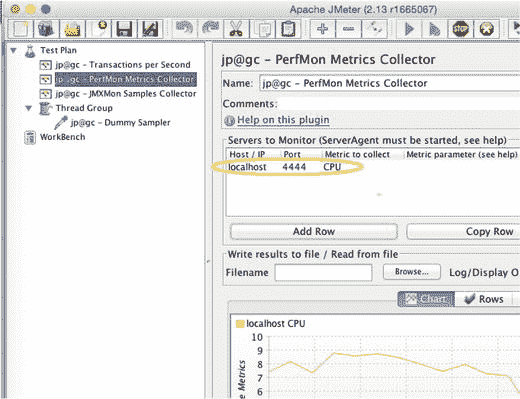

图 7-1.

要捕获出色的 CPU、RAM 和其他硬件指标，只需将 PerfMon 指向您已解压并启动 serverAgent 的主机和端口（默认端口为 4444）即可。

因此，JMeter 帮助回答了三个指标问题中的两个。你甚至可以论证它回答了剩下的那个问题：哪个组件是特定性能问题的罪魁祸首。如何做到？请查看这些可以在 JMeter 中绘制成图表的其他可用指标。

JMXMon 插件在 JMeter 中绘制 JMX 指标图表：

[`https://jmeter-plugins.org/wiki/JMXMon/`](https://jmeter-plugins.org/wiki/JMXMon/)

不幸的是，JMeter 负载计划文件扩展名 (.jmx) 与 Java 管理扩展 (JMX)（一个监控 API）的缩写恰好是相同的三个字母。监控 API JMX 目前并不十分流行，但 Spring Boot 的 Actuator 却很流行。它通过 json-over-http 消息提供出色的 JVM 健康指标。以下页面展示了如何通过向 Maven 的 pom.xml Spring Boot 文件添加一个简单的依赖项来在 Spring Boot 中启用 Actuator：

[`http://www.baeldung.com/spring-boot-actuators`](http://www.baeldung.com/spring-boot-actuators)

然后，您可以使用以下 JMeterPlugin 在 JMeter 中绘制 Actuator 数据图表：

[`https://jmeter-plugins.org/wiki/PageDataExtractor/`](https://jmeter-plugins.org/wiki/PageDataExtractor/)

JMX 和 Actuator 数据可以指向 JVM 内部的许多问题，从而帮助回答“哪个组件是罪魁祸首”的问题。因此，JMeter 和 JMeterPlugins 有助于提供所有三种类型的指标。令人印象深刻。

## JMeter user.properties 是你的朋友

我时常会发现一些以特定方式调整 JMeter 默认配置的 JMeter 属性。为了避免这些属性调整在 `JMETER_HOME/bin/jmeter.properties` 中其他 45KB（截至 JMeter 2.13 版本）的属性中丢失，我将它们分离到 `JMETER_HOME/bin/user.properties` 中，该文件中的属性会覆盖 `jmeter.properties` 中的属性。

将它们分开存放，使我能够轻松地将我的 `user.properties` 文件复制到新的 JMeter 安装中，从而获得更一致的安装体验。

清单 7-2 展示了我个人的 `user.properties` 文件，其中包含我推荐给所有人的一组我最喜欢的 JMeter 自定义设置。

```
#添加此项以避免在“查看结果树”中截断 HTTP 及其他响应
view.results.tree.max_size=0
#添加此项以便“活动线程数随时间变化”监听器
#能够从您的 .jtl 文件中渲染数据
jmeter.save.saveservice.thread_counts=true
#添加此项以使用 csv 格式（而非 XML）作为 jtl 输出文件。
#这可以减小 jtl 文件大小，降低测试期间 JMeter 的 CPU 消耗
jmeter.save.saveservice.output_format=csv
#这些 csv 字段名称使得读取/理解 .jtl 文件更加容易。
jmeter.save.saveservice.print_field_names=true
清单 7-2.
user.properties 文件中我最喜欢的一些 JMeter 属性，该文件会覆盖 jmeter.properties；两个文件都位于 JMETER_HOME/bin 目录下
```

当你与朋友分享你的 .jmx 文件时，你可能也想分享像上面这样的属性。但你可能更想使用上面的 pom-load.xml 文件来指定你希望朋友使用的任何属性。请查看上面的 pom-load.xml 文件，了解清单 7-3 中的语法，其作用与在 JMeter 的 `user.properties` 文件中设置 `summariser.interval=5` 相同。

```

清单 7-3.
在 jmeter-maven-plugin 中指定的 JMeter 属性
```

你可以使用清单 7-3 中的技术来指定任何 JMeter 属性。以下是所有 JMeter 属性的参考文档：

[`http://jmeter.apache.org/usermanual/properties_reference.html`](http://jmeter.apache.org/usermanual/properties_reference.html)


## JMeter 简介

在我刚开始接触 JMeter 时，真希望手边能有一张像图 7-2 那样的截图。在墙上挂一幅装裱好的大图可能有点夸张，但把复印件贴在 42 英寸大屏幕显示器下沿如何？我在截图上添加的文字展示了基本的负载生成功能，箭头则指向实现这些功能所需的 JMeter 测试元件。图 7-2 中的第一张截图是启动 JMeter 时看到的空白界面。要设置成第二张截图的样子，你需要右键点击“测试计划”并开始添加内容。

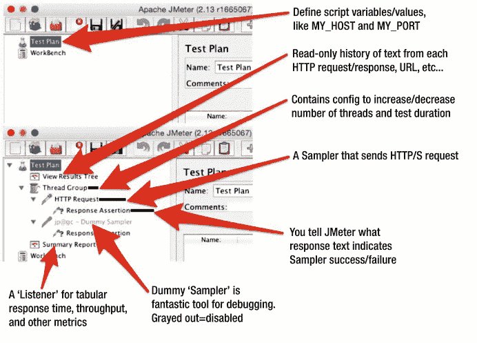

图 7-2.

如何通过 JMeter 测试计划树完成任务。第一张截图是空白界面。第二张截图是右键点击并添加多个测试计划元件后的结果。

我必须承认，JMeter 的负载计划树（主窗口左侧的树状结构）对新用户来说是一个难以逾越的可用性障碍。用户通常清楚自己最终想要什么结果。例如，“在 5 分钟内，通过 HTTP 对两个不同的 SOA 服务施加 5 个线程的负载，需要响应时间和吞吐量的时序图。”但为了实现这个看似简单的目标，JMeter 却迫使新手陷入一场丑陋的试错游戏，我称之为“右键点击教育”。有经验的用户能轻松应对，但初学者不行。在 UI 的左侧窗格中，你需要用一些名称古怪的构建块（称为测试元件）来组装一个树状结构（例如：线程组、虚拟采样器、查看结果树等）。树中的每个测试元件都有其类型，并且必须根据一套初学者一无所知的规则精确定位。测试元件及其类型（我主要使用这些类型：线程组、采样器、监听器、断言）以及所有具体的测试元件都在[此处有文档说明](http://jmeter.apache.org/usermanual/component_reference.html#introduction)：

[`http://jmeter.apache.org/usermanual/component_reference.html#introduction`](http://jmeter.apache.org/usermanual/component_reference.html%23introduction)

这里还有一些不错的顶层文档：

[`http://jmeter.apache.org/usermanual/test_plan.html`](http://jmeter.apache.org/usermanual/test_plan.html)

表 7-1.

JMeter 负载计划中常用组件

| 名称 | 描述 | 示例 |
| --- | --- | --- |
| 监听器 | 图表及其他显示结果的方式 |   |
| 线程组 | 配置施加负载的线程数量。配置测试持续时间。 | [阶梯线程组](http://jmeter-plugins.org/wiki/SteppingThreadGroup/) ( [`https://jmeter-plugins.org/wiki/SteppingThreadGroup/`](https://jmeter-plugins.org/wiki/SteppingThreadGroup/) ) 或笨重的默认[线程组](http://jmeter.apache.org/usermanual/component_reference.html%23Thread_Group) ( [`http://jmeter.apache.org/usermanual/component_reference.html#Thread_Group`](http://jmeter.apache.org/usermanual/component_reference.html%23Thread_Group) ) |
| 采样器 | 执行者。执行 HTTP 请求。执行 JMS 请求。执行 Java 代码。 |   |
| 控制器 | 控制采样器的流程，包括“If”逻辑和循环逻辑 |   |
| 断言 | 允许你配置 JMeter 如何判断一次采样器运行是成功还是失败。 |   |

如果你右键点击某个特定的测试元件，就会看到从该位置可以合法添加哪些类型的子测试元件。所以，如果那天你的右键点击兴致足够高，你可以右键点击树上的每一个节点（有时可能有几十甚至上百个块），然后推断并记住整套规则——哪些测试元件类型可以/应该作为其他测试元件类型的父/子节点。这可真是“右键点击其乐无穷”。或者，并非如此。

我在这里并非要给我“心爱之物”泼冷水。相反，我是想鼓励你避免“右键点击教育”的痛苦。一开始，请先依靠他人的帮助来构建你的负载计划树。具体来说，你可以将图 7-2 中的截图作为指南，或者使用相对较新的 JMeter 模板功能，从一个现成的负载计划树开始，再或者让朋友分享他们的负载计划（一个 `.jmx`² 文件，采用专有的 `.xml` 语法）。要使用模板功能，请以空负载计划树启动 JMeter，然后选择“文件 ➤ 模板”。即使经验丰富，我仍然依赖“录制模板”来录制新的 HTTP 负载脚本，因为其树结构有点特殊。你很快就能熟悉哪些测试元件该放在哪里，然后就可以（哈）扩展思路，在负载计划树结构上发挥更多创意。


## 提升工作效率的 UI 功能

图 7-2 中那一簇大红箭头都指向了各个独立的项目，即测试元素。只需使用键盘上的方向键，就能轻松地在所有这些测试元素之间导航，甚至可以说是冲浪。每个测试元素都有特定的测试元素类型。例如，所有图形都属于监听器类型的测试元素。用于提交 HTTP 请求的测试元素称为取样器。为了方便查找，我将所有图形都放在最高层级（作为根节点测试计划的子节点）。但假设我不小心将一些图形放到了树形结构的更深处。你可以使用多种功能来快速重新定位它们，并执行其他操作：

*   **拖放**。拖放功能的实现出乎意料地易于使用。你可以亲自尝试一下，拖动一个测试元素来改变同级元素的顺序，或者完全改变其父级关系。
*   **剪切/复制/粘贴**。比尔·盖茨那套熟悉的键盘快捷键（Ctrl+X、Ctrl+C、Ctrl+V）在这里同样适用。这三个操作都作用于选中的节点及其所有子节点。
*   **多选**。Shift+点击（选择相邻的测试元素）和 Ctrl+点击（选择不相邻的测试元素）的操作方式符合你的预期。
*   **复制当前测试元素**。需要另一个与所选元素相同的测试元素吗？按 Ctrl+Shift+C 即可在当前元素下方添加一个副本。即使你复制的是一个包含许多子节点的父测试元素，此功能也同样有效。
*   你还可以使用启用/禁用/切换功能（Ctrl+T）快速禁用单个测试元素及其所有子节点。
*   如果你启动了两个完全独立的 JMeter UI 实例，可以轻松地在两个树形结构之间进行剪切/复制/粘贴。

所有这些剪切/复制/粘贴功能对于以下场景非常有用：

*   **合并两个负载脚本**。同时启动两个 JMeter GUI 实例。将所有 HTTP 请求取样器从一个实例复制到另一个实例。我怎么强调这项技术的重要性都不为过。以下是三个示例：
    *   第 4 章的负载生成概述中展示了“第一优先级”和“第二优先级”脚本。你可以将第一优先级和第二优先级的内容分别录制到不同的脚本中，然后使用此技术将第二优先级脚本中的 HTTP 取样器（及其他内容）追加到第一优先级脚本中。
    *   每位开发人员录制自己的业务流程，之后使用此技术将所有脚本合并成一个单一的脚本。
    *   当对网页进行代码更改（例如添加新的必填数据项）时，这通常会导致 .jmx 文件过时。要更新脚本，请将新版本的网页录制到一个独立的 .jmx 文件中。然后仔细删除旧脚本中过时的部分，并使用此技术将新脚本复制/粘贴到旧脚本中。
*   **重新排列测试计划中的组件**。为了方便查看/查找，我喜欢将所有图形放在最高层级（作为测试计划的子节点）。如果图形分散在各处，我可以轻松地使用方向键在负载测试计划中浏览，Ctrl+点击多选要移动的图形，然后按 Ctrl+V 将它们粘贴到新位置。
*   **轻松复制当前选中的节点**。假设你已经配置了一个 Java 取样器，并且想在其旁边再创建五个相同的取样器作为同级元素。只需选中你的 Java 取样器，然后按五次 Ctrl+Shift+C 即可。瞧，大功告成。
*   **我大量使用切换/Ctrl+T 功能**。假设我想比较两个不同 URL 下的代码性能。我会为每个 URL 创建一个 HTTP 请求取样器，然后使用 Ctrl+T 切换启用的取样器，一次只运行一个。如果你避免在两次运行之间清除结果，你将得到类似这样的漂亮图表：（待办事项：需要两个不同取样器的图表，一次运行一个，且不在运行之间清除结果）。

## 使用 JMeter 断言在负载测试期间进行功能验证

此示例的 .jmx 脚本位于 jpt github.com 仓库的以下位置：

```
sampleJMeterScripts/jpt_ch07_functionalValidation.jmx
```

在第 5 章中，我提到了六种情况，在这些情况下你应该咬紧牙关，放弃测试结果并重新运行整个测试。其中一个潜在原因是大量的被测系统错误。你需要自行决定触发重新测试的确切错误百分比。

但是，如果你的被测系统静默失败，或者重要的客户端数据被悄悄地从被测系统网页中遗漏，你最终可能会基于完全错误的数据做出各种决策。为避免这种情况，请花点时间告诉 JMeter 什么构成成功的 HTML 响应，方法是添加 JMeter 断言来检查 HTML 响应中的关键文本片段，例如网页的标题，或者几个关键字段的 HTML 文本标签。图 7-3 展示了如何添加断言。

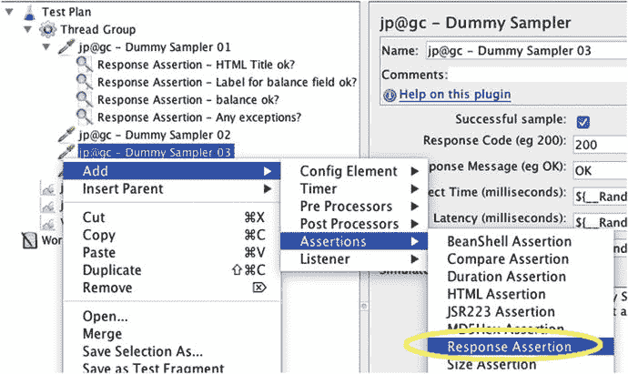

图 7-3.

添加断言。如果在父级取样器的响应中未找到此断言中的文本，则 JMeter 将在“汇总报告”和/或“综合报告”中统计一个错误。

图 7-4 展示了如何输入要验证的文本。在输入文本之前，你需要先点击底部的“添加”按钮。如果 JMeter 发现你输入的文本在相应的 HTTP 响应中缺失，它将统计一个错误。如果你的整个业务流程最终以“订单已提交”消息结束，那么这就是你验证系统是否吐出这个至关重要消息的机会。不要错过这个机会。

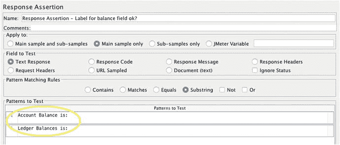

图 7-4.

一个 JMeter“响应”断言。如果你多次点击“添加”并在每一行输入文本，那么如果父级取样器的响应中缺少任何一行文本，JMeter 都会将此取样器标记为出错。

如果你的应用程序显示“订单已提交”后紧接着显示“致命异常 / 你的代码失败”，这至少可以说是苦乐参半。你可以添加第二个断言，如图 7-5 所示，来翻转逻辑。只需勾选“非”标志，如果给定的文本（例如“致命异常”）存在，JMeter 就会统计一个错误。

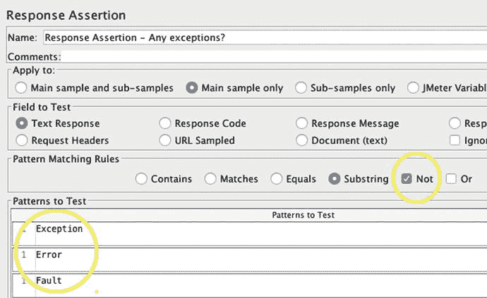

图 7-5.

一个与上图类似的 JMeter 响应断言，但勾选了“非”。如果在取样器的响应中找到了给定的文本（例如错误消息），则会统计一个错误。

我以前曾过早地宣称性能胜利，结果后来发现 100% 的请求都失败了。这相当尴尬；我不推荐这样做。

你不仅应该花时间添加断言，还需要关注错误计数/百分比，所有断言失败和其他错误（如 HTTP 错误）都会被记录在这里。以下是三个（可能还有其他）有助于你跟踪错误的组件：

*   jp@gc - 每秒事务数（来自 JMeter 插件）
*   汇总报告（错误 % 列）
*   综合报告（错误 % 列，来自 JMeter 插件）

这里讨论的断言（图 7-4 和 7-5）仅检查预定义的字符串列表。这里还详细介绍了许多其他更复杂的断言：[`http://jmeter.apache.org/usermanual/component_reference.html#assertions`](http://jmeter.apache.org/usermanual/component_reference.html%23assertions)

例如，JSR223 断言允许你编写代码来验证任何取样器的响应。


图 7-6 展示了一个包含失败断言的“综合报告”。JMeter 插件生成的综合报告比 JMeter 自带的“汇总报告”性能更好，后者缺少一些关键列，例如“90% 响应时间”。汇总报告功能更少，性能也更差。

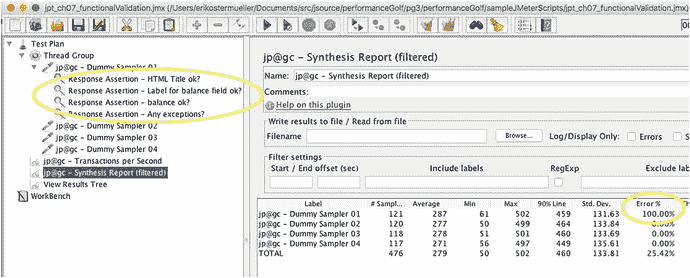

图 7-6.

JMeter “综合报告”，显示了来自 github.com 上 jpt 示例中的 jpt_ch07_functionalValidation.jmx 文件里，由断言统计的错误。

## 脚本变量

我创建的几乎每个脚本都包含几个脚本变量，这使得在不同硬件环境中运行脚本更加容易。图 7-7 中显示的 MY_DIR 变量将在以下示例中用于指示在运行 JMeter 的机器上存储 JMeter 输出文件的位置。

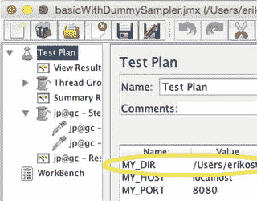

图 7-7.

在以下示例中使用 MY_DIR 变量来存储 JMeter 输出文件

图 7-8 展示了如何引用变量。实际上，JMeter 中几乎所有用于输入数字或文本数据的输入框（如下所示）都能正确解析脚本变量的值——只需记住使用 `${}` 语法将变量名包裹起来即可。


图 7-8.

当引用像 MY_DIR 这样的变量时，必须使用特殊语法将名称包裹起来：`${MY_DIR}`。你几乎可以在任何可以输入文本数据的地方引用变量。

## 将性能结果保存到磁盘

你可以通过几种不同的方式将 JMeter 结果（响应时间、吞吐量等）保存/持久化到磁盘。出于多种原因，你都需要这样做，例如比较当前性能与上次发布的性能、记录性能缺陷，或向同事展示吞吐量过程。

*   从 UI 复制屏幕截图，这很快。但请记住，仅凭一张图表的 .png 图片，你将无法添加其他指标、重置采样粒度、重新缩放以放大、更改颜色等。
*   将原始结果保存到文本文件——按照惯例，JMeter 使用 .jtl 文件扩展名。这稍微复杂一些（详见下文），但你可以获得极大的灵活性，以便基于原始数据重新构想你的图表。如果你在测试运行很久之后才审查结果，这种灵活性尤其有用。我经常在无头机器上生成负载。测试结束后，我只需将原始的 .jtl 文件复制回我的桌面，然后在 JMeter UI 中渲染。在无头机器上，你甚至可以[生成 .​png 文件](http://jmeter-plugins.org/wiki/GraphsGeneratorListener/)（ [`https://jmeter-plugins.org/wiki/GraphsGeneratorListener/`](https://jmeter-plugins.org/wiki/GraphsGeneratorListener/) ）。
*   将结果保存到中央数据库（ [`http://jmeter.apache.org/usermanual/realtime-results.html`](http://jmeter.apache.org/usermanual/realtime-results.html) ，或 [`http://www.testautomationguru.com/jmeter-real-time-results-influxdb-grafana/`](http://www.testautomationguru.com/jmeter-real-time-results-influxdb-grafana/) ）。这是一种很好的方法，允许多个用户在实时测试期间查看指标，或比较多个 SUT 版本的结果（将所有结果保存在一个地方），或者作为所有结果的企业级存储库。这是一种相对较新的方法，我对此没有任何经验。
*   在无头运行时，JMeter 每 30 秒会向标准输出（可能还有 `JMETER_HOME/bin/jmeter.log`）显示一组小型且基本的（不可配置的）性能指标——这对于短时间、快速的测试非常有用。[控制台状态记录器](http://jmeter-plugins.org/wiki/ConsoleStatusLogger/)（ [`https://jmeter-plugins.org/wiki/ConsoleStatusLogger/`](https://jmeter-plugins.org/wiki/ConsoleStatusLogger/) ）JMeter 插件已不再需要，因为较新版本的 JMeter（至少 2.13 及更高版本）无需请求即可显示这些数据。你希望无头运行 JMeter 的原因有很多：
    *   因为 JMeter 建议如此而选择无头运行。启动 JMeter GUI 时，控制台窗口会显示以下消息：“不要使用 GUI 进行负载测试”（图 2-6）。这很可能是因为 GUI 开销可能会影响负载测试结果。根据我的经验，使用 GUI 进行负载测试，且每秒请求数不超过 10 个时，其开销足够低。
    *   在 SUT 上无头运行，以便避免第 2 章“适度调优环境”中讨论的网络性能问题。避免带宽限制器。避免可能导致性能下降的多个防火墙。避免并发性及其他配置尚未经过性能审查的负载均衡器。
    *   无头运行，以便你可以对没有对外部世界开放 TCP 端口的无头 SUT 施加负载。

要将 JMeter UI 图表保存为 .png 文件，首先将图表添加到测试计划树中，如图 7-9 所示。要获得漂亮的“响应时间随时间变化”图表，请右键单击根测试计划，然后选择“添加” ➤ “监听器” ➤ “jp@gc - 响应时间随时间变化”。运行测试后，你可以直接右键单击，将图表图像复制到剪贴板或文件系统。

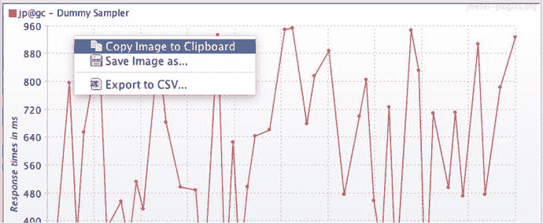

图 7-9.

只需右键单击 JMeter 插件图表，即可将图像保存到剪贴板或磁盘


保存测试结果的第二种方法是让 JMeter 将原始数据保存到磁盘。使用 `.jtl` 文件扩展名是一种良好的惯例，尽管并非强制要求。要将数据保存到 `.jtl` 文件，你可以使用与图 7-9 相同的图表，只需按图 7-10 所示进行指定即可。所有图表都是类型为监听器的测试元素，并且每个都包含此面板。


图 7-10.

重启 JMeter 后，如果你想将指标从已填充的 `.jtl` 文件重新加载到图表中，请确保指定了 `.jtl` 文件名，将 UI 焦点设置在此文本框中，然后按 Enter 键。

是的，图 7-8 和图 7-10 中的截图完全相同，但这只是因为这是一个重要的功能。尽管 UI 上明确写着“将结果写入文件 / 从文件读取”，但包括我在内的大多数人都很难看出这个框是用来从 `.jtl` 文件渲染图表的。

请注意，运行 ➤ 清除全部 (Ctrl+E) 会清除图表中的所有结果以及 UI 中的大多数测试元素，但它既不会删除也不会将 `.jtl` 结果文件清零。它会追加数据。你必须手动删除 `.jtl` 文件才能从头开始。当你开始一个你认为的新测试，但实际上是在向昨天同一时间运行的测试追加数据时，这可能会很麻烦。如果你尝试将 `.jtl` 中的数据渲染到图表中，比如吞吐量图表，你会看到左侧是昨天测试的吞吐量，中间是巨大的 24 小时空白间隙，右侧是今天的吞吐量。这并非你所期望的结果。因此，请记住在重启时清除你的 `.jtl` 文件，以避免出现这种巨大的间隙。

为了避免玩“文件系统捉迷藏”来寻找输出文件，我强烈建议在文件名输入框中指定完整路径；前面显示的图 7-7 展示了如何使用脚本变量来指定文件将存放的文件夹。

以上展示了如何写入 `.jtl` 文件。要读取 `.jtl` 文件并显示图表，例如当你重启 JMeter UI 时，你需要逐个加载每个监听器测试元素。这里有一个有趣的可用性小技巧，可以让 JMeter 读取 `.jtl` 文件：确保 `.jtl` 文件名已就位。然后将焦点放在输入框上（或保持焦点），并按 Enter 键。这将启动从 `.jtl` 文件中的文本数据绘制图表的过程。或者，使用浏览按钮选择文件，也会根据 `.jtl` 数据绘制图表。

### 如何避免大文件的冗余副本

图 7-11 中的配置在我看来完全合理。看起来我们正在尝试为响应时间数据创建一个输出文件，并为吞吐量数据创建另一个输出文件。

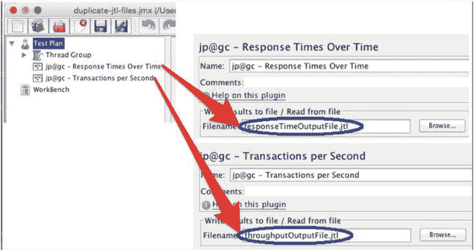

图 7-11.

看似完全合理的配置却会产生非常意想不到的后果。另外，`.jtl` 文件的路径未指定，因此不清楚这些文件将存放在文件系统的哪个位置。

看起来响应时间数据会存放在一个文件中，而吞吐量数据会存放在另一个单独的文件中。但是，JMeter 并非如此工作。相反，它会创建两个相同的输出文件。对于时间更长、吞吐量更高的测试，这会浪费数 GB 的磁盘空间。所以，请按照我的建议操作：对于每个 JMeter `.jmx` 脚本，随意选择一个监听器，并仅为该监听器指定一个 `.jtl` 文件的路径/名称。因此，你可以推断出一条规则：整个 `.jmx` 文件应该只配置一个监听器（图 7-1 中的两个组件都是监听器）带有输出文件。我将此称为“每个 jmx 仅一个输出文件”规则。该规则也适用于其他监听器，我称之为“基础监听器”，例如活动线程数随时间变化、响应时间百分位、汇总报告等，但有两个例外。

“每个 jmx 仅一个输出文件”规则的第一个例外是 PerfMon 监听器（用于收集 CPU 消耗和其他操作系统数据）和 JMXMon 监听器（用于从远程系统捕获 JMX 数据）。它们都来自 jmeter-plugins。与所有其他监听器不同，它们各自需要自己的输出文件。PerfMon 和 JMXMon 都不会从其他监听器的 `.jtl` 文件中读取数据。同样，其他监听器也不会从 PerfMon 和 JMXMon 的 `.jtl` 文件中读取数据。

以下是避免混淆“什么数据写入哪里”的总结：

1.  在你的 `.jmx` 中选择任意一个监听器（PerfMon 和 JMXMon 除外），并指定要写入的 `.jtl` 文件的完整路径/文件名。
2.  此外，如果你有 PerfMon 或 JMXMon，每个都应该有自己的 `.jtl` 文件。
3.  如果你从命令行（无用户界面）运行 JMeter，你可以使用 `-l` 命令行参数指定你的 `.jtl` 文件名。请记住，即使指定了 `-l`，在你的 `.jmx` 文件中指定的任何 `.jtl` 文件也会被写入。所有命令行参数的文档请参见[第 2.4.8 节](http://jmeter.apache.org/usermanual/get-started.html) [`http://jmeter.apache.org/usermanual/get-started.html`](http://jmeter.apache.org/usermanual/get-started.html)。


### 为重度调试或高吞吐量合理调整输出文件大小

这是“每个 jmx 文件仅一个输出文件”规则的第二条例外情况，同时它也是一个极好的特性，你需要使用它来避免负载生成器上的数据过载。负载生成器是高度可配置的“猛兽”，很容易错误配置它们，导致其处理、计算和存储大量数据，从而影响负载生成器性能，并使测试结果更多地反映负载生成器自身的问题，而非被测系统的性能。

然而，在两种不同场景下，收集大量数据（HTTP URL、响应码、输入输出 XML、Cookie、脚本变量等）对于故障排查至关重要：

*   调试负载脚本，包括错误和成功的请求。
*   在负载测试期间，排查来自被测系统的错误。

JMeter 通过允许你保留两个基本输出文件来满足这一用例，一个采用.csv 格式，另一个采用 XML 格式。XML 文件占用空间更大，CPU 消耗也更高，但仅用于采样器失败的情况，这种情况通常不常发生。在单独的 csv 格式的.jtl 文件中，JMeter 将保留所有活动（无论成功或失败）的更小、更精简但高容量的记录。

以下是实现方法：

1.  在 `JMETER_HOME/bin/user.properties` 中，添加以下属性，将默认的.jtl 文件格式设置为 csv，而不是更耗 CPU、更冗长且体积更大的 XML 格式：`jmeter.save.saveservice.output_format=csv`
2.  添加其他监听器，例如一个不错的 `jp@gc - Synthesis Report (filtered)`，它是普通摘要报告的功能更全面的版本。指定一个.jtl 文件名（当然，别忘了包含.jtl 文件的路径，正如我之前建议的，以避免漫长的“捉迷藏”）。
3.  在负载计划树中添加一个“查看结果树”监听器。指定一个与步骤 2 中使用的不同的.jtl 文件名。对我来说，为所有.jtl 文件使用相同的路径很有帮助。
4.  仅针对这一个监听器：
    1.  勾选“错误”复选框。这有点令人困惑，但它告诉 JMeter 仅记录错误，并避免为成功的采样器请求记录详细日志带来的巨大开销。在施加负载时不要忘记这个勾选；我们将在下一节讨论原因。
    2.  通过单击“配置”按钮，覆盖“查看结果树”中的 csv 文件格式，如图 7-12 所示。

        

        图 7-12.

        “配置”按钮，允许你启用/禁用输出文件的 XML 格式
    3.  要仅针对这一个监听器将 csv 文件格式覆盖为 XML 文件格式，请按图 7-13 所示勾选复选框。

        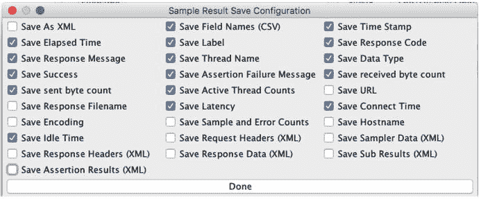

        图 7-13.

        指定输出日志文件 XML 格式所需的复选框

## 录制 HTTP 脚本

以下说明介绍了如何录制 HTTP 脚本：

[`http://jmeter.apache.org/usermanual/jmeter_proxy_step_by_step.pdf`](http://jmeter.apache.org/usermanual/jmeter_proxy_step_by_step.pdf)

与其重复这些说明，我认为强调录制过程中的几个关键步骤更为重要。

过去，正确配置.jmx 文件以进行录制非常困难。现在，有一种简单的方法可以创建它：从 JMeter 模板开始配置.jmx。

选择“文件” ➤ “模板”菜单选项。然后在顶部中央的组合框中选择“录制”模板。最后，单击“创建”，如图 7-14 所示。

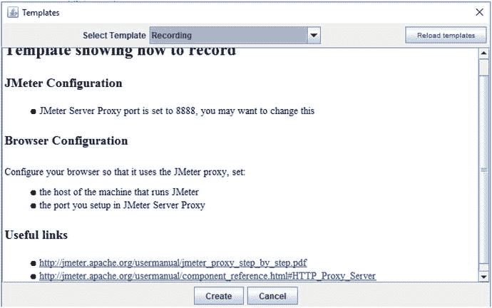

图 7-14.

JMeter 屏幕，用于选择指定将浏览器网络流量录制到.jmx 文件所需详细配置的模板。

选择“录制”模板后，JMeter 计划树应如图 7-15 所示。

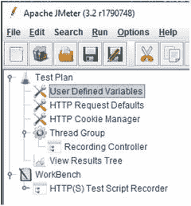

图 7-15.

选择“录制”模板后的 JMeter 计划树

图 7-16 详细说明了该过程的一个关键部分：浏览器的 HTTP 代理配置。如果没有配置 HTTP 代理，浏览器会直接向互联网发送请求。配置代理后，所有请求都会被转发到指定的主机（标记为“地址”）和端口。

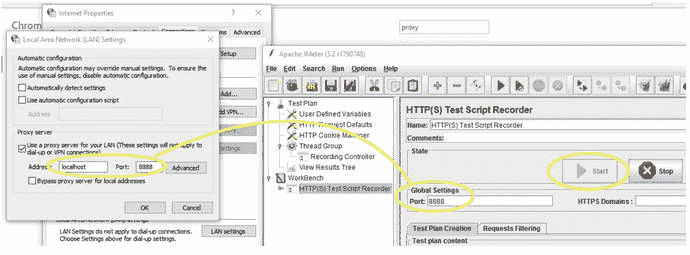

图 7-16.

Internet Explorer HTTP 代理配置和 JMeter HTTP 代理服务器。看到 IE 如何配置为将所有请求发送到本地主机的 8888 端口，而 JMeter 如何配置为监听完全相同的端口上的所有请求了吗？许多 JMeter 用户未能正确配置此项。

请注意，左侧的 IE 地址输入框必须指向本地机器，并且 IE 中的端口号（左侧）和 JMeter 面板上的端口号（右侧）必须匹配。图 7-16 中的值是 8888。还要注意 JMeter 的“启动”按钮已禁用，这意味着它已被点击以启动 JMeter HTTP 代理程序。

当 IE 代理配置正确，并且你单击 HTTP(S)测试脚本录制器上的大“启动”按钮时，所有浏览器网络流量都将被转发到 JMeter HTTP 代理，JMeter 代理将立即将所有流量转发到被测系统。当你浏览被测系统时，JMeter 将录制所有流量。

将你的被测系统 URL 粘贴到浏览器中，并开始导航你想要录制的业务流程。导航完成后，退出被测系统，并单击图 7-16 右侧 JMeter 的 HTTP(S)测试脚本录制器上的“停止”按钮。

JMeter 将在“录制控制器”中显示所有录制的流量，如图 7-17 所示。

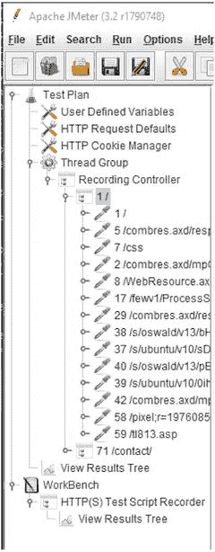

图 7-17.

JMeter 的“录制控制器”捕获了用户在浏览器中导航被测系统时的网络流量


## 调试 HTTP 录制

使用 XML Schema 验证器可能非常令人头疼。验证错误信息晦涩难懂，简直不像英语。这让我想起与英语作为第二语言（ESL）班级里最笨的学生进行技术支持通话的情景。³ 但比使用严格管控的 XML Schema 更糟糕的，是系统根本没有 schema，没有任何关于正确/错误输入的明确规则。

这恰恰类似于负载生成器正确组装 HTTP GET 请求以传递给 Web 应用程序的任务。HTTP GET 请求需要哪些 URL 参数？使用了哪种 Web 认证方式？是否需要 CSRF 令牌或 JSESSIONID？还有其他 Cookie 吗？被测系统（SUT）的浏览器代码从前一个 HTML 响应中提取了哪些 HTML“隐藏”变量，并用于构建后续页面的 HTTP GET 参数？所有这些不确定性让我渴望某种能清晰阐明需求的、严格管控的 schema。事实上，回答错任何一个问题通常都会导致不完整的 HTML 响应和/或服务器端异常，而出现此类错误很可能表明你的 `.jmx` 负载脚本已损坏——或许与 SUT 的需求不同步了。

处理这种不确定性的一种方法是，保留初始录制时的详细 HTTP 日志备份，以及最初录制的负载脚本本身。这就创建了一个包含所有必需数据项的小型“保险库”；它虽然不是 schema，但也足够接近了。但随后负载脚本的维护工作就开始了。在按照第 4 章所述增强脚本时，很容易在后期引入错误。还记得吗？这些更改是为了让你的负载更接近实际生产负载。

当负载脚本出现错误时，你可以通过对原始详细 HTTP 日志和包含该错误的测试运行日志进行详细的文本文件“差异比较”，来检查是否拥有所有必需的数据项。以下 JMeter 指令展示了如何捕获这些详细的 HTTP 日志。

当你查看这些日志之间的差异时，最常发现的是你并未完全理解 HTTP GET 的需求（上文两段所述）。或者，你可能部署了不同版本的 SUT，其对 HTTP GET 有不同的需求。

重申一下，你需要进行的“差异比较”是在两个不同的日志之间：一个是业务流程的 HTTP 录制日志，另一个是回放脚本时产生的日志。我使用 JMeter 的“查看结果树”来创建这些日志。用于录制的日志必须位于工作台（Workbench）下（见图 7-18）。用于回放的日志必须配置为像第一个日志一样以 XML 格式记录，但它必须是测试计划（Test Plan）的直接子节点，并使用不同的输出文件名（显然）。你可以使用 JMeter 的复制/粘贴功能，将工作台中创建的日志（按照以下说明）复制到测试计划中。

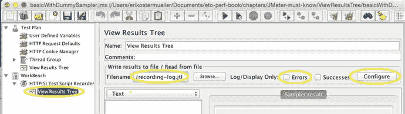

图 7-18.

JMeter 录制模板（文件 ➤ 模板 ➤ 录制 ➤ 创建），用于录制完整的请求/响应以及 HTTP 录制过程的其他详细信息

要捕获 HTTP 录制的详细日志，请执行以下操作：

1.  启动一个新的测试计划用于录制：文件 ➤ 模板 ➤ 录制 ➤ 创建。  
2.  选择工作台（WorkBench）下的“查看结果树”，如图 7-18 所示。  
3.  指定要创建的日志的路径/文件。  
4.  确保“错误”复选框未被勾选。这将确保所有内容都被记录下来。  
5.  单击“配置”按钮，并按照前面图 7-13 所示设置勾选标记。  
6.  按照 JMeter 文档所示开始录制：（ [`http://jmeter.apache.org/usermanual/jmeter_proxy_step_by_step.pdf`](http://jmeter.apache.org/usermanual/jmeter_proxy_step_by_step.pdf) ）。

## 直接对 Java 进行负载测试与调试

曾几何时，我对一个贷款系统的报表部分进行负载测试。当用户请求一个 1K 的小报表时，系统必须从特定的字节偏移量处，从一个定期从后端系统下载的、单个数兆字节的文件中提取数据。该组件在负载下的响应时间慢至 5 秒；服务器端并发度约为五个线程。

不幸的是，系统因数据库维护而停机，因此无法进一步调查环境。我无法访问源代码，于是反编译了源代码（使用 jad.exe）进行查看。代码使用 `java.io.FileInputStream` 的 read() 方法一次一个字节段地读取文件，这种方法无法跳过任何字节或跳转到文件中的特定位置。所以，如果我的 1K 报表位于 10MB 捆绑报表的末尾，代码就必须读取并丢弃 9MB 以上的数据。真是浪费！顺便提一下，这是主要反模式 3——过度处理的一个例子。

因此，我需要测试我的新代码实现，它使用 `java.io.RandomAccessFile` 直接“定位”到指定的偏移量并返回 1K 报表。当我用单个线程连续运行测试 100 次时，新实现更快。但我必须说服我的老板，在五个线程负载下的响应时间会比之前看到的 5 秒更好。

我知道如何启动我的代码的五个独立线程，但我认为从这些独立线程收集结果需要花费太多时间编码，然后我还得用某种方式将数据绘制成图表。因此，我没有自己启动这五个线程，而是让 JMeter 替我完成。

事后看来，我本可以使用 JDK 自带的 `jmh`：

[`http://openjdk.java.net/projects/code-tools/jmh/`](http://openjdk.java.net/projects/code-tools/jmh/)

下面展示了我如何让 JMeter 启动五个线程，全部运行我的 RandomAccessFile 报表代码实现；总共花了大约 15 分钟才全部搞定。最终我得到了 JMeter 图表，比较了两种实现的性能，RandomAccessFile 方法快得多——在五个线程负载、零思考时间下，响应时间约为 100-400 毫秒。

1.  将你想要进行性能测试的代码放入一个新类中，该类实现 [`org.apache.jmeter.protocol.java.sampler.JavaSamplerClient`](https://jmeter.apache.org/api/org/apache/jmeter/protocol/java/sampler/JavaSamplerClient.html) 。继承以下类之一也可能有帮助：`org.apache.jmeter.protocol.java.sampler.AbstractJavaSamplerClient` `org.apache.jmeter.protocol.java.test.JavaTest`  
2.  创建一个新的 jar 文件，其中包含你的类及其依赖的类文件，但无需将文件打包到 JMeter 的包空间中。  
3.  将你的 `.jar` 文件以及任何依赖的第三方 jar 文件添加到 `JMETER_HOME/lib/ext` 文件夹中。  
4.  创建一个新的 JMeter `.jmx` 计划。添加一个线程组并配置五个负载线程。  
5.  作为该线程组的子节点，添加一个新的 Java 请求采样器：[`http://jmeter.apache.org/usermanual/component_reference.html#Java_Request`](http://jmeter.apache.org/usermanual/component_reference.html#Java_Request) 。  
6.  重启 JMeter。  
7.  选择 Java 请求采样器。在“类名”组合框中，选择你在步骤 1 中编写的类名。  
8.  要启用调试，请在启动 jmeter.sh 或 jmeter.cmd 之前添加以下环境变量：`JVM_ARGS=-agentlib:jdwp=transport=dt_socket,server=y,address=8000`  
9.  在 Eclipse 中，启动一个监听端口 8000 的远程调试会话。在你的源代码中设置断点，然后从 JMeter 菜单（运行 ➤ 启动）启动 JMeter 脚本以触发断点。


## JMeter 沙盒

本节及下一节所需的 JMeter .jmx 文件位于 jpt 仓库的以下路径：

```
sampleJMeterScripts/jpt_ch07_sandbox.jmx
```

你是否对掌握负载生成技巧有些犹豫？这很正常——它确实需要下功夫。但幸运的是，学习 JMeter 比其他负载生成工具更容易，因为你可以在自己的小沙盒中测试几乎每个测试元件，而无需受被测系统（SUT）复杂性的干扰。所以，关掉 Wi-Fi（别真关），让我们开始吧：

借助这个小沙盒技术，你可以：

1.  创建带有大量逼真波浪线的图表，甚至可以在同一张图表上展示不同指标（如响应时间和吞吐量）。
2.  处理文本，例如创建一个“输出-输入”脚本变量，这是我在第 4 章关于负载脚本优先级中提到的极其重要的技术。
3.  从 `.csv` 文件中读取数据到 JMeter 脚本变量。
4.  使用“If-then”逻辑控制脚本流程，或者通过逻辑控制器重复执行几个步骤。
5.  ……还有很多很多。

一旦我们完成了沙盒测试列表中的第 1 和第 2 项，你就可以准备好（是的，准备好）将第 3、4、5 项作为家庭作业来玩了。这真的很有趣。沙盒的工作原理如下：关闭你正在处理的任何脚本，添加一个线程组和一个子元件 [`jp@gc - Dummy Sampler`](http://jmeter-plugins.org/wiki/DummySampler/) ( [`https://jmeter-plugins.org/wiki/DummySampler/`](https://jmeter-plugins.org/wiki/DummySampler/) )。具体步骤如下：

1.  右键点击测试计划，选择 添加 ➤ 线程（用户） ➤ 线程组。
2.  配置测试持续时间。
3.  勾选“永远”以让测试无限期运行（运行 ➤ 停止，或按 Ctrl/Cmd+逗号停止测试）。

    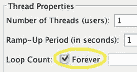

4.  或者取消勾选“永远”，并在旁边的文本框中输入 1，让 Dummy Sampler 只运行一次——用于只运行一次脚本，例如在测试/调试时。
5.  在屏幕左侧的树中，右键点击新添加的线程组，选择 添加 ➤ 取样器 ➤ jp@gc - Dummy Sampler。
6.  选中新添加的 Dummy Sampler，使用快捷键 Ctrl+Shift+C 复制它。
7.  看到我如何在取样器名称后添加 - 01 和 - 02 了吗？JMeter 树位于屏幕左侧。在右侧找到名称输入框（在“注释”文字上方）。你可以在这里添加 - 01 或 - 02 来更改名称。

完成这些操作后，你将看到如图 7-19 所示的界面。

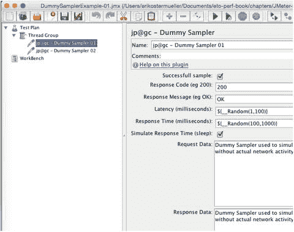

图 7-19.

基础沙盒。这是 JMeter 沙盒游戏环境的基础。注意延迟和响应时间的默认值。这些解析为随机数的变量在测试驱动图表时增添了一些趣味。

## 带单个图表的 JMeter 沙盒

本节所需的 JMeter .jmx 文件与上一节相同：

```
sampleJMeterScripts/jpt_ch07_sandbox.jmx
```

有了沙盒基础，只需添加你想要尝试的几十个测试元件中的一个即可！在图 7-20 中，我添加了 [jp@gc Response Times Over Time](http://jmeter-plugins.org/wiki/ResponseTimesOverTime/) ( [`https://jmeter-plugins.org/wiki/ResponseTimesOverTime/`](https://jmeter-plugins.org/wiki/ResponseTimesOverTime/) ) 并启动了测试（Ctrl+R 或 Cmd+R），瞧，出现了逼真的图表。使用 Ctrl+逗号或 Cmd+逗号停止。

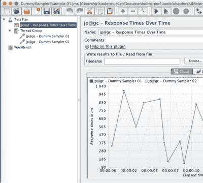

图 7-20.

使用 JMeter 沙盒快速演示图表

## JMeter 沙盒 / 同一图表上的多个指标

本节展示如何将两个或多个指标放在单个 JMeterPlugins 图表上。

要亲自查看效果，请在 jpt 仓库中查找此 .jmx 文件。在 JMeter 中打开它：

```
sampleJMeterScripts/jpt_ch07_multipleMetricsOnOneGraph.jmx
```

当然，进行猜测（有根据的猜测）是性能故障排查的关键部分。但如果猜测无法得到数据支持，我们都需要有足够的胸怀承认错误，并公开否定未经证实的断言。事实上，在第 3 章中，我将指标称为猜测的解毒剂。因此，我认为开发人员需要稍微磨练一下查找、收集和高效呈现性能数据的技能，以便我们能够证实更多的猜测，或者干净利落地放弃它们。

为了观察一个指标对另一个指标的影响，我认为将两个不同的指标放在完全相同的图表上非常重要。在第 6 章关于可扩展性标尺的内容中，我向你们展示了一个例子。还记得我们必须检查需要多少负载线程才能将 SUT CPU 推高到 25% 吗？这两个指标是 CPU 和 JMeter 负载线程数。在这种情况下，负载线程数的增加影响了另外两个指标：CPU 和吞吐量都受到了影响——它们都增加了。

实际上，我最喜欢的四个起始指标是 CPU、响应时间、吞吐量和负载生成器线程数。

为了帮助你快速掌握如何自己显示这样的图表，图 7-21 展示了我仍然使用 jp@gc - Dummy Sampler 沙盒的测试计划，将两个指标放在同一张图表上：jp@gc - Response Times Over Time 和 jp@gc - Transactions per Second。

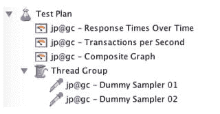

图 7-21.

在同一张图表上获取多条线所需的测试计划

一旦你按照图 7-21 所示将它们添加到负载计划树中，你需要告诉新的 jp@gc - Composite Graph 要显示哪些指标。因此，我选中了 jp@gc - Composite Graph 并点击了“图表”选项卡。哎呀，但那里什么也没有，如图 7-22 所示。

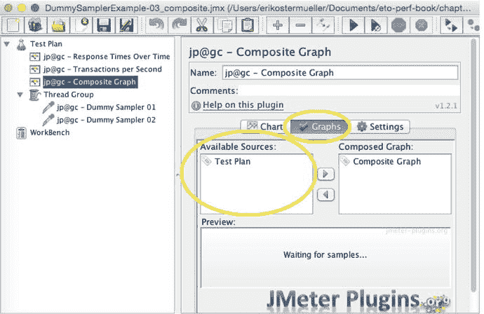

图 7-22.

一个可用性问题：“可用来源”框中未填充我想要在图表中显示的指标。解决方案见图 7-23。

要解决这个小问题，你只需运行测试几秒钟然后停止测试。这将填充“可用来源”框，以便你可以选择想要查看的指标（图 7-23）。

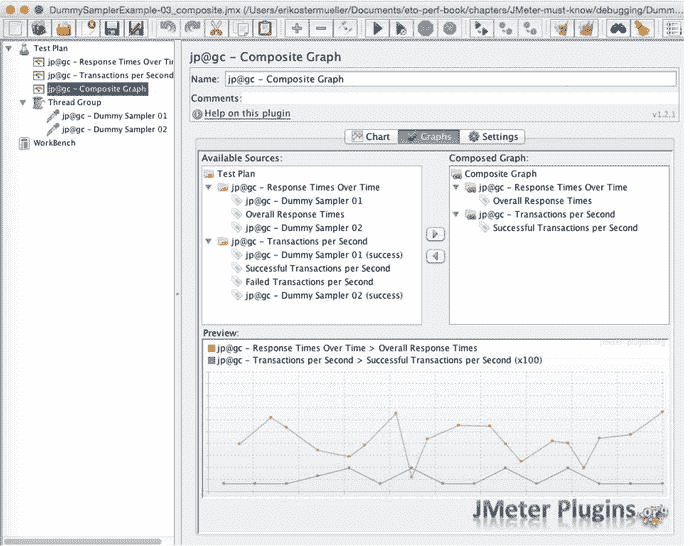

图 7-23.

图 7-22 中问题的解决方案。要让你的指标选择显示在“可用来源”框中，只需运行测试。然后停止测试，并双击“可用来源”中的选择项，将它们移动到“复合图表”部分。

一旦“可用来源”框被填充，你就可以双击想要移动到“复合图表”框中的指标。


## 用于测试关联变量的 JMeter 沙箱

接下来两个示例的 JMeter .jmx 文件位于 jpt 仓库的以下位置：

```
sampleJMeterScripts/ 文件夹中的 jpt_ch07_correlationVariables.jmx
```

在第 4 章中，我展示了许多情况下，负载生成器脚本需要介入并执行一些小的数据移动任务，这些任务在真实环境中是由被测系统的浏览器端 JavaScript 完成的。但在那一章中，我试图以与负载生成器无关的方式来展示所有内容。本节将深入探讨 JMeter 的具体实现方法。

有时，借助正确的被测系统功能，服务器端被测系统生成的唯一 ID 会被记录到你的负载脚本中。添加一个正确的脚本变量（我称之为“输出-输入”变量）将检索到新生成的值，而不是依赖最初记录到脚本中的单个静态值。这样，生成的 ID 就可以在后续请求中以某种方式提交（你需要自行解决这部分），例如作为查询参数或位于 HTTP POST 请求体的某个位置。

但在将这样的生成 ID 存入脚本变量之前，你的 JMeter 脚本首先必须从输出 HTML 流中大量文本中可能可预测的位置，找到那个特定的 ID。

### 探索之旅——第一步，找到数据项

在输出 HTML 中查找数据项的两种流行方法是使用正则表达式或 XPath 表达式。选择你觉得最舒服的方式，但这里提供一个正则表达式的示例。

第一步就是完善正则表达式，以便在 XML 或 HTML 中找到你的数据项。

使用 JMeter 沙箱方法，首先创建一个如图 7-24 所示的小型沙箱测试计划。目标是简单地将你期望被测系统返回的 HTML 嵌入到 Dummy Sampler 中，然后使用 JMeter 尝试各种正则表达式，以确定能够正确识别数据的那个表达式。

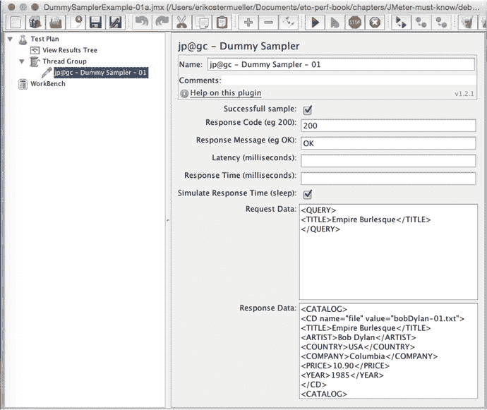

图 7-24.

一个简单的 JMeter 沙箱计划，它返回一些硬编码的 XML（以 <CATALOG> 开头），其中包含要放入输出-输入变量的文本。

我们的目标是：找到能够定位以下文本的正则表达式：

| `bobDylan-01.txt` 是我们想要放入输出-输入脚本变量的值。 | `<CD name="file" value="bobDylan-01.txt">` |
| 用于识别 `bobDylan-01.txt` 的正则表达式 | `name="file" value="(.+?)">` |

在运行此测试之前，

1.  确保线程组配置为只执行 Dummy Sampler 一次（提示——确保“永远”复选框未被选中）；你不需要 5235 次执行来调试这个——你只需要一次。
2.  在“查看结果树”（图 7-25）中，确保“错误”和“成功”复选框未被选中。（在此处了解更多关于这些复选框的信息：[`http://jmeter.apache.org/usermanual/component_reference.html#View_Results_Tree`](http://jmeter.apache.org/usermanual/component_reference.html#View_Results_Tree) 。）这将确保没有任何结果被隐藏或过滤掉。

    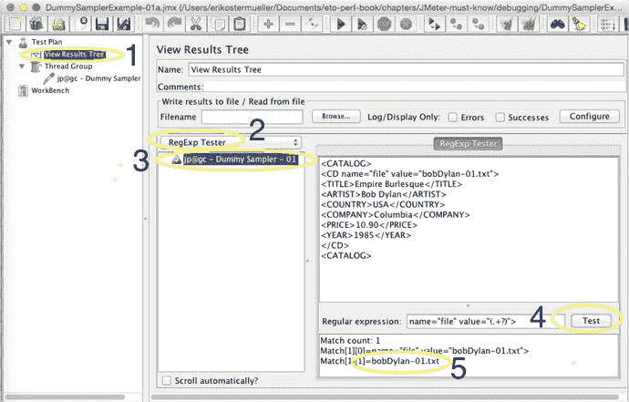

    图 7-25.

    JMeter [查看结果树](http://jmeter.apache.org/usermanual/component_reference.html#View_Results_Tree)（[`http://jmeter.apache.org/usermanual/component_reference.html#View_Results_Tree`](http://jmeter.apache.org/usermanual/component_reference.html#View_Results_Tree)）——使用它来测试你的正则表达式是否有效。

只运行一次测试（运行 ➤ 启动 或 Cmd/Ctrl+R）。下面每个带编号的要点对应图 7-25 中的编号。

1.  点击“查看结果树”以查看单次 Dummy Sampler 执行的结果。
2.  将组合框从默认的“文本”更改为“RegExp 测试器”。这基本上重新配置了用户界面，以便我们可以针对正则表达式测试硬编码的 XML 结果。
3.  你看到 `jp@gc - Dummy Sampler - 01` 旁边带有对勾的绿色三角形了吗？选择它——这是 Dummy Sampler 单次运行的结果。
4.  最后，我们开始干正事。输入你想要测试的正则表达式的值，然后点击“测试”按钮。
5.  这表明我们的正则表达式有效，因为它从 XML 的其余部分中分离出了 `bobDylan-01.txt`。

### 探索之旅——第二步

现在是时候将你完善好的 XPath 或正则表达式放入适当位置了。右键点击 `jp@gc - Dummy Sampler`（或者实际产生你正在搜索的 HTML 或 XML 响应的 HTTP 请求）。选择 添加 ➤ 后置处理器 ➤ 正则表达式提取器（或 XPath 提取器）。你正在使用的提取器的 JMeter 文档也会告诉你如何指定用于存储提取出的值的 JMeter 脚本变量名称。你的 JMeter 测试计划应该如图 7-26 所示。

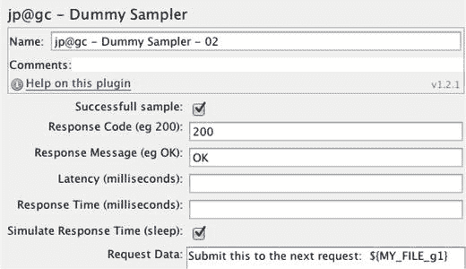

图 7-30.

此图底部的“请求数据”字段模拟了 HTTP 请求的 POST 数据。`${MY_FILE_g1}` 变量是一个被传回被测系统的关联变量。

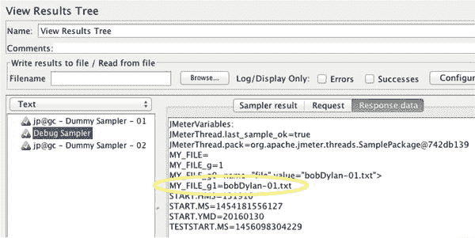

图 7-29.

此“查看结果树”输出显示了 Debug Sampler 如何转储所有 JMeter 变量的值以用于调试目的。

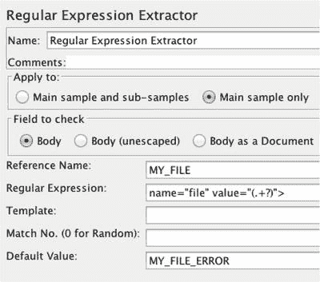

图 7-28.

JMeter 正则表达式提取器。“正则表达式”字段用于在 HTTP 响应中搜索用于关联变量的文本字符串。

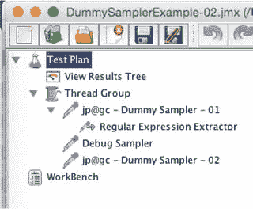

图 7-27.

JMeter Debug Sampler 和 `jp@gc—Dummy Samplers` 的名称非常相似。Debug Sampler 作为一个简单的请求，用于在“查看结果树”中显示所有 JMeter 变量，如图 7-29 所示。


图 7-26.

在沙箱中创建 JMeter 关联变量时，负载计划树应如下所示

当此操作运行时，JMeter 将尝试查找你正在寻找的值。然后它会将该值放入一个脚本变量中。要查看 JMeter 是否按预期完成了此操作，你需要添加一个 Debug Sampler，如图 7-27 所示。实际的调试信息将显示在图 7-27 顶部的“查看结果树”中。

图 7-28 展示了如何精确指定你想从 HTTP 响应中找到的内容。选择一个默认值很有帮助，该值可以指示何时可能出了问题。

要查找调试信息以排查关联变量的问题，请点击测试计划（屏幕左侧）上的“查看结果树”，然后选择 Debug Sampler，如图 7-29 所示。

最后，是时候使用从前一个采样器的响应中提取出的变量了。请注意图 7-30 中变量名（`MY_FILE_g1`）是如何用花括号包裹的。使用“美元花括号”语法来对变量进行求值。


## 前置条件

在结束本章之前，我将列出一份你应该掌握的事项清单：

*   录制 JMeter 负载脚本。录制过程中，将每一个字节都保存到日志文件中，以备将来参考。
*   将登录脚本标记为“仅运行一次”。
*   以无头模式运行 JMeter。
*   调试 JMeter 负载脚本。
*   配置负载脚本以使用 `.csv` 数据文件中的数据。该文件应包含要登录的用户列表、要查询的账户和客户列表。
*   创建断言以验证某些操作确实发生了，即你的被测系统（SUT）确实在正常工作。
*   使用关联变量，捕获一个请求的输出并将其提交给另一个请求的输入。
*   创建负载递增和递减的负载计划。
*   创建一个根据生产环境中业务流程百分比来分配负载的负载计划。
*   创建并使用 JMeter 变量，或许可以从命令行读取变量。

负载生成特性：

*   使用多种网络协议：HTTP/S、JMS、Sockets、JDBC。
*   以无头模式运行；也可以在与 SUT 相同的机器上运行。
*   使用 JMeter 便捷的复制/粘贴功能。

图表特性：

*   复合图表
*   CPU/资源消耗
*   JMX
*   Grafana/InfluxDB 集成

必须了解：

*   避免过多的日志记录。
*   `.jtl` 文件
    *   读取
    *   写入
    *   输出文件数量？1、2 或 3 个
    *   合并
    *   清除 UI 结果不会清除数据文件。
*   使用 JDBC 取样器创建数据。
*   使用“查看结果树”保存初始录制内容。
*   管理颜色。
*   Maven、ANT、Jenkins 集成。
*   线程组：分离取样器（SOA）或组合取样器（Web）。
*   调试技巧：
    *   在将测试计划连接到真实的 HTTP 系统之前，使用虚拟取样器指定示例 HTML 响应。BSF 后置处理器：`var myVariable = vars.get("MY_VARIABLE");` `OUT.println('MY_VARIABLE 的值是 [' + myVariable + ']' )`
*   断言。配置断言，当出现错误文本时触发警告。
*   监听器应放置的位置。

## 别忘了

本章介绍了 JMeter 的一些功能，这些功能很少（如果有的话）被记录在案，以及其他虽有文档记录但仍给许多我教过的技术人员带来麻烦的功能。

别忘了，如果你无法弄清楚如何让某个 JMeter 功能正常工作，可以创建一个小的“Hello World”沙盒式 `.jmx` 脚本来试验该功能。将一段 HTML（或 json、XML 等）代码片段复制粘贴到虚拟取样器中，以便你的测试计划可以对其进行操作。几乎每一个 JMeter 测试元素都可以这样测试。你可以试验日志记录、负载计划、关联变量、JMeter 断言、复合图表（同一图表上的多个指标），应有尽有。

## 下一步

下一章将概述本书附带的两个示例应用程序。这些应用程序重现了“一次编写，到处运行”（WORA）的性能缺陷，这些缺陷在大型和小型环境中均可检测到。这些示例将为你提供动手经验，让你在可用的情况下连接“即插即用”的性能和可观测性工具，帮助你快速发现并修复性能缺陷。

脚注 1

[`http://jmeter-plugins.org/wiki/Contributors/`](http://jmeter-plugins.org/wiki/Contributors/)

  2

[`http://jmeter.apache.org/usermanual/get-started.html#template`](http://jmeter.apache.org/usermanual/get-started.html#template)

  3

我本人从未在 ESL 课堂上垫底，但在堪萨斯大学攻读计算机学位之前，我确实在俄语课程中不及格。

