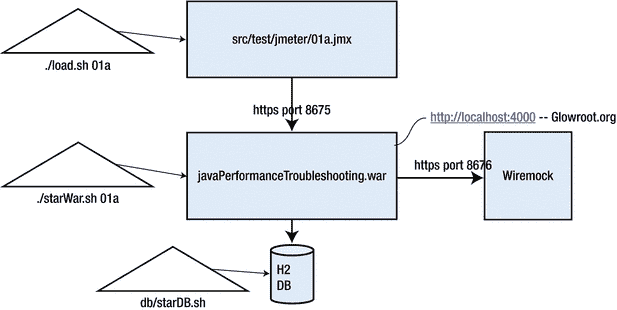
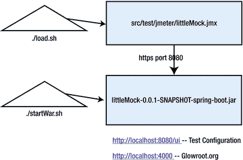
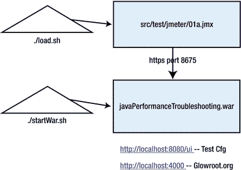

# 8. P.A.t.h. 检查清单简介

在引言中，我曾问过你能否在短短 30 分钟内接近性能问题的根本原因。这大约就是捕获和审查 P.A.t.h. 检查清单中四项数据所需的时间。

但在深入探讨检查清单的技术细节之前，本章将快速回顾前几章的内容。然后，它将描述在故障排除时如何使用检查清单，最后简要介绍两组代码示例。

本章的目标是：

*   理解使用 P.A.t.h. 检查清单识别和修复性能问题的基本原则。
*   理解如何运行 javaPerformanceTroubleshooting 和 littleMock 代码示例。
*   理解 javaPerformanceTroubleshooting 和 littleMock 代码示例的架构。

P.A.t.h. 检查清单中的前两项，即数据库持久化（P）和与其他（外部=A）系统的网络连接，是历史上常见的导致性能问题的集成点。JDBC 是持久化工作的重点，但这些概念几乎适用于任何数据库。最后两项，t. 和 h.，则检查执行代码的线程（t）和内存消耗（h.，即堆），以及其内存回收过程——垃圾回收器。因此，P.A.t.h. 检查清单更深入地审视了几个关键集成点的性能健康状况，以及支撑所有处理的线程和内存管理。是的，本书的重点是最常见的问题，但所使用的工具集能够发现几乎任何问题。

对于真实世界的系统，你需要查看 P.A.t.h. 检查清单中所有四项的数据。你需要判断哪一项看起来最不健康，然后专注于调优该部分。但在接下来的四个 P.A.t.h. 章节中，我会直接告诉你哪个检查清单项（提示：看章节标题）是导致拖累性能的主要单一性能问题，从而让你更轻松。


## 快速回顾

前三章为性能调优的预期奠定了基础。

*   第 1 章：我提前介绍了主要的性能反模式，以便你在排查性能缺陷时对需要关注的内容有个大致概念。从第一个反模式开始，判断它是否与你遇到的问题相符。如果匹配，通常可以就此打住；否则，请依次检查第二、第三和第四个反模式。
    1.  **不必要的初始化**：主要发生在请求的主（较大）处理事件之前和期间的小型处理挑战，通常涉及少量 I/O 但会重复多次。
    2.  **策略/算法低效**：配置不当或选择不佳的算法或编码策略导致了性能问题。策略是贯穿整个代码库使用的技术，而算法是用于实现单个组件的方案。
    3.  **过度处理**：系统正在执行不必要的工作。移除这些工作能带来可衡量的性能提升。一个例子是检索了过多数据，其中大部分数据被丢弃。另一个例子是在负载测试中包含了错误的、资源消耗大的用例——该用例在生产环境中很少使用。
    4.  **大型处理挑战**：尝试处理并征服海量数据。很少有应用真正有这种需求，但确实存在。其他例子包括查询 40 亿行数据、在慢速网络上重复传输 10MB 数据等。
*   第 2 章：适度的调优环境：本章展示了大多数性能缺陷如何在大型和小型环境中都能被发现。它介绍了一些在较小环境中非常有用的技术（如存根服务器、按 PID 绘制 CPU 图表），在这些环境中调优效率尤其高，一天内可完成多达 10 个修复-测试周期。
*   第 3 章关于指标，它就像一件救生衣，防止你在决定使用哪些性能指标时陷入一片混乱的海洋中：
    *   **负载生成器指标**，在很大程度上，用于评估性能要求是否已满足。吞吐量足够吗？响应时间够快吗？
    *   **资源消耗指标**显示硬件、CPU 或 RAM 何时耗尽，这意味着你需要更多硬件，或者需要调优系统以减少消耗。
    *   最后，**“责任指标”**指向被测系统（SUT）中导致速度变慢或 CPU 高消耗的组件；这正是我们接下来要处理的部分。接下来四章中的 P.A.t.h. 检查清单提供了这些“责任”指标。

但在你能重现并解决性能故障排除问题之前，你必须首先掌握负载生成的基础知识，正如我在负载生成章节第 4 章、第 5 章、第 6 章和第 7 章中详述的那样。在进入将责任归咎于缓慢或有问题的 SUT 组件的部分之前，让我们通过一个快速概览将这些基础知识牢牢印在你的脑海中。

*   第 4 章关于负载脚本优先级，讨论了如何录制和增强负载脚本以产生真实的负载。别忘了我们如何将各种脚本增强分解为**第一优先级**和**第二优先级**。第一优先级的脚本增强足以对 SUT 的基本架构施加压力，修复单个性能缺陷可以改善整个架构中许多业务流程的性能。第二优先级的脚本增强旨在为单个业务流程增加“系统真实性”的触感。修复这类缺陷可能至关重要，但其影响仅限于单个业务流程。
*   第 5 章关于无效负载测试，详细说明了一些（屡见不鲜的）情况，这些情况使得给定的负载测试与生产环境如此不同，以至于结果应该被丢弃。这是你从我和其他人犯过的众多错误中学习的机会。不要通过广域网生成负载。在调优前提高资源上限，在部署到生产环境前降低它们。再三检查负载脚本中的业务流程（和数据）是否与生产环境中使用的基本匹配。增强你的负载脚本，确保没有错误并且返回了正确的数据。警惕地使用 Brendan Gregg 的 USE 方法：[`http://www.brendangregg.com/usemethod.html`](http://www.brendangregg.com/usemethod.html) 来持续监控资源消耗。不要浪费时间调优边缘情况。
*   第 6 章关于可扩展性标尺，提供了日常运行哪些测试以及施加多少负载的明确指令。医生会通过扭动你扭伤的脚踝并逐渐增加压力，直到你表现出疼痛迹象来评估其健康状况。同样，可扩展性标尺负载测试指导你增加负载，直到 SUT 从负载生成器指标中显示出“性能不佳”的迹象。还记得那干净、整齐的吞吐量阶梯吗？你首先将 SUT（及其性能问题）置于显微镜下。通过使用可扩展性标尺负载测试重现性能问题来实现这一点。你还记得这是如何工作的吗？你运行一个包含四个负载步骤的增量负载测试，第一步将应用服务器 CPU 推高到 25%。然后观察在四个步骤中的哪一步，整齐的吞吐量阶梯会瓦解成锯齿状、跳跃的混乱状态——这样你就重现了问题。
*   第 7 章展示了在通过线路发送实时 HTTP 请求之前，如何在小型沙盒环境中测试 JMeter 中的任何内容。它展示了负载测试的高级树形结构，以及如何捕获和显示来自 SUT 的额外指标，如 CPU 消耗。校准可扩展性标尺测试变得容易得多，因为我们在单个 JMeter 图表上就能精确看到需要多少个线程才能将应用服务器 CPU 推高到 25%。


## 运用 P.A.t.h. 检查清单

在完成了这些略显枯燥的基础工作之后，舞台已经准备就绪，让我们敲响开场鼓。接下来的四个章节将最终展示如何识别、定位并最终修复 SUT 中导致性能问题的特定组件。

为了给自己留出时间，通过这四种不同的“透镜”来审视问题，你需要手动重新配置你的负载计划：从原先的增量负载四步骤，改为在“干净、方正的吞吐量阶梯”消失后的第一个层级上，进行单次稳态测试。或许可以将测试时长设置为 20-30 分钟，同时要知道，一旦这些性能透镜显示出可操作的情报，你就会立即停止测试。

例如，假设你的“可扩展性标尺”测试在每个负载级别都使用两个线程运行，并且每个级别持续 2 分钟。如果你在约 25% CPU（两个线程）和 50% CPU（四个线程）时得到了干净、棱角分明的阶梯，但之后没有出现棱角分明的跃升，那么用于“复现 Bug”的稳态测试就需要在六个线程下运行整个时长（20-30 分钟）。

当存在性能问题的负载测试以稳态运行时，你将使用检查清单中的四个项目来审视 SUT。你所遇到的问题（或问题们）将会在一个或多个透镜中显现出来。那么，通过透镜观察意味着什么呢？

正如你将在接下来的章节中看到的，四个检查清单项目中的每一个都有其自己的一套监控和追踪工具（免费可用），我将描述如何捕获和解释来自每个工具的数据，并为每个检查清单项目给出“有问题”或“无问题”的评估。目标当然是定位问题。找出系统中导致性能问题的特定组件，然后构思出一个修复方案。

正如后续章节将向你展示的，四个检查清单项目会指出一些问题。你需要主观地选择其中一个问题作为首要攻击目标——选择那个能带来最大性价比的问题。换句话说，你通常希望攻击那个能以最小努力带来最大性能提升的缺陷，这可能是一个代码变更、配置变更、数据变更，甚至是负载脚本变更。

以下是 P.A.t.h. 检查清单中的四个项目：

*   P    Persistence（持久化）：慢速的 JDBC 调用以及过度调用某个 SQL。
*   A    Alien systems（外部系统）：对主 JVM 外部系统的网络调用。
*   t    Threads（线程）：CPU 过度消耗和线程阻塞。
*   h    Heap（堆）：垃圾回收效率低下和内存泄漏。

但这四个特定领域有什么特别之处呢？首先，这只是对当今最常见的服务端性能问题位置进行分类的一种便捷方式，同时也是为了将这些位置与其各自的可观测性工具配对。但更实际地说，P 代表持久化，即数据库，并且业界广泛认为数据库的性能问题比其他任何领域都多。我们将重点讨论 JDBC 系统，但 P 章节中关于 JDBC 性能的相同问题也同样适用于 NoSQL 数据库；所有这些都将在第 9 章中介绍。我创造了“Alien systems”（外部系统）这个术语——它有点像是一个占位符，用于指代我们的 JVM 通过网络通信的任何系统所出现的性能问题。这将在第 10 章中讨论。

所以，P 和 A 是我们集成的系统。而 t 和 h 则不同。我们的每一行 Java 代码都是由操作系统线程执行的，因此 t（Threads，线程）用于探索线程效率。是否存在阻塞的线程？（稍后会详细介绍。）是否存在不必要地消耗大量 CPU 的小型处理挑战？最后，PATH 中的 h 代表堆（Heap）的健康状况。糟糕的垃圾回收效率会严重影响性能和稳定性。我一直犹豫是否要涉足理解 GC 算法这片复杂的水域。除此之外，h 章节会特意展示，要改善性能，你对 GC 的了解竟然可以少得惊人。t 和 h 将分别在第 11 章和第 12 章中讨论。

我之前提到过，P.A.t.h. 中的 P 和 A 用大写字母拼写出来，是因为它们很特殊：大多数情况下，你只需通过单个用户的流量就能检测到这些领域的问题。之所以如此，其中一个原因是，对一个大型、无索引的表执行一次孤立的查询通常会很慢，比如慢于 1 秒。同样地，执行 100 个 SQL/NoSQL 请求，无论用户数量多少（哪怕只有一个），也可能会很慢（超过 1 秒）。

由于不需要负载，并且捕获 P 和 A 活动的单次样本更容易，你就能获得巨大的好处：无需负载脚本（例如 JMeter 脚本）和负载环境，就能检测并修复性能问题——任何环境对于 P 和 A 来说都足够了。对一个大型表进行无索引查询就是一个很好的例子，降低响应时间将带来更高的吞吐量。

不幸的是，同样的方法对 P.A.t.h. 中的 t 和 h 并不适用。为什么？因为需要不止一个线程才能导致与 `synchronized` 关键字相关的性能问题。同样，需要大量的流量才能加剧内存泄漏或配置不当的垃圾回收（Garbage Collection）问题。

当你运行“可扩展性标尺”测试来复现性能问题时，检查清单中的四个项目会告诉你哪些组件是性能问题的罪魁祸首。当然，在运行单个测试时，你可能会在多个检查清单项目中发现多个问题。如果是这样，你将需要对这些问题进行优先级排序，并决定首先修复哪一个。

在这个优先级排序过程中，你将需要做出类似这样的决定：“我们应该先调优哪个？是系统中耗时 1.5 秒的最慢查询，还是 XML 处理中反复出现的 BLOCKED 线程？”

记住 P.A.t.h. 这个缩写词：持久化（Persistence）、外部系统（Alien systems）、线程（Threads）和堆（Heap）。我在关于负载脚本优先级的章节中首次提到过这一点，但请记住，前两个检查清单项目——持久化和外部系统——无需生成负载就能凸显出许多调优机会；换句话说，当单个用户遍历系统时即可发现。如果你的性能环境尚未搭建，或者你的负载脚本尚未创建，你仍然可以开始着手改善性能。


## 运行示例

由于性能问题可能以多种方式出现，P.A.t.h 系统将问题分解为四个更易于理解的类别。其组织方式有助于把握这个庞大的性能问题领域。本书附带的大多数在线示例仅突出四个领域之一中的一个性能问题。一次只关注一个问题的简单性，对于集中精力解决那些经常未被发现的性能问题以及用于检测这些问题的工具非常有帮助。

本书附带两个不同的 github.com 项目。第一个我将其称为 jpt，代表 Java 性能故障排除。它附带大约 12 对示例。在每一对中，其中一个存在性能问题，而另一个则没有——我已经为您修复了它。这两个测试分别标记为 a 测试和 b 测试。第 2 章的表 2-1 列出了全部 12 对测试。

然而，我为您修复这些问题，并且一次只训练您关注一个问题——这有点不切实际。更不切实际的是，我提前告诉您问题是 P、A、t 还是 h 问题。如果我告诉您某个特定测试是 P 问题，那么您就知道要连接我为类似 P 问题规定的监控/可观测性工具。这非常直接，但不现实。在现实世界中，问题通常一开始只是表现为糟糕/缓慢，而发现问题潜伏在四个领域中的哪一个，是您的责任。

这意味着您通常必须使用 P.A.t.h. 清单中所有四个项目的工具来全面了解情况，我试图在测试 09a 中模拟这种情况。这是一个许多问题混合在一起的示例。没有测试 09b。

## Java 性能故障排除 (jpt) 示例应用

有一些小型脚本用于启动应用程序的各个部分。按照惯例，每当我提到以 .sh 结尾的 Bash 脚本时，您都会找到相应的以 .cmd 结尾的 MS-Windows 脚本（位于同一文件夹中）。

图 8-1 展示了 jpt 应用程序的粗略架构。



图 8-1.

jpt 示例的架构。三角形表示必须从三个独立的终端窗口启动的三个脚本。前两个脚本之后的参数表明这是测试 01a。

下载和说明可在此处获取：

[`https://github.com/eostermueller/javaPerformanceTroubleshooting`](https://github.com/eostermueller/javaPerformanceTroubleshooting)

下面包含了安装和运行示例的概述。如果您遇到任何问题，请务必查阅文档的在线版本。

表 8-1 显示运行一个 jpt 测试需要三个脚本。在运行任何测试之前，必须先执行 init.sh 脚本。它会创建一个 H2 数据库并用超过 200 万行数据填充它。在我的 2012 款 MacBook 上，init.sh 脚本需要运行 10 到 15 分钟。您可以重新运行 init.sh 脚本，它将从头开始重新创建数据库。

表 8-1.

运行每个 Jpt 示例需要三个终端窗口（也称为命令提示符）。

| 1 | `# cd db` `# db/startDb.sh` | 启动 H2 数据库 |
| 2 | `# ./startWar.sh 01a` | 启动 Web 应用程序。注意 01a 参数用于运行测试 01a 的 Web 服务器配置。请注意，上面描述的 glowroot 和 wiremock 都随此脚本启动。 |
| 3 | `# ./load.sh` `01a` | 从命令行启动 JMeter。注意 01a 参数用于运行负载测试 01a。 |

此表显示了运行示例 01a 所需的命令。必须按指定顺序启动这些命令。应使用 Ctrl+C 停止每个命令。在运行这些命令之前，init.sh 脚本必须仅运行一次。

以下是启动测试的一些注意事项。

请注意，在运行 `.startWar.sh` 之后，您应该等待看到此 `startWar.sh` 消息后再启动 `./load.sh`：

```
Started PerformanceSandboxApp in 11.692 seconds (JVM running for 19.683)
```

要停止运行一个测试并开始运行另一个不同的测试，请使用 Ctrl+C 停止 `./startWar.sh` 和 `load.sh` 脚本。然后使用所需的测试 ID 重新启动相同的脚本。`startDb.sh` 脚本可以根据需要保持运行状态。

您将使用表 8-2 中的端口号来帮助您在 jpt 示例中进行性能故障排除。

表 8-2.

jpt 示例使用的 TCP 端口

| 描述 | 值 |
| --- | --- |
| 使用 JMeter，在此 TCP 端口上应用 HTTPS 负载 | 8675 |
| `javaPerformanceTroubleshooting.war` 在 [Spring Boot](https://projects.spring.io/spring-boot/) ( [`https://projects.spring.io/spring-boot/`](https://projects.spring.io/spring-boot/) ) 下运行。它通过 HTTP 连接到监听此 TCP 端口的后端系统。 | 8676 |
| [glowroot](http://glowroot.org/) ( [`https://glowroot.org/`](https://glowroot.org/) `)` 监控 | `http://localhost:4000` |
| [h2](http://h2database.com/) ( [`http://h2database.com/html/main.html`](http://h2database.com/html/main.html) ) TCP 服务器 | `tcp://localhost:9092`（仅限本地连接） |
| [h2](http://h2database.com/) PGServer | `pg://localhost:5435`（仅限本地连接） |
| [h2](http://h2database.com/) Web/控制台服务器。您可以在此网页上执行临时 SQL 查询。 | `http://localhost:8082`（仅限本地连接）。没有用户名和密码。 |


## littleMock 示例应用

对于上述 jpt github.com 项目，要决定运行哪种测试，你需要将测试 ID（如 01a、01b、02a、02b 等）同时传入 `startWar.sh` 和 `load.sh` 脚本。如果传入不同的测试 ID，你会根据第 2 章的表 2-1 获得不同的行为。

littleMock github.com 项目则有所不同。启动脚本没有用于确定配置的参数。相反，配置是通过一个可通过 `http://localhost:8080/ui` 访问的小型网页完成的。如果你想制造一点小麻烦，littleMock 的网页正合你意。你是否想通过大量 RAM 分配来撑爆堆内存，仅仅为了观察 GC 响应时间变差？或者，你也许想通过无意义的循环进行（几乎）无休止的迭代？使用 littleMock，你甚至可以用极其缓慢（但非常常用）的 XPath 和 XSLT 惯用法让系统陷入停滞。littleMock 网页将控制权交到你手中。

只需点击几个按钮，性能变化就会立即生效。如果你愿意，也可以关闭该变化。不，别这么做。相反，通过使用“性能密钥”（Performance Key）——一个可以同时应用的多个配置的逗号分隔列表——同时配置半打噩梦场景，来制造一场完美的风暴。雅典娜和阿瑞斯，小心了。

只需输入一个如图 8-2 所示的性能密钥，然后点击“更新”。后续章节将提供各种性能密钥，以便你学习如何排查特定的性能问题。或者，你也可以点击密钥下方的单个设置（未显示）来查看它们对性能的影响。你所做的每一项单独更改都会立即反映在性能密钥中，反之亦然。



图 8-2.

littleMock 的网页和逗号分隔的性能密钥，使您能够一次性拨入多个性能设置。单个设置（逗号之间的部分）将在页面密钥下方进一步描述。

littleMock 网页允许您进行即时调优更改，其影响可以立即在 glowroot 监控中看到，该监控可通过 `http://localhost:4000` 访问，就像在 jpt 中一样。图 8-3 展示了其架构。



图 8-3.

littleMock 应用的架构。请注意，`load.sh` 和 `startWar.sh` 不接受任何参数。要更改 littleMock 的性能，请使用小型 UI 网页：`http:/localhost:8080/ui`

## 别忘了

在自己的机器上运行 jpt 和 littleMock 应用将提供仅靠阅读无法获得的动手实践经验，因此我鼓励你现在就下载这些应用。以下是网址，再列一次：

[`https://github.com/eostermueller/javaPerformanceTroubleshooting`](https://github.com/eostermueller/javaPerformanceTroubleshooting)

[`https://github.com/eostermueller/littleMock`](https://github.com/eostermueller/littleMock)

一旦这些示例启动并运行，你将能够演示那些在小型和大型环境中均可复现的“一次编写，随处运行”的性能缺陷。

## 下一步

在使用 jpt 项目运行 `init.sh` 脚本后，你的机器上将拥有一个包含超过 200 万行数据的数据库——而创建所有这些数据只需 10-15 分钟。下一章关于“P”代表持久化（Persistence），将帮助你诊断单个查询的常见问题，同时也会展示如何检测作为单个服务端请求一部分执行的多个查询的低效策略。

