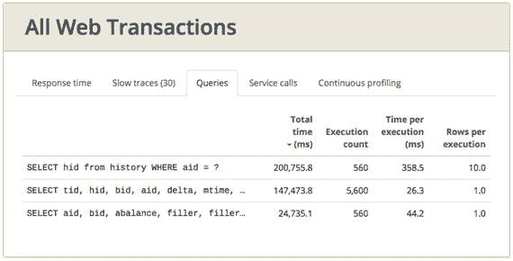
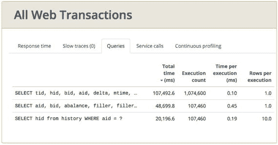
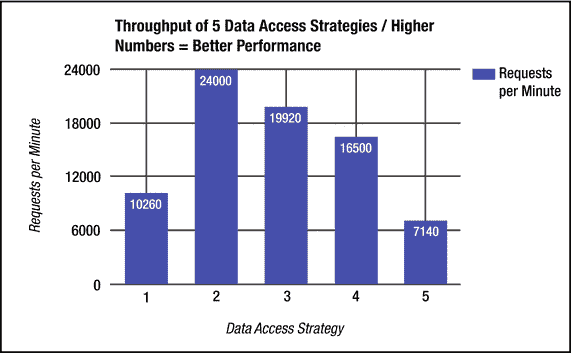
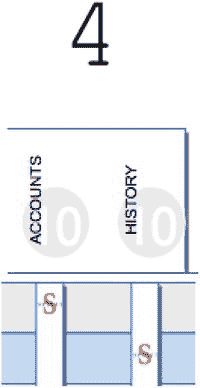
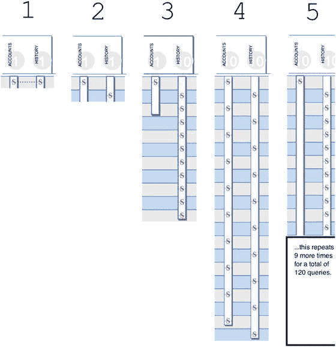
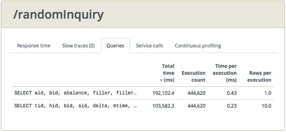
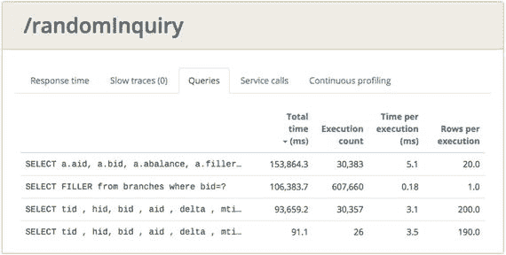
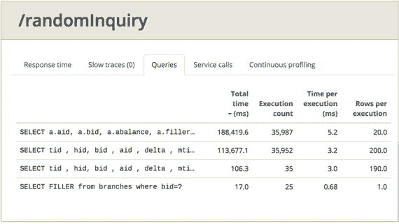

# 9. 持久化，P.A.t.h. 中的“P”

本章涵盖 P.A.t.h. 检查清单中的第一项，即代表持久化的“P”，并展示如何评估性能健康状况以及如何解读结果数据以改进系统性能。

本章的目标是：

*   了解 Java 服务端软件中最大的性能问题以及导致该问题的两种最常见的反模式。
*   学习如何诊断由以下原因引起的应用性能问题：
    *   单个 JDBC SQL 查询
    *   多个 JDBC SQL 查询，无论单个查询运行得多快
*   了解小型开发数据库如何导致虚假的性能安全感。

我相信众多性能专家广泛认同，“数据库调用过多”是 Java 服务端软件中最严重的性能缺陷，但我们仍然看到存在此问题的系统，而且修复该问题（重构所有 SQL）的成本几乎高得令人望而却步。

为了巩固这一观点，我持续更新以下博客文章，其中包含了关于此问题的各种观点：

[`http://ostermueller.blogspot.com/2014/11/the-worst-server-side-performance.html`](http://ostermueller.blogspot.com/2014/11/the-worst-server-side-performance.html)

本章展示了如何在运行中的系统（一个可以在你自己机器上运行的系统）中检测“数据库调用过多”的问题。它还展示了如何仅通过查看源代码，寻找几种不同的性能反模式来发现问题。最后，它量化了通过修复问题所能获得的巨大性能提升。

前一章描述了本书附带的两个可在自己机器上运行的性能示例集。littleMock 示例不使用数据库，因此本章的示例来自另一套——jpt——它附带了一个 H2 数据库（h2database.com）。jpt 的 `init.sh/init.cmd` 脚本用超过 200 万行数据填充数据库，以便更真实地审视这些问题。


## 测试 05：单条 SQL 的性能问题

从 Glowroot 捕获的测试结果：

*   测试 05a：每分钟 3,500 个请求；响应时间 50 毫秒。
*   测试 05b：每分钟 14 个请求；响应时间 13,500 毫秒

你需要关注的指标：

*   所有已执行 SQL 语句的响应时间和吞吐量
*   提供这些数据的几个工具：Glowroot、JavaMelody、JDBC Performance Logger

测试 05b 的响应时间超过 13 秒，速度极其缓慢，吞吐量也非常低。事实上，其吞吐量比 05a 低 250 倍，但原因何在？

在现实世界中，你还需要检查其他 P.A.t.h. 项目是否存在问题，但由于本章是关于持久化的，让我们直接深入 SQL 指标，看看是什么导致了这 13.5 秒的响应时间。首要任务是找出响应时间最慢的查询，尤其是那些执行频率很高的查询。然后，我们将看看是否可以进行一些明显的改进。

图 9-1 展示了一个性能远比其他两个查询慢的查询：



图 9-1.

对于测试 05a，由 glowroot.org 提供的所有 SQL 的吞吐量和响应时间。最上面一行最慢的查询（平均 358.5 毫秒）恰好也是总耗时最多的那个。

```
SELECT hid from history WHERE aid = ?
```

因为我们正试图解决 13.5 秒的响应时间问题，并且这个查询的响应时间（平均 358.5 毫秒，见下方最上面一行）比其他两个查询慢 10 倍以上，所以值得花些时间进一步调查这个查询。即使只是慢几倍，也值得调查。

在这个查询中，没有与其他表的 JOIN 操作，选择的字段列表非常短（只有 Hid 列），并且 `WHERE aid = ?` 的条件也很简单。整个查询非常基础。事实上，其他查询也同样基础，原因也类似。那么，为什么这些“基础”查询的性能差异如此之大呢？

在许多开发团队中，SQL 调优主要落在（希望是）能力足够的 DBA 肩上，这没问题。但即便如此，即使开发人员对单个查询的性能几乎不负责或完全没有责任，我认为开发人员至少需要对如何让基础查询（包括本例中的基础查询）良好运行有一些基本的理解。更具体地说，开发人员需要：

*   在对 SQL 进行任何更改时通知 DBA，以便 DBA 可以全面审查其性能，特别是评估是否需要添加、更改或删除索引以使查询良好运行。
*   知道如何判断一条 SQL 语句是否使用了索引。这可以通过向数据库请求查询的“执行计划”来完成。如果计划显示“表扫描”，那么很可能你的查询没有使用正确的索引，并且会出现性能问题。

当然，还有其他问题可能导致性能问题，但所有开发人员都应该了解这些基础知识。正如你可能已经猜到的，测试 05b 之所以如此缓慢，是因为 Glowroot 识别出的那个慢查询正在查询 HISTORY 表中一个没有索引的列。哎呀。测试 05a（图 9-2）修复了这个问题。该测试使用了同一数据库的另一个版本，其中包含了正确的索引。查询响应时间从没有索引时的 358.5 毫秒得到了改善。



图 9-2.

现在所有数据库索引都已就位，所有查询的响应时间都快于 1 毫秒。

此博客页面展示了排查和修复因缺少 H2 数据库索引而导致性能问题的所有必要步骤：

[`http://ostermueller.blogspot.com/2017/05/is-my-h2-query-slow-because-of-missing.html`](http://ostermueller.blogspot.com/2017/05/is-my-h2-query-slow-because-of-missing.html)

对于其他数据库，检索和分析执行计划的过程类似，但你需要向 DBA 或数据库文档寻求具体细节的帮助。是 DBA 负责检测问题，还是 DBA 依赖开发人员设定调优优先级？这些都是需要决定的重要事项，而像 glowroot.org 提供的良好 JDBC 性能数据对于为 DBA 设定优先级非常有帮助。

查询响应时间实际上由两部分组成，我们在故障排查时往往不常讨论：执行和可选的**结果集迭代**。像图 9-2 中的问题那样的索引问题会导致第一部分——执行——变慢。

我刚刚回顾了一下第 2 章中表 2-1 的 jpt 性能结果列表。它显示 jpt 测试 04a 包含一个结果集迭代缓慢的示例。如果你运行这个示例并捕获一些线程转储，你会看到 `java.sql.ResultSet#next()` 方法反复出现，但在其他测试中不会反复出现。这就是你如何检测查询性能第二部分——结果集迭代——问题的方法。

到目前为止，我们主要关注单个查询的性能如何导致问题。本章的其余部分将专门讨论作为单一数据库策略的一部分，多个 SQL 语句协同作用（还是不良协同作用？）所导致的性能问题。

## 多条 SQL 语句的性能问题

在《Java 性能权威指南》（O'Reilly，2014）的开头部分，Scott Oaks 有一个奇特的小章节，恰如其分地命名为“另寻他处：数据库永远是瓶颈”。这实际上只有一两页，警告不要将所有性能问题都归咎于 Java，因为无论使用何种编程语言，数据库性能问题都很可能掩盖任何普通的 Java 性能问题。我大体上同意这一点；这就是为什么本书附带的 12 个 jpt 负载测试中，大部分都包含数据库活动的原因。

从开发人员的角度来看，我认为数据库性能就像是在驯服一头双头海蛇：

*   蛇的第一个头：单个查询的性能，正如我们缺少索引的例子所示。
*   蛇的第二个头：执行一组 SQL 语句的累积性能开销，例如为一个业务流程执行的所有 SQL。

许多团队都在努力寻找并留住能够与开发团队协作、控制单个查询性能的 DBA（或其他人员）。这是蛇的第一个头。

第二个头是管理来自单个组件的一组查询的性能，更简单地描述为“数据库调用过多”的问题。这个问题在很大程度上未被开发团队重视，但一小部分直言不讳的人十多年来一直在警告这个问题。时至今日，它仍然造成很多痛苦。本章开头的博客文章 URL 显示了我们与这个问题共存了多久。

“数据库调用过多”问题背后有两个主要的反模式。让我们看看第一个，称为 SELECT N+1 问题；它本可以很容易地被命名为“循环中的 SELECT”。


### 第一个问题：SELECT N+1

识别代码中的 SELECT N+1 问题相当直接。只需查找在循环中执行的任何 SELECT 语句，特别是当循环遍历另一个 SELECT 的结果集时。在清单 9-1 所示的示例中，外层结果集的每次迭代都会执行一次 SELECT。

```
ps = con.prepareStatement(
"SELECT hid from history "
+"WHERE aid = " + accountId);      // 外层 SELECT
rs = ps.executeQuery();
while(rs.next()) {               // 循环开始
long hID = rs.getLong(1)
ps = connection.prepareStatement(
"SELECT tid, hid tid, hid, "
+"bid, aid, mtime from"     // 在循环内部
+"HISTORY WHERE hid = ?");   // 执行的 SELECT
ps.setLong(1, hID);
histRs = ps.executeQuery();
short count = 0;
清单 9-1. SELECT N+1 反模式的源代码片段示例。对于外层结果集中 N 个项目的每一行，都会额外执行 1 次查询。重构此代码的一种方法是将外层和内层表进行连接。没错，连接比这种“多话”的行为更快。
```

在这个例子中，外层和内层查询都访问了 HISTORY 表，但大多数情况下，外层和内层的 SELECT 访问的是不同的表，而这些表本应被连接在一起。

但 SELECT N+1 到底是什么意思呢？来自俄勒冈州波特兰市的软件架构师 Jeremy Bentch 是这样向我描述的：给定一个结果集中的 N 行数据，对每一行额外执行 1 次查询。这就是 N+1。

除了“在循环中查找 SELECT”之外，还有另一个角度。Martin Fowler 在 stackoverflow.com 上的“每个程序员都应该读的最具影响力书籍”榜单中写了两本书；他无疑是一位重要的声音。早在 2003 年，他就写道：

> “尝试一次拉取多行数据。特别是，永远不要对同一张表重复执行查询来获取多行数据。”

[`http://www.informit.com/articles/article.aspx?p=30661`](http://www.informit.com/articles/article.aspx?p=30661)

这是一个解决此问题的绝佳且简洁的方法。但不幸的是，它仍然没有量化性能问题的严重程度。

#### SELECT N+1 负载测试的五种变体

为了量化性能问题，我编写了 SELECT N+1 问题的五种不同变体，并发现这五种策略之间存在显著的性能差异，如图 9-3 所示。



图 9-3.

“大块”优于“多话”。策略 5 是五种策略中“话最多”的，在此测试中性能最差。所有查询都非常快（约 20 毫秒或更少）。较慢的查询无疑会加剧这个问题。

在图 9-3 中，策略 2 的性能最佳，而策略 5 的性能最差——它执行的 SQL 次数最多。最快的测试，策略 2，执行的 SQL 次数最少，策略 1 除外，我稍后会再提到它。每种策略都针对同一个 SOA 服务提供了不同的实现，用例相同：

*   给定 10 个银行账号，返回所有账户的交易历史和余额信息。所有五种策略都必须使用完全相同的 POJO 和相同的 XML 序列化代码来构建响应数据。

H2 数据库中的 RDBMS 模式基于 [Postgres 的性能测试模式](https://www.postgresql.org/docs/9.6/static/pgbench.html)：

[`https://www.postgresql.org/docs/9.6/static/pgbench.html`](https://www.postgresql.org/docs/9.6/static/pgbench.html)

这里使用了一个简单的一对多关系，其中 ACCOUNTS 表中的每一行在 HISTORY 表中都对应一个包含多条记录的列表。

为了更容易理解这些策略，我创建了一个我称之为“SQL 序列图”的可视化工具。作为介绍，图 9-4 仅展示了其中一种策略的一部分。顶行的 S 代表执行的第一条 SELECT 语句。它从一个表——ACCOUNTS 表中提取数据。它下面的行代表第二条 SELECT 语句，该语句从 HISTORY 表中提取数据。实际上，每一行只显示了 FROM 子句中的表。SELECT 列表（列名）完全没有表示出来。



图 9-4.

一个 SQL 序列图，有助于理解代码是否重复查询了同一张表。根据 Martin Fowler 的说法，单个请求对每个表的访问不应超过一次。

图 9-4 显示了策略 4 的前两个 SELECT 的 FROM 子句。首先是对 ACCOUNTS 表的一次 SELECT，然后是对 HISTORY 表的一次 SELECT。

当我运行代码时，我提交了 10 个账户进行查询，果然，这个小图中的两个 SELECT 语句各自被执行了 10 次。

图 9-5 显示了每种策略的 SELECT 语句完整列表（在可能的情况下——策略 5 无法完全展示）。请注意，我们可以轻松地看到每种策略返回同一张表的次数；数据代表在单次服务器往返过程中执行的所有 SQL。



图 9-5.

五种数据库策略各自的单个 SQL 序列图。根据图 9-3 中的数据，策略 5 是“话最多”的，性能也最差。根据相同的数据，策略 2 性能最佳。策略 1 是“块最大”的，但性能不佳，因为连接导致了比必要更多的行/结果。

策略 1 和 2 遵循了 Fowler 的指导——它们从不重复查询同一张表——每张表只访问一次。另一方面，策略 3 对 ACCOUNTS 表遵循了 Fowler 的建议，但对 HISTORY 表却没有。策略 4 和 5 是超级“多话”的，多次重复访问两个表——Fowler 对此很不满意。

表 9-1 显示了我对每种策略的粗略特征描述。看看你是否能将表中的每个特征描述与图 9-5 中每种策略的图示匹配起来。同时思考一下哪种策略最像你的编码风格。

表 9-1.

五种数据库策略

| 策略 | 特征描述 | SELECT 语句数量 |
| --- | --- | --- |
| 1 | 通过单次查询执行，SELECT 出 ACCOUNTS 表中所有行，并与 HISTORY 表连接。 | 1 |
| 2 | 通过一次对 ACCOUNTS 表的 SELECT 获取所有 10 个账户，并通过一次对 history 表的 SELECT 获取所有 200 条 HISTORY 记录。 | 2 |
| 3 | 与策略 2 一样，通过一次对 ACCOUNTS 表的 SELECT 获取所有 10 个账户。但执行 10 次单独的查询，每次收集单个账户的 HISTORY 数据。 | 11 |
| 4 | 对于单个账户，执行两次 SELECT：一次获取账户数据，一次获取 HISTORY 记录。对剩余的九个账户重复此操作。 | 20 |
| 5 | 对于每个账户，执行一次 SELECT 来检索 ACCOUNTS 数据，并执行 11 次查询来获取 HISTORY 数据。 | 120 |

在这五种策略中，你认为哪一种最像开发者最常使用的？我个人猜测是策略 4，因为这是我常见到的编码风格：一个账户组件检索该账户的所有数据，包括历史数据。当需要多个账户的数据时，就会获得一次“重用”的胜利，并且对于后续的每个账户，该组件会被额外调用一次。好吧，如果像图 9-4 中的策略 3、4 和 5 那样，由于数据库调用次数增加而导致性能下降，那么这种重用胜利充其量也只能算是苦乐参半。


#### 批量操作优于频繁交互

最终，两种极端情况是“频繁交互”和“批量操作”。频繁交互意味着执行次数多，结果集小——通常只有单条记录。而“批量操作”方式执行次数更少，结果集更大。但需要明确的是，“较大的结果集没问题”并不意味着你可以随意拉取超出必要的数据然后丢弃其余部分（第 1 章“过度处理”中的反模式#3）。例如，检索 1000 行数据，却只向最终用户返回第一页（或第二页、第五页）的 100 行，然后丢弃其余部分，这种做法效率极低。因此，请精心设计你的`WHERE`子句，只检索所需的数据。

如果你想更详细地查看代码以更好地理解这些策略，请访问以下位置的`com.github.eostermueller.perfSandbox.dataaccess`包：

[`https://github.com/eostermueller/javaPerformanceTroubleshooting`](https://github.com/eostermueller/javaPerformanceTroubleshooting)

请记住，批量操作优于频繁交互，这不仅适用于执行 SQL 语句。频繁交互的反模式也常常在 NoSQL 数据库、平面文件读取，甚至 HTTP 或其他对后端系统的网络请求中引发问题。

#### 批量操作并非总是性能优异

当我最初编写这些示例时，策略 1 的吞吐量最高，而不是策略 2。但随后我思考，向`ACCOUNTS`表中添加少量列，以构建一个更完整的`ACCOUNTS`主记录模型，是否会损害性能。结果确实如此。当我向`ACCOUNTS`表添加 20 列（每列 84 字节）时，导致了策略 1 的低吞吐量。别忘了，由于表之间进行了连接，所有被`SELECT`的`ACCOUNTS`列都会在`HISTORY`表的每一行中重复出现（糟糕→巨大的低效）。

#### 检测 SELECT N+1 问题

测试结果：

*   测试 07a：约每分钟 18,000 个请求（策略 4）。
*   测试 07b：约每分钟 26,000 个请求（策略 2）

提示：要探究其他三种策略（1、3 和 5）的性能表现，请在 JMeter 中打开`src/test/jmeter/07a.jmx`，将`SCENARIO_NUM` JMeter 变量更改为 1、2、3、4 或 5，然后重新运行测试 07a。

你需要关注的指标：

*   每条 SQL 语句的总耗时和执行次数
*   提供这些数据的几个工具：Glowroot、JavaMelody、JDBC Performance Logger

在本章开头排查缺失索引的问题时，我们发现问题查询的响应时间比复杂度相似的其他查询慢了 10 倍以上。这个“慢 10 倍”就是一个确凿的证据。即使不是确凿证据，至少也是“低垂的果实”，能够指引并激励你进行深入研究。

查看图 9-6 中负载测试 07a 的 Glowroot 查询数据。你看到任何确凿证据了吗？这张截图显示了吞吐量稳定后（我称之为预热阶段）的两分钟数据。



图 9-6.

测试 07a 的 Glowroot 查询选项卡。单次执行似乎很快。执行次数看起来很高，但高到什么程度才算有问题？

每次执行的平均时间非常快——两个查询都小于 1 毫秒（0.43 和 0.23），所以这里没有明显问题。

执行次数和总耗时看起来很高，但这些值高到什么程度才算过高？如果你运行 07b 测试（策略 2）并查看同一屏幕，执行次数和总耗时会更低，但仍然没有明确的指导来说明哪些测量值或阈值表明存在问题。总耗时（毫秒）指标大致是“每条 SQL 的平均时间”乘以调用次数——它表示 JVM 执行此查询所花费的时间。

因此，我建议如下：

1.  仔细查看总耗时最高和执行次数最多的 2-3 个查询。
2.  找出执行这些查询的代码，并检查是否存在 SELECT N+1 问题，以及我们将在下一节中讨论的与多条 SQL 语句相关的其他性能问题。
3.  将图 9-6 中的 Glowroot 执行次数与同一时间段内负载生成器的吞吐量进行比较也很有帮助。当你禁用负载脚本中除可疑 SQL 性能问题之外的所有业务流程时，这种比较会更有意义。以福勒法则作为指导。
4.  修复并重新测试。


### 第二个问题：对静态数据的未缓存 SELECT 查询

测试结果：

*   测试 03a：每分钟 14,000 个请求
*   测试 07b：每分钟 10,400 个请求

你需要关注的指标：

*   每条 SQL 语句的总耗时和执行次数。
*   提供这些数据的几个工具：Glowroot、JavaMelody、JDBC Performance Logger

负载测试 03b 比负载测试 03a 慢得多，但原因何在？要了解更多信息，请查看图 9-7 中 03b 的 Glowroot 查询页面。



图 9-7.

测试 03b 的 Glowroot 查询面板

与测试 07 中的 SELECT N+1 问题一样，在“每次执行时间”列中并没有像测试 05（缺少索引）中那样明显的性能下降。5.1 毫秒、0.18 毫秒和 3.1 毫秒的响应时间与未索引查询的 358.5 毫秒相比都非常快。这意味着 DBA 们完成了他们的工作，单个查询没有问题——这是问题的第一个头。

表面上看，这与 SELECT N+1 非常相似，但有一个关键区别——之前示例中的 ACCOUNTS 和 HISTORY 表保存的是可能随时变化的实时数据，而 BRANCHES 表则不是。理论上，该表保存的是静态数据，变化频率低于每天一次——很可能低于每周一次。以下是分支表可能包含的数据类型：分支名称、街道地址、城市、州、邮政编码等。由于这些数据极少变化，将其缓存在 RAM 中可以显著提升性能。

我能理解对使用缓存犹豫不决的合理原因，因为使用缓存中略微过时的数据可能会引发问题。假设需要立即将一名心怀不满的员工锁定在系统之外。你肯定不希望过时的用户权限缓存错误地允许其进入。但我们可以两全其美。我们可以使用缓存来提高这些用户权限的性能，同时在需要确保缓存数据最新时，按需驱逐这些缓存。以下链接展示了一个示例：

[`http://blog.trifork.com/2015/02/09/active-cache-eviction-with-ehcache-and-spring-framework/`](http://blog.trifork.com/2015/02/09/active-cache-eviction-with-ehcache-and-spring-framework/)

为了避免过多的执行次数，快速测试（a 测试）中的分支查找代码只是偶尔承担一次数据库往返的开销——仅仅是偶尔。其余时间，它从内存中一个类似哈希表的单例——缓存——中获取结果，该缓存由 [`http://www.ehcache.org/`](http://www.ehcache.org/) 提供。

在位于 [`https://github.com/eostermueller/javaPerformanceTroubleshooting`](https://github.com/eostermueller/javaPerformanceTroubleshooting) 的 jpt 仓库中，查找以下配置文件：

```
warProject/src/main/resources/ehcache.xml.
```

该文件控制缓存被清空（即驱逐）的频率，从而偶尔强制你的代码通过一次完整的数据库往返来获取最新结果。相比之下，慢速测试中的代码为每一个请求都承担了数据库往返的开销。花点时间查看 jpt 仓库中此包内代码的慢速和快速版本：

```
com.github.eostermueller.perfSandbox.cache
```

来自 03a 测试的图 9-8 展示了实际效果。现在缓存已经就位，看看与其他三个查询相比，对 BRANCHES 表的查询数量是多么少？2 分钟内仅有 25 次，而其他查询的调用次数约为 35,000 次。



图 9-8.

EHCache 已将 BRANCH 表的查询次数降至最低。看，2 分钟内仅 25 次！

我能理解你可能会认为，在这些示例中吞吐量如此之高，以至于任何经验教训都不适用于较小的负载。这几乎算是一个合理的批评；我认为我示例中人为加快的查询响应时间弥补了这一点。在生产环境中，面对更真实、更慢的数据库查询，本章中强调的所有问题都会严重得多。

## JPA 和 Hibernate

JPA（Java 持久化 API 标准）以及像 Hibernate (hibernate.org) 和 MyBatis (mybatis.org) 这样广泛使用的实现，如今已普遍使用。JDBC 仍在底层执行，但 JDBC 的细节以及将 ResultSet 数据移动到 Java 对象中的繁琐工作已大大简化。

JPA 超出了这本小书的讨论范围。如果你想了解更多关于 JPA 性能的信息，可以考虑 Vlad Mihalcea 在 2016 年出版的《High Performance Java Persistence》（自出版）。

但一个简短的建议可能会有所帮助：

*   花时间确保你的 JPA 代码遵守 Martin Fowler 的规则：“对于单个服务端请求，永远不要对同一张表执行重复查询。”

JPA 提供了一种非常有用的方式，可以在大型代码库中应用通用的 JDBC 访问方法。这是一件好事。然而，我通常发现使用 JPA 的开发人员与底层执行的 SQL 查询的大小、形状和数量过于脱节，导致性能受损。Hibernate 非常容易扩散 SELECT N+1 反模式；请务必在下次代码审查中将其标记为问题——或许可以使用 glowroot.org。

以下文章将帮助你做到这一点，特别是关于避免 Hibernate 的“Batch-size=N”获取策略的部分。

[`https://www.mkyong.com/hibernate/hibernate-fetching-strategies-examples/`](https://www.mkyong.com/hibernate/hibernate-fetching-strategies-examples/)

## 别忘了

从高层次来看，似乎缺乏像 Glowroot 这样优秀且免费的 SQL 性能工具，导致“数据库调用过多”这个问题一直未被解决——这就是为什么它是持久化恶龙的第二个头，而 Java 开发者似乎总是忽略它。即使是非常快速的查询，如果你的代码执行次数过多，也会拖累性能。

还有其他有前途的开源工具可用，例如 Glowroot.org，它们提供类似的 JDBC 指标：

[`https://github.com/sylvainlaurent/JDBC-Performance-Logger`](https://github.com/sylvainlaurent/JDBC-Performance-Logger)

[`https://github.com/javamelody/javamelody/wiki`](https://github.com/javamelody/javamelody/wiki)

[`http://www.stagemonitor.org/`](http://www.stagemonitor.org/)

十多年来，我们一直在编写“话痨式”的代码。或许这些更成熟的监控选项带来的新可见性，将使实现性能显著更好的“粗粒度”数据库访问策略变得更加容易。当一个应用程序长期存在数据库调用过多的问题时，改变这种文化真的很难。在项目早期就设定良好的标准似乎是一个有希望的开端。在没有良好指标的情况下试图保持低 SQL 计数似乎是不可能的。努力让团队广泛采用一个好的 SQL 指标工具。

值得再次提及的是，“粗粒度”与“话痨式”测试的结果存在偏差，因为我的数据库速度极快。在现实世界中，“话痨式”策略加上糟糕的单个查询响应时间，是一场即将发生的完美风暴。

## 下一步

本章涵盖了 P.A.t.h. 检查清单中的第一项。第 10 章将探讨如何排查你的 JVM 所连接的所有后端系统（称为外部系统）的性能问题。其中讨论了一个几乎所有系统都需要的优化——本章通过一个很好的测试展示了它能带来多大的好处，但也强调了在实施此优化时经常被忽视的重要安全问题：数据压缩。


