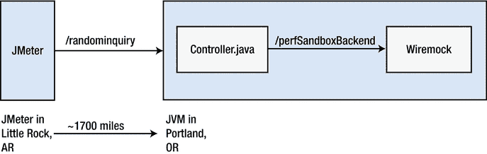
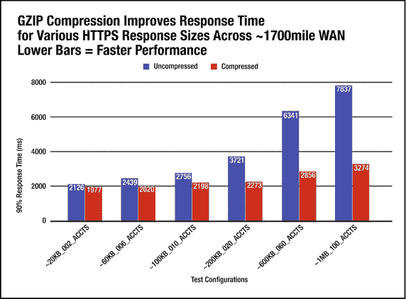
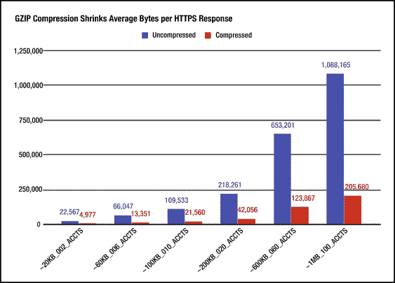
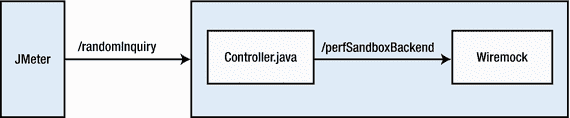
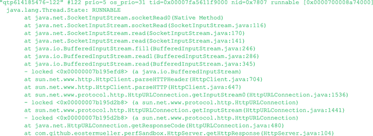
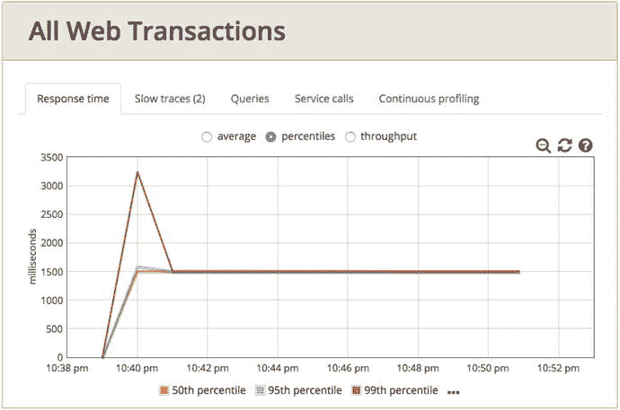

# 10.  Alien 系统——P.A.t.h. 中的“A”

我通常通过为单个 JVM 执行 P.A.t.h. 检查清单来开始性能故障排查。如果没有明显问题，那么我会转向一个“Alien”系统——即与第一个 JVM 相连的系统。借助更复杂的工具集，例如应用性能监控解决方案，来自多个系统的数据会收集到单个位置和应用程序中，从而使整个过程变得容易得多，尽管许可费用可能相当昂贵。

本章的目标是：

*   学习如何使用线程转储来检测缓慢的网络传输，以及是哪些 Java 代码调用了这些传输。
*   理解压缩如何显著加快“慢速”网络连接上的传输速度，但必须谨慎实施，以避免产生一些非常特定的安全漏洞。
*   学习如何使用 Wireshark 检查传输的有效载荷，以查看其是否为“明文”，这是压缩将有所帮助的一个指标。

除了 glowroot.org 之外，本书中的基本工具（`jstack`、`jstat`、`jcmd` 等）能够提供单个 JVM 中缓慢或低效活动的可见性。使用这些工具最简单的方法是登录到运行你想要观察的 JVM 的机器。RMI 服务器 `jstatd`（[`https://docs.oracle.com/javase/8/docs/technotes/tools/unix/jstatd.html`](https://docs.oracle.com/javase/8/docs/technotes/tools/unix/jstatd.html)）可用于为其中许多工具启用远程访问。

这个简短章节的重点是提醒你评估系统中所有组件的性能，无论它们是串行连接、一个调用下一个，还是作为集群中相同的并行节点排列在负载均衡器后面。

## 降低长距离响应时间

在评估一个我不熟悉的系统时，我做的第一件事就是检查数据中心之间、租用线路上或互联网上的连接是否启用了压缩。我进行了一些有压缩和无压缩的测试，以使这个建议更具说服力。

### 压缩让事情变得更快

测试 10a 和 10b 均使用图 10-1 所示的配置运行。请注意，位于阿肯色州小石城的 JMeter 负载生成器与部署在俄勒冈州波特兰的 jpt 示例应用程序之间相距约 1700 英里。两个测试都包含六个不同的 HTTP 请求，响应大小分别为：20K、60K、100K、200K、600K 和 1MB。默认情况下，jpt 服务器会返回压缩后的响应，但前提是 HTTP 请求指定了“`Accept-Encoding: gzip`”HTTP 标头参数。我将 10a 测试配置为包含此标头，但 10b 测试没有。我的目标是观察 10a 测试中使用压缩带来的速度优势。



图 10-1.

JMeter 和 littleMock 应用程序相距约 1700 英里。这些测试比较了从 littleMock 服务器（该服务器在 Spring Boot 下运行 Tomcat）返回的压缩和未压缩有效载荷的结果。

为了准确了解不使用压缩会错失多少好处，我在位于美国西北角（俄勒冈州）的一台 Amazon Lightsail Linux 机器上安装了 Java 性能故障排查（JPT）示例。我运行了 JPT 的 init.sh 进行安装，然后重新配置了应用程序（在 application.properties 中），使其通过端口 443（而非默认的 8675）接收来自外部的流量。接着，我使用 Lightsail 将该端口暴露到互联网上，并像这样启动了测试 01a：

```
db/startDb.sh
```

在一个窗口中，并在另一个终端窗口中执行：

```
./startWar.sh 01a
```

然后，从大约 1700 英里外的阿肯色州小石城，我将 src/test/jmeter/10a.jmx 和 10b.jmx 都指向了 AWS Lightsail 机器的 IP 地址。我通过更改 HOST JMeter 脚本变量的值来实现这一点。接着，我使用 10a.jmx 运行了 JMeter 几分钟。我停止了测试，然后使用 10b.jmx 运行了大约相同的时间。这两个测试的响应时间结果绘制在图 10-2 中，其中 10a 为红色，10b 为蓝色。10a/红色测试启用了压缩。



图 10-2.

红色柱状图（测试 10a）明显低于蓝色柱状图（测试 10b），显示了压缩后网络请求的速度提升有多大。有效载荷越大（最右侧的柱状图），收益就越大。水平轴标签上的大小（如 ∼20KB_002_ACCTS）是蓝色/未压缩的大小。

当 HTTPS 响应约为 200K 时，压缩该响应可使请求速度提升 1500 毫秒（红色的 2273 毫秒比蓝色的 3721 毫秒快了近 1500 毫秒）。这是一个显著的改进。我使用了以下 URL 参数（值为 2、6、10、20、60、100）来增加有压缩和无压缩测试中 HTTP 响应的大小。

`https://my_aws_server.com/randomInquiry?numAccounts=100`

每个账户大约产生 10K 的响应数据（未压缩），这是一个幸运的巧合，使得记住大小更容易。例如，两个账户：2x10k=20k 数据，100 个账户：100x10k=1mb 响应数据。

以下是在 application.properties 中启用压缩所需的 Spring 更改：

```
server.compression.mime-types=application/xml
server.compression.enabled=true
```

此外，你的 HTTP 请求必须包含标头 `Accept-Encoding: gzip`，并且只有 JMeter 脚本 10a.jmx 包含了此 HTTP 标头。

### 关于 HTTPS 与压缩的安全警告

但在你（像我一样）对这些结果感到兴奋之前，你必须了解同时使用 HTTPS 和压缩（我的确切配置）的安全问题。

如果没有正确的实现，将 HTTPS 和压缩结合使用可能会使黑客能够查看用户在你的网页上输入的私人数据（如信用卡号）。

我不是安全专家，因此你需要自行了解相关风险，这两种漏洞类型被称为 Crime 和 Breach。以下是一些链接，可供你开始研究。实际上打出这些字让我感到痛苦，但安全可能比性能更重要一些。不过别担心，安全专家已经推荐了规避这些攻击的方法，这样我们就可以继续使用压缩了！请继续阅读。

*   [`http://breachattack.com/#mitigations`](http://breachattack.com/#mitigations)
*   [`http://www.infoworld.com/article/2611658/data-security/how-to-defend-your-web-apps-against-the-new-breach-attack.html`](http://www.infoworld.com/article/2611658/data-security/how-to-defend-your-web-apps-against-the-new-breach-attack.html)
*   [`https://blog.qualys.com/ssllabs/2013/08/07/defending-against-the-breach-attack`](https://blog.qualys.com/ssllabs/2013/08/07/defending-against-the-breach-attack)


### 消息大小

每次压缩文本文件时，我都会会心一笑。文件大小通常能缩减 80%，这让我感到无比惊奇。同样的情况也适用于 HTTP 流的压缩。但性能提升并非直接源于复杂的压缩算法，而仅仅是因为消息大小的改变。更小的消息传输更快，尤其是在距离增加的情况下。

我这么说，是希望你不要将自己局限于使用单一工具（压缩）来进行优化。实际上，有各种各样的策略可以用来减小消息大小。

我曾与一个团队合作，仅通过简单更改 XML 格式，就将 250K 的传输数据缩减到了 10K。你还可以确保只发送会被使用的数据，并考虑添加缓存方案。

图 10-3 精确展示了图 10-2 中每项改进所需的大小缩减量（以字节为单位）。



图 10-3.

此图展示了每个有效负载在 GZIP 压缩前后的大小。同一 HTTP 响应消息的字节数，包括压缩后（红色）和未压缩（蓝色）的版本。

## 使用线程转储检测网络请求

为了查明网络请求是否拖慢了系统速度，我在 JPT 示例中准备了示例 01a 和 01b。这两个示例共享相同的架构，如图 10-4 所示。



图 10-4.

Java JPT 示例 01a 和 01b 的流程图。`/randomInquiry` 和 `/perfSandboxBackend` 都是 HTTP 请求，并且 JMeter 和服务器（Spring Boot）都部署在同一台机器的 localhost 上。

请注意，Wiremock 与 `Controller.java` 运行在同一个 JVM 中，这有点不太真实。

测试 01a 和测试 01b 被配置为在 Wiremock 中“休眠”两个不同的时间。哪个测试更慢，01a 还是 01b？

一旦你启动并运行了这些示例，请按如下方式获取 war 进程的线程转储。

首先，找到 war 文件的进程 ID：

```
# jcmd
15893 warProject/target/performanceGolf.war
```

为简洁起见，我删减了部分输出——请务必查找 war 文件。

然后，像这样将该 PID（上面的 15893）传递给 `stack`，并将输出重定向到一个文本文件：

```
# jstack 15893 > myThreadDump.txt
```

在测试计划 01a.jmx 和 01b.jmx 中，你会发现 JMeter 被配置为应用 3t0tt 负载，即三个线程的负载，零思考时间。同样，当你查看线程转储时，你会发现三个线程的堆栈跟踪与图 10-5 中显示的几乎完全相同。



图 10-5.

测试 01a 的线程转储中三个线程之一的堆栈跟踪。测试 01b 的看起来会完全相同。

你看到的顶部方法，是所有类型的网络请求（不仅仅是 HTTP）中都会出现的方法：

```
at java.net.SocketInputStream.socketRead0(Native Method)
```

如果你从上一章中关于慢速数据库索引的示例中捕获线程转储，你会发现完全相同的 `socketRead0()` 方法，但这次是由 H2 数据库驱动程序使用，用于等待 H2 数据库的响应，而该数据库由于缺少索引而响应缓慢。

这里的关键点是，始终将 `socketRead0()` 方法视为代码正在等待网络响应的一个指标，无论使用的是何种协议。

## 量化响应时间

刚才展示的线程转储方法经常帮助我判断来自外部系统的响应时间是否是最大的性能问题之一——即备受青睐的“低垂的果实”。这是一个非常有用的技术，但不幸的是，如果能精确量化在后端系统中花费了多少时间，那将会更有帮助。

为了找出确切的响应时间，我配置了 Glowroot 与 JPT 和 littleMock 示例一起运行。只需将浏览器指向 `http://localhost:4000`（图 10-6）。



图 10-6.

Glowroot 数据显示测试 01a 中 `/randomInquiry` URL 的响应时间。

所以，`jstack` 为我们提供了一个“即插即用”的指示，表明我们正在等待网络请求。但不幸的是，01a 和 01b 的线程转储看起来几乎完全相同。安装 Glowroot 需要你添加一个指向 Glowroot jar 文件的 `javaagent` 参数，并且需要重启——在我看来，这并非“即插即用”，但它确实能很好地量化这些测试的响应时间。如果你查看测试 01b 的相同 Glowroot 指标，你会发现响应时间是 500 毫秒。


## 识别可从压缩中受益的明文负载

图 10-2 显示，压缩一个 1MB 的文件会产生一个 200K 或更小的压缩文件。数据大小减少 80% 的效果令人印象深刻，这也是为什么在广域网上进行压缩能带来如此巨大的性能提升。这里遗留的问题是，你使用的系统是否真的利用了这种优化，并在慢速链路（即广域网）上压缩了数据。

要查明这一点，你需要仔细检查实际通过网络传输的消息中的数据。`tcpdump`、`windump` 和 `wireshark` 是优秀的网络可观测性工具，但它们没有简单的方法来聚合或汇总非常繁忙的系统上的响应时间数据。为了亲眼看到实际的消息，这些工具是首选，我将尽力帮助你解决使用它们时常见的一些困扰。

你可以在发送或接收数据的机器上运行以下命令。找到服务器正在监听的端口。对于 jpt，你会在 `warProject/src/main/resources/application.properties` 中找到“server.port = 8675”。请注意，`01a.jmx` 和 `01b.jmx` 也指定了这个端口号。当 JMeter 向 jpt 施加负载时，启动另一个终端窗口，并使用如下所示的 tcpdump 捕获跟踪信息。

```
tcpdump -X -i any -s 0 "port 8675 and greater 100"
```

请注意，文本“greater 100”会隐藏小于 100 字节的小型 TCP 数据包。这些小数据包不携带任何数据，并且会使显示变得混乱。简而言之，如果你的 ASCII（我猜是 UTF-8）网络消息在 tcpdump 数据的最右侧列中可见，那么你的消息就没有被压缩。下面的第一个示例是未压缩的。我对第二个示例暂不判断——这些数据是压缩了，还是仅仅加密了？有点令人惊讶的是，并非所有加密数据都被压缩了（[`https://www.belshe.com/2010/11/18/ssl-compression-and-you/`](https://www.belshe.com/2010/11/18/ssl-compression-and-you/) `)`，如下所示：

```
0x0090: 3a20 4a65 7474 7928 392e 322e 7a2d 534e :.Jetty(9.2.z-SN
0x00a0: 4150 5348 4f54 290d 0a0d 0a33 4537 0d0a APSHOT)....3E7..
0x00b0: 4865 6c6c 6f57 6f72 6c64 4672 6f6d 5065 HelloWorldFromPe
0x00c0: 7266 6f72 6d61 6e63 6553 616e 6442 6f78 rformanceSandBox
0x00d0: 4261 636b 656e 6453 6572 7665 7220 4845 BackendServer.HE
0x00e0: 4c4c 4f20 4845 4c4c 4f20 4845 4c4c 4f20 LLO.HELLO.HELLO.
0x00f0: 4845 4c4c 4f20 4845 4c4c 4f20 4845 4c4c HELLO.HELLO.HELL
0x0100: 4f20 4845 4c4c 4f20 4845 4c4c 4f20 4845 O.HELLO.HELLO.HE
0x0110: 4c4c 4f20 4845 4c4c 4f20 4845 4c4c 4f20 LLO.HELLO.HELLO.
```

上面数据最右侧列显示了十六进制数据的 ASCII 表示形式“HELLO”。结论：这些数据没有被压缩。

```
0x0410: b64c 3fa1 386c a9cf 0f67 ca5b 803c d06b .L?.8l...g..<.k
0x0420: 58c1 9c74 83f2 d5b3 9074 17d6 d49c edfd X..t.....t......
0x0430: db8f 0e5c c312 afb7 9b0c 0001 4903 0017 ...\........I...
0x0440: 4104 609c b859 1283 4746 de7b d3c9 d3dc A.`..Y..GF.{....
0x0450: eb18 2ef0 2287 c68f fdcb fd17 df46 c959 ...."........F.Y
0x0460: 8e19 8731 91d2 48f2 3336 6237 f402 8fca ...1..H.36b7....
0x0470: dd0e 4048 2fda e4a5 6948 6b8a 036b f351 ..@H/...iHk..k.Q
0x0480: 0cf4 0601 0100 287b c742 a426 3332 d192 ......({.B.&32..
0x0490: 8e39 8edd 271a d0e0 2e67 2eba 37aa e3fb .9..'....g..7...
0x04a0: 7311 075e 31d6 bd3f 7767 468c 0476 445a s..¹..?wgF..vDZ
```

我原本期望在这个文本中看到 XML 消息，但数据是通过 HTTPS 发送的。结论：没有足够的信息来判断数据是否被压缩。

## 别忘了

`jstack` 是一个很棒的即插即用工具，可以快速告诉你系统是否正在等待来自“外部”系统的响应。只需在线程转储中查找以下方法调用：

```
java.net.SocketInputStream.socketRead0()
```

无论你的系统是发出 HTTP 还是 HTTPS 请求、JDBC 请求，还是通过任何其他协议通信，你都会看到这个方法。此外，无论使用何种协议，较小的消息在长距离传输中速度明显更快，而压缩是使负载变小的好方法。但请记住，有很多方法可以缩小负载。一种方法是重构客户端代码，以减少所需的数据量。第二种方法是更改消息格式——例如通过缩小 XML 标签的大小。如果数据是静态的且变化不大，可以考虑缓存请求，而不是反复通过网络发送。

别忘了，正如第 [9 章所述，大块优于闲聊。这适用于对外部系统的网络请求，而不仅仅是 JDBC。

然而，最重要的问题是，压缩 HTTPS 存在一些风险。本章简要提及了一些可能由 HTTPS 压缩引起的安全漏洞——忽视这些漏洞是非常愚蠢的。

## 下一步

你可以找到许多书籍和博客，它们展示了如何诊断线程转储中的 BLOCKED 线程。同样，也有关于如何在线程转储中找到单个失控线程（例如，像应用服务器启动线程那样疯狂消耗大量 CPU 的线程）的指南。不幸的是，这两种用例发生的频率相当低。关于如何使用线程转储来查找常见的慢速线程和常见的过度消耗问题的指导则完全缺失。第 11 章正是针对这一领域，旨在使用线程转储提供类似 Java 分析器的诊断功能，精确定位慢速线程中正在执行的代码。这种新颖的技术对于揭示滋生众多性能缺陷的黑暗环境至关重要。

