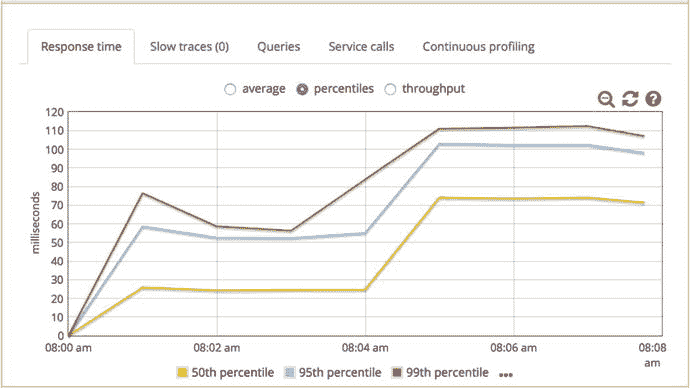
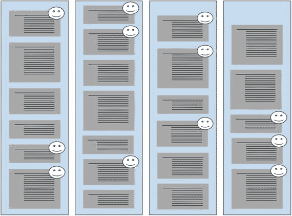
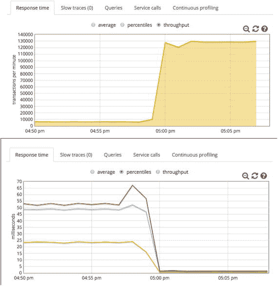
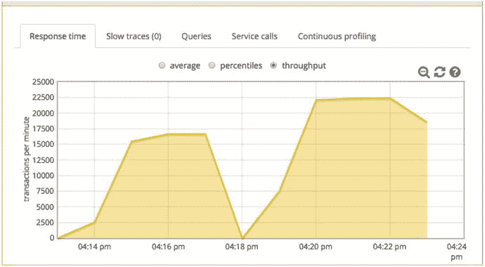

# 11. 线程，P.A.t.h. 中的“t”

在负载测试中应该施加多大的负载，这个问题长期以来一直没有明确的答案。可扩展性衡量标准（第 6 章）最终用一个易于遵循的测试公式回答了这个问题，该公式还提供了一种非常便捷的评估可扩展性的方法。该测试本身只是对非常常用的增量负载测试的一个小小的渐进式改进。

因此，可扩展性衡量标准声称对现有技术进行了小幅改进。这很好。本章旨在超越这一点，声称使用长期以来值得信赖但严重未充分利用的 JDK 简单工具，可以以极低的开销实现根本性的性能可见性提升。

本章的目标是：

*   理解线程转储目前的使用范围非常有限；它们只能解决很小一部分问题。
*   学习新颖的技术，极大地扩展线程转储的作用，使其成为一种通用的、低开销的、即插即用的诊断工具。
*   学习如何使用线程转储来识别在任何环境中导致性能问题的类和方法名称。

需要明确的是，我写本章的目的不是为了分享和回顾一种常用的性能技术。相反，我试图将一种只有极少数注重性能的工程师使用的强大技术清晰地记录下来，以便它能够被广泛采用，以解决长期存在的可见性缺口——我称之为黑暗环境的那些缺口。

我准备好坐下来与对此持怀疑态度的人交流。任何被广泛采用的东西都需要经过良好的审查。我理解这一点。我只是希望读者能对这个提议给予比匆匆一瞥、漫不经心更多的关注。


## 线程转储的当前用途

如今，线程转储主要用于调查 **BLOCKED** 线程及相关多线程问题。在互联网上快速搜索“thread dump Java”就能证实这一点。由于这个话题在互联网上已有大量资料，我选择不在本书中占用篇幅。许多聪明人已经展示了如何使用线程转储来诊断和修复这些问题。

但在转向将线程转储用于多线程问题检测之外的其他领域之前，我想先对多线程编码提几点简要看法。首先，在 Java 中任何时候使用 `synchronized` 关键字，都应该在零思考时间下，用三个负载线程进行简单的负载测试，并获取四个或更多线程转储。

在之前测试的线程转储中，你应该验证 **BLOCKED** 线程是否很少出现，也许在你看到的每 20 个堆栈跟踪中才出现一次。当同步方法或同步块包裹了慢速代码时，**BLOCKED** 线程就会出现，而所有类型的 I/O——磁盘、网络和显示——都必须被视为慢速操作。我会对专业库（如日志或缓存框架）的专家编写者给予豁免，他们通常会定期对代码进行负载测试。我的建议是针对我们这些应用程序开发者的。请记住，不要在同步块中放入任何 I/O 操作——这意味着同步块内不能有 JDBC 或其他数据库调用。

在代码中使用同步本身并没有错。问题在于当多个线程试图同时访问该同步块时，JVM 必须让其他线程等待，直到锁的持有者执行完毕。这时 **BLOCKED** 线程就会出现，这种情况被称为争用同步块。

另外，我还没有提到有许多 GUI 工具旨在可视化和突出显示多线程问题。Jack Shirazi 撰写了第一本优秀的 Java 性能书籍《Java Performance Tuning》（O'Reilly 出版），这个指向他网站的链接包含了一系列帮助你可视化线程转储的程序列表。就我个人而言，我喜欢 IBM Thread Dump Analyzer 和 ThreadLogic，它们允许你配置工具，通过文本模式来标记应引起警惕或关注的问题。你可以在以下网址找到它们：

[`http://www.fasterj.com/tools/threadanalysers.shtml`](http://www.fasterj.com/tools/threadanalysers.shtml)

再稍微重复一下，这个小节提供了一些有用但仍是常规的关于同步的思考。下一节将从一些基础知识开始——展示在简单代码中创建的线程在线程转储中实际的样子。然后，我会讨论如何导航线程转储。这听起来可能并不惊天动地，但它是理解哪些代码正在运行、谁调用了它以及为什么调用的关键。

之后，我们将进入更具争议性的部分，即像使用 Java 分析器一样使用线程转储。要完全理解这里的内容，你真的需要在自己的机器上运行示例；仅仅阅读本章是不够的。请务必为“交互式线程转储阅读练习”这一节启动 littleMock 应用程序。我们将使用 littleMock 示例应用程序，下载、安装和启动它只需几分钟时间。

## 线程与线程转储

清单 11-1 是一个非常简单的程序，它启动三个线程，每个线程在退出前休眠 1 分钟。让我们运行它并捕获一个线程转储，这样我们就能看到每个线程的一个堆栈跟踪。

请注意，在启动时，该程序调用了 `java.lang.Thead#setName()`，从而为每个线程赋予一个名称，用于在实际的线程转储中标识每个线程。这里的名称以 `jpt-` 前缀开头。我们稍后会讨论为什么这个名称如此重要。

```
package com.jpt;
public class MyThreadStarter {
public static void main( String[] args ) {
new MyThread("jpt-first" ).start();
new MyThread("jpt-second" ).start();
new MyThread("jpt-third" ).start();
}
}
class MyThread extends Thread {
public MyThread(String name) {
setName(name);
}
private void mySleep() {
try { Thread.sleep(60000); } catch(Exception e) {}
}
public void run() {
mySleep();
}
}
清单 11-1.
一个启动三个命名线程的 Java 程序，我们将在线程转储中查找这些线程
```

将此文本放入位于某个文件夹中的 `MyThreadStarter.java` 文件中。在同一文件夹的命令提示符下，运行清单 11-2 中的命令来编译和运行该程序。

```
# mkdir classes
# javac -d classes MyThreadStarter.java
# java -cp classes com.jpt.MyThreadStarter
清单 11-2.
编译并运行 MyThreadStarter.java，这是一个将线程转储（来自 jstack）中的堆栈跟踪活动与源代码中的行号关联起来的小程序
```

现在程序正在运行，终端窗口看起来会像挂起了一样。

### 导航线程转储

在 60 秒的 `Thread.sleep()` 调用之后，这个“挂起”的程序会将控制权返回给命令提示符，因此你有 60 秒的时间打开另一个命令提示符，使用 JDK 的 `jcmd` 工具找到进程 ID (PID)，并使用 JDK 的 `jstack` 捕获一个线程转储。

在你打开的新命令提示符中，使用 JDK 的 `jcmd` 程序获取 PID（清单 11-3 中的 8341），将其传递给 `jstack`，然后将 `jstack` 的输出（线程转储的文本）重定向到文件 `myThreadDump.txt` 中。请注意，也可以使用 JDK 的 `jps` 命令，但它需要一些额外的命令行参数（我懒得输入）来显示正在运行的 Java 类的名称。程序中 60 秒的休眠时间意味着程序将在 60 秒后结束，所以不要浪费时间。最后一行显示我们关心的 PID 是 8341。

```
#∼/jpt_threads: jcmd
6817 org.h2.tools.Server -tcp -web -baseDir ./data
8342 sun.tools.jcmd.JCmd
6839 warProject/target/performanceGolf.war
8341 com.jpt.MyThreadStarter <<<< 8341 是我们刚刚启动的 PID
清单 11-3.
使用 JDK 的 jcmd 查找清单 11-2 中启动的程序的 PID
```

现在我们知道了清单 11-2 中启动的进程的 PID，JDK 附带了许多可以立即使用的工具，我们可以用它们来了解更多关于该进程的信息：`jstat`、`jmap`、`jinfo` 和 `jdb`。清单 11-4 展示了我们将如何把 PID 传递给 `jstack` 来捕获一个线程转储。语法 `> myThreadDump.txt` 用于将线程转储文本重定向到 .txt 文件，而不是显示在命令行窗口中。

```
#∼/jpt_threads: jstack 8341 > myThreadDump .txt
清单 11-4.
使用 JDK 的 jstack 对我们在清单 11-3 中找到的 PID 进行线程转储
```


#### 堆栈跟踪中的关键地标

在清单 11-4 捕获的 `myThreadDump.txt` 文件中，对于每个 `java.lang.Thread#start()`，你可以看到我在代码中设置的带有 `jpt`- 前缀的线程（第 01、07 和 13 行）。清单 11-5 展示了该线程转储中的三个堆栈跟踪。

```
01 "jpt-third" #12 prio=5 os_prio=31 tid=0x00007fd8b605b800 nid=0x5803 waiting on condition [0x0000700005031000]
02  java.lang.Thread.State: TIMED_WAITING (sleeping)
03     at java.lang.Thread.sleep(Native Method)
04     at com.jpt.MyThread.mySleep(MyThreadStarter.java:18)
05     at com.jpt.MyThread.run(MyThreadStarter.java:21)

07 "jpt-second" #11 prio=5 os_prio=31 tid=0x00007fd8b5840800 nid=0x5603 waiting on condition [0x0000700004f2e000]
08  java.lang.Thread.State: TIMED_WAITING (sleeping)
09     at java.lang.Thread.sleep(Native Method)
10     at com.jpt.MyThread.mySleep(MyThreadStarter.java:18)
11     at com.jpt.MyThread.run(MyThreadStarter.java:21)

13 "jpt-first" #10 prio=5 os_prio=31 tid=0x00007fd8b6853000 nid=0x5403 waiting on condition [0x0000700004e2b000]
14  java.lang.Thread.State: TIMED_WAITING (sleeping)
15     at java.lang.Thread.sleep(Native Method)
16     at com.jpt.MyThread.mySleep(MyThreadStarter.java:18)
17     at com.jpt.MyThread.run(MyThreadStarter .java:21)
清单 11-5.
在编辑器中显示 myThreadDump.txt 中的选定行
```

当查看一张大城市的地图时，找到“您在此处”的地标来确定方位至关重要。处理堆栈跟踪也是如此。为了在单个线程的堆栈跟踪中找到方向，表 11-1 定义了几个用于回答某些关键性能问题的“地标”。

表 11-1.
堆栈跟踪的地标，以清单 11-5 为例

| 地标名称 | 问题 | 来自清单 11-5 的代码 | 来自清单 11-5 的代码行 |
| --- | --- | --- | --- |
| 当前 | 当调用 `jstack` 时，该线程正在执行哪一行代码？这就是“您在此处”标记。 | `Thread.sleep()` | 3,9,15 |
| 触发 | 我的哪段代码触发了当前行的执行？ | `MyThread.mySleep()` | 4,10,16 |
| 入口 | 是什么启动了该线程？ | `MyThread.run()` | 5,11,17 |

因此，当你对一个处于负载下的繁忙 HTTP Web 容器（如 Tomcat）进行线程转储时，来自 Web 的每个流量线程看起来都像这样：

1.  入口标记是 Tomcat 收到 HTTP 请求并将其交给其中一个线程处理的位置。这是每个线程底部（即堆栈跟踪）的第一行。
2.  Tomcat 代码调用你 Java 包中的 Servlet 代码。“触发”是你包空间中的一行特定代码——你的代码在导致当前执行代码之前的最后一次调用就是触发点。例如，如果当前标记位于 JDBC 驱动程序包空间中等待 JDBC 响应，那么触发点就是执行查询的那行应用程序代码。该行代码触发了执行查询并等待响应的操作。
3.  当前标记是堆栈跟踪的最顶部行——它是 `jstack` 捕获转储时正在执行的行。

这个“入口-触发-当前”的顺序就是时间序列，有点像一条装配线。本章的其余部分依赖于对“入口-触发-当前”的理解，所以请务必知道每个名称对应堆栈跟踪的哪个部分。线程转储中的每个 Web 容器线程在给定时刻可能位于装配线上的任何位置。从某种程度上说，系统中执行的任何一行代码出现在当前标记位置的概率似乎是相等的。在我进行任何性能调优之前，我大致也是这么想的。

#### 线程名称很有帮助

你是否注意到，在 MyThreadStarter 示例中，我们为每个线程的名称添加了一个前缀（`jpt`）？这是我为测试程序命名的方案。Web/应用服务器有自己的命名方案来命名处理传入 HTTP 流量和其他流量的线程。表 11-2 展示了一些 HTTP/S 的示例。了解这些容器如何命名其线程有助于理解哪些线程处于负载之下。

表 11-2.
流行容器如何命名其线程的示例

| 容器 | 线程名称示例 |
| --- | --- |
| WebSphere | `WebContainer : 5` |
| Spring Boot / Tomcat | `http-nio-8080-exec-7` |
| Spring Boot / Jetty | `qtp266500815-40` |
| Wildfly Servlet 11.0 | `default task-127` |


#### 聚焦于负载下的线程

Java 开发者有时会因为线程活动数量惊人而对线程转储望而却步。对我来说也同样令人眼花缭乱，因此我帮你省去了所有这些细节。具体来说，我通过让程序保持非常简短来帮你省事，并且在线程转储中，我只展示了程序启动的三个线程，而不是 JVM 启动的所有其他线程（超出了本书的范围）。

因此，要理解线程转储，你需要一些策略来剔除所有无关紧要的线程，从而专注于最可能导致问题的那些线程。以下是你的第一条建议：

*   负载下的线程正是导致性能问题的那些线程。

这听起来有点含糊其辞、没什么帮助，甚至令人怀疑。所以这并非绝对规则，但它至少应该成为你进行性能调查的首要切入点之一。你应该问问，在负载下的线程中是否存在任何明显的问题。确定哪些线程处于负载之下实际上相当直接。

首先问问自己正在施加什么负载。是生产用户通过 HTTP/S 访问，还是你刚刚启动了一个同样使用 HTTP/S 的测试负载脚本（比如 JMeter）？是一个批处理作业从文件或数据库中读取“工作”然后进行处理（即施加负载）？或者，这也许是一个后端 JMS（Java 消息服务）正在接收来自某个未知消息生产者的流量？

然后，在线程转储中找到那些满足以下条件的线程：

*   其入口标记大致看起来像是来自正在施加的负载。
*   其线程名称也与正在施加的负载相匹配。
*   显示了来自你包空间的 Java 方法调用/活动。
*   其线程状态既不是 `WAITING` 也不是 `TIME_WAITING`。

让我们逐一看看这四点。

清单 11-6 是一个运行在 Spring Boot 下的 Tomcat HTTP SOA 应用的线程转储片段。让我们看看清单 11-7 中的线程是否与所有这些条件相符。可能所有入口标记都以 `Thread.run()` 开头——或者 Thread 的某个子类的 `run()` 方法；前面清单 11-5 和清单 11-6 中的例子也不例外。第 87 行的 `Thread.run()` 基本上是入口标记的标志。其上的三行包含了 `tomcat` 包中的类，所以看起来我们仍然找对了方向。最后，在第 78 行，文本 “http11.Http11Processor” 表明这是 HTTP 活动。所以第一点建议表明我们走在正确的轨道上。为了便于阅读，清单 11-6 最右侧的部分被截断了。

```
78     at org.apache.coyote.http11.Http11Processor.service
79     at org.apache.coyote.AbstractProcessorLight.process
80     at org.apache.coyote.AbstractProtocol$ConnectionHan
81     at org.apache.tomcat.util.net.NioEndpoint$SocketPro
82     at org.apache.tomcat.util.net.SocketProcessorBase.r
83     - locked  (a org.apache.tomcat.
84     at java.util.concurrent.ThreadPoolExecutor.runWorke
85     at java.util.concurrent.ThreadPoolExecutor$Worker.r
86     at org.apache.tomcat.util.threads.TaskThread$Wrappi
87     at java.lang.Thread.run (Thread.java:745)
清单 11-6.
一个堆栈跟踪，显示（第 78 行）它是由 Tomcat 的 HTTP 引擎启动的
```

第二点建议指出线程名称必须与正在施加的负载相匹配。我的 Tomcat 线程名称是 `http-nio-8080-exec-9`，这与表 11-2 一致。该线程名称位于下面 11-7 的第一行。

第三点建议只是提醒你，通常你要寻找的是来自你自己包空间的代码。在本书中，这主要是 `com.github.eostermueller`——我们稍后会有很多这样的例子。

第四点建议指出，负载下的线程处于既不是 `WAITING` 也不是 `TIMED_WAITING` 的线程状态。嗯，通常情况下是这样，但在我的几个例子中，我在示例代码中使用 `java.lang.Thread.sleep()` 来模拟一段慢速代码，这属于规则的例外——它们会显示为 `TIME_WAITING`，即使负载正在施加。

清单 11-7 中的第二行显示了一个处于负载下的线程，其线程状态为 `RUNNABLE`。

```
"http-nio-8080-exec-9" #56 daemon prio=5 os_prio=31
java.lang.Thread.State: RUNNABLE
at java.io.FileInputStream.readBytes(Native
at java.io.FileInputStream.read(FileInputStr
at sun.security.provider.NativePRNG$RandomIO
at sun.security.provider.NativePRNG$RandomIO
清单 11-7.
处于负载下的线程，线程状态为 RUNNABLE
```

因此，一旦你验证了这四点，你就能够梳理线程转储中的所有线程，并找出当前处于负载下的那些线程。作为最后的合理性检查，你还可以检查机器上的 CPU 消耗。可以肯定的是，零 CPU 消耗加上偶尔的峰值不足以构成负载（即使按照本章宽松的定义也是如此）。

## 手动线程转储分析（MTDP）

既然你现在能够识别线程转储中处于负载下的线程，你终于可以准备好使用 MTDP 在任何环境中查找性能问题了。

以下是操作说明：

1.  在施加负载时，获取大约四个线程转储，每个转储之间间隔几秒钟。
2.  如果在两个或更多处于负载下的线程的转储中出现了你可以修复的问题，那么它就值得修复。

尽管这些说明是为 Java 调整过的，但 Mike Dunlavey 是第一个在他的著作《构建更好的应用程序》（Van Nostrand Reinhold, 1994）中记录此技术（针对 C 程序）的人。


### 示例 1

本示例展示了线程转储如何帮助你定位性能缺陷，即使该缺陷不涉及 Java 同步问题。首先，按照 [`https://github.com/eostermueller/littleMock`](https://github.com/eostermueller/littleMock) 上的说明下载并启动一个 Spring Boot 服务器，然后施加三个线程的负载。如果已安装 Maven 和 Java 8（或更高版本），此过程大约需要五分钟。基本思路是下载 zip 文件或执行 git clone。在一个终端窗口中，启动 `./startWar.sh`。在另一个窗口中，启动 `./load.sh`。然后执行以下操作：

1.  在浏览器中打开 `http://localhost:8080/ui`。  
2.  我们希望将 Sleep Time 参数设置为 50ms。在上述 URL 的浏览器中，清除 Performance Key 文本框中的所有文本。然后输入 L50 并点击 Update。如果你在 `http://localhost:4000` 打开 Glowroot，新增的休眠时间将如图 11-1 所示。



图 11-1.

来自 Glowroot (glowroot.org) 的响应时间指标显示，在 littleMock Spring Boot 测试进行到一半时，引入了 50ms 的休眠时间

红线显示，在上午 8:04 我们额外增加了 50ms 之前，99% 的请求在大约 58ms 或更短时间内完成；增加后，同一 99% 指标的响应时间跃升至约 110ms。这是一个不错的结果——我们增加了 50ms 的休眠，响应时间也增加了大致相同的量（110–50 = ∼58ms）。但问题是：如果你的客户抱怨响应时间增加了一倍多（就像这样），你如何找到根本原因？如果你探索 Glowroot 界面，它很可能会指向 `Thread.sleep()`，这很好。但我们的目标是在任何环境中找到 bug，因此我们将使用每个 JDK 都自带的 `jstack`。

我调用了四次 `jstack`（图 11-2），得到了四个文本文件，每个文件包含一个线程转储。然后，我使用了上一节中的技术来找出转储中哪些线程处于负载之下：每个线程转储文本文件中恰好有三个线程的代码位于 `com.github.eostermueller` 包空间内，并且每个线程都有一个 Tomcat HTTP 外观的入口标记，以及一个类似 HTTP 的线程名称，例如 `http-nio-8080-exec-10`。



图 11-2.

早期获取的四个线程转储的示意图，每个线程转储用一个高的蓝色矩形表示。每个灰色框是一个单独的堆栈跟踪，即一个线程。笑脸指向唯一在 `com.github.eostermueller` 包空间中执行代码的堆栈跟踪。

这个发现至关重要，所以我将重复一遍：正在施加三个线程的负载，并且在我捕获的四个线程转储中，每一个都恰好有来自我的 `com.github.eostermueller` 包空间的那么多线程（三个）。当负载生成思考时间为零且负载在本地生成（而非通过网络）时，就会发生这种情况。

我之前提到过，要被视为“处于负载之下”，线程状态必须是 RUNNING。嗯，这是一个例外，因为我的场景使用 `Thread.sleep()` 来减慢代码速度，这意味着在 `Thread.sleep()` 内部，RUNNING 状态会变为 TIMED_WAITING。

每个线程转储都有三个处于负载之下的线程并非巧合，因为所使用的 JMeter 负载脚本（`load.sh` 调用 `src/test/jmeter/littleMock.jmx`）中配置了三个负载线程。如果你使用 `loadGui.sh`（与 `load.sh` 位于同一文件夹）启动 JMeter GUI，并指向上述 .jmx 文件，你可以在 JMeter 线程组中确认这个数字 3。

如果我向 .jmx 添加了思考时间，或者从慢速网络（通过互联网，或从不同的数据中心）运行 JMeter，而不是在本地同一台机器上运行，那么每个转储中处于负载之下的线程数量（即“JVM 并发度”）将在 0 到 3 之间变化。

因此，我们有四个线程转储，每个转储有三个处于负载之下的线程，总共 3x4=12 个“样本”线程。因此，我们在图 11-2 中有 12 个笑脸。让我们回到寻找导致此性能下降的代码上来。手动线程转储分析（MTDP）的说明如下：

*   “如果你可以修复的内容出现在两个或更多处于负载之下的线程的转储中，那么它就值得修复。”

在样本中的十二个线程（处于负载之下的线程）中，有八个位于我们使用 `http://localhost:8080/ui` 上的 Sleep Time 参数引入的 `Thread.sleep()` 上。清单 11-8 显示了其中一个。

```
29 "http-nio-8080-exec-10" #54 daemon prio=5 os_prio=31 tid=0x00007f90611d3800 nid=0x8603 waiting
30  java.lang.Thread.State: TIMED_WAITING (sleeping)
31     at java.lang.Thread.sleep(Native Method)
32     at com.github.eostermueller.littlemock.Controller.simulateSlowCode(Controller.java:73)
33     at com.github.eostermueller.littlemock.Controller.home(Controller.java:60)
34     at sun.reflect.GeneratedMethodAccessor58.invoke(Unknown Source)
清单 11-8.
Thread.sleep() 的堆栈跟踪
```

此外，前面的说明告诉我们，在 12 个线程转储中，相同的代码仅出现两次就足以引起关注。我的测试结果是这个数字的四倍——八次。

### 样本量与健康的怀疑态度

在前面的示例中，我们发现 12 个采样线程中有 8 个位于 `Thread.sleep()` 中，我们有足够的信心声称找到了罪魁祸首。12 个样本真的足够大，可以基于它进行实际的开发/调优更改吗？如果我捕获了一组新的四个额外线程转储，而 `Thread.sleep()` 只出现在其中一个或根本没有出现，那该怎么办？这是一个合理的观点，也是我第一次开始使用这项技术时，在好几个月里反复问自己的问题。

简而言之，相对较快的方法出现在线程转储的 Current 标记中是极其罕见的。例如，简单的 getter 和 setter 永远不会出现。如果某次出现了，你可能要过好几年才能再次看到它。执行时间越慢，方法在堆栈跟踪中出现的频率就越高。可以将 MTDP 视为一个专为慢速方法设立的专属俱乐部，这与执行的任何一行代码都有相同概率位于 Current 标记处完全不同。这种等概率的情况永远不会发生。

为了更详细地说明，我运行了一个测试近 20 分钟，每秒获取一个线程转储（准确地说，是 1151 个线程转储）。我的 `Controller.simulateSlowCode()` 在单个线程转储文件中平均出现多少次？在三个可能的线程中出现了 1.94787 次。因此，我测得的 8/12（2/3）只是略微高估了从更大样本量中捕获的平均值。

如果你正在寻找更完整的理由，说明为什么基于如此小的样本量进行开发更改是安全的，这里有两个基于数学的观点。为充分披露信息，其中一个理由由 Mike Dunlavey 撰写，他是第一个发布这项技术的人：

[`http://ostermueller.blogspot.com/2017/04/the-math-behind-manual-thread-dump.html`](http://ostermueller.blogspot.com/2017/04/the-math-behind-manual-thread-dump.html)

就我个人而言，我使用这项技术不是因为数学上令人信服，而是因为它有效。下一节将展示一个此类调优成功案例的结果，你可以仔细查看通过这项技术发现的所有优化点，这项技术你最终可以应用于企业中的任何环境。

上面的示例展示了 MTDP 如何检测到 50ms 的响应时间增加（响应时间翻倍）。无论你认为这是一个大的还是小的性能下降，下一节将展示 MTDP 如何能够检测到远小于 50ms 的响应时间问题。


## MTDP 演示

我期待，甚至希望，你会对仅凭上一节讨论的少量样本就能准确识别性能缺陷持怀疑态度。我并非真的在寻求异议；相反，我只是想说“欢迎”。性能评估的世界需要怀疑论者。

本节概述了一次小型调优工作，并给出了调优前后的基本性能结果。为了让您对 littleMock 的工作原理有个大致了解，第一个示例中不会详细审查线程转储——仅作概述。本次探索中发现的所有缺陷均使用了前面描述的手动线程转储分析（MTDP）技术。但与常规调优中直接用快速代码替换慢速代码不同，我们将使用 littleMock 网页，它允许我们在慢速和快速代码之间进行实时切换。您只需点击一个按钮即可在慢速和快速之间切换，而 Glowroot（将浏览器指向 `http://localhost:4000`）的吞吐量指标便会跃升，如同让一个垂死的病人复苏。您应该亲自尝试一下。

由于这是一个在您自己机器上运行的演示，当启用“慢速”选项时，您可以在线程转储（慢速代码的专属俱乐部）中看到每个缺陷露出其丑陋的小脑袋。当您点击切换到“快速”选项时，您可以获取更多线程转储，以确保相同的缺陷消失，并且性能有相应的提升。

该应用程序与之前使用的相同，但未使用“睡眠时间”选项。以下是安装链接：

[`https://github.com/eostermueller/littleMock`](https://github.com/eostermueller/littleMock)

我使用一些较慢的选项运行 littleMock UI 将近 10 分钟。然后，就在图 11-3 中下午 5 点之前，我使用 GUI 应用了一些更高效的设置，您可以看到一个戏剧性的峰值。



图 11-3.

下午 5 点左右性能大幅提升，是因为我应用了不同的性能键。load.sh 脚本在整个测试期间都在运行。

正如您从图 11-3 中看到的，调优修复将吞吐量提升了 13 倍；吞吐量从每分钟不到 10K 个请求开始，最终达到每分钟超过 130K 个请求。对于响应时间，99% 的响应开始时大约在 53ms 或更快，最终快于 2ms。

以下是上图 11-3 中显示的慢速和快速测试的性能键。

慢速：X0,J100,K100,Q0,R0,S0

快速：X2,J25,K25,Q1,R1,S1

但是，是什么代码在这两个不同的性能键之间造成了如此巨大的变化？littleMock 网页在性能键下方详细列出了所有选项。它甚至提供了指向 github 源代码的网页链接，显示了当您选择略有不同的选项时所做的更改。

例如，要了解 X0 和 X2 设置之间的区别，请在 littleMock 网页上向下滚动时查找 [X0] 文本。如果您点击 [X0] 右侧的“源代码链接”，它将带您进入 github.com 上的代码。

## 导航不熟悉的代码

在查看堆栈跟踪时，找到入口标记、触发标记和当前标记是确定方向的第一步。不熟悉的代码无处不在，因为我们的应用程序现在依赖于许多不同的库。作为一名性能工程师，我花了一些时间才适应评估我从未见过的代码。这只是我必须习惯的工作的一部分。

我以前看到不熟悉代码的堆栈跟踪时，第一反应通常是以下之一：

1.  恐惧。
2.  我只能调优我有源代码的东西，如果它不在我们公司的某个包空间中，就算了。

在状态不好的时候，我仍然会有这种感觉，但有一个简单的问题可以消除我所有的恐惧：这个堆栈跟踪是在请求逻辑时间线的哪个时刻获取的？

1.  是在开始时，代码正在读取调用者的输入并确定要处理什么？
2.  还是在中间，主要流程的核心部分正在进行中，比如向一个巨大的订单数据库表执行 INSERT？
3.  或者代码是在请求的末尾，正在关闭资源并为调用者准备结果（例如将结果编组为 json 或 HTML 渲染）？

对我来说，在时间线上精确定位位置的最简单方法是：堆栈跟踪包含触发标记的行号——这是在当前标记执行之前，您的包空间中调用的最后一个方法。打开触发标记中指定行号的源代码。如果您没有源代码，请考虑获取 .class 文件并使用开源 Java 反编译器来获取源代码。我在使用 JD-GUI ( [`http://jd.benow.ca/`](http://jd.benow.ca/) ) 和 jad.exe ( [`https://sourceforge.net/projects/originaljavadecompiler/`](https://sourceforge.net/projects/originaljavadecompiler/) ) 方面运气不错。

一旦您面前有了源代码，评估触发代码是在此请求的“主要”处理之前、期间还是之后执行——您需要自行判断这个“主要”事件。它是向后端系统发出的请求吗？是某个结果的计算吗？由您来决定。我将这个时间线练习称为“绘制请求的时间线”。

当我在 MTDP 分析中反复出现的堆栈跟踪的当前标记上看到不熟悉的类名时，我倾向于说“不是我的问题”。但是，如果我转而问“在堆栈跟踪的哪个位置我有任何控制权？”或者“在堆栈跟踪的哪个点我可以采取不同的做法？”那么就有希望了，因为通常存在一个触发标记，它是由我的代码执行的，而这正是我需要重新评估的地方。


### 利用四种反模式

诚然，第 1 章讨论的性能反模式有些过于笼统。但既然我们已经掌握了“入口”、“触发点”和“当前点”这些术语，情况就完全不同了；我们可以更具体地进行分析。

回答“在请求时间线的哪个位置捕获了特定的堆栈跟踪”这个问题，对于描绘这个缺陷是如何产生的故事至关重要。让我们快速回顾一下：

1.  不必要的初始化
2.  策略/算法效率低下
3.  过度处理
4.  大规模处理挑战

如果触发点标记出现在“主要”处理之前，请检查这是否是第 1 种问题——不必要的初始化。相当多的性能缺陷都发生在这里。如果有大量数据需要初始化（例如从数据库加载 500MB 的产品描述），那么可以考虑在启动时（或当第一个请求到来时）一次性处理这些数据，然后将结果缓存起来以便后续快速访问。

如果该过程没有加载 500MB 的产品描述或其他类似的大数据任务，那么你应该问自己，为什么处理少量数据需要这么长时间（记住，MTDP 是慢速处理的专属俱乐部）。如果数据量很小，那么也许需要重新考虑触发代码到达当前点所走的路径。大多数 API 都有多种使用模式，也许你的代码所采用的模式并非最优。当触发代码首次调用并最终到达当前点时，它向你表明了触发点选择了哪种模式（或至少是模式的一部分）。

如果堆栈跟踪是主要处理过程的一部分，那么请检查你是否遇到了第 2 种问题——策略/算法效率低下。单个缓慢的数据库查询属于此类，由 SELECT N+1 问题导致的“话多”数据库策略，或者仅仅是总体上数据库调用过多也属于此类。也就是说，使用 P.A.t.h.检查清单中“P”代表“持久化”部分所介绍的工具集和方法，可以更容易地识别这些罪魁祸首。

第三种反模式很容易检查。根据类名和方法名，甚至入口点标记，判断这是否属于负载测试中的业务过程。例如，也许 JMeter 负载测试中的样本数据使用了 QA 部门那个特殊的测试客户，该客户的账户数量是普通客户的一百倍（这得怪 QA！）。如果是这样，请修复负载脚本，减少对此业务过程的调用。

对于反模式 4，即大规模处理挑战，与反模式 3 一样，检查通向触发点的调用，以评估正在执行的是哪个业务过程。大规模处理挑战规模巨大，你应该在开发期间就了解它们并开始规划（例如，安装额外的磁盘空间、编写大数据加载和备份脚本等）。

### 交互式线程转储阅读练习

接下来，示例将变得详细，你最好在自己的桌面上实际操作一下。

开始调优时，首先要克服的障碍之一是决定针对哪个特定的堆栈跟踪进行改进。本示例将引导你完成这样一个案例。

以此性能键作为本示例的起点。

X0,J25,K25,Q1,R1,S1

在`load.sh/cmd`启动并运行后，我运行了`jcmd`来查找 littleMock 的 PID，并使用`jstack`捕获了四个线程转储。我使用了之前讨论的标准来找出哪些线程处于负载之下。正如我们之前所见，每个线程转储中有三个线程处于负载之下，乘以四个转储，总共 12 个堆栈跟踪。

清单 11-9 显示了这 12 个处于负载下的线程的关键部分。前两个线程各出现了五次，后两个线程各出现了一次。5+5+1+1 = 12。我鼓励你在自己的机器上亲自尝试这个示例，看看是否得到比例相似的堆栈跟踪；我相信你会得到。

```
at com.sun.org.apache.xpath.internal.jaxp.XpathImpl.getResultAsType(XPathImpl.java:317)
at com.sun.org.apache.xpath.internal.jaxp.XpathImpl.evaluate(XPathImpl.java:274)
at com.github.eostermueller.littlemock.XPathWrapper.matches(XPathWrapper.java:25)
at com.github.eostermueller.littlemock.PlaybackRepository.getConfigByXPath(PlaybackRepository.java:144)
at com.github.eostermueller.littlemock.PlaybackRepository.locateConfig_noCaching(PlaybackRepository.java:96)
at com.sun.org.apache.xerces.internal.parsers.XMLParser.parse(XMLParser.java:141)
at com.sun.org.apache.xerces.internal.parsers.DOMParser.parse(DOMParser.java:243)
at com.sun.org.apache.xerces.internal.jaxp.DocumentBuilderImpl.parse(DocumentBuilderImpl.java:339)
at com.github.eostermueller.littlemock.PlaybackRepository.getConfigByXPath(PlaybackRepository.java:143)
at com.github.eostermueller.littlemock.PlaybackRepository.locateConfig_noCaching(PlaybackRepository.java:96)
at javax.xml.xpath.XPathFactoryFinder.newFactory(XPathFactoryFinder.java:138)
at javax.xml.xpath.XPathFactory.newInstance(XPathFactory.java:190)
at javax.xml.xpath.XPathFactory.newInstance(XPathFactory.java:96)
at com.github.eostermueller.littlemock.XPathWrapper.matches(XPathWrapper.java:22)
at com.github.eostermueller.littlemock.PlaybackRepository.getConfigByXPath(PlaybackRepository.java:144)
at java.security.AccessController.doPrivileged(Native Method)
at javax.xml.parsers.FactoryFinder.findServiceProvider(FactoryFinder.java:289)
at javax.xml.parsers.FactoryFinder.find(FactoryFinder.java:267)
at javax.xml.parsers.DocumentBuilderFactory.newInstance(DocumentBuilderFactory.java:120)
at com.github.eostermueller.littlemock.PlaybackRepository.getDocBuilder(PlaybackRepository.java:167)
清单 11-9. 四个线程转储中处于负载下的四个唯一堆栈跟踪
```

我们从本章开始就一直使用的处于负载下的应用程序是 littleMock。它是一个微小的 HTTP 存根服务器，我仿照 wiremock.org 构建的。存根服务器基本上是一个测试替身，在测试环境中用作其他系统的替代品，这些系统安装成本过高或过于麻烦。如果（来自 load.sh/JMeter 的）基于 XML 的 HTTP 输入与 littleMock 的`application.properties`中配置的五个 XPath 表达式之一匹配，它就会返回一个预配置的响应 XML，模拟被存根系统的响应。

因此，XPath 评估和 XML 解析（针对 HTTP 输入请求）是此应用程序的主要处理过程，这也是我们的首要任务——评估这四个堆栈跟踪是发生在主要处理过程之前、期间还是之后。


第一个堆栈跟踪中的触发器调用了 `XpathImpl.evaluate()`；第二个调用了 `DocumentBuilderImpl.parse()`。显然，大部分处理工作发生在这 5+5 个执行 XPath 评估和 XML 解析的线程中，但这里没有明显的优化空间——没有唾手可得的成果。

然而，第三个堆栈跟踪（在 12 个线程中仅出现一次）确实可疑，我将向你准确解释原因。

清单 11-10 显示触发器位于 `XPathWrapper.java` 的第 22 行。堆栈跟踪表明第 22 行应该是对 `XPathFactory.newInstance()` 的调用。

```
at javax.xml.xpath.XPathFactory.newInstance(XPathFactory.java:96)
at com.github.eostermueller.littlemock.XPathWrapper.matches(XPathWrapper.java:22)
清单 11-10.
清单 11-9 中第三个堆栈跟踪的一个小片段
```

……果然，当我们查看源代码时，第 22 行正是我们所预期的内容，即对 `newInstance()` 的调用：

```
19 boolean matches(Document document) throws XPathExpressionException {

21    XPath xpath = null;
22    XPathFactory factory = XPathFactory.newInstance();
23    xpath = factory.newXPath();

25    Object xpathResult = xpath.evaluate(this.getXPath(),
document, XPathConstants.BOOLEAN);

28    Boolean b = (Boolean)xpathResult;
28    return b.booleanValue();
29 }
```

此代码取自以下链接：

[`https://github.com/eostermueller/littleMock/blob/1206673fc57b09effd2152c0c4e1414fd1911508/src/main/java/com/github/eostermueller/littlemock/XPathWrapper.java#L19-L29`](https://github.com/eostermueller/littleMock/blob/1206673fc57b09effd2152c0c4e1414fd1911508/src/main/java/com/github/eostermueller/littlemock/XPathWrapper.java#L19-L29)

此外，第三个堆栈跟踪的触发器（第 22 行）显然出现在该请求的主要处理之前，就在清单 11-10 中同一方法的第 25 行。

非常重要的一点是：

*   缓慢的初始化代码亟待优化。

我们知道这段代码很慢，因为它出现在“慢速专属俱乐部”——MTDP 中。

我们知道这段慢速代码，即第 22 行对 `XPathFactory.newInstance()` 的调用，是初始化代码，因为它出现在主要处理（第 25 行的 `XpathImpl.evaluate()`）之前。

为什么慢速代码亟待优化？我早先在“利用四种反模式”部分已经讨论过，但总体思路是：要让大型处理挑战表现出色需要大量工作，但初始化任务通常包含静态数据，可以在启动时一次性处理和缓存，或者需要处理的数据量本身就不大——处理少量数据通常很快。

### 如何让代码更快

一旦你找到需要关注的慢速代码，除非你有优化方面的好主意，否则就该求助于互联网了。如果你排除了环境特定因素，比如“处理过多数据”、“虚拟机配置错误”或“网线故障”，答案就在互联网上。我告诉你，你不是第一个在使用常用 API 时遇到性能问题的人。例如，我搜索“XPathFactory.newInstance() performance”时，找到了若干讨论，这些讨论引导我找到了清单 11-11 中的修复方法。实际上，第三个线程和第四个线程（各自仅出现在一个堆栈跟踪中的那两个）都有类似的问题，并且都通过此处展示的更改得到了解决。

```
-Dcom.sun.org.apache.xml.internal.dtm.DTMManager=
com.sun.org.apache.xml.internal.dtm.ref.DTMManagerDefault
-Djavax.xml.parsers.DocumentBuilderFactory=
com.sun.org.apache.xerces.internal.jaxp.DocumentBuilderFactoryImpl
-Djavax.xml.xpath.XPathFactory:http://java.sun.com/jaxp/xpath/dom=
com.sun.org.apache.xpath.internal.jaxp.XPathFactoryImpl
清单 11-11.
在 pom.xml 中（与 startWar.sh/cmd 相同的文件夹），确保此文本已取消注释，以获得性能提升。
```

你可能应该责备我一下，因为我打破了自己的规则。之前，关于 MTDP 我这样说过：

*   如果你在转储中发现某个特定的、可以修复的东西，并且它出现在两个或更多处于负载下的线程中，那么它就值得修复。

而线程转储并不满足这个标准，但我还是继续进行了优化，并获得了大约 20% 的吞吐量提升。在本章早些时候，我们向 littleMock UI 添加了 `Thread.sleep()`，并在线程转储中轻松找到了 `Thread.sleep()`。那是一个明显的问题，但这次不是。线程转储在两种情况下都显示了问题（图 11-4）。



图 11-4.

通过添加优化，吞吐量大约提升了 20%（右侧测试）。

## 局限性

MTDP 之所以没有单独成书，是有原因的——因为单独使用它时存在许多盲点；需要其他工具来填补这些空白。例如，垃圾回收器只在 `jstack` 未运行时运行。这意味着 `jstack` 无法看到或诊断 GC 性能问题。

同样，Chatty SELECT N+1 问题本身就是一种策略，在 SQL 序列图中将其可视化对于完全理解问题非常有帮助。

还有其他盲点。考虑一下容器的 Web 容器最大线程数设置——该设置限制了处理 HTTP 请求的线程数量。如果这个数字达到上限，线程转储几乎无法显示问题。为了解决这个问题，遵循“上线前提高上限，上线前降低上限”的思路可能会有所帮助。

### 需要多大的负载？

我在其他地方提到过，P.A.t.h. 中的 P 和 A 用大写字母拼写是因为它们很特殊：大多数情况下，你只需单个用户的流量就能检测到这些区域的问题，从而避免了创建负载脚本和寻找性能环境的麻烦。好了，现在我们来到了检查清单的“t”部分，这里需要负载。采样技术只有在持续施加负载时才有意义，而理解所有处理过程的累积影响是关键。

但是应该施加多大的负载呢？坦率地说，我对于向你推荐以下哪个方案尚未决定：

*   可扩展性标尺：“运行一个增量负载测试，包含四个相等的负载步骤，第一步将应用服务器 CPU 推高至约 25%。”
*   3t0tt，意思是“运行三个线程的负载，零思考时间。”

……但由于第二个想法更简单，也许这是最好的起点。

事实上，我认为所有像 SOA 服务这样的大型组件都应该经受三个线程、零思考时间的负载考验，并且应该在此测试期间捕获线程转储。


## 区分高吞吐量与慢速堆栈跟踪

在使用 MTDP 时，我大部分时间都在寻找某些极其缓慢的处理过程的根因。在线程转储中，我预期会看到相同的堆栈跟踪出现在超过 50% 的堆栈中。假设从 4 个线程转储的 12 个跟踪中，有 6 个包含完全相同的方法。

对同一数据的另一种解读是，这个特定的业务流程之所以更频繁地出现，并非因为响应时间慢，而是因为它具有更高的吞吐量——它被执行得更频繁，因此出现得更频繁。这听起来是一种可能性，但有一种简单的方法可以验证。

之前我们说过，线程转储是在某个时间点捕获的，任何一个转储都是在主要处理事件之前、期间或之后捕获的。仔细看看那个出现在 12 个线程转储中 6 个里的方法。如果在这 6 个堆栈跟踪中，“当前”标记有时在主要处理事件之前、有时在中间、有时在之后波动，那么我承认高吞吐量是频繁出现的原因。

另一方面，如果所讨论的堆栈跟踪具有完全相同的当前、触发和入口点，那么这就是一个慢速请求。

## MTDP 与其他示例

将此性能键输入到 littleMock 中：

X2,J25,K25,L0,Q1,R1,S1,T1

如果你获取一些线程转储，你会发现这两个方法都会出现：

javax.xml.transform.TransformerFactory.newInstance ()

com.sun.org.apache.xalan.internal.xsltc.trax.TransformerFactoryImpl.newTransformer()

现在，将上述键中的 T1 改为 T2 并应用新键。性能会显著提升。T2 是如何处理如此高的吞吐量的？在 littleMock 网页上搜索 T2 并点击“源代码链接”来寻找答案。

让我们切换回另一组示例——jpt。MTDP 可以诊断 jpt 测试中的许多问题。为了方便你，这里再次提供 URL：

[`https://github.com/eostermueller/javaPerformanceTroubleshooting`](https://github.com/eostermueller/javaPerformanceTroubleshooting)

考虑以下示例：

*   `jpt` 测试 01a 对后端有非常慢的请求。运行 `jpt` 测试 01a，捕获一些线程转储，并查找 `SocketInputStream.socketread0()`。
*   `jpt` 测试 02a 对一个 1MB 的数据文件进行了多次读取。线程转储会显示多个包含此方法的线程：
*   `com.github.eostermueller.perfSandbox.filesystem.FileSystemReader.readFile()`
*   `jpt` 测试 04a。此测试使用了一个有问题的表连接，导致结果集迭代缓慢。我不得不获取 5 或 6 个线程转储，但结果集迭代在这里确实很明显：

    ```
    org.h2.result.ResultRemote.next(ResultRemote.java:133)
    org.h2.jdbc.JdbcResultSet.nextRow(JdbcResultSet.java:3240)
    org.h2.jdbc.JdbcResultSet.next(JdbcResultSet.java:123)
    com.zaxxer.hikari.pool.HikariProxyResultSet.next(HikariProxyResultSet.java)
    com.github.eostermueller.perfSandbox.dataaccess_1.AccountMgr1.getAccounts(AccountMgr1.java:76)
    ```

*   `jpt` 测试 05b。线程转储在这里显示了两件有趣的事情：
    *   如前所述，网络活动会在线程转储中出现在此方法下：`java.net.SocketInputStream.socketRead0()` 在此示例中，它出现是因为一个非常慢的查询缺少数据库索引。
    *   看到下面的 `executeQuery()` 调用了吗？如果你找到调用 `executeQuery()` 的方法，就能找到 SQL 语句。我已经高亮显示了调用 `executeQuery()` 的方法，你将在那里找到 SQL 语句的文本：

        ```
        com.zaxxer.hikari.pool.HikariProxyPreparedStatement.executeQuery()
        com.github.eostermueller.perfSandbox.dataaccess_1.AccountMgr1.getAccounts(AccountMgr1.java:73)
        com.github.eostermueller.perfSandbox.Controller.internalInquiry2(Controller.java:353)
        ```

所以你可以从这些示例中看到，线程转储非常强大，能够揭示所有这些与 BLOCKED 线程无关的问题。

Java 分析器显然可以找到 MTDP 能发现的所有这些问题，甚至更多。那么，何时以及应该使用哪种工具呢？简而言之，当你无法使用 Java 分析器或 APM 工具时，请使用 MTDP。总之，使用其中一种，或者两者都用，只要使用它们就行，哪种对你来说最有效/最快就用哪种。

## 别忘了

我们在本章中涵盖了很多内容。我们了解了如何获取线程转储并识别入口点、触发点和当前标记，还学习了如何检测特定线程是否正在承受负载。我们还介绍了手动线程转储分析（MTDP）的说明，并提到在承受负载的线程转储中，线程很少是快速类/方法——相反，MTDP 基本上是一个专属于慢速操作的俱乐部。

然后，我们讨论了如何绘制用户活动的时间线，并确定堆栈跟踪是在主要处理之前、期间还是之后捕获的。了解这一点至关重要，因为如果一个堆栈跟踪看起来速度很慢，并且出现在主要处理之前，那么恭喜你，你发现了主要反模式 1——不必要的初始化。

此外，在一个示例中，我们插入了一个 50ms 的 `Thread.sleep()`，并且能够在线程转储中轻松检测到它。MTDP 能够发现如此微小的问题，令人印象深刻。但 XML 优化的示例更令人印象深刻。我没有展示响应时间指标，但该示例的响应时间改进不到 5ms。这表明 MTDP 不仅有效，而且非常敏感，能够发现大大小小的问题。

所以你看，线程转储的意义远不止查看阻塞线程。你实际上可以像使用一个微型 Java 分析器一样使用 MTDP。有了这样一个强大且低开销的工具，你可以在现实世界的黑暗环境中发现各种各样的问题。

与任何测量一样，会存在变异性，尤其是在中低吞吐量环境中运行时。你放入低吞吐量环境的任何工具都会产生可变的结果。这是任何测量都会关心的问题。但就像大多数其他分析器一样，MTDP 不会显示你的环境中是否存在垃圾回收导致的性能下降。

## 下一步

由于 MTDP 和一般的 Java 分析器没有垃圾回收的指标，下一章将提供一种非常快速的方法来评估 GC 健康状况。还有一个关于检测内存泄漏原因的精彩部分，敬请期待。


