# 12. 堆，P.A.t.h. 中的“h”

这是 P.A.t.h. 检查清单四章中的最后一章。请记住，在找到问题的根源之前，你需要检查清单的所有四个部分。本章从一个非常基础的垃圾回收健康检查开始——只需几分钟即可捕获数据并做出健康/不健康的评估。

但到本章结束时，我将引导你完成更复杂的任务，例如翻查堆转储文件，以找出本书示例应用程序附带的内存泄漏的根本原因。

本章的目标是：

*   学习如何快速评估任何 JVM 中的 GC 健康状况。无需额外配置，也无需重启 JVM。
*   理解排查堆性能问题的高级方法。
*   通过首先了解是哪个堆空间（老年代还是新生代）导致了你的问题，来修复最常见的 GC 低效问题。
*   通过发现内存消耗高的类名，并了解单个类随时间的消耗趋势，来精确定位内存泄漏的原因。
*   初步了解如何使用堆分析工具来发现内存泄漏的根本原因。

本章中的快速 GC 健康检查将 GC 性能归结为两个易于捕获的指标，这些指标可以直接从 JDK 中的工具获得。无需配置额外的 JVM 参数，也无需重启 JVM。这些是即插即用的指标，在你需要时即可使用。我将提供我自己关于哪些数值代表“健康”或不健康的阈值；你可以根据自己的经验进行调整。

除了这项健康检查，本章还回顾了许多其他 GC/堆分析技术。最终，我将把它们整合成一套简洁的步骤，指导你解决遇到的大多数 GC/堆性能问题。

本章的目标之一是展示，即使对 GC 算法知之甚少，也可以完成大量的 GC/堆调优工作。

## 快速 GC 健康检查

要了解一个看起来特别慢的 GC 指标（实际上任何看起来慢的指标）能有多大改进空间，是有点挑战性的。因此，在评估 GC 健康状况时，我采用一种简单的红-黄-绿方法来简化工作。

它从一个简单的“GC 开销”指标开始，该指标是在一段时间内用于垃圾回收的时间。因此，如果最近 1000 毫秒中有 150 毫秒（0.150 秒）用于 GC，那么 GC 开销就是 15%。1000 毫秒中有 20 毫秒（0.02 秒）就是 2% 的开销。

以下是我如何使用 GC 开销指标来分类堆性能问题：

*   **红色**：如果持续的 GC 开销大于 8%，那么应优先考虑改进 GC 性能。
*   **黄色**：如果持续的 GC 开销大于 2%（但小于 8%），那么开始研究改进方案，但无需急于实施 GC 变更。从绿色变为黄色通常是内存泄漏的早期预警信号。
*   **绿色**：当持续的 GC 开销小于 2% 时，GC 性能被认为是健康的，无需进行 GC 调优。然而，对于需要更快响应时间（可能小于 25 毫秒）的系统，如果进一步调优 GC（可能降至 0.5%），仍然会看到收益。

“持续的 GC 开销”大致意味着持续 5 分钟或更长时间。如果你不喜欢我分配给红-黄-绿的百分比，我保证如果你根据自身经验调整它们，我也不会介意。关键在于，开发和运维团队需要一种一致的方法来确定何时应采取纠正措施。

即使总开销很低，偶尔的峰值也可能令人担忧。考虑使用类似的分级标准，例如：

*   **红色**：每小时出现超过五次 3 秒的暂停
*   **黄色**：每小时出现两到五次 3 秒的暂停
*   **绿色**：每小时出现一次或更少 3 秒的暂停

请记住，G1 垃圾回收器算法旨在最小化这些峰值。

我们将讨论可用于捕获此 GC 开销指标的工具，但首先让我们看看捕获 GC 指标的传统方法/工具。

### GC 指标的传统方法

要使用最新、最强大的 GC 性能分析程序，你需要启用 JVM 来捕获详细的 GC 文件，然后分析该文件。首先，在你的 JVM 启动参数中添加几个参数：

```
-Xloggc:gc.log
-verbose:gc
```

然后重启 JVM 并重现问题。接着，你将 `gc.log` 文件传输回你的桌面，下载并安装一个能将 GC 数据绘制成图表的分析程序。

这工作量很大，而且通常还需要像下面这样的额外 JVM 设置才能全面了解问题：

```
-XX:+PrintGCDetails
-XX:+PrintGCDateStamps
-XX:+PrintGCTimeStamps
-XX:+PrintTenuringDistribution
-XX:+PrintClassHistogram
-XX:+PrintGCApplicationStoppedTime
-XX:+PrintPromotionFailure
-verbose:sizes
```

我常常不确定自己是否知道当前用于全面验证 GC 性能的完整参数列表，甚至不确定这个完整列表是否存在。此外，为了操作和谐并避免用大量性能数据填满硬盘，这些参数也是必不可少的：

```
-XX:+UseGCLogFileRotation
-XX:NumberOfGCLogFiles=5
-XX:GCLogFileSize=10m
```

要收集详细的 GC 指标，需要一个异常耐心的“耍蛇人”，需要处理众多且各异的 JVM 参数以及必要的 JVM 重启。确保所有正确的参数在所有环境中都保持不变，似乎即使不是不可能，也是非常困难的，而真正的性能分析却要等到 JVM “耍蛇人”完成他们的工作后才能进行。当危机期间性能分析停滞不前时，焦虑和沮丧情绪就会上升。

对于运行 OpenJDK 项目的优秀人士，我认为要求所有开箱即用的 JVM 默认捕获这些低开销指标，并提供参数以便在必要时进行调整或关闭，是合理的。作为默认设置，我们能否为数据文件设置一个适度的 10MB 最大占用空间？

每年都有新的开源且免费可用的图表和分析工具出现，它们能更好地理解详细的 GC 数据。这是一个良好、开放且不断发展的工具生态系统，即使捕获数据需要“耍蛇”技巧。如果这些图表工具能够显示数据的实时视图，而不是当前这种从文件进行批处理的模式，那就更好了。

实时的、已绘制成图表的 GC 数据可以从另一套工具集中获取：JDK 自带的 JVisualVM 的 Visual GC 和 gcViewer 插件。JConsole 也提供指标。但这些工具缺少一些重要的指标，它们不够成熟，而且增强功能也不频繁。

以下是捕获 GC 性能数据的四种主要工具：

*   详细 GC
*   `JAVA_HOME/bin/jvisualvm` 和 `JAVA_HOME/bin/jconsole`
*   `JAVA_HOME/bin/jstat`
*   第三方工具，如应用程序性能管理（APM）工具、Dynatrace、AppDynamics 等

最终，第三个选项 `jstat` 将是我们用来捕获红-黄-绿方法所需指标的工具。但在深入探讨之前，让我们在下一节快速回顾一些关于 GC 的高级概念。


### 垃圾回收器概述

在所有 JVM 堆参数中，`-Xmx` 参数对堆性能起着主要作用。例如，`-Xmx2048m` 定义了一个固定的 2GB 内存（称为堆），供你的 Java 程序使用。请注意，与许多 GC 参数不同，这个参数不使用等号（=）——它在这一点上有点另类。切勿将此值设置得高于你可用的 RAM。当你的程序分配的内存超过 `-Xmx` 堆最大值时，就会出现内存溢出错误。堆外部的额外 RAM 也可以被使用，正如 JSR-107 的实现者所做的那样：

[`https://www.jcp.org/en/jsr/detail?id=107`](https://www.jcp.org/en/jsr/detail?id=107)

然而，这超出了这本小书的讨论范围。

JVM 的垃圾回收器实际上只是一个回收器。一旦你的 Java 程序使用完一个变量，GC 就会通过使底层内存可用于后续变量声明来丢弃它。GC 需要花费工作来识别你的应用程序仍在使用的变量（和内存），以确保它们不被丢弃。当我说“工作”时，我的意思是它会消耗 CPU 并导致一些处理速度变慢。

GC 算法是可高度配置的，它们依赖于各种精心调整大小的内存分区来高效地完成此回收过程。当某些分区大小不合适时，就会导致最终用户感受到速度变慢。

有许多不同的 GC 算法可供使用，JVM 启动参数决定了给定 Java 进程使用哪一种。尽管 GC 算法的描述随处可见，但这 somehow 并不能转化为快速评估 GC 性能是否健康，以及低效问题是否出在我之前提到的两个主要堆分区——“老年代”或“新生代”的能力。所有现代 GC 算法都将堆分为老年代和新生代，并对每个代采用不同的管理方法。

Oracle 的这份文档提供了所有 GC 算法的详细信息：

[`http://www.oracle.com/technetwork/java/javase/tech/index-jsp-140228.html`](http://www.oracle.com/technetwork/java/javase/tech/index-jsp-140228.html)

### 使用 jstat 即插即用的 GC 指标

我在其他地方提到过，如果指标不容易获取，那么性能问题往往得不到解决。这就是为什么我依赖 `JAVA_HOME/bin/jstat -gc` 从任何正在运行的 JVM 中捕获指标——无需添加 JVM GC 参数，无需重启 JVM 并重现问题。只需传入 Java 进程的 PID 并查看数据即可。该工具会汇总你在指定时间间隔内的所有指标。我告诉 `jstat` 使用 1 秒（1s）的间隔，如下所示：

```
# jstat -gc  1s
```

是的，这些数据更容易检索，但清单 12-1 的呈现方式并不吸引人，而且很少有工具能根据这种格式创建图表。看起来数据已经很多了，但还有更多！我从这张图片的左侧裁剪掉了五列。

```
YGCT   FGCT
-----  -----
1.719  1.028
1.721  1.028
1.724  1.028
1.728  1.028
1.734  1.028
1.738  1.028
1.744  1.028
1.748  1.028
清单 12-1.
来自 JAVA_HOME/bin/jstat 的数据，每秒新增一行数据
```

最终，我们需要以某种方式从这些数据中提取出 GC 开销指标，用于前面讨论的红-黄-绿标度，并且我们需要同时针对新生代和老年代的数据。幸运的是，新生代和老年代各有一列：分别是 YGCT 和 FGCT，它们的文档在这里：

[`https://docs.oracle.com/javase/8/docs/technotes/tools/unix/jstat.html`](https://docs.oracle.com/javase/8/docs/technotes/tools/unix/jstat.html)

但还有一个难题需要处理：这两列中的每一行都显示自你启动 `jstat` 以来累积的 GC 时间。相反，我们需要的是每个 1 秒间隔内发生的 GC 时间，这将使我们能够轻松计算平均值。

我编写了一个四行的 awk 脚本来解决这些难题。该脚本只选择我们关心的两列（清单 12-1 中高亮显示的那些），并且它还计算了每一行之间的差值。

此链接中的 readme.txt 文件包含了关于 `gctime` 脚本的所有详细信息：

[`https://github.com/eostermueller/littleMock/tree/master/gctime`](https://github.com/eostermueller/littleMock/tree/master/gctime)

有趣的是，假设你只有来自 `jstat` 的、间隔为 1 秒的标准输出，就像你可能从运维团队那里得到的那样。你可以通过使用该链接中的（几乎微不足道的）awk 脚本对标准输出文件进行后处理，来获得正确的 `gctime` 输出。

让我们使用 `gctime` 进行一些调优。以下两个示例都从清单 12-2 中的 GC 参数开始，这意味着堆被平均分成两半：512MB 老年代，512MB 新生代。为简洁起见，我没有显示 `pom.xml` 文件中包围每个参数的 `<argument>` XML 标签。此配置的结果如下面的清单 12-3 所示。

```
-Xmx1g -XX:NewSize=512m -XX:MaxNewSize=512m -XX:+UseConcMarkSweepGC -XX:ConcGCThreads=4
清单 12-2.
为此示例在 littleMock 的 pom.xml 中设置的 GC 参数
```

这些参数位于 littleMock 的 `pom.xml` 文件末尾附近（并且它们都被包裹在 XML 的 `<argument>` 标签中）。

#### 使用测试键配置 littleMock 性能

我们有两组性能示例，对吧？`jpt` 和 littleMock。使用 `jpt`，当你启动 `./startWar.sh 05b` 和 `./load.sh 05b` 时，你会看到一个没有索引的非常慢的查询的性能。当你改用 05a 运行时，你会得到相同的测试，但索引已就位（性能更好）。传递给 `startWar.sh` 和 `load.sh` 的测试 ID 决定了性能。

littleMock 的 `startWar.sh` 和 `load.sh` 是不同的——它们不接受任何参数。要“拨入”特定的性能问题或优化，你需要在 littleMock 网页上更改“性能键”或其他选项：

```
http://localhost:8080/ui
```

使用 `jpt`，我们仅限于 12 对测试。littleMock 性能键可以实现无数种性能测试场景的组合，这些场景可以一起共享和探索，以便我们针对非常具体的性能场景讨论最佳工具和性能补救措施。

别忘了 Glowroot 是启用的——只需浏览到 `http://localhost:4000`。当 `./load.sh` 脚本正在运行时，你可以交互式地看到当你在 littleMock 网页上点击选项时性能如何变化。


#### 优化年轻代 GC

清单 12-3 和 12-4 展示了调优前后的 `gctime` GC 指标。调优前，年轻代 GC 健康状态为黄色，因为 dYGCT（左列）的开销为 4%-5%。调优后，年轻代 GC 健康状态变为绿色，GC 开销约为 1%。（输出来自 `gctime.sh`。）

```
dYGCT  dFGCT
-----  -----
0.047  0.000
0.052  0.000
0.054  0.000
0.047  0.000
0.052  0.000
0.042  0.000
0.043  0.000
0.054  0.000
0.07   0.000
0.048  0.000
清单 12-3.
来自 gctime.sh 的数据。调优前的 GC 指标
```

```
dYGCT  dFGCT
-----  -----
0.010  0.000
0.005  0.000
0.011  0.000
0.006  0.000
0.010  0.000
0.012  0.000
0.005  0.000
0.012  0.000
0.005  0.000
0.009  0.000
清单 12-4.
来自 gctime.sh 的数据。调优后的 GC 指标
```

清单 12-3（其中新 GC 健康状态为黄色）是通过使用一个模拟了基本无状态活动（几乎没有或完全没有长期缓存）的 littleMock 测试键捕获的。该场景基本上是一个没有会话管理的 SOA 系统。请注意，B65535 表示每次请求期间有 64K 次分配，这些分配在每次请求后被丢弃——这无疑是年轻代收集过程的工作。以下是所使用的性能键：

```
X2,J25,K25,L0,Q,R,S,A10,B65535,C0,D10
```

`NewSize` 和 `MaxNewSize` 的值最初都设为 512MB。将它们都提升到 750MB 后，4%–5% 的开销降到了 3.5%（未显示）。进一步将新生代空间增加到 1.5GB 后，新 GC 开销降至略低于 2%，GC 健康状态正式变为绿色（也未显示）。但只是为了好玩，我将新生代空间一路增加到 3GB（清单 12-5），从而将开销降低到 1%，如清单 12-4 所示。所有这些配置的老年代空间均为 512MB。

```
-Xmx3g -XX:NewSize=2500m -XX:MaxNewSize=2500m -XX:+UseConcMarkSweepGC -XX:ConcGCThreads =4
清单 12-5.
产生清单 12-4 中改进结果的 GC 设置
```

#### 优化老年代 GC

接下来的场景从老年代 GC 健康状态为红色开始。它模拟了一个约 500 MB 的大型缓存，该缓存未设计为过期——就像将 500MB 塞入一个单例中，但无意中未在 JVM 参数中为其分配足够的老年代空间。具有类似内存配置的场景是内存泄漏非常缓慢。请注意，在清单 12-6 中，dFGCT（右列）的开销大于 100%。`jstat`，这怎么可能？然后，在清单 12-7 中，清单 12-6 中异常高的 dFGCT 指标降为了零，仅需向老年代添加 256MB。

```
dYGCT  dFGCT
-----  -----
0.000  0.000
0.000  1.413
0.000  0.000
0.000  1.932
0.000  0.000
0.004  1.604
0.014  0.034
0.050  0.034
0.000  1.758
0.000  0.000
清单 12-6.
来自 gctime.sh 的数据。调优前：老年代 GC 健康状态为红色
```

```
dYGCT  dFGCT
-----  -----
0.010  0.000
0.008  0.000
0.010  0.000
0.009  0.000
0.010  0.000
0.009  0.000
0.010  0.000
0.008  0.000
0.010  0.000
0.008  0.000
清单 12-7.
来自 gctime.sh 的数据。调优后：健康状态为绿色
```

清单 12-6 中的数据是通过首先运行一个测试键捕获的，该测试键添加了在很长时间内（一小时，超过了我小测试的持续时间）不会过期的垃圾。C 和 D 参数设置了保留对象的时间长度——我将其设置为超过一小时（一小时为 3600 秒，再加上三个零转换为毫秒，得到 C3600000 和 D3600001）。

为了像前面描述的那样填满 512MB 的老年代空间，littleMock 使用以下性能键运行了几分钟：

```
X2,J25,K25,L0,Q,R,S,A4096,B100,C3600000,D3600001
```

在运行此键时，我密切观察 Glowroot 的 JVM Gauge 功能（图 12-1），以确定堆的老年代部分何时被填满。

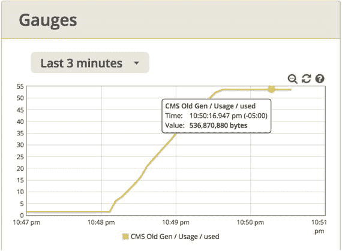

图 12-1.

Glowroot 的 Gauges 部分显示了 CMS 老年代已使用的字节数。这里我们创建了约 500 MB 来模拟某个东西的内存缓存及其对 GC 的影响。此图显示我的老年代大于 512MB。这并不十分相关，但我仍然想知道这是怎么发生的。

当老年代达到约 500MB 时（图 12-1 中晚上 10:49 到 10:50 之间），我应用了 A0 设置（图 12-2），可能就在可怜的 littleMock 开始抛出内存不足错误之前。


图 12-2.

littleMock 的 A0=0 设置，用于关闭额外垃圾收集

一旦应用了 A0=0，并且不断上升的 GC 立即并突然趋于平稳，我捕获了清单 12-6 中的开销指标，这些指标异常高，开销超过 100%。亲爱的 `jstat`，一秒钟的持续时间（在命令行中指定）怎么可能包含超过一秒的老年代活动，比如清单 12-6 中 dFGCT 列的 1.x 数字？我想，知道这些数字很糟糕并且需要改进就足够了。

最终，在 littleMock 的 `pom.xml` 中，我向老年代添加了 256MB，重新启动了 littleMock，小心地将大约 500MB 的缓存放回原位，并使用 A0 关闭了额外垃圾收集，使堆达到稳定状态。来自 `gctime.sh` 的异常高指标降为了零，因此老年代获得了绿色 GC 健康状态；详情请参见清单 12-7。

这里的一个教训是，要再三检查你的老年代是否有足够的空间来处理你的大分配，比如这个 500MB 的缓存。如果你是房间里最后一个发现身后座位上坐着一头大象的人，难道不会感到有点尴尬吗？这是同样的事情。还要记住，当可用堆空间缩小时，性能会下降。


## 堆趋势分析

通过 `jstat` 即时获取 GC 性能数据非常重要。例如，如果 `gctime.sh` 的旧生代和新生代指标显示 GC 健康状态为绿色（GREEN），那么你就可以继续检查 P.A.t.h 清单中的下一项。但了解 GC 性能的历史记录能提供关键故障排查细节，有助于解决问题。

例如，如果 GC 性能连续数天正常但突然恶化，那么你应该暂停对缓慢内存泄漏的排查，因为这种突然变化更可能是由一次性事件引起的，比如某个“毒丸”请求导致了一个开放式查询，返回了海量结果集，从而耗尽了所有可用内存。

在开发过程中，堆趋势分析也有助于发现代码库中是否潜入了内存泄漏。例如，在代码发布前，你可以运行一次负载测试，确保已使用的老年代堆（Used Tenured Heap）指标更接近图 12-3 中的锯齿状，而不是图 12-4 中的内存泄漏形态。这些图表展示了由 GCViewer 绘制的详细 GC 数据（参见本章第二节），GCViewer 可从 [`https://github.com/chewiebug/GCViewer`](https://github.com/chewiebug/GCViewer) 获取。

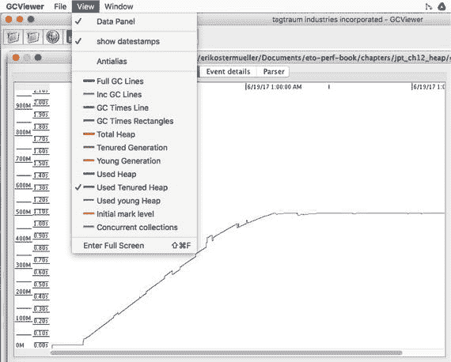

图 12-4.

当已使用的老年代堆指标缺少锯齿状时，通常呈现这种形态，这极有可能是内存泄漏。截图来自 GCViewer。

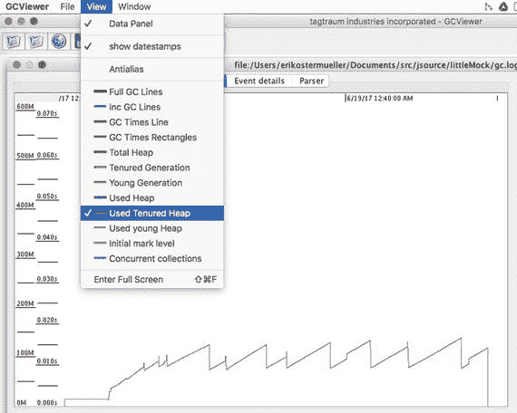

图 12-3.

GCViewer 中的这种锯齿状模式是健康信号，表明负载系统不存在任何内存泄漏

[`http://gceasy.io`](http://gceasy.io) 提供的 GC 指标非常有用，但我不太喜欢“将你的 GC 数据上传到我们的网站，或者付费使用自己的服务器”这种商业模式。GarbageCat 是另一个不错的选择：

[`https://github.com/mgm3746/garbagecat`](https://github.com/mgm3746/garbagecat)

## 使用 JVM 参数调整堆大小

在微服务世界中，更多 JVM 需要在单台机器上竞争固定数量的 RAM，这使得使用 `-Xmx` 参数调整堆大小成为一项关键任务。分配过少的 RAM 会导致自身资源不足；分配过多则会挤占其他进程。

我喜欢将最小和最大堆大小参数 `-Xmx` 和 `-Xms` 设置为相同值。例如，`-Xmx1g -Xms1g` 是好的做法，而我避免使用 `-Xmx1g -Xms512m`。这能让事情更简单，我不必理解一个不断扩展/收缩的堆。此外，在 JVM 启动时，将这两个参数保持一致，相当于向操作系统“提前声明”了测试表明所需的每一滴 RAM。

这可以防止其他进程抢占该 JVM 进程最终所需的 RAM。当更多微服务 JVM 在同一个“沙盒”中运行时，有人更可能“眼里进沙”。

在我的脑海中，我使用一个鞋盒比喻来理解如何使用 JVM 参数来增长和缩小老年代和新生代空间。`-Xmx` 决定了鞋盒的大小，而鞋盒内有一个纸板隔板将老年代和新生代分开。如图 12-5 所示，如果我明确将新生代大小设置为某个特定值，那么老年代将获得所有剩余 RAM，就像将隔板移向鞋盒一侧会增加另一侧的大小一样。

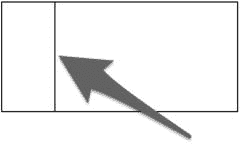

图 12-5.

垂直线就像鞋盒里的隔板

考虑图 12-6 中描绘的参数 `-Xmx512m -XX:NewSize=412m`。首先，注意 `-Xmx` 参数不使用等号，而 `-XX:NewSize` 使用等号——这是一个重要的语法差异。除了这个细节之外，这些参数定义了一个 512MB 的总堆，并将其大部分（412MB）分配为新生代的最小大小。JVM 自动将剩余的 100MB 分配给老年代，如图所示。这就是我的鞋盒比喻，分隔两个空间的线就是我的纸板隔板。

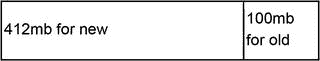

图 12-6.

使用 JVM 设置 `-Xmx512m -XX:NewSize=412m` 时，较大新生代大小的示意图

更改 `-XX:NewSize` 参数的值会移动鞋盒内的隔板（图 12-7），但保持鞋盒整体大小不变，如下所示：`-Xmx512m -XX:NewSize=100m`。


图 12-7.

使用 JVM 设置 `-Xmx512m -XX:NewSize=100m` 时，较大老年代大小的示意图。更改 `-XX:NewSize` 参数只会移动鞋盒纸板隔板，不会改变堆的整体大小。

如果我意外（或错误地）将 `-XX:NewSize` 设置为大于整个堆（大于 `-Xmx`），导致老年代没有空间，那么 JVM 会给出一个不太有用的错误信息：

```
Invalid maximum heap size: -Xmx=512m
```

这基本上是说，不可能将鞋盒隔板移到鞋盒外面。你的鞋盒隔板，即 `-XX:NewSize` 参数，必须为老年代和新生代都留出一些空间。

所以请记住：`-Xmx` 参数设置鞋盒的大小，而 `NewSize` 和 `MaxNewSize` 参数是隔板，它们实际上决定了新生代和老年代的大小。

在结束本节之前，我想快速提一下，`-XX:NewSize` 参数实际上是新生代的最小大小。¹ 为了降低复杂性并避免让我的大脑打结，我喜欢将 `-XX:MaxNewSize` 设置为与 `-XX:NewSize` 相同的值。`-XX:MaxNewSize` 还为无效参数提供了一次合理性检查。JDK 1.8 允许以下设置，尽管让新生代大小是其应包含的整个堆大小的两倍是没有意义的。

```
java -Xmx512m -XX:NewSize=1024m Test
```

但如果你添加了 `MaxNewSize` 参数，如下所示：

```
java -Xmx512m -XX:NewSize=1024m -XX:MaxNewSize=1024m Test
```

你会收到一个警告，告诉你问题所在：

```
Java HotSpot(TM) 64-Bit Server VM warning: MaxNewSize (1048576k) is equal to or greater than the entire heap (524288k). A new max generation size of 523776k will be used.
```


### 谨慎使用 NewRatio

我提出的“鞋盒”比喻方法通过使用 `-XX:NewSize` 设置绝对的字节大小，明确设定了老年代和新生代空间之间的比例。经验丰富的 GC 调优专家知道，还有一种替代方案是使用比例而非指定整数大小。这个替代方案就是 `-XX:NewRatio` JVM 参数。

> “设置 `-XX:NewRatio=3` 意味着老年代与新生代的比例为 1:3，Eden 区和 Survivor 区的总大小将是整个堆大小的四分之一……” [`https://docs.oracle.com/javase/8/docs/technotes/guides/vm/gctuning/sizing.html`](https://docs.oracle.com/javase/8/docs/technotes/guides/vm/gctuning/sizing.html)

JVM 的设计初衷是使用 `NewRatio` 或 `NewSize`/`MaxNewSize` 来调整老年代/新生代空间的大小，但不能同时使用两者。我进行了一项测试，如果同时提供了 `NewRatio` 和 `NewSize`/`MaxNewSize`，`NewRatio` 会被忽略，这可能会让人相当困惑。

但情况还会更糟——糟糕得多。在我们为清单 12-3 和 12-4 进行的新生代调优中，我们将老年代空间缩小到相对于整个堆大小而言非常小的程度。事实上，当性能达到最佳时，老年代仅占整个堆的 1/7。

我的观点是，将老年代大小缩小到堆的 50% 以下是一种完全有效且通常可取的方法，尤其是在无状态 SOA 系统中，但不幸的是，`-XX:NewRatio` 没有有效的值可以让你做到这一点，如表 12-1 所示。基于这些原因，我建议完全避免使用 `-XX:NewRatio`。

表 12-1.

不同 `NewRatio` 设置下的老年代百分比

| NewRatio | 老年代大小 %（隐含） |
| --- | --- |
| 1 | 50% |
| 2 | 67% |
| 3 | 75% |
| 4 | 80% |

我一直好奇为什么 `NewRatio` 如此受限，也许是一些过时的、历史性的性能考量在作祟？

一些堆调优技巧的保质期很短。在某个 Java 版本中有效的方法，在下一个版本中可能适得其反。Java 老手们可能已经知道这一点，但新手们往往倾向于相信他们最近学到的建议在 J8、J9 等版本中仍然适用。

我想用 Oracle 调优专家 Charlie Hunt 和 Tony Printezis 的评论来结束本节，他们也强调了新生代的重要性：

> “你应该尝试最大化在新生代中回收的对象数量。这可能是调整堆大小和/或调优新生代时最重要的一条建议。” [`http://www.oracle.com/technetwork/server-storage/ts-4887-159080.pdf`](http://www.oracle.com/technetwork/server-storage/ts-4887-159080.pdf)

### 盲目增加 -Xmx

尝试解决堆效率问题的一种懒惰方法是，在不了解哪个 GC 空间出现问题的情况下，简单地增加 `-Xmx` 值。例如，考虑 javaPerformanceTroubleshooting 测试中的 test 12a。

如果你在 `pom-startWar.xml` 中搜索 12a，你会找到这个：

```
12a 
-Xmx512m       
```

如果你将 `-Xmx` 的值增加四倍（到 2048MB），你会得到一点改进，但新生代 GC 开销百分比仍然有 10-15%。试试看。发生这种情况是因为导致性能下降的高开销空间——新生代——从未获得更多内存，因为在增加 `-Xmx` 时没有调整“鞋盒”分隔器——所有空间都分配给了老年代，而无状态活动测试 12a 并不使用老年代。

## 回收未使用的 RAM

上一节展示了 RAM 分配不足如何导致 GC 开销，从而将吞吐量限制在约 25%。过度分配可能会或可能不会导致性能问题，但无论如何都是对 RAM 的浪费。

这里有一种“即插即用”的方法，用于检测何时分配了大量系统从未使用的 RAM。

`jpt` 测试 06a 和 06b 获得了相同的吞吐量、相同的响应时间、相同的 CPU 消耗。如果所有这些指标都相同，我们为什么还要关心呢？答案是，测试 a 实现了与测试 b 完全相同的吞吐量和响应时间，但它使用的 RAM 更少，以下来自 JAVA_HOME/bin/`jstat` 的数据说明了这一点。`jstat` 提供了两个非常有用的指标：`OGCMX` 和 `OGC`。如以下网址所述：

[`https://docs.oracle.com/javase/8/docs/technotes/tools/unix/jstat.html`](https://docs.oracle.com/javase/8/docs/technotes/tools/unix/jstat.html)

这些值分别代表“最大老年代容量（kB）”和“当前老年代容量（kB）”。

清单 12-8 中右侧带下划线的数据显示了可以帮助你发现已分配但未使用的 RAM 的指标。第一个数据来自 javaPerformanceTroubleshooting 示例中的测试 06a，第二个来自测试 06b。

清单 12-8\. `jstat` 指标（带下划线）有助于发现已分配但未使用的 RAM

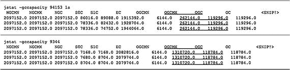

使用来自命令行工具 `jstat` 的清单 12-8 中的测试数据，图 12-8 显示测试 b 浪费地分配了大约 1GB 从未使用的 RAM，而其性能并不比测试 a 好。

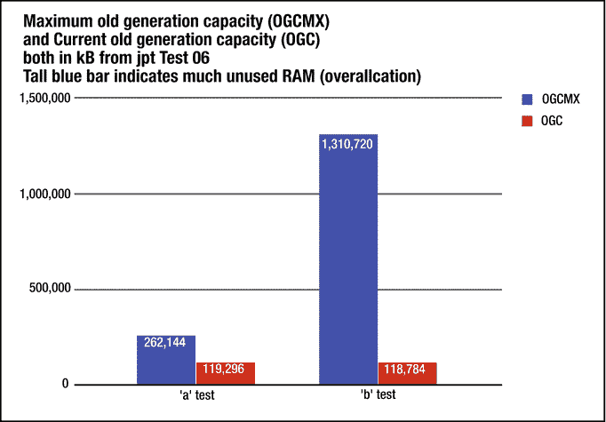

图 12-8.

来自清单 12-8 的数据直方图。高的蓝色条表示已分配但未使用的 RAM。

最终，由你来决定多少 RAM 被认为是浪费分配。但这里要小心。如果你的性能测试不知何故没有重现生产环境中大量使用内存的某些情况，你可能会意外地释放过多内存，并遇到内存不足的情况。但你可以在生产环境中安全地使用 `jstat` 来收集这些相同的指标，以帮助避免此问题。

此外，工具 [`http://gceasy.io`](http://gceasy.io) 在提供显示相同内容（已分配但未使用的堆空间）的图表方面做得很好，但它不是一个“即插即用”的工具。如果你需要添加 JVM 参数来启用详细 GC 收集，你需要添加它们并重启 JVM。一旦启用了详细 GC，你需要重新运行负载测试，然后将你的详细 GC 数据文件上传到某个第三方网站进行分析。而 `jstat` 方法则绕过了所有这些麻烦！


## 内存泄漏

最常见的内存泄漏是某种不断增长的单例，这类泄漏通常需要数小时、数天甚至更长时间才能在单例中积累足够的内存，从而开始引发问题。想象一个包含 `java.util.Map` 或 `java.util.List` 的单例，随着不断调用 `.put()` 或 `.add()`，内存会持续增长，直到耗尽所有分配的堆内存（即 `-Xmx` JVM 参数）。快速泄漏不太常见，但更危险，因为它们可能在数秒内毫无征兆地锁死 JVM。这种情况发生在某段毫无防备的代码被迫处理远超预期的数据量时，例如错误地将一个数百万行表中的所有行返回给最终用户。

用于排查内存泄漏的诊断数据分为几个层次，详细程度逐层递增：

1.  本章前面的“堆趋势”部分将帮助你了解堆在抛出内存溢出异常之前填充的速度。这基于详细的 GC 数据。这很好，但这些数据中未提及类名，因此很难识别是哪个类在泄漏。
2.  识别在某个时间点上实例计数最大和“引用”内存最多的特定类。`JAVA_HOME/bin/jmap -histo` 是获取此类数据的常见来源之一。Glowroot 也提供了此功能。
3.  理解监控数据的趋势。例如，哪些类的实例计数会随时间持续增长？可以通过手动工作来比较 `jmap -histo` 的输出（直方图）。一个名为 `heapSpank` 的工具可以为你完成部分处理工作。
4.  追踪不断增长的对象的所有权，回溯到存储/引用它们的父对象。有时你知道哪些对象在堆中泛滥，但不知道它们是如何到达那里的，也不知道为什么 GC 还没有丢弃它们。精确定位这些对象在堆中的位置有助于识别它们最初是如何到达那里的。堆转储和像 Eclipse MAT 这样的堆分析工具可以满足这一需求。

请记住，捕获堆转储是一项开销很大的操作。它可能会关闭（基本上是暂停）JVM 中的所有活动数十秒甚至更长时间。

## 排查内存泄漏

可以使用类直方图进行排查。

JDK 提供了一种很好的即插即用方法，可以获取 JVM 中加载的所有类在某个时间点的实例计数。只需调用 `JAVA_HOME/bin/jmap -histo <myPid>` 并将标准输出重定向到一个文本文件。以下是文档：

[`https://docs.oracle.com/javase/8/docs/technotes/guides/troubleshoot/tooldescr014.html#BABJIIHH`](https://docs.oracle.com/javase/8/docs/technotes/guides/troubleshoot/tooldescr014.html#BABJIIHH)

如果你加载了 2000 个类，`jmap -histo` 的输出将为每个类显示一行，显示该类的实例计数以及按类划分的内存。这是输出的大部分内容，并且由于完整的堆转储在大小和复杂性上都远超直方图，因此捕获堆转储会导致更大的开销。话虽如此，我甚至见过 `jmap -histo` 暂停 JVM 数十秒。有时，重要的排查数据值得短暂的暂停。

我建议在 `jmap -histo` 的输出中 grep 你的包空间。请记住，Java 基本类型（数组、int、long）和其他类型会以清单 12-9 中所示的奇怪的 `I` 语法出现。通常，了解这些基本类型的计数只有一点帮助，因为这些数据中没有指示符表明是什么分配了这些基本类型。当类和包名出现时，无论是在你自己的包中还是在依赖项的包中，这都为回答诸如“哪里可能存在一个会积累对象的单例？”和“哪些用户数据会随时间收集？”等问题提供了一些上下文。如果你看到处理会话数据的类名/包名，那么检查 HTTP 会话过期是否按预期工作将是值得的。

```
$ jmap -histo 29620
num  #instances  #bytes class name

1:   1414   6013016 [I
2:    793   482888 [B
3:   2502   334928 
4:    280   274976 
5:    324   227152 [D
6:   2502   200896 
7:   2094   187496 [C
清单 12-9.
jmap 输出的最顶部几行
```

`jmap -histo` 的主要限制在于它只提供某个时间点的数据。多次捕获和审查 `jmap -histo` 可能会有帮助，但在多个 `jmap -histo` 输出文件中查找对象计数的增长时，很容易被数据淹没。

为了更好地理解类计数和内存消耗随时间变化的趋势，我编写了 `heapSpank`，可在 heapSpank.org 获取。这是一个命令行工具，可以显示最可能泄漏的 15 个类的字节计数上升的时间百分比。

我使用以下密钥运行了一个 littleMock 测试来产生内存泄漏：

```
X2,J25,K25,L0,Q,R,S,A4096,B65535,C120000,D240000
```

图 [12-9 显示了 `heapSpank` 如何识别出泄漏类，但未识别出父容器；这是一个很好的开端。

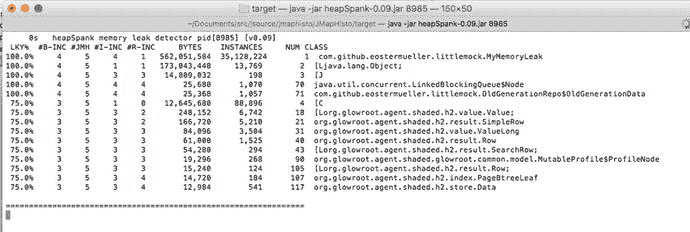

图 12-9.

来自 `heapSpank`.org 的 `heapSpank` 检测到了 littleMock 内存泄漏。看到 MyMemoryLeak 类如何冒泡到显示顶部了吗？

## 堆转储分析

在本章开头，我提到了可用的指标层次。`jstat` 提供瞬时指标来评估健康状况。详细的 GC 日志和像 GCViewer 这样的趋势工具有助于显示随时间变化的趋势。这些可以指示你是否存在随时间累积的缓慢泄漏。`jmap` 提供类的计数，然后 `heapSpank` 有助于了解这些特定类的计数和字节计数是否随时间持续上升。

所有这些数据都非常有用，但有时即使所有这些信息也不足以修复内存泄漏。让我解释一下。仅仅因为一个或几个对象的实例随时间增长，并不能指出它们具体在哪里累积，甚至不能说明它们为什么累积。我们总是懊恼地问，为什么垃圾收集器还没有回收由 `jmap`、`heapSpank` 或 Eclipse MAT 突出显示的特定对象集。

分析堆转储有助于回答这些问题。

### 捕获堆转储

尤其是在堆被泄漏对象填满的情况下，捕获堆转储可能是一项高开销操作。它可能会使 JVM 活动暂停数秒甚至数分钟。话虽如此，有些问题必须解决。因此，除非 `jstat` 和详细的 GC 数据表明字节计数和/或实例计数呈上升趋势，否则我从不捕获堆转储。如果已经发生了内存溢出错误，则忽略开销，直接捕获转储。

我使用以下 littleMock 密钥模拟了内存泄漏——与上一节中使用的相同。

```
X2,J25,K25,L0,Q,R,S,A4096,B65535,C120000,D240000
```

我让这个测试运行了几分钟。然后，我使用清单 12-10 中所示的命令捕获了堆转储。

```
jcmd  GC.heap_dump /path/to/myDump8.dat
清单 12-10.
捕获堆转储的多种方法之一
```

不要忘记在你的应用程序的 JVM 启动参数中使用以下参数，这些参数会在发生内存溢出错误时自动捕获堆转储：

```
-XX:+HeapDumpOnOutOfMemoryError 和 -XX:HeapDumpPath=/some/path/ in/production
```


### 使用 Eclipse MAT 查找内存泄漏

通常，如果你要修复内存泄漏，就必须修改代码。目标是找出所有不会被垃圾回收器回收的泄漏对象，但主要是要弄清楚为什么这些对象没有被回收。答案往往在于对象层级结构——哪些类拥有并持有那些充斥堆内存的类的实例。这本质上是在寻找父级关系——谁拥有谁。

本节将使用 Eclipse MAT 来查找泄漏源。IBM Heap Analyzer 是一个不错的替代品。它有时具有更好的自动泄漏检测功能，但其 Swing GUI 速度较慢，在对象图中导航更困难，显示的信息也比用 Eclipse RCP/SWT 编写的 MAT 少。让我们回到 MAT。

从以下网址下载并安装 MAT：[`http://www.eclipse.org/mat/`](http://www.eclipse.org/mat/)。然后，我选择了“文件 -> 打开堆转储”菜单选项，并指向我在清单 12-10 中捕获的 `myDump8.dat`。

在你的桌面上运行 MAT 需要大量的处理能力，尤其是当堆大小超过 1GB 时。

我建议在你的桌面上配备 32GB 内存，并在 MAT 的 `MemoryAnalyzer.ini` 文件的 `-Xmx` 参数中，将大约一半的内存分配给 MAT。

### Eclipse MAT 自动泄漏检测

MAT 提供了三个基本上能进行自动泄漏检测的报告。不要忽略这些报告。它们是：

*   堆转储概览
*   主要组件
*   泄漏嫌疑人

我要说的是，它们的功能和目的之间存在显著的重叠。

当 Eclipse 打开你的堆转储时，它会询问你是否要创建一份“泄漏嫌疑人”报告。我选择了该选项，MAT 显示了图 12-10。“泄漏嫌疑人”视图不是一个交互性很强的饼图，但底部的“详细信息”超链接确实允许你探索堆的对象图。

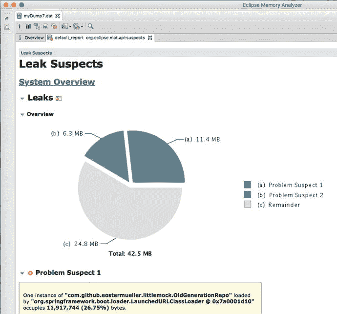

图 12-10.

Eclipse MAT 的“泄漏嫌疑人”视图正在查看来自 littleMock 的堆转储。在我见过的大约三分之一到一半的堆转储中，此屏幕会相当准确地指向泄漏实例和/或包含它们的对象。

事实上，图 12-10 中的这个截图已经找到了包含所有泄漏对象的容器。看到底部的 `OldGeneratioRepo` 了吗？littleMock 将所有 `MyMemoryLeak` 对象存储在这个对象中，具体的集合在清单 12-11 中。这个队列是存储所有泄漏对象的对象，取自 littleMock github 仓库中 `OldGenerationRepo.java` 的源代码。

```
Queue allOldGenData = new LinkedBlockingQueue();
清单 12-11.
OldGenerationData 队列
```

### 在 Eclipse MAT 中探索

在转储文件名的正下方，有一组我非常依赖的实用图标（图 12-11）。


图 12-11.

Eclipse MAT 的可用性还不错。我通常依赖这里的图标来帮助我导航。

表 12-2 详细说明了图 12-11 中每个图标的位置、名称和用途。

表 12-2.

图 12-11 中显示的 Eclipse MAT 图标

| 工具栏上的位置 | 报告名称 | 描述 |
| --- | --- | --- |
| 最左侧图标 | 概览 | 显示一个饼图，其中包含消耗最大的类/包。 |
| 左起第二个图标 | 直方图 | 右键单击可向下钻取传入和传出的引用。 |
| 左起第三个图标 | 支配树 | 与直方图非常相似，但通过左键单击向下钻取。 |
| 左起第四个图标 | 对象查询语言 | 类似 SQL 的语言，允许你查询对象所有权树。 |
| 左起第五个图标 | 双齿轮 / 线程概览 | 基本上包含一个高级线程转储，还显示线程和线程本地存储中的分配。对于查找正在创建快速内存泄漏的堆栈跟踪非常有帮助。 |
| 左起第六个图标 | 报告 | 泄漏嫌疑人和其他报告。 |
| 左起第七个图标 | 数据库罐 / 查询浏览器 | 提供与直方图视图中相同的右键单击向下钻取选项。 |
| 左起第八个图标 | 搜索 / 放大镜 | 通过十六进制对象地址查找对象。 |

图 12-12 中的直方图看起来与 `jmap` 输出非常相似，但它的交互性很强。例如，MAT GUI 在处理大量对象列表方面做得非常出色。它一次显示一屏内容，并允许你“点击查看更多”。但图 12-12 使用了不同的功能来管理海量对象——一个简单的过滤器。看到左上角了吗？我在那里输入了一个正则表达式来查找所有匹配 `*stermueller*` 的对象。

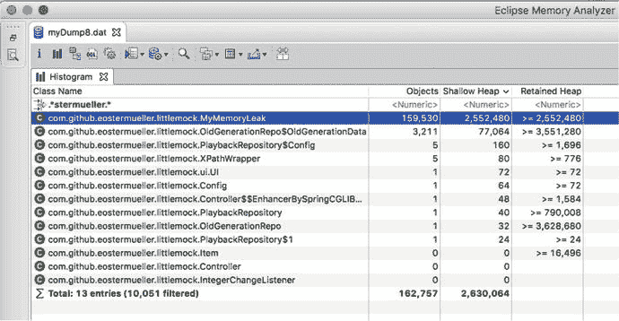

图 12-12.

Eclipse MAT 直方图，显示所有实例的计数和字节数。请注意，`MyMemoryLeak` 类直接显示在顶部。这与 `jmap` 非常相似，但它是交互式的。你可以通过各种方式对其进行排序，并轻松地右键单击并向下钻取，以查看此类指向的所有对象，以及指向所选类的所有对象。

这是一个非常方便的功能。在此截图中，MAT 已经检测到我的包空间中导致泄漏的 2-3MB 数据。这是一个不可或缺的工具。

在图 12-13 中，我右键单击并向下钻取，以查看哪个“容器”类可能持有对我的引用，从而阻止“我”被回收。这被称为查找 GC 根。在我的简单示例中，我们已经知道这个问题的答案。但大约有一半的时间，我在查看非常不熟悉的代码，非常需要这个功能。

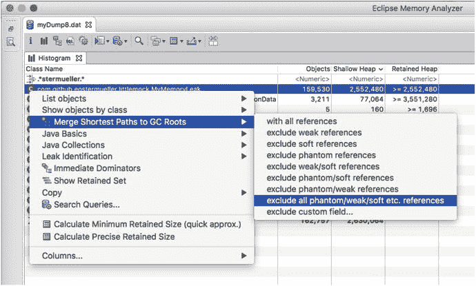

图 12-13.

我右键单击了一个泄漏对象来查找“根”——是哪个对象阻止了它被回收

结果就是图 12-14 中这个非常漂亮的树状视图，我们终于看到了我们一直在寻找的对象父级关系的详细细节。

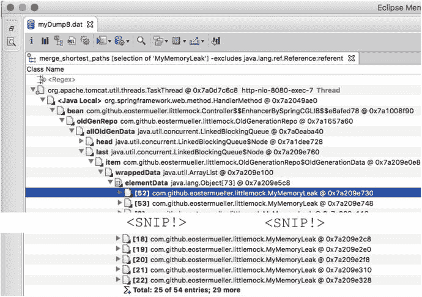

图 12-14.

来自 Eclipse 的“合并到 GC 根的最短路径”屏幕


### 内存泄漏的类型

Eclipse MAT 在发现常见的内存泄漏方面表现出色，例如前面展示的 MyMemoryLeak。这部分是因为该泄漏锚定在一个单例对象——即 GC 根上。想象一个无状态的小进程，它查询了一个包含数百万行记录的数据库表中的所有行。在这种情况下，不存在 GC 根。因此，我为你创建了一个这样的场景供你实验。

通过从数据库表中选择数百万行记录，调用以下 URL 基本上会使任何 `jpt` JVM 崩溃：

`https://localhost:8675/crashJvmWithMonsterResultSet`

也许可以通过尝试在此场景创建的堆转储中找到泄漏来改进 MAT。也许只是我错过了它。

元空间泄漏同样难以解决，但我可以为你提供一些故障排查的入门知识。以下命令将显示元空间容量，以查看你是否接近填满该空间：

```
jstat -gcmetacapacity  1s
```

但你需要参考 `jstat` 文档来理解所有字段名称：

[`https://docs.oracle.com/javase/8/docs/technotes/tools/unix/jstat.html`](https://docs.oracle.com/javase/8/docs/technotes/tools/unix/jstat.html)

要找出你最初分配了多少空间，请在 JVM 参数中查找此参数：

```
-XX:MaxMetaspaceSize=1g
```

最后，要找出哪个类可能正在泄漏，请使用以下说明启用详细的类加载信息：

[`https://dzone.com/articles/how-use-verbose-options-java`](https://dzone.com/articles/how-use-verbose-options-java)

通常，在系统预热之后，类加载应该几乎停止。如果详细的类加载信息持续显示活动，特别是每秒加载几个或更多类，那么你就遇到了元空间泄漏。

到目前为止我们讨论的泄漏是 Java 程序使用的堆的一部分。早在 Java 7 之前，我们在 C 程序（我认为）中看到了许多内存泄漏，也就是 JVM 本身。这被称为本机内存泄漏，并且不容易调试；它远远超出了这本小书的范围。

## 堆故障排查，逐步进行

我通常通过首先检查是否存在简单的解决方案来排查堆问题。只有当这些简单的解决方案不成功时，我才会继续探索内存泄漏等问题。以下大纲描述了这种粗略的故障排查过程。

首先遵守这些通用规则：

*   `-Xmx` 不得超过可用 RAM。
*   避免使用 `NewRatio`。
*   从一而终：坚持使用你最喜欢的 GC 算法（串行 GC 除外）。如果你使用的是 IBM J9，则只使用 gencon（默认）或新的 Balanced，这是一种“区域”算法，类似于 G1。

基本的 GC 故障排查步骤如下：

1.  从一个不太大的堆开始，大小在 512MB（可能用于微服务）到 4GB 之间。  
2.  在负载下，评估 GC 分代开销。使用 `jstat` 和 `gctime.sh` 或 `gctime.cmd`。  
3.  如果其中一个或两个分代持续出现红色和/或黄色开销，请为该分代配置额外的 RAM 块（也许是 256MB？）；然后重新启动并重新测试。重复此过程，直到 GC 开销百分比结果达到所需范围。  
4.  如果不频繁但长时间的老年代暂停（慢于 5 秒）是不可接受的，请考虑切换到以下选项之一：
    1.  Hotspot / G1，因为老年代收集被分解为更小的收集，从而产生更短的暂停。这里是详细的 G1 调优文档：[`http://www.oracle.com/technetwork/articles/java/g1gc-1984535.html`](http://www.oracle.com/technetwork/articles/java/g1gc-1984535.html)  
    2.  对于 IBM J9，请使用 Balanced 收集器，其“区域”方法与 G1 非常相似。  

高级 GC 故障排查步骤如下：

1.  如果老年代持续出现黄色、红色或内存不足错误，请检查内存泄漏。
    1.  使用 `jmap -histo` 和/或 `heapSpank` 来评估是否存在一个或多个类的字节数或实例数持续增长。  
    2.  使用 PMAT 或 GCViewer 检查详细的 GC 日志。检查这些工具中的图表，查看老年代内存消耗的上升趋势。考虑图表显示填满堆所需的时间。如果堆在几秒或几分钟内被填满，我认为这是一个快速泄漏，并查找分配大量数据的单个请求。一个巨大的 JDBC 结果集就是一个例子。相反，如果需要数小时或数天才能填满堆，请查找少量对象，这些对象聚集在一个由单例持有的 `java.util` 集合中。  
    3.  如果 `heapSpank` 没有提供足够的数据来查找泄漏原因，请捕获堆转储，尝试以下方法之一：
        1.  MAT 泄漏嫌疑人。  
        2.  直方图。  
        3.  使用 MAT 查找 GC 根。    
2.  元空间泄漏。从 `jstat -gc <myPid> 1000` 的输出中查找“MC”、“MU”、“CCSC”和“CCSU”。  
3.  有时，单次巨大的内存分配可能会填满堆并使你的 JVM 崩溃。要了解如何排查这种情况，请在任意 `jpt` 测试期间从任意浏览器调用以下 URL：`https://localhost:8675/crashJvmWithMonsterResultSet` 这会执行一个返回巨大结果集的 JDBC 查询。浏览器将挂起，JVM 将产生“java.lang.OutOfMemoryError: Java heap space”错误。使用 `jcmd <myPid> GC.heap_dump myDump.bin` 创建堆转储。使用 MAT 检测泄漏。  
4.  在详细的 GC 日志中查找失败消息。通常，我使用 PMAT 或 GCViewer 来“查看”我的日志。但是，当我处理一个真正棘手且无法解释的 GC 问题时，我会拿出文本编辑器，浏览日志以查找类似“ParNew (promotion failed)”的错误。请务必在互联网上搜索类似的错误。

## 别忘了

微服务的世界即将到来，届时将有更多的 JVM 在单个操作系统实例上运行。在一台机器上，可能不再是 4-8 个 JVM，而是 10 到 30 个。所有这些都需要更严格的内存管理、发现堆过度分配，并监控更多进程的性能健康状况。

出于这些原因，学习本章中的一些堆故障排查技术将是明智之举。在本章前面，我提到用于排查堆问题的诊断数据分为几个层次，这些层次越来越详细。了解这些层次有助于你理解可能遗漏的故障排查数据。例如，来自 `gcstat` 的即插即用 GC 数据非常适合即时查看，但 PMAT 和 GCViewer 更适合捕捉趋势，而这些趋势表明你遇到的是快速还是缓慢的内存泄漏。

这就是 P.A.t.h. 检查清单的结尾。接下来是获得实际练习，学习如何将黑暗环境转变为具有良好可见性的环境，并教会你的同事如何使用这些即插即用技术来实现这一目标。

脚注 [1

此链接（ [`https://docs.oracle.com/cd/E19900-01/819-4742/abeik/index.html`](https://docs.oracle.com/cd/E19900-01/819-4742/abeik/index.html) ）说明：`NewSize` 和 `MaxNewSize` 参数控制新生代的最小和最大大小。


