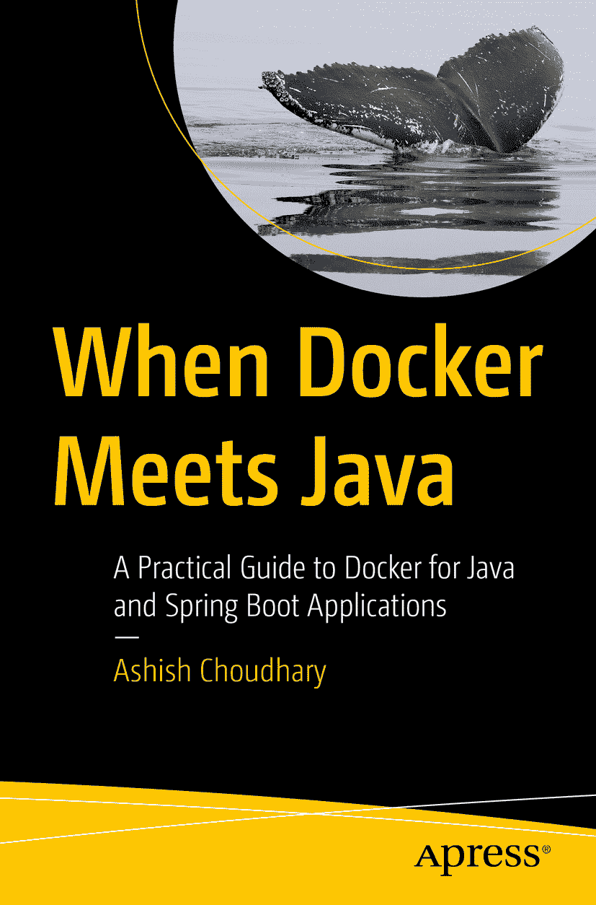

ISBN 979-8-8688-1299-6e-ISBN 979-8-8688-1300-9 [`doi.org/10.1007/979-8-8688-1300-9`](https://doi.org/10.1007/979-8-8688-1300-9) © Ashish Choudhary 2025 本作品受版权保护。所有权利均由出版商独家许可，无论涉及材料的全部或部分，具体包括翻译、重印、重用插图、朗诵、广播、以缩微胶片或任何其他物理形式复制，以及传输或信息存储与检索、电子改编、计算机软件，或目前已知或未来开发的任何类似或不同方法的权利。本出版物中使用通用描述性名称、注册商标名称、商标、服务标志等，即使未作明确声明，也不意味着这些名称不受相关保护法律和法规的约束，因此可自由用于一般用途。出版商、作者和编辑可以假定，本书中的建议和信息在出版之日是真实和准确的。出版商、作者或编辑均不对本文所含材料或可能存在的任何错误或遗漏提供明示或暗示的保证。出版商在已出版地图和机构归属方面的管辖权主张上保持中立。

本 Apress 印记由注册公司 APress Media, LLC（Springer Nature 的一部分）出版。

注册公司地址为：1 New York Plaza, New York, NY 10004, U.S.A.

*献给我的女儿 Viya 和儿子 Ayansh，他们让我的世界充满欢乐与奇迹。*

*献给我的妻子 Shefali，我坚定不移的伴侣和力量源泉。*

*献给我的父母，感谢他们无尽的爱与指引。*

*这本书是为你们而写。*

关于作者 关于技术审校

