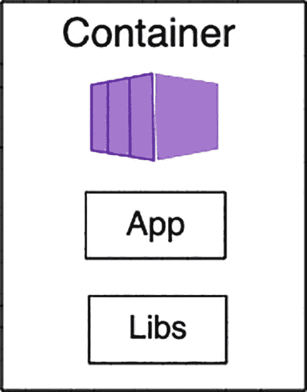
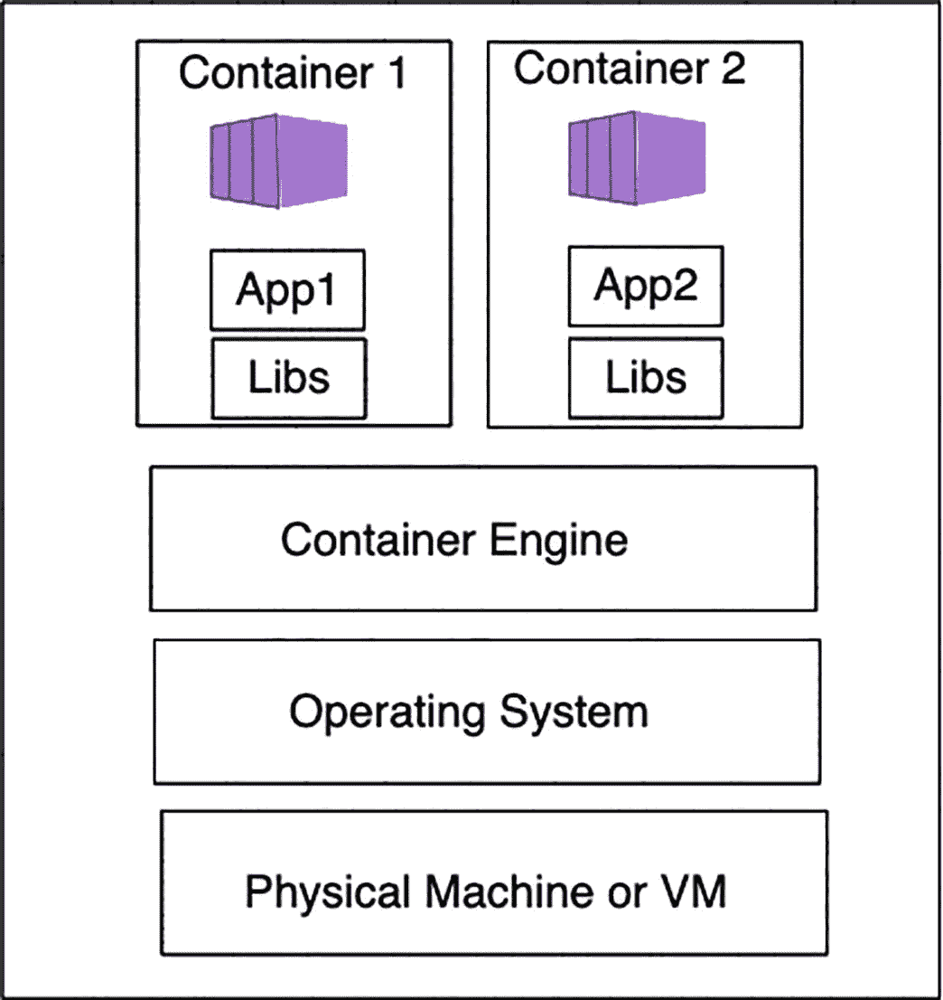
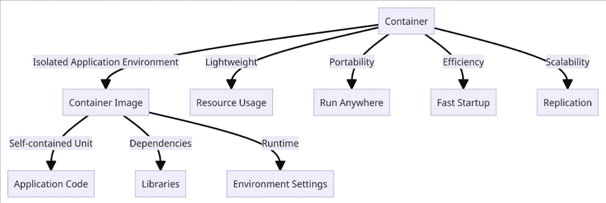

# 1. 容器概述

小时候，我花了很多时间用乐高积木搭建各种东西，同时心里总在想，这些简单得离谱、标准化的 2x4 积木块，怎么可能是一切奇妙可能性的起源。我那时并不知道，这些彩色积木正在向我灌输现代软件开发的基本原则。正如乐高重新定义了游戏，容器也从根本上改变了我们开发、打包和部署应用程序的方式。现在，把你的软件想象成乐高积木搭建的作品。容器就是一个个独立的积木块，标准化且可以无限组合，每个都代表一个容器化的组件。

就像玩具积木一样，容器提供了一种标准方式来打包应用程序，使其能够在任何兼容的系统上移植运行。需要扩展？很简单：添加更多的“积木块”。想要更新某个功能？取出一个容器，再插入另一个，而无需推倒整个“塔”。乐高的神奇之处在于其模块化和灵活性：易于搭建、拆解和重建。在软件开发中，容器为软件开发带来了同样的敏捷性。它们将应用程序及其依赖项隔离开来，就像单个乐高积木是独立的单元一样。这种隔离确保，就像一块红色的 2x4 积木，无论是在城堡中还是在宇宙飞船上都没有区别一样，你的应用程序无论是在你的笔记本电脑上还是在云数据中心内，运行起来都完全一致。

在本章中，我们将把容器技术的各个部分拼凑起来，探索这些数字积木块如何构建了计算领域的新时代。在本章结束时，你将看到容器如何成为创新之门：使开发者能够以前所未有的轻松和创造力来构建、共享和部署他们的数字作品。

## 一点历史

2010 年，一家名为 dotCloud 的小型初创公司在竞争激烈的平台即服务市场中艰难求生。他们当时并不知道，自己即将改变整个科技世界。

在 Solomon Hykes 的带领下，dotCloud 团队开发了一个用于管理 Linux 容器的内部工具，本意是为了改进他们的系统，但很快这个工具就变得远不止于此。

*Linux 容器是一种操作系统级虚拟化技术，可以在单台机器上运行多个独立的 Linux 环境。LXC 与每个环境共享宿主机的内核，这提供了一种比虚拟机更轻量的替代方案，同时仍能保持进程、文件系统和网络空间的隔离。*

*LXC 利用 cgroups（控制组）和命名空间来管理和限制资源，提供了一种类似于在底层系统上原生运行的虚拟化体验，而无需完整的虚拟机监控程序的开销。*

Hykes 在 2013 年 3 月的 PyCon 大会上介绍了 Docker。他立即得到了开发者们的热烈响应，因为 Docker 提出了一种解决方案，可以更轻松地在任何环境中一致地创建、部署和运行应用程序。

Docker 的一个关键创新在于，它能够将应用程序及其依赖项打包成一个标准化的单元，即以一致的格式包含库、依赖项、配置文件和运行时环境——这也被称为容器。仅此一点就解决了开发者长久以来的头疼问题：“在我的机器上能运行啊！”

随着 Docker 的流行，dotCloud 调整了方向。他们更名为 Docker, Inc.，现在专注于创建 Docker 生态系统。该项目发展非常迅速：

2014 年，Docker Hub 推出，为容器镜像提供了一个中心位置。

2015 年，Docker Swarm 随之推出，提供了原生的容器编排功能。

2017 年，Docker 企业版发布，以满足企业的需求。

Docker 是软件开发的一次彻底变革。它使容器化和微服务架构更加流行，并极大地改变了公司开发和部署应用程序的方式。

但过程并非一帆风顺。Docker, Inc. 遇到了财务困难，迫使其在 2019 年出售了企业业务，尽管核心的 Docker 技术仍然极具影响力。

如今，Docker 是许多开发工作流程的核心。这个故事例证了一个内部工具如何通过开源社区的采用和贡献，成为一项塑造行业的技术。

在本书探索容器的过程中，我们将了解 Docker 背后的故事。这提醒我们，革命性的解决方案往往始于微末，而当时机成熟时，它们有能力改变整个行业。

## 容器的定义

在深入探讨之前，让我们先探索容器的正式定义。

### Docker 的定义

Docker 对容器的定义如下：

*容器是软件的标准单元，它将代码及其所有依赖项打包在一起，从而使应用程序能够从一个计算环境快速、可靠地迁移到另一个计算环境。Docker 容器镜像是一个轻量级、独立的、可执行的软件包，其中包含运行应用程序所需的一切：代码、运行时、系统工具、系统库和设置。*

### 理解容器

这个定义提供了更全面且易于理解的解释。对于一个 Java 应用程序，容器将包含基础镜像、JRE（Java 运行时环境）、应用程序代码以及其他运行所需的依赖项。

让我们通过另一个例子进一步阐述这个概念。在 Java 中，类（Class）是一个蓝图或模板，定义了对象的状态和行为。利用这个模板，我们可以创建该类的多个实例。类似地，容器镜像是一个模板，可以从中生成多个容器实例。

容器可以被比作黑盒子，其内部细节不可见。每个容器都有自己的 IP 地址、主机名和磁盘。虽然我们将在后续课程中探讨容器的优势，但隔离是其显著优点之一。假设要运行两个需要不同版本 Java 或不兼容工具和库的应用程序。在虚拟机（VM）上实现这一点将颇具挑战，并会导致资源浪费。然而，这种隔离是容器与生俱来的特性，因此运行多个具有不同需求的应用程序变得可行。

图示说明容器结构。顶部显示“Container”一词，其下方有一个蓝色立方体图标，代表容器。图标下方有两个带标签的方框：“App”和“Libs”，表示容器内的应用程序和库。

图 1-1

容器

如图 1-2 所示，底部的底层基础设施可以是一台物理机或虚拟机。其上是操作系统层。容器引擎负责在宿主机上运行容器。在图的顶部，我们看到两个独立的应用程序分别在各自的容器中运行，彼此完全隔离。

图示说明容器化架构。顶部有两个容器，分别标记为“Container 1”和“Container 2”，每个容器内都有一个蓝色立方体图标，第一个容器内有“App1”和“Libs”，第二个容器内有“App2”和“Libs”。容器下方是“Container Engine”层，接着是“Operating System”层，底部是“Physical Machine or VM”层。

图 1-2

容器的可视化表示

让我们通过一个类比来进一步理解容器。

*   想象 Java 容器类似于 `JAR`（Java 归档）文件。在 Java 编程中，`JAR` 文件将 Java 类和资源封装到一个文件中，方便分发和运行应用程序。

*   现在，将容器视为一个以类似方式运作的更广泛的概念。与 `JAR` 文件一样，容器将应用程序及其所需的依赖项和配置文件打包在一起。这种封装确保了应用程序从开发到生产的不同环境中都能一致地运行。

*   这就像将我们的 Java 程序及其所有依赖项放入一个独立的、自给自足的容器中，确保无论将其置于何处都能无缝运行。在这个类比中，正如 `JAR` 文件包含编译后的 Java 代码和资源一样，容器容纳了整个应用程序及其成功运行所需的一切。

容器封装了所需的依赖项，作为拥有 IP 地址、主机名和磁盘配置的自包含实体运行。容器引擎在宿主机上执行它们。这些容器将应用程序与必要的依赖项和配置文件打包在一起，确保在不同环境中功能一致，就像 JAR 文件一样。

## 容器的重要性

根据 2023 年 DZone 容器趋势报告，容器化技术持续成熟并引领潮流。此外，容器的采用率正在增加，尤其是在大型企业中，因为大多数大型组织正在进行数字化转型以增强其 IT 和业务能力。关键在于，将我们的工作负载容器化有一些明显的好处。

那么，容器究竟有何特别之处，我们为什么要在组织中采用容器呢？

### 容器的关键优势

容器提供了几个关键优势，使其成为软件开发和部署中的热门选择。

#### 可移植性

计算中的可移植性指的是在不同于最初设计的操作系统上执行计算机程序或软件的能力。由于其固有的可移植性，容器可以在各种平台上使用。它们兼容 Linux、Windows、macOS 以及许多其他广泛使用的操作系统，确保在虚拟机、物理服务器和个人笔记本电脑上行为一致。

#### 资源利用

容器可以在不启动整个操作系统的情况下启动，从而减少资源消耗。我们可以使用更少的资源高效运行，并减少与云服务或数据中心运营相关的支出。

#### 隔离性

通过在单个服务器上运行容器，每个容器都与其他容器隔离，从而确保一个特定容器中的任何问题都不会影响运行相同应用程序的其他容器。

#### 敏捷性

启动、停止、移除——一切操作都迅速发生，因为容器是轻量级且自包含的。由于其快速的启动和关闭时间，它们非常适合持续集成和持续部署（CI/CD）流水线。与虚拟机相比，容器快速的启动和关闭时间有助于实现更快速、更精简的开发和部署工作流。

#### 易于扩展

通过运行多个相同的应用程序实例，容器的水平扩展变得容易得多。例如，Kubernetes 是一个容器编排工具，可以自动扩展容器，为容器化应用程序提供了一种先进的方法。

#### 提高生产力

开发人员常说“它在我的机器上能运行”，意思是他们的代码在自己的环境中运行良好，没有任何问题。然而，它往往无法在生产环境中按预期正常工作。容器通过为它们提供可预测的环境解决了这个问题，因此无需担心此类兼容性问题。

#### 云支持

主要的云平台，如 Amazon Web Services、Azure 和 Google Cloud Platform，都已拥抱容器。换句话说，这些平台已经采用了基于容器的服务。这得益于容器以标准格式（如开放容器倡议（OCI））打包，使其能够在多个云平台上无偏差地运行。因此，我们可以确信，无论应用程序运行在哪个云环境中，其行为方式都是一致的。

下图展示了容器的一些重要特性，如隔离性、自包含性和轻量级设计。它还强调了其可移植性，意味着您的应用程序可以在不同的云上灵活运行。

图示说明容器的优势和组件。主节点是“Container”，分支为五个优势：“Isolated Application Environment”、“Lightweight”、“Portability”、“Efficiency”和“Scalability”。“Isolated Application Environment”指向“Container Image”，后者进一步分为“Self-contained Unit”和“Dependencies”，进而指向“Application Code”和“Libraries”。“Runtime”连接到“Environment Settings”。其他优势包括“Resource Usage”、“Run Anywhere”、“Fast Startup”和“Replication”。

图 1-3

说明容器的基本属性

### 容器 vs. 虚拟机

你可能会想，既然虚拟机被认为是云计算的基础，我们是否应该考虑将应用程序容器化。一些顶级云服务提供商仍然提供让你在虚拟机上运行应用的服务。在云计算诞生之前，虚拟机就被用于企业组织的关键任务负载，并且对于商业应用而言，它们仍然具有成本效益且节省时间。

此外，容器和虚拟机都有助于高效利用计算机资源，但在某些方面有所不同。让我们花点时间比较一下容器和虚拟机之间的差异。

表 1-1

容器与虚拟机对比

| 标准 | 容器 | 虚拟机 |
| --- | --- | --- |
| 定义 | 容器将应用程序及其依赖项、库、二进制文件和配置文件封装到单个包中。 | 虚拟机模拟一个客户操作系统，并抽象出其运行的物理宿主机。 |
| 操作系统架构 | 容器不运行完整的操作系统，而是共享一个操作系统内核。 | 虚拟机允许我们在宿主机上运行多个完整的客户操作系统，从而提高资源利用率。 |
| 大小 | 容器是轻量级的，仅包含运行应用程序所需的依赖项。 | 虚拟机包含整个客户操作系统，因此其大小通常较大（例如，几个 GB）。 |
| 启动时间 | 容器启动时间较短（例如，通常为毫秒级）。 | 虚拟机启动时间通常为分钟级，因为其体积较大。 |
| 运行时环境 | 容器提供可预测的运行时环境。 | 使用虚拟机时，我们必须花费时间和精力来确保环境的一致性。 |
| 维护 | 易于维护和升级。我们可以丢弃旧容器并启动一个新容器。 | 维护和升级虚拟机比较繁琐。 |

总而言之，容器正在日趋成熟并越来越受欢迎，提供了可移植性、更好的资源利用率、隔离性、敏捷性、易于扩展、更高的生产力以及云支持等优势。它们适用于 CI/CD 流水线，并与多种操作系统兼容。相比之下，虚拟机对于商业应用来说是高效的，但体积更大，启动时间更长，并且需要更多努力来确保兼容性。

### Docker 的兴起

自 2013 年 3 月推出以来，Docker 已成为容器化应用负载无可争议的标准。根据 2024 年 Stack Overflow 开发者调查，在最受欢迎的工具类别中，Docker 在专业开发者中继续位居榜首。

现在，让我们深入探讨一下那些吸引开发者并让他们喜爱 Docker 的因素。

#### Docker 流行的关键原因

Docker 因其几个关键特性和优势而广受欢迎：

*   **成本节约：** Docker 是最佳选择，因为它能让我们最大限度地利用现有基础设施。正因如此，与虚拟机相比，Docker 容器消耗的硬件资源更少；因此，它成为一种非常经济的解决方案。通过部署 Docker 容器，我们可以凭借高效的资源利用实现巨大的投资回报率。

*   **安全性：** Docker 能够很好地隔离应用程序，这使其成为企业环境的绝佳选择。正是在这种背景下，Docker 的这种能力使其最适合在企业环境中使用。例如，Docker 提供了一款名为 Docker Scout 的工具，它可以检查镜像内容，并提供一份详细报告，突出显示已识别的软件包和漏洞。此外，它还会就如何解决镜像分析过程中检测到的问题给出建议。

*   **更简便的开发：** 使用 Docker 可以消除“在我机器上能运行”的问题，因为它能确保在软件开发生命周期的所有阶段（从本地环境到生产环境）都保持环境一致。这种一致的环境帮助开发者显著提高生产力，让他们在编写代码时无需担心基础设施的兼容性问题。此外，Docker 镜像是版本化的，因此如果出现问题，可以轻松回滚到之前的镜像版本，从而为开发过程增加了额外的灵活性和稳定性。

*   **与现有工具的集成：** Docker 在多个广泛使用的集成开发环境中都提供了直接支持。这简化了在应用程序内部开发循环中基于容器的应用程序开发和管理。Docker 的固有特性以及来自 Kubernetes 等编排工具的支持，使其在生产环境中高效且具有弹性。此外，Docker 可以轻松集成到广泛使用的 CI/CD 平台 GitHub Actions 中，这样你就可以自动化构建、测试和部署容器应用程序的流水线。Docker 在市场上提供了许多 GitHub Actions——包括官方和用户贡献的——这些 Actions 可以在你的工作流中使用易于使用、可重用的组件来构建、注释和推送镜像。

*   **微服务架构：** 微服务架构的兴起需要一种解决方案来管理独立部署和扩展多个服务的复杂性。Docker 轻量级和模块化的特性使其成为将单体应用分解为微服务的绝佳选择。因此，将无状态微服务作为容器运行是一个合乎逻辑的选择。通过这种方法，部署变得简单，并且通过优化利用现有硬件资源，扩展也变得更容易。每个微服务都可以放入其自己的容器中，可以独立地进行开发、扩缩容和部署。Airbnb、Netflix 和 Paypal 都已采用 Docker 作为构建可扩展、容错的微服务架构的技术。

*   **混合云和多云部署：** 越来越多的企业正在采用多云环境，以避免依赖单一云提供商而导致的供应商锁定和全局性故障。话虽如此，每个云提供商都有不同的配置、策略和管理工具，这使得应用程序的部署变得复杂。Docker 的可移植性允许组织以一致的方式为混合云和多云环境部署应用程序。我们可以使用 Docker 容器一次构建应用程序，随处运行，从而实现在不同云提供商或本地基础设施之间的无缝迁移和部署。例如，在 AWS EC2 中运行的容器可以轻松迁移到 Google Cloud Platform 内的环境，而无需任何更改或丢失任何内容。这种灵活性可以降低供应商锁定的风险，并允许企业选择他们最倾向于使用的基础设施。

*   **适用于各种场景的通用性：** Docker 极其灵活，可用于多种用例。在企业环境中，当团队使用多种工具和技术时，创建一致的开发环境变得具有挑战性。Docker 可以实现这一点，它能够标准化环境并进行一致地设置。我们可以在 Dockerfile 中定义基础设施规范，并将其提交到代码仓库。然后，开发人员可以使用这些规范轻松创建他们的开发环境。在应用程序开发中，我们经常依赖 PostgreSQL 或 Nginx 等第三方工具。利用这些第三方应用程序的容器镜像可以简化其执行，因为所有必要的依赖项都封装在容器内。这意味着只需最少的手动配置，并且无需浪费时间查阅文档。这种节省时间的便利性适用于各种工具，包括数据库和 Web 服务器，因为容器镜像通常很容易获得。

## 总结

总之，Docker 已成为容器化应用程序工作负载的标准，因为它能高效利用资源，为企业环境提供隔离，确保一致的开发环境，与众多开发者工具集成，促进基于微服务架构的部署，并且可以在混合云和多云环境中进行一致部署。

