# 2. Docker 高级概述

了解 Docker、其架构、局限性以及 Docker 的工作原理。

Docker 是一个由 Solomon Hykes 开发的开源容器管理工具，自 2013 年 3 月诞生以来的过去十年中，它已发展成为容器化应用程序工作负载最常用的标准。事实上，Docker 根据其“一次构建，随处运行”的原则，改变了我们大规模打包和部署应用程序的方式。

Docker 提供了一个用于有效开发、分发和运行容器化应用程序的平台。它属于云计算中的平台即服务类别。


## Docker 的基本原理

Java 在软件开发中普及了“一次编写，到处运行（WORA）”的口号。这意味着，一旦编写完成，Java 应用程序就可以在任何拥有兼容 JVM 的设备或平台上运行。而 Docker 则更进一步：它确保应用程序及其所有运行时环境都能被统一地打包、分发和运行。

现在，我们来谈谈 Docker 工作原理背后的核心理念：一次构建，到处运行（BORA）。设想一下：两位开发人员正在开发同一个应用程序，他们希望在自己的本地机器上运行该应用以加快开发进程。开发人员 A 最终在自己的工作站上成功运行了该应用，并将操作步骤分享给了开发人员 B。但当开发人员 B 按照这些步骤操作时，却无法轻松地让应用运行起来。

为什么开发人员 B 在尝试运行该应用时会遇到困难呢？

嗯，可能有多种原因，但一种可能是开发人员 A 无意中遗漏了关键指令，例如运行应用所需的环境变量。

**请记住：** 这个问题在开发者中非常普遍，常常导致令人沮丧的情况，比如有人会声称“它在我的机器上能跑”，但换到其他环境却无法运行。

这正是 Docker 的用武之地。它保证，如果使用 Docker 构建应用程序，无论在开发、测试还是生产环境中，其行为都将保持一致。Docker 消除了因环境差异导致的不一致性，提供了可靠且一致的应用程序执行体验。

### Docker 不是什么

我们了解了 Docker 提供的功能，但理解其局限性同样至关重要。

*   **Docker 不是虚拟化技术：** 像 VMware 或 Hyper-V 这样的虚拟化技术会创建包含完整操作系统的整个虚拟机，并模拟硬件资源。而 Docker 则利用底层主机的操作系统，采用容器化技术，这是一种操作系统级别的虚拟化。Docker 容器共享相同的操作系统内核，并将应用程序进程彼此隔离。它不模拟硬件，也不运行完整的客户操作系统。

*   **Docker 不是容器编排器：** Docker 的核心是一个用于在容器内开发、交付和运行应用程序的平台。虽然 Docker 提供了一个名为 Docker Swarm 的简单编排解决方案，但 Docker 本身并非编排器。像 Kubernetes、Amazon ECS 或 Apache Mesos 这样的工具是专用的容器编排器，旨在跨多台机器管理、扩展和维护容器化应用程序。

*   **Docker 不是虚拟机或“轻量级虚拟机”：** 如前所述，虚拟机模拟硬件资源并运行完整的操作系统。虚拟机拥有自己的内核、二进制文件和库。而 Docker 容器共享主机的内核，仅封装应用程序及其直接依赖项。容器比虚拟机轻量得多，但称其为“轻量级虚拟机”是用词不当，因为它们在完全不同的抽象层上运行。

*   **Docker 不是容器化应用程序的唯一方法：** 虽然 Docker 普及了容器技术并使其更易用，但它并非容器化的唯一途径。其他工具和平台，如 Podman、containerd 和 rkt (Rocket)，也提供了创建和管理容器的方法。它们可能具有区别于 Docker 的特定功能或设计理念，但服务于容器化应用程序这一相同的基本目的。

*   **Docker 不是容器即服务（CaaS）平台：** CaaS 平台将容器编排、管理、扩展和运维功能作为服务提供，通常部署在云环境中。例如 Google Kubernetes Engine (GKE)、Amazon ECS 和 Azure Kubernetes Service (AKS)。Docker 的核心是一个用于创建和执行容器的工具。虽然 Docker 公司围绕 Docker 提供了产品和服务（例如 Docker Hub、Docker Enterprise），但 Docker 本身作为一种技术，并非 CaaS 解决方案。它可以成为 CaaS 产品的一部分，但其本身并非 CaaS。

### Docker 是如何工作的？

Docker 采用客户端/服务器架构运行，其中 Docker 引擎是系统的核心组件。Docker 引擎由 Docker 守护进程、REST API 和命令行界面（CLI）组成。Docker CLI 与 Docker 守护进程暴露的 REST API 进行通信。当从 CLI 发出 Docker 命令时，这些命令会被 Docker 守护进程接收，然后由守护进程执行这些命令。

Docker 的客户端-服务器架构依赖于一个名为 Docker 引擎的主要组件。Docker 引擎包含 Docker 守护进程、REST API 和 CLI。Docker CLI 与 Docker 守护进程暴露的 REST API 进行通信。因此，当从 CLI 发出 Docker 命令时，这些命令会被 Docker 守护进程接收，然后由守护进程执行这些命令。


#### 关键 Docker 命令

为便于说明，以下是创建镜像时通常按顺序使用的命令：

1.  `docker build`：Docker 守护进程负责构建我们的镜像。

2.  `docker tag`：为镜像打上特定版本的标签。

3.  `docker push`：最后，将镜像推送到远程 Docker Hub 仓库。

另一个应用程序可能希望使用我们的镜像来运行以下命令。在此，所有操作均由 Docker 守护进程本身完成。

1.  `docker pull`：Docker 首先需要在本地拥有镜像才能运行我们的容器。如果在本地未找到镜像，它将从镜像仓库中获取。

2.  `docker run`：一旦镜像可用，我们就可以使用此命令在容器内启动并运行应用程序。

我们讨论的所有命令都由 Docker CLI 执行，而相应的操作则由 Docker 守护进程执行。

下图直观地展示了 Docker CLI、Docker 守护进程、Docker REST API、Docker 镜像仓库和 Docker 容器之间的交互，概述了 Docker 客户端/服务器架构以及组件间的命令和数据流。

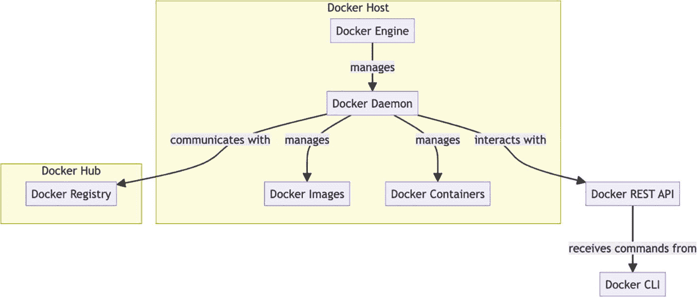

Docker 架构示意图。顶部，“Docker 主机”包含“Docker 引擎”，它管理着“Docker 守护进程”。守护进程与“Docker Hub”中的“Docker 仓库”通信，管理“Docker 镜像”和“Docker 容器”，并与“Docker REST API”交互。API 接收来自“Docker CLI”的命令。箭头表示组件之间的关系和交互。

图 2-1

Docker 架构

以下是每个部分的含义：

*   **Docker 引擎**：这是 Docker 的核心部分，包括运行时和守护进程。它是 Docker 运行和管理各种 Docker 组件的层。

*   **Docker 守护进程 (Dockerd)**：这是一个持久运行的后台服务，负责管理 Docker 镜像、容器、网络和卷。它是 Docker 架构中承担繁重工作的部分。

*   **Docker REST API**：Docker 守护进程暴露了一个 REST API，供 Docker 客户端用来与守护进程通信。它允许用户或其他工具以编程方式与 Docker 守护进程交互。

*   **Docker CLI**：这个命令行界面允许用户使用命令与 Docker 交互。当我们在 Docker CLI 中输入命令时，它会通过 Docker REST API 将这些命令发送给 Docker 守护进程。

*   **Docker 镜像**：这些是用于创建 Docker 容器的只读模板。镜像定义了容器环境以及在容器内运行的应用程序。

*   **Docker 容器**：容器是由 Docker 守护进程执行的 Docker 镜像实例。它们将应用程序与底层系统以及彼此隔离开来。

*   **Docker 仓库**：这个存储和内容分发系统以不同的标记版本保存命名的 Docker 镜像。用户通过使用 `docker push` 和 `docker pull` 命令与仓库交互。Docker Hub 是由 Docker, Inc. 运营的 Docker 仓库的公共实例。

以下是图中所示的 Docker 架构中的交互流程：

1.  **Docker CLI** 通过 **Docker REST API** 向 **Docker 守护进程** 发送命令。

2.  **Docker 守护进程** 随后与 **Docker 仓库** 通信，根据需要拉取或推送镜像，或者在本地管理 **Docker 镜像** 和 **Docker 容器**。

3.  所有这些操作都在 **Docker 引擎** 的统辖之下，它促使这些组件无缝协同工作。

### 了解 Docker Desktop

适用于 macOS 和 Windows 的 Docker Desktop 是实现应用程序容器化的最快、最简洁的方式。Docker 最初发布时，主要针对 Linux，并没有对 Windows 和 macOS 等其他系统提供官方支持。在意识到这一设计上的局限性和巨大缺陷后，Docker 团队决定做一件了不起的事——为这些系统提供官方移植版，即 Docker Desktop。

根据官方文档：

> *Docker Desktop 是一款适用于 macOS 和 Windows 机器的应用程序，用于构建和共享容器化应用程序和微服务。*

打个比方，可以将 Docker Desktop 视为容器的 IDE。由于 Windows 和 macOS 本身不支持容器，Docker Desktop 通过使用其轻量级虚拟机来弥补这一不足。在 Windows 上，它使用 Hyper-V 或 WSL2（前者更受青睐），在 macOS 上，它使用 Hyperkit。Docker Desktop 拥有一个有用的 GUI 来控制这些虚拟机资源。

Docker Desktop 的优势在于其简化的安装过程，它为 Mac 和 Windows 用户提供了一个单一的软件包。该软件包包含了有效使用 Docker 所需的基本组件。

一个典型的 Docker Desktop 安装包含以下组件：

*   Docker 引擎

*   Docker CLI

*   Docker Compose

*   Kubernetes

*   内容信任

*   凭据助手

以下是一个简化的示意图，展示了 Docker Desktop 的组件：

*   下图从高层次概述了 Docker Desktop 环境的不同组件如何协同工作，以实现应用程序的容器化和管理。

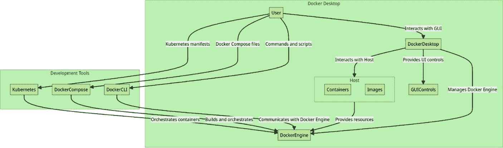

示意图展示了 Docker Desktop 组件与开发工具之间的交互。用户通过 GUI 与 Docker Desktop 交互，GUI 提供 UI 控件并管理 Docker 引擎。Kubernetes、Docker Compose 和 Docker CLI 等开发工具编排容器并与 Docker 引擎通信。主机管理容器和镜像，提供资源并与 Docker 引擎交互。箭头表示组件之间命令、脚本和文件的流动。

图 2-2

Docker Desktop 组件

*   图中央部分是 Docker Desktop 本身，它直接作为用户界面工作。用户可以通过 Kubernetes 清单、Docker Compose 文件、命令和脚本与 Docker Desktop 交互。

*   然后，Docker Desktop 与保存容器和镜像的主机交互，这些容器和镜像由 Docker 引擎负责管理。Docker 的核心元素是 Docker 引擎，它负责编排容器并提供必要的资源。

*   此图进一步展示了作为 Docker Desktop 一部分的几个开发工具，包括 Kubernetes、Docker Compose 和 Docker CLI。这些工具与 Docker Desktop 融合，提供额外的功能和能力。

现在，让我们探讨一下 Docker Desktop 提供的一些关键特性。

### Docker Desktop 特性

以下是 Docker Desktop 的一些关键特性：

*   简化的应用程序容器化和共享

*   能够扫描镜像以发现潜在漏洞

*   用于管理 Docker 组件的用户友好界面

*   Docker Desktop 支持多种系统架构，包括 Apple M1、ARM 和 Windows

*   引入 [Dev Environments](https://www.docker.com/blog/tech-preview-docker-dev-environments/) 以创建一致且可重现的开发环境

*   内置对 Kubernetes 的支持，能够使用 Docker Desktop 创建功能性的单节点 Kubernetes 集群

*   通过由 [Docker 扩展](https://www.docker.com/blog/docker-extensions-discover-build-integrate-new-tools-into-docker-desktop/) 驱动的第三方工具实现可扩展性

*   使用 WSL2 在 Windows 上原生支持运行 Linux


### Docker Desktop 实战

Docker Desktop 通过提供用户友好的维护、监控和升级功能，增强了底层开源 Docker 组件的功能。它在各种操作系统上提供统一的用户体验。借助 Docker Desktop，通过 Docker 开发环境可以简化团队协作，实现通过 Git 或 Docker Hub 一键共享。它拥有一个直观的图形界面，用于处理常见任务，例如：

*   **启动容器**

您可以使用 Docker Desktop 基于您选择的 Docker 镜像启动一个新容器。

您可以选择镜像，然后可选地设置端口映射、环境变量和卷的设置。然后，它一键启动容器。

这简化了启动新容器化应用程序的过程，因此刚接触 Docker 的用户可以轻松上手。

*   **暂停和重启容器**

Docker Desktop 提供了一个图形用户界面来暂停和恢复正在运行的容器。

暂停容器会挂起其执行，允许您在不丢失其状态的情况下临时停止容器的活动。

重启暂停的容器会从其暂停的位置恢复运行。

此功能对于临时挂起容器的活动非常有用，例如在维护或调试期间。

*   **停止容器**

Docker Desktop 界面允许您轻松停止正在运行的容器。

它会优雅地停止容器，并关闭容器内运行的应用程序或进程。

如果您必须停止容器并释放该容器正在使用的资源，这将非常有用。

*   **配置本地 Kubernetes 集群**

Docker Desktop 提供了创建和管理本地 Kubernetes 集群的内置功能。用户可以直接从 Docker Desktop 界面启用和配置单节点 Kubernetes 集群。

这有助于开发人员无需额外单独设置 Kubernetes 即可使用 Kubernetes 测试和开发应用程序。

*   **管理卷**

Docker Desktop 允许开发人员直接从 Docker Desktop 的用户界面创建、检查和挂载卷来管理卷。

因此，这简化了为容器化应用程序管理持久化存储的过程，从而确保在容器停止或移除时不会丢失数据。

为了展示 Docker Desktop 的功能，让我们尝试从 Docker Hub 运行一个预构建的镜像。

*   在桌面上找到 Docker Desktop 图标。双击 Docker Desktop 图标启动应用程序。

*   要定位镜像，请单击顶部的搜索栏或使用快捷键 ⌘ + K。要找到本指南中使用的特定镜像，请搜索“welcome-to-docker”。

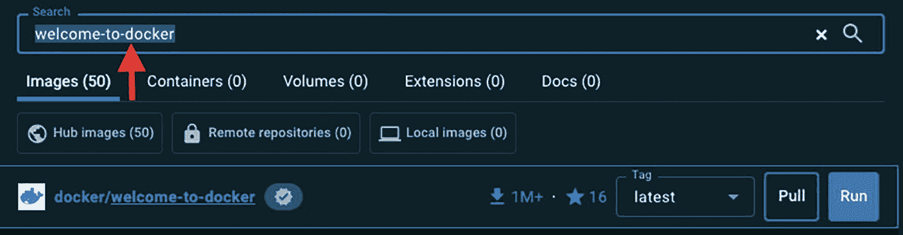

一个 Docker 界面，显示一个搜索栏，其中输入了术语“welcome-to-docker”。下方有镜像、容器、卷、扩展和文档选项卡，其中镜像选项卡被选中，显示 50 个结果。一个名为“docker/welcome-to-docker”的高亮 Docker 镜像显示有超过 100 万次下载和 16 颗星。提供了“拉取”或“运行”该镜像的选项。

*   选择**运行**。

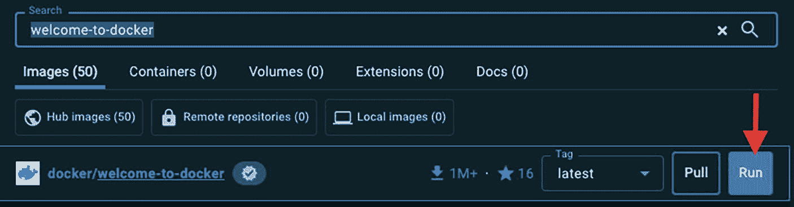

Docker 界面的截图，显示搜索“welcome-to-docker”的结果在镜像选项卡下。界面显示镜像、容器、卷、扩展和文档的选项，除了镜像显示 50 个外，其他每个计数为零。下方，“docker/welcome-to-docker”镜像被高亮显示，拥有超过一百万次下载和 16 颗星的评分。“运行”按钮被一个红色箭头强调。

*   显示**可选设置**后，输入主机端口号 8090，然后单击**运行**。这会将容器的内部端口映射到指定的主机端口，并允许从主机访问容器中运行的应用程序。

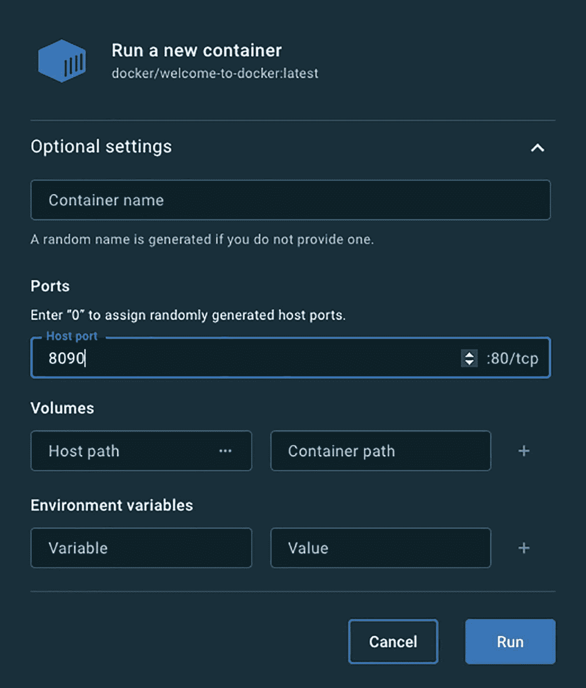

用于运行新容器的 Docker 界面，镜像为“docker/welcome-to-docker:latest”。可选设置包括容器名称、端口、卷和环境变量的字段。主机端口设置为 8090，默认容器端口为 80/tcp。底部有“取消”和“运行”按钮。

*   转到 Docker Desktop 中的容器选项卡以查看该容器。

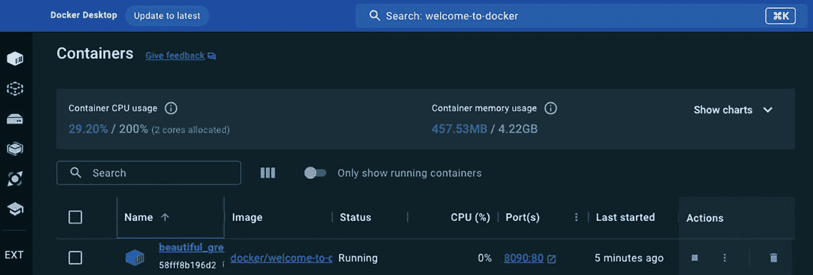

Docker Desktop 界面显示容器管理详细信息。顶部区域显示 CPU 使用率为 200% 的 29.20%，内存使用率为 4.22GB 的 457.53MB。下方，一个容器列表包括一个名为“beautiful_gre”的容器，镜像为“docker/welcome-to-c”，当前正在运行，CPU 使用率为 0%，端口为 8090:80，已启动 5 分钟。提供了搜索和过滤正在运行的容器的选项。

*   单击端口(s)下给出的链接。

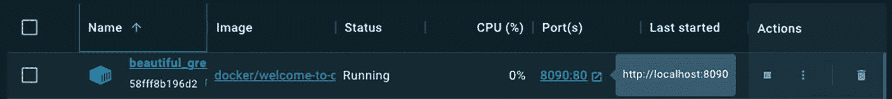

一个仪表板界面，显示一个名为“beautiful_gre”的 Docker 容器，镜像为“docker/welcome-to-c”。容器状态为“运行中”，CPU 使用率为 0%。可通过端口 8080:80 访问，并提供了指向“http://localhost:8080”的链接。右侧有操作选项。

*   我们应该看到以下输出。

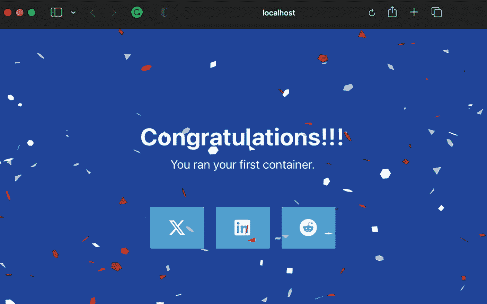

一个浏览器窗口在蓝色背景上显示一条祝贺消息，并伴有五彩纸屑。文字内容为：“恭喜！！！您运行了第一个容器。”消息下方是三个代表社交媒体平台的图标。

*   我们也有停止容器的选项。

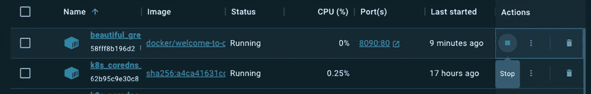

一个仪表板显示两个正在运行的 Docker 容器。第一个容器“beautiful_gre”使用镜像“docker/welcome-to-c”，CPU 使用率为 0%，可通过端口 8090:80 访问，已启动 9 分钟。第二个容器“k8s_coredns”使用镜像“sha256:a4c11631cc”，CPU 使用率为 0.25%，已启动 17 小时。两个容器都有停止或管理操作的选项。

*   我们有多种管理容器的选项，即重启/暂停。

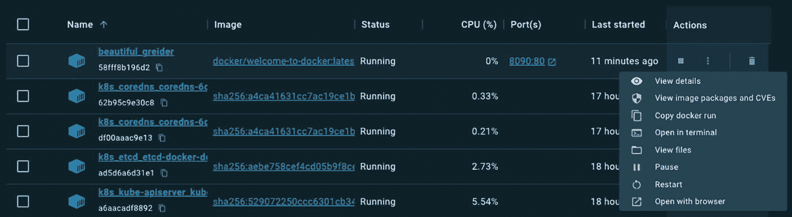

一个仪表板显示五个 Docker 容器的列表及其详细信息。每个条目包括容器名称、镜像 ID、状态、CPU 使用率、端口和上次启动时间。所有容器都在运行，CPU 使用率从 0% 到 5.54% 不等。第一个容器“beautiful_greider”有一个指向 8090.80 的端口链接，上次启动时间为 11 分钟前。第一个容器的操作菜单已打开，显示“查看详细信息”、“查看镜像包和 CVE”、“复制 docker run”和“在终端中打开”等选项。

总之，Docker Desktop 简化了 macOS 和 Windows 用户的应用程序和微服务容器化过程。它提供了一个用于管理 VM 资源的图形界面，并提供了简化的安装。功能包括简化的容器化和共享、镜像扫描、支持多种系统架构、开发环境以及对 Kubernetes 的内置支持。

### 关键 Docker 概念

让我们通过与熟悉的 Java 原则进行类比来理解 Docker。在接下来的章节中，让我们通过将它们与已经熟悉的 Java 开发领域联系起来，来审视其组成部分和相关术语。


#### Dockerfile

Docker 在构建容器镜像时依赖于一份名为 Dockerfile 的文本文档。该文件包含一系列指令，用于定义 Docker 镜像的构建过程。用 Java 的术语来说，我们可以将 Dockerfile 类比为 Java 类的定义。它包含了如何构建 Docker 镜像的指令。正如 Java 类规定了如何创建对象，Dockerfile 则概述了构建 Docker 镜像的步骤。

对于一个基础的 Java/Spring Boot 应用程序，Dockerfile 通常包含以下一组指令。

```
FROM openjdk:17
COPY target/*.jar app.jar
ENTRYPOINT ["java","-jar","/app.jar"]
```

`FROM` 指令指定了作为我们应用程序基础的基础镜像。

`COPY` 指令将所选构建工具（例如 Maven、Ant 或 Gradle）生成的本地构建的 `.jar` 文件复制到我们的容器镜像中。

至于 `ENTRYPOINT` 指令，它指定了容器启动时的默认可执行命令。在此示例中，我们的目标是使用 `java -jar` 命令来运行 `.jar` 文件。

#### Docker 镜像

类似于 JAR 文件将 Java 应用程序及其依赖项打包在一起，Docker 镜像封装了一个应用程序，包括其运行时、库和依赖项。两者都是随时可以部署的自包含单元。此外，正如 JAR 文件可以轻松分发和共享，Docker 镜像也可以轻松分发和共享，允许用户从 Docker Hub 等 Docker 注册表中推送和拉取镜像，从而促进应用程序的无缝共享和分发。

#### Docker CLI

Docker CLI（命令行界面）是与 Docker 交互的主要方式。从 CLI 发出的命令通过这些通信渠道传输到 Docker 守护进程。在 Java 中，JShell 允许开发者交互式地输入和执行 Java 代码片段，而 Docker CLI 则使开发者能够执行用于管理 Docker 组件的命令。

#### Docker 容器

Docker 容器就像 Java 类的一个实例。它是根据 Docker 镜像创建的可运行环境，类似于在 Java 中根据类创建对象。每个容器都是隔离的，并运行其自己的应用程序或服务。

#### Docker 守护进程

Docker 守护进程充当 Docker 的核心组件，如同中枢神经系统。它在主机系统中作为后台服务运行，负责执行通过 Docker CLI 发出的命令，例如 `docker build`、`docker pull` 和 `docker run`。它可以比作在后台运行的 JVM。它负责运行和管理 Docker 容器，类似于 JVM 管理 Java 应用程序执行的方式。

#### Docker Hub

Docker Hub 是镜像仓库，我们可以在其中存储、共享和管理容器镜像。可以将 Docker Hub 视为用于存储 Docker 镜像的中央仓库，类似于 Maven 中央仓库存储 Java 库。例如，Docker Hub 就像是 Docker 镜像的 Maven 仓库。

#### Docker Compose

作为应用程序开发者，大多数情况下我们处理的应用程序包含多个组件，例如前端 API 和后端 API。假设应用程序需要额外的功能，例如 Nginx Web 服务器和数据库，后端 API 使用该数据库将数据返回给前端 API。将这些不同的组件作为单独的容器运行和管理可能会变得非常棘手，需要多条 Docker 命令来确保整个应用程序的连贯运行。为了解决这个问题，Docker Compose 应运而生。Docker Compose 是一个用于运行多个容器的工具，使它们能够和谐地协同工作。这是通过使用 `docker-compose.yml` 文件定义服务来实现的，该文件概述了应用程序所需的各种容器的配置和依赖关系。使用 Docker Compose，可以高效地简化整个应用程序栈的运行和管理。

它更像是一个 Java 构建工具，例如 Maven 或 Gradle。例如，在 Maven 中，一个名为 `pom.xml` 的配置文件保存了项目及其依赖项的配置；类似地，在 Docker 中，也有一个配置文件，通常是 `docker-compose.yml`，用于定义多容器 Docker 应用程序。

一个示例 `docker-compose.yml` 文件。

```
version: '3'
services:
app:
build: .
image: my-java-app
ports:
- "8080:8080"
environment:
- SPRING_PROFILES_ACTIVE=prod
```

这是一张说明 Docker 概念的图片。

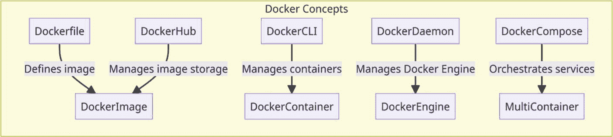

说明 Docker 概念的图表。它展示了组件之间的关系：Dockerfile 定义 DockerImage，DockerHub 管理镜像存储，DockerCLI 管理 DockerContainer，DockerDaemon 管理 DockerEngine，DockerCompose 将服务编排成 MultiContainer。

图 2-3

Docker 概念及其关系

换句话说，如果能找到一种方法将 Docker 知识与 Java 开发者最熟悉的原理进行比较，那么 Java 开发者学习 Docker 知识就会变得更容易。因此，Dockerfile 很像一个 Java 类的定义，其中包含关于如何构建 Docker 镜像的指令。Docker 镜像为应用程序、运行时库和依赖项所做的事情，与 JAR 文件所做的相同。Docker CLI 是与 Docker 交互的主要接口，而 Docker 守护进程则充当其中枢神经系统。Docker Hub 用于镜像的存储、共享和管理。Docker Compose 能够编排多个容器无缝协同工作，就像 Java 构建工具用于跨项目的配置和依赖管理一样。

### 总结

本章介绍了 Docker 作为一个开源容器管理工具，它彻底改变了应用程序打包和部署的方式。它解释了 Docker 的核心原则“一次构建，随处运行”（BORA），该原则确保了应用程序在不同环境中的一致行为，这与常见的“在我机器上能运行”问题形成对比。

然后，本章澄清了 Docker 不是什么——它不是一种虚拟化技术、不是容器编排器、不是虚拟机，也不是容器化应用程序的唯一方法。这些描述有助于将 Docker 与相关但截然不同的概念区分开来。

接着，本章深入探讨了 Docker 如何以其围绕 Docker 引擎的客户端-服务器架构工作。它解释了 Docker CLI 如何与 Docker 守护进程通信以执行诸如 build、tag、push、pull 和 run 等命令。

在关于 Docker Desktop 的部分，它解释了这款 GUI 应用程序如何在 macOS 和 Windows 上简化使用 Docker 的过程：简化的容器化、镜像扫描、对多种系统架构的多容器支持，以及与 Kubernetes 等工具的集成。

本章的最后部分介绍了关键的 Docker 概念，并与广为人知的 Java 开发原理进行了比较。它解释了 Dockerfile 如何类似于 Java 类的定义，Docker 中的镜像如何类似于 JAR 文件，Docker 中的 CLI 如何类似于 JShell，Docker 中的容器如何类似于 Java 对象，Docker 中的守护进程如何等同于 JVM，Docker Hub 如何类似于 Maven Central，以及 Docker 中的 Compose 如何类似于 Java 中的构建工具，例如 Maven 或 Gradle。

