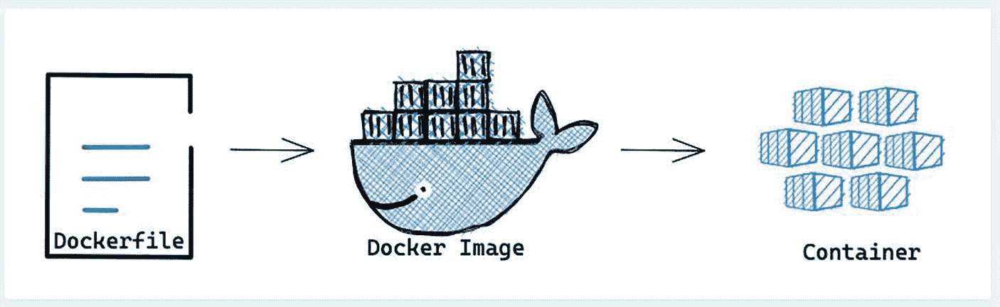
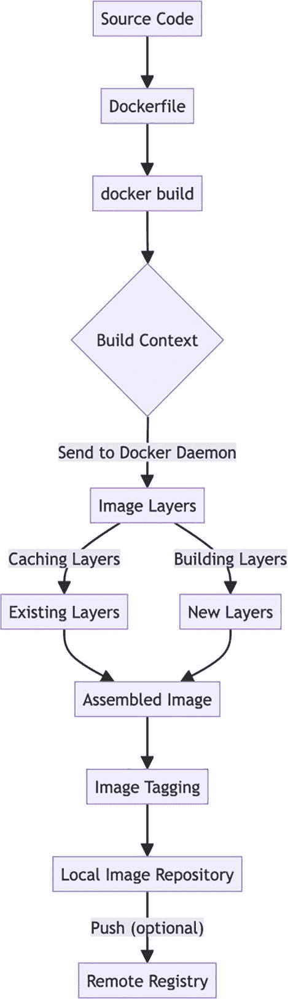
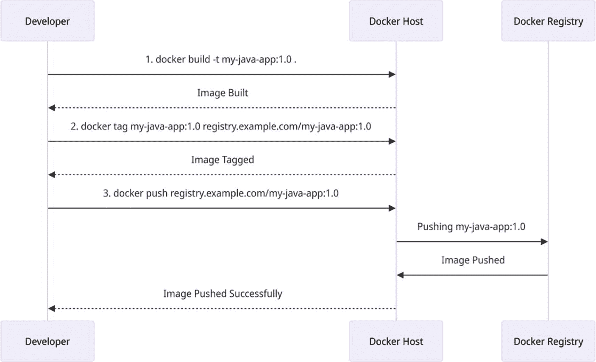
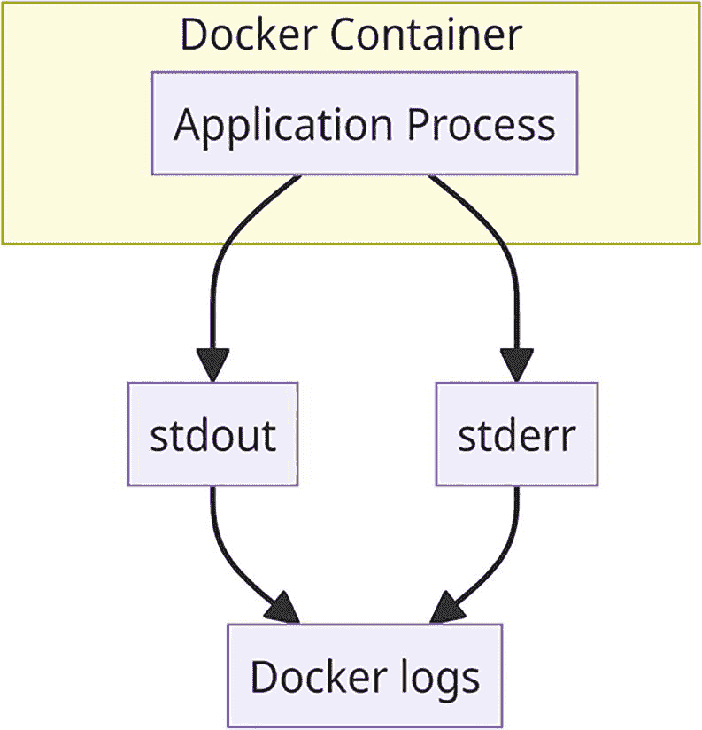

# 3. Docker 上手与运行

在众多可用于应用程序打包和部署的工具中，Docker 是容器化领域最重要的工具之一。此过程中的关键要素之一是 Dockerfile，它代表了构建 Docker 镜像所遵循的配置、依赖关系和步骤的蓝图。它包含若干指令，使我们能够使用 `docker build` 命令构建容器。


## 创建 Dockerfile

首先，我们来创建一个空的 Dockerfile。请记住，文件名中的“D”必须大写，即 `Dockerfile`，且不带任何文件扩展名。默认情况下，`docker build` 命令会在指定的上下文中查找名为“Dockerfile”（大写“D”）的文件。

如果我们将其命名为 `dockerfile` 或其他名称，则需要在构建过程中使用 `-f` 或 `--file` 标志来指定 Docker 构建文件。

**步骤 1**：在终端中运行命令 `mkdir docker` 创建一个新目录。然后使用命令 `cd docker` 进入该目录。

**步骤 2**：现在运行 `touch Dockerfile`，为我们创建一个空的 Dockerfile。

**步骤 3**：运行 `vi Dockerfile` 命令，并粘贴以下内容。要保存更改，请按 `Esc` 键退出插入模式，然后输入 `:wq`，最后按 `Enter` 键。

*   我们在 `FROM` 命令中使用了 `alpine base OS image`。这是一个基于 Alpine Linux 的极简、简单、安全的镜像，大小仅为 5 MB。

*   在 `RUN` 命令中，我们使用了 `apk`；这个包管理器会在容器镜像内安装 Git。此命令仅在构建容器镜像时执行。

*   在 `CMD` 命令中，我们使用了 `git --version` 命令，该命令在运行容器镜像时执行。

```
FROM alpine:latest
RUN apk --no-cache add git
CMD git --version
```

**步骤 4:** 通过执行 `docker build .` 命令并使用 Dockerfile 来构建镜像。

`.`（点）代表构建上下文。通过使用 `.`（点）作为构建上下文，我们指示 Docker 在当前目录中查找 Dockerfile 及相关文件，并使用它们来构建 Docker 镜像。

**步骤 5:** 运行 `docker image ls`（列出镜像）命令，并记下容器镜像的 `IMAGE ID`。

**步骤 6:** 执行 `docker run --rm -it IMAGE ID` 命令。确保粘贴之前记下的 `IMAGE ID`。当我们运行容器镜像时，此命令将输出 git 版本作为结果。

`-it` 标志确保与容器进行交互式会话，允许我们在必要时查看输出并与之交互。`--rm` 标志会在容器退出时自动将其删除。这有助于在容器执行后清理系统。

下图展示了 Dockerfile 生成容器的过程。



图解 Docker 流程：Dockerfile 被转换为 Docker 镜像（由一头驮着容器的鲸鱼表示），然后生成多个容器。

图 3-1

Docker 镜像创建流程

总结一下，我们将有一个手写的 Dockerfile，用它来构建 Docker 镜像。之后，我们将使用该镜像来运行一个容器。

接下来，我们来谈谈编写 Dockerfile 时可以使用的命令。

### Dockerfile 命令及其用法

表 3-1

常见的 Dockerfile 命令

| 命令 | 用途 | 示例 |
| --- | --- | --- |
| `ENV` | 在镜像内设置环境变量 | `ENV APP_HOME=/usr/src/app` |
| `Label` | 用于指定镜像的元数据，例如维护者的电子邮件地址等。 | `LABEL maintainer="``your-email@example.com``"` |
| `EXPOSE` | 用于访问应用程序的端口 | `EXPOSE 8080` |
| `CMD` | 用于向 **ENTRYPOINT** 传递参数。如果未设置 **ENTRYPOINT**，则执行 **CMD** 中的命令 | `CMD ["app.jar"]` |
| `ENTRYPOINT` | 指定启动容器时执行的命令 | `ENTRYPOINT ["java", "-jar"]` |
| `WORKDIR` | 当前工作目录 | `WORKDIR $APP_HOME` |
| `RUN` | 用于安装应用程序所需的软件包 | `RUN apt-get update && apt-get install -y openjdk-11-jre` |
| `ADD` | 与 **COPY** 相同，但还可以从远程 URL 下载并复制文件。它还可以将压缩文件解压到目标位置 | `ADD` `https://example.com/external-app.jar` `$APP_HOME/app.jar` |
| `COPY` | 顾名思义，将文件和目录从源位置复制到目标位置 | `COPY ./local-app-config $APP_HOME/config` |
| `FROM` | 所有其他层构建于其上的基础层 | `FROM ubuntu:latest` |

### 探索关于 Dockerfile 的事实

**Dockerfile 不是可执行代码**：Dockerfile 表示在构建时用于镜像执行的命令。它不像程序那样可以直接执行。

```
# Dockerfile
FROM openjdk:17-jdk
WORKDIR /app
COPY target/myapp.jar /app
CMD ["java", "-jar", "myapp.jar"]
```

构建并运行：

```
docker build -t my-java-app .
docker run my-java-app
```

**层缓存**：Docker 为其镜像使用分层文件系统，Dockerfile 中的指令会被缓存为层，用于加速后续构建。

```
FROM openjdk:17-jdk
WORKDIR /app
COPY pom.xml /app  # 如果 pom.xml 未更改则缓存
RUN mvn dependency:go-offline  # 依赖项被缓存
COPY src /app/src
RUN mvn package  # 仅当 src 更改时才重新构建
```

**顺序很重要**：由于层会被缓存，Dockerfile 中指令的顺序非常重要。如果更改了一条指令，所有后续层都将失效并需要重新构建。

```
# 低效方式
FROM openjdk:17-jdk
WORKDIR /app
COPY src /app/src
COPY pom.xml /app
RUN mvn package  # 如果 pom.xml 更改，则重新构建所有内容
# 高效方式
FROM openjdk:17-jdk
WORKDIR /app
COPY pom.xml /app
RUN mvn dependency:go-offline  # 缓存依赖项
COPY src /app/src
RUN mvn package
```

**多个基础镜像**：尽管一个 Dockerfile 只能使用一个 `FROM` 指令，但我们可以通过多阶段构建来实现，从而将来自不同基础镜像的产物整合到一个镜像中。

```
# 阶段 1：构建
FROM maven:3.8-openjdk-17 as builder
WORKDIR /app
COPY . .
RUN mvn clean package -DskipTests
# 阶段 2：最小化运行时
FROM openjdk:17-jre
WORKDIR /app
COPY --from=builder /app/target/myapp.jar /app
CMD ["java", "-jar", "myapp.jar"]
```

**悬空镜像**：使用某个标签创建的镜像，在该标签被另一个镜像替换后，会变成“悬空镜像”，占用空间，直到被清理。

```
$docker image prune  # 移除悬空镜像
```

**镜像标签**：使用 Docker，可以通过标签向镜像添加元数据，可以提供的信息包括版本、维护者或任意信息。

```
FROM openjdk:17-jdk
LABEL maintainer="you@example.com"
LABEL version="1.0.0"
LABEL description="Java Spring Boot application"
```

**转义字符**：Dockerfile 支持使用反斜杠（\）进行转义，但要注意 Windows 路径的不一致性；建议使用双反斜杠（\\）或正斜杠。

```
# 对于 Windows 路径，使用正斜杠或双反斜杠
COPY config/app-config.json /app/config/
```

**大小优化**：注意 `COPY` 指令的使用，它可能会使镜像膨胀。通过使用通配符来最小化影响，只复制必要的文件。

```
# 避免复制不必要的文件
COPY target/*.jar /app/
```

**安全问题**：不要将密钥硬编码在 Dockerfile 中。通过构建参数或环境变量安全地传递敏感数据。

```
FROM openjdk:17-jdk
ARG API_KEY
ENV API_KEY=${API_KEY}
CMD ["java", "-jar", "myapp.jar"]
```

在构建期间安全地传递密钥：

```
docker build --build-arg API_KEY=mysecretkey -t my-java-app .
```


### 构建与标记 Docker 镜像

在本节中，你将学习如何使用 Dockerfile 构建镜像，并探索标记镜像的不同策略。

`docker build` 命令允许我们利用 Dockerfile 和上下文来构建镜像。上下文指的是通过特定路径或 URL 可访问的文件集合。需要注意的是，构建上下文是递归操作的，这意味着子目录中的文件也会被包含在构建过程中。因此，我们应该从仅包含 Dockerfile 的目录中执行 `docker build` 命令。

或者，我们可以使用 `.dockerignore` 文件来指定在 Docker 构建过程中需要排除的文件。

`docker build` 命令支持多种标志，在镜像构建过程中提供额外的选项和功能。

#### 示例

让我们通过一个逐步编码示例来演示如何为一个简单的 Java 应用构建、标记并推送 Docker 镜像到 DockerHub。

**步骤 1. 目录设置**：假设我们有一个基本的 Java 应用，其文件结构如下：

```
my-java-app/
├── src/
│   └── Main.java
└── Dockerfile
```

**步骤 2. 创建 Java 应用**：在 `Main.java` 文件中创建一个简单的 Java 应用：

```
public class Main {
public static void main(String[] args) {
System.out.println("Hello,Docker!");
}
}
```

**步骤 3. 创建 Dockerfile**：接下来，我们需要创建一个 Dockerfile 来定义 Docker 镜像：

```
FROM eclipse-temurin:17-jdk-jammy
COPY ./src /app
WORKDIR /app
RUN javac Main.java
CMD ["java","Main"]
```

这个 Dockerfile 使用官方的 OpenJDK 17 镜像作为基础，将 `Main.java` 文件复制到镜像中，编译它，最后设置运行已编译 Java 应用的命令。

**步骤 4. 构建 Docker 镜像**：打开终端或命令提示符，确保我们位于包含 Dockerfile 的目录中，然后输入以下命令。

```
$ docker build -t my-java-app:1.0 .
```

此命令将使用标签（通过 `-t` 标志）`my-java-app:1.0` 作为构建上下文来构建 Docker 镜像。在构建镜像时设置镜像名称和标签是一个好习惯。命令末尾的 `.`（点）告诉 Docker Dockerfile 位于当前工作目录中。

**步骤 5. 验证构建的 Docker 镜像**：要验证 Docker 镜像是否成功构建，请运行以下命令：

```
$ docker images
```

我们应该会在本地 Docker 镜像列表中看到带有 `1.0` 标签的 `my-java-app` 镜像。

**步骤 6. 为 DockerHub 标记 Docker 镜像**：现在，我们将标记 Docker 镜像，以便为推送到 DockerHub 做准备：

```
$ docker tag my-java-app:1.0 our-dockerhub-username/my-java-app:1.0
```

注意

将 `our-dockerhub-username` 替换为你实际的 DockerHub 用户名。

以下是一个简化的图表，概述了 Docker 镜像构建过程：



流程图说明了 Docker 镜像的创建过程。它从“源代码”和“Dockerfile”开始，进入“docker build”。这形成了“构建上下文”，并发送给“Docker 守护进程”。该过程分为“缓存层”（包含“现有层”）和“构建层”（包含“新层”），最终汇聚成“组装后的镜像”。该镜像经过“镜像标记”后，存储在“本地镜像仓库”中。可选地，它可以被“推送”到“远程仓库”。

图 3-2

构建与标记 Docker 镜像

在此流程中：

*   该过程从我们的源代码和 Dockerfile 开始。

*   `docker build` 命令启动构建过程。

*   构建上下文（包括我们的源代码以及目录中或 Dockerfile 中指定的任何其他文件）被发送到 Docker 守护进程。

*   然后，Docker 按层组装镜像，利用缓存来加速构建过程。

*   根据 Dockerfile 中的指令，根据需要创建新层。

*   组装后的镜像可以选择性地使用名称进行标记。

*   最终镜像存储在我们的本地镜像仓库中。

*   如果需要，我们可以将镜像推送到远程仓库。

### 标记 Docker 镜像

标记 Docker 镜像是一种最佳实践，它在整个软件开发和部署生命周期中带来诸多好处。镜像标记是为镜像分配有意义的标签的过程，可用于区分其版本、用途或环境。以下是它如此重要的原因：

#### 镜像标记的好处

1.  **版本控制与历史记录**：标记也可用于区分我们拥有的镜像的不同版本。例如，在更新应用程序时，我们可以使用版本号（如 v1.0 和 v2.0）或创建日期（如 2023-07-17）来标记镜像。这有助于维护变更历史，并在需要时提供回退途径。

2.  **部署与回滚**：如果你要将应用程序部署到不同的环境（开发、测试和生产），可以使用标签来确保在每个环境中使用适当的镜像版本。如果生产环境出现问题，我们可以利用标记的镜像轻松回滚到之前的状态。

3.  **协作**：标记为开发者之间的协作提供了最精确的参考点之一。它允许团队成员使用相同的标记镜像，从而确保开发和测试环境之间的一致性。

4.  **晋升**：使用标记来促进镜像在开发管道的各个阶段晋升。在管道的每个阶段（从本地开发、测试到生产），我们都可以在镜像通过时对其进行标记，从而在每个步骤中保留一个可靠的版本。

5.  **微服务/分布式系统**：在微服务或分布式系统中，服务有时可能依赖于其他服务的特定版本。在这种情况下，标记变得非常重要，以确保服务能够找到并使用其依赖项的兼容版本。

6.  **持续集成/持续部署 (CI/CD)**：这自动化了管道、镜像创建和部署。标签使这些管道能够找到镜像的确切版本，并在管道的每个阶段对其进行跟踪。

7.  **回滚与恢复**：如果在部署新应用程序版本后出现问题，使用标记的镜像，我们可以快速回滚到之前的版本，从而减少停机时间和潜在影响。

8.  **文档**：标记是一种文档形式。镜像标签应提供关于镜像用途、版本或其他重要事项的有用信息。

9.  **测试与质量保证**：标记的镜像确保测试的版本与将要部署的版本保持一致。

10. **镜像清理**：当我们构建和标记镜像的新迭代时，可以删除带有过时标签的旧镜像以节省存储空间。


#### 镜像标记策略

让我们了解一些超越简单版本号的高级镜像标记策略，这些策略能提供清晰度、可追溯性，最重要的是，一致性。正是通过采用一致且有意义的标记方法，Docker 镜像才能变得易于管理——从而让你能够轻松识别和部署所需的镜像版本。

1.  **语义化版本控制**：使用语义化版本控制进行标记是一种常见策略，用于指示镜像的重要性。例如，如果此镜像用于我们应用程序的特定版本：

1.  **使用 Git 提交哈希**：根据各自的 Git 提交哈希来标记镜像，以便可以追溯到特定的代码版本。这在以下场景中非常有用：

```
$ docker build -t my-java-app:1.0.0 .
```

1.  **环境特定标签**：如果我们为不同环境（例如开发、测试和生产）构建镜像，我们可以使用环境特定的标签，如下所示：

    ```
    $ docker build -t my-java-app .
    $ docker build -t my-java-app .
    $ docker build -t my-java-app .
    ```

2.  **基于日期的标签**：标记镜像的构建日期有助于追溯镜像的创建日期：

```
$ docker build -t my-java-app .
```

1.  **Latest 标签**：为最新构建使用 `latest` 标签是一种便利，但由于其模糊性，在生产环境中并非最佳实践：

```
$ docker build -t my-java-app:2023-08-17 .
```

```
$ docker build -t my-java-app .
```

总之，我们可以通过 `docker build` 命令，基于一个 Dockerfile 和一个上下文来构建 Docker 镜像。上下文是特定路径或 URL 下的所有文件。在这种情况下，`docker build` 命令将提供众多标志以提供额外选项。这对于版本控制、历史追踪、部署实践、协作以及在开发流水线的不同阶段之间推广镜像至关重要。

### 推送和运行 Docker 镜像

在本节中，我们将学习容器管理，并探索将 Docker 镜像高效推送到 DockerHub 等注册表并无缝部署它们的技巧。

在容器化部署的世界中，Docker 镜像被推送到远程容器注册表。推送 Docker 镜像的概念是指我们希望将本地构建的 Docker 镜像上传到远程镜像注册表，即 Docker Hub 或私有注册表。

以下是借助 `docker push` 命令将镜像推送到 DockerHub 等注册表的一些要点：

1.  **镜像分发**：它允许我们推送镜像，以便将 Docker 镜像分发到远程位置。这使得镜像可供他人、开发者和系统使用，这对于在异构环境中的协作和部署至关重要。

2.  **集中式镜像存储**：Docker 注册表构成了用于存储和管理 Docker 镜像的集中式仓库。当我们将镜像推送到注册表时，就为多个团队和项目可以访问的镜像提供了一个单一事实来源。

3.  **一致的部署**：将镜像推送到注册表可确保相同的镜像存在于开发环境、测试环境直至生产环境中。这极大地降低了因同一镜像不同版本之间缺乏一致性而产生的风险。

4.  **与他人共享**：如果我们决定与同事、客户或开源社区共享我们的应用程序，将镜像推送到公共注册表（例如 Docker Hub）允许其他人快速拉取并运行我们的应用程序，而无需在他们的机器上构建它。

5.  **私有注册表**：组织通常使用私有注册表来存储专有或敏感镜像。通过将镜像推送到私有注册表，访问权限仅限于授权用户。

6.  **CI/CD 流水线**：每当构建新镜像时，都需要使用 CI/CD 将其推送到容器注册表。然后，流水线的后续阶段（测试或部署）将使用该镜像进行。

7.  **版本控制**：通过将带有唯一标签的不同版本的镜像推送到注册表，我们存储了版本历史。这使得在必要时可以回滚到以前的版本。

8.  **可扩展性**：对于部署在许多节点、服务器或集群上的应用程序，将镜像放入注册表可确保所有实例拥有相同的镜像，从而实现更好的扩展一致性和效率。

9.  **节省部署时间**：如果我们需要运行应用程序的多个实例，只需从注册表拉取镜像，而不是在每个实例上构建它们，可以节省大量时间和资源。

10.  **灾难恢复**：在数据丢失或系统故障的情况下，已推送到注册表的应用程序镜像可以在短时间内恢复。

现在，我们将使用 `docker push` 命令将 Docker 镜像推送到 DockerHub：

```
$ docker push our-dockerhub-username/my-java-app:1.0
```

下面是一张说明 Docker 命令序列的图片。



一个序列图，说明了构建、标记和推送 Docker 镜像的过程。开发者通过在 Docker 主机上执行命令 "docker build -t my-java-app:1.0" 来启动该过程，从而构建镜像。接下来，使用 "docker tag my-java-app:1.0 registry.example.com/my-java-app:1.0" 标记镜像。最后，使用 "docker push registry.example.com/my-java-app:1.0" 将镜像推送到 Docker 注册表。该图显示了每个步骤的成功完成，并附有指示“镜像已构建”、“镜像已标记”和“镜像推送成功”的消息。

图 3-3

推送 Docker 镜像

### 运行 Docker 镜像

运行 Docker 镜像是一个直接的过程，允许开发者快速执行他们的容器化应用程序。因此，我们刚刚完成了之前一个简单 Java 应用程序的编码示例，成功构建了镜像，对其进行了标记，并将 Docker 镜像推送到了 DockerHub。现在，让我们看看如何以 Docker 容器的形式运行该 Docker 镜像。

打开你的终端或命令提示符，输入以下命令从 DockerHub 下载 Docker 镜像：

```
$ docker pull our-dockerhub-username/my-java-app:1.0
```

注意

将 `our-dockerhub-username` 替换为你实际的 DockerHub 用户名。

成功拉取镜像后，我们现在可以将其作为 Docker 容器运行：

```
$ docker run our-dockerhub-username/my-java-app:1.0
```

我们将立即看到容器化的 Java 应用程序在运行，控制台输出显示“Hello, Docker!”，因为它从容器内部运行了 Java 代码。这样，与应用程序相关的所有内容都将与主机系统隔离，从而确保 Docker 镜像描述的依赖项或配置是自包含的。

运行 Docker 镜像允许开发者在受控环境中快速测试他们的应用程序，无需担心依赖冲突或特定系统问题。这一切都简化了开发和部署，并保证了在不同平台和环境中的一致行为。


### 常见陷阱

开发者在运行 Docker 镜像时，为了获得流畅且无故障的体验，有几个需要注意的地方，或者说常见的陷阱。

*   **端口映射**：确保端口映射准确无误，以免遇到无法访问的应用程序。

*   **卷挂载**：切勿忘记挂载所需的卷，以防止数据丢失或出现意外行为。

*   **资源限制**：定义资源限制（例如 CPU 和内存），以防止性能下降或资源争用。

*   **环境变量**：验证所有相关的环境变量，确保它们配置正确，不会导致任何错误或意外行为。

*   **敏感信息**：不要泄露敏感数据，例如密码或 API 密钥。

*   **主机系统干扰**：管理容器内和主机上运行的应用程序之间的交互，以确保不会发生意外篡改或安全漏洞。

*   **镜像版本管理**：始终使用特定版本的 Docker 镜像。

*   **清理**：定期清理已停止的容器和未使用的镜像，以释放磁盘空间。

*   **Entrypoint 和 Cmd**：理解 Dockerfile 中 `ENTRYPOINT` 和 `CMD` 的区别。

*   **网络**：确保需要相互通信的容器位于同一网络下。

通过查阅 Docker 文档、确认配置以及对容器进行适当测试，可以确保应用程序的部署可靠且高效。一个配置正确且经过充分测试的应用程序，对于确保潜在问题不会危及容器化应用程序部署的可靠性和效率大有裨益。

简而言之，要推送 Docker 镜像，开发者必须使用 `docker push` 命令将本地构建的镜像传输到远程容器仓库。只需一个命令 `docker run`，就可以轻松运行一个 Docker 镜像。运行 Docker 镜像很容易，但需要注意常见的陷阱，例如端口映射不正确或卷挂载缺失。

### 检查和管理 Docker 镜像

在本节中，您将学习如何调试 Docker 容器的问题。探索管理 Docker 镜像的不同方法。

虽然 Docker 简化了应用程序的创建和分发，但它们也有自己的一系列问题。因此，您需要检查和管理 Docker 镜像，以确保应用程序健康、安全且可靠——就像在传统软件开发中一样，需要进行尽职调查。它充当了一道安全网，防止问题可能升级到最终用户那里。确保 Docker 镜像没有错误或潜在问题非常重要。

考虑一个真实场景：一家公司部署了一个容器化的 Web 应用程序，但他们不知道基础镜像存在已知漏洞。攻击者可以利用这一点，这可能导致数据泄露或服务中断。如果在部署前对镜像进行了适当的检查和分析，那么这些风险就会降低。

现在，让我们看看如何使用一个简单的 Java 应用程序来检查 Docker 镜像是否存在任何潜在问题。

**步骤 1\. 拉取 Docker 镜像**：第一步是通过从 DockerHub 拉取镜像来确保我们拥有最新版本的 Docker 镜像：

```
$ docker pull our-dockerhub-username/my-java-app:1.0
```

将 *our-dockerhub-username* 替换为我们实际的 DockerHub 用户名，并将 `1.0` 替换为适当的版本标签。

**步骤 2\. 运行 Docker 容器**：从拉取的镜像运行 Docker 容器以测试其功能：

```
$ docker run our-dockerhub-username/my-java-app:1.0
```

检查容器的控制台输出，查看是否有任何错误或意外行为。如果 Java 应用程序按预期打印出“Hello, Docker!”，则表明镜像功能正常。但是，问题可能仍然存在，尤其是在运行更复杂的应用程序时。

**步骤 3\. 检查容器的文件系统**：为了调查容器的文件系统，我们可以使用 Docker 的交互模式：

```
$ docker run -it our-dockerhub-username/my-java-app:1.0 /bin/bash
```

此命令会将我们带入容器的 shell，允许我们交互式地探索其内容。在这里，我们可以验证 Java 应用程序中预期的所有必要文件、库和配置是否存在。

**步骤 4\. 检查环境变量**：如果我们的 Java 应用程序依赖于环境变量，请确保在运行容器时正确设置了这些变量。使用以下命令检查环境变量：

```
$ docker inspect our-container-id | grep "Environment"
```

将 *our-container-id* 替换为容器的 ID 或名称。验证所有必需的环境变量是否存在且正确定义。

**步骤 5\. 验证网络和端口**：如果我们的 Java 应用程序与其他服务通信或需要网络访问，请确保必要的端口已正确映射：

```
$ docker ps
```

此命令将显示容器向主机系统暴露的端口。验证所需的端口是否已正确映射并可访问。

**步骤 6\. 分析 Docker 日志**：查看容器的日志以识别任何错误或问题：

```
$ docker logs our-container-id
```

将 *our-container-id* 替换为容器的 ID 或名称。检查是否有任何错误消息或堆栈跟踪，以指示潜在问题。

Docker 在容器内启动一个进程，并收集该进程的输出流作为日志。默认情况下，Docker 使用 `json-file` 驱动程序，该驱动程序将这些日志以 JSON 格式写入文件。

下图说明了应用程序、输出流和 Docker 之间的交互。



图示说明了 Docker 容器内应用程序进程的流程。该进程输出到“stdout”和“stderr”，然后这些输出被定向到“Docker 日志”。箭头指示了从应用程序进程到日志的流程。

图 3-4

Docker 日志记录流程

检查 Docker 镜像是否存在任何问题对于顺利部署和可靠的应用程序至关重要。遵循这些步骤并使用 Docker 的许多检查工具，我们可以可靠地识别并修复 Docker 化 Java 应用程序中的潜在问题。通过这种方式，主动进行镜像检查将节省我们的时间和精力，从而交付高质量、容器化的应用程序，这些应用程序可以在任何地方按预期运行。祝您 Docker 化愉快！


### 管理 Docker 镜像

Docker 镜像的管理包含一系列操作，旨在高效处理容器化应用中的镜像。以下是管理 Docker 镜像的几种方式：

*   **搜索镜像**：使用 `docker search` 命令后跟关键词，即可显示任何仓库中的可用镜像。

*   **删除镜像**：通过 `docker rmi image_name:tag` 命令完成。如果存在基于该镜像运行的容器，则无法删除。`-f` 标志可强制删除。

*   **清理未使用的镜像**：未使用的镜像会随时间累积。所有悬空或未使用的镜像可通过 `docker image prune` 移除。

*   **镜像历史**：通过 `docker history image_name` 查看镜像的构成（即各层）以及构建该镜像所使用的命令。

*   **镜像修剪**：`docker system prune` 会移除所有未使用的镜像、容器和网络。请注意，它会删除所有未使用的数据。

*   **镜像扫描**：Docker 安全扫描是 Docker 的一项功能，使我们能够发现 Docker 镜像组件（如软件包、库等）中的漏洞。

我们可以对 Docker 镜像执行多种操作来高效管理它们。这些操作包括：使用 `docker search` 命令在仓库中搜索可用镜像、使用 `docker rmi` 命令删除镜像、使用 `docker image prune` 移除未使用的镜像、使用 `docker history` 命令检查镜像历史，以及最后使用 `docker system prune` 移除所有未使用的镜像、容器和网络。这些任务有助于有效管理 Docker 镜像，并确保容器化应用的平稳运行。

### 总结

本章提供了理解和操作 Docker 的全面指南，重点介绍了 Dockerfile 和容器管理。它将 Dockerfile 介绍为构建容器镜像的蓝图，并详细说明了 `FROM`、`RUN`、`CMD`、`COPY` 和 `EXPOSE` 等关键命令。最佳实践包括优化镜像大小、管理密钥以及使用多阶段构建。

本章解释了镜像构建过程、标记策略，以及推送、拉取和运行镜像的步骤。它还讨论了调试、镜像管理以及检查和清理资源的命令。

本章还强调了常见错误，例如端口映射错误、资源管理不当和安全疏忽，并重点介绍了镜像扫描和敏感数据保护。

最后，本章总结了使用 Docker 的优势，例如拥有一致的环境、简化分发、可扩展性和资源利用。

