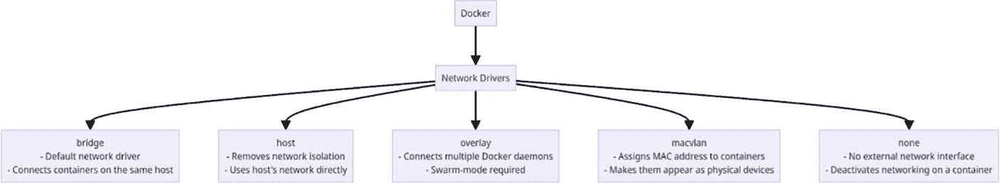
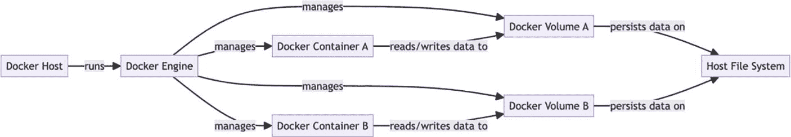
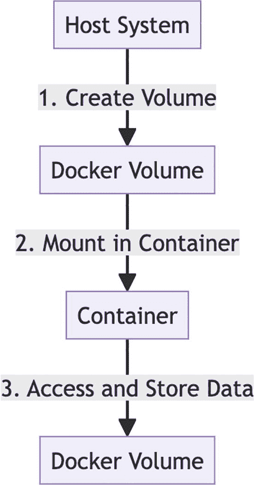
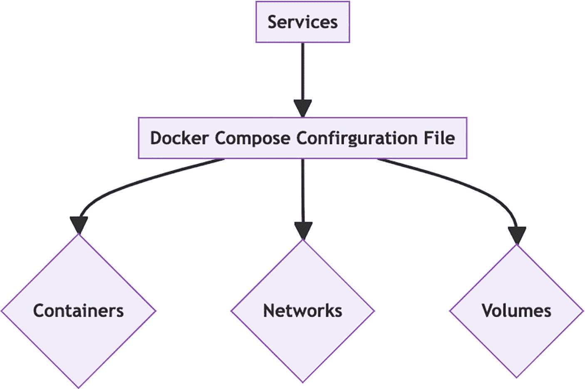
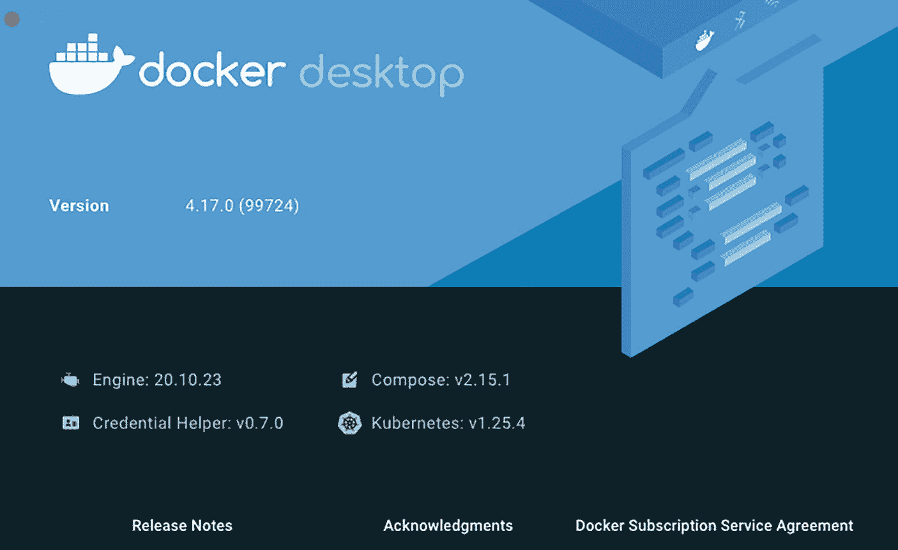
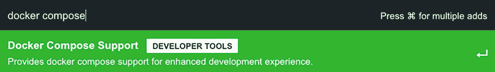
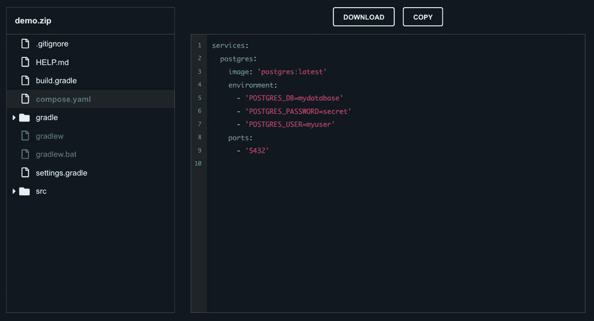

# 4. 学习高级 Docker 概念

了解 Docker 容器如何通信，并探索各种 Docker 网络驱动。学习如何使用 Docker 卷实现容器的数据持久化。了解如何使用 Docker 创建、配置和管理多容器应用。

## 探索 Docker 的网络

网络关乎进程间的通信，Docker 的网络功能与之类似。Docker 网络主要涉及通过运行 Docker 守护进程的主机，促进 Docker 容器与外部世界之间的交互。

Docker 支持多种网络类型，每种类型都针对特定的使用场景而设计。我们将结合代码示例，深入探讨 Docker 支持的通用网络驱动。

### Docker 网络与虚拟机网络的对比

Docker 的网络与虚拟机或物理机的网络在以下几个方面有所不同：

以下信息以表格形式呈现。

| 特性 | 虚拟机 | Docker |
| --- | --- | --- |
| **网络配置** | 支持灵活配置，如 NAT 和主机网络。 | 主要使用桥接网络；主机网络主要在 Linux 上支持。 |
| **网络隔离** | 每个虚拟机拥有独立的网络栈。 | 通过网络命名空间实现。 |
| **网络规模** | 每个虚拟机承载的进程较少，网络需求简单。 | 单个主机上处理大量容器，需要强大的网络支持。 |

## Docker 网络驱动的类型

Docker 通过创建一个默认的桥接网络来简化容器通信，使用户无需处理复杂的网络细节，可以专注于容器的创建和运行。虽然这个默认桥接网络在大多数情况下已经足够，但仍有其他选择。

Docker 默认提供三种主要的网络驱动：

*   bridge（桥接）

*   host（主机）

*   none（无）

然而，由于这些可能并不适用于所有场景，我们还将深入探讨用户自定义网络，如 overlay（覆盖）和 macvlan。让我们逐一详细了解。

### 桥接驱动

这是默认驱动。当我们启动 Docker 时，会建立一个桥接网络，所有新启动的容器都会自动连接到这个默认的桥接网络。

当我们希望隔离的容器在内部通信时，可以使用此驱动。由于容器是隔离的，桥接网络能有效解决端口冲突。它通过为每个容器分配桥接网络子网内的内部 IP 地址来解决端口冲突。同一桥接网络内的容器可以相互交互，而 Docker 则利用主机上的 iptables 来限制对桥接网络外部的访问。

以下示例描述了桥接网络驱动的工作原理：

*   使用 `docker network ls` 命令检查可用的网络。

*   使用 `docker run -dit` 命令启动两个分离的 busybox（BusyBox 是一个轻量级容器，提供一个包含许多常见 Unix 实用程序（如 `ls`、`cat` 和 `echo`）的单一可执行文件，非常适合存储和资源有限的环境）容器，分别命名为 `container1` 和 `container2`。

    这里，`-dit` 标志中的 `d` 表示分离模式，`it` 确保 bash 或 `sh` 可以分配到一个伪终端。

    ```
    docker run -dit --name container1 busybox /bin/sh
    docker run -dit --name container2 busybox /bin/sh
    ```

*   使用 `docker ps` 验证容器是否正在运行。

    ```
    $ docker ps
    CONTAINER ID   IMAGE     COMMAND     CREATED          STATUS          PORTS     NAMES
    8a6464e82c4u   busybox   "/bin/sh"   6 seconds ago    Up 6 seconds              container2
    9bea14032749   busybox   "/bin/sh"   28 seconds ago   Up 28 seconds             container1
    ```

    在 Docker 中，当容器使用 `-d`（分离）选项启动且未显式暴露或发布任何端口时，`docker ps` 输出中的 `PORTS` 部分为空。

*   使用 `docker network inspect bridge` 确认容器已连接到桥接网络。记下两个容器的 IP 地址。

*   使用 `docker attach` 命令附加到 **container1**，并尝试使用其 IP 地址 ping **container2**。

    ```
    $ docker attach container1
    / # whoami
    root
    / # hostname -i
    182.18.0.2
    / # ping 182.18.0.3
    PING 182.18.0.3 (182.18.0.3): 56 data bytes
    64 bytes from 182.18.0.3: seq=0 ttl=64 time=2.083 ms
    64 bytes from 182.18.0.3: seq=1 ttl=64 time=0.144 ms
    ```

*   请记住，我们不建议在生产场景中使用桥接驱动。它适用于所有容器都在同一 Docker 主机上运行的单一主机设置。

*   容器间的通信依赖于 IP 地址，而不是自动服务发现（将 IP 地址转换为容器名称）。

*   桥接驱动也可能允许不相关的容器进行通信，这可能带来安全风险。


### 主机驱动

顾名思义，主机驱动利用了宿主机的网络。这消除了容器与运行 Docker 的宿主机之间的网络隔离。

```
$docker run --rm -d --network host --name my_nginx nginx
```

**--network host**：使用主机网络，意味着容器共享宿主机的网络命名空间。容器将直接绑定到宿主机的端口，而无需 Docker 的网络隔离。

例如，官方的 Nginx 镜像默认监听 80 端口；当一个绑定到 **80** 端口的容器使用主机网络时，容器的应用程序可通过宿主机的 IP 地址在 80 端口上访问。因此，在这种情况下，如果宿主机的 80 端口未被占用，你可以通过 `http://localhost:80/` 访问 Nginx。

此驱动是 Linux 特有的，在 Docker Desktop 安装中不可用。如果我们希望依赖宿主机的网络而非 Docker 的网络，可以利用它。

### 空驱动

此驱动避免将容器连接到任何网络。容器与外部网络以及其他容器的通信保持隔离。

当我们需要禁用容器上的网络功能时，此驱动非常有用。

### Overlay 和 macvlan 驱动

Overlay 驱动支持多主机通信，常用于 Docker Swarm 或 Kubernetes 等环境。它允许跨主机的容器进行交互，而无需复杂的设置。它就像一个叠加在现有计算机网络之上的虚拟化分布式网络。

Macvlan 驱动将 Docker 容器直接连接到宿主机的物理网络。它为容器分配一个唯一的 MAC 地址，使其成为网络上的一个虚拟物理设备。此驱动非常适合现代化改造需要直接物理网络连接的遗留应用程序。

下面是一张简单的图片，概述了 Docker 的网络驱动及其主要用途。



图解 Docker 网络驱动。中心节点是“Docker”下的“网络驱动”，分支为五种类型：“bridge”（默认，连接同一主机上的容器）、“host”（移除网络隔离，使用主机网络）、“overlay”（连接多个 Docker 守护进程，需要 swarm 模式）、“macvlan”（分配 MAC 地址，使容器看起来像物理设备）和“none”（无外部网络接口，禁用容器上的网络功能）。

图 4-1

Docker 网络驱动概览

## 基本 Docker 网络命令

Docker 提供了多种用于管理网络的命令。我们可以使用这些命令来列出、创建、连接、断开、检查和移除 Docker 网络。

表 4-1

Docker 网络命令

| 命令 | 描述 |
| --- | --- |
| `docker network connect` | 将容器连接到网络 |
| `docker network create` | 创建一个新网络 |
| `docker network disconnect` | 断开容器与网络的连接 |
| `docker network inspect` | 显示详细的网络信息 |

总而言之，Docker 的三个主要网络驱动是 bridge、host 和 none。主机驱动利用宿主机的网络，而空驱动则将容器与外部网络隔离。此外，还有用户自定义网络，如 overlay 和 macvlan，它们支持多主机通信，常用于 Docker Swarm 或 Kubernetes 等环境。

## Docker 卷

Docker 卷在高效管理容器内的数据方面起着关键作用。首先，让我们理解什么是 Docker 卷。Docker 卷只是一个位于容器文件系统之外的目录，但对容器可用。它允许数据在容器停止或删除后仍然存在。它们使数据能够在容器之间持久化和共享，有效地将应用程序数据与底层基础设施分离。卷提供了一个桥梁，数据可以通过它独立于使用它们的容器而存在和存活。这一根本区别提供了几个优势：

*   **跨容器重启的持久性**：容器是临时的，其数据通常在重启时丢失。Docker 卷通过在容器来来去去时持久化数据来解决这一挑战。

*   **隔离性和可移植性**：卷将数据与容器解耦，增强了隔离性，并简化了在不同环境之间共享和传输数据的过程。

*   **数据共享**：容器可以通过卷共享数据，允许多个容器同时访问同一数据集。它支持微服务架构以及其他需要在容器之间共享数据的场景。

## Docker 卷入门

卷存储在由 Docker 管理的宿主机文件系统的一部分中（Linux 上默认为 `/var/lib/docker/volumes/`）。



图解 Docker 架构。一个 Docker 宿主机运行着一个 Docker 引擎，该引擎管理着 Docker 容器 A 和 B。两个容器分别向 Docker 卷 A 和 B 读写数据。这些卷将数据持久化在宿主机文件系统上。箭头指示了组件之间的流程和管理关系。

图 4-2

Docker 卷流程

在此图中：

*   **Docker 引擎** 运行在 **Docker 宿主机** 上，并管理容器和卷。

*   **容器 A** 和 **B** 代表运行在同一 Docker 宿主机上的 Docker 容器。

*   **Docker 卷 A** 和 **Docker 卷 B** 是由 Docker 引擎创建的卷。

*   这些卷将数据持久化在 **宿主机文件系统** 上，独立于容器的生命周期。

*   容器从这些卷读取数据并向其写入数据，确保了数据的持久性和一致性。

### 创建 Docker 卷

创建 Docker 卷很容易。使用 `docker volume create` 命令，后跟所需的卷名称。例如，运行 `docker volume create mydata` 会生成一个名为“mydata”的卷。也可以在创建容器时使用 `-v` 标志来创建卷。

### 列出可用卷

运行命令 `docker volume ls` 可以查看系统上所有可用的卷。这将提供关于每个卷的必要信息，包括其名称、唯一 ID 以及用于管理的驱动。

### 卷检查

要全面了解一个 Docker 卷，可以使用 `docker volume inspect` 命令并附加卷的名称来探索其详细信息。它会显示关于配置以及卷在宿主机系统上存储方式的全面详细信息。

### 挂载数据卷

Docker 卷最显著的特性之一是其能够被挂载到容器中。这种流畅的交互允许数据在容器之间轻松传递。在启动容器时，可以确保卷中存储的所有数据都能被轻松访问。

```
$ docker run -d -v mydata:/app/data myapp
```

此命令将“mydata”卷挂载到名为“myapp”的容器内的“/app/data”目录。

### 复制容器数据

Docker 卷促进了容器之间文件和目录的轻松传输。使用 `docker cp` 命令可以毫无复杂性地将数据从一个容器复制到另一个容器。当想要传输特定数据而无需暴露整个卷时，这非常有用。

### 主机目录作为数据卷

除了创建和管理内部 Docker 卷之外，我们还可以将主机目录作为卷包含在容器内。这种方式提供了一种便捷的方法来处理驻留在宿主机系统上的数据，同时利用容器化环境。

### 卷的所有权和权限

理解卷的权限和所有权在管理容器内的数据方面起着至关重要的作用。默认情况下，容器内的数据保持其在卷目录中的权限。我们还可以为此包含用户和组 ID，以控制容器内的所有者。


### 删除 Docker 卷

当卷不再使用时，`docker volume rm` 命令加上卷名可以轻松删除它们。不过，这也会删除卷中存储的数据，因此操作时需谨慎。

### 批量删除卷

当需要删除多个卷时，可以使用 `docker volume prune` 命令。此命令会删除所有与运行中或已停止的容器解除关联的卷。

下图直观地展示了创建 Docker 卷、将其挂载到容器内，以及使用它来存储和访问数据的过程。详细说明如下：

1.  **创建卷：** 在宿主机上使用 `docker volume create` 命令，或在创建容器时使用 `-v` 标志来创建 Docker 卷。

2.  **挂载到容器：** 在容器启动时，将创建的 Docker 卷挂载到容器内，确保数据共享。

3.  **访问和存储数据：** 容器可以访问已挂载的 Docker 卷并在其中存储数据。多个容器可以共享同一个卷。



流程图展示了使用 Docker 卷的过程。从“宿主机”开始，接着是“1. 创建卷”，指向“Docker 卷”。然后是“2. 挂载到容器”，连接到“容器”，最后是“3. 访问和存储数据”，返回“Docker 卷”。该图展示了在 Docker 容器中管理数据的步骤。

图 4-3

Docker 卷的实际应用

简而言之，Docker 卷提供了一种管理容器数据的有效方式。它支持数据持久化，方便数据共享，并确保容器与宿主机之间的有效通信。掌握了高效创建、管理和使用卷的知识，我们可以增强容器化应用程序的通用性和效率。

## Docker Compose

### 理解 Docker Compose

Docker Compose 简化了多容器应用程序的管理，是 Java 开发人员的绝佳工具。通过在单个文件中定义服务、网络和卷，我们可以无缝编排复杂的配置。无论是处理 Spring Boot 应用程序还是任何 Java 项目，Docker Compose 都能增强我们的开发工作流程。借助 Docker Compose，Java 开发人员可以高效地创建、配置和管理多容器应用程序。

Docker Compose 通过在单个 `docker-compose.yml` 文件中定义多容器应用程序来简化其管理。该文件可以包含服务、网络和卷，使其成为编排复杂配置的便捷工具。与 Dockerfile 一样，此文件也应放置在我们项目仓库的根目录下。

下面是一个简单的图表，说明了 Docker Compose 文件的基本结构。



流程图展示了 Docker Compose 配置文件的结构。顶部是“服务”，向下连接到中心的“Docker Compose 配置文件”。从那里，三个分支延伸到“容器”、“网络”和“卷”，表示配置文件管理的组件。

图 4-4

Docker Compose 文件组件

#### Docker Compose 文件组件

在此图中，每个组件都单独表示，展示了它们与 Docker Compose 配置的关系：

*   服务是定义容器、其配置及其交互的基本构建块。服务是 Docker Compose 配置中对容器化应用程序或微服务的定义。

*   Docker Compose 配置文件，即 `docker-compose.yaml`，连接了三个不同的组件：“容器”、“网络”和“卷”。它作为一个中心配置文件，概述了这些组件如何定义以及它们如何交互。

## 设置 Docker Compose

获取 Docker Compose 最直接且推荐的方式是安装 Docker Desktop，这是一个包含 Docker Compose、Docker Engine 和 Docker CLI 的完整软件包——这些都是 Compose 的基本组件。

Docker Desktop 可在 Linux、Mac 和 Windows 上使用。如果已经安装了 Docker Desktop，可以通过从 Docker 菜单的鲸鱼图标中选择“关于 Docker Desktop”来查找已安装的 Compose 版本。



该图片显示了蓝色背景的 Docker Desktop 界面。左上角是 Docker 徽标和文本“docker desktop”。下方显示版本号“4.17.0 (99724)”。下部列出了组件及其版本：Engine 20.10.23、Credential Helper v0.7.0、Compose v2.15.1 和 Kubernetes v1.25.4。底部有指向发行说明、致谢和 Docker 订阅服务协议的链接。

图 4-5

验证 Docker Compose 安装

我们也可以通过运行以下命令来验证安装。

```
$ docker-compose --version
```

## Docker Compose 实战

让我们了解 Docker Compose 是如何工作的。

*   **使用 Docker Compose 定义服务**：Docker Compose 中的服务等同于单个容器。在 `docker-compose.yml` 文件的 `services` 部分下定义服务。对于一个 Java 应用程序，我们可能会为应用程序定义一个服务，为数据库定义另一个服务。

    Java 应用程序服务定义示例：

    ```
    version: '3'
    services:
    app:
    build: .
    ports:
    - "8080:8080"
    environment:
    SPRING_DATASOURCE_URL: jdbc:mysql://db:3306/mydb
    SPRING_DATASOURCE_USERNAME: user
    SPRING_DATASOURCE_PASSWORD: password
    depends_on:
    - db
    db:
    image: mysql:5.7
    environment:
    MYSQL_ROOT_PASSWORD: root
    MYSQL_DATABASE: mydb
    MYSQL_USER: user
    MYSQL_PASSWORD: password
    ```

    Java 应用程序的服务

*   **Docker Compose 中的网络**：Docker Compose 会自动为我们的服务创建一个网络，允许它们使用服务名称作为主机名进行通信。这简化了需要连接到数据库或其他服务的 Java 应用程序的网络配置。

*   **管理依赖关系和启动顺序**：`depends_on` 指令确保服务按正确顺序启动，有助于依赖数据库或其他服务的 Java 应用程序。

*   **环境变量和密钥**：环境变量可以在 `docker-compose.yml` 文件或单独的 `.env` 文件中设置。这对于在不修改源代码的情况下向 Java 应用程序传递配置非常有用。

    在下面 `environment` 标签下的代码中，我们为 Spring Boot 应用程序声明了环境变量：

    ```
    version: '3'
    services:
    app:
    build: .
    ports:
    - "8080:8080"
    environment:
    SPRING_DATASOURCE_URL: jdbc:mysql://db:3306/mydb
    SPRING_DATASOURCE_USERNAME: user
    ```

```
SPRING_DATASOURCE_PASSWORD: password
```

环境变量

*   **扩展服务**：使用 Docker Compose 扩展服务非常容易。定义服务的期望规模，Docker Compose 将创建并管理多个实例。

    我们可以使用 `--scale` 标志来指定服务的实例数量：

```
$docker-compose up --scale web=3
```

如果你使用的是 Docker Swarm，`deploy.replicas` 指令将指定服务的期望实例数或副本数。

```
version: '3'
services:
app:
image: openjdk:17
# ...
deploy:
replicas: 3
```

使用 Docker Swarm 扩展服务

当使用 `docker stack deploy` 在 Swarm 模式下部署堆栈时，Docker 将创建指定服务的副本数。

```
$docker stack deploy -c docker-compose.yml mystack
```

此命令使用 `deploy.replicas` 设置来管理服务的规模。


## Spring Boot 中的 Docker Compose 支持

Spring Boot 3.1 引入了一项激动人心的特性：对 Docker Compose 的内置支持。这一新增功能极大地简化了那些依赖 Docker 进行环境设置的 Spring Boot 应用程序的开发流程。在 Spring Boot 3.1 之前，使用 Docker Compose 需要手动运行 `docker compose up` 来启动服务，然后运行 `docker compose down` 来停止它们。这要求开发者单独管理 Docker Compose，并确保其 Spring Boot 应用程序的配置与动态分配的端口和服务设置保持一致。

借助 Spring Boot 3.1，这一流程得到了简化。Spring Boot 现在可以自动检测 `docker-compose.yaml` 文件，并直接管理 Docker Compose 服务的生命周期。这意味着：

*   Spring Boot 会在连接到服务之前自动运行 `docker compose up`。

*   如果服务已经在运行，Spring Boot 会直接使用它们。

*   在关闭时，应用程序会执行 `docker compose stop`，从而防止 Docker 容器残留。

该集成建立在 `ConnectionDetails` 抽象之上。Spring Boot 会自动检测由 Docker Compose 启动的镜像，并创建指向这些服务的 `ConnectionDetails` bean。这在许多情况下消除了手动配置的需要。

此外，对 Docker Compose 的支持已集成到 [start.​spring.​io](https://start.spring.io) 中，加速了您的项目设置流程！

*   我们可以使用“Docker Compose support”选项创建一个新项目。



搜索界面显示了一个查询“docker compose”，并有一个以亮绿色高亮显示的推荐。该推荐显示为“Docker Compose Support”，带有一个“DEVELOPER TOOLS”标签，以及一段描述，说明它提供了对增强开发体验的支持。提示信息指示按某个键以进行多项添加。

图 4-6

添加 Docker Compose 支持依赖

*   并且，在包含诸如“PostgreSQL driver”之类的依赖时，您无需额外成本即可自动获得一个配置良好的 `compose.yaml` 文件。



代码编辑器截图，左侧显示文件结构，右侧显示 YAML 配置文件。文件结构包括 `.gitignore`、`HELP.md`、`build.gradle` 和 `compose.yaml` 等项，其中 `compose.yaml` 被高亮显示。YAML 文件定义了一个 PostgreSQL 服务，使用镜像 `postgres:latest`，设置了数据库名称、密码和用户的环境变量，以及端口 `5432`。顶部有“Download”和“Copy”按钮。

图 4-7

预配置的 compose.yaml

这真是太棒了！

将 Docker Compose 集成到 Spring Boot 中是简化 Spring Boot 应用程序开发工作流程的重要一步。它使开发者能够更专注于构建应用程序，而不是配置开发环境[。](https://spring.io/blog/2023/06/21/docker-compose-support-in-spring-boot-3-1)

## 本章小结

本章涵盖了高级 Docker 概念：网络、卷和 Compose。我们研究了桥接、主机、无网络和用户自定义网络等网络驱动，并学习了基本的网络命令。

关于 Docker 卷，我们学习了如何将它们用于持久化和容器间的共享。本章展示了如何创建、列出和检查卷，如何挂载它们，以及如何管理权限和所有权；还展示了如何删除卷。

然后，我们介绍了管理多容器应用程序的 Docker Compose。我们还解释了 `docker-compose.yml` 文件的结构，以及诸如定义服务、网络、管理依赖和扩展等主题。本章最后概述了 Spring Boot 3.1 中的 Docker Compose 支持，这改进了集成和开发工作流程。了解这些特性将有助于开发和部署容器化应用程序。

在下一章中，我们将学习可用于容器化 Java 应用程序的各种基础镜像。

