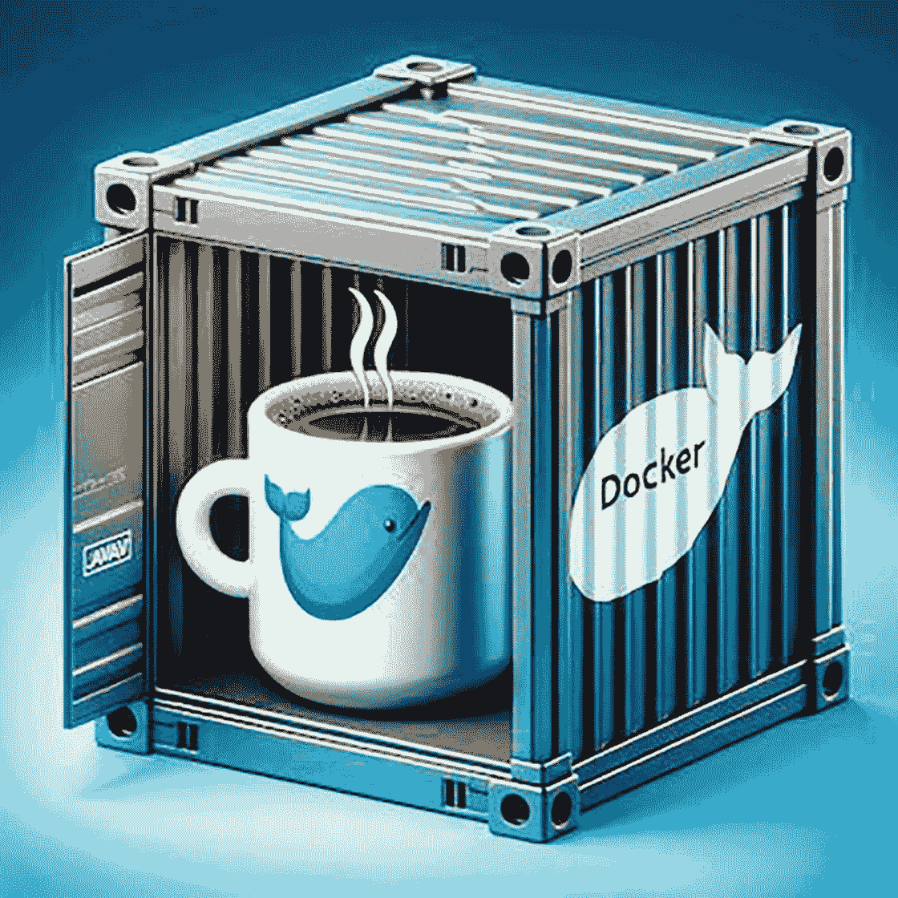

# 5. 使用 Dockerfile 容器化 Java 应用程序

本章将更深入地探讨如何使用 Docker 容器化 Java 应用程序，并特别关注 Spring Boot。关键主题将包括为 Dockerfile 选择基础镜像，以及简要介绍用于容器化 Spring Boot 应用程序的 buildpack。

## 理解基础镜像

在使用 Docker 处理 Java 应用程序时，选择合适的基础镜像至关重要。基础镜像被视为构建应用程序的基础。基础镜像包含了应用程序运行所需的基本操作系统和运行时环境。因此，基础镜像的选择会对大小、兼容性、安全性和性能等多个方面产生重大影响。

为您的 Java 应用程序选择基础镜像时，有几个重要的考虑因素。让我们来探讨这些因素以及您在确定一个好的基础镜像时拥有的选项。



一个冒着热气的咖啡杯，上面有蓝色鲸鱼标志，放在一个打开的集装箱内。集装箱侧面有 Docker 标志。背景是蓝色和绿色的渐变。

图 5-1

Docker 容器中的 Java

## 选择 JDK 还是 JRE 作为基础镜像

在为您的 Java 应用程序选择基础镜像时，您可以选择 JDK 或 JRE 作为基础镜像。让我们探讨两者之间的区别：

| 方面 | JDK 基础镜像 | JRE 基础镜像 |
| --- | --- | --- |
| 包含内容 | 完整的 Java 开发环境，包括编译器和开发所需的工具。 | 仅包含执行 Java 应用程序所需的运行时环境。 |
| 使用场景 | 适用于在 Docker 镜像内构建和编译 Java 应用程序。 | 适用于部署 Java 应用程序，无需开发工具。 |
| 开发 vs. 生产 | 在开发期间或需要在容器内进行代码编译时选择。 | 由于攻击面更小且镜像体积更小，生产部署时首选。 |

## 官方 OpenJDK 镜像

官方 OpenJDK 版本的镜像也可从 Oracle 等来源获得。它们是良好、安全且维护良好的选择。存在不同版本和标签的各种镜像；您可以使用您的应用程序所需的确切 Java 版本和 JVM 实现。

例如，如果您正在开发一个 Java 17 应用程序，您可以使用以下 Dockerfile 片段：

```
FROM openjdk:17-jdk
```

Dockerfile 中的这一行表示使用 OpenJDK 镜像作为基础。OpenJDK 是 Java 平台的一个开源实现。

`17-jdk` 表示 Java 版本 17，这是 Java 的一个 LTS（长期支持）版本，并且该镜像包含完整的 Java 开发工具包，可用于编译和构建 Java 应用程序。

## Eclipse Temurin 镜像

Eclipse Temurin 项目为不同的 Java 版本和 JVM 实现提供了一系列 Docker 镜像。这些镜像由社区支持，如果您需要特定功能或优化，它们可能是一个不错的选择。例如，您可以将 AdoptOpenJDK 的镜像与 Java 17 一起使用：

```
FROM eclipse-temurin:17-jdk
```

指定 Eclipse Temurin 项目镜像作为基础。Eclipse Temurin 提供高质量、供应商中立的 OpenJDK 构建。

## Alpine Linux 镜像

Alpine Linux 是一个精简的发行版，主要用于创建小型 Docker 镜像。如果您使用 Alpine Linux 作为基础镜像，您的镜像大小将显著减小，从而使您的应用程序下载和部署速度更快。

以下是使用 Alpine Linux 与 OpenJDK 17 的示例：

```
FROM eclipse-temurin:17-alpine
```

Eclipse Temurin 提供 OpenJDK 的构建。这里的 `Alpine` 指的是该镜像的 Alpine Linux 变体。它是一个轻量级发行版，使镜像更小、更安全。


## 无发行版基础镜像

无发行版（Distroless）是谷歌的一个项目，旨在创建注重安全性和简洁性的最小化基础镜像。这些镜像不包含传统 Linux 发行版中的包管理器或 Shell；因此，它们体积更小、更安全。这些镜像减少了应用程序的攻击面，甚至比 Alpine Linux 镜像还要小。其核心理念是只保留与应用程序相关的内容，去除冗余。由于体积小巧，它们非常适合云场景，因为在云环境中计算资源是按量计费的。

以下是一个用于 Java 应用程序的无发行版示例：

```
FROM gcr.io/distroless/java:17
```

## 构建自定义基础镜像

有时，你可能需要创建一个根据应用程序需求定制的自定义基础镜像。这可以包括添加应用程序所依赖的特定库、工具或配置。

以下是一个创建包含额外依赖项的自定义基础镜像的简化示例：

```
FROM eclipse-temurin:17-jdk AS base
# 添加任何公共依赖项
FROM base AS build
COPY . /app
WORKDIR /app
RUN ./gradlew build
FROM base AS final
COPY --from=build /app/build/libs/my-app.jar /app.jar
CMD ["java", "-jar", "/app.jar"]
```

## 多阶段构建优化

多阶段构建通过分离构建环境和运行环境来优化最终镜像的大小。这减少了最终镜像中不必要的依赖项。多阶段 Docker 构建非常适合创建更小、更安全的镜像。这种方法提高了可重复性并减小了镜像体积。

其思路是：在构建的第一阶段生成应用程序特定的工件，然后将它们插入到最终的运行镜像中。

以下是一个用于容器化 Spring Boot 应用程序的多阶段 Dockerfile 示例：

```
FROM maven:3.9.4-eclipse-temurin-17 AS build
COPY . /app
WORKDIR /app
RUN mvn clean package
FROM eclipse-temurin:17-jre
COPY --from=build /app/target/my-app.jar /app.jar
CMD ["java", "-jar", "/app.jar"]
```

## 安全考量

选择尽可能接近官方维护仓库的基础镜像，并在 CI/CD 流水线中根据需要频繁更新，以便及时获取安全补丁和修复。建议使用 Clair 或 Trivy 等工具扫描 Docker 镜像以发现漏洞。

Clair 是一个用于容器镜像的开源静态分析工具，它可以解析镜像内容并报告影响容器镜像的漏洞。

Trivy 是另一个开源安全扫描工具，可以跨以下领域发现漏洞和配置错误：

*   代码仓库

*   二进制工件

*   容器镜像

*   Kubernetes 集群

在将 Java 应用程序 Docker 化时，正确选择基础镜像至关重要。兼容性、镜像大小和安全性是决定基础镜像的关键因素。通过清晰理解基础镜像以及无发行版等替代方案，开发人员可以更有效地使用 Docker 构建和部署 Java 应用程序。

## 容器化并运行 Spring Boot 应用程序

### Docker 化 Spring Boot 应用程序

在 Docker 容器中运行 Spring Boot 应用程序有许多优势。

*   首先，在 Docker 中开发很容易，因为它拥有用户友好的基于 CLI 的工作流程，任何人都可以完美地开发、共享和运行其容器化的 Spring 应用程序。

*   其次，Docker 简化了安装过程；开发人员可以使用一个包快速部署应用程序。

*   最后但同样重要的是，Docker 确保了开发环境和生产环境之间的一致性；开发人员可以在本地编码和测试。

容器化 Spring Boot 应用程序很简单。你可以通过将 `.jar` 或 `.war` 文件直接放入 JDK 基础镜像，然后将其打包成 Docker 镜像来实现。虽然网上有大量资源指导你完成此过程，但许多关键方面，例如 Docker 镜像安全、镜像大小优化、正确标记和高效构建性能，往往被忽略。本课程将解决这些常见问题，并为容器化 Spring Boot 应用程序提供九个有价值的技巧。

### 构建一个简单的 Spring Boot 应用程序

为了说明解决这些问题的重要性，让我们从构建一个基本的“Hello World”Spring Boot 应用程序开始。要创建此应用程序，我们将首先使用 [Spring Initializr](https://start.spring.io/) 下载一个预初始化的项目，生成一个 ZIP 文件，然后按照几个简单的步骤运行该应用程序。

在目录 `src/main/java/com/helloworld/` 下，你可以修改 `HelloWorldApplication.java` 文件。该文件将包含以下代码：

```
package com.example.helloworld;
import org.springframework.boot.SpringApplication;
import org.springframework.boot.autoconfigure.SpringBootApplication;
import org.springframework.web.bind.annotation.RequestMapping;
import org.springframework.web.bind.annotation.RestController;
@RestController
@SpringBootApplication
public class HelloWorldApplication {
@RequestMapping("/")
public String home() {
return "Hello World!";
}
public static void main(String[] args) {
SpringApplication.run(HelloWorldApplication.class, args);
}
}
```

要将编译后的代码打包成可分发的格式（例如 `JAR`），请使用以下命令：

```
$ ./mvnw package
$ java -jar target/*.jar
```

现在，你应该能够通过 Web 浏览器或 curl 在 http://localhost:8080 访问“Hello World”应用程序。

```
$ curl localhost:8080
Hello World!
```

要 Docker 化此应用程序，你需要一个 Dockerfile。Dockerfile 是一个包含用于组装 Docker 镜像指令的文本文档。每条指令对应 Docker 镜像中的一个层。通常，开发人员使用以下 Dockerfile 模板：

*   第一行定义基础镜像。

*   `ARG` 指令指定可供 `COPY` 指令使用的变量。

*   `COPY` 指令将 JAR 文件从 `target/` 文件夹复制到 Docker 镜像的根目录。

*   `EXPOSE` 指令告知 Docker 容器的网络端口。

*   最后，`ENTRYPOINT` 命令将容器配置为作为可执行文件运行，相当于运行 `java -jar target/*.jar` 命令。

```
FROM eclipse-temurin:17-jdk
ARG JAR_FILE=target/*.jar
COPY ${JAR_FILE} app.jar
EXPOSE 8080
ENTRYPOINT ["java", "-jar", "/app.jar"]
```

使用以下命令构建 Docker 镜像：

```
$ docker build -t spring-boot-helloworld .
```

最后，使用 `docker run` 命令运行容器。

```
$ docker run -p 8080:8080 -t spring-boot-helloworld
```

然而，这种方法的一个局限性是，你必须在主机系统上使用 `./mvnw package` 命令创建一个 `JAR` 文件，这需要手动安装 Java、配置 `JAVA_HOME` 环境变量以及安装 Maven。JDK 必须位于 Docker 容器外部，这增加了构建环境的复杂性。

我们可以通过在镜像构建过程中自动创建 `JAR` 文件来解决这个问题。

```
FROM eclipse-temurin:jdk-17
WORKDIR /app
COPY .mvn/ .mvn
COPY mvnw pom.xml ./
RUN ./mvnw dependency:go-offline
COPY src ./src
CMD ["./mvnw", "spring-boot:run"]
```


### 使用 Buildpack 容器化 Spring Boot 应用

Spring Boot 2.3 引入了一项令人兴奋的新特性：对 Buildpack 的支持。借助该特性，我们可以轻松创建 Docker 镜像，而无需手动编写 Dockerfile 或通过命令行执行复杂的 `docker build` 命令。现在，只需一个简单的命令即可完成所有操作：

```
$ mvn spring-boot:build-image
```

同样，对于 Gradle 爱好者：

```
$ ./gradlew bootBuildImage
```

需要注意的是，只有在系统上安装并运行了 Docker 时，这些命令才能正确执行。`build-image` 目标通过完全自动化 Docker 镜像的创建和快速部署，极大地简化了流程，因此开发者不再需要手动编写 Dockerfile 或处理特别复杂的构建命令。此过程抽象了底层的许多复杂性，提供了类似于 Heroku 或 Cloud Foundry 等平台的云端部署体验。

这种方法进一步革新了构建 Docker 镜像的方式。我们无需在不同项目的多个 Dockerfile 中进行相同的修改，而是可以根据自己的用例来定制或自定义 Buildpack 的镜像构建器。

除了显而易见的简洁性和改进的开发者体验外，Buildpack 还能显著提升效率。例如，Buildpack 方法自然会产生分层的 Docker 镜像，并充分利用了 `JAR` 文件的解压版本。

## 总结

本章重点介绍了如何使用 Docker 容器化 Spring Boot Java 应用。首先探讨了基础镜像，所有 Docker 容器都由此开始：选项多种多样，从官方的 OpenJDK 镜像到非常轻量级的 Alpine Linux 版本。

接着，我们学习了如何将简单的“Hello World”Spring Boot 应用进行 Docker 化：将应用封装到 Docker 容器中的步骤。你还对多阶段构建等高级主题以及使用 Distroless 镜像为 Docker 镜像提供安全建议有了一定的了解。

一个非常值得注意的特性是 Buildpack，Spring Boot 2.3 现已提供此功能。这将允许你在不编写任何 Dockerfile 的情况下使用 Docker 镜像：只需一个简单的命令，一切就绪。这使得容器化过程变得更加容易。

