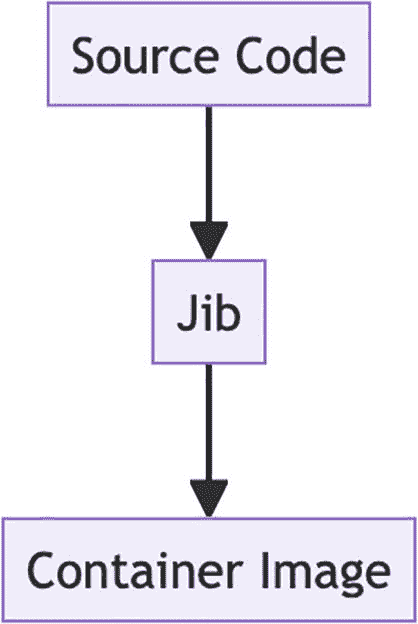
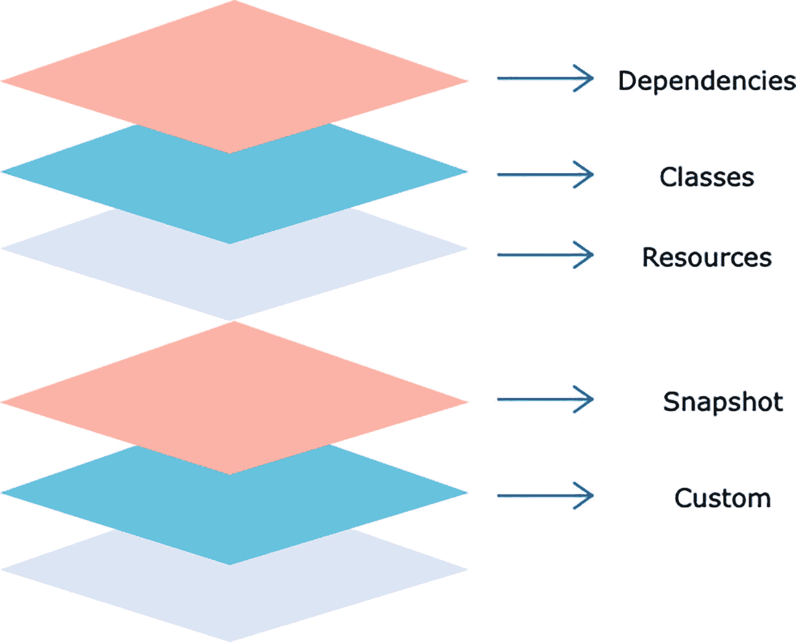
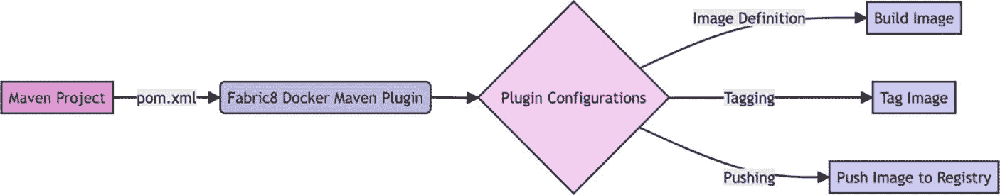
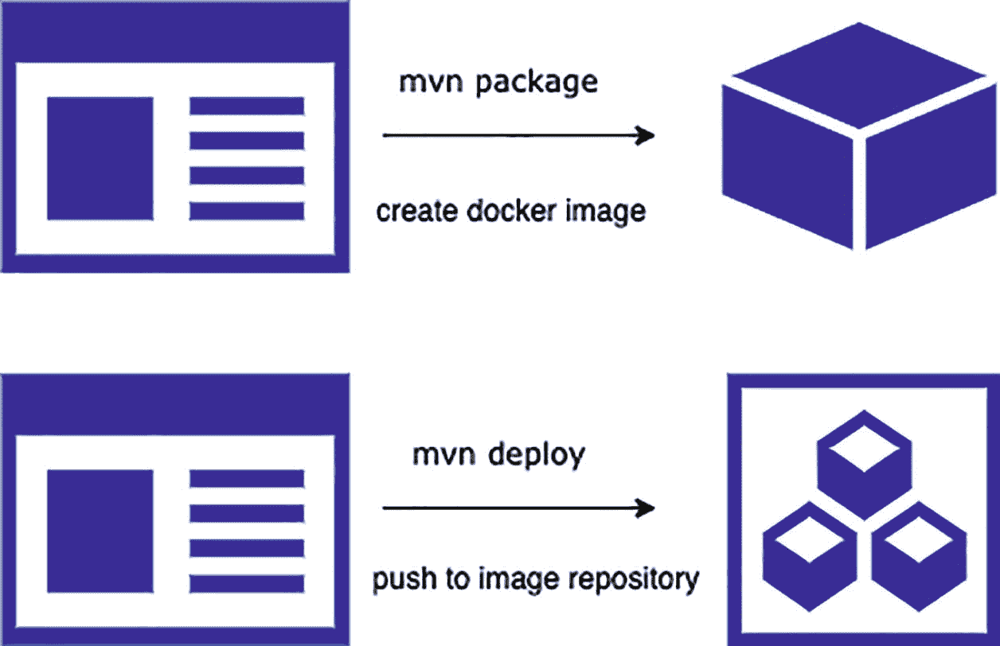

# 6. 使用 Java 应用的容器构建工具

本章将更深入地探讨四种主要工具：Google Jib、Fabric8 Docker Maven 插件、Spotify 的 Docker-Maven-Plugin 以及 Cloud-Native Buildpacks。每种工具都以不同的方式处理 Java 应用的容器化，从简化 Docker 镜像创建到与 Maven 构建流程无缝集成。

## 使用 Google Jib 构建容器镜像

### 理解 Jib

Google Jib 是由 Google 开发的 Java 容器化工具，它实际上是专门为 Java 开发者量身定制的。Jib 的与众不同之处在于其简洁性。Google Jib 简化了 Java 开发者创建容器镜像的过程：抽象了 Docker 的复杂性，使开发者能够专注于他们的工件。Jib 智能的分层技术以及对 Distroless 镜像的使用，使得容器化过程既高效又安全。

以下是 Jib 的一些关键特性：

*   Jib 消除了开发者了解 Docker 安装的需求。

*   Jib 无需守护进程即可运行。

*   Jib 不需要 Dockerfile。

*   Jib 不涉及 Docker 的复杂性，例如 `docker build`、`tag` 和 `push` 等过程。

*   使用 Jib 容器化你的 Java 应用，Java 开发者只需将 Jib 插件添加到他们选择的构建工具（Maven 或 Gradle）中，仅此而已。

*   Jib 智能地将你的应用分成多个层。当代码发生变化时，只有受影响的层会被重建，从而显著缩短构建时间。

Jib 将应用的源代码作为输入，并为你的应用生成一个容器镜像作为输出。



流程图说明了使用 Jib 创建容器镜像的过程。序列从“源代码”开始，接着是一个指向“Jib”的箭头，最后以另一个指向“容器镜像”的箭头结束。

图 6-1

Jib 在行动

### 使用 Jib 构建

一个 Java 应用镜像通常由一个包含应用 JAR 的层来表示。然而，Jib 采用了一种特殊的构建方法，将应用分解为多个层。这种拆分方式允许进行更细粒度的增量构建。因此，更改某些代码只会重建你更改的部分，而不会涉及应用的其他部分。默认情况下，这些层被放置在一个 OpenJDK 基础镜像之上；你也可以配置自定义的基础镜像。

在你的 `pom.xml` 文件中，你可以为 Spring Boot 项目配置 Maven Jib 插件。以下是一个示例配置：

```
...

...

com.google.cloud.tools
jib-maven-plugin
3.3.2

docker.io/my-docker-id/my-app

...

...

```

配置好 Maven Jib 插件后，构建容器镜像就像运行一个 Maven 命令一样简单：

```
mvn compile jib:build
```

此命令会编译你的项目，构建 Docker 镜像，并将其推送到指定的容器仓库。

对于基于 Gradle 的项目，你需要在 `build.gradle` 中包含 Jib Gradle 插件：

```
plugins {
id 'com.google.cloud.tools.jib' version '2.7.1'
}
jib.to.image = 'my-docker-id/my-app'
```

使用以下命令通过 Gradle 创建并推送镜像。

```
./gradlew jib
```

### 理解 Jib 镜像分层

Jib 的镜像分层策略允许对容器镜像的组成进行细粒度控制，在容器化过程中促进增量构建和高效的资源利用。

以下是 Jib 创建的层的分解：

1.  **依赖层**：此层包含应用使用的外部模块和库。这确保了依赖项是独立的并且可以单独缓存，从而增强了构建中的可重用性。

2.  **资源层**：在资源层中，Jib 包含应用资源，如配置文件、模板和静态资源。这些资源可以同时单独缓存，从而减少构建时的冗余。

3.  **类层**：此类层包含应用的 Java 实际编译类。每次代码更改时，只需重建此层，这大大加快了构建速度。

4.  **快照依赖层**：Jib 为所有那些偶尔更改或属于快照的依赖项专门分配了一个精确的层。

5.  **自定义层**：开发者提供的任何额外目录（通常通过配置提供）都可以转化为它们自己的层。

这种清晰的层分离帮助 Jib 通过将应用分解为这些不同的层来优化构建过程。当发生更改时，只有受影响的层需要被重建并推送到仓库；其他层不受影响，从而实现更快、更高效的容器镜像更新。

这有助于加快构建速度以及资源的使用方式。它确保只重建和推送必要的部分，从而保持容器镜像本身的大小最小化。



一个图表显示了六个重叠的彩色层堆叠。从上到下，这些层被标记为：依赖、类、资源、快照和自定义。每个标签都通过一个指向右侧的箭头连接到其对应的层。这些层在粉色和青色之间交替颜色。

图 6-2

Jib 镜像层


## 使用 Fabric8 Docker Maven 插件构建容器镜像

容器现已成为现代软件开发和部署中的关键技术；它们确保了不同应用在不同环境中的一致性、可移植性和可扩展性。同样，众所周知，Docker 是容器化领域的事实标准，它与 Maven 结合使用，能够提供非常流畅的开发工作流程。本节将探讨如何使用 Fabric8 Docker Maven 插件；这是一个专为在我们的 Maven 项目中轻松构建和管理 Docker 镜像而设计的强大工具。

Fabric8 Docker Maven 插件是一个开源 Maven 插件，旨在将 Docker 镜像创建紧密集成到我们自己的 Maven 构建过程中。它属于 Fabric8 提供的多种工具之一，旨在让开发人员更轻松地使用 Kubernetes 和 OpenShift。

### 理解 Fabric8 Docker Maven 插件

该插件使开发人员能够直接在项目的 Maven POM（项目对象模型）文件中指定 Docker 镜像配置，并进一步轻松构建 Docker 镜像。



流程图展示了使用 Fabric8 Docker Maven 插件的过程。它从一个 Maven 项目开始，该项目使用 `pom.xml` 文件来配置 Fabric8 Docker Maven 插件。这引出了插件配置，该配置分支为三个过程：镜像定义（导向构建镜像）、标记（导向标记镜像）以及推送（导向将镜像推送到仓库）。

图 6-3

使用 fabric8 docker maven 插件的镜像构建过程

## Fabric8 Docker Maven 插件的优势

*   **易于设置**：该插件允许我们在 `pom.xml` 中维护 Docker 镜像配置，而不是在单独的 Dockerfile 中维护。

*   **无缝集成**：它将 Docker 镜像创建集成到 Maven 构建过程中，因此容器化成为我们开发工作流程中顺畅的一部分。

*   **一致的构建**：借助 Maven，我们确保 Docker 镜像的创建和版本控制与 Java 应用保持一致。

*   **高效的开发**：该插件有效地简化了构建和管理 Docker 镜像的过程，极大地节省了时间和开发工作量。

*   **Docker 仓库支持**：我们可以轻松地将镜像推送到 Docker 仓库，以便分发和部署。

*   **社区支持**：作为 Fabric8 生态系统的一部分，我们可以获得活跃的社区支持，包括持续的更新和支持。

### 设置 Fabric8 Docker Maven 插件

要开始使用 Fabric8 Docker Maven 插件，我们需要将其包含在项目的 `pom.xml` 文件中。具体操作如下：

```
<plugin>
    <groupId>io.fabric8</groupId>
    <artifactId>docker-maven-plugin</artifactId>
    <version>[LATEST_VERSION]</version>
</plugin>
```

在此示例中，我们将 Fabric8 Docker Maven 插件添加到了 `pom.xml` 的构建部分。它指定了插件的组 ID、工件 ID 和版本，这些应与项目设置时可用的最新版本匹配。

**定义 Docker 镜像配置**：Fabric8 Docker Maven 插件允许我们直接在 `pom.xml` 中定义 Docker 镜像配置。我们可以指定基础镜像、暴露端口、环境变量等。以下是一个简化的示例：

```
<plugin>
    <groupId>io.fabric8</groupId>
    <artifactId>docker-maven-plugin</artifactId>
    <configuration>
        <images>
            <image>
                <alias>my-app-image</alias>
                <name>username/my-app</name>
                <build>
                    <from>openjdk:11-jre-slim</from>
                    <assembly>
                        <descriptorRef>artifact</descriptorRef>
                    </assembly>
                    <ports>
                        <port>8080</port>
                    </ports>
                    <env>
                        <SPRING_PROFILES_ACTIVE>production</SPRING_PROFILES_ACTIVE>
                    </env>
                </build>
            </image>
        </images>
    </configuration>
</plugin>
```

在此配置中，我们定义了一个别名为 `my-app-image`、名称为 `my-app` 的镜像。基础镜像设置为 `openjdk:11-jre-slim`，代表一个极简的 Java 11 运行时环境。我们暴露了 8080 端口以允许传入连接。环境变量 `SPRING_PROFILES_ACTIVE` 被设置为 `production`。

**构建 Docker 镜像**：配置好 Fabric8 Docker Maven 插件后，我们现在可以将 Docker 镜像构建作为 Maven 构建过程的一部分。运行以下命令：

```
mvn package docker:build
```

此命令会在项目构建生命周期的 `install` 阶段触发 `docker-maven-plugin`。该插件会读取我们在 `pom.xml` 中定义的配置，并相应地构建指定的 Docker 镜像。

**推送 Docker 镜像**：Fabric8 Docker Maven 插件提供了高级功能，例如标记镜像和将镜像推送到仓库等。

*   要将镜像推送到 Docker 仓库，请指定仓库详细信息。如果推送到 Docker Hub，可以省略 `registry` 元素。对于自定义仓库，请定义其 URL。出于安全原因，建议在 Maven 的 `settings.xml` 文件中定义仓库凭据，而不是在 `pom.xml` 中。

    例如，`pom.xml` 通常是源代码的一部分，存在将其提交到版本控制系统的风险，并且很难从提交历史中删除。这是一个典型的凭据泄露案例。

    在你的 `settings.xml` 中：

    ```
    <servers>
        <server>
            <id>your.registry.com</id>
            <username>yourusername</username>
            <password>yourpassword</password>
        </server>
    </servers>
    ```

*   然后，在你的 `pom.xml` 中引用该服务器 ID：

    ```
    <registry>your.registry.com</registry>
    <serverId>your.registry.com</serverId>
    ```

*   以下是一个如何标记和推送镜像的示例：

    ```
    <image>
        <name>username/my-app:${project.version}</name>
        <build>
            ...
        </build>
        <registry>your.registry.com</registry>
    </image>
    ```

*   要使用所需的标签定义我们的镜像，我们可以使用 Maven 属性（如 `${project.version}`）根据项目版本进行动态标记。这允许我们使用特定版本或标签来标记镜像，并将其推送到 Docker 仓库进行分发。

*   要推送镜像，我们可以使用 `mvn docker:push` Maven 命令。

Fabric8 Docker Maven 插件简化了 Maven 项目中的 Docker 镜像创建和管理。凭借其集成性和易于配置的选项，它使开发人员能够采用容器化技术，而无需处理 Dockerfile 带来的所有复杂性。因此，将该插件整合到我们的流程中，可以实现高效的 Docker 镜像构建和管理，并确保我们的应用在容器化环境中始终保持一致性和可移植性。

## 使用 Spotify 的 Docker-Maven-Plugin 构建容器镜像

虽然 Docker 提供了一套强大的命令和功能来创建和管理容器，但将这些任务无缝集成到软件开发过程中可能具有挑战性。这就是 Spotify 的 Docker-Maven-Plugin 等工具发挥作用的地方，因为它简化了 Java 应用的构建过程。该插件将 Docker 无缝集成到你的 Maven 构建过程中，使得将 Java 应用打包到 Docker 容器中比以往任何时候都更容易。

本课将探讨 Dockerfile-Maven 插件，并演示它如何简化你的 Java 应用构建。


### 理解 Spotify 的 Docker-Maven-Plugin

Spotify 的 Docker-Maven-Plugin 是一个开源工具，旨在简化 Java 应用的容器化过程，特别是当你使用构建自动化工具 Apache Maven 时。Dockerfile-Maven 插件通过将 Docker 直接集成到 Maven 构建流程中，让你能轻松简单地将 Java 应用打包到容器中，从而使构建和维护容器（尤其是基于手动创建的 Dockerfile）变得更加容易。

Dockerfile-Maven 插件的主要优势：

*   **简化的容器化流程**：Dockerfile-Maven 插件将 Docker 无缝集成到 Maven 构建流程中，简化了为 Java 应用创建 Docker 容器的过程。

*   **手动 Dockerfile 的使用**：虽然该插件不会生成 Dockerfile，但它允许你使用手动创建的 Dockerfile，让你对容器配置和依赖项拥有完全的控制权。

*   **高效的 Docker 镜像构建**：通过一个简单的 Maven 命令，你就可以高效地构建 Docker 镜像，确保容器化过程的一致性和可靠性。

*   **节省开发时间**：通过在构建流程中自动化 Docker 镜像的创建，该插件减少了手动干预的需求，从而节省了开发时间和精力。

*   **与 Maven 生态系统的集成**：Dockerfile-Maven 与 Maven 生态系统无缝集成，使其成为已经使用 Maven 进行项目开发的 Java 开发者的自然之选。

*   **可定制的配置**：你可以在项目的 `pom.xml` 中灵活地自定义 Docker 镜像配置，以满足特定的应用需求。

```
mvn package  # 构建 Docker 镜像
mvn deploy   # 推送 Docker 镜像
```

### 入门指南

使用 Spotify 的 Docker-Maven-Plugin 非常简单：

1.  **添加插件**：在你的项目 `pom.xml` 中，将 Docker-Maven-Plugin 添加为构建插件。指定镜像名称和其他必要的配置。

    ```
    com.spotify
    dockerfile-maven-plugin
    ${dockerfile-maven-version}

    default

    build
    push

    spotify/foobar
    ${project.version}

    ${project.build.finalName}.jar

    ```

    我们来分解一下这段代码的重要部分：
    *   `<executions>`：此块定义了插件的一系列执行。在此例中，定义了一个执行。

    *   `<execution>`：指定插件内的一个执行。它可以有一个 `<id>` 和一个 `<goals>` 列表。

    *   `<id>`：执行的标识符（可选）。在此例中，它被命名为 `default`。

    *   `<goals>`：列出在此执行中将要执行的目标。这里指定了两个目标：`build` 和 `push`。

    *   `<configuration>`：此块包含特定于 `dockerfile-maven-plugin` 的配置设置。`<repository>`：指定 Docker 镜像仓库的名称。在此示例中，它被设置为 `spotify/foobar`，即 Docker 镜像将要存储的仓库名称。

    *   `<tag>`：设置 Docker 镜像的标签。它使用 Maven 变量 `${project.version}` 将标签动态设置为项目的版本。

    *   `<buildArgs>`：允许你为 Docker 镜像指定构建参数。在此例中，它将 `JAR_FILE` 构建参数设置为 `${project.build.finalName}.jar`，这很可能代表了要包含在镜像中的 JAR 文件的名称。

    总的来说，此配置指示 `dockerfile-maven-plugin` 使用指定的 Dockerfile 构建一个 Docker 镜像，用项目版本为其打标签，并将其推送到 `spotify/foobar` Docker 镜像仓库。

2.  **构建镜像**：运行一个 Maven 构建命令，例如 `mvn package`。该插件将在构建过程中自动为你的应用创建一个 Docker 镜像。

3.  **推送到仓库**：使用 `mvn deploy` 命令，你可以将生成的 Docker 镜像推送到容器仓库，例如 Docker Hub 或 Google Container Registry。这通常是作为 CI/CD 流水线的一部分，用于生产部署。



图示说明了处理 Docker 镜像的两步过程。第一步显示一个文档图标，带有文本 "mvn package" 和 "create docker image" 指向一个立方体，表示创建 Docker 镜像。第二步显示一个类似的文档图标，带有文本 "mvn deploy" 和 "push to image repository" 指向一组立方体，表示部署到镜像仓库。

图 6-4

使用 Spotify docker maven 插件的镜像构建过程

### 使用云原生构建包构建容器镜像

### 理解构建包

自动配置彻底改变了 Spring。我们一直依赖 Spring Boot 的默认设置来简化配置并提高生产力。Spring Boot 自动配置是一项有助于简化 Spring 应用配置的特性。它旨在通过根据项目中的依赖项自动配置 Bean、设置和组件，来最大限度地减少所需的手动配置。


流程图说明了使用 Spring Boot 构建应用的过程。它从 "Source Code" 开始，到 "Spring Boot Autoconfiguration"，最后以 "Application" 结束，箭头指示了进展方向。

图 6-5

Spring Boot 自动配置

例如，当你向 Spring Boot 项目添加一个依赖项（如 `spring-boot-starter-data-jpa`）时，框架会识别到类路径中存在与 JPA 相关的类，并启用相关的自动配置类，例如 `JpaRepositoriesAutoConfiguration` 和 `DataSourceAutoConfiguration`。如果这些 Bean 没有在其他地方定义，这些类会自动配置一些 Bean，如 `DataSource`、`EntityManagerFactory` 和 `TransactionManager`。此过程由外部配置属性控制，例如 `spring.datasource.url`，开发者可以使用这些属性来自定义设置。这个流程通过应用合理的默认值来简化复杂组件的设置，同时为自定义留出空间。

尽管这些默认设置通常运行良好，但许多人仍将其视为魔法。一旦我们开发了应用，容器化又该如何处理呢？编写一个遵循最佳实践（最小化层数、利用构建缓存）以获得最佳容器的 Dockerfile 可能会耗费大量时间，这对开发者来说可能并不理想。云原生构建包（Cloud-Native Buildpack）应运而生。CNB 就像 Spring 的自动配置一样，简化了容器管理，使其镜像了 Spring Boot 为我们的应用带来的简洁性。


流程图说明了使用云原生构建包将源代码转换为容器的过程。顺序由箭头指示，从 "Source Code" 到 "Cloud Native Buildpack"，最后到 "Container"。

图 6-6

Spring Boot 构建包

构建包的主要作用是收集构建和运行应用所需的所有基本组件。它们通常在后台运行，并将我们的源代码转换为可运行的应用程序镜像，而无需使用 Dockerfile。

从 Spring Boot 2.3 开始，它使用构建包来生成顶级的 OCI 容器，配置过程毫不费力。无需担心层、安全性、JVM 内存计算等问题。只需一个命令即可创建我们的容器化应用。


### 云原生构建包特性

云原生构建包（CNB）为构建和打包容器化应用程序提供了多项功能与能力。以下是云原生构建包支持的一些关键特性：

*   **依赖管理**：CNB 能够自动检测并管理应用程序的依赖项，例如语言运行时、库和软件包。它们确保所需的依赖项被包含在应用程序容器中。

*   **分层构建**：CNB 采用分层方法来构建容器。这意味着它们会为应用程序的不同部分创建独立的层，从而在构建过程中实现高效的缓存和可重用性。

*   **可重现构建**：CNB 专注于封闭式可重现构建。这确保了相同的源代码和相同的依赖项能够生成完全相同的容器镜像，这对于可靠性和安全性至关重要。

*   **构建缓存**：CNB 利用构建缓存，已构建的层可以被缓存。这使得缓存的层能够被尽可能多地重用，从而避免每次都重新构建所有内容。

*   **可定制构建器**：CNB 提供了创建自定义构建器的灵活性，以满足特定的应用程序类型或组织需求。自定义构建器可以包含额外的构建包和配置。

*   **生命周期阶段**：CNB 构建过程包含不同的生命周期阶段，包括检测、分析、构建和导出。所有这些生命周期阶段都可以根据用例进行扩展或自定义。

*   **安全扫描**：CNB 通常与安全扫描工具集成，以识别和解决应用程序依赖项中的漏洞，从而提高最终容器镜像的安全性。

*   **环境变量注入**：CNB 可以将环境变量注入到应用程序容器中，从而轻松配置运行时设置或连接到外部服务。

*   **多平台支持**：CNB 支持为多个平台和架构构建容器镜像，使得创建能够在不同云提供商和设备类型上运行的镜像更加容易。

*   **兼容性**：CNB 与各种容器运行时和编排器兼容，例如 Docker、Kubernetes 和 Cloud Foundry，使其适用于不同的部署场景。

*   **持续集成（CI）**：CNB 可以集成到 CI/CD 流水线中，以自动化容器化过程，确保应用程序被一致地构建和打包。例如，buildpacks 项目提供了一系列用于不同构建包相关活动的 [GitHub actions](https://github.com/buildpacks/github-actions)。其中一个操作允许我们配置一个使用 pack CLI 的作业。这个过程很直接，我们可以轻松地使用这个操作：

```
uses: buildpacks/github-actions/setup-pack@v4.1.0
```

### 配置构建包

Spring Boot 2.3.0.M1 为 Maven 和 Gradle 引入了原生构建包支持。这简化了为我们的应用程序生成 Docker 镜像的过程。

*   首先，确保我们本地已安装并运行 Docker。Spring Boot 构建包集成需要一个正在运行的 Docker 守护进程。否则，我们会收到一个错误：

    ```
    Failed to execute goal org.springframework.boot:spring-boot-maven-plugin:2.4.2:build-image (default-cli) on project imagebuilder: Execution default-cli of goal org.springframework.boot:spring-boot-maven-plugin:2.4.2:build-image failed: Connection to the Docker daemon at 'localhost' failed with error "[61] Connection refused"; ensure the Docker daemon is running and accessible
    ```

    在这方面它与 Jib 不同，Jib 不需要 Docker 守护进程来构建容器镜像。

*   接下来，使用 [start.​spring.​io](http://start.spring.io) 创建一个新的 Spring Boot 项目。

*   对于 Maven，我们可以使用命令，对于 Gradle，则是 `gradle bootBuildImage`。我们可以通过一条命令快速创建一个配置良好的镜像，并将其存储在本地的 Docker 守护进程中。第一次运行会花费一些时间，但后续调用会更快。我们应该会在构建日志中看到类似这样的信息：

    ```
    [INFO] Successfully built image 'docker.io/library/buildpack:0.0.1-SNAPSHOT'
    [INFO]
    [INFO] ------------------------------------------------
    [INFO] BUILD SUCCESS
    [INFO] ------------------------------------------------
    [INFO] Total time:  01:49 min
    [INFO] Finished at: 2021-02-20T01:07:08+05:30
    ```

*   我们现在有了一个符合 OCI 标准的应用程序容器镜像，它：
    1.  包含了必要的中间件，如 JRE。

    2.  根据我们的应用程序框架（Spring Boot）进行了特定的定制。

    3.  是在一个一次性的构建容器中创建的，仅提供了应用程序源代码。

    4.  默认是安全的，以非 root 用户身份运行，并且只安装了最少的软件包。

    5.  将以我们的应用程序命名，并使用其版本进行标记。

*   最后，运行：

    ```
    docker run --rm -p 8080:8080 imageName
    ```

    并使用 http://localhost:8080/ 检查输出。

*   默认情况下，当与 Spring Boot 一起使用时，Buildpacks 会将镜像存储在本地 Docker 守护进程中。尽管如此，我们也可以将镜像推送到远程容器仓库。我们需要在 Maven 文件中进行特定的调整以启用此功能。

    ```

    org.springframework.boot
    spring-boot-maven-plugin

    docker.example.com/library/${project.artifactId}
    true

    user
    secret
    https://docker.example.com/v1/
    user@example.com

    ```

## 总结

本章探讨了 Java 应用程序的容器构建工具，重点介绍了 Spring Boot。内容涵盖了 Google Jib、Fabric8 Docker Maven Plugin、Spotify 的 Docker-Maven-Plugin 以及云原生构建包。所有这些工具都提供了不同的方式来实现 Java 应用程序的容器化，从使用 Jib 和构建包无需 Dockerfile 创建 Docker 镜像，到将 Docker 镜像构建集成到 Maven 构建过程中。本章提供了实际示例、配置细节以及对每种工具优势的见解。旨在帮助开发人员为其 Java 项目选择正确的容器化方法。

